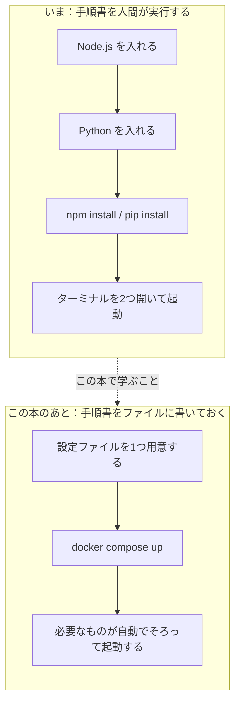

# 第0章 はじめに

この章は、**必ず最初に読んでください。**

このテキストは、全5冊のうちの**4冊目**です。
1冊目の [react-text](../react-text/README.md) と、3冊目の
[fastapi-text](../fastapi-text/README.md) を読み終えた人を、主な読者として想定しています。

ここまでの3冊で、あなたは**3回の環境構築**を経験しました。
Node.js を入れ、Python を入れ、仮想環境を作り、そのたびにどこかで一度は止まったはずです。
その苦労を**まとめて片付けるための道具**が、この本で扱う Docker です。

とくに [0.2 AI サポートの準備](#02-ai-サポートの準備) は、
このテキストで最も大事な準備です。Docker は、これまでの3冊のどれよりも
**使っているパソコンの違いに左右されます。**
同じ手順を打っても、Windows と macOS、さらには CPU の種類によって
違うエラーが出ます。そのときに頼る相手を、先に用意しておきます。

## この章で学ぶこと

- このテキストが誰のためのもので、何ができるようになるかを説明できるようになる
- 前提となる react-text / fastapi-text の内容が手元に残っているかを確認できるようになる
- 学習をサポートしてくれる AI を、この本用にセットアップできるようになる
- Docker の学習でとくに環境依存の問題が起きやすい理由を説明できるようになる
- 詰まったときに、何をどの順番で確認すればよいかを言えるようになる

## この章の前提

- **react-text（1冊目）と fastapi-text（3冊目）を読み終えていること**
- この章では、Docker はまだインストールしません（第2章で入れます）
- この章で打つコマンドは、**これまでの環境が残っているかを確かめる2つだけ**です

> **つまずいたら**
> この章の内容で分からないことがあれば、[0.2](#02-ai-サポートの準備) で準備する AI に、
> 次のように聞いてください。
>
> ```text
> docker-text の 0.1.2 を読んでいます。
> 「自分の環境では動く」問題というのが、まだぴんと来ていません。
> react-text と fastapi-text までの知識だけを使って、
> 具体的な例を1つ添えて説明してください。
> ```

---

## 0.1 このテキストについて

### 0.1.1 対象読者と前提知識

このテキストは、**react-text と fastapi-text で「動くアプリ」を作った経験がある人**を
対象にしています。

Docker は、**すでにあるアプリを動かしやすくするための道具**です。
動かす対象になるアプリを持っていないと、何が便利になったのかが分かりません。
そのため、この本はここまでの3冊の成果物をそのまま題材にします。

前提として身についていてほしいのは、次のことです。
右の列に、忘れていたときに戻る場所を書いてあります。

| できてほしいこと | 戻る場所 |
|----------------|---------|
| ターミナルでディレクトリを移動できる（`cd` / `ls`（`dir`）／`pwd`） | react-text 1.4 |
| 拡張子を表示させた状態でファイルを作れる | react-text 1.3.4 |
| `npm install` と `npm run dev` で React アプリを起動できる | react-text 6.2 |
| Python の仮想環境（venv）を作って有効化できる | python-text 1.5 |
| `pip install` でライブラリを入れられる | python-text 1.6 |
| `requirements.txt` が何のためのファイルか説明できる | fastapi-text 2.2 |
| API サーバーを起動して、ブラウザから確認できる | fastapi-text 2.4 |
| `.env` に設定値を書いて読み込ませられる | fastapi-text 4.6.2 |

**この本で新しく学ぶのは、Docker の使い方だけです。**
React も Python も FastAPI も、書き方は何ひとつ変わりません。
変わるのは「**どこで動かすか**」だけです。

**これまでの環境が残っているかを確認する**

第6章では、react-text と fastapi-text で作ったアプリを実際に動かします。
その準備として、いまのパソコンにこれまでの環境が残っているかを確かめておきます。
ターミナル（文字でコンピュータに命令するための画面）を開いて、次を実行してください。

**Windows（PowerShell）**

```powershell
node --version
python --version
```

**macOS / Linux**

```bash
node --version
python3 --version
```

実行結果（数字の部分は環境によって違います）:

```text
v22.14.0
Python 3.13.2
```

このように2つともバージョンが表示されれば、準備できています。

`command not found` や `'node' は、内部コマンドまたは外部コマンド...` と表示された場合でも、
**この本を読み始めること自体はできます。**
第1章から第5章までは、Docker が用意したイメージ（第1章で説明します）だけで進むためです。
ただし第6章までには必要になるので、react-text 1.5 または python-text 1.2 に戻って
入れ直すか、[0.2](#02-ai-サポートの準備) で準備した AI に、表示されたメッセージを
そのまま貼り付けて相談してください。

> **補足：ここで打った2つのコマンドが、この本のテーマそのものです**
> 「Node.js が入っているか」「Python が入っているか」を、
> **人間が1つずつ確認しなければならない**という状況を、Docker は不要にします。
> この本を読み終えると、確認するのは「Docker が動いているか」の1つだけになります。

> **補足：3冊目まで読んでいなくても読めますが、第6章だけは影響します**
> 第1章から第5章までは、Docker そのものの話なので、
> react-text / fastapi-text を読んでいなくても進められます。
> 影響が出るのは、3冊分の成果物を統合する**第6章だけ**です。
> 第6章では必要なコードをすべて掲載するので、動かすところまでは進められます。

### 0.1.2 この本で解決する問題

ここまでの3冊で、あなたは何度も同じ種類の問題に遭遇してきました。
いちど並べてみます。

| いつ | 何が起きたか |
|------|------------|
| react-text 1.5.4 | Node.js を入れたのに、ターミナルが `node` を見つけてくれなかった（PATH） |
| react-text 6.2 | Node.js のバージョンが古くて、Vite が起動しなかった |
| python-text 1.2 | Python を入れるとき、「Add Python to PATH」を入れ忘れると後で困った |
| python-text 1.5 | PowerShell の実行ポリシーで、仮想環境の有効化が拒否された |
| fastapi-text 0.3.1 | 2つ目のターミナルで仮想環境を有効化し忘れ、ライブラリが見つからなかった |

これらに共通しているのは、**プログラムそのものではなく、その周りが原因だった**ということです。
書いたコードは正しいのに、動かすための準備が整っていないせいで動かない。
プログラミングの学習で最も時間を奪われるのが、この部分です。

そして、この問題には、もっと厄介な形があります。

**「自分の環境では動く」問題**

いま、あなたが作ったアプリを友達に渡したとします。
ソースコードをそのまま渡しても、相手のパソコンでは動きません。
相手には、次のことを伝えなければなりません。

```text
1. Node.js を入れてください（バージョンは 22 系でお願いします）
2. Python を入れてください（3.10 以上です）
3. プロジェクトのディレクトリで npm install を実行してください
4. 別のターミナルを開いて、仮想環境を作って有効化してください
5. pip install -r requirements.txt を実行してください
6. .env ファイルを作って、次の内容を書いてください
7. ターミナルを2つ開いて、それぞれでサーバーを起動してください
```

**7つの手順のうち、1つでも食い違えば動きません。**
相手の Node.js が 18 系だったら、相手が Windows で実行ポリシーに引っかかったら、
相手が手順4を忘れたら――そのたびに「こっちでは動くのに」というやり取りが始まります。

これは友達に渡すときだけの話ではありません。
**パソコンを買い替えたとき、自分自身が同じ手順をやり直すことになります。**

**この本を終えるとどうなるか**

Docker を使うと、この7つの手順が**1つのコマンド**になります。

```text
【いまの起動手順】
  ターミナル1: cd task-app → npm run dev
  ターミナル2: cd fastapi-lesson → 仮想環境を有効化 → fastapi dev app/main.py
  （その前に、Node.js と Python のインストールが必要）

【この本を終えたあとの起動手順】
  ターミナル1: docker compose up
  （Docker が入ってさえいれば、Node.js も Python も入れなくてよい）
```

上のコマンドは、**いまは打たなくて構いません。**
`docker compose up` が何をするコマンドなのかは第5章で、
実際にこの形にするのは第6章で扱います。
ここでは「**最後にはこうなる**」というゴールだけ頭に入れてください。

図にすると、変わるのは次の部分です。



**手順書を人間の記憶やメモから、コンピュータが読めるファイルへ移す。**
これがこの本のいちばん大きなテーマです。

> **補足：Docker は「速くする道具」ではありません**
> Docker を使うとアプリが速くなるわけではありません。
> 変わるのは「**同じものを、誰のパソコンでも、何度でも同じように動かせる**」という点だけです。
> 地味に聞こえますが、3回の環境構築で苦労したあとであれば、
> この価値は実感できるはずです。

### 0.1.3 全5冊の中での位置づけ

このテキストは、**プログラミング未経験から Web エンジニアになるまでの全5冊**の4冊目です。

| # | テキスト | 内容 |
|---|---------|------|
| 1 | React | Web の仕組み、HTML、CSS、JavaScript、React |
| 2 | Python | 汎用のプログラミング言語 Python |
| 3 | FastAPI | サーバー側（バックエンド）の作り方 |
| **4** | **Docker（この本）** | **環境を再現可能にする道具** |
| 5 | MySQL | データを保存するデータベース |

1冊目でフロントエンド（ユーザーが直接見て触る側。ブラウザで動く部分）、
3冊目でバックエンド（裏で動いてデータを処理する側。サーバーで動く部分）を作りました。
**この本は、その2つを「1つの動くシステム」としてまとめる場所**です。

この本のあとの5冊目は、次の役割を持ちます。

- **5冊目（MySQL）**：fastapi-text の第6章では、手軽な SQLite というデータベースを使いました。
  MySQL は、実際の仕事で広く使われているデータベースです。
  MySQL は入れるのが面倒なソフトウェアですが、**この本の第2章まで進んでいれば、
  インストールは1行の設定で済みます。** 5冊目が Docker のあとに来るのは、このためです。

章ごとに身につく力は、次のとおりです。

| 章 | 身につくこと |
|----|------------|
| 第1章 | Docker が何を解決するのか、コンテナとイメージという考え方 |
| 第2章 | Docker Desktop のインストールと、コンテナの基本操作 |
| 第3章 | 自分のアプリをイメージにする方法（Dockerfile） |
| 第4章 | データを残す方法（ボリューム）と、コンテナ同士を繋ぐ方法（ネットワーク） |
| 第5章 | 複数のコンテナをまとめて起動する方法（Docker Compose） |
| 第6章 | React + FastAPI + MySQL を1コマンドで起動する（この本の到達点） |
| 第7章 | イメージを小さくする方法と、本番運用で気をつけること |
| 第8章 | 次に学ぶこと |

**この本の山場は第2章と第6章です。**
第2章でインストールに失敗すると、**以降の章がすべて読めなくなります。**
そのため第2章には「よくあるトラブル」の節を厚く用意してあります。
第6章は3冊分の成果物を統合する、この本の到達点です。

> **補足：なぜ4冊目が Docker なのか**
> Docker を1冊目に置くと、「便利そうだけれど、何が嬉しいのか分からない」で終わります。
> 環境構築で一度も苦労していない人にとって、
> Docker は「わざわざ覚えることが増えただけの道具」に見えるためです。
> **3回の環境構築で実際に困ったあとだからこそ**、この本の内容が身につきます。

---

## 0.2 AI サポートの準備

**この節がこのテキストで最も重要です。**

fastapi-text で AI サポートをすでに準備した人も、
**読んでいるテキストが変わったことを AI に伝える必要がある**ので、
[0.2.1](#021-指示ファイルを読み込ませる) は必ず実行してください。

伝えないと、AI は「この人は FastAPI の第◯章にいる」という古い前提のまま答えます。
その結果、**まだ説明していない Docker の機能をいきなり出してきたり、
Python の話に引き戻したり**します。

### 0.2.1 指示ファイルを読み込ませる

**学習を始める前に、1回だけやる作業です。**

普段使っている AI（ChatGPT、Claude、Gemini、Copilot、Codex など）を開いて、
次の文章をそのままコピーして送ってください。
`<>` の中だけ、自分の状況に書き換えます。

```text
これからプログラミングを学びます。
まず次の URL のドキュメントを読んで、その指示に従って私をサポートしてください。

https://github.com/TakahashiTaiga/programing-texts/blob/main/ai/instructions.md

私の状況:
- OS: <Windows 11 Home / Windows 11 Pro / macOS 15 など>
- CPU: <Apple Silicon（M1〜M4）/ Intel / AMD>
- プログラミング経験: <react-text と fastapi-text を読み終えた>
- 読んでいるテキスト: docker-text（プログラミング未経験から始める Docker）
```

> **注意：この本では OS と CPU を必ず書いてください**
> ここまでの3冊では、OS だけ伝えれば足りていました。
> Docker では、**CPU の種類によって動くイメージが変わります。**
> Apple Silicon（M1 以降の Mac に載っているチップ）かどうかで
> 対処法が変わる場面が、第2章と第6章で出てきます。
> 自分の Mac がどちらか分からない場合は、画面左上のリンゴマークから
> 「この Mac について」を開くと、「チップ」の欄で確認できます。

> **AI が URL を読めない場合**
> 一部の AI は、URL からファイルを読み込めないことがあります。
> その場合は、上記の URL をブラウザで開いて、
> **中身をすべてコピーして AI に貼り付けて**ください。
> 「以下のドキュメントの指示に従ってください」と一言添えれば同じ効果があります。

**動作確認**

準備ができたか確かめましょう。AI に次のように聞いてみてください。

```text
確認です。私が「演習問題が解けません」と言ったら、あなたはどう対応しますか？
```

**期待する答え**（言い回しは AI によって違います）

> まずヒントを段階的に出します。いきなり完成コードはお見せしません。
> 一方で、環境構築やインストールのエラーなど、学習内容と関係ない部分は
> 手順を全部お出しして解決します。

このような答えが返ってきたら、準備完了です。

もし「はい、コードを書きます」のような答えが返ってきたら、
指示ファイルがうまく読み込まれていません。
今度は**中身をコピー&ペーストする方法**で、もう一度試してください。

**もう1つ、この本ならではの確認をしておきます。**

```text
もう1つ確認です。私が「docker-text の 3.2 を読んでいます」と言ったとき、
あなたは何を前提にして答えますか？
```

**期待する答え**

> 3.2 の時点では、まだボリューム（第4章）も Docker Compose（第5章）も扱っていないので、
> それらを使わない範囲で答えます。

このように、**「まだ学んでいないものは使わない」**と答えれば正しく読み込めています。
この判断には、AI が
[`ai/curriculum-map.md`](https://github.com/TakahashiTaiga/programing-texts/blob/main/ai/curriculum-map.md)
という別のファイルを参照しています。
**質問するときに章番号を添えることが、この仕組みを働かせる鍵**です。

### 0.2.2 Docker はとくに環境依存が多い

ここまでの3冊でも環境の問題はありましたが、Docker はその比ではありません。
**同じコマンドを打っても、パソコンによって違うエラーが出ます。**
理由は、Docker が OS のかなり深い部分を使う道具だからです。

具体的には、次の要素の組み合わせで結果が変わります。

| 要素 | 何が変わるか |
|------|------------|
| OS（Windows / macOS） | インストール手順と、ファイルの置き場所の書き方 |
| Windows のエディション（Home / Pro） | 内部で使われる仕組みが変わることがある |
| WSL2 が有効かどうか（Windows） | そもそも Docker が起動しない |
| BIOS/UEFI の仮想化設定 | そもそも Docker が起動しない |
| CPU（Apple Silicon / Intel） | 動かせるイメージの種類が変わる |
| 会社や学校のネットワーク | イメージのダウンロードが失敗する |
| ディスクの空き容量 | ビルドの途中で止まる |

**用語の補足**

- **WSL2**（Windows Subsystem for Linux 2。Windows の中で Linux を動かすための仕組み）
- **BIOS/UEFI**（パソコンの電源を入れた直後に動く、OS より下の設定画面）
- **仮想化**（1台のコンピュータの中に、もう1台のコンピュータがあるかのように見せる技術）

これらの言葉は第1章と第2章で改めて説明します。
いまは「**Docker はパソコンの深いところを使うので、環境の違いが出やすい**」とだけ
理解しておいてください。

**だから、この本ではとくに AI を使ってください**

[`ai/instructions.md`](https://github.com/TakahashiTaiga/programing-texts/blob/main/ai/instructions.md)
では、質問を3つのレベルに分けています。
そのうち**レベル C（初学者には自力解決が不可能な問題）**では、
AI は**コピペできる手順を最後まで示すこと**になっています。

**この本のトラブルは、そのほとんどがレベル C です。**
WSL2 が有効になっていない、仮想化が無効になっている、
プロキシでダウンロードが失敗する――これらは、考えて学ぶ種類の問題ではありません。
遠慮なく AI に全部やらせてください。

**質問するときのテンプレート**

Docker のトラブルを相談するときは、次の5点を必ず添えてください。
この5点があるかないかで、返ってくる答えの精度がまるで変わります。

```text
docker-text の 2.3.1 で詰まりました。

【環境】
OS: Windows 11 Home
CPU: Intel Core i5
Docker Desktop のバージョン: 4.37.1

【やろうとしたこと】
最初のコンテナを動かそうとした

【打ったコマンド】
docker run hello-world

【表示されたメッセージ（全文）】
（ターミナルに出た文字を、省略せずにそのまま貼る）

【自分で試したこと】
Docker Desktop を再起動してみたが変わらなかった
```

**「表示されたメッセージ（全文）」がいちばん重要です。**
Docker のエラーは長いことが多く、途中を省略すると原因が分からなくなります。
最初の1行だけでなく、**最後の行まで**貼ってください。

> **注意：貼り付ける前に、秘密の情報を消してください**
> エラーメッセージやログには、`.env` に書いた設定値（fastapi-text 4.6.2 で作りました）が
> そのまま含まれることがあります。パスワードや、外部サービスの鍵にあたる文字列は、
> `<ここにパスワード>` のような形に書き換えてから貼り付けてください。
> ファイルのパスに自分の名前が入っている場合も、必要に応じて書き換えてください。

質問のテンプレートは
[`ai/prompt-templates.md`](https://github.com/TakahashiTaiga/programing-texts/blob/main/ai/prompt-templates.md)
にもまとめてあります。コピーして使ってください。

---

## 0.3 学習の進め方

### 0.3.1 これまでの3冊との違い

この本の進め方は、ここまでの3冊とはっきり違うところがあります。
**書くコードがとても少なく、打つコマンドがとても多い**ということです。

まず、4冊の違いを見比べてください。

| | react-text | python-text | fastapi-text | この本 |
|---|-----------|-------------|--------------|--------|
| 主に書くもの | JSX と CSS | Python のコード | Python のコード | **設定ファイルとコマンド** |
| 動かし方 | ブラウザで開く | `python ファイル名` | サーバーを起動する | **コンテナを起動する** |
| 結果の見え方 | 画面の見た目 | ターミナルへの出力 | JSON | **ターミナルのログ** |
| 失敗したとき | 画面が崩れる | エラーで止まる | エラーが返る | **コンテナが起動しない、または勝手に終了する** |

ここから、進め方のポイントが3つ出てきます。

**ポイント1：ターミナルが主役になります**

この本では、ほとんどの操作をターミナルから行います。
エディタでファイルを書く時間より、コマンドを打って結果を見る時間のほうが長くなります。

コマンドは、必ず**打つ場所（どのディレクトリか）**を確認してから実行してください。
`Dockerfile`（第3章で作るファイル）や設定ファイルがあるディレクトリで打つことが前提の
コマンドが多く、場所が違うと「ファイルが見つからない」と言われます。

このテキストでは、コマンドの前に必ず、どこで打つのかを書いてあります。

**ポイント2：壊しても大丈夫です。作り直せます**

これが Docker のいちばんありがたい性質です。

これまでの3冊では、環境を壊すことは怖いことでした。
Python のインストールを失敗すると、元に戻すのに時間がかかりました。
Docker では、**うまくいかなくなったら消して作り直せます。**
消して作り直すのに、数秒から数分しかかかりません。

そのため、この本では**試して壊すことを歓迎します。**
「これを実行したらどうなるんだろう」と思ったら、実際に打ってみてください。

ただし、次の点だけ注意してください。

> **注意**
> 「消す」系のコマンドは、**何を消すのかを確認してから**実行してください。
> Docker のコンテナやイメージは作り直せますが、
> **パソコン上のファイルを消してしまうと元に戻せません。**
> この違いは第2章 2.7 と第4章 4.1 で、はっきり区別して説明します。

**ポイント3：確認の輪を回します**

コードを1行変えるたびに、次の流れをぐるぐる回すことになります。


**この輪の中で、いちばん見落とされるのが「ログを見る」です。**
コンテナが起動しないとき、原因はほぼ必ずログに書いてあります。
画面に何も出ないからといって、原因が分からないわけではありません。
ログの見方は第2章 2.6.2 で扱います。

> **補足：ディスクの空き容量に気をつけてください**
> Docker は、イメージをパソコンの中に溜め込みます。
> 学習を進めるうちに、気づかないうちに 10 GB 以上使っていることがあります。
> 空き容量が少ないパソコンでは、途中でビルドが失敗するようになります。
> **最低でも 20 GB の空きを確保してから**第2章に進んでください。
> 溜まったものを掃除する方法は、第2章 2.7 で扱います。

### 0.3.2 詰まったときの動き方

詰まったら、次の順番で動いてください。

**ステップ1：3分だけ自分で確認する**

Docker では、見るべき場所が決まっています。上から順に確認してください。

1. **Docker Desktop（第2章で入れるアプリ）が起動しているか**
   ── Docker のコマンドは、このアプリが動いていないと1つも使えません。
   この本のトラブルで最も多いのがこれです
2. **コマンドを打っているディレクトリは合っているか**
   ── `pwd`（Windows の PowerShell でも使えます）で確認します
3. **コンテナは動いているか、それとも起動直後に終了しているか**
   ── 確認するコマンドは第2章 2.4.1 で扱います
4. **ターミナルに出ているメッセージの、いちばん下の行**
   ── Docker のエラーは長いですが、原因は最後の行に書かれていることが多いです

**ステップ2：AI に聞く**

3分考えてわからなければ、すぐ AI に聞いてください。粘る必要はありません。
[0.2.2](#022-docker-はとくに環境依存が多い) のテンプレートを使い、
**章番号・OS・CPU・打ったコマンド・メッセージ全文**を必ず添えてください。

**章番号を伝えることが重要です。**
AI は「この人は 3.2 にいる＝まだ Docker Compose を知らない」と判断して、
あなたが理解できる範囲の言葉で答えてくれます。
章番号を伝えないと、第5章以降でしか出てこない書き方で答えが返ってきて、
**それをコピーしても動かない**という事故が起きます。

**ステップ3：それでも進まなければ、飛ばす**

同じところで30分以上止まったら、いったん飛ばして先に進んでください。
**ただし、第2章だけは飛ばせません。**
Docker が動く状態にならないと、第3章以降が1行も試せないためです。

第2章で詰まった場合は、飛ばさずに AI に相談してください。
繰り返しになりますが、**インストールのトラブルは考えて学ぶ場所ではありません。**

### 0.3.3 理解度チェックと演習問題について

第1章から、各章の最後に2種類の問題が付きます。

| 表示 | 意味 |
|------|------|
| ★☆☆ | 本文のコマンドや設定を少し変えればできる |
| ★★☆ | 本文の複数の内容を組み合わせる必要がある |
| ★★★ | 自分で調べたり設計したりする必要がある |

答えは、本の最後の**解答編**にまとめてあります。
（この第0章には演習がないので、理解度チェックと演習問題はありません。第1章から始まります。）

> **解答編の使い方**
> いきなり見ないでください。**最低でも1回は自分で打って、結果を見てから**見てください。
> Docker の演習は「実際に動かして確かめる」までが1問です。
> エラーが出た状態は失敗ではなく、**何が起きているかを読み取る材料**です。
>
> どうしても解けなかった問題は、解答編を読んだあと、
> **何も見ずにもう一度自分でやり直して**ください。これで定着します。

---

## まとめ

- このテキストは全5冊の**4冊目**。**react-text と fastapi-text で動くアプリを作った経験**が前提
- この本で新しく学ぶのは Docker の使い方だけで、**React も Python も書き方は変わらない**
- 解決したいのは「**自分の環境では動く**」問題。
  7つの手順が必要な起動を、**1つのコマンド**にする
- 手順書を**人間の記憶から、コンピュータが読めるファイルへ移す**のがこの本のテーマ
- Docker は速くする道具ではなく、**同じものを何度でも同じように動かす**ための道具
- **AI サポートの準備（0.2）を必ずやり直すこと**。読んでいる本が変わったことを伝える
- この本では **OS だけでなく CPU（Apple Silicon か否か）も AI に伝える**
- Docker のトラブルはほとんどが**レベル C**（自力解決が不可能な種類）。遠慮なく AI に任せる
- エラーは**全文を貼る**。ただし `.env` の値など**秘密の情報は書き換えてから**貼る
- この本では**壊して作り直せる**。ただし「消す」コマンドの対象だけは確認する
- 詰まったら、**Docker Desktop の起動 → ディレクトリ → コンテナの状態 → ログの最終行**の順に見る
- **第2章だけは飛ばせない。** ここが動かないと以降の章がすべて試せない

---

## 次の章へ

準備は整いました。
次の章では、そもそも Docker が何を解決する道具なのかを、
ここまでの3冊で味わった苦労と繋げながら理解します。

仮想マシンとコンテナの違い、イメージとコンテナの関係といった、
この本の土台になる考え方を扱います。
**まだインストールはしません。** その前に、何のための道具なのかを掴みます。

→ [第1章 Docker が解決する問題](./01-why-docker.md)
