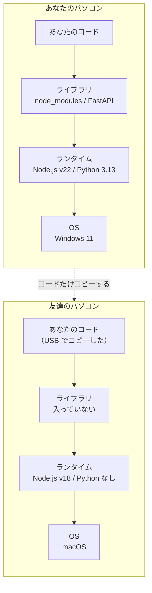
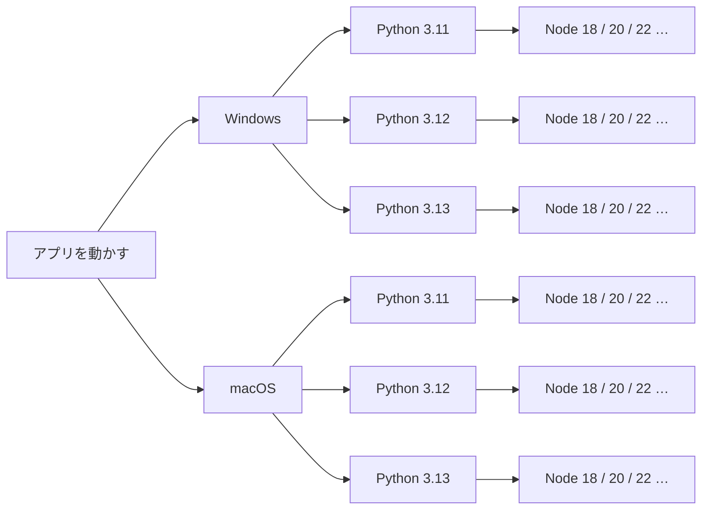
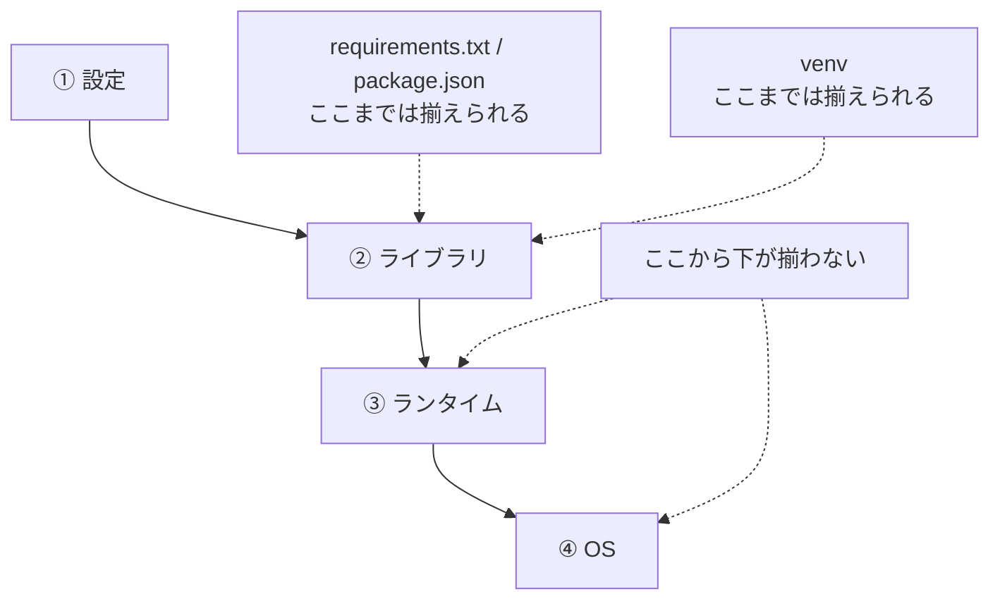
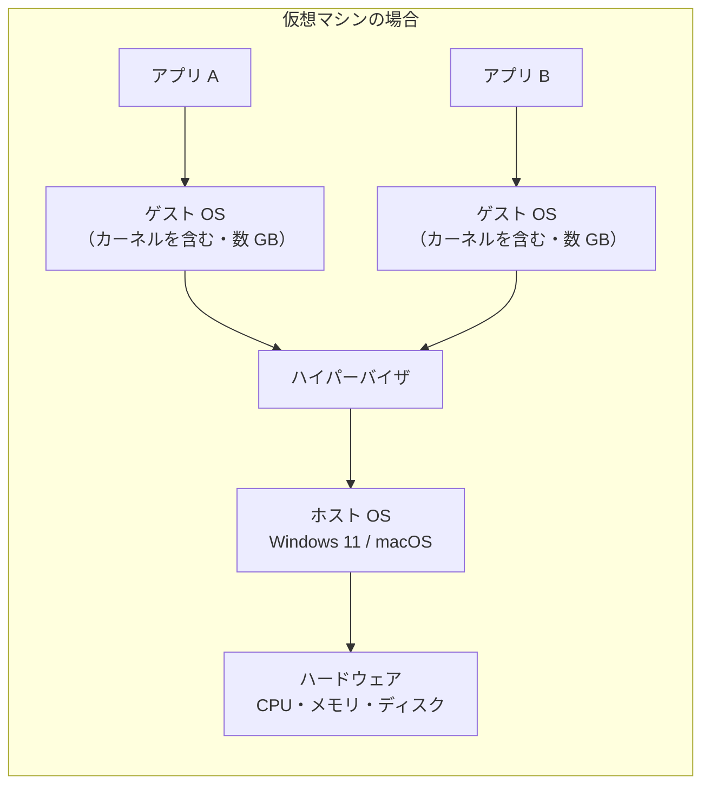
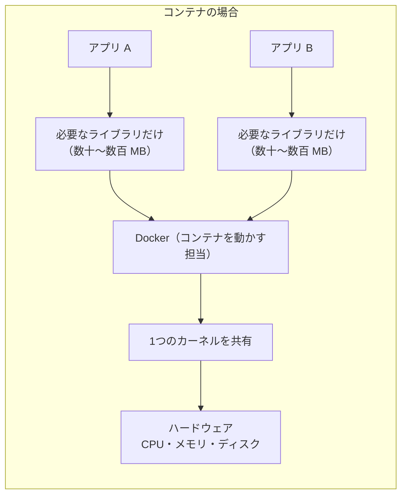
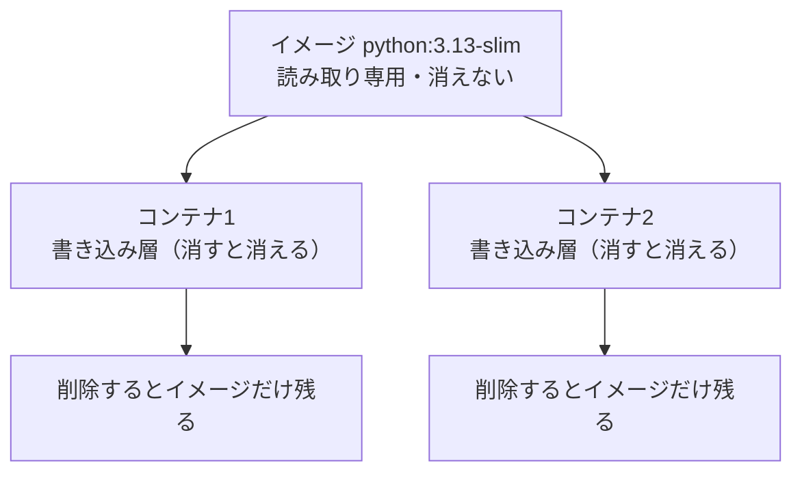
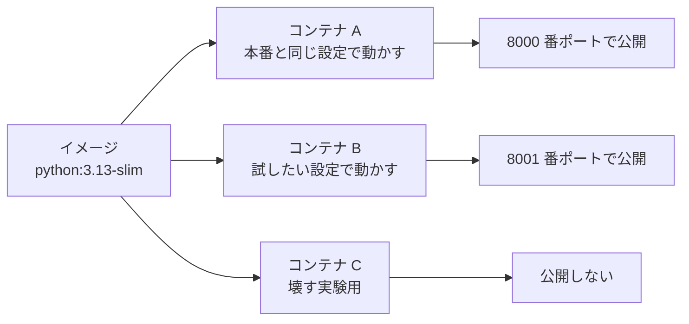
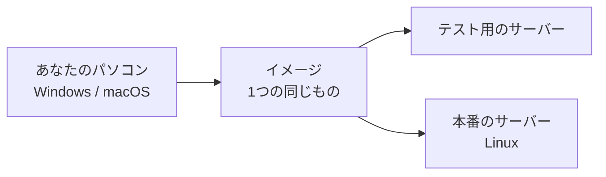

# 第1章 Docker が解決する問題

この章では、**まだ何もインストールしません。**

Docker は道具です。道具は、それが何を解決するのかを知らないまま覚えても身につきません。
第0章で「自分の環境では動く」問題という言葉を出しましたが、
そもそも**なぜ他人のパソコンでは動かないのか**を説明できるでしょうか。

この章では、まずその理由をはっきりさせます。
そのうえで、Docker が使っている**コンテナ**という仕組みを、
昔からある**仮想マシン**と比べながら理解します。
最後に、Docker を使うと日々の作業がどう変わるのかを見ます。

ここで扱う**イメージ**と**コンテナ**という2つの言葉は、
この本の最後まで、ほぼ毎ページ出てきます。
**この2つの関係を取り違えたまま第2章に進むと、以降の説明がすべてぼやけます。**
時間をかけて読んでください。

## この章で学ぶこと

- 自分のパソコンで動くプログラムが、他人のパソコンで動かない理由を説明できるようになる
- 手順書や `requirements.txt` では揃えられないものが何かを言えるようになる
- 仮想マシンとコンテナの違いを、重さと起動速度の理由まで含めて説明できるようになる
- イメージとコンテナの関係を、自分の言葉で説明できるようになる
- Docker を導入すると、自分の作業のどこが変わるのかを具体的に挙げられるようになる

## この章の前提

- [第0章 はじめに](./00-introduction.md) を読み終えていること
- **Docker はまだインストールしません**（インストールは第2章です）
- この章では、**コマンドを1つも打ちません**。演習だけブラウザとメモを使います

> **つまずいたら**
> この章は言葉の説明が中心です。読んでもぴんと来ない箇所があれば、
> 第0章 0.2 で準備した AI に、次のように聞いてください。
>
> ```text
> docker-text の 1.2.2 を読んでいます。
> 「コンテナはカーネルを共有する」の意味が分かりません。
> docker-text の第1章までの知識だけを使って、
> 仮想マシンとの違いが分かるたとえを1つ添えて説明してください。
> ```

---

## 1.1 「自分の環境では動く」問題

### 1.1.1 なぜ他人の環境で動かないのか

まず、はっきりさせておきたいことがあります。

**プログラムは、書いたコードだけでは動きません。**

react-text で作った React アプリのファイル一式を、そのまま USB メモリに入れて
友達のパソコンに渡したとします。ファイルは全部そろっています。
それでも、動きません。

コードが動くためには、コードの下に**土台**が必要だからです。
その土台は、少なくとも次の4つの層でできています。

| 層 | 中身 | あなたの環境での例 |
|----|------|------------------|
| ① 設定 | 環境変数、`.env`、PATH | fastapi-text 4.6.2 で作った `.env` |
| ② ライブラリ | `npm install` / `pip install` で入れたもの | `node_modules`、FastAPI、SQLAlchemy |
| ③ ランタイム | プログラムを実行するソフトウェア本体 | Node.js v22、Python 3.13 |
| ④ OS が持つ道具 | ファイルの置き方、文字コード、シェル | Windows か macOS か |

**ランタイム**（プログラムを実際に実行するソフトウェアのこと。
Node.js や Python 本体がこれにあたります）という言葉は、この本で何度も出てきます。
「`python app.py` と打ったときに、`app.py` を読んで実行してくれる側」だと思ってください。

図にすると、こうなっています。



**コピーしたのは、いちばん上の1層だけです。**
下の3層は相手のパソコンのものがそのまま使われます。
そこが違えば、当然、結果も違います。

ここまでの3冊で遭遇したトラブルも、すべてこの図のどこかで起きていました。

| いつ起きたか | 図のどの層か |
|------------|------------|
| `node` コマンドが見つからない（react-text 1.5.4） | ① 設定（PATH） |
| `ModuleNotFoundError` が出る（fastapi-text 0.3.1） | ② ライブラリ（venv を有効化していなかった） |
| Vite が起動しない（react-text 6.2） | ③ ランタイム（Node.js のバージョンが古い） |
| PowerShell の実行ポリシーで止まる（python-text 1.5） | ④ OS（Windows 固有の設定） |

> **よくある間違い**
> 「コードを渡した」と「動くものを渡した」は、まったく違います。
> GitHub にコードを置いても、それは①の層を置いただけです。
> 相手が②③④を自力でそろえられなければ、コードは動きません。
> **Docker が配ろうとしているのは、②③④まで含めた土台ごと**だと覚えておいてください。

### 1.1.2 バージョン・OS・設定の組み合わせ爆発

「相手の環境をこちらに合わせてもらえばいい」と思うかもしれません。
問題は、**合わせるべき組み合わせの数**です。

fastapi-text で作ったアプリを動かすのに関わる条件を、控えめに数えてみます。

| 条件 | ありうる値 | 数 |
|------|----------|----|
| OS | Windows 11 / macOS / Linux | 3 |
| CPU | Intel・AMD / Apple Silicon | 2 |
| Python | 3.11 / 3.12 / 3.13 | 3 |
| Node.js | 18 / 20 / 22 | 3 |
| シェル | PowerShell / bash / zsh | 3 |

掛け算すると、**3 × 2 × 3 × 3 × 3 = 162 通り**です。
ライブラリのバージョンも数え始めれば、数千通りになります。

枝分かれの形にすると、増え方の速さが分かります。



条件が1つ増えるたびに、枝は**掛け算で**増えます。
これを**組み合わせ爆発**（条件を1つ足すだけで、全体の場合の数が一気に膨れ上がること）と呼びます。

**162 通りすべてで動作確認することは、現実には不可能です。**
プロの開発現場でも同じで、確認できるのはせいぜい数通りです。

ここから出てくる発想が、この本の出発点になります。

> **組み合わせを減らすのではなく、組み合わせを1つに固定して、それごと配る。**

「Python 3.13 と Node.js 22 が入った、Linux の環境」を1つ作り、
**その環境ごと相手に渡してしまえば**、相手の OS が何であっても中身は同じです。
これがコンテナの発想です。

> **よくある間違い**
> 「自分の手元で動いたから大丈夫」は、根拠になりません。
> あなたが確認したのは 162 通りのうちの**1通り**だけです。
> しかも、その1通りがどんな条件だったかを、あなた自身も正確には把握していません。
> 「動いた環境がどれだったか」を記録に残すことが、この問題の第一歩になります。

### 1.1.3 これまでの解決策とその限界

この問題は昔からあるので、解決策も昔からあります。
実際、ここまでの3冊でも、そのいくつかを使ってきました。

| 解決策 | あなたが使った場面 | 揃えられるもの | 揃えられないもの |
|-------|-----------------|--------------|----------------|
| 手順書（README に書く） | 各テキストの環境構築の章 | 手順の順番 | **人間が読み飛ばす・間違える** |
| バージョンを書いたファイル | `package.json`、`requirements.txt` | ライブラリのバージョン | **ランタイムと OS** |
| 仮想環境 | python-text 1.5 の `venv` | Python のライブラリ | **Python 本体のバージョン、OS** |
| セットアップスクリプト | （このテキストでは未使用） | 手順の自動実行 | **OS ごとに別々に書く必要がある** |

**共通しているのは、「土台の下のほうは揃えられない」ということです。**

1.1.1 の4層に当てはめると、こうなります。



`requirements.txt` は「FastAPI の 0.115.6 を使う」と書けますが、
「Python 3.13 を使う」とは書けません。
`venv` は Python のライブラリを分けてくれますが、
**Python 本体は、パソコンに入っているものをそのまま使います。**

さらに厄介なのが④の層です。
たとえば、次のようなものは、手順書にもバージョン指定ファイルにも書きようがありません。

- Windows のファイルパスの区切りが `\`、macOS が `/` であること
- Windows の改行コードが CRLF、macOS が LF であること（第4章 4.6.1 で実際に踏みます）
- 会社のパソコンに入っているセキュリティソフトが、通信を横取りすること
- パソコンに前から入っていた別のソフトが、同じポート番号を使っていること

**「揃えられない層」が残っている限り、「自分の環境では動く」問題はなくなりません。**
そこで発想を変えて、**揃えられない層ごと持ち運べるようにしよう**というのが、
次の節で見る仮想化とコンテナの技術です。

---

## 1.2 仮想化とコンテナ

### 1.2.1 仮想マシンの仕組み

環境ごと持ち運ぶ方法として、最初に実用化されたのが**仮想マシン**です。

**仮想マシン**（かそうマシン。1台のパソコンの中に、
ソフトウェアで作ったもう1台のパソコンを丸ごと動かす仕組み。VM とも書きます）は、
その名のとおり「パソコンの中のパソコン」です。

登場する言葉を先に整理します。

- **ホスト OS**（あなたのパソコンに元から入っている OS。Windows 11 や macOS）
- **ゲスト OS**（仮想マシンの中で動く、もう1つの OS。Linux など）
- **ハイパーバイザ**（仮想マシンを作って動かすためのソフトウェア）
- **カーネル**（OS の中心部分。プログラムからの「ファイルを読みたい」「メモリを使いたい」
  といった要求を受けて、実際のハードウェアを操作する担当）

積み重なり方を図にすると、次のようになります。



注目してほしいのは、**アプリ1つごとにゲスト OS が丸ごと1つ必要**な点です。
OS は、アプリを動かすためだけの部品ではありません。
画面表示、ユーザー管理、ネットワーク設定、システムの各種サービス……と、
**使わない機能も含めて全部入り**でついてきます。

その結果が、次の特徴です。

- **重い**：ゲスト OS 1つで数 GB のディスクを使う
- **遅い**：起動は OS の起動そのものなので、数十秒から数分かかる
- **メモリを先に取られる**：「この仮想マシンにメモリ 4 GB」と、使う前から割り当てる

一方で、隔離の度合いはとても強く、
**ゲスト OS の中で何をしても、ホスト OS には影響しません。**
Windows の上で Linux を動かす、といったことも自由にできます。

### 1.2.2 コンテナの仕組み

**コンテナ**（アプリと、その動作に必要な環境をまとめて隔離して動かす仕組み）は、
「OS を丸ごと用意するのは、さすがに無駄が多い」という反省から生まれました。

**発想の中心は、「カーネルは1つを共有すればいいのではないか」という点です。**

アプリが必要としているのは、正確には「OS 全部」ではありません。
「ファイルを読み書きしたい」「通信したい」という**カーネルへの依頼が通ること**と、
「必要なライブラリやコマンドがそこにあること」の2つです。

そこでコンテナは、次のようにします。

- カーネルは、**ホスト側にある1つを全コンテナで共有する**
- その代わり、**ファイルの見え方・プロセスの見え方・ネットワークをコンテナごとに分ける**

**プロセス**（実行中のプログラム1つ分のこと。
タスクマネージャーやアクティビティモニタに一覧で出てくるものだと思ってください）
という言葉を使うと、こう言えます。

> コンテナは、**「自分専用のファイル一式を持たされた、ただのプロセス」**です。

図にすると、仮想マシンとの違いがはっきりします。



1.2.1 の図と見比べてください。
**ゲスト OS の段が丸ごと消えて、必要なライブラリだけになっています。**
コンテナが軽い理由は、ここにあります。

> **補足：Windows と macOS では、裏側で Linux が1つだけ動いています**
> コンテナはカーネルを共有する仕組みなので、
> **Linux 用のコンテナは、Linux のカーネルの上でしか動きません。**
> では Windows や macOS ではどうしているかというと、
> **Linux の仮想マシンを1つだけ動かして、その中でコンテナを動かしています。**
> Windows でその役割を担うのが、第0章 0.2.2 で名前だけ出てきた **WSL2** です。
>
> 「結局、仮想マシンを使うのか」と思うかもしれませんが、
> **仮想マシンは1つだけ**で、その中にコンテナを何個でも並べられます。
> アプリ1つごとに OS を1つ用意する 1.2.1 とは、まったく別の話です。
> この違いが、第2章のインストールで WSL2 が必要になる理由でもあります。

### 1.2.3 何が違うのか（重さ・起動速度）

2つを並べて比べます。数字は**目安**で、実際の値は環境によって変わります。

| | 仮想マシン | コンテナ |
|---|----------|---------|
| ゲスト OS | アプリごとに必要 | **不要（カーネルを共有）** |
| 大きさ | 数 GB 〜 数十 GB | **数十 MB 〜 数百 MB** |
| 起動時間 | 数十秒 〜 数分 | **1秒未満 〜 数秒** |
| メモリ | 起動時に割り当てて確保する | 使った分だけ |
| 隔離の強さ | **強い**（OS ごと別） | 中くらい（カーネルは共有） |
| OS の自由度 | **高い**（Windows の上で Linux も可） | カーネルを共有できる範囲に限られる |
| 1台で動かせる数 | 数個 | **数十個** |

**起動が速い理由**は、仕組みから説明できます。
仮想マシンの起動は「OS の起動」そのものなので、
カーネルの読み込みから各種サービスの立ち上げまでを全部やります。
一方コンテナの起動は、**プロセスを1つ立ち上げるだけ**です。
メモ帳を開くのと、パソコンを再起動するのとの違い、と考えると近いです。

この「起動が速い」という性質は、単なる快適さの話ではありません。
**気軽に消して作り直せる**という、この本で最も重要な性質につながります（1.4.2 で扱います）。

> **よくある間違い**
> コンテナは「軽い仮想マシン」ではありません。**仕組みがそもそも別物**です。
> この違いは、次の2点で実際に効いてきます。
>
> - コンテナの中には、原則として**Linux の中身が入っている**（Windows のソフトは動かない）
> - 隔離は仮想マシンほど強くない。信頼できない他人のイメージを安易に動かさないこと
>
> 「コンテナ = 小さい仮想マシン」と覚えてしまうと、
> 第2章で「Windows のアプリをコンテナで動かそう」として詰まります。

---

## 1.3 イメージとコンテナ

ここからが、この章の中心です。
**この2つの言葉は、この本の最後まで毎回出てきます。**

### 1.3.1 イメージ = 設計図

**イメージ**（コンテナを作るための設計図兼テンプレート）は、
**アプリを動かすのに必要なファイル一式を、まとめて固めたもの**です。

たとえば `python:3.13-slim` というイメージには、次のものが入っています。

- Linux の最小限のファイル一式（`ls` や `cat` などのコマンド）
- Python 3.13 本体
- `pip`

このイメージが1つあれば、**Python がインストールされていないパソコンでも
Python を動かせます。** インストール作業は要りません。

イメージには、次の3つの性質があります。

1. **読み取り専用**：一度作ったイメージの中身は変わりません
2. **層（レイヤ）を積み重ねてできている**：詳しくは第3章 3.4 で扱います
3. **名前とタグで区別する**：`python:3.13-slim` の `:` の前が名前、後ろが**タグ**です

**タグ**（同じ名前のイメージの中で、どれを使うかを指定する目印。
バージョン番号が使われることが多い）の指定は、この本ではとても重要です。
`python:3.13-slim` と `python:3.11-slim` は、名前は同じ `python` でも中身が違います。
**タグまで含めて指定して初めて、「同じもの」を指定したことになります。**

**イメージはどこから来るのか**

イメージは、**レジストリ**（イメージを保管して配る場所）に置かれています。
標準で使われるのが **Docker Hub**（Docker 社が運営する公式のレジストリ。
<https://hub.docker.com> でブラウザからも見られます）です。

Docker Hub のページの読み方を、`nginx` というイメージを例に見ておきます
（**nginx** は、Web サーバーとして広く使われているソフトウェアです。第2章 2.3.3 で実際に動かします）。

ブラウザで <https://hub.docker.com/_/nginx> を開くと、次の情報が並んでいます。

| 見るところ | 何が分かるか | `nginx` の場合の例 |
|-----------|------------|------------------|
| ページ上部の「Docker Official Image」の表示 | 公式が管理しているイメージかどうか | 公式イメージである |
| Downloads / Pulls の数 | どれくらい使われているか | 10 億回以上 |
| Tags のタブ | 選べるバージョンの一覧 | `1.27`、`1.27-alpine`、`latest` など |
| Tags の各行の「Compressed size」 | **圧縮後のサイズ**（ダウンロードされる大きさ） | `1.27-alpine` は数十 MB 程度 |
| Overview の「How to use this image」 | 使い方の例 | ポートの指定例などが載っている |

**タグの一覧を見ると、同じ `nginx` でも十数種類あることが分かります。**
`alpine` が付いたものは、より小さい Linux をもとにしたイメージです
（種類の選び方は第7章 7.3 で扱います）。

> **注意：`latest` は「最新」という意味の固定された名前です**
> タグを省略すると、`latest` というタグが選ばれます。
> `latest` は「最新版」ではなく、**「`latest` という名前が付けられたもの」**にすぎません。
> しかも、その中身は時期によって変わります。
> **半年後に同じコマンドを打つと、違うものが降ってくる**ということです。
> それでは 1.1.2 の「組み合わせを1つに固定する」という目的が果たせません。
> このテキストでは、**タグを必ず明示します。** 理由の詳細は第2章 2.5.5 で扱います。

### 1.3.2 コンテナ = 設計図から作った実物

**コンテナ**は、**イメージを実際に動かしたもの**です。

設計図と建物の関係で考えると、対応が分かりやすくなります。

| 設計図と建物 | Docker |
|------------|--------|
| 設計図（紙に書かれている） | イメージ |
| 設計図から建てた建物 | コンテナ |
| 同じ設計図から2軒建てられる | 1つのイメージから何個でもコンテナを作れる |
| 建てた家に家具を入れても、設計図は変わらない | コンテナの中を変更しても、イメージは変わらない |
| 建物を壊しても、設計図は残る | コンテナを消しても、イメージは残る |

**最後の2行が重要です。**

コンテナを起動すると、Docker はイメージの上に**書き込み用の薄い層を1枚だけ**乗せます。
コンテナの中でファイルを作ったり書き換えたりすると、その変更はこの層に書かれます。
イメージ本体（読み取り専用）は、一切変わりません。

そして、**コンテナを削除すると、その書き込み層ごと消えます。**



この性質が、便利さと危なさの両方を生みます。

- **便利**：おかしくなったら、消してもう一度作れば、必ず最初の状態に戻る（1.4.2）
- **危ない**：**コンテナの中に保存したデータは、コンテナを消すと消える**（第4章 4.1）

データを残す方法は第4章で扱います。
いまは「**コンテナの中身は消えるもの**」と覚えておいてください。

> **よくある間違い**
> 「コンテナを停止する」と「コンテナを削除する」は別の操作です。
> 停止しただけのコンテナは、**中身を保ったまま残っています。**
> 停止したつもりで溜め込み続け、ディスクを圧迫することがよくあります。
> 停止と削除のコマンドの違いは、第2章 2.4 で区別して扱います。

### 1.3.3 1つのイメージから何個でも作れる

イメージが読み取り専用であることの恩恵が、ここで出ます。

**同じイメージから作ったコンテナは、起動直後の中身が必ず同じです。**
1個目と 100 個目で違いはありません。
1.1.2 で見た「組み合わせを1つに固定する」が、ここで実現されています。

たとえば、1つの `python:3.13-slim` イメージから、
性格の違う3つのコンテナを同時に動かせます。



3つとも、中の Python は同じ 3.13 です。
違うのは、**起動するときに外から与えた設定だけ**です。
C を壊しても、A と B には何の影響もありません。

これは、これまでの3冊の環境では**できなかったこと**です。
パソコンに直接 Python を入れる方式では、Python は1つしか入れられません
（正確には複数入れられますが、切り替えの管理が非常に面倒です）。
「試したい設定」を試すには、いま動いている設定を壊すしかありませんでした。

> **よくある間違い**
> コンテナの中に入って手作業でライブラリを入れても、**イメージには残りません。**
> そのコンテナを消した瞬間に、その作業は消えます。
> 「毎回やっている手作業」があるなら、それは**イメージ側に書くべき**です。
> その書き方が、第3章で扱う `Dockerfile` です。
> **コンテナの中で手作業をしたくなったら、第3章を思い出してください。**

---

## 1.4 Docker を使うと何が変わるか

### 1.4.1 環境構築が1コマンドになる

第0章 0.1.2 で、アプリを渡すのに7つの手順が必要だという話をしました。
Docker を入れると、この手順書がどう変わるのかを見ます。

**やり方は「仕分け」です。** 手順を1つずつ見て、次の3つに分類します。

- **A：Docker が肩代わりする**（設定ファイルに書いておけば、自動で実行される）
- **B：人が1回だけやる**（そのパソコンで最初の1回だけ必要）
- **C：それでも人がやる**（Docker では解決しない）

まず、この本とは別の題材でやってみます。
**「社内の議事録をまとめるツール」**を同僚に渡す場面を考えます。
現状の手順書は、次のようになっているとします。

```text
1. Python 3.13 をインストールする
2. PostgreSQL をインストールして、起動しておく
3. 仮想環境を作って有効化する
4. pip install -r requirements.txt を実行する
5. .env に接続先とパスワードを書く
6. python init_db.py でテーブルを作る
7. python main.py で起動する
```

仕分けすると、こうなります。

| 手順 | 分類 | 理由 |
|-----|------|------|
| 1. Python のインストール | **A** | イメージに Python が入っている（1.3.1） |
| 2. PostgreSQL のインストール | **A** | PostgreSQL のイメージを1つ起動すればよい |
| 3. 仮想環境を作る | **A** | コンテナ自体が隔離された環境なので不要になる |
| 4. `pip install` | **A** | イメージを作るときに済ませておける（第3章） |
| 5. `.env` を書く | **C** | **パスワードは人が決めて渡すもの**。自動化しない |
| 6. テーブルを作る | **A** | 起動時に実行させられる（第5章・第6章） |
| 7. 起動する | **A** | `docker compose up` に置き換わる（第5章） |
| （新規）Docker Desktop を入れる | **B** | そのパソコンで最初の1回だけ |

**7手順のうち5つが A、1つが C、そして B が1つ増えました。**

結果として、同僚に伝えることは次の3行になります。

```text
1. Docker Desktop を入れてください
2. .env ファイルを作って、渡したパスワードを書いてください
3. docker compose up と打ってください
```

**この仕分けが、Docker 導入の効果を測る方法そのものです。**
演習 1.3 では、これと同じ仕分けを、あなた自身のアプリでやってもらいます。

> **注意：「1コマンドになる」の前に、誰かが設定ファイルを書きます**
> `docker compose up` の1行で動くのは、
> **その1行が何をするかを書いたファイルが用意されているから**です。
> そのファイルを書くのは人間で、それがこの本の第3章から第6章の内容です。
> **1回書けば、以降は何百回でも1コマンドで済む**、というのが正しい理解です。

### 1.4.2 消して作り直せる

1.3.2 で、コンテナを消すと書き込み層ごと消えると説明しました。
これを裏返すと、**いつでも初期状態に戻せる**ということになります。

これまでの3冊での「壊れたとき」と比べてみてください。

| | これまで（直接インストール） | Docker |
|---|---------------------------|--------|
| おかしくなったとき | 何が原因か調べて直す | **消して作り直す** |
| かかる時間 | 数十分〜数時間 | **数秒〜数分** |
| 元に戻る保証 | ない（直したつもりで別の設定が残る） | **ある（イメージは変わらないため）** |
| 試す気になるか | ならない（壊したくない） | **なる** |

流れを図にすると、こうなります。


第0章 0.3.1 で「壊しても大丈夫です。作り直せます」と書いたのは、この性質のことです。
**「まず作り直してみる」が、Docker では正当なトラブル対処法になります。**
これまでのように、原因が分かるまで先に進めない、ということがなくなります。

> **注意：戻るのはコンテナの中身だけです**
> 作り直しても元に戻るのは、**コンテナの中に閉じたもの**だけです。
> 次のものは戻りません。
>
> - コンテナの中で作って、そのまま消してしまったデータ（第4章 4.1 で対策します）
> - あなたがパソコン上で編集したソースコード（これは Git で守る領域です）
>
> 「消して作り直す」を実行する前に、**消えて困るものが中にないか**を必ず確認してください。
> どのコマンドが何を消すのかは、第2章 2.7 ではっきり区別して説明します。

### 1.4.3 本番環境と同じものを手元で動かせる

3つ目の変化は、少し先の話です。いまは「そういうものがある」と知っておけば十分です。

作ったアプリを、誰でも使える形でインターネット上に公開することを
**デプロイ**（作ったものを、動かす場所に配置して公開すること）と呼びます。
デプロイ先で、実際に利用者が使うアプリが動いている環境を**本番環境**、
開発者が手元で作って試す環境を**開発環境**と呼びます。

**この2つの環境が違うことが、昔から事故の原因でした。**

- 手元は Python 3.13、本番は 3.10 だった
- 手元にはあるコマンドが、本番のサーバーには入っていなかった
- 手元では大文字小文字を区別しないが、本番の Linux では区別された

Docker を使うと、**手元で動かしたイメージを、そのまま本番のサーバーで動かせます。**
「手元で動いたもの」と「本番で動くもの」が、同じ1つのイメージになるからです。



第7章 7.5.3 で、実際のデプロイ先の選択肢を扱います。

> **補足：それでも「完全に同じ」にはならない場面があります**
> 正直に書いておきます。Docker は万能ではありません。
>
> - **CPU の種類の違い**は残ります。Apple Silicon（M1 以降の Mac）と、
>   本番サーバーでよく使われる Intel / AMD 系では、CPU が命令を解釈する方式が違います。
>   イメージによっては、片方でしか動かないものがあります（第2章 2.2.3 で対処法を扱います）
> - **GUI アプリ**（画面を持つアプリ）は、コンテナには向きません
> - **Windows や macOS 専用のソフト**は、Linux のコンテナでは動きません
>
> Docker が揃えてくれるのは、**1.1.1 の①〜④の層**であって、
> その下のハードウェアまでは同じにできない、と理解しておいてください。

---

## まとめ

- プログラムは**コードだけでは動かない**。①設定 ②ライブラリ ③ランタイム ④OS の4層が土台にある
- コードを渡すことは、**いちばん上の1層を渡しただけ**。動かない原因は下の3層にある
- 条件が増えると場合の数は掛け算で増える（**組み合わせ爆発**）。全部を確認することはできない
- そこで、**組み合わせを1つに固定して、その環境ごと配る**という発想に切り替える
- `requirements.txt` や `venv` が揃えられるのは②まで。**ランタイムと OS は揃えられない**
- **仮想マシン**はアプリごとに**ゲスト OS を丸ごと**持つため、数 GB・起動に数十秒かかる
- **コンテナ**は**カーネルを共有する**ため、数十〜数百 MB・起動は数秒で済む
- Windows / macOS では、裏で**Linux の仮想マシンを1つだけ**動かし、その中でコンテナを並べている
- **イメージ = 設計図（読み取り専用）**、**コンテナ = 設計図から作った実物**
- イメージは `名前:タグ` で指定する。**`latest` は「最新」ではなく、中身が変わりうる名前**
- 1つのイメージから**何個でも同じコンテナを作れる**。コンテナを消してもイメージは残る
- **コンテナの中に保存したデータは、コンテナを消すと消える**（対策は第4章）
- 手順を**A（Docker が肩代わり）・B（1回だけ人がやる）・C（人が残ってやる）**に仕分けすると効果が見える
- 壊れたら**消して作り直す**が正当な対処法になる。ただし**消えて困るものがないか**は必ず確認する
- 手元と本番で**同じイメージ**を動かせる。ただし CPU の種類の違いまでは吸収できない

---

## 理解度チェック

**問 1.1**（穴埋め）

プログラムが動くための土台は、上から順に
①設定 ②（　①　）③（　②　）④ OS の4層でできている。
`requirements.txt` で揃えられるのは（　①　）までで、
（　②　）と OS は揃えられない。

**問 1.2**（選択）

仮想マシンと比べたときの、コンテナの特徴として**正しいもの**を1つ選んでください。

1. アプリごとにゲスト OS を持つので、隔離が強い
2. カーネルをホストと共有するので、起動が速く、サイズが小さい
3. Windows のソフトも Linux のソフトも同じように動かせる
4. 仮想マシンより高性能な CPU が必要になる

**問 1.3**（選択）

`docker` の世界で「イメージ」と「コンテナ」の関係を正しく説明しているものを1つ選んでください。

1. コンテナを保存したものがイメージで、イメージは1つのコンテナからしか作れない
2. イメージは読み取り専用の設計図で、そこから複数のコンテナを作れる
3. イメージとコンテナは同じものの別名であり、使い分けに意味はない
4. コンテナを削除すると、もとのイメージも一緒に削除される

**問 1.4**（記述）

コンテナの起動が仮想マシンより速い理由を、
「カーネル」という言葉を使って1行で説明してください。

**問 1.5**（記述）

`python:3.13-slim` の `3.13-slim` の部分を何と呼びますか。
また、これを省略すると何が起きるのかを1行で説明してください。

**問 1.6**（記述）

「コンテナを消して作り直せば、必ず起動直後の状態に戻る」と言えるのはなぜですか。
イメージの性質に触れて1行で説明してください。

---

## 演習問題

### 演習 1.1 ★☆☆ 自分のアプリの「動く条件」を書き出す

**課題**

fastapi-text で作ったアプリ（`fastapi-lesson`）を、明日から使う新しいパソコンに
引っ越すことになったとします。そのための**引き継ぎメモ**を1つ書いてください。

メモには、次の2つを書きます。

1. **いまのパソコンの条件**を、1.1.1 の4層に分けて書き出す
2. **1.1.2 の考え方で、条件の組み合わせが何通りあるか**を計算して書く

条件を調べるコマンドは、第0章 0.1.1 で打ったものが使えます。

**Windows（PowerShell）**

```powershell
node --version
python --version
```

**macOS / Linux**

```bash
node --version
python3 --version
```

**完成条件**

- メモが「① 設定 / ② ライブラリ / ③ ランタイム / ④ OS」の4つの見出しに分かれている
- ③に、**実際に自分のパソコンで表示されたバージョン番号**が書かれている
  （「最新版」ではなく、`v22.14.0` のような具体的な数字）
- ④に、自分の OS と CPU の種類（Apple Silicon か Intel / AMD か）が書かれている
- ①に、fastapi-text で作った `.env` に相当するものが挙げられている
- 4つの層のうち、**`requirements.txt` では揃えられないものがどれか**が書かれている
- 組み合わせの計算式（例：`3 × 2 × 3 = 18`）と、その答えが書かれている

**ヒント**

1.1.1 の2つ目の表が、そのままメモの雛形になります。
CPU の種類の確認方法は、第0章 0.2.1 の注意書きにあります。

---

### 演習 1.2 ★★☆ Docker Hub で使うイメージを選ぶ

**課題**

ブラウザで Docker Hub（<https://hub.docker.com>）を開き、
`python` という公式イメージを調べて、**比較表を1つ作って**ください。

調べるのは、次の3つのタグです。

- `3.13`
- `3.13-slim`
- `latest`

**この演習では Docker を使いません。ブラウザだけで完結します。**

**完成条件**

- 表に、3つのタグそれぞれの**行**がある
- 各行に「**圧縮後のサイズ**」（Docker Hub の Tags タブに表示されます）が書かれている
- `3.13` と `3.13-slim` のどちらが小さいかが、数字で示されている
- `latest` の行に、**このタグが指す中身は将来変わりうる**という注意が1行書かれている
- 「配布用に選ぶならどれか」を1つ選び、**1.1.2 の「組み合わせを固定する」という目的に照らして**
  その理由が2行以内で書かれている
- 選んだイメージが公式イメージ（Docker Official Image）かどうかを確認して書いている

**ヒント**

1.3.1 に、`nginx` のページで**どこを見ればよいか**の表があります。
同じ場所を `python` のページで探してください。

---

### 演習 1.3 ★★☆ 自分のアプリの手順書を仕分けする

**課題**

演習 1.1 で書いた引き継ぎメモをもとに、
**fastapi-text のアプリを他人に渡すときの手順書**を作り、
それを 1.4.1 の方法で仕分けしてください。

**まだ Docker の設定ファイルは書きません。**
「Docker を導入したら、この手順はどうなるか」を分類するところまでが課題です。

**完成条件**

- 手順書が**5つ以上の手順**に分かれて番号付きで書かれている
  （第0章 0.1.2 の7手順を、自分のアプリに合わせて書き直したもので構いません）
- すべての手順に **A / B / C** のいずれかが付いている
  - A：Docker が肩代わりする
  - B：人が1回だけやる
  - C：それでも人がやる
- **C に分類した手順が1つ以上あり**、なぜ自動化すべきでないかが1行で書かれている
- Docker を入れたことで**新しく増える手順**（B）が、手順書に追加されている
- 仕分けの結果、**相手に伝える手順が何行になったか**が書かれている
- 「1コマンドになる」ために、**誰が何を用意する必要があるか**が1行で書かれている

**ヒント**

1.4.1 の議事録ツールの表が、そのまま雛形になります。
C に入るものは、1.4.1 の例と同じく「人が決めて渡すもの」が候補です。

---

解答は [解答編](./90-answers.md#第1章) にあります。
**必ず自分で手を動かしてから**見てください。

---

## 次の章へ

Docker が何を解決する道具なのか、そしてイメージとコンテナが何なのかを見てきました。
ここまでは、まだ1行もコマンドを打っていません。

次の章で、**いよいよ Docker をインストールします。**
そして、この章で「設計図」と説明したイメージから、
実際にコンテナを作って動かします。1.2.3 で書いた「起動が数秒」を、自分の目で確かめてください。

**第2章は、この本の最初の山場です。**
インストールでつまずく人が最も多い章でもあるので、
「よくあるトラブル」の節を厚く用意してあります。
うまくいかないときは、遠慮なく第0章 0.2.2 のテンプレートで AI に相談してください。

→ [第2章 インストールと基本操作](./02-install-and-basics.md)
