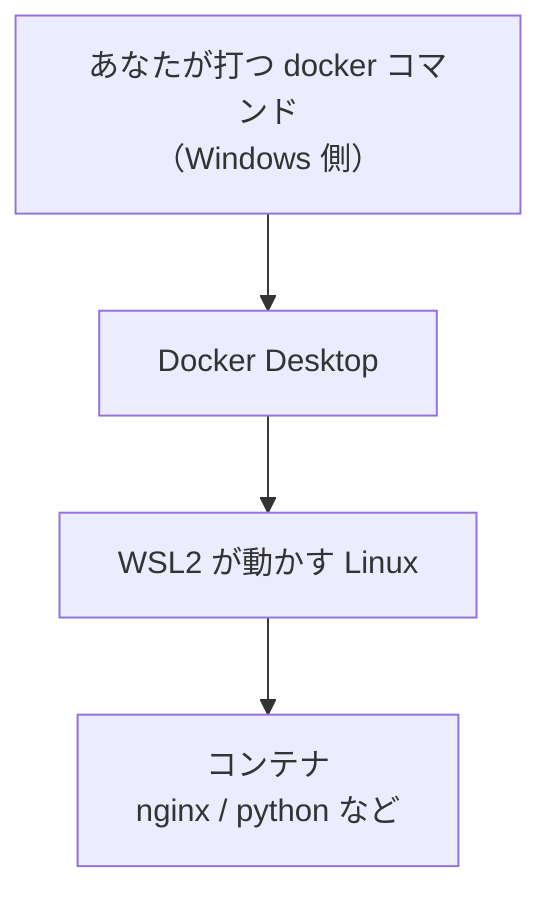
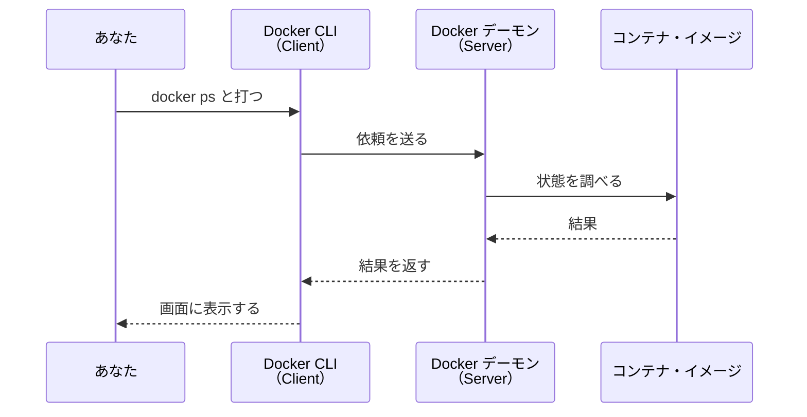
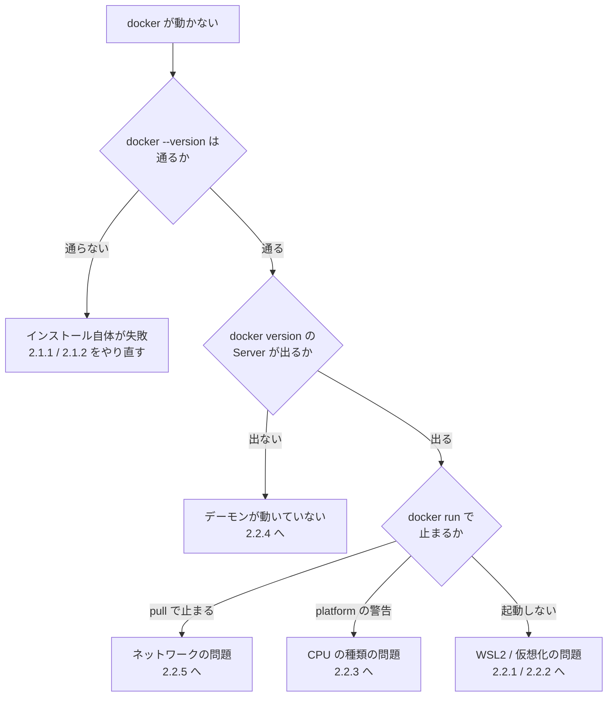
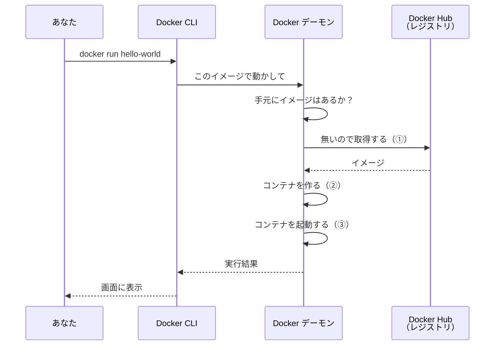
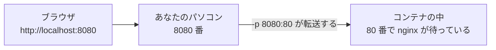
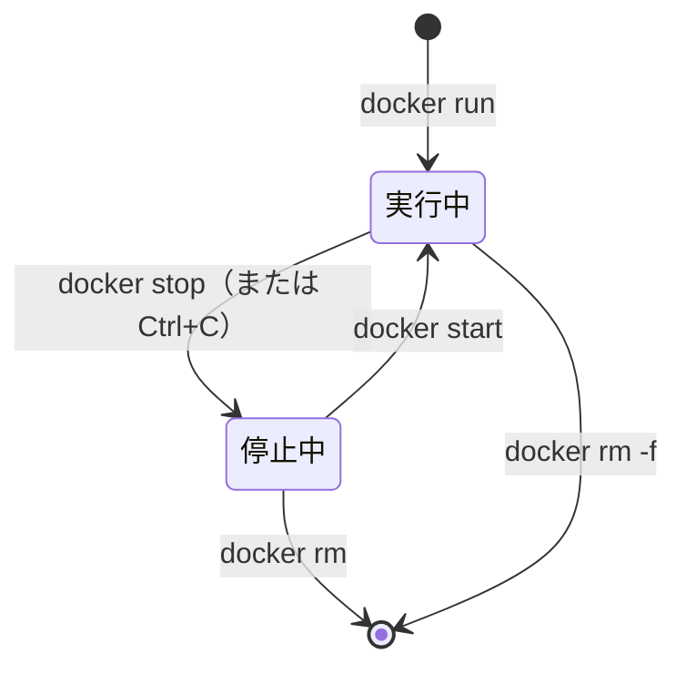
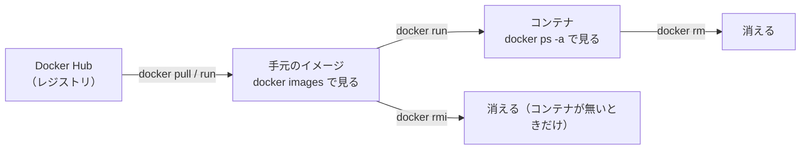
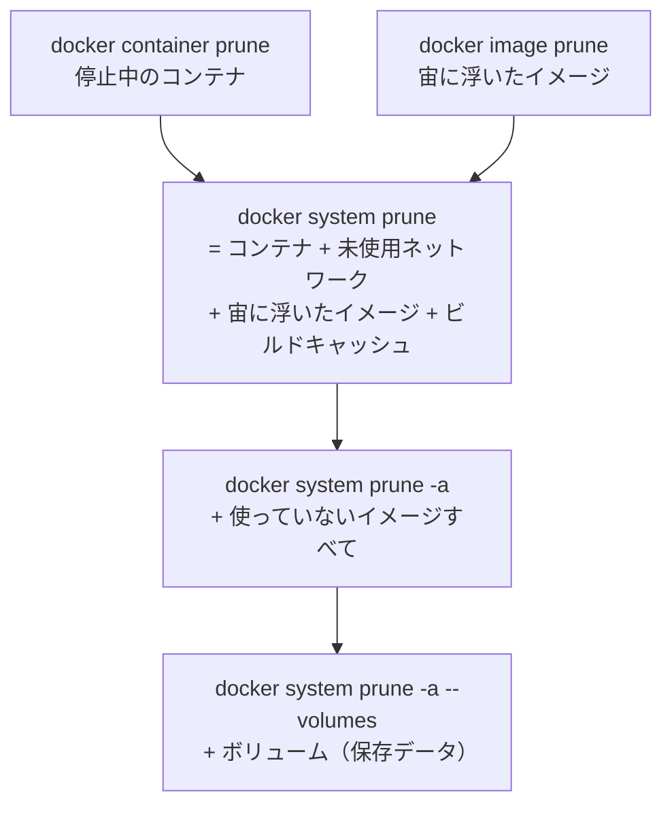
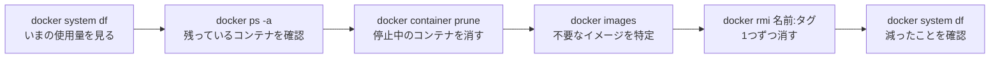

# 第2章 インストールと基本操作

第1章では、コマンドを1つも打ちませんでした。この章では逆に、**ほぼずっとターミナルを触ります。**

まず Docker をインストールし、第1章で「設計図」と説明した**イメージ**から、
実際に**コンテナ**を作って動かします。
そのあと、コンテナとイメージを一覧する・止める・消す・中に入る・掃除する、という
**この本の最後まで毎章使うコマンド**を、ひととおり手に入れます。

**この章は、この本の最初の山場です。**

理由は2つあります。1つは、インストールでつまずく人が最も多いからです。
Docker はパソコンのかなり深い場所（第1章 1.2.2 で説明したカーネルまわり）を使うため、
OS の設定やパソコンの機種の影響を、これまでの3冊よりも強く受けます。
そのため 2.2 に「よくあるトラブル」をまとめて置きました。

もう1つは、**ここで覚えるコマンドが、第3章以降の全部の土台になる**からです。
第3章では自分のイメージを作り、第5章ではそれを設定ファイルからまとめて動かします。
どちらも、この章のコマンドが下敷きになっています。

## この章で学ぶこと

- 自分のパソコンに Docker Desktop をインストールし、動いていることを確認できるようになる
- インストールでつまずいたときに、原因を切り分けて対処できるようになる
- イメージからコンテナを作って動かし、ブラウザから見られるようになる
- コンテナとイメージを一覧・停止・削除でき、**停止と削除の違い**を説明できるようになる
- 動いているコンテナの中に入り、ログを読み、ファイルをやり取りできるようになる
- 使っていないコンテナとイメージを、**何が消えるかを分かったうえで**掃除できるようになる

## この章の前提

- [第1章 Docker が解決する問題](./01-why-docker.md) を読み終えていること
  （とくに 1.3 の**イメージとコンテナの違い**）
- ディスクの空き容量が **20 GB 以上**あること（第0章 0.3.1）
- インストールに管理者権限（Windows）／パソコンのログインパスワード（macOS）が必要です
- ダウンロードに数 GB の通信をします。**モバイル回線での実行は避けてください**

> **つまずいたら**
> この章は、環境の問題で止まりやすい章です。
> エラーが出たら、まず 2.2 の該当する項を探してください。
> それでも解決しないときは、第0章 0.2 で準備した AI に、次のように聞いてください。
>
> ```text
> docker-text の 2.1.1 を読んでいます。
> Windows 11（CPU は Intel）で Docker Desktop をインストールしましたが、
> docker run hello-world が次のエラーで止まります。
>
> （ここにメッセージ全文を貼る）
>
> 原因の候補と、確認する順番を、コピペできるコマンド付きで教えてください。
> ```
>
> **メッセージは要約せず、全文を貼ってください。** 最後の1行に原因が書かれていることが多いためです。

---

## 2.1 Docker Desktop をインストールする

### 2.1.1 Windows へのインストール

まず、これから入れるものの正体をはっきりさせておきます。

**Docker Desktop**（Windows / macOS で Docker を使えるようにする公式アプリ）は、
1つのソフトウェアではなく、**3つのものをまとめた詰め合わせ**です。

| 中身 | 役割 | あなたが触るか |
|------|------|--------------|
| **Docker CLI** | ターミナルで `docker ...` と打つための道具 | **常に触る** |
| **Docker デーモン**（Docker Engine） | コンテナを実際に作って動かす本体。ずっと裏で動き続ける | 直接は触らない |
| GUI（画面のアプリ） | コンテナやイメージを一覧で見る画面、設定画面 | ときどき触る |

**デーモン**（じょうちゅう型のプログラム。画面を持たず、裏でずっと動き続けて依頼を待つもの）
という言葉は、この章で何度も出てきます。
**CLI**（コマンドラインインターフェース。文字で命令を打つ操作方法）が「注文する側」、
デーモンが「作る側」だと考えてください。この分担は 2.1.3 でもう一度扱います。

**インストールの前に確認すること**

| 確認すること | 満たしていないと | 確認方法 |
|------------|----------------|---------|
| Windows 11、または Windows 10（64ビット版） | インストーラが起動しない | 設定 → システム → バージョン情報 |
| ディスクの空きが 20 GB 以上 | 途中で失敗する／後の章で足りなくなる | エクスプローラーで C ドライブを見る |
| 管理者権限がある | インストールが途中で止まる | 会社や学校のパソコンでは要確認 |

> **注意：会社や学校のパソコンの場合**
> Docker Desktop は、**大きな企業での業務利用は有料**です（規模の条件は公式サイトに記載されています）。
> 学習目的の個人利用は無料です。
> 会社のパソコンに入れる場合は、**先に管理者に確認してください。**

**手順**

1. ブラウザで公式サイト <https://www.docker.com/products/docker-desktop/> を開きます
2. **「Download for Windows」**（AMD64 / ARM64 の選択がある場合は、
   2.2.2 の方法で確認した自分の CPU に合うもの）をクリックします
3. ダウンロードした `Docker Desktop Installer.exe` をダブルクリックします
4. インストーラの選択画面で、**「Use WSL 2 instead of Hyper-V (recommended)」に
   チェックが入っていること**を確認します（既定で入っています）
5. 「Ok」を押すとインストールが始まります。数分かかります
6. 終わったら **「Close and restart」**（閉じて再起動）を押し、パソコンを再起動します
7. 再起動後、スタートメニューから **Docker Desktop** を起動します
8. 初回起動時に利用規約（Docker Subscription Service Agreement）の同意画面が出ます。
   内容を確認して「Accept」を押します

**WSL2**（Windows の中で Linux を動かすための仕組み）は、第1章 1.2.2 の補足で出てきたものです。
コンテナは Linux のカーネルの上でしか動かないため、
**Windows では WSL2 が動かす Linux の中で、コンテナが動きます。**
つまり WSL2 は「あったほうがよいもの」ではなく、**なければ Docker が動かない部品**です。



手順4の WSL2 が入っていない場合、インストーラが自動で導入しようとします。
それが失敗したときの対処が **2.2.1** です。

> **よくある間違い**
> 再起動を求められたら、**必ず再起動してください。**
> 「あとでまとめて」と後回しにすると、次の 2.1.3 の確認が通らず、
> 「インストールに失敗した」と勘違いすることになります。
> Docker はパソコンの機能（WSL2 や仮想化）を有効にするため、再起動が必要です。

### 2.1.2 macOS へのインストール

macOS では、**先に自分の Mac の CPU を確認します。** ダウンロードするファイルが変わるためです。

画面左上の  マーク → **「このMacについて」** を開き、「チップ」または「プロセッサ」の行を見ます。

| 表示 | あなたの Mac | ダウンロードするもの |
|------|------------|------------------|
| Apple M1 / M2 / M3 / M4 など | **Apple Silicon** | Docker Desktop for **Apple Silicon** |
| Intel Core i5 / i7 など | Intel | Docker Desktop for **Intel Chip** |

**この違いは、第1章 1.4.3 の補足で触れた「CPU の種類の違い」そのものです。**
間違えたほうを入れると起動しないか、極端に遅くなります。
Apple Silicon で注意すべき点は **2.2.3** にまとめてあります。

**手順**

1. ブラウザで <https://www.docker.com/products/docker-desktop/> を開きます
2. 上の表で確認した種類の **「Download for Mac」** をクリックします
3. ダウンロードした `Docker.dmg` をダブルクリックします
4. 表示された画面で、**Docker のアイコンを Applications フォルダにドラッグ**します
5. 「アプリケーション」から **Docker** を起動します
6. 初回起動時に「Docker Desktop needs privileged access（特権アクセスが必要です）」と出るので、
   **Mac のログインパスワード**を入力します
7. 利用規約の同意画面で「Accept」を押します

> **注意：手順6のパスワードは Mac のログインパスワードです**
> Docker のアカウントのパスワードではありません（**アカウント登録は不要です**）。
> Docker Hub のアカウント作成を勧める画面が出ることがありますが、
> **この本の範囲ではサインインしなくても進められます。**
> スキップして構いません。

### 2.1.3 起動を確認する

インストールが終わったら、**3段階で**確認します。
1つずつ確認するのは、失敗したときに**どこまで進んでいるか**が分かるようにするためです。

**確認1：クジラのアイコンを見る**

Docker Desktop が起動していると、クジラのアイコンが常駐します。

- **Windows**：画面右下の通知領域（時計の左。隠れている場合は「^」で展開）
- **macOS**：画面右上のメニューバー

アイコンをクリックすると、状態が表示されます。
**「Docker Desktop is running」**（動作中）になるまで待ってください。
初回は1〜2分かかることがあります。

| 表示 | 意味 | どうするか |
|------|------|----------|
| Docker Desktop is running | 動いている | 次へ進む |
| Docker Desktop is starting | 起動中 | 待つ |
| Docker Desktop stopped | 止まっている | アイコンから Start を選ぶ |

**確認2：CLI が入っているかを見る**

ターミナルを開きます（Windows は **PowerShell**、macOS は **ターミナル**）。
どちらも、第0章 0.3.1 で確認した開き方と同じです。

**Windows（PowerShell）**

```powershell
docker --version
```

**macOS / Linux**

```bash
docker --version
```

```text
Docker version 29.3.1, build c2be9cc
```

数字は、あなたがインストールした時期によって変わります。
**この本は執筆時点（2026年9月）の Docker 29.3.1 で動作を確認しています。**
数字が違っても、この章のコマンドはそのまま使えます。

**確認3：デーモンが動いているかを見る**

`--version` を付けない `docker version` を打ちます。**この違いが重要です。**

**Windows（PowerShell）**

```powershell
docker version
```

**macOS / Linux**

```bash
docker version
```

```text
Client: Docker Engine - Community
 Version:           29.3.1
 API version:       1.54
 Go version:        go1.25.8
 Git commit:        c2be9cc
 Built:             Wed Mar 25 16:13:43 2026
 OS/Arch:           linux/amd64
 Context:           default

Server: Docker Engine - Community
 Engine:
  Version:          29.3.1
  API version:      1.54 (minimum version 1.40)
  Go version:       go1.25.8
  Git commit:       f78c987
  OS/Arch:          linux/amd64
  Experimental:     false
```

**`Client:` と `Server:` の2つが出れば成功です。**

- **Client** = あなたが打つ `docker` コマンド（CLI）
- **Server** = 裏で動いているデーモン

2.1.1 の表で「注文する側」と「作る側」に分けたものが、そのままここに出ています。
関係を図にすると、次のようになります。



**この2つが別物であることは、トラブルの切り分けに直結します。**

`docker --version` は CLI が単独で答えるので、**デーモンが止まっていても成功します。**
一方 `docker version` や `docker ps` は、デーモンに聞きに行くので失敗します。

| 打ったコマンド | 通る | 通らない | 分かること |
|--------------|------|---------|----------|
| `docker --version` | ○ | — | CLI は入っている |
| `docker version` | ○ | × | ×なら**デーモンが動いていない**（→ 2.2.4） |

> **よくある間違い**
> `docker --version` が動いたことをもって「インストール成功」と判断しないでください。
> これは**注文票が手に入っただけ**で、厨房が動いているかは分かりません。
> **必ず `docker version`（ハイフンなし）まで確認してください。**
> ここを飛ばすと、2.3 で「なぜかコマンドが全部エラーになる」状態に入り込みます。

ここまで通ったら、インストールは完了です。2.3 へ進んでください。
**通らなかった人だけ、次の 2.2 を読んでください。**

---

## 2.2 よくあるトラブル

ここは、**うまくいっている人は読み飛ばしてよい節**です。
ただし、あとで詰まったときに戻ってこられるよう、**どんな項があるかだけ**目を通しておいてください。

まず、症状から該当箇所を探せるようにします。



Windows で起動そのものに失敗している場合は、原因のほとんどが 2.2.1 と 2.2.2 のどちらかです。

### 2.2.1 WSL2 が有効になっていない（Windows）

**この項は Windows だけの話です。macOS の方は 2.2.3 へ進んでください。**

**症状**

- Docker Desktop の起動時に **「WSL 2 installation is incomplete」** と表示される
- 「WSL kernel version too low」と表示される
- クジラのアイコンがいつまでも「starting」のまま変わらない

**原因**

2.1.1 で説明したとおり、Windows のコンテナは WSL2 が動かす Linux の中で動きます。
その WSL2 が入っていない、またはバージョンが古いと、Docker は起動できません。

**確認**

PowerShell を開いて、次を打ちます。

**Windows（PowerShell）**

```powershell
wsl --status
```

インストール済みなら、既定のバージョンなどが表示されます。
`wsl` というコマンド自体が見つからない場合は、WSL がまったく入っていません。

続けて、Linux が入っているかとそのバージョンを見ます。

**Windows（PowerShell）**

```powershell
wsl -l -v
```

```text
  NAME                   STATE           VERSION
* docker-desktop         Running         2
```

**`VERSION` の列が `2` になっていることが重要です。** `1` の場合は WSL1 なので動きません。

**対処**

PowerShell を**管理者として実行**して（スタートメニューで「PowerShell」を右クリック →
「管理者として実行」）、次の順に打ちます。

**Windows（PowerShell・管理者）**

```powershell
wsl --install
```

すでに入っている場合は、更新します。

**Windows（PowerShell・管理者）**

```powershell
wsl --update
```

どちらの場合も、**終わったらパソコンを再起動**してから Docker Desktop を起動し直してください。

VERSION が `1` だった場合は、既定を 2 に変えます。

**Windows（PowerShell・管理者）**

```powershell
wsl --set-default-version 2
```

> **注意：`wsl --install` が「仮想化が有効になっていません」と言う場合**
> WSL2 自体が仮想化の仕組みを使うため、**先に 2.2.2 を解決する必要があります。**
> この2つは順番があり、**2.2.2 → 2.2.1 の順**でしか解決できません。

### 2.2.2 BIOS で仮想化が無効になっている

**症状**

- `wsl --install` が「仮想化が有効になっていません」というメッセージで失敗する
- Docker Desktop が「Virtualization support is not enabled」と表示する
- 自作パソコンや、古い機種で起きやすい

**原因**

**仮想化**（1台のコンピュータの中に、もう1台のコンピュータがあるかのように見せる技術）は、
CPU が持っている機能です。この機能が、**パソコンの出荷時設定で切られている**ことがあります。

**確認（Windows）**

1. `Ctrl` + `Shift` + `Esc` でタスクマネージャーを開きます
2. 「パフォーマンス」タブ → 左の「CPU」を選びます
3. 右下のほうにある **「仮想化:」** の行を見ます

| 表示 | 意味 |
|------|------|
| 仮想化: 有効 | 問題なし（原因は別。2.2.1 へ戻る） |
| 仮想化: 無効 | **これが原因**。下の対処へ |

**対処**

この設定は Windows の中からは変えられません。
**BIOS/UEFI**（パソコンの電源を入れた直後に動く、OS より下の設定画面）で変更します。

1. パソコンを再起動します
2. **メーカーのロゴが出ている間**に、決められたキーを連打します
   （`F2` / `F10` / `Delete` / `Esc` のいずれかが多く、**機種によって違います**。
   「（機種名） BIOS 入り方」で検索してください）
3. 設定画面が開いたら、次のいずれかの項目を探して **Enabled（有効）** にします

| CPU | 項目名の例 | よくある場所 |
|-----|----------|------------|
| Intel | `Intel Virtualization Technology`、`Intel VT-x`、`VT-d` | Advanced / CPU Configuration |
| AMD | `SVM Mode`、`AMD-V` | Advanced / CPU Configuration |

4. 保存して終了します（多くの機種では `F10` の「Save and Exit」です。画面下部の案内を見てください）
5. Windows が起動したら、タスクマネージャーで「仮想化: 有効」になったことを確認します

Windows 側の機能も必要です。「Windows の機能の有効化または無効化」を開き、
次にチェックが入っているか確認してください。

- **仮想マシン プラットフォーム**
- **Linux 用 Windows サブシステム**

> **つまずいたら**
> BIOS の画面は機種ごとに項目名も配置もまったく違い、**日本語表示ではないことがほとんど**です。
> 画面の写真を撮って、AI に次のように聞くのが早い場面です。
>
> ```text
> docker-text の 2.2.2 を読んでいます。
> （メーカー名・機種名）のパソコンで BIOS を開きました。
> 仮想化の設定はどのメニューにありますか。項目名の候補も教えてください。
> ```
>
> **BIOS では、目的の項目以外を変更しないでください。** パソコンが起動しなくなることがあります。

### 2.2.3 Apple Silicon での注意点

**この項は macOS（Apple M1 / M2 / M3 / M4 など）の話です。**

第1章 1.4.3 の補足で、「CPU の種類の違いは Docker でも残る」と書きました。
その具体的な中身が、ここです。

**何が起きるのか**

CPU には、命令の解釈方式（**アーキテクチャ**と呼びます）に系統があります。

| アーキテクチャ | 使っている機械 | Docker 上の呼び名 |
|--------------|--------------|-----------------|
| **arm64**（AArch64） | Apple Silicon の Mac、一部のサーバー | `linux/arm64` |
| **amd64**（x86_64） | Intel / AMD の PC、多くのサーバー | `linux/amd64` |

イメージは、**アーキテクチャごとに別々に作られています。**
`nginx` や `python` のような主要な公式イメージは両方が用意されているため、
Apple Silicon でも何も考えずに動きます。

問題は、**amd64 用しか用意されていないイメージ**を動かそうとしたときです。

**自分のアーキテクチャを確認する**

**macOS / Linux**

```bash
docker version
```

出力の `OS/Arch` の行を見ます。

```text
 OS/Arch:           darwin/arm64
```

`arm64` なら Apple Silicon、`amd64` なら Intel です。

**症状**

amd64 用しかないイメージを動かすと、次のような警告やエラーが出ます。

```text
WARNING: The requested image's platform (linux/amd64) does not match the detected
host platform (linux/arm64/v8) and no specific platform was requested
```

**対処**

`--platform` を付けて、amd64 用として動かすことを明示します。

**macOS / Linux**

```bash
docker run --rm --platform linux/amd64 hello-world
```

この場合、Mac は amd64 の命令を arm64 に翻訳しながら実行します。
翻訳の担当が **Rosetta 2**（Apple が用意している、Intel 用ソフトを Apple Silicon で動かす仕組み）です。
入っていない場合は、次で導入できます。

**macOS / Linux**

```bash
softwareupdate --install-rosetta
```

Docker Desktop の設定（歯車アイコン）→ **General** の中に
「Use Rosetta for x86_64/amd64 emulation on Apple Silicon」という項目があります。
ここが有効だと、翻訳の速度が上がります。

> **注意：`--platform linux/amd64` は最後の手段です**
> 翻訳しながら動くため、**素直に動く場合と比べてかなり遅くなります。**
> また、翻訳しきれずにエラーで落ちるイメージもあります。
>
> **まず、そのイメージに arm64 版がないかを探してください。**
> 第1章 1.3.1 で見た Docker Hub の Tags タブに、対応アーキテクチャが表示されています。
> このテキストで使う `nginx` `python` `mysql` は、いずれも arm64 版があります。

### 2.2.4 「Cannot connect to the Docker daemon」

**症状**

`docker ps` や `docker run` を打つと、次のようなメッセージが出ます。

**macOS の例**

```text
Cannot connect to the Docker daemon at unix:///var/run/docker.sock.
Is the docker daemon running?
```

**Windows の例**

```text
error during connect: ... open //./pipe/dockerDesktopLinuxEngine:
The system cannot find the file specified.
```

文面は Docker のバージョンによって変わりますが、**言っていることは同じ**です。

> **CLI からデーモンに話しかけたが、返事がなかった。**

**原因**

2.1.3 で確認した **Server（デーモン）が動いていない**、これに尽きます。
細かい原因は次のどれかです。

| 原因 | 見分け方 |
|------|---------|
| Docker Desktop を起動していない | クジラのアイコンがない |
| 起動したが、まだ準備中 | アイコンが「starting」のまま |
| 起動に失敗している | アイコンが「stopped」、またはエラー画面が出ている |
| パソコン起動後、自動起動を切っている | 毎回この症状になる |

**確認**

このメッセージが出た時点で、**原因はデーモン側だと確定しています。**
念のため、2.1.3 の表のとおりに切り分けられます。

**Windows（PowerShell）**

```powershell
docker --version
docker version
```

**macOS / Linux**

```bash
docker --version
docker version
```

`docker --version` は成功するのに `docker version` が失敗するなら、**CLI は無事でデーモンだけが止まっています。**
実際、デーモンを止めた状態で試すと、次のようになります。

```text
Docker version 29.3.1, build c2be9cc     ← --version は通る
```

```text
Client: Docker Engine - Community
 Version:           29.3.1
 ...
 Context:           default
failed to connect to the docker API at unix:///var/run/docker.sock;
check if the path is correct and if the daemon is running    ← Server が出ずに失敗
```

**対処**

上から順に試してください。

1. **Docker Desktop を起動する**（スタートメニュー／アプリケーション）
2. クジラのアイコンが **「Docker Desktop is running」** になるまで待つ（1〜2分かかることがあります）
3. それでも駄目なら、アイコンのメニューから **「Restart」** を選ぶ
4. それでも駄目なら、**パソコンごと再起動**する
5. アイコンが「stopped」から動かない場合は、2.2.1 / 2.2.2 に戻る

> **よくある間違い**
> **ターミナルを開いてすぐ `docker` を打つと、この症状になりがちです。**
> パソコンを起動した直後は、Docker Desktop の準備がまだ終わっていません。
> 「さっきまで動いていたのに」という場合は、**まずアイコンを見て、少し待ってください。**
> `docker` は自動でデーモンを起動してはくれません。

### 2.2.5 会社や学校のネットワークで `docker pull` が失敗する

この項は、README の章立てには無い内容ですが、
**会社や学校のネットワークで最も多い詰まり方**なので加えてあります。

**症状**

インストールは成功し、`docker version` も通るのに、
イメージを取りに行く段階（2.5.2 で扱う `pull`）だけが失敗します。

```text
Error response from daemon: Get "https://registry-1.docker.io/v2/":
net/http: TLS handshake timeout
```

```text
Error response from daemon: Get "https://registry-1.docker.io/v2/":
x509: certificate signed by unknown authority
```

```text
dial tcp: lookup registry-1.docker.io: no such host
```

**原因**

第1章 1.3.1 で説明したとおり、イメージは**レジストリ**（Docker Hub）からダウンロードします。
つまり `docker pull` は**インターネット通信**です。
会社や学校のネットワークでは、この通信が次のいずれかで妨げられることがあります。

| 原因 | 起きること |
|------|----------|
| **プロキシ**（社内から外部への通信を中継するサーバー）を通す必要がある | タイムアウトする |
| セキュリティ製品が通信を検査するため、証明書が差し替わる | `x509: certificate signed by unknown authority` |
| そもそも Docker Hub への通信が遮断されている | 名前解決から失敗する |

**切り分け**

**自宅の回線やスマートフォンのテザリングで同じコマンドを試してください。**
そこで成功するなら、原因はパソコンではなく**ネットワーク側**です。

**対処**

Docker Desktop の設定（歯車アイコン）→ **Resources** → **Proxies** を開きます。
ここに、会社から指定されているプロキシのアドレスを設定します。

- 「Manual proxy configuration」を選ぶ
- HTTP / HTTPS のアドレスを入力する（`http://proxy.example.co.jp:8080` のような形）
- 「Apply & restart」を押す

**プロキシのアドレスは、あなたには分かりません。情報システム部門に聞いてください。**
ブラウザは通るのに Docker だけ通らないのは、**ブラウザ側にだけ設定が入っている**ためです。

証明書の差し替えが原因（`x509` のメッセージ）の場合は、
会社の証明書を Docker 側にも登録する必要があります。
**これは管理者の作業なので、自力で回避しようとしないでください。**

> **注意：証明書の検証を無効にする回避策を使わないこと**
> インターネットで検索すると、「検証を切れば通る」という手順が見つかります。
> **通信の中身を誰にも守られない状態にする設定**なので、使わないでください。
> 学習を進めることが目的なら、**自宅の回線で進めるほうが安全で早い**です。

---

## 2.3 最初のコンテナを動かす

ここからは、実際に手を動かします。**ターミナルを開いてください。**

なお、この節のコマンドは**どのディレクトリで打っても構いません。**
これまでの3冊では「プロジェクトのディレクトリに `cd` してから」が鉄則でしたが、
`docker run` はパソコン上のファイルを見に行かないためです。
（ファイルを見に行かせる方法は、第4章 4.2 で扱います。）

### 2.3.1 `docker run hello-world`

最初に動かすのは、**動作確認のためだけに作られたイメージ**です。

**Windows（PowerShell）**

```powershell
docker run hello-world
```

**macOS / Linux**

```bash
docker run hello-world
```

```text
Unable to find image 'hello-world:latest' locally
latest: Pulling from library/hello-world
4f55086f7dd0: Pull complete
Digest: sha256:5dd0d3e6e255913fc30f90b9f2b1d359cc2cbdb48090cc4b65f1676e203243cc
Status: Downloaded newer image for hello-world:latest

Hello from Docker!
This message shows that your installation appears to be working correctly.

To generate this message, Docker took the following steps:
 1. The Docker client contacted the Docker daemon.
 2. The Docker daemon pulled the "hello-world" image from the Docker Hub.
    (amd64)
 3. The Docker daemon created a new container from that image which runs the
    executable that produces the output you are currently reading.
 4. The Docker daemon streamed that output to the Docker client, which sent it
    to your terminal.
...
```

**`Hello from Docker!` が出れば、Docker は正しく動いています。**

途中の `4f55086f7dd0:` のような行は、ダウンロードの進み具合の表示です。
**この部分の見た目は、Docker のバージョンや回線速度で変わります。**
一致しなくても問題ありません。

出力の後半（英語）は、**いま起きたことの説明**です。日本語にすると、こう書いてあります。

1. Docker の CLI が、デーモンに連絡した
2. デーモンが、Docker Hub から `hello-world` イメージをダウンロードした
3. デーモンが、そのイメージからコンテナを作り、中のプログラムを実行した
4. デーモンが、その出力を CLI に流し、あなたの画面に表示した

2.1.3 の図で見た CLI とデーモンの関係が、そのまま書かれています。

### 2.3.2 何が起きたのかを追う

`docker run` という1つのコマンドは、実際には**3つの動作をまとめて実行しています。**

| 順番 | 動作 | 対応するコマンド（2.5 で個別に扱います） |
|-----|------|--------------------------------|
| ① | イメージが手元になければ、レジストリから**取得する** | `docker pull` |
| ② | イメージからコンテナを**作る** | `docker create` |
| ③ | 作ったコンテナを**起動する** | `docker start` |

流れを図にすると、次のようになります。



1行目の意味も、これで読めます。

```text
Unable to find image 'hello-world:latest' locally
```

**「`hello-world:latest` というイメージが手元に見つからなかった」** という報告です。
エラーではありません。だから①のダウンロードが走りました。

指定したのは `hello-world` だけなのに `:latest` が付いているのは、
**タグを省略すると `latest` が補われる**からです（第1章 1.3.1）。

**2回目を実行すると、違いがはっきりします。**

**Windows（PowerShell）**

```powershell
docker run hello-world
```

**macOS / Linux**

```bash
docker run hello-world
```

```text

Hello from Docker!
This message shows that your installation appears to be working correctly.
...
```

**ダウンロードの行が消えました。** イメージは手元に残っているため、①が省かれたのです。
第1章 1.3.1 の「イメージは読み取り専用で、消えない」という性質が、ここで効いています。

**そして、起動にかかった時間に注目してください。** ほぼ一瞬だったはずです。
第1章 1.2.3 で「コンテナの起動は数秒未満」と書いたものを、いま体験しました。

> **補足：コンテナはどこへ行ったのか**
> `hello-world` は、メッセージを表示したら**すぐ終わるプログラム**です。
> 中のプログラムが終わると、コンテナも停止します。
> ただし、**停止しただけで消えてはいません**（第1章 1.3.2 のとおりです）。
> 残っていることは 2.4.1 で確認し、消し方は 2.4.3 で扱います。

### 2.3.3 nginx を動かしてブラウザで見る

次は、**終わらないプログラム**を動かします。

**nginx**（エンジンエックス。Web サーバーとして広く使われているソフトウェア）は、
第1章 1.3.1 で Docker Hub のページの読み方を説明したときに出てきたものです。
**Web サーバー**（ブラウザからの要求を受け取って、ページを返し続けるプログラム）なので、
止めるまで動き続けます。

次のコマンドを打ってください。**3つの部品**が付いています。

**Windows（PowerShell）**

```powershell
docker run --name web -p 8080:80 nginx:1.27
```

**macOS / Linux**

```bash
docker run --name web -p 8080:80 nginx:1.27
```

| 部品 | 意味 |
|------|------|
| `--name web` | このコンテナに `web` という**名前**を付ける（付けないと自動で変な名前が付きます） |
| `-p 8080:80` | **パソコンの 8080 番**への通信を、**コンテナの 80 番**に転送する |
| `nginx:1.27` | 使うイメージ。**タグ `1.27` まで指定している**（第1章 1.3.1） |

`-p` の左右の意味を取り違えると、あとで必ず混乱します。図で覚えてください。



**左がパソコン側、右がコンテナ側です。** 覚え方は「**外側:内側**」です。

実行すると、ダウンロードのあとに次のようなログが流れて、**そのまま止まります。**

```text
/docker-entrypoint.sh: Configuration complete; ready for start up
2026/09/09 05:15:02 [notice] 1#1: using the "epoll" event method
2026/09/09 05:15:02 [notice] 1#1: nginx/1.27.5
2026/09/09 05:15:02 [notice] 1#1: OS: Linux 6.18.44-fc-v24
2026/09/09 05:15:02 [notice] 1#1: start worker processes
2026/09/09 05:15:02 [notice] 1#1: start worker process 20
```

**プロンプト（入力待ちの記号）が返ってきませんが、故障ではありません。**
nginx が動き続けていて、その出力がこの画面に流れ込んでいるためです。
これを**フォアグラウンド実行**（画面を占有したまま動かすこと）と呼びます。

**この状態のまま、ブラウザを開いてください。**
アドレス欄に次を入力します。

```text
http://localhost:8080
```

**「Welcome to nginx!」と書かれたページが表示されれば成功です。**

第1章で「設計図」と呼んでいたイメージが、いま**動く Web サーバーとして目の前にあります。**
あなたのパソコンには nginx をインストールしていないにもかかわらず、です。

ターミナルに戻ると、**アクセスの記録が1行増えています。**

```text
172.17.0.1 - - [09/Sep/2026:05:15:05 +0000] "GET / HTTP/1.1" 200 615 "-" "Mozilla/5.0 ..." "-"
```

fastapi-text 第1章で学んだ `GET` と、ステータスコード `200` が読み取れます。

**止め方**

ターミナルで **`Ctrl` + `C`** を押します（macOS でも `command` ではなく `Ctrl` です）。
プロンプトが返ってきて、ブラウザを再読み込みすると、**繋がらなくなります。**

> **よくある間違い**
> **`Ctrl` + `C` で止めても、コンテナは消えていません。**
> 停止しただけです。この状態で同じ `docker run --name web ...` をもう一度打つと、
> 次のエラーになります。
>
> ```text
> docker: Error response from daemon: Conflict. The container name "/web" is already
> in use by container "4fe08e16794e...". You have to remove (or rename) that container
> to be able to reuse that name.
> ```
>
> **「`web` という名前は、すでに別のコンテナが使っている」**という意味です。
> 対処は 2.4.3 で扱う削除です。**この現象は 2.4.5 の中心なので、覚えておいてください。**

---

## 2.4 コンテナを操作する

2.3 で、コンテナを作る（`run`）ことはできました。
ここでは、**作ったあとの扱い方**を身につけます。

### 2.4.1 一覧を見る（`ps`）

いま動いているコンテナを一覧するのが `docker ps` です。

まず、2.3.3 のコンテナを**もう一度起動した状態**で試します。
2.3.3 の `Ctrl` + `C` で停止しているので、いったん削除してから作り直します
（削除は 2.4.3 で詳しく扱います。ここでは先に打ってください）。

**Windows（PowerShell）**

```powershell
docker rm web
docker run -d --name web -p 8080:80 nginx:1.27
```

**macOS / Linux**

```bash
docker rm web
docker run -d --name web -p 8080:80 nginx:1.27
```

`-d` は 2.4.4 で説明します。いまは「画面を占有せずに動かす指定」と思ってください。
実行すると、長い英数字が1行返ってきます。これは**コンテナ ID** です。

```text
4fe08e16794e96e58f1f8145d8e977343aa9d596993dd90c3dde5b6f2e06e4c5
```

一覧を見ます。

**Windows（PowerShell）**

```powershell
docker ps
```

**macOS / Linux**

```bash
docker ps
```

```text
CONTAINER ID   IMAGE        COMMAND                  CREATED         STATUS         PORTS                  NAMES
4fe08e16794e   nginx:1.27   "/docker-entrypoint.…"   4 seconds ago   Up 3 seconds   0.0.0.0:8080->80/tcp   web
```

列の意味は次のとおりです。

| 列 | 意味 |
|----|------|
| `CONTAINER ID` | コンテナの識別子。**先頭 12 文字だけ**が表示されている |
| `IMAGE` | どのイメージから作ったか（**タグ付き**で出る） |
| `COMMAND` | コンテナの中で実行されているコマンド |
| `CREATED` | 作られてからの経過時間 |
| `STATUS` | **いまの状態**（下の表を参照） |
| `PORTS` | ポートの転送設定。`0.0.0.0:8080->80/tcp` は `-p 8080:80` の結果 |
| `NAMES` | `--name` で付けた名前 |

`STATUS` の読み方が、この章でいちばん使う知識です。

| 表示 | 意味 |
|------|------|
| `Up 3 seconds` | **動いている**（3秒前から） |
| `Exited (0) ...` | **終了している**。`(0)` は正常終了 |
| `Exited (127) ...` | 終了している。`(0)` 以外は**異常終了**（コマンドが見つからない等） |
| `Created` | 作られたが、**まだ起動していない** |

**`docker ps` は、動いているコンテナしか見せません。**
止まっているものも含めた全部を見るには、`-a`（all）を付けます。

**Windows（PowerShell）**

```powershell
docker ps -a
```

**macOS / Linux**

```bash
docker ps -a
```

```text
CONTAINER ID   IMAGE         COMMAND                  CREATED          STATUS                      PORTS                  NAMES
4fe08e16794e   nginx:1.27    "/docker-entrypoint.…"   12 seconds ago   Up 11 seconds              0.0.0.0:8080->80/tcp   web
25c8cf545bae   hello-world   "/hello"                 5 minutes ago    Exited (0) 5 minutes ago                          friendly_lamport
```

**2.3.1 で動かした `hello-world` のコンテナが、まだ残っています。**
`Exited (0)` なので、正常に終わって停止した状態です。
`friendly_lamport` のような名前は、`--name` を付けなかったときに Docker が自動で付けた名前です
（形容詞と人名の組み合わせが、毎回ランダムに選ばれます）。

> **よくある間違い**
> `docker ps` に何も出ないと、「コンテナは無い」と判断してしまいがちです。
> **`docker ps` は動いているものだけの一覧です。**
> 「無いはずなのに名前が衝突する」（2.3.3 のエラー）と感じたときは、
> **必ず `docker ps -a` で確認してください。**

### 2.4.2 停止する（`stop`）

動いているコンテナを止めます。**名前でも ID でも指定できます。**

**Windows（PowerShell）**

```powershell
docker stop web
```

**macOS / Linux**

```bash
docker stop web
```

```text
web
```

**止めたコンテナの名前が返ってくれば成功です。**
`docker ps` で確認すると、一覧から消えています。

```text
CONTAINER ID   IMAGE     COMMAND   CREATED   STATUS    PORTS     NAMES
```

`docker ps -a` で見ると、`Exited` として残っています。

`docker stop` は、コンテナの中のプログラムに「終わってください」と丁寧に依頼します。
**プログラムが 10 秒以内に終わらない場合は、強制的に終了させます。**
そのため、`docker stop` が 10 秒ほど待たされることがあります。異常ではありません。

止めたコンテナは、`docker start` で再び動かせます。

**Windows（PowerShell）**

```powershell
docker start web
```

**macOS / Linux**

```bash
docker start web
```

```text
web
```

`-p` や `--name` を指定し直していないことに注目してください。
**それらは作ったときの設定として、コンテナが覚えています。**

### 2.4.3 削除する（`rm`）

コンテナを完全に消すのが `docker rm` です。

**まず、動いているコンテナは削除できません。**

**Windows（PowerShell）**

```powershell
docker rm web
```

**macOS / Linux**

```bash
docker rm web
```

```text
Error response from daemon: cannot remove container "web": container is running:
stop the container before removing or force remove
```

**「動いているので消せない。先に停止するか、強制削除してください」**という意味です。
これは事故防止のための仕組みです。正しい順番は「**停止してから削除**」です。

**Windows（PowerShell）**

```powershell
docker stop web
docker rm web
```

**macOS / Linux**

```bash
docker stop web
docker rm web
```

```text
web
web
```

1行目が `stop`、2行目が `rm` の結果です。
`docker ps -a` で見ると、`web` が一覧から消えています。

**強制削除**

動いていても構わず消すには `-f`（force）を付けます。

**Windows（PowerShell）**

```powershell
docker rm -f web
```

**macOS / Linux**

```bash
docker rm -f web
```

このテキストでは、**基本的に `stop` してから `rm` します。**
`-f` は「止まらなくなったコンテナを片づける」ときのための手段だと考えてください。

**最初から消えるようにする（`--rm`）**

使い捨てのコンテナを毎回手で消すのは面倒です。
`docker run` に `--rm` を付けると、**終了と同時に自動で削除されます。**

**Windows（PowerShell）**

```powershell
docker run --rm hello-world
```

**macOS / Linux**

```bash
docker run --rm hello-world
```

このコマンドのあとに `docker ps -a` を見ても、**コンテナは残っていません。**
動作確認や、1回だけコマンドを実行したいときに向いています（2.5.4 で使います）。

> **注意：`--rm` を付けてよい場面、いけない場面**
> `--rm` を付けたコンテナは、**中に書いたものごと即座に消えます**（第1章 1.3.2）。
> ログを後から読みたい場合や、中を調べたい場合には向きません。
> **「動けばそれでいい」ときだけ**付けてください。

### 2.4.4 バックグラウンド実行（`-d`）

2.3.3 では、nginx が画面を占有してしまい、
そのターミナルでは他のコマンドが打てなくなりました。

`-d`（detached。切り離す）を付けると、**裏で動かしたまま**プロンプトが返ってきます。

**Windows（PowerShell）**

```powershell
docker run -d --name web -p 8080:80 nginx:1.27
```

**macOS / Linux**

```bash
docker run -d --name web -p 8080:80 nginx:1.27
```

```text
4fe08e16794e96e58f1f8145d8e977343aa9d596993dd90c3dde5b6f2e06e4c5
```

**ログの代わりに、コンテナ ID が1行返ってきて、すぐプロンプトが戻ります。**
ブラウザで `http://localhost:8080` を開くと、さきほどと同じページが見られます。

**ログはどこへ行ったのか**

消えたわけではありません。Docker が保管しています。読み方は 2.6.2 で扱います。

**2つの起動方法の使い分け**

| | フォアグラウンド（`-d` なし） | バックグラウンド（`-d`） |
|---|--------------------------|----------------------|
| プロンプト | 返ってこない | **すぐ返る** |
| ログ | 画面に流れ続ける | `docker logs` で見る（2.6.2） |
| 止め方 | `Ctrl` + `C` | `docker stop 名前` |
| 向いている場面 | 起動直後のログを見たいとき | **普段の作業** |

**この本では、以降ほとんど `-d` を使います。**
第5章の `docker compose up -d` も、同じ考え方です。

**ポートが衝突したとき**

`-d` で2つ目を起動しようとすると、次のエラーが出ることがあります。

```text
docker: Error response from daemon: failed to set up container networking:
driver failed programming external connectivity on endpoint web2 ...:
Bind for 0.0.0.0:8080 failed: port is already allocated
```

**「パソコンの 8080 番は、すでに他が使っている」**という意味です。
1つのポート番号は、同時に1つのプログラムしか使えません。

対処は、**パソコン側の番号を変える**ことです。

**Windows（PowerShell）**

```powershell
docker run -d --name web2 -p 8081:80 nginx:1.27
```

**macOS / Linux**

```bash
docker run -d --name web2 -p 8081:80 nginx:1.27
```

これで `http://localhost:8081` から2つ目の nginx が見られます。
**コンテナ側（右の `80`）は変えません。** 中の nginx は 80 番で待つように作られているためです。

> **よくある間違い**
> `-p 8081:8081` としてしまう間違いが非常に多いです。
> これでは「パソコンの 8081 番を、コンテナの 8081 番へ」となり、
> **コンテナの中では誰も 8081 番で待っていない**ので、ブラウザは何も表示できません。
> 変えてよいのは**左だけ**です。

### 2.4.5 止めただけでは消えていない

ここまでで出てきた `run` / `start` / `stop` / `rm` の関係を、1つの図にまとめます。
**この図が、この節の結論です。**



読み取ってほしいのは、次の3点です。

1. **`stop` の行き先は「消滅」ではなく「停止中」**である
2. 「停止中」から消えるには、**`rm` を通る道しかない**
3. 停止中のコンテナは、**`docker ps` には出ない**（`docker ps -a` にだけ出る）

第1章 1.3.2 で「停止と削除は別の操作」と書いたことが、これで具体的になりました。

**停止中のコンテナは、何を持ったまま残っているのか**

第1章 1.3.2 で説明した**書き込み層**を持ったまま残っています。
つまり、コンテナの中で作ったファイルも、書き換えた設定も、そのまま残っています。
だから `docker start` で、**続きから**動き出せるのです。

これは便利な性質ですが、放っておくと次の2つの問題になります。

| 問題 | 具体的に起きること |
|------|------------------|
| 名前が空かない | 2.3.3 の `Conflict. The container name "/web" is already in use` |
| ディスクを圧迫する | 停止中のコンテナが数十個たまり、数 GB を占める |

対処は 2.7 の掃除です。

> **よくある間違い**
> 「動いていないなら、消えたのと同じ」と考えないでください。
> **停止中のコンテナは、名前とディスクを押さえ続けています。**
> 実験を繰り返す章（第3章以降）では、この溜め込みが必ず起きます。
> **`docker ps -a` を定期的に見る習慣**を、いまのうちに付けてください。

---

## 2.5 イメージを操作する

2.4 はコンテナ（実物）の話でした。ここはイメージ（設計図）の話です。

### 2.5.1 一覧を見る（`images`）

手元にあるイメージを一覧します。

**Windows（PowerShell）**

```powershell
docker images
```

**macOS / Linux**

```bash
docker images
```

```text
IMAGE                ID             DISK USAGE   CONTENT SIZE
hello-world:latest   5dd0d3e6e255       25.9kB         9.49kB
nginx:1.27           6784fb0834aa        282MB         75.5MB
python:3.13-slim     9d2e5553305c        189MB         48.2MB
```

| 列 | 意味 |
|----|------|
| `IMAGE` | **`名前:タグ`**（第1章 1.3.1） |
| `ID` | イメージの識別子 |
| `DISK USAGE` | **手元のディスクを実際に使っている量** |
| `CONTENT SIZE` | 転送されるときの圧縮後の大きさ（第1章 1.3.1 の Compressed size） |

`hello-world` が 25.9 kB しかないのに、`nginx` は 282 MB あります。
**中に Linux のファイル一式と nginx 本体が入っているため**です（第1章 1.3.1）。

> **補足：表示される列は、Docker のバージョンで変わります**
> Docker 28 以前では、同じコマンドで次のように表示されます。
>
> ```text
> REPOSITORY    TAG         IMAGE ID       CREATED         SIZE
> python        3.13-slim   9d2e5553305c   8 days ago      189MB
> hello-world   latest      5dd0d3e6e255   5 months ago    25.9kB
> nginx         1.27        6784fb0834aa   17 months ago   282MB
> ```
>
> 名前とタグが2列に分かれ、`CREATED`（作られた時期）があるのが違いです。
> **意味は同じです。列の位置ではなく、見出しを読んでください。**
> この本の他のコマンドの出力も同様に、細部はバージョンで変わります。

### 2.5.2 取得する（`pull`）

`docker run` は、イメージが無ければ自動で取得しました（2.3.2 の①）。
`docker pull` は、**その①だけを単独で実行**します。

**Windows（PowerShell）**

```powershell
docker pull python:3.13-slim
```

**macOS / Linux**

```bash
docker pull python:3.13-slim
```

```text
3.13-slim: Pulling from library/python
237e12970bdc: Pull complete
Digest: sha256:9d2e5553305c7c7b0097999bb17187c69b921ccd6bc9d40e4bb5ebe652c00285
Status: Downloaded newer image for python:3.13-slim
docker.io/library/python:3.13-slim
```

最終行の `docker.io/library/python:3.13-slim` が、**取得元の正式な名前**です。

- `docker.io` … レジストリ（Docker Hub。第1章 1.3.1）
- `library` … 公式イメージが置かれている場所
- `python:3.13-slim` … 名前とタグ

普段は `python:3.13-slim` と短く書けますが、**省略された部分が補われている**だけです。

**同じものをもう一度取得すると、こうなります。**

```text
Status: Image is up to date for nginx:1.27
docker.io/library/nginx:1.27
```

**「すでに最新の状態です」**という報告で、ダウンロードは走りません。

**`run` があるのに `pull` を使う場面**

| 場面 | 理由 |
|------|------|
| 先にダウンロードだけ済ませたい | 会議やネットの無い場所へ行く前に用意しておける |
| 通信が通るかを確かめたい | 2.2.5 の切り分けに使える |
| 更新されたイメージを取り直したい | タグが同じでも中身が更新されることがある（2.5.5） |

> **補足：短時間に何度も取得すると制限がかかることがあります**
> Docker Hub には、**サインインしていない利用者向けの取得回数の上限**があります。
> `toomanyrequests` や `You have reached your pull rate limit` というメッセージが出たら、
> これに当たっています。
> 時間を空けるか、Docker Hub の無料アカウントを作って `docker login` すると緩和されます。
> 上限の数値は変更されるため、**公式サイトの記載を確認してください。**

### 2.5.3 削除する（`rmi`）

イメージを消すのが `docker rmi`（remove image）です。

**まず、そのイメージを使っているコンテナがあると消せません。**

**Windows（PowerShell）**

```powershell
docker rmi nginx:1.27
```

**macOS / Linux**

```bash
docker rmi nginx:1.27
```

```text
Error response from daemon: conflict: unable to delete nginx:1.27 (must be forced)
 - container a5db5e67a1d7 is using its referenced image 6784fb0834aa
```

**「コンテナ `a5db5e67a1d7` が使っているので消せない」**という意味です。
**停止中のコンテナでも、この理由で止められます。**（2.4.5 のとおり、停止中でも存在しています。）

正しい順番は、**コンテナを消してからイメージを消す**です。

**Windows（PowerShell）**

```powershell
docker rm -f web
docker rmi nginx:1.27
```

**macOS / Linux**

```bash
docker rm -f web
docker rmi nginx:1.27
```

```text
Untagged: nginx:1.27
Deleted: sha256:6784fb0834aa7dbbe12e3d7471e69c290df3e6ba810dc38b34ae33d3c1c05f7d
```

2行の意味が違います。

| 行 | 意味 |
|----|------|
| `Untagged:` | **`名前:タグ` の対応付けを外した** |
| `Deleted:` | **イメージの実体をディスクから消した** |

`Untagged:` しか出ない場合は、**別のタグからまだ参照されている**ため、実体は残っています。

**依存の向きを図にすると、`rm` と `rmi` の順番が納得できます。**



**コンテナはイメージにぶら下がっています。** だから、下（コンテナ）から消します。

### 2.5.4 タグとバージョン指定

第1章 1.3.1 で、`名前:タグ` の形を学びました。ここでは**実際に確かめます。**

コンテナの中で1つだけコマンドを実行する形を使います。

```text
docker run --rm イメージ名 実行したいコマンド
```

イメージ名のあとにコマンドを書くと、**そのコンテナが本来動かすプログラムの代わりに**、
指定したコマンドが実行されます。`--rm`（2.4.3）を付けているので、終わると自動で消えます。

**Windows（PowerShell）**

```powershell
docker run --rm nginx:1.27 nginx -v
```

**macOS / Linux**

```bash
docker run --rm nginx:1.27 nginx -v
```

```text
nginx version: nginx/1.27.5
```

**指定したのは `1.27` なのに、中身は `1.27.5` でした。**

これがタグの正体です。**タグは「その時点でその名前が指しているもの」への目印**であって、
中身と1対1で固定された番号ではありません。
`1.27` は「1.27 系の最新」を指すように運用されているため、
時期によって `1.27.4` だったり `1.27.5` だったりします。

タグの細かさは、次のように選べます。

| 書き方 | 何が固定されるか | 使いどころ |
|-------|---------------|----------|
| `nginx` | **何も固定されない**（`latest` になる） | このテキストでは使いません |
| `nginx:1.27` | 1.27 系であることは固定される | **このテキストの標準** |
| `nginx:1.27.5` | ほぼ完全に固定される | 本番環境 |

**さらに厳密な指定**

2.5.2 の出力に出ていた `Digest: sha256:...` は、**中身から計算された指紋**です。
これで指定すると、中身が1ビットも変わらないことが保証されます。
本番環境ではこの形も使われますが、**この本ではタグまでで進めます。**

### 2.5.5 `latest` を使わない理由

第1章 1.3.1 の注意書きを、ここで完成させます。

**`latest` は「最新」という意味の予約語ではありません。**
タグを省略したときに補われる、**ただの既定の名前**です。
イメージの作者が `latest` にどれを結び付けるかは、作者の運用次第です。

問題は次の3つです。

| 問題 | 何が起きるか |
|------|------------|
| **中身が黙って変わる** | 同じ `docker run` が、半年後に別のバージョンを動かす |
| **手元と相手で違うものが動く** | 自分は先週取得、相手は今日取得 → 中身が違う |
| **原因調査ができない** | 「昨日まで動いていた」の原因を追えない |

第1章 1.1.2 で立てた方針を思い出してください。

> 組み合わせを減らすのではなく、**組み合わせを1つに固定して、それごと配る。**

**`latest` は、この「固定する」を自分から放棄する指定です。**
Docker を使う目的そのものを失わせるため、このテキストでは使いません。

> **よくある間違い**
> `docker pull nginx` を打って「イメージを更新した」と思い込む間違いがあります。
> これは `nginx:latest` を取得しただけで、**`nginx:1.27` は古いまま**です。
> `docker images` に `nginx` の行が2つ並んで混乱する原因にもなります。
> **タグは必ず書いてください。**

---

## 2.6 コンテナの中を見る

コンテナが思ったとおりに動かないとき、**中で何が起きているか**を見る必要があります。
ここで学ぶ3つは、第6章のトラブルシューティングでそのまま使います。

以降の説明は、nginx が動いている状態を前提にします。消してしまった人は、作り直してください。

**Windows（PowerShell）**

```powershell
docker run -d --name web -p 8080:80 nginx:1.27
```

**macOS / Linux**

```bash
docker run -d --name web -p 8080:80 nginx:1.27
```

### 2.6.1 中に入る（`exec -it`）

`docker exec` は、**動いているコンテナの中でコマンドを実行**します。

**Windows（PowerShell）**

```powershell
docker exec web ls /usr/share/nginx/html
```

**macOS / Linux**

```bash
docker exec web ls /usr/share/nginx/html
```

```text
50x.html
index.html
```

**コンテナの中のディレクトリの中身が見えました。**
`/usr/share/nginx/html` は、nginx が配信するファイルが置かれている場所です。
さきほどブラウザで見た「Welcome to nginx!」の正体が、この `index.html` です。

**中に入って作業する**

1回ずつコマンドを送るのではなく、**中でずっと操作したい**ときは `-it` を付けます。

| 記号 | 意味 |
|------|------|
| `-i` | こちらの入力をコンテナに送り続ける（interactive） |
| `-t` | 画面をターミナルとして扱う（tty。プロンプトが表示される） |

**この2つはほぼ常にセットで `-it` と書きます。**

**Windows（PowerShell）**

```powershell
docker exec -it web bash
```

**macOS / Linux**

```bash
docker exec -it web bash
```

プロンプトが変わります。

```text
root@4fe08e16794e:/#
```

**`root@` に続く英数字は、コンテナ ID です。**
ここから先に打つコマンドは、**すべてコンテナの中で実行されます。**

```text
root@4fe08e16794e:/# cat /etc/os-release
PRETTY_NAME="Debian GNU/Linux 12 (bookworm)"
NAME="Debian GNU/Linux"
VERSION_ID="12"
```

**あなたが Windows や macOS を使っていても、中身は Debian という Linux です。**
第1章 1.2.2 で説明した「コンテナの中身は原則 Linux」を、いま自分の目で確認しました。

**出るときは `exit` と打ちます。**

```text
root@4fe08e16794e:/# exit
```

元のプロンプトに戻ります。**`exit` してもコンテナは止まりません。**
`docker exec` は、動いているコンテナに**あとから入っただけ**だからです。

> **よくある間違い**
> `bash` が入っていないイメージがあります（第7章 7.3 で扱う `alpine` 系など）。
> その場合は次のエラーになります。
>
> ```text
> exec: "bash": executable file not found in $PATH
> ```
>
> **`bash` の代わりに `sh` を指定してください。**
>
> ```bash
> docker exec -it web sh
> ```
>
> `sh` は、ほぼすべての Linux 系イメージに入っています。

> **注意：中でした変更は、イメージに残りません**
> 第1章 1.3.3 のとおりです。`docker exec` で入って何かをインストールしても、
> **そのコンテナを消せば消えます。** 他の人にも渡りません。
> 「毎回やっている手作業」を見つけたら、それは第3章の `Dockerfile` に書くべき内容です。

### 2.6.2 ログを見る（`logs`）

`-d` で起動したコンテナのログは、`docker logs` で読めます。

**Windows（PowerShell）**

```powershell
docker logs web
```

**macOS / Linux**

```bash
docker logs web
```

```text
/docker-entrypoint.sh: Configuration complete; ready for start up
2026/09/09 05:15:02 [notice] 1#1: using the "epoll" event method
2026/09/09 05:15:02 [notice] 1#1: nginx/1.27.5
2026/09/09 05:15:02 [notice] 1#1: start worker processes
172.17.0.1 - - [09/Sep/2026:05:15:05 +0000] "GET / HTTP/1.1" 200 615 "-" "curl/8.5.0" "-"
```

**2.3.3 でフォアグラウンドのときに画面へ流れていたものと、同じ内容です。**
`-d` で見えなくなったのではなく、Docker が保管していたことが確認できました。

よく使う指定は2つです。

| 指定 | 動き |
|------|------|
| `--tail 20` | **末尾の 20 行だけ**表示する |
| `-f` | 表示したまま、**新しい行を待ち続ける**（follow） |

**Windows（PowerShell）**

```powershell
docker logs --tail 3 web
```

**macOS / Linux**

```bash
docker logs --tail 3 web
```

```text
2026/09/09 05:16:09 [notice] 1#1: start worker process 22
2026/09/09 05:16:09 [notice] 1#1: start worker process 23
172.17.0.1 - - [09/Sep/2026:05:16:11 +0000] "GET / HTTP/1.1" 200 615 "-" "curl/8.5.0" "-"
```

`-f` を付けて実行したままブラウザで `http://localhost:8080` を再読み込みすると、
**アクセスの行がその場で増えていきます。** 終わるときは `Ctrl` + `C` です
（**ログの表示をやめるだけで、コンテナは止まりません。** 2.3.3 の `Ctrl` + `C` とは対象が違います）。

> **注意：コンテナがすぐ落ちるときこそ `logs` を見ます**
> `docker ps` に出ないのに `docker ps -a` では `Exited (1)` になっている、
> という状況が第3章以降でよく起きます。
> **このとき原因は、ほぼ必ずログの最後の数行に書かれています。**
> 起動に失敗したコンテナも、**消していなければ**ログは読めます。
> 「動かないからとりあえず `rm`」をすると、原因を読む機会を捨てることになります。

### 2.6.3 ファイルをやり取りする（`cp`）

`docker cp` で、パソコンとコンテナの間でファイルをコピーできます。**向きは両方できます。**

```text
docker cp コピー元 コピー先
```

コンテナ側は `コンテナ名:パス` の形で書きます。

**コンテナから取り出す**

nginx がエラー時に返すページ `50x.html` を、手元に取り出してみます。

**Windows（PowerShell）**

```powershell
docker cp web:/usr/share/nginx/html/50x.html ./50x.html
```

**macOS / Linux**

```bash
docker cp web:/usr/share/nginx/html/50x.html ./50x.html
```

```text
Successfully copied 2.05kB to /Users/you/50x.html
```

**いま `cd` していたディレクトリに `50x.html` ができています。**
テキストエディタで開くと、中身が HTML であることが確認できます。
表示されるパスは、あなたがコマンドを打ったディレクトリになります。

**コンテナへ入れる**

逆向きは、コピー元とコピー先を入れ替えるだけです。
コンテナの中の設定ファイルを差し替えたいときなどに使います。

```text
docker cp ./ファイル名 web:/コンテナの中のパス
```

**この操作の位置づけ**

`docker cp` は、**その場しのぎの手段**です。

第1章 1.3.3 で確認したとおり、コンテナの中に入れたファイルは
**そのコンテナを消せば一緒に消えます。**
つまり `docker cp` で入れたものは、次に作り直したときには存在しません。

| やりたいこと | 正しい方法 | 扱う章 |
|------------|----------|-------|
| 調査のために1回取り出す | **`docker cp`** | この項 |
| イメージに最初から入れておく | `Dockerfile` の `COPY` | 第3章 3.2.3 |
| 手元のファイルを常に反映させる | バインドマウント | 第4章 4.2 |

> **よくある間違い**
> `docker cp` でコンテナの中を書き換えて「設定を変えた」と考えるのは危険です。
> **その変更は、コンテナを作り直した瞬間に無くなります。**
> 「作り直したら設定が戻ってしまった」という相談の大半が、これです。
> **作り直しても残したい変更は、第3章か第4章の方法で行ってください。**

---

## 2.7 掃除する

Docker を使い始めると、**ディスクは確実に減っていきます。**
停止中のコンテナ（2.4.5）と、使わなくなったイメージが溜まるためです。

第0章 0.3.1 で「空き容量 20 GB」を求めたのは、このためです。
**第6章まで進むと、放置した場合に数十 GB になることがあります。**

### 2.7.1 使っていないものを消す（`prune`）

**prune**（プルーン。「剪定する」という意味）は、**使っていないものをまとめて消す**コマンドです。

**便利ですが、危険度が違うものが同じ名前で並んでいます。**
何が消えるかを必ず確認してから使ってください。

| コマンド | 消えるもの | 危険度 |
|---------|----------|-------|
| `docker container prune` | **停止中のコンテナ**すべて | 低 |
| `docker image prune` | どのイメージ名にも結び付いていない中途半端なイメージ | 低 |
| `docker image prune -a` | **コンテナに使われていないイメージすべて** | 中（再取得が必要） |
| `docker system prune` | 上の「低」の2つ＋未使用のネットワーク＋ビルドキャッシュ | 中 |
| `docker system prune -a` | それに加えて**使っていないイメージ全部** | **高** |
| `docker system prune -a --volumes` | それに加えて**ボリューム**（第4章）＝**保存したデータ** | **最高** |

範囲を図にすると、包含関係がはっきりします。



**停止中のコンテナを消す**

いちばんよく使うのがこれです。

**Windows（PowerShell）**

```powershell
docker container prune
```

**macOS / Linux**

```bash
docker container prune
```

```text
WARNING! This will remove all stopped containers.
Are you sure you want to continue? [y/N]
```

**確認を求められます。** `y` を入力して `Enter` を押すと実行されます。
`N` が大文字なのは、**そのまま `Enter` を押すと「いいえ」になる**という意味です。

```text
Deleted Containers:
9e0c851a3b88aea28e46a8d93e4e66dace6cb0b2396391332f76f123cf9315b4
47096bdc52548b3c5be6889370cb3459a585627a11324fc8caf74c73653cc680

Total reclaimed space: 57.34kB
```

**`Total reclaimed space` が、空いた容量です。**

**確認メッセージを読む習慣を付ける**

`docker system prune -a` を実行しようとすると、次の確認が出ます。

```text
WARNING! This will remove:
  - all stopped containers
  - all networks not used by at least one container
  - all images without at least one container associated to them
  - all build cache

Are you sure you want to continue? [y/N]
```

**この一覧が、これから消えるものの正確な内容です。**
3行目に「コンテナに使われていないイメージすべて」とあります。
実行すると、**次に使うときに全部ダウンロードし直し**になります。

> **注意：`--volumes` を軽い気持ちで付けないこと**
> **ボリューム**（コンテナを消してもデータを残すための保存領域。第4章で扱います）には、
> 第6章でデータベースの中身が入ります。
> `--volumes` を付けた `prune` は、**そのデータを消します。**
> 第1章 1.4.2 の「消して作り直せる」は、**コンテナの話であってデータの話ではありません。**
>
> このテキストでは、**`--volumes` を付けた掃除は指示しません。**
> インターネットで見つけたコマンドをそのまま貼り付ける前に、
> **`--volumes` が入っていないかを必ず確認してください。**

### 2.7.2 ディスク使用量を確認する

掃除の前に、**何がどれだけ使っているか**を見ます。

**Windows（PowerShell）**

```powershell
docker system df
```

**macOS / Linux**

```bash
docker system df
```

```text
TYPE            TOTAL     ACTIVE    SIZE      RECLAIMABLE
Images          3         1         471.8MB   282.6MB (59%)
Containers      2         1         57.34kB   4.096kB (7%)
Local Volumes   0         0         0B        0B
Build Cache     0         0         0B        0B
```

| 列 | 意味 |
|----|------|
| `TYPE` | 種類（イメージ／コンテナ／ボリューム／ビルドキャッシュ） |
| `TOTAL` | 全部でいくつあるか |
| `ACTIVE` | そのうち**使われているもの**の数 |
| `SIZE` | 合計の容量 |
| `RECLAIMABLE` | **掃除すれば空けられる容量**（と、その割合） |

上の例では、イメージ3つのうち**使われているのは1つだけ**で、
残り 282.6 MB（59%）は掃除で空けられる、と読めます。

**手順としては、次の順番が安全です。**



**`prune -a` で一気に消すより、`docker rmi` で1つずつ消すほうが安全です。**
とくに、第3章以降で自分がビルドしたイメージは、**消すと作り直しに時間がかかります。**

> **補足：Docker Desktop の画面からも掃除できます**
> クジラのアイコンから Docker Desktop の画面を開くと、
> Containers / Images の一覧があり、チェックを入れて削除できます。
> **消える対象を目で見て確認できる**ため、慣れないうちはこちらのほうが安全です。
> ただし、**この本ではコマンドを覚えることを優先します。**
> 第6章以降、画面では手が回らない量を扱うようになるためです。

---

## まとめ

- **Docker Desktop** は「CLI（注文する側）」「デーモン（作る側）」「GUI」の詰め合わせである
- インストール確認は3段階。**`docker --version` だけでは不十分**で、
  `docker version` で `Server:` が出て初めてデーモンまで動いている
- Windows のコンテナは **WSL2 が動かす Linux の中**で動く。WSL2 は必須の部品である
- WSL2 が入らないときは、**先に BIOS の仮想化設定**（2.2.2）を疑う。順番が逆だと解決しない
- Apple Silicon では、amd64 用しかないイメージに `--platform linux/amd64` が要る。**遅くなるので最後の手段**
- 「Cannot connect to the Docker daemon」は、**デーモンが動いていない**の一言に尽きる
- `docker run` は、**①取得 ②作成 ③起動**の3つをまとめて実行している
- `-p 8080:80` は「**外側:内側**」。変えてよいのは**左だけ**
- `-d` を付けると裏で動く。ログは消えたのではなく `docker logs` で読める
- **`stop` は停止、`rm` が削除。** 停止中のコンテナは `docker ps` に出ないが、名前とディスクを押さえ続ける
- イメージを消すには、**先にそれを使っているコンテナを消す**（`rm` → `rmi`）
- **タグは中身と1対1ではない。** `nginx:1.27` の中身は `1.27.5` だった
- **`latest` は「最新」ではなく既定の名前。** 使うと「組み合わせを固定する」目的を失う
- `docker exec -it 名前 bash` で中に入れる。**中でした変更はイメージに残らない**
- `prune` は何が消えるかが段階で違う。**`--volumes` は保存データまで消す**
- 掃除の前に **`docker system df`** で使用量を見る。`RECLAIMABLE` が空けられる量

**この章で出てきたコマンドの早見表**

| コマンド | 何をするか |
|---------|----------|
| `docker version` | CLI とデーモンの両方が動いているか確認する |
| `docker run -d --name 名前 -p 外:内 イメージ:タグ` | イメージからコンテナを作って裏で起動する |
| `docker run --rm イメージ:タグ コマンド` | 1回だけコマンドを実行し、終わったら自動で消す |
| `docker ps` / `docker ps -a` | 動いているコンテナ／全部のコンテナを一覧する |
| `docker stop 名前` / `docker start 名前` | コンテナを停止する／再び動かす |
| `docker rm 名前` / `docker rm -f 名前` | コンテナを削除する／動いていても削除する |
| `docker images` | 手元のイメージを一覧する |
| `docker pull イメージ:タグ` | イメージを取得する |
| `docker rmi イメージ:タグ` | イメージを削除する |
| `docker exec -it 名前 bash` | 動いているコンテナの中に入る |
| `docker logs --tail 20 名前` / `docker logs -f 名前` | ログの末尾を見る／流れ続けるログを見る |
| `docker cp 元 先` | パソコンとコンテナの間でファイルをコピーする |
| `docker system df` | ディスク使用量を見る |
| `docker container prune` | 停止中のコンテナをまとめて削除する |

---

## 理解度チェック

**問 2.1**（穴埋め）

`docker run` は、3つの動作をまとめて実行している。
イメージが手元に無ければレジストリから（　①　）し、
イメージからコンテナを（　②　）し、そのコンテナを（　③　）する。

**問 2.2**（選択）

`docker --version` は正常に表示されるのに、`docker ps` が
「Cannot connect to the Docker daemon」で失敗します。
**最も可能性が高い原因**を1つ選んでください。

1. Docker CLI がインストールされていない
2. Docker Desktop が起動していない（デーモンが動いていない）
3. インターネットに繋がっていない
4. コンテナが1つも存在しない

**問 2.3**（選択）

`docker run -d --name web -p 3000:80 nginx:1.27` を実行しました。
ブラウザで開くべきアドレスとして**正しいもの**を1つ選んでください。

1. `http://localhost:80`
2. `http://localhost:3000`
3. `http://localhost:8080`
4. アドレスは指定できない

**問 2.4**（記述）

`docker stop web` と `docker rm web` の違いを、
**「書き込み層」**という言葉を使って1〜2行で説明してください。

**問 2.5**（記述）

`docker rmi nginx:1.27` が次のエラーで失敗しました。

```text
conflict: unable to delete nginx:1.27 (must be forced)
```

**なぜ失敗したのか**と、**どうすれば消せるのか**を1行ずつ書いてください。

**問 2.6**（記述）

このテキストで `nginx:latest` ではなく `nginx:1.27` と書く理由を、
第1章 1.1.2 の「組み合わせ」の話に触れて1〜2行で説明してください。

---

## 演習問題

### 演習 2.1 ★☆☆ 2つの nginx を別々のポートで動かす

**課題**

nginx のコンテナを**2つ同時に**動かしてください。
1つ目はパソコンの 8080 番、2つ目は 8081 番から見えるようにします。
確認できたら、**両方を停止して削除**し、元の状態に戻してください。

**完成条件**

- `web1` という名前のコンテナが、`http://localhost:8080` で表示できる
- `web2` という名前のコンテナが、`http://localhost:8081` で表示できる
- `docker ps` を実行すると、**2行**表示される
  （`NAMES` が `web1` / `web2`、`PORTS` の左側の数字が 8080 / 8081 になっている）
- 2つとも `STATUS` が `Up ...` になっている
- 最後に両方を停止して削除し、**`docker ps -a` に `web1` も `web2` も出てこない**
- 使ったコマンドを、実行した順に書き出したメモがある

**ヒント**

2.4.4 の「ポートが衝突したとき」に、2つ目を起動する例があります。
**変えてよいのは `-p` の左側だけ**です。

---

### 演習 2.2 ★★☆ 書き換えたコンテナを作り直して、元に戻ることを確かめる

**課題**

第1章 1.4.2 の「消して作り直せば、必ず起動直後の状態に戻る」を、**自分の手で検証**してください。

nginx のコンテナを起動し、トップページ（`index.html`）を自作のものに差し替えてから、
コンテナを作り直して、**元の「Welcome to nginx!」に戻ること**を確認します。

パソコン側に、次の内容のファイルを1つ作ってから始めてください。

`myindex.html`

```html
<h1>Hello from my index</h1>
```

**完成条件**

- `docker cp` でコンテナの中の `/usr/share/nginx/html/index.html` を
  `myindex.html` の内容に差し替えた
- ブラウザを再読み込みすると、**`Hello from my index` が表示される**
- `docker exec` を使って、**コンテナの中の `index.html` が変わっていること**を確認した
  （中を見るコマンドと、その出力をメモに書く）
- コンテナを削除し、**同じ `docker run` のコマンド**で作り直した
- 作り直したあと、ブラウザに**「Welcome to nginx!」が戻っている**
- **なぜ戻るのか**を、イメージの性質（第1章 1.3.1 / 1.3.2）に触れて1〜2行で書いた

**ヒント**

コンテナの中のファイルの中身を見るコマンドは、2.6.1 で `/etc/os-release` を見たときと同じ形です。
「戻る理由」は、書き込み層がどこに乗っているかを思い出してください。

---

### 演習 2.3 ★★☆ Python の2つのバージョンを同居させる

**課題**

第1章 1.3.3 で「1つのイメージから何個でもコンテナを作れる」と学びました。
今度は逆に、**複数のバージョンのイメージを1台のパソコンに同居させます。**

`python:3.13-slim` と `python:3.12-slim` の両方を取得し、
それぞれで Python のバージョンを表示させて、**違うバージョンが動くこと**を確認してください。

**完成条件**

- `docker pull` で2つのイメージを取得した
- `docker images` に**両方の行**があり、それぞれの `IMAGE`（または `REPOSITORY` と `TAG`）と
  サイズをメモに書き写した
- それぞれのイメージで Python のバージョンを表示させ、
  **`3.13.x` と `3.12.x` が出力された**（実際の出力をメモに書く）
- 自分のパソコンに直接入っている Python のバージョン
  （Windows は `python --version`、macOS は `python3 --version`）と比べ、
  **3つのバージョンが同時に存在している**ことをメモに書いた
- **確認に使ったコンテナが残っていない**（`docker ps -a` に出てこない）
- 「これまでの3冊のやり方（パソコンに直接インストール）では、
  なぜ同じことが面倒だったか」を1行で書いた

**ヒント**

2.5.4 に、**イメージを指定してコマンドを1つだけ実行する形**があります。
コンテナを残さない指定も、そこで使っています（詳しくは 2.4.3）。

---

### 演習 2.4 ★★☆ ディスクを片づけて、前後の数字を比べる

**課題**

ここまでの演習で、コンテナとイメージが溜まっているはずです。
**使用量を測ってから片づけ、どれだけ空いたかを数字で示してください。**

**完成条件**

- 片づける**前**の `docker system df` の出力を、4行すべてメモに書いた
- `docker ps -a` を見て、**停止中のコンテナが何個あるか**を数えた
- 停止中のコンテナをまとめて削除し、`Total reclaimed space` の値をメモした
- イメージを1つ以上 `docker rmi` で削除した。
  **どれを消してどれを残したか、その理由**を1行書いた
  （第3章で `python` と `nginx` を使うことを踏まえて選ぶこと）
- 片づけた**あと**の `docker system df` をメモし、`RECLAIMABLE` の値が減ったことを示した
- **`docker system prune -a --volumes` をこの演習で使わない理由**を、
  何が消えるかに触れて1行で書いた

**ヒント**

2.7.2 に、安全な順番の図があります。まず測る、次に見る、それから消す、最後にもう一度測る、です。
消してはいけないものの判断は、2.7.1 の表の「危険度」の列が助けになります。

---

解答は [解答編](./90-answers.md#第2章) にあります。
**必ず自分で手を動かしてから**見てください。

---

## 次の章へ

Docker が動くようになり、他人が作ったイメージ（`nginx`、`python`、`hello-world`）を
動かせるようになりました。コンテナを一覧し、止め、消し、中に入り、掃除もできます。

**ですが、まだ「自分のアプリ」は1行も動かしていません。**

第1章 1.3.3 と 2.6.1 で、同じ注意を2回書きました。

> コンテナの中に入って手作業でライブラリを入れても、イメージには残りません。

つまり、いまのままでは、fastapi-text で作ったアプリをコンテナで動かそうとしても、
**毎回コンテナの中で `pip install` をやり直す**ことになります。それでは意味がありません。

次の章では、**自分のアプリを含んだイメージを、自分で作ります。**
そのための設計図が `Dockerfile` です。
この章で使った `nginx:1.27` や `python:3.13-slim` も、
誰かが `Dockerfile` を書いて作ったものです。

→ [第3章 Dockerfile](./03-dockerfile.md)
