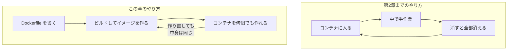
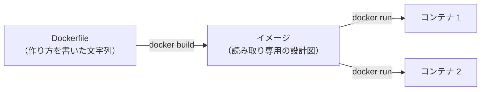
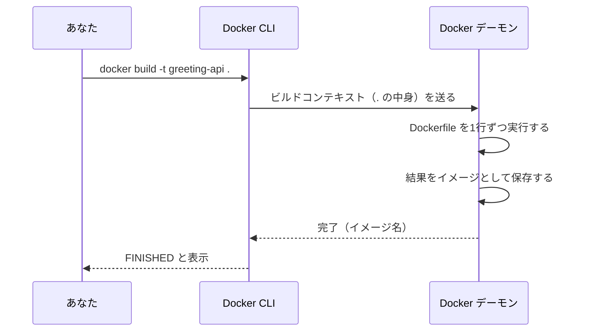
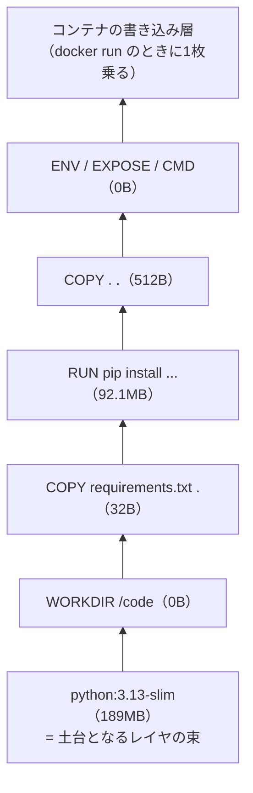
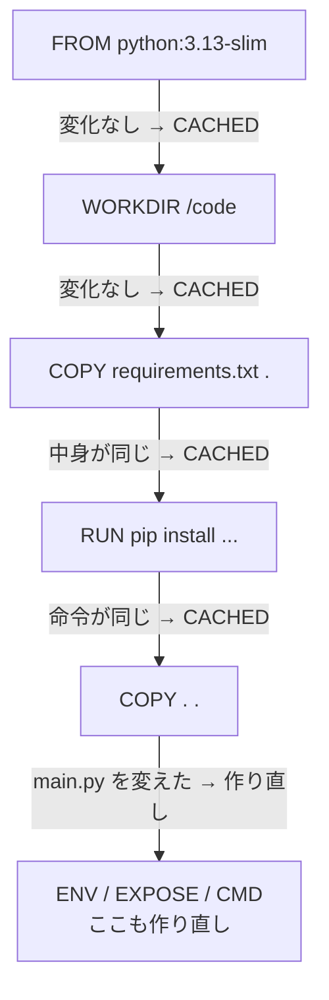
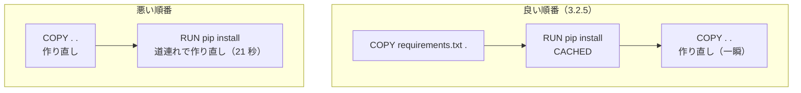
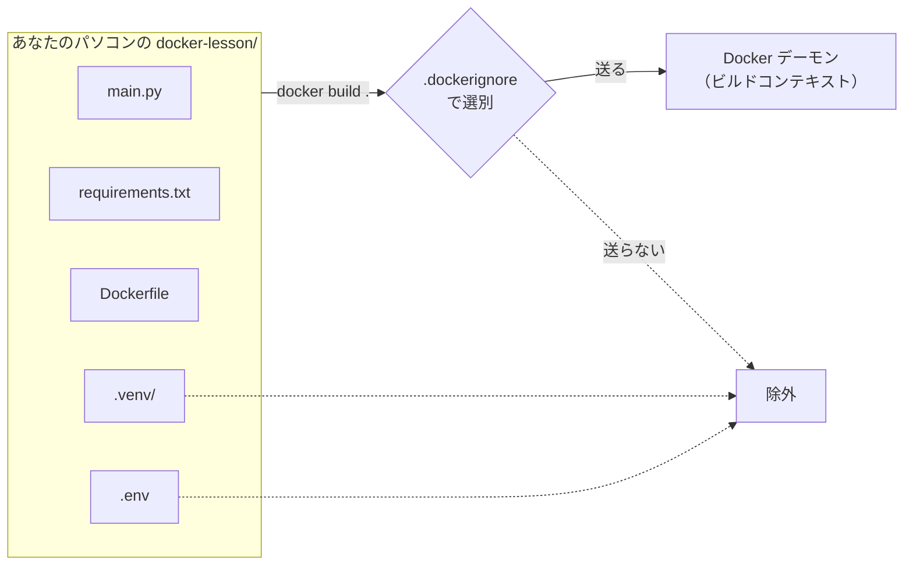
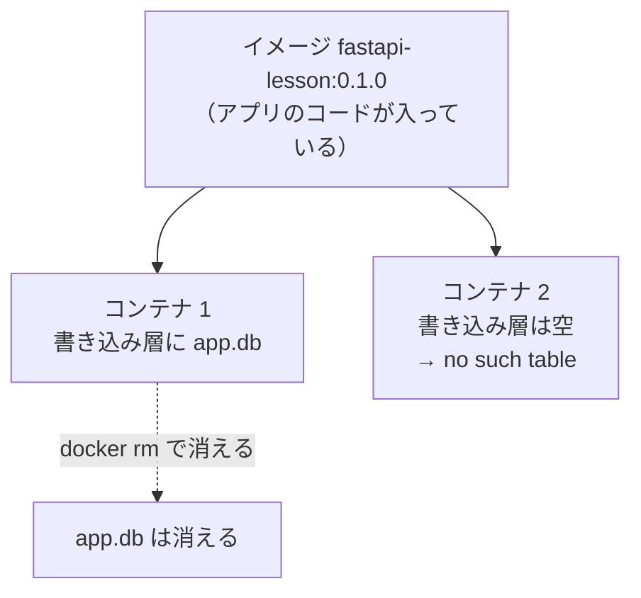

# 第3章 Dockerfile

第2章では、他人が作ったイメージ（`hello-world`、`nginx`、`python`）を動かしました。
コンテナを一覧し、止め、消し、中に入り、掃除もできるようになりました。

**ですが、動かしたのは全部「他人のアプリ」です。**

この章では、**自分のアプリが入ったイメージを、自分で作ります。**
そのための設計図が **Dockerfile**（ドッカーファイル）です。

イメージの作り方を1つのファイルに書いておくと、
第1章 1.4.1 で見た「手順書を人間の記憶からファイルへ移す」が、ようやく実現します。
この章の終わりには、fastapi-text で作った API が、
**`docker run` の1コマンドで起動する**ところまで進みます。

## この章で学ぶこと

- Dockerfile に書く5つの基本命令（`FROM` / `WORKDIR` / `COPY` / `RUN` / `CMD`）の役割を説明できるようになる
- 自分で書いた Dockerfile からイメージをビルドし、名前とバージョンを付けられるようになる
- ビルドしたイメージからコンテナを起動し、ブラウザから動作を確認できるようになる
- イメージが**レイヤ**の積み重ねであることと、**キャッシュ**が効く条件を説明できるようになる
- **依存インストールを先に書く**理由を、ビルド時間の違いとして体験できるようになる
- `.dockerignore` を書いて、**ビルドに送るファイルを減らせる**ようになる
- fastapi-text で作った API を、Dockerfile からイメージにできるようになる

## この章の前提

- [第2章 インストールと基本操作](./02-install-and-basics.md) を読み終えていること
  （とくに 2.3 の `docker run`、2.4 のコンテナ操作、2.5 のイメージ操作、2.6.2 の `docker logs`）
- Docker Desktop が起動していること（クジラのアイコンが `running`。2.1.3）
- ディスクの空き容量が **10 GB 以上**あること
- **3.6 だけは、fastapi-text 第6章まで進めた `fastapi-lesson` を使います。**
  手元に無い場合でも、3.5 までは同じように進められます

> **つまずいたら**
> この章は、**エラーメッセージが親切な章**です。
> ビルドが失敗すると、Docker は「何行目の、どの命令で、どう失敗したか」を必ず表示します。
> **まずその行番号と命令名を読んでください。**
>
> それでも分からないときは、第0章 0.2 で準備した AI に、次のように聞いてください。
>
> ```text
> docker-text の 3.3.1 を読んでいます。
> docker build . を実行したら、次のエラーで止まりました。
>
> （ここにメッセージ全文を貼る）
>
> Dockerfile の中身も貼ります。
>
> （ここに Dockerfile 全文を貼る）
>
> 原因と、直したあとの Dockerfile を、行ごとの説明付きで教えてください。
> ```
>
> **Dockerfile 全文を一緒に貼ってください。** エラーだけでは原因が特定できないことが多いためです。

---

## 3.1 自分のアプリをイメージにする

### 3.1.1 なぜ必要か

第2章 2.6 で、コンテナの中に入って作業しました。
そこで2回、同じ注意を書きました。

> 中でした変更はイメージに残りません。

これが、どれだけ不便かを確認しておきます。
たとえば、あなたの FastAPI アプリをコンテナで動かしたいとします。
第2章までの知識でやろうとすると、こうなります。

```text
1. docker run -it python:3.13-slim bash     で Python 入りのコンテナに入る
2. コンテナの中で pip install fastapi ...    を実行する
3. docker cp でアプリのファイルをコンテナに送り込む
4. コンテナの中でサーバーを起動する
5. コンテナを消す
6. 明日、また 1 からやり直す
```

**6 が致命的です。** 消して作り直せるのが Docker の利点（第1章 1.4.2）でしたが、
作り直すたびに手作業を繰り返すのでは、第1章 1.1.3 で限界を見た「手順書」と何も変わりません。
むしろ、手順書がターミナルの履歴の中に散らばるぶん、悪くなっています。

**必要なのは、「この手順でイメージを作る」という指示を、ファイルに書いておくことです。**



左の輪はいくら回しても何も溜まりませんが、右の輪は **`Dockerfile` という成果物が残ります。**
このファイルは Git で管理できるので、**他人に渡せますし、来年の自分にも渡せます。**

### 3.1.2 Dockerfile とは

**Dockerfile**（ドッカーファイル。イメージの作り方を書いたファイル）は、
**上から順に実行される命令のリスト**です。

書き方の決まりは3つだけです。

| 決まり | 説明 |
|-------|------|
| ファイル名は `Dockerfile` | **拡張子を付けません。** `Dockerfile.txt` にすると認識されません |
| 1行に1命令 | `FROM`、`COPY` のような**命令**（instruction）を行頭に書きます |
| 命令は大文字 | 小文字でも動きますが、**引数と区別するために大文字で書く**のが決まりごとです |

そして、この Dockerfile を材料に **`docker build`（ビルド）** を実行すると、イメージができます。
できたイメージを `docker run` すると、第2章と同じようにコンテナが動きます。



**左半分がこの章の新しい部分**です。右半分は第2章でやったことと同じです。

> **補足：`nginx:1.27` も Dockerfile から作られています**
> 第2章で使った公式イメージも、中身は誰かが書いた Dockerfile です。
> Docker Hub の各イメージのページには、その Dockerfile へのリンクが載っています。
> **あなたがこれから書くものと、書き方はまったく同じです。**

---

## 3.2 基本の命令

説明のために、**小さな練習用プロジェクト**を1つ作ります。
fastapi-text で作った本物のアプリは 3.6 で扱うので、
それまでは**壊しても困らないもの**で練習します。

まず、これまでのプロジェクト（`fastapi-lesson` など）と同じ場所に、
`docker-lesson` というディレクトリを作って移動してください。

**Windows（PowerShell）**

```powershell
mkdir docker-lesson
cd docker-lesson
```

**macOS / Linux**

```bash
mkdir docker-lesson
cd docker-lesson
```

VS Code で開いておくと、以降のファイルが作りやすくなります。

**Windows（PowerShell）**

```powershell
code .
```

**macOS / Linux**

```bash
code .
```

この中に、**2つのファイル**を作ります。1つ目はアプリ本体です。

`docker-lesson/main.py`

```python
import os

from fastapi import FastAPI

app = FastAPI()

# 環境変数 GREETING があればそれを使い、無ければ "Hello" を使う
greeting = os.environ.get("GREETING", "Hello")


@app.get("/")
def read_root():
    return {"message": f"{greeting} from a container!"}
```

fastapi-text 第2章で書いた最初のアプリと、ほとんど同じ形です。
違うのは、`os.environ.get(...)` で**環境変数**（OS がプログラムに渡す設定の値。
fastapi-text 4.6.2）を読んでいるところだけです。ここは 3.2.6 で使います。

2つ目は、必要なパッケージを書いたファイルです。

`docker-lesson/requirements.txt`

```text
fastapi[standard]==0.115.6
```

fastapi-text 2.2.2 で `pip install` したものと同じ指定です。
**バージョンを `==` で固定している**点に注意してください（第1章 1.1.2 の「組み合わせを固定する」）。

> **注意：ここでは `pip install` しません**
> これまでなら、この時点で `.venv` を作って `pip install -r requirements.txt` を実行していました。
> **この章では、その作業をコンテナの中でやらせます。**
> あなたのパソコンには、FastAPI を入れません。

準備ができました。同じディレクトリに `Dockerfile` を作り、
**1命令ずつ書き足しながら**、意味を確認していきます。

### 3.2.1 `FROM` — 土台を決める

Dockerfile の**1行目は、必ず `FROM`** です。

`docker-lesson/Dockerfile`

```dockerfile
FROM python:3.13-slim
```

`FROM` は、**どのイメージを土台にするか**を指定します。
この土台のことを **ベースイメージ**（base image。自分のイメージの出発点にするイメージ）と呼びます。

指定しているのは、第2章の演習 2.3 でも使った `python:3.13-slim` です。
つまり、**Python 3.13 が入った Linux 一式**が最初から手に入ります。
第1章 1.1 で見た4つの層のうち、**③ランタイムと④OS が、この1行で決まります。**

| 層（第1章 1.1.1） | 誰が決めるか |
|------------------|------------|
| ④ OS | `FROM` が決める（`python:3.13-slim` の中身は Debian） |
| ③ ランタイム | `FROM` が決める（Python 3.13） |
| ② ライブラリ | このあとの `RUN`（3.2.4）で決める |
| ① 設定 | `ENV`（3.2.6）や起動時に渡す |

**タグを省略しないでください。** `FROM python` と書くと `python:latest` になり、
第2章 2.5.5 で見たとおり、**中身が黙って変わります。**

> **補足：`slim` とは**
> 公式の Python イメージには `python:3.13`（約 1 GB）、`python:3.13-slim`（約 190 MB）、
> `python:3.13-alpine` などの種類があります。
> `slim` は、**Python の動作に必要な最小限だけを入れた版**です。
> このテキストでは `slim` を使います。選び方の詳しい話は第7章 7.3 で扱います。

### 3.2.2 `WORKDIR` — 作業ディレクトリ

次の行を足します。

`docker-lesson/Dockerfile`

```dockerfile
FROM python:3.13-slim

WORKDIR /code
```

`WORKDIR` は、**このあとの命令を、コンテナの中のどのディレクトリで実行するか**を決めます。
ターミナルで `cd` を打つのと同じ働きです。

指定したディレクトリが無ければ、**自動で作られます。**

なぜ必要かというと、指定しないと**ルートディレクトリ（`/`）に直接ファイルが置かれる**からです。
Linux の `/` には `bin`、`etc`、`usr` など OS のディレクトリが並んでいて（2.6.1 で中を見ました）、
そこに自分のファイルを混ぜると、どれが自分のものか分からなくなります。

> **なぜ `/app` ではなく `/code` なのか**
> `/app` という名前もよく使われます。ただし 3.6 で扱う `fastapi-lesson` には、
> **`app` という名前のディレクトリ（Python のパッケージ）**があります。
> 「`/app` の中の `app`」は説明のときに混乱しやすいので、
> **このテキストでは `/code` で統一します。** 名前は自分で決めて構いません。

### 3.2.3 `COPY` — ファイルを入れる

いよいよ、自分のファイルをイメージの中に入れます。

`docker-lesson/Dockerfile`

```dockerfile
FROM python:3.13-slim

WORKDIR /code

COPY requirements.txt .
```

`COPY` は **`COPY コピー元 コピー先`** の形で書きます。

| 部分 | 意味 |
|------|------|
| `requirements.txt` | **コピー元。あなたのパソコン側**のファイル |
| `.` | **コピー先。コンテナの中**の現在地（`WORKDIR` で指定した `/code`） |

コピー先の `.` は `/code` と書いても同じです。
`COPY requirements.txt /code/requirements.txt` と全部書いても構いません。

第2章 2.6.3 の `docker cp` と似ていますが、**決定的に違う点があります。**

| | `docker cp`（2.6.3） | `COPY`（この章） |
|--|--------------------|----------------|
| いつ実行されるか | コンテナが動いているとき | **ビルドのとき** |
| どこに残るか | そのコンテナの書き込み層だけ | **イメージの中** |
| 作り直したら | 消える | **残る**（何個作っても入っている） |

**この違いが、この章の中心です。**

コピー元には、ディレクトリも指定できます。
たとえば、コンテナの中の決まった場所にファイルを置きたいときは、こう書きます。

```dockerfile
COPY myindex.html /usr/share/nginx/html/index.html
```

これは、第2章の演習 2.2 で `docker cp` を使ってやった差し替えを、
**イメージに焼き込む形にしたもの**です（この形は演習 3.2 で使います）。

> **よくある間違い**
> **コピー元に、Dockerfile より上のディレクトリを指定することはできません。**
>
> ```dockerfile
> COPY ../secret.txt .
> ```
>
> これは次のエラーになります。
>
> ```text
> ERROR: failed to solve: failed to compute cache key: "/secret.txt": not found
> ```
>
> ビルドのときに Docker が見ているのは、**指定したディレクトリの中だけ**だからです
> （この範囲を**ビルドコンテキスト**と呼びます。3.5.1 で詳しく扱います）。
> 必要なファイルは、**Dockerfile と同じディレクトリの中に置いてください。**

### 3.2.4 `RUN` — ビルド時にコマンドを実行

パッケージを入れます。

`docker-lesson/Dockerfile`

```dockerfile
FROM python:3.13-slim

WORKDIR /code

COPY requirements.txt .

RUN pip install --no-cache-dir -r requirements.txt
```

`RUN` は、**ビルドのときに、コンテナの中でコマンドを1回実行**します。
実行した結果（この場合はインストールされた FastAPI 一式）は、**イメージに残ります。**

書いたコマンドは、あなたが `pip install -r requirements.txt` と手で打つのと同じものです。
違うのは、**打つ場所があなたのパソコンではなくイメージの中**であることだけです。

**`RUN` が要らない場合もあります。**
`argparse` や `os` のように、**Python の標準ライブラリ**（python-text 6.2。
Python 本体に最初から付いてくる部品）しか使わないプログラムなら、
`FROM python:3.13-slim` の時点で必要なものは揃っています。
その場合、`requirements.txt` も `RUN pip install` も書きません（演習 3.3 がこの形です）。

`--no-cache-dir` は pip のオプションで、
**ダウンロードしたファイルの控えを残さない**という指定です。
あなたのパソコンなら控えがあると次回が速くなりますが、
**イメージの中では二度と使わないのに容量だけ増える**ので、付けています。

> **補足：`.venv` はどうなったのか**
> python-text 第1章から、Python のパッケージは**必ず仮想環境（venv）に入れて**きました。
> **コンテナの中では、venv を作らないのが普通です。**
> venv の目的は「1台のパソコンで、プロジェクトごとにライブラリを分ける」ことでしたが、
> **コンテナは、そもそも1つのアプリのためだけの隔離された環境**だからです。
> 分ける相手がいないので、直接入れて構いません。

> **よくある間違い**
> **`RUN` と `CMD`（次の項）を取り違える**間違いです。
>
> | 命令 | いつ動くか | 何回動くか |
> |------|----------|----------|
> | `RUN` | **ビルドのとき** | イメージを作るときに1回 |
> | `CMD` | **`docker run` のとき** | コンテナを起動するたび |
>
> サーバーの起動を `RUN` に書くと、**ビルドがそこで止まったまま終わらなくなります。**

### 3.2.5 `CMD` — 起動時に実行するコマンド

残りのアプリ本体をコピーし、起動コマンドを書きます。

`docker-lesson/Dockerfile`

```dockerfile
FROM python:3.13-slim

WORKDIR /code

COPY requirements.txt .

RUN pip install --no-cache-dir -r requirements.txt

COPY . .

CMD ["fastapi", "run", "main.py", "--port", "8000"]
```

2つ足しました。

**1つ目の `COPY . .`** は、「**ビルドコンテキストの中身を全部、`/code` にコピーする**」という意味です。
これで `main.py` がイメージに入ります。
（`requirements.txt` を先に1行だけコピーしてあるのは無駄に見えますが、
**これがこの章でいちばん重要な工夫**です。理由は 3.4.3 で扱います。）

**2つ目の `CMD`** は、**コンテナが起動したときに実行するコマンド**です。
第2章で `nginx` のコンテナを起動したら勝手に Web サーバーが動き出しましたが、
あれは `nginx` のイメージに `CMD` が書かれていたからです。

書き方は、**コマンドをスペースで区切って、1つずつ `"` で囲んで並べます。**

```dockerfile
CMD ["fastapi", "run", "main.py", "--port", "8000"]
```

これは、ターミナルで次のように打つのと同じです。

```text
fastapi run main.py --port 8000
```

**`fastapi dev` ではなく `fastapi run` を使っています。** 違いは2つです。

| コマンド | 用途 | 待ち受ける宛先 |
|---------|------|--------------|
| `fastapi dev` | 開発用。ファイルを保存すると自動で再起動する | `127.0.0.1`（**自分自身からの接続だけ**） |
| `fastapi run` | 本番用。自動再起動はしない | `0.0.0.0`（**外から届く接続も受ける**） |

コンテナの中のサーバーには、**コンテナの外（あなたのパソコンのブラウザ）から接続します。**
`fastapi dev` は「自分自身から」しか受け付けないため、
コンテナの中で動かすと、**`-p` を付けてもブラウザから繋がりません。**
`0.0.0.0` の詳しい話は第4章 4.4.3 で扱います。
**いまは「コンテナの中では `fastapi run` を使う」と覚えてください。**

> **よくある間違い**
> `CMD fastapi run main.py --port 8000` のように、**角かっこと `"` を省く**書き方もできます。
> ただし、その形は**シェルを1つ挟んで実行される**ため、
> `docker stop`（2.4.2）の停止の合図がアプリに届かず、
> **10 秒待たされてから強制終了される**ことがあります。
> **このテキストでは、必ず `["...", "..."]` の形で書きます。**

> **補足：`CMD` を書かないとどうなるか**
> ベースイメージの `CMD` がそのまま引き継がれます。
> たとえば `FROM nginx:1.27` から始めたイメージは、`CMD` を書かなくても nginx が起動します
> （演習 3.2 で使います）。
> `python:3.13-slim` の `CMD` は `python3` なので、書かないと Python の対話画面が起動して終わります。

### 3.2.6 `EXPOSE` と `ENV`

あと2つ、よく使う命令を足します。

`docker-lesson/Dockerfile`（完成形）

```dockerfile
FROM python:3.13-slim

WORKDIR /code

COPY requirements.txt .

RUN pip install --no-cache-dir -r requirements.txt

COPY . .

ENV GREETING="Hello from the Dockerfile"

EXPOSE 8000

CMD ["fastapi", "run", "main.py", "--port", "8000"]
```

**`ENV` は、コンテナの中の環境変数を決めます。**
`main.py` の `os.environ.get("GREETING", "Hello")` が、この値を読みます。

`ENV 名前=値` の形で書きます。**値に空白を含むときは `"` で囲みます。**

イメージに焼き込んだ値は、**起動するときに上書きできます。**
`docker run` に `-e 名前=値` を付けます。

```text
docker run -e GREETING=Bonjour ...
```

**設定を変えるためだけにイメージを作り直す必要はない**、ということです。
この仕組みは第5章 5.5 で本格的に使います。

> **注意：`ENV` に秘密の値を書かないでください**
> `ENV` の値は**イメージの中に残り、誰でも読めます。**
> 3.4.1 で使う `docker history` を実行すると、そのまま表示されます。
> パスワードや API キーは、`ENV` ではなく**起動時に渡す**（`-e` や第5章 5.5.2 の方法）か、
> 第7章 7.4.2 の方法を使ってください。

**`EXPOSE` は、「このコンテナは 8000 番を使います」という申告です。**

注意してほしいのは、**`EXPOSE` を書いてもポートは公開されない**ことです。
ブラウザから繋げるようにするのは、第2章 2.3.3 で使った **`-p 8000:8000`** のほうです。

では何のためにあるかというと、**このイメージを読む人と、道具のための情報**です。

| 誰が読むか | どう使うか |
|-----------|----------|
| このイメージを使う人 | 「どのポートを `-p` で繋げばいいか」が分かる |
| Docker Compose（第5章） | 設定を書くときの手がかりになる |
| `docker ps` の `PORTS` 列 | 公開していないポートも表示される |

**書かなくても動きますが、書いておくと親切です。**

### 3.2.7 `CMD` と `ENTRYPOINT` の違い

`CMD` と似た命令に **`ENTRYPOINT`** があります。
どちらも「起動時に実行するコマンド」を決めますが、**上書きのされ方が違います。**

第2章 2.5.4 で、**イメージ名のあとにコマンドを書くと、そのコマンドが実行される**ことを学びました。

```text
docker run --rm nginx:1.27 nginx -v
```

このとき何が起きているかというと、**`CMD` が丸ごと捨てられて、書いたコマンドに差し替わっています。**

`ENTRYPOINT` は、差し替わりません。**後ろに追加されます。**

| 書いたもの | `docker run イメージ` | `docker run イメージ --version` |
|-----------|---------------------|-------------------------------|
| `CMD ["python", "app.py"]` | `python app.py` が動く | **`--version` だけ**が動く（`python app.py` は消える） |
| `ENTRYPOINT ["python"]` | `python` が動く | **`python --version`** が動く |

使い分けの目安は次のとおりです。

| 命令 | 向いている用途 |
|------|--------------|
| `CMD` | **既定の動作**を決める。使う人が丸ごと差し替えてよい |
| `ENTRYPOINT` | **イメージを1つのコマンドのように使わせる**。引数だけを受け取りたい |

2つを組み合わせると、「実行するものは固定、引数には既定値あり」が表現できます。

```dockerfile
ENTRYPOINT ["python"]
CMD ["main.py"]
```

この形なら、`docker run イメージ` は `python main.py` を実行し、
`docker run イメージ --version` は `python --version` を実行します。

**このテキストでは、原則 `CMD` だけを使います。**
サーバーを動かすイメージでは、使う人が中身を差し替えられるほうが便利だからです
（3.3.3 で、実際に差し替えて中を調べます）。
`ENTRYPOINT` は、**コマンドとして配るイメージ**を作るときに使います（演習 3.3 で扱います）。

**この違いは、3.3.3 で実際に手を動かして確かめます。**
まずはビルドできるようにしましょう。

---

## 3.3 ビルドして動かす

### 3.3.1 `docker build`

Dockerfile からイメージを作ることを、**ビルド**（build）と呼びます。

`docker-lesson` ディレクトリにいることを確認してから、次を実行してください。

**Windows（PowerShell）**

```powershell
docker build -t greeting-api .
```

**macOS / Linux**

```bash
docker build -t greeting-api .
```

**最後の `.` を忘れないでください。** 意味はすぐあとで説明します。

初回は、FastAPI 一式のダウンロードで 20〜60 秒ほどかかります。
次のような表示が流れます。

```text
[+] Building 24.7s (10/10) FINISHED                              docker:desktop-linux
 => [internal] load build definition from Dockerfile                             0.0s
 => => transferring dockerfile: 245B                                             0.0s
 => [internal] load metadata for docker.io/library/python:3.13-slim              1.1s
 => [internal] load .dockerignore                                                0.0s
 => => transferring context: 2B                                                  0.0s
 => [internal] load build context                                                0.0s
 => => transferring context: 512B                                                0.0s
 => [1/5] FROM docker.io/library/python:3.13-slim@sha256:9d2e5553305c...         0.0s
 => [2/5] WORKDIR /code                                                          0.1s
 => [3/5] COPY requirements.txt .                                                0.0s
 => [4/5] RUN pip install --no-cache-dir -r requirements.txt                    21.8s
 => [5/5] COPY . .                                                               0.0s
 => exporting to image                                                           1.5s
 => => exporting layers                                                          1.4s
 => => writing image sha256:7f3c1a...                                            0.0s
 => => naming to docker.io/library/greeting-api:latest                           0.0s
```

**表示の細部は Docker のバージョンで変わります**（2.5.1 の補足と同じです）。
読むべきところは、次の3つです。

| 行 | 意味 |
|----|------|
| `[1/5]` 〜 `[5/5]` | **Dockerfile の命令が、上から順に実行されている** |
| `FINISHED` | 全部成功した（失敗すると `ERROR` で止まります） |
| `naming to ... greeting-api:latest` | この名前でイメージができた |

命令は7つ書いたのに、実行されたのは**5つ**です。
`ENV` と `EXPOSE` は**情報を書き込むだけ**で、実行するものが無いためです（3.4.1 で扱います）。

**コマンドの意味を分解します。**

| 部分 | 意味 |
|------|------|
| `docker build` | ビルドする |
| `-t greeting-api` | できたイメージに `greeting-api` という**名前を付ける**（3.3.2） |
| `.` | **ビルドコンテキスト**。ここを材料にする |

最後の `.` は「**いまいるディレクトリを、材料として Docker デーモンに送る**」という指定です。
この送るひとまとまりを **ビルドコンテキスト**（build context）と呼びます。



第2章 2.1.3 で見た「CLI が注文し、デーモンが作る」の関係が、ここでも同じです。
**`COPY` がコピーできるのは、この送られた範囲の中だけ**です
（3.2.3 の「よくある間違い」の理由がこれです）。

できたイメージを確認します。

**Windows（PowerShell）**

```powershell
docker images
```

**macOS / Linux**

```bash
docker images
```

```text
IMAGE                   ID             DISK USAGE   CONTENT SIZE
greeting-api:latest     7f3c1ab29e04        281MB         88.4MB
python:3.13-slim        9d2e5553305c        189MB         48.2MB
nginx:1.27              6784fb0834aa        282MB         75.5MB
```

**`greeting-api` が並びました。** 自分で作ったイメージが、公式イメージと同じ場所に並んでいます。

土台の `python:3.13-slim` が 189 MB で、できたイメージが 281 MB です。
**差の 92 MB が、`RUN pip install` で入った FastAPI 一式**です。

> **よくある間違い**
> **最後の `.` を忘れる**間違いです。
>
> ```text
> ERROR: "docker buildx build" requires exactly 1 argument.
> ```
>
> 「材料をどこから取るのか書かれていない」という意味です。**`.` を付け足してください。**

> **よくある間違い**
> **`Dockerfile` という名前になっていない**間違いです。
> Windows のメモ帳で保存すると `Dockerfile.txt` になっていることがあります。
>
> ```text
> ERROR: failed to solve: failed to read dockerfile: open Dockerfile: no such file or directory
> ```
>
> VS Code のファイル一覧で、**名前が `Dockerfile` だけになっているか**を確認してください
> （拡張子が隠れている場合は、第0章 0.1 の「拡張子の表示」を参照）。

### 3.3.2 タグを付ける

いまのイメージは `greeting-api:latest` になりました。
**`-t` でタグを省略すると、`latest` が付きます。**

第2章 2.5.5 で、**`latest` を使わない**と決めました。理由は同じです。

- あとから作り直すと、**同じ名前で中身だけが変わる**
- 「昨日動いていたイメージ」に戻せない
- 相手に渡したとき、**手元と同じものが動く保証がない**

**自分で作るイメージにも、必ずバージョンのタグを付けてください。**

**Windows（PowerShell）**

```powershell
docker build -t greeting-api:0.1.0 .
```

**macOS / Linux**

```bash
docker build -t greeting-api:0.1.0 .
```

```text
[+] Building 1.2s (10/10) FINISHED                               docker:desktop-linux
 => [internal] load build definition from Dockerfile                             0.0s
 ...
 => CACHED [2/5] WORKDIR /code                                                   0.0s
 => CACHED [3/5] COPY requirements.txt .                                         0.0s
 => CACHED [4/5] RUN pip install --no-cache-dir -r requirements.txt              0.0s
 => CACHED [5/5] COPY . .                                                        0.0s
 => exporting to image                                                           0.1s
 => => naming to docker.io/library/greeting-api:0.1.0                            0.0s
```

**24.7 秒だったビルドが、1.2 秒で終わりました。**
`CACHED` と表示された行が、**前回の結果を使い回した**ところです。
この仕組みは 3.4 で詳しく扱います。

`docker images` を見ると、**同じ ID の行が2つ**あります。

```text
IMAGE                   ID             DISK USAGE   CONTENT SIZE
greeting-api:0.1.0      7f3c1ab29e04        281MB         88.4MB
greeting-api:latest     7f3c1ab29e04        281MB         88.4MB
```

**ディスクを2倍使っているわけではありません。**
1つのイメージに名前が2つ付いているだけです（第2章 2.5.4 で見た「タグは名前」の話です）。

不要な `latest` のほうは、消しておきます。

**Windows（PowerShell）**

```powershell
docker rmi greeting-api:latest
```

**macOS / Linux**

```bash
docker rmi greeting-api:latest
```

```text
Untagged: greeting-api:latest
```

`Deleted:` が出ず `Untagged:` だけなのは、**名前を1つ外しただけで、中身は `0.1.0` として残っている**ためです
（2.5.3 で見た違いです）。

> **補足：バージョンの付け方**
> `0.1.0` のような3つの数字の形は、python-text 6.6.3 や fastapi-text で見た形と同じです。
> **決まりはありません。** 日付（`2026-09-09`）でも構いません。
> 大事なのは、**中身を変えたら別の名前にする**ことです。

### 3.3.3 ビルドしたイメージを起動する

**ここからは第2章と同じ**です。イメージができてしまえば、扱いは公式イメージと変わりません。

**Windows（PowerShell）**

```powershell
docker run -d --name greet -p 8000:8000 greeting-api:0.1.0
```

**macOS / Linux**

```bash
docker run -d --name greet -p 8000:8000 greeting-api:0.1.0
```

```text
a3f9c81d5b7e2c04f1a6d8e39b45c07a2f81d6e5c93b7a0f4d12e8c65b39a7f0
```

`-d`（バックグラウンド。2.4.4）で起動したので、長い ID だけが表示されます。
動いているか確認します。

**Windows（PowerShell）**

```powershell
docker ps
```

**macOS / Linux**

```bash
docker ps
```

```text
CONTAINER ID   IMAGE                COMMAND                  STATUS         PORTS                    NAMES
a3f9c81d5b7e   greeting-api:0.1.0   "fastapi run main.p…"    Up 6 seconds   0.0.0.0:8000->8000/tcp   greet
```

**`COMMAND` 列に、あなたが `CMD` に書いたコマンドが表示されています。**
`PORTS` の `0.0.0.0:8000->8000/tcp` は、`-p 8000:8000` の結果です。

ブラウザで次を開いてください。

```text
http://localhost:8000
```

```json
{"message":"Hello from the Dockerfile from a container!"}
```

**自分で作ったイメージが動きました。**
表示されている `Hello from the Dockerfile` は、Dockerfile の `ENV`（3.2.6）で入れた値です。

fastapi-text で使った API ドキュメントも、そのまま開けます。

```text
http://localhost:8000/docs
```

ログも第2章 2.6.2 のとおり読めます。

**Windows（PowerShell）**

```powershell
docker logs greet
```

**macOS / Linux**

```bash
docker logs greet
```

```text
   FastAPI   Starting production server 🚀
    module   🐍 main.py
       app   Using import string: main:app
    server   Server started at http://0.0.0.0:8000
      INFO   Started server process [1]
      INFO   Application startup complete.
      INFO   Uvicorn running on http://0.0.0.0:8000 (Press CTRL+C to quit)
      INFO   172.17.0.1:54312 - "GET / HTTP/1.1" 200 OK
```

`Server started at http://0.0.0.0:8000` の行が、3.2.5 の表で説明した
「**外から届く接続も受ける**」状態です。最後の行は、あなたがブラウザで開いた記録です。

**環境変数を上書きしてみます。**
いまのコンテナを消してから、`-e` を付けて起動し直します（2.4.3）。

**Windows（PowerShell）**

```powershell
docker rm -f greet
docker run -d --name greet -p 8000:8000 -e GREETING=Bonjour greeting-api:0.1.0
```

**macOS / Linux**

```bash
docker rm -f greet
docker run -d --name greet -p 8000:8000 -e GREETING=Bonjour greeting-api:0.1.0
```

ブラウザを再読み込みすると、表示が変わります。

```json
{"message":"Bonjour from a container!"}
```

**イメージは1つも作り直していません。** 設定だけを外から変えました。

**`CMD` を差し替えてみます（3.2.7 の確認）。**

イメージ名のあとにコマンドを書くと、`CMD` は捨てられます。
サーバーは起動せず、書いたコマンドだけが実行されます。

**Windows（PowerShell）**

```powershell
docker run --rm greeting-api:0.1.0 python --version
```

**macOS / Linux**

```bash
docker run --rm greeting-api:0.1.0 python --version
```

```text
Python 3.13.7
```

`--rm`（終了と同時に削除。2.4.3）を付けているので、コンテナは残りません。
**同じイメージなのに、サーバーではなく Python のバージョン表示になりました。**

イメージの中身を調べるときにも使えます。

**Windows（PowerShell）**

```powershell
docker run --rm greeting-api:0.1.0 pip list
```

**macOS / Linux**

```bash
docker run --rm greeting-api:0.1.0 pip list
```

```text
Package           Version
----------------- -----------
fastapi           0.115.6
fastapi-cli       0.0.7
pydantic          2.10.4
starlette         0.41.3
uvicorn           0.34.0
...
```

**`RUN pip install` が確かに実行されていた**ことが分かります。
バージョンは `requirements.txt` で固定したとおりです。

**`ENTRYPOINT` との違いを確かめます。**

Dockerfile の最後の行を、**一時的に**次のように書き換えてください。

`docker-lesson/Dockerfile`（最後の行を一時的に変更）

```diff
- CMD ["fastapi", "run", "main.py", "--port", "8000"]
+ ENTRYPOINT ["python"]
+ CMD ["--version"]
```

別のタグでビルドします（`0.1.0` を壊さないためです）。

**Windows（PowerShell）**

```powershell
docker build -t greeting-api:entrypoint-test .
docker run --rm greeting-api:entrypoint-test
```

**macOS / Linux**

```bash
docker build -t greeting-api:entrypoint-test .
docker run --rm greeting-api:entrypoint-test
```

```text
Python 3.13.7
```

`ENTRYPOINT` の `python` と、`CMD` の `--version` が繋がって `python --version` になりました。
次に、**引数だけを差し替えます。**

**Windows（PowerShell）**

```powershell
docker run --rm greeting-api:entrypoint-test -c "print(1 + 1)"
```

**macOS / Linux**

```bash
docker run --rm greeting-api:entrypoint-test -c "print(1 + 1)"
```

```text
2
```

**`python` は消えず、`--version` だけが `-c "print(1 + 1)"` に置き換わりました。**
これが 3.2.7 の表の内容です。`CMD` だけのときは `python` ごと消えていました。

確認できたら、**Dockerfile を元に戻してください。**

`docker-lesson/Dockerfile`（元に戻す）

```diff
- ENTRYPOINT ["python"]
- CMD ["--version"]
+ CMD ["fastapi", "run", "main.py", "--port", "8000"]
```

試したイメージも消しておきます。

**Windows（PowerShell）**

```powershell
docker rmi greeting-api:entrypoint-test
```

**macOS / Linux**

```bash
docker rmi greeting-api:entrypoint-test
```

**`greet` のコンテナは、このあと 3.4 でも使うので動かしたままで構いません。**

---

## 3.4 レイヤとキャッシュ

3.3.2 で、2回目のビルドが 24.7 秒から 1.2 秒になりました。
なぜそうなるのかを理解すると、**ビルドの待ち時間を自分で短くできるようになります。**

### 3.4.1 1命令 = 1レイヤ

イメージは、**1枚の塊ではありません。**
**Dockerfile の命令1つにつき1枚**の層が作られ、それが重なったものです。
この層を **レイヤ**（layer）と呼びます。

実際に見てみます。

**Windows（PowerShell）**

```powershell
docker history greeting-api:0.1.0
```

**macOS / Linux**

```bash
docker history greeting-api:0.1.0
```

```text
IMAGE          CREATED          CREATED BY                                      SIZE      COMMENT
7f3c1ab29e04   10 minutes ago   CMD ["fastapi" "run" "main.py" "--port" "80…    0B        buildkit.dockerfile.v0
<missing>      10 minutes ago   EXPOSE map[8000/tcp:{}]                         0B        buildkit.dockerfile.v0
<missing>      10 minutes ago   ENV GREETING=Hello from the Dockerfile          0B        buildkit.dockerfile.v0
<missing>      10 minutes ago   COPY . . # buildkit                             512B      buildkit.dockerfile.v0
<missing>      10 minutes ago   RUN /bin/sh -c pip install --no-cache-dir -r…   92.1MB    buildkit.dockerfile.v0
<missing>      10 minutes ago   COPY requirements.txt . # buildkit              32B       buildkit.dockerfile.v0
<missing>      10 minutes ago   WORKDIR /code                                   0B        buildkit.dockerfile.v0
<missing>      3 weeks ago      CMD ["python3"]                                 0B        buildkit.dockerfile.v0
<missing>      3 weeks ago      ENV PYTHON_VERSION=3.13.7                       0B        buildkit.dockerfile.v0
...
```

**下から上に読みます。** 下のほうにあるのがベースイメージ（`python:3.13-slim`）の中身で、
上の7行が、**あなたが書いた Dockerfile の7命令**です。

読み取れることが3つあります。

| 気づき | 内容 |
|-------|------|
| 容量を食うのは `RUN` だけ | `pip install` の 92.1 MB。ほかはほぼ 0 |
| `ENV` / `EXPOSE` / `CMD` は 0B | 実行するものが無く、**情報を書き込むだけ**（3.3.1 で `[5/5]` だった理由） |
| ベースイメージの命令も見える | `python:3.13-slim` も同じように Dockerfile で作られている（3.1.2 の補足） |

図にすると、こうなっています。



いちばん上の「書き込み層」は、第1章 1.3.2 で説明したものです。
**レイヤは読み取り専用で、書き込み層だけがコンテナごとに増えます。**
これが「1つのイメージから何個でもコンテナを作れる」（1.3.3）の仕組みでもあります。

### 3.4.2 キャッシュが効く仕組み

ビルドのとき、Docker は**上から順に、1レイヤずつ「作り直す必要があるか」を判定します。**

判定の基準は、次の2つです。

| 命令 | 作り直す条件 |
|------|------------|
| `FROM` / `WORKDIR` / `RUN` / `ENV` など | **書かれた文字列が前回と違うとき** |
| `COPY` / `ADD` | **コピー元のファイルの中身が前回と違うとき** |

そして、**いちばん重要な決まりがあります。**

> **1つのレイヤを作り直したら、それより下（後ろ）は全部作り直しになります。**

レイヤは積み上げるものなので、途中の1枚が変われば、その上に載るものも変わるためです。



**実験してみます。** `main.py` のメッセージを変えてください。

`docker-lesson/main.py`（`read_root` の中を変更）

```diff
  @app.get("/")
  def read_root():
-     return {"message": f"{greeting} from a container!"}
+     return {"message": f"{greeting} from a container! (v2)"}
```

新しいタグでビルドします。

**Windows（PowerShell）**

```powershell
docker build -t greeting-api:0.2.0 .
```

**macOS / Linux**

```bash
docker build -t greeting-api:0.2.0 .
```

```text
[+] Building 2.0s (10/10) FINISHED                               docker:desktop-linux
 ...
 => CACHED [2/5] WORKDIR /code                                                   0.0s
 => CACHED [3/5] COPY requirements.txt .                                         0.0s
 => CACHED [4/5] RUN pip install --no-cache-dir -r requirements.txt              0.0s
 => [5/5] COPY . .                                                               0.1s
 => exporting to image                                                           0.6s
```

**`[4/5]` までは `CACHED`、`[5/5]` だけが実行されました。**

`main.py` を変えたので `COPY . .` は作り直しになりましたが、
その**手前**にある `pip install` は、命令の文字列も `requirements.txt` の中身も変わっていないため、
**前回の結果がそのまま使われました。** 20 秒以上かかっていた工程が、まるごと省かれています。

> **よくある間違い**
> **「キャッシュが効いている＝新しいコードが反映されていない」と誤解する**間違いです。
> `CACHED` になったのは、変えていない工程だけです。
> **変えたファイルは必ず入り直しています。** 心配なら、起動して確かめてください。
>
> ```text
> docker run --rm -p 8001:8000 greeting-api:0.2.0
> ```
>
> `http://localhost:8001` に `(v2)` が出れば、反映されています
> （8000 番は `greet` が使っているので、左側だけ 8001 に変えています。2.4.4）。

### 3.4.3 依存インストールを先に書く理由

ここが、この章でいちばん実用的な話です。

3.2.5 で、**`requirements.txt` だけを先にコピーする**という一見無駄な書き方をしました。

```dockerfile
COPY requirements.txt .
RUN pip install --no-cache-dir -r requirements.txt
COPY . .
```

**わざと順番を入れ替えて、何が起きるかを体験します。**
Dockerfile を、一時的に次のように書き換えてください。

`docker-lesson/Dockerfile`（一時的に順番を入れ替える）

```dockerfile
FROM python:3.13-slim

WORKDIR /code

COPY . .

RUN pip install --no-cache-dir -r requirements.txt

ENV GREETING="Hello from the Dockerfile"

EXPOSE 8000

CMD ["fastapi", "run", "main.py", "--port", "8000"]
```

`COPY . .` は `requirements.txt` も一緒にコピーするので、**これでも問題なくビルドできます。**
まずビルドしてください（この1回は 20 秒ほどかかります）。

**Windows（PowerShell）**

```powershell
docker build -t greeting-api:bad-order .
```

**macOS / Linux**

```bash
docker build -t greeting-api:bad-order .
```

次に、**`main.py` を1文字だけ変えます。**

`docker-lesson/main.py`（`read_root` の中を変更）

```diff
-     return {"message": f"{greeting} from a container! (v2)"}
+     return {"message": f"{greeting} from a container! (v3)"}
```

もう一度、同じタグでビルドしてください。

**Windows（PowerShell）**

```powershell
docker build -t greeting-api:bad-order .
```

**macOS / Linux**

```bash
docker build -t greeting-api:bad-order .
```

```text
[+] Building 23.9s (9/9) FINISHED                                docker:desktop-linux
 ...
 => CACHED [2/4] WORKDIR /code                                                   0.0s
 => [3/4] COPY . .                                                               0.1s
 => [4/4] RUN pip install --no-cache-dir -r requirements.txt                    21.4s
 => exporting to image                                                           1.6s
```

**`pip install` が、また 21 秒かけて動きました。**

理由は 3.4.2 の決まりです。
`COPY . .` が `main.py` の変更で作り直しになり、
**その下にある `RUN pip install` も、道連れで作り直しになった**のです。
インストールする内容は1文字も変わっていないのに、です。



**コードは1日に何十回も変わりますが、`requirements.txt` はめったに変わりません。**
だから、**変わりにくいものを先に、変わりやすいものを後に**書きます。
これが「依存インストールを先に書く」理由です。

| 書く順番 | 中身 | 変わる頻度 |
|---------|------|----------|
| 先 | `FROM`、`WORKDIR` | ほぼ変わらない |
| 次 | 依存の一覧（`requirements.txt` / `package.json`）と、そのインストール | たまに変わる |
| 後 | アプリのコード（`COPY . .`） | **毎日変わる** |

react-text で使った `npm install` でも、まったく同じ形になります
（`package.json` を先にコピーしてから `RUN npm install`。第6章 6.4 で扱います）。

**確認できたら、Dockerfile を 3.2.6 の完成形に戻してください。**
実験用のイメージも消しておきます。

**Windows（PowerShell）**

```powershell
docker rmi greeting-api:bad-order
```

**macOS / Linux**

```bash
docker rmi greeting-api:bad-order
```

### 3.4.4 キャッシュを意図的に無効化する

キャッシュは便利ですが、**困る場面もあります。**

代表的なのは、`RUN` の中で外から何かを取ってくるときです。

```dockerfile
RUN apt-get update && apt-get install -y curl
```

この命令の**文字列**は、いつまでも変わりません。
そのため Docker はキャッシュを使い続け、**半年前に取得した古い情報のまま**になります。

こういうときは、**キャッシュを使わずにビルドします。**

**Windows（PowerShell）**

```powershell
docker build --no-cache -t greeting-api:0.2.0 .
```

**macOS / Linux**

```bash
docker build --no-cache -t greeting-api:0.2.0 .
```

`--no-cache` を付けると、`CACHED` が1つも出ず、**すべての工程が最初から実行されます。**
そのぶん時間はかかります（この練習用イメージで 20〜60 秒）。

使いどころは、次の3つに絞ってください。

| 場面 | 理由 |
|------|------|
| `apt-get` や外部からの取得を含むイメージを更新したいとき | 文字列が変わらないのでキャッシュが効きすぎる |
| **原因不明のビルド結果**に出会ったとき | 古いレイヤが残っていないかを切り分けられる |
| 配布用に、最初から通しで作り直したいとき | 手元の履歴に依存しない |

> **よくある間違い**
> **困ったらとりあえず `--no-cache`、という癖をつける**間違いです。
> 毎回フルビルドすると、20 秒で済む作業が数分になります。
> **まず 3.4.3 の順番を疑ってください。** 多くの場合、原因はキャッシュではなく命令の順番です。

> **補足：ビルドキャッシュもディスクを使います**
> 第2章 2.7.2 の `docker system df` に、`Build Cache` という行がありました。
> ビルドを繰り返すと、ここが数 GB になることがあります。
>
> ```text
> docker builder prune
> ```
>
> で消せます（`prune` の考え方は 2.7.1 と同じで、**消えるのはキャッシュだけ**です）。

---

## 3.5 dockerignore

### 3.5.1 `node_modules` を送らない

3.3.1 で、`docker build .` の `.` は「**いまいるディレクトリを材料としてデーモンに送る**」だと説明しました。
ビルドの出力にも、その行がありました。

```text
 => [internal] load build context                                                0.0s
 => => transferring context: 512B                                                0.0s
```

`docker-lesson` には小さなファイルが3つしか無いので 512 バイトで済んでいます。
**では、react-text で作ったプロジェクトだとどうなるでしょうか。**

| ディレクトリ | 中身 | だいたいの大きさ |
|------------|------|---------------|
| `node_modules/` | npm で入れたライブラリ（react-text 6.2） | **200 MB 〜 500 MB** |
| `.venv/` | Python の仮想環境（python-text 1.5） | **50 MB 〜 300 MB** |
| `.git/` | Git の履歴 | 数 MB 〜 数百 MB |
| `dist/` / `build/` | ビルド済みの成果物 | 数 MB |

**これが毎回、まるごとデーモンに送られます。** 起きることは3つです。

1. **ビルドが遅くなる。** 送るだけで数十秒かかることがあります
2. **イメージが太る。** `COPY . .` を書いていれば、それも全部イメージに入ります
3. **入ってはいけないものが入る。** `.env`（fastapi-text 4.6.3）には秘密の値が書かれています

とくに 3 は深刻です。イメージを他人に渡すと、**中の `.env` も一緒に渡ります。**

そして、`node_modules` や `.venv` は**入れても役に立ちません。**
あなたのパソコン（Windows / macOS）で作られたものは、
**コンテナの中の Linux では動かないことがある**からです（第1章 1.1.1 の④）。
コンテナの中で必要なものは、`RUN pip install` が入れ直します。

**送るファイルを減らす仕組みが `.dockerignore` です。**



### 3.5.2 書き方

`Dockerfile` と**同じディレクトリ**に、`.dockerignore` という名前のファイルを作ります。

`docker-lesson/.dockerignore`

```text
# Python が自動で作る中間ファイル
__pycache__/
*.pyc

# 仮想環境（コンテナの中では pip install し直すので不要）
.venv/
venv/

# Git の履歴
.git/
.gitignore

# 設定の値（秘密が入るので絶対に入れない）
.env

# データベースのファイル
*.db

# エディタの設定
.vscode/
```

書き方の決まりは、`.gitignore`（react-text 8.4）とほとんど同じです。

| 書き方 | 意味 |
|-------|------|
| `.venv/` | **その名前のディレクトリを丸ごと**除外する |
| `*.pyc` | `.pyc` で終わるファイルを除外する（`*` は「なんでも」） |
| `#` で始まる行 | コメント。無視される |
| `!README.md` | **除外の取り消し。** 上の行で除外したものを、これだけ戻す |

> **よくある間違い**
> **`.dockerignore` を置く場所を間違える**間違いです。
> 読まれるのは、**`docker build` の最後に指定したディレクトリ**にあるものだけです。
> `docker build .` なら、いまいるディレクトリの `.dockerignore` です。
> `app/.dockerignore` のように下の階層に置いても、**読まれません。**

> **よくある間違い**
> **`Dockerfile` 自体を除外してしまう**間違いです。
> `*` と書いて全部除外してから `!main.py` で戻す、という書き方をすると、
> Dockerfile が見つからずビルドできません。
> **このテキストでは、除外したいものだけを1行ずつ書く形を使います。**

`.dockerignore` を作ったら、もう一度ビルドしてみてください。

**Windows（PowerShell）**

```powershell
docker build -t greeting-api:0.2.0 .
```

**macOS / Linux**

```bash
docker build -t greeting-api:0.2.0 .
```

出力の `load .dockerignore` の行で、**中身が読まれた**ことが分かります。

```text
 => [internal] load .dockerignore                                                0.0s
 => => transferring context: 213B                                                0.0s
```

（この `213B` は `.dockerignore` 自体の大きさで、送ったファイルの量ではありません。
ファイルの量は、その下の `load build context` のほうです。）

### 3.5.3 ビルドが遅いときはまずここ

ビルドが遅いと感じたら、**出力の2か所を見てください。**

| 見る場所 | 遅い場合の対処 |
|---------|--------------|
| `transferring context: ...` の数字 | **数十 MB を超えていたら `.dockerignore` を疑う**（3.5.2） |
| どの `[n/m]` の行で時間がかかっているか | `RUN` が毎回動いているなら、**順番を疑う**（3.4.3） |

この2つで、ビルドの待ち時間のほとんどは説明がつきます。

**3.6 で、実際に数字を比べます。**
これから扱う `fastapi-lesson` には `.venv` が入っているので、
`.dockerignore` の有無で、送る量が**数百 MB 単位で変わります。**

> **補足：`.gitignore` があれば `.dockerignore` は要らない？**
> **要ります。** 別のファイルです。
> `.gitignore` は Git に対する指定で、`docker build` は読みません。
> 中身は似たものになりますが、**両方書いてください。**
> なお `.git/` は `.gitignore` には書きませんが、`.dockerignore` には書きます。

---

## 3.6 FastAPI アプリをイメージにする

ここからが本番です。
fastapi-text で作った `fastapi-lesson` を、**そのままイメージにします。**

> **注意：この節は `fastapi-lesson` を使います**
> fastapi-text 第6章まで進めた `fastapi-lesson`（`app/` と `requirements.txt` と
> `alembic.ini` があるもの）を手元に用意してください。
> 無い場合は、**3.6 を飛ばして「まとめ」に進んで構いません。**
> 演習 3.1 〜 3.3 は `fastapi-lesson` が無くても解けます。

### 3.6.1 Dockerfile を書く

まず、8000 番ポートを空けます。3.3.3 で起動した `greet` を削除してください。

**Windows（PowerShell）**

```powershell
docker rm -f greet
```

**macOS / Linux**

```bash
docker rm -f greet
```

`fastapi-lesson` に移動します（パスは自分の環境に合わせてください）。

**Windows（PowerShell）**

```powershell
cd ..\fastapi-lesson
```

**macOS / Linux**

```bash
cd ../fastapi-lesson
```

いまの中身は、次のようになっているはずです（fastapi-text 6.6.2）。

```text
fastapi-lesson/
├── .env                  設定の値（共有しない）
├── .env.example          設定の見本
├── .venv/                仮想環境（数百 MB ある）
├── alembic.ini           Alembic の設定
├── app.db                SQLite のデータベースファイル
├── requirements.txt      入れたパッケージの記録
├── app/                  アプリ本体
│   ├── main.py
│   ├── config.py
│   ├── models.py
│   └── ...
└── migrations/           テーブルの変更の記録
    └── versions/
```

ここに、**新しく2つのファイルを追加します。** 既存のファイルは1つも変更しません。

1つ目は `.dockerignore` です。3.5.2 とほぼ同じ内容ですが、
**`app.db` と `.env` を確実に除外する**のが要点です。

`fastapi-lesson/.dockerignore`

```text
# 仮想環境（コンテナの中で入れ直す）
.venv/

# Python が自動で作る中間ファイル
__pycache__/
*.pyc

# Git の履歴
.git/
.gitignore

# 設定の値（秘密が入る）
.env

# 手元のデータベース（中身は人それぞれ。イメージに焼き込まない）
*.db

# エディタの設定
.vscode/
```

2つ目が `Dockerfile` です。**docker-lesson で書いたものと、ほとんど同じ形になります。**

`fastapi-lesson/Dockerfile`

```dockerfile
FROM python:3.13-slim

WORKDIR /code

COPY requirements.txt .

RUN pip install --no-cache-dir -r requirements.txt

COPY . .

EXPOSE 8000

CMD ["fastapi", "run", "app/main.py", "--port", "8000"]
```

違うのは**最後の行だけ**です。

| | docker-lesson | fastapi-lesson |
|--|--------------|----------------|
| アプリの場所 | `main.py`（直下） | **`app/main.py`**（パッケージの中） |
| `CMD` | `fastapi run main.py ...` | **`fastapi run app/main.py ...`** |

fastapi-text 5.1.2 で `fastapi dev app/main.py` と打っていたのと同じ指定です。
**`fastapi-lesson` の直下から見たパス**を書きます（`WORKDIR /code` が `fastapi-lesson` の直下に対応します）。

`ENV` は書きません。`.env` を除外したので、
`app/config.py` に書いた既定値（fastapi-text 4.6.1）がそのまま使われます。

> **注意：`.env` に必須の設定がある場合**
> fastapi-text の第7章以降まで進めていて、`.env` に**既定値の無い設定**
> （秘密鍵など）を書いている場合、`.env` を除外すると起動時にエラーになります。
> そのときは、起動するときに `--env-file` で外から渡してください。
>
> ```text
> docker run -d --name api -p 8000:8000 --env-file .env fastapi-lesson:0.1.0
> ```
>
> **イメージに焼き込まず、起動時に渡す**のが原則です（3.2.6 の注意）。
> 設定ファイルの扱いは第5章 5.5 で本格的に扱います。

### 3.6.2 ビルドして起動する

**まず、`.dockerignore` が効いていない状態を見ておきます。**
`.dockerignore` を、いったん `.dockerignore.bak` に**名前を変えて**ください
（VS Code のファイル一覧で名前を変更できます）。

**Windows（PowerShell）**

```powershell
Rename-Item .dockerignore .dockerignore.bak
docker build -t fastapi-lesson:test .
```

**macOS / Linux**

```bash
mv .dockerignore .dockerignore.bak
docker build -t fastapi-lesson:test .
```

```text
[+] Building 68.2s (10/10) FINISHED                              docker:desktop-linux
 => [internal] load build context                                               31.4s
 => => transferring context: 412.83MB                                           30.9s
 ...
```

**412 MB を送るのに 31 秒**かかりました。中身のほとんどは `.venv` です。

名前を戻して、もう一度ビルドします。

**Windows（PowerShell）**

```powershell
Rename-Item .dockerignore.bak .dockerignore
docker build -t fastapi-lesson:0.1.0 .
```

**macOS / Linux**

```bash
mv .dockerignore.bak .dockerignore
docker build -t fastapi-lesson:0.1.0 .
```

```text
[+] Building 26.5s (10/10) FINISHED                              docker:desktop-linux
 => [internal] load .dockerignore                                                0.0s
 => => transferring context: 245B                                                0.0s
 => [internal] load build context                                                0.1s
 => => transferring context: 84.21kB                                             0.0s
 => [2/5] WORKDIR /code                                                          0.1s
 => [3/5] COPY requirements.txt .                                                0.0s
 => [4/5] RUN pip install --no-cache-dir -r requirements.txt                    23.1s
 => [5/5] COPY . .                                                               0.1s
```

**412.83 MB が 84.21 kB になりました。**（数字は手元の状態で変わります。桁を見てください。）
3.5.3 で「まずここを見る」と書いた行が、これです。

不要になったテスト用のイメージを消します。

**Windows（PowerShell）**

```powershell
docker rmi fastapi-lesson:test
```

**macOS / Linux**

```bash
docker rmi fastapi-lesson:test
```

起動します。

**Windows（PowerShell）**

```powershell
docker run -d --name api -p 8000:8000 fastapi-lesson:0.1.0
```

**macOS / Linux**

```bash
docker run -d --name api -p 8000:8000 fastapi-lesson:0.1.0
```

**Windows（PowerShell）**

```powershell
docker ps
```

**macOS / Linux**

```bash
docker ps
```

```text
CONTAINER ID   IMAGE                  COMMAND                  STATUS         PORTS                    NAMES
b81f27c9e4a5   fastapi-lesson:0.1.0   "fastapi run app/mai…"   Up 4 seconds   0.0.0.0:8000->8000/tcp   api
```

`STATUS` が `Up ...` なら起動しています。
`Exited` になっていたら、**消す前に `docker logs api` を読んでください**（2.6.2）。

### 3.6.3 動作確認

ブラウザで API ドキュメントを開きます。

```text
http://localhost:8000/docs
```

**fastapi-text で見慣れた画面が出れば、サーバーは動いています。**
あなたのパソコンに `.venv` を作らず、`pip install` もせずに、です。

では `GET /tasks` を `Try it out` → `Execute` で実行してください。

```text
Internal Server Error
```

**エラーになります。** これは想定どおりです。理由をログで確かめます。

**Windows（PowerShell）**

```powershell
docker logs --tail 20 api
```

**macOS / Linux**

```bash
docker logs --tail 20 api
```

```text
  File "/usr/local/lib/python3.13/site-packages/sqlalchemy/engine/base.py", line 1964, in _exec_single_context
    self.dialect.do_execute(
sqlalchemy.exc.OperationalError: (sqlite3.OperationalError) no such table: tasks
[SQL: SELECT tasks.id, tasks.title, ...]
INFO   172.17.0.1:51234 - "GET /tasks HTTP/1.1" 500 Internal Server Error
```

**最終行の1つ上に、原因が書かれています。**

```text
no such table: tasks
```

fastapi-text 6.6.1 で見たものと同じメッセージです。
**`tasks` テーブルが無い**、という意味です。

当たり前で、`.dockerignore` で `*.db` を除外したので、
**このコンテナの中に `app.db` は入っていません。**
入れなかったのは正しい判断です。**手元のデータベースは、あなたの練習用のもの**であり、
イメージに焼き込むと、そのイメージを使う全員に同じデータが配られてしまいます。

**必要なのは、テーブルを作ることです。** その手順は fastapi-text 6.6 で作ってあります。
コンテナの中に入って（2.6.1）、実行します。

**Windows（PowerShell）**

```powershell
docker exec -it api bash
```

**macOS / Linux**

```bash
docker exec -it api bash
```

プロンプトが `root@b81f27c9e4a5:/code#` のように変わったら、中にいます。
**ここから先は、コンテナの中の Linux に対する操作です。**

```bash
alembic upgrade head
```

```text
INFO  [alembic.runtime.migration] Context impl SQLiteImpl.
INFO  [alembic.runtime.migration] Will assume non-transactional DDL.
INFO  [alembic.runtime.migration] Running upgrade  -> 8f3d1c2a9b45, create tasks table
```

続けて、練習用データを入れます（fastapi-text 6.4.6）。

```bash
python -m app.seed
```

```text
3 件のタスクを追加しました。
```

コンテナから出ます。

```bash
exit
```

**もう一度、ブラウザで `GET /tasks` を実行してください。**

```json
[
  {"id":1,"title":"買い物","done":false,"tags":["生活"],"owner":{"name":"田中"}},
  {"id":2,"title":"レポート提出","done":false,"tags":["学校"],"owner":{"name":"田中"}},
  {"id":3,"title":"部屋の掃除","done":true,"tags":["生活"],"owner":{"name":"佐藤"}}
]
```

**fastapi-text で作った API が、コンテナの中で完全に動きました。**
（表示されるデータは、あなたの `app/seed.py` の中身によって変わります。）

**ここで、大事な確認をします。** コンテナを作り直してください。

**Windows（PowerShell）**

```powershell
docker rm -f api
docker run -d --name api -p 8000:8000 fastapi-lesson:0.1.0
```

**macOS / Linux**

```bash
docker rm -f api
docker run -d --name api -p 8000:8000 fastapi-lesson:0.1.0
```

`GET /tasks` を実行すると、**また `Internal Server Error` に戻ります。**

理由は、第1章 1.3.2 と第2章 2.4.5 で繰り返してきたとおりです。
`alembic upgrade head` で作った `app.db` は、**コンテナの書き込み層**にありました。
コンテナを消したので、**書き込み層ごと消えました。**



**これは Dockerfile では解決できません。**
`RUN alembic upgrade head` と書けばイメージに焼き込めますが、
それでは「全員に同じデータが配られる」問題に戻りますし、
**利用者が新しく作ったデータは、やはりコンテナを消すたびに消えます。**

**データを、コンテナの外に置く必要があります。**
その方法が、次の第4章の**ボリューム**です。

後片付けをしておきます。コンテナだけ消して、イメージは残してください
（第4章で、このイメージをそのまま使います）。

**Windows（PowerShell）**

```powershell
docker rm -f api
```

**macOS / Linux**

```bash
docker rm -f api
```

---

## まとめ

- **Dockerfile** は「イメージの作り方」を書いたファイル。**上から順に実行される命令のリスト**である
- ファイル名は拡張子なしの `Dockerfile`。命令は大文字で、1行に1つ書く
- **`FROM`** で土台（ベースイメージ）を決める。ここで**OS とランタイムが確定する**。タグは必ず付ける
- **`WORKDIR`** はコンテナの中の作業ディレクトリ。無ければ自動で作られる
- **`COPY コピー元 コピー先`** はビルド時にファイルをイメージへ入れる。
  `docker cp`（2.6.3）と違い、**作り直しても残る**
- **`RUN`** は**ビルド時**に1回、**`CMD`** は**起動のたび**に実行される。取り違えるとビルドが終わらない
- `CMD` は `["fastapi", "run", ...]` の形で書く。**書かないとベースイメージの `CMD` を引き継ぐ**
- **`ENV`** は環境変数を決める。**`docker run -e` で上書きできる。秘密の値は書かない**
- **`EXPOSE`** は申告だけ。**ポートを公開するのは `-p`**（2.3.3）
- **`CMD` は丸ごと差し替えられ、`ENTRYPOINT` は後ろに追加される**
- `docker build -t 名前:タグ .` の**最後の `.` はビルドコンテキスト**。この範囲しか `COPY` できない
- 自分のイメージにも**バージョンのタグを付ける**。`latest` は使わない（2.5.5）
- イメージは**1命令 = 1レイヤ**の積み重ね。`docker history` で中身が見える
- **キャッシュは上から順に判定され、1つ崩れると以降は全部作り直し**になる
- だから**変わりにくいもの（依存インストール）を先に、変わりやすいもの（コード）を後に**書く
- `--no-cache` は全工程を作り直す。**まず順番を疑い、それでも駄目なときだけ使う**
- **`.dockerignore`** で送るファイルを減らす。`.venv/` `node_modules/` `.git/` **`.env`** は入れない
- ビルドが遅いときは、**`transferring context` の数字**と、**どの `[n/m]` で止まっているか**を見る
- コンテナの中で作ったデータ（`app.db`）は、**コンテナを消すと消える**。解決は第4章

**この章で出てきたものの早見表**

| 命令・コマンド | 何をするか |
|---------------|----------|
| `FROM イメージ:タグ` | 土台にするイメージを決める（1行目） |
| `WORKDIR パス` | 以降の命令を実行するディレクトリを決める |
| `COPY 元 先` | パソコン側のファイルをイメージに入れる |
| `RUN コマンド` | **ビルド時に**コマンドを実行し、結果をイメージに残す |
| `CMD ["a", "b"]` | **起動時に**実行するコマンド（差し替え可能） |
| `ENTRYPOINT ["a"]` | 起動時に実行するコマンド（引数は後ろに追加される） |
| `ENV 名前=値` | 環境変数を決める |
| `EXPOSE 番号` | 使うポートを申告する（公開はしない） |
| `docker build -t 名前:タグ .` | Dockerfile からイメージを作る |
| `docker build --no-cache -t 名前:タグ .` | キャッシュを使わずに作る |
| `docker history 名前:タグ` | イメージのレイヤを一覧する |
| `docker run -e 名前=値 ...` | 環境変数を上書きして起動する |
| `docker run --env-file .env ...` | ファイルから環境変数をまとめて渡す |
| `docker builder prune` | ビルドキャッシュを削除する |

---

## 理解度チェック

**問 3.1**（穴埋め）

Dockerfile の（　①　）はビルドのときに実行され、その結果はイメージに残る。
一方、（　②　）はコンテナが起動するたびに実行され、
`docker run` でイメージ名のあとにコマンドを書くと**丸ごと差し替えられる**。

**問 3.2**（選択）

次の Dockerfile でビルドしたあと、`main.py` を1行だけ変更して、もう一度ビルドしました。

```dockerfile
FROM python:3.13-slim
WORKDIR /code
COPY . .
RUN pip install --no-cache-dir -r requirements.txt
CMD ["fastapi", "run", "main.py", "--port", "8000"]
```

**2回目のビルドで起きること**として正しいものを1つ選んでください。

1. `pip install` はキャッシュされ、一瞬で終わる
2. `pip install` が再実行される
3. `main.py` の変更はイメージに入らない
4. ビルドがエラーになる

**問 3.3**（選択）

`.dockerignore` に**書くべきでないもの**を1つ選んでください。

1. `.venv/`
2. `node_modules/`
3. `requirements.txt`
4. `.env`

**問 3.4**（記述）

`EXPOSE 8000` と書いたのに、ブラウザから `http://localhost:8000` に繋がりませんでした。
**原因**と、**必要な対処**を1行ずつ書いてください。

**問 3.5**（記述）

`docker build -t myapp:0.1.0 .` の**最後の `.`** が何を指しているかを、
「ビルドコンテキスト」という言葉を使って1〜2行で説明してください。

**問 3.6**（記述）

3.6.3 で、`alembic upgrade head` を実行してテーブルを作ったあと、
コンテナを作り直したら `no such table: tasks` に戻りました。
**なぜ戻るのか**を、第1章 1.3.2 の「書き込み層」に触れて1〜2行で説明してください。

---

## 演習問題

### 演習 3.1 ★☆☆ メッセージを変えて 0.3.0 を作る

**課題**

3.4 で作った `docker-lesson` のアプリを変更し、**新しいバージョンのイメージ**を作ってください。

`main.py` のメッセージに、**あなたの名前**を入れます。
そのうえで、`greeting-api:0.3.0` としてビルドし、起動して確認してください。

**完成条件**

- `main.py` を変更し、`greeting-api:0.3.0` としてビルドできた
- ビルドの出力で、**`RUN pip install ...` の行が `CACHED` になっている**
  （なっていない場合は、Dockerfile が 3.2.6 の完成形に戻っているか確認する）
- `docker images` に `greeting-api:0.2.0` と `greeting-api:0.3.0` の**2行**がある
- `docker run -d --name greet3 -p 8000:8000 greeting-api:0.3.0` で起動し、
  ブラウザの `http://localhost:8000` に**新しいメッセージが表示される**
- `docker run --rm greeting-api:0.3.0 python --version` を実行し、
  **サーバーが起動せず、Python のバージョンが表示される**ことを確認した
  （なぜそうなるかを1行で書く）
- 確認が終わったら `greet3` を削除し、`docker ps -a` に残っていない

**ヒント**

イメージを作り直すコマンドは 3.3.2 と同じです。
最後の確認は 3.3.3 でやったことと同じ形で、**`CMD` がどう扱われるか**（3.2.7）を見ています。

---

### 演習 3.2 ★★☆ 演習 2.2 の手作業を Dockerfile にする

**課題**

第2章の演習 2.2 では、`docker cp` で nginx のトップページを差し替えました。
そして、**コンテナを作り直すと元に戻ってしまう**ことを確認しました。

**今度は、同じ差し替えをイメージに焼き込みます。**

`nginx-custom` という新しいディレクトリを作り、次の2つのファイルを置いてください。

`nginx-custom/index.html`

```html
<!DOCTYPE html>
<html lang="ja">
  <head>
    <meta charset="UTF-8" />
    <title>私のページ</title>
  </head>
  <body>
    <h1>Docker で作った自分のイメージです</h1>
  </body>
</html>
```

このファイルを、nginx が公開するディレクトリ（`/usr/share/nginx/html/index.html`）に
**イメージの時点で**置いた `my-nginx:0.1.0` を作ってください。

**完成条件**

- `nginx-custom/Dockerfile` が2〜3行で書けている
- **`CMD` を書いていない**（書かなくても nginx が起動する理由を1行で書く）
- `docker build -t my-nginx:0.1.0 .` が成功する
- `docker run -d --name mysite -p 8080:80 my-nginx:0.1.0` で起動し、
  `http://localhost:8080` に**自分のページが表示される**
- **コンテナを削除して、同じコマンドで作り直しても、自分のページが表示される**
  （演習 2.2 との違いを1〜2行で書く）
- 確認が終わったら `mysite` を削除する

**ヒント**

土台にするイメージは、第2章で使った `nginx:1.27` です。
`COPY` のコピー先には、**絶対パスも書けます**（3.2.3）。
`CMD` を書かなかったときの動きは、3.2.5 の補足にあります。

---

### 演習 3.3 ★★☆ コマンドとして使えるイメージを作る

**課題**

`ENTRYPOINT`（3.2.7）を使って、**イメージ自体を1つのコマンドのように**使えるようにします。

`hello-cli` というディレクトリを作り、次のファイルを置いてください。

`hello-cli/greet.py`

```python
import argparse

parser = argparse.ArgumentParser(description="名前を受け取ってあいさつする")
parser.add_argument("name", help="あいさつする相手の名前")
parser.add_argument("--times", type=int, default=1, help="繰り返す回数")
args = parser.parse_args()

for _ in range(args.times):
    print(f"Hello, {args.name}!")
```

（`argparse` は python-text 第10章で使ったものです。追加のインストールは要りません。）

このスクリプトを、次のように**引数だけを渡して**使えるイメージ `hello-cli:0.1.0` にしてください。

**完成条件**

- `hello-cli/Dockerfile` を書き、`docker build -t hello-cli:0.1.0 .` が成功する
- `docker run --rm hello-cli:0.1.0 世界` を実行すると、`Hello, 世界!` と表示される
- `docker run --rm hello-cli:0.1.0 世界 --times 3` を実行すると、**3行**表示される
- **引数を何も付けずに** `docker run --rm hello-cli:0.1.0` を実行すると、
  `Hello, World!` と表示される（`World` を既定値にする）
- `requirements.txt` と `RUN` の行が**無い**（理由を1行で書く）
- `docker run --rm hello-cli:0.1.0 --help` を実行し、**表示された内容をメモに書く**

**ヒント**

「実行するものは固定、引数には既定値がある」形は、3.2.7 に**2行の例**が載っています。
既定値を与える側と、固定する側の、どちらがどちらかを確かめてください。

---

### 演習 3.4 ★★☆ `fastapi-lesson` のビルドを速くする

> この演習は、3.6 と同じく `fastapi-lesson` を使います。手元に無い場合は飛ばして構いません。

**課題**

3.6.2 で、`.dockerignore` の有無でビルドの速さが変わることを確認しました。
今度は、**もう1つの原因（命令の順番。3.4.3）も含めて、数字で比べてください。**

**完成条件**

- 3.6.1 の Dockerfile のまま、`app/main.py` を**1行だけ**変更して再ビルドし、
  **かかった時間**と、**`CACHED` と表示された行の数**をメモした
- Dockerfile を**一時的に**次の順番に書き換えて、同じことをした
  （`COPY . .` を `RUN pip install` より**前**に移動する）
- 2つの結果を並べた表を作り、**どちらが何秒速いか**を書いた
- **なぜ差が出るのか**を、3.4.2 の「1つ崩れると以降は全部作り直し」に触れて1〜2行で書いた
- Dockerfile を 3.6.1 の形に**戻した**（戻したあと、もう一度ビルドが通ることを確認する）
- ここまでで増えたイメージを確認し、**残すものと消すものを決めて掃除した**
  （第4章で `fastapi-lesson:0.1.0` を使うことを踏まえて選ぶこと。掃除の手順は 2.7.2）

**ヒント**

ビルドにかかった時間は、出力の1行目（`[+] Building 26.5s ...`）に出ています。
「変わりにくいものを先に」の表は 3.4.3 にあります。

---

解答は [解答編](./90-answers.md#第3章) にあります。
**必ず自分で手を動かしてから**見てください。

---

## 次の章へ

この章で、**自分のアプリが入ったイメージ**を作れるようになりました。
第2章までの「他人のイメージを動かす」から、「自分の環境をファイルに書いて配る」へ進んだことになります。

第1章 1.4.1 で見た「手順書を人間の記憶からファイルへ移す」は、
`Dockerfile` という形で、ひとまず実現しました。

**ただし、3.6.3 で大きな穴が見つかりました。**

> コンテナを作り直すと、`app.db` が消える。

さらに、開発中はもう1つ困ることがあります。
いまのままだと、**コードを1行直すたびに `docker build` からやり直し**です。
fastapi-text で当たり前だった「保存すると自動で反映される」が、失われています。

次の章では、この2つをまとめて解決します。
鍵になるのは、**コンテナの中と外を繋ぐ**という考え方です。

→ [第4章 ボリュームとネットワーク](./04-volumes-and-networks.md)
