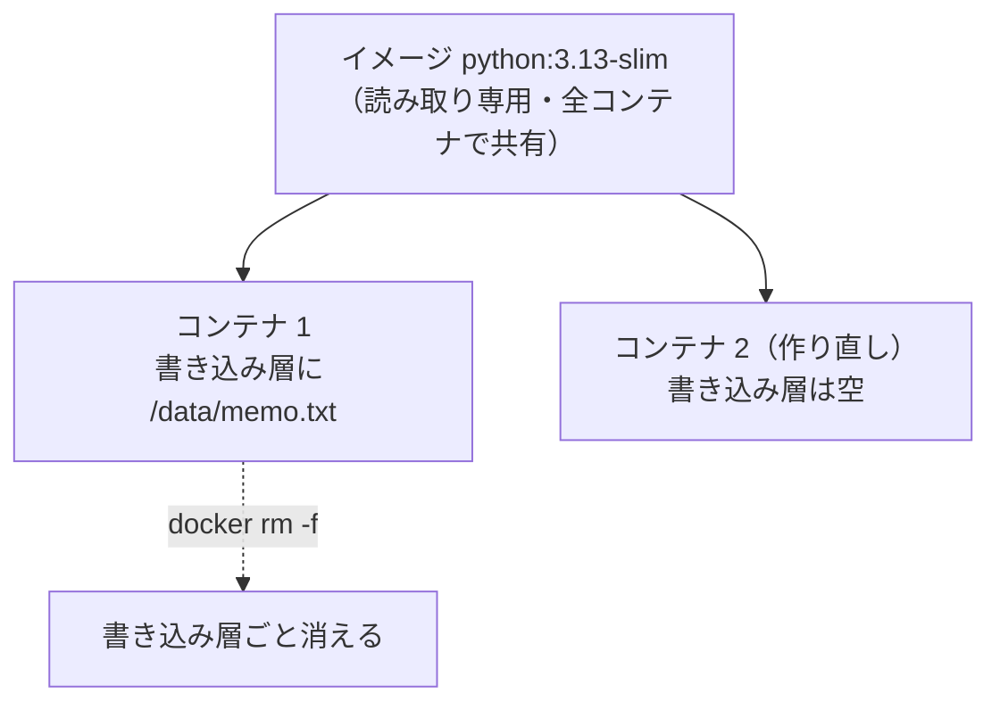
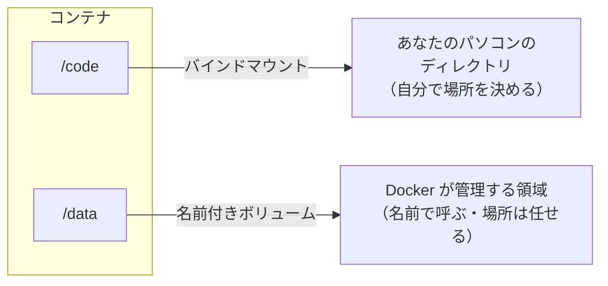
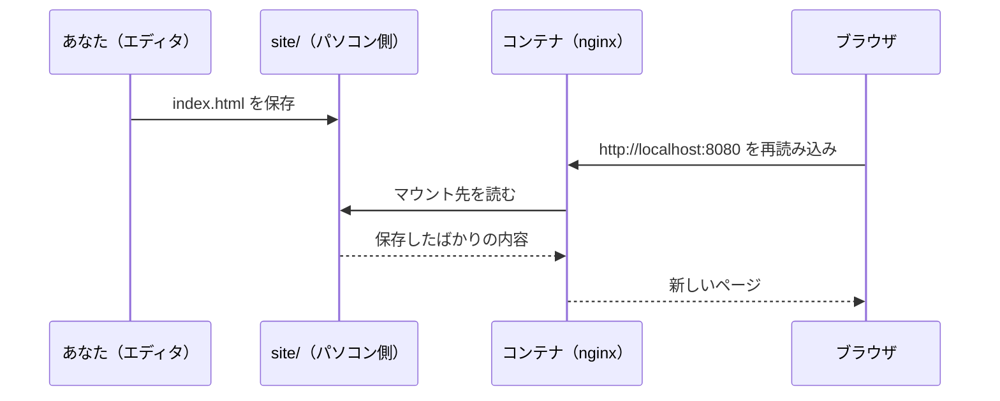
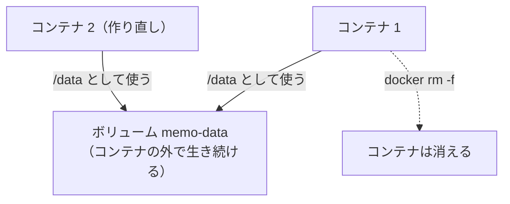
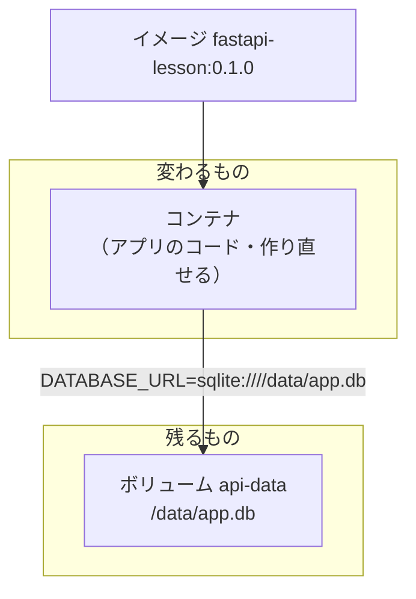
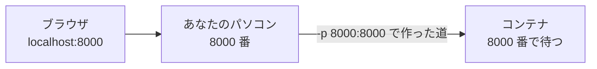
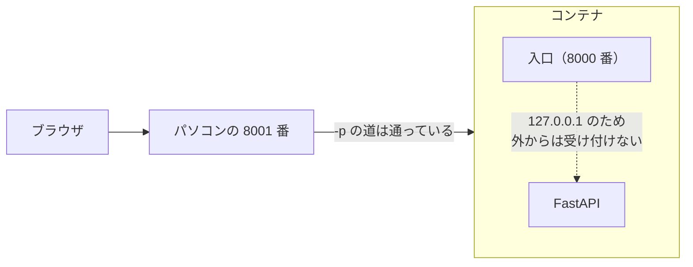
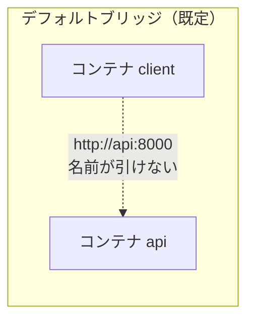
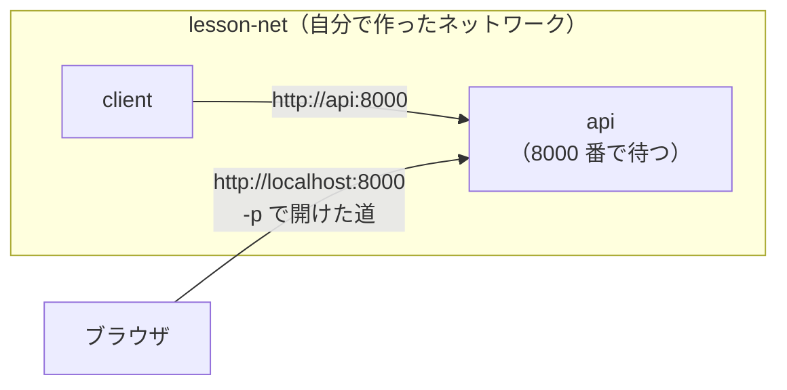
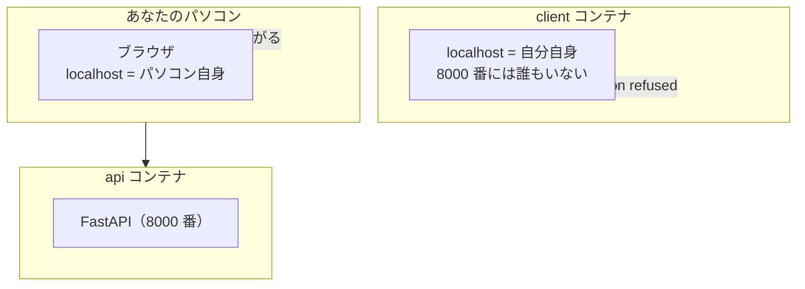

# 第4章 ボリュームとネットワーク

第3章で、自分のアプリが入ったイメージを作れるようになりました。
`docker build` して `docker run` すれば、あなたの API がコンテナの中で動きます。

**ですが、最後に2つの穴が残りました。**

> - コンテナを作り直すと、`app.db`（保存したデータ）が消える（3.6.3）
> - コードを1行直すたびに、`docker build` からやり直しになる

どちらも原因は同じです。**コンテナの中と外が、完全に切り離されている**ためです。
切り離されているからこそ「消して作り直せる」（第1章 1.4.2）のですが、
消えては困るものまで一緒に消えてしまいます。

この章では、**コンテナの中と外を、必要なところだけ繋ぎます。**
繋ぐ相手は2種類あります。

- **ファイル**を繋ぐ … マウント（バインドマウント・名前付きボリューム）
- **通信**を繋ぐ … ポート公開・ネットワーク

この章を終えると、コードを保存した瞬間にコンテナ側へ反映され、
データはコンテナを消しても残り、**コンテナ同士が名前で呼び合える**ようになります。
これは、第5章の Docker Compose で書く設定ファイルの中身そのものです。

## この章で学ぶこと

- コンテナを消すとデータが消える理由を、書き込み層の話として説明できるようになる
- **バインドマウント**で手元のディレクトリをコンテナに見せ、**保存した瞬間に反映される**開発ができるようになる
- **名前付きボリューム**を作って、コンテナを作り直してもデータが残る状態にできるようになる
- `-p` の左右の意味を説明でき、**ポートの衝突**を自分で解決できるようになる
- コンテナがなぜ `0.0.0.0` で待ち受ける必要があるのかを説明できるようになる
- **ネットワークを作ってコンテナ同士を繋ぎ**、コンテナ名で通信できるようになる
- Windows で起きる**改行コード**とファイル監視の問題に対処できるようになる

## この章の前提

- [第3章 Dockerfile](./03-dockerfile.md) を読み終えていること
  （とくに 3.3 の `docker build`、3.6 の `fastapi-lesson` のイメージ化）
- Docker Desktop が起動していること（クジラのアイコンが `running`。2.1.3）
- 第3章で作った `docker-lesson` ディレクトリが残っていること
- **4.3.3 と演習 4.3 だけは、第3章 3.6 で作った `fastapi-lesson:0.1.0` を使います。**
  手元に無い場合は、その2か所を飛ばして構いません

> **つまずいたら**
> この章のトラブルは、**「繋いだつもりが繋がっていない」**の一種類しかありません。
> 症状が出たら、次の3つを順番に確認してください。
>
> 1. **コンテナは生きているか**（`docker ps`。落ちていたら `docker logs`。2.6.2）
> 2. **何を繋いだつもりか**（`docker inspect コンテナ名 --format '{{json .Mounts}}'`。4.3.2）
> 3. **中から見えているか**（`docker exec コンテナ名 ls パス`。2.6.1）
>
> それでも分からないときは、第0章 0.2 で準備した AI に、次のように聞いてください。
>
> ```text
> docker-text の 4.2.1 を読んでいます。
> バインドマウントしたはずのファイルが、コンテナの中で見えません。
>
> OS: Windows 11 / macOS（どちらかを書く）
> 実行したコマンド:
>
> （ここにコマンド全文を貼る）
>
> docker exec で中を見た結果:
>
> （ここに出力を貼る）
>
> 原因と、直したコマンドを教えてください。
> ```
>
> **コマンド全文をそのまま貼ってください。** マウントの不具合は、
> ほとんどが**パスの書き方**（4.2.3）で起きます。省略して書き写すと原因が消えます。

---

## 4.1 コンテナを消すとデータが消える

### 4.1.1 実際に確かめる

3.6.3 では `fastapi-lesson` で確認しましたが、
**もっと小さなコンテナで、同じことをはっきり見ておきます。**
`fastapi-lesson` が手元に無くても、ここは実行できます。

まず、コンテナを1つ起動します。

**Windows（PowerShell）**

```powershell
docker run -d --name memo python:3.13-slim sleep 600
```

**macOS / Linux**

```bash
docker run -d --name memo python:3.13-slim sleep 600
```

```text
3b669cc4727c2b332182d65ea7a3ce700ace39e3fc721babc6530ed3bb072766
```

イメージ名のあとに書いた `sleep 600` は、**600 秒（10 分）何もせずに待つ**コマンドです
（イメージ名のあとにコマンドを書くと `CMD` が差し替わる、というのは 3.2.5 でやりました）。

なぜ待たせるかというと、**コンテナはコマンドが終わると一緒に終了する**ためです（2.4.5）。
何もしないコンテナを 10 分間だけ生かしておいて、その中を触るための書き方です。

このコンテナの中に、ファイルを1つ作ります。

**Windows（PowerShell）**

```powershell
docker exec memo sh -c "mkdir -p /data && echo 'コンテナの中で作ったメモ' > /data/memo.txt"
docker exec memo cat /data/memo.txt
```

**macOS / Linux**

```bash
docker exec memo sh -c "mkdir -p /data && echo 'コンテナの中で作ったメモ' > /data/memo.txt"
docker exec memo cat /data/memo.txt
```

```text
コンテナの中で作ったメモ
```

`docker exec` は 2.6.1 で使いました。`sh -c "..."` は、
**引用符の中を1つのコマンドとしてコンテナの中のシェルに実行させる**書き方です。

ファイルは確かに作られました。では、**コンテナを作り直します。**

**Windows（PowerShell）**

```powershell
docker rm -f memo
docker run -d --name memo python:3.13-slim sleep 600
docker exec memo cat /data/memo.txt
```

**macOS / Linux**

```bash
docker rm -f memo
docker run -d --name memo python:3.13-slim sleep 600
docker exec memo cat /data/memo.txt
```

```text
cat: /data/memo.txt: No such file or directory
```

**メモは消えました。**

第1章 1.3.2 と第2章 2.4.5 で説明したとおりです。
イメージは**読み取り専用**で、コンテナが動いている間に書いたものは、
そのコンテナだけが持つ **書き込み層**（コンテナごとに1枚ずつ乗る、書き込み可能な層）に入ります。
`docker rm` は、この書き込み層ごと捨てます。



3.6.3 で `alembic upgrade head` が作った `app.db` も、まったく同じ場所にありました。
**アプリの種類とは関係なく、コンテナの中に書いたものはすべてこうなります。**

後片付けをしておきます。

**Windows（PowerShell）**

```powershell
docker rm -f memo
```

**macOS / Linux**

```bash
docker rm -f memo
```

> **補足：これは不具合ではありません**
> 「起動直後の状態に必ず戻る」のは、第1章 1.4.2 で見た Docker の利点そのものです。
> 消えて困るのは、**利用者が作ったデータ**（タスク、ユーザー、アップロードした画像）だけです。
> 次の項では、その「消えて困るもの」だけを外に置く方法を考えます。

### 4.1.2 2つの解決策

コンテナの中の**あるパス**を、**コンテナの外の入れ物**に繋ぎ替えることができます。
この繋ぎ替えを **マウント**（mount。外の入れ物を、コンテナの中のパスに割り当てること）と呼びます。

マウントすると、そのパスへの読み書きは**書き込み層を経由せず、外の入れ物に直接届きます。**
だから、コンテナを消しても外の入れ物は残ります。

外の入れ物には、**2種類**あります。



| | バインドマウント | 名前付きボリューム |
|--|----------------|-----------------|
| 外の入れ物 | **あなたが指定したディレクトリ** | **Docker が管理する領域**（名前だけ付ける） |
| 場所 | 自分で決める（`C:\Users\...` など） | Docker に任せる（中身を直接開くことは想定しない） |
| 主な用途 | **コードを見せる**（編集がすぐ反映される） | **データを残す**（データベースのファイルなど） |
| エディタで開けるか | 開ける（ふつうのファイル） | 開けない（開く必要もない） |
| 書き方 | `-v 外のパス:中のパス` | `-v 名前:中のパス` |
| 学ぶ場所 | 4.2 | 4.3 |

**書き方はどちらも `-v 外側:内側` で、左側の書き方だけが違います。**
左がパス（`/` や `\` を含む）ならバインドマウント、
左が名前（`/` を含まない）なら名前付きボリュームとして扱われます。

`-p 外側:内側`（2.3.3）と同じで、**左があなたの側、右がコンテナの側**です。
この章では、この「左が外・右が中」が繰り返し出てきます。

冒頭に挙げた2つの穴は、次のように分担して塞ぎます。

| 困りごと | 使うもの |
|---------|---------|
| コードを直すたびに `docker build` からやり直し | **バインドマウント**（4.2） |
| コンテナを作り直すと `app.db` が消える | **名前付きボリューム**（4.3） |

---

## 4.2 バインドマウント

### 4.2.1 手元のディレクトリをコンテナから見せる

まず、いちばん分かりやすい例から始めます。**nginx が公開するページを、手元のファイルで差し替えます。**

第3章の演習 3.2 では、同じことを `COPY` でイメージに焼き込みました。
今度は**イメージを作らずに**、外から見せます。

第3章までの作業をしていたディレクトリ（`docker-lesson` の親）に、
`bind-lesson` というディレクトリを作り、その中に `site` ディレクトリを作ります。

**Windows（PowerShell）**

```powershell
mkdir bind-lesson
cd bind-lesson
mkdir site
```

**macOS / Linux**

```bash
mkdir bind-lesson
cd bind-lesson
mkdir site
```

`site` の中に、HTML を1つ置きます。

`bind-lesson/site/index.html`

```html
<!DOCTYPE html>
<html lang="ja">
  <head>
    <meta charset="UTF-8" />
    <title>私のページ</title>
  </head>
  <body>
    <h1>Docker で作った自分のイメージです</h1>
  </body>
</html>
```

この `site` ディレクトリを、nginx が公開するディレクトリ（`/usr/share/nginx/html`）に**マウントして**起動します。

**Windows（PowerShell）**

```powershell
docker run -d --name mysite -p 8080:80 -v "${PWD}/site:/usr/share/nginx/html" nginx:1.27
```

**macOS / Linux**

```bash
docker run -d --name mysite -p 8080:80 -v "$(pwd)/site:/usr/share/nginx/html" nginx:1.27
```

`${PWD}`（PowerShell）と `$(pwd)`（macOS / Linux）は、
どちらも**いま自分がいるディレクトリの絶対パス**を表します。詳しくは 4.2.3 で扱います。

ブラウザで開きます。

```text
http://localhost:8080
```

**「Docker で作った自分のイメージです」と表示されれば成功です。**

ここで起きたことを整理します。

| | 演習 3.2（`COPY`） | いまやったこと（バインドマウント） |
|--|------------------|--------------------------|
| ファイルの居場所 | **イメージの中**（コピーされた） | **あなたのパソコンの中**（コピーされていない） |
| 反映のタイミング | `docker build` したとき | **常に**（コンテナは見に行くだけ） |
| イメージ | 作り直しが必要 | **`nginx:1.27` のまま。何も作っていない** |

**`docker build` を1度もしていない**点に注目してください。
公式の `nginx:1.27` をそのまま起動し、**中身だけ外から差し替えました。**

> **よくある間違い**
> 左側のパスを打ち間違えると、**エラーにならずに空のディレクトリがマウントされます。**
> Docker は「無いなら作る」と判断するためです。
> 画面が nginx の初期ページ（`Welcome to nginx!`）に戻ったら、まずパスを疑ってください。
>
> 中から見えているかは、これで確認できます。
>
> ```bash
> docker exec mysite ls /usr/share/nginx/html
> ```
>
> `index.html` が出てこなければ、繋ぎ先を間違えています。

### 4.2.2 コード変更が即反映される開発体験

マウントの本当の価値は、ここからです。**コンテナを止めずに、ファイルを書き換えてみます。**

`bind-lesson/site/index.html` の `<h1>` を、次のように変更して保存してください。

```diff
-    <h1>Docker で作った自分のイメージです</h1>
+    <h1>バインドマウントで即反映</h1>
```

**ブラウザを再読み込みするだけ**で、表示が変わります。
`docker build` も `docker restart` もしていません。



**ここまでが「静的なファイル」の話です。**
次は、**Python のコードを書き換えたときに、サーバーが自動で再起動する**形にします。

fastapi-text では `fastapi dev` を使うと、保存のたびにサーバーが再起動しました。
第3章では `CMD` に **`fastapi run`** を書きました（3.2.5）。
`run` は本番向けで、**コードを読み直しません。**

開発中は、**マウント + `fastapi dev`** の組み合わせを使います。
`fastapi-lesson` に移動して、次のコマンドで起動してください。

**Windows（PowerShell）**

```powershell
cd ..\fastapi-lesson
docker run -d --name api-dev -p 8000:8000 -v "${PWD}:/code" fastapi-lesson:0.1.0 fastapi dev app/main.py --host 0.0.0.0 --port 8000
```

**macOS / Linux**

```bash
cd ../fastapi-lesson
docker run -d --name api-dev -p 8000:8000 -v "$(pwd):/code" fastapi-lesson:0.1.0 fastapi dev app/main.py --host 0.0.0.0 --port 8000
```

長いので、**部品ごとに**読んでください。

| 部品 | 意味 | 出てきた場所 |
|------|------|------------|
| `-d` | バックグラウンドで動かす | 2.4.4 |
| `--name api-dev` | コンテナに名前を付ける | 2.3.3 |
| `-p 8000:8000` | パソコンの 8000 番をコンテナの 8000 番へ | 2.3.3 / 4.4.1 |
| `-v "${PWD}:/code"` | **いまのディレクトリを、コンテナの `/code` に見せる** | この項 |
| `fastapi-lesson:0.1.0` | 3.6 で作ったイメージ | 3.6.2 |
| `fastapi dev app/main.py ...` | **`CMD` を差し替えて、開発用サーバーで起動する** | 3.2.5 |
| `--host 0.0.0.0` | **コンテナの外からの接続を受け付ける**（詳細は 4.4.3） | 4.4.3 |

`/code` は、3.2.2 で決めたコンテナの中の作業ディレクトリです。
**イメージの中の `/code`（`COPY . .` で入れたコード）が、あなたのディレクトリで隠されます。**

ログを見てください。

**Windows（PowerShell）**

```powershell
docker logs api-dev
```

**macOS / Linux**

```bash
docker logs api-dev
```

```text
INFO:     Will watch for changes in these directories: ['/code']
INFO:     Uvicorn running on http://0.0.0.0:8000 (Press CTRL+C to quit)
INFO:     Started reloader process [1] using WatchFiles
INFO:     Started server process [8]
INFO:     Waiting for application startup.
INFO:     Application startup complete.
```

**`Will watch for changes in these directories: ['/code']`** が、監視が始まった合図です。

では、`fastapi-lesson/app/main.py` の**いちばん下**に、次の窓口を追加して保存してください。

```python


@app.get("/hello")
def hello():
    return {"message": "コンテナの外で編集しました"}
```

保存した直後に、もう一度ログを見ます。

```text
WARNING:  WatchFiles detected changes in 'app/main.py'. Reloading...
INFO:     Shutting down
INFO:     Waiting for application shutdown.
INFO:     Application shutdown complete.
INFO:     Finished server process [8]
INFO:     Started server process [11]
INFO:     Waiting for application startup.
INFO:     Application startup complete.
```

ブラウザで開きます。

```text
http://localhost:8000/hello
```

```json
{"message":"コンテナの外で編集しました"}
```

**ビルドをせずに、コンテナの中のサーバーが新しいコードで動きました。**
fastapi-text で当たり前だった開発体験が、コンテナの中に戻ってきたことになります。

> **補足：ライブラリはマウントで消えません**
> 「`/code` をパソコン側で置き換えたら、`pip install` した FastAPI も消えるのでは」と
> 思うかもしれませんが、消えません。
> `RUN pip install`（3.2.4）が入れたライブラリは `/usr/local/lib/python3.13/site-packages`
> にあり、**`/code` の外**だからです。
> 置き換わるのは、マウントしたパス（`/code`）だけです。

確認できたら、コンテナを削除しておきます。

**Windows（PowerShell）**

```powershell
docker rm -f api-dev
```

**macOS / Linux**

```bash
docker rm -f api-dev
```

> **注意：開発用と本番用は別のものです**
> この「マウント + `fastapi dev`」は、**手元で開発している間だけ**の形です。
> 相手に渡すイメージは、3.6 で作った「`COPY` 済み + `fastapi run`」のままにしてください。
> マウントに頼ったイメージは、**渡した相手のパソコンにコードが無ければ動きません。**
> この2つの使い分けは、第5章 5.2.4 と第7章 7.5 で設定ファイルとして整理します。

> **よくある間違い**
> `--host 0.0.0.0` を書き忘れると、コンテナは起動するのに**ブラウザから繋がりません。**
> `docker logs` に `Uvicorn running on http://127.0.0.1:8000` と出ていたら、これです。
> 理由は 4.4.3 で説明します。**いまは「`fastapi dev` には `--host 0.0.0.0` が要る」**と
> 覚えておいてください。

### 4.2.3 パスの書き方（Windows / macOS）

マウントで最も多いつまずきが、**左側のパスの書き方**です。
OS ごとに整理します。

**共通のルールは1つだけです。左側は絶対パス（ディレクトリの完全な住所）で書きます。**
毎回打ち込むのは大変なので、「いまいるディレクトリ」を表す書き方を使います。

| OS | いまいるディレクトリ | 書き方の例 |
|----|-------------------|-----------|
| Windows（PowerShell） | `${PWD}` | `-v "${PWD}/site:/usr/share/nginx/html"` |
| macOS / Linux | `$(pwd)` | `-v "$(pwd)/site:/usr/share/nginx/html"` |

**Windows で注意すること**

- `${PWD}` は `C:\Users\yamada\bind-lesson` のような値になります。**Docker はこの形を受け付けます**
- 手で書くときは、**区切りを `/`（スラッシュ）にしても構いません**
  （`-v "C:/Users/yamada/bind-lesson/site:/usr/share/nginx/html"`）
- **パスに空白が含まれるとき**（`C:\Users\山田 太郎\...`）は、
  **必ず全体を `"` で囲んでください。** 囲まないと、空白の手前で切れて別のパスとして解釈されます
- コマンドプロンプト（`cmd.exe`）では `${PWD}` は使えません。
  **このテキストは PowerShell を使います**（第2章の方針）

**macOS で注意すること**

- `$(pwd)` は `/Users/yamada/bind-lesson` のような値になります
- `~`（ホームディレクトリ）も使えますが、**`"` で囲むと展開されない**ことがあります。
  迷ったら `$(pwd)` を使ってください
- **`/Users` の外**（外付けディスクなど）を使いたい場合は、
  Docker Desktop の Settings → Resources → **File sharing** に、そのディレクトリを追加してください。
  追加していないと、マウントしても中身が見えません

「結局どこが繋がったのか」を確認するコマンドが、**両方の OS で共通**で使えます。

**Windows（PowerShell）**

```powershell
docker inspect mysite --format '{{json .Mounts}}'
```

**macOS / Linux**

```bash
docker inspect mysite --format '{{json .Mounts}}'
```

```text
[{"Type":"bind","Source":"/Users/yamada/bind-lesson/site","Destination":"/usr/share/nginx/html","Mode":"","RW":true,"Propagation":"rprivate"}]
```

- `Type` … `bind`（バインドマウント）か `volume`（名前付きボリューム）か
- `Source` … **外側**（あなたのパソコン側）
- `Destination` … **内側**（コンテナ側）
- `RW` … `true` なら読み書きできる（`false` は読み取り専用。4.2.4）

**`Source` が思っていた場所と違っていたら、それが原因です。**

> **よくある間違い**
> `cd` する前にコマンドを打ってしまい、**1つ上のディレクトリをマウントする**間違いです。
> `${PWD}` / `$(pwd)` は「**コマンドを打った時点で**いるディレクトリ」なので、
> 打つ場所を間違えると、静かにずれます。
> `docker inspect` の `Source` を見る癖をつけてください。

### 4.2.4 権限まわりの注意

バインドマウントは、**あなたのパソコンのファイルをコンテナに触らせる**仕組みです。
便利な反面、次の3つに注意が必要です。

**1つ目：コンテナが作ったファイルの持ち主**

コンテナの中のプログラムは、多くの場合 `root`（管理者）として動いています。
そのため、**マウントしたディレクトリにコンテナが作ったファイルは、`root` のもの**になります。

**Windows（PowerShell）**

```powershell
docker run --rm -v "${PWD}/shared:/out" python:3.13-slim sh -c "echo hi > /out/made-in-container.txt"
Get-ChildItem shared
```

**macOS / Linux**

```bash
docker run --rm -v "$(pwd)/shared:/out" python:3.13-slim sh -c "echo hi > /out/made-in-container.txt"
ls -l shared
```

```text
total 4
-rw-r--r-- 1 root root 3 Sep 10 05:18 made-in-container.txt
```

- **Windows / macOS の Docker Desktop では、ほとんど問題になりません。**
  Docker Desktop が持ち主を読み替えてくれるためです
- **Linux では問題になります。** 自分では消せないファイル（`Permission denied`）ができるので、
  `sudo rm` が必要になります

Python が作る `__pycache__`（3.5.2 で `.dockerignore` に書いたもの）が、
マウントしたディレクトリに現れるのは、これが理由です。
**気になっても、消さずに放置して構いません。**（`.gitignore` に入っています。）

**2つ目：読み取り専用にできる**

コンテナに**読ませるだけ**でよいものは、右側のあとに `:ro`（read only）を付けます。

**Windows（PowerShell）**

```powershell
docker run --rm -v "${PWD}/shared:/out:ro" python:3.13-slim sh -c "echo hi > /out/x.txt"
```

**macOS / Linux**

```bash
docker run --rm -v "$(pwd)/shared:/out:ro" python:3.13-slim sh -c "echo hi > /out/x.txt"
```

```text
sh: 1: cannot create /out/x.txt: Read-only file system
```

**書き込もうとした時点で止まります。**
設定ファイルや、公開するだけの HTML（4.2.1）は、`:ro` にしておくと安全です。

**`:ro` が禁止するのは、コンテナ側からの書き込みだけです。**
あなたがエディタでそのファイルを書き換えるのは自由で、
**書き換えた内容はコンテナからそのまま見えます**（読むのは許されているためです）。
「コンテナに勝手に触られたくないが、こちらからは更新したい」というときに使います。

**3つ目：マウントしたディレクトリは、中から丸ごと見えます**

`-v "${PWD}:/code"` と書くと、そのディレクトリの**すべて**がコンテナから読めます。
`.env`（秘密の値。fastapi-text 4.6）も、`.git`（履歴）も含まれます。

`.dockerignore`（3.5）は**ビルドに送るファイル**を減らす設定なので、
**マウントには一切効きません。** ここは混同しやすいところです。

| 仕組み | `.dockerignore` の効果 |
|--------|---------------------|
| `docker build` の `COPY` | **効く**（送られない） |
| `docker run -v` のマウント | **効かない**（そのまま見える） |

自分のパソコンで自分のコンテナを動かす分には問題ありませんが、
**他人から受け取った Dockerfile やイメージに、ディレクトリを丸ごとマウントするときは、
中身を見せてよいかを一度考えてください。**

確認が終わったので、4.2.1 のコンテナを削除しておきます。

**Windows（PowerShell）**

```powershell
docker rm -f mysite
```

**macOS / Linux**

```bash
docker rm -f mysite
```

---

## 4.3 名前付きボリューム

### 4.3.1 Docker に管理させる

バインドマウントは「どのディレクトリを見せるか」を**あなたが決める**方式でした。
もう1つの方式が、**名前だけ決めて、置き場所は Docker に任せる**やり方です。
これを **名前付きボリューム**（named volume。Docker が管理する、名前の付いたデータの置き場）と呼びます。

4.1.1 のメモを、今度は消えないようにしてみます。

**Windows（PowerShell）**

```powershell
docker run -d --name memo -v memo-data:/data python:3.13-slim sleep 600
docker exec memo sh -c "echo 'ボリュームに書いたメモ' > /data/memo.txt"
```

**macOS / Linux**

```bash
docker run -d --name memo -v memo-data:/data python:3.13-slim sleep 600
docker exec memo sh -c "echo 'ボリュームに書いたメモ' > /data/memo.txt"
```

4.1.1 との違いは、**`-v memo-data:/data` の1つだけ**です。
左側が `memo-data` という**名前**（`/` を含まない）なので、Docker は
「`memo-data` という名前のボリュームを使う」と判断します。**無ければ自動で作られます。**

では、**コンテナを消して作り直します。**

**Windows（PowerShell）**

```powershell
docker rm -f memo
docker run -d --name memo -v memo-data:/data python:3.13-slim sleep 600
docker exec memo cat /data/memo.txt
```

**macOS / Linux**

```bash
docker rm -f memo
docker run -d --name memo -v memo-data:/data python:3.13-slim sleep 600
docker exec memo cat /data/memo.txt
```

```text
ボリュームに書いたメモ
```

**残りました。** 4.1.1 で `No such file or directory` になったのと同じ操作です。



**コンテナは使い捨て、データはボリュームに残る。** これがこの節の要点です。

> **補足：中身はどこにあるのか**
> 「Docker が管理する領域」の実体は、Linux では `/var/lib/docker/volumes/...` です。
> ただし **Windows / macOS では、そのパスは Linux 仮想マシンの中**（第1章 1.2.2）にあり、
> エクスプローラーや Finder からは開けません。
> **開けなくて正しい**、と考えてください。中身を見たいときは、
> 4.1.1 でやったように `docker exec` でコンテナの中から見ます。

### 4.3.2 作成・確認・削除

ボリュームを扱うコマンドは `docker volume` から始まります。

**作る（明示的に作ることもできます）**

**Windows（PowerShell）**

```powershell
docker volume create api-data
```

**macOS / Linux**

```bash
docker volume create api-data
```

```text
api-data
```

**一覧する**

**Windows（PowerShell）**

```powershell
docker volume ls
```

**macOS / Linux**

```bash
docker volume ls
```

```text
DRIVER    VOLUME NAME
local     api-data
local     memo-data
```

**詳しく見る**

**Windows（PowerShell）**

```powershell
docker volume inspect api-data
```

**macOS / Linux**

```bash
docker volume inspect api-data
```

```text
[
    {
        "CreatedAt": "2026-09-10T05:15:27Z",
        "Driver": "local",
        "Labels": null,
        "Mountpoint": "/var/lib/docker/volumes/api-data/_data",
        "Name": "api-data",
        "Options": null,
        "Scope": "local"
    }
]
```

`Mountpoint` が実体の場所です（前項の補足のとおり、Windows / macOS では直接開けません）。

**消す**

**Windows（PowerShell）**

```powershell
docker volume rm memo-data
```

**macOS / Linux**

```bash
docker volume rm memo-data
```

使用中のボリュームは消せません。イメージのときと同じ関係です（2.5.3）。

```text
Error response from daemon: remove memo-data: volume is in use - [a084a40948279bcb169f6807d054e63cf880164a05959e9a724cc24494a9539e]
```

角かっこの中はコンテナ ID です。**コンテナを先に消してから**、ボリュームを消します。

**Windows（PowerShell）**

```powershell
docker rm -f memo
docker volume rm memo-data
```

**macOS / Linux**

```bash
docker rm -f memo
docker volume rm memo-data
```

**容量を見る**

2.7.2 で使った `docker system df` に、ボリュームの行があります。

```text
TYPE            TOTAL     ACTIVE    SIZE      RECLAIMABLE
Images          3         1         735.2MB   404.6MB (55%)
Containers      1         1         1.098MB   0B (0%)
Local Volumes   1         1         16.38kB   0B (0%)
Build Cache     14        0         194MB     148MB
```

> **注意：`docker volume prune` は名前付きボリュームを消しません**
> `prune` を実行すると、次の確認が出ます。
>
> ```text
> WARNING! This will remove anonymous local volumes not used by at least one container.
> Are you sure you want to continue? [y/N]
> ```
>
> **`anonymous`（匿名）** とあるとおり、消えるのは**名前を付けなかったボリュームだけ**です。
> 匿名ボリュームは、`-v /data` のように**左側を書かずに**起動したときに作られ、
> `docker volume ls` に長い英数字の名前で並びます。
>
> ```text
> DRIVER    VOLUME NAME
> local     9a27d55c205c73818276d9acdad012b32c82d924a2723fa585ab226891522112
> local     api-data
> ```
>
> **名前を付ける利点はここにあります。** 名前があれば `prune` の巻き添えになりません。
> なお、第2章 2.7.1 で決めたとおり、このテキストでは
> **`docker system prune -a --volumes` は最後まで使いません**（保存データごと消えるため）。

### 4.3.3 バインドマウントとの使い分け

2つのマウントは、**役割で使い分けます。**

| 繋ぐもの | 使う方式 | 理由 |
|---------|---------|------|
| アプリのコード | **バインドマウント** | 自分で編集するため。エディタで開けないと意味がない |
| 設定ファイル（読ませるだけ） | **バインドマウント**（`:ro`） | 手元で編集し、コンテナには読ませるだけ |
| データベースのファイル | **名前付きボリューム** | 編集するのは人間ではなくアプリ。中身を直接触る必要がない |
| アップロードされた画像など | **名前付きボリューム** | 同上 |
| ログ（あとで読みたいもの） | どちらでも | 手元で読みたければバインドマウント |

**判断の基準は「人間が直接開くか」です。** 開くならバインドマウント、開かないならボリュームです。

> **この節は `fastapi-lesson` を使います**
> 手元に無い場合は、ここから 4.4 まで飛ばして構いません。

では、3.6.3 で残った宿題を片付けます。**`app.db` をボリュームに置きます。**

fastapi-text 6.2.2 で、データベースの場所は `.env` の **`DATABASE_URL`** で決まるようにしました。
既定値は `sqlite:///./app.db`（いまいるディレクトリの `app.db`）です。
これを、**ボリュームをマウントしたパス**に変えます。

`fastapi-lesson` に移動して、次のコマンドで起動してください。

**Windows（PowerShell）**

```powershell
cd ..\fastapi-lesson
docker run -d --name api -p 8000:8000 -v api-data:/data -e DATABASE_URL=sqlite:////data/app.db fastapi-lesson:0.1.0
```

**macOS / Linux**

```bash
cd ../fastapi-lesson
docker run -d --name api -p 8000:8000 -v api-data:/data -e DATABASE_URL=sqlite:////data/app.db fastapi-lesson:0.1.0
```

`-e 名前=値` は、環境変数を渡すオプションです（3.2.6）。

> **注意：スラッシュは4本です**
> `sqlite:////data/app.db` の `/` は**4本**です。3本ではありません。
>
> | 書き方 | 意味 |
> |-------|------|
> | `sqlite:///./app.db` | `sqlite://` + `./app.db`（**相対パス**。いまいるディレクトリ） |
> | `sqlite:////data/app.db` | `sqlite://` + `/data/app.db`（**絶対パス**。ルート直下の `data`） |
>
> 3本にすると `data/app.db`（`/code/data/app.db`）を探しに行き、
> ボリュームの外にファイルを作ってしまいます。**作り直すと消えます。**

テーブルを作って、練習用データを入れます（3.6.3 と同じ手順です）。

**Windows（PowerShell）**

```powershell
docker exec api alembic upgrade head
docker exec api python -m app.seed
```

**macOS / Linux**

```bash
docker exec api alembic upgrade head
docker exec api python -m app.seed
```

```text
INFO  [alembic.runtime.migration] Context impl SQLiteImpl.
INFO  [alembic.runtime.migration] Will assume non-transactional DDL.
INFO  [alembic.runtime.migration] Running upgrade  -> 8f3d1c2a9b45, create tasks table
3 件のタスクを追加しました。
```

ブラウザで `http://localhost:8000/docs` を開き、`GET /tasks` を実行すると、データが返ります。

```json
[
  {"id":1,"title":"買い物","done":false,"owner":{"name":"田中"}},
  {"id":2,"title":"レポート提出","done":false,"owner":{"name":"田中"}},
  {"id":3,"title":"部屋の掃除","done":true,"owner":{"name":"佐藤"}}
]
```

**ここからが本題です。コンテナを作り直します。**

**Windows（PowerShell）**

```powershell
docker rm -f api
docker run -d --name api -p 8000:8000 -v api-data:/data -e DATABASE_URL=sqlite:////data/app.db fastapi-lesson:0.1.0
```

**macOS / Linux**

```bash
docker rm -f api
docker run -d --name api -p 8000:8000 -v api-data:/data -e DATABASE_URL=sqlite:////data/app.db fastapi-lesson:0.1.0
```

もう一度 `GET /tasks` を実行してください。

```json
[
  {"id":1,"title":"買い物","done":false,"owner":{"name":"田中"}},
  {"id":2,"title":"レポート提出","done":false,"owner":{"name":"田中"}},
  {"id":3,"title":"部屋の掃除","done":true,"owner":{"name":"佐藤"}}
]
```

**データが残りました。** `alembic upgrade head` も `python -m app.seed` も、もう不要です。
3.6.3 で `Internal Server Error` に戻ったのと同じ操作で、今度は戻りません。



> **よくある間違い**
> **コードのある `/code` に、名前付きボリュームをマウントしてはいけません。**
>
> ```bash
> docker run -d --name api -v api-code:/code fastapi-lesson:0.1.0   # やらないこと
> ```
>
> 空のボリュームを初めて使うとき、Docker は**イメージの中身をボリュームにコピーします。**
> 一見うまく動きますが、**次にイメージをビルドし直しても、ボリュームの中は古いまま**です
> （コピーされるのは、ボリュームが空のときだけだからです）。
>
> 「ビルドしたのに、直したはずのコードが反映されない」という、原因の分かりにくい症状になります。
> **コードはバインドマウント（4.2）、データはボリューム（4.3）。**
> 混ぜないでください。

このコンテナは、次の 4.4 でも使います。**消さずに残しておいてください。**

---

## 4.4 ポートを公開する

### 4.4.1 `-p` の意味（ホスト側:コンテナ側）

`-p` は 2.3.3 から使ってきましたが、**マウントを学んだいま、同じ形だと分かります。**

```text
-v 外のディレクトリ : 中のディレクトリ      ← ファイルの繋ぎ替え
-p 外のポート       : 中のポート            ← 通信の繋ぎ替え
```

**ポート**（1台のコンピュータの中で、どのプログラムに繋ぐかを表す番号。fastapi-text 2.3.2）は、
コンテナごとに独立しています。コンテナの中で 8000 番を開いても、
**そのままではあなたのパソコンの 8000 番とは無関係**です。

`-p 8000:8000` と書いて初めて、次の道ができます。



**左（外側）は自由に変えられます。右（内側）はアプリが待っている番号なので変えられません。**
2.3.3 で「変えてよいのは左だけ」と書いたのは、このことです。

この性質を使うと、**同じイメージから複数のコンテナを、別々のポートで同時に動かせます。**

**Windows（PowerShell）**

```powershell
docker run -d --name web1 -p 8080:80 nginx:1.27
docker run -d --name web2 -p 8081:80 nginx:1.27
docker ps --format "{{.Names}}`t{{.Ports}}"
```

**macOS / Linux**

```bash
docker run -d --name web1 -p 8080:80 nginx:1.27
docker run -d --name web2 -p 8081:80 nginx:1.27
docker ps --format "{{.Names}}\t{{.Ports}}"
```

```text
web2	0.0.0.0:8081->80/tcp
web1	0.0.0.0:8080->80/tcp
```

`http://localhost:8080` と `http://localhost:8081` の**両方**が開きます。
コンテナの中では**どちらも 80 番**です。ぶつからないのは、中のポートが別々の世界にあるからです。

（`--format` は表示する列を選ぶオプションです。`docker ps` だけでも同じ情報は見られます。）

確認できたら削除します。

**Windows（PowerShell）**

```powershell
docker rm -f web1 web2
```

**macOS / Linux**

```bash
docker rm -f web1 web2
```

> **補足：`-p` は何度でも書けます**
> 1つのコンテナが複数のポートを使う場合は、`-p` を並べます。
>
> ```bash
> docker run -d --name multi -p 8080:80 -p 8443:443 nginx:1.27
> ```
>
> `EXPOSE`（3.2.6）が申告しているだけで、公開は `-p` の仕事だという話も、ここに繋がります。

### 4.4.2 ポートが衝突したときの対処

外側のポートは、**同時に1つのプログラムしか使えません。**
すでに使われている番号を指定すると、コンテナは起動に失敗します。

**Windows（PowerShell）**

```powershell
docker run -d --name web1 -p 8080:80 nginx:1.27
docker run -d --name web3 -p 8080:80 nginx:1.27
```

**macOS / Linux**

```bash
docker run -d --name web1 -p 8080:80 nginx:1.27
docker run -d --name web3 -p 8080:80 nginx:1.27
```

```text
docker: Error response from daemon: failed to set up container networking: driver failed programming external connectivity on endpoint web3 (567e0d97a8a7716c07b288295b6476ae34e4a920bed12f03c43a8c887949e4e4): Bind for 0.0.0.0:8080 failed: port is already allocated

Run 'docker run --help' for more information
```

長い1行ですが、**読むのは最後の部分だけ**です。

```text
Bind for 0.0.0.0:8080 failed: port is already allocated
```

**「8080 番はすでに割り当て済み」** という意味です。対処は次の順で進めます。

**手順1：Docker のコンテナが使っていないか確認する**

**Windows（PowerShell）**

```powershell
docker ps -a
```

**macOS / Linux**

```bash
docker ps -a
```

`PORTS` 列に `0.0.0.0:8080->80/tcp` と出ているコンテナがいれば、それが原因です。
**用が済んでいるなら削除**（`docker rm -f 名前`）、**使うなら別の番号**にします。

**停止中のコンテナも `-p` を覚えている**（2.4.5）ので、`docker ps` だけでは足りません。
**必ず `-a` を付けて**確認してください。

**手順2：Docker 以外のプログラムが使っていないか確認する**

`docker ps -a` に見当たらない場合は、Docker の外です。
fastapi-text の `fastapi dev` を別のターミナルで動かしたままにしている、というのがよくある例です。

**Windows（PowerShell）**

```powershell
Get-NetTCPConnection -LocalPort 8080 -State Listen | Select-Object OwningProcess
Get-Process -Id （上で出た番号）
```

**macOS / Linux**

```bash
lsof -i :8080
```

表示されたプログラムを終了するか、次の手順3に進みます。

**手順3：左側の番号を変える**

**いちばん確実なのは、ぶつからない番号に変えることです。**

**Windows（PowerShell）**

```powershell
docker run -d --name web3 -p 8082:80 nginx:1.27
```

**macOS / Linux**

```bash
docker run -d --name web3 -p 8082:80 nginx:1.27
```

`http://localhost:8082` で開きます。**アプリ側の設定は何も変えていません。**
右側（コンテナの中の 80 番）は、そのままでよいからです。

確認できたら削除します。

**Windows（PowerShell）**

```powershell
docker rm -f web1 web3
```

**macOS / Linux**

```bash
docker rm -f web1 web3
```

> **よくある間違い**
> 焦って `-p 80:8080` のように**左右を入れ替えて**しまう間違いです。
> これは「パソコンの 80 番を、コンテナの 8080 番へ」という意味になり、
> コンテナの中で 8080 番を待っているアプリがいなければ、**繋がりません**（エラーも出ません）。
> **左が外・右が中**（4.1.2）を、そのつど確認してください。

### 4.4.3 `0.0.0.0` で待ち受ける必要性

4.2.2 で `--host 0.0.0.0` を付けました。ここでその理由を確かめます。

サーバーのプログラムは、起動するときに「**どの範囲からの接続を受け付けるか**」を決めます。

| 指定 | 意味 |
|------|------|
| `127.0.0.1`（= `localhost`） | **自分自身からの接続だけ**受け付ける |
| `0.0.0.0` | **どこからの接続でも**受け付ける |

ここでいう「自分自身」は、**コンテナ自身**です。あなたのパソコンではありません。
コンテナは、第1章 1.2.2 で見たとおり、**自分専用のネットワークを持たされたプロセス**だからです。

実際に見てみます。`--host 127.0.0.1` で起動します。
4.3.3 の `api` が 8000 番を使っているので、**外側は 8001 番**にします
（左は自由に変えてよい、というのが 4.4.1 でした）。

**Windows（PowerShell）**

```powershell
docker run -d --name api-local -p 8001:8000 fastapi-lesson:0.1.0 fastapi run app/main.py --host 127.0.0.1 --port 8000
```

**macOS / Linux**

```bash
docker run -d --name api-local -p 8001:8000 fastapi-lesson:0.1.0 fastapi run app/main.py --host 127.0.0.1 --port 8000
```

`docker ps` では**正常に動いて見えます**（`Up ...`）。ログも正常です。

```text
INFO:     Started server process [1]
INFO:     Waiting for application startup.
INFO:     Application startup complete.
INFO:     Uvicorn running on http://127.0.0.1:8000 (Press CTRL+C to quit)
```

ですが、ブラウザで `http://localhost:8001/docs` を開くと、**繋がりません。**
（ブラウザには「接続がリセットされました」「ページが動作していません」などと表示されます。）



**`-p` の道はできているのに、コンテナの入口で拒まれています。**
`docker ps` も `docker logs` も正常なので、**いちばん気づきにくい失敗**です。

**ログの `Uvicorn running on http://...` の部分を読む**のが、確実な見分け方です。

| 表示 | 判定 |
|------|------|
| `Uvicorn running on http://0.0.0.0:8000` | 外から繋がる |
| `Uvicorn running on http://127.0.0.1:8000` | **繋がらない。`--host 0.0.0.0` が必要** |

削除しておきます。

**Windows（PowerShell）**

```powershell
docker rm -f api-local
```

**macOS / Linux**

```bash
docker rm -f api-local
```

FastAPI のコマンドは、既定値が次のように分かれています。

| コマンド | 既定の待ち受け | コンテナでの扱い |
|---------|--------------|----------------|
| `fastapi run`（本番用） | **`0.0.0.0`** | そのままで繋がる（3.6 の `CMD` はこれ） |
| `fastapi dev`（開発用） | **`127.0.0.1`** | **`--host 0.0.0.0` を足す必要がある**（4.2.2） |

3.2.5 で「`CMD` に `fastapi dev` を書かない」と決めたのは、この違いが理由です。

> **補足：`0.0.0.0` にして危なくないのですか**
> パソコンで直接サーバーを動かす場合、`0.0.0.0` は
> 「同じ Wi-Fi の他人からも見える」という意味になり、注意が必要です。
> **コンテナの中では事情が違います。** コンテナの外に出る道は `-p` で開けた分だけであり、
> **`-p` を書かなければ、パソコンからも繋がりません。**
> つまり、公開範囲を決めているのは `0.0.0.0` ではなく `-p` のほうです。
> だからコンテナの中のアプリは `0.0.0.0` で待つのが基本になります。

---

## 4.5 コンテナ同士を繋ぐ

### 4.5.1 デフォルトでは繋がらない

ここまでは「ブラウザ → コンテナ」の通信でした。
第6章では、**API のコンテナとデータベースのコンテナ**を並べて動かします。
その前に、**コンテナ同士がどう呼び合うか**を確認します。

4.3.3 で起動した `api` コンテナが動いているものとして進めます
（消してしまった場合は、4.3.3 のコマンドでもう一度起動してください。
`fastapi-lesson` が手元に無い場合は、`nginx:1.27` を `--name api` で起動し、
以降の `http://api:8000/tasks` を `http://api/` に読み替えてください）。

もう1つ、**呼びに行く側**のコンテナを動かします。
Python が入ったコンテナから、API を1回だけ呼んでみます。

**Windows（PowerShell）**

```powershell
docker run --rm python:3.13-slim python -c "import urllib.request; print(urllib.request.urlopen('http://api:8000/tasks', timeout=5).read().decode())"
```

**macOS / Linux**

```bash
docker run --rm python:3.13-slim python -c "import urllib.request; print(urllib.request.urlopen('http://api:8000/tasks', timeout=5).read().decode())"
```

`urllib.request` は Python に最初から入っている、**URL を開くための標準ライブラリ**です
（python-text 第10章で使った `requests` の、インストール不要版だと思ってください）。
`--rm` は「終わったら削除」（2.4.3）、`-c` は「続く文字列を Python のコードとして実行」です。

```text
urllib.error.URLError: <urlopen error [Errno -2] Name or service not known>
```

**`api` という名前が見つかりませんでした。**

**コンテナは、既定では互いの名前を知りません。**
`docker run` したコンテナは、何も指定しないと **デフォルトブリッジ**
（Docker が最初から用意している既定のネットワーク）に入りますが、
このネットワークには**名前を引く仕組みがありません。**



同じネットワークの上にいるのに、**呼び方が分からない**状態です。

### 4.5.2 ネットワークを作る

解決策は、**自分でネットワークを作り、そこに両方のコンテナを入れる**ことです。

**Windows（PowerShell）**

```powershell
docker network create lesson-net
```

**macOS / Linux**

```bash
docker network create lesson-net
```

```text
3a82db507038d724fcdcc67a0b7ee87d89cad31ff998b9b7a9241584b652a474
```

長い文字列はネットワークの ID です。一覧で確認します。

**Windows（PowerShell）**

```powershell
docker network ls
```

**macOS / Linux**

```bash
docker network ls
```

```text
NETWORK ID     NAME         DRIVER    SCOPE
80b131bca10d   bridge       bridge    local
3bdac7526d04   host         host      local
3a82db507038   lesson-net   bridge    local
5aefaa1c4cd8   none         null      local
```

最初からある3つ（`bridge` / `host` / `none`）は Docker が用意しているものです。
**`bridge` が 4.5.1 のデフォルトブリッジ**で、`lesson-net` がいま作ったものです
（`host` と `none` は、このテキストでは使いません）。

`api` を、このネットワークに入れて起動し直します。
**ネットワークは起動時に決めるもの**なので、作り直しになります。

**Windows（PowerShell）**

```powershell
docker rm -f api
docker run -d --name api --network lesson-net -p 8000:8000 -v api-data:/data -e DATABASE_URL=sqlite:////data/app.db fastapi-lesson:0.1.0
```

**macOS / Linux**

```bash
docker rm -f api
docker run -d --name api --network lesson-net -p 8000:8000 -v api-data:/data -e DATABASE_URL=sqlite:////data/app.db fastapi-lesson:0.1.0
```

**データは `api-data` に残っている**ので、`alembic` も `seed` も要りません（4.3.3）。
コンテナを作り直しても平気になったことが、ここでも効いています。

> **補足：動いているコンテナを、あとからネットワークに入れる**
> 作り直さずに繋ぐこともできます。
>
> ```bash
> docker network connect lesson-net 既存のコンテナ名
> ```
>
> 外すときは `docker network disconnect lesson-net コンテナ名` です。
> ただし**起動時に `--network` で指定するほうが、状態が分かりやすい**ので、
> このテキストでは作り直す形を基本にします。

誰が入っているかは `inspect` で確認できます。

**Windows（PowerShell）**

```powershell
docker network inspect lesson-net --format '{{json .Containers}}'
```

**macOS / Linux**

```bash
docker network inspect lesson-net --format '{{json .Containers}}'
```

```text
{"fc91d512169c...":{"Name":"api","EndpointID":"ed3718b72ef8...","MacAddress":"c6:d0:f5:63:34:45","IPv4Address":"172.18.0.2/16","IPv6Address":""}}
```

`Name` が `api` のコンテナが1つ入っています。

### 4.5.3 コンテナ名で名前解決できる

呼びに行く側も、**同じネットワーク**に入れて実行します。

**Windows（PowerShell）**

```powershell
docker run --rm --network lesson-net python:3.13-slim python -c "import urllib.request; print(urllib.request.urlopen('http://api:8000/tasks', timeout=5).read().decode())"
```

**macOS / Linux**

```bash
docker run --rm --network lesson-net python:3.13-slim python -c "import urllib.request; print(urllib.request.urlopen('http://api:8000/tasks', timeout=5).read().decode())"
```

```text
[{"id":1,"title":"買い物","done":false,"owner":{"name":"田中"}},{"id":2,"title":"レポート提出","done":false,"owner":{"name":"田中"}},{"id":3,"title":"部屋の掃除","done":true,"owner":{"name":"佐藤"}}]
```

**繋がりました。** 変えたのは `--network lesson-net` を足したことだけです。

自分で作ったネットワークには、**コンテナ名で相手を見つける仕組み**（名前解決）が付いてきます。
`api` という名前が、そのコンテナの住所（`172.18.0.2` のような番号）に変換されます。



**ここで、いちばん間違えやすい点を確認します。**

| 呼ぶ場所 | 書く URL | 理由 |
|---------|---------|------|
| パソコンのブラウザから | `http://localhost:8000` | `-p 8000:8000` で開けた道を通る |
| 別のコンテナから | **`http://api:8000`** | ネットワークの中で直接呼ぶ。**`-p` は通らない** |

**コンテナ同士の通信に `-p` は関係ありません。**
`-p` を1つも書いていなくても、同じネットワークの中では `http://api:8000` で繋がります。
右側（コンテナの中のポート）だけが意味を持ちます。

> **補足：これを毎回書くのは大変です**
> ネットワークを作り、両方のコンテナに `--network` を付けて起動する。
> **この一連の作業を、設定ファイルに書いて自動化するのが第5章の Docker Compose です。**
> Compose では**ネットワークが自動で作られ、サービス名で呼び合えます**（5.3.3）。
> いまここで手作業でやっているのは、その中身を知っておくためです。

### 4.5.4 `localhost` が通じない理由

コンテナから API を呼ぶときに、`http://localhost:8000` と書きたくなります。
**ブラウザではそれで繋がる**からです。試してみます。

**Windows（PowerShell）**

```powershell
docker run --rm --network lesson-net python:3.13-slim python -c "import urllib.request; print(urllib.request.urlopen('http://localhost:8000/tasks', timeout=5).read().decode())"
```

**macOS / Linux**

```bash
docker run --rm --network lesson-net python:3.13-slim python -c "import urllib.request; print(urllib.request.urlopen('http://localhost:8000/tasks', timeout=5).read().decode())"
```

```text
urllib.error.URLError: <urlopen error [Errno 111] Connection refused>
```

**`localhost` は「自分自身」を指す名前**です（4.4.3）。
コンテナの中で `localhost` と書けば、それは **そのコンテナ自身**を指します。
呼びに行った側のコンテナには 8000 番で待っているプログラムがいないので、拒否されます。



**「`localhost` が誰を指すか」は、どこで実行しているかで変わります。**

| 実行している場所 | `localhost` が指すもの | API を呼ぶときに書く名前 |
|----------------|--------------------|--------------------|
| パソコンのブラウザ | パソコン自身 | `localhost:8000`（`-p` で開けた道） |
| コンテナの中 | **そのコンテナ自身** | **`api:8000`**（相手のコンテナ名） |
| コンテナの中から、パソコン側のプログラムを呼ぶ | — | `host.docker.internal:8000` |

3つ目の `host.docker.internal` は、
**コンテナからパソコン側で動いているプログラムを呼びたいとき**に使う特別な名前です
（Docker Desktop が用意しています）。使う場面は多くありませんが、
「コンテナの中からパソコンの `fastapi dev` を呼びたい」といったときに必要になります。

後片付けをします。`api` コンテナとネットワークを消し、**ボリュームは残します。**

**Windows（PowerShell）**

```powershell
docker rm -f api
docker network rm lesson-net
```

**macOS / Linux**

```bash
docker rm -f api
docker network rm lesson-net
```

> **よくある間違い**
> React から API を呼ぶときの URL を `http://api:8000` にしてしまう間違いです。
> **React のコードを実行しているのは、コンテナではなくブラウザ**（利用者のパソコン）です。
> ブラウザは `api` という名前を知らないので、繋がりません。
> ブラウザから呼ぶ URL は `http://localhost:8000` のままです。
> この使い分けは、3つのコンテナを繋ぐ第6章 6.1.2 で改めて図にします。

---

## 4.6 Windows 特有の問題

この節は、**Windows を使っている場合に読んでください。**
macOS / Linux の場合は、「そういう問題がある」とだけ知っておけば十分です
（ただし、**Windows の人と同じプロジェクトを共有するときには関係します**）。

原因はすべて、第1章 1.1.1 で見た **④ OS の層**の違いです。
コンテナの中は Linux で、あなたのパソコンは Windows。
**バインドマウントは、その2つを直接繋いでいます。**

### 4.6.1 改行コード（CRLF）でシェルスクリプトが動かない

テキストファイルの「行の終わり」を表す文字は、OS によって違います。

| OS | 行の終わりに入る文字 | 呼び方 |
|----|------------------|-------|
| Windows | `\r`（復帰）+ `\n`（改行）の**2文字** | **CRLF** |
| macOS / Linux | `\n` の**1文字** | **LF** |

ふだんは意識せずに済みますが、**シェルスクリプト**（コマンドを並べて書いたファイル。
拡張子は `.sh`）をコンテナで実行するときに、はっきり問題になります。

たとえば、起動用のスクリプトを1つ用意したとします。

`start.sh`

```bash
#!/bin/sh
echo "start.sh から起動します"
exec fastapi run app/main.py --host 0.0.0.0 --port 8000
```

1行目の `#!/bin/sh` は **シバン**（shebang。このファイルをどのプログラムに実行させるかを書く行）です。
「`/bin/sh` に実行させてください」という意味になります。

これを `Dockerfile` から実行する形にして、

```dockerfile
COPY start.sh .
RUN chmod +x start.sh
CMD ["./start.sh"]
```

ビルドして起動すると、Windows で作った場合は次のエラーになります。

```text
exec ./start.sh: no such file or directory
```

**ファイルは確かにあるのに、「無い」と言われます。**

理由は、シバンの行の終わりに `\r` が付いているためです。
Linux から見ると、1行目はこう読めます。

```text
#!/bin/sh\r
```

つまり **`/bin/sh\r` という名前のプログラムを探し**に行き、そんなものは無いので
「no such file or directory」になります。**無いのはスクリプトではなく、実行するプログラムのほうです。**

**確認のしかた**

VS Code の**右下のステータスバー**に、`CRLF` または `LF` と表示されています。
**`CRLF` をクリックすると `LF` に切り替えられます。** 切り替えて保存すれば直ります。

コンテナの中から確かめることもできます。

**Windows（PowerShell）**

```powershell
docker run --rm -v "${PWD}:/w" -w /w python:3.13-slim sh -c "cat -A start.sh | head -3"
```

**macOS / Linux**

```bash
docker run --rm -v "$(pwd):/w" -w /w python:3.13-slim sh -c "cat -A start.sh | head -3"
```

```text
#!/bin/sh^M$
echo "start.sh から起動します"^M$
exec fastapi run app/main.py --host 0.0.0.0 --port 8000^M$
```

`cat -A` は**見えない文字を表示する**オプションです。
行末の **`^M$` が CRLF**、`$` だけなら LF です。
（`-w /w` は、コンテナの中の作業ディレクトリを指定するオプションです。`WORKDIR`（3.2.2）の実行時版だと思ってください。）

LF に直してから同じイメージを起動すると、今度は動きます。

```text
start.sh から起動します
INFO:     Started server process [1]
INFO:     Waiting for application startup.
INFO:     Application startup complete.
INFO:     Uvicorn running on http://0.0.0.0:8000 (Press CTRL+C to quit)
```

> **注意：この症状は `.sh` 以外でも起きます**
> `.env`（設定ファイル）の値の末尾に `\r` が入り、
> パスワードが「合っているのに違う」と言われることがあります。
> **コンテナに渡すファイルは、原則すべて LF** と覚えておくと安全です。
> Python や JavaScript のソースコードは、`\r` があっても動きます（言語側が無視するため）。

### 4.6.2 gitattributes で防ぐ

毎回ステータスバーを見るのは現実的ではありません。
**そもそも CRLF にならないようにします。** 方法は2つあり、両方やるのが確実です。

**方法1：VS Code の既定を LF にする**

VS Code の設定（`Ctrl` + `,`）で `files.eol` を検索し、**`\n`** を選びます。
これ以降に**新しく作るファイル**が LF になります。

**方法2：`.gitattributes` を置く**

`.gitattributes` は、**Git にファイルの扱い方を指示する設定ファイル**です。
プロジェクトの直下（`fastapi-lesson/` や `docker-lesson/` の直下）に置きます。

`fastapi-lesson/.gitattributes`

```text
# 既定はすべて LF に統一する
* text=auto eol=lf

# シェルスクリプトは必ず LF（Windows でも変換しない）
*.sh text eol=lf

# 画像などは変換しない
*.png binary
*.jpg binary
```

**方法1との違いは、「他人にも効く」ことです。**
このファイルを Git で共有すれば、Windows の人がクローンしても LF が保たれます。
チームで1人でも Windows の人がいるなら、**プロジェクトに置いておくのが定石**です。

すでに CRLF で保存されているファイルがある場合は、1度だけ変換が必要です。

**Windows（PowerShell）**

```powershell
git add --renormalize .
git status
```

**macOS / Linux**

```bash
git add --renormalize .
git status
```

変換されたファイルが変更として並ぶので、そのままコミットします。

> **補足：Git を使っていない場合**
> このテキストではまだ Git を必須にしていません。
> Git を使っていない場合は、**方法1（VS Code の設定）だけで十分**です。
> `.gitattributes` は、あとで Git を使い始めたときに効いてきます。

### 4.6.3 ファイル監視が効かないとき

4.2.2 で、コードを保存するとサーバーが自動で再起動しました。
**Windows では、これが動かないことがあります。**

- ログに `WatchFiles detected changes ...` が出ない
- ブラウザを再読み込みしても、古いままになる

原因は、**ファイルが変更されたという通知が、Windows からコンテナ（Linux）へ届かない**ことです。
`C:\Users\...` のようなパソコン側のディレクトリをマウントすると、
中身は読めても、**変更の通知だけが伝わりません。**

**対処1：プロジェクトを WSL2 の中に置く（推奨）**

第2章 2.2.1 で有効にした WSL2 は、**Windows の中で動く Linux** です。
その中にプロジェクトを置くと、コンテナから見て**同じ Linux 上のファイル**になり、通知が届きます。
**副作用として、ファイルの読み書きも目に見えて速くなります。**

1. スタートメニューから **Ubuntu**（または WSL）を開く
2. その中で作業用のディレクトリを作る（例：`mkdir -p ~/projects` → `cd ~/projects`）
3. VS Code から開く（`code .`）。左下に **`WSL: Ubuntu`** と表示されれば、Linux 側で開けています
4. そこにプロジェクトをコピーし、**そのターミナルから `docker run` を実行する**

**対処2：ポーリングに切り替える**

WSL2 側に移せない場合は、**「通知を待つ」のをやめて、「定期的に見に行く」**設定に変えます。
これを**ポーリング**（polling。変化があったか、一定間隔で確認しに行く方式）と呼びます。

`fastapi dev`（内部で WatchFiles を使っています）は、環境変数で切り替えられます。

**Windows（PowerShell）**

```powershell
docker run -d --name api-dev -p 8000:8000 -v "${PWD}:/code" -e WATCHFILES_FORCE_POLLING=true fastapi-lesson:0.1.0 fastapi dev app/main.py --host 0.0.0.0 --port 8000
```

**macOS / Linux**

```bash
docker run -d --name api-dev -p 8000:8000 -v "$(pwd):/code" -e WATCHFILES_FORCE_POLLING=true fastapi-lesson:0.1.0 fastapi dev app/main.py --host 0.0.0.0 --port 8000
```

これで、保存すると再起動するようになります。

```text
WARNING:  WatchFiles detected changes in 'app/main.py'. Reloading...
```

**ただし、常に見に行き続けるので CPU を使います。**
ノートパソコンでは電池の減りが早くなります。**まず対処1を検討してください。**

確認が終わったら削除します。

**Windows（PowerShell）**

```powershell
docker rm -f api-dev
```

**macOS / Linux**

```bash
docker rm -f api-dev
```

> **補足：React（Vite）でも同じことが起きます**
> 第6章でフロントエンドをコンテナに入れると、
> 同じ理由で `npm run dev` の自動更新が効かないことがあります。
> そのときは Vite 用の環境変数（`CHOKIDAR_USEPOLLING=true`）を使います。
> **原因も対処も、この項とまったく同じ**です。

---

## まとめ

- コンテナの中に書いたものは**書き込み層**に入り、`docker rm` で**書き込み層ごと消える**（4.1.1）
- **マウント**は、コンテナの中のパスを**外の入れ物**に繋ぎ替える仕組み。書き方は **`-v 外側:内側`**
- 左が**パス**ならバインドマウント、左が**名前**なら名前付きボリューム（4.1.2）
- **バインドマウント**は、あなたのパソコンのディレクトリをそのまま見せる。**編集がすぐ反映される**
- 開発中は **バインドマウント + `fastapi dev --host 0.0.0.0`**、
  配るイメージは **`COPY` + `fastapi run`**（4.2.2）
- マウントで置き換わるのは**マウントしたパスだけ**。`pip install` したライブラリは消えない
- パスは絶対パスで書く。**Windows は `${PWD}`、macOS / Linux は `$(pwd)`**。空白があれば `"` で囲む
- 繋ぎ先の確認は **`docker inspect コンテナ名 --format '{{json .Mounts}}'`**（`Source` と `Destination`）
- 存在しないパスを指定しても**エラーにならず、空のディレクトリが繋がる**（4.2.1）
- 読ませるだけなら **`:ro`**。`.dockerignore` は**マウントには効かない**（4.2.4）
- **名前付きボリューム**は Docker が管理する置き場。**コンテナを作り直しても残る**（4.3.1）
- `docker volume ls` / `inspect` / `rm`。**使用中は消せない**。`prune` は**匿名ボリュームだけ**を消す（4.3.2）
- **人間が直接開くものはバインドマウント、開かないものはボリューム**（4.3.3）
- **コードのあるパスに名前付きボリュームを被せない。** 古い中身が残り続ける（4.3.3）
- **`-p 外側:内側`** は通信の繋ぎ替え。左は自由に変えられ、右はアプリが待つ番号（4.4.1）
- `port is already allocated` は、**`docker ps -a` → OS 側のプロセス → 左の番号を変える**の順で対処（4.4.2）
- コンテナの中の `127.0.0.1` は**コンテナ自身**。外から繋ぐには **`0.0.0.0` で待つ**（4.4.3）
- **既定のネットワークでは、コンテナ名で相手を呼べない**（4.5.1）
- `docker network create` で作ったネットワークに入れると、**コンテナ名で名前解決できる**（4.5.3）
- **コンテナ同士の通信に `-p` は関係ない。** 相手の**中のポート**をそのまま指定する
- コンテナの中の `localhost` は**そのコンテナ自身**。相手を呼ぶには**コンテナ名**を使う（4.5.4）
- Windows では **CRLF** で `exec ...: no such file or directory` になる。**LF に直す**（4.6.1）
- `.gitattributes`（`* text=auto eol=lf`）で、**チーム全体で** CRLF を防げる（4.6.2）
- 自動再起動が効かないときは、**WSL2 側にプロジェクトを置く**か、**ポーリング**に切り替える（4.6.3）

**この章で出てきたコマンドの早見表**

| コマンド | 何をするか |
|---------|----------|
| `docker run -v 外のパス:内のパス ...` | バインドマウント（手元のディレクトリを見せる） |
| `docker run -v 名前:内のパス ...` | 名前付きボリューム（無ければ作られる） |
| `docker run -v 外のパス:内のパス:ro ...` | 読み取り専用でマウントする |
| `docker volume create 名前` | ボリュームを作る |
| `docker volume ls` | ボリュームを一覧する |
| `docker volume inspect 名前` | ボリュームの詳細（実体の場所）を見る |
| `docker volume rm 名前` | ボリュームを削除する（使用中は不可） |
| `docker inspect コンテナ名 --format '{{json .Mounts}}'` | **何を繋いだか**を確認する |
| `docker run -p 外:内 ...` | ポートを公開する |
| `docker run -e 名前=値 ...` | 環境変数を渡す（3.2.6） |
| `docker network create 名前` | ネットワークを作る |
| `docker network ls` | ネットワークを一覧する |
| `docker network inspect 名前 --format '{{json .Containers}}'` | **誰が入っているか**を確認する |
| `docker run --network 名前 ...` | ネットワークを指定して起動する |
| `docker network connect 名前 コンテナ名` | 動いているコンテナをあとから繋ぐ |
| `docker network rm 名前` | ネットワークを削除する |

---

## 理解度チェック

**問 4.1**（穴埋め）

`docker run -v 左:右` の**左側**にパス（`/` を含むもの）を書くと（　①　）になり、
繋がるのは**あなたのパソコンのディレクトリ**である。
左側に名前（`/` を含まないもの）を書くと（　②　）になり、
繋がるのは**Docker が管理する領域**である。

**問 4.2**（選択）

`fastapi-lesson:0.1.0` を、次のコマンドで起動しました。

```bash
docker run -d --name api -v api-code:/code fastapi-lesson:0.1.0
```

そのあとコードを直して `docker build` し直し、同じコマンドで起動し直しました。
**起きること**として正しいものを1つ選んでください。

1. 直したコードで動く
2. **ボリュームの中身が優先され、古いコードのまま動く**
3. `/code` が空になり、コンテナが起動に失敗する
4. ボリュームは無視され、イメージの中身で動く

**問 4.3**（選択）

`docker volume prune` を実行したときに**消えるもの**を1つ選んでください。

1. すべてのボリューム
2. 使われていないボリュームすべて（名前付きを含む）
3. **使われていない匿名ボリュームだけ**
4. 停止中のコンテナが使っているボリューム

**問 4.4**（記述）

`docker ps` では `Up 2 minutes` と表示され、`docker logs` にもエラーが出ていないのに、
ブラウザから `http://localhost:8000` に繋がりません。
**ログのどの行を確認すればよいか**と、**その行がどうなっていれば正常か**を、1〜2行で書いてください。

**問 4.5**（記述）

`api` という名前のコンテナで API が動いています（コンテナの中では 8000 番で待っています）。
これを**別のコンテナから**呼ぶときの URL を書き、
**`http://localhost:8000` では駄目な理由**を1〜2行で説明してください。

**問 4.6**（記述）

Windows で作った `start.sh` を `CMD ["./start.sh"]` で実行したところ、
`exec ./start.sh: no such file or directory` になりました。
ファイルは確かに存在します。**「無い」と言われているのは何か**を、
CRLF という言葉を使って1〜2行で説明してください。

---

## 演習問題

### 演習 4.1 ★☆☆ 差し替えたページを、読み取り専用で見せる

**課題**

4.2.1 で作った `bind-lesson/site` を使います。

今度は、**コンテナから書き換えられないように**マウントして nginx を起動してください。
そのうえで、**コンテナの中から書き込もうとすると失敗すること**を確かめます。

**完成条件**

- `bind-lesson/site` を `/usr/share/nginx/html` に、**読み取り専用で**マウントして起動できた
  （コンテナ名は `readonly-site`、ポートは `8080`）
- `http://localhost:8080` に、`site/index.html` の内容が表示される
- `docker inspect readonly-site --format '{{json .Mounts}}'` の結果で、
  **`RW` が `false`** になっていることを確認した
- 次のコマンドで**書き込みが拒否される**ことを確認し、表示されたメッセージをメモに書いた

  ```bash
  docker exec readonly-site sh -c "echo test > /usr/share/nginx/html/test.txt"
  ```

- パソコン側で `site/index.html` を書き換えると、**ブラウザの表示は変わる**ことを確認した
  （なぜ読み取り専用なのに変わるのかを1行で書く）
- 確認が終わったら `readonly-site` を削除した

**ヒント**

読み取り専用にする書き方は 4.2.4 にあります。
最後の確認は、**`:ro` が「誰に対する制限か」**を問うています。

---

### 演習 4.2 ★★☆ `docker-lesson` を開発モードで動かす

**課題**

第3章の 3.2 で作った `docker-lesson`（`main.py` + `requirements.txt` + `Dockerfile`）を、
**ビルドし直さずにコードを直せる形**で起動してください。

使うイメージは、3.3.2 で作った `greeting-api:0.2.0` です
（演習 3.1 をやった場合は `greeting-api:0.3.0` でも構いません）。

**完成条件**

- `docker-lesson` ディレクトリを、コンテナの **`/code`** にバインドマウントして起動できた
  （コンテナ名は `greet-dev`、ポートは `8000`）
- **`fastapi dev` で起動**しており、`docker logs greet-dev` に
  `Will watch for changes in these directories: ['/code']` が出ている
- `http://localhost:8000` を開くと、`main.py` のメッセージが表示される
- **`main.py` のメッセージを書き換えて保存する**と、
  ログに `WatchFiles detected changes ...` が出て、**ブラウザの再読み込みだけで新しい内容が表示される**
  （`docker build` は1度もしていないこと）
- `main.py` に、次の窓口を**追加**して保存し、`http://localhost:8000/ping` が動くことを確認した

  ```python
  @app.get("/ping")
  def ping():
      return {"message": "pong"}
  ```

- 確認が終わったら `greet-dev` を削除した

**ヒント**

組み合わせるものは3つです。**マウント**（4.2.2）、**`CMD` の差し替え**（3.2.5）、
そして **`fastapi dev` に必要な指定**（4.4.3）。
4.2.2 に、この3つを1行にまとめたコマンドの例があります。
`docker-lesson` のアプリは `main.py`（直下）なので、`app/main.py` の部分は読み替えてください。

---

### 演習 4.3 ★★☆ 2つの API を、別々のデータで同時に動かす

> この演習は 4.3.3 と同じく `fastapi-lesson:0.1.0` を使います。手元に無い場合は飛ばして構いません。

**課題**

同じイメージから、**中身の違う2つの API** を同時に動かします。

- `api-a` … ポート `8001`、ボリューム `api-data-a`
- `api-b` … ポート `8002`、ボリューム `api-data-b`

それぞれにテーブルを作り、**片方だけにタスクを1件追加**して、
2つのデータが混ざらないことを確かめてください。

**完成条件**

- `api-a` と `api-b` が**同時に**動いている（`docker ps` に2行ある）
- それぞれで `alembic upgrade head` と `python -m app.seed` を実行した
- `http://localhost:8001/docs` の `POST /tasks` から、**`api-a` にだけ**タスクを1件追加した
- `http://localhost:8001/tasks` と `http://localhost:8002/tasks` の**件数が違う**ことを確認した
- **`api-a` を削除して作り直しても**、追加したタスクが残っていることを確認した
- `docker volume ls` に `api-data-a` と `api-data-b` の**2つ**が並んでいる
- 確認が終わったら、コンテナ2つと**ボリューム2つ**を削除した
  （`api-data` は 4.3.3 で使ったものなので、消さずに残すこと）

**ヒント**

1つ分の起動コマンドは 4.3.3 にあります。**2つ目で変えるのは3か所**です
（コンテナ名・`-p` の左側・ボリューム名）。どこを変えてよいかは 4.4.1 にあります。
`DATABASE_URL` の値は、2つとも同じで構いません（**別々のボリュームを見ているため**）。

---

### 演習 4.4 ★★☆ コンテナからコンテナを呼ぶ

**課題**

`docker-lesson` のイメージ（`greeting-api:0.2.0`）を、**ブラウザからは繋がらない状態**で起動し、
**別のコンテナからだけ**呼べることを確かめてください。

**完成条件**

- `app-net` という名前のネットワークを作った
- `greeting-api:0.2.0` を、**`-p` を付けずに** `--name greet --network app-net` で起動した
- ブラウザで `http://localhost:8000` を開いても**繋がらない**ことを確認した
  （なぜ繋がらないのかを1行で書く）
- 別のコンテナから呼び出して、**メッセージが表示される**ことを確認した
  （4.5.3 のコマンドの URL を `http://greet:8000/` に変えて使う）
- 同じコマンドの URL を `http://localhost:8000/` に変えると**失敗する**ことを確認し、
  表示されたメッセージをメモに書いた（なぜ失敗するのかを1行で書く）
- `--network app-net` を**外した**同じコマンドが失敗することを確認した（メッセージをメモに書く）
- 確認が終わったら、コンテナとネットワークを削除した

**ヒント**

3つの失敗は、それぞれ理由が違います。
1つ目は 4.4.1（道が開いていない）、2つ目は 4.5.4（`localhost` が誰か）、
3つ目は 4.5.1（同じネットワークにいない）にあります。
**エラーメッセージの違い**にも注目してください。

---

解答は [解答編](./90-answers.md#第4章) にあります。
**必ず自分で手を動かしてから**見てください。

---

## 次の章へ

この章で、コンテナの中と外を繋げるようになりました。

- **バインドマウント**で、コードを直した瞬間に反映される
- **名前付きボリューム**で、コンテナを作り直してもデータが残る
- **`-p`** で、ブラウザからコンテナに繋がる
- **ネットワーク**で、コンテナ同士が名前で呼び合える

第1章 1.4.1 で掲げた「環境構築が1コマンドになる」に、かなり近づきました。
**ただし、コマンドのほうは1行に収まらなくなっています。**

```bash
docker run -d --name api --network lesson-net -p 8000:8000 -v api-data:/data -e DATABASE_URL=sqlite:////data/app.db fastapi-lesson:0.1.0
```

これを、ネットワークを作るところから、コンテナの数だけ、毎回**正確に**打つ必要があります。
打ち間違えれば動かず、明日の自分は思い出せず、他人には渡せません。
**第1章 1.1.3 で限界を見た「手順書」に、逆戻りしています。**

次の章では、この長いコマンドを**設定ファイル1枚に書き写します。**
起動は `docker compose up` の1行になり、
この章で手で作ったネットワークは、**書かなくても自動で用意される**ようになります。

→ [第5章 Docker Compose](./05-compose.md)
