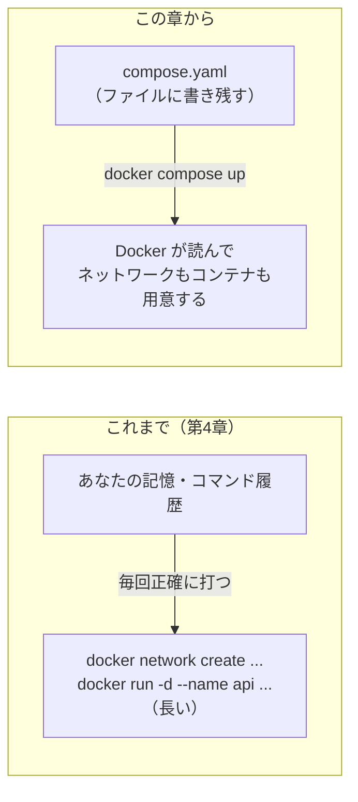
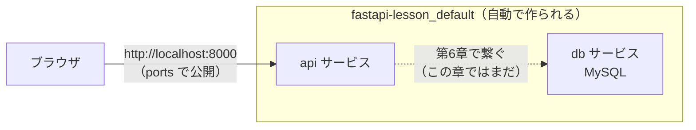
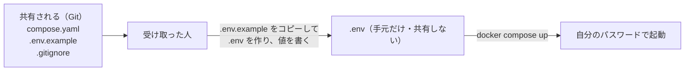
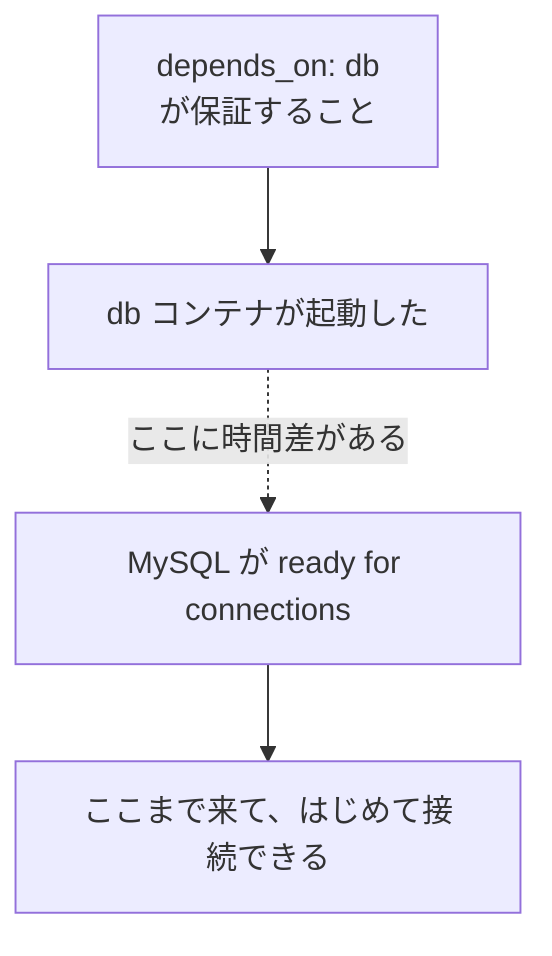

# 第5章 Docker Compose

第4章で、コンテナの中と外を繋げるようになりました。
コードは保存した瞬間に反映され、データはコンテナを消しても残り、
コンテナ同士は名前で呼び合えます。**やりたかったことは、ほぼ全部できます。**

ですが、章の最後で1つ問題が残りました。**コマンドが長すぎるのです。**

```bash
docker run -d --name api --network lesson-net -p 8000:8000 -v api-data:/data -e DATABASE_URL=sqlite:////data/app.db fastapi-lesson:0.1.0
```

しかも、これを打つ前に `docker network create lesson-net` を実行しておく必要があり、
コンテナが2つ3つと増えれば、この長い行が2本3本と並びます。
打ち間違えれば動かず、明日の自分は思い出せず、他人には渡せません。
**第1章 1.1.3 で限界を見た「手順書」に、逆戻りしています。**

この章では、この長いコマンドを **設定ファイル1枚に書き写します。**
起動は `docker compose up` の1行になり、
第4章で手作業だったネットワークは、**書かなくても自動で用意される**ようになります。

この「1コマンドで一式が起動する」形が、この本のゴール（第0章 0.1.2）でした。
**この章でその書き方を身につけ、第6章で React・FastAPI・MySQL の3つを、実際にこの形で組み立てます。**

## この章で学ぶこと

- **YAML** の基本ルールを読み書きでき、インデントのずれによるエラーを自分で直せるようになる
- 第4章の長い `docker run` を、**`compose.yaml` 1枚**に書き写せるようになる
- **`build` と `image`**、**`ports` / `volumes` / `environment`** の書き方を、`docker run` のオプションと対応づけて説明できるようになる
- **複数のサービス**を1枚のファイルに並べ、**サービス名で通信できる**ことを確認できるようになる
- `up` / `down` / `logs` / `ps` / `exec` / `build` の **Compose 版コマンド**を使い分けられるようになる
- 環境変数を **`.env` ファイル**に切り出し、**秘密情報を Git に入れない**形にできるようになる
- **`depends_on` の限界**を説明でき、**ヘルスチェック**と**アプリ側のリトライ**で起動順の問題に対処できるようになる

## この章の前提

- [第4章 ボリュームとネットワーク](./04-volumes-and-networks.md) を読み終えていること
  （とくに 4.1〜4.5 の `-v` / `-p` / `--network` / コンテナ名での通信）
- Docker Desktop が起動していること（クジラのアイコンが `running`。2.1.3）
- **第3章 3.6 で作った `fastapi-lesson`（`Dockerfile` 付き）が手元にあること。**
  5.2.3 以降の中心の例で使います。手元に無い場合は、5.2.2（nginx の例）までで
  YAML と `docker compose` の基本を身につけ、5.2.3 以降は読み物として進めてください
- **この章で立てる MySQL のサービスは、「2つ目のサービス」を体験するためのものです。**
  API を MySQL に実際に繋ぐのは第6章です。この章では繋ぎません（5.3.1 で改めて断ります）

> **つまずいたら**
> この章のトラブルは、大きく2種類しかありません。
>
> 1. **YAML の書き方の間違い**（インデントのずれ、`:` のあとの空白抜け）
> 2. **繋いだつもりが繋がっていない**（第4章と同じ。サービス名・ポート・起動順）
>
> 1 は、**エラーメッセージに行番号が出ます。** まずその行を見てください（5.2.1）。
> 2 は、第4章の「つまずいたら」と同じ3点確認（`ps` → 何を繋いだか → 中から見えるか）に、
> **`docker compose ps` と `docker compose logs` を使います**（5.4.3）。
>
> それでも分からないときは、第0章 0.2 で準備した AI に、次のように聞いてください。
>
> ```text
> docker-text の 5.2.2 を読んでいます。
> compose.yaml を書いて docker compose up したら、エラーになりました。
>
> OS: Windows 11 / macOS（どちらかを書く）
> compose.yaml の全文:
>
> （ここに compose.yaml を丸ごと貼る）
>
> 出たエラーの全文:
>
> （ここにエラーを丸ごと貼る）
>
> 原因と、直した compose.yaml を教えてください。
> ```
>
> **`compose.yaml` は丸ごと貼ってください。** YAML の間違いは**行と行の関係**で起きるので、
> 一部だけ抜き出すと原因が消えます。

---

## 5.1 コマンドが長くなりすぎる

### 5.1.1 これまでのコマンドを振り返る

第4章の最後で、`fastapi-lesson` を「データが残る形」で起動するために、次の手順を踏みました。

**まずネットワークを作り（4.5.2）、**

```bash
docker network create lesson-net
```

**そのうえで、長いコマンドを打つ（4.3.3 / 4.5.2）。**

```bash
docker run -d --name api --network lesson-net -p 8000:8000 -v api-data:/data -e DATABASE_URL=sqlite:////data/app.db fastapi-lesson:0.1.0
```

この1行には、第4章で学んだことが**全部**詰まっています。

| 部品 | 意味 | 学んだ場所 |
|------|------|-----------|
| `--name api` | コンテナに名前を付ける | 2.3.3 |
| `--network lesson-net` | 作ったネットワークに入れる | 4.5.2 |
| `-p 8000:8000` | パソコンの 8000 番をコンテナの 8000 番へ | 4.4.1 |
| `-v api-data:/data` | 名前付きボリュームを `/data` に繋ぐ | 4.3.1 |
| `-e DATABASE_URL=...` | 環境変数で保存先を指定する | 4.3.3 |
| `fastapi-lesson:0.1.0` | 起動するイメージ | 3.6.2 |

**問題は、この情報が「どこにも書き残されていない」ことです。**
コマンド履歴（`↑` キー）を頼りにしているだけで、次のような場面で必ず困ります。

- パソコンを再起動して、履歴が消えた
- 別のパソコンで、同じものを動かしたい
- チームの人に「これ動かして」と渡したい
- コンテナが3つに増えて、3本の長い行を**正確な順番で**打つ必要が出た

第1章 1.1.3 で見た「手順書」の限界そのものです。
**人間の記憶やコマンド履歴に頼っている限り、抜けと打ち間違いから逃げられません。**

### 5.1.2 Compose とは

**Docker Compose**（ドッカー・コンポーズ。複数のコンテナの構成をファイルに書いて、まとめて起動する道具）は、
この問題をまっすぐに解決します。

やることは単純です。**あの長いコマンドを、`compose.yaml` という名前のファイルに書き写す**だけです。
書き写しておけば、起動は次の1行で済みます。

```bash
docker compose up
```



`docker run` との違いを、先に大づかみでつかんでおきます。

| | `docker run`（第4章まで） | `docker compose`（この章） |
|--|------------------------|--------------------------|
| 構成の書き場所 | コマンドの中（消える） | **`compose.yaml`（残る・共有できる）** |
| 起動 | 長いコマンドを1本ずつ | **`docker compose up` の1行** |
| ネットワーク | `docker network create` してから | **自動で作られる**（5.3.3） |
| 複数コンテナ | コマンドを並べる | **1枚のファイルに並べて書く**（5.3） |
| 後片付け | `docker rm` / `docker network rm` を個別に | **`docker compose down` でまとめて**（5.4.2） |

**Compose は、新しくインストールするものではありません。**
Docker Desktop（第2章）に最初から入っています。確認してみましょう。

**Windows（PowerShell）**

```powershell
docker compose version
```

**macOS / Linux**

```bash
docker compose version
```

```text
Docker Compose version v2.31.0
```

このように**バージョンが表示されれば、準備は完了**です。

> **補足：`docker compose` と `docker-compose`（ハイフン）**
> 古い記事では、ハイフン付きの `docker-compose up`（別コマンド）を見かけます。
> これは**旧世代の書き方**です。いまの Docker Desktop に入っているのは、
> `docker` のサブコマンドである **`docker compose`（スペース区切り）** です。
> このテキストは、最後まで**スペース区切り**を使います。
> ハイフン付きのコマンドを案内された場合は、スペース区切りに読み替えてください。

---

## 5.2 設定ファイルの書き方

### 5.2.1 YAML の基本ルール

`compose.yaml` は、**YAML**（ヤムル。設定を「項目名: 値」の形とインデントで表す書き方）という形式で書きます。
Docker 専用の書き方ではなく、設定ファイルで広く使われている形式です。

ルールは多くありません。**次の5つだけ**押さえれば読み書きできます。

**1. 「項目名: 値」で書く。コロンのあとに半角スペースが要る**

```yaml
image: nginx:1.27
```

`image:` と `nginx` の間の**半角スペースを忘れると、別の意味**になります。ここが最初のつまずきどころです。

**2. 入れ子は「インデント（字下げ）」で表す。半角スペース2つが基本**

```yaml
services:
  web:
    image: nginx:1.27
```

`web` は `services` の中、`image` は `web` の中、という**親子関係を字下げで表します。**
JavaScript や JSON の `{ }`（波かっこ）の代わりが、YAML では**字下げ**です。

**3. タブ文字は使えない。必ず半角スペース**

見た目が同じでも、**タブ文字を1つでも使うとエラー**になります。
エディタが勝手にタブを入れることがあるので、これが2番目のつまずきどころです（対策は 5.2.2 の「よくある間違い」で扱います）。

**4. 並び（リスト）は行頭の `-`（ハイフン＋スペース）で表す**

```yaml
ports:
  - "8000:8000"
  - "8080:80"
```

`ports` の下にぶら下がる**複数の値**を、`-` で1つずつ書きます。

**5. `#` から行末まではコメント（メモ。動作に影響しない）**

```yaml
services:
  web:
    image: nginx:1.27   # 公式の nginx を使う
```

以上です。**「コロンのあとにスペース」「字下げはスペース2つ」「タブ禁止」** の3つを守れば、
この章の `compose.yaml` は書けます。

> **よくある間違い**
> YAML のエラーは、**ほとんどが字下げのずれ**です。エラーには**行番号**が出ます。
>
> ```text
> yaml: line 4: did not find expected key
> ```
>
> `line 4` と言われたら、**まず4行目とその前後の字下げ**を見てください。
> 「2つ字下げすべきところが1つになっている」「余計に1つ深い」のどちらかであることが大半です。

### 5.2.2 最小構成を書く

まず、**いちばん小さな `compose.yaml`** を、誰でも動かせる nginx で書いてみます。
第4章までの作業をしていたディレクトリ（`docker-lesson` の親）に、
`compose-lesson` というディレクトリを作り、その中に入ります。

**Windows（PowerShell）**

```powershell
mkdir compose-lesson
cd compose-lesson
```

**macOS / Linux**

```bash
mkdir compose-lesson
cd compose-lesson
```

このディレクトリに、`compose.yaml` というファイルを作ります。**ファイル名は正確に `compose.yaml`** です。

`compose-lesson/compose.yaml`

```yaml
services:
  web:
    image: nginx:1.27
    ports:
      - "8080:80"
```

4行の意味を、上から読みます。

| 行 | 意味 |
|----|------|
| `services:` | **これから起動するコンテナ（サービス）の一覧**を書く、という宣言 |
| `web:` | サービスに `web` という名前を付けた（`--name` に相当。名前は自由） |
| `image: nginx:1.27` | 使うイメージ（`docker run` のイメージ名に相当） |
| `ports: - "8080:80"` | パソコンの 8080 番をコンテナの 80 番へ（`-p 8080:80` に相当） |

**Compose では、コンテナのことを「サービス」と呼びます。**
`web` の部分は**サービス名**（このファイルの中で付ける、コンテナの呼び名）です。

起動します。ファイルのあるディレクトリ（`compose-lesson`）で実行してください。

**Windows（PowerShell）**

```powershell
docker compose up
```

**macOS / Linux**

```bash
docker compose up
```

```text
[+] Running 2/2
 ✔ Network compose-lesson_default  Created
 ✔ Container compose-lesson-web-1  Created
Attaching to web-1
web-1  | /docker-entrypoint.sh: Configuration complete; ready for start up
web-1  | 2026/09/10 05:40:11 [notice] 1#1: start worker processes
```

`docker network create` を**1度も打っていないのに、`Network compose-lesson_default Created` と出ている**点に注目してください。
Compose が、**ネットワークを自動で作りました**（詳しくは 5.3.3）。

ブラウザで開きます。

```text
http://localhost:8080
```

**nginx の初期ページ（`Welcome to nginx!`）が表示されれば成功です。**

いまのターミナルは、コンテナのログを表示し続けています（`docker run` に `-d` を付けなかったときと同じ状態です）。
**`Ctrl` + `C`** で止めます。

```text
^CGracefully stopping... (press Ctrl+C again to force)
[+] Stopping 1/1
 ✔ Container compose-lesson-web-1  Stopped
```

`Ctrl` + `C` で**コンテナは停止しますが、削除はされません。** 完全に片付けるコマンドは 5.4.2 で扱います。
いまは、次のコマンドでネットワークごと片付けておきます。

**Windows（PowerShell）**

```powershell
docker compose down
```

**macOS / Linux**

```bash
docker compose down
```

```text
[+] Running 2/2
 ✔ Container compose-lesson-web-1  Removed
 ✔ Network compose-lesson_default  Removed
```

**コンテナもネットワークも、まとめて消えました。**
第4章では `docker rm -f api` と `docker network rm lesson-net` を別々に打ちましたが、
Compose では **`down` の1回**で済みます。

> **よくある間違い**
> `docker compose up` で `yaml: line 3: found character that cannot start any token` のような
> エラーが出たら、**タブ文字が混ざっています**（5.2.1 のルール3）。
> VS Code なら、右下のステータスバーで **「スペース: 2」** になっているかを確認してください。
> 「タブ」になっている場合は、そこをクリックして **「スペースによるインデント」** に変え、
> **「インデントをスペースに変換」** を選ぶと直ります。

### 5.2.3 `build` と `image`

`compose.yaml` でサービスが使うイメージの指定には、**2つの書き方**があります。

| 書き方 | 意味 | いつ使うか |
|--------|------|-----------|
| `image: 名前:タグ` | **すでにあるイメージ**を使う | 公式イメージ（`nginx` など）や、ビルド済みの自作イメージ |
| `build: .` | **その場で `Dockerfile` からビルド**して使う | 自分のアプリを、コードから組み立てるとき |

5.2.2 の nginx は `image:` でした。今度は、**第3章 3.6 で `Dockerfile` を書いた `fastapi-lesson`** を、
`build:` を使って起動してみます。

`fastapi-lesson` ディレクトリに移動して、そこに `compose.yaml` を作ります。

**Windows（PowerShell）**

```powershell
cd ..\fastapi-lesson
```

**macOS / Linux**

```bash
cd ../fastapi-lesson
```

`fastapi-lesson/compose.yaml`

```yaml
services:
  api:
    build: .
    ports:
      - "8000:8000"
```

`build: .` の `.`（ドット）は、**`Dockerfile` のある場所**です。
第3章 3.3.1 の `docker build -t fastapi-lesson:0.1.0 .` の、最後の `.`（ビルドコンテキスト）と同じ意味です。
**「いまいるディレクトリの `Dockerfile` から組み立てる」** と読みます。

起動します。今度は `-d`（バックグラウンド。2.4.4）を付けてみます。

**Windows（PowerShell）**

```powershell
docker compose up -d
```

**macOS / Linux**

```bash
docker compose up -d
```

```text
[+] Building 8.2s (10/10) FINISHED
 => [api 1/5] FROM docker.io/library/python:3.13-slim
 => [api 5/5] COPY . .
 => => naming to docker.io/library/fastapi-lesson-api
[+] Running 2/2
 ✔ Network fastapi-lesson_default  Created
 ✔ Container fastapi-lesson-api-1  Started
```

**`docker compose up` は、イメージが無ければ自動でビルドします。**
1行目の `[+] Building` が、その工程です（第3章 3.3.1 で見た `docker build` の出力と同じ形です）。
ビルドされたイメージには、`fastapi-lesson-api`（`プロジェクト名-サービス名`）という名前が自動で付きます。

`-d` を付けたので、ターミナルはすぐ戻ってきます。ログは `docker compose logs` で見ます（5.4.3）。

> **補足：`build` と `image` は組み合わせられる**
> `build:` と `image:` を両方書くと、「ビルドした結果に、この名前を付ける」という意味になります。
>
> ```yaml
> services:
>   api:
>     build: .
>     image: fastapi-lesson:0.1.0   # ビルド結果にこの名前を付ける
> ```
>
> こうすると、3.6.2 で付けたのと同じ `fastapi-lesson:0.1.0` という名前になります。
> **この章では `build: .` だけの形**で進めます。名前にこだわらなければ、`build: .` だけで十分だからです。

このコンテナは次の項でも使います。**消さずに残しておいてください。**

### 5.2.4 `ports` / `volumes` / `environment`

いよいよ、**第4章の長いコマンドの残り**を書き足します。
思い出すと、`fastapi-lesson` を「データが残る形」にするには、次の3つが必要でした。

- `-p 8000:8000` … ポートの公開（4.4）
- `-v api-data:/data` … 名前付きボリューム（4.3）
- `-e DATABASE_URL=sqlite:////data/app.db` … 保存先の指定（4.3.3）

`ports` はもう書きました。**残る `volumes` と `environment` を足します。**
`fastapi-lesson/compose.yaml` を、次のように書き換えてください。

`fastapi-lesson/compose.yaml`

```yaml
services:
  api:
    build: .
    ports:
      - "8000:8000"
    volumes:
      - api-data:/data
    environment:
      DATABASE_URL: sqlite:////data/app.db

volumes:
  api-data:
```

`docker run` のオプションと、1対1で対応しています。

| `docker run`（第4章） | `compose.yaml`（この項） |
|---------------------|------------------------|
| `-p 8000:8000` | `ports: - "8000:8000"` |
| `-v api-data:/data` | `volumes: - api-data:/data` |
| `-e DATABASE_URL=sqlite:////data/app.db` | `environment: DATABASE_URL: sqlite:////data/app.db` |

**新しく増えたのは、いちばん下の `volumes:` だけ**です。ここが、初めての人がつまずく点です。

> **注意：名前付きボリュームは、下にもう一度「宣言」する**
> `compose.yaml` で名前付きボリュームを使うときは、**2か所に書きます。**
>
> 1. サービスの中の `volumes:`（**どこに繋ぐか**。`api-data:/data`）
> 2. ファイルの一番下の、サービスと同じ高さの `volumes:`（**この名前のボリュームを使う、という宣言**）
>
> 下の宣言を忘れると、`service "api" refers to undefined volume api-data` というエラーになります。
> **「使う場所」と「宣言」の両方が要る**、と覚えてください。

`environment` は、`DATABASE_URL: 値` という**「項目名: 値」**の形でも、
`- DATABASE_URL=値` という**「`-` で始まる `名前=値`」**の形でも書けます（詳しくは 5.5.1）。
ここでは前者を使いました。

書き換えたら、**古いコンテナを作り直します。** `compose.yaml` を変えたときは、`up` をもう一度実行します。

**Windows（PowerShell）**

```powershell
docker compose up -d
```

**macOS / Linux**

```bash
docker compose up -d
```

```text
[+] Running 3/3
 ✔ Network fastapi-lesson_default  Created
 ✔ Volume "fastapi-lesson_api-data"  Created
 ✔ Container fastapi-lesson-api-1    Started
```

**`Volume "fastapi-lesson_api-data" Created`** が増えました。ボリュームが自動で作られています。

> **よくある間違い：ボリュームの名前に接頭辞が付く**
> ここで作られたボリュームは、`api-data` ではなく **`fastapi-lesson_api-data`** です。
> Compose は、ボリュームやネットワークの名前に**プロジェクト名（既定ではディレクトリ名）を接頭辞として付けます。**
>
> ```bash
> docker volume ls
> ```
>
> ```text
> DRIVER    VOLUME NAME
> local     api-data                   ← 第4章で docker run で作ったもの
> local     fastapi-lesson_api-data    ← この章で Compose が作ったもの
> ```
>
> **この2つは別物です。** 第4章で入れたデータは `api-data` のほう、
> Compose が使うのは `fastapi-lesson_api-data` のほうにあります。
> 「第4章では残っていたデータが、Compose にしたら空になった」と感じたら、これが原因です。
> **中身は消えていません。別のボリュームを見ているだけ**です。

このコンテナは、次の 5.3 でも使います。**消さずに残しておいてください。**
最初はテーブルが無いので `GET /tasks` はまだ動きませんが、その準備は 5.4.3 で行います。

---

## 5.3 複数サービスを定義する

### 5.3.1 API とデータベースを並べる

ここまでは、サービスが `api` 1つだけでした。
`compose.yaml` の本領は、**複数のサービスを1枚に並べて、まとめて起動できる**ことです。

第6章では、**API のコンテナと、データベースのコンテナ**を並べて動かします。
その予行演習として、`fastapi-lesson/compose.yaml` に、**データベースのサービス `db` を1つ足します。**
データベースには、5冊目で学ぶ **MySQL**（マイエスキューエル。広く使われているデータベースの1つ）を使います。

> **注意：この章では、API を MySQL に繋ぎません**
> ここで立てる `db` は、**「2つ目のサービスを並べる」練習のためのもの**です。
> `api` は、これまでどおり SQLite（`/data/app.db`。4.3.3）を使い続けます。
> **API を MySQL に実際に繋ぎ替えるのは第6章**であり、その手順（接続用のライブラリ・接続 URL）は
> mysql-text と第6章で扱います。この章の狙いは、あくまで **Compose で複数サービスを扱う書き方**です。

`fastapi-lesson/compose.yaml` を、次のように書き換えてください。`db` サービスと、その保存用のボリュームが増えます。

`fastapi-lesson/compose.yaml`

```yaml
services:
  api:
    build: .
    ports:
      - "8000:8000"
    volumes:
      - api-data:/data
    environment:
      DATABASE_URL: sqlite:////data/app.db

  db:
    image: mysql:8.4
    environment:
      MYSQL_ROOT_PASSWORD: rootpass
      MYSQL_DATABASE: appdb
    volumes:
      - db-data:/var/lib/mysql

volumes:
  api-data:
  db-data:
```

足したものを読みます。

| 行 | 意味 |
|----|------|
| `db:` | 2つ目のサービス。名前は `db` |
| `image: mysql:8.4` | MySQL の公式イメージ（`8.4` は長期サポート版。3.2.1 と同じくタグを省略しない） |
| `MYSQL_ROOT_PASSWORD: rootpass` | データベースの管理者パスワード（MySQL イメージが要求する。**本物の秘密情報。5.5 で外に出します**） |
| `MYSQL_DATABASE: appdb` | 起動時に作るデータベースの名前 |
| `db-data:/var/lib/mysql` | MySQL がデータを書く場所を、名前付きボリュームに繋ぐ（4.3 と同じ考え方） |

**`db` には `ports:` を書いていない**点に注目してください。
第4章 4.5 で学んだとおり、**コンテナ同士の通信に `-p`（ポート公開）は要りません。**
`db` に用があるのは `api` だけで、パソコンのブラウザから直接触る必要はないので、公開しないのが正解です。

構成を図にすると、次のようになります。



起動します。

**Windows（PowerShell）**

```powershell
docker compose up -d
```

**macOS / Linux**

```bash
docker compose up -d
```

```text
[+] Running 4/4
 ✔ Network fastapi-lesson_default        Created
 ✔ Volume "fastapi-lesson_db-data"       Created
 ✔ Container fastapi-lesson-db-1         Started
 ✔ Container fastapi-lesson-api-1        Started
```

**コンテナが2つ、1回のコマンドで起動しました。**
第4章なら、`docker run` を2回、正しい順番で打つ必要があったものです。

MySQL は、**初回だけ内部の準備に十数秒〜数十秒かかります。** ログで様子を見ておきます。

**Windows（PowerShell）**

```powershell
docker compose logs db
```

**macOS / Linux**

```bash
docker compose logs db
```

```text
fastapi-lesson-db-1  | [System] [MY-010931] [Server] /usr/sbin/mysqld: ready for connections. Version: '8.4.3'  port: 3306
```

**`ready for connections` が出れば、MySQL の準備完了**です（`port: 3306` が MySQL の待ち受けポート）。
この「準備に時間がかかる」ことが、あとで 5.6 の主題になります。

### 5.3.2 サービス名で通信する

第4章 4.5.1 では、既定のネットワークだと**コンテナ名を引けず**、`Name or service not known` になりました。
自分でネットワークを作って（4.5.2）、ようやくコンテナ名で呼べるようになりました。

**Compose では、この「名前で呼べる」が最初から効いています。**
確かめてみましょう。`api` コンテナの中から、`db` という名前が**住所（IP アドレス）に変換できるか**を見ます。

**Windows（PowerShell）**

```powershell
docker compose exec api python -c "import socket; print(socket.gethostbyname('db'))"
```

**macOS / Linux**

```bash
docker compose exec api python -c "import socket; print(socket.gethostbyname('db'))"
```

```text
172.18.0.2
```

**`db` という名前が、IP アドレスに変換できました。** これが「名前解決ができている」状態です（4.5.3 と同じ）。
`docker compose exec` は、`docker exec`（2.6.1）の Compose 版で、**サービス名を指定**して中でコマンドを動かします。
`socket.gethostbyname('db')` は、Python の標準ライブラリで**名前を IP アドレスに引く**だけの命令です。

存在しないサービス名で試すと、第4章と同じエラーになります。

**Windows（PowerShell）**

```powershell
docker compose exec api python -c "import socket; print(socket.gethostbyname('dbx'))"
```

**macOS / Linux**

```bash
docker compose exec api python -c "import socket; print(socket.gethostbyname('dbx'))"
```

```text
socket.gaierror: [Errno -2] Name or service not known
```

`dbx`（存在しないサービス名）は引けません。
**つまり、`compose.yaml` に書いたサービス名が、そのまま相手を呼ぶ名前になる**わけです。

第6章で API を MySQL に繋ぐときの接続先は、この仕組みのおかげで **`db`（サービス名）** になります。
`localhost` でも IP アドレスでもなく、**サービス名で書く**のが Compose の流儀です。

> **補足：なぜ `localhost` ではないのか**
> これは第4章 4.5.4 とまったく同じ理由です。`api` コンテナの中で `localhost` と書くと、
> それは **`api` コンテナ自身**を指してしまい、`db` には届きません。
> 相手のコンテナを呼ぶときは、**必ずサービス名**を使います。

### 5.3.3 ネットワークは自動で作られる

5.2.2 から、起動のたびに `Network ... Created` と出ていました。
**Compose は、`compose.yaml` の中のサービスを、専用のネットワークに自動でまとめて入れています。**

確認します。

**Windows（PowerShell）**

```powershell
docker network ls
```

**macOS / Linux**

```bash
docker network ls
```

```text
NETWORK ID     NAME                      DRIVER    SCOPE
80b131bca10d   bridge                    bridge    local
3bdac7526d04   host                      host      local
7c2e9a1b4f60   fastapi-lesson_default    bridge    local
5aefaa1c4cd8   none                      null      local
```

**`fastapi-lesson_default`** が、Compose が自動で作ったネットワークです。
名前は **`プロジェクト名_default`**（プロジェクト名は既定でディレクトリ名）になります。

第4章 4.5.2 で手作業だった `docker network create` と、そこへの参加（`--network`）が、
**`compose.yaml` を書くだけで、全部自動になりました。**

| | 第4章（`docker run`） | この章（Compose） |
|--|---------------------|------------------|
| ネットワークを作る | `docker network create lesson-net` | **自動**（`up` のたびに用意される） |
| コンテナを入れる | `docker run --network lesson-net ...` | **自動**（同じファイルのサービスは同じネットワーク） |
| 名前で呼べるか | 作ったネットワークの中だけ | **最初から呼べる** |
| 後片付け | `docker network rm lesson-net` | **`docker compose down` で自動**（5.4.2） |

**同じ `compose.yaml` に書いたサービスは、黙っていても同じネットワークに入り、サービス名で呼び合えます。**
これが、複数のコンテナを扱うときに Compose が最も楽をさせてくれる部分です。

---

## 5.4 基本コマンド

`docker run` で覚えたコマンドには、ほとんど **Compose 版**があります。
違いは1つだけ、**個々のコンテナ名ではなく、`compose.yaml` 全体を相手にする**ことです。

### 5.4.1 `up` と `up -d`

**`docker compose up`** は、`compose.yaml` を読んで、**ネットワーク・ボリューム・コンテナを一式そろえて起動**します。

| コマンド | 動き |
|---------|------|
| `docker compose up` | 起動して、**ログを画面に流し続ける**（`Ctrl` + `C` で停止） |
| `docker compose up -d` | 起動して、**すぐターミナルに戻る**（`-d` は「バックグラウンド」。2.4.4 と同じ） |

`compose.yaml` を書き換えたあとに `up`（または `up -d`）をもう一度実行すると、
**変わったサービスだけを作り直します。** 変えていないサービスはそのままなので、無駄がありません。

### 5.4.2 `down` と `down -v`

**`docker compose down`** は、`up` で作ったものを**まとめて片付けます。**

**Windows（PowerShell）**

```powershell
docker compose down
```

**macOS / Linux**

```bash
docker compose down
```

```text
[+] Running 3/3
 ✔ Container fastapi-lesson-api-1       Removed
 ✔ Container fastapi-lesson-db-1        Removed
 ✔ Network fastapi-lesson_default       Removed
```

**コンテナとネットワークが消えました。ですが、ボリュームは消えていません。**
`down` の出力に、`Volume ... Removed` が**無い**ことを確認してください。
これは意図された動きです。**データ（`db-data` や `api-data`）は、うっかり消さないように残す**設計になっています。

ボリュームまで消したいときだけ、**`-v`** を付けます。

**Windows（PowerShell）**

```powershell
docker compose down -v
```

**macOS / Linux**

```bash
docker compose down -v
```

```text
[+] Running 4/4
 ✔ Container fastapi-lesson-api-1       Removed
 ✔ Container fastapi-lesson-db-1        Removed
 ✔ Volume fastapi-lesson_db-data       Removed
 ✔ Volume fastapi-lesson_api-data      Removed
 ✔ Network fastapi-lesson_default      Removed
```

> **注意：`down -v` は、保存したデータを消します**
> `-v` を付けると、**このプロジェクトのボリュームが中身ごと消えます。**
> データベースの中身も、SQLite の `app.db` も消えて、**次の `up` は空の状態から始まります。**
> 「一度まっさらにしてやり直したい」ときには便利ですが、
> **消えて困るデータがあるときに、うっかり `-v` を付けないでください。**
> 第2章 2.7 で `docker system prune -a --volumes` を使わないと決めたのと、同じ理由です。

いまは学習中なので、`down -v` で一度まっさらにしておきます（次の 5.4.3 は、空の状態から始めます）。

### 5.4.3 `logs` / `ps` / `exec`

第4章で1つずつのコンテナに使ったコマンドにも、Compose 版があります。**サービス名で指定**します。

まず、5.4.2 でまっさらにしたので、もう一度起動します。

**Windows（PowerShell）**

```powershell
docker compose up -d
```

**macOS / Linux**

```bash
docker compose up -d
```

**`docker compose ps`** … いま動いているサービスの一覧を見ます（`docker ps` の Compose 版）。

```text
NAME                     IMAGE               COMMAND                  SERVICE   STATUS         PORTS
fastapi-lesson-api-1     fastapi-lesson-api  "fastapi run app/mai…"   api       Up 5 seconds   0.0.0.0:8000->8000/tcp
fastapi-lesson-db-1      mysql:8.4           "docker-entrypoint.s…"   db        Up 5 seconds   3306/tcp
```

`db` の `PORTS` が `3306/tcp`（`0.0.0.0:...->` が付かない）なのは、**公開していない**（5.3.1）からです。

**`docker compose logs`** … ログを見ます（`docker logs` の Compose 版）。サービス名を付けると、そのサービスだけ見られます。

```bash
docker compose logs api
docker compose logs -f db
```

`-f`（追いかけ表示。2.6.2）も同じように使えます（`Ctrl` + `C` で表示だけをやめます）。

**`docker compose exec`** … コンテナの中でコマンドを動かします（`docker exec` の Compose 版）。
第4章 4.3.3 で `docker exec api ...` でやったテーブル作成を、Compose 版で行います。
`db` が `ready for connections`（5.3.1）になるのを待ってから実行してください。

**Windows（PowerShell）**

```powershell
docker compose exec api alembic upgrade head
docker compose exec api python -m app.seed
```

**macOS / Linux**

```bash
docker compose exec api alembic upgrade head
docker compose exec api python -m app.seed
```

```text
INFO  [alembic.runtime.migration] Running upgrade  -> 8f3d1c2a9b45, create tasks table
3 件のタスクを追加しました。
```

ブラウザで `http://localhost:8000/docs` を開き、`GET /tasks` を実行すると、データが返ります。

```json
[
  {"id":1,"title":"買い物","done":false,"owner":{"name":"田中"}},
  {"id":2,"title":"レポート提出","done":false,"owner":{"name":"田中"}},
  {"id":3,"title":"部屋の掃除","done":true,"owner":{"name":"佐藤"}}
]
```

ここで **`down`（`-v` なし）→ `up -d`** をすると、データが残っていることを確認できます。

**Windows（PowerShell）**

```powershell
docker compose down
docker compose up -d
```

**macOS / Linux**

```bash
docker compose down
docker compose up -d
```

もう一度 `GET /tasks` を実行すると、**`alembic` も `seed` もし直していないのに、同じ3件が返ります。**
`api-data` ボリュームにデータが残っているためです（4.3.1 で見たのと同じ仕組み）。

### 5.4.4 `build` と `--build`

`build: .`（5.2.3）を書いたサービスは、コード（`main.py` など）を直したら、**ビルドし直す**必要があります。
`docker run` のときと違い、Compose では**イメージのビルドと起動が1つのコマンドに混ざる**ので、ここを整理しておきます。

| コマンド | 動き |
|---------|------|
| `docker compose up -d` | イメージが**無ければビルド**、**あればビルドせず**起動（既存イメージを使い回す） |
| `docker compose up -d --build` | **毎回ビルドしてから**起動（コードを直したときはこちら） |
| `docker compose build` | **ビルドだけ**する（起動はしない） |

**ここが、第4章 4.3.3 の「よくある間違い」と同じ落とし穴**です。
`main.py` を直したのに `docker compose up -d` だけだと、**古いイメージのまま起動**してしまい、
「直したのに反映されない」と悩むことになります。**コードを直したら `--build` を付ける**、と覚えてください。

**Windows（PowerShell）**

```powershell
docker compose up -d --build
```

**macOS / Linux**

```bash
docker compose up -d --build
```

```text
[+] Building 1.4s (10/10) FINISHED
 => [api 5/5] COPY . .
[+] Running 2/2
 ✔ Container fastapi-lesson-db-1    Running
 ✔ Container fastapi-lesson-api-1   Started
```

`db` は変わっていないので `Running`（そのまま）、`api` だけ `Started`（作り直し）になっています。

> **補足：開発中はバインドマウントと `--build` を使い分ける**
> 第4章 4.2.2 のように**バインドマウント + `fastapi dev`** を使えば、保存のたびに反映され、
> `--build` は不要になります。この開発向けの書き方は、第6章 6.4 で `compose.yaml` に整理します。
> **いまは「`build:` のイメージはコードを直したら `--build`」** とだけ押さえておけば十分です。

---

## 5.5 環境変数

### 5.5.1 `environment` で直接書く

5.2.4 と 5.3.1 で、`environment:` を使いました。書き方は**2通り**あり、どちらでも同じ意味です。

**書き方1：「項目名: 値」の形（このテキストの標準）**

```yaml
    environment:
      DATABASE_URL: sqlite:////data/app.db
      MYSQL_ROOT_PASSWORD: rootpass
```

**書き方2：「`-` で始まる `名前=値`」の形**

```yaml
    environment:
      - DATABASE_URL=sqlite:////data/app.db
      - MYSQL_ROOT_PASSWORD=rootpass
```

書き方1は**コロンとスペース**、書き方2は**イコール（スペースなし）**です。混ぜないようにしてください。
このテキストは、YAML らしい**書き方1**で統一します。

`docker run -e 名前=値`（3.2.6 / 4.3.3）を、そのままファイルに書き写したものだと考えれば十分です。

### 5.5.2 環境変数ファイルを使う

いまの `compose.yaml` には、**問題が1つ**あります。

```yaml
      MYSQL_ROOT_PASSWORD: rootpass
```

**パスワードが、ファイルに直接書かれています。**
`compose.yaml` は、チームで共有したり、Git（第4章 4.6.2 で少し触れました）で管理したりするファイルです。
**秘密の値を書いたまま共有すると、パスワードが全員に見えてしまいます。**

そこで、**値だけを別のファイル（`.env`）に切り出します。**
fastapi-text 4.6 で `.env` を使ったのと、同じ考え方です。

まず、`fastapi-lesson` に `.env` を作ります。

`fastapi-lesson/.env`

```text
MYSQL_ROOT_PASSWORD=rootpass
MYSQL_DATABASE=appdb
```

次に、`compose.yaml` から、この値を **`${...}`** で参照します。

`fastapi-lesson/compose.yaml`（`db` の `environment` の部分）

```yaml
  db:
    image: mysql:8.4
    environment:
      MYSQL_ROOT_PASSWORD: ${MYSQL_ROOT_PASSWORD}
      MYSQL_DATABASE: ${MYSQL_DATABASE}
    volumes:
      - db-data:/var/lib/mysql
```

**`${MYSQL_ROOT_PASSWORD}` は、「`.env` に書いた同じ名前の値を、ここに差し込む」** という意味です。
Compose は、`compose.yaml` と**同じディレクトリにある `.env` を自動で読み込み**、`${...}` を置き換えます。

置き換えが正しく効いているかは、`docker compose config` で確認できます。
これは、**`.env` を差し込んだ後の最終的な `compose.yaml`** を表示するコマンドです。

**Windows（PowerShell）**

```powershell
docker compose config
```

**macOS / Linux**

```bash
docker compose config
```

```text
    environment:
      MYSQL_DATABASE: appdb
      MYSQL_ROOT_PASSWORD: rootpass
```

`${MYSQL_ROOT_PASSWORD}` が、`.env` の値 `rootpass` に**置き換わって**います。
これで、**`compose.yaml` にはパスワードそのものが書かれていない**状態になりました。

> **補足：`environment` と `env_file` は別のもの**
> 似た名前の `env_file:` という書き方もあります。混同しやすいので、違いを表にします。
>
> | 書き方 | 何をするか |
> |--------|-----------|
> | `.env`（ファイル名が `.env`） | Compose が自動で読み、`compose.yaml` の中の `${...}` を置き換える |
> | サービスの `env_file: .env` | その `.env` の中身を、**コンテナの環境変数として丸ごと渡す** |
>
> このテキストでは、**`.env` + `${...}`（前者）** を使います。
> 「`compose.yaml` から秘密の値を消す」という目的には、これがいちばん分かりやすいためです。

### 5.5.3 秘密情報を Git に入れない

`.env` に値を移しても、**その `.env` を Git で共有してしまっては意味がありません。**
`.env` は**手元に置くだけで、共有しない**のが鉄則です。

第3章 3.5 で作った `.dockerignore`、第4章 4.6.2 で触れた Git の設定と同じ発想で、
**`.gitignore`**（Git に「これは追跡しない」と伝えるファイル）に `.env` を書きます。

`fastapi-lesson/.gitignore`（すでにある場合は、`.env` の行があるか確認する）

```text
.env
*.db
__pycache__/
```

そのうえで、**「どんな項目を書けばよいか」だけを伝える見本**を、別名で共有します。
fastapi-text 4.6 で作った `.env.example` と同じものです。

`fastapi-lesson/.env.example`

```text
# 値は各自で決めて .env に書く（このファイルは項目の見本）
MYSQL_ROOT_PASSWORD=ここにパスワードを書く
MYSQL_DATABASE=appdb
```

こうしておくと、受け取った人は次のように動けます。



- **共有するもの**：`compose.yaml`（構成）、`.env.example`（項目の見本）、`.gitignore`
- **共有しないもの**：`.env`（実際の値）

**「構成は共有し、秘密の値は各自が手元で持つ」** という形が、これで完成します。
第7章では、これをさらに厳密にする方法（本番向けの秘密情報の扱い）を扱いますが、
**学習用にはこの `.env` + `.gitignore` で十分**です。

---

## 5.6 起動順の制御

### 5.6.1 `depends_on` の限界

5.3.1 で、MySQL は「起動してから `ready for connections` まで、十数秒かかる」と書きました。
ここに、複数サービスならではの落とし穴があります。

**第6章で API を MySQL に繋ぐと、API は起動と同時に MySQL へ接続しようとします。**
ところが MySQL がまだ準備中だと、**接続に失敗して API が落ちます。**
「`db` を先に、`api` を後に」起動したいわけです。

その指定が **`depends_on`**（〜に依存する）です。`api` に、次のように書きます。

```yaml
  api:
    build: .
    depends_on:
      - db
    ports:
      - "8000:8000"
    # （以下省略）
```

これで「`db` を起動してから `api` を起動する」順番になります。**ですが、これだけでは足りません。**
実際に確かめてみましょう。まず一度まっさらにして、起動し直します。

**Windows（PowerShell）**

```powershell
docker compose down -v
docker compose up -d
```

**macOS / Linux**

```bash
docker compose down -v
docker compose up -d
```

起動した**直後に**、`api` から `db` の 3306 番へ、**実際に接続**を試みます
（5.3.2 は名前を引くだけでしたが、今度は**ポートが開いて応答するか**まで見ます）。

**Windows（PowerShell）**

```powershell
docker compose exec api python -c "import socket; socket.create_connection(('db', 3306), timeout=3); print('繋がりました')"
```

**macOS / Linux**

```bash
docker compose exec api python -c "import socket; socket.create_connection(('db', 3306), timeout=3); print('繋がりました')"
```

初回は MySQL の準備が終わっていないため、こうなります。

```text
ConnectionRefusedError: [Errno 111] Connection refused
```

**`db` は起動しているのに、接続を拒まれました。**
`depends_on` は「`db` の**コンテナが起動した**」ことは保証しますが、
「`db` の中の MySQL が**接続を受け付けられる状態になった**」ことまでは保証しないのです。



数十秒待ってから、同じコマンドをもう一度実行すると、今度は繋がります。

```text
繋がりました
```

**見たいのは「一度は必ず繋がる」ことではなく、「`depends_on` があっても、繋がらない瞬間がある」ことです。**
この「起動はしたが、まだ準備できていない」時間差を埋めるのが、次の 5.6.2 と 5.6.3 です。

### 5.6.2 ヘルスチェックを設定する

「コンテナが起動したか」ではなく「**中身が準備できたか**」を Compose に教える仕組みが、
**ヘルスチェック**（healthcheck。コンテナが正常に働けるかを、決めたコマンドで定期的に確かめる仕組み）です。

`db` に「準備できたかを確かめるコマンド」を持たせ、`api` には「`db` が**健康**になるまで待つ」と指定します。
`compose.yaml` を、次のように書き換えます。

`fastapi-lesson/compose.yaml`

```yaml
services:
  api:
    build: .
    depends_on:
      db:
        condition: service_healthy
    ports:
      - "8000:8000"
    volumes:
      - api-data:/data
    environment:
      DATABASE_URL: sqlite:////data/app.db

  db:
    image: mysql:8.4
    environment:
      MYSQL_ROOT_PASSWORD: ${MYSQL_ROOT_PASSWORD}
      MYSQL_DATABASE: ${MYSQL_DATABASE}
    volumes:
      - db-data:/var/lib/mysql
    healthcheck:
      test: ["CMD", "mysqladmin", "ping", "-h", "127.0.0.1"]
      interval: 5s
      timeout: 3s
      retries: 10
      start_period: 30s

volumes:
  api-data:
  db-data:
```

追加した2か所を読みます。

**`db` の `healthcheck`（準備できたかの確かめ方）**

| 項目 | 意味 |
|------|------|
| `test: ["CMD", "mysqladmin", "ping", "-h", "127.0.0.1"]` | **`mysqladmin ping`**（MySQL に「生きているか」を尋ねるコマンド）を実行し、応答があれば健康とみなす |
| `interval: 5s` | 5秒ごとに確かめる |
| `timeout: 3s` | 3秒応答がなければ、その回は失敗 |
| `retries: 10` | 10回続けて失敗したら「不健康」と判断する |
| `start_period: 30s` | 起動から30秒間は、失敗しても数に入れない（準備中の猶予） |

**`api` の `depends_on`（待ち方）**

```yaml
    depends_on:
      db:
        condition: service_healthy
```

5.6.1 では `- db`（リスト）でしたが、ここでは **`condition: service_healthy`**（`db` が**健康**になるまで待つ）を付けています。
これで、`api` は「`db` が起動した」ではなく「**`db` が接続を受け付けられる**」まで待ってから起動します。

書き換えたら、まっさらにして起動し直します。

**Windows（PowerShell）**

```powershell
docker compose down -v
docker compose up -d
```

**macOS / Linux**

```bash
docker compose down -v
docker compose up -d
```

```text
[+] Running 4/4
 ✔ Network fastapi-lesson_default    Created
 ✔ Volume "fastapi-lesson_db-data"   Created
 ✔ Container fastapi-lesson-db-1     Healthy
 ✔ Container fastapi-lesson-api-1    Started
```

**`db` の行が `Healthy` になってから、`api` が `Started` になっています。**
`docker compose ps` でも、`db` の `STATUS` に **`(healthy)`** が付きます。

```text
NAME                   IMAGE               SERVICE   STATUS                   PORTS
fastapi-lesson-api-1   fastapi-lesson-api  api       Up 3 seconds             0.0.0.0:8000->8000/tcp
fastapi-lesson-db-1    mysql:8.4           db        Up 35 seconds (healthy)  3306/tcp
```

5.6.1 で見た「繋がらない瞬間」が、これで無くなりました。**`api` が動き出した時点で、`db` はもう準備完了**です。

> **注意：`mysqladmin ping` は「応答するか」だけを見ています**
> このヘルスチェックは「MySQL のプロセスが応答するか」を確かめます。
> 学習用にはこれで十分ですが、**厳密には「特定のユーザーでログインできるか」までは見ていません。**
> より丁寧な確かめ方（ユーザーとパスワードを渡す形）もありますが、
> **このテキストでは、まず「起動順を制御できる」ことを体験するのが目的**なので、この形にとどめます。

### 5.6.3 アプリ側でリトライする

ヘルスチェックは強力ですが、**万能ではありません。**

- ヘルスチェックを持たないイメージもある（自分で `test:` を書けないと使えない）
- ヘルスチェックが「健康」と言った直後に、相手が一時的に落ちることもある

そこで、**もっとも確実な備えは「アプリ側で、繋がるまで何度か試す」こと**です。
これを**リトライ**（retry。失敗しても、少し待ってやり直すこと）と呼びます。

考え方は単純です。**「繋がらなかったら、1秒待って、もう一度試す。何回か繰り返してもだめなら諦める。」**
Python で書くと、次のようになります。`fastapi-lesson` に、確認用のファイルを1つ作ります。

`fastapi-lesson/wait_for_db.py`

```python
import socket
import time

def wait_for(host, port, timeout=30):
    # timeout 秒のあいだ、繋がるまで1秒おきに試す
    deadline = time.time() + timeout
    while time.time() < deadline:
        try:
            with socket.create_connection((host, port), timeout=3):
                print(f"{host}:{port} に繋がりました")
                return
        except OSError:
            # まだ準備できていない。1秒待って、もう一度試す
            print("まだ繋がりません。1秒待って再試行します")
            time.sleep(1)
    raise TimeoutError(f"{host}:{port} に {timeout} 秒以内に繋がりませんでした")

wait_for("db", 3306)
```

このファイルを含めてビルドし直し、`api` の環境で1回だけ実行してみます
（`docker compose run` は、サービスの環境で**コマンドを1回だけ**動かすコマンドです）。

**Windows（PowerShell）**

```powershell
docker compose run --rm --build api python wait_for_db.py
```

**macOS / Linux**

```bash
docker compose run --rm --build api python wait_for_db.py
```

```text
まだ繋がりません。1秒待って再試行します
まだ繋がりません。1秒待って再試行します
db:3306 に繋がりました
```

**繋がるまで自分で待ってから、先に進んでいます。**
相手の準備が何秒かかろうと、アプリ側が待つので、**起動の順番に振り回されなくなります。**

3つの対処を、強さの順で並べると次のようになります。

| 対処 | 保証されること | 弱点 |
|------|--------------|------|
| `depends_on: - db`（5.6.1） | 起動の順番だけ | **準備完了は待たない** |
| `depends_on: condition: service_healthy`（5.6.2） | 相手が「健康」になるまで待つ | ヘルスチェックを書ける相手に限る |
| **アプリ側のリトライ（この項）** | 相手の状態に関係なく、繋がるまで待つ | アプリにコードを足す必要がある |

**この3つは、対立するものではなく、重ねて使うものです。**
第6章では、この考え方を**アプリの起動処理そのもの**に組み込み、`compose.yaml` と合わせて、
「1コマンドで、順番も含めて確実に立ち上がる」形に仕上げます。

確認が終わったので、この章で使ったものを片付けておきます。
**データも消してよいので、`-v` を付けます。**

**Windows（PowerShell）**

```powershell
docker compose down -v
```

**macOS / Linux**

```bash
docker compose down -v
```

---

## まとめ

- **Docker Compose** は、長い `docker run` を **`compose.yaml` 1枚**に書き写し、`docker compose up` の1行で起動する道具（5.1.2）
- Compose は Docker Desktop に**最初から入っている**。`docker compose version` で確認する。コマンドは**スペース区切り**（5.1.2）
- `compose.yaml` は **YAML** で書く。**「コロンのあとにスペース」「字下げはスペース2つ」「タブ禁止」**（5.2.1）
- YAML のエラーには**行番号**が出る。まずその行の**字下げ**を疑う（5.2.1）
- サービス（コンテナ）は `services:` の下に、**サービス名: 設定**の形で並べる（5.2.2）
- イメージの指定は、**`image:`（既存を使う）** か **`build: .`（`Dockerfile` からビルド）**（5.2.3）
- `docker run` のオプションは、**`ports` / `volumes` / `environment`** にそのまま対応する（5.2.4）
- 名前付きボリュームは、**サービスの中の `volumes:`** と、**ファイル末尾の `volumes:` 宣言**の**2か所**に書く（5.2.4）
- Compose が作るボリューム・ネットワークには、**プロジェクト名の接頭辞**が付く（`fastapi-lesson_api-data`）。第4章の `api-data` とは別物（5.2.4）
- **複数のサービスを1枚に並べて**、まとめて起動できる。公開しない `db` には `ports:` を書かない（5.3.1）
- 同じ `compose.yaml` のサービスは、**サービス名で通信できる**。相手を呼ぶのは `localhost` ではなく**サービス名**（5.3.2）
- **ネットワークは自動で作られる**（`プロジェクト名_default`）。`docker network create` も `--network` も要らない（5.3.3）
- `up` / `up -d` / `down` / `down -v` / `logs` / `ps` / `exec` / `build`。基本は**サービス名で指定**する（5.4）
- **`down` はボリュームを残す。`down -v` はボリュームごと消す**（保存データが消えるので注意）（5.4.2）
- コードを直したら **`up -d --build`**。付け忘れると古いイメージのまま起動する（5.4.4）
- 秘密の値は **`.env` に切り出し、`compose.yaml` では `${...}` で参照**する。`docker compose config` で置換後を確認できる（5.5.2）
- `.env` は **`.gitignore` に入れて共有しない**。項目の見本は **`.env.example`** で共有する（5.5.3）
- **`depends_on` は「起動した」ことしか保証しない。**「準備できた」は保証しない（5.6.1）
- **ヘルスチェック**＋`condition: service_healthy` で、相手が**準備完了するまで待つ**（5.6.2）
- もっとも確実なのは、**アプリ側で繋がるまでリトライする**こと。3つは重ねて使う（5.6.3）

**この章で出てきたコマンドの早見表**

| コマンド | 何をするか |
|---------|----------|
| `docker compose version` | Compose が使えるか確認する |
| `docker compose up` | `compose.yaml` を一式起動する（ログを画面に流す） |
| `docker compose up -d` | 同上（バックグラウンドで起動） |
| `docker compose up -d --build` | ビルドし直してから起動する（コードを直したとき） |
| `docker compose build` | ビルドだけする |
| `docker compose down` | コンテナとネットワークを片付ける（ボリュームは残す） |
| `docker compose down -v` | ボリュームごと片付ける（**データが消える**） |
| `docker compose ps` | 動いているサービスの一覧を見る |
| `docker compose logs [サービス名]` | ログを見る（`-f` で追いかけ） |
| `docker compose exec サービス名 コマンド` | コンテナの中でコマンドを動かす |
| `docker compose run --rm サービス名 コマンド` | コマンドを1回だけ動かす（終わったら削除） |
| `docker compose config` | `.env` を差し込んだ後の最終的な設定を表示する |

---

## 理解度チェック

**問 5.1**（穴埋め）

`compose.yaml` は（　①　）という形式で書く。入れ子（親子関係）は波かっこではなく（　②　）で表し、
（　③　）文字は使えず、必ず半角スペースを使う。

**問 5.2**（選択）

`compose.yaml` で、自分の `Dockerfile` からイメージを**その場で組み立てて**使いたいとき、
サービスに書くものとして正しいものを1つ選んでください。

1. `image: .`
2. **`build: .`**
3. `run: Dockerfile`
4. `from: Dockerfile`

**問 5.3**（選択）

`compose.yaml` に `db` というサービスを書きました。**別のサービス `api` から `db` に接続する**ときの
接続先の名前として正しいものを1つ選んでください。

1. `localhost`
2. `127.0.0.1`
3. **`db`（サービス名）**
4. `fastapi-lesson_default`

**問 5.4**（選択）

`docker compose down` と `docker compose down -v` の違いとして正しいものを1つ選んでください。

1. どちらも同じ（`-v` は省略できる）
2. `down` はコンテナだけ、`down -v` はコンテナとネットワークを消す
3. **`down` はボリュームを残し、`down -v` はボリュームごと消す**
4. `down` は今のサービスだけ、`down -v` は全プロジェクトを消す

**問 5.5**（記述）

`main.py` を直して `docker compose up -d` を実行したのに、変更が反映されません。
`docker compose` のコマンドを**どう変えれば**反映されるかと、**その理由**を1〜2行で書いてください。

**問 5.6**（記述）

`api` に `depends_on: - db` を書いたのに、`api` が起動直後に `db` への接続に失敗します。
**`depends_on` が保証していること**と、**保証していないこと**を、1〜2行で説明してください。

**問 5.7**（記述）

`compose.yaml` にパスワードを直接書きたくありません。
どのファイルに値を移し、`compose.yaml` ではどう書くか（どの記法で参照するか）を1〜2行で書いてください。

---

## 演習問題

### 演習 5.1 ★☆☆ `docker run` を `compose.yaml` に書き写す

**課題**

第4章で、次のコマンドで nginx を起動しました。

```bash
docker run -d --name mysite -p 8080:80 nginx:1.27
```

これと**同じ起動になる `compose.yaml`** を書いて、`docker compose up` で起動してください。
（バインドマウントは今回は不要です。イメージとポートだけを書き写します。）

**完成条件**

- `compose-lesson/compose.yaml` に、`nginx:1.27` を使うサービスを1つ書いた
  （サービス名は自由。`ports` でパソコンの `8080` をコンテナの `80` に繋いだ）
- `docker compose up -d` で起動でき、`docker compose ps` にそのサービスが1行表示される
- `http://localhost:8080` に nginx の初期ページが表示される
- `docker compose down` で、コンテナとネットワークがまとめて片付いた
  （出力に `Container ... Removed` と `Network ... Removed` の両方が出た）

**ヒント**

書き写す部品は「イメージ名」と「`-p` の左右」の2つだけです。
最小の形は 5.2.2 にあります。`--name` に当たるのはサービス名なので、`compose.yaml` では**書く場所が変わる**だけです。

---

### 演習 5.2 ★★☆ ボリュームと環境変数を足して、データを残す

**課題**

演習 5.1 は「使い捨て」でした。今度は、**コンテナを作り直してもデータが残る** `api` サービスを、
`compose.yaml` だけで組み立ててください。題材は `fastapi-lesson` です。

**完成条件**

- `fastapi-lesson/compose.yaml` に、`api` サービスを1つ書いた。次をすべて満たす
  - `build: .` で `Dockerfile` からビルドする
  - `ports` で `8000:8000` を公開する
  - `volumes` で名前付きボリューム `api-data` を `/data` に繋ぐ
  - `environment` で `DATABASE_URL` を `sqlite:////data/app.db` にする
  - ファイル末尾に、`api-data` の**ボリューム宣言**がある
- `docker compose up -d` → `docker compose exec` で `alembic upgrade head` と `python -m app.seed` を実行し、
  `http://localhost:8000/tasks` に3件のデータが表示された
- **`docker compose down`（`-v` なし）→ `docker compose up -d`** をしたあと、
  `alembic` も `seed` もし直していないのに、`GET /tasks` に同じ3件が返ることを確認した
- `docker volume ls` に、Compose が作ったボリューム（**接頭辞付きの名前**）が並んでいることを確認し、
  その名前をメモに書いた

**ヒント**

完成形は 5.2.4 にあります。**つまずきやすいのはボリューム宣言**です。
`volumes:` を「サービスの中」と「ファイル末尾」の**2か所**に書く理由は、5.2.4 の「注意」にあります。
接頭辞が付く理由は 5.2.4 の「よくある間違い」を見てください。

---

### 演習 5.3 ★★☆ 2つ目のサービスを足して、名前で呼べることを確かめる

**課題**

演習 5.2 の `compose.yaml` に、**2つ目のサービス**として MySQL の `db` を足し、
`api` から `db` を**サービス名で呼べる**ことを確かめてください。
（この章の本文どおり、API を MySQL に繋ぐ必要はありません。名前解決の確認だけです。）

**完成条件**

- `compose.yaml` に `db` サービスを足した（`image: mysql:8.4`、`MYSQL_ROOT_PASSWORD` と `MYSQL_DATABASE` を
  `environment` に書き、`db-data` を `/var/lib/mysql` に繋いだ。**`db` には `ports` を書かない**）
- ファイル末尾の `volumes:` に `db-data` の宣言を足した
- `docker compose up -d` で、`docker compose ps` に **`api` と `db` の2行**が出た
- `docker compose logs db` に `ready for connections` が出るのを待った
- `docker compose exec api python -c "import socket; print(socket.gethostbyname('db'))"` を実行すると、
  **IP アドレスが表示される**ことを確認した（存在しない名前だと失敗することも確かめ、両方の結果をメモに書いた）
- `docker network ls` に、`プロジェクト名_default` のネットワークが**自動で**できていることを確認した
- 確認が終わったら `docker compose down` で片付けた

**ヒント**

`db` の書き方は 5.3.1、名前解決の確認は 5.3.2、自動ネットワークの確認は 5.3.3 にそのままあります。
**`db` に `ports` を書かない理由**は 5.3.1（コンテナ同士の通信に公開は不要。第4章 4.5）にあります。

---

### 演習 5.4 ★★☆ 起動順を制御する

**課題**

演習 5.3 の構成で、「`db` が準備できてから `api` が起動する」ようにしてください。
そのうえで、`depends_on` だけでは足りず、**ヘルスチェックが要る**ことを、自分の目で確かめてください。

**完成条件**

- まず `api` に `depends_on: - db` だけを書いた状態で、`docker compose down -v` → `up -d` の直後に、
  `docker compose exec api python -c "import socket; socket.create_connection(('db', 3306), timeout=3)"` を実行し、
  **`Connection refused` になる瞬間がある**ことを確認した（結果をメモに書いた）
- 次に、`db` に `healthcheck`（`mysqladmin ping`）を足し、`api` の `depends_on` を
  `condition: service_healthy` に書き換えた
- `docker compose down -v` → `up -d` すると、起動ログで **`db` が `Healthy` になってから `api` が `Started`** に
  なることを確認した（`docker compose ps` の `db` に `(healthy)` が付くことも確認した）
- **`depends_on` だけの場合**と**ヘルスチェックありの場合**で、`api` 起動時の `db` の状態がどう違うかを、
  1〜2行でメモに書いた
- 確認が終わったら `docker compose down -v` で片付けた

**ヒント**

`depends_on` の限界は 5.6.1、ヘルスチェックの書き方（`test` / `interval` / `retries` / `start_period` と
`condition: service_healthy`）は 5.6.2 に、そのままの形があります。
**「起動した」と「準備できた」の違い**（5.6.1 の図）を、メモの言葉にしてみてください。

---

解答は [解答編](./90-answers.md#第5章) にあります。
**必ず自分で手を動かしてから**見てください。

---

## 次の章へ

この章で、長い `docker run` を **`compose.yaml` 1枚**に書き写せるようになりました。

- **YAML** の3つのルール（コロンのあとにスペース・字下げはスペース2つ・タブ禁止）
- **サービスを並べて**、`docker compose up` の1行でまとめて起動する
- ネットワークは**自動**、サービスは**名前で呼び合える**
- `.env` で**秘密の値を分け**、`depends_on` + ヘルスチェック + リトライで**起動順を制御する**

第0章 0.1.2 で掲げた「起動が `docker compose up` の1コマンドになる」ゴールの、**書き方の部分がそろいました。**

次の章では、いよいよ**このテキスト集の集大成**に入ります。
1冊目で作った **React**、3冊目で作った **FastAPI**、そして5冊目で学ぶ **MySQL** の3つを、
**1枚の `compose.yaml`** に組み立てて、`docker compose up` の1行で、Web アプリ一式を立ち上げます。

この章で「繋がらなかった」MySQL に API を実際に繋ぎ、5.6 で学んだ起動順の制御が、そこで本当に効いてきます。

→ [第6章 実践：React + FastAPI + MySQL](./06-practice-full-stack.md)
