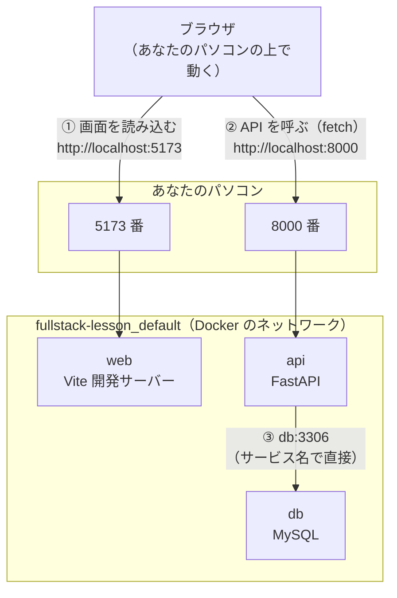
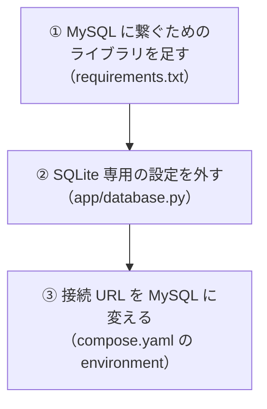
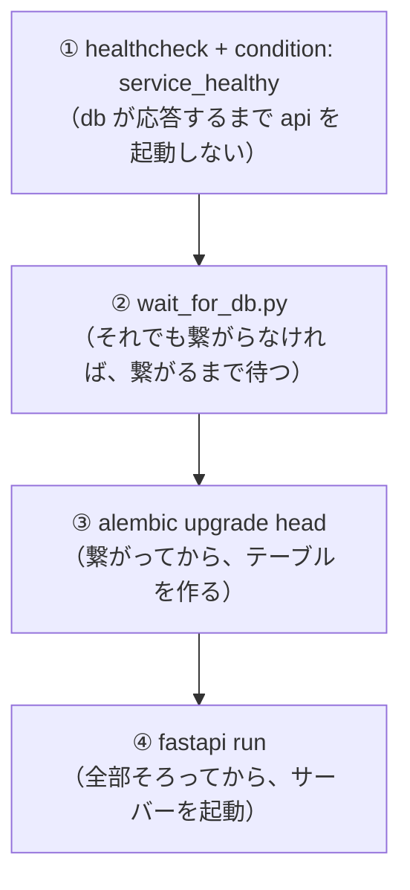
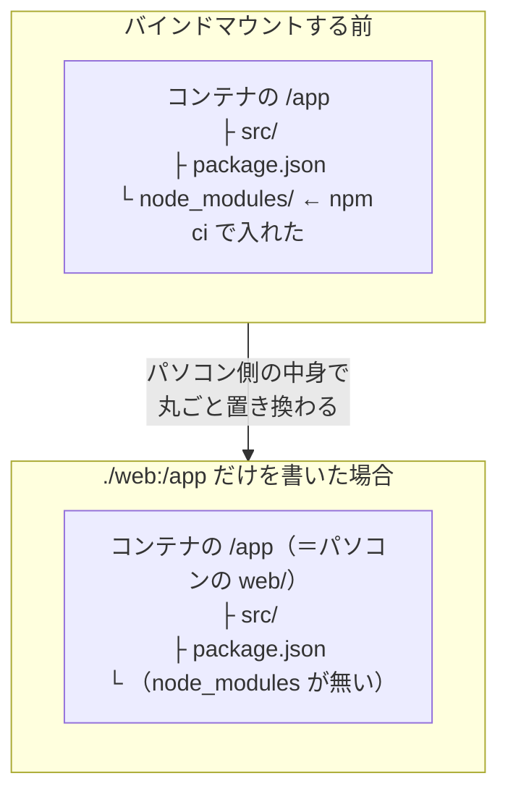
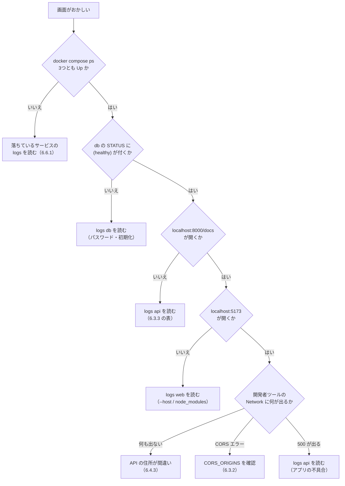

# 第6章 実践：React + FastAPI + MySQL

第5章で、長い `docker run` を `compose.yaml` 1枚に書き写せるようになりました。
サービスを並べて書けば、ネットワークは自動で作られ、サービス名で呼び合え、`docker compose up` の1行で起動します。

**この章は、その集大成です。**

- 1冊目（react-text 第10章）で作った **React のタスク管理アプリ**（`task-app`）
- 3冊目（fastapi-text）で作った **FastAPI の API**（`fastapi-lesson`）
- そして、5冊目で学ぶ **MySQL**

この3つを**1枚の `compose.yaml`** にまとめ、`docker compose up` の1行で、Web アプリ一式を立ち上げます。

第5章で「繋ぎません」と断った MySQL に、この章で**実際に API を繋ぎます。**
5.6 で学んだ起動順の制御が、ここで本当に効いてきます。

> **この章が、第0章 0.1.2 で掲げたゴールそのものです。**
> 3冊ぶんの環境構築（Node.js・Python・MySQL）が、`docker compose up` の**1行**になります。
> パソコンに MySQL をインストールする作業は、**一度も出てきません。**

## この章で学ぶこと

- 3つのサービス（フロントエンド・API・データベース）の**通信経路**を図で説明でき、どこに `ports` が必要かを判断できるようになる
- **MySQL の公式イメージ**を使い、初期データベースとユーザーを作り、データを永続化できるようになる
- FastAPI の接続先を **SQLite から MySQL に切り替え**、コンテナの中からマイグレーションを実行できるようになる
- React の開発サーバーをコンテナに入れ、**ホットリロード**を効かせられるようになる
- **API の URL を環境変数**に出し、「ブラウザから見た住所」と「コンテナから見た住所」を使い分けられるようになる
- 3つのサービスを1枚の `compose.yaml` にまとめ、**`docker compose up` の1行**で起動できるようになる
- 起動しないときに、**どのコンテナが悪いのかを切り分け**、作り直せるようになる

## この章の前提

- [第5章 Docker Compose](./05-compose.md) を読み終えていること
  （とくに 5.2 の `compose.yaml` の書き方、5.3 のサービス名での通信、5.5 の `.env`、5.6 の起動順）
- Docker Desktop が起動していること（クジラのアイコンが `running`。2.1.3）
- **react-text 第10章まで進めた `task-app`** が手元にあること
- **fastapi-text 第9章まで進めた `fastapi-lesson`** が手元にあること
  （`app/` と `requirements.txt` と `alembic.ini` と `migrations/` があるもの。第3章 3.6 と同じ前提です）
- ディスクの空き容量が **5 GB 以上**あること（MySQL と Node.js のイメージを取得します。2.7.2）

> **注意：手元のアプリが第9章まで進んでいない場合**
> fastapi-text を第6章（データベース連携）までで止めている場合でも、
> **6.1 から 6.3 までは、そのまま進められます。**
> 第9章の CORS 設定（fastapi-text 9.1.3）と React 側の API 呼び出し（同 9.2）が無いと、
> **6.5.3 の「React の画面に API のデータが出る」確認だけができません。**
> その場合は、6.4 以降を読み物として進め、fastapi-text 第9章を終えてから戻ってきてください。
> **どこまで必要かは、6.3.2 の表にまとめてあります。**

> **つまずいたら**
> この章は、**これまでの5章ぶんを一度に使います。** 一発で全部動くことは、まずありません。
> **それが普通です。** 大事なのは、**どこが動いていないかを切り分ける**ことです。
>
> 切り分けの順番は、**必ず下から**です。
>
> 1. `db` は生きているか（`docker compose ps` の `STATUS` に `(healthy)` が付いているか）
> 2. `api` は生きているか（`http://localhost:8000/docs` が開くか）
> 3. `web` は生きているか（`http://localhost:5173` が開くか）
> 4. `web` から `api` を呼べているか（ブラウザの開発者ツールの Network タブ）
>
> **上から見ると必ず迷います。**「画面が真っ白」の原因が `db` にあることも珍しくありません。
> 手順は 6.6.2 に、そのまま使える形で書いてあります。
>
> それでも分からないときは、第0章 0.2 で準備した AI に、次のように聞いてください。
>
> ```text
> docker-text の 6.5.2 を読んでいます。
> docker compose up -d したあと、web の画面が表示されません。
>
> OS: Windows 11 / macOS（どちらかを書く。Apple Silicon なら CPU も）
>
> compose.yaml の全文:
>
> （ここに compose.yaml を丸ごと貼る）
>
> docker compose ps の出力:
>
> （ここに貼る）
>
> docker compose logs の出力:
>
> （ここに貼る。長い場合は、怪しいサービスのぶんだけ）
>
> 原因と、直す手順を教えてください。
> ```
>
> **`compose.yaml` と `docker compose ps` と `logs` の3点セット**を必ず貼ってください。
> この章のトラブルは、**3つのうちどれが悪いか**が分からないと絞り込めません。

---

## 6.1 構成を考える

### 6.1.1 3つのサービス

コードを書く前に、**何を何個立てるのか**を決めます。
ここを曖昧にしたまま `compose.yaml` を書き始めると、あとで必ず迷います。

立てるのは、次の3つです。

| サービス名 | 中身 | もとは | イメージの作り方 |
|-----------|------|--------|----------------|
| `web` | React の開発サーバー（Vite） | react-text 第10章の `task-app` | **`build`**（自分で `Dockerfile` を書く） |
| `api` | FastAPI の API | fastapi-text の `fastapi-lesson` | **`build`**（第3章 3.6 の `Dockerfile`） |
| `db` | MySQL | （新規。公式イメージ） | **`image`**（公式のものをそのまま使う） |

**サービス名は、このあと何度も出てきます。** `api` が `db` を呼ぶときの名前になり（5.3.2）、
`docker compose logs api` のように指定する名前にもなります。**短く、役割が分かる名前**にしておきます。

イメージの作り方が **`build` と `image` で分かれる**のが、この構成の特徴です（5.2.3）。

- `web` と `api` は、**あなたが書いたコード**が入るので、`Dockerfile` からビルドする
- `db` は、**MySQL をそのまま使う**だけなので、公式イメージを指定するだけで済む

**データベースを「作る」必要はありません。** ここが Docker のありがたいところです。
これまでの3冊では、Node.js も Python も自分のパソコンにインストールしました。
MySQL は、**インストールせずに、公式イメージを指定するだけ**で用意できます（1.4.1）。

### 6.1.2 通信経路を図にする

次に決めるのが、**誰が誰を呼ぶか**です。ここが、この章でいちばん間違えやすいところです。

**間違いの原因は、ほぼ1つに絞れます。「ブラウザは、Docker のネットワークの中にいない」ことを忘れる**ことです。

図で確かめます。



3本の矢印を、1本ずつ読みます。

| 矢印 | 誰から誰へ | 住所の書き方 | `ports` は必要か |
|------|-----------|------------|----------------|
| ① 画面の読み込み | **ブラウザ** → `web` | `http://localhost:5173` | **必要**（`5173:5173`） |
| ② API の呼び出し | **ブラウザ** → `api` | `http://localhost:8000` | **必要**（`8000:8000`） |
| ③ データの読み書き | `api` → `db` | **`db:3306`**（サービス名） | **不要** |

**②の「誰から」が、いちばんの勘所です。**

React のコード（`fetch(...)`）は、`web` コンテナの中で動いているように見えますが、**違います。**
`web` コンテナが配っているのは **JavaScript のファイル**で、それを**実行するのはブラウザ**です。
つまり、**API を呼んでいるのはブラウザ**であり、ブラウザは Docker のネットワークの外にいます。


だから、React 側に書く API の住所は **`http://localhost:8000`**（パソコンから見た住所）です。

> **よくある間違い：React の `fetch` に `http://api:8000` と書いてしまう**
> `api` はサービス名なので、**同じネットワークの中からなら**引けます（5.3.2）。
> ですが `fetch` を実行するのは**ブラウザ**で、ブラウザはそのネットワークの外にいます。
> そのため、次のエラーになります。
>
> ```text
> GET http://api:8000/tasks net::ERR_NAME_NOT_RESOLVED
> ```
>
> `ERR_NAME_NOT_RESOLVED` は「その名前の住所が分からない」という意味です。
> **ブラウザから呼ぶ住所は `localhost`、コンテナから呼ぶ住所はサービス名**、と覚えてください。
> 逆に、③（`api` → `db`）に `localhost` と書くのも同じ種類の間違いです（4.5.4 / 5.3.2）。

③に `ports` が要らない理由は、第4章 4.5 と第5章 5.3.1 で見たとおりです。
**`db` に用があるのは `api` だけ**なので、パソコン側に公開しません。
公開しないほうが安全でもあります（パソコンの 3306 番を外に開けない）。

### 6.1.3 ディレクトリ構成

3つのサービスのうち2つ（`web` と `api`）は、**あなたのコードからビルド**します。
`compose.yaml` は1枚なので、**2つのプロジェクトを1つのディレクトリの下にまとめます。**

作るのは、次の形です。

```text
fullstack-lesson/
├── compose.yaml          3つのサービスを書く（6.5.1）
├── .env                  秘密の値（共有しない。5.5.3）
├── .env.example          項目の見本（共有する）
├── .gitignore            .env を追跡しない
├── api/                  fastapi-lesson のコピー
│   ├── Dockerfile
│   ├── .dockerignore
│   ├── requirements.txt
│   ├── alembic.ini
│   ├── wait_for_db.py
│   ├── app/
│   └── migrations/
└── web/                  task-app のコピー
    ├── Dockerfile
    ├── .dockerignore
    ├── package.json
    ├── package-lock.json
    ├── vite.config.js
    └── src/
```

**もとのプロジェクトはコピーして持ってきます。移動させません。**
`fastapi-lesson` と `task-app` は、これまでの本の成果物としてそのまま残しておいてください。
うまくいかなかったときに、**コピー前の状態と比べられる**ようにしておくためです。

まず、これまでの作業ディレクトリの親（`fastapi-lesson` や `compose-lesson` と同じ場所）に、
`fullstack-lesson` を作って入ります。

**Windows（PowerShell）**

```powershell
mkdir fullstack-lesson
cd fullstack-lesson
```

**macOS / Linux**

```bash
mkdir fullstack-lesson
cd fullstack-lesson
```

次に、`fastapi-lesson` を `api` という名前でコピーします。
**パスは、自分の環境に合わせて読み替えてください**（`fastapi-lesson` が別の場所にある場合は、そのパスを書きます）。

**Windows（PowerShell）**

```powershell
Copy-Item -Recurse ..\fastapi-lesson .\api
```

**macOS / Linux**

```bash
cp -R ../fastapi-lesson ./api
```

コピーしたあと、**コンテナの中で作り直すもの**を消します。
仮想環境（`.venv`）と、手元の SQLite のファイル（`app.db`）です。

**Windows（PowerShell）**

```powershell
Remove-Item -Recurse -Force .\api\.venv
Remove-Item -Force .\api\app.db
```

**macOS / Linux**

```bash
rm -rf ./api/.venv
rm -f ./api/app.db
```

同じように、`task-app` を `web` という名前でコピーし、**`node_modules` を消します。**

**Windows（PowerShell）**

```powershell
Copy-Item -Recurse ..\react-lesson\task-app .\web
Remove-Item -Recurse -Force .\web\node_modules
```

**macOS / Linux**

```bash
cp -R ../react-lesson/task-app ./web
rm -rf ./web/node_modules
```

> **注意：`node_modules` と `.venv` は、必ず消してください**
> どちらも「**パソコンの OS 向けに作られた**」ライブラリの置き場です。
> Windows や macOS で入れたものを Linux のコンテナに持ち込むと、
> **中身が合わずに動きません**（第1章 1.1.2 の「組み合わせ」の話が、そのまま起きます）。
>
> ```text
> Error: Cannot find module '@rollup/rollup-linux-x64-gnu'
> ```
>
> React 側でこのエラーが出たら、**`node_modules` を持ち込んだ**のが原因です。
> コンテナの中で `npm ci` し直すので（6.4.1）、手元のものは要りません。
>
> `app.db` を消すのは、**これから MySQL に移すから**です。
> SQLite のファイルは、この章では一度も使いません。

`Remove-Item` で「そんなファイルは無い」と言われた場合は、**もともと無かっただけ**なので、
そのまま進めて構いません（`.venv` の名前が違う場合や、`app.db` を作っていない場合があります）。

---

## 6.2 MySQL を立てる

### 6.2.1 公式イメージを使う

MySQL は、**公式イメージをそのまま使います。**
第5章 5.3.1 で一度立てているので、書き方はもう見たことがあるはずです。

まず、`db` だけを書いた `compose.yaml` から始めます。
**3つ全部を一度に書かない**のが、この章を通しての進め方です（4.5 の段階的な進め方と同じ）。

`fullstack-lesson/compose.yaml`

```yaml
services:
  db:
    image: mysql:8.4
```

`mysql:8.4` の `8.4` は、**長期サポート版**（長く使われることを前提に、修正が提供され続ける版）のバージョンです。
2.5.5 で決めたとおり、**`latest` は使いません。**

起動します。

**Windows（PowerShell）**

```powershell
docker compose up -d
```

**macOS / Linux**

```bash
docker compose up -d
```

```text
[+] Running 8/8
 ✔ db Pulled                                       42.3s
[+] Running 2/2
 ✔ Network fullstack-lesson_default   Created
 ✔ Container fullstack-lesson-db-1    Started
```

初回は、イメージの取得（`Pulled`）に時間がかかります（MySQL のイメージは 600 MB 前後あります）。

ログを見ます。

**Windows（PowerShell）**

```powershell
docker compose logs db
```

**macOS / Linux**

```bash
docker compose logs db
```

```text
fullstack-lesson-db-1  | 2026-09-11 05:12:44+00:00 [ERROR] [Entrypoint]: Database is uninitialized and password option is not specified
fullstack-lesson-db-1  |     You need to specify one of the following as an environment variable:
fullstack-lesson-db-1  |     - MYSQL_ROOT_PASSWORD
fullstack-lesson-db-1  |     - MYSQL_ALLOW_EMPTY_PASSWORD
fullstack-lesson-db-1  |     - MYSQL_RANDOM_ROOT_PASSWORD
```

**エラーで止まりました。これは意図して見せています。**
`docker compose ps` を見ると、コンテナが残っていないことが分かります。

```text
NAME   IMAGE   COMMAND   SERVICE   STATUS   PORTS
```

MySQL のイメージは、**管理者パスワードを指定しないと起動しません。**
「イメージを書けば動く」わけではなく、**そのイメージが要求する設定を渡す**必要があります。

> **補足：イメージが要求する設定は、どこで分かるのか**
> いまのように、**起動してログを読む**のが、いちばん確実です。
> MySQL のイメージは、必要な環境変数を**名前を挙げて教えてくれます。**
>
> 一覧で確かめたいときは、Docker Hub の公式イメージのページ（`hub.docker.com/_/mysql`）の
> **「Environment Variables」**の節を見てください。公式イメージは、ここに設定の一覧があります。

片付けてから、次の項で設定を足します。

**Windows（PowerShell）**

```powershell
docker compose down
```

**macOS / Linux**

```bash
docker compose down
```

### 6.2.2 初期データベースとユーザー

MySQL のイメージに渡す環境変数は、次の4つです。

| 環境変数 | 何を決めるか |
|---------|------------|
| `MYSQL_ROOT_PASSWORD` | **管理者（`root`）のパスワード**。指定は必須 |
| `MYSQL_DATABASE` | **起動時に作るデータベースの名前**（この中にテーブルが並ぶ） |
| `MYSQL_USER` | **アプリが使うユーザー名**（`root` 以外の名前） |
| `MYSQL_PASSWORD` | そのユーザーのパスワード |

`MYSQL_USER` と `MYSQL_PASSWORD` を渡すと、MySQL は**そのユーザーを作り、
`MYSQL_DATABASE` に対する権限だけ**を与えます。

**アプリには、`root` ではなくこのユーザーを使わせます。** 理由は2つあります。

- `root` は**全部のデータベースに何でもできる**ので、アプリの不具合が他のデータベースに及ぶ
- パスワードが漏れたときの被害が、**そのデータベース1つに収まる**

これは第7章 7.4.1 で扱う「root で動かさない」と同じ考え方の、データベース版です。

パスワードは**本物の秘密情報**なので、第5章 5.5.2 のとおり **`.env` に書きます。**
`fullstack-lesson` に `.env` を作ります。

`fullstack-lesson/.env`

```text
# MySQL の設定
MYSQL_ROOT_PASSWORD=root-pass-change-me
MYSQL_DATABASE=appdb
MYSQL_USER=appuser
MYSQL_PASSWORD=app-pass-change-me
```

> **注意：この値をそのまま使わないでください**
> `root-pass-change-me` と `app-pass-change-me` は、**書き換える前提の見本**です。
> 学習用なので長さや複雑さは問いませんが、**自分で決めた別の文字列**にしてください。
> 「見本のままのパスワード」は、そのまま本番に持っていかれることが多い、実際に危険なパターンです。

共有用の見本も、同時に作ります（5.5.3）。**値は伏せます。**

`fullstack-lesson/.env.example`

```text
# 値は各自で決めて .env に書く（このファイルは項目の見本）
MYSQL_ROOT_PASSWORD=ここに管理者パスワードを書く
MYSQL_DATABASE=appdb
MYSQL_USER=appuser
MYSQL_PASSWORD=ここにアプリ用パスワードを書く
```

`.env` を Git で共有しないための設定も、いま作っておきます。

`fullstack-lesson/.gitignore`

```text
.env
node_modules/
__pycache__/
*.db
```

`compose.yaml` から、`${...}` でこの値を参照します（5.5.2）。

`fullstack-lesson/compose.yaml`

```yaml
services:
  db:
    image: mysql:8.4
    environment:
      MYSQL_ROOT_PASSWORD: ${MYSQL_ROOT_PASSWORD}
      MYSQL_DATABASE: ${MYSQL_DATABASE}
      MYSQL_USER: ${MYSQL_USER}
      MYSQL_PASSWORD: ${MYSQL_PASSWORD}
```

差し込みが効いているかを、`docker compose config` で確かめます（5.5.2）。

**Windows（PowerShell）**

```powershell
docker compose config
```

**macOS / Linux**

```bash
docker compose config
```

```text
name: fullstack-lesson
services:
  db:
    environment:
      MYSQL_DATABASE: appdb
      MYSQL_PASSWORD: app-pass-change-me
      MYSQL_ROOT_PASSWORD: root-pass-change-me
      MYSQL_USER: appuser
    image: mysql:8.4
```

**`${...}` が、`.env` の値に置き換わっています。**
ここで空っぽになっている項目があれば、`.env` のファイル名（`.env.txt` になっていないか）か、
置き場所（`compose.yaml` と**同じディレクトリ**か）を疑ってください。

> **よくある間違い：`.env` が `.env.txt` になっている（Windows）**
> Windows のメモ帳で保存すると、**`.env.txt`** という名前になることがあります。
> この場合、Compose は `.env` を見つけられず、`${...}` が**空文字**になり、
> MySQL は 6.2.1 と同じ「パスワードが指定されていない」エラーで止まります。
>
> **拡張子の表示**（react-text 1.3.4。第0章 0.1 の前提表にもあります）を有効にして、名前を確認してください。
> VS Code の「ファイル」→「名前を付けて保存」で、ファイル名を `.env` と入力し、
> ファイルの種類を **「すべてのファイル」** にすると、余計な拡張子が付きません。

### 6.2.3 データを永続化する

いまの `compose.yaml` には、**まだボリュームがありません。**
第4章 4.1 で見たとおり、この状態では**コンテナを消すとデータも消えます。**

データベースでこれをやると、**登録したデータが `docker compose down` で全部消えます。**
第5章 5.3.1 と同じく、**名前付きボリューム**を繋ぎます。

MySQL がデータを書く場所は、**`/var/lib/mysql`** です（イメージ側で決まっています）。

`fullstack-lesson/compose.yaml`

```yaml
services:
  db:
    image: mysql:8.4
    environment:
      MYSQL_ROOT_PASSWORD: ${MYSQL_ROOT_PASSWORD}
      MYSQL_DATABASE: ${MYSQL_DATABASE}
      MYSQL_USER: ${MYSQL_USER}
      MYSQL_PASSWORD: ${MYSQL_PASSWORD}
    volumes:
      - db-data:/var/lib/mysql

volumes:
  db-data:
```

**`volumes:` を2か所に書く**のを忘れないでください（5.2.4 の注意）。
サービスの中（どこに繋ぐか）と、ファイル末尾（この名前を使うという宣言）の両方です。

起動します。

**Windows（PowerShell）**

```powershell
docker compose up -d
```

**macOS / Linux**

```bash
docker compose up -d
```

```text
[+] Running 3/3
 ✔ Network fullstack-lesson_default    Created
 ✔ Volume "fullstack-lesson_db-data"   Created
 ✔ Container fullstack-lesson-db-1     Started
```

**今度はコンテナが `Started` になり、落ちていません。**
準備が終わるまで、ログを見て待ちます。

**Windows（PowerShell）**

```powershell
docker compose logs db
```

**macOS / Linux**

```bash
docker compose logs db
```

```text
fullstack-lesson-db-1  | [Note] [Entrypoint]: Creating database appdb
fullstack-lesson-db-1  | [Note] [Entrypoint]: Creating user appuser
fullstack-lesson-db-1  | [Note] [Entrypoint]: Giving user appuser access to schema appdb
fullstack-lesson-db-1  | [System] [MY-010931] [Server] /usr/sbin/mysqld: ready for connections. Version: '8.4.3'  port: 3306
```

**`Creating database appdb` / `Creating user appuser` / `ready for connections`** の3つが見えれば成功です。
6.2.2 で渡した環境変数が、**そのまま実行されたログ**になっています。

> **注意：初期化のログが出るのは「最初の1回だけ」です**
> `Creating database ...` は、**ボリュームが空のときだけ**実行されます。
> 2回目以降の `up` では、このログは出ません（すでに作られているためです）。
>
> ここから、実際に起きやすい問題が1つ生まれます。
> **`.env` の `MYSQL_PASSWORD` をあとで書き換えても、ユーザーのパスワードは変わりません。**
> パスワードはボリュームの中に保存されていて、初期化はもう終わっているからです。
>
> 書き換えたい場合は、**ボリュームごと消してやり直します**（データも消えます）。
>
> ```bash
> docker compose down -v
> docker compose up -d
> ```
>
> 「パスワードを直したのに `Access denied` が直らない」の原因は、ほぼこれです。

### 6.2.4 接続を確認する

`api` を繋ぐ前に、**MySQL 単体が使える状態か**を確かめます。
ここを飛ばすと、あとで `api` が繋がらないときに「アプリが悪いのか DB が悪いのか」が分からなくなります。

MySQL のコンテナには、**`mysql` というコマンド**（MySQL に接続して SQL を打つための道具）が入っています。
`docker compose exec`（5.4.3）で、コンテナの中からそれを使います。

**Windows（PowerShell）**

```powershell
docker compose exec db mysql -u appuser -p appdb
```

**macOS / Linux**

```bash
docker compose exec db mysql -u appuser -p appdb
```

コマンドの意味です。

| 部分 | 意味 |
|------|------|
| `docker compose exec db` | `db` サービスのコンテナの中で、次のコマンドを動かす（5.4.3） |
| `mysql` | MySQL に接続するコマンド |
| `-u appuser` | ユーザー名（`.env` の `MYSQL_USER`） |
| `-p` | **パスワードを、あとで聞いてください**という指定（値は書きません） |
| `appdb` | 接続するデータベースの名前（`.env` の `MYSQL_DATABASE`） |

パスワードを聞かれるので、`.env` の `MYSQL_PASSWORD` に書いた値を入力します
（**入力した文字は画面に出ません。** これは仕様です）。

```text
Enter password:
Welcome to the MySQL monitor.  Commands end with ; or \g.
Server version: 8.4.3 MySQL Community Server - GPL

mysql>
```

**`mysql>` という表示に変わったら、MySQL の中に入れています。**
ここから先は、シェルのコマンドではなく **SQL**（データベースに指示を出すための言葉。5冊目で本格的に学びます）を打ちます。

いま何が見えているかを確かめます。**末尾のセミコロン（`;`）を忘れないでください。**

```sql
SHOW TABLES;
```

```text
Empty set (0.00 sec)
```

**`Empty set` は「テーブルが1つも無い」という意味**で、いまはこれが正解です。
`appdb` というデータベースは作られていますが、**中身（テーブル）はまだありません。**
テーブルを作るのは、6.3 でコンテナの中から Alembic を動かしたときです。

抜けます。

```sql
exit
```

```text
Bye
```

> **補足：`-p` のあとにパスワードを続けて書く形もあります**
> `mysql -u appuser -papp-pass-change-me appdb` のように、**`-p` に続けて**書くこともできます
> （`-p` と値の間にスペースを入れません）。
>
> ただし、この形は**コマンド履歴にパスワードが残り**、警告も出ます。
>
> ```text
> mysql: [Warning] Using a password on the command line interface can be insecure.
> ```
>
> このテキストでは、**聞かれてから入力する形**（`-p` だけ）を使います。

> **よくある間違い：`Access denied for user 'appuser'@'%'`**
> 次の3つのどれかです。上から順に確認してください。
>
> | 確認すること | 直し方 |
> |------------|--------|
> | 入力したパスワードが `.env` と違う | `.env` を見て打ち直す（コピー・貼り付けが確実） |
> | `.env` を書き換えたあとに `up` し直しただけ | **`down -v` してから `up`**（6.2.3 の注意） |
> | ユーザー名を `root` にしている | `root` のパスワードは `MYSQL_ROOT_PASSWORD` のほう |

---

## 6.3 バックエンドをコンテナ化する

### 6.3.1 Dockerfile

`api` の `Dockerfile` は、**第3章 3.6.1 で書いたものと同じ**です。
コピーした `api` ディレクトリの中に、すでに入っているはずなので、**中身を確認**します。

`fullstack-lesson/api/Dockerfile`

```dockerfile
FROM python:3.13-slim

WORKDIR /code

COPY requirements.txt .

RUN pip install --no-cache-dir -r requirements.txt

COPY . .

EXPOSE 8000

CMD ["fastapi", "run", "app/main.py", "--port", "8000"]
```

`.dockerignore` も、3.6.1 のものがそのまま使えます。**中身を確認**してください。

`fullstack-lesson/api/.dockerignore`

```text
# 仮想環境（コンテナの中で入れ直す）
.venv/

# Python が自動で作る中間ファイル
__pycache__/
*.pyc

# Git の履歴
.git/
.gitignore

# 設定の値（秘密が入る）
.env

# 手元のデータベース（中身は人それぞれ。イメージに焼き込まない）
*.db

# エディタの設定
.vscode/
```

**`.env` が除外されている**ことが、この章では特に重要です。
`api` に渡す設定は、**すべて `compose.yaml` の `environment` から渡します**（次の項）。
イメージの中に `.env` が入っていると、**どちらが効いているのか分からなくなります。**

> **補足：`Dockerfile` が見当たらない場合**
> 第3章 3.6 を飛ばしていた場合、コピーした `api` に `Dockerfile` がありません。
> 上の2つのファイル（`Dockerfile` と `.dockerignore`）を、**そのまま新規作成**してください。
> 中身の1行ずつの意味は、第3章 3.2 と 3.6.1 にあります。

### 6.3.2 MySQL への接続設定

ここが、この章の**技術的な山場**です。
やることは3つあります。**1つずつ、順番に片付けます。**



**① MySQL に繋ぐためのライブラリを足す**

fastapi-text 第6章で使った SQLAlchemy は、**データベースとのやり取りの「言い方」を組み立てる道具**でした。
実際に MySQL と通信する部分は、**別のライブラリ**が担当します。
SQLite のときは Python に最初から入っていたので、意識せずに済んでいました。

`api/requirements.txt` の末尾に、2行足します。

`fullstack-lesson/api/requirements.txt`（末尾に2行追記）

```text
PyMySQL==1.1.1
cryptography==44.0.0
```

| 足したもの | 何をするか |
|-----------|----------|
| **PyMySQL**（パイマイエスキューエル） | Python から MySQL と通信する部分を受け持つ |
| **cryptography**（クリプトグラフィー） | MySQL 8 のパスワード認証（暗号を使う方式）に必要 |

**`cryptography` は「おまじない」ではありません。** 入れないと、次のエラーで接続に失敗します。

```text
RuntimeError: 'cryptography' package is required for sha256_password or caching_sha2_password auth methods
```

MySQL 8 は、パスワードのやり取りに暗号を使う方式（`caching_sha2_password`）を既定にしています。
PyMySQL 単体はその計算ができないので、**計算を担当するライブラリを別に入れる**必要があります。

**② SQLite 専用の設定を外す**

`app/database.py` に、**SQLite のときだけ必要な設定**が書かれています（fastapi-text 6.2.2 の補足）。

```python
engine = create_engine(
    settings.database_url,
    # SQLite のときだけ必要な設定
    connect_args={"check_same_thread": False},
)
```

`check_same_thread` は **SQLite にしか無い設定**なので、MySQL に渡すと次のエラーになります。

```text
TypeError: Invalid argument(s) 'check_same_thread' sent to create_engine()
```

fastapi-text では「MySQL に乗り換えるときは消します」と書いてありました。**いまがそのときです。**

ただし、**消してしまうと SQLite に戻せなくなります。**
そこで、**接続 URL を見て、必要なときだけ渡す**形にします。

`fullstack-lesson/api/app/database.py`（`engine = create_engine(...)` の部分を置き換え）

```python
# SQLite のときだけ必要な設定（MySQL に渡すとエラーになる）
connect_args = {}
if settings.database_url.startswith("sqlite"):
    connect_args["check_same_thread"] = False

# データベースへの接続口。アプリ全体で1つだけ作る
engine = create_engine(
    settings.database_url,
    connect_args=connect_args,
    # 使い回した接続が切れていないか、使う前に確かめる
    # （MySQL は放置された接続を切るため）
    pool_pre_ping=True,
)
```

`settings.database_url.startswith("sqlite")` は、
**接続 URL が `sqlite` で始まるかどうか**を調べています（python-text 2.4.3 の文字列メソッドです）。

`pool_pre_ping=True` は、**使い回す接続が生きているかを、使う直前に確かめる**指定です。
MySQL には「一定時間使われない接続を切る」決まりがあり、これが無いと、
**しばらく放置したあとの最初のリクエストだけが失敗する**という、原因の分かりにくい不具合になります。

**③ 接続 URL を MySQL に変える**

いちばん大事なのは、**アプリのコードを1行も変えないこと**です。
fastapi-text 6.2.2 で「乗り換えは接続 URL の1行」と書いてありました。それを確かめます。

| 接続先 | 接続 URL |
|--------|---------|
| SQLite（fastapi-text） | `sqlite:///./app.db` |
| **MySQL（この章）** | **`mysql+pymysql://appuser:パスワード@db:3306/appdb?charset=utf8mb4`** |

MySQL の URL を、部分ごとに読みます。

| 部分 | 意味 |
|------|------|
| `mysql+pymysql` | **MySQL に、PyMySQL を使って**繋ぐ（①で入れたライブラリの指定） |
| `appuser:パスワード` | ユーザー名とパスワード（`.env` の `MYSQL_USER` / `MYSQL_PASSWORD`） |
| `@db` | **接続先のホスト名。サービス名の `db`**（6.1.2 の③。`localhost` ではない） |
| `:3306` | MySQL が待ち受けているポート（6.2.3 のログの `port: 3306`） |
| `/appdb` | データベースの名前（`.env` の `MYSQL_DATABASE`） |
| `?charset=utf8mb4` | **文字コードの指定。** 日本語と絵文字を正しく扱うために付ける |

`compose.yaml` に `api` サービスを足します。**環境変数として渡します**（`.env` の値を `${...}` で差し込みます）。

`fullstack-lesson/compose.yaml`（`db` の上に `api` を足す）

```yaml
services:
  api:
    build: ./api
    ports:
      - "8000:8000"
    environment:
      DATABASE_URL: mysql+pymysql://${MYSQL_USER}:${MYSQL_PASSWORD}@db:3306/${MYSQL_DATABASE}?charset=utf8mb4
      SECRET_KEY: ${SECRET_KEY}
      CORS_ORIGINS: '["http://localhost:5173"]'

  db:
    image: mysql:8.4
    environment:
      MYSQL_ROOT_PASSWORD: ${MYSQL_ROOT_PASSWORD}
      MYSQL_DATABASE: ${MYSQL_DATABASE}
      MYSQL_USER: ${MYSQL_USER}
      MYSQL_PASSWORD: ${MYSQL_PASSWORD}
    volumes:
      - db-data:/var/lib/mysql

volumes:
  db-data:
```

`build: ./api` の `./api` は、**`Dockerfile` があるディレクトリ**です（5.2.3 では `.` でした）。
`compose.yaml` から見た相対パスを書きます。

**渡している3つの設定**を確認します。

| 環境変数 | 対応する設定 | 必要なのは |
|---------|------------|-----------|
| `DATABASE_URL` | `app/config.py` の `database_url` | fastapi-text 第6章まで進めた人**全員** |
| `SECRET_KEY` | `app/config.py` の `secret_key` | fastapi-text **第7章（認証）**まで進めた人 |
| `CORS_ORIGINS` | `app/config.py` の `cors_origins` | fastapi-text **第9章**まで進めた人 |

> **注意：自分の `app/config.py` に合わせて、渡す行を決めてください**
> `app/config.py`（`api/app/config.py`）を開いて、**`class Settings` の中身**を見てください。
>
> - `secret_key` の行が**無い**（fastapi-text 第6章まで）→ `SECRET_KEY:` の行を**削除**する
> - `cors_origins` の行が**無い**（同 第8章まで）→ `CORS_ORIGINS:` の行を**削除**する
>
> **書いていない設定を環境変数で渡しても無視されるだけ**なので、残しても害はありません。
> ただし `SECRET_KEY` を `.env` に書いていないと `${SECRET_KEY}` が空になり、
> `secret_key` に既定値が無いため、起動時に次のエラーになります。
>
> ```text
> pydantic_core._pydantic_core.ValidationError: 1 validation error for Settings
> secret_key
>   Input should be a valid string [type=string_type, input_value=None]
> ```

`secret_key` がある場合は、`.env` に値を足します。
値は、fastapi-text 7.4.2 と同じ方法で作ります（**もとの `fastapi-lesson/.env` からコピーしても構いません**）。

**Windows（PowerShell）**

```powershell
python -c "import secrets; print(secrets.token_hex(32))"
```

**macOS / Linux**

```bash
python3 -c "import secrets; print(secrets.token_hex(32))"
```

```text
3f1c0b8e7a2d4f6b9c1e8a0d5b7f3c2e6a4d8b1f0c9e7a3d5b2f8c6e4a0d9b7f
```

出てきた値を `.env` に足します。

`fullstack-lesson/.env`（末尾に追記）

```text
# API の設定
SECRET_KEY=3f1c0b8e7a2d4f6b9c1e8a0d5b7f3c2e6a4d8b1f0c9e7a3d5b2f8c6e4a0d9b7f
```

`.env.example` には、**値を伏せて**同じ項目を書きます（5.5.3）。

`fullstack-lesson/.env.example`（末尾に追記）

```text
# API の設定
SECRET_KEY=python -c "import secrets; print(secrets.token_hex(32))" で作った値を入れる
```

> **よくある間違い：`CORS_ORIGINS` をシングルクォートで囲み忘れる**
> `CORS_ORIGINS` の値は、**JSON の配列の文字列**です（fastapi-text 9.1.3）。
> YAML では `[` から始まる値は**リストとして解釈される**ため、
> シングルクォートで囲まないと、意図しない形で渡ってしまいます。
>
> ```yaml
> CORS_ORIGINS: '["http://localhost:5173"]'   # ✅ 文字列として渡る
> CORS_ORIGINS: ["http://localhost:5173"]     # ❌ YAML のリストになる
> ```
>
> 迷ったら `docker compose config`（5.5.2）で、**渡る直前の形**を見てください。

### 6.3.3 起動順の問題を解決する

設定はそろいましたが、**このまま起動すると失敗します。** 理由は2つあります。

1. **MySQL の準備が終わる前に、`api` が繋ごうとする**（5.6.1 で見た問題）
2. **テーブルが1つも無い**（6.2.4 で `Empty set` でした）

1つずつ手当てします。

**対処1：ヘルスチェックで待たせる（5.6.2）**

`db` に「準備できたかを確かめるコマンド」を持たせ、`api` に「健康になるまで待て」と指定します。
書き方は 5.6.2 とまったく同じです。

**対処2：起動時にマイグレーションを実行する**

テーブルは、fastapi-text 6.6 で作った **Alembic** で作ります。
`alembic upgrade head` を、**`api` コンテナの中で**実行する必要があります。

毎回手で打つこともできますが（`docker compose exec api alembic upgrade head`）、
**それでは「1コマンドで起動する」というゴールから外れます。**
そこで、**`api` の起動処理そのものに組み込みます。**

使うのが、`compose.yaml` の **`command:`** です。

| 書くもの | 何をするか |
|---------|----------|
| `Dockerfile` の `CMD`（3.2.5） | イメージの**既定の**起動コマンド |
| **`compose.yaml` の `command:`** | **それを上書きする**起動コマンド |

`Dockerfile` を書き換えなくても、**このサービスだけ起動のしかたを変えられる**のが `command:` です。

`api` の `command:` を、次のようにします。

```yaml
    command: sh -c "python wait_for_db.py && alembic upgrade head && fastapi run app/main.py --port 8000"
```

読み方です。

| 部分 | 意味 |
|------|------|
| `sh -c "..."` | **シェルに、引用符の中身をまとめて実行させる** |
| `python wait_for_db.py` | `db` に繋がるまで待つ（次に作ります。5.6.3 のファイル） |
| `&&` | **前のコマンドが成功したら、次に進む**（失敗したらそこで止まる） |
| `alembic upgrade head` | テーブルを作る（fastapi-text 6.6.3） |
| `fastapi run app/main.py --port 8000` | サーバーを起動する（`Dockerfile` の `CMD` と同じ） |

**`sh -c` が必要な理由**は、`&&` がシェルの機能だからです。
`command:` に直接 `python ... && alembic ...` と書くと、`&&` が**ただの文字**として扱われ、
`python` に渡す引数だと思われてしまいます。**`&&` を使うときは `sh -c` で包む**、と覚えてください。

**対処3：アプリ側でも待つ（5.6.3）**

`command:` の中で呼んでいる `wait_for_db.py` を、`api` に置きます。
**中身は、第5章 5.6.3 で書いたものと同じ**です。`fastapi-lesson` からコピーしても構いません。

`fullstack-lesson/api/wait_for_db.py`

```python
"""db に繋がるまで待つ。コンテナの起動時に実行する。"""

import socket
import time

def wait_for(host, port, timeout=60):
    # timeout 秒のあいだ、繋がるまで1秒おきに試す
    deadline = time.time() + timeout
    while time.time() < deadline:
        try:
            with socket.create_connection((host, port), timeout=3):
                print(f"{host}:{port} に繋がりました")
                return
        except OSError:
            # まだ準備できていない。1秒待って、もう一度試す
            print("まだ繋がりません。1秒待って再試行します")
            time.sleep(1)
    raise TimeoutError(f"{host}:{port} に {timeout} 秒以内に繋がりませんでした")

wait_for("db", 3306)
```

**ヘルスチェックがあるのに、なぜこれも要るのか。**
5.6.3 で見たとおり、3つの対処は**重ねて使うもの**だからです。



①が効かない場面（ヘルスチェックの直後に一瞬落ちる、など）でも、②が受け止めます。
**「1コマンドで確実に立ち上がる」ためには、この重ねがけが要ります。**

ここまでを反映した `api` と `db` が、次の形です。

`fullstack-lesson/compose.yaml`

```yaml
services:
  api:
    build: ./api
    depends_on:
      db:
        condition: service_healthy
    ports:
      - "8000:8000"
    environment:
      DATABASE_URL: mysql+pymysql://${MYSQL_USER}:${MYSQL_PASSWORD}@db:3306/${MYSQL_DATABASE}?charset=utf8mb4
      SECRET_KEY: ${SECRET_KEY}
      CORS_ORIGINS: '["http://localhost:5173"]'
    command: sh -c "python wait_for_db.py && alembic upgrade head && fastapi run app/main.py --port 8000"

  db:
    image: mysql:8.4
    environment:
      MYSQL_ROOT_PASSWORD: ${MYSQL_ROOT_PASSWORD}
      MYSQL_DATABASE: ${MYSQL_DATABASE}
      MYSQL_USER: ${MYSQL_USER}
      MYSQL_PASSWORD: ${MYSQL_PASSWORD}
    volumes:
      - db-data:/var/lib/mysql
    healthcheck:
      test: ["CMD", "mysqladmin", "ping", "-h", "127.0.0.1"]
      interval: 5s
      timeout: 3s
      retries: 10
      start_period: 30s

volumes:
  db-data:
```

起動します。**`requirements.txt` を変えたので、`--build` を付けます**（5.4.4）。

**Windows（PowerShell）**

```powershell
docker compose up -d --build
```

**macOS / Linux**

```bash
docker compose up -d --build
```

```text
[+] Building 31.7s (10/10) FINISHED
 => [api 4/5] RUN pip install --no-cache-dir -r requirements.txt      28.9s
[+] Running 3/3
 ✔ Volume "fullstack-lesson_db-data"   Created
 ✔ Container fullstack-lesson-db-1     Healthy
 ✔ Container fullstack-lesson-api-1    Started
```

**`db` が `Healthy` になってから、`api` が `Started`** になっています（5.6.2 と同じ形です）。

`api` のログで、`command:` に書いた3段階が順に進んだかを確認します。

**Windows（PowerShell）**

```powershell
docker compose logs api
```

**macOS / Linux**

```bash
docker compose logs api
```

```text
fullstack-lesson-api-1  | db:3306 に繋がりました
fullstack-lesson-api-1  | INFO  [alembic.runtime.migration] Running upgrade  -> 8f3d1c2a9b45, create tasks table
fullstack-lesson-api-1  | INFO:     Started server process [1]
fullstack-lesson-api-1  | INFO:     Application startup complete.
fullstack-lesson-api-1  | INFO:     Uvicorn running on http://0.0.0.0:8000 (Press CTRL+C to quit)
```

**3行目までが、この項で組み立てた3段階です。**

1. `db:3306 に繋がりました`（`wait_for_db.py`）
2. `Running upgrade -> ... create tasks table`（`alembic upgrade head`）
3. `Uvicorn running on http://0.0.0.0:8000`（`fastapi run`）

`0.0.0.0` になっていることも確認してください（4.4.3）。

テーブルができたかを、MySQL 側から確かめます（6.2.4 と同じ手順です）。

**Windows（PowerShell）**

```powershell
docker compose exec db mysql -u appuser -p appdb
```

**macOS / Linux**

```bash
docker compose exec db mysql -u appuser -p appdb
```

```sql
SHOW TABLES;
```

```text
+------------------+
| Tables_in_appdb  |
+------------------+
| alembic_version  |
| tasks            |
+------------------+
2 rows in set (0.00 sec)
```

**6.2.4 では `Empty set` だったところに、テーブルが2つできました。**
`tasks` がアプリのテーブル、`alembic_version` は Alembic が「どこまで適用したか」を記録する表です。

`exit` で抜けて、ブラウザで API を開きます。

```text
http://localhost:8000/docs
```

**API のドキュメント画面（Swagger UI）が表示されれば、`api` は正常です。**

> **よくある間違い：`api` が `Restarting` を繰り返す**
> `docker compose ps` の `STATUS` が `Restarting` や `Exited` の場合、
> **`command:` のどこかで失敗して止まっています。**
> 必ず `docker compose logs api` を見てください。**原因は最後の数行に出ます。**
>
> | ログに出る文字列 | 原因 | 直す場所 |
> |----------------|------|---------|
> | `No module named 'pymysql'` | ライブラリが入っていない | `requirements.txt` に追記して **`--build`** |
> | `'cryptography' package is required` | 同上（`cryptography` のほう） | 同上 |
> | `Invalid argument(s) 'check_same_thread'` | SQLite 専用の設定が残っている | `app/database.py`（6.3.2 の②） |
> | `Access denied for user` | ユーザー名かパスワードが違う | `.env`（6.2.4 の表） |
> | `Can't connect to MySQL server on 'db'` | `db` がまだ準備中／名前が違う | `healthcheck` とサービス名 |
> | `ValidationError ... secret_key` | `SECRET_KEY` が空 | `.env` に追記（6.3.2） |

---

## 6.4 フロントエンドをコンテナ化する

### 6.4.1 開発用の Dockerfile

残りは `web` です。`api` と違うところが1つあります。
**`web` は「開発サーバー」を動かします。**

react-text で毎回打っていた `npm run dev` が、それです。
本番向けにファイルを書き出す（`npm run build`）形は、**第7章 7.2 で扱います。**
この章では、**react-text と同じ開発体験**をコンテナの中に作ります。

`web/Dockerfile` を新規作成します。

`fullstack-lesson/web/Dockerfile`

```dockerfile
FROM node:22-slim

WORKDIR /app

# 依存の一覧を先に入れる（変わらない限りキャッシュが効く。3.4.3）
COPY package.json package-lock.json ./

RUN npm ci

COPY . .

EXPOSE 5173

# --host を付けて 0.0.0.0 で待ち受ける（4.4.3）
CMD ["npm", "run", "dev", "--", "--host"]
```

1行ずつ、第3章で学んだことと対応させます。

| 行 | 意味 | 学んだ場所 |
|----|------|-----------|
| `FROM node:22-slim` | Node.js v22 が入った土台（react-text 1.5.3 と同じバージョン） | 3.2.1 / 7.3.1 |
| `WORKDIR /app` | コンテナの中の作業ディレクトリ | 3.2.2 |
| `COPY package.json package-lock.json ./` | **依存の一覧だけ**先に入れる | 3.4.3 |
| `RUN npm ci` | ライブラリを入れる（コンテナの中で） | 3.2.4 |
| `COPY . .` | 残りのソースを入れる | 3.2.3 |
| `EXPOSE 5173` | Vite の既定のポート | 3.2.6 |
| `CMD [...]` | 開発サーバーを起動する | 3.2.5 |

**2つのポイント**があります。

**1つ目：`npm ci` を使う（`npm install` ではない）**

`npm ci` は、**`package-lock.json` に書かれたバージョンを、そのとおりに入れる**コマンドです。
`npm install` は、条件に合う**新しいものを入れることがあります。**

第1章 1.1.2 で見た「組み合わせ爆発」を防ぐのが Docker の目的なのに、
**ビルドするたびにライブラリのバージョンが変わってしまっては台無し**です。
**イメージを作るときは `npm ci`**、と決めておきます。

**2つ目：`--host` を付ける**

`CMD` の `--` に続く `--host` が、**4.4.3 で学んだ `0.0.0.0` の指定**です。

`npm run dev` は、内部で `vite` を呼びます。
`npm run` に**追加の引数を渡す**には、`--` で区切ってから書きます。
`npm run dev -- --host` は、「`vite` に `--host` を付けて実行する」という意味です。

これが無いと、Vite は `localhost`（コンテナ自身）だけで待ち受けるので、
**`ports` を書いてもブラウザから繋がりません**（4.4.3 とまったく同じ失敗です）。

`.dockerignore` も作ります。**`node_modules` を送らないのが最重要**です（3.5.1）。

`fullstack-lesson/web/.dockerignore`

```text
# OS 向けに作られたライブラリ（コンテナの中で入れ直す）
node_modules/

# ビルド結果
dist/

# Git の履歴
.git/
.gitignore

# 設定の値
.env

# エディタの設定
.vscode/
```

### 6.4.2 ホットリロードを効かせる

いまの `Dockerfile` だけでも、`web` は起動します。
ですが、**ソースを直しても画面が変わりません。** `COPY . .` で**イメージに焼き込まれた**ままだからです。

react-text では、保存した瞬間に画面が変わっていました。
この「保存したら即反映」を**ホットリロード**（hot reload。動かしたまま、変更を反映すること）と呼びます。

これを取り戻すのが、第4章 4.2.2 の**バインドマウント**です。

```yaml
  web:
    build: ./web
    ports:
      - "5173:5173"
    volumes:
      - ./web:/app
      - /app/node_modules
```

`volumes` の**2行目**が、この項の主題です。

**なぜ `- /app/node_modules` が必要なのか**

1行目の `./web:/app` は、「パソコンの `web` ディレクトリを、コンテナの `/app` として見せる」指定です（4.2.1）。
**ここで問題が起きます。**



パソコンの `web/` には、**`node_modules` がありません**（6.1.3 で消しました）。
バインドマウントは `/app` を**丸ごと置き換える**ので、
`npm ci` で入れたはずの `node_modules` が**見えなくなります。**

```text
web-1  | sh: 1: vite: not found
```

そこで、**`/app/node_modules` だけを、マウントの対象から外します。**
`- /app/node_modules` は、コロンの左が無い（外側の指定が無い）書き方で、
**この場所だけは Docker が用意した入れ物を使う**という意味になります。

| 書き方 | 意味 |
|--------|------|
| `- ./web:/app` | パソコンの `web/` を `/app` として見せる（**バインドマウント**。4.2.1） |
| `- /app/node_modules` | **`/app/node_modules` だけは、コンテナ側のものを残す** |

結果として、次の形になります。

| コンテナの中のパス | 実体 |
|-----------------|------|
| `/app/src/App.jsx` | **パソコンの `web/src/App.jsx`**（保存すると即反映される） |
| `/app/node_modules` | **コンテナの中に入れたもの**（`npm ci` の結果） |

**「ソースは外から、ライブラリは中のものを」** という組み合わせが作れました。
これは Node.js のプロジェクトをコンテナで開発するときの定番の形です。

> **注意：ライブラリを追加したら、ビルドし直します**
> `package.json` を変えた（`npm install 何か` をした）場合、
> **`docker compose up -d --build` が必要**です（5.4.4）。
> `node_modules` はコンテナの中にあるので、**イメージを作り直さないと増えません。**
>
> ```bash
> docker compose up -d --build web
> ```
>
> サービス名を付けると、**そのサービスだけ**作り直せます。

**Windows で自動更新が効かないとき**

第4章 4.6.3 で扱った問題が、React でも起きます。
**保存しても、ログに何も出ず、画面も変わりません。**

原因は同じで、**ファイルが変わったという通知が Windows からコンテナへ届かない**ことです。
対処も同じで、**ポーリング**（[4.6.3](./04-volumes-and-networks.md#463-ファイル監視が効かないとき) の、
変化があったかを一定間隔で確認しに行く方式）に切り替えます。

Vite の場合は、**設定ファイルに書きます。**
`web/vite.config.js` を、次のように書き換えてください（`plugins` の行は、いまのものをそのまま残します）。

`fullstack-lesson/web/vite.config.js`

```js
import { defineConfig } from 'vite'
import react from '@vitejs/plugin-react'

export default defineConfig({
  plugins: [react()],
  server: {
    watch: {
      // 環境変数で、ポーリングに切り替えられるようにしておく（4.6.3）
      usePolling: process.env.VITE_USE_POLLING === 'true',
    },
  },
})
```

そのうえで、`compose.yaml` の `web` に環境変数を足すと、ポーリングに切り替わります。

```yaml
    environment:
      VITE_USE_POLLING: "true"
```

**macOS では、この指定は不要です。**
ポーリングは**常に見に行き続けるので CPU を使う**ため、必要な環境だけで有効にしてください。

> **補足：`WATCHFILES_FORCE_POLLING` とは別のしくみです**
> 4.6.3 の `fastapi dev` では、**環境変数を渡すだけ**でポーリングに切り替わりました。
> あれは、`fastapi dev` が使っているライブラリが**その環境変数を自分で読む**ためです。
>
> Vite には、これに当たる環境変数がありません。
> そのため、上のように **`vite.config.js` で環境変数を読む部分を自分で書きます。**
> `process.env` は、Node.js が持っている環境変数の一覧です
> （`vite.config.js` は、ブラウザではなく **Node.js の上で** 読み込まれます）。

### 6.4.3 API の URL を環境変数にする

最後に、**React から API を呼ぶ住所**を決めます。

fastapi-text 9.2.1 では、`src/api/client.js` の先頭に、**直接書いて**いました。

```js
export const API_BASE_URL = 'http://127.0.0.1:8000'
```

これを、**環境変数から読む**形に変えます。理由は2つあります。

- **住所が変わるのはコードの変更ではない**（開発では `localhost`、公開すれば別の住所になる）
- 住所が変わるたびにソースを直していると、**直し忘れたまま公開してしまう**

Vite では、**`VITE_` で始まる環境変数**を、`import.meta.env` という書き方でコードから読めます。

`fullstack-lesson/web/src/api/client.js`（先頭の1行を書き換え）

```diff
- export const API_BASE_URL = 'http://127.0.0.1:8000'
+ // 環境変数があればそれを使い、無ければ手元の開発サーバーを見る
+ export const API_BASE_URL = import.meta.env.VITE_API_BASE_URL || 'http://127.0.0.1:8000'
```

| 書いたもの | 意味 |
|-----------|------|
| `import.meta.env` | **Vite が用意する、環境変数の入れ物**（`VITE_` で始まるものだけが入る） |
| `\|\| 'http://127.0.0.1:8000'` | 環境変数が無いときの**代わりの値**（react-text 4.3.7 の `\|\|`） |

`||` を付けておくと、**コンテナを使わずに `npm run dev` で動かしたときも、これまでどおり**動きます。
「Docker を使う場合だけ動く」コードにしないための備えです。

`compose.yaml` の `web` に、環境変数を足します。

```yaml
    environment:
      VITE_API_BASE_URL: http://localhost:8000
```

**ここが 6.1.2 で確認した勘所です。** 値は **`http://localhost:8000`** です。

| 書く値 | 結果 |
|--------|------|
| **`http://localhost:8000`** | **正しい。** ブラウザが、パソコンの 8000 番（`ports` で公開）を呼ぶ |
| `http://api:8000` | **繋がらない。** `api` はブラウザから引けない名前（`ERR_NAME_NOT_RESOLVED`） |

> **よくある間違い：`VITE_` を付け忘れる**
> 環境変数の名前を `API_BASE_URL`（`VITE_` なし）にすると、
> **`import.meta.env` に入りません。** `undefined` になり、`||` の右側が使われます。
>
> ```text
> GET http://127.0.0.1:8000/tasks   ← 環境変数が効いていない
> ```
>
> これは**意図的な仕組み**です。Vite は `VITE_` で始まる環境変数だけを
> ブラウザ向けのコードに渡します。**うっかり秘密の値をブラウザに送らないため**です。
> 逆に言えば、**`VITE_` で始まる値は、誰でも見られる**ということです。
> **API キーやパスワードを `VITE_` に入れてはいけません。**

> **注意：`environment` を変えたら、`web` を作り直します**
> `import.meta.env` の値は、**Vite の開発サーバーが起動したときに決まります。**
> `compose.yaml` の `environment` を書き換えただけでは反映されません。
>
> ```bash
> docker compose up -d web
> ```
>
> `up` をもう一度実行すると、変わったサービスだけ作り直されます（5.4.1）。

---

## 6.5 3つを繋ぐ

### 6.5.1 設定ファイルを完成させる

ここまでに決めたことを、**1枚にまとめます。**
これが、この本のゴールの形です。

`fullstack-lesson/compose.yaml`（完成版・全文）

```yaml
services:
  # フロントエンド（React + Vite の開発サーバー）
  web:
    build: ./web
    ports:
      - "5173:5173"
    volumes:
      - ./web:/app
      - /app/node_modules
    environment:
      VITE_API_BASE_URL: http://localhost:8000

  # API（FastAPI）
  api:
    build: ./api
    depends_on:
      db:
        condition: service_healthy
    ports:
      - "8000:8000"
    environment:
      DATABASE_URL: mysql+pymysql://${MYSQL_USER}:${MYSQL_PASSWORD}@db:3306/${MYSQL_DATABASE}?charset=utf8mb4
      SECRET_KEY: ${SECRET_KEY}
      CORS_ORIGINS: '["http://localhost:5173"]'
    command: sh -c "python wait_for_db.py && alembic upgrade head && fastapi run app/main.py --port 8000"

  # データベース（MySQL）
  db:
    image: mysql:8.4
    environment:
      MYSQL_ROOT_PASSWORD: ${MYSQL_ROOT_PASSWORD}
      MYSQL_DATABASE: ${MYSQL_DATABASE}
      MYSQL_USER: ${MYSQL_USER}
      MYSQL_PASSWORD: ${MYSQL_PASSWORD}
    volumes:
      - db-data:/var/lib/mysql
    healthcheck:
      test: ["CMD", "mysqladmin", "ping", "-h", "127.0.0.1"]
      interval: 5s
      timeout: 3s
      retries: 10
      start_period: 30s

volumes:
  db-data:
```

**37行です。** この37行が、これまでの3冊ぶんの環境構築を置き換えます。

対応する `.env` も、ここで全体を確認します。

`fullstack-lesson/.env`（全文。**値は自分のものに変えてください**）

```text
# MySQL の設定
MYSQL_ROOT_PASSWORD=root-pass-change-me
MYSQL_DATABASE=appdb
MYSQL_USER=appuser
MYSQL_PASSWORD=app-pass-change-me

# API の設定
SECRET_KEY=3f1c0b8e7a2d4f6b9c1e8a0d5b7f3c2e6a4d8b1f0c9e7a3d5b2f8c6e4a0d9b7f
```

**`web` に `depends_on` を書いていない**ことに気づいたでしょうか。これは意図したものです。

6.1.2 で確認したとおり、**`web` は `api` を呼びません。** 呼ぶのはブラウザです。
`web` コンテナは JavaScript のファイルを配るだけなので、
**`api` がまだ起動していなくても、`web` は正常に起動できます。**

| サービス | 起動時に相手を必要とするか | `depends_on` |
|---------|------------------------|-------------|
| `api` → `db` | **必要**（起動時に接続してマイグレーションする） | **書く**（`service_healthy`） |
| `web` → `api` | 不要（呼ぶのはブラウザ。あとからでよい） | **書かない** |

> **補足：それでも書きたくなったら**
> `web` に `depends_on: - api` を書いても動きます（起動が少し遅くなるだけです）。
> ただし、**「なぜ必要なのか」を説明できない設定は書かない**ほうがよいです。
> 説明できない行が増えると、動かなくなったときに**疑う場所が増えます。**

### 6.5.2 1コマンドで全部起動する

**この本のゴールの瞬間です。**

まず、これまでの確認で作ったものを**まっさらにします。**
6.3.3 で作ったテーブルも消えますが、`command:` が作り直してくれます。

**Windows（PowerShell）**

```powershell
docker compose down -v
```

**macOS / Linux**

```bash
docker compose down -v
```

そして、**1行**です。

**Windows（PowerShell）**

```powershell
docker compose up -d --build
```

**macOS / Linux**

```bash
docker compose up -d --build
```

```text
[+] Building 74.5s (21/21) FINISHED
 => [api 4/5] RUN pip install --no-cache-dir -r requirements.txt        29.1s
 => [web 4/5] RUN npm ci                                               31.8s
[+] Running 5/5
 ✔ Network fullstack-lesson_default    Created
 ✔ Volume "fullstack-lesson_db-data"   Created
 ✔ Container fullstack-lesson-db-1     Healthy
 ✔ Container fullstack-lesson-api-1    Started
 ✔ Container fullstack-lesson-web-1    Started
```

初回は、2つのイメージのビルドとライブラリの取得で数分かかります。
**2回目以降は、キャッシュ（3.4.2）が効いて数十秒で終わります。**

状態を確認します。

**Windows（PowerShell）**

```powershell
docker compose ps
```

**macOS / Linux**

```bash
docker compose ps
```

```text
NAME                      IMAGE                  SERVICE   STATUS                    PORTS
fullstack-lesson-api-1    fullstack-lesson-api   api       Up 20 seconds             0.0.0.0:8000->8000/tcp
fullstack-lesson-db-1     mysql:8.4              db        Up 55 seconds (healthy)   3306/tcp
fullstack-lesson-web-1    fullstack-lesson-web   web       Up 20 seconds             0.0.0.0:5173->5173/tcp
```

**この3行が、すべて `Up` になっているのが正常な状態です。** 読むべき点は3つあります。

- `db` の `STATUS` に **`(healthy)`** が付いている（ヘルスチェックが通った）
- `api` と `web` の `PORTS` に **`0.0.0.0:...->`** が付いている（公開されている）
- `db` の `PORTS` は **`3306/tcp` だけ**（公開していない。6.1.2 の③）

**これが「1コマンドで一式が起動する」状態です。**
第0章 0.1.2 で見たゴールに、いま到達しました。

改めて、置き換わったものを並べます。

| これまで（3冊ぶん） | この章 |
|------------------|--------|
| Node.js をインストールして PATH を通す | **不要**（`node:22-slim` が土台） |
| Python をインストールして venv を作る | **不要**（`python:3.13-slim` が土台） |
| `npm install` / `pip install` を実行する | **不要**（イメージのビルド時に済んでいる） |
| MySQL をインストールして初期設定する | **不要**（`mysql:8.4` に環境変数を渡すだけ） |
| ターミナルを2〜3枚開いて、それぞれ起動する | **`docker compose up -d` の1行** |

### 6.5.3 通しで動作確認する

起動しただけでは、**繋がっているかは分かりません。**
下から順に、4段階で確かめます（「つまずいたら」で予告した順番です）。

**段階1：`db` にテーブルがあるか**

**Windows（PowerShell）**

```powershell
docker compose exec db mysql -u appuser -p appdb
```

**macOS / Linux**

```bash
docker compose exec db mysql -u appuser -p appdb
```

```sql
SHOW TABLES;
```

```text
+------------------+
| Tables_in_appdb  |
+------------------+
| alembic_version  |
| tasks            |
+------------------+
```

`exit` で抜けます。**テーブルがあれば、`api` の `command:` が最後まで通った**ということです。

**段階2：`api` が答えるか**

初期データを入れます（fastapi-text 6.3.3 で作った `app/seed.py`）。

**Windows（PowerShell）**

```powershell
docker compose exec api python -m app.seed
```

**macOS / Linux**

```bash
docker compose exec api python -m app.seed
```

```text
3 件のタスクを追加しました。
```

ブラウザで API のドキュメントを開きます。

```text
http://localhost:8000/docs
```

`GET /tasks` を **「Try it out」→「Execute」** で実行すると、3件が返ります。

```json
{
  "count": 3,
  "tasks": [
    {"id": 1, "title": "牛乳を買う", "done": false, "owner": {"name": "山田"}},
    {"id": 2, "title": "レポートを書く", "done": true, "owner": {"name": "鈴木"}},
    {"id": 3, "title": "部屋を片づける", "done": false, "owner": {"name": "佐藤"}}
  ]
}
```

**段階3：データが本当に MySQL に入っているか**

「API が答えた」だけでは、**どこに保存されたのかは分かりません。**
MySQL 側から、直接のぞいて確かめます。

**Windows（PowerShell）**

```powershell
docker compose exec db mysql -u appuser -p appdb
```

**macOS / Linux**

```bash
docker compose exec db mysql -u appuser -p appdb
```

```sql
SELECT id, title, done FROM tasks;
```

```text
+----+--------------------+------+
| id | title              | done |
+----+--------------------+------+
|  1 | 牛乳を買う         |    0 |
|  2 | レポートを書く     |    1 |
|  3 | 部屋を片づける     |    0 |
+----+--------------------+------+
3 rows in set (0.00 sec)
```

**日本語が化けずに表示されています。** これは、接続 URL に付けた
`?charset=utf8mb4`（6.3.2）が効いている証拠です。
`done` が `0` / `1` で表示されるのは、MySQL が真偽値を数値で持つためです。

ここまで来れば、**`api` → `db` の経路（6.1.2 の③）は完全に通っています。**

> **よくある間違い：日本語が `???` になる**
> 接続 URL の `?charset=utf8mb4` が抜けていると、日本語が `???` で保存されることがあります。
> **すでに化けたデータは直りません**（保存の時点で失われています）。
> `?charset=utf8mb4` を足して `docker compose up -d api` し、
> **`down -v` でまっさらにしてから入れ直してください。**

**段階4：React の画面に出るか**

ブラウザで開きます。

```text
http://localhost:5173
```

**react-text 第10章で作ったタスク管理アプリの画面が表示され、
段階2で入れた3件が並んでいれば完成です。**

> **注意：fastapi-text 第9章でログインを実装した場合**
> `GET /tasks` に認証が必要な作りにしている場合、画面は最初ログインを求めます。
> `http://localhost:8000/docs` の `POST /users` で利用者を作ってから、
> 画面からログインしてください（fastapi-text 9.2 の手順と同じです）。

最後に、**この章の締めくくりの確認**をします。**データが残ることを確かめます。**

**Windows（PowerShell）**

```powershell
docker compose down
docker compose up -d
```

**macOS / Linux**

```bash
docker compose down
docker compose up -d
```

`http://localhost:5173` をもう一度開くと、**`seed` をやり直していないのに、同じ3件が並びます。**

| 消したもの | 残ったもの |
|-----------|----------|
| コンテナ3つ（`web` / `api` / `db`） | **`db-data` ボリューム**（MySQL のデータ本体） |
| ネットワーク | 同上 |

`docker compose down` は**ボリュームを残す**（5.4.2）ので、データベースの中身は生きています。
**「環境は捨てられるが、データは残る」** という形が、これで完成しました。

ホットリロードも確かめておきます。`web/src/App.jsx` を開いて、
見出しの文字を**何でもよいので**変えて保存してください。

**保存した瞬間にブラウザの表示が変わります。**
変わらない場合は、6.4.2 の「Windows で自動更新が効かないとき」を見てください。

---

## 6.6 トラブルシューティング

### 6.6.1 ログの見方

3つのサービスが動いていると、**ログの読み方が変わります。**
1つずつ見るのと、まとめて見るのを使い分けます。

| コマンド | 何が見えるか | いつ使うか |
|---------|------------|-----------|
| `docker compose logs` | **3つ全部**（サービス名が行頭に付く） | 起動直後に、全体を眺める |
| `docker compose logs api` | `api` だけ | 怪しいサービスが決まっているとき |
| `docker compose logs -f api` | `api` を**追いかけ表示** | 操作しながら、反応を見るとき |
| `docker compose logs --tail 20 api` | `api` の**最後の20行だけ** | 長いログの、結論だけ見たいとき |

まとめて見ると、行頭にサービス名が付きます。

**Windows（PowerShell）**

```powershell
docker compose logs --tail 3
```

**macOS / Linux**

```bash
docker compose logs --tail 3
```

```text
fullstack-lesson-db-1   | [System] [MY-010931] [Server] /usr/sbin/mysqld: ready for connections.
fullstack-lesson-api-1  | INFO:     Uvicorn running on http://0.0.0.0:8000 (Press CTRL+C to quit)
fullstack-lesson-web-1  | ➜  Local:   http://localhost:5173/
```

**この3行が、それぞれ「起動できた」印です。** 覚えておくと切り分けが速くなります。

| サービス | 起動できた印 |
|---------|------------|
| `db` | `ready for connections` |
| `api` | `Uvicorn running on http://0.0.0.0:8000` |
| `web` | `Local:   http://localhost:5173/` |

`api` の操作を追いかけながら見るのが、いちばん役に立ちます。

**Windows（PowerShell）**

```powershell
docker compose logs -f api
```

**macOS / Linux**

```bash
docker compose logs -f api
```

この状態でブラウザから画面を操作すると、**リクエストが1行ずつ流れます。**

```text
fullstack-lesson-api-1  | INFO:     172.18.0.1:54210 - "GET /tasks HTTP/1.1" 200 OK
fullstack-lesson-api-1  | INFO:     172.18.0.1:54212 - "POST /tasks HTTP/1.1" 201 Created
```

**ここに何も流れないなら、リクエストが `api` まで届いていません。**
その場合、悪いのは `api` ではなく **`web` 側（住所の書き方）か CORS** です。
`Ctrl` + `C` で追いかけ表示をやめます（コンテナは止まりません）。

### 6.6.2 どのコンテナが悪いか切り分ける

**「画面が真っ白」から原因にたどり着く手順**を、決めておきます。
**必ず下（`db`）から上（ブラウザ）へ**進めます。



ブラウザの**開発者ツール**（`F12` キーで開く、ブラウザに備わった調査用のパネル。react-text 1.6.4）の
**Network タブ**（ページが送受信した通信の一覧。fastapi-text 9.4.2）に出るものと、原因の対応です。

| Network タブの表示 | 意味 | 見る場所 |
|------------------|------|---------|
| **リクエストが1つも出ない** | JavaScript が動いていない／住所が空 | `web` のログ、`import.meta.env`（6.4.3） |
| `ERR_NAME_NOT_RESOLVED` | 住所の名前が引けない（`http://api:8000` など） | `VITE_API_BASE_URL`（6.4.3） |
| `ERR_CONNECTION_REFUSED` | 住所は分かるが、誰も待ち受けていない | `api` の `ports` と `ps`（6.5.2） |
| **`blocked by CORS policy`** | API は答えたが、ブラウザが渡さなかった | `CORS_ORIGINS`（6.3.2） |
| `500 Internal Server Error` | API の中で失敗した | `docker compose logs api` |
| `401 Unauthorized` | ログインしていない | 画面からログインする |

**この表の要点は、「エラーの出た場所」と「原因の場所」が違うことです。**
ブラウザに出たエラーの原因が `db` にあることも珍しくありません。
**だから、下から順に確かめます。**

> **注意：`api` のログに何も出ないときは、`api` を疑わない**
> ブラウザにエラーが出ているのに、`docker compose logs -f api` に**何も流れない**場合、
> リクエストは `api` に**届いていません。**
> このとき `api` のコードをいくら読んでも、原因は見つかりません。
>
> 疑うのは、**`web` 側の住所**（6.4.3）か、**`ports` の公開**（6.5.2）です。
> `blocked by CORS policy` は例外で、**`api` には届いています**
> （ログに `200 OK` が出ます）。**届いたのにブラウザが渡さなかった**だけなので、
> 直すのは `api` の CORS 設定です。

### 6.6.3 作り直す手順

原因が分からないときの**最後の手段**が、作り直しです。
ただし、**いきなり全部消すのは最悪の手**です。**弱い順に試します。**

| 段階 | コマンド | 消えるもの | 使う場面 |
|------|---------|----------|---------|
| 1 | `docker compose restart api` | 何も消えない | 一時的に変になった |
| 2 | `docker compose up -d api` | そのコンテナ | `compose.yaml` を直した |
| 3 | `docker compose up -d --build api` | そのイメージ | **コードや依存を直した**（5.4.4） |
| 4 | `docker compose down` → `up -d` | コンテナ・ネットワーク | 全体がおかしい |
| 5 | `docker compose down -v` → `up -d --build` | **データベースの中身も** | 初期化からやり直したい |

**段階5は、データが消えます。** 気軽に使わないでください。
一方で、**次の場合は段階5でしか直りません。**

- `.env` の `MYSQL_PASSWORD` や `MYSQL_USER` を書き換えた（6.2.3 の注意）
- 日本語が `???` で保存されてしまった（6.5.3）
- テーブルの形が壊れて、`alembic upgrade head` が通らない

段階5の全文です。

**Windows（PowerShell）**

```powershell
docker compose down -v
docker compose up -d --build
docker compose exec api python -m app.seed
```

**macOS / Linux**

```bash
docker compose down -v
docker compose up -d --build
docker compose exec api python -m app.seed
```

**3行で、まっさらな状態からデータ入りまで戻ります。**
第1章 1.4.2 で「消して作り直せる」と書いたのは、この状態を指していました。

ビルドのキャッシュ（3.4.2）まで疑う場合は、`--no-cache` を付けます（3.4.4）。
**時間はかかりますが、「古いイメージを見ている」可能性を完全に消せます。**

```bash
docker compose build --no-cache
docker compose up -d
```

> **注意：`docker system prune -a --volumes` は使わないでください**
> 第2章 2.7.1 で決めたとおりです。
> このコマンドは、**この章と関係ない他のプロジェクトのボリュームまで消します。**
> 片付けたいのが「このプロジェクトだけ」なら、**`docker compose down -v`** が正しい道具です。

この章の確認が終わったら、片付けておきます。

**Windows（PowerShell）**

```powershell
docker compose down
```

**macOS / Linux**

```bash
docker compose down
```

`-v` を付けなければ、**データは残ったまま**です。次に `up -d` すれば、そのまま続きから使えます。

---

## まとめ

- 立てるサービスは3つ。`web`（React）と `api`（FastAPI）は **`build`**、`db`（MySQL）は **`image`**（6.1.1）
- **ブラウザは Docker のネットワークの外にいる。** だから React の `fetch` の住所は **`localhost`**、`api` から `db` を呼ぶ住所は**サービス名**（6.1.2）
- `db` に `ports` は要らない。**用があるのは `api` だけ**なので公開しない（6.1.2）
- 2つのプロジェクトを `api/` と `web/` にコピーし、**`.venv` と `node_modules` は必ず消す**（6.1.3）
- MySQL の公式イメージは、**`MYSQL_ROOT_PASSWORD` が無いと起動しない。** ログが必要な環境変数を教えてくれる（6.2.1）
- アプリには **`root` ではなく `MYSQL_USER` のユーザー**を使わせる（6.2.2）
- MySQL のデータは **`/var/lib/mysql`**。名前付きボリュームを繋ぐ（6.2.3）
- **初期化のログが出るのは最初の1回だけ。** `.env` のパスワードを変えたら **`down -v`** が必要（6.2.3）
- MySQL に繋ぐには **`PyMySQL`** と **`cryptography`** が要る（`cryptography` は MySQL 8 の認証方式のため）（6.3.2）
- `check_same_thread` は **SQLite 専用。** 接続 URL を見て、必要なときだけ渡す（6.3.2）
- 接続 URL は **`mysql+pymysql://ユーザー:パスワード@db:3306/データベース?charset=utf8mb4`**。乗り換えはこの1行（6.3.2）
- `compose.yaml` の **`command:`** は、`Dockerfile` の `CMD` を上書きする。**`&&` を使うときは `sh -c` で包む**（6.3.3）
- 起動順の3段構え：**ヘルスチェック → `wait_for_db.py` → `alembic upgrade head`**（6.3.3）
- 開発用のフロントエンドは **`npm ci`** で入れ、**`--host`** を付けて起動する（6.4.1）
- バインドマウントで `/app` を置き換えると `node_modules` が消える。**`- /app/node_modules`** で守る（6.4.2）
- Vite のポーリングは、**`vite.config.js` に自分で書く**（`WATCHFILES_FORCE_POLLING` のような環境変数は無い）（6.4.2）
- API の住所は **`import.meta.env.VITE_API_BASE_URL`** で読む。**`VITE_` で始まる値はブラウザから見える**ので秘密を入れない（6.4.3）
- **`web` に `depends_on` は書かない。** `api` を呼ぶのはブラウザなので、起動時に必要ない（6.5.1）
- **`docker compose up -d` の1行**で、3冊ぶんの環境構築が置き換わる（6.5.2）
- 確認は**下から**。`db` のテーブル → `api` の `/docs` → MySQL の中身 → React の画面（6.5.3）
- 切り分けも**下から**。**エラーが出た場所と原因の場所は違う**（6.6.2）
- 作り直しは**弱い順**に。`restart` → `up -d` → `--build` → `down` → **`down -v`（データが消える）**（6.6.3）

**この章で出てきたコマンドの早見表**

| コマンド | 何をするか |
|---------|----------|
| `docker compose up -d --build` | ビルドし直して、3つまとめて起動する |
| `docker compose ps` | 3つの状態と `(healthy)` を確認する |
| `docker compose logs --tail 3` | 3つの「起動できた印」を一度に見る |
| `docker compose logs -f api` | `api` のリクエストを追いかける |
| `docker compose exec db mysql -u appuser -p appdb` | MySQL に入って SQL を打つ |
| `docker compose exec api python -m app.seed` | 初期データを入れる |
| `docker compose up -d web` | `web` だけ作り直す（`environment` を変えたとき） |
| `docker compose restart api` | `api` を再起動する（何も消えない） |
| `docker compose down` | 片付ける（**データは残る**） |
| `docker compose down -v` | 片付ける（**データも消える**） |

---

## 理解度チェック

**問 6.1**（穴埋め）

React のコードに書く API の住所は（　①　）で、`api` から `db` を呼ぶ住所は（　②　）である。
違う理由は、`fetch` を実行するのが（　③　）であり、それは Docker のネットワークの（　④　）にいるからである。

**問 6.2**（選択）

`db` サービスに `ports` を書かない理由として、もっとも適切なものを1つ選んでください。

1. MySQL はポートを使わないから
2. `db` に用があるのは `api` だけで、コンテナ同士の通信に公開は要らないから
3. `ports` を書くと `healthcheck` が効かなくなるから
4. ボリュームを使っている場合は `ports` を書けないから

**問 6.3**（選択）

`web` サービスの `volumes` に `- /app/node_modules` という行を書く理由として、正しいものを1つ選んでください。

1. パソコンの `node_modules` をコンテナに見せるため
2. `node_modules` をボリュームに保存して、次回の起動を速くするため
3. `./web:/app` のバインドマウントで隠れてしまう、コンテナ側の `node_modules` を残すため
4. `npm ci` を実行しなくてもよくするため

**問 6.4**（記述）

`.env` の `MYSQL_PASSWORD` を書き換えて `docker compose up -d` をしたのに、
`Access denied for user 'appuser'` が出続けます。**原因**と**対処**を1〜2行で書いてください。

**問 6.5**（記述）

ブラウザの画面にデータが出ません。`docker compose logs -f api` を見ながら画面を再読み込みしても、
**ログに何も流れません。** このとき、`api` のコードを読むべきではない理由と、
**代わりに疑うべき場所**を1〜2行で書いてください。

**問 6.6**（記述）

`compose.yaml` の `api` に書いた
`command: sh -c "python wait_for_db.py && alembic upgrade head && fastapi run app/main.py --port 8000"`
について、**`sh -c` で包む必要がある理由**を1行で書いてください。

**問 6.7**（選択）

`api` の `requirements.txt` に `cryptography` を足す理由として、正しいものを1つ選んでください。

1. `.env` のパスワードを暗号化するため
2. MySQL 8 が既定で使う認証方式（`caching_sha2_password`）の計算に必要だから
3. HTTPS で通信するため
4. `SECRET_KEY` を生成するため

---

## 演習問題

### 演習 6.1 ★☆☆ データが残ることと、消えることを確かめる

**課題**

6.5.3 まで進めた `fullstack-lesson` で、**`down` と `down -v` の違い**を自分の目で確かめてください。
「データベースの中身が、どちらで消えてどちらで残るか」を、**MySQL の中を直接見て**確認します。

**完成条件**

- `docker compose up -d` で3つが起動し、`docker compose ps` の `db` に `(healthy)` が付いた
- `docker compose exec api python -m app.seed` を実行し、
  `docker compose exec db mysql -u appuser -p appdb` から `SELECT id, title FROM tasks;` で
  **3件のデータと、化けていない日本語**が表示された
- **`docker compose down`（`-v` なし）→ `up -d`** をしたあと、`seed` をやり直していないのに、
  同じ `SELECT` で**同じ3件**が返ることを確認した
- **`docker compose down -v` → `up -d`** をしたあと、同じ `SELECT` を実行すると
  **`Empty set`** になることを確認した（テーブル自体はあること、つまり `SHOW TABLES;` には
  `tasks` が出ることも確認した）
- 「なぜ `down -v` のあとでもテーブルはあるのか」を、1〜2行でメモに書いた

**ヒント**

`down` と `down -v` の違いは 5.4.2、MySQL の中の見方は 6.2.4 と 6.5.3 の段階3にあります。
**テーブルが作られるのはいつか**を、6.3.3 の `command:` の3段階から考えてください。

---

### 演習 6.2 ★★☆ SQLite に戻して、また MySQL に戻す

**課題**

fastapi-text 6.2.2 で「データベースの乗り換えは接続 URL の1行」と書かれていました。
**それが本当かを確かめてください。**

`api` の接続先を**一時的に SQLite に戻し**、動くことを確認したうえで、**MySQL に戻します。**
アプリのコード（`app/` の中）は、**1行も変えてはいけません。**

**完成条件**

- `compose.yaml` の `api` の `DATABASE_URL` を `sqlite:////data/app.db` に変え、
  `volumes` で名前付きボリューム（名前は自由）を `/data` に繋いだ
  （ファイル末尾のボリューム宣言も足した）
- `docker compose up -d api` で `api` が起動し、`http://localhost:8000/docs` が開いた
- `docker compose exec api python -m app.seed` のあと、`GET /tasks` に3件返った
- **`docker compose logs api` に、`alembic upgrade head` が SQLite に対して実行されたログが出た**
- `DATABASE_URL` を MySQL のものに戻し、`docker compose up -d api` で元に戻ったことを確認した
  （`GET /tasks` に、MySQL 側に入れていたデータが返る）
- **`app/database.py` の `if settings.database_url.startswith("sqlite"):` が、
  どちらの場合に何をしたか**を1〜2行でメモに書いた

**ヒント**

SQLite の接続 URL とボリュームの組み合わせは、第5章 5.2.4 にそのままの形があります
（`sqlite:////data/app.db` と `api-data:/data`）。
**`db` サービスは止めなくて構いません**（`api` が見に行かなくなるだけです）。
`app/database.py` を 6.3.2 の②の形にしておけば、**書き換えは `DATABASE_URL` の1行だけ**で済みます。

---

### 演習 6.3 ★★☆ わざと壊して、切り分けの練習をする

**課題**

6.6.2 の切り分け手順を、**自分で壊してから**練習してください。
**3つの壊し方**を順に試し、それぞれ**ブラウザに何が出るか**と**どこを直せばよいか**を記録します。

**完成条件**

- **壊し方1**：`compose.yaml` の `web` の `VITE_API_BASE_URL` を `http://api:8000` に変えて
  `docker compose up -d web` した。ブラウザの開発者ツールの Network タブに出たエラー名を記録し、
  **`docker compose logs -f api` には何も流れない**ことを確認した
- **壊し方2**：`api` の `CORS_ORIGINS` を `'["http://localhost:9999"]'` に変えて
  `docker compose up -d api` した。Console に出たエラー文を記録し、
  **今度は `api` のログに `200 OK` が流れる**ことを確認した
- **壊し方3**：`api` の `DATABASE_URL` のパスワード部分をわざと間違えて
  `docker compose up -d api` した。`docker compose ps` の `api` の `STATUS` と、
  `docker compose logs api` の最後の数行を記録した
- 3つについて、**「エラーが出た場所」と「直す場所」**を表にしてメモに書いた
- すべて元に戻し、`docker compose up -d --build` で正常な状態に復帰した

**ヒント**

壊し方1と2の違いが、この演習の核心です。**`api` のログに流れるかどうか**を必ず見てください。
どちらがどちらかは、6.6.2 の「注意」に書いてあります。
壊し方3で `api` が `Restarting` になったときに読むべき表は、6.3.3 の最後にあります。

---

### 演習 6.4 ★★★ 4つ目のサービスとして、データベース管理画面を足す

**課題**

毎回 `docker compose exec db mysql ...` と打つ代わりに、**ブラウザから MySQL を見られる**ようにしてください。

**Adminer**（アドマイナー。ブラウザからデータベースを操作できる、1ファイルの管理画面）という
公式イメージがあります。これを4つ目のサービスとして `compose.yaml` に足してください。

**この演習は、公式の情報を自分で調べる必要があります。**
Docker Hub の `hub.docker.com/_/adminer` を見て、**待ち受けるポート**と、
**接続先のデータベースを指定する環境変数**を調べてください。

**完成条件**

- `compose.yaml` に `adminer` サービスを足した。次をすべて満たす
  - `image:` でバージョンを固定した（`latest` を使っていない。2.5.5）
  - `ports` で、パソコン側から開けるようにした（**`8000` と `5173` は使用中なので別の番号**）
  - 環境変数で、接続先のサーバーを **サービス名 `db`** にした（6.1.2 の③と同じ考え方）
  - `depends_on` で、`db` が `service_healthy` になるまで待つようにした
- `docker compose up -d` で4つ起動し、`docker compose ps` に**4行**出た
- ブラウザで Adminer の画面を開き、**`.env` の `MYSQL_USER` / `MYSQL_PASSWORD`** でログインできた
- `tasks` テーブルの中身が、6.5.3 の段階3で見たものと**同じ3件**であることを画面上で確認した
- **なぜ `adminer` から `db` をサービス名で呼べるのか**を、1〜2行でメモに書いた
- **この `adminer` を、本番環境で同じように公開してはいけない理由**を1〜2行でメモに書いた

**ヒント**

書き方の部品は、すべてこの章と第5章にあります。
**`image` + `ports` + `environment` + `depends_on` の組み合わせ**は、
6.5.1 の完成版 `compose.yaml` の `db` と `api` を見比べれば、形が見えてきます。
調べる必要があるのは「Adminer が待ち受けるポート番号」と「接続先を渡す環境変数の名前」の2つだけです。

最後の条件は、6.1.2 で「`db` に `ports` を書かない」と決めた理由と、
第5章 5.5.3 の「秘密の値を共有しない」を合わせて考えてください。

---

解答は [解答編](./90-answers.md#第6章) にあります。
**必ず自分で手を動かしてから**見てください。

---

## 次の章へ

**このテキスト集の集大成が、動きました。**

- 3つのサービス（React・FastAPI・MySQL）を **1枚の `compose.yaml`** に書いた
- **`docker compose up -d` の1行**で、3冊ぶんの環境構築が済む
- ブラウザは**ネットワークの外**、コンテナ同士は**サービス名**で呼び合う
- データは**ボリュームに残り**、環境だけを**捨てて作り直せる**
- 動かないときは、**下から順に切り分ける**

第0章 0.1.2 で掲げたゴールは、これで達成です。

ただし、いまの形は**開発用**です。次の2点が残っています。

- **イメージが大きい。** `api` と `web` を合わせて 900 MB 前後、`db` を含めると 2 GB 前後あります
- **本番では使えない設定がある。** 開発サーバーのまま、`root` で動き、ソースを丸ごと持っています

次の章では、この2点に向き合います。
**マルチステージビルド**でイメージを小さくし、**開発用と本番用の設定を分け**、
本番で気をつけることを確認します。

→ [第7章 イメージの最適化と本番運用](./07-optimization.md)
