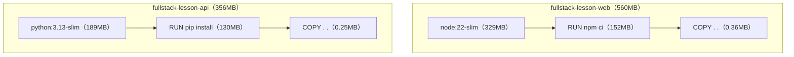
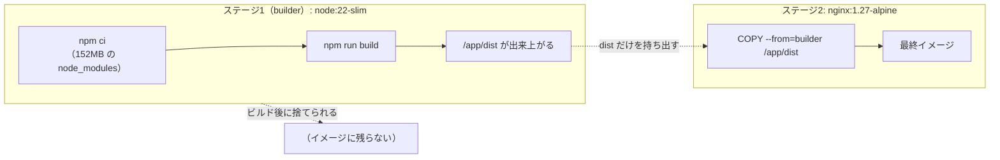
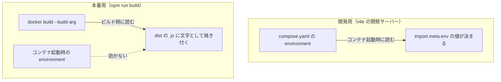
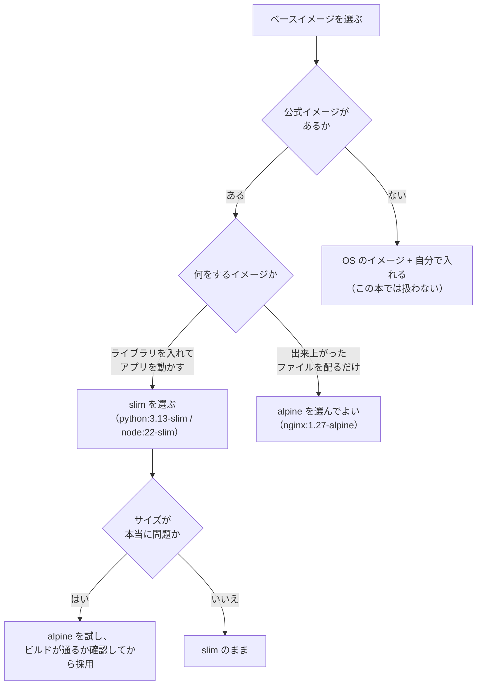
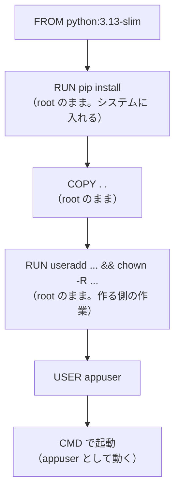
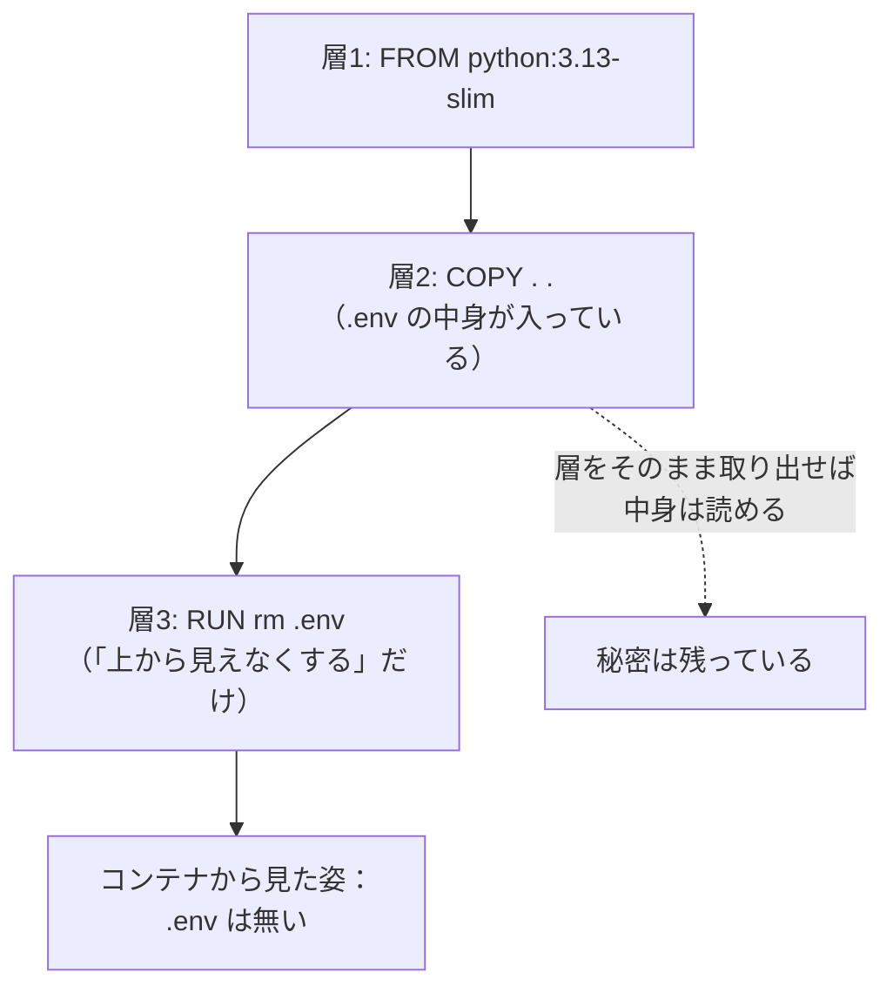
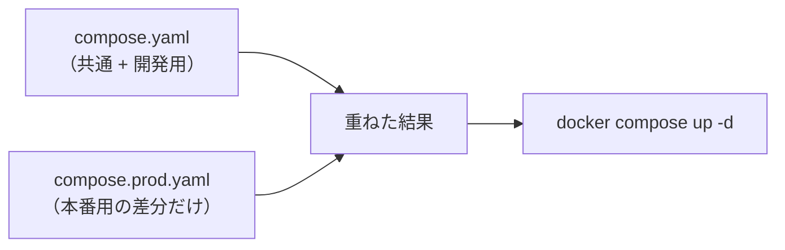
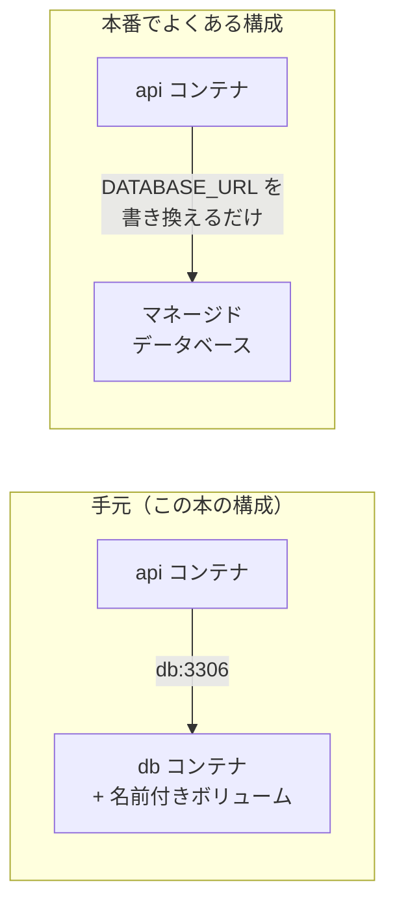

# 第7章 イメージの最適化と本番運用

第6章で、`docker compose up -d` の1行が、3冊ぶんの環境構築を置き換えました。
**動くところまでは、着きました。**

ですが、いまの形には、はっきりした2つの問題があります。

- **イメージが大きい。** 3つ合わせて 2 GB 前後あります
- **中身が開発用のまま。** 開発サーバーが動き、`root` で実行され、ソースコードが丸ごと入っています

この章では、この2つに向き合います。
**マルチステージビルド**でイメージを小さくし、**ベースイメージの選び方**を決め、
**`root` で動かさない**ようにして、**開発用と本番用の設定を分けます。**

> **この章は「本番に出す」章ではありません**
> 実際にサーバーを借りて公開する手順は書きません（7.5.3 でその理由を書きます）。
> この章のゴールは、**公開する前に自分で直せるところを、全部直しておく**ことです。
> 「あとは置く場所を決めるだけ」という状態まで持っていきます。

## この章で学ぶこと

- `docker images` と `docker history` で、**イメージのどこが容量を食っているか**を突き止められるようになる
- **マルチステージビルド**を書いて、React のイメージを **560 MB から 74 MB** に減らせるようになる
- `slim` と `alpine` の違いを説明でき、**どちらを選ぶかを自分で判断**できるようになる
- コンテナを **`root` 以外のユーザーで動かし**、**秘密情報がイメージに残る書き方**を避けられるようになる
- `compose.yaml` を**開発用と本番用に分け**、`-f` を重ねて切り替えられるようになる
- 本番に出すときに**自分で用意しなければならないもの**を、一覧で説明できるようになる

## この章の前提

- [第6章 実践：React + FastAPI + MySQL](./06-practice-full-stack.md) を読み終え、
  **`fullstack-lesson` が `docker compose up -d` で起動する**こと
- Docker Desktop が起動していること（2.1.3）
- ディスクの空き容量が **3 GB 以上**あること（イメージを新しく2つ作ります。2.7.2）

> **注意：第6章を飛ばしてきた場合**
> この章は、第6章で作った `fullstack-lesson` を**そのまま作り替えていきます。**
> 7.1 と 7.3 と 7.4.2 は読み物として読めますが、
> **7.2 以降で手を動かすには `fullstack-lesson` が必要**です。
> 先に第6章の 6.5.2 まで進めてから戻ってきてください。

> **つまずいたら**
> この章は、**動いているものを、動いたまま作り替える**章です。
> 途中で動かなくなったら、**直前に変えた1か所**を戻してください。
> 「サイズを減らす」ことより、**動く状態を保つこと**が優先です。
>
> イメージを作り替えたあとに動かなくなったときの、確認の順番です。
>
> 1. `docker compose ps` で、そのサービスが `Up` か（`Restarting` なら起動に失敗している）
> 2. `docker compose logs サービス名` の**最後の数行**（6.6.1）
> 3. `docker compose config` で、**設定が意図どおり読まれているか**（5.5.2）
>
> それでも分からないときは、第0章 0.2 で準備した AI に、次のように聞いてください。
>
> ```text
> docker-text の 7.2.2 を読んでいます。
> web の本番用イメージをビルドしたあと、ブラウザで開くと画面が真っ白になります。
>
> OS: Windows 11 / macOS（どちらかを書く。Apple Silicon なら CPU も）
>
> Dockerfile.prod の全文:
>
> （ここに貼る）
>
> docker compose logs web の出力:
>
> （ここに貼る）
>
> 原因と、直す手順を教えてください。
> ```
>
> **「前は動いていたが、○○を変えたら動かなくなった」**と伝えるのが、この章では特に有効です。
> 変える前と後の**両方の Dockerfile** を貼ると、原因が一発で絞れます。

---

## 7.1 イメージが大きすぎる問題

### 7.1.1 サイズを確認する

「大きい」と言われても、実感がわかないはずです。**まず測ります。**

`fullstack-lesson` のディレクトリで、第6章の3つを起動した状態にしておきます。

**Windows（PowerShell）**

```powershell
docker compose up -d
```

**macOS / Linux**

```bash
docker compose up -d
```

イメージの一覧を見ます（2.5.1）。

**Windows（PowerShell）**

```powershell
docker images
```

**macOS / Linux**

```bash
docker images
```

```text
IMAGE                    ID             DISK USAGE   CONTENT SIZE   EXTRA
fullstack-lesson-api     648af08f548e        356MB         83.8MB
fullstack-lesson-web     badfd98dfd98        560MB          160MB
mysql:8.4                85b9bf2e29cf       1.12GB          255MB
```

> **補足：列の見方（2.5.1 の再確認）**
> Docker 29 からは **DISK USAGE**（そのイメージがディスクで占める大きさ）と
> **CONTENT SIZE**（配布するときに転送される、圧縮された大きさ）の2列で表示されます。
> Docker 28 以前では `SIZE` の1列だけで、DISK USAGE に当たる値が出ます。
> **この章で「サイズ」と呼ぶのは DISK USAGE のほう**です。
> ID とサイズは、ビルドした時期や環境によって変わります。**桁が合っていれば同じ結果です。**

3つを足すと **2 GB 前後**です。内訳を、役割で並べ直します。

| イメージ | サイズ | 中身 | 自分で作ったか |
|---------|--------|------|--------------|
| `fullstack-lesson-web` | **560 MB** | Node.js + `node_modules` + ソース | **自分で作った**（`build`） |
| `fullstack-lesson-api` | **356 MB** | Python + ライブラリ + ソース | **自分で作った**（`build`） |
| `mysql:8.4` | 1.12 GB | MySQL 本体 | 公式イメージをそのまま使った |

**この章で減らせるのは、上の2つだけ**です。`mysql:8.4` は公式イメージなので、
中身を削る対象にはしません（削ると、それは MySQL ではなくなります）。

ディスク全体でどれだけ使っているかは、`docker system df` で見られます（2.7.2）。

**Windows（PowerShell）**

```powershell
docker system df
```

**macOS / Linux**

```bash
docker system df
```

```text
TYPE            TOTAL     ACTIVE    SIZE      RECLAIMABLE
Images          13        3         4.11GB    543.1MB (13%)
Containers      3         3         0B        0B
Local Volumes   1         1         0B        0B
Build Cache     52        0         556.3MB   238MB
```

`Build Cache`（ビルドキャッシュ。3.4.2 で効いていたもの）も**ディスクを使っている**ことが分かります。

**そもそも、なぜ小さくしたいのか。** 理由は3つあります。

| 理由 | 具体的に何が変わるか |
|------|-------------------|
| **配るのが速くなる** | イメージは、公開するとき**サーバーへ転送**します。CONTENT SIZE がそのまま転送量です |
| **起動が速くなる** | 新しいサーバーで最初に動かすとき、**イメージの取得**が終わるまで起動できません |
| **危ないものが減る** | 入っているソフトが少ないほど、**問題が見つかる部品も少ない**（7.4 で扱います） |

3つ目が、実は本題です。**イメージを小さくする作業は、そのまま安全にする作業**でもあります。

### 7.1.2 何が容量を食っているか

「大きい」と分かったので、次は**どこが大きいのか**です。
第3章 3.4.1 で使った `docker history` を、いま作ったイメージに対して使います。

**Windows（PowerShell）**

```powershell
docker history fullstack-lesson-web
```

**macOS / Linux**

```bash
docker history fullstack-lesson-web
```

```text
IMAGE          CREATED         CREATED BY                                      SIZE      COMMENT
badfd98dfd98   2 minutes ago   CMD ["npm" "run" "dev" "--" "--host"]           0B        buildkit.dockerfile.v0
<missing>      2 minutes ago   EXPOSE [5173/tcp]                               0B        buildkit.dockerfile.v0
<missing>      2 minutes ago   COPY . . # buildkit                             356kB     buildkit.dockerfile.v0
<missing>      2 minutes ago   RUN /bin/sh -c npm ci # buildkit                152MB     buildkit.dockerfile.v0
<missing>      2 minutes ago   COPY package.json package-lock.json ./ # bui…   53.2kB    buildkit.dockerfile.v0
<missing>      2 minutes ago   WORKDIR /app                                    8.19kB    buildkit.dockerfile.v0
<missing>      2 weeks ago     CMD ["node"]                                    0B        buildkit.dockerfile.v0
<missing>      2 weeks ago     ENTRYPOINT ["docker-entrypoint.sh"]             0B        buildkit.dockerfile.v0
<missing>      2 weeks ago     RUN /bin/sh -c ARCH= OPENSSL_ARCH= && dpkgAr…   154MB     buildkit.dockerfile.v0
```

3.4.1 と同じく、**下から上に読みます。** 読み取れることは3つです。

| 読み取れること | 数字 |
|--------------|------|
| 自分が書いた命令のうち、容量を食っているのは **`RUN npm ci`** だけ | **152 MB** |
| ソースコード（`COPY . .`）は、ほとんど容量を食っていない | 356 kB |
| 残りは**ベースイメージ**（`node:22-slim`）の中身 | 合計 **329 MB** |

`api` も同じように見ます。

**Windows（PowerShell）**

```powershell
docker history fullstack-lesson-api
```

**macOS / Linux**

```bash
docker history fullstack-lesson-api
```

```text
IMAGE          CREATED         CREATED BY                                      SIZE      COMMENT
648af08f548e   3 minutes ago   CMD ["fastapi" "run" "app/main.py" "--port" …   0B        buildkit.dockerfile.v0
<missing>      3 minutes ago   EXPOSE [8000/tcp]                               0B        buildkit.dockerfile.v0
<missing>      3 minutes ago   COPY . . # buildkit                             250kB     buildkit.dockerfile.v0
<missing>      3 minutes ago   RUN /bin/sh -c pip install --no-cache-dir -r…   130MB     buildkit.dockerfile.v0
<missing>      3 minutes ago   COPY requirements.txt . # buildkit              12.3kB    buildkit.dockerfile.v0
<missing>      3 minutes ago   WORKDIR /code                                   8.19kB    buildkit.dockerfile.v0
<missing>      11 days ago     CMD ["python3"]                                 0B        buildkit.dockerfile.v0
```

**同じ形をしています。** 大きいのは「ベースイメージ」と「ライブラリを入れた1つの `RUN`」の2つだけです。



つまり、**減らせる場所は2つしかありません。**

1. **ベースイメージを、より小さいものにする**（7.3 で扱います）
2. **入れたライブラリのうち、実行に要らないものを最終イメージに残さない**（7.2 で扱います）

ここで、`web` について**決定的な事実**があります。

**ブラウザに配られるのは、`npm run build` で作られる `dist/` の中身だけ**です。
`node_modules`（152 MB）も Node.js 本体（329 MB）も、**ファイルを作るときにしか使いません。**

| 何のために必要か | 使うタイミング | 最終的に配るものに含まれるか |
|----------------|--------------|------------------------|
| Node.js | ビルドするとき | **含まれない** |
| `node_modules` | ビルドするとき | **含まれない**（必要な部分は `dist/` に取り込まれる） |
| `src/` のソース | ビルドするとき | **含まれない** |
| **`dist/`（HTML・CSS・JS）** | **ブラウザが読むとき** | **これだけ** |

**560 MB のうち、本当に配りたいのは 1 MB 未満**ということです。
これを解決するのが、次の節のマルチステージビルドです。

> **補足：`api` のほうは、なぜ同じ話にならないのか**
> Python は、**実行時にも Python 本体とライブラリが必要**です。
> React は「ビルドすると、実行時に元の道具が要らなくなる」タイプ、
> Python は「実行時も道具が要る」タイプ、という違いがあります。
> `api` を小さくする方法は、7.3（ベースイメージ）と 7.4.1（余計なものを入れない）で扱います。

> **よくある間違い：`docker images` に出ないイメージを探してしまう**
> `docker compose` で作ったイメージの名前は、**`プロジェクト名-サービス名`** です（5.4.4）。
> `web` や `api` という名前では出てきません。
> 一覧に見当たらないときは、`docker compose images` を使うと、
> **そのプロジェクトのぶんだけ**が表示されます。

---

## 7.2 マルチステージビルド

### 7.2.1 ビルド用と実行用を分ける

7.1.2 で分かったのは、**`web` のイメージには「作るための道具」が入ったままになっている**ということでした。

たとえるなら、**家具を作った部屋に、のこぎりと木くずを置いたまま出荷している**状態です。
欲しいのは家具（`dist/`）だけなのに、道具（Node.js と `node_modules`）ごと配っています。

これを解決するのが、**マルチステージビルド**（multi-stage build。
1つの `Dockerfile` の中で、**ビルド専用のイメージと、実行用のイメージを分けて作り**、
必要な成果物だけを後者にコピーするやり方）です。

書き方の要点は、**たった2つ**です。

| 書くもの | 意味 |
|---------|------|
| `FROM ベースイメージ AS 名前` | **ステージ**（段階）に名前を付ける。`AS builder` のように書く |
| `COPY --from=名前 元のパス コピー先` | **そのステージの中から**ファイルを取ってくる |

いちばん大事なルールは、これです。

> **最終的なイメージになるのは、いちばん最後の `FROM` から作られたものだけ**です。
> それより前のステージは、**ビルドが終わると捨てられます。**

図にします。



**Node.js も `node_modules` も、ステージ1に置き去りにされます。**
最終イメージに残るのは、ステージ2の中身（nginx と `dist/`）だけです。

> **補足：ステージは3つ以上でも構いません**
> `AS test` を挟んでテストを走らせる、といった書き方もできます。
> この本では**2つ**（ビルド用・実行用）だけを扱います。
> 増やすほど分かりにくくなるので、必要になるまでは2つで十分です。

**なぜ nginx なのか。** 出来上がった `dist/` は、HTML・CSS・JavaScript の**ただのファイル**です。
これをブラウザに配るだけなら、**Web サーバー**（第2章 2.3.3 で動かした nginx がまさにそれです）で足ります。
Node.js は要りません。

| 開発中（第6章まで） | 本番用（この節） |
|-------------------|----------------|
| Vite の開発サーバーが、その場でファイルを組み立てて配る | **あらかじめ組み立てた `dist/` を、nginx がそのまま配る** |
| ソースを保存すると即反映（ホットリロード） | 反映するには**ビルドし直す** |
| `node:22-slim`（329 MB）が必要 | `nginx:1.27-alpine`（74.5 MB）で足りる |

### 7.2.2 React のビルド成果物だけを載せる

実際に書きます。**いまの `Dockerfile` は消しません。**
開発用（第6章のもの）を残したまま、**本番用を別ファイルとして追加します。**

`fullstack-lesson/web/` に、`Dockerfile.prod` という名前で新規作成します。

`fullstack-lesson/web/Dockerfile.prod`

```dockerfile
# ---------- ステージ1：ビルド用 ----------
FROM node:22-slim AS builder

WORKDIR /app

# 依存の一覧を先に入れる（キャッシュを効かせるため。3.4.3）
COPY package.json package-lock.json ./

RUN npm ci

COPY . .

# API の住所は「ビルドするとき」に埋め込まれる（下の説明を読んでください）
ARG VITE_API_BASE_URL

RUN npm run build

# ---------- ステージ2：実行用 ----------
FROM nginx:1.27-alpine

# ステージ1で出来た dist だけを持ってくる
COPY --from=builder /app/dist /usr/share/nginx/html

# 配り方の設定（次に作ります）
COPY nginx.conf /etc/nginx/conf.d/default.conf

EXPOSE 80
```

1つずつ確認します。

| 行 | 意味 | 参照 |
|----|------|------|
| `FROM node:22-slim AS builder` | ステージ1に `builder` という名前を付ける | 7.2.1 |
| `RUN npm ci` | ライブラリを入れる（**ステージ1の中だけ**） | 6.4.1 |
| `ARG VITE_API_BASE_URL` | **ビルド時に外から渡せる値**を受け取る | 下の説明 |
| `RUN npm run build` | `dist/` を作る | react-text 11.3.2 |
| `FROM nginx:1.27-alpine` | **ここから最終イメージ**。前のステージは捨てられる | 7.2.1 |
| `COPY --from=builder /app/dist /usr/share/nginx/html` | ステージ1の `dist` を、nginx が配る場所に置く | 7.2.1 |
| `COPY nginx.conf ...` | 配り方の設定を上書きする | 下で作ります |
| `EXPOSE 80` | nginx が待ち受けるポート（**5173 ではありません**） | 3.2.6 |

`/usr/share/nginx/html` は、**nginx が「ここに置いたファイルを配る」と決めている場所**です
（イメージ側で決まっています。MySQL の `/var/lib/mysql` と同じ考え方です。6.2.3）。

**設定ファイルを作る**

`fullstack-lesson/web/nginx.conf` を新規作成します。

`fullstack-lesson/web/nginx.conf`

```text
server {
    listen 80;
    server_name localhost;

    root /usr/share/nginx/html;
    index index.html;

    location / {
        try_files $uri $uri/ /index.html;
    }
}
```

読み方です。

| 行 | 意味 |
|----|------|
| `listen 80;` | 80 番ポートで待ち受ける |
| `root /usr/share/nginx/html;` | 配るファイルが置いてある場所 |
| `index index.html;` | ディレクトリを指定されたときに返すファイル |
| `try_files $uri $uri/ /index.html;` | **要求されたファイルが無ければ `index.html` を返す** |

**最後の行が、React アプリでは必須です。**

react-text 第9章で、`/tasks/1` のような URL を作れるようにしました（ルーティング）。
あの URL は、**ブラウザの中で JavaScript が作っている見かけの URL** であって、
サーバーに `/tasks/1` というファイルがあるわけではありません。

この設定が無いと、**`http://localhost/tasks/1` を直接開いたときや、その画面で再読み込みしたときに
nginx が「そんなファイルは無い」と `404` を返します。**
`try_files ... /index.html` は「無かったら `index.html` を返す」という指定で、
そうすれば React が起動し、URL を見て正しい画面を出してくれます。

> **よくある間違い：`nginx.conf` を `/etc/nginx/nginx.conf` にコピーしてしまう**
> nginx の設定ファイルは**2種類**あります。
>
> | パス | 何のファイルか |
> |------|--------------|
> | `/etc/nginx/nginx.conf` | 全体の設定（ワーカー数やログの形式など） |
> | **`/etc/nginx/conf.d/default.conf`** | **サイト1つぶんの設定**（今回書き換えるのはこちら） |
>
> `/etc/nginx/nginx.conf` を上の内容で上書きすると、nginx は起動に失敗します
> （`server { ... }` は、本来 `http { ... }` の中に書くものだからです）。
> **コピー先のパスを、そのまま写してください。**

**ビルドする**

`fullstack-lesson/web` ディレクトリで実行します。**`-f` で使う Dockerfile を指定**します（3.3.1 では省略していました）。

**Windows（PowerShell）**

```powershell
docker build -f Dockerfile.prod -t fullstack-web-prod:1.0 .
```

**macOS / Linux**

```bash
docker build -f Dockerfile.prod -t fullstack-web-prod:1.0 .
```

```text
[+] Building 52.7s (16/16) FINISHED
 => [builder 5/7] RUN npm ci                                            31.9s
 => [builder 7/7] RUN npm run build                                      4.2s
 => [stage-1 2/3] COPY --from=builder /app/dist /usr/share/nginx/html    0.1s
 => exporting to image                                                   1.9s
 => => naming to docker.io/library/fullstack-web-prod:1.0                0.0s
```

**表示される秒数は、パソコンの速さと回線によって大きく変わります。**
数字ではなく、**どの行が出ているか**を見てください。

**`[builder ...]` と `[stage-1 ...]` の2種類が出ている**ことに注目してください。
これが「2つのステージが動いた」印です（`stage-1` は、名前を付けなかった2つ目のステージの既定の呼び名です）。

`-f Dockerfile.prod` の意味です。

| 部分 | 意味 |
|------|------|
| `-f Dockerfile.prod` | **使う Dockerfile を指定する**（省略すると `Dockerfile` が使われる） |
| `-t fullstack-web-prod:1.0` | 出来たイメージに名前とタグを付ける（3.3.2） |
| `.` | **ビルドコンテキスト**（3.3.1）。`Dockerfile.prod` の場所ではなく、送るファイルの範囲 |

**動かして確かめる**

**Windows（PowerShell）**

```powershell
docker run -d --name web-prod-test -p 8080:80 fullstack-web-prod:1.0
```

**macOS / Linux**

```bash
docker run -d --name web-prod-test -p 8080:80 fullstack-web-prod:1.0
```

ポートの左が **8080**、右が **80** です（4.4.1）。
コンテナの中の nginx は 80 番で待っているので、右は `80` になります。

ブラウザで開きます。

```text
http://localhost:8080
```

**react-text 第10章のタスク管理アプリの画面が表示されれば成功です。**

ただし、この時点では**データは表示されません。** それで正常です。
`api` はいま `fullstack-lesson` の外で動いていないうえ、
API の住所も埋め込まれていないためです。次でその話をします。

確認が終わったら、片付けます。

**Windows（PowerShell）**

```powershell
docker rm -f web-prod-test
```

**macOS / Linux**

```bash
docker rm -f web-prod-test
```

**API の住所は「ビルド時」に決まる**

ここが、開発用といちばん違うところです。**必ず読んでください。**

第6章 6.4.3 で、API の住所を環境変数から読むようにしました。

```js
export const API_BASE_URL = import.meta.env.VITE_API_BASE_URL || 'http://127.0.0.1:8000'
```

開発サーバー（`npm run dev`）では、この値は**起動したときに読まれます。**
ところが本番用のビルドでは、**`npm run build` を実行した瞬間に、値が JavaScript の中に文字として埋め込まれます。**



**出来上がった `dist` のファイルは、ただの文字の並び**です。
あとから環境変数を渡しても、ファイルの中身は変わりません。

だから、本番用のイメージでは **`--build-arg` で、ビルドするときに渡します。**

**Windows（PowerShell）**

```powershell
docker build -f Dockerfile.prod --build-arg VITE_API_BASE_URL=http://localhost:8000 -t fullstack-web-prod:1.0 .
```

**macOS / Linux**

```bash
docker build -f Dockerfile.prod --build-arg VITE_API_BASE_URL=http://localhost:8000 -t fullstack-web-prod:1.0 .
```

`Dockerfile.prod` に書いた **`ARG VITE_API_BASE_URL`** が、この値を受け取ります。
`ARG` で受け取った値は、**同じステージの `RUN` の中で環境変数として使えます**。
そのため `RUN npm run build` の中で Vite がそれを読み、`dist` に埋め込みます。

埋め込まれたことは、**出来たファイルを検索すれば確かめられます。**

**Windows（PowerShell）**

```powershell
docker run --rm fullstack-web-prod:1.0 grep -ro "http://localhost:8000" /usr/share/nginx/html
```

**macOS / Linux**

```bash
docker run --rm fullstack-web-prod:1.0 grep -ro "http://localhost:8000" /usr/share/nginx/html
```

```text
/usr/share/nginx/html/assets/index-C9t0fL5M.js:http://localhost:8000
```

**JavaScript のファイルの中に、住所が文字として入っています。**
`--build-arg` を付けずにビルドすると、この検索は何も返さず、代わりに `http://127.0.0.1:8000`
（`||` の右側。6.4.3）が埋め込まれます。

> **注意：`--build-arg` に秘密の値を渡してはいけません**
> `ARG` で渡した値は、**`docker history` に残ります**（7.4.2 で実際に見ます）。
> `VITE_` で始まる値は、そもそもブラウザから丸見えです（6.4.3）。
> **住所や公開してよい設定だけ**を渡してください。
> パスワードや秘密鍵は、`api` 側に**実行時の環境変数**として渡します（7.5.2）。

> **よくある間違い：住所を変えたのに、画面の動きが変わらない**
> `--build-arg` の値を変えたら、**ビルドし直さないと反映されません。**
> `docker compose up -d` だけでは、イメージは作り直されません（5.4.4）。
> **`docker compose build` か `up -d --build`** が必要です。
> 「設定を変えたのに効かない」と感じたら、**それがビルド時の値か実行時の値か**を確認してください。

### 7.2.3 サイズを比較する

**測ります。** 開発用と本番用を並べます。

**Windows（PowerShell）**

```powershell
docker images
```

**macOS / Linux**

```bash
docker images
```

```text
IMAGE                    ID             DISK USAGE   CONTENT SIZE   EXTRA
fullstack-web-prod:1.0   69780d94d4b6         74MB         21.1MB
fullstack-lesson-web     badfd98dfd98        560MB          160MB
fullstack-lesson-api     648af08f548e        356MB         83.8MB
```

| イメージ | サイズ | 転送量（CONTENT SIZE） |
|---------|--------|---------------------|
| `fullstack-lesson-web`（開発用） | 560 MB | 160 MB |
| **`fullstack-web-prod:1.0`（本番用）** | **74 MB** | **21.1 MB** |

**約 7.5 分の1**になりました。転送量では **160 MB → 21 MB** です。

中身も確かめます。`docker history` を見ます。

**Windows（PowerShell）**

```powershell
docker history fullstack-web-prod:1.0
```

**macOS / Linux**

```bash
docker history fullstack-web-prod:1.0
```

```text
IMAGE          CREATED         CREATED BY                                      SIZE      COMMENT
69780d94d4b6   2 minutes ago   EXPOSE [80/tcp]                                 0B        buildkit.dockerfile.v0
<missing>      2 minutes ago   COPY nginx.conf /etc/nginx/conf.d/default.co…   20.5kB    buildkit.dockerfile.v0
<missing>      2 minutes ago   COPY /app/dist /usr/share/nginx/html # build…   319kB     buildkit.dockerfile.v0
<missing>      17 months ago   RUN /bin/sh -c set -x     && apkArch="$(cat …   38.7MB    buildkit.dockerfile.v0
<missing>      17 months ago   CMD ["nginx" "-g" "daemon off;"]                0B        buildkit.dockerfile.v0
```

**`RUN npm ci`（152 MB）の行が、どこにもありません。**
自分で足したのは `319 kB` と `20.5 kB` の2行だけで、残りは nginx のベースイメージです。

**「入っていない」ことを、直接確かめる**

サイズの数字だけでなく、**中を見て確かめます。**

**Windows（PowerShell）**

```powershell
docker run --rm fullstack-web-prod:1.0 sh -c "node --version; ls /app; ls /usr/share/nginx/html"
```

**macOS / Linux**

```bash
docker run --rm fullstack-web-prod:1.0 sh -c "node --version; ls /app; ls /usr/share/nginx/html"
```

```text
sh: node: not found
ls: /app: No such file or directory
50x.html
assets
index.html
vite.svg
```

3種類の出力が、それぞれ答えになっています。

| 出力 | 意味 |
|------|------|
| `node: not found` | **Node.js は入っていない**（ステージ1に置いてきた） |
| `/app: No such file or directory` | **ソースコードも `node_modules` も無い** |
| `assets` / `index.html` | **配るファイルだけがある** |

`50x.html` は、**nginx のイメージにもともと入っているエラー画面**です
（`COPY` は、その場所にあるファイルを消さずに上書きするため、残ります）。
`index.html` のほうは、`dist` のもので**上書きされています。**

**これがマルチステージビルドの効果です。**
「小さくなった」だけでなく、**入っていないものは壊れようがない**という意味でも安全になりました。

> **補足：ビルドにかかる時間は短くなりません**
> `npm ci` も `npm run build` も、**ステージ1で同じように実行されます。**
> 短くなるのは**出来上がったイメージ**であって、ビルド時間ではありません。
> むしろ nginx のイメージを取得するぶん、初回は少し長くなります。
> **キャッシュ（3.4.2）の効き方は変わらない**ので、2回目以降は速くなります。

> **よくある間違い：`dist` が空のままコピーされる**
> `COPY --from=builder /app/dist ...` で何も入らないときは、
> **ステージ1で `npm run build` が失敗している**か、**`dist` の場所が違います。**
> Vite の出力先は `vite.config.js` で変えられるので、変更している場合はそのパスに合わせてください。
> ビルドのログに、次のような行が出ているかを確認します。
>
> ```text
> dist/index.html                   0.45 kB
> dist/assets/index-C9t0fL5M.js   222.53 kB
> ```

---

## 7.3 ベースイメージの選び方

### 7.3.1 `slim` と `alpine`

7.1.2 で見たとおり、イメージの大きさの**半分以上はベースイメージ**です。
ここを変えれば、もっと小さくできそうに見えます。

公式イメージには、**同じソフトの、中身が違う版**がいくつも用意されています。
第3章 3.2.1 の補足で名前だけ挙げたものを、**実際に測って**並べます。

**Windows（PowerShell）**

```powershell
docker pull python:3.13
docker pull python:3.13-slim
docker pull python:3.13-alpine
docker images
```

**macOS / Linux**

```bash
docker pull python:3.13
docker pull python:3.13-slim
docker pull python:3.13-alpine
docker images
```

```text
IMAGE                ID             DISK USAGE   CONTENT SIZE   EXTRA
python:3.13          6faba2c56370       1.62GB          431MB
python:3.13-slim     9d2e5553305c        189MB         48.2MB
python:3.13-alpine   7415fbc3c9e4       79.2MB         20.1MB
```

**同じ Python 3.13 で、20 倍以上の差**があります。中身の違いはこうです。

| タグ | 土台の OS | 中に入っているもの | サイズ |
|------|----------|-----------------|--------|
| `python:3.13`（タグに何も付かない版） | Debian（フル） | コンパイラ、Git、各種開発ライブラリ、ドキュメント | 1.62 GB |
| **`python:3.13-slim`** | Debian（最小構成） | **Python を動かすのに要るものだけ** | 189 MB |
| `python:3.13-alpine` | **Alpine Linux** | 同上（さらに切り詰めた OS の上） | 79.2 MB |

**Alpine Linux**（アルパイン リナックス。コンテナ用途で広く使われる、非常に小さな Linux ディストリビューション）は、
**サイズを最優先に作られた OS** です。同じことが、Node.js や nginx にも当てはまります。

| イメージ | サイズ |
|---------|--------|
| `node:22-slim` | 329 MB |
| `nginx:1.27` | 282 MB |
| **`nginx:1.27-alpine`** | **74.5 MB** |

7.2.2 で `nginx:1.27-alpine` を選んだのは、この差があるからです。

> **補足：なぜ「フル版」がそんなに大きいのか**
> フル版には、**そのソフトを使って何か作るときに要りそうなものが、あらかじめ全部**入っています。
> C コンパイラ、Git、各種ライブラリの開発用ファイルなどです。
> 「動かすだけ」なら、そのほとんどは使いません。
> **`slim` は、そこから「作るための道具」を抜いた版**だと考えてください。
> 7.2.1 のマルチステージビルドと、発想が同じです。

### 7.3.2 alpine の落とし穴

数字だけ見れば、**全部 alpine にすればよさそう**に見えます。実際そうしている現場もあります。
ですが、**それで詰まる場面がある**ので、判断できるようにしておきます。

Alpine Linux は、**普通の Linux とは別の部品でできています。**
中心にあるのが **musl**（マッスル）という部品で、Debian や Ubuntu が使っている **glibc**（ジーリブシー）の
代わりに入っています（どちらも、あらゆるプログラムが土台として使う「C ライブラリ」という部品です）。

ここで問題になるのが、**Python のライブラリの配られ方**です。

python-text 1.6 で `pip install` を使いました。あのとき裏で何が起きていたかというと、
**ホイール**（wheel。あらかじめビルド済みの、そのまま置くだけで使える形の配布物）を
ダウンロードして展開していました。

ホイールには、**どの環境向けにビルドされたか**が書いてあります。

| ホイールの種類 | どの環境向けか |
|--------------|--------------|
| `manylinux` | **glibc の Linux 向け**（Debian・Ubuntu・`slim` はこちら） |
| `musllinux` | **musl の Linux 向け**（Alpine はこちら） |
| （ホイールなし） | ソースコードだけ。**使う側でビルドする必要がある** |

**多くの主要なライブラリは、いまでは `musllinux` 版も配っています。**
実際、この本の `api` が使う `requirements.txt`（`fastapi` / `sqlalchemy` / `cryptography` / `PyMySQL` など）は、
alpine でも**そのまま、数十秒で入ります。** 昔よく言われた「alpine は pip が遅い」は、
**この構成に関しては、もう当てはまりません。**

**問題は、`musllinux` 版を配っていないライブラリに当たったとき**です。
実際に踏んでみます。`pyodbc` という、データベース接続によく使われるライブラリで試します。

**Windows（PowerShell）**

```powershell
docker run --rm python:3.13-slim pip install pyodbc==5.2.0
```

**macOS / Linux**

```bash
docker run --rm python:3.13-slim pip install pyodbc==5.2.0
```

```text
Collecting pyodbc==5.2.0
  Downloading pyodbc-5.2.0-cp313-cp313-manylinux_2_17_x86_64.manylinux2014_x86_64.whl (353 kB)
Installing collected packages: pyodbc
Successfully installed pyodbc-5.2.0
```

**2秒で終わります。** `manylinux` のホイールが見つかったからです。
同じことを alpine でやります。

**Windows（PowerShell）**

```powershell
docker run --rm python:3.13-alpine pip install pyodbc==5.2.0
```

**macOS / Linux**

```bash
docker run --rm python:3.13-alpine pip install pyodbc==5.2.0
```

```text
      building 'pyodbc' extension
      error: [Errno 2] No such file or directory: 'g++'
      [end of output]

  note: This error originates from a subprocess, and is likely not a problem with pip.
  ERROR: Failed building wheel for pyodbc
Failed to build pyodbc
error: failed-wheel-build-for-install
```

**失敗します。** `musllinux` のホイールが無いので、pip は**その場でソースからビルドしようとし**、
Alpine には C++ コンパイラ（`g++`）が入っていないため、そこで止まります。

直すには、Dockerfile にコンパイラなどを足すことになります。

```dockerfile
# alpine で、ホイールの無いライブラリを入れる場合に必要になるもの（例）
RUN apk add --no-cache gcc g++ musl-dev unixodbc-dev
```

**そして、ここが落とし穴の本体です。**

| 起きること | 結果 |
|-----------|------|
| コンパイラ一式を入れる | **イメージが 100 MB 単位で増える**（小さくするために alpine にしたのに） |
| ソースからビルドする | **ビルド時間が数分〜十数分に伸びる**（毎回ではないがキャッシュが切れるたび） |
| 必要な `apk` パッケージ名を調べる | **`apt-get` の名前とは違う**ので、そのつど調べ直す |

もう1つ、地味に効いてくる違いがあります。**手順の情報が合わなくなる**ことです。

| やりたいこと | Debian 系（`slim`） | Alpine |
|------------|-------------------|--------|
| パッケージを入れる | `apt-get install -y 名前` | **`apk add --no-cache 名前`** |
| **利用者を作る**（7.4.1 で使います） | `useradd --create-home --uid 1001 名前` | **`adduser -D -u 1001 名前`**（`useradd` は**入っていません**） |
| シェル | `bash` が入っている | **`sh` のみ**（`bash` は別途 `apk add bash`） |

`useradd` を alpine で実行すると、次で止まります。

```text
/bin/sh: useradd: not found
```

Web で見つかる手順や、AI が出してくる答えの多くは **Debian 系を前提**にしています。
**そのままコピーしても動かない**ことが増えるのが、学習中はいちばん痛いところです。

> **注意：この本の題材で、alpine が「必ず失敗する」わけではありません**
> 上で試したとおり、この本の `api` の `requirements.txt` は alpine でも入ります。
> 落とし穴は「**必ず起きる**」のではなく「**いつ起きるか読めない**」ことです。
> ライブラリを1つ足した日に、突然ビルドが失敗するようになります。

### 7.3.3 選択の指針

判断の順番を決めておきます。**迷ったときは、この順に考えてください。**



このテキストでの決め方を、言葉にしておきます。

| 用途 | 選ぶもの | 理由 |
|------|---------|------|
| **Python / Node.js でアプリを動かす** | **`slim`** | ライブラリを追加したときに詰まりにくい。7.3.2 の落とし穴を避ける |
| **出来上がったファイルを配るだけ** | **`alpine`** | 追加でライブラリを入れないので、落とし穴を踏まない。差が大きい（282 MB → 74.5 MB） |
| データベースなどの公式イメージ | **公式が薦めるタグ** | 中身を削る対象ではない（7.1.1） |

**タグに何も付けない版（フル版）は、この本では使いません。**
1.62 GB のうち、使うのはごく一部です。

> **補足：`-slim` や `-alpine` が無いイメージもあります**
> `mysql:8.4` には `slim` 版がありません。**用意されていないものは、選べません。**
> 公式イメージのページ（Docker Hub。1.3.3）の **Tags** の一覧を見て、
> **実際に存在するタグから選ぶ**のが確実です。

> **よくある間違い：サイズだけを見て決めてしまう**
> 「小さい = 良い」ではありません。判断の材料は3つあります。
>
> | 材料 | 見るもの |
> |------|---------|
> | サイズ | `docker images` の DISK USAGE |
> | **ビルドが通るか** | **実際にビルドしてみる**（これが最重要） |
> | 情報の見つけやすさ | 手順やエラーの解決策が Web にあるか |
>
> **試してから決める**のが、いちばん確実です。第4章までで、壊しても作り直せることは分かっています。

---

## 7.4 セキュリティの基本

ここからは、**サイズではなく安全**の話です。
「本番に出す前に、自分で直せること」を3つだけ扱います。

> **注意：この節だけで安全になるわけではありません**
> ここで扱うのは、**最低限の3つ**です。
> 実際に公開するときには、これ以外にも必要なものがあります（7.5.2 で一覧にします）。
> **「やらなくてよい」ではなく「まだ足りない」**と理解してください。

### 7.4.1 `root` で動かさない

いまのコンテナが、**誰として動いているか**を確かめます。

**Windows（PowerShell）**

```powershell
docker compose exec api whoami
```

**macOS / Linux**

```bash
docker compose exec api whoami
```

```text
root
```

**`root`**（ルート。その OS で何でもできる管理者ユーザー）です。
第6章 6.2.2 で「アプリには `root` ではないデータベースユーザーを使わせる」と決めたのと、**同じ話**です。

**なぜ避けるのか。** 「コンテナの中だから安全」ではない場面があるからです。

| 起きうること | 何が困るか |
|------------|----------|
| アプリに穴があり、外から任意のコマンドを実行された | **コンテナの中で、何でもできてしまう**（設定を書き換える・別のプログラムを入れる） |
| バインドマウント（4.2.1）でパソコンのディレクトリを繋いでいる | **`root` としてそこに書き込める**。コンテナの外のファイルが書き換わる |
| Docker 自体に問題が見つかったとき | `root` だと、**コンテナの外に影響が及ぶ余地が大きくなる** |

3つ目は「めったに起きないが、起きたときの被害が大きい」タイプです。
**起きにくさに賭けるより、最初から権限を下げておく**ほうが確実です。

**直します。** `api` の `Dockerfile` に、2行足します。

`fullstack-lesson/api/Dockerfile`

```dockerfile
FROM python:3.13-slim

WORKDIR /code

COPY requirements.txt .

RUN pip install --no-cache-dir -r requirements.txt

COPY . .

# root ではない利用者を作り、アプリのファイルの持ち主にする
RUN useradd --create-home --uid 1001 appuser && chown -R appuser:appuser /code

# ここから下は appuser として実行される
USER appuser

EXPOSE 8000

CMD ["fastapi", "run", "app/main.py", "--port", "8000"]
```

足したのは、次の2つです。

| 命令 | 意味 |
|------|------|
| `RUN useradd --create-home --uid 1001 appuser` | **`appuser` という利用者を作る**（`--create-home` はホームディレクトリも作る指定） |
| `USER appuser` | **これ以降の命令と、コンテナの起動を `appuser` として行う** |

`chown -R appuser:appuser /code` は、**`/code` の中のファイルの持ち主を `appuser` にする**指定です。
これが無いと、ファイルは `root` のものなので、**`appuser` から読めても書けません。**

順番が重要です。



**`USER` は、できるだけ後ろに書きます。**
`pip install` はシステム全体にライブラリを入れる作業なので、**`root` のまま実行する必要があります。**
先に `USER appuser` を書くと、`pip install` が権限不足で失敗するか、
**`appuser` の個人用の場所に入ってしまい、起動時に見つからなくなります。**

ビルドし直して、確かめます。

**Windows（PowerShell）**

```powershell
docker compose up -d --build api
docker compose exec api whoami
```

**macOS / Linux**

```bash
docker compose up -d --build api
docker compose exec api whoami
```

```text
appuser
```

`id` コマンドを使うと、番号まで確認できます。

**Windows（PowerShell）**

```powershell
docker compose exec api id
```

**macOS / Linux**

```bash
docker compose exec api id
```

```text
uid=1001(appuser) gid=1001(appuser) groups=1001(appuser)
```

**権限が下がったことを、実際に確かめます。**

**Windows（PowerShell）**

```powershell
docker compose exec api touch /oops.txt
```

**macOS / Linux**

```bash
docker compose exec api touch /oops.txt
```

```text
touch: cannot touch '/oops.txt': Permission denied
```

**`Permission denied`（権限がない）で断られました。** これが目的の状態です。
`root` のままなら、このファイルは作れてしまいます。

もちろん、アプリ自体は今までどおり動きます。`http://localhost:8000/docs` を開いて確認してください。

> **よくある間違い：ログに `Permission denied` が出て起動しなくなる**
> アプリが**ファイルを書く場所**があると、`USER` を足した瞬間に失敗します。
>
> | 書く場所の例 | 対処 |
> |------------|------|
> | ログファイル、アップロードされた画像の置き場 | その場所を `chown` するか、**ボリュームを繋いで**そこに書く |
> | SQLite の `app.db`（fastapi-text 第6章の構成） | **MySQL に移したので、この章では該当しません**（6.3.2） |
>
> 起動しなくなったら、`docker compose logs api` の**最後の数行**に、
> どのパスで断られたかが出ます。**そのパスだけ**を直してください。

> **補足：nginx のイメージは `root` のままです**
> 7.2.2 で作った本番用の `web` を見ると、**マスターのプロセスは `root`** で動いています。
>
> ```text
> PID   USER     COMMAND
>     1 root     nginx: master process nginx -g daemon off;
>    20 nginx    nginx: worker process
> ```
>
> これは**公式イメージがそう作られている**ためです。
> `80` のような **1024 番未満のポートは、`root` でないと開けない**という Linux の決まりがあり、
> ポートを開く役だけ `root` が担当し、**実際に通信を処理するワーカーは `nginx` という利用者**に落としています。
> 「全部を `root` で動かす」のとは違う、**役割を分けた形**です。

### 7.4.2 秘密情報をイメージに焼き込まない

第5章 5.5.3 で「秘密の値を Git に入れない」と決めました。
**イメージにも、同じことが言えます。** しかも、こちらのほうが気づきにくいです。

**危ない書き方は3つ**あります。

| 危ない書き方 | なぜ危ないか |
|------------|------------|
| `COPY . .` で `.env` ごとイメージに入れる | **イメージを持っている人全員が読める** |
| `ENV SECRET_KEY=...` と Dockerfile に書く | `docker history` に**そのまま表示される** |
| `--build-arg SECRET_KEY=...` で渡す | 同上。**ビルド時に渡した値も履歴に残る** |

**1つずつ、実際に見ます。**

**(1) `.env` が入っているイメージ**

`.env` が入ったイメージは、次の1行で中身を読まれます。

```bash
docker run --rm イメージ名 cat /code/.env
```

```text
SECRET_KEY=super-secret-value-12345
MYSQL_PASSWORD=app-pass-change-me
```

第6章 6.3.1 で `.dockerignore` に `.env` を書いたのは、**これを防ぐため**でした。
自分のイメージが大丈夫かは、上のコマンドで確かめられます（`No such file or directory` なら入っていません）。

**(2) `ENV` に書いた値**

`Dockerfile` にこう書いたとします。

```dockerfile
ENV SECRET_KEY=super-secret-value-12345
```

`docker history --no-trunc`（`--no-trunc` は、**省略せずに全部表示する**指定）を実行すると、こうなります。

```text
CREATED BY
ENV SECRET_KEY=super-secret-value-12345
```

**そのまま出ます。** イメージを受け取った人は、実行しなくても中身を読めます。

**(3) `--build-arg` で渡した値**

「ビルド時にだけ渡すから大丈夫」と思いたくなりますが、**残ります。**

```dockerfile
ARG SECRET_KEY
RUN echo "build with $SECRET_KEY" > /tmp/x
```

```text
CREATED BY
RUN |1 SECRET_KEY=super-secret-value-12345 /bin/sh -c echo "build with $SECRET_KEY" > /tmp/x
ARG SECRET_KEY=super-secret-value-12345
```

**渡した値が、そのまま履歴に残っています。**
7.2.2 で `--build-arg` に住所しか渡さなかったのは、この理由です。

**「あとで消す」は効きません**

いちばん誤解されやすいのが、これです。

```dockerfile
COPY . .
RUN rm .env     # 消したつもり
```

このイメージでコンテナを起動して `ls -a` しても、`.env` は**見えません。**
見えませんが、**イメージの中には残っています。**

第3章 3.4.1 で見たとおり、イメージは**レイヤ（層）の積み重ね**です。
`rm` は「消した」という**新しい層を上に載せているだけ**で、下の層はそのままです。



**残っていることは、自分で確かめられます。**
イメージは、**`docker save`** というコマンドで**1つのファイル（`.tar` という、複数のファイルを1つにまとめた形式）
として取り出せます。**

```bash
docker save イメージ名 -o 出力するファイル名.tar
```

取り出したファイルを開くと、中は次のようになっています。

```text
leaky.tar を展開したもの
├── index.json           どの層をどう積むかの情報
├── manifest.json        同上
└── blobs/sha256/        ← 層そのもの（1ファイル = 1層）
    ├── 3975fe68146e...
    ├── 6453d723d7bb...
    └── ...
```

**`blobs/sha256/` の中の1つ1つが、レイヤ**です。
この中から `.env` を探して中身を表示するには、次のようにします。
**OS による違いをなくすため、調べる作業もコンテナの中で行います**（`${PWD}` / `$(pwd)` は 4.2.3）。

**Windows（PowerShell）**

```powershell
docker save leaky:1.0 -o leaky.tar
docker run --rm -v "${PWD}:/work" -w /work python:3.13-slim sh -c 'mkdir -p out && tar -xf leaky.tar -C out && for f in out/blobs/sha256/*; do tar -xzOf "$f" code/.env 2>/dev/null; done; echo "--- 検索終わり ---"'
```

**macOS / Linux**

```bash
docker save leaky:1.0 -o leaky.tar
docker run --rm -v "$(pwd):/work" -w /work python:3.13-slim sh -c 'mkdir -p out && tar -xf leaky.tar -C out && for f in out/blobs/sha256/*; do tar -xzOf "$f" code/.env 2>/dev/null; done; echo "--- 検索終わり ---"'
```

```text
SECRET_KEY=super-secret-value-12345
MYSQL_PASSWORD=app-pass-change-me
--- 検索終わり ---
```

**コンテナから見えないはずの `.env` が、そのまま読めました。**
長いコマンドですが、やっていることは3つだけです。

| 部分 | 何をしているか |
|------|--------------|
| `tar -xf leaky.tar -C out` | 取り出したイメージを `out` に展開する |
| `for f in out/blobs/sha256/*; do ... done` | **層を1つずつ**見ていく |
| `tar -xzOf "$f" code/.env` | その層の中に `code/.env` があれば、**中身を画面に出す**（無ければ何も出ない） |

自分で試すときは、**本物の秘密を書かないでください**（演習 7.2 で扱います）。

**では、どう渡すのか**

答えは、**第6章でもうやっています。**

| 渡すもの | 渡し方 | どこに書くか |
|---------|--------|------------|
| パスワード・秘密鍵 | **実行時の環境変数** | `compose.yaml` の `environment` + `.env`（5.5.2 / 6.3.2） |
| 公開してよい住所・設定 | 環境変数、または `--build-arg` | 7.2.2 |
| **どちらでもないもの** | **イメージに入れない** | — |

**イメージは「配るもの」、`.env` は「配らないもの」**と覚えてください。
イメージは、サーバーにも、同僚にも、レジストリ（1.3.3）にも渡ります。
**渡った先で読まれて困る値は、最初から入れない**のが唯一の対処です。

> **よくある間違い：`.dockerignore` を作ったつもりで、置き場所が違う**
> `.dockerignore` が効くのは、**ビルドコンテキストの一番上**に置いたときだけです（3.5.2）。
> `docker build -f Dockerfile.prod -t 名前 .` の**最後の `.`** が指すディレクトリです。
> `fullstack-lesson/.dockerignore` を作っても、`api/` をコンテキストにしたビルドには**効きません。**
> `fullstack-lesson/api/.dockerignore` と `fullstack-lesson/web/.dockerignore` の**2つ**が必要です。

### 7.4.3 ベースイメージを更新する

最後の1つは、**作ったあと**の話です。

`FROM python:3.13-slim` と書いたイメージは、**一度ビルドすればそのまま固まります。**
ところが、`python:3.13-slim` という**タグの中身は、更新され続けています。**

| 思い込み | 実際 |
|---------|------|
| 「タグを固定したから、中身はずっと同じ」 | **タグは動く**。`python:3.13-slim` は、月に何度も中身が差し替わる |
| 「同じタグなら、取り直しても同じ」 | **違うことがある**。Python の修正版や、OS 側の修正が入る |

第2章 2.5.5 で「`latest` を使わない」と決めましたが、
**`3.13-slim` のようなタグでも、中身は動きます。**
固定されているのは「Python 3.13 の slim 版」という**位置**であって、中身そのものではありません。

だから、**定期的に取り直して、ビルドし直す**必要があります。

**Windows（PowerShell）**

```powershell
docker pull python:3.13-slim
```

**macOS / Linux**

```bash
docker pull python:3.13-slim
```

```text
3.13-slim: Pulling from library/python
Digest: sha256:9d2e5553305c7c7b0097999bb17187c69b921ccd6bc9d40e4bb5ebe652c00285
Status: Image is up to date for python:3.13-slim
```

**`Image is up to date`** は「手元のものが最新だった」という意味です。
新しくなっていれば、ここでダウンロードが始まります。

`compose.yaml` を使っている場合は、**まとめて取り直せます。**

**Windows（PowerShell）**

```powershell
docker compose build --pull
docker compose up -d
```

**macOS / Linux**

```bash
docker compose build --pull
docker compose up -d
```

`--pull` は、**ビルドの前にベースイメージを取り直す**指定です。
これが無いと、手元にある古いベースイメージがそのまま使われます。

取り直してビルドすると、**古いイメージは名前を失って残ります**（2.7.1）。

```text
IMAGE                  ID             DISK USAGE   CONTENT SIZE   EXTRA
<none>                 3f9a1c2b8e77        356MB         83.8MB
fullstack-lesson-api   9b2e77c1a034        356MB         83.8MB
```

`<none>` になったものは、**どこからも使われていないイメージ**です。溜まるので、ときどき片付けます。

**Windows（PowerShell）**

```powershell
docker image prune
```

**macOS / Linux**

```bash
docker image prune
```

> **注意：`docker image prune` と `docker system prune -a` は別物です**
> `docker image prune`（`-a` なし）が消すのは、**`<none>` になったイメージだけ**です。
> 第2章 2.7.1 で「使わない」と決めたのは **`docker system prune -a --volumes`** のほうです。
> **`-a` と `--volumes` を付けない**かぎり、動いているものやボリュームは消えません。

**更新には、確認が要ります**

ベースイメージを新しくするということは、**土台の中身が変わる**ということです。
「取り直したら動かなくなった」は、実際に起こります。

だから、更新は次の順で行います。

1. `docker compose build --pull` でビルドし直す
2. **手元で起動して、通しで動くことを確認する**（6.5.3 の4段階）
3. 問題なければ、本番に反映する

**2番が省けないのが本質です。**
これを自動でやる仕組み（テストを毎回自動で走らせる）が、fastapi-text 第8章で書いたテストと、
その先にある **CI**（継続的インテグレーション。第8章 8.2 で触れます）です。

> **補足：脆弱性を調べる道具**
> イメージに「既知の問題がある部品」が入っていないかを調べる道具があります。
> Docker Desktop には **Docker Scout** という機能が付いていて、
> GUI の「Images」タブからイメージを選ぶと、**問題のある部品の一覧**が見られます。
> このテキストでは扱いませんが、**公開する前に一度見ておく**と、更新すべきものが分かります。
> 表示される内容は Docker Desktop のバージョンによって変わります。

---

## 7.5 開発用と本番用を分ける

### 7.5.1 設定ファイルの上書き

7.2 で本番用のイメージを作り、7.4 で `root` をやめました。
ですが、**`compose.yaml` は開発用のまま**です。

第6章 6.5.1 の `compose.yaml` を、本番の目で読み直します。

| いまの設定 | 本番では |
|-----------|---------|
| `web` が `Dockerfile`（Vite の開発サーバー） | **`Dockerfile.prod`（nginx）にしたい** |
| `web` の `ports` が `5173:5173` | **`80:80` にしたい** |
| `web` に `./web:/app` のバインドマウント | **要らない**（ソースを外から見せる必要がない） |
| 落ちても起動し直さない | **落ちたら起動し直してほしい** |

**では、`compose.yaml` を書き換えればよいのか。** それだと開発ができなくなります。
**2つの状態を、両方とも保ちたい**のです。

Compose には、**設定ファイルを重ねる**仕組みがあります。

```bash
docker compose -f compose.yaml -f compose.prod.yaml up -d
```

`-f` を2回書くと、**左から順に読み込んで、後のもので上書き**します。



**重ね方には規則があります。ここを知らないと必ず事故ります。**

| 書き方の種類 | 例 | 重ねたときの動き |
|------------|-----|----------------|
| **項目名と値**（マッピング） | `environment:` の各行、`build:` の中身 | **同じ名前は上書き、違う名前は両方残る** |
| **箇条書き**（リスト） | `ports:` / `volumes:` / `command:` の一部 | **足し算される**（上書きされない） |

**リストが足し算になる**のが、いちばんの落とし穴です。実際に見ます。

`compose.prod.yaml` に、次のように書いたとします（**わざと間違えた例**です）。

```yaml
services:
  web:
    build:
      context: ./web
      dockerfile: Dockerfile.prod
    ports:
      - "80:80"
```

重ねた結果を、`docker compose config`（5.5.2）で確かめます。

**Windows（PowerShell）**

```powershell
docker compose -f compose.yaml -f compose.prod.yaml config
```

**macOS / Linux**

```bash
docker compose -f compose.yaml -f compose.prod.yaml config
```

```text
  web:
    build:
      context: /path/to/fullstack-lesson/web
      dockerfile: Dockerfile.prod
    ports:
      - mode: ingress
        target: 5173
        published: "5173"
        protocol: tcp
      - mode: ingress
        target: 80
        published: "80"
        protocol: tcp
    volumes:
      - type: bind
        source: /path/to/fullstack-lesson/web
        target: /app
```

読み取れることは3つです。

- `dockerfile` は **`Dockerfile.prod` に上書きされた**（マッピングなので）
- **`ports` が 5173 と 80 の2つになった**（リストなので足し算）
- **`volumes` のバインドマウントが残っている**（本番用のファイルに書いていないのに）

**消したいものは、消すと書かないと消えません。**
そのための書き方が2つあります。

| 書き方 | 意味 |
|--------|------|
| **`!reset`** | その項目を**空にする**（消す） |
| **`!override`** | 足し算せず、**書いたもので置き換える** |

正しく書き直すと、こうなります。

```yaml
services:
  web:
    ports: !override
      - "80:80"
    volumes: !reset []
```

> **注意：`!override` と `!reset` は、新しめの Compose でないと使えません**
> どちらも Compose v2.24 以降の書き方です。使えるかどうかは、次で確認できます（5.1.2）。
>
> ```bash
> docker compose version
> ```
>
> 古い場合は、**「共通部分だけを `compose.yaml` に書き、開発用の設定も `compose.dev.yaml` に分ける」**
> という形にすれば、消す必要そのものが無くなります
> （そのぶん、開発でも毎回 `-f` を2つ書くことになります）。

もう一度 `config` で確かめると、`ports` は 80 だけになり、`volumes` は消えます。

```text
  web:
    build:
      context: /path/to/fullstack-lesson/web
      dockerfile: Dockerfile.prod
    ports:
      - mode: ingress
        target: 80
        published: "80"
        protocol: tcp
```

> **注意：`docker compose config` を、必ず先に実行してください**
> 重ねた設定は、**頭の中で組み立てても合いません。**
> `up` する前に `config` を見るだけで、この節の事故はほぼ防げます。
> 「消したはずのものが残っていないか」を、**目で確認する**習慣にしてください。

> **よくある間違い：`-f` を1つしか書かない**
> `docker compose -f compose.prod.yaml up -d` と書くと、
> **`compose.yaml` が読まれません。** 共通部分（`db` の設定など）がまるごと消えます。
> 差分だけを書いたファイルは、**単体では動かない**と覚えてください。
>
> また、`-f` を付けた場合は、`down` や `logs` にも**同じ `-f` を付ける**必要があります。
> 付け忘れると、Compose は `compose.yaml` だけを見て「そんなコンテナは無い」と言います。

### 7.5.2 本番向けの設定

ここまでの内容をまとめて、**本番用の差分ファイル**を書きます。

`fullstack-lesson/compose.prod.yaml`

```yaml
services:
  # フロントエンド（ビルド済みのファイルを nginx が配る）
  web:
    build:
      context: ./web
      dockerfile: Dockerfile.prod
      args:
        VITE_API_BASE_URL: ${VITE_API_BASE_URL}
    ports: !override
      - "80:80"
    volumes: !reset []
    environment: !reset {}
    restart: always

  # API（イメージは 7.4.1 で appuser 実行に変更済み）
  api:
    restart: always

  # データベース
  db:
    restart: always
```

書いたものを、1つずつ確認します。

| 行 | 何のために書いたか | 参照 |
|----|-----------------|------|
| `dockerfile: Dockerfile.prod` | 開発サーバーではなく nginx のイメージを使う | 7.2.2 |
| `args: VITE_API_BASE_URL: ${...}` | **ビルド時に API の住所を埋め込む** | 7.2.2 |
| `ports: !override - "80:80"` | 5173 を足し算せず、80 に置き換える | 7.5.1 |
| `volumes: !reset []` | **ソースのバインドマウントを消す**（本番では要らない） | 7.5.1 |
| `environment: !reset {}` | 実行時の `VITE_...` は効かないので消す | 7.2.2 |
| `restart: always` | **落ちたら自動で起動し直す** | 下の説明 |

`args` に渡している `${VITE_API_BASE_URL}` は、`.env` から読まれます（5.5.2）。
`.env` と `.env.example` に、1行ずつ足しておきます。

`fullstack-lesson/.env`（末尾に追記）

```text
# 本番用（web のビルド時に埋め込まれる住所）
VITE_API_BASE_URL=http://localhost:8000
```

`fullstack-lesson/.env.example`（末尾に追記）

```text
# 本番用（web のビルド時に埋め込まれる住所。公開する場所の住所を書く）
VITE_API_BASE_URL=http://localhost:8000
```

**`restart: always` とは**

コンテナが**終了したときに、Docker が自動で起動し直す**設定です。

| 指定 | 動き |
|------|------|
| （書かない） | 落ちたら落ちたまま |
| `restart: always` | **落ちたら起動し直す。パソコン（サーバー）の再起動後も起動する** |
| `restart: unless-stopped` | 同上。ただし**自分で `stop` したものは、再起動後も止まったまま** |

本番では、**`always` か `unless-stopped`** を付けます。
このテキストでは `always` を使います。

> **注意：`restart: always` は、壊れたものを直しません**
> 起動に失敗し続けるコンテナは、**失敗し続けたまま再起動を繰り返します**（`Restarting` の状態。6.3.3）。
> 「自動で直る仕組み」ではなく、「**一時的な失敗から立ち直る仕組み**」です。
> `docker compose ps` で `Restarting` を見つけたら、ログを読んで原因を直す必要があります。

**動かしてみる**

まず、開発用のものを止めます。

**Windows（PowerShell）**

```powershell
docker compose down
```

**macOS / Linux**

```bash
docker compose down
```

重ねた設定を確認してから、起動します。

**Windows（PowerShell）**

```powershell
docker compose -f compose.yaml -f compose.prod.yaml config
docker compose -f compose.yaml -f compose.prod.yaml up -d --build
```

**macOS / Linux**

```bash
docker compose -f compose.yaml -f compose.prod.yaml config
docker compose -f compose.yaml -f compose.prod.yaml up -d --build
```

```text
[+] Running 4/4
 ✔ Container fullstack-lesson-db-1    Healthy
 ✔ Container fullstack-lesson-api-1   Started
 ✔ Container fullstack-lesson-web-1   Started
```

確認します。**ポートが 5173 ではなく 80 になった**ので、開く住所が変わります。

```text
http://localhost
```

`http://localhost` は `http://localhost:80` と同じ意味です（80 番は Web の既定のポートなので、省略できます）。

**画面が出て、タスクが表示されれば成功です。**
表示されないときは、6.6.2 の切り分け手順をそのまま使ってください。
**開発用との違いは `web` だけ**なので、`db` と `api` が正常なら、原因は `web` 側にあります。

開発用に戻すときは、`-f` を付けずに起動します。

**Windows（PowerShell）**

```powershell
docker compose -f compose.yaml -f compose.prod.yaml down
docker compose up -d
```

**macOS / Linux**

```bash
docker compose -f compose.yaml -f compose.prod.yaml down
docker compose up -d
```

**1コマンドで、開発用と本番用を行き来できる**ようになりました。

> **よくある間違い：本番用で起動したまま、ソースを直して「反映されない」と悩む**
> 本番用の `web` は、**ビルドした時点のファイルを配っています**（7.2.2）。
> バインドマウントも消しました（7.5.1）。**ソースを直しても、画面は変わりません。**
> 直したものを見たいときは、**開発用に戻す**か、**ビルドし直します。**
>
> ```bash
> docker compose -f compose.yaml -f compose.prod.yaml up -d --build web
> ```

**本番で「やらないこと」**

ここまでで直したもの以外に、**やってはいけないこと**を挙げておきます。

| やらないこと | 理由 |
|------------|------|
| 開発サーバー（`fastapi dev` / `npm run dev`）を公開する | 開発用の機能（自動再読み込み・詳細なエラー表示）が**攻撃の手がかり**になる |
| `latest` タグを使う | いつ中身が変わったか分からなくなる（2.5.5） |
| `db` に `ports` を書く | データベースを**外から直接叩ける**ようにしてしまう（6.1.2） |
| `.env` をイメージに入れる／Git に入れる | 7.4.2 / 5.5.3 |
| `root` のまま動かす | 7.4.1 |
| データベース管理画面（Adminer など）を公開したままにする | 演習 6.4 の最後で確認したとおり |

**この構成に、まだ足りないもの**

このテキストで作ったものは、**学習用としては完成**ですが、
実際に公開するには、次のものが足りません。**「無くてよい」ではなく「まだ無い」**ものです。

| 足りないもの | 何が起きるか |
|------------|------------|
| **HTTPS（通信の暗号化）** | パスワードが**そのまま流れる**。ログイン機能があるなら必須 |
| **バックアップ** | ボリュームが壊れたら、データは戻らない |
| **ログの保存** | コンテナを作り直すと、それまでのログが消える |
| **監視** | 落ちたことに、誰も気づけない |
| **秘密情報の管理** | `.env` をサーバーに直接置く形は、人が増えると破綻する |
| **データベースの運用** | 手元と同じ MySQL コンテナを本番で使うのは、**この本の範囲を超えます**（7.5.3） |

**これらをどう用意するかは、公開する場所によって変わります。** それが次の項です。

### 7.5.3 デプロイ先の選択肢（概観）

**デプロイ**（[1.4.3](./01-why-docker.md#143-本番環境と同じものを手元で動かせる) で出てきた、
作ったものを、動かす場所に配置して公開すること）の話をします。

> **このテキストでは、特定のデプロイ先の手順を書きません。**
> 理由は2つあります。
>
> - **手順とサービス名の変化が速い**。書いた時点で古くなり、動かない手順が残る
> - **選び方が分かれば、公式の手順書が読める**。この本のゴールはそこまで
>
> fastapi-text 10.2.4 と同じ方針です。

選択肢を、**自分でやることの多さ**の順に並べます。

| 種類 | 例 | 自分でやること | Docker の知識の使いどころ |
|------|-----|--------------|----------------------|
| **① サーバーを1台借りる**（VPS） | さくらの VPS、ConoHa、AWS の仮想サーバーなど | OS の更新、Docker のインストール、HTTPS の設定、バックアップ | **この本の内容がそのまま使える**（`compose.yaml` を持っていく） |
| **② コンテナを動かすサービス** | Google Cloud Run、AWS ECS、Azure Container Apps | イメージを作って渡す。あとはサービス任せ | **イメージを作る力**（第3章・7.2）が中心 |
| **③ PaaS** | Render、Fly.io、Railway など | ソースかイメージを渡す。設定は画面から | Dockerfile があると**そのまま使える**ことが多い |
| **④ Kubernetes** | 各社のマネージド Kubernetes | 構成の定義を書く（Compose とは別の書き方） | コンテナの考え方は同じ。**第8章 8.2 で触れます** |

**どれを選んでも、共通することが3つ**あります。

1. **渡すのはイメージ**（またはイメージを作れるソース一式）。だから 7.2 と 7.3 が効く
2. **設定は環境変数で渡す。** だから 7.4.2 で「イメージに焼き込まない」ことが効く
3. **秘密の値は、その場所の仕組みで預ける**（各サービスに「シークレット」を登録する画面があります）

**データベースだけは、別に考えます**

`compose.yaml` の `db`（MySQL のコンテナ）を、**そのまま本番で使うのは薦めません。**

| 手元（この本） | 本番で普通に選ばれるもの |
|--------------|---------------------|
| `mysql:8.4` のコンテナ + 名前付きボリューム | **マネージドデータベース**（サービス提供者が運用する MySQL） |

理由は、**バックアップ・障害からの復旧・更新**を自分でやらずに済むからです。
その場合、アプリ側でやることは **`DATABASE_URL` を書き換えるだけ**です
（第6章 6.3.2 で「乗り換えは接続 URL の1行」と確かめたとおりです）。



**次に何をすればよいか**

公開する場所を決めたら、**その公式ドキュメントを読みます。**
このテキストを終えた時点で、次の言葉はすべて説明できるはずです。

- イメージ、コンテナ、タグ、レジストリ（第1章・第2章）
- Dockerfile、ビルド、レイヤ、キャッシュ（第3章）
- ボリューム、ポート、ネットワーク（第4章）
- サービス、環境変数、ヘルスチェック（第5章）
- マルチステージビルド、ベースイメージ、非 root 実行（この章）

**公式ドキュメントが読める状態になっている**ことが、この本のいちばんの成果です。

> **補足：まずは①（サーバーを1台借りる）から試すのを薦めます**
> 自分でやることがいちばん多い代わりに、**この本で作ったものがそのまま動きます。**
> ②〜④は、**それぞれのサービスの流儀**を覚える必要があり、
> 「Docker が分かっていないのか、サービスの使い方が分かっていないのか」が切り分けにくくなります。
> 1台のサーバーで `docker compose up -d` が動いたあとなら、②〜④の説明も読みやすくなります。

---

## まとめ

- イメージの大きさは **`docker images` の DISK USAGE**、内訳は **`docker history`** で分かる（7.1.1 / 7.1.2）
- 大きいのは「**ベースイメージ**」と「**ライブラリを入れた `RUN`**」の2つだけ。ソースコードはほぼ影響しない（7.1.2）
- React は、**ブラウザに配るのは `dist/` だけ。** Node.js と `node_modules` は**ビルドのときにしか使わない**（7.1.2）
- **マルチステージビルド**は、`FROM ... AS builder` と `COPY --from=builder` で書く。**最後の `FROM` から作られたものだけが残る**（7.2.1）
- 本番用の `web` は **nginx にビルド成果物だけを載せる**。`try_files ... /index.html` が無いと、`/tasks/1` の再読み込みで `404` になる（7.2.2）
- **Vite の環境変数は「ビルド時」に焼き付く。** 本番用では **`--build-arg`** で渡す。実行時に渡しても効かない（7.2.2）
- 結果は **560 MB → 74 MB**。`node --version` が `not found` になり、**入っていないものは壊れようがない**（7.2.3）
- ベースイメージは **フル版 / `slim` / `alpine`** の3種類。同じ Python でも **1.62 GB / 189 MB / 79.2 MB**（7.3.1）
- alpine は **musl** を使うため、**`musllinux` のホイールが無いライブラリでビルドが止まる**（`g++` が無い、など）（7.3.2）
- alpine は**コマンドも違う**（`apt-get` → `apk add`、`useradd` → `adduser`）。手順や AI の答えがそのまま使えない（7.3.2）
- 選び方：**ライブラリを入れて動かすものは `slim`、出来たファイルを配るだけなら `alpine`**（7.3.3）
- コンテナは既定で **`root`** で動く。`useradd` と **`USER`** で権限を下げる。**`USER` は `pip install` より後**に書く（7.4.1）
- 秘密情報は、**`COPY` でも `ENV` でも `--build-arg` でもイメージに残る。** `docker history` で見える（7.4.2）
- **`RUN rm .env` では消えない。** 層は積み重なるだけなので、`docker save` で取り出せば読める（7.4.2）
- 秘密は**実行時の環境変数**で渡す。**イメージは「配るもの」、`.env` は「配らないもの」**（7.4.2）
- `python:3.13-slim` のような**タグの中身は更新され続ける。** `docker compose build --pull` で取り直し、**通しで動作確認**する（7.4.3）
- 開発用と本番用は、**`-f` を2枚重ねて**切り替える。**リストは足し算**されるので `!override` / `!reset` で消す（7.5.1）
- **`docker compose config` を、`up` の前に必ず見る**（7.5.1）
- 本番では **`restart: always`**。ただし**壊れたものは直らない**（7.5.2）
- この構成には、**HTTPS・バックアップ・ログ・監視・秘密情報の管理**が足りない（7.5.2）
- デプロイ先は4種類。どれでも共通なのは「**イメージを渡す**」「**設定は環境変数**」「**秘密はその場所の仕組みで預ける**」（7.5.3）

**この章で出てきたコマンドの早見表**

| コマンド | 何をするか |
|---------|----------|
| `docker images` | イメージのサイズを見る |
| `docker compose images` | そのプロジェクトが使っているイメージだけを見る |
| `docker history イメージ名` | どの命令が何 MB 使っているかを見る |
| `docker history --no-trunc イメージ名` | 省略せずに全部見る（秘密が残っていないかの確認） |
| `docker build -f Dockerfile.prod -t 名前:タグ .` | **使う Dockerfile を指定して**ビルドする |
| `docker build --build-arg 名前=値 ...` | **ビルド時に値を渡す**（`ARG` が受け取る） |
| `docker save イメージ名 -o ファイル.tar` | イメージを1つのファイルとして取り出す |
| `docker compose build --pull` | **ベースイメージを取り直して**ビルドする |
| `docker image prune` | `<none>` になったイメージを片付ける |
| `docker compose -f a.yaml -f b.yaml config` | **重ねた結果**を確認する |
| `docker compose -f a.yaml -f b.yaml up -d --build` | 重ねた設定で起動する |

---

## 理解度チェック

**問 7.1**（穴埋め）

マルチステージビルドでは、`FROM node:22-slim （　①　） builder` のようにステージに名前を付け、
あとのステージから `COPY （　②　）=builder /app/dist ...` の形で成果物を持ってくる。
最終的なイメージになるのは、（　③　）の `FROM` から作られたものだけである。

**問 7.2**（選択）

本番用の `web` イメージが 560 MB から 74 MB に減った理由として、もっとも適切なものを1つ選んでください。

1. `npm ci` の代わりに `npm install` を使ったから
2. ソースコードを圧縮したから
3. Node.js と `node_modules` がビルド用のステージに置き去りになり、最終イメージに含まれないから
4. nginx がファイルを自動的に小さくするから

**問 7.3**（選択）

`nginx.conf` に `try_files $uri $uri/ /index.html;` を書く理由として、正しいものを1つ選んでください。

1. 画像ファイルの読み込みを速くするため
2. `/tasks/1` のような URL を直接開いたときに `404` にならないようにするため
3. HTTPS で通信するため
4. `dist` の中身を圧縮するため

**問 7.4**（記述）

`compose.yaml` の `environment` に `VITE_API_BASE_URL` を書いていたのに、
本番用のイメージでは効きませんでした。**理由**と、**正しい渡し方**を1〜2行で書いてください。

**問 7.5**（記述）

Dockerfile に `USER appuser` を書く位置について、
**`RUN pip install ...` より後に書かなければならない理由**を1行で書いてください。

**問 7.6**（記述）

`COPY . .` で `.env` を入れてしまったので、次の行に `RUN rm .env` を足しました。
**これで安全になったと言えない理由**を1〜2行で書いてください。

**問 7.7**（選択）

`compose.yaml` と `compose.prod.yaml` を `-f` で重ねたとき、
**足し算されてしまう**（上書きされない）ものを1つ選んでください。

1. `environment` の各項目
2. `build` の `dockerfile`
3. `ports` のリスト
4. `restart`

---

## 演習問題

### 演習 7.1 ★☆☆ 本番用イメージに、別の API の住所を焼き込む

**課題**

7.2.2 で作った `Dockerfile.prod` を使って、**API の住所だけが違う2つのイメージ**をビルドしてください。
そのうえで、**住所がイメージの中に文字として入っていること**と、
**あとから環境変数で変えられないこと**を、自分の目で確かめます。

**完成条件**

- `fullstack-lesson/web` で、次の2つをビルドした
  - `fullstack-web-prod:local`（`--build-arg VITE_API_BASE_URL=http://localhost:8000`）
  - `fullstack-web-prod:example`（`--build-arg VITE_API_BASE_URL=https://api.example.com`）
- それぞれのイメージの中を検索し、**埋め込まれた住所が違う**ことを確認した
- `fullstack-web-prod:example` を、実行時に `-e VITE_API_BASE_URL=http://localhost:8000` を付けて起動しても、
  **埋め込まれた住所は変わらない**ことを確認した
- `--build-arg` を付けずにビルドすると、**何が埋め込まれるか**を確認した
- 「なぜ実行時の環境変数では変えられないのか」を1〜2行でメモに書いた

**ヒント**

イメージの中を検索するコマンドは 7.2.2 にそのままの形があります。
`-e` で環境変数を渡す書き方は第4章 4.3.3（`docker run -e 名前=値`）と第3章 3.2.6 にあります。
**`--build-arg` を付けなかったときに使われる値**は、6.4.3 で書いた `||` の右側です。

---

### 演習 7.2 ★★☆ 「消したはずの秘密」が、イメージに残っていることを確かめる

**課題**

7.4.2 で「`RUN rm .env` では消えない」と説明しました。**それを、自分の手で確かめてください。**

`fullstack-lesson` とは**別の練習用ディレクトリ**を作り、
わざと秘密を焼き込んだイメージを作って、取り出して読みます。

> **注意：本物の秘密は書かないでください。**
> `.env` に書くのは、`SECRET_KEY=dummy-value-for-practice` のような**練習用の文字列**にしてください。

**完成条件**

- 練習用のディレクトリ（例：`leak-lesson`）を作り、次の2つのファイルを置いた
  - `.env`（練習用のダミーの値を2行ほど）
  - `Dockerfile`（`FROM python:3.13-slim` / `WORKDIR /code` / `COPY . .` / `RUN rm .env`）
- `docker build -t leaky:1.0 .` でビルドした
- `docker run --rm leaky:1.0 ls -a /code` を実行し、**`.env` が見えない**ことを確認した
- `docker save` でイメージを取り出し、**層の中から `.env` の中身を表示させた**
- 「コンテナからは見えないのに読めてしまうのはなぜか」を、**レイヤという言葉を使って**1〜2行でメモに書いた
- 同じ秘密を**安全に渡す方法**を1行でメモに書いた
- 練習用のイメージとファイルを削除した（`docker rmi leaky:1.0`）

**ヒント**

`docker save` の使い方と、層の中を探すコマンドは 7.4.2 にそのままあります。
**`.dockerignore` を作らずに**ビルドするのがこの演習の要点です（作ると `.env` が入らず、確かめられません）。
`ls -a` の `-a` は、`.` で始まるファイルも表示する指定です。

---

### 演習 7.3 ★★☆ `api` を alpine でビルドして、採用するかどうかを判断する

**課題**

7.3 で「まず試してから決める」と書きました。**実際に試して、自分で決めてください。**

`api` のベースイメージを `python:3.13-alpine` に変えたイメージを、
**いまの `Dockerfile` とは別ファイル**として作り、ビルドできるか・動くか・どれだけ小さくなるかを調べます。
そのうえで、**採用するかしないかを、理由を付けて決めます。**

**完成条件**

- `fullstack-lesson/api/Dockerfile.alpine` を作った（7.4.1 の `Dockerfile` をもとに、`FROM` を変えたもの）
- 最初のビルドで**失敗した命令**があれば、その**エラー文をメモに記録**し、alpine 向けに書き直した
- `docker build -f Dockerfile.alpine -t api-alpine:1.0 .` が成功した
- `docker images` で、**いまの `api` のイメージとサイズを比較**し、差を記録した
- `docker run` で起動し、`http://localhost:8001/docs`（`-p 8001:8000`）が開くことを確認した
  （`db` に繋がらないので、データを取得する窓口はエラーになって構いません）
- コンテナの中で `whoami` を実行し、**`root` ではない**ことを確認した
- **採用するかしないかを決め、理由を2〜3行でメモに書いた**（サイズ・ビルドの通りやすさ・調べる手間の3点に触れること）

**ヒント**

alpine で書き直しが必要になる命令は、7.3.2 の表に載っています。
**`useradd` の行**が、そのまま動かない代表例です。
`-f` でファイルを指定するビルドは 7.2.2、`-p` の左右の意味は 4.4.1 にあります。
判断の材料は 7.3.3 の「よくある間違い」に3つ挙げてあります。

---

### 演習 7.4 ★★★ 公開前の点検表を作り、本番用の `web` イメージを点検する

**課題**

7.4 で扱った3つ（`root` で動かさない・秘密を焼き込まない・ベースイメージを更新する）を、
**点検表**（チェックリスト）の形にまとめ、7.2.2 で作った **本番用の `web` イメージ**を点検してください。

この演習には、**決まった正解がありません。**
「問題なし」ではない項目が出たときに、**それを許容するのか直すのかを、自分で判断して書く**ところまでが課題です。

**完成条件**

- 点検表を作った。**次の5項目を必ず含める**こと
  1. イメージの中に `.env` などの秘密ファイルが入っていないか
  2. `docker history --no-trunc` に、秘密の値が残っていないか
  3. コンテナは**誰として動いているか**
  4. **ベースイメージを取り直しても**、ビルドが通るか
  5. 配られる JavaScript（`dist` の中身）に、**外に出てはいけない値が混ざっていないか**
- 5項目それぞれについて、**実際に実行したコマンド**と**その出力**をメモに記録した
- 結果を「問題なし / 要対処 / 許容する（理由付き）」の3つに分類した
- **3番の項目は「問題なし」になりません。** 何が起きているかを調べ、
  **許容するか対処するかを、理由を付けて書いた**
- 点検表を、`fullstack-lesson` の中に `docs/release-checklist.md` などの名前で保存した
  （置き場所と名前は自由。**次に公開するときに自分で使える形**にすること）

**ヒント**

5項目に対応するコマンドは、すべてこの章の本文にあります。
1番は 7.4.2 の `cat`、2番は 7.4.2 の `docker history --no-trunc`、
3番は 7.4.1 の `whoami`（本番用の `web` は nginx です。7.4.1 の最後の補足を読んでください）、
4番は 7.4.3 の `--pull`、5番は 7.2.2 の検索コマンドが使えます。

5番は、**`VITE_` で始まる環境変数がブラウザから見える**という 6.4.3 の話と繋がっています。
「混ざっていないか」を確かめる検索の言葉を、自分で決めてください。

---

解答は [解答編](./90-answers.md#第7章) にあります。
**必ず自分で手を動かしてから**見てください。

---

## 次の章へ

この章で、**公開する前に自分で直せるところ**を一通り直しました。

- イメージの中身を **`docker history` で読み解けるようになった**
- マルチステージビルドで、`web` を **560 MB から 74 MB** にした
- ベースイメージを、**サイズだけでなくビルドの通りやすさで選べるようになった**
- コンテナを **`root` 以外で動かし**、秘密をイメージに残さない書き方を身につけた
- 開発用と本番用を、**`compose.yaml` を2枚重ねて切り替えられるようになった**

**残っているのは、置く場所を決めることだけ**です。
そして、その手前で必要になるもの（HTTPS・バックアップ・監視）も、7.5.2 で一覧にしました。

次の章は、この本の締めくくりです。
**ここまでで何ができるようになったのか**を確認し、
**この本で触れなかったこと**（Kubernetes など、名前だけは耳にするもの）の位置づけを整理して、
5冊目の MySQL へ渡します。

→ [第8章 次のステップ](./08-next-steps.md)
