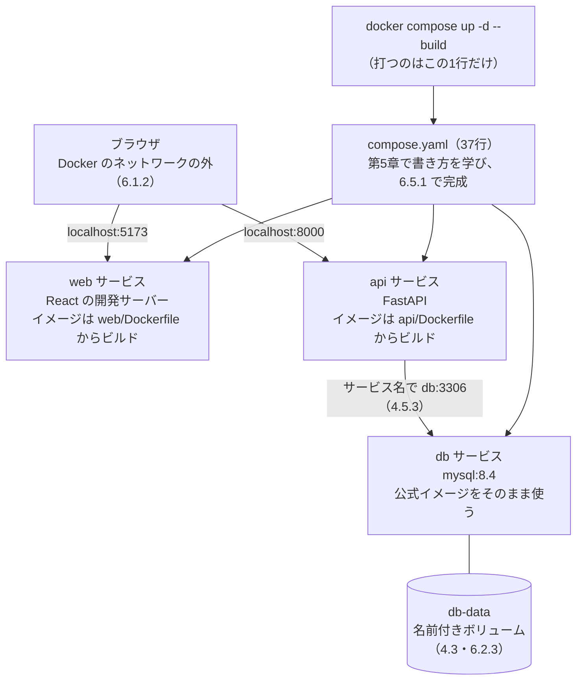
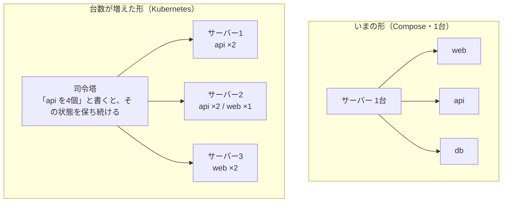
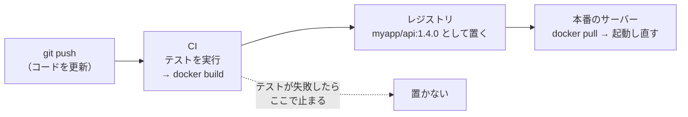
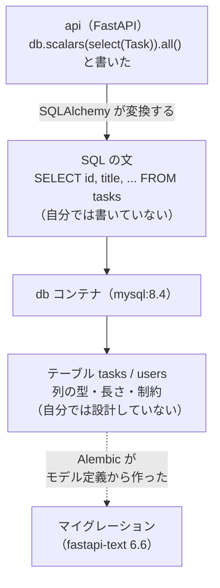

# 第8章 次のステップ

第7章で、公開する前に自分で直せるところを一通り直しました。
イメージは小さくなり、`root` で動かなくなり、開発用と本番用を切り替えられるようになりました。

**この本で教えることは、これで終わりです。**

ここで一度、最初に戻ります。第1章で、こういう話から始めました。

> アプリを他人に渡そうとすると、**要るものが8個**あり、それは頭の中にしかない。

いま、その8個はどうなったでしょうか。
`fullstack-lesson` を他人に渡すとき、お願いすることは**2つだけ**です。

1. Docker Desktop を入れてください
2. `.env` を用意して、`docker compose up -d --build` を1回実行してください

**手順書が、実行できるファイルになりました。** これがこの本のテーマでした。

この章では、その到達点を確認したうえで、**この先の地図**を見ます。

- 4冊分で身についたものを、**戻る場所つきのチェックリスト**で確認する
- **この本で触れなかった道具**（Kubernetes、CI/CD、監視）が、どの困りごとを担当するのかを知る
- いまのアプリに残っている、**まだ中身を知らない部分**を見つける
- 5冊目（MySQL）へ進む道筋を決める

新しい Docker の機能は出てきません。
代わりに、**「1台で動かせる人」から「人に渡して動かし続けられる人」になるための地図**を扱います。

## この章で学ぶこと

- 4冊分の到達点を、戻る場所つきのチェックリストで確認できるようになる
- `docker compose up -d --build` の1行が、どの本の成果物をどう起動しているかを説明できるようになる
- 他人が動かせる**引き継ぎ用の手順書**を書き、**まっさらな状態から再現**できるようになる
- **Kubernetes・レジストリ・CI/CD・監視**が、それぞれどの困りごとを担当する道具なのかを説明できるようになる
- いまのアプリで **`db` の中身が「黒い箱」のまま**であることを確認し、5冊目で何を学ぶのかを説明できるようになる

## この章の前提

- [第7章 イメージの最適化と本番運用](./07-optimization.md) を読み終えたこと
- `fullstack-lesson` が `docker compose up -d --build` で起動すること（[6.5.2](./06-practice-full-stack.md#652-1コマンドで全部起動する)）
- Docker Desktop が起動していること（[2.1.3](./02-install-and-basics.md#213-起動を確認する)）

> **補足：8.1.1 と 8.2 と 8.3 は、読むだけの節です**
> 手を動かすのは 8.1.3（手順書の見本を自分のプロジェクトに書く）と演習だけです。
> 8.2 には、**この本で扱わない道具の名前**が並びます。
> **いまインストールする必要はありません。** 「どの困りごとの担当か」だけ掴んでください。

> **つまずいたら**
> この章の演習は、**動いているものを壊さずに、別の場所でやり直す**形になっています。
> `fullstack-lesson` そのものを触るのは 8.2 の演習（メモの作成）だけです。
>
> コピーしたプロジェクトが起動しないときは、次の順で確認してください。
>
> 1. コピー先に `.env` があるか（`.env` は **`.gitignore` に入っている**ので、コピー方法によっては付いてきません。[5.5.3](./05-compose.md#553-秘密情報を-git-に入れない)）
> 2. `docker compose config` で、`${...}` が値に置き換わっているか（[5.5.2](./05-compose.md#552-環境変数ファイルを使う)）
> 3. `docker compose ps` で、どのサービスが `Up` になっていないか（[6.6.2](./06-practice-full-stack.md#662-どのコンテナが悪いか切り分ける)）
> 4. `docker compose logs --tail 30 サービス名` の最後の数行（[6.6.1](./06-practice-full-stack.md#661-ログの見方)）
>
> それでも分からないときは、第0章 0.2 で準備した AI に、次のように聞いてください。
>
> ```text
> docker-text の演習 8.3 をやっています。
> fullstack-lesson を別のディレクトリにコピーして、自分で書いた手順書だけで起動しようとしたら、
> 次のエラーで止まりました。
>
> OS: Windows 11 / macOS（どちらかを書く。Apple Silicon なら CPU も）
>
> 打ったコマンド:
>
> （ここに貼る）
>
> docker compose logs --tail 30 の出力:
>
> （ここに貼る）
>
> 原因と、直す手順を教えてください。
> ```
>
> **「元のディレクトリでは動くが、コピー先では動かない」**と伝えるのが、この演習では有効です。
> その一言で、原因が「コピーで付いてこなかったファイル」に絞られます。

---

## 8.1 ここまでで身についたこと

### 8.1.1 チェックリスト

まず、現在地を確認します。

次の表を上から見て、**「何も見ずにできるか」**で判断してください。
「読めば思い出せる」は ✅ ではありません。**手が動くかどうか**が基準です。

| # | できること | 判断のしかた | できなければ戻る場所 |
|---|-----------|------------|-------------------|
| 1 | 「自分の環境では動く」問題を説明できる | 他人の環境で動かない原因を、思いつきではなく層に分けて言えるか | [1.1.1](./01-why-docker.md#111-なぜ他人の環境で動かないのか) |
| 2 | アプリが動く土台を4層に分けられる | 設定・ライブラリ・ランタイム・OS の4つを言えるか | [1.1.3](./01-why-docker.md#113-これまでの解決策とその限界) |
| 3 | `requirements.txt` の限界を言える | 揃えられるのが4層のうちどこまでか即答できるか | [1.1.3](./01-why-docker.md#113-これまでの解決策とその限界) |
| 4 | 仮想マシンとコンテナの違いを言える | カーネルという言葉を使って違いを説明できるか | [1.2.3](./01-why-docker.md#123-何が違うのか重さ起動速度) |
| 5 | イメージとコンテナを言い分けられる | 「設計図」と「実物」のどちらが読み取り専用かを言えるか | [1.3.1](./01-why-docker.md#131-イメージ--設計図) |
| 6 | `latest` を使わない理由を言える | 3つの困りごとを挙げられるか | [2.5.5](./02-install-and-basics.md#255-latest-を使わない理由) |
| 7 | Docker が動いているかを3段階で確認できる | `docker --version` だけでは不十分な理由を言えるか | [2.1.3](./02-install-and-basics.md#213-起動を確認する) |
| 8 | コンテナを起動・停止・削除できる | `run` / `ps -a` / `stop` / `rm` を調べずに打てるか | [2.4](./02-install-and-basics.md#24-コンテナを操作する) |
| 9 | 「止めた」と「消した」の違いを言える | 停止中のコンテナが押さえ続けているものを3つ言えるか | [2.4.5](./02-install-and-basics.md#245-止めただけでは消えていない) |
| 10 | コンテナの中に入って調べられる | `docker exec -it` の `-i` と `-t` の意味を言えるか | [2.6.1](./02-install-and-basics.md#261-中に入るexec--it) |
| 11 | ログを読める | 落ちたコンテナを、消す前にやることを言えるか | [2.6.2](./02-install-and-basics.md#262-ログを見るlogs) |
| 12 | ディスクを測って片付けられる | `docker system df` の `RECLAIMABLE` の意味を言えるか | [2.7](./02-install-and-basics.md#27-掃除する) |
| 13 | Dockerfile を一から書ける | `FROM` / `WORKDIR` / `COPY` / `RUN` / `CMD` を順番に書けるか | [3.2](./03-dockerfile.md#32-基本の命令) |
| 14 | `CMD` を角かっこで書く理由を言える | シェル形式だと何が届かなくなるかを言えるか | [3.2.5](./03-dockerfile.md#325-cmd--起動時に実行するコマンド) |
| 15 | イメージをビルドして名前を付けられる | `docker build -t 名前:タグ .` の最後の `.` が何かを言えるか | [3.3.1](./03-dockerfile.md#331-docker-build) |
| 16 | キャッシュが効く順に命令を並べられる | `COPY requirements.txt .` を先に書く理由を言えるか | [3.4.3](./03-dockerfile.md#343-依存インストールを先に書く理由) |
| 17 | `.dockerignore` を書ける | 何を除外するかを4つ以上挙げられるか | [3.5.2](./03-dockerfile.md#352-書き方) |
| 18 | データが消える理由を説明できる | 「書き込み層」という言葉を使って説明できるか | [4.1.1](./04-volumes-and-networks.md#411-実際に確かめる) |
| 19 | マウントを使い分けられる | バインドマウントと名前付きボリュームの選び方を1行で言えるか | [4.3.3](./04-volumes-and-networks.md#433-バインドマウントとの使い分け) |
| 20 | `-p` の左右の意味を言える | 変えてよいのはどちらかを即答できるか | [4.4.1](./04-volumes-and-networks.md#441--p-の意味ホスト側コンテナ側) |
| 21 | `0.0.0.0` で待ち受ける必要を説明できる | `docker ps` も `logs` も正常なのに繋がらないときに何を見るか | [4.4.3](./04-volumes-and-networks.md#443-0000-で待ち受ける必要性) |
| 22 | コンテナ同士を名前で繋げる | 相手に書くポート番号が、公開したポートではない理由を言えるか | [4.5.3](./04-volumes-and-networks.md#453-コンテナ名で名前解決できる) |
| 23 | `compose.yaml` を一から書ける | `services` の下に `image` / `ports` / `volumes` を書けるか | [5.2](./05-compose.md#52-設定ファイルの書き方) |
| 24 | `down` と `down -v` の違いを言える | どちらでデータが消えるかを即答できるか | [5.4.2](./05-compose.md#542-down-と-down--v) |
| 25 | 秘密を設定ファイルの外に出せる | `.env` と `.env.example` の役割の違いを言えるか | [5.5.3](./05-compose.md#553-秘密情報を-git-に入れない) |
| 26 | 起動順を制御できる | `depends_on` だけでは足りない理由と、3段構えの中身を言えるか | [5.6](./05-compose.md#56-起動順の制御) |
| 27 | 通信経路を図に描ける | ブラウザが Docker のネットワークの外にいることを図で示せるか | [6.1.2](./06-practice-full-stack.md#612-通信経路を図にする) |
| 28 | 3サービスを1コマンドで起動できる | `compose.yaml` を見ずに、起動から確認までを通せるか | [6.5.2](./06-practice-full-stack.md#652-1コマンドで全部起動する) |
| 29 | 壊れたときに切り分けられる | 画面にエラーが出たとき、最初に見る場所を即答できるか | [6.6.2](./06-practice-full-stack.md#662-どのコンテナが悪いか切り分ける) |
| 30 | イメージのサイズの内訳を読める | `docker history` を見て、容量を食っている命令を指せるか | [7.1.2](./07-optimization.md#712-何が容量を食っているか) |
| 31 | マルチステージビルドを書ける | `AS builder` と `COPY --from=builder` を組にして書けるか | [7.2.1](./07-optimization.md#721-ビルド用と実行用を分ける) |
| 32 | `slim` と `alpine` を選べる | 選び方を1行で言えるか | [7.3.3](./07-optimization.md#733-選択の指針) |
| 33 | `root` で動かさない形にできる | `USER` を書く位置と、その理由を言えるか | [7.4.1](./07-optimization.md#741-root-で動かさない) |
| 34 | 秘密をイメージに焼き込まない | `RUN rm .env` では消えない理由を言えるか | [7.4.2](./07-optimization.md#742-秘密情報をイメージに焼き込まない) |
| 35 | 開発用と本番用を切り替えられる | `-f` を重ねたときに足し算されるものを言えるか | [7.5.1](./07-optimization.md#751-設定ファイルの上書き) |

**全部に ✅ が付く必要はありません。**
この本を1周した直後なら、半分から3分の2くらいで普通です。

大事なのは、**「できない」と気づいた項目に、戻る場所の番号が付いている**ことです。
気になった番号の項に戻り、**そこのコマンドをもう一度自分で打って**ください。
Docker は、読み返すだけでは ✅ が増えません。

> **補足：優先して埋めたい5つ**
> 全部を埋めようとすると時間がかかります。**この先で効いてくるのは、この5つ**です。
>
> - 8（コンテナを起動・停止・削除できる）——この先も毎日使います
> - 11（ログを読める）——原因を自分で見つけられるかは、ほぼここで決まります
> - 24（`down` と `down -v` の違い）——**間違えるとデータが消えます**
> - 25（秘密を設定ファイルの外に出せる）——公開したあとに間違えると、取り返しがつきません
> - 28（3サービスを1コマンドで起動できる）——5冊目の環境構築がこの形になります

### 8.1.2 4冊が1行のコマンドに繋がった

いま手元で動いているものは、**4冊分の成果物がひと続きになったもの**です。

`docker compose up -d --build` と打ったとき、何が起動しているかを図にします。



この図の**箱の中身**が、それぞれどの本で作ったものかを並べると、こうなります。

| 図の箱 | 中身 | どの本で作ったか |
|--------|------|----------------|
| `web` の中で動くコード | タスク管理の画面（`task-app`） | react-text 第10章 |
| `api` の中で動くコード | タスクと利用者の API（`fastapi-lesson`） | fastapi-text 第5章〜第9章 |
| `api` のコードの書き方 | 関数・クラス・型ヒント・例外 | python-text 全体 |
| `web` と `api` の `Dockerfile` | イメージの作り方 | docker-text 第3章・6.3・6.4 |
| `db` と `compose.yaml` | 環境そのもの | docker-text 第5章・第6章 |
| `compose.prod.yaml` と `Dockerfile.prod` | 本番向けの形 | docker-text 第7章 |

**上から下まで、すべて自分で書いたもの**です（`db` の公式イメージだけが例外で、これは他人が作ったものをそのまま使っています）。

とくに注目してほしいのは、**この本で足したものが「アプリの中」には1行も入っていない**という点です。

- `api/app/` の中の Python のコードは、fastapi-text のときから**変わっていません**
  （変えたのは接続先の文字列と、`check_same_thread` の分岐だけです。[6.3.2](./06-practice-full-stack.md#632-mysql-への接続設定)）
- `web/src/` の中の React のコードも、API の住所を環境変数から読むようにした1か所以外は**そのまま**です
  （[6.4.3](./06-practice-full-stack.md#643-api-の-url-を環境変数にする)）

つまり、この本でやったのは**アプリの作り替えではなく、「アプリが動く場所」を書き出す作業**でした。
第1章 1.1.3 で「手順書は作業を無くさない。書き出しただけ」と書きました。
Docker は、その**書き出したものを、そのまま実行できる形にした**だけです。

> **補足：だから、この形は使い回せます**
> 次に別のアプリを作ったときも、やることは同じです。
> 「土台を決める（`FROM`）→ 依存を入れる（`RUN`）→ コードを入れる（`COPY`）→
> 起動を書く（`CMD`）→ 複数あるなら並べる（`compose.yaml`）」の順です。
> **アプリが変わっても、この順番は変わりません。**

### 8.1.3 「渡せる形」になったかを確かめる

ここまでで作ったものは、**まだ渡せません。** 理由は1つです。

**`fullstack-lesson` には、手順書が入っていないからです。**

`compose.yaml` は「環境の作り方」を書いたファイルですが、
**「何を用意して、何を打てばよいか」は書いていません。**
`.env` が必要なことも、初期データを入れるコマンドがあることも、
いまのところ**あなたの頭の中にしかありません。**

そこで、`README.md` を1枚書きます。見本を示します。

`fullstack-lesson/README.md`

````markdown
# fullstack-lesson

React + FastAPI + MySQL のタスク管理アプリです。
Docker Compose で、3つのサービスをまとめて起動します。

## 必要なもの

- Docker Desktop（動作確認：Docker Engine 29 系）
- ディスクの空き容量 5 GB 以上

これだけです。Node.js と Python は**入れなくてよい**です（コンテナの中に入っています）。

## 動かし方

1. 設定ファイルを作る（初回だけ）

   `.env.example` をコピーして `.env` を作り、パスワードと鍵を自分の値に変えます。

   **Windows（PowerShell）**

   ```powershell
   Copy-Item .env.example .env
   ```

   **macOS / Linux**

   ```bash
   cp .env.example .env
   ```

2. 起動する

   ```bash
   docker compose up -d --build
   ```

   初回はイメージのビルドで数分かかります。

3. 初期データを入れる（初回だけ）

   ```bash
   docker compose exec api python -m app.seed
   ```

4. ブラウザで http://localhost:5173 を開く

## 確認

- 画面にタスクが3件表示されれば成功です
- API の窓口一覧は http://localhost:8000/docs で見られます

## 止めるとき

```bash
docker compose down
```

データは残ります。**`-v` を付けるとデータベースの中身も消えます。**

## 困ったとき

- `docker compose ps` で、3つとも `Up` になっているかを見る
- `docker compose logs --tail 30 api` で、最後の数行を読む
````

見本のポイントは4つです。

- **「必要なもの」と「動かし方」を分けている。** 前者は1回、後者は毎回やることです
- **コマンドをコピペできる形で書いている。** 説明文の中に埋め込みません
- **「どうなれば成功か」を書いている。** これが無いと、読んだ人は成功を判断できません
- **止め方と、危ない操作を書いている。** `down -v` の一言があるかないかで、事故が防げます

第1章で数えた8個と比べてみてください。

| fastapi-text 10.3.1 で要ったもの | いまの README での扱い |
|-------------------------------|---------------------|
| Node.js | 書かない（`web/Dockerfile` の中） |
| Python 3.11 以上 | 書かない（`api/Dockerfile` の中） |
| 仮想環境（`.venv`） | 書かない（コンテナの中では作らない） |
| `requirements.txt` の中身 | 書かない（`RUN pip install` が実行する） |
| `.env`（6項目） | **書く**（人が値を決めるもの。手順1） |
| テーブル（Alembic） | 書かない（`command:` が起動時に実行する） |
| `npm install` した `node_modules` | 書かない（`RUN npm ci` が実行する） |
| 起動の順番（API を先に） | 書かない（`depends_on` と `wait_for_db.py` が待つ） |

**8個のうち7個が消え、残ったのは `.env` の1個だけ**になりました。
第1章 1.4 の A / B / C の仕分けで言えば、**7個が A（Docker が肩代わり）に移り、`.env` だけが C（それでも人がやる）に残った**ということです。

> **注意：手順書は、書いただけでは正しさが分かりません**
> 自分の環境では、もう全部揃っています。だから**自分が試しても成功してしまいます。**
> 正しさを確かめる唯一の方法は、**揃っていない状態を作ってから、手順書だけで進めること**です。
>
> そのために、`fullstack-lesson` を**別のディレクトリにコピーして試します。**
> ここで効いてくるのが、[5.2.4](./05-compose.md#524-ports--volumes--environment) で見た
> **プロジェクト名の接頭辞**です。
>
> Compose は、**そのディレクトリの名前**をプロジェクト名として使い、
> ボリュームに `プロジェクト名_` を付けます。つまり、
>
> - `fullstack-lesson/` で起動 → ボリュームは `fullstack-lesson_db-data`
> - `fullstack-rehearsal/` にコピーして起動 → ボリュームは `fullstack-rehearsal_db-data`
>
> **別物です。** コピー先は、データベースが空の状態から始まります。
> だから、**元のプロジェクトのデータを壊さずに、初回起動のやり直しができます。**
>
> コピーしたあと、コピー先から**次の3つを消してください。** 理由は [6.1.3](./06-practice-full-stack.md#613-ディレクトリ構成) と同じです。
>
> | 消すもの | なぜ |
> |---------|------|
> | `.env` | **人が用意するもの**（手順1）なので、渡されていない状態にする |
> | `api/.venv` | パソコン側の OS 向けに作られたもの。コンテナの中では使わない |
> | `web/node_modules` | 同じ理由。残すと `@rollup/rollup-linux-x64-gnu` などのエラーになる |
>
> これで「**何も揃っていない他人のパソコン**」に近い状態になります。

> **よくある間違い：コピーに `.env` が付いてこない**
> `.env` は `.gitignore` に入っています（[5.5.3](./05-compose.md#553-秘密情報を-git-に入れない)）。
> そのため、**Git 経由でコピーすると `.env` だけが来ません。**
> 起動すると、`db` が次のように落ちます。
>
> ```text
> db-1  | 2026-09-12 04:11:07+00:00 [ERROR] [Entrypoint]: Database is uninitialized and password option is not specified
> db-1  |   You need to specify one of the following as an environment variable:
> db-1  |   - MYSQL_ROOT_PASSWORD
> db-1 exited with code 1
> ```
>
> これは 6.2.1 で**わざと見た**エラーです。**手順書の1番目が抜けている**という意味です。
> 「動かない」ではなく「**手順書の手順1が抜けている**」と読めるようになったのが、この本の成果です。

> **補足：`.env.example` が古くなっていないか**
> `.env.example` は、放っておくと必ず古くなります。
> `compose.yaml` の `${...}` を全部書き出して、`.env.example` の行と突き合わせてください。
> いまの `compose.yaml` には5つ（`MYSQL_ROOT_PASSWORD` / `MYSQL_DATABASE` /
> `MYSQL_USER` / `MYSQL_PASSWORD` / `SECRET_KEY`）あります。
> **突き合わせは、`docker compose config` でも代わりになります。**
> `.env` を一時的に別の名前に変えて実行すると、置き換えられなかった項目が空欄で表示されます。
>
> `.env.example` に書くのは**項目名だけ**で、**本物の値は書きません**（[5.5.3](./05-compose.md#553-秘密情報を-git-に入れない)）。
> 代わりに、**`#` で始まる行**を添えて「何を入れるか」を説明します。
> `.env` と `.env.example` では、**`#` で始まる行はコメント**（プログラムに読まれない、人間向けのメモ）として扱われます。
>
> ```text
> # MySQL の管理者パスワード。自分で決めた値を書く
> MYSQL_ROOT_PASSWORD=
> # API が JWT に署名する鍵（fastapi-text 7.4.2 のコマンドで作る）
> SECRET_KEY=
> ```

### 8.1.4 自分の実力を確認する

8.1.1 のチェックリストは知識なので、戻って打ち直せば埋まります。
**埋まらないのは「作りたいものを、サービスとイメージに分解する力」**です。これは書いた回数でしか増えません。

練習には、AI に課題を出してもらうのが手軽です。
第0章 0.2 で準備した AI に、次のように頼んでください。

```text
docker-text（プログラミング未経験から始める Docker）を1周し終えました。
この本の第7章までの範囲だけで解ける、Docker の構成課題を3問出してください。

条件:
- 使ってよいのは Dockerfile・Docker Compose・ボリューム・ネットワーク・
  マルチステージビルドまで
- Kubernetes、CI/CD、クラウドのサービスは使わない
- 各問題に「作るもの」「サービスの数」「完成条件」だけを書き、
  compose.yaml や Dockerfile の中身は書かない
- 難易度は易しい順に並べる
```

**答えを書かないよう、必ず指定してください。**
指定しないと、AI は親切に完成した `compose.yaml` を出してきます。それでは練習になりません。

出してもらった課題は、**ファイルを書く前に次の3つを紙に書き出す**ところから始めてください。
これが、この本で繰り返してきた順序です。

1. **サービスの一覧**（いくつのコンテナに分けるか。それぞれ `image` か `build` か。[6.1.1](./06-practice-full-stack.md#611-3つのサービス)）
2. **通信経路**（誰が誰を呼ぶか。ブラウザから呼ばれるものだけ `ports` を書く。[6.1.2](./06-practice-full-stack.md#612-通信経路を図にする)）
3. **消えてはいけないデータ**（どこに置くか。ボリュームか、パソコン側か。[4.3.3](./04-volumes-and-networks.md#433-バインドマウントとの使い分け)）

この3つが決まっていれば、あとはこの本の章の繰り返しになります。
決めずに書き始めると、**`ports` を書きすぎた構成**や、**`down -v` でデータが消える構成**ができます。

> **補足：題材に困ったら**
> 「1冊目から4冊目までに出てきた道具の組み合わせを変える」のがいちばん手軽です。
> たとえば「nginx で静的なページを配るサービス」＋「その裏で動く API」＋「PostgreSQL」の3つ、
> のような形です。**知らないイメージを1つだけ混ぜる**のが、ちょうどよい負荷になります。
> 公式イメージの使い方は、Docker Hub の説明を読む練習（演習 1.2）でやったとおりです。

---

## 8.2 触れなかったこと（Kubernetes など）

この本では、**1台のパソコンで、コンテナを数個動かす**ところまでを扱いました。
そこから先には、名前だけは耳にする道具がいくつもあります。

ここでは、**それぞれがどの困りごとの担当なのか**だけを整理します。
**いまインストールする必要はありません。** 困りごとに出会っていないうちは、覚えても使いません。

まず、第7章 [7.5.2](./07-optimization.md#752-本番向けの設定) で「足りないもの」として挙げた一覧を思い出してください。

- HTTPS
- バックアップ
- ログ
- 監視
- 秘密情報の管理

これらは、**Docker の使い方を覚えても埋まりません。** 別の道具の担当です。

### 8.2.1 「たくさん動かす」ための道具（Kubernetes）

**Kubernetes**（クーバネティス。多数のコンテナを、複数のサーバーにまたがって動かし続けるための道具）は、
名前をいちばんよく聞くと思います。**k8s** と略されます。

これが解決する困りごとは、はっきりしています。

- コンテナが**落ちたときに、自動で立て直したい**
- 利用者が増えたときに、**同じコンテナを何個も並べたい**
- コンテナの置き場所を、**サーバー1台ではなく数十台の中から自動で決めたい**
- 新しいイメージに、**止めずに少しずつ入れ替えたい**

いまの形と比べると、こうなります。



Compose と Kubernetes の違いは、**「何を書くか」**に表れます。

| | Docker Compose | Kubernetes |
|---|---------------|-----------|
| 書くこと | **どう起動するか**（手順に近い） | **どうあってほしいか**（状態） |
| 台数 | 1台 | 何台でも |
| 落ちたとき | 止まったまま（`restart: always` で再起動はする） | **別のサーバーに作り直す** |
| 同じものを増やす | 手で書き足す | 数字を書き換える |
| 覚える量 | この本1冊ぶん | **この本の何倍もある** |

> **補足：いま学ばなくてよい理由**
> Kubernetes は、**「サーバーが1台では足りない」「落ちたら自動で立て直したい」という
> 困りごとが実際にある人のための道具**です。
> 利用者が自分だけ、サーバーが1台のうちは、**入れても手間が増えるだけ**です。
>
> そして、Kubernetes を学ぶときに必要になる前提は、**この本で全部やりました。**
> イメージ、タグ、ボリューム、ポート、環境変数、ヘルスチェック——
> Kubernetes の設定ファイルに出てくる言葉は、ほとんどこれの言い換えです。
> **順番としては、いまで正しい**です。

### 8.2.2 「自動で作って置く」ための道具（レジストリと CI/CD）

いまイメージを作っているのは、**あなたのパソコン**です。
`docker compose up -d --build` が、その場でビルドしています。

これには2つの困りごとがあります。

- **本番のサーバーでビルドすることになる。** ビルドには時間もメモリも要りますし、
  ソースコードを本番に置くことになります
- **「誰がいつ作ったイメージか」が分からない。** 手元の作りかけのコードが混ざっていても気づけません

そこで、**レジストリ**（[1.3.1](./01-why-docker.md#131-イメージ--設計図) で名前だけ出した、イメージの置き場。Docker Hub がその1つ）に
**作ったイメージを置いて、本番はそれを取ってくるだけ**にします。

置く作業を自動にするのが **CI/CD**（シーアイ・シーディー。
コードを更新したときに、テストやビルドを自動で実行する仕組み）です。



この図で大事なのは、**イメージに `1.4.0` のようなタグが付く**ところです。
[2.5.5](./02-install-and-basics.md#255-latest-を使わない理由) で「`latest` を使わない」と書いた理由が、ここで効いてきます。
タグが付いていれば、「本番で動いているのはどのイメージか」が分かり、**1つ前に戻せます。**

必要になる道具の名前だけ挙げておきます（**いまは覚えなくてよいです**）。

| やりたいこと | 道具の例 |
|------------|---------|
| イメージを置く | Docker Hub、GitHub Container Registry、クラウド各社のレジストリ |
| push のたびに自動で実行する | GitHub Actions、GitLab CI |
| テストを自動で走らせる | fastapi-text 第8章で書いた `pytest` をそのまま使う |

> **補足：`pytest` が効いてくるのはここです**
> fastapi-text 第8章でテストを書いたとき、「いま手で確かめればいいのに」と思ったかもしれません。
> テストの価値が出るのは、**人ではなく機械が実行するとき**です。
> CI は、あなたが寝ている間にもテストを走らせます。
> **テストが無い CI は、ビルドが通ったことしか分かりません。**

### 8.2.3 「動き続けているかを見る」ための道具（ログ・監視・バックアップ）

`docker compose logs` は、**いま自分が見ているとき**だけ役に立ちます。
夜中にコンテナが落ちたことは、これでは分かりません。

7.5.2 で挙げた「足りないもの」のうち3つが、ここの担当です。

| 足りないもの | 何をする道具か | この本との繋がり |
|------------|--------------|----------------|
| ログ | コンテナが出した文字を**集めて、あとから検索できる場所に貯める** | `logs` で読んでいたもの（[2.6.2](./02-install-and-basics.md#262-ログを見るlogs)）の保存版 |
| 監視 | **生きているかを定期的に確認し、落ちたら人に知らせる** | `healthcheck`（[5.6.2](./05-compose.md#562-ヘルスチェックを設定する)）を外から、継続的にやるもの |
| バックアップ | **データを別の場所に複製し、戻せるようにする** | ボリューム（[4.3](./04-volumes-and-networks.md#43-名前付きボリューム)）の中身が対象 |

このうち、**バックアップだけは、いまの構成にとって他人事ではありません。**
理由は、[5.4.2](./05-compose.md#542-down-と-down--v) でやったことを思い出せば分かります。

**`docker compose down -v` を1回打つと、データは消えます。** 確認もされずに消えます。

手元の練習では「消えても作り直せばよい」で済みましたが、
他人が使っているデータでは済みません。**そして、Docker はバックアップを取ってくれません。**

> **注意：「消えないもの」は、ボリュームの中にあるものだけ**
> 4.1 と 6.2.3 でやったことを、もう一度はっきりさせます。
>
> | 操作 | コンテナ | イメージ | ボリューム（データ） |
> |------|---------|---------|------------------|
> | `docker compose down` | 消える | 残る | **残る** |
> | `docker compose down -v` | 消える | 残る | **消える** |
> | `docker compose up -d --build` | 作り直される | 作り直される | **残る** |
> | ボリュームを `docker volume rm` | — | — | **消える** |
>
> **`--build` を何度やってもデータは消えません。** 消えるのは `-v` を付けたときだけです。
> この表が頭に入っていないと、**「作り直す」と「データを消す」を混同します。**

具体的なバックアップの取り方は、この本では扱いません。
**MySQL のデータを取り出すのは MySQL 側の話**になるので、5冊目（mysql-text 第8章）で扱います。

### 8.2.4 Docker 自身で、この本で扱わなかった機能

Docker にも、この本で使わなかった機能があります。
**必要になってから調べれば十分**なので、名前と用途だけ置いておきます。

| 機能 | 何のためのものか | いつ気になるか |
|------|----------------|--------------|
| `docker swarm` | Docker 自身が持つ、複数台への配置機能 | 8.2.1 の困りごとが出たとき（ただし Kubernetes を選ぶ場面が多い） |
| Compose の `profiles` | サービスを「普段は起動しない」グループに分ける | 演習 6.4 の管理画面のように、時々だけ使うサービスが増えたとき |
| `docker buildx` の複数 CPU 向けビルド | Apple Silicon 用と Intel 用のイメージを同時に作る | 自分と違う CPU の人にイメージを渡すとき（[2.2.3](./02-install-and-basics.md#223-apple-silicon-での注意点)） |
| `secrets`（Compose の機能） | 秘密をファイルとして渡し、環境変数に出さない | 秘密の扱いを本気で固めるとき（[7.4.2](./07-optimization.md#742-秘密情報をイメージに焼き込まない) の続き） |
| `docker compose watch` | ファイルの変更を見て、自動で同期・再ビルドする | バインドマウントでは追いつかない場面が出たとき |

> **補足：この一覧の読み方**
> 右の列を見てください。**すべて「〜したとき」と書いてあります。**
> 道具は、困りごとが先にあって初めて意味を持ちます。
> **困っていないうちに入れた道具は、動かなくなったときに疑う場所を増やすだけ**です
> （6.5.1 で `depends_on` について書いたのと同じ話です）。

残る2つ——**HTTPS** と **秘密情報の管理**——の担当も、ここで決めておきます。

**HTTPS は、Docker の担当ではありません。**
7.5.3 で見たとおり、**イメージを置く場所（デプロイ先）が用意する**のが普通です。
PaaS やコンテナ実行サービスは、たいてい HTTPS を最初から用意しています。
自分でサーバーを借りる（VPS）場合は、**リバースプロキシ**（外からのリクエストを最初に受け取り、
中のアプリへ振り分ける係。7.2.2 で使った nginx がこれもできます）を前に1つ立てて、
そこで HTTPS を終わらせる形になります。

**秘密情報の管理**は、7.4.2 でやった「実行時の環境変数で渡す」で、まず足ります。
それでも足りなくなるのは、**渡す相手が増えたとき**です。
そのときの選択肢が、**上の表にある Compose の `secrets`** と、デプロイ先が持つ預かり機能（7.5.3）です。

これで、7.5.2 の「足りないもの」5つすべてに担当が付きました。

| 足りないもの | 担当 | 説明した場所 |
|------------|------|------------|
| HTTPS | デプロイ先、またはリバースプロキシ（**Docker の外の話**） | 8.2.4 |
| バックアップ | 自分で仕組みを作る。MySQL 側の取り出し方は5冊目 | 8.2.3 |
| ログ | ログを集めて貯める道具 | 8.2.3 |
| 監視 | 外から定期的に確認して、落ちたら知らせる道具 | 8.2.3 |
| 秘密情報の管理 | 実行時の環境変数 → Compose の `secrets` やデプロイ先の仕組み | 8.2.4 |

**この5つは、どれも「いますぐ全部やる」ものではありません。**
優先順位を付けるところまでを、演習 8.4 でやります。

---

## 8.3 次の本（MySQL）へ

### 8.3.1 `db` は、まだ黒い箱のまま

いまのアプリで、**自分がいちばん中身を知らないもの**は何でしょうか。

`db` サービスです。

第6章でやったことを思い出してください。`mysql:8.4` の公式イメージを持ってきて、
環境変数を4つ渡して、ボリュームを繋いだ——**それだけ**です。
中でどうデータが並んでいるのかは、ほとんど見ていません。

見たのは、[6.2.4](./06-practice-full-stack.md#624-接続を確認する) と
[6.5.3](./06-practice-full-stack.md#653-通しで動作確認する) の2回だけです。

```text
SHOW TABLES;
SELECT id, title, done FROM tasks;
```

この2行を打って、表が出てきたのを見ました。
**あの `SHOW TABLES;` と `SELECT` が、SQL です。** そして、この本ではそれ以上進みませんでした。

いまアプリの中で何が起きているかを、もう一度図にします。



**2か所、自分で書いていないものがあります。**

- **SQL の文**。SQLAlchemy が組み立ててくれました（fastapi-text 6.1.3）
- **テーブルの形**。Alembic が、Python のモデル定義から作りました（fastapi-text 6.6.3）

これで動いてはいます。ですが、次のような場面では手が止まります。

| 場面 | いまの知識でできるか |
|------|-------------------|
| 一覧の表示が、データが増えたら遅くなった | **原因を調べられない**（どこが遅いのかを見る道具を知らない） |
| 「利用者ごとのタスク件数」を出したい | **書けない**（複数のテーブルをまとめて数える方法を知らない） |
| 本番のデータを、別の場所に取り出したい | **できない**（8.2.3 のバックアップ） |
| テーブルの列の型を、あとから変えたくなった | Alembic の手順は知っているが、**どの型を選ぶべきか判断できない** |
| 「同じメールアドレスを登録できてしまう」不具合 | `unique=True` は書いたが、**なぜそれで防げるのかを説明できない** |

**この5つが、5冊目の内容です。**

### 8.3.2 5冊目で扱うこと

5冊目の [mysql-text](../mysql-text/README.md) は、**`db` の中を開けて、自分で SQL を書く**本です。

| 章 | 扱うこと | いまの困りごととの対応 |
|----|---------|--------------------|
| 第1章 | データベースが何を解決するのか | ファイルに保存するのでは何がだめなのか |
| 第2章 | **環境構築（Docker で MySQL を起動する）** | **この本の第2章・第5章がそのまま前提** |
| 第3章 | `SELECT` でデータを取り出す | `SHOW TABLES;` の次を自分で書けるようになる |
| 第4章 | `INSERT` / `UPDATE` / `DELETE` とトランザクション | `commit` が何をしていたのかが分かる |
| 第5章 | テーブル設計（型・制約・主キー・外部キー） | 「どの型を選ぶべきか」に答えが出る |
| 第6章 | 結合と集計 | 「利用者ごとのタスク件数」が書けるようになる |
| 第7章 | インデックスと実行計画 | 「増えたら遅くなった」の原因を自分で見つけられる |
| 第8章 | アプリから使う（バックアップ・SQL インジェクション） | 8.2.3 で残したバックアップが、ここで埋まる |

注目してほしいのは、**第2章**です。

mysql-text の環境構築は、**この本で学んだことだけで終わります。**

```bash
docker compose up -d
```

MySQL のインストーラを探す必要はありません。バージョンで悩む必要もありません。
文字コードの設定（mysql-text 2.6）も、`compose.yaml` に書いて配れます。

**3冊目までは、本が変わるたびに環境構築で1章ぶん苦労していました。**
4冊目を終えたいまは、それが `compose.yaml` の数行になります。
これが、Docker を5冊目の前に置いた理由です。

> **補足：練習用のデータベースは、アプリとは別に立てます**
> mysql-text 第2章では、**練習用の MySQL を新しく1つ立てます**（`fullstack-lesson` の `db` とは別です）。
> 練習で `DELETE` を打ち間違えても、アプリのデータは無事です。
> **別のプロジェクト名にすればボリュームも別**になる、という 8.1.3 の話がそのまま使えます。

### 8.3.3 フェーズ1の締めくくりへ

5冊目を終えると、このテキスト集の**フェーズ1「作れるようになる」が完了**します。
そのとき到達している状態を、はっきり書いておきます。

- 画面を作れる（react-text）
- 処理を書ける（python-text）
- それを HTTP の窓口として公開し、データを保存し、認証をかけ、テストできる（fastapi-text）
- **動く環境ごと、他人に渡せる形にできる**（docker-text）
- **データの置き方を自分で設計し、取り出し方を自分で書ける**（mysql-text）

ここまで来れば、**「Web アプリを一人で作って動かせる」**と言えます。

その先（ネットワーク、データベース設計、クラウド、設計手法）は、
[`docs/roadmap.md`](../docs/roadmap.md) に置いてあります。
**いまは見なくてよいです。** 5冊目を終えてから、興味の向いたものを選んでください。

> **補足：4冊目を終えた時点で、もう止まってよい場所ではありません**
> いまのアプリは、**データベースの中身が分からないまま動いています。**
> これは「動けばよい」で済ませられる範囲を、すでに超えています。
> データが増えたとき、壊れたとき、取り出したくなったときに、**手が止まります。**
>
> 5冊目は、この本と同じくらい実用的です。**続けて読んでください。**

---

## まとめ

- 他人に渡すときにお願いすることが、**8個から2個（Docker Desktop と `.env`）に減った**（8.1.3）
- この本でやったのは**アプリの作り替えではなく、「アプリが動く場所」を書き出す作業**だった（8.1.2）
- `api/app/` の Python のコードは、fastapi-text のときから**ほとんど変わっていない**（8.1.2）
- チェックリストは「読めば思い出せる」ではなく **「何も見ずにできるか」** で判断する（8.1.1）
- 優先して埋めたいのは、**ログを読む・`down` と `down -v` の違い・秘密を外に出す**（8.1.1）
- 手順書には **「必要なもの」「動かし方」「確認」「止め方」** を書き、成功の判断基準を必ず入れる（8.1.3）
- **自分の環境で試しても手順書の正しさは分からない。** 別のディレクトリにコピーして確かめる（8.1.3）
- コピー先は**プロジェクト名が変わるのでボリュームも別**になり、元のデータを壊さずに試せる（8.1.3）
- `.env` は `.gitignore` に入っているので、**Git 経由のコピーでは付いてこない**（8.1.3）
- **Kubernetes は「落ちても動き続ける」「台数を増やす」ための道具。** 困りごとが出るまで要らない（8.2.1）
- Compose は**どう起動するか**を書き、Kubernetes は**どうあってほしいか**を書く（8.2.1）
- イメージは**レジストリに置き、本番は取ってくるだけ**にする。CI/CD がその作業を自動にする（8.2.2）
- タグを付けておくと「本番で動いているのはどれか」が分かり、**1つ前に戻せる**（8.2.2）
- 7.5.2 の「足りないもの」5つには、**すべて担当の道具がある**。HTTPS は Docker の外の話（8.2.4）
- **Docker はバックアップを取ってくれない。** `down -v` は確認もされずにデータを消す（8.2.3）
- `--build` を何度やってもデータは消えない。消えるのは **`-v` を付けたとき**だけ（8.2.3）
- 道具の一覧は「〜したとき」で読む。**困っていないうちに入れた道具は、疑う場所を増やすだけ**（8.2.4）
- いまのアプリでは、**SQL の文とテーブルの形を自分で書いていない**（8.3.1）
- 5冊目は `db` の中を開ける本で、**環境構築はこの本で学んだことだけで終わる**（8.3.2）

---

## 理解度チェック

**問 8.1**（穴埋め）

第1章 1.1.3 では、手順書や `requirements.txt` で揃えられるのは4層のうち（　①　）までで、
（　②　）と（　③　）は揃わないと書きました。
Docker では、この2つが Dockerfile の（　④　）の行で決まります。

**問 8.2**（選択）

この本の範囲で、Kubernetes を使う動機として最も適切なものを1つ選んでください。

1. イメージのサイズを小さくしたいから
2. 1台では足りない数のコンテナを、落ちても動き続ける形で動かしたいから
3. Dockerfile を書かずに済ませたいから
4. 手元の開発でのビルドを速くしたいから

**問 8.3**（選択）

イメージをレジストリに置き、本番のサーバーはそれを取ってくるだけにする利点として、
最も適切なものを1つ選んでください。

1. レジストリを経由すると、イメージが自動的に小さくなるから
2. 本番でビルドしなくてよくなり、**どのイメージが動いているかをタグで特定できる**から
3. レジストリに置くと `.dockerignore` が不要になるから
4. レジストリを使うとビルドキャッシュが効かなくなるから

**問 8.4**（選択）

`fullstack-lesson` で、**データベースの中身が消える**操作を1つ選んでください。

1. `docker compose down`
2. `docker compose up -d --build`
3. `docker compose down -v`
4. `docker compose restart`

**問 8.5**（記述）

引き継ぎ用の `README.md` に「どうなれば成功か」を書く理由を、1〜2行で書いてください。

**問 8.6**（記述）

自分の環境で手順書を試しても、その手順書が正しいかどうかは分かりません。
**その理由**と、**正しさを確かめる方法**を1〜2行で書いてください。

**問 8.7**（記述）

いまのアプリでは、`tasks` テーブルの列の型や長さを自分で決めた覚えがありません。
**誰が決めたのか**を1行で書いてください。

---

## 演習問題

この章の演習は、**メモを作る問題**と、**別のディレクトリで試す問題**です。
`fullstack-lesson` そのものを壊す操作はありません（演習 8.2 でファイルを1つ足すだけです）。

演習 8.2 と 8.3 は繋がっています。**8.2 を終えてから 8.3 に進んでください。**

---

### 演習 8.1 ★☆☆ チェックリストで現在地を測り、戻る場所を3つ決めて手を動かす

**課題**

8.1.1 のチェックリスト（35項目）を、自分に対して使ってください。
そのうえで、**できていなかったものを3つ選んで、実際に手を動かして埋めます。**

**完成条件**

- 35項目すべてに、`✅`（何も見ずにできる）／`△`（読めば思い出せる）／`✗`（分からない）のいずれかを付けた
- `✗` と `△` の数を数え、メモに書いた
- その中から**3つ**選んだ（迷ったら 8.1.1 の「優先して埋めたい5つ」から選ぶ）
- 選んだ3つについて、**「戻る場所」の項をもう一度開き、そこにあるコマンドを自分で打ち直した**
- 打ったコマンドと、その出力をメモに残した（出力は最後の数行でよい）
- 3つのうち1つについて、**「なぜ忘れていたか」**を1行で書いた
  （例：「1回しか打っていない」「意味を考えずに写した」など）

**ヒント**

判断の基準は 8.1.1 の1行目に書いてあります。「読めば思い出せる」は `✅` ではありません。
`✗` が多くても問題ありません。**この表の価値は、数ではなく「戻る場所が付いていること」**です。
打ち直すコマンドが手元の環境を壊さないか不安なときは、
`docker compose down -v` を含む項（[5.4.2](./05-compose.md#542-down-と-down--v)）だけは避けてください。

---

### 演習 8.2 ★☆☆ `fullstack-lesson/README.md`（引き継ぎ用の手順書）を書く

**課題**

`fullstack-lesson` に `README.md` を作り、**他人がこのアプリを動かせる手順書**を書いてください。
8.1.3 の見本をそのまま真似して構いませんが、**自分のプロジェクトの実際の状態に合わせる**ことが課題です。

あわせて、`.env.example` が古くなっていないかを確認します。

**完成条件**

- `fullstack-lesson/README.md` を作り、次の4つの見出しがある
  - 「必要なもの」「動かし方」「確認」「止めるとき」
- 「必要なもの」が**2つ以内**に絞られている（Node.js や Python を書いていない）
- 「動かし方」が**番号付き**で並び、コマンドが**コピペできる形**で書かれている
- `.env` を作る手順が、**Windows と macOS の両方**書かれている
- 「確認」に、**どうなれば成功か**が書かれている（画面に何が出るか）
- 「止めるとき」に `docker compose down` があり、**`-v` を付けるとデータが消える**ことが書かれている
- `compose.yaml` の `${...}` を全部書き出し、`.env.example` の行と突き合わせた
  - **5つあります。** 足りない行があれば書き足した
  - 各行に `#` で始まるコメントを1行添え、「何を入れるか」を書いた
  - `.env.example` に、**本物のパスワードや鍵の値が書かれていない**

**ヒント**

見本は 8.1.3 にあります。4つのポイント（分ける／コピペできる形／成功の判断基準／危ない操作）を、
そのまま当てはめてください。
`compose.yaml` の全文は [6.5.1](./06-practice-full-stack.md#651-設定ファイルを完成させる) にあります。
`${...}` の突き合わせは、`docker compose config`（[5.5.2](./05-compose.md#552-環境変数ファイルを使う)）でも代わりになります。
「必要なもの」に何を書かないかは、8.1.3 の最後の表を見てください。

---

### 演習 8.3 ★★☆ 自分の手順書だけを見て、まっさらな状態から起動する

**課題**

演習 8.2 で書いた手順書が、**本当に他人を動かせるか**を確かめてください。

`fullstack-lesson` を**別の名前のディレクトリにコピー**し、
**元のプロジェクトは一度も触らずに**、書いた手順書だけを見て最後まで進めます。

> **注意：コピー元では絶対に `down -v` を打たないでください。**
> この演習で操作するのは、コピー先のディレクトリだけです。

**完成条件**

- `fullstack-lesson` を、`fullstack-rehearsal` など**別の名前**のディレクトリにコピーした
- コピー先から、**次のものを削除した**（＝揃っていない状態を作る）
  - `.env`
  - `api/.venv`（あれば）
  - `web/node_modules`（あれば）
- コピー先で `docker compose ps` を実行し、**このプロジェクトのコンテナが1つも無い**ことを確認した
- **手順書だけを見て**、起動から「画面にタスクが3件表示される」までを通した
  （元のディレクトリのファイルも、この章の本文も見ないこと）
- 途中で詰まった箇所を記録し、**その内容を `README.md` に書き足した**
- コピー先のデータベースが、**元のプロジェクトとは別のボリューム**になっていることを確認した
  （`docker volume ls` に、プロジェクト名の違う2つが並ぶ）
- 確認できたら、コピー先で `docker compose down -v` を実行し、ディレクトリを削除して片付けた
- **元のプロジェクトが、いまも `docker compose up -d` で動く**ことを最後に確認した

**ヒント**

「揃っていない状態を作る」意味は、8.1.3 の「重要」の囲みに書いてあります。
`.env` を消して起動したときに `db` が出すメッセージは、8.1.3 の「よくある間違い」と同じものです。
**そのメッセージを見たら、手順書の何番が抜けているかを考えてください。**
ボリュームがプロジェクトごとに分かれる仕組みは [5.2.4](./05-compose.md#524-ports--volumes--environment) にあります。
`docker volume ls` は [4.3.2](./04-volumes-and-networks.md#432-作成確認削除) で使いました。
**詰まった箇所こそが、手順書に足りなかったところ**です。直したら演習は成功です。

---

### 演習 8.4 ★★★ 「足りないもの」に道具を割り当て、次の一歩を1つ決める

**課題**

第7章 7.5.2 で「足りないもの」として挙げた5つに、**8.2 のどの道具が担当するか**を割り当て、
**自分のアプリにとっての優先順位**を付けた計画書を作ってください。

この演習には、**決まった正解がありません。**
「どれも大事」で終わらせず、**順番を付けて、理由を書く**ところまでが課題です。

**完成条件**

- 次の5行を持つ表を作った（左の列）
  - HTTPS / バックアップ / ログ / 監視 / 秘密情報の管理
- 各行に、次の3つを書いた
  1. **担当する道具**（8.2.1〜8.2.4 のどれか、または「Docker の外の話」）
  2. **いまの自分のアプリで、これが無いと何が起きるか**（1行）
  3. **優先順位**（1〜5。同じ順位は付けない）
- 優先順位の根拠を、**次の2つの観点**に触れて書いた
  - 利用者が何人いるか（自分だけか、他人が使うか）
  - **失われたときに取り返せるか**
- **1位に置いたものについて**、第0章 0.2.2 の質問テンプレートの形で AI に投げる質問文を作り、
  実際に投げて答えを読んだ
  - 質問文には「章番号」「環境」「やろうとしていること」を入れること
  - 返ってきた答えのうち、**この本の範囲（第7章まで）で確認できること1つ**を手元で実行し、
    その結果をメモに書いた
- 計画書を `fullstack-lesson/docs/next-steps.md` として保存した
  （置き場所と名前は自由。**次に公開を考えるときに自分で読み返せる形**にすること）

**ヒント**

5つの一覧は 7.5.2 の最後にあります。**担当の割り当ては、8.2.4 の最後の表に答えがあります**（写して構いません）。
この演習の中身は、そこから先の**2番と3番**——自分のアプリで何が起きるか、どれを先にやるか——です。
「取り返せるか」の観点は、8.2.3 の「重要」の囲みの表がそのまま材料になります。
**バックアップを1位にする人が多くなるはずですが、それでよいです。**
そう判断した理由を書けることが、この演習の目的です。

質問テンプレートの形は [0.2.2](./00-introduction.md#022-docker-はとくに環境依存が多い) にあります。
「この本の範囲で確認できること」の例としては、
`docker volume ls` でデータの置き場所を確かめる、`docker compose config` で設定の渡り方を確かめる、
といった**すでに打ったことがあるコマンド**を選ぶのが確実です。

---

解答は [解答編](./90-answers.md#第8章) にあります。
**必ず自分で手を動かしてから**見てください。

---

## 次の章へ

**この本は、ここで終わりです。**

4冊を通して、あなたは次のことができるようになりました。

- ブラウザの中で動く画面を作る（1冊目）
- Python で、値を受け取って値を返す処理を書く（2冊目）
- その処理を HTTP の窓口として公開し、データを保存し、認証をかけ、テストする（3冊目）
- **その全部を、動く環境ごと1つのコマンドで起動できる形にして、他人に渡す**（4冊目）

そして最後に、**渡すときにお願いすることが2つに減った**ことを確かめました（8.1.3）。

残っているのは1つです。**`db` の中身**です。

5冊目では、その黒い箱を開けます。
`SHOW TABLES;` の次を自分で書き、テーブルを自分で設計し、
「増えたら遅くなった」の原因を自分で見つけられるようになります。

そして、その環境構築は——**この本で学んだことだけで終わります。**

→ [プログラミング未経験から始める MySQL](../mysql-text/README.md)
