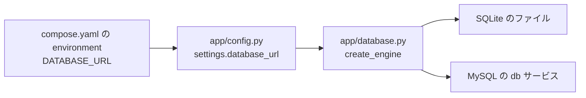
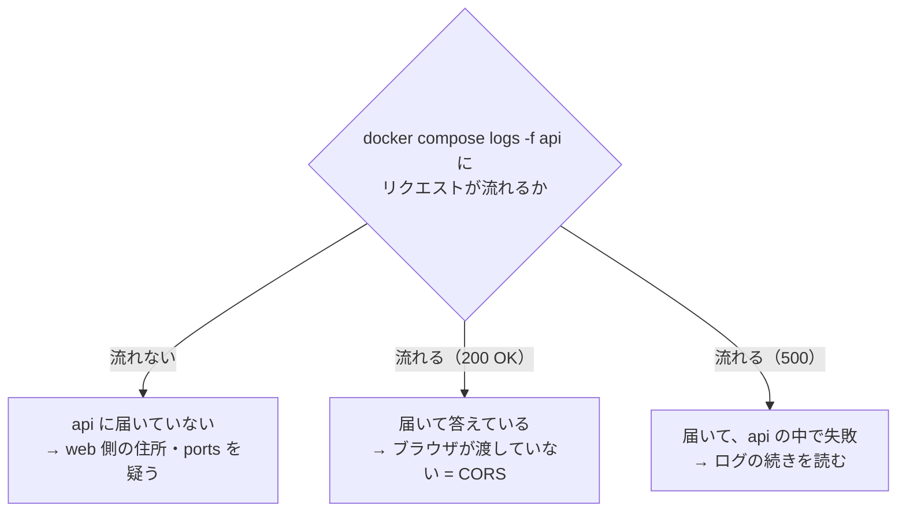

# 解答編

**先に自分で解いてから読んでください。**

解けなかった問題は、この解答を読んだあと、
**何も見ずにもう一度自分でやり直して**ください。それで定着します。

Docker の演習は、**実際に手を動かして確かめるまでが1問**です。
解答を読んで納得しても、自分のターミナル（第2章以降）や自分のメモの上で
同じものが作れるところまで進めてください。

エラーが出た状態は失敗ではありません。**何が起きているかを読み取る材料**です。

> **解答を読んでも納得できないとき**
> 第0章 0.2 で準備した AI に、次のように聞いてください。
>
> ```text
> docker-text の演習 1.2 の解答を読みましたが、
> 配布用に latest を選んではいけない理由が納得できません。
> docker-text の第1章までの知識だけを使って説明してください。
> ```

---

## 第1章

### 理解度チェック

**問 1.1 の解答**

- ① **ライブラリ**
- ② **ランタイム**

**解説**

プログラムが動くための土台は、上から
**① 設定 → ② ライブラリ → ③ ランタイム → ④ OS** の4層でできています（1.1.1）。

`requirements.txt` や `package.json` に書けるのは、
「FastAPI の 0.115.6 を使う」といった**ライブラリのバージョン**までです。
「Python 3.13 を使う」とは書けません（1.1.3）。

ここが、この本の出発点です。
**揃えられない③④の層を、まるごと配ってしまおう**というのがコンテナの発想でした（1.1.2）。

なお `venv`（python-text 1.5）も、揃えてくれるのは②までです。
仮想環境を作っても、その中で動く Python 本体は、
**パソコンに入っているものをそのまま使っています。**

---

**問 1.2 の解答**

**2** の「カーネルをホストと共有するので、起動が速く、サイズが小さい」

**解説**

ほかの3つが誤りである理由は、次のとおりです。

| 選択肢 | 何が違うか |
|-------|-----------|
| 1 | ゲスト OS をアプリごとに持つのは**仮想マシン**のほう（1.2.1） |
| 3 | コンテナの中身は原則 Linux。**Windows のソフトは動かない**（1.2.3 のよくある間違い） |
| 4 | コンテナは仮想マシンより**負荷が小さい**。高性能な CPU は必要ない |

選択肢1と3は、「コンテナ = 軽い仮想マシン」と覚えてしまった人が引っかかる形です。
**2つは仕組みがそもそも別物**でした（1.2.3）。
仮想マシンは OS を丸ごと積み、コンテナはカーネルを共有します。

---

**問 1.3 の解答**

**2** の「イメージは読み取り専用の設計図で、そこから複数のコンテナを作れる」

**解説**

設計図（イメージ）と建物（コンテナ）の関係です（1.3.2）。

| 選択肢 | 何が違うか |
|-------|-----------|
| 1 | 向きが逆。**イメージが先にあり、そこからコンテナを作る**（1.3.3） |
| 3 | 別物。**イメージは読み取り専用、コンテナは書き込み層を持つ**（1.3.2） |
| 4 | 逆。**コンテナを消してもイメージは残る**。だから作り直せる（1.4.2） |

選択肢4は、実際の作業で最も効いてくる違いです。
コンテナを消してもイメージが残るからこそ、
「壊れたら消して作り直す」という対処が成立します。

---

**問 1.4 の解答**

**解答例**

> 仮想マシンの起動はゲスト OS のカーネルを含む OS 全体の起動だが、
> コンテナはホストのカーネルを共有するため、プロセスを1つ立ち上げるだけで済むから。

**解説**

「速い」の理由を、**仕組みから説明できているか**が採点の分かれ目です（1.2.3）。

- 仮想マシンの起動 = **OS の起動**。カーネルの読み込みから各種サービスの立ち上げまで行う
- コンテナの起動 = **プロセスを1つ起動するだけ**

「コンテナは軽いから速い」だけでは、**なぜ軽いのか**が説明できていません。
軽さの理由が「カーネルを共有していて、ゲスト OS を積まないから」である点まで
たどり着けていれば正解です。

> **補足**
> この性質が効いてくるのは、速さそのものよりも
> **「気軽に消して作り直せる」**という点です（1.4.2）。
> 作り直しに数分かかるなら、誰も気軽には壊しません。

---

**問 1.5 の解答**

**タグ**と呼びます。

省略すると **`latest` というタグが選ばれ、時期によって中身が変わってしまいます。**

**解説**

`python:3.13-slim` の `:` の前が名前、後ろがタグです（1.3.1）。

間違えやすいのは、`latest` を「最新版」という意味だと思ってしまうことです。
`latest` は、**単に `latest` という名前が付けられたイメージ**にすぎません。
そして、その名前がどのイメージに付いているかは、時期によって変わります。

つまり、**半年後に同じコマンドを打つと、違うものが降ってきます。**
これでは 1.1.2 で確認した「組み合わせを1つに固定する」という目的が果たせません。

このテキストでは常にタグを明示します。理由の詳細は第2章 2.5.5 で扱います。

---

**問 1.6 の解答**

**解答例**

> イメージは読み取り専用で変化せず、コンテナ側の変更は削除時に消える書き込み層に
> 書かれているから。

**解説**

コンテナを起動すると、Docker はイメージの上に
**書き込み用の薄い層を1枚だけ**乗せます（1.3.2）。
コンテナの中での変更は、すべてこの層に書かれます。

そのため、

- コンテナを削除する = **書き込み層だけが消える**
- イメージは1文字も変わっていない
- もう一度作れば、**必ず起動直後の状態**になる

という関係が成り立ちます。

> **よくある間違い**
> 「必ず戻る」のは**コンテナの中身**だけです。
> コンテナの中に保存したデータも一緒に消えます（第4章 4.1 で対策します）。
> 「戻る」と「消える」は同じ性質の裏表だと理解してください。

---

### 演習問題

### 演習 1.1 の解答

**解答例**（数字は環境によって違います。自分の表示に合わせてください）

```text
# fastapi-lesson 引き継ぎメモ

## ① 設定
- .env に DATABASE_URL と APP_NAME を書く（fastapi-text 4.6.2）
- node と python に PATH が通っていること

## ② ライブラリ
- requirements.txt に記載（fastapi 0.115.6 / pydantic 2.13.5 /
  sqlalchemy 2.0.36 / alembic 1.14.0）
- React 側は package.json に記載

## ③ ランタイム
- Python 3.13.2（python --version の表示）
- Node.js v22.14.0（node --version の表示）

## ④ OS
- Windows 11 Home
- CPU: Intel Core i5（Apple Silicon ではない）

## requirements.txt では揃えられないもの
- ③ ランタイム（Python 本体・Node.js 本体のバージョン）
- ④ OS（Windows か macOS か、CPU の種類）

## 組み合わせの数
OS 3 × CPU 2 × Python 3 × Node.js 3 = 54 通り
```

**解説**

この演習の目的は、**「自分が動作確認したのは 54 分の1でしかない」と気づくこと**です。

ポイントは3つあります。

**1. ③に具体的な数字を書けたか**

「最新版」と書いてしまった人は、ここでもう一度コマンドを打ってください。
1.1.2 で見たとおり、**「最新版」は時期によって指すものが変わる**ため、
条件を固定したことになりません。これは 1.3.1 の `latest` の話と同じ構造です。

**2. ①に `.env` を挙げられたか**

`.env` は Git に入れないファイルです（fastapi-text 4.6.2）。
つまり、**コードをコピーしただけでは相手に渡りません。**
1.4.1 の仕分けで「C（それでも人がやる）」に入るのは、このためです。

**3. 「揃えられないもの」を正しく③④と答えられたか**

②と答えてしまった場合は、1.1.3 の表を読み直してください。
`requirements.txt` が担当しているのは、まさに②の層です。

> **別解：もっと細かく数える**
> ライブラリのバージョンや、シェル（PowerShell / bash / zsh）まで数えれば、
> 組み合わせは数千通りになります。
> 数が大きいほど、**全部を確認するのは不可能**という結論は強くなります。
> 数の正確さより、**掛け算で増えるという構造**を捉えられていることが大切です。

---

### 演習 1.2 の解答

**解答例**（サイズは調査時点のもので、更新されると変わります）

| タグ | 圧縮後のサイズ（目安） | 中身 | 備考 |
|------|------------------|------|------|
| `3.13` | 約 350 MB | Debian ベースの標準構成。ビルド用の道具が一通り入っている | バージョンは固定される |
| `3.13-slim` | 約 45 MB | 最小限の Debian + Python 本体 | `3.13` よりはっきり小さい |
| `latest` | そのときの最新版と同じ | 時期によって中身が変わる | **将来、別のバージョンを指すようになる** |

- `3.13` と `3.13-slim` では、**`3.13-slim` のほうが小さい**（約 350 MB に対して約 45 MB）
- `python` は **Docker Official Image**（公式イメージ）である
- **配布用に選ぶなら `3.13-slim`。**
  タグでバージョンが固定されるので、いつ誰が取得しても同じ Python 3.13 になり、
  1.1.2 の「組み合わせを1つに固定する」という目的を満たせるため。

**解説**

**なぜ `latest` を選んではいけないのか**が、この演習の核心です。

`latest` は「常に最新」という便利な指定に見えます。
しかし、配布する立場で考えると、これは**条件を固定しないという宣言**にほかなりません。

- 今日あなたが取得した `latest` は Python 3.13 かもしれない
- 半年後に同僚が取得した `latest` は Python 3.14 かもしれない
- **2人とも同じコマンドを打っているのに、違う環境ができあがる**

これは、1.1.1 で見た「自分の環境では動く」問題を、**自分で作り直している**状態です。
Docker を使っているのに、Docker を使う目的を打ち消してしまっています。

**サイズの数字が解答例と違っていても問題ありません。**
Docker Hub のイメージは更新され続けるため、数字は変わります。
確認してほしいのは、**`slim` が付くと小さくなる**という関係のほうです。

> **よくある間違い**
> Tags のタブには、`3.13`、`3.13.1`、`3.13-slim`、`3.13-alpine` のように
> 似た名前が並びます。**サイズを比べるときは、同じ行の数字を見てください。**
> また、Docker Hub は環境（CPU の種類）ごとに別々のサイズを表示することがあります。
> その場合は、自分の CPU に合う行を見てください（1.4.3 の補足）。

> **補足：`alpine` を選ばなかった理由**
> Tags を見ると、`3.13-alpine` はさらに小さいことが分かります。
> ただし alpine には、この段階では説明していない落とし穴があります。
> **サイズだけで選ばない**理由は、第7章 7.3.2 で扱います。
> この演習では `3.13-slim` を選んでいれば正解です。

---

### 演習 1.3 の解答

**解答例**

```text
# fastapi-lesson を他人に渡すときの手順書（Docker 導入前）

1. Python 3.13 をインストールする                    → A
2. Node.js 22 をインストールする                     → A
3. 仮想環境を作って有効化する                        → A
4. pip install -r requirements.txt を実行する        → A
5. .env を作って DATABASE_URL を書く                 → C
6. alembic upgrade head でテーブルを作る             → A
7. fastapi dev app/main.py で API を起動する         → A
8. 別のターミナルで npm install / npm run dev        → A
9. （新規）Docker Desktop をインストールする         → B

## C にした理由
5 は、接続先やパスワードを「人が決めて渡すもの」であり、
自動化すると秘密の情報を配ることになってしまうため。

## 相手に伝える手順
3行になる。
  1. Docker Desktop を入れる
  2. 渡した .env をプロジェクトに置く
  3. docker compose up と打つ

## 1コマンドにするために必要なこと
アプリを作った側が、Dockerfile と Compose の設定ファイルを
あらかじめ書いて、コードと一緒に渡しておく必要がある。
```

**解説**

**8手順が3行になりました。** これが Docker を導入する効果です。

採点のポイントは、次の3つです。

**1. C に入れたものが妥当か**

C（それでも人がやる）に入るのは、**人が決めて渡すべきもの**です。
典型例が、`.env` に書くパスワードや接続先です（1.4.1）。

ここを A にしてしまった場合は、
「その設定ファイルを Git に入れて配ることになる」と考えてみてください。
fastapi-text 4.6.2 で `.env` を Git に入れなかった理由と同じです。

**2. B を書き忘れていないか**

Docker の導入で、手順は減るだけではありません。
**「Docker Desktop を入れる」という手順が新しく増えます**（1.4.1 の表の最終行）。

これを書き忘れると、「相手に伝える手順」が2行になってしまいます。
**増える手順も正直に数える**のが、この仕分けの要点です。

**3. 「誰が用意するのか」に答えられたか**

`docker compose up` の1行で動くのは、
**その1行が何をするかを書いたファイルが用意されているから**です（1.4.1 の注意）。

このファイルを書くのは、渡す側の人間です。
そして、その書き方を学ぶのが第3章から第6章です。
**1回書けば、以降は何百回でも1コマンドで済む**という理解ができていれば十分です。

> **別解：A をさらに細かく分ける**
> 実務では、A の中を「イメージを作るときにやること（第3章）」と
> 「コンテナを起動するときにやること（第5章）」に分けます。
> 上の例では、1〜4 が前者、6〜8 が後者にあたります。
> この区別は第3章と第5章で扱うので、いまの段階で分けられていなくても構いません。

> **よくある間違い**
> 「手順が減った」ことだけを成果と考えると、判断を誤ります。
> 本当の成果は、**残った3行が、相手の OS や CPU に左右されない**という点です。
> 手順1〜4は、相手が Windows か macOS かで内容が変わりました。
> 置き換わったあとの3行は、どちらでも同じです。

---

## 第2章

### 理解度チェック

**問 2.1 の解答**

- ① **取得**（ダウンロード）
- ② **作成**
- ③ **起動**

**解説**

`docker run` は1つのコマンドに見えますが、中では3つの動作が順に走っています（2.3.2）。

| 順番 | 動作 | 単独で実行するコマンド |
|-----|------|------------------|
| ① | イメージが手元に無ければレジストリから取得する | `docker pull`（2.5.2） |
| ② | イメージからコンテナを作る | `docker create` |
| ③ | 作ったコンテナを起動する | `docker start`（2.4.2） |

このことは、実行結果からも読み取れました。
1回目の実行では `Unable to find image 'hello-world:latest' locally` と表示され、
ダウンロードの行が流れましたが、**2回目には出ませんでした。**
イメージがすでに手元にあり、①が省かれたためです。

なお②と③が別物であることは、`docker ps -a` の `STATUS` にも現れます。
`Created` は「②までは終わったが、③がまだ」という状態です（2.4.1）。

---

**問 2.2 の解答**

**2** の「Docker Desktop が起動していない（デーモンが動いていない）」

**解説**

2.1.3 で確認したとおり、`docker` は**2つの部品**に分かれています。

- **CLI（Client）**… あなたが打つ `docker` コマンド
- **デーモン（Server）**… コンテナを実際に動かす本体

`docker --version` は、CLI が自分のバージョンを答えるだけなので、
**デーモンが止まっていても成功します。**
一方 `docker ps` は、デーモンに「いまあるコンテナを教えて」と聞きに行くコマンドなので、
デーモンが止まっていれば失敗します。

つまり「`--version` は通るのに `ps` は通らない」という組み合わせは、
**CLI は無事で、デーモンだけが動いていない**ことを示しています（2.2.4）。

**1が違う理由**：CLI が入っていなければ `docker --version` も
「コマンドが見つかりません」で失敗します。

**3が違う理由**：`docker ps` は手元の状態を見るだけで、通信しません。
インターネットが必要なのは `docker pull`（2.5.2）です。

**4が違う理由**：コンテナが1つも無い場合は、**エラーではなく見出しだけの空の表**が返ります。

> **よくある間違い**
> このエラーを見て、Docker を再インストールしようとする人がいます。
> **原因はインストールではなく、起動していないことです。**
> まずクジラのアイコンを確認してください（2.2.4）。

---

**問 2.3 の解答**

**2** の `http://localhost:3000`

**解説**

`-p 3000:80` は「**外側:内側**」の順で書きます（2.3.3）。

- 左の `3000` … **あなたのパソコン側**のポート番号
- 右の `80` … **コンテナの中**のポート番号

ブラウザはあなたのパソコンから接続するので、見るのは**左の番号**です。
`http://localhost:3000` にアクセスすると、Docker がそれをコンテナの 80 番へ転送し、
中で待っている nginx が応答します。

**1が違う理由**：`http://localhost:80`（＝ `http://localhost`）は、
あなたのパソコンの 80 番です。ここでは誰も待っていません。
右の `80` は**コンテナの中の番号**であって、パソコン側の番号ではありません。

**3が違う理由**：`8080` はこのコマンドのどこにも出てきません。
本文の例が `8080` だったために選びやすい選択肢ですが、
**指定した番号は `3000`** です。

---

**問 2.4 の解答**

**解答例**

`docker stop` はコンテナを停止するだけで、**書き込み層を持ったまま残る**ため、
`docker start` で続きから動かせる。
`docker rm` は**その書き込み層ごとコンテナを削除する**ので、中で作ったものは消える。

**解説**

第1章 1.3.2 で、コンテナはイメージの上に**書き込み用の薄い層を1枚**乗せたものだと説明しました。
この層の行方が、2つのコマンドの違いです。

| | 書き込み層 | 名前 | ディスク | `docker ps` | `docker ps -a` |
|---|----------|------|---------|------------|---------------|
| `stop` した後 | **残る** | **押さえたまま** | **使ったまま** | 出ない | 出る |
| `rm` した後 | 消える | 空く | 空く | 出ない | 出ない |

2.4.5 の状態遷移図でいえば、`stop` は「実行中 → 停止中」の移動にすぎず、
**消滅への道は `rm` しかありません。**

この違いが実務で効くのは、次の2つの場面です。

1. **名前が空かない**：2.3.3 で見た
   `Conflict. The container name "/web" is already in use` は、停止中のコンテナが名前を
   押さえ続けているために起きます
2. **イメージが消せない**：問 2.5 のとおりです

> **よくある間違い**
> 「`docker ps` に出ないから消えた」と判断しないでください。
> 停止中のコンテナは `docker ps -a` にだけ出ます（2.4.1）。

---

**問 2.5 の解答**

**解答例**

- **なぜ失敗したのか**：そのイメージから作られたコンテナが残っているため
  （停止中のコンテナでも消せない）。
- **どうすれば消せるのか**：先に `docker rm`（動いていれば `docker stop` してから）で
  コンテナを削除し、そのあとで `docker rmi nginx:1.27` を実行する。

**解説**

エラーメッセージの後半に、原因がそのまま書かれています。

```text
conflict: unable to delete nginx:1.27 (must be forced)
 - container a5db5e67a1d7 is using its referenced image 6784fb0834aa
```

**「コンテナ `a5db5e67a1d7` が、このイメージを使っている」**という報告です。
`docker ps -a` でこの ID を探すと、該当するコンテナが見つかります。

依存の向きは、2.5.3 の図のとおりです。

```text
イメージ  ←  コンテナがぶら下がっている
```

**下（コンテナ）から順に消す**のが正しい順番になります。

```bash
docker rm -f a5db5e67a1d7
docker rmi nginx:1.27
```

> **別解：`-f` で強制する方法について**
> メッセージに `(must be forced)` とあるとおり、`docker rmi -f` で強制削除もできます。
> ただし、この場合コンテナのほうは残ったまま、参照先のイメージだけが消えます。
> **中途半端な状態になるため、このテキストでは勧めません。**
> コンテナを先に消してください。

> **よくある間違い**
> 「コンテナは止めてあるから関係ない」と考えてしまう間違いです。
> **停止中でもコンテナは存在しており、イメージを掴んでいます**（問 2.4）。

---

**問 2.6 の解答**

**解答例**

`latest` は「最新」という意味ではなく、タグを省略したときに補われる**ただの既定の名前**で、
中身は時期によって変わる。それでは第1章 1.1.2 の
「**組み合わせを1つに固定して、それごと配る**」という目的が果たせないため、
このテキストではタグを明示する。

**解説**

第1章 1.1.2 で、条件の組み合わせが 162 通りに膨れ上がることを確認し、
**「組み合わせを1つに固定する」**という方針を立てました。
Docker を使う目的そのものが、この一点にあります。

`latest` を使うと、その固定が外れます。具体的には次のことが起こります（2.5.5）。

| 問題 | 具体例 |
|------|-------|
| 中身が黙って変わる | 同じ `docker run` が、半年後には別のバージョンを動かす |
| 手元と相手で違うものが動く | 自分は先週取得、相手は今日取得。中身が違う |
| 原因調査ができない | 「昨日まで動いていた」の原因を追えない |

つまり `latest` は、**Docker を導入した意味を自分から手放す指定**です。

なお、2.5.4 で確かめたとおり、`nginx:1.27` を指定しても中身は `1.27.5` でした。
**タグは中身と1対1ではありません。**
ただし `1.27` と書いてあれば「1.27 系である」ことは固定されるので、
このテキストではここまでを標準としています。

---

### 演習問題

### 演習 2.1 の解答

**解答例（実行したコマンドの順）**

```bash
docker run -d --name web1 -p 8080:80 nginx:1.27
docker run -d --name web2 -p 8081:80 nginx:1.27
docker ps
docker stop web1
docker stop web2
docker rm web1
docker rm web2
docker ps -a
```

**実行結果**

2つ起動したあとの `docker ps` は、次のようになります。

```text
CONTAINER ID   IMAGE        COMMAND                  CREATED         STATUS         PORTS                  NAMES
b2c1a0f9e8d7   nginx:1.27   "/docker-entrypoint.…"   3 seconds ago   Up 2 seconds   0.0.0.0:8081->80/tcp   web2
4fe08e16794e   nginx:1.27   "/docker-entrypoint.…"   9 seconds ago   Up 8 seconds   0.0.0.0:8080->80/tcp   web1
```

最後の `docker ps -a` は、見出しだけになります。

```text
CONTAINER ID   IMAGE     COMMAND   CREATED   STATUS    PORTS     NAMES
```

**解説**

この演習の要点は、**`-p` の左だけを変える**ことです（2.4.4）。

```text
-p 8080:80   ← 1つ目
-p 8081:80   ← 2つ目。変えたのは左だけ
```

右の `80` を変えなかったのは、**コンテナの中の nginx が 80 番で待っているから**です。
中の nginx は、外から何番で呼ばれるかを知りません。
そこを繋ぎ替えるのが Docker の役目です。

もう1つの要点は、**同じイメージから2つのコンテナが作れる**ことです。
第1章 1.3.3 で「1つのイメージから何個でもコンテナを作れる」と学んだことを、
ここで実際に確認しました。`docker images` を見ても、
**`nginx:1.27` は1行しかありません。** ディスクを2倍使ってはいないのです。

**片づけの順番**

`stop` してから `rm` する順番が必要でした（2.4.3）。
動いているまま `docker rm web1` を打つと、次のエラーになります。

```text
Error response from daemon: cannot remove container "web1": container is running:
stop the container before removing or force remove
```

> **別解：まとめて指定する**
> `stop` と `rm` は、**複数のコンテナ名を並べて書けます。**
>
> ```bash
> docker stop web1 web2
> docker rm web1 web2
> ```
>
> 4行が2行になります。`docker rm -f web1 web2` なら1行ですが、
> `-f` は普段は使わない方針でした（2.4.3）。

> **よくある間違い**
> `-p 8081:8081` としてしまうと、`docker ps` には `Up ...` と出るのに、
> ブラウザには何も表示されません。
> **コンテナの中の 8081 番では、誰も待っていない**ためです（2.4.4）。
> `PORTS` の列が `0.0.0.0:8081->8081/tcp` になっていたら、この間違いです。

---

### 演習 2.2 の解答

**解答例（実行したコマンドの順）**

```bash
docker run -d --name web -p 8080:80 nginx:1.27
docker cp ./myindex.html web:/usr/share/nginx/html/index.html
docker exec web cat /usr/share/nginx/html/index.html
docker rm -f web
docker run -d --name web -p 8080:80 nginx:1.27
docker exec web cat /usr/share/nginx/html/index.html
```

**実行結果**

差し替えたあとの `docker exec` は、自作の内容を返します。

```text
<h1>Hello from my index</h1>
```

このときブラウザを再読み込みすると、**`Hello from my index`** と表示されます。

作り直したあとの同じコマンドは、元の内容に戻ります。

```text
<!DOCTYPE html>
<html>
<head>
<title>Welcome to nginx!</title>
...
```

ブラウザにも「Welcome to nginx!」が戻ります。

**「なぜ戻るのか」の解答例**

`docker cp` で書き換えたのは、**コンテナの書き込み層**であって、イメージではない。
イメージは読み取り専用で変わらないため、同じイメージから作り直したコンテナは、
必ず起動直後の状態（＝イメージのままの `index.html`）から始まる。

**解説**

第1章 1.3.2 の図を、実際に確かめたことになります。

```text
イメージ nginx:1.27（読み取り専用・変わらない）
  └─ コンテナ web の書き込み層 ← docker cp が書いたのはここ
        └─ docker rm で、この層ごと消える
```

**押さえてほしいのは、この性質が「良いこと」と「困ること」の両方だという点です。**

| 見方 | 意味 |
|------|------|
| **良いこと** | おかしくなっても、作り直せば必ず元に戻る（第1章 1.4.2） |
| **困ること** | 設定変更もデータも、作り直すと消える |

そして、この「困ること」への答えが、次の章以降になります（2.6.3 の表）。

| やりたいこと | 方法 | 章 |
|------------|------|----|
| 調査のため1回取り出す | `docker cp` | 2.6.3 |
| イメージに最初から入れておく | `Dockerfile` の `COPY` | 第3章 3.2.3 |
| 手元のファイルを常に反映させる | バインドマウント | 第4章 4.2 |

**演習 2.2 で体験したのは、「`docker cp` は3行目（その場しのぎ）だった」ということ**です。

> **よくある間違い**
> ブラウザに古い内容が表示され続けることがあります。
> **ブラウザがページを保存している（キャッシュ）ため**です。
> `Ctrl` + `F5`（macOS は `command` + `shift` + `R`）で、強制的に読み込み直してください。
> コンテナ側が正しいかどうかは、ブラウザではなく
> `docker exec web cat ...` の結果で判断するほうが確実です。

> **別解：`docker exec -it web bash` で中に入って確認する**
> 2.6.1 で学んだ形でも確認できます。
>
> ```bash
> docker exec -it web bash
> cat /usr/share/nginx/html/index.html
> exit
> ```
>
> 1回見るだけなら `docker exec web cat ...` のほうが短く済みます。
> **中で複数の調査をしたいときは `-it` で入る**、と使い分けてください。

---

### 演習 2.3 の解答

**解答例（実行したコマンドの順）**

```bash
docker pull python:3.13-slim
docker pull python:3.12-slim
docker images
docker run --rm python:3.13-slim python --version
docker run --rm python:3.12-slim python --version
docker ps -a
```

**実行結果**

```text
IMAGE              ID             DISK USAGE   CONTENT SIZE
python:3.12-slim   78387bc3881b        190MB         48.4MB
python:3.13-slim   9d2e5553305c        189MB         48.2MB
```

```text
Python 3.13.15
```

```text
Python 3.12.14
```

`docker ps -a` には、この2つのコンテナは出てきません。

**「3冊のやり方ではなぜ面倒だったか」の解答例**

パソコンに直接インストールする方式では、Python は基本的に1つしか使えず、
別のバージョンを試すには入れ替えるか、切り替えの仕組みを別に用意する必要があった
（第1章 1.3.3）。

**解説**

**要点は `--rm` です**（2.4.3）。

このコマンドは「バージョンを表示したら終わり」なので、
コンテナを残しておく理由がありません。`--rm` を付けたことで、
**終了と同時に自動で削除**され、`docker ps -a` が汚れませんでした。

もう1つの要点は、`docker run` の**イメージ名のあとにコマンドを書く形**です（2.5.4）。

```text
docker run --rm python:3.13-slim python --version
             ^^^^^^^^^^^^^^^^^^ ^^^^^^^^^^^^^^^^
             イメージ            中で実行するコマンド
```

本文では `nginx:1.27` に `nginx -v` を実行させました。**形はまったく同じ**です。

**タグの `3.13` と、出力の `3.13.15` の差**にも注目してください。
2.5.4 で `nginx:1.27` の中身が `1.27.5` だったのと同じ現象です。
**タグは中身と1対1ではありません。**

**「同居している」の意味**

いま、あなたのパソコンには次の3つが同時に存在しています。

| どこに | 何が | 確認方法 |
|-------|------|---------|
| パソコンに直接 | あなたが python-text 第1章で入れた Python | `python --version` / `python3 --version` |
| イメージの中 | Python 3.13.15 | `docker run --rm python:3.13-slim python --version` |
| イメージの中 | Python 3.12.14 | `docker run --rm python:3.12-slim python --version` |

**3つは互いに干渉しません。** 片方を消しても、他方は無傷です。
第1章 1.3.3 で「試したい設定を試すには、いま動いている設定を壊すしかなかった」と
書いた問題が、ここで解消されています。

> **よくある間違い**
> `--rm` を付け忘れると、確認のたびに停止済みのコンテナが1つずつ溜まります。
> `docker ps -a` を見て `Exited (0)` が並んでいたら、この状態です。
> 片づけ方は演習 2.4 で扱います（`docker container prune`）。

> **補足：`python` と打つと何が起きるか**
> `docker run --rm -it python:3.13-slim python` のように**コマンドを `python` だけ**にすると、
> コンテナの中で Python の対話モード（python-text 2.2 で使ったもの）が起動します。
> このとき `-it` が必要です（2.6.1）。**入力を送り続ける必要がある**ためです。
> 抜けるときは `exit()` と入力します。

---

### 演習 2.4 の解答

**解答例（実行したコマンドの順）**

```bash
docker system df
docker ps -a
docker container prune
docker images
docker rmi hello-world:latest
docker system df
```

**実行結果**

片づける前：

```text
TYPE            TOTAL     ACTIVE    SIZE      RECLAIMABLE
Images          3         1         471.8MB   282.6MB (59%)
Containers      2         1         57.34kB   4.096kB (7%)
Local Volumes   0         0         0B        0B
Build Cache     0         0         0B        0B
```

停止中のコンテナの削除：

```text
Deleted Containers:
9e0c851a3b88aea28e46a8d93e4e66dace6cb0b2396391332f76f123cf9315b4
47096bdc52548b3c5be6889370cb3459a585627a11324fc8caf74c73653cc680

Total reclaimed space: 57.34kB
```

イメージの削除：

```text
Untagged: hello-world:latest
Deleted: sha256:5dd0d3e6e255913fc30f90b9f2b1d359cc2cbdb48090cc4b65f1676e203243cc
```

**数字はあなたの環境によって変わります。** 一致しなくても構いません。

**「どれを消してどれを残したか」の解答例**

`hello-world` を消し、`nginx:1.27` と `python:3.13-slim` は残した。
`hello-world` は 2.3.1 の動作確認に使っただけで、以降は使わない。
一方 `nginx` と `python` は、第3章で `Dockerfile` を書くときに土台として使う
（残しておけば再ダウンロードが不要になる）。

**「`docker system prune -a --volumes` を使わない理由」の解答例**

`-a` は**使っていないイメージをすべて**消すため、残しておきたい `nginx` や `python` まで
消えてしまう。さらに `--volumes` は**ボリューム（保存したデータ）**まで消すので、
第6章でデータベースを扱うようになると、消してはいけないものを消す事故につながる。

**解説**

この演習の目的は、コマンドを覚えることではなく、
**「何が消えるかを確認してから消す」という順番を体に入れること**です（2.7.2 の図）。

```text
測る（system df） → 見る（ps -a / images） → 消す（prune / rmi） → もう一度測る（system df）
```

**`RECLAIMABLE` の読み方**

前の結果の `Images` の行は、次のように読みます。

| 表示 | 意味 |
|------|------|
| `TOTAL 3` | イメージが3つある |
| `ACTIVE 1` | そのうち、コンテナに使われているのは1つだけ |
| `SIZE 471.8MB` | 3つ合計で 471.8 MB |
| `RECLAIMABLE 282.6MB (59%)` | **掃除すれば 282.6 MB（全体の 59%）空けられる** |

`ACTIVE` と `TOTAL` の差が大きいほど、無駄が溜まっています。

**`prune` の確認メッセージは、読むためにある**

`docker container prune` を実行すると、必ず確認を求められます。

```text
WARNING! This will remove all stopped containers.
Are you sure you want to continue? [y/N]
```

`[y/N]` の **`N` が大文字**なのは、そのまま `Enter` を押すと「いいえ」になるという意味です。
つまり **`y` を打たない限り、何も消えません。**

`docker system prune -a` では、この一覧が4行に増えます（2.7.1）。
**行が増えたということは、消える対象が増えたということです。**
インターネットで見つけたコマンドを貼り付ける前に、
**この一覧を読む習慣**を付けてください。

> **よくある間違い**
> 「容量が足りないから」と、いきなり `docker system prune -a --volumes` を実行してしまう事故が、
> 実務でも起きています。**ボリュームには第6章でデータベースの中身が入ります。**
> 第1章 1.4.2 の「消して作り直せる」は、**コンテナの話であって、データの話ではありません。**
> このテキストでは、`--volumes` を付けた掃除は最後まで指示しません。

> **別解：Docker Desktop の画面から消す**
> 2.7.1 の補足のとおり、Docker Desktop の Containers / Images の一覧からも削除できます。
> **消える対象を目で見て確認できる**ので、慣れないうちはこちらのほうが安全です。
> ただし第6章では、画面では追いきれない数を扱うようになります。
> **コマンドで測って消せること**を、この段階で身につけておいてください。

---

## 第3章

### 理解度チェック

**問 3.1 の解答**

- ① **`RUN`**
- ② **`CMD`**

**解説**

この2つの取り違えは、Dockerfile を書き始めた人がほぼ全員通る間違いです（3.2.4 / 3.2.5）。

| 命令 | いつ動くか | 結果はどこに残るか |
|------|----------|-----------------|
| `RUN` | **`docker build` のとき**（1回だけ） | **イメージのレイヤ**に残る |
| `CMD` | **`docker run` のとき**（起動のたび） | 残らない。実行されるだけ |

見分け方は、「**作るときの作業か、動かすときの作業か**」です。

- パッケージのインストール、ファイルの配置 → **作るときの作業**なので `RUN`
- サーバーの起動、スクリプトの実行 → **動かすときの作業**なので `CMD`

サーバーの起動を `RUN` に書いてしまうと、ビルドがその行で待ち続け、
**いつまでも終わりません。** ビルドが進まないときは、まずここを疑ってください。

**問 3.2 の解答**

**2. `pip install` が再実行される**

**解説**

3.4.3 で実際に体験した状態です。この Dockerfile は、

```dockerfile
COPY . .
RUN pip install --no-cache-dir -r requirements.txt
```

の順番になっています。`main.py` を変更すると `COPY . .` のレイヤが作り直しになり、
**それより下にある `RUN pip install` も、道連れで作り直しになります**（3.4.2）。

インストールする内容は1文字も変わっていないのに、20 秒以上待たされます。
直し方は、`requirements.txt` だけを先にコピーすることです（3.2.5 / 3.4.3）。

```dockerfile
COPY requirements.txt .
RUN pip install --no-cache-dir -r requirements.txt
COPY . .
```

**選択肢 3 が誤り**である点も確認してください。
キャッシュが効いても、**変更したファイルは必ず入り直します**（3.4.2 の「よくある間違い」）。
「キャッシュ＝古いコードが入る」ではありません。

**問 3.3 の解答**

**3. `requirements.txt`**

**解説**

`requirements.txt` は、**`RUN pip install -r requirements.txt` が読むファイル**です（3.2.4）。
除外すると、ビルドは次のエラーで失敗します。

```text
ERROR: failed to solve: failed to compute cache key: "/requirements.txt": not found
```

残りの3つは、いずれも `.dockerignore` に書くべきものです（3.5.1 / 3.5.2）。

| 除外するもの | 理由 |
|------------|------|
| `.venv/` | あなたのパソコン向けに作られたもの。**コンテナの中では `RUN pip install` が入れ直す** |
| `node_modules/` | 同じ理由。加えて数百 MB あり、送るだけで時間がかかる |
| `.env` | **秘密の値が入っている。** イメージに焼き込むと、渡した相手に一緒に渡ってしまう |

**問 3.4 の解答**

- **原因**：`EXPOSE` は「このポートを使う」という申告にすぎず、**ポートを公開しない**ため
- **対処**：`docker run` に **`-p 8000:8000`** を付けて起動し直す

**解説**

3.2.6 で扱ったとおりです。`EXPOSE` を書いても書かなくても、
ブラウザから繋がるかどうかは **`-p`（2.3.3）だけ**で決まります。

`docker ps` の `PORTS` 列を見ると、状態がはっきりします。

```text
PORTS
8000/tcp                   ← EXPOSE だけ。外からは繋がらない
0.0.0.0:8000->8000/tcp     ← -p を付けた。外から繋がる
```

**矢印（`->`）があるかどうか**が見分け方です。

なお、`-p` を付けても繋がらない原因がもう1つあります。
コンテナの中のサーバーが `127.0.0.1` で待っている場合です（3.2.5 の表）。
FastAPI なら、`fastapi dev` ではなく **`fastapi run`** を使ってください。

**問 3.5 の解答**

**解答例**

`.` は**ビルドコンテキスト**、つまり「いまいるディレクトリの中身を、
材料としてまるごと Docker デーモンに送る」という指定です。
`COPY` でコピーできるのは、この送られた範囲の中にあるファイルだけです。

**解説**

3.3.1 の図のとおり、ビルドは**あなたのパソコンではなくデーモンが行います**（2.1.3）。
デーモンは、あなたのディレクトリを勝手に覗けません。
だから、**材料を先に送る**必要があります。

ここから、次の2つが説明できます。

- `COPY ../secret.txt .` が失敗する理由（送られた範囲の外にあるため。3.2.3）
- `.venv/` を除外するとビルドが速くなる理由（送る量が減るため。3.5.1）

**問 3.6 の解答**

**解答例**

`alembic upgrade head` で作られた `app.db` は、**そのコンテナの書き込み層**にありました。
コンテナを削除すると書き込み層ごと消えるため、
新しく作ったコンテナはイメージの状態（テーブルが無い状態）から始まります。

**解説**

第1章 1.3.2 の図が、そのまま当てはまります。

| どこにあるか | コンテナを消すと |
|------------|---------------|
| イメージのレイヤ（アプリのコード） | **残る**（何個作り直しても同じ） |
| コンテナの書き込み層（`app.db`） | **消える** |

第2章の演習 2.2 で、`docker cp` で差し替えた `index.html` が元に戻ったのと、まったく同じ現象です。

**「では `RUN alembic upgrade head` と Dockerfile に書けばよいのでは」**と考えた場合、
半分だけ正解です。テーブルの器はイメージに入りますが、
**アプリを使い始めてから増えたデータは、やはりコンテナを消すたびに消えます。**
必要なのは、データを**コンテナの外**に置くことです（第4章）。

---

### 演習問題

### 演習 3.1 の解答

**解答例（`main.py` の変更）**

```diff
  @app.get("/")
  def read_root():
-     return {"message": f"{greeting} from a container! (v3)"}
+     return {"message": f"{greeting} from a container! by 田中"}
```

**解答例（実行したコマンドの順）**

```bash
docker build -t greeting-api:0.3.0 .
docker images
docker run -d --name greet3 -p 8000:8000 greeting-api:0.3.0
docker run --rm greeting-api:0.3.0 python --version
docker rm -f greet3
docker ps -a
```

**実行結果**

ビルドの出力で、`pip install` の行が `CACHED` になります。

```text
 => CACHED [3/5] COPY requirements.txt .                                         0.0s
 => CACHED [4/5] RUN pip install --no-cache-dir -r requirements.txt              0.0s
 => [5/5] COPY . .                                                               0.1s
```

`docker images` には2行並びます（ID は別のものになります）。

```text
IMAGE                  ID             DISK USAGE   CONTENT SIZE
greeting-api:0.3.0     c41b7e9a2d38        281MB         88.4MB
greeting-api:0.2.0     7f3c1ab29e04        281MB         88.4MB
```

最後のコマンドは、サーバーではなくバージョン表示になります。

```text
Python 3.13.7
```

**「なぜサーバーが起動しないか」の解答例**

イメージ名のあとにコマンドを書くと、`CMD` に書いた
`fastapi run main.py --port 8000` が**丸ごと差し替えられる**ためです（3.2.7 / 3.3.3）。

**解説**

この演習の要点は、**キャッシュが効く範囲を目で確認する**ことです。

`main.py` を変えたのに `pip install` が `CACHED` になったのは、
その手前の `COPY requirements.txt .` までが前回とまったく同じだからです（3.4.2）。
もし `CACHED` にならなかった場合は、Dockerfile が 3.4.3 の実験用（`COPY . .` が先）のままです。
3.2.6 の完成形に戻してください。

> **よくある間違い**
> `docker build -t greeting-api .`（タグ無し）で作ってしまう間違いです。
> それでは `greeting-api:latest` になり、`0.2.0` との区別が付きません。
> **中身を変えたら、必ず別のタグを付けてください**（3.3.2）。

> **補足：2つのイメージは 281 MB ずつ場所を取っているのか**
> 取っていません。共通のレイヤ（`python:3.13-slim` と `pip install` の結果）は**共有されます**（3.4.1）。
> 増えたのは `COPY . .` のレイヤ（数百バイト）だけです。
> `DISK USAGE` の列は「このイメージが使っている合計」なので、単純に足すと二重に数えることになります。

---

### 演習 3.2 の解答

**解答例（`nginx-custom/Dockerfile`）**

```dockerfile
FROM nginx:1.27

COPY index.html /usr/share/nginx/html/index.html
```

**解答例（実行したコマンドの順）**

```bash
docker build -t my-nginx:0.1.0 .
docker run -d --name mysite -p 8080:80 my-nginx:0.1.0
docker rm -f mysite
docker run -d --name mysite -p 8080:80 my-nginx:0.1.0
docker rm -f mysite
```

**実行結果**

`http://localhost:8080` に「Docker で作った自分のイメージです」と表示されます。
**削除して作り直しても、同じ表示のままです。**

**「`CMD` を書かなくても nginx が起動する理由」の解答例**

`CMD` を書かない場合、**ベースイメージの `CMD` がそのまま引き継がれる**ためです（3.2.5 の補足）。
`nginx:1.27` には nginx を起動する `CMD` が書かれているので、それが使われます。

**「演習 2.2 との違い」の解答例**

演習 2.2 では `docker cp` で**コンテナの書き込み層**を書き換えたため、
コンテナを作り直すと元の「Welcome to nginx!」に戻りました。
今回は `COPY` で**イメージのレイヤ**に入れたので、
そのイメージから作るコンテナには、最初から自分のページが入っています（3.2.3 の比較表）。

**解説**

2行で書けてしまう Dockerfile ですが、この章の要点がすべて入っています。

| 行 | 何をしているか |
|----|--------------|
| `FROM nginx:1.27` | 土台に、動く Web サーバーを丸ごと持ってくる（3.2.1） |
| `COPY index.html /usr/...` | **絶対パス**を指定して、決まった場所にファイルを置く（3.2.3） |

`WORKDIR` を書かなかったのは、`COPY` の行き先を絶対パスで指定したためです。
`WORKDIR` は「以降の命令の現在地」を決めるものなので、
現在地を使わないなら書く必要はありません（3.2.2）。

> **よくある間違い**
> コピー先を `/usr/share/nginx/html`（ディレクトリ）ではなく、
> `/usr/share/nginx/html/index.html`（ファイル名まで）と書く形を推奨しています。
> ディレクトリを指定しても動きますが、**ファイル名を変えたときに事故ります。**
> `mypage.html` をコピーしてディレクトリだけ指定すると、
> `index.html` は元のまま残り、**「Welcome to nginx!」が表示され続けます。**

> **別解：確認を `docker exec` で行う**
> ブラウザの代わりに、コンテナの中を直接見ても確認できます（2.6.1）。
>
> ```bash
> docker exec mysite cat /usr/share/nginx/html/index.html
> ```
>
> ブラウザのキャッシュに惑わされないので、**表示が変わらないときの切り分け**に使えます。

---

### 演習 3.3 の解答

**解答例（`hello-cli/Dockerfile`）**

```dockerfile
FROM python:3.13-slim

WORKDIR /code

COPY greet.py .

ENTRYPOINT ["python", "greet.py"]

CMD ["World"]
```

**解答例（実行したコマンドと結果）**

```bash
docker build -t hello-cli:0.1.0 .
```

```bash
docker run --rm hello-cli:0.1.0 世界
```

```text
Hello, 世界!
```

```bash
docker run --rm hello-cli:0.1.0 世界 --times 3
```

```text
Hello, 世界!
Hello, 世界!
Hello, 世界!
```

```bash
docker run --rm hello-cli:0.1.0
```

```text
Hello, World!
```

```bash
docker run --rm hello-cli:0.1.0 --help
```

```text
usage: greet.py [-h] [--times TIMES] name

名前を受け取ってあいさつする

positional arguments:
  name           あいさつする相手の名前

options:
  -h, --help     show this help message and exit
  --times TIMES  繰り返す回数
```

**「`requirements.txt` と `RUN` が要らない理由」の解答例**

`argparse` は Python の**標準ライブラリ**で、Python 本体に最初から入っています。
`FROM python:3.13-slim` の時点で使える状態なので、追加のインストールが要りません（3.2.4）。

**解説**

要点は、**固定する側と、差し替えられる側の役割分担**です（3.2.7）。

| 命令 | 書いた内容 | 役割 |
|------|----------|------|
| `ENTRYPOINT` | `["python", "greet.py"]` | **常に実行される。** 使う人には変えられない |
| `CMD` | `["World"]` | **引数の既定値。** 書き換えられる |

`docker run --rm hello-cli:0.1.0 世界` は、
`ENTRYPOINT` の後ろに `世界` が付いて `python greet.py 世界` になります。
`CMD` の `World` は、引数を渡したときは捨てられます。

**`CMD` だけで書くとどうなるか**も確かめておくと、違いがはっきりします。

```dockerfile
CMD ["python", "greet.py", "World"]
```

この形で `docker run --rm hello-cli:0.1.0 世界` を実行すると、
`CMD` が丸ごと `世界` に差し替わり、次のエラーになります。

```text
docker: Error response from daemon: failed to create task for container:
failed to create shim task: OCI runtime create failed: ... exec: "世界":
executable file not found in $PATH
```

**「`世界` というコマンドを実行しようとした」**という意味です。
「引数だけを受け取りたい」場合は `ENTRYPOINT` を使う、という判断の根拠がこれです。

> **よくある間違い**
> `ENTRYPOINT ["python"]` と書き、`CMD ["greet.py", "World"]` にする書き方です。
> これでも `docker run --rm hello-cli:0.1.0` は動きますが、
> **引数を1つ渡した瞬間に `CMD` が丸ごと消えて `greet.py` まで失われます。**
>
> ```text
> docker run --rm hello-cli:0.1.0 世界   →  python 世界  を実行しようとして失敗
> ```
>
> **「使う人に差し替えさせたい部分だけ」を `CMD` に置いてください。**

> **補足：`--help` が読めることの意味**
> `docker run --rm hello-cli:0.1.0 --help` で、python-text 第10章の `argparse` の説明が
> そのまま表示されました。
> **利用者は Python を1つもインストールしていません。**
> それでも、あなたの作ったコマンドが使えます。これが「配れる」ということです。

---

### 演習 3.4 の解答

**解答例（比較の表）**

| 順番 | `app/main.py` を1行変えて再ビルドしたときの時間 | `CACHED` の行数 |
|------|--------------------------------------------|----------------|
| `COPY requirements.txt .` が先（3.6.1 の形） | **約 2 秒** | 3 行（`WORKDIR` / `COPY requirements.txt` / `RUN pip install`） |
| `COPY . .` が先（入れ替えた形） | **約 25 秒** | 1 行（`WORKDIR` のみ） |

差は **20 秒以上**です（数字はパソコンと回線で変わります。**桁の違い**を見てください）。

**「なぜ差が出るのか」の解答例**

`COPY . .` を先に書くと、`app/main.py` の変更でそのレイヤが作り直しになり、
**その下にある `RUN pip install` も道連れで作り直しになる**ためです（3.4.2）。
`requirements.txt` の中身は変わっていないので、本来やり直す必要はありません。

**解説**

この演習でいちばん大事なのは、**`CACHED` の行を数える**ところです。
時間はパソコンや回線で変わりますが、**`CACHED` の行数は原理どおりに変わります。**

「1つ崩れたら以降は全部」なので、`CACHED` は必ず**上から連続**します。
途中で `CACHED` が復活することはありません。
もし、そう見えたら、行を読み違えています。

**掃除の解答例**

```bash
docker images
docker rmi fastapi-lesson:test
docker rmi greeting-api:0.2.0
docker system df
```

| イメージ | どうするか | 理由 |
|---------|----------|------|
| `fastapi-lesson:0.1.0` | **残す** | 第4章でそのまま使う |
| `greeting-api:0.3.0` | 残してもよい | 演習の続きで使える。容量が厳しければ消す |
| `fastapi-lesson:test` / `greeting-api:bad-order` | **消す** | 実験用。役目が終わっている |
| `python:3.13-slim` | **残す** | 消すと、次のビルドで取得からやり直しになる |

> **よくある間違い**
> `docker rmi python:3.13-slim` まで消してしまう間違いです。
> エラーにはなりませんが、次のビルドで**ダウンロードからやり直し**になります。
> **ベースイメージは、ビルドの材料**です（2.5.3 の `rm` → `rmi` の順とあわせて確認してください）。

> **補足：ビルドキャッシュも溜まります**
> この演習では、フルビルドを何度も走らせました。
> `docker system df` の `Build Cache` の行が数 GB になっていることがあります。
>
> ```bash
> docker builder prune
> ```
>
> で消せます。消えるのはキャッシュだけで、イメージもコンテナも消えません（3.4.4 の補足）。

---

## 第4章

### 理解度チェック

**問 4.1 の解答**

- ① **バインドマウント**
- ② **名前付きボリューム**

**解説**

`-v` の左側の**書き方だけ**で、Docker はどちらかを判断します（4.1.2）。

| 左側の書き方 | 判定 | 例 |
|------------|------|-----|
| `/` を含む（パスに見える） | バインドマウント | `-v "$(pwd)/site:/usr/share/nginx/html"` |
| `/` を含まない（名前に見える） | 名前付きボリューム | `-v api-data:/data` |

この判定は**打ち間違いを吸収しません。** `-v api-data/:/data` のように
うっかりスラッシュを付けると、**`api-data` という名前のディレクトリを探すバインドマウント**に変わります。
「ボリュームを指定したはずなのにデータが残らない」ときは、まず左側にスラッシュが混じっていないかを見てください。

**問 4.2 の解答**

**2. ボリュームの中身が優先され、古いコードのまま動く**

**解説**

4.3.3 の「よくある間違い」で扱った状態です。仕組みは次のとおりです。

1. 空の名前付きボリュームを初めてマウントすると、
   Docker は**イメージの中のそのパスの中身を、ボリュームへコピーします**
2. そのため1回目は正常に動きます（3 が誤りである理由）
3. 2回目以降、**ボリュームはもう空ではない**ので、コピーは行われません
4. イメージをビルドし直しても、**マウントによってボリュームの中身が上に被さります**（4 が誤りである理由）

結果として、**ビルドは成功しているのに、動いているのは古いコード**という状態になります。
エラーが1つも出ないため、原因にたどり着くのに時間がかかる種類の失敗です。

> **見分け方**
> 「直したはずなのに反映されない」と思ったら、コンテナの中の実物を見てください。
>
> ```bash
> docker exec api cat /code/app/main.py
> ```
>
> ここに古い内容が出れば、この問題です。**ボリュームを削除して作り直せば直ります。**
>
> ```bash
> docker rm -f api
> docker volume rm api-code
> ```

**問 4.3 の解答**

**3. 使われていない匿名ボリュームだけ**

**解説**

`docker volume prune` の確認メッセージに、そのまま書かれています（4.3.2）。

```text
WARNING! This will remove anonymous local volumes not used by at least one container.
```

**`anonymous`（匿名）** は、`-v /data` のように**左側の名前を書かずに**起動したときに
自動で作られるボリュームのことです。`docker volume ls` に、長い英数字の名前で並びます。

**名前を付けたボリュームは、`prune` では消えません。**
これが「データベースには必ず名前付きボリュームを使う」理由の1つです。
消したいときは、`docker volume rm 名前` で**意図的に**消します。

なお、名前付きも含めて消す `--all` というオプションもありますが、
**このテキストでは使いません**（2.7.1 の方針と同じで、消える範囲が見えにくいためです）。

**問 4.4 の解答**

**確認する行**：`docker logs` の **`Uvicorn running on http://...`** の行。

**正常な状態**：**`http://0.0.0.0:8000`** になっていること。
`http://127.0.0.1:8000` になっていたら、コンテナの外からは繋がりません（4.4.3）。

**解説**

この失敗が厄介なのは、**どこにもエラーが出ない**ところです。

| 見るもの | この失敗のときの表示 |
|---------|-------------------|
| `docker ps` | `Up 2 minutes`（正常に見える） |
| `docker logs` | `Application startup complete.`（正常に見える） |
| ブラウザ | 接続がリセットされる／ページが動作していない |

コンテナの中の `127.0.0.1` は**コンテナ自身**を指すので、
サーバーは「自分からの接続だけ受け付ける」状態で正しく動いています。
`-p` で道は開いているのに、**入口で断られている**わけです。

対処は、起動コマンドに **`--host 0.0.0.0`** を足すことです。

**Windows（PowerShell）**

```powershell
docker run -d --name api-dev -p 8000:8000 -v "${PWD}:/code" fastapi-lesson:0.1.0 fastapi dev app/main.py --host 0.0.0.0 --port 8000
```

**macOS / Linux**

```bash
docker run -d --name api-dev -p 8000:8000 -v "$(pwd):/code" fastapi-lesson:0.1.0 fastapi dev app/main.py --host 0.0.0.0 --port 8000
```

**`fastapi run`（本番用）は既定で `0.0.0.0`、`fastapi dev`（開発用）は既定で `127.0.0.1`** です。
第3章 3.2.5 で `CMD` に `fastapi dev` を書かないと決めたのは、この違いが理由でした。

**問 4.5 の解答**

**URL**：`http://api:8000`

**理由**：`localhost` は「実行している自分自身」を指す名前なので、
別のコンテナの中で `localhost` と書くと、**呼びに行った側のコンテナ自身**を指してしまうため。

**解説**

`localhost` が誰を指すかは、**どこで実行しているか**で変わります（4.5.4）。

| 実行している場所 | `localhost` が指すもの |
|----------------|--------------------|
| パソコンのブラウザ | パソコン自身 |
| `api` を呼びに行くコンテナの中 | **そのコンテナ自身** |

そして、コンテナ名で呼べるようにするには、**両方のコンテナが同じネットワークにいる必要があります**（4.5.2）。
既定のままでは名前を引けず、`Name or service not known` になります。

もう1つ、混同しやすい点を確認しておきます。

> **ポート番号は、`-p` の左側ではなく右側（コンテナの中の番号）を書きます。**
> `-p 8080:8000` で起動していても、他のコンテナから呼ぶときは `http://api:8000` です。
> **コンテナ同士の通信は `-p` を通らない**からです（4.5.3）。

**問 4.6 の解答**

**「無い」と言われているのは、`start.sh` ではなく、それを実行するプログラム（`/bin/sh`）のほうです。**
CRLF で保存されていると、1行目のシバンが `#!/bin/sh` + `\r` になり、
Linux は **`/bin/sh\r` という名前のプログラム**を探して失敗します。

**解説**

エラーメッセージが `./start.sh` を指しているので、
スクリプトが見つからないのだと考えてしまいますが、**ファイルは存在しています。**

```text
exec ./start.sh: no such file or directory
```

確かめるには、行末を見えるようにします（4.6.1）。

**Windows（PowerShell）**

```powershell
docker run --rm -v "${PWD}:/w" -w /w python:3.13-slim sh -c "cat -A start.sh | head -3"
```

**macOS / Linux**

```bash
docker run --rm -v "$(pwd):/w" -w /w python:3.13-slim sh -c "cat -A start.sh | head -3"
```

```text
#!/bin/sh^M$
```

**`^M$` が CRLF、`$` だけなら LF** です。

直し方は、VS Code の右下のステータスバーで **`CRLF` をクリックして `LF` に変える**こと。
再発を防ぐには、`.gitattributes` に `* text=auto eol=lf` を書きます（4.6.2）。

> **よくある間違い**
> `chmod +x` を忘れたときにも似たエラー（`permission denied`）が出ますが、**文言が違います。**
> `no such file or directory` なら改行コード、`permission denied` なら実行権限、と切り分けてください。

---

### 演習問題

### 演習 4.1 の解答

**コマンド**

**Windows（PowerShell）**

```powershell
cd bind-lesson
docker run -d --name readonly-site -p 8080:80 -v "${PWD}/site:/usr/share/nginx/html:ro" nginx:1.27
```

**macOS / Linux**

```bash
cd bind-lesson
docker run -d --name readonly-site -p 8080:80 -v "$(pwd)/site:/usr/share/nginx/html:ro" nginx:1.27
```

**マウントの確認**

```bash
docker inspect readonly-site --format '{{json .Mounts}}'
```

```text
[{"Type":"bind","Source":"/Users/yamada/bind-lesson/site","Destination":"/usr/share/nginx/html","Mode":"ro","RW":false,"Propagation":"rprivate"}]
```

**`RW` が `false`** になっています。`Mode` にも `ro` が入ります。

**書き込みが拒否されること**

```bash
docker exec readonly-site sh -c "echo test > /usr/share/nginx/html/test.txt"
```

```text
sh: 1: cannot create /usr/share/nginx/html/test.txt: Read-only file system
```

**パソコン側からの変更が反映される理由**

`:ro` が禁止しているのは、**コンテナ側からの書き込みだけ**だからです（4.2.4）。
あなたがエディタで書き換えるのは制限されておらず、コンテナは**読む**ことは許されているので、
書き換えた内容はそのまま見えます。

**後片付け**

```bash
docker rm -f readonly-site
```

**解説**

`:ro` は「コンテナに触らせない」ための指定です。
公開するだけの HTML、読ませるだけの設定ファイルには付けておくと、
**コンテナの中のプログラムの不具合で、手元のファイルが壊れる事故**を防げます。

> **よくある間違い**
> `:ro` を書く位置の間違いです。**いちばん右**（コンテナ側のパスのあと）に書きます。
>
> ```text
> -v "${PWD}/site:ro:/usr/share/nginx/html"   ← 誤り
> -v "${PWD}/site:/usr/share/nginx/html:ro"   ← 正しい
> ```
>
> 誤った書き方をすると、`ro` という名前のディレクトリを探しに行くなど、
> 意図しない形で解釈されます。

---

### 演習 4.2 の解答

**コマンド**

**Windows（PowerShell）**

```powershell
cd docker-lesson
docker run -d --name greet-dev -p 8000:8000 -v "${PWD}:/code" greeting-api:0.2.0 fastapi dev main.py --host 0.0.0.0 --port 8000
```

**macOS / Linux**

```bash
cd docker-lesson
docker run -d --name greet-dev -p 8000:8000 -v "$(pwd):/code" greeting-api:0.2.0 fastapi dev main.py --host 0.0.0.0 --port 8000
```

**起動の確認**

```bash
docker logs greet-dev
```

```text
INFO:     Will watch for changes in these directories: ['/code']
INFO:     Uvicorn running on http://0.0.0.0:8000 (Press CTRL+C to quit)
INFO:     Started reloader process [1] using WatchFiles
```

ブラウザで `http://localhost:8000` を開くと、`main.py` のメッセージが表示されます。

```json
{"message":"Hello from a container!"}
```

**書き換えて保存すると**

```text
WARNING:  WatchFiles detected changes in 'main.py'. Reloading...
```

`/ping` を追加した場合も同じで、保存した直後に `http://localhost:8000/ping` が使えます。

```json
{"message":"pong"}
```

**後片付け**

```bash
docker rm -f greet-dev
```

**解説**

この演習で組み合わせたものは3つです。**どれが欠けても動きません。**

| 要素 | 書いた部分 | 欠けるとどうなるか | 本文 |
|------|----------|-----------------|------|
| バインドマウント | `-v "${PWD}:/code"` | イメージの中の古いコードが動き続ける | 4.2.2 |
| `CMD` の差し替え | `fastapi dev main.py ...` | `CMD` の `fastapi run` が動き、保存しても反映されない | 3.2.5 |
| 待ち受けの指定 | `--host 0.0.0.0` | 起動はするが、ブラウザから繋がらない | 4.4.3 |

本文（4.2.2）は `fastapi-lesson` を例にしていたので、
アプリの場所が `app/main.py` でした。`docker-lesson` は `main.py` が直下にあるため、
**そこだけ読み替えます。** `-v` の右側が `/code` なのは、
`Dockerfile` の `WORKDIR /code`（3.2.2）に合わせているからです。

> **よくある間違い**
> `docker-lesson` ではなく、**1つ上のディレクトリで実行してしまう**間違いです。
> `${PWD}` はコマンドを打った時点のディレクトリなので、
> `/code` に `docker-lesson` の**親**が丸ごと入り、`main.py` が見つからなくなります。
>
> ```text
> Path does not exist main.py
> ```
>
> `docker inspect greet-dev --format '{{json .Mounts}}'` の `Source` を確認してください（4.2.3）。

> **別解：`--rm` を付けて使い捨てにする**
> 開発中の起動は、終わったら消す前提でも構いません。
>
> ```bash
> docker run --rm -d --name greet-dev -p 8000:8000 -v "$(pwd):/code" greeting-api:0.2.0 fastapi dev main.py --host 0.0.0.0 --port 8000
> ```
>
> （Windows の PowerShell では `$(pwd)` を `${PWD}` に読み替えてください。）
>
> `docker stop greet-dev` するだけで削除まで終わります（2.4.3）。

---

### 演習 4.3 の解答

**起動**

**Windows（PowerShell）**

```powershell
cd fastapi-lesson
docker run -d --name api-a -p 8001:8000 -v api-data-a:/data -e DATABASE_URL=sqlite:////data/app.db fastapi-lesson:0.1.0
docker run -d --name api-b -p 8002:8000 -v api-data-b:/data -e DATABASE_URL=sqlite:////data/app.db fastapi-lesson:0.1.0
```

**macOS / Linux**

```bash
cd fastapi-lesson
docker run -d --name api-a -p 8001:8000 -v api-data-a:/data -e DATABASE_URL=sqlite:////data/app.db fastapi-lesson:0.1.0
docker run -d --name api-b -p 8002:8000 -v api-data-b:/data -e DATABASE_URL=sqlite:////data/app.db fastapi-lesson:0.1.0
```

4.3.3 のコマンドから変えたのは、**3か所だけ**です。

| 変えた場所 | `api-a` | `api-b` | 変えてよい理由 |
|----------|---------|---------|--------------|
| コンテナ名 | `api-a` | `api-b` | 同じ名前は使えない（2.4.5） |
| `-p` の**左側** | `8001` | `8002` | 左は自由（4.4.1）。同じにすると `port is already allocated`（4.4.2） |
| ボリューム名 | `api-data-a` | `api-data-b` | 別の入れ物にすることが、この演習の目的 |

**`-p` の右側（`8000`）と `DATABASE_URL` は、2つとも同じ**です。
コンテナの中は互いに独立した世界なので、
**中では同じポート・同じパスを使っていても、まったく干渉しません。**

**テーブルとデータの用意**

```bash
docker exec api-a alembic upgrade head
docker exec api-a python -m app.seed
docker exec api-b alembic upgrade head
docker exec api-b python -m app.seed
```

```text
3 件のタスクを追加しました。
```

**片方にだけ追加する**

`http://localhost:8001/docs` を開き、`POST /tasks` を `Try it out` → `Execute` で1件追加します
（入力する内容は fastapi-text 第4章で決めた形のままで構いません）。

**件数の比較**

| URL | 件数 |
|-----|------|
| `http://localhost:8001/tasks` | **4 件** |
| `http://localhost:8002/tasks` | 3 件 |

**`api-a` を作り直しても残る**

```bash
docker rm -f api-a
docker run -d --name api-a -p 8001:8000 -v api-data-a:/data -e DATABASE_URL=sqlite:////data/app.db fastapi-lesson:0.1.0
```

`http://localhost:8001/tasks` は、**4 件のまま**です。

**後片付け**

```bash
docker rm -f api-a api-b
docker volume rm api-data-a api-data-b
docker volume ls
```

```text
DRIVER    VOLUME NAME
local     api-data
```

4.3.3 で使った `api-data` だけが残っていれば正解です。

**解説**

この演習が示しているのは、**「コンテナは使い捨て、データはボリューム」を徹底すると、
同じイメージから何組でも独立した環境を作れる**ということです。

- 本番用とテスト用を、同じイメージで並べて動かす
- 壊れたほうのコンテナだけ作り直す
- データを消したいときは、ボリュームだけ消す

第6章で、React・FastAPI・MySQL の3つを並べるときも、考え方はまったく同じです。

> **よくある間違い**
> ボリュームを分けずに、`-v api-data:/data` を**両方に指定してしまう**間違いです。
> エラーは出ませんが、**2つの API が同じ SQLite ファイルを同時に開きます。**
> 片方で追加したタスクがもう片方にも出るだけでなく、
> 書き込みが重なると `database is locked` というエラーが起きることがあります。
> **「別々のデータにしたい」なら、ボリュームも別々にしてください。**

---

### 演習 4.4 の解答

**ネットワークを作って起動する**

```bash
docker network create app-net
docker run -d --name greet --network app-net greeting-api:0.2.0
```

**`-p` を書いていない**ので、`docker ps` の `PORTS` 列は空、
または `8000/tcp`（`EXPOSE` の申告だけ）と表示されます。

**1つ目の失敗：ブラウザから繋がらない**

`http://localhost:8000` は開けません。
**`-p` を書いていないので、パソコンからコンテナへの道が1本もない**からです（4.4.1）。
コンテナ自体は正常に動いています。

**成功する呼び出し**

```bash
docker run --rm --network app-net python:3.13-slim python -c "import urllib.request; print(urllib.request.urlopen('http://greet:8000/', timeout=5).read().decode())"
```

```text
{"message":"Hello from a container!"}
```

**`-p` を1つも書いていないのに繋がります。**
コンテナ同士の通信は `-p` を通らず、ネットワークの中で直接やりとりするためです（4.5.3）。

**2つ目の失敗：`localhost` に変える**

```bash
docker run --rm --network app-net python:3.13-slim python -c "import urllib.request; print(urllib.request.urlopen('http://localhost:8000/', timeout=5).read().decode())"
```

```text
urllib.error.URLError: <urlopen error [Errno 111] Connection refused>
```

`localhost` は**呼びに行った側のコンテナ自身**を指し、
そのコンテナの 8000 番には誰もいないため拒否されます（4.5.4）。

**3つ目の失敗：`--network` を外す**

```bash
docker run --rm python:3.13-slim python -c "import urllib.request; print(urllib.request.urlopen('http://greet:8000/', timeout=5).read().decode())"
```

```text
urllib.error.URLError: <urlopen error [Errno -2] Name or service not known>
```

既定のネットワークには名前を引く仕組みが無いため、**`greet` が誰なのか分かりません**（4.5.1）。

**後片付け**

```bash
docker rm -f greet
docker network rm app-net
```

**解説**

3つの失敗は、**メッセージが違うので区別できます。** ここが実務で効いてきます。

| メッセージ | 意味 | 直し方 |
|-----------|------|-------|
| （ブラウザが繋がらない） | 外への道が無い | `-p` を足す（4.4.1） |
| `Connection refused` | **相手は見つかったが、そこで誰も待っていない** | 宛先の名前・ポート番号を見直す（4.5.4） |
| `Name or service not known` | **相手の名前すら分からない** | 同じネットワークに入れる（4.5.2） |

`Connection refused` と `Name or service not known` の違いは、
**「住所は分かったが留守」か「住所が分からない」か**の違いです。
この2つを取り違えると、直す場所を間違えます。

> **補足：第5章では、これを設定ファイルに書きます**
> ネットワークを作り、両方に `--network` を付ける——この手順は、
> Docker Compose では**書かなくても自動で行われます**（5.3.3）。
> ただし「サービス名で呼び合える」仕組みの中身は、いまここで見たものと同じです。
> **Compose が魔法に見えないよう、手で1度やっておく**のがこの演習の目的でした。

---

## 第5章

### 理解度チェック

**問 5.1 の解答**

- ① **YAML**
- ② **インデント（字下げ）**
- ③ **タブ**

**解説**

YAML の3つのルール（5.2.1）を、そのまま問うています。

- 入れ子は波かっこ `{ }` ではなく、**字下げの深さ**で表します（JSON との違い）
- 字下げは**半角スペース2つ**が基本で、**タブ文字は禁止**です
- もう1つ、「コロンのあとに半角スペースが要る」も忘れやすいルールです（`image:nginx` は誤り）

エラーが出たら、まず**行番号の出ている行の字下げ**を見る、が鉄則でした。

**問 5.2 の解答**

**2. `build: .`**

**解説**

イメージの指定は2通りありました（5.2.3）。

| 書き方 | 意味 |
|--------|------|
| `image: 名前:タグ` | **すでにある**イメージを使う（公式イメージやビルド済みの自作イメージ） |
| `build: .` | いまいるディレクトリの **`Dockerfile` からその場でビルド**する |

`.`（ドット）は、第3章 3.3.1 の `docker build ... .` の最後の `.`（ビルドコンテキスト）と同じで、
**「`Dockerfile` のある場所」**を指します。`image: .`（選択肢1）は、`.` という名前のイメージを探そうとして失敗します。

**問 5.3 の解答**

**3. `db`（サービス名）**

**解説**

同じ `compose.yaml` のサービスは、**サービス名で名前解決できます**（5.3.2）。

- `localhost` / `127.0.0.1`（選択肢1・2）は、第4章 4.5.4 のとおり**呼びに行った側のコンテナ自身**を指すため、`db` には届きません
- `fastapi-lesson_default`（選択肢4）は**ネットワークの名前**であって、接続先の名前ではありません

第6章で API を MySQL に繋ぐときも、接続先は `db`（サービス名）になります。

**問 5.4 の解答**

**3. `down` はボリュームを残し、`down -v` はボリュームごと消す**

**解説**

`docker compose down` は、**コンテナとネットワークを片付けますが、ボリュームは残します**（5.4.2）。
データ（データベースの中身や `app.db`）をうっかり消さないための設計です。

**`-v` を付けたときだけ**、そのプロジェクトのボリュームが中身ごと消えます。
第2章 2.7 で `docker system prune -a --volumes` を避けたのと同じで、
**「消えて困るデータがあるときに、うっかり `-v` を付けない」**が大事でした。

なお、`down`（`-v` なし）でも**ネットワークは消えます**（選択肢2は誤り）。

**問 5.5 の解答**

**変えるコマンド**：`docker compose up -d --build`（`--build` を足す）。

**理由**：`build:` を使ったサービスは、`docker compose up -d` だけだと**既存のイメージを使い回す**ため、
コードを直しても古いイメージのまま起動してしまう。`--build` を付けると、**ビルドし直してから**起動する（5.4.4）。

**解説**

これは第4章 4.3.3 の「よくある間違い」（コードのパスにボリュームを被せると古いまま）とは別の原因ですが、
**症状は同じ「直したのに反映されない」**です。原因が2つあることを押さえておくと、切り分けが速くなります。

| 症状 | 原因 | 直し方 |
|------|------|-------|
| 直したのに反映されない | `--build` を付けずに `up` した | `up -d --build`（5.4.4） |
| 直したのに反映されない | コードのパスに名前付きボリュームを被せた | ボリュームを消す（第4章 4.3.3） |

開発中は、そもそもバインドマウント + `fastapi dev`（第4章 4.2.2、第6章 6.4）を使えば、`--build` 自体が不要になります。

**問 5.6 の解答**

**保証していること**：`db`（相手の）**コンテナが起動した**こと。

**保証していないこと**：`db` の中の MySQL が**接続を受け付けられる状態（準備完了）になった**こと（5.6.1）。

**解説**

MySQL は、コンテナが起動してから `ready for connections` になるまで、**初回は十数秒〜数十秒かかります**（5.3.1）。
`depends_on: - db` は「起動の順番」だけを決めるので、**その時間差の間は接続に失敗します**（`Connection refused`）。

この時間差を埋める方法が2つありました。

1. **ヘルスチェック** + `condition: service_healthy`（相手が「健康」になるまで待つ。5.6.2）
2. **アプリ側でリトライ**（繋がるまで自分で待つ。5.6.3）

この2つは重ねて使えます。

**問 5.7 の解答**

**値を移すファイル**：`.env`（`compose.yaml` と同じディレクトリ）。

**`compose.yaml` での書き方**：`${MYSQL_ROOT_PASSWORD}` のように、**`${...}` で参照する**（5.5.2）。

**解説**

Compose は、`compose.yaml` と同じディレクトリの `.env` を**自動で読み込み**、`${...}` を置き換えます。
これで、`compose.yaml` には秘密の値そのものが載らなくなります。
置き換えが効いているかは、`docker compose config`（差し込み後の設定を表示）で確認できました（5.5.2）。

さらに、`.env` は **`.gitignore` に入れて共有せず**、項目の見本だけを `.env.example` で共有する——
ここまでが1組でした（5.5.3）。

---

### 演習問題

### 演習 5.1 の解答

**compose.yaml**

`compose-lesson/compose.yaml`

```yaml
services:
  web:
    image: nginx:1.27
    ports:
      - "8080:80"
```

**起動と確認**

```bash
docker compose up -d
docker compose ps
```

```text
NAME                     IMAGE        SERVICE   STATUS         PORTS
compose-lesson-web-1     nginx:1.27   web       Up 3 seconds   0.0.0.0:8080->80/tcp
```

ブラウザで `http://localhost:8080` を開くと、nginx の初期ページが出ます。

**後片付け**

```bash
docker compose down
```

```text
[+] Running 2/2
 ✔ Container compose-lesson-web-1  Removed
 ✔ Network compose-lesson_default  Removed
```

**解説**

書き写したのは2つだけです。

| `docker run` | `compose.yaml` |
|-------------|----------------|
| `nginx:1.27` | `image: nginx:1.27` |
| `-p 8080:80` | `ports: - "8080:80"` |

`--name mysite` に当たるのは**サービス名**（`web`）ですが、`compose.yaml` では
コンテナ名は `プロジェクト名-サービス名-連番`（`compose-lesson-web-1`）に自動でなります。
サービス名は自由なので、`site` でも `nginx` でも構いません。

`down` の出力に **`Container ... Removed` と `Network ... Removed` の両方**が出るのが、`docker rm` との違いです。
第4章では `docker rm -f` と `docker network rm` を別々に打っていたものが、1回で済みます。

### 演習 5.2 の解答

**compose.yaml**

`fastapi-lesson/compose.yaml`

```yaml
services:
  api:
    build: .
    ports:
      - "8000:8000"
    volumes:
      - api-data:/data
    environment:
      DATABASE_URL: sqlite:////data/app.db

volumes:
  api-data:
```

**データを入れて確認**

```bash
docker compose up -d
docker compose exec api alembic upgrade head
docker compose exec api python -m app.seed
```

`http://localhost:8000/tasks` に3件のデータが返ります。

**残ることの確認**

```bash
docker compose down
docker compose up -d
```

`alembic` も `seed` もし直さずに `GET /tasks` を実行すると、同じ3件が返ります。

**ボリューム名の確認**

```bash
docker volume ls
```

```text
DRIVER    VOLUME NAME
local     fastapi-lesson_api-data
```

メモに書く名前は **`fastapi-lesson_api-data`**（接頭辞付き）です。

**解説**

つまずきやすいのは、末尾の `volumes:` 宣言です。**2か所に書く**のを忘れると、
`service "api" refers to undefined volume api-data` というエラーになります（5.2.4）。

| 書く場所 | 役割 |
|---------|------|
| サービスの中の `volumes:` | **どこに繋ぐか**（`api-data:/data`） |
| ファイル末尾の `volumes:` | **この名前のボリュームを使う、という宣言** |

ボリューム名に接頭辞（`fastapi-lesson_`）が付くのは、Compose がプロジェクト名（既定でディレクトリ名）を
前に付けるためでした（5.2.4）。**第4章で `docker run` で作った `api-data` とは別物**なので、
「第4章のデータが空に見える」ときは、別のボリュームを見ているだけだと思い出してください。

> **よくある間違い**
> `down` に `-v` を付けてしまうと、`api-data` が消えて、次の `up` は空から始まります。
> **「残ることの確認」では `-v` を付けない**のが大事でした（5.4.2）。

### 演習 5.3 の解答

**compose.yaml**

`fastapi-lesson/compose.yaml`

```yaml
services:
  api:
    build: .
    ports:
      - "8000:8000"
    volumes:
      - api-data:/data
    environment:
      DATABASE_URL: sqlite:////data/app.db

  db:
    image: mysql:8.4
    environment:
      MYSQL_ROOT_PASSWORD: rootpass
      MYSQL_DATABASE: appdb
    volumes:
      - db-data:/var/lib/mysql

volumes:
  api-data:
  db-data:
```

**起動と確認**

```bash
docker compose up -d
docker compose ps
```

```text
NAME                   IMAGE                SERVICE   STATUS         PORTS
fastapi-lesson-api-1   fastapi-lesson-api   api       Up 5 seconds   0.0.0.0:8000->8000/tcp
fastapi-lesson-db-1    mysql:8.4            db        Up 5 seconds   3306/tcp
```

`docker compose logs db` に `ready for connections` が出るのを待ってから、名前解決を確認します。

```bash
docker compose exec api python -c "import socket; print(socket.gethostbyname('db'))"
```

```text
172.18.0.2
```

存在しない名前だと失敗します（メモに残す2つ目の結果）。

```bash
docker compose exec api python -c "import socket; print(socket.gethostbyname('dbx'))"
```

```text
socket.gaierror: [Errno -2] Name or service not known
```

自動ネットワークの確認と後片付けです。

```bash
docker network ls    # fastapi-lesson_default があることを確認
docker compose down
```

**解説**

`db` に **`ports` を書かない**のが、この演習のいちばんの狙いです（5.3.1）。
`db` に用があるのは `api` だけで、パソコンのブラウザから直接触る必要はありません。
第4章 4.5 で「コンテナ同士の通信に `-p` は要らない」と学んだとおりです。

`db` が IP アドレスに引けて、`dbx` が引けない——この差が、
**「`compose.yaml` に書いたサービス名が、そのまま呼ぶ名前になる」**ことの証拠です（5.3.2）。
第4章 4.5.1 では手作業でネットワークを作らないと引けなかったものが、Compose では最初から効いています（5.3.3）。

> **補足：`db-data` の宣言も忘れない**
> `db` でも名前付きボリューム（`db-data`）を使うので、末尾の `volumes:` に `db-data:` の行を足します。
> `api-data` と `db-data` の**2つ**が並ぶのが正解です。

### 演習 5.4 の解答

**段階1：`depends_on` だけ（限界を見る）**

`api` に `depends_on: - db` だけを書きます。

```yaml
  api:
    build: .
    depends_on:
      - db
    ports:
      - "8000:8000"
    volumes:
      - api-data:/data
    environment:
      DATABASE_URL: sqlite:////data/app.db
```

```bash
docker compose down -v
docker compose up -d
docker compose exec api python -c "import socket; socket.create_connection(('db', 3306), timeout=3)"
```

起動直後は、こうなります（メモに残す1つ目の結果）。

```text
ConnectionRefusedError: [Errno 111] Connection refused
```

**段階2：ヘルスチェックを足す**

`db` に `healthcheck` を、`api` の `depends_on` を `condition: service_healthy` に書き換えます
（完成形は 5.6.2 の `compose.yaml` と同じ）。

```yaml
  api:
    build: .
    depends_on:
      db:
        condition: service_healthy
    # （ports / volumes / environment は段階1と同じ）

  db:
    image: mysql:8.4
    environment:
      MYSQL_ROOT_PASSWORD: ${MYSQL_ROOT_PASSWORD}
      MYSQL_DATABASE: ${MYSQL_DATABASE}
    volumes:
      - db-data:/var/lib/mysql
    healthcheck:
      test: ["CMD", "mysqladmin", "ping", "-h", "127.0.0.1"]
      interval: 5s
      timeout: 3s
      retries: 10
      start_period: 30s
```

```bash
docker compose down -v
docker compose up -d
```

```text
 ✔ Container fastapi-lesson-db-1     Healthy
 ✔ Container fastapi-lesson-api-1    Started
```

`docker compose ps` の `db` に `(healthy)` が付きます。確認できたら後片付けです。

```bash
docker compose down -v
```

**メモに書く違い（例）**

- **`depends_on` だけ**：`api` が起動した時点で、`db` は**まだ準備中のことがある**（接続は拒まれる）
- **ヘルスチェックあり**：`api` が起動した時点で、`db` は**必ず準備完了している**（接続できる）

**解説**

`depends_on` が保証するのは「**起動した**」まで、ヘルスチェックが保証するのは「**準備できた**」までです（5.6.1 の図）。
この違いを体で覚えるのが、この演習の目的でした。

MySQL の初回起動はデータベースの初期化に時間がかかるため、この差が**はっきり観測できます**。
2回目以降（`down -v` をしていない場合）は初期化済みで速く、差が見えにくくなります。
**差を見たいときは、毎回 `down -v` でまっさらにしてから**試すのがコツです。

> **補足：ヘルスチェックのパスワード**
> `mysqladmin ping -h 127.0.0.1` は「MySQL が応答するか」だけを見ています（5.6.2 の注意）。
> より厳密にログインまで確かめたい場合は、ユーザーとパスワードを渡す形にしますが、
> 学習段階では、まず**起動順を制御できることを体験する**のが目的でした。
> もっとも確実なのは、相手の状態に頼らずアプリ側でリトライすること（5.6.3）です。

---

## 第6章

### 理解度チェック

**問 6.1 の解答**

- ① **`http://localhost:8000`**（`localhost`）
- ② **`db`**（サービス名）
- ③ **ブラウザ**
- ④ **外**

**解説**

この章でいちばん間違えやすい点を、そのまま問うています（6.1.2）。

React のコードは `web` コンテナの中に置かれていますが、**実行するのはブラウザ**です。
`web` コンテナがやっているのは、**JavaScript のファイルを配ること**だけです。
配られたものを動かすブラウザは、あなたのパソコンの上で動いていて、
**Docker のネットワークの中にはいません。**

だから、ブラウザから見える住所（`ports` で公開したパソコン側のポート）を書きます。

一方、`api` から `db` への通信（6.1.2 の③）は、**両方ともネットワークの中**で起きます。
こちらはサービス名で引けます（5.3.2）。

> **覚え方**
> **「ブラウザから呼ぶなら `localhost`、コンテナから呼ぶならサービス名」**
> どちらの立場で書いているコードなのかを、先に決めてください。

---

**問 6.2 の解答**

**2. `db` に用があるのは `api` だけで、コンテナ同士の通信に公開は要らないから**

**解説**

第4章 4.5 で確かめたとおり、**同じネットワークにいるコンテナ同士は、`-p`（`ports`）無しで通信できます。**
`ports` は「パソコン側から入れるようにする」ための設定です（4.4.1）。

`db` に用があるのは `api` だけなので、パソコン側に開ける必要がありません。
むしろ**開けないほうが安全**です。開けると、パソコンの 3306 番が
（設定によっては同じネットワークの他の機器からも）触れるようになります。

他の選択肢が誤りである理由です。

| 選択肢 | なぜ誤りか |
|--------|-----------|
| 1. MySQL はポートを使わない | 使います。`3306` です（6.2.3 のログの `port: 3306`） |
| 3. `healthcheck` が効かなくなる | 関係ありません。`healthcheck` はコンテナの中で実行されます |
| 4. ボリュームを使うと `ports` を書けない | 関係ありません。両方書けます（`api` が実際にそうです） |

`docker compose ps` で `db` の `PORTS` が **`3306/tcp` だけ**（`0.0.0.0:...->` が付かない）に
なっているのが、公開していない状態の見分け方でした（6.5.2）。

---

**問 6.3 の解答**

**3. `./web:/app` のバインドマウントで隠れてしまう、コンテナ側の `node_modules` を残すため**

**解説**

6.4.2 の図のとおりです。バインドマウント（`./web:/app`）は、
**コンテナの `/app` を、パソコンの `web/` で丸ごと置き換えます。**

パソコンの `web/` には `node_modules` がありません（6.1.3 で消しました）。
そのため、`npm ci` でコンテナの中に入れたはずの `node_modules` が**見えなくなります。**

```text
web-1  | sh: 1: vite: not found
```

`- /app/node_modules` は、**その場所だけマウントの対象から外す**指定です。
結果として「ソースはパソコンから、ライブラリはコンテナの中のものを」という形になります。

選択肢1は逆です（パソコン側には `node_modules` がありません）。
選択肢2の「速くするため」は結果的にそうなる面もありますが、**目的ではありません**。
選択肢4も誤りで、`npm ci` は `Dockerfile` で必ず実行されます（6.4.1）。

> **よくある間違い**
> この2行は**順番も意味があります。** `- ./web:/app` を先に書き、
> **そのあとに** `- /app/node_modules` を書きます。
> より深いパスの指定があとから効く、と考えてください。

---

**問 6.4 の解答**

**原因**：MySQL のユーザーとパスワードは、**ボリュームが空だった最初の1回の起動でだけ**作られます。
`.env` を書き換えても、すでに初期化済みのボリュームの中身は変わりません。

**対処**：`docker compose down -v` でボリュームごと消してから、`docker compose up -d` でやり直します
（**データベースの中身も消えます**）。

**解説**

6.2.3 の注意で扱った点です。`docker compose logs db` を見ると、はっきり分かります。

| 状況 | ログに出るもの |
|------|--------------|
| 初回（ボリュームが空） | `Creating database appdb` / `Creating user appuser` |
| 2回目以降 | **出ない**（初期化済みなので） |

「パスワードを直したのに直らない」ときは、**`Creating user` のログが出ているか**を確認してください。
出ていなければ、初期化はもう終わっています。

`down`（`-v` なし）では**ボリュームが残る**ので直りません（5.4.2）。
**`-v` が必要**だ、というのがこの問題の答えです。

> **補足：データを消さずに変える方法もあります**
> MySQL に入って `ALTER USER` という SQL を実行すれば、データを消さずにパスワードを変えられます。
> ただし、それは 5冊目（mysql-text）の内容です。
> **学習段階では、`down -v` でまっさらにするほうが確実**です。

---

**問 6.5 の解答**

**読むべきでない理由**：ログに何も流れないということは、**リクエストが `api` に届いていない**からです。
届いていないコードをいくら読んでも、原因はそこにありません。

**疑うべき場所**：`web` 側の API の住所（`VITE_API_BASE_URL`。6.4.3）と、
`api` の `ports` が公開されているか（6.5.2）です。

**解説**

6.6.2 の注意で扱った、切り分けの要点です。

`docker compose logs -f api` にリクエストが流れるかどうかで、**問題の場所が2つに割れます。**

| ログに流れるか | 何が起きているか | 直す場所 |
|--------------|----------------|---------|
| **流れない** | リクエストが `api` に届いていない | `web` 側の住所、`ports` |
| **流れる（`200 OK`）のに画面に出ない** | 届いて答えたが、ブラウザが渡さなかった | **CORS**（`CORS_ORIGINS`） |
| 流れる（`500`） | 届いて、`api` の中で失敗した | `api` のコード・`db` との接続 |

**「ログに流れるか」の一言で、疑う範囲が半分になります。**
`api` のコードを読み始めるのは、**ログに `500` が出てから**で十分です。

演習 6.3 の壊し方1と2は、この2行を体験するための課題でした。

---

**問 6.6 の解答**

`&&`（前のコマンドが成功したら次に進む）は**シェルの機能**なので、
シェルに解釈させないと、ただの文字列として `python` に渡されてしまうからです。

**解説**

`command:` に書いたものは、**そのままコンテナの中で実行されます。**
`sh -c` を付けずに次のように書くと、

```yaml
    command: python wait_for_db.py && alembic upgrade head && fastapi run app/main.py --port 8000
```

`python` に対して `wait_for_db.py`、`&&`、`alembic`、`upgrade` …… という
**引数がずらりと並んだ**ものとして渡ります。`python` は `&&` を理解しないので失敗します。

`sh -c "..."` は、「**シェルを起動して、この文字列をコマンドとして解釈させる**」という意味です。
シェルなら `&&` を理解するので、3つのコマンドが順に実行されます。

> **補足：`&&` と `;` の違い**
> `;` でつなぐと、**前が失敗しても次に進みます。**
> ここでは「`db` に繋がらなければマイグレーションしても意味がない」ので、
> **失敗したらそこで止まる `&&`** が正解です。
> 止まれば `api` は `Restarting` になり、**異常に気づけます**（6.3.3 のよくある間違い）。

---

**問 6.7 の解答**

**2. MySQL 8 が既定で使う認証方式（`caching_sha2_password`）の計算に必要だから**

**解説**

6.3.2 の①で扱いました。`cryptography` を入れずに起動すると、次のエラーで止まります。

```text
RuntimeError: 'cryptography' package is required for sha256_password or caching_sha2_password auth methods
```

MySQL 8 は、パスワードをそのまま送らず、**暗号を使ったやり取り**で認証します。
PyMySQL 単体はその計算ができないので、計算を担当するライブラリを別に入れます。

**「入れておけば動くから」で済ませない**のが、このテキストの方針です。
エラーメッセージに `cryptography` と書いてあるので、**メッセージを読めば自力でたどり着ける**種類の問題でもあります。

他の選択肢は、いずれも `cryptography` の役割ではありません。
`.env` は暗号化されません（だから `.gitignore` で守ります。5.5.3）。
HTTPS の通信は、このライブラリを入れても有効になりません（別の設定です）。
`SECRET_KEY` を作るのは、Python に最初から入っている `secrets` です（6.3.2）。

---

### 演習問題

### 演習 6.1 の解答

**手順と結果**

まず起動して、初期データを入れます。

```bash
docker compose up -d
docker compose ps
docker compose exec api python -m app.seed
```

```text
3 件のタスクを追加しました。
```

MySQL の中を見ます。

```bash
docker compose exec db mysql -u appuser -p appdb
```

```sql
SELECT id, title FROM tasks;
```

```text
+----+--------------------+
| id | title              |
+----+--------------------+
|  1 | 牛乳を買う         |
|  2 | レポートを書く     |
|  3 | 部屋を片づける     |
+----+--------------------+
3 rows in set (0.00 sec)
```

**`down`（`-v` なし）のあと**

```bash
docker compose down
docker compose up -d
docker compose exec db mysql -u appuser -p appdb
```

```sql
SELECT id, title FROM tasks;
```

```text
3 rows in set (0.00 sec)      ← 同じ3件が返る
```

**`down -v` のあと**

```bash
docker compose down -v
docker compose up -d
docker compose exec db mysql -u appuser -p appdb
```

```sql
SHOW TABLES;
```

```text
+------------------+
| Tables_in_appdb  |
+------------------+
| alembic_version  |
| tasks            |
+------------------+
```

```sql
SELECT id, title FROM tasks;
```

```text
Empty set (0.00 sec)
```

**メモに書く答え（例）**

> `down -v` でボリュームは消えたが、`up` のときに `api` の `command:` が
> `alembic upgrade head` を実行するので、**テーブルだけは作り直される。**
> 中身（行）は作り直されないので `Empty set` になる。

**解説**

この演習の狙いは、**「入れ物」と「中身」を分けて考えられるようになること**です。

| 消えたもの | 作り直されるか | 誰が作るか |
|-----------|--------------|-----------|
| ボリューム（`db-data`） | `up` のときに空で作られる | Compose（5.2.4） |
| テーブル（`tasks`） | **作り直される** | `command:` の `alembic upgrade head`（6.3.3） |
| 行（3件のデータ） | **作り直されない** | `python -m app.seed`（手で実行する） |

**テーブルが自動で戻るのに、データは戻らない。** この非対称が分かれば、
「`down -v` したあとに何を打てばよいか」を自分で判断できます（6.6.3 の段階5の3行目が `seed` なのは、このためです）。

> **よくある間違い**
> `SELECT` で `Table 'appdb.tasks' doesn't exist` が出た場合、
> **`api` がまだ起動し切っていません。** `command:` の3段階（6.3.3）が終わる前に
> `SELECT` を打っています。`docker compose logs api` に
> `Uvicorn running on http://0.0.0.0:8000` が出てから、もう一度試してください。

---

### 演習 6.2 の解答

**SQLite に戻す**

`compose.yaml` の `api` を、次のように変えます（変えるのは `DATABASE_URL` と `volumes` だけです）。

```yaml
  api:
    build: ./api
    depends_on:
      db:
        condition: service_healthy
    ports:
      - "8000:8000"
    volumes:
      - api-data:/data
    environment:
      DATABASE_URL: sqlite:////data/app.db
      SECRET_KEY: ${SECRET_KEY}
      CORS_ORIGINS: '["http://localhost:5173"]'
    command: sh -c "python wait_for_db.py && alembic upgrade head && fastapi run app/main.py --port 8000"
```

ファイル末尾のボリューム宣言にも足します（5.2.4）。

```yaml
volumes:
  db-data:
  api-data:
```

```bash
docker compose up -d api
docker compose logs api
```

```text
fullstack-lesson-api-1  | db:3306 に繋がりました
fullstack-lesson-api-1  | INFO  [alembic.runtime.migration] Running upgrade  -> 8f3d1c2a9b45, create tasks table
fullstack-lesson-api-1  | INFO:     Uvicorn running on http://0.0.0.0:8000
```

```bash
docker compose exec api python -m app.seed
```

`http://localhost:8000/docs` の `GET /tasks` で3件返ります。**MySQL のときと、まったく同じ動きです。**

**MySQL に戻す**

`DATABASE_URL` を元に戻して、`up -d api` するだけです。

```yaml
      DATABASE_URL: mysql+pymysql://${MYSQL_USER}:${MYSQL_PASSWORD}@db:3306/${MYSQL_DATABASE}?charset=utf8mb4
```

```bash
docker compose up -d api
```

`GET /tasks` を実行すると、**MySQL 側に入れていたデータ**が返ります
（SQLite に入れたデータは `api-data` ボリュームに残っていますが、見に行かなくなります）。

**メモに書く答え（例）**

> `app/database.py` の `if settings.database_url.startswith("sqlite"):` は、
> SQLite のときだけ `connect_args` に `check_same_thread` を入れる。
> MySQL のときは `connect_args` が空のまま `create_engine` に渡るので、
> `Invalid argument(s) 'check_same_thread'` にならない。

**解説**

fastapi-text 6.2.2 の「乗り換えは接続 URL の1行」を、実際に確かめる演習でした。

**アプリのコードを1行も変えずに、保存先を差し替えられた**のは、
`app/` の中が「接続先」を知らないからです。知っているのは `settings.database_url` だけで、
その値は**外（環境変数）から与えられます。**



**設定を外に出しておくと、差し替えが1行で済む。** これは fastapi-text 4.6 から一貫している考え方で、
第7章 7.5.1（開発用と本番用を分ける）にもそのまま繋がります。

> **補足：`depends_on` と `wait_for_db.py` は残したままでよいのか**
> SQLite に繋いでいる間、`api` は `db` を使いませんが、**待つこと自体は害になりません**
> （起動が少し遅くなるだけです）。この演習では「1行だけ変える」ことが目的なので、残したままにしました。
> 恒久的に SQLite にするなら、`depends_on` と `command:` の `python wait_for_db.py &&` は外します。

---

### 演習 6.3 の解答

**壊し方1：API の住所を `http://api:8000` にする**

```yaml
      VITE_API_BASE_URL: http://api:8000
```

```bash
docker compose up -d web
```

ブラウザの Network タブ：

```text
GET http://api:8000/tasks   net::ERR_NAME_NOT_RESOLVED
```

`docker compose logs -f api` には、**何も流れません。**

**壊し方2：CORS の許可を別のオリジンにする**

```yaml
      CORS_ORIGINS: '["http://localhost:9999"]'
```

```bash
docker compose up -d api
```

ブラウザの Console：

```text
Access to fetch at 'http://localhost:8000/tasks' from origin 'http://localhost:5173'
has been blocked by CORS policy: No 'Access-Control-Allow-Origin' header is present
on the requested resource.
```

`docker compose logs -f api` には、**流れます。**

```text
fullstack-lesson-api-1  | INFO:     172.18.0.1:54310 - "GET /tasks HTTP/1.1" 200 OK
```

**壊し方3：接続 URL のパスワードを間違える**

```yaml
      DATABASE_URL: mysql+pymysql://${MYSQL_USER}:wrong-password@db:3306/${MYSQL_DATABASE}?charset=utf8mb4
```

```bash
docker compose up -d api
docker compose ps
```

```text
NAME                     IMAGE                  SERVICE   STATUS
fullstack-lesson-api-1   fullstack-lesson-api   api       Restarting (1) 3 seconds ago
```

```bash
docker compose logs api --tail 5
```

```text
fullstack-lesson-api-1  | db:3306 に繋がりました
fullstack-lesson-api-1  | sqlalchemy.exc.OperationalError: (pymysql.err.OperationalError)
fullstack-lesson-api-1  | (1045, "Access denied for user 'appuser'@'172.18.0.3' (using password: YES)")
```

**メモに書く表（例）**

| 壊し方 | ブラウザに出るもの | `api` のログ | 直す場所 |
|--------|-----------------|-------------|---------|
| 1（住所） | `ERR_NAME_NOT_RESOLVED` | **何も出ない** | `VITE_API_BASE_URL`（6.4.3） |
| 2（CORS） | `blocked by CORS policy` | **`200 OK` が出る** | `CORS_ORIGINS`（6.3.2） |
| 3（パスワード） | 画面が出ない／`ERR_CONNECTION_REFUSED` | **`Access denied`** で `Restarting` | `DATABASE_URL`（6.3.2） |

**元に戻す**

```bash
docker compose up -d --build
```

**解説**

壊し方1と2が、この演習の核心です。**ブラウザから見ると、どちらも「データが出ない」で同じに見えます。**
区別できるのは、**`api` のログに流れるかどうか**だけです（6.6.2 の注意）。



壊し方3は、**ブラウザまで到達しない失敗**です。`api` そのものが起動できていないので、
`docker compose ps` の `STATUS` を見るのが先になります（`Restarting` / `Exited`）。

> **よくある間違い：壊し方3で `docker compose logs api` の先頭だけ読む**
> `Restarting` のコンテナは、**失敗するたびにログが積み重なります。**
> 先頭を読むと、何度も同じ内容を読むことになります。
> **`--tail 5` を付けて、最後の数行だけ読む**のが速い読み方です（6.6.1）。

> **補足：この3つ以外の壊し方も試してみてください**
> `--host` を消す（4.4.3 の失敗が再現します）、`- /app/node_modules` を消す
> （`vite: not found` になります。6.4.2）なども、良い練習になります。
> **自分で壊せるものは、自分で直せます。**

---

### 演習 6.4 の解答

**`compose.yaml` に足すサービス**

```yaml
  adminer:
    image: adminer:4.8.1
    depends_on:
      db:
        condition: service_healthy
    ports:
      - "8080:8080"
    environment:
      ADMINER_DEFAULT_SERVER: db
```

調べて分かる2点は、次のとおりです。

| 調べること | 答え | どこに書いてあるか |
|-----------|------|-----------------|
| 待ち受けるポート | **8080** | Docker Hub の `adminer` のページ |
| 接続先を渡す環境変数 | **`ADMINER_DEFAULT_SERVER`** | 同ページの「Environment Variables」 |

**起動と確認**

```bash
docker compose up -d
docker compose ps
```

```text
NAME                          IMAGE                  SERVICE   STATUS
fullstack-lesson-adminer-1    adminer:4.8.1          adminer   Up 10 seconds
fullstack-lesson-api-1        fullstack-lesson-api   api       Up 10 seconds
fullstack-lesson-db-1         mysql:8.4              db        Up 45 seconds (healthy)
fullstack-lesson-web-1        fullstack-lesson-web   web       Up 10 seconds
```

ブラウザで `http://localhost:8080` を開き、次を入力します。

| 項目 | 入力する値 |
|------|----------|
| データベース種類 | MySQL |
| サーバ | **`db`**（`ADMINER_DEFAULT_SERVER` を書いていれば、最初から入っています） |
| ユーザ名 | `.env` の `MYSQL_USER`（`appuser`） |
| パスワード | `.env` の `MYSQL_PASSWORD` |
| データベース | `.env` の `MYSQL_DATABASE`（`appdb`） |

ログインすると `tasks` テーブルが見え、「選択」を押すと 6.5.3 の段階3と**同じ3件**が表示されます。

**メモに書く答え（例）**

> **サービス名で呼べる理由**：`adminer` も `db` も、同じ `compose.yaml` に書かれているので、
> Compose が自動で作る同じネットワーク（`fullstack-lesson_default`）に入る。
> 同じネットワークの中では、サービス名がそのまま相手の名前として引ける（5.3.3 / 6.1.2 の③）。
>
> **本番で公開してはいけない理由**：Adminer はデータベースを**直接読み書きできる**画面で、
> パスワードさえ分かれば誰でも全データを消せる。`ports` で公開するということは、
> その入口を外に開けるということで、`db` に `ports` を書かないと決めた理由（6.1.2）と正面から反する。

**解説**

この演習は、**この章で学んだ部品の組み合わせだけで、新しいサービスを足せる**ことを確かめるものでした。

| 使った部品 | どこで学んだか |
|-----------|--------------|
| `image:` でバージョンを固定する | 2.5.5 / 6.1.1 |
| `ports` で公開する（空いている番号を選ぶ） | 4.4.2 / 6.1.2 |
| `environment` で設定を渡す | 5.5.1 / 6.2.2 |
| `depends_on` + `condition: service_healthy` | 5.6.2 / 6.3.3 |
| サービス名で相手を呼ぶ | 5.3.2 / 6.1.2 |

**`8080` を選ぶ理由**も、この章の知識です。`8000`（`api`）と `5173`（`web`）は使用中なので、
そのまま書くと第4章 4.4.2 で見たポートの衝突が起きます。

```text
Error response from daemon: Ports are not available:
exposing port TCP 0.0.0.0:8000 -> 0.0.0.0:0: listen tcp 0.0.0.0:8000: bind: address already in use
```

> **補足：`adminer` に `ADMINER_DEFAULT_SERVER` を書かなくても動きます**
> この環境変数は、**ログイン画面の「サーバ」欄に最初から `db` を入れておく**だけのものです。
> 書かなくても、毎回手で `db` と入力すれば繋がります。
> **「必須の設定」と「便利のための設定」を見分ける**のも、公式ページを読むときの目の付けどころです。

> **補足：Adminer の代わりに phpMyAdmin を使ってもよいか**
> 構いません。必要な環境変数の名前が違う（`PMA_HOST`）だけで、考え方は同じです。
> **公式ページで環境変数を調べて、サービス名を渡す**——この手順が身についていれば、
> どの管理画面でも同じように足せます。

> **注意：確認が終わったら、`adminer` は消しておくことを勧めます**
> 便利な反面、**パスワードだけでデータベース全体を操作できる入口**です。
> 学習用の環境でも、使わないときは `compose.yaml` から消しておくほうが安全です。
> 第7章 7.4 で、この種の「開けっ放し」の危険を改めて扱います。

---

## 第7章

### 理解度チェック

**問 7.1 の解答**

- ① **`AS`**
- ② **`--from`**
- ③ **いちばん最後**（最後の `FROM`）

**解説**

マルチステージビルドの書き方は、**この2つの言葉だけ**でできています（7.2.1）。

```dockerfile
FROM node:22-slim AS builder     ← ① ステージに名前を付ける
...
FROM nginx:1.27-alpine           ← ③ ここから最終イメージ
COPY --from=builder /app/dist /usr/share/nginx/html    ← ② 名前で指定して取ってくる
```

③がいちばん大事です。**最後の `FROM` より前のステージは、ビルドが終わると捨てられます。**
だから `node_modules`（152 MB）も Node.js（329 MB）も、最終イメージに残りません。

> **よくある間違い：`COPY --from=builder` の元のパスを間違える**
> `--from=builder` の右に書くのは、**ステージ1の中でのパス**です。
> ステージ1で `WORKDIR /app` としているので、`dist` は **`/app/dist`** にあります。
> `./dist` や `dist` と書くと「そんなものは無い」と言われます。

---

**問 7.2 の解答**

**3. Node.js と `node_modules` がビルド用のステージに置き去りになり、最終イメージに含まれないから**

**解説**

7.2.3 で、実際に「入っていないこと」を確かめました。

```text
sh: node: not found
ls: /app: No such file or directory
```

最終イメージは `nginx:1.27-alpine`（74.5 MB）の上に、`dist`（319 kB）と設定ファイル（20.5 kB）を
置いただけのものです。**もともと入っていないので、減ったというより「最初から積まなかった」**が正確です。

他の選択肢が誤りである理由です。

| 選択肢 | なぜ誤りか |
|--------|-----------|
| 1. `npm install` にした | 変えていません。むしろ `npm ci` のままです（6.4.1） |
| 2. ソースコードを圧縮した | ソースコードは 356 kB しかなく、圧縮しても効果はありません（7.1.2） |
| 4. nginx が自動的に小さくする | nginx は配るだけで、イメージの大きさとは無関係です |

---

**問 7.3 の解答**

**2. `/tasks/1` のような URL を直接開いたときに `404` にならないようにするため**

**解説**

react-text 第9章で学んだルーティングは、**ブラウザの中で JavaScript が URL を切り替えている**だけです。
サーバー側に `/tasks/1` というファイルがあるわけではありません。

| 開き方 | 何が起きるか |
|--------|------------|
| トップページから画面内で移動する | **JavaScript が処理する。** サーバーには問い合わせない |
| **`/tasks/1` を直接開く／再読み込みする** | **サーバーに `/tasks/1` を要求する** → ファイルが無い → `404` |

`try_files $uri $uri/ /index.html;` は、「要求されたファイル → ディレクトリ → **どれも無ければ `index.html`**」
の順に探す指定です。`index.html` が返れば React が起動し、URL を見て正しい画面を出します。

> **確かめ方**
> 本番用のイメージを起動して、`http://localhost:8080/tasks/1` を**アドレス欄に直接入力**してみてください。
> この行が無いと、nginx の `404 Not Found` の画面が出ます。

---

**問 7.4 の解答**

**理由**：Vite の環境変数は、**`npm run build` を実行した瞬間に JavaScript のファイルへ文字として埋め込まれる**ため、
コンテナを起動するときに環境変数を渡しても、すでに出来上がっているファイルの中身は変わらないから。

**正しい渡し方**：`Dockerfile.prod` で `ARG VITE_API_BASE_URL` を受け取り、
**ビルド時に `--build-arg VITE_API_BASE_URL=...`**（または `compose.yaml` の `build.args`）で渡す。

**解説**

7.2.2 の図が、そのまま答えです。

| 動かし方 | 値が決まるタイミング |
|---------|------------------|
| 開発サーバー（`npm run dev`） | **コンテナが起動したとき**（`environment` が効く） |
| **本番用のビルド（`npm run build`）** | **ビルドしたとき**（`--build-arg` が効く） |

同じ `import.meta.env.VITE_API_BASE_URL` という書き方なのに、**効く渡し方が違う**のが混乱のもとです。
「開発サーバーは、その場でファイルを組み立てている」「本番用は、組み立て済みのファイルを配っている」
という違いから来ています（7.2.1 の表）。

> **見分け方**
> 出来上がったイメージの中を検索して、**住所が文字として入っていれば「ビルド時に決まる値」**です。
>
> ```bash
> docker run --rm fullstack-web-prod:1.0 grep -ro "http://localhost:8000" /usr/share/nginx/html
> ```

---

**問 7.5 の解答**

`pip install` は**システム全体にライブラリを入れる作業**なので、`root` の権限が必要だから。
（`USER appuser` を先に書くと、権限不足で失敗するか、`appuser` の個人用の場所に入って
起動時に見つからなくなります。）

**解説**

7.4.1 の図のとおり、`USER` は「**ここから下を、この利用者として実行する**」という区切りです。

```dockerfile
RUN pip install --no-cache-dir -r requirements.txt   ← root で実行（システムに入れる）
COPY . .                                              ← root で実行
RUN useradd ... && chown -R appuser:appuser /code     ← root で実行（利用者を作る側の作業）
USER appuser                                          ← ここで切り替える
CMD [...]                                             ← appuser として起動
```

**「作るときは `root`、動かすときは `appuser`」**と覚えてください。
イメージを作る作業（インストール・ファイル配置・利用者作成）は、すべて権限が要ります。

> **よくある間違い：`chown` を忘れる**
> `USER appuser` だけを書いて `chown` を書かないと、`/code` の中のファイルは `root` のものです。
> 読むだけなら動くことが多いのですが、**アプリがファイルを書こうとした瞬間に `Permission denied`** になります。
> 原因が起動直後ではなく**使っている途中**に出るので、見つけにくい種類の不具合です。

---

**問 7.6 の解答**

イメージは**レイヤ（層）の積み重ね**でできており、`RUN rm .env` は「消えた状態の層を上に載せる」だけで、
**`.env` の中身が入った下の層はそのまま残る**ため。`docker save` でイメージを取り出せば、その層から読めてしまう。

**解説**

7.4.2 の図と、演習 7.2 で実際に確かめたとおりです。

```text
層3: RUN rm .env      ← 「上から見えなくする」だけ
層2: COPY . .         ← .env の中身は、ここに入ったまま
層1: FROM python:3.13-slim
```

**コンテナから見えない = 存在しない、ではありません。**
イメージを渡した相手は、`docker save` した中身を自由に調べられます。

正しい対処は、**最初から入れないこと**です。

| 方法 | 書く場所 |
|------|---------|
| `.dockerignore` に `.env` を書く | `fullstack-lesson/api/.dockerignore`（6.3.1） |
| 秘密は**実行時の環境変数**で渡す | `compose.yaml` の `environment` + `.env`（5.5.2 / 6.3.2） |

> **もし、すでに秘密を焼き込んだイメージを配ってしまったら**
> イメージを作り直すだけでは不十分です。**その秘密自体を無効にして、作り直してください**
> （`SECRET_KEY` なら作り直す、データベースのパスワードなら変更する）。
> 一度渡ったものは、取り返せません。

---

**問 7.7 の解答**

**3. `ports` のリスト**

**解説**

7.5.1 で実際に確かめたとおりです。

| 種類 | 例 | 重ねたときの動き |
|------|-----|----------------|
| マッピング（項目名と値） | `environment` の各行、`build` の中身、`restart` | **同じ名前は上書き** |
| **リスト（箇条書き）** | **`ports` / `volumes`** | **足し算される** |

だから `compose.prod.yaml` に `ports: - "80:80"` と書いただけでは、**5173 と 80 の両方が開きます。**

消したいときの書き方は2つです。

```yaml
ports: !override      # 書いたもので置き換える
  - "80:80"
volumes: !reset []    # 空にする（消す）
```

> **確認の習慣**
> 重ねた結果は、**`docker compose -f a.yaml -f b.yaml config` で必ず目視**してください。
> 頭の中で組み立てると、この問題は必ず間違えます。

---

### 演習問題

### 演習 7.1 の解答

**手順**

`fullstack-lesson/web` で、2つビルドします。

**Windows（PowerShell）**

```powershell
docker build -f Dockerfile.prod --build-arg VITE_API_BASE_URL=http://localhost:8000 -t fullstack-web-prod:local .
docker build -f Dockerfile.prod --build-arg VITE_API_BASE_URL=https://api.example.com -t fullstack-web-prod:example .
```

**macOS / Linux**

```bash
docker build -f Dockerfile.prod --build-arg VITE_API_BASE_URL=http://localhost:8000 -t fullstack-web-prod:local .
docker build -f Dockerfile.prod --build-arg VITE_API_BASE_URL=https://api.example.com -t fullstack-web-prod:example .
```

埋め込まれた住所を確認します。

```bash
docker run --rm fullstack-web-prod:local grep -ro "http://localhost:8000" /usr/share/nginx/html
```

```text
/usr/share/nginx/html/assets/index-C9t0fL5M.js:http://localhost:8000
```

```bash
docker run --rm fullstack-web-prod:example grep -ro "https://api.example.com" /usr/share/nginx/html
```

```text
/usr/share/nginx/html/assets/index-BhK2wZ91.js:https://api.example.com
```

**同じ `Dockerfile.prod` から、中身の違う2つのイメージができました。**

実行時に環境変数を渡しても変わらないことを確認します。

```bash
docker run --rm -e VITE_API_BASE_URL=http://localhost:8000 fullstack-web-prod:example grep -ro "http://localhost:8000" /usr/share/nginx/html
```

```text
（何も表示されない）
```

`--build-arg` を付けずにビルドした場合は、`||` の右側（6.4.3）が埋め込まれます。

```bash
docker build -f Dockerfile.prod -t fullstack-web-prod:noarg .
docker run --rm fullstack-web-prod:noarg grep -ro "http://127.0.0.1:8000" /usr/share/nginx/html
```

```text
/usr/share/nginx/html/assets/index-DfR3xY7c.js:http://127.0.0.1:8000
```

**メモの例**

> `dist` の JavaScript は、`npm run build` を実行した時点で**文字が確定したただのファイル**である。
> コンテナを起動するときに環境変数を渡しても、すでに書き出されたファイルの中身は書き換わらない。
> だから本番用では、**ビルド時に `--build-arg` で渡す**必要がある。

**解説**

この演習の目的は、**「設定には、ビルド時に決まるものと実行時に決まるものがある」**を体で覚えることです。

| 値 | いつ決まるか | 渡し方 |
|----|------------|--------|
| `VITE_API_BASE_URL`（本番用のビルド） | **ビルド時** | `--build-arg` / `build.args` |
| `DATABASE_URL`（`api`） | **実行時** | `environment`（6.3.2） |
| `MYSQL_PASSWORD`（`db`） | **実行時** | `environment`（6.2.2） |

**同じ「環境変数」という言葉なのに、効くタイミングが違う**のが、この章でいちばん混乱するところです。
迷ったら「**このファイルは、いつ作られたのか**」を考えてください。

> **よくある間違い：ファイル名（`index-C9t0fL5M.js`）が違うので不安になる**
> `assets` の中のファイル名には、**中身から計算された文字列**が付きます。
> 中身が変われば名前も変わるので、**あなたの環境では別の名前**になります。
> 名前ではなく、**検索した文字が見つかるかどうか**を見てください。

> **別解：`docker run --rm ... cat` で丸ごと見る**
> `grep` を使わず、次のように中身を直接のぞいても構いません。
>
> ```bash
> docker run --rm fullstack-web-prod:example sh -c "cat /usr/share/nginx/html/assets/*.js" | head -c 2000
> ```
>
> ただし、ビルド済みの JavaScript は**改行がほとんど無い**ため読みにくいです。
> 探しものが決まっているときは `grep` が確実です。

---

### 演習 7.2 の解答

**手順**

練習用のディレクトリを作ります。**`fullstack-lesson` の外**に作ってください。

**Windows（PowerShell）**

```powershell
mkdir leak-lesson
cd leak-lesson
```

**macOS / Linux**

```bash
mkdir leak-lesson
cd leak-lesson
```

`leak-lesson/.env`

```text
SECRET_KEY=dummy-value-for-practice
MYSQL_PASSWORD=dummy-password-for-practice
```

`leak-lesson/Dockerfile`

```dockerfile
FROM python:3.13-slim

WORKDIR /code

COPY . .

# 消したつもり（実際には消えていない）
RUN rm .env
```

ビルドして、コンテナからは見えないことを確認します。

```bash
docker build -t leaky:1.0 .
docker run --rm leaky:1.0 ls -a /code
```

```text
.
..
Dockerfile
```

**`.env` はありません。** ここで「消えた」と思ってしまうのが、この演習の出発点です。

イメージを取り出して、層の中を探します。

**Windows（PowerShell）**

```powershell
docker save leaky:1.0 -o leaky.tar
docker run --rm -v "${PWD}:/work" -w /work python:3.13-slim sh -c 'mkdir -p out && tar -xf leaky.tar -C out && for f in out/blobs/sha256/*; do tar -xzOf "$f" code/.env 2>/dev/null; done; echo "--- 検索終わり ---"'
```

**macOS / Linux**

```bash
docker save leaky:1.0 -o leaky.tar
docker run --rm -v "$(pwd):/work" -w /work python:3.13-slim sh -c 'mkdir -p out && tar -xf leaky.tar -C out && for f in out/blobs/sha256/*; do tar -xzOf "$f" code/.env 2>/dev/null; done; echo "--- 検索終わり ---"'
```

```text
SECRET_KEY=dummy-value-for-practice
MYSQL_PASSWORD=dummy-password-for-practice
--- 検索終わり ---
```

**読めました。** コンテナからは見えないのに、イメージの中には残っています。

**メモの例**

> イメージは**レイヤの積み重ね**でできている。`COPY . .` の層に `.env` の中身が入り、
> `RUN rm .env` は「消えた状態の層」を**その上に載せているだけ**なので、下の層はそのまま残る。
> コンテナから見えるのは**積み上げた結果**なので見えないが、層を1枚ずつ取り出せば読める。
>
> 安全な渡し方は、**イメージに入れず、実行時の環境変数（`compose.yaml` の `environment` + `.env`）で渡す**こと。
> `.dockerignore` に `.env` を書いて、そもそもビルドコンテキストから外すのが第一歩。

片付けます。

```bash
docker rmi leaky:1.0
```

**解説**

**「見えない」と「無い」は違う**——これがこの演習の主題です。

イメージを渡すというのは、**層をまとめて渡す**ということです。
渡した相手は、次のことが自由にできます。

| できること | コマンド |
|-----------|---------|
| 中でシェルを動かして探す | `docker run --rm -it イメージ sh` |
| ビルドの手順を読む | `docker history --no-trunc イメージ` |
| **層を取り出して、消されたファイルを読む** | `docker save` |

だから **「イメージに入れてよいのは、渡してよいものだけ」** になります。

> **よくある間違い：`.dockerignore` があるのに秘密が入っている**
> `.dockerignore` は**ビルドコンテキストの一番上**に置いたものだけが効きます（3.5.2 / 7.4.2）。
> `fullstack-lesson/.dockerignore` を作っても、`build: ./api` のビルドには効きません。
> **`api/` と `web/` それぞれに置く**必要があります。

> **補足：層が gzip で圧縮されているため、普通の検索では見つかりません**
> 展開した `out/blobs/sha256/` の中を `grep` しても、何も出てこないことがあります。
> 層は**圧縮された tar** なので、`tar -xzOf` のように**展開しながら**でないと中身を読めません。
> 「検索して出なかったから安全」と判断しないでください。

> **注意：この演習で作った `leaky.tar` も、秘密が入ったファイルです**
> 練習用のダミー値なので問題ありませんが、**本物で同じことをしたときは、
> `.tar` ファイルの扱いにも気をつけてください**（Git に入れない、共有ディレクトリに置かない）。

---

### 演習 7.3 の解答

**手順**

`fullstack-lesson/api/Dockerfile.alpine` を作ります。**まずは `FROM` だけ変えてみます。**

```dockerfile
FROM python:3.13-alpine

WORKDIR /code

COPY requirements.txt .

RUN pip install --no-cache-dir -r requirements.txt

COPY . .

RUN useradd --create-home --uid 1001 appuser && chown -R appuser:appuser /code

USER appuser

EXPOSE 8000

CMD ["fastapi", "run", "app/main.py", "--port", "8000"]
```

ビルドします。

```bash
docker build -f Dockerfile.alpine -t api-alpine:1.0 .
```

```text
 > [7/7] RUN useradd --create-home --uid 1001 appuser && chown -R appuser:appuser /code:
0.187 /bin/sh: useradd: not found
ERROR: process "/bin/sh -c useradd --create-home --uid 1001 appuser ..." did not complete
successfully: exit code: 127
```

**`useradd: not found` で止まります。** 7.3.2 の表にあるとおり、Alpine には `useradd` がありません。
`adduser` に書き直します。

```diff
- RUN useradd --create-home --uid 1001 appuser && chown -R appuser:appuser /code
+ RUN adduser -D -u 1001 appuser && chown -R appuser:appuser /code
```

`adduser -D -u 1001 appuser` の意味です。

| 部分 | 意味 |
|------|------|
| `-D` | パスワードを設定しない（対話的に聞かれないようにする） |
| `-u 1001` | 利用者の番号を指定する（`useradd --uid` と同じ） |

もう一度ビルドすると、今度は成功します。**`pip install` は問題なく通ります**（7.3.2 で確認したとおり、
この本の `requirements.txt` は `musllinux` のホイールが揃っています）。

サイズを比較します。

```bash
docker images
```

```text
IMAGE                  ID             DISK USAGE   CONTENT SIZE   EXTRA
api-alpine:1.0         f8a1595650af        245MB         58.3MB
fullstack-lesson-api   648af08f548e        356MB         83.8MB
```

**356 MB → 245 MB。111 MB 減りました**（転送量では 83.8 MB → 58.3 MB）。

動作を確認します。

```bash
docker run -d --name api-alpine-test -p 8001:8000 api-alpine:1.0
docker exec api-alpine-test whoami
```

```text
appuser
```

ブラウザで `http://localhost:8001/docs` を開き、API のドキュメント画面が出れば成功です
（`db` に繋がっていないので、`GET /tasks` を実行するとエラーになります。それで正常です）。

片付けます。

```bash
docker rm -f api-alpine-test
```

**メモの例（採用する場合）**

> **採用する。** 111 MB（約 3 割）小さくなり、この構成ではビルドも通った。
> 書き直しが必要だったのは `useradd` → `adduser` の1行だけで、コストは小さい。
> ただし、**ライブラリを足したときにビルドが止まる可能性**は残るので、
> `requirements.txt` を変更したときは、必ずビルドが通るか確認する。

**メモの例（採用しない場合）**

> **採用しない。** 111 MB の差は、この本の用途（手元での学習と、小さなサーバーへの配置）では困らない。
> 一方、ライブラリを1つ足すたびに「alpine で入るか」を気にする必要が生まれ、
> Web で見つかる手順や AI の回答が Debian 系前提で**そのまま使えない**場面が増える。
> **詰まったときに自力で戻れること**を優先して、`slim` のままにする。

**どちらでも正解です。** 理由が書けていることが、この演習の完成条件です。

**解説**

7.3.3 で示した3つの材料（サイズ・ビルドが通るか・情報の見つけやすさ）で判断できたかを見る演習でした。

| 材料 | この演習で分かったこと |
|------|---------------------|
| サイズ | 356 MB → 245 MB（約 3 割減） |
| ビルドが通るか | **通った。** ただし `useradd` の書き直しが必要だった |
| 情報の見つけやすさ | `useradd` → `adduser` のように、**手順を読み替える必要がある** |

**「試してから決める」が、この演習の本体です。**
第4章までで「壊しても作り直せる」ことは分かっているので、**まず試すのが最も速い判断方法**です。

> **補足：`Dockerfile` を上書きしなかった理由**
> `-f Dockerfile.alpine` で別ファイルとして作ったので、**元の `Dockerfile` は無傷**です（7.2.2 と同じやり方）。
> 採用するなら `compose.yaml` の `build` を書き換え、採用しないならファイルを消すだけで済みます。
> **試すときは、動いているものを壊さない形で試す**のが鉄則です。

> **よくある間違い：`docker compose up` したら `slim` のイメージが起動した**
> `compose.yaml` の `build: ./api` は、既定で **`Dockerfile`** を使います。
> `Dockerfile.alpine` を使わせたい場合は、次のように書きます。
>
> ```yaml
>   api:
>     build:
>       context: ./api
>       dockerfile: Dockerfile.alpine
> ```
>
> 7.5.2 の `web` と同じ書き方です。

---

### 演習 7.4 の解答

**点検表の例**

`fullstack-lesson/docs/release-checklist.md`

```markdown
# 公開前の点検表（web の本番用イメージ）

対象: fullstack-web-prod:1.0
点検日: 2026-09-12

| # | 点検項目 | コマンド | 結果 | 判定 |
|---|---------|---------|------|------|
| 1 | 秘密ファイルが入っていないか | `docker run --rm fullstack-web-prod:1.0 sh -c "ls -a /usr/share/nginx/html; cat /usr/share/nginx/html/.env"` | `.env` は無い（`No such file or directory`） | 問題なし |
| 2 | 履歴に秘密が残っていないか | `docker history --no-trunc fullstack-web-prod:1.0` | `ARG VITE_API_BASE_URL=http://localhost:8000` のみ。パスワード類なし | 問題なし |
| 3 | 誰として動いているか | `docker run -d --name c1 -p 8080:80 ...` → `docker exec c1 ps -o pid,user,args` | マスターは root、ワーカーは nginx | **許容する**（理由は下） |
| 4 | ベースイメージを取り直しても通るか | `docker build --pull -f Dockerfile.prod -t fullstack-web-prod:1.0 .` | 成功。起動も確認 | 問題なし |
| 5 | 配る JS に秘密が混ざっていないか | `docker run --rm fullstack-web-prod:1.0 grep -ro "SECRET\|PASSWORD" /usr/share/nginx/html/assets` と、`.env` に書いた値そのものでの検索 | どちらも何も出ない（終了コード 1） | 問題なし |

## 3 について（許容する理由）

nginx の公式イメージは、**マスターのプロセスだけ root** で動き、
実際に通信を処理するワーカーは `nginx` という利用者に落としている。
80 番のような 1024 番未満のポートは root でないと開けないという Linux の決まりがあるためで、
「全部を root で動かしている」のとは違う（7.4.1 の補足）。

対処するなら、非特権ポート（8080 など）で待ち受ける nginx イメージに変える方法があるが、
その場合はポートの対応（`ports: "80:8080"`）も変える必要がある。
今回は**公式イメージの作りをそのまま使う**と判断した。

## 次に公開するときの手順

1. この表の1〜5を上から実行する
2. `docker compose -f compose.yaml -f compose.prod.yaml config` で設定を目視する
3. `docker compose -f compose.yaml -f compose.prod.yaml up -d --build` で起動する
4. 6.5.3 の4段階（db → api → データ → 画面）で通し確認する
```

**解説**

この演習に決まった答えはありません。**次の3つができていれば合格**です。

| 見るところ | 何を確かめているか |
|-----------|-----------------|
| 5項目すべてに、**実行したコマンドと出力**があるか | 「読んで納得した」ではなく「**実際に確かめた**」か |
| 3番で、**許容するか対処するかを決めているか** | 判断を先送りせず、**理由を言葉にできたか** |
| **次に使える形**になっているか | 点検が1回きりの作業で終わっていないか |

**3番が「問題なし」にならない**のは意図的です。
7.4.1 で「`root` で動かさない」と学んだ直後に、**公式イメージが root で動いている**ものを点検させています。

ここで大事なのは、**ルールを丸暗記して「違反だ」と判定することではなく、
なぜそうなっているかを調べて、自分の状況で判断すること**です。
実務でも、「推奨に沿っていないが、理由があって許容する」という判断は日常的に発生します。
**判断したことと、その理由が記録に残っている**のが、いちばん重要です。

**5番の検索の言葉について**

「秘密が混ざっていないか」を確かめる言葉は、自分で決める課題にしました。
例としては、次のようなものが考えられます。

| 探す言葉 | 何を見つけたいか |
|---------|----------------|
| `SECRET` / `PASSWORD`（大文字） | 秘密らしい名前が JavaScript に入っていないか |
| **`.env` に実際に書いた値そのもの** | **本物の値**が混ざっていないか（いちばん確実） |
| `mysql` / `3306` | データベースの接続情報が漏れていないか |

**2つ目がもっとも確実**です。名前ではなく**値そのもの**を探せば、見落としがありません。
これは 6.4.3 で確認した「**`VITE_` で始まる値はブラウザから見える**」の実地の確認になります。

> **注意：短い単語で検索すると、ライブラリのコードに当たります**
> 小文字の `pass` で検索すると、React などのライブラリの中の文字に大量にぶつかります。
>
> ```text
> /usr/share/nginx/html/assets/index-Cfr_78pX.js:pass
> /usr/share/nginx/html/assets/index-Cfr_78pX.js:pass
> ...
> ```
>
> **これは秘密の漏洩ではありません。** ビルド済みの JavaScript には、
> 使っているライブラリのコードがすべて含まれているためです。
> だから、**大文字の名前**か、**自分が `.env` に書いた値そのもの**で探します。
> 何も見つからないとき、`grep` は何も表示せずに終わります（終了コードは 1 です）。

> **補足：この点検表は、`api` にも使えます**
> 対象を `fullstack-lesson-api` に変えて、同じ5項目を実行してみてください。
> 3番の答えが **`appuser`**（7.4.1 で直した）になり、
> 1番では `.dockerignore` が効いていること（6.3.1）が確認できます。
>
> **点検表は、一度作れば毎回使えます。** これが「作って保存する」ことを完成条件に入れた理由です。

> **よくある間違い：点検を `docker compose up` の前だけで済ませる**
> イメージをビルドし直すたびに、中身は変わり得ます。
> **公開する直前のイメージ**に対して実行しないと、点検した意味がありません。
> 「ビルド → 点検 → 公開」の順を、手順として決めておいてください。

---

## 第8章

### 理解度チェック

**問 8.1 の解答**

- ① **②のライブラリ**（設定・ライブラリまで）
- ② **ランタイム**（Node.js や Python 本体）
- ③ **OS**（②と③は順不同）
- ④ **`FROM`**

**解説**

第1章 1.1.3 の4層を、もう一度並べます。

| 層 | 中身 | コードと一緒に渡せるか |
|----|------|-------------------|
| ① 設定 | `.env`、PATH | **渡せる**（`.env.example` として） |
| ② ライブラリ | `npm install` / `pip install` で入るもの | **一覧は渡せる**（`package.json` / `requirements.txt`） |
| ③ ランタイム | Node.js、Python 本体 | **渡せない**（相手が自分で入れる） |
| ④ OS | パスの区切り、改行コード、シェル | **渡せない**（相手のパソコンのもの） |

`requirements.txt` は「②の一覧」であって、②そのものでもありません。
**`venv` を使っても、Python 本体はパソコンに入っているものを使います。**

Dockerfile の `FROM` は、この③と④を**1行で確定させます。**

```dockerfile
FROM python:3.13-slim
```

この1行が「Debian（④）の上に Python 3.13（③）が入った状態」を指定しています。
**渡せなかった2つが、ここで渡せるようになった**のが、この本の中心でした（3.2.1）。

> **補足：だから `FROM` のタグを省略しない**
> `FROM python` と書くと、③のバージョンが黙って変わります（2.5.5）。
> 「揃える」ために書いているのに、揃わなくなります。

---

**問 8.2 の解答**

**2. 1台では足りない数のコンテナを、落ちても動き続ける形で動かしたいから**

**解説**

8.2.1 で挙げた4つの困りごとは、すべて **「台数」と「落ちること」** の話です。

他の選択肢が誤りである理由です。

| 選択肢 | なぜ誤りか |
|--------|-----------|
| 1. イメージを小さくしたい | 担当は**マルチステージビルドとベースイメージの選択**（7.2・7.3）。Kubernetes は無関係 |
| 3. Dockerfile を書かずに済ませたい | Kubernetes も**イメージを動かす**道具です。Dockerfile は引き続き必要 |
| 4. 手元の開発を速くしたい | むしろ**遅く・複雑になります**。手元は Compose のほうが速い |

**「覚える量がこの本の何倍もある道具を、困りごとが無いのに入れない」**——これが 8.2.1 の結論です。

> **よくある間違い：「みんな使っているから必要」と考える**
> Kubernetes が必要なのは、**サーバーが何台もあり、止まると困る人がいる**環境です。
> 利用者が自分だけのうちは、`restart: always`（7.5.2）で足ります。

---

**問 8.3 の解答**

**2. 本番でビルドしなくてよくなり、どのイメージが動いているかをタグで特定できるから**

**解説**

8.2.2 で挙げた困りごとは2つでした。

1. 本番でビルドすると、時間もメモリも要り、**ソースコードを本番に置くことになる**
2. 手元でビルドすると、**誰がいつ作ったイメージか分からない**

レジストリに置く形にすると、本番がやることは `docker pull` と起動だけになります。
そして、**`myapp/api:1.4.0` のようなタグが付いている**ので、

- いま動いているのがどれか分かる
- **1つ前（`1.3.0`）に戻せる**

これが、2.5.5 で「`latest` を使わない」と書いた理由の、いちばん実用的な形です。

他の選択肢が誤りである理由です。

| 選択肢 | なぜ誤りか |
|--------|-----------|
| 1. 自動的に小さくなる | サイズはビルドの仕方で決まります（第7章）。置き場所とは無関係 |
| 3. `.dockerignore` が不要 | ビルドする場所が変わるだけで、**送る量の話は同じ**です（3.5） |
| 4. キャッシュが効かなくなる | CI でもキャッシュは使えます。効かせるための順番の話も同じ（3.4.3） |

---

**問 8.4 の解答**

**3. `docker compose down -v`**

**解説**

8.2.3 の表がそのまま答えです。

| 操作 | コンテナ | イメージ | ボリューム（データ） |
|------|---------|---------|------------------|
| `docker compose down` | 消える | 残る | **残る** |
| `docker compose down -v` | 消える | 残る | **消える** |
| `docker compose up -d --build` | 作り直される | 作り直される | **残る** |
| `docker compose restart` | 止めて動かすだけ | 残る | **残る** |

いちばん誤解されやすいのが **2番（`up -d --build`）** です。
「作り直す」という言葉から、データも作り直されそうに感じます。
ですが `--build` が作り直すのは**イメージ**で、データは `db-data` ボリュームの中にあります（6.2.3）。

**`-v` だけが、ボリュームを消します。** そして確認は求められません。

> **重要：`down -v` は「リセット」ではなく「削除」**
> 6.5.2 と 6.6.3 では、練習のために何度も `down -v` を打ちました。
> **手元の練習ではそれでよく、他人のデータでは許されません。**
> 打つ前に「このボリュームに何が入っているか」を言えるかどうかを、判断の基準にしてください。

---

**問 8.5 の解答**

**解答例**

読んだ人が「自分の作業が成功したのかどうか」を、自分で判断できるようにするため。
これが無いと、動いていないことに気づかないまま先へ進んでしまう。

**解説**

手順書を読む人は、**そのアプリを見たことがありません。**
画面が出ても、それが正しい状態なのか分かりません。

たとえば `fullstack-lesson` では、次の2つは見た目がよく似ています。

| 状態 | 画面 | 実際 |
|------|------|------|
| 成功 | タスクが3件並ぶ | 正常 |
| 失敗 | 一覧が空で、エラー表示 | `api` が起動していない、または `seed` をしていない |

「画面が出れば成功」と書いてあると、**下の行を成功と判断してしまいます。**
「**タスクが3件表示されれば成功**」と書いてあれば、その場で気づけます。

8.1.3 の見本では、これを「確認」という独立した見出しにしました。
**手順の最後の行に紛れ込ませない**のが要点です。

---

**問 8.6 の解答**

**解答例**

理由：自分の環境には必要なものがすでに揃っているので、手順書に抜けがあっても成功してしまうため。
確かめ方：別のディレクトリにコピーし、`.env` などを消して「揃っていない状態」を作ってから、
手順書だけを見て進める。

**解説**

これは fastapi-text 演習 10.3 でも同じことをやりました。今回は、それを Docker の形でやります。

**揃っていない状態を作る**のが要点です。8.1.3 では次の3つを消しました。

| 消すもの | 消す理由 |
|---------|---------|
| `.env` | **人が用意するもの。** 渡されていない状態を作る |
| `api/.venv` | パソコン側の OS 向けに作られたもの |
| `web/node_modules` | 同じ理由。残すと `@rollup/rollup-linux-x64-gnu` のエラーになる（6.1.3） |

そして、**コピー先はプロジェクト名が変わる**ので、ボリュームも別に作られます（5.2.4）。
つまり、データベースも空の状態から始まります。
**元のプロジェクトのデータを1件も失わずに、初回起動をやり直せます。**

> **よくある間違い：同じディレクトリで `down -v` して試す**
> それでも「揃っていない状態」は作れますが、**元のデータが消えます。**
> コピーする方法なら、失敗しても元は無事です。**試すときは、壊れてよい場所で試す**のが原則です。

---

**問 8.7 の解答**

**解答例**

Alembic が、fastapi-text 第6章で書いた Python のモデル定義（`app/models.py`）をもとに作った。

**解説**

8.3.1 の図の、いちばん下の点線がこれです。

```text
app/models.py（Python のクラス）
  → alembic revision --autogenerate（fastapi-text 6.6.3）
    → マイグレーションのファイル
      → alembic upgrade head
        → MySQL の中に tasks テーブルができる
```

`title: Mapped[str] = mapped_column(String(20))` と書いたことが、
「`title` は最大20文字の文字列の列」という**テーブルの形**になりました。

つまり、**型や長さは「Python 側の書き方」として決めた**のであって、
「データベースとしてどの型が適切か」を判断したわけではありません。
その判断ができるようになるのが、5冊目の第5章（テーブル設計）です。

> **補足：`command:` が毎回これを流しています**
> `compose.yaml` の `command:` にある `alembic upgrade head`（6.3.3）が、
> 起動のたびにこれを実行しています。だから `down -v` でデータを消しても、
> **テーブルの形だけは自動で戻ります**（中の行は `seed` を打つまで戻りません）。

---

### 演習問題

### 演習 8.1 の解答

この演習に「正解」はありません。**自分の現在地が出れば成功**です。
ここでは、**つまずきやすい判断**と、**打ち直しの進め方**を示します。

**判断でよく迷うところ**

| 迷い | どう判断するか |
|------|-------------|
| 「1回やったから ✅ でよいか」 | **1回では ✅ になりません。** いま何も見ずに打てるかどうかです |
| 「コマンドは打てるが、意味は説明できない」 | **`△`** です。この表の「判断のしかた」の列は、説明を求めています |
| 「AI に聞けばできる」 | **`✗`** です。8.1.1 の基準は「何も見ずに」です |

**打ち直しの進め方（例：項目9「止めたと消したの違い」を選んだ場合）**

2.4.5 に戻り、次を順に打ちます。

**Windows（PowerShell）**

```powershell
docker run -d --name check-stop -p 8090:80 nginx:1.27
docker stop check-stop
docker ps
docker ps -a
docker rm check-stop
docker ps -a
```

**macOS / Linux**

```bash
docker run -d --name check-stop -p 8090:80 nginx:1.27
docker stop check-stop
docker ps
docker ps -a
docker rm check-stop
docker ps -a
```

メモに残す出力は、**`docker ps` と `docker ps -a` の差**です。

```text
（docker ps — 停止中は出てこない）
CONTAINER ID   IMAGE   COMMAND   CREATED   STATUS   PORTS   NAMES

（docker ps -a — 停止中もここには残っている）
CONTAINER ID   IMAGE         COMMAND                  STATUS                     NAMES
7a1c9e2f4b83   nginx:1.27    "/docker-entrypoint.…"   Exited (0) 5 seconds ago   check-stop
```

**「なぜ忘れていたか」の書き方**

ここが、この演習でいちばん価値のある1行です。理由はだいたい次の3つに収まります。

- **1回しか打っていない**（第2章で1回、以降は Compose 経由だった）
- **意味を考えずに写した**（動いたので先へ進んだ）
- **困る場面に出会っていない**（名前の衝突エラーを踏んでいない）

3つ目だった場合は、**わざと困る場面を作る**のが早いです。
上の手順で `docker rm` を飛ばしてもう一度 `docker run --name check-stop` を打つと、
`Conflict. The container name "/check-stop" is already in use` が出ます。
**一度踏んだエラーは忘れません。**

> **よくある間違い：`✗` の数に落ち込んで終わる**
> 35項目のうち10個以上 `✗` でも、問題ありません。
> この表の価値は数ではなく、**「戻る場所の番号が付いている」**ことです（8.1.1）。
> 3つ埋めたら、この演習は成功です。残りは必要になったときに戻れば足ります。

---

### 演習 8.2 の解答

**解答例（`fullstack-lesson/README.md`）**

````markdown
# fullstack-lesson

React + FastAPI + MySQL のタスク管理アプリです。
Docker Compose で3つのサービス（`web` / `api` / `db`）をまとめて起動します。

## 必要なもの

- Docker Desktop（動作確認：Docker Engine 29 系）
- ディスクの空き容量 5 GB 以上

Node.js と Python は**入れなくてよい**です。コンテナの中に入っています。

## 動かし方

1. 設定ファイルを作る（初回だけ）

   `.env.example` をコピーして `.env` を作り、パスワードと鍵を自分の値に書き換えます。

   **Windows（PowerShell）**

   ```powershell
   Copy-Item .env.example .env
   ```

   **macOS / Linux**

   ```bash
   cp .env.example .env
   ```

2. 起動する

   ```bash
   docker compose up -d --build
   ```

   初回はイメージのビルドで数分かかります。2回目以降は数十秒です。

3. 初期データを入れる（初回だけ）

   ```bash
   docker compose exec api python -m app.seed
   ```

4. ブラウザで http://localhost:5173 を開く

## 確認

- 画面に**タスクが3件**表示されれば成功です
- API の窓口一覧は http://localhost:8000/docs で見られます
- 3つとも起動しているかは `docker compose ps` で確認できます（`Up` が3つ）

## 止めるとき

```bash
docker compose down
```

データベースの中身は残ります。
**`docker compose down -v` を使うと、データベースの中身も消えます。**

## 困ったとき

- 一覧が空でエラーが出る → `docker compose logs --tail 30 api` の最後の数行を読む
- `db` がすぐ落ちる → 手順1の `.env` があるかを確認する
````

**解答例（`fullstack-lesson/.env.example`）**

```text
# MySQL の管理者パスワード。自分で決めた値を書く
MYSQL_ROOT_PASSWORD=
# アプリが使うデータベースの名前（例: appdb）
MYSQL_DATABASE=appdb
# アプリが使う利用者の名前（root は使わない。例: appuser）
MYSQL_USER=appuser
# 上の利用者のパスワード。自分で決めた値を書く
MYSQL_PASSWORD=
# API が JWT に署名する鍵（fastapi-text 7.4.2 のコマンドで作る）
SECRET_KEY=
```

**解説**

`compose.yaml`（6.5.1）に出てくる `${...}` は、次の5つです。

| `${...}` | どのサービスが使うか | `.env.example` に値を書いてよいか |
|---------|-------------------|--------------------------|
| `MYSQL_ROOT_PASSWORD` | `db` | **書かない**（秘密） |
| `MYSQL_DATABASE` | `db` と `api`（接続 URL の末尾） | 書いてよい（秘密ではない） |
| `MYSQL_USER` | `db` と `api` | 書いてよい |
| `MYSQL_PASSWORD` | `db` と `api` | **書かない**（秘密） |
| `SECRET_KEY` | `api` | **書かない**（秘密） |

`MYSQL_DATABASE` と `MYSQL_USER` は**2つのサービスから参照されている**ことに注目してください。
`api` の `DATABASE_URL` が、この2つを組み込んで作られています（6.3.2）。
**だから、片方だけ変えると繋がらなくなります。**

**「必要なもの」に何を書かないか**が、この演習の要点です。
8.1.3 の表で見たとおり、8個のうち7個は `Dockerfile` と `compose.yaml` が肩代わりしています。
それを README に書くと、**読んだ人が余計な作業をします。**

> **よくある間違い：`.env.example` に「本物に近い値」を書く**
> `MYSQL_PASSWORD=app-pass-change-me` のような値を書くと、
> **そのまま使う人が出ます。** 空にしておくほうが確実です。
> 「`=` の右が空の行は、自分で埋める行」という約束にしてください。

> **よくある間違い：`docker compose config` で確かめずに済ませる**
> 目で突き合わせると、必ず1つ見落とします。
> `.env` を一時的に別の名前に変えて `docker compose config` を実行すると、
> 置き換えられなかった項目が空欄で表示され、**警告も出ます**（5.5.2）。
> 確認が終わったら、名前を戻すのを忘れないでください。

> **別解：`.env.example` を `compose.yaml` から機械的に作る**
> 手で探すのが不安なら、`compose.yaml` の中から `${` を含む行を探す方法もあります。
>
> **Windows（PowerShell）**
>
> ```powershell
> Select-String -Path compose.yaml -Pattern '\$\{'
> ```
>
> **macOS / Linux**
>
> ```bash
> grep '\${' compose.yaml
> ```
>
> `api` の `DATABASE_URL` の行には**3つまとめて**入っているので、行数と項目数は一致しません。

---

### 演習 8.3 の解答

**手順**

1. コピーを作ります（`fullstack-lesson` の**1つ上のディレクトリ**で実行します）

   **Windows（PowerShell）**

   ```powershell
   Copy-Item -Recurse fullstack-lesson fullstack-rehearsal
   ```

   **macOS / Linux**

   ```bash
   cp -R fullstack-lesson fullstack-rehearsal
   ```

2. 「揃っていない状態」を作ります（コピー先に移動してから実行します）

   **Windows（PowerShell）**

   ```powershell
   Remove-Item .env
   Remove-Item -Recurse -Force api\.venv -ErrorAction SilentlyContinue
   Remove-Item -Recurse -Force web\node_modules -ErrorAction SilentlyContinue
   ```

   **macOS / Linux**

   ```bash
   rm .env
   rm -rf api/.venv web/node_modules
   ```

3. このプロジェクトのコンテナが無いことを確認します

   ```bash
   docker compose ps
   ```

   ```text
   NAME      IMAGE     COMMAND   SERVICE   CREATED   STATUS    PORTS
   ```

   **見出しだけが出れば、まだ何も起動していません。**

4. ここから先は、**自分が書いた `README.md` だけを見て**進めます

**わざと `.env` を作らずに起動すると何が起きるか**

手順1を飛ばして `docker compose up -d --build` を打つと、`db` が起動に失敗します。

```text
docker compose ps
```

```text
NAME                         SERVICE   STATUS
fullstack-rehearsal-api-1    api       Created
fullstack-rehearsal-db-1     db        Exited (1)
fullstack-rehearsal-web-1    web       Up
```

```text
docker compose logs --tail 10 db
```

```text
db-1  | [ERROR] [Entrypoint]: Database is uninitialized and password option is not specified
db-1  |   You need to specify one of the following as an environment variable:
db-1  |   - MYSQL_ROOT_PASSWORD
db-1  |   - MYSQL_ALLOW_EMPTY_PASSWORD
db-1  |   - MYSQL_RANDOM_ROOT_PASSWORD
```

`api` が `Created` で止まっているのは、`depends_on` の `service_healthy` が満たされないためです（5.6.2）。
**`web` だけが `Up` になっている**のも、`web` に `depends_on` を書いていないから（6.5.1）で、意図どおりです。

**ボリュームが別になっていることの確認**

```text
docker volume ls
```

```text
DRIVER    VOLUME NAME
local     fullstack-lesson_db-data
local     fullstack-rehearsal_db-data
```

**プロジェクト名の接頭辞が違う2つ**が並びます（5.2.4）。
だから、コピー先で `down -v` を打っても、**元のプロジェクトのデータは消えません。**

**片付け**

```bash
docker compose down -v
```

そのあと、コピーしたディレクトリを削除します。

**Windows（PowerShell）**

```powershell
cd ..
Remove-Item -Recurse -Force fullstack-rehearsal
```

**macOS / Linux**

```bash
cd ..
rm -rf fullstack-rehearsal
```

最後に、元のプロジェクトが動くことを確認します。

```bash
docker compose up -d
```

**解説**

この演習の成果は、**起動できたこと**ではなく、**手順書に書き足した行**です。
よく見つかる抜けを挙げておきます。

| 抜けていたもの | 気づく場面 |
|--------------|----------|
| `.env` を作る手順（または `.env.example` をコピーすること） | `db` が `Exited (1)` になる |
| 初期データを入れるコマンド | 画面が開くが、一覧が空になる |
| ビルドに数分かかると書いていない | 「固まった」と思って `Ctrl`+`C` を押す |
| `--build` を付けること | 古いイメージのまま起動して、直したはずの変更が入らない（5.4.4） |
| 成功の判断基準 | 一覧が空のまま「動いた」と判断してしまう |

**1つも見つからなかった場合は、まだ条件が甘い可能性があります。**
その場合は、`.env.example` も消してから、`README.md` だけを見て `.env` を書き起こせるかを試してください。
`.env.example` が無いと、**どの項目が要るかは `compose.yaml` を読まないと分かりません。**
「`.env.example` を消すと詰まる」と気づくことが、`.env.example` を配る理由の答えになります。

> **注意：コピー元で `docker compose down -v` を打たないこと**
> 手が滑りやすいのは、**ディレクトリを移動したつもりで移動していない**ときです。
> `-v` を付ける前に、**`pwd`（Windows は `Get-Location`）で今どこにいるかを確認**してください。
>
> **Windows（PowerShell）**
>
> ```powershell
> Get-Location
> ```
>
> **macOS / Linux**
>
> ```bash
> pwd
> ```

> **よくある間違い：`node_modules` を消さずに起動する**
> 起動はしますが、`web` が次のように落ちることがあります。
>
> ```text
> web-1  | Error: Cannot find module @rollup/rollup-linux-x64-gnu
> ```
>
> 6.1.3 で説明したとおり、`node_modules` の中身は**OS 向けに作られたもの**です。
> パソコン側で作ったものを、Linux のコンテナに持ち込むと合いません。
> 消しておけば、`RUN npm ci`（6.4.1）が Linux 向けに作り直します。

---

### 演習 8.4 の解答

この演習には**決まった正解がありません。** 順番を付け、理由を書けていれば成功です。
ここでは、**担当の割り当て**（客観的に決まる部分）と、**優先順位の付け方の例**を示します。

**担当の割り当て（8.2.4 の表と同じ）**

| 足りないもの | 担当する道具 |
|------------|------------|
| HTTPS | デプロイ先が用意する、またはリバースプロキシを前に立てる（Docker の外） |
| バックアップ | 自分で仕組みを作る（MySQL 側の取り出し方は5冊目） |
| ログ | ログを集めて貯める道具 |
| 監視 | 外から定期的に確認して、落ちたら知らせる道具 |
| 秘密情報の管理 | 実行時の環境変数 → Compose の `secrets` やデプロイ先の仕組み |

**解答例（`fullstack-lesson/docs/next-steps.md`）**

```text
# 公開に向けて足りないもの（優先順位付き）

前提: いまの利用者は自分だけ。サーバーは借りていない。手元でしか動いていない。

| 足りないもの | 担当 | 無いと何が起きるか | 優先 |
|------------|------|-----------------|------|
| バックアップ | 自分で作る（5冊目） | down -v の打ち間違いでデータが全部消え、取り返せない | 1 |
| 秘密情報の管理 | 環境変数 → secrets | .env を間違えて Git に入れると、鍵が公開され作り直しになる | 2 |
| HTTPS | デプロイ先 / リバースプロキシ | 公開した瞬間にパスワードが平文で流れる | 3 |
| ログ | ログを貯める道具 | 落ちた原因が、見ていない時間の分だけ分からない | 4 |
| 監視 | 外から確認する道具 | 落ちたことに、利用者から言われるまで気づかない | 5 |

## 優先順位の根拠

- 利用者の数: いまは自分だけ。だから「知らせる」系（監視）は後回しでよい
- 取り返せるか: データは取り返せない → 1位。鍵は作り直せるが被害が大きい → 2位
- HTTPS は「公開するまで不要」だが、公開と同時に必須になるので3位に置いた
- ログと監視は、公開して利用者が増えてから

## 1位（バックアップ）について AI に聞いたこと

（質問文と、返ってきた答えの要点をここに貼る）

## この本の範囲で確認したこと

docker volume ls を実行し、データが fullstack-lesson_db-data という
名前付きボリュームに入っていることを確認した。
つまり、バックアップの対象はこのボリューム1つだと分かった。

（実行結果）
DRIVER    VOLUME NAME
local     fullstack-lesson_db-data
```

**AI に投げる質問文の例（1位がバックアップの場合）**

0.2.2 の質問テンプレートの形に合わせます。

```text
docker-text の 8.2.3 を読んでいます。

環境: Windows 11 / Docker Desktop（Docker Engine 29 系）
構成: compose.yaml に web / api / db（mysql:8.4）の3サービス。
      データは db-data という名前付きボリュームに入っています。

やろうとしていること:
db のデータのバックアップを取り、戻せることを確かめたいです。

聞きたいこと:
1. バックアップの対象は、ボリュームそのものですか、MySQL のデータの中身ですか
2. それぞれの方法の違いと、どちらを選ぶべきか
3. docker-text（第7章まで）の知識だけで確認できることはありますか
```

**解説**

**「どれも大事」で終わらせないこと**が、この演習の目的です。
順番を付けるときの決め手は、8.2.3 で見た**「取り返せるか」**です。

| 足りないもの | 失われたら | 取り返せるか |
|------------|----------|------------|
| データ（バックアップが無い） | 利用者の書いたものが全部消える | **取り返せない** |
| 秘密の鍵（漏れた） | ログインを突破される | 作り直せるが、**全員のログインが切れる** |
| HTTPS（無い） | 通信の中身が読まれる | あとから付けられる |
| ログ（無い） | 落ちた原因が分からない | 次から取れば済む |
| 監視（無い） | 落ちたことに気づかない | 次から入れれば済む |

**上の2つは「あとからでは手遅れ」**で、下の3つは「あとから足せる」ものです。
だから、多くの人の答えはバックアップが1位になります。**それで正しいです。**

3番目の HTTPS が判断に迷うところです。
**いまは公開していないので不要ですが、公開すると同時に必須になります。**
「公開の直前にやる」と決めて3位に置くのが、素直な判断です。

> **補足：計画書は、1回書いたら終わりではありません**
> 利用者が増えたら、優先順位は変わります。
> 監視が5位なのは「利用者が自分だけ」という前提があるからです。
> **前提を先頭に書いておく**と、あとから読んだときに見直す判断ができます。
> 解答例で「前提: いまの利用者は自分だけ」を1行目に書いたのは、このためです。

> **よくある間違い：1位の道具をその場でインストールする**
> この演習の完成条件は、**決めることと、1つ確認すること**までです。
> 8.2.4 の「この一覧の読み方」で書いたとおり、
> **困りごとの形が見えないうちに入れた道具は、疑う場所を増やすだけ**です。
> 5冊目でバックアップの取り方を学んでから手を動かすのが、いちばん近道です。
