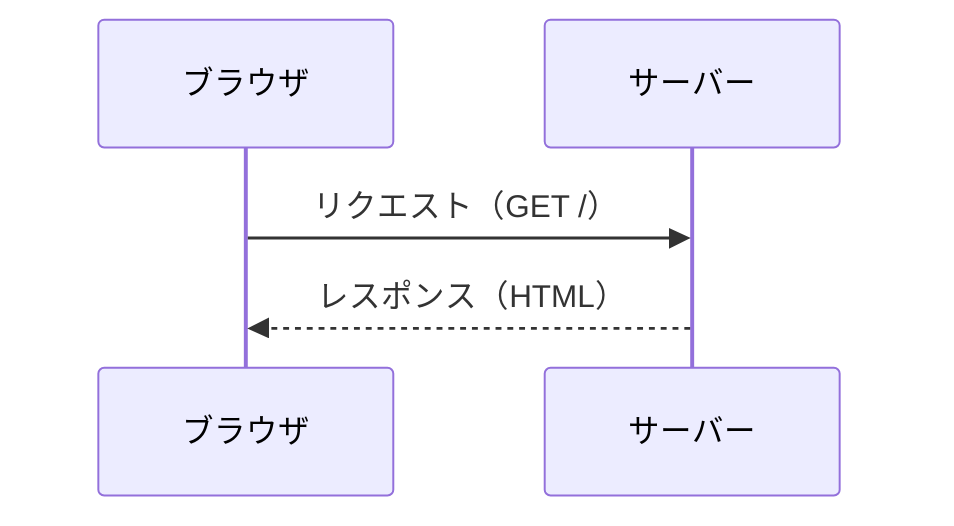

# 執筆ガイドライン

このテキスト集を書くときの方針をまとめたメモ。執筆者（と執筆補助 AI）向け。

---

## 1. 大前提

### 1.1 対象読者

**プログラミングを一度もやったことがない人。**

既知として扱ってよいのは、ここまで：

- PC の電源を入れて、ブラウザで検索し、ファイルを保存・移動できる
- 文字入力ができる（半角/全角の切り替えを含む）

既知として扱ってはいけないもの（＝説明が必要なもの）：

- ターミナル / コマンドプロンプト / PowerShell の存在
- 「ディレクトリ」「パス」「拡張子」
- テキストエディタと Word の違い
- 「実行する」「ビルドする」「サーバーを立てる」
- 変数・関数・型・オブジェクト……といったあらゆる用語

### 1.2 ゴール

5冊を踏破した人が、**Web アプリを一人で作って動かせる**状態になること。
「読んだ気になる」ではなく「手が動く」ことを最優先にする。

### 1.3 AI 併用が前提

環境構築とデバッグは、AI がサポートする前提で書く。
ただし**テキスト自体は AI 抜きでも読み進められる完成度**を保つ。
AI は「詰まったときの脱出装置」であって、テキストの穴埋めではない。

---

## 2. 章立てのルール

### 2.1 番号は3階層まで刻む

```
2      章
2.2    節
2.2.1  項  ← ここまで刻む
```

**理由**：学習者が「2.2.1 で詰まりました」と AI に投げられるようにするため。
これがこのテキスト集の設計上いちばん重要な仕掛け。

- 1つの項は**1つのことだけ**扱う
- 項が長くなりすぎたら（スクロール2画面以上）分割する
- 逆に、2行しかない項は作らない（節にまとめる）

### 2.2 見出しの粒度の目安

| 単位 | 分量の目安 | 内容 |
|------|-----------|------|
| 章 | 5,000〜15,000字 | 1つの大きなテーマ |
| 節 | 1,000〜3,000字 | 1つのまとまった機能・概念 |
| 項 | 200〜800字 | 1つの事実・1つの操作 |

### 2.3 章の標準構成

`docs/chapter-template.md` の雛形を使う。

1. 章の冒頭：**この章で学ぶこと**（箇条書き3〜6個）と**前提**
2. 本文（節・項）
3. **まとめ**（箇条書き）
4. **理解度チェック**（穴埋め・選択・記述を混ぜて3〜6問）
5. **演習問題**（手を動かす課題を1〜3問。難易度を★で表示）
6. 章の最後：**次の章へ**の1行

---

## 3. 説明の書き方

### 3.1 「なぜ」を先に、「どうやって」を後に

いきなり手順から入らない。**その技術が何を解決するのか**を、
学習者が困った経験を想像できる形で先に書く。

> ❌ 「React ではコンポーネントを定義します。次のように書きます」
> ✅ 「同じ見た目のカードを 30 個並べたいとします。HTML だと同じ 10 行を 30 回コピペすることになり、
>    修正のたびに 30 箇所直す羽目になります。これを解決するのがコンポーネントです」

### 3.2 たとえを使う（ただし1つの概念に1つまで）

たとえを重ねると逆に混乱する。1概念1たとえ。
たとえで説明したあとは、**必ず「正確な説明」に着地する**。

### 3.3 用語は初出時に太字＋定義

> **変数**（へんすう。値に名前をつけて、あとから使い回すための仕組み）

`docs/glossary.md` に登録し、表現を全テキストで統一する。

### 3.4 「おまじない」を残さない

説明できないものを書かない。どうしても先送りが必要な場合は、明示する。

> この `export default` の意味は 5.6 で説明します。
> いまは「1ファイルにつき 1 つ、外に出したいものに付ける印」と思っておいてください。

### 3.5 失敗を先回りする

各項の最後に、必要なら「よくある間違い」を置く。

> **よくある間違い**
> 閉じタグを書き忘れると、その後の要素がすべて中に入ってしまいます。
> 画面が崩れたら、まず閉じタグを疑ってください。

### 3.6 演習に必要な知識は、本文で説明しきる

**演習問題が難しく感じられたら、演習を易しくするのではなく、本文の説明を厚くする。**

演習問題は、その章の本文だけを読めば解けるように作る。
「これは常識だろう」「調べればわかるだろう」という前提を置かない。
演習を書き終えたら、必ず逆方向にチェックする。

> 演習の**完成条件を1つずつ**見て、
> 「これを満たすための知識は、本文のどの項（`X.Y.Z`）で説明したか」を指させるか確認する。
> 指させない項目があれば、**演習を削らず、本文にその説明を足す。**

本文を厚くする具体的な方法：

- その概念を使う**別の具体例**を、演習とは違う題材で1つ本文に置く
  （演習でそのまま流用できる例ではなく、近い形の類題を見せる）
- 「よくある間違い」（3.5）を、演習で踏みやすい落とし穴に絞って追加する
- 複数の要素を組み合わせる演習（★★☆ 以上）には、**組み合わせ方そのものの例**を
  本文中に最低1つ示す（要素ごとの説明だけで終わらせない）
- 初出の用語（3.3）だけでなく、**演習文中に出てくる語彙**も本文で拾えているか確認する

> **判断の基準**
> 「本文を読んだ学習者が、ヒント1段階目（`ai/hint-policy.md`）だけで
> 手が動き出せるか」を基準にする。動き出せないなら、それは演習の難易度の問題ではなく、
> 本文の説明不足である。

---

## 4. コードの書き方

### 4.1 すべて実行可能にする

コピペして動かないコードは載せない。断片を示すときは、
**どのファイルの、どこに書くか**を必ず明示する。

````markdown
`src/App.jsx`

```jsx
// ファイル全体
```
````

````markdown
`src/App.jsx` の `return` の中（12行目あたり）を、次のように変更します。

```jsx
<button onClick={handleClick}>送信</button>
```
````

### 4.2 コードブロックには言語を指定する

`html` `css` `js` `jsx` `python` `sql` `bash` `powershell` `dockerfile` `yaml` `json` `text`

シェルコマンドは、**Windows は `powershell`、macOS/Linux は `bash`** で分けて書く。

### 4.3 実行結果を必ず示す

コードを載せたら、**何が起きるか**を示す。画面なら説明文か画像、
コマンドなら出力例。

```text
実行結果:
Hello, World!
```

### 4.4 コメントは「なぜ」を書く

```js
// count に 1 を足した値で state を更新する（直接代入では画面が更新されないため）
setCount(count + 1);
```

### 4.5 段階的に育てる

長いコードを一気に見せない。**動く最小のものを作ってから、少しずつ足す。**
各段階で必ず一度動かさせる。

---

## 5. 演習と解答

### 5.1 理解度チェック（知識確認）

- 章の内容を読んだだけで答えられるもの
- 穴埋め・選択・「〜を1行で説明せよ」
- 3〜6問

### 5.2 演習問題（手を動かす）

- ★☆☆：本文のコードを少し変えればできる
- ★★☆：本文の内容を組み合わせる必要がある
- ★★★：自分で調べる／設計する必要がある（1章に多くて1問）

各問題には**必ず**次を書く：

- 課題文（何を作るか）
- 完成条件（どうなれば正解か）
- ヒント（1行。考える方向だけ）

**演習を書いたら、3.6 に従って本文側を必ず点検する。**
本文の説明が足りないことに気づいた場合、演習の難易度は下げない。

### 5.3 解答は末尾にまとめる

各テキストの `90-answers-*.md` に、章ごとにまとめる。
本文中に答えを書かない。解答には**必ず解説を添える**（コードだけ置かない）。

問題数が多い場合は `90-answers-part1.md` `91-answers-part2.md` と分割する。

### 5.4 番号の対応

解答編の見出しは、本文の番号と完全に対応させる。

```
本文:   ### 演習 5.2 ★★☆ 買い物リストの合計を求める
解答編: ### 演習 5.2 の解答
```

---

## 6. 図解（Mermaid / SVG）

**表で表現しきれないもの（流れ、構造、位置関係）は、文章で頑張らず図にする。**
ボックスモデル、Flexbox の軸、リクエスト/レスポンスの流れ、コンポーネントツリー、
ER図、ディレクトリ構成、Git のブランチなどは積極的に図解する。

### 6.1 まず Mermaid を検討する（最優先）

[Zenn は Mermaid のコードブロックを公式にサポート](https://zenn.dev/zenn/articles/markdown-guide)しており、
GitHub 上でも同じ記法でそのまま描画される。画像ファイルの管理が不要で、
テキストとして差分も取れるため、**表現できるならこちらを常に優先する**。

````markdown

````

向いている題材：

- 処理の流れ・シーケンス（`sequenceDiagram`）
- 条件分岐・処理フロー（`flowchart`）
- テーブル同士の関係（`erDiagram`）
- 状態遷移（`stateDiagram-v2`）
- Git のブランチ運用（`gitGraph`）

ディレクトリ構成のように**テキストの箱組みで十分伝わるもの**は、
無理に図にせず `text` コードブロックのツリー表記のままでよい（既存の章がそう）。

### 6.2 Mermaid で表現できないものは SVG → PNG

ボックスモデルの図解、Flexbox の主軸/交差軸の図、レイアウトの模式図など、
**位置・余白・矢印を自由に配置したいカスタムの図解**は Mermaid では作れない。
この場合は SVG で作図し、**PNG に書き出したものを本文に埋め込む。**

> **重要：Zenn は画像として `.svg` 拡張子を受け付けない**
> （対応形式は png / jpg / jpeg / gif / webp のみ）。
> GitHub 上では `.svg` もそのまま表示されるため気づきにくいが、
> Zenn 公開時に画像が表示されなくなる。**本文からは必ず `.png` を参照する。**

手順：

1. SVG のソースを `<book>/images/svg-src/NN-slug.svg` に保存する（テキストとして編集可能な原本）
2. 800px 前後の幅で PNG に書き出し、`<book>/images/NN-slug.png` として保存する
3. 本文からは PNG を参照する：``
4. **PNG への変換ツールがその場で使えない場合**（実行環境に変換コマンドがない等）は、
   無理に自作せず SVG ソースだけを保存し、
   `docs/writing-tasks/review-notes.md` の「図解の変換待ち」に、
   ファイルパスと本文中の埋め込み予定位置を記録して人間に引き継ぐ。
   本文側には一時的に次のプレースホルダを書いておく：

   ```markdown
   <!-- TODO(review-notes): images/svg-src/03-box-model.svg を PNG化して埋め込み -->
   ```

### 6.3 図解の作法

- すべての図に代替テキスト（`alt`）を書く
- 図だけで完結させない。**本文の説明 + 図**の両輪にする（図の説明を本文の代わりにしない）
- 色は本文の配色に合わせすぎない。**モノクロでも意味が通る図**を基本とする
  （線種・矢印・ラベルで区別する。色だけに意味を持たせない）
- 1つの図に詰め込みすぎない。伝えたいことが2つ以上あるなら図を分ける

---

## 7. 環境依存の記述

- **Windows / macOS の両方**を書く（Linux は macOS の手順に注記で対応）
- Windows は **PowerShell** を標準とする（コマンドプロンプトではない）
- バージョンを書くときは「執筆時点：Node.js v22」のように**時点を明記**する
- 「最新版を入れてください」は避ける。**動作確認したバージョンを書く**

---

## 8. 書かないこと

- 「簡単です」「すぐできます」（詰まった人を追い詰める）
- 「ご存知のとおり」「言うまでもなく」
- 出典のない断定（「〜が一般的です」は避け、「このテキストでは〜を使います」と書く）
- 章の範囲を超えたベストプラクティスの押しつけ
- 過度な網羅（辞書ではない。使うものだけ書き、残りは公式ドキュメントへ誘導する）

---

## 9. 更新方針

- 半年に一度、バージョン依存の記述を見直す
- 読者から「動かない」報告があった箇所は、**該当の項に注記を追加**する
- 大きな変更は各テキストの `README.md` に更新履歴として残す
