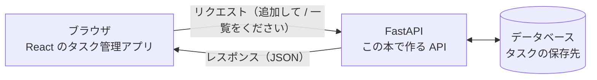
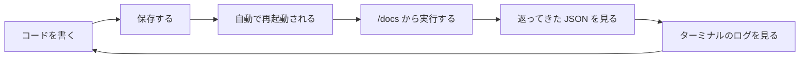

# 第0章 はじめに

この章は、**必ず最初に読んでください。**

このテキストは、全5冊のうちの**3冊目**です。
2冊目の [python-text](../python-text/README.md) で Python を学び終えた人を、
主な読者として想定しています。

ここまでの2冊で作ってきたものには、共通の限界がありました。
**作ったものが、自分のパソコンの中から出られない**という限界です。
この本では、その壁を越えます。

とくに [0.2 AI サポートの準備](#02-ai-サポートの準備) は、
このテキストで最も大事な準備です。ここを飛ばすと、
本来なら3分で解決する問題に3時間かかることになります。

## この章で学ぶこと

- このテキストが誰のためのもので、何が作れるようになるかを理解する
- 前提となる python-text の内容が身についているかを確認する
- 学習をサポートしてくれる AI を、この本用にセットアップする
- 画面のない開発（API 開発）ならではの進め方を知る
- 詰まったときにどう動けばいいかを知る

## この章の前提

- **python-text（2冊目）を読み終えていること**
- この章では、プログラムは書きません
  （1つだけ、Python が使える状態かを確かめるコマンドを打ちます）

> **つまずいたら**
> この章の内容で分からないことがあれば、[0.2](#02-ai-サポートの準備) で準備する AI に、
> 次のように聞いてください。
>
> ```text
> fastapi-text の 0.1.1 を読んでいます。
> 「API」という言葉の意味が、まだぴんと来ていません。
> python-text までの知識だけを使って、たとえを1つ添えて説明してください。
> ```

---

## 0.1 このテキストについて

### 0.1.1 対象読者と前提知識

このテキストは、**python-text（2冊目）を読み終えた人**を対象にしています。

python-text で学んだ Python の文法が、この本ではそのまま道具になります。
新しい言語を覚え直す必要はありません。
**新しく学ぶのは「Python で、外から呼び出せる窓口を作る方法」だけ**です。

前提として身についていてほしいのは、次のことです。
右の列に、忘れていたときに戻る場所を書いてあります。

| できてほしいこと | 戻る場所（python-text） |
|----------------|----------------------|
| 仮想環境（venv）を作って有効化できる | 1.5 |
| `pip install` でライブラリを入れられる | 1.6 |
| リストと辞書を読み書きできる | 4.1 / 4.3 |
| 関数を定義して、戻り値を返せる | 第5章 |
| `import` でファイルを分けられる | 第6章 |
| JSON を Python の辞書として読み書きできる | 7.4 |
| `try` / `except` で例外を受け止められる | 7.5 |
| `class` と `@dataclass` が読める | 第8章 |
| 型ヒント（`name: str` / `-> int`）が書ける | 第9章 |

**とくに重要なのは、いちばん下の「型ヒント」です。**

python-text の第9章では、型ヒント（変数や関数に「この型のはず」と注記を書く仕組み）は
**実行時には強制されない**、つまり書いても書かなくてもプログラムの動きは変わらない、
と説明しました。読むのは型チェッカーと人間だけでした。

**FastAPI では、この型ヒントが実際の動作を決めます。**
「この項目は整数である」と型ヒントに書けば、
FastAPI は受け取ったデータをその場で検査し、整数でなければエラーを返します。
python-text で「将来のために書いておくもの」だった型ヒントが、
この本では「書かないと動かないもの」に変わります。この違いが、この本の入口です。

**Python が使える状態かを確認する**

念のため、Python が動くことを確かめておきます。
ターミナル（文字でコンピュータに命令する画面）を開いて、次を実行してください。

**Windows（PowerShell）**

```powershell
python --version
```

**macOS / Linux**

```bash
python3 --version
```

実行結果（数字の部分は環境によって違います）:

```text
Python 3.13.2
```

**3.10 以上**であれば、この本を読み進められます。
python-text と同じ 3.13 が入っていれば、まったく問題ありません。

`python: command not found` や `'python' は、内部コマンドまたは外部コマンド...` と
表示された場合は、Python が入っていないか、PATH（ターミナルがコマンドを探しに行く場所の一覧）に
登録されていません。python-text の 1.2 に戻るか、
[0.2](#02-ai-サポートの準備) で準備した AI に、表示されたメッセージをそのまま貼り付けて相談してください。
**ここは考えて学ぶ場所ではないので、遠慮なく AI に全部やらせてください。**

> **補足：react-text（1冊目）を読んでいなくても読めます**
> この本の第1章から第8章までは、Python だけで進みます。
> react-text を読んでいない場合に影響が出るのは、**第9章（React と繋ぐ）だけ**です。
> 第9章では react-text 第10章で作ったタスク管理アプリを使いますが、
> 完成したコードを掲載するので、React を書けなくても動かすところまでは進められます。

### 0.1.2 この本で作るもの

ここまでの2冊で作ってきたものを、いちど振り返ります。

- **react-text**：ブラウザの中だけで動くアプリ。ページを再読み込みするとデータが消える。
  `localStorage`（ブラウザがサイトごとに用意している小さな保管庫）に保存しても、
  **そのブラウザの中だけ**にしか残らない
- **python-text**：自分のパソコンの中だけで動くスクリプト。
  CSV や JSON のファイルにデータを残せるが、**そのパソコンの中だけ**にしか残らない

どちらも「他の人と同じデータを見る」ことができません。
友達に見せようと思ったら、パソコンごと持っていくしかない状態です。

これを解決するのが、**サーバー側（バックエンド）**のプログラムです。

**バックエンド**（裏で動いてデータを処理する側。サーバーで動く部分）を1つ用意して、
データをそこに置いておけば、**どのパソコンからでも同じデータが見られます。**
そして、ブラウザからそのプログラムを呼び出すための窓口が **API**
（プログラムから他のプログラムの機能を呼び出すための窓口）です。

この本では、**タスク管理 API** を作ります。
最終的に、次のような形になります。



図の真ん中が、この本で作るものです。
左のブラウザは react-text で作ったアプリ（第9章で繋ぎます）、
右のデータベースは第6章で用意します。

完成すると、**別のパソコンのブラウザから開いても、同じタスクの一覧が見える**ようになります。
これは、ここまでの2冊では作れなかったものです。

章ごとに身につく力は、次のとおりです。

| 章 | 身につくこと |
|----|------------|
| 第1章 | Web API の考え方（HTTP メソッド、ステータスコード、JSON、REST） |
| 第2章 | FastAPI のインストールと、最初のエンドポイント、自動ドキュメント |
| 第3章 | パラメータの受け取り方（パス・クエリ・リクエストボディ） |
| 第4章 | Pydantic によるデータの形の定義とバリデーション（検査） |
| 第5章 | ファイルを分けたプロジェクト構成、依存性注入、エラーハンドリング |
| 第6章 | データベースへの保存（SQLAlchemy、マイグレーション） |
| 第7章 | 認証（パスワードのハッシュ化、JWT） |
| 第8章 | テスト（`TestClient`、pytest） |
| 第9章 | React のアプリと接続して、1つの Web アプリとして動かす |
| 第10章 | 次に学ぶこと（デプロイの概観、Docker へ） |

**この本の山場は第4章と第6章です。**
第4章の Pydantic は、FastAPI のほぼすべての機能の土台になります。
第6章のデータベース連携は、「データが消えない」という、この本の中心的な価値を作る章です。

> **補足：この本だけで Web アプリが完成するわけではありません**
> 第9章まで進めば、**自分のパソコンの中で** React と API が繋がって動きます。
> ただし、それを世界中に公開する（デプロイする）には、もう一段の準備が必要です。
> その準備は4冊目の Docker で扱います。この本の第10章で、その道筋を示します。

### 0.1.3 全5冊の中での位置づけ

このテキストは、**プログラミング未経験から Web エンジニアになるまでの全5冊**の3冊目です。

| # | テキスト | 内容 |
|---|---------|------|
| 1 | React | Web の仕組み、HTML、CSS、JavaScript、React |
| 2 | Python | 汎用のプログラミング言語 Python |
| **3** | **FastAPI（この本）** | **サーバー側（バックエンド）の作り方** |
| 4 | Docker | 環境を再現可能にする道具 |
| 5 | MySQL | データを保存するデータベース |

1冊目でフロントエンド（ユーザーが直接見て触る側。ブラウザで動く部分）、
2冊目で Python という言語そのものを学びました。
**この本は、その2つを合流させる場所**です。
Python で書いたプログラムを、ブラウザから呼び出せる形にします。

この本のあとの2冊は、次の役割を持ちます。

- **4冊目（Docker）**：この本で作った API と、react-text のアプリと、データベースを、
  **1つのコマンドでまとめて起動できる**ようにします。
  第9章で「ターミナルを2つ開いて2つのサーバーを起動する」ことになりますが、
  そのつらさを解決するのが Docker です
- **5冊目（MySQL）**：この本の第6章では、手軽な SQLite というデータベースを使います。
  MySQL は、実際の仕事で広く使われているデータベースです。
  データの設計と、SQL という言語そのものを、5冊目で正面から扱います

> **補足：なぜ3冊目が FastAPI なのか**
> Python でサーバー側を作る道具には、FastAPI 以外にも Flask や Django があります
> （違いは 2.1.2 で説明します）。
> このテキストが FastAPI を選んだ理由は、**型ヒントを書くだけで、
> データの検査と API のドキュメントが自動で付いてくる**からです。
> 未経験者が最初に触るときに、覚えることがいちばん少なくて済みます。

---

## 0.2 AI サポートの準備

**この節がこのテキストで最も重要です。**

python-text で AI サポートをすでに準備した人も、
**読んでいるテキストが変わったことを AI に伝える必要がある**ので、
[0.2.1](#021-指示ファイルを読み込ませる) は必ず実行してください。

伝えないと、AI は「この人は Python の第◯章にいる」という古い前提のまま答えます。
その結果、**まだ説明していない FastAPI の機能をいきなり出してきたり、
逆に使えるはずの型ヒントを避けた説明をしたり**します。

### 0.2.1 指示ファイルを読み込ませる

**学習を始める前に、1回だけやる作業です。**

普段使っている AI（ChatGPT、Claude、Gemini、Copilot、Codex など）を開いて、
次の文章をそのままコピーして送ってください。
`<>` の中だけ、自分の状況に書き換えます。

```text
これからプログラミングを学びます。
まず次の URL のドキュメントを読んで、その指示に従って私をサポートしてください。

https://github.com/TakahashiTaiga/programing-texts/blob/main/ai/instructions.md

私の状況:
- OS: <Windows 11 / macOS / Ubuntu など>
- プログラミング経験: <python-text を読み終えた / react-text と python-text を読み終えた>
- 読んでいるテキスト: fastapi-text（プログラミング未経験から始める FastAPI）
```

> **AI が URL を読めない場合**
> 一部の AI は、URL からファイルを読み込めないことがあります。
> その場合は、上記の URL をブラウザで開いて、
> **中身をすべてコピーして AI に貼り付けて**ください。
> 「以下のドキュメントの指示に従ってください」と一言添えれば同じ効果があります。

> **補足：使う AI は python-text と同じで構いません**
> 新しく用意し直す必要はありません。
> ただし、python-text のときの会話をそのまま続けるより、
> **新しい会話を1つ始めて、上の文章から送る**ほうが確実です。
> 前の本のやり取りが残っていると、AI が Python の章番号と
> この本の章番号を取り違えることがあります。

### 0.2.2 動作確認

準備ができたか確かめましょう。AI に次のように聞いてみてください。

```text
確認です。私が「演習問題が解けません」と言ったら、あなたはどう対応しますか？
```

**期待する答え**（言い回しは AI によって違います）

> まずヒントを段階的に出します。いきなり完成コードはお見せしません。
> 一方で、環境構築やインストールのエラーなど、学習内容と関係ない部分は
> 手順を全部お出しして解決します。

このような答えが返ってきたら、準備完了です。

もし「はい、コードを書きます」のような答えが返ってきたら、
指示ファイルがうまく読み込まれていません。
0.2.1 をもう一度、今度は**中身をコピー&ペーストする方法**で試してください。

**もう1つ、この本ならではの確認をしておきます。**

```text
もう1つ確認です。私が「fastapi-text の 3.1 を読んでいます」と言ったとき、
あなたは何を前提にして答えますか？
```

**期待する答え**

> 3.1 の時点では、まだ Pydantic（第4章）もデータベース（第6章）も扱っていないので、
> それらを使わない範囲で答えます。

このように、**「まだ学んでいないものは使わない」**と答えれば正しく読み込めています。
この判断には、AI が
[`ai/curriculum-map.md`](https://github.com/TakahashiTaiga/programing-texts/blob/main/ai/curriculum-map.md)
という別のファイルを参照しています。
**質問するときに章番号を添えることが、この仕組みを働かせる鍵**です。

---

## 0.3 学習の進め方

### 0.3.1 API 開発ならではの進め方

この本の進め方は、ここまでの2冊とはっきり違うところがあります。
**作ったものに、画面がない**ということです。

まず、3冊の違いを見比べてください。

| | react-text | python-text | この本 |
|---|-----------|-------------|--------|
| 動かし方 | ブラウザでページを開く | `python ファイル名` で実行する | **サーバーを起動しっぱなしにする** |
| 結果の見え方 | 画面の見た目 | ターミナルへの出力 | **JSON という文字の並び** |
| エラーが出る場所 | ブラウザの Console | ターミナル | **サーバーを動かしているターミナル** |
| 終わり方 | ブラウザを閉じる | 実行が終わると勝手に戻る | **`Ctrl` + `C` で自分で止める** |

この違いから、進め方のポイントが3つ出てきます。

**ポイント1：ターミナルが返ってこないのは、正常です**

python-text では、`python ファイル名` を実行すると、処理が終わってプロンプト
（コマンドの入力待ちを表す `>` や `$` の表示）が戻ってきました。

サーバーは違います。**起動したら、止めるまで動き続けます。**
そのため、コマンドを打ったターミナルは戻ってきません。
これは固まっているのではなく、「依頼が来るのを待っている」状態です。

止めるときは、そのターミナルで `Ctrl` + `C` を押します（macOS でも `Control` + `C` です）。

**ポイント2：ターミナルを2つ使います**

サーバーを動かしたまま別のコマンド（ライブラリのインストールなど）を打ちたい場面が出てきます。
そのときは、**2つ目のターミナルを開いて**そちらで作業します。

**Windows / macOS 共通（VS Code を使う場合。おすすめ）**

VS Code の上のメニューから「ターミナル」→「新しいターミナル」を選びます。
画面の下に、もう1つターミナルが開きます。
右上の分割ボタンを押すと、2つを左右に並べて表示できます。

**Windows（VS Code を使わない場合）**

スタートメニューで「PowerShell」と入力し、**もう1つ** PowerShell のウィンドウを開きます。

**macOS（VS Code を使わない場合）**

「ターミナル」アプリを開いた状態で `Command` + `N` を押すと、新しいウィンドウが開きます。

> **よくある間違い**
> 2つ目のターミナルでは、**仮想環境が有効になっていません。**
> python-text の 1.5 でやったとおり、そのターミナルでもう一度有効化が必要です
> （Windows は `.venv\Scripts\Activate.ps1`、macOS は `source .venv/bin/activate`）。
> 行頭に `(.venv)` と表示されているかどうかで見分けられます。
> これを忘れたまま `pip install` すると、**仮想環境の外にライブラリが入ってしまい**、
> サーバー側からは「そんなライブラリはない」と言われます。

**ポイント3：確認の道具が変わります**

画面がないので、「動いたかどうか」は次の3つで確かめます。

1. **ブラウザで URL を開く** … いちばん手軽。ただし一覧を見る操作（GET）しか試せません
2. **自動ドキュメント（`/docs`）** … FastAPI が自動で作ってくれる操作画面です。
   データを送る操作（POST など）も、ここから試せます（2.5 で扱います）
3. **サーバーのターミナルに出るログ** … どんな依頼が来て、何を返したかが1行ずつ出ます

コードを1行変えるたびに、この流れをぐるぐる回すことになります。



**この輪を小さく速く回すことが、API 開発でいちばん大事な習慣**です。
50行書いてから初めて動かすのではなく、**1つのエンドポイント（API の窓口1つ）を書いたら、
その場で動かして確かめる**。この本のコードは、すべてその単位で進みます。

> **補足：`Ctrl` + `C` で止め忘れると次の起動が失敗します**
> 前のサーバーを止めないまま、もう一度起動しようとすると、
> 「ポート（1台のコンピュータの中で、どのプログラムに繋ぐかを表す番号）が使用中」という
> エラーになります。これは 2.4.4 で正面から扱うので、いまは
> **「サーバーは止め忘れると次に困る」**とだけ覚えておいてください。

### 0.3.2 詰まったときの動き方

詰まったら、次の順番で動いてください。

**ステップ1：3分だけ自分で確認する**

API では、見るべき場所が決まっています。上から順に確認してください。

1. **サーバーは動いているか**（ターミナルに起動中の表示が残っているか）
2. **開いた URL とメソッドは合っているか**（`/tasks` と `/task`、GET と POST の取り違えは頻出です）
3. **返ってきたステータスコード**（`404` なのか `422` なのか `500` なのかで、原因の場所が変わります。
   第1章で読み方を学びます）
4. **サーバー側のターミナルに出ているエラーの、いちばん下の行**
   （python-text 1.4 で学んだトレースバックの読み方がそのまま使えます）

**ステップ2：AI に聞く**

3分考えてわからなければ、すぐ AI に聞いてください。粘る必要はありません。

質問するときは、**章番号と、次の4点を必ず添えて**ください。
この4点があるかないかで、返ってくる答えの精度がまるで変わります。

```text
fastapi-text の 3.2.2 で詰まりました。

【やろうとしたこと】
クエリパラメータで件数を絞り込もうとした

【叩いた URL とメソッド】
GET http://127.0.0.1:8000/tasks?limit=3

【返ってきたもの】
ステータスコード 422
{"detail":[{"type":"int_parsing", ...}]}

【サーバーのターミナルの表示】
INFO:     127.0.0.1:52341 - "GET /tasks?limit=3 HTTP/1.1" 422 Unprocessable Entity

【書いたコード】
（該当部分を貼る）

【環境】
OS: Windows 11 / Python 3.13
```

**章番号を伝えることが重要です。**
AI は「この人は 3.2.2 にいる＝まだ Pydantic もデータベースも知らない」と判断して、
あなたが理解できる範囲の言葉で答えてくれます。

質問のテンプレートは
[`ai/prompt-templates.md`](https://github.com/TakahashiTaiga/programing-texts/blob/main/ai/prompt-templates.md)
にまとめてあります。コピーして使ってください。

**ステップ3：それでも進まなければ、飛ばす**

同じところで30分以上止まったら、いったん飛ばして先に進んでください。
ただし、**第2章（環境）と第6章（データベース）だけは、動く状態にしてから先に進んでください。**
この2つは、以降の章がすべてその上に乗るためです。
飛ばせないところで詰まったときこそ、AI の出番です。

**理解度チェックと演習問題について**

第1章から、各章の最後に2種類の問題が付きます。

| 表示 | 意味 |
|------|------|
| ★☆☆ | 本文のコードを少し変えればできる |
| ★★☆ | 本文の複数の内容を組み合わせる必要がある |
| ★★★ | 自分で調べたり設計したりする必要がある |

答えは、本の最後の**解答編**にまとめてあります。
（この第0章にはコードがないので、理解度チェックと演習問題はありません。第1章から始まります。）

> **解答編の使い方**
> いきなり見ないでください。**最低でも1回は自分で書いて、動かしてみてから**見てください。
> API の演習は「動かして確かめる」までが1問です。
> エラーが返ってきた状態は失敗ではなく、**何が起きているかを読み取る材料**です。
>
> どうしても解けなかった問題は、解答編を読んだあと、
> **何も見ずにもう一度自分で書き直して**ください。これで定着します。

---

## まとめ

- このテキストは全5冊の**3冊目**。**python-text を読み終えていること**が前提
- python-text の**型ヒント（第9章）が、この本では実際の動作を決める**道具に変わる
- この本で作るのは**タスク管理 API**。第9章で react-text のアプリと接続する
- ここまでの2冊との決定的な違いは、**データが自分のパソコンの外に置ける**こと
- **AI サポートの準備（0.2）を必ずやり直すこと**。読んでいる本が変わったことを伝える
- API 開発では**サーバーを起動しっぱなし**にする。ターミナルが返ってこないのは正常
- ターミナルは**2つ使う**。2つ目では**仮想環境の有効化を忘れやすい**
- 画面がないので、確認は**ブラウザ・`/docs`・サーバーのログ**の3つで行う
- **1つのエンドポイントを書いたら、その場で動かす**。輪を小さく速く回す
- 詰まったら **3分確認して、章番号・URL・ステータスコード・ログを添えて AI に聞く**

---

## 次の章へ

準備は整いました。
次の章では、そもそも Web API とは何なのかを、ここまでの2冊で作ってきたものと
繋げながら理解します。

HTTP のリクエストとレスポンスの中身を実際に覗き、
世の中で公開されている API を自分の手で叩くところまで進みます。
**まだ FastAPI は出てきません。** その前に、API という考え方そのものを掴みます。

→ [第1章 Web API とは](./01-web-api.md)
