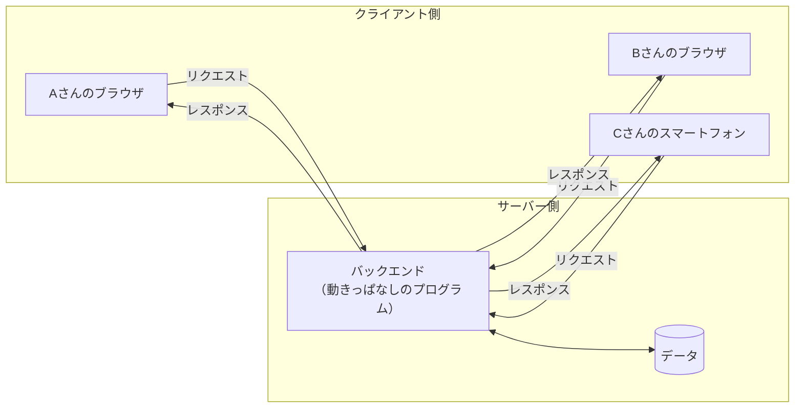
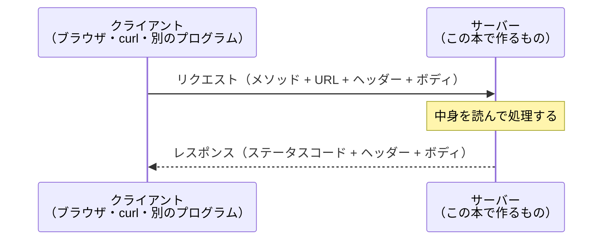
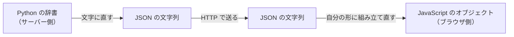

# 第1章 Web API とは

**この章では、まだ FastAPI を1行も書きません。**

道具の使い方より先に、**その道具が何を作るためのものなのか**を掴みます。
ここを飛ばして第2章に進むと、コードは動くのに
「いま自分が何を作っているのか分からない」という状態になります。

この章で扱うのは、**Web API という考え方**そのものです。
世の中で公開されている API を、自分の手で実際に呼び出すところまで進みます。

## この章で学ぶこと

- ここまでの本で作ってきたものに何が足りないのかを、自分の言葉で説明できるようになる
- HTTP のリクエストとレスポンスの中身（メソッド・ステータスコード・ヘッダー・ボディ）を読めるようになる
- JSON の書き方のルールと、Python の辞書との対応関係が分かるようになる
- REST の考え方にそって、URL とメソッドの組み合わせを設計できるようになる
- 公開されている API を、ブラウザ・開発者ツール・`curl` の3つの方法で呼び出せるようになる

## この章の前提

- [第0章](./00-introduction.md) を読み終えていること
- python-text の第7章（JSON）と第4章（リスト・辞書）の内容を思い出せること
- インターネットに接続できること（1.5 で実際に外部の API を呼び出します）

> **つまずいたら**
> 第0章の 0.2 で準備した AI に、章番号を添えて聞いてください。
>
> ```text
> fastapi-text の 1.2.3 を読んでいます。
> ステータスコードの 400 番台と 500 番台の違いが、
> どちらも「エラー」に見えてしまって区別できません。
> python-text までの知識だけで、具体例を添えて説明してください。
> ```

---

## 1.1 フロントエンドとバックエンド

### 1.1.1 ここまで作ってきたものの限界

まず、ここまでの本で作ってきたものを思い出してください。

python-text の第10章では、`sales-analyzer` という売上集計スクリプトを作りました。
CSV を読み込んで、集計して、結果を CSV に書き出すプログラムです。

このプログラムには、はっきりした限界が1つあります。
**動かせるのが、自分のパソコンの上だけ**だということです。

集計結果を同僚に見せたければ、どうするでしょうか。

- 書き出した CSV をメールに添付して送る
- チャットにファイルを貼る
- 画面をスクリーンショットで撮って渡す

どれも「その瞬間のコピー」を渡しているだけです。
翌日に新しい売上データが増えても、相手が持っているファイルは古いままです。
そして、相手が自分でプログラムを動かそうとしたら、
Python をインストールして、仮想環境を作って、`pip install` をして……という作業が必要になります。

react-text を読んだ人は、もう1つの限界も知っています。
ブラウザの中で動くアプリは、データを `localStorage`
（ブラウザがサイトごとに用意している、文字列を保存しておける小さな保管庫）に入れても、
**そのブラウザの中にしか残りません。**
同じサイトを別のパソコンで開いても、そこには何もありません。

この2つは、見た目は違いますが同じ問題です。

> **プログラムとデータが、1台のパソコンに閉じ込められている。**

### 1.1.2 サーバー側が必要になる理由

この問題を解くには、**みんながアクセスできる場所に、プログラムとデータを置く**しかありません。
その「みんながアクセスできる場所」で動くプログラムが、
**バックエンド**（裏で動いてデータを処理する側。サーバーで動く部分）です。

対して、ユーザーが直接見て触る側を
**フロントエンド**（ブラウザで動く部分）と呼びます。

構図を図にすると、次のようになります。



大事なのは、**データが左側（それぞれのパソコン）ではなく、右側（1か所）にある**ことです。
A さんがデータを追加すれば、B さんの画面にもそれが現れます。
これが、ここまでの2冊では作れなかったものです。

そして右側のプログラムは、python-text で書いたスクリプトと違って、
**一度起動したら、止めるまでずっと動き続けます。**
0.3.1 で「サーバーはターミナルが返ってこない」と説明したのは、このためです。
依頼が来るのを、ずっと待ち続けているのです。

> **補足：「サーバー」という言葉は2つの意味で使われます**
> 1つは、データセンターに置いてある**コンピュータそのもの**。
> もう1つは、そのコンピュータの上で動いている**プログラム**です。
> このテキストで「サーバーを起動する」と言うときは、後者、つまりプログラムのほうを指します。
> 第9章までは、そのプログラムを**自分のパソコンの中で**動かします。
> 自分のパソコンが、一時的にサーバー役を兼ねている状態です。

### 1.1.3 API という考え方

では、ブラウザからサーバー側のプログラムを、どうやって呼び出すのでしょうか。

python-text では、関数を呼び出すときにこう書きました。

```python
total = calculate_total(sales, shop="渋谷店")
```

`calculate_total` という名前と、渡す値（引数）を知っていれば、
中身がどう書かれているかを知らなくても呼び出せます。
**これと同じことを、別のコンピュータ越しにやりたい**わけです。

そのための窓口が **API**（プログラムから他のプログラムの機能を呼び出すための窓口）です。

ただし、相手は別のコンピュータなので、関数名をそのまま書くわけにはいきません。
代わりに使うのが **URL** と **HTTP メソッド**の組み合わせです。

| Python の関数呼び出し | Web API での言い方 |
|---------------------|------------------|
| 関数名 `calculate_total` | URL `/sales/total` |
| どう扱うか（読む／書く） | HTTP メソッド（`GET` / `POST` など） |
| 引数 `shop="渋谷店"` | URL に付ける値、または送るデータ |
| 戻り値 | レスポンスとして返ってくる JSON |

つまり **Web API とは、「HTTP で呼び出せる関数」**だと考えてください。
呼ぶ側は、中で何が動いているのかを一切知りません。
Python で書かれているのか、別の言語なのかも関係ありません。
**決められた URL に、決められた形で依頼を出せば、決められた形で結果が返ってくる。**
この「決められた形」を設計して実装することが、この本でやることのすべてです。

> **補足：API という言葉はもっと広い意味でも使われます**
> `str.upper()` のような、ライブラリが用意している関数の集まりも API と呼ばれます。
> このテキストでは、混乱を避けるために **HTTP 越しに呼び出せるものだけ**を
> API（または Web API）と呼びます。

---

## 1.2 HTTP をもう一度

### 1.2.1 リクエストとレスポンスの中身

**HTTP**（ブラウザとサーバーがやり取りするときの、決められた話し方のルール）は、
とても単純な決まりでできています。

1. クライアント（依頼する側）が**リクエスト**（依頼）を1つ送る
2. サーバーが**レスポンス**（返答）を1つ返す
3. 終わり

これだけです。1回のやり取りごとに、完全に終わります。
サーバーは「さっき誰が何を聞いてきたか」を、基本的には覚えていません。



リクエストとレスポンスは、それぞれ決まった部品でできています。

**リクエストの部品**

| 部品 | 例 | 意味 |
|------|-----|------|
| メソッド | `GET` | どう扱ってほしいか（読む／作る／消す） |
| URL（パス） | `/tasks/3` | どれに対する依頼か |
| ヘッダー | `Content-Type: application/json` | 依頼についての補足情報 |
| ボディ | `{"title": "買い物"}` | 送りたいデータ本体（無いこともある） |

**レスポンスの部品**

| 部品 | 例 | 意味 |
|------|-----|------|
| ステータスコード | `200` | 依頼がどうなったか |
| ヘッダー | `Content-Type: application/json` | 返答についての補足情報 |
| ボディ | `{"id": 3, "title": "買い物"}` | 返すデータ本体（無いこともある） |

この4つ＋3つを読めるようになれば、API の8割は読めます。
以下の項で、1つずつ見ていきます。

### 1.2.2 HTTP メソッド（GET / POST / PUT / PATCH / DELETE）

**HTTP メソッド**は、「そのデータをどう扱ってほしいか」を表す動詞です。
URL が「何に対して」、メソッドが「何をするか」を表します。

このテキストで使うのは、次の5つだけです。

| メソッド | 意味 | 例 |
|---------|------|-----|
| `GET` | 取ってくる（読むだけ） | タスクの一覧をください |
| `POST` | 新しく作る | このタスクを追加してください |
| `PUT` | 丸ごと置き換える | 3番のタスクを、この内容にすべて差し替えてください |
| `PATCH` | 一部だけ変える | 3番のタスクの、完了フラグだけ立ててください |
| `DELETE` | 消す | 3番のタスクを削除してください |

**`GET` は、何度呼んでも結果が変わらない**という約束になっています。
一覧を10回取得しても、データは増えも減りもしません。
ブラウザのアドレス欄に URL を打ち込んだときに送られるのは、この `GET` です。

一方、`POST` は呼ぶたびに新しいものが増えます。
ネット通販の購入ボタンを2回押すと2件注文が入ってしまうのは、これが `POST` だからです。

`PUT` と `PATCH` の違いは、実際にコードを書く第3章以降で効いてきます。
いまは次の違いだけ押さえてください。

- `PUT`：送らなかった項目は**消える**（全部送るのが前提）
- `PATCH`：送った項目**だけ**が変わる（残りはそのまま）

> **よくある間違い**
> 「削除だから `DELETE`、更新だから `PUT`」と、URL のほうに動詞を書いてしまうことがあります。
>
> - ❌ `GET /deleteTask/3`
> - ✅ `DELETE /tasks/3`
>
> **動詞はメソッドが担当し、URL は名詞（対象）だけを表します。**
> なぜこう決まっているのかは、1.4 で説明します。

### 1.2.3 ステータスコード

**ステータスコード**は、レスポンスの先頭に付く3桁の数字で、
**依頼がどうなったか**を表します。

100 の位を見るだけで、大まかな結果が分かります。

| 番台 | 意味 | ひとことで言うと |
|------|------|----------------|
| 2xx | 成功 | うまくいった |
| 3xx | リダイレクト | 場所が変わったので、そちらへどうぞ |
| 4xx | クライアント側のエラー | **依頼した側**の書き方がおかしい |
| 5xx | サーバー側のエラー | **受けた側**のプログラムが壊れている |

**4xx と 5xx の違いが、この章でいちばん重要です。**
どちらも赤いエラーに見えますが、**直すべき場所が正反対**です。

- `4xx` が返ってきたら → **自分の送り方**を疑う（URL、メソッド、送ったデータ）
- `5xx` が返ってきたら → **サーバー側のコード**を疑う（サーバーのターミナルにエラーが出ているはず）

この本で頻繁に出会うのは、次の7つです。

| コード | 名前 | どういうときに出るか |
|-------|------|-------------------|
| `200` | OK | 取得・更新がうまくいった |
| `201` | Created | 新しいものを作れた（`POST` の成功） |
| `204` | No Content | 成功したが、返すデータはない（`DELETE` の成功） |
| `400` | Bad Request | 送られたデータの形が壊れている |
| `404` | Not Found | その URL、またはそのデータが存在しない |
| `422` | Unprocessable Entity | 形式は合っているが、中身が条件を満たしていない |
| `500` | Internal Server Error | サーバー側のプログラムが例外で止まった |

**`422` は、この本で最もよく見ることになる番号です。**
FastAPI は、受け取ったデータが型ヒントと合わないときに、これを返します。
「年齢に `"abc"` という文字列が送られてきた」というような場合です。
`404` と違って**URL は正しい**ので、疑うべきは送ったデータの中身です。

> **補足：`500` を見たら、まずサーバーのターミナルを見てください**
> `500` のレスポンス本文には、多くの場合「サーバーエラーです」としか書かれていません。
> 本当の原因は、**サーバーを動かしているターミナルに表示されているトレースバック**にあります。
> python-text 1.4 で学んだ「トレースバックは下から読む」が、そのまま使えます。
> ブラウザの画面だけを見て悩む時間が、いちばんもったいない時間です。

### 1.2.4 ヘッダーとボディ

リクエストとレスポンスは、どちらも**ヘッダー**と**ボディ**の2つに分かれています。

- **ヘッダー**：データについての説明書き。「これは JSON です」「日本語です」など
- **ボディ**：データ本体

宅配便でたとえると、ヘッダーは箱に貼られた伝票、ボディは中身です。
伝票を見れば、開ける前に「割れ物か」「どこから来たか」が分かります。

このテキストで意識するヘッダーは、実質2つだけです。

| ヘッダー名 | 付ける場所 | 意味 |
|-----------|-----------|------|
| `Content-Type` | 送る側 | ボディの形式。JSON なら `application/json` |
| `Authorization` | リクエスト | 「私はこの人です」という証明（第7章で扱います） |

`Content-Type: application/json` が付いていないと、
受け取った側は「これは JSON だ」と判断できません。
文字としては同じものが届いていても、ただの文字列として扱われてしまいます。

ボディについては、メソッドごとに「あるかないか」が決まっています。

| メソッド | リクエストのボディ | レスポンスのボディ |
|---------|-----------------|-----------------|
| `GET` | 付けない | ある（取得したデータ） |
| `POST` | **ある**（作りたいデータ） | ある（作られたデータ） |
| `PUT` / `PATCH` | **ある**（変更内容） | ある（変更後のデータ） |
| `DELETE` | 付けない | 無いことが多い（`204`） |

**`GET` にはボディを付けません。**
ですから、`GET` で値を渡したいときは、URL のほうに書きます。
`https://example.com/tasks?done=true` の `?` 以降がそれです（第3章で正面から扱います）。

---

## 1.3 JSON

### 1.3.1 JSON とは

**JSON**（データをやり取りするための、文字だけで書かれた形式）は、
python-text の 7.4 で一度扱いました。ここでは「なぜ API で JSON なのか」から確認します。

サーバーとクライアントは、**別々のプログラム**です。
使っている言語すら違うかもしれません。
Python のリストや辞書を、そのまま電線に流すことはできません。

そこで、**どの言語からでも読み書きできる、文字だけの形式**に一度変換して送ります。
その形式が JSON です。

```json
{
  "id": 3,
  "title": "牛乳を買う",
  "done": false,
  "tags": ["買い物", "急ぎ"]
}
```

これはただの文字列です。改行も空白も、ただの文字です。
これを受け取った Python は辞書に、JavaScript はオブジェクトに、
それぞれ自分の形に組み立て直して使います。



途中の2つは、**まったく同じ文字の並び**です。
送る側と受け取る側で、それぞれ自分の言語の形に出し入れしているだけだと考えてください。

### 1.3.2 書き方のルール

JSON のルールは、覚えることが少ないぶん、**外れると容赦なくエラーになります。**
Python の辞書を書く感覚で書くと、必ずどこかで引っかかります。

書けるのは、次の6種類だけです。

| 種類 | 書き方 | 例 |
|------|-------|-----|
| 文字列 | **ダブルクォートのみ** | `"買い物"` |
| 数値 | そのまま | `3` / `1.5` |
| 真偽値 | **すべて小文字** | `true` / `false` |
| 空を表す値 | `null` | `null` |
| 配列 | `[ ]` で並べる | `["a", "b"]` |
| オブジェクト | `{ }` でキーと値の組 | `{"id": 3}` |

そして、次の4つが禁止されています。

1. **シングルクォートは使えない**（`'買い物'` は不正）
2. **キーも必ずダブルクォートで囲む**（`{id: 3}` は不正）
3. **末尾にカンマを付けられない**（`[1, 2, 3,]` は不正）
4. **コメントを書けない**（`// メモ` も `# メモ` も不正）

次の例は、**すべて間違い**です。どこが違うか、上の表と見比べてください。

```text
{'title': '買い物'}          ← シングルクォート
{title: "買い物"}            ← キーが裸
{"done": False}              ← 真偽値が大文字始まり（Python の書き方）
{"memo": None}               ← 空の値は null
{"tags": ["a", "b",]}        ← 末尾のカンマ
```

正しく書くと、こうなります。

```json
{
  "title": "買い物",
  "done": false,
  "memo": null,
  "tags": ["a", "b"]
}
```

> **よくある間違い**
> 手で書いた JSON が読み込めないとき、原因の8割は
> **「末尾のカンマ」か「シングルクォート」**です。
> python-text 7.4 で学んだとおり、Python では
> `json.JSONDecodeError: Expecting property name enclosed in double quotes` のような
> エラーになります。エラーメッセージには**何行目の何文字目か**が書かれているので、
> まずそこを見てください。

### 1.3.3 Python の辞書との対応

Python の値と JSON の値は、次のように対応します。
python-text 7.4 の表と同じものですが、この本ではずっと使うので再掲します。

| Python | JSON | 注意 |
|--------|------|------|
| `dict` | オブジェクト `{ }` | キーは文字列だけ |
| `list` / `tuple` | 配列 `[ ]` | タプルも配列になって戻る（戻すとリスト） |
| `str` | 文字列 | 引用符はダブルクォートに統一される |
| `int` / `float` | 数値 | — |
| `True` / `False` | `true` / `false` | **大文字小文字が変わる** |
| `None` | `null` | — |

実際に変換して確かめてみます。
デスクトップなど、好きな場所に `json_check.py` という名前でファイルを作ってください。

`json_check.py`

```python
import json

task = {
    "id": 3,
    "title": "牛乳を買う",
    "done": False,
    "memo": None,
    "tags": ["買い物", "急ぎ"],
}

# Python の辞書 → JSON の文字列
text = json.dumps(task, ensure_ascii=False)
print(text)

# JSON の文字列 → Python の辞書
back = json.loads(text)
print(back["done"], type(back["done"]))
```

**Windows（PowerShell）**

```powershell
python json_check.py
```

**macOS / Linux**

```bash
python3 json_check.py
```

実行結果:

```text
{"id": 3, "title": "牛乳を買う", "done": false, "memo": null, "tags": ["買い物", "急ぎ"]}
False <class 'bool'>
```

1行目を見てください。`False` が `false` に、`None` が `null` に変わっています。
そして2行目では、文字列から戻したときに `False` に戻っています。
**送るときと受け取るときで、自動的に書き換えられている**のが分かります。

`ensure_ascii=False` を付けているのは、日本語をそのまま出すためです。
これを外すと、日本語の部分が `"牛乳..."` のような表記に変わります（python-text 7.4）。
どちらも同じデータですが、目で確認するときは付けたほうが読めます。

**この変換を、FastAPI は自動でやってくれます。**
第2章以降、`return {"title": "買い物"}` のように Python の辞書を返すだけで、
JSON の文字列に変換されてクライアントに届きます。
`json.dumps` を自分で呼ぶことは、この本ではほとんどありません。
ただし**何が起きているかを知らないと、`500` エラーの原因が分からなくなる**ので、
ここで一度自分の手で動かしておきます。

---

## 1.4 REST の考え方

### 1.4.1 リソースという単位

ここまでで、「URL は名詞、メソッドは動詞」と書きました。
この考え方に名前を付けたものが **REST**（レスト）です。

REST では、API が扱う対象を**リソース**（API が扱う、名前を付けられるデータのまとまり）と呼びます。
タスク管理アプリなら、リソースは「タスク」です。
ネット通販なら「商品」「注文」「ユーザー」がリソースになります。

**リソースを見つけるコツは、「アプリの中で数えられるものは何か」と考えることです。**

- タスクが 12 件ある → **タスク**はリソース
- ユーザーが 3 人いる → **ユーザー**はリソース
- 「並べ替える」は数えられない → これはリソースではなく、**操作**

この「数えられるもの」を **URL の複数形**で表します。

| リソース | URL |
|---------|-----|
| タスク全体 | `/tasks` |
| その中の 3 番のタスク | `/tasks/3` |
| ユーザー全体 | `/users` |
| その中の 7 番のユーザー | `/users/7` |

**複数形にするのは、`/tasks` が「タスクの集まり」を指すからです。**
そして、その集まりの中の1件を指すときは、後ろに識別子（ここでは番号）を付けます。

### 1.4.2 URL の設計

リソースが決まれば、URL はほぼ機械的に決まります。
やってはいけないことのほうが、はっきりしています。

| ❌ こう書かない | ✅ こう書く | 理由 |
|---------------|-----------|------|
| `/getTasks` | `GET /tasks` | 動詞はメソッドが担当する |
| `/task` | `/tasks` | 集まりなので複数形 |
| `/tasks/delete/3` | `DELETE /tasks/3` | 同上（動詞を URL に入れない） |
| `/tasks/3/getTitle` | `GET /tasks/3` | 中身の一部だけの URL は作らない |
| `/Tasks` | `/tasks` | 小文字とハイフンで統一する |

**別の題材で、設計の流れを一度通してみます。**
図書館の貸出システムを考えます（タスク管理とは関係のない例です）。

**手順1：数えられるものを挙げる**

- 本が何冊かある → **本**（`books`）
- 利用者が何人かいる → **利用者**（`members`）
- 貸出の記録が何件かある → **貸出**（`loans`）

**手順2：それぞれに「集まり」と「1件」の URL を作る**

```text
/books          本の集まり
/books/57       57 番の本
/members        利用者の集まり
/members/12     12 番の利用者
/loans          貸出記録の集まり
/loans/301      301 番の貸出記録
```

**手順3：関係があるものは、入れ子にする**

「12 番の利用者が、いま借りている本の一覧」が欲しいときは、こう書きます。

```text
/members/12/loans
```

左から右へ「12 番の利用者の、貸出記録」と読めます。
このとき、**入れ子は2段までに収める**のがこのテキストの方針です。
`/members/12/loans/301/books/57` のような URL は、読む側が意味を追えなくなります。

> **よくある間違い**
> 「本を借りる」という操作を `/borrowBook` という URL にしたくなります。
> REST の考え方では、これは**「貸出記録を1件新しく作る」**と読み替えます。
>
> ```text
> POST /loans
> ```
>
> **操作を、名詞（リソース）に翻訳する。** これが REST でいちばん慣れが要るところです。
> 「返却する」なら「貸出記録に返却日を書き込む」＝ `PATCH /loans/301` になります。

### 1.4.3 メソッドと操作の対応

リソースが決まり、URL が決まったら、あとはメソッドとの組み合わせです。
**同じ URL でも、メソッドが違えば違う操作になります。**

図書館の例で、表を最後まで埋めるとこうなります。
ここには 1.2.2（メソッド）と 1.2.3（ステータスコード）と 1.4.2（URL）が全部入っています。

| やりたいこと | メソッド | URL | 送るボディ | 成功時のコード |
|------------|---------|-----|----------|--------------|
| 本の一覧を見る | `GET` | `/books` | なし | `200` |
| 57 番の本を見る | `GET` | `/books/57` | なし | `200` |
| 本を1冊登録する | `POST` | `/books` | 本の情報 | `201` |
| 57 番の本の情報を全部書き換える | `PUT` | `/books/57` | 本の情報（全部） | `200` |
| 57 番の本の状態だけ変える | `PATCH` | `/books/57` | 変える項目だけ | `200` |
| 57 番の本を削除する | `DELETE` | `/books/57` | なし | `204` |
| 本を借りる | `POST` | `/loans` | 本と利用者の番号 | `201` |
| 12 番の利用者の貸出一覧 | `GET` | `/members/12/loans` | なし | `200` |

読み方のポイントが3つあります。

1. **`POST` の相手は「集まり」**です（`/books`）。まだ番号が決まっていないので、1件を指せません
2. **`PUT` / `PATCH` / `DELETE` の相手は「1件」**です（`/books/57`）。どれを変えるかが決まっている必要があります
3. **存在しない番号を指定したら `404`** です。`GET /books/9999` も `DELETE /books/9999` も同じです

この8行の表が、この本の第6章まででずっと出てくる形です。
**タスク管理 API では、`books` が `tasks` に変わるだけ**だと思ってください。

### 1.4.4 完璧を目指さなくてよい

ここまで REST の原則を説明してきましたが、**最後に釘を刺しておきます。**

REST は法律ではありません。**読みやすさのための慣習**です。
そして、世の中で動いている API の多くは、原則から少しずつ外れています。

たとえば、次のような場面では、きれいな名詞に落とし込むのが難しくなります。

- ログイン（何のリソースを作っている？）
- 検索（`/search` は動詞のようにも見える）
- 「全タスクを一括で完了にする」

こういうときは、無理にひねらず、**チームで分かる形を選んで構いません。**
ログインは `POST /login`、検索は `GET /search?q=...` と書いている API がたくさんあります。

大事なのは、次の3つを守ることです。

1. **`GET` で、データを変更しない**（これだけは守ってください。事故につながります）
2. 同じ種類の操作は、同じ形で書く（`/tasks` と `/user` を混在させない）
3. 迷ったら、**呼ぶ側が推測できるほう**を選ぶ

> **補足：この本で目指すレベル**
> 「REST らしいかどうか」を議論し始めると、いくらでも時間が溶けます。
> このテキストでは、**1.4.3 の表の形をそのまま真似できれば十分**とします。
> 判断に迷う場面が出てきたら、AI に
> 「この操作を REST 風の URL にするなら、どんな候補がありますか。それぞれの利点も教えてください」
> と聞いてみてください。**答えを1つに決めるのは自分**です。

---

## 1.5 API を実際に叩いてみる

ここからは手を動かします。
**まだ何も作っていませんが、世の中には自由に呼び出せる API が公開されています。**
それを使って、ここまでの話が本当かを確かめます。

この節で使うのは、**JSONPlaceholder** という練習用の公開 API です。

```text
https://jsonplaceholder.typicode.com/
```

投稿（`posts`）やユーザー（`users`）といったリソースを持った、
架空のブログのような API です。**誰でも、登録なしで呼び出せます。**

> **注意**
> この節はインターネット接続が必要です。
> 会社や学校のネットワークで外部への接続が制限されている場合、
> 応答が返ってこないことがあります。その場合は 1.5 を飛ばして第2章に進み、
> **自分のパソコンの中で動く API を作ってから**、第2章の 2.4 で同じことを試してください。

### 1.5.1 ブラウザで GET する

いちばん手軽な方法です。**ブラウザのアドレス欄に URL を打ち込むと、`GET` が送られます。**

ブラウザを開いて、アドレス欄に次を入力し、Enter を押してください。

```text
https://jsonplaceholder.typicode.com/posts/1
```

次のような表示になります（見た目はブラウザによって違います）。

```json
{
  "userId": 1,
  "id": 1,
  "title": "sunt aut facere repellat provident occaecati excepturi optio reprehenderit",
  "body": "quia et suscipit\nsuscipit recusandae consequuntur..."
}
```

**いま何が起きたか**を、1.2 の言葉で言い直してみます。

- ブラウザが `GET https://jsonplaceholder.typicode.com/posts/1` というリクエストを送った
- サーバーが `200` と、JSON のボディを返した
- ブラウザがそれを画面に表示した

URL の末尾を `/posts/2` に変えれば、2 番の投稿が返ってきます。
`/posts` だけにすれば、100 件の一覧が返ってきます。
**1.4.1 で説明した「集まり」と「1件」**が、そのまま動いていることを確かめてください。

次に、存在しない番号を試します。

```text
https://jsonplaceholder.typicode.com/posts/9999
```

今度は、中身が空のオブジェクトが返ってきます。

```json
{}
```

このとき、**画面には見えていませんが、ステータスコードは `404`** です。
それを確かめるのが、次の項です。

> **よくある間違い**
> ブラウザのアドレス欄からは、**`GET` しか送れません。**
> `POST` や `DELETE` を試したくなっても、この方法では試せません。
> 「ブラウザで開いたら動いたのに、アプリからだと動かない」というときは、
> **そもそも違うメソッドを送っている**可能性を疑ってください。

### 1.5.2 開発者ツールのネットワークタブで観察する

**開発者ツール**（ブラウザに内蔵されている、表示中のページの中身や通信を調べるための道具）を使うと、
ステータスコードやヘッダーを、目で見て確認できます。

**開き方**

| OS / ブラウザ | 操作 |
|--------------|------|
| Windows（Chrome / Edge） | `F12` キー、または `Ctrl` + `Shift` + `I` |
| macOS（Chrome / Edge） | `Command` + `Option` + `I` |
| macOS（Safari） | 先に「Safari」→「設定」→「詳細」→「Web デベロッパ用の機能を表示」にチェックを入れてから `Command` + `Option` + `I` |

画面の右か下に、パネルが開きます。
上に並んでいるタブの中から **「Network」（日本語表示なら「ネットワーク」）** をクリックしてください。

**手順**

1. 開発者ツールを開いた状態で、「Network」タブを選ぶ
2. アドレス欄に `https://jsonplaceholder.typicode.com/posts/9999` を入れて Enter
3. 一覧に `9999` という行が現れる（現れなければ、`F5` キーで再読み込みしてください）
4. その行をクリックする

すると、次のような情報が見られます。

```text
Request URL:     https://jsonplaceholder.typicode.com/posts/9999
Request Method:  GET
Status Code:     404 Not Found
Content-Type:    application/json; charset=utf-8
```

**`404` が確認できました。**
1.5.1 の画面には `{}` としか出ていませんでしたが、
サーバーはちゃんと「そんなものはない」と答えていたわけです。

さらに、行をクリックしたあとに表示される小さなタブも見てください。

| タブ名 | 見られるもの |
|-------|------------|
| Headers（ヘッダー） | 1.2.4 で学んだヘッダー。`Content-Type` はここにあります |
| Response（レスポンス） | 返ってきたボディそのもの |
| Preview（プレビュー） | ボディを見やすく整形したもの |

`/posts/1` でも同じ操作をして、`Status Code: 200 OK` に変わることを確認してください。

**この画面は、第9章まで何度も開くことになります。**
「フロントとバックのどちらが悪いのか」を切り分ける、いちばん確実な道具だからです。

### 1.5.3 curl を使う

**`curl`**（カール）は、ターミナルから HTTP リクエストを送るためのコマンドです。
ブラウザと違って、**`GET` 以外のメソッドも送れます。**

Windows 10 / 11 と macOS には、最初から入っています。

**Windows（PowerShell）での重要な注意**

PowerShell では、`curl` と打つと**別のコマンド（`Invoke-WebRequest`）が動いてしまう**ことがあります。
これは PowerShell が用意している別名（エイリアス）です。
書き方がまったく違うので、このテキストのコマンドをそのまま打つとエラーになります。

**Windows では、必ず `curl.exe` と `.exe` を付けて打ってください。**

まず、動くことを確認します。

**Windows（PowerShell）**

```powershell
curl.exe --version
```

**macOS / Linux**

```bash
curl --version
```

実行結果（数字や項目は環境によって違います）:

```text
curl 8.7.1 (x86_64-apple-darwin23.0) libcurl/8.7.1 ...
```

**GET してみる**

**Windows（PowerShell）**

```powershell
curl.exe https://jsonplaceholder.typicode.com/posts/1
```

**macOS / Linux**

```bash
curl https://jsonplaceholder.typicode.com/posts/1
```

実行結果:

```text
{
  "userId": 1,
  "id": 1,
  "title": "sunt aut facere repellat provident occaecati excepturi optio reprehenderit",
  "body": "quia et suscipit\nsuscipit recusandae consequuntur expedita et cum..."
}
```

ブラウザで見たものと同じです。**同じリクエストを、別の道具から送っただけ**です。

**ステータスコードとヘッダーも見る**

`-i` を付けると、ヘッダーとステータスコードも一緒に表示されます。

**Windows（PowerShell）**

```powershell
curl.exe -i https://jsonplaceholder.typicode.com/posts/9999
```

**macOS / Linux**

```bash
curl -i https://jsonplaceholder.typicode.com/posts/9999
```

実行結果（一部を省略しています）:

```text
HTTP/2 404
content-type: application/json; charset=utf-8

{}
```

**1行目が `404`** です。開発者ツールで見たものと同じ情報が、文字で出ています。

**POST してみる**

`GET` 以外を送るときは、次の3つを指定します。

| オプション | 意味 |
|-----------|------|
| `-X POST` | メソッドを指定する |
| `-H "Content-Type: application/json"` | ヘッダーを付ける（1.2.4） |
| `-d "@ファイル名"` | ボディを、そのファイルの中身にする |

ボディは、コマンドの中に直接書くこともできます。
ただし、**JSON の中のダブルクォートを、ターミナルがどう扱うかが OS によって違う**ため、
同じコマンドが Windows と macOS で別の結果になります。
そこで、このテキストでは**ボディをファイルに書いてから渡す**方法を使います。
この方法なら、どちらの OS でもまったく同じコマンドで動きます。

まず、ターミナルの現在地に `new_post.json` という名前でファイルを作ってください。

`new_post.json`

```json
{
  "title": "はじめての投稿",
  "body": "本文です",
  "userId": 1
}
```

そのうえで、次のコマンドを実行します。
`-d` に渡す値の先頭の `@` が、「これはファイル名です」という印です。

**Windows（PowerShell）**

```powershell
curl.exe -i -X POST https://jsonplaceholder.typicode.com/posts -H "Content-Type: application/json" -d "@new_post.json"
```

**macOS / Linux**

```bash
curl -i -X POST https://jsonplaceholder.typicode.com/posts -H "Content-Type: application/json" -d "@new_post.json"
```

実行結果（一部を省略しています）:

```text
HTTP/2 201
content-type: application/json; charset=utf-8

{
  "title": "はじめての投稿",
  "body": "本文です",
  "userId": 1,
  "id": 101
}
```

**`201 Created` が返ってきました。**
1.4.3 の表で「`POST` の成功は `201`」と書いたとおりです。
そして、送っていない `id` が付いて返ってきています。**番号はサーバーが決める**からです。

> **注意**
> JSONPlaceholder は練習用のサービスなので、**実際には保存されません。**
> このあと `GET https://jsonplaceholder.typicode.com/posts/101` を送っても `404` です。
> 保存する仕組みは、この本の第6章で自分で作ります。

> **よくある間違い**
> `-d "@new_post.json"` を実行して、次のようなエラーが出ることがあります。
>
> ```text
> Warning: Couldn't read data from file "new_post.json"
> ```
>
> これは、**ターミナルの現在地に `new_post.json` が無い**ということです。
> `curl` はファイルを、python-text 7.1 の `open()` と同じく
> **ターミナルの現在地を基準に**探します。
> `cd` でファイルを置いた場所に移動してから、もう一度実行してください。
>
> また、`{"detail": ...}` のような形で `400` が返ってきた場合は、
> **JSON の書き方**（1.3.2）を疑ってください。末尾のカンマが残っていないかを確認します。

> **補足：ボディをコマンドに直接書きたい場合**
> `-d '{"title": "テスト"}'` のように書く例を、インターネット上でよく見かけます。
> これは macOS では動きますが、**Windows の PowerShell では引用符が取り除かれてしまい**、
> 壊れた JSON が届いて `400` になることがあります。
> Windows でどうしても直接書きたい場合は、
> `-d '{\"title\": \"テスト\"}'` のようにダブルクォートを `\` でエスケープします。
> ただし、この書き方は PowerShell のバージョンによって挙動が変わります。
> **迷ったらファイルに書く方法を使ってください。**
> なお、第2章で扱う `/docs`（FastAPI が自動で作る操作画面）を使えば、
> この引用符の問題は起きません。

**結果をファイルに保存する**

`-o ファイル名` を付けると、返ってきたボディを画面ではなくファイルに書き出せます。
`-s` を一緒に付けると、進捗の表示が消えて画面がすっきりします。

**Windows（PowerShell）**

```powershell
curl.exe -s -o posts.json https://jsonplaceholder.typicode.com/posts
```

**macOS / Linux**

```bash
curl -s -o posts.json https://jsonplaceholder.typicode.com/posts
```

実行しても、画面には何も表示されません。
コマンドを打った場所（ターミナルの現在地）に `posts.json` が作られています。

このファイルは、**python-text 7.4 で学んだ `json.load` でそのまま読めます。**
確かめてみましょう。`posts.json` と同じ場所に、次のファイルを作ってください。

`read_posts.py`

```python
import json

with open("posts.json", encoding="utf-8") as f:
    posts = json.load(f)

# JSON の配列は、Python のリストとして読み込まれる（1.3.3）
print(type(posts), len(posts))

# 1件目はオブジェクトなので、辞書として扱える
print(posts[0]["title"])
```

**Windows（PowerShell）**

```powershell
python read_posts.py
```

**macOS / Linux**

```bash
python3 read_posts.py
```

実行結果:

```text
<class 'list'> 100
sunt aut facere repellat provident occaecati excepturi optio reprehenderit
```

**API から取ってきたデータが、Python のリストと辞書になりました。**
ここまで来れば、python-text で学んだ集計の道具（`for`、`sorted`、`defaultdict` など）が
そのまま使えます。

**この本でやるのは、この矢印を逆向きにすることです。**
Python の辞書を用意して、それを JSON として返す側を作ります。

---

## まとめ

- ここまでの本で作ったものは、**プログラムとデータが1台のパソコンに閉じ込められていた**
- **バックエンド**を1か所に置くと、誰から見ても同じデータが見えるようになる
- **Web API は「HTTP で呼び出せる関数」**。関数名の代わりに URL とメソッドを使う
- HTTP は「リクエスト1つ → レスポンス1つ」で完結する。サーバーは前回を覚えていない
- リクエストは**メソッド・URL・ヘッダー・ボディ**、レスポンスは**ステータスコード・ヘッダー・ボディ**
- メソッドは `GET`（読む）/ `POST`（作る）/ `PUT`（丸ごと置換）/ `PATCH`（一部変更）/ `DELETE`（消す）
- ステータスコードは、**`4xx` なら送った側、`5xx` なら受けた側**を疑う。`422` はこの本で最頻出
- JSON は**ダブルクォートのみ・末尾カンマ禁止・コメント禁止**。`true` / `false` / `null` は小文字
- Python の `True` / `None` は、JSON では `true` / `null` に自動で書き換えられる
- REST では、**URL は名詞（リソース）の複数形、動詞はメソッドが担当**する
- `POST` の相手は集まり（`/tasks`）、`PUT` / `PATCH` / `DELETE` の相手は1件（`/tasks/3`）
- REST は慣習なので完璧を目指さなくてよい。ただし**`GET` でデータを変更しない**ことだけは守る
- API は**ブラウザ・開発者ツールの Network タブ・`curl`** の3つで確かめられる
- **PowerShell では `curl` ではなく `curl.exe` と打つ**

---

## 理解度チェック

**問 1.1**（穴埋め）

HTTP のやり取りは、クライアントが送る（　①　）と、
サーバーが返す（　②　）の1往復で完結する。
（　②　）の先頭には、依頼がどうなったかを表す3桁の数字である（　③　）が付く。

**問 1.2**（選択）

次のうち、**JSON として正しいもの**を1つ選んでください。

1. `{'name': '田中', 'age': 30}`
2. `{"name": "田中", "age": 30,}`
3. `{"name": "田中", "active": true, "memo": null}`
4. `{name: "田中", active: True}`

**問 1.3**（選択）

API を呼び出したら `422` が返ってきました。
最初に疑うべきものはどれですか。1つ選んでください。

1. サーバー側のプログラムに書かれた計算式
2. 自分が送ったデータの中身
3. インターネットの接続状態
4. サーバーのディスクの空き容量

**問 1.4**（記述）

「7 番の商品を削除する」という操作を、REST の考え方にそって
**メソッドと URL の組み合わせ**で書いてください。
また、`GET /deleteProduct/7` という書き方がなぜ避けられるのかを、1行で説明してください。

**問 1.5**（記述）

`PUT` と `PATCH` の違いを、「送らなかった項目」がどうなるかに触れて1行で説明してください。

**問 1.6**（記述）

ブラウザのアドレス欄に URL を入力する方法では試せない操作があります。
それは何で、なぜ試せないのかを1行で説明してください。

---

## 演習問題

### 演習 1.1 ★☆☆ 別のリソースを取得して報告する

**課題**

JSONPlaceholder の**ユーザー**（`users`）というリソースに対して、
`curl` を使って次の2つを実行してください。

1. ユーザー全体の一覧を取得する
2. 5 番のユーザー1件だけを取得する

そのうえで、それぞれについて次の3つをメモに書き出してください。

- 送ったメソッドと URL
- 返ってきたステータスコード
- 返ってきたボディが「配列」と「オブジェクト」のどちらか

**完成条件**

- 一覧の URL が `https://jsonplaceholder.typicode.com/users` になっている
- 1件取得の URL が `https://jsonplaceholder.typicode.com/users/5` になっている
- どちらもステータスコードが `200` であることを、実際の表示で確認できている
- 一覧は配列（`[` で始まる）、1件はオブジェクト（`{` で始まる）だと説明できる

**ヒント**

ステータスコードを表示させるオプションが 1.5.3 にあります。

---

### 演習 1.2 ★★☆ 取得した JSON を Python で集計する

**課題**

`curl` で JSONPlaceholder の投稿一覧（`posts`）をファイルに保存し、
そのファイルを Python から読み込んで、
**`userId` ごとの投稿件数**を数えて表示するスクリプトを書いてください。

**完成条件**

- `curl` で `https://jsonplaceholder.typicode.com/posts` の結果をファイルに保存している
  （ブラウザからコピー&ペーストで作ったファイルではない）
- Python のスクリプトが、そのファイルを `encoding="utf-8"` を指定して開いている
- 出力が「ユーザー番号：件数」の形で、ユーザー番号の**小さい順**に並んでいる
- 全ユーザーの件数を合計すると、投稿の総件数（100 件）と一致する

**ヒント**

保存したファイルは、python-text の第7章で読んだ JSON ファイルと
まったく同じ形をしています。数える方法も python-text の第4章か第6章にあります。

---

### 演習 1.3 ★★☆ 会議室予約 API の URL を設計する

**課題**

社内の**会議室予約システム**を作るとして、その API の URL を設計してください。
コードは書きません。**表を1つ作るのが成果物**です。

システムでやりたいことは、次の6つです。

1. 会議室の一覧を見る
2. 会議室を1つ新しく登録する
3. 予約を1件入れる
4. 予約を1件キャンセルする
5. 3 番の会議室の情報を書き換える
6. 3 番の会議室に入っている予約の一覧を見る

**完成条件**

- 最初に「このシステムのリソースは何か」を2つ以上挙げている
- 6つすべてについて、**メソッド・URL・成功時のステータスコード**の3つが書かれている
- URL に動詞（`get` / `create` / `cancel` など）が1つも入っていない
- リソース名がすべて複数形になっている
- 6 番の URL が、入れ子（`/○○/3/△△` の形）になっている
- 「予約を1件キャンセルする」で `204` を選んだ場合、なぜ `200` ではないのかを1行で説明できる

**ヒント**

1.4.2 の図書館の例を、そのまま自分の題材に置き換えるところから始めてください。
「予約する」という**動詞**を、どんな**名詞**に翻訳できるかが山場です。

---

解答は [解答編 その1](./90-answers-part1.md#第1章) にあります。
**必ず自分で手を動かしてから**見てください。

---

## 次の章へ

Web API が「HTTP で呼び出せる関数」であること、
そして URL・メソッド・ステータスコード・JSON という部品でできていることを見てきました。

次の章から、**いよいよ自分でその窓口を作ります。**
FastAPI をインストールして、最初のエンドポイント（API の窓口1つ）を書き、
自分のパソコンの中でサーバーを起動します。

この章で `curl` とブラウザから叩いた API を、
今度は**自分が作ったもの**に対して叩くことになります。

→ [第2章 FastAPI をはじめる](./02-getting-started.md)
