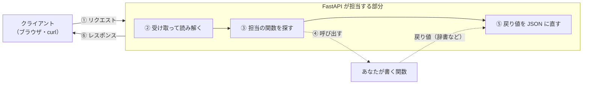
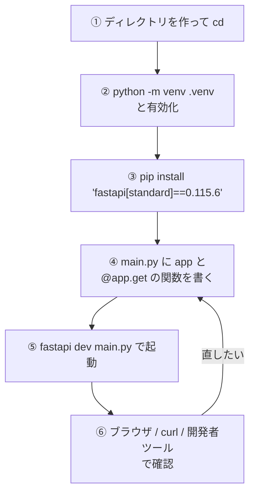
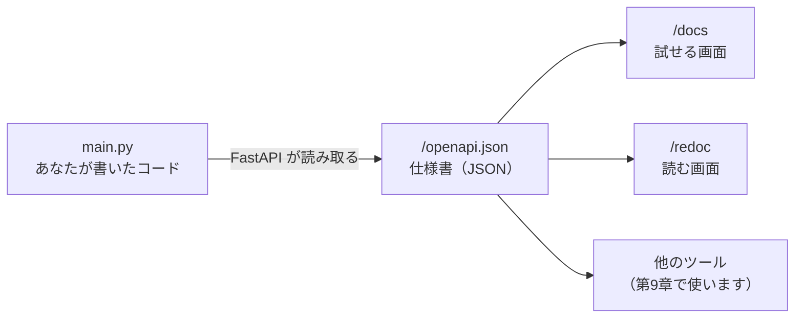

# 第2章 FastAPI をはじめる

第1章では、他人が作った API を呼び出しました。
この章では、**呼び出される側**を自分で作ります。

作るものは、たった1つの窓口を持つ、ごく小さな API です。
それでも、第1章で見た `curl` やブラウザから本当に呼び出せますし、
**自分の書いたコードの説明書が、勝手に画面として立ち上がります。**
その体験が、この章のいちばんの目的です。

## この章で学ぶこと

- FastAPI が HTTP のどの部分を肩代わりしてくれるのかを説明できるようになる
- 仮想環境を作って FastAPI をインストールし、バージョンを確認できるようになる
- `@app.get("/")` の3つの部品が、それぞれ第1章のどの話に対応するかが分かるようになる
- 開発サーバーを起動し、ブラウザ・`curl`・開発者ツールの3つから自分の API を叩けるようになる
- `/docs` の自動ドキュメントから、コードを1行も書かずに API を実行できるようになる
- 起動しないとき・エラーが出たときに、原因を3つに絞り込んで自分で直せるようになる

## この章の前提

- [第1章](./01-web-api.md) を読み終えていること
- python-text の第1章（仮想環境・`pip`）を思い出せること。忘れていても、この章で手順をすべて書きます
- python-text の第9章（型ヒント）を読み終えていること

> **つまずいたら**
> 第0章の 0.2 で準備した AI に、章番号を添えて聞いてください。
> **この章のトラブルは「環境の問題」なので、遠慮なく最後まで手伝ってもらって構いません。**
>
> ```text
> fastapi-text の 2.4.1 を読んでいます。
> fastapi dev main.py を実行すると
> 「fastapi : 用語 'fastapi' は、コマンドレット、関数、スクリプト ファイル、
> または操作可能なプログラムの名前として認識されません。」と出ます。
> Windows 11 の PowerShell を使っています。手順をコピペできる形で教えてください。
> ```

---

## 2.1 FastAPI とは

### 2.1.1 何を楽にしてくれるのか

第1章で、Web API は「HTTP で呼び出せる関数」だと説明しました。
では、その仕組みを**何もない状態から自分で作る**と、何が必要になるでしょうか。

`GET /tasks/3` という1件のリクエストを処理するだけでも、これだけの作業があります。

1. ネットワークにつなぎっぱなしにして、リクエストが届くのを待ち続ける
2. 届いた文字列を読んで、メソッド（`GET`）とパス（`/tasks/3`）に切り分ける
3. そのパスを担当する処理はどれか、自分で用意した表から探し出す
4. その処理を呼び出す
5. 戻ってきた Python の辞書を、JSON の文字列に変換する（第1章 1.3.3）
6. ステータスコードとヘッダーを付けて、HTTP の形に組み立てて送り返す

**このうち、あなたが本当に書きたいのは 4 番だけ**です。
残りは、どの API を作るときも同じ内容の繰り返しになります。

**FastAPI**（Python で Web API を作るためのフレームワーク）は、
この 1・2・3・5・6 を丸ごと引き受けてくれます。



点線で描いた部分が、この本であなたが書くところです。
実線の部分は、**1行も書かなくても動きます。**

**フレームワーク**（アプリの土台となる、大きな作りかけの構造。
決められた場所に自分のコードを入れて完成させるもの）という言葉は、
python-text の用語集にもありました。
FastAPI はまさにこれで、「決められた場所」に自分の関数を置いていく形で API を組み立てます。

そして FastAPI には、もう1つ大きな特徴があります。

> **python-text 第9章で書いた型ヒントが、飾りではなく実際の動作に効きます。**

python-text の 9.1.4 で、「型ヒントを書いても、実行時には強制されない」と学びました。
`age: int` と書いたところに文字列を入れても、Python は止めてくれませんでした。

FastAPI では違います。
型ヒントを見て、**届いたデータが合っているかを実際に検査し、合わなければ `422` を返します**
（第1章 1.2.3 で「この本で最頻出」と書いた番号です）。
さらに、その型ヒントから**説明書のページまで自動で作ります**（2.5）。

型ヒントを書く手間が、そのまま検査とドキュメントに化けます。
これがこのテキストで FastAPI を選んだ理由です。

### 2.1.2 Flask / Django との違い

Python で Web を作る道具は、FastAPI のほかにもあります。
名前を聞いたことがあるかもしれないので、位置関係だけ整理しておきます。

| | Django | Flask | FastAPI |
|---|--------|-------|---------|
| 得意なこと | Web サイトを丸ごと作る | 小さく始める | **API を作る** |
| 最初から付いてくるもの | 管理画面・ログイン・DB 設定など、とても多い | ほとんど無い | API に必要なものが一式 |
| HTML を返す機能 | 中心的な機能 | ある | 一応あるが主役ではない |
| 型ヒントの活用 | 限定的 | 限定的 | **中心的な仕組み** |
| 自動ドキュメント | 標準では無い | 標準では無い | **標準で付く** |

このテキストでは、**画面は react-text で作った React が担当し、
データは FastAPI が JSON で返す**という分担にします（第9章で実際につなぎます）。
この分担では、HTML を組み立てる機能は要りません。
必要なのは「JSON を正しく返す」ことと「仕様が分かること」で、
そこが得意なのが FastAPI です。

> **補足：どれか1つを覚えれば他も読めます**
> 3つとも「URL と関数を結びつける」という骨格は同じです。
> FastAPI を理解したあとで Flask のコードを読んでも、
> 「ああ、書き方が違うだけだ」と分かる程度の差です。
> **いまは他の2つを調べる必要はありません。**

---

## 2.2 プロジェクトを作る

### 2.2.1 ディレクトリと仮想環境

まず、この本の作業場所を作ります。
python-text で `python-lesson` を作ったのと同じ手順です。

デスクトップに `fastapi-lesson` というディレクトリを作り、そこへ移動します。

**Windows（PowerShell）**

```powershell
cd $HOME\Desktop
mkdir fastapi-lesson
cd fastapi-lesson
```

**macOS / Linux**

```bash
cd ~/Desktop
mkdir fastapi-lesson
cd fastapi-lesson
```

`mkdir` は「ディレクトリを作る」、`cd` は「そこへ移動する」コマンドです。
`$HOME` と `~` は、どちらも「自分のユーザーのホームディレクトリ」を表します。

次に、**仮想環境**（プロジェクトごとにライブラリを分けて入れるための隔離された領域）を作ります。
python-text の 1.5 と同じです。

**Windows（PowerShell）**

```powershell
python -m venv .venv
```

**macOS / Linux**

```bash
python3 -m venv .venv
```

作った仮想環境を**有効化**します。

**Windows（PowerShell）**

```powershell
.\.venv\Scripts\Activate.ps1
```

**macOS / Linux**

```bash
source .venv/bin/activate
```

行の先頭に `(.venv)` が付けば成功です。

```text
(.venv) PS C:\Users\yamada\Desktop\fastapi-lesson>
```

> **注意**
> Windows で `このシステムではスクリプトの実行が無効になっているため` というエラーが出た場合は、
> PowerShell の実行ポリシーの設定です。**python-text の 1.5.5 に復旧手順があります。**
> 次の1行を実行してから、もう一度有効化してください。
>
> ```powershell
> Set-ExecutionPolicy -Scope CurrentUser RemoteSigned
> ```
>
> 確認を求められたら `Y` を入力して Enter を押します。

> **よくある間違い**
> **これから先、ターミナルを開き直すたびに有効化が必要です。**
> `(.venv)` が付いていない状態でインストールや起動をすると、
> 2.6.1 のエラーに必ず出会います。
> **ターミナルの行頭を見る癖を、この章で付けてください。**

### 2.2.2 インストールする

有効化した状態で、FastAPI をインストールします。

**Windows（PowerShell）**

```powershell
pip install "fastapi[standard]==0.115.6"
```

**macOS / Linux**

```bash
pip install "fastapi[standard]==0.115.6"
```

コマンドの中身を分解します。

| 部分 | 意味 |
|------|------|
| `pip install` | パッケージを入れる命令（python-text 1.6） |
| `fastapi` | 入れるパッケージの名前 |
| `[standard]` | **一緒に入れる追加部品の指定** |
| `==0.115.6` | バージョンの指定（python-text 1.6.2） |
| `" "` | 全体を囲むダブルクォート |

`[standard]` は、FastAPI 本体だけでなく、
**開発サーバーを動かすための道具や `fastapi` コマンドも一緒に入れる**という指定です。
これを付けないと、2.4 の起動コマンドが使えません。

実行結果（末尾のみ。バージョン番号は環境によって多少違います）:

```text
Successfully installed annotated-types-0.7.0 anyio-4.7.0 certifi-2024.12.14
click-8.1.8 fastapi-0.115.6 fastapi-cli-0.0.7 h11-0.14.0 httptools-0.6.4
idna-3.10 pydantic-2.10.4 pydantic-core-2.27.2 python-multipart-0.0.20
sniffio-1.3.1 starlette-0.41.3 typing-extensions-4.12.2 uvicorn-0.34.0
watchfiles-1.0.3 websockets-14.1
```

`fastapi` 以外にもたくさん入っていることに注目してください。
これが**依存関係**（そのプログラムを動かすために必要な、他の人が作った部品）です。
中でも次の3つは、この本の中で名前を何度も見ることになります。

| 名前 | 役割 |
|------|------|
| `pydantic` | データの形を決めて検査する部品（第4章の主役） |
| `uvicorn` | 実際に HTTP を待ち受けるサーバー本体（2.4 で動きます） |
| `starlette` | FastAPI の土台になっている部品 |

> **よくある間違い**
> **ダブルクォートを外さないでください。**
> `pip install fastapi[standard]` と書くと、macOS の標準ターミナル（zsh）では
> `zsh: no matches found: fastapi[standard]` というエラーになります。
> `[` と `]` を、ターミナルが自分向けの記号だと解釈してしまうためです。
> **どの OS でも、囲んでおけば安全です。**

> **補足：バージョンを固定している理由**
> `==0.115.6` は、このテキストで動作を確認したバージョンです（執筆時点）。
> 指定せずに入れると、そのときの最新版が入り、
> **画面の表示や出力がテキストと変わることがあります。**
> まずはこの版で通してください。慣れてから新しい版を試すのが安全です。

### 2.2.3 バージョンを確認する

入ったことを確認します。まず、パッケージの一覧を見ます。

**Windows（PowerShell）**

```powershell
pip list
```

**macOS / Linux**

```bash
pip list
```

実行結果（抜粋）:

```text
Package           Version
----------------- ---------
fastapi           0.115.6
fastapi-cli       0.0.7
pydantic          2.10.4
uvicorn           0.34.0
```

次に、`fastapi` という**コマンド**が使えるかを確認します。
これは `[standard]` を付けたときだけ入るものです。

**Windows（PowerShell）**

```powershell
fastapi --version
```

**macOS / Linux**

```bash
fastapi --version
```

実行結果:

```text
FastAPI CLI version: 0.0.7
```

**ここで「コマンドが見つかりません」と出たら、先に進まないでください。**
原因はほぼ2つです。

1. 仮想環境を有効化していない（行頭に `(.venv)` が無い）→ 2.2.1 に戻る
2. `[standard]` を付けずにインストールした → 2.2.2 をもう一度実行する

最後に、いま入れたものを記録に残しておきます（python-text 1.6.3）。

**Windows（PowerShell）**

```powershell
pip freeze > requirements.txt
```

**macOS / Linux**

```bash
pip freeze > requirements.txt
```

`fastapi-lesson` の中に `requirements.txt` ができます。
中を開くと、**入っているものが1行に1つずつ、バージョン付きで並んでいます。**

`requirements.txt`

```text
annotated-types==0.7.0
anyio==4.7.0
fastapi==0.115.6
fastapi-cli==0.0.7
pydantic==2.10.4
uvicorn==0.34.0
（以下つづく）
```

自分で入れたのは `fastapi` の1つだけですが、
**依存関係もすべて書き出される**ので、行数は多くなります。
`fastapi==0.115.6` の行があれば、狙ったバージョンが入っています。

このファイルがあれば、別のパソコンでも
`pip install -r requirements.txt` の1行で同じ環境を再現できます。

---

## 2.3 最初のエンドポイント

### 2.3.1 `main.py` を書く

**エンドポイント**（API のうち、特定の URL とメソッドの組で呼び出せる1つの窓口）を、
1つだけ作ります。

VS Code で `fastapi-lesson` ディレクトリを開いてください。

- Windows / macOS 共通：VS Code の「ファイル」→「フォルダーを開く」から `fastapi-lesson` を選ぶ

そして、`fastapi-lesson` の直下に `main.py` というファイルを新しく作り、次を書きます。

`main.py`

```python
from fastapi import FastAPI

# アプリ本体を1つ作る。この app に窓口を登録していく
app = FastAPI()


@app.get("/")
def read_root():
    return {"message": "Hello, FastAPI"}
```

**7行です。** これで API が1つ完成しています。
上から順に見ていきます。

| 行 | 意味 |
|----|------|
| `from fastapi import FastAPI` | `fastapi` パッケージから `FastAPI` クラスを取り込む（python-text 6.2） |
| `app = FastAPI()` | そのクラスから**インスタンス**（設計図から作られた実物）を1つ作る |
| `@app.get("/")` | 次の関数を、`GET /` の窓口として登録する |
| `def read_root():` | 実際に動く関数。引数は無し |
| `return {...}` | 返したいデータ。Python の辞書 |

`app` という変数名は、**このあと起動コマンドが探しに来る名前**です。
`application`（アプリケーション）の略で、慣習的にこの名前を使います。
別の名前でも動かせますが、**このテキストでは必ず `app` にしてください**（理由は 2.6.3 で説明します）。

関数名の `read_root` は自由に決められます。
URL とは何の関係もなく、**プログラムを読む人のための名前**です。
ただし、同じファイルの中で名前が重複すると、あとから書いたほうで上書きされてしまうので、
窓口ごとに違う名前を付けてください。

### 2.3.2 デコレータの意味

`@app.get("/")` の行だけ、見慣れない形をしています。

`@` で始まるこの書き方を、python-text の 8.5.2 で一度見ました。
**デコレータ**（その下のクラスや関数に、あとから機能を足す印）と呼ばれるものです。
そこでは `@dataclass` を「クラスに `__init__` を自動で足す印」として使いました。

ここでの `@app.get("/")` は、こう読みます。

> **「すぐ下の関数を、`GET /` が来たときの担当として `app` に登録してください」**

3つの部品に分解すると、全部が第1章の話につながります。

| 部品 | 意味 | 第1章の該当箇所 |
|------|------|----------------|
| `app` | 登録先のアプリ本体 | — |
| `.get` | **HTTP メソッド** | 1.2.2（`GET` は読むだけ） |
| `("/")` | **パス**（URL の、ドメインより後ろの部分） | 1.4.2（URL の設計） |

登録された結果、次のような対応表が `app` の中にできあがります。
リクエストが届くたびに、FastAPI がこの表を引いて担当の関数を呼びます（2.1.1 の ③）。


メソッドを変えたいときは、`.get` の部分を書き換えます。
第1章 1.2.2 で見た5つのメソッドが、そのまま並びます。

| 書き方 | 対応するメソッド |
|-------|----------------|
| `@app.get("/tasks")` | `GET` |
| `@app.post("/tasks")` | `POST` |
| `@app.put("/tasks/3")` | `PUT` |
| `@app.patch("/tasks/3")` | `PATCH` |
| `@app.delete("/tasks/3")` | `DELETE` |

**別の窓口をもう1つ足してみます。**
`main.py` の末尾に、次を追記してください。

`main.py`（末尾に追記）

```python
@app.get("/health")
def health_check():
    return {"status": "ok"}
```

`/health` は、「サーバーが生きているか」を確認するためによく作られる窓口です。
これで `main.py` は、次のような姿になります。

`main.py`（ファイル全体）

```python
from fastapi import FastAPI

# アプリ本体を1つ作る。この app に窓口を登録していく
app = FastAPI()


@app.get("/")
def read_root():
    return {"message": "Hello, FastAPI"}


@app.get("/health")
def health_check():
    return {"status": "ok"}
```

**同じ `app` に、デコレータで窓口を足していく。**
これがこの本の最後まで変わらない形です。

> **よくある間違い**
> デコレータと関数の間に、空行やコメント以外のものを入れてはいけません。
> **デコレータは「すぐ下の関数」にしか効きません。**
>
> ```python
> @app.get("/health")
>
> x = 1          # ← これがあると、デコレータは x に効こうとしてエラーになる
> def health_check():
>     return {"status": "ok"}
> ```
>
> また、`@app.get("/")` の `@` を書き忘れると、**エラーも出ないまま窓口が登録されません。**
> 起動はするのに `404` が返ってくるときは、まず `@` を確認してください。

### 2.3.3 戻り値が JSON になる仕組み

`read_root` が返しているのは、**Python の辞書**です。

```python
return {"message": "Hello, FastAPI"}
```

ところが、クライアントに届くのは JSON の文字列です。

```json
{"message": "Hello, FastAPI"}
```

第1章 1.3.3 で、`json.dumps` を自分で呼んで変換したのを覚えているでしょうか。
**あの変換を、FastAPI が戻り値に対して自動で実行しています。**
さらに、`Content-Type: application/json` というヘッダー（1.2.4）も自動で付きます。

対応関係は、第1章 1.3.3 の表とまったく同じです。

| Python で返す値 | 届く JSON |
|----------------|-----------|
| `{"a": 1}` | `{"a": 1}` |
| `[1, 2, 3]` | `[1, 2, 3]` |
| `True` / `False` | `true` / `false` |
| `None` | `null` |

**入れ子になっていても、そのまま変換されます。**
試しに、3つ目の窓口を `main.py` の末尾に追記してください。

`main.py`（末尾に追記）

```python
@app.get("/info")
def read_info():
    # 辞書の中に辞書・リスト・真偽値・None を混ぜても、まとめて JSON になる
    return {
        "name": "fastapi-lesson",
        "version": 1,
        "public": True,
        "note": None,
        "tags": ["練習", "API"],
        "author": {"name": "山田", "role": "学習者"},
    }
```

この窓口を呼ぶと、次の JSON が返ります（実際に確かめるのは 2.4.2 です）。

```json
{
  "name": "fastapi-lesson",
  "version": 1,
  "public": true,
  "note": null,
  "tags": ["練習", "API"],
  "author": {"name": "山田", "role": "学習者"}
}
```

`True` が `true` に、`None` が `null` に変わっています。
**書き換えは FastAPI がやってくれるので、Python の書き方のまま返して構いません。**

> **補足：日本語はそのまま返って構いません**
> 第1章 1.3.3 で `ensure_ascii=False` を付けたのは、日本語を読みやすく表示するためでした。
> FastAPI は `charset=utf-8` を付けて返すので、
> ブラウザでも `curl` でも日本語がそのまま表示されます。
> 何も指定は要りません。

この章で返せるのは、**辞書・リスト・文字列・数値・真偽値・`None`** の範囲です。
日付や自分で作ったクラスを返す方法は、第4章（Pydantic）で扱います。

---

## 2.4 開発サーバーを起動する

### 2.4.1 `fastapi dev` で起動する

書いたコードを動かします。
`main.py` があるディレクトリ（`fastapi-lesson`）で、次を実行してください。

**Windows（PowerShell）**

```powershell
fastapi dev main.py
```

**macOS / Linux**

```bash
fastapi dev main.py
```

実行結果（枠の形や行数は版によって多少違います。要点だけ抜粋しています）:

```text
INFO     Using path main.py
INFO     Importing module main
INFO     Found importable FastAPI app

 ╭─ FastAPI CLI - Development mode ─╮
 │  Serving at: http://127.0.0.1:8000
 │  API docs:   http://127.0.0.1:8000/docs
 ╰──────────────────────────────────╯

INFO:     Started reloader process [28720] using WatchFiles
INFO:     Application startup complete.
INFO:     Uvicorn running on http://127.0.0.1:8000 (Press CTRL+C to quit)
```

**そして、ターミナルが返ってきません。**
入力待ちのプロンプト（`>` や `%`）が表示されず、カーソルが止まったままになります。

これは故障ではありません。第1章 1.1.2 で説明したとおり、
**サーバーは依頼が来るのを待ち続けるプログラム**だからです。
止めるまで、この状態が続きます。

止めるときは、**このターミナルで `Ctrl` + `C`** を押します（macOS でも `Command` ではなく `Control` です）。

表示された URL の意味も確認しておきます。

| 部分 | 意味 |
|------|------|
| `http://` | HTTP でやり取りする（第1章 1.2） |
| `127.0.0.1` | **自分のパソコン自身**を指す番号。`localhost` と書いても同じ |
| `:8000` | **ポート**（1台のコンピュータの中で、どのプログラムに繋ぐかを表す番号） |

つまりこの API は、**まだ自分のパソコンの中からしか呼べません。**
インターネットに公開する話は、第10章で触れます。

> **補足：`fastapi dev` と `fastapi run` の違い**
> `dev` は開発中のための起動方法で、コードを保存すると自動で読み直します（2.4.3）。
> `run` は公開用で、自動の読み直しをしません。
> **この本では、第9章まで一貫して `dev` を使います。**

### 2.4.2 ブラウザで確認する

サーバーを起動したまま、**別のことをします。**
起動中のターミナルは触れないので、確認は次のどちらかで行ってください。

- ブラウザを使う
- **もう1つターミナルを開く**（VS Code のターミナルなら、右上の `+` で増やせます）

まず、ブラウザのアドレス欄に次を入力します。

```text
http://127.0.0.1:8000
```

画面に、次が表示されます。

```json
{"message":"Hello, FastAPI"}
```

**自分が書いた関数の戻り値が、ブラウザに届きました。**
第1章 1.5.1 で JSONPlaceholder に対してやったことを、
今度は自分のプログラムに対してやっている状態です。

続けて、残りの2つも確認します。

```text
http://127.0.0.1:8000/health
http://127.0.0.1:8000/info
```

`/info` では、`true` と `null` になっていること（2.3.3）を目で確かめてください。

**もう1つのターミナルから `curl` でも叩けます。**
第1章 1.5.3 のとおり、Windows では `curl.exe` です。
新しく開いたターミナルで実行してください（こちらは仮想環境の有効化は不要です）。

**Windows（PowerShell）**

```powershell
curl.exe -i http://127.0.0.1:8000/health
```

**macOS / Linux**

```bash
curl -i http://127.0.0.1:8000/health
```

実行結果:

```text
HTTP/1.1 200 OK
content-type: application/json
content-length: 15

{"status":"ok"}
```

**`200` と `content-type: application/json` が、自動で付いている**ことに注目してください（2.3.3）。
自分では1行も書いていません。

そして、**サーバーを動かしているほうのターミナル**を見てください。
叩くたびに、1行ずつ記録が増えています。

```text
INFO:     127.0.0.1:52134 - "GET /health HTTP/1.1" 200 OK
```

これが**アクセスログ**（どんなリクエストが来て、何を返したかの記録）です。
第1章 1.2.3 で「`500` を見たらサーバーのターミナルを見る」と書いたのは、この画面のことです。

最後に、存在しない URL を叩いてみます。

```text
http://127.0.0.1:8000/tasks
```

```json
{"detail":"Not Found"}
```

サーバー側のターミナルにも `404 Not Found` と記録されます。
**登録していない窓口は `404`。** 第1章 1.2.3 のとおりです。

### 2.4.3 自動リロード

`fastapi dev` の便利さを確かめます。**サーバーは起動したままにしてください。**

VS Code で `main.py` を開き、`read_root` の戻り値を書き換えます。

`main.py` の `read_root` の中を、次のように変更します。

```diff
  @app.get("/")
  def read_root():
-     return {"message": "Hello, FastAPI"}
+     return {"message": "こんにちは、FastAPI"}
```

**保存した瞬間**に、サーバー側のターミナルに次が表示されます。

```text
WARNING:  WatchFiles detected changes in 'main.py'. Reloading...
INFO:     Application startup complete.
```

ブラウザで `http://127.0.0.1:8000` を再読み込みしてください。

```json
{"message":"こんにちは、FastAPI"}
```

**サーバーを止めて起動し直す必要はありません。**
`dev` は `main.py` の変更を監視していて、保存のたびに読み直しています。
これから先、コードを直すたびにこの流れになります。

> **よくある間違い**
> 変更したのに反映されないときは、次の順で確認してください。
>
> 1. **ファイルを保存したか**（VS Code のタブに `●` が付いていたら未保存です）
> 2. ターミナルに `Reloading...` が出たか。出ていなければ、保存されていないか、別のファイルを直しています
> 3. `Reloading...` の直後に赤いエラーが出ていないか。**文法エラーがあると、古いままか起動に失敗します**
> 4. ブラウザを再読み込みしたか（`Ctrl` + `F5` / `Command` + `Shift` + `R` で強制的に読み直せます）

**ここまでの流れを、通しでまとめます。**
新しい API を1つ作るときの手順は、いつもこの6つです。
2.2 から 2.4 までを、1本の道としてつなげたものです。



⑥ から ④ に戻る矢印が、開発中にいちばん多く通る道です。
**②〜③ は最初の1回だけ、④〜⑥ を何度も繰り返します。**

### 2.4.4 ポートが使用中のときの対処

起動しようとして、次のエラーが出ることがあります。

**macOS / Linux**

```text
ERROR:    [Errno 48] Address already in use
```

**Windows**

```text
ERROR:    [Errno 10048] error while attempting to bind on address
('127.0.0.1', 8000): only one usage of each socket address ...
```

意味はどちらも同じで、**ポート 8000 を、すでに別のプログラムが使っている**ということです。
1つのポートは、1つのプログラムしか使えません（第1章の「内線番号」のたとえのとおりです）。

原因はたいてい次のどちらかです。

1. **前に起動したサーバーを止め忘れている**（別のターミナルタブで動いたまま）
2. 別のアプリがたまたま 8000 番を使っている

対処は2つあります。

**対処A：別のポートで起動する（手っ取り早い）**

**Windows（PowerShell）**

```powershell
fastapi dev main.py --port 8001
```

**macOS / Linux**

```bash
fastapi dev main.py --port 8001
```

この場合、**確認する URL も `http://127.0.0.1:8001` に変わります。**
アドレス欄の番号を直し忘れて「変わらない」と悩むのが、いちばんよくある失敗です。

**ポートが違えば、2つのサーバーを同時に動かせます。**
「1つのポートは1つのプログラムだけ」という決まりは、逆から見れば
**番号さえ分けておけば、何個でも並べて動かせる**ということです。

```text
ターミナル1： fastapi dev main.py              → http://127.0.0.1:8000
ターミナル2： fastapi dev main.py --port 8001  → http://127.0.0.1:8001
```

この2つは、**別々のプログラムとして独立に動きます。**
片方を `Ctrl` + `C` で止めても、もう片方は動き続けます。
第9章で React（別のポートで動きます）と FastAPI を同時に起動するときも、
まったく同じ考え方です。

**対処B：使っているプログラムを止める（根本的）**

まず、8000 番を使っているプログラムを調べます。

**Windows（PowerShell）**

```powershell
netstat -ano | Select-String ":8000"
```

実行結果（末尾の数字が **PID**（プログラムごとの番号）です）:

```text
  TCP    127.0.0.1:8000    0.0.0.0:0    LISTENING    28720
```

その番号を指定して止めます（`28720` の部分は自分の結果に置き換えてください）。

```powershell
taskkill /PID 28720 /F
```

**macOS / Linux**

```bash
lsof -i :8000
```

実行結果:

```text
COMMAND   PID   USER   FD   TYPE  DEVICE  SIZE/OFF  NODE NAME
Python  28720 yamada    6u  IPv4  ...     0t0       TCP localhost:8000 (LISTEN)
```

```bash
kill 28720
```

> **注意**
> `taskkill` と `kill` は、指定した番号のプログラムを問答無用で終了させます。
> **`lsof` / `netstat` の結果に出た番号を、必ず目で確認してから**打ってください。
> 関係ないプログラムの番号を打つと、そのアプリが落ちます。
> 自信がないときは、対処A（別のポート）で進めて構いません。

---

## 2.5 自動ドキュメント

### 2.5.1 `/docs` を開く

サーバーを起動したまま、ブラウザで次を開いてください。

```text
http://127.0.0.1:8000/docs
```

**JSON ではなく、操作できる画面が表示されます。**

画面には、あなたが書いた3つの窓口が並んでいます。

```text
GET  /         Read Root
GET  /health   Health Check
GET  /info     Read Info
```

これが **Swagger UI**（API の仕様を表示し、その場で試せる画面）です。
`/docs` という窓口を、あなたは書いていません。
**FastAPI が、あなたのコードを読んで自動で用意したもの**です。

右側に出ている `Read Root` `Health Check` という表示にも注目してください。
これは関数名 `read_root` `health_check` から自動で作られた見出しです。
2.3.1 で「関数名は読む人のための名前」と書いたのは、こういうところに出るためです。

### 2.5.2 ドキュメントから API を実行する

この画面は、**読むためだけのものではありません。**

1. `GET /health` の行をクリックして開く
2. 右上の **`Try it out`** ボタンを押す
3. 現れた **`Execute`** ボタンを押す

すると、画面の下に結果が表示されます。

```text
Curl
  curl -X 'GET' \
    'http://127.0.0.1:8000/health' \
    -H 'accept: application/json'

Server response
  Code    200
  Response body
    {
      "status": "ok"
    }
```

見るべきものが3つあります。

| 表示 | 中身 | 第1章の該当箇所 |
|------|------|----------------|
| `Curl` | いま送られたリクエストと同じ `curl` コマンド | 1.5.3 |
| `Code` | ステータスコード | 1.2.3 |
| `Response body` | 返ってきたボディ | 1.2.4 |

**第1章で `curl` のオプションに苦労した内容が、すべてこの画面で完結します。**
とくに、1.5.3 の「補足」で触れた
**Windows の引用符の問題は、この画面を使えば起きません。**
ボディを送る第3章以降では、この画面が主な確認手段になります。

`GET /info` でも同じ操作をして、`true` と `null` が返ることを確認してください。

> **注意**
> `/docs` は、**サーバーが動いている間しか開けません。**
> ターミナルで `Ctrl` + `C` を押したあとに再読み込みすると、
> 「このサイトにアクセスできません」と表示されます。故障ではありません。

### 2.5.3 `/redoc`

同じ内容を、別の見た目で表示する窓口もあります。

```text
http://127.0.0.1:8000/redoc
```

こちらは **ReDoc** という画面で、**読むこと**に向いています。

| | `/docs`（Swagger UI） | `/redoc`（ReDoc） |
|---|---------------------|------------------|
| その場で実行 | **できる** | できない |
| 見た目 | 折りたたみ式の一覧 | 説明書のような縦長の文書 |
| 向いている用途 | 開発中の動作確認 | 仕様を人に読んでもらうとき |

**このテキストでは、基本的に `/docs` を使います。**
`/redoc` は「そういうものもある」と覚えておけば十分です。

### 2.5.4 これが FastAPI 最大の利点

2つの画面のもとになっているのは、次の窓口です。開いてみてください。

```text
http://127.0.0.1:8000/openapi.json
```

大量の JSON が表示されます。これが **OpenAPI**
（API の仕様を、決められた形式の JSON で書き表したもの）と呼ばれる仕様書です。



ここで大事なのは、**矢印の向きが1本道**だということです。

コードを直せば `/openapi.json` が変わり、`/docs` の表示も変わります。
**手で仕様書を更新する作業が存在しません。**

これは、想像以上に大きな違いです。
API を作る仕事では、次のようなことが日常的に起こります。

- 仕様書に `POST /tasks` と書いてあるのに、実際は `POST /task` だった
- 項目を1つ増やしたのに、仕様書に反映するのを忘れていた
- フロントエンド担当者が古い仕様書を見て実装し、動かないと言ってくる

**FastAPI では、この種のズレが原理的に起きません。**
仕様書がコードから作られているからです。

第9章で React とつなぐとき、`/docs` を開きながら実装することになります。
**「サーバー側が何を返すのか」を、推測ではなく画面で確かめられる**——
これが、この本で FastAPI を使う最大の理由です。

> **補足：説明を足すこともできます**
> 関数の下に文字列（**docstring**。関数の説明として書く文字列）を書くと、
> それが `/docs` の説明欄に表示されます。
>
> ```python
> @app.get("/health")
> def health_check():
>     """サーバーが動いているかを確認するための窓口。"""
>     return {"status": "ok"}
> ```
>
> 余裕があれば試してください。表示が変わります。

---

## 2.6 よくあるエラーと対処

この節は、**詰まったときに戻ってくるための節**です。
いま読んで暗記する必要はありません。

FastAPI が起動しない原因は、ほぼこの3つに絞られます。

### 2.6.1 モジュールが見つからない

```text
ModuleNotFoundError: No module named 'fastapi'
```

または、コマンド自体が見つからない場合です。

**Windows（PowerShell）**

```text
fastapi : 用語 'fastapi' は、コマンドレット、関数、スクリプト ファイル、
または操作可能なプログラムの名前として認識されません。
```

**macOS / Linux**

```text
zsh: command not found: fastapi
```

**どれも「FastAPI が、いま使っている Python から見えていない」**という意味です。
原因を上から順に潰してください。

| 順 | 疑うこと | 確認方法 | 直し方 |
|----|---------|---------|-------|
| 1 | 仮想環境を有効化していない | 行頭に `(.venv)` があるか | 2.2.1 の有効化コマンド |
| 2 | インストールしていない | `pip list` に `fastapi` があるか | 2.2.2 をやり直す |
| 3 | `[standard]` を付け忘れた | `pip list` に `fastapi-cli` があるか | 2.2.2 をやり直す |
| 4 | 別のディレクトリの仮想環境を有効化している | `pip list` の内容が身に覚えのないものか | 一度 `deactivate` して、`fastapi-lesson` で有効化し直す |

**いちばん多いのは 1 です。**
ターミナルを開き直したり、VS Code を再起動したりすると、有効化は解除されます。

### 2.6.2 仮想環境の有効化忘れ

2.6.1 の 1 番を、もう少し詳しく見ます。
**「有効化したつもり」で違っていることがある**からです。

確実な確認方法は、**いまどの Python が使われているかを表示させる**ことです。

**Windows（PowerShell）**

```powershell
Get-Command python | Select-Object Source
```

実行結果（有効化できている場合）:

```text
Source
------
C:\Users\yamada\Desktop\fastapi-lesson\.venv\Scripts\python.exe
```

**macOS / Linux**

```bash
which python
```

実行結果（有効化できている場合）:

```text
/Users/yamada/Desktop/fastapi-lesson/.venv/bin/python
```

**パスの中に `fastapi-lesson/.venv` が入っていれば正解**です。
入っていなければ、有効化できていません。

```text
C:\Users\yamada\AppData\Local\Programs\Python\Python312\python.exe   ← .venv が無い
```

この状態で `pip install` をすると、**パソコン全体のほうに入ってしまいます。**
気づかないまま進むと、あとで「入れたはずなのに無い」という状況になります。

> **つまずいたら**
> 有効化しても状況が変わらない場合は、`.venv` を作り直すのが早いです。
> python-text 1.5.4 のとおり、`.venv` は捨てて作り直せます。
> それでも直らなければ、AI に次のように聞いてください。
>
> ```text
> fastapi-text の 2.6.2 です。
> .venv を有効化して (.venv) は表示されているのに、
> which python の結果に .venv が含まれません。macOS を使っています。
> ```

### 2.6.3 ファイル名・変数名の間違い

3つ目は、名前の食い違いです。

**`fastapi dev main.py` は、次の2つを名前で探します。**

1. `main.py` という**ファイル**
2. その中の `app` という**変数**

どちらかが違うと起動できません。

**ファイル名が違う場合**

```text
Error: Path does not exist main.py
```

`main.py` が、**いまいるディレクトリに無い**ということです。
ターミナルの現在地を確認してください。

**Windows（PowerShell）**

```powershell
pwd
ls
```

**macOS / Linux**

```bash
pwd
ls
```

`ls` の結果に `main.py` が出てこなければ、`cd` で `fastapi-lesson` に移動します。
`Main.py` や `main.py.txt` のように、**大文字や拡張子が違っていないか**も確認してください
（拡張子の表示方法は react-text 1.5 にあります）。

**変数名が違う場合**

```python
application = FastAPI()      # ← app ではない名前にしてしまった
```

この場合、次のような表示になります。

```text
There is no FastAPI app or you haven't used a supported type.
```

**`app` という名前が見つからない**ということです。
2.3.1 で「必ず `app` にしてください」と書いたのは、これを避けるためです。

> **よくある間違い**
> `fastapi dev` を、**`main.py` と同じディレクトリ以外で実行してしまう**のもよくある失敗です。
> たとえば `fastapi-lesson` の1つ上（デスクトップ）で実行すると、`Path does not exist` になります。
> **起動する前に `ls`（Windows も `ls` で動きます）を打って、
> `main.py` が見えることを確認する**習慣を付けてください。

**エラーの読み方は、python-text 1.4 と同じです。**
トレースバックが出た場合は、**いちばん下の行**に本当の原因が書かれています。
`main.py` の中の文法ミス（コロンの付け忘れ、インデントのずれ）なら、
何行目かも表示されています。

---

## まとめ

- FastAPI は、HTTP の**受け取り・振り分け・JSON への変換・返送**を肩代わりする（2.1.1）
- あなたが書くのは「呼ばれる関数」だけでよい
- python-text で学んだ**型ヒントが、実際の検査とドキュメントに使われる**のが FastAPI の特徴
- プロジェクトは **ディレクトリ作成 → `venv` → `pip install "fastapi[standard]==0.115.6"`** の順で作る
- `[standard]` を付けないと `fastapi` コマンドが入らない。**ダブルクォートで囲む**
- `app = FastAPI()` でアプリ本体を作り、**`@app.get("/")` で窓口を登録する**
- デコレータの3部品は、**登録先（`app`）・メソッド（`.get`）・パス（`("/")`）**
- **戻り値の辞書は、自動で JSON になる。** `True` → `true`、`None` → `null`
- `fastapi dev main.py` で起動する。**ターミナルは返ってこない。止めるのは `Ctrl` + `C`**
- `dev` は保存のたびに自動で読み直す（`Reloading...`）
- ポートが埋まっていたら、`--port 8001` で逃げるか、`netstat` / `lsof` で調べて止める
- **`/docs` を開くと、書いた覚えのない操作画面が出る。** `Try it out` → `Execute` で実行できる
- `/docs` と `/redoc` のもとは `/openapi.json`。**コードから自動で作られるのでズレない**
- 起動しないときの原因は、**有効化忘れ・インストール漏れ・名前の食い違い**の3つに絞られる

---

## 理解度チェック

**問 2.1**（穴埋め）

FastAPI で窓口を登録するには、関数の直前に（　①　）と呼ばれる `@` で始まる行を書く。
`@app.post("/tasks")` の場合、`post` の部分は HTTP の（　②　）を、
`"/tasks"` の部分は（　③　）を表している。

**問 2.2**（選択）

`pip install "fastapi[standard]==0.115.6"` の `[standard]` を付けなかった場合、
起こることとして正しいものを1つ選んでください。

1. FastAPI 自体がインストールされない
2. `fastapi` コマンドが入らず、`fastapi dev` で起動できない
3. `/docs` の画面が表示されなくなる
4. 戻り値が JSON に変換されなくなる

**問 2.3**（選択）

`fastapi dev main.py` を実行したら、次のエラーが出ました。

```text
ERROR:    [Errno 48] Address already in use
```

最初に疑うべきものはどれですか。1つ選んでください。

1. `main.py` の文法が間違っている
2. 仮想環境を有効化していない
3. 別のターミナルで、同じサーバーがまだ動いている
4. インターネットに接続できていない

**問 2.4**（記述）

次の関数の戻り値は、クライアントにどんな JSON として届きますか。書いてください。

```python
@app.get("/status")
def read_status():
    return {"ready": True, "error": None, "count": 0}
```

**問 2.5**（記述）

`fastapi dev` で起動したあと、ターミナルにプロンプトが戻ってこない理由を1行で説明してください。

**問 2.6**（記述）

`/docs` の内容が、コードと食い違うことがないのはなぜですか。
`/openapi.json` という言葉を使って1行で説明してください。

**問 2.7**（記述）

`ModuleNotFoundError: No module named 'fastapi'` が出たとき、
最初に確認すべきことを1つ挙げ、その確認方法も書いてください。

---

## 演習問題

### 演習 2.1 ★☆☆ 窓口をもう1つ増やす

**課題**

`fastapi-lesson` の `main.py` に、4つ目の窓口を追加してください。

- パスは `/about`
- メソッドは `GET`
- 戻り値は辞書で、次の3つのキーを持つこと
  - `title`：文字列（自由な内容）
  - `chapter`：数値の `2`
  - `finished`：真偽値の `False`

追加したら、サーバーを**止めずに**保存し、ブラウザと `/docs` の両方で確認してください。

**完成条件**

- `http://127.0.0.1:8000/about` を開くと、3つのキーを持つ JSON が表示される
- その JSON の中で、`finished` が `False` ではなく **`false`** になっている
- サーバー側のターミナルに `Reloading...` が表示され、**再起動していない**
- `/docs` の一覧に `GET /about` の行が増えており、`Try it out` → `Execute` で `200` が返る
- 開発者ツールの Network タブで、`content-type` が `application/json` であることを確認できている

**ヒント**

2.3.2 で `/health` を足したときと、まったく同じ手順です。

---

### 演習 2.2 ★★☆ 別のプロジェクトを1から立ち上げる

**課題**

`fastapi-lesson` とは**別のディレクトリ**に、新しい API プロジェクトを1から作ってください。
`fastapi-lesson` のファイルはコピーせず、**手順を通しでやり直すことが目的**です。

- ディレクトリ名は `weather-api`（デスクトップに作る）
- 仮想環境を作って有効化し、FastAPI を入れる
- `main.py` に、次の2つの窓口を作る
  - `GET /` → `{"service": "weather-api"}` を返す
  - `GET /today` → 次の形の辞書を返す（値は自由）

    ```python
    {
        "city": "東京",
        "temperature": 28,
        "rain": False,
        "warning": None,
        "hours": [9, 12, 15],
    }
    ```

- **ポート 8001** で起動する
- `curl` で `/today` を叩き、ステータスコードまで確認する
- 最後に `requirements.txt` を書き出す

**完成条件**

- `weather-api` の中に `.venv` と `main.py` と `requirements.txt` がある
- `fastapi dev main.py --port 8001` で起動できている
- `curl` の結果の1行目に `200` が表示されている（ヘッダーを表示するオプションを使う）
- 返ってきた JSON の中で、`rain` が `false`、`warning` が `null` になっている
- `requirements.txt` の中に `fastapi==0.115.6` の行がある
- **`fastapi-lesson` のサーバー（8000 番）を止めずに、同時に動かせている**

**ヒント**

2.4.3 の最後にある6ステップの図を、上から順にたどってください。
最後の条件は、2.4.4 で「1つのポートは1つのプログラムしか使えない」と書いたことの裏返しです。

---

### 演習 2.3 ★★☆ わざと壊して、直せるようになる

**課題**

エラーは、出てから調べるより**先に一度見ておく**ほうが、実際の場面で早く動けます。
次の3つの状況を**自分で意図的に作り出し**、それぞれについて記録してください。

1. 仮想環境を有効化していない状態で `fastapi dev main.py` を実行する
2. `main.py` の `app = FastAPI()` を `application = FastAPI()` に書き換えて起動する
3. 8000 番でサーバーを起動したまま、**別のターミナルでもう一度**同じコマンドを実行する

それぞれについて、次の3つをメモに書き出してください。

- 表示されたエラーメッセージ（1行でよい）
- 原因（なぜそうなったか）
- 直した方法

**完成条件**

- 3つすべてについて、エラーメッセージ・原因・直し方の3点が書けている
- 1 番のメモに、有効化できているかを確かめるコマンド（自分の OS のもの）が書かれている
- 2 番のメモに、`fastapi dev` が**変数名で探している**という説明が入っている
- 3 番のメモに、**別のポートで起動する方法**と**使用中のプログラムを止める方法**の両方が書かれている
- 3つとも直したあと、`main.py` が元どおり動く状態に戻っている

**ヒント**

答えは 2.6 と 2.4.4 に書かれています。
ただし、**読んで写すのではなく、実際に手を動かして自分の画面に出た文言を記録**してください。
本文の例と表示が少し違っても、それが正解です。

---

解答は [解答編 その1](./90-answers-part1.md#第2章) にあります。
**必ず自分で手を動かしてから**見てください。

---

## 次の章へ

自分の API を立ち上げ、ブラウザ・`curl`・`/docs` の3つから呼び出せるようになりました。

ただし、いま作った窓口は**いつ呼んでも同じものしか返しません。**
本当に欲しいのは、`/tasks/3` の `3` や `?done=true` の `true` のように、
**呼ぶ側が値を指定できる窓口**です。

次の章では、URL やボディに乗ってきた値を関数の引数として受け取ります。
ここで、**python-text 第9章の型ヒントが本当に効き始めます。**
第1章 1.2.3 で予告した `422` にも、いよいよ出会うことになります。

→ [第3章 パラメータを受け取る](./03-parameters.md)
