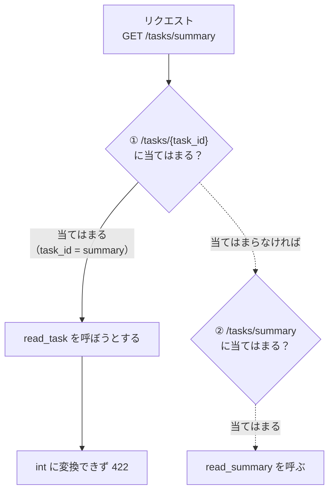
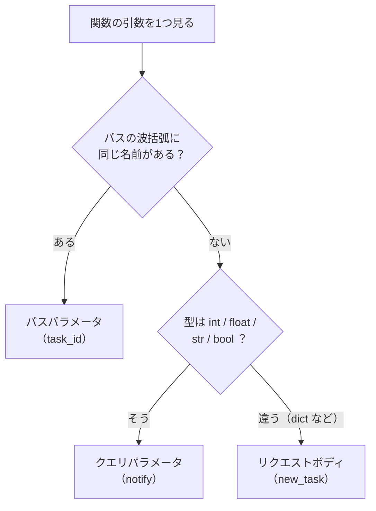
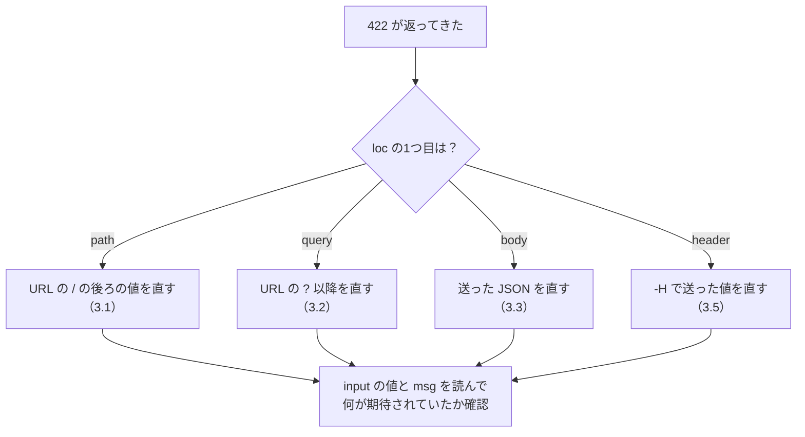

# 第3章 パラメータを受け取る

第2章で作った窓口は、**いつ呼んでも同じものしか返しませんでした。**

しかし、本当に欲しいのは次のような API です。

- `/tasks/3` と呼んだら、3番のタスクだけを返す
- `/tasks?done=true` と呼んだら、終わったタスクだけを返す
- `POST /tasks` にタスクの内容を送ったら、それを追加する

どれも、**呼ぶ側が指定した値**によって結果が変わります。
この値を受け取る仕組みが、この章のテーマです。

そして、ここで **python-text 第9章で書いた型ヒントが、初めて「実際の動作」を決めます。**
第1章 1.2.3 で「この本で最頻出」と予告した `422` にも、いよいよ出会います。

## この章で学ぶこと

- URL の一部（`/tasks/3` の `3`）を、関数の引数として受け取れるようになる
- `?done=true` のような条件を受け取って、返す内容を変えられるようになる
- `POST` で送られてきた JSON を受け取り、データを追加できるようになる
- 値の乗せ場所（パス・クエリ・ボディ・ヘッダー・クッキー）を、目的から選べるようになる
- 受け取る値に条件（1以上・20文字以内など）を付けられるようになる
- `422` のエラーレスポンスを読んで、**どこの何が悪いのか**を自分で特定できるようになる

## この章の前提

- [第2章](./02-getting-started.md) を読み終え、`fastapi-lesson` で `fastapi dev main.py` が起動できること
- python-text の第4章（リスト・辞書）、第5章（関数・引数・デフォルト引数）を読み終えていること
- python-text の第9章（型ヒント・`| None`）を読み終えていること

> **つまずいたら**
> 第0章の 0.2 で準備した AI に、章番号を添えて聞いてください。
> **返ってきたステータスコードと、レスポンスのボディを必ず貼り付けてください。**
> この章のトラブルは、そこにほとんどの情報が入っています。
>
> ```text
> fastapi-text の 3.2.2 を読んでいます。
> http://127.0.0.1:8000/tasks を開くと 422 が返り、
> {"detail":[{"type":"missing","loc":["query","done"], ...}]} と表示されます。
> main.py の read_tasks は次のように書いています。
> （ここにコードを貼る）
> ```

---

## 3.1 パスパラメータ

### 3.1.1 URL の一部を受け取る

この章では、**タスク管理 API** を少しずつ育てていきます。
第9章で React とつなぐアプリの、いちばん小さな原型です。

まず `fastapi-lesson` の `main.py` を、次の内容に**書き換えて**ください。
第2章の内容を残しておきたい場合は、`main.py` を `main_ch2.py` という名前にコピーしてから書き換えてください
（起動するのは `main.py` だけなので、置いてあっても動作には影響しません）。

`main.py`（ファイル全体）

```python
from fastapi import FastAPI

app = FastAPI()

# 練習用のデータ。サーバーを止めると消える（保存する方法は第6章）
tasks = [
    {"id": 1, "title": "牛乳を買う", "done": False},
    {"id": 2, "title": "レポートを書く", "done": True},
    {"id": 3, "title": "部屋を片づける", "done": False},
]


@app.get("/tasks/{task_id}")
def read_task(task_id):
    return {"task_id": task_id}
```

`tasks` は、**辞書を要素に持つリスト**です（python-text 4.3.5）。
本物の API ではデータベースに保存しますが、それは第6章です。
**この章の間は、サーバーを止めるとデータが消えます。** それで構いません。

注目してほしいのは、パスの中の `{task_id}` です。

```python
@app.get("/tasks/{task_id}")
```

**波括弧 `{ }` で囲んだ部分は、「ここには何が来てもよい」という印**になります。
そして、**そこに来た値が、同じ名前の引数に渡されます。**

このように、URL の一部として渡される値を
**パスパラメータ**（URL の一部分として渡す値。「どれか1つ」を指すのに使う）と呼びます。

| パスの書き方 | 実際の URL | `task_id` に入る値 |
|------------|-----------|------------------|
| `/tasks/{task_id}` | `/tasks/1` | `1` |
| `/tasks/{task_id}` | `/tasks/3` | `3` |
| `/tasks/{task_id}` | `/tasks/hello` | `hello` |

サーバーを起動して確かめます。

**Windows（PowerShell）**

```powershell
fastapi dev main.py
```

**macOS / Linux**

```bash
fastapi dev main.py
```

ブラウザで次を開いてください。

```text
http://127.0.0.1:8000/tasks/3
```

```json
{"task_id":"3"}
```

**`3` が、ダブルクォートで囲まれている**ことに気づいたでしょうか。
数値の `3` ではなく、**文字列の `"3"`** として届いています。

これは当然といえば当然です。URL はただの文字列であり、
`/tasks/3` の `3` も、そのままでは文字の `3` でしかありません。
このままでは、`tasks` の中の `"id": 3`（数値）と比べても一致しません。

そこで登場するのが型ヒントです。

> **よくある間違い**
> **波括弧の中の名前と、引数の名前は必ず一致させてください。**
>
> ```python
> @app.get("/tasks/{task_id}")
> def read_task(id):          # ← task_id ではなく id にしてしまった
>     return {"id": id}
> ```
>
> この場合、エラーで止まってはくれません。`/tasks/3` を開くと `422` が返り、
> `{"detail":[{"type":"missing","loc":["query","id"], ...}]}` と表示されます。
> FastAPI から見ると、`task_id` は誰も受け取らず、
> **`id` はパスに無いので「クエリパラメータ（3.2）が足りない」**という解釈になるためです。
> `loc` に `query` と出ているのに URL のことを言われている——と感じたら、まず名前の綴りを疑ってください。

### 3.1.2 型を指定する

引数に型ヒントを付けます。`main.py` の `read_task` を、次のように変更してください。

```diff
  @app.get("/tasks/{task_id}")
- def read_task(task_id):
-     return {"task_id": task_id}
+ def read_task(task_id: int):
+     return {"task_id": task_id}
```

保存すると自動で読み直されます（2.4.3）。もう一度 `http://127.0.0.1:8000/tasks/3` を開きます。

```json
{"task_id":3}
```

**ダブルクォートが消えました。** 数値の `3` になっています。

python-text 9.1.4 で、「型ヒントを書いても実行時には強制されない」と学びました。
**FastAPI では違います。** 型ヒントを見て、次の2つを実際に行います。

1. 届いた文字列を、その型に**変換する**（`"3"` → `3`）
2. 変換できなければ、**`422` を返して関数を呼ばない**（3.1.3）

つまり `read_task` の中では、**`task_id` が `int` であることが保証されています。**
「数値になっているか」を `if` で自分で確かめるコードは、書かなくてよくなります。

変換された値を使って、実際にタスクを1件返してみます。

`main.py` の `read_task` を、次のように書き換えてください。

`main.py`（`read_task` の部分）

```python
@app.get("/tasks/{task_id}")
def read_task(task_id: int):
    for task in tasks:
        # task_id は int に変換済みなので、"id"（数値）とそのまま比べられる
        if task["id"] == task_id:
            return task
    return {"message": f"id {task_id} のタスクは見つかりませんでした"}
```

`http://127.0.0.1:8000/tasks/3` を開きます。

```json
{"id":3,"title":"部屋を片づける","done":false}
```

**リストの中から1件を選んで返せました。** これがパスパラメータの基本の使い方です。

存在しない番号も試してください。

```text
http://127.0.0.1:8000/tasks/99
```

```json
{"message":"id 99 のタスクは見つかりませんでした"}
```

> **注意**
> いまの書き方では、見つからなかった場合も**ステータスコードは `200`** です。
> 第1章 1.2.3 のとおり、本来は `404` を返すべき場面です。
> **`404` を返す方法（`HTTPException`）は第5章 5.4.1 で扱います。**
> それまでは、この「`200` でメッセージを返す」形のままで進めます。

型は `int` のほかにも使えます。この章で使うのは、次の4つだけです。

| 型ヒント | 受け取れるもの | 例 |
|---------|--------------|---|
| `int` | 整数 | `3`、`-1` |
| `float` | 小数 | `1.5` |
| `str` | 文字列（何でも通る） | `hello` |
| `bool` | 真偽値 | `true`、`false`（3.2.1） |

### 3.1.3 型が違うとどうなるか

`int` と書いたところに、数値にできない文字列が来たらどうなるか。**実際に見ておきます。**

```text
http://127.0.0.1:8000/tasks/abc
```

```json
{"detail":[{"type":"int_parsing","loc":["path","task_id"],"msg":"Input should be a valid integer, unable to parse string as an integer","input":"abc"}]}
```

そして、**サーバー側のターミナル**には次が記録されます。

```text
INFO:     127.0.0.1:52140 - "GET /tasks/abc HTTP/1.1" 422 Unprocessable Entity
```

これが `422`（第1章 1.2.3）です。いまは、次の3点だけ読み取れれば十分です。

| 項目 | 値 | 意味 |
|------|---|------|
| `loc` | `["path", "task_id"]` | **パスの `task_id` の場所**で問題が起きた |
| `msg` | `Input should be a valid integer ...` | 整数として読めなかった |
| `input` | `"abc"` | 実際に届いた値 |

**この JSON の完全な読み方は 3.4.2 で扱います。**

ここで大事なのは、**`read_task` の中身は一度も実行されていない**ということです。
FastAPI が入口で弾いています。だから関数の中では、
「`task_id` が数値でなかったら」という心配をしなくて済みます。

> **補足：`404` と `422` の違い**
> どちらもクライアント側のエラー（`4xx`）ですが、意味が違います。
>
> | URL | 結果 | 理由 |
> |-----|------|------|
> | `/tasks/abc` | `422` | **形式が違う。** `int` にできない |
> | `/tasks/99` | 本来は `404` | 形式は正しいが、**その番号のものが無い** |
> | `/taskss/3` | `404` | **そんな窓口が登録されていない**（2.4.2） |
>
> 「形が違う」のか「見つからない」のかを、コードで区別できるようにしておくと、
> 第9章でフロントエンド側の表示を分けるときに役立ちます。

### 3.1.4 定義の順序で挙動が変わる

タスクの件数をまとめて返す窓口 `/tasks/summary` を作ります。
**あえて、いま良くない場所に書きます。** `main.py` の**末尾**に追記してください。

`main.py`（末尾に追記）

```python
@app.get("/tasks/summary")
def read_summary():
    done_count = len([task for task in tasks if task["done"]])
    return {
        "total": len(tasks),
        "done": done_count,
        "remaining": len(tasks) - done_count,
    }
```

内包表記（python-text 4.5.2）で、`done` が `True` のものを数えています。

ブラウザで開いてみてください。

```text
http://127.0.0.1:8000/tasks/summary
```

```json
{"detail":[{"type":"int_parsing","loc":["path","task_id"],"msg":"Input should be a valid integer, unable to parse string as an integer","input":"summary"}]}
```

**書いたはずの窓口が動かず、`422` が返ってきました。**

理由は、FastAPI が**登録された順に上から照合していく**からです。
`/tasks/summary` は `/tasks/{task_id}` の形にも当てはまるため、
**先に書いてある `/tasks/{task_id}` が先に捕まえてしまいます。**
そのうえで `"summary"` を `int` に変換しようとして失敗し、`422` になっています。



点線の道には、**決して進みません。** ①で決まってしまうからです。

直し方は1つだけです。**固定のパスを、波括弧を含むパスより先に書きます。**

`main.py` を、次の順番になるように並べ替えてください。
（`read_summary` の定義を、`read_task` の**前**に移動します。）

`main.py`（ファイル全体）

```python
from fastapi import FastAPI

app = FastAPI()

# 練習用のデータ。サーバーを止めると消える（保存する方法は第6章）
tasks = [
    {"id": 1, "title": "牛乳を買う", "done": False},
    {"id": 2, "title": "レポートを書く", "done": True},
    {"id": 3, "title": "部屋を片づける", "done": False},
]


# 固定のパスを先に書く（波括弧を含むパスより上）
@app.get("/tasks/summary")
def read_summary():
    done_count = len([task for task in tasks if task["done"]])
    return {
        "total": len(tasks),
        "done": done_count,
        "remaining": len(tasks) - done_count,
    }


@app.get("/tasks/{task_id}")
def read_task(task_id: int):
    for task in tasks:
        if task["id"] == task_id:
            return task
    return {"message": f"id {task_id} のタスクは見つかりませんでした"}
```

もう一度 `http://127.0.0.1:8000/tasks/summary` を開きます。

```json
{"total":3,"done":1,"remaining":2}
```

**今度は通りました。** `/tasks/3` も、そのまま動きます。

> **よくある間違い**
> 同じ問題は、**型ヒントを付けていないと `422` すら出ません。**
> `task_id` に型を書いていない場合、`/tasks/summary` は次を返します。
>
> ```json
> {"task_id":"summary"}
> ```
>
> エラーが出ないぶん、**気づくのが遅れます。**
> 「作ったはずの窓口が、なぜか別の窓口の結果を返す」ときは、
> **上のほうに波括弧付きのパスが無いか**を確認してください。

---

## 3.2 クエリパラメータ

### 3.2.1 `?key=value` を受け取る

パスパラメータは「どれか1つ」を指すのに向いています。
一方、**「絞り込みの条件」や「並べ方」**のような、**あってもなくてもよい指定**には別の場所を使います。

それが URL の `?` 以降の部分です。

```text
http://127.0.0.1:8000/tasks?done=true&limit=2
└────────── パス ───────┘└─────── ここ ──────┘
```

| 部分 | 意味 |
|------|------|
| `?` | ここから条件が始まる、という区切り |
| `done=true` | 名前 `done` に値 `true` を渡す |
| `&` | 条件が2つ以上あるときの区切り |
| `limit=2` | 名前 `limit` に値 `2` を渡す |

このように `?` 以降に付ける値を
**クエリパラメータ**（URL の `?` 以降に「名前=値」の形で付ける値。絞り込みや並べ替えの指定に使う）と呼びます。

受け取り方は、**パスパラメータとほとんど同じ**です。
違いは、**パスの波括弧に書かないこと**だけです。

`main.py` の末尾に、次を追記してください。

`main.py`（末尾に追記）

```python
@app.get("/tasks")
def read_tasks(done: bool):
    # done が True のものだけ、False のものだけを取り出す
    result = [task for task in tasks if task["done"] == done]
    return {"count": len(result), "tasks": result}
```

> **注意**
> `/tasks` は波括弧を含まない固定のパスですが、`/tasks/{task_id}` とは**別のパス**です
> （`/tasks` と `/tasks/3` は違う URL です）。順序を気にする必要はありません。
> 3.1.4 で問題になるのは、`/tasks/summary` と `/tasks/{task_id}` のように、
> **同じ形に当てはまってしまう**組み合わせだけです。

ブラウザで開きます。

```text
http://127.0.0.1:8000/tasks?done=true
```

```json
{"count":1,"tasks":[{"id":2,"title":"レポートを書く","done":true}]}
```

`?done=false` に変えると、残り2件が返ります。

**FastAPI がどこから値を取るかは、次の1行で決まります。**

> **関数の引数のうち、パスの波括弧に同じ名前が無いものは、クエリパラメータとして扱われる。**

`bool` の場合、次の書き方がすべて `True` として受け取られます。

| URL の書き方 | 受け取る値 |
|------------|-----------|
| `?done=true` / `?done=True` / `?done=TRUE` | `True` |
| `?done=1` | `True` |
| `?done=yes` / `?done=on` | `True` |
| `?done=false` / `?done=0` / `?done=no` / `?done=off` | `False` |

`?done=maybe` のように解釈できない値を渡すと、`422` が返ります。

```json
{"detail":[{"type":"bool_parsing","loc":["query","done"],"msg":"Input should be a valid boolean, unable to interpret input","input":"maybe"}]}
```

`loc` が `["query", "done"]` になっている点に注目してください。
3.1.3 では `["path", "task_id"]` でした。
**`loc` の1つ目を見れば、URL のどこを直せばよいかが分かります**（3.4.2）。

### 3.2.2 デフォルト値と必須指定

いまの状態で、条件を付けずに開いてみてください。

```text
http://127.0.0.1:8000/tasks
```

```json
{"detail":[{"type":"missing","loc":["query","done"],"msg":"Field required","input":null}]}
```

**`done` が必須になっています。**
一覧を見たいだけなのに条件を強制されるのは不便です。

必須にするかどうかは、**Python の関数のデフォルト引数（python-text 5.2.3）と同じ規則**で決まります。

| 書き方 | 意味 |
|-------|------|
| `done: bool` | **必須。** 省略すると `422` |
| `done: bool = False` | 省略可能。省略したら `False` |

件数の上限を表す `limit` を、デフォルト値付きで足します。

`main.py` の `read_tasks` を、次のように変更してください。

```diff
  @app.get("/tasks")
- def read_tasks(done: bool):
+ def read_tasks(done: bool, limit: int = 10):
      result = [task for task in tasks if task["done"] == done]
-     return {"count": len(result), "tasks": result}
+     # スライス（python-text 4.1.3）で先頭から limit 件だけ切り出す
+     return {"count": len(result), "tasks": result[:limit]}
```

確認します。

```text
http://127.0.0.1:8000/tasks?done=false&limit=1
```

```json
{"count":2,"tasks":[{"id":1,"title":"牛乳を買う","done":false}]}
```

`count` は 2 のまま、`tasks` は 1 件だけになりました。
**「見つかった件数」と「返した件数」を分けて返している**ためです。

`limit` を省略した `http://127.0.0.1:8000/tasks?done=false` では、`10` が使われて2件とも返ります。

> **よくある間違い**
> **URL の `?` と `&` を間違えると、値は届きません。**
>
> ```text
> /tasks?done=false?limit=1     ← 2つ目も ? にしてしまった
> /tasks&done=false             ← 最初が & になっている
> ```
>
> どちらもエラーにはならず、**指定が無視されたように見えます**（`done` が届かず `422` になることもあります）。
> **`?` は1つだけ、2つ目からは `&`** です。

### 3.2.3 省略可能にする（`| None`）

`done` を「省略できる」ようにしたいのですが、`done: bool = False` では困ります。
それだと、**省略したときに「未完了だけ」に絞り込まれてしまう**からです。

欲しいのは、次の3つの状態です。

| URL | やりたいこと |
|-----|------------|
| `/tasks` | **絞り込まない**（全部返す） |
| `/tasks?done=true` | 完了だけ |
| `/tasks?done=false` | 未完了だけ |

`True` と `False` の2つでは足りず、**「指定されなかった」を表す第3の値**が要ります。
python-text 9.2.2 で学んだ `| None` の出番です。

`main.py` の `read_tasks` を、次のように変更してください。

`main.py`（`read_tasks` の部分）

```python
@app.get("/tasks")
def read_tasks(done: bool | None = None, limit: int = 10):
    result = tasks
    # None は「指定されなかった」の意味。そのときは絞り込まない
    if done is not None:
        result = [task for task in result if task["done"] == done]
    return {"count": len(result), "tasks": result[:limit]}
```

`bool | None` は「真偽値、または `None`」という意味の型ヒントです（python-text 9.2.2）。
`= None` を付けることで、省略時は `None` になります。

3つとも確認してください。

```text
http://127.0.0.1:8000/tasks
```

```json
{"count":3,"tasks":[{"id":1,"title":"牛乳を買う","done":false},{"id":2,"title":"レポートを書く","done":true},{"id":3,"title":"部屋を片づける","done":false}]}
```

```text
http://127.0.0.1:8000/tasks?done=true
```

```json
{"count":1,"tasks":[{"id":2,"title":"レポートを書く","done":true}]}
```

> **よくある間違い**
> `if done:` と書いてしまうと、**`done=false` の絞り込みが効きません。**
> `None` も `False` も、`if` の条件としては「偽」だからです（python-text 3.1.5）。
> **「値が来なかった」と「`False` が来た」を区別したいときは、必ず `is not None` で比べます。**

### 3.2.4 複数の値を受け取る

「1番と3番のタスクをまとめて取りたい」ように、**同じ名前で値を複数渡したい**ことがあります。
URL では、同じ名前を並べて書きます。

```text
/tasks/by-ids?task_id=1&task_id=3
```

これを受け取るには、型ヒントを `list[int]`（python-text 9.2.1）にします。
ただし、**それだけでは値が届きません。** `Query` という指定が必要になります。

`main.py` の1行目と、`/tasks/{task_id}` の**前**に、次を追加してください。

`main.py`（1行目を変更）

```diff
- from fastapi import FastAPI
+ from fastapi import FastAPI, Query
```

`main.py`（`@app.get("/tasks/{task_id}")` の直前に追記）

```python
@app.get("/tasks/by-ids")
def read_tasks_by_ids(task_id: list[int] = Query(default=[])):
    found = [task for task in tasks if task["id"] in task_id]
    return {"requested": task_id, "count": len(found), "tasks": found}
```

**`/tasks/by-ids` も固定のパスなので、`/tasks/{task_id}` より前に書きます**（3.1.4）。
後ろに書くと、`by-ids` を `int` に変換しようとして `422` になります。

`Query(default=[])` は、「これはクエリパラメータで、省略時は空のリスト」という指定です。
`Query` の詳しい使い方は 3.4.1 で扱います。ここでは**複数受け取るために必要**とだけ覚えてください。

ブラウザで開きます。

```text
http://127.0.0.1:8000/tasks/by-ids?task_id=1&task_id=3
```

```json
{"requested":[1,3],"count":2,"tasks":[{"id":1,"title":"牛乳を買う","done":false},{"id":3,"title":"部屋を片づける","done":false}]}
```

`task_id` に、**2つの値がリストとして入って**います。
`in` を使った絞り込み（python-text 3.1.4）で、2件が取り出せました。

> **よくある間違い**
> `Query(default=[])` を書かずに、次のようにした場合です。
>
> ```python
> def read_tasks_by_ids(task_id: list[int] = []):     # Query が無い
> ```
>
> このとき、**エラーは出ませんが、値も届きません。**
>
> ```json
> {"requested":[],"count":0,"tasks":[]}
> ```
>
> リストや辞書の型ヒントを見ると、FastAPI は
> 「これはボディ（3.3）だろう」と解釈しようとします。
> **クエリから複数受け取るときは、`Query` を付けて明示してください。**

> **補足：「デフォルト引数にリストを使うな」との関係**
> python-text 5.2.4 で、**デフォルト引数に空のリストを書いてはいけない**と学びました。
> 呼び出しのたびに同じリストが使い回され、前回の内容が残ってしまうためです。
>
> `Query(default=[])` は、その問題を起こしません。
> **リクエストごとに、新しい空のリストが作られます**（`Query` に渡した `[]` は
> 「省略時はこういう値」という指定であって、そのリスト自体が渡されるわけではありません）。
> **`Query` を使わずに `task_id: list[int] = []` と書いた場合が、まさに python-text 5.2.4 の形**です。

ここまでの `main.py` の全体を確認しておきます。

`main.py`（ファイル全体）

```python
from fastapi import FastAPI, Query

app = FastAPI()

# 練習用のデータ。サーバーを止めると消える（保存する方法は第6章）
tasks = [
    {"id": 1, "title": "牛乳を買う", "done": False},
    {"id": 2, "title": "レポートを書く", "done": True},
    {"id": 3, "title": "部屋を片づける", "done": False},
]


@app.get("/tasks/summary")
def read_summary():
    done_count = len([task for task in tasks if task["done"]])
    return {
        "total": len(tasks),
        "done": done_count,
        "remaining": len(tasks) - done_count,
    }


@app.get("/tasks/by-ids")
def read_tasks_by_ids(task_id: list[int] = Query(default=[])):
    found = [task for task in tasks if task["id"] in task_id]
    return {"requested": task_id, "count": len(found), "tasks": found}


@app.get("/tasks")
def read_tasks(done: bool | None = None, limit: int = 10):
    result = tasks
    if done is not None:
        result = [task for task in result if task["done"] == done]
    return {"count": len(result), "tasks": result[:limit]}


@app.get("/tasks/{task_id}")
def read_task(task_id: int):
    for task in tasks:
        if task["id"] == task_id:
            return task
    return {"message": f"id {task_id} のタスクは見つかりませんでした"}
```

**固定のパスが上、波括弧付きのパスが下**という並びになっていることを確認してください。

---

## 3.3 リクエストボディ

### 3.3.1 GET では送れないもの

ここまでは、**データを読む**だけでした。次は**追加**します。

新しいタスクを追加するには、少なくとも「タイトル」と「完了かどうか」を送る必要があります。
これを URL に載せると、こうなります。

```text
/tasks/create?title=牛乳を買う&done=false
```

小さいうちは動きますが、この方法には限界があります。

| 問題 | 内容 |
|------|------|
| **長さの上限** | URL には長さの制限がある（ブラウザやサーバーによって異なる）。長い本文は載らない |
| **構造が作れない** | 入れ子のデータ（`{"author": {"name": "山田"}}`）を URL で表す決まった方法が無い |
| **記録に残る** | URL はブラウザの履歴やサーバーのアクセスログ（2.4.2）に残る。パスワードを載せてはいけない |
| **意味が違う** | `GET` は「読むだけ」の約束（第1章 1.2.2）。`GET` でデータを増やしてはいけない |

そこで使うのが、リクエストの**ボディ**（リクエストやレスポンスで実際にやり取りされるデータ本体。第1章 1.2.4）です。
ボディに JSON を入れて送る値を、**リクエストボディ**と呼びます。

| 乗せ場所 | 向いているもの | この本での例 |
|---------|--------------|------------|
| パス（3.1） | **どれか1つ**を指す | `/tasks/3` |
| クエリ（3.2） | 絞り込み・並べ替え・件数 | `?done=true&limit=10` |
| **ボディ**（3.3） | **登録・更新する中身そのもの** | `{"title": "牛乳を買う"}` |

> **注意**
> ボディは、**ブラウザのアドレス欄からは送れません。**
> アドレス欄でできるのは `GET` だけです（第1章 1.5.1）。
> ここから先の確認は、**`/docs`（2.5.2）か `curl`（1.5.3）** で行います。

### 3.3.2 POST でデータを受け取る

ボディを受け取るには、**引数の型ヒントに `dict` を書きます。**

`main.py` の末尾に、次を追記してください。

`main.py`（末尾に追記）

```python
@app.post("/tasks")
def create_task(new_task: dict):
    # いまある id の最大値 + 1 を新しい id にする
    new_id = max([task["id"] for task in tasks]) + 1
    created = {
        "id": new_id,
        "title": new_task.get("title", "（無題）"),
        "done": new_task.get("done", False),
    }
    tasks.append(created)
    return created
```

FastAPI は、引数の型ヒントを見て**値の出どころを決めます。**

| 型ヒント | どこから受け取るか |
|---------|-----------------|
| `int` / `float` / `str` / `bool` | パス（波括弧にあれば）またはクエリ |
| **`dict`** | **ボディ（JSON）** |

`.get("title", "（無題）")` は、辞書に `title` が無ければ `"（無題）"` を使う書き方です
（python-text 4.3.3）。理由は、このあとすぐ分かります。

**`/docs` から試します。** ブラウザで `http://127.0.0.1:8000/docs` を開いてください。

1. `POST /tasks` の行をクリックして開く
2. `Try it out` を押す
3. `Request body` の欄に、次を入力する

   ```json
   {
     "title": "パンを買う"
   }
   ```

4. `Execute` を押す

```text
Server response
  Code    200
  Response body
    {
      "id": 4,
      "title": "パンを買う",
      "done": false
    }
```

`http://127.0.0.1:8000/tasks` を開くと、**4件目が増えています。**
（サーバーを再起動すると、`tasks` は最初の3件に戻ります。）

**`curl` からも送れます。** 第1章 1.5.3 のとおり、Windows では `curl.exe` です。

**Windows（PowerShell）**

PowerShell では、JSON の中のダブルクォートの扱いが面倒です。
第1章 1.5.3 と同じく、**ボディをファイルに書いて渡します。**
`fastapi-lesson` の中に `new_task.json` を作ってください。

`new_task.json`

```json
{"title": "郵便を出す", "done": false}
```

```powershell
curl.exe -i -X POST http://127.0.0.1:8000/tasks -H "Content-Type: application/json" -d "@new_task.json"
```

**macOS / Linux**

```bash
curl -i -X POST http://127.0.0.1:8000/tasks -H "Content-Type: application/json" -d '{"title": "郵便を出す", "done": false}'
```

実行結果:

```text
HTTP/1.1 200 OK
content-type: application/json

{"id":5,"title":"郵便を出す","done":false}
```

サーバー側のターミナルにも記録が残ります。

```text
INFO:     127.0.0.1:52180 - "POST /tasks HTTP/1.1" 200 OK
```

`-H "Content-Type: application/json"` は、「これは JSON です」という宣言です（第1章 1.2.4）。

> **よくある間違い**
> **`-H "Content-Type: application/json"` を忘れると、`422` になります。**
>
> ```json
> {"detail":[{"type":"dict_type","loc":["body"],"msg":"Input should be a valid dictionary","input":"title=%E3%83%91%E3%83%B3"}]}
> ```
>
> `input` が、送ったつもりの JSON と違う形になっています。
> ヘッダーが無いと、`curl` は「フォームの送信」として扱うためです。
> **`loc` が `["body"]` で `dict_type` と出たら、まずこのヘッダーを疑ってください。**

> **補足：本当は `201` を返したい**
> 第1章 1.2.3 で、「作成に成功したら `201`」と書きました。
> FastAPI は、指定しない限り `200` を返します。
> **`201` を指定する方法は、第4章 4.4.3 で扱います。**

**ここで、いまの書き方の弱点を体験しておきます。**
`create_task` の `title` の行を、次のように**わざと変えてください。**

```diff
- "title": new_task.get("title", "（無題）"),
+ "title": new_task["title"],
```

そのうえで、`/docs` から `title` を含まないボディを送ります。

```json
{
  "done": true
}
```

```text
Server response
  Code    500
  Response body
    Internal Server Error
```

**`500` が返りました**（第1章 1.2.3 の「サーバー側のエラー」です）。
レスポンスには、何が起きたかが書かれていません。
**サーバー側のターミナルを見てください**（1.2.3 で「`500` を見たらここを見る」と書いた場所です）。

```text
INFO:     127.0.0.1:52190 - "POST /tasks HTTP/1.1" 500 Internal Server Error
ERROR:    Exception in ASGI application
Traceback (most recent call last):
  ...
  File "/Users/yamada/Desktop/fastapi-lesson/main.py", line 46, in create_task
    "title": new_task["title"],
             ~~~~~~~~^^^^^^^^^
KeyError: 'title'
```

python-text 1.4.4 で学んだトレースバックです。**いちばん下に本当の原因**が書かれています。
辞書に `title` というキーが無かった、という `KeyError` です。

つまり `dict` で受け取ると、**中身が正しいかは何も検査されません。**
`int` や `bool` のときは FastAPI が `422` を返してくれたのに、ボディの中は素通りです。

> **注意**
> **`500` は、原則として「サーバー側の作りが悪い」ことを意味します。**
> 送る側が間違えたなら `422` を返すべきで、
> **利用者のミスでサーバーが落ちる作りにしてはいけません。**
> これを解決するのが、次章の Pydantic です。
> **第4章では、`dict` の代わりに「受け取るデータの形」を定義し、
> 足りない項目があれば FastAPI が自動で `422` を返すようにします。**

確認が終わったら、**元に戻してください。**

```diff
- "title": new_task["title"],
+ "title": new_task.get("title", "（無題）"),
```

### 3.3.3 パス・クエリ・ボディを同時に使う

3つは**同時に使えます。** 更新の窓口を例にします。

- **どのタスクを**更新するのか → パス（`/tasks/2`）
- **何に**更新するのか → ボディ（`{"done": true}`）
- 更新後に通知するか → クエリ（`?notify=true`）

`main.py` の末尾に、次を追記してください。

`main.py`（末尾に追記）

```python
@app.put("/tasks/{task_id}")
def update_task(task_id: int, new_task: dict, notify: bool = False):
    for task in tasks:
        if task["id"] == task_id:
            # 送られてこなかった項目は、いまの値をそのまま使う
            task["title"] = new_task.get("title", task["title"])
            task["done"] = new_task.get("done", task["done"])
            return {"updated": task, "notified": notify}
    return {"message": f"id {task_id} のタスクは見つかりませんでした"}
```

引数が3つありますが、**FastAPI は次の順で機械的に判断しています。**



引数の**順番は関係ありません。** 名前と型だけで決まります。

`/docs` から試します。

1. `PUT /tasks/{task_id}` を開いて `Try it out`
2. `task_id` に `1` を入力
3. `notify` に `true` を入力
4. `Request body` に次を入力

   ```json
   {
     "done": true
   }
   ```

5. `Execute`

```text
Server response
  Code    200
  Response body
    {
      "updated": {
        "id": 1,
        "title": "牛乳を買う",
        "done": true
      },
      "notified": true
    }
```

**3か所から来た値が、1つの関数の中で組み合わさりました。**

`curl` で送る場合は、次のようになります（`new_task.json` の中身を `{"done": true}` にしてください）。

**Windows（PowerShell）**

```powershell
curl.exe -i -X PUT "http://127.0.0.1:8000/tasks/1?notify=true" -H "Content-Type: application/json" -d "@new_task.json"
```

**macOS / Linux**

```bash
curl -i -X PUT "http://127.0.0.1:8000/tasks/1?notify=true" -H "Content-Type: application/json" -d '{"done": true}'
```

実行結果:

```text
HTTP/1.1 200 OK
content-type: application/json

{"updated":{"id":1,"title":"牛乳を買う","done":true},"notified":true}
```

> **よくある間違い**
> **`curl` で URL に `?` を含めるときは、URL 全体を引用符で囲んでください。**
> 囲まないと、`&` 以降がシェルの記号として解釈され、
> 「値が届かない」「コマンドが途中で終わる」といった症状になります。
> ここまでの例で `"http://..."` と囲んでいるのは、そのためです。

---

## 3.4 バリデーションの入り口

### 3.4.1 `Query` / `Path` で条件を付ける

いまの API には、まだ穴があります。

```text
http://127.0.0.1:8000/tasks?limit=-5
http://127.0.0.1:8000/tasks/0
```

どちらも `422` にならずに通ってしまいます。
`limit=-5` は意味がありませんし、`id` に `0` や負の数は存在しません。

型は合っているが**値の範囲がおかしい**——この検査を
**バリデーション**（受け取ったデータが正しい形式かを検査すること）と呼びます。

FastAPI では、3.2.4 で使った `Query` と、パス用の `Path` に条件を書きます。

`main.py` の1行目を変更します。

```diff
- from fastapi import FastAPI, Query
+ from fastapi import FastAPI, Path, Query
```

そのうえで、`read_tasks` と `read_task` を次のように変更してください。

`main.py`（`read_tasks` と `read_task` の部分）

```python
@app.get("/tasks")
def read_tasks(
    done: bool | None = None,
    keyword: str | None = Query(default=None, min_length=1, max_length=20),
    limit: int = Query(default=10, ge=1, le=100),
):
    result = tasks
    if done is not None:
        result = [task for task in result if task["done"] == done]
    if keyword is not None:
        # タイトルにキーワードを含むものだけ残す
        result = [task for task in result if keyword in task["title"]]
    return {"count": len(result), "tasks": result[:limit]}


@app.get("/tasks/{task_id}")
def read_task(task_id: int = Path(ge=1)):
    for task in tasks:
        if task["id"] == task_id:
            return task
    return {"message": f"id {task_id} のタスクは見つかりませんでした"}
```

`Query(...)` と `Path(...)` の中に書けるのは、次のような条件です。

| 条件 | 意味 | 使える型 |
|------|------|---------|
| `default=` | 省略時の値。書かなければ必須 | すべて |
| `ge=` | **以上**（greater than or equal） | 数値 |
| `le=` | **以下**（less than or equal） | 数値 |
| `gt=` / `lt=` | より大きい / より小さい | 数値 |
| `min_length=` | 最小の文字数 | 文字列 |
| `max_length=` | 最大の文字数 | 文字列 |

動作を確認します。

```text
http://127.0.0.1:8000/tasks?limit=0
```

```json
{"detail":[{"type":"greater_than_equal","loc":["query","limit"],"msg":"Input should be greater than or equal to 1","input":"0","ctx":{"ge":1}}]}
```

```text
http://127.0.0.1:8000/tasks/0
```

```json
{"detail":[{"type":"greater_than_equal","loc":["path","task_id"],"msg":"Input should be greater than or equal to 1","input":"0","ctx":{"ge":1}}]}
```

`keyword` も動きます。ブラウザで次を開いてください。

```text
http://127.0.0.1:8000/tasks?keyword=買う
```

```json
{"count":1,"tasks":[{"id":1,"title":"牛乳を買う","done":false}]}
```

**条件は、`/docs` の表示にも自動で反映されます。**
`GET /tasks` を開くと、`limit` の欄に `minimum: 1` `maximum: 100` と書かれています。
第2章 2.5.4 で見たとおり、**コードを直せば説明書も変わります。**

> **補足：日本語のキーワードと `curl`**
> ブラウザのアドレス欄に `keyword=買う` と打つと、
> ブラウザが `keyword=%E8%B2%B7%E3%81%86` のように変換して送ります。
> これは**パーセントエンコーディング**（URL に使えない文字を `%` と数字で表す決まり）です。
> `curl` に日本語をそのまま渡すと、環境によっては失敗します。
> **日本語を含む条件の確認は、ブラウザか `/docs` から行ってください。**

> **よくある間違い**
> `Path(...)` や `Query(...)` を付けると、その引数は**デフォルト値を持つ引数**になります。
> Python では、**デフォルト値のある引数を、無い引数より前に書けません**（python-text 5.2.3）。
>
> ```python
> # これは起動する前にエラーになる
> def update_task(task_id: int = Path(ge=1), new_task: dict, notify: bool = False):
> ```
>
> ```text
> SyntaxError: parameter without a default follows parameter with a default
> ```
>
> （Python 3.11 以前では `non-default argument follows default argument` と表示されます。
> どちらも同じ意味です。）
>
> **デフォルト値の無い引数（`new_task: dict` など）を先に書いてください。**
> FastAPI は名前と型で振り分けるので（3.3.3）、**引数の順番を変えても動作は変わりません。**
>
> ```python
> def update_task(new_task: dict, task_id: int = Path(ge=1), notify: bool = False):
> ```

> **補足：公式ドキュメントで見かける書き方**
> FastAPI の公式ドキュメントでは、次の書き方が使われています。
>
> ```python
> from typing import Annotated
>
> def read_task(task_id: Annotated[int, Path(ge=1)]):
> ```
>
> 意味はこの章の書き方と同じです。
> **どちらも動きます。** このテキストでは、python-text 5.2.3 のデフォルト引数と
> 見た目が揃う `= Path(ge=1)` の形を使います。

### 3.4.2 エラーレスポンスの中身を読む

`422` のボディを、最後まで読めるようにします。**この章でいちばん実務で役に立つ部分です。**

```json
{
  "detail": [
    {
      "type": "greater_than_equal",
      "loc": ["query", "limit"],
      "msg": "Input should be greater than or equal to 1",
      "input": "0",
      "ctx": {"ge": 1}
    }
  ]
}
```

| キー | 意味 |
|------|------|
| `detail` | **リスト**。問題が複数あれば、その数だけ要素が並ぶ |
| `type` | 問題の種類を表す短い名前 |
| `loc` | **問題が起きた場所。** 1つ目が場所の種類、2つ目が名前 |
| `msg` | 人間向けの説明（英語） |
| `input` | **実際に届いた値** |
| `ctx` | 条件の詳細（`ge` や `min_length` の値） |

**まず見るべきは `loc` です。** 1つ目の要素で、直す場所が決まります。



この章で出会う `type` は、次の6つです。

| `type` | 意味 | よくある原因 |
|--------|------|------------|
| `missing` | 必須なのに送られていない | クエリの付け忘れ、名前の綴り違い（3.1.1） |
| `int_parsing` | 整数として読めない | `/tasks/abc`、固定パスの順序ミス（3.1.4） |
| `bool_parsing` | 真偽値として読めない | `?done=maybe` |
| `greater_than_equal` | `ge` の条件に反している | `?limit=0` |
| `string_too_short` | `min_length` に足りない | `?keyword=`（値が空） |
| `dict_type` | ボディが JSON のオブジェクトでない | `Content-Type` の付け忘れ（3.3.2） |

**問題が複数あれば、まとめて返ってきます。** 試してください。

```text
http://127.0.0.1:8000/tasks?limit=0&keyword=
```

```json
{"detail":[{"type":"string_too_short","loc":["query","keyword"],"msg":"String should have at least 1 character","input":"","ctx":{"min_length":1}},{"type":"greater_than_equal","loc":["query","limit"],"msg":"Input should be greater than or equal to 1","input":"0","ctx":{"ge":1}}]}
```

`detail` の中に**2件**並んでいます。
1つ直して送り直す、を繰り返す必要はありません。

> **つまずいたら**
> `422` の意味が分からないときは、**ボディをそのまま AI に貼り付けてください。**
> `loc` と `type` と `input` が入っているので、それだけで原因が特定できます。
>
> ```text
> fastapi-text の 3.4.2 です。POST /tasks に次のボディを送ったら 422 になりました。
> 送ったもの：{"title": 123}
> 返ってきたもの：（ここに detail を貼る）
> ```

---

## 3.5 ヘッダーとクッキー

### 3.5.1 ヘッダーを受け取る

値の乗せ場所は、あと2つあります。まずは**ヘッダー**
（リクエストやレスポンスに付ける、データについての説明書き。第1章 1.2.4）です。

ヘッダーは、**データそのものではなく、データの扱い方や送り主の情報**を載せる場所です。
第7章で扱う認証（ログイン済みかどうかを示す値）も、ここに載せます。

受け取り方は、`Query` や `Path` と同じ形です。`Header` を使います。

`main.py` の1行目を変更します。

```diff
- from fastapi import FastAPI, Path, Query
+ from fastapi import FastAPI, Header, Path, Query
```

`main.py` の末尾に、次を追記してください。

`main.py`（末尾に追記）

```python
@app.get("/whoami")
def read_whoami(
    user_agent: str | None = Header(default=None),
    x_token: str | None = Header(default=None),
):
    return {"user_agent": user_agent, "x_token": x_token}
```

**引数名とヘッダー名は、書き方が違います。**

| 引数名（Python） | 実際のヘッダー名（HTTP） |
|----------------|----------------------|
| `user_agent` | `User-Agent` |
| `x_token` | `X-Token` |

Python の変数名にハイフンは使えないため、
**アンダースコア `_` がハイフン `-` に読み替えられます。**
大文字・小文字の違いは無視されるので、`x-token` でも `X-Token` でも届きます。

`User-Agent` は、**ブラウザが自動で付けているヘッダー**です。
ブラウザで開いて確かめてください。

```text
http://127.0.0.1:8000/whoami
```

```json
{"user_agent":"Mozilla/5.0 (Windows NT 10.0; Win64; x64) AppleWebKit/537.36 ...","x_token":null}
```

**自分では何も送っていないのに、値が入っています。**
一方 `x_token` は、誰も送っていないので `null` です。

自分で付けて送ってみます。第1章 1.5.3 で使った `-H` を使います。

**Windows（PowerShell）**

```powershell
curl.exe -s http://127.0.0.1:8000/whoami -H "X-Token: abc123"
```

**macOS / Linux**

```bash
curl -s http://127.0.0.1:8000/whoami -H "X-Token: abc123"
```

実行結果:

```text
{"user_agent":"curl/8.4.0","x_token":"abc123"}
```

`user_agent` が `curl/...` に変わり、`x_token` に値が入りました。
**同じ窓口でも、送り主によって違う値が届いている**ことが分かります。

`/docs` からも送れます。`GET /whoami` を開いて `Try it out` を押すと、
`x_token` の入力欄が現れます。

> **補足：`X-` で始まるヘッダー**
> `Content-Type` や `User-Agent` のように、意味が決まっている名前があります。
> それ以外の、自分のアプリだけで使う名前には、
> **慣習として `X-` を付ける**ことがあります（`X-Token` など）。
> 決まっている名前と混ざらないようにするためです。

### 3.5.2 クッキーを受け取る

最後は**クッキー**（サーバーがブラウザに預けておき、次のリクエストで自動的に送り返してもらう小さな値）です。

第1章 1.2.1 で、「HTTP はリクエスト1つ、レスポンス1つで完結する」と説明しました。
サーバーは、前回のやり取りを覚えていません。
その前提のうえで**「同じ人からの続き」を表す**ために使われるのがクッキーです。

受け取り方は `Header` と同じ形です。`Cookie` を使います。

`main.py` の1行目を変更します。

```diff
- from fastapi import FastAPI, Header, Path, Query
+ from fastapi import Cookie, FastAPI, Header, Path, Query
```

`main.py` の末尾に、次を追記してください。

`main.py`（末尾に追記）

```python
@app.get("/preferences")
def read_preferences(theme: str | None = Cookie(default=None)):
    if theme is None:
        return {"theme": "（クッキーが送られていません）"}
    return {"theme": theme}
```

ブラウザで開くと、まだ何も預けていないので `None` です。

```text
http://127.0.0.1:8000/preferences
```

```json
{"theme":"（クッキーが送られていません）"}
```

`curl` では、`-b` で「クッキーを付けて送る」ことができます。

**Windows（PowerShell）**

```powershell
curl.exe -s http://127.0.0.1:8000/preferences -b "theme=dark"
```

**macOS / Linux**

```bash
curl -s http://127.0.0.1:8000/preferences -b "theme=dark"
```

実行結果:

```text
{"theme":"dark"}
```

> **注意**
> **`/docs` の `Try it out` からは、クッキーを送れません。**
> ブラウザの安全上の制限で、画面から自由にクッキーを設定することができないためです。
> 入力欄が出ていても値が届かないので、**クッキーの確認は `curl` で行ってください。**

ここまでで、値の乗せ場所が5つ出そろいました。

| 乗せ場所 | 受け取り方 | 主な用途 |
|---------|-----------|---------|
| パス | `@app.get("/tasks/{task_id}")` + 同名の引数 | どれか1つを指す |
| クエリ | 引数（`Query` で条件付け） | 絞り込み・件数 |
| ボディ | `dict` の引数（第4章でモデルに変わる） | 登録・更新の中身 |
| ヘッダー | `Header(default=None)` | 送り主の情報・認証（第7章） |
| クッキー | `Cookie(default=None)` | 続きであることの目印 |

> **補足：クッキーを「渡す」のは第7章です**
> この章でやったのは、**送られてきたクッキーを受け取る**ところまでです。
> サーバーからブラウザにクッキーを預ける（`Set-Cookie` を返す）方法は、
> 認証を扱う第7章で、**そもそもクッキーに何を入れてよいのか**という話とセットで扱います。

**この章で作った `main.py` の全体**を、最後に確認しておいてください。

`main.py`（ファイル全体）

```python
from fastapi import Cookie, FastAPI, Header, Path, Query

app = FastAPI()

# 練習用のデータ。サーバーを止めると消える（保存する方法は第6章）
tasks = [
    {"id": 1, "title": "牛乳を買う", "done": False},
    {"id": 2, "title": "レポートを書く", "done": True},
    {"id": 3, "title": "部屋を片づける", "done": False},
]


@app.get("/tasks/summary")
def read_summary():
    done_count = len([task for task in tasks if task["done"]])
    return {
        "total": len(tasks),
        "done": done_count,
        "remaining": len(tasks) - done_count,
    }


@app.get("/tasks/by-ids")
def read_tasks_by_ids(task_id: list[int] = Query(default=[])):
    found = [task for task in tasks if task["id"] in task_id]
    return {"requested": task_id, "count": len(found), "tasks": found}


@app.get("/tasks")
def read_tasks(
    done: bool | None = None,
    keyword: str | None = Query(default=None, min_length=1, max_length=20),
    limit: int = Query(default=10, ge=1, le=100),
):
    result = tasks
    if done is not None:
        result = [task for task in result if task["done"] == done]
    if keyword is not None:
        result = [task for task in result if keyword in task["title"]]
    return {"count": len(result), "tasks": result[:limit]}


@app.get("/tasks/{task_id}")
def read_task(task_id: int = Path(ge=1)):
    for task in tasks:
        if task["id"] == task_id:
            return task
    return {"message": f"id {task_id} のタスクは見つかりませんでした"}


@app.post("/tasks")
def create_task(new_task: dict):
    new_id = max([task["id"] for task in tasks]) + 1
    created = {
        "id": new_id,
        "title": new_task.get("title", "（無題）"),
        "done": new_task.get("done", False),
    }
    tasks.append(created)
    return created


@app.put("/tasks/{task_id}")
def update_task(task_id: int, new_task: dict, notify: bool = False):
    for task in tasks:
        if task["id"] == task_id:
            task["title"] = new_task.get("title", task["title"])
            task["done"] = new_task.get("done", task["done"])
            return {"updated": task, "notified": notify}
    return {"message": f"id {task_id} のタスクは見つかりませんでした"}


@app.get("/whoami")
def read_whoami(
    user_agent: str | None = Header(default=None),
    x_token: str | None = Header(default=None),
):
    return {"user_agent": user_agent, "x_token": x_token}


@app.get("/preferences")
def read_preferences(theme: str | None = Cookie(default=None)):
    if theme is None:
        return {"theme": "（クッキーが送られていません）"}
    return {"theme": theme}
```

---

## まとめ

- **パスパラメータ**は `@app.get("/tasks/{task_id}")` と書き、**同じ名前の引数**で受け取る。
  名前がずれると、エラーで止まらないまま `missing` の `422` になる（3.1.1）
- 型ヒントを付けると、FastAPI が**変換と検査を実際に行う**。`"3"` が `3` になり、
  変換できなければ **`422` が返って関数は呼ばれない**（3.1.2・3.1.3）
- **固定のパスは、波括弧を含むパスより先に書く。** 順番で結果が変わる（3.1.4）
- **クエリパラメータ**は `?key=value`。**パスの波括弧に無い引数**が自動的にこれになる（3.2.1）
- **デフォルト値があれば省略可能、無ければ必須**（3.2.2）
- 「指定されなかった」を表したいときは **`bool | None = None`**。`if done is not None` で判定する（3.2.3）
- 同じ名前で複数受け取るには **`list[int] = Query(default=[])`**。`Query` が無いと届かない（3.2.4）
- **登録・更新する中身はボディに載せる。** 引数の型ヒントを `dict` にすると受け取れる（3.3.2）
- **`dict` で受け取ると中身は検査されない。** 足りない項目があると `500` になる（3.3.2）
- パス・クエリ・ボディは**同時に使える**。名前と型で自動的に振り分けられる（3.3.3）
- `Query` / `Path` に **`ge` / `le` / `min_length` / `max_length`** を書いて条件を付ける（3.4.1）
- `422` は **`loc` の1つ目（`path` / `query` / `body` / `header`）で直す場所が決まる。**
  問題が複数あれば `detail` にまとめて並んで返る（3.4.2）
- ヘッダーは `Header(default=None)`（**引数名の `_` はヘッダー名の `-`**）、
  クッキーは `Cookie(default=None)`（**`/docs` からは送れないので `curl -b` を使う**）（3.5）

---

## 理解度チェック

**問 3.1**（穴埋め）

URL の一部として渡す値を（　①　）パラメータ、`?` 以降に「名前=値」で付ける値を
（　②　）パラメータと呼ぶ。登録や更新の中身のように、大きく構造のあるデータは
リクエストの（　③　）に載せて送る。

**問 3.2**（選択）

次のコードで `http://127.0.0.1:8000/items/5` を開いたときの結果として、正しいものを1つ選んでください。

```python
@app.get("/items/{item_id}")
def read_item(item_id):
    return {"item_id": item_id}
```

1. `{"item_id":5}` が返る
2. `{"item_id":"5"}` が返る
3. `422` が返る
4. `404` が返る

**問 3.3**（選択）

次の2つの窓口を、この順番で `main.py` に書きました。
`http://127.0.0.1:8000/users/me` を開くとどうなりますか。1つ選んでください。

```python
@app.get("/users/{user_id}")
def read_user(user_id: int):
    return {"user_id": user_id}


@app.get("/users/me")
def read_me():
    return {"user_id": "自分"}
```

1. `{"user_id":"自分"}` が返る
2. `{"user_id":"me"}` が返る
3. `422` が返る
4. サーバーが起動しなくなる

**問 3.4**（記述）

`done: bool = False` と `done: bool | None = None` は、どちらも省略できます。
それでも後者を使いたい場面があるのはなぜですか。1〜2行で説明してください。

**問 3.5**（記述）

次のエラーが返ってきました。**どこを、どう直せばよいか**を1行で書いてください。

```json
{"detail":[{"type":"missing","loc":["query","keyword"],"msg":"Field required","input":null}]}
```

**問 3.6**（記述）

`POST /tasks` に `{"done": true}` というボディを送ったら `500` が返りました。
このとき**最初に見るべき場所**はどこですか。また、なぜ `422` ではなく `500` になったのですか。

**問 3.7**（記述）

引数 `x_token` を `Header(default=None)` で受け取るとき、
`curl` ではどのようなヘッダー名を付けて送りますか。書いてください。

---

## 演習問題

### 演習 3.1 ★☆☆ ユーザー情報の窓口を作る

**課題**

`fastapi-lesson` の `main.py` に、ユーザー情報を返す窓口を追加してください。

- パスは `/users/{user_id}`、メソッドは `GET`
- `user_id` は**整数**として受け取る
- クエリパラメータ `verbose` を**真偽値**で受け取り、**省略時は `False`** とする
- `verbose` が `False` のときは `{"user_id": 5, "name": "ユーザー5"}` の形で返す
- `verbose` が `True` のときは、上の2つに加えて `"detail": "詳細情報"` も返す

**完成条件**

- `http://127.0.0.1:8000/users/5` を開くと、`user_id` が **`5`（ダブルクォート無し）** で返る
- `http://127.0.0.1:8000/users/5?verbose=true` を開くと、キーが3つになる
- `http://127.0.0.1:8000/users/abc` を開くと `422` が返り、
  `loc` が `["path","user_id"]` になっている
- `/docs` に `GET /users/{user_id}` の行が増えており、`Try it out` から実行できる

**ヒント**

3.1.2 の `read_task` と、3.2.2 の `limit` の書き方を組み合わせるだけです。

---

### 演習 3.2 ★★☆ 検索の窓口に条件を付ける

**課題**

タスクを検索する窓口 `/tasks/search` を追加してください。

- パスは `/tasks/search`、メソッドは `GET`
- クエリパラメータ `keyword` を受け取る。**必須**で、**2文字以上10文字以下**
- クエリパラメータ `done` を受け取る。**省略可能**で、省略時は完了・未完了の両方を対象にする
- タイトルに `keyword` を含むタスクだけを返す
- 返す形は `{"keyword": "買う", "count": 1, "tasks": [ ... ]}`

**完成条件**

- `http://127.0.0.1:8000/tasks/search?keyword=買う` で、`牛乳を買う` が1件返る
- `keyword` を付けずに `/tasks/search` を開くと `422` が返り、`type` が `missing` になっている
- `?keyword=あ` のように1文字だけ渡すと `422` が返り、`type` が `string_too_short` になっている
- `?keyword=買う&done=true` を開くと、**0件**（`count` が `0`）になる
- **`/tasks/{task_id}` を開いても、これまでどおり動く**（`/tasks/3` が1件返る）

**ヒント**

最後の完成条件が、この演習でいちばん大事な部分です。3.1.4 を読み返してください。

---

### 演習 3.3 ★★☆ メモを登録する API を作る

**課題**

タスクとは別に、メモを扱う窓口を2つ作ってください。
`main.py` の上のほう（`tasks` の下）に、次のリストを追加してから始めます。

```python
notes = [
    {"id": 1, "text": "会議は水曜に変更", "pinned": False},
]
```

**（1）登録する窓口**

- `POST /notes`
- ボディで `{"text": "本文", "pinned": true}` の形の JSON を受け取る
- `id` は、いまある `id` の最大値 + 1 を付ける
- `text` が送られてこなかった場合は `"（本文なし）"` とする
- `pinned` が送られてこなかった場合は `False` とする
- 登録したメモをそのまま返す

**（2）更新する窓口**

- `PUT /notes/{note_id}`
- パスで `note_id` を**整数**として受け取る（**1以上**という条件を付ける）
- ボディで `{"text": "...", "pinned": ...}` を受け取る（送られてきた項目だけ更新する）
- クエリパラメータ `notify` を真偽値で受け取る（省略時は `False`）
- ヘッダー `X-Token` を受け取り、返す JSON に `"token"` として含める
- 返す形は `{"updated": {...}, "notified": false, "token": "abc123"}`

**完成条件**

- `/docs` から `POST /notes` に `{"text": "牛乳を買い忘れた"}` を送ると、
  `id` が `2`、`pinned` が `false` のメモが返る
- `POST /notes` に `{}`（空の JSON）を送っても `500` にならず、
  `text` が `"（本文なし）"` のメモが登録される
- `curl` で `PUT /notes/1?notify=true` に `{"pinned": true}` を送り、
  `X-Token: abc123` を付けると、`notified` が `true`、`token` が `"abc123"` で返る
- `PUT /notes/0` を開くと `422` が返り、`type` が `greater_than_equal` になっている
- 上記4つを試したときの**リクエストと結果**を、メモに書き出している

**ヒント**

（2）は、3.3.3 の `update_task` に**ヘッダーを1つ足しただけ**の形です。
値がどこから来るかは、3.3.3 の判定の図をもう一度見てください。

---

解答は [解答編 その1](./90-answers-part1.md#第3章) にあります。
**必ず自分で手を動かしてから**見てください。

---

## 次の章へ

呼ぶ側が指定した値を、5つの場所から受け取れるようになりました。
型ヒントを書くだけで、変換と検査が自動で行われることも確かめました。

ただし、**ボディの中身だけは素通り**でした（3.3.2）。
`dict` で受け取っているかぎり、`title` が無くても、`title` に数値が入っていても、
FastAPI は何も言ってくれません。その結果が `500` です。

次の章では、`dict` の代わりに**「受け取るデータの形」を宣言**します。
そうすると、ボディの中身にも `422` が効くようになり、
`/docs` にも「何を送ればよいか」が表示されるようになります。

→ [第4章 Pydantic](./04-pydantic.md)
