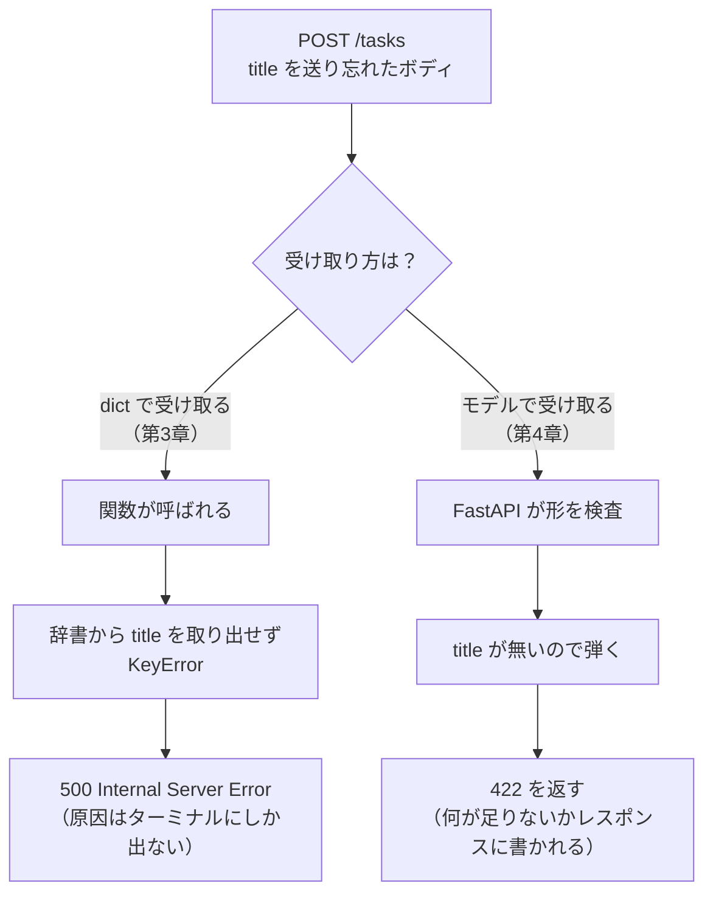
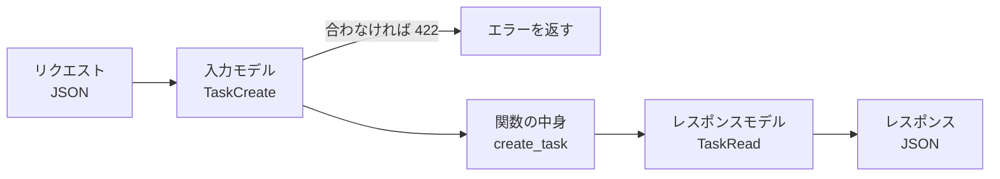
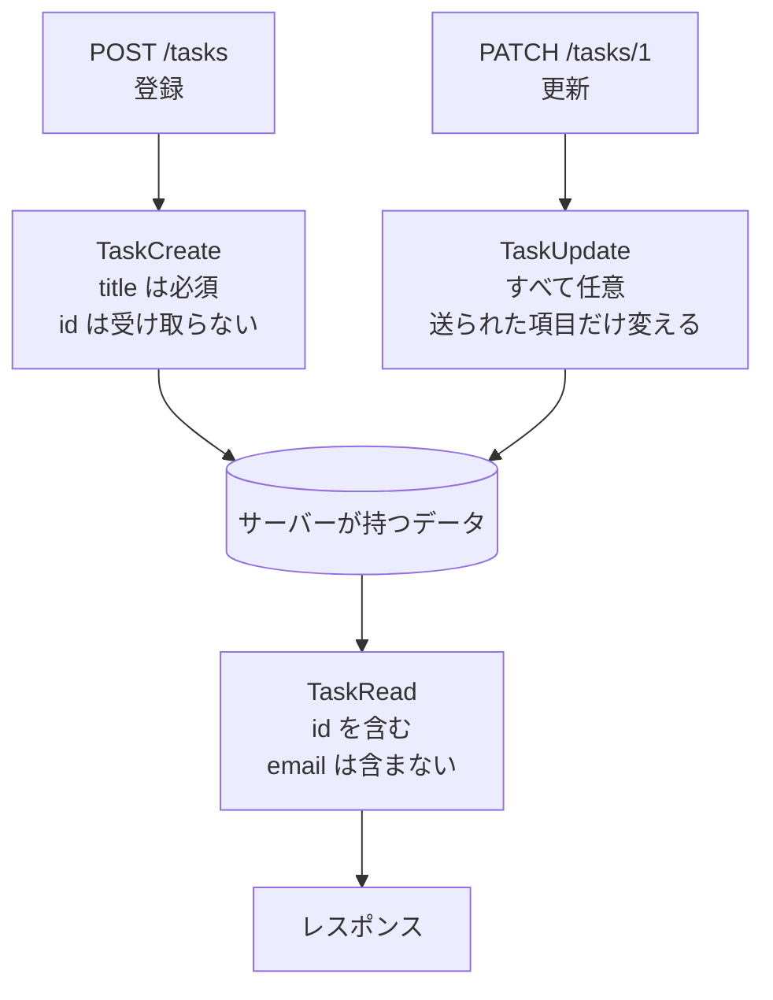
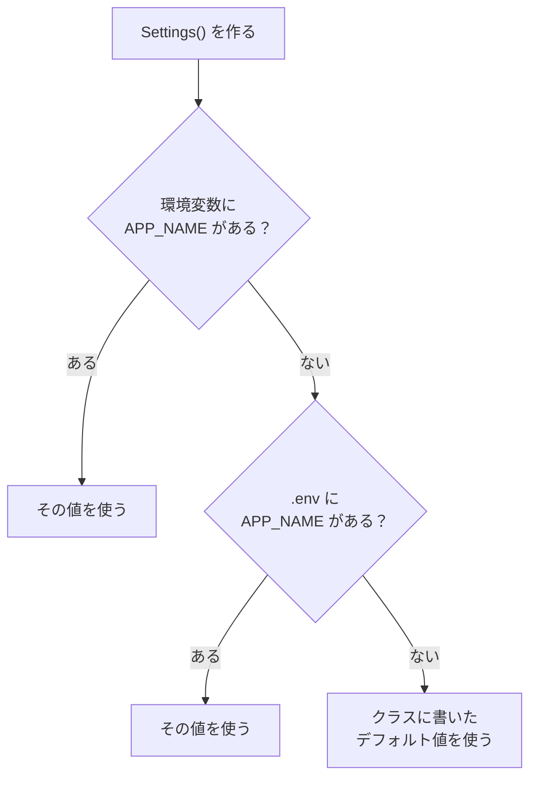

# 第4章 Pydantic

第3章の最後で、次のことが分かりました。

- `int` や `bool` の値は、FastAPI が変換して検査してくれる（3.1.2）
- **ボディの中身だけは素通り**で、`title` が無くても気づけない（3.3.2）
- その結果、利用者がキーを1つ書き忘れただけで **`500` が返る**（3.3.2）

`500` は「サーバー側の作りが悪い」という意味でした。
送る側のミスは `422` で返すべきで、**利用者のミスでサーバーが落ちる作りにしてはいけません。**

この章では、`dict` の代わりに**「受け取るデータの形」を宣言**します。
それだけで、ボディの中身にも検査が効くようになります。

## この章で学ぶこと

- 受け取りたいデータの形を、Python のクラスとして宣言できるようになる
- 必須の項目・省略できる項目・入れ子になった項目を、それぞれ書き分けられるようになる
- 文字数・数値の範囲・決まった形式といった条件を、項目ごとに付けられるようになる
- 自分で書いた条件でデータを弾き、その理由を `422` として返せるようになる
- **返してはいけない項目**（メールアドレスなど）を、レスポンスから確実に落とせるようになる
- 設定値や秘密の情報を、コードに書かずに `.env` から読み込めるようになる

## この章の前提

- [第3章](./03-parameters.md) を読み終え、`fastapi-lesson` の `main.py` が第3章の最終形になっていること
- python-text の第8章（クラス・`__init__`・継承・`@dataclass`）を読み終えていること
- python-text の第9章（型ヒント・`| None`・`list[str]`）を読み終えていること
- python-text の 7.6.1（`raise` で例外を投げる）を読み終えていること

> **つまずいたら**
> 第0章の 0.2 で準備した AI に、章番号を添えて聞いてください。
> **モデルの定義と、送ったボディと、返ってきた `detail` の3つ**を貼り付けると、
> ほぼその場で原因が分かります。
>
> ```text
> fastapi-text の 4.2.3 を読んでいます。
> POST /tasks に {"title": "買い物", "owner": {"name": "山田"}} を送ったら
> 422 が返り、loc が ["body","owner","email"] と出ました。
> main.py のモデルは次のように書いています。
> （ここにコードを貼る）
> ```

---

## 4.1 Pydantic とは

### 4.1.1 データの形を決めておく

第3章の `create_task` を、もう一度見てください。

```python
@app.post("/tasks")
def create_task(new_task: dict):
    ...
```

`dict` という型ヒントは、FastAPI に対して
「**JSON のオブジェクトなら何でもいい**」と言っているのと同じです。

そのため、次のどれを送っても、FastAPI は素通りさせます。

| 送ったボディ | 本当は | 実際に起きること |
|------------|-------|----------------|
| `{"title": "牛乳を買う"}` | 正しい | 登録される |
| `{"done": true}` | `title` が無い | **`500`**（3.3.2） |
| `{"title": 123}` | `title` が数値 | 数値のまま登録される |
| `{"titel": "牛乳を買う"}` | 綴りが違う | `"（無題）"` として登録される |

**検査していないので、間違いに気づけるのは「使われたあと」になります。**

必要なのは、関数の中で `if` を並べることではありません。
**「この窓口は、こういう形のデータしか受け取らない」と先に宣言しておくこと**です。

宣言しておけば、形が違うリクエストは**関数が呼ばれる前に**弾けます。
第3章の `int` の型ヒントが、`/tasks/abc` を関数の手前で弾いてくれたのと同じです（3.1.3）。



この「データの形の宣言」を担当するのが、**Pydantic**
（パイダンティック。Python の型ヒントを使ってデータの形を宣言し、その形に合っているかを実際に検査してくれるライブラリ）です。

Pydantic は、**第2章で FastAPI を入れたときに一緒に入っています。**
追加のインストールは要りません。確認しておきましょう。

第2章 2.2.1 と同じように仮想環境を有効にしたターミナルで、次を実行してください。

**Windows（PowerShell）**

```powershell
pip list
```

**macOS / Linux**

```bash
pip list
```

```text
Package           Version
----------------- ---------
fastapi           0.115.6
pydantic          2.13.5
pydantic_core     2.46.5
...
```

`pydantic` の行があり、バージョンが **`2.` で始まっている**ことを確認してください。
このテキストは Pydantic の **2 系**（動作確認したバージョン：2.13.5）で書いています。
`2.` のあとの数字は、インストールした時期によって変わります。**そこが違っていても問題ありません。**

> **注意**
> インターネットで Pydantic の記事を探すと、**1 系の書き方**が大量に出てきます。
> 1 系と 2 系では、名前が変わったものがあります（`@validator` → `@field_validator`、
> `.dict()` → `.model_dump()` など）。
> **`2` で始まる書き方かどうかを必ず確認してください。**
> AI に聞くときも、「Pydantic v2 で」と添えると事故が減ります。

### 4.1.2 型ヒントが実際に効く仕組み

python-text 9.1.4 で、**型ヒントは実行時には強制されない**と学びました。
`age: int` と書いたところに文字列を入れても、Python は止めてくれませんでした。

Pydantic は、この状況を変えます。
**書かれた型ヒントを読み取って、実行時に検査するコードを自分で組み立てる**からです。

FastAPI から離れて、Pydantic だけを触ってみます。
`fastapi-lesson` の中に、`try_pydantic.py` という新しいファイルを作ってください。

`try_pydantic.py`（ファイル全体）

```python
from dataclasses import dataclass

from pydantic import BaseModel


# python-text 8.5 で学んだ dataclass
@dataclass
class TaskDataclass:
    title: str
    done: bool


# Pydantic のモデル
class TaskModel(BaseModel):
    title: str
    done: bool


# dataclass は型ヒントどおりでなくても、そのまま受け取る
d = TaskDataclass(title=123, done="はい")
print("dataclass:", d)

# Pydantic は "true" を True に変換してくれる
m = TaskModel(title="牛乳を買う", done="true")
print("model:", m)
print("title:", m.title, "/ done:", m.done)

# 変換できない値を渡すと、ここで止まる
bad = TaskModel(title="牛乳を買う", done="はい")
print("ここは実行されません")
```

**サーバーとは別のこと**をするので、実行する前に確認してください。
`fastapi dev main.py` が動いているターミナルは**そのままにして**、
**2つ目のターミナル**（第0章 0.3.1）を開き、仮想環境を有効にしてから実行します。

**Windows（PowerShell）**

```powershell
.venv\Scripts\Activate.ps1
python try_pydantic.py
```

**macOS / Linux**

```bash
source .venv/bin/activate
python3 try_pydantic.py
```

実行結果:

```text
dataclass: TaskDataclass(title=123, done='はい')
model: title='牛乳を買う' done=True
title: 牛乳を買う / done: True
Traceback (most recent call last):
  File "/Users/yamada/Desktop/fastapi-lesson/try_pydantic.py", line 27, in <module>
    bad = TaskModel(title="牛乳を買う", done="はい")
  ...
pydantic_core._pydantic_core.ValidationError: 1 validation error for TaskModel
done
  Input should be a valid boolean, unable to interpret input [type=bool_parsing, input_value='はい', input_type=str]
    For further information visit https://errors.pydantic.dev/2.13/v/bool_parsing
```

（`...` の部分には、Pydantic の内部のファイル名が数行並びます。
python-text 1.4.4 のとおり、**読むべきは一番下**です。）

3つのことが起きています。

| 行 | 何が起きたか |
|----|------------|
| `dataclass: TaskDataclass(title=123, ...)` | `title: str` と書いたのに **`123` がそのまま入った**（python-text 9.1.4） |
| `model: title='牛乳を買う' done=True` | `"true"` という**文字列が `True` に変換された**（3.2.1 のクエリと同じ） |
| `ValidationError` | 変換できない値で**止まった**。関数に渡る前に弾かれる |

最後のエラーの中身をよく見てください。

```text
[type=bool_parsing, input_value='はい', input_type=str]
```

`type=bool_parsing` は、**3.2.1 で `?done=maybe` を送ったときに見た `type` と同じ**です。

```json
{"detail":[{"type":"bool_parsing","loc":["query","done"], ...}]}
```

同じものが出るのは偶然ではありません。
**FastAPI が返す `422` は、Pydantic の検査結果をそのまま JSON にしたもの**です。
第3章で読み方を覚えた `422` は、この章でもそのまま通用します。

> **補足：エラーの最後の行の URL**
> `https://errors.pydantic.dev/2.13/v/bool_parsing` の `2.13` は、
> **Pydantic のバージョン**です。手元のバージョンによって数字が変わります。
> この URL を開くと、その `type` の意味が英語で説明されています。

確認が終わったら、`try_pydantic.py` は消しても構いません。
（残しておいても、`main.py` の動作には影響しません。）

---

## 4.2 モデルを定義する

### 4.2.1 `BaseModel` を継承する

Pydantic で「データの形」を表すものを、**モデル**
（受け取る／返すデータの形を、項目名と型の組で宣言したもの）と呼びます。

書き方は、python-text 8.3.2 で学んだ**継承**です。
`BaseModel` という親クラスを継承したクラスを作るだけです。

`main.py` の1行目のあとに、`import` を1行足します。

```diff
  from fastapi import Cookie, FastAPI, Header, Path, Query
+ from pydantic import BaseModel
```

そのうえで、`app = FastAPI()` の**下、`tasks` の上**に、次を追記してください。

`main.py`（`app = FastAPI()` の下に追記）

```python
class TaskCreate(BaseModel):
    title: str
    done: bool
```

これで「`title`（文字列）と `done`（真偽値）を持つデータ」という宣言ができました。
`@dataclass` を書いたときと見た目はほとんど同じですが、
**こちらは型ヒントが実際に効きます**（4.1.2）。

次に、`create_task` の型ヒントを `dict` からこのモデルに変えます。

`main.py`（`create_task` の部分）

```python
@app.post("/tasks")
def create_task(new_task: TaskCreate):
    new_id = max([task["id"] for task in tasks]) + 1
    created = {
        "id": new_id,
        # モデルの項目は、辞書ではなく「属性」で取り出す（python-text 8.2.1）
        "title": new_task.title,
        "done": new_task.done,
    }
    tasks.append(created)
    return created
```

**`new_task["title"]` ではなく `new_task.title` になっている**ことに注意してください。
`dict` はキーで取り出しますが、**モデルは属性で取り出します。**

| 受け取り方 | 取り出し方 | 存在しない名前を書いたとき |
|-----------|-----------|------------------------|
| `dict` | `new_task["title"]` | `KeyError` で `500`（3.3.2） |
| モデル | `new_task.title` | **エディタが書いている途中で教えてくれる** |

`/docs` を開いて、`POST /tasks` を見てください（サーバーは自動で読み直されています）。
`Request body` の欄に、**送るべき形の例が表示されている**はずです。

```json
{
  "title": "string",
  "done": true
}
```

第3章では、ここが `{}`（空のオブジェクト）としか表示されませんでした。
**「何を送ればよいか」が、コードから自動で説明書に反映されています**（2.5.4）。

では、第3章で `500` になったボディを送ってみます。
`Try it out` を押して、`Request body` に次を入力し、`Execute` してください。

```json
{
  "done": true
}
```

```text
Server response
  Code    422
  Response body
    {
      "detail": [
        {
          "type": "missing",
          "loc": ["body", "title"],
          "msg": "Field required",
          "input": {"done": true}
        }
      ]
    }
```

**`500` ではなく `422` になりました。**
しかも `loc` が `["body", "title"]` なので、**ボディの `title` が足りない**とはっきり分かります。

第3章 3.4.2 で覚えた読み方が、そのままボディにも効いています。

> **よくある間違い**
> **モデルを定義しただけでは何も変わりません。** 関数の型ヒントを書き換えて初めて効きます。
>
> ```python
> class TaskCreate(BaseModel):
>     title: str
>     done: bool
>
>
> @app.post("/tasks")
> def create_task(new_task: dict):     # ← dict のままになっている
> ```
>
> この状態では、`/docs` の表示も第3章のままです。
> **`/docs` の `Request body` に項目が表示されない**ときは、
> まず関数の型ヒントを確認してください。

### 4.2.2 必須項目と任意項目

いまのモデルでは、`done` も必須です。
`{"title": "パンを買う"}` だけを送ると `422` になります。

**必須にするかどうかの決め方は、第3章のクエリパラメータと同じ**です（3.2.2）。
デフォルト値を書けば任意、書かなければ必須になります。

| 書き方 | 意味 |
|-------|------|
| `title: str` | **必須。** 無ければ `422` |
| `done: bool = False` | 任意。省略したら `False` |
| `code: str \| None = None` | 任意。省略したら `None`（「値なし」を表せる） |

`done` を任意にして、さらに**管理番号 `code`** という項目を足します。
`code` は、付けても付けなくてもよい項目です。

`main.py`（`TaskCreate` の部分）

```python
class TaskCreate(BaseModel):
    title: str
    done: bool = False
    # 省略されたら None。「値が入っていない」ことを表せる（python-text 9.2.2）
    code: str | None = None
```

`create_task` も、`code` を保存するように変更します。

```diff
      created = {
          "id": new_id,
          "title": new_task.title,
          "done": new_task.done,
+         "code": new_task.code,
      }
```

`/docs` から `{"title": "パンを買う"}` だけを送ってください。

```text
Server response
  Code    200
  Response body
    {
      "id": 4,
      "title": "パンを買う",
      "done": false,
      "code": null
    }
```

送っていない項目に、**デフォルト値が入って返ってきました。**

`code` を付けて送ると、その値が入ります。

```json
{
  "title": "資料を印刷する",
  "code": "T-001"
}
```

```text
Server response
  Code    200
  Response body
    {
      "id": 5,
      "title": "資料を印刷する",
      "done": false,
      "code": "T-001"
    }
```

> **よくある間違い**
> **`str | None = None` と `str = None` は違います。**
>
> ```python
> code: str = None     # 型は「文字列」なのに、既定値が None
> ```
>
> これは矛盾した宣言です。**省略したときは動いてしまう**ので、たちが悪い書き方です。
> 問題が出るのは、`code` に **`null` を明示的に送られた**ときです。
>
> ```json
> {"detail":[{"type":"string_type","loc":["body","code"],"msg":"Input should be a valid string","input":null}]}
> ```
>
> 「省略はできるのに、`null` を送ると `422` になる」という、説明しにくい窓口ができあがります。
> `/docs` の表示も「文字列」のままで、**`null` を送ってよいことが読み取れません。**
> **省略できる項目には、必ず型のほうに `| None` を書いてください**（python-text 9.2.2）。

### 4.2.3 入れ子のモデル

JSON は、オブジェクトの中にオブジェクトを入れられます（第1章 1.3.1）。

```json
{
  "title": "牛乳を買う",
  "owner": {
    "name": "山田",
    "email": "yamada@example.com"
  }
}
```

このような**入れ子のデータ**も、モデルで表せます。
やることは1つだけです。**内側の形もモデルにして、型ヒントに書きます。**

`main.py` の `TaskCreate` の**上**に `Owner` を追加し、`TaskCreate` に `owner` を足してください。

`main.py`（モデルの部分）

```python
class Owner(BaseModel):
    name: str
    email: str


class TaskCreate(BaseModel):
    title: str
    done: bool = False
    code: str | None = None
    # 型ヒントに別のモデルを書くと、入れ子のオブジェクトとして受け取れる
    owner: Owner
```

`Owner` を `TaskCreate` の**前に**書く必要があります。
Python は上から順に読むため、まだ定義されていない名前は使えないからです。

`create_task` も変更します。

```diff
      created = {
          "id": new_id,
          "title": new_task.title,
          "done": new_task.done,
          "code": new_task.code,
+         # 入れ子のモデルは、そのまま辞書に変換して入れる
+         "owner": new_task.owner.model_dump(),
      }
```

`model_dump()` は、**モデルを辞書に変換する**メソッドです（Pydantic 2 系の名前）。
`new_task.owner` は `Owner` のインスタンスなので、
そのまま入れると JSON に変換するときに困ります。辞書にしてから保存します。

練習用のデータにも `owner` を足しておきます。
**これから登録するタスクには `owner` が付く**ので、最初の3件だけ形が違うと後で混乱します。

`main.py`（`tasks` の部分をまるごと差し替え）

```python
# 練習用のデータ。サーバーを止めると消える（保存する方法は第6章）
tasks = [
    {"id": 1, "title": "牛乳を買う", "done": False,
     "owner": {"name": "山田", "email": "yamada@example.com"}},
    {"id": 2, "title": "レポートを書く", "done": True,
     "owner": {"name": "鈴木", "email": "suzuki@example.com"}},
    {"id": 3, "title": "部屋を片づける", "done": False,
     "owner": {"name": "山田", "email": "yamada@example.com"}},
]
```

`/docs` から、次のボディを送ってください。

```json
{
  "title": "牛乳を買う",
  "owner": {
    "name": "山田",
    "email": "yamada@example.com"
  }
}
```

```text
Server response
  Code    200
  Response body
    {
      "id": 4,
      "title": "牛乳を買う",
      "done": false,
      "code": null,
      "owner": {
        "name": "山田",
        "email": "yamada@example.com"
      }
    }
```

**内側も検査されています。** `email` を抜いて送ってみてください。

```json
{
  "title": "牛乳を買う",
  "owner": {
    "name": "山田"
  }
}
```

```text
Server response
  Code    422
  Response body
    {
      "detail": [
        {
          "type": "missing",
          "loc": ["body", "owner", "email"],
          "msg": "Field required",
          "input": {"name": "山田"}
        }
      ]
    }
```

**`loc` の要素が3つになりました。**

```text
["body", "owner", "email"]
  │       │        └ その中の email が足りない
  │       └ ボディの中の owner の
  └ 場所はボディ
```

第3章 3.4.2 では `loc` が2つでした（`["query", "limit"]`）。
**入れ子が深くなると、`loc` はその分だけ長くなります。**
**先頭から順にたどれば、必ず問題の場所にたどり着きます。**

### 4.2.4 リストを持つモデル

タスクに**タグ**を複数付けられるようにします。JSON では配列です。

```json
{"title": "牛乳を買う", "tags": ["買い物", "今日中"]}
```

型ヒントは `list[str]` です（python-text 9.2.1）。

`main.py` の `TaskCreate` に、1行足してください。

```diff
  class TaskCreate(BaseModel):
      title: str
      done: bool = False
      code: str | None = None
      owner: Owner
+     tags: list[str] = []
```

`create_task` にも足します。

```diff
          "owner": new_task.owner.model_dump(),
+         "tags": new_task.tags,
      }
```

`/docs` から送って確かめます。

```json
{
  "title": "牛乳を買う",
  "tags": ["買い物", "今日中"],
  "owner": {"name": "山田", "email": "yamada@example.com"}
}
```

```text
Server response
  Code    200
  Response body
    {
      "id": 4,
      "title": "牛乳を買う",
      "done": false,
      "code": null,
      "owner": {"name": "山田", "email": "yamada@example.com"},
      "tags": ["買い物", "今日中"]
    }
```

**中身の型も検査されます。** `"tags": ["買い物", 5]` のように数値を混ぜると、
`5` は文字列に変換されて `"5"` になります。
`"tags": "買い物"`（配列ではなく文字列）を送ると、`422` になります。

```json
{"detail":[{"type":"list_type","loc":["body","tags"],"msg":"Input should be a valid list","input":"買い物"}]}
```

`list[Owner]` のように、**モデルのリスト**も書けます。
「1つのタスクに担当者が複数いる」なら、そう書きます。

> **補足：デフォルト値に `[]` を書いてよいのか**
> python-text 5.2.4 で、**関数のデフォルト引数に空のリストを書いてはいけない**と学びました。
> 呼び出しのたびに同じリストが使い回され、前回の中身が残ってしまうためです。
>
> **モデルの項目では、`tags: list[str] = []` と書いて構いません。**
> Pydantic は、インスタンスを作るたびに**デフォルト値を複製して**渡すためです。
> 第3章 3.2.4 の `Query(default=[])` と同じ扱いだと考えてください。
> **危ないのは、あくまで素の関数のデフォルト引数**です。

---

## 4.3 バリデーション

### 4.3.1 `Field` で制約を付ける

ここまでで「項目があるか」「型が合っているか」は検査できるようになりました。
しかし、次のようなボディはまだ通ってしまいます。

```json
{"title": "", "owner": {"name": "山田", "email": "yamada@example.com"}}
```

`title` は文字列なので、**空文字でも型としては正しい**からです。

型は合っているが**値の中身がおかしい**——この検査が
**バリデーション**（受け取ったデータが正しい形式かを検査すること）でした（3.4.1）。

第3章では、クエリに `Query(...)`、パスに `Path(...)` を書いて条件を付けました。
**モデルの項目には `Field(...)` を書きます。** 3つは同じ作りの兄弟です。

| 値の場所 | 条件の書き方 | 出てきた場所 |
|---------|------------|------------|
| クエリ | `Query(default=10, ge=1)` | 3.4.1 |
| パス | `Path(ge=1)` | 3.4.1 |
| **ボディ（モデルの項目）** | **`Field(min_length=1)`** | ここ |

`import` に `Field` を足します。

```diff
- from pydantic import BaseModel
+ from pydantic import BaseModel, Field
```

`TaskCreate` の `title` に条件を付けます。

```diff
  class TaskCreate(BaseModel):
-     title: str
+     title: str = Field(min_length=1, max_length=20, description="タスクの内容")
      done: bool = False
```

`description=` に書いた文は、**`/docs` の説明として表示されます。**
`/docs` の `POST /tasks` を開き、`Schema` のタブを押すと、
`title` の欄に `maxLength: 20` `minLength: 1` と説明文が並んでいます。

**空文字を送ってみます。**

```json
{"title": "", "owner": {"name": "山田", "email": "yamada@example.com"}}
```

```text
Server response
  Code    422
  Response body
    {
      "detail": [
        {
          "type": "string_too_short",
          "loc": ["body", "title"],
          "msg": "String should have at least 1 character",
          "input": "",
          "ctx": {"min_length": 1}
        }
      ]
    }
```

> **よくある間違い**
> **`Field(...)` を書くと、その項目は「デフォルト値を持つ項目」の書き方になります。**
> それでも `Field(min_length=1)` のように `default=` を書かなければ、**必須のまま**です。
>
> ```python
> title: str = Field(min_length=1)                  # 必須（default が無い）
> code: str | None = Field(default=None, ...)       # 任意（default がある）
> ```
>
> 見た目は `=` で値を代入しているように見えますが、
> **`default=` を書いたかどうかで必須か任意かが決まります。**
> 3.4.1 の `Query(default=10, ge=1)` と同じ考え方です。

### 4.3.2 文字数・数値範囲・正規表現

`Field` に書ける条件は、`Query` / `Path` とほぼ同じです。

| 条件 | 意味 | 使える型 |
|------|------|---------|
| `default=` | 省略時の値。書かなければ必須 | すべて |
| `min_length=` / `max_length=` | 最小・最大の文字数 | 文字列 |
| `ge=` / `le=` | 以上 / 以下 | 数値 |
| `gt=` / `lt=` | より大きい / より小さい | 数値 |
| `pattern=` | **決まった形式に合っているか** | 文字列 |
| `description=` | `/docs` に出す説明 | すべて |

**優先度**の項目を足して、数値の範囲を試します。
あわせて、`code` に「`T-` のあとに数字3桁」という形式を強制します。

`main.py`（`TaskCreate` の部分）

```python
class TaskCreate(BaseModel):
    title: str = Field(min_length=1, max_length=20, description="タスクの内容")
    done: bool = False
    # r"..." は、バックスラッシュをそのままの文字として扱う書き方
    code: str | None = Field(default=None, pattern=r"^T-\d{3}$")
    priority: int = Field(default=3, ge=1, le=5, description="1が最優先、5が最低")
    owner: Owner
    tags: list[str] = []
```

`create_task` にも `priority` を足します。

```diff
          "code": new_task.code,
+         "priority": new_task.priority,
          "owner": new_task.owner.model_dump(),
```

`pattern=` に書いた `^T-\d{3}$` は、**正規表現**
（文字の並びのパターンを表すための、短い記号の書き方）です。
この章で使うのは、次の5つだけです。

| 記号 | 意味 | 例 |
|------|------|---|
| `^` | **文字列の先頭** | `^T` は「T で始まる」 |
| `$` | **文字列の末尾** | `9$` は「9 で終わる」 |
| `\d` | 数字1文字 | `\d` は `0`〜`9` のどれか1つ |
| `{3}` | **直前のものを3回** | `\d{3}` は数字3文字 |
| そのままの文字 | その文字そのもの | `T-` は「T のあとにハイフン」 |

つなげて読むと、`^T-\d{3}$` は
**「先頭が `T-` で、そのあとに数字が3つあって、そこで終わる」**という意味になります。

| 送った `code` | 結果 | 理由 |
|-------------|------|------|
| `"T-001"` | 通る | 形が合っている |
| `"T-1"` | `422` | 数字が3つない |
| `"t-001"` | `422` | 小文字で始まっている |
| `"T-0011"` | `422` | 数字が4つある（`$` で終われない） |

`/docs` から `"code": "T-1"` を送って確かめてください。

```json
{"detail":[{"type":"string_pattern_mismatch","loc":["body","code"],"msg":"String should match pattern '^T-\\d{3}$'","input":"T-1","ctx":{"pattern":"^T-\\d{3}$"}}]}
```

`priority` も試します。`"priority": 9` を送ってください。

```json
{"detail":[{"type":"less_than_equal","loc":["body","priority"],"msg":"Input should be less than or equal to 5","input":9,"ctx":{"le":5}}]}
```

> **注意**
> **正規表現は、この章で扱う5つの記号以外にも大量の記号があります。**
> すべてを覚える必要はありません。
> **必要になったときに、やりたいことを AI に伝えて書いてもらい、
> 上の表の記号で読み解ける形かどうかを確認する**——この使い方で十分です。
>
> ただし、**メールアドレスを正規表現で検査しようとしないでください。**
> 正しく書くと非常に長くなり、それでも取りこぼします。
> メールアドレスには専用の型があります（4.3.3 の補足）。

### 4.3.3 カスタムバリデータ

`Field` の条件だけでは表せない検査もあります。

たとえば `title` が `"　　　"`（空白だけ）の場合です。
`min_length=1` は「1文字以上」なので、**空白3文字は通ってしまいます。**

このような「自分で書いた条件」で弾きたいときは、
**バリデータ**（項目の値を検査する関数をモデルの中に書いたもの）を定義します。

`import` を1つ足します。

```diff
- from pydantic import BaseModel, Field
+ from pydantic import BaseModel, Field, field_validator
```

`TaskCreate` の中の、項目を並べたあとに、次を追記してください。

`main.py`（`TaskCreate` の末尾に追記）

```python
    @field_validator("title")
    @classmethod
    def title_must_not_be_blank(cls, value: str) -> str:
        # 前後の空白を取り除いた結果が空なら、空白だけだったということ
        if value.strip() == "":
            raise ValueError("空白だけのタイトルは登録できません")
        # 返した値が、そのまま採用される（前後の空白は落としておく）
        return value.strip()
```

読み方は次のとおりです。

| 部分 | 意味 |
|------|------|
| `@field_validator("title")` | 「この関数は `title` を検査する」という印 |
| `@classmethod` | インスタンスができる前に呼ばれるので、`self` ではなく `cls` を受け取る |
| `value` | **検査対象の値**。ここでは `title` に入ってきた文字列 |
| `raise ValueError(...)` | 検査に落ちたことを知らせる（python-text 7.6.1） |
| `return value.strip()` | **返した値が、その項目の値として採用される** |

`.strip()` は、文字列の前後の空白を取り除くメソッドです（python-text 2.4.3）。

`@field_validator` は、`Field` の条件を**すべて通過したあと**に呼ばれます。
順番は「型の変換 → `Field` の条件 → バリデータ」です。

`/docs` から、空白だけのタイトルを送ってください。

```json
{
  "title": "   ",
  "owner": {"name": "山田", "email": "yamada@example.com"}
}
```

```text
Server response
  Code    422
  Response body
    {
      "detail": [
        {
          "type": "value_error",
          "loc": ["body", "title"],
          "msg": "Value error, 空白だけのタイトルは登録できません",
          "input": "   ",
          "ctx": {"error": {}}
        }
      ]
    }
```

**`raise` した文が、そのまま `msg` に出ています。**
先頭に `Value error, ` が自動で付く点だけ覚えておいてください。

前後の空白が落ちることも確認します。`"title": "  牛乳を買う  "` を送ってください。

```text
Server response
  Code    200
  Response body
    {
      "id": 4,
      "title": "牛乳を買う",
      ...
    }
```

**保存される前に整えられました。** これがバリデータのもう1つの役割です。

> **よくある間違い**
> **`return` を書き忘れると、その項目が `None` になります。**
>
> ```python
> @field_validator("title")
> @classmethod
> def title_must_not_be_blank(cls, value: str) -> str:
>     if value.strip() == "":
>         raise ValueError("空白だけのタイトルは登録できません")
>     # return を書いていない
> ```
>
> 関数は `return` が無いと `None` を返します（python-text 5.1.3）。
> その `None` が `title` の値として採用されてしまい、
> **`{"title": null}` が保存される**か、`str` に合わないとして `422` になります。
> **バリデータは、最後に必ず値を返してください。**

> **補足：メールアドレスの検査**
> Pydantic には `EmailStr` という専用の型があり、
> `email: EmailStr` と書くだけでメールアドレスの形式を検査できます。
> ただし、**追加のインストール**（`pip install "pydantic[email]"`）が必要です。
> このテキストでは、余分な依存関係を増やさないために `str` のままにします。
> 実務でメールアドレスを扱うときは、自分で正規表現を書かず、これを使ってください。

### 4.3.4 エラーメッセージを読む

条件が増えたぶん、`422` の中身も豊かになります。
**まとめて間違えたときに、まとめて返ってくる**ことを確認しておきます。

`/docs` から、次のボディを送ってください。**わざと5か所間違えています。**

```json
{
  "title": "",
  "done": "はい",
  "code": "T-1",
  "priority": 9,
  "owner": {"name": "山田"}
}
```

```json
{"detail":[
{"type":"string_too_short","loc":["body","title"],"msg":"String should have at least 1 character","input":"","ctx":{"min_length":1}},
{"type":"bool_parsing","loc":["body","done"],"msg":"Input should be a valid boolean, unable to interpret input","input":"はい"},
{"type":"string_pattern_mismatch","loc":["body","code"],"msg":"String should match pattern '^T-\\d{3}$'","input":"T-1","ctx":{"pattern":"^T-\\d{3}$"}},
{"type":"less_than_equal","loc":["body","priority"],"msg":"Input should be less than or equal to 5","input":9,"ctx":{"le":5}},
{"type":"missing","loc":["body","owner","email"],"msg":"Field required","input":{"name":"山田"}}
]}
```

（実際は1行で返ります。読みやすいように改行を入れています。）

**5件が、モデルに書いた項目の順番で並んでいます。**
1つ直して送り直す、を5回繰り返す必要はありません。

第3章 3.4.2 の表に、この章で出会う `type` を足しておきます。

| `type` | 意味 | よくある原因 |
|--------|------|------------|
| `missing` | 必須の項目が無い | キーの綴り違い、入れ子の中の書き忘れ（4.2.3） |
| `string_too_short` | `min_length` に足りない | 空文字を送った（4.3.1） |
| `string_too_long` | `max_length` を超えた | 長すぎるタイトル |
| `string_pattern_mismatch` | `pattern` に合わない | `code` の形式違い（4.3.2） |
| `less_than_equal` / `greater_than_equal` | `le` / `ge` に反している | `priority` が範囲外（4.3.2） |
| `list_type` | 配列であるべき場所が配列でない | `"tags": "買い物"`（4.2.4） |
| `value_error` | **自分で書いたバリデータが弾いた** | 空白だけのタイトル（4.3.3） |

> **よくある間違い**
> **モデルに無いキーは、エラーにならず黙って捨てられます。**
>
> ```json
> {"titel": "牛乳を買う", "owner": {"name": "山田", "email": "a@example.com"}}
> ```
>
> `title` の綴りを間違えた例です。返ってくるのは「`titel` は知らない」ではなく、
> **`title` が `missing`** という `422` です。
> `loc` に出ている名前と、自分が送った JSON のキーを**見比べてください。**
>
> 知らないキーを受け取ったときにエラーにしたい場合は、
> モデルの中に次の1行を書きます（`from pydantic import ConfigDict` が必要）。
>
> ```python
> model_config = ConfigDict(extra="forbid")
> ```
>
> このテキストでは使いませんが、**入力ミスを早く見つけたいときに有効**です。

> **つまずいたら**
> `422` の意味が分からないときは、**モデルの定義と `detail` の両方**を貼り付けてください。
>
> ```text
> fastapi-text の 4.3.4 です。POST /tasks に次のボディを送ったら 422 になりました。
> モデル：（ここに TaskCreate を貼る）
> 送ったもの：（ここに JSON を貼る）
> 返ってきたもの：（ここに detail を貼る）
> ```

---

## 4.4 レスポンスモデル

### 4.4.1 `response_model` を指定する

ここまでは、**受け取る側**の話でした。
Pydantic のモデルは、**返す側**にも使えます。

いまの `create_task` は、自分で組み立てた辞書をそのまま返しています。
つまり**返す形は、関数の書き方しだいで変わってしまいます。**
`/docs` の `Responses` 欄も、第2章のまま「何が返るか分からない」状態です。

返す形を宣言するには、`@app.post(...)` に **`response_model=`** を書きます。

まず、返す形のモデルを作ります。
`TaskCreate` の**下**に追記してください。

`main.py`（`TaskCreate` の下に追記）

```python
class TaskRead(BaseModel):
    id: int
    title: str
    done: bool
    code: str | None = None
    priority: int = 3
    owner: Owner
    tags: list[str] = []
```

入力用の `TaskCreate` と違い、**`id` があります。**
`id` はサーバーが決める値なので、受け取るときには要らず、返すときには必要だからです。
（この「入力用と出力用を分ける」という考え方は、4.5 で本格的に扱います。）

`create_task` のデコレータに、1つ足します。

```diff
- @app.post("/tasks")
+ @app.post("/tasks", response_model=TaskRead)
  def create_task(new_task: TaskCreate):
```

`/docs` の `POST /tasks` を開き直すと、
**`Responses` の欄に、返ってくる形の例が表示されている**はずです。

```json
{
  "id": 0,
  "title": "string",
  "done": false,
  "code": "string",
  "priority": 3,
  "owner": {"name": "string", "email": "string"},
  "tags": []
}
```

（値は `/docs` が自動で作った見本です。**項目の名前と型が合っていればよく、
値そのものは手元と違って構いません。**）

第9章で React からこの API を使うとき、
**この表示を見れば、フロントエンド側が何を受け取れるか分かります。**

`response_model` は、表示を変えるだけではありません。
**返す直前に、宣言した形へ整えます。**



**関所が2つある**、と考えてください。

| 関所 | 何をするか | 合わなかったら |
|------|-----------|--------------|
| 入力モデル（`TaskCreate`） | 送られてきた JSON を検査する | **`422`**（送った側のミス） |
| レスポンスモデル（`TaskRead`） | 返す値を宣言した形に整える | **`500`**（作った側のミス） |

2つ目が `500` なのは、**返す形が違うのはサーバー側の落ち度**だからです（第1章 1.2.3）。

> **よくある間違い**
> **`response_model` に書いた必須項目を返し忘れると `500` になります。**
> 試しに `create_task` の `created` から `"owner"` の行を消して送ってみると、
> レスポンスは `500` になり、サーバー側のターミナルに次が出ます。
>
> ```text
> fastapi.exceptions.ResponseValidationError: 1 validation errors:
>   {'type': 'missing', 'loc': ('response', 'owner'), 'msg': 'Field required', ...}
> ```
>
> `loc` の1つ目が **`response`** になっているのが目印です。
> **`body` なら送った側、`response` なら自分のコード**を直します。
> 確認したら、消した行を元に戻してください。

### 4.4.2 返してはいけない項目を落とす

`response_model` の本当の価値は、ここにあります。

いま、タスクを取得すると **`owner.email` がそのまま返っています。**
メールアドレスは、誰にでも見せてよい情報ではありません。

`return` する辞書から毎回 `email` を削るコードを書く、という方法もあります。
しかし**窓口が増えるたびに書き忘れる危険**があり、書き忘れても誰も教えてくれません。

**返してよい形を宣言すれば、それ以外は自動的に落ちます。**

`Owner` の下に、**返却用の担当者モデル**を追加してください。

`main.py`（`Owner` の下に追記）

```python
class OwnerRead(BaseModel):
    # email を持たない。返さないものは、そもそも書かない
    name: str
```

`TaskRead` の `owner` の型を差し替えます。

```diff
  class TaskRead(BaseModel):
      id: int
      title: str
      done: bool
      code: str | None = None
      priority: int = 3
-     owner: Owner
+     owner: OwnerRead
      tags: list[str] = []
```

`/docs` から、`email` を含むボディで `POST /tasks` を実行してください。

```json
{
  "title": "牛乳を買う",
  "owner": {"name": "山田", "email": "yamada@example.com"}
}
```

```text
Server response
  Code    200
  Response body
    {
      "id": 4,
      "title": "牛乳を買う",
      "done": false,
      "code": null,
      "priority": 3,
      "owner": {"name": "山田"},
      "tags": []
    }
```

**`email` が消えています。**
`create_task` のコードは一切変えていません。保存されている辞書にも `email` は入っています。
**返す形の宣言だけで、外に出る情報が変わりました。**

一覧を返す `GET /tasks` にも同じことをします。
こちらは `{"count": ..., "tasks": [...]}` という**包みの形**で返しているので、
包みごとモデルにします。

`main.py`（`TaskRead` の下に追記）

```python
class TaskListResponse(BaseModel):
    count: int
    # モデルのリストを型ヒントに書ける（4.2.4）
    tasks: list[TaskRead]
```

```diff
- @app.get("/tasks")
+ @app.get("/tasks", response_model=TaskListResponse)
  def read_tasks(
```

`http://127.0.0.1:8000/tasks` を開いてください。

```json
{"count":3,"tasks":[{"id":1,"title":"牛乳を買う","done":false,"code":null,"priority":3,"owner":{"name":"山田"},"tags":[]},{"id":2,"title":"レポートを書く","done":true,"code":null,"priority":3,"owner":{"name":"鈴木"},"tags":[]},{"id":3,"title":"部屋を片づける","done":false,"code":null,"priority":3,"owner":{"name":"山田"},"tags":[]}]}
```

**一覧からも `email` が消えました。**
練習用データに入れていない `code` / `priority` / `tags` は、
`TaskRead` に書いたデフォルト値で埋められています。

1件取得の `GET /tasks/{task_id}` にも付けたいのですが、
**この窓口は「見つからないとき」に別の形を返しています**（3.1.2）。

```python
    return {"message": f"id {task_id} のタスクは見つかりませんでした"}
```

`response_model=TaskRead` を付けると、この行で `500` になります。
**宣言した形と違うものを返しているから**です（4.4.1）。

本来は `404` を返すべき場面ですが、その方法は第5章 5.4.1 です。
それまでの間は、**見つからないときは `null` を返す**形にしておきます。

`main.py`（`read_task` の部分）

```python
@app.get("/tasks/{task_id}", response_model=TaskRead | None)
def read_task(task_id: int = Path(ge=1)):
    for task in tasks:
        if task["id"] == task_id:
            return task
    # 見つからない場合は None（JSON では null）。404 を返す方法は第5章 5.4.1
    return None
```

`TaskRead | None` は「`TaskRead` の形、または `None`」という宣言です（python-text 9.2.2）。

```text
http://127.0.0.1:8000/tasks/99
```

```json
null
```

> **注意**
> **`/tasks/by-ids` と `/tasks/summary` には、まだレスポンスモデルを付けていません。**
> `by-ids` は `{"requested": [...], "count": ..., "tasks": [...]}` という
> 別の形を返すため、専用のモデルがもう1つ必要になるからです。
> **窓口ごとに包みの形が違う**という、この散らかりを整理するのが第5章です。

### 4.4.3 ステータスコードを指定する

第1章 1.2.3 で、「作成に成功したら `201`」と学びました。
第3章 3.3.2 では、`POST /tasks` が `200` を返すのを見て、
「`201` の指定は第4章」と先送りしていました。ここで回収します。

デコレータに **`status_code=`** を書くだけです。

```diff
- @app.post("/tasks", response_model=TaskRead)
+ @app.post("/tasks", response_model=TaskRead, status_code=201)
  def create_task(new_task: TaskCreate):
```

`curl` で確かめます。`fastapi-lesson` の `new_task.json` を、次の内容にしてください。

`new_task.json`

```json
{"title": "郵便を出す", "owner": {"name": "山田", "email": "yamada@example.com"}}
```

**Windows（PowerShell）**

```powershell
curl.exe -i -X POST http://127.0.0.1:8000/tasks -H "Content-Type: application/json" -d "@new_task.json"
```

**macOS / Linux**

```bash
curl -i -X POST http://127.0.0.1:8000/tasks -H "Content-Type: application/json" -d '{"title": "郵便を出す", "owner": {"name": "山田", "email": "yamada@example.com"}}'
```

実行結果:

```text
HTTP/1.1 201 Created
content-type: application/json

{"id":4,"title":"郵便を出す","done":false,"code":null,"priority":3,"owner":{"name":"山田"},"tags":[]}
```

**`200 OK` が `201 Created` に変わりました。**

もう1つ、**削除の窓口**を作って `204` も見ておきます。
`204 No Content` は「成功したが、返す中身は無い」という意味でした（1.2.3）。

`main.py` の末尾に、次を追記してください。

`main.py`（末尾に追記）

```python
@app.delete("/tasks/{task_id}", status_code=204)
def delete_task(task_id: int = Path(ge=1)):
    for task in tasks:
        if task["id"] == task_id:
            # リストから、その要素を取り除く
            tasks.remove(task)
            break
    # 204 では中身を返さない
    return None
```

**Windows（PowerShell）**

```powershell
curl.exe -i -X DELETE http://127.0.0.1:8000/tasks/1
```

**macOS / Linux**

```bash
curl -i -X DELETE http://127.0.0.1:8000/tasks/1
```

実行結果:

```text
HTTP/1.1 204 No Content
```

**ボディが1文字もありません。** これが `204` です。
`http://127.0.0.1:8000/tasks` を開くと、1番のタスクが消えています。

よく使う組み合わせを、表にまとめます。

| メソッドと窓口 | `status_code` | 返すもの |
|--------------|--------------|---------|
| `GET /tasks` | 指定しない（`200`） | 一覧 |
| `POST /tasks` | **`201`** | 作られたもの |
| `PATCH /tasks/{id}` | 指定しない（`200`） | 更新後のもの |
| `DELETE /tasks/{id}` | **`204`** | **何も返さない** |

> **注意**
> いまの `delete_task` は、**存在しない `id` を指定しても `204` を返します。**
> 「消えた」のか「元から無かった」のかを、呼ぶ側が区別できません。
> 本来は `404` を返すべきですが、その方法は第5章 5.4.1 です。
> **いまは「この作りには穴がある」と分かっていれば十分です。**

> **補足：数字を直接書かない方法**
> `status_code=201` の代わりに、名前で書くこともできます。
>
> ```python
> from fastapi import status
>
> @app.post("/tasks", status_code=status.HTTP_201_CREATED)
> ```
>
> 意味は同じです。**数字を覚えていなくても書ける**利点があります。
> このテキストでは、第1章の表と見比べやすい数字のままにします。

---

## 4.5 入力用と出力用を分ける

### 4.5.1 なぜ分けるのか

いま、モデルが3つあります（`TaskCreate` / `TaskRead` / `Owner` と `OwnerRead`）。
「1つにまとめたほうが楽ではないか」と思うかもしれません。

**まとめると破綻します。** 場面ごとに、必要な項目が違うからです。

| 項目 | 登録するとき（入力） | 返すとき（出力） | 更新するとき（入力） |
|------|-------------------|----------------|-------------------|
| `id` | **要らない**（サーバーが決める） | **必要** | 要らない（URL で指定する） |
| `title` | **必須** | 必要 | **任意**（変えないこともある） |
| `owner.email` | **必要**（登録に使う） | **返してはいけない** | 任意 |

1つのモデルで済ませようとすると、**すべての項目を任意にする**しかありません。
その瞬間、`title` の無いタスクが登録できてしまいます。

だから、**場面ごとにモデルを分けます。**



### 4.5.2 `Create` / `Update` / `Read` の3つ

**登録用（`Create`）**と**返却用（`Read`）**はもうあります。
足りないのは**更新用（`Update`）**です。

第3章では、更新を `PUT /tasks/{task_id}` で作りました（3.3.3）。
中身は「送られてきた項目だけ更新する」という動きで、
解答編でも触れたとおり、**意味としては `PATCH` に近い**ものでした（第1章 1.2.2）。

ここで正しい形に直します。**`PUT` をやめて `PATCH` にします。**

まず、更新用のモデルを追加します。`TaskRead` の下に追記してください。

`main.py`（`TaskRead` の下に追記）

```python
class TaskUpdate(BaseModel):
    # 更新では「送られてこなかった項目は変えない」ので、すべて任意にする
    title: str | None = Field(default=None, min_length=1, max_length=20)
    done: bool | None = None
    priority: int | None = Field(default=None, ge=1, le=5)
    tags: list[str] | None = None
```

すべての項目に `| None = None` が付いています。
**「送られてこなかった」を表せるようにするため**です（3.2.3 と同じ考え方）。

次に、`update_task` を書き換えます。
`main.py` の `@app.put("/tasks/{task_id}")` の部分を、**まるごと次に差し替えて**ください。

`main.py`（`update_task` の部分）

```python
@app.patch("/tasks/{task_id}", response_model=TaskRead | None)
def update_task(
    new_task: TaskUpdate,
    task_id: int = Path(ge=1),
    notify: bool = False,
):
    for task in tasks:
        if task["id"] == task_id:
            # 実際に送られてきた項目だけを辞書として取り出す
            changes = new_task.model_dump(exclude_unset=True)
            for key, value in changes.items():
                task[key] = value
            return task
    return None
```

新しいのは **`exclude_unset=True`** です。

`model_dump()` は、モデルを辞書に変換するメソッドでした（4.2.3）。
`exclude_unset=True` を付けると、
**送られてこなかった項目を、結果の辞書から除きます。**

`{"done": true}` だけを送ったときの違いを見てください。

| 書き方 | 結果 |
|-------|------|
| `new_task.model_dump()` | `{"title": None, "done": True, "priority": None, "tags": None}` |
| `new_task.model_dump(exclude_unset=True)` | `{"done": True}` |

前者をそのまま反映すると、**`title` が `None` で上書きされて消えます。**
`exclude_unset=True` があるからこそ、「送られた項目だけ変える」が成立します。

**何も送らなかったときも、同じ理屈で安全です。**
`{}`（空の JSON）を送ると `changes` は空の辞書 `{}` になり、
`for` の中身が**一度も実行されません。** つまり、何も変わらないまま返ります。

```json
{}
```

```text
Server response
  Code    200
  Response body
    {"id": 2, "title": "レポートを書く", "done": true, ...}
```

**エラーにはなりません。** 「変更が0件の更新」も、更新として成立するからです。

第3章では、これを `.get("title", task["title"])` と1項目ずつ書いていました（3.3.3）。
**項目が増えても書き足す必要がなくなりました。**

`curl` で確かめます。`new_task.json` の中身を `{"done": true}` にしてください。

**Windows（PowerShell）**

```powershell
curl.exe -i -X PATCH "http://127.0.0.1:8000/tasks/2?notify=true" -H "Content-Type: application/json" -d "@new_task.json"
```

**macOS / Linux**

```bash
curl -i -X PATCH "http://127.0.0.1:8000/tasks/2?notify=true" -H "Content-Type: application/json" -d '{"done": true}'
```

実行結果:

```text
HTTP/1.1 200 OK
content-type: application/json

{"id":2,"title":"レポートを書く","done":true,"code":null,"priority":3,"owner":{"name":"鈴木"},"tags":[]}
```

**`title` は消えていません。** `done` だけが変わりました。

> **注意**
> `notify` は受け取っていますが、返す形が `TaskRead` になったため、
> **`{"notified": true}` はレスポンスに含まれなくなりました**（4.4.1 の関所で落ちます）。
> レスポンスモデルを付けるとは、そういうことです。
> 通知したかどうかも返したいなら、**それを含む包みのモデル**を別に作ります
> （`TaskListResponse` と同じやり方です）。

> **よくある間違い**
> **`exclude_unset=True` を書き忘れると、送っていない項目が `null` で消えます。**
>
> ```json
> {"id":2,"title":null,"done":true,"code":null,"priority":null,"tags":null}
> ```
>
> ただし `TaskRead` の `title` は `str`（`None` を許していない）なので、
> 実際には**レスポンスの関所で `500` になります**（4.4.1）。
> 更新したら関係ない項目が消えた、というときは、まずここを疑ってください。

### 4.5.3 共通部分をまとめる

`TaskCreate` と `TaskRead` を並べてみると、**同じ行が並んでいます。**

```python
class TaskCreate(BaseModel):
    title: str = Field(min_length=1, max_length=20, description="タスクの内容")
    done: bool = False
    code: str | None = Field(default=None, pattern=r"^T-\d{3}$")
    priority: int = Field(default=3, ge=1, le=5, description="1が最優先、5が最低")
    owner: Owner
    tags: list[str] = []


class TaskRead(BaseModel):
    id: int
    title: str
    done: bool
    code: str | None = None
    priority: int = 3
    owner: OwnerRead
    tags: list[str] = []
```

このままだと、`max_length` を 20 から 30 に変えるときに**2か所直す**ことになります。
片方だけ直せば、入力と出力で条件がずれます。

python-text 8.3.1 で学んだとおり、**共通部分は親クラスにまとめます。**

`main.py` のモデル定義を、次のように書き換えてください。

`main.py`（モデルの部分をまるごと差し替え）

```python
class Owner(BaseModel):
    name: str
    email: str


class OwnerRead(BaseModel):
    name: str


class TaskBase(BaseModel):
    """入力にも出力にも共通する項目。"""

    title: str = Field(min_length=1, max_length=20, description="タスクの内容")
    done: bool = False
    code: str | None = Field(default=None, pattern=r"^T-\d{3}$")
    priority: int = Field(default=3, ge=1, le=5, description="1が最優先、5が最低")
    tags: list[str] = []


class TaskCreate(TaskBase):
    """登録するときに受け取る形。"""

    owner: Owner

    @field_validator("title")
    @classmethod
    def title_must_not_be_blank(cls, value: str) -> str:
        if value.strip() == "":
            raise ValueError("空白だけのタイトルは登録できません")
        return value.strip()


class TaskRead(TaskBase):
    """返すときの形。email を持たない。"""

    id: int
    owner: OwnerRead


class TaskUpdate(BaseModel):
    """更新するときに受け取る形。すべて任意。"""

    title: str | None = Field(default=None, min_length=1, max_length=20)
    done: bool | None = None
    priority: int | None = Field(default=None, ge=1, le=5)
    tags: list[str] | None = None


class TaskListResponse(BaseModel):
    """一覧を返すときの包み。"""

    count: int
    tasks: list[TaskRead]
```

見るべき点が4つあります。

| 点 | 説明 |
|----|------|
| `class TaskCreate(TaskBase)` | 継承元が `BaseModel` から **`TaskBase`** に変わった（python-text 8.3.2） |
| `owner` が親にない | **入力は `Owner`、出力は `OwnerRead`** と型が違うので、共通化できない |
| バリデータの位置 | `title` は親にあるが、**バリデータは子に書いてよい**（親の項目も検査できる） |
| `TaskUpdate` は継承しない | すべて任意という**別の形**なので、無理に親を使わない |

三重引用符 `"""..."""` で書いた説明は **docstring** です（第2章 2.5.4 の補足）。
モデルに書くと、**`/docs` の `Schema` 欄に説明として表示されます。**

`/docs` を開き直して、`POST /tasks` の `Schema` に説明が出ていることと、
これまでどおり動くことを確認してください。

> **注意**
> **返ってくる JSON の項目の順番が変わります。**
> 継承すると、**親に書いた項目が先、子で足した項目が後**に並ぶためです。
>
> ```json
> {"title":"牛乳を買う","done":false,"code":null,"priority":3,"tags":[],"id":1,"owner":{"name":"山田"}}
> ```
>
> `id` が最後のほうに移動していますが、**故障ではありません。**
> JSON のオブジェクトは「名前で引く」ものなので、
> 並び順が変わっても、受け取る側（第9章の React）の動作には影響しません。

**この章で作った `main.py` の全体**を載せます。差分が積み重なっているので、
**自分のファイルと見比べてください。**

`main.py`（ファイル全体）

```python
from fastapi import Cookie, FastAPI, Header, Path, Query
from pydantic import BaseModel, Field, field_validator

app = FastAPI()


class Owner(BaseModel):
    name: str
    email: str


class OwnerRead(BaseModel):
    name: str


class TaskBase(BaseModel):
    """入力にも出力にも共通する項目。"""

    title: str = Field(min_length=1, max_length=20, description="タスクの内容")
    done: bool = False
    code: str | None = Field(default=None, pattern=r"^T-\d{3}$")
    priority: int = Field(default=3, ge=1, le=5, description="1が最優先、5が最低")
    tags: list[str] = []


class TaskCreate(TaskBase):
    """登録するときに受け取る形。"""

    owner: Owner

    @field_validator("title")
    @classmethod
    def title_must_not_be_blank(cls, value: str) -> str:
        if value.strip() == "":
            raise ValueError("空白だけのタイトルは登録できません")
        return value.strip()


class TaskRead(TaskBase):
    """返すときの形。email を持たない。"""

    id: int
    owner: OwnerRead


class TaskUpdate(BaseModel):
    """更新するときに受け取る形。すべて任意。"""

    title: str | None = Field(default=None, min_length=1, max_length=20)
    done: bool | None = None
    priority: int | None = Field(default=None, ge=1, le=5)
    tags: list[str] | None = None


class TaskListResponse(BaseModel):
    """一覧を返すときの包み。"""

    count: int
    tasks: list[TaskRead]


# 練習用のデータ。サーバーを止めると消える（保存する方法は第6章）
tasks = [
    {"id": 1, "title": "牛乳を買う", "done": False,
     "owner": {"name": "山田", "email": "yamada@example.com"}},
    {"id": 2, "title": "レポートを書く", "done": True,
     "owner": {"name": "鈴木", "email": "suzuki@example.com"}},
    {"id": 3, "title": "部屋を片づける", "done": False,
     "owner": {"name": "山田", "email": "yamada@example.com"}},
]


@app.get("/tasks/summary")
def read_summary():
    done_count = len([task for task in tasks if task["done"]])
    return {
        "total": len(tasks),
        "done": done_count,
        "remaining": len(tasks) - done_count,
    }


@app.get("/tasks/by-ids")
def read_tasks_by_ids(task_id: list[int] = Query(default=[])):
    found = [task for task in tasks if task["id"] in task_id]
    return {"requested": task_id, "count": len(found), "tasks": found}


@app.get("/tasks", response_model=TaskListResponse)
def read_tasks(
    done: bool | None = None,
    keyword: str | None = Query(default=None, min_length=1, max_length=20),
    limit: int = Query(default=10, ge=1, le=100),
):
    result = tasks
    if done is not None:
        result = [task for task in result if task["done"] == done]
    if keyword is not None:
        result = [task for task in result if keyword in task["title"]]
    return {"count": len(result), "tasks": result[:limit]}


@app.get("/tasks/{task_id}", response_model=TaskRead | None)
def read_task(task_id: int = Path(ge=1)):
    for task in tasks:
        if task["id"] == task_id:
            return task
    # 見つからない場合は None（JSON では null）。404 を返す方法は第5章 5.4.1
    return None


@app.post("/tasks", response_model=TaskRead, status_code=201)
def create_task(new_task: TaskCreate):
    new_id = max([task["id"] for task in tasks]) + 1
    created = {
        "id": new_id,
        "title": new_task.title,
        "done": new_task.done,
        "code": new_task.code,
        "priority": new_task.priority,
        "owner": new_task.owner.model_dump(),
        "tags": new_task.tags,
    }
    tasks.append(created)
    return created


@app.patch("/tasks/{task_id}", response_model=TaskRead | None)
def update_task(
    new_task: TaskUpdate,
    task_id: int = Path(ge=1),
    notify: bool = False,
):
    for task in tasks:
        if task["id"] == task_id:
            changes = new_task.model_dump(exclude_unset=True)
            for key, value in changes.items():
                task[key] = value
            return task
    return None


@app.delete("/tasks/{task_id}", status_code=204)
def delete_task(task_id: int = Path(ge=1)):
    for task in tasks:
        if task["id"] == task_id:
            tasks.remove(task)
            break
    return None


@app.get("/whoami")
def read_whoami(
    user_agent: str | None = Header(default=None),
    x_token: str | None = Header(default=None),
):
    return {"user_agent": user_agent, "x_token": x_token}


@app.get("/preferences")
def read_preferences(theme: str | None = Cookie(default=None)):
    if theme is None:
        return {"theme": "（クッキーが送られていません）"}
    return {"theme": theme}
```

> **補足：`create_task` をもっと短く書く**
> `created` を1項目ずつ書き写すのは、項目が増えるたびに面倒になります。
> 次のように書けば、モデルの中身をまとめて辞書にできます。
>
> ```python
> created = new_task.model_dump()      # 入れ子の owner も辞書になる
> created["id"] = new_id
> ```
>
> **どちらでも動きます。** このテキストでは、
> 何がどこから来ているかが見えるほうを本文に採用しています。

---

## 4.6 設定管理

### 4.6.1 `pydantic-settings`

アプリには、**コードそのものではない値**があります。

| 値の例 | なぜコードに書きたくないか |
|-------|------------------------|
| アプリの名前 | 開発用と本番用で変えたい |
| デバッグ表示を出すか | 開発中だけ `true` にしたい |
| データベースの接続先（第6章） | 環境ごとに違う |
| 秘密鍵・パスワード（第7章） | **人に見せてはいけない** |

こうした値をまとめて扱うのが、**設定**です。

Pydantic には、設定専用の仲間として **`pydantic-settings`** というライブラリがあります。
**これは別のパッケージなので、インストールが必要です。**

サーバーを止めずに作業できます。**2つ目のターミナル**（仮想環境を有効にしたもの）で実行してください。

**Windows（PowerShell）**

```powershell
pip install "pydantic-settings==2.7.0"
```

**macOS / Linux**

```bash
pip install "pydantic-settings==2.7.0"
```

```text
Successfully installed pydantic-settings-2.7.0 python-dotenv-1.0.1
```

第2章 2.2.3 と同じように、入れたものを記録しておきます。

**Windows（PowerShell）**

```powershell
pip freeze > requirements.txt
```

**macOS / Linux**

```bash
pip freeze > requirements.txt
```

使い方は、モデルとほとんど同じです。**`BaseModel` の代わりに `BaseSettings` を継承します。**

`main.py` の `import` に1行足します。

```diff
  from fastapi import Cookie, FastAPI, Header, Path, Query
  from pydantic import BaseModel, Field, field_validator
+ from pydantic_settings import BaseSettings
```

`app = FastAPI()` の**上**に、次を追記してください。

`main.py`（`app = FastAPI()` の上に追記）

```python
class Settings(BaseSettings):
    """アプリ全体の設定。"""

    app_name: str = "タスク管理 API"
    debug: bool = False


# アプリの起動時に1回だけ作る
settings = Settings()
```

`app = FastAPI()` の行を、次のように変更します。

```diff
- app = FastAPI()
+ app = FastAPI(title=settings.app_name)
```

`title=` に渡した文字列は、**`/docs` の画面の見出しになります。**

設定を確認するための窓口も作ります。`main.py` の末尾に追記してください。

`main.py`（末尾に追記）

```python
@app.get("/info")
def read_info():
    return {
        "app_name": settings.app_name,
        "debug": settings.debug,
        "task_count": len(tasks),
    }
```

```text
http://127.0.0.1:8000/info
```

```json
{"app_name":"タスク管理 API","debug":false,"task_count":3}
```

いまはコードに書いた値がそのまま出ています。次で、これを外から変えます。

### 4.6.2 `.env` から読み込む

`BaseSettings` を継承したクラスは、**外から与えられた値を優先して読み込みます。**

読み込む順番は次のとおりです。



**環境変数**（OS 全体やターミナル全体で共有される設定値。python-text 1.2.3 の PATH もそのひとつ）が
いちばん強く、次が `.env` ファイル、最後がコードに書いた値です。

まず `.env` を使えるようにします。`Settings` に2行足してください。

```diff
+ from pydantic_settings import BaseSettings, SettingsConfigDict
```

```diff
  class Settings(BaseSettings):
      """アプリ全体の設定。"""

      app_name: str = "タスク管理 API"
      debug: bool = False

+     # .env という名前のファイルから読み込む（文字コードは UTF-8）
+     model_config = SettingsConfigDict(env_file=".env", env_file_encoding="utf-8")
```

次に、`fastapi-lesson` の中に **`.env`** というファイルを作ります。
**先頭がドットで、拡張子はありません。**

> **注意**
> **`.env` は、VS Code から作ってください。**
> Windows のエクスプローラーや macOS の Finder では、
> 先頭がドットのファイルは**隠しファイル扱いになり、作りにくく、見えなくなります。**
> VS Code で `fastapi-lesson` を開き、「新しいファイル」で `.env` と入力すれば作れます。

`.env`

```text
APP_NAME=タスク管理 API（開発用）
DEBUG=true
```

書き方の決まりは次のとおりです。

| 決まり | 例 |
|-------|---|
| `名前=値` の形で1行に1つ | `DEBUG=true` |
| 名前は**大文字**で書く（慣習） | `APP_NAME` |
| **値をクォートで囲まなくてよい** | `APP_NAME=タスク管理 API` |
| `=` の前後に空白を入れない | ❌ `DEBUG = true` |

クラスの項目名は `app_name`（小文字）ですが、
`.env` には `APP_NAME`（大文字）と書きます。
**大文字・小文字の違いは自動で読み替えられます。**

`.env` を作ると、`fastapi dev` は自動では読み直しません。
**サーバーを一度止めて（`Ctrl` + `C`）、起動し直してください。**

**Windows（PowerShell）**

```powershell
fastapi dev main.py
```

**macOS / Linux**

```bash
fastapi dev main.py
```

```text
http://127.0.0.1:8000/info
```

```json
{"app_name":"タスク管理 API（開発用）","debug":true,"task_count":3}
```

**コードを1文字も変えずに、値が変わりました。**
`/docs` を開くと、画面の見出しも「タスク管理 API（開発用）」になっています。

環境変数のほうが強いことも確かめます。
**サーバーを止めて**、次のように起動し直してください。

**Windows（PowerShell）**

```powershell
$env:APP_NAME = "環境変数から来た名前"
fastapi dev main.py
```

**macOS / Linux**

```bash
APP_NAME="環境変数から来た名前" fastapi dev main.py
```

```json
{"app_name":"環境変数から来た名前","debug":true,"task_count":3}
```

**`.env` に書いた値より、環境変数が優先されました。**
`debug` は環境変数で指定していないので、`.env` の値のままです。

> **補足：設定した環境変数を消す**
> PowerShell で `$env:APP_NAME` に入れた値は、**そのターミナルを閉じるまで残ります。**
> 消したいときは次を実行してください。
>
> ```powershell
> Remove-Item Env:APP_NAME
> ```
>
> macOS / Linux の書き方（`APP_NAME="..." コマンド`）は、
> **そのコマンドの実行中だけ**有効なので、消す操作は要りません。

**設定の値も、モデルと同じように検査されます。**

`.env` に書かれているのは、ただの文字列です。
それでも `debug: bool` と宣言してあるので、`DEBUG=true` は `True` に変換されました。
第3章 3.1.2 の型ヒントと、まったく同じ働きです。

では、変換できない値を書いたらどうなるか。**確かめておきます。**
`.env` の `DEBUG` の行を、一時的に次のように変えてください。

```text
DEBUG=maybe
```

サーバーを止めて、起動し直します。

```text
pydantic_core._pydantic_core.ValidationError: 1 validation error for Settings
debug
  Input should be a valid boolean, unable to interpret input [type=bool_parsing, input_value='maybe', input_type=str]
```

**サーバーが起動しません。**
`type=bool_parsing` は、3.2.1 で `?done=maybe` を送ったときと**同じ種類**です。

止まるのは良いことです。設定の間違いを、
**利用者からの最初のリクエストではなく、起動した瞬間に知れる**からです。

確認できたら、`DEBUG=true` に戻してください。

> **よくある間違い**
> **`.env` を書き換えても、サーバーを再起動しないと反映されません。**
> 設定は `settings = Settings()` の1行で**起動時に1回だけ**読み込まれるためです。
> `main.py` を保存したときの自動再読み込み（2.4.3）とは別なので、
> 「`.env` を直したのに変わらない」ときは、まず `Ctrl` + `C` と再起動を試してください。

### 4.6.3 秘密情報をコードに書かない

ここが、この節でいちばん大事な部分です。

第7章では、ログインの仕組みを作ります。そこでは**秘密鍵**という値を使います。
これがもし `main.py` に書かれていたら、どうなるでしょうか。

- ソースコードを誰かに見せた瞬間に、秘密鍵も渡ることになる
- GitHub（用語集）に置いた瞬間に、世界中から読めるようになる
- **一度公開した秘密鍵は、消しても手遅れ**（変更履歴に残る）

だから、秘密の値は**コードの外**に置きます。守るのは次の3つです。

**（1）秘密の値は `.env` に書き、コードには書かない**

```python
# ❌ 絶対にやってはいけない
SECRET_KEY = "abc123-very-secret"

# ✅ 設定として読み込む
class Settings(BaseSettings):
    secret_key: str = "dummy-key-for-development"
```

**（2）`.env` そのものを、他人に渡さない**

`.env` は**自分のパソコンの中だけ**に置きます。
ソースコードを共有するときも、`.env` は含めません。

Git（ソースコードの変更履歴を記録・管理する道具）を使う場合は、
`.gitignore` という名前のファイルに `.env` と書いておくと、
**記録の対象から外れます。**

`.gitignore`

```text
.venv/
__pycache__/
.env
```

（Git はこのテキストでは扱いません。第9章までの学習には不要です。
使うようになったときに、この3行を思い出してください。）

**（3）代わりに `.env.example` を置く**

`.env` を渡さないと、他の人は「何を設定すればよいか」が分かりません。
そこで、**値を空にした見本**を置きます。

`.env.example`

```text
APP_NAME=
DEBUG=false
SECRET_KEY=
```

こちらは**共有してよいファイル**です。中身が空だからです。

> **注意**
> **本番環境では、`.env` ファイルすら置かないのが普通です。**
> サーバーの設定画面や、Docker（第4冊目）の仕組みを使って、
> **環境変数として直接渡します。**
> `.env` は「開発中のパソコンで、環境変数を毎回打たずに済ませるための道具」だと考えてください。
> だからこそ、4.6.2 で見たように**環境変数のほうが優先される**作りになっています。

> **よくある間違い**
> **`/info` のような窓口で、設定をそのまま全部返してしまう**のは危険です。
>
> ```python
> @app.get("/info")
> def read_info():
>     return settings.model_dump()     # ❌ secret_key まで返る
> ```
>
> `model_dump()` は**全項目**を辞書にします（4.2.3）。
> 秘密鍵まで JSON で公開されます。
> **返してよい項目を1つずつ書く**か、4.4.2 のレスポンスモデルで絞ってください。

---

## まとめ

- `dict` の代わりに **`BaseModel` を継承したモデル**で受け取ると、
  ボディの中身も検査され、足りない項目は **`500` ではなく `422`** になる（4.1.1・4.2.1）
- Pydantic は**型ヒントを読み取って実行時に検査する。** `@dataclass` は検査しない（4.1.2）
- モデルの値は**属性**で取り出す（`new_task.title`）。`dict` のキー指定とは違う（4.2.1）
- **デフォルト値があれば任意、無ければ必須。** 「値なし」を表したいときは `str | None = None`（4.2.2）
- 入れ子のデータは、**内側もモデルにして型ヒントに書く。**
  そのとき `loc` は `["body", "owner", "email"]` のように長くなる（4.2.3）
- 配列は `list[str]`。**モデルの項目では `= []` と書いてよい**（4.2.4）
- 項目ごとの条件は **`Field(...)`**。`Query` / `Path` と同じ書き方（4.3.1）
- `min_length` / `max_length` / `ge` / `le` / `pattern` が使える。
  `pattern` に書くのは正規表現（`^` `$` `\d` `{3}`）（4.3.2）
- 自分で書いた条件は **`@field_validator`**。`raise ValueError(...)` で弾き、
  **`return` した値が採用される**（4.3.3）
- **`response_model` は、返す形を宣言する。** 宣言に無い項目は自動的に落ちる（4.4.1・4.4.2）
- **入力側の関所は `422`、出力側の関所は `500`。** `loc` の1つ目が `response` なら自分のコードが原因（4.4.1）
- `status_code=201` / `status_code=204` で、成功時のコードを指定する（4.4.3）
- **入力用・更新用・出力用でモデルを分ける。** 必要な項目が場面ごとに違うため（4.5.1・4.5.2）
- 更新は **`model_dump(exclude_unset=True)`** で「送られてきた項目だけ」を取り出す（4.5.2）
- 共通の項目は**親クラス（`TaskBase`）にまとめる**（4.5.3）
- 設定は **`BaseSettings`**。**環境変数 → `.env` → コードのデフォルト値**の順に強い（4.6.1・4.6.2）
- **秘密の値はコードに書かない。** `.env` は共有せず、`.env.example` を代わりに置く（4.6.3）

---

## 理解度チェック

**問 4.1**（穴埋め）

Pydantic でデータの形を宣言するには、（　①　）というクラスを継承する。
項目ごとに文字数や数値の範囲などの条件を付けたいときは、（　②　）を使う。
返す形を宣言するには、デコレータに（　③　）を書く。

**問 4.2**（選択）

次のモデルに対して `{"title": "買い物"}` というボディを送りました。結果として正しいものを1つ選んでください。

```python
class TaskCreate(BaseModel):
    title: str
    done: bool
```

1. `done` に `False` が入って登録される
2. `done` が `None` になって登録される
3. `422` が返り、`loc` が `["body", "done"]` になる
4. `500` が返る

**問 4.3**（選択）

次の2行の違いとして正しいものを1つ選んでください。

```python
code: str | None = None
code: str = None
```

1. どちらも同じ意味で、違いはない
2. どちらも省略できるが、**`null` を明示的に送ると**下だけ `422` になる
3. 上は必須で、下は省略できる
4. 下はサーバーが起動しなくなる

**問 4.4**（記述）

`response_model` を指定していると、返す辞書に余計なキーが入っていても
レスポンスには出てきません。この性質は、どんな事故を防ぐのに役立ちますか。
1〜2行で書いてください。

**問 4.5**（記述）

次のエラーが**サーバー側のターミナル**に出ました。
送った側と作った側のどちらに原因がありますか。判断の根拠も書いてください。

```text
fastapi.exceptions.ResponseValidationError: 1 validation errors:
  {'type': 'missing', 'loc': ('response', 'owner'), 'msg': 'Field required', ...}
```

**問 4.6**（記述）

更新用のモデルで `model_dump(exclude_unset=True)` を使わないと、
`{"done": true}` だけを送ったときに何が起きますか。1〜2行で説明してください。

**問 4.7**（記述）

`.env` に `APP_NAME=開発用` と書き、環境変数にも `APP_NAME=本番用` を設定しました。
`settings.app_name` はどちらになりますか。理由も1行で書いてください。

---

## 演習問題

第3章の演習 3.3 で作った**メモの窓口**を、この章の内容で作り直します。
`main.py` に `notes` が残っていない場合は、次を `tasks` の下に追加してから始めてください。

```python
notes = [
    {"id": 1, "text": "会議は水曜に変更", "pinned": False,
     "author": {"name": "山田", "email": "yamada@example.com"}},
]
```

---

### 演習 4.1 ★☆☆ メモをモデルで受け取る

**課題**

`POST /notes` を、`dict` ではなくモデルで受け取る形に書き直してください。

- モデル名は `NoteCreate`
- `text`：文字列。**必須**で、**1文字以上100文字以下**
- `pinned`：真偽値。**省略可能**で、省略時は `False`
- `id` は、いまある `id` の最大値 + 1 を付けて保存する
- 登録したメモをそのまま返す（レスポンスモデルはまだ付けない）

**完成条件**

- `/docs` の `POST /notes` に、`{"text": "string", "pinned": true}` という送信例が表示される
- `{"text": "牛乳を買い忘れた"}` を送ると、`pinned` が `false` のメモが `id` 付きで返る
- `{}` を送ると **`422`** が返り、`type` が `missing`、`loc` が `["body","text"]` になる
- `{"text": ""}` を送ると `422` が返り、`type` が `string_too_short` になる
- 101文字の `text` を送ると `422` が返り、`type` が `string_too_long` になる

**ヒント**

4.2.1 の `TaskCreate` と、4.3.1 の `Field` の書き方をそのまま当てはめられます。

---

### 演習 4.2 ★★☆ メールアドレスを返さないようにする

**課題**

メモにも担当者を持たせ、**返すときだけメールアドレスを落として**ください。

- `Author` モデル：`name`（文字列・必須）、`email`（文字列・必須）
- `NoteCreate` に `author: Author` を足す（**必須**）
- `AuthorRead` モデル：`name` だけを持つ
- `NoteRead` モデル：`id` / `text` / `pinned` / `author`（**`AuthorRead` 型**）
- `POST /notes` に**レスポンスモデル**を指定し、**成功時のステータスコードを `201`** にする

**完成条件**

- `{"text": "買い物", "author": {"name": "山田", "email": "yamada@example.com"}}` を送ると、
  **`201`** が返り、レスポンスの `author` が `{"name": "山田"}` だけになっている
- `author` を送らないと `422` が返り、`loc` が `["body","author"]` になる
- `author` の `email` だけを抜いて送ると `422` が返り、
  `loc` が **`["body","author","email"]`**（要素3つ）になっている
- `curl -i` で実行したとき、1行目が `HTTP/1.1 201 Created` になっている
- `/docs` の `Responses` 欄に、`email` を**含まない**例が表示されている

**ヒント**

「返すときの形に書かなかった項目は、自動的に落ちる」という 4.4.2 の性質を使います。
保存されている辞書からは、`email` を消す必要はありません。

---

### 演習 4.3 ★★☆ メモを部分更新する

**課題**

メモを更新する窓口を、`PATCH` で作り直してください。

- `PATCH /notes/{note_id}`
- `note_id` はパスから整数で受け取る（**1以上**）
- `NoteUpdate` モデル：`text`（1〜100文字）と `pinned` を、**どちらも省略可能**にする
- **送られてきた項目だけ**を更新する
- 更新後のメモを `NoteRead` の形で返す
- 見つからなかった場合は `None` を返す

**完成条件**

- `{"pinned": true}` だけを送ると、`pinned` が `true` になり、**`text` は元のまま**返る
- `{"text": "新しい本文"}` だけを送ると、`text` が変わり、**`pinned` は元のまま**返る
- `{}`（空の JSON）を送っても `500` にならず、**何も変わらないメモ**が返る
- `PATCH /notes/0` は `422` が返り、`type` が `greater_than_equal` になる
- `PATCH /notes/99` は `200` が返り、ボディが `null` になる
- 返ってきた JSON に **`email` が含まれていない**

**ヒント**

「送られてこなかった項目」と「`null` を送られた項目」は違います。
この2つを区別する仕組みが 4.5.2 にあります。

---

### 演習 4.4 ★★☆ メモの設定を `.env` から読む

**課題**

メモ機能の設定を、`.env` から読み込めるようにしてください。

- `Settings` に `notes_title`（文字列。デフォルトは `"メモ"`）を足す
- `Settings` に `notes_max`（整数。デフォルトは `100`）を足す
- `GET /notes/info` を作り、次を返す
  - `title`：`settings.notes_title`
  - `max`：`settings.notes_max`
  - `count`：いまの `notes` の件数
- `.env` に `NOTES_TITLE` と `NOTES_MAX` を書いて、表示が変わることを確認する
- `.env.example` を作り、**値を空にした見本**を書く

**完成条件**

- `.env` を書く前は `{"title":"メモ","max":100,"count":1}` が返る
- `.env` に `NOTES_TITLE=今日のメモ` と `NOTES_MAX=5` を書いて**サーバーを再起動する**と、
  `{"title":"今日のメモ","max":5,"count":1}` が返る
- `NOTES_MAX=abc` と書いて起動すると、**サーバーの起動時にエラーになる**
  （そのエラーメッセージを読んで、何が悪いか説明できる）
- 環境変数で `NOTES_TITLE` を指定して起動すると、**`.env` の値より優先される**
- `.env.example` に `NOTES_TITLE=` と `NOTES_MAX=` の行がある

**ヒント**

クラスに書く項目名と、`.env` に書く名前の対応を 4.6.2 で確認してください。
「変えたのに反映されない」ときに何をするかも、同じ項に書いてあります。

なお、`GET /notes/{note_id}` を作っている場合は、`/notes/info` を**その前に**書いてください（3.1.4）。

---

解答は [解答編 その1](./90-answers-part1.md#第4章) にあります。
**必ず自分で手を動かしてから**見てください。

---

## 次の章へ

受け取るデータと返すデータの形を、コードとして宣言できるようになりました。
`500` になっていた場面が `422` になり、
何が悪かったのかがレスポンスに書かれるようになりました。
返してはいけない情報も、宣言から外すだけで落とせるようになりました。

一方で、`main.py` は**モデル・設定・窓口が1つのファイルに詰め込まれた**状態です。
すでに 200 行近くあり、これから第6章のデータベース、第7章の認証が加わります。

さらに、まだ解決していない宿題が残っています。

- **見つからないときに `404` を返せない**（4.4.2 で `null` を返してごまかしました）
- **窓口ごとに返す包みの形がばらばら**（4.4.2）
- **同じような処理を、窓口ごとに書き写している**

次の章では、ファイルを分けて見通しをよくし、
`404` の返し方と、共通処理をまとめる仕組みを学びます。

→ [第5章 プロジェクト構成](./05-project-structure.md)
