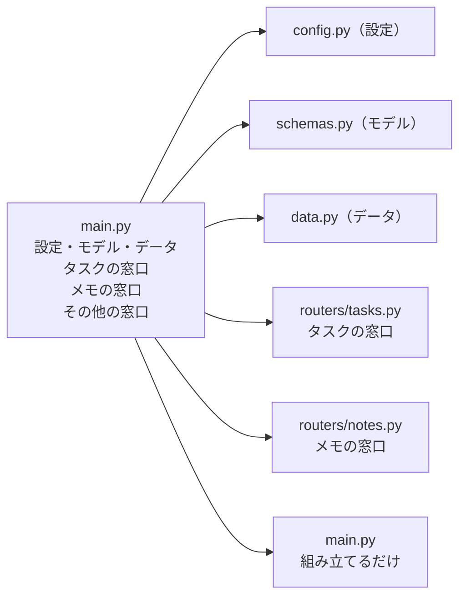
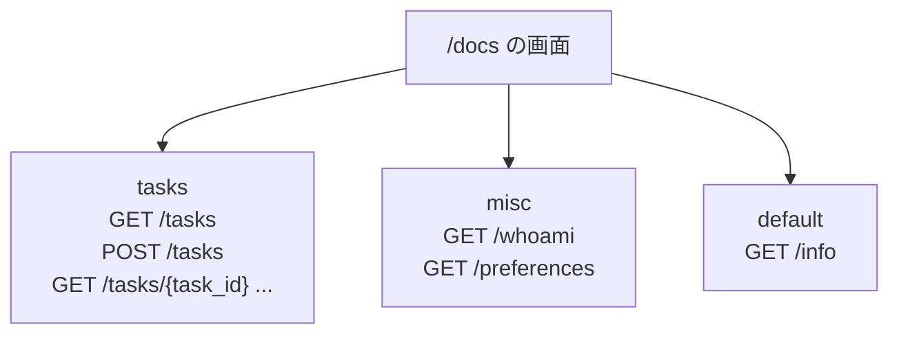
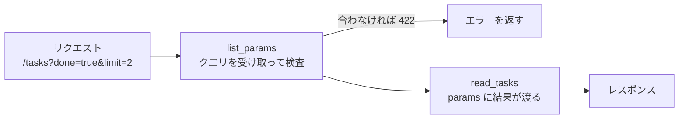
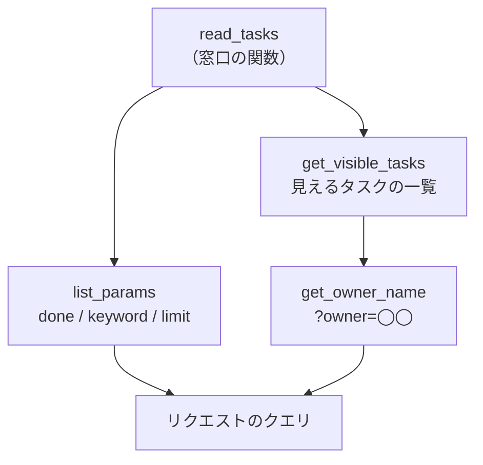
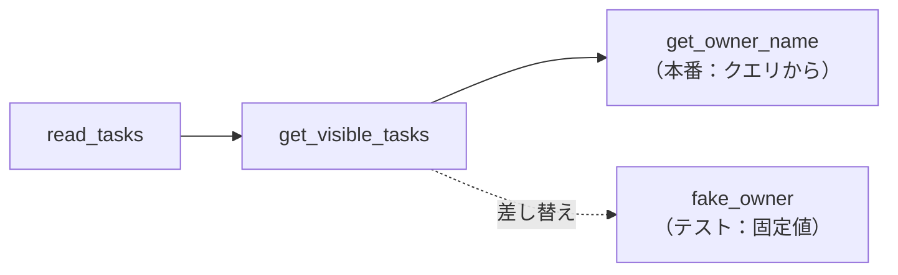

# 第5章 プロジェクト構成

第4章の最後に、3つの宿題を残しました。

- **見つからないときに `404` を返せない**（`null` を返してごまかしました。4.4.2）
- **窓口ごとに返す包みの形がばらばら**（4.4.2）
- **同じような処理を、窓口ごとに書き写している**

そして `main.py` は、設定・モデル・データ・窓口が1つのファイルに同居した状態です。
これから第6章でデータベース、第7章で認証が加わります。
このまま足していくと、**どこに何が書いてあるか分からないファイル**が出来上がります。

この章では、**ファイルを役割ごとに分け**、
**窓口どうしで重なっている処理を1か所にまとめ**、
**エラーの返し方を1つに決めます。**

新しい機能は増えません。**同じ動きのまま、形を整える章**です。

## この章で学ぶこと

- 1つの `main.py` に詰め込んだコードを、役割ごとのファイルに分けられるようになる
- 窓口を機能ごとにまとめ、`main.py` から組み立てられるようになる
- 窓口どうしで重複していた処理を、`Depends` で1か所にまとめられるようになる
- 見つからないときに `404` を返し、エラーレスポンスの形を1つに統一できるようになる
- `print` ではなく**ログ**を使って、動いているアプリの様子を記録できるようになる
- すべてのリクエストに共通する処理を、**ミドルウェア**として書けるようになる

## この章の前提

- [第4章](./04-pydantic.md) を読み終え、`fastapi-lesson` の `main.py` が第4章の最終形（4.5.3）になっていること
- 第4章の演習（メモの窓口）を解き終えていること
- python-text の第6章（モジュール・パッケージ・`__init__.py`・絶対 import）を読み終えていること
- python-text の 7.6（`raise` と、`Exception` を継承した自作の例外）を読み終えていること
- python-text の第8章（クラス・継承）を読み終えていること

> **注意**
> 第4章の演習を解いていない場合は、**先に解いてから**この章に進んでください。
> この章の演習は、第4章の演習で作った**メモの窓口**をそのまま作り直します。
> 解答は [解答編 その1](./90-answers-part1.md#第4章) にあります。

> **つまずいたら**
> この章では**ファイルを移動させる**ので、`ModuleNotFoundError`（読み込めない）が最も出やすくなります。
> 第0章の 0.2 で準備した AI に、次の3つを添えて聞いてください。
>
> ```text
> fastapi-text の 5.1.2 を読んでいます。
> fastapi dev app/main.py を実行したら ModuleNotFoundError: No module named 'app' が出ました。
> ・ターミナルの現在地（pwd / Get-Location の結果）
> ・ディレクトリの中身（ls / dir の結果）
> ・エラーの最後の5行
> ```

---

## 5.1 1ファイルでは限界がくる

### 5.1.1 どこで分けるべきか

まず、いまの `main.py` に何が入っているかを数えてみます。

| 中身 | 具体例 | だいたいの行数 |
|------|-------|--------------|
| 設定 | `Settings` / `settings = Settings()` | 10 行 |
| モデル | `Owner` / `TaskBase` / `TaskCreate` / `TaskRead` / `TaskUpdate` / `TaskListResponse` | 50 行 |
| 練習用データ | `tasks` / `notes` | 15 行 |
| タスクの窓口 | `/tasks` 系の7つ | 70 行 |
| メモの窓口 | `/notes` 系（第4章の演習） | 50 行 |
| その他の窓口 | `/whoami` / `/preferences` / `/info` | 20 行 |

200 行を超えていて、しかも**種類の違うものが混ざっています。**

ここで、分け方の基準を決めます。
**行数が多いから分ける、のではありません。**

> **分ける基準：一緒に変更するものは一緒に置き、別々に変更するものは分ける**

たとえば「タスクにタグを1つ増やす」とき、直すのはモデルとタスクの窓口です。
このときメモの窓口は**1文字も変わりません。**
一緒に変わらないものが同じファイルにあると、**関係ない部分まで目に入ります。**

分け方には、2つの軸があります。

| 軸 | 分け方 | 例 |
|----|-------|---|
| **役割**で分ける | 設定・モデル・データ・窓口 | `config.py` / `schemas.py` |
| **機能**で分ける | タスク・メモ・ユーザー | `routers/tasks.py` / `routers/notes.py` |

このテキストでは、**両方を使います。**
役割でファイルを分け、そのうち「窓口」だけは機能ごとにさらに分けます。



> **よくある間違い**
> **最初から細かく分けすぎる**間違いです。
> 第2章で作った `main.py` は、窓口が1つだけでした。
> あの時点でファイルを5つに分けていたら、**探し回るだけ**で何の得もありません。
>
> 分けるのは、**1つのファイルの中で「関係ないもの」が目に入るようになってから**です。
> 「行数が 100 行を超えたら分ける」といった数字の決まりはありません。

### 5.1.2 このテキストで採用する構成

これから、次の形にします。

```text
fastapi-lesson/
├── .env                  設定の値（共有しない。4.6.3）
├── .env.example          設定の見本（共有してよい）
├── requirements.txt      入れたパッケージの記録
└── app/                  ← アプリ本体をこの中に入れる
    ├── __init__.py       このディレクトリがパッケージだという印
    ├── main.py           アプリを組み立てる場所
    ├── config.py         設定
    ├── schemas.py        受け取る／返すデータの形（Pydantic のモデル）
    ├── data.py           練習用のデータ
    ├── dependencies.py   窓口どうしで共通して使う部品（5.3）
    ├── errors.py         このアプリだけの例外（5.4.2）
    └── routers/          窓口を機能ごとにまとめる場所
        ├── __init__.py
        └── tasks.py      タスクの窓口
```

`app` は**パッケージ**（複数のモジュールをディレクトリでまとめたもの。python-text 6.5）です。
`__init__.py` は、**そのディレクトリがパッケージであるという印**でした（python-text 6.5.2）。
中身は空で構いません。

ファイルごとの役割と、「いつ直すことになるか」を並べます。

| ファイル | 役割 | 直すのはどんなとき |
|---------|------|------------------|
| `main.py` | アプリを組み立てる | ルーターやミドルウェアを足すとき |
| `config.py` | 設定 | 環境ごとに変えたい値が増えたとき |
| `schemas.py` | データの形 | 受け取る／返す項目が変わるとき |
| `data.py` | データ | （第6章でデータベースに置き換わる） |
| `dependencies.py` | 共通の部品 | 複数の窓口で同じ処理が必要になったとき |
| `routers/tasks.py` | タスクの窓口 | タスクの機能を足すとき |

では、作っていきます。**この節では、まだ窓口は動かしません。**
設定・モデル・データの3つを先に外に出して、**動いたままの状態を保ちます**（4.5 段階的に育てる）。

まず、ディレクトリを作ります。
`fastapi-lesson` にいることを確認してから実行してください。

**Windows（PowerShell）**

```powershell
mkdir app
mkdir app\routers
```

**macOS / Linux**

```bash
mkdir app
mkdir app/routers
```

次に、VS Code で次の**空のファイル**を2つ作ってください。

- `app/__init__.py`
- `app/routers/__init__.py`

> **補足：空のファイルの作り方**
> VS Code の左側のファイル一覧で `app` を選び、「新しいファイル」のアイコンを押して
> `__init__.py` と入力します。アンダースコアは**前後に2つずつ**です。
> ファイルを開いても何も表示されませんが、それで正解です。

`app/config.py` を作り、`main.py` から `Settings` の部分を**切り取って**貼り付けます。

`app/config.py`（ファイル全体）

```python
"""アプリ全体の設定。"""

from pydantic_settings import BaseSettings, SettingsConfigDict


class Settings(BaseSettings):
    """アプリ全体の設定。"""

    app_name: str = "タスク管理 API"
    debug: bool = False

    model_config = SettingsConfigDict(env_file=".env", env_file_encoding="utf-8")


# アプリの起動時に1回だけ作る
settings = Settings()
```

`app/schemas.py` を作り、モデルの定義を**まるごと**移します。

`app/schemas.py`（ファイル全体）

```python
"""受け取る／返すデータの形（Pydantic のモデル）。"""

from pydantic import BaseModel, Field, field_validator


class Owner(BaseModel):
    name: str
    email: str


class OwnerRead(BaseModel):
    name: str


class TaskBase(BaseModel):
    """入力にも出力にも共通する項目。"""

    title: str = Field(min_length=1, max_length=20, description="タスクの内容")
    done: bool = False
    code: str | None = Field(default=None, pattern=r"^T-\d{3}$")
    priority: int = Field(default=3, ge=1, le=5, description="1が最優先、5が最低")
    tags: list[str] = []


class TaskCreate(TaskBase):
    """登録するときに受け取る形。"""

    owner: Owner

    @field_validator("title")
    @classmethod
    def title_must_not_be_blank(cls, value: str) -> str:
        if value.strip() == "":
            raise ValueError("空白だけのタイトルは登録できません")
        return value.strip()


class TaskRead(TaskBase):
    """返すときの形。email を持たない。"""

    id: int
    owner: OwnerRead


class TaskUpdate(BaseModel):
    """更新するときに受け取る形。すべて任意。"""

    title: str | None = Field(default=None, min_length=1, max_length=20)
    done: bool | None = None
    priority: int | None = Field(default=None, ge=1, le=5)
    tags: list[str] | None = None


class TaskListResponse(BaseModel):
    """一覧を返すときの包み。"""

    count: int
    tasks: list[TaskRead]
```

`app/data.py` を作り、練習用のデータを移します。

`app/data.py`（ファイル全体）

```python
"""練習用のデータ。サーバーを止めると消える（保存する方法は第6章）。"""

tasks = [
    {"id": 1, "title": "牛乳を買う", "done": False,
     "owner": {"name": "山田", "email": "yamada@example.com"}},
    {"id": 2, "title": "レポートを書く", "done": True,
     "owner": {"name": "鈴木", "email": "suzuki@example.com"}},
    {"id": 3, "title": "部屋を片づける", "done": False,
     "owner": {"name": "山田", "email": "yamada@example.com"}},
]
```

最後に、`main.py` を `app/main.py` に移動します。
VS Code のファイル一覧で `main.py` を `app` の上にドラッグすれば移動できます。

移動したら、`app/main.py` の**先頭を次のように書き換えて**ください。
切り出した `Settings` / モデル / `tasks` の定義は、**この
ファイルからは消します**（`config.py` などに移したので、二重に書く必要はありません）。

`app/main.py`（先頭部分。窓口の定義はそのまま残す）

```python
"""アプリを組み立てる場所。"""

from fastapi import Cookie, FastAPI, Header, Path, Query

from app.config import settings
from app.data import tasks
from app.schemas import TaskCreate, TaskListResponse, TaskRead, TaskUpdate

app = FastAPI(title=settings.app_name)


@app.get("/tasks/summary")
def read_summary():
    ...
```

`from app.config import settings` は、python-text 6.5.3 で学んだ**絶対 import** です。
「`app` パッケージの中の `config` モジュールから、`settings` という名前を持ってくる」という意味です。

**起動のしかたが変わります。** ファイルの場所が変わったからです。

サーバーが動いていたら `Ctrl` + `C` で止めて、次を実行してください。
**`fastapi-lesson` の中で実行します**（`app` の中に入らないでください）。

**Windows（PowerShell）**

```powershell
fastapi dev app/main.py
```

**macOS / Linux**

```bash
fastapi dev app/main.py
```

```text
 ⚡️ Starting FastAPI in development mode

 🐍 Using import string: app.main:app

 🌐 Server started at http://127.0.0.1:8000
    Documentation at http://127.0.0.1:8000/docs

  Logs:

INFO:     Will watch for changes in these directories: ['/Users/yamada/Desktop/fastapi-lesson']
INFO:     Uvicorn running on http://127.0.0.1:8000 (Press CTRL+C to quit)
INFO:     Started server process [2168]
INFO:     Waiting for application startup.
INFO:     Application startup complete.
```

**`Using import string: app.main:app`** の行に注目してください。
`fastapi` コマンドは、`__init__.py` をたどって
「これは `app` パッケージの中の `main` モジュールだ」と判断しています。
だからこそ、`from app.config import ...` という書き方が通ります。

ブラウザで確認します。**第4章までとまったく同じ結果**になれば成功です。

```text
http://127.0.0.1:8000/tasks
```

```json
{"count":3,"tasks":[{"title":"牛乳を買う","done":false,"code":null,"priority":3,"tags":[],"id":1,"owner":{"name":"山田"}},{"title":"レポートを書く","done":true,"code":null,"priority":3,"tags":[],"id":2,"owner":{"name":"鈴木"}},{"title":"部屋を片づける","done":false,"code":null,"priority":3,"tags":[],"id":3,"owner":{"name":"山田"}}]}
```

> **よくある間違い**
> **`ModuleNotFoundError: No module named 'app'`** が出たときは、原因は2つです。
>
> ```text
> ❱ 12 from app.config import settings
> ModuleNotFoundError: No module named 'app'
> ```
>
> | 原因 | 確認のしかた |
> |------|------------|
> | `app/__init__.py` が無い | `app` の中に `__init__.py` があるか見る（名前の綴りも） |
> | 起動した場所が違う | `fastapi-lesson` にいるか確認する（`app` の中にいると失敗する） |
>
> 現在地は次で確認できます。
>
> **Windows（PowerShell）**
>
> ```powershell
> Get-Location
> ```
>
> **macOS / Linux**
>
> ```bash
> pwd
> ```

> **注意**
> **`.env` は、起動したときの現在地から探されます。**
> `SettingsConfigDict(env_file=".env")` の `.env` は**相対パス**なので、
> `fastapi-lesson` で起動すれば `fastapi-lesson/.env` が読まれます。
> `app` の中に入って `fastapi dev main.py` と実行すると、
> **エラーにはならないまま、設定だけがコードのデフォルト値に戻ります。**
> `/info` の `app_name` が `.env` の値と違ったら、**起動した場所を疑ってください。**

> **注意：第4章の演習で作ったメモの窓口について**
> メモのモデル（`NoteCreate` など）は `app/schemas.py` に、
> `notes` のリストは `app/data.py` に、**タスクと並べて移してください。**
> `/notes` の窓口そのものは、**いったん `app/main.py` に残したまま**で構いません。
> **演習 5.1 で、`app/routers/notes.py` に移します。**
> `Settings` に足した `notes_title` / `notes_max` は、`app/config.py` に移します。

---

## 5.2 ルーターで分割する

### 5.2.1 `APIRouter` を作る

`app/main.py` には、まだ窓口が全部入っています。
これを機能ごとに分けるための道具が、**ルーター**（窓口をまとめた小さな `app`）です。

`APIRouter` を使うと、**`app` と同じ書き方**で窓口を定義できます。

| いままで | ルーターでは |
|---------|------------|
| `app = FastAPI()` | `router = APIRouter()` |
| `@app.get("/tasks")` | `@router.get("/tasks")` |
| `@app.post("/tasks")` | `@router.post("/tasks")` |

違いは1つだけです。
**`app` は単体で動きますが、`router` は `app` に登録しないと動きません。**

`app/routers/tasks.py` を作り、タスクの窓口を**まるごと移します。**
`@app.` を `@router.` に置き換えるのを忘れないでください。

`app/routers/tasks.py`（ファイル全体。この時点ではまだ動きません）

```python
"""タスクに関する窓口。"""

from fastapi import APIRouter, Path, Query

from app.data import tasks
from app.schemas import TaskCreate, TaskListResponse, TaskRead, TaskUpdate

router = APIRouter()


@router.get("/tasks/summary")
def read_summary():
    done_count = len([task for task in tasks if task["done"]])
    return {
        "total": len(tasks),
        "done": done_count,
        "remaining": len(tasks) - done_count,
    }


@router.get("/tasks/by-ids")
def read_tasks_by_ids(task_id: list[int] = Query(default=[])):
    found = [task for task in tasks if task["id"] in task_id]
    return {"requested": task_id, "count": len(found), "tasks": found}


@router.get("/tasks", response_model=TaskListResponse)
def read_tasks(
    done: bool | None = None,
    keyword: str | None = Query(default=None, min_length=1, max_length=20),
    limit: int = Query(default=10, ge=1, le=100),
):
    result = tasks
    if done is not None:
        result = [task for task in result if task["done"] == done]
    if keyword is not None:
        result = [task for task in result if keyword in task["title"]]
    return {"count": len(result), "tasks": result[:limit]}


@router.get("/tasks/{task_id}", response_model=TaskRead | None)
def read_task(task_id: int = Path(ge=1)):
    for task in tasks:
        if task["id"] == task_id:
            return task
    # 見つからない場合は None（JSON では null）。404 を返す方法は 5.4.1
    return None


@router.post("/tasks", response_model=TaskRead, status_code=201)
def create_task(new_task: TaskCreate):
    new_id = max([task["id"] for task in tasks]) + 1
    created = {
        "id": new_id,
        "title": new_task.title,
        "done": new_task.done,
        "code": new_task.code,
        "priority": new_task.priority,
        "owner": new_task.owner.model_dump(),
        "tags": new_task.tags,
    }
    tasks.append(created)
    return created


@router.patch("/tasks/{task_id}", response_model=TaskRead | None)
def update_task(
    new_task: TaskUpdate,
    task_id: int = Path(ge=1),
    notify: bool = False,
):
    for task in tasks:
        if task["id"] == task_id:
            changes = new_task.model_dump(exclude_unset=True)
            for key, value in changes.items():
                task[key] = value
            return task
    return None


@router.delete("/tasks/{task_id}", status_code=204)
def delete_task(task_id: int = Path(ge=1)):
    for task in tasks:
        if task["id"] == task_id:
            tasks.remove(task)
            break
    return None
```

移したぶんを、`app/main.py` から**消してください。**
`app/main.py` に残るのは、`/whoami` / `/preferences` / `/info`（とメモの窓口）だけになります。

この状態でブラウザから `http://127.0.0.1:8000/tasks` を開くと、こうなります。

```json
{"detail":"Not Found"}
```

**`404` です。** 窓口を書いたのに動きません。
**ルーターを `app` に登録していない**からです。

### 5.2.2 `include_router` で登録する

登録は1行です。`app/main.py` に追記します。

```diff
  from fastapi import Cookie, FastAPI, Header
  
  from app.config import settings
  from app.data import tasks
+ from app.routers import tasks as tasks_router
  
  app = FastAPI(title=settings.app_name)
+ 
+ app.include_router(tasks_router.router)
```

`include_router` は、**ルーターに登録された窓口を、まとめて `app` に取り込む**メソッドです。


もう一度 `http://127.0.0.1:8000/tasks` を開いてください。**一覧が返ります。**

```json
{"count":3,"tasks":[{"title":"牛乳を買う","done":false,"code":null,"priority":3,"tags":[],"id":1,"owner":{"name":"山田"}},{"title":"レポートを書く","done":true,"code":null,"priority":3,"tags":[],"id":2,"owner":{"name":"鈴木"}},{"title":"部屋を片づける","done":false,"code":null,"priority":3,"tags":[],"id":3,"owner":{"name":"山田"}}]}
```

> **よくある間違い**
> **`from app.routers import tasks` とそのまま書くと、名前がぶつかります。**
> `app/main.py` には、すでに `from app.data import tasks`（データのリスト）があるからです。
> あとに書いたほうで上書きされ、`tasks.router` が読めない、
> あるいは `len(tasks)` がおかしくなる、という分かりにくい不具合になります。
>
> 対処は2つあります。どちらでも構いません。
>
> ```python
> from app.routers import tasks as tasks_router     # 別名を付ける（python-text 6.2.3）
> ```
>
> ```python
> from app import data                              # モジュールごと読み込む
> # 使うときは data.tasks と書く
> ```
>
> **このテキストでは、`app/main.py` では後者を使います**（`data.tasks` と書けば、
> どのファイルから来た `tasks` なのかが読んだ瞬間に分かるためです）。

いま説明した後者の形に、`app/main.py` を直しておきます。
`main.py` に残っている `tasks` の使いみちは、`/info` の `task_count` だけです。

```diff
  from app.config import settings
- from app.data import tasks
+ from app import data
- from app.routers import tasks as tasks_router
+ from app.routers import tasks
  
  app = FastAPI(title=settings.app_name)
  
- app.include_router(tasks_router.router)
+ app.include_router(tasks.router)
```

```diff
  @app.get("/info")
  def read_info():
      return {
          "app_name": settings.app_name,
          "debug": settings.debug,
-         "task_count": len(tasks),
+         "task_count": len(data.tasks),
      }
```

`http://127.0.0.1:8000/info` を開いて、今までどおり件数が返ることを確認してください。

```json
{"app_name":"タスク管理 API（開発用）","debug":true,"task_count":3}
```

> **注意**
> **定義の順序の決まり（3.1.4）は、ルーターの中でもそのまま効きます。**
> `/tasks/summary` を `/tasks/{task_id}` より**後ろ**に書くと、
> `summary` が `task_id` として解釈され、`422` になります。
> ルーターに移すときに順番が入れ替わっていないか、確認してください。

### 5.2.3 `prefix` と `tags`

`app/routers/tasks.py` を見ると、`/tasks` という文字列が7回書かれています。
**同じ文字列を繰り返し書くと、1か所だけ直し忘れます。**

`APIRouter` に **`prefix`**（共通の頭）を渡すと、これをまとめられます。

`app/routers/tasks.py`（`router = APIRouter()` の行を差し替え）

```python
router = APIRouter(prefix="/tasks", tags=["tasks"])
```

そのうえで、**各デコレータのパスから `/tasks` を消します。**

| いままで | `prefix` を付けたあと | 実際の URL |
|---------|---------------------|-----------|
| `@router.get("/tasks/summary")` | `@router.get("/summary")` | `/tasks/summary` |
| `@router.get("/tasks")` | **`@router.get("")`** | `/tasks` |
| `@router.get("/tasks/{task_id}")` | `@router.get("/{task_id}")` | `/tasks/{task_id}` |

`/tasks` そのものを表すパスは、**空の文字列 `""`** になります。
`prefix` と合わさって `/tasks` になるからです。

`tags=["tasks"]` は、**`/docs` でのグループ名**です。
`/docs` を開くと、窓口が `tasks` という見出しの下にまとまって表示されます。



窓口が増えるほど、この見出しの効き目は大きくなります。
第9章で React 側から使うときも、**探す場所が決まっている**のは大きな助けになります。

`/whoami` と `/preferences` も、`app/main.py` から追い出しておきます。
こちらは「どの機能にも属さない練習用の窓口」なので、`misc`（雑多、の意味）という名前にします。

`app/routers/misc.py`（ファイル全体）

```python
"""第3章で作った、ヘッダーとクッキーの練習用の窓口。"""

from fastapi import APIRouter, Cookie, Header

router = APIRouter(tags=["misc"])


@router.get("/whoami")
def read_whoami(
    user_agent: str | None = Header(default=None),
    x_token: str | None = Header(default=None),
):
    return {"user_agent": user_agent, "x_token": x_token}


@router.get("/preferences")
def read_preferences(theme: str | None = Cookie(default=None)):
    if theme is None:
        return {"theme": "（クッキーが送られていません）"}
    return {"theme": theme}
```

**このルーターには `prefix` がありません。**
`/whoami` と `/preferences` に共通の頭が無いからです。
`prefix` は「付けられるときに付けるもの」で、必須ではありません。

`app/main.py` に、2つ目の登録を足します。

```diff
  from app.routers import misc, tasks
  
  app = FastAPI(title=settings.app_name)
  
  app.include_router(tasks.router)
+ app.include_router(misc.router)
```

`/docs` を開いて、`tasks` と `misc` の2つの見出しができていることを確認してください。
そのうえで、`http://127.0.0.1:8000/whoami` が今までどおり動くことも確かめます。

```json
{"user_agent":"Mozilla/5.0 ...","x_token":null}
```

> **よくある間違い**
> **`prefix` の末尾に `/` を書くと、サーバーが起動しません。**
>
> ```python
> router = APIRouter(prefix="/tasks/")     # ❌
> ```
>
> ```text
> AssertionError: A path prefix must not end with '/', as the routes will start with '/'
> ```
>
> 「パスの頭は `/` で終わってはいけない。窓口側のパスが `/` で始まるから」という意味です。
> `prefix="/tasks"` と書いてください。

> **補足：`/tasks/` と末尾にスラッシュを付けて開くと**
> `/tasks`（スラッシュなし）で登録した窓口に `/tasks/` でアクセスすると、
> FastAPI は **`307` を返して `/tasks` に案内します**（リダイレクト）。
> ブラウザは自動的に付いていくので、結果は同じに見えます。
> ただし `curl` は `-L` を付けないと `307` のまま止まるので、
> **手で打つときは、末尾のスラッシュを付けない**と覚えておいてください。

---

## 5.3 依存性注入

### 5.3.1 `Depends` とは

`read_tasks` の引数を、もう一度見てください。

```python
def read_tasks(
    done: bool | None = None,
    keyword: str | None = Query(default=None, min_length=1, max_length=20),
    limit: int = Query(default=10, ge=1, le=100),
):
```

第4章の演習で作ったメモの一覧にも、**同じような絞り込み**が要ります。
このまま書くと、`limit` の上限を 100 から 50 に変えるとき、**2か所直す**ことになります。

FastAPI には、**引数の受け取り方そのものを、関数として切り出す**仕組みがあります。
これを **`Depends`**（デペンズ）と書きます。

まず、小さく試します。`app/routers/tasks.py` の先頭に、次の関数を書いてください。

`app/routers/tasks.py`（`router = ...` の下に追記）

```python
def list_params(
    done: bool | None = None,
    keyword: str | None = Query(default=None, min_length=1, max_length=20),
    limit: int = Query(default=10, ge=1, le=100),
) -> dict:
    """一覧を絞り込むための、共通のクエリパラメータ。"""
    return {"done": done, "keyword": keyword, "limit": limit}
```

**ただの関数です。** 引数の書き方は、窓口の関数とまったく同じです。

これを窓口から使います。`read_tasks` を、次のように書き換えてください。

`app/routers/tasks.py`（`read_tasks` の部分）

```python
@router.get("", response_model=TaskListResponse)
def read_tasks(params: dict = Depends(list_params)):
    result = tasks
    if params["done"] is not None:
        result = [task for task in result if task["done"] == params["done"]]
    if params["keyword"] is not None:
        result = [task for task in result if params["keyword"] in task["title"]]
    return {"count": len(result), "tasks": result[: params["limit"]]}
```

`import` に `Depends` を足します。

```diff
- from fastapi import APIRouter, Path, Query
+ from fastapi import APIRouter, Depends, Path, Query
```

`Depends(list_params)` は、FastAPI への指示です。

> 「この引数の値は、**`list_params` を呼んで作ってください。**
> `list_params` が必要とするもの（クエリパラメータ）は、あなたが用意してください」

このように、**必要な部品を自分で作らず、外から渡してもらう作り方**を
**依存性注入**（DI。処理に必要な部品を、外から渡してもらう作り方）と呼びます。



**呼ばれる順番は「依存 → 窓口の関数」です。**
`list_params` が `422` で弾けば、`read_tasks` は呼ばれません（4.1.1 の関所と同じ考え方）。

動かして確かめます。

```text
http://127.0.0.1:8000/tasks?done=true
```

```json
{"count":1,"tasks":[{"title":"レポートを書く","done":true,"code":null,"priority":3,"tags":[],"id":2,"owner":{"name":"鈴木"}}]}
```

```text
http://127.0.0.1:8000/tasks?limit=0
```

```json
{"detail":[{"type":"greater_than_equal","loc":["query","limit"],"msg":"Input should be greater than or equal to 1","input":"0","ctx":{"ge":1}}]}
```

**`/docs` の表示も変わりません。**
`GET /tasks` を開くと、`done` / `keyword` / `limit` の3つが今までどおり並んでいます。
**関数の外に出しても、FastAPI から見れば同じ**だからです。

> **よくある間違い**
> **`Depends(list_params())` と括弧を付ける**間違いです。
>
> ```python
> def read_tasks(params: dict = Depends(list_params())):     # ❌
> ```
>
> `Depends` に渡すのは、**呼び出した結果ではなく、関数そのもの**です。
> 括弧を付けると、その場で `list_params` が引数なしで呼ばれ、
> `Query(...)` がそのまま値として入った辞書ができてしまいます。
> **括弧を付けない**と覚えてください（python-text 5.6.1 の「関数を値として渡す」と同じ話です）。

### 5.3.2 共通処理をまとめる

`list_params` は、メモの一覧でも使いたい部品です。
**タスクのルーターの中に置いたままでは、メモから使いにくくなります。**

`app/dependencies.py` を作って、そちらに移します。

`app/dependencies.py`（ファイル全体。この節の分だけ）

```python
"""窓口どうしで共通して使う部品。"""

from fastapi import Query


def list_params(
    done: bool | None = None,
    keyword: str | None = Query(default=None, min_length=1, max_length=20),
    limit: int = Query(default=10, ge=1, le=100),
) -> dict:
    """一覧を絞り込むための、共通のクエリパラメータ。"""
    return {"done": done, "keyword": keyword, "limit": limit}
```

`app/routers/tasks.py` からは、`list_params` の定義を消して、読み込む形にします。

```diff
+ from app.dependencies import list_params
  from app.schemas import TaskCreate, TaskListResponse, TaskRead, TaskUpdate
```

もう一度 `http://127.0.0.1:8000/tasks?done=true&limit=1` を開いて、
**動きが変わっていないこと**を確認してください。

```json
{"count":1,"tasks":[{"title":"レポートを書く","done":true,"code":null,"priority":3,"tags":[],"id":2,"owner":{"name":"鈴木"}}]}
```

`Depends` に切り出す価値があるのは、次のようなものです。

| 切り出すと得なもの | 例 |
|------------------|---|
| 複数の窓口で同じ引数を受け取る | 一覧の絞り込み条件 |
| 受け取った値から、毎回同じ準備をする | id から1件を探す（5.4.1） |
| 差し替えたくなる | データベースへの接続（第6章）、ログイン中のユーザー（第7章） |

逆に、**その窓口でしか使わない1行の処理**を無理に切り出す必要はありません。

### 5.3.3 依存関係を入れ子にする

`Depends` の本当の強みは、**依存が依存を持てる**ことです。

例として、「担当者を指定すると、その人のタスクだけを見る」という絞り込みを足します。
これは2段階に分けられます。

1. `?owner=山田` から**担当者の名前を取り出す**
2. その名前で、**見えるタスクの一覧を作る**

`app/dependencies.py` に、2つの関数を追記してください。

`app/dependencies.py`（追記）

```python
from app.data import tasks


def get_owner_name(owner: str | None = Query(default=None, max_length=20)) -> str | None:
    """?owner=山田 で指定された担当者の名前を取り出す。"""
    return owner


def get_visible_tasks(owner: str | None = Depends(get_owner_name)) -> list[dict]:
    """担当者が指定されていれば、その人のタスクだけを返す。"""
    if owner is None:
        return tasks
    return [task for task in tasks if task["owner"]["name"] == owner]
```

`import` に `Depends` を足します。

```diff
- from fastapi import Query
+ from fastapi import Depends, Query
```

**`get_visible_tasks` の引数が `Depends(get_owner_name)` になっている**のがポイントです。
依存が、さらに別の依存を要求しています。

`read_tasks` から使います。**引数が2つになります。**

`app/routers/tasks.py`（`read_tasks` の部分）

```python
@router.get("", response_model=TaskListResponse)
def read_tasks(
    params: dict = Depends(list_params),
    visible: list[dict] = Depends(get_visible_tasks),
):
    result = visible
    if params["done"] is not None:
        result = [task for task in result if task["done"] == params["done"]]
    if params["keyword"] is not None:
        result = [task for task in result if params["keyword"] in task["title"]]
    return {"count": len(result), "tasks": result[: params["limit"]]}
```

```diff
- from app.dependencies import list_params
+ from app.dependencies import get_visible_tasks, list_params
```

FastAPI は、この関係を**木の形**にたどって、下から順に解決します。



**深さが増えても、窓口の関数が書くことは増えません。**
`read_tasks` は `get_owner_name` の存在すら知らないまま、結果だけを受け取ります。

動かして確かめます。ブラウザで次を開いてください。

```text
http://127.0.0.1:8000/tasks?owner=鈴木
```

```json
{"count":1,"tasks":[{"title":"レポートを書く","done":true,"code":null,"priority":3,"tags":[],"id":2,"owner":{"name":"鈴木"}}]}
```

条件は**組み合わせられます。**

```text
http://127.0.0.1:8000/tasks?owner=鈴木&done=false
```

```json
{"count":0,"tasks":[]}
```

鈴木さんのタスク（`done` が `true`）は1件だけなので、
「鈴木さんの、まだ終わっていないタスク」は0件です。

> **注意：担当者をヘッダーで受け取らなかった理由**
> 「担当者はヘッダー（3.5.1）で渡すほうが自然では」と思ったかもしれません。
> **HTTP のヘッダーには、日本語（ASCII 以外の文字）を入れられません。**
> `X-Owner: 山田` を送ろうとすると、送る側の道具がエラーにするか、
> 受け取った側で文字化けします。
> **日本語を渡す必要があるものは、クエリパラメータかボディで渡してください**（1.2.4）。

> **補足：同じ依存が2回書かれていたら**
> 1つの窓口が `get_owner_name` と `get_visible_tasks` の両方を要求した場合でも、
> **`get_owner_name` は1リクエストにつき1回しか呼ばれません。**
> FastAPI が、1回目の結果を覚えて使い回すためです。
> 「同じ依存を2か所に書くと2回動いてしまう」という心配は要りません。

### 5.3.4 テストで差し替えられる利点

`Depends` には、もう1つ大きな利点があります。
**外から差し替えられる**ことです。

`app` には `dependency_overrides`（依存の差し替え表）という辞書があり、
ここに「この依存の代わりに、こちらを使う」と書けます。

実際に見てみます。`app/main.py` の末尾に、**一時的に**次を追記してください。

`app/main.py`（末尾に一時的に追記）

```python
from app.dependencies import get_owner_name


def fake_owner() -> str:
    """動作確認のために、常に「鈴木」を返す。"""
    return "鈴木"


# get_owner_name の代わりに fake_owner を使う
app.dependency_overrides[get_owner_name] = fake_owner
```

この状態で、**`?owner=` を付けずに**一覧を開いてください。

```text
http://127.0.0.1:8000/tasks
```

```json
{"count":1,"tasks":[{"title":"レポートを書く","done":true,"code":null,"priority":3,"tags":[],"id":2,"owner":{"name":"鈴木"}}]}
```

**クエリを何も指定していないのに、鈴木さんのタスクだけが返りました。**
`get_owner_name` が `fake_owner` に置き換わっているからです。

`app/routers/tasks.py` は**1文字も変えていません。**
窓口が「担当者の名前がどこから来るか」を知らないからこそ、外から差し替えられます。



これは第8章のテストで本格的に使います。

- データベースを、テスト用のものに差し替える（第8章 8.4.3）
- ログイン中のユーザーを、テスト用の人に固定する（第7章の内容をテストするとき）

**確認が終わったら、いま追記した4行（`import` を含む）は消してください。**
消さないと、`?owner=` の指定が効かないままになります。

> **注意**
> `dependency_overrides` は、**テストや動作確認のための仕組み**です。
> 本番の動きを変えるために使うものではありません。
> 「条件によって処理を変えたい」場合は、差し替えではなく
> **依存の中で `if` を書く**か、**別の依存を作る**ほうが読みやすくなります。

---

## 5.4 エラーハンドリング

### 5.4.1 `HTTPException`

第4章で先送りにした宿題を回収します。**見つからないときの `404`** です。

いまの `read_task` は、こう書かれています。

```python
    # 見つからない場合は None（JSON では null）
    return None
```

呼ぶ側から見ると、これは困ります。

| 返ってきたもの | 呼ぶ側が知りたいこと |
|--------------|-------------------|
| `200` + `null` | 無かったのか、あったけど中身が空なのか、区別できない |
| **`404`** | **「そんなものは無い」とはっきり分かる** |

FastAPI では、`raise` で例外を投げると、その場でレスポンスを決められます。
そのための例外が **`HTTPException`** です。

```python
raise HTTPException(status_code=404, detail="id 99 のタスクは見つかりませんでした")
```

`raise` は python-text 7.6.1 で学んだ「例外を投げる」書き方です。
**投げた時点で関数は終わり**、FastAPI がそれを受け取ってレスポンスにします。

ここで、**5.3 の `Depends` と組み合わせます。**
「id でタスクを探し、見つからなければ `404`」という処理は、
`GET` / `PATCH` / `DELETE` の**3つの窓口で同じ**だからです。

`app/dependencies.py` に追記してください。

`app/dependencies.py`（追記）

```python
def get_task_or_404(task_id: int = Path(ge=1)) -> dict:
    """id でタスクを探す。見つからなければ 404 で止める。"""
    for task in tasks:
        if task["id"] == task_id:
            return task
    raise HTTPException(
        status_code=404,
        detail=f"id {task_id} のタスクは見つかりませんでした",
    )
```

```diff
- from fastapi import Depends, Query
+ from fastapi import Depends, HTTPException, Path, Query
```

これを使って、3つの窓口を書き換えます。
**`task_id` を受け取る代わりに、見つかったタスクそのものを受け取る**形になります。

`app/routers/tasks.py`（3つの窓口を差し替え）

```python
@router.get("/{task_id}", response_model=TaskRead)
def read_task(task: dict = Depends(get_task_or_404)):
    return task


@router.patch("/{task_id}", response_model=TaskRead)
def update_task(
    new_task: TaskUpdate,
    task: dict = Depends(get_task_or_404),
    notify: bool = False,
):
    changes = new_task.model_dump(exclude_unset=True)
    for key, value in changes.items():
        task[key] = value
    return task


@router.delete("/{task_id}", status_code=204)
def delete_task(task: dict = Depends(get_task_or_404)):
    tasks.remove(task)
    return None
```

```diff
- from app.dependencies import get_visible_tasks, list_params
+ from app.dependencies import get_task_or_404, get_visible_tasks, list_params
```

3つとも、**`for` ループが消えました。**
「探す」「無ければ `404`」は依存が済ませているので、
窓口の関数には**見つかったあとの仕事だけ**が残ります。

**`response_model` からも `| None` が外れました**（4.4.2）。
`null` を返す可能性が無くなったからです。

動かして確かめます。

```text
http://127.0.0.1:8000/tasks/99
```

```json
{"detail":"id 99 のタスクは見つかりませんでした"}
```

ブラウザの開発者ツール（1.5.2）で見ると、`Status Code` は **`404 Not Found`** です。

存在する id は、今までどおり返ります。

```text
http://127.0.0.1:8000/tasks/2
```

```json
{"title":"レポートを書く","done":true,"code":null,"priority":3,"tags":[],"id":2,"owner":{"name":"鈴木"}}
```

削除も、`404` を返すようになりました（4.4.3 で「穴がある」と書いた部分です）。

**Windows（PowerShell）**

```powershell
curl.exe -i -X DELETE http://127.0.0.1:8000/tasks/99
```

**macOS / Linux**

```bash
curl -i -X DELETE http://127.0.0.1:8000/tasks/99
```

実行結果:

```text
HTTP/1.1 404 Not Found
content-type: application/json

{"detail":"id 99 のタスクは見つかりませんでした"}
```

> **よくある間違い**
> **`return HTTPException(...)` と書く**間違いです。`raise` ではなく `return` にしてしまうものです。
>
> ```python
> return HTTPException(status_code=404, detail="無い")     # ❌
> ```
>
> エラーにはなりません。**`200` で、例外そのものが JSON になって返ります。**
>
> ```json
> {"status_code":404,"detail":"無い","headers":null}
> ```
>
> `response_model` を付けている窓口なら、宣言と形が違うので `500` になります（4.4.1）。
> **`HTTPException` は `raise` する**と覚えてください。

> **注意**
> `HTTPException` の `detail` に、**内部の事情を書かないでください。**
> ファイルのパス、データベースのエラー文、秘密の値などをそのまま入れると、
> **それが利用者に見えます。**
> 詳しい情報はログに出し（5.5.3）、レスポンスには「何が無かったか」だけを書きます。

### 5.4.2 例外ハンドラを自作する

`404` は `HTTPException` で足りました。
しかし、**このアプリ特有の失敗**は、それだけでは足りません。

例として、**管理番号 `code` の重複**を弾いてみます（4.3.2 で `T-001` のような番号を付けました）。
すでに使われている番号で登録しようとしたら、拒否したいところです。

素直に書くと、こうなります。

```python
raise HTTPException(status_code=409, detail=f"管理番号 {new_task.code} は、すでに使われています")
```

**`409 Conflict`**（コンフリクト。すでにあるものとぶつかっていて処理できない、という意味の 4xx）は、
まさにこの場面のためのコードです。

これでも動きますが、問題が2つあります。

- 「重複」を判定する場所が増えるたびに、**同じ `409` とメッセージを書き写す**ことになる
- ルーターのコードに、**HTTP の都合（`409` という数字）が混ざる**

そこで、**このアプリだけの例外**を作り、
「その例外をどう HTTP に変換するか」は**1か所にまとめます。**

まず例外を定義します（python-text 7.6.2 で学んだ、`Exception` を継承したクラスです）。

`app/errors.py`（ファイル全体）

```python
"""このアプリだけの例外。"""


class DuplicateCodeError(Exception):
    """すでに使われている管理番号で登録しようとしたときの例外。"""

    def __init__(self, code: str) -> None:
        self.code = code
```

`app/routers/tasks.py` の `create_task` の先頭で、この例外を投げます。

`app/routers/tasks.py`（`create_task` の部分）

```python
@router.post("", response_model=TaskRead, status_code=201)
def create_task(new_task: TaskCreate):
    if new_task.code is not None:
        for task in tasks:
            if task.get("code") == new_task.code:
                # HTTP の都合はここに書かない。変換は app/main.py が担当する
                raise DuplicateCodeError(new_task.code)
    new_id = max([task["id"] for task in tasks]) + 1
    created = {
        "id": new_id,
        "title": new_task.title,
        "done": new_task.done,
        "code": new_task.code,
        "priority": new_task.priority,
        "owner": new_task.owner.model_dump(),
        "tags": new_task.tags,
    }
    tasks.append(created)
    return created
```

```diff
+ from app.errors import DuplicateCodeError
```

（`task.get("code")` としているのは、練習用データの3件に `code` が入っていないためです。
`task["code"]` と書くと `KeyError` になります。python-text 4.2.4 の `get` を使っています。）

次に、**この例外を受け止める係**を書きます。
これを**例外ハンドラ**（決まった例外が投げられたとき、代わりにレスポンスを作る関数）と呼びます。

`app/main.py` に追記してください。

`app/main.py`（`import` を3行足し、末尾に関数を1つ追記）

```diff
- from fastapi import FastAPI
+ from fastapi import FastAPI, Request
+ from fastapi.responses import JSONResponse
  
  from app import data
  from app.config import settings
+ from app.errors import DuplicateCodeError
  from app.routers import misc, tasks
```

`app/main.py`（末尾に追記）

```python
@app.exception_handler(DuplicateCodeError)
def handle_duplicate_code(request: Request, exc: DuplicateCodeError) -> JSONResponse:
    """管理番号が重複したときの返し方を、1か所にまとめる。"""
    return JSONResponse(
        status_code=409,
        content={"detail": f"管理番号 {exc.code} は、すでに使われています"},
    )
```

読み方は次のとおりです。

| 部分 | 意味 |
|------|------|
| `@app.exception_handler(DuplicateCodeError)` | 「この例外が投げられたら、この関数を呼べ」という印 |
| `request` | どのリクエストで起きたか（使わなくても、引数には必要） |
| `exc` | **投げられた例外そのもの。** `exc.code` で中身を取り出せる |
| `JSONResponse(...)` | ステータスコードと中身を自分で組み立てて返す |

`/docs` から `POST /tasks` を2回実行して確かめます。1回目は成功します。

```json
{
  "title": "郵便を出す",
  "code": "T-001",
  "owner": {"name": "山田", "email": "yamada@example.com"}
}
```

```text
Server response
  Code    201
```

**同じ `code` で、もう一度送ってください。**

```json
{
  "title": "切手を買う",
  "code": "T-001",
  "owner": {"name": "山田", "email": "yamada@example.com"}
}
```

```text
Server response
  Code    409
  Response body
    {"detail":"管理番号 T-001 は、すでに使われています"}
```

`create_task` には `409` という数字が1つも出てきません。
**「重複した」という事実だけを投げ、HTTP への翻訳は1か所**——これが例外ハンドラです。

> **よくある間違い**
> **ハンドラを書き忘れた例外は、`500` になります。**
> `app/main.py` の `@app.exception_handler(...)` を消して同じリクエストを送ると、
> レスポンスは次のようになります。
>
> ```text
> Internal Server Error
> ```
>
> サーバー側のターミナルには、`DuplicateCodeError` のトレースバックが出ます。
> **自作の例外を投げたら、必ずハンドラも書く。** これは対で覚えてください。

### 5.4.3 エラーレスポンスの形式を統一する

ここまでで、エラーの返し方が**3種類**になりました。

| 場面 | いまの形 |
|------|---------|
| `404`（`HTTPException`） | `{"detail":"id 99 の……"}` — `detail` は**文字列** |
| `422`（バリデーション） | `{"detail":[{"type":"missing", ...}]}` — `detail` は**リスト** |
| `409`（自作のハンドラ） | `{"detail":"管理番号 T-001 は……"}` |

呼ぶ側（第9章の React）から見ると、これは厄介です。
**`detail` が文字列なのかリストなのかを、毎回確かめる**ことになります。

そこで、**すべてのエラーを1つの形に揃えます。**
このテキストでは、次の形を採用します。

```json
{
  "error": {
    "status": 404,
    "message": "id 99 のタスクは見つかりませんでした",
    "detail": null
  }
}
```

| 項目 | 意味 |
|------|------|
| `status` | ステータスコードと同じ数字（本文だけ見ても分かるように） |
| `message` | **人間が読む1行。** 画面に出せる文 |
| `detail` | 項目ごとの詳しい情報。`422` のときだけ中身が入る |

`app/main.py` を、次のように書き換えてください。
足りない `import`（`JSONResponse` は 5.4.2 で入れました）を足し、
`handle_duplicate_code` を含む例外ハンドラの部分を差し替えます。

`app/main.py`（`import` と例外ハンドラの部分）

```python
from fastapi.encoders import jsonable_encoder
from fastapi.exceptions import RequestValidationError
from fastapi.responses import JSONResponse
from starlette.exceptions import HTTPException as StarletteHTTPException


@app.exception_handler(StarletteHTTPException)
def handle_http_exception(request: Request, exc: StarletteHTTPException) -> JSONResponse:
    """HTTPException を、統一した形に変換して返す。"""
    return JSONResponse(
        status_code=exc.status_code,
        content={
            "error": {"status": exc.status_code, "message": exc.detail, "detail": None}
        },
    )


@app.exception_handler(RequestValidationError)
def handle_validation_error(request: Request, exc: RequestValidationError) -> JSONResponse:
    """422 も、同じ形に揃えて返す。"""
    return JSONResponse(
        status_code=422,
        content={
            "error": {
                "status": 422,
                "message": "リクエストの形式が正しくありません",
                # 元の detail は、そのまま detail に入れて残す
                "detail": jsonable_encoder(exc.errors()),
            }
        },
    )


@app.exception_handler(DuplicateCodeError)
def handle_duplicate_code(request: Request, exc: DuplicateCodeError) -> JSONResponse:
    """管理番号が重複したときの返し方を、1か所にまとめる。"""
    return JSONResponse(
        status_code=409,
        content={
            "error": {
                "status": 409,
                "message": f"管理番号 {exc.code} は、すでに使われています",
                "detail": None,
            }
        },
    )
```

見慣れないものが2つあります。

**1つ目：`starlette.exceptions` の `HTTPException`**

FastAPI の `HTTPException` は、**Starlette**（FastAPI の土台になっているライブラリ。
第2章 2.2.2 で `pip install` したときに一緒に入っています）の `HTTPException` を継承したものです。

登録していない URL（`/nothing` など）に来た `404` は、
自分のコードではなく **Starlette 側**が投げます。
そこまでまとめて受け止めるために、**継承元のほうに登録します。**

**2つ目：`jsonable_encoder`**

`exc.errors()` の中身には、**JSON にそのまま変換できないもの**が混ざることがあります
（自分で書いたバリデータの `ValueError` などです。4.3.3）。
`jsonable_encoder` は、それを JSON にできる形へ変換する関数です。

これを付けずに `exc.errors()` をそのまま渡すと、**`500` になります。**

3つとも動かして確かめます。

```text
http://127.0.0.1:8000/tasks/99
```

```json
{"error":{"status":404,"message":"id 99 のタスクは見つかりませんでした","detail":null}}
```

```text
http://127.0.0.1:8000/tasks/abc
```

```json
{"error":{"status":422,"message":"リクエストの形式が正しくありません","detail":[{"type":"int_parsing","loc":["path","task_id"],"msg":"Input should be a valid integer, unable to parse string as an integer","input":"abc"}]}}
```

`/docs` から、`title` を送らずに `POST /tasks` を実行してください。

```text
Server response
  Code    422
  Response body
    {
      "error": {
        "status": 422,
        "message": "リクエストの形式が正しくありません",
        "detail": [
          {
            "type": "missing",
            "loc": ["body", "title"],
            "msg": "Field required",
            "input": {"owner": {"name": "山田", "email": "yamada@example.com"}}
          }
        ]
      }
    }
```

**`detail` の中身は、第3章・第4章で読み方を覚えたものがそのまま入っています。**
包みが変わっただけです。

登録していない URL も、同じ形になります。

```text
http://127.0.0.1:8000/nothing
```

```json
{"error":{"status":404,"message":"Not Found","detail":null}}
```

（`message` が英語なのは、この `404` を投げているのが Starlette 自身だからです。）

> **注意**
> **`422` の `detail` を捨てないでください。**
>
> ```python
> "detail": None,       # ❌ 422 でもこう書いてしまう
> ```
>
> 形は揃いますが、**「どの項目が悪かったのか」が消えます。**
> 利用者は「形式が正しくありません」としか言われず、直しようがありません。
> **統一するのは包みだけで、中身の情報は減らさない**のが原則です。

> **注意**
> **この章以降、このテキストのエラーレスポンスはすべてこの形です。**
> 第6章以降のコードや、第9章で React 側がエラーを読むときも、
> `error.message` を見る前提で書きます。

---

## 5.5 ログ

### 5.5.1 `print` をやめる

ここまでの章では、動きを確かめたいとき `print` を使ってきました。
アプリを他人に使ってもらう段階になると、`print` では足りなくなります。

| 困ること | `print` の場合 |
|---------|--------------|
| 重要度が区別できない | 「ただの記録」も「異常」も同じ見た目 |
| いつ起きたか分からない | 時刻が付かない |
| どこで起きたか分からない | ファイル名が付かない |
| 出す・出さないを切り替えられない | 消すには**コードを直す**しかない |
| 出力先を変えられない | 画面に出るだけ。ファイルに残せない |

これらをまとめて解決するのが、**ログ**（プログラムが動いている間の出来事を、
時刻や重要度を付けて記録したもの）です。
Python には、標準ライブラリ（python-text 6.3.1）の `logging` が最初から入っています。

まず、**出し方をアプリ全体で1回だけ決めます。**
`app/main.py` の先頭に追記してください。

`app/main.py`（`import` の並びに1行、`app = FastAPI(...)` の上に4行）

```diff
+ import logging
+ 
  from fastapi import FastAPI, Request
```

```diff
  from app.routers import misc, tasks
  
+ # ログの出し方を、アプリ全体で1回だけ決める
+ logging.basicConfig(
+     level=logging.INFO,
+     format="%(asctime)s %(levelname)s %(name)s: %(message)s",
+ )
+ logger = logging.getLogger(__name__)
+ 
  app = FastAPI(title=settings.app_name)
```

| 部分 | 意味 |
|------|------|
| `logging.basicConfig(...)` | 出力の設定。**アプリの中で1回だけ**呼ぶ |
| `level=logging.INFO` | この重要度以上のものを出す（5.5.2） |
| `format=...` | 1行の形。時刻・重要度・名前・本文 |
| `logging.getLogger(__name__)` | **ロガー**（ログを出す係）を作る |

`__name__` は、python-text 6.4.1 で学んだ「そのモジュールの名前」です。
`app/main.py` なら `app.main`、`app/routers/tasks.py` なら `app.routers.tasks` になります。
**どのファイルから出たログかが、そのまま行に出ます。**

実際にログを出してみます。`app/routers/tasks.py` に、ロガーを用意します。

`app/routers/tasks.py`（先頭に追記）

```python
import logging

logger = logging.getLogger(__name__)
```

`create_task` の最後、`return` の直前に1行足します。

```diff
      tasks.append(created)
+     logger.info("タスクを登録しました id=%s title=%s", new_id, created["title"])
      return created
```

`/docs` から `POST /tasks` を実行して、**サーバーを動かしているターミナル**を見てください。

```text
2026-04-01 10:23:45,102 INFO app.routers.tasks: タスクを登録しました id=4 title=郵便を出す
INFO:     127.0.0.1:50976 - "POST /tasks HTTP/1.1" 201 Created
```

上が自分で出したログ、下が uvicorn のアクセスログ（2.4.2）です。
**時刻・重要度（`INFO`）・出どころ（`app.routers.tasks`）**が自動で付いています。

更新と削除にも足しておきます。

```diff
      for key, value in changes.items():
          task[key] = value
+     logger.info("タスクを更新しました id=%s 変更=%s", task["id"], list(changes))
      return task
```

```diff
      tasks.remove(task)
+     logger.info("タスクを削除しました id=%s", task["id"])
      return None
```

> **よくある間違い**
> **`logging.basicConfig(...)` を書かないと、`logger.info(...)` は何も出ません。**
> エラーも出ないので、「ログの書き方を間違えた」と思って悩むことになります。
>
> ```text
> （何も表示されない）
> ```
>
> さらにややこしいことに、**`logger.warning(...)` だけは出ます**（時刻も名前も付かない、素の1行で）。
> 「警告は出るのに情報が出ない」ときは、**`basicConfig` の書き忘れ**を疑ってください。

> **補足：`%s` を使う書き方**
> ログの本文は、f-string ではなく `%s` と引数で書くのが慣習です。
>
> ```python
> logger.info("タスクを登録しました id=%s", new_id)      # 慣習的な書き方
> logger.info(f"タスクを登録しました id={new_id}")        # これでも動く
> ```
>
> `%s` の形にしておくと、**そのログを出さない設定のときに、文字列を組み立てる処理そのものが省かれます。**
> どちらでも動きますが、このテキストでは `%s` の形で書きます。

### 5.5.2 ログレベル

ログには**重要度**があり、これを**ログレベル**と呼びます。5段階です。

| レベル | いつ使うか | 例 |
|-------|-----------|---|
| `DEBUG` | 開発中に中身を覗きたいとき | 絞り込み条件の中身 |
| `INFO` | 正常に起きた出来事の記録 | タスクを登録した |
| `WARNING` | 異常ではないが、気にしたいこと | 重複した番号で登録しようとした |
| `ERROR` | 処理が失敗した | データベースに繋がらない（第6章） |
| `CRITICAL` | アプリが続けられない | 起動に必要な設定が無い |

`basicConfig` の `level=` は、**「これ以上のものだけ出す」という線引き**です。
`level=logging.INFO` にすると、`DEBUG` は出ません。

この線引きを、**設定から切り替えられる**ようにします（4.6 の `debug` を使います）。

`app/main.py`（`basicConfig` の部分を差し替え）

```python
logging.basicConfig(
    level=logging.DEBUG if settings.debug else logging.INFO,
    format="%(asctime)s %(levelname)s %(name)s: %(message)s",
)
```

`A if 条件 else B` は、python-text 3.2.4 で学んだ書き方です。
「`settings.debug` が `True` なら `DEBUG`、そうでなければ `INFO`」という意味になります。

確かめるために、`DEBUG` のログを1つ足します。

`app/routers/tasks.py`（`read_tasks` の先頭に追記）

```diff
  ):
+     logger.debug("一覧の条件 params=%s 対象=%s件", params, len(visible))
      result = visible
```

`.env` の `DEBUG` が `true` になっていることを確認して（4.6.2）、
**サーバーを再起動**してから `http://127.0.0.1:8000/tasks?done=true` を開いてください。

```text
2026-04-01 10:31:02,266 DEBUG app.routers.tasks: 一覧の条件 params={'done': True, 'keyword': None, 'limit': 10} 対象=3件
INFO:     127.0.0.1:50984 - "GET /tasks?done=true HTTP/1.1" 200 OK
```

次に `.env` の `DEBUG` を `false` に変えて、**もう一度再起動**してから同じ URL を開きます。

```text
INFO:     127.0.0.1:50990 - "GET /tasks?done=true HTTP/1.1" 200 OK
```

**`DEBUG` の行が消えました。**
コードは1文字も変えていません。**設定だけで、出す量を切り替えられます。**

確認できたら、`.env` の `DEBUG` は `true` に戻しておいてください。

> **補足**
> `DEBUG` にすると、**自分が書いていないログも出てきます。**
> FastAPI が使っているライブラリも `DEBUG` のログを持っているためです。
> 見慣れない行が急に増えても故障ではありません。
> **普段は `INFO`、原因を追うときだけ `DEBUG`** という使い分けをしてください。

### 5.5.3 何をログに出すべきか

ログは、多すぎても少なすぎても役に立ちません。基準を決めておきます。

**出すもの**

| 出すもの | 理由 |
|---------|------|
| データが変わった操作（登録・更新・削除） | 「誰の操作で、いつこうなったか」を後から追える |
| 失敗した理由 | 利用者に返した `message` より詳しいことを残せる |
| 外部への問い合わせ（第6章のデータベースなど） | 遅い・繋がらないの原因になりやすい |

**出してはいけないもの**

| 出してはいけないもの | 理由 |
|-------------------|------|
| パスワード・トークン・秘密鍵 | **ログファイルは、コードより広い範囲に共有されます**（4.6.3） |
| メールアドレスなどの個人情報 | 4.4.2 でレスポンスから外したのに、ログに残っては同じこと |
| リクエストのボディ丸ごと | 上の2つが混ざり込みます |

`create_task` で `title` だけを出し、`owner` を出していないのはこのためです。

失敗を記録するときは、**例外の中身も一緒に残せます。**
`app/main.py` の重複ハンドラに1行足してください。

```diff
  def handle_duplicate_code(request: Request, exc: DuplicateCodeError) -> JSONResponse:
+     logger.warning("管理番号が重複しました code=%s", exc.code)
      return JSONResponse(
```

同じ `code` で2回登録すると、ターミナルにこう出ます。

```text
2026-04-01 10:35:10,509 WARNING app.main: 管理番号が重複しました code=T-001
INFO:     127.0.0.1:51002 - "POST /tasks HTTP/1.1" 409 Conflict
```

**利用者には `message` の1行だけ、ターミナルには原因**——という分担ができました。

> **補足：例外の詳細も残したいとき**
> `exc_info=True` を付けると、**トレースバック（python-text 1.4.4）ごと**ログに残ります。
>
> ```python
> logger.error("保存に失敗しました", exc_info=True)
> ```
>
> 予想していなかった例外を記録するときに使います。
> `WARNING` のような「想定内」のものには付けません（長すぎて読みにくくなります）。

---

## 5.6 ミドルウェア

### 5.6.1 ミドルウェアとは

`Depends` は「**特定の窓口**で使う共通処理」でした。
これに対して、「**すべてのリクエスト**に共通してやりたいこと」もあります。

- 全部のリクエストの処理時間を測る
- 全部のレスポンスに、決まったヘッダーを付ける
- 全部のリクエストを、通った順に記録する
- 他のサイトからの呼び出しを許可する（**CORS**。第9章）

これを担当するのが、**ミドルウェア**（すべてのリクエストとレスポンスの間に挟まって、
前後に処理を加える仕組み）です。


**行きと帰りの両方を通る**のが特徴です。
だから「入るときに時刻を覚えて、出るときに差を取る」という処理が書けます。

書き方は次の形です。

```python
@app.middleware("http")
async def 名前(request: Request, call_next):
    # ここに「行き」の処理
    response = await call_next(request)
    # ここに「帰り」の処理
    return response
```

見慣れない語が2つあります。

| 部分 | 意味 |
|------|------|
| `async def` | 「途中で待つことがある関数」という宣言 |
| `await call_next(request)` | **次（窓口の関数）を呼び、結果が返るまで待つ** |

`call_next(request)` が、**このミドルウェアより内側の全部**にあたります。
その手前が「行き」、その後ろが「帰り」です。

> **補足**
> `async` / `await` は、**待ち時間のある処理を効率よく捌くための書き方**です。
> このテキストでは、**ミドルウェアを書くときのこの形だけ**を使います。
> 窓口の関数は、今までどおり `def` のままで構いません。
> （react-text 第5章で JavaScript の `await` を学んだ方は、考え方は同じものです。）

> **注意**
> **ミドルウェアは、すべてのリクエストを通ります。**
> `/docs` を開いたときも、存在しない URL に来たときも通ります。
> ここに重い処理を書くと、**アプリ全体が遅くなります。**
> 「1リクエストにつき必ず1回やること」だけを書いてください。

### 5.6.2 処理時間を計測する

実際に、処理時間を測るミドルウェアを書きます。

`app/main.py` に追記してください。

`app/main.py`（`import` を1行足し、`include_router` の下に追記）

```diff
  import logging
+ import time
```

`app/main.py`（`app.include_router(...)` の下に追記）

```python
@app.middleware("http")
async def add_process_time(request: Request, call_next):
    """すべてのリクエストの処理時間を測る。"""
    start = time.perf_counter()
    response = await call_next(request)
    elapsed = time.perf_counter() - start
    # レスポンスにヘッダーを1つ足す
    response.headers["X-Process-Time"] = f"{elapsed:.4f}"
    logger.info(
        "%s %s -> %s (%.4f 秒)",
        request.method,
        request.url.path,
        response.status_code,
        elapsed,
    )
    return response
```

| 部分 | 意味 |
|------|------|
| `time.perf_counter()` | 時間を測るための数値を返す標準ライブラリの関数 |
| `f"{elapsed:.4f}"` | 小数点以下4桁の文字列にする（python-text 2.5.3） |
| `request.method` / `request.url.path` | **来たリクエストのメソッドと URL** |
| `response.status_code` | **返そうとしているステータスコード** |
| `response.headers[...]` | レスポンスにヘッダーを足す（`X-` は自作のヘッダーの慣習。3.5.1） |

`curl -i` で、ヘッダーを確認します。

**Windows（PowerShell）**

```powershell
curl.exe -i http://127.0.0.1:8000/tasks/2
```

**macOS / Linux**

```bash
curl -i http://127.0.0.1:8000/tasks/2
```

実行結果:

```text
HTTP/1.1 200 OK
date: Fri, 04 Sep 2026 05:20:59 GMT
server: uvicorn
content-length: 118
content-type: application/json
x-process-time: 0.0014

{"title":"レポートを書く","done":true,"code":null,"priority":3,"tags":[],"id":2,"owner":{"name":"鈴木"}}
```

**`x-process-time` が付いています。**
（ヘッダー名が小文字で表示されるのは、HTTP がヘッダー名の大文字・小文字を区別しないためです。3.5.1）

サーバーのターミナルには、こう出ています。

```text
2026-09-04 05:20:59,469 INFO app.main: GET /tasks/2 -> 200 (0.0014 秒)
INFO:     127.0.0.1:50980 - "GET /tasks/2 HTTP/1.1" 200 OK
```

**エラーのときも通る**ことを確かめてください。

```text
http://127.0.0.1:8000/tasks/99
```

```text
2026-09-04 05:21:00,460 INFO app.main: GET /tasks/99 -> 404 (0.0022 秒)
```

例外ハンドラ（5.4.3）が作ったレスポンスも、**帰り道でミドルウェアを通っています。**

いまの数字は 0.001 秒前後で、速すぎて実感がわきません。
**わざと遅い窓口**を作って確かめます。`app/main.py` の末尾に、一時的に追記してください。

`app/main.py`（末尾に一時的に追記）

```python
@app.get("/slow")
def read_slow():
    # 1秒だけ何もせずに待つ（遅い処理のかわり）
    time.sleep(1)
    return {"message": "終わりました"}
```

`http://127.0.0.1:8000/slow` を開くと、1秒ほど待たされてから表示されます。

```text
2026-09-04 05:21:42,271 INFO app.main: GET /slow -> 200 (1.0013 秒)
```

**`1.0013 秒`。** 測れていることが確認できました。
実際のアプリでは、この数字が大きい窓口から改善していくことになります。

確認が終わったら、`/slow` の窓口は消してください。

最後に、`app/main.py` の全体を載せます。**自分のファイルと見比べてください。**

`app/main.py`（ファイル全体）

```python
"""アプリを組み立てる場所。"""

import logging
import time

from fastapi import FastAPI, Request
from fastapi.encoders import jsonable_encoder
from fastapi.exceptions import RequestValidationError
from fastapi.responses import JSONResponse
from starlette.exceptions import HTTPException as StarletteHTTPException

from app import data
from app.config import settings
from app.errors import DuplicateCodeError
from app.routers import misc, tasks

# ログの出し方を、アプリ全体で1回だけ決める
logging.basicConfig(
    level=logging.DEBUG if settings.debug else logging.INFO,
    format="%(asctime)s %(levelname)s %(name)s: %(message)s",
)
logger = logging.getLogger(__name__)

app = FastAPI(title=settings.app_name)

app.include_router(tasks.router)
app.include_router(misc.router)


@app.middleware("http")
async def add_process_time(request: Request, call_next):
    """すべてのリクエストの処理時間を測る。"""
    start = time.perf_counter()
    response = await call_next(request)
    elapsed = time.perf_counter() - start
    response.headers["X-Process-Time"] = f"{elapsed:.4f}"
    logger.info(
        "%s %s -> %s (%.4f 秒)",
        request.method,
        request.url.path,
        response.status_code,
        elapsed,
    )
    return response


@app.exception_handler(StarletteHTTPException)
def handle_http_exception(request: Request, exc: StarletteHTTPException) -> JSONResponse:
    """HTTPException を、統一した形に変換して返す。"""
    return JSONResponse(
        status_code=exc.status_code,
        content={
            "error": {"status": exc.status_code, "message": exc.detail, "detail": None}
        },
    )


@app.exception_handler(RequestValidationError)
def handle_validation_error(request: Request, exc: RequestValidationError) -> JSONResponse:
    """422 も、同じ形に揃えて返す。"""
    return JSONResponse(
        status_code=422,
        content={
            "error": {
                "status": 422,
                "message": "リクエストの形式が正しくありません",
                "detail": jsonable_encoder(exc.errors()),
            }
        },
    )


@app.exception_handler(DuplicateCodeError)
def handle_duplicate_code(request: Request, exc: DuplicateCodeError) -> JSONResponse:
    """管理番号が重複したときの返し方を、1か所にまとめる。"""
    logger.warning("管理番号が重複しました code=%s", exc.code)
    return JSONResponse(
        status_code=409,
        content={
            "error": {
                "status": 409,
                "message": f"管理番号 {exc.code} は、すでに使われています",
                "detail": None,
            }
        },
    )


@app.get("/info")
def read_info():
    return {
        "app_name": settings.app_name,
        "debug": settings.debug,
        "task_count": len(data.tasks),
    }
```

`app/routers/tasks.py` の全体も載せます。

`app/routers/tasks.py`（ファイル全体）

```python
"""タスクに関する窓口。"""

import logging

from fastapi import APIRouter, Depends, Query

from app.data import tasks
from app.dependencies import get_task_or_404, get_visible_tasks, list_params
from app.errors import DuplicateCodeError
from app.schemas import TaskCreate, TaskListResponse, TaskRead, TaskUpdate

logger = logging.getLogger(__name__)

router = APIRouter(prefix="/tasks", tags=["tasks"])


@router.get("/summary")
def read_summary():
    done_count = len([task for task in tasks if task["done"]])
    return {
        "total": len(tasks),
        "done": done_count,
        "remaining": len(tasks) - done_count,
    }


@router.get("/by-ids")
def read_tasks_by_ids(task_id: list[int] = Query(default=[])):
    found = [task for task in tasks if task["id"] in task_id]
    return {"requested": task_id, "count": len(found), "tasks": found}


@router.get("", response_model=TaskListResponse)
def read_tasks(
    params: dict = Depends(list_params),
    visible: list[dict] = Depends(get_visible_tasks),
):
    logger.debug("一覧の条件 params=%s 対象=%s件", params, len(visible))
    result = visible
    if params["done"] is not None:
        result = [task for task in result if task["done"] == params["done"]]
    if params["keyword"] is not None:
        result = [task for task in result if params["keyword"] in task["title"]]
    return {"count": len(result), "tasks": result[: params["limit"]]}


@router.get("/{task_id}", response_model=TaskRead)
def read_task(task: dict = Depends(get_task_or_404)):
    return task


@router.post("", response_model=TaskRead, status_code=201)
def create_task(new_task: TaskCreate):
    if new_task.code is not None:
        for task in tasks:
            if task.get("code") == new_task.code:
                raise DuplicateCodeError(new_task.code)
    new_id = max([task["id"] for task in tasks]) + 1
    created = {
        "id": new_id,
        "title": new_task.title,
        "done": new_task.done,
        "code": new_task.code,
        "priority": new_task.priority,
        "owner": new_task.owner.model_dump(),
        "tags": new_task.tags,
    }
    tasks.append(created)
    logger.info("タスクを登録しました id=%s title=%s", new_id, created["title"])
    return created


@router.patch("/{task_id}", response_model=TaskRead)
def update_task(
    new_task: TaskUpdate,
    task: dict = Depends(get_task_or_404),
    notify: bool = False,
):
    changes = new_task.model_dump(exclude_unset=True)
    for key, value in changes.items():
        task[key] = value
    logger.info("タスクを更新しました id=%s 変更=%s", task["id"], list(changes))
    return task


@router.delete("/{task_id}", status_code=204)
def delete_task(task: dict = Depends(get_task_or_404)):
    tasks.remove(task)
    logger.info("タスクを削除しました id=%s", task["id"])
    return None
```

`app/dependencies.py` の全体です。

`app/dependencies.py`（ファイル全体）

```python
"""窓口どうしで共通して使う部品。"""

from fastapi import Depends, HTTPException, Path, Query

from app.data import tasks


def list_params(
    done: bool | None = None,
    keyword: str | None = Query(default=None, min_length=1, max_length=20),
    limit: int = Query(default=10, ge=1, le=100),
) -> dict:
    """一覧を絞り込むための、共通のクエリパラメータ。"""
    return {"done": done, "keyword": keyword, "limit": limit}


def get_owner_name(owner: str | None = Query(default=None, max_length=20)) -> str | None:
    """?owner=山田 で指定された担当者の名前を取り出す。"""
    return owner


def get_visible_tasks(owner: str | None = Depends(get_owner_name)) -> list[dict]:
    """担当者が指定されていれば、その人のタスクだけを返す。"""
    if owner is None:
        return tasks
    return [task for task in tasks if task["owner"]["name"] == owner]


def get_task_or_404(task_id: int = Path(ge=1)) -> dict:
    """id でタスクを探す。見つからなければ 404 で止める。"""
    for task in tasks:
        if task["id"] == task_id:
            return task
    raise HTTPException(
        status_code=404,
        detail=f"id {task_id} のタスクは見つかりませんでした",
    )
```

---

## まとめ

- ファイルを分ける基準は行数ではなく、**「一緒に変更するかどうか」**（5.1.1）
- 分け方は**役割**（設定・モデル・データ・窓口）と**機能**（タスク・メモ）の2軸（5.1.1・5.1.2）
- `app/` をパッケージにするには **`__init__.py`** が要る。起動は **`fastapi dev app/main.py`**（5.1.2）
- **`.env` は起動したときの現在地から探される。** 場所を間違えると設定だけ静かに戻る（5.1.2）
- **`APIRouter` は「窓口をまとめた小さな `app`」。** 書き方は `app` と同じで、
  **`include_router` で登録するまで動かない**（5.2.1・5.2.2）
- **`prefix` で共通の頭をまとめ、`tags` で `/docs` をグループ分けする。**
  `prefix` を付けたら、その窓口のパスは `""` や `/{task_id}` になる（5.2.3）
- **`Depends` は、引数の作り方そのものを関数に切り出す仕組み**（依存性注入）。
  呼ばれる順番は「依存 → 窓口の関数」（5.3.1）
- **依存は依存を持てる。** 深くなっても、窓口の関数が書くことは増えない（5.3.3）
- `dependency_overrides` で**依存を差し替えられる。** テストで効いてくる（5.3.4）
- **見つからないときは `raise HTTPException(status_code=404, ...)`。**
  `return` ではなく `raise`（5.4.1）
- 「探して、無ければ `404`」は依存にまとめると、窓口から `for` が消える（5.4.1）
- **アプリ特有の失敗は自作の例外にし、HTTP への翻訳は例外ハンドラ1か所に置く**（5.4.2）
- **エラーレスポンスの包みは1つに統一する。** ただし `422` の `detail` は捨てない（5.4.3）
- **`print` ではなくログ。** `basicConfig` を書かないと `INFO` は出ない（5.5.1）
- ログレベルは `DEBUG` / `INFO` / `WARNING` / `ERROR` / `CRITICAL` の5段階。
  **設定で切り替える**（5.5.2）
- **パスワード・トークン・個人情報をログに出さない**（5.5.3）
- **ミドルウェアは、すべてのリクエストの行きと帰りを通る。**
  処理時間の計測や共通ヘッダーの付与に使う（5.6.1・5.6.2）

---

## 理解度チェック

**問 5.1**（穴埋め）

窓口を機能ごとにまとめるには（　①　）を使い、`app` に取り込むには（　②　）を呼ぶ。
共通の頭を付けたいときは、（　③　）を指定する。

**問 5.2**（選択）

`app/routers/tasks.py` に窓口を書き、`prefix="/tasks"` を指定しました。
`http://127.0.0.1:8000/tasks` を開くと `{"detail":"Not Found"}` が返ります。
最も疑うべきものを1つ選んでください。

1. `prefix` の書き方が間違っている
2. `app/main.py` で `include_router` を呼んでいない
3. `__init__.py` が無い
4. `response_model` の指定が抜けている

**問 5.3**（選択）

`Depends` を使った窓口で、依存の関数が `422` を返す条件に当てはまりました。
このとき、窓口の関数はどうなりますか。1つ選んでください。

1. 窓口の関数が呼ばれ、引数には `None` が入る
2. 窓口の関数は呼ばれない
3. 窓口の関数が呼ばれたあとで `422` になる
4. `500` になる

**問 5.4**（記述）

次の2行の違いを、1〜2行で説明してください。

```python
raise HTTPException(status_code=404, detail="無い")
return HTTPException(status_code=404, detail="無い")
```

**問 5.5**（記述）

`422` のエラーレスポンスを統一するとき、`detail` の中身を `null` にしてはいけないのはなぜですか。
1〜2行で書いてください。

**問 5.6**（記述）

`logger.info("登録しました")` と書いたのに、ターミナルに何も出ません。
最初に確認すべきことを1つ挙げ、その理由も書いてください。

**問 5.7**（記述）

「すべての窓口で、処理にかかった時間を測りたい」という要求があります。
`Depends` とミドルウェアのどちらを使うべきですか。理由も1行で書いてください。

---

## 演習問題

第4章の演習で作った**メモの窓口**を、この章の内容で整理します。
第4章の演習を解いていない場合は、先に
[解答編 その1](./90-answers-part1.md#第4章) のコードを写してから始めてください。

5.1.2 の指示どおり、`Note` 系のモデルは `app/schemas.py` に、
`notes` のリストは `app/data.py` に移してあるものとします。

---

### 演習 5.1 ★☆☆ メモの窓口をルーターに分ける

**課題**

`app/main.py` に残っているメモの窓口を、`app/routers/notes.py` に移してください。
あわせて、**メモの一覧を返す窓口**を新しく作ります（これまで作っていませんでした）。

- `router = APIRouter(prefix="/notes", tags=["notes"])` とする
- 第4章までに作った `POST /notes` と `PATCH /notes/{note_id}`、
  `GET /notes/info`（演習 4.4）を、このルーターに移す
- 各窓口のパスから `/notes` を消す（登録は `""` になる）
- `GET /notes` を新しく作り、**包みの形**で一覧を返す
  - `app/schemas.py` に `NoteListResponse`（`count` と `notes`）を足す
  - `TaskListResponse`（4.4.2）と同じ作りにする
- `app/main.py` で `include_router` を使って登録する

**完成条件**

- `/docs` に **`notes` という見出し**ができ、その下にメモの窓口が並んでいる
- `GET /notes` が `{"count":1,"notes":[{"id":1,"text":"会議は水曜に変更","pinned":false,"author":{"name":"山田"}}]}`
  を返す（`email` が含まれていない）
- `POST /notes` が `201` を返し、移す前と同じ結果になる
- `GET /notes/info` が、`.env` の値を反映した結果を返す
- `app/main.py` に `@app.get("/notes...")` などのメモの窓口が**1つも残っていない**

**ヒント**

移したあと最初に確かめるのは「`404` になっていないか」です。
`404` なら、5.2.2 で説明した1行を忘れています。

---

### 演習 5.2 ★★☆ メモにも `404` を返す

**課題**

メモが見つからないときに `404` を返すようにしてください。
**探す処理は、依存として切り出します。**

- `app/dependencies.py` に `get_note_or_404` を作る
  - `note_id` はパスから整数で受け取る（**1以上**）
  - 見つかったら、そのメモ（辞書）を返す
  - 見つからなければ `HTTPException` で `404` を返す。`detail` は
    `f"id {note_id} のメモは見つかりませんでした"` とする
- `GET /notes/{note_id}` と `DELETE /notes/{note_id}` を**新しく作る**
  （`DELETE` の成功時は `status_code=204`。4.4.3）
- `PATCH /notes/{note_id}`（演習 4.3）でも、この依存を使うように書き換える
- 3つの窓口から、メモを探す `for` ループを消す
- `PATCH` の `response_model` から `| None` を外す

**完成条件**

- `GET /notes/99` が `404` を返し、ボディが
  `{"error":{"status":404,"message":"id 99 のメモは見つかりませんでした","detail":null}}` になる
- `GET /notes/1` が、`{"id":1,"text":"会議は水曜に変更","pinned":false,"author":{"name":"山田"}}` を返す
- `PATCH /notes/99` も `404` になる（`200` + `null` ではない）
- `DELETE /notes/1` が `204` を返し、**2回目は `404`** になる
- `GET /notes/0` は `422` が返り、`detail` の `type` が `greater_than_equal` になる
- 3つの窓口の関数の中に、`for note in notes:` が**1つも残っていない**

**ヒント**

`get_task_or_404`（5.4.1）と、それを使う3つの窓口の書き方が、そのまま当てはまります。
`404` のボディの形が違う場合は、5.4.3 のハンドラが効いているか確認してください。

---

### 演習 5.3 ★★☆ 同じ本文のメモを弾く

**課題**

すでに同じ `text` を持つメモがあるときは、登録を拒否してください。
**`409` という数字を、ルーターの中に書かないこと**が条件です。

- `app/errors.py` に `DuplicateNoteError` を作る（`text` を持たせる）
- `POST /notes` で、同じ `text` のメモがあれば、その例外を投げる
- `app/main.py` に例外ハンドラを書き、**`409`** と統一形式のレスポンスを返す
- `message` は `f"「{exc.text}」と同じ本文のメモが、すでにあります"` とする
- ハンドラの中で、`WARNING` のログを1行出す

**完成条件**

- `{"text": "会議は水曜に変更", "author": {...}}` を送ると `409` が返る
- そのボディが
  `{"error":{"status":409,"message":"「会議は水曜に変更」と同じ本文のメモが、すでにあります","detail":null}}` になる
- 違う本文なら、今までどおり `201` で登録できる
- サーバーのターミナルに `WARNING` のログが1行出る
- `app/routers/notes.py` に、**`409` という数字も `JSONResponse` も出てこない**

**ヒント**

5.4.2 の `DuplicateCodeError` が、そのままの形で使えます。
「例外は投げる側、翻訳はハンドラ側」という分担を崩さないでください。

---

### 演習 5.4 ★★☆ メモの操作をログに残す

**課題**

メモの登録・更新・削除を、ログに残してください。
また、**時間のかかる窓口**を1つ作り、5.6.2 のミドルウェアが測れていることを確認してください。

- `app/routers/notes.py` にロガーを用意する（`logging.getLogger(__name__)`）
- 登録・更新・削除で、それぞれ `INFO` のログを1行出す
  - 登録：`id` と、本文の**先頭10文字**
  - 更新：`id` と、変更された項目の名前
  - 削除：`id`
- **`author` の `email` はログに出さない**
- 一覧の窓口に、`DEBUG` のログを1行足す（件数を出す）
- `GET /notes/slow` を作り、`time.sleep(2)` で2秒待ってから
  `{"message": "終わりました"}` を返す

**完成条件**

- `POST /notes` を実行すると、ターミナルに
  `... INFO app.routers.notes: メモを登録しました id=2 text=会議は水曜に変` のような行が出る
- ログの行に、**メールアドレスが含まれていない**
- `.env` の `DEBUG=true` のときだけ、一覧の `DEBUG` ログが出る
- `DEBUG=false` にして再起動すると、その行が出なくなる（`INFO` の行は出る）
- `GET /notes/slow` のログに、**2秒前後の数字**が出る
- `curl -i` で `GET /notes/slow` を叩くと、`x-process-time` が `2.0` 前後になっている

**ヒント**

本文の先頭10文字は、python-text 2.4.2 のスライスで取り出せます。
`/notes/slow` が `422` になる場合は、3.1.4 の「定義の順序」を思い出してください。

---

解答は [解答編 その1](./90-answers-part1.md#第5章) にあります。
**必ず自分で手を動かしてから**見てください。

---

## 次の章へ

`main.py` に詰め込まれていたものが、役割ごとのファイルに分かれました。
見つからないときは `404` を返し、エラーの形は1つに揃い、
動いている様子はログに残るようになりました。

これで、**機能を足していける土台**ができました。

しかし、いちばん大きな問題が残っています。
**サーバーを止めると、登録したタスクが全部消えます。**

`app/data.py` の `tasks` は、ただの Python のリストです。
プログラムが終われば、メモリの上から消えてしまいます。
第2章からずっと「保存の方法は第6章」と書いてきた、その第6章です。

次の章では、データをファイルに保存して、
**サーバーを再起動しても消えないアプリ**にします。

→ [第6章 データベース連携](./06-database.md)
