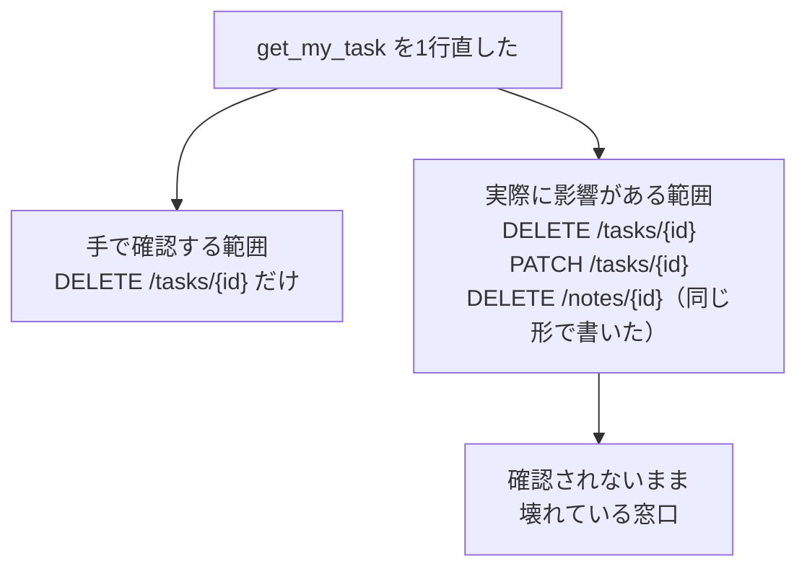
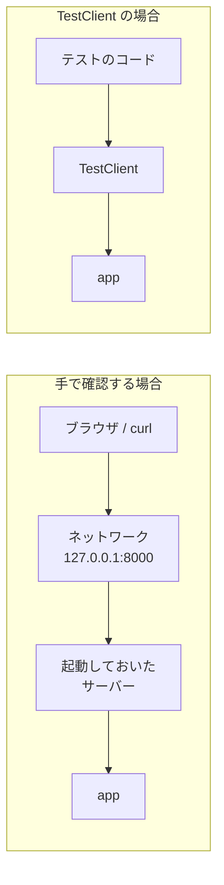
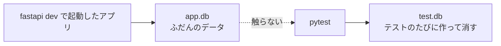
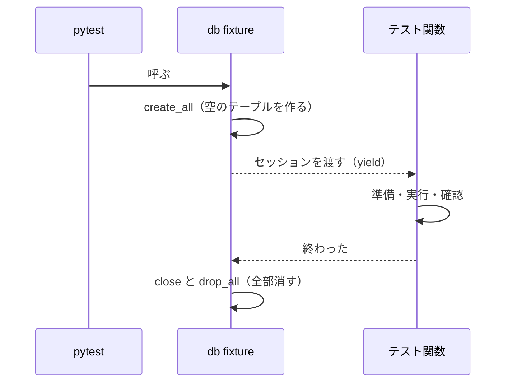
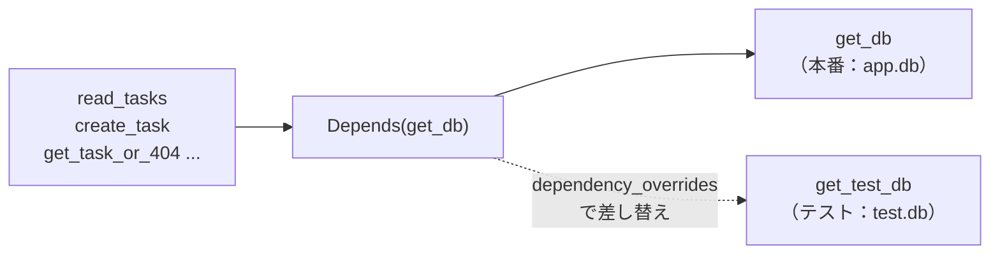
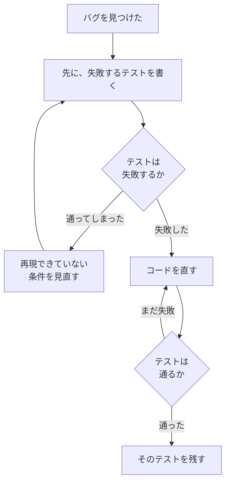

# 第8章 テスト

第7章の最後に、こう書きました。

**`get_my_task` の `!=` を `==` に書き間違えたら、他人のタスクだけが消せる API になる。**
しかも一覧も1件取得も普通に動くので、**気づくのは誰かのデータが消えたあと**です。

この章では、いままで手でやっていた確認を**プログラムに任せます。**
`/docs` を開いて、Authorize を押して、`Execute` を押して、目で見る——
この一連の作業を、**コマンド1つ**に置き換えます。

## この章で学ぶこと

- 手で確認することの限界を説明し、**何を優先してテストするか**を決められるようになる
- **pytest** でテストを書き、`assert` の失敗の表示を読めるようになる
- **`TestClient`** を使って、サーバーを起動せずに API を呼ぶテストが書けるようになる
- `401` / `403` / `404` / `422` といった**異常系のテスト**が書けるようになる
- **テスト専用のデータベース**を用意し、`app.db` を汚さずにテストできるようになる
- **fixture** で準備と後片付けをまとめ、テストごとにまっさらな状態から始められるようになる

## この章の前提

- [第7章](./07-authentication.md) を読み終え、`fastapi-lesson` が第7章の最終形（7.5.3）になっていること
- `/docs` の「Authorize」からログインして、`POST /tasks` が `201` を返すこと
- 第7章の演習（メモに認証を入れる）を解き終えていること
- python-text 第11章の [11.2.1「テスト（pytest）」](../python-text/11-next-steps.md#1121-テストpytest) を読んでいること
  （読んでいなくても進められますが、`assert` と `test_` の命名規則を先に見ておくと楽です）

> **つまずいたら**
> この章で最も多いのは、**`ModuleNotFoundError: No module named 'app'`** という詰まり方です。
> テストのファイルから `app` の中身を読み込めていない状態で、原因は
> `pytest.ini` の置き場所か、`pytest` を実行した場所のどちらかです（8.2.1）。
>
> 第0章の 0.2 で準備した AI には、次の4つを添えて聞いてください。
>
> ```text
> fastapi-text の 8.2.1 を読んでいます。
> pytest を実行すると ModuleNotFoundError: No module named 'app' になります。
> ・pytest を実行したときの現在地（pwd / Get-Location の結果）
> ・pytest.ini を置いた場所と、その中身
> ・tests ディレクトリの中のファイル名
> ・エラーの表示（最後の10行）
> ```

---

## 8.1 なぜテストを書くのか

### 8.1.1 手動確認の限界

ここまで、動作確認はすべて手でやってきました。

第7章の 7.5.3 では、次の4つを順番に試しました。

1. トークンなしで `POST /tasks` → `401` を確認
2. ログインして `POST /tasks` → `201` と `owner` を確認
3. 他人のタスクに `DELETE` → `403` を確認
4. 自分のタスクに `DELETE` → `204` を確認

**この4つを、いま全部やり直せますか。**

やり直せます。ただし、`/docs` を開き、Authorize を押し、
それぞれのボタンを押して、返ってきた JSON を目で読む必要があります。
所要時間は、慣れていても3〜4分でしょう。

問題は、**確認したい項目が4つで終わらない**ことです。

| 章 | 手で確認した項目（おおよそ） |
|----|------------------------|
| 第3章 | パス・クエリ・ボディの受け取り |
| 第4章 | `422` の内容、`response_model` で項目が落ちること |
| 第5章 | `404`、`409`、エラーの形の統一 |
| 第6章 | 登録・一覧・更新・削除・ページネーション |
| 第7章 | 登録・ログイン・`401`・`403` |

すでに**数十項目**あります。1回の変更のたびに全部やり直すのは、現実的ではありません。

そこで実際には、**直した場所の周りだけ**を確認します。これが問題の始まりです。



**変更が影響する範囲は、変更した本人の想像より広い**のが普通です。
そして、確認されなかった場所が壊れます。

一度壊れたものが、あとから壊れ直すことを **リグレッション**（regression。
以前は動いていた機能が、別の変更をきっかけに動かなくなること。日本語では**回帰**）と呼びます。

**テスト**（プログラムが期待どおりに動くかを、別のプログラムで確認すること）は、
この手作業の確認を**コードとして書き残したもの**です。
一度書けば、コマンド1つで全項目が再確認されます。

| | 手で確認する | テストを書く |
|---|---|---|
| 最初にかかる時間 | 短い | **長い**（コードを書く） |
| 2回目以降 | 毎回同じだけかかる | **数秒** |
| 確認し忘れ | **起きる** | 起きない（全部走る） |
| 結果の判定 | 目で読む | **自動で合否が出る** |
| 何を確認したかの記録 | 残らない | **コードとして残る** |

最後の行が、見落とされがちですが重要です。
**テストは「この API はこう動くはず」という取り決めが書かれた文書**でもあります。
半年後の自分や、第9章で React 側を書く人が、テストを読めば仕様が分かります。

> **補足：テストを書くと開発が遅くなるのでは**
> 書く分だけ、その場では遅くなります。**速くなるのは2回目以降です。**
> このテキストの範囲でも、第9章で React と繋ぐときに `PATCH` の仕様を1つ変えれば、
> 影響が出そうな窓口を**数秒で**確認できます。
>
> 逆に、1回書いて二度と直さないスクリプトにテストは要りません。
> **「何度も直すもの」ほど、テストの元が取れます。**

### 8.1.2 何をテストすべきか

**全部はテストできません。** 時間は有限なので、優先順位を決めます。

このテキストでは、次の順で考えます。

| 優先度 | テストするもの | このアプリでの例 |
|-------|-------------|----------------|
| **1** | 壊れたときの被害が大きいもの | **認可**（他人のタスクを消せないこと）、削除 |
| **2** | 異常系（うまくいかない場合） | `401` / `403` / `404` / `422` が正しく返ること |
| **3** | 決めごととして守りたいもの | エラーの形が `{"error": {...}}` であること（5.4.3） |
| **4** | 正常系（うまくいく場合） | 登録できる、一覧が返る |
| **5** | 一度壊れた場所 | バグを直したら必ず足す（8.5.2） |

**正常系**（うまくいく場合の動き）と**異常系**（入力が誤っている・権限が無いなど、
うまくいかない場合の動き）という言い方を、この章では使います。

**正常系より異常系のほうが優先度が高い**ことに、違和感があるかもしれません。
理由は2つです。

- 正常系は、開発中に何度も自分で動かすので、**壊れていればすぐ気づく**
- 異常系は、**普段は誰も通らない**ので、壊れていても気づかない

逆に、**テストしなくてよいもの**もはっきりさせておきます。

| テストしないもの | 理由 |
|---------------|------|
| FastAPI や Pydantic 自身の動き | ライブラリ側でテスト済み。`422` が返ることは確かめても、`422` の仕組みは確かめない |
| `/docs` の見た目 | 自動生成されるもので、自分で書いたコードではない |
| ログの文言 | 変わってよいもの。テストが邪魔になる |
| 外部のサービス | 相手の都合で落ちる。落ちるとテストが赤くなり、信用されなくなる |

そして、テストの形はすべて同じ3つの部分でできています。

| 部分 | やること | このアプリでの例 |
|------|---------|----------------|
| **準備** | 確かめたい状況を作る | 山田さんのタスクを1件用意する |
| **実行** | 確かめたい操作を1つ行う | 佐藤さんとして `DELETE /tasks/1` を送る |
| **確認** | 結果が想定どおりか調べる | `403` が返る |

**1つのテストで確かめるのは1つだけ**にします。
1つのテストで5つのことを確かめると、失敗したときに
「5つのうちどれが壊れたのか」を読み解く手間が増えます。

---

## 8.2 pytest の基本

### 8.2.1 インストールと最初のテスト

**pytest**（Python でテストを書いて実行するための道具）を入れます。
**`fastapi-lesson` で、仮想環境を有効にした状態**で実行してください（有効化のしかたは 2.2.1 です）。

**Windows（PowerShell）**

```powershell
pip install pytest==9.1.1
pip freeze > requirements.txt
```

**macOS / Linux**

```bash
pip install pytest==9.1.1
pip freeze > requirements.txt
```

```text
Successfully installed iniconfig-2.3.0 packaging-26.3 pluggy-1.6.0 pytest-9.1.1
```

一緒に入る `iniconfig` などは、pytest が中で使う部品です。
**並ぶ名前とバージョンは、手元の環境によって少し変わります。**
最後に `pytest-9.1.1` があれば大丈夫です。

テストは、**アプリのコードとは別のディレクトリ**に置きます。
`fastapi-lesson` の直下に `tests` というディレクトリを作ってください
（VS Code の「新しいフォルダー」で作れます）。

```text
fastapi-lesson/
├─ app/            アプリ本体
│   ├─ main.py
│   └─ ...
├─ tests/          ← 新しく作る。テストはここに置く
├─ migrations/
├─ app.db
├─ .env
└─ requirements.txt
```

**`app/` の中に置かない**理由は、テストがアプリの一部ではないからです。
本番のサーバーに配るのはアプリだけで、テストは開発する人の手元にあれば足ります。

最初のテストを書きます。**データベースも HTTP も出てこない、いちばん簡単なところ**から始めます。
第7章で作った `app/security.py` の2つの関数です。

`fastapi-lesson/tests/test_security.py`

```python
"""app/security.py のテスト。"""

from app.security import hash_password, verify_password


def test_ハッシュ化すると元のパスワードとは違う文字列になる() -> None:
    hashed = hash_password("password123")
    assert hashed != "password123"


def test_同じパスワードでも毎回違うハッシュ値になる() -> None:
    assert hash_password("password123") != hash_password("password123")


def test_正しいパスワードなら検証に通る() -> None:
    hashed = hash_password("password123")
    assert verify_password("password123", hashed) is True


def test_間違ったパスワードなら検証に落ちる() -> None:
    hashed = hash_password("password123")
    assert verify_password("password124", hashed) is False
```

**名前の付け方には決まりがあります。** pytest は、この規則でテストを探します。

| 対象 | 決まり | 例 |
|------|-------|----|
| ファイル名 | **`test_` で始まる**（`_test` で終わる形も可） | `test_security.py` |
| 関数名 | **`test_` で始まる** | `test_正しいパスワードなら検証に通る` |

**関数名は日本語で構いません。**
テストの関数は自分で呼ぶものではなく、**失敗したときに名前がそのまま表示される**ので、
「何が守られなくなったのか」が読める名前を付けるほうが役に立ちます。

もう1つ、**設定ファイル**を作ります。

`fastapi-lesson/pytest.ini`（`app` や `tests` と同じ階層。ファイル全体）

```ini
[pytest]
pythonpath = .
testpaths = tests
```

| 行 | 意味 |
|----|------|
| `[pytest]` | ここから下が pytest の設定だという印 |
| `pythonpath = .` | **このファイルがある場所を、モジュールの探し先に加える**（`from app.security import ...` を通すため） |
| `testpaths = tests` | 何も指定せずに実行したとき、`tests` の中だけを探す |

`pythonpath = .` が無いと、**テストのファイルから `app` を読み込めません。**
`app` は `fastapi-lesson` の直下にあるので、そこを探し先に入れる必要があります
（5.1.2 で `fastapi dev app/main.py` を `fastapi-lesson` で実行するのと、同じ理由です）。

実行します。**`fastapi-lesson` で**実行してください。

**Windows（PowerShell）**

```powershell
pytest
```

**macOS / Linux**

```bash
pytest
```

実行結果:

```text
============================= test session starts ==============================
platform linux -- Python 3.11.15, pytest-9.1.1, pluggy-1.6.0
rootdir: /Users/yamada/Desktop/fastapi-lesson
configfile: pytest.ini
testpaths: tests
plugins: anyio-4.15.1
collected 4 items

tests/test_security.py ....                                              [100%]

============================== 4 passed in 2.23s ===============================
```

**`4 passed`。4つとも通りました。**

`....` の点1つが、テスト1つです。通れば `.`、失敗すれば `F` が表示されます。

> **補足：`platform` と `rootdir` の行は、人によって違います**
> 1行目の `platform`（OS 名と Python のバージョン）と、
> `rootdir`（`pytest.ini` が見つかった場所）は、環境によって変わります。
> Windows なら `platform win32`、macOS なら `platform darwin` と表示されます。
> **数字や記号が一字一句同じである必要はありません。**
> 見るのは最後の行（`4 passed`）です。

> **よくある間違い**
> **`pytest.ini` を作らずに実行する**間違いです。
>
> ```text
> ImportError while importing test module '.../tests/test_security.py'.
> Hint: make sure your test modules/packages have valid Python names.
> Traceback:
> ...
> tests/test_security.py:3: in <module>
>     from app.security import hash_password, verify_password
> E   ModuleNotFoundError: No module named 'app'
> ```
>
> **`app` が見つからない**という意味です。原因は次の2つのどちらかです。
>
> - `pytest.ini` が無い、または `pythonpath = .` を書いていない
> - `pytest` を `fastapi-lesson` **以外の場所**で実行した（`tests` の中で実行した、など）
>
> `pytest.ini` は `fastapi-lesson` の直下に置き、実行も `fastapi-lesson` で行ってください。

> **よくある間違い**
> **ファイル名や関数名を `test_` で始めない**間違いです。
> `security_test.py` や `def check_password():` と書くと、pytest はそれを**探しません。**
> エラーにもならず、静かに `collected 0 items` と表示されます。
>
> ```text
> collected 0 items
>
> ============================ no tests ran in 0.01s =============================
> ```
>
> **`0 items` は「全部通った」ではありません。「1つも見つからなかった」です。**

### 8.2.2 `assert`

テストの合否は、**`assert` 文**だけで決まります。

`assert` は「**ここではこうなっているはず**」と書いておき、
そうでなければその場でエラーにする文です。

```python
assert 1 + 1 == 2        # 通る（何も起きない）
assert 1 + 1 == 3        # 失敗する（AssertionError になる）
```

`assert` の右側に書くのは、**真偽値になる式**です（python-text 2.4.3）。
`True` なら何も起きず、`False` なら `AssertionError` が発生して、そのテストは失敗します。

pytest は、失敗した `assert` の**中身を分解して表示してくれます。**
そのため、次のような書き方は不要です。

```python
assert x == 3, f"x が {x} になっています"     # メッセージは書かなくてよい
```

比較の書き方で、よく使うものを挙げます。

| 書き方 | 意味 | 例 |
|-------|------|----|
| `assert a == b` | 等しい | `assert response.status_code == 200` |
| `assert a != b` | 等しくない | `assert hashed != "password123"` |
| `assert x is True` | **真偽値そのもの**である | `assert verify_password(...) is True` |
| `assert x is None` | `None` である | `assert read_token(bad) is None` |
| `assert a in b` | 含まれている | `assert "count" in data` |
| `assert len(a) == n` | 個数 | `assert len(data["tasks"]) == 3` |

`is True` と `== True` の違いにだけ触れておきます。
**`is` は「まったく同じもの」かを調べます**（python-text 4.1.5）。
`1 == True` は成り立ちますが、`1 is True` は成り立ちません。
**真偽値を返すはずの関数**をテストするときは `is True` と書くと、
「`True` らしきもの」ではなく「`True` そのもの」であることまで確かめられます。

**例外が起きること**を確かめたい場合は、`assert` では書けません。
例外が起きた時点で、テストが失敗扱いになってしまうからです。

そこで `pytest.raises` を使います。

`fastapi-lesson/tests/test_schemas.py`

```python
"""app/schemas.py のテスト。"""

import pytest
from pydantic import ValidationError

from app.schemas import UserCreate


def test_72バイトを超えるパスワードは受け取らない() -> None:
    with pytest.raises(ValidationError):
        # 日本語は1文字3バイトなので、25文字で 75 バイトになる（7.2.3）
        UserCreate(name="佐藤", email="sato@example.com", password="あ" * 25)
```

`with pytest.raises(例外):` は、
「**この中で、その例外が起きるはず**」という書き方です。

- 想定した例外が起きた → **通る**
- 何も起きなかった → **失敗する**（`DID NOT RAISE` と表示されます）
- 別の例外が起きた → 失敗する

`with` は python-text 7.2.2 でファイルを開くときに使った書き方と同じ形です。

これは、7.3.1 で `UserCreate` に入れた**バイト数の検査**が効いていることの確認です。
`ValidationError` は Pydantic が投げる例外で、
**HTTP を通すと `422` になる**もの（4.3.4）を、直接受け止めています。

実行します。

**Windows（PowerShell）**

```powershell
pytest
```

**macOS / Linux**

```bash
pytest
```

```text
collected 5 items

tests/test_schemas.py .                                                  [ 20%]
tests/test_security.py ....                                              [100%]

============================== 5 passed in 2.25s ===============================
```

**`tests/test_schemas.py` が先に実行されています。**
pytest は、ファイル名のアルファベット順に集めます。
**テストどうしは、実行される順番に依存しないように書いてください**（8.4.2 でもう一度触れます）。

> **注意：`assert` はテスト以外の場所で使わないでください**
> Python には、`python -O` という**`assert` を全部無視して実行するオプション**があります。
> アプリ本体の入力チェックを `assert` で書くと、そのオプションを付けたときに
> **検査ごと消えます。**
> 入力の検査は Pydantic（第4章）、権限の確認は `HTTPException`（5.4.1）で行い、
> `assert` は**テストの中だけ**で使ってください。

### 8.2.3 実行と結果の読み方

**失敗したときの表示**が読めないと、テストは役に立ちません。
わざと失敗させて、読み方を覚えます。

`tests/test_security.py` の最後のテストを、**一時的に**次のように書き換えてください。

```diff
  def test_間違ったパスワードなら検証に落ちる() -> None:
      hashed = hash_password("password123")
-     assert verify_password("password124", hashed) is False
+     assert verify_password("password124", hashed) is True
```

実行結果:

```text
collected 5 items

tests/test_schemas.py .                                                  [ 20%]
tests/test_security.py ...F                                              [100%]

=================================== FAILURES ===================================
____________________________ test_間違ったパスワードなら検証に落ちる ____________________________

    def test_間違ったパスワードなら検証に落ちる() -> None:
        hashed = hash_password("password123")
>       assert verify_password("password124", hashed) is True
E       AssertionError: assert False is True
E        +  where False = verify_password('password124', '$2b$12$fBudy1tsJRq.Tz2.DKAlZeKJH7entBgUS4vaWOIB/zfvUTaEZV/8i')

tests/test_security.py:22: AssertionError
=========================== short test summary info ============================
FAILED tests/test_security.py::test_間違ったパスワードなら検証に落ちる - Asse...
========================= 1 failed, 4 passed in 2.26s ==========================
```

上から順に読みます。

| 行 | 読み取れること |
|----|-------------|
| `...F` | `test_security.py` の4つのうち、**最後の1つが失敗**した |
| `____ test_間違った... ____` | **失敗したテストの名前** |
| `>` が付いた行 | **失敗した `assert` の行そのもの** |
| `E AssertionError: assert False is True` | **実際は `False` だった**のに `True` を期待していた |
| `E + where False = verify_password(...)` | **その `False` がどこから来たか**（引数の中身つき） |
| `tests/test_security.py:22` | **ファイル名と行番号** |
| `short test summary info` | 失敗したものだけの一覧。**まずここを見る** |

`+ where` の行が、pytest のいちばんありがたいところです。
**`assert` の中身を分解して、実際の値を見せてくれます。**
`print` を入れて調べ直す必要がありません。

**確認したら、`is True` を `is False` に戻してください。**

よく使う実行のしかたを挙げます。

| コマンド | 何が起きるか |
|---------|------------|
| `pytest` | `testpaths` の全部を実行する |
| `pytest -q` | 表示を短くする（`q` は quiet） |
| `pytest -v` | **テスト名を1つずつ表示する**（`v` は verbose） |
| `pytest tests/test_security.py` | そのファイルだけ実行する |
| `pytest "tests/test_security.py::test_正しいパスワードなら検証に通る"` | **その1つだけ**実行する |
| `pytest -k "削除"` | **名前に「削除」を含むもの**だけ実行する |
| `pytest -x` | 1つ失敗したら、そこで止める |

`-v` を付けると、こう表示されます。

```text
collecting ... collected 4 items

tests/test_security.py::test_ハッシュ化すると元のパスワードとは違う文字列になる PASSED [ 25%]
tests/test_security.py::test_同じパスワードでも毎回違うハッシュ値になる PASSED [ 50%]
tests/test_security.py::test_正しいパスワードなら検証に通る PASSED       [ 75%]
tests/test_security.py::test_間違ったパスワードなら検証に落ちる PASSED   [100%]
```

`ファイル名::関数名` の形が、**そのテストの住所**です。
1つだけ実行したいときは、この住所をそのまま貼り付けます。
**日本語の関数名は、引用符で囲んで**渡してください（囲まないと Windows / macOS ともに解釈が変わります）。

> **補足：`warnings summary` が出ることがあります**
> 実行結果の下のほうに、次のような表示が出ることがあります。
>
> ```text
> =============================== warnings summary ===============================
> .venv/lib/python3.11/site-packages/starlette/testclient.py:40
>   DeprecationWarning: The anyio.abc.BlockingPortal alias is deprecated, ...
> ```
>
> これは**ライブラリ側の事情**で出ているもので、あなたのコードの問題ではありません。
> **テストの合否には影響しません**（`5 passed, 1 warning` のように別枠で数えられます）。
> この章の実行結果では、以降この部分を省略します。

---

## 8.3 API をテストする

### 8.3.1 `TestClient`

ここまでのテストは、関数を直接呼ぶだけでした。
**次は、API そのものをテストします。**

やりたいのは、7.5.3 で手でやった確認です。

```text
POST /tasks（トークンなし） → 401 が返るはず
```

ここで問題になるのが、**サーバーです。**
`curl` で確かめるには `fastapi dev app/main.py` を起動しておく必要があり、
「テストを動かす前にサーバーを起動する」という手順が増えます。
起動を忘れれば、テストは全部失敗します。

FastAPI には、この問題を回避する仕組みが用意されています。
**`TestClient`**（テストクライアント。サーバーを起動せずに、
コードの中から直接 API を呼ぶための道具）です。



**ネットワークもサーバーの起動も通りません。** それでいて、
リクエストの解釈・依存の実行・例外ハンドラ・ミドルウェアは**すべて本物が動きます。**
`/docs` から実行したときと同じ道を通る、と考えてください。

`TestClient` は **httpx**（Python から HTTP リクエストを送るためのライブラリ）を使います。
**第2章で `fastapi[standard]` を入れたときに、一緒に入っています。** 確認しておきます。

**Windows（PowerShell）**

```powershell
pip list | Select-String httpx
```

**macOS / Linux**

```bash
pip list | grep -i httpx
```

```text
httpx             0.28.1
```

書いてみます。

`fastapi-lesson/tests/test_info.py`

```python
"""TestClient の練習。"""

from fastapi.testclient import TestClient

from app.main import app

client = TestClient(app)


def test_infoは200を返す() -> None:
    response = client.get("/info")

    assert response.status_code == 200
    assert response.json()["app_name"] == "タスク管理 API（開発用）"
```

3行目からを、順に見ます。

| 行 | 意味 |
|----|------|
| `from app.main import app` | **アプリ本体**（`FastAPI(...)` で作ったもの）を読み込む |
| `client = TestClient(app)` | そのアプリを呼ぶためのクライアントを作る |
| `client.get("/info")` | `GET /info` を送る。**戻り値はレスポンス** |

レスポンスから取り出せるものは、次のとおりです。

| 書き方 | 取り出せるもの |
|-------|-------------|
| `response.status_code` | ステータスコード（`200` など。1.2.3） |
| `response.json()` | ボディを **Python の辞書**にしたもの |
| `response.headers["..."]` | ヘッダー（5.6.2 で付けた `x-process-time` など） |
| `response.text` | ボディを文字列のまま |

**`response.json()` が辞書を返す**ところが要点です。
返ってきた JSON を、辞書としてそのまま `assert` で確かめられます（1.3.3）。

実行します。

**Windows（PowerShell）**

```powershell
pytest
```

**macOS / Linux**

```bash
pytest
```

```text
tests/test_info.py .                                                     [ 16%]
tests/test_schemas.py .                                                  [ 33%]
tests/test_security.py ....                                              [100%]

========================= 6 passed, 1 warning in 2.87s =========================
```

**サーバーを起動していないのに、API が呼べました。**

> **よくある間違い**
> **`app` ではなく `main` を渡す**間違いです。
>
> ```python
> from app import main
> client = TestClient(main)          # ❌
> ```
>
> `TestClient` に渡すのは、**`FastAPI(...)` で作ったアプリそのもの**です。
> モジュール（ファイル）ではありません。
> `fastapi dev app/main.py` が `app.main:app` を探しに行くのと同じもの（5.1.2）を、
> 自分で `import` していると考えてください。

### 8.3.2 GET のテスト

タスクの窓口をテストします。新しいファイルを作ってください。

`fastapi-lesson/tests/test_tasks.py`（ここから、この章を通して育てていきます）

```python
"""タスクの窓口のテスト。"""

from fastapi.testclient import TestClient

from app.main import app

client = TestClient(app)


def test_一覧は200と件数を返す() -> None:
    response = client.get("/tasks")

    assert response.status_code == 200
    assert "count" in response.json()


def test_存在しないidは404を返す() -> None:
    response = client.get("/tasks/9999")

    assert response.status_code == 404
    assert response.json()["error"]["message"] == "id 9999 のタスクは見つかりませんでした"
```

2つ目のテストで、**`404` のメッセージまで確かめている**ところに注目してください。

これは 5.4.3 で決めた**エラーの形**（`{"error": {"status", "message", "detail"}}`）が
守られているかの確認でもあります。
うっかり `handle_http_exception` を消せば、返る形が
`{"detail": "..."}` に変わり、**このテストが落ちて教えてくれます。**

一方、1つ目のテストは弱いテストです。

```python
    assert "count" in response.json()
```

`count` という項目があることしか確かめていません。
**本当は「3件登録されていれば `count` が 3 になる」ことを確かめたい**のですが、
いまはそれが書けません。**`app.db` に何件入っているかが分からない**からです。

この問題は 8.4 で解決します。**いまは「書けない」ことを覚えておいてください。**

### 8.3.3 POST のテスト

`POST /tasks` は、第7章から**ログインが必要**になりました（7.5.3）。
テストからログインする方法が要ります。

やることは 7.5.1 と同じです。

1. `POST /auth/token` に、名前とパスワードを**フォーム形式**で送る
2. 返ってきた `access_token` を取り出す
3. `Authorization: Bearer <トークン>` というヘッダーに組み立てる

毎回3行書くのは大変なので、**関数にまとめます。**

`tests/test_tasks.py`（`client = TestClient(app)` の下に追記）

```python
def login(name: str = "佐藤", password: str = "password123") -> dict:
    """ログインして、Authorization ヘッダーを組み立てて返す。"""
    response = client.post("/auth/token", data={"username": name, "password": password})
    token = response.json()["access_token"]
    return {"Authorization": f"Bearer {token}"}
```

**この関数の名前は `test_` で始めていません。**
`test_` で始めると pytest がテストだと思って実行してしまいます（8.2.1）。
**テストから呼ばれる道具**には、`test_` を付けません。

`client.post` の引数が2種類あることに注意してください。

| 引数 | 送られ方 | 使う場面 |
|------|---------|---------|
| `json={...}` | **JSON** として送る | ふつうの窓口（`POST /tasks` など） |
| `data={...}` | **フォーム形式**として送る | **ログインだけ**（7.5.1） |

`POST /auth/token` は `OAuth2PasswordRequestForm` で受け取るので（7.5.1）、
**`json=` で送ると `422` になります。** ここだけ `data=` です。

登録のテストを書きます。

`tests/test_tasks.py`（末尾に追記）

```python
def test_ログインすればタスクを登録できる() -> None:
    response = client.post("/tasks", json={"title": "郵便を出す"}, headers=login())

    assert response.status_code == 201
    assert response.json()["owner"]["name"] == "佐藤"
```

**`owner` を送っていないのに `佐藤` が入る**ことを確かめています（7.5.3）。
`headers=login()` の1行が、`/docs` の「Authorize」ボタンに相当します。

実行します。

```text
tests/test_info.py .                                                     [ 12%]
tests/test_schemas.py .                                                  [ 25%]
tests/test_security.py ....                                              [ 75%]
tests/test_tasks.py ...                                                  [100%]

========================= 9 passed, 1 warning in 3.06s =========================
```

通りました。**ただし、いま `app.db` にタスクが1件増えています。**
この問題は 8.4.1 で扱います。

### 8.3.4 エラーケースのテスト

8.1.2 で「異常系のほうが優先度が高い」と書きました。ここが本番です。

`tests/test_tasks.py`（末尾に追記）

```python
def test_トークンなしでは登録できない() -> None:
    response = client.post("/tasks", json={"title": "郵便を出す"})

    assert response.status_code == 401
    assert response.json()["error"]["message"] == "Not authenticated"


def test_他人のタスクは削除できない() -> None:
    response = client.delete("/tasks/1", headers=login())

    assert response.status_code == 403


def test_タイトルが空なら422になる() -> None:
    response = client.post("/tasks", json={"title": ""}, headers=login())

    assert response.status_code == 422
    assert response.json()["error"]["detail"][0]["type"] == "string_too_short"
```

3つとも、第7章までに手で確認したものです。

| テスト | 対応する手作業 | 参照 |
|-------|-------------|------|
| `test_トークンなしでは登録できない` | トークンなしで `POST /tasks` を実行した | 7.5.3 |
| `test_他人のタスクは削除できない` | 佐藤さんで `DELETE /tasks/1` を実行した | 7.5.3 |
| `test_タイトルが空なら422になる` | `/docs` から空のタイトルを送った | 4.3.1 |

3つ目の `["error"]["detail"][0]["type"]` は、
`422` の中身を取り出す書き方です（4.3.4 で読んだ形です）。

```json
{"error":{"status":422,"message":"リクエストの形式が正しくありません","detail":[{"type":"string_too_short","loc":["body","title"],"msg":"String should have at least 1 character","input":"","ctx":{"min_length":1}}]}}
```

`detail` は**リスト**なので、`[0]` で1つ目を取り出してから `["type"]` を読みます。
`msg`（英語のメッセージ）ではなく **`type` を確かめる**ようにしてください。
`msg` は Pydantic の版が上がると文言が変わることがあり、
**変わるたびにテストが落ちる**ことになります。

実行します。

```text
tests/test_info.py .                                                     [  9%]
tests/test_schemas.py .                                                  [ 18%]
tests/test_security.py ....                                              [ 54%]
tests/test_tasks.py ......                                               [100%]

======================== 12 passed, 1 warning in 3.71s =========================
```

**ここで、第7章の最後に話した実験をします。**

`app/dependencies.py` の `get_my_task` を、**わざと壊してください。**

```diff
  def get_my_task(
      task: Task = Depends(get_task_or_404),
      current_user: User = Depends(get_current_user),
  ) -> Task:
      """自分のタスクだけを取り出す。他人のものなら 403 で止める。"""
-     if task.owner_name != current_user.name:
+     if task.owner_name == current_user.name:
```

そのまま `pytest` を実行します。

```text
=================================== FAILURES ===================================
______________________________ test_他人のタスクは削除できない ______________________________

    def test_他人のタスクは削除できない() -> None:
        response = client.delete("/tasks/1", headers=login())
    
>       assert response.status_code == 403
E       assert 204 == 403
E        +  where 204 = <Response [204 No Content]>.status_code

tests/test_tasks.py:48: AssertionError
----------------------------- Captured stderr call -----------------------------
（ここに、そのテストの中で出たログが並びます。省略します）
=========================== short test summary info ============================
FAILED tests/test_tasks.py::test_他人のタスクは削除できない - assert 204 == 403
=================== 1 failed, 11 passed, 1 warning in 3.74s ====================
```

**`204` が返りました。他人のタスクが消えたということです。**

`Captured stderr call` として並ぶのは、そのテストの中で出たログです（5.5）。
`.env` の `DEBUG=true` のぶん量が多くなりますが、
**読むのは `>` の行と `E` の行、そして `short test summary info` の2行だけ**で足ります。

手で確認していれば見逃したかもしれない間違いが、**数秒で、名指しで**報告されました。
これがテストを書く理由です。

**確認したら、`==` を `!=` に戻してください。**
そして、**消えてしまった `id` が 1 のタスク**は、
`python -m app.seed` では戻りません（すでに他のタスクが入っているためです）。
`/docs` から登録し直すか、8.4 まで進めば気にしなくてよくなります。

> **注意：この実験で、本物のデータが消えました**
> いま消えたのは `app.db` の中の、山田さんのタスクです。
> **テストが本物のデータベースを触っているから**こうなります。
> 次の 8.4 で、ここを直します。

---

## 8.4 テスト用のデータベース

### 8.4.1 本番データを壊さない

いまのテストには、はっきりした問題があります。

`pytest` を2回続けて実行して、`app.db` の中身を見てください。
**`fastapi-lesson` で**実行します。

**Windows（PowerShell）**

```powershell
python -c "import sqlite3; print(sqlite3.connect('app.db').execute('select count(*) from tasks').fetchone())"
```

**macOS / Linux**

```bash
python -c "import sqlite3; print(sqlite3.connect('app.db').execute('select count(*) from tasks').fetchone())"
```

```text
(3,)      ← pytest を実行する前
(4,)      ← 1回実行したあと
(5,)      ← 2回実行したあと
```

**実行するたびに「郵便を出す」が増えていきます。**

問題を並べると、こうなります。

| 問題 | 何が起きるか |
|------|------------|
| テストがデータを**増やす** | 実行するたびに `app.db` が汚れる |
| テストがデータを**消す** | 8.3.4 の実験で、山田さんのタスクが消えた |
| テストが**既存のデータに依存する** | `id` が 1 のタスクが消えていると `test_他人のタスクは削除できない` が失敗する |
| 件数が**分からない** | `count` が何になるか書けない（8.3.2） |

3つ目と4つ目が、じわじわ効いてきます。
**テストが、実行する順番や、そのときのデータベースの中身によって結果を変える**ようになります。
こうなったテストは信用されなくなり、やがて誰も実行しなくなります。

いま触っているのは練習用の `app.db` ですが、**同じコードは本番でも動きます。**
`DATABASE_URL` が本番のデータベースを指している状態でテストを実行すれば、
**利用者のデータが消えます。**

解決は1つです。**テスト専用のデータベースを、別に用意します。**



このテキストでは、`fastapi-lesson` の中に **`test.db`** という別のファイルを使います。
SQLite はファイル1つがデータベースなので（6.1.2）、**分けるのはファイル名を変えるだけ**です。

先に、`.gitignore` に2行足しておきます。

`fastapi-lesson/.gitignore`

```text
.env
app.db
test.db
.venv/
.pytest_cache/
```

| 行 | 何を無視するか |
|----|-------------|
| `test.db` | テスト用のデータベース。共有する意味がない |
| `.pytest_cache/` | pytest が実行結果を覚えておくために作るディレクトリ |

### 8.4.2 fixture で準備と後片付け

テスト専用のデータベースを使うには、テストごとに次の3つが要ります。

1. **準備**：空のテーブルを作る
2. テストを実行する
3. **後片付け**：テーブルを消す

この「準備と後片付け」を担当する仕組みが、pytest の **fixture**（フィクスチャ。
テストの前後に走る、準備と後片付けの部品）です。

fixture は、**`tests/conftest.py`** というファイルに書きます。
このファイル名は決まっていて、**同じディレクトリのテストから、`import` せずに使えます。**

`fastapi-lesson/tests/conftest.py`（ファイル全体。このあと追記します）

```python
"""テストの準備を、1か所にまとめる場所。"""

from collections.abc import Iterator

import pytest
from fastapi.testclient import TestClient
from sqlalchemy import create_engine
from sqlalchemy.orm import Session, sessionmaker

from app.database import Base
from app.dependencies import get_db
from app.main import app
from app.models import Note, Task, User  # noqa: F401  Base に登録するための import

# テスト専用のデータベース。app.db には触らない
test_engine = create_engine(
    "sqlite:///./test.db",
    connect_args={"check_same_thread": False},
)
TestingSessionLocal = sessionmaker(bind=test_engine, autoflush=False)


@pytest.fixture
def db() -> Iterator[Session]:
    """テスト1つごとに、空のテーブルを作り、終わったら消す。"""
    Base.metadata.create_all(bind=test_engine)
    session = TestingSessionLocal()
    try:
        yield session
    finally:
        session.close()
        Base.metadata.drop_all(bind=test_engine)


@pytest.fixture
def client(db: Session) -> Iterator[TestClient]:
    """get_db をテスト用のセッションに差し替えた TestClient を返す。"""

    def get_test_db() -> Iterator[Session]:
        yield db

    app.dependency_overrides[get_db] = get_test_db
    try:
        yield TestClient(app)
    finally:
        app.dependency_overrides.clear()
```

上から見ていきます。

**エンジンとセッションを、テスト用にもう1組作る**

`create_engine` と `sessionmaker` は、`app/database.py` で書いたものと同じ形です（6.2.3）。
違うのは**接続先が `test.db` になっている**ことだけです。

`from app.models import Note, Task, User` に付いている `# noqa: F401` は、
「**この `import` は使っていないように見えるが、消さないでほしい**」という印です。
`Base.metadata` にテーブルを登録するために必要な `import` で、
6.6.2 で `migrations/env.py` に書いたのと同じ理由です。

**`db` fixture — テーブルを作って、消す**

| 行 | やっていること |
|----|-------------|
| `Base.metadata.create_all(bind=test_engine)` | `test.db` に全テーブルを作る |
| `yield session` | **ここでテストが実行される** |
| `session.close()` | セッションを閉じる |
| `Base.metadata.drop_all(bind=test_engine)` | **テーブルを全部消す** |

`yield` を使った形は、`get_db`（6.5.1）とまったく同じ考え方です。
**`yield` の前が準備、後ろが後片付け**になります。



**テストが1つ終わるたびにテーブルを消している**ので、
**どのテストも、まっさらな状態から始まります。**
実行の順番によって結果が変わることが、これで無くなります。

> **補足：`create_all` を使ってよいのか**
> 6.3.2 で「`create_all` は、すでにあるテーブルの列を増やさない」と学び、
> だから Alembic に移行しました（6.6）。
>
> **テストでは `create_all` で構いません。**
> 毎回**空の状態から作り直す**ので、「列を増やす」場面が存在しないためです。
> Alembic は「**すでにあるデータを保ったまま**構造を変える」ための道具なので、
> 保つべきデータが無いテストでは出番がありません。

**`client` fixture — アプリの `get_db` を差し替える**

ここが、この章でいちばん大事な部分です。次の 8.4.3 で詳しく見ます。

fixture を使うと、テストはこう書けます。

```python
def test_タスクが1件も無ければ空の一覧を返す(client: TestClient) -> None:
    response = client.get("/tasks")

    assert response.status_code == 200
    assert response.json() == {"count": 0, "tasks": []}
```

**引数に `client` と書くだけ**で、pytest が `client` fixture を実行して、
その戻り値（`yield` した値）を渡してくれます。
**名前で結びつく**仕組みなので、`import` は要りません。

`{"count": 0, "tasks": []}` と、**返る JSON そのものを確かめられる**ようになりました。
8.3.2 で「いまは書けない」と言ったものです。

テスト用のデータも fixture で用意します。

`tests/conftest.py`（末尾に追記）

```python
@pytest.fixture
def sato(db: Session) -> User:
    """テスト用のユーザー（佐藤さん）を1人作る。"""
    user = User(
        name="佐藤",
        email="sato@example.com",
        hashed_password=hash_password("password123"),
    )
    db.add(user)
    db.commit()
    db.refresh(user)
    return user


@pytest.fixture
def yamada_task(db: Session) -> Task:
    """山田さんのタスクを1件作る（他人のタスクとして使う）。"""
    task = Task(
        title="牛乳を買う",
        done=False,
        owner_name="山田",
        owner_email="yamada@example.com",
    )
    db.add(task)
    db.commit()
    db.refresh(task)
    return task


@pytest.fixture
def sato_headers(client: TestClient, sato: User) -> dict:
    """佐藤さんでログインして、Authorization ヘッダーを組み立てて返す。"""
    response = client.post(
        "/auth/token",
        data={"username": "佐藤", "password": "password123"},
    )
    return {"Authorization": f"Bearer {response.json()['access_token']}"}
```

`import` を1行足します。

```diff
  from app.models import Note, Task, User  # noqa: F401  Base に登録するための import
+ from app.security import hash_password
```

**fixture は、別の fixture を引数に取れます。**

| fixture | 使っている fixture | 意味 |
|---------|-----------------|------|
| `db` | （なし） | 空のテーブルとセッション |
| `client` | `db` | そのセッションを使うクライアント |
| `sato` | `db` | 佐藤さんを1人作る |
| `sato_headers` | `client`, `sato` | 佐藤さんでログインした状態のヘッダー |

5.3.3 で学んだ「**依存は依存を持てる**」と、まったく同じ考え方です。
`sato_headers` を引数に書いたテストでは、
**佐藤さんが作られ、ログインされ、ヘッダーが渡される**ところまでが自動で済みます。

> **補足：同じ fixture は1回しか実行されません**
> `sato_headers` は `client` と `sato` を使い、`client` は `db` を使い、`sato` も `db` を使います。
> このとき **`db` が2回実行されることはありません。**
> 1つのテストの中では、同じ fixture は**1回だけ**実行され、同じものが配られます。
> `Depends` の動き（5.3.2）と同じです。
>
> これが大事なのは、`sato`（テスト側で作ったユーザー）と
> `client`（アプリが使うセッション）が、**同じセッションを見ている**からです。
> だから、テストで作ったユーザーで、アプリにログインできます。

`tests/test_tasks.py` を、fixture を使う形に**全部書き直します。**

`fastapi-lesson/tests/test_tasks.py`（ファイル全体）

```python
"""タスクの窓口のテスト。"""

from fastapi.testclient import TestClient

from app.models import Task


def test_一覧は登録されているタスクだけを返す(client: TestClient, yamada_task: Task) -> None:
    response = client.get("/tasks")

    assert response.status_code == 200
    data = response.json()
    assert data["count"] == 1
    assert data["tasks"][0]["title"] == "牛乳を買う"


def test_タスクが1件も無ければ空の一覧を返す(client: TestClient) -> None:
    response = client.get("/tasks")

    assert response.status_code == 200
    assert response.json() == {"count": 0, "tasks": []}


def test_存在しないidは404を返す(client: TestClient) -> None:
    response = client.get("/tasks/9999")

    assert response.status_code == 404
    assert response.json()["error"]["message"] == "id 9999 のタスクは見つかりませんでした"


def test_ログインすればタスクを登録できる(client: TestClient, sato_headers: dict) -> None:
    response = client.post("/tasks", json={"title": "郵便を出す"}, headers=sato_headers)

    assert response.status_code == 201
    data = response.json()
    assert data["title"] == "郵便を出す"
    # 登録者は、送った値ではなくトークンから決まる（7.5.3）
    assert data["owner"]["name"] == "佐藤"


def test_登録したタスクは一覧にも出てくる(client: TestClient, sato_headers: dict) -> None:
    client.post("/tasks", json={"title": "郵便を出す"}, headers=sato_headers)

    response = client.get("/tasks")

    assert response.json()["count"] == 1


def test_トークンなしでは登録できない(client: TestClient) -> None:
    response = client.post("/tasks", json={"title": "郵便を出す"})

    assert response.status_code == 401
    assert response.json()["error"]["message"] == "Not authenticated"


def test_他人のタスクは削除できない(
    client: TestClient, sato_headers: dict, yamada_task: Task
) -> None:
    response = client.delete(f"/tasks/{yamada_task.id}", headers=sato_headers)

    assert response.status_code == 403
    assert response.json()["error"]["message"] == "このタスクを操作する権限がありません"


def test_自分のタスクは削除できる(client: TestClient, sato_headers: dict) -> None:
    created = client.post("/tasks", json={"title": "郵便を出す"}, headers=sato_headers)
    task_id = created.json()["id"]

    response = client.delete(f"/tasks/{task_id}", headers=sato_headers)

    assert response.status_code == 204
    assert client.get(f"/tasks/{task_id}").status_code == 404


def test_存在しないidはログイン済みでも404になる(client: TestClient, sato_headers: dict) -> None:
    response = client.patch("/tasks/9999", json={"done": True}, headers=sato_headers)

    assert response.status_code == 404


def test_タイトルが空なら422になる(client: TestClient, sato_headers: dict) -> None:
    response = client.post("/tasks", json={"title": ""}, headers=sato_headers)

    assert response.status_code == 422
    assert response.json()["error"]["detail"][0]["type"] == "string_too_short"
```

書き直したことで、変わった点を挙げます。

| 変わった点 | 理由 |
|-----------|------|
| `client = TestClient(app)` が消えた | fixture が作るようになった |
| `login()` 関数が消えた | `sato_headers` fixture になった |
| `DELETE /tasks/1` が `f"/tasks/{yamada_task.id}"` に | **id を決め打ちしない。** fixture が作ったものを使う |
| `assert "count" in ...` が `== 1` に | **何件あるか分かる**ようになった |
| `test_自分のタスクは削除できる` が増えた | 消えたことまで確かめられるようになった |
| `test_存在しないidはログイン済みでも404になる` が増えた | `404` → `401` → `403` の順番（7.5.3）を守っていることの確認 |

`test_自分のタスクは削除できる` の最後の行に注目してください。

```python
    assert client.get(f"/tasks/{task_id}").status_code == 404
```

**消えたことを、消えたあとに読んで確かめています。**
`204` が返っただけでは、本当に消えたかどうかは分かりません。

`test_存在しないidはログイン済みでも404になる` は、
7.5.3 で説明した「**依存の引数を書いた順で、返るコードが決まる**」ことのテストです。
`get_my_task` の引数の順番を入れ替えると、このテストが `403` を受け取って失敗します。

もう `tests/test_info.py` は要りません。**削除してください**
（`/info` の内容は、`app.db` の件数に依存していて、テスト用のデータベースでは 0 件になるためです）。

実行します。

```text
============================= test session starts ==============================
platform linux -- Python 3.11.15, pytest-9.1.1, pluggy-1.6.0
rootdir: /Users/yamada/Desktop/fastapi-lesson
configfile: pytest.ini
testpaths: tests
plugins: anyio-4.15.1
collected 16 items

tests/test_schemas.py .                                                  [  6%]
tests/test_security.py ....                                              [ 31%]
tests/test_tasks.py ...........                                          [100%]

======================== 16 passed, 1 warning in 6.54s =========================
```

そして、**`app.db` を確認してください。**

```text
(5,)      ← pytest を何回実行しても、増えない
```

**本物のデータベースは、もう触られていません。**

> **よくある間違い**
> **`conftest.py` を `tests` の外に置く**間違いです。
> `fastapi-lesson/conftest.py` に置いても動いてしまうことがありますが、
> **`tests/conftest.py` に置いてください。**
> fixture は「そのファイルがあるディレクトリ以下のテスト」から使えるという決まりなので、
> テストと同じ場所に置くのがいちばん分かりやすくなります。
>
> なお、`conftest.py` は**ファイル名を変えられません。** `config.py` などにすると、
> pytest が見つけられず、`fixture 'client' not found` というエラーになります。

### 8.4.3 依存性を差し替える

`client` fixture の中の、この4行に戻ります。

```python
    def get_test_db() -> Iterator[Session]:
        yield db

    app.dependency_overrides[get_db] = get_test_db
```

**5.3.4 で予告した `dependency_overrides` が、ここで本番を迎えます。**

`app/routers/tasks.py` は、セッションをこう受け取っていました（6.4.1）。

```python
def read_tasks(..., db: Session = Depends(get_db)):
```

**窓口は「`get_db` が配ってくれるもの」としか知りません。**
それが `app.db` に繋がっているのか `test.db` に繋がっているのかを、窓口は知りません。
だから、**外から差し替えられます。**



**アプリのコードは1行も変えていません。**
第5章で「テストで差し替えられる」と書いた利点が、そのまま効いています。

差し替えの後片付けも必要です。

```python
    app.dependency_overrides[get_db] = get_test_db
    try:
        yield TestClient(app)
    finally:
        app.dependency_overrides.clear()
```

**`app` はアプリ全体で1つ**なので、差し替えたまま放置すると、
次のテストにも、`fastapi dev` で起動したときにも影響が残ります。
`finally` で必ず `clear()`（差し替え表を空にする）します。

**差し替えられるのは `get_db` だけではありません。**
たとえば、**ログインの手続きそのものを省く**こともできます。

`tests/conftest.py`（末尾に追記）

```python
@pytest.fixture
def login_as_sato(client: TestClient, sato: User) -> Iterator[None]:
    """ログインの手続きを省いて、佐藤さんとして扱わせる。"""
    app.dependency_overrides[get_current_user] = lambda: sato
    yield
    del app.dependency_overrides[get_current_user]
```

```diff
- from app.dependencies import get_db
+ from app.dependencies import get_current_user, get_db
```

`lambda: sato` は「**呼ばれたら `sato` を返すだけの関数**」です（python-text 5.6.2 のラムダ式）。
`get_current_user` の代わりにこれが呼ばれるので、
**トークンを組み立てなくても、ログイン済みとして扱われます。**

使うときは、引数に名前を書くだけです。

`tests/test_tasks.py`（末尾に追記）

```python
def test_ログインを省いてもタスクを登録できる(client: TestClient, login_as_sato: None) -> None:
    response = client.post("/tasks", json={"title": "郵便を出す"})

    assert response.status_code == 201
    assert response.json()["owner"]["name"] == "佐藤"
```

**`headers=` を書いていないのに `201` が返ります。**

2つのやり方は、使い分けます。

| やり方 | 通る道 | 向いている場面 |
|-------|-------|--------------|
| `sato_headers`（本当にログインする） | `POST /auth/token` → トークン → `get_current_user` | **認証そのもののテスト。** 本番と同じ道を通る |
| `login_as_sato`（`get_current_user` を差し替え） | 認証を飛ばす | 認証が主題ではないテスト。**速い**（bcrypt の照合を通らない） |

> **注意：差し替えは、テストの範囲を狭めます**
> `get_current_user` を差し替えたテストは、
> **トークンの検証が壊れていても通ってしまいます。**
>
> 便利だからといって全部を差し替えると、
> 「テストは全部通るのに、実際にはログインできない」という状態が起こり得ます。
> **本当にログインする経路のテストを、必ず何本か残してください。**
> このテキストでは、`sato_headers` を使うテストがその役割です。

---

## 8.5 テストを続けるコツ

### 8.5.1 全部テストしようとしない

テストを書き始めると、「どこまで書けばよいのか」で迷います。

目安になる数字として、**カバレッジ**（テストを実行したときに、
アプリのコードのうち何割が実行されたかを表す割合）というものがあります。
便利な数字ですが、**これを目標にすると失敗します。**

| カバレッジを目標にすると起きること |
|--------------------------------|
| 通っただけで何も確かめていないテストが増える（`assert` が無い、`200` しか見ない） |
| テストのために、アプリのコードを不自然に分割し始める |
| 数字は上がるのに、**バグは見つからない** |

このテキストでは、次の考え方をおすすめします。

**「これが壊れたら困る」と言えるものだけ書く。**

そして、**書きやすいものと書きにくいもの**があることを知っておいてください
（python-text 11.2.1 で、同じ区別を扱いました）。

| 書きやすい | 書きにくい |
|-----------|-----------|
| 値を渡すと値が返る関数（`hash_password`） | 実行した日時によって結果が変わるもの |
| リクエストを送るとレスポンスが返る窓口 | 外部のサービスを呼ぶもの（第9章の React 側や、メール送信） |
| 条件によって分岐する場所（`403` を返すか返さないか） | ログの文言・`/docs` の見た目 |

書きにくいものは、**無理に書きません。** 手で確認するほうが速い場面もあります。

もう1つ、テストが増えてきたときの目安です。

| 状態 | どうするか |
|------|----------|
| 1つのテストに `assert` が5個以上ある | **テストを分ける。** 何が壊れたのか分からなくなる |
| テストが 30 秒以上かかる | 遅い原因を探す（このアプリなら bcrypt。`login_as_sato` に置き換えられる場所がないか見る） |
| 同じ準備を3回以上書いている | **fixture にする**（8.4.2） |
| テストを直すのが面倒でコードを直せない | テストが細かすぎる。文言まで確かめていないか見直す |

最後の行が、いちばん厄介です。
**テストは、コードを変えやすくするために書きます。**
テストのせいで変更できなくなったら、本末転倒です。
`msg`（英語の文言）ではなく `type` を確かめる（8.3.4）、といった判断がここに効いてきます。

### 8.5.2 バグを見つけたらテストを足す

テストを増やすタイミングとして、いちばん確実なものがあります。

**バグが見つかったときです。**

見つかったバグは、**1つ残らずテストにする価値があります。**
理由は3つです。

- そのバグは、**現実に起きた**（想像した危険ではない）
- 一度起きた場所は、**もう一度壊れやすい**
- 直したつもりで直っていないことが、**その場で分かる**

手順は決まっています。



**直す前にテストを書く**のが要点です。
先に直してしまうと、**そのテストが本当にバグを捕まえられるのかを確かめられません。**
「失敗するところを見てから直す」と、テストが役に立つことを確認できます。

8.3.4 でやった実験が、まさにこの形でした。

| 手順 | 8.3.4 でやったこと |
|------|-----------------|
| 失敗するテストを書く | `test_他人のタスクは削除できない` |
| バグを起こす | `!=` を `==` に変えた |
| テストが失敗するのを見る | `assert 204 == 403` |
| 直す | `==` を `!=` に戻した |
| テストが通るのを見る | `16 passed` |

テストの名前は、**バグの内容がそのまま分かるもの**にします。

| よくない名前 | よい名前 |
|------------|---------|
| `test_bug_fix_1` | `test_他人のタスクは削除できない` |
| `test_delete2` | `test_削除したタスクは一覧から消える` |

半年後にこのテストが失敗したとき、**名前だけで「何が守られなくなったのか」が分かります。**

最後に、テストを実行するタイミングを決めておいてください。

| タイミング | 理由 |
|-----------|------|
| **窓口を1つ直したあと** | 影響範囲を自分で判断しなくてよくなる |
| 依存（`app/dependencies.py`）を触ったあと | **すべての窓口に影響する**ため |
| 第9章で React と繋ぐ前 | API 側が正しいことを先に確定させておくと、切り分けが楽になる（9.4.1） |

このテキストでは触れませんが、実際の開発では
**GitHub に push するたびに自動で `pytest` を実行する**仕組み（CI）がよく使われます。
その土台になるのが、**環境をまるごと持ち運べるようにする**仕組みで、
次の本（docker-text）の話につながります。

> **つまずいたら**
> 「このコードにどんなテストを書けばいいか分からない」と思ったら、
> AI に次のように聞いてください。**答えのコードではなく、観点を聞くのがコツです。**
>
> ```text
> fastapi-text の第8章まで（pytest + TestClient + fixture）を実装しました。
> 次のエンドポイントに書くべきテストの観点を、優先順位つきで挙げてください。
> コードは要りません。観点だけ教えてください。
>
> （ここにエンドポイントのコードを貼る）
> ```

---

## まとめ

- 手で確認できる範囲は、**変更が影響する範囲より狭い。** 確認されなかった場所が壊れる（8.1.1）
- テストは確認をコードにしたもので、**仕様の記録**にもなる（8.1.1）
- 優先順位は「**壊れると被害が大きいもの → 異常系 → 決めごと → 正常系**」（8.1.2）
- テストは「**準備・実行・確認**」の3つでできていて、**1つのテストで確かめるのは1つ**（8.1.2）
- ファイル名も関数名も **`test_` で始める。** そうでないと**静かに無視される**（8.2.1）
- `pytest.ini` の **`pythonpath = .`** が無いと `ModuleNotFoundError: No module named 'app'`（8.2.1）
- 合否は **`assert`** だけで決まる。失敗すると **`+ where` で実際の値**まで表示される（8.2.2・8.2.3）
- 例外が起きることの確認は **`with pytest.raises(...)`**（8.2.2）
- **`TestClient`** を使えば、サーバーを起動せずに API を呼べる（8.3.1）
- ログインだけは **`data=`（フォーム形式）**、ほかは `json=`（8.3.3）
- `422` は **`msg` ではなく `type`** を確かめる。文言は変わることがある（8.3.4）
- テストが本物のデータベースを触ると、**データが増え、消え、結果が安定しなくなる**（8.4.1）
- **`test.db` を分け、fixture で毎回作って消す。** どのテストもまっさらから始まる（8.4.2）
- fixture は **`tests/conftest.py`** に置き、**引数に名前を書くだけ**で使える（8.4.2）
- **`app.dependency_overrides` で `get_db` を差し替える。** アプリのコードは変えない（8.4.3）
- `get_current_user` の差し替えは速いが、**認証そのものは確かめられなくなる**（8.4.3）
- **カバレッジを目標にしない。**「壊れたら困るもの」を書く（8.5.1）
- **バグを見つけたら、直す前に失敗するテストを書く**（8.5.2）

---

## 理解度チェック

**問 8.1**（穴埋め）

pytest は、ファイル名と関数名が（　①　）で始まるものをテストとして探す。
テストの合否は（　②　）文で決まり、失敗すると（　③　）という例外が発生する。
テストの前後で準備と後片付けを行う仕組みを（　④　）と呼び、
`tests/` の中の（　⑤　）というファイルに書く。

**問 8.2**（選択）

`pytest` を実行したら `collected 0 items` と表示されました。
最も可能性が高い原因を1つ選んでください。

1. すべてのテストが通った
2. ファイル名か関数名が `test_` で始まっていない
3. `assert` を書き忘れている
4. データベースが空になっている

**問 8.3**（選択）

`TestClient` を使う利点として**正しくないもの**を1つ選んでください。

1. `fastapi dev` でサーバーを起動しなくてよい
2. 例外ハンドラやミドルウェアも本物が動く
3. レスポンスのボディを辞書として受け取れる
4. **データベースも自動的にテスト用に切り替わる**

**問 8.4**（記述）

`POST /auth/token` のテストだけ `json=` ではなく `data=` を使うのはなぜですか。
1〜2行で書いてください。

**問 8.5**（記述）

テストが `app.db` を使っていると、どんな問題が起きますか。2つ挙げてください。

**問 8.6**（記述）

`db` fixture が、テストのあとに `Base.metadata.drop_all(...)` を実行しているのはなぜですか。
1〜2行で書いてください。

**問 8.7**（記述）

バグを見つけたとき、**直す前に**失敗するテストを書くことが勧められるのはなぜですか。
1〜2行で書いてください。

---

## 演習問題

第5章から育ててきた**メモの窓口**に、テストを書きます。
メモの演習を解いていない場合は、先に
[解答編 その2](./91-answers-part2.md#第7章) のコードを写してから始めてください。

前提として、いまのメモは次の形になっています（第7章の演習 7.1・7.2 まで解いた状態）。

- `app/models.py` の `Note`（`id` / `text` / `pinned` / `author_name` / `author_email` / `created_at`）
- `app/routers/notes.py` の窓口
  - `GET /notes`・`GET /notes/{note_id}`・`GET /notes/info`：**認証なし**
  - `POST /notes`：**ログイン必須。作成者はトークンから決まる**
  - `PATCH /notes/{note_id}`・`DELETE /notes/{note_id}`：**作成者本人のみ（`get_my_note`）**

---

### 演習 8.1 ★☆☆ メモの一覧と1件取得をテストする

**課題**

`tests/test_notes.py` を新しく作り、認証の要らない窓口のテストを4つ書いてください。

- `tests/conftest.py` に、fixture を2つ足す
  - `yamada`：山田さん（`yamada@example.com` / `password123`）を作る
  - `yamada_note`：山田さんのメモを1件作る（`text` は `"会議は水曜に変更"`、`pinned` は `False`）
- `tests/test_notes.py` に、次の4つのテストを書く
  - メモが1件あるとき、`GET /notes` の `count` が 1 で、`text` が一致する
  - メモが1件も無いとき、`GET /notes` が `{"count": 0, "notes": []}` を返す
  - `GET /notes/{id}` が、トークンなしでも `200` を返し、`author` の `name` が `"山田"` になる
  - `GET /notes/9999` が `404` を返し、メッセージが `"id 9999 のメモは見つかりませんでした"` になる

**完成条件**

- `pytest` を実行すると、4つとも通る
- テストの引数に `client` と `yamada_note` を書くだけで、メモが1件ある状態になっている
- `tests/test_notes.py` の中に `TestClient(app)` と書いた行が**1つも無い**
- `pytest` を2回続けて実行しても、`app.db` のメモの件数が**変わらない**

**ヒント**

`yamada_task` fixture（8.4.2）が、そのまま雛形になります。
`yamada_note` は `yamada` を引数に取ると、作成者の名前とメールアドレスを揃えられます。

---

### 演習 8.2 ★★☆ メモの登録をテストする

**課題**

`POST /notes` のテストを3つ書いてください。

- トークンなしで送ると `401` が返り、メッセージが `"Not authenticated"` になる
- ログインして送ると `201` が返り、`author` の `name` が**ログインした人の名前**になる
- 登録したメモが、`GET /notes` の一覧にも出てくる（`count` が 1 になる）

**完成条件**

- `pytest` を実行すると、3つとも通る
- ログインには `sato_headers` fixture（8.4.2）を使っている
- 送るボディに `author` が**含まれていない**（`{"text": "..."}` だけ）
- `app/routers/notes.py` を**1行も変更していない**

**ヒント**

`test_ログインすればタスクを登録できる` と `test_登録したタスクは一覧にも出てくる`（8.4.2）が、
1対1で対応します。
`sato_headers` は佐藤さんを作るところからやってくれるので、ユーザーを別に用意する必要はありません。

---

### 演習 8.3 ★★☆ 認可（`403`）をテストする

**課題**

「**自分のメモだけ編集できる**」（演習 7.2 で作った `get_my_note`）が
守られていることを、テストで確かめてください。

- 佐藤さんでログインし、**山田さんのメモ**に `PATCH` すると `403` が返り、
  メッセージが `"このメモを操作する権限がありません"` になる
- 佐藤さんが**自分のメモ**に `PATCH /notes/{id}`（`{"pinned": true}`）を送ると `200` が返り、
  `pinned` が `true` になっている
- ログイン済みで `PATCH /notes/9999` を送ると、`403` ではなく `404` が返る

そのうえで、`app/dependencies.py` の `get_my_note` の `!=` を `==` に**わざと書き換えて**、
どのテストが失敗するかを確かめてください（確認したら必ず戻すこと）。

**完成条件**

- `pytest` を実行すると、3つとも通る
- 自分のメモは、テストの中で `POST /notes` して作っている（fixture で作った他人のメモと混ざっていない）
- `!=` を `==` に書き換えると、**2つのテストが失敗する**
  （`403` のテストと、自分のメモを編集できることを確かめるテスト）
- そのとき、失敗の表示に `assert 200 == 403` のような**実際の値**が出ている
- `!=` に戻すと、また全部通る

**ヒント**

`test_他人のタスクは削除できない` と `test_自分のタスクは削除できる`（8.4.2）の組み合わせです。
「自分のメモ」は、`sato_headers` を使って登録し、返ってきた JSON から `id` を取り出します。
3つ目は `404` → `401` → `403` の順番（7.5.3）の確認です。

---

### 演習 8.4 ★★☆ パスワード変更をテストする

**課題**

演習 7.3 で作った `PATCH /users/me/password` のテストを、`tests/test_users.py` に4つ書いてください。
（演習 7.3 を解いていない場合は、[解答編 その2](./91-answers-part2.md#第7章) のコードを写してから始めてください。）

- トークンなしで送ると `401` が返る
- `current_password` が違うと `401` が返り、メッセージが `"現在のパスワードが違います"` になる
- `new_password` に `"abc"` を送ると `422` が返り、`type` が `string_too_short` になる
- 正しく変更すると `204` が返り、そのあと
  **古いパスワードではログインできず、新しいパスワードではログインできる**

**完成条件**

- `pytest` を実行すると、4つとも通る
- 4つ目のテストの中で、`POST /auth/token` を**2回**呼んでいる（古いパスワードと新しいパスワード）
- 古いパスワードでのログインが `401`、新しいパスワードでのログインが `200` になっている
- テストが終わったあと、`app.db` の佐藤さんのパスワードが**変わっていない**

**ヒント**

`sato_headers` fixture を使えば、佐藤さんの作成とログインは済んでいます。
パスワードは `password123` です（`sato` fixture で決めています）。
ログインのテストは 8.3.3 の `login()` 関数と同じ形で、`data=` を使います。
4つ目の完成条件は、**何か特別なことをしなくても満たされます。** その理由を考えてみてください（8.4.2）。

---

解答は [解答編 その2](./91-answers-part2.md#第8章) にあります。
**必ず自分で手を動かしてから**見てください。

---

## 次の章へ

確認が、コマンド1つになりました。

`get_my_task` を書き間違えれば、**その場で名指しで**報告されます。
`app.db` はもう汚れません。テストは、何度実行しても同じ結果を返します。

ここまでで、**API 側は完成です。**
登録し、保存し、ログインし、本人だけが書き換えられ、それが壊れていないことを確かめられます。

しかし、まだ**画面がありません。**

1冊目で作った React のアプリは、いまも**ブラウザの中だけ**で動いています。
ページを再読み込みすればタスクは消え、他の人とは共有できません。

次の章で、その2つを繋ぎます。
**react-text 第10章で作ったタスク管理アプリから、この API を呼びます。**

最初につまずくのは、ブラウザが**あなたのリクエストを拒否する**ことです。
その理由（CORS）から始めます。

→ [第9章 実践：React と繋ぐ](./09-practice-connect-react.md)
