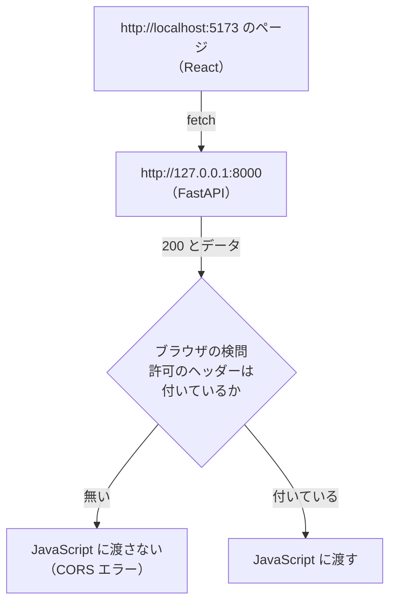
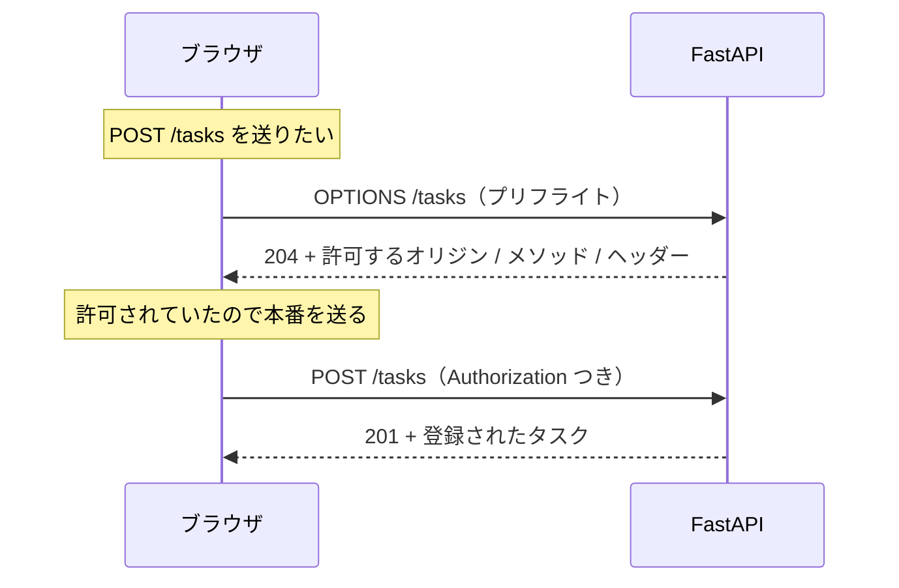
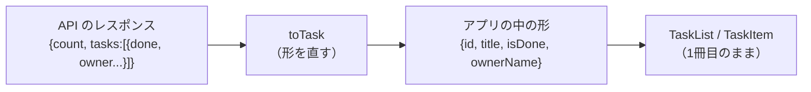
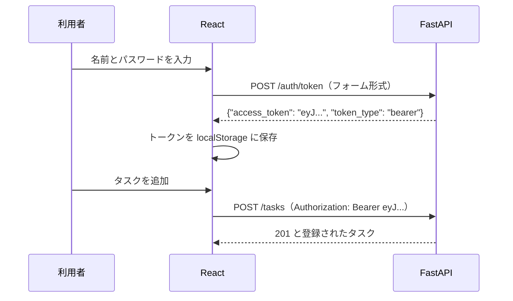
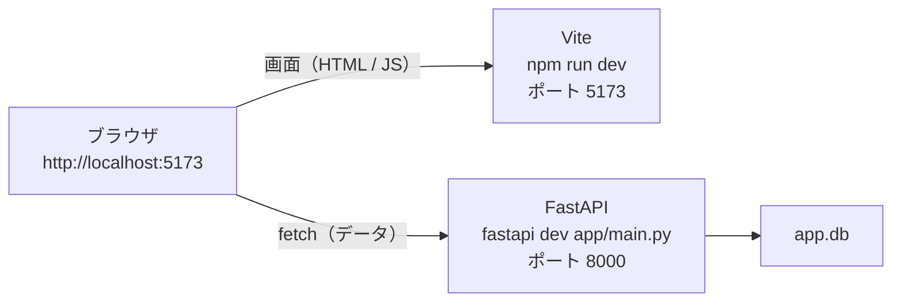
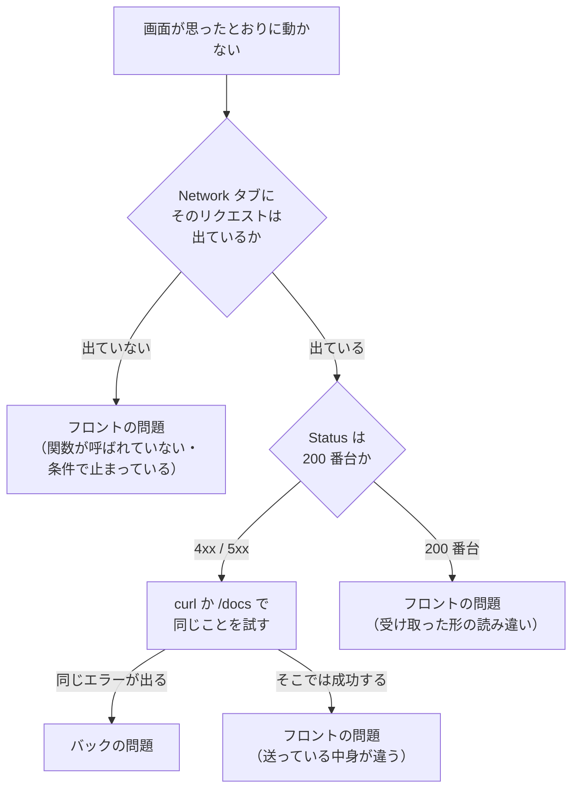

# 第9章 実践：React と繋ぐ

第8章の最後に、こう書きました。

**ここまでで、API 側は完成です。しかし、まだ画面がありません。**

この章で、**1冊目で作ったタスク管理アプリ**（react-text 第10章）と、
**この本で作った API** を繋ぎます。

繋がると、次のことが起こります。

- タスクが**ブラウザの外**（`app.db`）に保存される
- 別のブラウザで開いても、**同じタスクが見える**
- 「誰が登録したか」が記録され、**他人のタスクは消せない**

そして、最初に出会うのは**成功ではなく、ブラウザからの拒否**です。
そこから始めます。

## この章で学ぶこと

- **CORS** でリクエストが拒否される理由を説明し、FastAPI 側で許可を設定できるようになる
- React の `fetch` から API を呼び、**取得した JSON を画面に表示**できるようになる
- **ログインしてトークンを受け取り**、`Authorization` ヘッダーを付けて登録・更新・削除ができるようになる
- **2つのサーバーを同時に起動**して、通しで動く状態を作れるようになる
- **読み込み中・エラー・バリデーションエラー**を、利用者に見える形で表示できるようになる
- 不具合が出たとき、**フロントとバックのどちらが原因か**を切り分けられるようになる

## この章の前提

- [第8章](./08-testing.md) を読み終え、`fastapi-lesson` で `pytest` が全部通ること
- **react-text 第10章**（[実践：タスク管理アプリ](../react-text/10-practice-task-app.md)）を
  読み終え、`task-app` が 10.5.4 のチェックリストを満たしていること
- react-text の [8.3「サーバーからデータを取得する」](../react-text/08-state-design-and-effects.md)
  （`fetch` / `useEffect` / `isLoading` / `errorMessage`）を読んでいること
- `app.db` に、`python -m app.seed` で入れた**山田さん**（パスワード `password123`）がいること

> **つまずいたら**
> この章は、**動かないときに見る場所が2つある**のが今までと違うところです。
> ブラウザの開発者ツールと、サーバーを起動したターミナルの両方を開いてください。
>
> 最も多いのは、**「9.1 でブラウザに拒否されたまま先に進んでしまう」**詰まり方です。
> 9.1.3 の設定を入れたあと、**サーバーを起動し直したか**を必ず確かめてください。
>
> 第0章の 0.2 で準備した AI には、次の5つを添えて聞いてください。
>
> ```text
> fastapi-text の 9.1 を読んでいます。React から API を呼ぶと失敗します。
> ・ブラウザのコンソールに出ているエラー（全文）
> ・開発者ツールの Network タブで、そのリクエストの Status に出ている値
> ・FastAPI を起動したターミナルの最後の5行
> ・app/main.py の add_middleware の部分
> ・React 側を開いている URL（アドレスバーの表示そのまま）
> ```

---

## 9.1 CORS

### 9.1.1 ブラウザに拒否される

先に、**拒否される場面を自分の目で見ます。** 説明はそのあとです。

**まず、API のサーバーを起動します。**
`fastapi-lesson` で、仮想環境を有効にした状態で実行してください（2.2.1）。

**Windows（PowerShell）**

```powershell
fastapi dev app/main.py
```

**macOS / Linux**

```bash
fastapi dev app/main.py
```

```text
INFO     Uvicorn running on http://127.0.0.1:8000 (Press CTRL+C to quit)
```

**このターミナルは、開いたままにしてください。** 止めると API が使えなくなります。

**次に、React 側を起動します。**
**新しいターミナルをもう1つ開いて**、`task-app` で実行します
（ターミナルを増やす方法は 9.3.1 で詳しく扱います。いまは VS Code の
ターミナル右上の `+` を押して、もう1つ開いてください）。

**Windows（PowerShell）**

```powershell
cd task-app
npm run dev
```

**macOS / Linux**

```bash
cd task-app
npm run dev
```

```text
  ➜  Local:   http://localhost:5173/
```

`http://localhost:5173/` を開くと、いつものタスク管理アプリが出ます。
まだ `localStorage` のタスクが表示されている状態です（react-text 10.4）。

ここに、**API を呼ぶコードを1つだけ**足します。

`src/App.jsx`（`import` を1行足す）

```diff
- import { useState } from 'react'
+ import { useState, useEffect } from 'react'
```

`src/App.jsx`（`const [sort, setSort] = useState('newest')` の下に追記）

```jsx
  // ここは 9.2.1 で書き直します。いまは「拒否される」ことを見るためだけのコード
  useEffect(() => {
    async function tryFetch() {
      const response = await fetch('http://127.0.0.1:8000/tasks')
      const data = await response.json()
      console.log(data)
    }
    tryFetch()
  }, [])
```

保存して、ブラウザで `F12`（開発者ツール）を開き、**Console タブ**を見てください。

```text
Access to fetch at 'http://127.0.0.1:8000/tasks' from origin 'http://localhost:5173'
has been blocked by CORS policy: No 'Access-Control-Allow-Origin' header is present
on the requested resource.

GET http://127.0.0.1:8000/tasks net::ERR_FAILED
Uncaught (in promise) TypeError: Failed to fetch
```

**赤いエラーが出ました。**

ここで、**FastAPI を起動したターミナルを見てください。**

```text
INFO     GET /tasks -> 200 (0.0031 秒)
```

**サーバーは `200` を返しています。**
つまり、リクエストは届いていて、API は正しく答えを返しました。
**それをブラウザが捨てた**のです。

| 見る場所 | 表示 | 意味 |
|---------|------|------|
| サーバーのターミナル | `GET /tasks -> 200` | 届いた。正常に処理して返した |
| ブラウザの Console | `blocked by CORS policy` | 返ってきたものを、**ブラウザが JavaScript に渡さなかった** |

**この食い違いが、この節のすべてです。**
エラーを出しているのは API ではなく、**ブラウザ**です。

> **よくある間違い**
> このエラーを見て、**FastAPI 側のコードを疑って探し回る**間違いです。
> ターミナルに `200` が出ているうちは、**API のコードには問題がありません。**
> 直す場所は「API が何を返すか」ではなく、**「返すときに、どの許可証を添えるか」**です。

### 9.1.2 CORS とは

まず**オリジン**（origin）という言葉を決めます。

**オリジン**（Web ページやリクエストの「出どころ」を表す単位。
**スキーム・ホスト・ポート番号の3つ**の組み合わせ）です。

```text
http://localhost:5173/tasks
└─┬─┘  └───┬───┘ └┬─┘
 スキーム   ホスト  ポート番号   ← この3つがオリジン（パスは含まない）
```

3つのうち**1つでも違えば、別のオリジン**です。

| 比べる相手 | 同じオリジンか | 理由 |
|-----------|-------------|------|
| `http://localhost:5173/about` | **同じ** | パスは関係ない |
| `http://localhost:8000` | 違う | **ポート番号**が違う |
| `https://localhost:5173` | 違う | **スキーム**が違う（`http` と `https`） |
| `http://127.0.0.1:5173` | **違う** | ホストの**文字列**が違う（同じパソコンを指していても別扱い） |

最後の行が要注意です。
**`localhost` と `127.0.0.1` は、同じ場所を指していても別のオリジン**として扱われます。

ブラウザには、**同一オリジンポリシー**（あるオリジンのページから、
別のオリジンのデータを勝手に読み取らせない、という決まり）があります。

なぜそんな決まりがあるのか、が肝心です。

**あなたがネット銀行にログインしている状態で、悪意のあるページを開いたとします。**
そのページの JavaScript が `https://bank.example.com/balance` を読めてしまったら、
**残高が盗まれます。** これを防ぐために、ブラウザは既定で読み取りを止めます。



そして、**「このオリジンからなら読んでよい」とサーバー側が明示するための仕組み**が
**CORS**（Cross-Origin Resource Sharing。オリジンをまたいだデータのやり取りを、
サーバーが許可するための仕組み）です。

react-text 8.3.5 で「そういうものがある」とだけ触れた仕組みが、これです。

**許可を出すのはサーバー側**です。ブラウザ側では設定できません。
だから、この章で書き足すのは **FastAPI のコード**になります。

CORS には、もう1つ知っておくべき動きがあります。**プリフライトリクエスト**です。

**プリフライトリクエスト**（本番のリクエストを送る前に、
ブラウザが「このリクエストを送ってよいか」を `OPTIONS` メソッドで先に問い合わせること）は、
次のような場合に自動で送られます。

| 送るリクエスト | プリフライト |
|--------------|------------|
| `GET`（ヘッダーを足していない） | **送られない**（そのまま送って、返事を検問する） |
| `POST` で `Content-Type: application/json` | **送られる** |
| `Authorization` ヘッダーを付けた `GET` | **送られる** |
| `PATCH` / `DELETE` | **送られる** |



**このテキストで書くのは、9.1.3 の設定1つだけ**です。
`OPTIONS` の窓口を自分で作る必要はありません。FastAPI が用意してくれます。

> **補足：なぜ `curl` や `/docs` では起きなかったのか**
> 第8章まで、この問題に一度も出会わなかったのは、
> **CORS がブラウザだけの仕組み**だからです。
>
> - `curl`（1.5.3）はブラウザではないので、検問がない
> - `/docs` は `http://127.0.0.1:8000` にあり、API と**同じオリジン**なので検問に引っかからない
> - `pytest` の `TestClient`（8.3.1）は、そもそもネットワークを通らない
>
> **ブラウザから別のオリジンを呼んだ、この章が初めて**です。

### 9.1.3 FastAPI で設定する

許可するオリジンは、**設定として `.env` に置きます**（4.6.3）。
本番と開発で、許可する相手が変わるからです。

`app/config.py`（`access_token_expire_minutes` の下に1行）

```diff
      secret_key: str
      access_token_expire_minutes: int = 30
+     cors_origins: list[str] = ["http://localhost:5173"]
```

`fastapi-lesson/.env`（末尾に追記）

```text
CORS_ORIGINS=["http://localhost:5173","http://127.0.0.1:5173"]
```

**`.env` にリストを書くときは、JSON の書き方**（角括弧とダブルクォート）にします。
`pydantic-settings` は、リストや辞書の項目を JSON として読み取ります（4.6.2）。

**2つ書いている**のは、9.1.2 で見たとおり
`localhost` と `127.0.0.1` が別のオリジンだからです。
どちらで開いても動くように、両方を許可しておきます。

次に、ミドルウェア（5.6.1）を1つ足します。

`app/main.py`（`import` を1行足す）

```diff
  from fastapi import FastAPI, Request
+ from fastapi.middleware.cors import CORSMiddleware
```

`app/main.py`（`add_process_time` の**下**に追記）

```python
app.add_middleware(
    CORSMiddleware,
    allow_origins=settings.cors_origins,
    allow_credentials=False,
    allow_methods=["GET", "POST", "PATCH", "DELETE", "OPTIONS"],
    allow_headers=["Authorization", "Content-Type"],
)
```

引数を1つずつ見ます。

| 引数 | 意味 | このアプリでの値 |
|------|------|----------------|
| `allow_origins` | **読んでよいオリジンの一覧** | `.env` に書いた2つ |
| `allow_credentials` | クッキーを一緒に送ることを許すか | `False`（トークンは `Authorization` ヘッダーで送るため。7.6.2） |
| `allow_methods` | 許すメソッド | 使う4つ ＋ プリフライトの `OPTIONS` |
| `allow_headers` | ブラウザが**足してよいヘッダー** | トークン用と、JSON を送るとき用 |

**`allow_headers` に `Authorization` を入れ忘れると、ログイン後の操作だけが失敗します。**
一覧（`GET /tasks`）はヘッダーを足さないので通り、
登録（`POST /tasks`）だけがプリフライトで止まる、という分かりにくい壊れ方になります。

> **補足：ミドルウェアの順番**
> `add_middleware` は、**あとから足したものほど外側**になります。
> 5.6.2 で書いた `add_process_time` より**下**に書くことで、
> CORS が外側になり、プリフライトの `OPTIONS` が
> 処理時間の計測を通らずにその場で返るようになります。
>
> 順番を逆にしても動きますが、**この章では下に書いてください。**
> 意図せず順番が変わったときに気づけるよう、置き場所を決めておきます。

**サーバーを再起動します。**
`fastapi dev` は Python のファイルを保存すると自動で読み直しますが（2.4.3）、
**`.env` は読み直しません。** `settings` は起動時に1回だけ作られるからです（4.6.2）。

FastAPI のターミナルで `Ctrl` + `C` を押して止め、もう一度起動してください。

**Windows（PowerShell）**

```powershell
fastapi dev app/main.py
```

**macOS / Linux**

```bash
fastapi dev app/main.py
```

ブラウザに戻って、**ページを再読み込み**してください。
Console に、こう出れば成功です。

```text
{count: 3, tasks: Array(3)}
```

**拒否されなくなりました。** データが JavaScript まで届いています。

> **よくある間違い**
> **オリジンの末尾に `/` を付ける**間違いです。
>
> ```text
> CORS_ORIGINS=["http://localhost:5173/"]      ❌ 末尾のスラッシュ
> CORS_ORIGINS=["http://localhost:5173"]       ✅
> ```
>
> オリジンは「スキーム・ホスト・ポート」の3つだけ（9.1.2）で、パスを含みません。
> `/` を付けると**文字列として一致しなくなり**、許可されません。
> エラーの見え方は、設定を書く前とまったく同じです。
>
> 同じ理由で、**ポート番号の書き忘れ**（`http://localhost`）も一致しません。

> **よくある間違い**
> **React 側を `http://127.0.0.1:5173` で開いているのに、
> `.env` には `localhost` しか書いていない**、という組み合わせです。
>
> 直す前に、**ブラウザのアドレスバーをそのまま読んでください。**
> エラーメッセージの `from origin '...'` の部分が、いま開いているオリジンです。
> **そこに書かれている文字列**を `CORS_ORIGINS` に入れます。

### 9.1.4 本番で `*` を使わない

CORS の設定を調べると、次の書き方が必ず出てきます。

```python
allow_origins=["*"]      # すべてのオリジンから読んでよい
```

`*`（アスタリスク）は「すべて」を表す指定です。
これを書けば、どのオリジンからでも読めるようになり、**エラーは確実に消えます。**

**そのぶん、何を捨てているのかを理解してください。**

`allow_origins=["*"]` は、**世界中のどのページからでも、この API を読んでよい**という宣言です。

| 設定 | 誰が読めるか | 使ってよい場面 |
|------|------------|-------------|
| `["http://localhost:5173"]` | 自分の開発サーバーだけ | 開発中（このテキスト） |
| `["https://myapp.example.com"]` | 自分の本番サイトだけ | 本番 |
| `["*"]` | **誰でも** | 誰が読んでも困らない、公開データだけの API |

このアプリの `GET /tasks` は、いま**誰でも読めます**（7.5.3 でそう決めました）。
それでも `["*"]` にしない理由は2つあります。

- **設定を変えたときに、危険が一緒に広がる。**
  あとから「一覧もログイン必須にする」と決めたときに、
  `["*"]` のままだと、許可の範囲が広すぎることに気づけません
- **`allow_credentials=True` と組み合わせられない。**
  クッキーを使う設計に変えたくなったとき、
  ブラウザは `["*"]` と `allow_credentials=True` の組み合わせを**拒否します**

**許可は、必要な相手にだけ出す。** これは CORS に限らない考え方です。
7.5.3 で「読むのは誰でも、書き換えるのは本人だけ」と決めたのと同じ判断です。

> **注意：CORS はセキュリティの守りではありません**
> CORS が止められるのは、**ブラウザから来たリクエストの読み取り**だけです。
>
> `curl` や Python の `requests`（python-text 第10章）からは、
> **CORS の設定に関係なく、誰でもあなたの API を呼べます。**
> 9.1.2 で見たとおり、検問しているのはブラウザだからです。
>
> **守りは、認証と認可（第7章）で行います。**
> 「CORS を絞ったから安全」とは考えないでください。

---

## 9.2 React 側から API を呼ぶ

### 9.2.1 一覧を取得して表示する

ここから、`task-app` を**本格的に書き換えます。**

いまのアプリは、`localStorage` にタスクを保存しています（react-text 10.4）。
これを、**API から取ってくる形**に変えます。

最初に、**2つのデータの形を見比べてください。** ここが、この節でいちばん大事な点です。

| | react-text 第10章のアプリ | この本の API |
|---|------------------------|-------------|
| 1件の形 | `{ id, title, isDone, createdAt }` | `{ id, title, done, code, priority, tags, owner, created_at }` |
| 完了かどうか | **`isDone`** | **`done`** |
| 一覧の形 | 配列そのもの | **`{ count, tasks: [...] }`** という包み |
| 登録者 | 無い | `owner.name` |

**項目名が違います。** `isDone` と `done` です。

どちらかに合わせて直す、という手もありますが、このテキストでは**変換する関数を1つ置きます。**



**こうすると、`TaskItem` や `TaskList` を1行も変えずに済みます。**
API の項目名が将来変わっても、直すのは変換の関数だけです。

**API を呼ぶコードは、コンポーネントの中に書きません。**
`src/api/` という新しいディレクトリにまとめます
（種類で分けるディレクトリ構成は react-text 9.4.1 でやりました）。

`src/api/client.js`（新規作成。`api` ディレクトリも作る）

```js
// API がいる場所。開発中は FastAPI の開発サーバー（9.3.1）
export const API_BASE_URL = 'http://127.0.0.1:8000'

// 項目名を、画面に出す日本語に直すための対応表
const FIELD_LABELS = {
  title: 'タスク名',
  text: 'メモ',
  name: '名前',
  email: 'メールアドレス',
  password: 'パスワード',
}

// 422 の detail から、日本語のメッセージを1つ組み立てる（4.3.4・9.3.3）
function toValidationMessage(detail) {
  const first = detail[0]
  const field = first.loc[first.loc.length - 1]
  const label = FIELD_LABELS[field] || field

  if (first.type === 'string_too_short') {
    return `${label}を入力してください`
  }
  if (first.type === 'string_too_long') {
    return `${label}が長すぎます`
  }
  return `${label}の形式が正しくありません`
}

// API が返すエラーの形（5.4.3）から、画面に出す文を決める
function toErrorMessage(status, body) {
  if (body.error === undefined) {
    return `サーバーが ${status} を返しました`
  }
  if (status === 422 && body.error.detail) {
    return toValidationMessage(body.error.detail)
  }
  return body.error.message
}

export async function request(path, options) {
  const response = await fetch(`${API_BASE_URL}${path}`, options)

  // 204 はボディが無いので、json() を呼ぶと失敗する（6.4.4）
  if (response.status === 204) {
    return null
  }

  const body = await response.json()

  if (!response.ok) {
    const error = new Error(toErrorMessage(response.status, body))
    // あとで「何番だったか」で分岐できるように、番号も持たせておく
    error.status = response.status
    throw error
  }

  return body
}

// 通信そのものが失敗したのか、API がエラーを返したのかを分ける（9.3.2）
export function toDisplayMessage(error) {
  if (error.status === undefined) {
    return 'API サーバーに繋がりません。起動しているか確認してください。'
  }
  return error.message
}
```

`request` が、この本の API の**決めごとを1か所に集めた関数**です。

| 書いてあること | 対応する章 |
|-------------|----------|
| `response.ok` が偽なら例外にする | react-text 8.3.3（`fetch` は `404` を失敗にしない） |
| エラーは `{"error": {...}}` の形で来る | 5.4.3 |
| `204` はボディが無い | 6.4.4 |
| `422` の中身は `detail` のリスト | 4.3.4 |

**`error.status = response.status` の1行**に注目してください。
JavaScript の `Error` は**オブジェクト**なので、あとから項目を足せます。
これで、受け取った側が `error.status === 401` のように分岐できます（9.3.3）。

次に、タスク専用の関数を作ります。

`src/api/tasks.js`（新規作成）

```js
import { request } from './client.js'

// API の1件を、アプリの中で使う形に直す
function toTask(item) {
  return {
    id: item.id,
    title: item.title,
    isDone: item.done,
    ownerName: item.owner.name,
  }
}

export async function fetchTasks() {
  // limit の既定値は 10 件なので、多めに指定する（6.4.5）
  const data = await request('/tasks?limit=100', {})
  return data.tasks.map(toTask)
}
```

`toTask` の中で、**入れ子を平らにしている**ところが2つあります。

| API の形 | アプリの形 | なぜ直すか |
|---------|----------|----------|
| `done` | `isDone` | 1冊目のアプリが `isDone` で書かれているため |
| `owner.name`（入れ子） | `ownerName`（1階層） | 使う側が `task.owner.name` と2段たどらずに済むため |

`ownerName` は、**誰が登録したタスクなのか**を画面に出すときに使います（演習 9.1）。

**`?limit=100`** を付けている理由は、6.4.5 で決めたページネーションです。
`limit` を省くと**10件しか返りません。** 11件目を登録した人が
「増えないんですが」と言い出すのは、ここが原因です。

`/tasks` は、ほかにも `done` と `keyword` で絞り込めます（5.3.2 の `list_params`）。
複数付けるときは `&` でつなぎます。

```text
/tasks?limit=100&done=false          未完了だけを 100 件まで
/tasks?limit=100&keyword=牛乳         タイトルに「牛乳」を含むものだけ
```

`App.jsx` を書き換えます。**`localStorage` をやめて、API から取ります。**

`src/App.jsx`（`import` の部分を次のように変更する）

```diff
  import { useState, useEffect } from 'react'
  import TaskFilter from './components/TaskFilter.jsx'
  import TaskForm from './components/TaskForm.jsx'
  import TaskList from './components/TaskList.jsx'
  import TaskSort from './components/TaskSort.jsx'
- import { sampleTasks } from './data/sampleTasks.js'
- import useLocalStorage from './hooks/useLocalStorage.js'
+ import { toDisplayMessage } from './api/client.js'
+ import { fetchTasks } from './api/tasks.js'
  import './App.css'
```

`src/App.jsx`（state と、9.1.1 で書いた仮の `useEffect` を次のように置き換える）

```diff
- const [tasks, setTasks] = useLocalStorage('task-app.tasks', sampleTasks)
+ const [tasks, setTasks] = useState([])
+ const [isLoading, setIsLoading] = useState(true)
+ const [errorMessage, setErrorMessage] = useState('')
  const [filter, setFilter] = useState('all')
  const [sort, setSort] = useState('newest')
+
+ async function loadTasks() {
+   setIsLoading(true)
+   setErrorMessage('')
+   try {
+     const loaded = await fetchTasks()
+     setTasks(loaded)
+   } catch (error) {
+     console.error(error)
+     setErrorMessage(toDisplayMessage(error))
+   } finally {
+     setIsLoading(false)
+   }
+ }
+
+ useEffect(() => {
+   loadTasks()
+ }, [])
- 
- // ここは 9.2.1 で書き直します。いまは「拒否される」ことを見るためだけのコード
- useEffect(() => {
-   async function tryFetch() {
-     const response = await fetch('http://127.0.0.1:8000/tasks')
-     const data = await response.json()
-     console.log(data)
-   }
-   tryFetch()
- }, [])
```

**9.1.1 で書いた仮の `useEffect` は、消してください。**
残しておくと、ページを開くたびに `/tasks` を**2回**取りに行きます。
Network タブに `tasks` の行が2つ並んでいたら、消し忘れです（9.4.2）。

`data` / `isLoading` / `errorMessage` の3つを持つ形は、
react-text 8.3.4 で学んだとおりです。

**`loadTasks` を `useEffect` の外に書いている**のは、
**あとからもう一度呼びたい**からです（9.2.3 で削除したあとに呼びます）。
`useEffect` の中に閉じ込めると、外から呼べなくなります。

並べ替えの基準も直します。API のタスクには `createdAt` がありません。

`src/App.jsx`（`visibleTasks` の計算を次のように変更する）

```diff
  const visibleTasks = [...filteredTasks].sort((a, b) => {
    if (sort === 'oldest') {
-     return a.createdAt - b.createdAt
+     return a.id - b.id
    }
    if (sort === 'title') {
      return a.title.localeCompare(b.title, 'ja')
    }
-   return b.createdAt - a.createdAt
+   return b.id - a.id
  })
```

**`id` は、データベースが1ずつ増やして付けた番号**です（6.3.2）。
**番号が大きいほど、あとから登録された**ので、`createdAt` の代わりに使えます。

最後に、読み込み中の表示を足します。

`src/App.jsx`（`return` の中の `<TaskList ... />` を次のように変更する）

```diff
+     {errorMessage !== '' && <p className="error">{errorMessage}</p>}
+
+     {isLoading ? (
+       <p>読み込み中...</p>
+     ) : (
        <TaskList
          tasks={visibleTasks}
          totalCount={tasks.length}
          onToggle={handleToggle}
          onDelete={handleDelete}
        />
+     )}
```

`src/App.css`（末尾に追記する）

```css
.error {
  color: #c0392b;
  background-color: #fdecea;
  padding: 8px 12px;
  border-radius: 4px;
}

.login-state {
  color: #555;
  font-size: 0.9rem;
}
```

保存して、ブラウザを再読み込みしてください。

```text
表示される内容:
□ 部屋を片づける          [削除]
☑ レポートを書く          [削除]
□ 牛乳を買う             [削除]
```

**`python -m app.seed` で入れた3件が、API から届いています。**

確かめる方法が1つあります。**開発者ツールの Application タブ**を開き、
`localStorage` の `task-app.tasks` を**削除してください。**
それでも、再読み込みするとタスクは消えません。**保存場所がブラウザの外に移ったから**です。

`src/data/sampleTasks.js` と `src/hooks/useLocalStorage.js` は、もう使いません。
削除して構いませんが、**1冊目の記録として残しておいても害はありません**
（`import` していなければ、画面には何の影響もありません）。

> **よくある間違い**
> **`data.tasks` ではなく `data` を `map` してしまう**間違いです。
>
> ```js
> return data.map(toTask)        // ❌ data は {count, tasks} という包み
> return data.tasks.map(toTask)  // ✅
> ```
>
> 画面が真っ白になり、Console に `data.map is not a function` と出ます。
> **返ってきた JSON の形は、必ず `/docs` か Network タブで確かめてください**（9.4.2）。
> API を作った本人でも、**包みの1階層を忘れます。**

### 9.2.2 フォームから POST する

一覧は出ましたが、**「追加」を押しても、リロードすると消えます。**
`handleAdd` が、まだ `setTasks` でブラウザの中を書き換えているだけだからです。

ここで問題が1つあります。
7.5.3 で決めたとおり、**`POST /tasks` はログインが必要**です。

```text
POST /tasks（トークンなし）
{"error":{"status":401,"message":"Not authenticated","detail":null}}
```

**先にログインの仕組みを作ります。** 手順は 7.5.1 でやったことと同じです。



API を呼ぶ関数を足します。

`src/api/tasks.js`（末尾に追記）

```js
function jsonHeaders(token) {
  return {
    'Content-Type': 'application/json',
    'Authorization': `Bearer ${token}`,
  }
}

export async function login(name, password) {
  // ログインだけはフォーム形式で送る（7.5.1・8.3.3）
  const body = new URLSearchParams()
  body.set('username', name)
  body.set('password', password)

  return await request('/auth/token', {
    method: 'POST',
    headers: { 'Content-Type': 'application/x-www-form-urlencoded' },
    body: body,
  })
}

export async function fetchCurrentUser(token) {
  return await request('/users/me', {
    headers: { 'Authorization': `Bearer ${token}` },
  })
}

export async function createTask(title, token) {
  const created = await request('/tasks', {
    method: 'POST',
    headers: jsonHeaders(token),
    // 登録者は送らない。トークンから決まる（7.5.3）
    body: JSON.stringify({ title: title }),
  })
  return toTask(created)
}
```

3つ、新しいことがあります。

**1つ目：`Authorization: Bearer <トークン>` というヘッダー**

7.5.2 で `/docs` の「Authorize」ボタンが裏でやっていたことを、自分で書いています。
`Bearer` と トークンの間には、**半角スペースが1つ**入ります。

**2つ目：ログインだけ `URLSearchParams`**

`POST /auth/token` は `OAuth2PasswordRequestForm` で受け取るので（7.5.1）、
**JSON ではなくフォーム形式**で送ります。

**`URLSearchParams`** は、`username=山田&password=...` という
フォーム形式の文字列を組み立ててくれるブラウザの道具です。
`set(名前, 値)` で1つずつ足します。

```js
const body = new URLSearchParams()
body.set('username', '山田')
body.set('password', 'password123')
console.log(body.toString())   // username=%E5%B1%B1%E7%94%B0&password=password123
```

日本語が `%E5%B1%B1%E7%94%B0` になっているのは、
3.4.1 で見た**パーセントエンコーディング**です。自分で変換する必要はありません。

**3つ目：`JSON.stringify`**

`body` に渡せるのは**文字列**なので、オブジェクトを JSON の文字列に変換します
（react-text 10.4.2 で `localStorage` に保存したときと同じです）。

ログインの画面を作ります。

`src/components/LoginForm.jsx`（新規作成）

```jsx
import { useState } from 'react'

function LoginForm({ onLogin }) {
  const [name, setName] = useState('')
  const [password, setPassword] = useState('')
  const [error, setError] = useState('')
  const [isSending, setIsSending] = useState(false)

  async function handleSubmit(event) {
    event.preventDefault()

    setIsSending(true)
    // onLogin は、失敗したときだけメッセージを返す（成功したら空文字列）
    const message = await onLogin(name, password)
    setIsSending(false)

    if (message === '') {
      setName('')
      setPassword('')
      setError('')
    } else {
      setError(message)
    }
  }

  return (
    <>
      {error !== '' && <p className="error">{error}</p>}
      <form className="login-form" onSubmit={handleSubmit}>
        <input
          type="text"
          value={name}
          onChange={(event) => setName(event.target.value)}
          placeholder="名前"
        />
        <input
          type="password"
          value={password}
          onChange={(event) => setPassword(event.target.value)}
          placeholder="パスワード"
        />
        <button type="submit" disabled={isSending || name === '' || password === ''}>
          {isSending ? '送信中...' : 'ログイン'}
        </button>
      </form>
    </>
  )
}

export default LoginForm
```

**`onLogin` が「失敗したときだけメッセージを返す」**という決めごとにしています。

理由は、**成功したときだけ入力欄を空にしたい**からです。
パスワードを間違えたときに入力欄が消えると、打ち直しになって不便です。
「成功なら空文字列、失敗ならメッセージ」と決めておけば、
`if (message === '')` の1行で分けられます。

**`type="password"`** は、入力した文字が `●` で表示される `input` です（react-text 2.4.3）。
**`isSending`** は、送信中にボタンを押せなくするための state です（9.3.2 で詳しく扱います）。

`App.jsx` に組み込みます。

`src/App.jsx`（`import` に追記）

```diff
+ import LoginForm from './components/LoginForm.jsx'
  import TaskFilter from './components/TaskFilter.jsx'
```

```diff
  import { toDisplayMessage } from './api/client.js'
- import { fetchTasks } from './api/tasks.js'
+ import { createTask, fetchCurrentUser, fetchTasks, login } from './api/tasks.js'
```

`src/App.jsx`（`function App() {` の**上**に追記）

```jsx
const TOKEN_KEY = 'task-app.token'
```

`src/App.jsx`（`const [errorMessage, ...]` の下に追記）

```jsx
  // 再読み込みしてもログインしたままにする（7.6.2）
  const [token, setToken] = useState(localStorage.getItem(TOKEN_KEY) || '')
  const [userName, setUserName] = useState('')
```

`src/App.jsx`（`useEffect(() => { loadTasks() }, [])` の下に追記）

```jsx
  // トークンを持っているとき、誰としてログイン中かを確かめる
  useEffect(() => {
    if (token === '') {
      setUserName('')
      return
    }

    async function loadUser() {
      try {
        const user = await fetchCurrentUser(token)
        setUserName(user.name)
      } catch (error) {
        // 期限切れなどで使えないトークンは、持っていても仕方がないので捨てる
        console.error(error)
        localStorage.removeItem(TOKEN_KEY)
        setToken('')
      }
    }

    loadUser()
  }, [token])
```

**依存配列に `token` を入れている**ので、
ログインしてトークンが変わった瞬間に、この `useEffect` がもう一度動きます
（react-text 8.2.3 の「依存配列」で学んだ、値が変わったときの再実行です）。

`src/App.jsx`（`handleAdd` を次のように書き換える）

```jsx
  async function handleLogin(name, password) {
    try {
      const data = await login(name, password)
      localStorage.setItem(TOKEN_KEY, data.access_token)
      setToken(data.access_token)
      return ''
    } catch (error) {
      console.error(error)
      return toDisplayMessage(error)
    }
  }

  async function handleAdd(title) {
    try {
      const created = await createTask(title, token)
      setTasks([...tasks, created])
      return ''
    } catch (error) {
      console.error(error)
      return toDisplayMessage(error)
    }
  }
```

**`handleAdd` も、`handleLogin` と同じ「失敗したときだけメッセージを返す」形**にします。
`TaskForm` 側も、それに合わせて直します。

`src/components/TaskForm.jsx`（`handleSubmit` を次のように書き換える）

```diff
- function handleSubmit(event) {
+ async function handleSubmit(event) {
    event.preventDefault()

    const trimmed = title.trim()

    if (trimmed === '') {
      setError('タスク名を入力してください')
      return
    }
    if (trimmed.length > MAX_LENGTH) {
      setError(`タスク名は${MAX_LENGTH}文字までです`)
      return
    }

-   onAdd(trimmed)
-   setTitle('')
-   setError('')
+   setIsSending(true)
+   const message = await onAdd(trimmed)
+   setIsSending(false)
+
+   if (message === '') {
+     setTitle('')
+     setError('')
+   } else {
+     setError(message)
+   }
  }
```

`src/components/TaskForm.jsx`（`const [error, setError] = useState('')` の下に追記）

```jsx
  const [isSending, setIsSending] = useState(false)
```

`src/components/TaskForm.jsx`（ボタンを次のように変更する）

```diff
- <button type="submit" disabled={title.trim() === ''}>
-   追加
- </button>
+ <button type="submit" disabled={isSending || title.trim() === ''}>
+   {isSending ? '送信中...' : '追加'}
+ </button>
```

最後に、画面の出し分けです。

`src/App.jsx`（`<h1>` の下に追記）

```jsx
      {token === '' ? (
        <LoginForm onLogin={handleLogin} />
      ) : (
        <p className="login-state">{userName} さんとしてログイン中</p>
      )}
```

**`userName` は、`App` が持っている**ことを覚えておいてください。

たとえば「自分が登録したタスクだけ、背景色を変える」という表示にしたくなったとします。
そのとき使うのは、次の組み合わせです。

1. `App` が持っている `userName` を、`TaskList` に props で渡す
2. `TaskList` は自分では使わず、`TaskItem` にそのまま渡す（**通すだけ**）
3. `TaskItem` で `task.ownerName === userName` を判定し、`className` を切り替える

**state を持つ場所（`App`）と、それを使う場所（`TaskItem`）が離れているとき**は、
途中のコンポーネントが「通すだけ」の props を受け取ることになります。
これが react-text 9.2.1 で扱った形です。

`src/App.jsx`（`<TaskForm onAdd={handleAdd} />` を次のように変更する）

```diff
- <TaskForm onAdd={handleAdd} />
+ {token !== '' && <TaskForm onAdd={handleAdd} />}
```

保存して、動かします。**名前 `山田`、パスワード `password123` でログイン**してください
（`python -m app.seed` で入れたユーザーです。7.3.1）。

```text
ログイン前:
  [名前] [パスワード] [ログイン]
  （追加フォームは表示されない）

ログイン後:
  山田 さんとしてログイン中
  [やることを入力] [追加]
```

「郵便局に行く」と入力して「追加」を押し、**ページを再読み込み**してください。

```text
表示される内容:
□ 郵便局に行く           [削除]
□ 部屋を片づける          [削除]
☑ レポートを書く          [削除]
□ 牛乳を買う             [削除]
```

**再読み込みしても消えません。** データベースに入ったからです。

念のため、サーバー側でも確かめます。**3つ目のターミナル**を開くか、
ブラウザで `http://127.0.0.1:8000/tasks` を直接開いてください。

```json
{"count":4,"tasks":[{"title":"牛乳を買う","done":false,"code":null,"priority":3,"tags":[],"id":1,"owner":{"name":"山田"},"created_at":null},{"title":"郵便局に行く","done":false,"code":null,"priority":3,"tags":[],"id":4,"owner":{"name":"山田"},"created_at":"2026-09-06T10:12:44.913204"}]}
```

**`owner` が `山田` になっています。** 送っていないのに入りました。
**トークンから決まった**からです（7.5.3）。

> **注意：トークンを `localStorage` に置くことの意味**
> 7.6.2 で書いたとおり、`localStorage` に置いたトークンは
> **JavaScript から読めます。** つまり、このページに XSS の穴があれば盗まれます。
>
> このテキストが `localStorage` を選んだのは、**学習の焦点を接続に置くため**です。
> 実際のサービスを作るときは、`HttpOnly` のクッキーを第一候補に検討してください。
> そして、**有効期限を短くしておくこと**（7.4.3、このアプリは 30 分）に意味があります。

> **よくある間違い**
> **`Bearer` を書き忘れる**間違いです。
>
> ```js
> 'Authorization': token                  // ❌ 401 になる
> 'Authorization': `Bearer ${token}`      // ✅
> ```
>
> `401` が返り、`Not authenticated` と表示されます。
> **Network タブの Request Headers**（9.4.2）で、
> 実際に送られたヘッダーの文字列を確かめてください。

### 9.2.3 削除・更新

残りは、チェックボックス（完了の切り替え）と「削除」です。
どちらも**本人しか操作できません**（7.5.3）。

API を呼ぶ関数を足します。

`src/api/tasks.js`（末尾に追記）

```js
export async function updateTask(id, changes, token) {
  const updated = await request(`/tasks/${id}`, {
    method: 'PATCH',
    headers: jsonHeaders(token),
    body: JSON.stringify(changes),
  })
  return toTask(updated)
}

export async function deleteTask(id, token) {
  await request(`/tasks/${id}`, {
    method: 'DELETE',
    headers: jsonHeaders(token),
  })
}
```

**`PATCH` に送るのは、変えたい項目だけ**です（4.5.2 の `exclude_unset=True`）。
`{ done: true }` だけを送れば、タイトルはそのままです。

`deleteTask` が**何も返していない**のは、`DELETE /tasks/{id}` が `204`（ボディなし）を返すからです。
`request` の中で `null` を返しているので（9.2.1）、受け取っても使い道がありません。

`App.jsx` の2つの関数を書き換えます。

`src/App.jsx`（`import` に追記）

```diff
- import { createTask, fetchCurrentUser, fetchTasks, login } from './api/tasks.js'
+ import {
+   createTask,
+   deleteTask,
+   fetchCurrentUser,
+   fetchTasks,
+   login,
+   updateTask,
+ } from './api/tasks.js'
```

`src/App.jsx`（`handleToggle` と `handleDelete` を次のように書き換える）

```jsx
  async function handleToggle(id) {
    const target = tasks.find((task) => task.id === id)

    try {
      const updated = await updateTask(id, { done: !target.isDone }, token)
      // 返ってきた1件で置き換える（サーバーが持っている値を正とする）
      setTasks(tasks.map((task) => (task.id === id ? updated : task)))
    } catch (error) {
      console.error(error)
      setErrorMessage(toDisplayMessage(error))
    }
  }

  async function handleDelete(id) {
    try {
      await deleteTask(id, token)
      // 消えたあとの一覧を、サーバーから取り直す
      await loadTasks()
    } catch (error) {
      console.error(error)
      setErrorMessage(toDisplayMessage(error))
    }
  }
```

**2つで、やり方をわざと変えています。**

| 操作 | 画面の直し方 | 向いている場面 |
|------|------------|--------------|
| 完了の切り替え | **返ってきた1件で置き換える** | 変わるのが1件だけと分かっているとき。速い |
| 削除 | **一覧を取り直す**（`loadTasks()`） | 件数や並び順まで変わるとき。確実 |

どちらも正解です。**「サーバーが持っている値を、画面に写す」**という向きが同じであれば、
どちらでも構いません。

**やってはいけないのは、画面だけ書き換えて API を呼ばないこと**です。
再読み込みすると元に戻り、「保存されないんですが」という不具合になります。

動かして確かめます。**山田さんでログインした状態**で、チェックボックスを押してください。

```text
サーバーのターミナル:
INFO     タスクを更新しました id=1 done=True
INFO     PATCH /tasks/1 -> 200 (0.0042 秒)
```

**次に、他人のタスクを操作してみます。**
一度**ログアウト**したいところですが、ログアウトはまだ作っていません（演習 9.2 で作ります）。
かわりに、**鈴木さんでログインし直します。**

開発者ツールの Application タブで `task-app.token` を削除し、
再読み込みして **`鈴木` / `password123`** でログインしてください。

そのうえで、**山田さんのタスク**（「牛乳を買う」）の「削除」を押します。

```text
画面に表示される内容:
このタスクを操作する権限がありません
```

```text
サーバーのターミナル:
INFO     DELETE /tasks/1 -> 403 (0.0021 秒)
```

**第7章で作った認可が、そのまま画面に出ました。**
`403` のメッセージ（5.4.3 で形を統一したもの）が、
`request` → `toDisplayMessage` を通って `errorMessage` に入っています。

> **よくある間違い**
> **`handleToggle` で `target` が見つからないまま `target.isDone` を読む**間違いです。
>
> ```text
> TypeError: Cannot read properties of undefined (reading 'isDone')
> ```
>
> `find` は、見つからなければ `undefined` を返します（react-text 5.3.3）。
> 一覧を取り直した直後に古い `id` を押すと起こります。
> 気になる場合は、`if (target === undefined) { return }` を先頭に置いてください。

> **補足：`PATCH` を送っているのに `405` が返るとき**
> `405 Method Not Allowed` は「**その URL に、そのメソッドの窓口が無い**」という意味です。
> 多いのは、URL の末尾に `/` を付けてしまう間違いです。
>
> ```js
> `/tasks/${id}/`     // ❌
> `/tasks/${id}`      // ✅
> ```

---

## 9.3 通しで動かす

### 9.3.1 2つのサーバーを同時に起動する

ここまで、ターミナルを2つ使ってきました。**この形が、この章の標準です。**



**画面をくれるサーバーと、データをくれるサーバーは別**です。
ブラウザは、この2つと別々に会話しています。

| | フロント（React） | バック（API） |
|---|-----------------|-------------|
| 起動する場所 | `task-app` | `fastapi-lesson` |
| コマンド | `npm run dev` | `fastapi dev app/main.py` |
| ポート | 5173 | 8000 |
| 止め方 | `Ctrl` + `C` | `Ctrl` + `C` |
| 落ちると | 画面が開けない | 画面は出るが、データが出ない |

**VS Code でターミナルを2つ開く手順**は、次のとおりです。

1. `Ctrl` + `` ` ``（Windows）／`Control` + `` ` ``（macOS）でターミナルを開く
2. ターミナルの右上にある **`+`（新しいターミナル）** を押す
3. 右側に一覧が出るので、クリックで行き来する

**それぞれのターミナルで、いる場所が違う**ことに注意してください。

**Windows（PowerShell）**

```powershell
Get-Location
```

**macOS / Linux**

```bash
pwd
```

```text
1つ目: /Users/yamada/Desktop/fastapi-lesson
2つ目: /Users/yamada/Desktop/react-lesson/task-app
```

**起動する順番は、どちらが先でも構いません。**
ただし、**API を先に起動する**ほうが分かりやすくなります。
画面を先に開くと、一瞬「API サーバーに繋がりません」が表示されるからです。

**毎回の起動手順**を、ここにまとめます。

**Windows（PowerShell）**

```powershell
# ターミナル1（API）
cd fastapi-lesson
.\.venv\Scripts\Activate.ps1
fastapi dev app/main.py
```

```powershell
# ターミナル2（画面）
cd react-lesson\task-app
npm run dev
```

**macOS / Linux**

```bash
# ターミナル1（API）
cd fastapi-lesson
source .venv/bin/activate
fastapi dev app/main.py
```

```bash
# ターミナル2（画面）
cd react-lesson/task-app
npm run dev
```

> **よくある間違い**
> **仮想環境を有効にせずに `fastapi dev` を実行する**間違いです（2.6.2）。
>
> ```text
> fastapi : 用語 'fastapi' は、コマンドレット、関数、スクリプト ファイル、
> または操作可能なプログラムの名前として認識されません。
> ```
>
> ターミナルを新しく開くたびに、**有効化はやり直し**になります。
> 行の先頭に `(.venv)` が付いているかを見てください。

> **よくある間違い**
> **ポートを取り違える**間違いです。
>
> | 開いた URL | 何が出るか |
> |-----------|----------|
> | `http://localhost:5173` | **画面**（これが正解） |
> | `http://127.0.0.1:8000` | API の JSON（`{"detail":"Not Found"}` など） |
> | `http://127.0.0.1:8000/docs` | 自動ドキュメント（2.5.1） |
>
> 「アプリが真っ白」と思ったら、まず**アドレスバーのポート番号**を見てください。

### 9.3.2 ローディングとエラー表示

繋がったので、次は**うまくいかないとき**を作り込みます。

react-text 9.4.3 で、**画面には4つの状態**があると学びました。
この章でも同じです。

| 状態 | いまの表示 | 書いた場所 |
|------|----------|----------|
| 読み込み中 | 「読み込み中...」 | 9.2.1 |
| エラー | 赤い枠のメッセージ | 9.2.1 |
| 0件 | 「タスクがありません。〜」 | react-text 10.5.2（そのまま使える） |
| 表示 | 一覧 | react-text 10.3.2 |

**わざと壊して、確かめます。**

**API のターミナルで `Ctrl` + `C` を押して、サーバーを止めてください。**
そのうえで、ブラウザを再読み込みします。

```text
画面に表示される内容:
API サーバーに繋がりません。起動しているか確認してください。
```

```text
Console:
TypeError: Failed to fetch
```

**`fetch` は、サーバーに繋がらないと `TypeError` を投げます。**
このとき、**ステータスコードは存在しません。** レスポンスが1つも返ってこないからです。

9.2.1 で書いた `toDisplayMessage` は、そこを見分けています。

```js
export function toDisplayMessage(error) {
  if (error.status === undefined) {
    return 'API サーバーに繋がりません。起動しているか確認してください。'
  }
  return error.message
}
```

| `error.status` | 何が起きたか | 出すべき文 |
|---------------|------------|----------|
| `undefined` | **API まで届いていない**（サーバー停止・URL 間違い・CORS） | 「繋がりません」 |
| `401` / `403` / `404` / `422` | **届いて、API がエラーを返した** | API のメッセージ |

**この2つを同じ文言で出さないでください。**
「繋がらない」と「拒否された」では、利用者がやるべきことが違います。

**API を起動し直して**、再読み込みしてください。一覧が戻ります。

もう1つ、地味ですが大事な作り込みがあります。**二重送信の防止**です。

9.2.2 で `isSending` を入れました。これが無いと、次のことが起きます。

```text
「追加」を素早く3回押す
  → POST /tasks が3回送られる
  → 同じタスクが3件登録される
```

通信は一瞬では終わりません。**返事を待っている間、ボタンは押せる**のです。

```jsx
<button type="submit" disabled={isSending || title.trim() === ''}>
  {isSending ? '送信中...' : '追加'}
</button>
```

`disabled` にすることで**押せなくなり**、
表示を「送信中...」に変えることで**待っていることが利用者に伝わります**（react-text 10.5.3）。

> **補足：`finally` を使う理由**
> `loadTasks` の `setIsLoading(false)` は、`finally` の中に書きました（9.2.1）。
>
> ```js
> } finally {
>   setIsLoading(false)
> }
> ```
>
> `try` の中に書くと、**失敗したときに `false` に戻らず、
> 「読み込み中...」が出たまま**になります。
> `finally` は、成功しても失敗しても必ず通ります（react-text 5.5.6）。

### 9.3.3 バリデーションエラーを画面に出す

**ここに、意図的に残した食い違いがあります。**

| | 上限 | 決めた場所 |
|---|-----|----------|
| React 側 | **30文字** | react-text 10.5.3（`MAX_LENGTH = 30`） |
| API 側 | **20文字** | 4.3.1（`Field(max_length=20)`） |

**25文字のタスク名を入力して、「追加」を押してください。**
React 側のチェックは通り、API に送られます。

```text
画面に表示される内容:
タスク名が長すぎます
```

```text
Network タブ:
POST  /tasks   422
```

**`422` が、日本語で画面に出ました。**

これは、9.2.1 で書いた `toValidationMessage` の働きです。
API が返しているのは、次の JSON です（4.3.4・5.4.3）。

```json
{"error":{"status":422,"message":"リクエストの形式が正しくありません","detail":[{"type":"string_too_long","loc":["body","title"],"msg":"String should have at most 20 characters","input":"...","ctx":{"max_length":20}}]}}
```

`toValidationMessage` は、この中から3つを取り出しています。

| 取り出すもの | 値 | 使い道 |
|------------|----|-------|
| `detail[0].loc` の**最後** | `"title"` | どの項目が悪いか |
| `detail[0].type` | `"string_too_long"` | 何が悪いか |
| `FIELD_LABELS['title']` | `"タスク名"` | 日本語の名前 |

```js
const first = detail[0]
const field = first.loc[first.loc.length - 1]     // "title"
const label = FIELD_LABELS[field] || field        // "タスク名"
```

`loc` は `["body", "title"]` のように**場所を上から並べたリスト**なので、
**最後の要素**が項目名になります。

`FIELD_LABELS[field] || field` は、
「対応表に無ければ、英語の名前をそのまま出す」という書き方です
（対応表オブジェクトの引き方は react-text 10.3.7 でやりました）。

**`msg` をそのまま画面に出していない**理由は、8.3.4 で書いたものと同じです。
`String should have at most 20 characters` は英語で、Pydantic の版が上がれば変わります。
**変わらない `type` を見て、自分の言葉で出す**ほうが安全です。

**ここで、上限をそろえます。**

`src/components/TaskForm.jsx`（`MAX_LENGTH` を変更する）

```diff
- const MAX_LENGTH = 30
+ // API 側の上限に合わせる（4.3.1 の Field(max_length=20)）
+ const MAX_LENGTH = 20
```

「では、API 側の検査はもう要らないのでは」と思うかもしれません。**要ります。**

| チェックする場所 | 目的 | 無くすとどうなるか |
|---------------|------|-----------------|
| React 側 | **利用者に早く知らせる**（送る前に気づける） | 送ってから待たされる。体験が悪い |
| API 側 | **本当に守る** | `curl` から 100 文字を送られたら、そのまま入る |

**React 側のチェックは、親切のためのものです。**
API の窓口は、ブラウザ以外からも呼べます（9.1.4 の注意）。
**守りは必ずサーバー側に置く**——これは、react-text 10.5.3 で
「表示の都合と、実際の処理の正しさは別に用意する」と書いたことの、
そのまま先の話です。

もう1つ、**トークンが切れたとき**の後始末を入れておきます。

`src/App.jsx`（`handleAdd` の `catch` に追記）

```diff
    } catch (error) {
      console.error(error)
+     if (error.status === 401) {
+       // 期限切れ（7.4.3）。持っていても使えないので捨てる
+       localStorage.removeItem(TOKEN_KEY)
+       setToken('')
+     }
      return toDisplayMessage(error)
    }
```

`setToken('')` を呼ぶと、9.2.2 で書いた `useEffect` が動き、
`userName` が空になって、**ログインフォームが戻ってきます。**

**確かめ方**は、7.4.3 でやったのと同じです。
`.env` の `ACCESS_TOKEN_EXPIRE_MINUTES` を一時的に `1` にし、
サーバーを再起動してログインし、1分待ってから「追加」を押してください。

```text
画面に表示される内容:
トークンが正しくありません
（ログインフォームが再び表示される）
```

**確認したら、`.env` を `30` に戻してサーバーを再起動してください。**

> **よくある間違い**
> **`error.status` を `error.statusCode` や `error.code` と書く**間違いです。
> 項目名は、9.2.1 で**自分が決めたもの**（`error.status = response.status`）です。
> `undefined === 401` は成り立たないので、**エラーも出ずに、ただ何も起きません。**
> 分岐が効かないときは、`console.log(error.status)` で中身を見てください。

**ここまでで `App.jsx` は、差分を何度も重ねてきました。**
全体を並べて、自分のものと見比べてください。

`src/App.jsx`（ここまでの全文）

```jsx
import { useState, useEffect } from 'react'
import LoginForm from './components/LoginForm.jsx'
import TaskFilter from './components/TaskFilter.jsx'
import TaskForm from './components/TaskForm.jsx'
import TaskList from './components/TaskList.jsx'
import TaskSort from './components/TaskSort.jsx'
import { toDisplayMessage } from './api/client.js'
import {
  createTask,
  deleteTask,
  fetchCurrentUser,
  fetchTasks,
  login,
  updateTask,
} from './api/tasks.js'
import './App.css'

const TOKEN_KEY = 'task-app.token'

function App() {
  const [tasks, setTasks] = useState([])
  const [isLoading, setIsLoading] = useState(true)
  const [errorMessage, setErrorMessage] = useState('')
  // 再読み込みしてもログインしたままにする（7.6.2）
  const [token, setToken] = useState(localStorage.getItem(TOKEN_KEY) || '')
  const [userName, setUserName] = useState('')
  const [filter, setFilter] = useState('all')
  const [sort, setSort] = useState('newest')

  async function loadTasks() {
    setIsLoading(true)
    setErrorMessage('')
    try {
      const loaded = await fetchTasks()
      setTasks(loaded)
    } catch (error) {
      console.error(error)
      setErrorMessage(toDisplayMessage(error))
    } finally {
      setIsLoading(false)
    }
  }

  useEffect(() => {
    loadTasks()
  }, [])

  // トークンを持っているとき、誰としてログイン中かを確かめる
  useEffect(() => {
    if (token === '') {
      setUserName('')
      return
    }

    async function loadUser() {
      try {
        const user = await fetchCurrentUser(token)
        setUserName(user.name)
      } catch (error) {
        console.error(error)
        localStorage.removeItem(TOKEN_KEY)
        setToken('')
      }
    }

    loadUser()
  }, [token])

  async function handleLogin(name, password) {
    try {
      const data = await login(name, password)
      localStorage.setItem(TOKEN_KEY, data.access_token)
      setToken(data.access_token)
      return ''
    } catch (error) {
      console.error(error)
      return toDisplayMessage(error)
    }
  }

  async function handleAdd(title) {
    try {
      const created = await createTask(title, token)
      setTasks([...tasks, created])
      return ''
    } catch (error) {
      console.error(error)
      if (error.status === 401) {
        // 期限切れ（7.4.3）。持っていても使えないので捨てる
        localStorage.removeItem(TOKEN_KEY)
        setToken('')
      }
      return toDisplayMessage(error)
    }
  }

  async function handleToggle(id) {
    const target = tasks.find((task) => task.id === id)

    try {
      const updated = await updateTask(id, { done: !target.isDone }, token)
      setTasks(tasks.map((task) => (task.id === id ? updated : task)))
    } catch (error) {
      console.error(error)
      setErrorMessage(toDisplayMessage(error))
    }
  }

  async function handleDelete(id) {
    try {
      await deleteTask(id, token)
      await loadTasks()
    } catch (error) {
      console.error(error)
      setErrorMessage(toDisplayMessage(error))
    }
  }

  // ここから下は state ではなく、毎回の計算（react-text 10.2.4）
  const filteredTasks = tasks.filter((task) => {
    if (filter === 'active') {
      return !task.isDone
    }
    if (filter === 'done') {
      return task.isDone
    }
    return true
  })

  const visibleTasks = [...filteredTasks].sort((a, b) => {
    if (sort === 'oldest') {
      return a.id - b.id
    }
    if (sort === 'title') {
      return a.title.localeCompare(b.title, 'ja')
    }
    return b.id - a.id
  })

  return (
    <div className="app">
      <h1>タスク管理アプリ</h1>

      {token === '' ? (
        <LoginForm onLogin={handleLogin} />
      ) : (
        <p className="login-state">{userName} さんとしてログイン中</p>
      )}

      {errorMessage !== '' && <p className="error">{errorMessage}</p>}

      {token !== '' && <TaskForm onAdd={handleAdd} />}

      <TaskFilter filter={filter} onChangeFilter={setFilter} />
      <TaskSort sort={sort} onChangeSort={setSort} />

      {isLoading ? (
        <p>読み込み中...</p>
      ) : (
        <TaskList
          tasks={visibleTasks}
          totalCount={tasks.length}
          onToggle={handleToggle}
          onDelete={handleDelete}
        />
      )}
    </div>
  )
}

export default App
```

react-text 10.5.4 で見たとおり、**「state」「取得と操作の関数」「計算」「表示」**の
4つが、この順に並んでいます。
API を呼ぶようになっても、`App.jsx` の並べ方は変わりません。
**増えたのは、通信の失敗を受け止める `try` / `catch` の分だけ**です。

---

## 9.4 デバッグの進め方

### 9.4.1 フロントとバックのどちらが悪いか切り分ける

繋いだあと、不具合の原因を探す場所が**2倍**になりました。

**闇雲に両方を見ないでください。** 順番があります。



**判断の分かれ目は2つだけ**です。

1. **リクエストが出ているか**（Network タブに行が増えるか）
2. **同じことを、ブラウザの外からやると成功するか**（`curl` か `/docs`）

2つ目が、この章でいちばん役に立つ考え方です。
**ブラウザを外して試す**と、CORS もフロントのコードも関係なくなります。

**手元にある3つの道具**を、この順に使ってください。

| 道具 | 何が分かるか | 参照 |
|------|------------|------|
| **`/docs`** | API 単体で正しく動くか。**いちばん手軽** | 2.5.2 |
| **`pytest`** | API の仕様が壊れていないか。**一気に全部** | 8.2.3 |
| **`curl`** | 送るヘッダーやボディまで含めて再現する | 1.5.3 |

例を1つ挙げます。「追加ボタンを押しても増えない」という症状の場合です。

| 手順 | 確かめること | 結果と結論 |
|------|------------|----------|
| 1 | Network タブに `POST /tasks` の行が出るか | 出ない → フロント。`onAdd` が呼ばれていない |
| 2 | Status は何か | `401` → トークンが送られていない（9.2.2） |
| 3 | `/docs` から同じ登録ができるか | できる → **API は正しい。フロント側の送り方の問題** |
| 4 | `pytest` は通るか | 通る → API の仕様は壊れていない |

**`pytest` が通る限り、API 側を疑う優先度は下がります。**
第8章でテストを書いたのは、この切り分けを速くするためでもありました（8.5.2 の最後の表）。

> **補足：先に API 側を確定させる**
> 8.5.2 で「第9章で React と繋ぐ前に `pytest` を実行する」と書きました。
> 繋ぐ前に**API が正しいことを確定させておく**と、
> 何か起きたときに「フロント側だ」と早く判断できます。
>
> 両方を同時に書き換えているときに不具合が出たら、
> **どちらか一方の変更を戻してから**調べてください。

### 9.4.2 ネットワークタブとサーバーログ

切り分けに使う2つの窓を、具体的に見ておきます。

**開発者ツールの Network タブ**（`F12` → `Network`）は、
**ブラウザが送ったリクエストと、受け取ったレスポンスの記録**です。

開いたあと、**ページを再読み込み**してください（開く前の通信は記録されていません）。

| 見る場所 | 何が分かるか |
|---------|------------|
| **Name** | 呼んだ URL。`tasks?limit=100` のようにクエリまで出る |
| **Status** | ステータスコード（1.2.3）。`401` / `422` はここで分かる |
| **Method** | `GET` / `POST` / `PATCH` / `DELETE` |
| **Headers → Request Headers** | **送ったヘッダー。`Authorization` があるかを見る** |
| **Payload**（Request） | 送ったボディ。`{"title":"..."}` の中身 |
| **Response** | 返ってきた JSON。**形の読み違いはここで分かる** |

`OPTIONS` から始まる行が出ていたら、それが**プリフライト**（9.1.2）です。
`OPTIONS` が `400` や `405` で終わっていたら、
**本番のリクエストは送られません。** CORS の設定を見直してください（9.1.3）。

**サーバー側のログ**は、`fastapi dev` を実行しているターミナルに出ています（5.5）。

```text
INFO     タスクを登録しました id=5 title=郵便局に行く
INFO     POST /tasks -> 201 (0.0091 秒)
INFO     GET /tasks -> 200 (0.0038 秒)
```

`POST /tasks -> 201` の行は、5.6.2 で書いたミドルウェアが出しているものです。
**この行が出ていなければ、リクエストは届いていません。**

2つの窓を突き合わせると、原因が絞れます。

| Network タブ | サーバーのログ | 原因 |
|-------------|-------------|------|
| 行が出ない | 何も出ない | **フロント**。`fetch` まで到達していない |
| `(failed)` / CORS エラー | `-> 200` が出ている | **CORS の設定**（9.1.3） |
| `401` | `-> 401` が出ている | **トークンが無い・切れている**（9.2.2・9.3.3） |
| `403` | `-> 403` が出ている | **他人のデータを操作している**（7.5.3） |
| `422` | `-> 422` が出ている | **送ったボディの形が違う**（4.3.4） |
| `500` | 例外のスタックトレース | **API 側のバグ。** ログの最下行を読む |
| `404` | `-> 404` が出ている | **URL の綴り違い**（`/task` と `/tasks` など） |

最後に、**この章の症状別の早見表**です。詰まったらここに戻ってください。

| 症状 | まず疑うところ |
|------|-------------|
| 一覧が 10 件で止まる | `?limit=100` の付け忘れ（9.2.1・6.4.5） |
| 追加できるが、リロードで消える | `createTask` を呼ばず `setTasks` だけしている（9.2.3） |
| ログインしたのに `401` | `Bearer ` の付け忘れ、または `allow_headers` に `Authorization` が無い |
| 一覧は出るが、登録だけ CORS エラー | `allow_headers` / `allow_methods` の不足（9.1.3） |
| `.env` を直したのに変わらない | **サーバーを再起動していない**（9.1.3） |
| 画面が真っ白になった | Console の1行目を読む。`map is not a function` が多い（9.2.1） |

> **つまずいたら**
> 切り分けの結果を持って AI に聞くと、答えが早くなります。
> **症状ではなく、切り分けた結果を渡す**のがコツです。
>
> ```text
> fastapi-text の第9章で、React から API を呼んでいます。
> ・Network タブ: POST /tasks が 401
> ・サーバーのログ: POST /tasks -> 401 が出ている
> ・/docs から同じ登録をすると 201 で成功する
> ・Request Headers の Authorization は Bearer eyJhbGci... で始まっている
> 原因の候補を、確かめる順に挙げてください。
> ```

---

## まとめ

- 別のオリジンへの `fetch` は、**ブラウザが**結果を JavaScript に渡さない（9.1.1）
- **オリジンは「スキーム・ホスト・ポート」の3つ。** `localhost` と `127.0.0.1` は別物（9.1.2）
- 許可を出すのは**サーバー側**。FastAPI では `CORSMiddleware` を1つ足す（9.1.3）
- `POST`（JSON）や `Authorization` 付きのリクエストは、先に **`OPTIONS`（プリフライト）**が飛ぶ（9.1.2）
- `allow_headers` に **`Authorization`** が無いと、**ログイン後の操作だけ**が失敗する（9.1.3）
- **`allow_origins=["*"]` を本番で使わない。** CORS は守りではない（9.1.4）
- API の形とアプリの形が違うときは、**変換する関数を1つ置く**（`toTask`。9.2.1）
- API を呼ぶコードは `src/api/` にまとめ、**エラーの扱いを1か所に集める**（9.2.1）
- **`?limit=100`** を付けないと、一覧は 10 件で止まる（9.2.1・6.4.5）
- ログインは **フォーム形式（`URLSearchParams`）**、ほかは `JSON.stringify`（9.2.2）
- トークンは `Authorization: Bearer <トークン>` で送る。**`Bearer ` を忘れない**（9.2.2）
- 更新は「**返ってきた1件で置き換える**」、削除は「**一覧を取り直す**」（9.2.3）
- **画面だけ書き換えて API を呼ばない**と、リロードで元に戻る（9.2.3）
- フロントとバックは**別のサーバー**。ターミナルを2つ使う（5173 と 8000。9.3.1）
- `error.status` が `undefined` なら**届いていない**、あれば**届いて拒否された**（9.3.2）
- **二重送信は `disabled` で止める。** 通信は一瞬では終わらない（9.3.2）
- `422` は `msg` ではなく **`type` と `loc`** から自分の言葉を組み立てる（9.3.3）
- 入力チェックは**両側に置く。** フロントは親切、**サーバーが守り**（9.3.3）
- 切り分けは「**リクエストは出ているか**」→「**ブラウザの外でも失敗するか**」の順（9.4.1）
- **Network タブとサーバーのログを突き合わせる**と、原因が絞れる（9.4.2）

---

## 理解度チェック

**問 9.1**（穴埋め）

オリジンは（　①　）・ホスト・（　②　）の3つの組み合わせで決まる。
別のオリジンへのリクエストをブラウザが検問する決まりを（　③　）と呼び、
サーバー側が許可を出す仕組みを（　④　）と呼ぶ。
`POST` で JSON を送るときは、本番の前に（　⑤　）メソッドの問い合わせが飛ぶ。

**問 9.2**（選択）

React から `GET /tasks` を呼ぶと CORS エラーになりましたが、
FastAPI のターミナルには `GET /tasks -> 200` と出ています。
この状況から**正しく言えること**を1つ選んでください。

1. API のコードにバグがある
2. リクエストは届いておらず、ログは別のものである
3. リクエストは届いて処理されたが、ブラウザが結果を JavaScript に渡さなかった
4. データベースの接続に失敗している

**問 9.3**（選択）

`allow_headers` から `"Authorization"` を消すと、どうなりますか。1つ選んでください。

1. すべてのリクエストが失敗する
2. 一覧の取得は成功し、ログインが必要な操作だけが失敗する
3. 見た目は変わらないが、ログイン状態が保存されなくなる
4. サーバーが起動しなくなる

**問 9.4**（記述）

`fetch` でエラーが起きたとき、`error.status` が `undefined` である場合と
`403` である場合とで、利用者に出す文言を変えるのはなぜですか。1〜2行で書いてください。

**問 9.5**（記述）

React 側で「タスク名は20文字まで」と検査しているのに、
API 側の `Field(max_length=20)` を消してはいけないのはなぜですか。1〜2行で書いてください。

**問 9.6**（記述）

`422` のメッセージを組み立てるとき、`msg` ではなく `type` を見るように
勧められているのはなぜですか。1〜2行で書いてください。

**問 9.7**（記述）

「追加ボタンを押しても、タスクが増えない」という不具合を調べます。
**最初に確かめること**を1つ挙げ、その理由も書いてください。

---

## 演習問題

この章の演習は、**`task-app` と `fastapi-lesson` の両方**を触ります。
どちらのファイルを直すのか、毎回確かめてから書き始めてください。

**始める前に、2つのサーバーが起動していることを確認してください**（9.3.1）。

---

### 演習 9.1 ★☆☆ 登録した人を一覧に表示する

**課題**

タスクの右側に、**登録した人の名前**を表示してください。

- `src/api/tasks.js` の `toTask` は、すでに `ownerName` を持たせています（9.2.1）
- `src/components/TaskItem.jsx` で、`task.ownerName` を表示する
- 表示は「牛乳を買う（山田）」のように、タイトルのあとに括弧付きで出す

**完成条件**

- 一覧のすべての行に、登録者の名前が出ている
- `python -m app.seed` で入れた3件が「（山田）」「（鈴木）」「（山田）」と出る
- 自分がログインして追加したタスクに、**自分の名前**が出る
- `src/api/tasks.js` を**1行も変更していない**

**ヒント**

`TaskItem` が受け取っている `task` の中身を、まず `console.log` で見てください。
表示の仕方は、react-text 10.3.2 で `{task.title}` を出したときと同じです。

---

### 演習 9.2 ★☆☆ ログアウトできるようにする

**課題**

「ログアウト」ボタンを作ってください。

- `src/App.jsx` に `handleLogout` を作る
- 押すと、`localStorage` からトークンを消し、`token` を空文字列に戻す
- ログイン中の表示（「〇〇 さんとしてログイン中」）の隣にボタンを置く

**完成条件**

- ログアウトすると、**ログインフォームが戻ってくる**
- ログアウトしても、**タスクの一覧は表示されたまま**（`GET /tasks` は認証不要。7.5.3）
- ログアウトすると、**追加フォームが消える**
- ページを再読み込みしても、ログアウトしたままになっている
- 再びログインすると、追加ができる

**ヒント**

9.3.3 で、トークンが切れたときに書いた2行（`localStorage.removeItem` と `setToken('')`）が、
そのまま使えます。
再読み込みしても戻らないのは、`token` の初期値を `localStorage` から読んでいるからです（9.2.2）。

---

### 演習 9.3 ★★☆ 自分のタスクにだけ「削除」ボタンを出す

**課題**

いまは、他人のタスクにも「削除」ボタンが出ていて、押すと `403` になります（9.2.3）。
**押せないようにしてください。**

- `App.jsx` から `TaskItem` まで、ログイン中の名前（`userName`）を渡す
- `TaskItem` で、`task.ownerName` と一致するときだけ「削除」ボタンを表示する
- ログインしていないとき（`userName` が空文字列）は、どのタスクにもボタンを出さない

そのうえで、**このチェックだけでは不十分な理由**を、1〜2行で自分の言葉で書いてください
（コメントとして `TaskItem.jsx` の先頭に書いてください）。

**完成条件**

- 山田さんでログインすると、山田さんのタスクにだけ「削除」ボタンが出る
- 鈴木さんでログインし直すと、出るボタンが入れ替わる
- ログアウトすると、ボタンが1つも出ない
- **`app/routers/tasks.py` と `app/dependencies.py` を1行も変更していない**
- `TaskItem.jsx` の先頭に、理由を書いたコメントがある

**ヒント**

`userName` は `App.jsx` が持っています（9.2.2）。
`TaskList` を経由して `TaskItem` まで渡してください（props のバケツリレー。react-text 9.2.1）。
条件で表示を出し分ける書き方は、react-text 7.5.1 の `&&` です。
最後の「不十分な理由」は、9.1.4 の注意と 9.3.3 の表がヒントになります。

---

### 演習 9.4 ★★☆ 絞り込みをサーバー側に任せる

**課題**

いまの絞り込み（すべて / 未完了 / 完了）は、
**取ってきた全件を React 側で `filter` して**います（react-text 10.3.6）。
これを、**API の `done` パラメータ**（5.3.2）に任せてください。

- `fetchTasks` が、引数で `done` を受け取れるようにする
  - `'all'` のときは付けない、`'active'` なら `done=false`、`'done'` なら `done=true`
- `loadTasks` が、いまの `filter` の値を `fetchTasks` に渡す
- `filter` が変わったら、**API を呼び直す**
- React 側の `filteredTasks` の計算は削除する（サーバーが絞ったものが届くため）

**完成条件**

- 「未完了」を押すと、Network タブに **`/tasks?limit=100&done=false`** の行が出る
- 「すべて」を押すと、`done` の付いていない URL が呼ばれる
- 絞り込みを切り替えるたびに、**リクエストが1本ずつ増える**
- 切り替えのたびに「読み込み中...」が一瞬表示される
- チェックボックスで完了にすると、「未完了」の一覧から**その1件が消える**

**ヒント**

URL の組み立ては、9.2.1 の `'/tasks?limit=100'` に `&done=...` を足すだけです。
`filter` が変わったときに呼び直すには、`useEffect` の**依存配列**を使います
（react-text 8.3.3）。
最後の完成条件は、`handleToggle` のあとに何をすべきかを考えさせる問題です。
9.2.3 の表の「一覧を取り直す」ほうが使えます。

---

解答は [解答編 その2](./91-answers-part2.md#第9章) にあります。
**必ず自分で手を動かしてから**見てください。

---

## 次の章へ

**Web アプリが完成しました。**

1冊目で作った画面が、3冊目で作った API を呼び、
データはデータベースに残り、他人のタスクは消せません。
5冊の最初に「Web アプリを一人で作って動かせるようになる」と書いたものが、
いま手元で動いています。

そして、**動かすたびに、あなたは同じことを繰り返しています。**

```text
ターミナル1: cd fastapi-lesson → 仮想環境を有効化 → fastapi dev app/main.py
ターミナル2: cd task-app → npm run dev
```

これを、他の人にも動かしてもらうことを考えてみてください。
Python のバージョン、Node.js のバージョン、仮想環境、`.env`、`app.db`——
**「動かすために必要なもの」の一覧は、もう頭の中だけには収まりません。**

次の章では、ここまでの到達点を確認し、
その先にある**デプロイ**（作ったものを、自分以外の人が使える場所に置くこと）と、
次の本（docker-text）への入口を見ます。

→ [第10章 次のステップ](./10-next-steps.md)
