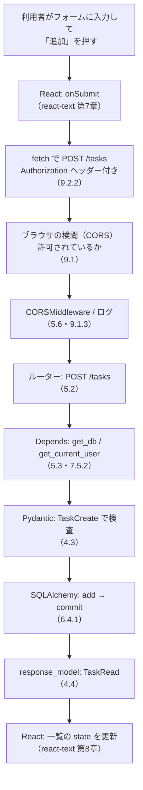
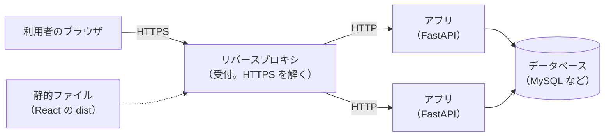
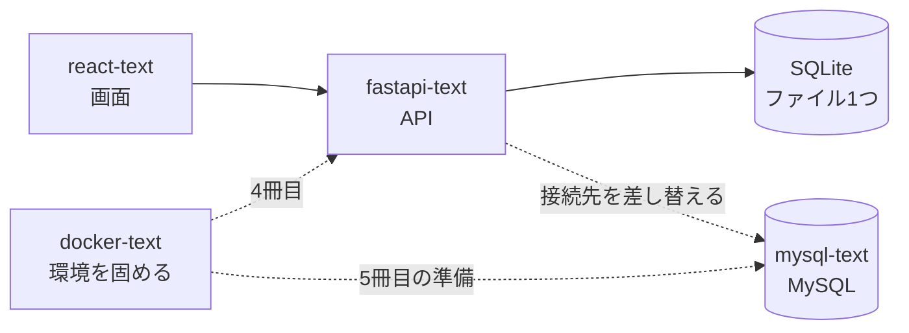

# 第10章 次のステップ

第9章で、**1冊目で作った画面と、この本で作った API が繋がりました。**
タスクはデータベースに残り、ログインした人だけが書き換えられ、
テストを走らせれば壊れていないことも確かめられます。

**この本で教えることは、これで終わりです。**

ただし、いま手元にあるものには、はっきりした限界が1つあります。

**そのアプリは、あなたのパソコンの中でしか動いていません。**

第1章で「1台のパソコンに閉じ込められる限界」を見て、サーバー側を作りました（[1.1.1](./01-web-api.md#111-ここまで作ってきたものの限界)）。
けれども、そのサーバーを動かしているのは、いまも**あなたのパソコン**です。
電源を切れば止まりますし、他人に URL を教えても開けません。

この章では、その先を見ます。

- 3冊分で身についたものを、**チェックリストで確認する**
- 手元で動くものを、他人が使える場所に置く——**デプロイ**の全体像を知る
- 公開する前に**必ず直さなければならない**ところを、自分の手で確認する
- 次の本（Docker）へ進む道筋を決める

新しいライブラリは出てきません。
代わりに、**「動くものを書ける人」から「動かし続けられる形で渡せる人」になるための地図**を扱います。

## この章で学ぶこと

- 3冊分の到達点を、戻る場所つきのチェックリストで確認できるようになる
- ブラウザから届いたリクエストが、どの章で作った部品を通っているかを説明できるようになる
- **デプロイ**が何をする作業なのか、手元と本番で何が変わるのかを説明できるようになる
- 公開する前に確認すべきことを、チェックリストとして自分のプロジェクトに当てられるようになる
- **`/health`（死活監視の窓口）**が必要な理由を説明し、自分で作れるようになる
- 次の本（Docker）が何を解決する道具なのかを説明できるようになる

## この章の前提

- [第9章](./09-practice-connect-react.md) を読み終え、`task-app` と `fastapi-lesson` が
  手元で通しで動くこと
- [第8章](./08-testing.md) のテストが、`pytest` で全部通る状態であること
- [4.6](./04-pydantic.md#46-設定管理) の `.env` と `Settings`、
  [7.4.2](./07-authentication.md#742-トークンを発行する) の `secret_key`

> **つまずいたら**
> この章の 10.1 と 10.3 は、読むだけの節です。手を動かすのは 10.2 と演習だけです。
>
> 演習では、**第9章までに作ったものに窓口を1つ足します。**
> 動かなくなったら、まず「サーバーを起動し直したか」を確かめてください
> （[2.4.3](./02-getting-started.md#243-自動リロード)）。
>
> 詰まったら、次の形で AI に相談してください。
>
> ```text
> fastapi-text の 10.2 を読んでいます。/health を追加したら、次のエラーが出ました。
>
> （エラーの全文を貼る）
>
> ・app/routers/health.py の中身
> ・app/main.py の include_router の部分
> ・ターミナルに出ている最後の5行
> ```

---

## 10.1 ここまでで身についたこと

### 10.1.1 チェックリスト

まず、現在地を確認します。

次の表を上から見て、**「何も見ずに書けるか」**で判断してください。
「読めば思い出せる」は ✅ ではありません。**手が動くかどうか**が基準です。

| # | できること | 判断のしかた | できなければ戻る場所 |
|---|-----------|------------|-------------------|
| 1 | Web API が何かを説明できる | 「HTTP で呼び出せる関数」という言い方を、自分の言葉に直せるか | [1.1.3](./01-web-api.md#113-api-という考え方) |
| 2 | リクエストの部品を挙げられる | メソッド・URL・ヘッダー・ボディの4つを言えるか | [1.2.1](./01-web-api.md#121-リクエストとレスポンスの中身) |
| 3 | ステータスコードを使い分けられる | `200` / `201` / `204` / `401` / `403` / `404` / `422` / `500` の違いを言えるか | [1.2.3](./01-web-api.md#123-ステータスコード)、[4.4.3](./04-pydantic.md#443-ステータスコードを指定する) |
| 4 | JSON を読み書きできる | Python の辞書との対応を、変換なしで説明できるか | [1.3.3](./01-web-api.md#133-python-の辞書との対応) |
| 5 | URL を設計できる | 「動詞を URL に入れない」理由を言えるか | [1.4.2](./01-web-api.md#142-url-の設計) |
| 6 | プロジェクトを一から作れる | `venv` → 有効化 → `pip install` → `requirements.txt` を、調べずに通せるか | [2.2](./02-getting-started.md#22-プロジェクトを作る) |
| 7 | 窓口を1つ作って動かせる | `@app.get` を書いてブラウザで確認するまでを、5分でできるか | [2.3](./02-getting-started.md#23-最初のエンドポイント)、[2.4](./02-getting-started.md#24-開発サーバーを起動する) |
| 8 | `/docs` を使って動作確認できる | ブラウザのアドレスバーを使わずに `POST` を試せるか | [2.5.2](./02-getting-started.md#252-ドキュメントから-api-を実行する) |
| 9 | パスパラメータを受け取れる | `{task_id}` と引数名がずれたときに何が起きるか言えるか | [3.1](./03-parameters.md#31-パスパラメータ) |
| 10 | クエリパラメータを受け取れる | 必須・デフォルト値・省略可（`\| None`）を書き分けられるか | [3.2](./03-parameters.md#32-クエリパラメータ) |
| 11 | 型ヒントの役割を説明できる | 「FastAPI では型ヒントが実際の検査に使われる」と説明できるか | [2.1.1](./02-getting-started.md#211-何を楽にしてくれるのか)、[4.1.2](./04-pydantic.md#412-型ヒントが実際に効く仕組み) |
| 12 | Pydantic のモデルを書ける | `BaseModel` を継承したクラスを、必須・任意を分けて書けるか | [4.2](./04-pydantic.md#42-モデルを定義する) |
| 13 | 入力を検査できる | `Field` で文字数と範囲を制限し、`422` の中身を読めるか | [4.3](./04-pydantic.md#43-バリデーション) |
| 14 | 返す項目を絞れる | `response_model` で、パスワードを返さない形にできるか | [4.4.2](./04-pydantic.md#442-返してはいけない項目を落とす) |
| 15 | 入力用と出力用を分けられる | `Create` / `Update` / `Read` を分ける理由を言えるか | [4.5.1](./04-pydantic.md#451-なぜ分けるのか) |
| 16 | 設定を `.env` から読める | `Settings` に項目を1つ足す手順を、調べずに書けるか | [4.6.2](./04-pydantic.md#462-env-から読み込む) |
| 17 | ファイルを分けられる | 「一緒に変更するかどうか」で分ける、と説明できるか | [5.1.1](./05-project-structure.md#511-どこで分けるべきか) |
| 18 | ルーターを作って登録できる | `APIRouter` を作り、`include_router` で繋げられるか | [5.2](./05-project-structure.md#52-ルーターで分割する) |
| 19 | `Depends` で共通処理を配れる | 「窓口ごとに書かない」形に直せるか | [5.3](./05-project-structure.md#53-依存性注入) |
| 20 | エラーの形を統一できる | `HTTPException` と例外ハンドラの役割の違いを言えるか | [5.4](./05-project-structure.md#54-エラーハンドリング) |
| 21 | ログを出せる | `print` ではなくロガーを使う理由を言えるか | [5.5.1](./05-project-structure.md#551-print-をやめる) |
| 22 | データベースに保存できる | モデルを定義し、`select` で取り出し、`commit` で確定できるか | [6.3](./06-database.md#63-モデルを定義する)、[6.4](./06-database.md#64-crud-を実装する) |
| 23 | セッションを正しく扱える | `Depends(get_db)` で受け取る理由と、`rollback` の役割を言えるか | [6.5](./06-database.md#65-セッション管理) |
| 24 | テーブル定義を変更できる | Alembic でマイグレーションを作って適用できるか | [6.6.3](./06-database.md#663-マイグレーションを作成適用する) |
| 25 | パスワードを安全に保存できる | 「ハッシュ化」「ソルト」を説明し、自作しない理由を言えるか | [7.2](./07-authentication.md#72-パスワードの扱い) |
| 26 | トークンで認証できる | ログイン → トークン → `Authorization` ヘッダーの流れを図に描けるか | [7.4](./07-authentication.md#74-jwt)、[7.5](./07-authentication.md#75-ログインと保護されたエンドポイント) |
| 27 | `401` と `403` を使い分けられる | 「誰か分からない」と「許可がない」の違いを即答できるか | [7.1.1](./07-authentication.md#711-2つの違い) |
| 28 | 秘密鍵の扱い方を説明できる | コードに書いてはいけない理由と、置き場所を言えるか | [7.6.1](./07-authentication.md#761-秘密鍵をコードに書く) |
| 29 | API のテストを書ける | `TestClient` で `200` と `404` の両方を確かめられるか | [8.3](./08-testing.md#83-api-をテストする) |
| 30 | テスト用のデータベースを分けられる | fixture と `dependency_overrides` の役割を言えるか | [8.4](./08-testing.md#84-テスト用のデータベース) |
| 31 | CORS を説明できる | 「サーバーのログは `200` なのにブラウザは失敗」の理由を言えるか | [9.1.2](./09-practice-connect-react.md#912-cors-とは) |
| 32 | フロントとバックを切り分けられる | 不具合を見て、最初に何を確かめるか即答できるか | [9.4.1](./09-practice-connect-react.md#941-フロントとバックのどちらが悪いか切り分ける) |

**全部に ✅ が付く必要はありません。**
この本を1周した直後なら、半分から3分の2くらいで普通です。

大事なのは、**「できない」と気づいた項目に、戻る場所の番号が付いている**ことです。
気になった番号の節に戻り、その項のコードを**もう一度手で打って**ください。
読み返すだけでは、✅ は増えません。

> **補足：優先して埋めたい5つ**
> 全部を埋めようとすると時間がかかります。**次の本に進むうえで効いてくるのは、この5つ**です。
>
> - 6（プロジェクトを一から作れる）——docker-text で何度も作り直します
> - 16（設定を `.env` から読める）——本番と手元の違いは、ほぼここに集まります
> - 22（データベースに保存できる）——mysql-text の前提になります
> - 28（秘密鍵の扱い方）——公開したあとに間違えると、取り返しがつきません
> - 29（API のテストを書ける）——環境を変えたときに、壊れていないことを確かめる手段になります

### 10.1.2 3冊が1本に繋がった

いま手元で動いているものは、**3冊分の成果物がひと続きになったもの**です。

「タスクを1件追加する」という操作が、どこを通っているかを追ってみます。



上から下まで、**すべて自分で書いたもの**です。
Python の文法（python-text）はどの段にも入っていて、
例外の扱い（python-text 第7章）は 5.4 のエラーハンドリングに、
クラスと型ヒント（python-text 第8章・第9章）は 4.2 のモデルと 6.3 のモデルに繋がっています。

とくに注目してほしいのは、**この図のどこが壊れても、症状は「追加できない」の1つ**だという点です。
だからこそ、9.4.1 の切り分けの手順が効きます。
「どこで止まったか」を先に決めてから直す、という順序は、この先どんなアプリでも変わりません。

> **補足：3冊で「作れるもの」の範囲が変わりました**
> 1冊目の終わりに作れたのは、**そのブラウザの中だけで完結するアプリ**でした
> （データは `localStorage`。react-text 10.4.2）。
> いま作れるのは、**複数の人が同じデータを見て、書き換えられるアプリ**です。
> 違いは「データベースを1か所に置き、そこへの入口を HTTP で開いた」ことだけです。

### 10.1.3 自分の実力を確認する

チェックリストの 1〜32 は知識なので、読み返せば埋まります。
**埋まらないのは「作りたいものを、窓口とテーブルに分解する力」**です。これは書いた回数でしか増えません。

練習には、AI に課題を出してもらうのが手軽です。
第0章の 0.2 で準備した AI に、次のように頼んでください。

```text
fastapi-text（プログラミング未経験から始める FastAPI）を1周し終えました。
第9章までの範囲だけで解ける、API の設計課題を3問出してください。

条件:
- 使ってよいのは FastAPI・Pydantic・SQLAlchemy・SQLite・JWT まで
- 非同期処理（async / await）、Redis、外部サービス連携は使わない
- 各問題に「作るもの」「必要なエンドポイントの数」「完成条件」だけを書き、
  答えのコードもエンドポイントの設計も書かない
- 難易度は易しい順に並べる
```

**答えを書かないよう、必ず指定してください。**
指定しないと、AI は親切に完成品を出してきます。それでは練習になりません。

出してもらった課題は、**コードを書く前に次の3つを紙に書き出す**ところから始めてください。
これが、この本で繰り返してきた順序です。

1. **テーブル**（何を保存するか。列と型。6.3）
2. **エンドポイントの一覧**（メソッドと URL の表。1.4.3）
3. **入力用と出力用のモデル**（何を受け取り、何を返さないか。4.5）

この3つが決まっていれば、実装は今までの章の繰り返しになります。
決めずに書き始めると、途中で作り直すことになります。

---

## 10.2 デプロイの概観

### 10.2.1 デプロイとは何か

いま、アプリを動かしているのは**あなたのパソコン**です。

確認してみます。第9章まで、サーバーの起動にはこのコマンドを使ってきました。

**Windows（PowerShell）**

```powershell
fastapi dev app/main.py
```

**macOS / Linux**

```bash
fastapi dev app/main.py
```

そして、ブラウザで開いていた URL は `http://127.0.0.1:8000` でした。
この `127.0.0.1` は、**「このパソコン自身」を指す特別な住所**です（9.1.2）。
つまり、いまの API は**あなたのパソコンからしか呼べません。**

**デプロイ**（作ったものを、動かす場所に配置して公開すること）とは、
このアプリを**ずっと動いているコンピュータの上に移し、外から呼べる住所を与える**作業です。

やることを分解すると、次の4つになります。

| やること | 手元でいうと | 本番でいうと |
|---------|------------|------------|
| 動かす場所を用意する | 自分のパソコン | 借りたサーバー（クラウドのコンピュータ） |
| アプリを置く | プロジェクトのディレクトリ | サーバーの中のディレクトリ |
| 起動しっぱなしにする | ターミナルを開いたまま | 落ちたら自動で起動し直す仕組み |
| 外から呼べるようにする | `127.0.0.1:8000` | `https://例.com` |

**「動かす」だけなら、いまのコマンドでも動きます。**
デプロイが難しいと言われるのは、残りの3つ——**置く・動かし続ける・安全に外へ出す**——のほうです。

### 10.2.2 手元と本番で変わるもの

**本番環境**（実際に利用者が使っているほうの環境。以降「本番」と書きます）では、
次の図の形になることが多くあります。



**リバースプロキシ**（外からの通信をまとめて受け取り、後ろにいるアプリに振り分けるソフト。
建物の受付にあたります）が前に立ち、その後ろでアプリが動きます。
アプリが**2つ以上**あるのは、1つでは処理しきれない量に備えるためです。

手元との違いを、1つずつ見ます。

| 項目 | 手元（第9章まで） | 本番 |
|------|-----------------|------|
| 起動コマンド | `fastapi dev app/main.py` | `fastapi run app/main.py` |
| ファイルを保存したとき | 自動で再起動（2.4.3） | **再起動しない**（勝手に止まると困るため） |
| 待ち受ける住所 | `127.0.0.1`（自分だけ） | `0.0.0.0`（外からも届く） |
| データベース | SQLite（`app.db` というファイル1つ） | MySQL / PostgreSQL（別のコンピュータで動く） |
| 設定の渡し方 | `.env` ファイル | **環境変数**（サーバーの設定画面で入れる） |
| `secret_key` | 手元だけの値 | **本番専用の値**（手元とは別物） |
| CORS の許可先 | `http://localhost:5173`（9.1.3） | 公開した画面の URL |
| 通信 | HTTP | **HTTPS**（暗号化される） |
| ログ | ターミナルに流れる | ファイルや収集サービスに残す（5.5） |
| 落ちたとき | 自分で気づいて起動し直す | **監視して、自動で起動し直す** |

`fastapi run` は、この本で使ってきた `fastapi dev` の**本番向けの兄弟**です。
手元でも実行できるので、表示の違いを見てみます。
`fastapi-lesson` で、仮想環境を有効にした状態で実行してください（2.2.1）。

**Windows（PowerShell）**

```powershell
fastapi run app/main.py
```

**macOS / Linux**

```bash
fastapi run app/main.py
```

```text
実行結果:
 ⚡️ Starting FastAPI in production mode

 🐍 Using import string: app.main:app

 🌐 Server started at http://0.0.0.0:8000
    Documentation at http://0.0.0.0:8000/docs

INFO:     Started server process [2209]
INFO:     Waiting for application startup.
INFO:     Application startup complete.
```

`development mode` ではなく **`production mode`**（本番モード）と出て、
住所が `0.0.0.0` になっています。
自動リロードも無くなります。**止めるときは、`dev` と同じく `Ctrl` + `C` です。**

> **注意**
> `fastapi run` は「本番でも使える起動のしかた」であって、
> **これを実行しただけでは公開されません。**
> `0.0.0.0` は「このコンピュータに届く通信を全部受ける」という意味で、
> 自宅のパソコンで実行しても、インターネットからは届きません。
> 外から届くようにするのは、この後に出てくるサーバーとネットワークの設定です。

**死活監視**（アプリが動いているかどうかを、外から定期的に確認すること）は、
本番で新しく必要になるものの代表です。

本番では、誰かが `Ctrl` + `C` を押さなくても、アプリは落ちます。
データベースが一時的に応答しなくなることもあります。
そこで、**「生きていますか」と聞くためだけの窓口**を用意しておくのが定番の作り方です。

- 呼ばれたら、**アプリが動いていることが分かる短い JSON** を返す
- 認証は不要にする（監視の仕組みはログインできないため）
- URL は `/health`（健康、の意味）にすることが多い

返すステータスコードは2種類だけです。

| 状況 | 返すもの |
|------|---------|
| 動いている | `200` と、`{"status": "ok"}` のような短い JSON |
| 動いていない（データベースが読めない等） | **`503`**（Service Unavailable。いまは使えない、の意味） |

`503` は、1.2.3 の表に出てきた `500` の仲間ですが、意味が違います。
`500` は「こちらのミスで落ちた」、
**`503` は「いま一時的に使えない。あとで試してほしい」**です。
監視の仕組みは、これを見て「アプリを起動し直すべきか」を判断します。

データベースが読めるかどうかを確かめるには、**中身を使わない軽い問い合わせ**を1回投げます。

```python
db.execute(select(Task.id).limit(1))
```

`select` は 6.4.2 で使ったものです。**`.limit(1)` を付けているのは、
全件を読む必要がないから**です。ここで知りたいのは「読めるかどうか」だけです。

読めなかったときは、SQLAlchemy が例外を投げます。
6.5.2 の `IntegrityError`、7.3.1 で出てきた `OperationalError` などがそれです。
**これらをまとめて受け止めたいときは、共通の親である `SQLAlchemyError`**
（SQLAlchemy が投げる例外すべての親。`sqlalchemy.exc` から `import` する）を使います。

```python
from sqlalchemy.exc import SQLAlchemyError
```

python-text 7.5 で「捕まえる例外は、対処を決められるものだけにする」と学びました。
ここでは対処が決まっています——**`503` を返す**、です。

**窓口の中で例外を受け止めて、別のステータスコードで返す形**は、
[7.3.1](./07-authentication.md#731-モデルとエンドポイント) のユーザー登録ですでに書いています。

```python
    try:
        db.commit()
    except IntegrityError:            # ← 受け止める例外
        db.rollback()
        raise DuplicateUserError("名前かメールアドレス")   # ← 別の形で返す
```

**この形の、受け止める例外と返すものを変えたのが `/health` です**（演習 10.4）。
`IntegrityError` を `SQLAlchemyError` に、
`DuplicateUserError` を `HTTPException(status_code=503, ...)` に置き換えます。

> **よくある間違い**
> **`/health` の中で `try` を書かずに `select` を呼ぶ**間違いです。
>
> データベースが読めないと、例外がそのまま外まで出て、
> FastAPI は `500` を返します。
> 監視の仕組みから見ると「アプリのバグで落ちた」に見えてしまい、
> **一時的な不調と、直すべきバグの区別が付かなくなります。**

### 10.2.3 公開する前に必ず確認すること

**この項は、演習 10.2 と演習 10.3 でそのまま使います。**

第7章で「やってはいけないこと」を見ました（7.6）。
デプロイは、**そこで書いた注意が、初めて現実の被害に繋がる場面**です。
手元では誰にも見えなかったものが、公開した瞬間から世界中に見えます。

公開する前に確認することを、表にまとめます。

| # | 確認すること | 放置するとどうなるか | 戻る場所 |
|---|------------|------------------|---------|
| 1 | `secret_key` を**本番専用の値で作り直した** | 手元の鍵が漏れた時点で、本番のトークンも偽造できる | [7.4.2](./07-authentication.md#742-トークンを発行する) |
| 2 | `.env` を**公開する場所に置いていない**（渡すのは `.env.example`） | 鍵もパスワードも、そのまま読まれる | [4.6.3](./04-pydantic.md#463-秘密情報をコードに書かない) |
| 3 | `debug` が `False` である | 内部の情報が、エラー画面から漏れる | [5.5.2](./05-project-structure.md#552-ログレベル) |
| 4 | `cors_origins` が**本番の画面の URL だけ**になっている | どのサイトからでも API を呼ばれる | [9.1.4](./09-practice-connect-react.md#914-本番で--を使わない) |
| 5 | 練習用データ（`app.seed`）を**本番で流していない** | 山田さんのアカウント（パスワード `password123`）が本番に存在する | [6.3](./06-database.md#63-モデルを定義する) |
| 6 | HTTPS で公開している | ログインのパスワードとトークンが、途中で読まれる | [7.6.2](./07-authentication.md#762-トークンをどこに保存するか) |
| 7 | エラーの `detail` に**内部の情報を入れていない** | テーブル名やファイルのパスが利用者に見える | [5.4.3](./05-project-structure.md#543-エラーレスポンスの形式を統一する) |
| 8 | データベースの**バックアップの取り方**を決めた | 消えたら終わり。復旧できない | [6.1.1](./06-database.md#611-サーバーを止めるとデータが消える) |

1 は、7.4.2 で使ったコマンドをもう一度実行するだけです。

**Windows（PowerShell）**

```powershell
python -c "import secrets; print(secrets.token_hex(32))"
```

**macOS / Linux**

```bash
python -c "import secrets; print(secrets.token_hex(32))"
```

```text
実行結果:
7f3c1e0a...（毎回違う64文字が出ます）
```

**出てきた値は、手元の `.env` には書かないでください。**
本番の設定画面に入れるものです。手元と本番で違う鍵を使うことに意味があります。

2 で渡すのは、[4.6.3](./04-pydantic.md#463-秘密情報をコードに書かない) で作った **`.env.example`**（`.env` の見本。秘密の値は伏せたもの）です。
第6章では `DATABASE_URL` を、第7章では `SECRET_KEY` を、
**`.env` と `.env.example` の両方に**足してきました。

ここで確認したいのは、**`.env` と `.env.example` の中身が、いまも揃っているか**です。

`.env.example` は、**放っておくと必ず古くなります。**
設定を1つ足すとき、`.env` は書かないとアプリが動かないので忘れませんが、
`.env.example` は**書かなくても手元では動く**からです。
そして、ズレに気づくのは決まって「別のパソコンで動かそうとしたとき」になります。

確認の手順は決まっています。

1. `app/config.py` の `Settings` を上から読む
2. 項目名を**すべて大文字**にしたものが、`.env` のキーの名前です（4.6.2）
3. その一覧と `.env.example` の中身を、1行ずつ突き合わせる

たとえば `Settings` にログの保存先を足したとすると、書き足す形はこうなります。

`.env.example`（2行追記の例）

```text
# ログの書き出し先。空にすると画面にだけ出る
LOG_FILE=./logs/app.log
```

**秘密ではない値は、そのまま書いてかまいません**（第6章の `DATABASE_URL` がその形です）。
伏せるのは、鍵やパスワードのように**漏れると困る値だけ**です。

1行目のように、**`#` で始まる行はコメント**（プログラムからは無視される説明書き）になります。
4.6.2 で見た書き方の決まりに加えて、これも使えます。
**その値が何なのかを1行添えておく**と、受け取った人が迷いません。

> **注意**
> `.env.example` に、**うっかり本物の秘密の値を書かない**でください。
> 「テスト用だから」と書いた値が、そのまま本番で使われることがあります。
> `SECRET_KEY` は 7.4.2 のとおり、**値ではなく作り方**を書いておくのが安全です。

### 10.2.4 いま無理にデプロイしなくてよい

ここまで読むと、「では、どのサービスに置けばいいのか」が気になるはずです。

置き場所には、大きく3つの選択肢があります。

| 種類 | どういうものか | 手間 |
|------|--------------|------|
| レンタルサーバー / VPS | コンピュータを1台借りて、自分で全部設定する | 多い。Linux の知識が要る |
| PaaS | アプリを渡すと、動かす部分を代わりにやってくれるサービス | 中くらい |
| コンテナ実行サービス | **Docker のイメージ**を渡すと、そのまま動かしてくれるサービス | 中くらい。**次の本の内容が前提** |

**このテキストでは、ここで具体的な手順を出しません。** 理由は2つあります。

1つ目は、**サービスごとに手順も画面も違い、しかも頻繁に変わる**ことです。
書いた手順が数か月で古くなり、そのとおりに進めても詰まる、という形になりがちです。

2つ目のほうが本質的です。
**いまのアプリは、「動かすために必要なもの」が、あなたの頭の中にしかありません。**

- Python のバージョンは 3.11 以上
- 仮想環境を作って、`requirements.txt` の中身を入れる
- `.env` に6つの項目を書く
- Alembic でテーブルを作る
- React 側は Node.js を入れて `npm install` してからビルドする

この一覧を、**サーバーの上でもう一度、手で再現する**のがデプロイです。
どれか1つを忘れると動かず、しかも**手元では再現しない**ので、原因が見えません。

次の本（docker-text）は、まさにこの一覧を**ファイルに書き出して固める**道具を扱います。
順序としては、**先に固めてから置く**ほうが、確実で速くなります。

> **補足：いま公開したい場合**
> 「どうしても今すぐ公開したい」場合、**画面（React）だけなら**
> react-text 11.3.3 の手順でいますぐ公開できます。
> ただし、その画面から呼ぶ API は手元にあるので、**他人が開いてもタスクは表示されません。**
> API を含めた公開は、docker-text を終えてから取り組むことを勧めます。

---

## 10.3 次の本（Docker）へ

### 10.3.1 2つのサーバーを毎回起動するつらさ

第9章から、アプリを動かすたびに、こうしているはずです。

```text
ターミナル1: cd fastapi-lesson → 仮想環境を有効化 → fastapi dev app/main.py
ターミナル2: cd task-app → npm run dev
```

これは、**慣れれば30秒の作業**です。問題は、この作業が
「あなたのパソコンには、すでに全部入っている」ことを前提にしている点にあります。

**このアプリを、友人のパソコンで動かしてもらう**場面を考えてみてください。
必要なものを並べると、こうなります。

| 要るもの | どの本で入れたか | 忘れたときの症状 |
|---------|---------------|----------------|
| Node.js | react-text 第1章 | `npm : 用語 ... として認識されません` |
| Python 3.11 以上 | python-text 第1章 | `python` が見つからない／古いと型ヒントで落ちる |
| 仮想環境（`.venv`） | [2.2.1](./02-getting-started.md#221-ディレクトリと仮想環境) | `ModuleNotFoundError: No module named 'fastapi'` |
| `requirements.txt` の中身 | [2.2.2](./02-getting-started.md#222-インストールする) | 同上 |
| `.env`（6項目） | [4.6.2](./04-pydantic.md#462-env-から読み込む)、[7.4.2](./07-authentication.md#742-トークンを発行する) | 起動した瞬間に `secret_key: Field required` |
| テーブル（Alembic） | [6.6.3](./06-database.md#663-マイグレーションを作成適用する) | `no such table: tasks` |
| `npm install` した `node_modules` | react-text 第6章 | `vite : 用語 ... として認識されません` |
| 起動の順番（API を先に） | [9.3.1](./09-practice-connect-react.md#931-2つのサーバーを同時に起動する) | 画面は出るが、一覧が空でエラー表示 |

**8個あります。** そして、これは頭の中にしかありません。

だから、まずやるべきことは決まっています。**手順書を書くことです。**

たとえば、React 側（`task-app`）の手順書は、こう書けます。

`task-app/README.md`

````markdown
# task-app

FastAPI の API（`fastapi-lesson`）と繋がる、タスク管理の画面です。

## 必要なもの

- Node.js v22（`node --version` で確認）

## 動かし方

1. 依存をインストールする（初回だけ）

   ```bash
   npm install
   ```

2. API のサーバーを先に起動する（`fastapi-lesson` の README.md を参照）

3. 開発サーバーを起動する

   ```bash
   npm run dev
   ```

4. ブラウザで http://localhost:5173 を開く

## 確認

- 一覧に3件のタスクが表示されれば成功
- 一覧が空でエラーが出る場合は、API が起動しているかを確認する
````

ポイントは3つです。

- **「必要なもの」と「動かし方」を分けている。** 前者は1回、後者は毎回やることです
- **コマンドをコピペできる形で書いている。** 説明文の中に埋め込まない
- **最後に「どうなれば成功か」を書いている。** これが無いと、読んだ人は成功を判断できません

この手順書があれば、**他人に渡せます。** ただし、渡した相手は結局、
自分のパソコンに Node.js を入れ、`npm install` を実行することになります。
**手順書は、作業を無くしません。書き出しただけです。**

### 10.3.2 Docker で解決できること

次の本（[docker-text](../docker-text/README.md)）が扱う **Docker** は、
この手順書を**そのまま実行できるファイル**に変える道具です。

いま頭の中にある8個は、Docker では次のように置き換わります。

| いまの形 | Docker での形 |
|---------|-------------|
| 「Python 3.11 を入れてください」 | 土台のイメージ（設計図）に `python:3.11` と書く |
| 「`pip install -r requirements.txt` を実行」 | 設計図の中に、その1行を書いておく |
| 「`.env` に4項目を書いて」 | 設定ファイルにまとめて書く |
| 「ターミナルを2つ開いて、順番に起動」 | **コマンド1つで両方が起動する** |
| 「MySQL を入れて、初期設定して……」 | 設計図に1行足すだけで、その場に用意される |

結果として、渡す相手にお願いすることは、**「Docker を入れて、コマンドを1つ実行して」**だけになります。

そして、この差が効いてくる場面が、もう1つあります。**5冊目（mysql-text）**です。

この本では、データベースに SQLite を使いました。ファイル1つで済み、
インストールが不要だったからです（[6.1.2](./06-database.md#612-このテキストでの進め方sqlite--mysql)）。
本番で使われることが多い MySQL は、**それ自体を1つのサーバーとして動かす**必要があります。
Docker があれば、その用意が数行で終わります。



**次の本を読み終えると、この本で作った API の接続先を、
SQLite から MySQL に差し替えられるようになります。**
そのとき変わるのは、`.env` の `DATABASE_URL` の1行だけです。
6.2.2 で「接続先を文字列で決めている」形にしておいたのは、このためでした。

> **補足：なぜ Docker が4冊目なのか**
> Docker を最初に学ぶと、「便利そうだけれど、何が嬉しいのか分からない」で終わります。
> **3回の環境構築で詰まったあと**——Node.js の PATH、Python の仮想環境、
> `pip install` の失敗を経験したあと——だからこそ、価値が分かります。
> いま感じている「毎回2つ起動するのが面倒」という感覚が、次の本の入口です。

---

## まとめ

- いま作ったアプリは、**あなたのパソコンの中でしか動いていない**（10.2.1）
- **デプロイ**は「置く・動かし続ける・安全に外へ出す」の3つ。動かすだけなら難しくない（10.2.1）
- 本番では `fastapi dev` ではなく **`fastapi run`** を使う。自動リロードは無くなる（10.2.2）
- 手元と本番で変わるのは、**起動コマンド・データベース・設定の渡し方・CORS・HTTPS**（10.2.2）
- **死活監視**のために `/health` を用意する。認証は不要にする（10.2.2）
- 生きていれば `200`、データベースが読めなければ **`503`**（一時的に使えない）を返す（10.2.2）
- `503` と `500` は違う。**`500` はバグ、`503` は一時的な不調**（10.2.2）
- SQLAlchemy の例外をまとめて受け止めるときは **`SQLAlchemyError`** を使う（10.2.2）
- 公開前に確認するのは8項目。**鍵の作り直し・`.env` を出さない・CORS・練習用データ**（10.2.3）
- 渡すのは `.env` ではなく `.env.example`。**放っておくと必ず古くなる**ので突き合わせる（10.2.3）
- **置き場所の手順は書かない。** 先に環境を固めてから置くほうが確実（10.2.4）
- アプリを他人に渡すために要るものは、数えると **8個**あり、頭の中にしかない（10.3.1）
- 手順書は「必要なもの」と「動かし方」を分け、**最後に成功の判断基準**を書く（10.3.1）
- **手順書は作業を無くさない。書き出しただけ。** それを実行可能にするのが Docker（10.3.2）
- 次の本を終えると、`.env` の1行で SQLite を MySQL に差し替えられる（10.3.2）

---

## 理解度チェック

**問 10.1**（穴埋め）

手元では（　①　）というコマンドでサーバーを起動していたが、本番では（　②　）を使う。
本番では自動リロードが（　③　）。
また、手元では `127.0.0.1` で待ち受けていたが、本番では（　④　）で待ち受ける。

**問 10.2**（選択）

`/health` に認証を付けてはいけない理由として、最も適切なものを1つ選んでください。

1. 認証を付けると、レスポンスが遅くなるため
2. 監視の仕組みはログインできず、認証を付けると常に `401` になるため
3. `/health` は誰でも呼べたほうが、利用者に親切だから
4. 認証を付けると、`503` を返せなくなるため

**問 10.3**（選択）

データベースが一時的に応答しなくなったとき、`/health` が返すべきものを1つ選んでください。

1. `200` と `{"status": "ok"}`
2. `404`
3. `500`
4. `503`

**問 10.4**（記述）

`.env` そのものを渡さず、`.env.example` を渡すのはなぜですか。1〜2行で書いてください。

**問 10.5**（記述）

手元の `secret_key` を、本番でもそのまま使ってはいけないのはなぜですか。1〜2行で書いてください。

**問 10.6**（記述）

10.3.1 で「手順書は作業を無くさない」と書きました。これはどういう意味ですか。1〜2行で書いてください。

**問 10.7**（記述）

本番の設定で `cors_origins` に `["*"]` を指定してはいけないのはなぜですか。
9.1.4 の内容を思い出して、1〜2行で書いてください。

---

## 演習問題

この章の演習は、**`fastapi-lesson`** を触ります。
第9章までのコードが動く状態から始めてください。

演習 10.1 と 10.4 は、**同じ `app/routers/health.py` を育てていく形**になっています。
10.1 を終えてから 10.4 に進んでください。

---

### 演習 10.1 ★☆☆ `/health` を作る

**課題**

死活監視のための窓口 `/health` を作ってください（10.2.2）。

- `app/routers/health.py` を新しく作り、`APIRouter` を1つ置く（5.2.1）
- `GET /health` が `{"status": "ok"}` を返すようにする
- `app/main.py` で `include_router` して登録する（5.2.2）
- `tests/test_health.py` を作り、**`200` と、返る JSON の中身**をテストする（8.3.2）

**完成条件**

- ブラウザで `http://127.0.0.1:8000/health` を開くと `{"status":"ok"}` と表示される
- `/docs` に **`health`** という見出しができ、その中に `GET /health` がある
- `pytest` を実行すると、新しく書いたテストを含めて**全部通る**
- ログインしていない状態でも `/health` が呼べる（トークンを付けなくても `200`）

**ヒント**

`app/routers/misc.py`（5.2.3）が、いちばん近い形をしています。
`prefix` は要りません（`/health` に共通の頭が無いため）。
テストは、8.3.2 で書いた「一覧を取得するテスト」と同じ形になります。

---

### 演習 10.2 ★☆☆ `.env.example` の抜けを見つけて直す

**課題**

`fastapi-lesson/.env.example` を、**いまの `Settings` に合った状態**に更新してください（10.2.3）。

- `app/config.py` の `Settings` の項目を、上から順に書き出す
- 項目名をすべて大文字にしたものと、`.env.example` の中身を突き合わせる
- **足りない行を書き足す**（秘密ではない値は、そのまま書いてよい）
- それぞれの行に、**`#` で始まるコメント**を1行添えて「何を入れるか」を書く
  （`.env` 系のファイルでは、`#` で始まる行がコメントになります）

**完成条件**

- `Settings` の項目が、**1つ残らず** `.env.example` に並んでいる（6つあります）
- **第9章で `.env` に足したものが、`.env.example` にも入っている**
- 本物の `SECRET_KEY` の値が、どこにも書かれていない
- `SECRET_KEY` の行に、値の作り方（7.4.2 のコマンド）への案内がある
- `.env` を一時的に別の名前に変えて `fastapi dev app/main.py` を実行すると、
  `secret_key` が無いというエラーで**起動に失敗する**（確認したら名前を戻す）

**ヒント**

10.2.3 の「確認の手順」の3ステップを、そのまま実行してください。
`.env` と `.env.example` を並べて開くと、差が見つけやすくなります。
最後の確認は、7.4.2 で見た「デフォルト値の無い項目は、書き忘れると起動時に落ちる」の再現です。

---

### 演習 10.3 ★★☆ `fastapi-lesson` の手順書を書く

**課題**

`fastapi-lesson/README.md` を作り、**このプロジェクトを他人が動かせる手順書**を書いてください。
10.3.1 の `task-app/README.md` が見本です。

書くこと：

- **必要なもの**（Python のバージョンなど。10.3.1 の表を参照）
- **動かし方**（仮想環境の作成 → 有効化 → インストール → `.env` の用意 → テーブルの作成 → 起動）
- **確認のしかた**（どうなれば成功か）
- **テストの実行方法**

**完成条件**

- 手順が**番号付きで並んでいて**、コマンドがコピペできる形になっている
- 仮想環境の有効化が、**Windows と macOS の両方**書かれている（2.2.1）
- `.env` の用意が、**演習 10.2 の `.env.example` を使う形**で書かれている
- Alembic でテーブルを作る手順が入っている（6.6.3）
- 最後に「一覧を開いて `{"count": 0, "tasks": []}` が返れば成功」のような、
  **成功の判断基準**が書かれている
- **自分で通しで実行して確かめた。** 確かめ方は次のとおり
  1. `fastapi-lesson` を別の場所にコピーする
  2. コピーしたほうから `.venv` と `app.db` を**削除する**
  3. 書いた手順書だけを見て、最後まで進める（元のディレクトリは触らない）

**ヒント**

10.3.1 の見本の3つのポイント（「必要なもの」と「動かし方」を分ける／コピペできる形にする／
成功の判断基準を書く）を、そのまま当てはめてください。
仮想環境の作り方は 2.2.1、インストールは 2.2.2、テーブルの作成は 6.6.3 にあります。
**詰まった箇所が、手順書に足りなかったところです。** 見つけたらその場で書き足してください。

---

### 演習 10.4 ★★☆ `/health` でデータベースも確認する

**課題**

演習 10.1 の `/health` を育てて、**データベースが読めることまで確認する**形にしてください（10.2.2）。

- `Depends(get_db)` でセッションを受け取る（6.5.1）
- 中身を使わない軽い問い合わせを1回だけ投げる（10.2.2 の `select(Task.id).limit(1)`）
- 読めたら `{"status": "ok", "database": "ok"}` を返す
- 読めなければ `SQLAlchemyError` を受け止めて、**`503`** を返す（5.4.1 の `HTTPException`）
- テストを2件書く。**読めるとき（`200`）と、読めないとき（`503`）**の両方

読めない状態は、`tests/conftest.py` に fixture を1つ足して作ります。
`db` fixture が作ったテーブルを消してから `client` を返す fixture です（8.4.2）。

**完成条件**

- `/health` が `{"status":"ok","database":"ok"}` を返す
- テーブルが無い状態で `/health` を呼ぶと、**`503`** が返る
- `503` のときのレスポンスが、**5.4.3 の形**（`{"error": {"status": 503, ...}}`）になっている
- `pytest` を実行すると、テスト2件を含めて**全部通る**
- `try` の中に書いたのが**問い合わせ1行だけ**である（返す処理まで囲んでいない）

**ヒント**

例外の名前は 10.2.2 に書いてあります。`import` 元は `sqlalchemy.exc` です。
`503` を返す書き方は、5.4.1 の `HTTPException` と同じ形で、数字を変えるだけです。
レスポンスが 5.4.3 の形になるのは、`app/main.py` の例外ハンドラが変換してくれるからです
（自分で `{"error": ...}` を組み立てる必要はありません）。
テスト用の fixture は、8.4.2 の `db` fixture の中で使った `Base.metadata.drop_all` が使えます。

---

解答は [解答編 その2](./91-answers-part2.md#第10章) にあります。
**必ず自分で手を動かしてから**見てください。

---

## 次の章へ

**この本は、ここで終わりです。**

3冊を通して、あなたは次のことができるようになりました。

- ブラウザの中だけで動く画面を作る（1冊目）
- Python で、値を受け取って値を返す処理を書く（2冊目）
- その処理を **HTTP の窓口として公開し、データを永続化し、認証をかけ、テストする**（3冊目）

そして最後に、**それを動かすために必要なものが8個ある**ことを数えました（10.3.1）。
この8個は、いまのところ、あなたの頭の中と、書き始めたばかりの手順書の中にしかありません。

次の本では、これを**ファイルに書き出して、コマンド1つで再現できる形**に変えます。
「自分の環境では動く」という言葉が要らなくなるところまで進みます。

→ [プログラミング未経験から始める Docker](../docker-text/README.md)

前の章に戻る場合はこちら → [第9章 実践：React と繋ぐ](./09-practice-connect-react.md)
