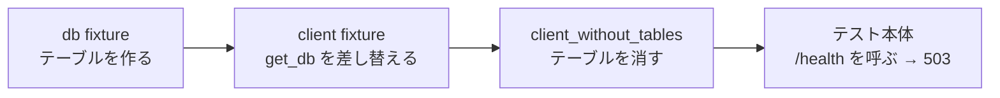

# 解答編 その2（第6章〜第10章）

**先に自分で解いてから読んでください。**

解けなかった問題は、この解答を読んだあと、
**何も見ずにもう一度自分で書き直して**ください。それで定着します。

API の演習は、**動かして確かめるまでが1問**です。
解答のコードを読んで納得しても、自分のターミナルで同じ結果が出るところまで進めてください。

第1章〜第5章の解答は [解答編 その1](./90-answers-part1.md) にあります。

> **解答を読んでも納得できないとき**
> AI に次のように聞いてください。
>
> ```text
> fastapi-text の演習 6.2 の解答を読みましたが、
> update_note に db.add(note) を書かなくても保存される理由が納得できません。
> ```

---

## 第6章

### 理解度チェック

**問 6.1 の解答**

- ① エンジン（`engine`）
- ② セッション（`Session` / `SessionLocal()` で作るもの）
- ③ `commit`（`db.commit()`）

**解説**

3つの役割は、作る個数で覚えると混ざりません（6.2.3）。

| 部品 | いくつ | 作る場所 |
|------|-------|---------|
| エンジン | アプリ全体で1つ | `app/database.py` |
| セッション | 1リクエストにつき1つ | `get_db`（`app/dependencies.py`） |
| `Base` | アプリ全体で1つ | `app/database.py` |

`db.add(...)` は「保存したいと申し出る」だけで、
**書き込みを決めるのは `db.commit()`** です（6.4.1・6.5.2）。

---

**問 6.2 の解答**

**2. `db.commit()` を書いていない**

**解説**

`db.add(task)` だけでも、レスポンスは `201` で返ります。
`task` オブジェクトは Python の中に存在しているので、`response_model` の検査も通ります。
**それでいて、データベースには何も書かれていません。**

セッションが閉じるとき、確定していない変更は捨てられます（6.5.2）。
だから次の `GET /tasks` には出てきません。

他の選択肢が違う理由も確かめておいてください。

| 選択肢 | もしそうなら |
|-------|------------|
| 1. `response_model` の指定違い | `500` になる（4.4.1）。`201` は返らない |
| 3. `app.db` が無い | `no such table: tasks` で `500` になる |
| 4. `from_attributes=True` 忘れ | `Input should be a valid dictionary` で `500` になる（6.3.3） |

**「`201` は返るのに残らない」は、`commit` 忘れのほぼ一択**です。

---

**問 6.3 の解答**

**2. `create_all` は、すでにあるテーブルには列を足さないから**

**解説**

`Base.metadata.create_all(...)` は「**まだ無いテーブルを作る**」だけのメソッドです（6.3.2）。
`tasks` テーブルはすでにあるので、何もせずに終わります。
**エラーも警告も出ません。** ここが厄介なところです。

Python 側のクラスには新しい列があり、データベース側のテーブルには無い、
という食い違いが残り、実際に読み書きしたときに `no such column` になります。

これを解決するのがマイグレーションです（6.6）。

---

**問 6.4 の解答**

- `TaskRead`（`app/schemas.py`）：**外に返すデータの形**を決める。宣言に無い項目は返らない
- `Task`（`app/models.py`）：**データベースに保存する形**を決める。列の型と制約を決める

**解説**

同じ「タスク」を扱いますが、**目的が違うので項目も違います**（6.3.3）。

| | `Task`（モデル） | `TaskRead`（スキーマ） |
|---|---|---|
| `owner_email` | **持つ**（保存はする） | **持たない**（返さない） |
| `id` | 主キーとして持つ | 返す項目として持つ |
| 変えたときの影響 | **テーブルの形が変わる**（マイグレーションが要る） | `/docs` とレスポンスが変わるだけ |

1つにまとめたくなりますが、まとめると
**「保存はしたいが返したくない項目」が置けなくなります**（4.4.2）。

---

**問 6.5 の解答**

`len(found)` は切り出したあとの件数なので、
**`limit` で指定した数より大きくなりません。**
呼ぶ側は「全部で何件あるのか」「次のページがあるのか」を判断できなくなります。

**解説**

`?skip=0&limit=10` のとき、実際に 42 件あっても `count` は `10` になります。
画面には「全 10 件」と出て、11 件目以降があることが誰にも分かりません。

そのため、`count` は **`skip` / `limit` で切り出す前**に数えます（6.4.5）。

```python
count = db.scalar(select(func.count()).select_from(statement.subquery()))
statement = statement.order_by(Task.id).offset(params["skip"]).limit(params["limit"])
```

数える対象は「絞り込みまで済ませた `statement`」です。
`where` を適用する前に数えると、今度は**絞り込みを無視した全件数**になってしまいます。

---

**問 6.6 の解答**

**例外が起きたとき**に問題が起きます。
`yield` の続きに書いた `db.close()` に到達せず、セッションが閉じられないまま残ります。

**解説**

`get_task_or_404` が `404` を投げると、そこで処理が中断されます（6.5.3）。
`try` / `finally` にしておけば、`404` でも `500` でも `finally` は必ず通ります。

厄介なのは、**すぐには症状が出ないこと**です。
開発中の数十リクエストでは何も起きず、しばらく動かしてから
`database is locked` や「急に応答しない」という形で出てきます。

だから `try` / `finally` は、「例外が出そうだから」ではなく
**最初から必ず**書きます。

---

**問 6.7 の解答**

Alembic が差分を取り違えることがあるためです。
たとえば**列の名前を変えた**とき、「古い列を削除して新しい列を追加する」と書かれることがあり、
そのまま適用すると**その列のデータが消えます**。

**解説**

`--autogenerate` は、モデルとデータベースを見比べて差分を書き出します。
しかし Alembic には「名前を変えた」のか「消して足した」のかを区別する手段がありません（6.6.3）。

生成されたファイルに

```text
# ### commands auto generated by Alembic - please adjust! ###
```

（自動生成しました。調整してください）と書かれているのは、この確認を促すためです。

**`upgrade()` と `downgrade()` が対になっているか**も、あわせて確認してください。
片方だけだと、あとで戻せません。

---

### 演習

### 演習 6.1 の解答

`app/models.py`（末尾に追記）

```python
class Note(Base):
    """notes テーブルの1行。"""

    __tablename__ = "notes"

    id: Mapped[int] = mapped_column(primary_key=True)
    text: Mapped[str] = mapped_column(String(100))
    pinned: Mapped[bool] = mapped_column(default=False)
    author_name: Mapped[str] = mapped_column(String(20))
    author_email: Mapped[str] = mapped_column(String(100))

    @property
    def author(self) -> dict:
        """schemas.AuthorRead に渡すための形に組み立てる。"""
        return {"name": self.author_name, "email": self.author_email}
```

`app/schemas.py`（`NoteRead` に1行足す）

```diff
  class NoteRead(BaseModel):
+     model_config = ConfigDict(from_attributes=True)
+ 
      id: int
      text: str
      pinned: bool
      author: AuthorRead
```

`app/seed.py`（ファイル全体。タスクとメモを別々に判定する形にする）

```python
"""練習用のデータをデータベースに入れる。

python -m app.seed で実行する。
"""

from sqlalchemy import select

from app.database import SessionLocal
from app.models import Note, Task


def initial_tasks() -> list[Task]:
    """最初に入れておくタスクを組み立てて返す。"""
    return [
        Task(title="牛乳を買う", done=False,
             owner_name="山田", owner_email="yamada@example.com"),
        Task(title="レポートを書く", done=True,
             owner_name="鈴木", owner_email="suzuki@example.com"),
        Task(title="部屋を片づける", done=False,
             owner_name="山田", owner_email="yamada@example.com"),
    ]


def initial_notes() -> list[Note]:
    """最初に入れておくメモを組み立てて返す。"""
    return [
        Note(text="会議は水曜に変更", pinned=False,
             author_name="山田", author_email="yamada@example.com"),
    ]


def main() -> None:
    db = SessionLocal()
    try:
        if db.scalar(select(Task)) is None:
            tasks = initial_tasks()
            for task in tasks:
                db.add(task)
            db.commit()
            print(f"{len(tasks)} 件のタスクを登録しました。")
        else:
            print("タスクはすでに入っているので、何もしませんでした。")

        if db.scalar(select(Note)) is None:
            notes = initial_notes()
            for note in notes:
                db.add(note)
            db.commit()
            print(f"{len(notes)} 件のメモを登録しました。")
        else:
            print("メモはすでに入っているので、何もしませんでした。")
    finally:
        db.close()


if __name__ == "__main__":
    main()
```

マイグレーションを作って適用します。**`fastapi-lesson` で**実行してください。

**Windows（PowerShell）**

```powershell
alembic revision --autogenerate -m "create notes table"
alembic upgrade head
python -m app.seed
```

**macOS / Linux**

```bash
alembic revision --autogenerate -m "create notes table"
alembic upgrade head
python -m app.seed
```

```text
INFO  [alembic.autogenerate.compare] Detected added table 'notes'
Generating .../migrations/versions/e17b3ddf77ed_create_notes_table.py ...  done
```

```text
INFO  [alembic.runtime.migration] Running upgrade 80daba50699c -> e17b3ddf77ed, create notes table
```

```text
タスクはすでに入っているので、何もしませんでした。
1 件のメモを登録しました。
```

もう一度 `python -m app.seed` を実行すると、こうなります。

```text
タスクはすでに入っているので、何もしませんでした。
メモはすでに入っているので、何もしませんでした。
```

**解説**

`Note` の書き方は `Task`（6.3.1・6.3.2）とまったく同じ形です。
対応を確認してください。

| 要求 | 書いたもの | 参照 |
|------|-----------|------|
| 整数の主キー | `Mapped[int] = mapped_column(primary_key=True)` | 6.3.2 |
| 最大 100 文字 | `mapped_column(String(100))` | 6.3.2 |
| 空にできない | **`\| None` を書かない** | 6.3.2 |
| 指定しなければ `False` | `mapped_column(default=False)` | 6.3.2 |
| 入れ子の `author` を組み立てる | `@property` | 6.3.3 |

**`app/seed.py` の形を変えた理由**を説明します。
元の形は「タスクが1件でもあれば、そこで `return` する」という作りでした。

```python
        if db.scalar(select(Task)) is not None:
            print("すでにデータが入っているので、何もしませんでした。")
            return              # ← ここでメモの処理まで飛ばされる
```

このままメモの処理を下に足すと、**タスクが入っている限りメモが入りません。**
そこで「タスクの判定」と「メモの判定」を、独立した2つの `if` に分けました。

`alembic upgrade head` でタスクのデータが消えないのは、
`upgrade()` の中身が `op.create_table('notes', ...)` **だけ**だからです。
生成されたファイルを開いて、`tasks` に触る行が無いことを必ず確認してください（6.6.3）。

> **よくある間違い**
> **`NoteRead` に `from_attributes=True` を書き忘れる**間違いです。
> 演習 6.1 の時点では窓口をまだ書き換えていないので、**気づきません。**
> 演習 6.2 で窓口を書き換えた瞬間に、こうなります。
>
> ```text
> Input should be a valid dictionary or instance of NoteRead
> ```
>
> `500` が出たら、まず `model_config = ConfigDict(from_attributes=True)` を探してください（6.3.3）。

> **補足：`alembic revision` で `Detected added table` が出ないとき**
> `migrations/env.py` の `from app.models import Task` は、
> **`Task` しか読み込んでいません。**
> `Note` を同じファイル（`app/models.py`）に書いたのであれば、
> その `import` で `Note` も一緒に読み込まれるので追加は不要です。
> 別のファイルに書いた場合は、`env.py` にその `import` を足してください（6.6.2）。

---

### 演習 6.2 の解答

`app/dependencies.py`（`get_note_or_404` を差し替え）

```python
def get_note_or_404(
    note_id: int = Path(ge=1),
    db: Session = Depends(get_db),
) -> Note:
    """id でメモを探す。見つからなければ 404 で止める。"""
    note = db.get(Note, note_id)
    if note is None:
        raise HTTPException(
            status_code=404,
            detail=f"id {note_id} のメモは見つかりませんでした",
        )
    return note
```

```diff
- from app.data import notes, tasks
- from app.models import Task
+ from app.models import Note, Task
```

`app/routers/notes.py`（4つの窓口）

```python
@router.get("/{note_id}", response_model=NoteRead)
def read_note(note: Note = Depends(get_note_or_404)):
    return note


@router.post("", response_model=NoteRead, status_code=201)
def create_note(new_note: NoteCreate, db: Session = Depends(get_db)):
    found = db.scalar(select(Note).where(Note.text == new_note.text))
    if found is not None:
        raise DuplicateNoteError(new_note.text)

    note = Note(
        text=new_note.text,
        pinned=new_note.pinned,
        author_name=new_note.author.name,
        author_email=new_note.author.email,
    )
    db.add(note)
    db.commit()
    db.refresh(note)
    logger.info("メモを登録しました id=%s text=%s", note.id, note.text[:10])
    return note


@router.patch("/{note_id}", response_model=NoteRead)
def update_note(
    new_note: NoteUpdate,
    note: Note = Depends(get_note_or_404),
    db: Session = Depends(get_db),
):
    changes = new_note.model_dump(exclude_unset=True)
    for key, value in changes.items():
        setattr(note, key, value)
    db.commit()
    db.refresh(note)
    logger.info("メモを更新しました id=%s 変更=%s", note.id, list(changes))
    return note


@router.delete("/{note_id}", status_code=204)
def delete_note(note: Note = Depends(get_note_or_404), db: Session = Depends(get_db)):
    # commit のあとは、消したオブジェクトの属性を読めない（6.4.4）
    note_id = note.id
    db.delete(note)
    db.commit()
    logger.info("メモを削除しました id=%s", note_id)
    return None
```

`GET /notes/info` も、件数をデータベースから数える形にします。

```python
@router.get("/info")
def read_notes_info(db: Session = Depends(get_db)):
    return {
        "title": settings.notes_title,
        "max": settings.notes_max,
        "count": db.scalar(select(func.count()).select_from(Note)),
    }
```

```diff
  from fastapi import APIRouter, Depends
+ from sqlalchemy import func, select
+ from sqlalchemy.orm import Session
  
  from app.config import settings
- from app.data import notes
- from app.dependencies import get_note_or_404
+ from app.dependencies import get_db, get_note_or_404
  from app.errors import DuplicateNoteError
+ from app.models import Note
  from app.schemas import NoteCreate, NoteListResponse, NoteRead, NoteUpdate
```

最後に、`app/data.py` から `notes` を削除します。
タスクの `tasks` も 6.4.2 で使わなくなっているので、**このファイル自体を削除して構いません。**

動かした結果です。

`POST /notes`（`{"text": "牛乳を買う", "author": {"name": "山田", "email": "yamada@example.com"}}`）

```json
{"id":2,"text":"牛乳を買う","pinned":false,"author":{"name":"山田"}}
```

同じ `text` でもう一度 `POST /notes`

```json
{"error":{"status":409,"message":"「牛乳を買う」と同じ本文のメモが、すでにあります","detail":null}}
```

`GET /notes/99`

```json
{"error":{"status":404,"message":"id 99 のメモは見つかりませんでした","detail":null}}
```

`DELETE /notes/2`（1回目 → 2回目）

```text
204
404
```

**解説**

対応関係は、タスク側とそのまま1対1です。

| メモ側 | タスク側 | 参照 |
|-------|---------|------|
| `get_note_or_404` の `db.get(Note, note_id)` | `db.get(Task, task_id)` | 6.4.2 |
| `create_note` の `add` → `commit` → `refresh` | `create_task` | 6.4.1 |
| `update_note` の `setattr` → `commit` | `update_task` | 6.4.3 |
| `delete_note` の `delete` → `commit` | `delete_task` | 6.4.4 |
| 重複チェックの `select(...).where(...)` | `code` の重複チェック | 6.4.1 |

**`update_note` に `db.add(note)` が無い**ことに注目してください。
`get_note_or_404` がセッションから取り出したオブジェクトなので、
セッションが変更を追跡しています。`commit` するだけで書き込まれます（6.4.3）。

**`delete_note` で `note_id` を先に変数へ取っている**のも大事な点です。
`db.commit()` のあとに `note.text` などを読むと
`Instance ... has been deleted` になります（6.4.4）。
`id` だけは読めますが、**先に取っておくほうが安全**です。

> **よくある間違い**
> **`db.refresh(note)` を書き忘れる**間違いです。
>
> ```json
> {"error":{"status":500,...}}
> ```
>
> サーバーのターミナルには `ResponseValidationError` が出て、
> `loc` が `["response","id"]`、`msg` が `Input should be a valid integer` になります。
> `id` はデータベース側で振られる値なので、**`refresh` で読み直すまで `None`** です（6.4.1）。
> `loc` の1つ目が `response` なら自分のコードが原因、という 4.4.1 の見分け方がそのまま使えます。

> **別解：重複チェックを `IntegrityError` に任せる**
> `Note` の `text` に `unique=True` を付ければ、事前の `select` を省けます。
>
> ```python
>     text: Mapped[str] = mapped_column(String(100), unique=True)
> ```
>
> ```python
>     db.add(note)
>     try:
>         db.commit()
>     except IntegrityError:
>         db.rollback()
>         raise DuplicateNoteError(new_note.text)
> ```
>
> ただし、この変更には**マイグレーションが1本必要**です（制約もテーブルの形の一部です）。
> また、`rollback` を忘れると次の `commit` が `PendingRollbackError` になります（6.5.2）。

---

### 演習 6.3 の解答

`app/dependencies.py`（末尾に追記）

```python
def note_list_params(
    pinned: bool | None = None,
    keyword: str | None = Query(default=None, min_length=1, max_length=20),
    skip: int = Query(default=0, ge=0),
    limit: int = Query(default=10, ge=1, le=100),
) -> dict:
    """メモの一覧を絞り込むための、共通のクエリパラメータ。"""
    return {"pinned": pinned, "keyword": keyword, "skip": skip, "limit": limit}
```

`app/routers/notes.py`（`read_notes` を差し替え）

```python
@router.get("", response_model=NoteListResponse)
def read_notes(
    params: dict = Depends(note_list_params),
    db: Session = Depends(get_db),
):
    statement = select(Note)
    if params["pinned"] is not None:
        statement = statement.where(Note.pinned == params["pinned"])
    if params["keyword"] is not None:
        statement = statement.where(Note.text.contains(params["keyword"]))

    # 絞り込んだ「全体の件数」を、切り出す前に数える
    count = db.scalar(select(func.count()).select_from(statement.subquery()))
    logger.debug("メモの一覧 条件=%s 該当=%s件", params, count)

    statement = statement.order_by(Note.id).offset(params["skip"]).limit(params["limit"])
    found = db.scalars(statement).all()
    return {"count": count, "notes": found}
```

```diff
- from app.dependencies import get_db, get_note_or_404
+ from app.dependencies import get_db, get_note_or_404, note_list_params
```

メモを5件登録した状態での結果です。

`GET /notes?skip=0&limit=2`

```json
{"count":5,"notes":[{"id":1,"text":"会議は水曜に変更","pinned":false,"author":{"name":"山田"}},{"id":2,"text":"牛乳を買う","pinned":false,"author":{"name":"山田"}}]}
```

`GET /notes?skip=4&limit=2`

```json
{"count":5,"notes":[{"id":5,"text":"薬を飲む","pinned":false,"author":{"name":"山田"}}]}
```

**`count` は両方とも `5`** です。切り出した件数（2件 / 1件）とは別の数字になっています。

`GET /notes?pinned=true`（`PATCH /notes/1` で `pinned` を `true` にしたあと）

```json
{"count":1,"notes":[{"id":1,"text":"会議は水曜に変更","pinned":true,"author":{"name":"山田"}}]}
```

`GET /notes?limit=0`

```json
{"error":{"status":422,"message":"リクエストの形式が正しくありません","detail":[{"type":"greater_than_equal","loc":["query","limit"],"msg":"Input should be greater than or equal to 1","input":"0","ctx":{"ge":1}}]}}
```

`.env` が `DEBUG=true` のときのターミナル

```text
2026-09-04 07:35:58,412 DEBUG app.routers.notes: メモの一覧 条件={'pinned': None, 'keyword': None, 'skip': 0, 'limit': 2} 該当=5件
2026-09-04 07:35:58,413 INFO app.main: GET /notes -> 200 (0.0031 秒)
```

**解説**

`read_tasks`（6.4.5）と同じ組み立てです。順番が要点になります。

| 順番 | やること | なぜその順か |
|------|---------|------------|
| 1 | `where` で絞り込む | 数える対象を確定させるため |
| 2 | `count` を数える | **切り出す前**に数えないと全体の件数が分からない |
| 3 | `order_by` で並べる | 順番が決まらないと「何件目」が意味を持たない |
| 4 | `offset` / `limit` で切り出す | 最後 |

**`pinned` を `bool | None = None` にしている**理由は 3.2.3 と同じです。
`bool = False` にすると、「指定しない」と「`false` を指定した」が区別できません。
`if params["pinned"] is not None:` と、`is not None` で判定するところまでが一組です。

**`author_email` が出ていない**のは、`NoteListResponse` の中身が
`list[NoteRead]` と宣言されているからです（4.4.2）。
`NoteRead` に `author_email` を書いていないので、レスポンスに現れません。

> **よくある間違い**
> **`skip` に `ge=1` を付ける**間違いです。
>
> ```python
>     skip: int = Query(default=0, ge=1),      # ❌
> ```
>
> `limit` と揃えたくなりますが、**`skip=0`（＝先頭から）は正しい指定**です。
> `ge=1` にすると1ページ目が開けなくなり、しかも既定値の `0` と矛盾するので
> `?skip=0` を明示したときだけ `422` になる、という分かりにくい挙動になります。

> **よくある間違い**
> **`order_by` を書き忘れる**間違いです。
> 少ない件数では `id` 順に返ってくることが多く、**気づかないまま進みます。**
> 件数が増えたときや、条件を変えたときに、
> 同じメモが2ページに出たり、1件も出てこなかったりします（6.4.5）。

---

### 演習 6.4 の解答

`app/models.py`（`Note` に1行足す）

```diff
      author_email: Mapped[str] = mapped_column(String(100))
+     created_at: Mapped[datetime | None] = mapped_column(default=datetime.now)
```

`datetime` の `import` は、`Task` に `created_at` を足したとき（6.6.3）に
すでにファイルの先頭へ足してあります。

マイグレーションを作って適用します。

**Windows（PowerShell）**

```powershell
alembic revision --autogenerate -m "add created_at to notes"
alembic upgrade head
```

**macOS / Linux**

```bash
alembic revision --autogenerate -m "add created_at to notes"
alembic upgrade head
```

```text
INFO  [alembic.autogenerate.compare] Detected added column 'notes.created_at'
```

生成されたファイル（一部）

```python
def upgrade() -> None:
    op.add_column('notes', sa.Column('created_at', sa.DateTime(), nullable=True))


def downgrade() -> None:
    op.drop_column('notes', 'created_at')
```

`app/schemas.py`（`NoteRead` に1行足す）

```diff
      author: AuthorRead
+     created_at: datetime | None = None
```

`app/dependencies.py`（`note_list_params` に1つ足す）

```diff
      limit: int = Query(default=10, ge=1, le=100),
+     newest: bool = False,
  ) -> dict:
      """メモの一覧を絞り込むための、共通のクエリパラメータ。"""
-     return {"pinned": pinned, "keyword": keyword, "skip": skip, "limit": limit}
+     return {
+         "pinned": pinned,
+         "keyword": keyword,
+         "skip": skip,
+         "limit": limit,
+         "newest": newest,
+     }
```

`app/routers/notes.py`（`read_notes` の並べ替えの部分）

```diff
-     statement = statement.order_by(Note.id).offset(params["skip"]).limit(params["limit"])
+     if params["newest"]:
+         # 同じ時刻のときのために、id も並べ替えの条件に入れる
+         statement = statement.order_by(Note.created_at.desc(), Note.id.desc())
+     else:
+         statement = statement.order_by(Note.id)
+     statement = statement.offset(params["skip"]).limit(params["limit"])
```

動かした結果です。

`GET /notes`（`created_at` を足す前からあったメモ）

```json
{"count":1,"notes":[{"id":1,"text":"会議は水曜に変更","pinned":false,"author":{"name":"山田"},"created_at":null}]}
```

`POST /notes` で新しく登録したメモ

```json
{"id":2,"text":"牛乳を買う","pinned":false,"author":{"name":"山田"},"created_at":"2026-09-04T07:35:58.368314"}
```

`GET /notes?newest=true&limit=3`

```json
{"count":4,"notes":[{"id":4,"text":"薬を飲む","pinned":false,"author":{"name":"山田"},"created_at":"2026-09-04T07:35:58.395578"},{"id":3,"text":"電球を替える","pinned":false,"author":{"name":"山田"},"created_at":"2026-09-04T07:35:58.381668"},{"id":2,"text":"本を返す","pinned":false,"author":{"name":"山田"},"created_at":"2026-09-04T07:35:58.368314"}]}
```

**解説**

`created_at` の足し方は 6.6.3 のタスク側とまったく同じです。
確認すべき点を並べます。

| 要点 | 理由 | 参照 |
|------|------|------|
| `default=datetime.now`（**括弧なし**） | 括弧を付けると起動時の時刻が全行に入る | 6.6.3 |
| `datetime \| None`（空を許す） | すでにある行に入れる値が無いため | 6.6.3 |
| `upgrade()` が `add_column` **1行だけ** | 他のテーブルに触っていないことの確認 | 6.6.3 |
| `alembic upgrade head` でデータが消えない | 列を足すだけで、作り直していないため | 6.6.1 |

**降順の書き方**は `.desc()` です（6.4.5 の表）。

```python
statement.order_by(Note.created_at.desc())
```

`Note.created_at` だけなら昇順（古い順）、`.desc()` を付けると降順（新しい順）になります。

**`Note.id.desc()` を2つ目に足している**のは、`created_at` が同じになったときのためです。
1秒未満で2件登録すると同じ時刻になることがあり、
そのとき2つ目の条件が無いと**順番が決まりません**（6.4.5）。

`created_at` が `null` のメモが混ざっている点にも注意してください。
SQLite では `null` は最も小さい値として扱われるため、降順にすると**いちばん後ろ**に来ます。

> **よくある間違い**
> **`newest` を `bool | None = None` にする**間違いです。
> `pinned` は「指定しない／`true`／`false`」の3通りが要るので `| None` が必要ですが（3.2.3）、
> `newest` は「新しい順にするか、しないか」の2通りしかありません。
> `bool = False` で足ります。**`| None` を機械的に付けない**でください。

> **補足：`downgrade` を試すとき**
> 動作を確かめたあとは、必ず戻してください。
>
> ```text
> alembic downgrade -1
> alembic upgrade head
> ```
>
> `downgrade` したまま `NoteRead` に `created_at` を残していると、
> `no such column: notes.created_at` で `500` になります（6.6.1）。

---

## 第7章

### 理解度チェック

**問 7.1 の解答**

- ① 認証
- ② 認可
- ③ `401`（Unauthorized）
- ④ `403`（Forbidden）

**解説**

順番は必ず「認証 → 認可」です（7.1.1）。
**誰か分からないうちは、何をしてよいかも決められません。**

| コード | 状況 | 一言でいうと |
|-------|------|------------|
| `401` | トークンが無い・不正・期限切れ | **あなたが誰か分からない** |
| `403` | 誰かは分かったが、その操作は許されていない | **あなたには許可がない** |

`401` の英語名が Unauthorized（認可されていない）なので紛らわしいのですが、
**`401` は認証の話**です。名前ではなく意味で覚えてください。

---

**問 7.2 の解答**

**2. 実行するたびに違うソルトが混ぜられるから**

**解説**

`bcrypt.gensalt()` が、呼ばれるたびに違う**ソルト**を作ります（7.2.2）。
そのため、同じパスワードでも保存される値は毎回変わります。

これは不具合ではなく、**そのために付いている仕組み**です。

- 同じパスワードを使っている2人が、違う値で保存される
- 1人分を破っても、他の人には使えない
- よくあるパスワードのハッシュ値の一覧表と照合できない

7.3.1 で山田さんと鈴木さんの `hashed_password` を並べて確認したとおり、
**同じ `password123` でも、保存されている値は別のもの**になっていました。

照合できるのは、**ソルトがハッシュ値の中に一緒に入っている**からです（7.2.3）。

---

**問 7.3 の解答**

**3. パスワード**

**解説**

JWT のペイロードは、**鍵が無くても誰でも読めます**（7.4.1）。
`base64.urlsafe_b64decode` を使えば、その場で中身が出ます。

**JWT は暗号化ではありません。** 署名が付いているだけです。

| 署名でできること | 署名でできないこと |
|---------------|----------------|
| 中身が書き換えられていないと確かめる | **中身を隠す** |

そのため、入れてよいのは「他人に見られても困らないもの」だけです。
名前・発行時刻・有効期限は問題ありませんが、
パスワード・クレジットカード番号・住所などは入れてはいけません。

---

**問 7.4 の解答**

`response_model` に書いた項目だけが外に返るため、
`hashed_password` を書くと**ハッシュ値がそのまま利用者に渡ってしまう**からです。

**解説**

平文よりはましですが、**手元に持ち帰ってゆっくり総当たりできる状態**を渡したことになります（7.3.1）。

`UserRead` は「返してよい項目の一覧」として働きます（4.4.2）。
逆にいえば、**`response_model` を付け忘れた窓口では何も守られません**（6.4.2）。

```json
{"id":3,"name":"佐藤","email":"sato@example.com","hashed_password":"$2b$12$rur2xye...","created_at":"..."}
```

ユーザーを返す窓口には、**必ず `response_model=UserRead` を付けてください。**

---

**問 7.5 の解答**

「そのユーザーは存在しません」と返すと、
**どのユーザー名が登録されているかを、外から総当たりで調べられる**ためです。

**解説**

名前が特定できれば、攻撃する側は**パスワードだけを攻めればよくなります**（7.5.1）。
両方をまとめて「ユーザー名またはパスワードが違います」と返すことで、
名前とパスワードの両方を同時に当てる必要が出てきます。

同じ考え方を、ユーザー登録の重複メッセージにも使いました（7.3.2）。

> **補足**
> 常に隠すのが正解ではありません。
> 社内向けのツールのように利用者の一覧が公開されているなら、
> 正確なメッセージのほうが親切です。
> **判断せずに全部返してしまう**のが、いちばんよくありません。

---

**問 7.6 の解答**

**秘密鍵が漏れたときに、発行済みのトークンをまとめて無効にできる**場面です。

**解説**

JWT の検証は、署名と有効期限を確かめるだけで行われます（7.4.4）。
データベースを見ないので速いのですが、その裏返しとして
**「このトークンだけ無効にしたい」という取り消しができません**（7.4.3）。

鍵を変えれば、**それまでに配ったトークンの署名がすべて合わなくなります。**
全員がログインし直すことになりますが、
**鍵が漏れたときに全員を強制ログアウトさせる唯一の手段**です（7.6.1）。

`.env` を GitHub に上げてしまったときも、消すだけでは足りません（履歴に残ります）。
**鍵を作り直してください。**

---

**問 7.7 の解答**

窓口が増えるたびに**同じ判定をコピーする**ことになり、
**1か所だけ書き忘れたときに気づけません。**

**解説**

書き忘れた窓口は、エラーも出さずに**そのまま動きます**（7.5.3）。
「他人のタスクが消せてしまう」という形で表に出るのは、誰かのデータが消えたあとです。

依存にまとめておけば、守る場所は `Depends(get_my_task)` の1行で決まります。

| 書き方 | 認可の判定が書かれている場所 |
|-------|------------------------|
| 窓口ごとに `if` | 窓口の数だけ散らばる |
| **依存にまとめる** | **`app/dependencies.py` の1か所** |

5.4.1 で「探して無ければ `404`」を依存にまとめたのと、まったく同じ考え方です。

---

### 演習

### 演習 7.1 の解答

`app/schemas.py`（`NoteCreate` から `author` を消す）

```diff
  class NoteCreate(BaseModel):
      """メモを登録するときに受け取る形。"""
  
      text: str = Field(min_length=1, max_length=100)
      pinned: bool = False
-     author: Author
```

`app/routers/notes.py`（`create_note` の部分）

```python
@router.post("", response_model=NoteRead, status_code=201)
def create_note(
    new_note: NoteCreate,
    current_user: User = Depends(get_current_user),
    db: Session = Depends(get_db),
):
    found = db.scalar(select(Note).where(Note.text == new_note.text))
    if found is not None:
        raise DuplicateNoteError(new_note.text)

    note = Note(
        text=new_note.text,
        pinned=new_note.pinned,
        # 作成者は、送られてきた値ではなくトークンから決める
        author_name=current_user.name,
        author_email=current_user.email,
    )
    db.add(note)
    db.commit()
    db.refresh(note)
    logger.info("メモを登録しました id=%s text=%s", note.id, note.text[:10])
    return note
```

```diff
- from app.dependencies import get_db, get_note_or_404, note_list_params
+ from app.dependencies import (
+     get_current_user,
+     get_db,
+     get_note_or_404,
+     note_list_params,
+ )
  from app.errors import DuplicateNoteError
- from app.models import Note
+ from app.models import Note, User
```

動かした結果です。

トークンなしで `POST /notes`

```json
{"error":{"status":401,"message":"Not authenticated","detail":null}}
```

`/docs` の「Authorize」で**佐藤さん**としてログインしてから、`POST /notes`

```json
{"text": "牛乳を買う"}
```

```json
{"id":2,"text":"牛乳を買う","pinned":false,"author":{"name":"佐藤"},"created_at":"2026-09-05T07:20:11.412233"}
```

トークンなしで `GET /notes`

```json
{"count":2,"notes":[{"id":1,"text":"会議は水曜に変更","pinned":false,"author":{"name":"山田"},"created_at":null},{"id":2,"text":"牛乳を買う","pinned":false,"author":{"name":"佐藤"},"created_at":"2026-09-05T07:20:11.412233"}]}
```

**解説**

`create_task`（7.5.3）と1対1で対応します。

| メモ側 | タスク側 | 参照 |
|-------|---------|------|
| `current_user: User = Depends(get_current_user)` | 同じ | 7.5.2 |
| `NoteCreate` から `author` を消す | `TaskCreate` から `owner` を消す | 7.5.3 |
| `author_name=current_user.name` | `owner_name=current_user.name` | 7.5.3 |

**`author`（`name` と `email` を持つほう）は、これで使われなくなります。**
`app/schemas.py` から削除して構いません。
**`AuthorRead`（返すときに使う、`name` だけのほう）は残してください。**

`app/routers/notes.py` に、トークンやハッシュを扱うコードが1行も出てこないことも確認してください。
**認証の処理は、`Depends(get_current_user)` という1行に閉じ込められています**（7.5.2）。

> **よくある間違い**
> **`GET /notes` にも `Depends(get_current_user)` を付けてしまう**間違いです。
> 課題では「一覧と1件取得は認証なしのまま」と指定しています。
> 付けてしまうと、第9章でログイン前の画面に一覧を出せなくなります（7.5.3 の表）。
>
> 逆に、**実際のサービスでは一覧も守ることが多い**ことも覚えておいてください。
> どこを守るかは、作るものによって決めます。

> **よくある間違い**
> **`NoteCreate` から `author` を消し忘れる**間違いです。
> 消し忘れても動いてしまいますが、`/docs` の `Request body` に `author` が残り、
> **送った値が黙って無視される**という分かりにくい状態になります。
> 使わない項目は、受け取る形からも消してください。

---

### 演習 7.2 の解答

`app/dependencies.py`（末尾に追記）

```python
def get_my_note(
    note: Note = Depends(get_note_or_404),
    current_user: User = Depends(get_current_user),
) -> Note:
    """自分のメモだけを取り出す。他人のものなら 403 で止める。"""
    if note.author_name != current_user.name:
        raise HTTPException(
            status_code=403,
            detail="このメモを操作する権限がありません",
        )
    return note
```

`app/routers/notes.py`（`update_note` と `delete_note` の `Depends` を差し替える）

```diff
  @router.patch("/{note_id}", response_model=NoteRead)
  def update_note(
      new_note: NoteUpdate,
-     note: Note = Depends(get_note_or_404),
+     note: Note = Depends(get_my_note),
      db: Session = Depends(get_db),
  ):
```

```diff
  @router.delete("/{note_id}", status_code=204)
- def delete_note(note: Note = Depends(get_note_or_404), db: Session = Depends(get_db)):
+ def delete_note(note: Note = Depends(get_my_note), db: Session = Depends(get_db)):
```

```diff
  from app.dependencies import (
      get_current_user,
      get_db,
+     get_my_note,
      get_note_or_404,
      note_list_params,
  )
```

（`get_note_or_404` は `GET /notes/{note_id}` でまだ使うので、残します。）

動かした結果です。**佐藤さん**でログインした状態で試しています。

`PATCH /notes/1`（山田さんが作ったメモ）

```json
{"error":{"status":403,"message":"このメモを操作する権限がありません","detail":null}}
```

`PATCH /notes/2`（佐藤さん自身のメモ。`{"pinned": true}` を送る）

```json
{"id":2,"text":"牛乳を買う","pinned":true,"author":{"name":"佐藤"},"created_at":"2026-09-05T07:20:11.412233"}
```

`PATCH /notes/999`（ログイン済み）

```json
{"error":{"status":404,"message":"id 999 のメモは見つかりませんでした","detail":null}}
```

`DELETE /notes/1`（トークンなし）

```json
{"error":{"status":401,"message":"Not authenticated","detail":null}}
```

**解説**

`get_my_task`（7.5.3）と同じ形です。3つの依存が積み重なっています。

| 依存 | 確かめること | 通らなければ |
|------|------------|------------|
| `get_note_or_404` | そのメモがあるか | `404` |
| `get_current_user` | トークンが正しいか | `401` |
| `get_my_note` 自身 | 作成者本人か | `403` |

**どれが先に返るかは、`get_my_note` の引数を書いた順で決まります**（7.5.3）。
`note` を先に書いたので、存在しない `id` は**トークンの有無に関係なく `404`** です。

`app/routers/notes.py` に `403` という数字が1つも出てこないことを確認してください。
**HTTP の都合を窓口に書かない**という、5.4.2 からの一貫した方針です。

> **よくある間違い**
> **`GET /notes/{note_id}` まで `get_my_note` に差し替えてしまう**間違いです。
> 課題では「1件取得は変えない」と指定しています。
> 差し替えると、**他人のメモを読むだけで `403`** になります。
>
> 「読む」と「書き換える」で守り方を変えられることが、
> 認可を依存に分けておく利点です。

> **補足：2人目のユーザーの作り方**
> この演習は、**2人分のユーザーとメモ**が無いと確かめられません。
> `POST /users` でもう1人登録し（7.3.1）、
> `/docs` の「Authorize」で**ログインし直してから**それぞれのメモを作ってください。
> Logout を押さずに Authorize すると、前の人のトークンが残っていることがあります（7.5.2 の補足）。

---

### 演習 7.3 の解答

`app/schemas.py`（末尾に追記）

```python
class PasswordUpdate(BaseModel):
    """パスワードを変更するときに受け取る形。"""

    current_password: str
    new_password: str = Field(min_length=8, max_length=72)

    @field_validator("new_password")
    @classmethod
    def new_password_must_fit_72_bytes(cls, value: str) -> str:
        if len(value.encode("utf-8")) > 72:
            raise ValueError("パスワードは UTF-8 で 72 バイト以内にしてください")
        return value
```

`app/routers/users.py`（末尾に追記）

```python
@router.patch("/me/password", status_code=204)
def update_my_password(
    body: PasswordUpdate,
    current_user: User = Depends(get_current_user),
    db: Session = Depends(get_db),
):
    if not verify_password(body.current_password, current_user.hashed_password):
        # 失敗しても、パスワードそのものはログに出さない
        logger.warning("パスワード変更に失敗しました name=%s", current_user.name)
        raise HTTPException(status_code=401, detail="現在のパスワードが違います")

    current_user.hashed_password = hash_password(body.new_password)
    db.commit()
    logger.info("パスワードを変更しました id=%s", current_user.id)
    return None
```

```diff
- from fastapi import APIRouter, Depends
+ from fastapi import APIRouter, Depends, HTTPException
```

```diff
- from app.schemas import UserCreate, UserRead
+ from app.schemas import PasswordUpdate, UserCreate, UserRead
- from app.security import hash_password
+ from app.security import hash_password, verify_password
```

動かした結果です。

`current_password` を間違えたとき

```json
{"error":{"status":401,"message":"現在のパスワードが違います","detail":null}}
```

`new_password` に `"abc"` を送ったとき

```json
{"error":{"status":422,"message":"リクエストの形式が正しくありません","detail":[{"type":"string_too_short","loc":["body","new_password"],"msg":"String should have at least 8 characters","input":"abc","ctx":{"min_length":8}}]}}
```

正しく変更したとき

```text
HTTP/1.1 204 No Content
```

変更後、**古いパスワード**でログイン

```json
{"error":{"status":401,"message":"ユーザー名またはパスワードが違います","detail":null}}
```

**新しいパスワード**でログイン

```json
{"access_token":"eyJhbGciOiJIUzI1NiIsInR5cCI6IkpXVCJ9...","token_type":"bearer"}
```

**解説**

組み合わせているのは、すでに書いたものばかりです。

| やること | 使うもの | 参照 |
|---------|---------|------|
| ログイン必須にする | `Depends(get_current_user)` | 7.5.2 |
| 現在のパスワードを照合する | `verify_password` | 7.2.3 |
| 新しいパスワードを保存する | `hash_password` | 7.2.3 |
| 属性を書き換えて保存する | `commit`（`add` は不要） | 6.4.3 |
| 本文なしで返す | `status_code=204` + `return None` | 4.4.3 |

**`db.add(current_user)` を書いていない**ことに注目してください。
`current_user` は `get_current_user` がセッションから取り出したオブジェクトなので、
セッションが変更を追跡しています（6.4.3）。

**`current_password` を確かめている理由**も押さえてください。
トークンさえあれば変更できてしまうと、
**端末を離席中に操作された場合や、トークンが盗まれた場合に、
パスワードごと乗っ取られます。**
「重要な操作の前に、もう一度パスワードを確かめる」のは、よく使われる形です。

> **よくある間違い**
> **`current_password` の照合をせずに変更させてしまう**間違いです。
> 完成条件に「`current_password` を間違えると `401`」を入れているのは、
> ここを飛ばさないためです。
>
> なお、間違えたときに返すのは **`401`**（あなただと確認できない）です。
> `403`（許可がない）ではありません（7.1.1）。

> **補足：変更後に、古いトークンはどうなるか**
> **そのまま使えます。**
> トークンの検証は署名と有効期限だけで行われ、パスワードを見ないからです（7.4.3）。
>
> 「パスワードを変えたら、他の端末からは追い出したい」という要求は自然ですが、
> それには**トークンを失効させる仕組み**が要ります（7.6 の一覧）。
> このテキストの範囲では作りません。

---

### 演習 7.4 の解答

`app/models.py`（`User` に1行足す）

```diff
      hashed_password: Mapped[str] = mapped_column(String(100))
+     is_admin: Mapped[bool] = mapped_column(default=False)
      created_at: Mapped[datetime | None] = mapped_column(default=datetime.now)
```

マイグレーションを作ります。

**Windows（PowerShell）**

```powershell
alembic revision --autogenerate -m "add is_admin to users"
```

**macOS / Linux**

```bash
alembic revision --autogenerate -m "add is_admin to users"
```

```text
INFO  [alembic.autogenerate.compare] Detected added column 'users.is_admin'
```

**生成されたファイルは、そのままでは適用できません。**

```python
def upgrade() -> None:
    op.add_column('users', sa.Column('is_admin', sa.Boolean(), nullable=False))
```

```text
sqlalchemy.exc.OperationalError: (sqlite3.OperationalError)
Cannot add a NOT NULL column with default value NULL
```

7.3.1 の注意のとおり、`server_default` を足します。

```python
def upgrade() -> None:
    op.add_column(
        'users',
        # 既存の行に入れる値が要るので、server_default を自分で足す
        sa.Column('is_admin', sa.Boolean(), nullable=False, server_default=sa.text('0')),
    )


def downgrade() -> None:
    op.drop_column('users', 'is_admin')
```

```text
INFO  [alembic.runtime.migration] Running upgrade e8da293f486f -> f229f7f3b77d, add is_admin to users
```

`app/dependencies.py`（末尾に追記）

```python
def get_current_admin(current_user: User = Depends(get_current_user)) -> User:
    """管理者だけを通す。管理者でなければ 403 で止める。"""
    if not current_user.is_admin:
        raise HTTPException(status_code=403, detail="管理者だけが実行できます")
    return current_user
```

`app/schemas.py`（`UserRead` に1行足す）

```diff
      id: int
      name: str
      email: str
+     is_admin: bool = False
      created_at: datetime | None = None
```

`app/routers/admin.py`（ファイル全体）

```python
"""管理者だけが使う窓口。"""

import logging

from fastapi import APIRouter, Depends
from sqlalchemy.orm import Session

from app.dependencies import get_current_admin, get_db, get_task_or_404
from app.models import Task, User

logger = logging.getLogger(__name__)

router = APIRouter(prefix="/admin", tags=["admin"])


@router.delete("/tasks/{task_id}", status_code=204)
def delete_any_task(
    task: Task = Depends(get_task_or_404),
    admin: User = Depends(get_current_admin),
    db: Session = Depends(get_db),
):
    # commit のあとは属性を読めないので、先に取っておく（6.4.4）
    task_id = task.id
    owner_name = task.owner_name
    db.delete(task)
    db.commit()
    logger.warning("管理者がタスクを削除しました id=%s owner=%s 管理者=%s",
                   task_id, owner_name, admin.name)
    return None
```

`app/main.py`（登録を1行足す）

```diff
- from app.routers import auth, misc, tasks, users
+ from app.routers import admin, auth, misc, tasks, users
```

```diff
  app.include_router(auth.router)
+ app.include_router(admin.router)
  app.include_router(misc.router)
```

管理者を1人作ります。**`fastapi-lesson` で**実行してください（`id` は自分の環境の値に置き換えます）。

**Windows（PowerShell）**

```powershell
python -c "from app.database import SessionLocal; from app.models import User; db = SessionLocal(); u = db.get(User, 1); u.is_admin = True; db.commit(); print(u.name, u.is_admin); db.close()"
```

**macOS / Linux**

```bash
python -c "from app.database import SessionLocal; from app.models import User; db = SessionLocal(); u = db.get(User, 1); u.is_admin = True; db.commit(); print(u.name, u.is_admin); db.close()"
```

```text
山田 True
```

動かした結果です。

管理者ではない人（佐藤さん）の `GET /users/me`

```json
{"id":3,"name":"佐藤","email":"sato@example.com","is_admin":false,"created_at":"2026-09-05T07:13:52.587963"}
```

その佐藤さんが `DELETE /admin/tasks/1`

```json
{"error":{"status":403,"message":"管理者だけが実行できます","detail":null}}
```

トークンなしで `DELETE /admin/tasks/1`

```json
{"error":{"status":401,"message":"Not authenticated","detail":null}}
```

管理者（山田さん）の `GET /users/me`

```json
{"id":1,"name":"山田","email":"yamada@example.com","is_admin":true,"created_at":"2026-09-05T07:13:51.158970"}
```

その山田さんが、**鈴木さんのタスク**を `DELETE /admin/tasks/2`

```text
HTTP/1.1 204 No Content
```

存在しない `id` を `DELETE /admin/tasks/999`

```json
{"error":{"status":404,"message":"id 999 のタスクは見つかりませんでした","detail":null}}
```

サーバーのターミナル

```text
2026-09-05 07:25:26,058 WARNING app.routers.admin: 管理者がタスクを削除しました id=2 owner=鈴木 管理者=山田
```

**解説**

新しい考え方は1つもありません。**これまでの部品の組み合わせ**です。

| 要求 | 使ったもの | 参照 |
|------|-----------|------|
| 列を1つ足す | Alembic（`server_default` の調整あり） | 6.6.3・7.3.1 |
| 管理者だけを通す | `get_current_user` を使う依存 | 7.5.3 |
| 見つからなければ `404` | `get_task_or_404` | 6.4.2 |
| 窓口をまとめる | `APIRouter(prefix="/admin")` | 5.2.3 |

**`get_current_admin` が `get_current_user` を使っている**ところが要点です。
「認証（誰か）」の上に「認可（管理者か）」を重ねる形になっており、
7.1.1 の「順番は認証 → 認可」がそのままコードの構造になっています。

**削除のログを `WARNING` にしている**のも意図的です（5.5.2）。
管理者が他人のデータを消す操作は、あとから「誰が・いつ・何を」を追えるようにしておきます。

> **よくある間違い**
> **`is_admin` を `Mapped[bool | None]` にする**間違いです。
> 6.6.3 で「あとから足す列は `| None`」と書いたので、機械的に付けたくなります。
>
> しかし `is_admin` は「管理者か、そうでないか」の2通りしかありません。
> `None` を許すと、`if not current_user.is_admin:` は通るものの、
> **「管理者かどうか決まっていない人」という意味の分からない状態**が作れてしまいます。
> 空を許さない代わりに、`server_default` で既存の行の値を決めます（7.3.1）。

> **よくある間違い**
> **`DELETE /tasks/{task_id}` のほうを、管理者も通れるように書き換えてしまう**間違いです。
>
> ```python
> if task.owner_name != current_user.name and not current_user.is_admin:   # ❌ 課題とは違う
> ```
>
> 動きますが、**「本人の操作」と「管理者の操作」が同じログ・同じ窓口になります。**
> あとから「管理者が消したものだけ調べたい」と思っても分けられません。
> 課題で URL を分けているのは、そのためです。

> **補足：管理者を作る窓口は作らない**
> 「管理者を作る API」を用意すると、**そこが破られたら全部終わり**です。
> 実際のサービスでも、最初の管理者はデータベースを直接操作して作り、
> それ以降は管理者だけが昇格させられる形にすることが多くあります。
> このテキストでは、`python -c` から直接書き換える形にしました。

---

## 第8章

### 理解度チェック

**問 8.1 の解答**

- ① `test_`
- ② `assert`
- ③ `AssertionError`
- ④ fixture（フィクスチャ）
- ⑤ `conftest.py`

**解説**

①は、**ファイル名と関数名の両方**に必要です（8.2.1）。
どちらか片方でも規則から外れると、pytest はそのテストを**探しません。**
エラーも出ず `collected 0 items` と表示されるだけなので、
「0 件は成功ではない」ことを覚えておいてください。

④と⑤は、8.4.2 で扱ったものです。
`conftest.py` は**名前が決まっている**ファイルで、
同じディレクトリ以下のテストから `import` なしで使えます。

---

**問 8.2 の解答**

**2**（ファイル名か関数名が `test_` で始まっていない）

**解説**

`collected 0 items` は「**1つも見つからなかった**」という意味です（8.2.1）。
テストが1つも実行されていないので、成功でも失敗でもありません。

よくある原因は次の3つです。

| 原因 | 直し方 |
|------|-------|
| ファイル名が `security_test.py`・`tests_security.py` など | **`test_` で始める**（`test_security.py`） |
| 関数名が `def check_...():` など | **`test_` で始める** |
| `pytest.ini` の `testpaths` が、テストの無い場所を指している | 指す先を直す |

1 は誤りです。全部通ったときは `4 passed` のように**件数が表示されます。**
3 は、`assert` を書き忘れたテストでも**見つかりはします**（そして必ず通ってしまいます）。

---

**問 8.3 の解答**

**4**（データベースも自動的にテスト用に切り替わる）

**解説**

`TestClient` がやってくれるのは、**サーバーを起動せずにアプリを呼ぶこと**だけです（8.3.1）。
**接続先のデータベースは、`app/database.py` に書いたまま**（`.env` の `DATABASE_URL`）です。

だから 8.3 の段階では、テストを実行するたびに `app.db` にタスクが増え、
8.3.4 の実験では**本物のデータが消えました。**
切り替えるには、`dependency_overrides` で `get_db` を差し替える必要があります（8.4.3）。

1・2・3 は正しい説明です。とくに 2 が重要で、
例外ハンドラ（5.4.2）もミドルウェア（5.6）も本物が動くからこそ、
`{"error": {...}}` の形（5.4.3）までテストで確かめられます。

---

**問 8.4 の解答**

`POST /auth/token` は `OAuth2PasswordRequestForm` で受け取る窓口で、
**JSON ではなくフォーム形式で送る決まり**になっているからです（7.5.1）。
`json=` で送ると `422` が返ります。

**解説**

`data=` はフォーム形式（`username=佐藤&password=password123` の形）、
`json=` は JSON として送ります（8.3.3）。

ログインだけがフォーム形式なのは、**OAuth2 という標準がそう決めていて、
`/docs` の「Authorize」ボタンもその形で送るから**です（7.5.1）。
テストからも、`/docs` からも、同じ窓口を同じ形で呼べることになります。

---

**問 8.5 の解答**（2つ挙げられていれば正解）

- 実行するたびにデータが増え、`app.db` が汚れていく
- テストがデータを消してしまう（8.3.4 の実験で、山田さんのタスクが消えた）
- 何件入っているか分からないので、`count` の値を確かめるテストが書けない
- すでに入っているデータに依存するため、**実行する順番や状況で結果が変わる**
- `DATABASE_URL` が本番を指していた場合、**利用者のデータが消える**

**解説**

8.4.1 の表がそのまま答えです。
とくに4つ目は、じわじわ効いてきます。
**結果が安定しないテストは信用されなくなり、やがて誰も実行しなくなります。**

「テスト用のデータベースを分ける」のは、この5つをまとめて解決するためです。

---

**問 8.6 の解答**

テストが1つ終わるたびにテーブルを消すことで、
**次のテストが、必ず空の状態から始まるようにするため**です。
前のテストが作ったデータが残っていると、実行の順番によって結果が変わります。

**解説**

`db` fixture は `yield` の前で `create_all`、後ろで `drop_all` をしています（8.4.2）。
`get_db`（6.5.1）と同じ、**`yield` の前が準備・後ろが後片付け**という形です。

これがあるおかげで、次のような**強いテスト**が書けます。

```python
    assert response.json() == {"count": 0, "tasks": []}
```

`app.db` を使っていたときは、`count` が何になるか分からないので
`assert "count" in response.json()` としか書けませんでした（8.3.2）。

---

**問 8.7 の解答**

先に直してしまうと、**そのテストが本当にバグを捕まえられるのかを確かめられない**からです。
失敗するところを一度見てから直すと、テストが働いていることを確認できます。

**解説**

8.5.2 の手順です。「テストを書いた → 通った」だけでは、
**そもそもバグを再現できていないだけ**かもしれません。

8.3.4 でやった実験も同じ形でした。
`!=` を `==` に変えて `assert 204 == 403` を**目で見てから**戻したので、
`test_他人のタスクは削除できない` が確かに認可を守っていると分かります。

---

### 演習

### 演習 8.1 の解答

`tests/conftest.py`（末尾に追記）

```python
@pytest.fixture
def yamada(db: Session) -> User:
    """テスト用のユーザー（山田さん）をもう1人作る。"""
    user = User(
        name="山田",
        email="yamada@example.com",
        hashed_password=hash_password("password123"),
    )
    db.add(user)
    db.commit()
    db.refresh(user)
    return user


@pytest.fixture
def yamada_note(db: Session, yamada: User) -> Note:
    """山田さんのメモを1件作る（他人のメモとして使う）。"""
    note = Note(
        text="会議は水曜に変更",
        pinned=False,
        author_name=yamada.name,
        author_email=yamada.email,
    )
    db.add(note)
    db.commit()
    db.refresh(note)
    return note
```

`fastapi-lesson/tests/test_notes.py`（新規作成）

```python
"""メモの窓口のテスト。"""

from fastapi.testclient import TestClient

from app.models import Note


def test_一覧は登録されているメモだけを返す(client: TestClient, yamada_note: Note) -> None:
    response = client.get("/notes")

    assert response.status_code == 200
    data = response.json()
    assert data["count"] == 1
    assert data["notes"][0]["text"] == "会議は水曜に変更"


def test_メモが1件も無ければ空の一覧を返す(client: TestClient) -> None:
    response = client.get("/notes")

    assert response.status_code == 200
    assert response.json() == {"count": 0, "notes": []}


def test_1件取得はトークンなしでもできる(client: TestClient, yamada_note: Note) -> None:
    response = client.get(f"/notes/{yamada_note.id}")

    assert response.status_code == 200
    assert response.json()["author"]["name"] == "山田"


def test_存在しないidは404を返す(client: TestClient) -> None:
    response = client.get("/notes/9999")

    assert response.status_code == 404
    assert response.json()["error"]["message"] == "id 9999 のメモは見つかりませんでした"
```

実行した結果です。

```text
tests/test_notes.py ....                                                 [ 20%]
tests/test_schemas.py .                                                  [ 25%]
tests/test_security.py ....                                              [ 45%]
tests/test_tasks.py ...........                                          [100%]

======================== 20 passed, 1 warning in 7.22s =========================
```

**解説**

`yamada_task` fixture（8.4.2）と1対1で対応します。

| メモ側 | タスク側 | 参照 |
|-------|---------|------|
| `yamada_note` fixture | `yamada_task` fixture | 8.4.2 |
| `client` を引数に書く | 同じ | 8.4.2 |
| `f"/notes/{yamada_note.id}"` | `f"/tasks/{yamada_task.id}"` | 8.4.2 |

**`yamada_note` が `yamada` を引数に取っている**ところがポイントです。
fixture は別の fixture を使えるので（8.4.2）、
`author_name=yamada.name` と書けば、**ユーザーとメモの名前が食い違いません。**

`yamada` を使わず `author_name="山田"` と直接書いても、この演習のテストは通ります。
ただし、あとで名前を変えたくなったときに**2か所直すことになります。**

`Note` は `conftest.py` の先頭ですでに `import` してあります（8.4.2）。
`# noqa: F401` というコメントが付いていますが、
**実際に使うようになったあとも、そのままで構いません**（`Task` と `User` のために必要な印だからです）。

> **よくある間違い**
> **`tests/test_notes.py` にも `client = TestClient(app)` と書いてしまう**間違いです。
>
> ```python
> from app.main import app
> client = TestClient(app)          # ❌ conftest.py の client と別物になる
> ```
>
> こう書くと、**`get_db` が差し替えられていないクライアント**ができあがります。
> そのテストだけ `app.db` を見にいくので、`count` が 0 にならず失敗します。
> **`client` は引数で受け取ってください。**

> **よくある間違い**
> **`id` を決め打ちする**間違いです。
>
> ```python
> response = client.get("/notes/1")     # ❌ 1 とは限らない
> ```
>
> `db` fixture が毎回テーブルを作り直すので `id` は 1 から始まりますが、
> **fixture を足したり順番を変えたりすると、この前提はすぐに崩れます。**
> `yamada_note.id` のように、**作ったものから取り出して**ください。

---

### 演習 8.2 の解答

`tests/test_notes.py`（末尾に追記）

```python
def test_トークンなしでは登録できない(client: TestClient) -> None:
    response = client.post("/notes", json={"text": "牛乳を買う"})

    assert response.status_code == 401
    assert response.json()["error"]["message"] == "Not authenticated"


def test_ログインすればメモを登録できる(client: TestClient, sato_headers: dict) -> None:
    response = client.post("/notes", json={"text": "牛乳を買う"}, headers=sato_headers)

    assert response.status_code == 201
    data = response.json()
    assert data["text"] == "牛乳を買う"
    assert data["author"]["name"] == "佐藤"


def test_登録したメモは一覧にも出てくる(client: TestClient, sato_headers: dict) -> None:
    client.post("/notes", json={"text": "牛乳を買う"}, headers=sato_headers)

    response = client.get("/notes")

    assert response.json()["count"] == 1
```

**解説**

`sato_headers` fixture（8.4.2）を引数に書くだけで、次の3つが済んでいます。

1. 佐藤さんを `test.db` に作る（`sato` fixture）
2. `POST /auth/token` でログインする
3. `Authorization: Bearer ...` の形に組み立てる

**送るボディに `author` が入っていない**ことも確認してください。
演習 7.1 で `NoteCreate` から消したので、送っても無視されます。
`author` が `"佐藤"` になるのは、`create_note` が `current_user` から入れているからです。

3つ目のテストは、**「登録が一覧に反映される」ことの確認**です。
`POST` が `201` を返しても、`commit` を書き忘れていれば保存されません（6.5.2）。
**登録したものを読み直すところまで**を1つのテストにしておくと、そこまで守れます。

> **補足：`app/routers/notes.py` を1行も変えていないこと**
> 完成条件に入れてあるのは、**テストを書くためにアプリを変える必要が無い**ことを
> 確かめてほしいからです。
>
> もしテストのためにアプリ側を変えたくなったら、それは
> 「テストしにくい書き方になっている」という合図です（8.5.1）。
> このアプリでは `Depends` で部品を受け取る形にしてあるので（5.3）、外から差し替えられます。

---

### 演習 8.3 の解答

`tests/test_notes.py`（末尾に追記）

```python
def test_他人のメモは編集できない(
    client: TestClient, sato_headers: dict, yamada_note: Note
) -> None:
    response = client.patch(
        f"/notes/{yamada_note.id}", json={"pinned": True}, headers=sato_headers
    )

    assert response.status_code == 403
    assert response.json()["error"]["message"] == "このメモを操作する権限がありません"


def test_自分のメモは編集できる(client: TestClient, sato_headers: dict) -> None:
    created = client.post("/notes", json={"text": "牛乳を買う"}, headers=sato_headers)
    note_id = created.json()["id"]

    response = client.patch(f"/notes/{note_id}", json={"pinned": True}, headers=sato_headers)

    assert response.status_code == 200
    assert response.json()["pinned"] is True


def test_存在しないidはログイン済みでも404になる(client: TestClient, sato_headers: dict) -> None:
    response = client.patch("/notes/9999", json={"pinned": True}, headers=sato_headers)

    assert response.status_code == 404
```

`get_my_note` を**わざと壊した**ときの結果です。

```diff
  def get_my_note(
      note: Note = Depends(get_note_or_404),
      current_user: User = Depends(get_current_user),
  ) -> Note:
-     if note.author_name != current_user.name:
+     if note.author_name == current_user.name:
```

```text
=========================== short test summary info ============================
FAILED tests/test_notes.py::test_他人のメモは編集できない - assert 200 == 403
FAILED tests/test_notes.py::test_自分のメモは編集できる - assert 403 == 200
2 failed, 28 passed, 1 warning in 14.41s
```

**2つとも失敗しました。** `!=` に戻すと、また全部通ります。

**解説**

`test_他人のタスクは削除できない` と `test_自分のタスクは削除できる`（8.4.2）の、メモ版です。

**失敗が2つ出る**ことに意味があります。

| 失敗したテスト | 表示 | 意味 |
|--------------|------|------|
| `test_他人のメモは編集できない` | `assert 200 == 403` | **他人のメモが編集できてしまった** |
| `test_自分のメモは編集できる` | `assert 403 == 200` | **自分のメモが編集できなくなった** |

「許されるはず」と「許されないはず」の**両方**を書いておくと、
条件をひっくり返す間違いが確実に捕まります。
片方だけだと、たとえば `if True:` と書き換えても気づけないことがあります。

3つ目のテストは、**依存が呼ばれる順番**（7.5.3）の確認です。
`get_my_note` の引数を入れ替えて `current_user` を先に書くと、
存在しない `id` でも `403` が返るようになり、このテストが失敗します。

> **よくある間違い**
> **「自分のメモ」を fixture で作ろうとする**間違いです。
> `sato_note` のような fixture を作ってもよいのですが、
> **`sato` fixture と作成者の名前を必ず揃える**必要があります。
>
> 解答では `POST /notes` で作っています。
> **API を通して作れば、作成者はトークンから決まる**ので（演習 7.1）、
> 食い違いようがありません。

---

### 演習 8.4 の解答

`fastapi-lesson/tests/test_users.py`（新規作成）

```python
"""ユーザーの窓口のテスト。"""

from fastapi.testclient import TestClient

from app.models import User


def test_トークンなしではパスワードを変更できない(client: TestClient) -> None:
    response = client.patch(
        "/users/me/password",
        json={"current_password": "password123", "new_password": "newpassword456"},
    )

    assert response.status_code == 401


def test_現在のパスワードが違えば401になる(client: TestClient, sato_headers: dict) -> None:
    response = client.patch(
        "/users/me/password",
        json={"current_password": "wrongpassword", "new_password": "newpassword456"},
        headers=sato_headers,
    )

    assert response.status_code == 401
    assert response.json()["error"]["message"] == "現在のパスワードが違います"


def test_短すぎる新しいパスワードは422になる(client: TestClient, sato_headers: dict) -> None:
    response = client.patch(
        "/users/me/password",
        json={"current_password": "password123", "new_password": "abc"},
        headers=sato_headers,
    )

    assert response.status_code == 422
    assert response.json()["error"]["detail"][0]["type"] == "string_too_short"


def test_パスワードを変更すると古いほうではログインできなくなる(
    client: TestClient, sato_headers: dict, sato: User
) -> None:
    changed = client.patch(
        "/users/me/password",
        json={"current_password": "password123", "new_password": "newpassword456"},
        headers=sato_headers,
    )
    assert changed.status_code == 204

    old = client.post("/auth/token", data={"username": "佐藤", "password": "password123"})
    assert old.status_code == 401

    new = client.post("/auth/token", data={"username": "佐藤", "password": "newpassword456"})
    assert new.status_code == 200
    assert "access_token" in new.json()
```

実行した結果です（演習 8.1〜8.3 のぶんも含めた全体）。

```text
tests/test_notes.py ..........                                           [ 33%]
tests/test_schemas.py .                                                  [ 36%]
tests/test_security.py ....                                              [ 50%]
tests/test_tasks.py ...........                                          [ 86%]
tests/test_users.py ....                                                 [100%]

======================== 30 passed, 1 warning in 14.30s ========================
```

**解説**

4つ目が、この演習の中心です。**変更したことを、変更後の動きで確かめています。**

```python
    assert changed.status_code == 204        # 変更できた
    assert old.status_code == 401            # 古いパスワードでは入れない
    assert new.status_code == 200            # 新しいパスワードで入れる
```

`204` が返っただけでは、**本当に保存されたかは分かりません**（`commit` 忘れなど）。
`test_自分のタスクは削除できる`（8.4.2）で、削除後に `404` を確かめたのと同じ考え方です。

**このテストだけ `assert` が4つあります。**
8.1.2 で「1つのテストで確かめるのは1つ」と書きましたが、
ここで確かめているのは「**パスワードが入れ替わった**」という**1つのこと**です。
その1つを示すのに3回の操作が要る、という形なので、分けないほうが読みやすくなります。

最後の完成条件（`app.db` の佐藤さんのパスワードが変わっていない）は、
**何もしなくても満たされます。** 理由は3つの積み重ねです。

| 仕組み | 効果 | 参照 |
|-------|------|------|
| `client` fixture が `get_db` を差し替える | アプリは `test.db` を読み書きする | 8.4.3 |
| `sato` fixture が `test.db` にユーザーを作る | `app.db` の佐藤さんとは**別人** | 8.4.2 |
| `db` fixture がテスト後に `drop_all` する | テストが作ったものは全部消える | 8.4.2 |

**テストの中の「佐藤さん」は、`app.db` の佐藤さんではありません。**
名前が同じだけの、テスト用に作られた別のデータです。

> **よくある間違い**
> **ログインに `json=` を使ってしまう**間違いです。
>
> ```python
> old = client.post("/auth/token", json={"username": "佐藤", "password": "password123"})   # ❌
> ```
>
> `422` が返るので、`assert old.status_code == 401` が
> `assert 422 == 401` で失敗します。
> **ログインだけは `data=`** です（8.3.3・7.5.1）。

> **補足：変更後も、古いトークンは使えたままです**
> このテストでは `sato_headers`（変更前に取ったトークン）を使い続けていますが、
> **パスワードを変えたあとも `401` にはなりません。**
> トークンの検証は署名と有効期限だけで行われ、パスワードを見ないからです（7.4.3）。
>
> これは演習 7.3 の解答の補足で触れた話です。
> **テストを書くと、こうした仕様が自分の手で確かめられます。**

---

## 第9章

### 理解度チェック

**問 9.1 の解答**

- ① スキーム（`http` / `https` の部分）
- ② ポート番号
- ③ 同一オリジンポリシー
- ④ CORS（Cross-Origin Resource Sharing）
- ⑤ `OPTIONS`

**解説**

オリジンは**スキーム・ホスト・ポート番号**の3つで決まります（9.1.2）。
パスは含まれないので、`http://localhost:5173/tasks` と
`http://localhost:5173/about` は**同じオリジン**です。

同一オリジンポリシーが「既定の禁止」で、CORS が「サーバーが出す例外的な許可」です。
この2つは反対の働きをするので、名前を取り違えないでください。

`OPTIONS` のプリフライトは、**ブラウザが勝手に送ります。**
自分で書くことはありません（9.1.2）。

---

**問 9.2 の解答**

**3**（リクエストは届いて処理されたが、ブラウザが結果を JavaScript に渡さなかった）

**解説**

サーバーのログに `GET /tasks -> 200` が出ている時点で、
**リクエストは届き、正常に処理され、レスポンスも返っています**（9.1.1）。

止めたのはブラウザです。CORS の検問は、**レスポンスが返ってきたあと**に行われます。

| 選択肢 | なぜ違うか |
|-------|----------|
| 1. API のバグ | `200` を返せているので、コードは動いている |
| 2. 届いていない | 届いていなければ、ログの行そのものが出ない |
| 4. データベース | 失敗すれば `500` になる。`200` は出ない |

**この順序（届く → 処理する → 返す → ブラウザが検問する）**を覚えておくと、
9.4.1 の切り分けが速くなります。

---

**問 9.3 の解答**

**2**（一覧の取得は成功し、ログインが必要な操作だけが失敗する）

**解説**

`GET /tasks` は、ヘッダーを何も足さずに送れるので**プリフライトが飛びません**（9.1.2）。
そのため、`allow_headers` の設定に関係なく通ります。

一方、`POST /tasks` は `Authorization` と `Content-Type` を足すので、
プリフライトの `OPTIONS` が飛びます。
そこで `Authorization` が許可されていないと、**本番のリクエストは送られません。**

```text
Network タブ:
OPTIONS  /tasks   200   ← プリフライトは通るが、Authorization は許可されていない
（POST の行が出ない）
```

**「一覧は出るのに、追加だけできない」**という症状になります。
9.4.2 の早見表にも載せてあります。

---

**問 9.4 の解答**

**解答例**

`error.status` が `undefined` のときは**API まで届いていない**（サーバー停止・URL 違い・CORS）ので
利用者は「サーバーを起動する」しかできず、`403` のときは**届いた上で拒否された**ので
「別の人としてログインし直す」など、やることがまったく違うためです。

**解説**

エラーメッセージは、**利用者が次に何をすればよいかが分かるもの**にします（9.3.2）。

| `error.status` | 実際に起きたこと | 利用者がやること |
|---------------|---------------|----------------|
| `undefined` | レスポンスが1つも返っていない | サーバーを起動する・URL を確かめる |
| `401` | トークンが無い・切れた | ログインし直す |
| `403` | 他人のデータを操作した | 何もできない（本人に頼む） |
| `422` | 送った値が条件に合わない | 入力を直す |

この4つを「エラーが発生しました」の1文にまとめてしまうと、
**利用者は何も判断できません。**

`fetch` がレスポンスを受け取れなかったときは `TypeError` を投げるだけで、
ステータスコードは存在しません。**その「無いこと」自体が情報**になります。

---

**問 9.5 の解答**

**解答例**

React 側の検査は**ブラウザから使う人への親切**でしかなく、
`curl` や別のプログラムから直接 API を呼べば、その検査は通らないためです。
**守りはサーバー側にしか置けません。**

**解説**

9.1.4 の注意と同じ話です。
**API の窓口は、ブラウザ以外からも呼べます。**

```bash
curl -X POST http://127.0.0.1:8000/tasks \
  -H "Authorization: Bearer <トークン>" \
  -H "Content-Type: application/json" \
  -d '{"title":"あ"}'
```

`title` に 100 文字を入れて送れば、React 側の `MAX_LENGTH` は一切通りません。

| 置く場所 | 役割 | 消すとどうなるか |
|---------|------|----------------|
| React 側 | **早く知らせる**（送る前に気づける） | 送信して待たされてからエラーになる。不便だが、データは守られる |
| API 側 | **本当に守る** | **20文字を超えるデータが入る。** 直しようがない |

**両方に置くのが正解**で、どちらか一方なら**サーバー側**を残します。

---

**問 9.6 の解答**

**解答例**

`msg` は Pydantic が出す英語の文で、ライブラリの版が上がると文言が変わることがあり、
そのたびに画面の表示やテストが壊れるためです。`type` は変わりにくい識別子です。

**解説**

8.3.4 で、テストについてまったく同じ判断をしました。

```json
{"type":"string_too_long","loc":["body","title"],"msg":"String should have at most 20 characters"}
```

| 項目 | 中身 | 安定しているか |
|------|------|-------------|
| `type` | `"string_too_long"` | **変わりにくい**（機械が読むための識別子） |
| `loc` | `["body", "title"]` | 変わりにくい（項目の場所） |
| `msg` | 英語の説明文 | **変わることがある**（人が読むための文） |

そもそも `msg` は英語なので、そのまま出しても日本語の画面には合いません。
**`type` と `loc` から、自分の言葉で組み立てる**ほうが、表示としても正しくなります（9.3.3）。

---

**問 9.7 の解答**

**解答例**

**開発者ツールの Network タブに `POST /tasks` の行が出ているか**を確かめます。
出ていなければフロント側（関数が呼ばれていない）、
出ていればバック側かフロントの送り方の問題だと分かり、**調べる範囲が半分になる**からです。

**解説**

9.4.1 のフローチャートの、いちばん最初の分岐です。

**症状（増えない）から原因を推理しないでください。**
候補は「ボタンのイベントが繋がっていない」「トークンが無い」「CORS」「API のバグ」など
いくつもあり、**思いついた順に試すと時間がかかります。**

リクエストが出ているかどうかを見るだけで、**候補が2つのグループに割れます。**

| Network タブ | 残る候補 |
|-------------|---------|
| 行が出ない | `onAdd` が呼ばれていない、`if` で止まっている、例外で止まっている |
| 行が出る | ステータスコードを読む（`401` / `422` / `500` …） |

「サーバーのログを見る」も正解ですが、
**フロント側で止まっている場合は何も出ない**ので、
Network タブのほうが最初の1手として広く効きます。

---

### 演習

### 演習 9.1 の解答

`src/components/TaskItem.jsx`（ファイル全体）

```jsx
function TaskItem({ task, onToggle, onDelete }) {
  return (
    <li className="task-item">
      <label className="task-label">
        <input
          type="checkbox"
          checked={task.isDone}
          onChange={() => onToggle(task.id)}
        />
        <span className={task.isDone ? 'task-title is-done' : 'task-title'}>
          {task.title}
        </span>
      </label>
      <span className="task-owner">（{task.ownerName}）</span>
      <button type="button" onClick={() => onDelete(task.id)}>
        削除
      </button>
    </li>
  )
}

export default TaskItem
```

`src/App.css`（末尾に追記）

```css
.task-owner {
  color: #666;
  font-size: 0.85rem;
}
```

```text
表示される内容:
□ 郵便局に行く（山田）        [削除]
□ 部屋を片づける（山田）      [削除]
☑ レポートを書く（鈴木）      [削除]
□ 牛乳を買う（山田）          [削除]
```

**解説**

**変更したのは表示だけ**です。`src/api/tasks.js` を触らずに済んだ理由は、
9.2.1 の `toTask` が、最初から `ownerName` を持たせていたからです。

```js
function toTask(item) {
  return {
    id: item.id,
    title: item.title,
    isDone: item.done,
    ownerName: item.owner.name,     // ← API の owner.name をここで平らにしている
  }
}
```

**API の `owner` は入れ子のオブジェクト**（`{"owner": {"name": "山田"}}`）ですが、
`toTask` で `ownerName` という1階層の項目に直しています。
そのおかげで、`TaskItem` は `task.ownerName` と書くだけで済みます。

もし変換を置いていなければ、`TaskItem` に
`task.owner.name` と書くことになり、**API の形を画面の部品が知っている**状態になります。
API の項目名が変わったとき、直す場所が増えます。

> **よくある間違い**
> `task.owner.name` と書いて、次のエラーになる間違いです。
>
> ```text
> TypeError: Cannot read properties of undefined (reading 'name')
> ```
>
> `toTask` を通ったあとのタスクに `owner` はありません（`ownerName` になっています）。
> **いま自分が触っているのは「API の形」か「アプリの形」か**を、
> `console.log(task)` で確かめる習慣を付けてください。

**別解：`owner` を落とさずに持つ**

`toTask` を次のようにして、`TaskItem` で `task.owner.name` と書く形もあります。

```js
    owner: item.owner,
```

**間違いではありません。** ただし、このテキストでは
「アプリの中の形は、なるべく平らにする」方針を採っています。
入れ子が深くなるほど、`undefined` を読んでしまう事故が増えるためです。

---

### 演習 9.2 の解答

`src/App.jsx`（`handleLogin` の下に追記）

```jsx
  function handleLogout() {
    localStorage.removeItem(TOKEN_KEY)
    setToken('')
  }
```

`src/App.jsx`（ログイン中の表示を次のように変更する）

```diff
  {token === '' ? (
    <LoginForm onLogin={handleLogin} />
  ) : (
-   <p className="login-state">{userName} さんとしてログイン中</p>
+   <p className="login-state">
+     {userName} さんとしてログイン中
+     <button type="button" onClick={handleLogout}>
+       ログアウト
+     </button>
+   </p>
  )}
```

```text
ログアウトを押したあと:
  [名前] [パスワード] [ログイン]
  （追加フォームは消える）

  □ 郵便局に行く           ← 一覧はそのまま見えている
  □ 部屋を片づける
```

**解説**

**`setUserName('')` を書いていない**ことに気づいたでしょうか。
書いても間違いではありませんが、**書かなくても消えます。**

9.2.2 で書いた `useEffect` が、`token` の変化を見張っているからです。

```jsx
  useEffect(() => {
    if (token === '') {
      setUserName('')      // ← ここで消える
      return
    }
    ...
  }, [token])
```

`setToken('')` → `token` が変わる → 依存配列に `token` があるので `useEffect` が動く →
`userName` が空になる、という流れです（react-text 8.2.3）。

**「トークンが正しいか」という判断を1か所にまとめた**結果、
ログアウトの処理が2行で済んでいます。
ログアウトのたびに `setUserName('')` も呼ぶ形にすると、
**忘れた場所だけ名前が残る**という不具合が起きやすくなります。

**完成条件の意味**を、1つずつ確認します。

| 完成条件 | なぜそうなるか |
|---------|-------------|
| 一覧は表示されたまま | `GET /tasks` は認証不要（7.5.3）。トークンを送っていないだけ |
| 追加フォームが消える | `{token !== '' && <TaskForm ... />}`（9.2.2） |
| 再読み込みしても戻らない | `localStorage` から消したため。`token` の初期値もそこから読んでいる |

> **よくある間違い**
> **`setToken('')` だけ書いて、`localStorage.removeItem` を忘れる**間違いです。
> 画面上はログアウトしたように見えますが、**再読み込みするとログイン状態に戻ります。**
>
> 逆に `localStorage.removeItem` だけだと、**再読み込みするまでログイン中のまま**です。
> **「いまの画面の state」と「保存されているもの」の両方**を消す必要があります。

---

### 演習 9.3 の解答

`src/components/TaskItem.jsx`（ファイル全体）

```jsx
// 注意：これは表示上の配慮にすぎません。ボタンを消しても、curl などから
// DELETE /tasks/{id} は送れます。実際に守っているのは、API 側の get_my_task
// が返す 403（7.5.3）です。画面のチェックを守りとして数えないでください。
function TaskItem({ task, userName, onToggle, onDelete }) {
  // 自分が登録したタスクかどうか
  const isMine = task.ownerName === userName

  return (
    <li className="task-item">
      <label className="task-label">
        <input
          type="checkbox"
          checked={task.isDone}
          onChange={() => onToggle(task.id)}
        />
        <span className={task.isDone ? 'task-title is-done' : 'task-title'}>
          {task.title}
        </span>
      </label>
      <span className="task-owner">（{task.ownerName}）</span>
      {isMine && (
        <button type="button" onClick={() => onDelete(task.id)}>
          削除
        </button>
      )}
    </li>
  )
}

export default TaskItem
```

`src/components/TaskList.jsx`（`userName` を受け取って渡す）

```diff
- function TaskList({ tasks, totalCount, onToggle, onDelete }) {
+ function TaskList({ tasks, totalCount, userName, onToggle, onDelete }) {
```

```diff
        <TaskItem
          key={task.id}
          task={task}
+         userName={userName}
          onToggle={onToggle}
          onDelete={onDelete}
        />
```

`src/App.jsx`（`TaskList` に `userName` を渡す）

```diff
        <TaskList
          tasks={visibleTasks}
          totalCount={tasks.length}
+         userName={userName}
          onToggle={handleToggle}
          onDelete={handleDelete}
        />
```

```text
山田さんでログイン中:
□ 郵便局に行く（山田）        [削除]
□ 部屋を片づける（山田）      [削除]
☑ レポートを書く（鈴木）              ← ボタンが出ない
```

**解説**

**props を2段渡しています。**
`App` → `TaskList` → `TaskItem` の順で、`TaskList` 自身は `userName` を使いません。
**通過させるだけ**です。これが react-text 9.2.1 の「props のバケツリレー」です。

このアプリは2段なので、そのまま渡すのがいちばん分かりやすくなります。
段が4段、5段と増えたときに Context（react-text 9.2.3）を検討します。
**先に Context を使わないでください。** 読む場所が増えて、かえって追いにくくなります。

`userName` が空文字列（ログアウト中）のときは、
`task.ownerName === ''` がどのタスクでも成り立たないので、**ボタンは1つも出ません。**
`if` を追加しなくても、条件がそのまま効いています。

**コメントに書くべきだった内容**は、次のとおりです。

**画面からボタンを消しても、API は誰でも呼べます。**
開発者ツールの Console から `fetch` を1行実行すれば、
`DELETE /tasks/1` は送れてしまいます。

```js
// ブラウザの Console から、ボタンが無くても送れてしまう
fetch('http://127.0.0.1:8000/tasks/1', {
  method: 'DELETE',
  headers: { 'Authorization': 'Bearer <トークン>' },
})
```

**それでも消えないのは、`get_my_task` が `403` を返すからです**（7.5.3）。
そして、それが壊れていないことは `pytest` が確かめています（8.4.2 の
`test_他人のタスクは削除できない`）。

| 層 | 役割 | 外せるか |
|----|------|---------|
| `TaskItem` のボタン | 押せないことを見せる（親切） | **外せる**（不便になるだけ） |
| `get_my_task` の `403` | **本当に止める** | **外せない**（他人のデータが消える） |
| `test_他人のタスクは削除できない` | 止まり続けていることを確かめる | 外すと、壊れても気づけない |

9.3.3 の「フロントは親切、サーバーが守り」と、まったく同じ構図です。

> **補足：完了のチェックボックスはどうするか**
> `PATCH` も本人だけの操作なので、同じ配慮ができます。
> `disabled={!isMine}` を `input` に足すと、他人のタスクは押せなくなります。
>
> このテキストでは削除だけを課題にしましたが、
> **同じ考え方が使い回せる**ことを確認しておいてください。

---

### 演習 9.4 の解答

`src/api/tasks.js`（`fetchTasks` を次のように書き換える）

```js
export async function fetchTasks(filter) {
  // limit の既定値は 10 件なので、多めに指定する（6.4.5）
  let path = '/tasks?limit=100'

  if (filter === 'active') {
    path = `${path}&done=false`
  }
  if (filter === 'done') {
    path = `${path}&done=true`
  }

  const data = await request(path, {})
  return data.tasks.map(toTask)
}
```

`src/App.jsx`（`loadTasks` と `useEffect` を次のように書き換える）

```diff
- async function loadTasks() {
+ async function loadTasks(currentFilter) {
    setIsLoading(true)
    setErrorMessage('')
    try {
-     const loaded = await fetchTasks()
+     const loaded = await fetchTasks(currentFilter)
      setTasks(loaded)
    } catch (error) {
      console.error(error)
      setErrorMessage(toDisplayMessage(error))
    } finally {
      setIsLoading(false)
    }
  }

  useEffect(() => {
-   loadTasks()
- }, [])
+   loadTasks(filter)
+ }, [filter])
```

`src/App.jsx`（`filteredTasks` の計算を削除し、`visibleTasks` を次のように変更する）

```diff
- const filteredTasks = tasks.filter((task) => {
-   if (filter === 'active') {
-     return !task.isDone
-   }
-   if (filter === 'done') {
-     return task.isDone
-   }
-   return true
- })
-
- const visibleTasks = [...filteredTasks].sort((a, b) => {
+ const visibleTasks = [...tasks].sort((a, b) => {
```

`src/App.jsx`（`handleAdd` / `handleToggle` / `handleDelete` を次のように変更する）

```diff
  async function handleAdd(title) {
    try {
-     const created = await createTask(title, token)
-     setTasks([...tasks, created])
+     await createTask(title, token)
+     await loadTasks(filter)
      return ''
```

```diff
  async function handleToggle(id) {
    const target = tasks.find((task) => task.id === id)

    try {
-     const updated = await updateTask(id, { done: !target.isDone }, token)
-     setTasks(tasks.map((task) => (task.id === id ? updated : task)))
+     await updateTask(id, { done: !target.isDone }, token)
+     // 絞り込みの条件から外れることがあるので、一覧を取り直す
+     await loadTasks(filter)
    } catch (error) {
```

```diff
  async function handleDelete(id) {
    try {
      await deleteTask(id, token)
-     await loadTasks()
+     await loadTasks(filter)
    } catch (error) {
```

```text
Network タブ（「未完了」を押したとき）:
GET  /tasks?limit=100&done=false   200

Network タブ（「すべて」に戻したとき）:
GET  /tasks?limit=100              200
```

**解説**

**3つの変更が、セットで必要**です。1つでも欠けると動きが崩れます。

| 変更 | 目的 | 忘れるとどうなるか |
|------|------|-----------------|
| `fetchTasks(filter)` | URL にクエリを足す | 常に全件が返る |
| `useEffect` の依存配列に `filter` | **切り替えたときに呼び直す** | 最初の1回しか取得されず、ボタンを押しても変わらない |
| `filteredTasks` の削除 | 二重に絞らない | 動くが、React 側の絞り込みが無駄に走る |

**依存配列が、この演習の中心**です（react-text 8.2.3）。

```jsx
  useEffect(() => {
    loadTasks(filter)
  }, [filter])
```

`[]` のままだと、**最初の1回しか実行されません。**
`filter` を入れることで、「`filter` が変わったら、もう一度実行する」という意味になります。

**`handleToggle` で一覧を取り直している**のが、最後の完成条件です。

サーバー側で絞ると、「未完了」を表示しているときにチェックを付けたタスクは、
**もう `done=false` の条件に当てはまりません。**
9.2.3 で書いた「返ってきた1件で置き換える」やり方だと、
**完了になったタスクが、未完了の一覧に残り続けます。**

| 絞り込みの場所 | `handleToggle` のあと |
|-------------|-------------------|
| React 側（本文） | `filteredTasks` が計算し直されるので、1件置き換えるだけでよい |
| **サーバー側（この演習）** | **一覧を取り直す。** どれが条件に合うかはサーバーしか知らない |

**「どちらが正しいか」ではなく、「絞る場所を変えたら、直し方も変わる」**という話です。

> **補足：サーバー側で絞ると何が良いのか**
> このアプリの件数では、体感はまったく変わりません。
> 効いてくるのは、**タスクが数千件になったとき**です。
>
> | | 通信量 | ブラウザの負担 |
> |---|-------|-------------|
> | React 側で絞る | 全件を運ぶ | 全件を `filter` する |
> | サーバー側で絞る | **該当分だけ運ぶ** | 受け取ったものを並べるだけ |
>
> 6.4.5 でページネーションを実装したのも、同じ理由です。
> **運ぶ量を減らす判断は、データベース側でできることが多い**——
> これは mysql-text 第7章で、もう一段深く扱います。

> **よくある間違い**
> **`done=False` と書く**間違いです。
>
> ```js
> path = `${path}&done=False`      // ❌ Python の書き方
> path = `${path}&done=false`      // ✅
> ```
>
> URL に載るのは**文字列**で、FastAPI が真偽値に変換します（3.1.2）。
> 実は `False` でも FastAPI は受け取れてしまいますが、
> **JSON と URL の世界では小文字の `false`** が決まりです（1.3.2）。
> Python の `True` / `False` と、JavaScript / JSON の `true` / `false` を
> 混ぜないでください。

---

## 第10章

### 理解度チェック

**問 10.1 の解答**

- ① `fastapi dev app/main.py`
- ② `fastapi run app/main.py`
- ③ 無くなる（自動で再起動しない）
- ④ `0.0.0.0`

**解説**

`dev` と `run` の違いは、**開発の便利さを取るか、動き続けることを取るか**です（10.2.2）。

| | `fastapi dev` | `fastapi run` |
|---|---------------|---------------|
| 表示 | `development mode` | `production mode` |
| ファイルを保存したとき | 自動で再起動（2.4.3） | 何も起きない |
| 待ち受ける住所 | `127.0.0.1` | `0.0.0.0` |

本番で自動リロードを使わないのは、**編集の途中の状態で再起動されると、
利用者から見てアプリが一瞬止まる**からです。

`0.0.0.0` は「このコンピュータに届く通信を全部受ける」という意味です。
`127.0.0.1` が「自分だけ」だったのに対して、外から届いた通信も受け取れるようになります。
ただし 10.2.2 の注意のとおり、**このコマンドだけでは公開されません。**

---

**問 10.2 の解答**

**2**（監視の仕組みはログインできず、認証を付けると常に `401` になるため）

**解説**

死活監視をするのは人間ではなく、**プログラム**です（10.2.2）。
そのプログラムはユーザー名もパスワードも持っていないので、
`/health` に認証を付けると、アプリが元気なときでも `401` が返り続けます。
監視の側から見ると「ずっと落ちている」ように見えてしまいます。

| 選択肢 | なぜ違うか |
|-------|----------|
| 1. 遅くなる | 遅さは理由にならない。トークンの検証は一瞬で終わる（7.4.4） |
| 3. 利用者に親切 | `/health` は利用者が見る画面ではない |
| 4. `503` を返せない | 認証の有無と、返すステータスコードは関係がない |

**「誰が呼ぶ窓口なのか」を先に考える**と、認証を付けるかどうかは自然に決まります。

---

**問 10.3 の解答**

**4**（`503`）

**解説**

`503` は「**いま一時的に使えない。あとで試してほしい**」という意味です（10.2.2）。
データベースが一時的に応答しないのは、まさにこの状況です。

`500` を返してはいけない理由は、**受け取る側の行動が変わる**からです。

| 返すもの | 監視の仕組みから見た意味 |
|---------|--------------------|
| `200` | 元気。何もしなくてよい |
| `503` | いま使えない。**起動し直す／少し待つ** |
| `500` | アプリのバグ。**人間が直すまで直らない** |

`1` が違うのは、読めないのに `ok` と答えると**嘘になる**からです。
監視は「アプリは元気だ」と判断し、誰も気づかないまま利用者だけがエラーに出会います。

---

**問 10.4 の解答**

`.env` には秘密鍵やパスワードの**本物の値**が入っているので、渡すと漏れてしまいます。
`.env.example` は**キーの名前と、値の作り方だけ**が書かれているので、
「何を設定すればよいか」は伝わり、秘密は伝わりません。

**解説**

4.6.3 で置いた `.env.example` の役割は、**設定の目次**です。

大事なのは、10.2.3 で見たとおり、**この目次が放っておくと古くなる**ことです。
`.env` は書かないとアプリが起動しないので忘れませんが、
`.env.example` は書かなくても手元では動いてしまいます。
**新しい設定を足したときにセットで直す**、と決めておくのが唯一の対策です。

---

**問 10.5 の解答**

手元の鍵が何かの拍子に漏れると、**本番のトークンまで偽造できる**ようになるからです。
手元と本番で別の鍵を使っていれば、片方が漏れても、もう片方は無事です。

**解説**

7.4.2 で見たとおり、JWT は**秘密鍵で署名**されています。
鍵を知っている人は、**好きな内容のトークンを自分で作れます。**
「山田としてログイン中」というトークンも、思いのままです。

手元の鍵は、本番の鍵より危険にさらされています。

- 練習のためにコピーして、別のディレクトリに残っているかもしれない
- 画面共有や質問のときに、うっかり見せてしまうかもしれない
- 手元のパソコンは、本番のサーバーほど厳重に守られていない

だから、**本番の鍵は本番でだけ作り、本番にだけ置きます**（10.2.3 の 1）。

---

**問 10.6 の解答**

手順書は「何をすればよいか」を紙に書き出しただけで、
**その作業を実行するのは、渡された相手のまま**だという意味です。
Node.js のインストールも `npm install` も、相手がやることに変わりはありません。

**解説**

10.3.1 で挙げた8個は、手順書を書いても**8個のまま**です。
減ったのは「思い出す手間」だけで、**作業そのものは1つも減っていません。**

だからこそ、次の本の道具が効いてきます。
Docker は、この手順書を**人ではなくコンピュータが実行できる形**に変えます（10.3.2）。

> **補足：それでも手順書は書く価値があります**
> Docker を使う場合でも、手順書は残します。
> 「Docker を入れて、このコマンドを実行する」という**2行の手順書**になるだけです。
> 演習 10.3 で書いたものは、次の本で短くなっていきます。

---

**問 10.7 の解答**

`["*"]` は「どのオリジンからでも読んでよい」という意味なので、
**まったく無関係なサイトから、この API を呼べる**ようになるからです。

**解説**

9.1.4 で見たとおり、`allow_origins` は「**このオリジンからなら、
レスポンスを JavaScript に渡してよい**」という許可です。
`*` を書くと、その許可を全世界に出したことになります。

ただし、9.1.4 の注意も合わせて思い出してください。
**CORS はセキュリティの守りではありません。**
`curl` からのリクエストには CORS の検問がそもそも働かないので、
`*` をやめても API が守られるわけではありません。
守りは、認証（第7章）と、サーバー側の入力チェック（4.3）のほうです。

---

### 演習

### 演習 10.1 の解答

`app/routers/health.py`（ファイル全体。新規作成）

```python
"""アプリが生きているかを確認するための窓口。"""

from fastapi import APIRouter

router = APIRouter(tags=["health"])


@router.get("/health")
def read_health():
    """動いていれば、常にこれを返す。"""
    return {"status": "ok"}
```

`app/main.py`（`include_router` の並びに1行足す）

```diff
- from app.routers import misc, tasks
+ from app.routers import health, misc, tasks
```

```diff
  app.include_router(tasks.router)
  app.include_router(misc.router)
+ app.include_router(health.router)
```

`tests/test_health.py`（ファイル全体。新規作成）

```python
"""app/routers/health.py のテスト。"""

from fastapi.testclient import TestClient


def test_healthはstatusがokを返す(client: TestClient) -> None:
    response = client.get("/health")

    assert response.status_code == 200
    assert response.json() == {"status": "ok"}
```

新しく書いたテストだけを実行すると、次のようになります。

```bash
pytest tests/test_health.py
```

```text
実行結果:
tests/test_health.py .                                                   [100%]

============================== 1 passed in 0.09s ===============================
```

`pytest` だけで実行すれば、第8章までに書いたテストも含めて全部が走ります。
**そちらも全部通ることを確認してください**（8.2.3）。

**解説**

新しくやったことは1つもありません。
`APIRouter` を作って（5.2.1）、`include_router` で登録して（5.2.2）、
`TestClient` でテストを書く（8.3.2）——**すべて既に通った道**です。

新しいのは**目的**のほうです。この窓口は、利用者のためではなく
**監視の仕組みのため**に作りました（10.2.2）。だから次の3つが決まります。

| 決めたこと | 理由 |
|-----------|------|
| 認証を付けない | 監視の仕組みはログインできない（問 10.2） |
| `prefix` を付けない | `/health` に共通の頭が無い（5.2.3） |
| 返す JSON を短くする | 中身を見るのは人間ではなく、プログラムだから |

`tags=["health"]` を付けたのは、`/docs` の見出しを分けるためです（5.2.3）。
`misc` に入れてしまうと「練習用の窓口」と同じ扱いになり、あとで探しにくくなります。

> **よくある間違い**
> **`app/routers/health.py` を作っただけで、`include_router` を書き忘れる**間違いです。
> サーバーは何のエラーも出さずに起動し、`/health` を開いたときに `404` が返ります。
> ファイルを作ったら**必ず `main.py` に登録する**——5.2.2 の内容がそのまま効いてきます。

> **補足：`/docs` で確認できること**
> `http://127.0.0.1:8000/docs` を開くと、`health` という見出しが増えています。
> ここに出ていれば登録は成功しています。**画面を見て確かめられる**のは、
> 2.5.4 で書いた FastAPI の利点です。

---

### 演習 10.2 の解答

`fastapi-lesson/.env.example`（完成形の例）

```text
# アプリの表示名（/info や /docs のタイトルに出る）
APP_NAME=タスク管理 API

# 詳細なログを出すかどうか。本番では false にする
DEBUG=false

# データベースの接続先。SQLite ならこのままでよい
DATABASE_URL=sqlite:///./app.db

# 署名に使う秘密鍵。次のコマンドで作った値を入れる（7.4.2）
#   python -c "import secrets; print(secrets.token_hex(32))"
SECRET_KEY=

# トークンの有効期限（分）
ACCESS_TOKEN_EXPIRE_MINUTES=30

# API を呼んでよい画面のオリジン。JSON の書き方で並べる（9.1.3）
CORS_ORIGINS=["http://localhost:5173","http://127.0.0.1:5173"]
```

**足りなかったのは `CORS_ORIGINS` です。**

第9章で `CORS_ORIGINS` を `.env` に足したとき、`.env.example` には足していませんでした。
手元では `.env` があるので動き、**気づく機会がありません。**
これが、10.2.3 で書いた「`.env.example` は放っておくと必ず古くなる」の実例です。

**解説**

突き合わせの手順は、10.2.3 の3ステップそのままです。

| `Settings` の項目（`app/config.py`） | `.env` のキー | 出てきた章 |
|------------------------------|-------------|----------|
| `app_name` | `APP_NAME` | 4.6.2 |
| `debug` | `DEBUG` | 4.6.2 |
| `database_url` | `DATABASE_URL` | 6.2.2 |
| `secret_key` | `SECRET_KEY` | 7.4.2 |
| `access_token_expire_minutes` | `ACCESS_TOKEN_EXPIRE_MINUTES` | 7.4.2 |
| `cors_origins` | `CORS_ORIGINS` | 9.1.3 |

**6つあります。** `SECRET_KEY` だけ値を空にしているのは、
これだけが**漏れると困る値**だからです（10.2.3）。
`DATABASE_URL` や `CORS_ORIGINS` は、そのまま書いてかまいません。
むしろ書いてあるほうが、受け取った人がすぐ動かせます。

最後の確認（`.env` の名前を変えて起動する）では、次のように失敗します。

```text
実行結果:
pydantic_core._pydantic_core.ValidationError: 1 validation error for Settings
secret_key
  Field required [type=missing, input_value={}, input_type=dict]
```

7.4.2 で `secret_key` にだけデフォルト値を書かなかったのは、この形で気づけるようにするためでした。
**「動くけれど、誰も知らない適当な鍵で動いている」状態を作らない**ための設計です。

> **よくある間違い**
> **`SECRET_KEY` の行が2つある**状態になっていることがあります。
> 4.6.3 で `SECRET_KEY=` を書き、7.4.2 でもう一度追記しているためです。
> `.env` 系のファイルは**後ろの行が勝つ**ので致命傷にはなりませんが、
> 読む人が混乱します。**1つにまとめてください。**

> **よくある間違い**
> `.env.example` を作ったあと、**`.env` を消してしまう**間違いです。
> `.env.example` は見本なので、**アプリはこれを読みません**（読むのは `.env` だけ）。
> 消すと、次に起動したときに `secret_key` が見つからず落ちます。

---

### 演習 10.3 の解答

`fastapi-lesson/README.md`（例）

````markdown
# fastapi-lesson

タスク管理 API です。React の画面（`task-app`）から呼ばれます。

## 必要なもの

- Python 3.11 以上（`python --version` で確認）

## 動かし方

1. 仮想環境を作る（初回だけ）

   Windows（PowerShell）

   ```powershell
   python -m venv .venv
   ```

   macOS / Linux

   ```bash
   python3 -m venv .venv
   ```

2. 仮想環境を有効化する（ターミナルを開くたびに必要）

   Windows（PowerShell）

   ```powershell
   .\.venv\Scripts\Activate.ps1
   ```

   macOS / Linux

   ```bash
   source .venv/bin/activate
   ```

   行の先頭に `(.venv)` が付けば成功です。

3. パッケージをインストールする（初回だけ）

   ```bash
   pip install -r requirements.txt
   ```

4. `.env` を用意する（初回だけ）

   `.env.example` をコピーして `.env` という名前にし、`SECRET_KEY` に値を入れます。
   値は次のコマンドで作ります。

   ```bash
   python -c "import secrets; print(secrets.token_hex(32))"
   ```

5. テーブルを作る（初回だけ）

   ```bash
   alembic upgrade head
   ```

6. 練習用のデータを入れる（任意。初回だけ）

   ```bash
   python -m app.seed
   ```

7. サーバーを起動する

   ```bash
   fastapi dev app/main.py
   ```

## 確認

- ブラウザで http://127.0.0.1:8000/docs を開き、窓口の一覧が表示されれば成功
- http://127.0.0.1:8000/tasks が `{"count":3,"tasks":[...]}` を返せば、データも入っている
- 手順 6 を飛ばした場合は `{"count":0,"tasks":[]}` が返る

## テスト

```bash
pytest
```

すべて通れば成功です。テストは `test.db` を使うので、`app.db` は変わりません。
````

**解説**

見本（10.3.1 の `task-app/README.md`）の3つのポイントを、そのまま当てはめています。

| ポイント | この手順書での形 |
|---------|---------------|
| 「必要なもの」と「動かし方」を分ける | 手順1・3〜6 に**（初回だけ）**、手順2・7 に**（毎回）**の注記を付けた |
| コマンドをコピペできる形にする | 説明文の中に埋め込まず、コードブロックに独立させた |
| 成功の判断基準を書く | 「確認」の節で、**返る JSON の中身**まで書いた |

**この演習でいちばん大事なのは、完成条件の最後——通しで実行して確かめること**です。
書いただけの手順書は、ほぼ必ずどこかが抜けています。よくある抜けは次の4つです。

| 抜けやすい手順 | 抜けたときの症状 |
|--------------|----------------|
| 仮想環境の有効化（毎回必要なことの明記） | `ModuleNotFoundError: No module named 'fastapi'`（2.6.1） |
| `.env` の用意 | 起動した瞬間に `secret_key: Field required`（7.4.2） |
| `alembic upgrade head` | 起動はするが、`/tasks` で `no such table: tasks` |
| Windows / macOS の書き分け | 相手の OS では、そのコマンドが存在しない |

`.venv` と `app.db` を消してから試すのは、**「初回だけ」の手順を本当に踏めるか**を
確かめるためです。この2つが残っていると、手順を飛ばしても動いてしまい、抜けに気づけません。

> **よくある間違い**
> **`.venv` をコピー先ごと持っていって、そのまま使おうとする**間違いです。
> 仮想環境の中には、**作ったときのパスが書き込まれています。**
> 場所を移すと動かなくなることがあるので、コピー先では作り直してください。
> これは、次の本で「環境ごと固める」話に繋がります。

> **補足：`.gitignore` について**
> このテキストでは Git を扱いませんが（react-text 11.4 で紹介しています）、
> 将来コードを GitHub に置くときは、**`.env` / `.venv` / `app.db` / `__pycache__` を
> 対象から外す**設定が必要になります。`.env` を置いてしまうと、
> 秘密鍵が公開されます（4.6.3）。

---

### 演習 10.4 の解答

`app/routers/health.py`（ファイル全体。演習 10.1 から書き換え）

```python
"""アプリが生きているかを確認するための窓口。"""

from fastapi import APIRouter, Depends, HTTPException
from sqlalchemy import select
from sqlalchemy.exc import SQLAlchemyError
from sqlalchemy.orm import Session

from app.dependencies import get_db
from app.models import Task

router = APIRouter(tags=["health"])


@router.get("/health")
def read_health(db: Session = Depends(get_db)):
    """アプリとデータベースの両方が動いていることを確認して返す。"""
    try:
        # 中身は使わない。「読めるかどうか」だけを確かめる
        db.execute(select(Task.id).limit(1))
    except SQLAlchemyError:
        # 読めないときに 200 を返すと、監視の側が異常に気づけない
        raise HTTPException(status_code=503, detail="データベースに接続できません")
    return {"status": "ok", "database": "ok"}
```

`tests/conftest.py`（末尾に追記）

```python
@pytest.fixture
def client_without_tables(db: Session, client: TestClient) -> TestClient:
    """tasks テーブルを消した状態の TestClient を返す（読めないときの確認用）。"""
    Base.metadata.drop_all(bind=test_engine)
    return client
```

`tests/test_health.py`（ファイル全体。演習 10.1 から書き換え）

```python
"""app/routers/health.py のテスト。"""

from fastapi.testclient import TestClient


def test_データベースが読めるときは200を返す(client: TestClient) -> None:
    response = client.get("/health")

    assert response.status_code == 200
    assert response.json() == {"status": "ok", "database": "ok"}


def test_データベースが読めないときは503を返す(client_without_tables: TestClient) -> None:
    response = client_without_tables.get("/health")

    assert response.status_code == 503
    assert response.json()["error"]["message"] == "データベースに接続できません"
```

```bash
pytest tests/test_health.py
```

```text
実行結果:
tests/test_health.py ..                                                  [100%]

============================== 2 passed in 0.05s ===============================
```

**解説**

3つの部品を組み合わせただけです。

| 部品 | どこで学んだか |
|------|-------------|
| `Depends(get_db)` でセッションを受け取る | 6.5.1 |
| `select(...)` で問い合わせる | 6.4.2 |
| `HTTPException(status_code=503, ...)` | 5.4.1 |
| `SQLAlchemyError` で受け止める | 10.2.2（`IntegrityError` などの親） |

**`try` で囲むのは、問い合わせの1行だけ**です。
`return` まで囲むと、返す処理の中で起きた別の不具合まで `503` になってしまい、
「データベースが読めない」という意味が薄れます。
python-text 7.6.3 の「例外を捕まえる範囲は狭くする」がそのまま当てはまります。

`503` のレスポンスは、こう返ります。

```json
{"error":{"status":503,"message":"データベースに接続できません","detail":null}}
```

**自分で `{"error": ...}` を組み立てていないのに、この形になっています。**
5.4.3 で `app/main.py` に置いた例外ハンドラが、
`HTTPException` をすべてこの形に変換しているからです。
**あのとき1か所にまとめたおかげで、新しい窓口を足しても形が揃います。**

テストの `client_without_tables` は、8.4.2 の fixture の考え方をもう一段使ったものです。



fixture は**別の fixture を引数に取れる**ので、
「作る → 差し替える → 壊す」を順番に積み重ねられます。
テスト本体には、**壊し方が1行も出てきません。**

> **よくある間違い**
> **`except Exception:` と書いてしまう**間違いです。
>
> ```python
> except Exception:                 # ❌ 何でも 503 になる
> except SQLAlchemyError:           # ✅ データベース由来のものだけ
> ```
>
> `Exception` で受けると、コードの書き間違い（`NameError` など）まで `503` になり、
> **バグが「一時的な不調」として隠れます。**
> 問 10.3 の表のとおり、`500` と `503` は受け取る側の行動が変わるので、
> ここを混ぜてはいけません。

> **よくある間違い**
> **`select(Task)` と書いて `.limit(1)` を付け忘れる**間違いです。
> それでもテストは通りますが、タスクが数万件あると、
> **死活監視のたびに全件を読み出す**ことになります。
> 確かめたいのは「読めるかどうか」だけです（10.2.2）。

> **補足：本番ではもう少しやることがあります**
> ここで作った `/health` は、**アプリとデータベースが生きているか**までを見ています。
> 実際の運用では、これに加えて次のようなことをします。
>
> - 監視の仕組みから、決まった間隔（数十秒ごとなど）で呼ぶ
> - 何回続けて失敗したら起動し直すかを決めておく
> - `/health` の呼び出しは、ログに残さない（数が多く、他のログが埋もれるため。5.5.3）
>
> 仕組みそのものは docker-text と、その先の運用の話になります。
> **この本の範囲では、「窓口を用意しておく」ところまでで十分です。**
