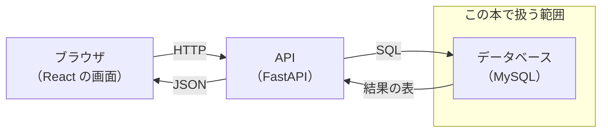
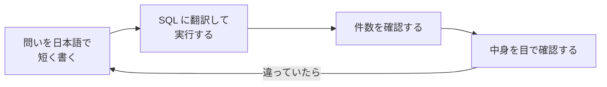

# 第0章 はじめに

この章は、**必ず最初に読んでください。**

このテキストは、全5冊のうちの**5冊目**です。
そして、**フェーズ1「作れるようになる」の最終巻**です。

ここまでの4冊で、あなたは画面（React）、言語（Python）、
サーバー（FastAPI）、動かす場所（Docker）を手に入れました。
それでも、**まだ一度も自分で書いていないものが1つ残っています。**
それが、データの保存を担当する**データベース**への命令、つまり SQL です。

fastapi-text の第6章では、保存の処理を SQLAlchemy というライブラリに任せました。
docker-text の第6章では、MySQL を公式イメージで立てて、
`SHOW TABLES;` と `SELECT * FROM tasks;` の2行だけを打ちました。
**データベースは、ここまでずっと「中が見えない箱」のままでした。**
この本で、その箱を開けます。

## この章で学ぶこと

- このテキストが誰のためのもので、何ができるようになるかを説明できるようになる
- 前提となる docker-text / fastapi-text の内容が手元に残っているかを確認できるようになる
- 学習をサポートしてくれる AI を、この本用にセットアップできるようになる
- SQL では「エラーにならないのに答えが間違っている」ことが起きる理由を説明できるようになる
- 詰まったときに、何をどの順番で確認すればよいかを言えるようになる

## この章の前提

- **docker-text の第2章まで**を読み終えていること（第2章で Docker を使って MySQL を起動します）
- fastapi-text を読み終えていること（第8章で、作った API をこの本の MySQL に繋ぎ替えます）
- この章では、MySQL はまだインストールしません（第2章で用意します）
- この章で打つコマンドは、**Docker が使える状態かを確かめる2つだけ**です

> **つまずいたら**
> この章の内容で分からないことがあれば、[0.2](#02-ai-サポートの準備) で準備する AI に、
> 次のように聞いてください。
>
> ```text
> mysql-text の 0.1.2 を読んでいます。
> 「データベースが中が見えない箱のままだった」という説明が、まだぴんと来ていません。
> fastapi-text と docker-text までの知識だけを使って、
> 具体的な例を1つ添えて説明してください。
> ```

---

## 0.1 このテキストについて

### 0.1.1 対象読者と前提知識

このテキストは、**docker-text の第2章まで進んだ人**を対象にしています。

理由は1つだけです。**MySQL は、パソコンに直接インストールすると手間のかかる
ソフトウェアだからです。** 設定ファイルの場所、文字コード、初期パスワード、
サービスの起動方法──入れるだけで半日かかることもあります。
Docker を使えば、この準備が**設定ファイル1つと1行のコマンド**で終わります。
5冊目が Docker のあとに置かれているのは、このためです。

前提として身についていてほしいのは、次のことです。
右の列に、忘れていたときに戻る場所を書いてあります。

| できてほしいこと | 戻る場所 |
|----------------|---------|
| ターミナルでディレクトリを移動できる（`cd` / `ls`（`dir`）／`pwd`） | react-text 1.4 |
| 拡張子を表示させた状態でファイルを作れる | react-text 1.3.4 |
| Docker Desktop を起動して、コンテナを動かせる | docker-text 2.3 |
| コンテナを停止・削除できる（`docker stop` / `docker rm` の違い） | docker-text 2.4.5 |
| `compose.yaml` を書いて `docker compose up -d` で起動できる | docker-text 5.2 |
| 動いているコンテナの中でコマンドを実行できる（`docker compose exec`） | docker-text 5.4 |
| ボリュームでデータを残せる（`down` と `down -v` の違い） | docker-text 5.4 |
| `.env` に設定値を書いて読み込ませられる | fastapi-text 4.6.2 |
| FastAPI のアプリを起動して、ブラウザから確認できる | fastapi-text 2.4 |
| SQLAlchemy でテーブルのモデルを書いたことがある | fastapi-text 6.3 |

**この本で新しく学ぶのは、SQL とデータベースの設計だけです。**
Docker の使い方も、Python の書き方も、何ひとつ変わりません。

**Docker が使える状態かを確認する**

第2章で、Docker を使って MySQL を起動します。
その準備として、いまのパソコンで Docker が使えるかを確かめておきます。
ターミナル（文字でコンピュータに命令するための画面）を開いて、次を実行してください。

**Windows（PowerShell）**

```powershell
docker --version
docker compose version
```

**macOS / Linux**

```bash
docker --version
docker compose version
```

実行結果（数字の部分は環境によって違います）:

```text
Docker version 29.3.1, build 1a2b3c4
Docker Compose version v2.32.1
```

このように2つともバージョンが表示されれば、準備できています。

`Cannot connect to the Docker daemon` と表示された場合は、
**Docker Desktop が起動していません。** アプリを起動して、
クジラのアイコンが「Docker Desktop is running」の状態になるまで待ってから、
もう一度実行してください（docker-text 2.3.3 で扱いました）。

`command not found` や `'docker' は、内部コマンドまたは外部コマンド...` と
表示された場合は、Docker がインストールされていません。
docker-text の第2章に戻って入れてください。
**この本は、第2章から先へ進めません。** MySQL を起動する手段がないためです。

> **注意：この本の MySQL は、docker-text 第6章のアプリとは別に立てます**
> docker-text の第6章で、`fullstack-lesson` の中に `db` というサービスを作りました。
> **この本の練習用 MySQL は、それとは別のものとして新しく立てます。**
> 練習中に間違って `DELETE` を実行しても、第6章のアプリのデータが消えないようにするためです。
> 別のディレクトリで `compose.yaml` を作れば、プロジェクト名が変わるので
> ボリュームも別になります（docker-text 5.2.4 で扱いました）。

> **補足：ディスクの空き容量を確認してください**
> MySQL の公式イメージは、ダウンロード後に展開すると 600 MB 前後になります。
> 第7章ではデータを 10 万件ほど投入して検索速度を体感するため、
> さらに容量を使います。**5 GB 程度の空き**を確保してから第2章に進んでください。

### 0.1.2 この本で作るもの

**いまのあなたが自力で書ける SQL は、おそらく次の2行だけです。**

```sql
SHOW TABLES;
SELECT * FROM tasks;
```

docker-text の 6.2.4 と 6.5.3 で打った2行です。
「テーブルの一覧を出す」「1つの表を全部出す」──ここまでです。

では、こういう問い合わせを頼まれたらどうでしょうか。

> 「先月、売上金額の合計が多かった商品を上位3件、
> 商品名・売れた個数・売上金額の3列で出してほしい。
> 1件も売れていない商品は出さなくていい」

これを人間の言葉から SQL に翻訳すると、たとえば次の形になります。

```sql
SELECT
    products.name AS 商品名,
    SUM(order_items.quantity) AS 個数,
    SUM(order_items.quantity * order_items.unit_price) AS 売上金額
FROM order_items
INNER JOIN products ON order_items.product_id = products.id
INNER JOIN orders ON order_items.order_id = orders.id
WHERE orders.ordered_at >= '2026-08-01'
  AND orders.ordered_at < '2026-09-01'
GROUP BY products.id, products.name
ORDER BY 売上金額 DESC
LIMIT 3;
```

**いまは1行も読めなくて構いません。** 意味が分かる必要はありません。
ここで見てほしいのは、**この15行に、この本の中身がほぼ全部入っている**ということです。

| この SQL の部分 | 扱う章 |
|----------------|-------|
| `SELECT` / `WHERE` / `ORDER BY` / `LIMIT` / `AS` | 第3章 |
| `INNER JOIN ... ON`（表と表を繋ぐ） | 第6章 |
| `SUM` / `GROUP BY`（まとめて数える） | 第6章 |
| 3つのテーブルに分かれている理由（`products` / `orders` / `order_items`） | 第5章 |
| この問い合わせが遅いときの直し方 | 第7章 |

> **補足：上のテーブル名は説明用の仮のものです**
> `products` や `order_items` は、いま説明のために置いた名前です。
> **この本で実際に使う練習用テーブルは、第2章 2.5 で決めて作ります。**
> 第3章以降の例題と演習は、すべてそのテーブルだけを使います。

**アプリのどの部分を学ぶのか**

ここまでの4冊で作ったものと、この本が担当する場所の関係は次のとおりです。



矢印のラベルに注目してください。
ブラウザと API のあいだは HTTP（fastapi-text 第1章）、
API とデータベースのあいだは **SQL** です。
**この本は、右端の箱と、そこへ送る SQL を担当します。**

第8章では、その SQL を FastAPI から送る側に戻ります。
fastapi-text 第6章では SQLite（ファイル1つで動く手軽なデータベース）を使いましたが、
これを MySQL に繋ぎ替えます。あわせて、fastapi-text では扱わなかった
**テーブル同士の関連**（1つのタスクに担当者がいる、という関係の表し方）も扱います。

### 0.1.3 全5冊の中での位置づけ

このテキストは、**プログラミング未経験から Web エンジニアになるまでの全5冊**の5冊目です。

| # | テキスト | 内容 |
|---|---------|------|
| 1 | React | Web の仕組み、HTML、CSS、JavaScript、React |
| 2 | Python | 汎用のプログラミング言語 Python |
| 3 | FastAPI | サーバー側（バックエンド）の作り方 |
| 4 | Docker | 環境を再現可能にする道具 |
| **5** | **MySQL（この本）** | **データを保存するデータベース** |

**この本を終えると、フェーズ1「作れるようになる」が完了します。**
React + FastAPI + MySQL を Docker で動かす Web アプリを、
一人で作って動かせる状態です。

章ごとに身につく力は、次のとおりです。

| 章 | 身につくこと |
|----|------------|
| 第1章 | データベースが何を解決するのか、テーブル・行・列・主キーという考え方 |
| 第2章 | Docker で MySQL を起動し、接続して、練習用データを投入する |
| 第3章 | データを取り出す（`SELECT` / `WHERE` / `ORDER BY` / 関数） |
| 第4章 | データを追加・変更・削除する（`INSERT` / `UPDATE` / `DELETE` / トランザクション） |
| 第5章 | テーブルを自分で設計する（データ型・制約・外部キー・正規化の入り口） |
| 第6章 | 複数のテーブルを繋いで集計する（`JOIN` / `GROUP BY` / サブクエリ） |
| 第7章 | 遅い検索を速くする（インデックスと `EXPLAIN`） |
| 第8章 | FastAPI から MySQL を使う（N+1 問題・SQL インジェクション・バックアップ） |
| 第9章 | 次に学ぶこと |

**この本の山場は第2章と第6章です。**

第2章は、**練習用データを確定させる章**です。
ここで作ったテーブルを、第3章から第7章まで**ずっと使い回します。**
起動と接続でつまずくと、以降の章で1つも SQL を試せなくなります。

第6章は `JOIN`（複数のテーブルを繋ぐ操作）を扱います。
**ここがこの本でいちばん理解に時間がかかる場所**です。
第5章で「なぜテーブルを分けるのか」を学んだ直後に、
「分けたものを繋ぎ直す方法」を学ぶ、という順番にしてあります。

> **補足：なぜ5冊目がデータベースなのか**
> データベースは Web アプリの心臓部なので、もっと早く学んでもよさそうに見えます。
> しかし1冊目に置くと、**保存する中身がまだ無い**状態で表の設計を考えることになります。
> ここまでの4冊で、あなたは「タスクを保存するアプリ」を実際に動かしました。
> **保存したいものを持っている状態で読むからこそ**、この本の内容が身につきます。

---

## 0.2 AI サポートの準備

**この節がこのテキストで最も重要です。**

docker-text で AI サポートをすでに準備した人も、
**読んでいるテキストが変わったことを AI に伝える必要がある**ので、
[0.2.1](#021-指示ファイルを読み込ませる) は必ず実行してください。

伝えないと、AI は「この人は Docker の第◯章にいる」という古い前提のまま答えます。
その結果、**まだ説明していない `JOIN` をいきなり使った SQL を出してきたり、
Docker の話に引き戻したり**します。

### 0.2.1 指示ファイルを読み込ませる

**学習を始める前に、1回だけやる作業です。**

普段使っている AI（ChatGPT、Claude、Gemini、Copilot、Codex など）を開いて、
次の文章をそのままコピーして送ってください。
`<>` の中だけ、自分の状況に書き換えます。

```text
これからプログラミングを学びます。
まず次の URL のドキュメントを読んで、その指示に従って私をサポートしてください。

https://github.com/TakahashiTaiga/programing-texts/blob/main/ai/instructions.md

私の状況:
- OS: <Windows 11 Home / Windows 11 Pro / macOS 15 など>
- CPU: <Apple Silicon（M1〜M4）/ Intel / AMD>
- プログラミング経験: <react-text から docker-text まで読み終えた>
- 読んでいるテキスト: mysql-text（プログラミング未経験から始める MySQL）
```

> **AI が URL を読めない場合**
> 一部の AI は、URL からファイルを読み込めないことがあります。
> その場合は、上記の URL をブラウザで開いて、
> **中身をすべてコピーして AI に貼り付けて**ください。
> 「以下のドキュメントの指示に従ってください」と一言添えれば同じ効果があります。

**動作確認**

準備ができたか確かめましょう。AI に次のように聞いてみてください。

```text
確認です。私が「演習問題が解けません」と言ったら、あなたはどう対応しますか？
```

**期待する答え**（言い回しは AI によって違います）

> まずヒントを段階的に出します。いきなり完成した SQL はお見せしません。
> 一方で、接続エラーや文字化けなど、学習内容と関係ない部分は
> 手順を全部お出しして解決します。

このような答えが返ってきたら、準備完了です。

もし「はい、SQL を書きます」のような答えが返ってきたら、
指示ファイルがうまく読み込まれていません。
今度は**中身をコピー&ペーストする方法**で、もう一度試してください。

**もう1つ、この本ならではの確認をしておきます。**

```text
もう1つ確認です。私が「mysql-text の 3.2 を読んでいます」と言ったとき、
あなたは何を前提にして答えますか？
```

**期待する答え**

> 3.2 の時点では、まだ `JOIN`（第6章）も集計関数（第6章）も扱っていないので、
> 1つのテーブルから `SELECT` する範囲で答えます。

このように、**「まだ学んでいないものは使わない」**と答えれば正しく読み込めています。
この判断には、AI が
[`ai/curriculum-map.md`](https://github.com/TakahashiTaiga/programing-texts/blob/main/ai/curriculum-map.md)
という別のファイルを参照しています。
**質問するときに章番号を添えることが、この仕組みを働かせる鍵**です。

### 0.2.2 SQL は間違っていても動いてしまう

**この本の質問の仕方は、ここまでの4冊と1つだけ大きく違います。**

これまでの4冊では、間違えると**プログラムが止まってくれました。**
Python なら `NameError`、React なら赤い画面、Docker ならコンテナが起動しない。
**間違いは、エラーという形で必ず表に出てきました。**

SQL はそうではありません。書き方が文法として成り立っていれば、
**意図と違っていても、エラーを出さずに結果を返してきます。**

たとえば、こういうことが起きます。

| やりたかったこと | 書いた SQL の問題 | 何が起きるか |
|----------------|-----------------|------------|
| 特定の1件だけ値を書き換える | 条件（`WHERE`）を書き忘れた | **全件が書き換わる。** エラーは出ない（第4章 4.2.3） |
| 全員の人数を数える | 数える対象の指定を間違えた | 空欄の行が数から漏れる。エラーは出ない（第6章 6.5.3） |
| 注文が0件の顧客も一覧に出す | 繋ぎ方と絞り込みの順番を間違えた | 0件の顧客が消える。エラーは出ない（第6章 6.3.4） |

**3つとも、画面には整った表が返ってきます。**
そして、その表は間違っています。

ここから、この本での AI の使い方が決まります。

**使い方1：「この SQL は何を返しますか」と聞く**

書いた SQL を実行する前に、AI に**日本語で説明させて**ください。

```text
mysql-text の 4.2 を読んでいます。
次の SQL を実行すると、どの行が、何件変わりますか。
実行する前に日本語で説明してください。答えの SQL は書かないでください。

（ここに自分が書いた SQL を貼る）
```

自分の意図と AI の説明が食い違ったら、**そこが間違いです。**
これは「答えを教えてもらう」のではなく「読み合わせをしてもらう」使い方です。

**使い方2：データを変更する前に確認させる**

第4章から、データを書き換える SQL を扱います。
**練習用のデータベースなので壊れても作り直せますが**、
第8章でアプリに繋いだあとは、消したデータは戻りません。

```text
この SQL は、実行するとデータが失われますか。
失われる場合、実行前に何を確認しておけばよいですか。
```

**質問するときのテンプレート**

SQL のトラブルを相談するときは、次の5点を必ず添えてください。
この5点があるかないかで、返ってくる答えの精度がまるで変わります。

```text
mysql-text の 3.3.1 で詰まりました。

【環境】
OS: Windows 11 Home
MySQL のバージョン: 8.4

【テーブルの形】
（DESCRIBE テーブル名; の結果を貼る。第2章 2.4.4 で扱います）

【打った SQL】
SELECT * FROM tasks WHERE title LIKE '買い物';

【期待した結果】
タイトルに「買い物」が含まれる行が3件返ってくる

【実際の結果】
Empty set（0 件）
```

**エラーが出ない問題では、「期待した結果」と「実際の結果」の両方が必要です。**
エラーメッセージが無いので、**この2つの食い違いだけが手がかり**になります。
片方だけ伝えると、AI は「その SQL は正常に動きます」と答えて終わってしまいます。

> **注意：貼り付ける前に、秘密の情報を消してください**
> データベースの接続情報には、パスワードが含まれます。
> `.env` に書いた `MYSQL_ROOT_PASSWORD` などは、
> `<ここにパスワード>` のような形に書き換えてから貼り付けてください。
> また、**実際の人の名前やメールアドレスが入ったデータは貼らないでください。**
> この本の練習用データはすべて架空のものなので、そのまま貼って構いません。

**この本のトラブルは、2種類に分かれます**

[`ai/instructions.md`](https://github.com/TakahashiTaiga/programing-texts/blob/main/ai/instructions.md)
では、質問を3つのレベルに分けています。
この本では、その使い分けがはっきりしています。

| 種類 | レベル | AI の対応 |
|------|-------|----------|
| 接続できない、文字化けする、ポートが使われている | **レベル C**（自力解決が不可能） | 手順を最後まで示してもらってよい |
| 「この問いを SQL でどう書くか」が分からない | **レベル A**（考えることが学習目的） | ヒントだけ。完成した SQL は出てこない |

第2章のトラブルは、ほぼすべてレベル C です。遠慮なく AI に全部やらせてください。
一方で、第3章以降の**「SQL に翻訳する」部分は、この本の学習目的そのもの**です。
ここで完成形をもらってしまうと、身につきません。

質問のテンプレートは
[`ai/prompt-templates.md`](https://github.com/TakahashiTaiga/programing-texts/blob/main/ai/prompt-templates.md)
にもまとめてあります。コピーして使ってください。

---

## 0.3 学習の進め方

### 0.3.1 SQL は手を動かさないと身につかない

**SQL は、読むと分かった気になる言語です。**

```sql
SELECT name FROM users WHERE age >= 20;
```

この1行は、英語として読めば「20歳以上の `users` から `name` を選ぶ」と読めます。
Python や JavaScript のコードより、はるかに意味が想像しやすいはずです。
（これも説明用の例です。実際に自分で SQL を実行するのは、第2章で MySQL を起動してからになります。）

**そして、これが落とし穴です。**

読めることと書けることは別です。
実際の仕事で求められるのは、次の向きの作業です。

```text
【読む向き】  SQL  →  日本語     ← 想像で何とかなる
【書く向き】  日本語 →  SQL      ← これが身につかない
```

「先月いちばん売れた商品を3つ」という日本語を渡されて、
それを `SELECT` に組み立てる。**この向きの練習だけが、力になります。**
本文を読んだだけで先に進むと、第6章でまったく手が動かなくなります。

**確認の輪を回します**

この本では、1つの問いを解くたびに、次の流れをぐるぐる回すことになります。



**この輪の中で、いちばん飛ばされるのが「件数を確認する」です。**

SQL の結果は、いつも整った表の形で返ってきます。
表が出ると「できた」と思ってしまいますが、
**その表が何行あるかを見ないと、正しいか分かりません。**

たとえば「タイトルに『買い物』を含むタスク」を探して、
**0 件（`Empty set`）** が返ってきたとします。
これは「そんなタスクは無い」のではなく、
**条件の書き方を間違えている**可能性のほうが高いです。
0 件と全件は、どちらも「疑うべき件数」です。

この確認のしかたは第3章 3.1.1 から、毎回本文の中でやっていきます。

**この本の章の順番にも、同じ考えが入っています**

第3章で取り出す（`SELECT`）、第4章で変更する（`INSERT` / `UPDATE` / `DELETE`）、
という順番にしてあります。逆ではありません。

**取り出す操作は、何度やってもデータが壊れないからです。**
安心して何百回も試せる操作で先に慣れて、
壊せる操作はそのあと、事故を防ぐ手順（第4章 4.2.4）とセットで学びます。

### 0.3.2 詰まったときの動き方

詰まったら、次の順番で動いてください。

**ステップ1：3分だけ自分で確認する**

MySQL では、見るべき場所が決まっています。上から順に確認してください。

1. **プロンプトが `mysql>` に戻っているか**
   ── `->` になっていたら、**セミコロン（`;`）を打ち忘れています。**
   MySQL は `;` が来るまで「文の続き」を待ち続けます。`;` を打てば進みます
   （この本でいちばん多いつまずきです。第2章 2.2.1 で扱います）
2. **どのデータベースを使う状態になっているか**
   ── `USE データベース名;` を打っていないと `No database selected` になります（第2章 2.4.2）
3. **テーブル名・列名のスペルは合っているか**
   ── `Unknown column` と言われたら、`DESCRIBE テーブル名;` で列名を見ます（第2章 2.4.4）
4. **エラーメッセージの `ERROR` から始まる行**
   ── MySQL のエラーは短く、**原因はほぼその1行に書かれています。**
   番号（`ERROR 1064` など）も一緒に伝えると、AI の回答が正確になります
5. **エラーが出ていない場合は、返ってきた件数**
   ── 0 件や全件になっていないかを見ます（0.3.1）

**ステップ2：AI に聞く**

3分考えてわからなければ、すぐ AI に聞いてください。粘る必要はありません。
[0.2.2](#022-sql-は間違っていても動いてしまう) のテンプレートを使い、
**章番号・テーブルの形・打った SQL・期待した結果・実際の結果**を必ず添えてください。

**章番号を伝えることが重要です。**
AI は「この人は 3.2 にいる＝まだ `JOIN` を知らない」と判断して、
あなたが理解できる範囲の書き方で答えてくれます。
章番号を伝えないと、第6章以降でしか出てこない書き方で答えが返ってきて、
**動くけれど意味が分からない SQL** が手元に残ります。

**ステップ3：それでも進まなければ、飛ばす**

同じところで30分以上止まったら、いったん飛ばして先に進んでください。
**ただし、第2章だけは飛ばせません。**
MySQL に接続できる状態にならないと、第3章以降が1行も試せないためです。

第2章で詰まった場合は、飛ばさずに AI に相談してください。
繰り返しになりますが、**接続や文字化けのトラブルは考えて学ぶ場所ではありません。**

### 0.3.3 理解度チェックと演習問題について

第1章から、各章の最後に2種類の問題が付きます。

| 表示 | 意味 |
|------|------|
| ★☆☆ | 本文の SQL を少し変えればできる |
| ★★☆ | 本文の複数の内容を組み合わせる必要がある |
| ★★★ | 自分で調べたり設計したりする必要がある |

答えは、本の最後の**解答編**にまとめてあります。
解答編は2つに分かれています。

- 解答編 その1：第1章〜第5章
- 解答編 その2：第6章〜第8章

（この第0章には手を動かす内容がないので、理解度チェックと演習問題はありません。
第1章から始まります。）

> **解答編の使い方**
> いきなり見ないでください。**最低でも1回は自分で SQL を書いて実行し、
> 結果を見てから**見てください。
> この本の演習は「書いて、実行して、件数と中身を確かめる」までが1問です。
>
> どうしても解けなかった問題は、解答編を読んだあと、
> **何も見ずにもう一度自分で書き直して**ください。これで定着します。

> **注意：解答と自分の SQL が違っていても、間違いとは限りません**
> SQL は、同じ結果を得る書き方が複数あります。
> 第6章では、`JOIN` で書いたものをサブクエリで書き直す方法（6.6.4）も扱います。
> **結果が同じなら、どちらも正解です。**
> ただし解説は必ず読んでください。「なぜその書き方を選んだか」が書かれています。
> 第7章を読むと、書き方によって**実行速度が変わる**ことも分かります。

---

## まとめ

- このテキストは全5冊の**5冊目**で、**フェーズ1「作れるようになる」の最終巻**
- 前提は **docker-text の第2章まで**。MySQL は直接入れず、**Docker で起動する**
- この本の練習用 MySQL は、**docker-text 第6章のアプリとは別に立てる**（間違って消しても安全）
- ここまでの4冊で、データベースは「中が見えない箱」だった。**この本でその箱を開ける**
- 担当する範囲は、**API とデータベースのあいだを流れる SQL** と、テーブルの設計
- **AI サポートの準備（0.2）を必ずやり直すこと**。読んでいる本が変わったことを伝える
- SQL は、**間違っていてもエラーを出さずに結果を返す。** これが他の4冊との最大の違い。
  だから AI には「答えを書かせる」のではなく、**「この SQL は何を返すか」を説明させる**
- 相談するときは、エラーメッセージの代わりに**「期待した結果」と「実際の結果」の両方**を書く
- SQL は読めても書けない。**日本語 → SQL の向きの練習**だけが力になる
- 結果の表が出ても、**件数を確認するまで信じない。** 0 件と全件はとくに疑う
- 詰まったら、**`mysql>` に戻っているか → `USE` したか → スペル → `ERROR` の行 → 件数**の順に見る
- 山場は**第2章（練習用データの確定）と第6章（`JOIN`）**。
  **第2章だけは飛ばせない**（接続できないと以降の章がすべて試せない）

---

## 次の章へ

準備は整いました。
次の章では、そもそもデータベースが何を解決する道具なのかを、
「ファイルに保存するのでは何がだめなのか」から考えます。

テーブル・行・列・主キーという、この本の土台になる言葉もここで揃えます。
**まだ MySQL はインストールしません。** その前に、何のための道具なのかを掴みます。

→ [第1章 データベースとは](./01-what-is-database.md)
