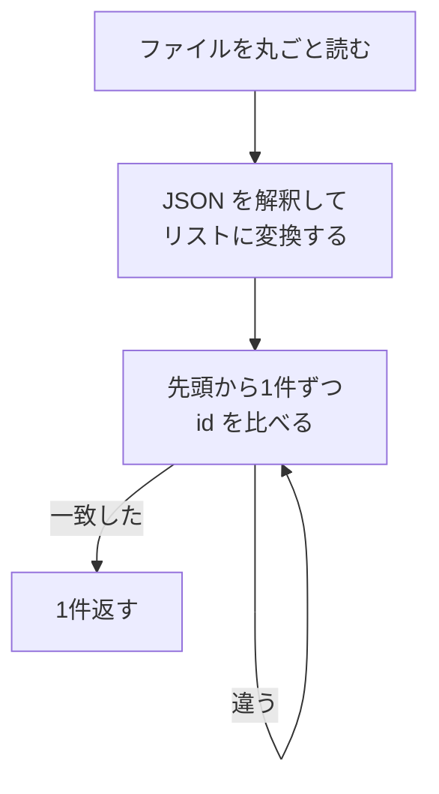
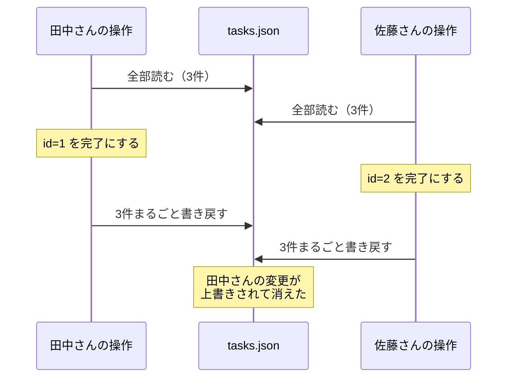
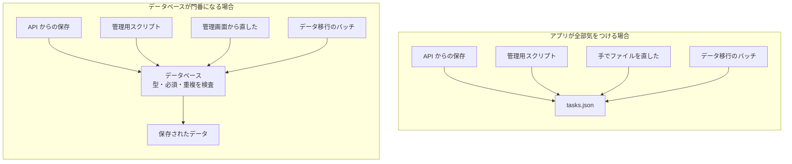
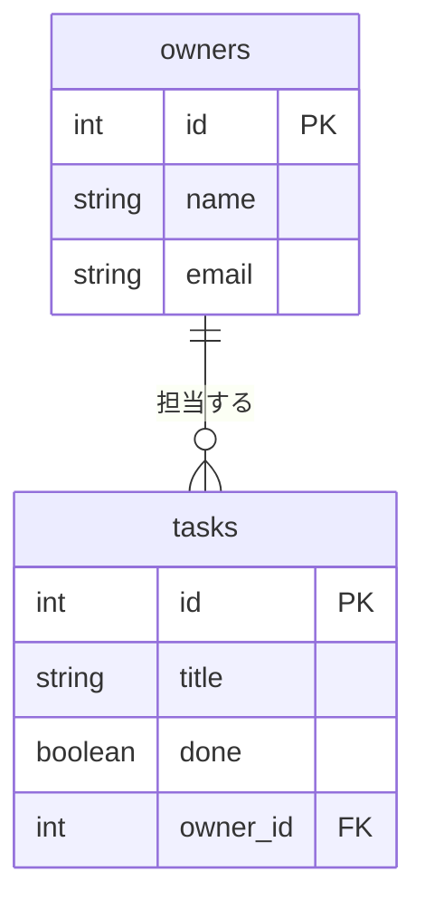
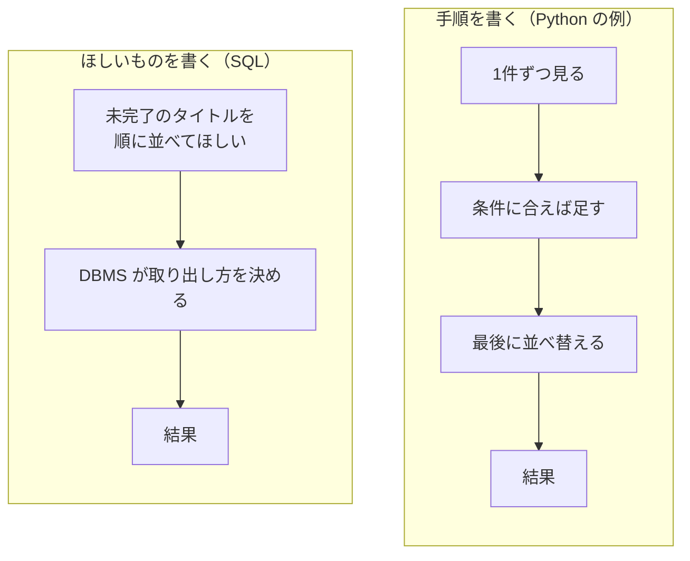
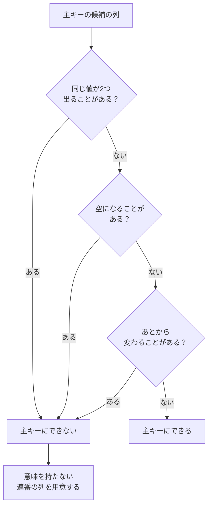
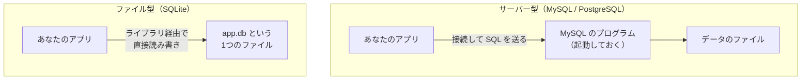

# 第1章 データベースとは

この章では、**まだ MySQL をインストールしません。**

第0章で、データベースはここまでずっと「中が見えない箱」だったと書きました。
箱を開ける前に、**そもそも何のための箱なのか**をはっきりさせます。

データベースは道具です。道具は、それが何を解決するのかを知らないまま覚えても身につきません。
そこでこの章では、まず**データベースを使わずに自分でデータを保存しようとすると何が起きるか**を見ます。
そのうえで、この本が扱う**リレーショナルデータベース**がデータをどう持つのかを見て、
最後に、世の中にあるほかのデータベースとの違いを整理します。

ここで出てくる**テーブル・行・列・主キー**という4つの言葉は、この本の最後まで毎ページ出てきます。
**この4つがあいまいなまま第2章に進むと、以降の説明がすべてぼやけます。**
時間をかけて読んでください。

## この章で学ぶこと

- データを自分でファイルに保存しようとすると何が起きるかを、3つの問題として説明できるようになる
- リレーショナルデータベースがデータをどう持つのかを、表と表の関連という形で説明できるようになる
- テーブル・行・列・値という言葉を、Python の辞書や fastapi-text で書いたモデルと対応づけられるようになる
- 表計算ソフトとデータベースの違いを3つ以上挙げられるようになる
- 主キーが何のためにあるのかを説明し、主キーの候補を3つの条件で評価できるようになる
- MySQL / PostgreSQL / SQLite / NoSQL の違いを、選ぶときの基準として言えるようになる

## この章の前提

- [第0章 はじめに](./00-introduction.md) を読み終えていること
- **MySQL はまだインストールしません**（インストールと起動は第2章です）
- この章では、**SQL を1文も実行しません。** 出てくる SQL は、すべて読むためのものです
- 演習は、紙かテキストエディタ（または表計算ソフト）だけで完結します

> **つまずいたら**
> この章は言葉の説明が中心です。読んでもぴんと来ない箇所があれば、
> 第0章 0.2 で準備した AI に、次のように聞いてください。
>
> ```text
> mysql-text の 1.2.2 を読んでいます。
> 「表を2つに分けて、片方が相手の主キーを持つ」の意味が分かりません。
> mysql-text の第1章までの知識だけを使って、
> このテキストとは別の題材で具体例を1つ添えて説明してください。
> SQL は書かないでください（まだ MySQL を起動していません）。
> ```

---

## 1.1 ファイルに保存するのでは何がだめなのか

データベースの話を始める前に、**使わない場合**を考えます。

ここまでの4冊で、あなたはデータの置き場所を2回見ています。

- react-text 第10章：ブラウザの `localStorage` に、JSON の文字列として保存した
- fastapi-text 第5章：`app/data.py` の中の Python のリストに置いた
  （サーバーを再起動すると消えました。これが fastapi-text 第6章の動機でした）

では、**サーバー側でファイルに JSON として保存する**ならどうでしょうか。
たとえば `tasks.json` という1つのファイルを用意して、こう書いておきます。

`tasks.json`（データベースを使わずに自分で保存した場合の例）

```json
[
  { "id": 1, "title": "牛乳を買う",   "done": false, "owner": "田中" },
  { "id": 2, "title": "請求書を出す", "done": true,  "owner": "佐藤" },
  { "id": 3, "title": "会議室を予約", "done": false, "owner": "田中" }
]
```

**この方法は、実際に動きます。** 再起動しても消えません。
3件なら何の問題もありません。

問題は、**この先で必ず起きる3つのこと**です。順に見ていきます。

### 1.1.1 検索が遅い

「`id` が 87654 のタスクを1件だけ表示したい」としましょう。
`tasks.json` からこれを取り出す手順は、次のようになります。



注目してほしいのは、**ほしいのは1件なのに、毎回すべてを読んでいる**ことです。

件数が増えると、この「毎回すべて」が効いてきます。

| タスクの件数 | `tasks.json` の大きさの目安 | 1件取り出すためにすること |
|------------|--------------------------|------------------------|
| 10 件 | 1 KB 未満 | 全部読む（一瞬で終わる） |
| 1,000 件 | 100 KB 前後 | 全部読む（まだ気にならない） |
| 100,000 件 | 10 MB 前後 | 全部読んで、10 万回比べる |
| 1,000,000 件 | 100 MB 前後 | 全部読む。**メモリに載せるだけで重い** |

このように、**先頭から最後まで1件ずつ見ていく探し方**を
**全件走査**（ぜんけんそうさ。フルスキャンとも呼びます）と言います。

データベースは、ここで2つのことをします。

1. **必要な部分だけを読む**（ファイル全体をメモリに載せない）
2. **インデックス**（検索を速くするための索引）を持てる

**インデックス**は、本の巻末にある索引と同じ考え方です。
「田中」という語が何ページにあるかを索引で引けば、1ページ目から順に探す必要はありません。
インデックスの仕組みと張り方は第7章で扱います。
**7.1.1 では、実際に 10 万件のデータを入れて、速さの違いを自分の目で確かめます。**

> **よくある間違い**
> 「データが少ないうちは速い」というのは、そのとおりです。ここは疑わなくて構いません。
> 問題は、**増えたときに急に遅くなる**ことと、
> **どれくらい増えるかを最初に予想できない**ことです。
> 「いまは 100 件だから大丈夫」で作ったものが、
> 2年後に 50 万件になっている、というのはよくある話です。

### 1.1.2 同時に書き込むと壊れる

fastapi-text で作った API は、**同時に複数のリクエストを受け取ります。**
`tasks.json` 方式で「あるタスクを完了にする」処理は、次の3ステップです。

1. ファイルを全部読む
2. 該当する1件の `done` を `true` に書き換える
3. **ファイルを全部書き戻す**

2人が同時にこれをやると、何が起きるでしょうか。



**佐藤さんが読んだのは、田中さんが書き戻す前の内容です。**
そのまま書き戻したので、田中さんの変更はファイルから消えました。
しかも、**エラーは1つも出ません。** 2人とも「完了にできた」と思っています。

さらに悪い場合もあります。
3番目の「全部書き戻す」の途中でプログラムが止まったら（停電、強制終了、ディスクが一杯）、
ファイルは**途中で切れた状態**で残ります。JSON として壊れているので、
次に読もうとした瞬間に、**1件だけでなく全件が読めなくなります。**

データベースは、この2つに対して仕組みを持っています。

- **ロック**（あるデータを書き換えている間、ほかの人が同じところを触れないようにして順番待ちさせる仕組み）
  → 第4章 4.5
- **トランザクション**（複数の操作を「全部成功」か「全部なかったこと」にまとめる仕組み）
  → 第4章 4.4

トランザクションがあると、「途中で失敗したら、書き始める前の状態に戻る」ことが保証されます。
**中途半端な状態が残らない**、というのが重要です。

> **よくある間違い**
> 「自分ひとりで使うアプリだから、同時に書き込むことはない」と考えがちですが、
> 同時アクセスは、思っているよりずっと起きやすいものです。
>
> - ブラウザのタブを2つ開いている
> - 保存ボタンを連打した／画面を何度も再読み込みした
> - 画面を開いたまま、別のスクリプトでデータを流し込んだ
>
> fastapi-text 第8章で使った `TestClient` のように、
> **プログラムから API を叩く経路**が増えると、さらに起きやすくなります。

### 1.1.3 整合性が保てない

3つ目が、いちばん静かに進行する問題です。
半年ほど運用した `tasks.json` が、こうなっていたとします。

`tasks.json`（半年後）

```json
[
  { "id": 1, "title": "牛乳を買う",   "done": false,  "owner": "田中" },
  { "id": 2, "title": "請求書を出す", "done": "true", "owner": "田中 " },
  { "id": 3, "title": "会議室を予約", "owner": "たなか" },
  { "id": 3, "title": "資料を送る",   "done": false,  "owner": "山田" }
]
```

4つの行に、4種類の崩れが入っています。

| どこが崩れているか | 何が起きるか |
|------------------|------------|
| `"done": "true"`（真偽値のはずが文字列） | 「完了のものだけ出す」条件に引っかからない |
| `"owner": "田中 "`（末尾に半角スペース） | 「田中」で探しても出てこない。**別人として数えられる** |
| `id: 3` の行に `done` が無い | 読み出したプログラムが落ちる、または「未完了」と誤って扱う |
| `id: 3` が2行ある | 「`id` が 3 のタスク」を1つに決められない |

**この4つは、書き込んだ瞬間には何のエラーも出ません。**
第0章 0.2.2 で「SQL は間違っていてもエラーを出さずに結果を返す」と書きましたが、
自分でファイルに保存する方式は、それよりさらに無防備です。

「アプリ側でチェックすればよいのでは」と思うかもしれません。
問題は、**データを書き込む経路は1つではない**ことです。



上の図では、**4つの経路すべてに同じチェックを書かないといけません。**
1つでも書き忘れれば、そこから崩れたデータが入ります。
下の図では、チェックは1箇所（データベース）にあります。
どの経路から来ても、**条件を満たさない書き込みは拒否されます。**

このように、**データどうしが食い違っていない状態**を
**整合性**（せいごうせい）と呼びます。
データベースは、整合性を守るために次のものを用意しています。

- 列ごとに**データ型**を決める（文字列の列に数値は入らない）→ 第5章 5.1
- **制約**（その列の値に守らせる決まり。空を許すか、重複を許すかなど）→ 第5章 5.2
- **外部キー**（別のテーブルの行を指し示す列。指した先が存在しないと拒否される）→ 第5章 5.4

ただし、**この3つで全部が防げるわけではありません。**
「田中」「田中 」「たなか」は、**どれも文字列としては正しい値**です。
型の検査も、「空にしない」という制約も、これらを止められません。
**同じ意味の値が違う文字列で入ってしまう問題**だけは、別のやり方が必要です。
その方法は 1.2.2 で扱います。

> **よくある間違い**
> 表記ゆれ（「田中」と「田中 」と「たなか」）を「見ればわかる程度の違い」と軽く見ないでください。
> コンピュータにとって、この3つは**完全に別の文字列**です。
> 「田中さんのタスク件数」を数えたときに、3つに割れて出てきます。
> しかも**エラーは出ない**ので、集計結果が間違っていることに誰も気づきません。

**この節のまとめ**

ここまでの3つを並べると、データベースが引き受けてくれる仕事が見えてきます。

| 自分でファイルに保存すると起きること | データベース側の担当 | 扱う章 |
|--------------------------------|------------------|-------|
| 1件取り出すのに全部読む | インデックス | 第7章 |
| 同時に書くと、片方の変更が消える | ロック | 第4章 4.5 |
| 書き込みの途中で失敗すると壊れる | トランザクション | 第4章 4.4 |
| 型・必須・重複が守られない | データ型・制約 | 第5章 5.1 / 5.2 |
| 存在しない相手を指す値が入る | 外部キー | 第5章 5.4 |

この5つを専門に引き受けるソフトウェアを
**DBMS**（データベース管理システム。データの保存・取り出し・守りを専門に行うソフトウェア）と呼びます。
MySQL は、DBMS の1つです。

> **補足：「データベース」という言葉は2つの意味で使われます**
> 1つは「保存されたデータのまとまり」、もう1つは「それを管理するソフトウェア（DBMS）」です。
> 日常会話では、どちらもまとめて「データベース」と呼びます。
> このテキストでも基本は「データベース」と書き、
> **区別しないと意味が通らないときだけ「DBMS」**と書きます。

---

## 1.2 リレーショナルデータベース

### 1.2.1 表でデータを持つ

この本が扱うのは、**RDB（リレーショナルデータベース）**
（データを表（テーブル）の形で持ち、表どうしを関連づけて扱うデータベース）です。

「リレーショナル」は「関連の」という意味です。
**表そのものよりも、表と表を関連づけられることのほうが名前の由来**になっています。
その関連づけは 1.2.2 で見ます。まずは1枚の表から始めます。

1.1 の `tasks.json` を、表の形に直すとこうなります。

**tasks**

| id | title | done | owner |
|----|-------|------|-------|
| 1 | 牛乳を買う | 0 | 田中 |
| 2 | 請求書を出す | 1 | 佐藤 |
| 3 | 会議室を予約 | 0 | 田中 |

（`done` の `0` と `1` は、それぞれ「未完了」「完了」を表しています。
MySQL での真偽値の持ち方は第5章 5.1.4 で扱います。）

JSON と見比べてください。**書いてある中身は同じです。**
違うのは、次の1点です。

> **すべての行が、必ず同じ列を持っている。**

1.1.3 で見た「`done` が無い行」は、この形では**作れません。**
テーブルは、**先に列を決めてから**、あとで行を入れていくものだからです。
列を決める命令が `CREATE TABLE`（第2章 2.4.3）、
行を入れる命令が `INSERT`（第4章 4.1）です。

> **補足：第2章からは罫線付きの表で表示されます**
> このテキストでは読みやすさのために Markdown の表で書いていますが、
> 第2章で MySQL に接続すると、結果は次のような罫線付きの表で返ってきます。
>
> ```text
> +----+--------------+------+--------+
> | id | title        | done | owner  |
> +----+--------------+------+--------+
> |  1 | 牛乳を買う   |    0 | 田中   |
> +----+--------------+------+--------+
> 1 row in set (0.00 sec)
> ```
>
> いちばん下の `1 row in set` が**件数**です。
> 第0章 0.3.1 で「件数を必ず確認する」と書いたのは、この行のことです。

もう1つ、テーブルには原則があります。

> **1つのテーブルには、1種類のものだけを入れる。**

`tasks` テーブルは「タスク」の表です。
ここに担当者のメールアドレスや電話番号を混ぜ始めると、
その表は「タスクの表」でも「担当者の表」でもなくなります。
では担当者の情報はどこに置くのか、というのが次の項です。

### 1.2.2 表と表を関連づける

1.2.1 の `tasks` テーブルには、まだ 1.1.3 の問題が残っています。
`owner` 列に、担当者の名前を**文字列でそのまま**書いているからです。

これだと、次の3つが起きます。

- 入力のたびに表記がゆれる（「田中」「田中 」「たなか」）
- 担当者のメールアドレスを持ちたくなったら、**同じ人の分だけ何行にも同じ値を書く**ことになる
- 田中さんが改姓したら、**その人が担当する全行を直す**羽目になる

解決策は、**表を2つに分けること**です。

**owners**（担当者の表）

| id | name | email |
|----|------|-------|
| 1 | 田中 | tanaka@example.com |
| 2 | 佐藤 | sato@example.com |

**tasks**（タスクの表）

| id | title | done | owner_id |
|----|-------|------|----------|
| 1 | 牛乳を買う | 0 | 1 |
| 2 | 請求書を出す | 1 | 2 |
| 3 | 会議室を予約 | 0 | 1 |

`tasks` の `owner_id` 列には、**名前ではなく `owners` の `id` が入っています。**
`owner_id` が `1` の行は、`owners` の `id` が `1` の行、つまり田中さんを指しています。

2つの表の関係を図にすると、次のようになります。



`owners` 側の `||` と `tasks` 側の `o{` は、**1人の担当者が複数のタスクを持てる**ことを表しています。
この関係を**1対多**と呼びます。逆向きに読めば「1つのタスクの担当者は1人」です。

図の `PK` は**主キー**（1.4 で扱います）、`FK` は**外部キー**の印です。
**外部キー**（別のテーブルの行を指し示す列）の定義のしかたは第5章 5.4 で扱います。

**分ける手順**

いまやったことを、手順として書き出しておきます。
この形は、そのまま別の題材にも使えます。

1. **何度も繰り返し出てくる値**を見つける（`owner` 列の「田中」）
2. その値と、**それにくっついてくる情報**をまとめて別の表にする（`owners` の `name` と `email`）
3. 新しい表に、行を1つに特定できる列を用意する（`owners.id`）
4. もとの表は、その値の代わりに **3 で作った列の値**を持つ（`tasks.owner_id`）

**繰り返しが2種類あれば、手順を2回回します**

この4つの手順は、**繰り返している列の数だけ繰り返します。**

たとえば `tasks` に、担当者のほかに `project` 列（「経理」「営業」のような文字列）が
あったとします。これも同じ値が何度も出てくるので、同じ手順をもう1周します。

| 回 | 1. 繰り返している列 | 2〜3. 作る表 | 4. もとの表が持つ列 |
|----|------------------|------------|------------------|
| 1周目 | `owner`（担当者名） | `owners`（`id` / `name` / `email`） | `owner_id` |
| 2周目 | `project`（案件名） | `projects`（`id` / `name`） | `project_id` |

結果として、`tasks` は **`owner_id` と `project_id` の2つ**を持つことになります。

**tasks**（2周したあと）

| id | title | done | owner_id | project_id |
|----|-------|------|----------|------------|
| 1 | 牛乳を買う | 0 | 1 | 2 |
| 2 | 請求書を出す | 1 | 2 | 1 |
| 3 | 会議室を予約 | 0 | 1 | 1 |

**「相手の主キーを持つ列」は、1つの表にいくつあっても構いません。**
繰り返している種類の数だけ増えます。

**分けると何が解決するのか**

1.1.3 で挙げた問題に戻って、対応を確かめます。

| 分ける前の問題 | 分けたあと |
|--------------|----------|
| 表記がゆれる | 担当者名は `owners` に**1箇所だけ**。`tasks` には `id` しか入らない |
| 改姓すると全行を直す | `owners` の**1行**を直せば、`tasks` 側は何も変えなくてよい |
| 存在しない担当者を書ける | `owners` に無い `id` は**拒否できる**（外部キー。第5章 5.4） |
| 担当者の情報を増やしたい | `owners` に列を1つ足すだけ。`tasks` は変えなくてよい |

**代わりに増える手間**

いいことばかりではありません。
「タスク一覧を、担当者名つきで表示する」には、**2つの表をたどる**必要が出てきます。
この操作を**結合**（けつごう。JOIN）と呼びます。

**結合は、この本でいちばん理解に時間がかかる場所です**（第0章 0.1.3）。
第6章で丸ごと1章を使って扱います。
この章では、「分けたものは、あとで繋ぎ直す操作が必要になる」とだけ覚えておいてください。

> **よくある間違い**
> 「分けたほうが良いなら、とにかく細かく分ければよい」というものではありません。
> 分けるほど、取り出すときの結合が増えて、SQL が読みにくくなります。
> **どこまで分けるか**の判断基準は、第5章 5.5（正規化）で扱います。
> **正規化**（同じデータを2箇所に持たないように表を分けていく作業）という言葉だけ、
> ここで覚えておいてください。

### 1.2.3 SQL という共通言語

表を作り、行を入れ、条件をつけて取り出す。
これらをデータベースに頼むための言語が **SQL**（データベースに命令を出すための言語）です。
読み方は「エスキューエル」または「シークェル」です。

SQL の1つの文を**クエリ**（データベースへの問い合わせ）と呼びます。

**Python で書いた場合と比べます**

「未完了のタスクのタイトルを、五十音順で並べて取り出す」処理を考えます。
1.1 の JSON 方式なら、python-text で学んだ書き方でこう書けました。

```python
result = []
for task in tasks:
    if not task["done"]:
        result.append(task["title"])
result.sort()
```

同じことを SQL で書くと、1行になります。

```sql
SELECT title FROM tasks WHERE done = 0 ORDER BY title;
```

**いまは読めなくて構いません。** 比べてほしいのは、書いてある内容の性質です。

| | Python の例 | SQL の例 |
|---|-----------|---------|
| 書いているもの | **手順**（1件ずつ見て、条件に合えば足して、最後に並べ替える） | **ほしいものの条件**（未完了の、タイトルを、順に） |
| 順番を変えられるか | 変えると結果が変わる | どういう手順で取り出すかは**書かれていない** |
| 誰が手順を決めるか | 自分 | **DBMS** |

SQL のように、**どうやって取り出すかの手順ではなく、何がほしいかだけを書く書き方**を
**宣言型**と呼びます。



これは手抜きではなく、**重要な性質**です。
取り出し方を DBMS に任せてあるので、**データが 10 万件に増えたときに、
SQL を書き換えなくても DBMS 側が効率のよい方法に切り替えられます。**
DBMS が決めた取り出し方を確認する方法は、第7章 7.4（実行計画）で扱います。

**SQL の文は、役割で分かれています**

| 役割 | 代表的な命令 | 扱う章 |
|------|------------|-------|
| 入れ物（テーブル）を作る・変える | `CREATE TABLE` / `ALTER TABLE` | 第2章 2.4 / 第5章 |
| データを取り出す | `SELECT` | 第3章 |
| データを入れる・変える・消す | `INSERT` / `UPDATE` / `DELETE` | 第4章 |

**「共通言語」であることの意味**

SQL は、特定の製品の言葉ではありません。
MySQL でも PostgreSQL でも SQLite でも、**基本部分はほぼ同じ SQL が通ります**（1.5.1）。
この本で学ぶ `SELECT` / `WHERE` / `ORDER BY` / `JOIN` / `GROUP BY` は、
ほかのデータベースでもそのまま使えます。

ただし、**方言**（製品ごとの細かい書き方の違い）はあります。
日付を扱う関数の名前、自動で連番を振る書き方、型の名前などが製品ごとに違います。

> **注意：この章の SQL は、まだ実行できません**
> MySQL を起動するのは第2章です。
> ここに出てきた `SELECT` を打ち込む場所は、まだありません。
> **読んで雰囲気だけ掴んでおいてください。** 実際に打つのは第3章からです。

---

## 1.3 テーブル・行・列

### 1.3.1 用語の対応

データベースの用語は、**同じものに複数の呼び方**があります。
検索して出てきた記事と、このテキストで言葉が違って混乱しないよう、
先に対応を示しておきます。

| このテキストで使う言葉 | ほかの呼び方 | 意味 |
|--------------------|------------|------|
| **テーブル** | 表、リレーション | 行と列からなる表。データの保存単位 |
| **行** | レコード、タプル | テーブルの1行。1件分のデータ |
| **列** | カラム、フィールド、属性 | テーブルの1列。項目 |
| **値** | セルの中身 | 1つの行の、1つの列に入っているデータ |

**このテキストでは、テーブル・行・列・値の4つを使います。**
「レコード」「カラム」も実務で頻繁に使われるので、読み替えられるようにしておいてください。

**ここまでに書いたものとの対応**

これらは、まったく新しい概念ではありません。
ここまでの4冊で書いてきたものと、次のように対応します。

| データベース | Python | JavaScript | fastapi-text で書いたもの |
|------------|--------|-----------|------------------------|
| テーブル | 辞書のリスト | オブジェクトの配列 | `class Task(Base)`（6.3） |
| 行 | 辞書1つ | オブジェクト1つ | `Task(...)` を1個作ったもの |
| 列 | 辞書のキー | プロパティ名 | `title: Mapped[str]` の `title` |
| 値 | キーに対応する値 | プロパティの値 | `"牛乳を買う"` |

fastapi-text 第6章で `class Task(Base)` を書いたとき、
あなたはすでに**テーブルの列を定義していました。**
この本では、それを SQL で直接書きます。

**列には型があります**

1.1.3 の「`"done": "true"`」のような崩れが起きないのは、
**列ごとに、入れてよいデータの種類が決まっている**からです。
この種類を**データ型**と呼びます。

| 入れたいもの | MySQL の型の例 | 扱う章 |
|------------|--------------|-------|
| 整数 | `INT` | 5.1.1 |
| 文字列（長さの上限つき） | `VARCHAR(100)` | 5.1.2 |
| 日付・日時 | `DATE` / `DATETIME` | 5.1.3 |
| 真偽値 | `BOOLEAN`（中身は `TINYINT`） | 5.1.4 |

型を決めるのはテーブルを作るときです（第2章 2.4.3）。
**それぞれの型をどう選ぶか**は第5章 5.1 で扱います。
いまは「**列ごとに型が決まっている**」ことだけ押さえてください。

**値が無いことを表す `NULL`**

「まだ担当者が決まっていないタスク」のように、
**値が入っていない**状態を表す特別な印があります。
それが **`NULL`**（ヌル。値が入っていないことを表す特別な印）です。

Python の `None`、JavaScript の `null` に近いものです。ただし注意があります。

> **`NULL` は、空文字 `''` とも `0` とも別物です。**

「名前が空欄」（`''`）は「名前という値が入っている。中身が空」という状態で、
「名前が `NULL`」は「名前という値がそもそも入っていない」という状態です。
この違いは第3章 3.3.4 で、検索条件の書き方として効いてきます。

### 1.3.2 表計算ソフトとの違い

データベースを「巨大な表計算ソフト」とたとえると、入り口としては掴みやすくなります。
ただし、**そのまま持ち込むと詰まる違い**がいくつかあります。

| | 表計算ソフト（Excel など） | データベースのテーブル |
|---|------------------------|-------------------|
| 列の型 | セルごとに何でも入れられる | **列ごとに決まっている**（1.3.1） |
| 行の順番 | 上から並んでいる順に意味がある | **順番は決まっていない** |
| 計算式 | セルに式を書ける | 値だけを持つ。計算は取り出すときに書く（第3章 3.6） |
| 見た目 | 色・フォント・結合セル | **持たない**（見た目はアプリ側の仕事） |
| 同時に編集 | 基本は1人ずつ | **大勢が同時に**（第4章 4.5） |
| 1件探す | 目で探す、検索機能を使う | SQL で条件を書く（第3章 3.2） |
| 扱える件数 | 数十万行で動作が重くなる | 数千万行以上でも扱える（第7章） |

**この中でいちばん効いてくるのが「行の順番」です。**

表計算ソフトでは、行は上から順に並んでいて、その順番自体が情報です。
データベースのテーブルは違います。**テーブルは「行の集まり」であって、「行の並び」ではありません。**

つまり、`SELECT * FROM tasks;` を2回実行して、
1回目と2回目で違う順番で返ってきたとしても、**DBMS は何も間違えていません。**
並び順がほしいときは、**取り出すときに毎回指定します。** それが `ORDER BY`（第3章 3.4）です。

> **よくある間違い**
> 「入れた順に出てくるはずだ」という思い込みは、**しばらくは当たってしまいます。**
> 件数が少ないうちは、たまたま入れた順に返ってくることが多いからです。
>
> この思い込みが表に出るのは、たいてい次の場面です。
>
> - データが増えてきたとき
> - 第7章でインデックスを張ったとき（DBMS が取り出し方を変えるため）
>
> ある日突然、画面の並びが変わって驚くことになります。
> **並びが必要なら、必ず `ORDER BY` を書いてください。**

---

## 1.4 主キー

### 1.4.1 行を1つに特定する

次の `tasks` テーブルを見てください。

| id | title | done | owner |
|----|-------|------|-------|
| 1 | 牛乳を買う | 0 | 田中 |
| 2 | 資料を送る | 0 | 田中 |
| 3 | 会議室を予約 | 0 | 佐藤 |
| 4 | 資料を送る | 0 | 田中 |

「田中さんの『資料を送る』を完了にしてください」と頼まれました。
タイトルと担当者で指定すると、どうなるでしょうか。

**2行目と4行目の両方が、完了になります。**
そして、**エラーは出ません**（第0章 0.2.2）。
頼んだ人も、実行した人も、1件だけ変えたつもりでいます。

これが「行を1つに特定できない」状態です。
特定できないと、**更新も削除も、ほかの表からの関連づけ（1.2.2 の `owner_id`）も**成り立ちません。

そこで、テーブルには**行を1つに決めるための目印**を用意します。
これが**主キー**（テーブルの中で、その行を1つに特定できる列）です。

主キーには、3つの性質があります。

1. **重複しない**（**一意**（いちい。同じ値が2つ以上存在しないこと）である）
2. **空（`NULL`）にできない**
3. **一度決めたら変えない**

上の表では `id` 列が主キーです。`id` を使えば、指定は必ず1行に当たります。

```sql
-- 第4章で扱う書き方です。ここでは読むだけにしてください
UPDATE tasks SET done = 1 WHERE id = 4;
```

`id = 4` に当たる行は、1行しかありません。**これで事故は起きません。**

**すでに書いたことがあります**

fastapi-text 6.3 で、次の1行を書いたのを覚えているでしょうか。

```python
id: Mapped[int] = mapped_column(primary_key=True)
```

この `primary_key=True` が、**主キーの指定**です。
SQLAlchemy 経由で書いていたものを、この本では SQL で直接書きます。
書き方は第2章 2.4.3（`CREATE TABLE`）と第5章 5.3 で扱います。

> **よくある間違い**
> 「タイトルは重複しないように運用で気をつければよい」という決め方をしないでください。
> 1.1.3 の図と同じで、**書き込む経路が増えた瞬間に破られます。**
> 主キーは「気をつける」ではなく、**データベースが機械的に守ってくれる決まり**です。

### 1.4.2 主キーの選び方

では、どの列を主キーにすればよいのでしょうか。
1.4.1 の3つの性質は、そのまま**候補を評価するテスト**として使えます。



**社員の一覧を作る場合で、実際に評価してみます**

`employees` というテーブルを作るとして、候補を並べます。

| 候補の列 | 重複しないか | 空にならないか | 変わらないか | 判定 |
|---------|------------|--------------|------------|------|
| 氏名 | ✕ 同姓同名がありうる | ○ | ✕ 改姓する | **✕** |
| メールアドレス | ○ | △ 入社直後は未発行のことがある | ✕ 変更される | **✕** |
| 電話番号 | △ 部署で共有することがある | ✕ 持たない人がいる | ✕ 変更される | **✕** |
| 社員番号 | ○ | ○ 入社時に必ず振る | ○ 退職まで変わらない | **○** |
| 連番の `id` | ○ | ○ | ○ | **○** |

残ったのは「社員番号」と「連番の `id`」の2つです。この2つは性質が違います。

- **自然キー**（もともとデータが持っている、意味のある値をそのまま主キーにしたもの）
  … 社員番号、書籍の ISBN など
- **代理キー**（データの意味とは関係なく、行を区別するためだけに用意した値）
  … 連番の `id`

**このテキストでは、迷ったら代理キー（連番の `id`）を使います。**
理由は、3つの条件を**必ず**満たせるからです。
意味を持たない値なので、現実の都合で変わることがありません。

どちらを選ぶべきかの詳しい判断は第5章 5.3.3、
連番を自動で振る仕組み（`AUTO_INCREMENT`）は第5章 5.3.2 で扱います。

> **よくある間違い**
> メールアドレスを主キーにすると、**変更のたびに大事故になります。**
> 1.2.2 を思い出してください。`tasks.owner_id` は `owners` の主キーを指していました。
> もし主キーがメールアドレスだったら、`tasks` 側にもメールアドレスが入っています。
> 1人がアドレスを変えるたびに、**その人を指している全部のテーブルの全部の行**を直すことになります。
> **主キーは「指される側」なので、変わらないことが最優先**です。

> **補足：2列以上を組み合わせて主キーにすることもあります**
> 「どの生徒が、どの授業を取っているか」を記録する表を考えてください。
> 生徒 `id` だけでは1行に決まりません（1人が複数の授業を取る）。
> 授業 `id` だけでも決まりません（1つの授業を複数人が取る）。
> **「生徒 `id` と授業 `id` の組」**なら、1行に決まります。
> これを**複合主キー**（複数の列を組み合わせて1つの主キーとしたもの）と呼びます。
> この形が必要になる場面は、第6章 6.7.1（中間テーブル）で扱います。

---

## 1.5 いろいろなデータベース

### 1.5.1 MySQL / PostgreSQL / SQLite

リレーショナルデータベースにも、いくつも製品があります。
まず、**形が2種類ある**ことを押さえてください。

- **サーバー型**：データベース専用のプログラムをずっと動かしておき、そこへ接続して SQL を送る
- **ファイル型**：専用のプログラムを起動せず、**1つのファイル**を直接読み書きする



代表的な3つを比べます。

| | MySQL | PostgreSQL | SQLite |
|---|-------|-----------|--------|
| 形 | サーバー型 | サーバー型 | ファイル型 |
| 起動 | 必要（第2章で行います） | 必要 | **不要** |
| 大勢が同時に書く | 得意 | 得意 | **苦手**（書き込みは1つずつ） |
| 準備の手間 | 中（Docker でほぼ解消） | 中 | **ほぼ無い** |
| この5冊での登場 | **この本** | — | fastapi-text 第6章 |
| 向いている場面 | Web アプリの本番 | 複雑な集計、高度な機能 | 手元の試作、アプリへの同梱 |

**SQLite は、すでに使っています**

fastapi-text 第6章で、データの保存先は `app.db` という**1つのファイル**でした。
「データベースサーバーを起動した」覚えがないはずです。それが SQLite の特徴です。

もし `fastapi-lesson` が手元に残っていれば、そのファイルを確認できます。
`fastapi-lesson` を作ったディレクトリに移動してから、次を実行してください。

**Windows（PowerShell）**

```powershell
dir app.db
```

**macOS / Linux**

```bash
ls -l app.db
```

実行結果の例（数字や日付は環境によって違います）:

```text
-rw-r--r--  1 user  staff  36864  9 13 10:24 app.db
```

**この 36 KB ほどのファイル1つが、データベースの中身すべて**です。
`fastapi-lesson` が手元に無い場合や、ファイルが見つからない場合でも問題ありません。
この本の練習では使いません。

**SQL は3つともほぼ共通です**

この本で学ぶ `SELECT` / `WHERE` / `ORDER BY` / `JOIN` / `GROUP BY` は、
3つのどれでもほぼ同じように書けます。1.2.3 で「共通言語」と書いたとおりです。

違うのは、次のような部分です（**方言**）。

| 違いが出るところ | 例 |
|----------------|---|
| 型の名前 | 真偽値の持ち方が製品ごとに違う（第5章 5.1.4） |
| 自動で連番を振る書き方 | MySQL は `AUTO_INCREMENT`、PostgreSQL は別の書き方 |
| 日付を扱う関数の名前 | 第3章 3.6.2 で MySQL のものを扱います |

### 1.5.2 NoSQL との違い

**NoSQL**（表の形にこだわらずにデータを持つ、リレーショナルデータベース以外のデータベースの総称）
という言葉も、調べていると必ず出てきます。

名前は「SQL を使わない」ですが、実際には
「SQL だけではない（Not only SQL）」という意味で使われることが多い言葉です。
1つの製品の名前ではなく、**性質の違うものをまとめた呼び方**です。

| 種類 | 代表的な製品 | データの持ち方 | 向いている場面 |
|------|------------|--------------|--------------|
| ドキュメント型 | MongoDB | JSON に近い形のかたまり | 1件ごとに項目が違ってよいデータ |
| キーバリュー型 | Redis | 「鍵 → 値」の1対1 | 一時的な保存、非常に速い読み書き |
| 列指向 | Cassandra | 列の方向にまとめて持つ | 大量のログの集計 |
| グラフ型 | Neo4j | 点と線（関係）で持つ | 人間関係、経路の探索 |

**リレーショナルデータベースとの本質的な違い**は、1.1.3 に戻ると分かります。

> **型・必須・重複・関連の見張りを、データベースがやるのか、アプリがやるのか。**

リレーショナルデータベースは、**先に形を決めます。**
形が決まっているので、あとから「担当者ごとの件数」でも「月ごとの合計」でも、
**入れたときに想定していなかった取り出し方**を自由に組み立てられます。

NoSQL の多く（とくにドキュメント型）は、**形を決めません。**
1件ごとに項目が違ってよいので、入れるのは柔軟です。
その代わり、1.1.3 の見張りは**アプリ側の責任**になります。

**どちらが優れているという話ではありません。**
選ぶときの基準は、おおよそ次のとおりです。

| こういうデータなら | 向いているもの |
|-----------------|--------------|
| 項目が決まっていて、あとから色々な角度で集計したい | リレーショナルデータベース |
| 1件ごとに項目がバラバラで、まとめて1件ずつ読み書きする | ドキュメント型 |
| 一時的に置くだけ。速さが最優先 | キーバリュー型 |

> **補足：実務では両方を使います**
> 「RDB か NoSQL か」の二者択一ではありません。
> 本体のデータは MySQL に置き、一時的なデータだけ Redis に置く、といった組み合わせが普通です。
> また、MySQL 自身にも JSON を格納する型があります（この本では扱いません）。

### 1.5.3 なぜこの本は MySQL なのか

このテキストが MySQL を選んだ理由を、はっきり書いておきます。

| 理由 | 中身 |
|------|------|
| **すでに動かしたことがある** | docker-text 6.2 で `mysql:8.4` を起動し、`SHOW TABLES;` を打っています |
| **Docker の公式イメージがある** | 準備が `compose.yaml` 1つで済みます（第0章 0.1.1） |
| **日本語の情報が多い** | 詰まったときに調べやすく、AI の回答も安定します |
| **無料で使える** | 個人の学習で費用がかかりません |
| **Web アプリで広く使われている** | 実務や求人で遭遇する機会が多い製品です |
| **fastapi-text から繋げる** | SQLAlchemy から接続できます（第8章 8.1） |

**バージョンは MySQL 8.4 を使います**（執筆時点：2026 年）。
docker-text 第6章で使ったものと同じバージョンに揃えてあります。

**PostgreSQL を使いたい場合**

この本の第3章から第6章までの SQL は、**ほとんどそのまま PostgreSQL でも通ります。**
読み替えが必要になるのは、第2章の起動方法と、第5章の型名くらいです。
どちらを選んでも、この本で身につくことの大半は共通です。

> **補足：MySQL と MariaDB**
> 調べていると **MariaDB** という名前も出てきます。
> MySQL から分かれて作られた、別のデータベースです。
> 基本的な SQL はほぼ同じなので、この本の内容はおおむねそのまま通用します。
> **このテキストでは MySQL を使います。**

---

## まとめ

- 自分でファイルに保存する方式は、**小さいうちは動く。** 壊れるのは増えてからと、同時に使われてから
- **1件取り出すのに全部読む**（全件走査）ため、件数が増えると急に遅くなる → インデックス（第7章）
- 同時に書き込むと**片方の変更が消える**、途中で失敗すると**ファイルごと壊れる**
  → ロック（第4章 4.5）とトランザクション（第4章 4.4）
- 型の崩れ・表記ゆれ・項目の欠け・`id` の重複は、**エラーを出さずに溜まっていく**
  → データ型・制約（第5章 5.1 / 5.2）と外部キー（第5章 5.4）
- 書き込む経路は1つではない。**チェックはアプリ側ではなくデータベース側に1箇所**置く
- **RDB は、データを表（テーブル）で持つ。** すべての行が必ず同じ列を持つ
- 繰り返し出てくる値は**別のテーブルに分け、相手の主キーを持つ**（`owner_id`）。
  分ける手順は「繰り返しを見つける → 別表にする → 主キーを用意する → もとの表は主キーを持つ」
- 分けると表記ゆれと修正漏れが消える代わりに、**結合（JOIN。第6章）**が必要になる
- **SQL は宣言型。** 手順ではなく「ほしいものの条件」を書き、取り出し方は DBMS が決める
- テーブル＝表、行＝1件分、列＝項目、値＝1つのマス。**列にはデータ型があり、`NULL` は空文字とも `0` とも違う**
- 表計算ソフトとの最大の違いは、**行に順番が無い**こと。
  **並びが必要なら必ず `ORDER BY` を書く**（第3章 3.4）
- **主キーは、行を1つに特定するための列。** 重複しない・空にできない・変わらない、の3条件
- 主キーの候補は、この3条件で機械的に評価できる。**迷ったら意味を持たない連番（代理キー）**
- MySQL / PostgreSQL は**サーバー型**、SQLite は**ファイル型**（fastapi-text 第6章の `app.db`）
- NoSQL との違いは、**整合性の見張りをデータベースがやるか、アプリがやるか**

---

## 理解度チェック

**問 1.1**（穴埋め）

自分でファイルにデータを保存すると、次の3つの問題が起きる。

- 1件取り出すのにファイルを全部読むので、件数が増えると（　①　）なる
- 2人が同時に書き込むと、先に書いた人の変更が（　②　）
- 型や必須項目が守られず、（　③　）が保てなくなる

**問 1.2**（選択）

データベースのテーブルと表計算ソフトの違いとして、**正しいもの**を1つ選んでください。

1. テーブルは行に順番があるので、入れた順に必ず取り出される
2. テーブルは列ごとにデータ型が決まっていて、行の並び順は保証されない
3. テーブルのセルには計算式を書けるので、表計算ソフトと同じように使える
4. テーブルは1人ずつしか編集できないので、同時アクセスには向かない

**問 1.3**（選択）

次のうち、**主キーに向いていない**ものを1つ選んでください。

1. 入社時に必ず振られ、退職まで変わらない社員番号
2. データの意味とは関係なく、行ごとに振った連番の `id`
3. 本人が自由に変更できるメールアドレス
4. 「生徒 `id` と授業 `id`」の組み合わせ

**問 1.4**（記述）

1.2.2 で `tasks` テーブルの `owner` 列（担当者の名前）を、
`owner_id` 列（担当者の表の `id`）に変えました。
**この変更で解決した問題を1つ**挙げて、1行で説明してください。

**問 1.5**（記述）

SQL が「宣言型」と呼ばれるのはなぜですか。
Python で `for` を使って書く場合と比べて、1行で説明してください。

**問 1.6**（記述）

`NULL` と、空文字（`''`）の違いを1行で説明してください。

**問 1.7**（記述）

fastapi-text 第6章で使った SQLite と、この本で使う MySQL の、
**形の違い**を1行で説明してください。

---

## 演習問題

この章の演習は、**紙かテキストエディタ（または表計算ソフト）だけで行います。**
MySQL はまだ起動していないので、SQL を実行する必要はありません。

### 演習 1.1 ★☆☆ JSON をテーブルの形に直す

**課題**

あるお店が、商品の在庫を次の JSON ファイルで管理していました。
これを**1枚のテーブルの設計**に直してください。

`items.json`

```json
[
  { "id": 1, "name": "マグカップ", "price": 1200, "stock": 8,   "category": "食器" },
  { "id": 2, "name": "湯のみ",     "price": "800", "stock": 0,   "category": "食器 " },
  { "id": 3, "name": "トートバッグ", "price": 2500,              "category": "かばん" },
  { "id": 3, "name": "ふきん",     "price": 400,  "stock": null, "category": "キッチン" }
]
```

**完成条件**

- 列の一覧が書けている。各列について「**列名**」と「**入れるデータの種類**
  （整数／文字列／日付／真偽値のどれか）」が書かれている
- **主キーにする列**が1つ決まっていて、選んだ理由が1行で書かれている
- この JSON には**4種類の崩れ**が入っている。それを**すべて指摘**し、
  それぞれについて「テーブルの形にすると、なぜ起きなくなるのか」が1行で書かれている
- `stock` が `null` の行と、`stock` が `0` の行の**意味の違い**が1行で書かれている
- 「テーブルの形にしても、まだ防げないもの」が**1つ以上**挙げられている
  （ヒント：1.1.3 の表記ゆれのうち、型や必須では止められないものがあります）

**ヒント**

1.1.3 の崩れの表と、1.3.1 のデータ型の表を並べて見てください。
主キーの決め方は 1.4.2 の3条件です。

---

### 演習 1.2 ★★☆ 繰り返しを別のテーブルに分ける

**課題**

図書館の貸出記録が、次の1枚の表になっています。

**loans**

| id | book_title | book_author | author_birth_year | member_name | loaned_on |
|----|-----------|-------------|-------------------|-------------|-----------|
| 1 | 吾輩は猫である | 夏目漱石 | 1867 | 田中 | 2026-09-01 |
| 2 | こころ | 夏目漱石 | 1867 | 佐藤 | 2026-09-02 |
| 3 | 坊っちゃん | 夏目 漱石 | 1867 | 田中 | 2026-09-03 |
| 4 | 羅生門 | 芥川龍之介 | 1892 | 田中 | 2026-09-05 |

この表を、**1.2.2 の「分ける手順」に従って複数のテーブルに分けてください。**

**完成条件**

- 分けたあとのテーブルが**3つ以上**あり、それぞれに**テーブル名**が付いている
- すべてのテーブルに**主キー**が決まっている
- 「もとの表の代わりに相手の主キーを持つ列」が、**どのテーブルのどの列か**が書かれている
  （1.2.2 の `tasks.owner_id` にあたるもの。**2つ以上**あります）
- 分けたあとの各テーブルに、**実際のデータを入れた表**が書かれている
  （もとの4行分のデータが、すべてどこかに入っていること）
- もとの表にあった**具体的な崩れを1つ指摘**し、分けたことでそれがどう解決したかが1行で書かれている
- 分けたことで**増える手間**が1つ書かれていて、それを扱うのが第何章かが書かれている

**ヒント**

まず「同じ値が何度も出てくる列」に印を付けてください。
1.2.2 の4つの手順を、印を付けた列ごとに1回ずつ回します。
`author_birth_year` は、どのテーブルに置くのが自然でしょうか。

---

### 演習 1.3 ★★☆ 主キーの候補を評価する

**課題**

ある会社で、**社内の会議室の予約を記録するテーブル**を作ることになりました。
1件の予約には、次の情報があります。

- 会議室の名前（例：「第1会議室」）
- 予約した人の社員番号
- 予約した日付（例：2026-09-13）
- 開始時刻・終了時刻
- 予約の目的（例：「定例会議」。空欄のこともある）

このテーブルの**主キーを決めてください。**

**完成条件**

- 主キーの候補が**3つ以上**挙げられている
- 候補ごとに、1.4.2 の**3つの条件それぞれについて ○ / ✕ と、その理由**が表の形で書かれている
  （3条件とは「重複しないか」「空にならないか」「あとから変わらないか」）
- 最終的に選んだ主キーが1つ決まっていて、**なぜそれを選んだか**が1行で書かれている
- 「予約の目的」を主キーにしてはいけない理由が、**3条件のうちどれに反するか**を挙げて書かれている
- 「会議室の名前」だけでは主キーにできない理由が1行で書かれている
- **1列では決まらないが、複数の列を組み合わせれば決まる**組み合わせを1つ挙げ、
  その呼び名が書かれている

**ヒント**

1.4.2 の社員テーブルの評価表が、そのまま雛形になります。
「同じ会議室を、同じ日の違う時間に予約できるか」を考えると、
1列では足りない理由が見えてきます。

---

解答は [解答編 その1](./90-answers-part1.md#第1章) にあります。
**必ず自分で手を動かしてから**見てください。

---

## 次の章へ

データベースが何を解決する道具なのか、
そしてテーブル・行・列・主キーが何なのかを見てきました。
ここまでは、まだ SQL を1文も実行していません。

次の章で、**いよいよ MySQL を起動します。**
docker-text で学んだ `compose.yaml` を1つ書くだけなので、
インストール作業そのものはすぐ終わります。

**第2章は、この本の最初の山場です**（第0章 0.1.3）。
理由は2つあります。

1. **接続できないと、第3章以降が1行も試せません**
2. **2.5 で作る練習用テーブルを、第3章から第7章までずっと使い回します**

接続と文字化けのトラブルは、考えて学ぶ場所ではありません（第0章 0.2.2）。
詰まったら、遠慮なく AI に全部やらせてください。

→ [第2章 環境構築](./02-environment.md)
