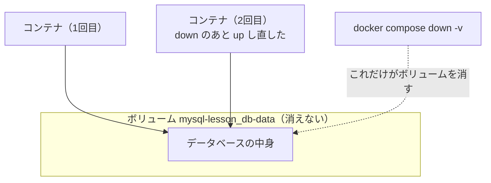
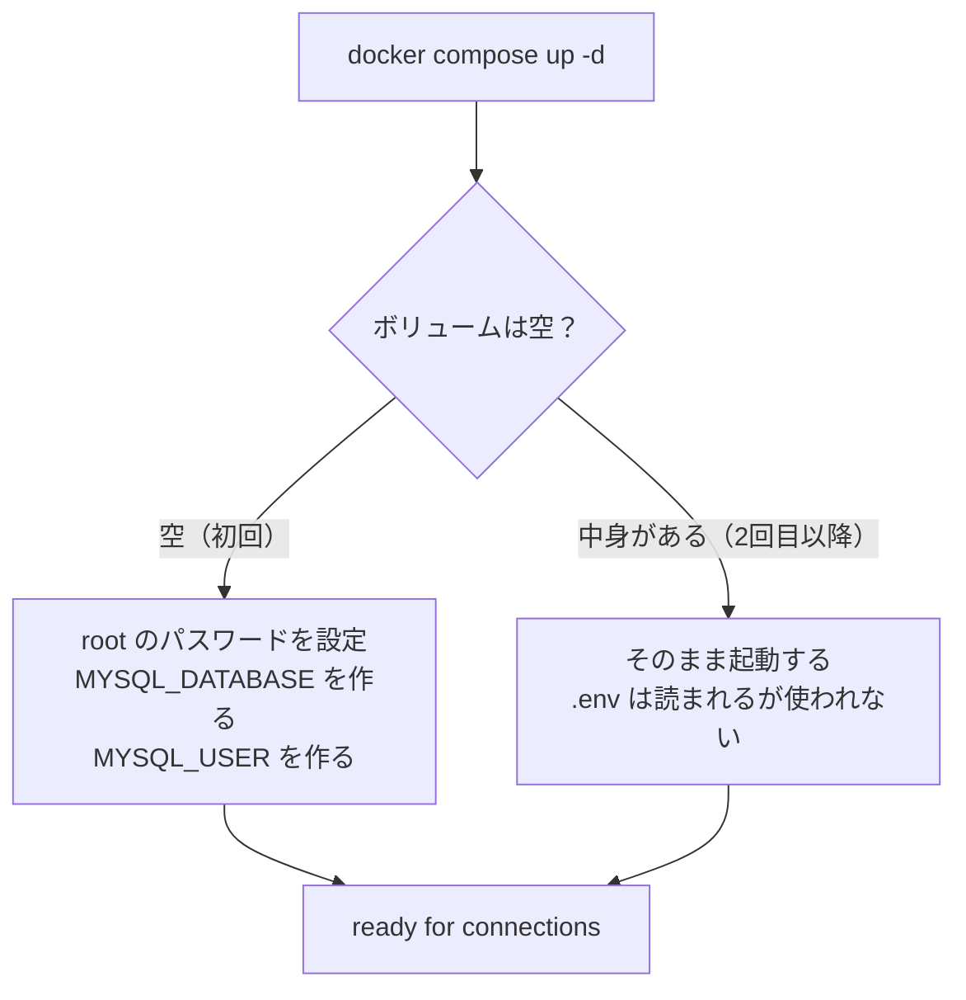
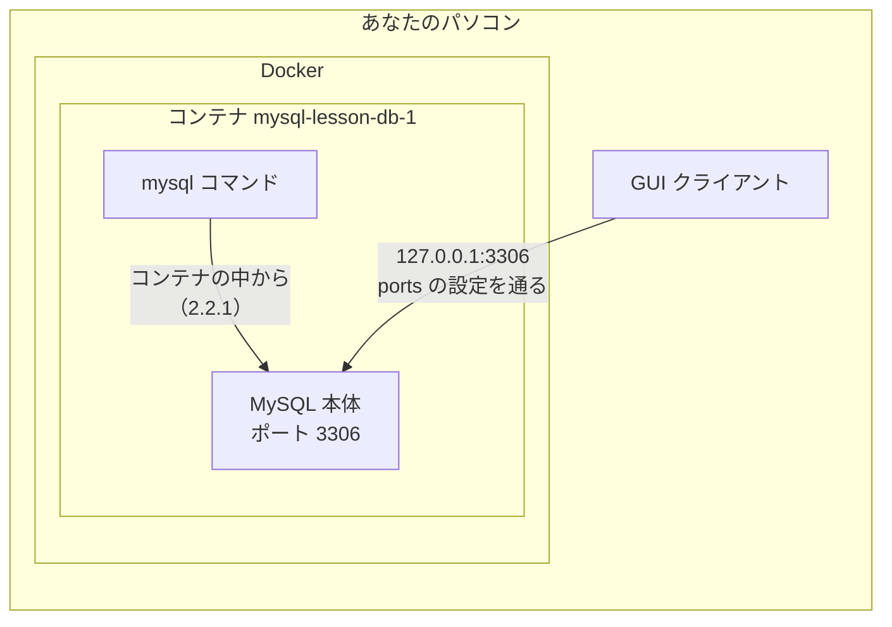
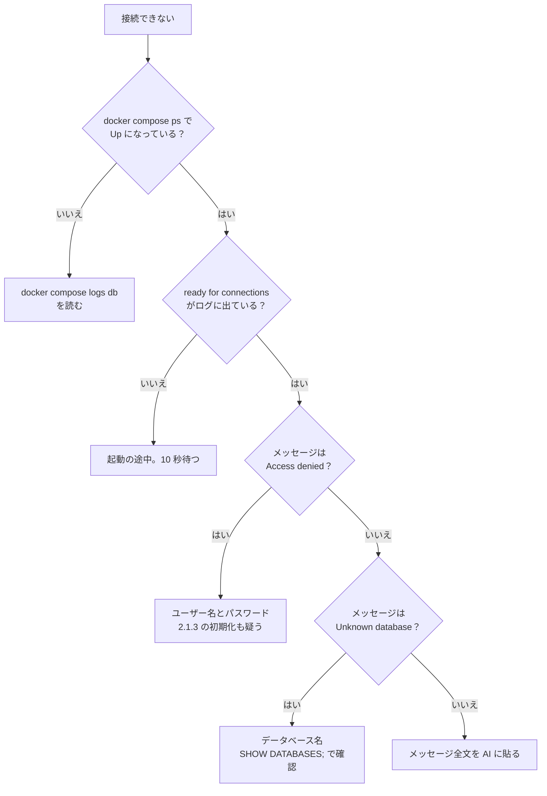
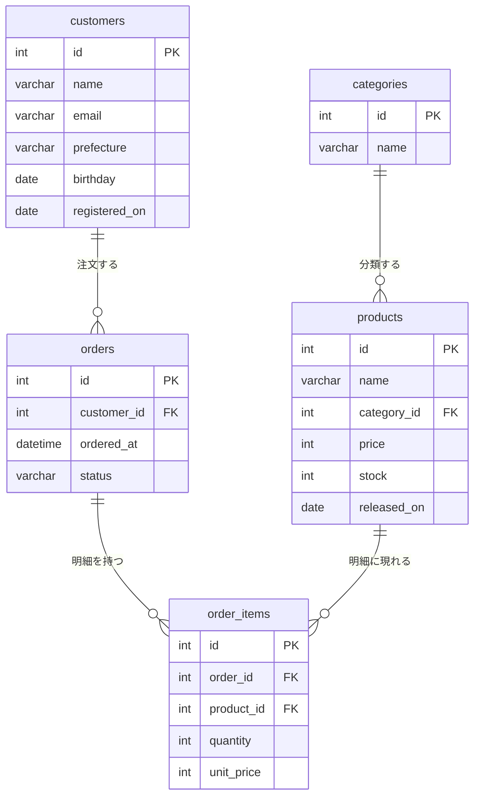
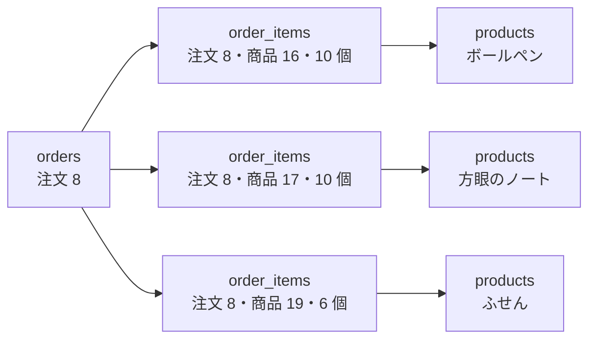
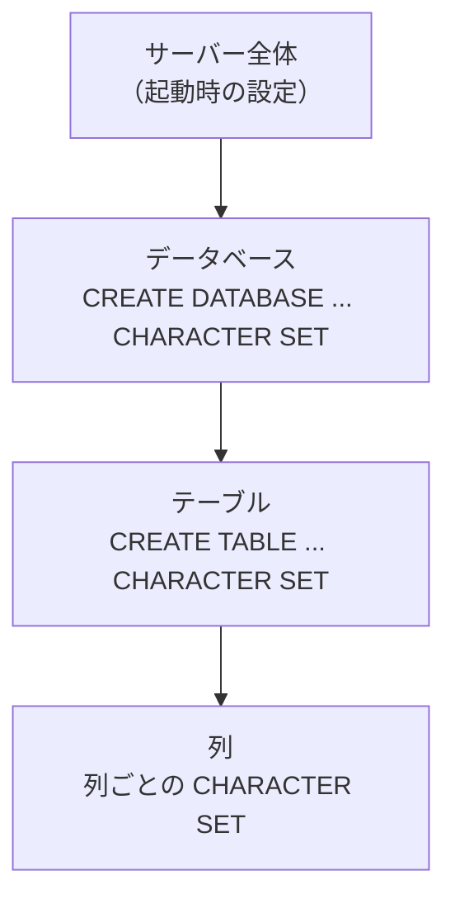

# 第2章 環境構築

**この章は、この本の最初の山場です**（第0章 0.1.3）。

理由は2つあります。

1. **ここで接続できないと、第3章から先が1行も試せません**
2. **2.5 で作る練習用テーブルを、第3章から第7章までずっと使い回します**

やることは多くありません。設定ファイルを1つ書いて Docker で MySQL を起動し、
接続して、練習用のデータを流し込む。それだけです。
docker-text で `compose.yaml` を書いた経験がそのまま使えます。

ただし、**接続まわりは環境によってつまずき方が違います。**
うまくいかないときのために、2.2.3 に切り分けの手順をまとめてあります。
考えて学ぶ場所ではないので、詰まったら遠慮なく AI に手順を出させてください（第0章 0.2.2）。

## この章で学ぶこと

- Docker で MySQL 8.4 を起動し、止め、作り直せるようになる
- ホスト・ポート・ユーザー・パスワード・データベース名の5つが何を指すかを説明できるようになる
- 接続できないときに、原因を上から順に切り分けられるようになる
- `CREATE DATABASE` / `USE` / `CREATE TABLE` で、データベースとテーブルを自分で作れるようになる
- `SHOW` と `DESCRIBE` で、いまあるものと、テーブルの形を確認できるようになる
- 練習用データを SQL ファイルから流し込み、入ったことを件数で確認できるようになる
- 日本語が文字化けしたときに、どこの設定を見ればよいかを言えるようになる

## この章の前提

- [第1章 データベースとは](./01-what-is-database.md) を読み終えていること
- **Docker Desktop が起動していること**（第0章 0.1.1 で `docker --version` を確認しました）
- ディスクの空きが 5 GB 程度あること（第0章 0.1.1）
- docker-text 第5章までの内容（`compose.yaml` / `up` / `down` / `exec` / ボリューム）

> **つまずいたら**
> この章のトラブルは、ほぼすべて**レベル C**（自力解決が不可能な環境問題）です（第0章 0.2.2）。
> 手順を最後まで出してもらって構いません。次のように聞いてください。
>
> ```text
> mysql-text の 2.1.2 で詰まりました。
>
> 【環境】
> OS: Windows 11 Home
> CPU: Intel
>
> 【打ったコマンド】
> docker compose up -d
>
> 【出たメッセージ】
> （ここにメッセージを全文貼る。パスワードは <ここにパスワード> に書き換える）
>
> コピペできる手順で、最後まで解決してください。
> ```

---

## 2.1 Docker で MySQL を起動する

### 2.1.1 設定ファイルを書く

まず、この本の練習に使うディレクトリを作ります。

**このディレクトリは、docker-text 第6章の `fullstack-lesson` とは別に作ってください。**
練習中に `DELETE` を打ち間違えても、第6章で作ったアプリのデータが消えないようにするためです
（第0章 0.1.1）。ディレクトリが違えば Compose のプロジェクト名が変わるので、
**ボリュームも別のものになります**（docker-text 5.2.4）。

**Windows（PowerShell）**

```powershell
cd ~\Documents
mkdir mysql-lesson
cd mysql-lesson
mkdir sql
```

**macOS / Linux**

```bash
cd ~/Documents
mkdir mysql-lesson
cd mysql-lesson
mkdir sql
```

`sql` ディレクトリは、2.5 で練習用データの SQL ファイルを置く場所です。
いまは空のままで構いません。

**設定ファイルを3つ作ります**

`mysql-lesson` の中に、次の3つのファイルを作ります。
VS Code で `mysql-lesson` のフォルダーを開いて作るのが楽です。

| ファイル名 | 役割 |
|-----------|------|
| `compose.yaml` | どのコンテナを、どう起動するかの設定（docker-text 第5章） |
| `.env` | パスワードなど、外に出したくない値を書くファイル（docker-text 5.5.2） |
| `.gitignore` | Git に入れたくないファイルを書くファイル |

**1つ目：`compose.yaml`**

`mysql-lesson/compose.yaml`

```yaml
services:
  db:
    image: mysql:8.4
    ports:
      - "3306:3306"
    environment:
      MYSQL_ROOT_PASSWORD: ${MYSQL_ROOT_PASSWORD}
      MYSQL_DATABASE: ${MYSQL_DATABASE}
      MYSQL_USER: ${MYSQL_USER}
      MYSQL_PASSWORD: ${MYSQL_PASSWORD}
    volumes:
      - db-data:/var/lib/mysql
      - ./sql:/sql

volumes:
  db-data:
```

12行しかありません。1行ずつ意味を確かめます。

| 書いたもの | 意味 |
|-----------|------|
| `services:` | 起動するコンテナの一覧。ここでは `db` の1つだけ |
| `image: mysql:8.4` | MySQL の公式イメージ。**バージョンを 8.4 に固定**（`latest` を使わない。docker-text 2.5.5） |
| `ports: - "3306:3306"` | 左がパソコン側、右がコンテナ側のポート番号（docker-text 4.4.1） |
| `environment:` | コンテナに渡す設定値。MySQL の公式イメージは、この4つを見て初期設定を行う |
| `${MYSQL_ROOT_PASSWORD}` | `.env` に書いた値がここに入る（docker-text 5.5.2） |
| `volumes: - db-data:/var/lib/mysql` | **データの保存先。** `/var/lib/mysql` は MySQL がデータを書く場所 |
| `volumes: - ./sql:/sql` | 手元の `sql` ディレクトリを、コンテナの中の `/sql` として見せる（2.5.2 で使います） |
| 最後の `volumes:` | 名前付きボリューム `db-data` を作る宣言（docker-text 4.3.1） |

**`environment` の4つの値**は、MySQL の公式イメージが決めている名前です。
それぞれ次の意味を持ちます。

| 名前 | 何を決めるか |
|------|------------|
| `MYSQL_ROOT_PASSWORD` | **root**（何でもできる管理者）のパスワード。**この指定が無いとコンテナは起動しません** |
| `MYSQL_DATABASE` | 起動時に自動で作るデータベースの名前 |
| `MYSQL_USER` | root 以外に作るユーザーの名前 |
| `MYSQL_PASSWORD` | そのユーザーのパスワード |

> **補足：`MYSQL_USER` は第8章のために作っています**
> この本の練習では、基本的に **root** で接続します。
> `MYSQL_USER` で作るユーザーは、`MYSQL_DATABASE` で指定したデータベースにしか触れません。
> アプリから接続するときは、こういう**権限を絞ったユーザー**を使います（第8章 8.1.1）。
> 権限の違いは 2.4.1 と演習 2.3 で実際に確かめます。

**2つ目：`.env`**

`mysql-lesson/.env`

```text
MYSQL_ROOT_PASSWORD=root_pass_1234
MYSQL_DATABASE=shop
MYSQL_USER=shop_user
MYSQL_PASSWORD=shop_pass_1234
```

**`=` の前後に空白を入れないでください。** 入れると値の一部として扱われます。

データベース名を `shop` にしたのは、2.5 で作る練習用データが
架空の雑貨店の売上データだからです。

> **注意：このパスワードは練習用です**
> ここでは読みやすさのために単純な値にしています。
> **手元のパソコンの中だけで動かす練習用だから**許される決め方です。
> 実際に公開するアプリでは、推測できない長い値を使ってください（fastapi-text 7.6）。

**3つ目：`.gitignore`**

`mysql-lesson/.gitignore`

```text
.env
```

`.env` にはパスワードが書いてあるので、**Git に入れません**（docker-text 5.5.3）。
この章では Git を使いませんが、あとで使いたくなったときに事故らないよう、先に置いておきます。

**ここまでの構成**

```text
mysql-lesson/
├── compose.yaml
├── .env
├── .gitignore
└── sql/          ← いまは空
```

> **よくある間違い**
> `compose.yaml` は YAML なので、**インデント（行頭の空白）に意味があります**（docker-text 5.2.1）。
> 次の3つを確認してください。
>
> - 空白は**半角スペース2つ**単位。**タブは使えません**
> - `image:` のあとには**半角スペースが1つ**必要（`image:mysql:8.4` はエラー）
> - **全角スペースが混ざっていないか**（日本語入力のまま打つと入ります。見た目では気づけません）
>
> `services.db.image must be a string` のようなメッセージが出たら、まずここを疑ってください。

### 2.1.2 起動と停止

`mysql-lesson` の中にいることを確認してから、起動します。

**Windows（PowerShell）**

```powershell
docker compose up -d
```

**macOS / Linux**

```bash
docker compose up -d
```

`-d` は、**バックグラウンドで動かす**指定です（docker-text 2.4.4）。
これを付けないと、ターミナルが MySQL のログで占領されて、次のコマンドを打てなくなります。

初回は MySQL のイメージ（600 MB 前後）のダウンロードが入るため、
数分かかることがあります。2回目以降はすぐ終わります。

実行結果（数字や順番は環境によって違います）:

```text
[+] Running 3/3
 ✔ Network mysql-lesson_default  Created
 ✔ Volume "mysql-lesson_db-data"  Created
 ✔ Container mysql-lesson-db-1    Started
```

**`mysql-lesson_` という接頭辞**が付いていることに注目してください。
これは**プロジェクト名**（ディレクトリ名から自動で決まる）です（docker-text 5.2.4）。
docker-text 第6章の `fullstack-lesson` とは別のネットワーク・別のボリュームになっています。

**動いているか確認する**

**Windows（PowerShell）**

```powershell
docker compose ps
```

**macOS / Linux**

```bash
docker compose ps
```

実行結果:

```text
NAME                IMAGE       COMMAND                  SERVICE   CREATED          STATUS          PORTS
mysql-lesson-db-1   mysql:8.4   "docker-entrypoint.s…"   db        30 seconds ago   Up 29 seconds   0.0.0.0:3306->3306/tcp
```

`STATUS` が `Up ...` になっていれば動いています。
`Exited (1)` になっている場合は、起動に失敗しています。次のログを見てください。

**ログを見る**

**Windows（PowerShell）**

```powershell
docker compose logs db
```

**macOS / Linux**

```bash
docker compose logs db
```

MySQL は、**起動してから接続を受け付けられるようになるまで数十秒かかります。**
準備ができたかどうかは、ログの最後の行で判断します。

実行結果（末尾のみ。日時とバージョンの数字は環境によって違います）:

```text
db-1  | 2026-09-14T05:17:18.257965Z 0 [System] [MY-010931] [Server] /usr/sbin/mysqld: ready for connections. Version: '8.4.7'  socket: '/var/run/mysqld/mysqld.sock'  port: 3306  MySQL Community Server - GPL.
```

**`ready for connections` が出たら、接続できる状態です。**
出ていなければ、まだ準備中です。10 秒ほど待ってもう一度見てください。

> **よくある間違い**
> `docker compose up -d` が終わった直後は、**まだ接続できません。**
> MySQL は最初の起動時に、内部のデータ領域を作る作業をしています。
> ここで接続しようとすると `Can't connect to MySQL server` になりますが、
> **これは設定の間違いではありません。** ログに `ready for connections` が出るまで待ってください。

**止める・消す**

止め方には種類があります。**違いを取り違えると、練習用データが消えます。**

| コマンド | 何が起きるか | データ |
|---------|------------|-------|
| `docker compose stop` | コンテナを止める（消さない） | **残る** |
| `docker compose start` | 止めたコンテナを動かし直す | — |
| `docker compose down` | コンテナとネットワークを消す | **残る**（ボリュームは消えない） |
| `docker compose down -v` | コンテナ・ネットワーク・**ボリュームまで**消す | **すべて消える** |

日々の練習では、終わるときに `docker compose stop`、
次に始めるときに `docker compose start` で十分です。

> **注意：`down -v` は「作り直し」のためのコマンドです**
> `-v` を付けると、`db-data` ボリュームごと消えます。
> **2.5 で入れた練習用データも消えます。**
> 消したあとは、2.1.2 の起動と 2.5.2 の流し込みをやり直せば元に戻せます（演習 2.4）。
> 手が滑って打ってしまっても、この本の練習では取り返しがつく状態にしてあります。

### 2.1.3 データの永続化を確認する

`volumes` に書いた `db-data` が、実際に作られているかを見ます。

**Windows（PowerShell）**

```powershell
docker volume ls
```

**macOS / Linux**

```bash
docker volume ls
```

実行結果（ほかの本で作ったボリュームも並びます）:

```text
DRIVER    VOLUME NAME
local     fullstack-lesson_db-data
local     mysql-lesson_db-data
```

`mysql-lesson_db-data` があれば、保存先は確保できています。

**なぜこれが必要なのか**

コンテナは、消すと中身ごと消えます（docker-text 4.1.1）。
MySQL がデータを書く `/var/lib/mysql` をボリュームに置いておくと、
**コンテナを作り直しても、データはボリュームの側に残ります。**



**初期化は「最初の1回」だけです**

ここが、MySQL の公式イメージでいちばん誤解されるところです。

`.env` に書いた `MYSQL_ROOT_PASSWORD` や `MYSQL_DATABASE` は、
**ボリュームが空のときにだけ**使われます。
2回目以降の起動では、ボリュームの中にすでにできあがったデータがあるので、
**`.env` を書き換えても何も起きません。**



> **よくある間違い**
> 「パスワードを間違えて書いたので `.env` を直した。でも `Access denied` のまま」
> ── これがこの節の話です。**すでに作られたデータベースのパスワードは変わりません。**
>
> 練習環境なら、次の3行で作り直すのがいちばん早いです。
>
> ```bash
> docker compose down -v
> docker compose up -d
> ```
>
> （練習用データを入れたあとであれば、このあと 2.5.2 の流し込みをやり直してください。）
>
> **本番のデータベースでは、この手は使えません。** データが消えるためです。
> その場合はパスワードを変更する SQL を使いますが、この本では扱いません。

---

## 2.2 接続する

### 2.2.1 コンテナの中から接続する

MySQL に SQL を送るには、**クライアント**（サーバーに接続して命令を送る側のプログラム）が要ります。

いちばん確実なのは、**コンテナの中に入っている `mysql` コマンドを使う**方法です。
パソコン側に何もインストールしなくて済みます。

**Windows（PowerShell）**

```powershell
docker compose exec db mysql -u root -p --default-character-set=utf8mb4 shop
```

**macOS / Linux**

```bash
docker compose exec db mysql -u root -p --default-character-set=utf8mb4 shop
```

長いので、部品に分けます。

| 部品 | 意味 |
|------|------|
| `docker compose exec db` | `db` サービスのコンテナの中でコマンドを実行する（docker-text 5.4.3） |
| `mysql` | コンテナの中に入っている MySQL のクライアント |
| `-u root` | ユーザー名（`-u` は user） |
| `-p` | パスワードを**あとから聞いてもらう**指定（`-p` は password） |
| `--default-character-set=utf8mb4` | やりとりする文字コードの指定。**日本語を扱うために必要**（2.6.2 で説明します） |
| `shop` | 最初から使うデータベースの名前（`.env` の `MYSQL_DATABASE`） |

実行すると、パスワードを聞かれます。`.env` に書いた `MYSQL_ROOT_PASSWORD` の値
（`root_pass_1234`）を入力してください。**打っても画面には何も表示されません。**
これは仕様です。入力したら Enter を押します。

```text
Enter password:
Welcome to the MySQL monitor.  Commands end with ; or \g.
Your MySQL connection id is 8
Server version: 8.4.7 MySQL Community Server - GPL

Copyright (c) 2000, 2026, Oracle and/or its affiliates.

Type 'help;' or '\h' for help. Type '\c' to clear the current input statement.

mysql>
```

**`mysql>` が出たら、接続できています。** ここが SQL を打つ場所です。

> **補足：`-p` のあとにパスワードを直接書かないでください**
> `-proot_pass_1234` のように続けて書くこともできますが、
> `mysql: [Warning] Using a password on the command line interface can be insecure.`
> という警告が出ます。コマンドの履歴にパスワードが残るためです。
> **`-p` だけを書いて、聞かれてから入力する**形を使ってください。

**最初の1文を打ってみます**

```sql
SELECT VERSION();
```

実行結果:

```text
+-----------+
| VERSION() |
+-----------+
| 8.4.7     |
+-----------+
1 row in set (0.01 sec)
```

第1章 1.2.1 で予告した**罫線付きの表**です。
いちばん下の `1 row in set` が件数を表します（第0章 0.3.1）。

**文の終わりはセミコロン（`;`）です**

MySQL は、**`;` が来るまで「文の続き」だと思って待ちます。**
`;` を忘れて Enter を押すと、こうなります。

```text
mysql> SELECT VERSION()
    -> 
```

`mysql>` が **`->`** に変わりました。**エラーではありません。**
「文の続きを待っています」という表示です。
ここで `;` を打って Enter を押せば、実行されます。

```text
mysql> SELECT VERSION()
    -> ;
+-----------+
| VERSION() |
+-----------+
| 8.4.7     |
+-----------+
1 row in set (0.00 sec)
```

打ちかけた文を**取り消したい**ときは、`\c` と打って Enter です。

```text
mysql> SELECT VERSION()
    -> \c
mysql>
```

> **よくある間違い**
> **`->` から戻らなくなるのは、この本でいちばん多いつまずきです**（第0章 0.3.2）。
> 「Enter を押しても何も起きない」「固まった」と感じたら、
> **プロンプトが `mysql>` か `->` かを見てください。**
>
> `->` になっている原因は、たいてい次のどれかです。
>
> - `;` を打ち忘れた → `;` を打って Enter
> - 引用符（`'`）を閉じ忘れた → `\c` で取り消して打ち直す
> - かっこを閉じ忘れた → `\c` で取り消して打ち直す

**終わるとき**

```sql
exit
```

`exit` には `;` が要りません。SQL ではなく、クライアントへの指示だからです。
`exit` で戻るのは、**ターミナルの元の画面**です。MySQL のコンテナは動いたままです。

### 2.2.2 接続情報の意味（ホスト・ポート・ユーザー）

データベースに接続するとき、必要な情報は**いつも同じ5つ**です。
GUI クライアント（2.3）でも、第8章でアプリから繋ぐときでも変わりません。

| 情報 | 意味 | この本での値 |
|------|------|------------|
| **ホスト** | どのコンピュータで動いているか | `127.0.0.1`（自分のパソコン） |
| **ポート** | そのコンピュータのどの入り口か | `3306` |
| **ユーザー** | 誰として接続するか | `root` または `shop_user` |
| **パスワード** | そのユーザーの合言葉 | `.env` に書いた値 |
| **データベース名** | どの箱を使うか | `shop` |

**ポート 3306** は、MySQL が使うと決められている番号です。
HTTP が 80、HTTPS が 443 だったのと同じ、慣習的な割り当てです（fastapi-text 1.1.2）。

**「どこから接続するか」で見え方が変わります**

2.2.1 では**コンテナの中で** `mysql` を実行しました。
このとき MySQL は同じコンテナの中にいるので、ホストは「自分自身」です。

一方、2.3 の GUI クライアントは**パソコン側**で動きます。
このときは `compose.yaml` に書いた `ports: - "3306:3306"` の左側を通って中に入ります。



**`localhost` と `127.0.0.1` は、MySQL では意味が違います**

どちらも「自分自身」を指す書き方ですが、**`mysql` コマンドは、この2つを別のものとして扱います。**

- `localhost` … **UNIX ソケット**（同じコンピュータの中だけで使う、ファイル経由の通り道）で繋ごうとする
- `127.0.0.1` … **TCP/IP**（ネットワーク経由の通り道）で繋ごうとする

パソコン側から Docker の中の MySQL に繋ぐときは、**ネットワーク経由**になります。
そのため、`localhost` と書くと
`Can't connect to local MySQL server through socket ...` と言われることがあります。
**GUI クライアントの設定では `127.0.0.1` と書いてください。**

**ユーザーによって、できることが違います**

| ユーザー | できること |
|---------|----------|
| `root` | 何でも。データベースを作る・消す、ユーザーを作る |
| `shop_user` | **`shop` データベースの中だけ。** ほかのデータベースは見えない |

第1章 1.1.3 で「チェックはデータベース側に1箇所置く」と書きました。
**権限（誰が何をしてよいか）も、データベースが持つ守りの1つです。**
アプリからは `shop_user` のような絞ったユーザーで繋ぐことで、
仮にアプリに穴があっても、被害をそのデータベースの中に閉じ込められます（第8章 8.4）。

演習 2.3 で、この違いを実際に確かめます。

### 2.2.3 接続できないときの切り分け

接続でつまずいたら、**上から順に**確認してください。
思いついたところから触ると、原因が分からなくなります。



**症状別の対処**

| メッセージ | 原因 | 対処 |
|-----------|------|------|
| `Cannot connect to the Docker daemon` | Docker Desktop が起動していない | Docker Desktop を起動する（docker-text 2.2.4） |
| `Bind for 0.0.0.0:3306 failed: port is already allocated` | **ポート 3306 が使用中**（別の MySQL が動いている） | 下の「ポートが衝突したとき」を読む |
| `Database is uninitialized and password option is not specified` | `MYSQL_ROOT_PASSWORD` が渡っていない | `.env` の綴りと、`compose.yaml` の `${...}` を確認（docker-text 6.2.1） |
| `ERROR 1045 (28000): Access denied for user 'root'@'172.18.0.1' (using password: YES)` | パスワードが違う | `.env` の値を確認。直しても同じなら **2.1.3 の初期化**を疑う |
| `ERROR 1049 (42000): Unknown database 'shop'` | データベース名が違う | 接続してから `SHOW DATABASES;`（2.4.4） |
| `ERROR 2002 (HY000): Can't connect to local MySQL server through socket` | `localhost` でソケット接続しようとしている | ホストを **`127.0.0.1`** にする（2.2.2） |
| `service "db" is not running` | コンテナが止まっている | `docker compose up -d` |

**ポートが衝突したとき**

パソコンに MySQL を直接インストールしたことがある人は、
すでに 3306 番が使われていることがあります。
その場合は、`compose.yaml` の**左側の数字だけ**を変えてください（docker-text 4.4.2）。

```diff
     ports:
-      - "3306:3306"
+      - "3307:3306"
```

変更したら `docker compose up -d` で作り直します。
**コンテナの中は 3306 のままなので、2.2.1 の接続コマンドは変わりません。**
変わるのは、パソコン側から繋ぐとき（2.3 の GUI クライアント）のポート番号だけです。

> **つまずいたら**
> 3分見て分からなければ、次のように聞いてください（第0章 0.3.2）。
>
> ```text
> mysql-text の 2.2 で MySQL に接続できません。
>
> 【環境】OS: macOS 15 / CPU: Apple Silicon
> 【打ったコマンド】docker compose exec db mysql -u root -p shop
> 【出たメッセージ】（全文。パスワードは伏せる）
> 【docker compose ps の結果】（全文）
> 【docker compose logs db の最後の 20 行】（全文）
>
> コピペできる手順で、最後まで解決してください。
> ```

---

## 2.3 GUI クライアントを使う

### 2.3.1 選択肢

ここまでは、文字だけの画面（CLI）で MySQL を操作しました。
表を画面で見たり、テーブルの一覧をクリックで開いたりできる
**GUI クライアント**（画面上のボタンや一覧で操作できるアプリ）もあります。

| 名前 | 形 | 特徴 |
|------|----|------|
| **Adminer** | Docker で足す | **インストール不要。** `compose.yaml` に5行足すだけ。機能は最小限 |
| **MySQL Workbench** | インストール | MySQL 公式。多機能だが重い |
| **DBeaver** | インストール | 無料。MySQL 以外のデータベースにも使える |
| **TablePlus** | インストール | 軽くて見やすい。無料版は開けるタブの数に制限がある |
| **VS Code の拡張機能** | 拡張機能 | エディタから離れずに使える。拡張機能ごとに出来が違う |

**このテキストでは Adminer を紹介します。**
インストールが不要で、Windows でも macOS でも同じ画面になるためです
（docker-text 第6章の演習でも使いました）。

すでに使い慣れた GUI クライアントがある人は、そちらで構いません。
接続に必要な情報は 2.2.2 の5つだけです。

### 2.3.2 接続設定

**Adminer を足す**

`compose.yaml` の `db` サービスのうしろに、次の5行を足します。
`volumes:` の宣言より前、`services:` の中に入るように気をつけてください。

```diff
     volumes:
       - db-data:/var/lib/mysql
       - ./sql:/sql
+
+  adminer:
+    image: adminer:4.8.1
+    ports:
+      - "8080:8080"
 
 volumes:
   db-data:
```

足したら、作り直します。

**Windows（PowerShell）**

```powershell
docker compose up -d
```

**macOS / Linux**

```bash
docker compose up -d
```

実行結果:

```text
[+] Running 3/3
 ✔ Network mysql-lesson_default      Running
 ✔ Container mysql-lesson-db-1       Running
 ✔ Container mysql-lesson-adminer-1  Started
```

ブラウザで `http://localhost:8080` を開くと、ログイン画面が出ます。
入力する値は、2.2.2 の5つと対応しています。

| Adminer の入力欄 | 入れる値 | 2.2.2 のどれか |
|----------------|---------|--------------|
| データベース種類（System） | `MySQL` | — |
| サーバ（Server） | **`db`** | ホスト |
| ユーザ名（Username） | `root` | ユーザー |
| パスワード（Password） | `.env` の `MYSQL_ROOT_PASSWORD` の値 | パスワード |
| データベース（Database） | `shop` | データベース名 |

**サーバ欄が `127.0.0.1` ではなく `db` になる理由**

Adminer は**コンテナの中**で動いています。
コンテナから見た MySQL は、同じ Compose のネットワークにいる**サービス名 `db`** です
（docker-text 4.5.3 / 5.3.2）。
`127.0.0.1` と書くと、Adminer 自身のコンテナの中を探しに行ってしまい、繋がりません。

パソコンにインストールした GUI クライアント（DBeaver など）から繋ぐ場合は、逆になります。

| | サーバ（ホスト） | ポート |
|---|---------------|-------|
| Adminer（コンテナの中） | `db` | `3306` |
| DBeaver など（パソコン側） | **`127.0.0.1`** | `compose.yaml` の**左側**の数字（既定は `3306`） |

> **注意：Adminer を外に公開しないでください**
> Adminer には、データベースの中身を自由に読み書きできる画面がそのまま出ます。
> **手元のパソコンの中だけで動かす前提**の道具です。
> 公開されるサーバーで同じことをすると、URL を知っている人全員に
> データベースを触らせることになります（docker-text 第6章の演習でも扱いました）。

### 2.3.3 CLI と GUI の使い分け

どちらかだけを使う必要はありません。得意なことが違います。

| | CLI（`mysql` コマンド） | GUI（Adminer など） |
|---|---------------------|-------------------|
| SQL を書いて実行する | ○ | ○ |
| テーブルの一覧を眺める | `SHOW TABLES;` | 一覧が常に見えている |
| 長い SQL を書き直す | 書き直しがつらい | 編集しやすい |
| 結果を見る | 罫線付きの表。列が多いと折り返す | 表として見やすい |
| 手順を人に伝える | **コマンドをそのまま渡せる** | 画面の説明が要る |
| どこでも同じか | **どの環境でも同じ** | アプリごとに画面が違う |

**このテキストの本文は、すべて CLI で進めます。**
理由は、**打ったものと結果をそのまま載せられる**からです。
画面のスクリーンショットは、アプリのバージョンで変わってしまいます。

一方、**テーブルの中身を眺めながら考えたいとき**は GUI が便利です。
第5章のテーブル設計や、第6章の結合の練習では、
GUI で構造を見ながら CLI で SQL を打つ、という使い方もできます。

---

## 2.4 データベースとテーブルを作る

ここからは、実際に SQL を打ちます。
2.2.1 の方法で接続して、`mysql>` が出ている状態にしてください。

**Windows（PowerShell）**

```powershell
docker compose exec db mysql -u root -p --default-character-set=utf8mb4
```

**macOS / Linux**

```bash
docker compose exec db mysql -u root -p --default-character-set=utf8mb4
```

**今回はうしろに `shop` を付けていません。**
「どのデータベースも選んでいない状態」から始めて、2.4.2 で自分で切り替えます。

### 2.4.1 `CREATE DATABASE`

**データベース**（テーブルを入れておく箱。第1章 1.1 の意味とは別に、
MySQL の中ではこの「箱」の単位も「データベース」と呼びます）を作ります。

まず、いまある箱の一覧を見ます。

```sql
SHOW DATABASES;
```

実行結果:

```text
+--------------------+
| Database           |
+--------------------+
| information_schema |
| mysql              |
| performance_schema |
| shop               |
| sys                |
+--------------------+
5 rows in set (0.00 sec)
```

`shop` は、`.env` の `MYSQL_DATABASE` から自動で作られたものです（2.1.3）。
残りの4つは **MySQL 自身が使う箱**なので、触りません。

| 名前 | 中身 |
|------|------|
| `information_schema` | テーブルや列の情報（データについてのデータ） |
| `mysql` | ユーザーや権限の情報 |
| `performance_schema` | 動作状況の記録 |
| `sys` | `performance_schema` を読みやすくしたもの |

**練習用の箱を1つ作ります**

`shop` は 2.5 で本番の練習データを入れる箱なので、
`CREATE TABLE` の練習は別の箱でやります。

```sql
CREATE DATABASE sandbox CHARACTER SET utf8mb4;
```

実行結果:

```text
Query OK, 1 row affected (0.01 sec)
```

**`Query OK` が「成功した」という意味**です。
`1 row affected` の数字は、この場合あまり意味がありません
（変更が1つ加わった、と読んでください）。

`CHARACTER SET utf8mb4` は、**この箱に入れる文字の種類**の指定です（2.6.2 で説明します）。
MySQL 8.4 では書かなくても同じ結果になりますが、
**書いておくと、設定が違う環境に持っていっても同じになる**ので、この本では明示します。

もう一度 `SHOW DATABASES;` を打つと、`sandbox` が増えているはずです。

> **よくある間違い**
> `shop_user` で接続していると、`CREATE DATABASE` は次のように断られます。
>
> ```text
> ERROR 1044 (42000): Access denied for user 'shop_user'@'%' to database 'sandbox'
> ```
>
> これは**エラーではなく、権限の設計どおりの動き**です（2.2.2）。
> 箱を作るような操作は `root` で行います。

### 2.4.2 `USE` で切り替える

箱を作っただけでは、まだそこに入っていません。
いまどの箱にいるかを確かめます。

```sql
SELECT DATABASE();
```

実行結果:

```text
+------------+
| DATABASE() |
+------------+
| NULL       |
+------------+
1 row in set (0.00 sec)
```

**`NULL`**（値が入っていない。第1章 1.3.1）です。まだ何も選んでいません。
この状態でテーブルを触ろうとすると、こうなります。

```sql
SHOW TABLES;
```

実行結果:

```text
ERROR 1046 (3D000): No database selected
```

**`No database selected` は、この本で2番目に多いつまずきです**（第0章 0.3.2）。
切り替えれば直ります。

```sql
USE sandbox;
```

実行結果:

```text
Database changed
```

もう一度確認します。

```sql
SELECT DATABASE();
```

実行結果:

```text
+------------+
| DATABASE() |
+------------+
| sandbox    |
+------------+
1 row in set (0.00 sec)
```

`USE` は、**接続している間だけ**有効です。
`exit` して入り直すと、また選んでいない状態に戻ります。
毎回打つのが面倒なときは、2.2.1 のように**接続コマンドの最後に箱の名前を書きます。**

**Windows（PowerShell）**

```powershell
docker compose exec db mysql -u root -p --default-character-set=utf8mb4 sandbox
```

**macOS / Linux**

```bash
docker compose exec db mysql -u root -p --default-character-set=utf8mb4 sandbox
```

### 2.4.3 `CREATE TABLE`

いよいよテーブルを作ります。
題材は「メモ」にします（`shop` の練習データとは関係ありません。書き方を覚えるためのものです）。

```sql
CREATE TABLE memos (
    id         INT AUTO_INCREMENT PRIMARY KEY,
    title      VARCHAR(50) NOT NULL,
    body       VARCHAR(200),
    written_on DATE NOT NULL
);
```

**複数行にまたがって打って構いません。** `;` を打つまで実行されないので、
途中の行では `->` が出ます（2.2.1）。これは正常です。

実行結果:

```text
Query OK, 0 rows affected (0.02 sec)
```

書いたものを分解します。

| 書いたもの | 意味 |
|-----------|------|
| `CREATE TABLE memos (` | `memos` という名前のテーブルを作る |
| `id INT` | `id` という**列**を作る。型は `INT`（整数） |
| `AUTO_INCREMENT` | 値を入れなかったとき、**1, 2, 3... と自動で番号を振る**（詳しくは第5章 5.3.2） |
| `PRIMARY KEY` | この列を**主キー**にする（第1章 1.4） |
| `VARCHAR(50)` | 最大 50 文字までの文字列 |
| `NOT NULL` | **空（`NULL`）を許さない。** 必ず値を入れさせる（詳しくは第5章 5.2.1） |
| `DATE` | 日付（`2026-09-14` の形） |
| `);` | 列の並びはここまで、という区切り |

**列の定義は「列名 → 型 → その他の指定」の順**に書きます。
列と列のあいだはカンマ（`,`）で区切り、**最後の列のうしろにはカンマを付けません。**

**型は、この章では4つだけ使います**

| 型 | 入れるもの | 例 |
|----|----------|---|
| `INT` | 整数 | `1200` |
| `VARCHAR(n)` | 最大 n 文字の文字列 | `'こまり顔のマグカップ'` |
| `DATE` | 日付 | `'2026-09-14'` |
| `DATETIME` | 日付と時刻 | `'2026-09-14 10:24:00'` |

**それぞれをどう選ぶかは第5章 5.1 で扱います。**
いまは「列ごとに型を決めてから、テーブルを作る」という順番だけ押さえてください
（第1章 1.2.1）。

`body` にだけ `NOT NULL` を付けていないのは、
**本文が空のメモを許したいから**です。`NULL` を入れられる列は、こう作ります。

> **よくある間違い**
> テーブル名や列名に**日本語**は使えます。しかし、この本では**半角英数字**を使います。
> 日本語の名前は、環境によって文字コードの問題を起こしやすく、
> SQL を書くたびに日本語入力を切り替えることになるためです。
>
> また、名前に**空白**が入るとエラーになります（`written on` は不可）。
> **単語のあいだは `_`（アンダースコア）で繋ぐ**のが MySQL の慣習です。

### 2.4.4 `SHOW` と `DESCRIBE` で確認する

作ったものは、必ず確認します。

**テーブルの一覧**

```sql
SHOW TABLES;
```

実行結果:

```text
+-------------------+
| Tables_in_sandbox |
+-------------------+
| memos             |
+-------------------+
1 row in set (0.00 sec)
```

見出しに、**いまいる箱の名前**（`Tables_in_sandbox`）が入ります。
ここが `Tables_in_shop` になっていたら、箱を間違えています。

**テーブルの形**

```sql
DESCRIBE memos;
```

実行結果:

```text
+------------+--------------+------+-----+---------+----------------+
| Field      | Type         | Null | Key | Default | Extra          |
+------------+--------------+------+-----+---------+----------------+
| id         | int          | NO   | PRI | NULL    | auto_increment |
| title      | varchar(50)  | NO   |     | NULL    |                |
| body       | varchar(200) | YES  |     | NULL    |                |
| written_on | date         | NO   |     | NULL    |                |
+------------+--------------+------+-----+---------+----------------+
4 rows in set (0.00 sec)
```

**この表が読めると、質問の質が上がります**（第0章 0.2.2 のテンプレート）。

| 列 | 意味 |
|----|------|
| `Field` | 列の名前 |
| `Type` | データ型。`INT` は小文字の `int` で表示される |
| `Null` | **`NULL` を入れてよいか。** `NO` が `NOT NULL` を付けた列 |
| `Key` | 鍵の種類。`PRI` が主キー |
| `Default` | 値を書かなかったときに入る値（第4章 4.1.3 / 第5章 5.2.2） |
| `Extra` | そのほかの指定。`auto_increment` が見える |

`DESCRIBE` は `DESC` と短く書くこともできます。**この本では `DESCRIBE` と書きます。**
第3章で出てくる並べ替えの `DESC`（降順）と紛らわしいためです。

**作ったときの SQL を思い出す**

```sql
SHOW CREATE TABLE memos\G
```

最後が `;` ではなく **`\G`** になっていることに注意してください。
`\G` は「**縦に並べて表示する**」指定です。列が長いときに読みやすくなります。

実行結果:

```text
*************************** 1. row ***************************
       Table: memos
Create Table: CREATE TABLE `memos` (
  `id` int NOT NULL AUTO_INCREMENT,
  `title` varchar(50) NOT NULL,
  `body` varchar(200) DEFAULT NULL,
  `written_on` date NOT NULL,
  PRIMARY KEY (`id`)
) ENGINE=InnoDB DEFAULT CHARSET=utf8mb4 COLLATE=utf8mb4_0900_ai_ci
1 row in set (0.00 sec)
```

自分が書いたものに、MySQL が**省略された部分を補って**返してくれています。

- 名前がバッククォート（`` ` ``）で囲まれている（名前だとはっきりさせる書き方）
- `AUTO_INCREMENT` の列には自動的に `NOT NULL` が付く
- `body` は `DEFAULT NULL`（何も書かなければ `NULL` が入る）
- 末尾に **`CHARSET=utf8mb4`** と **`COLLATE=utf8mb4_0900_ai_ci`**（2.6 で扱います）

**練習用の箱を片づける**

`sandbox` はここまでの練習用なので、消しておきます。

```sql
DROP DATABASE sandbox;
```

実行結果:

```text
Query OK, 1 row affected (0.03 sec)
```

> **注意：`DROP DATABASE` は取り消せません**
> 確認も警告も出ずに、箱ごと中身が消えます。
> **打つ前に、箱の名前を声に出して読んでください。**
> `DROP DATABASE shop;` と打ってしまうと、練習用データが消えます
> （2.5.2 の流し込みをやり直せば戻せますが、第8章でアプリに繋いだあとは戻りません）。
>
> 消す操作を安全に行う手順は、第4章 4.2.4 で扱います。

---

## 2.5 練習用データを投入する

### 2.5.1 この本で使うテーブル構成

**ここで作るテーブルを、第3章から第7章までずっと使います。**

題材は、**架空の雑貨店のオンラインショップ**です。
第0章 0.1.2 で「読めなくて構いません」と見せた15行の SQL は、
このテーブルに対する問い合わせでした。第6章を終えると、あれが書けるようになります。

**5つのテーブル**

| テーブル | 何の表か | 行数 |
|---------|---------|------|
| `categories` | 商品の分類（食器・キッチンなど） | 4 |
| `customers` | 顧客 | 8 |
| `products` | 商品 | 20 |
| `orders` | 注文（誰が、いつ、注文したか） | 15 |
| `order_items` | 注文の明細（その注文で、どの商品を何個買ったか） | 37 |

**関連を図にすると、次のようになります。**



第1章 1.2.2 で見た形が、そのまま4か所に現れています。
**繰り返し出てくる値を別の表に分けて、相手の主キーを持つ**、という形です。

| 分けたもの | 相手の主キーを持つ列 |
|-----------|------------------|
| 商品の分類 | `products.category_id` |
| 注文した人 | `orders.customer_id` |
| どの注文の明細か | `order_items.order_id` |
| どの商品の明細か | `order_items.product_id` |

**`order_items` だけ、少し違います**

`categories` と `products` の関係は**1対多**でした（1つの分類に商品が何個も）。
ところが、`orders` と `products` の関係は違います。

- 1回の注文には、**複数の商品**が入る
- 1つの商品は、**複数の注文**に現れる

このように**どちらから見ても「多」になる関係**を**多対多**と呼びます。
多対多は、そのままでは表で持てません。
そこで、**あいだに1枚の表を挟みます。** それが `order_items` です。



あいだに挟む表を**中間テーブル**と呼びます。
中間テーブルの書き方と使い方は第6章 6.7 で扱います。
**いまは「多対多は、あいだの表で表す」とだけ覚えてください。**

**列の意味**

| テーブル | 列 | 型 | 意味 |
|---------|---|----|----|
| `categories` | `name` | `VARCHAR(20)` | 分類の名前 |
| `customers` | `name` / `email` | `VARCHAR` | 顧客の名前とメールアドレス |
| | `prefecture` | `VARCHAR(10)` | 都道府県。**同じ値が何度も出てくる**（第3章 3.5 の題材） |
| | `birthday` | `DATE` | 生年月日。**未登録の人がいるので `NULL` を許す** |
| | `registered_on` | `DATE` | 会員登録日 |
| `products` | `price` | `INT` | 価格（円） |
| | `stock` | `INT` | 在庫数。**0 の商品がある**（`NULL` との違いの題材。第3章 3.3.4） |
| | `released_on` | `DATE` | 発売日。**昔からある商品は `NULL`** |
| `orders` | `ordered_at` | `DATETIME` | 注文日時。**日付だけでなく時刻も持つ** |
| | `status` | `VARCHAR(10)` | `受付` / `発送済` / `キャンセル` のどれか |
| `order_items` | `quantity` | `INT` | 個数 |
| | `unit_price` | `INT` | **注文したときの単価** |

> **補足：なぜ `order_items` に `unit_price` を持つのか**
> 単価は `products.price` にもあります。二重に持っているように見えます。
>
> しかし、**商品の値段は変わります。**
> `products.price` を書き換えたときに、
> 過去の注文の金額まで変わってしまっては困ります。
> そこで、**注文した時点の単価を明細に写して持ちます。**
>
> 第1章 1.2.2 では「繰り返す値は分けよう」と書きました。
> ここはその例外です。**あとから変わってはいけない値は、あえて写して持つ**という判断です。
> この判断の理由は第5章 5.5.3 でもう一度扱います。

> **注意：外部キーの制約は、まだ付けません**
> `products.category_id` に、存在しない分類の番号（たとえば `99`）を入れても、
> いまの状態では MySQL は止めてくれません。
> **「存在しない相手を指す値を拒否する」仕組み（外部キー制約）は第5章 5.4 で足します。**
> いまの `category_id` は、**「相手の主キーの値を入れることにした、ただの整数の列」**です。

### 2.5.2 SQL ファイルを流し込む

テーブルを5つ作って、行を 84 件入れます。
これを1つずつ手で打つのは現実的ではありません。
**SQL をファイルに書いておいて、まとめて実行します。**

2.1.1 で作った `sql` ディレクトリの中に、`shop.sql` という名前でファイルを作ってください。
中身は次のとおりです。**長いですが、コピーして貼り付けるだけです。**

`mysql-lesson/sql/shop.sql`

```sql
-- 練習用データ（mysql-text 第2章 2.5）
-- 何度実行しても同じ状態になります。

DROP TABLE IF EXISTS order_items;
DROP TABLE IF EXISTS orders;
DROP TABLE IF EXISTS products;
DROP TABLE IF EXISTS categories;
DROP TABLE IF EXISTS customers;

CREATE TABLE categories (
    id   INT AUTO_INCREMENT PRIMARY KEY,
    name VARCHAR(20) NOT NULL
);

CREATE TABLE customers (
    id            INT AUTO_INCREMENT PRIMARY KEY,
    name          VARCHAR(20)  NOT NULL,
    email         VARCHAR(100) NOT NULL,
    prefecture    VARCHAR(10)  NOT NULL,
    birthday      DATE,
    registered_on DATE         NOT NULL
);

CREATE TABLE products (
    id          INT AUTO_INCREMENT PRIMARY KEY,
    name        VARCHAR(40) NOT NULL,
    category_id INT         NOT NULL,
    price       INT         NOT NULL,
    stock       INT         NOT NULL,
    released_on DATE
);

CREATE TABLE orders (
    id          INT AUTO_INCREMENT PRIMARY KEY,
    customer_id INT         NOT NULL,
    ordered_at  DATETIME    NOT NULL,
    status      VARCHAR(10) NOT NULL
);

CREATE TABLE order_items (
    id         INT AUTO_INCREMENT PRIMARY KEY,
    order_id   INT NOT NULL,
    product_id INT NOT NULL,
    quantity   INT NOT NULL,
    unit_price INT NOT NULL
);

INSERT INTO categories (id, name) VALUES
    (1, '食器'),
    (2, 'キッチン'),
    (3, '収納'),
    (4, '文房具');

INSERT INTO customers (id, name, email, prefecture, birthday, registered_on) VALUES
    (1, '田中 陽子',   'tanaka@example.com',    '東京都', '1990-04-12', '2025-11-03'),
    (2, '佐藤 健',     'sato@example.com',      '大阪府', '1985-09-30', '2025-12-18'),
    (3, '鈴木 一郎',   'suzuki@example.com',    '東京都', NULL,         '2026-01-25'),
    (4, '高橋 美咲',   'takahashi@example.com', '北海道', '1998-02-14', '2026-02-09'),
    (5, '伊藤 慎二',   'ito@example.com',       '福岡県', '1979-11-05', '2026-03-30'),
    (6, '渡辺 さくら', 'watanabe@example.com',  '東京都', NULL,         '2026-05-16'),
    (7, '山本 大輔',   'yamamoto@example.com',  '大阪府', '2001-07-21', '2026-06-01'),
    (8, '中村 結衣',   'nakamura@example.com',  '京都府', '1993-12-08', '2026-08-24');

INSERT INTO products (id, name, category_id, price, stock, released_on) VALUES
    (1,  'こまり顔のマグカップ',       1, 1200,  32, '2025-10-01'),
    (2,  '藍色の湯のみ',               1,  800,  15, '2025-10-01'),
    (3,  '木のスープボウル',           1, 2400,   6, '2025-11-15'),
    (4,  '白磁の取り皿 5枚組',         1, 3200,   0, '2026-01-20'),
    (5,  '厚手のごはん茶碗',           1,  980,  41, NULL),
    (6,  'ステンレスの計量スプーン',   2,  680,  55, '2025-09-12'),
    (7,  'ひのきのまな板',             2, 4500,   3, '2026-02-03'),
    (8,  '鉄のフライパン 24cm',        2, 5800,   9, '2026-02-03'),
    (9,  'シリコンのおたま',           2,  980,  27, '2026-04-18'),
    (10, 'ほうろうの保存容器',         2, 1800,  12, NULL),
    (11, '布のランチトート',           3, 2200,  18, '2025-12-05'),
    (12, '積み重ねられる収納ボックス', 3, 1500,  24, '2026-03-11'),
    (13, '麻のかごバスケット',         3, 3600,   0, '2026-03-11'),
    (14, 'つっぱり棚',                 3, 2800,   7, NULL),
    (15, '透明の小物ケース',           3,  450,  63, '2026-05-22'),
    (16, '書きやすいボールペン',       4,  380, 120, '2025-08-30'),
    (17, '方眼のノート A5',            4,  520,  88, '2025-08-30'),
    (18, '木軸のシャープペンシル',     4, 1600,  14, '2026-04-02'),
    (19, 'ふせん 3色セット',           4,  340,  95, NULL),
    (20, '革のペンケース',             4, 4200,   5, '2026-07-09');

INSERT INTO orders (id, customer_id, ordered_at, status) VALUES
    (1,  1, '2026-06-03 10:24:00', '発送済'),
    (2,  2, '2026-06-11 19:05:00', '発送済'),
    (3,  1, '2026-06-28 09:12:00', '発送済'),
    (4,  4, '2026-07-02 14:47:00', '発送済'),
    (5,  3, '2026-07-14 21:30:00', 'キャンセル'),
    (6,  5, '2026-07-19 08:58:00', '発送済'),
    (7,  2, '2026-07-25 16:41:00', '発送済'),
    (8,  7, '2026-08-01 11:09:00', '発送済'),
    (9,  1, '2026-08-08 13:53:00', '発送済'),
    (10, 4, '2026-08-15 20:16:00', '発送済'),
    (11, 8, '2026-08-26 07:44:00', '受付'),
    (12, 5, '2026-09-01 18:22:00', '発送済'),
    (13, 7, '2026-09-05 12:35:00', '受付'),
    (14, 2, '2026-09-09 15:58:00', '受付'),
    (15, 1, '2026-09-12 09:03:00', '受付');

INSERT INTO order_items (id, order_id, product_id, quantity, unit_price) VALUES
    (1,  1,  1,   2, 1200),
    (2,  1,  16,  3,  380),
    (3,  2,  8,   1, 5800),
    (4,  2,  6,   2,  680),
    (5,  2,  17,  5,  520),
    (6,  3,  11,  1, 2200),
    (7,  3,  15,  4,  450),
    (8,  4,  3,   2, 2400),
    (9,  4,  5,   4,  980),
    (10, 4,  19,  2,  340),
    (11, 5,  7,   1, 4500),
    (12, 5,  9,   1,  980),
    (13, 6,  12,  3, 1500),
    (14, 6,  14,  1, 2800),
    (15, 7,  1,   1, 1200),
    (16, 7,  2,   4,  800),
    (17, 7,  10,  2, 1800),
    (18, 8,  16, 10,  380),
    (19, 8,  17, 10,  520),
    (20, 8,  19,  6,  340),
    (21, 9,  20,  1, 4200),
    (22, 9,  18,  1, 1600),
    (23, 10, 13,  1, 3600),
    (24, 10, 11,  2, 2200),
    (25, 10, 15,  3,  450),
    (26, 11, 4,   1, 3200),
    (27, 11, 2,   2,  800),
    (28, 12, 6,   1,  680),
    (29, 12, 9,   2,  980),
    (30, 12, 5,   1,  980),
    (31, 13, 17,  3,  520),
    (32, 13, 16,  2,  380),
    (33, 14, 8,   1, 5800),
    (34, 14, 7,   1, 4500),
    (35, 15, 1,   1, 1200),
    (36, 15, 12,  2, 1500),
    (37, 15, 19,  3,  340);
```

**先頭の `--` で始まる行はコメント**です。SQL としては実行されません
（Python の `#`、JavaScript の `//` にあたるものです）。

**先頭の `DROP TABLE IF EXISTS`** は、「そのテーブルがあれば消す」という意味です。
これがあるおかげで、**このファイルは何度流し込んでも同じ状態になります。**
練習でデータを壊してしまったら、もう一度流し込めば元どおりです。

> **注意：ファイルは UTF-8 で保存してください**
> VS Code の場合、画面右下に文字コードが表示されています。
> `UTF-8` になっていない場合はクリックして
> 「Save with Encoding」→「UTF-8」を選んでください。
> Shift_JIS で保存すると、流し込んだときに日本語が壊れます（2.6.1）。

**流し込む**

`compose.yaml` に `./sql:/sql` と書いたので（2.1.1）、
このファイルは**コンテナの中から `/sql/shop.sql` として見えています。**

`shop` に接続します。

**Windows（PowerShell）**

```powershell
docker compose exec db mysql -u root -p --default-character-set=utf8mb4 shop
```

**macOS / Linux**

```bash
docker compose exec db mysql -u root -p --default-character-set=utf8mb4 shop
```

`mysql>` が出たら、次を打ちます。

```sql
SOURCE /sql/shop.sql;
```

`SOURCE` は「**このファイルに書かれた SQL を、上から順に実行する**」という指示です。
実行結果は、文の数だけ流れます。

```text
Query OK, 0 rows affected, 1 warning (0.01 sec)

（中略。CREATE TABLE の分だけ Query OK が並びます）

Query OK, 4 rows affected (0.00 sec)
Records: 4  Duplicates: 0  Warnings: 0

Query OK, 8 rows affected (0.00 sec)
Records: 8  Duplicates: 0  Warnings: 0

Query OK, 20 rows affected (0.01 sec)
Records: 20  Duplicates: 0  Warnings: 0

Query OK, 15 rows affected (0.00 sec)
Records: 15  Duplicates: 0  Warnings: 0

Query OK, 37 rows affected (0.00 sec)
Records: 37  Duplicates: 0  Warnings: 0
```

**最後の5つの `rows affected` が、入った行数**です。
`4` / `8` / `20` / `15` / `37` になっていれば成功です。

1回目の実行では、`DROP TABLE IF EXISTS` のところで
`1 warning` と表示されることがあります。
**「消そうとしたテーブルが無かった」という報告**なので、気にしなくて構いません。

> **補足：ファイルを外から流し込む方法もあります**
> macOS / Linux では、次のようにファイルの中身を渡すこともできます。
>
> ```bash
> docker compose exec -T db mysql -u root -p --default-character-set=utf8mb4 shop < sql/shop.sql
> ```
>
> **Windows の PowerShell では、この `<` は使えません。**
> `Get-Content` で渡す方法もありますが、
> **その途中で日本語の文字コードが変わってしまうことがあります。**
> この本では、**両方の OS で同じ結果になる `SOURCE` を使います。**

### 2.5.3 投入を確認する

**入れたら必ず確認します**（第0章 0.3.1 の「確認の輪」）。

**テーブルができているか**

```sql
SHOW TABLES;
```

実行結果:

```text
+----------------+
| Tables_in_shop |
+----------------+
| categories     |
| customers      |
| order_items    |
| orders         |
| products       |
+----------------+
5 rows in set (0.01 sec)
```

5つ揃っています。並びはアルファベット順です。

**件数が合っているか**

行の数を数えるには、次の1行を使います。

```sql
SELECT COUNT(*) FROM products;
```

実行結果:

```text
+----------+
| COUNT(*) |
+----------+
|       20 |
+----------+
1 row in set (0.00 sec)
```

`COUNT(*)` は「**行の数を数える**」という指定です。
**詳しい仕組みは第6章 6.5.1 で扱いますが、この本では確認のたびに使うので、
形だけ先に覚えてください。**

5つのテーブルすべてで確かめます。期待する数は次のとおりです。

| テーブル | 期待する件数 |
|---------|------------|
| `categories` | 4 |
| `customers` | 8 |
| `products` | 20 |
| `orders` | 15 |
| `order_items` | 37 |

**中身が読めているか**

件数が合っていても、**日本語が壊れていたら意味がありません。**
いちばん小さいテーブルを表示して、目で確認します。

```sql
SELECT * FROM categories;
```

実行結果:

```text
+----+--------------+
| id | name         |
+----+--------------+
|  1 | 食器         |
|  2 | キッチン     |
|  3 | 収納         |
|  4 | 文房具       |
+----+--------------+
4 rows in set (0.00 sec)
```

`SELECT * FROM テーブル名;` は「そのテーブルの全部を出す」という意味です
（詳しくは第3章 3.1.1）。

**日本語が `????` や `??` になっていたら、2.6 に進んでください。**

顧客の表も見ておきます。

```sql
SELECT * FROM customers;
```

実行結果:

```text
+----+------------------+-----------------------+------------+------------+---------------+
| id | name             | email                 | prefecture | birthday   | registered_on |
+----+------------------+-----------------------+------------+------------+---------------+
|  1 | 田中 陽子        | tanaka@example.com    | 東京都     | 1990-04-12 | 2025-11-03    |
|  2 | 佐藤 健          | sato@example.com      | 大阪府     | 1985-09-30 | 2025-12-18    |
|  3 | 鈴木 一郎        | suzuki@example.com    | 東京都     | NULL       | 2026-01-25    |
|  4 | 高橋 美咲        | takahashi@example.com | 北海道     | 1998-02-14 | 2026-02-09    |
|  5 | 伊藤 慎二        | ito@example.com       | 福岡県     | 1979-11-05 | 2026-03-30    |
|  6 | 渡辺 さくら      | watanabe@example.com  | 東京都     | NULL       | 2026-05-16    |
|  7 | 山本 大輔        | yamamoto@example.com  | 大阪府     | 2001-07-21 | 2026-06-01    |
|  8 | 中村 結衣        | nakamura@example.com  | 京都府     | 1993-12-08 | 2026-08-24    |
+----+------------------+-----------------------+------------+------------+---------------+
8 rows in set (0.00 sec)
```

**罫線が日本語の行だけずれて見える**のは、正常です。
`mysql` コマンドは日本語1文字を1文字分の幅として数えますが、
画面では2文字分の幅で表示されるためです。**データが壊れているわけではありません。**

`birthday` に **`NULL`** が入っている行があることも確認してください。
空文字（`''`）ではなく `NULL` と表示されます（第1章 1.3.1）。
この違いは、第3章 3.3.4 で検索条件として効いてきます。

**ここまでの流れが、そのまま「環境の作り直し手順」になります**

この章でやったことを並べると、次の4段階です。
**練習でデータを壊したときは、いつでもこの順番で戻せます。**

| 段階 | やること | 節 |
|------|---------|----|
| 1 | 設定ファイル（`compose.yaml` / `.env`）を用意する | 2.1.1 |
| 2 | `docker compose up -d` で起動し、**`ready for connections` を待つ** | 2.1.2 |
| 3 | 接続して `SOURCE /sql/shop.sql;` を実行する | 2.5.2 |
| 4 | **件数と中身を確認する**（4 / 8 / 20 / 15 / 37 と日本語の表示） | 2.5.3 |

この4段階を、**自分以外の人が読んで実行できる形**に書き出したものが手順書です。
手順書には、次の4つを分けて書くと、渡された人が迷いません。

- **必要なもの**（相手のパソコンに用意してもらうもの）
- **手順**（コピペできるコマンドの並び。**待つ場所も書く**）
- **どうなれば成功か**（確認のしかたと、期待する数字）
- **注意**（打ってはいけないコマンドと、その理由）

演習 2.4 で、実際に書いて試します。

---

## 2.6 文字コードの設定

### 2.6.1 日本語が文字化けするとき

**文字コード**（文字を数値として表すときの決まり）が食い違うと、
日本語は読めない形になります。

代表的な症状は2つです。

**症状1：`?` に化ける**

```text
+----+------+
| id | name |
+----+------+
|  1 | ??   |
|  2 | ???? |
|  3 | ??   |
|  4 | ???  |
+----+------+
```

**文字の数だけ `?` が並んでいる**のが特徴です。
データは正しく入っているのに、**画面に出すときに変換できなかった**状態です。

**症状2：入れようとして断られる**

```text
ERROR 1406 (22001) at line 87: Data too long for column 'status' at row 5
```

`status` は `VARCHAR(10)` なので、`キャンセル`（5文字）は余裕で入るはずです。
それでも「長すぎる」と言われるのは、
**MySQL がその5文字を「15文字」だと思っている**からです。
日本語1文字は3バイトなので、**バイトの列を1文字ずつと数えてしまう**とこうなります。

**原因は3か所のどれかです**


| どこ | 何を確認するか | 直し方 |
|------|--------------|-------|
| SQL ファイル | エディタの文字コード | **UTF-8 で保存し直す**（2.5.2 の注意） |
| クライアント | 接続時の指定 | **`--default-character-set=utf8mb4` を付ける**（2.2.1） |
| テーブル | 列の文字コード | `SHOW CREATE TABLE`（2.4.4）で `utf8mb4` かを見る |

**この本の接続コマンドに `--default-character-set=utf8mb4` を付けているのは、
2番目を確実にするため**です。付け忘れると、上の2つの症状が出ます。

**Windows でさらに文字化けするとき**

PowerShell の画面自体が UTF-8 になっていないことがあります。
次を実行してから、接続し直してください。

**Windows（PowerShell）**

```powershell
chcp 65001
```

実行結果:

```text
Active code page: 65001
```

`65001` が UTF-8 の番号です。
**この設定は、そのウィンドウを閉じるまで有効**です。毎回打つのが面倒であれば、
Windows Terminal と PowerShell 7 の組み合わせを使うと、既定で UTF-8 になります。

macOS のターミナルは既定で UTF-8 なので、この操作は要りません。

> **よくある間違い**
> 文字化けを見つけたときに、**先にデータを入れ直そうとしない**でください。
> 上の3か所のどこがずれているかを確かめないまま入れ直すと、
> **壊れたデータが、壊れたまま保存されます。**
> こうなると、あとから直すのがとても面倒になります。
>
> 順番は、**「表示だけの問題か、保存の問題か」を先に切り分ける**です。
> `--default-character-set=utf8mb4` を付けて接続し直して正しく見えるなら、
> **データは無事**です。表示だけの問題でした。

### 2.6.2 `utf8mb4` を指定する

いまの設定を確認します。

```sql
SHOW VARIABLES LIKE 'character\_set\_%';
```

`\_` と書いているのは、`_` を**文字そのものとして扱う**ための書き方です
（詳しくは第3章 3.3.1）。

実行結果:

```text
+--------------------------+---------+
| Variable_name            | Value   |
+--------------------------+---------+
| character_set_client     | utf8mb4 |
| character_set_connection | utf8mb4 |
| character_set_database   | utf8mb4 |
| character_set_filesystem | binary  |
| character_set_results    | utf8mb4 |
| character_set_server     | utf8mb4 |
| character_set_system     | utf8mb3 |
+--------------------------+---------+
7 rows in set (0.01 sec)
```

**見るのは3つだけです。**

| 名前 | 意味 |
|------|------|
| `character_set_client` | **こちらが送る**SQL の文字コード |
| `character_set_results` | **返ってくる結果**の文字コード |
| `character_set_database` | いま使っているデータベースの文字コード |

この3つが `utf8mb4` になっていれば、日本語は正しく扱えます。
`latin1` になっていたら、**接続時に `--default-character-set=utf8mb4` を付け忘れています**（2.2.1）。

**`utf8mb4` と `utf8mb3`**

MySQL には、名前の似た2つがあります。

| 名前 | 1文字あたり | 扱える文字 |
|------|-----------|----------|
| `utf8mb3`（昔は `utf8` と呼ばれていた） | 最大3バイト | 日本語は扱えるが、**絵文字は扱えない** |
| **`utf8mb4`** | 最大4バイト | **絵文字を含むすべて** |

`mb` は「マルチバイト」の略で、数字は最大バイト数です。
**このテキストでは、必ず `utf8mb4` を使います。**
`utf8` と書いてあるだけの古い記事を見かけたら、`utf8mb4` に読み替えてください。

**指定できる場所は4つあります**



**下は、上から引き継ぎます。** 書かなかった場合は、1つ上の設定がそのまま使われます。
MySQL 8.4 はサーバー全体の既定が `utf8mb4` なので、この本では
**`CREATE DATABASE` のときだけ明示し**（2.4.1）、テーブルと列には書きません。

### 2.6.3 照合順序（collation）

2.4.4 の `SHOW CREATE TABLE` の最後に、こう出ていました。

```text
) ENGINE=InnoDB DEFAULT CHARSET=utf8mb4 COLLATE=utf8mb4_0900_ai_ci
```

`CHARSET` が「どう保存するか」だったのに対し、
**`COLLATE`（照合順序）は「文字をどう比べるか・どう並べるか」の決まり**です。

名前の末尾に、性質が書かれています。

| 記号 | 意味 | この設定だとどうなるか |
|------|------|--------------------|
| `ai` | accent insensitive（濁点などを区別しない） | `は` と `ば` を**同じ**とみなす |
| `as` | accent sensitive（区別する） | `は` と `ば` は**別** |
| `ci` | case insensitive（大文字小文字を区別しない） | `Tokyo` と `TOKYO` を**同じ**とみなす |
| `cs` | case sensitive（区別する） | `Tokyo` と `TOKYO` は**別** |

MySQL 8.4 の既定は **`utf8mb4_0900_ai_ci`** です。
実際に比べてみます（`=` は「等しいか」を確かめる書き方です。第3章 3.2.2）。

```sql
SELECT 'Tokyo' = 'TOKYO' AS 大文字小文字, 'は' = 'ば' AS 濁点, 'あ' = 'ア' AS ひらカタ;
```

実行結果:

```text
+--------------------+--------+--------------+
| 大文字小文字       | 濁点   | ひらカタ     |
+--------------------+--------+--------------+
|                  1 |      1 |            1 |
+--------------------+--------+--------------+
1 row in set (0.00 sec)
```

**`1` は「そのとおり（真）」、`0` は「違う（偽）」**を表します（第1章 1.2.1 の `done` と同じ持ち方です）。

3つとも `1`、つまり**すべて「同じ」と判定されました。**
既定の照合順序では、大文字小文字も、濁点も、ひらがな・カタカナの違いも区別しません。

**これは第3章の検索に効いてきます**

- `'tokyo'` で検索しても `Tokyo` の行が見つかる（**便利**）
- `'ハ'` で検索すると `バ` の行まで出てくる（**驚く**）

**この本では、既定の `utf8mb4_0900_ai_ci` のまま進めます。**
日本語のアプリでは、この「ゆるめの比較」がちょうどよく働くことが多いためです。

厳密に区別したい場合は、日本語向けの照合順序を指定できます。

```sql
SELECT 'あ' = 'ア' COLLATE utf8mb4_ja_0900_as_cs AS 日本語照合, 
       'は' = 'ば' COLLATE utf8mb4_ja_0900_as_cs AS 濁点;
```

実行結果:

```text
+-----------------+--------+
| 日本語照合      | 濁点   |
+-----------------+--------+
|               1 |      0 |
+-----------------+--------+
1 row in set (0.00 sec)
```

`as_cs`（区別する）にすると、**濁点は別の文字として扱われました。**
一方、ひらがなとカタカナは、この照合順序でも同じ扱いです。

> **補足：どこで決まるか**
> 照合順序も、文字コードと同じく**サーバー → データベース → テーブル → 列**の順に
> 引き継がれます（2.6.2）。
> 上の例のように `COLLATE` を SQL の中に書くと、その場だけ上書きできます。
>
> **テーブルごとに違う照合順序を混ぜないでください。**
> 違う照合順序の列どうしを比べようとすると、
> `Illegal mix of collations` というエラーになります。
> この本の練習用テーブルは、すべて同じ `utf8mb4_0900_ai_ci` で揃えてあります。

---

## まとめ

- 練習用の MySQL は、**`mysql-lesson` ディレクトリに `compose.yaml` を1つ**書いて起動する。
  docker-text 第6章のアプリとは**別のプロジェクト**にすることで、消しても影響しない
- `MYSQL_ROOT_PASSWORD` / `MYSQL_DATABASE` / `MYSQL_USER` / `MYSQL_PASSWORD` は
  **ボリュームが空のとき（初回）だけ**使われる。`.env` を直しても既存の設定は変わらない
- 起動直後は接続できない。**ログに `ready for connections` が出るまで待つ。**
  `stop` / `down` はデータが残り、**`down -v` だけがボリュームごと消す**
- 接続に必要な情報は**ホスト・ポート・ユーザー・パスワード・データベース名の5つ**。
  パソコン側から繋ぐときのホストは **`127.0.0.1`**（`localhost` はソケット接続になる）
- コンテナの中から `docker compose exec db mysql -u root -p --default-character-set=utf8mb4 shop`
  で接続する。**`mysql>` が出たら成功**
- **文は `;` で終わる。** `->` に変わったら、`;` の打ち忘れか、引用符・かっこの閉じ忘れ
- 接続できないときは**上から順に**切り分ける（コンテナが `Up` か → ログ → メッセージの種類）
- `CREATE DATABASE` で箱を作り、**`USE` で切り替える**（切り替え忘れは `No database selected`）。
  `CREATE TABLE` は「列名 → 型 → その他の指定」を並べ、型は
  `INT` / `VARCHAR(n)` / `DATE` / `DATETIME` の4つを使う
- **`SHOW TABLES` で一覧、`DESCRIBE` で形、`SHOW CREATE TABLE ...\G` で定義**を確認する
- 練習用データは `categories` / `customers` / `products` / `orders` / `order_items` の5つ。
  **`order_items` は多対多を表す中間テーブル**（第6章 6.7）
- 練習用データは `sql/shop.sql` に置き、**`SOURCE /sql/shop.sql;`** で流し込む。
  何度流し込んでも同じ状態に戻せるので、壊しても怖くない
- 入れたら**件数（4 / 8 / 20 / 15 / 37）と中身の両方**を確認する
- 日本語が `?` になる・`Data too long` と言われるのは**文字コードの食い違い**。
  ファイル・クライアント・テーブルの3か所を疑う。**この本は `utf8mb4` で統一**
- **照合順序（`utf8mb4_0900_ai_ci`）は、大文字小文字・濁点・ひらがなカタカナを区別しない。**
  第3章の検索結果に効いてくる

---

## 理解度チェック

**問 2.1**（穴埋め）

MySQL を止めるコマンドのうち、`docker compose （　①　）` はデータが残り、
`docker compose down （　②　）` はボリュームごと消える。
起動したあと、接続できるようになったかどうかは、ログに
`（　③　）` が出ているかで判断する。

**問 2.2**（選択）

`.env` の `MYSQL_ROOT_PASSWORD` を書き換えて `docker compose up -d` をやり直しても、
古いパスワードでしか接続できません。理由として**正しいもの**を1つ選んでください。

1. `.env` の変更は `docker compose down` しないと反映されないため
2. パスワードの設定は**ボリュームが空のとき（初回）だけ**行われるため
3. `compose.yaml` の `${MYSQL_ROOT_PASSWORD}` の書き方が間違っているため
4. MySQL はパスワードの変更を1日1回しか受け付けないため

**問 2.3**（選択）

パソコンにインストールした GUI クライアントから、この章で立てた MySQL に接続します。
**ホスト欄に入れる値**として適切なものを1つ選んでください。

1. `db`
2. `localhost`
3. `127.0.0.1`
4. `mysql-lesson-db-1`

**問 2.4**（記述）

`mysql>` が `->` に変わって、Enter を押しても何も起きなくなりました。
考えられる原因を**2つ**挙げてください。

**問 2.5**（記述）

`SELECT * FROM customers;` の結果で、日本語がすべて `??` と表示されました。
**データが壊れているかどうか**を確かめる方法を1行で説明してください。

**問 2.6**（記述）

`order_items` テーブルが必要なのはなぜですか。
`orders` と `products` の関係に触れて、1〜2行で説明してください。

**問 2.7**（記述）

`DESCRIBE customers;` の結果で、`birthday` の `Null` 列は `YES`、
`registered_on` の `Null` 列は `NO` でした。この違いは何を表していますか。

---

## 演習問題

この章の演習は、**すべて実際にコマンドを打って確かめます。**
結果を目で見るところまでが1問です（第0章 0.3.3）。

### 演習 2.1 ★☆☆ データが消えないことを確かめる

**課題**

2.5 で入れた練習用データが、**コンテナを作り直しても残る**ことを確かめてください。

**完成条件**

- `docker compose down`（`-v` は付けない）を実行し、コンテナが消えたことを
  `docker compose ps` で確認した
- `docker volume ls` で、**ボリュームは残っている**ことを確認した
- `docker compose up -d` で起動し直し、`ready for connections` を確認してから接続した
- `SELECT COUNT(*) FROM products;` の結果が **20** のままであることを確認した
- 「なぜコンテナを消してもデータが残るのか」を、`compose.yaml` の
  **どの行のおかげか**を挙げて1行で書いた

**ヒント**

2.1.2 の表と、2.1.3 の図を見比べてください。
消えるものと残るものの境目は、`compose.yaml` の `volumes` に書いてあります。

---

### 演習 2.2 ★☆☆ 自分でテーブルを作る

**課題**

`sandbox2` というデータベースを作り、その中に**読書記録のテーブル** `readings` を作ってください。
列は次の5つです。

| 列名 | 入れるもの | 空を許すか |
|------|----------|----------|
| `id` | 連番 | 許さない（主キー） |
| `title` | 本のタイトル（最大 100 文字） | 許さない |
| `author` | 著者名（最大 40 文字） | 許さない |
| `finished_on` | 読み終わった日 | **許す**（読みかけの本があるため） |
| `rating` | 5段階の評価（整数） | **許す**（まだ付けていない本があるため） |

**完成条件**

- `SHOW DATABASES;` の結果に `sandbox2` が出てくる
- `SELECT DATABASE();` が `sandbox2` を返す状態で作業した
- `SHOW TABLES;` の結果に `readings` が出てくる
- `DESCRIBE readings;` の結果が、上の表と一致している
  （**`Null` 列が `NO` / `NO` / `NO` / `YES` / `YES` の順**になっていること。`id` は `PRI`）
- `SHOW CREATE TABLE readings\G` を実行し、
  **自分が書いていないのに付いている指定**を1つ見つけて書き出した
- 確認が終わったら `sandbox2` を消した

**ヒント**

2.4.1 → 2.4.2 → 2.4.3 → 2.4.4 の順にそのまま進めてください。
`NOT NULL` を付けた列と付けなかった列が、`DESCRIBE` のどの列に出るかは 2.4.4 の表にあります。

---

### 演習 2.3 ★★☆ ユーザーによる違いを確かめる

**課題**

`.env` で作られた `shop_user` で接続し、`root` と何が違うかを確かめてください。

**完成条件**

- `shop_user` で接続できた（2.2.1 のコマンドの `-u` の値を変える。
  パスワードは `.env` の `MYSQL_PASSWORD`）
- `SHOW DATABASES;` を実行し、**`root` のときと結果が違う**ことを確認した。
  何が見えて何が見えないかを書き出した
- `SELECT COUNT(*) FROM products;` が `shop_user` でも実行できることを確認した
- `CREATE DATABASE test1;` を実行し、**断られること**と、そのメッセージを書き出した
- **わざとパスワードを1文字変えて**接続し、出てきたメッセージを書き出した。
  そのメッセージが 2.2.3 の表のどの行に当たるかを書いた
- 「アプリからは `root` ではなく `shop_user` のようなユーザーで繋ぐ」のはなぜか、
  1行で書いた

**ヒント**

`shop_user` に何が許されているかは、2.2.2 の表と 2.1.1 の `MYSQL_DATABASE` の説明にあります。
断られたときのメッセージは 2.4.1 の「よくある間違い」にも出ています。

---

### 演習 2.4 ★★☆ ゼロから作り直す手順書を書く

**課題**

**練習用のデータベースを、何もない状態から作り直す手順書**を書いてください。
書いたら、**実際にその手順で作り直して**動くことを確かめます。

手順書は `mysql-lesson/README.md` として保存してください。

**完成条件**

- 手順書に、次の4つの見出しがある
  - **必要なもの**（この環境を動かすために、相手のパソコンに要るもの）
  - **作り直す手順**（コピペできるコマンドの並び）
  - **どうなれば成功か**（確認のしかたと、期待する結果）
  - **注意**（打ってはいけないコマンドと、その理由）
- 「作り直す手順」に、**ボリュームを消すところから**の全手順が書かれている
- 手順の中に、**待つべき場所**（すぐ次に進めない箇所）が明記されている
- 「どうなれば成功か」に、**5つのテーブルの期待件数**が書かれている
- 実際に `docker compose down -v` から手順どおり実行し、
  最後の確認まで通った（**通らなかったら手順書を直す**）
- `.env` は Git に入らない設定なので、
  **`.env` を持っていない人が何をすればよいか**が手順書に書かれている

**ヒント**

2.1.1（設定ファイル）→ 2.1.2（起動と待ち）→ 2.5.2（流し込み）→ 2.5.3（確認）が、
そのまま手順の並びになります。
「待つべき場所」は 2.1.2 の「よくある間違い」に書いてあります。

---

解答は [解答編 その1](./90-answers-part1.md#第2章) にあります。
**必ず自分で手を動かしてから**見てください。

---

## 次の章へ

MySQL が動き、接続でき、練習用のデータが入りました。
**ここから先は、この5つのテーブルを相手に SQL を書いていきます。**

次の章では、いよいよ**データを取り出します**（`SELECT`）。
この本でいちばん打つ回数が多い命令です。

第0章 0.3.1 で書いた「読む向きではなく、書く向きの練習」が始まります。
**「先月いちばん売れた商品」のような日本語を、SQL に翻訳する**練習です。
最初の一歩は「全部出す」ところからです。

→ [第3章 データを取り出す（SELECT）](./03-select.md)
