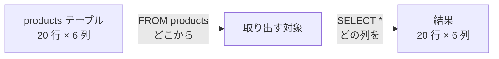
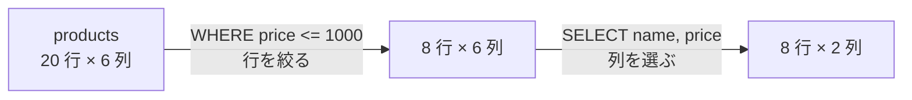
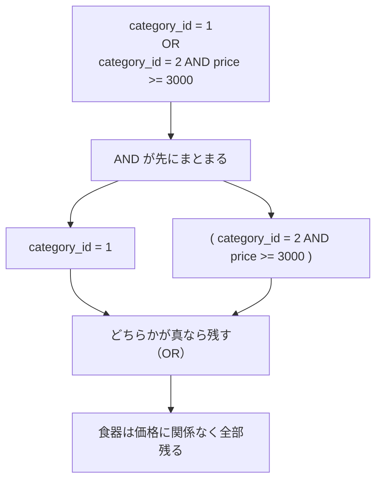
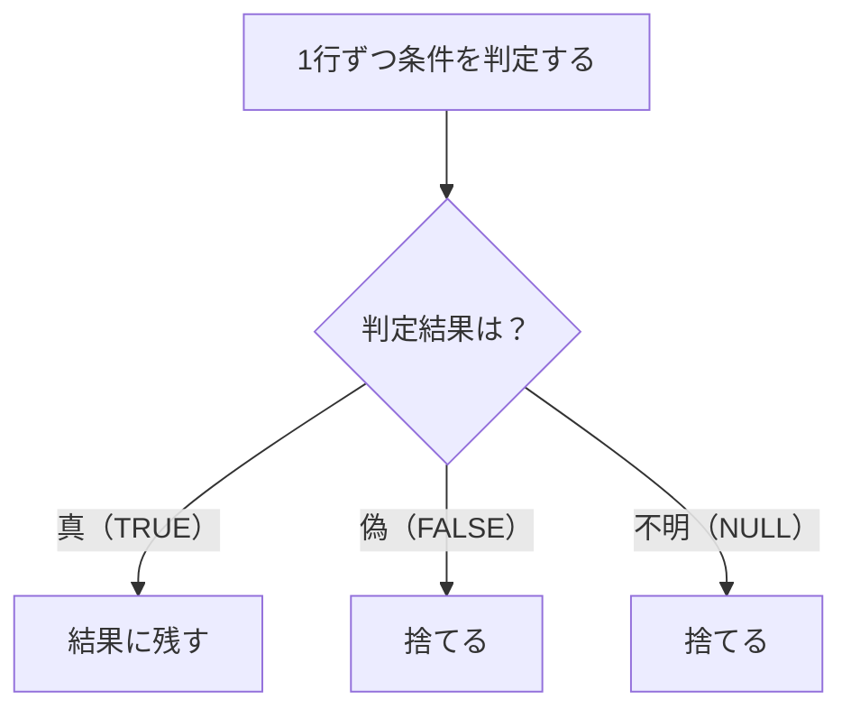
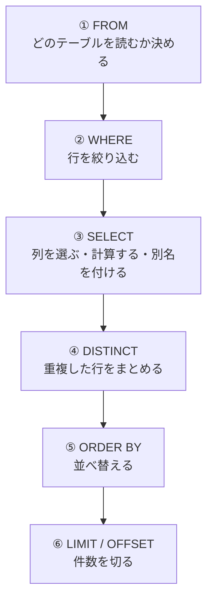
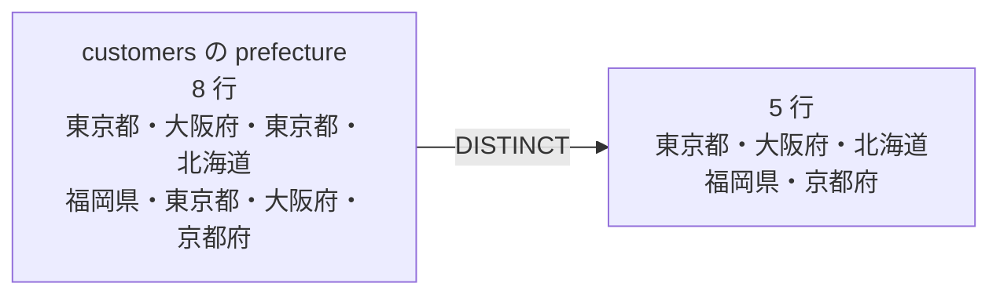
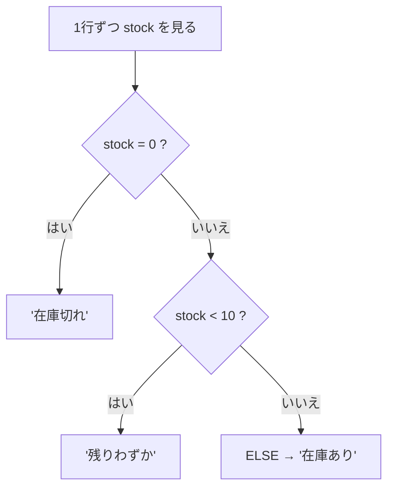

# 第3章 データを取り出す（SELECT）

**この章から、いよいよ SQL を書きます。**

第2章までで作ったのは「入れ物」でした。
データベースが動き、5つのテーブルに 84 件のデータが入っています。
ここから先は、**その中から必要なものだけを取り出す**練習です。

取り出す命令は `SELECT` ひとつだけです。
ただし `SELECT` には、**どの列を出すか・どの行に絞るか・どう並べるか・何件で切るか**という
指定が後ろに続きます。この章は、その指定を1つずつ足していきます。

第0章 0.3.1 で書いた「**日本語を SQL に翻訳する**」練習が、ここから始まります。

- 「在庫が切れている商品」→ `WHERE stock = 0`
- 「高い順に5件」→ `ORDER BY price DESC LIMIT 5`

最初は「全部出す」ところからです。

## この章で学ぶこと

- `SELECT` で、テーブルから**必要な列だけ**を取り出せるようになる
- `WHERE` に条件を書いて、**必要な行だけ**に絞り込めるようになる
- `LIKE` / `IN` / `BETWEEN` / `IS NULL` を、場面に応じて使い分けられるようになる
- `ORDER BY` で並べ替え、`LIMIT` で件数を切って、「上位◯件」を出せるようになる
- `DISTINCT` で、列にどんな値が入っているかの一覧を作れるようになる
- 文字列・日付・数値の関数と `CASE` で、**保存されている値とは違う形**で結果を出せるようになる
- SQL が**書いた順番とは違う順番で処理される**ことを説明できるようになる

## この章の前提

- [第2章 環境構築](./02-environment.md) を終えていること
- **`shop` データベースに練習用データが入っていること**
  （`SELECT COUNT(*) FROM products;` が `20` を返す状態。2.5.3）
- MySQL が起動していて、接続できること（2.1.2 / 2.2.1）

まだ接続していない場合は、次のコマンドで入ってください。

**Windows（PowerShell）**

```powershell
docker compose up -d
docker compose exec db mysql -u root -p --default-character-set=utf8mb4 shop
```

**macOS / Linux**

```bash
docker compose up -d
docker compose exec db mysql -u root -p --default-character-set=utf8mb4 shop
```

`mysql>` が出たら準備完了です。

> **つまずいたら**
> この章のつまずきは、第2章までとは種類が違います。
> **「動かない」ではなく「思った結果と違う」**という形で現れます。
> これは**レベル A**（自分で考えて解くべきところ）です（第0章 0.2.2）。
> 答えの SQL をもらわずに、次のように聞いてください。
>
> ```text
> mysql-text の 3.2.4 を読んでいます。
>
> 【やりたいこと】
> 食器かキッチンのうち、3000 円以上の商品だけを出したい
>
> 【書いた SQL】
> SELECT name FROM products WHERE category_id = 1 OR category_id = 2 AND price >= 3000;
>
> 【結果】
> 7 件出てしまい、1000 円台の商品も混ざっている
>
> 答えは書かないでください。どこを見直せばよいかだけ教えてください。
> ```

> **注意：この章で壊れる心配はありません**
> `SELECT` は**読むだけ**の命令です。何度打っても、どんな条件を書いても、
> テーブルの中身は1文字も変わりません。
> データを書き換える `INSERT` / `UPDATE` / `DELETE` は第4章です。
> **安心して、思いつくまま試してください。**

---

## 3.1 `SELECT` の基本

### 3.1.1 全件取り出す

いちばん短い `SELECT` は、次の形です。

```sql
SELECT * FROM products;
```

実行結果:

```text
+----+-----------------------------------------+-------------+-------+-------+-------------+
| id | name                                    | category_id | price | stock | released_on |
+----+-----------------------------------------+-------------+-------+-------+-------------+
|  1 | こまり顔のマグカップ                    |           1 |  1200 |    32 | 2025-10-01  |
|  2 | 藍色の湯のみ                            |           1 |   800 |    15 | 2025-10-01  |
|  3 | 木のスープボウル                        |           1 |  2400 |     6 | 2025-11-15  |
|  4 | 白磁の取り皿 5枚組                      |           1 |  3200 |     0 | 2026-01-20  |
|  5 | 厚手のごはん茶碗                        |           1 |   980 |    41 | NULL        |
|  6 | ステンレスの計量スプーン                |           2 |   680 |    55 | 2025-09-12  |
|  7 | ひのきのまな板                          |           2 |  4500 |     3 | 2026-02-03  |
|  8 | 鉄のフライパン 24cm                     |           2 |  5800 |     9 | 2026-02-03  |
|  9 | シリコンのおたま                        |           2 |   980 |    27 | 2026-04-18  |
| 10 | ほうろうの保存容器                      |           2 |  1800 |    12 | NULL        |
| 11 | 布のランチトート                        |           3 |  2200 |    18 | 2025-12-05  |
| 12 | 積み重ねられる収納ボックス              |           3 |  1500 |    24 | 2026-03-11  |
| 13 | 麻のかごバスケット                      |           3 |  3600 |     0 | 2026-03-11  |
| 14 | つっぱり棚                              |           3 |  2800 |     7 | NULL        |
| 15 | 透明の小物ケース                        |           3 |   450 |    63 | 2026-05-22  |
| 16 | 書きやすいボールペン                    |           4 |   380 |   120 | 2025-08-30  |
| 17 | 方眼のノート A5                         |           4 |   520 |    88 | 2025-08-30  |
| 18 | 木軸のシャープペンシル                  |           4 |  1600 |    14 | 2026-04-02  |
| 19 | ふせん 3色セット                        |           4 |   340 |    95 | NULL        |
| 20 | 革のペンケース                          |           4 |  4200 |     5 | 2026-07-09  |
+----+-----------------------------------------+-------------+-------+-------+-------------+
20 rows in set (0.00 sec)
```

この1文には、**2つの指定**が入っています。

| 部分 | 名前 | 意味 |
|------|------|------|
| `SELECT *` | `SELECT` 句 | **どの列を出すか。** `*`（アスタリスク）は「すべての列」 |
| `FROM products` | `FROM` 句 | **どのテーブルから取り出すか** |

**句**（く）とは、SQL の文を構成するまとまりのことです。
`SELECT` 句・`FROM` 句・このあと出てくる `WHERE` 句というように、
**キーワードで始まる1つのかたまり**を句と呼びます。



最後の `20 rows in set` が**取り出せた行数**です。
第2章 2.5.3 で確認した `products` の件数（20）と一致しています。

> **補足：この結果は「表」であって、テーブルそのものではありません**
> `SELECT` が返すのは、**そのとき作られた一時的な表**です。
> どこかに保存されるわけではありませんし、
> ここで何をしても `products` テーブルは変わりません。

**行の並びは、指定しなければ決まりません**

いまは `id` の順に見えていますが、**これは偶然です。**
第1章 1.3.2 で扱ったとおり、**テーブルの行には順番がありません。**
並び順が必要なときは、必ず `ORDER BY` を書きます（3.4）。

### 3.1.2 列を指定する

`*` の代わりに**列名をカンマで並べる**と、その列だけが出ます。

```sql
SELECT name, price FROM products;
```

実行結果:

```text
+-----------------------------------------+-------+
| name                                    | price |
+-----------------------------------------+-------+
| こまり顔のマグカップ                    |  1200 |
| 藍色の湯のみ                            |   800 |
| 木のスープボウル                        |  2400 |
| 白磁の取り皿 5枚組                      |  3200 |
| 厚手のごはん茶碗                        |   980 |
| ステンレスの計量スプーン                |   680 |
| ひのきのまな板                          |  4500 |
| 鉄のフライパン 24cm                     |  5800 |
| シリコンのおたま                        |   980 |
| ほうろうの保存容器                      |  1800 |
| 布のランチトート                        |  2200 |
| 積み重ねられる収納ボックス              |  1500 |
| 麻のかごバスケット                      |  3600 |
| つっぱり棚                              |  2800 |
| 透明の小物ケース                        |   450 |
| 書きやすいボールペン                    |   380 |
| 方眼のノート A5                         |   520 |
| 木軸のシャープペンシル                  |  1600 |
| ふせん 3色セット                        |   340 |
| 革のペンケース                          |  4200 |
+-----------------------------------------+-------+
20 rows in set (0.00 sec)
```

**行数は変わりません**（20 のまま）。減ったのは**列**です。

**列を並べる順番は、テーブルの定義順とは関係ありません。**
書いた順にそのまま出ます。

```sql
SELECT id, name FROM categories;
```

実行結果:

```text
+----+--------------+
| id | name         |
+----+--------------+
|  1 | 食器         |
|  2 | キッチン     |
|  3 | 収納         |
|  4 | 文房具       |
+----+--------------+
4 rows in set (0.00 sec)
```

> **よくある間違い**
> 列名を打ち間違えると、次のエラーになります。
>
> ```sql
> SELECT nama, price FROM products;
> ```
>
> ```text
> ERROR 1054 (42S22): Unknown column 'nama' in 'field list'
> ```
>
> `Unknown column` は「**そんな列は無い**」という意味です。
> `in 'field list'` は「**`SELECT` 句の中で**見つからなかった」という意味で、
> **どこで間違えたかまで教えてくれています。**
> 列名が分からなくなったら `DESCRIBE products;` で確認してください（2.4.4）。

### 3.1.3 アスタリスクを本番で使わない理由

`SELECT *` は、練習や確認には便利です。
しかし、**アプリのコードに書く SQL では `*` を使いません。**
理由は4つあります。

| 理由 | 何が起きるか |
|------|------------|
| 要らないデータまで運ぶ | 使わない列まで毎回ネットワークを流れる。行数が多いほど効いてくる |
| **列が増えると勝手に増える** | あとから列を1つ足しただけで、アプリが受け取る形が変わる |
| **列の順番に依存したコードが壊れる** | 「3番目の列」を前提に書くと、列の追加で別の値を読む |
| 何を使っているか読めない | SQL を見ても、そのアプリがどの列を必要としているか分からない |

2番目と3番目は、**エラーにならずに間違った値が使われる**ため、とくに厄介です。

> **補足：`*` が遅さの原因になることもあります**
> 必要な列だけを取り出せば、**テーブル本体を読まずに済む**場合があります。
> この仕組み（インデックス）は第7章 7.2 で扱います。
> いまは「`*` は速度の面でも損をすることがある」とだけ覚えてください。

**この本での方針**

- 手で打って中身を確認するとき → `SELECT *` で構いません
- **アプリに書く SQL → 必要な列を明記します**

第8章でアプリから SQL を使うときに、この方針をそのまま使います。

### 3.1.4 別名を付ける（`AS`）

`AS` を使うと、**結果の見出しを付け替えられます。**

```sql
SELECT name AS 商品名, price AS 税抜価格 FROM products;
```

実行結果（先頭の5行だけ示します。全 20 行出ます）:

```text
+-----------------------------------------+--------------+
| 商品名                                  | 税抜価格     |
+-----------------------------------------+--------------+
| こまり顔のマグカップ                    |         1200 |
| 藍色の湯のみ                            |          800 |
| 木のスープボウル                        |         2400 |
| 白磁の取り皿 5枚組                      |         3200 |
| 厚手のごはん茶碗                        |          980 |
```

見出しが `name` / `price` から `商品名` / `税抜価格` に変わりました。
この付け替えた名前を**別名**（べつめい。エイリアスとも言う）と呼びます。

**別名の本当の使いどころは、計算した列です**

`SELECT` 句には、**列名だけでなく計算式も書けます。**

```sql
SELECT name AS 商品名, price * 1.1 AS 税込価格 FROM products;
```

実行結果:

```text
+-----------------------------------------+--------------+
| 商品名                                  | 税込価格     |
+-----------------------------------------+--------------+
| こまり顔のマグカップ                    |       1320.0 |
| 藍色の湯のみ                            |        880.0 |
| 木のスープボウル                        |       2640.0 |
| 白磁の取り皿 5枚組                      |       3520.0 |
| 厚手のごはん茶碗                        |       1078.0 |
| ステンレスの計量スプーン                |        748.0 |
| ひのきのまな板                          |       4950.0 |
| 鉄のフライパン 24cm                     |       6380.0 |
| シリコンのおたま                        |       1078.0 |
| ほうろうの保存容器                      |       1980.0 |
| 布のランチトート                        |       2420.0 |
| 積み重ねられる収納ボックス              |       1650.0 |
| 麻のかごバスケット                      |       3960.0 |
| つっぱり棚                              |       3080.0 |
| 透明の小物ケース                        |        495.0 |
| 書きやすいボールペン                    |        418.0 |
| 方眼のノート A5                         |        572.0 |
| 木軸のシャープペンシル                  |       1760.0 |
| ふせん 3色セット                        |        374.0 |
| 革のペンケース                          |       4620.0 |
+-----------------------------------------+--------------+
20 rows in set (0.00 sec)
```

**`price * 1.1` は、テーブルには存在しない列です。**
`SELECT` が、その場で計算して作りました。
`AS 税込価格` を付けなかった場合、見出しは `price * 1.1` という式そのものになります。
**読みにくいので、計算した列には必ず別名を付けます。**

`1320.0` のように小数点が付くのは、`1.1` を掛けたためです。
整数に丸める方法は 3.6.3 で扱います。

**`AS` は省略できますが、この本では書きます**

```sql
SELECT name 商品名 FROM products;
```

これも動きます。しかし**カンマを打ち忘れた場合と見分けがつかない**ため、
この本では必ず `AS` を書きます。

> **よくある間違い**
> **別名は `WHERE` の中では使えません。**
>
> ```sql
> SELECT name, price * 1.1 AS 税込価格 FROM products WHERE 税込価格 >= 2000;
> ```
>
> ```text
> ERROR 1054 (42S22): Unknown column '税込価格' in 'where clause'
> ```
>
> 「さっき定義したのに」と感じますが、**MySQL は `WHERE` を先に処理します。**
> `WHERE` の時点では、まだ `税込価格` という名前は作られていません。
> 詳しい処理の順番は 3.4.4 の図で扱います。
> いまは **`WHERE` には元の列名か、式をもう一度書く**と覚えてください。
>
> ```sql
> SELECT name, price * 1.1 AS 税込価格 FROM products WHERE price * 1.1 >= 2000;
> ```

> **補足：別名に空白や記号を入れたいとき**
> `AS 税込 価格` のように空白を含めると、そこで切れてしまいます。
> 空白や記号を入れたい場合は、**バッククォート** `` ` `` で囲みます。
>
> ```sql
> SELECT price * 1.1 AS `税込 価格` FROM products;
> ```

---

## 3.2 `WHERE` で絞り込む

### 3.2.1 条件を書く

`SELECT` 句が**列**を選ぶのに対し、`WHERE` 句は**行**を選びます。

```sql
SELECT name, price FROM products WHERE price <= 1000;
```

実行結果:

```text
+--------------------------------------+-------+
| name                                 | price |
+--------------------------------------+-------+
| 藍色の湯のみ                         |   800 |
| 厚手のごはん茶碗                     |   980 |
| ステンレスの計量スプーン             |   680 |
| シリコンのおたま                     |   980 |
| 透明の小物ケース                     |   450 |
| 書きやすいボールペン                 |   380 |
| 方眼のノート A5                      |   520 |
| ふせん 3色セット                     |   340 |
+--------------------------------------+-------+
8 rows in set (0.00 sec)
```

20 行が 8 行になりました。



**`WHERE` は「縦に切る」、`SELECT` は「横に切る」**と覚えると混ざりません。

`WHERE` は**1行ずつ**判定されます。
20 行それぞれについて `price <= 1000` を確かめ、
**成り立った行だけを残す**という動きです。

**文字列の条件は引用符で囲みます**

```sql
SELECT id, name, prefecture FROM customers WHERE prefecture = '東京都';
```

実行結果:

```text
+----+------------------+------------+
| id | name             | prefecture |
+----+------------------+------------+
|  1 | 田中 陽子        | 東京都     |
|  3 | 鈴木 一郎        | 東京都     |
|  6 | 渡辺 さくら      | 東京都     |
+----+------------------+------------+
3 rows in set (0.00 sec)
```

文字列は**シングルクォート** `'` で囲みます。
数値（`price` / `stock` / `id` など）には引用符を付けません。

> **よくある間違い**
> 文字列の引用符を忘れると、**列名だと解釈されます。**
>
> ```sql
> SELECT name FROM products WHERE name = 藍色の湯のみ;
> ```
>
> ```text
> ERROR 1054 (42S22): Unknown column '藍色の湯のみ' in 'where clause'
> ```
>
> 3.1.2 と同じ `Unknown column` ですが、今度は `in 'where clause'` です。
> **「値を書いたつもりが、列名として読まれた」**ときの典型的なエラーです。
> `'` で囲めば直ります。

### 3.2.2 比較演算子

`WHERE` で使う記号を**比較演算子**（ひかくえんざんし。2つの値を比べる記号）と呼びます。

| 演算子 | 意味 | 例 |
|-------|------|---|
| `=` | 等しい | `price = 980` |
| `<>` | 等しくない | `price <> 980` |
| `!=` | 等しくない（`<>` と同じ） | `price != 980` |
| `>` | より大きい | `price > 1000` |
| `>=` | 以上 | `price >= 1000` |
| `<` | より小さい | `price < 1000` |
| `<=` | 以下 | `price <= 1000` |

> **注意：等しいは `=` ひとつです**
> Python では `==`、JavaScript では `===` でした。
> **SQL では `=` ひとつが「等しいか」を意味します。**
> SQL の `=` は代入ではないので、記号を分ける必要がないためです。
> （値を代入する `UPDATE ... SET price = 980` でも同じ `=` を使います。第4章 4.2.1）

在庫が切れている商品を探してみます。

```sql
SELECT name, stock FROM products WHERE stock = 0;
```

実行結果:

```text
+-----------------------------+-------+
| name                        | stock |
+-----------------------------+-------+
| 白磁の取り皿 5枚組          |     0 |
| 麻のかごバスケット          |     0 |
+-----------------------------+-------+
2 rows in set (0.00 sec)
```

「等しくない」も試します。

```sql
SELECT name, price FROM products WHERE price <> 980;
```

実行結果（20 行のうち、980 円の2件が除かれて 18 行）:

```text
+-----------------------------------------+-------+
| name                                    | price |
+-----------------------------------------+-------+
| こまり顔のマグカップ                    |  1200 |
| 藍色の湯のみ                            |   800 |
| 木のスープボウル                        |  2400 |
| 白磁の取り皿 5枚組                      |  3200 |
| ステンレスの計量スプーン                |   680 |
| ひのきのまな板                          |  4500 |
| 鉄のフライパン 24cm                     |  5800 |
| ほうろうの保存容器                      |  1800 |
| 布のランチトート                        |  2200 |
| 積み重ねられる収納ボックス              |  1500 |
| 麻のかごバスケット                      |  3600 |
| つっぱり棚                              |  2800 |
| 透明の小物ケース                        |   450 |
| 書きやすいボールペン                    |   380 |
| 方眼のノート A5                         |   520 |
| 木軸のシャープペンシル                  |  1600 |
| ふせん 3色セット                        |   340 |
| 革のペンケース                          |  4200 |
+-----------------------------------------+-------+
18 rows in set (0.00 sec)
```

**日付も比較できます**

日付は文字列と同じく引用符で囲み、**`YYYY-MM-DD` の形**で書きます。

```sql
SELECT name, released_on FROM products WHERE released_on >= '2026-04-01';
```

実行結果:

```text
+-----------------------------------+-------------+
| name                              | released_on |
+-----------------------------------+-------------+
| シリコンのおたま                  | 2026-04-18  |
| 透明の小物ケース                  | 2026-05-22  |
| 木軸のシャープペンシル            | 2026-04-02  |
| 革のペンケース                    | 2026-07-09  |
+-----------------------------------+-------------+
4 rows in set (0.00 sec)
```

日付の `>=` は「**その日以降**」です。
文字として比べているのではなく、**日付として比べています**（2.4.3 で `DATE` 型にしたためです）。

> **注意：`<>` は `NULL` の行を残しません**
> 上の `price <> 980` は 18 行でした。20 − 2 = 18 で、計算が合っています。
> ところが `released_on` のように `NULL` を含む列では、
> **`<>` を書くと `NULL` の行が結果から消えます。**
> 理由と対処は 3.3.4 で扱います。**ここは必ず読んでください。**

### 3.2.3 `AND` / `OR` / `NOT`

条件を組み合わせるには、次の3つを使います。

| 書き方 | 意味 |
|-------|------|
| `条件A AND 条件B` | **両方**成り立つ行だけ残す |
| `条件A OR 条件B` | **どちらか**が成り立つ行を残す |
| `NOT 条件A` | 条件Aが成り立た**ない**行を残す |

**`AND`：文房具のうち 1000 円以上のもの**

```sql
SELECT name, category_id, price FROM products WHERE category_id = 4 AND price >= 1000;
```

実行結果:

```text
+-----------------------------------+-------------+-------+
| name                              | category_id | price |
+-----------------------------------+-------------+-------+
| 木軸のシャープペンシル            |           4 |  1600 |
| 革のペンケース                    |           4 |  4200 |
+-----------------------------------+-------------+-------+
2 rows in set (0.00 sec)
```

**`AND` は条件を足すほど結果が減ります。**

**`OR`：在庫が 0 か、100 以上のもの**

```sql
SELECT name, stock FROM products WHERE stock = 0 OR stock >= 100;
```

実行結果:

```text
+--------------------------------+-------+
| name                           | stock |
+--------------------------------+-------+
| 白磁の取り皿 5枚組             |     0 |
| 麻のかごバスケット             |     0 |
| 書きやすいボールペン           |   120 |
+--------------------------------+-------+
3 rows in set (0.00 sec)
```

**`OR` は条件を足すほど結果が増えます。**

**`NOT`：文房具**以外**のもの**

```sql
SELECT name, category_id FROM products WHERE NOT category_id = 4;
```

実行結果:

```text
+-----------------------------------------+-------------+
| name                                    | category_id |
+-----------------------------------------+-------------+
| こまり顔のマグカップ                    |           1 |
| 藍色の湯のみ                            |           1 |
| 木のスープボウル                        |           1 |
| 白磁の取り皿 5枚組                      |           1 |
| 厚手のごはん茶碗                        |           1 |
| ステンレスの計量スプーン                |           2 |
| ひのきのまな板                          |           2 |
| 鉄のフライパン 24cm                     |           2 |
| シリコンのおたま                        |           2 |
| ほうろうの保存容器                      |           2 |
| 布のランチトート                        |           3 |
| 積み重ねられる収納ボックス              |           3 |
| 麻のかごバスケット                      |           3 |
| つっぱり棚                              |           3 |
| 透明の小物ケース                        |           3 |
+-----------------------------------------+-------------+
15 rows in set (0.00 sec)
```

`NOT category_id = 4` は `category_id <> 4` と同じ結果です。
**短く書ける `<>` のほうを使うことが多い**ですが、
`NOT` は `IN` や `LIKE` と組み合わせるとき（3.3.1 / 3.3.2）に活きてきます。

### 3.2.4 かっこで優先順位を決める

`AND` と `OR` を混ぜると、**思ったのと違う結果になります。**

「食器かキッチンのうち、3000 円以上のもの」を出したいとします。
素直に書くと、次のようになります。

```sql
SELECT name, category_id, price FROM products WHERE category_id = 1 OR category_id = 2 AND price >= 3000;
```

実行結果:

```text
+--------------------------------+-------------+-------+
| name                           | category_id | price |
+--------------------------------+-------------+-------+
| こまり顔のマグカップ           |           1 |  1200 |
| 藍色の湯のみ                   |           1 |   800 |
| 木のスープボウル               |           1 |  2400 |
| 白磁の取り皿 5枚組             |           1 |  3200 |
| 厚手のごはん茶碗               |           1 |   980 |
| ひのきのまな板                 |           2 |  4500 |
| 鉄のフライパン 24cm            |           2 |  5800 |
+--------------------------------+-------------+-------+
7 rows in set (0.00 sec)
```

**800 円の湯のみが混ざっています。** 3000 円以上のはずでした。

原因は、**`AND` が `OR` より先に処理される**ことです。
算数で `2 + 3 × 4` の掛け算が先に計算されるのと同じ関係です。



つまり MySQL は、こう読んでいます。

```text
category_id = 1  または  ( category_id = 2 かつ price >= 3000 )
```

「食器は無条件、キッチンだけ 3000 円以上」という意味になっていました。

**かっこで、まとまりを自分で決めます。**

```sql
SELECT name, category_id, price FROM products WHERE (category_id = 1 OR category_id = 2) AND price >= 3000;
```

実行結果:

```text
+----------------------------+-------------+-------+
| name                       | category_id | price |
+----------------------------+-------------+-------+
| 白磁の取り皿 5枚組         |           1 |  3200 |
| ひのきのまな板             |           2 |  4500 |
| 鉄のフライパン 24cm        |           2 |  5800 |
+----------------------------+-------------+-------+
3 rows in set (0.00 sec)
```

意図どおりになりました。

> **よくある間違い**
> **`AND` と `OR` を混ぜるときは、必ずかっこを書いてください。**
> 「優先順位を覚えているから大丈夫」と思っても、
> **半年後に読み返す自分**や、レビューする同僚には伝わりません。
>
> かっこは、要らないところに書いても結果を変えません。
> **迷ったら書く**のが安全です。
>
> この間違いが怖いのは、**エラーにならない**ことです。
> 結果が返ってくるので、気づかないまま「正しい数字」として使ってしまいます。
> `OR` を書いたら、**件数が想定と合っているか**を必ず確かめてください。

---

## 3.3 いろいろな条件

`=` や `>=` だけでは書きにくい条件があります。
この節では、よく使う4つの書き方を扱います。

### 3.3.1 `LIKE` であいまい検索

「名前が『田』で始まる人」のような条件は、`=` では書けません。
**`LIKE`** を使います。

`LIKE` では、次の2つの記号が特別な意味を持ちます。
このような記号を**ワイルドカード**（任意の文字を表す記号）と呼びます。

| 記号 | 意味 |
|------|------|
| `%` | **0文字以上**の任意の文字列 |
| `_` | **ちょうど1文字**の任意の文字 |

**前方一致：「田」で始まる**

```sql
SELECT id, name FROM customers WHERE name LIKE '田%';
```

実行結果:

```text
+----+---------------+
| id | name          |
+----+---------------+
|  1 | 田中 陽子     |
+----+---------------+
1 row in set (0.00 sec)
```

**部分一致：「ノート」を含む**

```sql
SELECT id, name FROM products WHERE name LIKE '%ノート%';
```

実行結果:

```text
+----+-----------------------+
| id | name                  |
+----+-----------------------+
| 17 | 方眼のノート A5       |
+----+-----------------------+
1 row in set (0.00 sec)
```

**1文字だけ任意：`_` を使う**

```sql
SELECT id, name FROM products WHERE name LIKE '_のスープボウル';
```

実行結果:

```text
+----+--------------------------+
| id | name                     |
+----+--------------------------+
|  3 | 木のスープボウル         |
+----+--------------------------+
1 row in set (0.00 sec)
```

`_` はちょうど1文字なので、`木` が当てはまりました。

**使い分け**

| 書き方 | 呼び方 | 例 |
|-------|-------|---|
| `'田%'` | 前方一致 | 「田」で始まる |
| `'%子'` | 後方一致 | 「子」で終わる |
| `'%ノート%'` | 部分一致 | 「ノート」を含む |

> **注意：`LIKE` の判定は照合順序に従います**
> 第2章 2.6.3 で扱った**照合順序**（`utf8mb4_0900_ai_ci`）は、
> **大文字小文字・ひらがなカタカナ・濁点を区別しません。**
> `LIKE` もこの規則に従うので、次の2つは同じ結果になります。
>
> ```sql
> SELECT id, name FROM customers WHERE name LIKE '%さくら%';
> SELECT id, name FROM customers WHERE name LIKE '%サクラ%';
> ```
>
> ```text
> +----+------------------+
> | id | name             |
> +----+------------------+
> |  6 | 渡辺 さくら      |
> +----+------------------+
> 1 row in set (0.00 sec)
> ```
>
> メールアドレスでも同じです。`'TANAKA%'` で `tanaka@example.com` が見つかります。
>
> ```sql
> SELECT email FROM customers WHERE email LIKE 'TANAKA%';
> ```
>
> ```text
> +--------------------+
> | email              |
> +--------------------+
> | tanaka@example.com |
> +--------------------+
> 1 row in set (0.00 sec)
> ```
>
> **検索フォームを作るときは、この性質が便利に働きます。**
> 逆に、**厳密に区別したいとき**は `COLLATE utf8mb4_ja_0900_as_cs` を付けます（2.6.3）。

> **よくある間違い**
> `LIKE` を使うつもりで `=` を書くと、**ワイルドカードが記号のまま扱われます。**
>
> ```sql
> SELECT id, name FROM products WHERE name = '%ノート%';
> ```
>
> ```text
> Empty set (0.00 sec)
> ```
>
> `Empty set` は「**条件に合う行が1件も無かった**」という意味です。
> エラーではありません。**`%` を使うときは必ず `LIKE`** です。
>
> 逆に、`%` を1つも書かずに `LIKE '方眼のノート A5'` とすると、
> `=` とまったく同じ「完全一致」になります。

> **補足：`%` を先頭に置くと遅くなります**
> `'%ノート%'` のような検索は、**すべての行を1つずつ調べる**必要があります。
> 行が数百万件になると、目に見えて遅くなります。
> なぜ遅くなるのか、どう対処するのかは第7章 7.5.2 で扱います。

### 3.3.2 `IN` で複数候補

「東京都か大阪府の人」は、`OR` でも書けます。

```sql
SELECT id, name, prefecture FROM customers WHERE prefecture = '東京都' OR prefecture = '大阪府';
```

ただ、候補が5つ6つと増えると、同じ列名を何度も書くことになります。
**`IN`** を使うと短く書けます。

```sql
SELECT id, name, prefecture FROM customers WHERE prefecture IN ('東京都', '大阪府');
```

実行結果:

```text
+----+------------------+------------+
| id | name             | prefecture |
+----+------------------+------------+
|  1 | 田中 陽子        | 東京都     |
|  2 | 佐藤 健          | 大阪府     |
|  3 | 鈴木 一郎        | 東京都     |
|  6 | 渡辺 さくら      | 東京都     |
|  7 | 山本 大輔        | 大阪府     |
+----+------------------+------------+
5 rows in set (0.00 sec)
```

`IN (...)` は「**かっこの中のどれかと等しい**」という意味です。
`OR` で並べたものと結果はまったく同じで、**読みやすさだけが違います。**

数値でも使えます。

```sql
SELECT name, category_id FROM products WHERE category_id IN (1, 4);
```

**`NOT IN` で「どれでもない」**

```sql
SELECT name, category_id FROM products WHERE category_id NOT IN (1, 4);
```

これは「食器でも文房具でもないもの」です。

> **注意：`NOT IN` は `NULL` があると危険です**
> かっこの中に `NULL` が混ざると、`NOT IN` は**1行も返さなくなります。**
> 理由は次の 3.3.4 で扱う `NULL` の性質そのものです。
> **`NOT IN` を使うときは、候補に `NULL` が入らないことを確かめてください。**

### 3.3.3 `BETWEEN` で範囲

「1000 円以上 2000 円以下」は `AND` で書けます。

```sql
SELECT name, price FROM products WHERE price >= 1000 AND price <= 2000;
```

**`BETWEEN`** を使うと1つの条件で書けます。

```sql
SELECT name, price FROM products WHERE price BETWEEN 1000 AND 2000;
```

実行結果:

```text
+-----------------------------------------+-------+
| name                                    | price |
+-----------------------------------------+-------+
| こまり顔のマグカップ                    |  1200 |
| ほうろうの保存容器                      |  1800 |
| 積み重ねられる収納ボックス              |  1500 |
| 木軸のシャープペンシル                  |  1600 |
+-----------------------------------------+-------+
4 rows in set (0.00 sec)
```

**`BETWEEN A AND B` は、A と B の両方を含みます**（1000 円ちょうど、2000 円ちょうども対象）。

日付にも使えます。

```sql
SELECT name, released_on FROM products WHERE released_on BETWEEN '2026-01-01' AND '2026-03-31';
```

> **よくある間違い**
> **`BETWEEN` は「小さいほう AND 大きいほう」の順で書きます。**
> 逆に書くと、エラーにならずに `Empty set` になります。
>
> ```sql
> SELECT name, price FROM products WHERE price BETWEEN 2000 AND 1000;
> ```
>
> ```text
> Empty set (0.00 sec)
> ```
>
> 「0 件のはずがないのに 0 件」のときは、まず `BETWEEN` の順番を疑ってください。

> **注意：`DATETIME` の列に `BETWEEN` を使うとき**
> `orders.ordered_at` は `DATETIME` 型で、**時刻まで持っています**（2.5.1）。
>
> ```sql
> SELECT id, ordered_at FROM orders WHERE ordered_at BETWEEN '2026-09-01' AND '2026-09-12';
> ```
>
> この書き方だと、**`2026-09-12` は `2026-09-12 00:00:00` と解釈される**ため、
> 9月12日の 09:03 の注文が漏れます。
> **日付だけで区切りたいときは `< '2026-09-13'` のように書く**ほうが安全です。
> この落とし穴は、`DATETIME` を扱ううちに必ず一度は踏みます。

### 3.3.4 `IS NULL` を使う理由

**この項が、この章でいちばん間違えやすいところです。**

`customers.birthday` には、未登録の人が2名います（2.5.3）。
その2名を探してみます。

```sql
SELECT id, name, birthday FROM customers WHERE birthday = NULL;
```

実行結果:

```text
Empty set (0.00 sec)
```

**0 件です。** エラーも出ません。正しい書き方は次のとおりです。

```sql
SELECT id, name, birthday FROM customers WHERE birthday IS NULL;
```

実行結果:

```text
+----+------------------+----------+
| id | name             | birthday |
+----+------------------+----------+
|  3 | 鈴木 一郎        | NULL     |
|  6 | 渡辺 さくら      | NULL     |
+----+------------------+----------+
2 rows in set (0.00 sec)
```

**なぜ `= NULL` では見つからないのか**

第1章 1.3.1 で、`NULL` は「**値が無い**」ことを表す印だと扱いました。
「無い」は値ではないので、**他の値と比べられません。**

比較そのものの結果を見てみます。

```sql
SELECT 1 = NULL, 1 <> NULL, NULL = NULL, NULL IS NULL;
```

実行結果:

```text
+----------+-----------+-------------+--------------+
| 1 = NULL | 1 <> NULL | NULL = NULL | NULL IS NULL |
+----------+-----------+-------------+--------------+
|     NULL |      NULL |        NULL |            1 |
+----------+-----------+-------------+--------------+
1 row in set (0.00 sec)
```

**比較の結果まで `NULL` になっています。**
`NULL = NULL` すら、真ではなく `NULL`（＝**不明**）です。

SQL の条件は、**真・偽・不明の3つ**の値を取ります。
そして **`WHERE` は「真」の行だけを残します。**



**「偽」も「不明」も、同じように捨てられます。**
だから `birthday = NULL` は、1行も残らないのです。

**`NULL` を調べる専用の書き方**

| 書き方 | 意味 |
|-------|------|
| `列 IS NULL` | その列が `NULL` である |
| `列 IS NOT NULL` | その列が `NULL` でない |

```sql
SELECT id, name, released_on FROM products WHERE released_on IS NOT NULL;
```

実行結果:

```text
+----+-----------------------------------------+-------------+
| id | name                                    | released_on |
+----+-----------------------------------------+-------------+
|  1 | こまり顔のマグカップ                    | 2025-10-01  |
|  2 | 藍色の湯のみ                            | 2025-10-01  |
|  3 | 木のスープボウル                        | 2025-11-15  |
|  4 | 白磁の取り皿 5枚組                      | 2026-01-20  |
|  6 | ステンレスの計量スプーン                | 2025-09-12  |
|  7 | ひのきのまな板                          | 2026-02-03  |
|  8 | 鉄のフライパン 24cm                     | 2026-02-03  |
|  9 | シリコンのおたま                        | 2026-04-18  |
| 11 | 布のランチトート                        | 2025-12-05  |
| 12 | 積み重ねられる収納ボックス              | 2026-03-11  |
| 13 | 麻のかごバスケット                      | 2026-03-11  |
| 15 | 透明の小物ケース                        | 2026-05-22  |
| 16 | 書きやすいボールペン                    | 2025-08-30  |
| 17 | 方眼のノート A5                         | 2025-08-30  |
| 18 | 木軸のシャープペンシル                  | 2026-04-02  |
| 20 | 革のペンケース                          | 2026-07-09  |
+----+-----------------------------------------+-------------+
16 rows in set (0.00 sec)
```

20 件のうち、`released_on` が `NULL` の4件（`id` が 5 / 10 / 14 / 19）が除かれて 16 件です。

**`IS NOT NULL` は、ほかの条件と `AND` で組み合わせられます。**

```sql
SELECT id, name, price, released_on FROM products
WHERE price >= 2000 AND released_on IS NOT NULL
ORDER BY price DESC, id ASC;
```

実行結果:

```text
+----+-----------------------------+-------+-------------+
| id | name                        | price | released_on |
+----+-----------------------------+-------+-------------+
|  8 | 鉄のフライパン 24cm         |  5800 | 2026-02-03  |
|  7 | ひのきのまな板              |  4500 | 2026-02-03  |
| 20 | 革のペンケース              |  4200 | 2026-07-09  |
| 13 | 麻のかごバスケット          |  3600 | 2026-03-11  |
|  4 | 白磁の取り皿 5枚組          |  3200 | 2026-01-20  |
|  3 | 木のスープボウル            |  2400 | 2025-11-15  |
| 11 | 布のランチトート            |  2200 | 2025-12-05  |
+----+-----------------------------+-------+-------------+
7 rows in set (0.00 sec)
```

「値が記録されていない行を除いたうえで、条件で絞る」という形は、実務でよく出てきます。
`ORDER BY` の2つ目のキー（`id ASC`）については 3.4.3 で扱います。

> **よくある間違い**
> **`<>` を書くと、`NULL` の行が黙って消えます。**
>
> 「2025年10月1日に発売した商品**以外**」を出したいとします。
>
> ```sql
> SELECT name, released_on FROM products WHERE released_on <> '2025-10-01';
> ```
>
> ```text
> +-----------------------------------------+-------------+
> | name                                    | released_on |
> +-----------------------------------------+-------------+
> | 木のスープボウル                        | 2025-11-15  |
> | 白磁の取り皿 5枚組                      | 2026-01-20  |
> | ステンレスの計量スプーン                | 2025-09-12  |
> | ひのきのまな板                          | 2026-02-03  |
> | 鉄のフライパン 24cm                     | 2026-02-03  |
> | シリコンのおたま                        | 2026-04-18  |
> | 布のランチトート                        | 2025-12-05  |
> | 積み重ねられる収納ボックス              | 2026-03-11  |
> | 麻のかごバスケット                      | 2026-03-11  |
> | 透明の小物ケース                        | 2026-05-22  |
> | 書きやすいボールペン                    | 2025-08-30  |
> | 方眼のノート A5                         | 2025-08-30  |
> | 木軸のシャープペンシル                  | 2026-04-02  |
> | 革のペンケース                          | 2026-07-09  |
> +-----------------------------------------+-------------+
> 14 rows in set (0.00 sec)
> ```
>
> **14 件です。** 20 件から「10月1日の2件」を引けば 18 件のはずでした。
> 消えた4件は、`released_on` が `NULL` の商品です。
> `NULL <> '2025-10-01'` の判定が**不明**になり、捨てられました。
>
> `NULL` の行も残したいなら、**明示的に足します。**
>
> ```sql
> SELECT name, released_on FROM products
> WHERE released_on <> '2025-10-01' OR released_on IS NULL;
> ```
>
> **「〜以外」を書いたら、`NULL` を含む列かどうかを必ず確かめてください。**
> `DESCRIBE products;` の `Null` 列が `YES` なら、`NULL` が入りうる列です（2.4.4）。

**`0` と `NULL` と空文字は、すべて別物です**

| 値 | 意味 | 探し方 |
|----|------|-------|
| `0` | **0 という値がある**（在庫を数えたら 0 だった） | `stock = 0` |
| `''`（空文字） | **空の文字列という値がある** | `name = ''` |
| `NULL` | **値が無い**（まだ調べていない・該当しない） | `birthday IS NULL` |

`products.stock` は `NOT NULL` なので（2.5.2）、`0` は必ず「数えた結果の 0」です。

```sql
SELECT name, stock FROM products WHERE stock = 0;
```

```text
+-----------------------------+-------+
| name                        | stock |
+-----------------------------+-------+
| 白磁の取り皿 5枚組          |     0 |
| 麻のかごバスケット          |     0 |
+-----------------------------+-------+
2 rows in set (0.00 sec)
```

一方 `released_on` が `NULL` の商品は、「発売日が 1970年1月1日」なのではなく、
**「昔からある商品で、発売日を記録していない」**という意味です（2.5.1）。

---

## 3.4 並べ替えと件数制限

### 3.4.1 `ORDER BY`

第1章 1.3.2 で扱ったとおり、**テーブルの行には順番がありません。**
並び順が必要なら、**必ず `ORDER BY` を書きます。**

```sql
SELECT name, price FROM products ORDER BY price;
```

実行結果:

```text
+-----------------------------------------+-------+
| name                                    | price |
+-----------------------------------------+-------+
| ふせん 3色セット                        |   340 |
| 書きやすいボールペン                    |   380 |
| 透明の小物ケース                        |   450 |
| 方眼のノート A5                         |   520 |
| ステンレスの計量スプーン                |   680 |
| 藍色の湯のみ                            |   800 |
| 厚手のごはん茶碗                        |   980 |
| シリコンのおたま                        |   980 |
| こまり顔のマグカップ                    |  1200 |
| 積み重ねられる収納ボックス              |  1500 |
| 木軸のシャープペンシル                  |  1600 |
| ほうろうの保存容器                      |  1800 |
| 布のランチトート                        |  2200 |
| 木のスープボウル                        |  2400 |
| つっぱり棚                              |  2800 |
| 白磁の取り皿 5枚組                      |  3200 |
| 麻のかごバスケット                      |  3600 |
| 革のペンケース                          |  4200 |
| ひのきのまな板                          |  4500 |
| 鉄のフライパン 24cm                     |  5800 |
+-----------------------------------------+-------+
20 rows in set (0.00 sec)
```

`ORDER BY` は、**`WHERE` の後ろ**に書きます。

```sql
SELECT name, price FROM products WHERE price >= 3000 ORDER BY price DESC;
```

実行結果:

```text
+-----------------------------+-------+
| name                        | price |
+-----------------------------+-------+
| 鉄のフライパン 24cm         |  5800 |
| ひのきのまな板              |  4500 |
| 革のペンケース              |  4200 |
| 麻のかごバスケット          |  3600 |
| 白磁の取り皿 5枚組          |  3200 |
+-----------------------------+-------+
5 rows in set (0.00 sec)
```

### 3.4.2 昇順と降順

| 書き方 | 意味 | 省略 |
|-------|------|------|
| `ORDER BY price ASC` | **昇順**（小さい順・古い順・あいうえお順） | `ASC` は省略可 |
| `ORDER BY price DESC` | **降順**（大きい順・新しい順） | 省略できない |

`ASC` は ascending（上がっていく）、`DESC` は descending（下がっていく）の略です。

```sql
SELECT name, price FROM products ORDER BY price DESC;
```

実行結果:

```text
+-----------------------------------------+-------+
| name                                    | price |
+-----------------------------------------+-------+
| 鉄のフライパン 24cm                     |  5800 |
| ひのきのまな板                          |  4500 |
| 革のペンケース                          |  4200 |
| 麻のかごバスケット                      |  3600 |
| 白磁の取り皿 5枚組                      |  3200 |
| つっぱり棚                              |  2800 |
| 木のスープボウル                        |  2400 |
| 布のランチトート                        |  2200 |
| ほうろうの保存容器                      |  1800 |
| 木軸のシャープペンシル                  |  1600 |
| 積み重ねられる収納ボックス              |  1500 |
| こまり顔のマグカップ                    |  1200 |
| シリコンのおたま                        |   980 |
| 厚手のごはん茶碗                        |   980 |
| 藍色の湯のみ                            |   800 |
| ステンレスの計量スプーン                |   680 |
| 方眼のノート A5                         |   520 |
| 透明の小物ケース                        |   450 |
| 書きやすいボールペン                    |   380 |
| ふせん 3色セット                        |   340 |
+-----------------------------------------+-------+
20 rows in set (0.00 sec)
```

> **注意：`DESC` と `DESCRIBE` は別物です**
> 第2章 2.4.4 で「テーブルの形を見るときは `DESCRIBE` と書き、`DESC` と略さない」
> と決めたのは、この `DESC`（降順）と紛らわしいためです。

**`NULL` は昇順で先頭に来ます**

```sql
SELECT id, name, birthday FROM customers ORDER BY birthday;
```

実行結果:

```text
+----+------------------+------------+
| id | name             | birthday   |
+----+------------------+------------+
|  3 | 鈴木 一郎        | NULL       |
|  6 | 渡辺 さくら      | NULL       |
|  5 | 伊藤 慎二        | 1979-11-05 |
|  2 | 佐藤 健          | 1985-09-30 |
|  1 | 田中 陽子        | 1990-04-12 |
|  8 | 中村 結衣        | 1993-12-08 |
|  4 | 高橋 美咲        | 1998-02-14 |
|  7 | 山本 大輔        | 2001-07-21 |
+----+------------------+------------+
8 rows in set (0.00 sec)
```

MySQL では、**昇順のとき `NULL` がいちばん前**、降順ではいちばん後ろに来ます。
「いちばん古い誕生日の人」を探すつもりで先頭を見ると、
**誕生日を登録していない人**が出てくるので注意してください。
`NULL` を除きたいなら `WHERE birthday IS NOT NULL` を足します（3.3.4）。

### 3.4.3 複数キーで並べる

並べ替えの基準（**キー**）は、カンマで複数指定できます。

まず、1つだけで並べてみます。

```sql
SELECT id, name, category_id, price FROM products ORDER BY category_id;
```

実行結果:

```text
+----+-----------------------------------------+-------------+-------+
| id | name                                    | category_id | price |
+----+-----------------------------------------+-------------+-------+
|  2 | 藍色の湯のみ                            |           1 |   800 |
|  3 | 木のスープボウル                        |           1 |  2400 |
|  4 | 白磁の取り皿 5枚組                      |           1 |  3200 |
|  5 | 厚手のごはん茶碗                        |           1 |   980 |
|  1 | こまり顔のマグカップ                    |           1 |  1200 |
|  6 | ステンレスの計量スプーン                |           2 |   680 |
|  7 | ひのきのまな板                          |           2 |  4500 |
|  8 | 鉄のフライパン 24cm                     |           2 |  5800 |
|  9 | シリコンのおたま                        |           2 |   980 |
| 10 | ほうろうの保存容器                      |           2 |  1800 |
| 11 | 布のランチトート                        |           3 |  2200 |
| 15 | 透明の小物ケース                        |           3 |   450 |
| 14 | つっぱり棚                              |           3 |  2800 |
| 13 | 麻のかごバスケット                      |           3 |  3600 |
| 12 | 積み重ねられる収納ボックス              |           3 |  1500 |
| 16 | 書きやすいボールペン                    |           4 |   380 |
| 17 | 方眼のノート A5                         |           4 |   520 |
| 18 | 木軸のシャープペンシル                  |           4 |  1600 |
| 19 | ふせん 3色セット                        |           4 |   340 |
| 20 | 革のペンケース                          |           4 |  4200 |
+----+-----------------------------------------+-------------+-------+
20 rows in set (0.00 sec)
```

**`category_id` が同じ行どうしの並びに注目してください。**
分類 1 の中は `2, 3, 4, 5, 1`、分類 3 の中は `11, 15, 14, 13, 12` という順です。
`id` 順でも価格順でもありません。

**同じ値の行どうしの順番は、指定しなければ決まりません。**
同じ SQL を別の日に実行したら、違う順で出るかもしれません。
**上に載せた並びも一例です。手元で違う順になっても、間違いではありません。**

2つ目のキーを足すと、この「決まらない部分」が無くなります。

```sql
SELECT id, name, category_id, price FROM products ORDER BY category_id ASC, price DESC;
```

実行結果:

```text
+----+-----------------------------------------+-------------+-------+
| id | name                                    | category_id | price |
+----+-----------------------------------------+-------------+-------+
|  4 | 白磁の取り皿 5枚組                      |           1 |  3200 |
|  3 | 木のスープボウル                        |           1 |  2400 |
|  1 | こまり顔のマグカップ                    |           1 |  1200 |
|  5 | 厚手のごはん茶碗                        |           1 |   980 |
|  2 | 藍色の湯のみ                            |           1 |   800 |
|  8 | 鉄のフライパン 24cm                     |           2 |  5800 |
|  7 | ひのきのまな板                          |           2 |  4500 |
| 10 | ほうろうの保存容器                      |           2 |  1800 |
|  9 | シリコンのおたま                        |           2 |   980 |
|  6 | ステンレスの計量スプーン                |           2 |   680 |
| 13 | 麻のかごバスケット                      |           3 |  3600 |
| 14 | つっぱり棚                              |           3 |  2800 |
| 11 | 布のランチトート                        |           3 |  2200 |
| 12 | 積み重ねられる収納ボックス              |           3 |  1500 |
| 15 | 透明の小物ケース                        |           3 |   450 |
| 20 | 革のペンケース                          |           4 |  4200 |
| 18 | 木軸のシャープペンシル                  |           4 |  1600 |
| 17 | 方眼のノート A5                         |           4 |   520 |
| 16 | 書きやすいボールペン                    |           4 |   380 |
| 19 | ふせん 3色セット                        |           4 |   340 |
+----+-----------------------------------------+-------------+-------+
20 rows in set (0.00 sec)
```

**「分類ごとにまとめて、その中では高い順」**という並びになりました。

**キーごとに `ASC` / `DESC` を別々に指定できます。**
上の例では、1つ目が昇順、2つ目が降順です。

> **よくある間違い**
> **1つ目のキーで同じ値が並ぶなら、2つ目のキーを足してください。**
> 足さないと、次のような事故が起きます。
>
> - 一覧画面を再読み込みするたびに、同じ順位の商品の並びが入れ替わる
> - ページ送り（3.4.4）で、**1ページ目と2ページ目に同じ行が出る／ある行が出ない**
>
> 最後のキーに **`id`** を足しておくと、並びが必ず1つに決まります。
> `ORDER BY price DESC, id ASC` のような形です。
> `id` は主キーなので重複せず（第1章 1.4.1）、**必ず順番が確定します。**

### 3.4.4 `LIMIT` と `OFFSET`

**`LIMIT`** は、先頭から何件までを返すかを指定します。

```sql
SELECT id, name, price FROM products ORDER BY price DESC LIMIT 3;
```

実行結果:

```text
+----+----------------------------+-------+
| id | name                       | price |
+----+----------------------------+-------+
|  8 | 鉄のフライパン 24cm        |  5800 |
|  7 | ひのきのまな板             |  4500 |
| 20 | 革のペンケース             |  4200 |
+----+----------------------------+-------+
3 rows in set (0.00 sec)
```

「高い順に3件」＝**上位3件**が出ました。
`ORDER BY` と `LIMIT` の組み合わせが、「ランキング上位◯件」の定番の形です。

**`OFFSET`** は、**先頭から何件を読み飛ばすか**を指定します。

```sql
SELECT id, name, price FROM products ORDER BY price DESC LIMIT 3 OFFSET 3;
```

実行結果:

```text
+----+-----------------------------+-------+
| id | name                        | price |
+----+-----------------------------+-------+
| 13 | 麻のかごバスケット          |  3600 |
|  4 | 白磁の取り皿 5枚組          |  3200 |
| 14 | つっぱり棚                  |  2800 |
+----+-----------------------------+-------+
3 rows in set (0.00 sec)
```

4位から6位が出ました。これが**ページ送り**の仕組みです。

| ページ | 1ページ 5 件のとき | SQL |
|-------|------------------|-----|
| 1ページ目 | 1〜5件目 | `LIMIT 5 OFFSET 0` |
| 2ページ目 | 6〜10件目 | `LIMIT 5 OFFSET 5` |
| 3ページ目 | 11〜15件目 | `LIMIT 5 OFFSET 10` |

**`OFFSET` の値 ＝（ページ番号 − 1）× 1ページの件数**です。

fastapi-text 第6章で `skip` と `limit` を使った一覧 API を作りましたが、
その中で実際に動いていたのが、この `LIMIT` と `OFFSET` です。

> **よくある間違い**
> **`LIMIT` は `ORDER BY` とセットで使ってください。**
> `ORDER BY` の無い `LIMIT 3` は、「**適当な3件**」という意味になります。
> 3.1.1 で扱ったとおり、行に順番は無いためです。
> 「上位3件」のつもりが、毎回違う3件になることがあります。

**SQL は、書いた順番では処理されません**

3.1.4 で「別名は `WHERE` で使えない」という話がありました。
理由は、**処理される順番**にあります。



| 書く順番 | 処理される順番 |
|---------|--------------|
| `SELECT` → `FROM` → `WHERE` → `ORDER BY` → `LIMIT` | `FROM` → `WHERE` → `SELECT` → `DISTINCT` → `ORDER BY` → `LIMIT` |

この図から、次の3つが説明できます。

| 事実 | 理由 |
|------|------|
| **`WHERE` で別名が使えない**（3.1.4） | 別名が作られる `SELECT` は、`WHERE` より**後** |
| **`ORDER BY` では別名が使える** | `ORDER BY` は `SELECT` より**後**だから |
| `LIMIT` は並べ替えた**後**の先頭から切る | `LIMIT` がいちばん最後だから |

2つ目を確かめてみます。

```sql
SELECT name, price * 1.1 AS 税込価格 FROM products ORDER BY 税込価格 DESC LIMIT 3;
```

実行結果:

```text
+----------------------------+--------------+
| name                       | 税込価格     |
+----------------------------+--------------+
| 鉄のフライパン 24cm        |       6380.0 |
| ひのきのまな板             |       4950.0 |
| 革のペンケース             |       4620.0 |
+----------------------------+--------------+
3 rows in set (0.00 sec)
```

**`ORDER BY` では別名がそのまま使えました。**
この非対称さは、多くの人が一度はつまずくところです。
**困ったらこの図に戻ってください。**

---

## 3.5 重複を除く

### 3.5.1 `DISTINCT`

「顧客はどの都道府県にいるのか」を知りたいとします。
そのまま取り出すと、同じ値が何度も出ます。

```sql
SELECT prefecture FROM customers;
```

実行結果:

```text
+------------+
| prefecture |
+------------+
| 東京都     |
| 大阪府     |
| 東京都     |
| 北海道     |
| 福岡県     |
| 東京都     |
| 大阪府     |
| 京都府     |
+------------+
8 rows in set (0.00 sec)
```

**`DISTINCT`** を `SELECT` の直後に書くと、**重複した行がまとめられます。**

```sql
SELECT DISTINCT prefecture FROM customers;
```

実行結果:

```text
+------------+
| prefecture |
+------------+
| 東京都     |
| 大阪府     |
| 北海道     |
| 福岡県     |
| 京都府     |
+------------+
5 rows in set (0.00 sec)
```

8 行が 5 行になりました。**「どんな値が入っているか」の一覧**が作れます。



`orders.status` にどんな値があるかも、同じ方法で調べられます。

```sql
SELECT DISTINCT status FROM orders;
```

実行結果:

```text
+-----------------+
| status          |
+-----------------+
| 発送済          |
| キャンセル      |
| 受付            |
+-----------------+
3 rows in set (0.00 sec)
```

**知らないテーブルを渡されたとき、この一手で「その列の取りうる値」が分かります。**
実務でとてもよく使う調べ方です。

**`DISTINCT` は「行」の重複を見ます**

列を2つ書くと、**その組み合わせ**が重複しているかで判定されます。

```sql
SELECT DISTINCT prefecture, registered_on FROM customers;
```

実行結果:

```text
+------------+---------------+
| prefecture | registered_on |
+------------+---------------+
| 東京都     | 2025-11-03    |
| 大阪府     | 2025-12-18    |
| 東京都     | 2026-01-25    |
| 北海道     | 2026-02-09    |
| 福岡県     | 2026-03-30    |
| 東京都     | 2026-05-16    |
| 大阪府     | 2026-06-01    |
| 京都府     | 2026-08-24    |
+------------+---------------+
8 rows in set (0.00 sec)
```

**8 行のままです。** 東京都が3回出ていますが、
`registered_on` まで含めた組み合わせは、どれも重複していないためです。

> **よくある間違い**
> `DISTINCT` は「**指定した列のうち1つだけ**」に効かせることはできません。
> `SELECT DISTINCT prefecture, name FROM customers;` と書いても、
> **「都道府県だけを重複なしにして、名前も添える」にはなりません。**
> これをやりたい場合は、第6章 6.5.2 の `GROUP BY` を使います。

**並べ替えと組み合わせる**

`DISTINCT` は `ORDER BY` より先に処理されます（3.4.4 の図の ④ → ⑤）。
重複をまとめた結果を並べ替える、という順番です。

```sql
SELECT DISTINCT prefecture FROM customers ORDER BY prefecture;
```

実行結果:

```text
+------------+
| prefecture |
+------------+
| 京都府     |
| 北海道     |
| 大阪府     |
| 東京都     |
| 福岡県     |
+------------+
5 rows in set (0.00 sec)
```

> **補足：「何種類あるか」を数えたいとき**
> 「都道府県は何種類？」を数えるには `COUNT(DISTINCT prefecture)` を使います。
> 数える仕組み（集計関数）は第6章 6.5 でまとめて扱うので、
> **この章では「一覧を出す」ところまでにします。**

---

## 3.6 よく使う関数

**関数**（かんすう）は、値を渡すと別の値を返してくれる部品です。
python-text 第5章で扱った関数と同じ考え方で、
**かっこの中に渡す値を引数**（ひきすう）、**返ってくる値を戻り値**と呼びます。

SQL の関数は、**`SELECT` 句にも `WHERE` 句にも書けます。**
ここでは、この本で使うものだけを扱います。
すべての関数は [MySQL 公式ドキュメント](https://dev.mysql.com/doc/refman/8.4/en/functions.html) にあります。

### 3.6.1 文字列関数

| 関数 | 何をするか |
|------|----------|
| `CONCAT(a, b, ...)` | 文字列をつなげる |
| `CHAR_LENGTH(s)` | **文字数**を返す |
| `LENGTH(s)` | **バイト数**を返す |
| `UPPER(s)` / `LOWER(s)` | 大文字 / 小文字にする |
| `SUBSTRING(s, 開始, 長さ)` | 一部を切り出す（開始は**1から**数える） |
| `REPLACE(s, 探す, 置き換える)` | 置き換える |
| `TRIM(s)` | 前後の空白を取り除く |

**`CONCAT`：表示用の文字列を組み立てる**

```sql
SELECT CONCAT(name, '（', price, '円）') AS 表示用 FROM products WHERE category_id = 4;
```

実行結果:

```text
+------------------------------------------------+
| 表示用                                         |
+------------------------------------------------+
| 書きやすいボールペン（380円）                  |
| 方眼のノート A5（520円）                       |
| 木軸のシャープペンシル（1600円）               |
| ふせん 3色セット（340円）                      |
| 革のペンケース（4200円）                       |
+------------------------------------------------+
5 rows in set (0.00 sec)
```

`price` は数値ですが、`CONCAT` の中では自動的に文字列として扱われます。

**`CHAR_LENGTH` と `LENGTH`：文字数とバイト数**

```sql
SELECT name, CHAR_LENGTH(name) AS 文字数, LENGTH(name) AS バイト数 FROM products WHERE category_id = 1;
```

実行結果:

```text
+--------------------------------+-----------+--------------+
| name                           | 文字数    | バイト数     |
+--------------------------------+-----------+--------------+
| こまり顔のマグカップ           |        10 |           30 |
| 藍色の湯のみ                   |         6 |           18 |
| 木のスープボウル               |         8 |           24 |
| 白磁の取り皿 5枚組             |        10 |           26 |
| 厚手のごはん茶碗               |         8 |           24 |
+--------------------------------+-----------+--------------+
5 rows in set (0.00 sec)
```

**日本語1文字は、`utf8mb4` では3バイト**です（`こまり顔のマグカップ` は 10 文字 = 30 バイト）。
`白磁の取り皿 5枚組` は、半角の空白と `5` が1バイトずつなので 26 バイトです。

第2章 2.6.1 で見た `Data too long for column` は、
**`VARCHAR(20)` の 20 が文字数なのにバイト数で超えている**と誤解しやすい場面でした。
この2つの関数を使えば、どちらで詰まっているのかを自分で確かめられます。

**`UPPER` / `LOWER`：大文字・小文字をそろえる**

```sql
SELECT email, UPPER(email) AS 大文字, LOWER(email) AS 小文字 FROM customers WHERE id <= 3;
```

実行結果:

```text
+--------------------+--------------------+--------------------+
| email              | 大文字             | 小文字             |
+--------------------+--------------------+--------------------+
| tanaka@example.com | TANAKA@EXAMPLE.COM | tanaka@example.com |
| sato@example.com   | SATO@EXAMPLE.COM   | sato@example.com   |
| suzuki@example.com | SUZUKI@EXAMPLE.COM | suzuki@example.com |
+--------------------+--------------------+--------------------+
3 rows in set (0.00 sec)
```

**`SUBSTRING`：一部を切り出す**

```sql
SELECT name, SUBSTRING(name, 1, 2) AS 先頭2文字 FROM customers;
```

実行結果:

```text
+------------------+---------------+
| name             | 先頭2文字     |
+------------------+---------------+
| 田中 陽子        | 田中          |
| 佐藤 健          | 佐藤          |
| 鈴木 一郎        | 鈴木          |
| 高橋 美咲        | 高橋          |
| 伊藤 慎二        | 伊藤          |
| 渡辺 さくら      | 渡辺          |
| 山本 大輔        | 山本          |
| 中村 結衣        | 中村          |
+------------------+---------------+
8 rows in set (0.00 sec)
```

> **注意：SQL の位置は 1 から数えます**
> Python や JavaScript では、文字列の先頭は `0` 番目でした。
> **SQL では 1 番目です。** `SUBSTRING(name, 1, 2)` が「1文字目から2文字」です。
> `0` を渡すと空文字が返ります（エラーにはなりません）。

**`REPLACE` と `TRIM`：表記を整える**

```sql
SELECT name, REPLACE(name, ' ', '') AS 空白を詰めた形 FROM customers WHERE id <= 4;
```

実行結果:

```text
+---------------+-----------------------+
| name          | 空白を詰めた形        |
+---------------+-----------------------+
| 田中 陽子     | 田中陽子              |
| 佐藤 健       | 佐藤健                |
| 鈴木 一郎     | 鈴木一郎              |
| 高橋 美咲     | 高橋美咲              |
+---------------+-----------------------+
4 rows in set (0.00 sec)
```

```sql
SELECT CONCAT('[', TRIM('  あいだ  '), ']') AS 結果;
```

実行結果:

```text
+-------------+
| 結果        |
+-------------+
| [あいだ]    |
+-------------+
1 row in set (0.00 sec)
```

`FROM` を書かなくても `SELECT` は動きます。
**関数の動きを1行で試したいときに便利**なので、覚えておいてください。

**関数は入れ子にできます**

**関数の戻り値を、そのまま別の関数の引数に渡せます。**
python-text 第5章で、関数の戻り値を別の関数に渡したのと同じ構造です。

長い商品名を「先頭4文字＋`…`」に縮めてみます。

```sql
SELECT name, CONCAT(SUBSTRING(name, 1, 4), '…') AS 短縮表示 FROM products WHERE category_id = 3;
```

実行結果:

```text
+-----------------------------------------+-----------------+
| name                                    | 短縮表示        |
+-----------------------------------------+-----------------+
| 布のランチトート                        | 布のラン…       |
| 積み重ねられる収納ボックス              | 積み重ね…       |
| 麻のかごバスケット                      | 麻のかご…       |
| つっぱり棚                              | つっぱり…       |
| 透明の小物ケース                        | 透明の小…       |
+-----------------------------------------+-----------------+
5 rows in set (0.00 sec)
```

内側の `SUBSTRING(name, 1, 4)` が先に動いて `布のラン` を返し、
その結果が `CONCAT` の1つ目の引数になっています。

**読むときは内側から**、**書くときは外側から**考えると組み立てやすくなります。

1. 何を作りたいか → 「◯◯ に `…` を付けたもの」→ 外側は `CONCAT`
2. その `◯◯` は何か → 「名前の先頭4文字」→ 内側は `SUBSTRING`

### 3.6.2 日付関数

| 関数 | 何をするか |
|------|----------|
| `CURDATE()` | **今日の日付**を返す |
| `NOW()` | **現在の日時**を返す |
| `YEAR(d)` / `MONTH(d)` / `DAY(d)` | 年 / 月 / 日を数値で取り出す |
| `HOUR(d)` / `MINUTE(d)` | 時 / 分を取り出す |
| `DATE(d)` | `DATETIME` から**日付だけ**を取り出す |
| `DATE_FORMAT(d, 書式)` | 好きな形の文字列にする |
| `DATEDIFF(a, b)` | **a − b の日数**を返す |
| `DATE_ADD(d, INTERVAL n 単位)` | 日付を進める（`DATE_SUB` で戻す） |

**`CURDATE()` と `NOW()`**

```sql
SELECT CURDATE(), NOW();
```

実行結果（**実行した日時によって変わります**）:

```text
+------------+---------------------+
| CURDATE()  | NOW()               |
+------------+---------------------+
| 2026-09-14 | 2026-09-14 07:18:17 |
+------------+---------------------+
1 row in set (0.00 sec)
```

**この2つは実行するたびに結果が変わります。**
以降の例では、結果を固定するために日付を直接書きます。

**`YEAR` / `MONTH` / `DAY`：部品を取り出す**

```sql
SELECT name, released_on, YEAR(released_on) AS 年, MONTH(released_on) AS 月, DAY(released_on) AS 日
FROM products WHERE id <= 4;
```

実行結果:

```text
+--------------------------------+-------------+------+------+------+
| name                           | released_on | 年   | 月   | 日   |
+--------------------------------+-------------+------+------+------+
| こまり顔のマグカップ           | 2025-10-01  | 2025 |   10 |    1 |
| 藍色の湯のみ                   | 2025-10-01  | 2025 |   10 |    1 |
| 木のスープボウル               | 2025-11-15  | 2025 |   11 |   15 |
| 白磁の取り皿 5枚組             | 2026-01-20  | 2026 |    1 |   20 |
+--------------------------------+-------------+------+------+------+
4 rows in set (0.00 sec)
```

**`DATE` / `HOUR`：`DATETIME` から切り出す**

```sql
SELECT id, ordered_at, DATE(ordered_at) AS 日付だけ, HOUR(ordered_at) AS 時
FROM orders WHERE id <= 5;
```

実行結果:

```text
+----+---------------------+--------------+------+
| id | ordered_at          | 日付だけ     | 時   |
+----+---------------------+--------------+------+
|  1 | 2026-06-03 10:24:00 | 2026-06-03   |   10 |
|  2 | 2026-06-11 19:05:00 | 2026-06-11   |   19 |
|  3 | 2026-06-28 09:12:00 | 2026-06-28   |    9 |
|  4 | 2026-07-02 14:47:00 | 2026-07-02   |   14 |
|  5 | 2026-07-14 21:30:00 | 2026-07-14   |   21 |
+----+---------------------+--------------+------+
5 rows in set (0.00 sec)
```

**`DATE_FORMAT`：表示用の形にする**

```sql
SELECT id, ordered_at, DATE_FORMAT(ordered_at, '%Y年%m月%d日 %H:%i') AS 表示用
FROM orders WHERE id <= 5;
```

実行結果:

```text
+----+---------------------+-------------------------+
| id | ordered_at          | 表示用                  |
+----+---------------------+-------------------------+
|  1 | 2026-06-03 10:24:00 | 2026年06月03日 10:24    |
|  2 | 2026-06-11 19:05:00 | 2026年06月11日 19:05    |
|  3 | 2026-06-28 09:12:00 | 2026年06月28日 09:12    |
|  4 | 2026-07-02 14:47:00 | 2026年07月02日 14:47    |
|  5 | 2026-07-14 21:30:00 | 2026年07月14日 21:30    |
+----+---------------------+-------------------------+
5 rows in set (0.00 sec)
```

書式に使う記号は、よく使うものだけ覚えておけば足ります。

| 記号 | 意味 | 例 |
|------|------|---|
| `%Y` | 4桁の年 | `2026` |
| `%m` | 2桁の月 | `06` |
| `%d` | 2桁の日 | `03` |
| `%H` | 24時間制の時（2桁） | `10` |
| `%i` | 分（2桁） | `24` |

**`DATEDIFF`：日数の差**

```sql
SELECT name, registered_on, DATEDIFF('2026-09-14', registered_on) AS 登録からの日数 FROM customers;
```

実行結果:

```text
+------------------+---------------+-----------------------+
| name             | registered_on | 登録からの日数        |
+------------------+---------------+-----------------------+
| 田中 陽子        | 2025-11-03    |                   315 |
| 佐藤 健          | 2025-12-18    |                   270 |
| 鈴木 一郎        | 2026-01-25    |                   232 |
| 高橋 美咲        | 2026-02-09    |                   217 |
| 伊藤 慎二        | 2026-03-30    |                   168 |
| 渡辺 さくら      | 2026-05-16    |                   121 |
| 山本 大輔        | 2026-06-01    |                   105 |
| 中村 結衣        | 2026-08-24    |                    21 |
+------------------+---------------+-----------------------+
8 rows in set (0.00 sec)
```

**`DATEDIFF(a, b)` は「a から b を引く」**です。順番を逆にすると負の数になります。

**`DATE_ADD`：日付をずらす**

```sql
SELECT name, released_on, DATE_ADD(released_on, INTERVAL 1 YEAR) AS 一年後
FROM products WHERE id <= 3;
```

実行結果:

```text
+--------------------------------+-------------+------------+
| name                           | released_on | 一年後     |
+--------------------------------+-------------+------------+
| こまり顔のマグカップ           | 2025-10-01  | 2026-10-01 |
| 藍色の湯のみ                   | 2025-10-01  | 2026-10-01 |
| 木のスープボウル               | 2025-11-15  | 2026-11-15 |
+--------------------------------+-------------+------------+
3 rows in set (0.00 sec)
```

`INTERVAL n 単位` の単位には `DAY` / `MONTH` / `YEAR` / `HOUR` などが使えます。
「30日前」は `DATE_SUB(CURDATE(), INTERVAL 30 DAY)` です。

> **よくある間違い**
> **`WHERE` の中で、列に関数を掛けないでください。**
>
> ```sql
> -- 2026年に発売した商品（この書き方は避ける）
> SELECT name FROM products WHERE YEAR(released_on) = 2026;
> ```
>
> 結果は正しく出ますが、**行が増えると急に遅くなります。**
> 列をそのまま比べる形に書き換えられます。
>
> ```sql
> SELECT name FROM products WHERE released_on >= '2026-01-01' AND released_on < '2027-01-01';
> ```
>
> なぜ速さが変わるのかは第7章 7.5.1 で扱います。
> いまは **「`WHERE` の左側には、できるだけ列だけを置く」**と覚えてください。

### 3.6.3 数値関数

| 関数 | 何をするか |
|------|----------|
| `ROUND(x)` | 四捨五入して整数にする |
| `ROUND(x, n)` | 小数点以下 n 桁に四捨五入する |
| `FLOOR(x)` | **切り捨て**（小さいほうの整数へ） |
| `CEIL(x)` | **切り上げ**（大きいほうの整数へ） |
| `ABS(x)` | 絶対値（マイナスを取る） |
| `MOD(a, b)` | a を b で割った**余り** |

3.1.4 の税込価格は `1320.0` のように小数点が付いていました。整数に直します。

```sql
SELECT name, price, ROUND(price * 1.1) AS 税込, FLOOR(price * 1.1) AS 切り捨て, CEIL(price * 1.1) AS 切り上げ
FROM products WHERE category_id = 1;
```

実行結果:

```text
+--------------------------------+-------+--------+--------------+--------------+
| name                           | price | 税込   | 切り捨て     | 切り上げ     |
+--------------------------------+-------+--------+--------------+--------------+
| こまり顔のマグカップ           |  1200 |   1320 |         1320 |         1320 |
| 藍色の湯のみ                   |   800 |    880 |          880 |          880 |
| 木のスープボウル               |  2400 |   2640 |         2640 |         2640 |
| 白磁の取り皿 5枚組             |  3200 |   3520 |         3520 |         3520 |
| 厚手のごはん茶碗               |   980 |   1078 |         1078 |         1078 |
+--------------------------------+-------+--------+--------------+--------------+
5 rows in set (0.00 sec)
```

この5件はすべて小数部が `.0` なので、3つの結果が同じになりました。
**差が出る値で確かめます。**

```sql
SELECT ROUND(1078.5), ROUND(1078.4), ROUND(1078.456, 2), ABS(-3), MOD(17, 5);
```

実行結果:

```text
+---------------+---------------+--------------------+---------+------------+
| ROUND(1078.5) | ROUND(1078.4) | ROUND(1078.456, 2) | ABS(-3) | MOD(17, 5) |
+---------------+---------------+--------------------+---------+------------+
|          1079 |          1078 |            1078.46 |       3 |          2 |
+---------------+---------------+--------------------+---------+------------+
1 row in set (0.00 sec)
```

> **注意：金額を小数で持ってはいけません**
> `price * 1.1` の結果は、あくまで**表示のために作った一時的な値**です。
> **金額そのものを小数点付きの型で保存すると、計算がずれます。**
> この本の `products.price` を `INT`（円単位の整数）にしてあるのは、そのためです。
> 理由と、どうしても小数が必要なときの型は第5章 5.1.5 で扱います。

### 3.6.4 `CASE` で条件分岐

**`CASE`** は、SQL の中で条件分岐を書く仕組みです。
Python の `if` / `elif` / `else` にあたります。

```text
CASE
    WHEN 条件1 THEN 値1
    WHEN 条件2 THEN 値2
    ELSE それ以外の値
END
```

在庫の数を、人が読める言葉に変えてみます。

```sql
SELECT name, stock,
    CASE
        WHEN stock = 0 THEN '在庫切れ'
        WHEN stock < 10 THEN '残りわずか'
        ELSE '在庫あり'
    END AS 在庫の状態
FROM products ORDER BY stock;
```

実行結果:

```text
+-----------------------------------------+-------+-----------------+
| name                                    | stock | 在庫の状態      |
+-----------------------------------------+-------+-----------------+
| 白磁の取り皿 5枚組                      |     0 | 在庫切れ        |
| 麻のかごバスケット                      |     0 | 在庫切れ        |
| ひのきのまな板                          |     3 | 残りわずか      |
| 革のペンケース                          |     5 | 残りわずか      |
| 木のスープボウル                        |     6 | 残りわずか      |
| つっぱり棚                              |     7 | 残りわずか      |
| 鉄のフライパン 24cm                     |     9 | 残りわずか      |
| ほうろうの保存容器                      |    12 | 在庫あり        |
| 木軸のシャープペンシル                  |    14 | 在庫あり        |
| 藍色の湯のみ                            |    15 | 在庫あり        |
| 布のランチトート                        |    18 | 在庫あり        |
| 積み重ねられる収納ボックス              |    24 | 在庫あり        |
| シリコンのおたま                        |    27 | 在庫あり        |
| こまり顔のマグカップ                    |    32 | 在庫あり        |
| 厚手のごはん茶碗                        |    41 | 在庫あり        |
| ステンレスの計量スプーン                |    55 | 在庫あり        |
| 透明の小物ケース                        |    63 | 在庫あり        |
| 方眼のノート A5                         |    88 | 在庫あり        |
| ふせん 3色セット                        |    95 | 在庫あり        |
| 書きやすいボールペン                    |   120 | 在庫あり        |
+-----------------------------------------+-------+-----------------+
20 rows in set (0.00 sec)
```

**`WHEN` は上から順に試され、最初に当てはまったところで止まります。**



**だから順番が重要です。**
`WHEN stock < 10` を先に書いてしまうと、
在庫 0 の行も `stock < 10` に当てはまるため、**`在庫切れ` が一度も出なくなります。**

**値が決まっているときの短い書き方**

比べる列が1つに決まっている場合は、`CASE` の直後に列名を書けます。

```sql
SELECT id, status,
    CASE status
        WHEN '受付' THEN '準備中'
        WHEN '発送済' THEN '発送しました'
        ELSE 'キャンセル済み'
    END AS 案内文
FROM orders WHERE id >= 11;
```

実行結果:

```text
+----+-----------+--------------------+
| id | status    | 案内文             |
+----+-----------+--------------------+
| 11 | 受付      | 準備中             |
| 12 | 発送済    | 発送しました       |
| 13 | 受付      | 準備中             |
| 14 | 受付      | 準備中             |
| 15 | 受付      | 準備中             |
+----+-----------+--------------------+
5 rows in set (0.00 sec)
```

| 書き方 | 使いどころ |
|-------|----------|
| `CASE WHEN 条件 THEN ...` | **範囲**や複雑な条件で分けたいとき |
| `CASE 列 WHEN 値 THEN ...` | **決まった値**で分けたいとき（`=` の比較だけ） |

> **よくある間違い**
> **`ELSE` を書き忘れると、どれにも当てはまらなかった行は `NULL` になります。**
> エラーにならないので、`NULL` が混ざった結果をそのまま使ってしまいます。
> **`ELSE` は必ず書いてください。**
>
> また、`END` を忘れると次のエラーになります。
>
> ```text
> ERROR 1064 (42000): You have an error in your SQL syntax; ...
> ```
>
> `ERROR 1064` は「**文法が間違っている**」という合図です。
> `CASE` を書いたら `END` までを1つのかたまりとして書く癖をつけてください。

---

## まとめ

- `SELECT` は**どの列を**、`FROM` は**どのテーブルから**を指定する。
  `SELECT *` は全列。**アプリに書く SQL では列を明記する**（列の増減で壊れるため）
- `SELECT` 句には**計算式**も書ける。計算した列には **`AS` で別名**を必ず付ける
- **`WHERE` は行を絞る。** 文字列と日付は `'` で囲み、数値は囲まない。
  等しいは **`=` ひとつ**（Python の `==`、JavaScript の `===` とは違う）
- **`AND` は `OR` より先に処理される。** 混ぜるときは**必ずかっこ**を書く。
  この間違いはエラーにならないので、**件数が想定と合うか確かめる**
- `LIKE` の `%` は0文字以上、`_` はちょうど1文字。
  照合順序の既定では**大文字小文字・ひらがなカタカナを区別しない**（2.6.3）
- `IN` は `OR` の並びを短く、`BETWEEN A AND B` は**両端を含む**範囲
- **`NULL` は `=` では比べられない。`IS NULL` / `IS NOT NULL` を使う。**
  条件は真・偽・**不明**の3つを取り、`WHERE` は**真の行だけ**を残す
- **`<>` や `NOT IN` を書くと `NULL` の行が黙って消える。**
  「〜以外」を書いたら、その列が `NULL` を許すかを `DESCRIBE` で確かめる
- **行に順番は無い。** 並びが必要なら `ORDER BY`。既定は昇順（`ASC`）で、
  降順は `DESC`。MySQL では **`NULL` が昇順の先頭**に来る
- **同じ値が並ぶ列で並べるときは、2つ目のキー（`id` など）を足す。**
  足さないとページ送りで行が重複したり抜けたりする
- `LIMIT` は件数、`OFFSET` は読み飛ばす件数。**`ORDER BY` とセットで使う**。
  `OFFSET` ＝（ページ番号 − 1）× 1ページの件数
- **SQL は書いた順には処理されない。**
  `FROM` → `WHERE` → `SELECT` → `DISTINCT` → `ORDER BY` → `LIMIT` の順。
  だから**別名は `WHERE` では使えず、`ORDER BY` では使える**
- `DISTINCT` は**行（列の組み合わせ）**の重複をまとめる。
  知らないテーブルの「その列に何が入っているか」を調べる定番の一手
- 関数は `SELECT` にも `WHERE` にも書ける。ただし **`WHERE` の列に関数を掛けると遅くなる**（第7章 7.5.1）
- `CASE` は上から順に判定し、**最初に当てはまったところで止まる。**
  `ELSE` を書かないと、どれにも当たらない行が `NULL` になる

---

## 理解度チェック

**問 3.1**（穴埋め）

`SELECT` 句は（　①　）を選び、`WHERE` 句は（　②　）を絞り込む。
並び順は指定しなければ決まらないので、必要なときは（　③　）を書く。

**問 3.2**（選択）

次の SQL は、意図した結果になりません。**理由**として正しいものを1つ選んでください。

```sql
SELECT name FROM customers WHERE birthday = NULL;
```

1. `birthday` は `DATE` 型なので、`NULL` と比べられないため
2. `NULL` との比較結果は真でも偽でもなく「不明」になり、`WHERE` に残らないため
3. `=` ではなく `==` と書く必要があるため
4. `birthday` に `NULL` の行が1件も無いため

**問 3.3**（選択）

`products` は 20 行あり、`released_on` が `NULL` の行が4行あります。
次の SQL は何行返しますか。

```sql
SELECT name FROM products WHERE released_on <> '2025-10-01';
```

（`released_on` がちょうど `2025-10-01` の行は2行です）

1. 20 行
2. 18 行
3. 16 行
4. 14 行

**問 3.4**（選択）

次の SQL がエラーになる理由を1つ選んでください。

```sql
SELECT name, price * 1.1 AS 税込価格 FROM products WHERE 税込価格 >= 2000;
```

1. 別名に日本語を使っているため
2. `WHERE` は `SELECT` より先に処理されるため、別名がまだ存在しないため
3. 計算式に別名は付けられないため
4. `>=` は数値にしか使えないため

**問 3.5**（記述）

`ORDER BY category_id` だけを書いて並べ替えたところ、
同じ `category_id` の行の並びが実行するたびに変わりました。
**どう直せばよいか**を、1行で書いてください。

**問 3.6**（記述）

`SELECT DISTINCT prefecture, name FROM customers;` を実行しても、
「都道府県ごとに1行」にはなりません。**なぜか**を1〜2行で説明してください。

**問 3.7**（記述）

次の `CASE` は、`在庫切れ` が一度も出ません。**理由**を1行で説明してください。

```sql
CASE
    WHEN stock < 10 THEN '残りわずか'
    WHEN stock = 0 THEN '在庫切れ'
    ELSE '在庫あり'
END
```

---

## 演習問題

この章の演習は、**すべて実際に SQL を打って確かめます。**
結果の件数と中身を目で見るところまでが1問です（第0章 0.3.3）。

うまくいかないときは、**いきなり全部を書かず、`SELECT * FROM 表名;` から
条件を1つずつ足していってください。**

### 演習 3.1 ★☆☆ 在庫が少ない商品を調べる

**課題**

`products` から、**在庫が 7 個以下**の商品を探してください。
ただし、**発売日が記録されていない商品は除きます。**

出す列は `id` / `name` / `stock` / `released_on` の4つです。
**在庫が少ない順**に並べ、在庫数が同じ場合は **`id` の小さい順**にしてください。

**完成条件**

- 結果が **5 行**である
- 先頭の行が `id` = 4 の「白磁の取り皿 5枚組」（在庫 0）である
- **`id` = 14 の「つっぱり棚」（在庫 7）が含まれていない**
- 結果に `released_on` が `NULL` の行が1つも無い
- 同じ在庫数の行（在庫 0 が2件あります）の並びが、**何度実行しても同じ**になっている
- 出ている列が `id` / `name` / `stock` / `released_on` の4つだけである

**ヒント**

条件は2つあり、両方を満たす必要があります（3.2.3）。
「記録されていない」を表す書き方は 3.3.4 にあります。
並びが毎回同じになる条件は 3.4.3 の「よくある間違い」です。

---

### 演習 3.2 ★☆☆ 注文の状態の一覧を作る

**課題**

`orders` テーブルの `status` 列に、**どんな値が入っているか**を調べてください。
同じ値は1回だけ出し、**昇順**に並べてください。

続けて、`customers` の `prefecture` についても同じことをしてください。

**完成条件**

- `status` の結果が **3 行**で、同じ値が2回出ていない
- `prefecture` の結果が **5 行**で、同じ値が2回出ていない
- どちらも並び順を指定しており、**何度実行しても同じ順**で出る
- `status` の先頭が `キャンセル` である
- `SELECT * FROM orders;`（15 行）と結果の行数が違う理由を、1行で書いた

**ヒント**

「どんな値が入っているか」を調べる一手は 3.5.1 です。
並べ替えは、そのあとに処理されます（3.4.4 の図の ④ → ⑤）。

---

### 演習 3.3 ★★☆ お知らせを送る顧客を絞り込む

**課題**

**東京都か大阪府に住んでいて、2026年に入ってから会員登録した顧客**の一覧を作ってください。

出す列は `id` / `name` / `prefecture` / `registered_on` の4つです。
**登録が新しい順**に並べてください。

**完成条件**

- 結果が **3 行**である
- 先頭が `id` = 7 の「山本 大輔」（`2026-06-01`）である
- 最後が `id` = 3 の「鈴木 一郎」（`2026-01-25`）である
- 都道府県の条件を、同じ列名を2回書かずに表現している
- 「2026年に入ってから」を、`YEAR(registered_on) = 2026` **以外**の書き方で表現している
- 条件を `AND` と `OR` で組み立てた場合は、**かっこ**が正しく付いている

**ヒント**

候補を並べる書き方は 3.3.2 です。
`YEAR()` を使わない書き方は、3.6.2 の「よくある間違い」に例があります。
日付の比較は 3.2.2 で扱いました。

---

### 演習 3.4 ★★☆ 価格帯のラベルを付ける

**課題**

`products` のうち、**収納（`category_id` = 3）と文房具（`category_id` = 4）**の商品に、
価格帯のラベルを付けた一覧を作ってください。

| 価格 | ラベル |
|------|-------|
| 3000 円以上 | `高価格帯` |
| 1000 円以上 3000 円未満 | `中価格帯` |
| 1000 円未満 | `低価格帯` |

出す列は `id` / `name` / `price` と、ラベルの列（見出しは `価格帯`）です。
**価格の高い順**に並べてください。

**完成条件**

- 結果が **10 行**である
- 先頭が「革のペンケース」で、ラベルが `高価格帯` である
- 「つっぱり棚」（2800 円）のラベルが `中価格帯` である
- 「方眼のノート A5」（520 円）のラベルが `低価格帯` である
- ラベルが `NULL` になっている行が1つも無い
- ラベルの列に `価格帯` という見出しが付いている

**ヒント**

条件で値を切り替える仕組みは 3.6.4 です。
上から順に判定されるので、**どの条件を先に書くか**を考えてください。
`NULL` が出ないようにする書き方も 3.6.4 の「よくある間違い」にあります。

---

### 演習 3.5 ★★☆ 宛名リストを作る

**課題**

顧客への案内状に使う**宛名リスト**を作ってください。

- **誕生日が登録されている顧客だけ**を対象にする
- 名字（`name` の先頭2文字）に「 様」を付けた**宛名**の列を作る（見出しは `宛名`）
- `2026-09-14` 時点での**登録からの経過日数**の列を作る（見出しは `経過日数`）
- **登録が古い順**に並べ、**先頭の3件**だけを出す
- 出す列は `id` / `name` / `宛名` / `経過日数` の4つ

**完成条件**

- 結果が **3 行**である
- 1行目が `id` = 1、`宛名` が `田中 様`、`経過日数` が `315` である
- 3行目が `id` = 4 の「高橋 美咲」である
- `id` = 3 の「鈴木 一郎」と `id` = 6 の「渡辺 さくら」が**含まれていない**
- 見出しが `宛名` / `経過日数` になっている

**ヒント**

文字列を切り出す関数と、つなげる関数は 3.6.1 にあります。
日数の差を求める関数は 3.6.2 です。
「登録されている顧客だけ」の書き方は 3.3.4、「先頭の3件」は 3.4.4 です。

---

解答は [解答編 その1](./90-answers-part1.md#第3章) にあります。
**必ず自分で手を動かしてから**見てください。

---

## 次の章へ

データを**取り出す**ことができるようになりました。
`WHERE` で絞り、`ORDER BY` で並べ、`LIMIT` で切る。
この3つの組み合わせが、実務で書く SQL の大半を占めます。

ただし、ここまでの `SELECT` は**読むだけ**でした。
次の章では、**データを書き換えます**。`INSERT` / `UPDATE` / `DELETE` です。

書き換える命令には、`SELECT` には無かった怖さがあります。
**`WHERE` を書き忘れた `UPDATE` は、テーブルの全行を書き換えます。**
取り消す方法（トランザクション）と、事故を防ぐ手順もあわせて扱います。

この章で練習した `WHERE` が、そのまま**事故を防ぐ道具**になります。

→ [第4章 データを変更する](./04-modify-data.md)
