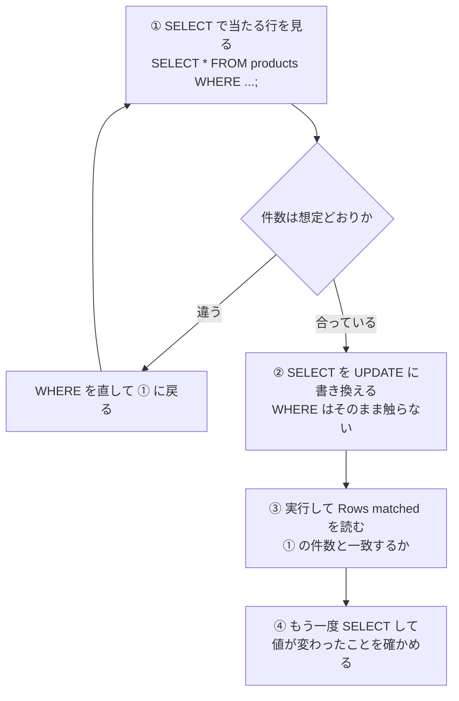
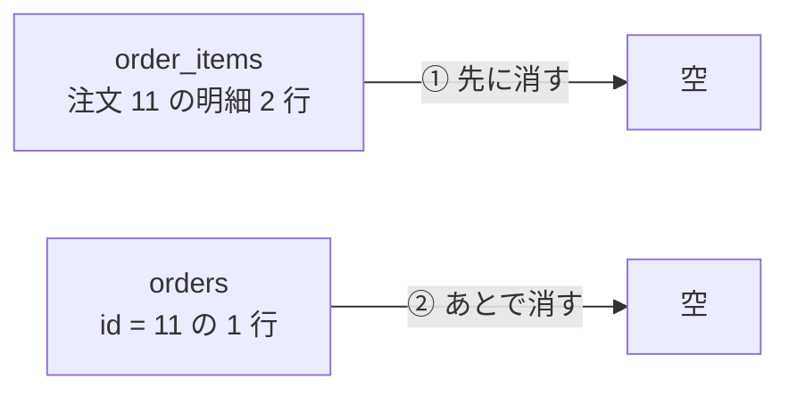
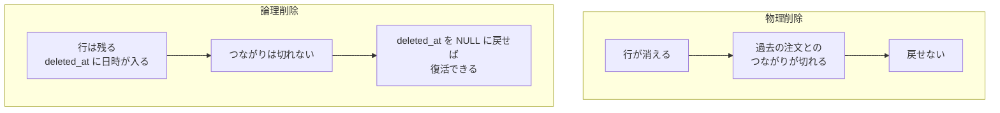
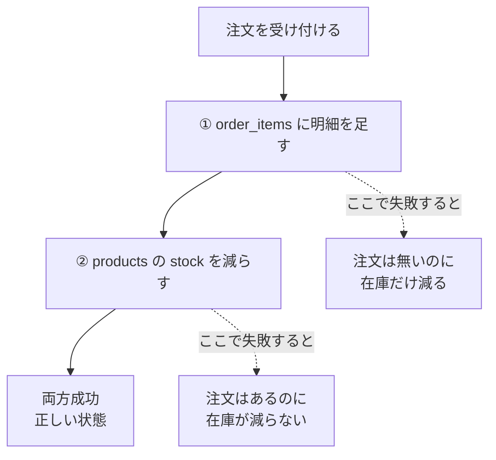
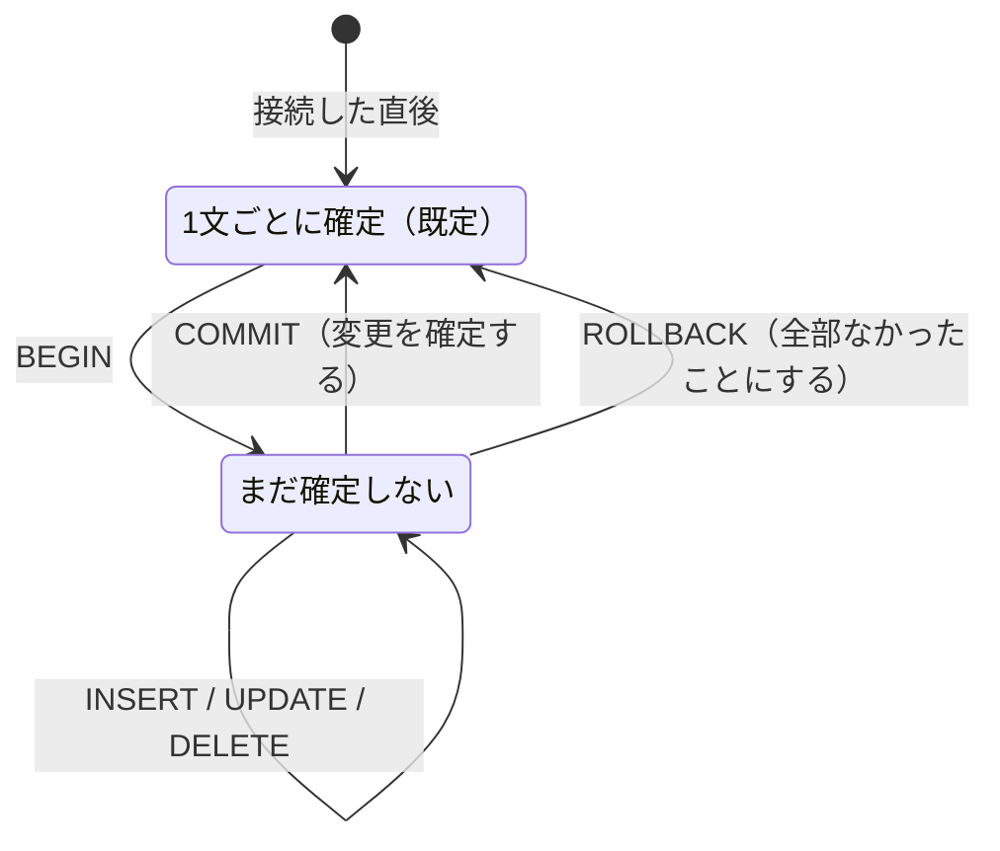
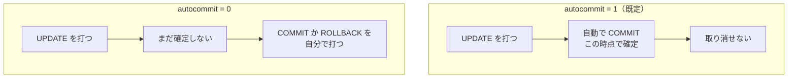
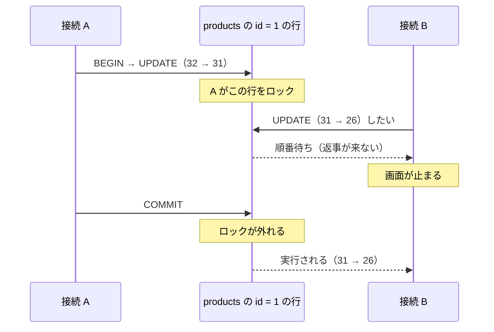
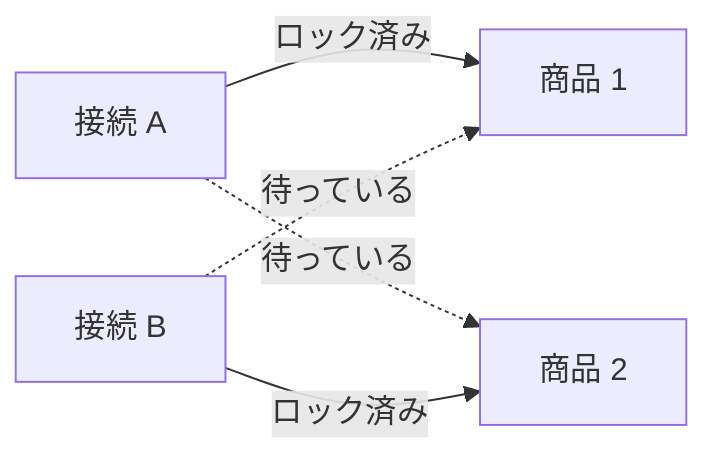
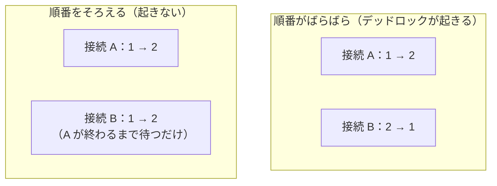

# 第4章 データを変更する

第3章では、テーブルからデータを**取り出す**練習をしました。
`SELECT` は何度打っても、どんな条件を書いても、データベースの中身は1文字も変わりません。

この章からは、**中身を書き換えます。**

命令は3つだけです。

| 命令 | 何をするか |
|------|----------|
| `INSERT` | 行を**足す** |
| `UPDATE` | 行の値を**書き換える** |
| `DELETE` | 行を**消す** |

3つとも、`SELECT` より短く書けます。ところが、**`SELECT` より何倍も怖い命令**です。

第3章で `WHERE` を書き忘れると、20 行全部が表示されるだけでした。
この章で `WHERE` を書き忘れると、**20 行全部が書き換わります。**
そして、打ち終わった時点で、元の値はもうどこにもありません。

そこでこの章では、3つの命令の書き方に加えて、**事故を防ぐ道具**を2つ扱います。

- **先に `SELECT` して、当たる行を目で確かめてから書き換える**（4.2.4）
- **トランザクション**で「まだ確定させない」状態にしてから、取り消せるようにする（4.4）

第3章で練習した `WHERE` が、ここでは**ブレーキ**になります。

## この章で学ぶこと

- `INSERT` で行を追加し、**列を省略したときに何が入るか**を説明できるようになる
- `UPDATE` / `DELETE` で行を書き換え・削除し、**`Rows matched` と `Changed` の違い**を読めるようになる
- **`WHERE` の書き忘れで何が起きるか**を実際に体験し、事故を防ぐ手順を身につける
- 行を消さずに「消したことにする」**論理削除**の考え方を説明できるようになる
- **トランザクション**で複数の変更を1つにまとめ、`ROLLBACK` で取り消せるようになる
- 2つの接続から同時に書き換えたときに起きる**ロック待ち**と**デッドロック**を、自分の手で再現できるようになる

## この章の前提

- [第3章 データを取り出す（SELECT）](./03-select.md) を終えていること
- **`shop` データベースに練習用データが入っていること**
  （`SELECT COUNT(*) FROM products;` が `20` を返す状態。2.5.3）
- MySQL が起動していて、接続できること（2.1.2 / 2.2.1）

まだ接続していない場合は、次のコマンドで入ってください。

**Windows（PowerShell）**

```powershell
docker compose up -d
docker compose exec db mysql -u root -p --default-character-set=utf8mb4 shop
```

**macOS / Linux**

```bash
docker compose up -d
docker compose exec db mysql -u root -p --default-character-set=utf8mb4 shop
```

`mysql>` が出たら準備完了です。

> **注意：この章は、練習用データをわざと壊します**
> `UPDATE` の事故（4.2.3）も `TRUNCATE`（4.3.2）も、**実際に手を動かして体験します。**
> 壊れたままだと第5章以降の例題が合わなくなるので、**節が終わるたびに元に戻してください。**
>
> 戻し方は、第2章 2.5.2 でやったのと同じ1行です。
>
> ```sql
> SOURCE /sql/shop.sql;
> ```
>
> このファイルは先頭で `DROP TABLE IF EXISTS` をしているので、
> **何度流し込んでも、必ず同じ状態（4 / 8 / 20 / 15 / 37 件）に戻ります。**
> 戻したあとは、次の1行で確認してください。
>
> ```sql
> SELECT COUNT(*) FROM products;
> ```
>
> **この章では、この「戻す」操作を何度も使います。**
> いつでも戻せると分かっていれば、思い切って壊せます。

> **つまずいたら**
> この章のつまずきは、2種類に分かれます。
>
> - **「エラーが出る」**：メッセージ全文を貼って聞いてください（レベル C）
> - **「エラーは出ないのに、想定と違う行が変わった」**：これがこの章の本題です（レベル A）
>
> 後者は答えをもらわずに聞いてください。第0章 0.2.2 の分け方です。
>
> ```text
> mysql-text の 4.2.4 を読んでいます。
>
> 【やりたいこと】
> 文房具の商品だけを 50 円値上げしたい
>
> 【打った SQL】
> UPDATE products SET price = price + 50 WHERE category_id = 4 OR price < 1000;
>
> 【結果】
> Rows matched: 12 と出た。3 行のつもりだった
>
> 答えは書かないでください。どこを見直せばよいかだけ教えてください。
> ```

---

## 4.1 `INSERT`

### 4.1.1 1件追加する

行を1つ足す命令が `INSERT` です。形は次のとおりです。

```text
INSERT INTO テーブル名 (列名, 列名, ...) VALUES (値, 値, ...);
```

**列名の並びと、値の並びが、前から順に対応します。**
1番目の列に1番目の値、2番目の列に2番目の値が入ります。

`categories` に、新しい分類を1つ足してみます。

```sql
INSERT INTO categories (name) VALUES ('季節もの');
```

実行結果:

```text
Query OK, 1 row affected (0.00 sec)
```

**`1 row affected`** は「**1行が影響を受けた**」という意味です。
`INSERT` の場合は「1行入った」と読みます。

入ったことを確認します（第0章 0.3.1 の「確認の輪」）。

```sql
SELECT * FROM categories;
```

実行結果:

```text
+----+--------------+
| id | name         |
+----+--------------+
|  1 | 食器         |
|  2 | キッチン     |
|  3 | 収納         |
|  4 | 文房具       |
|  5 | 季節もの     |
+----+--------------+
5 rows in set (0.00 sec)
```

**`id` に `5` が入っています。**
値を1つも指定していないのに、番号が付きました。

これは、第2章 2.4.3 で `id` に **`AUTO_INCREMENT`**（値を入れなかったとき、
1, 2, 3... と自動で番号を振る指定）を付けたためです。
MySQL が「いま使われている最大の番号の次」を入れてくれます。

**`id` は書かないのが基本です。** 自分で番号を管理しなくて済むからです。
`AUTO_INCREMENT` の細かい挙動は第5章 5.3.2 で扱います。

**文字列は `'` で囲みます**

`'季節もの'` のシングルクォートは、第3章 3.2.1 の `WHERE name = '藍色の湯のみ'` と同じ決まりです。
**囲み忘れると、MySQL はそれを列名だと解釈します。**

```sql
INSERT INTO products (name, category_id, price, stock) VALUES (ガラスの一輪挿し, 1, 1800, 10);
```

実行結果:

```text
ERROR 1054 (42S22): Unknown column 'ガラスの一輪挿し' in 'field list'
```

第3章 3.2.1 で見たのとまったく同じエラーです。
**`ERROR 1054` は「そんな列は無い」という合図**でした。
`INSERT` でこれが出たら、まずクォートの付け忘れを疑ってください。

> **よくある間違い**
> **数値を `'` で囲むと、入ってしまうことがあります。**
>
> ```sql
> INSERT INTO products (name, category_id, price, stock) VALUES ('試作品', '1', '1800', '10');
> ```
>
> これはエラーになりません。MySQL が `'1800'` を数値の `1800` に変換して入れるためです。
> ただし、**変換できない文字列を渡すと止まります。**
>
> ```sql
> INSERT INTO products (name, category_id, price, stock) VALUES ('試作品', 1, 'たかい', 10);
> ```
>
> ```text
> ERROR 1366 (HY000): Incorrect integer value: 'たかい' for column 'price' at row 1
> ```
>
> **`ERROR 1366` は「その列に入れられない値です」という合図**です。
> 列名と値の並びがずれているときにも出ます。`INSERT` でこれが出たら、
> **列名の並びと値の並びを前から1つずつ突き合わせてください。**

### 4.1.2 複数件をまとめて追加する

`VALUES` のあとのかっこを、カンマで区切って並べると、**何行でも一度に入ります。**

いま `categories` は5行になっているので、まず元に戻します。

```sql
SOURCE /sql/shop.sql;
```

そのうえで、3行まとめて入れてみます。

```sql
INSERT INTO categories (name) VALUES ('ギフト'), ('セール'), ('アウトレット');
```

実行結果:

```text
Query OK, 3 rows affected (0.00 sec)
Records: 3  Duplicates: 0  Warnings: 0
```

**2行目の `Records: 3` が「読み込んだ行数」**です。
1件ずつの `INSERT` では出ない行で、**複数件を入れたときだけ表示されます。**

```sql
SELECT * FROM categories;
```

実行結果:

```text
+----+--------------------+
| id | name               |
+----+--------------------+
|  1 | 食器               |
|  2 | キッチン           |
|  3 | 収納               |
|  4 | 文房具             |
|  5 | ギフト             |
|  6 | セール             |
|  7 | アウトレット       |
+----+--------------------+
7 rows in set (0.00 sec)
```

`id` は `5` `6` `7` と、自動で順に振られています。

**なぜまとめて書くのか**

1件ずつ3回打つのと、まとめて1回打つのとでは、**結果は同じです。**
違うのは速さと、**途中で失敗したときの状態**です。

- 1件ずつ3回：2件目で失敗すると、**1件目だけ入った状態**が残る
- まとめて1回：どれか1件でも失敗すると、**3件とも入らない**

第2章 2.5.2 の `shop.sql` が `INSERT` をまとめて書いていたのは、この性質のためです。
「全部入るか、1件も入らないか」のどちらかにしたい、という考え方は、
4.4 のトランザクションでもう一度出てきます。

### 4.1.3 列を省略したときの挙動

`INSERT` の列名リストには、**そのテーブルの全部の列を書かなくても構いません。**
書かなかった列には、MySQL が決めた値が入ります。

`products` から `released_on`（発売日）を省いてみます。
まず元に戻してから試します。

```sql
SOURCE /sql/shop.sql;
```

```sql
INSERT INTO products (name, category_id, price, stock) VALUES ('ガラスの一輪挿し', 1, 1800, 10);
```

実行結果:

```text
Query OK, 1 row affected (0.00 sec)
```

```sql
SELECT * FROM products WHERE id = 21;
```

実行結果:

```text
+----+--------------------------+-------------+-------+-------+-------------+
| id | name                     | category_id | price | stock | released_on |
+----+--------------------------+-------------+-------+-------+-------------+
| 21 | ガラスの一輪挿し         |           1 |  1800 |    10 | NULL        |
+----+--------------------------+-------------+-------+-------+-------------+
1 row in set (0.00 sec)
```

**`released_on` が `NULL` になりました。**
第3章 3.3.4 で扱った「値が無い」状態です。0 でも空文字でもありません。

**省略できる列と、できない列があります**

`released_on` は省略できましたが、`price` を省くと止まります。

```sql
INSERT INTO products (name, category_id, stock) VALUES ('木のコースター', 1, 40);
```

実行結果:

```text
ERROR 1364 (HY000): Field 'price' doesn't have a default value
```

**`ERROR 1364` は「その列を省略できません」という合図**です。

違いは、第2章 2.4.3 で付けた **`NOT NULL`**（その列を空にできない指定）です。
`DESCRIBE` で確認できます（2.4.4）。

```sql
DESCRIBE products;
```

実行結果:

```text
+-------------+-------------+------+-----+---------+----------------+
| Field       | Type        | Null | Key | Default | Extra          |
+-------------+-------------+------+-----+---------+----------------+
| id          | int         | NO   | PRI | NULL    | auto_increment |
| name        | varchar(40) | NO   |     | NULL    |                |
| category_id | int         | NO   |     | NULL    |                |
| price       | int         | NO   |     | NULL    |                |
| stock       | int         | NO   |     | NULL    |                |
| released_on | date        | YES  |     | NULL    |                |
+-------------+-------------+------+-----+---------+----------------+
6 rows in set (0.00 sec)
```

読み方は次のとおりです。

| `Null` 列 | 意味 | 省略すると |
|-----------|------|----------|
| `YES` | 空（`NULL`）にできる | `NULL` が入る |
| `NO` | 空にできない | **`ERROR 1364` で止まる** |

ただし `id` だけは `Null` が `NO` なのに省略できました。
`Extra` 列に **`auto_increment`** と書かれている列は、
値の代わりに自動で番号が入るためです。

**`Default` 列に値を書いておくと、省略しても止まりません。**
この本のテーブルにはまだ `DEFAULT` を付けていないので全部 `NULL` ですが、
`DEFAULT` の付け方は第5章 5.2.2 で扱います。

**列名リストそのものを省略することもできます**

```sql
INSERT INTO products VALUES (22, '麻のティータオル', 2, 900, 25, '2026-09-01');
```

実行結果:

```text
Query OK, 1 row affected (0.00 sec)
```

列名を書かない場合は、**`DESCRIBE` に出てくる順番どおりに、全部の列の値を並べます。**
1つでも数が合わないと止まります。

```sql
INSERT INTO products VALUES ('布のブックカバー', 4, 1100, 30, NULL);
```

実行結果:

```text
ERROR 1136 (21S01): Column count doesn't match value count at row 1
```

**`ERROR 1136` は「列の数と値の数が合いません」という合図**です。
この例では `id` の値を書き忘れています。

> **よくある間違い**
> **この本では、列名リストを必ず書いてください。**
> 列名を省いた `INSERT` は短くて楽ですが、2つの問題があります。
>
> - **テーブルに列が1つ増えただけで、その `INSERT` は全部動かなくなる**
> - **列の順番を取り違えても、型が同じなら気づかずに通る**
>   （`price` と `stock` を逆に書いても、どちらも `INT` なのでエラーになりません）
>
> 第3章 3.1.3 で「`SELECT *` をアプリに書かない」と書いたのと、同じ理由です。

> **注意：いまのテーブルは、おかしな値も受け入れます**
> 次の `INSERT` は、エラーになりません。
>
> ```sql
> INSERT INTO orders (customer_id, ordered_at, status) VALUES (99, '2026-09-15 10:00:00', '受付');
> ```
>
> `customers` に `id` が `99` の顧客はいませんが、**通ってしまいます。**
> 同じように、`categories` に `食器` をもう1件足すこともできます。
>
> これは第2章 2.5.1 の「注意」で予告したとおり、
> **このテーブルにまだ外部キー制約も `UNIQUE` 制約も付けていない**ためです。
> 「存在しない相手を指す値を拒否する」のは第5章 5.4、
> 「重複を拒否する」のは第5章 5.2.3 で足します。
>
> **いまは、入れる側が正しい値を入れる責任を持っています。**

ここまでで `products` に2行足したので、元に戻しておきます。

```sql
SOURCE /sql/shop.sql;
```

---

## 4.2 `UPDATE`

### 4.2.1 値を書き換える

すでにある行の値を書き換える命令が `UPDATE` です。

```text
UPDATE テーブル名 SET 列名 = 値 WHERE 条件;
```

`SET` が「何をどう変えるか」、`WHERE` が「どの行を変えるか」です。

商品 `id` = 1 の価格を、1200 円から 1300 円に上げてみます。
**まず、いまの値を見ておきます。**

```sql
SELECT id, name, price, stock FROM products WHERE id = 1;
```

実行結果:

```text
+----+--------------------------------+-------+-------+
| id | name                           | price | stock |
+----+--------------------------------+-------+-------+
|  1 | こまり顔のマグカップ           |  1200 |    32 |
+----+--------------------------------+-------+-------+
1 row in set (0.00 sec)
```

書き換えます。

```sql
UPDATE products SET price = 1300 WHERE id = 1;
```

実行結果:

```text
Query OK, 1 row affected (0.00 sec)
Rows matched: 1  Changed: 1  Warnings: 0
```

```sql
SELECT id, name, price, stock FROM products WHERE id = 1;
```

実行結果:

```text
+----+--------------------------------+-------+-------+
| id | name                           | price | stock |
+----+--------------------------------+-------+-------+
|  1 | こまり顔のマグカップ           |  1300 |    32 |
+----+--------------------------------+-------+-------+
1 row in set (0.00 sec)
```

**`Rows matched` と `Changed` は別のものです**

2行目の `Rows matched: 1  Changed: 1` は、`UPDATE` を読むときのいちばん大事な情報です。

| 表示 | 意味 |
|------|------|
| `Rows matched` | **`WHERE` に当たった行数**（変わったかどうかは無関係） |
| `Changed` | そのうち、**実際に値が変わった行数** |

同じ `UPDATE` をもう一度打つと、違いが見えます。

```sql
UPDATE products SET price = 1300 WHERE id = 1;
```

実行結果:

```text
Query OK, 0 rows affected (0.00 sec)
Rows matched: 1  Changed: 0  Warnings: 0
```

`WHERE` には1行当たっています（`Rows matched: 1`）が、
**すでに 1300 だったので、書き換えるものがありません**（`Changed: 0`）。

この2つを区別できると、うまくいかないときの切り分けが速くなります。

| 表示 | 何が起きているか | 見るべきところ |
|------|----------------|--------------|
| `Rows matched: 0` | **`WHERE` に1行も当たっていない** | `WHERE` の条件・値のクォート |
| `Rows matched: 1  Changed: 0` | 当たったが、値がすでに同じ | `SET` の値 |
| `Rows matched: 20` | **当てるつもりのない行まで当たっている** | `WHERE` の書き忘れ・条件の広さ |

`WHERE` に1行も当たらない例を見ておきます。

```sql
UPDATE products SET price = 999 WHERE id = 999;
```

実行結果:

```text
Query OK, 0 rows affected (0.00 sec)
Rows matched: 0  Changed: 0  Warnings: 0
```

**エラーにはなりません。** `id` = 999 の商品は無いので、何も起きなかっただけです。
「実行できたのに反映されない」と感じたときは、まずここを疑ってください。

**いまの値を使って計算できます**

`SET` の右側には、値だけでなく**式**も書けます。第3章 3.1.4 で
`price * 1.1` のような計算を `SELECT` 句に書いたのと同じです。

在庫を3つ減らします。

```sql
UPDATE products SET stock = stock - 3 WHERE id = 16;
```

実行結果:

```text
Query OK, 1 row affected (0.01 sec)
Rows matched: 1  Changed: 1  Warnings: 0
```

```sql
SELECT id, name, stock FROM products WHERE id = 16;
```

実行結果:

```text
+----+--------------------------------+-------+
| id | name                           | stock |
+----+--------------------------------+-------+
| 16 | 書きやすいボールペン           |   117 |
+----+--------------------------------+-------+
1 row in set (0.00 sec)
```

`stock = stock - 3` の右側の `stock` は、**その行のいまの値**です。
120 だったので 117 になりました。

この「いまの値から引く」書き方は、在庫の引き当てで必ず使います。
**`SELECT` で 120 を読んでから `SET stock = 117` と書くのとは、意味が違います。**
理由は 4.5.1 で扱います。

> **よくある間違い**
> **`stock = stock - 3` は、在庫が足りなくてもそのまま実行されます。**
>
> ```sql
> UPDATE products SET stock = stock - 10 WHERE id = 20;
> ```
>
> `id` = 20 の「革のペンケース」は在庫が5個しかありませんが、エラーは出ません。
>
> ```sql
> SELECT id, name, stock FROM products WHERE id = 20;
> ```
>
> ```text
> +----+-----------------------+-------+
> | id | name                  | stock |
> +----+-----------------------+-------+
> | 20 | 革のペンケース        |    -5 |
> +----+-----------------------+-------+
> 1 row in set (0.00 sec)
> ```
>
> **在庫が `-5` になりました。**
> `stock` は `INT` 型なので、マイナスの整数は正しい値として受け入れられます。
>
> 「0 未満を拒否する」という決まりは、テーブル側に書いておくことができます
> （`CHECK` 制約。第5章 5.2.4）。
> **いまのテーブルには書いていないので、引きすぎていないかは自分で確かめる必要があります。**
> 確かめ方は、演習 4.4 で練習します。

ここで元に戻しておきます。

```sql
SOURCE /sql/shop.sql;
```

### 4.2.2 複数列を同時に更新する

`SET` のあとをカンマで区切ると、**1回の `UPDATE` で複数の列を変えられます。**

```sql
UPDATE products SET price = 1500, stock = 0 WHERE id = 1;
```

実行結果:

```text
Query OK, 1 row affected (0.00 sec)
Rows matched: 1  Changed: 1  Warnings: 0
```

```sql
SELECT id, name, price, stock FROM products WHERE id = 1;
```

実行結果:

```text
+----+--------------------------------+-------+-------+
| id | name                           | price | stock |
+----+--------------------------------+-------+-------+
|  1 | こまり顔のマグカップ           |  1500 |     0 |
+----+--------------------------------+-------+-------+
1 row in set (0.00 sec)
```

**列を分けて2回打つのとは、意味が違います。**

```sql
-- これは1回の変更
UPDATE products SET price = 1500, stock = 0 WHERE id = 1;

-- これは2回の変更
UPDATE products SET price = 1500 WHERE id = 1;
UPDATE products SET stock = 0 WHERE id = 1;
```

結果の値は同じですが、下の書き方には**1つ目が済んで2つ目がまだ、という瞬間**があります。
その瞬間に誰かがこの行を読むと、**値段だけ新しくて在庫が古い**状態が見えます。

「途中の状態を他の人に見せたくない」というときに使うのが、4.4 のトランザクションです。
**1つの `UPDATE` で書けるなら、分けないほうが安全**だと覚えておいてください。

> **よくある間違い**
> **`SET` の区切りは `,` です。`AND` ではありません。**
>
> ```sql
> UPDATE products SET price = 1500 AND stock = 0 WHERE id = 1;
> ```
>
> これは**エラーになりません。** MySQL はこれを
> 「`price` に `1500 AND stock = 0` の計算結果を入れる」と読みます。
> `AND` は真偽を計算する記号（3.2.3）なので、
> **`price` に `0` か `1` が入ります。**
>
> `WHERE` の条件をカンマでつないだときと違い、**エラーが出ません。**
> `SET` を複数書いたときは、必ず `SELECT` で結果を見てください。

元に戻します。

```sql
SOURCE /sql/shop.sql;
```

### 4.2.3 `WHERE` を忘れると全件更新される

**ここは、実際に打って体験してください。**
いつでも `SOURCE /sql/shop.sql;` で戻せます。

`UPDATE` の `WHERE` は、**省略できてしまいます。**

```sql
UPDATE products SET price = 1000;
```

実行結果:

```text
Query OK, 20 rows affected (0.01 sec)
Rows matched: 20  Changed: 20  Warnings: 0
```

```sql
SELECT id, name, price FROM products LIMIT 5;
```

実行結果:

```text
+----+--------------------------------+-------+
| id | name                           | price |
+----+--------------------------------+-------+
|  1 | こまり顔のマグカップ           |  1000 |
|  2 | 藍色の湯のみ                   |  1000 |
|  3 | 木のスープボウル               |  1000 |
|  4 | 白磁の取り皿 5枚組             |  1000 |
|  5 | 厚手のごはん茶碗               |  1000 |
+----+--------------------------------+-------+
5 rows in set (0.00 sec)
```

**20 商品すべてが 1000 円になりました。**

`WHERE` が無い `UPDATE` は「全行が条件に当たる」と解釈されます。
**警告も確認も出ません。** `Rows matched: 20` という行が、唯一の手がかりです。

この本の練習用データは 20 行なので笑い話で済みますが、
**実際のサービスでは、顧客テーブルの全員のメールアドレスが同じ値になる、
といった形で起きます。**

しかも、元の値は**どこにも残っていません。**
「1200 円だった」という情報は、この `UPDATE` の瞬間に消えました。

元に戻します。

```sql
SOURCE /sql/shop.sql;
```

**戻せたのは、`shop.sql` という「元の値が書いてあるファイル」があるからです。**
本物のデータベースには、そんなファイルはありません。
戻す手段はバックアップだけで、バックアップは第8章 8.6 で扱います。

> **注意：`DELETE` も同じです**
> `DELETE FROM products;` と打つと、**20 行すべてが消えます。**
> `WHERE` の省略は、`UPDATE` でも `DELETE` でも同じ結果を招きます。
>
> **この2つの命令を打つときは、`WHERE` を先に書いてください。**
> `UPDATE products` と打った時点で、指がそのまま `SET ...` に進み、
> `WHERE` を書く前に `Enter` を押してしまう、というのが典型的な事故です。

### 4.2.4 事故を防ぐ手順（先に SELECT する）

`WHERE` の書き忘れや書き間違いを、気合いで防ぐことはできません。
**手順で防ぎます。**

この本では、次の4段階を使います。



実際にやってみます。**文房具（`category_id` = 4）のうち、
1000 円未満の商品だけを 50 円値上げする**という作業です。

**① まず `SELECT` で、当たる行を見ます**

```sql
SELECT id, name, price FROM products WHERE category_id = 4 AND price < 1000;
```

実行結果:

```text
+----+--------------------------------+-------+
| id | name                           | price |
+----+--------------------------------+-------+
| 16 | 書きやすいボールペン           |   380 |
| 17 | 方眼のノート A5                |   520 |
| 19 | ふせん 3色セット               |   340 |
+----+--------------------------------+-------+
3 rows in set (0.00 sec)
```

**3 行です。** 名前を見て、値上げしたい商品で合っているかを確かめます。

**② `SELECT ... FROM` の部分だけを `UPDATE ... SET` に書き換えます**

**`WHERE` 以降は指1本触りません。** ここが手順の肝です。

```sql
UPDATE products SET price = price + 50 WHERE category_id = 4 AND price < 1000;
```

**③ 実行して `Rows matched` を読みます**

実行結果:

```text
Query OK, 3 rows affected (0.00 sec)
Rows matched: 3  Changed: 3  Warnings: 0
```

**`Rows matched: 3` が、① の 3 行と一致しました。**
ここが違っていたら、`WHERE` を書き換えてしまったということです。

**④ もう一度 `SELECT` して確かめます**

```sql
SELECT id, name, price FROM products WHERE category_id = 4 ORDER BY id;
```

実行結果:

```text
+----+-----------------------------------+-------+
| id | name                              | price |
+----+-----------------------------------+-------+
| 16 | 書きやすいボールペン              |   430 |
| 17 | 方眼のノート A5                   |   570 |
| 18 | 木軸のシャープペンシル            |  1600 |
| 19 | ふせん 3色セット                  |   390 |
| 20 | 革のペンケース                    |  4200 |
+----+-----------------------------------+-------+
5 rows in set (0.00 sec)
```

380 → 430、520 → 570、340 → 390 と、3 件だけ上がっています。
**1600 円と 4200 円の商品は、条件に当たらないので変わっていません。**
`WHERE` を確かめるときは、**変わってほしくない行も一緒に表示する**と確実です。

**もう1つの安全装置：セーフアップデートモード**

`mysql` には、**`WHERE` に主キーを使っていない `UPDATE` / `DELETE` を、
そもそも実行させない**という設定があります。

```sql
SET SQL_SAFE_UPDATES = 1;
```

実行結果:

```text
Query OK, 0 rows affected (0.00 sec)
```

この状態で `WHERE` 無しの `UPDATE` を打つと、止まります。

```sql
UPDATE products SET price = 1000;
```

実行結果:

```text
ERROR 1175 (HY000): You are using safe update mode and you tried to update a table without a WHERE that uses a KEY column.
```

**`ERROR 1175` は「安全装置が働きました」という合図**です。
`DELETE FROM products;` も同じように止まります。

`WHERE` があっても、主キー（`id`）を使っていなければ止まります。

```sql
UPDATE products SET price = 1000 WHERE name LIKE '%ノート%';
```

実行結果:

```text
ERROR 1175 (HY000): You are using safe update mode and you tried to update a table without a WHERE that uses a KEY column.
```

`id` を使った `UPDATE` は通ります。

```sql
UPDATE products SET price = 1000 WHERE id = 17;
```

実行結果:

```text
Query OK, 1 row affected (0.00 sec)
Rows matched: 1  Changed: 1  Warnings: 0
```

| 設定 | `WHERE` 無し | `WHERE name LIKE ...` | `WHERE id = 17` |
|------|------------|---------------------|----------------|
| `SQL_SAFE_UPDATES = 0`（既定） | 実行される | 実行される | 実行される |
| `SQL_SAFE_UPDATES = 1` | **`ERROR 1175`** | **`ERROR 1175`** | 実行される |

戻すときは `0` を入れます。

```sql
SET SQL_SAFE_UPDATES = 0;
```

> **補足：この設定は接続ごとです**
> `SET SQL_SAFE_UPDATES = 1;` は、**いま開いている接続にだけ効きます。**
> `exit` して入り直すと、既定の `0` に戻ります。
>
> この章の練習では邪魔になる場面が多いので、**この本では既定の `0` のまま進めます。**
> ただし、**本物のデータが入ったデータベースに接続するときは、
> 入った直後に `1` にしておく**と、事故の芽を1つ減らせます。

> **つまずいたら**
> `WHERE` の条件が複雑で自信が持てないときは、AI に「条件の当たり方」だけを聞けます。
> **書き換える SQL は自分で書いてください。**
>
> ```text
> mysql-text の 4.2.4 を読んでいます。
>
> 次の SELECT が、どんな行に当たるかを日本語で説明してください。
> SQL は書かないでください。
>
> SELECT * FROM products WHERE category_id = 4 AND price < 1000;
> ```

元に戻します。

```sql
SOURCE /sql/shop.sql;
```

---

## 4.3 `DELETE`

### 4.3.1 行を削除する

行を消す命令が `DELETE` です。

```text
DELETE FROM テーブル名 WHERE 条件;
```

**`SET` がありません。** 行ごと消すので、何をどう変えるかを書く必要がないためです。
消す対象を決めるのは `WHERE` だけです。

明細を1行消してみます。

```sql
DELETE FROM order_items WHERE id = 37;
```

実行結果:

```text
Query OK, 1 row affected (0.00 sec)
```

```sql
SELECT COUNT(*) FROM order_items;
```

実行結果:

```text
+----------+
| COUNT(*) |
+----------+
|       36 |
+----------+
1 row in set (0.00 sec)
```

37 件が 36 件になりました。

`WHERE` に複数行が当たれば、その分だけ消えます。

```sql
DELETE FROM order_items WHERE order_id = 15;
```

実行結果:

```text
Query OK, 2 rows affected (0.00 sec)
```

`UPDATE` と同じく、**1行も当たらなくてもエラーにはなりません。**

```sql
DELETE FROM order_items WHERE order_id = 999;
```

実行結果:

```text
Query OK, 0 rows affected (0.00 sec)
```

**`DELETE` にも 4.2.4 の手順を使ってください。**
`SELECT * FROM order_items WHERE ...;` で消える行を目で見てから、
`SELECT *` の部分を `DELETE` に書き換えます。

**消す順番があります**

注文を1件まるごと消したいとき、消すべき行は2か所にあります。

- `orders` の1行（注文そのもの）
- `order_items` の複数行（その注文の明細）

**明細から先に消します。**



注文を先に消すと、**どの注文にも属さない明細**が `order_items` に残ります。
どの注文のものか分からない明細は、もう誰にも消せません。
第1章 1.1.3 で扱った「整合性が崩れる」状態です。

いまのテーブルには外部キー制約が無いので、**逆の順番でも MySQL は止めてくれません**（4.1.3 の注意）。
順番を守るのは、いまのところ書く人の責任です。
第5章 5.4.4 で `ON DELETE` を設定すると、この後始末をデータベースに任せられるようになります。

元に戻します。

```sql
SOURCE /sql/shop.sql;
```

### 4.3.2 `TRUNCATE` との違い

テーブルの行を**全部**消したいときには、`DELETE` のほかに `TRUNCATE` という命令があります。

```sql
TRUNCATE TABLE categories;
```

実行結果:

```text
Query OK, 0 rows affected (0.01 sec)
```

```sql
SELECT COUNT(*) FROM categories;
```

実行結果:

```text
+----------+
| COUNT(*) |
+----------+
|        0 |
+----------+
1 row in set (0.00 sec)
```

`DELETE FROM categories;` でも同じ「0 件」になります。
**結果は同じに見えますが、中身はかなり違います。**

| | `DELETE FROM t;` | `TRUNCATE TABLE t;` |
|---|---|---|
| `WHERE` で絞れるか | **絞れる** | 絞れない（必ず全部） |
| 消えた行数の表示 | `N rows affected` | **いつも `0 rows affected`** |
| 1行ずつ消すか | 1行ずつ消す | テーブルを**作り直す** |
| 大量データでの速さ | 遅い | **速い** |
| `AUTO_INCREMENT` の番号 | **そのまま続く** | **1 に戻る** |
| `ROLLBACK` で取り消せるか | **取り消せる**（4.4.2） | **取り消せない** |

とくに下の2つが大事なので、実際に見ておきます。

**`AUTO_INCREMENT` の番号が戻ります**

`DELETE` の場合、消した番号は**欠番になったまま**です。

```sql
SOURCE /sql/shop.sql;
```

```sql
INSERT INTO categories (name) VALUES ('季節もの');
DELETE FROM categories WHERE id = 5;
INSERT INTO categories (name) VALUES ('ギフト');
SELECT * FROM categories;
```

実行結果:

```text
+----+--------------+
| id | name         |
+----+--------------+
|  1 | 食器         |
|  2 | キッチン     |
|  3 | 収納         |
|  4 | 文房具       |
|  6 | ギフト       |
+----+--------------+
5 rows in set (0.00 sec)
```

**`5` を消したあと、次に入れたのは `6` です。**
MySQL は「次に振る番号」を覚えていて、消しても巻き戻しません。

`TRUNCATE` すると、この番号が 1 に戻ります。

```sql
TRUNCATE TABLE categories;
INSERT INTO categories (name) VALUES ('食器');
SELECT * FROM categories;
```

実行結果:

```text
+----+--------+
| id | name   |
+----+--------+
|  1 | 食器   |
+----+--------+
1 row in set (0.00 sec)
```

**`id` が `1` に戻りました。**

「番号が飛ぶのは気持ち悪いから詰めたい」と思うかもしれませんが、
**`id` は行を特定するための番号であって、順番でも件数でもありません**（第1章 1.4）。
飛んでいて正常です。

**`TRUNCATE` は取り消せません**

これは 4.4 を読んでからのほうが分かりやすいのですが、
`TRUNCATE` の性質としてここに書いておきます。**`TRUNCATE` は取り消せません。**

`DELETE` は、4.4.2 で扱う `ROLLBACK` で「無かったこと」にできます。
`TRUNCATE` はできません。それどころか、
**取り消せるはずだった直前の変更まで、まとめて確定させてしまいます**（4.4.3）。

> **注意：`TRUNCATE` は「速い `DELETE`」ではありません**
> この本で `TRUNCATE` を使う場面は、**練習用テーブルを空にするときだけ**です。
>
> 本物のデータに対して打つ命令ではありません。
> `WHERE` で絞れず、取り消しもできないので、
> **打った瞬間に、そのテーブルは空になって終わりです。**
>
> 第2章 2.5.2 の `shop.sql` が `DROP TABLE IF EXISTS` から始まっているのは、
> **練習用データを作り直すファイル**だからです。同じ発想の命令だと思ってください。

元に戻します。

```sql
SOURCE /sql/shop.sql;
```

### 4.3.3 論理削除という考え方

ここまでの `DELETE` は、**行をテーブルから本当に消していました。**
これを**物理削除**（ぶつりさくじょ。行そのものを消すこと）と呼びます。

ところが、実際のサービスでは「消したい」と言われても、
**本当に消すと困る**ことがよくあります。

- 退会した顧客の**過去の注文**は、売上の集計に必要
- 誤操作で消したときに、**戻してほしい**と言われる
- 「いつ、誰が消したか」を**記録として残さないといけない**

そこで使うのが**論理削除**（ろんりさくじょ。行は残したまま、
「消した」という印を付けて、見えないように扱うこと）です。



**印の付け方**

「消した印」のための列を1つ足します。この本では `deleted_at` という名前にします。

```sql
ALTER TABLE customers ADD COLUMN deleted_at DATETIME;
```

実行結果:

```text
Query OK, 0 rows affected (0.01 sec)
Records: 0  Duplicates: 0  Warnings: 0
```

`ALTER TABLE` は**テーブルの形そのものを変える命令**です。
書き方の詳細は第5章 5.6 で扱います。
**いまは「列を1つ足す決まった書き方」として読んでください。**

足されたか確認します。

```sql
DESCRIBE customers;
```

実行結果:

```text
+---------------+--------------+------+-----+---------+----------------+
| Field         | Type         | Null | Key | Default | Extra          |
+---------------+--------------+------+-----+---------+----------------+
| id            | int          | NO   | PRI | NULL    | auto_increment |
| name          | varchar(20)  | NO   |     | NULL    |                |
| email         | varchar(100) | NO   |     | NULL    |                |
| prefecture    | varchar(10)  | NO   |     | NULL    |                |
| birthday      | date         | YES  |     | NULL    |                |
| registered_on | date         | NO   |     | NULL    |                |
| deleted_at    | datetime     | YES  |     | NULL    |                |
+---------------+--------------+------+-----+---------+----------------+
7 rows in set (0.00 sec)
```

`deleted_at` が増え、`Null` が `YES` になっています。
**既存の8行には、すべて `NULL` が入っています。**

**消す代わりに、日時を入れます**

`id` = 5 の顧客が退会したことにします。`DELETE` ではなく `UPDATE` を使います。

```sql
UPDATE customers SET deleted_at = '2026-09-14 10:00:00' WHERE id = 5;
```

実行結果:

```text
Query OK, 1 row affected (0.00 sec)
Rows matched: 1  Changed: 1  Warnings: 0
```

```sql
SELECT id, name, deleted_at FROM customers;
```

実行結果:

```text
+----+------------------+---------------------+
| id | name             | deleted_at          |
+----+------------------+---------------------+
|  1 | 田中 陽子        | NULL                |
|  2 | 佐藤 健          | NULL                |
|  3 | 鈴木 一郎        | NULL                |
|  4 | 高橋 美咲        | NULL                |
|  5 | 伊藤 慎二        | 2026-09-14 10:00:00 |
|  6 | 渡辺 さくら      | NULL                |
|  7 | 山本 大輔        | NULL                |
|  8 | 中村 結衣        | NULL                |
+----+------------------+---------------------+
8 rows in set (0.00 sec)
```

**8行のままです。** 行は1つも消えていません。

`TRUE` / `FALSE` のような真偽値ではなく**日時**を入れるのは、
「消えているか」に加えて「**いつ消えたか**」も分かるためです。
真偽値の扱いは第5章 5.1.4 で扱います。

**取り出す側が、毎回除かないといけません**

論理削除にすると、**`SELECT` 側に必ず条件が1つ増えます。**

```sql
SELECT id, name FROM customers WHERE deleted_at IS NULL;
```

実行結果:

```text
+----+------------------+
| id | name             |
+----+------------------+
|  1 | 田中 陽子        |
|  2 | 佐藤 健          |
|  3 | 鈴木 一郎        |
|  4 | 高橋 美咲        |
|  6 | 渡辺 さくら      |
|  7 | 山本 大輔        |
|  8 | 中村 結衣        |
+----+------------------+
7 rows in set (0.00 sec)
```

**`deleted_at IS NULL`＝「まだ消されていない」**です。
第3章 3.3.4 で「`= NULL` では比べられない」と扱ったのは、こういう場面のためでした。

> **よくある間違い**
> **論理削除にした列を、`WHERE` に書き忘れる**のが、いちばん多い事故です。
>
> ```sql
> -- 退会した人にもメールを送ってしまう
> SELECT email FROM customers;
> ```
>
> 物理削除なら、消した人は二度と出てきません。
> 論理削除では、**書き忘れた `SELECT` すべてに退会者が混ざります。**
> しかも、**エラーは出ません。**
>
> 第3章 3.5.1 で `DISTINCT` を使った一覧も、
> 第6章で扱う集計も、**全部に `WHERE deleted_at IS NULL` が必要になります。**

> **補足：どちらを選ぶかは設計の判断です**
> 論理削除は「安全だから常に良い」というものではありません。
>
> | | 物理削除 | 論理削除 |
> |---|---|---|
> | 戻せるか | 戻せない | **戻せる** |
> | `SELECT` の書きやすさ | **そのまま書ける** | 毎回条件が要る |
> | 行数 | 減る | **減らない**（検索が遅くなる。第7章） |
> | 「消してほしい」という要望 | 満たせる | **満たせていない** |
>
> 最後の行が重要です。個人情報を「消してください」と求められた場合、
> 論理削除では消したことになりません。
> **この本では「消えては困るものだけ論理削除にする」という立場を取ります。**

**元に戻します**

足した列を外します。

```sql
ALTER TABLE customers DROP COLUMN deleted_at;
```

実行結果:

```text
Query OK, 0 rows affected (0.01 sec)
Records: 0  Duplicates: 0  Warnings: 0
```

`SOURCE /sql/shop.sql;` でも、テーブルごと作り直されるので元に戻ります。

```sql
SOURCE /sql/shop.sql;
```

---

## 4.4 トランザクション

### 4.4.1 途中で失敗したら困る処理

ここまでの `INSERT` / `UPDATE` / `DELETE` は、**1文ずつ、打った瞬間に確定**していました。

ところが、**1文では終わらない処理**があります。

商品を注文するとき、データベースには2つの変更が必要です。

1. `order_items` に明細を1行**足す**（誰が何を何個買ったか）
2. `products` の `stock` を**減らす**（在庫の引き当て）



**この2つは、両方成功しないと意味がありません。**

- ① だけ成功：注文は入ったのに在庫が減らない → **在庫切れの商品が売れ続ける**
- ② だけ成功：在庫は減ったのに注文が無い → **商品が消えたことになる**

「途中で失敗する」のは、珍しいことではありません。

- 2文目がエラーになった（型が違う、値が長すぎる）
- アプリが2文の間で落ちた
- ネットワークが切れて、接続が切断された

**実際に、途中で失敗させてみます**

```sql
UPDATE products SET stock = stock - 2 WHERE id = 20;
```

実行結果:

```text
Query OK, 1 row affected (0.00 sec)
Rows matched: 1  Changed: 1  Warnings: 0
```

続けて、明細を入れます。ただし `quantity` に**わざと数字でない値**を書きます。

```sql
INSERT INTO order_items (order_id, product_id, quantity, unit_price) VALUES (13, 20, 'にこ', 4200);
```

実行結果:

```text
ERROR 1366 (HY000): Incorrect integer value: 'にこ' for column 'quantity' at row 1
```

2文目は失敗しました。では、1文目はどうなったでしょうか。

```sql
SELECT id, name, stock FROM products WHERE id = 20;
```

実行結果:

```text
+----+-----------------------+-------+
| id | name                  | stock |
+----+-----------------------+-------+
| 20 | 革のペンケース        |     3 |
+----+-----------------------+-------+
1 row in set (0.00 sec)
```

**在庫は 5 から 3 に減ったままです。**
注文の明細は入っていないのに、在庫だけが消えました。

**この「片方だけ成功した状態」をなくす仕組みが、トランザクションです。**

**トランザクション**（複数の操作を「全部成功」か「全部なかったこと」にまとめる仕組み）を使うと、
2つの変更を1つの固まりとして扱えます。固まりの中で1つでも失敗したら、
**最初の1文も含めて、まとめて無かったことにできます。**

元に戻します。

```sql
SOURCE /sql/shop.sql;
```

### 4.4.2 `BEGIN` / `COMMIT` / `ROLLBACK`

トランザクションは、3つの命令で操作します。

| 命令 | 意味 |
|------|------|
| `BEGIN` | ここから固まりを始める（**ここから先は、まだ確定しない**） |
| `COMMIT` | 固まりを**確定させる**（もう取り消せない） |
| `ROLLBACK` | 固まりを**全部なかったことにする** |



「まだ確定しない」の状態で打った `INSERT` / `UPDATE` / `DELETE` は、
**自分の接続からは変更後の値が見えますが、まだ確定していません。**
`COMMIT` を打つまで、いつでも `ROLLBACK` で戻せます。

**まず `ROLLBACK` を試します**

取り消せることを先に体験したほうが、安心して進められます。

```sql
BEGIN;
```

実行結果:

```text
Query OK, 0 rows affected (0.00 sec)
```

```sql
UPDATE products SET stock = stock - 2 WHERE id = 1;
```

実行結果:

```text
Query OK, 1 row affected (0.00 sec)
Rows matched: 1  Changed: 1  Warnings: 0
```

```sql
SELECT id, name, stock FROM products WHERE id = 1;
```

実行結果:

```text
+----+--------------------------------+-------+
| id | name                           | stock |
+----+--------------------------------+-------+
|  1 | こまり顔のマグカップ           |    30 |
+----+--------------------------------+-------+
1 row in set (0.00 sec)
```

**32 が 30 になっています。自分からは、変更が見えます。**

ここで取り消します。

```sql
ROLLBACK;
```

実行結果:

```text
Query OK, 0 rows affected (0.00 sec)
```

```sql
SELECT id, name, stock FROM products WHERE id = 1;
```

実行結果:

```text
+----+--------------------------------+-------+
| id | name                           | stock |
+----+--------------------------------+-------+
|  1 | こまり顔のマグカップ           |    32 |
+----+--------------------------------+-------+
1 row in set (0.00 sec)
```

**32 に戻りました。** `shop.sql` を流し込んでいないのに、元の値です。

**次に `COMMIT` を試します**

4.4.1 の「注文を受け付ける」を、今度はトランザクションでまとめます。

```sql
BEGIN;
UPDATE products SET stock = stock - 2 WHERE id = 1;
INSERT INTO order_items (order_id, product_id, quantity, unit_price) VALUES (15, 1, 2, 1200);
```

それぞれの実行結果:

```text
Query OK, 0 rows affected (0.00 sec)

Query OK, 1 row affected (0.00 sec)
Rows matched: 1  Changed: 1  Warnings: 0

Query OK, 1 row affected (0.00 sec)
```

**ここまでは、まだ確定していません。**
2文とも成功したことを確かめてから、確定させます。

```sql
COMMIT;
```

実行結果:

```text
Query OK, 0 rows affected (0.00 sec)
```

```sql
SELECT id, name, stock FROM products WHERE id = 1;
SELECT COUNT(*) FROM order_items;
```

実行結果:

```text
+----+--------------------------------+-------+
| id | name                           | stock |
+----+--------------------------------+-------+
|  1 | こまり顔のマグカップ           |    30 |
+----+--------------------------------+-------+
1 row in set (0.00 sec)

+----------+
| COUNT(*) |
+----------+
|       38 |
+----------+
1 row in set (0.00 sec)
```

**在庫が 2 減り、明細が 1 件増えました。**
2つの変更が、まとめて確定しています。

**これが、4.2.3 の事故の保険にもなります**

`WHERE` を書き忘れた `UPDATE` も、`BEGIN` の中でなら取り消せます。

```sql
BEGIN;
UPDATE products SET price = 1;
```

実行結果:

```text
Query OK, 0 rows affected (0.00 sec)

Query OK, 20 rows affected (0.00 sec)
Rows matched: 20  Changed: 20  Warnings: 0
```

`Rows matched: 20` を見て、**やってしまったと気づけます。**

```sql
ROLLBACK;
SELECT id, price FROM products LIMIT 3;
```

実行結果:

```text
Query OK, 0 rows affected (0.00 sec)

+----+-------+
| id | price |
+----+-------+
|  1 |  1200 |
|  2 |   800 |
|  3 |  2400 |
+----+-------+
3 rows in set (0.00 sec)
```

**元の値に戻りました。**

**危ない `UPDATE` / `DELETE` を打つ前には、`BEGIN;` と打っておく。**
これが、4.2.4 の手順に加えるべき5つ目の段階です。

| いつ | 何をするか |
|------|----------|
| 打つ前 | **`BEGIN;`** |
| ① | `SELECT` で当たる行を見る |
| ② | `SELECT` を `UPDATE` に書き換える |
| ③ | `Rows matched` が ① と一致するか読む |
| ④ | もう一度 `SELECT` して値を確かめる |
| 最後 | 合っていれば **`COMMIT;`**、違っていれば **`ROLLBACK;`** |

> **よくある間違い**
> **エラーが出ても、トランザクションは自動では取り消されません。**
>
> 4.4.1 の実験を、今度は `BEGIN` の中でやってみます。
>
> ```sql
> BEGIN;
> UPDATE products SET stock = stock - 2 WHERE id = 20;
> INSERT INTO order_items (order_id, product_id, quantity, unit_price) VALUES (13, 20, 'にこ', 4200);
> ```
>
> ```text
> ERROR 1366 (HY000): Incorrect integer value: 'にこ' for column 'quantity' at row 1
> ```
>
> ```sql
> SELECT id, stock FROM products WHERE id = 20;
> ```
>
> ```text
> +----+-------+
> | id | stock |
> +----+-------+
> | 20 |     3 |
> +----+-------+
> 1 row in set (0.00 sec)
> ```
>
> **在庫は減ったままです。** 取り消されたのは、失敗した `INSERT` の1文だけです。
>
> トランザクションは**まだ開いたまま**なので、ここで `ROLLBACK;` と打てば戻ります。
>
> ```sql
> ROLLBACK;
> SELECT id, stock FROM products WHERE id = 20;
> ```
>
> ```text
> +----+-------+
> | id | stock |
> +----+-------+
> | 20 |     5 |
> +----+-------+
> 1 row in set (0.00 sec)
> ```
>
> **エラーを見たら `ROLLBACK;` を打つ。** これを手癖にしてください。
> 打たずに `exit` すると、MySQL が自動で `ROLLBACK` します
> （確定していない変更は消えます）が、
> **打たずに次の作業を続けると、中途半端な状態のまま `COMMIT` してしまいます。**

> **注意：`ROLLBACK` しても `AUTO_INCREMENT` の番号は戻りません**
> `BEGIN` → `INSERT` → `ROLLBACK` とすると、行は入りませんが、
> **消費された番号は返ってきません。**
> 次に入れた行は、その次の番号になります。
>
> 4.3.2 と同じく、**`id` が飛ぶのは正常**です。演習 4.4 で実際に見ます。

元に戻します。

```sql
SOURCE /sql/shop.sql;
```

### 4.4.3 自動コミットの設定

ここまで `BEGIN` を書かずに打った `UPDATE` は、**打った瞬間に確定**していました。
これは MySQL が **自動コミット**（オートコミット。1文ごとに自動で `COMMIT` する設定）で
動いているためです。

いまの設定を確認します。

```sql
SELECT @@autocommit;
```

実行結果:

```text
+--------------+
| @@autocommit |
+--------------+
|            1 |
+--------------+
1 row in set (0.00 sec)
```

**`1` が「自動コミットが有効」**です。MySQL の既定値です。

`@@` で始まる名前は、**MySQL 自身の設定値**を指します。
列名ではないので `FROM` は要りません。



**`BEGIN` は、この自動コミットを一時的に止める命令です。**
`COMMIT` か `ROLLBACK` を打つと、また自動コミットに戻ります。

**設定そのものを切ることもできます**

```sql
SET autocommit = 0;
```

実行結果:

```text
Query OK, 0 rows affected (0.00 sec)
```

この状態では、`BEGIN` を書かなくても確定しません。

```sql
UPDATE products SET price = 9999 WHERE id = 1;
SELECT id, price FROM products WHERE id = 1;
```

実行結果:

```text
Query OK, 1 row affected (0.00 sec)
Rows matched: 1  Changed: 1  Warnings: 0

+----+-------+
| id | price |
+----+-------+
|  1 |  9999 |
+----+-------+
1 row in set (0.00 sec)
```

```sql
ROLLBACK;
SELECT id, price FROM products WHERE id = 1;
```

実行結果:

```text
Query OK, 0 rows affected (0.00 sec)

+----+-------+
| id | price |
+----+-------+
|  1 |  1200 |
+----+-------+
1 row in set (0.00 sec)
```

戻しておきます。

```sql
SET autocommit = 1;
```

**この本では、既定の `1` のまま、必要なときに `BEGIN` を書く方針**で進めます。
`autocommit = 0` は「`COMMIT` を打ち忘れたまま接続を切ると、
作業が全部消える」という別の事故を生むためです。

> **注意：取り消せない命令があります**
> `BEGIN` の中で打っても、**その場で確定してしまう命令**があります。
> テーブルの形を変える命令が、これにあたります。
>
> - `TRUNCATE TABLE`（4.3.2）
> - `ALTER TABLE`（4.3.3 / 第5章 5.6）
> - `CREATE TABLE` / `DROP TABLE`（2.4.3）
>
> これらは、**それまでに溜めていた変更まで一緒に確定させます。**
>
> ```sql
> BEGIN;
> DELETE FROM order_items WHERE id = 1;
> TRUNCATE TABLE order_items;
> ROLLBACK;
> SELECT COUNT(*) FROM order_items;
> ```
>
> ```text
> +----------+
> | COUNT(*) |
> +----------+
> |        0 |
> +----------+
> 1 row in set (0.00 sec)
> ```
>
> **`ROLLBACK` したのに 0 件のままです。**
> `TRUNCATE` の時点で確定してしまったので、戻すものが残っていません。
>
> **トランザクションで守れるのは、`INSERT` / `UPDATE` / `DELETE` だけ**だと覚えてください。

元に戻します。

```sql
SOURCE /sql/shop.sql;
```

### 4.4.4 ACID の考え方（概要）

トランザクションが守ってくれる性質には、4つの名前が付いています。
頭文字を並べて **ACID**（エーシッド）と呼びます。

| 頭文字 | 名前 | 意味 | この章のどこで見たか |
|--------|------|------|-------------------|
| **A** | 原子性（Atomicity） | 全部成功か、全部なかったことか。**途中は無い** | 4.4.2 の `ROLLBACK` |
| **C** | 一貫性（Consistency） | 決めた約束（型・制約）を破った状態にはならない | 4.1.3 の `ERROR 1364` |
| **I** | 独立性（Isolation） | 同時に走る他の処理から、**途中の状態が見えない** | 4.5.1 |
| **D** | 永続性（Durability） | `COMMIT` したものは、**電源が落ちても残る** | — |

**原子性（A）**は、4.4.2 で体験したとおりです。
`BEGIN` から `COMMIT` までが、これ以上分けられない1つの操作として扱われます。
「原子」は「それ以上分けられないもの」という意味です。

**一貫性（C）**は、決めたルールが常に守られるという性質です。
`price` を `INT` にしたなら、そこに `'たかい'` が入った状態にはなりません（4.1.1）。
第5章で制約を足していくと、守ってもらえる範囲が広がります。

**独立性（I）**は、4.5 の主題です。
自分が `BEGIN` の中で書き換えている途中の値は、**他の接続からは見えません。**
4.5.1 で、実際に2つの接続を開いて確かめます。

**永続性（D）**だけは、この本では体験しません。
`COMMIT` が返ってきた時点で、その変更は**ディスクに書き終わっている**、という約束です。
第1章 1.1.2 で扱った「書き込みの途中で停電したら壊れる」問題への答えがこれです。

> **補足：なぜ用語を覚えるのか**
> この4つは、**「そのデータベースは何を守ってくれるのか」を確認するときの物差し**です。
>
> 第1章 1.5.2 で名前だけ出した NoSQL には、
> **速さと引き換えに、このうちいくつかを緩めているもの**があります。
> 「ACID をサポートしていますか」という1つの質問で、
> それが分かるようになっている、というのが覚える理由です。
>
> **いまは A と I の2つだけ、意味が言えれば十分です。**

---

## 4.5 ロック

### 4.5.1 同時に更新するとどうなるか

ここまでは、接続が1つだけでした。
**実際のアプリでは、何十人ものリクエストが同時にデータベースへ届きます。**

第1章 1.1.2 では、ファイルに保存すると
「2人が同時に書き込んで、片方の変更が消える」ことを扱いました。
データベースは、これを**ロック**（あるデータを書き換えている間、
ほかの人が同じところを触れないようにして順番待ちさせる仕組み）で防ぎます。

**実際に2つの接続で試します。**

**接続を2つ開きます**

いま開いている `mysql>` はそのままにして、**新しいターミナルをもう1つ開きます。**

**Windows（PowerShell）**

新しい PowerShell ウィンドウを開き、`mysql-lesson` ディレクトリに移動してから接続します。

```powershell
cd <mysql-lesson のパス>
docker compose exec db mysql -u root -p --default-character-set=utf8mb4 shop
```

**macOS / Linux**

新しいターミナルのタブを開き（`Command` + `T`）、同じように接続します。

```bash
cd <mysql-lesson のパス>
docker compose exec db mysql -u root -p --default-character-set=utf8mb4 shop
```

VS Code を使っている場合は、**ターミナルパネル右上の `+` ボタン**で
2つ目のターミナルを開けます。

これで `mysql>` が2つになりました。以降、
**先に開いていたほうを「接続 A」、いま開いたほうを「接続 B」**と呼びます。

> **注意：どちらのウィンドウで打っているかを常に確認してください**
> この節では、AとBを交互に打ちます。**打つ場所を間違えると、再現できません。**
> ウィンドウの位置を左右に並べて、どちらがAでどちらがBかを決めておいてください。

**接続 A で、行をロックします**

**接続 A** で、次の2文を打ちます。**`COMMIT` はまだ打ちません。**

```sql
BEGIN;
UPDATE products SET stock = stock - 1 WHERE id = 1;
```

実行結果:

```text
Query OK, 0 rows affected (0.00 sec)

Query OK, 1 row affected (0.00 sec)
Rows matched: 1  Changed: 1  Warnings: 0
```

`id` = 1 の行を書き換えました。まだ `COMMIT` していないので、確定していません。

**接続 B から、同じ行を書き換えます**

**接続 B** で、次の2文を打ちます。

```sql
BEGIN;
UPDATE products SET stock = stock - 5 WHERE id = 1;
```

**`Enter` を押しても、何も返ってきません。**
カーソルが点滅したまま、止まっています。

**これがロック待ちです。**
接続 A が `id` = 1 の行を押さえているので、接続 B は順番待ちをしています。



**接続 A で `COMMIT` を打ちます**

**接続 A** に戻って、次を打ちます。

```sql
COMMIT;
```

実行結果:

```text
Query OK, 0 rows affected (0.00 sec)
```

**接続 B の画面を見てください。** 止まっていた `UPDATE` が、動き出しています。

接続 B の実行結果:

```text
Query OK, 1 row affected (23.45 sec)
Rows matched: 1  Changed: 1  Warnings: 0
```

**かっこの中の秒数が、待たされた時間です。**
（この秒数は、あなたが `COMMIT` を打つまでの時間なので、実行のたびに変わります。）

**接続 B** で確定して、結果を見ます。

```sql
COMMIT;
SELECT id, name, stock FROM products WHERE id = 1;
```

実行結果:

```text
Query OK, 0 rows affected (0.00 sec)

+----+--------------------------------+-------+
| id | name                           | stock |
+----+--------------------------------+-------+
|  1 | こまり顔のマグカップ           |    26 |
+----+--------------------------------+-------+
1 row in set (0.00 sec)
```

**32 − 1 − 5 = 26。両方の変更が、正しく反映されています。**

これが、第1章 1.1.2 で「ファイルだと片方が消える」と書いた問題への答えです。
`stock = stock - 5` と書いた（4.2.1）ことも効いています。
**ロックが外れたあとの「いまの値」である 31 から引いた**ので、正しく 26 になりました。

もし `SELECT` で 32 を読んでから `SET stock = 27` と書いていたら、
接続 A の変更（−1）は**上書きされて消えていました。**

> **注意：待ち続けると、いつか諦めます**
> 接続 A が `COMMIT` も `ROLLBACK` もせずに放置されると、接続 B は待ち続けます。
> ただし、無限には待ちません。既定では **50 秒**で諦めます。
>
> ```text
> ERROR 1205 (HY000): Lock wait timeout exceeded; try restarting transaction
> ```
>
> **`ERROR 1205` は「待ちきれませんでした」という合図**です。
> `try restarting transaction`（トランザクションをやり直してください）と書いてあるとおり、
> **`ROLLBACK;` してから、もう一度最初からやり直します。**
>
> このエラーが出たときに疑うべきなのは、自分の SQL ではありません。
> **どこかに `BEGIN` したまま放置されている接続があります。**

### 4.5.2 デッドロック

ロックには、**どちらも進めなくなる**という状態があります。

- 接続 A が商品1をロックし、次に商品2を待っている
- 接続 B が商品2をロックし、次に商品1を待っている



**A は B が離すのを待ち、B は A が離すのを待っています。**
どちらも自分からは離さないので、放っておくと永遠に終わりません。
これを**デッドロック**（2つ以上の処理が、互いの相手が持つロックを待ち合って、
どちらも進めなくなる状態）と呼びます。

**再現してみます**

4.5.1 で開いた2つの接続を使います。まず両方で確定していないものを片付けます。

**接続 A と接続 B の両方**で打ちます。

```sql
ROLLBACK;
SOURCE /sql/shop.sql;
```

（`SOURCE` はどちらか一方だけで構いません。）

**接続 A** で、次を打ちます。

```sql
BEGIN;
UPDATE products SET stock = stock - 1 WHERE id = 1;
```

実行結果:

```text
Query OK, 0 rows affected (0.00 sec)

Query OK, 1 row affected (0.00 sec)
Rows matched: 1  Changed: 1  Warnings: 0
```

**接続 B** で、**逆の順番**に打ちます。

```sql
BEGIN;
UPDATE products SET stock = stock - 1 WHERE id = 2;
```

実行結果:

```text
Query OK, 0 rows affected (0.00 sec)

Query OK, 1 row affected (0.00 sec)
Rows matched: 1  Changed: 1  Warnings: 0
```

ここまでは、どちらも成功しています。**違う行を触っているので、待ちは起きません。**

**接続 A** で、今度は商品2を触ります。

```sql
UPDATE products SET stock = stock - 1 WHERE id = 2;
```

**止まります。** 商品2は接続 B が押さえているためです。

**接続 B** で、商品1を触ります。

```sql
UPDATE products SET stock = stock - 1 WHERE id = 1;
```

**接続 B に、エラーが返ります。**

```text
ERROR 1213 (40001): Deadlock found when trying to get lock; try restarting transaction
```

そして**接続 A の画面を見ると、止まっていた `UPDATE` が動いています。**

接続 A の実行結果:

```text
Query OK, 1 row affected (1.01 sec)
Rows matched: 1  Changed: 1  Warnings: 0
```

**MySQL が、デッドロックを検出して、片方を強制的に取り消しました。**

`ERROR 1213` を受け取った側（この例では接続 B）は、
**そのトランザクション全体が `ROLLBACK` されています。**
最初に成功していた商品2の `UPDATE` も、無かったことになっています。

接続 A で確定して、確かめます。

**接続 A**

```sql
COMMIT;
SELECT id, name, stock FROM products WHERE id IN (1, 2);
```

実行結果:

```text
+----+--------------------------------+-------+
| id | name                           | stock |
+----+--------------------------------+-------+
|  1 | こまり顔のマグカップ           |    31 |
|  2 | 藍色の湯のみ                   |    14 |
+----+--------------------------------+-------+
2 rows in set (0.00 sec)
```

32 → 31、15 → 14。**接続 A の2つの変更だけが残り、接続 B の変更は消えています。**

> **よくある間違い**
> **`ERROR 1213` のあとに `COMMIT;` を打っても、何も確定しません。**
>
> ```sql
> COMMIT;
> ```
>
> ```text
> Query OK, 0 rows affected (0.00 sec)
> ```
>
> `Query OK` と返ってくるので成功したように見えますが、
> **トランザクションはすでに `ROLLBACK` 済みです。**確定させるものが残っていません。
>
> `ERROR 1213` を見たら、**`COMMIT` ではなく、最初からやり直す**のが正解です。

> **補足：デッドロックは「バグ」ではありません**
> `ERROR 1213` は、データベースが正しく働いた結果です。
> 放置すればどちらも永遠に止まるところを、**片方を犠牲にして、もう片方を通した**わけです。
>
> そのため、アプリ側では「デッドロックが起きたら、少し待ってもう一度やり直す」
> という作りにするのが定石です。
> **完全に無くすことはできないので、起きる前提で書きます。**

### 4.5.3 初学者が気をつけること

ロックとデッドロックは、仕組みを完全に理解しなくても、
**4つの習慣**でほとんど避けられます。

**① `BEGIN` と `COMMIT` の間を短くする**

`BEGIN` を打ってから `COMMIT` を打つまでの間、その行は押さえられたままです。
**その間、他の全員が待たされます。**

```sql
-- やってはいけない
BEGIN;
UPDATE products SET stock = stock - 1 WHERE id = 1;
-- ここで画面を見ながら考える／お昼を食べに行く
COMMIT;
```

とくに、**`BEGIN` の中で人間の入力を待たない**でください。
「確認ダイアログでOKを押したら `COMMIT`」という作りにすると、
ユーザーが席を立った瞬間に、全員が 50 秒待たされます（4.5.1 の `ERROR 1205`）。

**② 触る順番をそろえる**

デッドロックは、**触る順番が逆だったから**起きました（4.5.2）。

複数の行を更新するときは、**いつも同じ順番**（たとえば `id` の小さい順）にそろえます。
全員が同じ順番で触っていれば、待ちは起きても、待ち合いにはなりません。



**③ `BEGIN` したまま、ターミナルを閉じない**

`COMMIT` も `ROLLBACK` も打たずにウィンドウを閉じると、
接続が切れるまで**ロックが残り続けます。**

**作業が終わったら、必ず `COMMIT;` か `ROLLBACK;` を打ってください。**
どちらを打てばいいか分からないときは、**`ROLLBACK;` を打ってください。**
やり直せばいいだけです。

**④ 止まったときは、まず落ち着く**

`mysql>` が返ってこなくなったら、**固まったのではなくロック待ちです。**

まず、**もう1つ開いている接続を疑ってください。**
`BEGIN` したままの接続が無いか確認します。
無ければ、50 秒待てば `ERROR 1205` が出て戻ってきます。

どうしても抜けたいときは、`Ctrl` + `C` で待つのをやめられます。

> **つまずいたら**
> 画面が止まったとき、AI には次のように聞いてください。
>
> ```text
> mysql-text の 4.5.3 を読んでいます。
>
> mysql> で UPDATE を打ったら、返事が返ってこなくなりました。
> 別のターミナルでも mysql に接続しています。
>
> 何を確認すればよいか、順番に教えてください。
> ```
>
> これは環境まわりの話なので、**手順を最後まで出してもらって構いません**（レベル C。第0章 0.2.2）。

**練習が終わったら、2つ目のターミナルは閉じてください。**
接続 A と B の両方で `ROLLBACK;` を打ってから、接続 B 側で `exit` します。

最後に、練習用データを元に戻しておきます。

```sql
SOURCE /sql/shop.sql;
SELECT COUNT(*) FROM products;
```

実行結果:

```text
+----------+
| COUNT(*) |
+----------+
|       20 |
+----------+
1 row in set (0.00 sec)
```

**`20` が返れば、第5章に進める状態です。**

---

## まとめ

- `INSERT` は行を足す。**列名の並びと値の並びが前から順に対応する。**
  文字列は `'` で囲む（囲み忘れは `ERROR 1054`、型違いは `ERROR 1366`）
- `VALUES` のかっこをカンマで並べると、**複数行を1回で入れられる。**
  1件でも失敗すれば1件も入らないので、1件ずつ打つより安全
- **列を省略すると `NULL` が入る。** ただし `NOT NULL` の列は省略できず
  `ERROR 1364` になる。省略できるかは `DESCRIBE` の `Null` 列で分かる
- **列名リストは必ず書く。** 省くと、列が1つ増えただけで動かなくなり、
  順番を取り違えても型が同じなら気づけない
- `UPDATE` は `SET` で「何を」、`WHERE` で「どの行を」。
  **`Rows matched` は当たった行数、`Changed` は実際に変わった行数**で、別のもの
- `SET` の右側には式が書ける。**`stock = stock - 3` は「いまの値から引く」。**
  ただし在庫がマイナスになってもエラーは出ない（制約は第5章 5.2.4）
- **`SET` の区切りは `,`。`AND` と書いてもエラーにならず、`0` か `1` が入る**
- **`WHERE` を書き忘れた `UPDATE` / `DELETE` は全行に当たる。**
  警告は出ず、元の値はどこにも残らない
- 事故を防ぐ手順は **① `SELECT` で見る → ② `WHERE` に触らず `UPDATE` に書き換える
  → ③ `Rows matched` を照合 → ④ もう一度 `SELECT`**。
  加えて、危ない操作の前に **`BEGIN;`** と打っておく
- `SET SQL_SAFE_UPDATES = 1;` にすると、**主キーを使わない `UPDATE` / `DELETE` が
  `ERROR 1175` で止まる**（接続ごとの設定）
- `DELETE` は行ごと消すので `SET` が無い。**注文を消すときは明細から先に消す**
- **`TRUNCATE` は「速い `DELETE`」ではない。** `WHERE` で絞れず、
  `AUTO_INCREMENT` が 1 に戻り、**`ROLLBACK` で取り消せない**
- **論理削除**は行を残して `deleted_at` に日時を入れる方式。戻せる代わりに、
  **すべての `SELECT` に `WHERE deleted_at IS NULL` が必要**になる
- **トランザクション**は `BEGIN` で始め、`COMMIT` で確定、`ROLLBACK` で全部取り消す。
  **エラーが出ても自動では取り消されないので、自分で `ROLLBACK` を打つ**
- MySQL は既定で**自動コミット**（`@@autocommit` が `1`）。`BEGIN` はこれを一時的に止める。
  **`TRUNCATE` / `ALTER TABLE` などはトランザクションの中でも即座に確定する**
- トランザクションが守る性質が **ACID**。とくに **A（全部か無しか）** と
  **I（途中の状態が他から見えない）** を押さえる
- 同じ行を2つの接続が書き換えようとすると、**あとから来たほうが待たされる**（ロック）。
  50 秒待つと `ERROR 1205`
- 互いの相手のロックを待ち合うと**デッドロック**（`ERROR 1213`）。
  MySQL が片方を強制的に `ROLLBACK` する。**やり直すのが正解**
- ロックを避ける習慣は **① `BEGIN` と `COMMIT` の間を短く ② 触る順番をそろえる
  ③ `BEGIN` したまま閉じない ④ 止まったら別の接続を疑う**

---

## 理解度チェック

**問 4.1**（穴埋め）

行を足す命令は（　①　）、値を書き換える命令は（　②　）、行を消す命令は（　③　）である。
このうち（　②　）と（　③　）は、（　④　）を書き忘れると全行に当たってしまう。

**問 4.2**（選択）

`UPDATE` を実行したところ、次のように表示されました。
**このとき何が起きていますか。**

```text
Query OK, 0 rows affected (0.00 sec)
Rows matched: 3  Changed: 0  Warnings: 0
```

1. `WHERE` に1行も当たらなかった
2. 3行に当たったが、3行とも設定しようとした値がすでに入っていた
3. 3行に当たったが、権限が無くて書き換えられなかった
4. 文法が間違っていて、何も実行されなかった

**問 4.3**（選択）

`BEGIN;` を打たずに `UPDATE products SET price = 1000;` を実行してしまいました。
**このあと、元の値に戻す方法として正しいものを1つ選んでください。**

1. `ROLLBACK;` を打てば戻る
2. `Ctrl` + `Z` を押せば戻る
3. `SOURCE /sql/shop.sql;` のように、元の値が書かれたファイルから入れ直すしかない
4. `UPDATE products SET price = price;` を打てば戻る

**問 4.4**（選択）

`DELETE FROM categories;` と `TRUNCATE TABLE categories;` の違いとして、
**正しくないもの**を1つ選んでください。

1. `DELETE` は `WHERE` で絞れるが、`TRUNCATE` は絞れない
2. `TRUNCATE` のあとに `INSERT` すると、`id` は 1 から振り直される
3. `DELETE` は `ROLLBACK` で取り消せるが、`TRUNCATE` は取り消せない
4. `TRUNCATE` は消えた行数を `N rows affected` で教えてくれる

**問 4.5**（記述）

`customers` を論理削除の方式に変え、退会した顧客に `deleted_at` を入れるようにしました。
**このあと、既存の `SELECT` 文すべてに対して何をしなければならないか**を、1行で書いてください。

**問 4.6**（記述）

`BEGIN;` のあとに2つの `UPDATE` を打ったところ、2つ目が `ERROR 1366` で失敗しました。
**このとき1つ目の `UPDATE` はどうなっているか**と、
**次に打つべき命令**を、あわせて1〜2行で書いてください。

**問 4.7**（記述）

2つの接続が同じ2行を更新しようとして、デッドロック（`ERROR 1213`）が起きました。
**次から起きにくくするために、SQL の書き方をどう変えればよいか**を1行で書いてください。

---

## 演習問題

この章の演習は、**すべて実際に SQL を打って確かめます。**
書き換えたあと `SELECT` で結果を見るところまでが1問です。

**各問を始める前に、練習用データを元に戻してください。**

```sql
SOURCE /sql/shop.sql;
```

`WHERE` に自信が持てないときは、**4.2.4 の手順**（先に `SELECT`、次に書き換え）と、
**`BEGIN;` を先に打っておく**（4.4.2）の2つを使ってください。

### 演習 4.1 ★☆☆ 新商品を登録する

**課題**

`products` に、次の3件の新商品を登録してください。

| 名前 | 分類 | 価格 | 在庫 | 発売日 |
|------|------|------|------|-------|
| 竹のランチョンマット | キッチン（`category_id` = 2） | 1400 | 25 | **まだ決まっていない** |
| 白いティーポット | 食器（`category_id` = 1） | 3800 | 8 | 2026-09-20 |
| 麻のコースター 4枚組 | 食器（`category_id` = 1） | 1200 | 30 | 2026-09-20 |

ただし、次の2つを守ってください。

- **1件目は、1件だけの `INSERT` で入れる**
- **2件目と3件目は、1回の `INSERT` でまとめて入れる**
- `id` は**自分で指定しない**

**完成条件**

- `SELECT COUNT(*) FROM products;` が **23** を返す
- 3件の `id` が **21 / 22 / 23** になっている
- **「竹のランチョンマット」の `released_on` が `NULL`** である（空文字ではない）
- まとめて入れた `INSERT` の結果に、**`Records: 2`** の行が出た
- `SELECT * FROM products WHERE id >= 21;` で、3行とも値が表の通りである

**ヒント**

1件だけ入れる書き方は 4.1.1、まとめて入れる書き方は 4.1.2 です。
「まだ決まっていない」列をどう扱うかは 4.1.3 にあります。
`id` を書かなくてよい理由も 4.1.1 です。

---

### 演習 4.2 ★☆☆ 値上げを安全に行う

**課題**

**食器（`category_id` = 1）のうち、価格が 1000 円未満の商品**を、
**すべて 100 円値上げ**してください。

ただし、**4.2.4 の手順を必ず守ってください。**

1. 先に `SELECT` で、当たる行と件数を確認する
2. `WHERE` に触らずに `UPDATE` へ書き換える
3. `Rows matched` が 1 の件数と一致することを確認する
4. もう一度 `SELECT` して値を確認する

**完成条件**

- 手順1の `SELECT` の結果が **2 行**である
- `UPDATE` の結果が **`Rows matched: 2  Changed: 2`** である
- 「藍色の湯のみ」（`id` = 2）の価格が **900**、
  「厚手のごはん茶碗」（`id` = 5）の価格が **1080** になっている
- 「こまり顔のマグカップ」（`id` = 1、1200 円）の価格が**変わっていない**理由を、1行で書いた
- 食器以外の 15 商品の価格が、どれも変わっていない

**ヒント**

条件は2つあり、両方を満たす必要があります（3.2.3）。
いまの値から計算する書き方は 4.2.1 です。
「変わっていない理由」は、`WHERE` のどちらの条件に引っかかったかを考えてください。

---

### 演習 4.3 ★★☆ 注文を1件まるごと取り消す

**課題**

注文 `id` = 11（中村 結衣さんの注文）を、**データベースから丸ごと消してください。**

消す対象は2か所です。

- `order_items` のうち、`order_id` が 11 の明細
- `orders` の `id` = 11 の1行

ただし、次のように**2段階**で進めてください。

1. **まず `BEGIN;` してから消し、件数を確認したうえで `ROLLBACK;` して戻す**
2. 戻ったことを確認してから、**もう一度同じことをして、今度は `COMMIT;` する**

**完成条件**

- 消す前に `SELECT * FROM order_items WHERE order_id = 11;` を実行し、**2 行**であることを確認した
- 1段階目の `ROLLBACK;` のあと、`order_items` が **37** 行、`orders` が **15** 行に戻っている
- 2段階目の `COMMIT;` のあと、`order_items` が **35** 行、`orders` が **14** 行になっている
- `order_items` と `orders` を**消した順番**を説明できる（どちらを先に消したか、なぜか）
- 2つの `DELETE` が、**1つの `BEGIN` 〜 `COMMIT` の中に入っている**

**ヒント**

取り消せる状態で試す方法は 4.4.2 です。
どちらを先に消すかは 4.3.1 の後半にあります。
件数の確認には `SELECT COUNT(*) FROM ...;` を使ってください（2.5.3）。

---

### 演習 4.4 ★★☆ 在庫を引き当てる

**課題**

注文 `id` = 13 に、**「革のペンケース」（`id` = 20）を追加**します。
追加するときは、明細を足すのと在庫を減らすのを**1つのトランザクションにまとめて**ください。

進め方は次のとおりです。

1. 先に `SELECT` で、`id` = 20 の**価格と在庫**を確認する
2. **まず 10 個で試す。** `BEGIN;` してから、明細の追加と在庫の引き当てを行う
3. 在庫がどうなったかを `SELECT` で確認する。**おかしければ `ROLLBACK;` する**
4. **個数を 3 個に変えて、もう一度**同じことを行い、今度は `COMMIT;` する

`unit_price` には、手順1で確認した**いまの価格**を入れてください。

**完成条件**

- 手順1で、`id` = 20 の価格が **4200**、在庫が **5** であることを確認した
- 手順3で、在庫が **`-5`** になることを確認し、**それがなぜまずいのか**を1行で書いた
- `ROLLBACK;` のあと、在庫が **5** に戻り、`order_items` が **37** 行に戻っている
- `COMMIT;` のあと、`id` = 20 の在庫が **2** になっている
- `SELECT * FROM order_items WHERE order_id = 13;` が **3 行**になっている
- 最後に足した明細の `id` が **38 ではない**ことを確認し、**その理由**を1行で書いた

**ヒント**

いまの値から引く書き方は 4.2.1、その結果がマイナスになる話は 4.2.1 の「よくある間違い」です。
2つの変更をまとめる書き方は 4.4.2 です。
最後の `id` については、4.4.2 の「注意」を読んでください。

---

### 演習 4.5 ★★☆ 廃番の商品を論理削除にする

**課題**

`products` を、**商品を消さずに「廃番（もう売らない）」にできる形**に変えてください。

1. `products` に `discontinued_at`（`DATETIME` 型）という列を足す
2. **在庫が 0 の商品2件**を、`2026-09-15 09:00:00` で廃番にする
3. 「いま売れる商品」の一覧を、`SELECT` で出せるようにする

**完成条件**

- `DESCRIBE products;` の結果が **7 行**で、`discontinued_at` の `Null` が **`YES`** である
- 廃番にした2件が、`id` = **4**（白磁の取り皿 5枚組）と **13**（麻のかごバスケット）である
- `SELECT COUNT(*) FROM products;` が、**20 のまま変わっていない**
- 「いま売れる商品」を出す `SELECT` の結果が **18 行**である
- その `SELECT` に「**在庫が 0 のものだけ**」という条件を足すと、**0 行**になる
  （在庫切れの商品は、2件とも廃番にしたため）
- 廃番の2件を復活させる `UPDATE` を書ける（実行はしなくてよい）

**ヒント**

列を足す書き方は 4.3.3 です。
「在庫が 0 の商品」を探す条件は 3.2.1、2つの `id` をまとめて指定する書き方は 3.3.2 です。
「いま売れる商品」＝「廃番になっていない商品」をどう表すかは、4.3.3 の後半にあります。

---

解答は [解答編 その1](./90-answers-part1.md#第4章) にあります。
**必ず自分で手を動かしてから**見てください。

---

## 次の章へ

データを**取り出す**（第3章）に続いて、**入れる・変える・消す**ができるようになりました。
これで、データベースに対してできる操作は一通りそろいました。

ただし、この章では何度も**「いまのテーブルは、それを止めてくれません」**と書きました。

- 存在しない顧客 `id` = 99 の注文が入る（4.1.3）
- 同じ名前の分類が2つ入る（4.1.3）
- 在庫が `-5` になる（4.2.1）
- 明細を残したまま注文だけ消せる（4.3.1）

これらは全部、**入れる側が気をつけるしかない**状態でした。
気をつけるだけでは、いつか必ず破られます。

次の章では、**テーブルの側に決まりを書き込みます。**
「この列は空にできない」「この値は重複できない」「存在しない相手は指せない」——
こうした決まりを**制約**と呼び、破る `INSERT` や `UPDATE` は、
データベースが自動的に止めてくれるようになります。

あわせて、**どの列にどの型を選ぶか**と、**テーブルをどう分けるか**（正規化）も扱います。
ここまでは与えられたテーブルを使ってきましたが、
次の章からは**自分でテーブルを設計する**側に回ります。

→ [第5章 テーブル設計](./05-table-design.md)
