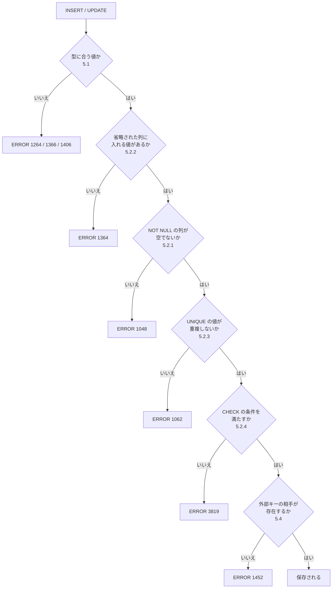
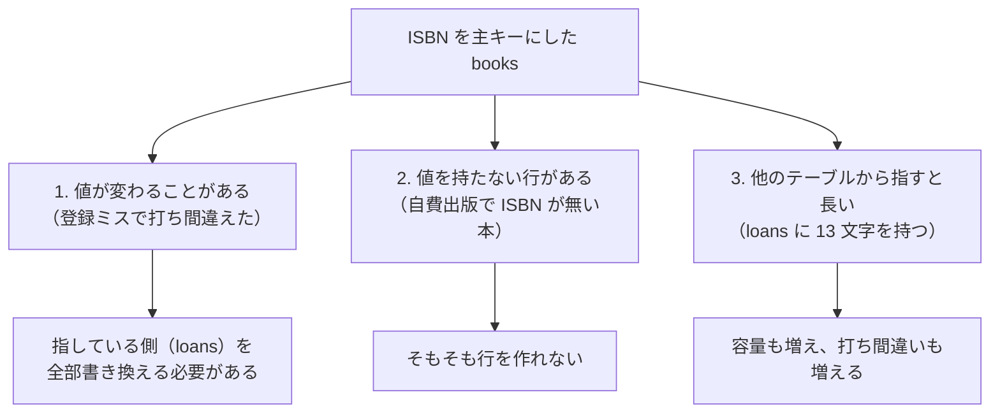
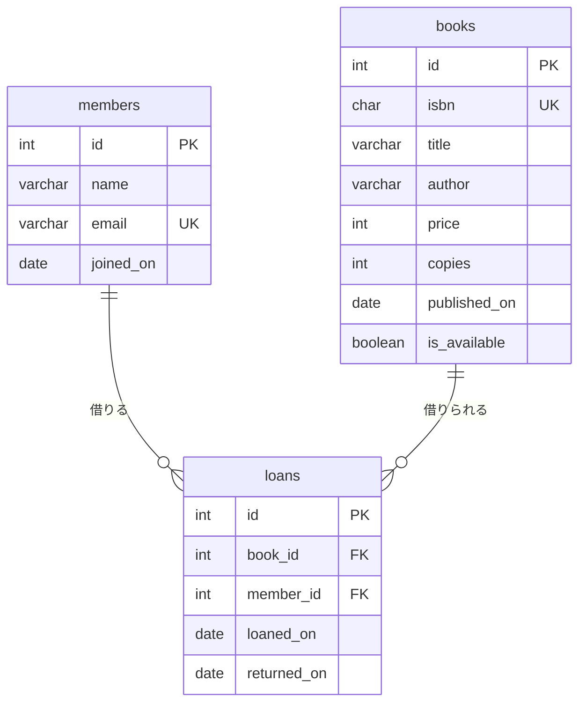
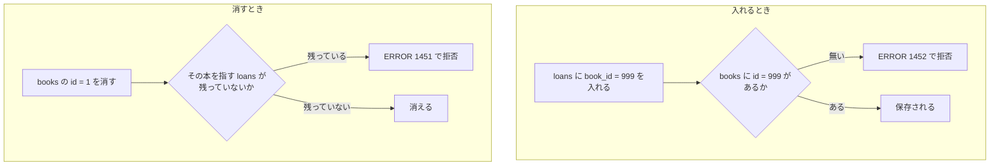
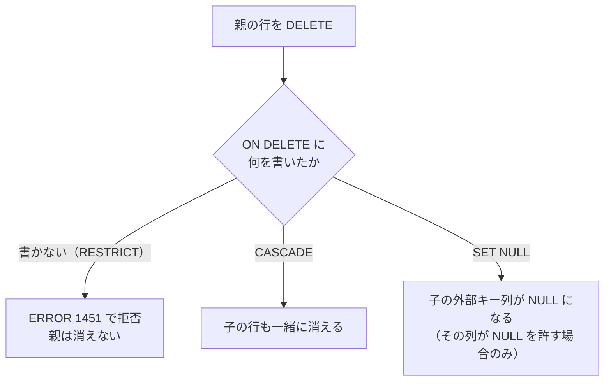
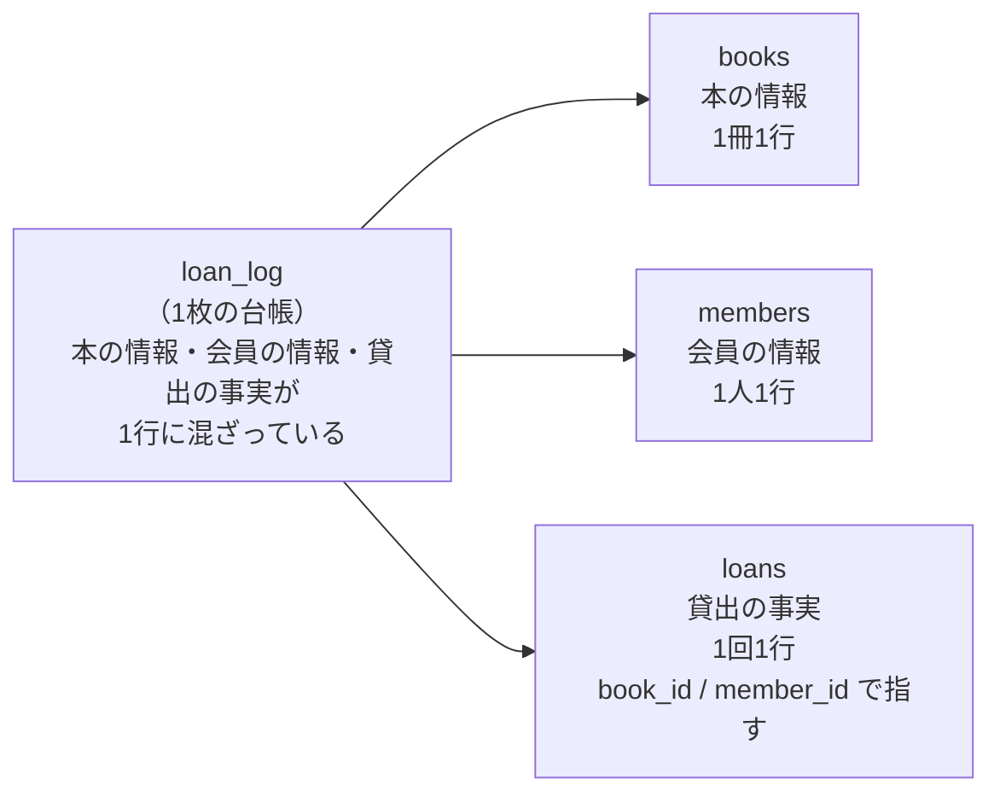
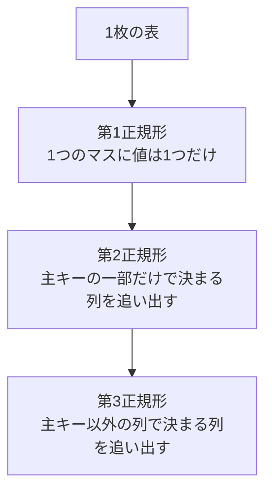
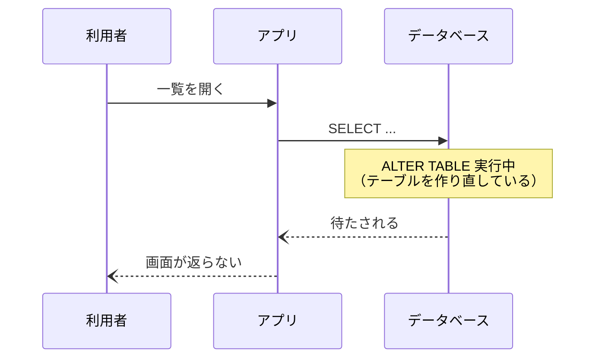
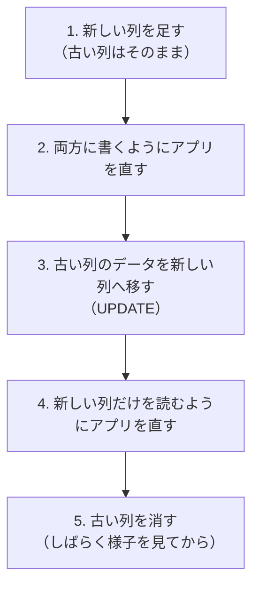

# 第5章 テーブル設計

第4章では、何度も同じことを書きました。

> **いまのテーブルは、それを止めてくれません。**

- 存在しない顧客 `id` = 99 の注文が入る（4.1.3）
- 同じ名前の分類が2つ入る（4.1.3）
- 在庫が `-5` になる（4.2.1）
- 明細を残したまま注文だけ消せる（4.3.1）

どれも「入れる側が気をつける」しかない状態でした。
人間が気をつける仕組みは、**いつか必ず破られます。**
打ち間違い、思い込み、別の人が書いたプログラム、深夜の作業——理由はいくらでもあります。

この章では、**テーブルの側に決まりを書き込みます。**

| 書き込む決まり | データベースがしてくれること |
|--------------|------------------------|
| **データ型** | その列に入れられる値の種類を限る |
| **制約** | 空を許さない・重複を許さない・範囲を外れた値を拒否する |
| **主キー** | 行を1つに特定できる状態を保つ |
| **外部キー** | 存在しない相手を指す値を拒否する |

決まりを書き込むと、**それを破る `INSERT` や `UPDATE` は、その場でエラーになって止まります。**
気をつけるのをやめられる、というのがこの章の成果です。

ここまでは、第2章で用意された5つのテーブルを**使う**側でした。
この章から、**テーブルを作る側**に回ります。

## この章で学ぶこと

- 列ごとに**データ型**を選べるようになり、**金額に浮動小数点数を使わない**理由を説明できるようになる
- `NOT NULL` / `DEFAULT` / `UNIQUE` / `CHECK` の**制約**を書き、破ったときのエラーを読めるようになる
- **主キー**を自分で決められるようになり、`AUTO_INCREMENT` に欠番ができる理由を説明できるようになる
- **外部キー**を定義して、存在しない相手を指す行をデータベースに拒否させられるようになる
- **正規化**の考え方で、1枚の表を複数のテーブルに分けられるようになる
- `ALTER TABLE` で列や制約を足し引きでき、**本番でそれをやる怖さ**を説明できるようになる

## この章の前提

- [第4章 データを変更する](./04-modify-data.md) を終えていること
- MySQL が起動していて、接続できること（2.1.2 / 2.2.1）
- `CREATE DATABASE` / `CREATE TABLE` / `DESCRIBE` を一度使ったことがあること（2.4）

接続していない場合は、次のコマンドで入ってください。

**Windows（PowerShell）**

```powershell
docker compose up -d
docker compose exec db mysql -u root -p --default-character-set=utf8mb4
```

**macOS / Linux**

```bash
docker compose up -d
docker compose exec db mysql -u root -p --default-character-set=utf8mb4
```

> **注意：この章は `shop` を壊しません**
> 第4章は `shop` のデータをわざと壊して戻す章でした。
> この章は逆で、**練習用の別のデータベースを1つ作り、そこにゼロからテーブルを作ります。**
> `shop` の5つのテーブルには、演習 5.4 まで手を触れません。

**練習用のデータベースを作る**

最後のコマンドで、データベース名（`shop`）を**書かずに**接続したのはこのためです。
次の2行を打ってください（2.4.1 / 2.4.2）。

```sql
CREATE DATABASE design CHARACTER SET utf8mb4;
USE design;
```

実行結果:

```text
Query OK, 1 row affected (0.01 sec)
Database changed
```

いまどこにいるかを確認します。

```sql
SELECT DATABASE();
```

実行結果:

```text
+------------+
| DATABASE() |
+------------+
| design     |
+------------+
1 row in set (0.00 sec)
```

**`design` と表示されていれば準備完了です。**
この章の SQL は、ことわりのない限りすべて `design` の中で打ちます。

> **つまずいたら**
> この章のエラーは、**そのほとんどが「あなたが書いた決まりが働いた証拠」**です。
> `ERROR 1452` も `ERROR 3819` も、故障ではなく仕事をしている合図です。
>
> とはいえ、どの決まりに引っかかったのか分からないと先に進めません。
> そのときは、**エラーメッセージ全文と、打った `CREATE TABLE` をあわせて**貼ってください（レベル C）。
>
> ```text
> mysql-text の 5.4.3 を読んでいます。
>
> 【やりたいこと】
> loans に貸出を1件入れたい
>
> 【打った SQL】
> INSERT INTO loans (book_id, member_id, loaned_on) VALUES (9, 1, '2026-09-15');
>
> 【エラー全文】
> ERROR 1452 (23000): Cannot add or update a child row: a foreign key
> constraint fails (`design`.`loans`, CONSTRAINT `fk_loans_book` ...)
>
> 【テーブル定義】
> （SHOW CREATE TABLE loans\G の結果を貼る）
>
> どこを直せばよいか教えてください。
> ```
>
> 一方、「**どちらの設計がよいか**」（5.3.3 や 5.5.3 の話）を聞くときは、
> **答えではなく判断の材料を出してもらってください**（レベル A）。
> 設計に唯一の正解はありません。

---

## 5.1 データ型を選ぶ

### 5.1.1 数値型

**データ型**（その列に入れられる値の種類の決まり）は、`CREATE TABLE` で列名の次に書きます。
第2章では `INT` / `VARCHAR(n)` / `DATE` / `DATETIME` の4つだけを使いました。
ここからは、選べる幅を広げます。

整数を入れる型は、**入れられる大きさ**で分かれています。

| 型 | 入れられる範囲（符号あり） | 使いどころ |
|----|------------------------|----------|
| `TINYINT` | -128 〜 127 | 1〜5段階の評価、種類が少ない区分 |
| `SMALLINT` | -32768 〜 32767 | 年、個数 |
| `INT` | 約 -21億 〜 21億 | **迷ったらこれ。** id、価格（円）、個数 |
| `BIGINT` | 約 -922京 〜 922京 | 大量のログの id、ミリ秒の時刻 |

範囲を外れる値を入れようとすると、**エラーになって止まります。**
実際に試します。まず実験用のテーブルを作ります。

```sql
CREATE TABLE type_test (
    small_number  TINYINT,
    normal_number INT,
    price_float   FLOAT,
    price_decimal DECIMAL(10, 2),
    short_text    VARCHAR(10),
    long_text     TEXT,
    the_date      DATE,
    the_datetime  DATETIME,
    the_flag      BOOLEAN
);
```

実行結果:

```text
Query OK, 0 rows affected (0.03 sec)
```

**このテーブルは 5.1 の実験専用です。** 5.2 の頭で捨てます。

`TINYINT` の列に `200` を入れてみます。

```sql
INSERT INTO type_test (small_number) VALUES (200);
```

実行結果:

```text
ERROR 1264 (22003): Out of range value for column 'small_number' at row 1
```

**`ERROR 1264` は「その型に入る大きさを超えています」という合図**です。
`127` までなら入ります。

**どう選ぶか**

「小さい型のほうが容量が節約できる」のは事実ですが、
**節約できるのは1行あたり数バイト**です。
それより、**あとから足りなくなるほうが痛い**（変更の怖さは 5.6.3）ので、
この本では次のように決めます。

- **迷ったら `INT`**
- 1〜5 の評価や 0/1 の区分など、**明らかに小さい値しか入らないものだけ `TINYINT`**

> **補足：`UNSIGNED` という指定**
> `INT UNSIGNED` と書くと、マイナスを捨てて、そのぶん上限が2倍になります（0 〜 約 43億）。
> 「在庫がマイナスにならない」ことを型で守れそうに見えますが、
> **この本では使いません。** 理由は2つあります。
>
> - マイナスを引き算で作ったときのエラーが分かりにくい
> - 「0 以上」という決まりは、**`CHECK` 制約（5.2.4）で書いたほうが読んで分かる**

### 5.1.2 文字列型（`VARCHAR` と `TEXT`）

文字列を入れる型は3つ覚えれば足ります。

| 型 | 長さ | 使いどころ |
|----|------|----------|
| `VARCHAR(n)` | **最大 n 文字**の可変長 | 名前、メールアドレス、タイトル |
| `CHAR(n)` | **常に n 文字**の固定長 | 郵便番号、ISBN のような**長さが決まっているもの** |
| `TEXT` | 長さを指定しない（最大 65535 バイト） | 本文、説明文、備考 |

**`VARCHAR(10)` の 10 は「文字数」です**

第2章 2.6.1 では「`Data too long` はバイト数で数えられている」と書きました。
あれは**文字コードの設定が壊れているとき**の話です。
`utf8mb4` で作ったテーブルでは、**日本語1文字も1文字として数えます。**

```sql
INSERT INTO type_test (short_text) VALUES ('あいうえおかきくけこ');
```

実行結果:

```text
Query OK, 1 row affected (0.00 sec)
```

10 文字ちょうどなので入りました。11 文字にすると止まります。

```sql
INSERT INTO type_test (short_text) VALUES ('あいうえおかきくけこさ');
```

実行結果:

```text
ERROR 1406 (22001): Data too long for column 'short_text' at row 1
```

**`ERROR 1406` は「その列の長さを超えています」という合図**です。

> **よくある間違い**
> 「入りきらない分は勝手に切られて入る」と思っていると、事故になります。
> MySQL は**切り捨てて入れるのではなく、拒否します**（8.0 以降の既定の設定）。
>
> 入力欄に「30 文字まで」と書いてあるのにデータベースが `VARCHAR(20)` だと、
> **利用者から見れば「保存を押したら失敗した」**という現象になります。
> **画面の上限とテーブルの上限は、必ず突き合わせてください。**
> （fastapi-text 第9章でも、React 側の 30 文字と API 側の 20 文字の食い違いを直しました）

**`VARCHAR` と `TEXT` の使い分け**

`TEXT` は長さを気にしなくてよい代わりに、次の制限があります。

- **`DEFAULT` で既定値を指定できない**（5.2.2）
- 並べ替えや検索で不利になる（インデックスの話。第7章 7.3）

そのため、**上限を決められるものは `VARCHAR(n)`、決められないものだけ `TEXT`** とします。
「名前は 20 文字もあれば足りるだろうか」と迷ったら、**少し多めに取ってください。**
`VARCHAR(20)` と `VARCHAR(100)` で、**実際に使う容量は変わりません**
（可変長なので、入っている文字数ぶんしか使いません）。

### 5.1.3 日付・時刻型

| 型 | 持つもの | 例 |
|----|--------|-----|
| `DATE` | 日付だけ | `2026-09-15` |
| `DATETIME` | 日付と時刻 | `2026-09-15 09:30:00` |
| `TIME` | 時刻だけ | `09:30:00` |
| `TIMESTAMP` | 日付と時刻（**タイムゾーンで変換される**） | `2026-09-15 09:30:00` |

`shop` では、`birthday` や `registered_on` が `DATE`、`ordered_at` が `DATETIME` でした（2.5.1）。
**「何時に起きたか」が意味を持つなら `DATETIME`、持たないなら `DATE`** と考えてください。

```sql
INSERT INTO type_test (the_date, the_datetime) VALUES ('2026-09-15', '2026-09-15 09:30:00');
SELECT the_date, the_datetime FROM type_test WHERE the_date IS NOT NULL;
```

実行結果:

```text
+------------+---------------------+
| the_date   | the_datetime        |
+------------+---------------------+
| 2026-09-15 | 2026-09-15 09:30:00 |
+------------+---------------------+
1 row in set (0.00 sec)
```

**日付は文字列として書きますが、文字列型ではありません。**
`DATE` の列に入れた値は、第3章 3.6.2 で使った日付関数で計算できます。
`VARCHAR` に `'2026-09-15'` と入れてしまうと、それができなくなります。

> **補足：`TIMESTAMP` をこの本で使わない理由**
> `TIMESTAMP` は、保存するときに世界標準時へ、取り出すときに接続のタイムゾーンへ、
> **自動で変換されます。** 便利に見えますが、
> 「サーバーとパソコンで時刻がずれて見える」という分かりにくい混乱のもとになります。
> また、**2038年までしか入りません**（内部の持ち方の制限です）。
>
> この本では `DATETIME` を使い、**変換は一切かけません。**
> 世界に利用者がいるアプリを作るときに、改めて調べてください。

### 5.1.4 真偽値の扱い

**MySQL には、真偽値だけの専用の型がありません。**

`BOOLEAN`（または `BOOL`）と書くことはできますが、
これは **`TINYINT(1)` の別名**として扱われます。
中身は数値で、**`TRUE` が `1`、`FALSE` が `0`** です。

```sql
INSERT INTO type_test (the_flag) VALUES (TRUE);
SELECT the_flag FROM type_test WHERE the_flag IS NOT NULL;
```

実行結果:

```text
+----------+
| the_flag |
+----------+
|        1 |
+----------+
1 row in set (0.00 sec)
```

`TRUE` と書いたのに `1` が返ってきます。
`DESCRIBE` で見ても、型は `tinyint(1)` と表示されます。

docker-text 第6章で、FastAPI のタスクの `done` を MySQL で見たときに
`0` と `1` が並んでいたのは、これが理由です。
第1章 1.3.1 と第4章 4.3.3 で先送りしていた話は、ここで回収できました。

条件の書き方は、どちらでも構いません。

```sql
SELECT the_flag FROM type_test WHERE the_flag = TRUE;
SELECT the_flag FROM type_test WHERE the_flag = 1;
```

**どちらも同じ結果になります。** この本では、読んで意味が分かる `TRUE` / `FALSE` を使います。

> **よくある間違い**
> `WHERE the_flag = 'TRUE'` とクォートで囲むと、**文字列の `'TRUE'` と数値の比較**になり、
> 意図しない結果になります。`TRUE` はクォートで囲みません。

### 5.1.5 浮動小数点数で金額を扱わない

第3章 3.6.3 で「**金額に小数を使うときは注意が要る**」と書き、理由をこの項に送っていました。
ここで実際に見ます。

小数を入れられる型は2種類あります。

| 型 | 持ち方 | 正確さ |
|----|-------|-------|
| `FLOAT` / `DOUBLE` | **浮動小数点数**（2進数で近い値を持つ） | **ぴったりにならないことがある** |
| `DECIMAL(全体の桁数, 小数の桁数)` | 10進数のまま持つ | **書いたとおりに持つ** |

`type_test` には両方の列を用意してあります。同じ値を入れてみます。

```sql
INSERT INTO type_test (price_float, price_decimal) VALUES (1999.99, 1999.99);
SELECT price_float, price_decimal FROM type_test WHERE price_float IS NOT NULL;
```

実行結果:

```text
+-------------+---------------+
| price_float | price_decimal |
+-------------+---------------+
|     1999.99 | 1999.99       |
+-------------+---------------+
1 row in set (0.00 sec)
```

**見た目は同じです。** ここが怖いところです。
入れた値と比べてみます。

```sql
SELECT price_float = 1999.99 AS float_ok, price_decimal = 1999.99 AS decimal_ok
FROM type_test WHERE price_float IS NOT NULL;
```

実行結果:

```text
+----------+------------+
| float_ok | decimal_ok |
+----------+------------+
|        0 |          1 |
+----------+------------+
1 row in set (0.00 sec)
```

**`FLOAT` のほうは `0`、つまり「一致しない」**と言っています。
入れたはずの `1999.99` と、入っている値が違うのです。

計算させると、ずれが表に出ます。

```sql
SELECT price_float * 3 AS float_x3, price_decimal * 3 AS decimal_x3
FROM type_test WHERE price_float IS NOT NULL;
```

実行結果:

```text
+-------------------+------------+
| float_x3          | decimal_x3 |
+-------------------+------------+
| 5999.969970703125 | 5999.97    |
+-------------------+------------+
1 row in set (0.00 sec)
```

3個分の値段が **5999.969970703125 円**になりました。

これは MySQL の不具合ではありません。
`FLOAT` は、**10進数の 0.99 を2進数で正確に表せない**ため、
いちばん近い値を持ちます。その誤差が計算で膨らんだ結果です。

> **注意：金額・数量には `FLOAT` / `DOUBLE` を使わない**
> 合計が1円合わない、`WHERE price = 1999.99` で行が見つからない、
> といった**原因が分かりにくい不具合**になります。
>
> - **円のように小数が無いもの** → `INT`（この本の `products.price` がこれです）
> - **小数が必要なもの**（外貨、税率、重さ） → **`DECIMAL(10, 2)` のように桁数を指定する**
> - `FLOAT` / `DOUBLE` を使ってよいのは、**多少ずれても構わない測定値**だけ（気温、座標）

`DECIMAL(10, 2)` は「**全体で 10 桁、うち小数点以下が 2 桁**」という意味です。
整数部分は 8 桁まで（99999999.99 まで）入ります。

これで実験は終わりです。実験用のテーブルを捨てます。

```sql
DROP TABLE type_test;
```

実行結果:

```text
Query OK, 0 rows affected (0.02 sec)
```

---

## 5.2 制約

### 5.2.1 `NOT NULL`

**制約**（その列の値に守らせる決まり）は、`CREATE TABLE` の中に書きます。
まず、この章を通して育てていくテーブルを作ります。

題材は、**社内の本棚（貸出図書）** です。
`shop` とは別のものを、ゼロから設計します。

```sql
CREATE TABLE books (
    id            INT AUTO_INCREMENT PRIMARY KEY,
    isbn          CHAR(13)     NOT NULL UNIQUE,
    title         VARCHAR(100) NOT NULL,
    author        VARCHAR(40)  NOT NULL,
    price         INT          NOT NULL DEFAULT 0,
    copies        INT          NOT NULL DEFAULT 1,
    summary       TEXT,
    published_on  DATE,
    is_available  BOOLEAN      NOT NULL DEFAULT TRUE,
    registered_at DATETIME     NOT NULL DEFAULT CURRENT_TIMESTAMP,
    CONSTRAINT chk_books_price  CHECK (price >= 0),
    CONSTRAINT chk_books_copies CHECK (copies >= 0)
);
```

実行結果:

```text
Query OK, 0 rows affected (0.04 sec)
```

**いま出てきた指定を、5.2 の4つの項で1つずつ説明します。**
型の選び方は 5.1 のとおりです（`isbn` が `CHAR(13)` なのは、
ISBN が**必ず 13 文字**だからです。5.1.2）。

**`NOT NULL` は「空を許さない」**

`NULL` は「値が無い」を表す特別な状態でした（3.3.4）。
`NOT NULL` を付けた列は、**`NULL` のまま行を作れません。**

確認のために、3件入れておきます。

```sql
INSERT INTO books (isbn, title, author, price, published_on) VALUES
    ('9784000000001', 'リーダブルコード入門',   '山田 太郎', 2800, '2025-04-10'),
    ('9784000000002', 'はじめてのデータベース', '佐々木 花', 3200, '2024-11-01'),
    ('9784000000003', 'ネットワークの地図',     '大野 実',   2500, NULL);
```

実行結果:

```text
Query OK, 3 rows affected (0.01 sec)
Records: 3  Duplicates: 0  Warnings: 0
```

3件目の `published_on` に `NULL` を入れられたのは、**`published_on` に `NOT NULL` を付けていない**からです。
発売日が分からない本があるので、あえて空を許しています（2.5.1 の `released_on` と同じ考え方）。

では `title` を `NULL` にしてみます。

```sql
INSERT INTO books (isbn, title, author) VALUES ('9784000000004', NULL, '誰か');
```

実行結果:

```text
ERROR 1048 (23000): Column 'title' cannot be null
```

**`ERROR 1048` は「その列は空にできません」という合図**です。

`NULL` と書かずに、**列ごと省略**した場合は別のエラーになります。

```sql
INSERT INTO books (title, author) VALUES ('ISBN を書き忘れた本', '誰か');
```

実行結果:

```text
ERROR 1364 (HY000): Field 'isbn' doesn't have a default value
```

**`ERROR 1364` は「値を書かなかったのに、入れる値が決まっていません」という合図**です。
第4章 4.1.3 で見たのと同じエラーです。

| エラー | 何をしたとき |
|-------|------------|
| `ERROR 1048` | `NOT NULL` の列に、**はっきり `NULL` を書いた** |
| `ERROR 1364` | `NOT NULL` で `DEFAULT` も無い列を、**書かずに省略した** |

**どの列に `NOT NULL` を付けるか**

判断の基準は1つです。

> **その列が空の行に、意味があるか。**

- タイトルの無い本は、本として意味がない → `NOT NULL`
- 発売日の分からない本は、本として意味がある → 空を許す

迷ったら **`NOT NULL` を付けてください。**
あとから緩めるのは `ALTER TABLE` の1行で済みますが（5.6.2）、
**空のまま入ってしまった行を、あとから埋めるのは大変**です。

### 5.2.2 `DEFAULT`

`DEFAULT` は、**値を書かずに `INSERT` したときに入る値**です。

`books` では3つの列に付けました。

| 列 | 指定 | 書かなかったときに入る値 |
|----|------|---------------------|
| `price` | `DEFAULT 0` | `0` |
| `copies` | `DEFAULT 1` | `1`（1冊だけ買うことが多いので） |
| `is_available` | `DEFAULT TRUE` | `1`（買ったばかりの本は貸し出せる） |
| `registered_at` | `DEFAULT CURRENT_TIMESTAMP` | **その行を入れた瞬間の日時** |

`CURRENT_TIMESTAMP` は「いまの日時」を表す特別な書き方です。
これを既定値にしておくと、**登録日時を書き忘れても、自動で埋まります。**

さきほど入れた3件を見てみます。

```sql
SELECT id, title, price, copies, is_available, registered_at FROM books;
```

実行結果:

```text
+----+-----------------------------------+-------+--------+--------------+---------------------+
| id | title                             | price | copies | is_available | registered_at       |
+----+-----------------------------------+-------+--------+--------------+---------------------+
|  1 | リーダブルコード入門              |  2800 |      1 |            1 | 2026-09-15 07:18:08 |
|  2 | はじめてのデータベース            |  3200 |      1 |            1 | 2026-09-15 07:18:08 |
|  3 | ネットワークの地図                |  2500 |      1 |            1 | 2026-09-15 07:18:08 |
+----+-----------------------------------+-------+--------+--------------+---------------------+
3 rows in set (0.00 sec)
```

`copies` に `1`、`is_available` に `1`、`registered_at` に実行した日時が入っています。
**`INSERT` では、この3つの列を1文字も書いていません。**

> **補足：日時の表示は手元と違って構いません**
> `registered_at` に入るのは「あなたが実行した瞬間」なので、上の表示とは当然ずれます。
> 日付が今日になっていれば正解です。

**既定値は `DESCRIBE` で確認できます**

```sql
DESCRIBE books;
```

実行結果:

```text
+---------------+--------------+------+-----+-------------------+-------------------+
| Field         | Type         | Null | Key | Default           | Extra             |
+---------------+--------------+------+-----+-------------------+-------------------+
| id            | int          | NO   | PRI | NULL              | auto_increment    |
| isbn          | char(13)     | NO   | UNI | NULL              |                   |
| title         | varchar(100) | NO   |     | NULL              |                   |
| author        | varchar(40)  | NO   |     | NULL              |                   |
| price         | int          | NO   |     | 0                 |                   |
| copies        | int          | NO   |     | 1                 |                   |
| summary       | text         | YES  |     | NULL              |                   |
| published_on  | date         | YES  |     | NULL              |                   |
| is_available  | tinyint(1)   | NO   |     | 1                 |                   |
| registered_at | datetime     | NO   |     | CURRENT_TIMESTAMP | DEFAULT_GENERATED |
+---------------+--------------+------+-----+-------------------+-------------------+
10 rows in set (0.01 sec)
```

第2章 2.4.4 で見た6つの列が、ここで全部読めるようになりました。

| 列 | 読み方 |
|----|-------|
| `Null` | `NO` なら `NOT NULL` が付いている |
| `Key` | `PRI` は主キー（5.3.1）、`UNI` は `UNIQUE`（5.2.3） |
| `Default` | 書かなかったときに入る値。`NULL` は「既定値なし」 |
| `Extra` | `auto_increment` などの追加の指定（5.3.2） |

> **よくある間違い**
> **`TEXT` 型の列には `DEFAULT` を指定できません**（5.1.2）。
>
> ```sql
> ALTER TABLE books MODIFY COLUMN summary TEXT DEFAULT '未記入';
> ```
>
> ```text
> ERROR 1101 (42000): BLOB, TEXT, GEOMETRY or JSON column 'summary' can't have a default value
> ```
>
> 既定値を持たせたい説明文は、**`VARCHAR(n)` にできないか**を先に考えてください。

### 5.2.3 `UNIQUE`

`UNIQUE` は、**その列に同じ値が2つ入ることを許さない**制約です。

`books` では `isbn` に付けました。
ISBN は本ごとに1つ決まっている番号なので、**同じ ISBN の行が2つあったらおかしい**からです。

```sql
INSERT INTO books (isbn, title, author) VALUES ('9784000000001', '別の本', '誰か');
```

実行結果:

```text
ERROR 1062 (23000): Duplicate entry '9784000000001' for key 'books.isbn'
```

**`ERROR 1062` は「その値はもう入っています」という合図**です。
`for key 'books.isbn'` が、**どの制約に引っかかったか**を教えてくれています。

第4章 4.1.3 で「同じ名前の分類が2つ入ってしまう」と書き、
「重複を拒否するのは第5章 5.2.3」と送っていたのが、この制約です。

**`NULL` は重複とみなされません**

`UNIQUE` を付けた列でも、**`NULL` は何行あっても構いません。**
`NULL` は「値が無い」であって、「同じ値」ではないためです（3.3.4）。

「メールアドレスは重複させたくないが、登録していない人もいる」という場合は、
`UNIQUE` だけを付けて `NOT NULL` は付けない、という設計ができます。

**2列まとめて `UNIQUE` にすることもできます**

```sql
CREATE TABLE 例 (
    ...
    CONSTRAINT uq_例 UNIQUE (列A, 列B)
);
```

こう書くと、**「A と B の組み合わせ」が重複しない**という意味になります。
A 単体、B 単体は重複して構いません。
「1人が同じ本に2回レビューを書けない」といった決まりが、この形で書けます。
第6章 6.7 の中間テーブルで、もう一度出てきます。

### 5.2.4 `CHECK`

`CHECK` は、**その列（や行）が満たすべき条件**を書く制約です。
条件の書き方は、第3章の `WHERE` と同じです。

`books` には2つ書きました。

```sql
CONSTRAINT chk_books_price  CHECK (price >= 0),
CONSTRAINT chk_books_copies CHECK (copies >= 0)
```

`CONSTRAINT 名前` は、**その制約に名前を付ける**書き方です。
省略すると MySQL が `books_chk_1` のような名前を自動で付けますが、
**エラーに出るのはこの名前**なので、自分で分かる名前を付けておくと読みやすくなります。

破ってみます。

```sql
INSERT INTO books (isbn, title, author, price) VALUES ('9784000000005', '値段がおかしい本', '誰か', -100);
```

実行結果:

```text
ERROR 3819 (HY000): Check constraint 'chk_books_price' is violated.
```

**`ERROR 3819` は「`CHECK` の条件を満たしていません」という合図**です。
名前を付けておいたので、`chk_books_price` のほうだと一目で分かります。

第4章 4.2.1 で、在庫を `-5` にできてしまう例を見ました。
そのときに「制約は第5章 5.2.4」と書いたのが、これです。
**`CHECK (stock >= 0)` があれば、あの `UPDATE` はエラーで止まります。**

**列をまたぐ条件も書けます**

```sql
CHECK (returned_on IS NULL OR returned_on >= loaned_on)
```

「返却日が空でないなら、貸出日以降でなければならない」という意味です。
この形は 5.4 で作る `loans` に使い、演習 5.3 でも扱います。

> **注意：`CHECK` が使えるのは MySQL 8.0.16 以降です**
> それより古い MySQL では、**書いてもエラーにならず、無視されます**（黙って素通りします）。
> この本は `mysql:8.4` を使っているので問題ありません（2.1.1）。
> 古い環境に同じ SQL を持っていくときは、`SELECT VERSION();` で確認してください。

**制約が働く順番**

`INSERT` が通るまでに、値はいくつもの関門を通ります。



**どこで止まったかは、エラー番号で分かります。**
この章で出会うエラーは、ほぼこの図のどれかです。

---

## 5.3 主キー

### 5.3.1 `PRIMARY KEY`

**主キー**（行を1つに特定するための列）は第1章 1.4 で扱いました。
書き方は2つあります。どちらでも同じです。

```sql
id INT AUTO_INCREMENT PRIMARY KEY,
```

```sql
id INT AUTO_INCREMENT,
...
PRIMARY KEY (id)
```

主キーには、次の性質が**自動で付きます。**

| 性質 | 意味 |
|------|------|
| `NOT NULL` | 主キーの列は空にできない（`NOT NULL` と書かなくても付く） |
| `UNIQUE` | 同じ値の行を2つ作れない |
| 1テーブルに1つ | 主キーは2つ作れない（**列を2つ束ねて1つの主キー**にはできる） |
| 索引が張られる | 主キーでの検索は速い（第7章 7.2.3） |

`DESCRIBE` の `Key` 列に `PRI` と出ているのが主キーです（5.2.2 の出力）。

**複合主キー**

列を2つ以上束ねて主キーにすることもできます。

```sql
PRIMARY KEY (order_id, product_id)
```

「注文番号と商品番号の組み合わせで1行が決まる」という意味です。
中間テーブル（2.5.1 の `order_items`）でよく使われる形ですが、
**この本では中間テーブルにも `id` を1本立てる方針**を取っています。
理由と使い分けは 5.3.3 と第6章 6.7 で扱います。

> **よくある間違い**
> 主キーを付けずにテーブルを作ることもできます。エラーにはなりません。
> しかし、**まったく同じ内容の行が2つできたときに、片方だけを消せなくなります。**
> `DELETE FROM t WHERE ...` の `WHERE` に、片方だけを指す条件が書けないからです。
>
> **テーブルを作るときは、必ず主キーを決めてください。**

### 5.3.2 `AUTO_INCREMENT`

`AUTO_INCREMENT` は、**値を入れなかったときに、自動で番号を振る**指定です（2.4.3）。
「いま入っている最大の番号の次」ではなく、
**テーブルが内部で持っている「次に配る番号」**を配ります。

この違いが、**欠番**として表に出ます。
第4章 演習 4.4 で「最後に足した明細の `id` が 38 ではない」と書いたのは、このことです。

実際に作ってみます。第4章 4.4.2 のトランザクションを使います。

```sql
BEGIN;
INSERT INTO books (isbn, title, author) VALUES ('9784000000009', '取り消される本', '誰か');
SELECT LAST_INSERT_ID();
```

実行結果:

```text
+------------------+
| LAST_INSERT_ID() |
+------------------+
|                5 |
+------------------+
1 row in set (0.00 sec)
```

`LAST_INSERT_ID()` は「**いまの接続で最後に振られた番号**」を返す関数です。
`5` が振られました（`4` は、5.2 でエラーになった `INSERT` が使い切っています）。

> **補足：手元の番号が違っても構いません**
> ここまでに何回エラーを出したかで、振られる番号は変わります。
> `4` や `7` になっていても、この先の説明はそのまま読めます。
> **大事なのは、次に見る「取り消しても番号は戻らない」ことのほうです。**

取り消します。

```sql
ROLLBACK;
SELECT id, title FROM books;
```

実行結果:

```text
+----+-----------------------------------+
| id | title                             |
+----+-----------------------------------+
|  1 | リーダブルコード入門              |
|  2 | はじめてのデータベース            |
|  3 | ネットワークの地図                |
+----+-----------------------------------+
3 rows in set (0.00 sec)
```

行は消えました。では、次に入れる行の `id` は `4` でしょうか。

```sql
INSERT INTO books (isbn, title, author) VALUES ('9784000000010', '次に入れた本', '誰か');
SELECT id, title FROM books;
```

実行結果:

```text
+----+-----------------------------------+
| id | title                             |
+----+-----------------------------------+
|  1 | リーダブルコード入門              |
|  2 | はじめてのデータベース            |
|  3 | ネットワークの地図                |
|  6 | 次に入れた本                      |
+----+-----------------------------------+
4 rows in set (0.00 sec)
```

**`6` になりました。** `4` と `5` は永久に空きます。

**配った番号は、取り消しても戻りません。**
これは不具合ではなく、**そうしないと同時に動く別の接続とぶつかるため**です（4.5.1 のロックの話と同じ事情）。
番号を返す処理で他の接続を待たせていたら、`INSERT` が渋滞します。

「次に配る番号」は `SHOW CREATE TABLE` で見られます。

```sql
SHOW CREATE TABLE books\G
```

実行結果（`\G` は縦表示。2.4.4）:

```text
*************************** 1. row ***************************
       Table: books
Create Table: CREATE TABLE `books` (
  `id` int NOT NULL AUTO_INCREMENT,
  `isbn` char(13) NOT NULL,
  `title` varchar(100) NOT NULL,
  `author` varchar(40) NOT NULL,
  `price` int NOT NULL DEFAULT '0',
  `copies` int NOT NULL DEFAULT '1',
  `summary` text,
  `published_on` date DEFAULT NULL,
  `is_available` tinyint(1) NOT NULL DEFAULT '1',
  `registered_at` datetime NOT NULL DEFAULT CURRENT_TIMESTAMP,
  PRIMARY KEY (`id`),
  UNIQUE KEY `isbn` (`isbn`),
  CONSTRAINT `chk_books_copies` CHECK ((`copies` >= 0)),
  CONSTRAINT `chk_books_price` CHECK ((`price` >= 0))
) ENGINE=InnoDB AUTO_INCREMENT=7 DEFAULT CHARSET=utf8mb4 COLLATE=utf8mb4_0900_ai_ci
1 row in set (0.00 sec)
```

最後の行に **`AUTO_INCREMENT=7`** とあります。次の `INSERT` には `7` が振られます。

> **よくある間違い**
> **欠番を埋めようとしないでください。**
> 「`id` が飛んでいるのは気持ち悪いから詰めたい」と考えて番号を振り直すと、
> **その `id` を指している別のテーブルの行**（5.4 の外部キー）が、
> **全部おかしくなります。**
>
> `id` は「何番目か」を表す数ではなく、**その行に付けた名札**です。
> 名札の番号が飛んでいても、何も困りません。

> **補足：`TRUNCATE` は番号も 1 に戻します**
> 第4章 4.3.2 で見たとおりです。`DELETE` では戻りません。
> 練習用のテーブルを作り直したいときに使えますが、
> **本番のテーブルでは絶対に使わないでください。**

### 5.3.3 自然キーと代理キー

主キーの選び方には、2つの立場があります。

| 呼び方 | 何を主キーにするか | 例 |
|-------|-----------------|-----|
| **自然キー** | **もともとデータが持っている値** | ISBN、メールアドレス、社員番号 |
| **代理キー** | **そのために用意した、意味のない連番** | `AUTO_INCREMENT` の `id` |

`books` は `isbn` という立派な自然キーを持っています。
それでも主キーは `id` にして、`isbn` には `UNIQUE` を付けました。**なぜでしょうか。**

自然キーを主キーにすると、次の3つで困ります。



とくに 1 が重いです。
主キーは**他のテーブルから指される値**なので（5.4）、
**主キーが変わると、指している側を全部直さなければなりません。**

**この本の方針**

> **主キーは `id`（`INT AUTO_INCREMENT`）の代理キーにする。**
> 自然キーは `UNIQUE` を付けて、「重複しない」だけ守らせる。

`shop` の5つのテーブルも、すべてこの形です（2.5.1）。
fastapi-text 第6章の SQLAlchemy のモデルも、`id` を主キーにしていました。

代理キーの弱点も知っておいてください。
**`id` を見ても何のことか分からない**ため、
「注文 5 の明細 12」のような会話は、人間には意味が読み取れません。
それでも、**変わらない・必ずある・短い**という3点が勝ります。

---

## 5.4 外部キー

### 5.4.1 テーブル同士を関連づける

本棚の次は、**貸出の記録**です。

「誰が、どの本を、いつ借りたか」を残したいとします。
1枚の表に全部書く方法（`books` に「借りた人」の列を足す）もありますが、
それでは**同じ本を2人が順番に借りた**とたんに行き詰まります。

第1章 1.2.2 で見た形に分けます。

- **会員**は `members` に
- **貸出**は `loans` に
- 貸出の行には、**「どの本か」「どの会員か」を番号で持たせる**

まず `members` を作ります。

```sql
CREATE TABLE members (
    id        INT AUTO_INCREMENT PRIMARY KEY,
    name      VARCHAR(20)  NOT NULL,
    email     VARCHAR(100) NOT NULL UNIQUE,
    joined_on DATE         NOT NULL
);

INSERT INTO members (name, email, joined_on) VALUES
    ('田中 陽子', 'tanaka@example.com', '2026-04-01'),
    ('佐藤 健',   'sato@example.com',   '2026-05-20'),
    ('鈴木 一郎', 'suzuki@example.com', '2026-06-15');
```

実行結果:

```text
Query OK, 0 rows affected (0.03 sec)

Query OK, 3 rows affected (0.01 sec)
Records: 3  Duplicates: 0  Warnings: 0
```

次に `loans` です。**ここで外部キーを書きます。**

```sql
CREATE TABLE loans (
    id          INT  AUTO_INCREMENT PRIMARY KEY,
    book_id     INT  NOT NULL,
    member_id   INT  NOT NULL,
    loaned_on   DATE NOT NULL,
    returned_on DATE,
    CONSTRAINT fk_loans_book   FOREIGN KEY (book_id)   REFERENCES books (id),
    CONSTRAINT fk_loans_member FOREIGN KEY (member_id) REFERENCES members (id)
);
```

実行結果:

```text
Query OK, 0 rows affected (0.05 sec)
```

**外部キー**（別のテーブルの行を指し示す列に付ける制約）は、
「この列に入れてよいのは、相手のテーブルに実在する値だけ」という決まりです。

3件入れてみます。

```sql
INSERT INTO loans (book_id, member_id, loaned_on, returned_on) VALUES
    (1, 1, '2026-08-03', '2026-08-17'),
    (2, 1, '2026-09-01', NULL),
    (3, 2, '2026-09-05', NULL);

SELECT * FROM loans;
```

実行結果:

```text
+----+---------+-----------+------------+-------------+
| id | book_id | member_id | loaned_on  | returned_on |
+----+---------+-----------+------------+-------------+
|  1 |       1 |         1 | 2026-08-03 | 2026-08-17  |
|  2 |       2 |         1 | 2026-09-01 | NULL        |
|  3 |       3 |         2 | 2026-09-05 | NULL        |
+----+---------+-----------+------------+-------------+
3 rows in set (0.00 sec)
```

`returned_on` が `NULL` の行が、**まだ返っていない本**です（3.3.4 の `IS NULL` で探せます）。

**3つのテーブルの関係**



`PK` が主キー、`FK` が外部キー、`UK` が `UNIQUE` です。
2.5.1 で見た `shop` の図と、同じ読み方ができます。

**呼び方**

| 呼び方 | このテーブル |
|-------|------------|
| **親テーブル**（参照される側） | `books` / `members` |
| **子テーブル**（参照する側） | `loans` |

「親が先にいないと、子は作れない」と覚えてください。

### 5.4.2 `FOREIGN KEY` を定義する

書き方をもう一度、分解して見ます。

```text
CONSTRAINT 制約の名前 FOREIGN KEY (この列が) REFERENCES 相手のテーブル (相手のこの列を指す)
```

```sql
CONSTRAINT fk_loans_book FOREIGN KEY (book_id) REFERENCES books (id)
```

**名前の付け方**

`CONSTRAINT 名前` は省略できますが、`CHECK` と同じ理由で付けておきます（5.2.4）。
この本では **`fk_子テーブル名_親テーブル名`** に統一します。

- `fk_loans_book`（`loans` から `books` へ）
- `fk_loans_member`（`loans` から `members` へ）

エラーメッセージにこの名前が出るので、**どちらの外部キーで止まったのかがすぐ分かります。**

**守らなければならない条件**

| 条件 | 満たしていないと |
|------|---------------|
| 子の列と親の列の**型をそろえる**（`INT` なら `INT`） | `ERROR 3780`（型が合わない） |
| 親の列が**主キーか `UNIQUE`** であること | `ERROR 1215` / `ERROR 3734` |
| 両方のテーブルが **InnoDB** であること | 外部キーが無視される |

InnoDB は MySQL のテーブルの保存方式のひとつで、**MySQL 8 では既定**です。
第4章のトランザクション（4.4）が使えたのも InnoDB のおかげです。
`SHOW CREATE TABLE` の最後に `ENGINE=InnoDB` と出ていれば大丈夫です（5.3.2 の出力）。

**あとから足すこともできます**

すでにあるテーブルに外部キーを追加するには、`ALTER TABLE` を使います。

```sql
ALTER TABLE 子テーブル
    ADD CONSTRAINT 制約の名前 FOREIGN KEY (列) REFERENCES 親テーブル (列);
```

`ALTER TABLE` の詳しい書き方は 5.6 で扱います。
ここでは「**あとからでも足せる**」ことだけ押さえてください。
第2章 2.5.1 で「外部キー制約は第5章 5.4 で足します」と書いた `shop` への追加は、
この形で行います（演習 5.4）。

> **注意：すでに矛盾したデータが入っていると、追加に失敗します**
> `orders` に「存在しない顧客 `id` = 99」の行が残ったまま外部キーを足そうとすると、
> **`ERROR 1452` で拒否されます。**
> 外部キーは「これから入る行」だけでなく、**いま入っている行にも適用される**ためです。
>
> 先に `SELECT` で矛盾した行を探し、直してから足す、という順番になります。

> **補足：テーブルを作り直すと、足した制約も消えます**
> 外部キーは**テーブルの定義の一部**です。
> `DROP TABLE` して `CREATE TABLE` し直すと、
> **あとから `ALTER TABLE` で足した制約は、一緒に無くなります。**
>
> 第2章の `shop.sql` は、先頭で `DROP TABLE IF EXISTS` をしてから作り直すファイルでした（2.5.2）。
> つまり、**`SOURCE /sql/shop.sql;` を流すたびに、足した外部キーは消えます。**
> 演習 5.4 で実際に確かめます。

**外部キーには索引が自動で作られます**

```sql
SHOW CREATE TABLE loans\G
```

実行結果（抜粋）:

```text
  PRIMARY KEY (`id`),
  KEY `fk_loans_book` (`book_id`),
  KEY `fk_loans_member` (`member_id`),
  CONSTRAINT `fk_loans_book` FOREIGN KEY (`book_id`) REFERENCES `books` (`id`),
  CONSTRAINT `fk_loans_member` FOREIGN KEY (`member_id`) REFERENCES `members` (`id`)
) ENGINE=InnoDB AUTO_INCREMENT=4 DEFAULT CHARSET=utf8mb4 COLLATE=utf8mb4_0900_ai_ci
```

書いていない `KEY ...` の行が2つ増えています。
**索引（インデックス）** は、検索を速くするための仕組みで、第7章で扱います。
外部キーを付けると、MySQL が**必要な索引を勝手に用意してくれる**、とだけ覚えておいてください。

### 5.4.3 参照整合性

**参照整合性**とは、**「指した先が必ず存在する」状態が保たれていること**です。
外部キーは、これを2方向から守ります。



**① 存在しない親を指す子は入らない**

```sql
INSERT INTO loans (book_id, member_id, loaned_on) VALUES (999, 1, '2026-09-15');
```

実行結果:

```text
ERROR 1452 (23000): Cannot add or update a child row: a foreign key constraint fails (`design`.`loans`, CONSTRAINT `fk_loans_book` FOREIGN KEY (`book_id`) REFERENCES `books` (`id`))
```

**`ERROR 1452` は「指した相手がいません」という合図**です。
第4章 4.1.3 で、`shop` に「存在しない顧客 `id` = 99 の注文」が入ってしまったのは、
この制約が無かったためでした。**もう入りません。**

**② 子に指されている親は消せない**

```sql
DELETE FROM books WHERE id = 1;
```

実行結果:

```text
ERROR 1451 (23000): Cannot delete or update a parent row: a foreign key constraint fails (`design`.`loans`, CONSTRAINT `fk_loans_book` FOREIGN KEY (`book_id`) REFERENCES `books` (`id`))
```

**`ERROR 1451` は「この行を指している子がいます」という合図**です。

第4章 4.3.1 では、「注文を消すときは明細から先に消す」と書きました。
あのときは**人間が順番を守る**しかありませんでした。
いまは、順番を間違えるとデータベースが止めてくれます。

**順番のまとめ**

| 操作 | 順番 |
|------|------|
| 入れる | **親 → 子**（先に `books`、あとで `loans`） |
| 消す | **子 → 親**（先に `loans`、あとで `books`） |

この順番は、第2章の `shop.sql` の先頭にも現れています。
`DROP TABLE` が `order_items` → `orders` → `products` → `categories` の順なのは、
**子から先に消すため**です（2.5.2）。

> **よくある間違い**
> 外部キーの列に `NOT NULL` を付けるかどうかは、**別の判断**です。
>
> - `NOT NULL` を付ける → 「必ずどれかの親を指す」（`loans.book_id` はこれ）
> - 付けない → **`NULL` なら「まだ決まっていない」を表せる**（担当者が未定の仕事など）
>
> `NULL` は「指していない」であって「存在しない相手を指している」ではないため、
> 外部キーは `NULL` を許します。**「未定」を表したい列だけ、空を許してください。**

### 5.4.4 `ON DELETE` の挙動

親を消そうとしたときに何が起きるかは、**外部キーの定義で選べます。**



| 書き方 | 起きること | 向いている場面 |
|-------|----------|-------------|
| （書かない）= `RESTRICT` | **拒否される**（既定） | 消してはいけない履歴・注文 |
| `ON DELETE CASCADE` | **子も一緒に消える** | 親と運命を共にするもの（注文と明細） |
| `ON DELETE SET NULL` | 子の列が `NULL` になる | 「担当者が退職した」など、**子は残したい**場合 |

**`CASCADE` を試す**

いまの `fk_loans_book` は既定の `RESTRICT` です。いったん外して、付け直します。

```sql
ALTER TABLE loans DROP FOREIGN KEY fk_loans_book;
ALTER TABLE loans
    ADD CONSTRAINT fk_loans_book FOREIGN KEY (book_id) REFERENCES books (id) ON DELETE CASCADE;
```

実行結果:

```text
Query OK, 0 rows affected (0.03 sec)
Records: 0  Duplicates: 0  Warnings: 0

Query OK, 3 rows affected (0.08 sec)
Records: 3  Duplicates: 0  Warnings: 0
```

> **補足：`rows affected` の数は手元と違って構いません**
> `ALTER TABLE` の `N rows affected` は、**MySQL が内部でテーブルを作り直したかどうか**で変わります。
> `0 rows affected` と出ても、変更は反映されています。
> 何が起きているかは 5.6.3 で扱います。

さきほど拒否された `DELETE` を、もう一度打ちます。

```sql
SELECT COUNT(*) FROM loans;
DELETE FROM books WHERE id = 1;
SELECT COUNT(*) FROM loans;
```

実行結果:

```text
+----------+
| COUNT(*) |
+----------+
|        3 |
+----------+
1 row in set (0.00 sec)

Query OK, 1 row affected (0.01 sec)

+----------+
| COUNT(*) |
+----------+
|        2 |
+----------+
1 row in set (0.00 sec)
```

**本を1冊消しただけで、貸出の記録が1件消えました。**
どの行が消えたか確認します。

```sql
SELECT * FROM loans;
```

実行結果:

```text
+----+---------+-----------+------------+-------------+
| id | book_id | member_id | loaned_on  | returned_on |
+----+---------+-----------+------------+-------------+
|  2 |       2 |         1 | 2026-09-01 | NULL        |
|  3 |       3 |         2 | 2026-09-05 | NULL        |
+----+---------+-----------+------------+-------------+
2 rows in set (0.00 sec)
```

`book_id` が `1` だった `id` = 1 の行が消えています。

> **注意：`CASCADE` は便利ですが、危険でもあります**
> `DELETE` を1行打っただけで、**何も表示されないまま何百行も消えることがあります。**
> しかも、消えた行数（`1 row affected`）には**巻き添えで消えた子の行が含まれません。**
>
> さらに、子がまた別の子を持っていると、**連鎖はどこまでも続きます。**
> 第4章 4.2.3 の「`WHERE` の書き忘れ」と同じか、それ以上に戻せない事故になります。
>
> **迷ったら `CASCADE` を付けないでください。**
> 付けないほうが（`ERROR 1451` で止まるほうが）安全側に倒れます。

**どれを選ぶか**

`shop` に当てはめると、この本の判断は次のとおりです。

| 関係 | 選ぶもの | 理由 |
|------|--------|------|
| `orders` → `order_items` | `CASCADE` | 明細は注文の一部。注文が消えたら意味を持たない |
| `customers` → `orders` | `RESTRICT`（既定） | 顧客を消しても**注文の履歴は残したい**（退会は論理削除。4.3.3） |
| `categories` → `products` | `RESTRICT`（既定） | 分類を消したついでに商品が消えては困る |

> **補足：`ON UPDATE` もあります**
> `ON UPDATE CASCADE` と書くと、**親の主キーが変わったときに子も追随します。**
> ただし 5.3.3 の方針（主キーは意味のない `id`）に従えば、**主キーは変わりません。**
> この本では `ON UPDATE` を使いません。

---

## 5.5 正規化の入り口

### 5.5.1 同じデータを2箇所に持つと何が起きるか

ここまで、**分けるのが当たり前**のように書いてきました。
その理由を、分けなかった場合と比べて確かめます。

「貸出台帳」を1枚の表で持ったとします。

```sql
CREATE TABLE loan_log (
    id          INT AUTO_INCREMENT PRIMARY KEY,
    book_title  VARCHAR(100) NOT NULL,
    book_author VARCHAR(40)  NOT NULL,
    member_name VARCHAR(20)  NOT NULL,
    member_mail VARCHAR(100) NOT NULL,
    loaned_on   DATE         NOT NULL
);

INSERT INTO loan_log (book_title, book_author, member_name, member_mail, loaned_on) VALUES
    ('リーダブルコード入門',   '山田 太郎', '田中 陽子', 'tanaka@example.com', '2026-08-03'),
    ('リーダブルコード入門',   '山田 太郎', '佐藤 健',   'sato@example.com',   '2026-08-20'),
    ('はじめてのデータベース', '佐々木 花', '田中 陽子', 'tanaka@example.com', '2026-09-01'),
    ('リーダブルコード入門',   '山田 太郎', '鈴木 一郎', 'suzuki@example.com', '2026-09-07');

SELECT * FROM loan_log;
```

実行結果:

```text
+----+-----------------------------------+---------------+---------------+--------------------+------------+
| id | book_title                        | book_author   | member_name   | member_mail        | loaned_on  |
+----+-----------------------------------+---------------+---------------+--------------------+------------+
|  1 | リーダブルコード入門              | 山田 太郎     | 田中 陽子     | tanaka@example.com | 2026-08-03 |
|  2 | リーダブルコード入門              | 山田 太郎     | 佐藤 健       | sato@example.com   | 2026-08-20 |
|  3 | はじめてのデータベース            | 佐々木 花     | 田中 陽子     | tanaka@example.com | 2026-09-01 |
|  4 | リーダブルコード入門              | 山田 太郎     | 鈴木 一郎     | suzuki@example.com | 2026-09-07 |
+----+-----------------------------------+---------------+---------------+--------------------+------------+
4 rows in set (0.00 sec)
```

一見、これで困らないように見えます。**表計算ソフトの表と同じ形**です（1.3.2）。
ところが、3つの場面で行き詰まります。

**① 更新の異常：直すところが1か所で済まない**

本のタイトルが変わったとします（第2版になった）。

```sql
UPDATE loan_log SET book_title = 'リーダブルコード入門 第2版' WHERE id = 1;
SELECT id, book_title, member_name FROM loan_log;
```

実行結果:

```text
+----+----------------------------------------+---------------+
| id | book_title                             | member_name   |
+----+----------------------------------------+---------------+
|  1 | リーダブルコード入門 第2版             | 田中 陽子     |
|  2 | リーダブルコード入門                   | 佐藤 健       |
|  3 | はじめてのデータベース                 | 田中 陽子     |
|  4 | リーダブルコード入門                   | 鈴木 一郎     |
+----+----------------------------------------+---------------+
4 rows in set (0.00 sec)
```

**同じ本が、2つの名前で並んでしまいました。**
`WHERE id = 1` と書いたのが悪いのではありません。
**同じ情報が3行に散らばっている**ことが原因です。

3行とも直せばよい、と思うかもしれません。しかし、

- 行が 3 行ではなく 3 万行あったら
- タイトルに打ち間違いがある行が混ざっていたら（`WHERE` に当たらない）
- 直している途中で別の人が新しい貸出を登録したら

**「全部直せた」と言い切れなくなります。**

分けてあれば、直すのは `books` の1行だけです。

**② 挿入の異常：貸し出されていない本を登録できない**

新しく買った本を登録したいとします。
しかし、この表は**貸出の記録**なので、「誰が借りたか」を書かずに行を作れません。
`member_name` は `NOT NULL` です。

「まだ誰も借りていない」を表すために、
`member_name` に `'（未貸出）'` のような**うその値**を入れ始めると、
検索のたびにその行を除く条件が必要になります。

**③ 削除の異常：貸出を消すと本まで消える**

`id` = 3 の貸出を取り消すと、**「はじめてのデータベース」という本の情報がどこにも無くなります。**
その本は、この1行にしか書かれていないからです。

**これらの異常を消す作業が「分ける」ことです**



**同じ事実を、データベースの中で1か所にだけ置く。**
これが**正規化**（テーブルを、重複が出ないように分けていく作業）の考え方です。

実験用の台帳を捨てます。

```sql
DROP TABLE loan_log;
```

### 5.5.2 第1〜第3正規形をざっくり

正規化には段階があり、**第1正規形・第2正規形・第3正規形**と呼ばれます。
言葉は難しそうに見えますが、やっていることは3つの掃除です。



**第1正規形：1つのマスに、値は1つだけ**

やってはいけない形が2つあります。

| だめな形 | 例 |
|---------|-----|
| 1つのマスに複数の値を詰める | `tags` 列に `'技術,入門,おすすめ'` |
| 同じ意味の列を横に並べる | `tag1` / `tag2` / `tag3` |

どちらも、**「技術タグの本を探す」が書けなくなります。**
`LIKE '%技術%'`（3.3.1）で無理やり探すと、`'非技術'` のような値まで拾ってしまいます。
4つ目のタグを付けたくなったときに、**テーブルの形を変える羽目になる**のも問題です。

正しくは、**タグを別のテーブルに分けます。**
1冊の本に複数のタグ、1つのタグに複数の本、という**多対多**（2.5.1）なので、
あいだに中間テーブルを置きます。書き方は第6章 6.7 で扱います。

**第2正規形：主キーの一部だけで決まる列を追い出す**

**複合主キー**（5.3.1）を使ったときだけ関係する話です。

`order_items` の主キーを `(order_id, product_id)` にしたとします。
ここに `product_name`（商品名）を持たせると、

- `product_name` は **`product_id` だけ**で決まる（`order_id` は関係ない）
- つまり**主キーの一部だけで決まる列**がある

この列を `products` へ追い出すのが第2正規形です。

**第3正規形：主キー以外の列で決まる列を追い出す**

`products` に、次の2列を持たせたとします。

| 列 | 何で決まるか |
|----|-----------|
| `category_id` | その商品（主キー）で決まる |
| `category_name` | **`category_id` で決まる**（主キーではなく、別の列で決まっている） |

`category_name` は「食器」なら常に「食器」です。
`category_id` が同じ商品が 5 つあれば、**同じ文字列が 5 回書かれます**（5.5.1 の①と同じ問題）。

そこで `category_name` を `categories` へ追い出し、
`products` には `category_id` だけを残します。
**これが `shop` の形**です（2.5.1）。

> **補足：呼び名は覚えなくて構いません**
> 実務で「これは第2正規形ですか」と議論することは、ほとんどありません。
> 大事なのは、**「同じ事実が2か所に書かれていないか」を見る目**です。
> 第3正規形まで済んでいれば、**日常の設計はほぼ足ります**（その先の段階もありますが、
> 出番はまれです）。

### 5.5.3 どこまでやるべきか

**原則：迷ったら分ける**

分けたことを後悔する場面は、ほとんどありません。
分けなかったことは、5.5.1 の3つの異常として必ず表に出ます。

**例外1：あとから変わってはいけない値は、あえて写して持つ**

第2章 2.5.1 で先送りした話です。
`order_items.unit_price` は、`products.price` と同じ値を持っています。
これは正規化の考え方からすると「重複」です。

しかし、**この2つは意味が違います。**

| 列 | 意味 |
|----|-----|
| `products.price` | **いまの**値段 |
| `order_items.unit_price` | **注文したときの**値段 |

値段を改定したときに、過去の注文の金額まで変わってしまっては困ります。
**写して持っているのではなく、別の事実を持っている**と考えてください。

同じ判断が必要になるのは、次のような列です。

- 注文時の住所（会員が引っ越しても、過去の配送先は変わらない）
- 請求書に印字した会社名
- 契約時の税率

**「その時点の記録」は、正規化の対象外です。**

**例外2：速さのために崩すのは、遅いと分かってから**

「テーブルを分けると、取り出すときに繋ぎ直す手間（第6章の結合）がかかって遅くなる」
という話を聞くことがあります。事実ではありますが、**先回りして崩さないでください。**

- 数万行程度では、**分けたことによる差は体感できません**
- 遅い原因は、たいてい**索引が無いこと**です（第7章）
- 崩した形は、あとから元に戻すのが大変です

**測って、遅いと分かって、索引でも解決しなかったときに**、初めて検討する——という順番です。

**やりすぎの害**

逆に、分けすぎると次の形になります。

- 1つの画面を作るのに、**5枚も6枚もテーブルを繋ぐ**必要がある（第6章）
- どのテーブルに何があるか、作った本人にも分からなくなる

判断に迷ったときは、この3つを自分に聞いてください。

1. **同じ文字列が、複数の行に繰り返し現れていないか**（→ 分ける）
2. その値は、**あとから変わったときに全部変わってほしいか**（→ 分ける）
   それとも**その時点のまま残ってほしいか**（→ 写して持つ）
3. 分けた結果、**「1行に1つの事実」**になっているか

---

## 5.6 テーブルを変更する

### 5.6.1 `ALTER TABLE`

ここまでは、`CREATE TABLE` で**最初から正しい形**を作ってきました。
しかし実際の開発では、**作ったあとに変えたくなります。**

- 「棚の番号も管理したい」と言われた（列を足す）
- 名前が 20 文字では足りなかった（型を変える）
- 使わなくなった列がある（列を消す）

そのための命令が `ALTER TABLE` です。

```text
ALTER TABLE テーブル名 変更内容;
```

第4章 4.3.3 で `deleted_at` を足したときに使ったのが、この命令です。
「書き方の詳細は第5章 5.6」と送っていた続きが、ここです。

**確認は `SHOW CREATE TABLE` と `DESCRIBE`**

変更したら、**必ず結果を見てください**（0.3.1 の「確認の輪」）。

| 見たいもの | 使う命令 |
|-----------|--------|
| 列の一覧・型・`NOT NULL`・既定値 | `DESCRIBE テーブル名;` |
| 制約の名前・外部キー・文字コードまで含めた全体 | `SHOW CREATE TABLE テーブル名\G` |

> **注意：`ALTER TABLE` は `ROLLBACK` で取り消せません**
> 第4章 4.4.3 で見たとおりです。
> `BEGIN;` の中で `ALTER TABLE` を打っても、**その時点で確定します**
> （それどころか、**それまでに溜めていた変更まで一緒に確定します**）。
>
> **打つ前に、戻し方を用意してください。** 練習用の `design` なら作り直せますが、
> 本番のテーブルにはバックアップしかありません（第8章 8.6）。

### 5.6.2 列の追加・変更・削除

よく使う4つを、`books` で試します。

| したいこと | 書き方 |
|-----------|-------|
| 列を足す | `ALTER TABLE t ADD COLUMN 列名 型 指定;` |
| 型や指定を変える | `ALTER TABLE t MODIFY COLUMN 列名 新しい型 指定;` |
| 名前ごと変える | `ALTER TABLE t CHANGE COLUMN 古い名前 新しい名前 型 指定;` |
| 列を消す | `ALTER TABLE t DROP COLUMN 列名;` |
| 制約を足す | `ALTER TABLE t ADD CONSTRAINT 名前 CHECK (...);` |
| 制約を消す | `ALTER TABLE t DROP CHECK 名前;` / `DROP FOREIGN KEY 名前;` |

**① 列を足す**

```sql
ALTER TABLE books ADD COLUMN shelf_code VARCHAR(10) NOT NULL;
```

実行結果:

```text
Query OK, 0 rows affected (0.06 sec)
Records: 0  Duplicates: 0  Warnings: 0
```

通りました。**しかし、すでに 3 行入っているのに `NOT NULL` の列が足せたのは変です。**
その3行の `shelf_code` には、いったい何が入ったのでしょうか。

```sql
SELECT id, title, CONCAT('[', shelf_code, ']') AS みため FROM books;
```

実行結果:

```text
+----+-----------------------------------+-----------+
| id | title                             | みため    |
+----+-----------------------------------+-----------+
|  2 | はじめてのデータベース            | []        |
|  3 | ネットワークの地図                | []        |
|  6 | 次に入れた本                      | []        |
+----+-----------------------------------+-----------+
3 rows in set (0.00 sec)
```

`CONCAT(a, b, c)` は文字列をつなげる関数です（3.6.1）。
`[]` ということは、中身は **空文字列**（長さ 0 の文字列）です。

> **よくある間違い**
> **`NOT NULL` の列を、行が入っているテーブルにいきなり足さないでください。**
>
> `NULL` にはできないので、MySQL は**その型の「空っぽの値」**を黙って入れます
> （文字列なら空文字、数値なら `0`）。
> 「空でないことを保証したい」から `NOT NULL` を付けたのに、
> **中身が空の行が大量にできあがります。**
> しかも `NULL` ではないので、`WHERE shelf_code IS NULL` では見つけられません。
>
> `DATE` の列で同じことをすると、今度は**エラーで止まります。**
>
> ```sql
> ALTER TABLE loans ADD COLUMN due_on DATE NOT NULL;
> ```
>
> ```text
> ERROR 1292 (22007): Incorrect date value: '0000-00-00' for column 'due_on' at row 1
> ```
>
> 入れようとした `0000-00-00` は**存在しない日付**なので、MySQL が拒否しました。
> **文字列なら空っぽが入り、日付なら止まる**——どちらもうれしくありません。
>
> **安全な足し方は3段階です。**
>
> 1. **`NULL` を許す形で足す**（`ALTER TABLE t ADD COLUMN c 型;`）
> 2. **`UPDATE` で値を埋める**（4.2.1）
> 3. **`MODIFY` で `NOT NULL` にする**
>
> この手順は演習 5.3 で実際に踏みます。

**② 型や指定を変える**

さきほどの列に既定値を足します。

```sql
ALTER TABLE books MODIFY COLUMN shelf_code VARCHAR(10) NOT NULL DEFAULT '未設定';
```

実行結果:

```text
Query OK, 0 rows affected (0.05 sec)
Records: 0  Duplicates: 0  Warnings: 0
```

新しく1冊足すと、既定値が働きます。

```sql
INSERT INTO books (isbn, title, author) VALUES ('9784000000011', '棚を書かない本', '誰か');
SELECT id, title, shelf_code FROM books;
```

実行結果:

```text
+----+-----------------------------------+------------+
| id | title                             | shelf_code |
+----+-----------------------------------+------------+
|  2 | はじめてのデータベース            |            |
|  3 | ネットワークの地図                |            |
|  6 | 次に入れた本                      |            |
|  7 | 棚を書かない本                    | 未設定     |
+----+-----------------------------------+------------+
4 rows in set (0.00 sec)
```

**既定値は、これから入る行にしか働きません。**
さきほど空文字が入った3行は、空文字のままです。
**`DEFAULT` を足しても、既存の行は直りません**（直すのは `UPDATE` の仕事です）。

> **よくある間違い：`MODIFY` は「書き直し」です**
> `MODIFY COLUMN` は、その列の定義を**まるごと書き換えます。**
> **書かなかった指定は消えます。**
>
> ```sql
> ALTER TABLE books MODIFY COLUMN copies INT NOT NULL;
> ```
>
> これは「`NOT NULL` を付ける」ではなく、
> 「`INT NOT NULL` という定義に置き換える」という意味です。
> もともと付いていた **`DEFAULT 1` が消えます。**
> そのあと `copies` を省略して `INSERT` すると、こうなります。
>
> ```text
> ERROR 1364 (HY000): Field 'copies' doesn't have a default value
> ```
>
> **`MODIFY` を打つ前に、`SHOW CREATE TABLE` でいまの定義を丸ごと確認し、
> 変えたいところ以外はそのまま書き写してください。**

**③ 名前ごと変える**

`shelf_code` は長いので `shelf` に変えます。

```sql
ALTER TABLE books CHANGE COLUMN shelf_code shelf VARCHAR(10) NOT NULL DEFAULT '未設定';
```

実行結果:

```text
Query OK, 0 rows affected (0.05 sec)
Records: 0  Duplicates: 0  Warnings: 0
```

`CHANGE COLUMN` は**古い名前 → 新しい名前 → 型と指定**の順です。
`MODIFY` と同じく、**型と指定を全部書き直す**必要があります。

> **注意：列の名前を変えると、その列を使っていた SQL が全部動かなくなります**
> アプリの中から `shelf_code` を読んでいたプログラムは、
> **次の実行で `ERROR 1054`（そんな列は無い）になります。**
> 名前の変更は「ただの言い換え」ではなく、**周りを巻き込む変更**です（5.6.3）。

**④ 短くするときは、入っている値に注意**

```sql
UPDATE books SET shelf = 'A-12-3' WHERE id = 2;
ALTER TABLE books MODIFY COLUMN shelf VARCHAR(4) NOT NULL DEFAULT '未設定';
```

実行結果:

```text
ERROR 1265 (01000): Data truncated for column 'shelf' at row 1
```

**`ERROR 1265` は「入りきらない行があります」という合図**です。
`'A-12-3'` は 6 文字なので、`VARCHAR(4)` には収まりません。

**長くするのは安全、短くするのは危険**と覚えてください。

**⑤ あとから制約を足すときも、既存の行に適用されます**

```sql
ALTER TABLE books ADD CONSTRAINT chk_books_shelf CHECK (shelf <> '');
```

実行結果:

```text
ERROR 3819 (HY000): Check constraint 'chk_books_shelf' is violated.
```

`<>` は「等しくない」という意味の比較演算子です（3.2.2）。
①で空文字が入った3行が、この条件を満たさないため拒否されました。
**外部キーのとき（5.4.2 の「注意」）とまったく同じ**で、
制約は**いま入っている行にも適用されます。**

先に `UPDATE` で3行を埋めてから、もう一度足せば通ります。

**⑥ 列を消す**

```sql
ALTER TABLE books DROP COLUMN summary;
```

実行結果:

```text
Query OK, 0 rows affected (0.05 sec)
Records: 0  Duplicates: 0  Warnings: 0
```

`DESCRIBE books;` で `summary` が消えていることを確認してください。

> **注意：`DROP COLUMN` は、その列に入っていたデータごと消えます**
> `ROLLBACK` では戻りません（5.6.1）。
> **消す前に、その列を本当に誰も使っていないかを確認してください。**
> 判断がつかないときは、消さずに放置するほうが安全です。

### 5.6.3 本番でのテーブル変更の怖さ

練習用の `design` では、`ALTER TABLE` は一瞬で終わりました。
**利用者がいるデータベースでは、同じ命令が別の顔を見せます。**

**① 時間がかかることがある**

MySQL は、変更の内容によって**テーブルを丸ごと作り直す**ことがあります。
数百万行あるテーブルでは、これに**数分から数時間**かかります。

| 変更の種類 | 目安 |
|-----------|------|
| 列を足す（末尾に） | 多くの場合、一瞬で終わる |
| 列の型を変える・短くする | **作り直しになりやすい** |
| 索引を足す（第7章） | 行数に比例して時間がかかる |

5.4.4 の `rows affected` が `0` だったり `3` だったりしたのは、
**作り直しが起きたかどうか**の違いです。

**② その間、他の処理が待たされる**

第4章 4.5 で見たロックと同じことが、テーブル全体に起きます。
`ALTER TABLE` が終わるまで、**そのテーブルへの `SELECT` や `UPDATE` が止まる**ことがあります。

アプリから見ると「**サイトが数分間固まった**」という現象になります。



**③ アプリとテーブルは同時に切り替えられない**

`shelf_code` を `shelf` に変えた瞬間、
古い名前を使っているプログラムは全部エラーになります（5.6.2 ③）。
テーブルとアプリを**同時に**入れ替えることはできないので、**順番で逃げます。**



**どの段階でも、アプリとテーブルの両方が動く**のがこの手順の要点です。
「列の名前を変えるだけ」の作業が5段階になるのは大げさに見えますが、
**利用者がいるサービスでは、これが普通のやり方**です。

**④ 手作業で打たない**

fastapi-text 第6章 6.6 で **Alembic** を使いました。
テーブルの変更を**ファイルに記録して、順番に適用する**道具です。

> あのとき「一度渡したマイグレーションは書き換えず、新しい1本を足す」と書いたのは、
> **`ALTER TABLE` を手で打たない**ための決まりでした。

手で打つと、次のことが起きます。

- 開発用のデータベースには当てたが、**本番に当て忘れた**
- 誰がいつ何を変えたか、**どこにも残っていない**
- 手順を再現できず、**新しい人が環境を作れない**

**この本では `mysql` の中で `ALTER TABLE` を打って練習しますが、
アプリと一緒に使うテーブルは、マイグレーションの道具に任せてください。**

**⑤ 打つ前のチェックリスト**

1. **バックアップは取ったか**（第8章 8.6）
2. `SHOW CREATE TABLE` で、**いまの定義を控えたか**（`MODIFY` の書き直し対策。5.6.2 ②）
3. 同じ SQL を、**本番と同じ行数のコピーで試したか**（時間の見積もり）
4. **戻す手順**（`DROP COLUMN` した列を戻す SQL）を書いたか
5. 利用者が少ない時間帯を選んだか

---

## まとめ

- **データ型**は「入れられる値の種類の決まり」。整数は**迷ったら `INT`**、
  明らかに小さい値だけなら `TINYINT`。範囲を超えると `ERROR 1264`
- **`VARCHAR(n)` の `n` は文字数**（`utf8mb4` なら日本語も1文字）。超えると `ERROR 1406` で
  **切り捨てではなく拒否**。上限を決められないものだけ `TEXT`（`DEFAULT` を持てない）
- 日付は `DATE`、日時は `DATETIME`。**`TIMESTAMP` はタイムゾーンで変換される**ので使わない
- MySQL に真偽値専用の型は無い。**`BOOLEAN` は `TINYINT(1)` の別名**で、中身は `1` / `0`
- **金額に `FLOAT` / `DOUBLE` を使わない。** 見た目は同じでも `= 1999.99` が偽になる。
  円は `INT`、小数が要るなら **`DECIMAL(10, 2)`**
- **制約**は4つ。`NOT NULL`（空を許さない）/ `DEFAULT`（書かなかったときの値）/
  `UNIQUE`（重複を許さない）/ `CHECK`（条件を満たさせる）
- エラー番号で、**どの関門で止まったか**が分かる。`1364`（既定値なし）/ `1048`（`NULL` 不可）/
  `1062`（重複）/ `3819`（`CHECK`）/ `1452`（親がいない）/ `1451`（子がいる）
- 制約には **`CONSTRAINT 名前` で名前を付ける。** エラーメッセージにその名前が出る
- **主キーは `NOT NULL` + `UNIQUE` を自動で持つ。** 1テーブルに1つ（複数の列を束ねるのは可）
- **`AUTO_INCREMENT` は欠番ができる。** 配った番号は `ROLLBACK` しても戻らない。
  **欠番を埋め直さない**（`id` は順番ではなく名札）
- 主キーは **代理キー（意味のない `id`）** にし、ISBN などの**自然キーには `UNIQUE`** を付ける。
  自然キーは**変わる・無い行がある・長い**という3つの弱点がある
- **外部キー**は「指した先が必ず存在する」状態（**参照整合性**）を守る。
  入れるのは**親 → 子**、消すのは**子 → 親**
- **`ON DELETE` は既定が `RESTRICT`**（親を消せない）。`CASCADE` は子ごと消えるので、
  **迷ったら付けない**。`SET NULL` はその列が `NULL` を許すときだけ
- **正規化**は「同じ事実を1か所にだけ置く」作業。分けないと**更新・挿入・削除の異常**が起きる。
  第1（1マスに1値）→ 第2（主キーの一部で決まる列を追い出す）→ 第3（他の列で決まる列を追い出す）
- **例外は「その時点の記録」。** `order_items.unit_price` のように、
  あとから変わってほしくない値は、あえて写して持つ
- `ALTER TABLE` は **`ROLLBACK` で戻せない**。`MODIFY` は**定義の書き直し**なので、
  書かなかった `DEFAULT` などは消える
- **行があるテーブルに `NOT NULL` の列をいきなり足さない。**
  ① `NULL` 可で足す → ② `UPDATE` で埋める → ③ `MODIFY` で `NOT NULL` にする、の3段階
- 本番の `ALTER TABLE` は**時間がかかり、他の処理を待たせる**。
  列の入れ替えは**5段階**で行い、手で打たずにマイグレーションの道具に任せる

---

## 理解度チェック

**問 5.1**（穴埋め）

空の値を許さない制約は（　①　）、同じ値が2つ入ることを許さない制約は（　②　）、
「0 以上」のような条件を書く制約は（　③　）である。
そして、**存在しない相手を指す値を拒否する**仕組みを（　④　）と呼ぶ。

**問 5.2**（選択）

税込価格として `1999.99` のような値を保存する列の型として、
**最も適切なもの**を1つ選んでください。

1. `FLOAT`
2. `DOUBLE`
3. `DECIMAL(10, 2)`
4. `VARCHAR(10)`

**問 5.3**（選択）

`AUTO_INCREMENT` の `id` を見たところ、`3` の次が `6` になっていました。
**この説明として正しいものを1つ選んでください。**

1. データベースが壊れている
2. `4` と `5` は配られたが、その行が取り消された（または削除された）
3. `id` は3つおきに配られる決まりになっている
4. `4` と `5` の行は、いまも見えないところに残っている

**問 5.4**（選択）

次のうち、**`ERROR 1451`（`Cannot delete or update a parent row`）が出る操作**を
1つ選んでください。

1. `loans` に、`books` に存在しない `book_id` を入れた
2. `books` の行を消そうとしたが、その本を指す `loans` の行が残っていた
3. `NOT NULL` の列に `NULL` を入れた
4. `UNIQUE` の列に、すでにある値を入れた

**問 5.5**（記述）

`books` の `copies` 列は `INT NOT NULL DEFAULT 1` で作られていました。
そこへ次の SQL を実行したところ、翌日から
「`copies` を書かない `INSERT` が `ERROR 1364` になる」と報告がありました。

```sql
ALTER TABLE books MODIFY COLUMN copies INT NOT NULL;
```

**なぜそうなったのか**を、1行で書いてください。

**問 5.6**（記述）

1枚の貸出台帳に、本のタイトルと会員名を直接書いている設計があります。
**本のタイトルが変わったときに何が起きるか**を、1行で書いてください。

**問 5.7**（記述）

すでに 1000 行入っている `members` テーブルに、
`phone`（電話番号・`VARCHAR(20)`・空は許さない）を足したい。
**どのような順番で作業すればよいか**を、3段階で書いてください。

---

## 演習問題

この章の演習は、**5.4 を除いてすべて `design` データベースの中**で行います。
いまどこにいるか分からなくなったら、次の1行で確認してください（2.4.2）。

```sql
SELECT DATABASE();
```

`design` でなければ `USE design;` と打ってください。

### 演習 5.1 ★☆☆ 雑誌のテーブルを設計する

**課題**

`design` に、社内で購読している**雑誌**を管理する `magazines` テーブルを作ってください。
列は次の7つです。**型と指定は、自分で選んでください。**

| 列名 | 何を入れるか | 決まり |
|------|------------|-------|
| `id` | 雑誌の番号 | 主キー。自動で振られる |
| `title` | 雑誌名 | 最大 60 文字。必須 |
| `issue_number` | 号数（`1` `2` `3`...） | 必須 |
| `price` | 価格（円） | 必須。書かなければ `0` |
| `published_on` | 発売日（日付のみ） | 必須 |
| `note` | 備考 | **長さを決められない文章。**空でもよい |
| `registered_at` | 登録日時 | 必須。**書かなければ、そのときの日時** |

**完成条件**

- `DESCRIBE magazines;` の結果が **7 行**である
- `id` の `Key` が **`PRI`**、`Extra` が **`auto_increment`** である
- `note` の `Type` が **`text`**、`Null` が **`YES`** である
- `price` の `Default` が **`0`**、`registered_at` の `Default` が **`CURRENT_TIMESTAMP`** である
- `title` を書かずに `INSERT` すると **`ERROR 1364`** になる
- `price` / `note` / `registered_at` の**3つを書かずに** 1 件 `INSERT` でき、
  `price` が `0`、`registered_at` に**今日の日時**が入っている
- **価格の列に `FLOAT` を選ばなかった理由**を、1行で書いた

**ヒント**

文字数の上限を決められるかどうかで型が変わります（5.1.2）。
「書かなければ入る値」は 5.2.2、「そのときの日時」は同じ項に書き方があります。
価格の型は 5.1.5 です。

---

### 演習 5.2 ★☆☆ 3つの制約を、自分で破ってみる

**課題**

演習 5.1 の `magazines` を作り直して、次の3つの制約を足してください。

1. **同じ雑誌名と号数の組み合わせ**は、2件登録できない
2. `price` は **0 以上**でなければならない
3. `issue_number` は **1 以上**でなければならない

そのうえで、**3種類のエラーを自分で出してください。**

**完成条件**

- `SHOW CREATE TABLE magazines\G` に、**`UNIQUE KEY` が1本**と
  **`CONSTRAINT ... CHECK` が2本**表示される
- 2つの `CHECK` に、**自分で付けた名前**が表示されている
- 同じ `title` と `issue_number` の2件目を入れると **`ERROR 1062`** になる
- `price` を `-1` にすると **`ERROR 3819`** になり、**価格側の制約の名前**が表示される
- `issue_number` を `0` にすると **`ERROR 3819`** になり、**号数側の制約の名前**が表示される
- **`title` が同じでも `issue_number` が違えば登録できる**ことを確かめた

**ヒント**

2つの列をまとめて重複させない書き方は 5.2.3 の後半にあります。
条件を書く制約と、名前の付け方は 5.2.4 です。

---

### 演習 5.3 ★★☆ 返却期限の列を、安全に足す

**課題**

`loans` に `due_on`（返却期限・日付・**空を許さない**）を足してください。
すでに入っている行には、**`loaned_on` の 14 日後**を入れます。

さらに、**「返却期限は貸出日より前にできない」**という制約を足してください。

**5.6.2 の「安全な3段階」を必ず守ってください。**
いきなり `NOT NULL` で足すと、意味のない値が入るか、エラーで止まります。

**完成条件**

- 1段階目では、**`NULL` を許す形**で列を足した
- 2段階目の `UPDATE` の結果が **`Rows matched: 2  Changed: 2`** である
  （`loans` が2行の場合。5.4.4 で1行消えています）
- `SELECT * FROM loans;` で、`due_on` が **`loaned_on` の 14 日後**になっている
- 3段階目のあと、`DESCRIBE loans;` の `due_on` の `Null` が **`NO`** である
- `due_on` を `loaned_on` より**前**にした `INSERT` が **`ERROR 3819`** で止まる
- `due_on` を `loaned_on` より**後**にした `INSERT` は通り、`loans` が **3 行**になる

**ヒント**

3段階は 5.6.2 の「よくある間違い」に書いてあります。
日付を14日進める関数は 3.6.2 です。
2つの列を比べる制約の書き方は 5.2.4 の後半にあります。

---

### 演習 5.4 ★★☆ `shop` に外部キーを足す

**課題**

第2章 2.5.1 で「外部キー制約は第5章 5.4 で足します」と先送りしていた作業をします。
`shop` の4つの関連すべてに、外部キーを足してください。

| 子テーブル | 列 | 親テーブル | 制約の名前 |
|-----------|---|-----------|----------|
| `products` | `category_id` | `categories` | `fk_products_category` |
| `orders` | `customer_id` | `customers` | `fk_orders_customer` |
| `order_items` | `order_id` | `orders` | `fk_items_order` |
| `order_items` | `product_id` | `products` | `fk_items_product` |

**始める前に、練習用データを元に戻してください**（第4章の演習で壊れている場合、
矛盾した行があると外部キーを足せません。5.4.2 の「注意」）。

```sql
USE shop;
SOURCE /sql/shop.sql;
```

**完成条件**

- 戻したあと、`SELECT COUNT(*) FROM order_items;` が **37** を返す
- 4本すべての `ALTER TABLE` が成功する
- `INSERT INTO orders (customer_id, ordered_at, status) VALUES (99, '2026-09-15 10:00:00', '受付');`
  が **`ERROR 1452`** で止まる（第4章 4.1.3 で**入ってしまった**ものです）
- `DELETE FROM categories WHERE id = 4;` が **`ERROR 1451`** で止まる
- `SHOW CREATE TABLE order_items\G` に **`CONSTRAINT` が2本**表示される
- **もう一度 `SOURCE /sql/shop.sql;` を流したあと**、`SHOW CREATE TABLE orders\G` を見ると
  **外部キーが消えている**ことを確認し、**その理由**を1行で書いた

**ヒント**

あとから足す書き方は 5.4.2 の「あとから足すこともできます」にあります。
`shop.sql` を流したときに何が起きているかは、2.5.2 のファイルの先頭の5行を読み直してください。

---

### 演習 5.5 ★★☆ 1枚の台帳を3つに分ける

**課題**

ある部署では、備品の貸し借りを**1枚の表**で管理しています。

| 貸出日 | 備品名 | 保管場所 | 社員名 | 部署 | 返却日 |
|-------|-------|---------|-------|------|-------|
| 2026-07-06 | プロジェクター | 3F 倉庫 | 田中 陽子 | 営業部 | 2026-07-08 |
| 2026-07-21 | ノートパソコン A | 2F 事務室 | 佐藤 健 | 開発部 | 2026-07-30 |
| 2026-08-03 | プロジェクター | 3F 倉庫 | 佐藤 健 | 開発部 | 2026-08-05 |
| 2026-08-17 | 測定器 | 3F 倉庫 | 鈴木 一郎 | 開発部 | （未返却） |
| 2026-09-01 | ノートパソコン A | 2F 事務室 | 田中 陽子 | 営業部 | 2026-09-04 |
| 2026-09-07 | 三脚 | 3F 倉庫 | 田中 陽子 | 営業部 | （未返却） |

これを、5.5 の考え方で**3つのテーブルに分けて**設計し、`design` の中に作ってください。
そのうえで、**上の6行をすべて入れ直してください。**

テーブル名は `equipment`（備品）・`employees`（社員）・`rentals`（貸出）とします。

**完成条件**

- 3つのテーブルがあり、それぞれに主キーがある
- `rentals` に**外部キーが2本**あり、名前が `fk_` で始まっている
- `SELECT COUNT(*)` が、`equipment` = **4**、`employees` = **3**、`rentals` = **6** を返す
- **備品名・保管場所・社員名・部署が、それぞれ1か所にしか書かれていない**
  （同じ文字列が複数の行に現れていない）
- 「プロジェクター」の保管場所を「1F 倉庫」に変える `UPDATE` の結果が
  **`Rows matched: 1  Changed: 1`** である
- 未返却の2件が、`rentals` で**`NULL`** として表されている
- 存在しない備品番号で `rentals` に1件入れようとすると **`ERROR 1452`** になる
- **どの列をどのテーブルに置いたか**を、理由とともに1行ずつ書いた

**ヒント**

分ける単位は「1行に1つの事実」です（5.5.1）。
「部署」が何で決まるかを考えると、どちらのテーブルに置くべきか決まります（5.5.2 の第3正規形）。
繋ぐ列の作り方は 5.4.1、外部キーの書き方は 5.4.2 です。

---

解答は [解答編 その1](./90-answers-part1.md#第5章) にあります。
**必ず自分で手を動かしてから**見てください。

---

## 次の章へ

この章で、**テーブルを作る側**の道具が一通りそろいました。

第4章で「いまのテーブルは止めてくれません」と書いた4つは、すべて止められます。

| 第4章で起きたこと | 止める決まり |
|-----------------|------------|
| 存在しない顧客 `id` = 99 の注文が入る | 外部キー（5.4） |
| 同じ名前の分類が2つ入る | `UNIQUE`（5.2.3） |
| 在庫が `-5` になる | `CHECK`（5.2.4） |
| 明細を残したまま注文だけ消せる | 参照整合性（5.4.3） |

そして、テーブルを**分ける**理由も分かりました（5.5）。
同じ事実を1か所にだけ置くと、更新のたびに全部を直す必要がなくなります。

ただし、分けたぶんだけ**取り出すのが面倒**になっています。

いまの `design` で「**誰が、どの本を借りているか**」を一覧にしようとすると、
`loans` には `book_id` と `member_id` という**番号しか入っていません。**
本のタイトルは `books` に、会員の名前は `members` にあります。
いまの知識では、3回 `SELECT` を打って、目で突き合わせるしかありません。

次の章では、**複数のテーブルを繋いで、1つの結果として取り出す**方法を学びます。
これが**結合（`JOIN`）**です。
あわせて、「何件あるか」「合計いくらか」を求める**集計**も扱います。

第2章 2.5.1 で「あとで書けるようになります」と見せた 15 行の SQL は、
この章と次の章の内容でできています。**この本の山場です。**

→ [第6章 結合と集計](./06-join-and-aggregate.md)
