# 第6章 結合と集計

第5章で、テーブルを**分ける**理由と方法を扱いました。

同じ事実を1か所にだけ置けば、値を直すときに1行直せば済みます（5.5.1）。
存在しない相手を指す行は、外部キーがその場で拒否してくれます（5.4.3）。

そのかわり、**取り出すのが面倒になりました。**

第2章で入れた `orders` の1行を見てください。そこに書いてあるのは、
`customer_id` が `4`、という**番号だけ**です。
「高橋 美咲さんが注文した」と読むには、`customers` の `id` が `4` の行を探しに行くしかありません。
明細に至っては、`order_items` に `product_id` が `3` とあるだけで、
商品名は `products` にあります。

いまの知識では、**`SELECT` を3回打って、目で突き合わせる**ことになります。
1件だけならできますが、37 件の明細を全部たどるのは現実的ではありません。

この章では、それを**1回の `SELECT` で**やります。

| この章で覚えること | 何ができるようになるか |
|------------------|--------------------|
| **結合**（`JOIN`） | 分かれたテーブルを繋いで、1つの表として取り出す |
| **集計**（`COUNT` / `SUM` など） | 何件あるか、合計いくらかを数えさせる |
| **`GROUP BY`** | 「分類ごと」「顧客ごと」にまとめて数える |
| **サブクエリ** | 問い合わせの結果を、別の問い合わせの材料にする |

第0章 0.1.2 で「1行も読めなくて構いません」と見せた 15 行の SQL は、
この4つでできています。**この章を終えると、あれが読めて、書けるようになります。**
この本の山場です。

## この章で学ぶこと

- **`INNER JOIN`** で2つのテーブルを繋ぎ、番号ではなく名前で読める一覧を作れるようになる
- **`LEFT JOIN`** で「相手がいない行」も残せるようになり、
  **`WHERE` に書くと `INNER` と同じになる罠**を避けられるようになる
- 3つ以上のテーブルを繋いだうえで、**あとから読んでも分かる形**に書けるようになる
- **集計関数**と **`GROUP BY`** で「〜ごとの件数・合計・平均」を出せるようになり、
  **`COUNT(*)` と `COUNT(列)` の違い**を説明できるようになる
- **`WHERE` と `HAVING`** を、SQL が実行される順番から説明して使い分けられるようになる
- **サブクエリ**を3つの置き場所（`WHERE` / `FROM` / 列）で書き、`JOIN` に書き換えられるようになる
- **多対多**を中間テーブルで表し、2本の `JOIN` で取り出せるようになる

## この章の前提

- [第5章 テーブル設計](./05-table-design.md) を終えていること
- MySQL が起動していて、`shop` に接続できること（2.1.2 / 2.2.1）
- `SELECT` / `WHERE` / `ORDER BY` / `LIMIT` / `AS` が書けること（第3章）

**この章の SQL は、すべて `shop` データベースの中で打ちます。**
第5章で作った `design` ではありません。接続していない場合は、次のコマンドで入ってください。

**Windows（PowerShell）**

```powershell
cd ~\Documents\mysql-lesson
docker compose up -d
docker compose exec db mysql -u root -p --default-character-set=utf8mb4 shop
```

**macOS / Linux**

```bash
cd ~/Documents/mysql-lesson
docker compose up -d
docker compose exec db mysql -u root -p --default-character-set=utf8mb4 shop
```

いまどこにいるかを確認します（2.4.2）。

```sql
SELECT DATABASE();
```

実行結果:

```text
+------------+
| DATABASE() |
+------------+
| shop       |
+------------+
1 row in set (0.00 sec)
```

`design` と表示されたら、`USE shop;` と打ってください。

> **データが第2章のままかどうかも確かめてください**
> 第4章では `shop` のデータをわざと壊しました。件数を確認します。
>
> ```sql
> SELECT COUNT(*) FROM order_items;
> ```
>
> `37` でなければ、練習用データを入れ直してください（2.5.2）。
>
> ```sql
> SOURCE /sql/shop.sql;
> ```
>
> この章の実行結果は、すべて**第2章を流し込んだ直後の状態**で取ったものです。

> **つまずいたら**
> この章のエラーは、**ほとんどが2種類**です。
>
> - `ERROR 1052 ... is ambiguous`：**どちらのテーブルの列か書いていない**（6.2.2）
> - `ERROR 1055 ... only_full_group_by`：**`GROUP BY` に書いていない列を出そうとした**（6.5.2）
>
> どちらも本文で必ず1度ずつ踏みます。出たときは、まずその項に戻ってください。
>
> 「結果の**件数がおかしい**」ときは、エラーが出ないぶん厄介です。
> AI に聞くときは、**打った SQL と、期待した件数と、実際の件数の3つ**を出してください（レベル C）。
>
> ```text
> mysql-text の 6.4.1 を読んでいます。
>
> 【やりたいこと】
> 顧客ごとの注文件数を出したい。顧客は8人なので8行のはず
>
> 【打った SQL】
> SELECT c.name, COUNT(*)
> FROM customers AS c
> INNER JOIN orders AS o ON c.id = o.customer_id
> GROUP BY c.id, c.name;
>
> 【期待した結果】
> 8 行
>
> 【実際の結果】
> 7 行（渡辺 さくらが出てこない）
>
> 原因の候補を、mysql-text 第6章までの知識の範囲で教えてください。
> ```
>
> 一方、「**この SQL はどういう意味か**」を聞くときは、
> **1行ずつ日本語に訳してもらう**のが効きます（レベル B）。
> 答えのSQLを書かせるのではなく、**いま手元にある SQL の読み方**を聞くのがコツです。

---

## 6.1 なぜテーブルを分けるのか

### 6.1.1 1枚の表で持つ問題

第5章 5.5.1 で見たことの復習から始めます。
**もし、この本の練習用データを1枚の表で持っていたら**どうなるかを見てください。

| 注文番号 | 注文日時 | 顧客名 | メール | 都道府県 | 商品名 | 分類 | 個数 | 単価 |
|---|---|---|---|---|---|---|---|---|
| 4 | 2026-07-02 14:47 | 高橋 美咲 | takahashi@example.com | 北海道 | 木のスープボウル | 食器 | 2 | 2400 |
| 4 | 2026-07-02 14:47 | 高橋 美咲 | takahashi@example.com | 北海道 | 厚手のごはん茶碗 | 食器 | 4 | 980 |
| 4 | 2026-07-02 14:47 | 高橋 美咲 | takahashi@example.com | 北海道 | ふせん 3色セット | 文房具 | 2 | 340 |
| 10 | 2026-08-15 20:16 | 高橋 美咲 | takahashi@example.com | 北海道 | 麻のかごバスケット | 収納 | 1 | 3600 |

**読むだけなら、この形がいちばん楽です。** 人間が見たい情報が全部そろっています。

問題は、書き換えるときに起きます（5.5.1）。

| やりたいこと | この表で起きること |
|------------|-----------------|
| 高橋さんのメールアドレスを変える | **4行すべて**を直す。1行でも漏れると食い違う（更新の異常） |
| まだ何も注文していない顧客を登録する | 注文の行が無いと登録できない（挿入の異常） |
| 注文 10 を取り消す | 高橋さんが北海道の人だという事実まで消える（削除の異常） |

そこで第2章では、最初から5つのテーブルに分けてありました（2.5.1）。
分けた結果、同じ事実は1か所にしかありません。
高橋さんのメールアドレスは `customers` の1行に1回だけ書かれています。

### 6.1.2 分けた結果、結合が必要になる

分けた代償は、**取り出すときに払います。**

注文 4 の中身を読んでみます。まず `orders` を見ます。

```sql
SELECT * FROM orders WHERE id = 4;
```

実行結果:

```text
+----+-------------+---------------------+-----------+
| id | customer_id | ordered_at          | status    |
+----+-------------+---------------------+-----------+
|  4 |           4 | 2026-07-02 14:47:00 | 発送済    |
+----+-------------+---------------------+-----------+
1 row in set (0.00 sec)
```

**顧客名はどこにもありません。** `customer_id` が `4` とあるだけです。
誰なのかを知るには、`customers` を見に行きます。

```sql
SELECT name FROM customers WHERE id = 4;
```

実行結果:

```text
+---------------+
| name          |
+---------------+
| 高橋 美咲     |
+---------------+
1 row in set (0.00 sec)
```

明細も同じです。

```sql
SELECT * FROM order_items WHERE order_id = 4;
```

実行結果:

```text
+----+----------+------------+----------+------------+
| id | order_id | product_id | quantity | unit_price |
+----+----------+------------+----------+------------+
|  8 |        4 |          3 |        2 |       2400 |
|  9 |        4 |          5 |        4 |        980 |
| 10 |        4 |         19 |        2 |        340 |
+----+----------+------------+----------+------------+
3 rows in set (0.00 sec)
```

**商品名はありません。** `product_id` が `3` / `5` / `19` とあるだけです。
3つとも `products` を見に行く必要があります。

つまり、注文1件を人間が読める形にするだけで、**`SELECT` を5回**打っています。

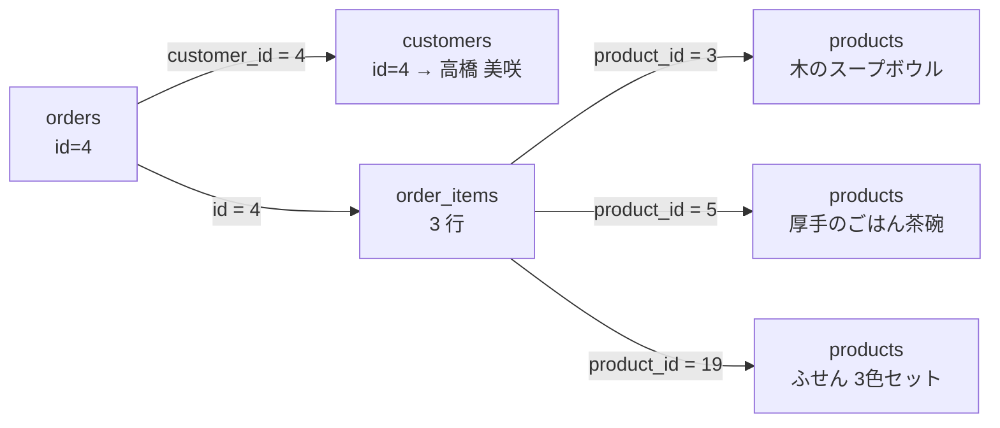

図の**矢印の1本1本が、いま人間が目でやっている突き合わせ**です。
番号を覚えて、別の表を開いて、同じ番号の行を探す——この作業を、
**データベースにやらせるための指示が結合（`JOIN`）です。**

**結合**（けつごう。複数のテーブルを繋いで、1つの結果として取り出すこと）を使うと、
上の5回は**1回**になります。先に完成形を見せます（意味は 6.4 で扱います）。

```sql
SELECT o.id, c.name, p.name, oi.quantity
FROM orders AS o
INNER JOIN customers   AS c  ON o.customer_id = c.id
INNER JOIN order_items AS oi ON oi.order_id = o.id
INNER JOIN products    AS p  ON oi.product_id = p.id
WHERE o.id = 4;
```

実行結果:

```text
+----+---------------+--------------------------+----------+
| id | name          | name                     | quantity |
+----+---------------+--------------------------+----------+
|  4 | 高橋 美咲     | 木のスープボウル         |        2 |
|  4 | 高橋 美咲     | 厚手のごはん茶碗         |        4 |
|  4 | 高橋 美咲     | ふせん 3色セット         |        2 |
+----+---------------+--------------------------+----------+
3 rows in set (0.00 sec)
```

6.1.1 で「読むだけなら楽」と言った1枚の表の形が、そのまま出てきました。

**大事なのは、これが一時的な結果にすぎないことです**（3.1.1）。
`products` や `customers` の中身は1文字も変わっていません。
**保存するときは分けたまま、読むときだけ1枚に見せる**——これがリレーショナルデータベースの基本の形です。

ここから、この `INNER JOIN` を1行ずつ組み立てていきます。

---

## 6.2 `INNER JOIN`

### 6.2.1 2つのテーブルを繋ぐ

いちばん小さい結合から始めます。**商品に、分類の名前を付けて出す**という課題です。

`products` には `category_id` があり、`categories` には `id` と `name` があります。
繋ぐ手がかりは、**`products.category_id` と `categories.id` が同じ値のとき同じ分類**、
という対応です。

```sql
SELECT products.name, categories.name
FROM products
INNER JOIN categories ON products.category_id = categories.id
LIMIT 5;
```

実行結果:

```text
+--------------------------------+--------+
| name                           | name   |
+--------------------------------+--------+
| こまり顔のマグカップ           | 食器   |
| 藍色の湯のみ                   | 食器   |
| 木のスープボウル               | 食器   |
| 白磁の取り皿 5枚組             | 食器   |
| 厚手のごはん茶碗               | 食器   |
+--------------------------------+--------+
5 rows in set (0.00 sec)
```

新しく出てきたのは2行目と3行目です。3つの部品に分けて読みます。

| 部品 | 書いたもの | 意味 |
|------|----------|------|
| **どのテーブルに** | `FROM products` | 出発点のテーブル |
| **どれを繋ぐか** | `INNER JOIN categories` | 繋ぎ先のテーブル |
| **どう対応するか** | `ON products.category_id = categories.id` | **繋ぐ条件**（結合条件） |

`ON` のうしろに書いた条件を**結合条件**（けつごうじょうけん。どの行とどの行を
同じ1行として並べるかを決める条件）と呼びます。

**`INNER JOIN` が何をしているか**

「`products` の1行ごとに、`categories` の中から条件に合う行を探して、
横に並べる」という動きです。

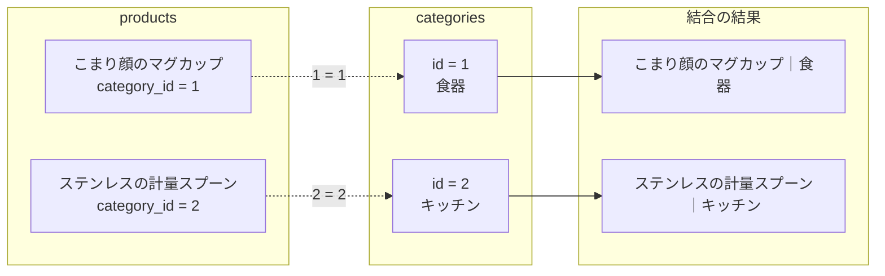

結果の列を見ると、**`name` が2つ**並んでいます。
どちらが商品名でどちらが分類名か、この見出しからは分かりません。
これは 6.2.3 で `AS` を使って直します（3.1.4）。

**`INNER`（内側の）の意味**

`INNER JOIN` は**内部結合**（ないぶけつごう）と読みます。
「内側」というのは、**両方のテーブルに相手がいる行だけ**を結果に残す、という意味です。

いまの `products` は 20 行あり、どの行も `category_id` が 1〜4 のどれかです。
`categories` には 1〜4 がすべてあるので、20 行すべてに相手がいます。

```sql
SELECT COUNT(*) FROM products INNER JOIN categories ON products.category_id = categories.id;
```

実行結果:

```text
+----------+
| COUNT(*) |
+----------+
|       20 |
+----------+
1 row in set (0.00 sec)
```

`COUNT(*)` は「行の数を数える」指定です（2.5.3 で形だけ使いました。仕組みは 6.5.1）。

**相手がいない行があると、その行は消えます。**
たとえば `category_id` が `99` の商品があったら、その商品は結果に出てきません。
「消えてしまっては困る」という場面のための書き方が `LEFT JOIN` で、6.3 で扱います。

> **補足：`INNER` は省略できます**
> `INNER JOIN` は `JOIN` とだけ書いても同じ意味になります。
> ただし、この本では**必ず `INNER` を書きます。**
> 6.3 で出てくる `LEFT JOIN` と並べたときに、
> **どちらのつもりで書いたのかが一目で分かる**ようにするためです。

### 6.2.2 `ON` の書き方

`ON` を書き間違えたときに何が起きるかを、先に見ておきます。
ここを飛ばすと、**エラーが出ないのに結果がおかしい**という、いちばん厄介な状態に入ります。

**`ON` を書かないと、全部の組み合わせが出ます**

`INNER JOIN` の代わりに、テーブルをカンマで並べる書き方もあります。

```sql
SELECT COUNT(*) FROM products, categories;
```

実行結果:

```text
+----------+
| COUNT(*) |
+----------+
|       80 |
+----------+
1 row in set (0.00 sec)
```

**80 行**です。`products` が 20 行、`categories` が 4 行で、20 × 4 = 80。
**すべての組み合わせ**が作られています。中身を3行だけ見てみます。

```sql
SELECT * FROM products, categories LIMIT 3;
```

実行結果:

```text
+----+--------------------------------+-------------+-------+-------+-------------+----+--------------+
| id | name                           | category_id | price | stock | released_on | id | name         |
+----+--------------------------------+-------------+-------+-------+-------------+----+--------------+
|  1 | こまり顔のマグカップ           |           1 |  1200 |    32 | 2025-10-01  |  4 | 文房具       |
|  1 | こまり顔のマグカップ           |           1 |  1200 |    32 | 2025-10-01  |  3 | 収納         |
|  1 | こまり顔のマグカップ           |           1 |  1200 |    32 | 2025-10-01  |  2 | キッチン     |
+----+--------------------------------+-------------+-------+-------+-------------+----+--------------+
3 rows in set (0.00 sec)
```

`category_id` が `1` のマグカップに、**文房具・収納・キッチン**が付いています。
明らかに間違っていますが、**エラーは1つも出ていません。**

このように、条件を付けずに全部の組み合わせを作ることを
**直積**（ちょくせき。片方のすべての行と、もう片方のすべての行を掛け合わせること。
**クロス結合**とも呼ぶ）と言います。

> **よくある間違い**
> 直積は、**行数が掛け算で増えます。**
> 1,000 行のテーブルと 1,000 行のテーブルなら 100 万行です。
> 練習用の小さなテーブルでは一瞬で返りますが、本物のデータでは**返ってきません。**
>
> 結合したら、**まず件数を確かめてください。**
> `SELECT COUNT(*)` の結果が、元のテーブルの行数より桁違いに多いときは、
> `ON` の書き忘れか書き間違いを疑います。
>
> この本では、**カンマで並べる書き方は使いません。**
> `INNER JOIN ... ON` と書けば、`ON` を書き忘れたときに**構文エラーで止まってくれる**からです。

**`ON` には「対応づけの条件」だけを書きます**

`ON` に書けるのは `=` だけではありませんが、この本で使うのは
**「片方の外部キー = もう片方の主キー」**の形だけです（5.4.1）。

| 繋ぎたいもの | `ON` に書く条件 |
|------------|---------------|
| 商品 → 分類 | `products.category_id = categories.id` |
| 注文 → 顧客 | `orders.customer_id = customers.id` |
| 注文 → 明細 | `order_items.order_id = orders.id` |
| 明細 → 商品 | `order_items.product_id = products.id` |

**左右をひっくり返しても同じ**です。
`ON categories.id = products.category_id` と書いても結果は変わりません。
この本では、**手前に書いたテーブルの列を左に**置いて統一します。

**列名が両方にあるときは、テーブル名を必ず書きます**

`products` にも `categories` にも `name` という列があります。
どちらのことか書かずに使うと、止められます。

```sql
SELECT name FROM products INNER JOIN categories ON products.category_id = categories.id;
```

実行結果:

```text
ERROR 1052 (23000): Column 'name' in field list is ambiguous
```

**`ERROR 1052` は「どちらの `name` のことか分かりません」という合図**です。
`ambiguous`（アンビギュアス）は「あいまいな」という意味です。

直し方は、`テーブル名.列名` の形で書くことです。

```sql
SELECT products.name FROM products INNER JOIN categories ON products.category_id = categories.id LIMIT 2;
```

実行結果:

```text
+--------------------------------+
| name                           |
+--------------------------------+
| こまり顔のマグカップ           |
| 藍色の湯のみ                   |
+--------------------------------+
2 rows in set (0.00 sec)
```

`id` も両方にあるので、同じことが起きます。
**結合を書くときは、片方にしかない列であっても、すべてテーブル名を付ける**のが安全です。
あとから列が追加されても壊れませんし、読む人が「どっちの列だろう」と考えずに済みます。

> **補足：`USING` という書き方もあります**
> 繋ぐ2つの列が**まったく同じ名前**のときに限り、`ON` の代わりに
> `USING (列名)` と書けます。
>
> この本の5つのテーブルは、`category_id` と `id` のように**名前が違う**ので使えません。
> `USING` は使わず、`ON` に統一します。

### 6.2.3 テーブルに別名を付ける

`products.name` と書き続けるのは、3つ4つ繋ぐようになると長すぎます。
そこで、**テーブルにも別名を付けます**（3.1.4 で列に付けたのと同じ `AS` です）。

```sql
SELECT p.name AS 商品名, c.name AS 分類
FROM products AS p
INNER JOIN categories AS c ON p.category_id = c.id
WHERE p.price >= 3000;
```

実行結果:

```text
+-----------------------------+--------------+
| 商品名                      | 分類         |
+-----------------------------+--------------+
| 白磁の取り皿 5枚組          | 食器         |
| ひのきのまな板              | キッチン     |
| 鉄のフライパン 24cm         | キッチン     |
| 麻のかごバスケット          | 収納         |
| 革のペンケース              | 文房具       |
+-----------------------------+--------------+
5 rows in set (0.00 sec)
```

`FROM products AS p` と書いた瞬間から、**このクエリの中では `products` は `p` と呼ぶ**
という約束になります。`WHERE` にも `p.price` と書けています。

列の別名（`AS 商品名`）と、テーブルの別名（`AS p`）の違いを整理します。

| 何に付けるか | 書く場所 | 効果 |
|------------|---------|------|
| 列・式 | `SELECT` 句の中 | **結果の見出し**が変わる |
| テーブル | `FROM` / `JOIN` のうしろ | **そのクエリの中での呼び名**が変わる |

**別名の付け方の方針**

この本では、**テーブル名の頭文字**を使います。

| テーブル | 別名 |
|---------|------|
| `products` | `p` |
| `categories` | `c` |
| `customers` | `c`（`categories` と同時に使うときは `cu`） |
| `orders` | `o` |
| `order_items` | `oi` |

> **よくある間違い**
> **別名を付けたら、元のテーブル名はもう使えません。**
>
> ```sql
> SELECT products.name FROM products AS p INNER JOIN categories AS c ON p.category_id = c.id;
> ```
>
> 実行結果:
>
> ```text
> ERROR 1054 (42S22): Unknown column 'products.name' in 'field list'
> ```
>
> `ERROR 1054`（そんな列は無い）は第3章 3.1.2 でも見たエラーです。
> 別名を付けた行と、列を書いている行が離れていると気づきにくいので、
> **`AS p` と書いたら、そのクエリ全体を `p` に書き換える**と覚えてください。

> **補足：`AS` は省略できます**
> `FROM products p` のように `AS` を書かない流儀もあり、実務ではよく見ます。
> この本では、**読む人が別名だと一目で分かるように `AS` を書きます。**

---

## 6.3 `LEFT JOIN`

### 6.3.1 片方にしかない行も出す

顧客と注文を `INNER JOIN` で繋いでみます。

```sql
SELECT c.name AS 顧客名, o.id AS 注文番号, o.ordered_at AS 注文日時
FROM customers AS c
INNER JOIN orders AS o ON c.id = o.customer_id
ORDER BY c.id, o.id;
```

実行結果:

```text
+---------------+--------------+---------------------+
| 顧客名        | 注文番号     | 注文日時            |
+---------------+--------------+---------------------+
| 田中 陽子     |            1 | 2026-06-03 10:24:00 |
| 田中 陽子     |            3 | 2026-06-28 09:12:00 |
| 田中 陽子     |            9 | 2026-08-08 13:53:00 |
| 田中 陽子     |           15 | 2026-09-12 09:03:00 |
| 佐藤 健       |            2 | 2026-06-11 19:05:00 |
| 佐藤 健       |            7 | 2026-07-25 16:41:00 |
| 佐藤 健       |           14 | 2026-09-09 15:58:00 |
| 鈴木 一郎     |            5 | 2026-07-14 21:30:00 |
| 高橋 美咲     |            4 | 2026-07-02 14:47:00 |
| 高橋 美咲     |           10 | 2026-08-15 20:16:00 |
| 伊藤 慎二     |            6 | 2026-07-19 08:58:00 |
| 伊藤 慎二     |           12 | 2026-09-01 18:22:00 |
| 山本 大輔     |            8 | 2026-08-01 11:09:00 |
| 山本 大輔     |           13 | 2026-09-05 12:35:00 |
| 中村 結衣     |           11 | 2026-08-26 07:44:00 |
+---------------+--------------+---------------------+
15 rows in set (0.00 sec)
```

**15 行**出ました。`orders` の行数と同じです。
顧客1人が複数の注文を持つので、田中さんは4回、佐藤さんは3回現れています。

ここで、**顧客名を数えてください。** 何人いますか。

田中・佐藤・鈴木・高橋・伊藤・山本・中村の**7人**です。
ところが `customers` には**8人**います（2.5.3）。

**渡辺 さくらさんが消えています。**
理由は、`orders` に `customer_id` が `6` の行が1つも無いからです。
`INNER JOIN` は「両方に相手がいる行だけ」を残すので、
**注文をしていない顧客は結果から落ちます**（6.2.1）。

顧客一覧として使うなら、これは困ります。
**相手がいなくても左側の行を残す**のが `LEFT JOIN` です。

```sql
SELECT c.name AS 顧客名, o.id AS 注文番号
FROM customers AS c
LEFT JOIN orders AS o ON c.id = o.customer_id
ORDER BY c.id, o.id;
```

実行結果:

```text
+------------------+--------------+
| 顧客名           | 注文番号     |
+------------------+--------------+
| 田中 陽子        |            1 |
| 田中 陽子        |            3 |
| 田中 陽子        |            9 |
| 田中 陽子        |           15 |
| 佐藤 健          |            2 |
| 佐藤 健          |            7 |
| 佐藤 健          |           14 |
| 鈴木 一郎        |            5 |
| 高橋 美咲        |            4 |
| 高橋 美咲        |           10 |
| 伊藤 慎二        |            6 |
| 伊藤 慎二        |           12 |
| 渡辺 さくら      |         NULL |
| 山本 大輔        |            8 |
| 山本 大輔        |           13 |
| 中村 結衣        |           11 |
+------------------+--------------+
16 rows in set (0.00 sec)
```

**16 行**になりました。渡辺さくらさんの行が1行増えています。
そして、**注文番号が `NULL`** になっています。

`LEFT JOIN` は**左外部結合**（ひだりがいぶけつごう）と読みます。
「左」は `FROM` に書いたほう、つまり `customers` のことです。

> **補足：`RIGHT JOIN` もあります**
> 右（`JOIN` のうしろ）を全部残す `RIGHT JOIN` もありますが、
> **左右を入れ替えれば `LEFT JOIN` で同じことが書けます。**
> この本では `LEFT JOIN` に統一します。
> **「全部残したいほうを `FROM` に書く」**と決めておくと、読むときに迷いません。

### 6.3.2 `INNER` との違いを図で理解する

2つの違いは、**相手がいない行をどうするか**の1点だけです。

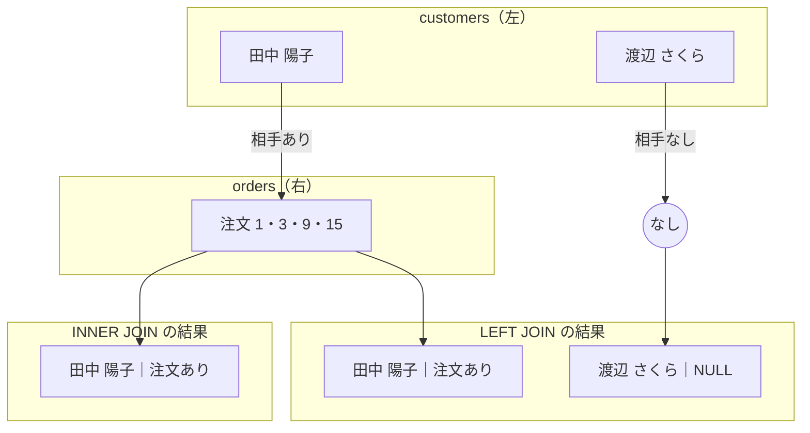

**`INNER JOIN` では、相手のいない「渡辺 さくら」の行がどこにも出てきません。**
`LEFT JOIN` では、右側を `NULL` で埋めた1行として残ります。

言葉にすると、次のようになります。

| 書き方 | 左の行に相手がいるとき | 左の行に相手がいないとき |
|-------|---------------------|----------------------|
| `INNER JOIN` | 相手の数だけ行が出る | **その行は消える** |
| `LEFT JOIN` | 相手の数だけ行が出る | **右側を `NULL` にして1行出る** |

**どちらを使うかは、「何の一覧を作りたいか」で決まります。**

| 作りたいもの | 使う結合 | 理由 |
|------------|---------|------|
| 注文の一覧（に顧客名を添えたい） | `INNER JOIN` | 注文には必ず顧客がいる。落ちる行が無い |
| 顧客の一覧（に注文を添えたい） | `LEFT JOIN` | 注文ゼロの顧客も一覧に要る |
| 商品の一覧（に売れた数を添えたい） | `LEFT JOIN` | 1個も売れていない商品も一覧に要る |

**迷ったときの判断**：`FROM` に書いたテーブルの行数と、
結合後の行数を比べます。**減っていたら、それは `INNER JOIN` が行を落としています。**
落として良いのかどうかを、そこで考えてください。

### 6.3.3 `NULL` になる列の扱い

`LEFT JOIN` で出てきた `NULL` は、**「値が入っていない」という印**です（第1章 1.3.1）。
`0` でも空文字でもありません。第3章 3.3.4 で見た `NULL` と同じものです。

そのまま画面に出すと `NULL` と表示されて読みにくいので、**別の値に置き換えます。**

```sql
SELECT c.name AS 顧客名, COALESCE(o.status, '注文なし') AS 状態
FROM customers AS c
LEFT JOIN orders AS o ON c.id = o.customer_id
WHERE o.id IS NULL;
```

実行結果:

```text
+------------------+--------------+
| 顧客名           | 状態         |
+------------------+--------------+
| 渡辺 さくら      | 注文なし     |
+------------------+--------------+
1 row in set (0.01 sec)
```

**`COALESCE`**（コアレス。引数を左から見ていき、**最初に `NULL` でなかった値**を返す関数）
がここでの新顔です。`COALESCE(o.status, '注文なし')` は
「`o.status` が `NULL` でなければそれを、`NULL` なら `'注文なし'` を返す」という意味になります。

関数の読み方（引数・戻り値）は第3章 3.6 と同じです。

> **補足：`IFNULL` も同じことをします**
> `IFNULL(o.status, '注文なし')` と書いても同じ結果になります。
> 違いは**引数の数**です。
>
> | 関数 | 引数 | 使いどころ |
> |------|------|----------|
> | `IFNULL(a, b)` | 必ず2つ | 候補が1つだけ |
> | `COALESCE(a, b, c, ...)` | いくつでも | 候補が複数（`a` が `NULL` なら `b`、それも `NULL` なら `c`） |
>
> この本では、**候補を増やしたくなったときに書き換えずに済む `COALESCE` を使います。**

**相手がいない行だけを取り出す**

上の SQL の `WHERE o.id IS NULL` にも注目してください。
これは「**結合してみたが、相手がいなかった行**」だけを残す条件です。

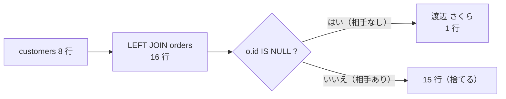

これは**とてもよく使う形**なので、名前を付けて覚えてください。
「`LEFT JOIN` して `IS NULL` で絞る」＝**相手がいないものを探す**書き方です。

- 一度も注文していない顧客（いまの例）
- 一度も売れていない商品
- 担当者が決まっていない案件

**`IS NULL` に使う列の選び方**が1つだけコツです。
`WHERE o.status IS NULL` と書いても、いまのデータでは同じ結果になりますが、
**`status` にもともと `NULL` が入っている行があれば、それも引っかかってしまいます。**

`orders.id` は主キーなので、**絶対に `NULL` になりません**（5.3.1）。
`NULL` になりうるのは「相手がいなかった」ときだけです。
そのため、**`IS NULL` の判定には相手側の主キーを使います。**

### 6.3.4 `WHERE` に書くと `INNER` と同じになる罠

ここはこの章でいちばん間違えやすい場所です。

**やりたいこと**：顧客の一覧を出し、**「受付」状態の注文があればその番号も出す**。
注文が無い人も、受付の注文が無い人も、一覧には出したい。

素直に書くと、こうなりそうです。

```sql
SELECT c.name AS 顧客名, o.id AS 注文番号
FROM customers AS c
LEFT JOIN orders AS o ON c.id = o.customer_id
WHERE o.status = '受付';
```

実行結果:

```text
+---------------+--------------+
| 顧客名        | 注文番号     |
+---------------+--------------+
| 中村 結衣     |           11 |
| 山本 大輔     |           13 |
| 佐藤 健       |           14 |
| 田中 陽子     |           15 |
+---------------+--------------+
4 rows in set (0.00 sec)
```

**4行しか出ません。** `LEFT JOIN` と書いたのに、
受付の注文が無い顧客（鈴木・高橋・伊藤・渡辺・中村以外）が全員消えています。
これでは `INNER JOIN` と同じです。

**なぜこうなるのか**

`LEFT JOIN` は、たしかに渡辺さんの行を `NULL` 付きで残しました。
しかし `WHERE` は、**その結果に対してあとから適用されます。**

渡辺さんの行の `o.status` は `NULL` です。
そして **`NULL = '受付'` は真になりません**（3.3.4）。
だから `WHERE` の網にかからず、捨てられます。

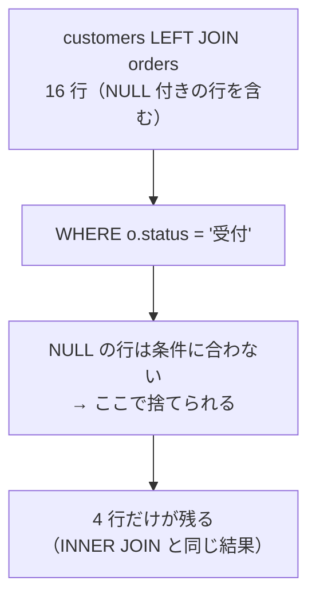

**直し方：条件を `ON` のほうに移す**

「受付であること」を**結合の条件**にしてしまえば、
結合の時点で「受付の注文だけを相手として探す」動きになります。
相手が見つからなければ `NULL` が入り、**左の行は残ります。**

```sql
SELECT c.name AS 顧客名, o.id AS 注文番号
FROM customers AS c
LEFT JOIN orders AS o ON c.id = o.customer_id AND o.status = '受付'
ORDER BY c.id;
```

実行結果:

```text
+------------------+--------------+
| 顧客名           | 注文番号     |
+------------------+--------------+
| 田中 陽子        |           15 |
| 佐藤 健          |           14 |
| 鈴木 一郎        |         NULL |
| 高橋 美咲        |         NULL |
| 伊藤 慎二        |         NULL |
| 渡辺 さくら      |         NULL |
| 山本 大輔        |           13 |
| 中村 結衣        |           11 |
+------------------+--------------+
8 rows in set (0.00 sec)
```

**8行**、顧客全員が出ました。これが目的の形です。

**`ON` と `WHERE` の違いを一言で**

| 書く場所 | いつ効くか | `LEFT JOIN` での意味 |
|---------|----------|-------------------|
| `ON` に書く | **繋ぐとき**に効く | 条件に合う相手だけを探す。**左の行は必ず残る** |
| `WHERE` に書く | **繋いだあと**に効く | 出来上がった表から行を捨てる。**左の行も消える** |

> **よくある間違い**
> **`INNER JOIN` では、`ON` に書いても `WHERE` に書いても結果が同じ**になります。
> だから「どっちでもいい」と覚えてしまいがちです。
>
> ```sql
> -- この2つは INNER JOIN では同じ結果
> SELECT ... FROM a INNER JOIN b ON a.id = b.a_id AND b.flag = 1;
> SELECT ... FROM a INNER JOIN b ON a.id = b.a_id WHERE b.flag = 1;
> ```
>
> ところが `LEFT JOIN` に変えたとたん、**結果が変わります。**
> 「動いていたクエリを `LEFT JOIN` にしたら行が減った」というときは、
> ほぼこれが原因です。
>
> 覚え方：**`LEFT JOIN` の相手側の列を `WHERE` に書いたら、いったん手を止める。**
> 書いてよいのは `IS NULL`（6.3.3）のときだけだと考えてください。

---

## 6.4 複数テーブルの結合

### 6.4.1 3つ以上を繋ぐ

6.1.2 で見せた「注文1件を人間が読める形にする」を、いよいよ完成させます。
必要なテーブルは4つです。

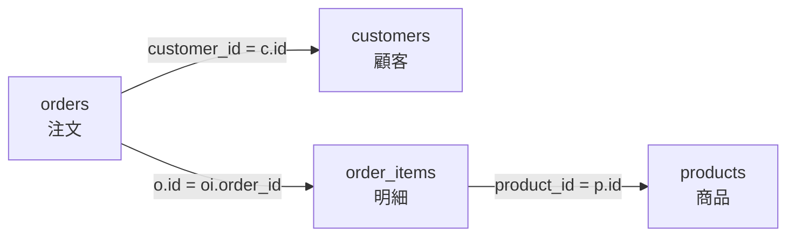

**`INNER JOIN` は、いくつでも続けて書けます。**
`FROM` に1つ書いて、そのあとに `INNER JOIN ... ON ...` を必要なだけ並べます。

```sql
SELECT
    o.id                       AS 注文番号,
    o.ordered_at               AS 注文日時,
    c.name                     AS 顧客名,
    p.name                     AS 商品名,
    oi.quantity                AS 個数,
    oi.unit_price              AS 単価,
    oi.quantity * oi.unit_price AS 小計
FROM orders AS o
INNER JOIN customers   AS c  ON o.customer_id = c.id
INNER JOIN order_items AS oi ON oi.order_id = o.id
INNER JOIN products    AS p  ON oi.product_id = p.id
WHERE o.id = 8
ORDER BY oi.id;
```

実行結果:

```text
+--------------+---------------------+---------------+--------------------------------+--------+--------+--------+
| 注文番号     | 注文日時            | 顧客名        | 商品名                         | 個数   | 単価   | 小計   |
+--------------+---------------------+---------------+--------------------------------+--------+--------+--------+
|            8 | 2026-08-01 11:09:00 | 山本 大輔     | 書きやすいボールペン           |     10 |    380 |   3800 |
|            8 | 2026-08-01 11:09:00 | 山本 大輔     | 方眼のノート A5                |     10 |    520 |   5200 |
|            8 | 2026-08-01 11:09:00 | 山本 大輔     | ふせん 3色セット               |      6 |    340 |   2040 |
+--------------+---------------------+---------------+--------------------------------+--------+--------+--------+
3 rows in set (0.00 sec)
```

**納品書のような表**になりました。5回の `SELECT` が1回になっています。

読み方のコツは、**上から順に「足していく」と考える**ことです。

| 段階 | 書いた行 | その時点の結果 |
|------|---------|--------------|
| 1 | `FROM orders AS o` | 注文 15 行 |
| 2 | `INNER JOIN customers ...` | 注文 15 行に、顧客の列が横に付く（行数は変わらない） |
| 3 | `INNER JOIN order_items ...` | **1注文に複数の明細があるので行が増える**（37 行） |
| 4 | `INNER JOIN products ...` | 37 行に、商品の列が横に付く（行数は変わらない） |

**行数が増えるのは、1対多の「多」の側を繋いだときだけ**です。
ここでは `order_items` がそれにあたります。

`WHERE` を外して件数を数えると、確かめられます。

```sql
SELECT COUNT(*)
FROM orders AS o
INNER JOIN customers   AS c  ON o.customer_id = c.id
INNER JOIN order_items AS oi ON oi.order_id = o.id
INNER JOIN products    AS p  ON oi.product_id = p.id;
```

実行結果:

```text
+----------+
| COUNT(*) |
+----------+
|       37 |
+----------+
1 row in set (0.00 sec)
```

**37 行**。`order_items` の行数と同じです。
注文 15 行から始めて、明細を繋いだところで 37 行になり、
そのあとは増えていません。**予想と一致しているかを、この形で必ず確かめてください。**

**`SELECT` 句に式を書けます**

上の SQL の最後の列、`oi.quantity * oi.unit_price AS 小計` に注目してください。
`SELECT` 句には、列名だけでなく**計算式**も書けます（3.6.3 で `ROUND` などを使ったのと同じです）。

`*` は掛け算です。テーブルの中に「小計」という列は存在しませんが、
**取り出すときに計算して作る**ことができます。
6.5 の集計は、この考え方の延長線上にあります。

### 6.4.2 読みやすい書き方

結合は、書いた本人が翌日読めなくなる筆頭です。
この本では、次の5つのルールで書きます。**上の SQL は、すべてこの形になっています。**

**ルール1：句ごとに改行する**

`SELECT` / `FROM` / `INNER JOIN` / `WHERE` / `GROUP BY` / `ORDER BY` は、
**それぞれ行の先頭に置きます。**

```sql
SELECT o.id, c.name
FROM orders AS o
INNER JOIN customers AS c ON o.customer_id = c.id
WHERE o.status = '受付'
ORDER BY o.id;
```

1行に詰め込むと、どこまでが `FROM` でどこからが `WHERE` か分からなくなります。

**ルール2：`JOIN` は1テーブルにつき1行**

繋ぐテーブルが3つなら3行です。`ON` は同じ行に続けて書きます。
**繋いだ順番が、上から下に読める**形になります。

**ルール3：すべての列にテーブルの別名を付ける**

`name` ではなく `c.name` と書きます。
`ERROR 1052`（6.2.2）を防ぐためだけでなく、
**読む人が「どのテーブルの列か」を探さずに済む**ためです。

**ルール4：列が5つ以上なら、1行に1列**

```sql
SELECT
    o.id         AS 注文番号,
    c.name       AS 顧客名,
    p.name       AS 商品名
FROM ...
```

こう書いておくと、**列を1つ足す・消すときの差分が1行**で済みます。
Git で履歴を見たときにも読みやすくなります。

**ルール5：日本語の別名を付ける**

`AS 注文番号` のように書けば、結果の見出しがそのまま日本語になります（3.1.4）。
`name` が2つ並ぶ問題（6.2.1）も、これで解決します。

> **補足：日本語の別名を使ってよい場面**
> 日本語の別名は、**画面で確認するときや、人に見せる表を作るとき**に有効です。
> 一方、**アプリの中から実行する SQL では、英語の別名**を使ってください。
> プログラムの変数名に日本語を使うと扱いにくいためです（第8章で扱います）。
>
> この本の例題は「打って、結果を目で確かめる」ためのものなので、日本語を使います。

**5つのルールを適用する前と後**

同じ問い合わせを、2通りで書いてみます。

```sql
select o.id,c.name,p.name,oi.quantity from orders o inner join customers c on o.customer_id=c.id inner join order_items oi on oi.order_id=o.id inner join products p on oi.product_id=p.id where o.id=8 order by oi.id;
```

これも**まったく同じ3行**を返します。文法としては何も間違っていません。
ただし、**どこまでが `FROM` で、どこからが `WHERE` なのか**が一目では分かりません。
繋いでいるテーブルが3つあることも、数えないと見えてきません。

```sql
SELECT
    o.id        AS 注文番号,
    c.name      AS 顧客名,
    p.name      AS 商品名,
    oi.quantity AS 個数
FROM orders AS o
INNER JOIN customers   AS c  ON o.customer_id = c.id
INNER JOIN order_items AS oi ON oi.order_id = o.id
INNER JOIN products    AS p  ON oi.product_id = p.id
WHERE o.id = 8
ORDER BY oi.id;
```

**結合条件は `ON` に、絞り込みは `WHERE` に**——この分担が目で見て分かります。
6.3.4 で見たとおり、この2つは `LEFT JOIN` では意味がまったく違います。
**最初から分けて書く癖を付けてください。**

> **よくある間違い**
> `mysql` コマンドで長い SQL を打つと、途中で改行したときに
> プロンプトが `->` に変わります。
>
> ```text
> mysql> SELECT o.id
>     -> FROM orders AS o
>     -> WHERE o.id = 8;
> ```
>
> **これは正常です。** 「まだ文が終わっていません」という合図で、
> `;` を打つまで続きを待っています（2.4.1）。
>
> 途中でやめたくなったら、**`\c` と打って Enter** を押してください。
> 入力中の文が取り消されます。

---

## 6.5 集計

### 6.5.1 集計関数（`COUNT` / `SUM` / `AVG` / `MAX` / `MIN`）

ここまでは「どの行を出すか」の話でした。
ここからは「**何件あるか**」「**合計いくらか**」という、**行をまとめて1つの値にする**話に移ります。

そのための関数を**集計関数**（しゅうけいかんすう。複数の行の値をまとめて、1つの値を返す関数）
と呼びます。この本で使うのは5つです。

| 関数 | 何を返すか |
|------|----------|
| `COUNT(...)` | **件数**（行の数） |
| `SUM(列)` | 合計 |
| `AVG(列)` | 平均 |
| `MAX(列)` | 最大値 |
| `MIN(列)` | 最小値 |

5つまとめて使ってみます。

```sql
SELECT
    COUNT(*)   AS 商品数,
    SUM(price) AS 価格の合計,
    AVG(price) AS 平均価格,
    MAX(price) AS 最高価格,
    MIN(price) AS 最低価格
FROM products;
```

実行結果:

```text
+-----------+-----------------+--------------+--------------+--------------+
| 商品数    | 価格の合計      | 平均価格     | 最高価格     | 最低価格     |
+-----------+-----------------+--------------+--------------+--------------+
|        20 |           39930 |    1996.5000 |         5800 |          340 |
+-----------+-----------------+--------------+--------------+--------------+
1 row in set (0.00 sec)
```

**20 行あった `products` が、1行になりました。**
これが集計関数の働きです。元のテーブルは 20 行のままで、
結果として1行の表が作られています。

**`AVG` の結果が `1996.5000` になる理由**

`price` は `INT`（整数）ですが、平均は割り算なので小数になります。
MySQL は割り算の結果を、**小数第4位まで**持つ形で返します。

画面に出すときは、第3章 3.6.3 の `ROUND` で丸めます。

```sql
SELECT ROUND(AVG(price)) AS 平均価格 FROM products;
```

実行結果:

```text
+--------------+
| 平均価格     |
+--------------+
|         1997 |
+--------------+
1 row in set (0.00 sec)
```

**集計関数は `WHERE` と組み合わせられます**

`WHERE` で絞ってから数える、という形が使えます。

```sql
SELECT COUNT(*) AS 在庫切れの商品数 FROM products WHERE stock = 0;
```

実行結果:

```text
+-----------------------+
| 在庫切れの商品数      |
+-----------------------+
|                     2 |
+-----------------------+
1 row in set (0.00 sec)
```

**集計関数の中に式を書けます**

6.4.1 で `oi.quantity * oi.unit_price` という式を `SELECT` 句に書きました。
同じ式を `SUM` の中に入れれば、**小計の合計＝注文の合計金額**が出ます。

```sql
SELECT SUM(quantity * unit_price) AS 売上の合計 FROM order_items;
```

実行結果:

```text
+-----------------+
| 売上の合計      |
+-----------------+
|           99930 |
+-----------------+
1 row in set (0.00 sec)
```

**「1行ずつ掛け算してから、全部を足す」**という順番です。
この形は、このあと何度も出てきます。

> **よくある間違い**
> **集計関数と、普通の列を、いっしょに `SELECT` 句へ書くことはできません。**
>
> ```sql
> SELECT name, COUNT(*) FROM customers;
> ```
>
> 実行結果:
>
> ```text
> ERROR 1140 (42000): In aggregated query without GROUP BY, expression #1 of SELECT
> list contains nonaggregated column 'shop.customers.name'; this is incompatible
> with sql_mode=only_full_group_by
> ```
>
> `COUNT(*)` は「8」という1つの値を返しますが、
> `name` は8人ぶんあります。**8個の名前のうち、どれを1行に出せばよいか決まりません。**
> MySQL はそれを推測せず、エラーで止めます。
>
> 「〜ごとの名前と件数」を出したいなら、次の `GROUP BY` を使います。

### 6.5.2 `GROUP BY`

`GROUP BY`（グループバイ）は、**行を仲間ごとに分けてから、仲間ごとに集計する**指定です。

「顧客ごとの注文件数」を出してみます。

```sql
SELECT customer_id, COUNT(*) AS 注文件数
FROM orders
GROUP BY customer_id
ORDER BY 注文件数 DESC;
```

実行結果:

```text
+-------------+--------------+
| customer_id | 注文件数     |
+-------------+--------------+
|           1 |            4 |
|           2 |            3 |
|           4 |            2 |
|           5 |            2 |
|           7 |            2 |
|           3 |            1 |
|           8 |            1 |
+-------------+--------------+
7 rows in set (0.00 sec)
```

15 行あった `orders` が、**7行**になりました。
`customer_id` が同じ行をひとまとめにして、まとまりごとに `COUNT(*)` を計算しています。

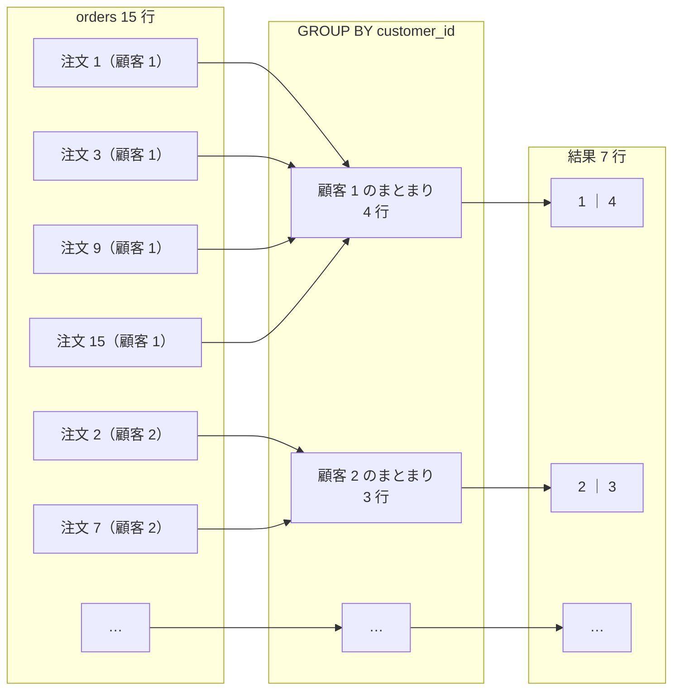

**`GROUP BY` に書いた列が、結果の1行1行を区別する見出しになります。**
逆に言うと、**`GROUP BY` に書いていない列は、そのままでは `SELECT` 句に書けません。**

```sql
SELECT name, category_id, COUNT(*) FROM products GROUP BY category_id;
```

実行結果:

```text
ERROR 1055 (42000): Expression #1 of SELECT list is not in GROUP BY clause and
contains nonaggregated column 'shop.products.name' which is not functionally
dependent on columns in GROUP BY clause; this is incompatible with
sql_mode=only_full_group_by
```

**`ERROR 1055` は「まとまりの中に値が何個もあるので、1つに決められません」という合図**です。
`category_id` が `1` のまとまりには商品が5つあり、`name` も5つあります。

この章のエラーの読み分けは、次のとおりです。

| エラー | 状況 | 直し方 |
|-------|------|-------|
| `1140` | `GROUP BY` **が無い**のに、集計関数と普通の列を混ぜた | `GROUP BY` を足す |
| `1055` | `GROUP BY` **はある**が、そこに無い列を出そうとした | その列を `GROUP BY` に足すか、`SELECT` から外す |

**結合と組み合わせる**

`customer_id` が `1` と言われても誰か分かりません。**顧客名を出したい**ので、
6.2 の結合と組み合わせます。

```sql
SELECT
    c.name       AS 顧客名,
    COUNT(o.id)  AS 注文件数
FROM customers AS c
INNER JOIN orders AS o ON c.id = o.customer_id
GROUP BY c.id, c.name
ORDER BY 注文件数 DESC, c.id;
```

実行結果:

```text
+---------------+--------------+
| 顧客名        | 注文件数     |
+---------------+--------------+
| 田中 陽子     |            4 |
| 佐藤 健       |            3 |
| 高橋 美咲     |            2 |
| 伊藤 慎二     |            2 |
| 山本 大輔     |            2 |
| 鈴木 一郎     |            1 |
| 中村 結衣     |            1 |
+---------------+--------------+
7 rows in set (0.00 sec)
```

**`GROUP BY c.id, c.name` と、2つ書いていることに注目してください。**

- `c.id` でまとめる：**同姓同名がいても別人として数える**ため（5.3.3）
- `c.name` も書く：`SELECT` 句に `c.name` を出すため（`ERROR 1055` を避ける）

**「まとめたい単位は主キー、表示したい列も `GROUP BY` に並べる」**が定型です。

> **よくある間違い**
> この結果は**7行**です。顧客は8人なのに1人足りません。
>
> 6.3.1 で見たとおり、`INNER JOIN` は注文の無い渡辺さくらさんを落とします。
> **「〜ごと」の集計で件数が合わないときは、まず結合の種類を疑ってください。**
>
> 全員を出したいなら `LEFT JOIN` にします。次の 6.5.3 で、その結果を見ます。

**並べ替えに別名を使えます**

`ORDER BY 注文件数 DESC` と書けています。
`SELECT` 句で付けた別名は、**`ORDER BY` では使えます**（3.4.1）。
一方、`WHERE` では使えません。理由は 6.5.4 で扱う「実行される順番」にあります。

### 6.5.3 `COUNT` の引数による違い

`COUNT` だけは、**かっこの中に何を書くかで結果が変わります。**
ここを知らないと、`LEFT JOIN` と組み合わせたときに必ず間違えます。

3つの書き方があります。

| 書き方 | 数えるもの |
|-------|----------|
| `COUNT(*)` | **行の数**。中身が `NULL` でも数える |
| `COUNT(列)` | その列が **`NULL` ではない**行の数 |
| `COUNT(DISTINCT 列)` | その列の**値の種類**の数（重複を除いて数える。3.5.1） |

`customers` で3つとも試します。
`birthday` は、8人のうち2人が `NULL` でした（2.5.3）。

```sql
SELECT
    COUNT(*)                    AS 行数,
    COUNT(birthday)             AS 生年月日あり,
    COUNT(DISTINCT prefecture)  AS 都道府県の種類
FROM customers;
```

実行結果:

```text
+--------+--------------------+-----------------------+
| 行数   | 生年月日あり       | 都道府県の種類        |
+--------+--------------------+-----------------------+
|      8 |                  6 |                     5 |
+--------+--------------------+-----------------------+
1 row in set (0.00 sec)
```

- `COUNT(*)` は **8**（全員）
- `COUNT(birthday)` は **6**（`NULL` の2人を数えない）
- `COUNT(DISTINCT prefecture)` は **5**（東京都・大阪府・北海道・福岡県・京都府）

**`LEFT JOIN` と組み合わせると、違いが致命的になります**

6.5.2 の最後で、`INNER JOIN` だと渡辺さくらさんが落ちました。
`LEFT JOIN` に変えて、`COUNT(*)` と `COUNT(o.id)` を並べてみます。

```sql
SELECT
    c.name      AS 顧客名,
    COUNT(*)    AS まちがい,
    COUNT(o.id) AS 正しい件数
FROM customers AS c
LEFT JOIN orders AS o ON c.id = o.customer_id
GROUP BY c.id, c.name
ORDER BY c.id;
```

実行結果:

```text
+------------------+--------------+-----------------+
| 顧客名           | まちがい     | 正しい件数      |
+------------------+--------------+-----------------+
| 田中 陽子        |            4 |               4 |
| 佐藤 健          |            3 |               3 |
| 鈴木 一郎        |            1 |               1 |
| 高橋 美咲        |            2 |               2 |
| 伊藤 慎二        |            2 |               2 |
| 渡辺 さくら      |            1 |               0 |
| 山本 大輔        |            2 |               2 |
| 中村 結衣        |            1 |               1 |
+------------------+--------------+-----------------+
8 rows in set (0.00 sec)
```

**渡辺さくらさんの行だけ、数字が違います。**

`LEFT JOIN` は、相手がいない渡辺さんにも**「右側が全部 `NULL` の行」を1行**作ります（6.3.1）。
`COUNT(*)` はその行も**1行として数える**ので `1` になります。
`COUNT(o.id)` は `o.id` が `NULL` なので**数えず**、`0` になります。

**「注文が1件ある人」と「注文が0件の人」が、どちらも `1` と表示される**——
これはエラーにならないので、気づかないまま資料になります。

> **よくある間違い**
> **`LEFT JOIN` したら `COUNT(*)` を使わない。**
> 相手側の列を指定して `COUNT(o.id)` と書いてください。
>
> 指定する列は、6.3.3 と同じ理由で**相手側の主キー**にします。
> 主キーは `NULL` にならないので、`NULL` であることが
> 「相手がいなかった」ことだけを意味するからです。
>
> `SUM` にも同じ問題があります。次で見ます。

**`SUM` は、相手がいないと `NULL` になります**

顧客ごとの購入金額を、`LEFT JOIN` で出してみます。

```sql
SELECT
    c.name                            AS 顧客名,
    SUM(oi.quantity * oi.unit_price)  AS 購入金額
FROM customers AS c
LEFT JOIN orders      AS o  ON o.customer_id = c.id
LEFT JOIN order_items AS oi ON oi.order_id = o.id
GROUP BY c.id, c.name
ORDER BY c.id;
```

実行結果:

```text
+------------------+--------------+
| 顧客名           | 購入金額     |
+------------------+--------------+
| 田中 陽子        |        18560 |
| 佐藤 健          |        28060 |
| 鈴木 一郎        |         5480 |
| 高橋 美咲        |        18750 |
| 伊藤 慎二        |        10920 |
| 渡辺 さくら      |         NULL |
| 山本 大輔        |        13360 |
| 中村 結衣        |         4800 |
+------------------+--------------+
8 rows in set (0.00 sec)
```

渡辺さんが **`NULL`** です。`0` ではありません。
足す値が1つも無いので、`SUM` は「合計が無い」と答えています。

金額として使うなら `0` にしたいので、6.3.3 の `COALESCE` で包みます。

```sql
SELECT
    c.name                                          AS 顧客名,
    COALESCE(SUM(oi.quantity * oi.unit_price), 0)   AS 購入金額
FROM customers AS c
LEFT JOIN orders      AS o  ON o.customer_id = c.id
LEFT JOIN order_items AS oi ON oi.order_id = o.id
GROUP BY c.id, c.name
ORDER BY 購入金額 DESC;
```

実行結果:

```text
+------------------+--------------+
| 顧客名           | 購入金額     |
+------------------+--------------+
| 佐藤 健          |        28060 |
| 高橋 美咲        |        18750 |
| 田中 陽子        |        18560 |
| 山本 大輔        |        13360 |
| 伊藤 慎二        |        10920 |
| 鈴木 一郎        |         5480 |
| 中村 結衣        |         4800 |
| 渡辺 さくら      |            0 |
+------------------+--------------+
8 rows in set (0.00 sec)
```

**購入金額ランキングになりました。**
8人全員が入っていて、渡辺さんは `0` 円です。

この SQL には、この章のここまでがほぼ全部入っています。

- `LEFT JOIN` を2本（6.3.1 / 6.4.1）
- 式を含む `SUM`（6.4.1 / 6.5.1）
- `COALESCE` で `NULL` を `0` に（6.3.3）
- 主キーと表示列を並べた `GROUP BY`（6.5.2）
- 別名での `ORDER BY`（6.5.2）

**この形が書ければ、実務の集計の半分は書けます。**

### 6.5.4 `HAVING` と `WHERE` の使い分け

「注文を**2件以上**した顧客だけを出したい」としましょう。
`WHERE` で書きたくなりますが、止められます。

```sql
SELECT customer_id, COUNT(*) FROM orders WHERE COUNT(*) >= 2 GROUP BY customer_id;
```

実行結果:

```text
ERROR 1111 (HY000): Invalid use of group function
```

**`ERROR 1111` は「集計関数を、使えない場所で使いました」という合図**です。

正しくは `HAVING`（ハビング）を使います。

```sql
SELECT
    c.name      AS 顧客名,
    COUNT(o.id) AS 注文件数
FROM customers AS c
INNER JOIN orders AS o ON c.id = o.customer_id
GROUP BY c.id, c.name
HAVING COUNT(o.id) >= 2
ORDER BY 注文件数 DESC;
```

実行結果:

```text
+---------------+--------------+
| 顧客名        | 注文件数     |
+---------------+--------------+
| 田中 陽子     |            4 |
| 佐藤 健       |            3 |
| 高橋 美咲     |            2 |
| 伊藤 慎二     |            2 |
| 山本 大輔     |            2 |
+---------------+--------------+
5 rows in set (0.00 sec)
```

**なぜ `WHERE` では書けないのか：SQL が実行される順番**

SQL は、**書いた順番とは違う順番で実行されます。**
この順番を知っていると、`WHERE` と `HAVING` の使い分けは考えなくても分かります。

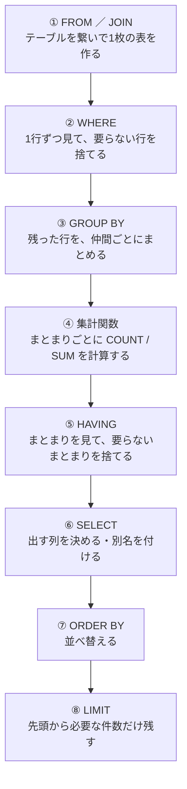

**`WHERE`（②）の時点では、`COUNT(*)` はまだ計算されていません。**
計算は④です。無いものを条件に使えないので、`ERROR 1111` になります。

`HAVING`（⑤）は集計のあとなので、`COUNT(*)` の結果を条件にできます。

この図は、6.5.2 の最後で触れた「別名の謎」も説明します。
別名を付けるのは⑥の `SELECT` です。
だから**②の `WHERE` では別名を使えず、⑦の `ORDER BY` では使える**のです。

| 句 | 実行の順番 | 何に対して働くか | 集計関数を書けるか | 別名を使えるか |
|----|----------|---------------|-----------------|--------------|
| `WHERE` | ② | **1行ずつ** | 書けない | 使えない |
| `HAVING` | ⑤ | **まとまりごと** | 書ける | 使える |

**両方を使う例**

「**2026年8月以降**の注文だけを対象に、**2件以上**ある状態を出す」という問い合わせです。

```sql
SELECT
    status   AS 状態,
    COUNT(*) AS 件数
FROM orders
WHERE ordered_at >= '2026-08-01'
GROUP BY status
HAVING COUNT(*) >= 2;
```

実行結果:

```text
+-----------+--------+
| 状態      | 件数   |
+-----------+--------+
| 発送済    |      4 |
| 受付      |      4 |
+-----------+--------+
2 rows in set (0.00 sec)
```

- `WHERE ordered_at >= '2026-08-01'`：**まとめる前に**、8月より前の注文を捨てる
- `HAVING COUNT(*) >= 2`：**まとめたあとに**、1件しかない状態（キャンセル）を捨てる

**役割がはっきり分かれています。**

> **よくある間違い**
> **`HAVING` は `WHERE` の代わりではありません。**
>
> ```sql
> -- 動くが、遅い書き方
> SELECT status, COUNT(*) FROM orders GROUP BY status HAVING status <> 'キャンセル';
> ```
>
> これは動きます。`HAVING` には集計関数でない条件も書けるからです。
> しかし、**捨てる行をいったん全部まとめてから捨てている**ので無駄があります。
> データが増えると、この差は効いてきます（第7章）。
>
> 判断は単純です。
>
> - **集計した結果（`COUNT` や `SUM`）を条件にする** → `HAVING`
> - **それ以外** → `WHERE`

---

## 6.6 サブクエリ

**サブクエリ**（副問い合わせ。かっこで囲んだ `SELECT` を、別の `SELECT` の一部として使うもの）
は、「**先にこれを調べてから、その結果を使って本命を調べる**」ときに使います。

置ける場所は3つあります。順に見ていきます。

| 置く場所 | 何を渡すか | 項 |
|---------|----------|-----|
| `WHERE` の中 | 比較する値、または候補の一覧 | 6.6.1 |
| `FROM` の中 | 集計済みの表 | 6.6.2 |
| `SELECT` 句の中 | 1行ごとに計算した値 | 6.6.3 |

### 6.6.1 `WHERE` の中で使う

**平均より高い商品を出したい**としましょう。
平均価格は 6.5.1 で出せました（`1996.5000`）。
その値を `WHERE` に手で書いてもよいのですが、**データが変われば書き直しになります。**

かっこで囲んで、その場で調べさせます。

```sql
SELECT name AS 商品名, price AS 価格
FROM products
WHERE price > (SELECT AVG(price) FROM products)
ORDER BY price DESC;
```

実行結果:

```text
+-----------------------------+-------+
| 商品名                      | 価格  |
+-----------------------------+-------+
| 鉄のフライパン 24cm         |  5800 |
| ひのきのまな板              |  4500 |
| 革のペンケース              |  4200 |
| 麻のかごバスケット          |  3600 |
| 白磁の取り皿 5枚組          |  3200 |
| つっぱり棚                  |  2800 |
| 木のスープボウル            |  2400 |
| 布のランチトート            |  2200 |
+-----------------------------+-------+
8 rows in set (0.00 sec)
```

かっこの中が**先に実行されて `1996.5000` になり**、
そのあと外側が `WHERE price > 1996.5000` として動きます。

**値を1つだけ返すサブクエリ**を**スカラサブクエリ**と呼びます。
`=` `>` `<` などの比較演算子（3.2.2）と組み合わせられます。

> **よくある間違い**
> **比較演算子の右に置くサブクエリは、必ず1行1列でなければなりません。**
>
> ```sql
> SELECT name, price FROM products WHERE price = (SELECT price FROM products WHERE category_id = 1);
> ```
>
> 実行結果:
>
> ```text
> ERROR 1242 (21000): Subquery returns more than 1 row
> ```
>
> `category_id` が `1` の商品は5つあるので、`price` も5つ返ります。
> 「5つのうちどれと比べるのか」が決まりません。
>
> 直し方は2つです。
>
> - **1つに絞る**：`MAX` や `MIN` を使う（`SELECT MAX(price) FROM ...`）
> - **複数のまま比べる**：`=` をやめて `IN` にする（次）

**複数の値を返すサブクエリは `IN` と組み合わせます**

`IN` は「この中のどれかに一致するか」を見る条件でした（3.3.2）。
かっこの中に値を並べる代わりに、**`SELECT` の結果を並べさせられます。**

```sql
SELECT name AS 顧客名
FROM customers
WHERE id IN (SELECT customer_id FROM orders WHERE status = '受付');
```

実行結果:

```text
+---------------+
| 顧客名        |
+---------------+
| 中村 結衣     |
| 山本 大輔     |
| 佐藤 健       |
| 田中 陽子     |
+---------------+
4 rows in set (0.00 sec)
```

内側が `11` `13` `14` `15` の注文の顧客番号（`8` `7` `2` `1`）を返し、
外側がその番号の顧客を出しています。

`NOT IN` にすれば、逆になります。

```sql
SELECT name AS 顧客名
FROM customers
WHERE id NOT IN (SELECT customer_id FROM orders);
```

実行結果:

```text
+------------------+
| 顧客名           |
+------------------+
| 渡辺 さくら      |
+------------------+
1 row in set (0.00 sec)
```

6.3.3 の「`LEFT JOIN` して `IS NULL`」と**同じ結果**が出ました。
書き換えの話は 6.6.4 で扱います。

> **よくある間違い**
> **`NOT IN` のかっこの中に `NULL` が1つでも混ざると、結果が0件になります。**
>
> ```sql
> SELECT name FROM customers WHERE id NOT IN (1, 2, NULL);
> ```
>
> 実行結果:
>
> ```text
> Empty set (0.01 sec)
> ```
>
> `NULL` は「値が分からない」という印でした（3.3.4）。
> 「`id` は `NULL` と違う」かどうかは、**分からないので真になりません。**
> そのため、どの行も条件を満たさなくなります。
>
> 上の `NOT IN (SELECT customer_id FROM orders)` が動いたのは、
> **`orders.customer_id` が `NOT NULL` だから**です（2.5.2）。
>
> **相手の列が `NULL` を許すときは `NOT IN` を使わない**でください。
> 6.3.3 の「`LEFT JOIN` して `IS NULL`」なら、この問題は起きません。

### 6.6.2 `FROM` の中で使う

**「注文1件あたりの平均金額」**を出したいとします。

これは、いままでの書き方では出せません。
`order_items` をそのまま `AVG` しても、**明細1行あたりの平均**にしかならないからです。
ほしいのは、**「注文ごとに合計してから、その合計たちを平均する」**という2段階の計算です。

1段階目は、6.5.2 の形で書けます。

```sql
SELECT o.id AS 注文番号, SUM(oi.quantity * oi.unit_price) AS 合計金額
FROM orders AS o
INNER JOIN order_items AS oi ON oi.order_id = o.id
GROUP BY o.id
ORDER BY 合計金額 DESC;
```

実行結果:

```text
+--------------+--------------+
| 注文番号     | 合計金額     |
+--------------+--------------+
|            8 |        11040 |
|           14 |        10300 |
|            2 |         9760 |
|            4 |         9400 |
|           10 |         9350 |
|            7 |         8000 |
|            6 |         7300 |
|            9 |         5800 |
|            5 |         5480 |
|           15 |         5220 |
|           11 |         4800 |
|            3 |         4000 |
|           12 |         3620 |
|            1 |         3540 |
|           13 |         2320 |
+--------------+--------------+
15 rows in set (0.00 sec)
```

**この 15 行の表を、そのまま `FROM` に置けます。**

```sql
SELECT AVG(合計金額) AS 注文1件あたりの平均
FROM (
    SELECT o.id AS 注文番号, SUM(oi.quantity * oi.unit_price) AS 合計金額
    FROM orders AS o
    INNER JOIN order_items AS oi ON oi.order_id = o.id
    GROUP BY o.id
) AS 注文合計;
```

実行結果:

```text
+------------------------------+
| 注文1件あたりの平均          |
+------------------------------+
|                    6662.0000 |
+------------------------------+
1 row in set (0.00 sec)
```

**かっこの中が先に実行されて 15 行の表になり、外側がそれを平均しています。**

`FROM` に置いたサブクエリを**派生テーブル**（はせいテーブル。
問い合わせの結果を、その場かぎりのテーブルとして扱うもの）と呼びます。

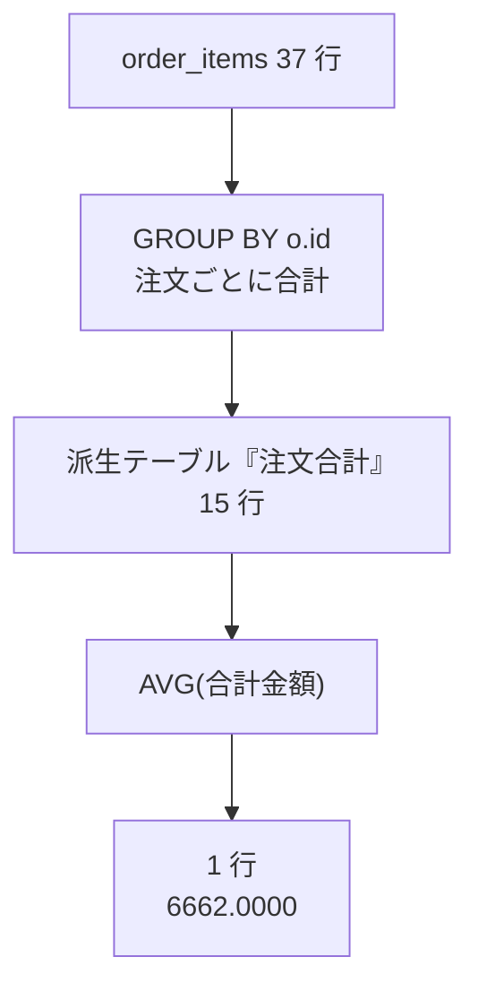

> **よくある間違い**
> **派生テーブルには、必ず別名を付けてください。**
> `AS 注文合計` を書き忘れると、次のエラーになります。
>
> ```text
> ERROR 1248 (42000): Every derived table must have its own alias
> ```
>
> 「すべての派生テーブルには、それ自身の別名が必要です」という意味です。
> 別名は、その表を指すための名前なので、**使わなくても必ず要ります。**

### 6.6.3 相関サブクエリ

3つ目の置き場所は、**`SELECT` 句の中**です。

```sql
SELECT
    c.name AS 顧客名,
    (SELECT COUNT(*) FROM orders AS o WHERE o.customer_id = c.id) AS 注文件数
FROM customers AS c
ORDER BY c.id;
```

実行結果:

```text
+------------------+--------------+
| 顧客名           | 注文件数     |
+------------------+--------------+
| 田中 陽子        |            4 |
| 佐藤 健          |            3 |
| 鈴木 一郎        |            1 |
| 高橋 美咲        |            2 |
| 伊藤 慎二        |            2 |
| 渡辺 さくら      |            0 |
| 山本 大輔        |            2 |
| 中村 結衣        |            1 |
+------------------+--------------+
8 rows in set (0.00 sec)
```

**8人全員が出ていて、渡辺さくらさんは `0`** です。
`LEFT JOIN` + `COUNT(o.id)` と同じ結果です（6.5.3）。

**ここまでのサブクエリとの違い**

6.6.1 と 6.6.2 のサブクエリは、**外側とは無関係に、単独でも実行できました。**
`SELECT AVG(price) FROM products` は、それだけ打っても動きます。

ところが、いまのサブクエリの中には **`c.id`** が入っています。
`c` は**外側**の `FROM customers AS c` で付けた別名です。
つまり、**このサブクエリだけを取り出して実行することはできません。**

このように、**外側の行の値を使うサブクエリ**を**相関サブクエリ**
（そうかんサブクエリ）と呼びます。

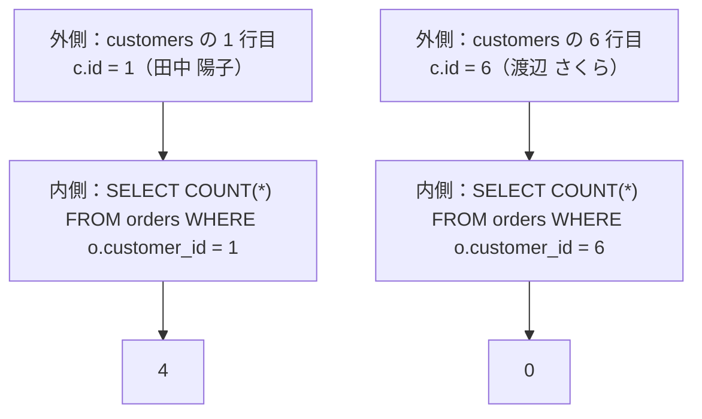

**外側の1行ごとに、内側が1回ずつ動きます。**
顧客が8人なら8回、10,000 人なら 10,000 回です。

> **よくある間違い**
> **相関サブクエリは、行数が増えると遅くなります。**
>
> 読みやすさは相関サブクエリのほうが上です
> （「顧客ごとに、注文を数える」と日本語の語順どおりに書けます）。
> しかし、行数が多いテーブルでは `JOIN` で書いたほうが速いことがほとんどです。
>
> この本の方針は次のとおりです。
>
> - **手元で確認するための使い捨ての問い合わせ** → 読みやすい相関サブクエリでよい
> - **アプリの中で何度も実行される問い合わせ** → `JOIN` に書き換える（6.6.4）
>
> どちらが速いかを実際に測る方法は、第7章 `EXPLAIN` で扱います。

### 6.6.4 `JOIN` で書き換える

サブクエリで書けるものの多くは、`JOIN` でも書けます。
**同じ結果になる2通り**を並べて見ておきます。

**書き換え1：「〜がある」を探す（`IN` → `INNER JOIN`）**

```sql
-- サブクエリ版
SELECT name AS 顧客名
FROM customers
WHERE id IN (SELECT customer_id FROM orders WHERE status = '受付');
```

```sql
-- JOIN 版
SELECT DISTINCT c.name AS 顧客名
FROM customers AS c
INNER JOIN orders AS o ON o.customer_id = c.id
WHERE o.status = '受付';
```

実行結果（`JOIN` 版）:

```text
+---------------+
| 顧客名        |
+---------------+
| 中村 結衣     |
| 山本 大輔     |
| 佐藤 健       |
| 田中 陽子     |
+---------------+
4 rows in set (0.00 sec)
```

**`DISTINCT` が必要なことに注意してください**（3.5.1）。
1人が受付の注文を2件持っていたら、`JOIN` 版では**その人が2行出ます。**
サブクエリ（`IN`）版では、何件あっても1行です。

**「行が増えないか」は、`JOIN` に書き換えるときに必ず確認してください。**

**書き換え2：「〜が無い」を探す（`NOT IN` → `LEFT JOIN` + `IS NULL`）**

```sql
-- サブクエリ版
SELECT name AS 顧客名
FROM customers
WHERE id NOT IN (SELECT customer_id FROM orders);
```

```sql
-- JOIN 版
SELECT c.name AS 顧客名
FROM customers AS c
LEFT JOIN orders AS o ON o.customer_id = c.id
WHERE o.id IS NULL;
```

実行結果（`JOIN` 版）:

```text
+------------------+
| 顧客名           |
+------------------+
| 渡辺 さくら      |
+------------------+
1 row in set (0.00 sec)
```

6.6.1 で見たとおり、**`NOT IN` は `NULL` に弱い**ので、
この形は `LEFT JOIN` 版のほうが安全です。

**書き換え3：「〜ごとの件数」（相関サブクエリ → `LEFT JOIN` + `GROUP BY`）**

```sql
-- 相関サブクエリ版（6.6.3）
SELECT c.name AS 顧客名,
       (SELECT COUNT(*) FROM orders AS o WHERE o.customer_id = c.id) AS 注文件数
FROM customers AS c
ORDER BY c.id;
```

```sql
-- JOIN 版（6.5.3）
SELECT c.name AS 顧客名, COUNT(o.id) AS 注文件数
FROM customers AS c
LEFT JOIN orders AS o ON c.id = o.customer_id
GROUP BY c.id, c.name
ORDER BY c.id;
```

どちらも8行、同じ数字が出ます。

**使い分けの目安**

| やりたいこと | 素直な書き方 |
|------------|------------|
| 相手のテーブルの**列も出したい** | `JOIN`（サブクエリでは出せない） |
| 相手がいるかどうかで**絞るだけ** | `IN` / `NOT IN`（行が増えない） |
| **1つの値**（平均・最大）と比べたい | スカラサブクエリ |
| 集計した表を**さらに集計**したい | `FROM` のサブクエリ（派生テーブル） |

> **補足：どちらが「正しい」というものではありません**
> 同じ結果を出す SQL が複数あるのは、第0章 0.3.3 で触れたとおりです。
> **読む人が意味を取りやすいほうを選んでください。**
> 速さの話は、測れるようになってから（第7章）考えれば間に合います。

---

## 6.7 多対多

### 6.7.1 中間テーブル

第2章 2.5.1 で、`order_items` について「**中間テーブル**」という言葉だけ出して、
説明を第6章に送っていました。ここで回収します。

**多対多**（たたいた）は、**どちらから見ても相手が複数になる関係**でした（5.4.1）。

- 1回の注文には、複数の商品が入る
- 1つの商品は、複数の注文に現れる

**この関係は、2枚の表だけでは持てません。**

`orders` に `product_id` という列を1つ足しても、1注文1商品しか持てません。
`product_id_1` `product_id_2` ... と列を増やす手もありますが、
**上限を決めなければならず、空の列が並び、「3番目の商品」を探すのも面倒**です。
これは第5章 5.5.2 の第1正規形（1マスに1つの値）に反する形でもあります。

そこで、**あいだに1枚の表を挟みます。**

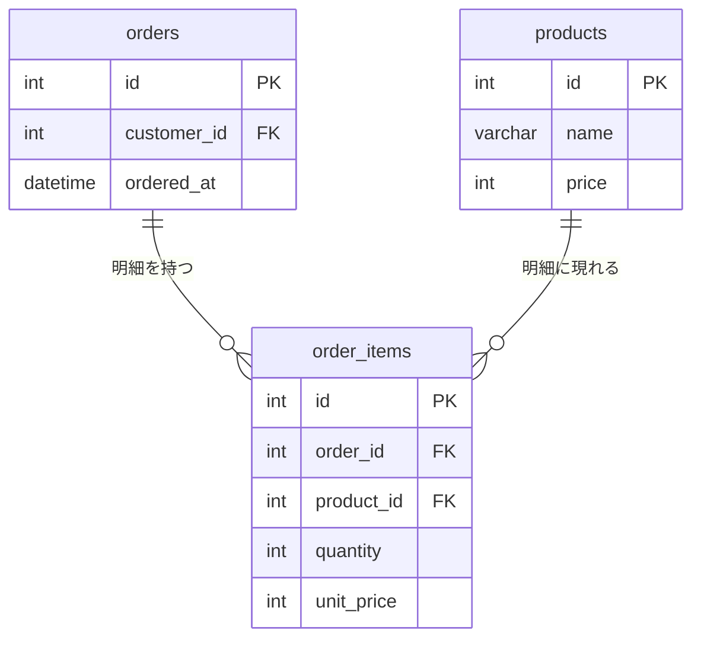

**多対多が、1対多の2本に分解されています。**

- `orders` → `order_items` は1対多（1つの注文に明細が複数）
- `products` → `order_items` は1対多（1つの商品が明細に複数回現れる）

このあいだの表を**中間テーブル**（ちゅうかんテーブル。多対多の関係を表すために、
2つのテーブルのあいだに置くテーブル）と呼びます。

**中間テーブルの見分け方**は単純です。
**外部キーを2本持っていて、その2本が別のテーブルを指している**表が中間テーブルです。

**中間テーブルは、関係そのものに属する値を置く場所でもあります**

`order_items` には `quantity`（個数）と `unit_price`（単価）があります。

この2つは、**注文にも商品にも属しません。**
「個数」は注文だけでは決まらず、商品だけでも決まりません。
**「この注文の、この商品」という組み合わせに対して決まる値**です。
だから、組み合わせを表す中間テーブルが置き場所になります。

`unit_price` を `products.price` と二重に持っている理由は 2.5.1 と 5.5.3 のとおりで、
**あとから変わってほしくない「その時点の記録」**だからです。

### 6.7.2 設計と結合の書き方

もう1つ、**自分で中間テーブルを作って繋ぐ**練習をします。
商品に**タグ**を付けられるようにします。

- 1つの商品には、複数のタグが付く（マグカップに「ギフト」と「新生活」）
- 1つのタグは、複数の商品に付く（「ギフト」がマグカップにもバスケットにも）

**多対多**です。表を2枚追加します。

`mysql-lesson/sql` に置かず、そのまま打って構いません。**`shop` に接続した状態**で実行してください。

```sql
DROP TABLE IF EXISTS product_tags;
DROP TABLE IF EXISTS tags;

CREATE TABLE tags (
    id   INT AUTO_INCREMENT PRIMARY KEY,
    name VARCHAR(20) NOT NULL UNIQUE
);

CREATE TABLE product_tags (
    product_id INT NOT NULL,
    tag_id     INT NOT NULL,
    PRIMARY KEY (product_id, tag_id),
    CONSTRAINT fk_product_tags_product FOREIGN KEY (product_id) REFERENCES products (id),
    CONSTRAINT fk_product_tags_tag     FOREIGN KEY (tag_id)     REFERENCES tags (id)
);
```

実行結果:

```text
Query OK, 0 rows affected, 1 warning (0.00 sec)

Query OK, 0 rows affected, 1 warning (0.00 sec)

Query OK, 0 rows affected (0.01 sec)

Query OK, 0 rows affected (0.01 sec)
```

**先頭の `DROP TABLE IF EXISTS` は、何度打ってもやり直せるようにするため**です（2.5.2）。
初回は「消そうとしたテーブルが無かった」という `1 warning` が出ますが、問題ありません。

**`product_tags` に `id` 列がないことに注目してください。**

かわりに `PRIMARY KEY (product_id, tag_id)` と書いています。
これは**複合主キー**（複数の列を組み合わせて1つの主キーとしたもの。5.3.1）です。

| 中間テーブル | 主キー | そう決めた理由 |
|------------|-------|-------------|
| `order_items` | `id`（代理キー） | **同じ注文に同じ商品が2行あってよい**（後から1行追加された明細など）。`quantity` などの属性も持つ |
| `product_tags` | `(product_id, tag_id)` | **同じ商品に同じタグを2回付ける意味が無い**。属性も持たない |

複合主キーにすると、**同じ組み合わせを2回入れられなくなります。**
「重複を許さない」という決まりを、主キーがそのまま引き受けてくれます（5.3.1）。

> **補足：中間テーブルに `id` を立てるかは設計判断です**
> 第5章 演習 5.5 の別解では、「中間に立つテーブルにも `id` を1本立てる」方針を紹介しました。
> どちらが正しいというものではなく、**次の2点で決めます。**
>
> - その組み合わせが**2回現れうる**か → 現れうるなら `id` + 属性
> - 関係そのものに属する**値を持つ**か → 持つなら `id` を立てたほうが扱いやすい
>
> `product_tags` は両方とも「いいえ」なので、複合主キーにしました。

**データを入れる**

```sql
INSERT INTO tags (id, name) VALUES
    (1, 'ギフト'),
    (2, '木製'),
    (3, '新生活'),
    (4, '在庫わずか');

INSERT INTO product_tags (product_id, tag_id) VALUES
    (1, 1), (1, 3),
    (3, 1), (3, 2),
    (7, 2), (7, 4),
    (11, 3),
    (13, 1), (13, 4),
    (18, 2), (18, 3),
    (20, 1), (20, 3), (20, 4);
```

実行結果:

```text
Query OK, 4 rows affected (0.00 sec)
Records: 4  Duplicates: 0  Warnings: 0

Query OK, 14 rows affected (0.00 sec)
Records: 14  Duplicates: 0  Warnings: 0
```

**中間テーブルは `JOIN` を2本使って繋ぎます**

商品名とタグ名を並べます。`products` → `product_tags` → `tags` と、**2回繋ぎます。**

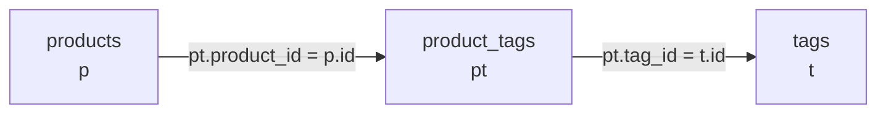

```sql
SELECT
    p.name AS 商品名,
    t.name AS タグ
FROM products AS p
INNER JOIN product_tags AS pt ON pt.product_id = p.id
INNER JOIN tags         AS t  ON pt.tag_id = t.id
ORDER BY p.id, t.id;
```

実行結果:

```text
+-----------------------------------+-----------------+
| 商品名                            | タグ            |
+-----------------------------------+-----------------+
| こまり顔のマグカップ              | ギフト          |
| こまり顔のマグカップ              | 新生活          |
| 木のスープボウル                  | ギフト          |
| 木のスープボウル                  | 木製            |
| ひのきのまな板                    | 木製            |
| ひのきのまな板                    | 在庫わずか      |
| 布のランチトート                  | 新生活          |
| 麻のかごバスケット                | ギフト          |
| 麻のかごバスケット                | 在庫わずか      |
| 木軸のシャープペンシル            | 木製            |
| 木軸のシャープペンシル            | 新生活          |
| 革のペンケース                    | ギフト          |
| 革のペンケース                    | 新生活          |
| 革のペンケース                    | 在庫わずか      |
+-----------------------------------+-----------------+
14 rows in set (0.00 sec)
```

**14 行**。`product_tags` の行数と同じです。
**中間テーブルの行数が、結合結果の行数になります**（6.4.1 の「多の側を繋ぐと増える」と同じ話です）。

**逆向きにも繋げます**

「タグごとに、何個の商品に付いているか」を出します。
6.5 の `GROUP BY` と組み合わせます。

```sql
SELECT
    t.name   AS タグ,
    COUNT(*) AS 商品数
FROM tags AS t
INNER JOIN product_tags AS pt ON pt.tag_id = t.id
GROUP BY t.id, t.name
ORDER BY 商品数 DESC, t.id;
```

実行結果:

```text
+-----------------+-----------+
| タグ            | 商品数    |
+-----------------+-----------+
| ギフト          |         4 |
| 新生活          |         4 |
| 木製            |         3 |
| 在庫わずか      |         3 |
+-----------------+-----------+
4 rows in set (0.00 sec)
```

**中間テーブルは、どちらの側からも出発できます。**
`products` から始めれば「商品ごとのタグ」、`tags` から始めれば「タグごとの商品」です。

**外部キーが効いていることも確かめます**

存在しない商品にタグを付けようとしてみます（5.4.3）。

```sql
INSERT INTO product_tags (product_id, tag_id) VALUES (99, 1);
```

実行結果:

```text
ERROR 1452 (23000): Cannot add or update a child row: a foreign key constraint
fails (`shop`.`product_tags`, CONSTRAINT `fk_product_tags_product` FOREIGN KEY
(`product_id`) REFERENCES `products` (`id`))
```

同じ組み合わせを2回入れようとすると、複合主キーが止めます。

```sql
INSERT INTO product_tags (product_id, tag_id) VALUES (1, 1);
```

実行結果:

```text
ERROR 1062 (23000): Duplicate entry '1-1' for key 'product_tags.PRIMARY'
```

**`1-1` という表示**は、`product_id` = 1 と `tag_id` = 1 の組み合わせを指しています。
複合主キーのエラーは、このようにハイフンで繋いだ形で出ます。

> **注意：この2つのテーブルは `shop.sql` では消えません**
> `SOURCE /sql/shop.sql;` が消すのは、2.5.2 で作った5つのテーブルだけです（`DROP TABLE IF EXISTS`）。
> `tags` と `product_tags` は残ります。
>
> 第7章以降では使わないので、**残しておいても問題ありません。**
> 消したいときは、次の2行を**この順番で**打ってください。
>
> ```sql
> DROP TABLE product_tags;
> DROP TABLE tags;
> ```
>
> **順番が逆だと、次のエラーで止まります。**
>
> ```text
> ERROR 3730 (HY000): Cannot drop table 'tags' referenced by a foreign key
> constraint 'fk_product_tags_tag' on table 'product_tags'.
> ```
>
> `product_tags` が `tags` を指しているからです。
> 行を消すときの `ERROR 1451`（5.4.3）と同じ考え方で、**消すのは子 → 親**です。

**第0章の 15 行を読む**

ここまでで、この章の道具がすべてそろいました。
第0章 0.1.2 で「1行も読めなくて構いません」と見せた SQL を、もう一度出します。

> 「先月、売上金額の合計が多かった商品を上位3件、
> 商品名・売れた個数・売上金額の3列で出してほしい。
> 1件も売れていない商品は出さなくていい」

```sql
SELECT
    products.name AS 商品名,
    SUM(order_items.quantity) AS 個数,
    SUM(order_items.quantity * order_items.unit_price) AS 売上金額
FROM order_items
INNER JOIN products ON order_items.product_id = products.id
INNER JOIN orders ON order_items.order_id = orders.id
WHERE orders.ordered_at >= '2026-08-01'
  AND orders.ordered_at < '2026-09-01'
GROUP BY products.id, products.name
ORDER BY 売上金額 DESC
LIMIT 3;
```

実行結果:

```text
+--------------------------+--------+--------------+
| 商品名                   | 個数   | 売上金額     |
+--------------------------+--------+--------------+
| 方眼のノート A5          |     10 |         5200 |
| 布のランチトート         |      2 |         4400 |
| 革のペンケース           |      1 |         4200 |
+--------------------------+--------+--------------+
3 rows in set (0.00 sec)
```

1行ずつ、どこで習ったかを確かめてください。

| 行 | 何をしているか | 項 |
|----|--------------|-----|
| `SELECT products.name AS 商品名` | 列を選んで、日本語の見出しを付ける | 3.1.4 |
| `SUM(order_items.quantity * ...)` | 式を含む合計 | 6.4.1 / 6.5.1 |
| `FROM order_items` | 出発点は明細（いちばん細かい表） | 6.2.1 |
| `INNER JOIN products ON ...` | 商品名を持ってくる | 6.2.1 |
| `INNER JOIN orders ON ...` | 注文日時を持ってくる | 6.4.1 |
| `WHERE orders.ordered_at >= ... AND < ...` | まとめる前に期間で絞る | 3.3.3 / 6.5.4 |
| `GROUP BY products.id, products.name` | 商品ごとにまとめる | 6.5.2 |
| `ORDER BY 売上金額 DESC` | 別名で並べ替える | 3.4.2 / 6.5.2 |
| `LIMIT 3` | 上位3件だけ | 3.4.4 |

**「1件も売れていない商品は出さなくていい」**という条件は、
`INNER JOIN` を使うことで自動的に満たされています（6.2.1）。
もし「0円と表示してでも全商品を出す」なら、`LEFT JOIN` に変えることになります（6.3.2）。

**この 15 行が読めれば、この章の目的は達成です。**

---

## まとめ

- **結合**（`JOIN`）は、分けて保存したテーブルを、**読むときだけ1枚に見せる**仕組み。
  元のテーブルは変わらない
- **`INNER JOIN ... ON 条件`** が基本形。`ON` には
  「片方の外部キー = もう片方の主キー」を書く
- **`ON` を書かないと直積**になり、行数が掛け算で増える。
  結合したら**まず `COUNT(*)` で件数を確かめる**
- 両方のテーブルにある列名は、**`テーブル名.列名` で書く**。書かないと `ERROR 1052`
- `FROM products AS p` のように**テーブルにも別名**を付ける。
  付けたら元のテーブル名はもう使えない（`ERROR 1054`）
- **`LEFT JOIN`** は、相手がいない左の行も**右側を `NULL` にして残す**。
  「全部残したいほうを `FROM` に書く」
- **`LEFT JOIN` の相手側の列を `WHERE` に書くと、`INNER JOIN` と同じ結果になる。**
  絞り込みたいときは条件を **`ON` のほうに移す**（例外は `IS NULL`）
- **「`LEFT JOIN` して `IS NULL`」＝相手がいないものを探す**。判定には相手側の**主キー**を使う
- 結合で**行が増えるのは、1対多の「多」の側を繋いだとき**だけ
- 結合は**句ごとに改行・1テーブル1行・すべてに別名**の5ルールで書く。
  **結合条件は `ON`、絞り込みは `WHERE`** に分ける
- **集計関数**は複数の行を1つの値にする。`COUNT` / `SUM` / `AVG` / `MAX` / `MIN`。
  集計関数と普通の列を混ぜると `ERROR 1140`
- **`GROUP BY`** は行を仲間ごとにまとめる。書いていない列は `SELECT` に出せない（`ERROR 1055`）。
  **まとめる単位は主キー、表示する列も並べて書く**
- **`COUNT(*)` は行数、`COUNT(列)` は `NULL` でない数、`COUNT(DISTINCT 列)` は種類の数。**
  `LEFT JOIN` したら `COUNT(*)` を使わない
- **`SUM` は足す値が無いと `NULL`** になる。金額として出すなら `COALESCE(..., 0)` で包む
- SQL の実行順は
  **`FROM` → `WHERE` → `GROUP BY` → 集計 → `HAVING` → `SELECT` → `ORDER BY` → `LIMIT`**。
  だから `WHERE` に集計関数も別名も書けない
- **集計結果を条件にするのが `HAVING`、それ以外は `WHERE`**
- **サブクエリ**の置き場所は3つ。`WHERE`（値・候補）/ `FROM`（派生テーブル）/ `SELECT` 句（相関）
- **`NOT IN` は `NULL` に弱い。** 相手の列が `NULL` を許すなら
  「`LEFT JOIN` して `IS NULL`」を使う
- **`IN` を `JOIN` に書き換えると行が増えることがある。** `DISTINCT` が要るかを必ず確認する
- **多対多は中間テーブルで表す。** 外部キーを2本持ち、`JOIN` を2本使って繋ぐ。
  組み合わせに属する値（個数・単価）は中間テーブルに置く

---

## 理解度チェック

**問 6.1**（穴埋め）

両方のテーブルに相手がいる行だけを残す結合を（　①　）、
左側のテーブルの行を、相手がいなくても残す結合を（　②　）と呼ぶ。
②で相手が見つからなかったとき、右側の列には（　③　）が入る。

**問 6.2**（選択）

次の SQL が **80 行**を返しました。`products` は 20 行、`categories` は 4 行です。

```sql
SELECT * FROM products, categories;
```

**この結果の説明として正しいものを1つ選んでください。**

1. `products` の 20 行と `categories` の 4 行を、それぞれ4回ずつ複製した
2. 結合条件が無いため、すべての組み合わせ（20 × 4）が作られた
3. `categories` に重複した行が入っている
4. `LIMIT` を書いていないため、上限の 80 行まで返された

**問 6.3**（選択）

次の SQL は、**「顧客8人を全員出し、受付状態の注文があればその番号も出す」**つもりで
書かれましたが、**4行しか返りませんでした。**

```sql
SELECT c.name, o.id
FROM customers AS c
LEFT JOIN orders AS o ON c.id = o.customer_id
WHERE o.status = '受付';
```

**この SQL の問題として正しいものを1つ選んでください。**

1. `LEFT JOIN` ではなく `INNER JOIN` を使うべきである
2. 相手側の列の条件を `WHERE` に書いたため、相手がいない行が捨てられている
3. `ON` の左右が逆になっている
4. `GROUP BY` を書いていない

**問 6.4**（選択）

`customers`（8 行）を `LEFT JOIN orders` で繋いで `GROUP BY` したとき、
**注文が0件の顧客に対して `COUNT(*)` が返す値**を1つ選んでください。

1. `0`
2. `1`
3. `NULL`
4. エラーになる

**問 6.5**（記述）

`WHERE` には集計関数（`COUNT` など）を書けませんが、`HAVING` には書けます。
**その理由**を、SQL が実行される順番に触れながら1行で書いてください。

**問 6.6**（記述）

`SUM(...)` の結果が `NULL` になるのは、どういうときですか。
**`0` と `NULL` の違いに触れて**1行で書いてください。

**問 6.7**（記述）

`order_items` は中間テーブルです。
**`quantity`（個数）を `orders` にも `products` にも置けない理由**を、1行で書いてください。

---

## 演習問題

この章の演習は、**すべて `shop` データベースの中**で行います。
いまどこにいるか分からなくなったら、次の1行で確認してください（2.4.2）。

```sql
SELECT DATABASE();
```

`shop` でなければ `USE shop;` と打ってください。

**答え合わせは件数から**。期待する行数を先に読んでから書くと、
結合を間違えたときにすぐ気づけます（6.2.2）。

### 演習 6.1 ★☆☆ 発送済みの注文の一覧を作る

**課題**

**発送済み**の注文だけを、**注文日時の新しい順**に並べた一覧を作ってください。
出す列は次の4つで、見出しは日本語にします。

| 見出し | 中身 |
|-------|------|
| `注文番号` | 注文の `id` |
| `顧客名` | 注文した人の名前 |
| `都道府県` | その人の `prefecture` |
| `注文日時` | `ordered_at` |

**完成条件**

- 結果が **10 行**である
- 1行目が **注文番号 12・伊藤 慎二・福岡県・2026-09-01 18:22:00** である
- 最終行が **注文番号 1・田中 陽子・東京都・2026-06-03 10:24:00** である
- 見出しが4つとも日本語で表示されている
- `customers` と `orders` を1回ずつ書いており、**テーブルに別名を付けている**
- すべての列に、テーブルの別名が付いている（`name` ではなく `c.name` の形）

**ヒント**

繋ぐ手がかりは `orders.customer_id` と `customers.id` です（6.2.2 の表）。
「発送済み」という絞り込みは、結合条件ではなく**取り出す行の条件**です（6.4.2）。

---

### 演習 6.2 ★☆☆ 分類ごとに数える

**課題**

**分類ごと**に、次の3つを集計した表を作ってください。
**在庫合計の多い順**に並べます。

| 見出し | 中身 |
|-------|------|
| `分類` | 分類の名前 |
| `商品数` | その分類の商品が何件あるか |
| `在庫合計` | その分類の `stock` の合計 |
| `最高価格` | その分類でいちばん高い `price` |

**完成条件**

- 結果が **4 行**である
- 1行目が **文房具・5・322・4200** である
- 最終行が **食器・5・94・3200** である
- `GROUP BY` に、**分類の主キーと表示する列の2つ**が書かれている
- `categories` と `products` を結合しており、**`category_id` という数字が結果に出ていない**

**ヒント**

「〜ごと」と言われたら `GROUP BY` です（6.5.2）。
合計は `SUM`、いちばん高い値は `MAX` です（6.5.1）。
並べ替えには、`SELECT` 句で付けた別名が使えます（6.5.2 の最後）。

---

### 演習 6.3 ★★☆ 一度も注文していない顧客を、2通りで出す

**課題**

**一度も注文していない顧客**の名前を出す SQL を、**2通り**書いてください。

1. `LEFT JOIN` を使う書き方
2. サブクエリを使う書き方

そのうえで、**2つ目の書き方が危険になる条件**を1行で書いてください。

**完成条件**

- 2つの SQL が、どちらも **1 行**（`渡辺 さくら`）を返す
- 1つ目は `LEFT JOIN` と `IS NULL` を使っており、
  **`IS NULL` に指定した列が `orders` の主キー**である
- 2つ目は `NOT IN` を使っており、かっこの中が `SELECT` で書かれている
- **「2つ目が危険になるのは、〜のとき」**という文が1行書けている
  （`orders.customer_id` の定義を確認したうえで書くこと。確認は `DESCRIBE orders;`）

**ヒント**

1つ目は「相手がいないものを探す」定型です（6.3.3）。
なぜ相手側の主キーを選ぶのかも、同じ項に書いてあります。
2つ目の危険は 6.6.1 の「よくある間違い」にあります。**`0` 件になる**のがその症状です。

---

### 演習 6.4 ★★☆ 顧客ごとの購入金額ランキングを作る

**課題**

**キャンセルされた注文を除いて**、顧客ごとの**購入金額の合計**を求めてください。
合計が **10,000 円以上**の顧客だけを、**金額の多い順**に並べます。

| 見出し | 中身 |
|-------|------|
| `顧客名` | 顧客の名前 |
| `購入金額` | その顧客の、キャンセル以外の注文の合計金額 |

購入金額は、**明細の「個数 × 単価」を全部足した値**です。

**完成条件**

- 結果が **5 行**である
- 1行目が **佐藤 健・28060** である
- 最終行が **伊藤 慎二・10920** である
- 3つのテーブル（`customers` / `orders` / `order_items`）を結合している
- **「キャンセルを除く」条件と「10,000 円以上」条件が、別々の句に書かれている**
- どちらの条件をどちらの句に書いたか、**理由を1行**で書いた

**ヒント**

金額の計算は 6.4.1 の `oi.quantity * oi.unit_price` を `SUM` に入れます（6.5.1）。
2つの条件は、**片方は1行ずつの判断、もう片方は合計してからの判断**です。
実行される順番の図（6.5.4）を見れば、どちらをどこに書くか決まります。

---

### 演習 6.5 ★★☆ タグを1つ足して、付いていない商品を数える

**課題**

6.7.2 で作った `tags` / `product_tags` を使います。

1. **`キッチン用品`** というタグを追加し、`products` の `id` が **6・8・9** の商品に付けてください
2. **タグが1つも付いていない商品が何件あるか**を数えてください
3. **商品ごとのタグの数**を、多い順に上位5件出してください
   （見出しは `商品名` と `タグ数`）

**完成条件**

- `SELECT COUNT(*) FROM tags;` が **5** を返す
- `SELECT COUNT(*) FROM product_tags;` が **17** を返す
- 2 の答えが **10** である
- 3 の1行目が **革のペンケース・3** である
- 3 の SQL が、**タグが0個の商品でも数えられる形**になっている
  （タグを1つも持たない商品を `products` から1件選び、その商品を `WHERE` で絞ったときに
  `タグ数` が `0` と表示されること）
- 2 と 3 で、**なぜ `INNER JOIN` ではなく `LEFT JOIN` を使うのか**を1行で書いた

**ヒント**

2 は「相手がいないものを探す」定型そのものです（6.3.3）。
3 は `LEFT JOIN` と `GROUP BY` の組み合わせで、
**数える列の選び方**が結果を分けます（6.5.3）。
`tags` に行を足すときは、`id` を書かずに `name` だけ入れれば `AUTO_INCREMENT` が番号を振ります（5.3.2）。

---

解答は [解答編 その2](./91-answers-part2.md#第6章) にあります。
**必ず自分で手を動かしてから**見てください。

---

## 次の章へ

この章で、**分けたテーブルを1つの結果に戻す**道具がそろいました。

| できるようになったこと | 使う道具 |
|--------------------|---------|
| 番号を名前に置き換えて読む | `INNER JOIN`（6.2） |
| 相手がいない行も一覧に残す | `LEFT JOIN`（6.3） |
| 〜ごとの件数・合計・平均を出す | `GROUP BY` + 集計関数（6.5） |
| 集計した結果でさらに絞る | `HAVING`（6.5.4） |
| 調べた結果を、次の問い合わせの材料にする | サブクエリ（6.6） |
| 多対多を表して取り出す | 中間テーブル（6.7） |

第0章で「読めなくて構いません」と言った 15 行も、もう読めます。

ただし、いま書いている SQL には**まだ見ていない面**があります。**速さ**です。

この本の練習用データは、いちばん多い `order_items` でも 37 行です。
どんな書き方をしても一瞬で返ってきます。
6.6.3 で「相関サブクエリは行数が増えると遅くなる」と書きましたが、
**いまの手元では、その差を体感できません。**

本物のデータでは、10 万行・100 万行が当たり前です。
そこでは、同じ結果を返す SQL のあいだに**何十倍もの差**が付きます。
「昨日まで1秒で返っていた画面が、今日は30秒かかる」ということが実際に起こります。

次の章では、**データを増やして、遅くなるところを実際に見ます。**
そのうえで、データベースが**どういう手順で探しているか**を表示させる方法（`EXPLAIN`）と、
探し方を速くする仕組み（**インデックス**）を学びます。

→ [第7章 インデックスと実行計画](./07-index-and-explain.md) に進む
