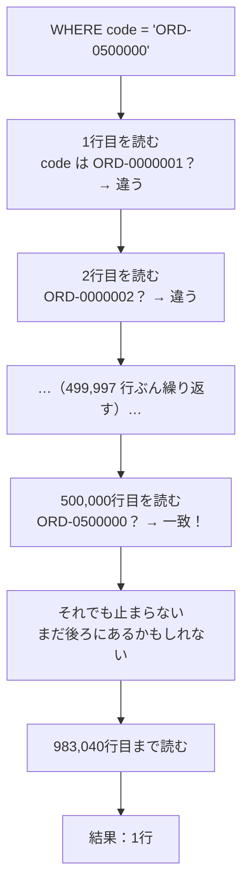
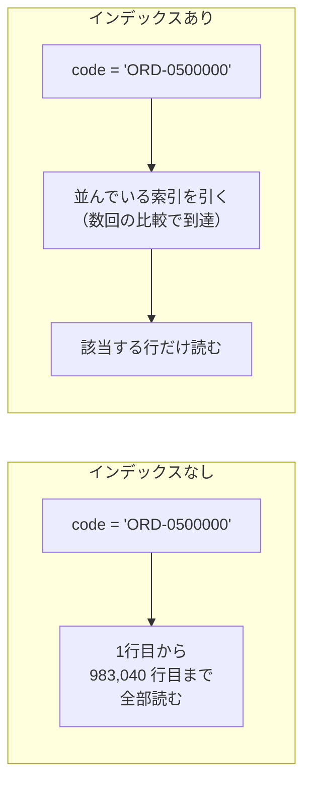
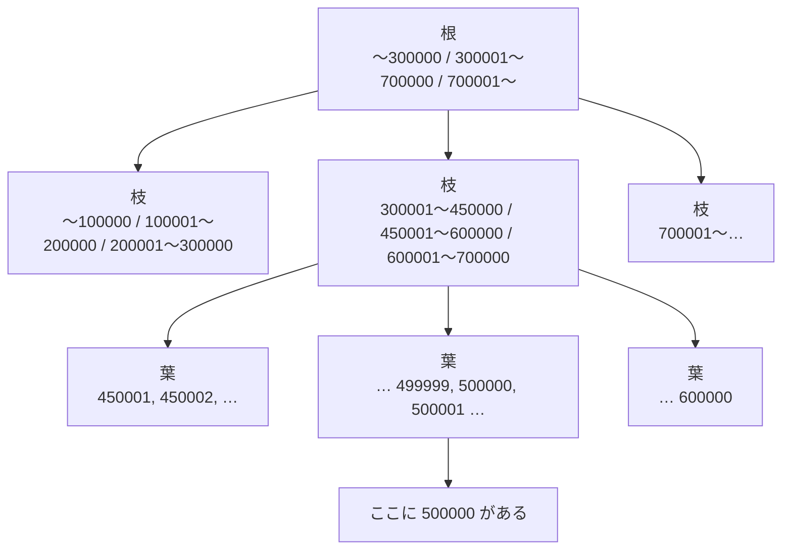
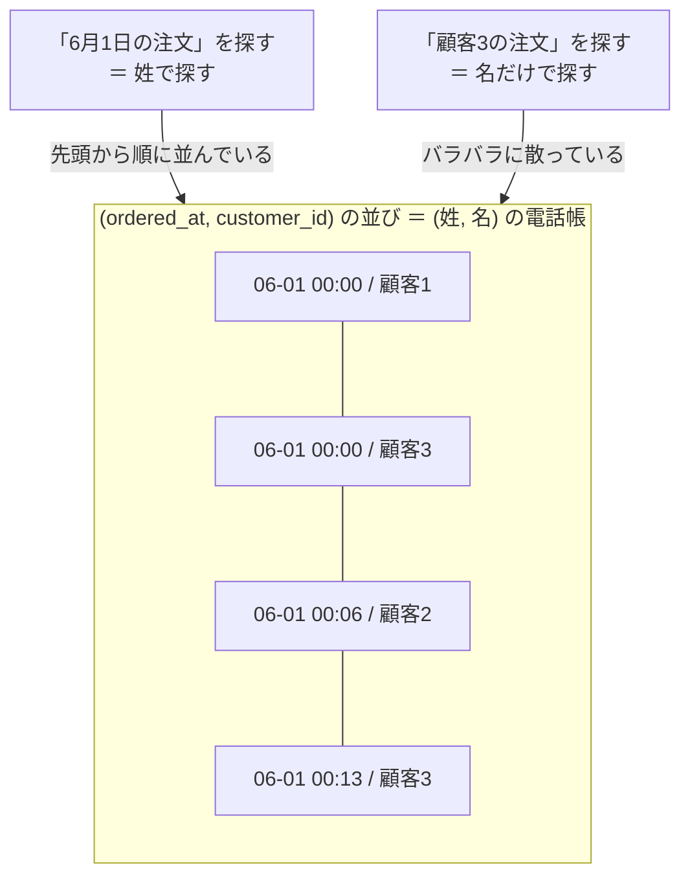
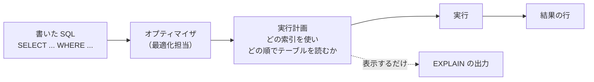
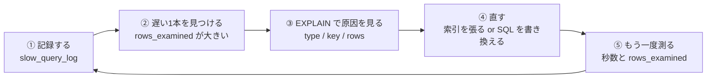
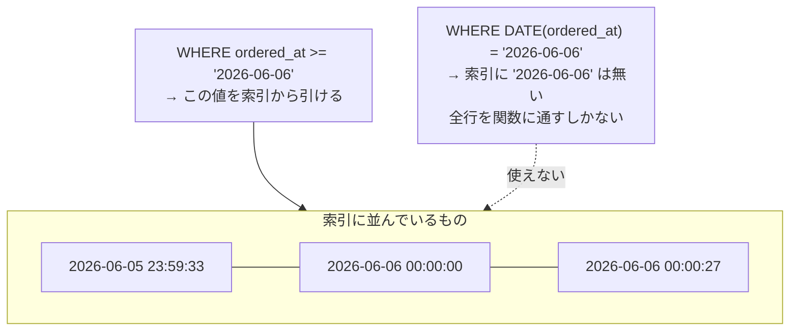
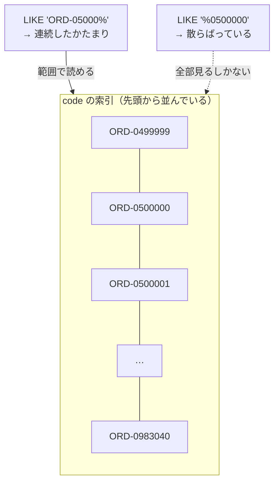
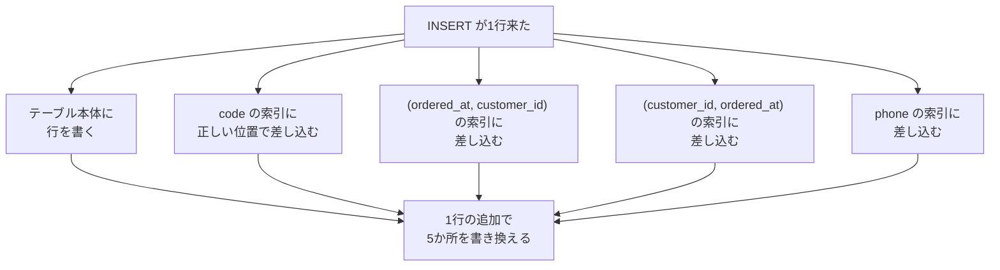
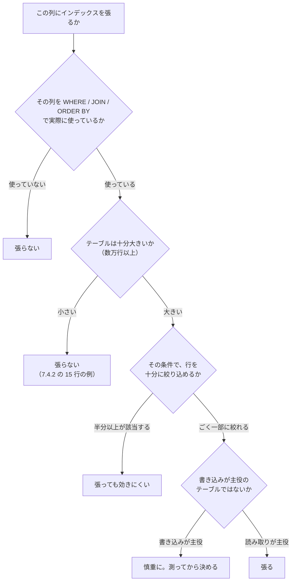

# 第7章 インデックスと実行計画

第6章までで、**欲しい結果を取り出す**道具はひととおりそろいました。
絞り込み、並べ替え、結合、集計、サブクエリ。書き方の知識としては、
実務で使う SQL の大半がこれで書けます。

ただし、ここまでの練習では**一度も「遅い」という経験をしていません。**

理由ははっきりしています。練習用データがいちばん多い `order_items` でも **37 行**だからです。
37 行なら、どんな探し方をしても一瞬で終わります。
先頭から1行ずつ全部見たとしても 37 回です。

本物のデータは、そうはいきません。
注文テーブルが 100 万行あるサービスは珍しくありません。
そこでは、**同じ結果を返す SQL のあいだに何十倍もの差**が付きます。
「昨日まで一瞬で出ていた一覧が、今日は30秒待たされる」ということが実際に起こります。

この章では、まず**自分の手元で遅い状態を作ります。**
そのうえで、

| 覚えること | 何のためか |
|-----------|----------|
| **全件走査** | なぜ遅いのかを、データベースの動きとして理解する |
| **インデックス** | 探し方そのものを速くする |
| **`EXPLAIN`** | 速いか遅いかを、勘ではなく**表示させて**確かめる |
| **効かないパターン** | 索引を作ったのに速くならない、を自分で見抜く |

の4つを扱います。

第1章 1.1.1 で「ファイルに保存すると検索が遅い」と書き、
その担当をこの章に送っていました。ここで回収します。

## この章で学ぶこと

- 約 100 万行のテーブルを自分で作り、**全件走査が遅いこと**を秒数で体感できるようになる
- **インデックス**が何をしている仕組みなのかを、本の索引と B-Tree の形で説明できるようになる
- **`CREATE INDEX`** で単一列・複数列のインデックスを張れるようになり、
  **複合インデックスは列の順番で効き方が変わる**ことを確かめられるようになる
- **`EXPLAIN`** の結果から `type` / `key` / `rows` を読み、その SQL が速いか遅いかを判断できるようになる
- **インデックスが効かない3つのパターン**（列に関数・前方一致以外の `LIKE`・型違いの比較）を
  見つけて、書き換えられるようになる
- インデックスを**張りすぎたときの代償**（書き込みの遅さ・容量）を測ったうえで、
  張るか張らないかを自分で決められるようになる

## この章の前提

- [第6章 結合と集計](./06-join-and-aggregate.md) を終えていること
- MySQL が起動していて、`shop` に接続できること（2.1.2 / 2.2.1）
- `SELECT` / `WHERE` / `ORDER BY` / 関数（第3章）と、`JOIN` / `GROUP BY` / `COUNT`（第6章）が書けること

**この章の SQL も、すべて `shop` データベースの中で打ちます。**
接続していない場合は、次のコマンドで入ってください。

**Windows（PowerShell）**

```powershell
cd ~\Documents\mysql-lesson
docker compose up -d
docker compose exec db mysql -u root -p --default-character-set=utf8mb4 shop
```

**macOS / Linux**

```bash
cd ~/Documents/mysql-lesson
docker compose up -d
docker compose exec db mysql -u root -p --default-character-set=utf8mb4 shop
```

いまどこにいるかを確認します（2.4.2）。

```sql
SELECT DATABASE();
```

実行結果:

```text
+------------+
| DATABASE() |
+------------+
| shop       |
+------------+
1 row in set (0.00 sec)
```

> **空き容量を 1 GB 以上あけておいてください**
> この章では、約 100 万行のテーブルを1つ作ります。
> インデックスを張った状態で **200 MB 弱**を使います（7.6.2 で実際に測ります）。
> 作り直しや演習の分を含めて、**1 GB** ほど余裕を見ておくと安心です。
> 章の最後に、消し方（`DROP TABLE big_orders;`）も書いてあります。

> **つまずいたら**
> この章で戸惑いやすいのは、**エラーが出ないのに結果が違う**ところではなく、
> **同じ SQL の秒数が、人によって違う**ところです。
>
> この章に載っている秒数は、**執筆時の1台で測った値**です。
> あなたの手元では 2 倍かかることも、半分で終わることもあります。
> 大事なのは絶対値ではなく、**同じ機械で、直す前と後を比べたときの比**です。
> 「0.30 秒 → 0.00 秒」のように、**必ず自分の環境で両方測って**ください。
>
> 秒数が本文とまったく違っても、故障ではありません。
> AI に相談するときは、**打った SQL・`EXPLAIN` の結果・直す前と後の秒数**の3つを出してください（レベル B）。
>
> ```text
> mysql-text の 7.3.3 を読んでいます。
> 複合インデックスを張ったのに、EXPLAIN の rows が減りません。
> 打った SQL / EXPLAIN の結果 / 直す前後の秒数は次のとおりです。
> （3つを貼り付ける）
> 何を見直せばよいか、手順だけ教えてください。答えの SQL は書かないでください。
> ```

---

## 7.1 なぜ検索が遅くなるのか

### 7.1.1 データ量を増やして体感する

速さの話は、**遅いものを手元に持っていないと始まりません。**
まず、約 100 万行のテーブルを作ります。

2.1.1 で作った `sql` ディレクトリの中に、`big_orders.sql` という名前でファイルを作ってください。
`shop.sql` と同じ場所です。

`mysql-lesson/sql/big_orders.sql`

```sql
-- 練習用の大きいテーブル（mysql-text 第7章 7.1.1）
-- 何度実行しても同じ状態になります。

DROP TABLE IF EXISTS big_orders;
DROP TABLE IF EXISTS seed;

-- ① 行を増やすための下ごしらえ用の箱
CREATE TABLE seed (
    customer_id INT         NOT NULL,
    status      VARCHAR(10) NOT NULL
);

-- ② まず orders の 15 行を写す
INSERT INTO seed (customer_id, status)
SELECT customer_id, status FROM orders;

-- ③ 「いまある行をもう一度足す」を 16 回。1回ごとに行数が2倍になる
INSERT INTO seed (customer_id, status) SELECT customer_id, status FROM seed;
INSERT INTO seed (customer_id, status) SELECT customer_id, status FROM seed;
INSERT INTO seed (customer_id, status) SELECT customer_id, status FROM seed;
INSERT INTO seed (customer_id, status) SELECT customer_id, status FROM seed;
INSERT INTO seed (customer_id, status) SELECT customer_id, status FROM seed;
INSERT INTO seed (customer_id, status) SELECT customer_id, status FROM seed;
INSERT INTO seed (customer_id, status) SELECT customer_id, status FROM seed;
INSERT INTO seed (customer_id, status) SELECT customer_id, status FROM seed;
INSERT INTO seed (customer_id, status) SELECT customer_id, status FROM seed;
INSERT INTO seed (customer_id, status) SELECT customer_id, status FROM seed;
INSERT INTO seed (customer_id, status) SELECT customer_id, status FROM seed;
INSERT INTO seed (customer_id, status) SELECT customer_id, status FROM seed;
INSERT INTO seed (customer_id, status) SELECT customer_id, status FROM seed;
INSERT INTO seed (customer_id, status) SELECT customer_id, status FROM seed;
INSERT INTO seed (customer_id, status) SELECT customer_id, status FROM seed;
INSERT INTO seed (customer_id, status) SELECT customer_id, status FROM seed;

-- ④ 本番の箱。インデックスは主キーだけ（これが出発点）
CREATE TABLE big_orders (
    id          INT AUTO_INCREMENT PRIMARY KEY,
    customer_id INT         NOT NULL,
    ordered_at  DATETIME    NOT NULL,
    status      VARCHAR(10) NOT NULL,
    code        VARCHAR(20) NOT NULL,
    phone       VARCHAR(11) NOT NULL
);

-- ⑤ 下ごしらえの行を1回でまとめて写す（id が 1 から順に振られる）
INSERT INTO big_orders (customer_id, ordered_at, status, code, phone)
SELECT customer_id, '2026-01-01 00:00:00', status, '', '' FROM seed;

DROP TABLE seed;

-- ⑥ id を使って、行ごとに違う日時・注文コード・電話番号を作る
UPDATE big_orders
SET ordered_at = '2026-01-01 00:00:00' + INTERVAL id * 27 SECOND,
    code       = CONCAT('ORD-', LPAD(id, 7, '0')),
    phone      = CONCAT('090', LPAD(id, 8, '0'));
```

長く見えますが、やっていることは6つだけです。

| 番号 | やっていること | 使っている知識 |
|------|--------------|--------------|
| ① | 作業用のテーブルを作る | 2.4.3 `CREATE TABLE` |
| ② | `orders` の 15 行を写す | 4.1 `INSERT` と第3章 `SELECT` |
| ③ | **いまある行を丸ごと追加する、を 16 回** | 同上 |
| ④ | 本番のテーブルを作る | 5.1 データ型 / 5.3 主キー |
| ⑤ | 下ごしらえの行を1回でまとめて写す | 同上 |
| ⑥ | `id` から、行ごとに違う値を作る | 4.2 `UPDATE` と 3.6 の関数 |

③の1行は、**「いま `seed` にある行を、もう一度 `seed` に足す」**という意味です。
15 行あるときに実行すると 30 行になり、もう一度実行すると 60 行になります。
これを 16 回繰り返すので、15 × 2 × 2 × …（16 回）＝ **983,040 行**になります。

⑥の `LPAD(id, 7, '0')` は、`id` を左から `0` で埋めて7文字にする関数です
（`500000` → `0500000`）。`CONCAT` は文字列をつなぐ関数でした（3.6.1）。
これで `code` が `ORD-0500000` のような、**行ごとに違う注文コード**になります。

> **注意：`INSERT ... SELECT` という書き方はここが初出です**
> 第4章で書いた `INSERT` は `VALUES (...)` で値を直接並べる形でした（4.1.1）。
> `INSERT INTO 表 (列, ...) SELECT ...` と書くと、
> **`SELECT` が返した行を、そのまま全部そのテーブルに入れる**という意味になります。
> 値を手で書かずに済むので、行を大量に作るときに使います。

ファイルを保存したら、`shop` に接続した状態で流し込みます（2.5.2 と同じやり方です）。

```sql
SOURCE /sql/big_orders.sql;
```

> **注意：1〜3分ほどかかります**
> 執筆時の環境では **21 秒**で終わりましたが、
> ノート PC では数分かかることもあります。途中で `Ctrl` + `C` を押さないでください。
> 画面に `Query OK, ...` が何度も流れ、最後に
> `Rows matched: 983040  Changed: 983040  Warnings: 0` が出たら完了です。

入ったか確認します。

```sql
SELECT COUNT(*) AS 件数, MIN(id) AS 最小, MAX(id) AS 最大 FROM big_orders;
```

実行結果:

```text
+--------+--------+--------+
| 件数   | 最小   | 最大   |
+--------+--------+--------+
| 983040 |      1 | 983040 |
+--------+--------+--------+
1 row in set (0.13 sec)
```

**983,040 行**（約 98 万行）です。`id` は 1 から 983040 まで、抜けなく並んでいます。
中身も見ておきます。

```sql
SELECT * FROM big_orders WHERE id IN (1, 500000, 983040);
```

実行結果:

```text
+--------+-------------+---------------------+-----------------+-------------+-------------+
| id     | customer_id | ordered_at          | status          | code        | phone       |
+--------+-------------+---------------------+-----------------+-------------+-------------+
|      1 |           1 | 2026-01-01 00:00:27 | 発送済          | ORD-0000001 | 09000000001 |
| 500000 |           3 | 2026-06-06 06:00:00 | キャンセル      | ORD-0500000 | 09000500000 |
| 983040 |           1 | 2026-11-04 04:48:00 | 受付            | ORD-0983040 | 09000983040 |
+--------+-------------+---------------------+-----------------+-------------+-------------+
3 rows in set (0.00 sec)
```

### 7.1.2 全件走査（フルスキャン）

同じ「1件を取り出す」問い合わせを、**2通りの条件**で打ちます。
どちらも返ってくるのは同じ1行です。

まず `id` で探します。

```sql
SELECT id, ordered_at, status, code FROM big_orders WHERE id = 500000;
```

実行結果:

```text
+--------+---------------------+-----------------+-------------+
| id     | ordered_at          | status          | code        |
+--------+---------------------+-----------------+-------------+
| 500000 | 2026-06-06 06:00:00 | キャンセル      | ORD-0500000 |
+--------+---------------------+-----------------+-------------+
1 row in set (0.00 sec)
```

次に `code` で探します。**取り出される行は、まったく同じ1行です。**

```sql
SELECT id, ordered_at, status, code FROM big_orders WHERE code = 'ORD-0500000';
```

実行結果:

```text
+--------+---------------------+-----------------+-------------+
| id     | ordered_at          | status          | code        |
+--------+---------------------+-----------------+-------------+
| 500000 | 2026-06-06 06:00:00 | キャンセル      | ORD-0500000 |
+--------+---------------------+-----------------+-------------+
1 row in set (0.30 sec)
```

**0.00 秒と 0.30 秒**。結果は同じ1行なのに、かかった時間が違います。
何度打ってもこの差は変わりません。

差の正体はこれです。

- `id = 500000` → **どこにあるか分かっている**ので、そこへ直行する
- `code = 'ORD-0500000'` → **どこにあるか分からない**ので、**先頭から全部見る**

この「先頭から最後まで1件ずつ見ていく探し方」を、
**全件走査**（ぜんけんそうさ。フルスキャンとも呼びます）と言います。
第1章 1.1.1 で「ファイルに保存すると検索が遅い」と書いたときの、あの言葉です。



注目してほしいのは、**見つかっても止まらない**ところです。
`code` が重複していないことを MySQL は知りません。
「後ろにもう1件あるかもしれない」ので、**最後の行まで読み切ります。**

条件に当てはまる行が1行でも 983,040 行読む。これが 0.30 秒の中身です。

### 7.1.3 いまの探し方を表示させてみる

「全部読んでいる」というのは、想像ではなく**表示させて確かめられます。**
`SELECT` の前に **`EXPLAIN`** と付けるだけです。

```sql
EXPLAIN SELECT id, ordered_at, status, code FROM big_orders WHERE code = 'ORD-0500000';
```

実行結果:

```text
+----+-------------+------------+------------+------+---------------+------+---------+------+--------+----------+-------------+
| id | select_type | table      | partitions | type | possible_keys | key  | key_len | ref  | rows   | filtered | Extra       |
+----+-------------+------------+------------+------+---------------+------+---------+------+--------+----------+-------------+
|  1 | SIMPLE      | big_orders | NULL       | ALL  | NULL          | NULL | NULL    | NULL | 977461 |    10.00 | Using where |
+----+-------------+------------+------------+------+---------------+------+---------+------+--------+----------+-------------+
1 row in set, 1 warning (0.00 sec)
```

列が 12 個あって面食らいますが、**いまは2つだけ見てください。**

| 列 | この結果 | 意味 |
|----|---------|------|
| `type` | **`ALL`** | 探し方の種類。`ALL` は**全件走査**という意味 |
| `rows` | **977461** | **何行読むつもりか**の見積もり |

`ALL` と、97 万という数字。**「全部読みます」と宣言している**わけです。

同じことを `id` の側でもやってみます。横に長いので、
第2章 2.4.4 で使った **`\G`**（結果を縦向きに表示する）を付けます。

```sql
EXPLAIN SELECT id, ordered_at, status, code FROM big_orders WHERE id = 500000\G
```

実行結果:

```text
*************************** 1. row ***************************
           id: 1
  select_type: SIMPLE
        table: big_orders
   partitions: NULL
         type: const
possible_keys: PRIMARY
          key: PRIMARY
      key_len: 4
          ref: const
         rows: 1
     filtered: 100.00
        Extra: NULL
1 row in set, 1 warning (0.00 sec)
```

`type` が **`const`**、`rows` が **1**。読む行は1行だけだと言っています。
そして `key` に **`PRIMARY`**、つまり**主キー**の名前が出ています。

**`id` が速いのは、主キーだからです。**
主キーには、最初から「どこにあるか」を引くための仕組みが付いています。
それが次の節で扱う**インデックス**です。

> **注意：`rows` は見積もりであって、実際の数ではありません**
> 手元で実行すると `977461` ではなく `978927` のような、
> 少し違う数字が出ることがあります。同じ機械でも実行するたびに変わります。
> MySQL が持っている**統計情報からの概算**だからです。
> 「約 98 万行」という桁が合っていれば、それで正しく読めています。

> **`EXPLAIN` は SQL を実行しません**
> `EXPLAIN` が返すのは**計画**です。`UPDATE` や `DELETE` に付けても、データは変わりません。
> 遅い `SELECT` の原因を調べるとき、**実行せずに済む**のはこのおかげです。
> 残りの 10 列の読み方は 7.4.2 で扱います。いまは `type` と `rows` だけで十分です。

---

## 7.2 インデックスの仕組み

### 7.2.1 本の索引にたとえる

500 ページの技術書から「デッドロック」という語が出てくるページを探すとします。

やり方は2つあります。

1. **1ページ目から順にめくって、目で探す**
2. **巻末の索引を引く**（「デ」の欄を見る → `デッドロック ... 218` → 218 ページを開く）

1 が全件走査、2 がインデックスを使った検索です。

**インデックス**（索引）とは、
**ある列の値を並べ替えて、「その値がどの行にあるか」を書いておいた、別の表**です。



索引が速い理由は、**中身が並んでいる**ことです。
索引は `ORD-0000001`, `ORD-0000002`, … と**順番に並べて**作られます。
並んでいれば、電話帳のように「だいたいこのへん」と当たりを付けて、
**候補を半分ずつ捨てながら**目的地にたどり着けます。

983,040 行のうち1行を探すとき、

- 全件走査：**983,040 回**読む
- 索引：**20 回程度**の比較で済む（2 を 20 回かけると約 100 万を超えるため）

これが 0.30 秒と 0.00 秒の差です。

> **補足：索引は「別に持っている表」です**
> 本の索引が本文とは別の紙に印刷されているのと同じで、
> インデックスも**元のテーブルとは別の場所に作られます。**
> だから容量を食いますし（7.6.2）、元のデータを書き換えたら
> **索引の側も書き換えなければなりません**（7.6.1）。
> インデックスがただの得にならないのは、この2点が理由です。

### 7.2.2 B-Tree の概要

MySQL のインデックスは、**B-Tree**（ビーツリー）という形で持っています。
名前は覚えなくて構いませんが、**形だけは知っておくと `EXPLAIN` が読めるようになります。**

B-Tree は、値を**段の付いた枝分かれ**で持つ形です。



探し方はこうです。

1. いちばん上（**根**）で「500000 は 300001〜700000 の枝だ」と判断して、その枝へ降りる
2. 次の段で「450001〜600000 の枝だ」と判断して、さらに降りる
3. いちばん下（**葉**）に、値と「その行がどこにあるか」が書いてある

**1段降りるごとに、候補が数分の1に減ります。**
100 万行でも、段数は3〜4段にしかなりません。だから数回の比較で終わります。

もう1つ、B-Tree には大事な性質があります。
**葉が、値の順に横につながっている**ことです。

そのため、次の2つも索引で処理できます。

| 問い合わせ | 索引でできる理由 |
|-----------|----------------|
| `WHERE ordered_at >= '2026-06-01' AND ordered_at < '2026-07-01'` | 始点を引いて、そこから**横に読むだけ** |
| `ORDER BY code` | 索引が**すでに並んでいる**ので、並べ替えの作業がいらない |

逆に、**「途中の文字が一致する行」は横に並んでいません。**
`ORD-` で始まる語が並んでいる索引の中で、
「末尾が `0500000` の行」は**バラバラの位置に散っています。**
この性質が、7.5 で扱う「インデックスが効かないパターン」の正体です。

> **補足：なぜ「B」なのか**
> `B` は `Balanced`（釣り合いの取れた）の B だと言われています
> （由来には諸説あります）。
> どの葉にたどり着くときも**段数が同じ**になるように、
> 行が増えたときに自動で組み替えられる、という意味です。
> このおかげで「運が悪いと遅い」ということが起きません。

### 7.2.3 主キーには自動で付いている

`big_orders` には、まだ1本もインデックスを作っていません。
本当にそうか、`SHOW CREATE TABLE`（2.4.4）で確かめます。

```sql
SHOW CREATE TABLE big_orders\G
```

実行結果:

```text
*************************** 1. row ***************************
       Table: big_orders
Create Table: CREATE TABLE `big_orders` (
  `id` int NOT NULL AUTO_INCREMENT,
  `customer_id` int NOT NULL,
  `ordered_at` datetime NOT NULL,
  `status` varchar(10) NOT NULL,
  `code` varchar(20) NOT NULL,
  `phone` varchar(11) NOT NULL,
  PRIMARY KEY (`id`)
) ENGINE=InnoDB AUTO_INCREMENT=1048561 DEFAULT CHARSET=utf8mb4 COLLATE=utf8mb4_0900_ai_ci
1 row in set (0.00 sec)
```

`PRIMARY KEY (` + `` `id` `` + `)` の1行があります。
**主キーを決めた時点で、`id` の B-Tree はすでに作られています。**
`CREATE INDEX` を1文も書いていないのに `id = 500000` が速かったのは、これが理由です。

InnoDB（5.4 で出てきた保存方式）では、**主キーの B-Tree の葉に、行そのものが入っています。**
主キーで引くと、葉に着いた時点で行が手に入ります。寄り道がありません。

主キー以外の列に張ったインデックス（**二次インデックス**と呼びます）は、少し違います。
葉に入っているのは**行そのものではなく、主キーの値**です。


二次インデックスで引くと、**索引を2回たどる**ことになります。
それでも 98 万行を読むよりはるかに速いので問題になりませんが、
`EXPLAIN` の読み方に関係してきます（7.4.2 の `Using index`）。

> **補足：`AUTO_INCREMENT=1048561` の数字は人によって違います**
> `SHOW CREATE TABLE` の最後に出る `AUTO_INCREMENT=` の値は、
> 「次に振る番号の候補」です（5.3.2）。
> `INSERT ... SELECT` でまとめて入れたときに、実際に使った数より多めに確保されるため、
> 行数（983,040）とは一致しません。**手元の値が違っていても正常です。**

---

## 7.3 インデックスを張る

### 7.3.1 `CREATE INDEX`

`code` で探すのが遅かったので、`code` にインデックスを張ります。書き方はこれだけです。

```sql
CREATE INDEX idx_big_orders_code ON big_orders (code);
```

実行結果:

```text
Query OK, 0 rows affected (1.71 sec)
Records: 0  Duplicates: 0  Warnings: 0
```

意味は次のとおりです。

| 部分 | 意味 |
|------|------|
| `CREATE INDEX idx_big_orders_code` | `idx_big_orders_code` という名前でインデックスを作る |
| `ON big_orders (code)` | `big_orders` テーブルの `code` 列について作る |

名前は自由に付けられますが、**`idx_テーブル名_列名`** という形にしておくと、
あとで `SHOW CREATE TABLE` を見たときに、どの索引が何のためのものか分かります。
このテキストではこの形で統一します。

**1.71 秒かかりました。** 98 万行ぶんの値を並べ替えて B-Tree を作ったからです。
インデックスを張るのは**その場かぎりの作業ではなく、作り置き**です。
一度作れば、以降の `SELECT` はそれを使い続けます。

同じ `SELECT` をもう一度打ちます。

```sql
SELECT id, ordered_at, status, code FROM big_orders WHERE code = 'ORD-0500000';
```

実行結果:

```text
+--------+---------------------+-----------------+-------------+
| id     | ordered_at          | status          | code        |
+--------+---------------------+-----------------+-------------+
| 500000 | 2026-06-06 06:00:00 | キャンセル      | ORD-0500000 |
+--------+---------------------+-----------------+-------------+
1 row in set (0.00 sec)
```

**0.30 秒 → 0.00 秒。** SQL は1文字も変えていません。
`EXPLAIN` でも確かめます。

```sql
EXPLAIN SELECT id, ordered_at, status, code FROM big_orders WHERE code = 'ORD-0500000'\G
```

実行結果:

```text
*************************** 1. row ***************************
           id: 1
  select_type: SIMPLE
        table: big_orders
   partitions: NULL
         type: ref
possible_keys: idx_big_orders_code
          key: idx_big_orders_code
      key_len: 82
          ref: const
         rows: 1
     filtered: 100.00
        Extra: NULL
1 row in set, 1 warning (0.00 sec)
```

3か所が変わりました。

| 列 | 前 | 後 | 意味 |
|----|----|----|------|
| `type` | `ALL` | **`ref`** | 全件走査 → 索引で引く |
| `key` | `NULL` | **`idx_big_orders_code`** | 使った索引の名前 |
| `rows` | 977461 | **1** | 読むつもりの行数 |

テーブルの定義にも増えています。

```sql
SHOW CREATE TABLE big_orders\G
```

実行結果（末尾のみ）:

```text
  PRIMARY KEY (`id`),
  KEY `idx_big_orders_code` (`code`)
) ENGINE=InnoDB AUTO_INCREMENT=1048561 DEFAULT CHARSET=utf8mb4 COLLATE=utf8mb4_0900_ai_ci
```

`KEY` で始まる行がインデックスです。**削除するときは `DROP INDEX` です。**

```sql
-- いまは実行しないでください（このあとで使います）
DROP INDEX idx_big_orders_code ON big_orders;
```

> **注意：インデックスは「絞り込めるとき」にしか効きません**
> 索引が速いのは、**大量の行を捨てられるから**です。
> 983,040 行のうち1行だけを取り出すなら、捨てる量が多いので劇的に速くなります。
> 逆に、**条件に半分以上の行が当てはまる**ような列（たとえば「発送済かどうか」）では、
> 索引を引いてもほとんど捨てられません。
> 「どれくらい絞り込めるか」を**選択率**と呼びます。判断の目安は 7.6.3 で扱います。

### 7.3.2 複合インデックス

実際の画面で使われる条件は、1つの列だけとは限りません。
たとえば「**2026年6月の、顧客3の注文**」を出す一覧です。

```sql
SELECT id, ordered_at, code
FROM big_orders
WHERE ordered_at >= '2026-06-01'
  AND ordered_at <  '2026-07-01'
  AND customer_id = 3
ORDER BY ordered_at
LIMIT 3;
```

実行結果:

```text
+--------+---------------------+-------------+
| id     | ordered_at          | code        |
+--------+---------------------+-------------+
| 483200 | 2026-06-01 00:00:00 | ORD-0483200 |
| 483215 | 2026-06-01 00:06:45 | ORD-0483215 |
| 483230 | 2026-06-01 00:13:30 | ORD-0483230 |
+--------+---------------------+-------------+
3 rows in set (0.28 sec)
```

0.28 秒。`code` の索引は、この条件にはまったく関係しないので使われません。

```sql
EXPLAIN SELECT id, ordered_at, code FROM big_orders
WHERE ordered_at >= '2026-06-01' AND ordered_at < '2026-07-01' AND customer_id = 3\G
```

実行結果:

```text
         type: ALL
possible_keys: NULL
          key: NULL
         rows: 977461
        Extra: Using where
```

（長いので、以降は `EXPLAIN` の結果のうち**見るべき行だけ**を抜き出して載せます。
手元では全 12 行が表示されます。）

ここで、**2つの列をまとめて1本のインデックスにできます。**
これを**複合インデックス**（ふくごうインデックス。複数列インデックスとも呼びます）と言います。
かっこの中に、列をカンマ区切りで並べるだけです。

```sql
CREATE INDEX idx_big_orders_ordered_customer ON big_orders (ordered_at, customer_id);
```

実行結果:

```text
Query OK, 0 rows affected (1.17 sec)
Records: 0  Duplicates: 0  Warnings: 0
```

同じ `SELECT` をもう一度打ちます。

```text
3 rows in set (0.01 sec)
```

**0.28 秒 → 0.01 秒。** `EXPLAIN` はこうなります。

```text
         type: range
possible_keys: idx_big_orders_ordered_customer
          key: idx_big_orders_ordered_customer
      key_len: 9
         rows: 196040
        Extra: Using index condition
```

`type` が **`range`** になりました。
これは「索引の**ある範囲を横に読む**」という意味です（7.2.2 の「葉が横につながっている」）。
`>=` と `<` で範囲を指定したので、`ref`（1点を引く）ではなく `range` になります。

複合インデックスは、**「まず `ordered_at` の順、同じ値なら `customer_id` の順」**に
並べた1本の索引です。辞書が「まず1文字目、同じなら2文字目」で並んでいるのと同じ考え方です。

> **よくある間違い**
> 「2つの列に条件があるから、インデックスも2本張る」としてしまうことがあります。
>
> ```sql
> -- これは 1本の複合インデックスとは別物です
> CREATE INDEX idx_a ON big_orders (ordered_at);
> CREATE INDEX idx_b ON big_orders (customer_id);
> ```
>
> MySQL は、**1つのテーブルにつき原則1本の索引しか使いません。**
> 2本張っても、片方で絞ってからもう片方で絞る、とはなりません。
> **複数の列で一緒に絞るなら、1本の複合インデックスにします。**

### 7.3.3 **列の順番が重要**

複合インデックスでいちばん間違えやすいのが、**かっこの中の順番**です。

いま張ってある `idx_big_orders_ordered_customer` は `(ordered_at, customer_id)` の順です。
この索引がある状態で、**`customer_id` だけ**で絞ってみます。

```sql
SELECT COUNT(*) FROM big_orders WHERE customer_id = 3;
```

実行結果:

```text
+----------+
| COUNT(*) |
+----------+
|    65536 |
+----------+
1 row in set (0.20 sec)
```

0.20 秒。索引があるのに速くありません。`EXPLAIN` を見ます。

```text
         type: index
possible_keys: idx_big_orders_ordered_customer
          key: idx_big_orders_ordered_customer
         rows: 977461
        Extra: Using where; Using index
```

**`key` には索引の名前が出ています。**「使われている」のです。
ところが `rows` は **977461**。ほぼ全行です。

`type` の **`index`** は、`ALL`（テーブルを全部読む）ではなく
**索引を頭から最後まで全部読む**という意味です。
テーブル本体より索引のほうが小さいぶんマシですが、**全部読むことに変わりはありません。**

なぜこうなるかは、電話帳を思い浮かべると分かります。



電話帳は「姓 → 名」の順に並んでいます。
「佐藤」さんを探すのは一瞬ですが、**「健」さんを全員探す**には全ページめくるしかありません。
名は、姓ごとにバラバラの位置にあるからです。

複合インデックスも同じで、**左の列から順に使う**という決まりがあります。

| `WHERE` の条件 | `(ordered_at, customer_id)` の索引 |
|---------------|-----------------------------------|
| `ordered_at` だけ | **効く**（左から使えている） |
| `ordered_at` と `customer_id` の両方 | **効く**（7.3.2） |
| `customer_id` だけ | **効かない**（左の列を飛ばしている） |

というわけで、`customer_id` を単独で使いたいなら、
**`customer_id` が左に来る索引**が必要です。

```sql
CREATE INDEX idx_big_orders_customer_ordered ON big_orders (customer_id, ordered_at);
```

実行結果:

```text
Query OK, 0 rows affected (1.29 sec)
Records: 0  Duplicates: 0  Warnings: 0
```

もう一度数えます。

```sql
SELECT COUNT(*) FROM big_orders WHERE customer_id = 3;
```

実行結果:

```text
+----------+
| COUNT(*) |
+----------+
|    65536 |
+----------+
1 row in set (0.01 sec)
```

**0.20 秒 → 0.01 秒。** `EXPLAIN` はこうなりました。

```text
         type: ref
possible_keys: idx_big_orders_ordered_customer,idx_big_orders_customer_ordered
          key: idx_big_orders_customer_ordered
      key_len: 4
         rows: 125282
        Extra: Using index
```

`possible_keys` に**2本とも**挙がっていて、`key` では新しいほうが選ばれています。
**MySQL は、使える索引が複数あるときは自分で速そうなほうを選びます。**

> **よくある間違い：`key` に名前が出ていれば安心、ではありません**
> この項でいちばん大事なのはここです。
> **`key` に索引の名前が出ていても、速いとは限りません。**
> 直前の例では、`key` に名前が出た状態で `rows` が 97 万でした。
>
> **見るべきは `rows` です。**
> `rows` がテーブルの行数とほぼ同じなら、名前が出ていても中身は全件走査と大差ありません。
> 「索引を張ったのに速くならない」という相談のほとんどが、この形です。

> **補足：`rows` の 125282 は実際の 65536 と合っていません**
> `rows` は統計情報からの見積もりです（7.1.3 の注意）。
> ここでは実際の 2 倍近くずれていますが、それでも
> **「97 万 → 12 万」という桁の変化**が読み取れれば判断には十分です。
> 正確な行数が知りたいときは `COUNT(*)` で数えてください。

---

## 7.4 `EXPLAIN` を読む

### 7.4.1 実行計画とは

ここまで `EXPLAIN` を「探し方を表示するもの」として使ってきました。改めて整理します。

`SELECT` を投げてから結果が返るまでに、MySQL は次の順で動いています。



**SQL は「何が欲しいか」しか書いていません。**
第1章 1.2.3 で「SQL は宣言型だ」と書いたとおりです。
「どう探すか」を決めているのは、**オプティマイザ**（最適化担当）という部品です。

オプティマイザが決めた手順書が**実行計画**（じっこうけいかく）で、
**`EXPLAIN` はその手順書を見せてもらうための命令**です。

これが実務で効いてくる場面は決まっています。

| 場面 | `EXPLAIN` の役割 |
|------|----------------|
| 遅い `SELECT` がある | 全件走査になっていないかを、**実行せずに**確かめる |
| インデックスを張った | **本当に使われたか**を確かめる（張っただけでは分からない） |
| 本番のデータで確かめたい | `SELECT` 本体は動かないので、**重い問い合わせでも安全に**調べられる |

### 7.4.2 見るべき項目（type / key / rows）

12 列ありますが、**最初に見るのは3つだけ**です。

| 列 | 何を表すか | 見方 |
|----|----------|------|
| **`type`** | 探し方の種類 | 悪い探し方になっていないか |
| **`key`** | 実際に使った索引の名前 | `NULL` なら索引を1本も使っていない |
| **`rows`** | 読むつもりの行数（見積もり） | **これがいちばん大事**。桁で見る |

`type` は、この章で出てきたものだけ押さえれば十分です。
**上ほど速く、下ほど遅い**並びになっています。

| `type` | 意味 | この章で出てきた場所 |
|--------|------|-------------------|
| `const` | 主キー（や `UNIQUE`）で1行に確定する。最速 | 7.1.3（`id = 500000`） |
| `eq_ref` | 結合の相手を主キーで1行ずつ引く | 下の結合の例 |
| `ref` | 索引で、条件に合う値の場所を引く | 7.3.1 / 7.3.3 |
| `range` | 索引のある範囲を横に読む | 7.3.2 |
| `index` | **索引を頭から最後まで全部読む** | 7.3.3 |
| `ALL` | **テーブルを頭から最後まで全部読む**（全件走査） | 7.1.3 |

**`index` と `ALL` の2つが出たら、その SQL は要注意**だと覚えてください。
ただし 7.3.3 で見たとおり、`ref` や `range` でも `rows` が大きければ遅いままです。
**`type` だけで安心せず、必ず `rows` を見ます。**

`Extra` 列にもよく出るものがあります。

| `Extra` | 意味 |
|---------|------|
| `Using where` | 読んだ行を、さらに `WHERE` で絞り込んでいる |
| `Using index` | **索引の中だけで答えが出せた**（テーブル本体を読まずに済んだ） |
| `Using index condition` | 条件の一部を索引側で判定して、読む行を減らした |
| `Using temporary` | 途中で一時的な表を作った（`GROUP BY` などで起きる） |
| `Using filesort` | 並べ替えの作業を別に行った（索引の順で済まなかった） |

`Using index` は**遅い印ではなく、速い印**です。
7.2.3 で「二次インデックスは索引を2回たどる」と書きましたが、
欲しい列がすべて索引の中にあるときは、**2回目（行を読みに行く分）が省けます。**
これを**カバリングインデックス**と呼びます。
7.3.3 で `COUNT(*)` が速くなったのは、`customer_id` の索引だけで数え切れたからです。

**テーブルが2つ以上あると、`EXPLAIN` の結果も2行以上になります。**
第6章で書いた結合で見てみます。

```sql
EXPLAIN SELECT c.name, COUNT(*) AS 件数
FROM customers AS c
INNER JOIN orders AS o ON o.customer_id = c.id
GROUP BY c.id, c.name;
```

実行結果:

```text
+----+-------------+-------+--------+---------------+---------+---------+--------------------+------+-----------------+
| id | select_type | table | type   | possible_keys | key     | key_len | ref                | rows | Extra           |
+----+-------------+-------+--------+---------------+---------+---------+--------------------+------+-----------------+
|  1 | SIMPLE      | o     | ALL    | NULL          | NULL    | NULL    | NULL               |   15 | Using temporary |
|  1 | SIMPLE      | c     | eq_ref | PRIMARY       | PRIMARY | 4       | shop.o.customer_id |    1 | NULL            |
+----+-------------+-------+--------+---------------+---------+---------+--------------------+------+-----------------+
```

（横に長いため、`partitions` と `filtered` の2列を省いて載せています。）

読み方は次のとおりです。

- **上から順に、MySQL が読むテーブルの順番**です。`FROM` に書いた順ではありません。
  ここでは `orders`（`o`）を先に読み、そのあと `customers`（`c`）を引いています
- `o` は `type: ALL` で `rows: 15`。**15 行しかないので、全部読むのがいちばん速い**
- `c` は `type: eq_ref`、`key: PRIMARY`、`rows: 1`。
  `o` の1行ごとに、`customers` の主キーで**1行だけ**引いています

> **これが「第3章から第6章まで速さの話が出なかった」理由です**
> `orders` は 15 行です。索引を引く手間をかけるより、**全部読んだほうが速い**のです。
> MySQL は行数を知っているので、**わざと索引を使わない**という判断をします。
>
> つまり、`type: ALL` は**それ自体が悪いのではありません。**
> 「小さい表の `ALL`」は正常、「98 万行の表の `ALL`」が問題、という読み方をします。
> ここでも判断材料は `rows` です。

### 7.4.3 遅いクエリを特定する

ここまでは「この SQL が遅い」と分かっている前提で調べてきました。
実務では逆で、**どれが遅いのか分からない**ところから始まります。
画面に 20 本の `SELECT` があったとき、犯人を1本ずつ `EXPLAIN` するのは現実的ではありません。

MySQL には、**時間がかかった問い合わせだけを自動で記録する**仕組みがあります。
**スロークエリログ**です。

まず、いまの状態で1本打ってみます（`phone` にはまだ索引がありません）。

```sql
SELECT id, phone FROM big_orders WHERE phone = '09000500000';
```

実行結果:

```text
+--------+-------------+
| id     | phone       |
+--------+-------------+
| 500000 | 09000500000 |
+--------+-------------+
1 row in set (0.31 sec)
```

記録を有効にします。3行です。

```sql
SET GLOBAL log_output = 'TABLE';
SET GLOBAL long_query_time = 0.1;
SET GLOBAL slow_query_log = ON;
```

| 行 | 意味 |
|----|------|
| `log_output = 'TABLE'` | 記録先をファイルではなく**テーブル**にする（`SELECT` で読めるようになる） |
| `long_query_time = 0.1` | **0.1 秒**を超えたものを「遅い」とみなす |
| `slow_query_log = ON` | 記録を始める |

`long_query_time` の既定値は **10 秒**です。
本番ではそのくらいで構いませんが、練習では長すぎて1本も記録されません。
ここでは 0.1 秒にしています。

> **注意：`SET GLOBAL` はコンテナを作り直すと消えます**
> `SET GLOBAL` はいま動いているサーバーの設定を変えるだけです。
> `docker compose down` して `up` し直すと**既定値に戻ります。**
> 本番では設定ファイルに書きますが、この本では扱いません。
> 練習中に記録されなくなったら、上の3行をもう一度打ってください。

この状態で、いくつか打ちます。速いものと遅いものを混ぜます。

```sql
SELECT id, phone FROM big_orders WHERE phone = '09000500000';
SELECT COUNT(*) FROM big_orders WHERE customer_id = 3;
SELECT id, ordered_at, status, code FROM big_orders WHERE code = 'ORD-0500000';
```

記録を見ます。`mysql` データベースの `slow_log` というテーブルに入っています。

```sql
SELECT start_time, query_time, rows_examined,
       CONVERT(sql_text USING utf8mb4) AS sql_text
FROM mysql.slow_log
ORDER BY query_time DESC
LIMIT 3\G
```

実行結果:

```text
*************************** 1. row ***************************
   start_time: 2026-09-16 07:17:24.108964
   query_time: 00:00:00.238630
rows_examined: 983040
     sql_text: SELECT id, phone FROM big_orders WHERE phone = '09000500000'
1 row in set (0.00 sec)
```

**3本打って、記録されたのは1本だけ**です。
残り2本は索引が効いていて 0.1 秒を超えなかったので、記録されていません。
**犯人が自動で絞り込まれる**、というのがこの仕組みの価値です。

見る列は3つです。

| 列 | 意味 |
|----|------|
| `query_time` | かかった時間 |
| **`rows_examined`** | **実際に読んだ行数**（`EXPLAIN` の `rows` は見積もり、こちらは実測） |
| `sql_text` | 打たれた SQL そのもの |

`rows_examined` が **983,040**。テーブルの全行です。
**`EXPLAIN` の `rows` が見積もりだったのに対し、こちらは実際に読んだ数**なので、
全件走査だったことが確定します。

`CONVERT(sql_text USING utf8mb4)` を付けているのは、
`sql_text` 列が文字列ではなく**バイトの並び**として保存されているためです。
付けないと、日本語を含む SQL が読めない形で表示されます。

調べ方の流れは、いつもこの形になります。



⑤を必ずやってください。**直したつもりで直っていないことがよくあります。**
次の 7.5 で扱うのは、まさに「索引を張ったのに直っていない」場合です。

記録を止めたいときは、次の1行です。

```sql
SET GLOBAL slow_query_log = OFF;
```

---

## 7.5 インデックスが効かないパターン

ここからは、**索引があるのに使われない**3つの形を扱います。
いずれも「SQL の書き方」の問題で、**書き換えれば直ります。**

### 7.5.1 列に関数を使っている

「2026年6月6日の注文件数」を数えます。
`ordered_at` には `(ordered_at, customer_id)` の索引が張ってあります（7.3.2）。

素直に書くと、こうなりそうです。

```sql
SELECT COUNT(*) FROM big_orders WHERE DATE(ordered_at) = '2026-06-06';
```

実行結果:

```text
+----------+
| COUNT(*) |
+----------+
|     3200 |
+----------+
1 row in set (0.16 sec)
```

`DATE()` は日時から日付の部分だけを取り出す関数でした（3.6.2）。
結果は正しいのですが、0.16 秒かかっています。`EXPLAIN` を見ます。

```text
         type: index
possible_keys: NULL
          key: idx_big_orders_ordered_customer
         rows: 978927
        Extra: Using where; Using index
```

`rows` が **97 万**。索引を頭から全部読んでいます。
`possible_keys` が **`NULL`**、つまり**絞り込みに使える索引が1本も無い**と判断されています。

理由は 7.2.2 の性質にあります。
索引に並んでいるのは **`ordered_at` の値そのもの**（`2026-06-06 06:00:00` など）です。
**`DATE(ordered_at)` の結果は、どこにも並んでいません。**
どの行が該当するかは、**1行ずつ関数を通してみないと分かりません。**



直し方は、**列に関数を掛けず、範囲で書く**ことです。

```sql
SELECT COUNT(*) FROM big_orders
WHERE ordered_at >= '2026-06-06' AND ordered_at < '2026-06-07';
```

実行結果:

```text
+----------+
| COUNT(*) |
+----------+
|     3200 |
+----------+
1 row in set (0.00 sec)
```

**結果は同じ 3200 件で、0.16 秒 → 0.00 秒。** `EXPLAIN` はこうなります。

```text
         type: range
possible_keys: idx_big_orders_ordered_customer,idx_big_orders_customer_ordered
          key: idx_big_orders_ordered_customer
      key_len: 5
         rows: 3200
        Extra: Using where; Using index
```

`rows` が **97 万 → 3200**。読む行そのものが減りました。

この書き換えは、**第3章 3.6.2 で予告していたもの**です。
あのときは「`WHERE` の列に関数を掛けないでください。理由は第7章 7.5.1 で」と書きました。
理由がこれです。

> **よくある間違い：終端に `<=` を使う**
> 「6月6日ぶん」を出したいとき、こう書いてしまうことがあります。
>
> ```sql
> -- 終端がずれます
> WHERE ordered_at BETWEEN '2026-06-06' AND '2026-06-06'
> ```
>
> `ordered_at` は `DATETIME` です。日付だけを書くと `00:00:00` として扱われるので、
> **6月6日の 00:00:01 以降がすべて漏れます**（3.3.3 で扱った落とし穴です）。
> **`>= その日 AND < 翌日`** と書けば、時刻が何時でも漏れません。

覚え方は1つです。**`WHERE` の左辺は、列そのものだけにする。**

| 直す前 | 直したあと |
|-------|----------|
| `WHERE DATE(ordered_at) = '2026-06-06'` | `WHERE ordered_at >= '2026-06-06' AND ordered_at < '2026-06-07'` |
| `WHERE YEAR(ordered_at) = 2026` | `WHERE ordered_at >= '2026-01-01' AND ordered_at < '2027-01-01'` |
| `WHERE price * 1.1 > 3000` | `WHERE price > 3000 / 1.1` |

### 7.5.2 前方一致以外の `LIKE`

`code` には索引が張ってあります（7.3.1）。
`LIKE` を使って探してみます（3.3.1）。

まず、**`ORD-05000` で始まる**もの（前方一致）です。

```sql
SELECT COUNT(*) FROM big_orders WHERE code LIKE 'ORD-05000%';
```

実行結果:

```text
+----------+
| COUNT(*) |
+----------+
|      100 |
+----------+
1 row in set (0.00 sec)
```

`EXPLAIN`:

```text
         type: range
          key: idx_big_orders_code
         rows: 100
```

速い。`rows` も 100 です。

次に、**`0500000` で終わる**もの（後方一致）です。

```sql
SELECT COUNT(*) FROM big_orders WHERE code LIKE '%0500000';
```

実行結果:

```text
+----------+
| COUNT(*) |
+----------+
|        1 |
+----------+
1 row in set (0.41 sec)
```

**1件しか返らないのに 0.41 秒。** `EXPLAIN` はこうです。

```text
         type: index
possible_keys: NULL
          key: idx_big_orders_code
         rows: 978927
        Extra: Using where; Using index
```

`possible_keys` が `NULL`。索引を頭から全部読んでいます。

理由は、やはり 7.2.2 の「並んでいる」性質です。

- `ORD-05000%` → 索引は先頭の文字から並んでいるので、
  **`ORD-05000` で始まる範囲が、かたまって隣り合っています**。始点を引いて横に読めます
- `%0500000` → 末尾が `0500000` の行は、**索引の中でバラバラの位置にあります**。
  かたまりが無いので、全部見るしかありません



**`%` で始まる `LIKE` は、索引が使えません。** これは MySQL の都合ではなく、
「並べ替えて持っている」という仕組み上、避けられないことです。

対処は3つです。

| 状況 | 対処 |
|------|------|
| 本当は前方一致で足りる | **`%` を先頭から外す**（`'ORD-05000%'`） |
| 末尾で探すことが多い | **列を分ける**（末尾の7桁だけを別の列に持ち、そこに索引を張る） |
| 文章の中から語を探したい | 全文検索の仕組みを使う（この本では扱いません） |

> **補足：商品名の部分一致検索はどうするのか**
> 3.3.1 で `WHERE name LIKE '%マグ%'` のような検索を書きました。
> あれは、**98 万行になったら遅くなります。**
> 商品が数千件なら全件走査でも一瞬なので、実際には問題にならないことが多いのですが、
> 「部分一致は索引が効かない」ことは知っておいてください。
> 対処が必要になったときは、全文検索（MySQL の `FULLTEXT` など）を調べることになります。

### 7.5.3 型が違う比較

最後は、いちばん気づきにくい形です。

`phone` に索引を張ります。

```sql
CREATE INDEX idx_big_orders_phone ON big_orders (phone);
```

実行結果:

```text
Query OK, 0 rows affected (1.84 sec)
Records: 0  Duplicates: 0  Warnings: 0
```

**引用符で囲んで**探します。

```sql
SELECT id, phone FROM big_orders WHERE phone = '09000500000';
```

実行結果:

```text
+--------+-------------+
| id     | phone       |
+--------+-------------+
| 500000 | 09000500000 |
+--------+-------------+
1 row in set (0.00 sec)
```

`EXPLAIN`:

```text
         type: ref
          key: idx_big_orders_phone
         rows: 1
```

速い。では、**引用符を付け忘れた**らどうなるでしょうか。

```sql
SELECT id, phone FROM big_orders WHERE phone = 9000500000;
```

実行結果:

```text
+--------+-------------+
| id     | phone       |
+--------+-------------+
| 500000 | 09000500000 |
+--------+-------------+
1 row in set (0.29 sec)
```

**結果は同じ1行。エラーも警告も画面には出ません。**
それでいて 0.00 秒が 0.29 秒になっています。`EXPLAIN` を見ます。

```text
         type: index
possible_keys: idx_big_orders_phone
          key: idx_big_orders_phone
         rows: 978927
        Extra: Using where; Using index
1 row in set, 3 warnings (0.00 sec)
```

`rows` が 97 万。そして最後の行に **`3 warnings`** と出ています。
`EXPLAIN` の直後に **`SHOW WARNINGS;`** を打つと、理由が読めます。

```sql
SHOW WARNINGS;
```

実行結果（`Message` 列のみ）:

```text
Cannot use ref access on index 'idx_big_orders_phone' due to type or collation conversion on field 'phone'
Cannot use range access on index 'idx_big_orders_phone' due to type or collation conversion on field 'phone'
```

「**`phone` の型変換が起きているため、索引を使えない**」と、はっきり書かれています。

何が起きているかというと、

- `phone` 列は **`VARCHAR(11)`**（文字列）
- 書いた `9000500000` は **数値**
- 型が違うので、MySQL は**列の側を数値に変換して**比べる

`'09000500000'` を数値に直すと `9000500000` です。だから結果は合います。
しかし索引に並んでいるのは**文字列としての `'09000500000'`** であって、
**数値に直したあとの値ではありません。**
7.5.1 の `DATE(ordered_at)` とまったく同じ理由で、索引が使えなくなります。

> **よくある間違い：結果が変わることもあります**
> この例は「遅いだけ」で済みましたが、そうでない場合もあります。
> たとえば `'09000500000'` と `'9000500000'`（先頭の `0` が無い）が両方あるテーブルでは、
> 数値に直すとどちらも `9000500000` になるので、**両方が該当してしまいます。**
> 電話番号・郵便番号・商品コードのように**先頭が `0` になりうる値**は、
> 必ず文字列として扱い、**引用符を付けて比較してください。**

覚え方はこうです。
**`DESCRIBE 表名;`（2.4.4）で列の型を確かめ、文字列型なら必ず引用符で囲む。**

3つのパターンをまとめます。**どれも「列の側が、索引に並んでいる姿と違う形になっている」**のが原因です。

| パターン | 例 | 直し方 |
|---------|-----|-------|
| 列に関数を掛けた | `DATE(ordered_at) = '2026-06-06'` | 範囲で書く（7.5.1） |
| `%` で始まる `LIKE` | `code LIKE '%0500000'` | 前方一致にする／列を分ける（7.5.2） |
| 型が違う比較 | `phone = 9000500000` | 引用符を付ける（7.5.3） |

---

## 7.6 張りすぎのデメリット

ここまで読むと、「全部の列に索引を張ればいいのでは」と思えてきます。
実際にそうしてしまった結果、**別の部分が遅くなる**というのがよくある失敗です。
代償を測ります。

### 7.6.1 書き込みが遅くなる

いま `big_orders` には、主キーのほかに**4本**のインデックスがあります。

```sql
SHOW CREATE TABLE big_orders\G
```

実行結果（末尾のみ）:

```text
  PRIMARY KEY (`id`),
  KEY `idx_big_orders_code` (`code`),
  KEY `idx_big_orders_ordered_customer` (`ordered_at`,`customer_id`),
  KEY `idx_big_orders_customer_ordered` (`customer_id`,`ordered_at`),
  KEY `idx_big_orders_phone` (`phone`)
```

この状態で、10 万行を追加してみます。

```sql
INSERT INTO big_orders (customer_id, ordered_at, status, code, phone)
SELECT customer_id, ordered_at, status, code, phone FROM big_orders LIMIT 100000;
```

実行結果:

```text
Query OK, 100000 rows affected (2.44 sec)
Records: 100000  Duplicates: 0  Warnings: 0
```

**2.44 秒。** 消します。

```sql
DELETE FROM big_orders WHERE id > 983040;
```

実行結果:

```text
Query OK, 100000 rows affected (1.63 sec)
```

次に、**4本のインデックスをすべて外して**、同じことをします。

```sql
DROP INDEX idx_big_orders_code ON big_orders;
DROP INDEX idx_big_orders_ordered_customer ON big_orders;
DROP INDEX idx_big_orders_customer_ordered ON big_orders;
DROP INDEX idx_big_orders_phone ON big_orders;
```

```sql
INSERT INTO big_orders (customer_id, ordered_at, status, code, phone)
SELECT customer_id, ordered_at, status, code, phone FROM big_orders LIMIT 100000;
```

実行結果:

```text
Query OK, 100000 rows affected (0.84 sec)
Records: 100000  Duplicates: 0  Warnings: 0
```

```sql
DELETE FROM big_orders WHERE id > 983040;
```

実行結果:

```text
Query OK, 100000 rows affected (0.39 sec)
```

並べます。

| 操作 | インデックス4本 | インデックス0本 | 差 |
|------|--------------|--------------|-----|
| 10 万行の `INSERT` | **2.44 秒** | 0.84 秒 | 約 2.9 倍 |
| 10 万行の `DELETE` | **1.63 秒** | 0.39 秒 | 約 4.2 倍 |

理由は単純です。



**索引は並んでいなければ意味がありません**（7.2.1）。
だから、行を1つ足すたびに、**すべての索引の正しい位置に差し込み直す**必要があります。
索引が4本あれば、書き込みの手間は5か所ぶんです。

`UPDATE` も同じです。ただし `UPDATE` の場合は、
**書き換えた列に関係する索引だけ**が更新されます。
`status` を書き換えても、`code` の索引は触られません。

> **「読むのは速く、書くのは遅く」がインデックスの本質です**
> ほとんどのサービスでは、**読む回数のほうが書く回数より圧倒的に多い**ので、
> 索引を張るのは得な取引になります。
> ただし、**ログのように書き込みが主役のテーブル**では話が逆になります。
> 「どちらが多いテーブルか」を考えてから決めてください。

### 7.6.2 容量が増える

インデックスを戻す前に、大きさを測ります。まず統計情報を新しくします。

```sql
ANALYZE TABLE big_orders;
```

実行結果:

```text
+-----------------+---------+----------+----------+
| Table           | Op      | Msg_type | Msg_text |
+-----------------+---------+----------+----------+
| shop.big_orders | analyze | status   | OK       |
+-----------------+---------+----------+----------+
1 row in set (0.00 sec)
```

`ANALYZE TABLE` は、MySQL が持っている統計情報を取り直す命令です。
`EXPLAIN` の `rows` が実態とかけ離れているときにも使います。

大きさは `information_schema` という、**MySQL 自身の情報が入っているデータベース**から読みます。

```sql
SELECT ROUND(data_length  / 1024 / 1024) AS データMB,
       ROUND(index_length / 1024 / 1024) AS 索引MB,
       ROUND((data_length + index_length) / 1024 / 1024) AS 合計MB
FROM information_schema.tables
WHERE table_schema = 'shop' AND table_name = 'big_orders';
```

実行結果（インデックス0本の状態）:

```text
+-------------+----------+----------+
| データMB    | 索引MB   | 合計MB   |
+-------------+----------+----------+
|         107 |        0 |      107 |
+-------------+----------+----------+
1 row in set (0.00 sec)
```

インデックスを4本とも戻します。

```sql
CREATE INDEX idx_big_orders_code ON big_orders (code);
CREATE INDEX idx_big_orders_ordered_customer ON big_orders (ordered_at, customer_id);
CREATE INDEX idx_big_orders_customer_ordered ON big_orders (customer_id, ordered_at);
CREATE INDEX idx_big_orders_phone ON big_orders (phone);
ANALYZE TABLE big_orders;
```

もう一度測ります。

実行結果（インデックス4本の状態）:

```text
+-------------+----------+----------+
| データMB    | 索引MB   | 合計MB   |
+-------------+----------+----------+
|         100 |       88 |      188 |
+-------------+----------+----------+
```

**索引だけで 88 MB。** データ本体（100 MB）とほぼ同じ大きさです。

これは大げさな数字ではありません。索引は、
**対象の列の値＋主キーの値**を、行数ぶん持ちます（7.2.3）。
4本張れば、その4本ぶんが積み上がります。

| 影響 | 内容 |
|------|------|
| ディスク | そのままファイルの大きさとして増える |
| メモリ | よく使う索引はメモリに載せて使うので、**載り切らなくなると遅くなる** |
| バックアップ | 取る時間と保存先の容量が増える |

3番目のメモリが、いちばん怖いところです。
索引はメモリに載っているあいだは速いのですが、
**載り切らなくなった瞬間にディスクを読みに行くようになり、急に遅くなります。**
「ある日を境に遅くなった」という現象の原因の1つがこれです。

> **補足：`データMB` が 107 と 100 で違っています**
> 7.6.1 で 10 万行を入れて消したため、**消した跡地が残っています。**
> `DELETE` は行に「消した」印を付けるだけで、ファイルをすぐ縮めません（4.3.2 と同じ話です）。
> 空いた場所は次の `INSERT` で再利用されるので、放っておいて構いません。

### 7.6.3 判断の指針

ここまでの内容を、「張るか張らないか」を決めるための手順にまとめます。



判断の材料を、もう少し具体的にします。

**① その列を本当に使っているか**

「念のため」で張った索引は、**書き込みを遅くし、容量を食うだけ**です。
実際に `WHERE` / `JOIN` の `ON` / `ORDER BY` に出てくる列だけが候補です。

**② 十分に絞り込めるか（選択率）**

7.3.1 で触れた**選択率**です。目安はこうです。

| 条件に当てはまる割合 | 索引の効き方 |
|-------------------|------------|
| 1% 未満（注文コード・メールアドレスなど） | **非常によく効く** |
| 数% 〜 2割 | 効く |
| **3割以上**（「発送済かどうか」など） | **ほとんど効かない。全件走査と大差なくなる** |

3割を超えると効かなくなるのは、**索引を引いたあとに行を読みに行く手間**（7.2.3 の寄り道）が
積み重なり、最初から全部読んだほうが速くなるためです。
MySQL はこれを見積もって、**索引を無視する判断を自分ですることもあります。**

**③ 複合インデックスは、左の列から使う**

同じ 2 列でも、`(A, B)` と `(B, A)` は別物です（7.3.3）。
**単独で絞り込みたい列を左に置きます。**

**④ 本数は増やしすぎない**

目安として、**1テーブルにつき数本まで**にとどめ、
それ以上必要に見えるときは「本当に全部使われているか」を疑ってください。

**⑤ 測ってから決める**

いちばん大事な指針です。
**推測で張らないでください。**

1. `EXPLAIN` で `type` と `rows` を見る（7.4.2）
2. 索引を張る
3. **もう一度 `EXPLAIN` を見て、秒数も測り直す**（7.4.3 の輪）

7.3.3 で見たとおり、**張ったのに効いていない**ことが普通にあります。
測らずに「張ったから速いはず」と思い込むのが、いちばん危ない状態です。

> **補足：本番のテーブルに索引を張るときの注意**
> `CREATE INDEX` は、7.3.1 では 1.71 秒で終わりました。
> ところが、**数千万行のテーブルでは数十分かかることがあります。**
> その間、テーブルは読めますが、書き込みが詰まることがあります。
> 5.6.3 で扱った「本番でのテーブル変更の怖さ」と同じ話です。
> **利用者の少ない時間帯に行い、先に同じ大きさのコピーで時間を測ってください。**

---

## まとめ

- **全件走査**（フルスキャン）は、先頭から最後まで1行ずつ読む探し方。
  条件に合う行が1行でも、**見つけたあとも最後まで読み切る**
- **インデックス**は、ある列の値を**並べ替えて持っておく別の表**。
  並んでいるおかげで、候補を半分ずつ捨てながら目的地にたどり着ける
- MySQL のインデックスは **B-Tree**。段を降りるごとに候補が減り、
  **葉が値の順に横につながっている**ので、範囲検索と `ORDER BY` にも効く
- **主キーには最初からインデックスが付いている。** 主キー以外に張ったもの（二次インデックス）は、
  葉に主キーの値が入っていて、**索引を2回たどる**
- **`CREATE INDEX 名前 ON 表 (列);`** で張り、**`DROP INDEX 名前 ON 表;`** で外す
- **複合インデックスは1本で複数列をまとめたもの。** 2本張るのとは別物
- **複合インデックスは左の列から使う。** `(A, B)` の索引は、`B` だけの条件には効かない
- **`EXPLAIN` は実行計画を表示する命令。** SQL は実行されない
- 見るのは **`type` / `key` / `rows`** の3つ。
  **`key` に名前が出ていても速いとは限らず、判断材料は `rows`**
- `type` は上から `const` / `eq_ref` / `ref` / `range` / `index` / `ALL`。
  **`index` と `ALL` は要注意**（ただし小さいテーブルの `ALL` は正常）
- **スロークエリログ**（`slow_query_log`）で、遅い1本を自動で絞り込める。
  `rows_examined` は**実際に読んだ行数**
- インデックスが効かない3パターンは、**列に関数**（7.5.1）・
  **`%` で始まる `LIKE`**（7.5.2）・**型が違う比較**（7.5.3）。
  どれも**列の側が、索引に並んでいる姿と違う形になっている**
- 代償は**書き込みの遅さ**（この章では `INSERT` が約 2.9 倍）と**容量**（索引だけで 88 MB）
- 張るかどうかは**測ってから決める。** 3割以上の行が当てはまる条件では、索引はほとんど効かない

---

## 理解度チェック

**問 7.1**（穴埋め）

先頭から最後まで1行ずつ読む探し方を（　①　）と呼び、`EXPLAIN` の `type` 列には
（　②　）と表示される。これを避けるために、列の値を並べ替えて持っておく仕組みが
（　③　）である。

**問 7.2**（選択）

`EXPLAIN` の結果が次のようになりました。テーブルは 100 万行あります。

```text
         type: ref
          key: idx_orders_status
         rows: 830000
```

**この SQL についての説明として正しいものを1つ選んでください。**

1. `key` に索引名が出ているので、十分に速い
2. `type` が `ref` なので、読む行は必ず1行である
3. 索引は使われているが、100 万行のうち 83 万行を読むので速くならない
4. `EXPLAIN` を実行したことで、索引が作られた

**問 7.3**（選択）

`(customer_id, ordered_at)` という順の複合インデックスが1本だけ張られています。
**この索引が効かない `WHERE` を1つ選んでください。**

1. `WHERE customer_id = 3`
2. `WHERE customer_id = 3 AND ordered_at >= '2026-06-01'`
3. `WHERE ordered_at >= '2026-06-01'`
4. `WHERE customer_id = 3 AND ordered_at < '2026-07-01'`

**問 7.4**（記述）

`WHERE DATE(ordered_at) = '2026-06-06'` では索引が使われないのに、
`WHERE ordered_at >= '2026-06-06' AND ordered_at < '2026-06-07'` では使われます。
**その理由**を、索引に何が並んでいるかに触れて1行で書いてください。

**問 7.5**（記述）

`EXPLAIN` の `rows` と、スロークエリログの `rows_examined` の違いを1行で書いてください。

**問 7.6**（記述）

「使いそうな列すべてにインデックスを張っておく」がよくない理由を、
**2つ**挙げて1行ずつ書いてください。

---

## 演習問題

この章の演習は、**すべて `shop` データベースの中**で行います。
いまどこにいるか分からなくなったら、次の1行で確認してください（2.4.2）。

```sql
SELECT DATABASE();
```

**演習を始める前に、`big_orders` の状態を確認してください。**

```sql
SELECT COUNT(*) FROM big_orders;
SHOW CREATE TABLE big_orders\G
```

- 件数が **983040** であること
- `KEY` の行が **4本**あること（`code` / `(ordered_at, customer_id)` / `(customer_id, ordered_at)` / `phone`）

違っていたら、`SOURCE /sql/big_orders.sql;` で作り直してから、
7.3.1 / 7.3.2 / 7.3.3 / 7.5.3 の `CREATE INDEX` を4本打ち直してください。

**この章の答え合わせは、件数だけでなく `EXPLAIN` の中身と秒数で行います。**
秒数は環境によって変わるので、**必ず自分の手元で「直す前」と「直したあと」の両方**を測ってください。

### 演習 7.1 ★☆☆ 3つの検索の実行計画を読み比べる

**課題**

次の3つの `SELECT` について、それぞれ `EXPLAIN` を実行し、下の表を埋めてください。

```sql
-- A
SELECT id, code FROM big_orders WHERE id = 500000;
-- B
SELECT id, code FROM big_orders WHERE code = 'ORD-0500000';
-- C
SELECT id, code FROM big_orders WHERE code LIKE '%0500000';
```

| | `type` | `key` | `rows` | 速いか遅いか |
|-|--------|-------|--------|------------|
| A | | | | |
| B | | | | |
| C | | | | |

そのうえで、**B と C は同じ `code` 列を使っているのに結果が違う理由**を1行で書いてください。

**完成条件**

- 3行すべてが埋まっている
- A の `type` が **`const`**、B の `type` が **`ref`**、C の `type` が **`index`** である
- A と B の `rows` が **1**、C の `rows` が **約 97 万**（テーブルの行数とほぼ同じ）である
- 3つとも、実際に `SELECT` を打って**秒数も記録した**
- 「B と C が違う理由」の文に、**索引の中で並んでいる順**に触れている

**ヒント**

読む列は3つだけです（7.4.2）。
B と C の違いは、7.2.2 の「葉が値の順に横につながっている」で説明が付きます。

---

### 演習 7.2 ★☆☆ 関数を外して速くする

**課題**

次の SQL は「2026年3月の注文件数」を数えるものです。

```sql
SELECT COUNT(*) FROM big_orders
WHERE YEAR(ordered_at) = 2026 AND MONTH(ordered_at) = 3;
```

**結果を変えずに**、インデックスが効く形へ書き換えてください。

**完成条件**

- 書き換える前も後も、結果が **99200** である
- 書き換える前の `EXPLAIN` で、`rows` が **約 97 万**（テーブルの行数とほぼ同じ）である
- 書き換えたあとの `EXPLAIN` で、`type` が **`range`** になり、`rows` が **20 万以下**に減っている
- 書き換えたあとのほうが**秒数が短くなっている**ことを、実際に測って確かめた
- 書き換えた SQL に、**`ordered_at` に関数が1つも掛かっていない**

**ヒント**

7.5.1 の最後の表に、同じ形の書き換えが載っています。
「3月ぶん」は、**3月1日以上かつ4月1日未満**です。終端の書き方に注意してください（7.5.1 の「よくある間違い」）。

---

### 演習 7.3 ★★☆ 同じ索引でも、値によって効き方が変わることを確かめる

**課題**

`status` 列の分布を調べたうえで、`status` にインデックスを張り、
**2つの値で効き方がどう違うか**を確かめてください。

1. `status` ごとの件数を数える（第6章 6.5.2）
2. `CREATE INDEX idx_big_orders_status ON big_orders (status);` で索引を張る
3. `SELECT COUNT(*) FROM big_orders WHERE status = 'キャンセル';` の秒数と `EXPLAIN` を記録する
4. `SELECT COUNT(*) FROM big_orders WHERE status = '発送済';` の秒数と `EXPLAIN` を記録する
5. **2つの結果が違う理由**を1行で書く
6. 確認できたら `DROP INDEX idx_big_orders_status ON big_orders;` で索引を外す

**完成条件**

- 1 の結果が **発送済 655360 / 受付 262144 / キャンセル 65536** の3行である
- 3 の `rows` より 4 の `rows` のほうが**大きい**
- 3 のほうが 4 より**秒数が短い**（手元で両方を測って確かめた）
- 理由の文に、**全体に占める割合**（キャンセルは約 7%、発送済は約 67%）に触れている
- 最後に `SHOW CREATE TABLE big_orders\G` を打ち、`KEY` の行が **4本に戻っている**

**ヒント**

「どれくらい絞り込めるか」を表す言葉が 7.3.1 と 7.6.3 に出てきます。
7.6.3 の表にある**割合の目安**と、自分が測った割合を見比べてください。
`type` はどちらも同じになるかもしれません。**判断材料は `rows` です**（7.3.3）。

---

### 演習 7.4 ★★☆ 結合の実行計画を読む

**課題**

「**東京都の顧客の、2026年6月の注文件数**」を、顧客ごとに出してください。
そのうえで、その SQL の `EXPLAIN` を読み、下の3つに答えてください。

| 見出し | 中身 |
|-------|------|
| `顧客名` | 顧客の名前 |
| `件数` | その顧客の 2026年6月の注文件数 |

1. `EXPLAIN` の結果は何行になったか
2. MySQL が**先に読んでいるテーブル**はどちらか
3. `big_orders` 側で使われている索引の名前は何か

**完成条件**

- 結果が **2 行**で、**田中 陽子・25600** と **鈴木 一郎・6400** である
- `big_orders` と `customers` を結合しており、**両方に別名を付けている**
- 6月の絞り込みに、**`ordered_at` へ関数を掛けていない**（7.5.1）
- `EXPLAIN` の結果が **2 行**であることを確認した
- 3 の答えが、**7.3 で作った4本のうちのどれか**である
- 1 〜 3 の答えを、それぞれ1行で書いた

**ヒント**

結合と `GROUP BY` は第6章です（6.2.2 / 6.5.2）。
`EXPLAIN` の行の並びが何を表すかは 7.4.2 の最後に書いてあります。
`customers` は 8 行しかありません。`type` がどうなるか予想してから実行してみてください。

---

### 演習 7.5 ★★☆ 遅いクエリをスロークエリログで見つけて直す

**課題**

次の3本を、**順番はどれでもよいので全部**打ってください。
そのうえで、スロークエリログから遅いものを見つけ、**索引が効く形に書き直して**ください。

```sql
SELECT COUNT(*) FROM big_orders WHERE SUBSTRING(code, 1, 8) = 'ORD-0500';
SELECT COUNT(*) FROM big_orders WHERE ordered_at >= '2026-06-06' AND ordered_at < '2026-06-07';
SELECT id, code FROM big_orders WHERE code = 'ORD-0777777';
```

**完成条件**

- 記録を始める3行（7.4.3）を打ってから、3本を実行した
- `mysql.slow_log` に記録されたのが **1本だけ**である
- 記録されたのが **`SUBSTRING(code, 1, 8) = 'ORD-0500'` の行**で、`rows_examined` が **983040** である
- 書き直した SQL の結果が、元と同じ **1000** である
- 書き直したあとの `EXPLAIN` で、`type` が **`range`**、`rows` が **1000** になっている
- 書き直したあとにもう一度実行し、**スロークエリログに追加されない**ことを確かめた
- 最後に `SET GLOBAL slow_query_log = OFF;` で記録を止めた

**ヒント**

`SUBSTRING` は「何文字目から何文字」を取り出す関数でした（3.6.1）。
やりたいことは「`ORD-0500` で**始まる**もの」です。
3.3.1 に、それを1つの演算子で書く方法があります。7.5.2 の前半と同じ形になります。

記録が1件も見つからないときは、`SHOW VARIABLES LIKE 'long_query_time';` を打って
**`0.100000` になっているか**を確かめてください（7.4.3 の注意）。

---

解答は [解答編 その2](./91-answers-part2.md#第7章) にあります。
**必ず自分で手を動かしてから**見てください。

---

## 次の章へ

この章で、**書いた SQL が速いかどうかを、自分で確かめられる**ようになりました。

| できるようになったこと | 使う道具 |
|--------------------|---------|
| 遅い原因が全件走査だと確かめる | `EXPLAIN` の `type` と `rows`（7.1.3 / 7.4.2） |
| 探し方そのものを速くする | `CREATE INDEX`（7.3.1） |
| 複数の条件をまとめて速くする | 複合インデックス（7.3.2） |
| 遅い1本を自動で見つける | スロークエリログ（7.4.3） |
| 索引が効かない書き方を見抜く | 7.5.1 / 7.5.2 / 7.5.3 |
| 張るかどうかを判断する | 7.6.3 |

ここまでの7章は、**すべてターミナルから `mysql` に直接打ってきました。**

しかし、実際のサービスでは、SQL を打つのは人ではなくアプリケーションです。
fastapi-text 第6章で書いた API は、
`db.scalars(select(Task))` のような Python のコードから SQL を組み立てて、
SQLite に投げていました。**あのとき組み立てられていた SQL の中身が、いま読めます。**

次の章では、あの API の接続先を **SQLite から MySQL に切り替えます。**
そのうえで、アプリからデータベースを使うときにだけ現れる問題を扱います。

- 1件のはずが何百本もの `SELECT` に化ける **N+1 問題**
- 入力欄に書かれた文字が SQL の一部として実行されてしまう **SQL インジェクション**
- 接続そのものが重いことへの対処（**コネクションプール**）
- データを失わないための**バックアップ**

> **`big_orders` の後始末**
> `big_orders` は、第8章では使いません。
> 200 MB 弱を占めているので、消しておきたい場合は次の1行です。
>
> ```sql
> DROP TABLE big_orders;
> ```
>
> 消してもいつでも作り直せます（`SOURCE /sql/big_orders.sql;`）。
> **`sql/big_orders.sql` のファイル自体は消さないでください。**
> 演習をやり直すときに必要です。
>
> なお、`shop.sql` を流し直しても `big_orders` は消えません
> （`shop.sql` の `DROP TABLE` の対象に入っていないためです）。

→ [第8章 アプリから使う](./08-use-from-app.md) に進む
