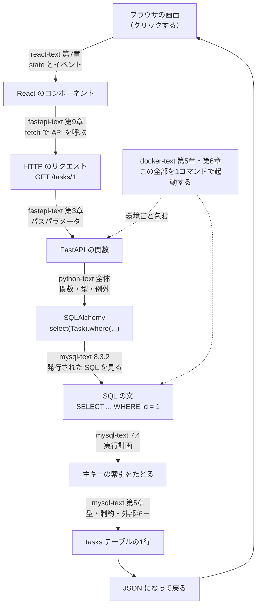
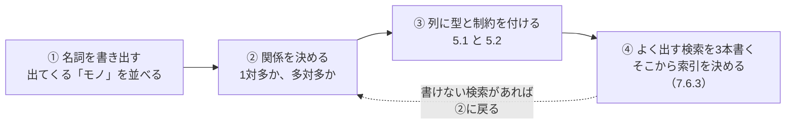
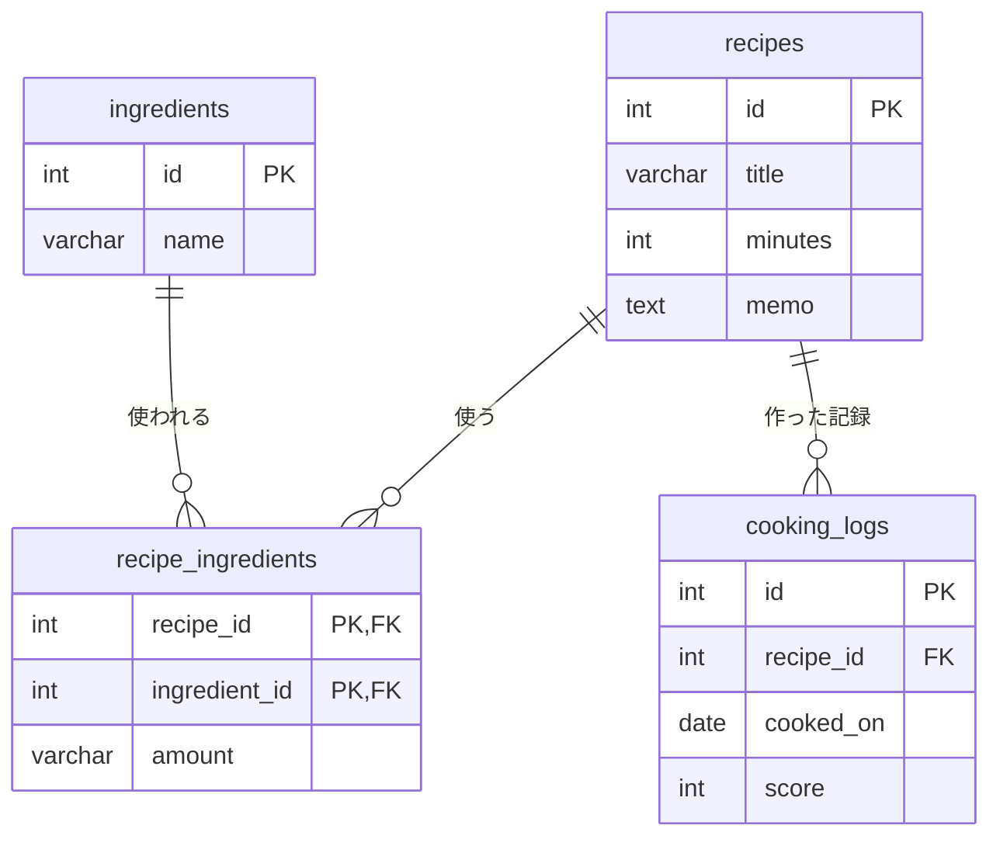
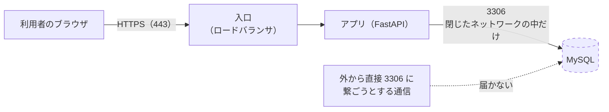
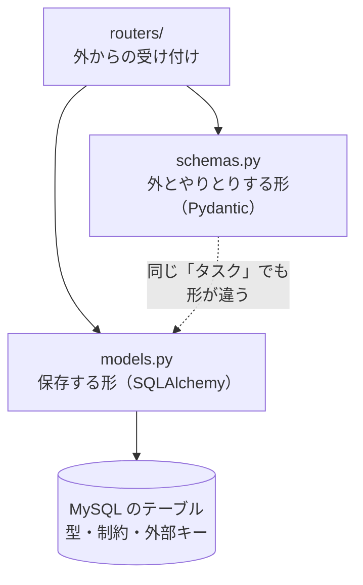
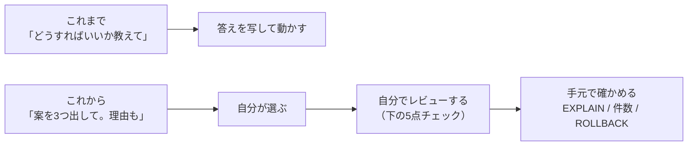

# 第9章 次のステップ

第8章で、**アプリとデータベースのあいだ**にある問題を一通り扱いました。
接続、権限、リレーション、N+1、インジェクション、コネクションプール、そしてバックアップ。

**この本で教えることは、これで終わりです。**
そして、**このテキスト集の5冊目も、ここで終わりです。**

ここで一度、1冊目の最初に戻ります。react-text の第0章は、こういう約束から始まっていました。

> 5冊を読み終えると、**Web アプリを一人で作って動かせる**ようになります。

いま、その約束がどうなったかを確かめます。
そのうえで、**この先の地図**を見ます。

- 5冊分で身についたものを、**戻る場所つきのチェックリスト**で確認する
- 自分の**実力の測り方**（設計の下書きのしかた）を決める
- この本で触れなかった4つの分野が、**それぞれどの困りごとを担当するのか**を知る
- 公式ドキュメントと AI の**使い分け**を決める

**新しい SQL は出てきません。** 出てくるのは、確認用に1つだけです（9.2.1）。
代わりに、**「作れる人」から「作り続けられる人」になるための地図**を扱います。

## この章で学ぶこと

- mysql-text 全8章の到達度を、**戻る場所つきのチェックリスト**で確認できるようになる
- ブラウザの1クリックが MySQL の1行に届くまでの道のりを、**5冊のどこで作ったか**を添えて説明できるようになる
- 自分で決めた題材を、**設計の下書き4ステップ**でテーブルの形に落とせるようになる
- **データベース設計・ネットワークとインフラ・設計原則と DDD・AWS と IaC** が、
  それぞれどの困りごとを担当する分野なのかを説明できるようになる
- AI が書いた SQL を、**自分の目でレビューして直せる**ようになる

## この章の前提

- [第8章 アプリから使う](./08-use-from-app.md) を終えていること
- 演習 9.1〜9.3 では MySQL を起動します（[2.1.2](./02-environment.md#212-起動と停止)）。
  本文を読むだけなら、起動していなくても構いません

> **補足：9.2 は、読むだけの節です**
> 9.2 には、**この本で扱わない分野の名前**が並びます。
> **いま学び始める必要はありません。** 「どの困りごとの担当か」だけ掴んでください。
> 手を動かすのは 9.1・9.3 と演習です。

> **つまずいたら**
> この章の演習では、**`shop` を壊さないこと**を守ってください。
> 演習 9.2 は**新しいデータベース**を作って進めます（第5章で `design` を作ったのと同じやり方です。
> [2.4.1](./02-environment.md#241-create-database)）。
>
> もし `shop` の中身がおかしくなったら、いつでも戻せます（[2.5.2](./02-environment.md#252-sql-ファイルを流し込む)）。
>
> ```sql
> SOURCE /sql/shop.sql;
> ```
>
> 演習 9.2 の設計で迷ったときは、第0章 0.2 で準備した AI に次のように聞いてください。
>
> ```text
> mysql-text の演習 9.2 をやっています。
> 「（作りたいもの）」を題材に、テーブルを設計しようとしています。
>
> いま考えている構成:
>
> （テーブル名と列名を貼る）
>
> 設計そのものの答えは書かないでください。
> 代わりに、「この構成で困りそうなところ」を質問の形で3つ挙げてください。
> ```
>
> **「答えを書かないでください」と必ず添えてください。**
> 設計は、自分で迷ったぶんだけ身につきます。
> 一方で、**エラーで進めないときは遠慮なく答えを聞いてください**（レベル C：環境の問題）。

---

## 9.1 フェーズ1の完走

### 9.1.1 ここまでで身についたこと

まず、現在地を確認します。

次の表を上から見て、**「何も見ずにできるか」**で判断してください。
「読めば思い出せる」は ✅ ではありません。**手が動くかどうか**が基準です。

| # | できること | 判断のしかた | できなければ戻る場所 |
|---|-----------|------------|-------------------|
| 1 | ファイル保存の限界を3つ言える | 遅さ・同時書き込み・整合性の3つを挙げられるか | [1.1](./01-what-is-database.md#11-ファイルに保存するのでは何がだめなのか) |
| 2 | 表を分けて相手の主キーを持たせられる | 繰り返しを見つけて別の表に出す手順を言えるか | [1.2.2](./01-what-is-database.md#122-表と表を関連づける) |
| 3 | 「行に順番が無い」を説明できる | 並びが必要なときに何を書くかを即答できるか | [1.3.2](./01-what-is-database.md#132-表計算ソフトとの違い) |
| 4 | 主キーの3条件を言える | 一意・空にできない・変わらない、を挙げられるか | [1.4.1](./01-what-is-database.md#141-行を1つに特定する) |
| 5 | 練習環境を一から立てられる | `compose.yaml` と `.env` を見ずに書き出せるか | [2.1.1](./02-environment.md#211-設定ファイルを書く) |
| 6 | 接続できないときに切り分けられる | `ps` → ログ → エラー番号の順に見られるか | [2.2.3](./02-environment.md#223-接続できないときの切り分け) |
| 7 | `CREATE DATABASE` と `USE` を使える | `No database selected` が出たときに何をするか即答できるか | [2.4.2](./02-environment.md#242-use-で切り替える) |
| 8 | テーブルの形を確認できる | `DESCRIBE` の `Null` 列と `Key` 列の意味を言えるか | [2.4.4](./02-environment.md#244-show-と-describe-で確認する) |
| 9 | SQL ファイルを流し込める | `SOURCE` のパスが**コンテナの中のパス**である理由を言えるか | [2.5.2](./02-environment.md#252-sql-ファイルを流し込む) |
| 10 | 文字化けの原因を3か所に分けられる | ファイル・クライアント・テーブルの3つを挙げられるか | [2.6.1](./02-environment.md#261-日本語が文字化けするとき) |
| 11 | 照合順序の影響を言える | 既定で `Tokyo` と `TOKYO` が同じ扱いになることを知っているか | [2.6.3](./02-environment.md#263-照合順序collation) |
| 12 | `SELECT` で列を選び `WHERE` で行を絞れる | 「列を選ぶ」「行を絞る」をそれぞれどの句が担当するか言えるか | [3.2.1](./03-select.md#321-条件を書く) |
| 13 | `AND` と `OR` の優先順位を意識できる | かっこを付けずに書いたとき何が起きるか言えるか | [3.2.4](./03-select.md#324-かっこで優先順位を決める) |
| 14 | `NULL` を正しく比べられる | `= NULL` が使えない理由を「3値」という言葉で説明できるか | [3.3.4](./03-select.md#334-is-null-を使う理由) |
| 15 | `<>` で行が消える罠を避けられる | `NULL` の行を残したいときに何を足すか即答できるか | [3.3.4](./03-select.md#334-is-null-を使う理由) |
| 16 | 並べ替えとページ送りを書ける | `ORDER BY` の最後に `id` を足す理由を言えるか | [3.4.3](./03-select.md#343-複数キーで並べる) |
| 17 | SQL の処理順を言える | `WHERE` で別名が使えない理由を説明できるか | [3.4.4](./03-select.md#344-limit-と-offset) |
| 18 | `CASE` で条件分岐を書ける | `ELSE` を書かないとどうなるか言えるか | [3.6.4](./03-select.md#364-case-で条件分岐) |
| 19 | `INSERT` で列名リストを必ず書ける | 列名を省略したときに何が起きるか言えるか | [4.1.3](./04-modify-data.md#413-列を省略したときの挙動) |
| 20 | `Rows matched` と `Changed` を読み分けられる | `matched: 0` のときに疑う場所を即答できるか | [4.2.1](./04-modify-data.md#421-値を書き換える) |
| 21 | `UPDATE` の事故を防ぐ手順を踏める | 4つの手順を、順番どおりに言えるか | [4.2.4](./04-modify-data.md#424-事故を防ぐ手順先に-select-する) |
| 22 | 論理削除の代償を言える | 列を1つ足すと、以降のすべての `SELECT` に何が増えるか言えるか | [4.3.3](./04-modify-data.md#433-論理削除という考え方) |
| 23 | トランザクションを使える | `BEGIN` の中でも取り消せない操作を1つ挙げられるか | [4.4.3](./04-modify-data.md#443-自動コミットの設定) |
| 24 | ロック待ちとデッドロックを見分けられる | 画面が止まったときに何を疑うか即答できるか | [4.5.1](./04-modify-data.md#451-同時に更新するとどうなるか) |
| 25 | 金額の型を選べる | `FLOAT` を使わない理由を、具体的な数字で言えるか | [5.1.5](./05-table-design.md#515-浮動小数点数で金額を扱わない) |
| 26 | 4つの制約を使い分けられる | `NOT NULL` / `DEFAULT` / `UNIQUE` / `CHECK` をそれぞれ1行で説明できるか | [5.2](./05-table-design.md#52-制約) |
| 27 | 主キーに代理キーを選べる | 自然キーの弱点を3つ挙げられるか | [5.3.3](./05-table-design.md#533-自然キーと代理キー) |
| 28 | 外部キーを定義できる | 入れる順番と消す順番が逆になる理由を言えるか | [5.4.3](./05-table-design.md#543-参照整合性) |
| 29 | 正規化の3つの異常を言える | 更新・挿入・削除の異常を、それぞれ例で説明できるか | [5.5.1](./05-table-design.md#551-同じデータを2箇所に持つと何が起きるか) |
| 30 | 「その時点の記録」を判断できる | `order_items.unit_price` を分けない理由を言えるか | [5.5.3](./05-table-design.md#553-どこまでやるべきか) |
| 31 | 列を安全に足せる | 行があるテーブルに `NOT NULL` の列を足すときの3段階を言えるか | [5.6.2](./05-table-design.md#562-列の追加・変更・削除) |
| 32 | `INNER JOIN` を書ける | `ON` に何を書くかを即答できるか | [6.2.2](./06-join-and-aggregate.md#622-on-の書き方) |
| 33 | `LEFT JOIN` の罠を避けられる | 相手側の条件を `WHERE` に書くと何が起きるか言えるか | [6.3.4](./06-join-and-aggregate.md#634-where-に書くと-inner-と同じになる罠) |
| 34 | `GROUP BY` と `HAVING` を使い分けられる | `WHERE` に集計関数を書けない理由を言えるか | [6.5.4](./06-join-and-aggregate.md#654-having-と-where-の使い分け) |
| 35 | `COUNT` の引数を選べる | `LEFT JOIN` したときに `COUNT(*)` を避ける理由を言えるか | [6.5.3](./06-join-and-aggregate.md#653-count-の引数による違い) |
| 36 | 多対多を中間テーブルで表せる | 中間テーブルが持つ外部キーの本数を即答できるか | [6.7.1](./06-join-and-aggregate.md#671-中間テーブル) |
| 37 | `EXPLAIN` を読める | `type` と `rows` のどちらを先に見るか、理由とともに言えるか | [7.4.2](./07-index-and-explain.md#742-見るべき項目type--key--rows) |
| 38 | 索引が効かない形に気づける | 効かなくなる3パターンを挙げられるか | [7.5](./07-index-and-explain.md#75-インデックスが効かないパターン) |
| 39 | 索引を張るか判断できる | 選択率という言葉を使って基準を言えるか | [7.6.3](./07-index-and-explain.md#763-判断の指針) |
| 40 | アプリ専用ユーザーを作れる | `GRANT` で渡す権限を、必要なものだけに絞れるか | [8.1.1](./08-use-from-app.md#811-接続設定) |
| 41 | N+1 を数えて見つけられる | 「1本＋N本」が何の数で決まるか言えるか | [8.3.1](./08-use-from-app.md#831-何が起きているのか) |
| 42 | インジェクションを防げる | 危ない書き方を4つ挙げられるか | [8.4.2](./08-use-from-app.md#842-文字列連結で-sql-を組み立てない) |
| 43 | プレースホルダの限界を言える | 値には使えて、列名には使えない理由を言えるか | [8.4.3](./08-use-from-app.md#843-プレースホルダを使う) |
| 44 | 接続数の見積もりができる | `pool_size` と `max_connections` の関係を式で言えるか | [8.5.2](./08-use-from-app.md#852-設定項目) |
| 45 | ダンプを取って戻せる | ダンプを流す前に必ず確認することを1つ言えるか | [8.6.2](./08-use-from-app.md#862-リストアする) |

**全部に ✅ が付く必要はありません。**
この本を1周した直後なら、半分から3分の2くらいで普通です。

大事なのは、**「できない」と気づいた項目に、戻る場所の番号が付いている**ことです。
気になった番号の項に戻り、**そこの SQL をもう一度自分で打って**ください。
SQL は、読み返すだけでは ✅ が増えません。

> **補足：優先して埋めたい5つ**
> 全部を埋めようとすると時間がかかります。**この先で効いてくるのは、この5つ**です。
>
> - 14・15（`NULL` の比べ方）——**エラーが出ないまま結果だけがずれる**、いちばん怖い間違いです
> - 21（`UPDATE` の事故を防ぐ手順）——**間違えると、元の値はどこにも残りません**
> - 33（`LEFT JOIN` の罠）——これも**エラーが出ません**。件数でしか気づけません
> - 37（`EXPLAIN` を読める）——「遅い」を「なぜ遅い」に変えられる唯一の道具です
> - 42（インジェクションを防ぐ）——**公開したあとに間違えると、取り返しがつきません**
>
> 5つのうち3つが「エラーが出ない間違い」です。
> **SQL の怖さは、間違いが静かなこと**にあります。

### 9.1.2 自分の実力を確認する

チェックリストは知識なので、戻って打ち直せば埋まります。
**埋まらないのは、「作りたいものを、テーブルの形に分解する力」**です。
これは、書いた回数でしか増えません。

**1リクエストの通り道を、5冊で塗り分ける**

その前に、いま自分が何を作れるようになったのかを、1つの図で確認します。

ブラウザで「タスクを1件表示する」をクリックしたとき、何がどこを通るかです。



**この図の全部が、自分の手で書けるようになりました。**
5冊目を始めた時点では、下から3つ（SQL・実行計画・テーブルの形）が空白でした。

| 区間 | 何を担当するか | どの本で身につけたか |
|------|--------------|-------------------|
| 画面とイベント | 見た目と操作 | react-text |
| 処理の組み立て | 関数・型・例外 | python-text |
| HTTP の窓口 | 受け取り方・返し方・認証 | fastapi-text |
| 環境 | どこでも同じように動かす | docker-text |
| **データの置き場所** | **型・制約・関係・速さ** | **mysql-text** |

> **補足：5冊目で変わったのは「疑える場所」です**
> 4冊目までは、画面が遅いときに疑える場所が「たぶんサーバー」で止まっていました。
> いまは、**どこを見れば分かるか**が言えます。
>
> | 症状 | 疑うところ | 道具 |
> |------|----------|------|
> | 特定の画面だけ遅い | 1本の SQL | `EXPLAIN`（[7.4.2](./07-index-and-explain.md#742-見るべき項目type--key--rows)） |
> | 一覧の画面だけ遅い | SQL の**本数** | ログで数える（[8.3.2](./08-use-from-app.md#832-発行された-sql-を見る)） |
> | 混んでいるときだけ全部遅い | 接続の数 | `pool.status()`（[8.5.2](./08-use-from-app.md#852-設定項目)） |
> | データがおかしい | 制約が無い | `SHOW CREATE TABLE`（[5.2](./05-table-design.md#52-制約)） |

**設計の下書き4ステップ**

作りたいものが決まったとき、**いきなり `CREATE TABLE` を書かない**でください。
この本で繰り返してきた順序を、4ステップにまとめます。



**④から②に戻る点線**が、この図でいちばん大事なところです。
「よく出す検索が書けない」なら、それは設計が足りていない合図です。
`CREATE TABLE` を打つ前に気づけば、作り直しは一瞬で済みます
（本番で気づくと 5.6.3 の話になります）。

**例：レシピ帳を設計してみる**

手順だけでは掴みにくいので、**演習とは別の題材**で1回やってみます。
題材は「自分が作った料理を記録するレシピ帳」です。

**① 名詞を書き出す**

思いつく順に書き出します。整理はあとです。

```text
レシピ、材料、分量、手順、作った日、おいしさの評価、メモ、カテゴリ（和食・洋食）、所要時間
```

このうち、**「何度も出てくるもの」がテーブルの候補**です。
「材料」は、レシピが変わっても同じ「たまねぎ」が何度も出てきます。テーブルにします。
「メモ」は、レシピ1件に1つで十分です。列で足ります。

**② 関係を決める**

- 1つのレシピには、材料が複数あります
- 1つの材料は、複数のレシピに使われます

→ **多対多**です（[6.7.1](./06-join-and-aggregate.md#671-中間テーブル)）。中間テーブルを作ります。

そして「作った日」は、同じレシピを何度も作るので、**レシピ1件に対して複数**あります。
→ **1対多**です。別のテーブルにします。

図にすると、こうなります。



`amount`（「1個」「200g」）を**中間テーブルに置いている**ことに注目してください。
分量は「レシピの性質」でも「材料の性質」でもなく、**組み合わせの性質**です
（`order_items.quantity` と同じ判断です。[6.7.2](./06-join-and-aggregate.md#672-設計と結合の書き方)）。

**③ 列に型と制約を付ける**

中間テーブルだけ、実際の `CREATE TABLE` を見てみます。

`recipe_ingredients` の定義

```sql
CREATE TABLE recipe_ingredients (
  recipe_id     INT         NOT NULL,
  ingredient_id INT         NOT NULL,
  amount        VARCHAR(30) NOT NULL,
  PRIMARY KEY (recipe_id, ingredient_id),
  CONSTRAINT fk_ri_recipe
    FOREIGN KEY (recipe_id) REFERENCES recipes (id) ON DELETE CASCADE,
  CONSTRAINT fk_ri_ingredient
    FOREIGN KEY (ingredient_id) REFERENCES ingredients (id)
);
```

判断したことは4つです。

| 書いたもの | なぜそうしたか | 戻る場所 |
|-----------|--------------|---------|
| `PRIMARY KEY (recipe_id, ingredient_id)` | 同じレシピに同じ材料が2行あっても意味がないため、複合主キーで禁じる | [6.7.1](./06-join-and-aggregate.md#671-中間テーブル) |
| `amount` は `VARCHAR` | 「1個」「少々」のように数値にできない値が入るため | [5.1.2](./05-table-design.md#512-文字列型varchar-と-text) |
| レシピ側は `ON DELETE CASCADE` | レシピを消したら材料の紐づけも要らなくなるため | [5.4.4](./05-table-design.md#544-on-delete-の挙動) |
| 材料側は `ON DELETE` を書かない（既定の拒否） | 使われている材料を消せてしまうと、レシピが壊れるため | [5.4.4](./05-table-design.md#544-on-delete-の挙動) |

**同じテーブルの中でも、2本の外部キーで `ON DELETE` の判断が分かれる**のが要点です。
「親を消したら子も消してよいか」を、**外部キーごとに1回ずつ考えます。**

この題材には出てきませんが、**金額の列があるなら `FLOAT` は選びません。**
円なら `INT`、小数が要るなら `DECIMAL` です（[5.1.5](./05-table-design.md#515-浮動小数点数で金額を扱わない)）。

作ったあとにデータを入れる順番も、ここで決まります。
**外部キーがあるので、親（`recipes` / `ingredients`）から先に入れます。**
子から入れると `ERROR 1452` です（[5.4.3](./05-table-design.md#543-参照整合性)）。

**④ よく出す検索を3本書く**

最後に、この設計で実際に欲しい結果が取れるかを確かめます。

```sql
-- (1) レシピ1件の材料一覧
SELECT i.name, ri.amount
  FROM recipe_ingredients AS ri
  INNER JOIN ingredients  AS i ON i.id = ri.ingredient_id
 WHERE ri.recipe_id = 1;

-- (2) 「たまねぎ」を使うレシピ
SELECT r.title
  FROM recipes            AS r
  INNER JOIN recipe_ingredients AS ri ON ri.recipe_id = r.id
  INNER JOIN ingredients  AS i  ON i.id = ri.ingredient_id
 WHERE i.name = 'たまねぎ';

-- (3) よく作っているレシピの順位（3回以上作ったものだけ）
SELECT r.title, COUNT(cl.id) AS 回数, ROUND(AVG(cl.score), 1) AS 平均評価
  FROM recipes AS r
  INNER JOIN cooking_logs AS cl ON cl.recipe_id = r.id
 GROUP BY r.id, r.title
HAVING COUNT(cl.id) >= 3
 ORDER BY 回数 DESC, r.id;
```

3本とも書けました。**この時点で設計は合格**です。
ここで (2) が書けなければ、材料をレシピの列に文字列で詰め込んでいた、ということになります。

そのうえで、索引を考えます（[7.6.3](./07-index-and-explain.md#763-判断の指針)）。

- (2) の `i.name = 'たまねぎ'` は `WHERE` で使われ、材料名は重複しないはずなので
  **`UNIQUE` を付ける**（`UNIQUE` には索引が自動で付きます。[5.2.3](./05-table-design.md#523-unique)）
- (1) の `ri.recipe_id` は**複合主キーの左の列**なので、すでに索引が効きます
  （[7.3.3](./07-index-and-explain.md#733-列の順番が重要)）
- (3) の `cl.recipe_id` は外部キーなので、**索引が自動で作られています**
  （[8.2.1](./08-use-from-app.md#821-sqlalchemy-でのリレーション定義) で見た `KEY task_id` と同じです）

**結果、自分で `CREATE INDEX` を打つ必要はありませんでした。**
これは偶然ではなく、**主キー・`UNIQUE`・外部キーを正しく設計すると、
最初の索引はだいたい揃っている**ためです。
`CREATE INDEX` が要るのは、それでも遅い場所が**測って**見つかったときです。

> **よくある間違い：先に索引を並べてしまう**
> 設計の段階で「検索に使いそうな列」に片っ端から索引を張る人がいます。
> 第7章 [7.6](./07-index-and-explain.md#76-張りすぎのデメリット) で測ったとおり、
> **書き込みが遅くなり、容量も増えます。**
> 索引は**あとから足せます**（`CREATE INDEX` は 1 行です）。
> 足りなくて困ってから張るほうが、確実です。

**練習の材料を AI に出してもらう**

題材が思いつかないときは、AI に課題を出してもらうのが手軽です。
第0章 0.2 で準備した AI に、次のように頼んでください。

```text
mysql-text（プログラミング未経験から始める MySQL）を1周し終えました。
この本の範囲だけで解ける、テーブル設計の課題を3問出してください。

条件:
- 使ってよいのは、CREATE TABLE・型・制約・主キー・外部キー・
  中間テーブル・JOIN・GROUP BY・インデックスまで
- ストアドプロシージャ、ビュー、トリガー、ウィンドウ関数は使わない
- 各問題には「何を記録したいか」と「出したい集計を2つ」だけ書き、
  テーブル定義や SQL は書かないでください
- 難易度は易しい順に並べてください
```

**「テーブル定義や SQL は書かないでください」を必ず入れてください。**
指定しないと、AI は親切に完成した `CREATE TABLE` を出してきます。それでは練習になりません。

出してもらった課題は、**必ず 4ステップの ① から**始めてください。
名詞の書き出しを飛ばすと、「思いついたテーブル」から書き始めることになり、
あとで ④ が書けなくなります。

---

## 9.2 これから学ぶべきこと

ここからは、**この本で扱わなかった分野**の話です。

先に地図を出します。4つの分野が、それぞれ**どの困りごとの担当**かを整理した表です。

| 困りごと | 担当する分野 | 扱う項 |
|---------|------------|-------|
| 同時に使う人が増えたら、データがおかしくなった | データベース設計（分離レベル・ロック） | 9.2.1 |
| データベースに繋がらない・途中で切れる・外から狙われた | ネットワークとインフラ | 9.2.2 |
| 機能を足すたびに、直す場所が増えていく | 設計原則と DDD | 9.2.3 |
| 自分のパソコンを消したら、サービスも消える | AWS と IaC | 9.2.4 |

**いま学び始める必要はありません。**
困りごとに出会っていないうちに覚えた道具は、使わないまま忘れます。
ここでは「名前と担当」だけ覚えて、**出会ったときに思い出せる**状態にしておきます。

### 9.2.1 データベース設計をもっと深く

この本の第5章で扱った設計は、**1人で使うぶんには困らない**ところまでです。
人が増えると、次の段階が必要になります。

**トランザクション分離レベル**

第4章 [4.5.1](./04-modify-data.md#451-同時に更新するとどうなるか) で、
2つの接続を開いて**ロック待ち**を体験しました。
あのとき扱ったのは「**書き込み同士**がぶつかる話」でした。

実務でもう1つ問題になるのが、「**読んでいる最中に、他人が書き換える**」話です。
これを、どこまで許すかの設定が **分離レベル**（ぶんりレベル。
トランザクション同士をどれくらい切り離すかの度合い）です。

起きうることは3つあります。

| 現象 | 何が起きるか |
|------|------------|
| **ダーティリード** | 他人が `COMMIT` していない、途中の値を読んでしまう |
| **反復不能読み取り** | 同じ行を2回読んだら、値が変わっていた |
| **ファントムリード** | 同じ条件で2回数えたら、行が増えていた |

分離レベルは4段階あり、**上にいくほど速く、下にいくほど安全**です。

| 分離レベル | ダーティリード | 反復不能読み取り | ファントムリード |
|-----------|--------------|----------------|----------------|
| `READ UNCOMMITTED` | 起きる | 起きる | 起きる |
| `READ COMMITTED` | 起きない | 起きる | 起きる |
| `REPEATABLE READ`（MySQL の既定） | 起きない | 起きない | 起きにくい |
| `SERIALIZABLE` | 起きない | 起きない | 起きない |

`REPEATABLE READ` のファントムリードを「起きにくい」と書いたのは、
**規格の上では起きうるが、MySQL（InnoDB）では多くの場面で起きない**ためです。
ここは製品ごとの作りに踏み込む話なので、この本ではここまでにします。

**いま自分の MySQL が何を使っているか**は、1行で確認できます。
第4章 [4.4.3](./04-modify-data.md#443-自動コミットの設定) で `SELECT @@autocommit;` を打ったのと同じ形です。

```sql
SELECT @@transaction_isolation;
```

実行結果:

```text
+-------------------------+
| @@transaction_isolation |
+-------------------------+
| REPEATABLE-READ         |
+-------------------------+
1 row in set (0.00 sec)
```

**MySQL の既定は `REPEATABLE READ`** です。
これは**データベース製品によって違います**（PostgreSQL の既定は `READ COMMITTED` です）。
「どのデータベースでも同じ」と思い込むと、移したときに挙動が変わります。

> **補足：この本で分離レベルを設定しなかった理由**
> 既定のままで、1人で練習するぶんには困らないためです。
> 変更するのは、**「どの現象が実際に起きているか」を再現できるようになってから**で十分です。
> 再現には、第4章 4.5 でやったように**接続を2つ開く**必要があります。
> あの実演をもう一度やって、片方で `SELECT` を2回打つ形に変えると、入口になります。

**その先にあるもの**

| テーマ | どんなときに必要になるか |
|-------|----------------------|
| **ER 図を正式に描く** | 人に設計を説明するとき。この章の `erDiagram` は簡略版です |
| **第3正規形より先（BCNF など）** | 複合主キーが増えて、5.5.2 の3つでは判断しきれなくなったとき |
| **履歴の持ち方** | 「変更前の値も見たい」と言われたとき（論理削除だけでは足りません） |
| **レプリケーション** | 読み取りが多すぎて1台で捌けないとき。書き込み用と読み取り用に分けます |
| **パーティション** | 1つのテーブルが数千万行を超え、`EXPLAIN` を直しても足りないとき |
| **シャーディング** | それでも足りないとき。**最後の手段**です |

下の3つは、**この本で扱った索引と実行計画を使い切ってから**の話です。
順番を飛ばして先にレプリケーションを入れると、
**遅い SQL が2台に増えるだけ**になります（7.4.3 で1本ずつ測ったのは、そのためです）。

### 9.2.2 ネットワークとインフラ

この本では、**繋がることを前提**にしてきました。
けれど、実は接続先の書き方を3通り使い分けています（[8.1.3](./08-use-from-app.md#813-docker-compose-で繋ぐ)）。

| 書いた場所 | 接続先 | なぜその書き方か |
|-----------|-------|----------------|
| 手元の Python から | `localhost:3306` | `compose.yaml` の `ports` でパソコン側に出しているから |
| `api` コンテナから | `db:3306` | 同じネットワークの中で、サービス名が名前として通じるから |
| コンテナの中の `mysql` から | `localhost` | 自分自身の中だから |

**この使い分けが、ネットワークの入口です。**
「名前を住所に変える仕組み」「住所とポートで相手を決める仕組み」を、すでに使っています。

この先で必要になるのは、次のあたりです。

| テーマ | この本のどこと繋がるか |
|-------|--------------------|
| TCP とポート | `3306` を指定してきたこと（[2.2.2](./02-environment.md#222-接続情報の意味ホスト・ポート・ユーザー)） |
| DNS（名前解決） | `db` という名前が通じたこと（8.1.3） |
| TLS（通信の暗号化） | パスワードが**平文で流れていない**かどうか |
| ファイアウォールとプライベートネットワーク | **どこからなら繋いでよいか**（`'ユーザー'@'接続元'` の右側） |
| ロードバランサ | アプリを増やしたときに、接続数がどうなるか（[8.5.2](./08-use-from-app.md#852-設定項目)） |

**データベースをインターネットに直接出さない**

**公開するときに最も重要な原則**なので、ここだけは覚えて帰ってください。



**外に出すのは、アプリの入口だけです。** データベースの 3306 は外から見えない場所に置きます。

この本の練習環境では、`compose.yaml` に `ports: "3306:3306"` と書いて、
**わざとパソコン側に出していました**（[2.1.1](./02-environment.md#211-設定ファイルを書く)）。
`mysql` コマンドや GUI クライアントから繋ぐためです。
docker-text 第6章の `fullstack-lesson` では、`db` に `ports` を書きませんでした。
**API からしか繋がないなら、出す必要がない**からです。

第2章 [2.3.3](./02-environment.md#233-cli-と-gui-の使い分け) で
「Adminer を公開しない」と書いたのも同じ理由です。

> **注意：練習環境と公開する環境では、判断が変わります**
> 「手元で動いた設定」をそのまま公開用に使わないでください。
> 公開時に必ず見直すのは、この3つです。
>
> 1. `ports` で外に出しているものが、本当に外から必要か
> 2. `root` ではなく、**権限を絞ったユーザー**で繋いでいるか（[8.1.1](./08-use-from-app.md#811-接続設定)）
> 3. パスワードが `.env` に入っていて、**Git に入っていない**か（第2章 2.1.1）

**「遅い」の原因が経路にあることもある**

もう1つ、ネットワークを知ると見え方が変わる話があります。

第8章 [8.3.1](./08-use-from-app.md#831-何が起きているのか) の N+1 は、
手元では「4本になっただけ」で、体感はほとんど変わりませんでした。
アプリとデータベースが**同じパソコンの中**にいたからです。

本番では、アプリとデータベースは**別の機械**にいます。
1往復に 1 ミリ秒かかるとすると、51本の SQL は**それだけで 51 ミリ秒**です。
SQL 自体は `EXPLAIN` で見ると一瞬でも、**往復の回数が効いてきます。**

**「手元では速いのに、本番だけ遅い」の正体は、たいていこれです。**
だから第8章で**本数を数えた**のでした。

### 9.2.3 設計原則と DDD

ここは「コードの整理のしかた」の分野です。

いまのアプリを思い出してください。fastapi-text 第5章で、ファイルを役割ごとに分けました。



**同じ「タスク」なのに、形が3つあります。**

- `schemas.py` の `TaskRead`：外に見せてよい形（`owner_email` は入れない）
- `models.py` の `Task`：保存する形（`owner_email` を持つ）
- MySQL の `tasks`：**型と制約を守らせる形**（`varchar(20)` / `NOT NULL`）

第8章 8.1.2 で、この3つを `SHOW CREATE TABLE` で突き合わせました。
**「形が違ってよい」と気づいたところ**が、設計の分野の入口です。

| 用語 | 1行で言うと | この本との接点 |
|------|-----------|--------------|
| **責務分離** | 1つの部品に1つの仕事だけ持たせる | `routers` / `schemas` / `models` の分け方 |
| **リポジトリパターン** | データベースを触るコードを1か所に集める | `select(...)` が各所に散らばると、N+1 の原因を追えなくなる |
| **SOLID** | 変更に強い形を5つの原則にまとめたもの | 名前だけ覚えておけば十分です |
| **ユビキタス言語**（DDD） | 会話とコードで同じ言葉を使う | テーブル名・列名を業務の言葉に合わせる（[5.6.2](./05-table-design.md#562-列の追加・変更・削除) の改名の怖さ） |
| **エンティティと値オブジェクト**（DDD） | `id` で同一性が決まるものと、値そのものが意味を持つもの | まさに主キーの話（[1.4.1](./01-what-is-database.md#141-行を1つに特定する)） |
| **集約**（DDD） | 「まとめて守る単位」。この単位でトランザクションを張る | `BEGIN` 〜 `COMMIT` をどこで区切るか（[4.4.1](./04-modify-data.md#441-途中で失敗したら困る処理)） |

> **注意：早すぎる整理は、かえって読めなくなります**
> 「きれいに書きたい」と思って、**作る前から層を増やさない**でください。
> 直す場所が増えて困ってから、困っているところだけ整理するほうが速く進みます。
> この本で `CREATE INDEX` を「測ってから」と書いたのと、同じ考え方です。

### 9.2.4 AWS と IaC

最後は「置き場所」の分野です。

いま、あなたの MySQL は**自分のパソコンの中**にいます。
パソコンを閉じれば止まり、壊れれば消えます。
公開するには、**動き続ける場所**が必要です。

クラウドを使うと、この本で「自分でやった」ことの一部を任せられます。

| やること | 手元（いまの `mysql-lesson`） | クラウドのデータベース（例：AWS の RDS） |
|---------|---------------------------|--------------------------------|
| 起動・停止 | `docker compose up -d` | 画面か設定ファイルで指定する |
| バージョン更新 | 自分でイメージを変える | 時間帯を決めて任せられる |
| **バックアップ** | **自分で `mysqldump`**（[8.6.1](./08-use-from-app.md#861-ダンプを取る)） | **自動で取られる**（期間を指定する） |
| 壊れたときの切り替え | **無い** | 予備を用意しておける |
| 監視 | 自分で `SHOW STATUS` を見る | グラフとアラートが付いてくる |
| **テーブル設計** | **自分** | **自分**（変わりません） |
| **SQL の書き方** | **自分** | **自分**（変わりません） |
| **索引と N+1** | **自分** | **自分**（変わりません） |

**下の3行が、この表でいちばん大事です。**
クラウドに移しても、**設計・SQL・索引・N+1 は自分の責任のまま**です。
むしろ、手元では気づかなかった N+1 が、[9.2.2](#922-ネットワークとインフラ) の往復時間のぶんだけ**はっきり見えるようになります**。

名前だけ挙げておきます。**いま調べる必要はありません。**

| 名前 | 担当 |
|------|------|
| **EC2 / ECS** | アプリを動かす場所（ECS はコンテナのまま動かせます） |
| **RDS** | 上の表の MySQL。**Docker で立てたものの置き換え**にあたります |
| **S3** | ファイルの置き場（画像やダンプの保管先） |
| **IAM** | 誰が何をしてよいかの管理。`GRANT`（8.1.1）のクラウド版だと思ってください |
| **CloudWatch** | ログと監視 |
| **VPC** | 閉じたネットワーク。9.2.2 の「外から見えない場所」を作る仕組み |
| **Terraform（IaC）** | **上の全部を設定ファイルに書いて再現できるようにする**道具 |

最後の **IaC**（Infrastructure as Code。インフラをコードで書くこと）は、
docker-text でやったことの延長です。
`compose.yaml` が「このパソコンの中の構成」を書いたファイルだったのに対し、
Terraform は「クラウド上の構成」を書きます。**考え方は同じ**です。

> **注意：クラウドは、動かしっぱなしにすると料金がかかります**
> 練習で作ったものを消し忘れると、月末に請求が来ます。
> 試すときは、**作る前に「いつ消すか」を決めてから**にしてください。
> これは Docker で `docker compose down` を打つのと違い、**手元では止まりません。**

---

## 9.3 学び続けるために

### 9.3.1 次に作るものを1つ決める

ここまでの5冊は、**題材が用意されていました。**
タスク管理アプリ、`shop` の5テーブル。次からは、自分で決めます。

題材の選び方は、3つの条件で見てください。

| 条件 | なぜ |
|------|------|
| **自分が実際に使うもの** | 使わないものは、作り終える前に飽きます |
| **データが増えていくもの** | 増えないと、索引も集計も出番がありません（第6章・第7章が死にます） |
| **テーブルが3つ以上になるもの** | 2つでは結合の練習になりません。**多対多が1組あると理想的**です |

3つとも満たす題材の例を挙げます。

- 読んだ本の記録（本 / 著者 / 読書ログ。著者と本は多対多）
- 家計簿（支出 / カテゴリ / 支払い方法）
- 練習した曲の記録（曲 / 練習ログ / タグ）
- 育てている植物の水やり記録（株 / 水やりログ / 品種）

**逆に、最初の題材に向かないもの**もあります。

- テーブルが1つで済むもの（メモ帳）——設計の練習になりません
- リアルタイムの通知や検索が主役のもの——この本の範囲を超えます
- 他人のデータを預かるもの——公開の準備（9.2.2）が先に必要です

> **補足：小さく作って、動かし続けてください**
> 「完成」を目指すと、たいてい途中で止まります。
> **1テーブル・1画面でいいので、まず動くところまで**作ってください。
> この本で `CREATE TABLE` を1つずつ育てたのと同じ順序です。
>
> 作ったものを**自分で毎日使う**と、必ず「ここが不便」が出てきます。
> その不便が、次に学ぶことを決めてくれます。

### 9.3.2 公式ドキュメントを一次情報にする

**この先、答えが書かれていない問題に必ず出会います。**
そのとき最初に見る場所を決めておきます。**MySQL の公式リファレンスマニュアル**です。

| 調べたいこと | 見る場所 |
|------------|---------|
| 構文（`SELECT` に何が書けるか） | リファレンスマニュアルの該当ページ |
| エラー番号の意味（`ERROR 1452` など） | エラーメッセージのリファレンス |
| 設定項目の既定値（`max_connections` など） | サーバー変数のページ |
| 自分の環境で本当にそうなっているか | **手元で打って確かめる** |

引くときのコツが3つあります。

**① バージョンを合わせる**

MySQL のドキュメントは、URL にバージョンが入っています。

```text
https://dev.mysql.com/doc/refman/8.4/en/
```

この `8.4` の部分です。この本で使っている MySQL は **8.4**（[2.1.1](./02-environment.md#211-設定ファイルを書く)）なので、
`8.4` のページを見ます。検索でたどり着いたページが `5.7` だった、ということがよく起きます。
**古いバージョンのページには、いまは違う挙動が書かれています。**

> **補足：日本語のドキュメントについて**
> 執筆時点では、**日本語のリファレンスマニュアルは 8.0 版まで**です。
> 日本語で読むなら 8.0 版、最新の挙動を確かめるなら英語版、と使い分けてください。
> 英語のページでも、**コードブロックと表は読めます。** そこだけ見るのでも十分役に立ちます。

**② エラーは番号で引く**

この本で出会ったエラーには、すべて番号が付いていました。

| 番号 | 意味 | 出てきた場所 |
|------|------|------------|
| `1045` | 接続を断られた（ユーザーかパスワード） | [2.2.3](./02-environment.md#223-接続できないときの切り分け) |
| `1062` | 重複（`UNIQUE` 違反） | [5.2.3](./05-table-design.md#523-unique) |
| `1064` | 構文エラー | [3.6.4](./03-select.md#364-case-で条件分岐) |
| `1146` | テーブルが無い | [8.1.2](./08-use-from-app.md#812-sqlite-から切り替える) |
| `1452` | 親がいない行を入れようとした | [5.4.3](./05-table-design.md#543-参照整合性) |

**番号で検索すると、症状ではなく原因にたどり着けます。**
「MySQL エラー 入らない」で検索するより、`MySQL 1452` で検索するほうが速いです。

**③ 一次情報と、それ以外を分ける**

個人のブログや Q&A サイトは、**答えにたどり着く近道**として役に立ちます。
ただし、そこに書かれた内容は**書かれた時点のもの**です。
最後は必ず、公式か**自分の手元での確認**に着地させてください。

この本で `EXPLAIN` を打ち、`SHOW CREATE TABLE` を読み、
`SHOW GLOBAL STATUS` を前後で比べたのは、**その確かめ方を身につけるため**でした。

### 9.3.3 AI との付き合い方が変わる

第0章 0.2 で、AI を**脱出装置**として準備しました。
環境構築で詰まったとき、エラーが読めないときに使うためです。

**その役割は、これから変わります。**



**AI は SQL を書けます。** けれど、その SQL が**あなたのデータに対して正しいか**は知りません。
テーブルの中身も、行数も、索引も見ていないからです。

**AI が書いた SQL を見るときの5点チェック**

これは、この本で学んだことがそのまま使えます。

| # | 見るところ | 見つかったら | 戻る場所 |
|---|----------|------------|---------|
| 1 | `UPDATE` / `DELETE` に `WHERE` があるか | 無ければ**絶対に実行しない** | [4.2.3](./04-modify-data.md#423-where-を忘れると全件更新される) |
| 2 | 値を文字列連結で埋め込んでいないか | プレースホルダに直す | [8.4.2](./08-use-from-app.md#842-文字列連結で-sql-を組み立てない) |
| 3 | `NULL` になりうる列を `=` や `<>` で比べていないか | `IS NULL` / `IS NOT NULL` を足す | [3.3.4](./03-select.md#334-is-null-を使う理由) |
| 4 | `LEFT JOIN` と `COUNT(*)` が同居していないか | `COUNT(列)` に直す | [6.5.3](./06-join-and-aggregate.md#653-count-の引数による違い) |
| 5 | `WHERE` の列に関数が掛かっていないか | 範囲比較に書き換えて `EXPLAIN` で確かめる | [7.5.1](./07-index-and-explain.md#751-列に関数を使っている) |

**例：実際にやってみる**

たとえば「2026年に注文していない顧客を出して」と頼んだとします。
返ってきた SQL が、こうだったとします。

```sql
-- AI が出してきた SQL（このまま使ってはいけません）
SELECT c.name, COUNT(*) AS 注文数
  FROM customers AS c
  LEFT JOIN orders AS o ON o.customer_id = c.id
 WHERE YEAR(o.ordered_at) <> 2026
 GROUP BY c.id;
```

**動きます。そして、間違っています。** 5点チェックを当てると3つ見つかります。

| # | 見つかったこと | どうなるか |
|---|--------------|----------|
| 3 | `WHERE` に `<>` がある | 注文が1件も無い顧客は `o.ordered_at` が `NULL` なので、**静かに消えます**（3.3.4） |
| 4 | `LEFT JOIN` なのに `COUNT(*)` | 注文0件の顧客が **`1`** と数えられます（6.5.3） |
| 5 | `WHERE` の列に `YEAR()` | 索引が使えません（7.5.1） |

さらに、そもそも 6.3.4 の罠を踏んでいます。
**`LEFT JOIN` の相手側の条件を `WHERE` に書いた**ため、`INNER JOIN` と同じ動きになっています。

直すと、こうなります。

```sql
-- 2026年の注文だけを結合し、1件も無い顧客を出す
SELECT c.name, COUNT(o.id) AS 注文数
  FROM customers AS c
  LEFT JOIN orders AS o
    ON o.customer_id = c.id
   AND o.ordered_at >= '2026-01-01'
   AND o.ordered_at <  '2027-01-01'
 GROUP BY c.id, c.name
HAVING COUNT(o.id) = 0
 ORDER BY c.id;
```

変えたのは4か所です。

1. 年の条件を **`WHERE` から `ON` に移した**（6.3.4）
2. `YEAR()` をやめて**範囲比較**にした（7.5.1・3.6.2）
3. `COUNT(*)` を **`COUNT(o.id)`** にした（6.5.3）
4. 「0件の顧客」を出すために **`HAVING`** を使った（6.5.4）

**この4つの判断は、全部この本の中にあります。**
つまり、**AI の答えをレビューできる知識は、もう持っている**ということです。

> **補足：`GROUP BY c.id` を `GROUP BY c.id, c.name` に直した件**
> 上の4つには入れていません。**`GROUP BY c.id` のままでもエラーにはならない**ためです。
> `c.id` は `customers` の主キーなので、「`id` が決まれば `name` も1つに決まる」ことを
> MySQL が判断して通してくれます。
>
> それでも、この本では [6.5.2](./06-join-and-aggregate.md#652-group-by) の定型どおり
> **表示する列も並べて書きます。** 主キー以外でまとめたときに `ERROR 1055` になるのと、
> 書き方をそろえておくためです。

> **重要：「動いた」と「正しい」は違います**
> 最初の SQL も、エラーは1つも出ませんでした。**件数だけが違っていました。**
> この本で何度も見たとおりです。
>
> - `UPDATE` は当たらなくてもエラーになりません（[4.2.1](./04-modify-data.md#421-値を書き換える)）
> - `LEFT JOIN` は `INNER` に化けてもエラーになりません（6.3.4）
> - 型が違う比較は、警告すら画面に出ません（[7.5.3](./07-index-and-explain.md#753-型が違う比較)）
>
> **確かめる手段を持っているのは、AI ではなくあなたです。**
> 件数を数える、`EXPLAIN` を打つ、`BEGIN` して `ROLLBACK` する。全部できます。

> **補足：`BEGIN` を保険に使ってください**
> 他人（AI を含む）が書いた `UPDATE` や `DELETE` を試すときは、
> `BEGIN;` してから実行し、件数を見て、`ROLLBACK;` で戻すのが確実です
> （[4.4.2](./04-modify-data.md#442-begin--commit--rollback)）。
> **`TRUNCATE` と `ALTER TABLE` だけは戻せません**（4.4.3）。ここは先に確認してください。

**これからの頼み方**

頼み方を少し変えるだけで、AI の役割が「答えを出す人」から「壁打ち相手」に変わります。

```text
次の SQL をレビューしてください。答えを書き直す前に、
「この SQL が想定と違う結果になりうるケース」を3つ挙げてください。

前提:
- MySQL 8.4
- customers は 8 行、orders は 15 行
- orders.customer_id には索引がありません

SQL:
（貼り付ける）
```

**「前提」に行数と索引の有無を書く**のがコツです。
AI はテーブルを見られないので、これを書かないと一般論しか返ってきません。
`SHOW CREATE TABLE`（[2.4.4](./02-environment.md#244-show-と-describe-で確認する)）の出力をそのまま貼るのも有効です。

---

## まとめ

- 判断の基準は「読めば思い出せる」ではなく **「何も見ずにできるか」**（9.1.1）
- 優先して埋めたい5つのうち3つは、**エラーが出ない間違い**に関するもの（9.1.1）
- ブラウザの1クリックが1行に届くまでの道のりが、**5冊で全部埋まった**（9.1.2）
- 設計は **① 名詞 → ② 関係 → ③ 型と制約 → ④ よく出す検索** の順に下書きする（9.1.2）
- **④で検索が書けなければ、②に戻る。** `CREATE TABLE` の前なら作り直しは一瞬（9.1.2）
- 主キー・`UNIQUE`・外部キーを正しく設計すると、**最初の索引はだいたい揃っている**（9.1.2）
- 分離レベルは4段階あり、**MySQL の既定は `REPEATABLE READ`**。製品ごとに違う（9.2.1）
- レプリケーションやパーティションは、**索引と実行計画を使い切ってから**（9.2.1）
- **データベースは、外から直接繋げない場所に置く。** 外に出すのはアプリの入口だけ（9.2.2）
- **N+1 は本番でだけ致命的になる。** 往復の回数が効いてくるため（9.2.2）
- 同じ「タスク」でも、**外に見せる形・保存する形・テーブルの形**は違ってよい（9.2.3）
- クラウドに移しても、**設計・SQL・索引・N+1 は自分の責任のまま**（9.2.4）
- 公式ドキュメントは**バージョンを合わせて**引き、**エラーは番号で**引く（9.3.2）
- AI の SQL は**5点チェック**で読む。確かめる手段を持っているのは自分のほう（9.3.3）
- **「動いた」と「正しい」は違う。** 件数・`EXPLAIN`・`ROLLBACK` で確かめる（9.3.3）

---

## 理解度チェック

**問 9.1**（穴埋め）

トランザクション分離レベルは4段階あり、MySQL の既定は（　①　）です。
いまの設定は `SELECT @@（　②　);` で確認できます。
分離レベルを弱めると、他人が `COMMIT` していない値を読んでしまう（　③　）などが起きる代わりに、
（　④　）が減って処理が速くなります。

**問 9.2**（選択）

データベースをインターネットから直接繋げる場所に置かない理由として、
**最も適切なもの**を1つ選んでください。

1. 直接繋げるようにすると、SQL の実行速度が落ちるから
2. アプリを通さない経路があると、**権限とアプリ側の検査をすべて迂回**されるから
3. `ports` を書くと、`docker compose down` でデータが消えるから
4. インターネットに出すと、文字コードが `utf8mb3` に戻るから

**問 9.3**（選択）

クラウドのデータベース（RDS など）に移しても、**自分の責任のまま残るもの**を1つ選んでください。

1. バックアップの自動取得
2. データベースのバージョン更新
3. **テーブル設計・索引・SQL の本数**
4. 壊れたときの予備への切り替え

**問 9.4**（選択）

AI が書いた次の SQL を受け取りました。**最初にすべきこと**を1つ選んでください。

```sql
UPDATE products SET stock = stock - 1;
```

1. そのまま実行して、`Rows matched` を見る
2. **`WHERE` が無いことに気づいて、実行しない**
3. `BEGIN;` を付けて実行し、`COMMIT;` する
4. `EXPLAIN` を付けて実行計画を見る

**問 9.5**（記述）

手元では気づかなかった N+1 が、本番では致命的になることがあります。
**その理由**を1〜2行で書いてください。

**問 9.6**（記述）

公式ドキュメントを引くときに、**バージョンを確かめる理由**を1行で書いてください。

**問 9.7**（記述）

この本には「エラーが出ないのに結果が間違っている」例がいくつも出てきました。
**そのうち1つ**を挙げ、何がどう間違うのかを1〜2行で説明してください。

---

## 演習問題

この章の演習は、**この先を自分で決めるための問題**です。
答えが1つに決まらないものが多くありますが、**書き出すこと自体**が目的です。

演習 9.2 では**新しいデータベース**を作ります。`shop` は触りません。

---

### 演習 9.1 ★☆☆ チェックリストで現在地を測り、3つを打ち直す

**課題**

9.1.1 のチェックリスト（45項目）を、自分に対して使ってください。
そのうえで、**できていなかったものを3つ選んで、実際に SQL を打って埋めます。**

**完成条件**

- 45項目すべてに、`✅`（何も見ずにできる）／`△`（読めば思い出せる）／`✗`（分からない）のいずれかを付けた
- `✗` と `△` の数を数えて、メモに書いた
- その中から**3つ**選んだ（迷ったら 9.1.1 の「優先して埋めたい5つ」から選ぶ）
- 選んだ3つについて、**「戻る場所」の項をもう一度開き、そこにある SQL を自分で打ち直した**
- 打った SQL と、その出力（最後の数行でよい）をメモに残した
- 3つのうち1つについて、**「なぜ忘れていたか」**を1行で書いた
  （例：「1回しか打っていない」「結果を確かめずに次へ進んだ」など）

**ヒント**

判断の基準は 9.1.1 の冒頭に書いてあります。「読めば思い出せる」は `✅` ではありません。
`✗` が多くても問題ありません。**この表の価値は、数ではなく「戻る場所が付いていること」**です。

打ち直す前に `SELECT COUNT(*) FROM order_items;` が `37` かを確かめてください。
違っていたら `SOURCE /sql/shop.sql;` で戻せます（[2.5.2](./02-environment.md#252-sql-ファイルを流し込む)）。

---

### 演習 9.2 ★★☆ 次に作るものを決めて、テーブルを設計して動かす

**課題**

9.3.1 の3条件を使って題材を1つ決め、**9.1.2 の4ステップ**でテーブルを設計してください。
設計して終わりではなく、**実際に `CREATE TABLE` を通し、データを入れ、検索まで**やります。

`shop` は使いません。新しいデータベースを作って、その中で作業してください。

**完成条件**

- 題材を1つ決め、9.3.1 の3条件に照らして**選んだ理由を1行**書いた
- 名詞を**10個以上**書き出し、そこからテーブルの候補を**3つ以上**選んだ（ステップ①）
- そのうち**1組は多対多**になっていて、**中間テーブル**がある（ステップ②）
- 関係を**1枚の図**にした（Mermaid の `erDiagram` でも手書きでもよい）
- すべてのテーブルに**主キー**がある（代理キーの `id` でよい）
- 子テーブルに **`FOREIGN KEY`** を定義し、**`ON DELETE` をどうするかを外部キーごとに決めた**
- すべての列に型を選び、**`NOT NULL` / `UNIQUE` / `DEFAULT` のどれを付けるかを1つずつ検討した**
  - 金額の列があるなら `FLOAT` を使っていない
- 新しいデータベースを作り（例：`CREATE DATABASE myapp CHARACTER SET utf8mb4;`）、
  `CREATE TABLE` を**エラー無しで通した**
- 各テーブルに**3行以上**データを入れた（親から先に入れる）
- **よく使う検索を3本**書いて実行した。うち**1本は `JOIN` と `GROUP BY` を含む**
- その1本に `EXPLAIN` を付けて、**`type` と `rows`** をメモした
- **索引を張るか張らないかを決め、その理由を1行**書いた（張らない判断でもよい）

**ヒント**

4ステップと、レシピ帳での実例は 9.1.2 にあります。**題材を自分のものに置き換えるだけ**です。
名詞の書き出しで迷ったら、「何度も出てくるもの＝テーブル」「1件に1つ＝列」で分けてください。

中間テーブルの `PRIMARY KEY` と2本の `FOREIGN KEY` の書き方は、9.1.2 の `recipe_ingredients` が
そのまま雛形になります。`ON DELETE` を外部キーごとに変える判断も、同じ表にあります。

`EXPLAIN` の読み方は [7.4.2](./07-index-and-explain.md#742-見るべき項目type--key--rows)、
索引を張るかの基準は [7.6.3](./07-index-and-explain.md#763-判断の指針) です。
**行数が少ないうちは `type` が `ALL` でも正常**です（7.4.2 の「小さいテーブルの `ALL`」）。

---

### 演習 9.3 ★★☆ AI が書いた SQL を、自分でレビューする

**課題**

AI に `shop` に対する SQL を書いてもらい、**9.3.3 の5点チェック**でレビューしてください。
**問題を見つけて直し、直ったことを自分の手元で確かめる**ところまでが課題です。

**完成条件**

- AI に、`shop` のテーブル構成（[2.5.1](./02-environment.md#251-この本で使うテーブル構成)）を伝えたうえで、
  次の3つを依頼した
  1. 一度も注文していない顧客を出す `SELECT`
  2. 分類ごとの売上を出す `SELECT`
  3. 在庫が少ない商品の価格を、まとめて更新する `UPDATE`
- 返ってきた3本に、**5点チェックの5項目を1つずつ当てて**、表にした
  （当てはまらない項目は「該当なし」と書く）
- **1つ以上、直すべき点を見つけた**
  （何も見つからなければ、`UPDATE` を含む依頼をもう一度出して、そちらを見る）
- 見つけた点を直した SQL を自分で書き、**直した理由に本文の項番号を添えた**
- `SELECT` は**実行して件数を確かめた**。`UPDATE` は
  **`BEGIN;` → 実行 → `Rows matched` を確認 → `ROLLBACK;`** の順で試した
- `ROLLBACK;` のあとに `SELECT` を打ち、**元に戻っていることを確認した**
- AI の答えのうち、**正しかった点を1つ**書いた（直した点だけで終わらせない）

**ヒント**

5点チェックの表と、直し方の実例は 9.3.3 にあります。
実例と同じ間違い（`WHERE` に書いた `LEFT JOIN` の条件、`COUNT(*)`、`YEAR()`）が
出てくる可能性が高いので、まずそこを見てください。

`UPDATE` を安全に試す手順は [4.2.4](./04-modify-data.md#424-事故を防ぐ手順先に-select-する) と
[4.4.2](./04-modify-data.md#442-begin--commit--rollback) です。
**`ROLLBACK;` を打つまでが1問**だと思ってください。

AI が最初から正しい SQL を出してきたら、それも成果です。
その場合は「**なぜ正しいと判断できたか**」を、5項目に沿って書いてください。

---

### 演習 9.4 ★★★ この先の学習計画を1枚書く

**課題**

9.2 の4分野に**優先順位を付け**、最初の一歩を決めた計画書を1枚作ってください。

この演習には、**決まった正解がありません。**
「どれも大事」で終わらせず、**順番を付けて、理由を書く**ところまでが課題です。

**完成条件**

- 次の4行を持つ表を作った
  - データベース設計 / ネットワークとインフラ / 設計原則と DDD / AWS と IaC
- 各行に、次の3つを書いた
  1. **いま自分が作りたいもので、これが無いと何が起きるか**（1行）
  2. **優先順位**（1〜4。同じ順位は付けない）
  3. **その順位にした理由**（1行）
- 優先順位の根拠に、次の2つの観点のどちらかが入っている
  - 自分以外の人が使うか
  - **失われたときに取り返せるか**
- **1位に置いたものについて**、最初の一歩を1つ決めた
  （読む資料名、または手元で試す実験を1つ。**「勉強する」ではなく、終わったと判断できる形**で書く）
- **3か月後にできていたいこと**を1つ、9.1.1 の表と同じ形式
  （「できること」＋「判断のしかた」）で書いた
- 演習 9.1 で `✗` を付けた項目のうち、**計画に入れるもの1つ**を選んで書いた
- 計画書をファイルとして保存した（例：`mysql-lesson/docs/next-steps.md`。場所と名前は自由）

**ヒント**

4分野が何を担当するかは、9.2 の冒頭の表にまとまっています。
「これが無いと何が起きるか」は、**自分の題材（演習 9.2 で決めたもの）に当てはめて**書いてください。
一般論で書くと、順位が付けられなくなります。

「終わったと判断できる形」で書くコツは、9.1.1 の表の**右から2列目**（判断のしかた）です。
「ネットワークを勉強する」ではなく「`db` に `ports` を書かない構成で API から繋げられる」のように、
**やったかどうかが自分で分かる形**にしてください。

**バックアップや公開の準備を1位にする人が多くなるはずですが、それでよいです。**
そう判断した理由を書けることが、この演習の目的です。

---

解答は [解答編 その2](./91-answers-part2.md#第9章) にあります。
**必ず自分で手を動かしてから**見てください。

---

## 次の章へ

**この本は、ここで終わりです。**
そして、**このテキスト集のフェーズ1「作れるようになる」も、ここで完走です。**

5冊を通して、あなたは次のことができるようになりました。

- ブラウザの中で動く画面を作る（1冊目）
- Python で、値を受け取って値を返す処理を書く（2冊目）
- その処理を HTTP の窓口として公開し、認証をかけ、テストする（3冊目）
- その全部を、動く環境ごと1つのコマンドで起動できる形にして、他人に渡す（4冊目）
- **データの置き場所を自分で設計し、取り出し方を自分で書き、遅さの原因を自分で見つける**（5冊目）

docker-text の最後に、こう書かれていました。

> 残っているのは1つです。**`db` の中身**です。

**その中身は、もう黒い箱ではありません。**
テーブルの形を `SHOW CREATE TABLE` で読み、`EXPLAIN` で探し方を確かめ、
`mysqldump` で持ち出せます。SQL は、自分で書けます。

この先の道は [`docs/roadmap.md`](../docs/roadmap.md) にあります。
フェーズ2（コンピュータの基礎・ネットワーク・Git・Linux）、
フェーズ3（データベース設計・設計原則・DDD・テスト戦略）、
フェーズ4（AWS・IaC・CI/CD・監視）と続きます。

ただし、**次に読む本を決める前に、まず何か1つ作ってください。**
9.3.1 で決めた題材で構いません。

**5冊分の知識は、使わなければ静かに抜けていきます。**
逆に、1つ作り切るだけで、ここまでの全部が繋がって定着します。

お疲れさまでした。

- 解答は [解答編 その1（第1章〜第5章）](./90-answers-part1.md) と
  [解答編 その2（第6章〜第9章）](./91-answers-part2.md) にあります
- 章立ての全体は [この本の README](./README.md) にあります
