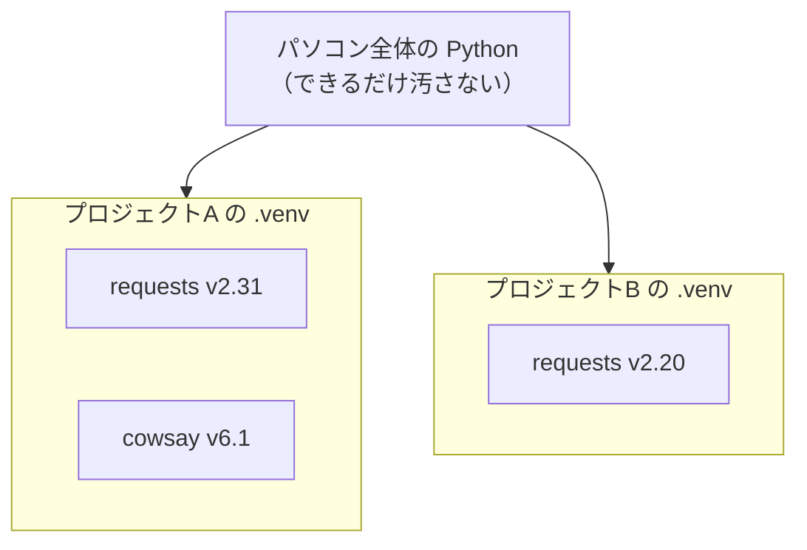

# 第1章 Python の環境構築

料理を始めるには、まず包丁とまな板が要ります。
プログラミングも同じで、コードを書く前に、**それを動かせる状態**を作る必要があります。

この章では、Python をパソコンに用意し、実際に動かすところまで進みます。
はじめての Python プログラムを、あなたの手で動かして、画面に文字を出します。

## この章で学ぶこと

- Python をパソコンにインストールして、動作確認ができるようになる
- REPL（対話モード）で、その場で計算やお試しができるようになる
- 自分で書いた Python ファイルを、ターミナルから実行できるようになる
- エラー（トレースバック）が出たとき、どこを読めばいいかがわかるようになる
- 仮想環境（venv）を作って、プロジェクトごとにライブラリを分けられるようになる
- pip でパッケージをインストールして使えるようになる
- VS Code で Python を実行・デバッグできるようになる

## この章の前提

- [第0章](./00-introduction.md) で AI サポートの準備が終わっていること
- 文字を書くための道具 **VS Code**（ブイエス・コード。ソースコードを書くための道具）が入っていること
  - まだの人は [react-text 1.3](../react-text/01-web-and-environment.md) の手順でインストールしてください（無料です）

> **つまずいたら**
> この章は**環境構築**です。ここは学習内容ではなく、ただの準備作業です。
> エラーが出たら、粘らずに AI へ丸投げしてください。
> **章番号（例：`1.5.5`）とエラーメッセージ全文**を貼り付ければ、あなたの環境に合わせて解決してくれます。
> 環境トラブルは、プロでも検索と質問で解決します。自力にこだわる場所ではありません。

---

## 1.1 Python とは

### 1.1.1 どんなところで使われているか

**Python**（パイソン）は、いま世界でもっとも広く使われているプログラミング言語の1つです。

**プログラミング言語**（コンピュータに指示を出すための、決まった書き方をする言葉）には
たくさんの種類がありますが、Python は特に次のような場所でよく使われています。

| 分野 | 使われ方の例 |
|------|------------|
| データ分析 | 大量の売上データを集計してグラフにする |
| AI・機械学習 | 画像を見分ける、文章を作る仕組みを作る |
| Web サーバー | ブラウザからの依頼に応えてデータを返す（この本の次の FastAPI がこれです） |
| 自動化 | 毎朝決まったファイルを集めて整理する作業を、自動で回す |

1つの言語でこれだけ広い分野をカバーできるのが Python の強みです。
このテキストを終えたあと、あなたがどの方向に進んでも Python は役に立ちます。

### 1.1.2 なぜ初学者に向いているのか

Python は、**人間が読みやすいこと**を大事にして作られた言語です。

第0章でも見た、同じ「1から3までを順に画面に出す」処理を、もう一度見てみます。

`JavaScript（react-text で学んだ書き方）`

```js
for (let i = 1; i <= 3; i++) {
  console.log(i);
}
```

`Python（この本で学ぶ書き方）`

```python
for i in range(1, 4):
    print(i)
```

Python のほうには、次のものが**ありません**。

- 波かっこ `{ }`（ブロックの範囲は、行頭の字下げで表します。第2章で扱います）
- 文の終わりのセミコロン `;`

そのぶん、英語の文章に近い見た目になります。
初めて読む人でも「なんとなく何をしているか」が想像しやすい、これが Python が
入門に向いていると言われる理由です。

> **補足：読みやすさは「正しさ」ではありません**
> 「Python のほうが JavaScript より優れている」わけではありません。
> 目的に応じて言語を選ぶだけです。読みやすさは Python の**個性**であって、優劣ではありません。

### 1.1.3 このテキストで使うバージョン

ソフトウェアには**バージョン**（版。数字で表す）があります。
Python のバージョンは `3.13.1` のように、ドットで区切られた3つの数字で表されます。

```text
3 . 13 . 1
│    │    └─ 小さな修正（気にしなくてよい）
│    └────── 機能の追加（3.12 → 3.13 で新機能が入る）
└─────────── 大きな世代（いまは 3 系）
```

**このテキストでは Python 3.13 系を使います**（執筆時点：Python 3.13）。
手元のバージョンがこれより少し新しくても古くても、**3.10 以上**なら本文のコードはそのまま動きます。

> **注意：Python 2 は使いません**
> 検索すると `python2` や `print "..."`（かっこのない `print`）を使った古い記事が出てきます。
> Python 2 は役目を終えた古い世代で、いまは使いません。
> **`3.` で始まるバージョン**を入れてください。迷ったら AI に「これは Python 3 の書き方ですか」と確認できます。

---

## 1.2 インストールする

これから Python をパソコンに入れます。手順は OS（Windows か macOS か）で違うので、
**自分の OS のところだけ**読んでください。

> **すでに Python が入っているかも、と思ったら**
> とくに macOS には、最初から古い Python が入っていることがあります。
> ですが、**確認は入れたあとの [1.2.4](#124-インストールを確認する) でまとめて行います。**
> ここではいったん、下の手順どおりに新しく入れてしまうのが確実です。

### 1.2.1 Windows へのインストール

1. ブラウザで https://www.python.org/downloads/ を開く
2. 黄色い **「Download Python 3.13.x」** ボタンをクリックしてインストーラーをダウンロードする
   （`x` の数字は違って構いません）
3. ダウンロードした `python-3.13.x-amd64.exe` を**ダブルクリック**して起動する
4. **最初の画面で、いちばん下の「Add python.exe to PATH」に必ずチェックを入れる**
   （これがこの章で最も大事なチェックです。理由は [1.2.3](#123-add-python-to-pathを必ずチェックする) で説明します）
5. **「Install Now」** をクリックする
6. 「Setup was successful」と表示されたら「Close」で閉じる

> **注意：「Add python.exe to PATH」のチェックを、絶対に忘れない**
> このチェックを入れ忘れると、次の [1.2.4](#124-インストールを確認する) で
> `python` コマンドが「見つかりません」となります。
> **入れ忘れたときの直し方は [1.2.3](#123-add-python-to-pathを必ずチェックする) にあります。**

### 1.2.2 macOS へのインストール

macOS では、公式インストーラーを使う方法が確実です。

1. ブラウザで https://www.python.org/downloads/ を開く
2. 黄色い **「Download Python 3.13.x」** ボタンをクリックする
   （自動で macOS 用が選ばれます）
3. ダウンロードした `python-3.13.x-macos11.pkg` を**ダブルクリック**して起動する
4. 「続ける」を押していき、最後に「インストール」を押す
   （途中でパソコンのパスワードを求められたら入力してください）
5. 「インストールが完了しました」と出たら閉じる

> **補足：macOS では `python3` と打つ**
> macOS では、Python を動かすコマンドが `python` ではなく **`python3`** です。
> `python` だと、最初から入っている別のものが動いたり、何も動かなかったりします。
> このテキストの macOS の手順は、すべて `python3` で書いてあります。

> **補足：Homebrew を使ったことがある人へ**
> `Homebrew`（ホームブルー。macOS 用のソフト導入ツール）に慣れている人は
> `brew install python@3.13` でも入れられます。
> 初めての人は、上の公式インストーラーのほうが迷いません。

### 1.2.3 「Add Python to PATH」を必ずチェックする

ここは Windows の話です（macOS はインストーラーが自動でやってくれます）。

まず、なぜチェックが必要なのかを説明します。

**PATH**（パス。ターミナルがコマンドを探しに行く場所の一覧）というものがあります。
ターミナル（文字でコンピュータに命令する画面。[1.2.4](#124-インストールを確認する) で開きます）で
`python` と打つと、パソコンは PATH に登録された場所を上から順に探して、
`python` という名前のプログラムを見つけ出そうとします。

「Add python.exe to PATH」にチェックを入れると、
**Python を入れた場所が、この PATH に自動で登録されます。**
だから、どこのフォルダにいても `python` と打つだけで Python が見つかります。

チェックを入れ忘れると、Python 自体は入っているのに、
パソコンが場所を知らないので「そんなコマンドはありません」となってしまいます。

**入れ忘れたときの直し方（Windows）**

まず、本当に入れ忘れたのかを確認します。ターミナル（[1.2.4](#124-インストールを確認する) の手順で開けます）で
次を打ってみてください。

```powershell
py --version
```

```text
実行結果の例:
Python 3.13.1
```

`py`（パイ・ランチャー）は、PATH のチェックとは無関係にいつも使えるコマンドです。
これでバージョンが出れば、**Python 自体は入っていて、PATH に登録されていないだけ**とわかります。

直すには、インストーラーをもう一度使うのがいちばん確実です。

1. ダウンロードした `python-3.13.x-amd64.exe` を**もう一度ダブルクリック**する
2. 「Modify」を選んで「Next」
3. 次の画面（Advanced Options）で **「Add Python to environment variables」にチェックを入れる**
4. 「Install」を押す
5. 終わったら、**開いているターミナルをすべて閉じて開き直す**（登録は開き直さないと反映されません）

> **よくある間違い**
> インストーラーを閉じてしまって手元にない場合は、
> [1.2.1](#121-windows-へのインストール) の手順でもう一度ダウンロードすれば同じものが手に入ります。
> 手作業で PATH を書き換える方法もありますが、打ち間違えると他のソフトも動かなくなるので、
> **初めての人はインストーラーからやり直すか、AI に頼ってください。**
>
> ```text
> python-text の 1.2.3 です。Windows で Python をインストールしましたが、
> Add python.exe to PATH のチェックを入れ忘れて、python コマンドが使えません。
> py --version は Python 3.13.1 と表示されます。
> OS: Windows 11
> ```

### 1.2.4 インストールを確認する

Python が正しく入ったかを、ターミナルで確認します。

**ターミナル**（文字でコンピュータに命令するための画面）を開きます。

**Windows：PowerShell を開く**

1. スタートボタンを右クリック
2. 「ターミナル」または「Windows PowerShell」をクリック

**macOS：ターミナルを開く**

1. `command` + `スペース` で Spotlight を開く
2. `ターミナル` と入力して Enter

> **補足：ターミナルの操作に不安があれば**
> ターミナルでの移動（`cd`）や一覧表示（`ls`）にまだ慣れていない場合は、
> [react-text 1.4](../react-text/01-web-and-environment.md) で基本操作を確認しておくと、この先が楽になります。

開いたら、次を打って Enter を押します。**以降、Windows は `python`、macOS は `python3` と読み替えてください。**

**Windows（PowerShell）**

```powershell
python --version
```

**macOS / Linux**

```bash
python3 --version
```

```text
実行結果の例:
Python 3.13.1
```

`3.13` のようにバージョン番号が表示されれば成功です。数字は少し違っていても構いません。

続いて、**pip**（ピップ。Python 用のパッケージマネージャ。[1.6](#16-pip-とパッケージ) で使います）も確認します。

**Windows（PowerShell）**

```powershell
python -m pip --version
```

**macOS / Linux**

```bash
python3 -m pip --version
```

```text
実行結果の例:
pip 24.3.1 from C:\...\pip (python 3.13)
```

両方ともバージョン番号が表示されれば、準備完了です。

**うまくいかないとき**

| 症状 | まず試すこと |
|------|------------|
| `'python' は認識されていません`（Windows） | ターミナルを開き直す。それでもだめなら [1.2.3](#123-add-python-to-pathを必ずチェックする) の直し方 |
| `command not found: python3`（macOS） | ターミナルを開き直す。それでもだめならインストールをやり直す |
| `python` で古いバージョンや Python 2 が出る（macOS） | `python` ではなく **`python3`** を使う |
| バージョンが `2.` で始まる | Python 3 が使えていない。`python3` で試す |

> **注意：ターミナルは開き直す**
> インストール直後は、**すでに開いているターミナルに新しい PATH が反映されていません。**
> 「入れたのに認識されない」の原因で最も多いのがこれです。
> いったんターミナルを全部閉じて、開き直してから試してください。

---

## 1.3 REPL で対話する

### 1.3.1 REPL とは

Python には、**1行打つたびに、その場で結果を返してくれる対話モード**があります。
これを **REPL**（レプル）と呼びます。

**REPL**（1行入力するたびに結果が返ってくる対話モード）

電卓のように「式を入れる → 答えが出る」を繰り返せるので、
「この書き方で合っているかな」をすぐ試せます。学び始めのいちばんの友達です。

### 1.3.2 起動して計算してみる

ターミナルで、引数を付けずに `python`（macOS は `python3`）とだけ打ちます。

**Windows（PowerShell）**

```powershell
python
```

**macOS / Linux**

```bash
python3
```

すると、行の先頭が **`>>>`** に変わります。これが「REPL が入力を待っている」印です。

```text
Python 3.13.1 (...) on win32
Type "help", "copyright", "credits" or "license" for more information.
>>>
```

`>>>` のあとに式を打って Enter を押すと、すぐ答えが返ってきます。

```python
>>> 1 + 1
2
>>> 10 * 5
50
>>> "こんにちは" + "、Python"
'こんにちは、Python'
>>> print("画面に出す")
画面に出す
```

- `1 + 1` のように**値を書くだけ**なら、REPL はその結果を表示します
- `print(...)` は、かっこの中身を画面に出す命令です（第2章で詳しく扱います）

数字や文字で、いろいろ試してみてください。間違えても壊れません。

### 1.3.3 終了する

REPL を抜けて、いつものターミナルに戻るには、次のどちらかを使います。

```python
>>> exit()
```

または、キーボードのショートカットでも抜けられます。

- **Windows**: `Ctrl` + `Z` を押してから Enter
- **macOS / Linux**: `Ctrl` + `D`

先頭が `>>>` から、いつもの表示（Windows なら `PS C:\...>`）に戻れば、REPL を抜けられています。

> **よくある間違い**
> 先頭が `>>>` のままなのに、`cd` や `ls` などのターミナルのコマンドを打つと、エラーになります。
> `>>>` が出ているときは「Python の中」にいます。
> ターミナルのコマンドを打ちたいときは、先に REPL を抜けてください。

### 1.3.4 REPL の使いどころ

REPL は便利ですが、**書いた内容は保存されません。** 閉じると消えます。

なので、使い分けはこうなります。

| やりたいこと | 使うもの |
|------------|---------|
| ちょっと計算したい、書き方を試したい | REPL |
| 何度も動かすプログラムを作りたい | **ファイルに書いて保存する**（次の 1.4） |

次の節では、消えない「ファイル」にプログラムを書いて動かします。

---

## 1.4 最初のプログラムを書く

### 1.4.1 ファイルを作る

まず、この本の学習で使う**作業用のディレクトリ**を作ります。

**ディレクトリ**（ファイルをまとめて入れておく入れ物。Windows の画面上では「フォルダ」と表示される）

ターミナルで、次を順に打ちます。デスクトップに `python-lesson` というディレクトリを作り、その中に移動します。

**Windows（PowerShell）**

```powershell
cd ~/Desktop
mkdir python-lesson
cd python-lesson
```

**macOS / Linux**

```bash
cd ~/Desktop
mkdir python-lesson
cd python-lesson
```

- `cd` は移動、`mkdir` はディレクトリを作る命令です（詳しくは [react-text 1.4](../react-text/01-web-and-environment.md)）
- `~`（チルダ）は「自分のホームディレクトリ」を表す記号です

> **注意：ディレクトリ名に日本語やスペースを使わない**
> `私の練習` や `python lesson` のような名前は避けてください。
> 一部の道具が、日本語やスペースを含むパスでうまく動かないことがあります。
> **半角の英数字・ハイフン・アンダースコアだけ**を使うのが安全です。

このディレクトリを VS Code で開きます。

```powershell
code .
```

`.`（ドット1つ）は「いまいるディレクトリ」を意味します。
（`code` コマンドが使えない場合は、VS Code のメニューから「ファイル」→「フォルダーを開く」で
`python-lesson` を選んでください。）

VS Code が開いたら、ファイルを1つ作ります。

1. 左サイドバーの「PYTHON-LESSON」という見出しにマウスを乗せる
2. **新しいファイル**のアイコン（紙に + が付いたもの）をクリック
3. ファイル名に `hello.py` と入力して Enter

**`.py`** は「これは Python のファイルです」という印（拡張子）です。

**拡張子**（ファイル名の末尾に付く `.py` `.txt` などの部分。ファイルの種類を表す）

開いた `hello.py` に、次の1行を**手で打って**ください。

`hello.py`

```python
print("はじめての Python")
```

打てたら、**保存**します。

- Windows: `Ctrl` + `S`
- macOS: `command` + `S`

### 1.4.2 実行する

書いたファイルを動かします。これを**実行する**と言います。

**実行する**（書いたプログラムをコンピュータに読ませて、実際に動かすこと）

VS Code の中でターミナルを開きます。メニューから **「ターミナル」→「新しいターミナル」**
（このターミナルは、いま開いている `python-lesson` の中にいる状態で開きます）。

そこで次を打ちます。

**Windows（PowerShell）**

```powershell
python hello.py
```

**macOS / Linux**

```bash
python3 hello.py
```

```text
実行結果:
はじめての Python
```

`hello.py` に書いたとおり、「はじめての Python」と表示されました。

いま起きたことを図にすると、次のようになります。


真ん中の **`python`** が、あなたの書いた文章を1行ずつ読んで実行しています。
これを**インタプリタ**と呼びます。

**インタプリタ**（ソースコードを1行ずつ読んで実行するプログラム。`python` コマンドがこれ）

> **補足：VS Code の実行ボタンでも動かせる**
> ファイルを毎回コマンドで動かすほかに、VS Code の右上の**▷（実行）ボタン**でも実行できます。
> その設定は [1.7](#17-vs-code-の設定) でまとめて行います。いまはコマンドで動かせれば十分です。

### 1.4.3 わざとエラーを出してみる

エラーは、これから何百回も出会う相手です。**わざと出して、読み方に慣れておきましょう。**

`hello.py` を、次のように**わざと打ち間違えて**保存してください。
`print` を `prnt`（`i` 抜き）にします。

`hello.py`

```python
prnt("はじめての Python")
```

保存して、もう一度実行します。

**Windows（PowerShell）**

```powershell
python hello.py
```

**macOS / Linux**

```bash
python3 hello.py
```

```text
実行結果:
Traceback (most recent call last):
  File "hello.py", line 1, in <module>
    prnt("はじめての Python")
    ^^^^
NameError: name 'prnt' is not defined
```

赤い（環境によっては白い）英文がたくさん出てきました。これが**エラー**です。

**エラー**（実行中に問題が起きたことをコンピュータが知らせてくるメッセージ）

慌てないでください。次の項で、この文章の読み方を覚えます。

### 1.4.4 トレースバックの読み方

さきほど出た、`Traceback ...` で始まる一連の表示を**トレースバック**と呼びます。

**トレースバック**（エラーが起きたとき、どこで・どんな問題が起きたかをたどれるように表示される情報）

トレースバックは、**下から上に**読むのがコツです。いちばん下にいちばん大事なことが書いてあります。

```text
Traceback (most recent call last):
  File "hello.py", line 1, in <module>     ← ② どのファイルの、何行目か
    prnt("はじめての Python")               ← ③ その行の実際の中身
    ^^^^                                    ← ④ 特に怪しい場所を指している
NameError: name 'prnt' is not defined      ← ① まずここを読む（種類 : 説明）
```

読む順番は次のとおりです。

1. **いちばん下の行**を読む。`エラーの種類 : 説明` の形になっています
   - `NameError` = 「そんな名前は知りません」という種類のエラー
   - `name 'prnt' is not defined` = 「`prnt` という名前は定義されていません」
2. その上の **`File "...", line 1`** で、**どのファイルの何行目**かがわかる
3. さらにその下に、**その行の中身**が表示される
4. `^^^^` が、**特に怪しい場所**を指している

ここまで読めば、「1行目の `prnt` という名前が原因だ」とわかります。
`prnt` を `print` に直して保存し、もう一度実行すれば直ります。

> **よくある間違い（Python で特に多い2つ）**
> - **全角スペースの混入**：コードの中に、全角の空白（`　`）が混じると
>   `SyntaxError`（文法エラー）になります。見た目でわかりにくいので要注意です。
> - **インデント（字下げ）のずれ**：Python は字下げに意味があります。
>   ずれていると `IndentationError` が出ます（第2章で詳しく扱います）。
>
> エラーが出たら、まず**種類（いちばん下の行）**と**行番号**を確認する。この2つで原因の半分はわかります。

> **つまずいたら**
> トレースバックの意味がわからないときは、**全文をそのまま AI に貼って**ください。
>
> ```text
> python-text の 1.4.4 です。次のエラーの意味と直し方を教えてください。
> （ここにトレースバックを全文貼る）
> ```

---

## 1.5 仮想環境（venv）

### 1.5.1 なぜプロジェクトごとに分けるのか

これから、他の人が作った便利な部品（**ライブラリ**）を使うようになります。

**ライブラリ**（他の人が作った、便利な機能のまとまり。自分のプログラムから呼び出して使う）

ここで1つ問題が起きます。たとえば、次の2つのプロジェクトを作ったとします。

- プロジェクトA：`requests`（リクエスツ）というライブラリの **v2.31** が必要
- プロジェクトB：同じ `requests` の、少し古い **v2.20** が必要

もし、この2つをパソコン全体に**まとめて1か所**に入れてしまうと、
`requests` は1つしか置けないので、片方が必ず動かなくなります。

これを避けるために、**プロジェクトごとに、専用の入れ物を用意**します。
これが**仮想環境**です。

**仮想環境（venv）**（プロジェクトごとにライブラリを分けて入れるための隔離された領域）

図にすると、こういう関係です。



プロジェクトAとBが、それぞれ自分専用の入れ物（`.venv`）を持っているので、
中に別々のバージョンを入れても、互いに干渉しません。

> **補足：面倒でも、必ず作る習慣を**
> 仮想環境を作らずにパソコン全体へ入れていくと、あとで必ずバージョンの衝突で困ります。
> 「新しいプロジェクトを始めたら、まず仮想環境を作る」を習慣にしてください。

### 1.5.2 仮想環境を作る

いま作業している `python-lesson` の中で、仮想環境を作ります。
ターミナルが `python-lesson` の中にいることを確認してから、次を打ちます。

**Windows（PowerShell）**

```powershell
python -m venv .venv
```

**macOS / Linux**

```bash
python3 -m venv .venv
```

- `-m venv` は「venv という機能を呼び出す」という意味です
- 最後の `.venv` は、**作られる入れ物の名前**です（この名前がよく使われます）

数秒待つと、`python-lesson` の中に **`.venv`** というディレクトリができます。
VS Code の左サイドバーに `.venv` が現れれば成功です。

> **補足：`.venv` の中は見なくてよい**
> `.venv` の中にはたくさんのファイルが入っていますが、**中身を触る必要はありません。**
> これは道具の置き場所で、あなたが編集するものではありません。

### 1.5.3 有効化する

作っただけでは、まだ使われません。**有効化**（その仮想環境を「いま使う」状態にすること）をします。

**Windows（PowerShell）**

```powershell
.\.venv\Scripts\Activate.ps1
```

**macOS / Linux**

```bash
source .venv/bin/activate
```

有効化に成功すると、**行の先頭に `(.venv)` が付きます。**

```text
(.venv) PS C:\Users\yamada\Desktop\python-lesson>
```

```text
(.venv) yamada@MacBook python-lesson %
```

この `(.venv)` が付いている間は、「いまこの仮想環境の中にいる」という意味です。
ここでライブラリを入れると、`.venv` の中だけに入ります。

> **注意：Windows で赤いエラーが出たら**
> Windows で有効化しようとして、次のような赤いエラーが出ることがあります。
>
> ```text
> このシステムではスクリプトの実行が無効になっているため、ファイル
> ...Activate.ps1 を読み込むことができません。
> ```
>
> これは **[1.5.5](#155-powershell-の実行ポリシーで有効化できないとき)** で直します。よくあるトラブルです。

### 1.5.4 無効化する・作り直す

**無効化する（仮想環境から抜ける）**

有効化を解除して、いつもの状態に戻すには、次を打ちます。OS 共通です。

```text
deactivate
```

先頭の `(.venv)` が消えれば、抜けられています。

**作り直す**

仮想環境の中身がおかしくなったと感じたら、`.venv` は**捨てて作り直せます。**
`.venv` はいつでも作り直せる「使い捨ての入れ物」だと考えてください。

1. まず `deactivate` で無効化する
2. `.venv` ディレクトリを削除する（VS Code のサイドバーで右クリック→削除でもよい）
3. [1.5.2](#152-仮想環境を作る) の手順でもう一度作る

> **補足：`.venv` は消えても、あなたのコードは消えない**
> `.venv` はライブラリの置き場所であって、あなたが書いた `.py` ファイルとは別物です。
> `.venv` を消しても、`hello.py` などのコードは残ります。安心して作り直してください。

### 1.5.5 PowerShell の実行ポリシーで有効化できないとき

ここは **Windows で [1.5.3](#153-有効化する) の有効化に失敗した人**向けです（macOS の人は読み飛ばして構いません）。

Windows には、安全のために「スクリプトを勝手に実行させない」という初期設定があります。
これを**実行ポリシー**と呼びます。この設定のせいで、有効化のスクリプト（`Activate.ps1`）が
ブロックされ、次のエラーになります。

```text
.\.venv\Scripts\Activate.ps1 : このシステムではスクリプトの実行が無効になっているため、
ファイル C:\...\Activate.ps1 を読み込むことができません。
```

**直し方**

PowerShell で、次の1行を打って Enter を押します。

```powershell
Set-ExecutionPolicy -Scope CurrentUser RemoteSigned
```

確認を求められたら、`Y` を打って Enter を押します。

```text
実行ポリシーの変更
...
[Y] はい(Y)  [A] すべて続行(A)  [N] いいえ(N)  ... : Y
```

これで設定が変わりました。もう一度、有効化を試してください。

```powershell
.\.venv\Scripts\Activate.ps1
```

先頭に `(.venv)` が付けば成功です。

> **補足：この設定は安全なのか**
> `-Scope CurrentUser`（いまログインしているあなただけに適用）と
> `RemoteSigned`（自分のパソコンで作ったスクリプトは実行を許可し、
> インターネットから落としてきたものは署名を求める）の組み合わせは、
> 開発でよく使われる、**安全側に寄った標準的な設定**です。
> パソコン全体をむやみに緩めるものではありません。

> **つまずいたら**
> それでも有効化できないときは、AI に丸投げしてください。
>
> ```text
> python-text の 1.5.5 です。Windows の PowerShell で venv を有効化できません。
> Set-ExecutionPolicy を実行しても、まだ Activate.ps1 でエラーが出ます。
> OS: Windows 11
> （エラー全文をここに貼る）
> ```

---

## 1.6 pip とパッケージ

### 1.6.1 pip とは

いよいよ、他の人が作った部品を取り込んで使います。
その取り込みを担当するのが **pip** です。

**pip**（ピップ。Python 用のパッケージマネージャ）
**パッケージマネージャ**（ライブラリのインストール・更新・削除を管理する道具）
**パッケージ**（配布できる形にまとめられたライブラリ）

pip は「部品の発注係」のようなものです。
「この部品がほしい」と名前で頼むと、インターネット上の倉庫から取り寄せて、
いまの仮想環境に入れてくれます。

### 1.6.2 パッケージをインストールする

ここからは、**仮想環境を有効化した状態**（先頭に `(.venv)` が付いている状態）で進めます。
付いていない場合は、先に [1.5.3](#153-有効化する) で有効化してください。

例として、**`cowsay`**（カウセイ。しゃべる牛のアスキーアートを表示する、遊び用のライブラリ）を入れてみます。

```powershell
pip install cowsay==6.1
```

`cowsay==6.1` は「`cowsay` のバージョン 6.1 を入れる」という指定です。
バージョンを固定しておくと、あとで同じ結果を再現しやすくなります。

```text
実行結果の例:
Collecting cowsay==6.1
  Downloading cowsay-6.1-py3-none-any.whl (25 kB)
Installing collected packages: cowsay
Successfully installed cowsay-6.1
```

`Successfully installed` と出れば成功です。
いま何が入っているかは、`pip list` で一覧できます。

```powershell
pip list
```

```text
実行結果の例:
Package    Version
---------- -------
cowsay     6.1
pip        24.3.1
```

入れた `cowsay` を、実際に使うプログラムを書きます。
VS Code で、`python-lesson` の中に新しいファイル `moo.py` を作ってください。

`moo.py`

```python
import cowsay

# cowsay の cow に文字を渡すと、その文字をしゃべる牛が表示される
cowsay.cow("Python を入れたよ")
```

- `import cowsay` は「`cowsay` というライブラリを、このファイルで使えるようにする」という宣言です
  （`import` は第6章で詳しく扱います。いまは「入れた部品を呼び出す合図」と思ってください。
  なお `import cowsay` の `cowsay` は、このファイルで使えるようにするライブラリの名前です）

保存して、実行します。**仮想環境を有効化したまま**のターミナルで打ってください。

**Windows（PowerShell）**

```powershell
python moo.py
```

**macOS / Linux**

```bash
python3 moo.py
```

```text
実行結果:
  _______________
| Python を入れたよ |
  ===============
                \
                 \
                   ^__^
                   (oo)\_______
                   (__)\       )\/\
                       ||----w |
                       ||     ||
```

牛がしゃべりました。これが「他の人が作った部品を取り込んで使う」ということです。

> **よくある間違い**
> `ModuleNotFoundError: No module named 'cowsay'` と出たら、
> ほぼ確実に**仮想環境を有効化しないまま実行している**か、
> **有効化した環境と違う環境に入れてしまった**かのどちらかです。
> ターミナルの先頭に `(.venv)` が付いているかを、まず確認してください。

### 1.6.3 requirements.txt で環境を再現する

自分のパソコンで動いたプログラムを、別のパソコン（あるいは未来の自分）でも
同じように動かすには、「どのパッケージのどのバージョンを入れたか」の**一覧**が必要です。

その一覧は、pip が自動で書き出してくれます。仮想環境を有効化した状態で、次を打ちます。

```powershell
pip freeze > requirements.txt
```

- `pip freeze` は「いま入っているパッケージとバージョンを一覧する」命令です
- `> requirements.txt` は「その結果を `requirements.txt` というファイルに書き出す」という意味です

`python-lesson` に `requirements.txt` ができます。中を開くと、こうなっています。

`requirements.txt`

```text
cowsay==6.1
```

このファイルがあれば、別の環境で**まったく同じパッケージ一式**をそろえられます。
新しい仮想環境を作って有効化したあと、次を打つだけです。

```powershell
pip install -r requirements.txt
```

`-r requirements.txt` は「このファイルに書かれたものを全部入れる」という指定です。

> **補足：なぜこれが大事なのか**
> チームで開発するとき、`requirements.txt` を共有すれば、
> 全員が同じライブラリの同じバージョンで作業できます。
> 「自分の環境では動くのに、相手の環境では動かない」という事故を防ぐ仕組みです。

### 1.6.4 インストールが失敗するときの対処

`pip install` が失敗することもあります。よくある原因と対処をまとめます。

| 症状・原因 | 対処 |
|-----------|------|
| 仮想環境を有効化していない | 先頭に `(.venv)` が付いているか確認し、[1.5.3](#153-有効化する) で有効化する |
| pip が古い | `python -m pip install --upgrade pip`（macOS は `python3`）で更新する |
| 会社などのプロキシ環境で通信が失敗する | ネットワークの制限が原因。AI か情シス部門に相談する |
| `SSL` や `certificate` を含むエラー | 通信の証明書の問題。環境によるので AI に全文を貼って相談する |
| パッケージ名の打ち間違い | 正しい名前か確認する（大文字小文字も含めて） |

> **つまずいたら**
> pip のエラーは環境によって原因がさまざまです。**エラー全文をそのまま AI に貼って**ください。
>
> ```text
> python-text の 1.6.4 です。pip install が次のエラーで失敗します。
> （エラー全文をここに貼る）
> OS: Windows 11 / 仮想環境は有効化済み（先頭に (.venv) が付いています）
> ```

---

## 1.7 VS Code の設定

ここまではコマンドで実行してきました。
VS Code に少し設定を足すと、**ボタン1つで実行**したり、**プログラムを1行ずつ止めて中を確認**したりできます。

### 1.7.1 Python 拡張機能を入れる

VS Code に「Python を扱う力」を足す部品（拡張機能）を入れます。

1. VS Code の左側のアイコンのうち、**四角が4つ並んだアイコン**（拡張機能）をクリック
2. 検索欄に `Python` と入力
3. **Microsoft** が提供している **「Python」** 拡張機能を選び、「Install」をクリック

> **注意：提供元が Microsoft のものを選ぶ**
> 同じような名前の拡張機能が複数出てきます。
> 説明に **Microsoft** と書かれた、いちばん上に出てくるものを選んでください。

### 1.7.2 インタプリタを選ぶ（仮想環境を認識させる）

VS Code に「このプロジェクトでは、さっき作った `.venv` を使う」と教えます。
これをしないと、ボタン実行のときに仮想環境の外の Python が使われ、
`cowsay` が見つからないなどの食い違いが起きます。

1. `Ctrl` + `Shift` + `P`（macOS は `command` + `shift` + `P`）で、コマンドパレット（命令を検索して呼び出す入力欄）を開く
2. `Python: Select Interpreter` と打って、出てきた項目を選ぶ
3. 一覧の中から、**`.venv` を含むもの**（`('.venv': venv)` と書かれているもの）を選ぶ

VS Code の右下（または下部のバー）に、選んだ Python のバージョンと `.venv` が表示されれば成功です。

### 1.7.3 実行とデバッグ

`hello.py` を開いた状態で、VS Code の**右上にある ▷（実行）ボタン**を押してください。

下に「ターミナル」が開き、自動でコマンドが打たれて、結果が表示されます。

```text
実行結果:
はじめての Python
```

これで、コマンドを打たなくてもファイルを実行できるようになりました。

> **補足：ボタン実行でも、中では同じことが起きている**
> ▷ ボタンは、あなたの代わりに `python hello.py` に相当するコマンドを打ってくれているだけです。
> 中で何が起きているかは [1.4.2](#142-実行する) と同じです。

### 1.7.4 デバッガでステップ実行する

**デバッガ**（プログラムを途中で止めて、中を1行ずつ確認できる道具）を使うと、
「いま変数に何が入っているか」を目で見ながら進められます。バグ探しの強力な武器です。

試してみましょう。`hello.py` を、次のように少し増やします。

`hello.py`

```python
message = "はじめての Python"
print(message)
```

1. 左端の**行番号のすぐ左**をクリックすると、赤い丸（**ブレークポイント**。プログラムを一時停止させる目印）が付きます。
   `print(message)` の行に付けてください
2. `F5` を押す（初回は「Python File」など実行方法を聞かれるので、それを選ぶ）
3. プログラムが**赤い丸の行の直前で止まります**
4. 画面左の「変数」欄に、`message` の中身（`はじめての Python`）が表示されます
5. 上部に出るツールバーで進めます
   - **ステップオーバー**（`F10`）：次の1行を実行して、また止まる
   - **続行**（`F5`）：最後まで一気に実行する

止めながら変数の中身を確認できるので、「思っていた値と違う」という原因を目で見つけられます。

> **補足：いまは「そういう道具がある」で十分**
> デバッガは、コードが長くなってから真価を発揮します。
> いまは「1行ずつ止めて変数を見られる道具がある」と知っておくだけで十分です。
> 第2章以降で変数やデータが増えたとき、ここへ戻ってきてください。

---

## まとめ

- **Python 3.13 系**をインストールする。Windows は **「Add python.exe to PATH」に必ずチェック**
- 動かすコマンドは、**Windows は `python`、macOS は `python3`**
- インストール後は**ターミナルを開き直す**。「入れたのに認識されない」の最大の原因
- **REPL**（`python` とだけ打つと始まる `>>>` の対話モード）で、その場で試せる。抜けるのは `exit()`
- ファイルに書いたプログラムは `python ファイル名`（macOS は `python3`）で**実行**する
- エラーの **トレースバック**は**下から上**に読む。まず「種類 : 説明」と「行番号」を見る
- **仮想環境（venv）** をプロジェクトごとに作り、有効化してからライブラリを入れる
  - 作る：`python -m venv .venv` ／ 有効化：Windows は `Activate.ps1`、macOS は `source .venv/bin/activate`
  - Windows で有効化が失敗したら、**`Set-ExecutionPolicy -Scope CurrentUser RemoteSigned`**
- **pip** でパッケージを入れる（`pip install 名前`）。一覧は `pip freeze > requirements.txt` で保存できる
- VS Code に **Python 拡張機能**を入れ、**インタプリタに `.venv` を選ぶ**と、ボタン実行とデバッグができる

---

## 理解度チェック

答えは [解答編](./90-answers-part1.md#第1章) にあります。まず自分で考えてください。

**問 1.1**
Windows と macOS で、Python を動かすときにターミナルで打つコマンドは、それぞれ何ですか。

**問 1.2**
「1行入力するたびに結果が返ってくる対話モード」を何と呼びますか。また、そのモードから抜けるための命令を1つ答えてください。

**問 1.3**
次のトレースバックを見て、（1）エラーの種類、（2）問題が起きた行番号、を答えてください。

```text
Traceback (most recent call last):
  File "app.py", line 3, in <module>
    print(nummber)
          ^^^^^^^
NameError: name 'nummber' is not defined
```

**問 1.4**
仮想環境（venv）を使うと、どんな問題を防げますか。1〜2行で説明してください。

**問 1.5**
仮想環境を「作る」コマンドと、「有効化する」コマンドは別のものです。
`python -m venv .venv` はどちらですか。

**問 1.6**
Windows の PowerShell で仮想環境を有効化しようとしたら、
「スクリプトの実行が無効になっているため…」というエラーが出ました。
これを解決するために実行するコマンドを1つ答えてください。

---

## 演習問題

### 演習 1.1 ★☆☆ あいさつを表示するプログラムを作る

**課題**
`python-lesson` の中に `greet.py` というファイルを作り、実行すると
**自分の名前を含むあいさつ**が2行で表示されるプログラムを書いてください。

**完成条件**
- `python greet.py`（macOS は `python3 greet.py`）で実行できる
- 実行すると、次のように**2行**表示される（名前は自分のものにしてよい）

```text
こんにちは、山田です。
Python の学習を始めました。
```

- エラー（トレースバック）が出ずに、最後まで実行できる

**ヒント**
[1.4](#14-最初のプログラムを書く) の `hello.py` がそのまま下敷きになります。
`print(...)` を2つ並べると、2行表示されます。

---

### 演習 1.2 ★☆☆ 仮想環境を作って有効化する

**課題**
`python-lesson` とは**別の**新しいディレクトリ `venv-practice` を作り、
その中に仮想環境を作って有効化してください。有効化できたことを確認します。

**完成条件**
- `venv-practice` の中に `.venv` ディレクトリができている
- 有効化したあと、ターミナルの**先頭に `(.venv)` が付いている**
- 有効化した状態で `pip list` を実行し、一覧が表示される
- 最後に `deactivate` で無効化し、先頭の `(.venv)` が消えることを確認できた

**ヒント**
ディレクトリを作って移動する手順は [1.4.1](#141-ファイルを作る) と同じです。
仮想環境の「作る」「有効化する」「無効化する」は [1.5.2](#152-仮想環境を作る)〜[1.5.4](#154-無効化する作り直す) にあります。
Windows で有効化に失敗したら [1.5.5](#155-powershell-の実行ポリシーで有効化できないとき) を見てください。

---

### 演習 1.3 ★★☆ パッケージを入れて使い、環境を書き出す

**課題**
演習 1.2 で作った `venv-practice` の仮想環境の中で、
パッケージを1つインストールして使い、最後に `requirements.txt` を書き出してください。
（パッケージは [1.6.2](#162-パッケージをインストールする) の `cowsay==6.1` を使って構いません。）

**完成条件**
- 仮想環境を有効化した状態（先頭に `(.venv)`）で、`cowsay==6.1` をインストールできた
- `use_package.py` というファイルを作り、そこから **インストールしたパッケージを `import` して使う**
- `python use_package.py`（macOS は `python3`）で実行すると、パッケージを使った出力が表示される
- `pip freeze > requirements.txt` を実行し、`requirements.txt` の中に `cowsay==6.1` が書かれている

**ヒント**
「有効化 → `pip install` → `import` して使うファイルを書く → 実行 → 書き出す」という
一連の流れは、[1.6.2](#162-パッケージをインストールする) と [1.6.3](#163-requirementstxt-で環境を再現する) にそのまま載っています。
`import` した部品の呼び出し方は `moo.py` の例を参考にしてください。
`ModuleNotFoundError` が出たら、まず先頭に `(.venv)` が付いているかを確認します。

---

## 次の章へ

Python が動く環境が整い、ファイルを実行し、ライブラリを取り込むところまでできました。

次の章では、いよいよ Python の**文法**に入ります。
変数・型・演算子・文字列、そして Python の最大の特徴である**インデント（字下げ）のルール**を、
手を動かしながら1つずつ身につけていきます。

→ [第2章 基本文法](./02-basics.md)
