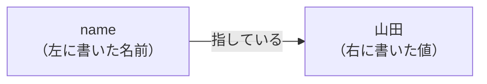
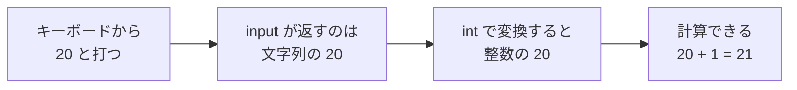
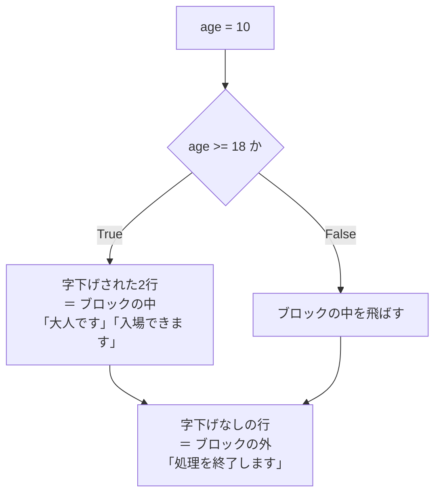

# 第2章 基本文法

第1章で、Python を動かす環境ができました。
ですが、まだ書いたのは `print("はじめての Python")` の1行だけです。
これは「決まった文字を出すだけ」で、プログラムというより貼り紙に近いものでした。

この章から、いよいよ**プログラムらしいプログラム**を書きます。
値に名前を付けて（変数）、計算して（演算子）、文字を組み立てて（文字列）、
使う人から値を受け取る（入力）——ここまでできると、
「入力に応じて答えが変わるもの」が作れるようになります。

Python の最大の特徴である**インデント（行頭の字下げ）のルール**も、この章で扱います。

## この章で学ぶこと

- 変数に値を入れて、あとから使い回せるようになる
- 数値・文字列・真偽値・`None` という4つの基本の型を区別できるようになる
- 四則演算・比較・論理演算を使って、値から新しい値を計算できるようになる
- f-string で、文字列の中に計算結果を埋め込めるようになる
- `input` で使う人から値を受け取り、数値として計算できるようになる
- インデントが Python では「見た目の整え」ではなく**文法**であることを理解する
- コメントと PEP 8（Python の書き方の約束）にしたがって、読めるコードを書けるようになる

## この章の前提

- [第1章](./01-environment.md) を終えて、`python`（macOS は `python3`）でファイルを実行できること
- 作業用ディレクトリ `python-lesson` があること（[1.4.1](./01-environment.md#141-ファイルを作る)）
- VS Code で `.py` ファイルを作って保存できること

> **つまずいたら**
> この章から先は**学習内容**です。環境構築とは違い、ここは考える価値のある場所です。
> それでも、3分考えてわからなければ AI に聞いてください（[0.4.2](./00-introduction.md#042-詰まったときの動き方)）。
> そのとき、**章番号（例：`2.6.3`）とエラーメッセージ全文**を必ず添えてください。
>
> ```text
> python-text の 2.6.3 で詰まりました。
> IndentationError: expected an indented block after 'if' statement on line 1
> と出ますが、どこが悪いのかわかりません。
> ```

> **この章のコードを書く場所**
> この章では `python-lesson` の中に、項ごとに小さな `.py` ファイルを作って試します。
> ファイル名は本文で毎回指定します。作ったファイルは消さずに残しておいてください。
> あとから「あれはどう書いたっけ」と見返すときの、あなただけの参考書になります。

---

## 2.1 変数と代入

### 2.1.1 変数を作る

第1章では、こう書きました。

```python
print("はじめての Python")
```

これだと、表示したい文字が変わるたびに `print` の中を書き直すことになります。
同じ文字を10か所で使っていたら、10か所すべてを直す必要があります。

そこで使うのが**変数**です。

**変数**（へんすう。値に名前をつけて、あとから使い回すための仕組み）

`python-lesson` の中に `variables.py` を作り、次のように書いてください。

`variables.py`

```python
name = "山田"
print(name)
```

**Windows（PowerShell）**

```powershell
python variables.py
```

**macOS / Linux**

```bash
python3 variables.py
```

```text
実行結果:
山田
```

`name = "山田"` の `=` は、「等しい」という意味では**ありません**。
**「右側の値を、左側の名前に入れる」**という意味です。これを**代入**と呼びます。

**代入**（だいにゅう。`=` を使って、右側の値に左側の名前を結びつけること）

図にすると、次のようになります。



一度作った変数は、何度でも使えます。

`variables.py` を、次のように書き換えてください。

`variables.py`

```python
name = "山田"
print(name)
print(name)
print(name)
```

```text
実行結果:
山田
山田
山田
```

`name = "山田"` の1か所を `"佐藤"` に変えるだけで、3行すべての表示が変わります。
これが変数を使う理由です。

変数には、あとから別の値を入れ直すこともできます。

`reassign.py`

```python
count = 10
print(count)

count = 20
print(count)
```

```text
実行結果:
10
20
```

2回目の `count = 20` で、`count` が指す先が `10` から `20` に付け替えられました。

> **よくある間違い：`=` と `==` は別物です**
> `=` は**代入**（値を入れる）、`==` は**比較**（等しいかを調べる。[2.3.4](#234-比較演算子) で扱います）です。
> 混同すると、意図と違う動きになります。**「入れる」ときは `=` 1つ**と覚えてください。

> **よくある間違い：使う前に作る**
> 変数は、**代入した行より後**でしか使えません。
>
> ```python
> print(message)
> message = "こんにちは"
> ```
>
> ```text
> 実行結果:
> Traceback (most recent call last):
>   File "variables.py", line 1, in <module>
>     print(message)
>           ^^^^^^^
> NameError: name 'message' is not defined
> ```
>
> `NameError` は「その名前は作られていません」という意味です（[1.4.4](./01-environment.md#144-トレースバックの読み方)）。
> Python はファイルを**上から順に**読むので、代入の行を先に書く必要があります。

### 2.1.2 `let` / `const` がない

react-text で JavaScript を学んだ人は、変数を作るときにこう書いていました。

```js
let count = 10;
const name = "山田";
```

Python には、この `let` や `const` にあたるキーワードが**ありません**。
いきなり `名前 = 値` と書けば、それが変数の作成になります。

```python
count = 10
name = "山田"
```

react-text を読んでいない人は、「変数は `名前 = 値` で作る」とだけ覚えれば十分です。

この違いから、2つのことが言えます。

**1. 「作る」と「入れ直す」の見た目が同じ**

JavaScript では `let count = 10;`（作る）と `count = 20;`（入れ直す）で見た目が違いました。
Python はどちらも `count = 10` / `count = 20` で、区別がありません。
**その名前が初めて出てきた行が「作った行」**になります。

**2. `const`（変更できない変数）が作れない**

Python には「あとから変えられない変数」を作る仕組みがありません。
そのため、**「変えないつもりの変数」は、名前の付け方で示す**という約束があります。
これは [2.1.4](#214-定数の慣習) で扱います。

> **補足：セミコロンも要りません**
> JavaScript では行末に `;`（セミコロン）を付けていましたが、Python では付けません。
> 付けてもエラーにはなりませんが、**このテキストでは書きません。**
> Python では書かないのが普通だからです。

### 2.1.3 変数名の付け方（snake_case）

変数の名前は自由に決められますが、守るべき**ルール**と、守ったほうがよい**慣習**があります。

**ルール（守らないとエラーになる）**

| ルール | ✅ 良い例 | ❌ エラーになる例 |
|--------|---------|----------------|
| 使えるのは英数字とアンダースコア `_` | `user_name` | `user-name`（ハイフンは引き算と区別できない） |
| 数字で始められない | `item1` | `1item` |
| 大文字と小文字は区別される | `name` と `Name` は**別の変数** | — |
| 予約語は使えない | `total` | `class`、`if`、`for` など |

**予約語**（よやくご。Python が文法として使うために取ってある単語。変数名には使えない）

主な予約語は次のとおりです。いま覚える必要はありません。
「この単語を変数名にしたらエラーが出た」というときに見返してください。

```text
False   None    True    and     as      assert  async   await
break   class   continue def     del     elif    else    except
finally for     from    global  if      import  in      is
lambda  nonlocal not     or      pass    raise   return  try
while   with    yield
```

**慣習（守らなくても動くが、守るべきもの）**

Python では、変数名を**すべて小文字にして、単語の区切りをアンダースコアでつなぎます**。
この書き方を **snake_case**（スネークケース。ヘビが這っているような見た目から）と呼びます。

| ✅ Python の書き方 | ❌ 避ける書き方 | 補足 |
|------------------|---------------|------|
| `user_name` | `userName` | `userName` は JavaScript の書き方（キャメルケース） |
| `total_price` | `TotalPrice` | 先頭大文字はクラス名に使います（第8章） |
| `item_count` | `itemcount` | 区切りがないと読みにくい |

react-text で JavaScript を書いていた人は、`userName` と書きたくなりますが、
**Python では `user_name`** です。これは動作の違いではなく、読み手との約束です。

もうひとつ大事なのは、**名前から中身が想像できること**です。

```python
# ❌ 何が入っているかわからない
a = 1980
b = "山田"

# ✅ 読めばわかる
price = 1980
customer_name = "山田"
```

（`#` で始まる行は**コメント**で、実行されません。[2.7.1](#271-コメントの書き方) で扱います。）

> **よくある間違い：全角文字の混入**
> 変数名やコードに**全角の英字・記号・スペース**が混ざると、Python は読めません。
>
> ```text
> SyntaxError: invalid non-printable character U+3000
> ```
>
> `U+3000` は**全角スペース**を表します。日本語入力のまま `=` や `(` を打つと起きがちです。
> 対処法は [2.6.4](#264-タブとスペースを混ぜない設定) で、見えるようにする設定と合わせて説明します。

### 2.1.4 定数の慣習

プログラムの中には、**途中で変えるつもりのない値**があります。
消費税率、1ページあたりの表示件数、サービスの名前などです。

このような値を**定数**と呼びます。

**定数**（ていすう。プログラムの実行中に変えないと決めた値）

[2.1.2](#212-let--const-がない) のとおり、Python には「変えられない変数」を作る仕組みがありません。
そのかわり、**名前をすべて大文字にする**ことで「これは定数です。変えないでください」と示します。

`constants.py`

```python
TAX_RATE = 0.1
SERVICE_NAME = "やまだ商店"

price = 1000
print(SERVICE_NAME)
print(price * TAX_RATE)
```

```text
実行結果:
やまだ商店
100.0
```

大文字とアンダースコアで書くこの形を **UPPER_SNAKE_CASE** と呼びます。

**重要なのは、これがあくまで「約束」だということです。**
次のように書き換えても、Python はエラーを出しません。

```python
TAX_RATE = 0.1
TAX_RATE = 0.5   # エラーにはならない（が、書いてはいけない）
```

エラーにならないからこそ、**書き手が守る**必要があります。
大文字の名前を見たら「これは変えてはいけない」と読み取る、というルールです。

| 種類 | 書き方 | 例 |
|------|--------|-----|
| 変数 | snake_case（小文字） | `user_name`、`total_price` |
| 定数 | UPPER_SNAKE_CASE（大文字） | `TAX_RATE`、`MAX_COUNT` |

---

## 2.2 データ型

変数には、数値も文字も入れられます。
ですが Python の中では、**それぞれ違う種類のものとして扱われています。**
この「種類」のことを**型**と呼びます。

**型**（かた。値の種類。数値なのか文字列なのか、といった区別）

型を意識しないと、次のようなことが起きます。

```python
print(1 + 2)       # 3     （足し算）
print("1" + "2")   # 12    （文字をつなげただけ）
```

同じ `+` でも、型が違えば意味が変わります。
この章で扱う基本の型は、次の5つです。

| 型の名前 | 呼び方 | 何を表すか | 書き方の例 |
|---------|--------|-----------|----------|
| `int` | 整数型 | 小数点のない数 | `10`、`-3`、`0` |
| `float` | 浮動小数点数型 | 小数点のある数 | `3.14`、`0.1`、`-2.0` |
| `str` | 文字列型 | 文字の並び | `"山田"`、`'こんにちは'` |
| `bool` | 真偽値型 | 正しいか正しくないか | `True`、`False` |
| `NoneType` | — | 「値がない」こと | `None` |

### 2.2.1 整数と浮動小数点数

数値には2つの型があります。

- **整数**（`int`）：`10`、`-3`、`0` のように小数点のない数
- **浮動小数点数**（`float`。ふどうしょうすうてんすう）：`3.14`、`0.5` のように小数点のある数

`numbers.py`

```python
count = 10
price = 3.14

print(count)
print(price)
print(count + price)
```

```text
実行結果:
10
3.14
13.14
```

整数と小数を足すと、結果は小数（`float`）になります。
「片方でも小数が混じったら、結果は小数」と覚えてください。

数値には、桁区切りのカンマを**書きません**。

```python
price = 1,000     # ❌ これは数値ではありません（別のものになります）
price = 1000      # ✅
```

かわりに、**アンダースコアで桁区切り**を書くことができます。これは読みやすさのためだけの機能です。

`big_number.py`

```python
population = 125_000_000
print(population)
```

```text
実行結果:
125000000
```

表示するときはアンダースコアが消えます。書くときだけの目印です。

> **よくある間違い：小数の計算は、ぴったりにならないことがあります**
> 次のコードを実行してみてください。
>
> `float_trap.py`
>
> ```python
> print(0.1 + 0.2)
> ```
>
> ```text
> 実行結果:
> 0.30000000000000004
> ```
>
> `0.3` になりません。バグではなく、**コンピュータが小数を2進数で扱う仕組み上、
> どうしても生じる誤差**です。Python に限らず、JavaScript でも同じ結果になります。
>
> お金の計算のように1円もずらせない場面では、
> **円単位の整数（`int`）で計算する**のが基本です。
> （より厳密な方法は `decimal` という道具を使いますが、このテキストでは扱いません。）

### 2.2.2 文字列

**文字列**（もじれつ。文字の並び。`str` 型）は、
**引用符**で囲んで書きます。

`strings.py`

```python
name = "山田"
message = 'こんにちは'

print(name)
print(message)
```

```text
実行結果:
山田
こんにちは
```

Python では、**ダブルクォート `"` とシングルクォート `'` のどちらでも構いません。**
意味の違いはありません。

ただし、**開いた記号と閉じた記号は同じものを使います。**

```python
name = "山田'    # ❌ SyntaxError になる
```

このテキストでは、**ダブルクォート `"` を標準**とします。
使い分けが必要な場面（文字列の中に引用符を入れたいとき）は
[2.4.5](#245-エスケープと複数行文字列) で扱います。

数字を引用符で囲むと、**それは数値ではなく文字列**になります。

`number_or_string.py`

```python
a = 100
b = "100"

print(a + a)
print(b + b)
```

```text
実行結果:
200
100100
```

`a` は数値なので足し算になり、`b` は文字列なので**つながっただけ**です。
この違いは [2.5.3](#253-入力は必ず文字列である) で重要になります。

> **よくある間違い：引用符が全角になっている**
> 日本語入力のまま打つと、`"` が `”` になります。
>
> ```text
> SyntaxError: invalid character '”' (U+201D)
> ```
>
> エラーメッセージに `U+201D` や `U+3000` が出たら、**全角文字の混入**を疑ってください。

### 2.2.3 真偽値（`True` / `False`）

**真偽値**（しんぎち。「正しい」か「正しくない」かの2つだけを表す値。`bool` 型）は、
`True`（真）と `False`（偽）の2つしかありません。

`booleans.py`

```python
is_member = True
is_admin = False

print(is_member)
print(is_admin)
```

```text
実行結果:
True
False
```

真偽値は、**比較の結果**としてよく登場します（[2.3.4](#234-比較演算子)）。

```python
print(10 > 3)
```

```text
実行結果:
True
```

> **よくある間違い：先頭は大文字です**
> JavaScript では `true` / `false` と小文字でしたが、
> **Python は `True` / `False` と先頭が大文字**です。
>
> ```python
> is_member = true
> ```
>
> ```text
> NameError: name 'true' is not defined. Did you mean: 'True'?
> ```
>
> 小文字で書くと「`true` という変数はありません」というエラーになります。
> 末尾の `Did you mean: 'True'?` は Python からの提案で、そのとおりに直せば動きます。
> これは非常によく踏む落とし穴です。

変数名の付け方にも慣習があります。真偽値を入れる変数は、
**`is_` / `has_` で始める**と読みやすくなります。

```python
is_published = True     # 公開されているか
has_discount = False    # 割引があるか
```

### 2.2.4 `None`

**`None`**（ノン。「値がない」ことを表す特別な値）は、
「まだ決まっていない」「該当するものがない」を表すときに使います。

`none_value.py`

```python
nickname = None
print(nickname)
```

```text
実行結果:
None
```

JavaScript には `null` と `undefined` の2つがありましたが、**Python は `None` の1つだけ**です。
（react-text を読んでいない人は、「値がないことを表す専用の値がある」とだけ理解してください。）

`None` は「空っぽ」であって、**`0` や `""`（空文字列）とは違います。**

| 値 | 意味 |
|----|------|
| `0` | 数として、ゼロである |
| `""` | 文字列だが、中身が1文字もない |
| `None` | そもそも値が入っていない |

たとえば「アンケートの回答が0点だった」は `0`、
「まだ回答していない」は `None` で表す、という使い分けになります。

`None` も先頭が大文字です。`none` と書くと `NameError` になります。

> **補足：`None` を表示すると `None` と出ます**
> `print(None)` は `None` という文字を表示しますが、
> これは**文字列の `"None"` とは別物**です。見た目が同じでも型が違います。
> 見分ける方法は次の [2.2.5](#225-型を調べるtype) で扱います。

### 2.2.5 型を調べる（`type`）

値の型がわからなくなったときは、**`type`** を使うと調べられます。

`check_type.py`

```python
print(type(10))
print(type(3.14))
print(type("山田"))
print(type(True))
print(type(None))
```

```text
実行結果:
<class 'int'>
<class 'float'>
<class 'str'>
<class 'bool'>
<class 'NoneType'>
```

`<class 'int'>` の `int` の部分が型の名前です。
（`class` という単語の意味は第8章で扱います。いまは「型の名前が表示される」と読んでください。）

変数に対しても使えます。

`check_type2.py`

```python
a = 100
b = "100"

print(type(a))
print(type(b))
```

```text
実行結果:
<class 'int'>
<class 'str'>
```

見た目は同じ `100` でも、型が違うことがはっきりわかります。

**`type` は、思ったとおりに動かないときの調査道具です。**
「足し算のつもりが文字がつながった」というときは、まず `type` で確認してください。

### 2.2.6 型を変換する

型が違ってうまく計算できないときは、**型を変換**します。
これを**キャスト**とも呼びます。

| 変換したい型 | 使う書き方 | 例 |
|------------|----------|-----|
| 整数に | `int(値)` | `int("100")` → `100` |
| 小数に | `float(値)` | `float("3.14")` → `3.14` |
| 文字列に | `str(値)` | `str(100)` → `"100"` |

`convert.py`

```python
text = "100"
number = int(text)

print(type(text))
print(type(number))
print(number + 50)
```

```text
実行結果:
<class 'str'>
<class 'int'>
150
```

`int(text)` は、**`text` 自体を変えるわけではありません。**
「`text` の中身を整数に変換した、新しい値」を作って返します。
だから、その結果を `number` という別の変数で受け取っています。

逆方向（数値 → 文字列）も同じです。

`convert2.py`

```python
count = 5
print("残り" + str(count) + "個")
```

```text
実行結果:
残り5個
```

`str(count)` を書かずに `"残り" + count` とすると、エラーになります。
（この書き方より読みやすい方法が [2.4.4](#244-f-string) の f-string です。）

**先頭に `0` が付いた数字の文字列を `int()` に通すと、`0` が取れます。**

`convert_zero.py`

```python
month_text = "08"
print(month_text)
print(int(month_text))
```

```text
実行結果:
08
8
```

`"08"` は文字列なので `0` が残りますが、整数の `8` には「先頭の 0」という概念がありません。
**日付や時刻の表示で「08月」を「8月」にしたい**ときに、この性質が使えます。

**小数を整数にすると、小数部分は切り捨てられます。**

`convert3.py`

```python
print(int(3.9))
print(int(-3.9))
```

```text
実行結果:
3
-3
```

四捨五入ではなく、**0 に近づく方向へ切り捨て**です。

> **よくある間違い：変換できない文字列を渡す**
> `int()` に、数字として読めない文字列を渡すとエラーになります。
>
> ```python
> print(int("abc"))
> ```
>
> ```text
> ValueError: invalid literal for int() with base 10: 'abc'
> ```
>
> **`ValueError`** は「型は合っているが、値の中身が不適切」というエラーです。
> さらに注意が必要なのは、**小数の文字列も `int()` では変換できない**ことです。
>
> ```python
> print(int("3.5"))
> ```
>
> ```text
> ValueError: invalid literal for int() with base 10: '3.5'
> ```
>
> この場合は、いったん `float()` を通してから `int()` にします。
>
> ```python
> print(int(float("3.5")))
> ```
>
> ```text
> 実行結果:
> 3
> ```

---

## 2.3 演算子

**演算子**（えんざんし。`+` や `>` のように、値どうしを計算・比較するための記号）を使うと、
値から新しい値を作れます。

### 2.3.1 算術演算子

計算のための演算子です。

| 演算子 | 意味 | 例 | 結果 |
|-------|------|-----|------|
| `+` | 足す | `7 + 2` | `9` |
| `-` | 引く | `7 - 2` | `5` |
| `*` | かける | `7 * 2` | `14` |
| `/` | 割る | `7 / 2` | `3.5` |
| `//` | 割った商（切り捨て） | `7 // 2` | `3` |
| `%` | 割った余り | `7 % 2` | `1` |
| `**` | 累乗（るいじょう。何乗か） | `2 ** 10` | `1024` |

`arithmetic.py`

```python
print(7 + 2)
print(7 - 2)
print(7 * 2)
print(7 / 2)
print(7 // 2)
print(7 % 2)
print(2 ** 10)
```

```text
実行結果:
9
5
14
3.5
3
1
1024
```

計算の順番は算数と同じで、**`*` `/` が `+` `-` より先**に計算されます。
順番を変えたいときは、かっこ `( )` を使います。

`order.py`

```python
print(2 + 3 * 4)
print((2 + 3) * 4)
```

```text
実行結果:
14
20
```

### 2.3.2 `/` と `//` と `%`

割り算には3種類あり、**これは初学者がよく混乱する場所**なので、分けて説明します。

`division.py`

```python
print(10 / 3)
print(10 // 3)
print(10 % 3)
```

```text
実行結果:
3.3333333333333335
3
1
```

| 演算子 | 名前 | 10 と 3 の場合 | どんなときに使うか |
|-------|------|--------------|-----------------|
| `/` | 除算 | `3.3333333333333335` | ふつうに割りたいとき |
| `//` | 切り捨て除算 | `3` | 「何個ぶん取れるか」を知りたいとき |
| `%` | 剰余（じょうよ。余り） | `1` | 「余りがいくつか」「割り切れるか」を知りたいとき |

**大事な性質：`/` は、割り切れても必ず小数（`float`）になります。**

`division2.py`

```python
print(10 / 2)
print(type(10 / 2))
print(10 // 2)
print(type(10 // 2))
```

```text
実行結果:
5.0
<class 'float'>
5
<class 'int'>
```

`10 / 2` は `5` ではなく **`5.0`** です。
「個数」や「人数」のように整数で扱いたい値には、`//` を使ってください。

**`//` と `%` は、セットで使うと威力を発揮します。**

たとえば「卵が 17 個ある。1パック 6 個で詰めると、何パックできて何個余るか」を求めてみます。

`eggs.py`

```python
total_eggs = 17
per_pack = 6

pack_count = total_eggs // per_pack   # 何パックできるか
rest = total_eggs % per_pack          # 詰めきれずに余る数

print(pack_count)
print(rest)
```

```text
実行結果:
2
5
```

「大きい単位に何個ぶん変換できるか」を `//` で、「変換しきれない端数」を `%` で求める。
**この組み合わせは、単位の変換全般に使えます**（分と秒、時間と分、円と千円など）。

**さらに大きい単位があるときは、同じことを繰り返します。**

たとえば「1箱に4パック入る」として、65個の卵を「何箱・何パック・何個」に分けてみます。
**大きい単位から順に**求めるのがコツです。

`eggs2.py`

```python
total_eggs = 65
PER_PACK = 6
PER_BOX = 24          # 1箱 = 4パック = 24個

box_count = total_eggs // PER_BOX     # まず箱の数を求める
rest = total_eggs % PER_BOX           # 箱に入りきらなかった残り

pack_count = rest // PER_PACK         # 残りをパックに詰める
egg_rest = rest % PER_PACK            # それでも余る卵

print(box_count)
print(pack_count)
print(egg_rest)
```

```text
実行結果:
2
2
5
```

65 個は「2箱 と 2パック と 5個」に分かれました。

ポイントは、**2段目以降は「元の数」ではなく「1つ前の余り（`rest`）」に対して `//` と `%` を使う**ことです。
元の `total_eggs` に対して `// PER_PACK` としてしまうと、
箱に入れたぶんまで二重に数えてしまいます。

この「割って、余りに対してまた割る」という形は、3段・4段と何段でも同じように続けられます。

> **補足：`round` で小数を丸める**
> 小数を四捨五入したいときは **`round`** を使います。
>
> ```python
> print(round(3.7))
> print(round(3.14159, 2))
> ```
>
> ```text
> 実行結果:
> 4
> 3.14
> ```
>
> 2つ目の `2` は「小数点以下2桁まで残す」という意味です。
> 桁数を指定しないと、整数（`int`）になります。

> **よくある間違い：0 では割れません**
> ```python
> print(10 / 0)
> ```
>
> ```text
> ZeroDivisionError: division by zero
> ```
>
> 算数と同じで、0 で割ることはできません。
> 割る数が変数のときは、それが 0 になる可能性がないか意識してください。

### 2.3.3 代入演算子

変数の値を「いまの値をもとに」更新する場面は、とてもよくあります。

```python
count = 10
count = count + 1
print(count)
```

```text
実行結果:
11
```

`count = count + 1` は「いまの `count`（10）に 1 を足した値を、あらためて `count` に入れる」という意味です。
`=` が「等しい」ではなく「入れる」であることを思い出してください（[2.1.1](#211-変数を作る)）。

この書き方は短く書けます。

| 書き方 | 同じ意味の書き方 |
|--------|---------------|
| `count += 1` | `count = count + 1` |
| `count -= 1` | `count = count - 1` |
| `count *= 2` | `count = count * 2` |
| `count /= 2` | `count = count / 2` |
| `count //= 2` | `count = count // 2` |
| `count %= 3` | `count = count % 3` |

`compound.py`

```python
score = 100

score += 50
print(score)

score -= 20
print(score)

score *= 2
print(score)
```

```text
実行結果:
150
130
260
```

文字列にも `+=` が使えます。

`compound_str.py`

```python
message = "こんにちは"
message += "、山田さん"
print(message)
```

```text
実行結果:
こんにちは、山田さん
```

> **補足：`++` はありません**
> JavaScript の `count++` にあたる書き方は、Python には**ありません**。
> `count += 1` と書いてください。

### 2.3.4 比較演算子

2つの値を比べて、**真偽値（`True` / `False`）を返す**演算子です。

| 演算子 | 意味 | 例 | 結果 |
|-------|------|-----|------|
| `==` | 等しい | `3 == 3` | `True` |
| `!=` | 等しくない | `3 != 5` | `True` |
| `<` | より小さい | `3 < 5` | `True` |
| `>` | より大きい | `3 > 5` | `False` |
| `<=` | 以下 | `3 <= 3` | `True` |
| `>=` | 以上 | `3 >= 5` | `False` |

`comparison.py`

```python
age = 20

print(age == 20)
print(age != 20)
print(age >= 18)
print(age < 18)
```

```text
実行結果:
True
False
True
False
```

比較の結果は、そのまま変数に入れられます。

`comparison2.py`

```python
age = 20
is_adult = age >= 18

print(is_adult)
print(type(is_adult))
```

```text
実行結果:
True
<class 'bool'>
```

この `is_adult` を、第3章の `if` と組み合わせると「大人なら〜する」が書けるようになります。

**JavaScript を学んだ人への注意：Python に `===` はありません。**
JavaScript の `===` にあたるのが、Python の `==` です。

| JavaScript | Python |
|-----------|--------|
| `x === y` | `x == y` |
| `x !== y` | `x != y` |
| `x == y`（型を無視して比べる） | 相当するものはない |

**型が違う値どうしを `==` で比べると、`False` になります。**

`compare_type.py`

```python
print(100 == "100")
print(100 == 100.0)
```

```text
実行結果:
False
True
```

1つ目は「整数の 100」と「文字列の "100"」なので `False` です。
2つ目は、`int` と `float` は**どちらも数値なので**、値が同じなら `True` になります。

> **よくある間違い：`=` を書いてしまう**
> 比較のつもりで `=` を1つだけ書くと、エラーになります。
>
> ```python
> age = 20
> print(age = 20)
> ```
>
> ```text
> TypeError: 'age' is an invalid keyword argument for print()
> ```
>
> メッセージからは原因が読み取りにくいですが、**`=` を `==` にすれば直ります。**
> 「比べるときは `=` を2つ」と覚えてください。

### 2.3.5 論理演算子（`and` / `or` / `not`）

複数の条件を組み合わせるための演算子です。

| 演算子 | 意味 | 結果が `True` になるとき |
|-------|------|----------------------|
| `and` | かつ | 左右の**両方**が `True` |
| `or` | または | 左右の**どちらか**が `True` |
| `not` | 〜ではない | 右側が `False` |

`logical.py`

```python
age = 20
is_member = True

print(age >= 18 and is_member)
print(age >= 65 or is_member)
print(not is_member)
```

```text
実行結果:
True
True
False
```

1行目は「18歳以上 **かつ** 会員である」で、両方 `True` なので `True` です。
2行目は「65歳以上 **または** 会員である」で、後半が `True` なので全体も `True` です。
3行目は「会員 **ではない**」で、`is_member` が `True` なので `False` になります。

真偽値の組み合わせを表にすると、次のようになります。

| 左 | 右 | `and` | `or` |
|----|----|-------|------|
| `True` | `True` | `True` | `True` |
| `True` | `False` | `False` | `True` |
| `False` | `True` | `False` | `True` |
| `False` | `False` | `False` | `False` |

**JavaScript を学んだ人へ：記号ではなく英単語です。**

| JavaScript | Python |
|-----------|--------|
| `&&` | `and` |
| `\|\|` | `or` |
| `!` | `not` |

`&&` や `||` と書くと `SyntaxError` になります。

条件が3つ以上になるときや、`and` と `or` を混ぜるときは、
**かっこで意図を明示してください。**

`logical2.py`

```python
age = 70
is_member = False
has_coupon = True

# 「（65歳以上 または 会員）かつ クーポンあり」
print((age >= 65 or is_member) and has_coupon)
```

```text
実行結果:
True
```

かっこがないと `and` が `or` より先に計算されるため、意味が変わってしまいます。
**迷ったらかっこを付ける**のが安全です。

> **よくある間違い：`18 <= age and age < 65` を短く書きたくなる**
> Python では、実は次のようにつなげて書けます。
>
> ```python
> age = 20
> print(18 <= age < 65)
> ```
>
> ```text
> 実行結果:
> True
> ```
>
> これは Python 特有の便利な書き方です（多くの言語ではできません）。
> ただし読み手が混乱することもあるため、**慣れるまでは `and` で書く**ことをおすすめします。

---

## 2.4 文字列を扱う

プログラムで扱うデータの多くは文字列です。
名前、住所、商品名、メッセージ——そのすべてが文字列です。
ここでは、文字列を組み立てたり切り出したりする方法を学びます。

### 2.4.1 連結と繰り返し

文字列は `+` でつなげられます。これを**連結**と呼びます。

`concat.py`

```python
last_name = "山田"
first_name = "太郎"

full_name = last_name + first_name
print(full_name)

print("こんにちは、" + full_name + "さん")
```

```text
実行結果:
山田太郎
こんにちは、山田太郎さん
```

`*` を使うと、同じ文字列を繰り返せます。

`repeat.py`

```python
print("-" * 20)
print("ありがとう" * 3)
```

```text
実行結果:
--------------------
ありがとうありがとうありがとう
```

`"-" * 20` は、区切り線を書くときによく使います。

> **よくある間違い：文字列と数値は `+` でつなげられません**
> ```python
> count = 5
> print("残り" + count + "個")
> ```
>
> ```text
> TypeError: can only concatenate str (not "int") to str
> ```
>
> **`TypeError`** は「型が合っていません」というエラーです。
> メッセージは「文字列に連結できるのは文字列だけです（`int` は無理です）」という意味です。
>
> 直す方法は2つあります。
>
> 1. `str()` で文字列に変換する（[2.2.6](#226-型を変換する)）
>    ```python
>    print("残り" + str(count) + "個")
>    ```
> 2. f-string を使う（[2.4.4](#244-f-string)。**こちらが推奨です**）
>    ```python
>    print(f"残り{count}個")
>    ```

### 2.4.2 インデックスとスライス

文字列は「文字が順番に並んだもの」なので、**何番目の文字か**を指定して取り出せます。
この番号を**インデックス**と呼びます。

**インデックス**（並んでいるものの位置を表す番号。Python では**0 から**始まる）

```text
文字列:   P   y   t   h   o   n
番号:     0   1   2   3   4   5
後ろから -6  -5  -4  -3  -2  -1
```

`index.py`

```python
word = "Python"

print(word[0])
print(word[1])
print(word[5])
print(word[-1])
```

```text
実行結果:
P
y
n
n
```

**1文字目が `[0]`** である点に注意してください。
`[-1]` は「後ろから1番目」で、末尾の文字を取り出すときによく使います。

文字数は **`len`** で調べられます。

`length.py`

```python
word = "Python"
print(len(word))

name = "山田太郎"
print(len(name))
```

```text
実行結果:
6
4
```

日本語も1文字は1文字として数えられます。

**範囲を指定して取り出す**こともできます。これを**スライス**と呼びます。

**スライス**（`[開始:終了]` の形で、文字列の一部を切り出すこと）

`slice.py`

```python
word = "Python"

print(word[0:3])
print(word[2:5])
print(word[:3])
print(word[3:])
print(word[:])
```

```text
実行結果:
Pyt
tho
Pyt
hon
Python
```

ここでいちばん大事なルールは、**終了の番号は含まれない**ことです。

`word[0:3]` は「0番目から**3番目の手前まで**」なので、`0, 1, 2` の3文字（`Pyt`）になります。
「終わりは手前まで」と覚えてください。

| 書き方 | 意味 |
|--------|------|
| `word[2:5]` | 2番目から 5番目の手前まで |
| `word[:3]` | 最初から 3番目の手前まで |
| `word[3:]` | 3番目から最後まで |
| `word[-3:]` | 後ろから3文字 |

**桁数が決まっている文字列は、スライスで分解できます。**
たとえば、ハイフンなしで入力された11桁の電話番号を、3つの部分に分けてみます。

`phone_slice.py`

```python
phone = "09012345678"

part1 = phone[0:3]
part2 = phone[3:7]
part3 = phone[7:11]

print(part1)
print(part2)
print(part3)
print(part1 + "-" + part2 + "-" + part3)
```

```text
実行結果:
090
1234
5678
090-1234-5678
```

**「何番目から何文字ぶん取りたいか」を数えて、開始と終了を決める**のがコツです。
`phone[3:7]` は「3番目から 7番目の手前まで」なので、3・4・5・6 の4文字になります。

> **よくある間違い：範囲外のインデックス**
> ```python
> word = "Python"
> print(word[10])
> ```
>
> ```text
> IndexError: string index out of range
> ```
>
> `IndexError` は「そこに文字はありません」という意味です。
> なお、**スライスは範囲外でもエラーになりません**（取れるところまで返します）。
>
> ```python
> print(word[0:100])
> ```
>
> ```text
> 実行結果:
> Python
> ```

> **よくある間違い：文字列の一部だけを書き換えることはできません**
> ```python
> word = "Python"
> word[0] = "J"
> ```
>
> ```text
> TypeError: 'str' object does not support item assignment
> ```
>
> Python の文字列は**イミュータブル**（不変。作ったあと中身を変えられない）です。
> 変えたいときは、**新しい文字列を作って入れ直します。**
>
> ```python
> word = "Python"
> word = "J" + word[1:]
> print(word)
> ```
>
> ```text
> 実行結果:
> Jython
> ```

### 2.4.3 よく使うメソッド

文字列には、**その値専用の命令**が最初から付いています。これを**メソッド**と呼びます。

**メソッド**（値に付いている専用の命令。`値.メソッド名()` の形で呼び出す）

`methods.py`

```python
text = "  Hello Python  "

print(text.strip())
print(text.upper())
print(text.lower())
```

```text
実行結果:
Hello Python
  HELLO PYTHON  
  hello python  
```

`text.strip()` の `.`（ドット）は「〜の」と読むとわかりやすいです。
「`text` の `strip`（前後の空白を取り除く命令）を実行する」という意味になります。

よく使うメソッドをまとめます。

| メソッド | 何をするか | 例 | 結果 |
|---------|-----------|-----|------|
| `strip()` | 前後の空白・改行を取り除く | `"  あ  ".strip()` | `"あ"` |
| `upper()` | すべて大文字にする | `"abc".upper()` | `"ABC"` |
| `lower()` | すべて小文字にする | `"ABC".lower()` | `"abc"` |
| `replace(a, b)` | `a` を `b` に置き換える | `"2025-08".replace("-", "/")` | `"2025/08"` |
| `startswith(s)` | `s` で始まるか（真偽値） | `"python".startswith("py")` | `True` |
| `endswith(s)` | `s` で終わるか（真偽値） | `"a.py".endswith(".py")` | `True` |
| `count(s)` | `s` がいくつ含まれるか | `"ababa".count("a")` | `3` |
| `zfill(n)` | 左を `0` で埋めて `n` 桁にする | `"7".zfill(2)` | `"07"` |

`methods2.py`

```python
date_text = "2025-08-25"

print(date_text.replace("-", "/"))
print(date_text.startswith("2025"))
print(date_text.count("-"))
print("7".zfill(2))
```

```text
実行結果:
2025/08/25
True
2
07
```

**メソッドは、元の文字列を変えません。**
[2.4.2](#242-インデックスとスライス) で見たとおり文字列はイミュータブルなので、
メソッドは「加工した**新しい文字列**」を返します。

`immutable_method.py`

```python
text = "  Hello  "
text.strip()
print(text)

stripped = text.strip()
print(stripped)
```

```text
実行結果:
  Hello  
Hello
```

1回目の `text.strip()` は、結果をどこにも保存していないので**捨てられています**。
元の `text` は変わりません。
結果を使いたいときは、`stripped = text.strip()` のように**変数で受け取る**か、
そのまま `print(text.strip())` のように使います。

> **よくある間違い：かっこを忘れる**
> ```python
> text = "abc"
> print(text.upper)
> ```
>
> ```text
> 実行結果:
> <built-in method upper of str object at 0x000001F2E3C0A030>
> ```
>
> エラーにはなりませんが、「命令そのもの」が表示されてしまいます。
> **メソッドは必ず `()` を付けて呼び出します。**

### 2.4.4 f-string

文字列の中に変数の値を埋め込む方法です。**この章でいちばん使う道具**になります。

文字列の引用符の**前に `f` を付ける**と、その文字列の中の `{ }` が
「中身を計算して埋め込む場所」になります。

`fstring.py`

```python
name = "山田"
age = 20

print(f"{name}さんは{age}歳です。")
```

```text
実行結果:
山田さんは20歳です。
```

これを `+` で書くと、次のようになります。

```python
print(name + "さんは" + str(age) + "歳です。")
```

f-string のほうが**短く、`str()` による変換も不要**です。
このテキストでは、以降 f-string を標準として使います。

`{ }` の中には、**計算式もそのまま書けます。**

`fstring2.py`

```python
price = 1200
count = 3

print(f"合計は{price * count}円です。")
```

```text
実行結果:
合計は3600円です。
```

**表示の形を整える書式指定**も使えます。

| 書き方 | 意味 | 例 | 結果 |
|--------|------|-----|------|
| `{x:,}` | 3桁ごとにカンマ | `f"{1234567:,}"` | `1,234,567` |
| `{x:.2f}` | 小数点以下2桁で表示 | `f"{3.14159:.2f}"` | `3.14` |
| `{x:>5}` | 右寄せで5文字ぶん | `f"{7:>5}"` | `    7` |
| `{x:05}` | 5桁になるよう 0 で埋める | `f"{7:05}"` | `00007` |

`fstring3.py`

```python
total = 1234567
rate = 0.08512

print(f"売上は{total:,}円です。")
print(f"割合は{rate:.2f}です。")
print(f"番号は{7:05}です。")
```

```text
実行結果:
売上は1,234,567円です。
割合は0.09です。
番号は00007です。
```

`{rate:.2f}` は四捨五入して2桁で**表示**するだけで、`rate` 自体の値は変わりません。

> **よくある間違い：`f` を書き忘れる**
> ```python
> name = "山田"
> print("{name}さん")
> ```
>
> ```text
> 実行結果:
> {name}さん
> ```
>
> エラーは出ませんが、`{name}` がそのまま表示されます。
> **`{ }` を使うなら、必ず引用符の前に `f`** を付けてください。

> **よくある間違い：`{ }` の中で同じ引用符を使う**
> ```python
> print(f"名前は{"山田"}です")
> ```
>
> Python 3.12 以降ではこれも動きますが、**3.11 以前ではエラーになります。**
> 外側と内側で引用符を変える（`f"...{'山田'}..."`）ほうが安全です。
> このテキストでは、`{ }` の中には**変数か計算式だけ**を書きます。

### 2.4.5 エスケープと複数行文字列

文字列の中に、引用符そのものや改行を入れたいことがあります。

**エスケープシーケンス**（バックスラッシュ `\` で始まる、特別な意味を持つ書き方）を使います。

| 書き方 | 意味 |
|--------|------|
| `\n` | 改行 |
| `\t` | タブ（水平方向の空白） |
| `\\` | バックスラッシュそのもの |
| `\"` | ダブルクォートそのもの |
| `\'` | シングルクォートそのもの |

> **`\`（バックスラッシュ）の打ち方**
> 日本語キーボードでは、多くの場合 `¥`（円マーク）キーで入力します。
> 画面上で `¥` と表示されても、Python は同じものとして扱います。

`escape.py`

```python
print("1行目\n2行目")
print("名前\t年齢")
print("彼は\"こんにちは\"と言った")
```

```text
実行結果:
1行目
2行目
名前	年齢
彼は"こんにちは"と言った
```

引用符については、**外側と違う種類を使えばエスケープは不要**です。

`quotes.py`

```python
print('彼は"こんにちは"と言った')
print("It's a pen")
```

```text
実行結果:
彼は"こんにちは"と言った
It's a pen
```

長い文章や、そのまま改行を保ちたい文字列は、
**引用符を3つ重ねた複数行文字列**が便利です。

`multiline.py`

```python
message = """ご注文ありがとうございます。
商品は3日以内に発送いたします。
ご不明な点はお問い合わせください。"""

print(message)
```

```text
実行結果:
ご注文ありがとうございます。
商品は3日以内に発送いたします。
ご不明な点はお問い合わせください。
```

`"""` から `"""` までの改行が、そのまま保たれます。

> **補足：Windows のパスを書くとき**
> Windows のパスには `\` が含まれるため、エスケープと解釈されて壊れることがあります。
>
> ```python
> print("C:\Users\name")   # \U や \n が特別扱いされてしまう
> ```
>
> このようなときは、引用符の前に **`r`** を付けます（raw string。書いたまま扱う文字列）。
>
> ```python
> print(r"C:\Users\name")
> ```
>
> ```text
> 実行結果:
> C:\Users\name
> ```

---

## 2.5 入力と出力

ここまでのプログラムは、実行するたびに必ず同じ結果でした。
**使う人から値を受け取れる**ようになると、プログラムは一気に「道具」らしくなります。

### 2.5.1 `print` の使い方

`print` は第1章から使ってきましたが、実はいくつかの使い方があります。

**カンマで区切ると、複数の値を並べて表示できます。**

`print_multi.py`

```python
name = "山田"
age = 20

print(name, age)
print("名前:", name, "年齢:", age)
```

```text
実行結果:
山田 20
名前: 山田 年齢: 20
```

**カンマで区切った値の間には、自動で半角スペースが1つ入ります。**
この区切り文字は `sep` で変えられます。

`print_sep.py`

```python
print("2025", "08", "25", sep="-")
print("A", "B", "C", sep="")
```

```text
実行結果:
2025-08-25
ABC
```

また、`print` は表示のあとに自動で改行します。この改行は `end` で変えられます。

`print_end.py`

```python
print("読み込み中", end="...")
print("完了")
```

```text
実行結果:
読み込み中...完了
```

1つ目の `print` が改行しなかったため、2つ目が同じ行に続いています。

引数を何も渡さない `print()` は、**空行を1行出します。**

```python
print("上")
print()
print("下")
```

```text
実行結果:
上

下
```

| 書き方 | 効果 |
|--------|------|
| `print(a, b)` | 半角スペース区切りで並べる |
| `print(a, b, sep="-")` | 区切りを `-` にする |
| `print(a, end="")` | 表示のあと改行しない |
| `print()` | 空行を出す |

> **補足：カンマと `+` と f-string の使い分け**
> ```python
> count = 5
> print("残り", count, "個")     # 「残り 5 個」（スペースが入る）
> print("残り" + str(count) + "個")  # 「残り5個」
> print(f"残り{count}個")            # 「残り5個」（推奨）
> ```
> 3つとも動きますが、**このテキストでは f-string を標準**とします。
> 意図しないスペースが入らず、型変換も不要だからです。

### 2.5.2 `input` で受け取る

**`input`** を使うと、実行中にキーボードから値を受け取れます。

`ask_name.py`

```python
name = input("お名前を入力してください: ")
print(f"こんにちは、{name}さん")
```

**Windows（PowerShell）**

```powershell
python ask_name.py
```

**macOS / Linux**

```bash
python3 ask_name.py
```

実行すると、次のように表示されて**止まります。**

```text
お名前を入力してください: 
```

ここで `山田` と打って Enter を押すと、続きが動きます。

```text
実行結果:
お名前を入力してください: 山田
こんにちは、山田さん
```

`input(...)` のかっこの中に書いた文字列は、**入力を促すメッセージ**として表示されます。
これがないと、画面が止まったまま何を求められているのかわかりません。**必ず書いてください。**

```python
name = input()             # ❌ 何を入力すべきか伝わらない
name = input("お名前: ")    # ✅
```

> **補足：プログラムを途中で止めたいとき**
> 入力待ちで止まっているプログラムを止めるには、ターミナルで
> **`Ctrl` + `C`**（Windows / macOS 共通）を押します。
> 押すと `KeyboardInterrupt` と表示されて終了します。これは正常な動作です。

> **補足：VS Code の実行ボタンでも入力できます**
> 右上の ▷（実行）ボタンで実行した場合も、下部のターミナルに入力できます
> （[1.7.3](./01-environment.md#173-実行とデバッグ)）。
> カーソルがターミナルにあることを確認してから打ってください。

### 2.5.3 入力は必ず文字列である

**`input` が返す値は、どんなに数字らしく見えても必ず文字列（`str`）です。**
これは初学者が確実に一度は踏む落とし穴なので、実際に踏んでおきます。

`age_bad.py`

```python
age = input("年齢を入力してください: ")
print(age + 1)
```

```text
実行結果:
年齢を入力してください: 20
Traceback (most recent call last):
  File "age_bad.py", line 2, in <module>
    print(age + 1)
          ~~~~^~~
TypeError: can only concatenate str (not "int") to str
```

`20` と入力したのに、`age` の中身は数値の `20` ではなく**文字列の `"20"`** です。
確かめてみましょう。

`age_check.py`

```python
age = input("年齢を入力してください: ")
print(type(age))
```

```text
実行結果:
年齢を入力してください: 20
<class 'str'>
```

計算に使うには、[2.2.6](#226-型を変換する) の `int()` で変換します。

`age_good.py`

```python
age = int(input("年齢を入力してください: "))
print(f"来年は{age + 1}歳ですね。")
```

```text
実行結果:
年齢を入力してください: 20
来年は21歳ですね。
```

`int(input(...))` は、内側から順に「入力を受け取る → 整数に変換する」と動きます。



慣れないうちは、**2行に分けて書く**ほうが読みやすく、間違いにも気づきやすくなります。

`age_good2.py`

```python
age_text = input("年齢を入力してください: ")
age = int(age_text)
print(f"来年は{age + 1}歳ですね。")
```

**ここまでの内容を組み合わせて、ひとつのプログラムを作ってみます。**
「商品の単価と個数を入力すると、税込の合計金額を表示する」プログラムです。

`total_price.py`

```python
TAX_RATE = 0.1

price_text = input("単価（円）: ")
count_text = input("個数: ")

price = int(price_text)
count = int(count_text)

subtotal = price * count
tax = int(subtotal * TAX_RATE)
total = subtotal + tax

print(f"小計: {subtotal:,}円")
print(f"消費税: {tax:,}円")
print(f"合計: {total:,}円")
```

```text
実行結果:
単価（円）: 1280
個数: 3
小計: 3,840円
消費税: 384円
合計: 4,224円
```

このプログラムには、この章の要素がひととおり入っています。

| 使っている要素 | 該当する項 |
|--------------|----------|
| 定数（`TAX_RATE`） | [2.1.4](#214-定数の慣習) |
| `int()` による型変換 | [2.2.6](#226-型を変換する) |
| 算術演算子（`*`、`+`） | [2.3.1](#231-算術演算子) |
| `input` で受け取る | [2.5.2](#252-input-で受け取る) |
| f-string と桁区切り | [2.4.4](#244-f-string) |

**「入力を受け取る → 変換する → 計算する → f-string で表示する」**
——この流れは、これから何度も書くことになる基本の型です。

> **よくある間違い：数字以外を入力されるとエラーになります**
> `total_price.py` の「単価」に `abc` と入力すると、次のようになります。
>
> ```text
> ValueError: invalid literal for int() with base 10: 'abc'
> ```
>
> これは [2.2.6](#226-型を変換する) で見た `ValueError` です。
> **いまの段階では、これは正しい動作です。**
> 「入力が正しくないときに、優しく間違いを伝える」書き方は、
> 条件分岐（第3章）と例外処理（第7章）を学んでから扱います。

---

## 2.6 インデントがルールになる

ここからは、**Python が他の多くの言語ともっとも違う部分**です。

### 2.6.1 波かっこがない言語

多くのプログラミング言語では、「ここからここまでがひとまとまり」を
**波かっこ `{ }`** で表します。react-text の JavaScript もそうでした。

```js
if (age >= 18) {
  console.log("大人です");
  console.log("入場できます");
}
console.log("処理を終了します");
```

波かっこの中の2行が「18歳以上のときだけ実行する部分」です。
この「ひとまとまり」を**ブロック**と呼びます。

**ブロック**（ひとまとまりとして扱われる、連続した複数行の処理）

**Python には、この波かっこがありません。**
かわりに、**行頭の字下げ（インデント）**でブロックを表します。

**インデント**（行頭の字下げ。Python ではこれが処理のまとまりを表す）

同じ処理を Python で書くと、次のようになります。

```python
if age >= 18:
    print("大人です")
    print("入場できます")
print("処理を終了します")
```

`if age >= 18:` の行末の **`:`（コロン）**が「ここからブロックが始まります」の合図で、
そのあとの**字下げされた行**がブロックの中身です。

> **`if` はまだ学んでいません**
> `if`（もし〜なら）は第3章で本格的に扱います。
> **この節では、`if` を「インデントを見るための道具」として借りているだけ**です。
> いまは「`if 条件:` と書くと、字下げした部分が『条件が成り立ったときだけ動く場所』になる」
> とだけ理解してください。第3章で改めて詳しくやります。

つまり Python では、**インデントは見た目を整えるものではなく、文法そのものです。**
他の言語では「ずれていても動くが読みにくい」だけですが、
**Python ではずれていると動きません。**

### 2.6.2 インデントの深さでブロックが決まる

実際に動かして確かめます。

`indent.py`

```python
age = 20

if age >= 18:
    print("大人です")
    print("入場できます")

print("処理を終了します")
```

```text
実行結果:
大人です
入場できます
処理を終了します
```

次に、`age` を `10` に変えて、もう一度実行してください。

`indent.py`

```python
age = 10

if age >= 18:
    print("大人です")
    print("入場できます")

print("処理を終了します")
```

```text
実行結果:
処理を終了します
```

字下げされた2行だけが実行されず、**字下げされていない最後の行は実行されました。**
どの行がブロックの中にいるかを、インデントだけで判断しているのがわかります。



**インデントの深さは、半角スペース4つが標準です。**
これは [2.7.2](#272-pep-8-とは) で扱う PEP 8 という約束で決まっています。

同じブロックの中では、**インデントの深さをそろえる**必要があります。

```python
if age >= 18:
    print("大人です")
        print("入場できます")   # ❌ 深さが違う
```

```text
IndentationError: unexpected indent
```

ブロックはさらに入れ子にできます。深くなるごとに、4つずつ字下げが増えます。

`nest.py`

```python
age = 20
is_member = True

if age >= 18:
    print("大人です")
    if is_member:
        print("会員価格が適用されます")
    print("入場できます")

print("処理を終了します")
```

```text
実行結果:
大人です
会員価格が適用されます
入場できます
処理を終了します
```

字下げ8つの行は「18歳以上 **かつ** 会員」のときだけ実行されます。
一方、字下げ4つの `print("入場できます")` は、内側の `if` の外なので、
18歳以上でありさえすれば実行されます。

**行の位置（何文字ぶん字下げされているか）だけで、意味が変わります。**
これが Python のインデントです。

### 2.6.3 `IndentationError` と `TabError`

インデントの間違いは、専用のエラーになります。**わざと出して、読み方を覚えましょう。**

**その1：字下げすべきところで、していない**

`error1.py`

```python
age = 20

if age >= 18:
print("大人です")
```

```text
実行結果:
  File "error1.py", line 4
    print("大人です")
    ^
IndentationError: expected an indented block after 'if' statement on line 3
```

メッセージは「3行目の `if` のあとには、字下げされたブロックが必要です」という意味です。
`:` で終わる行の次は、**必ず字下げする**と覚えてください。

**その2：字下げしてはいけないところで、している**

`error2.py`

```python
age = 20
    print(age)
```

```text
実行結果:
  File "error2.py", line 2
    print(age)
IndentationError: unexpected indent
```

「予期しない字下げです」という意味です。
`:` で始まったブロックの中でもないのに字下げされている、という状態です。

**その3：深さがそろっていない**

`error3.py`

```python
age = 20

if age >= 18:
    print("大人です")
  print("入場できます")
```

```text
実行結果:
  File "error3.py", line 5
    print("入場できます")
                   ^
IndentationError: unindent does not match any outer indentation level
```

「この字下げの深さは、外側のどのブロックにも一致しません」という意味です。
4つ字下げのブロックの中に、2つ字下げの行が現れたためです。

**その4：タブとスペースが混ざっている**

もっともやっかいなのがこれです。
**タブ文字**（`Tab` キーで入る、幅のある空白）と**半角スペース**は、
画面上では同じように見えますが、Python にとっては**まったく別の文字**です。

`error4.py`（4行目は半角スペース4つ、5行目だけ `Tab` キーで字下げした場合）

```python
age = 20

if age >= 18:
    print("大人です")
	print("入場できます")
```

```text
実行結果:
  File "error4.py", line 5
    print("入場できます")
TabError: inconsistent use of tabs and spaces in indentation
```

「タブとスペースの使い方が一貫していません」という意味です。
**見た目ではまず気づけません。** だからこそ、次の [2.6.4](#264-タブとスペースを混ぜない設定) の設定が必要になります。

エラーの見分け方をまとめます。

| メッセージ | 意味 | 直し方 |
|-----------|------|--------|
| `expected an indented block` | 字下げすべき行がされていない | `:` の次の行を4つ字下げする |
| `unexpected indent` | 字下げしてはいけない行がされている | その行の字下げを消す |
| `unindent does not match ...` | 深さがそろっていない | 同じブロックの行の字下げをそろえる |
| `TabError: inconsistent use of tabs and spaces` | タブとスペースが混在 | すべて半角スペースにそろえる（2.6.4） |

> **AI に聞くときのコツ**
> インデントのエラーは、**コードを貼り付けるときに字下げが崩れる**と再現できません。
> AI に相談するときは、コードブロック（``` で囲む）を使って貼ってください。
>
> ```text
> python-text の 2.6.3 です。次のコードで TabError が出ます。
> タブとスペースが混ざっている行を指摘してください。
>
> （ここにコードを ``` で囲んで貼る）
> ```

### 2.6.4 タブとスペースを混ぜない設定

インデントのトラブルは、**エディタの設定で最初から起こらないようにできます。**
VS Code で次の設定をしておいてください。**この章でいちばん実用的な作業です。**

**1. 設定ファイルを開く**

- Windows: `Ctrl` + `Shift` + `P`
- macOS: `command` + `Shift` + `P`

を押すとコマンドパレット（命令を検索して実行する入力欄）が開きます。
そこに `settings json` と打ち、
**「基本設定: ユーザー設定を開く (JSON)」**（英語表示なら `Preferences: Open User Settings (JSON)`）を選びます。

**2. 設定を書き加える**

`settings.json` が開きます。すでに `{ }` と中身がある場合は、
**いちばん外側の `{ }` の中に**、次の4行を書き加えてください。
（すでにある項目の後ろに追加するときは、前の行の末尾に `,` が必要です。）

`settings.json`

```json
{
  "editor.insertSpaces": true,
  "editor.tabSize": 4,
  "editor.detectIndentation": false,
  "editor.renderWhitespace": "all"
}
```

書けたら保存します（Windows: `Ctrl` + `S` / macOS: `command` + `S`）。

各設定の意味は次のとおりです。

| 設定 | 効果 |
|------|------|
| `editor.insertSpaces: true` | `Tab` キーを押しても、**タブ文字ではなく半角スペースが入る** |
| `editor.tabSize: 4` | その半角スペースの数を4つにする（Python の標準） |
| `editor.detectIndentation: false` | ファイルの既存の字下げに合わせて設定が勝手に変わるのを防ぐ |
| `editor.renderWhitespace: "all"` | 半角スペースを `·`、タブを `→` として**画面に見えるようにする** |

とくに最後の設定を入れると、エディタ上でこう見えるようになります。

```text
if·age·>=·18:
····print("大人です")
→   print("入場できます")     ← タブが混ざっているのが見える
```

**見えないものは直せません。** 空白を可視化しておくのが、いちばん確実な予防策です。

> **全角スペースの混入にも効きます**
> [2.1.3](#213-変数名の付け方snake_case) で触れた `SyntaxError: invalid non-printable character U+3000`
> は、コードに全角スペースが混ざったときのエラーです。
> `renderWhitespace` を有効にしていると、全角スペースは**半角より広い記号**として表示されるため、
> 目で見つけられるようになります。
>
> 日本語入力のまま字下げしてしまうのが主な原因です。
> **コードを打つときは、必ず半角入力に切り替えてください。**

> **すでにタブで書いてしまったファイルを直すには**
> VS Code の下部のステータスバーに「タブのサイズ: 4」または「スペース: 4」と表示されています。
> そこをクリックして **「インデントをスペースに変換」** を選ぶと、
> そのファイルのタブがすべて半角スペースに置き換わります。

---

## 2.7 コメントとコーディング規約

コードは**書く時間より読む時間のほうが長い**ものです。
半年後の自分も「他人」です。読める形で書く習慣を、最初から付けておきます。

### 2.7.1 コメントの書き方

**コメント**（コードの中に書く、実行されないメモ）は `#` で書きます。
`#` から**その行の終わりまで**が、Python から無視されます。

`comment.py`

```python
# 消費税率（2025年時点）
TAX_RATE = 0.1

price = 1000
total = price * (1 + TAX_RATE)   # 税込価格を求める

print(total)
```

```text
実行結果:
1100.0
```

コメントには2つの置き方があります。

| 置き方 | 書き方 | 使いどころ |
|--------|--------|----------|
| 行コメント | 行の先頭から `#` | そのブロック全体の説明 |
| インラインコメント | コードの後ろに `#` | その行だけの補足 |

インラインコメントは、**コードとの間を半角スペース2つ以上空ける**のが約束です。

```python
total = price * 1.1  # ✅ スペース2つ
total = price * 1.1 # ❌ スペース1つ
```

**何を書くべきか**が重要です。

```python
# ❌ 見ればわかることを書いている
count = count + 1   # count に 1 を足す

# ✅ なぜそうしたかを書いている
count = count + 1   # 表示は1件目からにしたいので、0 ではなく 1 から数える
```

**コードは「何をしているか」を語ります。コメントは「なぜそうしたか」を語ります。**

コメントは、**コードを一時的に無効にする**ときにも使います。これを**コメントアウト**と呼びます。

```python
print("こちらを試す")
# print("いまは動かしたくない")
```

VS Code では、行を選んで次のショートカットで切り替えられます。

- Windows: `Ctrl` + `/`
- macOS: `command` + `/`

> **注意：コメントを消し忘れない**
> 動かないコードをコメントアウトしたまま残すと、読む人が
> 「これは必要なのか、消していいのか」で迷います。
> **不要になったコードは、コメントアウトではなく削除**してください。

> **補足：`"""` で囲んだ文字列はコメントではありません**
> [2.4.5](#245-エスケープと複数行文字列) の複数行文字列を、コメントがわりに使う書き方を見かけます。
> ですが、これは**実行される文字列**であって、コメントではありません。
> 関数の説明として使う正式な用法（docstring）は 5.6.2 で扱います。
> **メモとして書くなら `#` を使ってください。**

### 2.7.2 PEP 8 とは

**PEP 8**（ペップエイト）は、**Python の標準的な書き方をまとめた文書**です。

**PEP 8**（Python の公式なコーディング規約。字下げ・空白・命名などの書き方の約束）

守らなくてもプログラムは動きます。
ですが、世界中の Python 使いがこれに従っているため、
**従っておくと「他の人が読めるコード」になり、他の人のコードも読みやすくなります。**

この章に関係する主なルールを挙げます。

| 項目 | ルール | ✅ 良い例 | ❌ 避ける例 |
|------|--------|---------|-----------|
| インデント | 半角スペース4つ | `    print(x)` | タブ、スペース2つ |
| 演算子の前後 | 半角スペース1つずつ | `total = price * 3` | `total=price*3` |
| カンマの後ろ | 半角スペース1つ | `print(a, b)` | `print(a,b)` |
| かっこの内側 | 空けない | `print(name)` | `print( name )` |
| 変数・関数名 | snake_case | `user_name` | `userName` |
| 定数 | UPPER_SNAKE_CASE | `TAX_RATE` | `taxRate` |
| 行の長さ | 長くしすぎない（79文字が目安） | — | 1行に詰め込む |
| 空行 | 意味のまとまりごとに1行空ける | — | 全部詰めて書く |

同じ処理を、規約に従っていない書き方と従った書き方で比べてみます。

```python
# ❌ PEP 8 に従っていない
TaxRate=0.1
price=1000
total=price*(1+TaxRate)
print( total )
```

```python
# ✅ PEP 8 に従っている
TAX_RATE = 0.1

price = 1000
total = price * (1 + TAX_RATE)

print(total)
```

どちらも同じ結果になりますが、**下のほうが目で追いやすい**はずです。

> **補足：PEP 8 は「絶対の法律」ではありません**
> PEP 8 自身が「一貫性のほうが大事な場面もある」と書いています。
> チームに別の約束があるなら、そちらに合わせます。
> ただし**独りで書くなら PEP 8 に合わせておく**のがいちばん無難です。
> 原文（英語）は [PEP 8 – Style Guide for Python Code](https://peps.python.org/pep-0008/) にあります。

### 2.7.3 自動整形を設定する

規約を全部覚える必要はありません。
**保存したら自動で整えてくれる**ように設定しておけば済みます。

VS Code に **Black Formatter** という拡張機能を入れます。

**Black**（ブラック。Python のコードを決められた形に自動整形する道具）

**1. 拡張機能をインストールする**

1. VS Code の左端のアイコンから**拡張機能**（四角が4つ並んだアイコン）を開く
   - ショートカット: Windows `Ctrl` + `Shift` + `X` / macOS `command` + `Shift` + `X`
2. 検索欄に `Black Formatter` と入力する
3. 発行元が **Microsoft** のものを選び、**「インストール」**をクリックする

**2. 保存時に自動整形されるようにする**

[2.6.4](#264-タブとスペースを混ぜない設定) で開いた `settings.json` に、次を書き加えます。

`settings.json`

```json
{
  "editor.insertSpaces": true,
  "editor.tabSize": 4,
  "editor.detectIndentation": false,
  "editor.renderWhitespace": "all",
  "[python]": {
    "editor.defaultFormatter": "ms-python.black-formatter",
    "editor.formatOnSave": true
  }
}
```

`"[python]"` の部分は「Python ファイルのときだけ、この設定を使う」という意味です。

**3. 試す**

`format_test.py` に、わざと詰めて書いてみてください。

`format_test.py`

```python
price=1000
count=3
total=price*count
print( total )
```

保存すると（Windows: `Ctrl` + `S` / macOS: `command` + `S`）、次のように整形されます。

`format_test.py`（保存後）

```python
price = 1000
count = 3
total = price * count
print(total)
```

```text
実行結果:
3000
```

**自動整形は、スペースの入れ方や改行を直してくれます。**
一方、**変数名は直してくれません。** `userName` を `user_name` にするのは自分の仕事です。

> **注意：整形されないときの確認**
> - 保存しても何も変わらない → 拡張機能のインストールが終わっているか確認する
> - `settings.json` が赤い波線だらけ → カンマの付け忘れか、`{ }` の対応ずれです
> - それでも直らない → コマンドパレットで「フォーマット」を検索し、
>   **「ドキュメントのフォーマット」**を手動で実行して、エラーメッセージを確認する

> **補足：もうひとつの選択肢 ruff**
> 最近は **ruff**（ラフ）という、整形とチェックを兼ねた高速な道具もよく使われます。
> このテキストでは第9章の 9.4 で扱います。
> いまは Black で十分です。

---

## まとめ

- **変数**は `名前 = 値` で作る。`=` は「等しい」ではなく**「入れる」**（`==` は比較）
- Python に **`let` / `const` はない**。定数は `TAX_RATE` のように**大文字**で書く約束
- 変数名は **snake_case**（`user_name`）。JavaScript の `userName` とは違う
- 基本の型は **`int` / `float` / `str` / `bool` / `None`**。`type()` で調べられる
- **`True` / `False` / `None` は先頭が大文字**。小文字だと `NameError`
- 型が合わないときは **`int()` / `float()` / `str()`** で変換する
- 割り算は3種類。**`/` は必ず小数**、`//` は切り捨ての商、`%` は余り
- 比較は **`==`（`===` はない）**、論理演算は **`and` / `or` / `not`**（`&&` `||` `!` ではない）
- 文字列のインデックスは **0 から**。スライス `[開始:終了]` は**終了を含まない**
- 文字列は**イミュータブル**。メソッドは元を変えず、**新しい文字列を返す**
- 値の埋め込みは **f-string**（`f"{name}さん"`）を標準にする
- **`input` の戻り値は必ず文字列**。計算するなら `int()` で変換する
- **インデントは文法**。`:` の次の行は**半角スペース4つ**で字下げする
- `IndentationError` / `TabError` は字下げのエラー。**空白を可視化**して予防する（2.6.4）
- コメントは `#`。**「なぜ」を書く**。書き方は **PEP 8** に従い、**Black で自動整形**する

---

## 理解度チェック

答えは [解答編](./90-answers-part1.md#第2章) にあります。まず自分で考えてください。

**問 2.1**
次のコードの実行結果を答えてください。

```python
a = 100
b = "100"
print(a + a)
print(b + b)
```

**問 2.2**
次の3つの割り算の結果を、それぞれ答えてください。

```python
print(9 / 2)
print(9 // 2)
print(9 % 2)
```

**問 2.3**
JavaScript の `x === y`、`&&`、`true` は、Python ではそれぞれどう書きますか。

**問 2.4**
次のコードを実行すると `TypeError` になります。理由を1〜2行で説明し、
f-string を使って正しく直したコードを書いてください。

```python
count = 5
print("残り" + count + "個")
```

**問 2.5**
`word = "Python"` のとき、`word[1:4]` の結果は何ですか。
また、なぜその結果になるのかを1行で説明してください。

**問 2.6**
次のコードを実行すると `IndentationError: expected an indented block after 'if' statement on line 3`
と表示されました。何が問題で、どう直せばよいですか。

```python
age = 20

if age >= 18:
print("大人です")
```

---

## 演習問題

### 演習 2.1 ★☆☆ 自己紹介カードを表示する

**課題**
`python-lesson` の中に `profile.py` を作り、
自分の情報を**変数に入れてから**、f-string を使って表示するプログラムを書いてください。

**完成条件**

- 名前・年齢・住んでいる都道府県を、**それぞれ別の変数**に入れている
- 変数名が snake_case になっている（例：`prefecture`）
- 表示には **f-string** を使っている（`+` での連結は使わない）
- `python profile.py`（macOS は `python3 profile.py`）で実行すると、次のような3行が表示される
  （内容は自分のものにしてよい）

```text
========================================
名前: 山田太郎（20歳）
住まい: 東京都
========================================
```

- 1行目と3行目の区切り線は、**`=` を1文字だけ書いて繰り返す**方法で作っている

**ヒント**
区切り線は [2.4.1](#241-連結と繰り返し) の「文字列 `*` 数値」で作れます。
埋め込みは [2.4.4](#244-f-string) です。

---

### 演習 2.2 ★☆☆ インデントのエラーを直す

**課題**
次のコードを `fix_indent.py` として保存すると、エラーになります。
**実行して出たエラーメッセージを読み**、正しく動くように直してください。

`fix_indent.py`（このままではエラーになります）

```python
score = 85

if score >= 80:
print("合格です")
  print("よくできました")
print("採点を終了します")
```

**完成条件**

- 実行してもエラーが出ない
- `score = 85` のときの実行結果が、次の3行になる

```text
合格です
よくできました
採点を終了します
```

- `score` を `50` に書き換えて実行すると、次の1行だけになる

```text
採点を終了します
```

- 字下げには**半角スペース4つ**を使っている（タブを使っていない）

**ヒント**
エラーメッセージの種類は [2.6.3](#263-indentationerror-と-taberror) の表で調べられます。
「どの行が条件付きで、どの行が必ず実行される行か」を先に決めてから字下げしてください。

---

### 演習 2.3 ★★☆ 秒数を「○時間○分○秒」に変換する

**課題**
`time_convert.py` を作り、**秒数を入力すると、時間・分・秒に分けて表示する**
プログラムを書いてください。

**完成条件**

- `input` で秒数を受け取っている（入力を促すメッセージを表示している）
- 受け取った値を**整数に変換**してから計算している
- `10000` と入力したとき、次のように表示される

```text
秒数を入力してください: 10000
10000秒 = 2時間46分40秒
```

- `59` と入力したとき、次のように表示される

```text
秒数を入力してください: 59
59秒 = 0時間0分59秒
```

- 表示には f-string を使っている

**ヒント**
1時間は 3600 秒、1分は 60 秒です。
「大きい単位に何個ぶん変換できるか」と「変換しきれない端数」を求める方法は、
[2.3.2](#23-演算子) の卵をパックに詰める例と同じ考え方で作れます。
まず時間を求め、**残りの秒数**に対して同じことをもう一度すると分が求まります。

---

### 演習 2.4 ★★☆ 日付の文字列を整形する

**課題**
`format_date.py` を作り、`20250825` のような**8桁の数字の文字列**を入力すると、
読みやすい形に整えて表示するプログラムを書いてください。

**完成条件**

- `input` で8桁の文字列を受け取っている（入力を促すメッセージを表示している）
- スライスを使って、年・月・日をそれぞれ**別の変数**に取り出している
- `20250825` と入力したとき、次の**2行**が表示される

```text
日付を入力してください（例: 20250825）: 20250825
2025年8月25日
2025/08/25
```

- 1行目は、月と日の**先頭の 0 を取り除いて**表示している（`08` ではなく `8`）
- 2行目は、`0` を残したまま `/` 区切りで表示している
- 表示には f-string を使っている

**ヒント**
文字列の切り出しは [2.4.2](#242-インデックスとスライス) です。`"20250825"[0:4]` で年が取れます。
先頭の `0` を取り除くには、**いったん数値にしてから表示する**方法があります（[2.2.6](#226-型を変換する)）。
`"08"` を数値にすると `8` になることを、`print` で確かめてから組み立ててください。

---

## 次の章へ

これで、値を変数に入れ、計算し、文字列を組み立て、使う人から入力を受け取れるようになりました。
Python のインデントのルールも体験しました。

ただし、いまのプログラムは**上から下へ1回流れて終わり**です。
「もし〜なら別のことをする」「同じ処理を100回繰り返す」ができません。

次の章では、**条件分岐（`if`）と繰り返し（`for` / `while`）**を学びます。
この章で借りてきた `if` を、今度は正面から扱います。
プログラムが「判断する」ようになると、作れるものが一気に広がります。

→ [第3章 制御構文](./03-control-flow.md)
