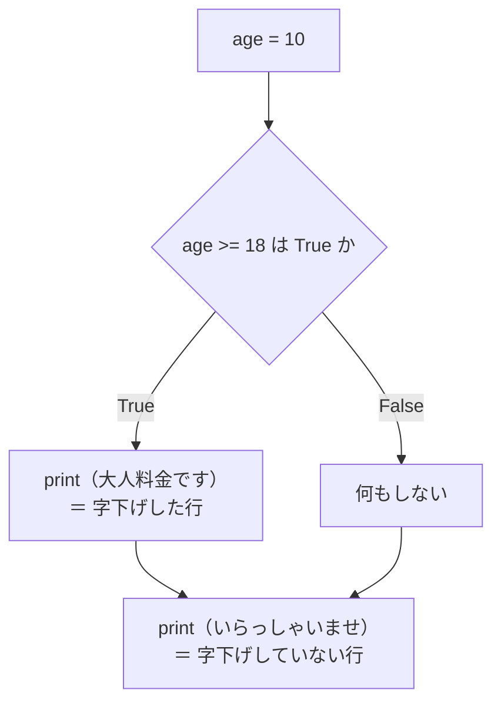
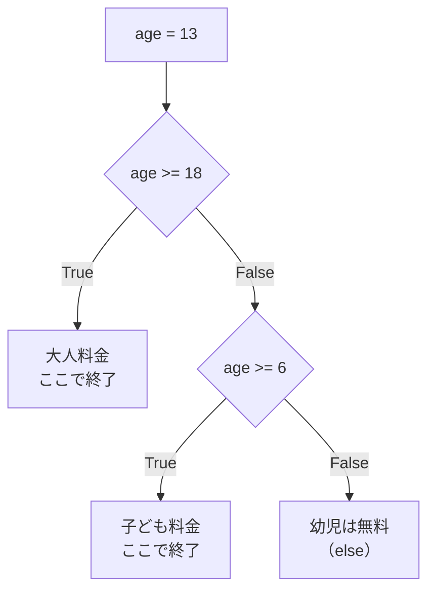
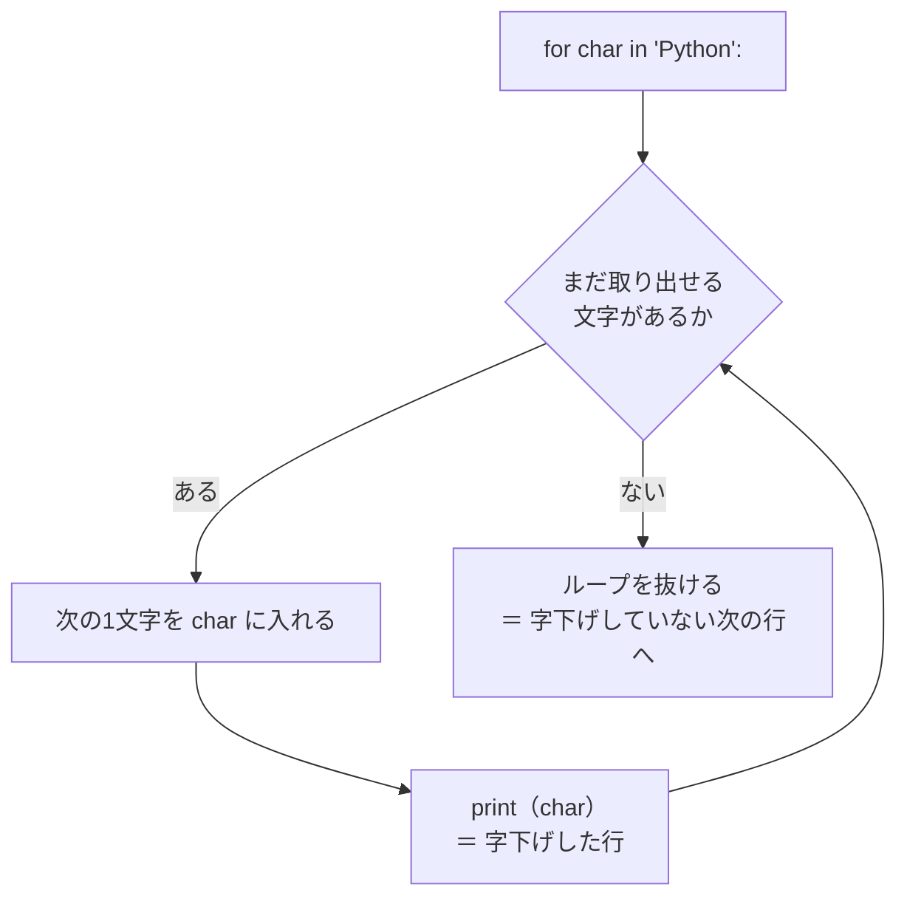
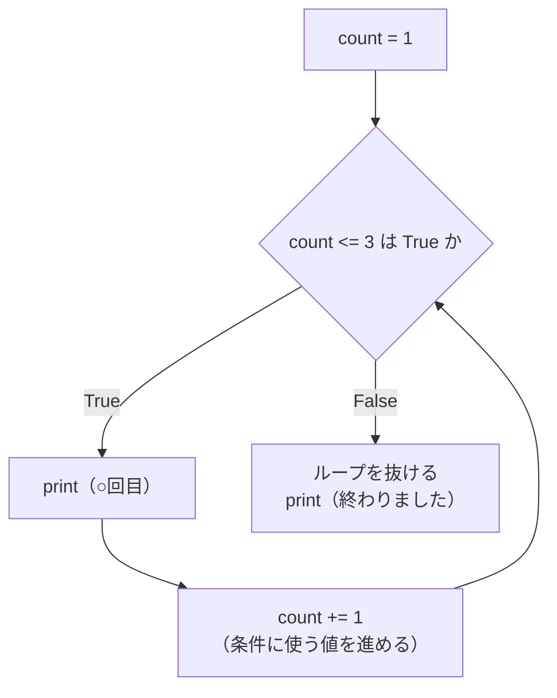
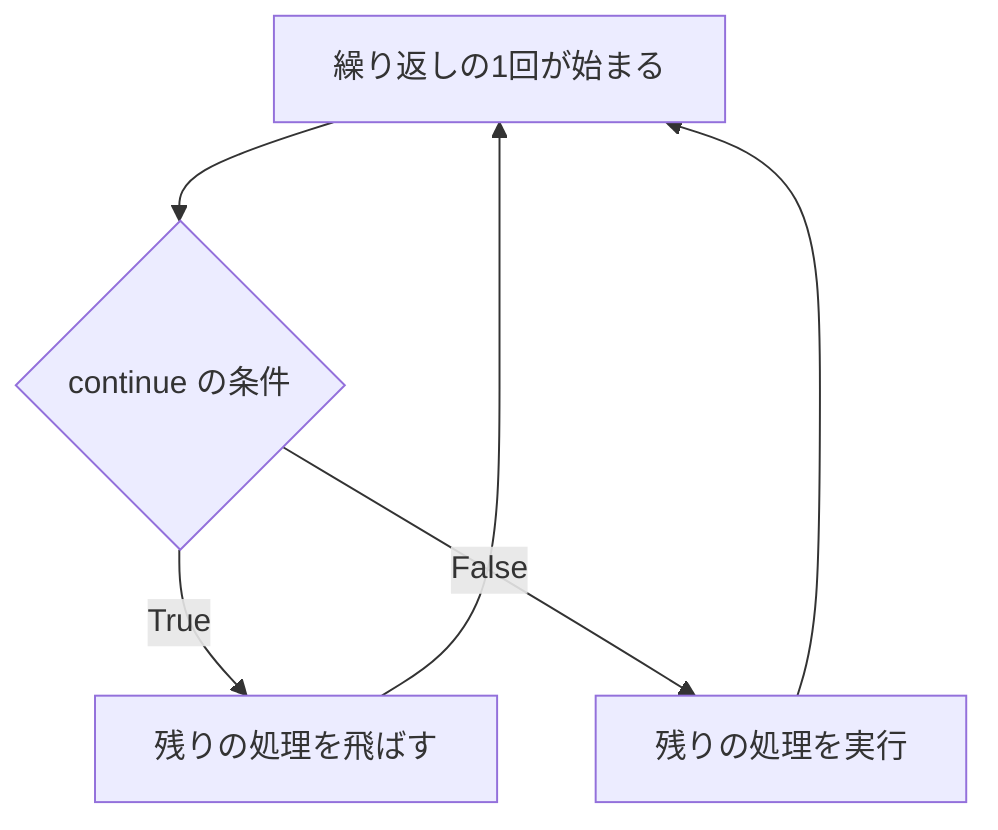

# 第3章 制御構文

第2章で書いたプログラムを思い出してください。
値を変数に入れて、計算して、表示する。どれも**上から下へ1回だけ流れて終わり**でした。

これでは、たとえば次のようなものが作れません。

- 点数によって「合格」「不合格」を出し分ける
- 1から100までの数字を、100行書かずに表示する
- 正しい値が入力されるまで、何度でも聞き直す

プログラムに**「判断させる」**のが**条件分岐**、
**「同じことを繰り返させる」**のが**繰り返し**です。
この2つをまとめて**制御構文**（せいぎょこうぶん。処理の流れを枝分かれさせたり、
繰り返させたりするための書き方）と呼びます。

この章を終えると、書けるものが一気に広がります。

## この章で学ぶこと

- `if` / `elif` / `else` で、条件によって処理を出し分けられるようになる
- `in` や「真偽値として扱われる値」を使って、条件を短く正確に書けるようになる
- `for` と `range` で、決まった回数の繰り返しが書けるようになる
- `while` で、終わりの回数が決まっていない繰り返しが書けるようになる
- `break` / `continue` / `for ... else` で、繰り返しの途中の流れを操れるようになる
- 入れ子が深くなったコードを、浅く読みやすい形に直せるようになる

## この章の前提

- [第2章](./02-basics.md) を終えていること
- とくに次の3つを使えること
  - 比較演算子と論理演算子（[2.3.4](./02-basics.md#234-比較演算子) / [2.3.5](./02-basics.md#235-論理演算子and--or--not)）
  - f-string（[2.4.4](./02-basics.md#244-f-string)）
  - `input` の戻り値が必ず文字列であること（[2.5.3](./02-basics.md#253-入力は必ず文字列である)）
- **インデント（半角スペース4つ）で字下げできること**（[2.6](./02-basics.md#26-インデントがルールになる)）

> **つまずいたら**
> この章はインデントの間違いが一気に増えるところです。
> エラーが出たら、まず**エラーの種類と行番号**を見てください（[1.4.4](./01-environment.md#144-トレースバックの読み方)）。
> 3分考えてわからなければ、AI に**章番号とエラーメッセージ全文**を添えて聞いてください。
>
> ```text
> python-text の 3.2.2 で詰まりました。
> for i in range(1, 10)
>     print(i)
> と書いたら SyntaxError: expected ':' が出ます。何が足りませんか。
> ```

> **この章のコードを書く場所**
> 第2章と同じく、`python-lesson` の中に項ごとに `.py` ファイルを作って試します。
> ファイル名は本文で毎回指定します。
> 実行コマンドは Windows が `python ファイル名`、macOS が `python3 ファイル名` です
> （[1.4.2](./01-environment.md#142-実行する)）。
> **以降、実行コマンドは Windows の形で書きます。macOS の方は `python` を `python3` に読み替えてください。**

---

## 3.1 条件分岐

### 3.1.1 `if`

映画館の入場料を考えます。18歳以上なら1800円、そうでなければ1000円。
第2章までの知識では、**料金を変数に入れることはできても、条件で切り替えることができません。**

そこで使うのが `if`（イフ。もし〜なら）です。

`if` の書き方は、次の3点セットです。

```text
if 条件:
    条件が成り立ったときに実行する処理
    （半角スペース4つで字下げ）
```

1. `if` のあとに**条件**を書く
2. 行末に **`:`（コロン）**を付ける
3. 次の行から、実行したい処理を**半角スペース4つ字下げ**する

条件のところには、[2.3.4](./02-basics.md#234-比較演算子) で学んだ
**比較演算子**（`==` `!=` `<` `<=` `>` `>=`）を使った式を書きます。
この式の結果が `True` のときだけ、字下げした部分が実行されます。

`python-lesson` の中に `if_basic.py` を作ってください。

`if_basic.py`

```python
age = 20

if age >= 18:
    print("大人料金です")

print("いらっしゃいませ")
```

```powershell
python if_basic.py
```

```text
実行結果:
大人料金です
いらっしゃいませ
```

**macOS / Linux**

```bash
python3 if_basic.py
```

次に、`age` を `10` に書き換えて、もう一度実行してください。

`if_basic.py`

```python
age = 10

if age >= 18:
    print("大人料金です")

print("いらっしゃいませ")
```

```text
実行結果:
いらっしゃいませ
```

字下げした行だけが飛ばされ、**字下げしていない行は必ず実行されます。**
[2.6.2](./02-basics.md#262-インデントの深さでブロックが決まる) で見たとおりです。

流れを図にすると、次のようになります。



字下げした行は、いくつでも書けます。**同じ深さで字下げした行は、まとめて実行されます。**

`if_block.py`

```python
age = 20

if age >= 18:
    print("大人料金です")
    print("1800円になります")
    print("チケットをお渡しします")

print("いらっしゃいませ")
```

```text
実行結果:
大人料金です
1800円になります
チケットをお渡しします
いらっしゃいませ
```

> **JavaScript との違い**
> react-text で書いた JavaScript とは、見た目が3か所違います。
>
> ```js
> // JavaScript
> if (age >= 18) {
>   console.log("大人料金です");
> }
> ```
>
> ```python
> # Python
> if age >= 18:
>     print("大人料金です")
> ```
>
> | | JavaScript | Python |
> |---|---|---|
> | 条件を囲むかっこ | `( )` が必要 | **不要**（付けても動くが書かない） |
> | ブロックの表し方 | `{ }` | **字下げ** |
> | 行末 | なし | **`:` が必要** |

> **よくある間違い**
> `:` を忘れると、次のエラーになります。
>
> ```python
> if age >= 18
>     print("大人料金です")
> ```
>
> ```text
> SyntaxError: expected ':'
> ```
>
> 「`:` があるはずの場所にありません」という意味です。
> **`if` を書いたら、Enter を押す前に `:` を打つ**のを癖にしてください。
>
> 逆に `:` は書いたのに字下げを忘れると、`IndentationError: expected an indented block`
> になります（[2.6.3](./02-basics.md#263-indentationerror-と-taberror)）。

### 3.1.2 `else` と `elif`

さきほどの例では、18歳未満のときに**何も表示されませんでした。**
「そうでなかったとき」の処理を書くのが `else`（エルス。そうでなければ）です。

`else` にも行末の `:` と字下げが必要です。**`else` のあとに条件は書きません。**

`if_else.py`

```python
age = 10

if age >= 18:
    print("大人料金です。1800円になります")
else:
    print("子ども料金です。1000円になります")
```

```text
実行結果:
子ども料金です。1000円になります
```

`age` を `20` にすると、上の行が表示されます。
**`if` と `else` のどちらか一方だけが必ず実行されます。**

条件が3つ以上に分かれるときは `elif`（エルイフ。`else if` の短縮形）を使います。

`if_elif.py`

```python
age = 13

if age >= 18:
    print("大人料金です。1800円になります")
elif age >= 6:
    print("子ども料金です。1000円になります")
else:
    print("幼児は無料です")
```

```text
実行結果:
子ども料金です。1000円になります
```

`elif` は**いくつでも並べられます**。`else` は最後に1つだけ、省略もできます。

**判定は上から順に行われ、最初に `True` になったものだけが実行されます。**
そのあとの `elif` や `else` は、条件を確かめもせずに飛ばされます。



この「上から順に、最初の1つだけ」という性質は、**条件を書く順番で結果が変わる**ことを意味します。

> **よくある間違い**
> 範囲で分けるとき、**広い条件を先に書くと、あとの条件に絶対にたどり着けません。**
>
> ```python
> score = 95
>
> if score >= 60:
>     print("合格")
> elif score >= 90:      # ここには絶対に来ない
>     print("優秀")
> ```
>
> ```text
> 実行結果:
> 合格
> ```
>
> `95` は `score >= 60` の時点で `True` になるので、`score >= 90` は確かめられません。
> **範囲で分けるときは、厳しい（狭い）条件から順に書いてください。**
>
> ```python
> score = 95
>
> if score >= 90:
>     print("優秀")
> elif score >= 60:
>     print("合格")
> ```
>
> ```text
> 実行結果:
> 優秀
> ```

`elif` を使わず `if` を並べると、**すべての条件が別々に判定されます。**
違いを確かめてください。

`if_vs_elif.py`

```python
score = 95

print("--- elif で書いた場合 ---")
if score >= 90:
    print("優秀")
elif score >= 60:
    print("合格")

print("--- if を並べた場合 ---")
if score >= 90:
    print("優秀")
if score >= 60:
    print("合格")
```

```text
実行結果:
--- elif で書いた場合 ---
優秀
--- if を並べた場合 ---
優秀
合格
```

**「どれか1つだけ」なら `elif`、「当てはまるものすべて」なら `if` を並べる**と覚えてください。

### 3.1.3 条件を組み合わせる

条件は1つとは限りません。
「18歳以上**かつ**会員」のように複数の条件をつなぐには、
[2.3.5](./02-basics.md#235-論理演算子and--or--not) で学んだ
`and`（かつ）・`or`（または）・`not`（〜でない）を使います。

`combine.py`

```python
age = 20
is_member = True

if age >= 18 and is_member:
    print("大人・会員価格：1500円")
elif age >= 18:
    print("大人価格：1800円")
else:
    print("子ども価格：1000円")
```

```text
実行結果:
大人・会員価格：1500円
```

`and` と `or` を混ぜるときは、**`and` のほうが先に判定されます。**
意図した順序にするには、かっこで囲んでください。

`priority.py`

```python
age = 70
is_member = False
has_coupon = True

# 「（65歳以上 または 会員）かつ クーポンあり」
if (age >= 65 or is_member) and has_coupon:
    print("割引を適用します")
else:
    print("割引はありません")
```

```text
実行結果:
割引を適用します
```

かっこを外すと `age >= 65 or (is_member and has_coupon)` の意味になり、
結果が変わってしまうことがあります。
**`and` と `or` が混ざったら、必ずかっこを付ける**と決めておくと安全です。

Python には、他の言語にはない便利な書き方があります。
**比較演算子は、数学と同じようにつなげて書けます。**

`chain.py`

```python
score = 85

if 0 <= score <= 100:
    print("有効な点数です")
else:
    print("点数の範囲がおかしいです")
```

```text
実行結果:
有効な点数です
```

`0 <= score <= 100` は `score >= 0 and score <= 100` と同じ意味です。

> **補足**
> JavaScript では `0 <= score <= 100` と書くと、意図しない結果になります
> （`0 <= score` の結果 `true` が数値 `1` に変換されて `1 <= 100` が判定されるため）。
> **この書き方が正しく動くのは Python の特徴です。** 範囲の判定では積極的に使ってください。

### 3.1.4 `in` で含まれるかを調べる

「入力された文字列に `@` が含まれているか」のような判定には、
**`in`（イン。〜の中にあるか）**を使います。結果は `True` か `False` になります。

`in_string.py`

```python
mail = "yamada@example.com"

print("@" in mail)
print("!" in mail)

if "@" in mail:
    print("メールアドレスらしい形です")
```

```text
実行結果:
True
False
メールアドレスらしい形です
```

「含まれていないこと」を調べるときは **`not in`** と書きます。

`not_in.py`

```python
mail = "yamada.example.com"

if "@" not in mail:
    print("@ がありません。メールアドレスを確認してください")
```

```text
実行結果:
@ がありません。メールアドレスを確認してください
```

`in` は文字列だけでなく、**複数の値を並べたもの**に対しても使えます。
ここで**リスト**を少しだけ先取りします。

**リスト**（複数の値を順番に並べて1つにまとめたもの。JavaScript の配列にあたる）

リストは `[ ]` の中に値を `,` で並べて作ります。

`in_list.py`

```python
sizes = ["S", "M", "L"]

print(sizes)
print(len(sizes))
print("M" in sizes)
print("XL" in sizes)
```

```text
実行結果:
['S', 'M', 'L']
3
True
False
```

`len()` は文字列の長さを調べる関数でしたが（[2.4.2](./02-basics.md#242-インデックスとスライス)）、
**リストに使うと「要素がいくつあるか」を返します。**

> **リストは第4章で本格的に扱います**
> この章では、リストを次の3つの使い方だけで使います。
>
> - `[ ]` に値を並べて**作る**
> - `in` で**含まれているか調べる**
> - [3.2.1](#321-for-の基本) で**1つずつ取り出して繰り返す**
>
> 「あとから値を追加する」「並べ替える」といった操作は第4章です。
> いまは**「値を並べて置いておく箱」**とだけ思っておいてください。

`in` を使うと、`or` を並べた長い条件を短く書けます。

`in_vs_or.py`

```python
size = "M"

# or を並べた書き方
if size == "S" or size == "M" or size == "L":
    print("取り扱いのあるサイズです")

# in を使った書き方（同じ意味）
if size in ["S", "M", "L"]:
    print("取り扱いのあるサイズです")
```

```text
実行結果:
取り扱いのあるサイズです
取り扱いのあるサイズです
```

**同じ変数を何度も `==` で比べていたら、`in` に置き換えられないか考えてください。**

> **よくある間違い**
> 次のように書いても、思ったとおりには動きません。
>
> ```python
> size = "XL"
>
> if size == "S" or "M" or "L":     # ❌
>     print("取り扱いのあるサイズです")
> ```
>
> ```text
> 実行結果:
> 取り扱いのあるサイズです
> ```
>
> `"XL"` なのに表示されてしまいました。
> これは `(size == "S") or "M" or "L"` と解釈され、
> **`"M"` という空でない文字列が「真」として扱われる**ためです
> （理由は次の [3.1.5](#315-真偽値として扱われる値空文字列0空リスト) で説明します）。
> **`==` は毎回書くか、`in` を使ってください。**

### 3.1.5 真偽値として扱われる値（空文字列・0・空リスト）

`if` の条件には、`True` / `False` 以外の値も書けます。
そのとき Python は、値を**「真」か「偽」のどちらかに読み替えます。**

**偽として扱われる値**は、次のものだけです。

| 値 | 意味 |
|----|------|
| `False` | 真偽値の偽 |
| `0` / `0.0` | 数値のゼロ |
| `""` | 空文字列（1文字もない文字列） |
| `[]` | 空リスト（要素が1つもないリスト） |
| `None` | 値がないことを表す値（[2.2.4](./02-basics.md#224-none)） |

**これ以外はすべて真**です。`-1` も `"0"` も `"False"` も真になります。

`truthy.py`

```python
print(bool(0))
print(bool(1))
print(bool(-1))
print(bool(""))
print(bool("0"))
print(bool([]))
print(bool(["S"]))
print(bool(None))
```

```text
実行結果:
False
True
True
False
True
False
True
False
```

`bool()` は、値を真偽値に変換する関数です（`int()` や `str()` の仲間です。[2.2.6](./02-basics.md#226-型を変換する)）。
**条件に書いたときにどう扱われるかを確かめたいときは、`bool()` で包んで `print` してください。**

いちばんよく使うのは、**入力が空かどうかの判定**です。

`empty_check.py`

```python
name = input("名前を入力してください: ")

if name:
    print(f"こんにちは、{name}さん")
else:
    print("名前が入力されませんでした")
```

名前を入力した場合と、何も入力せずに Enter を押した場合の両方を試してください。

```text
実行結果:
名前を入力してください: 山田
こんにちは、山田さん
```

```text
実行結果:
名前を入力してください:
名前が入力されませんでした
```

`if name:` は `if name != "":` と同じ意味になりますが、
Python では**短いほうを使うのが一般的**です。

「空でないこと」ではなく「空であること」を判定したいときは、`not` を付けます。

`not_empty.py`

```python
memo = ""

if not memo:
    print("メモは空です")
```

```text
実行結果:
メモは空です
```

> **よくある間違い**
> `True` と比べる書き方は、書かないでください。
>
> ```python
> is_member = True
>
> if is_member == True:     # ❌ 冗長
>     print("会員です")
>
> if is_member:             # ✅
>     print("会員です")
> ```
>
> 冗長なだけでなく、**バグの原因にもなります。**
> `name = "山田"` のとき `if name:` は真ですが、`if name == True:` は偽です
> （`"山田"` は `True` という値そのものではないため）。
> **真偽値は、そのまま条件に書いてください。**

> **注意**
> 数値の `0` は偽です。そのため「点数が入力されたか」を `if score:` で判定すると、
> **0点のときに「入力されていない」と誤判定します。**
>
> ```python
> score = 0
>
> if score:
>     print("入力あり")      # 実行されない
> else:
>     print("入力なし")      # こちらが実行される
> ```
>
> 数値を扱うときは、`if score > 0:` のように**何を判定したいのかを明示**してください。

### 3.1.6 条件式（三項演算子）

「条件によって、変数に入れる値だけを変えたい」ということがよくあります。
`if` / `else` でも書けますが、4行かかります。

`ternary_before.py`

```python
age = 20

if age >= 18:
    label = "大人"
else:
    label = "子ども"

print(label)
```

```text
実行結果:
大人
```

これを1行で書けるのが**条件式**（じょうけんしき。条件によって2つの値を選ぶ式）です。
**三項演算子**とも呼ばれます。

```text
真のときの値 if 条件 else 偽のときの値
```

`ternary_after.py`

```python
age = 20

label = "大人" if age >= 18 else "子ども"

print(label)
```

```text
実行結果:
大人
```

**値が先、条件が真ん中**という順番に注意してください。
「大人です、もし18歳以上なら。そうでなければ子どもです」と英語の語順で読むと覚えやすくなります。

f-string の中に直接書くこともできます。

`ternary_fstring.py`

```python
count = 1

print(f"カートに{count}点入っています")
print(f"送料は{0 if count >= 3 else 500}円です")

count = 5
print(f"送料は{0 if count >= 3 else 500}円です")
```

```text
実行結果:
カートに1点入っています
送料は500円です
送料は0円です
```

> **JavaScript との違い**
> JavaScript の三項演算子は `条件 ? A : B` で、**条件が先**でした。
>
> ```js
> const label = age >= 18 ? "大人" : "子ども";
> ```
>
> Python は `A if 条件 else B` で、**値が先**です。順番が逆になります。

> **よくある間違い**
> 条件式は**値を選ぶためのもの**です。処理を分けるのには使えません。
>
> ```python
> print("大人") if age >= 18 else print("子ども")     # ❌ 動くが読みにくい
> ```
>
> 「どちらの処理をするか」を分けたいときは、**素直に `if` / `else` を使ってください。**
> 条件式を使うのは、**代入する値や表示する値を選ぶとき**だけにします。

---

## 3.2 繰り返し

### 3.2.1 `for` の基本

「1から5まで表示する」を、いまの知識で書くとこうなります。

```python
print(1)
print(2)
print(3)
print(4)
print(5)
```

これが1から100までなら100行、1から10000までなら10000行です。
**同じ形の行が並んだら、繰り返しの出番**です。

Python の繰り返しには `for` と `while` の2つがあります。
まずは `for`（フォー）です。

```text
for 変数 in 対象:
    繰り返したい処理
    （半角スペース4つで字下げ）
```

`if` と同じで、**行末に `:`、次の行から字下げ**です。

`for` は、**対象から値を1つずつ取り出して変数に入れ、字下げした部分を実行する**、
という動きを、値がなくなるまで繰り返します。

まずは、第2章で扱った**文字列**を対象にしてみます。
文字列は「文字が並んだもの」なので、1文字ずつ取り出せます。

`for_string.py`

```python
for char in "Python":
    print(char)
```

```powershell
python for_string.py
```

```text
実行結果:
P
y
t
h
o
n
```

`char` という変数に、`"P"` `"y"` `"t"` …… と1文字ずつ入りながら、
`print(char)` が6回実行されました。**この `char` を「ループ変数」と呼びます。**

**ループ変数の名前は自由に付けられます。** 中身がわかる名前にしてください。

流れを図にすると、次のようになります。



[3.1.4](#314-in-で含まれるかを調べる) で先取りしたリストも、同じように回せます。

`for_list.py`

```python
menu = ["コーヒー", "紅茶", "ジュース"]

for item in menu:
    print(f"{item}を1杯どうぞ")

print("以上です")
```

```text
実行結果:
コーヒーを1杯どうぞ
紅茶を1杯どうぞ
ジュースを1杯どうぞ
以上です
```

**字下げしていない `print("以上です")` は、繰り返しが全部終わってから1回だけ実行されます。**
`if` のときと同じで、**字下げの内側か外側かで意味が変わります。**

字下げした行は、複数書けます。**そのまとまりが毎回実行されます。**

`for_block.py`

```python
menu = ["コーヒー", "紅茶", "ジュース"]

for item in menu:
    print(f"--- {item} ---")
    print(f"{item}をお作りします")

print("以上です")
```

```text
実行結果:
--- コーヒー ---
コーヒーをお作りします
--- 紅茶 ---
紅茶をお作りします
--- ジュース ---
ジュースをお作りします
以上です
```

繰り返しの中で `if` を使うこともできます。**字下げが二重になります。**

`for_if.py`

```python
menu = ["コーヒー", "紅茶", "ジュース"]

for item in menu:
    if item == "ジュース":
        print(f"{item}は冷たいままお出しします")
    else:
        print(f"{item}は温かくしてお出しします")
```

```text
実行結果:
コーヒーは温かくしてお出しします
紅茶は温かくしてお出しします
ジュースは冷たいままお出しします
```

> **JavaScript との違い**
> JavaScript の `for (let i = 0; i < 5; i++)` のような書き方は、**Python にはありません。**
> Python の `for` は、JavaScript の `for ... of` に近いものです。
>
> ```js
> // JavaScript
> for (const item of menu) {
>   console.log(item);
> }
> ```
>
> ```python
> # Python
> for item in menu:
>     print(item)
> ```
>
> 「回数」で回したいときは、次の [3.2.2](#322-range) の `range` を使います。

### 3.2.2 `range`

「5回繰り返したい」「1から100まで回したい」というときに使うのが
**`range`**（レンジ。連続した整数を作り出すもの）です。

`range` は3つの書き方があります。

| 書き方 | 作られる数 | 例 |
|--------|-----------|-----|
| `range(終了)` | `0` から **終了の手前**まで | `range(3)` → 0, 1, 2 |
| `range(開始, 終了)` | 開始から **終了の手前**まで | `range(1, 4)` → 1, 2, 3 |
| `range(開始, 終了, 増分)` | 開始から終了の手前まで、増分ずつ | `range(0, 10, 3)` → 0, 3, 6, 9 |

**どの書き方でも、「終了」の数そのものは含まれません。**
これは文字列のスライス `[開始:終了]`（[2.4.2](./02-basics.md#242-インデックスとスライス)）と同じ考え方です。

`range_basic.py`

```python
print("--- range(3) ---")
for i in range(3):
    print(i)

print("--- range(1, 4) ---")
for i in range(1, 4):
    print(i)

print("--- range(0, 10, 3) ---")
for i in range(0, 10, 3):
    print(i)
```

```text
実行結果:
--- range(3) ---
0
1
2
--- range(1, 4) ---
1
2
3
--- range(0, 10, 3) ---
0
3
6
9
```

> **よくある間違い**
> **「1から10まで」は `range(1, 10)` ではありません。**
>
> ```python
> for i in range(1, 10):
>     print(i)
> ```
>
> ```text
> 実行結果:
> 1
> 2
> 3
> 4
> 5
> 6
> 7
> 8
> 9
> ```
>
> `10` が出ていません。**終了は含まれない**ので、`range(1, 11)` と書きます。
> このように「1つ足りない」「1つ多い」間違いはとても多く、
> **off-by-one エラー**（オフバイワン。1つずれる間違い）という名前が付いているほどです。
>
> 迷ったら、**まず `print` で回してみて、最初と最後の値を目で確かめてください。**

増分にマイナスを指定すると、**逆順**に回せます。

`countdown.py`

```python
for i in range(5, 0, -1):
    print(i)

print("発射！")
```

```text
実行結果:
5
4
3
2
1
発射！
```

`range` と組み合わせてよく使うのが、**合計を求める**書き方です。
**先に「入れ物」の変数を 0 で用意しておき、繰り返しの中で足していきます。**

`total.py`

```python
total = 0

for i in range(1, 11):
    total = total + i

print(f"1から10までの合計は {total} です")
```

```text
実行結果:
1から10までの合計は 55 です
```

`total = total + i` は、[2.3.3](./02-basics.md#233-代入演算子) の代入演算子を使って
`total += i` と短く書けます。**こちらのほうがよく使われます。**

`total_short.py`

```python
total = 0

for i in range(1, 11):
    total += i
    print(f"{i} を足した時点の合計: {total}")

print(f"最終的な合計: {total}")
```

```text
実行結果:
1 を足した時点の合計: 1
2 を足した時点の合計: 3
3 を足した時点の合計: 6
4 を足した時点の合計: 10
5 を足した時点の合計: 15
6 を足した時点の合計: 21
7 を足した時点の合計: 28
8 を足した時点の合計: 36
9 を足した時点の合計: 45
10 を足した時点の合計: 55
最終的な合計: 55
```

繰り返しのたびに `total` が育っていくのがわかります。

> **注意**
> **`total = 0` を繰り返しの中に書かないでください。**
> 中に書くと毎回 0 に戻ってしまい、最後の値しか残りません。
>
> ```python
> for i in range(1, 11):
>     total = 0        # ❌ 毎回リセットされる
>     total += i
> print(total)         # 10 になってしまう
> ```
>
> **「集めるための変数は、繰り返しの外で用意する」**と覚えてください。

`for` の中に `for` を書くこともできます。これを**入れ子（ネスト）**と呼びます。
九九の表を作ってみます。

`kuku.py`

```python
for dan in range(1, 10):
    for i in range(1, 10):
        print(f"{dan * i:>4}", end="")
    print()
```

```text
実行結果:
   1   2   3   4   5   6   7   8   9
   2   4   6   8  10  12  14  16  18
   3   6   9  12  15  18  21  24  27
   4   8  12  16  20  24  28  32  36
   5  10  15  20  25  30  35  40  45
   6  12  18  24  30  36  42  48  54
   7  14  21  28  35  42  49  56  63
   8  16  24  32  40  48  56  64  72
   9  18  27  36  45  54  63  72  81
```

- `:>4` は「右詰めで4文字ぶんの幅を取る」書式指定です（[2.4.4](./02-basics.md#244-f-string)）。桁がそろいます
- `end=""` は「改行しない」指定です（[2.5.1](./02-basics.md#251-print-の使い方)）。1行に横並びで出ます
- 内側の `for` が終わったところで、引数なしの `print()` で改行しています

**外側が1回進むあいだに、内側が最後まで回りきります。** ここでは 9 × 9 で81回 `print` が実行されました。

### 3.2.3 `enumerate` で番号付きに回す

リストを回しながら「これは何番目か」を知りたいことがあります。
自分でカウンタを用意しても書けます。

`manual_count.py`

```python
menu = ["コーヒー", "紅茶", "ジュース"]
number = 1

for item in menu:
    print(f"{number}. {item}")
    number += 1
```

```text
実行結果:
1. コーヒー
2. 紅茶
3. ジュース
```

これは動きますが、**`number += 1` を書き忘れる事故が起きやすい**書き方です。
Python には、番号と値を**同時に**取り出す `enumerate`（イニュームレート。番号を振る）があります。

`enumerate_basic.py`

```python
menu = ["コーヒー", "紅茶", "ジュース"]

for number, item in enumerate(menu):
    print(f"{number}. {item}")
```

```text
実行結果:
0. コーヒー
1. 紅茶
2. ジュース
```

`for number, item in ...` のように、**カンマで区切って2つの変数を書く**と、
`number` に番号、`item` に値が同時に入ります。

**番号は 0 から始まります。** 1から始めたいときは `start=1` を付けます。

`enumerate_start.py`

```python
menu = ["コーヒー", "紅茶", "ジュース"]

for number, item in enumerate(menu, start=1):
    print(f"{number}. {item}")

print(f"全{len(menu)}品です")
```

```text
実行結果:
1. コーヒー
2. 紅茶
3. ジュース
全3品です
```

> **補足**
> 「1回の繰り返しで2つの値を受け取る」というこの書き方は、
> **アンパック**と呼ばれる仕組みです。詳しくは第4章（4.2.3）で扱います。
> この章では、**`enumerate` と組み合わせる形だけ**覚えておいてください。

> **よくある間違い**
> 変数を1つしか書かないと、番号と値がセットのまま入ってしまいます。
>
> ```python
> for item in enumerate(menu):
>     print(item)
> ```
>
> ```text
> 実行結果:
> (0, 'コーヒー')
> (1, '紅茶')
> (2, 'ジュース')
> ```
>
> `enumerate` を使うときは、**必ず変数を2つ書く**と覚えてください。

### 3.2.4 `while`

`for` は「対象を最後まで回す」繰り返しでした。
これに対し `while`（ホワイル。〜のあいだ）は、
**条件が `True` であるあいだ、ずっと繰り返します。**

```text
while 条件:
    繰り返したい処理
```

`if` とよく似た形ですが、**`if` は1回だけ、`while` は条件が偽になるまで何度でも**、という違いがあります。

`while_basic.py`

```python
count = 1

while count <= 3:
    print(f"{count}回目")
    count += 1

print("終わりました")
```

```text
実行結果:
1回目
2回目
3回目
終わりました
```

動きを1行ずつ追うと、次のようになります。



**`for` と違い、ループ変数は自動では進みません。**
`count += 1` を自分で書く必要があります。ここが `while` の最大の注意点です。

`while` が本領を発揮するのは、**繰り返す回数が事前に決まらないとき**です。

`savings.py`

```python
balance = 0
month = 0

while balance < 10000:
    balance += 3000
    month += 1
    print(f"{month}か月目: {balance}円")

print(f"{month}か月で目標に届きました")
```

```text
実行結果:
1か月目: 3000円
2か月目: 6000円
3か月目: 9000円
4か月目: 12000円
4か月で目標に届きました
```

「何か月かかるか」は**やってみないとわかりません。**
このような場合に `while` を使います。

使い分けの目安は次のとおりです。

| 状況 | 使うもの |
|------|---------|
| 文字列やリストの中身を1つずつ処理する | `for` |
| 「10回」「1から100まで」と回数が決まっている | `for` + `range` |
| 条件が満たされるまで回す（回数が不明） | `while` |
| 正しい入力が来るまで聞き直す | `while` |

> **よくある間違い**
> `while` の条件に使っている変数を、**ループの中で更新し忘れる**のが最頻出の事故です。
>
> ```python
> count = 1
>
> while count <= 3:
>     print(f"{count}回目")
>     # count += 1 を書き忘れた
> ```
>
> `count` はずっと `1` のままなので、条件がいつまでも `True` になり、
> **`1回目` が永遠に表示され続けます。** 止め方は次の [3.2.5](#325-無限ループから抜け出す) で扱います。

### 3.2.5 無限ループから抜け出す

条件がいつまでも `False` にならない繰り返しを**無限ループ**と呼びます。
プログラムが止まらなくなり、**ターミナルが操作を受け付けなくなります。**

**止め方を知らないと、この章を進められません。わざと作って、止める練習をします。**

`infinite.py`

```python
count = 1

while count <= 3:
    print(f"{count}回目")
```

これを実行すると、`1回目` が猛烈な勢いで流れ続けます。

```powershell
python infinite.py
```

```text
実行結果:
1回目
1回目
1回目
（止まらない）
```

**止め方**

ターミナルの画面をクリックしてから、次のキーを押してください。

**Windows（PowerShell）**

`Ctrl` キーを押しながら `C`

**macOS / Linux**

`control` キーを押しながら `C`

**どちらも `Ctrl` + `C`（コントロール・シー）です。** macOS でも `command` ではなく `control` を使います。

押すと、次のような表示が出て止まります。

```text
Traceback (most recent call last):
  File "infinite.py", line 4, in <module>
    print(f"{count}回目")
KeyboardInterrupt
```

`KeyboardInterrupt`（キーボード割り込み）は、
**「キーボード操作で人が止めました」**という意味です。エラーではありません。

> **VS Code で実行しているとき**
> VS Code の下部にターミナルが開いています。
> **ターミナルの中をクリックしてカーソルを移してから** `Ctrl` + `C` を押してください。
> エディタ側にカーソルがあると、`Ctrl` + `C` は「コピー」になってしまい、プログラムは止まりません。
>
> それでも止まらないときは、ターミナル右上の**ゴミ箱アイコン**を押してください。
> ターミナルごと閉じてプログラムを終了できます。

> **注意**
> `print` が入っていない無限ループは、**画面が静かなまま固まったように見えます。**
> 「実行したのに何も起きない」ときも、まず `Ctrl` + `C` を試してください。
>
> ```python
> count = 1
> while count <= 3:
>     count = count      # 何も進まない。画面にも何も出ない
> ```

無限ループは事故ばかりではありません。
**「`while True:` と書いて、中から抜ける」**という書き方は、正しい使い方として頻繁に登場します。

`True` は常に真なので、`while True:` は「ずっと繰り返す」という意味になります。
そこから抜け出すのが、次の [3.3.1](#331-break) で学ぶ `break` です。

---

## 3.3 ループの制御

### 3.3.1 `break`

**`break`**（ブレイク。中断する）は、**繰り返しをその場で終わらせる**命令です。
`break` を実行した瞬間に、残りの繰り返しをすべて捨ててループを抜けます。

「条件に合うものが見つかったら、それ以上探す必要はない」という場面で使います。

`break_basic.py`

```python
for i in range(1, 101):
    if i * i > 500:
        print(f"2乗が500を超える最初の数は {i} です")
        break
    print(f"{i} の2乗は {i * i}")
```

```text
実行結果:
1 の2乗は 1
2 の2乗は 4
3 の2乗は 9
4 の2乗は 16
5 の2乗は 25
6 の2乗は 36
7 の2乗は 49
8 の2乗は 64
9 の2乗は 81
10 の2乗は 100
11 の2乗は 121
12 の2乗は 144
13 の2乗は 169
14 の2乗は 196
15 の2乗は 225
16 の2乗は 256
17 の2乗は 289
18 の2乗は 324
19 の2乗は 361
20 の2乗は 400
21 の2乗は 441
22 の2乗は 484
2乗が500を超える最初の数は 23 です
```

`range(1, 101)` は100回ぶん用意されていますが、**23 で `break` したので24回目以降は実行されません。**

`break` は `while` でも使えます。
[3.2.5](#325-無限ループから抜け出す) で予告した **`while True:` と `break` の組み合わせ**が、その代表です。

`repl_like.py`

```python
while True:
    command = input("コマンドを入力してください（quit で終了）: ")

    if command == "quit":
        print("終了します")
        break

    print(f"「{command}」を受け取りました")
```

```text
実行結果:
コマンドを入力してください（quit で終了）: hello
「hello」を受け取りました
コマンドを入力してください（quit で終了）: test
「test」を受け取りました
コマンドを入力してください（quit で終了）: quit
終了します
```

**「終了条件がループの途中にある」ときは、`while True:` + `break` が読みやすくなります。**
`while` の条件欄に無理やり詰め込むより、素直な書き方です。

> **よくある間違い**
> 入れ子になった繰り返しの中で `break` を書くと、**内側のループしか抜けません。**
>
> ```python
> for i in range(1, 4):
>     for j in range(1, 4):
>         if j == 2:
>             break
>         print(f"i={i}, j={j}")
> ```
>
> ```text
> 実行結果:
> i=1, j=1
> i=2, j=1
> i=3, j=1
> ```
>
> 内側の `for` は毎回 `j == 2` で抜けますが、**外側の `for` は3回とも回っています。**
> 外側まで一気に抜ける命令は Python にはありません
> （判定用の変数を使うか、第5章で学ぶ関数の `return` を使います）。

### 3.3.2 `continue`

**`continue`**（コンティニュー。続ける）は、
**その回の残りの処理だけを飛ばして、次の回へ進む**命令です。
`break` と違い、**ループ自体は終わりません。**



`continue_basic.py`

```python
for i in range(1, 11):
    if i % 3 == 0:
        continue
    print(i)
```

```text
実行結果:
1
2
4
5
7
8
10
```

`3` `6` `9` だけが飛ばされました。
`i % 3 == 0`（3で割った余りが0）は「3の倍数」の判定です（[2.3.2](./02-basics.md#23-演算子)）。

`continue` がとくに役立つのは、**不正な入力を読み飛ばす**場面です。

ここで、文字列のメソッドを1つ追加で覚えます。

**`isdigit()`**（イズディジット。文字列が数字だけでできているかを調べ、`True` / `False` を返す）

`isdigit.py`

```python
print("123".isdigit())
print("abc".isdigit())
print("12a".isdigit())
print("".isdigit())
print("-5".isdigit())
```

```text
実行結果:
True
False
False
False
False
```

**空文字列も、マイナス付きの数も `False` になります。**
「0以上の整数として入力されたか」を確かめるのにちょうど使えます。

`input` の戻り値は必ず文字列でした（[2.5.3](./02-basics.md#253-入力は必ず文字列である)）。
そのため、`int()` に渡す前に `isdigit()` で確かめておけば、**変換の失敗を防げます。**

`input_guard.py`

```python
total = 0
count = 0

while count < 3:
    text = input("点数を入力してください: ")

    if not text.isdigit():
        print("数字で入力してください。もう一度どうぞ。")
        continue

    total += int(text)
    count += 1

print(f"3回の合計は {total} 点です")
print(f"平均は {total / 3:.1f} 点です")
```

```text
実行結果:
点数を入力してください: 80
点数を入力してください: あ
数字で入力してください。もう一度どうぞ。
点数を入力してください: 90
点数を入力してください: 70
3回の合計は 240 点です
平均は 80.0 点です
```

このコードには、この章のここまでの道具が集まっています。**組み立て方を確認してください。**

1. **集める変数を、繰り返しの外で用意する**（`total = 0` / `count = 0`。[3.2.2](#322-range)）
2. **`while` の条件で「あと何回必要か」を管理する**（`count < 3`。[3.2.4](#324-while)）
3. **不正な入力は `continue` で読み飛ばす**。このとき `count` を増やさないので、回数は消費されない
4. **正常なときだけ `int()` で変換して足し、`count` を1つ進める**
5. 繰り返しが終わってから、字下げしていない行で結果を表示する

**`continue` の位置に注目してください。** `count += 1` の前にあるので、
入力をやり直しても「3回」の回数は減りません。
**`continue` を書く場所によって、何が飛ばされるかが変わります。**

> **よくある間違い**
> `while` ループの中で `continue` を使うとき、
> **条件に使う変数を進める前に `continue` すると、無限ループになることがあります。**
>
> ```python
> count = 0
> while count < 3:
>     text = input("点数: ")
>     if not text.isdigit():
>         continue          # count が増えないまま先頭に戻る
>     count += 1
> ```
>
> この例は「数字を入れれば進む」ので問題ありませんが、
> **`continue` の条件が必ず成立するような書き方をすると、永久に抜けられません。**
> `while` + `continue` を書いたら、**「どうすればこのループは終わるのか」を必ず1度確認**してください。

### 3.3.3 `for ... else`

Python には、**`for` に `else` を付ける**という珍しい書き方があります。

**`for` の `else` は、「ループが `break` されずに最後まで回りきったとき」に実行されます。**

`for_else.py`

```python
sizes = ["S", "M", "L"]
wanted = "XL"

for size in sizes:
    if size == wanted:
        print(f"{wanted} の在庫があります")
        break
else:
    print(f"{wanted} は取り扱っていません")
```

```text
実行結果:
XL は取り扱っていません
```

`wanted` を `"M"` に書き換えて、もう一度実行してください。

```text
実行結果:
M の在庫があります
```

`break` した場合は `else` が実行されず、
最後まで回りきった（＝見つからなかった）場合だけ `else` が実行されています。

**「探したけれど見つからなかった」を書くための仕組み**だと考えてください。

`else` を使わずに書くと、判定用の変数が必要になります。

`for_else_alt.py`

```python
sizes = ["S", "M", "L"]
wanted = "XL"
found = False

for size in sizes:
    if size == wanted:
        found = True
        break

if found:
    print(f"{wanted} の在庫があります")
else:
    print(f"{wanted} は取り扱っていません")
```

```text
実行結果:
XL は取り扱っていません
```

**どちらでも構いません。** `for ... else` を知らない人が読むと混乱するため、
実務では `found` を使う書き方も多く見られます。
**読んだときに意味がわかることが大切**なので、両方を知っておいてください。

`for ... else` は、**回数制限のある入力**にもよく使われます。

`login.py`

```python
PASSWORD = "python2025"

for attempt in range(1, 4):
    entered = input(f"パスワードを入力してください（{attempt}回目 / 全3回）: ")

    if entered == PASSWORD:
        print(f"{attempt}回目でログインできました")
        break

    print("パスワードが違います")
else:
    print("3回間違えました。ロックします")
```

```text
実行結果:
パスワードを入力してください（1回目 / 全3回）: python
パスワードが違います
パスワードを入力してください（2回目 / 全3回）: python2024
パスワードが違います
パスワードを入力してください（3回目 / 全3回）: python2025
3回目でログインできました
```

3回とも間違えると、次のようになります。

```text
実行結果:
パスワードを入力してください（1回目 / 全3回）: aaa
パスワードが違います
パスワードを入力してください（2回目 / 全3回）: bbb
パスワードが違います
パスワードを入力してください（3回目 / 全3回）: ccc
パスワードが違います
3回間違えました。ロックします
```

この例は、**この章の道具の組み合わせ方の見本**です。次の4つが同時に使われています。

1. `range(1, 4)` で**回数を制限する**（[3.2.2](#322-range)）。ループ変数 `attempt` を「何回目か」の表示に使う
2. ループの中で `input` を受け取り、`if` で判定する（[3.1.1](#311-if)）
3. 成功したら `break` で**残りの回数を捨てる**（[3.3.1](#331-break)）
4. `break` されなかったとき＝全部失敗したときの処理を `else` に書く

> **よくある間違い**
> `for` の `else` を、**「ループが終わったら実行される」**と読むのは誤りです。
> 正しくは**「`break` されなかったら実行される」**です。
>
> ```python
> for i in range(3):
>     print(i)
> else:
>     print("else が実行されました")     # break がないので必ず実行される
> ```
>
> ```text
> 実行結果:
> 0
> 1
> 2
> else が実行されました
> ```
>
> **`break` がまったく登場しない `for` に `else` を付けても意味がありません。**
> `else` を書くのは、ループの中に `break` があるときだけです。

### 3.3.4 `pass`

Python では、`:` を書いたら**次の行に必ず字下げした処理が必要**です。
中身が空のブロックは書けません。

```python
age = 20

if age >= 18:
    # あとで書く
```

```text
IndentationError: expected an indented block after 'if' statement on line 3
```

**コメントは処理として数えられません。** ブロックの中身が空のままだとエラーになります。

そこで使うのが **`pass`**（パス。何もしない、という命令）です。

`pass_basic.py`

```python
age = 20

if age >= 18:
    pass          # 大人の処理はあとで書く
else:
    print("未成年の方はご利用いただけません")

print("処理を続けます")
```

```text
実行結果:
処理を続けます
```

`pass` は**本当に何もしません。** 「まだ書いていないけれど、形だけ先に作っておく」ための命令です。

使いどころは2つです。

- **後回しにする場所の目印**として置く（あとで中身を書く）
- **「この条件のときは、あえて何もしない」**ことを、読む人にはっきり示す

`pass_intent.py`

```python
for i in range(1, 6):
    if i == 3:
        pass          # 3 のときは何もしない（仕様どおり）
    else:
        print(i)
```

```text
実行結果:
1
2
4
5
```

> **補足**
> 上の例は `if i != 3: print(i)` と書いたほうが短くなります。
> **`pass` を使うのは、「何もしないこと自体が意図である」と伝えたいときだけ**にしてください。
> 単に短く書けるなら、そちらを選びます。

---

## 3.4 ネストと読みやすさ

### 3.4.1 入れ子が深くなると読めなくなる

条件や繰り返しは、いくらでも入れ子にできます。
しかし**深くなるほど、コードは読めなくなります。**

映画館の割引を判定するコードを、素直に `if` の入れ子で書いてみます。

`nest_deep.py`

```python
age = 20
is_member = True
has_coupon = True

if age >= 18:
    if is_member:
        if has_coupon:
            print("1000円引きです")
        else:
            print("500円引きです")
    else:
        print("割引はありません")
else:
    print("子ども料金です")
```

```text
実行結果:
1000円引きです
```

字下げが3段になり、コードが右へ右へと流れていきます。
**「いまどの条件の中にいるのか」を、常に頭の中で覚えておかなければ読めません。**

深さと読みやすさの関係は、おおよそ次のとおりです。

| 字下げの段数 | 読みやすさ |
|-------------|-----------|
| 1段 | 問題ない |
| 2段 | まだ読める |
| 3段 | 読むのがつらくなる。見直しの合図 |
| 4段以上 | ほぼ読めない。必ず直す |

**3段になったら「もっと浅く書けないか」と考える**——これを習慣にしてください。
この節では、浅くするための方法を2つ学びます。

### 3.4.2 早期 `continue` で浅くする

繰り返しの中では、**`continue` を使って入れ子を1段減らせます。**

「1から20までの中で6の倍数を表示する」を、入れ子で書くとこうなります。

`nest_loop.py`

```python
for i in range(1, 21):
    if i % 2 == 0:
        if i % 3 == 0:
            print(f"{i} は6の倍数です")
```

```text
実行結果:
6 は6の倍数です
12 は6の倍数です
18 は6の倍数です
```

これを `continue` で書き直します。
**「当てはまらないものを、先に追い返す」**という発想です。

`guard_loop.py`

```python
for i in range(1, 21):
    if i % 2 != 0:
        continue          # 偶数でないなら、この回はここで終わり
    if i % 3 != 0:
        continue          # 3の倍数でないなら、この回はここで終わり

    print(f"{i} は6の倍数です")
```

```text
実行結果:
6 は6の倍数です
12 は6の倍数です
18 は6の倍数です
```

**結果は同じですが、字下げが1段浅くなりました。**
このように、ループの先頭で「対象外」を弾く書き方を**ガード節**と呼びます。

**ガード節**（処理の本体に入る前に、対象外の場合を先に追い返す書き方）

ガード節には、次の利点があります。

- 本体の処理が**いちばん浅い位置**に書かれるので、目に入りやすい
- 条件が増えても、**字下げが深くならない**（`if` を1つ足すだけ）
- 「ここまで来た＝すべての条件を満たしている」と、**読みながら確定できる**

`continue` は繰り返しの中でしか使えません。
繰り返しの外で同じことをしたいときは、第5章で学ぶ関数の `return` を使います。

### 3.4.3 条件を反転して整理する

ガード節を書くときは、**条件を反転させる**必要があります。
「偶数のときに処理する」を「偶数でないなら追い返す」に書き換える、という作業です。

反転の対応は次のとおりです。

| 元の条件 | 反転した条件 |
|---------|------------|
| `a == b` | `a != b` |
| `a != b` | `a == b` |
| `a > b` | `a <= b` |
| `a >= b` | `a < b` |
| `a < b` | `a >= b` |
| `a <= b` | `a > b` |
| `x in y` | `x not in y` |

`not` を付けても反転できますが、**比較演算子そのものを裏返したほうが読みやすくなります。**

```python
if not (i % 2 == 0):     # 読みにくい
if i % 2 != 0:           # こちらを使う
```

`and` / `or` を含む条件の反転には、決まった形があります。

| 元の条件 | 反転した条件 |
|---------|------------|
| `a and b` | `not a` **or** `not b` |
| `a or b` | `not a` **and** `not b` |

**`and` と `or` が入れ替わる**のがポイントです。
「18歳以上 **かつ** 会員」の反転は、「18歳未満 **または** 会員でない」になります。
「両方とも満たしていない」ではありません。

`invert.py`

```python
age = 20
is_member = False

# 元の書き方
if age >= 18 and is_member:
    print("大人・会員価格：1500円")
else:
    print("会員価格は適用されません")

# 反転して、当てはまらない場合を先に書いた書き方
if age < 18 or not is_member:
    print("会員価格は適用されません")
else:
    print("大人・会員価格：1500円")
```

```text
実行結果:
会員価格は適用されません
会員価格は適用されません
```

最後に、[3.4.1](#341-入れ子が深くなると読めなくなる) の3段の入れ子を整理します。
`elif` を使って、**判定を上から順に1段で並べます。**

`flat.py`

```python
age = 20
is_member = True
has_coupon = True

if age < 18:
    print("子ども料金です")
elif not is_member:
    print("割引はありません")
elif has_coupon:
    print("1000円引きです")
else:
    print("500円引きです")
```

```text
実行結果:
1000円引きです
```

字下げが1段だけになり、**上から順に読めば全パターンがわかる形**になりました。

書き換えの手順は、次の3ステップです。

1. **いちばん外側の条件を反転**して、当てはまらない場合を先に書く（`age < 18`）
2. 次の階層の条件も同じように反転して `elif` にする（`not is_member`）
3. 残った本命の条件を `elif` / `else` として並べる

> **注意**
> **すべての入れ子が平らにできるわけではありません。**
> 上の例が平らにできたのは、**どの分岐も「その場で表示して終わり」だった**からです。
>
> 「18歳以上のときだけ共通の処理をして、そのあと会員かどうかで分ける」のように
> **途中に共通処理があるとき**は、入れ子のほうが正しく、かつ読みやすくなります。
> **浅くすること自体が目的ではありません。** 読みやすさが目的です。

---

## まとめ

- `if 条件:` と書き、次の行から**半角スペース4つ字下げ**する。`:` を忘れると `SyntaxError: expected ':'`
- 条件を囲む `( )` は不要。ブロックは `{ }` ではなく**字下げ**（JavaScript との違い）
- `elif` は**いくつでも並べられる**。**上から順に、最初に `True` になった1つだけ**が実行される
- 範囲で分けるときは、**厳しい（狭い）条件から先に書く**。逆にすると後ろに到達しない
- `in` / `not in` で「含まれるか」を判定できる。`==` を `or` で並べたら `in` を検討する
- **偽になるのは `False` / `0` / `0.0` / `""` / `[]` / `None` だけ**。他はすべて真
- 空の入力の判定は `if name:`。ただし**数値の 0 は偽**なので `if score > 0:` と明示する
- 条件式は **`A if 条件 else B`**（値が先）。JavaScript の `条件 ? A : B` とは順番が逆
- `for 変数 in 対象:` は、文字列・リストから値を1つずつ取り出す
- **`range(開始, 終了)` の「終了」は含まれない**。「1から10まで」は `range(1, 11)`
- 合計を集める変数は、**繰り返しの外**で `total = 0` と用意する
- `enumerate(対象, start=1)` で、**番号と値を同時に**受け取れる（変数は必ず2つ）
- `while 条件:` は条件が真のあいだ回る。**変数を自分で進めないと無限ループ**になる
- 無限ループは **`Ctrl` + `C`** で止める（macOS も `control` + `C`）。`KeyboardInterrupt` が出れば成功
- `break` はループを**終わらせる**、`continue` は**その回だけ飛ばす**。入れ子では内側しか抜けない
- `for ... else` の `else` は、**`break` されなかったとき**に実行される（「終わったとき」ではない）
- `pass` は**何もしない命令**。空のブロックはエラーになるため、その穴埋めに使う
- **字下げ3段は見直しの合図**。ガード節（早期 `continue`）と `elif` で浅くする
- 条件の反転では、**`and` と `or` が入れ替わる**（`a and b` の否定は `not a or not b`）

---

## 理解度チェック

答えは [解答編](./90-answers-part1.md#第3章) にあります。まず自分で考えてください。

**問 3.1**
次のコードの実行結果を答えてください。また、そうなる理由を1行で説明してください。

```python
score = 95

if score >= 60:
    print("合格")
elif score >= 90:
    print("優秀")
```

**問 3.2**
`range(1, 10, 2)` で取り出される数を、すべて順番に書いてください。

**問 3.3**
次の3つの条件は、それぞれ `True` と `False` のどちらになりますか。

```python
print(bool(0))
print(bool("0"))
print(bool([]))
```

**問 3.4**
`break` と `continue` の違いを、それぞれ1行で説明してください。

**問 3.5**
次のコードを実行すると、何がどうなりますか。また、止めるにはどうすればよいですか。

```python
count = 1

while count <= 3:
    print(count)
```

**問 3.6**
次のコードは、`else` の行が実行されません。理由を説明してください。

```python
for i in range(3):
    if i == 1:
        break
else:
    print("最後まで回りました")
```

**問 3.7**
`age >= 18 and is_member` を反転した条件（＝この条件が成り立たない場合を表す条件）を書いてください。

---

## 演習問題

### 演習 3.1 ★☆☆ 点数から評価を出す

**課題**
`python-lesson` の中に `grade.py` を作り、
点数を入力すると評価を表示するプログラムを書いてください。

**完成条件**

- `input` で点数を受け取り、**整数に変換**してから判定している
- 次の基準で評価を表示する

| 点数 | 評価 |
|------|------|
| 90 以上 | `優` |
| 70 以上 90 未満 | `良` |
| 60 以上 70 未満 | `可` |
| 60 未満 | `不可` |

- `95` と入力したとき、次のように表示される

```text
点数を入力してください: 95
評価: 優
```

- `60` と入力したとき、次のように表示される

```text
点数を入力してください: 60
評価: 可
```

- `if` / `elif` / `else` を使っている（`if` を4つ並べていない）
- 表示には f-string を使っている

**ヒント**
`elif` は上から順に判定されます（[3.1.2](#312-else-と-elif)）。
**どの順番で書けば、境界の値（`90` や `60`）が正しく判定されるか**を先に考えてください。

---

### 演習 3.2 ★☆☆ 九九の1段を表示する

**課題**
`dan.py` を作り、段の数を入力すると、その段の九九を1行ずつ表示するプログラムを書いてください。

**完成条件**

- `input` で段の数を受け取り、整数に変換している
- `for` と `range` を使って9行を表示している（`print` を9行並べていない）
- `7` と入力したとき、次のように表示される

```text
何の段を表示しますか: 7
7 × 1 = 7
7 × 2 = 14
7 × 3 = 21
7 × 4 = 28
7 × 5 = 35
7 × 6 = 42
7 × 7 = 49
7 × 8 = 56
7 × 9 = 63
```

- 最後に、その段の**合計**を次の形で表示する

```text
合計: 315
```

- 表示には f-string を使っている

**ヒント**
`1` から `9` まで回す `range` の書き方は [3.2.2](#322-range) にあります。**終了の数に注意してください。**
合計は、繰り返しの**外**で用意した変数に足していきます（同じく [3.2.2](#322-range)）。
`×` は全角の記号です。コピーして使ってかまいません。

---

### 演習 3.3 ★★☆ 数当てゲーム（5回まで）

**課題**
`guess.py` を作り、**あらかじめ決めておいた数**を当てるゲームを作ってください。
挑戦できるのは5回までです。

**完成条件**

- 正解の数は、プログラムの先頭で定数として決めておく（例：`ANSWER = 7`。定数は大文字。[2.1.4](./02-basics.md#214-定数の慣習)）
- 挑戦は**最大5回**まで。いま何回目かを数えて、`○回目 / 全5回` の形で表示している
- 毎回 `input` で数を受け取る。**入力が数字でない場合**は、
  `数字で入力してください` と表示してやり直す。
  **このとき回数は消費しない**（やり直しても「2回目」のまま）
- 入力が正解より小さければ `もっと大きい数です`、大きければ `もっと小さい数です` と表示する
- 正解したら `○回目で正解です！` と表示して、**残りの回数を使わずに終了する**
- 5回すべて外したときだけ、`残念でした。答えは ○ でした` と表示する
  （正解した場合はこの行を表示しない）

実行例（正解した場合）

```text
1回目 / 全5回 - 数を入力してください: 3
もっと大きい数です
2回目 / 全5回 - 数を入力してください: あ
数字で入力してください
2回目 / 全5回 - 数を入力してください: 9
もっと小さい数です
3回目 / 全5回 - 数を入力してください: 7
3回目で正解です！
```

実行例（5回外した場合）

```text
1回目 / 全5回 - 数を入力してください: 1
もっと大きい数です
2回目 / 全5回 - 数を入力してください: 2
もっと大きい数です
3回目 / 全5回 - 数を入力してください: 3
もっと大きい数です
4回目 / 全5回 - 数を入力してください: 4
もっと大きい数です
5回目 / 全5回 - 数を入力してください: 5
もっと大きい数です
残念でした。答えは 7 でした
```

**ヒント**
「回数を制限して、成功したら途中で抜け、全部失敗したときだけ最後の処理をする」形は、
[3.3.3](#333-for--else) の `login.py` と `for_else_alt.py` にあります。まずあの2つを読み返してください。
数字かどうかの判定と、**回数を消費しないやり直し**は [3.3.2](#332-continue) の `input_guard.py` です。
「やり直しでは回数が増えない」ということは、**回数の数え方を自分で決める必要がある**
ということでもあります（[3.2.4](#324-while) の `while` と、[3.2.2](#322-range) の
「集める変数は繰り返しの外で用意する」を思い出してください）。

---

### 演習 3.4 ★★☆ 買い物の合計を出す

**課題**
`shopping.py` を作り、商品の値段を何回でも入力でき、
入力を終えると**点数・合計・平均**を表示するプログラムを書いてください。

**完成条件**

- `while True:` を使い、値段の入力を**何回でも**受け付ける
- **何も入力せずに Enter を押したら**、入力を終了する（[3.1.5](#315-真偽値として扱われる値空文字列0空リスト)）
- 数字でない入力は `数字を入力してください` と表示して、**やり直させる**（点数に数えない）
- 入力が終わったら、**点数・合計・平均**を表示する。平均は**小数第1位まで**
- 1件も入力せずに終了した場合は、`商品がありません` とだけ表示する
  （0で割らないようにすること。[2.3.1](./02-basics.md#231-算術演算子)）

実行例（3件入力した場合）

```text
値段を入力してください（何も入れずに Enter で終了）: 300
値段を入力してください（何も入れずに Enter で終了）: 1200
値段を入力してください（何も入れずに Enter で終了）: abc
数字を入力してください
値段を入力してください（何も入れずに Enter で終了）: 450
値段を入力してください（何も入れずに Enter で終了）:
3点 / 合計 1950円 / 平均 650.0円
```

実行例（1件も入力しなかった場合）

```text
値段を入力してください（何も入れずに Enter で終了）:
商品がありません
```

**ヒント**
「集める変数を外で用意し、`while` の中で `continue` を使って不正な入力を弾く」形は、
[3.3.2](#332-continue) の `input_guard.py` と同じ組み立てです。
違うのは、**終了の条件が「3回」ではなく「空の入力」**であることだけです。
終わり方は [3.3.1](#331-break) の `while True:` + `break` を使ってください。
平均を小数第1位で表示する書式は、`input_guard.py` の最後の行にあります。

---

## 次の章へ

これで、プログラムが**判断し、繰り返す**ようになりました。
`if` で分岐し、`for` と `while` で回し、`break` / `continue` で流れを操れます。
「入力が正しくなるまで聞き直す」「見つかるまで探す」といった、
**実用的なプログラムの骨格**が書けるようになったはずです。

ただし、扱えるデータはまだ**変数1つにつき値1つ**だけです。
この章では、`in` と `for` のためにリストを少しだけ借りましたが、
**値を追加したり、並べ替えたり、名前を付けて取り出したり**することはできませんでした。

次の章では、**リスト・タプル・辞書・集合**という4つのデータ構造を本格的に学びます。
複数の値をまとめて持てるようになると、この章の `for` が本当の力を発揮します。

→ [第4章 データ構造](./04-data-structures.md)
