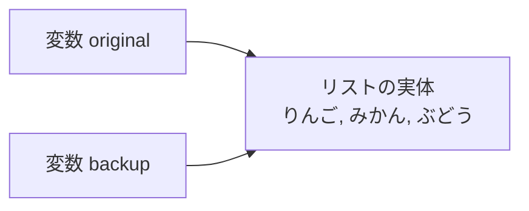
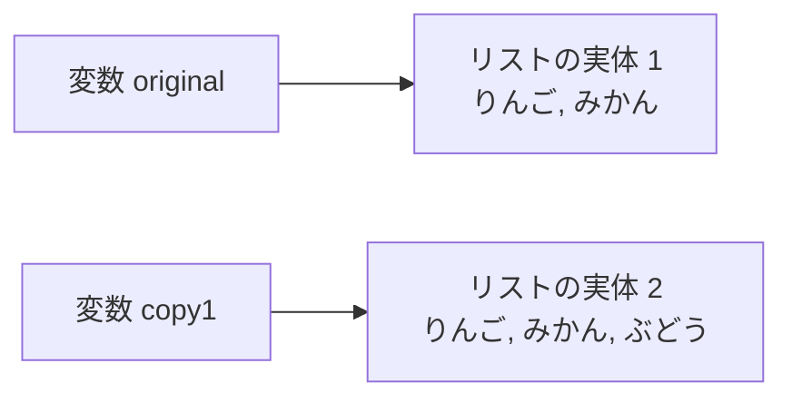
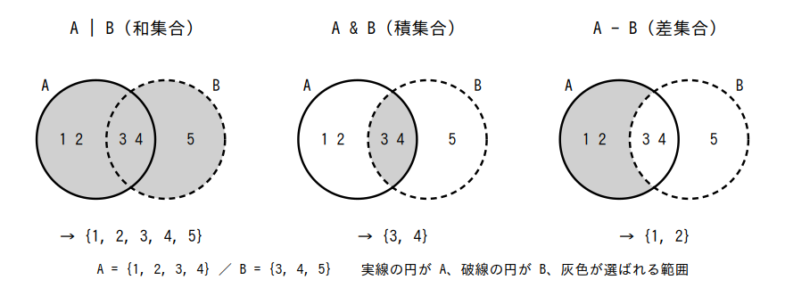
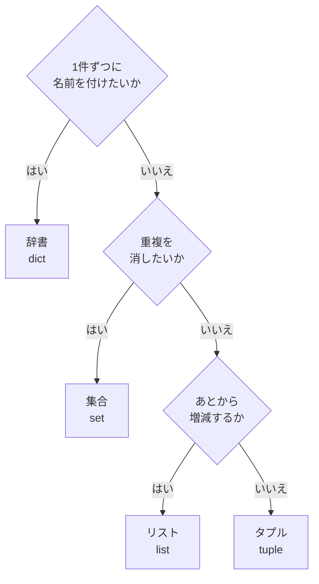

# 第4章 データ構造

第3章で、プログラムは**判断し、繰り返す**ようになりました。
しかし、扱えるデータはまだ**変数1つにつき値1つ**だけです。

たとえば、買い物の合計を出すプログラムを思い出してください。
値段を1つ受け取っては `total` に足し、また1つ受け取っては足す——
という書き方でした。この作り方には、次の限界があります。

- **あとから「3件目だけ見たい」ができない。** 足した時点で個々の値段は消えている
- **「高い順に並べたい」ができない。** 全部を同時に持っていないと並べ替えられない
- **商品名と値段をセットで持てない。** 変数を2つ用意しても、どれとどれが対応するかは管理できない

これを解決するのが**データ構造**（複数の値を、決まった形でまとめて持つための仕組み）です。
Python でよく使うのは次の4つです。

| 名前 | 書き方 | ひとことで言うと |
|------|--------|----------------|
| リスト | `[ ]` | 順番に並べた入れ物。あとから増やせる |
| タプル | `( )` | 順番に並べた入れ物。**あとから変えられない** |
| 辞書 | `{ キー: 値 }` | 名前を付けて値をしまう入れ物 |
| 集合 | `{ }` | 重複しない値の集まり |

この4つが使えるようになると、第3章の `for` が本当の力を発揮します。
そして、この章の最後に学ぶ**内包表記**は、
「リストから別のリストを作る」処理を1行で書ける、Python でもっともよく使われる書き方です。

## この章で学ぶこと

- リストで複数の値をまとめて持ち、取り出し・追加・削除・並べ替えができるようになる
- リストのコピーで起きる事故（片方を変えたら両方変わる）の理由がわかり、避けられるようになる
- タプルとリストを使い分け、アンパックで複数の値をまとめて受け取れるようになる
- 辞書でキーと値を対応させ、「辞書のリスト」で表形式のデータを扱えるようになる
- 集合で重複を取り除き、2つの集まりの共通部分や差を求められるようになる
- 内包表記で、リストや辞書を1行で組み立てられるようになる
- 4つのデータ構造を、目的に応じて選べるようになる

## この章の前提

- [第3章](./03-control-flow.md) を終えていること
- とくに次の4つを使えること
  - `if` / `elif` / `else`（[3.1](./03-control-flow.md#31-条件分岐)）
  - `for` と `range`（[3.2.1](./03-control-flow.md#321-for-の基本) / [3.2.2](./03-control-flow.md#322-range)）
  - `in` / `not in`（[3.1.4](./03-control-flow.md#314-in-で含まれるかを調べる)）
  - 合計を集める書き方（`total = 0` をループの外で用意する。[3.2.2](./03-control-flow.md#322-range)）
- f-string で値を埋め込めること（[2.4.4](./02-basics.md#244-f-string)）
- インデックスとスライスの考え方（文字列で学んだもの。[2.4.2](./02-basics.md#242-インデックスとスライス)）

> **つまずいたら**
> この章は「エラーが出ない間違い」が初めて出てくるところです。
> とくに [4.1.6](#416-sort-と-sorted-の違い破壊的か否か) と [4.1.7](#417-リストのコピーで起きる事故) は、
> **エラーにならないまま結果だけが狂います。**
> 「思った結果と違う」と感じたら、途中で `print` を挟んで中身を確認してください。
> それでもわからなければ、AI に**章番号と、実際に表示された内容**を添えて聞いてください。
>
> ```text
> python-text の 4.1.7 で詰まりました。
> b = a と書いて b だけに append したのに、a の中身も増えてしまいます。
> a の中身を変えずに b だけ変えるには、どう書けばよいですか。
> ```

> **この章のコードを書く場所**
> 第3章と同じく、`python-lesson` の中に項ごとに `.py` ファイルを作って試します。
> ファイル名は本文で毎回指定します。
> 実行コマンドは Windows が `python ファイル名`、macOS が `python3 ファイル名` です
> （[1.4.2](./01-environment.md#142-実行する)）。
> **以降、実行コマンドは Windows の形で書きます。macOS の方は `python` を `python3` に読み替えてください。**

---

## 4.1 リスト

### 4.1.1 リストを作る

3人分の点数を持ちたいとします。変数だけで書くと、こうなります。

```python
score1 = 80
score2 = 65
score3 = 90
```

3人ならまだ書けますが、40人になったら 40 個の変数が必要です。
しかも `for` で回せません（`score1` から `score2` へ「次に進む」書き方がないためです）。

そこで使うのが**リスト**です。

**リスト**（複数の値を順番に並べて1つにまとめたもの。JavaScript の配列にあたる）

リストは `[ ]` の中に、値を `,` で区切って並べて作ります。
[3.1.4](./03-control-flow.md#314-in-で含まれるかを調べる) で少しだけ先取りしたものと同じです。

`list_create.py`

```python
scores = [80, 65, 90]

print(scores)
print(len(scores))
```

```text
実行結果:
[80, 65, 90]
3
```

`print` にリストをそのまま渡すと、`[ ]` の付いた形で表示されます。
`len()` は、文字列に使うと文字数でしたが（[2.4.2](./02-basics.md#242-インデックスとスライス)）、
**リストに使うと「要素がいくつあるか」**を返します。

リストに入っている1つ1つの値を**要素**（ようそ）と呼びます。

値を空にしたリストも作れます。**あとから値を足していく箱**として使います。

`list_empty.py`

```python
items = []

print(items)
print(len(items))
```

```text
実行結果:
[]
0
```

リストの要素は、型が混ざっていてもエラーになりません。

`list_mixed.py`

```python
mixed = [1, "りんご", True, None]
print(mixed)
```

```text
実行結果:
[1, 'りんご', True, None]
```

ただし、**実際のプログラムでは型を揃えるのが基本**です。
「点数のリスト」なら全部数値、「名前のリスト」なら全部文字列にしておきます。
混ざっていると、あとで合計や並べ替えをしたときにエラーになります
（[4.1.5](#415-並べ替えsort--sorted) で実際に見ます）。

リストは、まとめて持っているからこそ、**まとめて計算できます。**
次の3つの関数は、数値のリストによく使います。

`list_calc.py`

```python
prices = [300, 1200, 450]

print(sum(prices))
print(max(prices))
print(min(prices))
print(sum(prices) / len(prices))
```

```text
実行結果:
1950
1200
300
650.0
```

- **`sum()`** … 全部の合計を返す
- **`max()`** … いちばん大きい値を返す
- **`min()`** … いちばん小さい値を返す

第3章では、合計を出すのに `total = 0` を用意して `for` で足していきました
（[3.2.2](./03-control-flow.md#322-range)）。
**リストにまとめてあれば、`sum()` の1行で済みます。**

もちろん、`for` で1つずつ取り出すこともできます。

`list_for.py`

```python
fruits = ["りんご", "みかん", "ぶどう"]

for fruit in fruits:
    print(f"{fruit} を買います")
```

```text
実行結果:
りんご を買います
みかん を買います
ぶどう を買います
```

> **補足**
> リストは、要素が多くなったら**複数行に分けて**書けます。行末の `,` は付けたままにします。
>
> ```python
> fruits = [
>     "りんご",
>     "みかん",
>     "ぶどう",
> ]
> ```
>
> 最後の要素のうしろにも `,` を付けておくと、あとから1行足すときに差分が小さくなります。
> Python では**この書き方が許されています**（エラーになりません）。

### 4.1.2 要素の取り出しと書き換え

リストの要素は、**インデックス**（並んでいるものの位置を表す番号。0 から始まる）で取り出します。
文字列と同じ考え方です（[2.4.2](./02-basics.md#242-インデックスとスライス)）。

```text
リスト:   "りんご"  "みかん"  "ぶどう"
番号:        0        1        2
後ろから    -3       -2       -1
```

`list_index.py`

```python
fruits = ["りんご", "みかん", "ぶどう"]

print(fruits[0])
print(fruits[2])
print(fruits[-1])
```

```text
実行結果:
りんご
ぶどう
ぶどう
```

**1つ目が `[0]`** です。`[-1]` は「後ろから1番目」、つまり末尾の要素になります。

存在しない番号を指定すると、エラーになります。

`list_index_error.py`

```python
fruits = ["りんご", "みかん", "ぶどう"]
print(fruits[3])
```

```text
実行結果:
Traceback (most recent call last):
  File "list_index_error.py", line 2, in <module>
    print(fruits[3])
          ~~~~~~^^^
IndexError: list index out of range
```

`IndexError: list index out of range` は「その番号はリストの範囲外です」という意味です。
要素が3つのリストで使える番号は `0` `1` `2` の3つだけで、`3` はありません。

リストは、**あとから中身を書き換えられます。**

`list_assign.py`

```python
fruits = ["りんご", "みかん", "ぶどう"]

fruits[1] = "もも"
print(fruits)
```

```text
実行結果:
['りんご', 'もも', 'ぶどう']
```

ここが文字列との大きな違いです。文字列は**イミュータブル**（不変。作ったあと中身を変えられない）でした
（[2.4.2](./02-basics.md#242-インデックスとスライス)）。
一方リストは**ミュータブル**（変更可能。作ったあと中身を変えられる）です。

**ミュータブル**（作ったあとから中身を変えられる性質）

この違いは [4.1.7](#417-リストのコピーで起きる事故) で事故の原因になります。頭の隅に置いておいてください。

> **よくある間違い**
> 「1番目の要素」と言われて `[1]` と書くと、**2つ目**が取れます。
>
> ```python
> fruits = ["りんご", "みかん", "ぶどう"]
> print(fruits[1])     # ❌ 1つ目のつもり
> ```
>
> ```text
> 実行結果:
> みかん
> ```
>
> **1つ目は `[0]`、最後は `[-1]`** です。
> 「最後の要素」を `[len(fruits)]` と書くのも間違いで、`IndexError` になります
> （要素が3つなら、最後の番号は `3` ではなく `2` です）。

### 4.1.3 スライス

`[開始:終了]` と書くと、**範囲を切り出せます**。これを**スライス**と呼びます。
文字列で学んだものと同じ書き方です（[2.4.2](./02-basics.md#242-インデックスとスライス)）。

`list_slice.py`

```python
numbers = [10, 20, 30, 40, 50]

print(numbers[1:3])
print(numbers[:2])
print(numbers[3:])
print(numbers[-2:])
```

```text
実行結果:
[20, 30]
[10, 20]
[40, 50]
[40, 50]
```

**終了の番号は含まれません。** `[1:3]` は「1 番目から 3 番目の手前まで」＝ `1` と `2` です。
`range` の終了と同じ考え方です（[3.2.2](./03-control-flow.md#322-range)）。

3つ目の数を書くと、**いくつ飛ばしで取るか**（増分）を指定できます。

`list_step.py`

```python
numbers = [10, 20, 30, 40, 50]

print(numbers[::2])
print(numbers[::-1])
```

```text
実行結果:
[10, 30, 50]
[50, 40, 30, 20, 10]
```

`[::2]` は「最初から最後まで、2つおき」、`[::-1]` は「後ろから順に」という意味になります。
`[::-1]` は**並びを逆にしたリストを作る**書き方として、そのまま覚えてかまいません。

ここで大事なことが1つあります。
**スライスは、元のリストを変えずに、新しいリストを作って返します。**

`list_slice_new.py`

```python
numbers = [10, 20, 30, 40, 50]
part = numbers[1:3]

part[0] = 999

print(part)
print(numbers)
```

```text
実行結果:
[999, 30]
[10, 20, 30, 40, 50]
```

`part` を書き換えても、`numbers` は元のままです。
この性質は [4.1.7](#417-リストのコピーで起きる事故) で「コピーを作る方法」として使います。

### 4.1.4 追加・削除（`append` / `insert` / `remove` / `pop`）

リストは、**あとから要素を増やしたり減らしたりできます。**
使うのは、[2.4.3](./02-basics.md#243-よく使うメソッド) で学んだ**メソッド**です。
文字列の `strip()` や `upper()` と同じく、`データ.メソッド名()` の形で呼びます。

まずは**末尾に足す `append`**（アペンド。追加する）です。

`list_append.py`

```python
tasks = ["買い物", "掃除"]

tasks.append("洗濯")
print(tasks)
print(len(tasks))
```

```text
実行結果:
['買い物', '掃除', '洗濯']
3
```

`append` は、空のリストから始めて**ループの中で育てていく**使い方が中心になります。
これは第3章の「合計を集める」書き方（[3.2.2](./03-control-flow.md#322-range)）の、リスト版です。

`list_collect.py`

```python
numbers = [12, 7, 30, 4, 25]
big_numbers = []

for number in numbers:
    if number >= 10:
        big_numbers.append(number)

print(big_numbers)
print(len(big_numbers))
```

```text
実行結果:
[12, 30, 25]
3
```

**集めるためのリストは、必ずループの外で `[]` として用意します。**
中で用意すると、毎回空に戻ってしまいます。

**途中に差し込む `insert`**（インサート。挿入する）は、番号を指定して割り込ませます。

`list_insert.py`

```python
tasks = ["買い物", "掃除", "洗濯"]

tasks.insert(0, "朝食")
print(tasks)
```

```text
実行結果:
['朝食', '買い物', '掃除', '洗濯']
```

**値を指定して消す `remove`**（リムーブ。取り除く）は、**最初に見つかった1つだけ**を消します。

`list_remove.py`

```python
tasks = ["買い物", "掃除", "洗濯", "掃除"]

tasks.remove("掃除")
print(tasks)
```

```text
実行結果:
['買い物', '洗濯', '掃除']
```

2つあった `"掃除"` のうち、**前の1つだけ**が消えました。

**番号を指定して取り出しながら消す `pop`**（ポップ。取り出す）は、消した値を**戻り値として返します**。

`list_pop.py`

```python
tasks = ["朝食", "買い物", "掃除"]

last = tasks.pop()
print(last)
print(tasks)

first = tasks.pop(0)
print(first)
print(tasks)
```

```text
実行結果:
掃除
['朝食', '買い物']
朝食
['買い物']
```

`pop()` は**番号を省略すると末尾**を取り出します。`pop(0)` なら先頭です。

ここまでの4つをまとめます。

| メソッド | すること | 戻り値 |
|---------|---------|-------|
| `append(値)` | 末尾に足す | なし（`None`） |
| `insert(番号, 値)` | その番号の位置に差し込む | なし（`None`） |
| `remove(値)` | その値を**最初の1つだけ**消す | なし（`None`） |
| `pop()` / `pop(番号)` | 取り出して消す | **消した値** |

> **よくある間違い**
> `append` の結果を変数に入れてしまう間違いが、非常に多く起きます。
>
> ```python
> tasks = ["買い物"]
> tasks = tasks.append("掃除")     # ❌
> print(tasks)
> ```
>
> ```text
> 実行結果:
> None
> ```
>
> `append` は**リストそのものを書き換える**メソッドで、**戻り値がありません**（`None` が返ります）。
> そのため、代入すると `tasks` が `None` になってリストが消えます。
>
> ```python
> tasks.append("掃除")      # ✅ 代入しない
> ```
>
> **`append` / `insert` / `remove` は、代入せずにそのまま呼ぶ**と覚えてください。
> この「戻り値がない」性質は、次の [4.1.6](#416-sort-と-sorted-の違い破壊的か否か) でも同じ形で出てきます。

> **注意**
> `remove` に、リストにない値を渡すとエラーになります。
>
> ```text
> ValueError: list.remove(x): x not in list
> ```
>
> 消す前に `in` で確認してください（[3.1.4](./03-control-flow.md#314-in-で含まれるかを調べる)）。
>
> ```python
> if "掃除" in tasks:
>     tasks.remove("掃除")
> ```
>
> 同じく、空のリストに `pop()` を使うと `IndexError: pop from empty list` になります。

### 4.1.5 並べ替え（`sort` / `sorted`）

リストを並べ替えるやり方は2つあります。

1つ目は、**メソッドの `sort()`**（ソート。並べ替える）です。

`list_sort.py`

```python
scores = [70, 100, 85]

scores.sort()
print(scores)

scores.sort(reverse=True)
print(scores)
```

```text
実行結果:
[70, 85, 100]
[100, 85, 70]
```

`sort()` は、**そのリスト自身を並べ替えます。**
`reverse=True` を渡すと大きい順（降順）になります。

2つ目は、**関数の `sorted()`** です。

`list_sorted.py`

```python
names = ["sato", "abe", "kudo"]

result = sorted(names)

print(result)
print(names)
```

```text
実行結果:
['abe', 'kudo', 'sato']
['sato', 'abe', 'kudo']
```

`sorted()` は、**並べ替えた新しいリストを返し、元のリストは変えません。**

`reverse=True` は `sorted()` にも同じように使えます。

`list_sorted_reverse.py`

```python
scores = [70, 100, 85]

high_to_low = sorted(scores, reverse=True)

print(high_to_low)
print(scores)
```

```text
実行結果:
[100, 85, 70]
[70, 100, 85]
```

**元の並び順を残したまま、並べ替えた結果だけが欲しい**ときは、この形を使います。

文字列は、アルファベット順（正確には**文字コードの順**）に並びます。
日本語を並べ替えるときは注意が必要です。

`list_sort_jp.py`

```python
cities = ["東京", "大阪", "京都"]
print(sorted(cities))
```

```text
実行結果:
['京都', '大阪', '東京']
```

これは五十音順（おおさか → きょうと → とうきょう）ではありません。
**漢字も文字コードの順に並ぶ**ためです。
読みの順に並べたい場合は、読みがなを別に持つ必要があります（この本では扱いません）。

> **よくある間違い**
> 数値と文字列が混ざったリストは、並べ替えられません。
>
> ```python
> mixed = [3, "1", 2]
> mixed.sort()      # ❌
> ```
>
> ```text
> TypeError: '<' not supported between instances of 'str' and 'int'
> ```
>
> 「文字列と整数は `<` で比べられません」という意味です。
> 数値のつもりで `input` の結果をそのまま `append` していると、この形になりがちです
> （`input` の戻り値は必ず文字列でした。[2.5.3](./02-basics.md#253-入力は必ず文字列である)）。
> **リストに入れる前に `int()` で変換してください。**

> **補足**
> 「点数の高い順」「名前の五十音順」のように、
> **並べ替えの基準を自分で決めたい**ときは `sorted()` の `key` という指定を使います。
> これは関数を引数として渡す書き方なので、[第5章 5.5.3](./05-functions.md) で扱います。
> この章では、`sort()` / `sorted()` と `reverse=True` までを使います。

### 4.1.6 `sort` と `sorted` の違い（破壊的か否か）

前の項で出てきた2つは、名前が似ているのに動きが違います。
ここが初学者のつまずきどころなので、正面から比べます。

| | `リスト.sort()` | `sorted(リスト)` |
|---|---|---|
| 書き方 | メソッド | 関数 |
| 元のリスト | **並べ替わる**（変わる） | 変わらない |
| 戻り値 | **なし（`None`）** | 並べ替えた**新しいリスト** |
| 使うとき | 元のリストをそのまま並べ替えたい | 元を残したまま、並んだものが欲しい |

元のリストを書き換えてしまう動きを、**破壊的**（はかいてき）と呼びます。
`sort()` は破壊的、`sorted()` は非破壊的です。

実際に、両方の戻り値を表示して確かめます。

`sort_vs_sorted.py`

```python
numbers = [3, 1, 2]
result = numbers.sort()

print(result)
print(numbers)

numbers2 = [3, 1, 2]
result2 = sorted(numbers2)

print(result2)
print(numbers2)
```

```text
実行結果:
None
[1, 2, 3]
[1, 2, 3]
[3, 1, 2]
```

- `numbers.sort()` の戻り値は `None`。ただし `numbers` 自身は並べ替わっている
- `sorted(numbers2)` の戻り値は並んだリスト。`numbers2` は元のまま

> **よくある間違い**
> `sort()` の結果を代入すると、**リストが `None` になって消えます。**
>
> ```python
> numbers = [3, 1, 2]
> numbers = numbers.sort()      # ❌
> print(len(numbers))
> ```
>
> ```text
> TypeError: object of type 'NoneType' has no len()
> ```
>
> 「`None` の長さは測れません」という意味です。
> `sort()` は `append` と同じで**戻り値がありません**（[4.1.4](#414-追加削除append--insert--remove--pop)）。
>
> ```python
> numbers.sort()                # ✅ 元のリストを並べ替える
> numbers = sorted(numbers)     # ✅ 新しいリストを受け取る
> ```
>
> **`None` が表示されたら、代入してはいけないものを代入していないか**を疑ってください。

### 4.1.7 リストのコピーで起きる事故

ここはこの章でいちばん重要な項です。**エラーが出ないまま結果が狂う**からです。

「元のリストを残しておきたいので、別の変数にコピーしよう」と思って、
次のように書いたとします。

`list_copy_bug.py`

```python
original = ["りんご", "みかん"]
backup = original

backup.append("ぶどう")

print(backup)
print(original)
```

```text
実行結果:
['りんご', 'みかん', 'ぶどう']
['りんご', 'みかん', 'ぶどう']
```

`backup` にだけ足したはずなのに、**`original` も増えています。**

理由は、`backup = original` が**リストの中身をコピーしていない**からです。
この代入がしているのは、「**同じリストに、もう1つ名前を付ける**」ことだけです。



図のとおり、実体は**1つ**しかありません。
`backup.append(...)` は矢印の先にある実体を書き換えるので、
`original` から見ても中身が増えて見えます。

中身を分けたいときは、**コピーを作る**必要があります。方法は3つあり、どれを使ってもかまいません。

`list_copy_fix.py`

```python
original = ["りんご", "みかん"]

copy1 = original.copy()
copy2 = original[:]
copy3 = list(original)

copy1.append("ぶどう")

print(copy1)
print(copy2)
print(copy3)
print(original)
```

```text
実行結果:
['りんご', 'みかん', 'ぶどう']
['りんご', 'みかん']
['りんご', 'みかん']
['りんご', 'みかん']
```



- **`.copy()`** … いちばん意味がはっきりしていて読みやすい
- **`[:]`** … 全体を切り出すスライス。新しいリストが返る性質（[4.1.3](#413-スライス)）を利用している
- **`list(...)`** … `list()` は「リストを作る関数」。他の種類のデータからリストを作るときにも使う（[4.4.3](#443-重複除去に使う) で再登場します）

> **よくある間違い**
> この事故は、**リストだから起きます。**
> 数値や文字列で同じことをしても、何も起きません。
>
> ```python
> a = 10
> b = a
> b = b + 1
> print(a)
> print(b)
> ```
>
> ```text
> 実行結果:
> 10
> 11
> ```
>
> 数値や文字列は**イミュータブル**（[4.1.2](#412-要素の取り出しと書き換え)）なので、
> `b = b + 1` は「新しい値を作って `b` に付け替える」動きになり、`a` には影響しません。
> **中身を書き換えられるもの（リスト・辞書・集合）だけが、この事故を起こします。**

> **注意**
> 「元の状態を残しておきたい」と思ったら、**代入ではなくコピー**です。
> とくに、次のようなときは必ずコピーしてください。
>
> - 並べ替える前の順番を残しておきたい（または `sorted()` を使う）
> - 一部を削除した結果と、削除前を比べたい

---

## 4.2 タプル

### 4.2.1 変更できないリスト

**タプル**（複数の値を順番に並べたもの。作ったあと中身を変えられない）は、
`( )` の中に値を `,` で区切って並べて作ります。

`tuple_create.py`

```python
point = (10, 20)

print(point)
print(point[0])
print(point[1])
print(len(point))
```

```text
実行結果:
(10, 20)
10
20
2
```

取り出し方（インデックス）、`len()`、`for` での繰り返し、`in` での判定は、
**リストとまったく同じ**です。違うのは1点だけで、**中身を変えられません。**

`tuple_immutable.py`

```python
point = (10, 20)
point[0] = 99
```

```text
実行結果:
Traceback (most recent call last):
  File "tuple_immutable.py", line 2, in <module>
    point[0] = 99
    ~~~~~^^^
TypeError: 'tuple' object does not support item assignment
```

`'tuple' object does not support item assignment` は
「タプルは要素の代入に対応していません」という意味です。
`append` や `sort()` も、タプルにはありません。

> **よくある間違い**
> 要素が1つのタプルは、**うしろに `,` が必要**です。
>
> ```python
> a = (1)
> b = (1,)
>
> print(type(a))
> print(type(b))
> ```
>
> ```text
> 実行結果:
> <class 'int'>
> <class 'tuple'>
> ```
>
> `(1)` の `( )` は、計算の優先順位を変えるかっこ（[2.3.1](./02-basics.md#231-算術演算子)）と
> 区別が付かないため、**ただの数値**になります。
> 要素が1つのタプルを作るときは `(1,)` と書いてください。

### 4.2.2 いつ使うのか

「変えられない」ことは、一見すると不便です。
それでもタプルを使うのは、**変わってほしくないものを、変わらないようにするため**です。

タプルが向いているのは、次のような場面です。

| 場面 | 例 | 理由 |
|------|----|------|
| 意味の決まった値の組 | 座標 `(10, 20)`、RGB `(255, 128, 0)` | 「x と y」のように**個数と順番に意味がある**。増減しない |
| 変わってほしくない設定値 | `SIZES = ("S", "M", "L")` | 途中で書き換わる事故を防げる |
| 複数の値をまとめて返す | 第5章で扱います | 受け取る側が個数を前提にできる |

判断の目安はこうです。

- **あとで要素を増やす・減らす・並べ替える可能性がある** → リスト
- **個数も順番も決まっていて、変わらない** → タプル

たとえば「取り扱いサイズの一覧」は、プログラムの実行中に増えることはありません。
定数（[2.1.4](./02-basics.md#214-定数の慣習)）として、タプルで持つのが自然です。

`tuple_const.py`

```python
SIZES = ("S", "M", "L")

size = "M"

if size in SIZES:
    print(f"{size} は取り扱いのあるサイズです")

for s in SIZES:
    print(s)
```

```text
実行結果:
M は取り扱いのあるサイズです
S
M
L
```

> **補足**
> 迷ったときはリストを使ってかまいません。
> タプルでなければ動かない場面は、この本の範囲では [4.3.1](#431-キーと値の組) の
> 「辞書のキーにする」くらいです。
> **「変わらないと約束したい」ときの表明**だと思ってください。

### 4.2.3 アンパック

タプル（やリスト）の要素を、**まとめて複数の変数に取り出す**書き方があります。
これを**アンパック**（中身を取り出して、それぞれの変数に配ること）と呼びます。

`unpack.py`

```python
point = (10, 20)

x, y = point

print(x)
print(y)
```

```text
実行結果:
10
20
```

`x, y = point` は、`x = point[0]` と `y = point[1]` を1行で書いたものです。
**左辺の変数の数と、右辺の要素の数は一致していなければなりません。**

`unpack_error.py`

```python
point = (10, 20)
x, y, z = point
```

```text
実行結果:
Traceback (most recent call last):
  File "unpack_error.py", line 2, in <module>
    x, y, z = point
    ^^^^^^^
ValueError: not enough values to unpack (expected 3, got 2)
```

「3つ受け取るつもりだったのに、2つしかありません」という意味です。

第3章で使った `enumerate` の「変数を2つ書く」書き方は、これでした
（[3.2.3](./03-control-flow.md#323-enumerate-で番号付きに回す)）。

`unpack_enumerate.py`

```python
fruits = ["りんご", "みかん", "ぶどう"]

for number, fruit in enumerate(fruits, start=1):
    print(f"{number}. {fruit}")
```

```text
実行結果:
1. りんご
2. みかん
3. ぶどう
```

`enumerate` は「番号と値の組」を1つずつ返しており、
それを `number` と `fruit` にアンパックしていた、というわけです。

アンパックを使うと、**2つの変数の値を入れ替える**ことも1行で書けます。

`unpack_swap.py`

```python
a = 1
b = 2

a, b = b, a

print(a)
print(b)
```

```text
実行結果:
2
1
```

右辺の `b, a` が先にタプル `(2, 1)` として作られ、それを `a, b` にアンパックしています。
**一時的な変数を用意する必要がありません。**

---

## 4.3 辞書（dict）

### 4.3.1 キーと値の組

リストの弱点は、**番号でしか取り出せない**ことです。

```python
student = ["佐藤", 82, "1年A組"]
```

このリストの `student[1]` が何かは、コードを見ただけではわかりません。
点数なのか、年齢なのか、出席番号なのか——書いた本人しか知らない状態です。

これを解決するのが**辞書**です。

**辞書（dict）**（キーと値の組をまとめたもの。JavaScript のオブジェクトにあたる）

`{ キー: 値 }` の形で、`,` で区切って並べます。

**キー**（値を取り出すための名前）、**値**（キーに結び付けられたデータ）と呼びます。

`dict_create.py`

```python
student = {"name": "佐藤", "score": 82, "class": "1年A組"}

print(student)
print(len(student))
```

```text
実行結果:
{'name': '佐藤', 'score': 82, 'class': '1年A組'}
3
```

`len()` は、辞書に使うと**キーと値の組がいくつあるか**を返します。

キーには文字列を使うのが基本です（数値やタプルも使えますが、この本では文字列だけを使います）。
一方、値には**どんな型でも入れられます。**

読みやすさのために、複数行に分けて書くこともできます。

`dict_multiline.py`

```python
student = {
    "name": "佐藤",
    "score": 82,
    "class": "1年A組",
}

print(student["name"])
```

```text
実行結果:
佐藤
```

> **補足**
> 辞書は、**書いた順番を覚えています。**
> `print` したときも `for` で回したときも、書いた順に出てきます。
> ただし辞書の本来の目的は「名前で引くこと」なので、
> **順番に意味を持たせたいならリストを使ってください。**

### 4.3.2 値の読み書き

値を取り出すときは、`[ ]` の中に**キー**を書きます。

`dict_read.py`

```python
student = {"name": "佐藤", "score": 82}

print(student["name"])
print(student["score"])
```

```text
実行結果:
佐藤
82
```

リストの `[0]` と形は同じですが、中に書くのが**番号ではなく名前**です。
`student["score"]` なら、読んだだけで点数だとわかります。

存在しないキーを指定すると、エラーになります。

`dict_key_error.py`

```python
student = {"name": "佐藤", "score": 82}
print(student["age"])
```

```text
実行結果:
Traceback (most recent call last):
  File "dict_key_error.py", line 2, in <module>
    print(student["age"])
          ~~~~~~~^^^^^^^
KeyError: 'age'
```

`KeyError: 'age'` は「`age` というキーはありません」という意味です。
リストの `IndexError` にあたるものです。

**値の書き換えと、新しいキーの追加は、どちらも同じ書き方**です。

`dict_write.py`

```python
student = {"name": "佐藤", "score": 82}

student["score"] = 90
student["class"] = "1年A組"

print(student)
```

```text
実行結果:
{'name': '佐藤', 'score': 90, 'class': '1年A組'}
```

- **すでにあるキー**に代入 → 上書き
- **ないキー**に代入 → 新しく追加

消すときは `del`（デリート。削除する）を使います。

`dict_delete.py`

```python
student = {"name": "佐藤", "score": 82, "class": "1年A組"}

del student["class"]
print(student)
```

```text
実行結果:
{'name': '佐藤', 'score': 82}
```

キーがあるかどうかは `in` で調べられます（[3.1.4](./03-control-flow.md#314-in-で含まれるかを調べる)）。

`dict_in.py`

```python
student = {"name": "佐藤", "score": 82}

print("name" in student)
print("age" in student)
print("佐藤" in student)
```

```text
実行結果:
True
False
False
```

> **よくある間違い**
> **`in` が調べるのはキーだけです。** 値は調べません。
> 上の実行結果で `"佐藤" in student` が `False` になっているのはそのためです。
> 値の中を調べたいときは `in student.values()` と書きます（[4.3.4](#434-キー値両方を回す)）。

### 4.3.3 `get` で安全に取り出す

`student["age"]` は、キーがないとエラーで**プログラムが止まります。**
「あれば使い、なければ既定の値でよい」場面では、**`get`**（ゲット。取得する）を使います。

`dict_get.py`

```python
student = {"name": "佐藤", "score": 82}

print(student.get("name"))
print(student.get("age"))
print(student.get("age", 0))
```

```text
実行結果:
佐藤
None
0
```

- `get("キー")` … あれば値、**なければ `None`**（エラーにならない）
- `get("キー", 既定値)` … なければ、その既定値を返す

`get` がいちばん役に立つのは、**数を数えるとき**です。
「まだ1度も出ていない商品」は辞書にキーがないので、`[ ]` で読むとエラーになります。
`get(..., 0)` を使うと、「なければ 0 から始める」が1行で書けます。

`dict_count.py`

```python
answers = ["りんご", "みかん", "りんご", "ぶどう", "りんご"]
counts = {}

for answer in answers:
    counts[answer] = counts.get(answer, 0) + 1

print(counts)
print(counts["りんご"])
```

```text
実行結果:
{'りんご': 3, 'みかん': 1, 'ぶどう': 1}
3
```

1行ずつ追うと、次のことが起きています。

| 回 | `answer` | `counts.get(answer, 0)` | 代入後の `counts` |
|----|---------|------------------------|------------------|
| 1 | りんご | 0（キーがない） | `{'りんご': 1}` |
| 2 | みかん | 0（キーがない） | `{'りんご': 1, 'みかん': 1}` |
| 3 | りんご | 1 | `{'りんご': 2, 'みかん': 1}` |
| 4 | ぶどう | 0（キーがない） | `{'りんご': 2, 'みかん': 1, 'ぶどう': 1}` |
| 5 | りんご | 2 | `{'りんご': 3, 'みかん': 1, 'ぶどう': 1}` |

**この「数える型」は、実際のプログラムで非常によく使います。**
そのまま書き写せるように覚えておいてください。

> **よくある間違い**
> `get` を使わずに書くと、初回でエラーになります。
>
> ```python
> counts = {}
> counts["りんご"] = counts["りんご"] + 1     # ❌
> ```
>
> ```text
> KeyError: 'りんご'
> ```
>
> 右辺の `counts["りんご"]` を読もうとした時点で、まだキーがないためです。
> `if "りんご" in counts:` で分岐しても書けますが、**`get(..., 0)` のほうが短く読みやすくなります。**

### 4.3.4 キー・値・両方を回す

辞書を `for` で回すと、**キーが1つずつ**取り出されます。

`dict_for_key.py`

```python
scores = {"数学": 80, "英語": 65, "国語": 90}

for subject in scores:
    print(subject)
```

```text
実行結果:
数学
英語
国語
```

キーがわかれば `scores[subject]` で値も取れますが、
**キーと値の両方が必要なときは `items()`** を使います。

`dict_items.py`

```python
scores = {"数学": 80, "英語": 65, "国語": 90}

for subject, score in scores.items():
    print(f"{subject}: {score}点")
```

```text
実行結果:
数学: 80点
英語: 65点
国語: 90点
```

`items()` は「キーと値の組（タプル）」を1つずつ返します。
それを `subject` と `score` にアンパックしています（[4.2.3](#423-アンパック)）。
**`enumerate` のときと同じ形です。**

キーだけ・値だけが欲しいときのメソッドもあります。

`dict_keys_values.py`

```python
scores = {"数学": 80, "英語": 65, "国語": 90}

print(scores.keys())
print(scores.values())
print(sum(scores.values()))
print(max(scores.values()))
print(sorted(scores))
```

```text
実行結果:
dict_keys(['数学', '英語', '国語'])
dict_values([80, 65, 90])
235
90
['国語', '数学', '英語']
```

- `keys()` … キーの集まり。`dict_keys([...])` という見慣れない形で表示されますが、`for` や `in` にそのまま使えます
- `values()` … 値の集まり。**`sum()` や `max()` にそのまま渡せます**
- `sorted(辞書)` … **キーを並べ替えたリスト**が返ります（値ではありません）

3つの使い分けをまとめます。

| 書き方 | 取り出されるもの |
|--------|----------------|
| `for k in 辞書:` | キー |
| `for k in 辞書.keys():` | キー（上と同じ。明示したいとき） |
| `for v in 辞書.values():` | 値 |
| `for k, v in 辞書.items():` | キーと値の両方 |

> **よくある間違い**
> `items()` を使うのに、変数を1つしか書かないと、扱いにくい形のまま受け取ってしまいます。
>
> ```python
> scores = {"数学": 80}
> for item in scores.items():
>     print(item)
> ```
>
> ```text
> 実行結果:
> ('数学', 80)
> ```
>
> エラーにはなりませんが、タプルのままなので `item[0]` `item[1]` と書く羽目になります。
> **`items()` を使うときは変数を2つ**書いてください。

### 4.3.5 辞書のリスト（実務で最頻出の形）

ここまでで、次の2つができるようになりました。

- リスト … **同じ種類のものを、いくつも並べる**
- 辞書 … **1件分のデータに、名前を付けてまとめる**

この2つを組み合わせた**「辞書のリスト」**が、実際のプログラムでもっともよく出てくる形です。
表（Excel のシートのようなもの）をプログラムで表すと、これになります。

```text
表                             辞書のリスト
┌──────┬───────┐              [
│ name │ score │                {"name": "佐藤", "score": 82},   ← 1行目
├──────┼───────┤                {"name": "鈴木", "score": 61},   ← 2行目
│ 佐藤 │  82   │                {"name": "高橋", "score": 95},   ← 3行目
│ 鈴木 │  61   │              ]
│ 高橋 │  95   │
└──────┴───────┘
```

**リストの1つ1つの要素が、1件分の辞書**になっています。

`students_show.py`

```python
students = [
    {"name": "佐藤", "score": 82},
    {"name": "鈴木", "score": 61},
    {"name": "高橋", "score": 95},
]

print(len(students))
print(students[0])
print(students[0]["name"])

for student in students:
    print(f"{student['name']}: {student['score']}点")
```

```text
実行結果:
3
{'name': '佐藤', 'score': 82}
佐藤
佐藤: 82点
鈴木: 61点
高橋: 95点
```

取り出し方を分解すると、次のようになります。

| 書き方 | 意味 | 結果 |
|--------|------|------|
| `students` | 全体（リスト） | 3件の辞書が入ったリスト |
| `students[0]` | 1件目（辞書） | `{'name': '佐藤', 'score': 82}` |
| `students[0]["name"]` | 1件目の名前（文字列） | `佐藤` |

> **よくある間違い**
> f-string の中で辞書を読むときは、**外側と違う種類の引用符**を使ってください。
>
> ```python
> print(f"{student['name']}")     # ✅ 外が " なら、中は '
> ```
>
> 外も中も `"` にすると、**Python 3.11 以前ではエラーになります。**
>
> ```python
> print(f"{student["name"]}")     # ❌ 3.11 以前ではエラー
> ```
>
> ```text
> SyntaxError: f-string: unmatched '['
> ```
>
> Python 3.12 以降は同じ引用符でも書けるように変わりましたが、
> **古い Python では動かないコードになります。**
> このテキストでは、どのバージョンでも動く**「外と中で引用符を変える」書き方**に統一します。

この形になれば、第3章で学んだ `for` と `if` で、**表の集計がひととおりできます。**
ここでは3つの型をまとめて見せます。**演習でも、この3つの組み合わせを使います。**

`students_aggregate.py`

```python
students = [
    {"name": "佐藤", "score": 82},
    {"name": "鈴木", "score": 61},
    {"name": "高橋", "score": 95},
]

# 型1: 合計と平均を出す（集める変数はループの外で用意する）
total = 0
for student in students:
    total += student["score"]

average = total / len(students)
print(f"合計: {total}点")
print(f"平均: {average:.1f}点")

# 型2: 条件に合うものだけ集める
passed = []
for student in students:
    if student["score"] >= 70:
        passed.append(student["name"])

print(f"70点以上: {passed}")
print(f"{len(passed)}人")

# 型3: いちばん大きいものを探す
top = students[0]
for student in students:
    if student["score"] > top["score"]:
        top = student

print(f"最高点: {top['name']} さんの {top['score']}点")
```

```text
実行結果:
合計: 238点
平均: 79.3点
70点以上: ['佐藤', '高橋']
2人
最高点: 高橋 さんの 95点
```

3つの型は、それぞれ次の考え方でできています。

| 型 | 用意するもの | ループの中ですること |
|----|------------|-------------------|
| 合計・平均 | `total = 0` | `total += ...` |
| 絞り込み | `passed = []` | 条件に合えば `append` |
| 最大・最小 | `top = students[0]`（**1件目を仮の答えにする**） | もっと大きければ入れ替える |

**「最大を探す型」で `top = None` から始めないでください。**
1回目の比較で `top["score"]` を読もうとして、
`TypeError: 'NoneType' object is not subscriptable`（`None` からは取り出せません）になります。
**1件目を仮の答えにしておく**のが、確実な書き方です。

> **注意**
> 型1の平均は、`students` が空だと `len(students)` が `0` になり、
> `ZeroDivisionError: division by zero` で止まります（[2.3.1](./02-basics.md#231-算術演算子)）。
> 件数が 0 になりうるデータを扱うときは、
> `if len(students) == 0:` で先に分岐してください（[3.1.5](./03-control-flow.md#315-真偽値として扱われる値空文字列0空リスト)）。

---

## 4.4 集合（set）

### 4.4.1 重複しない集まり

**集合（set）**（重複しない値の集まり。順番を持たない）は、
`{ }` の中に値を `,` で区切って並べて作ります。

`set_create.py`

```python
numbers = {1, 2, 3, 3, 2}

print(numbers)
print(len(numbers))
```

```text
実行結果:
{1, 2, 3}
3
```

`3` と `2` を2回書いたのに、**1つずつにまとめられています。**
集合の性質は次の2つです。

1. **同じ値は1つしか持てない**（重複が自動的に消える）
2. **順番を持たない**（何番目、という考え方がない）

順番がないので、**インデックスでの取り出しはできません。**

`set_no_index.py`

```python
numbers = {1, 2, 3}
print(numbers[0])
```

```text
実行結果:
Traceback (most recent call last):
  File "set_no_index.py", line 2, in <module>
    print(numbers[0])
          ~~~~~~~^^^
TypeError: 'set' object is not subscriptable
```

`'set' object is not subscriptable` は「集合は `[ ]` で取り出せません」という意味です。

集合にできるのは、**「入っているか」を調べることと、`for` で回すこと**です。

`set_in.py`

```python
sizes = {"S", "M", "L"}

print("M" in sizes)
print("XL" in sizes)
```

```text
実行結果:
True
False
```

> **よくある間違い**
> **空の集合は `{}` では作れません。** `{}` は空の**辞書**になります。
>
> ```python
> a = {}
> b = set()
>
> print(type(a))
> print(type(b))
> ```
>
> ```text
> 実行結果:
> <class 'dict'>
> <class 'set'>
> ```
>
> 空の集合を作るときは **`set()`** と書いてください。

> **注意**
> 集合を `print` したときの**並び順は決まっていません。**
> 上の例では `{1, 2, 3}` と表示されましたが、
> 値の種類（とくに文字列）によっては、書いた順とも小さい順とも違う順で表示されます。
> **表示の順番を決めたいときは、`sorted()` を通してリストにしてください**（[4.4.3](#443-重複除去に使う)）。

### 4.4.2 和・積・差

集合の便利さは、**2つの集まりを比べる計算**にあります。
「両方に入っているのはどれか」「片方にしかないのはどれか」が、記号1つで求められます。

`set_operations.py`

```python
a = {1, 2, 3, 4}
b = {3, 4, 5}

print(a | b)
print(a & b)
print(a - b)
print(b - a)
```

```text
実行結果:
{1, 2, 3, 4, 5}
{3, 4}
{1, 2}
{5}
```

図にすると、次の範囲が選ばれています。



| 記号 | 呼び方 | 意味 |
|------|--------|------|
| `a \| b` | 和集合（わしゅうごう） | **どちらかに**入っているもの全部 |
| `a & b` | 積集合（せきしゅうごう） | **両方に**入っているものだけ |
| `a - b` | 差集合（さしゅうごう） | **a にあって b にない**もの |

`|` は**縦棒**の記号です。Windows では `Shift` +（`¥` の左隣にあるキー）、
macOS では `Shift` + `¥` で入力できます（キーボードによって位置が異なります）。

使いどころは、たとえば次のような場面です。

`set_use.py`

```python
monday = {"佐藤", "鈴木", "高橋"}
tuesday = {"鈴木", "高橋", "田中"}

print(sorted(monday & tuesday))
print(sorted(monday - tuesday))
print(len(monday | tuesday))
```

```text
実行結果:
['鈴木', '高橋']
['佐藤']
4
```

- 積集合 … **両日とも来た人**
- 差集合 … **月曜だけ来た人**
- 和集合の件数 … **どちらかに来た、のべではない実人数**

同じことを、リストと `for` と `if` で書くこともできます。
しかし、**集合なら1行で、しかも意味がそのまま読める形**になります。

> **補足**
> 記号の代わりに、メソッドでも書けます。読み手に合わせて選んでください。
>
> | 記号 | メソッド |
> |------|---------|
> | `a \| b` | `a.union(b)` |
> | `a & b` | `a.intersection(b)` |
> | `a - b` | `a.difference(b)` |

### 4.4.3 重複除去に使う

集合のいちばん多い使い道は、**リストから重複を取り除くこと**です。
`set()` にリストを渡すと、重複が消えた集合になります。

`set_unique.py`

```python
answers = ["りんご", "みかん", "りんご", "ぶどう", "みかん"]

kinds = set(answers)

print(len(answers))
print(len(kinds))
print(sorted(kinds))
```

```text
実行結果:
5
3
['ぶどう', 'みかん', 'りんご']
```

- `len(answers)` … **回答の件数**（5件）
- `len(kinds)` … **答えの種類の数**（3種類）

集合のままだと表示順が決まらないので、
**`sorted()` に通してリストにしてから表示**しています（[4.4.1](#441-重複しない集まり) の注意）。

リストに戻したいときは `list()` を使います（[4.1.7](#417-リストのコピーで起きる事故) で出てきた関数です）。

`set_to_list.py`

```python
answers = ["りんご", "みかん", "りんご", "ぶどう", "みかん"]

kinds = list(set(answers))

print(len(kinds))
```

```text
実行結果:
3
```

ただし、この方法には**元の順番が失われる**という欠点があります。
**「最初に出てきた順」を保ったまま重複を消したい**ときは、
第3章までの道具（`for` と `in` と `append`）で書きます。

`unique_keep_order.py`

```python
answers = ["りんご", "みかん", "りんご", "ぶどう", "みかん"]
kinds = []

for answer in answers:
    if answer not in kinds:
        kinds.append(answer)

print(kinds)
```

```text
実行結果:
['りんご', 'みかん', 'ぶどう']
```

**「まだ入っていなければ足す」**——これだけです。
順番が要るかどうかで、2つの書き方を選んでください。

| やりたいこと | 書き方 |
|------------|--------|
| 種類の**数**だけ知りたい | `len(set(リスト))` |
| 順番はどうでもよく、一覧が欲しい | `sorted(set(リスト))` |
| **最初に出てきた順**を保ちたい | `for` + `not in` + `append` |

---

## 4.5 内包表記

### 4.5.1 リスト内包表記

「リストの全要素を2倍にした、新しいリストを作る」処理を書いてみます。
ここまでの書き方だと、3行必要です。

`comp_before.py`

```python
numbers = [1, 2, 3, 4, 5]
doubled = []

for number in numbers:
    doubled.append(number * 2)

print(doubled)
```

```text
実行結果:
[2, 4, 6, 8, 10]
```

この「空のリストを用意して、`for` で回して、`append` する」形は非常によく出てきます。
そこで Python には、**同じことを1行で書く書き方**が用意されています。
これを**内包表記**（ないほうひょうき。リストなどを1行で組み立てる書き方）と呼びます。

`comp_after.py`

```python
numbers = [1, 2, 3, 4, 5]

doubled = [number * 2 for number in numbers]

print(doubled)
```

```text
実行結果:
[2, 4, 6, 8, 10]
```

形はこうなっています。

```text
[ number * 2   for number in numbers ]
   ↑              ↑
   1つ分の値を     どこから、何を
   どう作るか      取り出すか
```

読むときは、**うしろの `for` から先に読む**のがコツです。
「`numbers` から `number` を1つずつ取り出して、`number * 2` を並べる」と読みます。

もう1つ、別の題材で見ます。**辞書のリストから、名前だけのリストを作る**例です。
[4.3.5](#435-辞書のリスト実務で最頻出の形) の `students` を使います。

`comp_names.py`

```python
students = [
    {"name": "佐藤", "score": 82},
    {"name": "鈴木", "score": 61},
    {"name": "高橋", "score": 95},
]

names = [student["name"] for student in students]
scores = [student["score"] for student in students]

print(names)
print(scores)
print(sum(scores))
```

```text
実行結果:
['佐藤', '鈴木', '高橋']
[82, 61, 95]
238
```

**辞書のリストから、必要な列だけを取り出してリストにする**——
これが内包表記のもっとも実用的な使い方です。
取り出したあとは `sum()` や `max()`（[4.1.1](#411-リストを作る)）がそのまま使えます。

> **補足**
> react-text で学んだ JavaScript の `map` にあたるのが、この内包表記です
> （[0.3.2](./00-introduction.md) の対応表）。
> Python にも `map` という関数はありますが、
> **Python では内包表記のほうが一般的**なので、この本では内包表記だけを使います。

### 4.5.2 条件付き内包表記

うしろに `if` を足すと、**条件に合うものだけ**を集められます。

`comp_if.py`

```python
numbers = [12, 7, 30, 4, 25]

big_numbers = [number for number in numbers if number >= 10]

print(big_numbers)
```

```text
実行結果:
[12, 30, 25]
```

[4.1.4](#414-追加削除append--insert--remove--pop) の `list_collect.py` と同じ結果です。
5行が1行になりました。

読み方も同じで、**うしろから**読みます。
「`numbers` から `number` を取り出し、`number >= 10` のものだけを並べる」です。

`if` は、辞書のリストにも使えます。

`comp_if_dict.py`

```python
students = [
    {"name": "佐藤", "score": 82},
    {"name": "鈴木", "score": 61},
    {"name": "高橋", "score": 95},
]

passed = [s["name"] for s in students if s["score"] >= 70]

print(passed)
print(len(passed))
```

```text
実行結果:
['佐藤', '高橋']
2
```

**「絞り込んで、必要な項目だけ取り出す」が1行**になりました。
[4.3.5](#435-辞書のリスト実務で最頻出の形) の「型2」と同じ処理です。

条件によって**値を出し分けたい**ときは、`if` の位置が変わります。
第3章で学んだ条件式（[3.1.6](./03-control-flow.md#316-条件式三項演算子)）を、**前**に置きます。

`comp_ternary.py`

```python
numbers = [1, 2, 3, 4, 5]

labels = ["偶数" if number % 2 == 0 else "奇数" for number in numbers]

print(labels)
```

```text
実行結果:
['奇数', '偶数', '奇数', '偶数', '奇数']
```

2つの `if` は、**位置も役割もまったく違います。**

| 書き方 | `if` の位置 | 役割 | 結果の要素数 |
|--------|-----------|------|------------|
| `[x for x in 元 if 条件]` | **うしろ** | **絞り込む**（要素を減らす） | 元より少なくなる |
| `[A if 条件 else B for x in 元]` | **前** | **値を出し分ける** | 元と同じ |

> **よくある間違い**
> 絞り込みのつもりで `if` を前に書くと、`else` がないためエラーになります。
>
> ```python
> numbers = [12, 7, 30]
> result = [number if number >= 10 for number in numbers]     # ❌
> ```
>
> ```text
> SyntaxError: expected 'else' after 'if' expression
> ```
>
> 「`if` のあとに `else` が必要です」という意味です。
> **絞り込みたいなら、`if` は `for` のうしろ**に書いてください。

### 4.5.3 辞書内包表記

`{ キー: 値 for ... }` と書くと、**辞書**を1行で作れます。

`comp_dict.py`

```python
students = [
    {"name": "佐藤", "score": 82},
    {"name": "鈴木", "score": 61},
    {"name": "高橋", "score": 95},
]

score_by_name = {s["name"]: s["score"] for s in students}

print(score_by_name)
print(score_by_name["高橋"])
```

```text
実行結果:
{'佐藤': 82, '鈴木': 61, '高橋': 95}
95
```

**リストのままだと、名前で引くには `for` で探し回る必要があります。**
辞書に作り替えておけば、`score_by_name["高橋"]` の1行で取り出せます。

既にある辞書から、**条件に合う組だけを取り出した辞書**も作れます。
`items()`（[4.3.4](#434-キー値両方を回す)）と組み合わせます。

`comp_dict_filter.py`

```python
scores = {"数学": 80, "英語": 65, "国語": 90}

passed = {subject: score for subject, score in scores.items() if score >= 70}

print(passed)
```

```text
実行結果:
{'数学': 80, '国語': 90}
```

> **注意**
> 辞書内包表記で、**同じキーが2回出てくると、あとの値で上書きされます。**
>
> ```python
> members = [
>     {"name": "佐藤", "score": 82},
>     {"name": "佐藤", "score": 40},
> ]
> print({m["name"]: m["score"] for m in members})
> ```
>
> ```text
> 実行結果:
> {'佐藤': 40}
> ```
>
> 件数が減っていることにエラーで気づけません。
> **キーにする項目が重複しないか**を確かめてから使ってください。

### 4.5.4 読みにくくなったら for に戻す

内包表記は短く書けますが、**短いことが目的ではありません。**
次のようになったら、素直に `for` で書き直してください。

**1. 1行が長くなりすぎたとき**

```python
result = [s["name"] + "さん" for s in students if s["score"] >= 70 and s["class"] == "1年A組"]
```

**2. `for` を2つ以上入れたとき**

内包表記には `for` を2つ書けますが、読みにくくなります。

`comp_nested.py`

```python
pairs = [(a, b) for a in [1, 2] for b in ["X", "Y"]]

print(pairs)
```

```text
実行結果:
[(1, 'X'), (1, 'Y'), (2, 'X'), (2, 'Y')]
```

書けはしますが、**どちらの `for` が外側なのか**が読み取りにくくなります。
入れ子の繰り返しは、`for` を2行に分けて書いたほうが確実です。

**3. 途中で `print` を挟んでデバッグしたいとき**

内包表記の中には `print` を入れられません。
うまく動かないときは、いったん `for` に戻すと原因を追えます。

判断の目安は、**「声に出して1息で読めるか」**です。
読めなければ、`for` のほうが良いコードです。

`comp_or_for.py`

```python
students = [
    {"name": "佐藤", "score": 82, "class": "A"},
    {"name": "鈴木", "score": 61, "class": "B"},
    {"name": "高橋", "score": 95, "class": "A"},
]

# 内包表記だと1行が長い
result1 = [s["name"] + "さん" for s in students if s["score"] >= 70 and s["class"] == "A"]

# for で書くと、条件が読みやすい
result2 = []
for student in students:
    if student["score"] >= 70 and student["class"] == "A":
        result2.append(student["name"] + "さん")

print(result1)
print(result2)
```

```text
実行結果:
['佐藤さん', '高橋さん']
['佐藤さん', '高橋さん']
```

**どちらも正解です。** 読みやすいほうを選んでください。

---

## 4.6 使い分けの判断基準

### 4.6.1 4つの比較表

4つのデータ構造を、性質で並べます。

| | リスト | タプル | 辞書 | 集合 |
|---|-------|-------|------|------|
| 書き方 | `[1, 2, 3]` | `(1, 2, 3)` | `{"a": 1}` | `{1, 2, 3}` |
| 空のもの | `[]` | `()` | `{}` | **`set()`** |
| 順番 | ある | ある | 書いた順を保つ | **ない** |
| 重複 | できる | できる | キーは重複不可 | **できない** |
| あとから変更 | **できる** | **できない** | できる | できる |
| 取り出し方 | `x[0]`（番号） | `x[0]`（番号） | `x["キー"]`（名前） | 取り出せない |
| `in` が調べるもの | 値 | 値 | **キー** | 値 |
| `len()` | 要素数 | 要素数 | 組の数 | 要素数 |
| 主な用途 | 順番のあるデータの集まり | 変わらない値の組 | 名前で引くデータ | 重複除去・集合演算 |

とくに間違えやすい2点を、もう一度書いておきます。

- **空の集合は `{}` ではなく `set()`**（`{}` は空の辞書。[4.4.1](#441-重複しない集まり)）
- **辞書の `in` はキーだけを調べる**（値は調べない。[4.3.2](#432-値の読み書き)）

### 4.6.2 迷ったときの選び方

上から順に自分に質問すると、選べます。



実際の例で確かめます。

| 作りたいもの | 選ぶもの | 理由 |
|------------|---------|------|
| 買い物リスト | リスト | あとから足す・消す・並べ替える |
| 1人分のプロフィール | 辞書 | 名前・年齢・住所に**名前を付けて**持ちたい |
| 40人分の成績表 | **辞書のリスト** | 1件分は辞書、それが何件も並ぶ |
| アンケートの回答の種類 | 集合 | 同じ答えを1つにまとめたい |
| 画面の座標 `(x, y)` | タプル | 2つで1組。増減しない |
| 商品ごとの在庫数 | 辞書 | 商品名（キー）で在庫数（値）を引きたい |

**迷ったら、まずリストで書いてかまいません。**
書いているうちに「番号ではなく名前で引きたい」と思ったら辞書に、
「重複が邪魔だ」と思ったら集合に変えれば十分です。

---

## まとめ

- リストは `[ ]` で作り、`len()` で要素数、`sum()` / `max()` / `min()` でまとめて計算できる
- 要素は `[0]` から始まり、`[-1]` は末尾。範囲外は `IndexError: list index out of range`
- リストは**ミュータブル**（`fruits[1] = ...` で書き換えられる）。文字列はできない
- スライス `[開始:終了]` は**終了を含まず**、**新しいリストを返す**。`[::-1]` で逆順
- `append` / `insert` / `remove` は**戻り値がない**。代入すると `None` になって消える
- `pop()` だけは**取り出した値を返す**。番号を省略すると末尾
- **`sort()` は破壊的で戻り値なし、`sorted()` は新しいリストを返す**。並べ替えの基準指定は第5章
- **`b = a` はコピーではない。**中身を分けたいなら `a.copy()` / `a[:]` / `list(a)`
- タプルは `( )` で作る変更できない並び。要素1つのときは `(1,)` と `,` が要る
- **アンパック** `x, y = point` で複数の変数にまとめて配れる。`enumerate` や `items()` はこの形
- 辞書は `{"キー": 値}`。ないキーを `[ ]` で読むと `KeyError`、`get(キー, 既定値)` なら安全
- `counts[x] = counts.get(x, 0) + 1` が**数を数える定番の型**
- 辞書の `for` はキーが回る。**キーと値の両方が要るなら `items()` で変数を2つ**
- **辞書のリスト**が表形式データの標準の形。合計・絞り込み・最大の3つの型を使い回す
- 集合は重複を持たず順番もない。**空の集合は `set()`**（`{}` は辞書）
- `|` は和、`&` は積、`-` は差。重複除去は `set(リスト)`、順番を保つなら `not in` + `append`
- 内包表記 `[式 for 変数 in 元]` は「空リスト + `for` + `append`」の1行版
- **絞り込みの `if` はうしろ、値の出し分けの `if` は前**（前に書くなら `else` が必須）
- 1行が長い・`for` が2つ・`print` でデバッグしたい——このどれかなら `for` に戻す

---

## 理解度チェック

答えは [解答編](./90-answers-part1.md#第4章) にあります。まず自分で考えてください。

**問 4.1**
次のコードの実行結果を答えてください。また、そうなる理由を1行で説明してください。

```python
numbers = [3, 1, 2]
numbers = numbers.sort()
print(numbers)
```

**問 4.2**
次のコードの実行結果を答えてください。

```python
a = [1, 2]
b = a
b.append(3)
print(a)
```

また、`a` を `[1, 2]` のまま残すには、2行目をどう書き換えればよいですか。

**問 4.3**
次の3つは、それぞれ何型（リスト・タプル・辞書・集合）になりますか。

```python
print(type({}))
print(type({1, 2}))
print(type((1,)))
```

**問 4.4**
辞書 `student = {"name": "佐藤", "score": 82}` について、
次の2つの違いを1行ずつで説明してください。

```python
print(student["age"])
print(student.get("age", 0))
```

**問 4.5**
次のコードは何を表示しますか。`in` が何を調べているかにも触れて説明してください。

```python
scores = {"数学": 80, "英語": 65}
print("数学" in scores)
print(80 in scores)
```

**問 4.6**
次の2つの内包表記は、結果がどう違いますか。それぞれの実行結果を書いてください。

```python
numbers = [1, 2, 3, 4]
print([n for n in numbers if n % 2 == 0])
print(["偶数" if n % 2 == 0 else "奇数" for n in numbers])
```

**問 4.7**
「アンケートの回答リストから、答えの**種類の数**を求める」には、
どのデータ構造を使うのがよいですか。理由も1行で書いてください。

---

## 演習問題

### 演習 4.1 ★☆☆ 買い物リストを作る

**課題**
`python-lesson` の中に `shopping_list.py` を作り、
買い物リストを操作して結果を表示するプログラムを書いてください。

**完成条件**

- 次のリストから始める

```python
items = ["牛乳", "パン", "卵"]
```

- 末尾に `"バター"` を追加する
- `"パン"` を削除する（**リストに `"パン"` がある場合だけ**削除すること）
- 残った品物を、**1から始まる番号付き**で1行ずつ表示する
- 最後に品物の数を表示する
- 実行結果が次のようになる

```text
実行結果:
1. 牛乳
2. 卵
3. バター
合計 3 点
```

**ヒント**
追加と削除は [4.1.4](#414-追加削除append--insert--remove--pop) です。
削除の前の確認には `in` を使います（[3.1.4](./03-control-flow.md#314-in-で含まれるかを調べる)）。
番号付きの表示は [4.2.3](#423-アンパック) の `unpack_enumerate.py` と同じ形です。

---

### 演習 4.2 ★☆☆ 在庫を辞書で管理する

**課題**
`stock.py` を作り、商品名から在庫数を調べるプログラムを書いてください。

**完成条件**

- 次の辞書から始める

```python
stock = {"りんご": 5, "みかん": 0, "ぶどう": 12}
```

- `"ぶどう"` の在庫を `8` に変更する
- `"もも"` を在庫 `3` で**新しく追加**する
- すべての商品について、`商品名: 在庫数個` の形で1行ずつ表示する
- そのあと、**在庫がない商品（0個）の名前だけ**を表示する
- 最後に、`"バナナ"` の在庫数を表示する。
  **辞書にない商品でもエラーで止まらず、`0` と表示されること**
- 実行結果が次のようになる

```text
実行結果:
りんご: 5個
みかん: 0個
ぶどう: 8個
もも: 3個
在庫切れ: みかん
バナナ: 0個
```

**ヒント**
値の変更と追加は、どちらも同じ書き方です（[4.3.2](#432-値の読み書き)）。
1行ずつの表示は [4.3.4](#434-キー値両方を回す) の `items()` を使います。
「辞書にない商品でも止まらない」ようにするのは [4.3.3](#433-get-で安全に取り出す) の役目です。

---

### 演習 4.3 ★★☆ 成績データを集計する

**課題**
`grades.py` を作り、辞書のリストで表された成績データを集計してください。

**完成条件**

- 次のデータから始める（**書き換えないこと**）

```python
students = [
    {"name": "佐藤", "score": 82},
    {"name": "鈴木", "score": 61},
    {"name": "高橋", "score": 95},
    {"name": "田中", "score": 74},
    {"name": "伊藤", "score": 58},
]
```

- **人数**、**合計点**、**平均点**を表示する。平均は**小数第1位まで**
- **70点以上の人の名前**を、リストのまま表示する
- **最高点の人**の名前と点数を表示する
- **点数の高い順に並べた点数のリスト**を表示する。
  このとき、**元の `students` の並び順は変えないこと**
- 実行結果が次のようになる

```text
実行結果:
人数: 5人
合計: 370点
平均: 74.0点
70点以上: ['佐藤', '高橋', '田中']
最高点: 高橋 さん（95点）
点数の高い順: [95, 82, 74, 61, 58]
```

**ヒント**
合計・絞り込み・最大の3つの型は、[4.3.5](#435-辞書のリスト実務で最頻出の形) の
`students_aggregate.py` にそのまま揃っています。
点数だけのリストを取り出す書き方は [4.5.1](#451-リスト内包表記) の `comp_names.py` です。
「元の並び順を変えない」という条件から、
[4.1.6](#416-sort-と-sorted-の違い破壊的か否か) の2つのどちらを使うべきかが決まります。

---

### 演習 4.4 ★★☆ アンケートを集計する

**課題**
`survey.py` を作り、アンケートの回答を集計するプログラムを書いてください。

**完成条件**

- 次のデータから始める

```python
answers = ["りんご", "みかん", "りんご", "ぶどう", "みかん", "りんご"]
```

- **回答件数**と**答えの種類の数**を表示する
- 答えの種類を、**五十音順ではなく、`sorted()` で並べた順**で表示する
- 各答えが**何票**だったかを、`答え: N票` の形で1行ずつ表示する。
  並び順は `sorted()` で並べた順にすること
- **2票以上入った答えだけ**を集めた辞書を作り、表示する。
  この辞書の並びは、**票を数えた辞書の順（最初に出てきた順）**でかまわない
- 実行結果が次のようになる

```text
実行結果:
回答件数: 6件
答えの種類: 3種類
種類一覧: ['ぶどう', 'みかん', 'りんご']
ぶどう: 1票
みかん: 2票
りんご: 3票
2票以上: {'りんご': 3, 'みかん': 2}
```

**ヒント**
種類の数は [4.4.3](#443-重複除去に使う) の `set_unique.py` です。
票を数える形は [4.3.3](#433-get-で安全に取り出す) の `dict_count.py` に、そのまま同じものがあります。
並び順を決める `sorted()` は、辞書に対して使うと**キーが並んだリスト**を返します
（[4.3.4](#434-キー値両方を回す)）。
最後の絞り込みは [4.5.3](#453-辞書内包表記) の `comp_dict_filter.py` と同じ形です。

---

## 次の章へ

これで、**複数の値をまとめて扱えるようになりました。**
リストで並べ、辞書で名前を付け、集合で重複を消し、内包表記で組み立て直す。
「辞書のリスト」を集計できるようになったことで、
**実際の仕事で扱うデータの形**に、ようやく手が届いたことになります。

ただし、ここまでのプログラムには、まだ大きな問題があります。
**同じ処理を書くたびに、同じコードをコピーしている**ことです。
[4.3.5](#435-辞書のリスト実務で最頻出の形) の「合計を出す」「最高点を探す」も、
別のデータで同じことをしたければ、また同じ数行を書くことになります。

次の章では、**処理に名前を付けて、何度でも呼び出せるようにする**方法——**関数**を学びます。
第5章を終えると、ここまでに書いた集計の型を、
`average(students)` のような**1行の呼び出し**にまとめられるようになります。

→ [第5章 関数](./05-functions.md)
