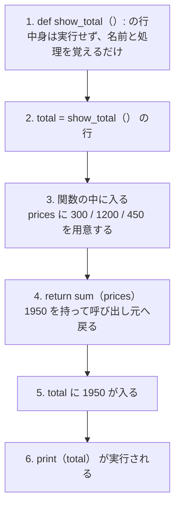
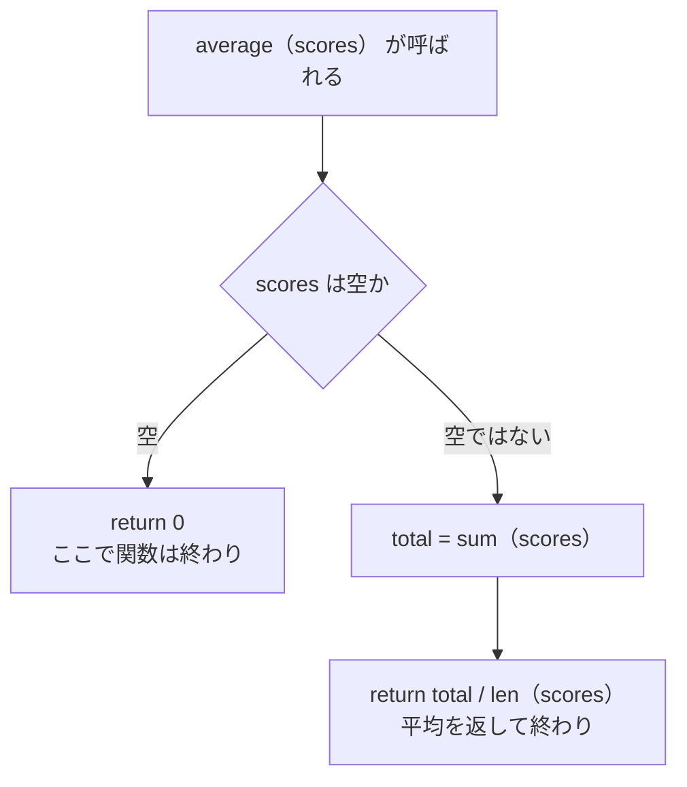
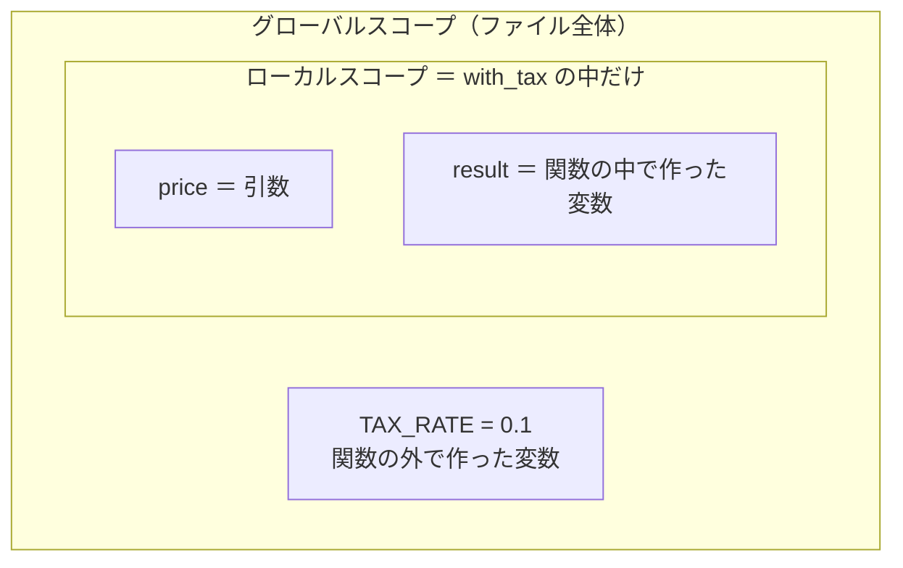

# 第5章 関数

第4章で、**データをまとめて持つ**ことができるようになりました。
リストに並べ、辞書で名前を付け、`for` で回して集計する——
これで、実際の仕事で扱うデータの形にひととおり手が届きます。

ところが、ここで新しい問題が起きます。**同じ処理を、何度も書く羽目になる**ことです。

たとえば [4.3.5](./04-data-structures.md#435-辞書のリスト実務で最頻出の形) で書いた
「平均点を出す」処理は、次の4行でした。

```python
total = 0
for student in students:
    total += student["score"]
average = total / len(students)
```

1年A組の平均を出し、次に1年B組の平均も出したいとします。
いまのやり方では、**この4行をもう一度書く**ことになります。
3クラス分なら12行、10クラス分なら40行です。しかも、

- 平均の出し方を変えたくなったら、**書いた場所すべてを直す**ことになる
- 1か所だけ直し忘れると、**そこだけ違う答え**を出すプログラムができあがる
- 4行のかたまりが何度も出てくるので、**プログラム全体が読みにくくなる**

これを解決するのが**関数**です。

**関数**（よく使う処理に名前を付けて、いつでも呼び出せるようにしたもの）

平均を出す処理に `average` という名前を付けておけば、
2回目からは `average(class_a)` と**1行書くだけ**で済みます。
直したくなったときも、直す場所は**1か所だけ**です。

実は、関数はもう何度も使っています。`print()`、`len()`、`sum()`、`sorted()` ——
これらは Python が最初から用意してくれている関数です。
この章では、**それを自分で作れるようになります。**

## この章で学ぶこと

- `def` で自分の関数を定義し、何度でも呼び出せるようになる
- `print` と `return` の違いがわかり、計算結果を受け取って使い回せるようになる
- 位置引数・キーワード引数・デフォルト引数・可変長引数を使い分けられるようになる
- 複数の値をまとめて返し、早期 `return` で条件分岐を平らに書けるようになる
- 変数が「どこから見えるか」（スコープ）がわかり、`UnboundLocalError` を自分で直せるようになる
- 関数を値として渡し、`sorted()` の `key` で並べ替えの基準を指定できるようになる
- 長い処理を、意味のある単位の関数に切り分けられるようになる

## この章の前提

- [第4章](./04-data-structures.md) を終えていること
- とくに次の5つを使えること
  - リスト・辞書と、その `for` での回し方（[4.1](./04-data-structures.md#41-リスト) / [4.3](./04-data-structures.md#43-辞書dict)）
  - 「辞書のリスト」と集計の3つの型（[4.3.5](./04-data-structures.md#435-辞書のリスト実務で最頻出の形)）
  - `sort()` と `sorted()` の違い（[4.1.6](./04-data-structures.md#416-sort-と-sorted-の違い破壊的か否か)）
  - アンパック `x, y = point`（[4.2.3](./04-data-structures.md#423-アンパック)）
  - `b = a` はコピーではないこと（[4.1.7](./04-data-structures.md#417-リストのコピーで起きる事故)）
- インデントでブロックが決まること（[2.6.2](./02-basics.md#262-インデントの深さでブロックが決まる)）
- ガード節（早期 `continue`）で入れ子を浅くする考え方（[3.4.2](./03-control-flow.md#342-早期-continue-で浅くする)）

> **つまずいたら**
> この章で最初に詰まるのは、ほぼ全員が **`print` と `return` の違い**（[5.1.3](#513-return-がないとどうなるか)）です。
> 「関数を呼んだのに `None` と表示される」「計算はできているのに次で使えない」と感じたら、
> まず [5.1.3](#513-return-がないとどうなるか) に戻ってください。
> 次に詰まりやすいのがスコープ（[5.4](#54-スコープ)）です。
> どちらも、AI に**章番号と実際のエラーメッセージ**を添えて聞くと早く解決します。
>
> ```text
> python-text の 5.1.3 で詰まりました。
> 合計を計算する関数を作って呼び出したのですが、print すると None になります。
> 関数の中では正しい数が計算できています。何が足りないですか。
> ```

> **この章のコードを書く場所**
> 第4章までと同じく、`python-lesson` の中に項ごとに `.py` ファイルを作って試します。
> ファイル名は本文で毎回指定します。
> 実行コマンドは Windows が `python ファイル名`、macOS が `python3 ファイル名` です
> （[1.4.2](./01-environment.md#142-実行する)）。
> **以降、実行コマンドは Windows の形で書きます。macOS の方は `python` を `python3` に読み替えてください。**

---

## 5.1 関数の基本

### 5.1.1 関数を定義する

関数を作ることを、**定義する**と言います。書き方は次のとおりです。

```text
def 関数名():
    実行したい処理
    実行したい処理
```

- **`def`** … 「これから関数を定義します」という合図（definition = 定義 の略）
- **関数名** … 自分で決める名前。変数と同じ snake_case で付けます（[2.1.3](./02-basics.md#213-変数名の付け方snake_case)）
- **`()`** … かっこ。いまは空でかまいません（中身は [5.2](#52-引数) で扱います）
- **`:`** … コロン。`if` や `for` と同じく、**このあとにブロックが続く**という印です
- **字下げ** … 半角スペース4つ。**字下げされた行までが、その関数の中身**です（[2.6.2](./02-basics.md#262-インデントの深さでブロックが決まる)）

実際に書いてみます。

`func_define.py`

```python
def greet():
    print("こんにちは")
    print("Python の世界へようこそ")


greet()
greet()
```

```text
実行結果:
こんにちは
Python の世界へようこそ
こんにちは
Python の世界へようこそ
```

`greet()` と書いた1行で、**関数の中の2行がまとめて実行されます。**
2回書けば2回実行されます。

> **補足**
> 関数の定義と、そのあとの処理のあいだは**空行を2つ**空けるのが Python の慣習です
> （PEP 8。[2.7.2](./02-basics.md#272-pep-8-とは)）。
> 1行でも動きますが、このテキストでは2行空けに揃えます。

もう少し実用的な例です。第4章のリストを使います。

`func_total.py`

```python
def show_total():
    prices = [300, 1200, 450]
    print(f"合計: {sum(prices)}円")


show_total()
```

```text
実行結果:
合計: 1950円
```

関数の中には、`for` や `if` も書けます。字下げがもう1段深くなるだけです。

`func_loop.py`

```python
def show_menu():
    items = ["カレー", "ラーメン", "そば"]
    for number, item in enumerate(items, start=1):
        print(f"{number}. {item}")


show_menu()
```

```text
実行結果:
1. カレー
2. ラーメン
3. そば
```

`enumerate` は [3.2.3](./03-control-flow.md#323-enumerate-で番号付きに回す) で学んだものです。
関数の中でも、いままでどおりに書けます。

### 5.1.2 呼び出す

関数を作っただけでは、**中の処理は1行も実行されません。**
実行するには、`関数名()` と書いて**呼び出す**必要があります。

次のコードを実行してみてください。

`func_no_call.py`

```python
def greet():
    print("こんにちは")


print("プログラムの終わり")
```

```text
実行結果:
プログラムの終わり
```

`greet` を定義しているのに、`こんにちは` は表示されません。
**呼び出していないから**です。

Python はファイルを上から順に読んでいきますが、`def` の行に来たときにするのは
「`greet` という名前で、この処理を覚えておく」ことだけです。
中身が動くのは、`greet()` と呼び出したときだけです。

この「どこへ処理が飛ぶか」を図にすると、次のようになります。



処理は**呼び出した場所からいったん関数の中へ飛び、終わったら元の場所に戻ってきます。**
図の 4 に出てくる `return` は、次の [5.1.3](#513-return-がないとどうなるか) で扱います。

もう1つ、順番の決まりがあります。
**呼び出しは、定義よりあとに書かなければいけません。**

`func_order_error.py`

```python
greet()


def greet():
    print("こんにちは")
```

```text
実行結果:
Traceback (most recent call last):
  File "func_order_error.py", line 1, in <module>
    greet()
    ^^^^^
NameError: name 'greet' is not defined
```

`NameError`（その名前は見つかりません）は、
まだ覚えていない名前を使おうとしたときのエラーです（[1.4.4](./01-environment.md#144-トレースバックの読み方)）。
1行目の時点では、Python はまだ `greet` を知りません。

> **よくある間違い**
> 関数を呼び出すときの `()` を書き忘れると、**エラーにならないまま何も起きません。**
>
> ```python
> greet
> ```
>
> これは「`greet` という値を書いただけ」で、呼び出しにはなりません。
> **「関数が動かない」と思ったら、まず `()` があるか確認してください。**
> （`()` を付けないことに意味がある使い方は [5.5.1](#551-関数を変数に入れる) で扱います。）

### 5.1.3 `return` がないとどうなるか

ここがこの章でいちばん大事な項です。

これまでの関数は、中で `print` していました。
しかし、それでは**計算結果を関数の外で使えません。**

`func_print_vs_return.py`

```python
def total_by_print():
    prices = [300, 1200, 450]
    print(sum(prices))


def total_by_return():
    prices = [300, 1200, 450]
    return sum(prices)


result1 = total_by_print()
result2 = total_by_return()

print("---")
print(result1)
print(result2)
```

```text
実行結果:
1950
---
None
1950
```

何が起きたのかを、1つずつ見ます。

- `total_by_print()` は**画面に 1950 を表示しました**が、値を**返していません**。
  そのため `result1` には `None` が入りました
- `total_by_return()` は**画面に何も表示しません**が、値を**返しました**。
  そのため `result2` には `1950` が入りました

**`return` は、関数の結果を呼び出し元に持ち帰るための命令です。**

| 書き方 | 画面に出る | 呼び出し元で使える |
|--------|-----------|------------------|
| `print(値)` | 出る | 使えない |
| `return 値` | 出ない | **使える** |

`return` で返した値は、**ふつうの値としてそのまま扱えます。**

`func_return_use.py`

```python
def total_price():
    prices = [300, 1200, 450]
    return sum(prices)


print(total_price() * 2)
print(total_price() > 1000)
print(f"合計は {total_price()}円です")
```

```text
実行結果:
3900
True
合計は 1950円です
```

`total_price()` と書いた場所が、そのまま `1950` に置き換わると考えてください。
`print` で表示していただけの関数では、こうしたことは1つもできません。

> **よくある間違い**
> **`None` と表示されたら、`return` の書き忘れを疑ってください。**
> これは第4章で `numbers = numbers.sort()` が `None` になったのと同じ現象です
> （[4.1.6](./04-data-structures.md#416-sort-と-sorted-の違い破壊的か否か)）。
> `append` や `sort` に戻り値がないのは、**それらの関数が `return` を書いていないから**です。
>
> ```python
> def add(a, b):
>     print(a + b)      # ❌ 表示するだけ。返していない
>
>
> def add(a, b):
>     return a + b      # ✅ 返している
> ```

`return` には、もう1つ大事な性質があります。
**`return` を実行した時点で、関数はそこで終わります。**

`func_return_stop.py`

```python
def check():
    print("1行目")
    return "終わり"
    print("3行目")


print(check())
```

```text
実行結果:
1行目
終わり
```

`3行目` は表示されません。`return` より下は実行されないためです。
この性質は [5.3.3](#533-早期-return) で積極的に使います。

---

## 5.2 引数

### 5.2.1 位置引数

[5.1.3](#513-return-がないとどうなるか) の `total_price()` には、まだ大きな弱点があります。
**いつ呼んでも `[300, 1200, 450]` の合計しか返せない**ことです。

別の買い物の合計を出したければ、関数を作り直すことになります。これでは意味がありません。
そこで、**呼び出すときに値を渡せる**ようにします。この値を**引数**と呼びます。

**引数**（ひきすう。関数に渡す値）

かっこの中に、受け取るための名前を書きます。

`arg_basic.py`

```python
def total_price(prices):
    return sum(prices)


print(total_price([300, 1200, 450]))
print(total_price([100, 100]))
print(total_price([]))
```

```text
実行結果:
1950
200
0
```

同じ関数が、渡したリストに応じて違う答えを返すようになりました。

引数は複数書けます。`,` で区切ります。

`arg_two.py`

```python
def introduce(name, age):
    print(f"{name} さんは {age} 歳です")


introduce("佐藤", 20)
introduce("鈴木", 34)
```

```text
実行結果:
佐藤 さんは 20 歳です
鈴木 さんは 34 歳です
```

このように、**書いた順番のとおりに値が入る引数**を**位置引数**と呼びます。
`introduce("佐藤", 20)` なら、1つ目の `"佐藤"` が `name` に、2つ目の `20` が `age` に入ります。

順番を間違えると、**エラーにならないまま変な結果になります。**

`arg_wrong_order.py`

```python
def introduce(name, age):
    print(f"{name} さんは {age} 歳です")


introduce(20, "佐藤")
```

```text
実行結果:
20 さんは 佐藤 歳です
```

数が合わない場合は、エラーで止まります。

`arg_missing.py`

```python
def introduce(name, age):
    print(f"{name} さんは {age} 歳です")


introduce("佐藤")
```

```text
実行結果:
Traceback (most recent call last):
  File "arg_missing.py", line 5, in <module>
    introduce("佐藤")
TypeError: introduce() missing 1 required positional argument: 'age'
```

`missing 1 required positional argument: 'age'` は
「必要な位置引数 `age` が1つ足りません」という意味です。
逆に多すぎるときは `takes 2 positional arguments but 3 were given` と出ます。

> **よくある間違い**
> 引数の名前は、**関数の中だけで使う名前**です。
> 呼び出す側の変数名と同じである必要はありません。
>
> ```python
> def total_price(prices):
>     return sum(prices)
>
>
> my_cart = [300, 1200]
> print(total_price(my_cart))   # ✅ 名前が違っていてよい
> ```
>
> `my_cart` の中身が `prices` に渡されます。名前を合わせる必要はありません。

### 5.2.2 キーワード引数

引数が増えてくると、呼び出し側を見ただけでは**どの値が何なのかわからなく**なります。

```python
create_user("佐藤", 20, True)
```

この `True` が何を意味するのかは、関数の定義を見に行かないとわかりません。
そこで、**引数の名前を指定して渡す**書き方があります。これを**キーワード引数**と呼びます。

`arg_keyword.py`

```python
def create_user(name, age, is_admin):
    print(f"{name} / {age}歳 / 管理者: {is_admin}")


create_user("佐藤", 20, True)
create_user(name="鈴木", age=34, is_admin=False)
create_user(age=28, name="高橋", is_admin=True)
```

```text
実行結果:
佐藤 / 20歳 / 管理者: True
鈴木 / 34歳 / 管理者: False
高橋 / 28歳 / 管理者: True
```

**キーワード引数なら、順番を入れ替えても正しく入ります。**
名前で対応が決まるためです。

位置引数とキーワード引数は混ぜて使えますが、
**位置引数を先に、キーワード引数をあとに**書く決まりがあります。

`arg_keyword_error.py`

```python
def create_user(name, age, is_admin):
    print(f"{name} / {age}歳 / 管理者: {is_admin}")


create_user(name="佐藤", 20, True)
```

```text
実行結果:
  File "arg_keyword_error.py", line 5
    create_user(name="佐藤", 20, True)
                                   ^
SyntaxError: positional argument follows keyword argument
```

`positional argument follows keyword argument` は
「キーワード引数のあとに位置引数が来ています」という意味です。

正しくは次のように書きます。

```python
create_user("佐藤", age=20, is_admin=True)
```

### 5.2.3 デフォルト引数

「たいていは同じ値だけれど、たまに変えたい」引数があります。
消費税率がその代表です。ふだんは 10%、軽減税率のときだけ 8% にしたい——というような場合です。

引数に `=` で初期値を書いておくと、**渡さなかったときにその値が使われます。**
これを**デフォルト引数**と呼びます。

`arg_default.py`

```python
def with_tax(price, rate=0.1):
    return int(price * (1 + rate))


print(with_tax(1000))
print(with_tax(1000, 0.08))
print(with_tax(1000, rate=0.08))
```

```text
実行結果:
1100
1080
1080
```

- `with_tax(1000)` … `rate` を渡していないので `0.1` が使われる
- `with_tax(1000, 0.08)` … 位置引数として `0.08` を渡したので、そちらが使われる
- `with_tax(1000, rate=0.08)` … キーワード引数で渡しても同じ

`int()` は小数点以下を切り捨てます（[2.2.6](./02-basics.md#226-型を変換する)）。
税込価格を整数の円にしたいので、ここで使っています。

デフォルト引数には、**書く順番の決まり**があります。
**初期値のある引数は、初期値のない引数よりあとに書かなければいけません。**

`arg_default_error.py`

```python
def with_tax(rate=0.1, price):
    return int(price * (1 + rate))
```

```text
実行結果:
  File "arg_default_error.py", line 1
    def with_tax(rate=0.1, price):
                           ^^^^^
SyntaxError: parameter without a default follows parameter with a default
```

「初期値のない引数が、初期値のある引数のあとに来ています」という意味です。
このメッセージの文言は Python のバージョンによって少し違いますが、原因は同じです。

> **補足**
> 初期値のある引数を先に書けない理由は、`with_tax(1000)` と呼ばれたときに
> **`1000` がどちらの引数なのか決められなくなる**ためです。
> 「省略できるものは後ろ」と覚えてください。

### 5.2.4 デフォルト引数にリストを使ってはいけない

デフォルト引数は便利ですが、**1つだけ、必ず踏む落とし穴**があります。
初期値に**リスト（や辞書）を書いてはいけない**、というものです。

次のコードは、一見すると正しく動きそうに見えます。

`arg_default_list.py`

```python
def add_item(item, items=[]):
    items.append(item)
    return items


print(add_item("りんご"))
print(add_item("みかん"))
print(add_item("ぶどう"))
```

```text
実行結果:
['りんご']
['りんご', 'みかん']
['りんご', 'みかん', 'ぶどう']
```

2回目・3回目で、**前に入れたものが残っています。**
毎回からのリストから始まるつもりだったのに、そうなっていません。

原因は、**初期値の `[]` が作られるのは「関数を定義したとき」の1回だけ**だからです。
呼び出すたびに新しいリストが作られるわけではありません。
つまり、3回の呼び出しは**すべて同じ1つのリスト**を使い回しています。

これは [4.1.7](./04-data-structures.md#417-リストのコピーで起きる事故) で学んだ、
「`b = a` はコピーではなく、同じ実体を指す」のと同じ話です。

正しくは、初期値に `None` を置いて、**関数の中で毎回リストを作ります。**

`arg_default_none.py`

```python
def add_item(item, items=None):
    if items is None:
        items = []
    items.append(item)
    return items


print(add_item("りんご"))
print(add_item("みかん"))
print(add_item("ぶどう", ["パン"]))
```

```text
実行結果:
['りんご']
['みかん']
['パン', 'ぶどう']
```

毎回からのリストから始まり、渡したときはそのリストが使われます。

ここで新しい書き方が1つ出てきました。**`is`** です。

**`is`**（2つの値が「同じ実体」かどうかを調べる演算子）

`None` かどうかを調べるときは、`== None` ではなく **`is None`** と書きます。
`None` はプログラム全体でただ1つしかない特別な値なので、
「同じ実体か」を直接調べるほうが速く、確実だからです。
Python では **`None` の判定には `is None` / `is not None` を使う**と決まっていると覚えてください。

> **よくある間違い**
> 「リストは危ないが、数値や文字列は安全」です。
>
> ```python
> def greet(name, message="こんにちは"):   # ✅ 文字列なら問題ない
> def add_item(item, items=[]):            # ❌ リストは使い回される
> def add_score(name, scores={}):          # ❌ 辞書も同じ理由で危ない
> ```
>
> **あとから中身を変えられるもの（リスト・辞書・集合）を初期値にしない**、と覚えてください。

### 5.2.5 可変長引数（`*args` / `**kwargs`）

「いくつ渡されるかわからない」関数を作りたいことがあります。
`print()` がまさにそれで、`print("a")` でも `print("a", "b", "c")` でも動きます。

引数名の前に `*` を付けると、**渡された値が全部まとめてタプルで入ります。**
これを**可変長引数**と呼びます。

`arg_star.py`

```python
def total(*prices):
    print(type(prices))
    print(prices)
    return sum(prices)


print(total(300, 1200))
print(total(300, 1200, 450))
print(total())
```

```text
実行結果:
<class 'tuple'>
(300, 1200)
1500
<class 'tuple'>
(300, 1200, 450)
1950
<class 'tuple'>
()
0
```

`prices` の中身はタプルです（[4.2](./04-data-structures.md#42-タプル)）。
タプルなので `sum()` も `len()` も `for` も、リストと同じように使えます。

`**` を2つ付けると、**キーワード引数がまとめて辞書で入ります。**

`arg_starstar.py`

```python
def show_profile(**info):
    print(type(info))
    for key, value in info.items():
        print(f"{key}: {value}")


show_profile(name="佐藤", age=20)
```

```text
実行結果:
<class 'dict'>
name: 佐藤
age: 20
```

`items()` で回す形は [4.3.4](./04-data-structures.md#434-キー値両方を回す) と同じです。

慣習として、`*args`（arguments の略）と `**kwargs`（keyword arguments の略）という名前が
よく使われます。**名前は自由ですが、他の人が読むコードではこの2つをよく見かけます。**

> **補足**
> 可変長引数は、**自分で書く機会はしばらくありません。**
> 「引数の数が決まらない関数もある」と知っておけば十分です。
> ここで覚えておくと、他の人が書いたコードや公式ドキュメントで
> `*args` を見たときに戸惑わずに済みます。

---

## 5.3 戻り値

### 5.3.1 値を返す

`return` で返す値を**戻り値**と呼びます。

**戻り値**（関数が返してくる結果の値）

戻り値は、`if` と組み合わせて**条件によって変える**ことができます。

`return_judge.py`

```python
def judge(score):
    if score >= 80:
        return "合格"
    else:
        return "不合格"


print(judge(95))
print(judge(60))
```

```text
実行結果:
合格
不合格
```

返す値の型は何でもかまいません。リストや辞書も返せます。

`return_list.py`

```python
def high_scores(scores, border):
    return [score for score in scores if score >= border]


print(high_scores([80, 65, 90, 55], 70))
print(high_scores([80, 65, 90, 55], 90))
```

```text
実行結果:
[80, 90]
[90]
```

中身は [4.5.2](./04-data-structures.md#452-条件付き内包表記) の条件付き内包表記です。
**「絞り込んだリストを返す関数」**は、この章以降でとてもよく書きます。

### 5.3.2 複数の値を返す

「最小値と最大値の両方が欲しい」ことがあります。
Python では、**`,` で区切って複数の値を返せます。**

`return_multi.py`

```python
def min_max(numbers):
    return min(numbers), max(numbers)


result = min_max([80, 65, 90])
print(result)
print(type(result))
```

```text
実行結果:
(65, 90)
<class 'tuple'>
```

返ってきたのは**タプル**です（[4.2](./04-data-structures.md#42-タプル)）。
`return a, b` と書くと、Python が自動的に `(a, b)` というタプルにまとめてくれます。

タプルなので、**アンパック**（[4.2.3](./04-data-structures.md#423-アンパック)）で
そのまま2つの変数に配れます。**こちらの受け取り方のほうが実用的です。**

`return_unpack.py`

```python
def min_max(numbers):
    return min(numbers), max(numbers)


lowest, highest = min_max([80, 65, 90])

print(f"最低: {lowest}点")
print(f"最高: {highest}点")
print(f"差: {highest - lowest}点")
```

```text
実行結果:
最低: 65点
最高: 90点
差: 25点
```

> **よくある間違い**
> 変数の数と、返ってきた値の数が合わないとエラーになります。
>
> ```python
> lowest, highest, average = min_max([80, 65, 90])
> ```
>
> ```text
> ValueError: not enough values to unpack (expected 3, got 2)
> ```
>
> これは [4.2.3](./04-data-structures.md#423-アンパック) で見たものと同じエラーです。
> **返す値をあとから増やすと、呼び出し側も全部直すことになります。**
> 返す値は2〜3個までにとどめ、それ以上になりそうなら**辞書を1つ返す**ほうが安全です。
>
> ```python
> return {"lowest": min(numbers), "highest": max(numbers)}
> ```

### 5.3.3 早期 `return`

第3章で、**ガード節**（当てはまらないものを先に弾いて、入れ子を浅くする書き方）を学びました
（[3.4.2](./03-control-flow.md#342-早期-continue-で浅くする)）。
`for` の中では `continue` を使いましたが、**関数の中では `return` が同じ役割をします。**

[4.3.5](./04-data-structures.md#435-辞書のリスト実務で最頻出の形) の最後で、
「件数が 0 だと `ZeroDivisionError` で止まる」と書きました。これを関数で解決します。

まず、素直に `if` / `else` で書いた形です。

`return_guard_before.py`

```python
def average(scores):
    if len(scores) == 0:
        return 0
    else:
        total = sum(scores)
        return total / len(scores)


print(average([80, 65, 90]))
print(average([]))
```

```text
実行結果:
78.33333333333333
0
```

`else` を消しても、**まったく同じ動きになります。**
`return` を実行した時点で関数が終わるためです（[5.1.3](#513-return-がないとどうなるか)）。

`return_guard_after.py`

```python
def average(scores):
    if len(scores) == 0:
        return 0

    total = sum(scores)
    return total / len(scores)


print(f"{average([80, 65, 90]):.1f}")
print(f"{average([]):.1f}")
```

```text
実行結果:
78.3
0.0
```

この「先に例外的なケースを返して、あとは本筋だけを書く」形を**早期 `return`** と呼びます。
流れを図にすると、次のようになります。



早期 `return` の利点は3つあります。

- **本筋の処理が字下げされない**ので、関数の主目的が読み取りやすい
- 弾きたい条件が増えても、`if` を上に並べるだけで済む（入れ子が深くならない）
- 「この関数は空リストのとき 0 を返す」という**約束が先頭に書いてある**ので、読む人にわかりやすい

弾く条件は、いくつでも並べられます。

`return_guard_multi.py`

```python
def divide(a, b):
    if b == 0:
        return None
    if a == 0:
        return 0
    return a / b


print(divide(10, 2))
print(divide(10, 0))
print(divide(0, 5))
```

```text
実行結果:
5.0
None
0
```

> **よくある間違い**
> 早期 `return` で「返す値」を書き忘れると、`None` が返ります。
>
> ```python
> def average(scores):
>     if len(scores) == 0:
>         return              # ❌ 何も返していない（None になる）
>     return sum(scores) / len(scores)
> ```
>
> `return` だけの行は「`None` を返して終わる」という意味です。
> **意図して `None` を返す**のならそれでよいのですが、
> `0` を返したいなら `return 0` と書く必要があります。

---

## 5.4 スコープ

### 5.4.1 ローカルとグローバル

関数の中で作った変数は、**関数の外からは見えません。**

`scope_local.py`

```python
def with_tax(price):
    result = int(price * 1.1)
    return result


print(with_tax(1000))
print(result)
```

```text
実行結果:
1100
Traceback (most recent call last):
  File "scope_local.py", line 7, in <module>
    print(result)
          ^^^^^^
NameError: name 'result' is not defined
```

`result` は関数の中で作られ、**関数が終わると消えます。**
この「変数が見える範囲」を**スコープ**と呼びます。

**スコープ**（変数が見える範囲）

Python のスコープは、大きく2つです。

- **ローカルスコープ** … 関数の中。その関数の中でだけ見える
- **グローバルスコープ** … ファイル全体。関数の外で作った変数

図にすると、**入れ子の箱**の関係になっています。



**内側からは外が見えますが、外からは内側が見えません。**

| どこから | `TAX_RATE` | `price` / `result` |
|---------|-----------|-------------------|
| 関数の中 | 見える（読める） | 見える |
| 関数の外 | 見える | **見えない**（`NameError`） |

外の変数を関数の中から読むのは、問題なくできます。

`scope_read.py`

```python
TAX_RATE = 0.1


def with_tax(price):
    return int(price * (1 + TAX_RATE))


print(with_tax(1000))
print(with_tax(500))
```

```text
実行結果:
1100
550
```

`TAX_RATE` のような**変えない値**（[2.1.4](./02-basics.md#214-定数の慣習) の定数）は、
このようにファイルの先頭に置いて、関数の中から読む使い方をします。

> **補足**
> 引数の名前も、関数の中だけで有効なローカル変数です。
> 別の関数で同じ `price` という名前を使っても、**まったく別のもの**として扱われます。
> だから、関数ごとに名前の重複を気にする必要はありません。

### 5.4.2 関数の中から外の変数を変えられない

読むのはできますが、**書き換えようとすると失敗します。**

`scope_write_error.py`

```python
count = 0


def increment():
    count = count + 1
    print(count)


increment()
```

```text
実行結果:
Traceback (most recent call last):
  File "scope_write_error.py", line 9, in <module>
    increment()
  File "scope_write_error.py", line 5, in increment
    count = count + 1
            ^^^^^
UnboundLocalError: cannot access local variable 'count' where it is not associated with a value
```

`UnboundLocalError` は「まだ値の入っていないローカル変数を読もうとしました」という意味です。

理由はこうです。Python は関数の中に `count = ...` という**代入**を見つけると、
その時点で「`count` はこの関数のローカル変数だ」と決めてしまいます。
そのため `count + 1` の `count` も**ローカルのほう**を読みに行き、
まだ何も入っていないのでエラーになります。

やりたいことは、たいてい次のように書けます。
**外の値を引数で受け取り、新しい値を `return` で返す**形です。

`scope_write_fix.py`

```python
def increment(count):
    return count + 1


count = 0
count = increment(count)
count = increment(count)

print(count)
```

```text
実行結果:
2
```

**関数は値を受け取って値を返す。外の変数を書き換えるのは呼び出し側の仕事。**
この形にしておくと、`count` が変わる場所が `count = ...` と書いた行だけになり、追いやすくなります。

ただし、**例外が1つあります。リストや辞書は、関数の中から中身を変えられます。**

`scope_mutable.py`

```python
def add_butter(items):
    items.append("バター")


shopping = ["牛乳", "パン"]
add_butter(shopping)

print(shopping)
```

```text
実行結果:
['牛乳', 'パン', 'バター']
```

`items = ...` という代入をしていないので、ローカル変数は作られません。
`items` は**渡された `shopping` と同じ実体**を指していて、
その中身を `append` で変えているためです（[4.1.7](./04-data-structures.md#417-リストのコピーで起きる事故)）。

> **よくある間違い**
> 「関数に渡しただけなのに、元のリストが変わってしまった」という事故は、これが原因です。
> **元を変えたくないなら、関数の中でコピーしてから使ってください。**
>
> ```python
> def add_butter(items):
>     new_items = items.copy()      # ✅ 元は変えない
>     new_items.append("バター")
>     return new_items
> ```
>
> どちらの作りにするかは、**関数の名前で読み手に伝わるようにする**のが基本です。
> `add_butter(items)` のように何も返さない関数は「元を変える」、
> `with_butter(items)` のように結果を返す関数は「元は変えない」——
> と使い分けると、事故が減ります。

### 5.4.3 `global` を使わない理由

「どうしても関数の中から外の変数を書き換えたい」場合、`global` という書き方があります。

`scope_global.py`

```python
count = 0


def increment():
    global count
    count = count + 1


increment()
increment()
print(count)
```

```text
実行結果:
2
```

エラーは消えました。しかし、**このテキストでは `global` を使いません。**理由は3つあります。

- **どこで値が変わったか追えなくなる。**
  `count` を書き換える関数が10個あったら、おかしな値になったときに10か所すべてを調べることになります
- **関数を単独で試せなくなる。**
  `increment()` は、外に `count` があることを前提にしています。
  この関数だけを別の場所に持っていっても動きません
- **名前の衝突が起きる。**
  ファイルが長くなるほど、`count` のような一般的な名前は他の場所でも使いたくなります

代わりに、[5.4.2](#542-関数の中から外の変数を変えられない) の形——
**引数で受け取り、`return` で返す**——を使ってください。

| やりたいこと | `global` を使う書き方 | このテキストの書き方 |
|------------|---------------------|-------------------|
| 外の数値を増やす | `global count` してから `count += 1` | `count = increment(count)` |
| 外のリストに足す | `global items` してから `append` | `items.append(...)` を呼び出し側で書く／新しいリストを返す |

> **補足**
> `global` は「使ってはいけない禁止事項」ではなく、
> **「使うと後で困ることが多いので、まず他の方法を探す」もの**です。
> 他の人のコードで見かけたら、「ここで外の変数が書き換わっている」と読み取ってください。

---

## 5.5 関数を値として扱う

### 5.5.1 関数を変数に入れる

Python では、**関数そのものを値として扱えます。**
`()` を付けずに関数名だけを書くと、「呼び出す」ではなく「関数そのもの」を指します。

`func_as_value.py`

```python
def double(x):
    return x * 2


print(double(5))
print(double)

f = double
print(f(5))
```

```text
実行結果:
10
<function double at 0x0000023F1C2A4C20>
10
```

- `double(5)` … 呼び出した**結果**（`10`）
- `double` … 関数**そのもの**（`<function ...>` と表示される。`0x...` の数値は実行のたびに変わります）
- `f = double` … 関数そのものを `f` という変数に入れた。以降 `f(5)` で呼び出せる

「関数に別名を付けて何が嬉しいのか」と思うかもしれません。
本当に効いてくるのは、**関数を他の関数に渡すとき**です（[5.5.3](#553-sorted-の-key-に渡す)）。

> **よくある間違い**
> `f = double()` と書くと、**その場で呼び出そうとしてしまいます。**
>
> ```python
> f = double()
> ```
>
> ```text
> TypeError: double() missing 1 required positional argument: 'x'
> ```
>
> **渡したいのが「関数」なら `()` を付けない。「結果」なら付ける。**
> ここは [5.1.2](#512-呼び出す) の「`()` を書き忘れると何も起きない」の裏返しです。

### 5.5.2 ラムダ式

`def` を書くほどでもない、**その場かぎりの短い関数**を作る書き方があります。
**ラムダ式**です。

**ラムダ式**（名前を付けずに、その場で作る短い関数）

```text
lambda 引数: 返す値
```

`def` との対応を見てください。

`lambda_compare.py`

```python
def double(x):
    return x * 2


print(double(5))
print((lambda x: x * 2)(5))
```

```text
実行結果:
10
10
```

ラムダ式には、次の制限があります。

- **`return` を書かない。** `:` のうしろに書いた式の結果が、そのまま戻り値になる
- **式を1つしか書けない。** `if` 文や `for` 文は書けない（[3.1.6](./03-control-flow.md#316-条件式三項演算子) の条件式なら書ける）
- **名前がない。** そのため、複雑な処理を書くと何をする関数なのか読み取れなくなる

引数は複数書けます。

`lambda_two.py`

```python
add = lambda a, b: a + b
print(add(3, 4))
```

```text
実行結果:
7
```

ただし、**この書き方（ラムダ式に名前を付ける）はしないでください。**
PEP 8（[2.7.2](./02-basics.md#272-pep-8-とは)）でも推奨されていません。
名前を付けるなら `def` で書くほうが読みやすく、エラーが起きたときの表示も親切です。

```python
def add(a, b):        # ✅ 名前を付けるならこちら
    return a + b
```

**ラムダ式は、名前を付けずにその場で他の関数に渡すときにだけ使います。**
その使い道が、次の項です。

### 5.5.3 `sorted` の `key` に渡す

第4章で `sorted()` を学んだとき、
**「並べ替えの基準を指定する `key` は第5章」**と先送りにしました
（[4.1.6](./04-data-structures.md#416-sort-と-sorted-の違い破壊的か否か)）。ここで回収します。

`sorted()` は、`key=` に**関数を渡す**と、
「各要素をその関数に通した結果」を基準に並べ替えます。

まず、`len` という**既存の関数をそのまま渡す**例です。`()` は付けません（[5.5.1](#551-関数を変数に入れる)）。

`sorted_key_len.py`

```python
words = ["banana", "fig", "apple", "kiwi"]

print(sorted(words))
print(sorted(words, key=len))
```

```text
実行結果:
['apple', 'banana', 'fig', 'kiwi']
['fig', 'kiwi', 'apple', 'banana']
```

- `sorted(words)` … 文字列そのものを基準にするので、アルファベット順
- `sorted(words, key=len)` … 各単語を `len()` に通した結果（文字数）を基準にするので、短い順

**`key` に渡した関数は、要素1つずつに対して自動的に呼び出されます。**
`len("banana")` → `6`、`len("fig")` → `3` ……という具合です。

次が本命です。**辞書のリストを、特定のキーで並べ替えます。**

`sorted_key_dict.py`

```python
students = [
    {"name": "佐藤", "score": 82},
    {"name": "鈴木", "score": 61},
    {"name": "高橋", "score": 95},
]

by_score = sorted(students, key=lambda student: student["score"], reverse=True)

for student in by_score:
    print(f"{student['name']}: {student['score']}点")

print(students[0]["name"])
```

```text
実行結果:
高橋: 95点
佐藤: 82点
鈴木: 61点
佐藤
```

`lambda student: student["score"]` は
「生徒（辞書）を1つ受け取って、その `score` を返す関数」です。
`sorted()` はこれを各要素に適用し、返ってきた点数を基準に並べます。

最後の行で `佐藤` と表示されているとおり、
**`sorted()` は元のリストを変えません**（[4.1.6](./04-data-structures.md#416-sort-と-sorted-の違い破壊的か否か)）。
第4章では「点数だけのリストを取り出して並べる」しかできませんでしたが、
`key` を使えば**生徒の情報を持ったまま**並べ替えられます。

`key` は `max()` と `min()` にも渡せます。

`max_key.py`

```python
students = [
    {"name": "佐藤", "score": 82},
    {"name": "鈴木", "score": 61},
    {"name": "高橋", "score": 95},
]

top = max(students, key=lambda student: student["score"])
bottom = min(students, key=lambda student: student["score"])

print(f"最高点: {top['name']}（{top['score']}点）")
print(f"最低点: {bottom['name']}（{bottom['score']}点）")
```

```text
実行結果:
最高点: 高橋（95点）
最低点: 鈴木（61点）
```

[4.3.5](./04-data-structures.md#435-辞書のリスト実務で最頻出の形) の「型3（最大を探す）」は、
`for` と `if` で5行かけて書いていました。**`key` を使えば1行です。**

> **よくある間違い**
> `key` に渡すのは**関数**です。`()` を付けて呼び出してはいけません。
>
> ```python
> sorted(words, key=len())      # ❌ その場で len() を呼ぼうとしてエラー
> sorted(words, key=len)        # ✅ 関数そのものを渡す
> ```
>
> また、ラムダ式の引数は**要素1つ**です。リスト全体ではありません。
>
> ```python
> sorted(students, key=lambda students: students["score"])   # 動くが名前が誤解を招く
> sorted(students, key=lambda student: student["score"])     # ✅ 単数形にする
> ```

---

## 5.6 良い関数の作り方

### 5.6.1 1つの関数は1つのことをする

動く関数と、**あとから使いやすい関数**は別物です。
次の関数は動きますが、使い勝手がよくありません。

`good_bad_example.py`

```python
def show_average(students):
    total = 0
    for student in students:
        total += student["score"]
    print(f"平均: {total / len(students):.1f}点")


students = [
    {"name": "佐藤", "score": 82},
    {"name": "鈴木", "score": 61},
    {"name": "高橋", "score": 95},
]

show_average(students)
```

```text
実行結果:
平均: 79.3点
```

この関数は「**計算する**」と「**表示する**」の2つをしています。そのため、

- 平均点を**別の計算に使えない**（画面に出るだけで、値が返ってこない）
- 表示の形（`点` を付けるかどうかなど）を変えたいだけでも、関数を作り直すことになる
- 2クラスの平均を**比べたい**ときに使えない

**計算する関数と、表示する処理を分けます。**

`good_split.py`

```python
def average_score(students):
    total = 0
    for student in students:
        total += student["score"]
    return total / len(students)


class_a = [
    {"name": "佐藤", "score": 82},
    {"name": "鈴木", "score": 61},
    {"name": "高橋", "score": 95},
]
class_b = [
    {"name": "田中", "score": 70},
    {"name": "伊藤", "score": 66},
]

print(f"A組の平均: {average_score(class_a):.1f}点")
print(f"B組の平均: {average_score(class_b):.1f}点")

if average_score(class_a) > average_score(class_b):
    print("A組のほうが高い")
else:
    print("B組のほうが高い")
```

```text
実行結果:
A組の平均: 79.3点
B組の平均: 68.0点
A組のほうが高い
```

**値を返す関数にしておけば、表示にも比較にも使えます。**
判断の目安は次のとおりです。

| 合図 | 対応 |
|------|------|
| 関数の説明に「〜して、さらに〜する」と「さらに」が入る | 2つに分ける |
| 関数の中に `print` と計算の両方がある | 計算だけを返す関数にする |
| 関数名に `and` を入れたくなる | 分ける |

### 5.6.2 docstring を書く

関数が何をするものかは、**関数の中の先頭**に文章で書いておけます。これを **docstring** と呼びます。

**docstring**（関数の先頭に書く、その関数の説明文）

`"""` で囲んだ複数行文字列（[2.4.5](./02-basics.md#245-エスケープと複数行文字列)）を、
`def` の**次の行**に置きます。

`docstring_example.py`

```python
def with_tax(price, rate=0.1):
    """税込価格を計算して返す。

    price: 税抜きの価格
    rate: 税率（省略すると 0.1）
    小数点以下は切り捨てる。
    """
    return int(price * (1 + rate))


print(with_tax(1000))
help(with_tax)
```

```text
実行結果:
1100
Help on function with_tax in module __main__:

with_tax(price, rate=0.1)
    税込価格を計算して返す。

    price: 税抜きの価格
    rate: 税率（省略すると 0.1）
    小数点以下は切り捨てる。
```

`help(関数名)` で、書いた説明がそのまま読めます。
VS Code では、関数名にマウスカーソルを乗せるだけでこの説明が出ます。

docstring は `#` のコメントと違い、**プログラムから読める説明**です。
そのため、次の3つを書いておくと後で助かります。

- **何を返すか**（「〜を返す」と1行目に書く）
- **引数の意味**（名前だけではわからないもの)
- **特別なときの動き**（「空なら 0 を返す」など）

> **補足**
> 1行で足りるなら、1行で終わらせてかまいません。
>
> ```python
> def average_score(students):
>     """点数の平均を返す。"""
> ```
>
> 大事なのは長さではなく、**呼び出す人が知りたいことが書いてあるか**です。

### 5.6.3 どこで関数に切り出すか

「どこまでを1つの関数にするか」は、最初は判断がつきません。
次の3つを合図にしてください。

- **同じコードを2回書きそうになった**（いちばん強い合図）
- **`# ここから集計` のような区切りのコメントを書きたくなった**（そこが関数の切れ目）
- **1つの `for` の中が10行を超えた**

例として、[4.3.5](./04-data-structures.md#435-辞書のリスト実務で最頻出の形) で書いた
集計の3つの型を、そのまま関数に切り出してみます。切り出す前はこうでした。

`refactor_before.py`

```python
students = [
    {"name": "佐藤", "score": 82},
    {"name": "鈴木", "score": 61},
    {"name": "高橋", "score": 95},
]

# 合計と平均を出す
total = 0
for student in students:
    total += student["score"]
average = total / len(students)
print(f"平均: {average:.1f}点")

# 条件に合うものだけ集める
passed = []
for student in students:
    if student["score"] >= 70:
        passed.append(student["name"])
print(f"70点以上: {passed}")

# いちばん大きいものを探す
top = students[0]
for student in students:
    if student["score"] > top["score"]:
        top = student
print(f"最高点: {top['name']} さん（{top['score']}点）")
```

```text
実行結果:
平均: 79.3点
70点以上: ['佐藤', '高橋']
最高点: 高橋 さん（95点）
```

区切りのコメントが3つあります。**これがそのまま3つの関数になります。**

`refactor_after.py`

```python
def average_score(students):
    """点数の平均を返す。students が空なら 0 を返す。"""
    if len(students) == 0:
        return 0
    total = 0
    for student in students:
        total += student["score"]
    return total / len(students)


def passed_names(students, border=70):
    """border 点以上の生徒の名前をリストで返す。"""
    return [student["name"] for student in students if student["score"] >= border]


def top_student(students):
    """いちばん点数の高い生徒（辞書）を返す。students が空なら None を返す。"""
    if len(students) == 0:
        return None
    return max(students, key=lambda student: student["score"])


students = [
    {"name": "佐藤", "score": 82},
    {"name": "鈴木", "score": 61},
    {"name": "高橋", "score": 95},
]

print(f"平均: {average_score(students):.1f}点")
print(f"70点以上: {passed_names(students)}")
print(f"85点以上: {passed_names(students, 85)}")

top = top_student(students)
print(f"最高点: {top['name']} さん（{top['score']}点）")
```

```text
実行結果:
平均: 79.3点
70点以上: ['佐藤', '高橋']
85点以上: ['高橋']
最高点: 高橋 さん（95点）
```

この書き換えで、次の4つが手に入りました。

- **名前が付いた。** `average_score(students)` を読むだけで何をしているかわかる
- **使い回せる。** `passed_names(students, 85)` のように**基準を変えて何度でも**呼べる
- **短くなった。** 最大値を探す5行は、`max()` に `key` を渡す1行になった（[5.5.3](#553-sorted-の-key-に渡す)）
- **壊れにくくなった。** 空のリストを渡しても止まらない（[5.3.3](#533-早期-return)）

**この形が、この章のゴールです。**
「データを受け取り、値を返す関数」をいくつか用意し、
最後にそれらを組み合わせて表示する——という作り方に慣れてください。
第6章以降のプログラムは、すべてこの形で書いていきます。

> **注意**
> 関数に切り出すのは、**動くコードができたあと**でかまいません。
> 最初から完璧な分け方を考えようとすると手が止まります。
> まず動かし、同じコードが2回目に出てきたときに切り出す——この順番で十分です。

---

## まとめ

- 関数は `def 名前():` で定義し、`名前()` で呼び出す。**定義しただけでは動かない**
- 呼び出しは定義よりあとに書く。前に書くと `NameError`
- **`print` は画面に出すだけ、`return` は値を持ち帰る。** 戻り値が `None` なら `return` の書き忘れを疑う
- `return` を実行した時点で、関数はそこで終わる
- 引数は書いた順に入る（**位置引数**）。名前を指定して渡すのが**キーワード引数**で、順番を入れ替えられる
- 位置引数はキーワード引数より前に書く。初期値のある引数は後ろに書く
- **デフォルト引数にリストや辞書を書かない。** 呼び出しのたびに使い回されて中身が残る。`None` を初期値にして関数の中で作る
- `None` の判定は `== None` ではなく **`is None`**
- `*args` は渡された値をタプルで、`**kwargs` はキーワード引数を辞書でまとめて受け取る
- `return a, b` はタプルを返す。`x, y = f()` のアンパックで受け取る
- **早期 `return`** で例外的なケースを先に返すと、本筋が字下げされず読みやすくなる
- 関数の中で作った変数は関数の外から見えない（**スコープ**）。外から読もうとすると `NameError`
- 関数の中で外の変数に代入しようとすると `UnboundLocalError`。**引数で受け取り `return` で返す**形にする
- ただし**リストや辞書は、関数の中から中身を変えられる**（同じ実体を指しているため）
- `global` は使わない。値がどこで変わったか追えなくなる
- `()` を付けなければ**関数そのもの**を値として渡せる。付ければ呼び出しの**結果**になる
- **`sorted(データ, key=lambda x: x["キー"])`** で辞書のリストを並べ替えられる。`max` / `min` にも `key` を渡せる
- 1つの関数は1つのことをする。**計算する関数と表示する処理を分ける**
- 関数の先頭に `"""..."""` で **docstring** を書くと、`help()` や VS Code で読める

---

## 理解度チェック

答えは [解答編](./90-answers-part1.md#第5章) にあります。まず自分で考えてください。

**問 5.1**
次のコードの実行結果を答えてください。また、`price` が `None` になる理由を1行で説明してください。

```python
def calc():
    print(100 + 200)


price = calc()
print(price)
```

**問 5.2**
次の3つの呼び出しのうち、**エラーになるもの**をすべて選び、それぞれ理由を1行で書いてください。

```python
def create_user(name, age, is_admin=False):
    print(name, age, is_admin)


create_user("佐藤", 20)
create_user(age=20, "佐藤")
create_user("佐藤")
```

**問 5.3**
次のコードの実行結果を答えてください。また、2回目に `['みかん']` と表示させるには、
関数をどう書き換えればよいですか。

```python
def add_item(item, items=[]):
    items.append(item)
    return items


print(add_item("りんご"))
print(add_item("みかん"))
```

**問 5.4**
次のコードの `result` には何が入りますか。型もあわせて答えてください。

```python
def min_max(numbers):
    return min(numbers), max(numbers)


result = min_max([3, 9, 1])
```

**問 5.5**
次のコードはエラーになります。エラーの名前と、エラーになる理由を答えてください。
また、`count` を `1` にするには、どう書き換えればよいですか。

```python
count = 0


def increment():
    count = count + 1


increment()
print(count)
```

**問 5.6**
次の2行の違いを、それぞれ1行で説明してください。

```python
f = double
g = double()
```

**問 5.7**
次のコードの実行結果を答えてください。

```python
items = [
    {"name": "りんご", "price": 180},
    {"name": "みかん", "price": 90},
    {"name": "ぶどう", "price": 450},
]

result = sorted(items, key=lambda item: item["price"])
print(result[0]["name"])
```

---

## 演習問題

### 演習 5.1 ★☆☆ 税込価格を計算する関数

**課題**
`python-lesson` の中に `price_tax.py` を作り、
税込価格を計算する関数 `with_tax` を定義して、3通りの呼び出し方で使ってください。

**完成条件**

- 関数 `with_tax` を定義する。引数は次の2つ
  - `price` … 税抜きの価格
  - `rate` … 税率。**渡さなかったときは `0.1` になる**こと
- 税込価格を**整数**（小数点以下は切り捨て）で**返す**こと。
  関数の中で `print` しないこと
- 次の3通りの呼び出しをして、結果を表示する
  - 税率を渡さない呼び出し
  - 税率 `0.08` を**位置引数**で渡す呼び出し
  - 税率 `0.08` を**キーワード引数**で渡す呼び出し
- 実行結果が次のようになる

```text
実行結果:
1000円 → 1100円
1000円 → 1080円
1000円 → 1080円
```

**ヒント**
「渡さなかったときの値」は [5.2.3](#523-デフォルト引数) です。
小数点以下の切り捨ては [2.2.6](./02-basics.md#226-型を変換する) の型変換で行います。
「関数の中で `print` しない」という条件が、[5.1.3](#513-return-がないとどうなるか) のどちらを使うかを決めています。

---

### 演習 5.2 ★☆☆ 点数の統計を返す関数

**課題**
`score_stats.py` を作り、点数のリストから統計を求める関数を2つ定義してください。

**完成条件**

- 関数 `average(scores)` を定義する
  - 平均点を**返す**
  - **`scores` が空のときは `0` を返し、エラーで止まらないこと**
- 関数 `min_max(scores)` を定義する
  - 最低点と最高点の**2つの値をまとめて返す**
- 次のデータで両方の関数を使う

```python
scores = [72, 85, 63, 90]
```

- `min_max` の戻り値は、**2つの変数にアンパックして**受け取ること
- 平均は**小数第1位まで**表示する
- 最後に、**空のリスト `[]` を渡した平均**も表示する
- 実行結果が次のようになる

```text
実行結果:
平均: 77.5点
最低: 63点 / 最高: 90点
差: 27点
空のとき: 0.0点
```

**ヒント**
「空のときは 0 を返す」は [5.3.3](#533-早期-return) の形がそのまま使えます。
2つの値を返すのは [5.3.2](#532-複数の値を返す)、受け取り方は [4.2.3](./04-data-structures.md#423-アンパック) です。
小数第1位までの表示は [2.4.4](./02-basics.md#244-f-string) の書式指定です。

---

### 演習 5.3 ★★☆ 商品データを関数で集計する

**課題**
`product_report.py` を作り、商品データ（辞書のリスト）を集計する関数を4つ定義して、
レポートを表示してください。

**完成条件**

- 次のデータから始める（**書き換えないこと**）

```python
products = [
    {"name": "りんご", "price": 180, "stock": 12},
    {"name": "みかん", "price": 90, "stock": 0},
    {"name": "ぶどう", "price": 450, "stock": 5},
    {"name": "もも", "price": 320, "stock": 3},
]
```

- 次の4つの関数を定義する。**すべての関数に docstring を書くこと**
  - `total_stock(products)` … 在庫数の合計を**返す**
  - `in_stock_names(products)` … 在庫が1以上の商品名を**リストで返す**
  - `most_expensive(products)` … いちばん価格の高い商品（**辞書のまま**）を返す。
    **`products` が空のときは `None` を返す**こと
  - `by_price(products)` … **価格の高い順に並べた新しいリスト**を返す。
    **元の `products` の並び順は変えないこと**
- 4つの関数を使って、次の形式で表示する
- 最後に `products[0]["name"]` を表示し、**元の並びが変わっていないこと**を確認する
- 実行結果が次のようになる

```text
実行結果:
在庫合計: 20個
在庫あり: ['りんご', 'ぶどう', 'もも']
最高価格: ぶどう（450円）
価格の高い順:
1. ぶどう（450円）
2. もも（320円）
3. りんご（180円）
4. みかん（90円）
元の1件目: りんご
```

**ヒント**
4つの関数の作り方は、[5.6.3](#563-どこで関数に切り出すか) の `refactor_after.py` に
同じ形（合計・絞り込み・最大）が揃っています。
「価格の高い順に並べた新しいリスト」は [5.5.3](#553-sorted-の-key-に渡す) です。
「元の並びを変えない」という条件から、
[4.1.6](./04-data-structures.md#416-sort-と-sorted-の違い破壊的か否か) のどちらを使うかが決まります。
番号付きの表示は [3.2.3](./03-control-flow.md#323-enumerate-で番号付きに回す) の `enumerate` です。

---

### 演習 5.4 ★★☆ 単語を扱う道具を作る

**課題**
`word_tools.py` を作り、単語のリストを扱う関数を3つ定義してください。

**完成条件**

- 関数 `longest(words)` を定義する
  - いちばん**文字数の多い**単語を返す
  - **`words` が空のときは `None` を返す**こと
- 関数 `sort_by_length(words)` を定義する
  - **文字数の少ない順**に並べた**新しいリスト**を返す
- 関数 `count_words(*words)` を定義する
  - **いくつ渡されるかわからない**単語を受け取り、
    「単語 → 出てきた回数」の**辞書を返す**
- 次のデータで3つの関数を使う

```python
words = ["banana", "fig", "apple", "kiwi"]
```

- `count_words` は `count_words("りんご", "みかん", "りんご", "ぶどう")` の形で呼び出す
- 最後に、**空のリストを渡した `longest` の結果**を表示し、
  `None` のときは `単語がありません` と表示すること
- 実行結果が次のようになる

```text
実行結果:
いちばん長い: banana
短い順: ['fig', 'kiwi', 'apple', 'banana']
集計: {'りんご': 2, 'みかん': 1, 'ぶどう': 1}
単語がありません
```

**ヒント**
「文字数を基準にする」は [5.5.3](#553-sorted-の-key-に渡す) の `sorted_key_len.py` と同じ考え方で、
`max()` にも同じ `key` が渡せます。
「いくつ渡されるかわからない」は [5.2.5](#525-可変長引数args--kwargs) です。
回数を数える形は [4.3.3](./04-data-structures.md#433-get-で安全に取り出す) の `dict_count.py` にあります。
`None` かどうかの判定は [5.2.4](#524-デフォルト引数にリストを使ってはいけない) で出てきた書き方を使います。

---

## 次の章へ

これで、**処理に名前を付けて何度でも呼び出せる**ようになりました。
第4章までの「データをまとめて持つ」と、この章の「処理をまとめて名前を付ける」——
この2つが揃うと、プログラムは一気に読みやすく、育てやすくなります。

ただし、まだ全部を**1つのファイル**に書いています。
関数が10個、20個と増えていくと、次の問題が出てきます。

- どこに何の関数が書いてあるのか、探すのに時間がかかる
- 別のプログラムでも `average_score` を使いたいのに、**コピーするしかない**
- 日付の計算やランダムな値など、**自分で書くには大変すぎる処理**がある

次の章では、**関数をファイルごとに分けて、必要なものだけ読み込む**方法——
**モジュール**を学びます。
あわせて、Python に最初から付いてくる**標準ライブラリ**（他の人が書いてくれた関数の詰め合わせ）の
使い方も扱います。

→ [第6章 モジュールとパッケージ](./06-modules.md)
