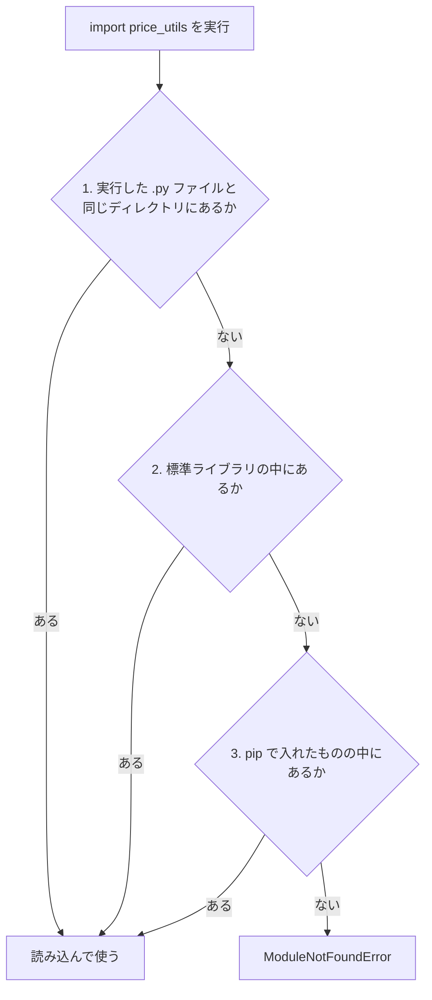
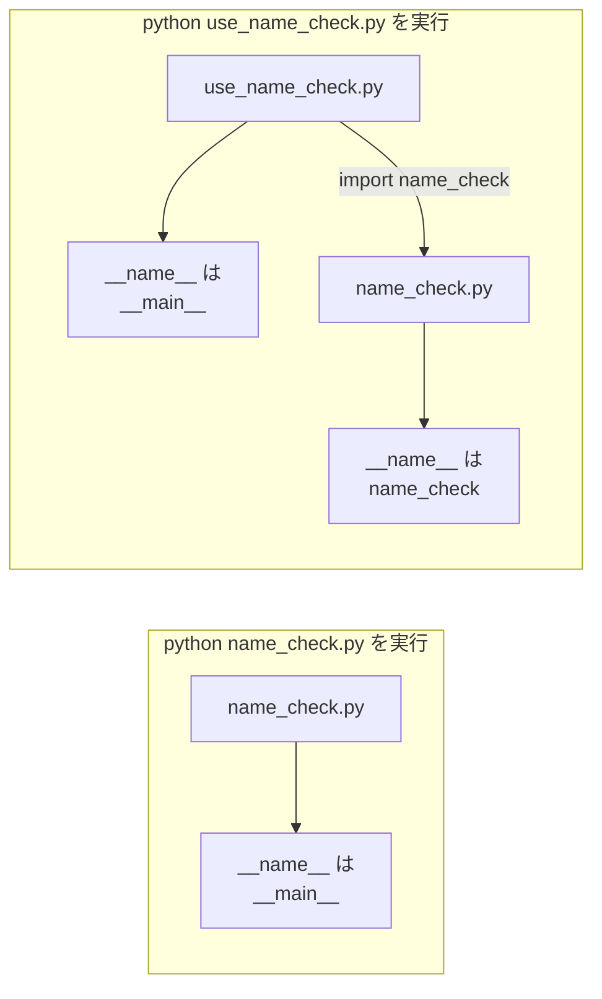

# 第6章 モジュールとパッケージ

第5章で、**処理に名前を付けて何度でも呼び出せる**ようになりました。
これで、同じ4行を何度も書き写す必要はなくなりました。

ところが、関数が増えてくると次の問題が出てきます。

- 1つの `.py` ファイルが200行、300行と長くなり、**目当ての関数を探すのに時間がかかる**
- 別のプログラムでも `average` を使いたいのに、**コピーして貼り付けるしかない**
- コピーした先で直すと、**元のほうが古いまま**になる

第5章のはじめに書いた「直す場所は1か所だけ」という利点が、
ファイルをまたいだ瞬間に崩れてしまうわけです。

これを解決するのが**モジュール**です。

**モジュール**（1つの `.py` ファイルのこと。関数や値をまとめて置いておき、
他のファイルから読み込んで使える）

`price_utils.py` というファイルに価格の計算をまとめておけば、
どのプログラムからも `import price_utils` の1行で呼び出せます。
直す場所は、やはり**1か所だけ**です。

そしてもう1つ、この章には大きな収穫があります。
**標準ライブラリ**——Python に最初から付いてくる、
他の人が書いてくれた完成品のモジュール群です。
日付の計算、乱数、集計。自分で書くと大変な処理が、
`import` の1行で使えるようになります。

## この章で学ぶこと

- 長くなったプログラムを複数のファイルに分け、`import` で読み込めるようになる
- `import` / `from ... import` / `as` を使い分けられるようになる
- `ModuleNotFoundError` が出たとき、自分で原因を切り分けられるようになる
- 標準ライブラリの `datetime` / `random` / `math` / `collections` を使えるようになる
- `if __name__ == "__main__":` が何をしているかを説明でき、自分のモジュールに書けるようになる
- 複数のモジュールをディレクトリにまとめ、パッケージとして扱えるようになる

## この章の前提

- [第5章](./05-functions.md) を終えていること
- とくに次の4つを使えること
  - `def` による関数の定義と呼び出し（[5.1](./05-functions.md#51-関数の基本)）
  - デフォルト引数（[5.2.3](./05-functions.md#523-デフォルト引数)）
  - 戻り値と早期 `return`（[5.3](./05-functions.md#53-戻り値)）
  - 関数を値として渡すこと（`sorted` の `key`。[5.5.3](./05-functions.md#553-sorted-の-key-に渡す)）
- リストと辞書の操作（[4.1](./04-data-structures.md#41-リスト) / [4.3](./04-data-structures.md#43-辞書dict)）
- ファイルを保存して `python ファイル名` で実行できること（[1.4.2](./01-environment.md#142-実行する)）
- ディレクトリ（フォルダ）を作り、その中にファイルを保存できること

> **つまずいたら**
> この章で最初に詰まるのは、ほぼ全員が **`ModuleNotFoundError`**（[6.1.3](#613-同じディレクトリにないと読み込めない問題)）です。
> 「さっきまで動いていたのに、急に読み込めなくなった」と感じたら、
> **どのファイルを実行しているか**をまず確認してください。
> AI に相談するときは、次の3つを必ず添えてください。
>
> ```text
> python-text の 6.1.3 で詰まりました。
> ModuleNotFoundError: No module named 'price_utils' が出ます。
>
> ・実行したコマンド: python other/main_price.py
> ・ディレクトリの中身: python-lesson/price_utils.py と python-lesson/other/main_price.py
> ・エラーの全文: （ここに貼る）
> ```

> **この章のコードを書く場所**
> 第5章までと同じく、`python-lesson` の中にファイルを作って試します。
> ただし**この章からは、1つの例で2つ以上のファイルを作ります。**
> どのファイルをどこに置くかは本文で毎回指定するので、そのとおりに作ってください。
> 実行コマンドは Windows が `python ファイル名`、macOS が `python3 ファイル名` です
> （[1.4.2](./01-environment.md#142-実行する)）。
> **以降、実行コマンドは Windows の形で書きます。macOS の方は `python` を `python3` に読み替えてください。**

---

## 6.1 ファイルを分ける

### 6.1.1 1ファイルでは限界がくる

第5章の最後で作った `product_report.py` を思い出してください。
関数を4つ定義して、その下で呼び出していました。

ここに「送料を計算する関数」「割引を計算する関数」「レシートを整える関数」と
足していくと、ファイルはどんどん長くなります。
実際の仕事では、1つのファイルが数百行になることは珍しくありません。

長い1ファイルには、次の困りごとがあります。

| 困りごと | 具体的に何が起きるか |
|---------|-------------------|
| 探せない | 「税込の計算どこだっけ」と、200行をスクロールして探すことになる |
| 使い回せない | 別のプログラムで税込計算をしたくても、**コピーするしかない** |
| 直し漏れる | コピー先を直しても、コピー元は古いまま。**答えが2種類**になる |
| 読むのが重い | いま関係ない関数まで目に入り、集中が切れる |

解決策はシンプルです。**関係のある関数どうしを、別のファイルにまとめる。**
そして、必要なファイルから**読み込んで使う**。

この「読み込まれる側の `.py` ファイル」がモジュールです。

> **補足**
> 実は、モジュールはもう使っています。
> [1.5.2](./01-environment.md#152-仮想環境を作る) で `python -m venv .venv` と打ちましたが、
> あの `venv` も Python に付属するモジュールです。
> この章は、「使う側」から「作る側」に回る章です。

### 6.1.2 自作モジュールを読み込む

実際に分けてみます。まず、**読み込まれる側**のファイルを作ります。

`python-lesson/price_utils.py`

```python
"""価格の計算をまとめたモジュール。"""

TAX_RATE = 0.1


def with_tax(price, rate=TAX_RATE):
    """税込価格を整数で返す。"""
    return int(price * (1 + rate))


def total_price(prices):
    """価格のリストから、税込の合計を返す。"""
    total = 0
    for price in prices:
        total += with_tax(price)
    return total
```

**関数を定義しているだけで、呼び出しは1行も書いていない**ことに注目してください。
モジュールは「道具箱」です。道具を並べておくだけで、使うのは別のファイルの仕事です。

次に、**読み込む側**のファイルを、**同じディレクトリに**作ります。

`python-lesson/main_price.py`

```python
import price_utils

print(price_utils.with_tax(1000))
print(price_utils.with_tax(1000, 0.08))
print(price_utils.total_price([180, 90, 450]))
print(price_utils.TAX_RATE)
```

実行します。

**Windows（PowerShell）**

```powershell
python main_price.py
```

**macOS / Linux**

```bash
python3 main_price.py
```

```text
実行結果:
1100
1080
792
0.1
```

書き方は次の2つだけです。

- **`import price_utils`** … `price_utils.py` を読み込む。**`.py` は書きません**
- **`price_utils.with_tax(1000)`** … 「`price_utils` の中の `with_tax`」という意味。
  `.`（ドット）は「〜の中の」と読みます

関数だけでなく、`TAX_RATE` のような**変数もそのまま取り出せます**。
モジュールの中で `def` した関数、`=` で作った変数は、すべて外から使えます。

これで、税込計算を使いたいプログラムは、`import price_utils` の1行を書くだけで済みます。
税率を変えたくなったら、直すのは `price_utils.py` の `TAX_RATE` **1か所だけ**です。

> **よくある間違い**
> `import price_utils.py` と書くと、次のエラーになります。
>
> ```text
> ModuleNotFoundError: No module named 'price_utils.py'; 'price_utils' is not a package
> ```
>
> **`import` に渡すのは、拡張子を取ったファイル名**です。`.py` は書きません。

> **よくある間違い**
> `import price_utils` と書いただけで `with_tax(1000)` と呼ぶと、エラーになります。
>
> ```text
> NameError: name 'with_tax' is not defined
> ```
>
> `import モジュール名` の形で読み込んだときは、
> **必ず `price_utils.with_tax(...)` と、モジュール名から書きます。**
> `with_tax` だけで呼びたい場合は、[6.2.2](#622-from--import-) の書き方を使います。

### 6.1.3 同じディレクトリにないと読み込めない問題

ここが、この章で最もつまずく場所です。

`python-lesson` の中に `other` というディレクトリを作り、
そこに `main_price.py` を**コピー**してみてください。
つまり、次の配置です。

```text
python-lesson/
├── price_utils.py
├── main_price.py
└── other/
    └── main_price.py   ← コピーしたもの（中身は同じ）
```

`python-lesson` の中で、コピーしたほうを実行します。

**Windows（PowerShell）**

```powershell
python other/main_price.py
```

**macOS / Linux**

```bash
python3 other/main_price.py
```

```text
実行結果:
Traceback (most recent call last):
  File "C:\Users\あなた\python-lesson\other\main_price.py", line 1, in <module>
    import price_utils
ModuleNotFoundError: No module named 'price_utils'
```

**`ModuleNotFoundError`**（読み込もうとしたモジュールが見つからなかった、というエラー）です。
`price_utils.py` は確かに `python-lesson` の中にあるのに、見つからないと言われました。

理由は、Python が `import` のときにどこを探すかにあります。
Python は次の順番で探し、**最初に見つかったものを使います**。



いちばん大事なのは **1番目**です。
基準になるのは「いま自分がいるディレクトリ」ではなく、
**`python` に渡した `.py` ファイルが置かれているディレクトリ**です。

上の例では、実行したのは `other/main_price.py` でした。
つまり Python は `other` の中を探し、そこに `price_utils.py` がないので諦めた、というわけです。

確かめてみましょう。次のファイルを作って実行してください。

`python-lesson/show_path.py`

```python
import sys

print(sys.path[0])
```

`sys` は Python 自身の設定を扱う標準ライブラリで、
`sys.path` は「モジュールを探すディレクトリの一覧」です。
その**1番目**を表示しています。

**Windows（PowerShell）**

```powershell
python show_path.py
```

**macOS / Linux**

```bash
python3 show_path.py
```

```text
実行結果:
C:\Users\あなた\python-lesson
```

（表示されるパスは、あなたが `python-lesson` を作った場所によって変わります。）

次に、`other` ディレクトリの中に移動してから、**同じファイル**を実行してみます。

**Windows（PowerShell）**

```powershell
cd other
python ../show_path.py
```

**macOS / Linux**

```bash
cd other
python3 ../show_path.py
```

```text
実行結果:
C:\Users\あなた\python-lesson
```

**移動しても結果が変わりません。**
`show_path.py` が `python-lesson` に置かれている以上、探す場所は `python-lesson` のままです。

ここから、`ModuleNotFoundError` が出たときの切り分け方が決まります。

1. **実行した `.py` ファイルはどこにあるか**を確認する（`cd` した場所ではありません）
2. その**同じディレクトリ**に、読み込みたい `.py` ファイルがあるか確認する
3. ファイル名のつづりが合っているか確認する（`price_utils.py` と `price_util.py` は別物です）

いまの段階では、**関係するファイルは同じディレクトリに置く**のがいちばん確実です。
ディレクトリをまたいで読み込む方法は、[6.5](#65-パッケージ) のパッケージで扱います。

確認が終わったら、`other` ディレクトリは削除してかまいません。

> **よくある間違い**
> 自作モジュールに `random.py` や `math.py` という名前を付けてはいけません。
> 探す順番の**1番目が自分のファイル**なので、
> 標準ライブラリの `random` より自分の `random.py` が先に見つかってしまいます。
> その結果、`random.randint(1, 6)` を呼んだつもりが
> `AttributeError: module 'random' has no attribute 'randint'` になります。
> **標準ライブラリと同じ名前を避ける。** これは実務でも定期的に起きる事故です。

> **補足**
> `.py` ファイルを一度読み込むと、同じディレクトリに `__pycache__` というディレクトリが
> 自動で作られます。読み込みを速くするための Python の作業用ファイルなので、
> **中身を気にする必要も、消す必要もありません。**

---

## 6.2 import の書き方

読み込み方には何通りかあります。それぞれ「呼ぶときの書き方」が変わります。

### 6.2.1 `import モジュール`

[6.1.2](#612-自作モジュールを読み込む) で使った、いちばん基本の形です。

```python
import price_utils

print(price_utils.with_tax(1000))
```

- 読み込むのは**モジュール全体**
- 呼ぶときは**必ず `モジュール名.` を先頭に付ける**

この「モジュール名を毎回書く」のは、面倒に見えて大きな利点があります。
`price_utils.with_tax(...)` と書いてあれば、
**その関数がどこから来たのかが、その行を見ただけでわかる**からです。

`import` を書く場所は、**ファイルの先頭**です。
複数書くときは1行に1つ、アルファベット順に並べるのが慣習です（[2.7.2](./02-basics.md#272-pep-8-とは) の PEP 8）。

`python-lesson/import_order.py`

```python
import math
import price_utils
import random

print(math.floor(3.7))
print(price_utils.with_tax(1000))
```

```text
実行結果:
3
1100
```

（`math` と `random` は [6.3](#63-標準ライブラリを使う) で扱います。ここでは並べ方の例として見てください。）

### 6.2.2 `from ... import ...`

「モジュール名を毎回書くのが長い」というときは、
**必要な名前だけを直接取り込む**書き方があります。

`python-lesson/import_from.py`

```python
from price_utils import with_tax, TAX_RATE

print(with_tax(1000))
print(TAX_RATE)
```

```text
実行結果:
1100
0.1
```

- **`from モジュール名 import 名前`** … そのモジュールの中の「名前」だけを持ってくる
- 呼ぶときは `モジュール名.` を**書きません**
- カンマで区切れば、いくつでも並べられます

2つの書き方を比べます。

| 書き方 | 呼び出し | 向いている場面 |
|-------|---------|--------------|
| `import price_utils` | `price_utils.with_tax(1000)` | どこから来た関数か、ひと目でわかるようにしたいとき |
| `from price_utils import with_tax` | `with_tax(1000)` | 特定の関数を何度も呼ぶとき |

どちらが正しいという話ではありません。
**同じファイルの中では、どちらかに揃える**とだけ決めておいてください。

> **よくある間違い**
> `from price_utils import with_tax` と書いたあとに `price_utils.with_tax(1000)` と呼ぶと、
> エラーになります。
>
> ```text
> NameError: name 'price_utils' is not defined
> ```
>
> **`from` の形では、モジュール名そのものは取り込まれません。**
> 取り込まれたのは `with_tax` という名前だけです。

### 6.2.3 `as` で別名を付ける

モジュール名や関数名が長いときは、`as` で**別の名前を付けて**取り込めます。

`python-lesson/import_as.py`

```python
import price_utils as pu

print(pu.with_tax(500))
```

```text
実行結果:
550
```

`from ... import ...` にも付けられます。

`python-lesson/import_as2.py`

```python
from price_utils import with_tax as tax_included

print(tax_included(500))
```

```text
実行結果:
550
```

`as` が本当に必要になるのは、**名前がぶつかるとき**です。
たとえば、自分で `with_tax` という関数を書いているファイルに、
`price_utils` の `with_tax` も取り込みたい——という場面です。

ただし、**むやみに短くしないでください。**
`import price_utils as p` と書くと、あとで読む人（3か月後のあなたを含みます）が
`p` が何なのかわからなくなります。
`as` を使うのは、**ぶつかったとき**と、
**その分野で決まった短縮名があるとき**（データ分析で `import pandas as pd` と書く、など）に限ります。

### 6.2.4 `from ... import *` を使わない理由

「全部まとめて取り込む」書き方も存在します。

```python
from price_utils import *
```

これは `*`（アスタリスク）で「そのモジュールの名前を全部」という意味です。
一見便利ですが、**このテキストでは使いません。** 理由を実際に見てみます。

まず、もう1つモジュールを作ります。

`python-lesson/shipping.py`

```python
"""送料の計算をまとめたモジュール。"""


def total_price(prices):
    """送料込みの合計を返す（3000円以上は送料無料）。"""
    subtotal = sum(prices)
    if subtotal >= 3000:
        return subtotal
    return subtotal + 500
```

`price_utils.py` にも `total_price` という関数がありました（税込の合計）。
**同じ名前の関数が、2つのモジュールにある**状態です。

`python-lesson/star_bad.py`

```python
from price_utils import *
from shipping import *

print(total_price([180, 90, 450]))
```

```text
実行結果:
1220
```

`price_utils.total_price([180, 90, 450])` なら `792`（税込の合計）でした。
表示されたのは `1220`——`shipping` のほう（720 + 送料500）です。

何が起きたかというと、

1. `from price_utils import *` で `total_price` が取り込まれる
2. `from shipping import *` で、**同じ名前が上書きされる**
3. あとから書いたほうが勝つ

しかも、**エラーは1つも出ません。** 静かに、間違った答えを出し続けます。
`star_bad.py` を見ても `total_price` がどちらのものか判断できないので、
気づくのはずっとあとになります。

さらに困るのは、モジュール側を直したときです。
`shipping.py` にあとから `with_tax` という関数を足しただけで、
`star_bad.py` の動きが変わってしまいます。
**読み込む側を1行も変えていないのに、動きが変わる**——これが `*` の怖さです。

対策は1つ、**`*` を使わないこと**です。

```python
import price_utils
import shipping

print(price_utils.total_price([180, 90, 450]))
print(shipping.total_price([180, 90, 450]))
```

```text
実行結果:
792
1220
```

どちらの `total_price` なのかが、その行を見ただけでわかります。
名前がぶつかっても、ぶつかりません。

> **注意**
> `from ... import *` は、他人が書いたコードを読むときには出てきます。
> 「これは全部取り込んでいる」と読めれば十分です。**自分では書かないでください。**

---

## 6.3 標準ライブラリを使う

### 6.3.1 標準ライブラリとは

**標準ライブラリ**（Python をインストールした時点で最初から付いてくるモジュールの集まり）

[1.6.2](./01-environment.md#162-パッケージをインストールする) で `pip install` を使いましたが、
標準ライブラリは**インストール不要**です。`import` するだけで使えます。

一方、`pip install` して初めて使えるようになるものを
**外部ライブラリ**（標準ライブラリには入っておらず、あとから入れて使うライブラリ）と呼びます。
1.6.2 で入れた `cowsay` がこれにあたります。第10章で使う `requests` も外部ライブラリです。

その数は300ほどあります。日付、乱数、数学、文字コード、圧縮、通信……
「よくやりたくなること」の大半が、すでに誰かの手で書かれ、
何年もかけて検証された状態で入っています。

**自分で書く前に、まず標準ライブラリを探す。** これが Python の基本姿勢です。

この節では、初学者が最初に使うことになる4つを扱います。

| モジュール | できること | この節 |
|-----------|-----------|-------|
| `datetime` | 日付・時刻の計算と表示 | [6.3.2](#632-datetime--日付と時刻) |
| `random` | ランダムな値を作る | [6.3.3](#633-random--乱数) |
| `math` | 切り上げ・切り捨て・平方根など | [6.3.4](#634-math--数学関数) |
| `collections` | 集計に便利なデータ構造 | [6.3.5](#635-collections--便利なデータ構造) |

> **補足**
> 標準ライブラリの一覧と使い方は、
> [Python 公式ドキュメントの「Python 標準ライブラリ」](https://docs.python.org/ja/3/library/index.html)
> にすべて載っています（日本語です）。
> このテキストで扱うのはごく一部なので、
> 「こういうことをしたい」と思ったら、まずここを探してください。

### 6.3.2 `datetime` — 日付と時刻

日付の計算を自分で書くのは、想像よりずっと大変です。
月末は31日か30日か、2月は28日か29日か、年をまたいだらどうするか——
これを全部間違いなく書くのは無理があります。`datetime` に任せます。

`datetime` モジュールには、よく使うものが3つ入っています。

| 名前 | 表すもの |
|------|---------|
| `date` | 日付だけ（年・月・日） |
| `datetime` | 日付と時刻（年・月・日・時・分・秒） |
| `timedelta` | 期間（何日、何時間） |

`python-lesson/dt_basic.py`

```python
from datetime import date, datetime, timedelta

birthday = date(2026, 4, 1)
print(birthday)
print(birthday.year)
print(birthday.month)
print(birthday.day)

deadline = birthday + timedelta(days=30)
print(deadline)

diff = deadline - birthday
print(diff.days)

print(birthday.strftime("%Y年%m月%d日"))

meeting = datetime(2026, 4, 1, 14, 30)
print(meeting)
print(meeting.strftime("%Y/%m/%d %H:%M"))
```

```text
実行結果:
2026-04-01
2026
4
1
2026-05-01
30
2026年04月01日
2026-04-01 14:30:00
2026/04/01 14:30
```

1つずつ見ます。

- **`date(2026, 4, 1)`** … 年・月・日を渡して日付を作ります
- **`birthday.year`** … `.` のあとに `year` と書くと、その年を取り出せます。
  `month` / `day` も同じです。
  **関数ではないので `()` は付けません**（`birthday.year()` はエラーです）
- **`timedelta(days=30)`** … 「30日間」という**期間**です。
  日付に `+` すると、30日後の日付になります。月をまたいでも正しく計算されます
- **`deadline - birthday`** … 日付どうしを引くと `timedelta` になります。
  `.days` で日数が取り出せます
- **`strftime("...")`** … 日付を**好きな形の文字列にする**メソッドです

`strftime` に渡す記号は、覚えなくてかまいません。よく使うものだけ挙げます。

| 記号 | 意味 | 例（2026年4月1日 14時30分） |
|------|------|--------------------------|
| `%Y` | 年（4桁） | `2026` |
| `%m` | 月（2桁） | `04` |
| `%d` | 日（2桁） | `01` |
| `%H` | 時（24時間、2桁） | `14` |
| `%M` | 分（2桁） | `30` |

今日の日付は `date.today()` で取れます。

`python-lesson/dt_today.py`

```python
from datetime import date

today = date.today()
print(today)
print(today.strftime("%Y年%m月%d日"))

new_year = date(2027, 1, 1)
left = new_year - today
print(f"次のお正月まであと{left.days}日")
```

```text
実行結果:
2026-08-27
2026年08月27日
次のお正月まであと127日
```

**この実行結果は、あなたが実行した日によって変わります。**
`date.today()` は「いま」を取ってくるので、当然です。

曜日は `weekday()` で取れます。**月曜が `0`、日曜が `6`** の数字で返ります。

`python-lesson/dt_weekday.py`

```python
from datetime import date

WEEKDAY_NAMES = ["月", "火", "水", "木", "金", "土", "日"]

target = date(2026, 4, 1)
print(target.weekday())
print(f"{target.strftime('%Y年%m月%d日')}は{WEEKDAY_NAMES[target.weekday()]}曜日です")
```

```text
実行結果:
2
2026年04月01日は水曜日です
```

`WEEKDAY_NAMES[target.weekday()]` は、
リストのインデックスに数値を入れて取り出す形です（[4.1.2](./04-data-structures.md#412-要素の取り出しと書き換え)）。
`weekday()` が `2` を返すので、リストの2番目（0から数えて）の `"水"` が取り出されます。

> **よくある間違い**
> f-string の中で `strftime` を書くときは、**外側と違う引用符**を使ってください。
> 上の例では、外が `"` なので中を `'` にしています（[4.3.5](./04-data-structures.md#435-辞書のリスト実務で最頻出の形) と同じ理由です）。

> **よくある間違い**
> `import datetime` と書いた場合と、`from datetime import date` と書いた場合では、
> **呼び方が変わります。**
>
> ```python
> import datetime
> birthday = datetime.date(2026, 4, 1)   # datetime. が必要
> ```
>
> ```python
> from datetime import date
> birthday = date(2026, 4, 1)            # date だけでよい
> ```
>
> `datetime` はモジュール名でもあり、その中の名前でもあるため、
> ここは初学者が最も混乱する場所です。
> **このテキストでは `from datetime import date, datetime, timedelta` の形に統一します。**

### 6.3.3 `random` — 乱数

**乱数**（らんすう。実行するたびに変わる、規則性のない値）を作るモジュールです。
くじ引き、サイコロ、シャッフル、テストデータの生成などに使います。

`python-lesson/random_basic.py`

```python
import random

print(random.randint(1, 6))

fruits = ["りんご", "みかん", "ぶどう", "もも"]
print(random.choice(fruits))
print(random.sample(fruits, 2))

numbers = [1, 2, 3, 4, 5]
random.shuffle(numbers)
print(numbers)
```

```text
実行結果（一例。実行するたびに変わります）:
1
もも
['ぶどう', 'もも']
[4, 2, 5, 3, 1]
```

**この章で唯一、実行結果が毎回変わる例です。** 上と違う値が出ても、失敗ではありません。

| 書き方 | すること | 注意 |
|-------|---------|------|
| `random.randint(1, 6)` | 1以上6以下の整数を1つ | **6も含みます**（`range` と違います） |
| `random.choice(リスト)` | リストから1つ選ぶ | 元のリストは変わりません |
| `random.sample(リスト, 2)` | 重複なしで2つ選び、**リストで**返す | 元のリストは変わりません |
| `random.shuffle(リスト)` | リストの並びをその場でかき混ぜる | **元のリストが変わります。戻り値は `None`** |

`randint` の「6も含む」は、`range(1, 6)` が 1〜5 だったこと（[3.2.2](./03-control-flow.md#322-range)）と食い違うので、
サイコロを作るときに間違えやすい箇所です。

`shuffle` が破壊的（元を変える）なのは、
リストの `sort()` が破壊的だったこと（[4.1.6](./04-data-structures.md#416-sort-と-sorted-の違い破壊的か否か)）と同じ考え方です。

> **よくある間違い**
> `numbers = random.shuffle(numbers)` と書くと、`numbers` が `None` になります。
>
> ```text
> None
> ```
>
> `shuffle` は**その場でかき混ぜるだけ**で、新しいリストを返しません。
> `random.shuffle(numbers)` と呼ぶだけにして、そのあと `numbers` を使ってください。
> `sort()` の戻り値が `None` だったのと、まったく同じ形の間違いです。

毎回同じ結果を出したいときは、`random.seed()` を使います。
テストのときに「たまたま通った／たまたま落ちた」を防ぐための仕組みです。

`python-lesson/random_seed.py`

```python
import random

random.seed(42)
print(random.randint(1, 100))
print(random.randint(1, 100))
```

同じプログラムを何度実行しても、**同じ2つの数字**が出ます。
`seed` に渡す数字を変えると、別の組み合わせになります。

> **注意**
> `random` が作るのは、**規則から計算された「乱数っぽい値」**です。
> パスワードや認証トークンのように、**推測されると困るもの**には使えません。
> その用途には `secrets` という別の標準ライブラリを使います
> （このテキストの範囲を超えるので、名前だけ覚えておいてください）。

### 6.3.4 `math` — 数学関数

切り上げ・切り捨て・平方根など、算術演算子（`+ - * /`）だけでは書けない計算をまとめたモジュールです。

`python-lesson/math_basic.py`

```python
import math

print(math.floor(3.7))
print(math.ceil(3.2))
print(math.sqrt(16))
print(math.pi)
```

```text
実行結果:
3
4
4.0
3.141592653589793
```

| 書き方 | すること | 結果の型 |
|-------|---------|---------|
| `math.floor(3.7)` | **切り捨て**（小さいほうの整数へ） | `int` |
| `math.ceil(3.2)` | **切り上げ**（大きいほうの整数へ） | `int` |
| `math.sqrt(16)` | 平方根 | `float`（`4.0`） |
| `math.pi` | 円周率。**関数ではないので `()` は不要** | `float` |

`ceil` は「10個入りの箱が何箱必要か」のような場面で使います。

`python-lesson/math_boxes.py`

```python
import math

BOX_SIZE = 10
items = 23

boxes = math.ceil(items / BOX_SIZE)
print(f"{items}個には箱が{boxes}箱必要です")
```

```text
実行結果:
23個には箱が3箱必要です
```

`23 / 10` は `2.3` なので、切り上げて `3` です。
`int(23 / 10)` だと `2` になり、3個ぶんの商品が箱に入りません。

ここで、[2.3.1](./02-basics.md#231-算術演算子) で出てきた `round()` との違いを整理します。

| 書き方 | `3.7` | `3.2` | `2.5` | `-1.5` |
|-------|-------|-------|-------|--------|
| `math.floor(x)` | `3` | `3` | `2` | `-2` |
| `math.ceil(x)` | `4` | `4` | `3` | `-1` |
| `round(x)` | `4` | `3` | **`2`** | **`-2`** |
| `int(x)` | `3` | `3` | `2` | `-1` |

> **よくある間違い**
> `round(2.5)` は `3` ではなく **`2`** になります。
>
> ```python
> print(round(2.5))
> print(round(3.5))
> ```
>
> ```text
> 実行結果:
> 2
> 4
> ```
>
> Python の `round()` は、**ちょうど中間のときは偶数側に丸めます**。
> 「四捨五入したい」と思って `round()` を使うと、
> `.5` のときだけ想定と違う答えが出ます。
> **切り上げたいなら `math.ceil`、切り捨てたいなら `math.floor`** と、
> やりたいことを名前で指定するほうが安全です。

> **よくある間違い**
> `int(-1.5)` は `-1`、`math.floor(-1.5)` は `-2` です。
> `int()` は**0に近づける**、`floor()` は**小さいほうへ動かす**——マイナスの値で違いが出ます。
> 金額や個数のようにマイナスが出ない値なら、どちらでも同じ結果になります。

### 6.3.5 `collections` — 便利なデータ構造

第4章で、辞書を使って「数える」処理を書きました（[4.3.3](./04-data-structures.md#433-get-で安全に取り出す)）。

```python
counts = {}
for word in words:
    counts[word] = counts.get(word, 0) + 1
```

この「数える」はあまりによく使うので、専用の道具が標準ライブラリに用意されています。
`collections` モジュールの **`Counter`** です。

`python-lesson/coll_counter.py`

```python
from collections import Counter

words = ["りんご", "みかん", "りんご", "ぶどう", "りんご", "みかん"]

counts = Counter(words)
print(counts)
print(counts["りんご"])
print(counts["もも"])
print(counts.most_common(2))
```

```text
実行結果:
Counter({'りんご': 3, 'みかん': 2, 'ぶどう': 1})
3
0
[('りんご', 3), ('みかん', 2)]
```

- **`Counter(リスト)`** … リストを渡すだけで、数え終わった状態のものが返ります
- **`counts["りんご"]`** … 辞書と同じ書き方で回数を取り出せます
- **`counts["もも"]`** … **入っていないキーでも `KeyError` になりません。`0` が返ります**
  （辞書の `get(キー, 0)` と同じ気配りが最初から入っています）
- **`most_common(2)`** … 多い順に2件、`(名前, 回数)` のタプルのリストで返します

`most_common` の戻り値はタプルのリストなので、`for` で回すときはアンパック（[4.2.3](./04-data-structures.md#423-アンパック)）が使えます。

`python-lesson/coll_ranking.py`

```python
from collections import Counter

votes = ["カレー", "ラーメン", "カレー", "寿司", "ラーメン", "カレー"]

counts = Counter(votes)
for rank, (name, count) in enumerate(counts.most_common(3), start=1):
    print(f"{rank}位: {name}（{count}票）")
```

```text
実行結果:
1位: カレー（3票）
2位: ラーメン（2票）
3位: 寿司（1票）
```

`enumerate(..., start=1)` は [3.2.3](./03-control-flow.md#323-enumerate-で番号付きに回す) で使った番号付けです。
`(name, count)` とかっこで囲んでいるのは、
`most_common` が返すタプルを、その場で2つの変数に分けて受け取っているためです。

もう1つ、`collections` には **`defaultdict`** があります。
こちらは「**グループ分けする**」ときに使います。

`python-lesson/coll_group.py`

```python
from collections import defaultdict

students = [
    {"name": "佐藤", "club": "野球"},
    {"name": "鈴木", "club": "吹奏楽"},
    {"name": "高橋", "club": "野球"},
]

groups = defaultdict(list)
for student in students:
    groups[student["club"]].append(student["name"])

print(groups["野球"])
print(dict(groups))
```

```text
実行結果:
['佐藤', '高橋']
{'野球': ['佐藤', '高橋'], '吹奏楽': ['鈴木']}
```

**`defaultdict(list)`** は、「**まだないキーを読んだら、空のリストを作っておく辞書**」です。
`list` に `()` を付けずに渡していることに注目してください。
[5.5.1](./05-functions.md#551-関数を変数に入れる) で見た「関数そのものを渡す」形です。
`defaultdict` は、必要になったときにその関数を呼んで、空のリストを用意します。

これがないと、次のように書くことになります。

```python
groups = {}
for student in students:
    club = student["club"]
    if club not in groups:
        groups[club] = []
    groups[club].append(student["name"])
```

**`if club not in groups:` の3行がまるごと消える**のが `defaultdict` の効果です。

最後の `dict(groups)` は、表示を普通の辞書の形に戻すためのものです。
`print(groups)` だと `defaultdict(<class 'list'>, {...})` と表示されて読みにくいので、
表示のときだけ `dict()` に通しています。

グループ分けした結果を1行ずつ表示するときは、
**リストのままだと `['佐藤', '高橋']` と、かっこと引用符が付いたまま**出てしまいます。
名前を `佐藤, 高橋` の形でつなぎたいときは、文字列のメソッド **`join`** を使います。

**`join`**（区切り文字の文字列に対して呼び出し、リストの要素をその文字でつないだ1つの文字列を返すメソッド）

`python-lesson/coll_join.py`

```python
from collections import defaultdict

students = [
    {"name": "佐藤", "club": "野球"},
    {"name": "鈴木", "club": "吹奏楽"},
    {"name": "高橋", "club": "野球"},
]

groups = defaultdict(list)
for student in students:
    groups[student["club"]].append(student["name"])

for club in sorted(groups):
    print(f"{club}: {', '.join(groups[club])}")
```

```text
実行結果:
吹奏楽: 鈴木
野球: 佐藤, 高橋
```

- **`", ".join(リスト)`** … `", "`（カンマと空白）でつなぎます。
  **呼び出すのは区切り文字のほう**で、リストは引数として渡します
- `"".join(リスト)` なら、区切りなしでべたっとつながります
- `sorted(groups)` は、辞書を `sorted()` に渡すと**キーのリスト**が返る性質
  （[4.3.4](./04-data-structures.md#434-キー値両方を回す)）を使って、表示順を決めています

> **よくある間違い**
> `join` に渡せるのは**文字列のリストだけ**です。数値が混ざっていると、次のエラーになります。
>
> ```text
> TypeError: sequence item 0: expected str instance, int found
> ```
>
> 数値をつなぎたいときは、先に `str()` で文字列にしてください（[2.2.6](./02-basics.md#226-型を変換する)）。

> **よくある間違い**
> `defaultdict(list)` を `defaultdict(list())` と書くとエラーになります。
>
> ```text
> TypeError: first argument must be callable or None
> ```
>
> 渡すのは「**空のリストを作る関数**」であって、「空のリスト」ではありません。
> `()` を付けないでください。
> `sorted(words, key=len)` で `len()` と書かなかったのと同じ理由です
> （[5.5.3](./05-functions.md#553-sorted-の-key-に渡す)）。

| やりたいこと | 第4章までの書き方 | この節の書き方 |
|------------|-----------------|--------------|
| 数える | `counts.get(key, 0) + 1` | `Counter(リスト)` |
| 多い順に並べる | `sorted(..., key=...)` | `counts.most_common(n)` |
| グループ分け | `if key not in d: d[key] = []` | `defaultdict(list)` |

第4章の書き方が間違いになったわけではありません。
**どちらでも書けるうえで、短く書ける道具を知っている**——それがこの節の収穫です。

---

## 6.4 スクリプトとモジュールの境界

### 6.4.1 `if __name__ == "__main__":` の意味

Python のコードを読んでいると、必ずこの行に出会います。

```python
if __name__ == "__main__":
```

見た目が異様なので身構えてしまいますが、やっていることは単純です。
**「このファイルが直接実行されたときだけ、ここを動かす」**という意味です。

まず、`__name__`（アンダースコア2つ、name、アンダースコア2つ）が何なのかを見ます。
これは、Python が**どのファイルにも自動で用意している変数**です。

`python-lesson/name_check.py`

```python
print(f"name_check.py の __name__ は {__name__} です")
```

そのまま実行します。

**Windows（PowerShell）**

```powershell
python name_check.py
```

**macOS / Linux**

```bash
python3 name_check.py
```

```text
実行結果:
name_check.py の __name__ は __main__ です
```

次に、これを**別のファイルから読み込んで**みます。

`python-lesson/use_name_check.py`

```python
import name_check

print(f"use_name_check.py の __name__ は {__name__} です")
```

```text
実行結果:
name_check.py の __name__ は name_check です
use_name_check.py の __name__ は __main__ です
```

同じ `name_check.py` の同じ行が、**違う値を表示しました。**



ルールはこれだけです。

- **`python` に直接渡されたファイル** … `__name__` は `"__main__"`
- **`import` で読み込まれたファイル** … `__name__` はモジュール名（`"name_check"`）

もう1つ大事なことが、この実行結果に出ています。
`use_name_check.py` を実行したとき、**`name_check.py` の `print` が動きました。**

つまり、**`import` は「読み込む」だけでなく、そのファイルを上から下まで実行します。**
`def` の行を実行するから関数が使えるようになるわけで、
`print` のような処理も、同じように実行されてしまうのです。

### 6.4.2 なぜ必要なのか

この性質が問題になる場面を見ます。

`python-lesson/greeting.py`

```python
def hello(name):
    return f"こんにちは、{name}さん"


print(hello("テスト"))
```

関数を作って、その場で動作確認をしている——ごく自然なファイルです。

**Windows（PowerShell）**

```powershell
python greeting.py
```

```text
実行結果:
こんにちは、テストさん
```

ここまでは問題ありません。ところが、`hello` を別のプログラムでも使いたくなります。

`python-lesson/use_greeting.py`

```python
import greeting

print(greeting.hello("佐藤"))
```

```text
実行結果:
こんにちは、テストさん
こんにちは、佐藤さん
```

**頼んでいない `こんにちは、テストさん` が出てしまいました。**
`import greeting` が `greeting.py` を上から下まで実行し、
動作確認用の `print` まで動いたからです。

これが、確認用の `print` ではなく
「ファイルを消す」「メールを送る」といった処理だったら、と考えてください。
**読み込んだだけで実行される**のは、かなり危険です。

そこで、`if __name__ == "__main__":` を使います。

`python-lesson/greeting2.py`

```python
def hello(name):
    return f"こんにちは、{name}さん"


if __name__ == "__main__":
    print(hello("テスト"))
```

直接実行したときは、これまでどおり動きます。

```powershell
python greeting2.py
```

```text
実行結果:
こんにちは、テストさん
```

読み込んだときは、動きません。

`python-lesson/use_greeting2.py`

```python
import greeting2

print(greeting2.hello("佐藤"))
```

```text
実行結果:
こんにちは、佐藤さん
```

**余計な行が消えました。**

`__name__` の値を思い出すと、理由がそのままわかります。

| 実行のしかた | `greeting2.py` の `__name__` | `if` の判定 | `print` は |
|------------|---------------------------|-----------|-----------|
| `python greeting2.py` | `"__main__"` | 真 | 動く |
| 別のファイルから `import greeting2` | `"greeting2"` | 偽 | 動かない |

この形には、もう1つ利点があります。
**そのファイルの「入口」がどこかが、ひと目でわかる**ことです。
200行のファイルでも、`if __name__ == "__main__":` を探せば、
「まずここから読み始めればいい」とわかります。

このテキストでは、以降**次のルールで書きます。**

- **他から読み込まれる可能性のあるファイル**（関数を並べたモジュール）
  … 実行したい処理は `if __name__ == "__main__":` の中に書く
- **実行するためだけのファイル**（いわゆるスクリプト）
  … 書いても書かなくてもよいが、**書いておくと迷わない**

`price_utils.py` に動作確認を足すなら、次の形です。

`python-lesson/price_utils.py`（末尾に追記）

```python
if __name__ == "__main__":
    print(with_tax(1000))
    print(total_price([180, 90, 450]))
```

```powershell
python price_utils.py
```

```text
実行結果:
1100
792
```

`main_price.py` を実行しても、この2行は表示されません。
**動作確認をファイルの中に残したまま、モジュールとしても安全に使える**——これが目的です。

> **よくある間違い**
> `if __name__ == "__main__":` は、**書き間違えても静かに失敗します。**
> よくあるのは次の3つです。
>
> - `__main__` のアンダースコアが1つずつ（`_main_`）
> - `"main"` とアンダースコアなし
> - `__name__` を `__NAME__` と大文字
>
> どれもエラーにはならず、**条件が偽になるだけ**なので、
> 「なぜか何も表示されない」という形で現れます。
> `print(__name__)` を1行足して、値を確かめてください。

> **補足**
> `__name__` のように前後をアンダースコア2つで挟んだ名前は、
> Python が特別な意味を持たせているものです。
> [6.1.2](#612-自作モジュールを読み込む) で書いた `"""..."""` の docstring も
> `__doc__` という名前で取り出せます。
>
> ```python
> import price_utils
>
> print(price_utils.__doc__)
> ```
>
> ```text
> 実行結果:
> 価格の計算をまとめたモジュール。
> ```

---

## 6.5 パッケージ

### 6.5.1 ディレクトリでまとめる

モジュールが増えてくると、今度は `.py` ファイルが散らかります。

```text
python-lesson/
├── taxes.py
├── shipping.py
├── formatting.py
├── coupons.py
├── main_price.py
├── dt_basic.py
└── ...
```

「お店の計算に関するもの」と「この章の練習用ファイル」が混ざっていて、どれが仲間かわかりません。

**関係のあるモジュールを、1つのディレクトリにまとめたもの**が**パッケージ**です。

作ってみます。`python-lesson` の中に `shop` というディレクトリを作り、
その中に次の3つのファイルを置いてください。

```text
python-lesson/
├── shop/
│   ├── __init__.py      ← 中身は空でよい
│   ├── taxes.py
│   └── formatting.py
└── main_shop.py
```

`python-lesson/shop/__init__.py` は、**中身が空のファイル**です。
何も書かずに保存してください（役割は [6.5.2](#652-__init__py) で説明します）。
VS Code では、`shop` を右クリックして「新しいファイル」を選び、
`__init__.py` という名前で作れば、そのまま空のファイルになります。
**アンダースコアは前後に2つずつ**です。

`python-lesson/shop/taxes.py`

```python
"""税の計算をまとめたモジュール。"""

TAX_RATE = 0.1


def with_tax(price, rate=TAX_RATE):
    """税込価格を整数で返す。"""
    return int(price * (1 + rate))
```

`python-lesson/shop/formatting.py`

```python
"""表示の形を整えるモジュール。"""

from shop.taxes import with_tax


def price_label(name, price):
    """「りんご（税込198円）」の形の文字列を返す。"""
    return f"{name}（税込{with_tax(price)}円）"
```

`python-lesson/main_shop.py`

```python
from shop.formatting import price_label
from shop.taxes import with_tax

print(with_tax(1000))
print(price_label("りんご", 180))
```

**Windows（PowerShell）**

```powershell
python main_shop.py
```

**macOS / Linux**

```bash
python3 main_shop.py
```

```text
実行結果:
1100
りんご（税込198円）
```

ポイントは、**ドットでディレクトリをたどる**ことです。

- **`shop.taxes`** … 「`shop` ディレクトリの中の `taxes.py`」
- **`from shop.taxes import with_tax`** … その中の `with_tax` だけを取り込む
- **`import shop.taxes`** と書いた場合は、`shop.taxes.with_tax(1000)` と呼びます

[6.1.3](#613-同じディレクトリにないと読み込めない問題) で「同じディレクトリに置かないと読み込めない」と書きましたが、
**その基準に合っているのはパッケージのディレクトリ（`shop`）そのもの**です。
`main_shop.py` と `shop/` が同じ場所にあれば、
`shop` の**中身**は何階層あっても `shop.taxes` の形でたどれます。

> **注意**
> `shop` ディレクトリは、**必ず `main_shop.py` と同じ場所**に作ってください。
> 別の場所に作ると、[6.1.3](#613-同じディレクトリにないと読み込めない問題) と同じ
> `ModuleNotFoundError: No module named 'shop'` になります。

### 6.5.2 `__init__.py`

空のファイルを1つ置きました。これは何なのでしょうか。

`__init__.py` には2つの役割があります。

**1つめ：ここがパッケージだと示す目印**

Python 3.3 以降は、`__init__.py` がなくてもディレクトリを読み込めます。
それでも置くのは、**「このディレクトリは意図してパッケージにした」と明示するため**です。
ただ `.py` を放り込んだだけのディレクトリと区別が付きます。
実務でも、まず置くと考えて差し支えありません。

**2つめ：パッケージの「窓口」になる**

`__init__.py` は、パッケージを読み込んだときに**最初に実行されるファイル**です。
ここによく使うものを集めておくと、使う側が短く書けます。

`python-lesson/shop/__init__.py`

```python
"""shop パッケージ。よく使うものをここから取り出せるようにする。"""

from shop.formatting import price_label
from shop.taxes import with_tax
```

`python-lesson/main_shop2.py`

```python
import shop

print(shop.with_tax(1000))
print(shop.price_label("ぶどう", 450))
```

```text
実行結果:
1100
ぶどう（税込495円）
```

`shop.taxes.with_tax` ではなく **`shop.with_tax`** で呼べるようになりました。
使う側は、`shop` の中がどう分かれているかを知らなくて済みます。

これは、**中の作りを変えても、使う側を直さなくてよくなる**ということでもあります。
`taxes.py` を2つに分割しても、`__init__.py` の中だけ直せば `shop.with_tax` は動き続けます。

> **補足**
> `__init__.py` に**処理**（`print` や重い計算）を書かないでください。
> `import shop` と書いた瞬間に実行されます（[6.4.1](#641-if-__name__--__main__-の意味) の性質です）。
> ここに書くのは、`from ... import ...` の並びだけにしてください。

### 6.5.3 相対 import と絶対 import

`shop/formatting.py` の中で、こう書きました。

```python
from shop.taxes import with_tax
```

パッケージのいちばん外側（`shop`）から書き始めるこの形を、**絶対 import** と呼びます。
住所でいえば「東京都〇〇区……」と、都道府県から書く形です。

同じ意味を、次のようにも書けます。

`python-lesson/shop/formatting.py`

```python
"""表示の形を整えるモジュール。"""

from .taxes import with_tax


def price_label(name, price):
    """「りんご（税込198円）」の形の文字列を返す。"""
    return f"{name}（税込{with_tax(price)}円）"
```

```powershell
python main_shop.py
```

```text
実行結果:
1100
りんご（税込198円）
```

先頭の **`.`（ドット1つ）は「このファイルと同じディレクトリ」**という意味です。
これを**相対 import** と呼びます。「同じ階の隣の部屋」という言い方です。

| 書き方 | 意味 | 呼び名 |
|-------|------|-------|
| `from shop.taxes import with_tax` | `shop` パッケージの中の `taxes` | 絶対 import |
| `from .taxes import with_tax` | 自分と同じディレクトリの `taxes` | 相対 import |
| `from ..other.helper import f` | 1つ上のディレクトリの `other/helper` | 相対 import |

どちらを使うかは、次のように考えてください。

- **絶対 import**（`from shop.taxes import ...`）
  … どこを指しているかが一目瞭然。パッケージ名を変えるときは全部直すことになる
- **相対 import**（`from .taxes import ...`）
  … パッケージ名を変えても直さずに済む。ただし、深くなると `..` が何階層か数えることになる

**このテキストでは絶対 import を基本とします。**
初学者のうちは「どこのファイルか」がはっきり見えるほうが、
`ModuleNotFoundError` を追いやすいためです。
相対 import は、他人のコードを読むときに `.` が何を指すか読めれば十分です。

相対 import には、はっきりした落とし穴が1つあります。
**パッケージの中のファイルを、直接実行できなくなる**ことです。

`shop/formatting.py` が `from .taxes import with_tax` の状態で、直接実行してみます。

**Windows（PowerShell）**

```powershell
python shop/formatting.py
```

**macOS / Linux**

```bash
python3 shop/formatting.py
```

```text
実行結果:
Traceback (most recent call last):
  File "C:\Users\あなた\python-lesson\shop\formatting.py", line 3, in <module>
    from .taxes import with_tax
ImportError: attempted relative import with no known parent package
```

`.` は「自分がどのパッケージにいるか」を基準にしますが、
直接実行されたファイルの `__name__` は `"__main__"` です（[6.4.1](#641-if-__name__--__main__-の意味)）。
所属するパッケージがわからないので、`.` の行き先も決まらない——というエラーです。

対処は次の2つです。

1. **絶対 import に戻す**（`from shop.taxes import with_tax`）
2. パッケージの中のファイルは直接実行せず、**外側の `main_shop.py` から使う**

このテキストの範囲では、**1 を選んでください。**
`shop/formatting.py` を絶対 import に戻しておきます。

`python-lesson/shop/formatting.py`

```python
"""表示の形を整えるモジュール。"""

from shop.taxes import with_tax


def price_label(name, price):
    """「りんご（税込198円）」の形の文字列を返す。"""
    return f"{name}（税込{with_tax(price)}円）"
```

> **よくある間違い**
> `ImportError: attempted relative import with no known parent package` が出たら、
> **「パッケージの中のファイルを直接実行した」**と読んでください。
> エラーメッセージの `relative import`（相対 import）と
> `no known parent package`（所属するパッケージが不明）が、そのまま原因を言っています。

---

## まとめ

- **モジュール**は1つの `.py` ファイル。関数や変数をまとめておき、他のファイルから読み込んで使う
- `import price_utils` と書くと `price_utils.py` を読み込む。**`.py` は書かない**
- `import モジュール` の形では、`モジュール名.関数名()` と**必ずモジュール名から書く**
- `from モジュール import 名前` なら、`名前` だけで呼べる。ただしモジュール名は使えなくなる
- `as` で別名を付けられる。使うのは**名前がぶつかるとき**と、慣習の短縮名があるときだけ
- **`from ... import *` は使わない。** 同じ名前が静かに上書きされ、エラーも出ずに間違った答えを出す
- Python は「実行した `.py` と同じディレクトリ → 標準ライブラリ → pip で入れたもの」の順に探す。
  基準は `cd` した場所ではなく、**実行したファイルの場所**
- **自作モジュールに `random.py` `math.py` などの名前を付けない。** 標準ライブラリより先に見つかってしまう
- **標準ライブラリ**はインストール不要。`datetime`（日付）・`random`（乱数）・`math`（切り上げ／切り捨て）・
  `collections`（`Counter` / `defaultdict`）を扱った
- `date` は `.year` などで値を取り出し、`timedelta` で足し引きし、`strftime` で表示を整える
- `random.shuffle` は**元のリストを変え、戻り値は `None`**。`randint(1, 6)` は**6も含む**
- `round(2.5)` は `2`。**切り上げ・切り捨てをしたいなら `math.ceil` / `math.floor`** を使う
- `Counter(リスト)` で数え、`most_common(n)` で多い順に取り出せる。`defaultdict(list)` でグループ分けできる
- `", ".join(リスト)` で、リストの要素を区切り文字でつないだ1つの文字列にできる（**中身は文字列だけ**）
- **`import` は、読み込んだファイルを上から下まで実行する**
- `if __name__ == "__main__":` の中は、**直接実行したときだけ動く**。`import` されたときは動かない
- **パッケージ**は、モジュールをまとめたディレクトリ。`shop.taxes` のようにドットでたどる
- `__init__.py` は「ここはパッケージ」という目印であり、`from ... import ...` を並べて窓口にもできる
- `.` で始まるのが**相対 import**。このテキストでは**絶対 import** を基本とし、
  パッケージ内のファイルは直接実行しない

---

## 理解度チェック

答えは [解答編 その2](./91-answers-part2.md#第6章) にあります。まず自分で考えてください。

**問 6.1**
次の A・B に入る言葉を答えてください。

> `import price_utils` と書いたとき、Python が読み込むファイルの名前は **A** である。
> 読み込んだ関数を呼ぶときは、`price_utils.with_tax(1000)` のように
> **B** を先頭に付けて書く。

**問 6.2**
次の3つのうち、**エラーになるもの**をすべて選び、それぞれエラーの名前と理由を1行で書いてください。
`price_utils.py` には `with_tax` という関数があるものとします。

```python
# ① 
import price_utils
print(with_tax(1000))

# ② 
from price_utils import with_tax
print(with_tax(1000))

# ③ 
from price_utils import with_tax
print(price_utils.with_tax(1000))
```

**問 6.3**
次のような配置で `python other/main.py` を実行すると、`ModuleNotFoundError` になります。
理由を1行で説明し、`main.py` を動かすための対処を1つ挙げてください。

```text
python-lesson/
├── price_utils.py
└── other/
    └── main.py      ← 中身は import price_utils だけ
```

**問 6.4**
次のコードの実行結果を答えてください。

```python
import math

print(math.floor(2.7))
print(math.ceil(2.1))
print(round(2.5))
```

**問 6.5**
`greeting.py` が次の内容だとします。
別のファイルに `import greeting` と書いて実行すると、`こんにちは、テストさん` が表示されます。
**なぜ表示されるのか**を1行で説明し、表示させないための書き換えを示してください。

```python
def hello(name):
    return f"こんにちは、{name}さん"


print(hello("テスト"))
```

**問 6.6**
次のコードの実行結果を答えてください。

```python
from collections import Counter

colors = ["赤", "青", "赤", "緑", "青", "赤"]
counts = Counter(colors)

print(counts["赤"])
print(counts["黄"])
print(counts.most_common(1))
```

**問 6.7**
次の2行は、どちらも `shop/formatting.py` の中に書かれています。
それぞれの呼び名と、指しているファイルを答えてください。

```python
from shop.taxes import with_tax
from .taxes import with_tax
```

---

## 演習問題

### 演習 6.1 ★☆☆ 文字列の道具をモジュールに切り出す

**課題**
`python-lesson` の中に `text_utils.py` と `main_text.py` の2つを作り、
文字列を扱う関数をモジュールに切り出して使ってください。

**完成条件**

- `text_utils.py` に、次の2つの関数を定義する。**両方に docstring を書くこと**
  - `shout(text)` … 前後の空白を取り除き、すべて大文字にした文字列を**返す**
  - `initials(names)` … 名前のリストを受け取り、**各要素の1文字目をつなげた文字列**を返す
- `text_utils.py` に **`if __name__ == "__main__":`** を書き、
  その中で2つの関数の動作確認を `print` する
- `main_text.py` から `text_utils` を読み込み、
  **`text_utils.shout(...)` の形**（モジュール名を先頭に付ける形）で呼び出す
- `python text_utils.py` と `python main_text.py` で、
  **それぞれ次の結果になること**（`main_text.py` の実行時に動作確認が表示されないこと）

```text
python text_utils.py の実行結果:
HELLO
ABC

python main_text.py の実行結果:
PYTHON
TSK
```

- `main_text.py` で使うデータは次のとおり

```python
message = "  python  "
names = ["Tanaka", "Sato", "Kimura"]
```

**ヒント**
前後の空白を取る方法と大文字にする方法は [2.4.3](./02-basics.md#243-よく使うメソッド) の文字列メソッドです。
1文字目を取り出すのは [2.4.2](./02-basics.md#242-インデックスとスライス) のインデックスです。
「読み込んだときに動作確認が表示されない」という条件が、
[6.4.2](#642-なぜ必要なのか) のどの書き方を使うかを決めています。

---

### 演習 6.2 ★☆☆ 締め切りまでの日数を出す

**課題**
`python-lesson` の中に `deadline.py` を作り、
標準ライブラリを使って締め切りに関する情報を表示してください。

**完成条件**

- `datetime` から必要なものだけを取り込む（**モジュール名を先頭に付けない形**で書くこと）
- 次の2つの日付を用意する
  - 開始日 … 2026年4月1日
  - 締め切り … **開始日の45日後**（日付を手で計算せず、期間を足して求めること）
- 次の4つを、この順で表示する
  1. 締め切りの日付を `2026年05月16日` の形で
  2. 締め切りが何曜日かを `土曜日` の形で
  3. 開始日から締め切りまでの日数を `45日間` の形で
  4. 開始日を `2026/04/01` の形で
- 実行結果が次のようになる

```text
実行結果:
締め切り: 2026年05月16日
曜日: 土曜日
期間: 45日間
開始: 2026/04/01
```

**ヒント**
日付の作り方と足し算は [6.3.2](#632-datetime--日付と時刻) です。
曜日の数字を日本語にするには、
[6.3.2](#632-datetime--日付と時刻) の `dt_weekday.py` と同じ形でリストを使ってください。
表示の形を変えるのは `strftime` で、記号の意味は同じ項の表にあります。

---

### 演習 6.3 ★★☆ アンケートを集計するモジュールを作る

**課題**
`python-lesson` の中に `survey.py` と `main_survey.py` の2つを作り、
アンケートの回答を集計してください。

**完成条件**

- `survey.py` に、次の3つの関数を定義する。**すべてに docstring を書くこと**
  - `count_answers(answers)` … 回答のリストから「回答 → 件数」を数えて**返す**。
    **`collections` の道具を使うこと**
  - `ranking(answers, top)` … 多い順に `top` 件を、
    `[("カレー", 3), ("寿司", 2)]` の形の**リストで返す**
  - `group_by_grade(people)` … 「学年 → その学年の名前のリスト」の辞書を**返す**。
    **`collections` の道具を使うこと**
- `survey.py` には `if __name__ == "__main__":` を書き、動作確認を入れる
- `main_survey.py` では、`from survey import ...` の形で3つの関数を取り込む
- `main_survey.py` で使うデータは次のとおり（**書き換えないこと**）

```python
answers = ["カレー", "寿司", "カレー", "ラーメン", "寿司", "カレー"]
people = [
    {"name": "佐藤", "grade": 1},
    {"name": "鈴木", "grade": 2},
    {"name": "高橋", "grade": 1},
    {"name": "田中", "grade": 3},
    {"name": "伊藤", "grade": 2},
]
```

- `python main_survey.py` の実行結果が次のようになる
  （**`survey.py` の動作確認は表示されないこと**）

```text
実行結果:
カレーは3票です
1位: カレー（3票）
2位: 寿司（2票）
1年生: 佐藤, 高橋
2年生: 鈴木, 伊藤
3年生: 田中
```

- 学年は `1` から `3` まで、**小さい順**に表示すること

**ヒント**
数えるのと多い順に取り出すのは [6.3.5](#635-collections--便利なデータ構造) の `Counter` です。
グループ分けは同じ項の `defaultdict` を使ってください。
順位付きの表示は `coll_ranking.py` と同じ形（`enumerate` とアンパック）で書けます。
名前を `佐藤, 高橋` の形でつなぐ `join` と、学年を小さい順に回す書き方は、
どちらも [6.3.5](#635-collections--便利なデータ構造) の `coll_join.py` に揃っています。

---

### 演習 6.4 ★★☆ 書店の計算をパッケージにまとめる

**課題**
`python-lesson` の中に `bookshop` パッケージを作り、
本の price 計算とレポート表示を、モジュールに分けて実装してください。

**完成条件**

- 次の配置でファイルを作る

```text
python-lesson/
├── bookshop/
│   ├── __init__.py
│   ├── prices.py
│   └── report.py
└── main_bookshop.py
```

- `bookshop/prices.py` に次を定義する
  - 定数 `TAX_RATE` … `0.1`
  - `with_tax(price)` … 税込価格を**切り上げ**た整数で返す。**`math` を使うこと**
  - `shipping_fee(subtotal)` … 送料を返す。
    **税込の小計が3000円以上なら `0`、それ未満なら `500`**
- `bookshop/report.py` に次を定義する
  - `book_line(book)` … `1. 星の王子さま（税込1408円）` の形の文字列を返す関数
    （番号は付けない。番号は呼び出す側で付けること）
  - `summary(books)` … 「税込小計」「送料」「合計」の3つを入れた**辞書を返す**
  - `report.py` から `prices.py` の関数を使うこと（**絶対 import で書くこと**）
- `bookshop/__init__.py` に `from ... import ...` を並べ、
  `main_bookshop.py` から **`from bookshop import book_line, summary`** で取り込めるようにする
- `main_bookshop.py` で使うデータは次のとおり（**書き換えないこと**）

```python
books = [
    {"title": "星の王子さま", "price": 1280},
    {"title": "こころ", "price": 693},
    {"title": "銀河鉄道の夜", "price": 605},
]
```

- `main_bookshop.py` は、**価格の高い順**に本を並べて番号付きで表示し、
  最後に小計・送料・合計を表示する
- `main_bookshop.py` にも `if __name__ == "__main__":` を書くこと
- 実行結果が次のようになる

```text
実行結果:
1. 星の王子さま（税込1408円）
2. こころ（税込763円）
3. 銀河鉄道の夜（税込666円）
小計: 2837円
送料: 500円
合計: 3337円
```

**ヒント**
パッケージの作り方と `__init__.py` の書き方は [6.5.1](#651-ディレクトリでまとめる) / [6.5.2](#652-__init__py) の
`shop` がそのまま雛形になります（`taxes.py` → `prices.py`、`formatting.py` → `report.py`）。
切り上げは [6.3.4](#634-math--数学関数) の `math.ceil` です。
`round()` を使うと `763` にならない値が出るので、この条件が使う関数を決めています。
価格の高い順に並べるのは [5.5.3](./05-functions.md#553-sorted-の-key-に渡す) の `sorted` と `key`、
番号付きの表示は [3.2.3](./03-control-flow.md#323-enumerate-で番号付きに回す) の `enumerate` です。
「3つの値を返す」は [5.3.2](./05-functions.md#532-複数の値を返す) の最後にあるとおり、辞書1つにまとめます。

---

## 次の章へ

これで、プログラムを**ファイル単位で整理する**方法が手に入りました。
関数で処理をまとめ、モジュールでファイルを分け、パッケージでディレクトリにまとめる——
規模が大きくなっても崩れない形が作れます。
そして標準ライブラリによって、**自分で書かなくていいものは書かない**という選択もできるようになりました。

ただし、ここまでのプログラムには共通の弱点があります。
**プログラムを終了すると、データがすべて消える**ことです。
`survey.py` で集計しても、結果はターミナルに表示されて終わりです。
明日また実行するには、データをもう一度打ち込むことになります。

次の章では、**ファイルにデータを読み書きする**方法を学びます。
テキストファイル、CSV、JSON——プログラムの外にデータを残せるようになります。

あわせて、**例外処理**を扱います。
「ファイルが見つからない」「中身が壊れている」——
外の世界のデータを扱い始めると、**自分のコードが正しくても失敗する**場面が出てきます。
そのときにプログラムを止めずに済ませる仕組みが、`try` / `except` です。

→ [第7章 ファイル操作と例外](./07-files-and-exceptions.md)
