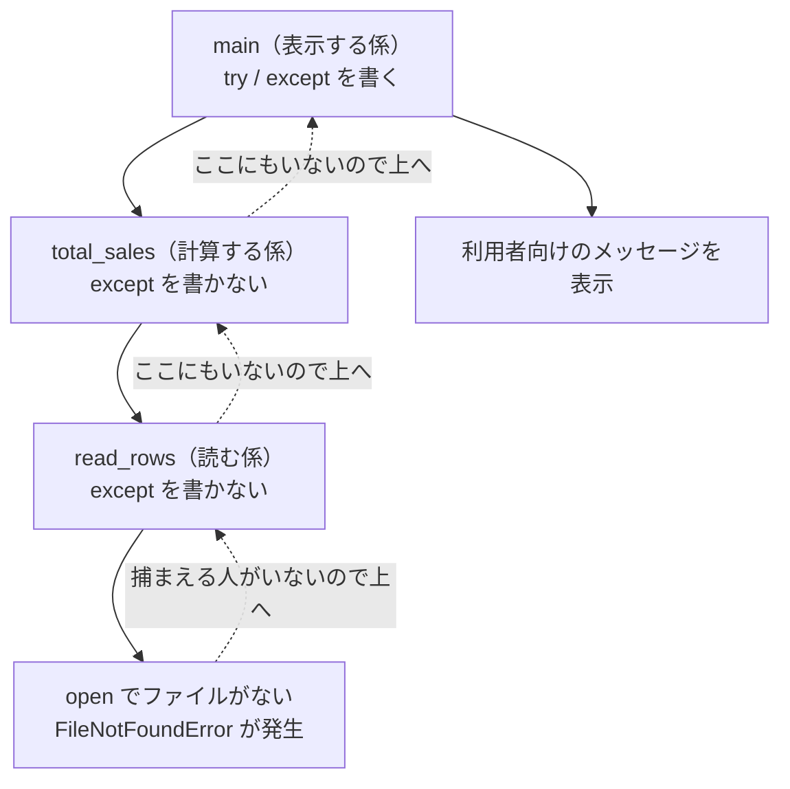

# 第7章 ファイル操作と例外

第6章までに書いたプログラムには、共通の弱点がありました。
**実行が終わると、データがすべて消える**ことです。

第6章の演習で作ったアンケート集計を思い出してください。
回答のリストはプログラムの中に直接書いてありました。
明日また集計したければ、ソースコードを開いて書き直すことになります。
100件のアンケートなら、100行を手で打ち込むわけです。

この章では、**プログラムの外にあるファイルを読み書きする**方法を学びます。
データはファイルに置き、プログラムはそれを読んで処理する。
こうすると、データが増えてもソースコードは1行も変わりません。

そしてもう1つ、この章には避けて通れないテーマがあります。**例外処理**です。

ファイルを読み始めた瞬間、**自分のコードが正しくても失敗する**場面が現れます。
ファイル名を打ち間違えた。ファイルがまだ作られていない。
中身の形式が想定と違う。数字のはずの欄に「不明」と書いてある——
どれもプログラムの外側の事情であり、コードをいくら見直しても直りません。

そういうときにプログラムを止めずに済ませる仕組みが `try` / `except` です。
ファイル操作と例外処理を同じ章で扱うのは、**この2つが必ずセットで必要になる**からです。

## この章で学ぶこと

- テキストファイルを読み書きでき、`with` 文を使う理由を説明できるようになる
- `encoding="utf-8"` を必ず書く理由を説明でき、文字化けとエラーを切り分けられるようになる
- `pathlib` でパスを組み立て、ディレクトリの作成やファイルの一覧ができるようになる
- CSV と JSON を読み書きできるようになる
- `try` / `except` / `else` / `finally` を使い分け、例外を握りつぶさない書き方ができるようになる
- `raise` で自分から例外を投げ、どこで捕まえるべきかを判断できるようになる

## この章の前提

- [第6章](./06-modules.md) を終えていること
- とくに次の4つを使えること
  - `import` と `from ... import ...`（[6.2](./06-modules.md#62-import-の書き方)）
  - `collections` の `Counter` / `defaultdict`（[6.3.5](./06-modules.md#635-collections--便利なデータ構造)）
  - `if __name__ == "__main__":`（[6.4.2](./06-modules.md#642-なぜ必要なのか)）
  - `", ".join(リスト)`（[6.3.5](./06-modules.md#635-collections--便利なデータ構造)）
- 関数の定義と早期 `return`（[5.1](./05-functions.md#51-関数の基本) / [5.3.3](./05-functions.md#533-早期-return)）
- 辞書のリストの扱い（[4.3.5](./04-data-structures.md#435-辞書のリスト実務で最頻出の形)）
- `sorted` の `key` 引数（[5.5.3](./05-functions.md#553-sorted-の-key-に渡す)）
- トレースバックが読めること（[1.4.4](./01-environment.md#144-トレースバックの読み方)）

> **つまずいたら**
> この章で最初に詰まるのは、ほぼ全員が **`FileNotFoundError`**（[7.1.1](#711-open-と-read)）です。
> ファイルは確かにそこにあるのに、Python が見つけてくれません。
> 原因は**ターミナルがいまいるディレクトリ**なので、
> エラーが出たら、まず `cd` した場所を確認してください。
> AI に相談するときは、次の3つを必ず添えてください。
>
> ```text
> python-text の 7.1.1 で詰まりました。
> FileNotFoundError: [Errno 2] No such file or directory: 'memo.txt' が出ます。
>
> ・実行したコマンド: python read_all.py
> ・実行したときにターミナルに出ているディレクトリ: C:\Users\taro
> ・memo.txt を置いた場所: C:\Users\taro\python-lesson\memo.txt
> ```

> **この章のコードを書く場所**
> 第6章までと同じく、`python-lesson` ディレクトリの中で作業します。
> **ただしこの章では、ターミナルが `python-lesson` の中にいることが今まで以上に重要です。**
> 実行する前に、必ず `cd` で `python-lesson` に移動してください（理由は [7.1.1](#711-open-と-read) で説明します）。
>
> **Windows（PowerShell）**
>
> ```powershell
> cd C:\Users\ユーザー名\python-lesson
> ```
>
> **macOS / Linux**
>
> ```bash
> cd ~/python-lesson
> ```
>
> 実行コマンドは、以降 Windows の形（`python ファイル名`）で書きます。
> macOS の方は `python` を `python3` に読み替えてください（[1.4.2](./01-environment.md#142-実行する)）。

---

## 7.1 ファイルを読む

### 7.1.1 `open` と `read`

まず、読み込む相手のファイルを用意します。
VS Code で `python-lesson` を開き、**新しいファイル** `memo.txt` を作って、次の3行を書いて保存してください。

`python-lesson/memo.txt`

```text
りんご
みかん
ぶどう
```

> **補足**
> `.txt` は**テキストファイル**（文字だけが入っていて、
> 文字の大きさや色などの装飾情報を持たないファイル）の拡張子です。
> `.py` も中身は同じテキストファイルで、拡張子が違うだけです。
> Word の `.docx` は装飾情報が大量に入っているため、この方法では読めません。

次に、これを読むプログラムを書きます。

`python-lesson/read_all.py`

```python
f = open("memo.txt", encoding="utf-8")
text = f.read()
f.close()

print(text)
print("---")
print(len(text))
```

**実行**

```powershell
python read_all.py
```

```text
実行結果:
りんご
みかん
ぶどう

---
12
```

3行に分けて見ていきます。

**`open("memo.txt", encoding="utf-8")`**

**`open`**（ファイルを開いて、読み書きできる状態にする組み込み関数）です。
戻り値は「開いたファイルを表すオブジェクト」で、ここでは `f` という名前を付けています。
`f` は file の頭文字で、慣習的によく使われる名前です。

2つ目の `encoding="utf-8"` は**文字コードの指定**です。
**なぜこれを必ず書くのか**は [7.1.4](#714-文字コードの指定encodingutf-8) で説明します。
いまは「**日本語を含むファイルを開くときは必ず付ける**」と覚えておいてください。

**`f.read()`**

ファイルの中身を**すべて1つの文字列として**返すメソッドです。
戻り値は `"りんご\nみかん\nぶどう\n"` という**1本の文字列**であり、
リストではありません。`\n` は改行を表すエスケープ（[2.4.5](./02-basics.md#245-エスケープと複数行文字列)）です。

`len(text)` が `12` になったのは、日本語3文字が3つで9文字、改行が3つで3文字、合計12文字だからです。
`print(text)` のあとに空行が1つ出ているのも、最後の行に改行が含まれているためです。

**`f.close()`**

開いたファイルを**閉じる**メソッドです。開いたら閉じる。これが基本の対です。
なぜ閉じる必要があるのかは [7.1.3](#713-with-文を使う理由) で扱います。

> **よくある間違い**
> `FileNotFoundError` が出たときは、ファイル名の打ち間違いか、**ターミナルの現在地**が原因です。
>
> ```text
> Traceback (most recent call last):
>   File "read_all.py", line 1, in <module>
>     f = open("menu.txt", encoding="utf-8")
>         ^^^^^^^^^^^^^^^^^^^^^^^^^^^^^^^^^^
> FileNotFoundError: [Errno 2] No such file or directory: 'menu.txt'
> ```
>
> ここが第6章と**逆になる**ので注意してください。
> `import` が探す基準は「**実行した `.py` ファイルの場所**」でした（[6.1.3](./06-modules.md#613-同じディレクトリにないと読み込めない問題)）。
> ところが `open("memo.txt")` が探す基準は「**ターミナルがいまいるディレクトリ**」です。
> そのため、`python-lesson` の1つ上から `python python-lesson/read_all.py` と実行すると、
> スクリプトは動くのに `memo.txt` だけが見つからない、という状態になります。
>
> 対策は1つだけです。**必ず `cd python-lesson` してから実行してください。**

### 7.1.2 1行ずつ読む

`read()` は中身を丸ごと1つの文字列にします。
しかし実際にやりたいのは「1行ずつ処理する」ことがほとんどです。

開いたファイルは、**そのまま `for` で回せます。**

`python-lesson/read_lines_ng.py`

```python
f = open("memo.txt", encoding="utf-8")
for line in f:
    print(line)
f.close()
```

```text
実行結果:
りんご

みかん

ぶどう

```

行と行のあいだに空行が入りました。
`for` で取り出される1行には、**行末の改行 `\n` が付いたまま**だからです。
`print` 自身も末尾に改行を出すので、改行が2つ重なります。

改行を取り除くには `rstrip()` を使います。

`python-lesson/read_lines.py`

```python
f = open("memo.txt", encoding="utf-8")
for line in f:
    # 行末の改行を取り除いてから表示する（付いたままだと空行が入るため）
    print(line.rstrip())
f.close()
```

```text
実行結果:
りんご
みかん
ぶどう
```

**`rstrip()`**（文字列の**右端**（末尾）の空白・改行・タブを取り除いた新しい文字列を返すメソッド）です。
[2.4.3](./02-basics.md#243-よく使うメソッド) で学んだ `strip()` は両端、`rstrip()` は末尾だけを対象にします。

もう1つ、**最初からリストとして受け取る**方法もあります。

`python-lesson/read_splitlines.py`

```python
f = open("memo.txt", encoding="utf-8")
lines = f.read().splitlines()
f.close()

print(lines)

for i, fruit in enumerate(lines, start=1):
    print(f"{i}. {fruit}")
```

```text
実行結果:
['りんご', 'みかん', 'ぶどう']
1. りんご
2. みかん
3. ぶどう
```

**`splitlines()`**（文字列を改行で区切って、**改行を含まない**文字列のリストにして返すメソッド）です。
リストになれば、第4章で学んだ操作（`len` / `sorted` / 内包表記など）がそのまま使えます。

似たメソッドに `readlines()` がありますが、こちらは**改行を残します**。

```python
f = open("memo.txt", encoding="utf-8")
print(f.readlines())
f.close()
```

```text
実行結果:
['りんご\n', 'みかん\n', 'ぶどう\n']
```

3つの読み方を整理します。

| 書き方 | 得られるもの | 改行 | 向いている場面 |
|--------|-------------|------|--------------|
| `f.read()` | 1本の文字列 | 含む | 中身をそのまま表示する／文字数を数える |
| `for line in f:` | 1行ずつの文字列 | 含む（`rstrip()` する） | 行数が多く、1行ずつ処理する |
| `f.read().splitlines()` | 文字列のリスト | 含まない | リストとしてまとめて扱う |

このテキストでは、**行の一覧がほしいときは `splitlines()`** を使います。

### 7.1.3 `with` 文を使う理由

ここまで、開いたら `close()` で閉じてきました。
ところが、この書き方には落とし穴があります。**途中でエラーが起きると `close()` に到達しない**のです。

`python-lesson/no_close.py`

```python
f = open("memo.txt", encoding="utf-8")
print(f.closed)
number = int("三")   # ここで例外が起きる
f.close()            # この行は実行されない
```

```text
実行結果:
False
Traceback (most recent call last):
  File "no_close.py", line 3, in <module>
    number = int("三")
             ^^^^^^^^^
ValueError: invalid literal for int() with base 10: '三'
```

`f.closed`（そのファイルが閉じられているかを表す真偽値）が `False` のまま、
プログラムが止まりました。ファイルは開きっぱなしです。

閉じ忘れると、次の問題が起きます。

| 問題 | 何が起きるか |
|------|------------|
| 書き込みが反映されない | 書いた内容が一時的な置き場に残ったまま、ファイルに届かない |
| ファイルが使用中のままになる | Windows では、そのファイルを削除・移動できなくなることがある |
| 開ける数の上限に達する | ループで大量に開くと `OSError: Too many open files` になる |

これを確実に防ぐのが **`with` 文**です。

**`with`**（ブロックを抜けるときに、後片付けを自動で行わせる構文）と書きます。

`python-lesson/with_read.py`

```python
with open("memo.txt", encoding="utf-8") as f:
    for line in f:
        print(line.rstrip())

print(f.closed)
```

```text
実行結果:
りんご
みかん
ぶどう
True
```

`with open(...) as f:` と書き、そのあと `:` と字下げでブロックを作ります。
**ブロックを抜けた時点で、Python が自動的に `close()` を呼びます。**
ブロックの中で例外が起きて途中で抜けた場合も、必ず閉じられます。
だから `f.closed` が `True` になっています。

構造は、これまでの `if` や `for` と同じです。

```python
with open("ファイル名", encoding="utf-8") as f:
    # ここがブロック。ファイルを使う処理を書く
    ...
# ここまで来た時点で、ファイルは閉じている
```

> **注意**
> **以降、ファイルを開くときは必ず `with` を使います。**
> `close()` を手で書く場面は、このテキストではもう出てきません。
> ここまで `open` と `close` を対で書いてきたのは、
> `with` が何を肩代わりしているかを見せるためです。

> **よくある間違い**
> `with` のブロックを抜けたあとに `f.read()` を書くと、次のエラーになります。
>
> ```text
> ValueError: I/O operation on closed file.
> ```
>
> 「閉じたファイルに対する読み書き」という意味です。
> **ファイルの中身を使う処理は、`with` のブロックの中に書いてください。**
> ただし、ブロックの中で変数に代入した値（`text` や `lines`）は、
> ブロックを抜けたあとも普通に使えます。閉じられるのはファイルであって、変数ではありません。

### 7.1.4 文字コードの指定（`encoding="utf-8"`）

先送りにしていた `encoding="utf-8"` を説明します。

コンピュータは文字をそのまま保存できません。すべて数字として保存します。
**「あ」を何番として保存するか**を決めた対応表が**文字コード**です。

日本語には、歴史的な事情から複数の文字コードがあります。

| 文字コード | どこで使われるか |
|-----------|----------------|
| **UTF-8** | 現在の標準。Web、macOS、Linux、VS Code の既定 |
| **cp932**（Shift_JIS） | Windows の日本語環境で長く使われてきたもの。Excel の CSV 書き出しなど |

問題は、**書いたときと読むときで表が違うと、正しく戻らない**ことです。

`encoding` を指定しないと、Python は**その環境の既定の文字コード**を使います。
macOS と Linux では UTF-8 ですが、
**Windows では環境によって cp932 になる**ため、同じコードが環境によって動いたり動かなかったりします。

UTF-8 で保存された `memo.txt` を、わざと cp932 として読むと何が起きるか見てみましょう。

`python-lesson/enc_demo.py`

```python
with open("memo.txt", encoding="cp932") as f:
    print(f.read())
```

```text
実行結果:
Traceback (most recent call last):
  File "enc_demo.py", line 2, in <module>
    print(f.read())
          ^^^^^^^^
UnicodeDecodeError: 'cp932' codec can't decode byte 0x94 in position 8: illegal multibyte sequence
```

**`UnicodeDecodeError`**（読み込んだ数字の並びを、指定した文字コードの表で文字に戻せなかったときの例外）です。

さらに厄介なのは、**エラーにならず文字化けする**場合があることです。
たまたま表の上で別の文字に対応してしまうと、Python は何事もなく次のような文字列を返します。

```text
繧翫ｓ縺
縺ｿ縺九ｓ
```

**エラーが出ないので気づけません。**
集計結果が全部この状態になって初めて気づく、ということが起こります。

対策は1つだけです。

> **注意**
> **ファイルを開くときは、読むときも書くときも必ず `encoding="utf-8"` を書いてください。**
> 環境の既定に任せてはいけません。
> あなたの macOS で動いたコードが、同僚の Windows で `UnicodeDecodeError` になります。

VS Code で作ったファイルは既定で UTF-8 なので、この章で作るファイルはすべて UTF-8 です。
外からもらったファイルが cp932 だと分かっている場合だけ、`encoding="cp932"` と指定します。

> **補足**
> 執筆時点の Python 3.13 では、`encoding` を省略したときの既定は環境依存です。
> 将来のバージョンで UTF-8 が既定になることが検討されていますが、
> **いま書くコードでは、省略せずに毎回書くのが確実です。**

---

## 7.2 ファイルを書く

### 7.2.1 上書きモードと追記モード

`open` には、**モード**（そのファイルをどう扱うかの指定）を渡せます。
ここまでは省略していましたが、省略時は読み込み専用でした。

| モード | 名前 | 動作 | ファイルがないとき |
|--------|------|------|-----------------|
| `"r"` | 読み込み | 読むだけ。書けない | `FileNotFoundError` |
| `"w"` | 書き込み（上書き） | **中身を空にしてから**書く | 新しく作る |
| `"a"` | 追記 | **末尾に**書き足す | 新しく作る |
| `"x"` | 排他作成 | 新規作成して書く | 新しく作る |

省略すると `"r"` になります。ここまで `open("memo.txt", encoding="utf-8")` と書けていたのはそのためです。

書き込んでみます。

`python-lesson/write_memo.py`

```python
with open("output.txt", "w", encoding="utf-8") as f:
    count = f.write("こんにちは\n")
    f.write("2行目です\n")

print(count)

with open("output.txt", encoding="utf-8") as f:
    print(f.read())
```

```text
実行結果:
6
こんにちは
2行目です

```

**`f.write(文字列)`**（ファイルに文字列を書き込むメソッド。戻り値は書き込んだ文字数）です。
`"こんにちは\n"` は5文字＋改行1文字なので、戻り値は `6` です。

引数の順番に注意してください。モードは**2つ目**、`encoding` は**キーワード引数**（[5.2.2](./05-functions.md#522-キーワード引数)）です。

```python
open("output.txt", "w", encoding="utf-8")
#     ファイル名     モード   文字コード
```

次に追記モードです。

`python-lesson/append_log.py`

```python
with open("log.txt", "a", encoding="utf-8") as f:
    f.write("実行しました\n")

with open("log.txt", encoding="utf-8") as f:
    print(f.read(), end="")
```

`log.txt` はまだ存在しませんが、`"a"` は**なければ作る**ので、そのまま実行できます。
3回続けて実行してみてください。

```text
1回目の実行結果:
実行しました

2回目の実行結果:
実行しました
実行しました

3回目の実行結果:
実行しました
実行しました
実行しました
```

実行のたびに1行ずつ増えました。ログの記録はこの形で書きます。

> **補足**
> `print(f.read(), end="")` の `end=""` は、
> `print` が末尾に付ける改行をなくす指定です（[2.5.1](./02-basics.md#251-print-の使い方)）。
> 読み込んだ文字列の末尾にすでに改行が入っているため、これがないと空行が出ます。

### 7.2.2 `w` で開くと中身が消える

`"w"` の「上書き」は、**開いた瞬間に中身を空にする**という意味です。
書き込む前に消えます。何も書かなくても消えます。

確かめてみましょう。まず `memo.txt` をコピーして `memo_copy.txt` を作ってください
（VS Code のファイル一覧で右クリック →「コピー」「貼り付け」でかまいません）。

`python-lesson/erase_demo.py`

```python
with open("memo_copy.txt", "w", encoding="utf-8") as f:
    pass   # 何も書かない

with open("memo_copy.txt", encoding="utf-8") as f:
    print(repr(f.read()))
```

```text
実行結果:
''
```

`pass`（[3.3.4](./03-control-flow.md#334-pass)）で何もしていないのに、
`memo_copy.txt` の中身は空文字列になりました。

> **よくある間違い**
> **`"w"` は、いちばん事故が多いモードです。**
> 「ファイルを読んで、追記しよう」と思って `"w"` と書いた瞬間、元データは消えています。
> しかも**エラーは出ません**。
>
> - **書き足したい** → `"a"` を使う
> - **上書きしていいのか自信がない** → `"x"` を使う。
>   すでにファイルがあれば `FileExistsError` が出て、**消される前に止まります**
>
> ```text
> FileExistsError: [Errno 17] File exists: 'memo.txt'
> ```
>
> 大事なデータを扱うプログラムを書くときは、
> **まず `"x"` で書いてみて、意図どおりの場所に作られることを確かめてから `"w"` にする**と安全です。

なお `repr()` は、文字列を**引用符と `\n` が見える形**で表示する組み込み関数です。
空文字列 `''` や改行の有無を確かめたいときに使います。

### 7.2.3 改行の扱い

`print` は自動で改行を付けますが、**`write` は付けません。**
ここは必ず一度つまずくところです。

`python-lesson/newline_demo.py`

```python
fruits = ["りんご", "みかん", "ぶどう"]

# 改行を付けずに書いた場合
with open("fruits_ng.txt", "w", encoding="utf-8") as f:
    for fruit in fruits:
        f.write(fruit)

with open("fruits_ng.txt", encoding="utf-8") as f:
    print(repr(f.read()))

# 1行ずつ改行を付ける
with open("fruits_ok.txt", "w", encoding="utf-8") as f:
    for fruit in fruits:
        f.write(fruit + "\n")

with open("fruits_ok.txt", encoding="utf-8") as f:
    print(repr(f.read()))

# join でまとめてから1回で書く
with open("fruits_join.txt", "w", encoding="utf-8") as f:
    f.write("\n".join(fruits) + "\n")

with open("fruits_join.txt", encoding="utf-8") as f:
    print(repr(f.read()))
```

```text
実行結果:
'りんごみかんぶどう'
'りんご\nみかん\nぶどう\n'
'りんご\nみかん\nぶどう\n'
```

1つ目は全部つながってしまいました。`write` が改行を付けないからです。

2つ目と3つ目は同じ結果になります。
`"\n".join(fruits)`（[6.3.5](./06-modules.md#635-collections--便利なデータ構造)）は
要素を改行でつなぎますが、**最後の要素のうしろには何も付けません。**
そのため、末尾の改行は `+ "\n"` で自分で足しています。

> **補足**
> 「最後の行にも改行を付けるか」は好みではなく、慣習として**付ける**のが標準です。
> 付けないと、他のプログラムで読んだときに最終行が欠けたように見えることがあります。

もう1つ、OS による改行の違いに触れておきます。

| OS | ファイル上の改行 |
|----|----------------|
| Windows | `\r\n`（2文字） |
| macOS / Linux | `\n`（1文字） |

Python は**テキストモードで開いたときに、この違いを自動で吸収します。**
読むときは `\r\n` を `\n` に変換して渡し、
Windows で書くときは `\n` を `\r\n` に変換して保存します。
そのため、**普段は `\n` だけ書いておけば、どちらの OS でも正しく動きます。**

ただし、**この自動変換が邪魔になる場面が1つだけ**あります。
CSV を書くときです。それは [7.4.1](#741-csv-モジュール) で扱います。

---

## 7.3 パスを扱う

### 7.3.1 `pathlib` の基本

ここまで `"memo.txt"` のように、パスを**文字列**で書いてきました。
ファイルが増えてディレクトリに分かれてくると、文字列のままでは扱いにくくなります。

- `"data" + "/" + "sales.csv"` のように、区切り文字を自分で足すことになる
- Windows と macOS で区切り文字が違う（[7.3.4](#734-windows-のパス区切り問題)）
- 拡張子だけ取り出したい、といった処理をいちいち書くことになる

これを引き受けてくれるのが、標準ライブラリの **`pathlib`**（パスを専用の型として扱うモジュール）です。

`python-lesson/path_basics.py`

```python
from pathlib import Path

p = Path("memo.txt")

print(p)
print(p.name)
print(p.stem)
print(p.suffix)
print(p.parent)
```

```text
実行結果:
memo.txt
memo.txt
memo
.txt
.
```

`Path` はクラス（詳しくは第8章）ですが、いまは
**「パスを表す値を作る関数」**と思って使ってかまいません。

| 書き方 | 意味 | 例（`data/sales.csv` のとき） |
|--------|------|---------------------------|
| `p.name` | ファイル名（拡張子あり） | `sales.csv` |
| `p.stem` | ファイル名（拡張子なし） | `sales` |
| `p.suffix` | 拡張子 | `.csv` |
| `p.parent` | 1つ上のディレクトリ | `data` |

`p.name` などは**属性**で、`()` を付けません。
`date.today().year` と同じ形です（[6.3.2](./06-modules.md#632-datetime--日付と時刻)）。

`Path` には、読み書きを1行で済ませるメソッドもあります。

`python-lesson/path_read.py`

```python
from pathlib import Path

p = Path("memo.txt")
text = p.read_text(encoding="utf-8")
print(text.splitlines())

p2 = Path("greeting.txt")
p2.write_text("こんにちは\n", encoding="utf-8")
print(p2.read_text(encoding="utf-8"), end="")
```

```text
実行結果:
['りんご', 'みかん', 'ぶどう']
こんにちは
```

**`read_text()`** は中身を丸ごと文字列で返し、**`write_text()`** は文字列を丸ごと書き込みます。
どちらも内部で開いて閉じるところまでやってくれるので、`with` は不要です。
`encoding="utf-8"` は、こちらでも必ず書いてください。

| 使い分け | 使うもの |
|---------|---------|
| 小さいファイルを丸ごと読む・書く | `Path.read_text()` / `Path.write_text()` |
| 1行ずつ処理する、追記する、CSV を扱う | `with open(...) as f:` |

`write_text()` は `"w"` と同じで**中身を消してから書きます**。追記はできません。

### 7.3.2 パスを組み立てる

`pathlib` のいちばん便利な機能が、**`/` でパスをつなげる**ことです。

`python-lesson/path_join.py`

```python
from pathlib import Path

data_dir = Path("data")
csv_path = data_dir / "sales.csv"

print(csv_path)
print(csv_path.parent)
print(csv_path.name)
print(Path.cwd())
```

```text
実行結果（macOS の場合）:
data/sales.csv
data
sales.csv
/Users/taro/python-lesson
```

割り算の記号に見えますが、`Path` と文字列のあいだでは**「パスをつなぐ」意味**になります。
区切り文字は Python が OS に合わせて入れてくれるので、自分で `/` や `\` を書く必要はありません。

Windows で実行すると、表示はこうなります。

```text
実行結果（Windows の場合）:
data\sales.csv
data
sales.csv
C:\Users\taro\python-lesson
```

**`Path.cwd()`**（いまターミナルがいるディレクトリを返す。cwd は current working directory の略）です。
`FileNotFoundError` が出たときは、まずこれを表示させると原因がすぐ分かります。

> **よくある間違い**
> `/` でつなげるのは、**どちらか一方が `Path` のとき**だけです。
>
> ```python
> Path("data") / "sales.csv"    # OK
> "data" / Path("sales.csv")    # OK（こちらも動く）
> "data" / "sales.csv"          # TypeError
> ```
>
> 両方が文字列だと、Python は文字列の割り算だと解釈して次のエラーを出します。
>
> ```text
> TypeError: unsupported operand type(s) for /: 'str' and 'str'
> ```
>
> `Path` を作ったつもりで `data_dir = "data"` と書いていた、というのがよくある原因です。
> 迷ったら **`Path(...)` から書き始める**と決めておけば間違えません。

### 7.3.3 存在確認・作成・一覧

ファイルを読む前に「そもそもあるのか」を確かめられます。

`python-lesson/path_check.py`

```python
from pathlib import Path

memo = Path("memo.txt")
missing = Path("menu.txt")
data_dir = Path("data")

print(memo.exists())
print(missing.exists())
print(memo.is_file())
print(memo.is_dir())

data_dir.mkdir(exist_ok=True)
print(data_dir.exists())
print(data_dir.is_dir())
```

```text
実行結果:
True
False
True
False
True
True
```

| メソッド | 意味 |
|---------|------|
| `p.exists()` | そのパスに何かがあるか |
| `p.is_file()` | それがファイルか |
| `p.is_dir()` | それがディレクトリか |
| `p.mkdir()` | ディレクトリを作る |

**`mkdir(exist_ok=True)`** の `exist_ok=True` は、
「**すでにあってもエラーにしない**」という指定です。
これを付けないと、2回目の実行で `FileExistsError` になります。
`data_dir.mkdir(parents=True, exist_ok=True)` と書けば、
`out/2026/04` のように**途中のディレクトリもまとめて**作れます。

ディレクトリの中身を一覧するには `iterdir()` と `glob()` を使います。

`python-lesson/path_list.py`

```python
from pathlib import Path

out_dir = Path("out")
out_dir.mkdir(exist_ok=True)

(out_dir / "a.txt").write_text("A\n", encoding="utf-8")
(out_dir / "b.txt").write_text("B\n", encoding="utf-8")
(out_dir / "c.json").write_text("{}\n", encoding="utf-8")

# すべて
for path in sorted(out_dir.iterdir()):
    print(path.name)

print("---")

# .txt だけ
for path in sorted(out_dir.glob("*.txt")):
    print(path.name, path.read_text(encoding="utf-8").rstrip())
```

```text
実行結果:
a.txt
b.txt
c.json
---
a.txt A
b.txt B
```

**`iterdir()`** はそのディレクトリの中身を1つずつ取り出します。
**`glob("*.txt")`** は条件に合うものだけを取り出します。
`*` は「任意の文字の並び」を表す記号で、`*.txt` は「`.txt` で終わるもの」という意味です。

どちらも**取り出す順番は決まっていません。**
表示順を安定させたいときは、`sorted()`（[4.1.5](./04-data-structures.md#415-並べ替えsort--sorted)）で囲んでください。
`Path` どうしは、そのまま名前順に並べ替えられます。

`sorted()` の戻り値は**リスト**なので、変数に入れておけば個数も数えられます。

```python
from pathlib import Path

out_dir = Path("out")
txt_paths = sorted(out_dir.glob("*.txt"))

print(txt_paths[0].name)
print(len(txt_paths))
```

```text
実行結果:
a.txt
2
```

`for` で回すだけならその場に書いてかまいませんが、
**「一覧したあとに件数も出したい」ときは、いったん変数に入れる**と両方できます。

> **注意**
> ファイルを削除する `p.unlink()` というメソッドもありますが、
> **このテキストでは使いません。**
> 実行すると確認なしで消え、ごみ箱にも入らないためです。
> 消したいファイルは、当面は手で削除してください。

### 7.3.4 Windows のパス区切り問題

Windows のパス区切りは `\`（円記号、またはバックスラッシュ）です。
ところが Python の文字列では、`\` は**エスケープの開始記号**でした（[2.4.5](./02-basics.md#245-エスケープと複数行文字列)）。

このため、Windows のパスをそのまま文字列に貼り付けると壊れます。

`python-lesson/win_path_ng.py`

```python
path = "data\new\table.txt"
print(path)
print(len(path))
```

```text
実行結果:
data
ew	able.txt
16
```

`\n` が改行に、`\t` がタブになってしまいました。18文字あるはずが16文字です。
運が悪いと、次のように**実行前にエラー**になることもあります。

```text
SyntaxError: (unicode error) 'unicodeescape' codec can't decode bytes in position 2-3: truncated \UXXXXXXXX escape
```

対処は3つあります。

`python-lesson/win_path_ok.py`

```python
from pathlib import Path

# 方法1: raw string にする
raw = r"data\new\table.txt"
print(raw)
print(len(raw))

# 方法2: Path で組み立てる
p = Path("data") / "new" / "table.txt"
print(p)
```

```text
実行結果（macOS の場合）:
data\new\table.txt
18
data/new/table.txt
```

Windows で実行すると、方法2の表示は `data\new\table.txt` になります。

| 方法 | 書き方 | 評価 |
|------|--------|------|
| 1. raw string | `r"data\new\table.txt"` | 貼り付けたパスを直したくないときに有効 |
| 2. `Path` で組み立てる | `Path("data") / "new"` | **このテキストの標準。** OS を問わず動く |
| 3. `/` で書く | `"data/new/table.txt"` | Windows でも動く。手軽だが `Path` のほうが安全 |

**方法3** に驚くかもしれませんが、Windows の Python は `/` 区切りも受け付けます。
`open("data/sales.csv")` は Windows でも問題なく動きます。

> **注意**
> **絶対パス（`C:\Users\taro\...` や `/Users/taro/...`）をコードに書かないでください。**
> 自分のパソコンでは動きますが、他の人の環境では確実に動きません。
> `Path("data") / "sales.csv"` のような**相対パス**で書き、
> ターミナルの現在地（[7.3.2](#732-パスを組み立てる) の `Path.cwd()`）を揃えるのが基本です。

---

## 7.4 CSV と JSON

### 7.4.1 `csv` モジュール

**CSV**（Comma-Separated Values。値をカンマで区切って並べた、表形式のテキストファイル）は、
Excel や各種システムからデータを受け取るときの定番の形式です。

まず読み込むデータを用意します。
`python-lesson` の中に `data` ディレクトリを作り、その中に次のファイルを作ってください。

`python-lesson/data/sales.csv`

```text
date,item,quantity,price
2026-04-01,ノート,3,180
2026-04-01,ボールペン,10,120
2026-04-02,ノート,2,180
2026-04-02,消しゴム,5,90
2026-04-03,ボールペン,4,120
2026-04-03,ノート,1,180
```

1行目は**ヘッダー行**（各列が何を表すかを書いた行）です。

「カンマで区切るだけなら、`split(",")` でいいのでは」と思うかもしれません。
実際、このファイルなら動きます。しかし次のような行が混ざると破綻します。

```python
line = '2026-04-01,"ノート, A5",3,180'
print(line.split(","))
```

```text
実行結果:
['2026-04-01', '"ノート', ' A5"', '3', '180']
```

商品名の中にカンマが入っていました。
CSV では「**値の中にカンマを含めたいときは `"` で囲む**」という決まりがあり、
`split(",")` はこの決まりを知りません。

そこで標準ライブラリの **`csv`** を使います。

`python-lesson/csv_reader.py`

```python
import csv

with open("data/sales.csv", encoding="utf-8", newline="") as f:
    reader = csv.reader(f)
    header = next(reader)
    print(header)
    for row in reader:
        print(row)
```

```text
実行結果:
['date', 'item', 'quantity', 'price']
['2026-04-01', 'ノート', '3', '180']
['2026-04-01', 'ボールペン', '10', '120']
['2026-04-02', 'ノート', '2', '180']
['2026-04-02', '消しゴム', '5', '90']
['2026-04-03', 'ボールペン', '4', '120']
['2026-04-03', 'ノート', '1', '180']
```

`csv.reader(f)` は、1行を**文字列のリスト**にして順に返します。
`next(reader)` は「次の1行だけ取り出す」組み込み関数で、ここではヘッダー行を読み飛ばすために使っています。

`open` に `newline=""` が増えました。
[7.2.3](#723-改行の扱い) で触れた**改行の自動変換を止める**指定です。
`csv` モジュールは改行を自分で管理するので、Python 側の変換と二重にならないようにします。
**CSV を開くときは、読み書きどちらも `newline=""` を付ける**と覚えてください。

> **よくある間違い**
> 書き込み時に `newline=""` を忘れると、**Windows で1行おきに空行が入った CSV** ができます。
> Excel で開くと空行が並ぶので、そこで初めて気づくことになります。
> macOS では起きないため、**macOS で書いて Windows で渡したときに発覚しがち**です。

列の位置を数えるのは間違いのもとです。**`csv.DictReader`** を使うと、
ヘッダー行を見て**辞書のリスト**（[4.3.5](./04-data-structures.md#435-辞書のリスト実務で最頻出の形)）にしてくれます。

`python-lesson/csv_dictreader.py`

```python
import csv

with open("data/sales.csv", encoding="utf-8", newline="") as f:
    reader = csv.DictReader(f)
    sales = list(reader)

print(sales[0])
print(sales[0]["item"])

total = 0
for row in sales:
    # CSV の値はすべて文字列なので、計算する前に int に変換する
    total += int(row["quantity"]) * int(row["price"])

print(f"売上合計: {total}円")
```

```text
実行結果:
{'date': '2026-04-01', 'item': 'ノート', 'quantity': '3', 'price': '180'}
ノート
売上合計: 3210円
```

`DictReader` はヘッダー行を自動で読み飛ばし、`row["item"]` のように**列名で**取り出せます。
`list(reader)` でリストにしているのは、`with` を抜けたあとも使えるようにするためです。

> **注意**
> **CSV から読んだ値は、すべて文字列です。**
> `row["quantity"]` は `3` ではなく `"3"` です。
> 計算する前に `int()`（[2.2.6](./02-basics.md#226-型を変換する)）で変換してください。
> 忘れると、次のように**エラーにならず変な結果**になります。
>
> ```python
> print("3" * 180)   # "3" が 180 回繰り返された文字列になる
> ```

第6章の `collections` と組み合わせると、集計はこう書けます。

`python-lesson/csv_summary.py`

```python
import csv
from collections import defaultdict

with open("data/sales.csv", encoding="utf-8", newline="") as f:
    sales = list(csv.DictReader(f))

totals = defaultdict(int)
for row in sales:
    totals[row["item"]] += int(row["quantity"]) * int(row["price"])

# 売上金額の多い順に表示する
for item in sorted(totals, key=lambda name: totals[name], reverse=True):
    print(f"{item}: {totals[item]}円")
```

```text
実行結果:
ボールペン: 1680円
ノート: 1080円
消しゴム: 450円
```

`defaultdict(int)` は「まだないキーは `0` から始める」辞書
（[6.3.5](./06-modules.md#635-collections--便利なデータ構造)）、
`sorted(..., key=..., reverse=True)` は並べ替えの基準指定（[5.5.3](./05-functions.md#553-sorted-の-key-に渡す)）です。
**「ファイルから読む → 集計する → 並べる」が、この章でいちばん使う組み合わせ**です。

書き出すときは `csv.DictWriter` を使います。

`python-lesson/csv_writer.py`

```python
import csv
from collections import defaultdict

with open("data/sales.csv", encoding="utf-8", newline="") as f:
    sales = list(csv.DictReader(f))

totals = defaultdict(int)
for row in sales:
    totals[row["item"]] += int(row["quantity"]) * int(row["price"])

with open("data/summary.csv", "w", encoding="utf-8", newline="") as f:
    writer = csv.DictWriter(f, fieldnames=["item", "total"])
    writer.writeheader()
    for item in sorted(totals):
        writer.writerow({"item": item, "total": totals[item]})

with open("data/summary.csv", encoding="utf-8") as f:
    print(f.read(), end="")
```

```text
実行結果:
item,total
ノート,1080
ボールペン,1680
消しゴム,450
```

`fieldnames` に**列の順番**をリストで渡し、`writeheader()` でヘッダー行を書き、
`writerow(辞書)` で1行ずつ書きます。
`fieldnames` にないキーを渡すとエラーになるので、書き漏らしに気づけます。

### 7.4.2 `json` モジュール

**JSON**（データをやり取りするための、文字だけで書かれた形式）は、
設定ファイルや Web API のやり取りで最もよく使われます。
3冊目の FastAPI では、この形式が主役になります。

CSV が「表」しか表せないのに対し、JSON は**入れ子の構造**を表せます。

`python-lesson/data/config.json`

```json
{
  "shop_name": "みどり文具店",
  "tax_rate": 0.1,
  "open": true,
  "closed_day": null,
  "staff": ["佐藤", "鈴木"]
}
```

Python の辞書によく似ていますが、**別物です。** 対応関係は次のとおりです。

| JSON | Python | 注意点 |
|------|--------|--------|
| `{ }` | 辞書 | **キーは必ずダブルクォートの文字列** |
| `[ ]` | リスト | 同じ |
| `"文字列"` | `str` | **シングルクォートは使えない** |
| `123` / `0.1` | `int` / `float` | 同じ |
| `true` / `false` | `True` / `False` | **JSON は小文字** |
| `null` | `None` | 名前が違う |

読み込みは `json.load` です。

`python-lesson/json_read.py`

```python
import json

with open("data/config.json", encoding="utf-8") as f:
    config = json.load(f)

print(type(config))
print(config)
print(config["shop_name"])
print(config["closed_day"])
print(config["staff"][0])
```

```text
実行結果:
<class 'dict'>
{'shop_name': 'みどり文具店', 'tax_rate': 0.1, 'open': True, 'closed_day': None, 'staff': ['佐藤', '鈴木']}
みどり文具店
None
佐藤
```

**読み込んだあとは、ただの辞書とリスト**です。
第4章で学んだ操作がそのまま使えます。`true` は `True` に、`null` は `None` になっています。

`json` には、似た名前の関数が4つあります。混同しやすいので表で覚えてください。

| 関数 | 入力 | 出力 |
|------|------|------|
| `json.load(f)` | 開いたファイル | Python の値 |
| `json.loads(文字列)` | 文字列 | Python の値 |
| `json.dump(値, f)` | Python の値 | 開いたファイルに書く |
| `json.dumps(値)` | Python の値 | 文字列 |

**末尾の `s` は string（文字列）の `s`** です。
ファイル相手なら `s` なし、文字列相手なら `s` あり、と覚えます。

> **よくある間違い**
> JSON の書式を間違えると、`json.JSONDecodeError` になります。
> とくに多いのが、**最後の要素のうしろにカンマを書く**ミスです。
>
> ```json
> {
>   "shop_name": "みどり文具店",
> }
> ```
>
> ```text
> json.decoder.JSONDecodeError: Expecting property name enclosed in double quotes: line 3 column 1 (char 27)
> ```
>
> Python の辞書では末尾のカンマが許されるので、つい書いてしまいます。
> **JSON では許されません。**
> また、**JSON にコメントは書けません。**`#` も `//` も構文エラーになります。

### 7.4.3 日本語を含む JSON の書き出し

書き出しは `json.dump` ですが、そのまま書くと困ったことになります。

`python-lesson/json_write_ng.py`

```python
import json

summary = {"ノート": 1080, "ボールペン": 1680, "消しゴム": 450}

with open("data/summary_ng.json", "w", encoding="utf-8") as f:
    json.dump(summary, f)

with open("data/summary_ng.json", encoding="utf-8") as f:
    print(f.read())
```

```text
実行結果:
{"\u30ce\u30fc\u30c8": 1080, "\u30dc\u30fc\u30eb\u30da\u30f3": 1680, "\u6d88\u3057\u30b4\u30e0": 450}
```

日本語が `\u30ce` のような記号の並びになりました。
これは**文字化けではなく**、JSON の仕様で許されている「文字を番号で書く表記」です。
Python で読み直せば正しく日本語に戻ります。

とはいえ、人が開いて確認できないファイルは扱いにくいものです。
**`ensure_ascii=False`** を付けると、日本語がそのまま書き出されます。

`python-lesson/json_write.py`

```python
import json

summary = {"ノート": 1080, "ボールペン": 1680, "消しゴム": 450}

with open("data/summary.json", "w", encoding="utf-8") as f:
    # ensure_ascii=False: 日本語をそのまま書く / indent=2: 改行と字下げを入れる
    json.dump(summary, f, ensure_ascii=False, indent=2)

with open("data/summary.json", encoding="utf-8") as f:
    print(f.read())
```

```text
実行結果:
{
  "ノート": 1080,
  "ボールペン": 1680,
  "消しゴム": 450
}
```

**`indent=2`** は、半角スペース2つで字下げして読みやすく整える指定です。
付けないと全部1行になります。

最後に、この章でいちばんよく使う形をまとめて見ておきます。
**集計した結果を「辞書のリスト」に組み立て直してから JSON に書き出す**という流れです。

`python-lesson/json_records.py`

```python
import json
from collections import defaultdict

# 図書室の貸出記録（クラス名, 貸出冊数）
loans = [
    ("1年A組", 4),
    ("2年B組", 7),
    ("1年A組", 3),
    ("3年C組", 5),
    ("2年B組", 2),
]

# 1. 集計する（合計したい値が2種類あるので defaultdict も2つ用意する）
counts = defaultdict(int)
times = defaultdict(int)
for class_name, books in loans:
    counts[class_name] += books
    times[class_name] += 1

# 2. 集計結果を「辞書のリスト」に組み立て直す
records = []
for class_name in counts:
    records.append({"class": class_name, "books": counts[class_name], "times": times[class_name]})

# 3. 冊数の多い順に並べる
records = sorted(records, key=lambda row: row["books"], reverse=True)

# 4. 表示する
for record in records:
    print(f"{record['class']}: {record['books']}冊 / {record['times']}回")

# 5. JSON に書き出す
with open("data/loans.json", "w", encoding="utf-8") as f:
    json.dump(records, f, ensure_ascii=False, indent=2)
```

```text
実行結果:
2年B組: 9冊 / 2回
1年A組: 7冊 / 2回
3年C組: 5冊 / 1回
```

書き出された `data/loans.json` は次のようになります。

```json
[
  {
    "class": "2年B組",
    "books": 9,
    "times": 2
  },
  {
    "class": "1年A組",
    "books": 7,
    "times": 2
  },
  {
    "class": "3年C組",
    "books": 5,
    "times": 1
  }
]
```

5つの段階に分けて見てください。

1. **集計する** … `defaultdict` は「合計したい値の種類ごとに1つ」用意します
2. **組み立て直す** … 辞書は並べ替えにくいので、
   **`[]` から始めて `append` で辞書を足していき、辞書のリストにします**（[4.3.5](./04-data-structures.md#435-辞書のリスト実務で最頻出の形)）
3. **並べる** … 辞書のリストなら `key=lambda row: row["キー"]` で自由に並べ替えられます
4. **表示する**
5. **書き出す** … `json.dump` はリストもそのまま書けます

`for class_name, books in loans:` は、
タプルのアンパック（[4.2.3](./04-data-structures.md#423-アンパック)）で2つの変数に同時に受け取る書き方です。

> **注意**
> `ensure_ascii=False` を使うときは、**`encoding="utf-8"` が必須**です。
> 日本語をそのまま書こうとするので、
> Windows の既定（cp932）のままだと `UnicodeEncodeError` になります。
> **日本語 JSON を書くときは、この2つをセットで書いてください。**

---

## 7.5 例外

### 7.5.1 例外とは

ここまでで、ファイルを読み書きできるようになりました。
同時に、**自分のコードが正しくても失敗する**場面が一気に増えました。

```text
FileNotFoundError: [Errno 2] No such file or directory: 'data/sales.csv'
```

このエラーは、コードを何度見直しても直りません。
原因はプログラムの外——ファイルがない、名前が違う、まだ作られていない——にあるからです。

**例外**（実行中に起きた問題を表すオブジェクト）は、
第1章から何度も見てきました。トレースバックの最後の行に出ていたものです（[1.4.4](./01-environment.md#144-トレースバックの読み方)）。

```text
Traceback (most recent call last):
  File "read_all.py", line 1, in <module>
    f = open("menu.txt", encoding="utf-8")
        ^^^^^^^^^^^^^^^^^^^^^^^^^^^^^^^^^^
FileNotFoundError: [Errno 2] No such file or directory: 'menu.txt'
```

- **`FileNotFoundError`** が**例外の種類**（名前）
- **`[Errno 2] No such file...`** が**メッセージ**（詳しい状況）

例外が起きると、Python は**その場でプログラムを止めます。**
何も手当てをしなければ、トレースバックを出して終了します。

ここまでに出会った例外を整理しておきます。

| 例外 | 起きる場面 | 初出 |
|------|----------|------|
| `NameError` | 定義していない名前を使った | [1.4.4](./01-environment.md#144-トレースバックの読み方) |
| `ValueError` | 型は合っているが値がおかしい（`int("三")`） | [2.2.6](./02-basics.md#226-型を変換する) |
| `TypeError` | 型が合わない（`"3" + 5`） | 2.3.1 |
| `ZeroDivisionError` | 0 で割った | 2.3.2 |
| `IndexError` | 範囲外の番号を指定した | 4.1.2 |
| `KeyError` | 辞書にないキーを読んだ | [4.3.3](./04-data-structures.md#433-get-で安全に取り出す) |
| `ModuleNotFoundError` | `import` するモジュールが見つからない | [6.1.3](./06-modules.md#613-同じディレクトリにないと読み込めない問題) |
| `FileNotFoundError` | ファイルが見つからない | [7.1.1](#711-open-と-read) |
| `UnicodeDecodeError` | 文字コードが合わない | [7.1.4](#714-文字コードの指定encodingutf-8) |
| `FileExistsError` | すでにあるのに作ろうとした | [7.2.2](#722-w-で開くと中身が消える) |

大事な区別があります。

- **プログラムの間違い**（`NameError`、`TypeError`、`IndexError`）
  → **コードを直す。** 例外処理でごまかさない
- **外の世界の事情**（`FileNotFoundError`、`ValueError` の入力ミス）
  → **例外処理で受け止める。** コードは直しようがない

次からは、この2つ目に対処する方法を学びます。

### 7.5.2 `try` / `except`

**`try` / `except`** は、「やってみて、失敗したらこうする」を書く構文です。

```python
try:
    # 失敗するかもしれない処理
except 例外の種類:
    # 失敗したときの処理
```

第3章で、入力が数字かどうかを `str.isdigit()` で調べました（[3.3.2](./03-control-flow.md#332-continue)）。
あれは、まだ `try` を知らなかったからです。ここで本来の書き方に置き換えます。

`python-lesson/try_basic.py`

```python
try:
    age = int(input("年齢を入力してください: "))
    print(f"来年は{age + 1}歳ですね")
except ValueError:
    print("数字を入力してください")
```

```text
実行結果（25 と入力）:
年齢を入力してください: 25
来年は26歳ですね

実行結果（二十五 と入力）:
年齢を入力してください: 二十五
数字を入力してください
```

`try:` のブロックを上から実行し、
`ValueError` が起きた瞬間に**残りを飛ばして** `except ValueError:` のブロックへ移ります。
例外が起きなければ `except` のブロックは実行されません。

`isdigit()` と比べたときの利点は、**扱える入力の幅**です。

| 入力 | `isdigit()` | `int()` + `try` |
|------|-------------|-----------------|
| `"25"` | `True` | 成功 |
| `"-5"` | `False`（マイナス記号を数字と見なさない） | 成功して `-5` |
| `"3.5"` | `False`（小数点を数字と見なさない） | `ValueError` |
| `"二十五"` | `False` | `ValueError` |

`isdigit()` は「1文字ずつが数字の字かどうか」しか見ないので、
**`-5` のような正しい入力まで弾いてしまいます。**
**「変換できるか」を知りたいなら、実際に変換してみるのがいちばん確実**です。

例外の中身を見たいときは `as` で名前を付けます。

`python-lesson/try_as.py`

```python
try:
    number = int("三")
except ValueError as e:
    print("変換に失敗しました")
    print(e)
```

```text
実行結果:
変換に失敗しました
invalid literal for int() with base 10: '三'
```

`e` に入るのが例外オブジェクトです（`e` は error の頭文字で、慣習的な名前です）。
`print(e)` でメッセージだけを取り出せます。
**エラーメッセージを利用者に見せたいときは、この形を使ってください。**

### 7.5.3 例外の種類を指定する

`except` には**種類を必ず書きます。** 複数書くこともできます。

`python-lesson/try_multi.py`

```python
prices = {"ノート": 180, "ボールペン": 120}


def price_of(name, count_text):
    """商品名と個数（文字列）から合計金額を返す。失敗したら 0 を返す。"""
    try:
        count = int(count_text)
        return prices[name] * count
    except ValueError:
        print(f"個数が数字ではありません: {count_text}")
        return 0
    except KeyError:
        print(f"知らない商品です: {name}")
        return 0


print(price_of("ノート", "3"))
print(price_of("ノート", "三"))
print(price_of("定規", "2"))
```

```text
実行結果:
540
個数が数字ではありません: 三
0
知らない商品です: 定規
0
```

`except` は上から順に照合され、**最初に一致した1つだけ**が実行されます。
`elif`（[3.1.2](./03-control-flow.md#312-else-と-elif)）と同じ仕組みです。

同じ処理でよいなら、タプルでまとめられます。

```python
try:
    count = int(count_text)
    return prices[name] * count
except (ValueError, KeyError) as e:
    print(f"計算できませんでした: {e}")
    return 0
```

かっこは必須です。`except ValueError, KeyError:` とは書けません。

> **よくある間違い**
> **広い例外を先に書くと、うしろの `except` に永久に到達しません。**
>
> ```python
> try:
>     int("三")
> except Exception:
>     print("Exception でまとめて捕まえた")
> except ValueError:
>     print("ここには絶対に来ない")
> ```
>
> ```text
> 実行結果:
> Exception でまとめて捕まえた
> ```
>
> `Exception` は**ほぼすべての例外の親**なので、`ValueError` もここで一致してしまいます。
> **細かい種類を先に、広い種類をあとに**書いてください。

### 7.5.4 `else` と `finally`

`try` 文には、あと2つブロックを足せます。

| ブロック | いつ実行されるか |
|---------|----------------|
| `try` | 最初に実行される |
| `except` | 一致する例外が起きたときだけ |
| `else` | **例外が起きなかったときだけ** |
| `finally` | **例外が起きても起きなくても必ず** |

流れを図にすると、次のようになります。


実際に動かして確かめます。

`python-lesson/try_else_finally.py`

```python
from pathlib import Path


def load_memo(filename):
    """ファイルを読んで行のリストを返す。読めなければ空リストを返す。"""
    try:
        text = Path(filename).read_text(encoding="utf-8")
    except FileNotFoundError:
        print(f"[except] {filename} が見つかりません")
        return []
    else:
        print("[else] 読み込みに成功しました")
        return text.splitlines()
    finally:
        print("[finally] 読み込み処理を終わります")


print(load_memo("memo.txt"))
print("---")
print(load_memo("menu.txt"))
```

```text
実行結果:
[else] 読み込みに成功しました
[finally] 読み込み処理を終わります
['りんご', 'みかん', 'ぶどう']
---
[except] menu.txt が見つかりません
[finally] 読み込み処理を終わります
[]
```

注目してほしいのは、**`return` を書いても `finally` は実行される**ことです。
`else` の中で `return` していますが、その直前に `finally` が動いています。
「必ず実行される」とはこういう意味です。

**`else` を使う理由**は、`try` の中を短く保つためです。

```python
# try が長い書き方（何行目で例外が起きたのか分かりにくい）
try:
    text = Path(filename).read_text(encoding="utf-8")
    lines = text.splitlines()
    print(f"{len(lines)}行あります")
except FileNotFoundError:
    ...
```

この形だと、`print` の中で起きた別の例外まで巻き込みかねません。
**`try` には「失敗しうる1行」だけを入れ、続きは `else` に置く。** これが基本形です。

**`finally` を使う場面**は、後片付けです。
ただしファイルの後片付けは `with` がやってくれるので、
このテキストの範囲では「処理の終わりを必ず記録したい」といった用途が中心になります。

### 7.5.5 握りつぶさない（`except: pass` の危険）

例外処理でいちばんやってはいけない書き方を見ます。

`python-lesson/swallow_ng.py`

```python
import csv


def total_sales(path):
    """売上 CSV の合計を返す（悪い例）。"""
    total = 0
    try:
        with open(path, encoding="utf-8", newline="") as f:
            for row in csv.DictReader(f):
                total += int(row["quantity"]) * int(row["price"])
    except:
        pass
    return total


print(total_sales("data/sales.csv"))
print(total_sales("data/saels.csv"))   # ファイル名を打ち間違えている
```

```text
実行結果:
3210
0
```

2つ目は**ファイル名の打ち間違い**です。
それなのにエラーは出ず、`0` という**それらしい数字**が返ってきました。

これが「例外を握りつぶす」という状態です。何が起きるでしょうか。

- 「今月の売上は0円でした」という報告書が、誰にも気づかれずに出来上がる
- あとで気づいても、**どこで何が失敗したのか手がかりが残っていない**
- 打ち間違い以外（文字コード違い、列名の変更）も、すべて同じ `0` になる

**エラーが出て止まるほうが、はるかにましです。**

さらに、`except:` と種類を書かない形（**裸の `except`**）には別の危険もあります。
`Ctrl` + `C` による中断（`KeyboardInterrupt`。[3.2.5](./03-control-flow.md#325-無限ループから抜け出す)）まで
捕まえてしまい、**プログラムを止められなくなる**ことがあります。

正しくはこう書きます。

`python-lesson/swallow_ok.py`

```python
import csv


def total_sales(path):
    """売上 CSV の合計を返す。読めなければ例外はそのまま呼び出し元へ渡す。"""
    total = 0
    with open(path, encoding="utf-8", newline="") as f:
        for row in csv.DictReader(f):
            total += int(row["quantity"]) * int(row["price"])
    return total


try:
    print(total_sales("data/saels.csv"))
except FileNotFoundError as e:
    print(f"集計できませんでした: {e}")
```

```text
実行結果:
集計できませんでした: [Errno 2] No such file or directory: 'data/saels.csv'
```

何が失敗したのかが残り、間違った数字も出ていません。

> **注意**
> 例外を書くときの3つの決まりです。
>
> 1. **`except:` と裸で書かない。** 必ず種類を指定する
> 2. **`pass` で終わらせない。** 最低限、何が起きたかを表示する
> 3. **`return 0` のような「それらしい値」を返して隠さない。**
>    値を返すなら、**呼び出し側が失敗と区別できる形**にする

---

## 7.6 例外を投げる

### 7.6.1 `raise`

ここまでは、Python が投げた例外を受け止める側でした。
**自分の関数から例外を投げる**こともできます。**`raise`** を使います。

なぜ必要なのでしょうか。次の関数を考えます。

```python
def with_tax(price):
    return int(price * 1.1)
```

`with_tax(-500)` を呼ぶと `-550` が返ります。エラーにはなりません。
しかし、**価格が負の商品は存在しません。** 呼び出し側の間違いです。
このまま `-550` を返すと、間違いが集計まで運ばれ、
おかしな合計金額を見て初めて誰かが気づくことになります。

`raise` を使うと、**その場で止められます。**

`python-lesson/raise_demo.py`

```python
def with_tax(price):
    """税込価格を返す。price が負なら ValueError を投げる。"""
    if price < 0:
        raise ValueError(f"価格は0以上にしてください: {price}")
    return int(price * 1.1)


print(with_tax(1000))
print(with_tax(-500))
```

```text
実行結果:
1100
Traceback (most recent call last):
  File "raise_demo.py", line 9, in <module>
    print(with_tax(-500))
          ^^^^^^^^^^^^^^
  File "raise_demo.py", line 4, in with_tax
    raise ValueError(f"価格は0以上にしてください: {price}")
ValueError: 価格は0以上にしてください: -500
```

書き方は `raise 例外の種類("メッセージ")` です。
`raise` を実行した時点で、その関数は**そこで終わります。**
`return` と同じく、その先は実行されません。

形としては、第5章で学んだ**ガード節**（[5.3.3](./05-functions.md#533-早期-return)）そのものです。
違いは、`return` で「何か値を返す」のではなく「投げて知らせる」ことです。

| 書き方 | 呼び出し側に起きること |
|--------|-------------------|
| `return None` | 気づかずに使い、あとで `TypeError` になる |
| `return 0` | 気づかずに使い、**間違った答えが出る** |
| `raise ValueError(...)` | **その場で止まる。** 原因と行番号が残る |

投げられた例外は、もちろん呼び出し側で捕まえられます。

`python-lesson/raise_caught.py`

```python
def with_tax(price):
    """税込価格を返す。price が負なら ValueError を投げる。"""
    if price < 0:
        raise ValueError(f"価格は0以上にしてください: {price}")
    return int(price * 1.1)


for price in [1000, -500, 300]:
    try:
        print(with_tax(price))
    except ValueError as e:
        print(f"スキップします（{e}）")
```

```text
実行結果:
1100
スキップします（価格は0以上にしてください: -500）
330
```

**投げる側は「これは正しくない」と伝えるだけ**で、
**どう対処するか（止めるのか、飛ばして続けるのか）は呼び出し側が決めます。**
この役割分担が、例外を使う最大の理由です。

> **補足**
> どの種類を投げればよいか迷ったら、まずは次の2つで足ります。
>
> - **`ValueError`** … 型は合っているが、値が受け付けられない（負の価格、空の名前）
> - **`TypeError`** … そもそも型が違う
>
> 迷ったら `ValueError` を選んでください。

### 7.6.2 自作の例外クラス

`ValueError` は便利ですが、**あちこちで使われすぎている**という問題があります。

設定ファイルを読む処理で `ValueError` を投げると、
呼び出し側の `except ValueError:` は、
「設定が不正だった」のか「たまたま `int()` が失敗した」のかを区別できません。

そこで、**自分専用の例外の種類を作ります。**

```python
class ConfigError(Exception):
    """設定ファイルの内容が正しくないことを表す例外。"""
```

これだけです。`class` と `Exception` について、いま必要なことは次の2点だけです。

- **`class 名前(Exception):`** と書くと、**新しい例外の種類**が作れる
- 中身は docstring（[5.6.2](./05-functions.md#562-docstring-を書く)）だけでよい。処理は要らない

> **注意**
> `class` の詳しい説明は**第8章**で行います。
> `(Exception)` の部分は「**継承**」という仕組みで、これも第8章（8.3）で扱います。
> この章では、**「例外の種類を1つ増やすための、決まった書き方」**として使ってください。
> 名前は `〜Error` で終える慣習があります。

使ってみます。

`python-lesson/custom_error.py`

```python
import json
from pathlib import Path


class ConfigError(Exception):
    """設定ファイルの内容が正しくないことを表す例外。"""


def load_config(path):
    """設定ファイルを読み込んで辞書で返す。内容が不正なら ConfigError を投げる。"""
    config = json.loads(Path(path).read_text(encoding="utf-8"))

    for key in ["shop_name", "tax_rate"]:
        if key not in config:
            raise ConfigError(f"{key} が設定ファイルにありません")

    if config["tax_rate"] < 0:
        raise ConfigError(f"tax_rate は0以上にしてください: {config['tax_rate']}")

    return config


for path in ["data/config.json", "data/config_broken.json"]:
    try:
        config = load_config(path)
    except ConfigError as e:
        print(f"[{path}] 設定を直してください: {e}")
    else:
        print(f"[{path}] {config['shop_name']} を読み込みました")
```

動かすには、壊れた設定ファイルも用意してください。

`python-lesson/data/config_broken.json`

```json
{
  "tax_rate": 0.1
}
```

```text
実行結果:
[data/config.json] みどり文具店 を読み込みました
[data/config_broken.json] 設定を直してください: shop_name が設定ファイルにありません
```

`except ConfigError:` と書けるようになったことで、
**「設定の問題」だけ**を狙って捕まえられるようになりました。
`int()` が投げる `ValueError` は、ここには一致しません。

> **補足**
> `f"{config['tax_rate']}"` のように、
> f-string の中で辞書を読むときは**外側と違う引用符**を使ってください（[4.3.5](./04-data-structures.md#435-辞書のリスト実務で最頻出の形)）。

### 7.6.3 どこで例外を捕まえるべきか

最後に、この章でいちばん判断が必要なところを扱います。
**`try` / `except` を、どの関数に書くか**です。

例外には、大事な性質があります。
**捕まえられなければ、呼び出し元へ次々と戻っていく**ということです。



実線が関数の呼び出し、点線が例外の伝わり方です。
`read_rows` で起きた例外は、`total_sales` を通り抜けて `main` まで戻ってきます。

`python-lesson/propagate.py`

```python
import csv


def read_rows(path):
    """CSV を読み込んで辞書のリストで返す。例外はここでは捕まえない。"""
    with open(path, encoding="utf-8", newline="") as f:
        return list(csv.DictReader(f))


def total_sales(path):
    """CSV から売上合計を計算して返す。例外はここでも捕まえない。"""
    total = 0
    for row in read_rows(path):
        total += int(row["quantity"]) * int(row["price"])
    return total


def main():
    """例外を捕まえて利用者に伝えるのは、ここだけ。"""
    for path in ["data/sales.csv", "data/saels.csv"]:
        try:
            print(f"{path}: {total_sales(path)}円")
        except FileNotFoundError:
            print(f"{path}: ファイルが見つかりません。ファイル名を確認してください")


if __name__ == "__main__":
    main()
```

```text
実行結果:
data/sales.csv: 3210円
data/saels.csv: ファイルが見つかりません。ファイル名を確認してください
```

`read_rows` にも `total_sales` にも `try` は1つもありません。
それでもプログラムは止まらず、利用者に読めるメッセージが出ています。

判断の基準はこれです。

> **その場で「どうするか」を決められる場所で捕まえる。決められない場所では捕まえない。**

- `read_rows` は「ファイルを読む」だけの係です。
  ファイルがなかったときに、代わりの値を返すべきか、
  利用者に聞くべきかを**決める材料を持っていません。** だから捕まえません
- `main` は、利用者に何を見せるかを決める係です。
  ここなら「メッセージを出して次のファイルへ進む」と決められます。だから捕まえます

| 書く場所 | 例外を捕まえるか |
|---------|----------------|
| 部品として使われる関数（読む・計算する） | **捕まえない。** そのまま上へ通す |
| `main` や、利用者とやり取りする場所 | **捕まえる。** メッセージを出す、既定値を使う、など |
| ループの中で「1件失敗しても続けたい」場所 | **捕まえる。** その1件だけ飛ばす |

3つ目は、[7.6.1](#761-raise) の `raise_caught.py` がその形でした。
「1件ずつ処理して、失敗した1件だけ飛ばす」は実務でよく出てきます。

> **よくある間違い**
> 不安になると、すべての関数に `try` / `except` を書きたくなります。
> しかしそうすると、**どこで最初に失敗したのかが分からなくなり**、
> [7.5.5](#755-握りつぶさないexcept-pass-の危険) の握りつぶしに近づきます。
> **`try` は少ないほうが読みやすい**と覚えてください。
> 迷ったら、まず書かずに動かしてみて、
> **実際に出たトレースバックを見てから**、どこで捕まえるかを決めれば十分です。

---

## まとめ

- `open(パス, モード, encoding="utf-8")` でファイルを開き、`f.read()` で丸ごと読める
- **`open` が探す基準は「ターミナルの現在地」。** `import`（実行した `.py` の場所）とは基準が違う
- `for line in f:` で1行ずつ読める。**行末の改行は付いたまま**なので `rstrip()` する
- `f.read().splitlines()` なら、改行なしの文字列のリストが得られる
- **ファイルは `with open(...) as f:` で開く。** ブロックを抜けると必ず閉じられる
- **`encoding="utf-8"` は読み書きの両方で必ず書く。** 省略すると Windows で
  `UnicodeDecodeError` や文字化けが起きる
- モードは `"r"`（読む）/ `"w"`（**中身を消して**書く）/ `"a"`（追記）/ `"x"`（新規作成のみ）
- **`f.write` は改行を付けない。** `+ "\n"` か `"\n".join(...)` で自分で足す
- `pathlib` の `Path` は `/` でつなげて組み立てられ、`.name` `.stem` `.suffix` `.parent` で分解できる
- `Path.cwd()` で現在地、`exists()` / `is_file()` / `mkdir(exist_ok=True)` / `glob("*.txt")` が使える
- **絶対パスをコードに書かない。** `Path` と相対パスで書く
- CSV は `csv.DictReader` で辞書のリストにする。**`newline=""` を付け、値は文字列なので `int()` する**
- JSON は `json.load` / `json.dump`（ファイル）と `json.loads` / `json.dumps`（文字列）。
  **末尾の `s` は文字列の `s`**
- **日本語 JSON を書くときは `ensure_ascii=False` と `encoding="utf-8"` をセットで**指定する
- **例外は「プログラムの間違い」と「外の世界の事情」を分けて考える。** 直せるのは前者だけ
- `try` / `except 種類:` で受け止める。`as e` で `print(e)` するとメッセージが読める
- `else` は例外が起きなかったときだけ、`finally` は**必ず**実行される（`return` があっても）
- **`except:` と裸で書かない。`pass` で終わらせない。** 握りつぶすと間違った答えが静かに出る
- `raise ValueError("...")` で自分から投げられる。**呼び出し側が対処を決められる**のが利点
- `class ConfigError(Exception):` で例外の種類を増やせる（`class` の詳細は第8章）
- **例外は「どうするか決められる場所」で捕まえる。** 部品の関数では捕まえず、上へ通す

---

## 理解度チェック

答えは [解答編 その2](./91-answers-part2.md#第7章) にあります。まず自分で考えてください。

**問 7.1**
次の A・B に入る言葉を答えてください。

> `open("memo.txt")` の `memo.txt` は、**A** を基準に探される。
> 一方 `import price_utils` の `price_utils.py` は、**B** を基準に探される。

**問 7.2**
次のコードには、日本語を扱ううえで**必ず直すべき点**が1つあります。
どこをどう直すか答え、直さないと Windows で何が起きるかを1行で説明してください。

```python
with open("memo.txt") as f:
    print(f.read())
```

**問 7.3**
`memo.txt` には「りんご」「みかん」「ぶどう」の3行が入っています。
次の2つのコードの実行結果を、それぞれ答えてください。

```python
# ①
with open("memo.txt", encoding="utf-8") as f:
    print(f.read().splitlines())

# ②
with open("memo.txt", encoding="utf-8") as f:
    print(f.readlines())
```

**問 7.4**
次のコードを実行すると、`memo.txt` の中身はどうなりますか。
理由も1行で説明してください。

```python
with open("memo.txt", "w", encoding="utf-8") as f:
    pass
```

**問 7.5**
`data/sales.csv` を `csv.DictReader` で読み、`row["price"]` を取り出しました。
次のコードが `540` にならない理由と、正しい書き方を答えてください。

```python
print(row["price"] * 3)
```

**問 7.6**
次のコードの実行結果を答えてください。
`memo.txt` は存在し、`menu.txt` は存在しないものとします。

```python
from pathlib import Path

for name in ["memo.txt", "menu.txt"]:
    try:
        text = Path(name).read_text(encoding="utf-8")
    except FileNotFoundError:
        print(f"{name}: なし")
    else:
        print(f"{name}: {len(text.splitlines())}行")
    finally:
        print("----")
```

**問 7.7**
次の関数には、この章で「やってはいけない」とした書き方が**2つ**あります。
それぞれ指摘し、なぜ危険かを1行ずつ説明してください。

```python
def read_count(path):
    try:
        with open(path, encoding="utf-8") as f:
            return len(f.read().splitlines())
    except:
        pass
    return 0
```

---

## 演習問題

### 演習 7.1 ★☆☆ 買い物リストを読んで報告ファイルを作る

**課題**
`python-lesson` の中に `shopping.txt` と `line_report.py` を作り、
リストを読み込んで整形し、**画面とファイルの両方に**出力してください。

**完成条件**

- `python-lesson/shopping.txt` を作り、次の4行を書く

```text
牛乳
食パン
たまご
バター
```

- `line_report.py` で `shopping.txt` を読み込む。
  **`with` を使い、`encoding="utf-8"` を指定すること**
- 各行を `1. 牛乳（2文字）` の形にし、最後に `合計: 4件` の行を付ける
- できあがった行を、**画面に表示**し、**同じ内容を `report.txt` に書き出す**
- `report.txt` の最後の行にも改行が付いていること
- **`python line_report.py` を2回実行しても、`report.txt` の中身が2倍にならないこと**
- 実行結果が次のようになる

```text
実行結果:
1. 牛乳（2文字）
2. 食パン（3文字）
3. たまご（3文字）
4. バター（3文字）
合計: 4件
```

**ヒント**
読み込んでリストにするのは [7.1.2](#712-1行ずつ読む) の `splitlines()` です。
番号付きにするのは [3.2.3](./03-control-flow.md#323-enumerate-で番号付きに回す) の `enumerate` です。
「2回実行しても増えない」という条件が、[7.2.1](#721-上書きモードと追記モード) のどのモードを使うかを決めています。
表示用の行をリストに貯めておけば、[7.2.3](#723-改行の扱い) の `join` で1回で書き出せます。

---

### 演習 7.2 ★☆☆ メモの一覧を作る

**課題**
`python-lesson` の中に `make_notes.py` と `list_notes.py` の2つを作り、
`notes` ディレクトリを用意して、その中のテキストファイルを一覧してください。

**完成条件**

- `make_notes.py` は次を行う
  - `notes` ディレクトリを作る。**2回実行してもエラーにならないこと**
  - `notes` の中に、次の4つのファイルを作る。**パスは `/` でつなぐこと**

| ファイル名 | 中身 |
|-----------|------|
| `monday.txt` | `会議は10時から` と `資料を印刷する` の2行 |
| `tuesday.txt` | `見積もりを送る` の1行 |
| `wednesday.txt` | `在庫を数える` と `発注する` の2行 |
| `settings.json` | `{}` の1行 |

- `list_notes.py` は次を行う
  - `notes` ディレクトリがなければ `notes ディレクトリがありません` と表示して終わる
  - **`.txt` のファイルだけ**を、**ファイル名の順**に処理する
  - 各ファイルについて `ファイル名: 1行目` を表示する
  - 最後に `テキストファイルは3個です` と表示する（`settings.json` を数に入れないこと）
- 実行結果が次のようになる

```text
python make_notes.py の実行結果:
作成しました

python list_notes.py の実行結果:
monday.txt: 会議は10時から
tuesday.txt: 見積もりを送る
wednesday.txt: 在庫を数える
テキストファイルは3個です
```

**ヒント**
ディレクトリを作るのと、2回目でエラーにしない指定は [7.3.3](#733-存在確認作成一覧) にあります。
パスをつなぐのは [7.3.2](#732-パスを組み立てる) の `/`、
`.txt` だけを選ぶのは [7.3.3](#733-存在確認作成一覧) の `glob` です。
小さいファイルの読み書きは、[7.3.1](#731-pathlib-の基本) の `read_text` / `write_text` が使えます。
表示順を安定させる方法も [7.3.3](#733-存在確認作成一覧) に書いてあります。

---

### 演習 7.3 ★★☆ 売上 CSV を集計して JSON に書き出す

**課題**
`python-lesson` に `item_summary.py` を作り、
[7.4.1](#741-csv-モジュール) で作った `data/sales.csv` を商品ごとに集計して、
結果を画面と JSON ファイルの両方に出力してください。

**完成条件**

- 次の3つの関数に分ける。**すべてに docstring を書くこと**
  - `read_sales(path)` … CSV を読み込んで**辞書のリスト**を返す
  - `summarize(sales)` … 商品ごとに集計し、**次の形の辞書のリスト**を
    **売上金額の多い順**に並べて返す

```python
{"item": "ボールペン", "quantity": 14, "amount": 1680}
```

  - `main()` … 上の2つを呼び、表示と書き出しを行う
- CSV を開くときは `encoding="utf-8"` と `newline=""` を指定し、**列名で値を取り出すこと**
- 個数（`quantity`）と金額（`quantity × price`）を、**商品ごとに合計すること**
- 画面には順位付きで `1. ボールペン: 14個 / 1680円` の形で表示する
- 結果を `data/item_summary.json` に書き出す。
  **日本語がそのまま読める形で、字下げ2つで整形すること**
- `if __name__ == "__main__":` を書くこと
- 実行結果が次のようになる

```text
実行結果:
1. ボールペン: 14個 / 1680円
2. ノート: 6個 / 1080円
3. 消しゴム: 5個 / 450円
data/item_summary.json に書き出しました
```

- 書き出された `data/item_summary.json` の先頭が、次のようになっていること

```json
[
  {
    "item": "ボールペン",
    "quantity": 14,
    "amount": 1680
  },
```

**ヒント**
列名で取り出すのは [7.4.1](#741-csv-モジュール) の `csv.DictReader` です。
商品ごとの合計は、同じ項の `csv_summary.py` が雛形になります
（合計する値が2種類あるので、`defaultdict` を2つ用意する形でかまいません）。
辞書のリストを金額順に並べるのは [5.5.3](./05-functions.md#553-sorted-の-key-に渡す) の `key`、
順位を付けるのは [3.2.3](./03-control-flow.md#323-enumerate-で番号付きに回す) の `enumerate` です。
「日本語がそのまま読める形」「字下げ2つ」という条件が、
[7.4.3](#743-日本語を含む-json-の書き出し) のどの引数を使うかを決めています。

---

### 演習 7.4 ★★☆ 設定ファイルの読み込みを安全にする

**課題**
`python-lesson` に `settings` ディレクトリと `load_settings.py` を作り、
設定ファイルを読み込む処理を、失敗しても止まらない形で書いてください。

**完成条件**

- `settings` ディレクトリに、次の3つのファイルを作る

`settings/shop_ok.json`

```json
{
  "shop_name": "みどり文具店",
  "tax_rate": 0.1,
  "staff": ["佐藤", "鈴木"]
}
```

`settings/shop_missing.json`

```json
{
  "tax_rate": 0.1,
  "staff": ["佐藤"]
}
```

`settings/shop_bad_rate.json`

```json
{
  "shop_name": "あおば書店",
  "tax_rate": 1.5,
  "staff": []
}
```

- `load_settings.py` に、**自作の例外** `SettingsError` を定義する
- `load_settings(path)` を定義する。**docstring を書くこと**
  - JSON を読み込んで辞書を返す
  - `shop_name` と `tax_rate` のどちらかがなければ、
    `shop_name がありません` のようなメッセージを付けて `SettingsError` を投げる
  - `tax_rate` が **0未満または1より大きい**なら、
    `tax_rate は0以上1以下にしてください: 1.5` のメッセージを付けて `SettingsError` を投げる
  - **この関数の中に `try` を書かないこと**（ファイルがないときの対処は呼び出し側の仕事）
- `main()` で次の4つのパスを順に処理する。**`except:` と裸で書かないこと**

```python
paths = [
    "settings/shop_ok.json",
    "settings/shop_missing.json",
    "settings/shop_bad_rate.json",
    "settings/shop_none.json",
]
```

- 結果に応じて表示を変える
  - ファイルがない → `パス: ファイルが見つかりません`
  - 設定が不正 → `パス: 設定を直してください（メッセージ）`
  - 正常 → `パス: 店名 / 税率 値`
  - **どの場合でも**、そのあとに `  --- 1件終わり ---` を表示する
- `if __name__ == "__main__":` を書くこと
- 実行結果が次のようになる

```text
実行結果:
settings/shop_ok.json: みどり文具店 / 税率 0.1
  --- 1件終わり ---
settings/shop_missing.json: 設定を直してください（shop_name がありません）
  --- 1件終わり ---
settings/shop_bad_rate.json: 設定を直してください（tax_rate は0以上1以下にしてください: 1.5）
  --- 1件終わり ---
settings/shop_none.json: ファイルが見つかりません
  --- 1件終わり ---
```

**ヒント**
自作の例外の作り方は [7.6.2](#762-自作の例外クラス) の `ConfigError` がそのまま雛形になります。
`raise` の書き方は [7.6.1](#761-raise)、
「正常なときだけ」「どの場合でも」を書き分けるのは [7.5.4](#754-else-と-finally) の2つのブロックです。
`load_settings` の中に `try` を書かない理由は [7.6.3](#763-どこで例外を捕まえるべきか) にあります。
2種類の失敗を別々に表示するには、[7.5.3](#753-例外の種類を指定する) のとおり `except` を並べてください。

---

## 次の章へ

これで、プログラムは**外の世界とやり取りできる**ようになりました。
データはファイルに置き、結果もファイルに残せます。
CSV と JSON という2つの標準的な形式を扱えるようになったので、
Excel から出したデータも、Web から取ってきたデータも受け取れます。

そして例外処理によって、**失敗を想定した書き方**が身につきました。
これは、動くプログラムと**壊れないプログラム**の分かれ目です。

ここまでのプログラムは、すべて「データ」と「処理」が別々でした。
売上のデータは辞書のリスト、それを集計する処理は関数——
関連はしていても、つながってはいません。

商品が「自分の税込価格を答える」、設定が「自分が正しいか検査する」。
**データと、そのデータに対する処理を1つにまとめる**ことができれば、
プログラムはもっと素直な形になります。

次の章では、そのための仕組みである**クラス**を学びます。
[7.6.2](#762-自作の例外クラス) で書いた `class ConfigError(Exception):` の
正体も、そこで明らかになります。

→ [第8章 オブジェクト指向](./08-oop.md)
