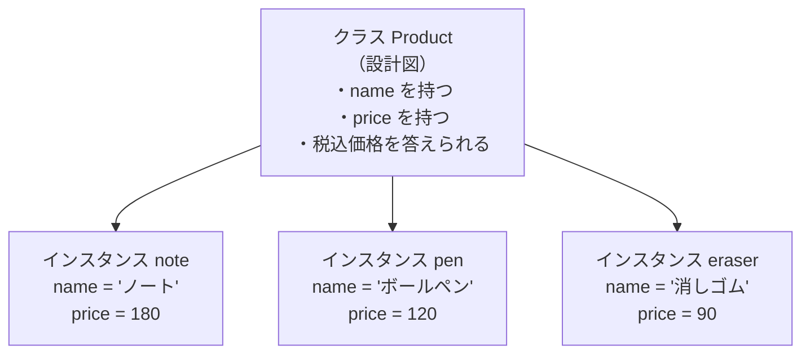
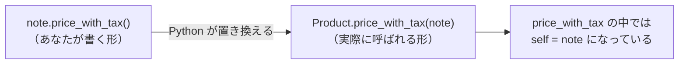
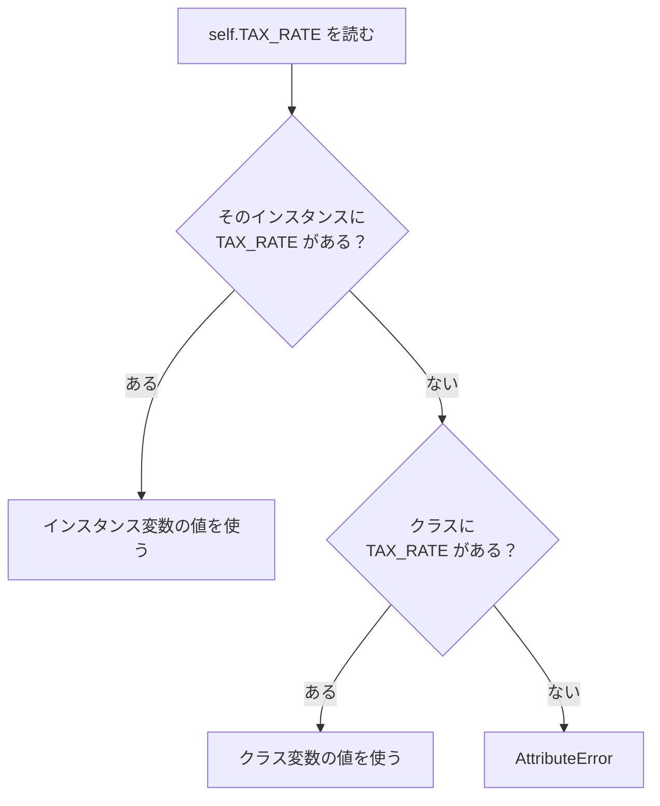
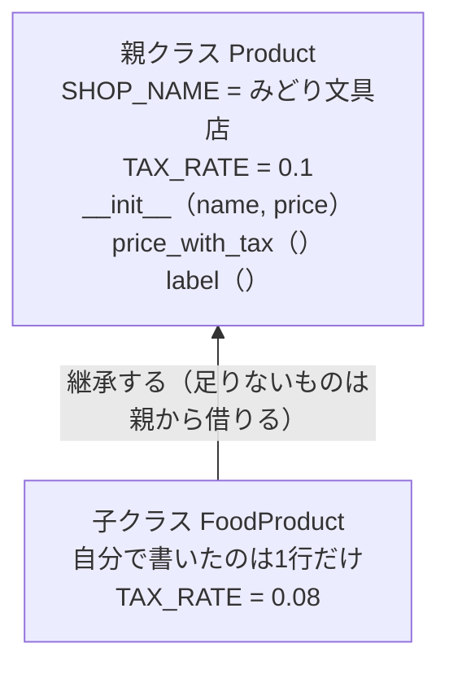
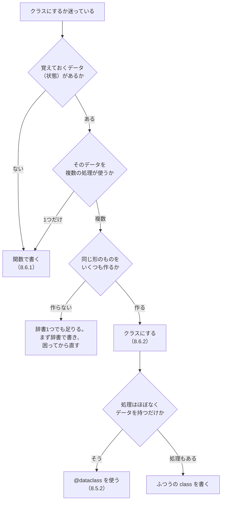

# 第8章 オブジェクト指向

第7章までで、Python のひととおりの道具がそろいました。
値を変数に入れ、条件で分岐し、繰り返し、データ構造にまとめ、
関数に切り出し、ファイルとして保存する——ここまでで、たいていのものは作れます。

それでも、プログラムが少し大きくなると必ず現れる困りごとがあります。
**データと、そのデータを扱う処理が、バラバラの場所にある**ことです。

第7章では、商品の情報を辞書で持ち、集計は関数で書きました。
辞書と関数は別々のものなので、
「この関数はどの辞書のために書いたのか」はコードの外にしか書いてありません。
関係のない辞書を渡しても Python は止めてくれません。

この章で学ぶ**クラス**は、この状況を変える仕組みです。
「商品」というひとかたまりの中に、**データ（商品名・価格）と処理（税込価格を計算する）を一緒に入れて**しまいます。
そうすると、商品は自分で自分の税込価格を答えられるようになります。

そしてもう1つ。[7.6.2](./07-files-and-exceptions.md#762-自作の例外クラス) で
「決まった書き方」として先送りした `class ConfigError(Exception):` の正体も、
この章で明らかになります。

## この章で学ぶこと

- クラスとインスタンスの関係を説明でき、`class` でクラスを定義できるようになる
- `__init__` と `self` の役割を説明でき、属性とメソッドを持つクラスを書けるようになる
- クラス変数とインスタンス変数を使い分けられるようになる
- 継承で共通部分をまとめ、`super()` で親の処理を呼び出せるようになる
- `__str__` / `__repr__` / `__eq__` を定義して、`print` や `==` の動きを決められるようになる
- `@dataclass` で定型コードを省き、いつクラスを使うべきかを自分で判断できるようになる

## この章の前提

- [第7章](./07-files-and-exceptions.md) を終えていること
- とくに次の4つを使えること
  - 関数の定義・引数・戻り値・docstring（[5.1](./05-functions.md#51-関数の基本) / [5.2](./05-functions.md#52-引数) / [5.6.2](./05-functions.md#562-docstring-を書く)）
  - 辞書と辞書のリスト（[4.3](./04-data-structures.md#43-辞書dict) / [4.3.5](./04-data-structures.md#435-辞書のリスト実務で最頻出の形)）
  - `raise` と `try` / `except`（[7.5.2](./07-files-and-exceptions.md#752-try--except) / [7.6.1](./07-files-and-exceptions.md#761-raise)）
  - JSON の読み書き（[7.4.2](./07-files-and-exceptions.md#742-json-モジュール) / [7.4.3](./07-files-and-exceptions.md#743-日本語を含む-json-の書き出し)）
- リスト内包表記（[4.5.1](./04-data-structures.md#451-リスト内包表記)）
- `sorted` の `key` 引数とラムダ式（[5.5.2](./05-functions.md#552-ラムダ式) / [5.5.3](./05-functions.md#553-sorted-の-key-に渡す)）
- 自作モジュールの `import` と `if __name__ == "__main__":`（[6.1.2](./06-modules.md#612-自作モジュールを読み込む) / [6.4.1](./06-modules.md#641-if-__name__--__main__-の意味)）
- デフォルト引数にリストを書いてはいけない理由（[5.2.4](./05-functions.md#524-デフォルト引数にリストを使ってはいけない)）

> **つまずいたら**
> この章でほぼ全員が一度は出すエラーが2つあります。
> **`self` の書き忘れ**（[8.2.2](#822-self-とは何か)）と、
> **`__init__` に渡す引数の数違い**（[8.2.1](#821-__init__-で初期化する)）です。
> どちらも `TypeError` として出ますが、メッセージの読み方さえ分かれば数秒で直せます。
> AI に相談するときは、次のように書いてください。
>
> ```text
> python-text の 8.2.2 で詰まりました。
> TypeError: Product.price_with_tax() takes 0 positional arguments but 1 was given が出ます。
>
> ・書いたクラス全体（コピーして貼る）
> ・呼び出した行: note.price_with_tax()
> ```

> **この章のコードを書く場所**
> 第7章までと同じく、`python-lesson` ディレクトリの中で作業します。
> ターミナルで `python-lesson` に移動してから実行してください。
>
> **Windows（PowerShell）**
>
> ```powershell
> cd C:\Users\ユーザー名\python-lesson
> ```
>
> **macOS / Linux**
>
> ```bash
> cd ~/python-lesson
> ```
>
> 実行コマンドは、以降 Windows の形（`python ファイル名`）で書きます。
> macOS の方は `python` を `python3` に読み替えてください（[1.4.2](./01-environment.md#142-実行する)）。

---

## 8.1 クラスとインスタンス

### 8.1.1 なぜクラスが必要になるのか

まず、いまの道具だけで「商品」を表してみます。
第4章から使ってきた**辞書**（[4.3](./04-data-structures.md#43-辞書dict)）が自然な選択です。

`python-lesson/dict_product.py`

```python
note = {"name": "ノート", "price": 180}
pen = {"name": "ボールペン", "price": 120}


def price_with_tax(product):
    """商品の辞書を受け取り、税込価格を四捨五入して返す。"""
    return round(product["price"] * 1.1)


print(price_with_tax(note))
print(price_with_tax(pen))
```

**実行**

```powershell
python dict_product.py
```

```text
実行結果:
198
132
```

これで動きます。動きはするのですが、規模が大きくなると3つの問題が出てきます。

**問題1：関数と辞書が、コードの上でつながっていない**

`price_with_tax` は「商品の辞書」を受け取るつもりで書かれています。
しかし Python から見れば、それはただの「辞書を受け取る関数」です。
まったく関係のない辞書を渡しても、止まりません。

`python-lesson/dict_problem.py`

```python
def price_with_tax(product):
    """商品の辞書を受け取り、税込価格を四捨五入して返す。"""
    return round(product["price"] * 1.1)


# 商品ではなく、顧客の辞書を渡してしまった
customer = {"name": "佐藤太郎", "price": 0}
print(price_with_tax(customer))
```

```text
実行結果:
0
```

エラーになりません。`0` という**それらしい答え**が返ってきます。
[7.5.5](./07-files-and-exceptions.md#755-握りつぶさないexcept-pass-の危険) で見た
「静かに間違った答えが出る」形と同じです。

**問題2：キー名を間違えても、書いた時点では気づけない**

```python
eraser = {"name": "消しゴム", "prise": 90}   # price のつづりが違う
print(price_with_tax(eraser))
```

```text
実行結果:
Traceback (most recent call last):
  File "dict_problem.py", line 9, in <module>
    print(price_with_tax(eraser))
          ^^^^^^^^^^^^^^^^^^^^^^
KeyError: 'price'
```

`KeyError`（[4.3.2](./04-data-structures.md#432-値の読み書き)）が出るのは、
**その辞書を実際に使ったとき**です。
辞書を作った9行前ではなく、ずっと離れた場所で発覚します。

**問題3：必要な項目がそろっているか、誰も保証してくれない**

`{"name": "ノート"}` のように `price` を書き忘れた辞書も、Python は普通に作ります。
「商品には必ず `name` と `price` がある」というルールは、
書いた人の頭の中にしかありません。

この3つに共通する原因は1つです。
**「商品とはこういうものだ」という決まりを書く場所がない**ということ。

その場所を作るのが **クラス**（同じ性質を持つデータと処理をまとめた設計図）です。

### 8.1.2 クラスを定義する

クラスは `class` で定義します。いちばん小さい形はこれだけです。

`python-lesson/class_min.py`

```python
class Product:
    """商品を表すクラス。"""


note = Product()
print(note)
print(type(note))
```

```text
実行結果:
<__main__.Product object at 0x000001F3A2B4C7D0>
<class '__main__.Product'>
```

> **注意**
> `0x000001F3A2B4C7D0` の部分は、そのときメモリのどこに置かれたかを表す番号です。
> **実行するたびに変わります。** 手元の結果と数字が違っていても問題ありません。

書き方のルールは3つです。

- **`class クラス名:`** と書き、次の行から**字下げ**して中身を書く（[2.6.2](./02-basics.md#262-インデントの深さでブロックが決まる)）
- クラス名は **`UpperCamelCase`**（先頭を大文字にし、単語の区切りも大文字にする）にする。
  変数名の `snake_case`（[2.1.3](./02-basics.md#213-変数名の付け方snake_case)）とは違う慣習です
- 中身が docstring（[5.6.2](./05-functions.md#562-docstring-を書く)）だけでもよい。
  ただし**完全に空にはできない**ので、何も書くことがなければ `pass`（[3.3.4](./03-control-flow.md#334-pass)）を置きます

`Product()` のように**かっこを付けて呼び出す**と、そのクラスから実物が1つ作られます。
これを **インスタンス**（クラスという設計図から作られた実物）と呼びます。

`type(note)` が `<class '__main__.Product'>` と答えたことに注目してください。
第2章では `<class 'int'>` や `<class 'str'>` が返ってきました（[2.2.5](./02-basics.md#225-型を調べるtype)）。
**クラスを定義するとは、新しい型を1つ作ることです。**

### 8.1.3 インスタンスを作る

インスタンスには、`.` を付けて**属性**（インスタンスが持っているデータ。変数のようなもの）を持たせられます。

`python-lesson/class_attr.py`

```python
class Product:
    """商品を表すクラス。"""


note = Product()
note.name = "ノート"
note.price = 180

pen = Product()
pen.name = "ボールペン"
pen.price = 120

print(note.name, note.price)
print(pen.name, pen.price)
print(note is pen)
```

```text
実行結果:
ノート 180
ボールペン 120
False
```

大事なのは最後の `False` です。
`note` と `pen` は同じ `Product` から作られましたが、**別々の実物**です。
`note.name` を変えても `pen.name` には影響しません。

辞書のときと同じく `.` で読み書きできますが、書き方が変わりました。

| | 辞書 | インスタンス |
|--|------|------------|
| 読む | `product["name"]` | `product.name` |
| 書く | `product["name"] = "ノート"` | `product.name = "ノート"` |
| ないとき | `KeyError` | `AttributeError` |

存在しない属性を読むと、専用のエラーになります。

`python-lesson/class_attr_ng.py`

```python
class Product:
    """商品を表すクラス。"""


eraser = Product()
eraser.name = "消しゴム"
print(eraser.price)
```

```text
実行結果:
Traceback (most recent call last):
  File "class_attr_ng.py", line 7, in <module>
    print(eraser.price)
          ^^^^^^^^^^^^
AttributeError: 'Product' object has no attribute 'price'
```

**`AttributeError`**（そのオブジェクトに、指定した名前の属性やメソッドがないときのエラー）です。

ただし、これでは [8.1.1](#811-なぜクラスが必要になるのか) の問題3が解決していません。
`price` を書き忘れた `Product` が、平気で作れてしまっています。
**「作るときに必ず `name` と `price` を渡させる」**方法が必要です。
それが [8.2.1](#821-__init__-で初期化する) の `__init__` です。

### 8.1.4 設計図と実物のたとえ

ここまでの関係を整理します。

クラスは**設計図**、インスタンスは**その設計図から建てた家**です。

設計図には「玄関がある」「窓が3つある」と書いてありますが、
設計図そのものには住めません。住むのは、そこから建てた家のほうです。
そして1枚の設計図から、家は何軒でも建てられます。
どの家も同じ間取りですが、**表札の名前は家ごとに違います。**



たとえを、正確な言い方に置き換えます。

| たとえ | 正確な言い方 |
|--------|------------|
| 設計図 | クラス。`class Product:` で定義する |
| 建てた家 | インスタンス。`Product()` で作る |
| どの家にもある間取り | クラスに書いた**メソッド**（[8.2.3](#823-メソッドを定義する)） |
| 家ごとに違う表札 | インスタンスごとの**属性**（[8.1.3](#813-インスタンスを作る)） |

ここまでで用語が3つ出ました。この章で何度も使うので、確認しておきます。

- **クラス** … 同じ性質を持つデータと処理をまとめた設計図
- **インスタンス** … クラスという設計図から作られた実物
- **属性** … インスタンスが持っているデータ。`インスタンス.名前` で読み書きする

> **補足**
> 「**オブジェクト**」という言葉も、ほぼ同じ意味で使われます。
> このテキストでは、**クラスから作られた実物を指すときは「インスタンス」**に統一します。
> 「オブジェクト指向」という章題の「オブジェクト」は、
> **データと処理をひとまとめにした部品**、くらいの意味で読んでください。

---

## 8.2 属性とメソッド

### 8.2.1 `__init__` で初期化する

[8.1.3](#813-インスタンスを作る) の書き方には、作ったあとに属性を付け忘れる危険がありました。
**作った瞬間に必ず属性がそろっている**状態にしたい。そのための仕組みが `__init__` です。

`python-lesson/product_init.py`

```python
class Product:
    """商品を表すクラス。"""

    def __init__(self, name, price):
        """商品名と税抜価格を受け取り、属性として保存する。"""
        self.name = name
        self.price = price


note = Product("ノート", 180)
pen = Product("ボールペン", 120)

print(note.name, note.price)
print(pen.name, pen.price)
```

```text
実行結果:
ノート 180
ボールペン 120
```

`Product("ノート", 180)` と書くだけで、`name` と `price` がそろったインスタンスができました。

**`__init__`**（インスタンスが作られるときに、Python が自動的に呼び出すメソッド）です。
「イニット」と読みます。前後のアンダースコア2つは打ち間違えやすいので注意してください
（`_init_` ではなく `__init__` です）。

3つのことが起きています。

1. `Product("ノート", 180)` と書くと、Python が空のインスタンスを作る
2. Python がそのインスタンスを `self` に入れて、`__init__` を呼ぶ
3. `__init__` の中で `self.name = name` と書くと、そのインスタンスに属性が付く

`__init__` は**呼び出す必要がありません。** 書いておけば自動で呼ばれます。

そして、いちばん大事な効果がこれです。

`python-lesson/product_init_ng.py`

```python
class Product:
    """商品を表すクラス。"""

    def __init__(self, name, price):
        """商品名と税抜価格を受け取り、属性として保存する。"""
        self.name = name
        self.price = price


eraser = Product("消しゴム")
```

```text
実行結果:
Traceback (most recent call last):
  File "product_init_ng.py", line 10, in <module>
    eraser = Product("消しゴム")
             ^^^^^^^^^^^^^^^^^^^
TypeError: Product.__init__() missing 1 required positional argument: 'price'
```

価格を渡し忘れた瞬間に、**その行で**止まりました。
[8.1.1](#811-なぜクラスが必要になるのか) の問題2・問題3が、これで解決しています。
「商品には必ず `name` と `price` がある」というルールが、
`__init__` という**コードの上の場所**に書かれたからです。

引数の扱い方は、ふつうの関数とまったく同じです。
キーワード引数（[5.2.2](./05-functions.md#522-キーワード引数)）もデフォルト引数（[5.2.3](./05-functions.md#523-デフォルト引数)）も使えます。

```python
note = Product(name="ノート", price=180)
```

> **よくある間違い**
> `__init__` の中で `self.` を書き忘れる間違いが多いです。
>
> ```python
> def __init__(self, name, price):
>     name = name        # ← self. がない
>     price = price
> ```
>
> これはエラーになりません。
> `name` はただのローカル変数（[5.4.1](./05-functions.md#541-ローカルとグローバル)）になり、
> `__init__` が終わると同時に消えます。
> あとで `note.name` を読んだときに `AttributeError` が出て、
> **原因から遠い場所で**気づくことになります。
> **`__init__` の中の代入には、必ず `self.` を付けてください。**

### 8.2.2 `self` とは何か

`__init__` の第1引数に書いた `self` の正体を、ここではっきりさせます。

**`self` は、いま操作している「そのインスタンス自身」**です。

言葉だけでは掴みにくいので、実際に確かめます。

`python-lesson/self_check.py`

```python
class Product:
    """商品を表すクラス。"""

    def __init__(self, name, price):
        """商品名と税抜価格を受け取り、属性として保存する。"""
        self.name = name
        self.price = price

    def price_with_tax(self):
        """税込価格を四捨五入して返す。"""
        return round(self.price * 1.1)


note = Product("ノート", 180)

print(note.price_with_tax())
print(Product.price_with_tax(note))
```

```text
実行結果:
198
198
```

**同じ結果になりました。** この2行は、Python の中ではまったく同じ意味です。



つまり `note.price_with_tax()` と書くと、
Python が**ドットの左側にあるものを、こっそり第1引数として渡している**わけです。
その受け取り口が `self` です。

- `self` は**予約語ではありません**。`me` でも `this` でも動きます。
  ただし **Python では `self` と書くのが揺るぎない慣習**なので、必ず `self` にしてください
- メソッドの中で**インスタンスの属性を読み書きするときは、必ず `self.` を付ける**
- `self.` を付けない `price` は、ただのローカル変数です

> **よくある間違い**
> メソッドの第1引数に `self` を書き忘れる——この章でいちばん多いエラーです。
>
> ```python
> def price_with_tax():        # ← self がない
>     return round(self.price * 1.1)
> ```
>
> ```text
> TypeError: Product.price_with_tax() takes 0 positional arguments but 1 was given
> ```
>
> 「引数を0個しか受け取らないのに、1個渡された」と言われます。
> **その1個が `note` そのもの**です。
> `note.price_with_tax()` と、引数を書いていないのにこのメッセージが出たら、
> **`self` の書き忘れだ**と判断してください。

### 8.2.3 メソッドを定義する

クラスの中に書いた関数を、**メソッド**（オブジェクトに属している関数）と呼びます。
書き方はふつうの関数と同じで、違いは**第1引数が `self` であること**だけです。

ここまでは属性を読むだけでしたが、メソッドは**属性を書き換える**こともできます。
在庫を持たせて、増やしたり減らしたりしてみます。

`python-lesson/product_stock.py`

```python
class Product:
    """商品を表すクラス。"""

    def __init__(self, name, price):
        """商品名と税抜価格を受け取り、在庫を0で初期化する。"""
        self.name = name
        self.price = price
        self.stock = 0

    def price_with_tax(self):
        """税込価格を四捨五入して返す。"""
        return round(self.price * 1.1)

    def add_stock(self, count):
        """在庫を count 個増やす。"""
        self.stock += count

    def sell(self, count):
        """在庫を count 個減らす。足りなければ ValueError を投げる。"""
        if count > self.stock:
            raise ValueError(f"{self.name}の在庫が足りません（残り{self.stock}個）")
        self.stock -= count

    def label(self):
        """一覧表示用の1行を返す。"""
        return f"{self.name}: {self.price_with_tax()}円（税込） / 在庫{self.stock}個"


note = Product("ノート", 180)
note.add_stock(10)
note.sell(3)
print(note.label())

try:
    note.sell(100)
except ValueError as e:
    print(f"売れませんでした: {e}")
```

```text
実行結果:
ノート: 198円（税込） / 在庫7個
売れませんでした: ノートの在庫が足りません（残り7個）
```

3つ、確認しておきたい点があります。

**引数は `self` の次に書く**

`add_stock(self, count)` の `count` が、呼び出し側の `note.add_stock(10)` の `10` です。
`self` は自動で渡されるので、**呼び出し側では数えません。**

**メソッドから別のメソッドを呼べる**

`label` の中で `self.price_with_tax()` を呼んでいます。
自分のメソッドを呼ぶときも、**`self.` が必要**です。

**`raise` はクラスの中でもそのまま使える**

[7.6.1](./07-files-and-exceptions.md#761-raise) のガード節が、
そのままメソッドの中に入っています。
「在庫より多く売ろうとした」は**呼び出し側の間違い**なので、
`sell` の中では対処を決めず、例外として投げ返しています
（[7.6.3](./07-files-and-exceptions.md#763-どこで例外を捕まえるべきか)）。

これで [8.1.1](#811-なぜクラスが必要になるのか) の問題1も解決しました。
`price_with_tax` は `Product` の中にあるので、
**顧客の辞書を渡す余地がそもそもありません。**

> **補足**
> 実は、いままで使ってきた `"文字列".upper()` や `リスト.append()` も、
> まったく同じ仕組みです（[2.4.3](./02-basics.md#243-よく使うメソッド) /
> [4.1.4](./04-data-structures.md#414-追加削除append--insert--remove--pop)）。
> `str` も `list` も Python があらかじめ用意しているクラスで、
> `upper` や `append` はそのメソッドです。
> **クラスの書き方を覚えるとは、いままで使う側だった仕組みを、作る側から見ることです。**

### 8.2.4 クラス変数とインスタンス変数

`self.name` のように、インスタンスごとに違う値を持つ属性を
**インスタンス変数**と呼びます。

一方で、**どのインスタンスでも同じ値**というものもあります。
店名や税率がそれです。全商品で同じなのに、
`__init__` で毎回 `self.tax_rate = 0.1` と書くのは無駄です。

そういう値は、**クラスの直下**に書きます。これを **クラス変数** と呼びます。

`python-lesson/class_var.py`

```python
class Product:
    """商品を表すクラス。"""

    SHOP_NAME = "みどり文具店"
    TAX_RATE = 0.1

    def __init__(self, name, price):
        """商品名と税抜価格を受け取り、在庫を0で初期化する。"""
        self.name = name
        self.price = price
        self.stock = 0

    def price_with_tax(self):
        """税込価格を四捨五入して返す。"""
        return round(self.price * (1 + self.TAX_RATE))

    def label(self):
        """一覧表示用の1行を返す。"""
        return f"{self.name}: {self.price_with_tax()}円（税込）"


note = Product("ノート", 180)
pen = Product("ボールペン", 120)

print(Product.SHOP_NAME)
print(note.SHOP_NAME)
print(note.TAX_RATE, pen.TAX_RATE)
print(note.label())
```

```text
実行結果:
みどり文具店
みどり文具店
0.1 0.1
ノート: 198円（税込）
```

クラス変数は、**クラス名からでもインスタンスからでも**読めます。
定数として使うので、名前は `UPPER_SNAKE_CASE`
（[2.1.4](./02-basics.md#214-定数の慣習)）にするのが慣習です。

ここで、`self.TAX_RATE` と書けている理由を説明します。
`TAX_RATE` はインスタンス変数ではないのに、`self.` で読めました。

Python は、`self.名前` を次の順で探します。



**まずインスタンス、なければクラス。** この順番は [8.3](#83-継承) の継承でも効いてくるので、覚えておいてください。

| | クラス変数 | インスタンス変数 |
|--|-----------|----------------|
| 書く場所 | `class` の直下 | `__init__` の中（`self.` を付けて） |
| 値を持つ単位 | クラス全体で1つ | インスタンスごとに1つ |
| 向いているもの | 税率・店名・区分名などの定数 | 商品名・価格・在庫など個体差のあるもの |

> **よくある間違い**
> **クラス変数にリストや辞書を書くと、全インスタンスで共有されます。**
>
> `python-lesson/class_var_ng.py`
>
> ```python
> class Product:
>     tags = []          # ← 危ない書き方
>
>     def __init__(self, name):
>         self.name = name
>
>     def add_tag(self, tag):
>         self.tags.append(tag)
>
>
> note = Product("ノート")
> pen = Product("ボールペン")
>
> note.add_tag("文具")
> print(note.tags)
> print(pen.tags)
> ```
>
> ```text
> 実行結果:
> ['文具']
> ['文具']
> ```
>
> **触っていない `pen` にまでタグが付きました。**
> `tags` はクラスに1つしかなく、`self.tags.append(...)` は
> その1つのリストを書き換えているからです。
>
> [5.2.4](./05-functions.md#524-デフォルト引数にリストを使ってはいけない) の
> 「デフォルト引数にリストを使ってはいけない」とまったく同じ理由です。
> **1回だけ作られたリストが、使い回されています。**
>
> 直し方も同じで、**`__init__` の中で作ります。**
>
> ```python
> def __init__(self, name):
>     self.name = name
>     self.tags = []     # インスタンスごとに新しいリストを作る
> ```
>
> ```text
> 実行結果:
> ['文具']
> []
> ```
>
> **クラス変数にしてよいのは、書き換えない値だけ**と覚えてください。

---

## 8.3 継承

### 8.3.1 共通部分をまとめる

店で食品も扱うことになりました。食品には**軽減税率**が適用され、税率が8%になります。

いまの `Product` は税率が10%固定なので、食品用のクラスを作ることにします。
素直に書くと、こうなります。

```python
class Product:
    """商品を表すクラス。"""

    SHOP_NAME = "みどり文具店"
    TAX_RATE = 0.1

    def __init__(self, name, price):
        self.name = name
        self.price = price
        self.stock = 0

    def price_with_tax(self):
        return round(self.price * (1 + self.TAX_RATE))

    def label(self):
        return f"{self.name}: {self.price_with_tax()}円（税込）"


class FoodProduct:
    """食品を表すクラス。"""

    SHOP_NAME = "みどり文具店"      # ← 同じ
    TAX_RATE = 0.08                 # ← ここだけ違う

    def __init__(self, name, price):    # ← 同じ
        self.name = name
        self.price = price
        self.stock = 0

    def price_with_tax(self):           # ← 同じ
        return round(self.price * (1 + self.TAX_RATE))

    def label(self):                    # ← 同じ
        return f"{self.name}: {self.price_with_tax()}円（税込）"
```

**違うのは1行だけ**なのに、20行近くコピーしました。
この形の何が困るのかは、はっきりしています。

- `label` の表示を変えたくなったら、**2か所を直す**必要がある
- 片方だけ直して、もう片方を忘れる
- 商品の種類が増えるたびに、同じことが繰り返される

第5章で「同じ処理が2か所に出てきたら関数に切り出す」と学びました
（[5.6.3](./05-functions.md#563-どこで関数に切り出すか)）。
クラスにも同じ考え方があります。それが **継承** です。

### 8.3.2 親クラスを継承する

継承は、クラス名のうしろにかっこを付けて、**元にするクラス**を書くだけです。

`python-lesson/inherit.py`

```python
class Product:
    """商品を表すクラス。"""

    SHOP_NAME = "みどり文具店"
    TAX_RATE = 0.1

    def __init__(self, name, price):
        """商品名と税抜価格を受け取り、在庫を0で初期化する。"""
        self.name = name
        self.price = price
        self.stock = 0

    def price_with_tax(self):
        """税込価格を四捨五入して返す。"""
        return round(self.price * (1 + self.TAX_RATE))

    def label(self):
        """一覧表示用の1行を返す。"""
        return f"{self.name}: {self.price_with_tax()}円（税込）"


class FoodProduct(Product):
    """食品を表すクラス。軽減税率で計算する。"""

    TAX_RATE = 0.08


note = Product("ノート", 180)
tea = FoodProduct("お茶", 150)

print(note.label())
print(tea.label())
print(isinstance(tea, FoodProduct), isinstance(tea, Product))
print(tea.SHOP_NAME)
```

```text
実行結果:
ノート: 198円（税込）
お茶: 162円（税込）
True True
みどり文具店
```

`FoodProduct` に書いたのは**1行だけ**です。
それなのに `__init__` も `label` も `price_with_tax` も `SHOP_NAME` も使えています。

これが継承です。用語を決めておきます。

- **親クラス**（基底クラス、スーパークラス） … 元になるクラス。ここでは `Product`
- **子クラス**（派生クラス、サブクラス） … 継承して作ったクラス。ここでは `FoodProduct`
- 子クラスは、親クラスの**属性とメソッドをすべて引き継ぐ**



図の矢印は「`FoodProduct` は `Product` を継承している」という意味です。
`FoodProduct` が持っていない `__init__` や `label` は、矢印をたどって親から使われます。

税率だけが 0.08 になったのは、
[8.2.4](#824-クラス変数とインスタンス変数) の**探す順番**のおかげです。
`price_with_tax` の中の `self.TAX_RATE` は、
まずインスタンス、次に**そのインスタンスのクラス**（`FoodProduct`）、
それでもなければ**親クラス**（`Product`）と探されます。
`FoodProduct` に `TAX_RATE` があるので、そこで見つかって 0.08 が使われます。

**`isinstance`**（そのインスタンスが、指定したクラスから作られたものかを調べる組み込み関数）の
結果も見ておいてください。
`isinstance(tea, Product)` が `True` になっています。
**食品は商品でもある**——この関係が、そのままコードに表れています。

### 8.3.3 メソッドを上書きする

食品には賞味期限を表示したい、となりました。
表示の形を変えたいので、`label` を**子クラスで書き直します。**

`python-lesson/override.py`（`inherit.py` の `FoodProduct` を、次のように書き換えます）

```python
class FoodProduct(Product):
    """食品を表すクラス。軽減税率で計算する。"""

    TAX_RATE = 0.08

    def label(self):
        """食品向けの1行を返す。"""
        return f"【食品】{self.name}: {self.price_with_tax()}円（税込）"
```

```python
note = Product("ノート", 180)
tea = FoodProduct("お茶", 150)

for product in [note, tea]:
    print(product.label())
```

```text
実行結果:
ノート: 198円（税込）
【食品】お茶: 162円（税込）
```

親と**同じ名前のメソッド**を子クラスに書くと、子のほうが使われます。
これを **オーバーライド**（上書き）と呼びます。
探す順番が「まず自分のクラス、なければ親クラス」だからです。

ここで、この章でいちばん実用的な形が現れています。

```python
for product in [note, tea]:
    print(product.label())
```

**`note` と `tea` は違うクラスなのに、同じ書き方で回せています。**
`for` を回す側は、中身が文具か食品かを知りません。
それでも、それぞれが自分にふさわしい表示を返します。

これが、クラスを使う大きな利点の1つです。
**呼び出す側から `if` が消えます。**
辞書と関数で書くと、こうなっていたはずです。

```python
# クラスを使わない場合（比較用）
for product in products:
    if product["kind"] == "food":
        print(f"【食品】{product['name']}: ...")
    else:
        print(f"{product['name']}: ...")
```

商品の種類が増えるたびに、この `if` に枝が増えます。
クラスなら、**新しいクラスを1つ足すだけ**で済みます。

### 8.3.4 `super()`

食品に賞味期限そのものを持たせます。`__init__` に項目を1つ増やしたい。

しかし子クラスで `__init__` を書くと、それは**オーバーライド**なので、
親の `__init__` が呼ばれなくなります。`name` も `price` も設定されません。

そこで **`super()`** を使います。
`super()` は「**親クラスのほう**」を指す組み込み関数です。

`python-lesson/super_init.py`

```python
class Product:
    """商品を表すクラス。"""

    SHOP_NAME = "みどり文具店"
    TAX_RATE = 0.1

    def __init__(self, name, price):
        """商品名と税抜価格を受け取り、在庫を0で初期化する。"""
        self.name = name
        self.price = price
        self.stock = 0

    def price_with_tax(self):
        """税込価格を四捨五入して返す。"""
        return round(self.price * (1 + self.TAX_RATE))

    def label(self):
        """一覧表示用の1行を返す。"""
        return f"{self.name}: {self.price_with_tax()}円（税込）"


class FoodProduct(Product):
    """食品を表すクラス。軽減税率で計算し、賞味期限を持つ。"""

    TAX_RATE = 0.08

    def __init__(self, name, price, expiry):
        """親の初期化に加えて、賞味期限を保存する。"""
        super().__init__(name, price)
        self.expiry = expiry

    def label(self):
        """親の1行に、賞味期限を足して返す。"""
        return f"{super().label()} / 賞味期限 {self.expiry}"


note = Product("ノート", 180)
tea = FoodProduct("お茶", 150, "2026-09-30")

for product in [note, tea]:
    print(product.label())
```

```text
実行結果:
ノート: 198円（税込）
お茶: 162円（税込） / 賞味期限 2026-09-30
```

2か所で `super()` を使いました。

**`super().__init__(name, price)`**

親の `__init__` を呼び、`name` / `price` / `stock` の設定を任せています。
そのあとに `self.expiry = expiry` で、自分の分だけ足します。
**引数に `self` は書きません。** `super()` が面倒をみてくれます。

**`super().label()`**

親の `label()` の結果（`"お茶: 162円（税込）"`）を受け取り、
そのうしろに賞味期限をつなげています。
**親の処理を捨てずに、足すだけで済む**のが `super()` の値打ちです。

> **補足**
> `super().メソッド名(引数)` の形は、**どのメソッドにも同じように使えます。**
> `super().__init__(...)` が特別なのではなく、
> `__init__` というメソッドを `super()` 越しに呼んでいるだけです。
>
> そのため [8.4](#84-特殊メソッド) で扱う `__str__` のような特殊メソッドも、
> 子クラスで上書きしながら、中で `super().__str__()` と書いて親の結果を使えます。
> **メソッド名をそのまま書けばよい**、と覚えてください。

> **よくある間違い**
> 子クラスで `__init__` を書いたのに `super().__init__(...)` を忘れると、
> 親が設定するはずだった属性が**全部ない状態**になります。
>
> ```python
> def __init__(self, name, price, expiry):
>     self.expiry = expiry        # ← super().__init__ がない
> ```
>
> ```text
> AttributeError: 'FoodProduct' object has no attribute 'price'
> ```
>
> 作った直後ではなく、`price_with_tax()` を呼んだときに出ます。
> **子クラスで `__init__` を書いたら、まず `super().__init__(...)` を書く。**
> これを先に書いてから、自分の分の代入を足してください。

### 8.3.5 継承を使いすぎない

継承は強力なので、覚えた直後は何にでも使いたくなります。
しかし継承は、**親を変えると子が全部壊れる**という強い結び付きを作ります。
使ってよい場面は、思ったより狭いです。

**判断の基準：「子は親の一種である」と日本語で言えるか**

- 「食品は**商品の一種である**」 → 言える。継承してよい
- 「買い物かごは**商品の一種である**」 → 言えない。継承してはいけない

「〜は〜の一種である」が成り立たないのに継承すると、
関係のないメソッドまで引き継いでしまいます。

```python
# 悪い例：かごは「リストの一種」ではない
class Cart(list):
    ...
```

これをやると、`Cart` に `sort()` や `pop()` が生えます。
かごに `sort()` は要りません。使う人を迷わせるだけです。

**もう1つの基準：違いが「値」だけなら、継承ではなく引数にする**

`FoodProduct` は税率だけが違いました。
実は、これは継承を使わなくても書けます。

`python-lesson/no_inherit.py`

```python
class Product:
    """商品を表すクラス。税率は作るときに決める。"""

    def __init__(self, name, price, tax_rate=0.1):
        """商品名・税抜価格・税率を受け取る。税率を省くと10%になる。"""
        self.name = name
        self.price = price
        self.tax_rate = tax_rate

    def price_with_tax(self):
        """税込価格を四捨五入して返す。"""
        return round(self.price * (1 + self.tax_rate))


note = Product("ノート", 180)
tea = Product("お茶", 150, 0.08)
print(note.price_with_tax(), tea.price_with_tax())
```

```text
実行結果:
198 162
```

デフォルト引数（[5.2.3](./05-functions.md#523-デフォルト引数)）1つで済みました。
**クラスが1つ減っています。**

では、どちらを選ぶのか。目安はこうです。

| 違いの中身 | 選ぶもの |
|-----------|---------|
| **値**だけが違う（税率、上限、名前） | 引数にする。継承しない |
| **処理の中身**が違う（表示の形、計算の手順） | 継承してオーバーライドする |
| 違いが増えていく見込みがない | 継承しない |

この章の `FoodProduct` は、`label` の**処理**まで変えたので継承にしました。
税率だけの違いなら、引数のほうが素直です。

**階層は浅く保つ**

継承した子クラスを、さらに継承して……と重ねると、
`super()` がどこを指すのか誰にも分からなくなります。
**このテキストでは、継承は1段まで**にしてください。
2段目が必要に思えたら、たいていは設計を見直す合図です。

> **補足**
> ここまで説明した継承は、[7.6.2](./07-files-and-exceptions.md#762-自作の例外クラス) で
> 「決まった書き方」として使った `class ConfigError(Exception):` そのものです。
> `Exception` という親クラスを継承して、
> **中身は何も足さず、名前だけが違う例外の種類**を作っていたわけです。
> 「`ConfigError` は例外の一種である」——「〜の一種」がきれいに成り立つ、継承の見本のような使い方です。

---

## 8.4 特殊メソッド

### 8.4.1 `__str__` と `__repr__`

`__init__` のように**前後がアンダースコア2つ**の名前のメソッドを、
**特殊メソッド**（Python が決まった場面で自動的に呼び出すメソッド）と呼びます。

`__init__` は「インスタンスが作られるとき」に呼ばれました。
ほかにも、`print` するとき、`==` で比べるとき、`len()` を使うときなど、
場面ごとに呼ばれる特殊メソッドが用意されています。

まず、何も定義しない状態で `print` してみます。

`python-lesson/no_str.py`

```python
class Product:
    """商品を表すクラス。"""

    def __init__(self, name, price):
        self.name = name
        self.price = price


note = Product("ノート", 180)
pen = Product("ボールペン", 120)

print(note)
print([note, pen])
```

```text
実行結果:
<__main__.Product object at 0x000001F3A2B4C7D0>
[<__main__.Product object at 0x000001F3A2B4C7D0>, <__main__.Product object at 0x000001F3A2B4C910>]
```

中身がまったく分かりません。これを決めるのが `__str__` と `__repr__` です。

`python-lesson/str_repr.py`

```python
class Product:
    """商品を表すクラス。"""

    def __init__(self, name, price):
        """商品名と税抜価格を受け取り、属性として保存する。"""
        self.name = name
        self.price = price

    def __str__(self):
        """利用者向けの表示を返す。"""
        return f"{self.name}（{self.price}円）"

    def __repr__(self):
        """開発者向けの表示を返す。"""
        return f"Product(name='{self.name}', price={self.price})"


note = Product("ノート", 180)
pen = Product("ボールペン", 120)

print(note)
print(f"きょうの目玉は {note} です")
print(repr(note))
print([note, pen])
```

```text
実行結果:
ノート（180円）
きょうの目玉は ノート（180円） です
Product(name='ノート', price=180)
[Product(name='ノート', price=180), Product(name='ボールペン', price=120)]
```

2つの違いは、**誰に向けた表示か**です。

| | `__str__` | `__repr__` |
|--|----------|-----------|
| 向け先 | 利用者 | 開発者（自分） |
| 呼ばれる場面 | `print(x)`、`str(x)`、f-string の `{x}` | `repr(x)`、REPL、**リストや辞書の中身を表示するとき** |
| 目安 | 読みやすさ優先 | **中身が全部わかる**こと優先 |
| どちらもないとき | `<__main__.Product object at 0x...>` | 同じ |

**どちらも必ず文字列を `return` してください。** `print` してはいけません。
`print` してしまうと、戻り値が `None`（[5.1.3](./05-functions.md#513-return-がないとどうなるか)）になり、
`TypeError: __str__ returned non-string (type NoneType)` になります。

> **よくある間違い**
> `__str__` だけを定義して、リストを `print` して「効いていない」と悩むパターンが多いです。
>
> ```python
> print([note, pen])
> ```
>
> **リストの中身の表示に使われるのは `__repr__` のほうです。**
> `__str__` は呼ばれません。
>
> 4章で `print(["りんご", "みかん"])` の結果に引用符が付いていたのを思い出してください
> （[4.1.1](./04-data-structures.md#411-リストを作る)）。あれも `__repr__` の働きです。
>
> **どちらか1つだけ書くなら `__repr__`** にしてください。
> `__str__` がないときは `__repr__` が代わりに使われるため、
> `print(note)` でも中身が見えるようになります。逆は成り立ちません。

### 8.4.2 `__eq__` で比較する

同じ内容の商品を2つ作って、`==` で比べてみます。

`python-lesson/no_eq.py`

```python
class Product:
    """商品を表すクラス。"""

    def __init__(self, name, price):
        self.name = name
        self.price = price


a = Product("ノート", 180)
b = Product("ノート", 180)

print(a == b)
print(a == a)
print(b in [a])
```

```text
実行結果:
False
True
False
```

**中身が同じなのに `False`** です。
`==` は既定では「**同じ実物か**」を見ます（[4.1.7](./04-data-structures.md#417-リストのコピーで起きる事故) の
`is` と同じ見方です）。`a` と `b` は別々に作った実物なので、等しくありません。

「中身が同じなら等しい」としたいなら、`__eq__` を定義します。

`python-lesson/eq.py`

```python
class Product:
    """商品を表すクラス。"""

    def __init__(self, name, price):
        """商品名と税抜価格を受け取り、属性として保存する。"""
        self.name = name
        self.price = price

    def __repr__(self):
        """開発者向けの表示を返す。"""
        return f"Product(name='{self.name}', price={self.price})"

    def __eq__(self, other):
        """商品名と価格が両方同じなら、等しいとみなす。"""
        if not isinstance(other, Product):
            return False
        return self.name == other.name and self.price == other.price


a = Product("ノート", 180)
b = Product("ノート", 180)
c = Product("ノート", 200)

print(a == b)
print(a == c)
print(a == "ノート")
print(b in [a, c])
```

```text
実行結果:
True
False
False
True
```

`__eq__` は**引数を2つ**取ります。`self`（左辺）と `other`（右辺）です。
`a == b` と書くと、Python が `a.__eq__(b)` を呼びます。

最初の2行が大事です。

```python
if not isinstance(other, Product):
    return False
```

`a == "ノート"` のように、**まったく別の型と比べられる**ことがあります。
そのまま `other.name` を読むと `AttributeError` になるので、
[8.3.2](#832-親クラスを継承する) の `isinstance` で先に弾いています。
[5.3.3](./05-functions.md#533-早期-return) のガード節と同じ形です。

`__eq__` を定義すると、`==` だけでなく **`in` や `list.remove()` の判定も変わります。**
`b in [a, c]` が `True` になったのは、`in` が内部で `==` を使っているからです。

> **補足**
> `__eq__` を定義したクラスは、**そのままでは集合（set）に入れられず、辞書のキーにも使えません。**
>
> ```text
> TypeError: unhashable type: 'Product'
> ```
>
> 「等しいとは何か」を変えたのに、集合が重複を判定する方法は変えていないためです。
> 対処は必要になってから調べれば十分ですが、
> **[8.5](#85-dataclass) の `@dataclass` を使えば、この問題を含めて自動で面倒をみてくれます。**

### 8.4.3 `__len__` などその他

特殊メソッドは、`print` と `==` 以外にも用意されています。
よく使うものを、買い物かごのクラスで試します。

`python-lesson/cart.py`

```python
class Cart:
    """買い物かごを表すクラス。"""

    TAX_RATE = 0.1

    def __init__(self):
        """空のかごを作る。"""
        self.items = []

    def add(self, name, price, count):
        """商品を1種類ぶん、かごに入れる。"""
        self.items.append({"name": name, "price": price, "count": count})

    def total(self):
        """税込の合計金額を返す。"""
        amounts = [item["price"] * item["count"] for item in self.items]
        return round(sum(amounts) * (1 + self.TAX_RATE))

    def __len__(self):
        """かごに入っている商品の種類数を返す。"""
        return len(self.items)

    def __contains__(self, name):
        """その商品名がかごに入っているかを返す。"""
        names = [item["name"] for item in self.items]
        return name in names

    def __str__(self):
        """かごの中身をまとめた1行を返す。"""
        return f"{len(self.items)}種類 / 合計{self.total()}円（税込）"


cart = Cart()
cart.add("ノート", 180, 3)
cart.add("ボールペン", 120, 2)

print(cart)
print(len(cart))
print("ノート" in cart)
print("消しゴム" in cart)

empty = Cart()
if not empty:
    print("かごが空です")
```

```text
実行結果:
2種類 / 合計858円（税込）
2
True
False
かごが空です
```

`total` の中では、リスト内包表記（[4.5.1](./04-data-structures.md#451-リスト内包表記)）で
金額のリストを作り、`sum()`（[4.1.1](./04-data-structures.md#411-リストを作る)）で合計しています。

最後の `if not empty:` に注目してください。
`Cart` は数値でも空リストでもないのに、**空かどうかで真偽が判定されています。**
`__len__` が `0` を返すインスタンスは、**偽として扱われる**からです
（[3.1.5](./03-control-flow.md#315-真偽値として扱われる値空文字列0空リスト)）。
自分のクラスが、Python の標準の書き方になじんでいくのが分かると思います。

主な特殊メソッドをまとめます。

| 特殊メソッド | 呼ばれる場面 | 返すもの |
|------------|------------|---------|
| `__init__` | `Product(...)` でインスタンスを作るとき | 何も返さない |
| `__str__` | `print(x)`、`str(x)`、f-string | 文字列 |
| `__repr__` | `repr(x)`、リストや辞書の中の表示 | 文字列 |
| `__eq__` | `x == y`、`in`、`remove` | 真偽値 |
| `__len__` | `len(x)`、`if x:` の判定 | 0以上の整数 |
| `__contains__` | `"..." in x` | 真偽値 |

> **注意**
> **アンダースコア2つの名前を、自分で新しく作らないでください。**
> `__mydata__` のような名前は Python が将来使うために予約されています。
> 自作のメソッドは、`total` や `add` のように**ふつうの名前**にしてください。
> 特殊メソッドは「**すでに決まっているものを、必要なものだけ書く**」使い方をします。

---

## 8.5 dataclass

### 8.5.1 定型コードを減らす

[8.4.2](#842-__eq__-で比較する) までで書いた `Product` を、もう一度見てください。

```python
class Product:
    def __init__(self, name, price):
        self.name = name          # ← 名前を2回書いている
        self.price = price        # ← 名前を2回書いている

    def __repr__(self):
        return f"Product(name='{self.name}', price={self.price})"

    def __eq__(self, other):
        if not isinstance(other, Product):
            return False
        return self.name == other.name and self.price == other.price
```

**中身のある処理が1つもありません。**
「`name` と `price` を持つ」と決めただけで、10行以上書いています。
しかも項目を1つ増やすたびに、`__init__`・`__repr__`・`__eq__` の**3か所**を直すことになります。

このような「データを持つだけのクラス」は非常に多いので、
Python には**自動生成する仕組み**が用意されています。それが `dataclass` です。

### 8.5.2 `@dataclass` の使い方

`python-lesson/dataclass_basic.py`

```python
from dataclasses import dataclass


@dataclass
class Product:
    """商品を表すクラス。"""

    name: str
    price: int


note = Product("ノート", 180)
pen = Product(name="ボールペン", price=120)

print(note)
print(note.name, note.price)
print(note == Product("ノート", 180))
print([note, pen])
```

```text
実行結果:
Product(name='ノート', price=180)
ノート 180
True
[Product(name='ノート', price=180), Product(name='ボールペン', price=120)]
```

**`__init__` も `__repr__` も `__eq__` も書いていないのに、全部そろっています。**

新しい書き方が2つ出てきました。順に説明します。

**`@dataclass` の `@`**

`@` で始まり、`class` や `def` の**すぐ上の行**に書くものを
**デコレータ**（その下のクラスや関数に、あとから機能を足す印）と呼びます。

`@dataclass` を付けると、Python がクラスの中身を見て、
**`__init__` / `__repr__` / `__eq__` を自動的に作って付け足します。**
自分で書いたのと同じものが、見えないところに用意されると考えてください。

デコレータの詳しい作り方は、このテキストでは扱いません。
**いまは「`@dataclass` はこう書くもの」として使って問題ありません。**

**`name: str` のコロン**

`name: str` は「`name` には文字列（`str`）が入る」という注記で、
**型ヒント**（変数や引数に「この型のはず」と注記を書く仕組み）と呼びます。

いままでどおり `name = "ノート"` と書いても代入はできますが、
`@dataclass` は**この注記を見て**「このクラスの項目は `name` と `price` だ」と判断します。
そのため、**`dataclass` では型の注記が必須**です。

> **注意**
> 型ヒントの詳しい説明は**第9章**で行います。
> いまは次の3つだけ覚えておいてください。
>
> - 文字列は `str`、整数は `int`、小数は `float`、真偽値は `bool`、リストは `list`
> - `項目名: 型` の形で、`class` の直下に1行ずつ並べる
> - **型ヒントは実行時に強制されません。**
>   `Product("ノート", "180円")` と書いてもエラーにはなりません（理由は 9.1.4 で扱います）

メソッドは、これまでどおり普通に書けます。

`python-lesson/dataclass_method.py`

```python
from dataclasses import dataclass


@dataclass
class Product:
    """商品を表すクラス。"""

    name: str
    price: int

    def price_with_tax(self):
        """税込価格を四捨五入して返す。"""
        return round(self.price * 1.1)


note = Product("ノート", 180)
print(note)
print(note.price_with_tax())
```

```text
実行結果:
Product(name='ノート', price=180)
198
```

`@dataclass` は**定型のメソッドを足すだけ**で、自分で書いたものには手を出しません。
継承（[8.3](#83-継承)）も、`__str__` を自分で定義することもできます。

### 8.5.3 デフォルト値と型

項目にデフォルト値を付けられます。書き方は、デフォルト引数
（[5.2.3](./05-functions.md#523-デフォルト引数)）と同じ `=` です。

`python-lesson/dataclass_default.py`

```python
from dataclasses import dataclass, field


@dataclass
class Product:
    """商品を表すクラス。"""

    name: str
    price: int
    stock: int = 0
    tags: list = field(default_factory=list)

    def price_with_tax(self):
        """税込価格を四捨五入して返す。"""
        return round(self.price * 1.1)


note = Product("ノート", 180)
pen = Product("ボールペン", 120, 5)

note.tags.append("文具")

print(note)
print(pen)
```

```text
実行結果:
Product(name='ノート', price=180, stock=0, tags=['文具'])
Product(name='ボールペン', price=120, stock=5, tags=[])
```

**`stock: int = 0`** … 省略できる項目になります。

**`tags: list = field(default_factory=list)`** … リストのデフォルト値は、この形で書きます。

なぜ `tags: list = []` と書けないのか。理由は、
[5.2.4](./05-functions.md#524-デフォルト引数にリストを使ってはいけない) と
[8.2.4](#824-クラス変数とインスタンス変数) で2度見たあの問題そのものです。
**1回だけ作られたリストが、全インスタンスで共有されてしまう**からです。

`dataclass` は、これを**エラーとして止めてくれます。**

```python
@dataclass
class Product:
    name: str
    tags: list = []
```

```text
実行結果:（トレースバックの最後の行）
ValueError: mutable default <class 'list'> for field tags is not allowed: use default_factory
```

「`default_factory` を使え」と、直し方まで書いてあります。
`field(default_factory=list)` は「**インスタンスを作るたびに `list()` を呼んで、新しいリストを作れ**」という指定です。
`list` に `()` を付けずに渡しているのは、
[5.5.1](./05-functions.md#551-関数を変数に入れる) の「関数そのものを渡す」書き方です。

もう1つ、順番のルールがあります。

```python
@dataclass
class Product:
    name: str = "名称未設定"
    price: int
```

```text
実行結果:（トレースバックの最後の行）
TypeError: non-default argument 'price' follows default argument
```

**デフォルト値のある項目は、必ずうしろにまとめる。**
これも [5.2.3](./05-functions.md#523-デフォルト引数) とまったく同じルールです。

**JSON から読み込んで、インスタンスのリストにする**

ここまでの部品を組み合わせます。
第7章で扱った JSON（[7.4.2](./07-files-and-exceptions.md#742-json-モジュール)）を読み込み、
**辞書のリストを `Product` のリストに変換**して集計します。
実務でいちばん多く書く形です。

まずデータを用意します。

`python-lesson/data/products.json`

```json
[
  {"name": "ノート", "price": 180, "stock": 12},
  {"name": "ボールペン", "price": 120, "stock": 40},
  {"name": "消しゴム", "price": 90, "stock": 3},
  {"name": "はさみ", "price": 480, "stock": 7}
]
```

`python-lesson/stock_report.py`

```python
import json
from dataclasses import dataclass


@dataclass
class Product:
    """商品を表すクラス。"""

    name: str
    price: int
    stock: int = 0

    def price_with_tax(self):
        """税込価格を四捨五入して返す。"""
        return round(self.price * 1.1)

    def stock_value(self):
        """在庫の税込金額（税込価格 × 在庫数）を返す。"""
        return self.price_with_tax() * self.stock


def load_products(path):
    """JSON ファイルを読み込んで、Product のリストを返す。"""
    with open(path, encoding="utf-8") as f:
        rows = json.load(f)
    return [Product(row["name"], row["price"], row["stock"]) for row in rows]


def to_rows(products):
    """Product のリストを、書き出し用の辞書のリストに変換して返す。"""
    return [
        {"name": p.name, "stock": p.stock, "stock_value": p.stock_value()}
        for p in products
    ]


def main():
    """在庫金額の多い順に表示し、結果を JSON に書き出す。"""
    products = load_products("data/products.json")
    products = sorted(products, key=lambda p: p.stock_value(), reverse=True)

    for i, product in enumerate(products, start=1):
        print(f"{i}. {product.name}: {product.price_with_tax()}円 × {product.stock}個 = {product.stock_value()}円")

    with open("data/stock_report.json", "w", encoding="utf-8") as f:
        json.dump(to_rows(products), f, ensure_ascii=False, indent=2)
    print("data/stock_report.json に書き出しました")


if __name__ == "__main__":
    main()
```

```text
実行結果:
1. ボールペン: 132円 × 40個 = 5280円
2. はさみ: 528円 × 7個 = 3696円
3. ノート: 198円 × 12個 = 2376円
4. 消しゴム: 99円 × 3個 = 297円
data/stock_report.json に書き出しました
```

`python-lesson/data/stock_report.json`（先頭部分）

```json
[
  {
    "name": "ボールペン",
    "stock": 40,
    "stock_value": 5280
  },
```

組み合わせている部品を、1つずつ確認してください。

| やっていること | 使った知識 |
|--------------|-----------|
| JSON をファイルから読む | `json.load` と `with`（[7.4.2](./07-files-and-exceptions.md#742-json-モジュール)） |
| 辞書のリストを `Product` のリストにする | リスト内包表記（[4.5.1](./04-data-structures.md#451-リスト内包表記)） |
| メソッドの結果で並べ替える | `sorted` の `key` とラムダ式（[5.5.3](./05-functions.md#553-sorted-の-key-に渡す)） |
| 順位を付けて表示する | `enumerate`（[3.2.3](./03-control-flow.md#323-enumerate-で番号付きに回す)） |
| インスタンスを辞書に戻す | `to_rows` の内包表記（下で説明します） |
| 日本語のまま JSON に書き出す | `ensure_ascii=False` と `indent=2`（[7.4.3](./07-files-and-exceptions.md#743-日本語を含む-json-の書き出し)） |
| 直接実行のときだけ動かす | `if __name__ == "__main__":`（[6.4.1](./06-modules.md#641-if-__name__--__main__-の意味)） |

`key=lambda p: p.stock_value()` の形に注目してください。
辞書のときは `key=lambda x: x["amount"]` と書いていました。
インスタンスになったので、**`[ ]` が `.` に変わり、計算をメソッドに任せられる**ようになっています。

**`to_rows` が必要な理由**

`json.dump` は、リスト・辞書・文字列・数値など**決まった型しか書き出せません**
（[7.4.2](./07-files-and-exceptions.md#742-json-モジュール) の対応表）。
自作クラスのインスタンスは対応表に載っていないので、そのまま渡すと止まります。

```text
TypeError: Object of type Product is not JSON serializable
```

そこで `to_rows` で、**インスタンスを辞書に戻してから**渡しています。

```python
{"name": p.name, "stock": p.stock, "stock_value": p.stock_value()}
```

読み込みの `load_products` と、ちょうど逆向きの変換です。

- 読むとき … 辞書 → インスタンス（`Product(row["name"], ...)`）
- 書くとき … インスタンス → 辞書（`{"name": p.name, ...}`）

書き出す辞書には、**元のデータにない項目も入れられます。**
ここでは `stock_value()` の計算結果を `stock_value` というキーで足しています。
「読み込んだ形」と「書き出す形」は同じである必要がありません。

---

## 8.6 いつクラスを使うべきか

### 8.6.1 関数で足りるならクラスは不要

クラスを覚えた直後は、何でもクラスにしたくなります。
しかし、**クラスにすると必ずコードが増えます。**
増えたぶんの見返りがないなら、使わないほうが読みやすくなります。

いちばん多い「使わなくてよかった」形がこれです。

`python-lesson/too_much_class.py`

```python
class TaxCalculator:
    """税込価格を計算するだけのクラス（この形は避ける）。"""

    def calculate(self, price):
        """税込価格を四捨五入して返す。"""
        return round(price * 1.1)


calculator = TaxCalculator()
print(calculator.calculate(180))
```

```text
実行結果:
198
```

このクラスには、**属性が1つもありません。**
`__init__` すらなく、`self` を使ってもいません。
つまり `calculator` というインスタンスは、何も持っていない空っぽの箱です。

同じことは、関数1つで書けます。

```python
def price_with_tax(price):
    """税込価格を四捨五入して返す。"""
    return round(price * 1.1)


print(price_with_tax(180))
```

```text
実行結果:
198
```

**インスタンスを作る1行が消え、クラスの4行が2行になりました。**

見分け方は簡単です。

> **メソッドの中に `self.` が1つも出てこないなら、それは関数でよい。**

### 8.6.2 状態と振る舞いがセットのとき

逆に、クラスが効くのはどういうときか。
**「覚えておくデータ（状態）」と「それを変える処理（振る舞い）」がセットになっているとき**です。

[8.4.3](#843-__len__-などその他) の `Cart` を思い出してください。

- **状態** … かごの中身（`self.items`）
- **振る舞い** … 入れる（`add`）、合計する（`total`）、何種類か数える（`__len__`）

これを関数だけで書こうとすると、こうなります。

```python
# クラスを使わない場合（比較用）
def add_to_cart(items, name, price, count):
    items.append({"name": name, "price": price, "count": count})


def cart_total(items):
    amounts = [item["price"] * item["count"] for item in items]
    return round(sum(amounts) * 1.1)


items = []
add_to_cart(items, "ノート", 180, 3)
print(cart_total(items))
```

動きますが、**`items` というリストを、呼び出す側が全部の関数に手渡し続けています。**
渡し忘れれば動かず、別のリストを渡せば静かに間違った結果が出ます
（[8.1.1](#811-なぜクラスが必要になるのか) の問題1と同じ形です）。

クラスにすると、この受け渡しが `self` に置き換わり、**呼び出す側から消えます。**

```python
cart = Cart()
cart.add("ノート", 180, 3)
print(cart.total())
```

**「あちこちの関数に、同じデータを引数で渡し続けている」**——
これが、クラスに切り替える合図です。

### 8.6.3 判断のチェックリスト

迷ったときは、この順に考えてください。



言葉のチェックリストにすると、こうなります。

| 質問 | はいなら |
|------|---------|
| 同じ形のデータを、いくつも作るか | クラスにする |
| そのデータを使う処理が、2つ以上あるか | クラスにする |
| 処理があちこちで同じ引数を受け渡ししているか | クラスにする |
| メソッドの中に `self.` が出てこないか | **関数にする** |
| 属性を持つだけで、処理はほとんどないか | **`@dataclass` にする** |
| 「A は B の一種である」と日本語で言えるか | 継承してよい（[8.3.5](#835-継承を使いすぎない)） |

最後に、大事なことを1つ。

**最初からクラスで書き始める必要はありません。**
まず関数と辞書で書いて、動かして、
「同じ引数を渡し続けているな」「この辞書にキーが足りなくて事故ったな」と感じてから
クラスに直しても、まったく遅くありません。

むしろ、**必要になっていないクラスは、読む人の負担になるだけ**です。
クラスは「困ったときに使える道具」として持っておいてください。

---

## まとめ

- **クラス**は設計図、**インスタンス**はそこから作った実物。`class 名前:` で定義し、`名前()` で作る
- クラス名は `UpperCamelCase`。中身が空にできないので、何もなければ `pass` を置く
- **`__init__`** はインスタンスを作るときに自動で呼ばれる。ここで属性をそろえる
- **`self` は、そのインスタンス自身。** `note.f()` は `Product.f(note)` と同じ意味
- メソッドの第1引数は必ず `self`。**書き忘れると
  `takes 0 positional arguments but 1 was given`** になる
- インスタンスの属性を読み書きするときは、メソッドの中でも必ず `self.` を付ける
- **クラス変数**はクラス全体で1つ、**インスタンス変数**はインスタンスごとに1つ
- 属性は「**まずインスタンス、なければクラス、次に親クラス**」の順に探される
- **クラス変数にリストや辞書を置かない。** 全インスタンスで共有されて事故になる
- **継承**は `class 子(親):`。親の属性とメソッドをすべて引き継ぐ
- 同じ名前のメソッドを子に書くと**オーバーライド**になり、子のほうが使われる
- **`super()`** は親クラスを指す。子で `__init__` を書いたら、まず `super().__init__(...)` を書く
- 継承してよいのは「**子は親の一種である**」と言えるときだけ。違いが値だけなら引数にする
- **`__str__` は利用者向け、`__repr__` は開発者向け。** リストの中身の表示に使われるのは `__repr__`
- **`__eq__`** を定義すると `==` と `in` の判定が変わる。まず `isinstance` で型を確認する
- **`@dataclass`** は `__init__` / `__repr__` / `__eq__` を自動生成する。項目には型の注記が要る
- `dataclass` でリストのデフォルト値は **`field(default_factory=list)`**。デフォルト値のある項目は後ろ
- **`self.` が出てこないメソッドしかないなら、それは関数でよい**

---

## 理解度チェック

答えは [解答編 その2](./91-answers-part2.md#第8章) にあります。まず自分で考えてください。

**問 8.1**
次の A・B に入る言葉を答えてください。

> `Product("ノート", 180)` と書くと、Python は自動的に **A** というメソッドを呼び出す。
> そのとき第1引数の `self` には、**B** が入っている。

**問 8.2**
次のコードの実行結果を答え、そうなる理由を1〜2行で説明してください。

```python
class Counter:
    count = 0

    def add(self):
        self.count += 1


a = Counter()
b = Counter()
a.add()
a.add()
print(a.count, b.count, Counter.count)
```

**問 8.3**
次のコードを実行すると `TypeError` になります。
どこをどう直せばよいか答えてください。

```python
class Product:
    def __init__(self, name, price):
        self.name = name
        self.price = price

    def price_with_tax():
        return round(self.price * 1.1)


note = Product("ノート", 180)
print(note.price_with_tax())
```

**問 8.4**
次のコードの実行結果を、2行とも答えてください。

```python
class Tag:
    def __init__(self, name):
        self.name = name

    def __str__(self):
        return f"#{self.name}"


tags = [Tag("文具"), Tag("食品")]
print(tags[0])
print(tags)
```

**問 8.5**
次のコードの実行結果を、2行とも答えてください。

```python
class Base:
    LABEL = "商品"

    def show(self):
        return f"{self.LABEL}です"


class Food(Base):
    LABEL = "食品"


print(Base().show())
print(Food().show())
```

**問 8.6**
次の `dataclass` は、実行するとエラーになります。
エラーになる理由と、正しい書き方を答えてください。

```python
from dataclasses import dataclass


@dataclass
class Member:
    name: str
    tags: list = []
```

**問 8.7**
次のクラスを見て、**クラスにする必要があるかどうか**を判断し、
その理由を1〜2行で説明してください。

```python
class Formatter:
    def to_yen(self, amount):
        return f"{amount:,}円"
```

---

## 演習問題

### 演習 8.1 ★☆☆ 会員クラスを作る

**課題**
`python-lesson` に `member.py` を作り、
ポイントカードの会員を表す `Member` クラスを書いてください。

**完成条件**

- クラス名は `Member` とし、docstring を書く
- **クラス変数**を2つ持つ
  - `SHOP_NAME` … `"みどり文具店"`
  - `POINT_RATE` … `100`（何円につき1ポイントたまるか）
- `__init__(self, member_id, name)` を定義する
  - `member_id` と `name` を属性として保存する
  - `points` を **0** で初期化する（引数では受け取らない）
- 次の4つのメソッドを定義する。**すべてに docstring を書くこと**
  - `earn(self, amount)` … 購入金額 `amount` 円に応じてポイントを増やす。
    たまるポイントは `amount` を `POINT_RATE` で**割った商**（余りは切り捨て）
  - `use(self, points)` … ポイントを減らす。
    **持っているポイントより多いときは `ValueError` を投げる**。
    メッセージは `佐藤さんのポイントが足りません（残り620ポイント）` の形
  - `rank(self)` … 1000ポイント以上なら `"ゴールド"`、500以上なら `"シルバー"`、
    それ未満なら `"ブロンズ"` を返す
  - `label(self)` … 一覧表示用の1行を返す（下の実行結果の形）
- `main()` を定義し、`if __name__ == "__main__":` から呼ぶ
  - 会員を2人作る（`M001` 佐藤 / `M002` 鈴木）
  - 佐藤は 62000 円、鈴木は 153000 円ぶんポイントをためる
  - 鈴木が 200 ポイント使う
  - 2人ぶんの `label()` を表示する
  - そのあと佐藤が 1000 ポイント使おうとして失敗する様子を、
    `try` / `except` で受け止めて表示する
- 実行結果が次のようになる

```text
実行結果:
[みどり文具店] M001 佐藤さん: 620ポイント（シルバー）
[みどり文具店] M002 鈴木さん: 1330ポイント（ゴールド）
使えませんでした: 佐藤さんのポイントが足りません（残り620ポイント）
```

**ヒント**
クラスの骨格は [8.2.3](#823-メソッドを定義する) の `product_stock.py` がそのまま雛形になります。
`SHOP_NAME` のようなクラス変数の置き場所は [8.2.4](#824-クラス変数とインスタンス変数) です。
「割った商」に使う演算子は [2.3.2](./02-basics.md#232--と--と-) にあります。
足りないときに例外を投げる形は [7.6.1](./07-files-and-exceptions.md#761-raise) のガード節です。

---

### 演習 8.2 ★☆☆ 表示と比較を自分で決める

**課題**
演習 8.1 の `member.py` を書き換えて、`label()` をやめ、
特殊メソッドで表示と比較を決めてください。

**完成条件**

- `label()` を削除し、代わりに **`__str__`** を定義する。
  返す文字列は演習 8.1 の `label()` と同じ形にする
- **`__repr__`** を定義する。返す文字列は次の形にする

```text
Member(member_id='M001', name='佐藤', points=620)
```

- **`__eq__`** を定義する。**会員番号（`member_id`）が同じなら同じ会員**とみなす
  - `Member` 以外のものと比べられたときは `False` を返すこと
- `main()` を次のように書き換える
  - 会員を2人作り（`M001` 佐藤 / `M002` 鈴木）、
    佐藤は 62000 円、鈴木は 153000 円ぶんポイントをためる
  - 2人を1つのリストに入れ、`for` で1人ずつ `print` する
  - **リストそのものを `print` する**
  - `M001` 佐藤の会員証を作り直した（同じ会員番号の別インスタンス）として、
    `==` の結果と、`in` でリストに含まれるかを表示する
  - 文字列 `"M001"` と比べた結果も表示する
- 実行結果が次のようになる

```text
実行結果:
[みどり文具店] M001 佐藤さん: 620ポイント（シルバー）
[みどり文具店] M002 鈴木さん: 1530ポイント（ゴールド）
[Member(member_id='M001', name='佐藤', points=620), Member(member_id='M002', name='鈴木', points=1530)]
True
False
True
False
```

**ヒント**
`__str__` と `__repr__` の書き分けは [8.4.1](#841-__str__-と-__repr__) にあります。
**リストを `print` したときに使われるのはどちらか**を、そこで確認してください。
`__eq__` の引数の数と、別の型が渡されたときの弾き方は [8.4.2](#842-__eq__-で比較する) です。

---

### 演習 8.3 ★★☆ 有料会員を継承で作る

**課題**
`python-lesson` に `premium_member.py` を作り、
演習 8.2 の `Member` を継承して、有料会員クラス `PremiumMember` を書いてください。

**完成条件**

- `member.py` から `Member` を **`import`** して使う（`Member` のコードをコピーしない）
- `PremiumMember` は `Member` を継承する
- **クラス変数を1つだけ上書き**して、ポイントが2倍たまるようにする
  （50円につき1ポイント。`earn` メソッドは書き直さないこと）
- `__init__(self, member_id, name, expires_on)` を定義する
  - **親の `__init__` を呼んでから**、`expires_on`（会員資格の有効期限）を保存する
- `rank(self)` を**上書き**して、親のランク名の先頭に `"プレミアム"` を付けて返す
  - **親の `rank()` を呼び出して使うこと**（ランクの判定条件を書き直さない）
- `__str__(self)` を**上書き**して、親の1行のうしろに ` / 有効期限 2027-03-31` を足す
  - **親の `__str__()` を呼び出して使うこと**
- `main()` を定義し、`if __name__ == "__main__":` から呼ぶ
  - 一般会員（`M001` 佐藤）と有料会員（`P001` 田中、有効期限 `2027-03-31`）を作る
  - **2人とも同じ `for` ループで** 62000 円ぶんポイントをためる
  - **2人とも同じ `for` ループで** `print` する
  - 田中が `PremiumMember` であること、かつ `Member` でもあることを表示する
- 実行結果が次のようになる

```text
実行結果:
[みどり文具店] M001 佐藤さん: 620ポイント（シルバー）
[みどり文具店] P001 田中さん: 1240ポイント（プレミアムゴールド） / 有効期限 2027-03-31
True True
```

**ヒント**
継承の書き方と、クラス変数だけを上書きして動きを変える形は [8.3.2](#832-親クラスを継承する) にあります。
親の処理を呼びながら足す書き方（`__init__` と表示の両方）は [8.3.4](#834-super) の `super_init.py` が雛形です。
`__str__` を親から呼ぶときは、メソッド名をそのまま書きます。
2種類のインスタンスを1つの `for` で回せる理由は [8.3.3](#833-メソッドを上書きする) にあります。
`Member` を別ファイルから読み込む書き方は [6.2.2](./06-modules.md#622-from--import-) です。
最後の行で使う関数は [8.3.2](#832-親クラスを継承する) に出てきます。

---

### 演習 8.4 ★★☆ 会員一覧を dataclass で集計する

**課題**
`python-lesson` に `member_report.py` を作り、
JSON ファイルから会員一覧を読み込んで、ポイントの多い順に並べて表示し、
結果を JSON に書き出してください。

**完成条件**

- 次のデータファイルを作る

`python-lesson/data/members.json`

```json
[
  {"member_id": "M001", "name": "佐藤", "points": 620},
  {"member_id": "M002", "name": "鈴木", "points": 1530},
  {"member_id": "M003", "name": "高橋", "points": 180},
  {"member_id": "M004", "name": "伊藤", "points": 940}
]
```

- **`@dataclass`** を使って `Member` クラスを定義する
  - 項目は `member_id`（文字列）、`name`（文字列）、`points`（整数、**既定値 0**）
  - `rank()` メソッドを持つ（判定は演習 8.1 と同じ）
  - `__init__` と `__repr__` は**自分で書かないこと**
- 次の3つの関数に分ける。**すべてに docstring を書くこと**
  - `load_members(path)` … JSON を読み込んで **`Member` のリスト**を返す
  - `to_rows(members)` … `Member` のリストを、書き出し用の**辞書のリスト**に変換して返す。
    各辞書のキーは `member_id` / `name` / `points` / `rank` の4つ
  - `main()` … 上の2つを呼び、表示と書き出しを行う
- `main()` は次を行う
  - `data/members.json` を読み込む
  - **ポイントの多い順**に並べ替える
  - 順位を付けて `1. 鈴木: 1530ポイント（ゴールド）` の形で表示する
  - 並べ替えたあとの内容を `data/member_report.json` に書き出す。
    **日本語がそのまま読める形で、字下げ2つで整形すること**
  - 最後に書き出したことを表示する
- `if __name__ == "__main__":` を書くこと
- 実行結果が次のようになる

```text
実行結果:
1. 鈴木: 1530ポイント（ゴールド）
2. 伊藤: 940ポイント（シルバー）
3. 佐藤: 620ポイント（シルバー）
4. 高橋: 180ポイント（ブロンズ）
data/member_report.json に書き出しました
```

- 書き出された `data/member_report.json` の先頭が、次のようになっていること

```json
[
  {
    "member_id": "M002",
    "name": "鈴木",
    "points": 1530,
    "rank": "ゴールド"
  },
```

**ヒント**
「JSON を読む → インスタンスのリストにする → 並べ替える → 表示する」の流れは、
[8.5.3](#853-デフォルト値と型) の `stock_report.py` がそのまま雛形になります。
`points` に既定値を持たせる書き方と、既定値のある項目を書く位置も [8.5.3](#853-デフォルト値と型) です。
インスタンスの値で並べ替える `key` の書き方は、同じ項の `main()` を見てください。
「日本語がそのまま読める形」「字下げ2つ」という条件が、
[7.4.3](./07-files-and-exceptions.md#743-日本語を含む-json-の書き出し) のどの引数を使うかを決めています。
`to_rows` で辞書のリストを作るのは、リスト内包表記（[4.5.1](./04-data-structures.md#451-リスト内包表記)）が使えます。

---

## 次の章へ

この章で、**データと処理を1つにまとめる**書き方が身につきました。
商品は自分の税込価格を答え、かごは自分の合計金額を答えます。
呼び出す側は、中身の作りを知らなくてもよくなりました。

同時に、判断の基準も手に入っています。
**`self.` が出てこないならクラスにしない。「〜の一種」と言えないなら継承しない。**
道具を持つことと、使わない判断ができることは、セットです。

ところで、`@dataclass` のところで書いた `name: str` を覚えていますか。
「文字列が入るはず」という注記でしたが、
**実際に文字列以外を入れても、Python は何も言いません。**

次の章では、この注記——**型ヒント**を正面から扱います。
書いても実行時には無視されるものが、なぜ役に立つのか。
そして、それを**実行前に検査してくれる道具**の入れ方を学びます。
あわせて、いまの Python 開発で標準的に使われるツールも紹介します。

→ [第9章 型ヒントとモダン Python](./09-typing-and-tools.md)
