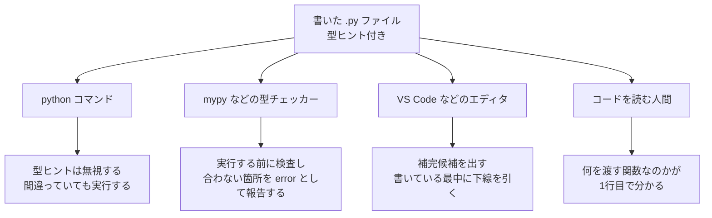
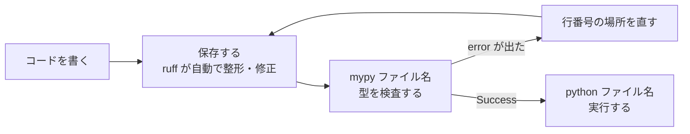

# 第9章 型ヒントとモダン Python

第8章の最後で、`@dataclass` を使うときにこう書きました。

```python
@dataclass
class Product:
    name: str
    price: int
```

`name: str` の `: str` は、「ここには文字列が入るはず」という**注記**でした。
このときは「`@dataclass` を使うための決まりごと」として、
意味を深く説明せずに使いました（[8.5.2](./08-oop.md#852-dataclass-の使い方)）。

この注記は **型ヒント**と呼ばれ、`@dataclass` 専用のものではありません。
変数にも、関数の引数にも、戻り値にも書けます。

そして、ここが最初につまずくところなのですが、
**型ヒントを書いても、Python は実行時に何も検査してくれません。**
`price: int` と書いたところに文字列を入れても、そのまま動いてしまいます。

では、検査してくれないものを、なぜ世界中の Python 使いが書いているのか。
この章では、その理由と、**書いた型ヒントを実際に検査してくれる道具**の入れ方を扱います。
あわせて、いまの Python 開発で使われている道具（ruff、uv）も紹介します。

この章は、**この本のなかで唯一「他の人と一緒に開発するため」の章**です。
1人で書いて1人で動かすだけなら、なくても困りません。
ですが、この本のあとに進む FastAPI では、型ヒントが**動作そのものに関わります**。
ここで慣れておくと、次の本が一段楽になります。

## この章で学ぶこと

- 型ヒントを変数・引数・戻り値に書けるようになり、なぜ実行時に無視されるのかを説明できるようになる
- `list[str]` / `dict[str, int]` / `str | None` / 自作クラスなど、必要な型を書き分けられるようになる
- mypy を入れて実行し、エラーメッセージを読んで直せるようになる
- ruff でコードの規約チェックと自動整形ができるようになる
- `pyproject.toml` に道具の設定をまとめられるようになる
- venv + pip の弱点と uv の位置づけを説明でき、自分が何を使うかを判断できるようになる

## この章の前提

- [第8章](./08-oop.md) を終えていること
- とくに次の4つを使えること
  - 関数の定義・引数・デフォルト引数・戻り値（[5.1](./05-functions.md#51-関数の基本) / [5.2](./05-functions.md#52-引数) / [5.3](./05-functions.md#53-戻り値)）
  - リスト・辞書・辞書のリスト・リスト内包表記（[4.1](./04-data-structures.md#41-リスト) / [4.3](./04-data-structures.md#43-辞書dict) / [4.5.1](./04-data-structures.md#451-リスト内包表記)）
  - `@dataclass` とクラスの基本（[8.1](./08-oop.md#81-クラスとインスタンス) / [8.5](./08-oop.md#85-dataclass)）
  - 仮想環境の有効化と `pip install`（[1.5.3](./01-environment.md#153-有効化する) / [1.6.2](./01-environment.md#162-パッケージをインストールする)）
- CSV と JSON の読み書き（[7.4](./07-files-and-exceptions.md#74-csv-と-json)）
- `pathlib` の `Path`（[7.3.1](./07-files-and-exceptions.md#731-pathlib-の基本)）
- デフォルト引数にリストを書いてはいけない理由と `is None` 判定（[5.2.4](./05-functions.md#524-デフォルト引数にリストを使ってはいけない)）
- `isinstance`（[8.3.2](./08-oop.md#832-親クラスを継承する)）
- VS Code の拡張機能のインストールと `settings.json`（[2.7.3](./02-basics.md#273-自動整形を設定する)）

> **つまずいたら**
> この章の道具（mypy / ruff）は、**仮想環境を有効化していないと入りません。**
> ターミナルの行頭に `(.venv)` が付いているかを、まず確認してください
> （[1.5.3](./01-environment.md#153-有効化する)）。
> 付いていない状態で `pip install` すると、パソコン全体に入ってしまうか、
> 権限のエラーで止まります。
>
> AI に相談するときは、次のように書いてください。
>
> ```text
> python-text の 9.3.2 で詰まりました。
> mypy typed_price.py と打つと mypy: command not found と出ます。
>
> ・OS: Windows 11
> ・ターミナルの行頭に (.venv) が付いているか: 付いていない
> ・pip install mypy の出力（コピーして貼る）
> ```

> **この章のコードを書く場所**
> 第8章までと同じく、`python-lesson` ディレクトリの中で作業します。
> ターミナルで `python-lesson` に移動し、**仮想環境を有効化してから**実行してください。
>
> **Windows（PowerShell）**
>
> ```powershell
> cd C:\Users\ユーザー名\python-lesson
> .\.venv\Scripts\Activate.ps1
> ```
>
> **macOS / Linux**
>
> ```bash
> cd ~/python-lesson
> source .venv/bin/activate
> ```
>
> 実行コマンドは、以降 Windows の形（`python ファイル名`）で書きます。
> macOS の方は `python` を `python3` に読み替えてください（[1.4.2](./01-environment.md#142-実行する)）。
> ただし、**仮想環境を有効化しているあいだは、macOS でも `python` で動きます。**

---

## 9.1 型ヒント

### 9.1.1 型がないことの問題

まず、型ヒントを書かないコードで何が起きるかを見ます。

`python-lesson/no_hint.py`

```python
def with_tax(price, rate):
    """税込価格を四捨五入して返す。"""
    return round(price * (1 + rate))


print(with_tax(180, 0.1))
```

**実行**

```powershell
python no_hint.py
```

```text
実行結果:
198
```

正しく動きます。問題はここからです。

**問題1：引数の順番を間違えても、エラーにならない**

半年後、この関数を久しぶりに使うとします。
`price` と `rate` のどちらを先に書くのだったか、思い出せません。
逆に書いてみます。

`python-lesson/no_hint_swap.py`

```python
def with_tax(price, rate):
    """税込価格を四捨五入して返す。"""
    return round(price * (1 + rate))


# 引数の順番を逆に書いてしまった
print(with_tax(0.1, 180))
```

```text
実行結果:
18
```

エラーになりません。`18` という**それらしい数字**が返ってきます。
[8.1.1](./08-oop.md#811-なぜクラスが必要になるのか) で見た
「静かに間違った答えが出る」形と同じです。

**問題2：文字列を渡すと、離れた場所でエラーになる**

`input` の戻り値は必ず文字列でした（[2.5.3](./02-basics.md#253-入力は必ず文字列である)）。
`int()` に通すのを忘れると、こうなります。

`python-lesson/no_hint_str.py`

```python
def with_tax(price, rate):
    """税込価格を四捨五入して返す。"""
    return round(price * (1 + rate))


price = "180"  # input で受け取ったつもり
print(with_tax(price, 0.1))
```

```text
実行結果:
Traceback (most recent call last):
  File "no_hint_str.py", line 7, in <module>
    print(with_tax(price, 0.1))
          ^^^^^^^^^^^^^^^^^^^^
  File "no_hint_str.py", line 3, in with_tax
    return round(price * (1 + rate))
                 ~~~~~~^~~~~~~~~~~~
TypeError: can't multiply sequence by non-int of type 'float'
```

エラーは出ます。ただし**出る場所が、間違えた場所ではありません。**
間違えたのは `price = "180"` の行ですが、
エラーが出たのは関数の中の掛け算の行です。
関数が3段重なっていれば、3段先で出ます。

**問題3：関数を呼ぶ側が、何を渡せばよいか分からない**

`with_tax(` まで打ったとき、VS Code は「`price` と `rate` を渡す」ことしか教えてくれません。
`price` に何を渡すのか（整数か、文字列か、商品のインスタンスか）は、
**docstring を読むか、関数の中身を読むまで分かりません。**

この3つに共通する原因は1つです。
**「ここには何が入るのか」をコードに書く場所がない**ということ。

その場所を作るのが **型ヒント**（変数や関数に「この型のはず」と注記を書く仕組み）です。

### 9.1.2 変数と引数に型を書く

型ヒントは、**名前のうしろに `:` と型名**を書きます。

`python-lesson/hint_basic.py`

```python
name: str = "ノート"
price: int = 180
rate: float = 0.1
is_member: bool = True

print(name, price, rate, is_member)
print(type(price))
```

```text
実行結果:
ノート 180 0.1 True
<class 'int'>
```

使う型の名前は、第2章で `type()` を使って確認したものと同じです
（[2.2.5](./02-basics.md#225-型を調べるtype)）。

| 書く型 | 意味 | 値の例 |
|--------|------|--------|
| `int` | 整数 | `180` |
| `float` | 小数 | `0.1` |
| `str` | 文字列 | `"ノート"` |
| `bool` | 真偽値 | `True` |

関数の引数にも、同じ形で書きます。

`python-lesson/hint_arg.py`

```python
def with_tax(price: int, rate: float):
    """税込価格を四捨五入して返す。"""
    return round(price * (1 + rate))


print(with_tax(180, 0.1))
```

```text
実行結果:
198
```

デフォルト引数（[5.2.3](./05-functions.md#523-デフォルト引数)）がある場合は、
**型ヒントを先に、`=` を後に**書きます。

`python-lesson/hint_default.py`

```python
def with_tax(price: int, rate: float = 0.1):
    """税込価格を四捨五入して返す。"""
    return round(price * (1 + rate))


print(with_tax(180))
print(with_tax(180, 0.08))
```

```text
実行結果:
198
194
```

> **補足：`@dataclass` の書き方と同じもの**
> [8.5.2](./08-oop.md#852-dataclass-の使い方) で書いた `name: str` は、これと同じ記法です。
> ただし `@dataclass` の場合だけは、**型の注記が必須**でした。
> 書かないと、その行は項目として扱われません。
> 型ヒントが「必須」になるのは、この `@dataclass` のような**特別な場合だけ**です。

> **よくある間違い**
> 変数への型ヒントは `=` の**前**に書きます。
>
> ```python
> price: int = 180   # ✅ 正しい
> price = 180: int   # ❌ SyntaxError: invalid syntax
> ```
>
> また、`price : int` のように `:` の前に空白を入れるのは規約違反です
> （[2.7.2](./02-basics.md#272-pep-8-とは)）。
> `:` は名前にくっつけ、うしろにだけ空白を1つ入れます。

### 9.1.3 戻り値の型

戻り値の型は、引数のかっこのうしろに **`->` 型名** と書きます。
`:` の直前です。

`python-lesson/hint_return.py`

```python
def with_tax(price: int, rate: float = 0.1) -> int:
    """税込価格を四捨五入して返す。"""
    return round(price * (1 + rate))


def label(name: str, price: int) -> str:
    """一覧表示用の1行を返す。"""
    return f"{name}: {price:,}円"


print(with_tax(180))
print(label("ノート", with_tax(180)))
```

```text
実行結果:
198
ノート: 198円
```

`->` は「矢印」です。「この関数は、最終的にこの型を返す」と読みます。

**何も返さない関数には `-> None` を書きます。**

`print` するだけの関数は、`return` を書いていなくても `None` を返しています
（[5.1.3](./05-functions.md#513-return-がないとどうなるか)）。
その事実をそのまま書くだけです。

`python-lesson/hint_none.py`

```python
def show(name: str, price: int) -> None:
    """商品名と価格を表示する。何も返さない。"""
    print(f"{name}: {price:,}円")


def main() -> None:
    """動作確認をする。"""
    show("ノート", 198)
    show("ボールペン", 132)


if __name__ == "__main__":
    main()
```

```text
実行結果:
ノート: 198円
ボールペン: 132円
```

> **注意：`-> None` は省略してよいものではありません**
> あとで導入する mypy は、**型ヒントが1つも書かれていない関数の中身を、既定では検査しません。**
> `def main():` と書くと、`main` の中でどんな間違いをしていても素通りします。
> `-> None` を1つ書くだけで検査の対象になるので、
> **引数のない関数にも `-> None` を書いてください。**

### 9.1.4 型ヒントは実行時に強制されない

ここがこの章のいちばん重要な点です。

**型ヒントと違う値を渡しても、Python は止めません。**

`python-lesson/hint_ignored.py`

```python
def repeat(word: str) -> str:
    """文字列を3回繰り返して返す。"""
    return word * 3


print(repeat("あ"))
print(repeat(5))
print(repeat.__annotations__)
```

```text
実行結果:
あああ
15
{'word': <class 'str'>, 'return': <class 'str'>}
```

2行目に注目してください。
`repeat(5)` は「文字列を渡す」という注記に反していますが、
**エラーにならず `15` を返しました**（`5 * 3` が計算されただけです）。
戻り値も `-> str` と書いてあるのに整数です。

3行目の `__annotations__` は、関数が覚えている型ヒントの一覧です。
Python は型ヒントを**覚えてはいるが、使って検査はしない**ということが分かります。

では、誰がこの注記を読むのでしょうか。読む相手は3種類います。



図のとおり、**型ヒントが効くのは実行の前**です。
実行してからではなく、**書いている最中と、実行する前**に間違いを見つけるための仕組みです。

言い換えると、型ヒントは次の性質を持ちます。

- 書いても**プログラムの動きは1ミリも変わらない**（速くも遅くもならない）
- 書いても**間違った値の混入は防げない**
- ただし、**道具に読ませれば、実行する前に間違いを指摘してもらえる**

その道具が [9.3](#93-型チェッカー) の mypy です。
その前に、型ヒントの書き方をひととおりそろえます。

> **よくある間違い**
> 「型ヒントを書いたのに、間違った型を渡してもエラーにならない」という相談は、
> 毎回ここに行き当たります。**それが正しい動作です。**
> 検査してほしいなら、型チェッカーを別に動かす必要があります（[9.3.2](#932-導入して実行する)）。

---

## 9.2 いろいろな型の書き方

### 9.2.1 リスト・辞書・タプル

リストや辞書には、**中身の型**も書きます。
角かっこを付けて `list[中身の型]` の形にします。

`python-lesson/hint_container.py`

```python
names: list[str] = ["ノート", "ボールペン"]
prices: dict[str, int] = {"ノート": 180, "ボールペン": 120}
size: tuple[int, int] = (800, 600)

print(names)
print(prices)
print(size)
```

```text
実行結果:
['ノート', 'ボールペン']
{'ノート': 180, 'ボールペン': 120}
(800, 600)
```

書き方をまとめます。

| 型ヒント | 意味 | 値の例 |
|---------|------|--------|
| `list[str]` | 文字列のリスト | `["ノート", "ペン"]` |
| `list[int]` | 整数のリスト | `[180, 120]` |
| `dict[str, int]` | キーが文字列・値が整数の辞書 | `{"ノート": 180}` |
| `tuple[int, int]` | 整数2つのタプル | `(800, 600)` |
| `tuple[str, ...]` | 文字列がいくつ入るか決まっていないタプル | `("a", "b", "c")` |
| `list[dict[str, str]]` | 辞書のリスト（値はすべて文字列） | `[{"name": "ノート"}]` |

辞書だけ、**キーと値を `,` で区切って2つ書く**点に注意してください。
タプルは、`tuple[int, int]` のように**入る個数ぶん書く**のが基本です。

いちばん出番が多いのは、最後の `list[dict[str, str]]` です。
CSV を `csv.DictReader` で読むと、この形になります
（[7.4.1](./07-files-and-exceptions.md#741-csv-モジュール)）。
**値がすべて文字列になる**という、あのつまずきポイントが、型として書けるようになります。

`python-lesson/hint_rows.py`

```python
def total_count(rows: list[dict[str, str]]) -> int:
    """CSV から読んだ行のリストを受け取り、count 列の合計を返す。"""
    total = 0
    for row in rows:
        total += int(row["count"])
    return total


rows: list[dict[str, str]] = [
    {"name": "ノート", "count": "12"},
    {"name": "ボールペン", "count": "3"},
]
print(total_count(rows))
```

```text
実行結果:
15
```

`row["count"]` は文字列なので、`int()` を通してから足しています。
**型ヒントを書くと、この変換忘れが目に見えるようになります。**

> **補足：`List[str]` という書き方を見かけたら**
> インターネットの記事や AI の回答で、次の書き方を見ることがあります。
>
> ```python
> from typing import List, Dict
>
> names: List[str] = ["ノート"]
> ```
>
> これは **Python 3.8 以前の書き方**です。
> 3.9 以降は `list[str]` と小文字で書けるようになりました。
> このテキストは Python 3.13 を使っているので、
> **`import` の要らない小文字の書き方**を使います。
> 古い書き方も動きますが、新しく書くときは小文字にしてください。

### 9.2.2 `Optional` と `| None`

第7章と第8章で、**「見つからなければ `None` を返す」**関数をいくつか書きました
（`dict.get` もその形です。[4.3.3](./04-data-structures.md#433-get-で安全に取り出す)）。

このとき戻り値は「文字列」でも「`None`」でもありえます。
こういう「どちらかが返る」型は、**`|` でつなげて書きます。**

`python-lesson/hint_optional.py`

```python
def find_price(prices: dict[str, int], name: str) -> int | None:
    """商品名から価格を返す。見つからなければ None を返す。"""
    return prices.get(name)


prices: dict[str, int] = {"ノート": 180, "ボールペン": 120}

price = find_price(prices, "ノート")
if price is None:
    print("その商品はありません")
else:
    print(f"{price}円です")

missing = find_price(prices, "定規")
if missing is None:
    print("その商品はありません")
else:
    print(f"{missing}円です")
```

```text
実行結果:
180円です
その商品はありません
```

`int | None` は「整数か、`None` のどちらかが返る」という意味です。

**この型を書くと、呼び出す側に責任が生まれます。**
戻り値をそのまま計算に使うと、`None` だったときに落ちるからです。
型チェッカーは、`if price is None:` のような確認をしないまま使っている箇所を
**エラーとして報告してくれます**（[9.3.2](#932-導入して実行する)）。

`None` かどうかの判定に `is None` を使うのは、[5.2.4](./05-functions.md#524-デフォルト引数にリストを使ってはいけない) と同じです。
そして、その 5.2.4 で書いた「リストのデフォルト引数」の正しい形も、型を付けるとこうなります。

`python-lesson/hint_default_none.py`

```python
def add_item(name: str, items: list[str] | None = None) -> list[str]:
    """items に name を足したリストを返す。items を省略すると新しいリストを作る。"""
    if items is None:
        items = []
    items.append(name)
    return items


print(add_item("ノート"))
print(add_item("ペン", ["消しゴム"]))
print(add_item("定規"))
```

```text
実行結果:
['ノート']
['消しゴム', 'ペン']
['定規']
```

3行目が `['ノート', '定規']` になっていないことが、
[5.2.4](./05-functions.md#524-デフォルト引数にリストを使ってはいけない) で学んだ形が守られている証拠です。

> **補足：`Optional[int]` という書き方**
> 古い書き方では、`int | None` を次のように書きました。
>
> ```python
> from typing import Optional
>
> def find_price(prices: dict[str, int], name: str) -> Optional[int]:
>     ...
> ```
>
> `Optional[int]` と `int | None` は**まったく同じ意味**です。
> `|` の書き方は Python 3.10 以降で使えます。
> このテキストでは `| None` を使いますが、
> 他の人のコードで `Optional` を見たら「`| None` のことだ」と読み替えてください。

> **よくある間違い**
> 型ヒントを書いただけで、`None` の確認を省略しないでください。
>
> ```python
> price = find_price(prices, "定規")
> print(price + 100)   # ❌ TypeError: unsupported operand type(s) for +: 'NoneType' and 'int'
> ```
>
> 型ヒントは実行を止めません（[9.1.4](#914-型ヒントは実行時に強制されない)）。
> **`| None` と書いたら、使う前に `is None` で確認する**——これがセットです。
>
> この形は、[9.3](#93-型チェッカー) で入れる型チェッカーが見つけてくれます。
> 報告されるメッセージは次の形です。
>
> ```text
> error: Unsupported operand types for + ("None" and "int")  [operator]
> ```
>
> 自作クラスの場合は、`.` でメソッドを呼んだところが報告されます。
>
> ```text
> error: Item "None" of "Product | None" has no attribute "name"  [union-attr]
> ```
>
> `union-attr` は「`|` でつないだ型のうち、片方（`None`）にその属性がない」という意味です。
> **`if ... is None:` で分岐を書けば、この報告は消えます。**

### 9.2.3 `Union` と `|`

`|` は `None` 以外にも使えます。
「整数でも文字列でも受け取る」関数なら、`int | str` と書きます。

`python-lesson/hint_union.py`

```python
def to_price(value: int | str) -> int:
    """整数でも文字列でも受け取り、整数の価格として返す。"""
    if isinstance(value, str):
        return int(value)
    return value


print(to_price(180))
print(to_price("120"))
```

```text
実行結果:
180
120
```

`isinstance`（[8.3.2](./08-oop.md#832-親クラスを継承する)）で場合分けしている点が大事です。
`int | str` と書いた値は、**そのままでは足し算にも文字列結合にも使えません。**
型チェッカーは「文字列かもしれないのに掛け算している」と指摘してきます。
`isinstance` で確かめた行から先は、
「ここでは `str` だと確定した」と型チェッカーも理解してくれます。

古い書き方では `Union[int, str]` と書きました（`from typing import Union` が必要です）。
意味は `int | str` と同じです。

> **補足：`|` を使いすぎない**
> `int | str | float | None` のように候補を増やすほど、
> 使う側は場合分けを増やさなければなりません。
> **「どちらでも受け取れる」は親切なようで、呼ぶ側の仕事を増やします。**
> このテキストでは、
> - 「値がないかもしれない」ときの `| None`
> - CSV のように、外から来る値が確実に2種類あるとき
>
> の2つに絞って使います。迷ったら**受け取る型を1つに決めて、
> 呼ぶ側に `int()` で変換してもらう**ほうが、あとで読みやすくなります。

### 9.2.4 自作クラスの型

自分で作ったクラスも、そのまま型として書けます。
[8.1.2](./08-oop.md#812-クラスを定義する) で見たとおり、
**クラスを定義することは、新しい型を1つ作ること**だからです。

`python-lesson/hint_class.py`

```python
from dataclasses import dataclass


@dataclass
class Product:
    """商品を表すクラス。"""

    name: str
    price: int

    def price_with_tax(self) -> int:
        """税込価格を四捨五入して返す。"""
        return round(self.price * 1.1)


def total(products: list[Product]) -> int:
    """商品リストの税込合計を返す。"""
    return sum([p.price_with_tax() for p in products])


def cheapest(products: list[Product]) -> Product | None:
    """いちばん安い商品を返す。リストが空なら None を返す。"""
    if not products:
        return None
    return min(products, key=lambda p: p.price)


items: list[Product] = [
    Product("ノート", 180),
    Product("ボールペン", 120),
    Product("消しゴム", 90),
]

print(total(items))
target = cheapest(items)
if target is None:
    print("商品がありません")
else:
    print(f"いちばん安いのは {target.name}（{target.price}円）です")

print(cheapest([]))
```

```text
実行結果:
429
いちばん安いのは 消しゴム（90円）です
None
```

3つの書き方が同時に出てきたので、1つずつ確認します。

- `list[Product]` … 自作クラスも `list[...]` の中に入れられる
- `-> Product | None` … 「見つからなければ `None`」は自作クラスでも同じ（[9.2.2](#922-optional-と--none)）
- `min(products, key=lambda p: p.price)` … `key` にラムダ式を渡す形（[5.5.3](./05-functions.md#553-sorted-の-key-に渡す)）

`if not products:` は「リストが空なら」という判定です
（空のリストは偽として扱われます。[3.1.5](./03-control-flow.md#315-真偽値として扱われる値空文字列0空リスト)）。

**自分自身の型を返す**メソッドを書くときだけ、少し注意が要ります。

`python-lesson/hint_self_class.py`

```python
from dataclasses import dataclass


@dataclass
class Product:
    """商品を表すクラス。"""

    name: str
    price: int

    def discounted(self, rate: float) -> "Product":
        """割引後の新しい Product を返す。"""
        return Product(self.name, round(self.price * (1 - rate)))


note = Product("ノート", 180)
print(note)
print(note.discounted(0.2))
```

```text
実行結果:
Product(name='ノート', price=180)
Product(name='ノート', price=144)
```

`-> "Product"` と、**クラス名を引用符で囲んでいる**ことに注目してください。
この行を Python が読む時点では、`Product` クラスはまだ作り終わっていません。
引用符で囲むと「いまは文字列として置いておき、あとで型として解釈する」という意味になり、
`NameError` を避けられます。

> **よくある間違い**
> 引用符を外して `-> Product:` と書くと、こうなります。
>
> ```text
> NameError: name 'Product' is not defined
> ```
>
> **クラスの中で、そのクラス自身を型として書くときだけ**引用符が必要です。
> クラスの外にある `def total(products: list[Product]) -> int:` は、
> クラスが作り終わったあとに読まれるので、引用符は不要です。

---

## 9.3 型チェッカー

### 9.3.1 mypy / pyright とは

書いた型ヒントを読んで、**実行する前に**矛盾を報告してくれる道具を
**型チェッカー**（ソースコードを実行せずに読んで、型の矛盾を報告する道具）と呼びます。

代表的なものが2つあります。

| 名前 | 作っているところ | 使い方 |
|------|----------------|--------|
| **mypy** | Python コミュニティ（発祥は Dropbox） | ターミナルから `mypy ファイル名` で実行する |
| **pyright** | Microsoft | VS Code の拡張機能 **Pylance** に組み込まれ、書いている最中に働く |

このテキストでは**両方**使います。役割が違うからです。

- **Pylance（pyright）**：書いている最中に、赤い波線でその場で教えてくれる
- **mypy**：ファイルを保存したあと、**まとめて検査する**。
  チームで「全員のコードを検査する」ときにも使える

「実行せずに読んで検査する」ことを **静的型チェック**と呼びます。
「静的」は「動かさないで」という意味です。

### 9.3.2 導入して実行する

mypy をインストールします。
**仮想環境を有効化した状態**（行頭に `(.venv)` が付いている状態）で実行してください。

**Windows（PowerShell）**

```powershell
pip install mypy
```

**macOS / Linux**

```bash
pip install mypy
```

```text
実行結果の例:
Collecting mypy
  Downloading mypy-1.19.1-cp313-cp313-win_amd64.whl (9.5 MB)
Installing collected packages: mypy_extensions, typing_extensions, mypy
Successfully installed mypy-1.19.1 mypy_extensions-1.1.0 typing_extensions-4.16.0
```

`Successfully installed` と出れば成功です。
**バージョン番号は、インストールした時期によって変わります。**
自分が入れたバージョンは、次で確認できます。

```powershell
mypy --version
```

```text
実行結果の例:
mypy 1.19.1 (compiled: yes)
```

> **注意：このテキストが確認したバージョン**
> この章の実行結果は、**2026年8月時点の Python 3.13 / mypy 1.19 / ruff 0.15 / uv 0.8**
> で確認したものです。
> これらの道具は更新が速く、**報告メッセージの見た目が変わることがあります。**
> 「ファイル名・行番号・内容」が読めれば、囲み枠や矢印の形が違っても同じ意味です。

> **補足：入れた道具のバージョンを記録しておく**
> 「半年前は動いていたのに」を避けるため、いま入っているものの一覧を残しておいてください
> （[1.6.3](./01-environment.md#163-requirementstxt-で環境を再現する)）。
>
> ```powershell
> pip freeze > requirements.txt
> ```

では検査してみます。**わざと間違えた**ファイルを作ります。

`python-lesson/typed_price.py`

```python
def with_tax(price: int, rate: float = 0.1) -> int:
    """税込価格を四捨五入して返す。"""
    return round(price * (1 + rate))


def main() -> None:
    """動作確認をする。"""
    print(with_tax(180))
    print(with_tax("180"))


if __name__ == "__main__":
    main()
```

9行目で、`int` を渡すべきところに文字列 `"180"` を渡しています。
まず **実行せずに** 検査します。

```powershell
mypy typed_price.py
```

```text
実行結果:
typed_price.py:9: error: Argument 1 to "with_tax" has incompatible type "str"; expected "int"  [arg-type]
Found 1 error in 1 file (checked 1 source file)
```

メッセージは、4つの部分に分けて読みます。

| 部分 | 意味 |
|------|------|
| `typed_price.py:9` | ファイル名と**行番号** |
| `error:` | 種類（`error` のほかに `note`（補足）が出ることがあります） |
| `Argument 1 to "with_tax" has incompatible type "str"; expected "int"` | 内容。「`with_tax` の**1番目の引数**に `str` が渡されている。`int` のはず」 |
| `[arg-type]` | ルールの名前。検索するときはこれを使う |

**行番号がそのまま直す場所です。** 9行目を直します。

```diff
  def main() -> None:
      """動作確認をする。"""
      print(with_tax(180))
-     print(with_tax("180"))
+     print(with_tax(int("180")))
```

もう一度検査します。

```powershell
mypy typed_price.py
```

```text
実行結果:
Success: no issues found in 1 source file
```

`Success` が出れば、型の矛盾はありません。実行します。

```powershell
python typed_price.py
```

```text
実行結果:
198
198
```

**直す前のファイルを実行していたら、どうなっていたか**も見ておきます。
`print(with_tax("180"))` のまま実行すると、こうなりました。

```text
実行結果:
198
Traceback (most recent call last):
  File "typed_price.py", line 13, in <module>
    main()
  File "typed_price.py", line 9, in main
    print(with_tax("180"))
          ^^^^^^^^^^^^^^^
  File "typed_price.py", line 3, in with_tax
    return round(price * (1 + rate))
                 ~~~~~~^~~~~~~~~~~~
TypeError: can't multiply sequence by non-int of type 'float'
```

**1行目の `198` は表示されてしまっています。**
途中まで動いてから止まるので、ファイルを書き出す処理だったら
「半分だけ書き出されたファイル」が残ります。
mypy は、これを**動かす前に**止めてくれたことになります。

> **注意：`mypy .` は、いまは打たないでください**
> `mypy .`（ドットは「このディレクトリ全部」の意味）と打つと、
> `python-lesson` にある**第1章からのファイルすべて**が検査対象になります。
> 型ヒントを書いていないファイルばかりなので、大量の報告が出て読めません。
> この章では、**いま見たいファイル名を1つだけ指定**してください。
> 新しく作るプロジェクトで、最初から型ヒントを書くと決めたときに `mypy .` を使います。

> **よくある間違い**
> `mypy: command not found`（macOS）や
> `mypy : 用語 'mypy' は、コマンドレット、関数... として認識されません`（Windows）と出たら、
> **仮想環境が有効化されていません。**
> 行頭に `(.venv)` が付いているか確認し、
> [1.5.3](./01-environment.md#153-有効化する) の手順で有効化してから、
> `pip install mypy` からやり直してください。

> **注意：`# type: ignore` で黙らせない**
> 行の末尾に `# type: ignore` と書くと、**その行の報告だけを消せます。**
>
> ```python
> print(with_tax("180"))  # type: ignore
> ```
>
> これは「型チェッカーの言い分は分かっているが、ここは意図してこう書いている」と
> 伝えるための印です。**間違いが直るわけではありません。**
> 上の例は、実行すれば変わらず `TypeError` で止まります。
>
> [7.5.5](./07-files-and-exceptions.md#755-握りつぶさないexcept-pass-の危険) の
> `except: pass` と同じで、**問題を消したのではなく、報告を消しただけ**です。
> このテキストでは使いません。報告が出たら、**コードのほうを直してください。**

> **よくある間違い**
> 外部ライブラリを `import` したファイルを検査すると、次が出ることがあります。
>
> ```text
> error: Cannot find implementation or library stub for module named "cowsay"  [import-untyped]
> ```
>
> 「このライブラリには型の情報が付いていない」という報告で、
> **書いたコードの間違いではありません。**
> [9.4.2](#942-設定ファイルpyprojecttoml) の設定ファイルに
> `ignore_missing_imports = true` を書くと出なくなります。

### 9.3.3 VS Code で常時チェックする

mypy はターミナルから動かす道具です。
**書いている最中**に教えてほしいので、VS Code 側にも設定を入れます。

第1章で入れた Python 拡張機能（[1.7.1](./01-environment.md#171-python-拡張機能を入れる)）には、
**Pylance** が一緒に入っています。これが pyright の本体です。
ただし、**初期状態では型の検査がほぼ無効**になっています。有効にします。

**1. `settings.json` を開く**

[2.7.3](./02-basics.md#273-自動整形を設定する) で編集した設定ファイルを開きます。

1. `Ctrl` + `Shift` + `P`（macOS は `command` + `Shift` + `P`）でコマンドパレットを開く
2. `settings json` と入力し、**「基本設定: ユーザー設定を開く (JSON)」** を選ぶ

**2. 1行足す**

`settings.json`

```json
{
  "editor.insertSpaces": true,
  "editor.tabSize": 4,
  "editor.detectIndentation": false,
  "editor.renderWhitespace": "all",
  "python.analysis.typeCheckingMode": "basic",
  "[python]": {
    "editor.defaultFormatter": "ms-python.black-formatter",
    "editor.formatOnSave": true
  }
}
```

追加したのは `"python.analysis.typeCheckingMode": "basic"` の1行です。
値は3段階あります。

| 値 | 意味 |
|----|------|
| `"off"` | 型の検査をしない（初期値に近い状態） |
| `"basic"` | 明らかな矛盾だけ報告する。**このテキストではこれを使います** |
| `"strict"` | 型ヒントの書き漏らしも報告する。既存のコードに入れると大量に出る |

**3. 試す**

`typed_price.py` を開き、9行目を `print(with_tax("180"))` に戻してみてください。
保存しなくても、**`"180"` の下に赤い波線**が出ます。
波線にマウスを乗せると、mypy と同じ趣旨のメッセージが表示されます。

```text
引数の型 "str" を、パラメーター "price" の型 "int" に割り当てることはできません
```

> **注意：インタプリタを選び直す**
> 波線が出ない場合、VS Code が仮想環境を見ていない可能性があります。
> [1.7.2](./01-environment.md#172-インタプリタを選ぶ仮想環境を認識させる) の手順で、
> `.venv` のインタプリタを選び直してください。

> **補足：Pylance と mypy は別物です**
> 同じコードでも、報告する内容が少し違うことがあります。
> Pylance は**書いている最中の目**、mypy は**保存したあとの検問**と考えてください。
> どちらか片方でよいなら、まずは Pylance（`"basic"`）だけでも十分に役立ちます。

---

## 9.4 開発ツール

### 9.4.1 ruff — リンタとフォーマッタ

ここで2つの用語を分けます。

- **リンタ**（コードを実行せずに読んで、規約違反や怪しい書き方を指摘する道具）
- **フォーマッタ**（コードの空白や改行を、決められた形に自動で整える道具）

[2.7.3](./02-basics.md#273-自動整形を設定する) で入れた **Black** はフォーマッタです。
整形はしてくれますが、「使っていない `import` が残っている」といった指摘はしません。

**ruff**（ラフ）は、**この2つを1つでこなす道具**です。
Rust という言語で書かれていて、非常に速く動きます。

インストールします（仮想環境を有効化した状態で実行してください）。

**Windows（PowerShell）**

```powershell
pip install ruff
```

**macOS / Linux**

```bash
pip install ruff
```

```text
実行結果の例:
Collecting ruff
  Downloading ruff-0.15.8-py3-none-win_amd64.whl (12.1 MB)
Installing collected packages: ruff
Successfully installed ruff-0.15.8
```

試すためのファイルを作ります。**わざと汚く**書きます。

`python-lesson/messy.py`

```python
import json


def with_tax(price: int, rate: float = 0.1) -> int:
    """税込価格を四捨五入して返す。"""
    total=price*(1+rate)
    return round(total)


print( with_tax(180) )
```

**1. リンタとして使う（`ruff check`）**

```powershell
ruff check messy.py
```

```text
実行結果:
F401 [*] `json` imported but unused
 --> messy.py:1:8
  |
1 | import json
  |        ^^^^
  |
help: Remove unused import: `json`

Found 1 error.
[*] 1 fixable with the `--fix` option.
```

囲み枠が付いていて驚くかもしれませんが、読むところは4つだけです。

| 部分 | 意味 |
|------|------|
| `F401` | ルールの名前。検索するときはこれを使う |
| `` `json` imported but unused `` | 内容。「`json` を読み込んでいるのに使っていない」 |
| `--> messy.py:1:8` | 場所。「`messy.py` の**1行目の8文字目**」 |
| `help: ...` | 直し方の提案 |

その下の枠は、**該当箇所を抜き出して `^` で指しているだけ**です。

`[*]` が付いているものは、**自動で直せる**という印です。直してもらいます。

```powershell
ruff check --fix messy.py
```

```text
実行結果:
Found 1 error (1 fixed, 0 remaining).
```

`messy.py` の1行目から `import json` が消えました。

**2. フォーマッタとして使う（`ruff format`）**

```powershell
ruff format messy.py
```

```text
実行結果:
1 file reformatted
```

`messy.py` はこうなりました。

`python-lesson/messy.py`（整形後）

```python
def with_tax(price: int, rate: float = 0.1) -> int:
    """税込価格を四捨五入して返す。"""
    total = price * (1 + rate)
    return round(total)


print(with_tax(180))
```

```powershell
python messy.py
```

```text
実行結果:
198
```

`=` と `*` の前後に空白が入り、`print( ... )` のかっこの内側の空白が消えました。
[2.7.2](./02-basics.md#272-pep-8-とは) の表で見た PEP 8 のルールどおりです。

2つのコマンドの役割を、はっきり分けて覚えてください。

| コマンド | 何をするか | 直すもの |
|---------|-----------|---------|
| `ruff check ファイル名` | **問題を報告する** | 未使用の `import`、未定義の名前など |
| `ruff check --fix ファイル名` | 報告した問題のうち、直せるものを直す | 上のうち `[*]` が付いたもの |
| `ruff format ファイル名` | **見た目を整える** | 空白・改行・引用符・行の折り返し |

> **注意：`ruff check .` も、いまは打たないでください**
> mypy と同じ理由です（[9.3.2](#932-導入して実行する)）。
> `python-lesson` には第1章からのファイルが全部あるので、
> **ファイル名を1つだけ指定**してください。
> とくに `ruff format .` は**すべてのファイルを書き換えてしまいます。**

> **補足：ruff は Black の置き換えになります**
> `ruff format` の整形結果は、Black とほぼ同じになるよう作られています。
> つまり、**Black を入れたままにしておく必要はありません。**
> VS Code の設定は [9.4.3](#943-保存時に自動整形する) で入れ替えます。

> **補足：表示の細かい形はバージョンで変わります**
> ruff は更新が速く、報告の見た目（矢印で該当箇所を指す形など）が変わることがあります。
> **「ファイル名・行番号・ルール名・内容」の4点が読めれば、形が違っても同じです。**

### 9.4.2 設定ファイル（`pyproject.toml`）

`ruff check` が既定で見ているルールは、ごく一部です。
「`import` の並び順」や「古い書き方」まで見てほしいときは、**設定ファイル**に書きます。

Python では **`pyproject.toml`** というファイル名が標準です。
プロジェクトの一番上のディレクトリに1つ置くと、
そこにある道具（ruff、mypy など）がまとめてこのファイルを読みます。

`.toml` は **TOML**（トムル。設定を書くための書式）というファイル形式です。
覚えることは2つだけです。

- `[ ]` で囲んだ行は**セクション**（設定のまとまり）の見出し
- その下に `キー = 値` を書く。文字列は `"` で囲み、リストは `[ ]` で囲む

`python-lesson/pyproject.toml`

```toml
[tool.ruff]
line-length = 88
target-version = "py313"

[tool.ruff.lint]
select = ["E", "F", "I", "UP"]

[tool.mypy]
python_version = "3.13"
ignore_missing_imports = true
```

書いた内容の意味です。

| 設定 | 意味 |
|------|------|
| `[tool.ruff]` | ruff 向けの設定という見出し |
| `line-length = 88` | 1行の長さの上限を88文字にする |
| `target-version = "py313"` | Python 3.13 向けとして判断する |
| `[tool.ruff.lint]` | ruff の**リンタ部分**の設定 |
| `select = ["E", "F", "I", "UP"]` | 見るルールの種類を選ぶ |
| `[tool.mypy]` | mypy 向けの設定という見出し |
| `python_version = "3.13"` | Python 3.13 として検査する |
| `ignore_missing_imports = true` | 型情報のないライブラリを読み込んでも報告しない（[9.3.2](#932-導入して実行する)） |

`select` に書いた4つの記号は、ルールのまとまりの名前です。

| 記号 | 内容 |
|------|------|
| `E` | PEP 8 の書式（[2.7.2](./02-basics.md#272-pep-8-とは)） |
| `F` | 明らかな間違い（未使用の `import`、未定義の名前など） |
| `I` | `import` の並び順 |
| `UP` | 古い書き方（`List[str]` など。[9.2.1](#921-リスト辞書タプル)） |

**ここからが、この章の総仕上げです。**
型ヒント・dataclass・CSV・JSON・ruff・mypy を、1つのファイルで**同時に**使います。

まず、読み込むデータを用意します。

`python-lesson/data/sales.csv`

```text
name,price,count
ノート,180,3
ボールペン,120,10
消しゴム,90,4
```

次に、本体を書きます。**`import` の並び順をわざとバラバラ**にしてあります。

`python-lesson/sales_report.py`

```python
import json
from pathlib import Path
import csv
from dataclasses import dataclass


@dataclass
class Sale:
    """1商品ぶんの売上。"""

    name: str
    price: int
    count: int

    def subtotal(self) -> int:
        """小計を返す。"""
        return self.price * self.count


def load_sales(path: Path) -> list[Sale]:
    """CSV を読み込んで Sale のリストを返す。"""
    sales: list[Sale] = []
    with open(path, encoding="utf-8", newline="") as f:
        reader = csv.DictReader(f)
        for row in reader:
            sales.append(Sale(row["name"], int(row["price"]), int(row["count"])))
    return sales


def find_sale(sales: list[Sale], name: str) -> Sale | None:
    """商品名で1件探す。見つからなければ None を返す。"""
    for sale in sales:
        if sale.name == name:
            return sale
    return None


def to_rows(sales: list[Sale]) -> list[dict[str, str | int]]:
    """書き出し用の辞書のリストに変換して返す。"""
    return [{"name": s.name, "subtotal": s.subtotal()} for s in sales]


def main() -> None:
    """読み込んで集計し、結果を書き出す。"""
    sales = load_sales(Path("data/sales.csv"))
    for sale in sales:
        print(f"{sale.name}: {sale.subtotal():,}円")

    total = sum([sale.subtotal() for sale in sales])
    print(f"合計: {total:,}円")

    target = find_sale(sales, "ノート")
    if target is None:
        print("ノートは売れていません")
    else:
        print(f"ノートの小計は {target.subtotal():,}円です")

    out_path = Path("data/sales_report.json")
    with open(out_path, "w", encoding="utf-8") as f:
        json.dump(to_rows(sales), f, ensure_ascii=False, indent=2)
    print(f"{out_path} に書き出しました")


if __name__ == "__main__":
    main()
```

**1. リンタを通す**

```powershell
ruff check sales_report.py
```

```text
実行結果:
I001 [*] Import block is un-sorted or un-formatted
 --> sales_report.py:1:1
  |
1 | / import json
2 | | from pathlib import Path
3 | | import csv
4 | | from dataclasses import dataclass
  | |_________________________________^
  |
help: Organize imports

Found 1 error.
[*] 1 fixable with the `--fix` option.
```

`I001` は、設定ファイルの `select` に `"I"` を入れたから出たものです。
入れていなければ報告されません。自動で直します。

```powershell
ruff check --fix sales_report.py
```

```text
実行結果:
Found 1 error (1 fixed, 0 remaining).
```

ファイルの先頭が、こう並び替わりました。

```python
import csv
import json
from dataclasses import dataclass
from pathlib import Path
```

`import モジュール` の形が先、`from ... import ...` の形が後、
それぞれの中はアルファベット順、という並びです。
**この順番を自分で覚える必要はありません。** 道具に並べてもらいます。

**2. 整形する**

```powershell
ruff format sales_report.py
```

```text
実行結果:
1 file left unchanged
```

`left unchanged` は「直すところがなかった」という意味です。
最初から整った形で書けていた、ということです。

**3. 型を検査する**

```powershell
mypy sales_report.py
```

```text
実行結果:
Success: no issues found in 1 source file
```

**4. 実行する**

```powershell
python sales_report.py
```

```text
実行結果:
ノート: 540円
ボールペン: 1,200円
消しゴム: 360円
合計: 2,100円
ノートの小計は 540円です
data\sales_report.json に書き出しました
```

（macOS では最後の行が `data/sales_report.json に書き出しました` になります。
`Path` を `print` すると、OS ごとの区切り文字で表示されるためです。
[7.3.4](./07-files-and-exceptions.md#734-windows-のパス区切り問題)）

書き出された JSON の先頭は、次のようになります。

`python-lesson/data/sales_report.json`

```json
[
  {
    "name": "ノート",
    "subtotal": 540
  },
```

この `sales_report.py` が、**この章の道具をすべて組み合わせた形**です。
型ヒントの付け方を見返してください。

| 場所 | 書いた型 | 理由 |
|------|---------|------|
| `Sale` の項目 | `name: str` / `price: int` / `count: int` | `@dataclass` の必須の注記（[8.5.2](./08-oop.md#852-dataclass-の使い方)） |
| `load_sales` | `(path: Path) -> list[Sale]` | 受け取るのはパス、返すのは自作クラスのリスト（[9.2.4](#924-自作クラスの型)） |
| `sales` | `list[Sale]` | 空のリストで始めるので、何が入るか書かないと型チェッカーが判断できない |
| `find_sale` | `-> Sale \| None` | 見つからないことがある（[9.2.2](#922-optional-と--none)） |
| `to_rows` | `-> list[dict[str, str \| int]]` | 値に文字列と整数が混ざる辞書のリスト（[9.2.1](#921-リスト辞書タプル) / [9.2.3](#923-union-と-)） |
| `main` | `-> None` | 何も返さない（[9.1.3](#913-戻り値の型)） |

> **補足：型ヒントの書き忘れも報告してもらう**
> [9.1.3](#913-戻り値の型) で書いたとおり、mypy は
> **型ヒントが1つもない関数の中身を、既定では検査しません。**
> つまり `def main():` と書いてしまうと、`Success` と出ても中身は素通りです。
> 「書き忘れ自体を報告してほしい」ときは、設定に1行足します。
>
> ```toml
> [tool.mypy]
> python_version = "3.13"
> ignore_missing_imports = true
> disallow_untyped_defs = true
> ```
>
> こうすると、型ヒントのない関数に対して次が出ます。
>
> ```text
> messy_stock.py:6: error: Function is missing a type annotation  [no-untyped-def]
> messy_stock.py:19: error: Function is missing a return type annotation  [no-untyped-def]
> messy_stock.py:19: note: Use "-> None" if function does not return a value
> ```
>
> **これから型ヒントを書いていくファイル**にはとても有効です。
> 一方、第1章からの古いファイルすべてに掛けると大量に出るので、
> このテキストでは**新しく書くファイルを1つずつ指定して**使います。

> **よくある間違い**
> `sales: list[Sale] = []` の型ヒントを省くと、mypy にこう言われます。
>
> ```text
> error: Need type annotation for "sales" (hint: "sales: list[<type>] = ...")  [var-annotated]
> ```
>
> **空のリストからは、中身の型が推測できない**ためです。
> 値が入った状態で作る（`prices = {"ノート": 180}` など）ときは、
> 型チェッカーが推測してくれるので書かなくても通ります。
> **空で作るときだけ書く**、と覚えてください。

### 9.4.3 保存時に自動整形する

最後に、**保存したら ruff が自動で走る**ようにします。
[2.7.3](./02-basics.md#273-自動整形を設定する) で Black に対して行った設定を、ruff に置き換えます。

**1. 拡張機能を入れる**

1. VS Code の左端の**拡張機能**アイコンを開く
   （Windows `Ctrl` + `Shift` + `X` / macOS `command` + `Shift` + `X`）
2. 検索欄に `Ruff` と入力する
3. 発行元が **Astral Software** のものを選び、**「インストール」**をクリックする

**2. `settings.json` を書き換える**

`settings.json`

```json
{
  "editor.insertSpaces": true,
  "editor.tabSize": 4,
  "editor.detectIndentation": false,
  "editor.renderWhitespace": "all",
  "python.analysis.typeCheckingMode": "basic",
  "[python]": {
    "editor.defaultFormatter": "charliermarsh.ruff",
    "editor.formatOnSave": true,
    "editor.codeActionsOnSave": {
      "source.fixAll.ruff": "explicit",
      "source.organizeImports.ruff": "explicit"
    }
  }
}
```

変更点は3つです。

- `"editor.defaultFormatter"` を `ms-python.black-formatter` から
  **`charliermarsh.ruff`** に変えた（これが Ruff 拡張機能の ID です）
- `"source.fixAll.ruff"` … 保存時に `ruff check --fix` 相当を実行する
- `"source.organizeImports.ruff"` … 保存時に `import` を並べ替える

`"explicit"` は「保存操作をしたときに実行する」という意味です。

**3. 試す**

`sales_report.py` の `import` の並びをわざと入れ替えて、保存してください。
保存した瞬間に、元の順番に並び替わります。

> **注意：Black と両方を有効にしない**
> `"editor.defaultFormatter"` に指定できるのは**1つだけ**です。
> Black の拡張機能は入れたままでも害はありませんが、混乱を避けたい場合は
> 拡張機能の一覧から **Black Formatter を「無効にする」**を選んでください。
> 削除する必要はありません。

> **よくある間違い**
> 保存しても何も起こらないときは、次の順に確認してください。
>
> 1. `pip install ruff` を、**仮想環境を有効化した状態で**実行したか
> 2. VS Code が `.venv` のインタプリタを選んでいるか（[1.7.2](./01-environment.md#172-インタプリタを選ぶ仮想環境を認識させる)）
> 3. `settings.json` の `{ }` や `,` が壊れていないか（壊れていると設定全体が無効になります）

---

## 9.5 パッケージ管理の現在

### 9.5.1 venv + pip のつらさ

第1章から、`venv` で仮想環境を作り、`pip` でライブラリを入れてきました
（[1.5](./01-environment.md#15-仮想環境venv) / [1.6](./01-environment.md#16-pip-とパッケージ)）。
この組み合わせは Python に標準で付いてくるので、**追加で何も入れずに始められます。**

ただ、使い続けると3つの不便が出てきます。

**1. 有効化を忘れる**

`(.venv)` が付いていない状態で `pip install` すると、
パソコン全体の Python に入ってしまいます。
「入れたはずのライブラリが `ModuleNotFoundError` になる」
（[6.1.3](./06-modules.md#613-同じディレクトリにないと読み込めない問題)）の原因の多くがこれです。

**2. `requirements.txt` が「自分が入れたもの」を区別しない**

`pip freeze` は、いま入っているものを**全部**書き出します
（[1.6.3](./01-environment.md#163-requirementstxt-で環境を再現する)）。
たとえば、この章で `mypy` を1つ入れただけでも、こうなります。

```text
mypy==1.19.1
mypy_extensions==1.1.0
typing_extensions==4.16.0
```

自分が入れたのは `mypy` だけで、下2つは **`mypy` が動くために一緒に入ったもの**です。
このファイルを見ても、**どれが本命なのか分かりません。**
半年後に「`typing_extensions` はもう要らないのでは？」と考えても、判断できません。

**3. 数が増えると遅い**

ライブラリが数十個になると、`pip install -r requirements.txt` に
数分かかることがあります。

### 9.5.2 uv の紹介

これらを解決するために作られた新しい道具が **uv**（ユーブイ）です。
ruff と同じ Astral 社が作っていて、やはり Rust で書かれています。

uv は、いままで別々だったものを**1つにまとめた**道具です。

| いままで | uv では |
|---------|--------|
| `python -m venv .venv` | `uv venv` |
| `pip install ruff` | `uv pip install ruff` |
| `pip install -r requirements.txt` | `uv pip install -r requirements.txt` |
| （Python 本体のインストール） | `uv python install 3.13` |
| （本命と依存の区別） | `pyproject.toml` に本命だけが書かれ、全部の記録は `uv.lock` に残る |

**試したい人向けのインストール手順**です。
**この章の続きに必須ではありません。** 入れなくても最後まで読めます。

**Windows（PowerShell）**

```powershell
powershell -ExecutionPolicy ByPass -c "irm https://astral.sh/uv/install.ps1 | iex"
```

**macOS / Linux**

```bash
curl -LsSf https://astral.sh/uv/install.sh | sh
```

インストールできたか確認します。

```powershell
uv --version
```

```text
実行結果の例:
uv 0.8.17
```

仮想環境を作って、ライブラリを1つ入れるところまでやってみます。
**いまの `python-lesson` とは別のディレクトリ**で試してください。

**Windows（PowerShell）**

```powershell
cd C:\Users\ユーザー名
mkdir uv-test
cd uv-test
uv venv
uv pip install ruff
```

**macOS / Linux**

```bash
cd ~
mkdir uv-test
cd uv-test
uv venv
uv pip install ruff
```

```text
実行結果の例:
Using CPython 3.13.1 interpreter at: C:\Users\ユーザー名\AppData\Local\Programs\Python\Python313\python.exe
Creating virtual environment at: .venv
Activate with: .venv\Scripts\activate
 Downloading ruff
Prepared 1 package in 162ms
Installed 1 package in 30ms
 + ruff==0.15.8
```

（macOS では3行目が `Activate with: source .venv/bin/activate` になります）

`pip` では数十秒かかることもある処理が、一瞬で終わります。

> **注意：uv を入れても、有効化は必要です**
> `uv venv` で作った仮想環境も、使うときは有効化します
> （[1.5.3](./01-environment.md#153-有効化する) と同じコマンドです）。
> ただし `uv run ファイル名.py` を使うと、
> **有効化しないまま、その仮想環境で実行**できます。

### 9.5.3 どれを使うべきか

新しい道具が出てくると、「いま使っているものは古いのでは」と不安になります。
判断の基準を決めておきます。

| 状況 | このテキストの答え |
|------|-----------------|
| このテキストを読み進める | **venv + pip のまま**。第10章もこれで進めます |
| 自分の小さなスクリプトを書く | どちらでもよい。速さが気になったら uv |
| チームで開発する | **チームがすでに使っているものに合わせる**。1人だけ違うと事故のもと |
| 新しくプロジェクトを始める | uv を試してよい。ただし引き継ぐ人がいるなら相談してから |

**新しいほうが常に正しいわけではありません。**
`venv` と `pip` は Python に標準で付いてくるため、
「相手のパソコンに何が入っているか分からない」場面ではいちばん確実です。

一方、この章で入れた **ruff と mypy は、いま入れる価値があります。**
どちらも「自分のコードを検査するだけ」の道具で、
プログラムの動き方を変えないからです。

日々の作業の流れは、次の形に落ち着きます。



**実行する前に2つの関所を通す**、という流れです。
関所で止まったぶんだけ、実行してから悩む時間が減ります。

---

## まとめ

- **型ヒント**は「ここには何が入るか」をコードに書いておく注記。`名前: 型` と書く
- 関数の戻り値は `-> 型`。何も返さない関数には **`-> None`** を書く
- **型ヒントは実行時に無視される。** 違う型を渡しても Python は止めない
- 読むのは**型チェッカー・エディタ・人間**の3者。効くのは実行の前
- 中身のある型は `list[str]` / `dict[str, int]` / `tuple[int, int]` の形で書く
- CSV から読んだ行のリストは **`list[dict[str, str]]`**（値はすべて文字列）
- 「見つからなければ `None`」は **`型 | None`**。使う前に `is None` で確認する
- `Optional[int]` は `int | None` と同じ意味。古い書き方
- 自作クラスもそのまま型になる。**クラスの中で自分自身を書くときだけ `"Product"` と引用符**
- **mypy** は `mypy ファイル名` で実行する。`ファイル名:行番号: error: 内容 [ルール名]` を読む
- 型ヒントのない関数の中身は、mypy が**既定では検査しない**。
  書き忘れも報告してほしいときは `disallow_untyped_defs = true`
- **`# type: ignore` で報告を消さない。** 消えるのは報告だけで、間違いは残る
- VS Code では `"python.analysis.typeCheckingMode": "basic"` で常時チェックになる
- **`ruff check` は報告、`ruff format` は整形。** `--fix` を付けると直せるものは直る
- 道具の設定は **`pyproject.toml`** に集約する。`[tool.ruff]` と `[tool.mypy]` のセクションに書く
- 空のリストに代入するときは `sales: list[Sale] = []` のように型を書く（推測できないため）
- venv + pip はどこでも動く標準。**uv** は速くて統合された新しい選択肢
- **チームで使う道具は、チームに合わせる。** 新しいことは選ぶ理由にならない

---

## 理解度チェック

答えは [解答編 その2](./91-answers-part2.md#第9章) にあります。まず自分で考えてください。

**問 9.1**
次の A・B・C に入るものを答えてください。

> 引数の型は `def f(price **A** int):` のように書く。
> 戻り値の型は `def f(price: int) **B** int:` のように書く。
> 何も返さない関数の戻り値には **C** と書く。

**問 9.2**
次のコードの実行結果を答え、なぜエラーにならないのかを1〜2行で説明してください。

```python
def repeat(word: str) -> str:
    """文字列を3回繰り返して返す。"""
    return word * 3


print(repeat(4))
```

**問 9.3**
次の説明に合う型ヒントを、それぞれ書いてください。

1. 商品名（文字列）をキー、在庫数（整数）を値に持つ辞書
2. CSV から `csv.DictReader` で読み込んだ行のリスト
3. 「見つかれば文字列、見つからなければ `None`」を返す関数の戻り値

**問 9.4**
次のメッセージが mypy から出ました。
どのファイルの何行目を、どう直せばよいか答えてください。

```text
stock.py:14: error: Argument 2 to "Item" has incompatible type "str"; expected "int"  [arg-type]
```

**問 9.5**
次の関数には、[5.2.4](./05-functions.md#524-デフォルト引数にリストを使ってはいけない) で学んだ問題があります。
何が問題かを1行で説明し、型ヒント付きで正しく書き直してください。

```python
def add_tag(name: str, tags: list[str] = []) -> list[str]:
    tags.append(name)
    return tags
```

**問 9.6**
`ruff check` と `ruff format` は、それぞれ何をする命令ですか。
1行ずつ説明してください。

**問 9.7**
`pyproject.toml` に次のように書きました。
`select` に `"I"` を足すと、何が報告されるようになりますか。

```toml
[tool.ruff.lint]
select = ["E", "F", "I", "UP"]
```

---

## 演習問題

### 演習 9.1 ★☆☆ 型ヒントを付けて mypy を通す

**課題**
`python-lesson` に `price_tools.py` を作り、次のコードをそのまま書き写してください。
そのうえで、**すべての関数の引数と戻り値**、および `main` の中の変数 `prices` に
型ヒントを付けてください。

```python
def with_tax(price, rate=0.1):
    """税込価格を四捨五入して返す。"""
    return round(price * (1 + rate))


def total_price(prices):
    """価格のリストを受け取り、税込の合計を返す。"""
    return sum([with_tax(p) for p in prices])


def label(name, price):
    """一覧表示用の1行を返す。"""
    return f"{name}: {price:,}円"


def main():
    prices = [180, 120, 90]
    print(label("合計", total_price(prices)))
    print(label("ノート", with_tax(180)))
    print(label("ボールペン", with_tax(120)))


if __name__ == "__main__":
    main()
```

**完成条件**

- 4つの関数すべてに、引数の型と戻り値の型が書かれている
  - `main` にも戻り値の型を書くこと
- `main` の中の `prices` に型ヒントが書かれている
- `mypy price_tools.py` を実行すると、次が表示される

```text
実行結果:
Success: no issues found in 1 source file
```

- `python price_tools.py` を実行すると、次が表示される

```text
実行結果:
合計: 429円
ノート: 198円
ボールペン: 132円
```

- `ruff check price_tools.py` が `All checks passed!` を表示する

**ヒント**
引数と戻り値の書き方は [9.1.2](#912-変数と引数に型を書く) と [9.1.3](#913-戻り値の型) にあります。
`rate=0.1` のようにデフォルト値がある引数の書き順は [9.1.2](#912-変数と引数に型を書く) を見てください。
`prices` に書く型は [9.2.1](#921-リスト辞書タプル) の表にあります。
`main` の戻り値を書き忘れると、mypy は `main` の中身を検査しません（[9.1.3](#913-戻り値の型) の注意）。

---

### 演習 9.2 ★☆☆ 見つからないときに `None` を返す

**課題**
`python-lesson` に `product_find.py` を作り、
商品リストから商品を探す2つの関数を書いてください。

**完成条件**

- **`@dataclass`** で `Product` クラスを定義する
  - 項目は `name`（文字列）、`price`（整数）、`stock`（整数）
  - `is_available()` メソッドを持つ。在庫が1以上なら `True` を返す（戻り値の型も書くこと）
- 次の2つの関数を定義する。**すべてに docstring と型ヒントを書くこと**
  - `find_product(products, name)` … 商品名で1件探す。
    見つからなければ **`None` を返す**
  - `cheapest(products)` … いちばん安い商品を返す。
    **リストが空なら `None` を返す**
- `main()` を定義し、`if __name__ == "__main__":` から呼ぶ
  - 商品を3つ作る（ノート 180円 在庫12 / ボールペン 120円 在庫0 / 消しゴム 90円 在庫4）
  - `"ノート"` を探し、**見つかった場合と見つからなかった場合で表示を分ける**
  - `"定規"` を探し、同じように表示を分ける
  - いちばん安い商品を表示する
  - **空のリスト**を渡して `cheapest` を呼び、その結果を表示する
- 実行結果が次のようになる

```text
実行結果:
ノート: 180円（在庫あり）
定規は取り扱っていません
いちばん安いのは 消しゴム（90円）です
空のリストの結果: None
```

- `mypy product_find.py` が `Success: no issues found in 1 source file` を表示する

**ヒント**
「見つからなければ `None`」の型の書き方は [9.2.2](#922-optional-と--none) です。
自作クラスをリストの中身の型にする書き方と、空のリストの扱いは
[9.2.4](#924-自作クラスの型) の `hint_class.py` がそのまま雛形になります。
`@dataclass` の項目の書き方は [8.5.2](./08-oop.md#852-dataclass-の使い方) です。
`Product | None` を受け取った値は、**そのまま `.name` を読むと mypy に叱られます**
（[9.2.2](#922-optional-と--none) のよくある間違い）。
在庫の有無で表示を変える部分は、`is_available()` の戻り値で分けてください。

---

### 演習 9.3 ★★☆ mypy のエラーを読んで直す

**課題**
`python-lesson` に、次の2つのファイルをそのまま書き写してください。
このプログラムは**実行しても止まりませんが、間違っています。**
mypy を使って間違いを見つけ、修正してください。

`python-lesson/data/scores.csv`

```text
name,math,english
佐藤,82,74
鈴木,65,88
高橋,90,58
```

`python-lesson/broken_report.py`

```python
import csv
from dataclasses import dataclass
from pathlib import Path


@dataclass
class Score:
    """1人ぶんの点数。"""

    name: str
    math: int
    english: int

    def total(self) -> int:
        """2教科の合計点を返す。"""
        return self.math + self.english


def load_scores(path: Path) -> list[Score]:
    """CSV を読み込んで Score のリストを返す。"""
    scores: list[Score] = []
    with open(path, encoding="utf-8", newline="") as f:
        reader = csv.DictReader(f)
        for row in reader:
            scores.append(Score(row["name"], row["math"], row["english"]))
    return scores


def find_score(scores: list[Score], name: str) -> Score | None:
    """名前で1件探す。見つからなければ None を返す。"""
    for score in scores:
        if score.name == name:
            return score
    return None


def main() -> None:
    """読み込んで表示する。"""
    scores = load_scores(Path("data/scores.csv"))
    for score in scores:
        print(f"{score.name}: {score.total()}点")

    target = find_score(scores, "佐藤")
    print(f"佐藤さんの合計は {target.total()}点です")


if __name__ == "__main__":
    main()
```

**完成条件**

- 修正前に一度 `python broken_report.py` を実行し、
  **どこがおかしいか**を自分の言葉で1行書き出す（コメントとしてファイルの先頭に書いてよい）
- `mypy broken_report.py` が報告する **3件**のエラーを、すべて直す
- `# type: ignore` を使って黙らせないこと
- 直したあと、`mypy broken_report.py` が
  `Success: no issues found in 1 source file` を表示する
- `python broken_report.py` の実行結果が次のようになる

```text
実行結果:
佐藤: 156点
鈴木: 153点
高橋: 148点
佐藤さんの合計は 156点です
```

**ヒント**
mypy のメッセージの読み方（行番号・内容・ルール名）は [9.3.2](#932-導入して実行する) にあります。
`Score` の項目は整数ですが、CSV から読んだ値は何型でしたか
（[9.2.1](#921-リスト辞書タプル) / [7.4.1](./07-files-and-exceptions.md#741-csv-モジュール)）。
`find_score` の戻り値の型を見てください。`.total()` を呼ぶ前に必要な確認があります
（[9.2.2](#922-optional-と--none)）。
[9.4.2](#942-設定ファイルpyprojecttoml) の `sales_report.py` が、
このファイルの「直ったあとの姿」とほぼ同じ形をしています。

---

### 演習 9.4 ★★☆ `pyproject.toml` を作って ruff と mypy を通す

**課題**
`python-lesson` に設定ファイルを置き、汚いスクリプトを
**リンタ・フォーマッタ・型チェッカーの3つすべてが通る状態**に直してください。

**完成条件**

- `python-lesson/pyproject.toml` が次を満たすように書く
  （[9.4.2](#942-設定ファイルpyprojecttoml) で作ったものに足りない行を足す）
  - ruff の1行の長さの上限を **88**、対象を **Python 3.13** にする
  - ruff のリンタが見るルールとして **`E` / `F` / `I` / `UP`** を選ぶ
  - mypy が Python 3.13 として検査し、**型情報のないライブラリを報告しない**設定にする
  - mypy が**型ヒントを書いていない関数を報告する**設定にする
- 次のファイルをそのまま書き写す

`python-lesson/messy_stock.py`

```python
import json
from pathlib import Path
import csv


def load(path):
    rows=[]
    with open(path,encoding="utf-8",newline="") as f:
        for row in csv.DictReader(f):
            rows.append({"name":row["name"],"count":row["count"]})
    return rows

def save(rows,path):
    with open(path,"w",encoding="utf-8") as f:
        json.dump(rows,f,ensure_ascii=False,indent=2)

def main():
    rows=load(Path("data/stock.csv"))
    save(rows,Path("data/stock.json"))
    print(f"{len(rows)}件を書き出しました")

if __name__=="__main__":
    main()
```

- 次のデータファイルを作る

`python-lesson/data/stock.csv`

```text
name,count
ノート,12
ボールペン,3
消しゴム,25
```

- `ruff check --fix` と `ruff format` を実行し、そのあと**自分で型ヒントと docstring を足す**
  - 最初の `ruff check --fix` は `Found 1 error (1 fixed, 0 remaining).`、
    最初の `ruff format` は `1 file reformatted` と出ます。それで正常です
  - 型ヒントを足す前に `mypy messy_stock.py` を実行すると、
    **3件の `[no-untyped-def]` が報告されます**（設定を正しく書けている証拠です）
- 最終的に、次の4つがこの表示になる

```text
ruff check messy_stock.py    → All checks passed!
ruff format messy_stock.py   → 1 file left unchanged
mypy messy_stock.py          → Success: no issues found in 1 source file
python messy_stock.py        → 3件を書き出しました
```

- `load` / `save` / `main` の**3つすべてに docstring と型ヒント**が書かれている
  - `load` の戻り値は、CSV から読んだ行のリストの型にすること
- 書き出された `data/stock.json` の先頭が次のようになっている

```json
[
  {
    "name": "ノート",
    "count": "12"
  },
```

**ヒント**
`pyproject.toml` に書く項目は [9.4.2](#942-設定ファイルpyprojecttoml) の表にそろっています。
「型ヒントを書いていない関数を報告する」設定だけは、同じ項の**補足の囲み記事**にあります。
`ruff check --fix` が自動で直すもの（`import` の並び順）と、
自分で直すもの（型ヒント・docstring）の区別を意識してください。
`ruff format` が `1 file left unchanged` になるのは、
**先に `ruff format` を1回実行して整えたあと**です。順番に実行してください。
`load` の戻り値の型は [9.2.1](#921-リスト辞書タプル) の表の最後の行です。
`count` が JSON に文字列（`"12"`）で入っているのは間違いではありません。
CSV から読んだ値は文字列のままだからです（[7.4.1](./07-files-and-exceptions.md#741-csv-モジュール)）。
`rows` は空のリストから作るので、型ヒントが要ります（[9.4.2](#942-設定ファイルpyprojecttoml) のよくある間違い）。

---

## 次の章へ

この章で、**実行する前に間違いを見つける**道具がそろいました。

型ヒントは、書いても動きが変わりません。
それでも書くのは、**半年後の自分と、コードを読む他の人と、道具**に向けて
「ここには何が入るのか」を残すためです。
そして mypy と ruff が、その約束が守られているかを、実行の前に確かめてくれます。

次の章では、この本の総仕上げとして、**実際に使えるデータ処理スクリプト**を作ります。
CSV を読み、条件で絞り込み、集計し、外部の API からデータを取り、
結果をファイルに書き出す——第2章からの道具を全部使います。

もちろん、書きながら型ヒントを付け、ruff と mypy を通します。
**この章で入れた道具を、実際の開発の流れの中で使う**のが、次の章です。

→ [第10章 実践：データ処理スクリプト](./10-practice-data-script.md) へ進む
