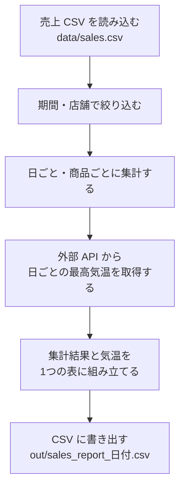
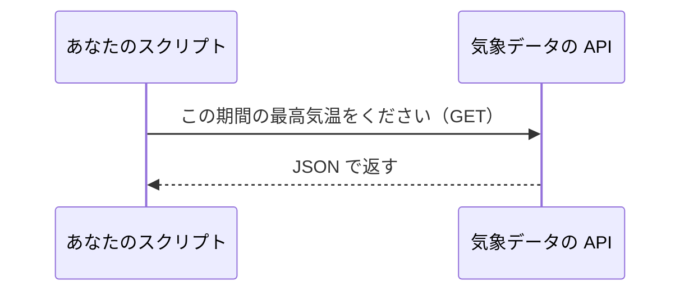
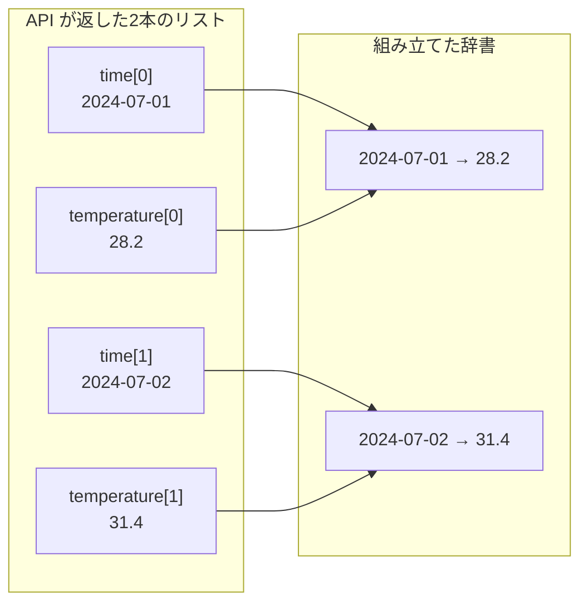
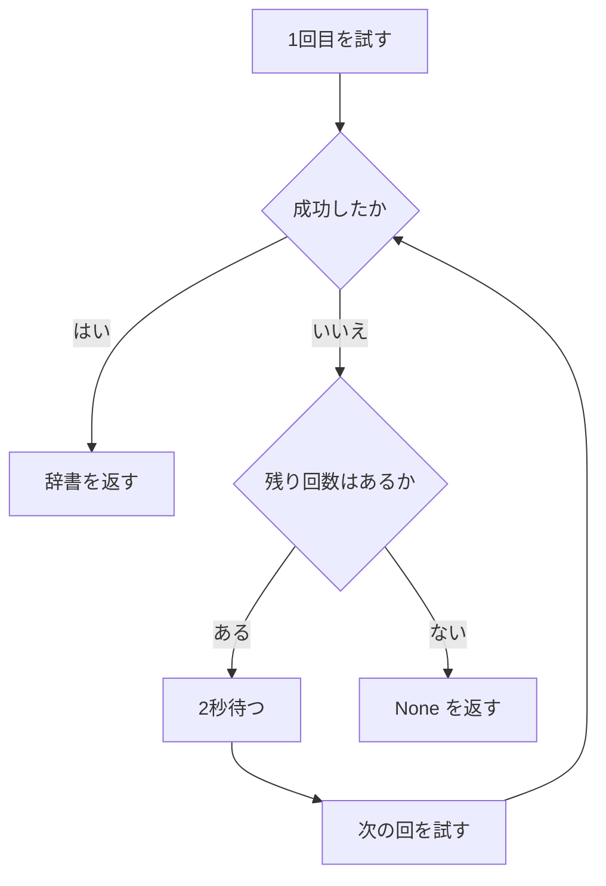
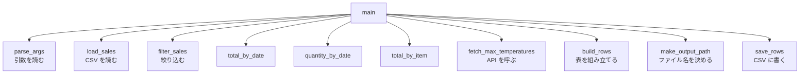

# 第10章 実践：データ処理スクリプト

ここまでの9章で、Python の道具はひととおりそろいました。
変数、条件分岐、繰り返し、リストと辞書、関数、モジュール、ファイル操作、例外、クラス、型ヒント。

ただ、道具が「そろっている」ことと「使える」ことは違います。
この章では、**1つの実用的なスクリプトを最初から最後まで作ります。**

作るのは、**売上データを集計して報告用のファイルを作るスクリプト**です。
これは、実務で最もよく書かれる種類のプログラムです。
手元にある CSV を読み、必要な行だけを取り出し、集計し、
足りない情報を外から取ってきて、結果をファイルに書き出す——
仕事で「ちょっとした自動化」と呼ばれるものの大半は、この形をしています。

この章の進め方は、これまでと少し違います。
新しい文法はほとんど出てきません（新しく学ぶのは `requests` と `argparse` の2つだけです）。
そのかわり、**すでに知っている道具を、どの順番で組み立てるか**を扱います。

そして、途中で必ず一度動かします。
全部書いてから動かすのではなく、**動く小さなものを作って、少しずつ育てます。**

## この章で学ぶこと

- CSV を読み込み、条件で絞り込み、集計するまでを、関数に分けて書けるようになる
- `requests` で外部の Web API からデータを取得し、返ってきた JSON を扱えるようになる
- 通信が失敗したときに、リトライして、それでも駄目なら処理を続ける書き方ができるようになる
- 集計結果を CSV に書き出し、ファイル名に日付を入れられるようになる
- `argparse` で、コマンドラインから条件を変えられるスクリプトにできるようになる
- 出来上がったスクリプトを関数に分割し、型ヒントを付けて ruff と mypy を通せるようになる

## この章の前提

- [第9章](./09-typing-and-tools.md) を終えていること
- とくに次の道具を使えること
  - CSV の読み書き（[7.4.1](./07-files-and-exceptions.md#741-csv-モジュール)）
  - JSON の読み書き（[7.4.2](./07-files-and-exceptions.md#742-json-モジュール)）
  - `pathlib` の `Path`（[7.3](./07-files-and-exceptions.md#73-パスを扱う)）
  - `try` / `except` と例外の種類（[7.5](./07-files-and-exceptions.md#75-例外)）
  - `@dataclass`（[8.5](./08-oop.md#85-dataclass)）
  - 型ヒント・`型 | None`・mypy・ruff（[9.1](./09-typing-and-tools.md#91-型ヒント) / [9.2.2](./09-typing-and-tools.md#922-optional-と--none) / [9.3](./09-typing-and-tools.md#93-型チェッカー) / [9.4](./09-typing-and-tools.md#94-開発ツール)）
  - `defaultdict`（[6.3.5](./06-modules.md#635-collections--便利なデータ構造)）
  - `datetime` と `strftime`（[6.3.2](./06-modules.md#632-datetime--日付と時刻)）
  - `sorted` の `key` とラムダ式（[5.5.3](./05-functions.md#553-sorted-の-key-に渡す)）
  - `enumerate`（[3.2.3](./03-control-flow.md#323-enumerate-で番号付きに回す)）
- 仮想環境の作成・有効化と `pip install`（[1.5](./01-environment.md#15-仮想環境venv) / [1.6.2](./01-environment.md#162-パッケージをインストールする)）

> **つまずいたら**
> この章は、**インターネットに接続している必要がある項が1つだけあります**（[10.3](#103-外部-api-からデータを取得する)）。
> 社内ネットワークやプロキシの環境で通信が失敗する場合でも、
> **10.3 以外はすべて手元だけで動きます。**
> `--no-weather` という指定を付ければ、通信せずに最後まで動かせるように作ります。
>
> AI に相談するときは、次のように書いてください。
>
> ```text
> python-text の 10.3.1 で詰まりました。
> python weather_check.py と打つと ConnectionError が出ます。
>
> ・OS: Windows 11
> ・エラーメッセージの全文（コピーして貼る）
> ・会社のネットワークかどうか: 会社のネットワーク
> ```

> **この章のコードを書く場所**
> **この章では、新しいプロジェクトを1つ作ります。**
> 第9章までの `python-lesson` は練習用のファイルが散らかっているので、
> ここからは `sales-analyzer` という別のディレクトリで作業します。
>
> **Windows（PowerShell）**
>
> ```powershell
> cd $HOME
> mkdir sales-analyzer
> cd sales-analyzer
> python -m venv .venv
> .\.venv\Scripts\Activate.ps1
> ```
>
> **macOS / Linux**
>
> ```bash
> cd ~
> mkdir sales-analyzer
> cd sales-analyzer
> python3 -m venv .venv
> source .venv/bin/activate
> ```
>
> `mkdir`（メイクディレクトリ）は、ディレクトリを新しく作る命令です。
> ターミナルの行頭に `(.venv)` が付いたら準備完了です
> （付かない場合は [1.5.5](./01-environment.md#155-powershell-の実行ポリシーで有効化できないとき)）。
>
> 続けて、この章で使う道具を入れます。**4つまとめて入れてかまいません。**
>
> ```powershell
> pip install requests ruff mypy types-requests
> ```
>
> macOS でも、仮想環境を有効化していれば同じコマンドです。
> `requests` は 10.3 で、`ruff` と `mypy` は 10.6 で使います
> （`types-requests` が何かは [10.6.2](#1062-型ヒントを付ける) で説明します）。
>
> 以降、実行コマンドは Windows の形（`python ファイル名`）で書きます。
> **仮想環境を有効化しているあいだは、macOS でも `python` で動きます。**

---

## 10.1 作るものを決める

### 10.1.1 完成イメージ

**コードを書く前に、「何ができたら完成なのか」を決めます。**

ここを決めずに書き始めると、途中で「そもそも何を作ろうとしていたんだったか」が
分からなくなります。プログラムが書けないのではなく、
**作るものが決まっていないから手が止まる**、というのが実際によくある詰まり方です。

今回作るものを、先に見せます。

あなたは、アイスクリームと飲み物を売る2店舗のデータを預かっています。
手元にあるのは、日付・店舗・商品・数量・単価が並んだ CSV です。
知りたいのは次の3つです。

1. どの商品がいくら売れたのか
2. 日ごとの売上はどう動いたのか
3. **その日の暑さと、売上に関係はあるのか**

3つ目が、この章の面白いところです。
気温は手元の CSV には入っていません。**外から取ってきます。**

完成したスクリプトは、ターミナルからこう使えます。

```powershell
python analyze_sales.py --start 2024-07-04 --shop 本店
```

```text
実行結果:
【2024-07-04 〜 2024-07-07 の商品別売上】
ソフトクリーム: 105,700円
かき氷: 99,000円
ホットコーヒー: 17,100円
4日ぶんを out\sales_report_20260831.csv に書き出しました
```

そして、書き出された CSV の中身がこうなります。

```text
date,quantity,total,max_temperature
2024-07-04,122,46350,33.2
2024-07-05,134,51500,33.7
2024-07-06,168,64700,33.7
2024-07-07,155,59250,32.9
```

いちばん右の列が、外から取ってきた**その日の最高気温**です。
気温が高い日ほど売上が大きい、という並びが1枚の表になりました。

> **補足**
> `sales_report_20260831.csv` の数字の部分は、**スクリプトを実行した日**の日付です。
> このテキストの実行結果は 2026年8月31日に実行したものなので `20260831` になっています。
> あなたの手元では、あなたが実行した日の日付になります（[10.4.2](#1042-ファイル名に日付を入れる)）。

### 10.1.2 処理の流れを書き出す

完成イメージが決まったら、**そこにたどり着くまでの流れを、日本語で分解します。**

いきなりコードを書くのではなく、「何をする箱がいくつ必要か」を先に並べます。
このあと、この箱がそのまま関数1つになります。



矢印の向きに注目してください。**データは一方向にしか流れません。**
読み込んだものを絞り込み、絞り込んだものを集計し、集計したものを書き出す。
前に戻る矢印がない、というのがこの形の良いところです。

流れが一方向だと、**途中で止めて確認できます。**
「読み込むところまでは正しいか」「絞り込みまでは正しいか」と、
1つずつ確かめながら前に進めます。この章はその順番で書いていきます。

> **補足**
> 図の中で、外部 API から気温を取る箱（D）だけは、失敗する可能性があります。
> 通信が絡む処理は、**自分のパソコンの外**に用事があるからです。
> ここをどう扱うかは [10.3.3](#1033-エラー処理とリトライ) で正面から扱います。

---

## 10.2 CSV を読み込んで集計する

### 10.2.1 データを用意する

まず、読み込む CSV を作ります。
`sales-analyzer` の中に `data` ディレクトリを作り、その中に置きます。

**Windows（PowerShell）**

```powershell
mkdir data
```

**macOS / Linux**

```bash
mkdir data
```

VS Code で `sales-analyzer` フォルダを開き、`data` の中に
`sales.csv` というファイルを作って、次の内容をそのまま貼り付けてください。

`sales-analyzer/data/sales.csv`

```text
date,shop,item,quantity,unit_price
2024-07-01,本店,ソフトクリーム,42,350
2024-07-01,本店,かき氷,18,450
2024-07-01,本店,ホットコーヒー,35,300
2024-07-01,駅前店,ソフトクリーム,30,350
2024-07-01,駅前店,焼きドーナツ,24,200
2024-07-02,本店,ソフトクリーム,55,350
2024-07-02,本店,かき氷,31,450
2024-07-02,本店,ホットコーヒー,22,300
2024-07-02,駅前店,ソフトクリーム,38,350
2024-07-02,駅前店,アイスコーヒー,26,300
2024-07-03,本店,ソフトクリーム,51,350
2024-07-03,本店,かき氷,29,450
2024-07-03,本店,ホットコーヒー,25,300
2024-07-03,駅前店,ソフトクリーム,40,350
2024-07-03,駅前店,焼きドーナツ,19,200
2024-07-04,本店,ソフトクリーム,63,350
2024-07-04,本店,かき氷,44,450
2024-07-04,本店,ホットコーヒー,15,300
2024-07-04,駅前店,ソフトクリーム,47,350
2024-07-04,駅前店,アイスコーヒー,33,300
2024-07-05,本店,ソフトクリーム,70,350
2024-07-05,本店,かき氷,52,450
2024-07-05,本店,ホットコーヒー,12,300
2024-07-05,駅前店,ソフトクリーム,55,350
2024-07-05,駅前店,アイスコーヒー,41,300
2024-07-06,本店,ソフトクリーム,88,350
2024-07-06,本店,かき氷,66,450
2024-07-06,本店,ホットコーヒー,14,300
2024-07-06,駅前店,ソフトクリーム,72,350
2024-07-06,駅前店,アイスコーヒー,48,300
2024-07-06,駅前店,焼きドーナツ,30,200
2024-07-07,本店,ソフトクリーム,81,350
2024-07-07,本店,かき氷,58,450
2024-07-07,本店,ホットコーヒー,16,300
2024-07-07,駅前店,ソフトクリーム,64,350
2024-07-07,駅前店,アイスコーヒー,39,300
```

先頭行が見出し、それ以降が1行1件のデータです。全部で36件あります。

| 列名 | 意味 |
|------|------|
| `date` | 売れた日（`2024-07-01` の形） |
| `shop` | 店舗名（本店 / 駅前店） |
| `item` | 商品名 |
| `quantity` | 売れた個数 |
| `unit_price` | 1個あたりの値段（円） |

**36件は、目で数えるには多く、プログラムで扱うには少ない、ちょうどよい量です。**
手作業でやると面倒だと感じ、かつ結果が合っているか目で確かめられます。

> **注意**
> ファイルは**必ず UTF-8 で保存**してください（[7.1.4](./07-files-and-exceptions.md#714-文字コードの指定encodingutf-8)）。
> VS Code は既定で UTF-8 なので、そのまま保存すれば問題ありません。
> Excel で作った CSV を使うと、Windows では cp932 で保存されて
> `UnicodeDecodeError` になることがあります。

### 10.2.2 読み込んで表示する

最初に書くのは、**読み込んで表示するだけ**のプログラムです。
集計も気温もまだ考えません。

`sales-analyzer/analyze_sales.py`

```python
"""売上 CSV を集計し、その日の最高気温と並べて書き出すスクリプト。"""

import csv
from dataclasses import dataclass
from pathlib import Path


@dataclass
class Sale:
    """売上 1 行ぶん。"""

    date: str
    shop: str
    item: str
    quantity: int
    unit_price: int

    def subtotal(self) -> int:
        """この行の売上金額（数量 × 単価）を返す。"""
        return self.quantity * self.unit_price


def load_sales(path: Path) -> list[Sale]:
    """CSV を読み込んで Sale のリストを返す。"""
    sales: list[Sale] = []
    with open(path, encoding="utf-8", newline="") as f:
        reader = csv.DictReader(f)
        for row in reader:
            sales.append(
                Sale(
                    date=row["date"],
                    shop=row["shop"],
                    item=row["item"],
                    quantity=int(row["quantity"]),
                    unit_price=int(row["unit_price"]),
                )
            )
    return sales


def main() -> None:
    """読み込んで最初の3件だけ表示する。"""
    sales = load_sales(Path("data/sales.csv"))
    print(f"{len(sales)}件の売上を読み込みました")
    for sale in sales[:3]:
        print(f"{sale.date} {sale.shop} {sale.item} {sale.subtotal():,}円")


if __name__ == "__main__":
    main()
```

`sales-analyzer` にいることを確認して、実行します。

```powershell
python analyze_sales.py
```

```text
実行結果:
36件の売上を読み込みました
2024-07-01 本店 ソフトクリーム 14,700円
2024-07-01 本店 かき氷 8,100円
2024-07-01 本店 ホットコーヒー 10,500円
```

ここまでで、確認できたことが3つあります。

1. ファイルの場所が合っている（`FileNotFoundError` が出ていない）
2. 文字コードが合っている（日本語が化けていない）
3. 数値への変換が効いている（`14,700円` という掛け算の結果が出ている）

**この3つは、あとで問題が起きたときに真っ先に疑う場所です。**
先に潰しておくと、このあとの作業が楽になります。

書いたコードのうち、説明が要る部分を見ていきます。

**`Sale` クラス**

CSV の1行を、辞書ではなく `@dataclass`（[8.5](./08-oop.md#85-dataclass)）で受け取っています。
`csv.DictReader` が返すのは辞書なので、そのまま辞書で持つこともできます。
それでもクラスにするのは、次の2つのためです。

- `sale.quantity` と書ける（`row["quantity"]` より打ち間違いに気づきやすい）
- `subtotal()` という**振る舞い**を、データと一緒に置ける（[8.6.2](./08-oop.md#862-状態と振る舞いがセットのとき)）

**`int()` での変換**

CSV から読んだ値は、**数字に見えてもすべて文字列**です（[7.4.1](./07-files-and-exceptions.md#741-csv-モジュール)）。
`Sale` を作るときに `int(row["quantity"])` と変換しています。
ここで変換しておくと、**このあと一度も変換のことを考えずに済みます。**

**キーワード引数での組み立て**

```python
Sale(
    date=row["date"],
    shop=row["shop"],
    ...
)
```

`Sale(row["date"], row["shop"], ...)` と位置引数で書いても動きます。
それでもキーワード引数（[5.2.2](./05-functions.md#522-キーワード引数)）にしているのは、
**項目が5つあると、順番を間違えても気づけないから**です。
`shop` と `item` を入れ替えても、どちらも文字列なのでエラーになりません。

> **よくある間違い**
> `FileNotFoundError: [Errno 2] No such file or directory: 'data/sales.csv'` が出たら、
> **ターミナルの現在地が `sales-analyzer` になっていない**可能性が高いです。
> ファイルを開くときの基準は、**ターミナルの現在地**でした（[7.1.1](./07-files-and-exceptions.md#711-open-と-read)）。
> `python-lesson` にいたまま実行していないか、確認してください。
>
> 現在地は、Windows なら `pwd`、macOS でも `pwd` で表示できます。

### 10.2.3 条件で絞り込む

次に、**期間と店舗で絞り込む関数**を足します。

`analyze_sales.py` の `load_sales` の**あと**に、次の関数を追加してください。

```python
def filter_sales(
    sales: list[Sale], start: str, end: str, shop: str | None = None
) -> list[Sale]:
    """期間（start 〜 end、両端を含む）と店舗で絞り込んだリストを返す。"""
    result: list[Sale] = []
    for sale in sales:
        if sale.date < start or sale.date > end:
            continue
        if shop is not None and sale.shop != shop:
            continue
        result.append(sale)
    return result
```

そして `main` を、次のように書き換えます。

```python
def main() -> None:
    """絞り込みの結果を件数で確かめる。"""
    sales = load_sales(Path("data/sales.csv"))
    print(f"全体: {len(sales)}件")

    week = filter_sales(sales, "2024-07-04", "2024-07-06")
    print(f"7月4日〜6日: {len(week)}件")

    honten = filter_sales(sales, "2024-07-04", "2024-07-06", shop="本店")
    print(f"7月4日〜6日の本店: {len(honten)}件")
```

```powershell
python analyze_sales.py
```

```text
実行結果:
全体: 36件
7月4日〜6日: 16件
7月4日〜6日の本店: 9件
```

CSV を見ながら数えると、確かに 7月4日〜6日は16件、うち本店が9件です。
**絞り込みの正しさは、まず件数で確かめてください。**
中身を全部表示しなくても、数が合っていれば大きな取り違えはありません。

この関数には、説明しておくべきことが3つあります。

**1. 日付を文字列のまま比較している**

```python
if sale.date < start or sale.date > end:
```

`sale.date` は `"2024-07-04"` という**文字列**です。
文字列どうしの `<` は、辞書と同じように**先頭の文字から順に比較**します。

`"2024-07-04" < "2024-07-06"` は、先頭から9文字目までが同じで、
10文字目の `4` と `6` を比べて `True` になります。

**これがうまくいくのは、日付が `YYYY-MM-DD` の形にそろっているからです。**
桁数が固定で、大きい単位が左にあるので、文字として比べても日付として比べても結果が同じになります。

```python
# REPL で確かめてみてください
>>> "2024-07-04" < "2024-07-06"
True
>>> "2024-12-31" < "2025-01-01"
True
```

もし日付が `2024/7/4` のような形だったら、この比較は使えません
（`"2024/7/4"` と `"2024/12/1"` を比べると、`7` と `1` の比較になって
7月のほうが後ろだと判定されます）。**形がそろっているから成立する書き方です。**

**2. 早期 `continue` で条件を1つずつ落としている**

```python
for sale in sales:
    if sale.date < start or sale.date > end:
        continue
    if shop is not None and sale.shop != shop:
        continue
    result.append(sale)
```

条件を `and` でつないで1つの `if` にすることもできますが、
**「当てはまらないものを1つずつ落としていく」形**にすると、
あとから条件を足すときに1行増やすだけで済みます（[3.4.2](./03-control-flow.md#342-早期-continue-で浅くする)）。

**3. `shop=None` は「絞り込まない」という意味**

`shop` の既定値を `None` にして、`if shop is not None` で判定しています。
これは「省略されたら全店舗が対象」という意味です。

`shop=""`（空文字列）を既定値にする手もありますが、
**「値がない」ことを表すのは `None` だと決めておくほうが、読む人が迷いません**
（[5.2.4](./05-functions.md#524-デフォルト引数にリストを使ってはいけない) / [9.2.2](./09-typing-and-tools.md#922-optional-と--none)）。

### 10.2.4 集計する

いよいよ集計です。3つの関数を作ります。

- 日付ごとの**売上金額**
- 日付ごとの**販売個数**
- 商品ごとの**売上金額**

`filter_sales` の**あと**に、次の3つを追加してください。

```python
def total_by_date(sales: list[Sale]) -> dict[str, int]:
    """日付ごとの売上金額を返す。"""
    totals: defaultdict[str, int] = defaultdict(int)
    for sale in sales:
        totals[sale.date] += sale.subtotal()
    return dict(totals)


def quantity_by_date(sales: list[Sale]) -> dict[str, int]:
    """日付ごとの販売個数を返す。"""
    quantities: defaultdict[str, int] = defaultdict(int)
    for sale in sales:
        quantities[sale.date] += sale.quantity
    return dict(quantities)


def total_by_item(sales: list[Sale]) -> dict[str, int]:
    """商品ごとの売上金額を返す。"""
    totals: defaultdict[str, int] = defaultdict(int)
    for sale in sales:
        totals[sale.item] += sale.subtotal()
    return dict(totals)
```

ファイルの先頭の `import` に、1行足してください。

```python
from collections import defaultdict
```

`main` を書き換えます。

```python
def main() -> None:
    """集計結果を表示する。"""
    sales = load_sales(Path("data/sales.csv"))
    target = filter_sales(sales, "2024-07-01", "2024-07-07")

    print("【日ごとの売上】")
    date_totals = total_by_date(target)
    for date in sorted(date_totals):
        print(f"{date}: {date_totals[date]:,}円")

    print()
    print("【商品ごとの売上】")
    item_totals = total_by_item(target)
    for item, amount in sorted(
        item_totals.items(), key=lambda pair: pair[1], reverse=True
    ):
        print(f"{item}: {amount:,}円")
```

```powershell
python analyze_sales.py
```

```text
実行結果:
【日ごとの売上】
2024-07-01: 48,600円
2024-07-02: 60,900円
2024-07-03: 56,200円
2024-07-04: 72,700円
2024-07-05: 83,050円
2024-07-06: 110,300円
2024-07-07: 93,350円

【商品ごとの売上】
ソフトクリーム: 278,600円
かき氷: 134,100円
アイスコーヒー: 56,100円
ホットコーヒー: 41,700円
焼きドーナツ: 14,600円
```

**36行の CSV が、7行と5行の要約になりました。** これが集計です。

説明が必要な部分を見ていきます。

**`defaultdict(int)`**

第6章で使った `defaultdict` は `defaultdict(list)` でした（[6.3.5](./06-modules.md#635-collections--便利なデータ構造)）。
渡すものを `int` に変えると、**まだないキーを読んだときに `0` から始まる辞書**になります。

```python
totals = defaultdict(int)
totals["2024-07-01"] += 14700   # キーがなくても 0 + 14700 になる
```

普通の辞書だと `KeyError` になるので、`totals.get(key, 0) + ...` と書く必要がありました
（[4.3.3](./04-data-structures.md#433-get-で安全に取り出す)）。`defaultdict(int)` はその手間をなくします。

**`defaultdict[str, int]` という型ヒント**

```python
totals: defaultdict[str, int] = defaultdict(int)
```

空の状態から作るので、型ヒントが要ります（[9.4.2](./09-typing-and-tools.md#942-設定ファイルpyprojecttoml)）。
`defaultdict` も `dict` と同じく `[キーの型, 値の型]` の形で書けます。

**`return dict(totals)` で普通の辞書に戻している**

`defaultdict` は便利ですが、**渡した先で困ることがあります。**
知らないキーを読んでもエラーにならないので、
打ち間違えたキーが `0` として静かに通ってしまうのです。

```python
totals = defaultdict(int)
totals["2024-07-01"] += 100
print(totals["2024-07-99"])   # 0 が返る。打ち間違いに気づけない
```

**集計している最中だけ `defaultdict` を使い、返すときは普通の辞書に戻す。**
`dict(totals)` がその変換です。こうしておくと、受け取った側で存在しないキーを読めば
`KeyError` になり、間違いがその場で分かります。

**`sorted(辞書)` と `sorted(辞書.items(), key=...)`**

```python
for date in sorted(date_totals):            # キー（日付）の順
for item, amount in sorted(
    item_totals.items(), key=lambda pair: pair[1], reverse=True
):                                          # 値（金額）の大きい順
```

`sorted(辞書)` は**キーを並べたリスト**を返します（[4.3.4](./04-data-structures.md#434-キー値両方を回す)）。
日付順に見たいときはこれで十分です。

金額の大きい順に並べたいときは、`items()` で「（キー, 値）のタプル」のリストにしてから、
`key` で「2番目の要素で並べる」と指示します（[5.5.3](./05-functions.md#553-sorted-の-key-に渡す)）。
`pair[1]` の `[1]` が、タプルの2番目＝金額です。

> **よくある間違い**
> `key=lambda pair: pair[1]` の `pair[1]` を `pair[0]` と書くと、
> エラーは出ませんが**商品名の順**に並びます。
> 「エラーにならないのに結果が違う」ときは、`key` に渡している式を疑ってください。
>
> 迷ったら、いったん `print` して確かめるのが確実です。
>
> ```python
> print(list(item_totals.items()))
> ```
>
> ```text
> 実行結果:
> [('ソフトクリーム', 278600), ('かき氷', 134100), ('アイスコーヒー', 56100), ('ホットコーヒー', 41700), ('焼きドーナツ', 14600)]
> ```
>
> タプルの `[0]` が商品名、`[1]` が金額だと目で確かめられます。

ここまでで、**手元のデータだけでできること**は終わりです。
次は、外からデータを取ってきます。

---

## 10.3 外部 API からデータを取得する

### 10.3.1 `requests` を使う

手元の CSV には、気温が入っていません。
気温は、**インターネット上のサービスから取ってきます。**

こういうときに使うのが **API**（エーピーアイ。Application Programming Interface。
プログラムから使うための窓口）です。
第1章から使ってきた「人間向けの Web ページ」とは違い、
**プログラムが読みやすい形（多くは JSON）でデータを返す URL** だと思ってください。



このテキストでは **Open-Meteo**（オープンメテオ）という気象データの API を使います。
利用者登録も鍵（API キー）も要らず、過去の気温をそのまま取得できるためです。

- 公式サイト：[https://open-meteo.com/](https://open-meteo.com/)
- 使うのは「Historical Weather API」（過去の気象データ）です

Python から API を呼ぶには、**`requests`**（リクエスツ）というライブラリを使います。
これは標準ライブラリではないので、`pip install` が必要です
（この章の冒頭でまとめて入れてあります）。

入っているか確認しておきます。

```powershell
pip show requests
```

```text
実行結果:
Name: requests
Version: 2.34.2
...
```

`WARNING: Package(s) not found: requests` と出た場合は、
仮想環境を有効化してから `pip install requests` を実行してください。

**まず、API を1回だけ呼んで、何が返ってくるかを見ます。**
`analyze_sales.py` はいったん置いて、確認用の別ファイルを作ります。

`sales-analyzer/weather_check.py`

```python
"""気象データの API を1回だけ呼んで、返ってきたものを確かめる。"""

import json

import requests

API_URL = "https://archive-api.open-meteo.com/v1/archive"


def main() -> None:
    """API を呼んで、返ってきた JSON をそのまま表示する。"""
    params = {
        "latitude": 35.6895,
        "longitude": 139.6917,
        "start_date": "2024-07-01",
        "end_date": "2024-07-07",
        "daily": "temperature_2m_max",
        "timezone": "Asia/Tokyo",
    }
    response = requests.get(API_URL, params=params, timeout=10)
    print(f"ステータスコード: {response.status_code}")

    data = response.json()
    print(json.dumps(data, ensure_ascii=False, indent=2)[:400])


if __name__ == "__main__":
    main()
```

```powershell
python weather_check.py
```

```text
実行結果:
ステータスコード: 200
{
  "latitude": 35.676624,
  "longitude": 139.69112,
  "generationtime_ms": 0.07808208465576172,
  "utc_offset_seconds": 32400,
  "timezone": "Asia/Tokyo",
  "timezone_abbreviation": "GMT+9",
  "elevation": 40.0,
  "daily_units": {
    "time": "iso8601",
    "temperature_2m_max": "°C"
  },
  "daily": {
    "time": [
      "2024-07-01",
      "2024-07-02",
      "2024-07-03",
      "2024-07-04",
```

インターネットから、実際のデータが返ってきました。
書いたコードを1つずつ見ます。

**`requests.get(URL, params=..., timeout=...)`**

`get`（ゲット）は「このデータをください」という種類の要求です。
戻り値は**レスポンス**（応答）を表すオブジェクトで、
そこから状態や中身を取り出します。

| 書いたもの | 意味 |
|-----------|------|
| `API_URL` | 呼び出す先の URL |
| `params` | URL のうしろに付ける条件（緯度・経度・期間など） |
| `timeout=10` | 10秒返事がなければ諦める |

**`params` は辞書で渡す**

`params` に辞書を渡すと、`requests` が
`?latitude=35.6895&longitude=139.6917&...` という形に組み立ててくれます。
この `?` 以降の部分を**クエリ文字列**と呼びます。

自分で文字列をつないで URL を作ることもできますが、
**日本語や記号が含まれると変換が必要**になり、間違えやすい部分です。
`params` に任せるのが確実です。

今回渡している条件の意味です。

| キー | 値 | 意味 |
|------|----|------|
| `latitude` | `35.6895` | 緯度（東京駅のあたり） |
| `longitude` | `139.6917` | 経度 |
| `start_date` / `end_date` | `2024-07-01` / `2024-07-07` | 取得したい期間 |
| `daily` | `temperature_2m_max` | 日ごとの最高気温がほしい |
| `timezone` | `Asia/Tokyo` | 日本時間で日付を区切る |

**`timeout=10` は必ず書く**

`timeout` を書かないと、相手が応答しないときに**いつまでも待ち続けます。**
待っている間、プログラムは何も表示せず、止まったようにしか見えません。
`Ctrl` + `C` で止めるしかなくなります（[3.2.5](./03-control-flow.md#325-無限ループから抜け出す)）。

**通信するときは `timeout` を必ず書く。** これは例外なくそうしてください。

**`response.status_code`**

サーバーが返す3桁の番号です。`200` は「うまくいった」という意味です。

| 番号 | 意味 |
|------|------|
| 200 | 成功 |
| 400 | こちらの要求がおかしい（条件の書き方の間違いなど） |
| 404 | その URL は存在しない |
| 500 | 相手側で問題が起きた |

**`response.json()`**

返ってきた本文（JSON の文字列）を、**Python の辞書に変換**して返します。
`json.loads(response.text)` と書いたのと同じことです（[7.4.2](./07-files-and-exceptions.md#742-json-モジュール)）。

最後の `json.dumps(data, ensure_ascii=False, indent=2)[:400]` は、
**辞書を読みやすい文字列に戻して、先頭400文字だけ表示**しています。
全部表示すると長いので、スライス（[2.4.2](./02-basics.md#242-インデックスとスライス)）で切っています。

> **注意**
> `requests` は**外部のサービス**に通信します。
> 会社や学校のネットワークでは、プロキシの設定が必要で失敗することがあります。
> その場合でも、この章は最後まで進められるように作ります（[10.5.2](#1052-引数を受け取る) の `--no-weather`）。
> エラーが出たら、まず [10.3.3](#1033-エラー処理とリトライ) まで読み進めてください。

### 10.3.2 JSON を扱う

返ってきた JSON のうち、**必要なのは `daily` の中だけ**です。
`weather_check.py` の表示を、`daily` だけに絞ってみます。

`weather_check.py` の `main` の最後の2行を、次のように書き換えてください。

```python
    data = response.json()
    print(json.dumps(data["daily"], ensure_ascii=False, indent=2))
```

```powershell
python weather_check.py
```

```text
実行結果:
ステータスコード: 200
{
  "time": [
    "2024-07-01",
    "2024-07-02",
    "2024-07-03",
    "2024-07-04",
    "2024-07-05",
    "2024-07-06",
    "2024-07-07"
  ],
  "temperature_2m_max": [
    28.2,
    31.4,
    31.4,
    33.2,
    33.7,
    33.7,
    32.9
  ]
}
```

**ここが、この章でいちばん頭を使うところです。**

ほしいのは「7月1日は 28.2 度」という**組**ですが、
返ってきたのは**2本の別々のリスト**です。

```text
time:               ["2024-07-01", "2024-07-02", "2024-07-03", ...]
temperature_2m_max: [28.2,         31.4,         31.4,         ...]
```

**2本のリストは、同じ順番で並んでいます。**
`time` の0番目と `temperature_2m_max` の0番目が同じ日のデータです。
つまり、**同じ番号どうしを組にすれば**、ほしい形になります。

番号付きで回す道具は、すでに知っています。`enumerate` です（[3.2.3](./03-control-flow.md#323-enumerate-で番号付きに回す)）。

```python
temperatures = {}
for index, day in enumerate(data["daily"]["time"]):
    temperatures[day] = data["daily"]["temperature_2m_max"][index]
```

`index` が 0, 1, 2, ... と進み、`day` に日付が入ります。
その `index` を使って、もう一方のリストから同じ位置の気温を取り出しています。

**`data["daily"]["temperature_2m_max"]` というキーの名前**にも注目してください。
これは、`params` の `"daily"` に**こちらが送った値そのもの**です。

```python
"daily": "temperature_2m_max",                              # 送るとき
data["daily"]["temperature_2m_max"]                         # 受け取るとき
```

Open-Meteo は、**要求された変数名を、そのままキーにして返します。**
つまり、`"daily"` に `"precipitation_sum"`（日ごとの降水量）を送れば、
返ってくるキーも `"precipitation_sum"` になります。
**送る値を変えれば、別の種類のデータが同じ形で取れる**ということです。

図にすると、こういう対応です。



**なぜ辞書にするのか**は、あとの工程を考えると分かります。
集計結果は日付ごとに並んでいるので、
「この日付の気温は？」と**日付をキーにして引ければ**、そのまま並べられます。
リストのままだと、毎回「何番目か」を探す必要があります。

この変換を関数にします。`analyze_sales.py` に戻り、
`total_by_item` の**あと**に追加してください。

```python
def fetch_max_temperatures(start: str, end: str) -> dict[str, float]:
    """期間中の日ごとの最高気温を返す。"""
    params: dict[str, str] = {
        "latitude": str(LATITUDE),
        "longitude": str(LONGITUDE),
        "start_date": start,
        "end_date": end,
        "daily": "temperature_2m_max",
        "timezone": "Asia/Tokyo",
    }
    response = requests.get(API_URL, params=params, timeout=10)
    data = response.json()

    temperatures: dict[str, float] = {}
    for index, day in enumerate(data["daily"]["time"]):
        temperatures[day] = data["daily"]["temperature_2m_max"][index]
    return temperatures
```

ファイルの先頭に `import requests` を足し、
`import` 群の下に定数を3行足します（定数は大文字で書くのでした。[2.1.4](./02-basics.md#214-定数の慣習)）。

```python
import requests

API_URL = "https://archive-api.open-meteo.com/v1/archive"
LATITUDE = 35.6895
LONGITUDE = 139.6917
```

`main` の最後に、確認用の3行を足します。

```python
    print()
    temperatures = fetch_max_temperatures("2024-07-01", "2024-07-07")
    print(temperatures)
```

```powershell
python analyze_sales.py
```

```text
実行結果:
（日ごとの売上・商品ごとの売上の表示は省略）

{'2024-07-01': 28.2, '2024-07-02': 31.4, '2024-07-03': 31.4, '2024-07-04': 33.2, '2024-07-05': 33.7, '2024-07-06': 33.7, '2024-07-07': 32.9}
```

ほしかった形になりました。

> **補足**
> `params` の値を `str(LATITUDE)` と文字列に変換しているのは、
> **辞書の値の型をそろえるため**です。
> 数値と文字列が混ざった辞書は `dict[str, object]` という型になり、
> 10.6 で mypy を通すときに困ります。
> URL のクエリ文字列は、どのみちすべて文字列として送られるので、
> **はじめから文字列でそろえておく**のが素直です。

> **よくある間違い**
> `data["daily"]["time"]` のような**入れ子の辞書**は、
> どこか1つでもキーを打ち間違えると `KeyError` になります。
>
> ```text
> KeyError: 'dayly'
> ```
>
> このエラーが出たら、**まず `print(data.keys())` でキーの一覧を見てください。**
> API のドキュメントを読み直すより速いことがよくあります。
>
> ```python
> print(data.keys())
> ```
>
> ```text
> 実行結果:
> dict_keys(['latitude', 'longitude', 'generationtime_ms', 'utc_offset_seconds', 'timezone', 'timezone_abbreviation', 'elevation', 'daily_units', 'daily'])
> ```

### 10.3.3 エラー処理とリトライ

いまの `fetch_max_temperatures` には、**大きな問題があります。**

**通信は失敗します。** これは「たまに」ではなく「必ずいつか」起きます。

- Wi-Fi が切れている
- 相手のサーバーが一時的に止まっている
- 会社のプロキシに止められた
- 条件の書き方が間違っていて `400` が返ってきた

いまのコードは、そのどれが起きても**トレースバックを出して止まります。**
36件の集計は正しくできていたのに、気温が取れなかったせいで
**結果が1文字も出ない**、という状態です。

ここで思い出してほしいのが、[7.6.3](./07-files-and-exceptions.md#763-どこで例外を捕まえるべきか) の考え方です。
**例外は「どうするか決められる場所」で捕まえる。**

今回、決められることははっきりしています。

> 気温が取れなくても、**売上の集計だけは出す。**

そう決めたので、この関数は「取れなければ `None` を返す」形にします。

書き直したものが、次です。`fetch_max_temperatures` を丸ごと置き換えてください。

```python
def fetch_max_temperatures(start: str, end: str) -> dict[str, float] | None:
    """期間中の日ごとの最高気温を返す。取得できなければ None を返す。"""
    params: dict[str, str] = {
        "latitude": str(LATITUDE),
        "longitude": str(LONGITUDE),
        "start_date": start,
        "end_date": end,
        "daily": "temperature_2m_max",
        "timezone": "Asia/Tokyo",
    }
    for attempt in range(1, RETRY_COUNT + 1):
        try:
            response = requests.get(API_URL, params=params, timeout=10)
            response.raise_for_status()
            data = response.json()
        except requests.RequestException as e:
            print(f"気温の取得に失敗しました（{attempt}回目）: {e}")
            if attempt < RETRY_COUNT:
                time.sleep(RETRY_WAIT_SECONDS)
            continue

        temperatures: dict[str, float] = {}
        for index, day in enumerate(data["daily"]["time"]):
            temperatures[day] = data["daily"]["temperature_2m_max"][index]
        return temperatures

    return None
```

`import` に `import time` を足し、定数を2行足してください。

```python
RETRY_COUNT = 3
RETRY_WAIT_SECONDS = 2
```

順に説明します。

**`response.raise_for_status()`**

`requests` は、`404` や `500` が返ってきても**例外を出しません。**
「サーバーとのやり取り自体は成功した」と考えるからです。

`raise_for_status()` を呼ぶと、**`400` 番台・`500` 番台のときに例外を出してくれます。**

**この1行を書き忘れると、エラーの JSON をそのまま集計しようとして、
ずっと先の行で意味の分からない `KeyError` になります。**

**`except requests.RequestException`**

`requests` が出す例外は、種類がいくつもあります。

| 例外 | 起きる場面 |
|------|-----------|
| `requests.ConnectionError` | つながらない（Wi-Fi 断・名前解決できない） |
| `requests.Timeout` | 時間内に返事が来ない |
| `requests.HTTPError` | `raise_for_status()` が投げる（400 / 500 など） |

これらは**すべて `requests.RequestException` を継承しています**（[8.3](./08-oop.md#83-継承)）。
親クラスで受けると、まとめて捕まえられます。

「広い例外を先に書かない」（[7.5.3](./07-files-and-exceptions.md#753-例外の種類を指定する)）と学びましたが、
これは `Exception` のような**何でも捕まえる例外**の話です。
`RequestException` は「通信まわりの失敗」だけを表すので、この使い方は適切です。

**リトライの流れ**



`for attempt in range(1, RETRY_COUNT + 1)` で1〜3回まわします。
`range(1, 4)` なので `attempt` は 1, 2, 3 です（[3.2.2](./03-control-flow.md#322-range)）。
`1` から始めているのは、`print` で「1回目」と人間向けに表示するためです。

**`time.sleep(2)` で2秒待つ**

`time.sleep(秒数)`（[6.3](./06-modules.md#63-標準ライブラリを使う) と同じ標準ライブラリの1つです）は、
指定した秒数だけプログラムを止めます。

**なぜ待つのか。** 失敗した直後にもう一度投げても、
相手側の事情（一時的な混雑など）は解消していない可能性が高いからです。
少し待つことで、成功する見込みが上がります。

**`if attempt < RETRY_COUNT:`** が付いているのは、
**最後の失敗のあとに待つ意味がない**からです。
これがないと、諦めると決まっているのに2秒余計に待つことになります。

**`continue` と、ループのあとの `return None`**

`except` の最後に `continue` があるので、失敗したら次の回に進みます。
3回とも失敗すると `for` が終わり、**ループのあとの `return None`** に到達します。

つまり、この関数の戻り値は `dict[str, float] | None` です（[9.2.2](./09-typing-and-tools.md#922-optional-と--none)）。
受け取る側は、**使う前に `is None` を確認する義務**を負います。

**動かして確かめる**

わざと失敗させてみます。**開始日と終了日を逆にする**と、API は `400` を返します。
確認用のファイルを作ってください。

`sales-analyzer/retry_check.py`

```python
"""気温取得の失敗時の動きを確かめる。"""

from analyze_sales import fetch_max_temperatures


def main() -> None:
    """わざと開始日と終了日を逆にして呼んでみる。"""
    result = fetch_max_temperatures("2024-07-05", "2024-07-03")
    print(f"戻り値: {result}")


if __name__ == "__main__":
    main()
```

```powershell
python retry_check.py
```

```text
実行結果:
気温の取得に失敗しました（1回目）: 400 Client Error: Bad Request for url: https://archive-api.open-meteo.com/v1/archive?latitude=35.6895&longitude=139.6917&start_date=2024-07-05&end_date=2024-07-03&daily=temperature_2m_max&timezone=Asia%2FTokyo
気温の取得に失敗しました（2回目）: 400 Client Error: Bad Request for url: https://archive-api.open-meteo.com/v1/archive?latitude=35.6895&longitude=139.6917&start_date=2024-07-05&end_date=2024-07-03&daily=temperature_2m_max&timezone=Asia%2FTokyo
気温の取得に失敗しました（3回目）: 400 Client Error: Bad Request for url: https://archive-api.open-meteo.com/v1/archive?latitude=35.6895&longitude=139.6917&start_date=2024-07-05&end_date=2024-07-03&daily=temperature_2m_max&timezone=Asia%2FTokyo
戻り値: None
```

3回試して、諦めて `None` を返しました。**トレースバックで止まっていません。**

`retry_check.py` を実行したとき、`analyze_sales.py` の `main` が動いていないことにも
注目してください。`if __name__ == "__main__":` を書いてあるおかげです
（[6.4.1](./06-modules.md#641-if-__name__--__main__-の意味)）。

> **補足**
> 実は、`400` は**何度試しても同じ結果**になります。
> こちらの要求が間違っているので、待っても直りません。
> 本来は「500 番台やタイムアウトのときだけリトライする」と分けるのが丁寧です。
>
> ここで一律に3回試しているのは、**仕組みを1つに絞って理解するため**です。
> 実務で書くときは、`response.status_code` を見て
> 400 番台なら即座に諦める、という分岐を足すことになります。

> **よくある間違い**
> `except requests.RequestException as e:` の中で `print` だけして
> `continue` を書き忘れると、**下の集計処理に落ちていきます。**
> `response` や `data` が作られていない状態で使われるので、
> `NameError` や `UnboundLocalError` になります。
>
> 「失敗したら、そのあとの処理をしない」を、
> `continue` か `return` で**必ず明示してください**（[3.3.2](./03-control-flow.md#332-continue)）。

---

## 10.4 結果を書き出す

### 10.4.1 CSV に書き出す

集計結果と気温がそろったので、1つの表に組み立てて書き出します。

**組み立てと書き出しは、別の関数に分けます。**
組み立ては手元の計算だけ、書き出しはファイルを触る処理で、性質が違うからです。
分けておくと、「表の中身は正しいがファイルが書けない」といった切り分けが楽になります。

`fetch_max_temperatures` の**あと**に、2つの関数を追加してください。

```python
def build_rows(
    date_totals: dict[str, int],
    date_quantities: dict[str, int],
    temperatures: dict[str, float] | None,
) -> list[dict[str, str]]:
    """書き出し用の辞書のリストを、日付順に組み立てて返す。"""
    rows: list[dict[str, str]] = []
    for day in sorted(date_totals):
        if temperatures is None:
            temperature = ""
        else:
            temperature = str(temperatures.get(day, ""))
        rows.append(
            {
                "date": day,
                "quantity": str(date_quantities[day]),
                "total": str(date_totals[day]),
                "max_temperature": temperature,
            }
        )
    return rows


def save_rows(rows: list[dict[str, str]], path: Path) -> None:
    """辞書のリストを CSV として書き出す。"""
    path.parent.mkdir(parents=True, exist_ok=True)
    with open(path, "w", encoding="utf-8", newline="") as f:
        writer = csv.DictWriter(
            f, fieldnames=["date", "quantity", "total", "max_temperature"]
        )
        writer.writeheader()
        for row in rows:
            writer.writerow(row)
```

`main` の最後を、次のように書き換えます。

```python
    temperatures = fetch_max_temperatures("2024-07-01", "2024-07-07")
    if temperatures is None:
        print("気温なしで集計を続けます")

    date_quantities = quantity_by_date(target)
    rows = build_rows(date_totals, date_quantities, temperatures)
    save_rows(rows, Path("out/sales_report.csv"))
    print(f"{len(rows)}日ぶんを out/sales_report.csv に書き出しました")
```

```powershell
python analyze_sales.py
```

```text
実行結果:
（集計結果の表示は省略）
7日ぶんを out/sales_report.csv に書き出しました
```

`out/sales_report.csv` を VS Code で開いてください。

```text
date,quantity,total,max_temperature
2024-07-01,149,48600,28.2
2024-07-02,172,60900,31.4
2024-07-03,164,56200,31.4
2024-07-04,202,72700,33.2
2024-07-05,230,83050,33.7
2024-07-06,318,110300,33.7
2024-07-07,258,93350,32.9
```

**気温が上がるほど売上が伸びている**のが、1つの表になって見えました。
これが、この章で作りたかったものです。

説明が要る部分を見ます。

**`if temperatures is None:` を `build_rows` の中に書いている**

```python
if temperatures is None:
    temperature = ""
else:
    temperature = str(temperatures.get(day, ""))
```

気温が取れなかった場合、**その列を空欄にして、他の列は普通に書き出します。**
CSV の空欄は、`,,` のように何も書かないことで表します。

`temperatures.get(day, "")` の `get`（[4.3.3](./04-data-structures.md#433-get-で安全に取り出す)）は、
**その日の気温だけがない場合**への備えです。
API が返す期間と、CSV に入っている日付が完全に一致しない可能性があります。

**すべての値を `str()` で文字列にしている**

`quantity` も `total` も数値ですが、`str()` で文字列にしてから辞書に入れています。

理由は2つです。

1. **CSV に書かれるときは、どのみちすべて文字列になる**
2. **気温がない日を空欄（`""`）にしたいので、型をそろえる必要がある**

数値と文字列が混ざると、辞書の型は `dict[str, str | int | float]` になり、
書く型ヒントが長くなります。**書き出す直前に文字列へそろえる**と、
`list[dict[str, str]]` という単純な型で最後まで通せます。

なお、`str()` は値をそのまま文字列にします。
**桁数を決めて文字列にしたいときは、f-string の書式指定**を使います
（[2.4.4](./02-basics.md#244-f-string)）。

```python
>>> str(33.66666)
'33.66666'
>>> f"{33.66666:.1f}"       # 小数第1位まで
'33.7'
>>> f"{53.10751:.1f}"
'53.1'
>>> f"{48600:,}"            # 3桁区切り
'48,600'
```

`:.1f` は `:.2f`（小数第2位まで）の仲間で、**小数第1位で四捨五入した文字列**を作ります。
割合や平均のように「桁が延々と続く値」を書き出すときは、この形で桁を決めます。

**`path.parent.mkdir(parents=True, exist_ok=True)`**

`out` ディレクトリがないと `FileNotFoundError` になるので、先に作ります
（[7.3.3](./07-files-and-exceptions.md#733-存在確認作成一覧)）。

- `path.parent` … `out/sales_report.csv` の親、つまり `out`
- `parents=True` … 途中のディレクトリもまとめて作る
- `exist_ok=True` … すでにあってもエラーにしない

**`csv.DictWriter` と `newline=""`**

書き出しは `DictWriter` を使います（[7.4.1](./07-files-and-exceptions.md#741-csv-モジュール)）。
`fieldnames` に列の順番を書き、`writeheader()` で見出し行を出してから、
`writerow()` で1行ずつ書きます。

**`newline=""` を忘れると、Windows で1行おきに空行が入ります。**
CSV を開くときの決まりごととして、読み書きの両方に付けてください。

### 10.4.2 ファイル名に日付を入れる

いまのままだと、実行するたびに `out/sales_report.csv` が**上書き**されます。

先週の集計と今週の集計を比べたいとき、これは困ります。
**ファイル名に、実行した日の日付を入れます。**

`save_rows` の**あと**に、次の関数を追加してください。

```python
def make_output_path(out_dir: Path) -> Path:
    """今日の日付を入れた書き出し先のパスを返す。"""
    stamp = datetime.now().strftime("%Y%m%d")
    return out_dir / f"sales_report_{stamp}.csv"
```

`import` に1行足します。

```python
from datetime import datetime
```

`main` の書き出し部分を、2行だけ書き換えます。

```python
    out_path = make_output_path(Path("out"))
    save_rows(rows, out_path)
    print(f"{len(rows)}日ぶんを {out_path} に書き出しました")
```

```powershell
python analyze_sales.py
```

```text
実行結果:
（集計結果の表示は省略）
7日ぶんを out\sales_report_20260831.csv に書き出しました
```

`20260831` の部分は、**実行した日**によって変わります。
この実行結果は 2026年8月31日に実行したものです。

**`strftime("%Y%m%d")`**

`datetime.now()` は「いまの日時」を返します（[6.3.2](./06-modules.md#632-datetime--日付と時刻)）。
`strftime` は日時を好きな形の文字列にする命令で、
`%Y` が4桁の年、`%m` が2桁の月、`%d` が2桁の日でした。

`%Y-%m-%d` と書けば `2026-08-31` になりますが、
**ファイル名には区切りなしの `20260831` を使います。**

| 形 | ファイル名としての具合 |
|----|---------------------|
| `20260831` | 名前順に並べると日付順になる。記号がないので扱いやすい |
| `2026-08-31` | 読みやすいが、ハイフンを嫌うツールがある |
| `2026/08/31` | **使えない**（`/` はパスの区切りなので、ディレクトリだと解釈される） |

**`out_dir / f"sales_report_{stamp}.csv"`**

`Path` どうし、あるいは `Path` と文字列は `/` でつなげます（[7.3.2](./07-files-and-exceptions.md#732-パスを組み立てる)）。
文字列の `+` でつなぐと、Windows と macOS で区切り文字が違うため書き分けが必要になります。
**パスの組み立ては必ず `/` を使ってください。**

> **よくある間違い**
> `Path("out") + f"sales_report_{stamp}.csv"` と書くと、次のエラーになります。
>
> ```text
> TypeError: unsupported operand type(s) for +: 'PosixPath' and 'str'
> ```
>
> `Path` は `+` ではつなげません。`/` を使ってください（[7.3.2](./07-files-and-exceptions.md#732-パスを組み立てる)）。

> **補足**
> 同じ日に2回実行すると、同じ名前になるので上書きされます。
> 1分単位まで入れたいなら `strftime("%Y%m%d_%H%M")` にすると
> `20260831_1425` のようになります。
> **どこまで細かくするかは、そのファイルをどう使うかで決めてください。**

---

## 10.5 コマンドラインから使えるようにする

### 10.5.1 `argparse` の基本

いまのスクリプトには、**日付と店舗がコードの中に直接書かれています。**

```python
target = filter_sales(sales, "2024-07-01", "2024-07-07")
```

先週ぶんを集計したいたびにコードを書き換えるのは、危険です。
書き換えるときに、関係ない行を壊すかもしれません。
そもそも、このスクリプトを使う人が Python を読めるとは限りません。

**条件は、実行するときに外から渡せるようにします。**

```powershell
python analyze_sales.py --start 2024-07-04 --shop 本店
```

こういう `--start` や `--shop` を扱うための標準ライブラリが、**`argparse`**（アーグパース）です。

まず、`analyze_sales.py` とは別に、小さな例で動きを確かめます。

`sales-analyzer/greet.py`

```python
"""argparse の最小の例。"""

import argparse


def main() -> None:
    """名前と回数を受け取って挨拶する。"""
    parser = argparse.ArgumentParser(description="名前を受け取って挨拶します。")
    parser.add_argument("name", help="挨拶する相手の名前")
    parser.add_argument("--times", type=int, default=1, help="繰り返す回数（既定: 1）")
    args = parser.parse_args()

    for _ in range(args.times):
        print(f"こんにちは、{args.name}さん")


if __name__ == "__main__":
    main()
```

```powershell
python greet.py 佐藤
```

```text
実行結果:
こんにちは、佐藤さん
```

```powershell
python greet.py 鈴木 --times 3
```

```text
実行結果:
こんにちは、鈴木さん
こんにちは、鈴木さん
こんにちは、鈴木さん
```

3行のコードで、コマンドラインから値を受け取れるようになりました。順に見ます。

**`argparse.ArgumentParser(description=...)`**

引数を読み取る担当者を1人作ります。`description` は、あとで説明を表示するときに使われます。

**`parser.add_argument("name", ...)`**

`--` が付かない名前で登録すると、**位置引数**になります。
`python greet.py 佐藤` の `佐藤` のように、**順番で決まる、省略できない引数**です。

**`parser.add_argument("--times", type=int, default=1, ...)`**

`--` を付けて登録すると、**オプション引数**になります。順番は自由で、省略できます。

| 書いたもの | 意味 |
|-----------|------|
| `type=int` | 受け取った文字列を整数に変換する |
| `default=1` | 省略されたときの値 |
| `help="..."` | 説明文（`--help` で表示される） |

**`type=int` が重要です。** これを書かないと、`--times 3` の `3` は
**文字列の `"3"`** のまま渡ってきます（コマンドラインから来る値は、必ず文字列です。
[2.5.3](./02-basics.md#253-入力は必ず文字列である) の `input` と同じ事情です）。
`range("3")` は `TypeError` になります。

**`args = parser.parse_args()`**

実際に読み取ります。戻り値の `args` から、`args.name` `args.times` のように
**属性として**取り出せます（[8.2](./08-oop.md#82-属性とメソッド)）。

`--times` のように `-` を含む名前は、`args.times` のように
**`-` が `_` に変わって**取り出す点に注意してください。

**`for _ in range(args.times):`**

ループ変数を使わないとき、名前を `_`（アンダースコア1つ）にする慣習があります。
「この変数は使いません」という意思表示です。

**間違った使い方をしたときの動き**

`argparse` の本当の価値は、ここにあります。

```powershell
python greet.py
```

```text
実行結果:
usage: greet.py [-h] [--times TIMES] name
greet.py: error: the following arguments are required: name
```

```powershell
python greet.py 佐藤 --times おおい
```

```text
実行結果:
usage: greet.py [-h] [--times TIMES] name
greet.py: error: argument --times: invalid int value: 'おおい'
```

**足りない・型が違う、を自分で書かずに検査してくれます。**
しかも、使い方（`usage:`）まで表示されます。

### 10.5.2 引数を受け取る

`analyze_sales.py` に組み込みます。
`make_output_path` の**あと**に、次の関数を追加してください。

```python
def parse_args() -> argparse.Namespace:
    """コマンドラインの引数を読み取って返す。"""
    parser = argparse.ArgumentParser(
        description="売上 CSV を集計し、日ごとの最高気温と並べて書き出します。",
        epilog="例: python analyze_sales.py --start 2024-07-04 --shop 本店",
    )
    parser.add_argument(
        "--input",
        default="data/sales.csv",
        metavar="パス",
        help="読み込む売上 CSV（既定: data/sales.csv）",
    )
    parser.add_argument(
        "--start",
        default="2024-07-01",
        metavar="YYYY-MM-DD",
        help="集計の開始日（この日を含む。既定: 2024-07-01）",
    )
    parser.add_argument(
        "--end",
        default="2024-07-07",
        metavar="YYYY-MM-DD",
        help="集計の終了日（この日を含む。既定: 2024-07-07）",
    )
    parser.add_argument(
        "--shop",
        metavar="店舗名",
        help="この店舗だけを集計する（既定: すべての店舗）",
    )
    parser.add_argument(
        "--out-dir",
        default="out",
        metavar="パス",
        help="結果を書き出すディレクトリ（既定: out）",
    )
    parser.add_argument(
        "--no-weather",
        action="store_true",
        help="気温を取得せずに集計だけを行う",
    )
    return parser.parse_args()
```

先頭に `import argparse` を足してください。

**`--shop` に `default` を書いていない**のは意図的です。
`default` を省略すると、既定値は自動的に `None` になります。
これは `filter_sales` の `shop=None`（＝絞り込まない）とそのままつながります。

**`action="store_true"`**

`--no-weather` には値を書きません。**付けたか、付けなかったか**だけを見ます。

```python
parser.add_argument("--no-weather", action="store_true", ...)
```

`action="store_true"` と書くと、
**付ければ `True`、付けなければ `False`** が入ります。
「オン・オフを切り替えるだけ」の指定は、この形にします。

**`metavar`**

`--help` を表示したときに、値の部分に何と書くかを指定します。
書かないと `--START START` のように大文字の名前がそのまま出てしまい、
何を入れればいいか分かりません。`YYYY-MM-DD` と書いてあれば一目で分かります。

続いて `main` を、引数を使う形に書き換えます。**`main` を丸ごと置き換えてください。**

```python
def main() -> None:
    """読み込み・絞り込み・集計・取得・書き出しを順に行う。"""
    args = parse_args()

    sales = load_sales(Path(args.input))
    target = filter_sales(sales, args.start, args.end, shop=args.shop)
    if not target:
        print("条件に合う売上がありませんでした")
        return

    date_totals = total_by_date(target)
    date_quantities = quantity_by_date(target)
    item_totals = total_by_item(target)

    if args.no_weather:
        temperatures = None
    else:
        temperatures = fetch_max_temperatures(args.start, args.end)
        if temperatures is None:
            print("気温なしで集計を続けます")

    print(f"【{args.start} 〜 {args.end} の商品別売上】")
    for item, amount in sorted(
        item_totals.items(), key=lambda pair: pair[1], reverse=True
    ):
        print(f"{item}: {amount:,}円")

    rows = build_rows(date_totals, date_quantities, temperatures)
    out_path = make_output_path(Path(args.out_dir))
    save_rows(rows, out_path)
    print(f"{len(rows)}日ぶんを {out_path} に書き出しました")
```

**`if not target:` による早期 `return`**

絞り込んだ結果が空だった場合、そのまま進むと**中身のない CSV** が書き出されます。
「0件でした」と伝えて、そこで終わります（ガード節。[5.3.3](./05-functions.md#533-早期-return)）。

空のリストが偽として扱われることは、[3.1.5](./03-control-flow.md#315-真偽値として扱われる値空文字列0空リスト) で学んだとおりです。

**動かして確かめる**

まず、何も付けずに実行します。

```powershell
python analyze_sales.py
```

```text
実行結果:
【2024-07-01 〜 2024-07-07 の商品別売上】
ソフトクリーム: 278,600円
かき氷: 134,100円
アイスコーヒー: 56,100円
ホットコーヒー: 41,700円
焼きドーナツ: 14,600円
7日ぶんを out\sales_report_20260831.csv に書き出しました
```

次に、店舗と期間を絞ります。

```powershell
python analyze_sales.py --shop 本店 --start 2024-07-04 --end 2024-07-06 --no-weather
```

```text
実行結果:
【2024-07-04 〜 2024-07-06 の商品別売上】
ソフトクリーム: 77,350円
かき氷: 72,900円
ホットコーヒー: 12,300円
3日ぶんを out\sales_report_20260831.csv に書き出しました
```

`--no-weather` を付けたので通信していません。書き出された CSV を見ると、
**気温の列だけが空になっています。**

```text
date,quantity,total,max_temperature
2024-07-04,122,46350,
2024-07-05,134,51500,
2024-07-06,168,64700,
```

存在しない店舗を指定すると、こうなります。

```powershell
python analyze_sales.py --shop 空港店 --no-weather
```

```text
実行結果:
条件に合う売上がありませんでした
```

**同じスクリプトが、書き換えなしで違う集計をするようになりました。**

### 10.5.3 ヘルプを整える

`argparse` を使うと、`--help` が自動で作られます。

```powershell
python analyze_sales.py --help
```

```text
実行結果:
usage: analyze_sales.py [-h] [--input パス] [--start YYYY-MM-DD]
                        [--end YYYY-MM-DD] [--shop 店舗名] [--out-dir パス]
                        [--no-weather]

売上 CSV を集計し、日ごとの最高気温と並べて書き出します。

options:
  -h, --help          show this help message and exit
  --input パス          読み込む売上 CSV（既定: data/sales.csv）
  --start YYYY-MM-DD  集計の開始日（この日を含む。既定: 2024-07-01）
  --end YYYY-MM-DD    集計の終了日（この日を含む。既定: 2024-07-07）
  --shop 店舗名          この店舗だけを集計する（既定: すべての店舗）
  --out-dir パス        結果を書き出すディレクトリ（既定: out）
  --no-weather        気温を取得せずに集計だけを行う
```

`description` が上に、`epilog`（エピローグ。末尾に置く文）が下に表示されます。

**この表示は、あなたが `help=` に書いた文章そのものです。**
`argparse` は形を整えるだけで、中身は書いた人が用意します。

ヘルプに書くべきことは3つです。

| 書くこと | 例 |
|---------|-----|
| 何を指定するのか | 「集計の開始日」 |
| 形式（形が決まっているとき） | 「YYYY-MM-DD」（`metavar` でも示す） |
| 省略したらどうなるか | 「既定: 2024-07-01」 |

**3つ目を書き忘れがちです。**
省略したときの動きが書かれていないと、使う人は結局コードを読むことになります。

> **補足**
> 日本語を `metavar` に使うと、`--help` の列がきれいにそろわないことがあります。
> ターミナルは日本語を2文字ぶんの幅で表示しますが、
> `argparse` は**文字数**で幅を計算しているためです。
> 表示が少しずれても動作に影響はありません。
> そろえたい場合は `metavar="DATE"` のように半角にしてください。

> **よくある間違い**
> オプション名を間違えると、`argparse` が止めてくれます。
>
> ```powershell
> python analyze_sales.py --shopp 本店
> ```
>
> ```text
> 実行結果:
> usage: analyze_sales.py [-h] [--input パス] [--start YYYY-MM-DD]
>                         [--end YYYY-MM-DD] [--shop 店舗名] [--out-dir パス]
>                         [--no-weather]
> analyze_sales.py: error: unrecognized arguments: --shopp 本店
> ```
>
> **黙って無視されるのではなく、エラーになる**のが大事なところです。
> 自分で `sys.argv` を読んで処理すると、こういう検査を全部自分で書くことになります。

---

## 10.6 仕上げ

### 10.6.1 関数に分割する

ここまで、**関数を1つずつ足しながら**書いてきました。
完成したスクリプトの全体を、あらためて確認します。

`sales-analyzer/analyze_sales.py`

```python
"""売上 CSV を集計し、その日の最高気温と並べて書き出すスクリプト。"""

import argparse
import csv
import time
from collections import defaultdict
from dataclasses import dataclass
from datetime import datetime
from pathlib import Path

import requests

API_URL = "https://archive-api.open-meteo.com/v1/archive"
LATITUDE = 35.6895
LONGITUDE = 139.6917
RETRY_COUNT = 3
RETRY_WAIT_SECONDS = 2


@dataclass
class Sale:
    """売上 1 行ぶん。"""

    date: str
    shop: str
    item: str
    quantity: int
    unit_price: int

    def subtotal(self) -> int:
        """この行の売上金額（数量 × 単価）を返す。"""
        return self.quantity * self.unit_price


def load_sales(path: Path) -> list[Sale]:
    """CSV を読み込んで Sale のリストを返す。"""
    sales: list[Sale] = []
    with open(path, encoding="utf-8", newline="") as f:
        reader = csv.DictReader(f)
        for row in reader:
            sales.append(
                Sale(
                    date=row["date"],
                    shop=row["shop"],
                    item=row["item"],
                    quantity=int(row["quantity"]),
                    unit_price=int(row["unit_price"]),
                )
            )
    return sales


def filter_sales(
    sales: list[Sale], start: str, end: str, shop: str | None = None
) -> list[Sale]:
    """期間（start 〜 end、両端を含む）と店舗で絞り込んだリストを返す。"""
    result: list[Sale] = []
    for sale in sales:
        if sale.date < start or sale.date > end:
            continue
        if shop is not None and sale.shop != shop:
            continue
        result.append(sale)
    return result


def total_by_date(sales: list[Sale]) -> dict[str, int]:
    """日付ごとの売上金額を返す。"""
    totals: defaultdict[str, int] = defaultdict(int)
    for sale in sales:
        totals[sale.date] += sale.subtotal()
    return dict(totals)


def quantity_by_date(sales: list[Sale]) -> dict[str, int]:
    """日付ごとの販売個数を返す。"""
    quantities: defaultdict[str, int] = defaultdict(int)
    for sale in sales:
        quantities[sale.date] += sale.quantity
    return dict(quantities)


def total_by_item(sales: list[Sale]) -> dict[str, int]:
    """商品ごとの売上金額を返す。"""
    totals: defaultdict[str, int] = defaultdict(int)
    for sale in sales:
        totals[sale.item] += sale.subtotal()
    return dict(totals)


def fetch_max_temperatures(start: str, end: str) -> dict[str, float] | None:
    """期間中の日ごとの最高気温を返す。取得できなければ None を返す。"""
    params: dict[str, str] = {
        "latitude": str(LATITUDE),
        "longitude": str(LONGITUDE),
        "start_date": start,
        "end_date": end,
        "daily": "temperature_2m_max",
        "timezone": "Asia/Tokyo",
    }
    for attempt in range(1, RETRY_COUNT + 1):
        try:
            response = requests.get(API_URL, params=params, timeout=10)
            response.raise_for_status()
            data = response.json()
        except requests.RequestException as e:
            print(f"気温の取得に失敗しました（{attempt}回目）: {e}")
            if attempt < RETRY_COUNT:
                time.sleep(RETRY_WAIT_SECONDS)
            continue

        temperatures: dict[str, float] = {}
        for index, day in enumerate(data["daily"]["time"]):
            temperatures[day] = data["daily"]["temperature_2m_max"][index]
        return temperatures

    return None


def build_rows(
    date_totals: dict[str, int],
    date_quantities: dict[str, int],
    temperatures: dict[str, float] | None,
) -> list[dict[str, str]]:
    """書き出し用の辞書のリストを、日付順に組み立てて返す。"""
    rows: list[dict[str, str]] = []
    for day in sorted(date_totals):
        if temperatures is None:
            temperature = ""
        else:
            temperature = str(temperatures.get(day, ""))
        rows.append(
            {
                "date": day,
                "quantity": str(date_quantities[day]),
                "total": str(date_totals[day]),
                "max_temperature": temperature,
            }
        )
    return rows


def save_rows(rows: list[dict[str, str]], path: Path) -> None:
    """辞書のリストを CSV として書き出す。"""
    path.parent.mkdir(parents=True, exist_ok=True)
    with open(path, "w", encoding="utf-8", newline="") as f:
        writer = csv.DictWriter(
            f, fieldnames=["date", "quantity", "total", "max_temperature"]
        )
        writer.writeheader()
        for row in rows:
            writer.writerow(row)


def make_output_path(out_dir: Path) -> Path:
    """今日の日付を入れた書き出し先のパスを返す。"""
    stamp = datetime.now().strftime("%Y%m%d")
    return out_dir / f"sales_report_{stamp}.csv"


def parse_args() -> argparse.Namespace:
    """コマンドラインの引数を読み取って返す。"""
    parser = argparse.ArgumentParser(
        description="売上 CSV を集計し、日ごとの最高気温と並べて書き出します。",
        epilog="例: python analyze_sales.py --start 2024-07-04 --shop 本店",
    )
    parser.add_argument(
        "--input",
        default="data/sales.csv",
        metavar="パス",
        help="読み込む売上 CSV（既定: data/sales.csv）",
    )
    parser.add_argument(
        "--start",
        default="2024-07-01",
        metavar="YYYY-MM-DD",
        help="集計の開始日（この日を含む。既定: 2024-07-01）",
    )
    parser.add_argument(
        "--end",
        default="2024-07-07",
        metavar="YYYY-MM-DD",
        help="集計の終了日（この日を含む。既定: 2024-07-07）",
    )
    parser.add_argument(
        "--shop",
        metavar="店舗名",
        help="この店舗だけを集計する（既定: すべての店舗）",
    )
    parser.add_argument(
        "--out-dir",
        default="out",
        metavar="パス",
        help="結果を書き出すディレクトリ（既定: out）",
    )
    parser.add_argument(
        "--no-weather",
        action="store_true",
        help="気温を取得せずに集計だけを行う",
    )
    return parser.parse_args()


def main() -> None:
    """読み込み・絞り込み・集計・取得・書き出しを順に行う。"""
    args = parse_args()

    sales = load_sales(Path(args.input))
    target = filter_sales(sales, args.start, args.end, shop=args.shop)
    if not target:
        print("条件に合う売上がありませんでした")
        return

    date_totals = total_by_date(target)
    date_quantities = quantity_by_date(target)
    item_totals = total_by_item(target)

    if args.no_weather:
        temperatures = None
    else:
        temperatures = fetch_max_temperatures(args.start, args.end)
        if temperatures is None:
            print("気温なしで集計を続けます")

    print(f"【{args.start} 〜 {args.end} の商品別売上】")
    for item, amount in sorted(
        item_totals.items(), key=lambda pair: pair[1], reverse=True
    ):
        print(f"{item}: {amount:,}円")

    rows = build_rows(date_totals, date_quantities, temperatures)
    out_path = make_output_path(Path(args.out_dir))
    save_rows(rows, out_path)
    print(f"{len(rows)}日ぶんを {out_path} に書き出しました")


if __name__ == "__main__":
    main()
```

**関数は11個、どれも20行以内です。**
関数の呼び出し関係を図にすると、こうなります。



**`main` だけが全体を知っていて、他の関数はお互いを知りません。**

この形の良いところは、**1つずつ差し替えられる**ことです。
CSV ではなくデータベースから読むようになったら `load_sales` だけを書き換えます。
気温ではなく降水量にしたければ `fetch_max_temperatures` だけを書き換えます。
どこを触ればいいかが、名前を見れば分かります。

これが [5.6.1](./05-functions.md#561-1つの関数は1つのことをする)「1つの関数は1つのことをする」の実際の姿です。

**ほとんど同じ関数が2つできそうなら、違いを引数にする**

関数を分けていくと、逆の場面にも出会います。
**「ほとんど同じだけれど、一部だけ違う」関数を2つ書きたくなる**場面です。

たとえば、いまの `total_by_item` と、店舗ごとの集計を考えてみます。

```python
def total_by_item(sales: list[Sale]) -> dict[str, int]:
    """商品ごとの売上金額を返す。"""
    totals: defaultdict[str, int] = defaultdict(int)
    for sale in sales:
        totals[sale.item] += sale.subtotal()      # ← ここだけ違う
    return dict(totals)
```

違うのは `sale.item` の1か所だけです。こういうときの選択肢は2つあります。

| 選択肢 | 向いている場面 |
|--------|-------------|
| **同じ形の関数をもう1つ書く** | 違いが「読む属性」のように、名前で意味が伝わるもの |
| **違いを引数にして1つにまとめる** | 違いが「設定値」で、呼ぶ側が指定するのが自然なもの |

後者の例を、`save_rows` で考えてみます。
いまの `save_rows` は、列名を**関数の中に書き込んで**います。

```python
writer = csv.DictWriter(
    f, fieldnames=["date", "quantity", "total", "max_temperature"]
)
```

このままだと、別の列を持つ CSV を書きたくなったときに、
**`save_rows` をもう1つ作る**ことになります。書き出す手順はまったく同じなのにです。

違いを引数にすると、1つで足ります。

```python
def save_rows(rows: list[dict[str, str]], path: Path, fieldnames: list[str]) -> None:
    """辞書のリストを CSV として書き出す。"""
    path.parent.mkdir(parents=True, exist_ok=True)
    with open(path, "w", encoding="utf-8", newline="") as f:
        writer = csv.DictWriter(f, fieldnames=fieldnames)
        writer.writeheader()
        for row in rows:
            writer.writerow(row)
```

呼ぶ側で列名を渡します。

```python
save_rows(rows, out_path, ["date", "quantity", "total", "max_temperature"])
```

**関数を切り出すとき（[5.6.3](./05-functions.md#563-どこで関数に切り出すか)）の逆向きの判断**です。
「同じコードを2回書きそうだ」と感じたら、
**違っている部分だけを引数にできないか**を先に考えてください。

このテキストのスクリプトでは、まだ2つ目の CSV を書いていないので、
`save_rows` は列名を書き込んだままにしてあります。
**必要になってから直せば十分です。**（この続きは演習 10.3 で扱います。）

> **補足**
> `main` が少し長い（30行ほど）ことが気になるかもしれません。
> `main` は**順番を並べているだけ**で、計算も判断もほとんどしていません。
> こういう「流れを書いた場所」は、多少長くても読みにくくなりません。
> 分けるべきなのは、**中で込み入った処理をしている**関数のほうです。

### 10.6.2 型ヒントを付ける

第9章で入れた道具で、書いたコードを検査します。

**すでに全部の関数に型ヒントが付いている**ことに気づいたでしょうか。
この章では、**書きながら型ヒントを付けてきました。**
あとから付けるより、書くときに一緒に書くほうが楽です。

設定ファイルを置きます。第9章の [9.4.2](./09-typing-and-tools.md#942-設定ファイルpyprojecttoml) で作ったものと同じ内容に、
1行足したものです。

`sales-analyzer/pyproject.toml`

```toml
[tool.ruff]
line-length = 88
target-version = "py313"

[tool.ruff.lint]
select = ["E", "F", "I", "UP"]

[tool.mypy]
python_version = "3.13"
ignore_missing_imports = true
disallow_untyped_defs = true
```

`disallow_untyped_defs = true` は、**型ヒントを書いていない関数を報告させる**設定です。
「書き忘れ」を道具に見つけてもらいます。

**1. リンタとフォーマッタ**

```powershell
ruff check analyze_sales.py
```

```text
実行結果:
All checks passed!
```

```powershell
ruff format analyze_sales.py
```

```text
実行結果:
1 file left unchanged
```

**2. 型チェッカー**

```powershell
mypy analyze_sales.py
```

```text
実行結果:
Success: no issues found in 1 source file
```

**`types-requests` とは何か**

この章の冒頭で `types-requests` を入れました。ここでその説明をします。

`requests` は外部ライブラリで、**型ヒントがライブラリ本体に含まれていません。**
そのままだと mypy は `requests.get(...)` が何を返すのか分からず、
**その部分の検査を諦めます**（`ignore_missing_imports = true` を書いているためです）。

`types-requests` は、**`requests` の型情報だけを集めたパッケージ**です。
これを入れると、mypy が `requests` の使い方まで検査してくれるようになります。

実際、この章の `params` を作る部分は、`types-requests` を入れていると
次のように叱られる書き方があります（[10.3.2](#1032-json-を扱う) の補足で触れた話です）。

```python
# 数値と文字列が混ざった辞書を params に渡すと報告される
params = {
    "latitude": 35.6895,      # float
    "start_date": start,      # str
}
```

**本文で `str(LATITUDE)` と変換していたのは、この報告を避けるためでした。**

> **補足**
> mypy のバージョンによっては、`types-requests` を入れずに実行すると
> `Library stubs not installed for "requests"  [import-untyped]` という報告が出ます。
> 対処は同じで、`pip install types-requests` を実行してください。
> **`# type: ignore` で黙らせないこと**は、第9章で決めたとおりです
> （[9.3.2](./09-typing-and-tools.md#932-導入して実行する)）。

> **よくある間違い**
> `mypy` や `ruff` が `command not found`（Windows では
> `用語 'mypy' は、コマンドレット...として認識されません`）になったら、
> **仮想環境が有効化されていません。**
> ターミナルの行頭に `(.venv)` が付いているか確認してください
> （[1.5.3](./01-environment.md#153-有効化する)）。

### 10.6.3 動作確認のチェックリスト

最後に、**このスクリプトが本当に動くか**を、順番に確かめます。

「動いた」と思っても、たいてい試していない道があります。
**うまくいく道と、うまくいかない道の両方**を試してください。

| # | 試すこと | コマンド | 期待する結果 |
|---|---------|---------|------------|
| 1 | そのまま実行 | `python analyze_sales.py` | 5商品の集計が出て、CSV が書き出される |
| 2 | 期間を絞る | `python analyze_sales.py --start 2024-07-05 --end 2024-07-06` | 2日ぶんの CSV になる |
| 3 | 店舗を絞る | `python analyze_sales.py --shop 本店 --no-weather` | 駅前店の商品（アイスコーヒー・焼きドーナツ）が消える |
| 4 | 該当なし | `python analyze_sales.py --shop 空港店 --no-weather` | 「条件に合う売上がありませんでした」と出て、CSV は作られない |
| 5 | 通信しない | `python analyze_sales.py --no-weather` | 気温の列が空の CSV ができる |
| 6 | ヘルプ | `python analyze_sales.py --help` | 6つのオプションの説明が出る |
| 7 | ないファイル | `python analyze_sales.py --input data/none.csv` | `FileNotFoundError` で止まる |
| 8 | リンタ | `ruff check analyze_sales.py` | `All checks passed!` |
| 9 | 型チェック | `mypy analyze_sales.py` | `Success: no issues found in 1 source file` |

**7番だけは、わざとトレースバックで止まる**ようにしてあります。

CSV がないのは、**このスクリプトでは対処のしようがない**状況だからです。
[7.6.3](./07-files-and-exceptions.md#763-どこで例外を捕まえるべきか) の考え方に従い、
「どうするか決められない」ものは捕まえずに、そのまま止めます。

一方、気温が取れないのは対処できました（気温なしで続ける）。
**捕まえるか捕まえないかは、「そのあとどうするかを決められるか」で分かれます。**

> **補足**
> 7番を「`data/none.csv` が見つかりません」という親切なメッセージにしたい、
> と思ったなら、その判断は正しいです。
> `main` の中で `try` / `except FileNotFoundError:` で受け止め、
> メッセージを表示して `return` する形にできます。
> ここでは、**まず動くものを完成させる**ことを優先しました。

---

## まとめ

- **作るものを先に決める。** 完成イメージと処理の流れを日本語で書き出してから、コードを書く
- 処理の流れを**一方向**にすると、途中で止めて確認できる
- **動く小さなものを作って、少しずつ育てる。** 全部書いてから動かさない
- CSV の1行は `@dataclass` で受け取ると、`sale.quantity` と書けて打ち間違いに気づける
- CSV から読んだ値は文字列。**読み込むときに `int()` で変換して、以降は考えない**
- 日付が `YYYY-MM-DD` なら、**文字列のまま大小を比較できる**
- 集計中は `defaultdict(int)`、**返すときは `dict()` で普通の辞書に戻す**
- **`requests.get(URL, params=..., timeout=...)`。`timeout` は必ず書く**
- `params` は辞書で渡す。値は文字列でそろえておく
- **`raise_for_status()` を書かないと、404 や 500 が成功として通る**
- `requests` の失敗はすべて **`requests.RequestException`** でまとめて捕まえられる
- 通信は失敗する前提で書く。**リトライして、駄目なら `None` を返して処理を続ける**
- 書き出しは「組み立てる関数」と「ファイルに書く関数」に分ける
- 出力ファイル名に **`strftime("%Y%m%d")`** を入れると、上書き事故を防げる
- **`argparse`** で `--start` のような指定を受け取る。`type=int` を書かないと文字列のまま
- `action="store_true"` は、値のないオン・オフの指定
- **ヘルプには「省略したらどうなるか」まで書く**
- `main` は流れを並べるだけにして、判断や計算は他の関数に置く
- 完成したら、**うまくいく道とうまくいかない道の両方**を試す

---

## 理解度チェック

答えは [解答編 その2](./91-answers-part2.md#第10章) にあります。まず自分で考えてください。

**問 10.1**
次の A・B に入るものを答えてください。

> `requests.get()` には、返事が来ないときに諦めるための **A** を必ず指定する。
> また、404 や 500 が返ってきたときに例外を出させるには、
> レスポンスに対して **B** を呼ぶ。

**問 10.2**
次のコードを `python demo.py --times 3` として実行すると `TypeError` になります。
**省略して `python demo.py` と実行したときは動きます。**
なぜこうなるのかを1〜2行で説明し、正しく書き直してください。

`demo.py`

```python
import argparse

parser = argparse.ArgumentParser()
parser.add_argument("--times", default=1)
args = parser.parse_args()

for i in range(args.times):
    print(i)
```

**問 10.3**
API が次の形の JSON を返しました。
`{"2024-07-01": 28.2, "2024-07-02": 31.4}` という辞書に変換するコードを書いてください。

```json
{
  "daily": {
    "time": ["2024-07-01", "2024-07-02"],
    "temperature_2m_max": [28.2, 31.4]
  }
}
```

**問 10.4**
`total_by_date` は、集計に `defaultdict(int)` を使いながら、
最後に `return dict(totals)` と書いています。
**なぜ `defaultdict` のまま返さないのか**を、1〜2行で説明してください。

**問 10.5**
次の2つのうち、`filter_sales` で使えるのはどちらですか。理由も答えてください。

1. `if sale.date < start or sale.date > end: continue`
2. 日付が `2024/7/4` の形で入っている CSV に対して、同じ比較を行う

**問 10.6**
このスクリプトでは、CSV が見つからないとき（`FileNotFoundError`）は捕まえずに止め、
気温が取れないときは捕まえて処理を続けています。
**この差はどういう基準で決まっているか**を1行で説明してください。

**問 10.7**
`--no-weather` は `action="store_true"` で登録しました。
この指定を付けて実行したとき、`args.no_weather` には何が入りますか。
また、付けずに実行したときは何が入りますか。

---

## 演習問題

### 演習 10.1 ★☆☆ 店舗ごとの売上を集計する

**課題**
`analyze_sales.py` に、**店舗ごとの売上金額**を集計する関数
`total_by_shop` を追加し、商品別売上のあとに表示してください。

**完成条件**

- `total_by_shop(sales)` という関数を定義する
  - 引数と戻り値に型ヒントが書かれている
  - docstring が書かれている
  - 戻り値は `{"本店": 333300, "駅前店": 191800}` の形の辞書
- `main` の中で、商品別売上のあとに店舗別売上を表示する
  - 見出しは `【2024-07-01 〜 2024-07-07 の店舗別売上】` の形
  - **店舗名の順**（`sorted` でキーを並べた順）に表示する
- `python analyze_sales.py --no-weather` の実行結果が次のようになる

```text
実行結果:
【2024-07-01 〜 2024-07-07 の商品別売上】
ソフトクリーム: 278,600円
かき氷: 134,100円
アイスコーヒー: 56,100円
ホットコーヒー: 41,700円
焼きドーナツ: 14,600円

【2024-07-01 〜 2024-07-07 の店舗別売上】
本店: 333,300円
駅前店: 191,800円

7日ぶんを out\sales_report_20260831.csv に書き出しました
```

- `ruff check analyze_sales.py` が `All checks passed!` を表示する
- `mypy analyze_sales.py` が `Success: no issues found in 1 source file` を表示する

**ヒント**
[10.2.4](#1024-集計する) の `total_by_item` が、そのまま雛形になります。
`sale.item` の部分を何に変えればよいかを考えてください。
キーの順に表示する書き方は、同じ [10.2.4](#1024-集計する) の `sorted(date_totals)` の形です。

---

### 演習 10.2 ★☆☆ 売上の大きい日だけ書き出す

**課題**
`--min-total` というオプションを足し、
**その金額以上の日だけ**を CSV に書き出せるようにしてください。

**完成条件**

- `--min-total` を `parse_args` に追加する
  - **整数として**受け取る（`"70000"` という文字列のままにしない）
  - 省略したときは `0`（＝すべての日を書き出す）
  - `--help` に「この金額以上の日だけ書き出す（既定: 0）」と表示される
- `main` の中で、書き出す直前に絞り込む
- `python analyze_sales.py --min-total 70000` を実行すると、
  画面の商品別売上は**7日ぶんのまま**変わらず、
  書き出された CSV だけが次の4行（＋見出し行）になる

```text
date,quantity,total,max_temperature
2024-07-04,202,72700,33.2
2024-07-05,230,83050,33.7
2024-07-06,318,110300,33.7
2024-07-07,258,93350,32.9
```

- 画面の最後の行が `4日ぶんを out\sales_report_20260831.csv に書き出しました` になる
- `mypy analyze_sales.py` が `Success: no issues found in 1 source file` を表示する

**ヒント**
オプションの追加の書き方は [10.5.2](#1052-引数を受け取る) の `--out-dir` と同じ形です。
**文字列のまま `>=` で比較すると、`"110300" >= "70000"` が `False` になります。**
数として比べるために必要なものは [10.5.1](#1051-argparse-の基本) にあります。
`build_rows` が返す辞書の値は、すべて文字列でした（[10.4.1](#1041-csv-に書き出す)）。
絞り込みは、リスト内包表記（[4.5.2](./04-data-structures.md#452-条件付き内包表記)）で1行で書けます。

---

### 演習 10.3 ★★☆ 商品別の結果も CSV に書き出す

**課題**
日ごとの CSV に加えて、**商品別の売上と、その構成比**を書き出す
`item_report_日付.csv` を作ってください。

**完成条件**

- `build_item_rows(item_totals)` という関数を追加する
  - 戻り値は `list[dict[str, str]]`
  - **売上金額の大きい順**に並んでいる
  - 各行のキーは `item` / `total` / `share`
  - `share` は全体に占める割合（%）を、**小数第1位まで**の文字列にしたもの
- `save_rows` と `make_output_path` を、**日別・商品別の両方で使い回せる**ように直す
  - `save_rows` は列名を引数で受け取る
  - `make_output_path` はファイル名の先頭部分を引数で受け取る
  - **日別の書き出しは、これまでと同じ結果のままにする**
- `python analyze_sales.py` を実行すると、画面の最後が次の2行になる

```text
7日ぶんを out\sales_report_20260831.csv に書き出しました
5商品ぶんを out\item_report_20260831.csv に書き出しました
```

- `out/item_report_日付.csv` の中身が次のようになる

```text
item,total,share
ソフトクリーム,278600,53.1
かき氷,134100,25.5
アイスコーヒー,56100,10.7
ホットコーヒー,41700,7.9
焼きドーナツ,14600,2.8
```

- `ruff check` と `mypy` の両方が通る

**ヒント**
売上の大きい順に並べる書き方は、[10.2.4](#1024-集計する) の `main` の中にあります。
割合は「その商品の売上 ÷ 全商品の売上 × 100」です。
全体の合計は、辞書の値をすべて足したものです（[4.3.4](./04-data-structures.md#434-キー値両方を回す)）。
小数第1位までの文字列にする書式は、f-string の `:.2f` の仲間です（[2.4.4](./02-basics.md#244-f-string)）。
`save_rows` の `fieldnames=[...]` を引数にすると、
`build_rows` 側の列名と食い違わないよう、呼び出し側で書くことになります。

---

### 演習 10.4 ★★☆ 降水量も取得して列を足す

**課題**
気温だけでなく、**その日の降水量**（mm）も取得し、CSV の列に足してください。

Open-Meteo では、`daily` に指定する値を `precipitation_sum` に変えると降水量が返ります。
`temperature_2m_max` のときと**まったく同じ形**の JSON が返ってきます。

**完成条件**

- `fetch_max_temperatures` を **`fetch_daily_values(start, end, variable)`** に作り直す
  - `variable` に `"temperature_2m_max"` や `"precipitation_sum"` を渡せる
  - 型ヒントと docstring を書く
  - 失敗したときに `None` を返す動き（リトライを含む）はそのまま残す
  - 失敗時のメッセージに、**どちらの取得に失敗したのか**が分かるようにする
- `main` から2回呼び、気温と降水量の両方を取得する
- `build_rows` に降水量を渡し、`rainfall` 列を足す
  - 引数が増えるので、型ヒントも直す
  - 取得できなかった場合は、これまでと同じく**空欄**にする
- `save_rows` の `fieldnames` に `rainfall` を足す
- `python analyze_sales.py` を実行すると、書き出された CSV が次のようになる

```text
date,quantity,total,max_temperature,rainfall
2024-07-01,149,48600,28.2,6.7
2024-07-02,172,60900,31.4,4.9
2024-07-03,164,56200,31.4,1.1
2024-07-04,202,72700,33.2,0.0
2024-07-05,230,83050,33.7,0.0
2024-07-06,318,110300,33.7,1.1
2024-07-07,258,93350,32.9,0.0
```

- `--no-weather` を付けたときは、`max_temperature` と `rainfall` の**両方が空欄**になる
- `ruff check` と `mypy` の両方が通る

**ヒント**
関数に引数を1つ足して使い回す形です（[5.2.1](./05-functions.md#521-位置引数)）。
`params` の中で `"daily"` に何を渡しているか、[10.3.3](#1033-エラー処理とリトライ) のコードを見てください。
JSON から値を取り出す `data["daily"]["temperature_2m_max"]` の部分も、
同じように書き換える必要があります。
`build_rows` の中の「`None` なら空欄」の判定は、気温のぶんをそのまま真似できます。
**この演習で書いた `data["daily"][variable]` が動くのは、
API が変数名をそのままキーにして返してくれるからです。**
確かめたいときは、[10.3.1](#1031-requests-を使う) の `weather_check.py` の
`daily` を `precipitation_sum` に変えて実行してみてください。

---

## 次の章へ

この章で、**プログラムを1本、最初から最後まで作りきりました。**

やったことを振り返ると、新しい文法はほとんどありませんでした。
使ったのは、第2章の f-string、第3章の `for` と `continue`、第4章の辞書、
第5章の関数と `key`、第6章の `defaultdict` と `datetime`、
第7章の CSV・JSON・例外、第8章の `@dataclass`、第9章の型ヒント。

**この本で学んできたものが、そのまま道具として並んでいます。**

そして、この章で新しく足したのは次の2つだけです。

- `requests` … 外の世界からデータを取る
- `argparse` … 外から条件を受け取る

**プログラムが「自分のパソコンの中だけで完結するもの」から、
「外とやり取りするもの」に変わりました。** ここが大きな一歩です。

次の章は、この本の最後です。
ここまでで身についたものを確認し、次に何を学ぶとよいかを整理します。
そして、3冊目の FastAPI——**今度は API を「呼ぶ側」ではなく「作る側」に回る本**——へ渡します。

→ [第11章 次のステップ](./11-next-steps.md) へ進む
