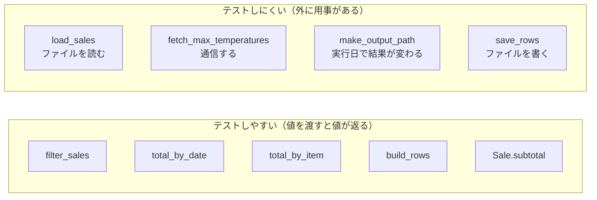
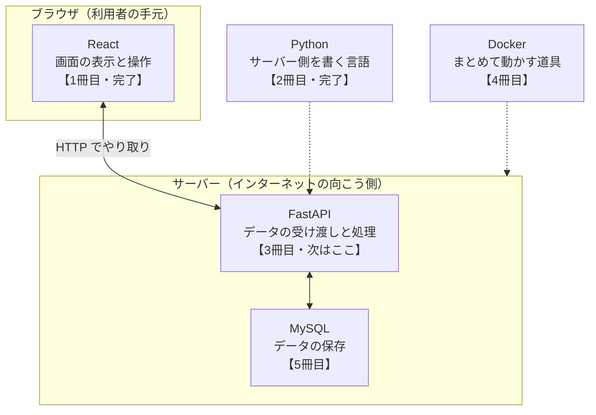
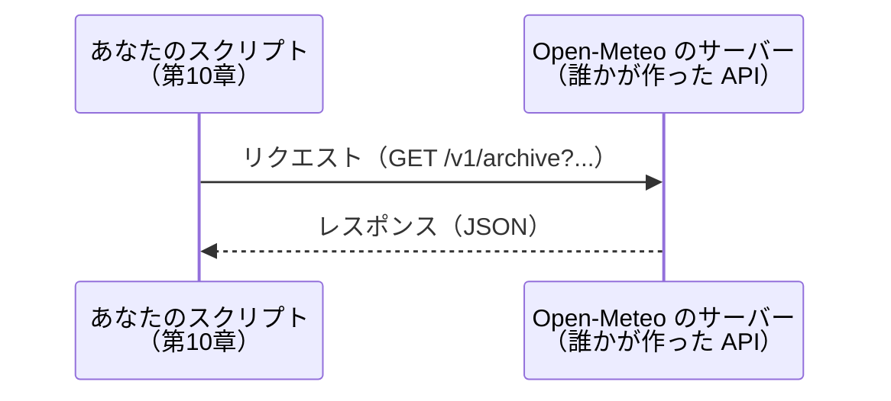
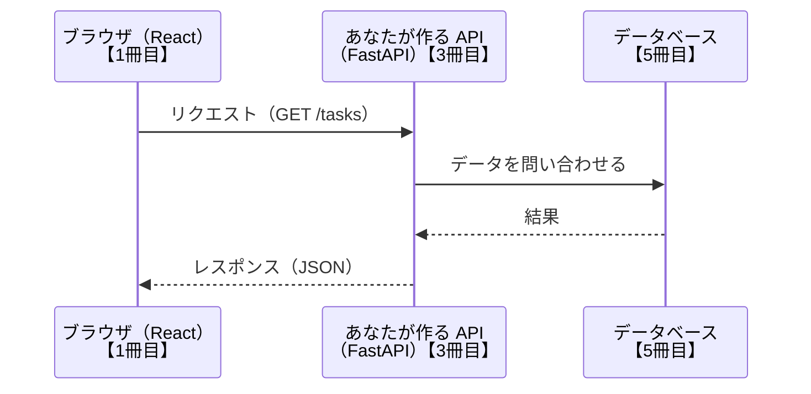

# 第11章 次のステップ

第10章で、スクリプトを1本、最初から最後まで作りきりました。
**この本で教えることは、これで終わりです。**

ただし、ここで本を閉じると、いちばんもったいないタイミングでもあります。
書いたスクリプトは、まだ**手で叩いたときにだけ動く**状態です。
直したときに壊れていないかを確かめる方法も、まだ持っていません。
そして「次に何を学べばいいのか」も、まだ決まっていません。

この章では、そこを片づけます。

- 身についたものを**チェックリストで確認する**
- 次に触れると良い3つの道具——**テスト・データ分析・自動化**——が、
  それぞれ**何を解決する道具なのか**を知る
- **3冊目へ進む道筋**を決める

新しい文法はほとんど出てきません。
代わりに、**「動くものを書ける人」から「書いたものを預けられる人」になるための道具**を扱います。

## この章で学ぶこと

- ここまでで身についたことを、チェックリストで確認できるようになる
- JavaScript と Python の対応を、自分の言葉で説明できるようになる
- pytest でテストを書き、直したときに壊れていないかを確かめられるようになる
- pandas が何を短くしてくれる道具なのかを説明し、簡単な集計を書けるようになる
- 手作業をスクリプトにして、決まった時刻に自動実行できるようになる
- 次に何をどの順番で学ぶかを、自分で決められるようになる

## この章の前提

- [第10章](./10-practice-data-script.md) の `sales-analyzer` が、手元で動く状態になっていること
  （`python analyze_sales.py --no-weather` が実行できる）
- [1.5](./01-environment.md#152-仮想環境を作る) の仮想環境の有効化と、[1.6](./01-environment.md#162-パッケージをインストールする) の `pip install`
- [10.5](./10-practice-data-script.md#105-コマンドラインから使えるようにする) の `argparse`

> **つまずいたら**
> この章は、これまでと性質が違います。
> **新しい道具を入れて動かす**章なので、インストールと「実行したときの現在地」で止まりやすくなります。
>
> 詰まったら、次の形で AI に相談してください。
>
> ```text
> python-text の 11.2.1 を読んでいます。
> sales-analyzer で pytest を実行したら、次のエラーが出ました。
>
> （エラーの全文を貼る）
>
> ターミナルの現在地: （pwd / cd の結果を貼る）
> 仮想環境: 有効化している / していない
> OS: Windows 11
> ```
>
> **「どこで実行したか」を必ず書いてください。** この章のトラブルの大半は現在地の問題です。

---

## 11.1 ここまでで身についたこと

### 11.1.1 チェックリスト

まず、現在地を確認します。

次の表を上から見て、**「何も見ずに書けるか」**で判断してください。
「読めば思い出せる」は ✅ ではありません。**手が動くかどうか**が基準です。

| # | できること | 判断のしかた | できなければ戻る場所 |
|---|-----------|------------|-------------------|
| 1 | 変数を作り、型を確かめられる | `type()` で何が返るか、`int` と `str` の違いを説明できるか | [2.1](./02-basics.md)、[2.2](./02-basics.md) |
| 2 | f-string で文字列を組み立てられる | 金額を `1,234円` の形で表示できるか | [2.4.4](./02-basics.md#244-f-string) |
| 3 | 条件分岐を書ける | `if` / `elif` / `else` を、入れ子にせず並べられるか | [3.1](./03-control-flow.md) |
| 4 | 繰り返しを書ける | `for` と `range` と `enumerate` を、使い分けて書けるか | [3.2](./03-control-flow.md) |
| 5 | 入れ子を浅くできる | 深い `if` を、早期 `continue` で書き直せるか | [3.4.2](./03-control-flow.md#342-早期-continue-で浅くする) |
| 6 | リストを操作できる | 追加・削除・スライス・並べ替えを、調べずに書けるか | [4.1](./04-data-structures.md) |
| 7 | `sort` と `sorted` を区別できる | 「元のリストが変わるのはどちらか」を即答できるか | [4.1.6](./04-data-structures.md#416-sort-と-sorted-の違い破壊的か否か) |
| 8 | 辞書を扱える | キーがないときに落ちない取り出し方を書けるか | [4.3.3](./04-data-structures.md#433-get-で安全に取り出す) |
| 9 | 辞書のリストを回して集計できる | 「商品ごとの合計」を自分で書けるか | [4.3.5](./04-data-structures.md#435-辞書のリスト実務で最頻出の形) |
| 10 | 内包表記が書ける | 条件付きの内包表記を、`for` に戻さず書けるか | [4.5.2](./04-data-structures.md#452-条件付き内包表記) |
| 11 | 関数を定義して呼べる | 引数を2つ受け取って値を返す関数を、docstring 付きで書けるか | [5.1](./05-functions.md)、[5.6.2](./05-functions.md#562-docstring-を書く) |
| 12 | デフォルト引数の落とし穴を知っている | 「デフォルト値にリストを書いてはいけない」理由を言えるか | [5.2.4](./05-functions.md#524-デフォルト引数にリストを使ってはいけない) |
| 13 | スコープを説明できる | 関数の中で代入した変数が、外から見えない理由を言えるか | [5.4](./05-functions.md) |
| 14 | `sorted` の `key` に関数を渡せる | 辞書のリストを、特定のキーで並べ替えられるか | [5.5.3](./05-functions.md#553-sorted-の-key-に渡す) |
| 15 | ファイルを分けて `import` できる | 自作モジュールを読み込んで使えるか | [6.1](./06-modules.md)、[6.2](./06-modules.md) |
| 16 | `if __name__ == "__main__":` の意味を説明できる | 「なぜこの1行が要るのか」を1〜2行で言えるか | [6.4.1](./06-modules.md#641-if-__name__--__main__-の意味) |
| 17 | ファイルを安全に読み書きできる | `with` と `encoding="utf-8"` を、毎回書けるか | [7.1](./07-files-and-exceptions.md)、[7.2](./07-files-and-exceptions.md) |
| 18 | `pathlib` でパスを組み立てられる | `Path("data") / "sales.csv"` の形で書けるか | [7.3](./07-files-and-exceptions.md) |
| 19 | CSV と JSON を読み書きできる | `csv.DictReader` で読んだ値が文字列である、と覚えているか | [7.4](./07-files-and-exceptions.md) |
| 20 | 例外を適切な範囲で捕まえられる | 「捕まえる／捕まえない」を理由付きで決められるか | [7.5](./07-files-and-exceptions.md)、[7.6.3](./07-files-and-exceptions.md#763-どこで例外を捕まえるべきか) |
| 21 | クラスと `@dataclass` を書ける | `__init__` と `self` を説明し、`@dataclass` で短く書けるか | [8.2](./08-oop.md)、[8.5.2](./08-oop.md#852-dataclass-の使い方) |
| 22 | クラスを使うか判断できる | 「関数で足りる」場面を、自分の言葉で説明できるか | [8.6.3](./08-oop.md#863-判断のチェックリスト) |
| 23 | 型ヒントを書いて mypy を通せる | `list[dict[str, int]]` のような型を書けるか | [9.1](./09-typing-and-tools.md)、[9.3.2](./09-typing-and-tools.md#932-導入して実行する) |
| 24 | ruff で整形とチェックができる | `ruff check` と `ruff format` の違いを言えるか | [9.4.1](./09-typing-and-tools.md#941-ruff--リンタとフォーマッタ) |
| 25 | `requests` で API を呼べる | `timeout` と `raise_for_status()` を書き忘れずに書けるか | [10.3](./10-practice-data-script.md#103-外部-api-からデータを取得する) |
| 26 | `argparse` でオプションを受け取れる | `type=int` を書かないとどうなるかを説明できるか | [10.5](./10-practice-data-script.md#105-コマンドラインから使えるようにする) |
| 27 | 作りたいものを分解できる | 完成イメージから、関数の並びを自分で決められるか | [10.1](./10-practice-data-script.md#101-作るものを決める)、[10.6.1](./10-practice-data-script.md#1061-関数に分割する) |

**全部に ✅ が付く必要はありません。**
この本を1周した直後なら、半分から3分の2くらいで普通です。

大事なのは、**「できない」と気づいた項目に、戻る場所の番号が付いている**ことです。
気になった番号の節に戻り、その項のコードを**もう一度手で打って**ください。
読み返すだけでは、✅ は増えません。

> **補足：27 番だけは性質が違います**
> 1〜26 は知識なので、読み返せば埋まります。
> **27 番（分解する力）だけは、読んでも埋まりません。**書いた回数でしか増えません。
>
> 27 番に自信がないなら、次の形で AI に練習問題を出してもらってください。

```text
python-text（プログラミング未経験から始める Python）を1周し終えました。
第10章までの範囲だけで解ける練習課題を、3問出してください。

条件:
- pandas、pytest、非同期処理（async / await）など、テキストで扱っていないものは使わない
- 使ってよいのは、標準ライブラリと requests までとする
- 各問題に「課題」「完成条件」だけを書き、答えのコードは書かない
- 難易度は易しい順に並べる
```

**答えのコードを書かないよう、必ず指定してください。**
指定しないと、AI は親切に完成品を出してきます。それでは練習になりません。

### 11.1.2 JavaScript との対比で振り返る

[0.3.2](./00-introduction.md#032-javascript--python-対応表) で、JavaScript と Python の対応表を「地図」として見ました。
1冊目を読んだ人にとって、あれは**まだ確かめていない地図**でした。

いまなら、答え合わせができます。
0.3.2 の表に、この本で新しく出てきたものを足したのが次の表です。

| やりたいこと | JavaScript | Python | この本の章 |
|------------|-----------|--------|:---------:|
| 変数を作る | `let x = 1;` | `x = 1` | 2.1 |
| 変数名の付け方 | `userName` | `user_name` | 2.1 |
| 画面に出力する | `console.log(x)` | `print(x)` | 2.5 |
| 文字列に値を埋め込む | `` `合計は${x}円` `` | `f"合計は{x}円"` | 2.4 |
| 等しいか比べる | `x === y` | `x == y` | 2.3 |
| かつ / または / でない | `&&` / `\|\|` / `!` | `and` / `or` / `not` | 2.3 |
| ブロックの範囲を表す | 波かっこ `{ }` | 行頭のインデント | 2.6 |
| 「値がない」ことを表す | `null` / `undefined` | `None` | 2.2 |
| 順番に並んだ値 | 配列 `[1, 2]` | リスト `[1, 2]` | 4.1 |
| 名前と値の組 | オブジェクト `{ name: "佐藤" }` | 辞書 `{"name": "佐藤"}` | 4.3 |
| 1件ずつ変換する | `arr.map(x => x * 2)` | `[x * 2 for x in arr]` | 4.5 |
| 条件で絞り込む | `arr.filter(x => x > 0)` | `[x for x in arr if x > 0]` | 4.5.2 |
| 関数を定義する | `function f(a) { ... }` | `def f(a):` | 5.1 |
| 名前のない小さな関数 | `x => x * 2` | `lambda x: x * 2` | 5.5.2 |
| 引数をまとめて受ける | `...args` | `*args` / `**kwargs` | 5.2.5 |
| ファイルを分けて使う | `export` / `import` | `import` / `from ... import` | 6.2 |
| 失敗を受け止める | `try { } catch (e) { }` | `try:` / `except エラー名 as e:` | 7.5 |
| 失敗を起こす | `throw new Error("...")` | `raise ValueError("...")` | 7.6.1 |
| データの形をまとめる | オブジェクトリテラル | `@dataclass` 付きのクラス | 8.5 |
| クラスを作る | `class C { constructor() {} }` | `class C:` / `def __init__(self):` | 8.2 |
| 値の形を宣言する | TypeScript の `type` | 型ヒント（`x: int`） | 9.1 |
| 型の食い違いを検査する | `tsc`（TypeScript） | `mypy` | 9.3 |
| ライブラリを入れる | `npm install` | `pip install` | 1.6 |

**違うのは書き方です。同じなのは考え方です。**

次の5つは、言語が変わっても変わりませんでした。

- **分解の仕方**：やることを箱に分け、1つの箱に1つの仕事をさせる（[5.6.1](./05-functions.md#561-1つの関数は1つのことをする)）
- **名前の付け方**：中身が名前から分かるようにする（[2.1.3](./02-basics.md#213-変数名の付け方snake_case)）
- **データと振る舞いを一緒に置く**：`Sale` に `subtotal()` を持たせる（[8.6.2](./08-oop.md#862-状態と振る舞いがセットのとき)）
- **失敗の扱い方**：どうするか決められるものだけ捕まえる（[7.6.3](./07-files-and-exceptions.md#763-どこで例外を捕まえるべきか)）
- **先に完成イメージを決める**：作りながら決めない（[10.1.1](./10-practice-data-script.md#1011-完成イメージ)）

> **よくある間違い：似ているものほど間違えます**
> 対応表に載っているものほど、細部が違います。とくに次の4つは、1冊目の癖が出やすい場所です。
>
> - `==` は JavaScript の `==` ではなく `===` に近い（Python には `===` がない）
> - 空文字列・`0`・空リストは**偽**として扱われる（`if not sales:` が書ける。[3.1.5](./03-control-flow.md#315-真偽値として扱われる値空文字列0空リスト)）
> - デフォルト引数は、**関数を定義したときに1回だけ**作られる（[5.2.4](./05-functions.md#524-デフォルト引数にリストを使ってはいけない)）
> - メソッドの第1引数 `self` は、**自分で書く**（[8.2.2](./08-oop.md#822-self-とは何か)）

2つの言語を通ったことには、意味があります。
**3つ目の言語は、この本ほど時間がかかりません。**
「変数・条件・繰り返し・関数・データ構造」という枠組みはもう持っているので、
新しい言語で調べることは「その枠組みをどう書くか」だけになります。

---

## 11.2 これから触れると良いもの

ここから紹介する3つは、どれも**この本の続き**です。
全部を今すぐ学ぶ必要はありません。目安は次のとおりです。

| 道具 | 何を解決するか | いつ始めるか |
|------|-------------|------------|
| pytest（テスト） | 直したときに壊れていないかを、毎回自動で確認する | **いちばん先。** スクリプトを2回以上直したら |
| pandas（データ分析） | 表形式データの集計を、数行で書く | CSV や Excel の集計を仕事で扱うようになったら |
| 自動化 | 毎回やっている手作業を、コンピュータに任せる | 同じ操作を週に何度もしていると気づいたら |

### 11.2.1 テスト（pytest）

第10章の最後に、[10.6.3](./10-practice-data-script.md#1063-動作確認のチェックリスト) で9項目のチェックリストを作りました。
あの表を、**スクリプトを直すたびに毎回9項目とも試し直しますか。**

実際には、直した場所の周りだけ試して終わりにします。そして、
**関係ないと思っていた場所が壊れていることに、しばらく気づきません。**

**テスト**（プログラムが期待どおりに動くかを、別のプログラムで確認すること）は、
このチェックリストを**コードにしたもの**です。
一度書いておけば、コマンド1つで全項目が再確認されます。

**pytest**（Python で最もよく使われるテストの道具）を入れます。
執筆時点のバージョンは pytest 9.1 です。

第10章の `sales-analyzer` で、仮想環境を有効化した状態で実行してください。

**Windows（PowerShell）**

```powershell
pip install pytest
```

**macOS / Linux**

```bash
pip install pytest
```

テストは、**専用のファイル**に書きます。
`sales-analyzer` の中に、`analyze_sales.py` と**並べて**次のファイルを作ります。

`sales-analyzer/test_analyze_sales.py`

```python
"""analyze_sales.py のテスト。"""

from analyze_sales import Sale, filter_sales, total_by_item


def make_sales() -> list[Sale]:
    """テスト用の売上を3件だけ作って返す。"""
    return [
        Sale(
            date="2024-07-01",
            shop="本店",
            item="ソフトクリーム",
            quantity=2,
            unit_price=350,
        ),
        Sale(
            date="2024-07-02",
            shop="本店",
            item="かき氷",
            quantity=3,
            unit_price=450,
        ),
        Sale(
            date="2024-07-02",
            shop="駅前店",
            item="ソフトクリーム",
            quantity=4,
            unit_price=350,
        ),
    ]


def test_subtotal_は数量と単価を掛けた金額を返す() -> None:
    sale = Sale(
        date="2024-07-01",
        shop="本店",
        item="ソフトクリーム",
        quantity=2,
        unit_price=350,
    )
    assert sale.subtotal() == 700


def test_filter_sales_は期間の外を落とす() -> None:
    result = filter_sales(make_sales(), "2024-07-02", "2024-07-02")
    assert len(result) == 2


def test_filter_sales_は店舗で絞り込める() -> None:
    result = filter_sales(make_sales(), "2024-07-01", "2024-07-31", shop="駅前店")
    assert len(result) == 1
    assert result[0].item == "ソフトクリーム"


def test_filter_sales_は該当がなければ空のリストを返す() -> None:
    result = filter_sales(make_sales(), "2024-08-01", "2024-08-31")
    assert result == []


def test_total_by_item_は商品ごとに合計する() -> None:
    assert total_by_item(make_sales()) == {
        "ソフトクリーム": 2100,
        "かき氷": 1350,
    }
```

`sales-analyzer` にいることを確認して、実行します。

**Windows（PowerShell）**

```powershell
pytest
```

**macOS / Linux**

```bash
pytest
```

```text
実行結果:
============================= test session starts ==============================
platform win32 -- Python 3.13.1, pytest-9.1.1, pluggy-1.6.0
rootdir: C:\Users\taro\sales-analyzer
collected 5 items

test_analyze_sales.py .....                                              [100%]

============================== 5 passed in 0.11s ===============================
```

`.....` の点1つが、テスト1件です。5件とも通ったので `5 passed` と出ています。

書いたものを、上から見ていきます。

**`from analyze_sales import Sale, filter_sales, total_by_item`**

テストするコードを、**モジュールとして読み込んでいます**（[6.2.2](./06-modules.md#622-from--import-)）。

ここで、[6.4.1](./06-modules.md#641-if-__name__--__main__-の意味) の1行が効いてきます。
`analyze_sales.py` の末尾は、こうなっていました。

```python
if __name__ == "__main__":
    main()
```

この `if` があるおかげで、**`import` しても `main()` は動きません。**
もしこの1行がなければ、テストを実行するたびに CSV の集計が走り、
API を呼びに行き、`out/` にファイルが書き出されてしまいます。

**「なぜこの1行を書くのか」の答えが、ここにあります。**

**`assert 式`**

**`assert`**（アサート。「式が成り立っているはずだ」と書いて、成り立たなければ止める文）は、
Python の文法です。式が偽になると `AssertionError` を出して止まります。

```python
assert 1 + 1 == 2   # 何も起きない
assert 1 + 1 == 3   # AssertionError で止まる
```

pytest は、`assert` で止まったテストを「失敗」として数えます。
**テストに必要な文法は、これだけです。**

**`make_sales()`**

テスト用のデータを作る関数です。`test_` で始まっていないので、テストとしては実行されません。

`data/sales.csv` を読まずに、**その場で3件だけ作っている**ことに注目してください。
理由は3つあります。

- 速い（ファイルを読まない）
- CSV を書き換えても、テストが壊れない
- 期待する数値を**手で計算できる**（2 × 350 = 700）

**テストの名前**

pytest は、**`test_` で始まるファイルの、`test_` で始まる関数**をテストとして集めます。
この規則から外れると、書いても実行されません。

関数名は日本語で構いません。日本語のほうが、失敗したときに何が壊れたか読み取りやすくなります。

**テストが役に立つ瞬間**

ここからが本題です。`analyze_sales.py` の `filter_sales` を、**わざと1文字だけ壊します。**

```diff
  for sale in sales:
-     if sale.date < start or sale.date > end:
+     if sale.date < start or sale.date >= end:
          continue
```

「終了日を含む」はずが、「終了日を含まない」になりました。
第10章のチェックリストの1番（そのまま実行）を試しても、CSV は書き出されます。
**7日ぶんが6日ぶんに減っただけなので、目で見て気づける保証はありません。**

テストを実行します。

```text
実行結果:
============================= test session starts ==============================
platform win32 -- Python 3.13.1, pytest-9.1.1, pluggy-1.6.0
rootdir: C:\Users\taro\sales-analyzer
collected 5 items

test_analyze_sales.py .F...                                              [100%]

=================================== FAILURES ===================================
_________________________ test_filter_sales_は期間の外を落とす __________________________

    def test_filter_sales_は期間の外を落とす() -> None:
        result = filter_sales(make_sales(), "2024-07-02", "2024-07-02")
>       assert len(result) == 2
E       assert 0 == 2
E        +  where 0 = len([])

test_analyze_sales.py:46: AssertionError
=========================== short test summary info ============================
FAILED test_analyze_sales.py::test_filter_sales_は期間の外を落とす - assert 0...
========================= 1 failed, 4 passed in 0.16s ==========================
```

読み方は、トレースバック（[1.4.4](./01-environment.md#144-トレースバックの読み方)）と同じで**下から上**です。

- 最終行：1件失敗、4件成功
- `FAILED ...::test_filter_sales_は期間の外を落とす`：どのテストが落ちたか
- `assert 0 == 2` / `where 0 = len([])`：**期待は2件、実際は0件**（空のリストが返った）
- `test_analyze_sales.py:46`：失敗した行

**「期待した値」と「実際の値」の両方が出る**のが、`assert` の便利なところです。

確認できたら、`>=` を `>` に戻して、もう一度 `pytest` を実行してください。
`5 passed` に戻ります。

**境界を試す**

上のテストのうち、次の2つは「うまくいく道」ではありません。

- `test_filter_sales_は該当がなければ空のリストを返す`（0件のとき）
- `test_filter_sales_は期間の外を落とす`（開始日と終了日が同じ日）

こういう**端っこ**は、手で試すときに真っ先に飛ばされます。
そして、壊れるのもたいてい端っこです。
[10.6.3](./10-practice-data-script.md#1063-動作確認のチェックリスト) の「うまくいく道と、うまくいかない道の両方を試す」を、
テストとして残しておく、ということです。

**テストしやすい関数・しにくい関数**

`analyze_sales.py` の11個の関数は、テストのしやすさで2つに分かれます。



左側は、**同じ値を渡せば必ず同じ値が返ります。** だから期待値を書けます。
右側は、ファイル・通信・時刻という**自分のパソコンの外や、実行するたびに変わるもの**に触れています。

ここで思い出してほしいのが [10.6.1](./10-practice-data-script.md#1061-関数に分割する) です。
あのとき「1つの関数は1つのことをする」という理由で関数を分けました。
その結果、**外に用事がある処理が端に寄り、真ん中がテストできる形になっています。**

もし `load_sales` の中で集計まで済ませていたら、
「集計だけを試す」ことはできませんでした。
**テストしやすさは、関数の分け方の結果**です。

右側もテストする方法（一時的なファイルを使う、通信を偽物に差し替える）はありますが、
この本の範囲を超えます。**まずは左側から書いてください。**

> **よくある間違い**
> `ModuleNotFoundError: No module named 'analyze_sales'` が出たら、
> **ターミナルの現在地が `sales-analyzer` になっていません。**
> `cd` で移動してから、もう一度 `pytest` を実行してください。

> **よくある間違い**
> `collected 0 items` と出て何も実行されないときは、名前の規則から外れています。
> ファイル名が `test_` で始まっているか、関数名が `test_` で始まっているかを確認してください。
> `def check_subtotal():` はテストとして集められません。

> **補足**
> 出力を短くしたいときは `pytest -q`、1つのテストだけ動かしたいときは
> `pytest test_analyze_sales.py::test_subtotal_は数量と単価を掛けた金額を返す` のように書けます。

### 11.2.2 データ分析（pandas）

[10.2.4](./10-practice-data-script.md#1024-集計する) で、日ごとの集計を書きました。
`defaultdict(int)` を用意して、`for` で回して、キーごとに足していく形です。
「日ごとの金額」「日ごとの個数」「商品ごとの金額」で、**ほとんど同じ関数が3つ**できました。

表形式のデータを集計する仕事は、実務でくり返し出てきます。
そのたびに同じ形の関数を書くのは、さすがに手間です。

**pandas**（パンダス。表形式のデータをまとめて扱うためのライブラリ）は、この部分を短くします。
執筆時点のバージョンは pandas 3.0 です。

`sales-analyzer` で、仮想環境を有効化した状態で入れます。

**Windows（PowerShell）**

```powershell
pip install pandas
```

**macOS / Linux**

```bash
pip install pandas
```

まず、読み込むだけのプログラムを書きます。

`sales-analyzer/pandas_step1.py`

```python
"""pandas で売上 CSV を読み込んで、中身を確かめる。"""

import pandas as pd

df = pd.read_csv("data/sales.csv")
print(df.head())
print(f"{len(df)}件")
```

```text
実行結果:
         date shop     item  quantity  unit_price
0  2024-07-01   本店  ソフトクリーム        42         350
1  2024-07-01   本店      かき氷        18         450
2  2024-07-01   本店  ホットコーヒー        35         300
3  2024-07-01  駅前店  ソフトクリーム        30         350
4  2024-07-01  駅前店   焼きドーナツ        24         200
36件
```

**`import pandas as pd`**

`as` で別名を付ける書き方です（[6.2.3](./06-modules.md#623-as-で別名を付ける)）。
pandas は `pd` という別名で書くのが慣習になっているので、これに合わせます。

**`pd.read_csv(...)` が返すもの**

**DataFrame**（データフレーム。行と列を持つ表を表すもの）です。
`csv.DictReader` が「1行＝辞書」だったのに対し、pandas は**表を丸ごと1つの値**として持ちます。

左端の `0 1 2 3 4` は行番号です。`head()` は先頭5行だけを表示します。

**ここが `csv` モジュールとの最大の違いです。**
`quantity` と `unit_price` は、**数値として読み込まれています。**
[7.4.1](./07-files-and-exceptions.md#741-csv-モジュール) で「CSV から読んだ値はすべて文字列」と学び、
第10章では `int(row["quantity"])` と変換していました。pandas は列ごとに型を推測して変換します。

次に、集計します。

`sales-analyzer/pandas_step2.py`

```python
"""pandas で日ごとに集計する。"""

import pandas as pd

df = pd.read_csv("data/sales.csv")
df["subtotal"] = df["quantity"] * df["unit_price"]

daily = df.groupby("date")[["quantity", "subtotal"]].sum()
print(daily)
```

```text
実行結果:
            quantity  subtotal
date
2024-07-01       149     48600
2024-07-02       172     60900
2024-07-03       164     56200
2024-07-04       202     72700
2024-07-05       230     83050
2024-07-06       318    110300
2024-07-07       258     93350
```

第10章の `total_by_date` と `quantity_by_date` が出していた数字と、**完全に同じ**です。
関数2つぶんが、2行になりました。

**`df["subtotal"] = df["quantity"] * df["unit_price"]`**

**列どうしの掛け算を、そのまま書けます。** `for` は要りません。
`df["quantity"]` は1列ぶんのデータで、これを **Series**（シリーズ。1列ぶんのデータ）と呼びます。
Series どうしを掛けると、行ごとに掛け算した新しい Series ができ、
それを `df["subtotal"]` という名前で表に足しています。

**`df.groupby("date")[["quantity", "subtotal"]].sum()`**

`groupby("date")` は「`date` の値が同じ行どうしをまとめる」、
`[["quantity", "subtotal"]]` は「まとめた中のこの2列を使う」、
`.sum()` は「合計する」です。
第10章で `defaultdict` に足し込んでいた処理が、この1行に対応します。

絞り込みも書けます。第10章の `filter_sales` にあたる部分です。

`sales-analyzer/pandas_step3.py`

```python
"""本店だけを取り出して、日ごとに集計する。"""

import pandas as pd

df = pd.read_csv("data/sales.csv")
df["subtotal"] = df["quantity"] * df["unit_price"]

honten = df[df["shop"] == "本店"]
print(f"本店の行数: {len(honten)}")
print(honten.groupby("date")["subtotal"].sum())
```

```text
実行結果:
本店の行数: 21
date
2024-07-01    33300
2024-07-02    39800
2024-07-03    38400
2024-07-04    46350
2024-07-05    51500
2024-07-06    64700
2024-07-07    59250
Name: subtotal, dtype: int64
```

**`df[df["shop"] == "本店"]`**

内側の `df["shop"] == "本店"` は、行ごとに `True` / `False` が並んだ Series を作ります。
それを `df[...]` に渡すと、**`True` の行だけが残った表**が返ります。
`for` と `if` で1件ずつ判定する代わりに、**表全体に条件を当てる**書き方です。

最後の `Name: subtotal, dtype: int64` は、
「この列の名前は `subtotal`、中身は整数」という pandas からの注記です。

並べ替えと合計も、集計した結果にそのままつなげられます。

`sales-analyzer/pandas_step4.py`

```python
"""日ごとの売上を、大きい順に並べて表示する。"""

import pandas as pd

df = pd.read_csv("data/sales.csv")
df["subtotal"] = df["quantity"] * df["unit_price"]

daily_total = df.groupby("date")["subtotal"].sum()
print(daily_total.sort_values(ascending=False))
print(f"全期間の合計: {daily_total.sum():,}円")
```

```text
実行結果:
date
2024-07-06    110300
2024-07-07     93350
2024-07-05     83050
2024-07-04     72700
2024-07-02     60900
2024-07-03     56200
2024-07-01     48600
Name: subtotal, dtype: int64
全期間の合計: 525,100円
```

**`sort_values(ascending=False)`**

集計した結果を、値の大きい順に並べ替えます。
`ascending`（アセンディング。昇順）を `False` にすると、大きい順になります。

[4.1.5](./04-data-structures.md#415-並べ替えsort--sorted) の `sorted(..., reverse=True)` にあたるものですが、
**引数の名前が違う**ことに注意してください。同じ「大きい順」でも、道具ごとに書き方が違います。

**`daily_total.sum()`**

`groupby` の結果は Series なので、そこにもう一度 `.sum()` を呼ぶと**全部の合計**になります。
f-string の桁区切り（[2.4.4](./02-basics.md#244-f-string)）で `525,100円` の形にしています。

**いつ使い、いつ使わないか**

| 向いている | 向いていない |
|-----------|------------|
| 表形式のデータの集計・平均・並べ替え | 1件ごとに込み入った判断をする処理 |
| 行数が多く、`for` では遅いとき | 表の形をしていないデータ（階層の深い JSON、設定ファイル） |
| Excel でやっている集計を自動化したいとき | 小さなスクリプトに、依存関係を増やしたくないとき |

**pandas は「Python のもう1つの書き方を覚える」に近い**道具です。
`for` を書かない、条件は表全体に当てる、というやり方に慣れる必要があります。

だからといって、第10章で書いた `csv` と `defaultdict` の集計が無駄になるわけではありません。
**あの処理を自分で書けるからこそ、`groupby` が何をしているかが分かります。**

> **補足**
> Excel を使ったことがあるなら、DataFrame はシート、`groupby(...).sum()` はピボットテーブルに近いものです。
> ただし、pandas の結果は**そのままプログラムで次の処理に渡せる**という点が違います。

### 11.2.3 自動化スクリプト

`analyze_sales.py` は、毎朝ターミナルを開いて手で叩けば動きます。
**3日は続きます。1週間後には忘れます。**

自動化に向いているのは、次の性質を持つ仕事です。

- **毎回まったく同じ手順**である
- 途中に**人間の判断が要らない**
- 失敗しても**すぐには致命傷にならない**（あとから気づいて直せる）

ここでは2つに分けて扱います。「決まった時刻に動かす」と「手作業をスクリプトにする」です。


**1. 決まった時刻に実行する**

OS には、「決まった時刻にこのプログラムを動かす」という仕組みが最初から入っています。

**Windows（タスクスケジューラ）**

1. スタートメニューで「タスク スケジューラ」を検索して開く
2. 右側の「基本タスクの作成」をクリックし、名前に `売上集計` と入れる
3. トリガーで「毎日」を選び、開始時刻を指定する
4. 操作で「プログラムの開始」を選ぶ
5. 次の3つを入力する

| 項目 | 入力する内容 |
|------|------------|
| プログラム/スクリプト | `C:\Users\taro\sales-analyzer\.venv\Scripts\python.exe` |
| 引数の追加 | `analyze_sales.py --no-weather` |
| 開始（オプション） | `C:\Users\taro\sales-analyzer` |

`taro` の部分は、自分のユーザー名に読み替えてください。

**macOS / Linux（cron）**

ターミナルで次のコマンドを実行すると、予定表を編集する画面が開きます。

```bash
crontab -e
```

そこに次の1行を書いて保存します。

```text
0 9 * * * cd /Users/taro/sales-analyzer && ./.venv/bin/python analyze_sales.py --no-weather >> run.log 2>&1
```

先頭の5つは、左から**分・時・日・月・曜日**です。
`0 9 * * *` は「毎日9時0分」を表します（`*` は「いつでも」）。

**この2つに共通する、大事な点が3つあります。**

- **仮想環境を「有効化」しない。** 代わりに、仮想環境の中の Python
  （`.venv\Scripts\python.exe` / `.venv/bin/python`）を**直接指します**（[1.5.3](./01-environment.md#153-有効化する)）。
  自動実行では、有効化のコマンドを打つ人がいないためです
- **パスは絶対パスで書く。** 自動実行のときの現在地は、あなたがいつも `cd` している場所とは限りません
  （[7.1.1](./07-files-and-exceptions.md#711-open-と-read)）
- **出力をログに残す。** 自動実行中は、画面を誰も見ていません。
  cron の例の `>> run.log 2>&1` は「表示される内容を、`run.log` に書き足す」という意味です

> **注意**
> 設定したら、**まず手で1回実行して確かめてください。**
> `.venv\Scripts\python.exe analyze_sales.py` のように、
> タスクに登録したのとまったく同じ書き方でターミナルから動かします。
> ここで動かないものは、自動実行でも動きません。

**2. 手作業をスクリプトにする**

もう1つの自動化は、**普段の手作業そのもの**をスクリプトにすることです。
例として、ダウンロードフォルダのファイルを、拡張子ごとのディレクトリに仕分けてみます。

使う道具は、[7.3](./07-files-and-exceptions.md) の `pathlib` だけです。

`sales-analyzer/organize_files.py`

```python
"""指定したディレクトリのファイルを、拡張子ごとのディレクトリに仕分ける。"""

from pathlib import Path

TARGET_DIR = Path("demo_downloads")
APPLY = False


def plan_moves(target: Path) -> list[tuple[Path, Path]]:
    """(移動元, 移動先) の組を、名前順に並べて返す。"""
    moves: list[tuple[Path, Path]] = []
    for item in sorted(target.iterdir()):
        if not item.is_file():
            continue
        if item.suffix == "":
            continue
        folder = item.suffix.lstrip(".").lower()
        moves.append((item, target / folder / item.name))
    return moves


def apply_moves(moves: list[tuple[Path, Path]]) -> None:
    """組のとおりにファイルを移動する。"""
    for src, dst in moves:
        if dst.exists():
            print(f"移動先にすでにあるので飛ばします: {dst}")
            continue
        dst.parent.mkdir(parents=True, exist_ok=True)
        src.rename(dst)
        print(f"移動しました: {src.name} -> {dst.parent.name}/")


def main() -> None:
    """仕分けの計画を表示し、APPLY が True のときだけ実際に移動する。"""
    moves = plan_moves(TARGET_DIR)
    for src, dst in moves:
        print(f"{src.name} -> {dst.parent.name}/")
    print(f"対象は {len(moves)} 件です")

    if APPLY:
        apply_moves(moves)
    else:
        print("APPLY が False なので、まだ何も移動していません")


if __name__ == "__main__":
    main()
```

いきなり本物のダウンロードフォルダで試さないでください。
`sales-analyzer` の中に練習用のディレクトリを作り、空のファイルをいくつか置きます。

**Windows（PowerShell）**

```powershell
mkdir demo_downloads
cd demo_downloads
New-Item 請求書.pdf, 写真1.JPG, 写真2.jpg, メモ.txt, レシピ.pdf, データ.csv, README -ItemType File
cd ..
```

**macOS / Linux**

```bash
mkdir demo_downloads
cd demo_downloads
touch 請求書.pdf 写真1.JPG 写真2.jpg メモ.txt レシピ.pdf データ.csv README
cd ..
```

実行します。

```text
実行結果:
データ.csv -> csv/
メモ.txt -> txt/
レシピ.pdf -> pdf/
写真1.JPG -> jpg/
写真2.jpg -> jpg/
請求書.pdf -> pdf/
対象は 6 件です
APPLY が False なので、まだ何も移動していません
```

**まだ何も動いていません。** 表示されているのは「これから何をするつもりか」だけです。

これを **DRY RUN**（ドライラン。実際には実行せず、やることの計画だけを表示すること）と呼びます。
ファイルを動かすプログラムは、間違えると**取り返しがつきません。**
表示された内容が想定どおりだと確かめてから、`APPLY = True` に変えて実行します。

```text
実行結果:
データ.csv -> csv/
メモ.txt -> txt/
レシピ.pdf -> pdf/
写真1.JPG -> jpg/
写真2.jpg -> jpg/
請求書.pdf -> pdf/
対象は 6 件です
移動しました: データ.csv -> csv/
移動しました: メモ.txt -> txt/
移動しました: レシピ.pdf -> pdf/
移動しました: 写真1.JPG -> jpg/
移動しました: 写真2.jpg -> jpg/
移動しました: 請求書.pdf -> pdf/
```

`demo_downloads` の中を見ると、`csv` `jpg` `pdf` `txt` のディレクトリができ、
拡張子のない `README` はそのまま残っています。

書いたコードのうち、新しく出てきたものを説明します。

**`sorted(target.iterdir())`**

`iterdir()` はディレクトリの中身を1つずつ取り出します（[7.3.3](./07-files-and-exceptions.md#733-存在確認作成一覧)）。
`sorted()` で並べているのは、**実行するたびに順番が変わらないようにする**ためです。

取り出されるのはファイルだけとは限らないので、`is_file()` で確かめて、
ディレクトリは `continue` で飛ばしています。
逆に「それがディレクトリか」を調べたいときは、同じ仲間の **`is_dir()`** を使います。

**`item.suffix.lstrip(".").lower()`**

`suffix` は `.pdf` のような拡張子です（[7.3.1](./07-files-and-exceptions.md#731-pathlib-の基本)）。
`lstrip(".")` で先頭の `.` を落とし、`lower()` で小文字にそろえています。
`.JPG` と `.jpg` が別のディレクトリに分かれないようにするための処理です。

**`src.rename(dst)`**

**`rename`**（リネーム。ファイルの名前と場所を変えるメソッド）です。
別のディレクトリのパスを渡すと、**移動**になります。

**`if dst.exists():`**

移動先に同じ名前のファイルがある場合の処理です。
このチェックがないと、**macOS では黙って上書きされ、Windows では `FileExistsError` で止まります。**
どちらも困るので、先に確認して飛ばしています。

**`list[tuple[Path, Path]]`**

「`Path` を2つ持つタプル（[4.2](./04-data-structures.md)）が並んだリスト」という型です（[9.2.1](./09-typing-and-tools.md#921-リスト辞書タプル)）。
「移動元と移動先」という**セットで意味を持つ2つ**なので、タプルにしています。

> **注意**
> このスクリプトを本物のダウンロードフォルダに向けるときは、
> `TARGET_DIR` を次のように書き換えます。
>
> ```python
> TARGET_DIR = Path.home() / "Downloads"
> ```
>
> **`Path.home()`** は、ログインしているユーザーのホームディレクトリ
> （Windows なら `C:\Users\taro`、macOS なら `/Users/taro`）を返します。
> ユーザー名を直接書かずに済むので、他の人のパソコンでもそのまま動きます。
>
> 向ける前に、**必ず `APPLY = False` のまま一度実行**して、
> 表示される計画に「消えたら困るファイル」が混ざっていないか確認してください。

**自動化する前に決めておくこと**

- **失敗したらどうなるか。** 途中で止まったとき、中途半端な状態が残らないか
- **二重に動いたらどうなるか。** 同じ日に2回実行しても壊れないか
  （`analyze_sales.py` は、[10.4.2](./10-practice-data-script.md#1042-ファイル名に日付を入れる) で日付入りのファイル名にしたので、
  2回動かしても同じファイルを上書きするだけで済みます）
- **どこにログを残すか。** 動いたことと、失敗したことの両方が分かるように残す

---

## 11.3 次の本へ

### 11.3.1 なぜ次は FastAPI なのか

[10.3](./10-practice-data-script.md#103-外部-api-からデータを取得する) で、Open-Meteo という API を呼びました。
気温のデータを返してくれた**あの向こう側**には、誰かが作ったサーバーがあります。

**3冊目では、その「向こう側」を自分で作ります。**

5冊全体の中での位置は、次のとおりです。



**あなたが終えたのは、点線でつながっている左下の四角です。**
言語は手に入りましたが、それを使って何を作るかは、まだ空いています。

**次が FastAPI である理由は3つあります。**

1. **第10章のスクリプトには、越えられない限界があるから。**
   `analyze_sales.py` は、**あなたのパソコンの上で、あなたが叩いたときにだけ**動きます。
   同僚に使ってもらうには、Python を入れてもらい、仮想環境を作ってもらう必要があります。
   サーバーに置けば、**URL を教えるだけ**で済みます
2. **この本で学んだことが、そのまま効くから。**
   FastAPI は**型ヒントを前提に設計された**フレームワークです。
   [9.1](./09-typing-and-tools.md) で書いた `def f(x: int) -> str:` の型が、
   FastAPI では「受け取るデータの検査」にそのまま使われます。
   第8章の `@dataclass` でデータの形をまとめた考え方も、そのまま出てきます
3. **1冊目に足りない半分が、そこにあるから。**
   react-text で作った `task-app` は、データをブラウザの中に持っていました。
   別の端末から開くと、中身は空でした。この半分を埋めるのがサーバー側です

> **補足：Python の Web フレームワークは他にもあります**
> Django や Flask も広く使われています。
> このテキストで FastAPI を使うのは、**型ヒントが中心にある**ためです。
> 第9章で型ヒントと mypy を通したあなたにとって、いちばん地続きな入り口になります。

### 11.3.2 サーバー側を作るとできること

いまのあなたは、API を**呼ぶ側**です。



3冊目では、**作る側**に回ります。



**`json()` で読んでいた側から、JSON を返す側へ移ります。**

作る側に回ると、具体的に次のことができるようになります。

- **データを、全員で共有できる。**
  1台のパソコンの中ではなく、サーバーに置きます。
  スマートフォンから開いても、同じデータが見えます
- **人ごとにデータを分けられる。**
  ログインの仕組みを入れると、「自分のデータだけが見える」状態を作れます
- **重い処理・定期的な処理を、サーバー側で動かせる。**
  [11.2.3](#1123-自動化スクリプト) の自動実行を、自分のパソコンではなくサーバー上で動かせます。
  パソコンの電源が入っていなくても動きます
- **画面を持たない機能を、他のプログラムに使ってもらえる。**
  あなたが作った API を、別の誰かが `requests` で呼ぶ側になります

3冊目では、[react-text 第10章](../react-text/10-practice-task-app.md) で作ったタスク管理アプリを、
**サーバーとつなぎ直す**ところまで進みます。
1冊目と2冊目が、そこで1つになります。

**進み方の目安**

- そのまま3冊目に進んで構いません。11.2 の3つは、あとから戻って学べます
- ただし、**pytest だけは早めに触っておくこと**をおすすめします。
  サーバー側のコードは、画面がない代わりにテストで確かめる場面が増えます
- 1週間以上空いてしまったら、いきなり続きを読まないでください。
  次の形で、AI に振り返りを頼むのが早道です

```text
python-text（プログラミング未経験から始める Python）を読み終えてから、
1か月空いてしまいました。
第7章から第10章までの要点を、10行くらいで振り返らせてください。
そのあと、身についているか確認する質問を3つ出してください（答えは書かないでください）。
```

---

## まとめ

- 現在地の確認は、**「読めば思い出せる」ではなく「何も見ずに書ける」**が基準（11.1.1）
- できなかった項目には**戻る場所の番号**が付いている。読み返すのではなく、もう一度手で打つ（11.1.1）
- 分解する力だけは読んでも増えない。**AI に練習問題を出してもらう**（答えは書かせない）（11.1.1）
- JavaScript と Python は**書き方が違うだけで、考え方は同じ**。3つ目の言語は速くなる（11.1.2）
- 似ているものほど間違える。`==`・偽として扱われる値・デフォルト引数・`self` に注意（11.1.2）
- **テストは、手動チェックリストをコードにしたもの。** `pip install pytest` で始められる（11.2.1）
- pytest は **`test_` で始まるファイルの `test_` で始まる関数**を集める。文法は `assert` だけ（11.2.1）
- `if __name__ == "__main__":` があるから、**`import` してもスクリプトが動き出さない**（11.2.1）
- テストしやすいのは**値を渡すと値が返る関数**。ファイル・通信・時刻に触る関数は端に寄せる（11.2.1）
- pandas は**表形式データの集計**を短くする道具。`read_csv` は数値を数値として読む（11.2.2）
- `groupby("列").sum()` が、`defaultdict` で足し込んでいた処理にあたる（11.2.2）
- 自動化は**表示だけの DRY RUN で確かめてから**実行する。ファイルを動かす処理は戻せない（11.2.3）
- 定期実行では、仮想環境を有効化せず**`.venv` の中の Python を直接指す**。パスは絶対パスで書く（11.2.3）
- 次は FastAPI。**API を呼ぶ側から、作る側へ**回る（11.3.1、11.3.2）

---

## 理解度チェック

答えは [解答編 その2](./91-answers-part2.md#第11章) にあります。まず自分で考えてください。

**問 11.1**
次の文の空欄を埋めてください。

> pytest は、ファイル名が（　A　）で始まるファイルの中の、
> 名前が（　A　）で始まる関数をテストとして集める。
> テストの中で「そうなっているはずだ」と書くための文は（　B　）で、
> これが偽になると（　C　）というエラーが起きる。

**問 11.2**
テストファイルに `from analyze_sales import filter_sales` と書いても、
CSV の集計や API の呼び出しが始まりません。
**なぜ始まらないのか**を、`analyze_sales.py` の最後の2行にふれながら説明してください。

**問 11.3**
第10章の関数のうち、**そのままではテストを書きにくいもの**を次から3つ選び、
それぞれ**なぜ書きにくいのか**を答えてください。

1. `total_by_item`
2. `fetch_max_temperatures`
3. `build_rows`
4. `make_output_path`
5. `save_rows`

**問 11.4**
`csv.DictReader` で読んだ `quantity` は `int()` で変換が必要でした。
`pandas.read_csv` では、なぜ変換を書かずに掛け算できるのですか。1行で説明してください。

**問 11.5**
自動実行の設定では、「仮想環境を有効化してから `python` を実行する」のではなく、
`.venv` の中の Python を直接指定しました。**なぜですか。**

**問 11.6**
ファイルを移動するスクリプトを、いきなり本番のディレクトリに向けず、
先に「表示だけ」の状態で実行するのはなぜですか。
このやり方の呼び名も答えてください。

---

## 演習問題

演習 11.1 と 11.2 は、第10章で作った `sales-analyzer` を使います。
演習 11.3 は、[11.2.3](#1123-自動化スクリプト) で作った `organize_files.py` を書き換えます。

### 演習 11.1 ★☆☆ `total_by_date` のテストを書く

**課題**
`test_analyze_sales.py` に、`total_by_date` のテストを**3件**追加してください。

**完成条件**

- `test_analyze_sales.py` の先頭の `import` に `total_by_date` を足している
- 次の3件のテストがある（関数名は `test_` で始まっていること）
  - `make_sales()` の3件を渡すと `{"2024-07-01": 700, "2024-07-02": 2750}` が返る
  - **空のリストを渡すと、空の辞書 `{}` が返る**（エラーにならない）
  - 売上を1件だけ渡すと、その日付だけが入った辞書が返る
- `pytest` を実行すると `8 passed` と表示される
- `analyze_sales.py` の `total_by_date` の中の `+=` を `=` に**わざと書き換える**と、
  追加したテストのうち少なくとも1件が失敗する
- 確認したら元に戻し、`pytest` が再び `8 passed` になる

**ヒント**
テストの形は、[11.2.1](#1121-テストpytest) の `test_total_by_item_は商品ごとに合計する` がそのまま雛形になります。
期待する金額は、`make_sales()` の中の数量と単価から手で計算してください。
空のリストを渡すテストは、`test_filter_sales_は該当がなければ空のリストを返す` と同じ形です。

---

### 演習 11.2 ★★☆ pandas で本店の商品別売上を出す

**課題**
`sales-analyzer/sales_pandas.py` を作り、**本店の商品別売上**を、
金額の**大きい順**に表示してください。最後に合計も表示します。

**完成条件**

- `pandas` を `pd` という別名で読み込んでいる
- `data/sales.csv` を読み込み、`subtotal` 列（数量 × 単価）を足している
- **本店の行だけ**に絞り込んでいる
- 商品ごとに合計し、**金額の大きい順**に並べて表示している
- 実行結果が次のようになる

```text
実行結果:
item
ソフトクリーム    157500
かき氷        134100
ホットコーヒー     41700
Name: subtotal, dtype: int64
合計: 333,300円
```

- 表示された合計 `333,300円` が、[第10章の演習 10.1](./10-practice-data-script.md#演習-101--店舗ごとの売上を集計する) で
  求めた本店の売上と一致している

**ヒント**
読み込み・列の追加・絞り込み・集計・並べ替え・合計は、
[11.2.2](#1122-データ分析pandas) の4つのプログラムに全部あります。
違うのは「日ごと」を「商品ごと」に、「全店」を「本店だけ」に変える部分です。
絞り込みと `groupby` を、どちらを先に書くかを考えてください。

---

### 演習 11.3 ★★☆ 仕分けスクリプトをコマンドラインから使えるようにする

**課題**
`organize_files.py` の `TARGET_DIR` と `APPLY` を定数で書き換えるのをやめ、
**コマンドラインから指定できる**ようにしてください。

**完成条件**

- `parse_args()` を追加し、次の2つを受け取る
  - `--dir` … 仕分けるディレクトリ。**省略したときはホームディレクトリの `Downloads`**
  - `--apply` … 付けたときだけ実際に移動する（値は取らない）
- `TARGET_DIR` と `APPLY` の2つの定数を削除している
- 指定されたディレクトリが存在しないときは、
  `ディレクトリが見つかりません: 〇〇` と表示して**移動せずに終わる**
- `python organize_files.py --dir demo_downloads` を実行すると、
  計画の表示だけが出て、ファイルは動かない
- `python organize_files.py --dir demo_downloads --apply` を実行すると、実際に移動する
- `python organize_files.py --help` を実行すると、`--dir` と `--apply` の説明が表示される
- `mypy organize_files.py` が `Success: no issues found in 1 source file` を表示する

**ヒント**
オプションの追加の書き方は、[10.5.2](./10-practice-data-script.md#1052-引数を受け取る) の `--out-dir` と `--no-weather` がそのまま使えます。
値を取らないオプションの書き方は、`--no-weather` のほうです。
既定値にホームディレクトリを使う書き方は、[11.2.3](#1123-自動化スクリプト) の「注意」の囲みにあります。
`args.dir` で受け取るのは文字列なので、`Path(...)` に入れ直す必要があります。
ディレクトリがあるかどうかの確認には、`is_file()` の仲間である `is_dir()` を使ってください。

> **注意**
> `--apply` を付けて実行する前に、**必ず一度、付けずに実行して計画を確認**してください。
> 本物のダウンロードフォルダで試すのは、`demo_downloads` で動きを確かめたあとにしてください。

---

## 次の章へ

**このテキストは、ここで終わりです。**

第0章では「JavaScript ではこう書いたことを、Python ではこう書く」という地図から始めました。
いまのあなたは、次のことができます。

- Python で、変数・条件分岐・繰り返し・関数・データ構造を書ける
- ファイルと例外を扱い、外部 API からデータを取ってこられる
- クラスと型ヒントを使い、mypy と ruff を通したコードを書ける
- **やりたいことを分解して、1本のスクリプトとして完成させられる**

そして、2つの言語を通ったことで、
**「言語ごとの書き方の違い」と「言語によらない考え方」**が区別できるようになりました。
これは、1つの言語だけを学んだ人には手に入らないものです。

次は3冊目、**FastAPI** です。
API を呼ぶ側から、**作る側**に回ります。
1冊目で作った画面と、2冊目で身につけた言語が、そこで1つにつながります。

→ [3冊目 FastAPI のテキスト](../fastapi-text/README.md) へ進む
