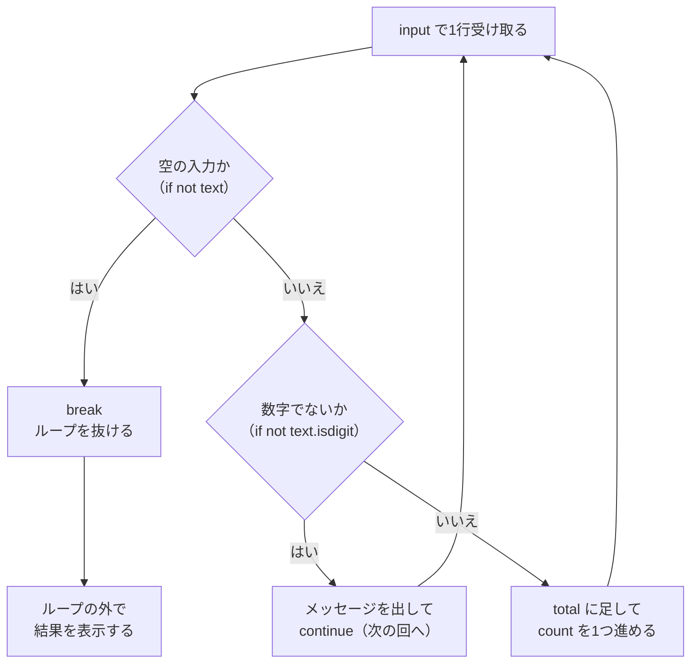

# 解答編 その1（第1章〜第5章）

**先に自分で解いてから読んでください。**

解けなかった問題は、この解答を読んだあと、
**何も見ずにもう一度自分で書き直して**ください。それで定着します。

第6章以降の解答は [解答編 その2](./91-answers-part2.md) にあります。

> **解答を読んでも納得できないとき**
> AI に次のように聞いてください。
>
> ```text
> python-text の演習 1.3 の解答を読みましたが、
> なぜ import した名前でパッケージを呼び出せるのかが納得できません。
> ```

---

## 第1章

### 理解度チェック

**問 1.1 の解答**

- Windows: **`python`**
- macOS: **`python3`**

**解説**

macOS には、システムが使う別の `python` が存在したり、まったく無かったりします。
そのため、公式インストーラーで入れた Python 3 は **`python3`** という名前で呼び出します。
Windows はインストーラーが `python` を用意してくれるので、そのまま `python` で動きます。

このテキストの本文は、環境依存の手順をすべて Windows（`python`）/ macOS（`python3`）の
両方で示しています。自分の OS のブロックを読んでください。

---

**問 1.2 の解答**

- 名前：**REPL**
- 抜ける命令：**`exit()`**（`quit()` でも可。ショートカットなら Windows は `Ctrl` + `Z` → Enter、macOS は `Ctrl` + `D`）

**解説**

REPL は、`>>>` のあとに式を打つと、その場で結果が返ってくる対話モードです。
電卓のように使えるので、「この書き方で合っているかな」をすぐ試せます。

ただし REPL に打った内容は**保存されません**。
繰り返し動かすプログラムは、ファイル（`.py`）に書いて保存します（1.3.4）。

---

**問 1.3 の解答**

- （1）エラーの種類：**`NameError`**
- （2）行番号：**3行目**（`line 3`）

**解説**

トレースバックは**下から上**に読みます。

1. いちばん下の `NameError: name 'nummber' is not defined` が、エラーの**種類と説明**です
   （「`nummber` という名前は定義されていません」）
2. `File "app.py", line 3` が、**どのファイルの何行目か**を示します
3. `^^^^^^^` が、特に怪しい場所（`nummber`）を指しています

この場合、3行目の `nummber` が `number` の打ち間違いだと見当がつきます。

---

**問 1.4 の解答**

**プロジェクトごとに必要なライブラリのバージョンが違っても、互いに衝突しないようにできる。**

**解説**

パソコン全体に1か所だけライブラリを入れると、
「プロジェクトAは `requests` の v2.31、プロジェクトBは v2.20 が必要」というときに、
どちらか片方しか置けず、もう片方が動かなくなります（1.5.1）。

仮想環境（venv）を使うと、プロジェクトごとに専用の入れ物（`.venv`）を持てるので、
中に別々のバージョンを入れても干渉しません。

---

**問 1.5 の解答**

**「作る」コマンド。**

**解説**

- 作る：`python -m venv .venv`（`.venv` という入れ物を作る）
- 有効化する：Windows は `.\.venv\Scripts\Activate.ps1`、macOS は `source .venv/bin/activate`

作っただけでは使われません。**有効化して初めて**、その仮想環境の中にライブラリが入るようになります。
有効化できているかは、ターミナルの先頭に `(.venv)` が付いているかで見分けます（1.5.3）。

---

**問 1.6 の解答**

```powershell
Set-ExecutionPolicy -Scope CurrentUser RemoteSigned
```

**解説**

Windows には、安全のためにスクリプトの実行を止める「実行ポリシー」という設定があり、
これが有効化スクリプト（`Activate.ps1`）をブロックしていました。

上のコマンドは、
- `-Scope CurrentUser`：いまログインしているあなただけに適用
- `RemoteSigned`：自分のパソコンで作ったスクリプトは許可し、ネットから落としたものは署名を求める

という、開発でよく使われる安全側の設定に変えるものです（1.5.5）。
確認を求められたら `Y` を押します。設定後、もう一度有効化を試してください。

---

### 演習問題

### 演習 1.1 の解答

`greet.py`

```python
print("こんにちは、山田です。")
print("Python の学習を始めました。")
```

**Windows（PowerShell）**

```powershell
python greet.py
```

**macOS / Linux**

```bash
python3 greet.py
```

```text
実行結果:
こんにちは、山田です。
Python の学習を始めました。
```

**解説**

`print(...)` は、かっこの中の文字を1行として画面に出す命令です。
`print` を2つ並べれば、2行表示されます。名前の部分は自分のものに変えて構いません。

> **よくある間違い**
> - 文字を囲む引用符（`"`）が全角（`”`）になっていると `SyntaxError` になります。半角で打ってください。
> - `print` を `Print`（大文字始まり）と書くと `NameError` になります。Python は大文字と小文字を区別します。

---

### 演習 1.2 の解答

ターミナルでの操作（Windows / macOS 共通の流れ。コマンドの `python` は macOS では `python3`）。

**1. 新しいディレクトリを作って移動する**

```powershell
cd ~/Desktop
mkdir venv-practice
cd venv-practice
```

**2. 仮想環境を作る**

**Windows（PowerShell）**

```powershell
python -m venv .venv
```

**macOS / Linux**

```bash
python3 -m venv .venv
```

**3. 有効化する**

**Windows（PowerShell）**

```powershell
.\.venv\Scripts\Activate.ps1
```

**macOS / Linux**

```bash
source .venv/bin/activate
```

先頭に `(.venv)` が付いたことを確認します。

```text
(.venv) PS C:\Users\yamada\Desktop\venv-practice>
```

**4. 一覧を確認する**

```powershell
pip list
```

```text
実行結果の例:
Package    Version
---------- -------
pip        24.3.1
```

**5. 無効化する**

```text
deactivate
```

先頭の `(.venv)` が消えれば成功です。

**解説**

`python-lesson` とは別に `venv-practice` を作らせたのは、
**仮想環境がプロジェクトごとに独立している**ことを体験してもらうためです。
作ったばかりの仮想環境には、まだ `pip` くらいしか入っていません（4 の `pip list` で確認できます）。

> **よくある間違い**
> Windows で 3 のときに「スクリプトの実行が無効になっている」というエラーが出たら、
> 実行ポリシーの設定が必要です。解答の問 1.6 のコマンドを実行してから、もう一度有効化してください（1.5.5）。

---

### 演習 1.3 の解答

**1. 仮想環境を有効化する**（演習 1.2 の `venv-practice` の中で）

**Windows（PowerShell）**

```powershell
.\.venv\Scripts\Activate.ps1
```

**macOS / Linux**

```bash
source .venv/bin/activate
```

**2. パッケージをインストールする**

```powershell
pip install cowsay==6.1
```

**3. パッケージを使うファイルを書く**

`use_package.py`

```python
import cowsay

cowsay.cow("パッケージを使えました")
```

**4. 実行する**

**Windows（PowerShell）**

```powershell
python use_package.py
```

**macOS / Linux**

```bash
python3 use_package.py
```

```text
実行結果:
  _______________________
| パッケージを使えました |
  =======================
                \
                 \
                   ^__^
                   (oo)\_______
                   (__)\       )\/\
                       ||----w |
                       ||     ||
```

**5. 環境を書き出す**

```powershell
pip freeze > requirements.txt
```

`requirements.txt` の中身:

```text
cowsay==6.1
```

**解説**

この演習は、**「有効化 → インストール → import して使う → 書き出す」**という
1.6 の一連の流れを、自分のディレクトリで通しで再現するものです。

`import cowsay` で取り込み、`cowsay.cow(...)` で呼び出しています。
本文の `moo.py`（1.6.2）と同じ形です。

> **よくある間違い**
> - `ModuleNotFoundError: No module named 'cowsay'` が出たら、
>   **有効化していない環境で実行している**のが原因のことがほとんどです。
>   ターミナルの先頭に `(.venv)` が付いているかを確認してください（1.6.2）。
> - `pip freeze` の結果が空になるのは、有効化した環境に何もインストールできていないためです。
>   2 のインストールが成功したか（`Successfully installed cowsay-6.1` が出たか）を見直してください。

> **別解：コマンドラインから直接使う**
> `cowsay` は、ファイルを書かずにコマンドから使うこともできます。
>
> ```powershell
> python -m cowsay -t "コマンドから使えました"
> ```
>
> ただし演習の完成条件は「ファイルから `import` して使う」なので、
> 提出する解答は `use_package.py` のほうです。

---

## 第2章

### 理解度チェック

**問 2.1 の解答**

```text
200
100100
```

**解説**

`a` は整数（`int`）の `100`、`b` は文字列（`str`）の `"100"` です。
同じ `+` でも、**型によって意味が変わります**（[2.2](./02-basics.md#22-データ型)）。

- `a + a` は数値どうしの**足し算**なので `200`
- `b + b` は文字列どうしの**連結**なので、`"100"` と `"100"` がつながって `100100`

見た目が同じ `100` でも別物であることは、`type()` で確かめられます（2.2.5）。

```python
print(type(a))   # <class 'int'>
print(type(b))   # <class 'str'>
```

---

**問 2.2 の解答**

```text
4.5
4
1
```

**解説**

3種類の割り算の違いです（2.3.2）。

| 式 | 意味 | 結果 |
|----|------|------|
| `9 / 2` | ふつうの割り算 | `4.5` |
| `9 // 2` | 商の切り捨て | `4` |
| `9 % 2` | 余り | `1` |

**`/` は割り切れても必ず小数（`float`）になる**ことも合わせて覚えてください。
`10 / 2` の結果は `5` ではなく `5.0` です。

> **よくある間違い**
> `9 // 2` を「四捨五入して 5」と考えてしまうことがあります。
> `//` は**四捨五入ではなく切り捨て**です。四捨五入したいときは `round()` を使います（2.3.2 の補足）。

---

**問 2.3 の解答**

| JavaScript | Python |
|-----------|--------|
| `x === y` | `x == y` |
| `&&` | `and` |
| `true` | `True` |

**解説**

- Python に **`===` はありません**。等値の比較は `==` です（2.3.4）
- 論理演算子は記号ではなく**英単語**です（2.3.5）。`&&` と書くと `SyntaxError` になります
- 真偽値は**先頭が大文字**の `True` / `False` です（2.2.3）。
  `true` と書くと `NameError: name 'true' is not defined. Did you mean: 'True'?` になります

なお、JavaScript の `==`（型を無視して比べる比較）にあたるものは Python にはありません。
Python の `==` は、型が違えば `False` を返します（`100 == "100"` は `False`）。

---

**問 2.4 の解答**

**理由**：`"残り"` は文字列（`str`）、`count` は整数（`int`）で、
**文字列と数値は `+` でつなげられない**ためです（2.4.1）。

**直したコード**

```python
count = 5
print(f"残り{count}個")
```

```text
実行結果:
残り5個
```

**解説**

エラーメッセージは次のとおりでした。

```text
TypeError: can only concatenate str (not "int") to str
```

「文字列に連結できるのは文字列だけです（`int` は無理です）」という意味です。

直し方は2つあります。

1. `str()` で変換する：`print("残り" + str(count) + "個")`（2.2.6）
2. f-string を使う：`print(f"残り{count}個")`（2.4.4）

**2 が推奨です。** f-string は `{ }` の中身を自動的に文字列として埋め込むので、
`str()` を書く必要がありません。

---

**問 2.5 の解答**

- 結果：**`yth`**
- 理由：**スライスは「開始の番号から、終了の番号の手前まで」を取り出すため。**
  `[1:4]` は 1・2・3 番目の3文字になる

**解説**

インデックスは **0 から**始まります（2.4.2）。

```text
文字列:   P   y   t   h   o   n
番号:     0   1   2   3   4   5
```

`word[1:4]` は「1番目から**4番目の手前まで**」なので、1・2・3 の3文字 `yth` です。
4番目の `o` は**含まれません**。

「終わりは手前まで」と覚えると、取り出す文字数が
**（終了 − 開始）**になることも自然に理解できます（`4 - 1 = 3` 文字）。

---

**問 2.6 の解答**

**問題**：`if age >= 18:` の次の行が**字下げされていない**ため、
`if` のブロック（条件が成り立ったときに実行する部分）が存在しないことになっています。

**直したコード**

```python
age = 20

if age >= 18:
    print("大人です")
```

```text
実行結果:
大人です
```

**解説**

エラーメッセージは次のとおりでした。

```text
IndentationError: expected an indented block after 'if' statement on line 3
```

「3行目の `if` のあとには、字下げされたブロックが必要です」という意味です（2.6.3）。

Python では**インデントが文法そのもの**です（2.6.1）。
**`:`（コロン）で終わる行の次は、必ず字下げする**と覚えてください。
字下げは**半角スペース4つ**が標準です（2.6.2）。

---

### 演習問題

### 演習 2.1 の解答

`profile.py`

```python
name = "山田太郎"
age = 20
prefecture = "東京都"

line = "=" * 40

print(line)
print(f"名前: {name}（{age}歳）")
print(f"住まい: {prefecture}")
print(line)
```

**Windows（PowerShell）**

```powershell
python profile.py
```

**macOS / Linux**

```bash
python3 profile.py
```

```text
実行結果:
========================================
名前: 山田太郎（20歳）
住まい: 東京都
========================================
```

**解説**

3つのポイントがあります。

1. **情報を変数に入れる**（2.1.1）
   直接 `print("山田太郎")` と書かず、いったん `name` に入れています。
   こうしておくと、名前を変えたいときに1か所だけ直せば済みます。

2. **区切り線は「文字列 `*` 数値」で作る**（2.4.1）
   `"=" * 40` は `=` を40回繰り返した文字列を作ります。
   `"========..."` と40文字打つ必要はありません。
   ここも `line` という変数に入れておけば、上下2か所で使い回せます。

3. **埋め込みは f-string**（2.4.4）
   `f"名前: {name}（{age}歳）"` のように書けば、
   `age` が数値でも `str()` による変換は不要です。

変数名は snake_case（すべて小文字・アンダースコア区切り）です（2.1.3）。
`prefectureName` のようなキャメルケースは、Python では使いません。

> **よくある間違い**
> - `print("名前: " + name + "（" + age + "歳）")` と書くと `TypeError` になります。
>   `age` が数値だからです（2.4.1）。f-string ならこの問題は起きません
> - `f` を書き忘れると `{name}` がそのまま表示されます（2.4.4）

> **別解：区切り線を関数にしたくなったら**
> 「同じ処理に名前を付けて使い回す」書き方（関数）は第5章で扱います。
> いまは変数に入れて使い回すところまでで十分です。

---

### 演習 2.2 の解答

`fix_indent.py`

```python
score = 85

if score >= 80:
    print("合格です")
    print("よくできました")

print("採点を終了します")
```

```text
実行結果:
合格です
よくできました
採点を終了します
```

`score = 50` に書き換えたとき:

```text
実行結果:
採点を終了します
```

**解説**

もとのコードには、**2種類のインデントエラー**が入っていました。

```python
score = 85

if score >= 80:
print("合格です")          # ← 字下げされていない
  print("よくできました")   # ← 深さが 2 になっている
print("採点を終了します")
```

実行すると、まず1つ目のエラーが出ます。

```text
IndentationError: expected an indented block after 'if' statement on line 3
```

**Python は、いちばん最初に見つけたエラーだけを報告します。**
1つ直して実行すると、次のエラーが出てくる——これは正常です。
「1つずつ直して、そのつど実行する」のが正しい進め方です（2.6.3）。

直す手順は次のとおりです。

1. **どの行が条件付きで、どの行が必ず実行される行かを決める**
   - 「合格です」「よくできました」→ 80点以上のときだけ
   - 「採点を終了します」→ 点数に関係なく必ず
2. 条件付きの行を、**半角スペース4つ**で字下げする
3. 必ず実行される行は、**字下げしない**（`if` のブロックの外に出す）

`score` を `50` にしたとき、字下げした2行だけが飛ばされ、
字下げしていない最後の行が実行されることを確認してください。
これが「インデントがブロックを決めている」証拠です（2.6.2）。

> **よくある間違い**
> - 字下げに `Tab` キーを使うと、あとから半角スペースと混ざって
>   `TabError: inconsistent use of tabs and spaces in indentation` になります（2.6.3）。
>   [2.6.4](./02-basics.md#264-タブとスペースを混ぜない設定) の設定をしておけば、
>   `Tab` キーを押しても半角スペースが入るようになります
> - `print("採点を終了します")` まで字下げしてしまうと、
>   `score = 50` のときに**何も表示されなくなります**。
>   完成条件の2つ目（`50` のときに1行だけ出る）で気づけます

---

### 演習 2.3 の解答

`time_convert.py`

```python
SECONDS_PER_HOUR = 3600
SECONDS_PER_MINUTE = 60

seconds_text = input("秒数を入力してください: ")
total_seconds = int(seconds_text)

hours = total_seconds // SECONDS_PER_HOUR      # 何時間ぶんか
rest = total_seconds % SECONDS_PER_HOUR        # 時間にできなかった残り

minutes = rest // SECONDS_PER_MINUTE           # 残りから何分ぶんか
seconds = rest % SECONDS_PER_MINUTE            # それでも残る秒

print(f"{total_seconds}秒 = {hours}時間{minutes}分{seconds}秒")
```

**Windows（PowerShell）**

```powershell
python time_convert.py
```

**macOS / Linux**

```bash
python3 time_convert.py
```

```text
実行結果:
秒数を入力してください: 10000
10000秒 = 2時間46分40秒
```

```text
実行結果:
秒数を入力してください: 59
59秒 = 0時間0分59秒
```

**解説**

この演習は、3つの内容の組み合わせです。

1. **入力を受け取って整数に変換する**（2.5.2、2.5.3）
   `input` が返すのは**必ず文字列**なので、`int()` を通さないと計算できません。
   通さずに `total_seconds // 3600` とすると
   `TypeError: unsupported operand type(s) for //: 'str' and 'int'` になります。

2. **`//` と `%` を、余りに対して繰り返し使う**（2.3.2）
   本文の卵の例（`eggs2.py`）とまったく同じ形です。

   ```text
   10000 // 3600 = 2      → 2時間
   10000 %  3600 = 2800   → 時間にできなかった残り
    2800 //   60 = 46     → 46分
    2800 %    60 = 40     → 40秒
   ```

   **2段目は、元の `total_seconds` ではなく `rest` に対して計算します。**
   ここを `total_seconds // 60` としてしまうと `166分` となり、
   時間として数えたぶんを二重に数えてしまいます。

3. **f-string で1行にまとめる**（2.4.4）
   `f"{total_seconds}秒 = {hours}時間{minutes}分{seconds}秒"` のように、
   複数の変数を1つの文字列に埋め込めます。

`3600` や `60` を `SECONDS_PER_HOUR` などの定数にしているのは、
数字だけを見ても意味がわからなくなるのを防ぐためです（2.1.4）。
直接 `3600` と書いても動きますが、こちらのほうが読みやすくなります。

> **よくある間違い**
> - `int()` を忘れる →
>   `TypeError: unsupported operand type(s) for //: 'str' and 'int'`
> - `/` を使ってしまう → `10000 / 3600` は `2.7777...` になり、
>   `2.7777時間` と表示されてしまいます。**個数を数えるときは `//`** です（2.3.2）
> - 2段目を `total_seconds // 60` と書く → `59` のときは正しく見えますが、
>   `10000` のときに `166分` になります。**両方の入力で試す**と気づけます

> **別解：残りを変数にせず、続けて書く**
> ```python
> hours = total_seconds // 3600
> minutes = total_seconds % 3600 // 60
> seconds = total_seconds % 60
> ```
> これでも同じ結果になりますが、`%` と `//` の計算順を追う必要があり、
> 読み手にとっては難しくなります。**`rest` という名前を付けたほうが、意図が伝わります。**

---

### 演習 2.4 の解答

`format_date.py`

```python
date_text = input("日付を入力してください（例: 20250825）: ")

year = date_text[0:4]
month = date_text[4:6]
day = date_text[6:8]

print(f"{int(year)}年{int(month)}月{int(day)}日")
print(f"{year}/{month}/{day}")
```

**Windows（PowerShell）**

```powershell
python format_date.py
```

**macOS / Linux**

```bash
python3 format_date.py
```

```text
実行結果:
日付を入力してください（例: 20250825）: 20250825
2025年8月25日
2025/08/25
```

**解説**

ポイントは3つです。

1. **スライスで切り出す**（2.4.2）
   `[開始:終了]` は**終了の番号を含みません**。

   ```text
   文字列:   2   0   2   5   0   8   2   5
   番号:     0   1   2   3   4   5   6   7
   ```

   - 年：`date_text[0:4]` → `"2025"`
   - 月：`date_text[4:6]` → `"08"`
   - 日：`date_text[6:8]` → `"25"`

   末尾は `date_text[6:]`（6番目から最後まで）と書いても同じです。

2. **先頭の `0` を取るには、整数に変換する**（2.2.6）
   `"08"` は文字列なので `0` が残りますが、`int("08")` は `8` になります。
   整数には「先頭の 0」という概念がないためです。

3. **`0` を残したい行では、変換しない**
   2行目は文字列のまま `{year}/{month}/{day}` と埋め込んでいるので、
   `2025/08/25` と `0` 付きで表示されます。

**同じ値を、目的に応じて「文字列のまま使う」「数値に変換して使う」と
使い分けている**のがこの演習の要点です。

> **よくある間違い**
> - `date_text[4:5]` と書いてしまう → 1文字（`"0"`）しか取れません。
>   「4番目から6番目の手前まで」で2文字です（2.4.2）
> - 最初に `date_text = int(input(...))` と数値にしてしまう →
>   数値にはスライスが使えず、
>   `TypeError: 'int' object is not subscriptable` になります。
>   **切り出すあいだは文字列のまま**にしておく必要があります
> - `year` などを `int()` に変換したあと、2行目でもそのまま使ってしまう →
>   `2025/8/25` となり、完成条件（`08` のまま）を満たしません

> **別解：`replace` は使えません**
> `"08".replace("0", "")` で `0` を消す方法を思いつくかもしれませんが、
> `"10"` 月のときに `"1"` になってしまいます（真ん中や末尾の `0` まで消えるため）。
> **先頭の `0` だけを外したいときは、`int()` を使うのが確実です。**

> **発展：`zfill` で逆方向もできます**
> `"8".zfill(2)` は `"08"` になります（2.4.3）。
> 「数値から `0` 付きの表示を作る」ときは、こちらか f-string の
> `f"{8:02}"` を使います。

---

## 第3章

### 理解度チェック

**問 3.1 の解答**

```text
合格
```

**解説**

`elif` は**上から順に判定され、最初に `True` になった1つだけ**が実行されます
（[3.1.2](./03-control-flow.md#312-else-と-elif)）。

`score` は `95` なので、1つ目の `score >= 60` の時点で `True` になります。
そこで判定は終わり、**2つ目の `score >= 90` は確かめられません。**

「優秀」を出したいなら、**厳しい（狭い）条件から先に書きます。**

```python
score = 95

if score >= 90:
    print("優秀")
elif score >= 60:
    print("合格")
```

```text
実行結果:
優秀
```

> **よくある間違い**
> このコードはエラーになりません。**動くのに結果が間違っている**のがやっかいなところです。
> 範囲で分ける `elif` を書いたら、**境界の値（この例なら 60 と 90）を実際に入れて動かして**
> 確かめる習慣を付けてください。

---

**問 3.2 の解答**

```text
1, 3, 5, 7, 9
```

**解説**

`range(開始, 終了, 増分)` は、**開始から、終了の手前まで、増分ずつ**の数を作ります
（[3.2.2](./03-control-flow.md#322-range)）。

- 開始が `1`
- 増分が `2` なので、`1` → `3` → `5` → `7` → `9` と進む
- 次は `11` になるが、**終了の `10` を超えている**ので、ここで止まる

`10` を含みそうに見えますが、`range` の「終了」は**含まれません。**
実際に動かして確かめてください。

```python
for i in range(1, 10, 2):
    print(i)
```

---

**問 3.3 の解答**

```text
False
True
False
```

**解説**

偽として扱われるのは、`False` / `0` / `0.0` / `""` / `[]` / `None` **だけ**です
（[3.1.5](./03-control-flow.md#315-真偽値として扱われる値空文字列0空リスト)）。

- `0` は**数値のゼロ**なので偽 → `False`
- `"0"` は**「0」という1文字が入った文字列**です。空ではないので真 → `True`
- `[]` は**要素が1つもないリスト**なので偽 → `False`

**`"0"` が `True` になるところがつまずきやすい点です。**
`input` で受け取った値は必ず文字列なので（[2.5.3](./02-basics.md#253-入力は必ず文字列である)）、
`0` と入力されても `"0"` という真の値になります。
「0 が入力されたか」を判定したいときは、`int()` で変換してから
`if number == 0:` のように**明示的に比べて**ください。

---

**問 3.4 の解答**

- **`break`**：繰り返しをその場で終わらせ、ループの外へ抜ける
- **`continue`**：その回の残りの処理だけを飛ばし、次の回へ進む（ループは続く）

**解説**

いちばんの違いは、**ループが続くかどうか**です
（[3.3.1](./03-control-flow.md#331-break) / [3.3.2](./03-control-flow.md#332-continue)）。

同じコードで見比べると、はっきりします。

```python
print("--- break ---")
for i in range(1, 6):
    if i == 3:
        break
    print(i)

print("--- continue ---")
for i in range(1, 6):
    if i == 3:
        continue
    print(i)
```

```text
実行結果:
--- break ---
1
2
--- continue ---
1
2
4
5
```

`break` は `3` で打ち切るので `4` `5` が出ません。
`continue` は `3` だけを飛ばすので `4` `5` は出ます。

> **補足**
> 入れ子になったループの中で `break` を書くと、**内側のループしか抜けません**（3.3.1）。

---

**問 3.5 の解答**

**何が起きるか**：`1` が**無限に表示され続けます**（無限ループ）。

**理由**：`while` の条件に使っている `count` を、ループの中で**まったく変えていない**ためです。
`count` はずっと `1` のままなので、`count <= 3` が永久に `True` になります。

**止め方**：ターミナルの中をクリックしてから、**`Ctrl` + `C`** を押します
（macOS も `control` + `C` です）。

**解説**

`for` はループ変数を自動で進めてくれますが、**`while` は自分で進める必要があります**
（[3.2.4](./03-control-flow.md#324-while)）。正しくはこうです。

```python
count = 1

while count <= 3:
    print(count)
    count += 1
```

```text
実行結果:
1
2
3
```

止めたときに出る `KeyboardInterrupt` は、**「人が止めました」という意味**であって、
コードの誤りを指すエラーではありません（[3.2.5](./03-control-flow.md#325-無限ループから抜け出す)）。

> **よくある間違い**
> VS Code でエディタ側にカーソルがあるまま `Ctrl` + `C` を押すと「コピー」になり、止まりません。
> **必ずターミナルの中をクリックしてから**押してください。
> それでも止まらないときは、ターミナル右上のゴミ箱アイコンで閉じます。

---

**問 3.6 の解答**

`i` が `1` のときに **`break` されたから**です。

`for` の `else` は「ループが終わったとき」ではなく、
**「`break` されずに最後まで回りきったとき」**に実行されます
（[3.3.3](./03-control-flow.md#333-for--else)）。

**解説**

このコードは `range(3)` で `0` `1` `2` と回りますが、
`i == 1` の時点で `break` するため、`else` は実行されません。

`if i == 1:` を `if i == 5:`（絶対に成立しない条件）に変えると、`else` が実行されます。

```python
for i in range(3):
    if i == 5:
        break
else:
    print("最後まで回りました")
```

```text
実行結果:
最後まで回りました
```

「`break` しなかったら実行される」＝**「探したけれど見つからなかった」を書くための仕組み**、
と覚えると使いどころが見えてきます。

---

**問 3.7 の解答**

```python
age < 18 or not is_member
```

**解説**

`and` を含む条件を反転すると、**`and` が `or` に入れ替わります**
（[3.4.3](./03-control-flow.md#343-条件を反転して整理する)）。

- `a and b` の否定は `not a` **or** `not b`
- `age >= 18` の否定は `age < 18`
- `is_member` の否定は `not is_member`

**「18歳未満**かつ**会員でない」ではありません。**
元の条件は「両方そろって初めて真」なので、**どちらか一方でも欠ければ偽**になります。
だから反転は `or` でつなぎます。

実際に4パターンすべてで確かめられます。

```python
for age in [15, 20]:
    for is_member in [False, True]:
        original = age >= 18 and is_member
        inverted = age < 18 or not is_member
        print(f"age={age}, is_member={is_member}: 元={original}, 反転={inverted}")
```

```text
実行結果:
age=15, is_member=False: 元=False, 反転=True
age=15, is_member=True: 元=False, 反転=True
age=20, is_member=False: 元=False, 反転=True
age=20, is_member=True: 元=True, 反転=False
```

**元と反転が、4パターンすべてで逆になっています。** これが正しい反転です。

> **補足**
> `not (age >= 18 and is_member)` と書いても同じ意味になります。
> ただし、ガード節（[3.4.2](./03-control-flow.md#342-早期-continue-で浅くする)）で使うときは、
> **`not` を外に付けるより、比較演算子そのものを裏返したほうが読みやすくなります。**

---

### 演習問題

### 演習 3.1 の解答

`grade.py`

```python
text = input("点数を入力してください: ")
score = int(text)

if score >= 90:
    print("評価: 優")
elif score >= 70:
    print("評価: 良")
elif score >= 60:
    print("評価: 可")
else:
    print("評価: 不可")
```

```text
実行結果:
点数を入力してください: 95
評価: 優
```

```text
実行結果:
点数を入力してください: 60
評価: 可
```

**解説**

この演習の要点は、**`elif` を書く順番**です（[3.1.2](./03-control-flow.md#312-else-と-elif)）。

判定は上から順に行われ、**最初に `True` になった1つだけ**が実行されます。
つまり、**厳しい（狭い）条件から順に書けば、範囲の下限だけを書けば済みます。**

| 書いた条件 | ここに到達した時点でわかっていること | 実際に判定される範囲 |
|-----------|--------------------------------|------------------|
| `score >= 90` | — | 90 以上 |
| `score >= 70` | 90 未満である | 70 以上 90 未満 |
| `score >= 60` | 70 未満である | 60 以上 70 未満 |
| `else` | 60 未満である | 60 未満 |

**「90 以上 70 未満」のような上限を書く必要はありません。**
上の条件で弾かれた時点で、上限は自動的に決まっているからです。

もう1つの要点は、**`int()` での変換**です。
`input` の戻り値は必ず文字列なので（[2.5.3](./02-basics.md#253-入力は必ず文字列である)）、
変換せずに `score >= 90` と書くと、次のエラーになります。

```text
TypeError: '>=' not supported between instances of 'str' and 'int'
```

「文字列と整数は `>=` で比べられません」という意味です。

> **よくある間違い**
> 順番を逆にすると、いつまでも「可」になります。
>
> ```python
> if score >= 60:      # ❌ 95 でもここで止まる
>     print("評価: 可")
> elif score >= 70:
>     print("評価: 良")
> ```
>
> 書き終えたら、**境界の値（`90` `89` `70` `69` `60` `59`）を必ず入れて動かしてください。**

> **別解：`if` を4つ並べる場合**
> `elif` を使わずに書くこともできますが、上限も書く必要があり、条件が2倍になります。
>
> ```python
> if score >= 90:
>     print("評価: 優")
> if score >= 70 and score < 90:
>     print("評価: 良")
> if score >= 60 and score < 70:
>     print("評価: 可")
> if score < 60:
>     print("評価: 不可")
> ```
>
> 動きますが、**条件の書き間違い（`>` と `>=` の取り違えなど）が起きやすくなります。**
> 「どれか1つだけ」を選ぶときは `elif` を使ってください。

---

### 演習 3.2 の解答

`dan.py`

```python
text = input("何の段を表示しますか: ")
dan = int(text)

total = 0

for i in range(1, 10):
    answer = dan * i
    print(f"{dan} × {i} = {answer}")
    total += answer

print(f"合計: {total}")
```

```text
実行結果:
何の段を表示しますか: 7
7 × 1 = 7
7 × 2 = 14
7 × 3 = 21
7 × 4 = 28
7 × 5 = 35
7 × 6 = 42
7 × 7 = 49
7 × 8 = 56
7 × 9 = 63
合計: 315
```

**解説**

この演習では、次の3つを組み合わせています。

1. **`range(1, 10)` で 1 から 9 まで回す**（[3.2.2](./03-control-flow.md#322-range)）
   `range` の「終了」は含まれないので、**9 まで回すには `10` と書きます。**
   `range(1, 9)` にすると 8 までしか出ません。

2. **合計を集める変数を、繰り返しの外で用意する**（同じく 3.2.2）
   `total = 0` を `for` の**前**に書きます。
   中に書くと毎回 0 に戻り、最後の `63` だけが残ってしまいます。

3. **計算結果を変数に入れて、表示と合計の両方に使う**
   `answer = dan * i` と一度変数に入れておけば、`dan * i` を2回書かずに済みます。

`answer` を使わず、直接書くこともできます。

```python
for i in range(1, 10):
    print(f"{dan} × {i} = {dan * i}")
    total += dan * i
```

**どちらでも正解です。** ただし同じ計算が2か所に現れるため、
片方だけ直してしまう間違いが起きやすくなります。
**同じ計算を2回書きそうになったら、変数に入れる**のがおすすめです。

> **よくある間違い**
> `print(f"{dan} x {i} = {answer}")` のように、`×` を半角の `x` で書いてしまうことがあります。
> 完成条件の実行例は全角の `×` です。**コピーして貼り付けてください。**
>
> また、`{dan}` を `{dan}` ではなく `{ dan }`（かっこの中に空白）と書くと、
> f-string では空白も含めて解釈されてしまいます。**空白を入れないでください。**

> **発展：合計は計算式でも求められます**
> `dan` の段の合計は `dan × (1+2+…+9)` なので、`dan * 45` でも同じ値になります。
> ただしこの演習の目的は**繰り返しの中で値を集める練習**なので、
> `total += answer` の形で書いてください。この形は演習 3.4 でも使います。

---

### 演習 3.3 の解答

`guess.py`

```python
ANSWER = 7

attempt = 0
cleared = False

while attempt < 5:
    text = input(f"{attempt + 1}回目 / 全5回 - 数を入力してください: ")

    if not text.isdigit():
        print("数字で入力してください")
        continue

    attempt += 1
    guess = int(text)

    if guess == ANSWER:
        print(f"{attempt}回目で正解です！")
        cleared = True
        break

    if guess < ANSWER:
        print("もっと大きい数です")
    else:
        print("もっと小さい数です")

if not cleared:
    print(f"残念でした。答えは {ANSWER} でした")
```

```text
実行結果:
1回目 / 全5回 - 数を入力してください: 3
もっと大きい数です
2回目 / 全5回 - 数を入力してください: あ
数字で入力してください
2回目 / 全5回 - 数を入力してください: 9
もっと小さい数です
3回目 / 全5回 - 数を入力してください: 7
3回目で正解です！
```

```text
実行結果:
1回目 / 全5回 - 数を入力してください: 1
もっと大きい数です
2回目 / 全5回 - 数を入力してください: 2
もっと大きい数です
3回目 / 全5回 - 数を入力してください: 3
もっと大きい数です
4回目 / 全5回 - 数を入力してください: 4
もっと大きい数です
5回目 / 全5回 - 数を入力してください: 5
もっと大きい数です
残念でした。答えは 7 でした
```

**解説**

この演習でいちばん考えどころなのは、
**「やり直しでは回数を消費しない」をどう実現するか**です。

`for attempt in range(1, 6):` と書くと、`continue` した時点で**次の回に進んでしまいます。**
`range` が用意した5回は、`continue` しても消費されるからです。

そこで、**回数は自分で数えます。**

```python
attempt = 0

while attempt < 5:
    ...
    if not text.isdigit():
        print("数字で入力してください")
        continue      # attempt を増やさずに先頭へ戻る

    attempt += 1      # 有効な入力のときだけ、ここで1つ進む
```

**`continue` を `attempt += 1` より前に置く**ことで、
やり直しでは回数が増えません。これは
[3.3.2](./03-control-flow.md#332-continue) の `input_guard.py` とまったく同じ形です。

表示の `{attempt + 1}回目` は、**まだ `attempt` を増やす前**だからです。
`attempt` が `0` のときが「1回目」にあたります。

もう1つの要点が、**「5回すべて外したときだけ」**の書き分けです。
ここでは `cleared` という判定用の変数を使いました
（[3.3.3](./03-control-flow.md#333-for--else) の `for_else_alt.py` と同じ形）。

- 正解したときに `cleared = True` にしてから `break`
- ループを抜けたあと、`if not cleared:` で「正解していない場合だけ」表示する

**`break` の直後に書いてはいけません。** `break` を実行するとその下は動かないためです。

> **よくある間違い**
> - `attempt += 1` を `continue` より**前**に書いてしまう
>   → やり直しでも回数が減っていきます。実行例と見比べて確認してください
> - `if guess < ANSWER:` を `if guess > ANSWER:` と逆に書いてしまう
>   → **入力した数が正解より小さいなら、答えは「もっと大きい」**です。混乱しやすいところです
> - 判定を `text < ANSWER` と、変換前の文字列のまま比べてしまう
>   → `TypeError: '<' not supported between instances of 'str' and 'int'` になります。
>   **`int()` で変換してから比べてください**
> - 最後の行を `else:` としてループの中に書いてしまう
>   → 外れるたびに毎回「残念でした」が表示されます。
>   `if not cleared:` は**ループの外（字下げなし）**に書きます

> **別解：`while ... else` を使う**
> [3.3.3](./03-control-flow.md#333-for--else) で学んだ `else` は、
> **`while` にも同じように付けられます。**
> 意味も同じで、**「`break` されずにループが終わったとき」**に実行されます。
>
> ```python
> ANSWER = 7
> attempt = 0
>
> while attempt < 5:
>     text = input(f"{attempt + 1}回目 / 全5回 - 数を入力してください: ")
>
>     if not text.isdigit():
>         print("数字で入力してください")
>         continue
>
>     attempt += 1
>     guess = int(text)
>
>     if guess == ANSWER:
>         print(f"{attempt}回目で正解です！")
>         break
>
>     if guess < ANSWER:
>         print("もっと大きい数です")
>     else:
>         print("もっと小さい数です")
> else:
>     print(f"残念でした。答えは {ANSWER} でした")
> ```
>
> `cleared` が不要になり、短くなります。
> ただし `while` の `else` は**読み慣れない人が多い**書き方です。
> **どちらでも正解**なので、自分が読みやすいほうを選んでください。

---

### 演習 3.4 の解答

`shopping.py`

```python
total = 0
count = 0

while True:
    text = input("値段を入力してください（何も入れずに Enter で終了）: ")

    if not text:
        break

    if not text.isdigit():
        print("数字を入力してください")
        continue

    total += int(text)
    count += 1

if count == 0:
    print("商品がありません")
else:
    print(f"{count}点 / 合計 {total}円 / 平均 {total / count:.1f}円")
```

```text
実行結果:
値段を入力してください（何も入れずに Enter で終了）: 300
値段を入力してください（何も入れずに Enter で終了）: 1200
値段を入力してください（何も入れずに Enter で終了）: abc
数字を入力してください
値段を入力してください（何も入れずに Enter で終了）: 450
値段を入力してください（何も入れずに Enter で終了）:
3点 / 合計 1950円 / 平均 650.0円
```

```text
実行結果:
値段を入力してください（何も入れずに Enter で終了）:
商品がありません
```

**解説**

このプログラムは、ループの中で**3つの道を用意している**のが特徴です。
**判定を書く順番が重要**なので、上から順に見ていきます。



**1. 空の入力の判定を、いちばん先に書く**

`if not text:` は、**空文字列 `""` が偽として扱われる**ことを利用した書き方です
（[3.1.5](./03-control-flow.md#315-真偽値として扱われる値空文字列0空リスト)）。
`if text == "":` と書いても同じ動きになります。

**この判定は `isdigit()` より前に置く必要があります。**
`"".isdigit()` は `False` なので、順番を逆にすると
**空の入力が「数字を入力してください」と怒られて、永久に終われなくなります。**

**2. 不正な入力は `continue` で弾く**

`isdigit()` で数字だけかを確かめ、そうでなければ `continue` します
（[3.3.2](./03-control-flow.md#332-continue)）。
`count` を増やす前に飛ばすので、**不正な入力は点数に数えられません。**

**3. 0 で割らないように守る**

`count` が `0` のまま `total / count` を計算すると、
`ZeroDivisionError: division by zero` になります（[2.3.1](./02-basics.md#231-算術演算子)）。
そのため `if count == 0:` で先に振り分けています。

**「割る前に、割る数が 0 でないことを確かめる」**のは、
これから先ずっと使う習慣です。

**4. 平均の書式**

`{total / count:.1f}` の `:.1f` は「小数第1位まで表示する」書式指定でした
（[2.4.4](./02-basics.md#244-f-string)）。
`1950 / 3` は `650.0` なので、`:.1f` がないと `650.0` とだけ表示されますが、
`1000 / 3` のような割り切れない値では `333.3333333333333` と長くなってしまいます。
**表示する値には書式を付ける**と覚えてください。

> **よくある間違い**
> - `while True:` に `break` を書き忘れる → 永久に終わりません。
>   `Ctrl` + `C` で止めてから、`if not text: break` を足してください
>   （[3.2.5](./03-control-flow.md#325-無限ループから抜け出す)）
> - `total` と `count` を `while` の**中**で 0 にしてしまう
>   → 毎回リセットされ、最後の1件しか集計されません。
>   **集める変数は繰り返しの外**です（[3.2.2](./03-control-flow.md#322-range)）
> - 結果の表示を `while` の中に書いてしまう → 入力するたびに集計が表示されます。
>   **字下げしていない位置**に書いてください
> - `if count == 0:` を書かずにいきなり平均を計算する
>   → 1件も入力せずに Enter を押した瞬間に `ZeroDivisionError` で落ちます。
>   **必ず両方のパターンで動かして確かめてください**

> **発展：ここまでが「変数1つに値1つ」の限界です**
> このプログラムは合計と点数を覚えていますが、
> **「何円の商品が入力されたか」は1つも残っていません。**
> 「いちばん高かった商品は？」「入力した値段を一覧で出したい」には答えられません。
>
> 入力された値を**すべて覚えておく**には、第4章のリストが必要になります。
> 次の章では、まさにこの続きを扱います。

---

## 第4章

### 理解度チェック

**問 4.1 の解答**

```text
None
```

**解説**

`sort()` は**リスト自身を並べ替えるメソッド**で、**戻り値がありません**
（[4.1.6](./04-data-structures.md#416-sort-と-sorted-の違い破壊的か否か)）。
そのため `numbers = numbers.sort()` と書くと、
`numbers` には「戻り値なし」を表す `None` が入り、**並べ替えたリストは消えてしまいます。**

やりたいことに応じて、次のどちらかを書きます。

```python
numbers = [3, 1, 2]
numbers.sort()            # 元のリストを並べ替える（代入しない）
print(numbers)
```

```python
numbers = [3, 1, 2]
result = sorted(numbers)  # 新しいリストを受け取る（元は変わらない）
print(result)
```

どちらも `[1, 2, 3]` が表示されます。

> **よくある間違い**
> 同じ形の間違いは `append` でも起きます（[4.1.4](./04-data-structures.md#414-追加削除append--insert--remove--pop)）。
> **`append` / `insert` / `remove` / `sort` は、代入せずにそのまま呼ぶ**と覚えてください。
> `None` が表示されたら、まずこれを疑います。

---

**問 4.2 の解答**

```text
[1, 2, 3]
```

2行目は、次のいずれかに書き換えます。

```python
b = a.copy()
```

```python
b = a[:]
```

```python
b = list(a)
```

**解説**

`b = a` は、**リストの中身をコピーしていません。**
「同じ1つのリストに、`b` という名前をもう1つ付けた」だけです
（[4.1.7](./04-data-structures.md#417-リストのコピーで起きる事故)）。

実体は1つしかないので、`b.append(3)` は `a` から見ても中身が増えて見えます。

3つの書き換えは、どれも**新しいリストを作って**そちらを `b` にします。

| 書き方 | 考え方 |
|--------|-------|
| `a.copy()` | 「コピーする」と読めるので、いちばん意図が伝わる |
| `a[:]` | 全体を切り出すスライス。スライスは新しいリストを返す（[4.1.3](./04-data-structures.md#413-スライス)） |
| `list(a)` | `list()` は他の種類のデータからリストを作る関数 |

> **よくある間違い**
> 数値や文字列で同じことをしても、この事故は起きません。
> **中身を書き換えられるもの（リスト・辞書・集合）だけ**で起きます。

---

**問 4.3 の解答**

```text
<class 'dict'>
<class 'set'>
<class 'tuple'>
```

- `{}` … **辞書**（空の集合ではありません）
- `{1, 2}` … **集合**
- `(1,)` … **タプル**

**解説**

`{ }` は、**中身が空のときだけ辞書**になります
（[4.4.1](./04-data-structures.md#441-重複しない集まり)）。
空の集合を作りたいときは `set()` と書きます。

`(1,)` のうしろの `,` は必須です。
`(1)` と書くと、計算のかっこと区別が付かないため**ただの整数**になります
（[4.2.1](./04-data-structures.md#421-変更できないリスト)）。

| 書き方 | 型 |
|--------|----|
| `{}` | 辞書 |
| `set()` | 集合 |
| `{1, 2}` | 集合 |
| `(1)` | 整数 |
| `(1,)` | タプル |

---

**問 4.4 の解答**

- `student["age"]` … `age` というキーがないため、`KeyError: 'age'` で**プログラムが止まる**
- `student.get("age", 0)` … キーがなければ既定値の `0` を返し、**止まらない**

**解説**

`[ ]` は「必ずあるはずのキー」を読むときに使います。
なければプログラムの前提が崩れているので、**止まったほうが安全**です
（[4.3.2](./04-data-structures.md#432-値の読み書き)）。

`get` は「なくてもおかしくないキー」を読むときに使います
（[4.3.3](./04-data-structures.md#433-get-で安全に取り出す)）。

なお `get` は、既定値を省略すると `None` を返します。

```python
student = {"name": "佐藤"}
print(student.get("age"))
print(student.get("age", 0))
```

```text
実行結果:
None
0
```

数を数える用途では、`None` ではなく `0` を返させないと足し算ができません。
**`get(キー, 0)` と既定値を書く**のを癖にしてください。

---

**問 4.5 の解答**

```text
True
False
```

**解説**

辞書に対する `in` は、**キーだけを調べます**（[4.3.2](./04-data-structures.md#432-値の読み書き)）。

- `"数学"` はキーなので `True`
- `80` は値であってキーではないので `False`

値の中を調べたいときは `values()` を使います（[4.3.4](./04-data-structures.md#434-キー値両方を回す)）。

```python
scores = {"数学": 80, "英語": 65}
print(80 in scores.values())
```

```text
実行結果:
True
```

> **よくある間違い**
> リストの `in` は値を調べるのに、辞書の `in` はキーを調べます。
> 同じ記号で調べる対象が変わるので、**何に対して `in` を使っているか**を毎回確認してください。

---

**問 4.6 の解答**

```text
[2, 4]
['奇数', '偶数', '奇数', '偶数']
```

**解説**

`if` の**位置**が違うため、役割がまったく違います
（[4.5.2](./04-data-structures.md#452-条件付き内包表記)）。

| 書き方 | `if` の位置 | 役割 | 要素数 |
|--------|-----------|------|-------|
| `[n for n in numbers if n % 2 == 0]` | うしろ | **絞り込む** | 4個 → 2個に減る |
| `["偶数" if n % 2 == 0 else "奇数" for n in numbers]` | 前 | **値を出し分ける** | 4個のまま |

見分け方は **`else` があるかどうか**です。
`else` があるものは「AかBを選ぶ」書き方（条件式。[3.1.6](./03-control-flow.md#316-条件式三項演算子)）なので、前に置きます。
`else` がないものは絞り込みなので、うしろに置きます。

---

**問 4.7 の解答**

**集合（set）**を使います。
理由は、**集合は同じ値を1つしか持てないため、重複が自動的に消えるから**です。

```python
answers = ["りんご", "みかん", "りんご", "ぶどう", "みかん"]
print(len(set(answers)))
```

```text
実行結果:
3
```

**解説**

同じことをリストと `for` で書くこともできます
（[4.4.3](./04-data-structures.md#443-重複除去に使う)）。

```python
answers = ["りんご", "みかん", "りんご", "ぶどう", "みかん"]
kinds = []

for answer in answers:
    if answer not in kinds:
        kinds.append(answer)

print(len(kinds))
```

どちらも `3` になりますが、**種類の数だけが欲しいなら `len(set(...))` の1行**が読みやすくなります。
`for` を使うほうを選ぶのは、**最初に出てきた順**を残したいときです。

---

### 演習問題

### 演習 4.1 の解答

`shopping_list.py`

```python
items = ["牛乳", "パン", "卵"]

items.append("バター")

if "パン" in items:
    items.remove("パン")

for number, item in enumerate(items, start=1):
    print(f"{number}. {item}")

print(f"合計 {len(items)} 点")
```

```text
実行結果:
1. 牛乳
2. 卵
3. バター
合計 3 点
```

**解説**

この演習の要点は3つです。

**1. `append` と `remove` は代入しない**（[4.1.4](./04-data-structures.md#414-追加削除append--insert--remove--pop)）

どちらもリスト自身を書き換えるメソッドで、戻り値がありません。
`items = items.append("バター")` と書くと `items` が `None` になり、
次の行で `TypeError` になります。

**2. 削除の前に `in` で確認する**

`remove` は、リストにない値を渡すと `ValueError: list.remove(x): x not in list` で止まります。

```python
if "パン" in items:
    items.remove("パン")
```

この形にしておけば、`"パン"` が入っていない状態で実行しても止まりません。
**「消す前に、あるか確かめる」**は、この先ずっと使う型です。

**3. 番号付きの表示は `enumerate`**（[4.2.3](./04-data-structures.md#423-アンパック)）

`start=1` を付けると、1から数えてくれます。

```python
for number, item in enumerate(items, start=1):
```

`enumerate` は「番号と値の組」を返すので、**変数を2つ**書いてアンパックします。

> **別解：自分で番号を数える**
> `enumerate` を使わずに書くこともできます。
>
> ```python
> number = 1
> for item in items:
>     print(f"{number}. {item}")
>     number += 1
> ```
>
> 動きますが、`number += 1` を書き忘れる事故が起きやすくなります。
> **番号が欲しいだけなら `enumerate`** を使ってください。

> **よくある間違い**
> - `items.remove("パン")` を `items.remove(1)` と書く
>   → `remove` は**値**を指定します。番号で消すのは `pop(1)` です
> - 表示の `print(f"合計 {len(items)} 点")` を `for` の**中**に書く
>   → 品物の数だけ「合計」の行が出ます。字下げしない位置に書いてください

---

### 演習 4.2 の解答

`stock.py`

```python
stock = {"りんご": 5, "みかん": 0, "ぶどう": 12}

stock["ぶどう"] = 8
stock["もも"] = 3

for name, count in stock.items():
    print(f"{name}: {count}個")

for name, count in stock.items():
    if count == 0:
        print(f"在庫切れ: {name}")

print(f"バナナ: {stock.get('バナナ', 0)}個")
```

```text
実行結果:
りんご: 5個
みかん: 0個
ぶどう: 8個
もも: 3個
在庫切れ: みかん
バナナ: 0個
```

**解説**

**1. 変更と追加は、同じ書き方**（[4.3.2](./04-data-structures.md#432-値の読み書き)）

```python
stock["ぶどう"] = 8      # すでにあるキー → 上書き
stock["もも"] = 3        # ないキー       → 追加
```

リストの `append` にあたるメソッドは、辞書にはありません。
**代入するだけ**で追加されます。

**2. キーと値の両方が要るなら `items()`**（[4.3.4](./04-data-structures.md#434-キー値両方を回す)）

`for name in stock:` と書くとキーだけが回るので、
値を出すには `stock[name]` と書き直すことになります。
**両方使うなら `items()` で変数を2つ**受け取るほうが短く読めます。

**3. 辞書にないキーは `get`**（[4.3.3](./04-data-structures.md#433-get-で安全に取り出す)）

`stock["バナナ"]` と書くと `KeyError: 'バナナ'` で止まります。
`get("バナナ", 0)` なら、キーがなくても `0` を返します。

f-string の中で書くときは、**外側と違う引用符**を使ってください。

```python
print(f"バナナ: {stock.get('バナナ', 0)}個")
```

> **別解：在庫切れの表示を1つのループにまとめる**
> ループを2回書かずに、在庫切れの商品名をリストに集めてから表示する書き方もあります。
>
> ```python
> sold_out = []
> for name, count in stock.items():
>     print(f"{name}: {count}個")
>     if count == 0:
>         sold_out.append(name)
>
> for name in sold_out:
>     print(f"在庫切れ: {name}")
> ```
>
> 表示の順番（全商品 → 在庫切れ）を守るために、いったんリストに集めています。
> 内包表記を使えば、集める部分は1行になります（[4.5.2](./04-data-structures.md#452-条件付き内包表記)）。
>
> ```python
> sold_out = [name for name, count in stock.items() if count == 0]
> ```

> **よくある間違い**
> - `if count == 0:` を `if not count:` と書く
>   → この場合は動きますが、**在庫が `0` でも空文字列でも `None` でも真になります**
>     （[3.1.5](./03-control-flow.md#315-真偽値として扱われる値空文字列0空リスト)）。
>     数値を判定するときは `== 0` と明示するほうが安全です
> - `"みかん" in stock` で在庫切れを判定しようとする
>   → `in` はキーがあるかどうかしか見ません。**在庫数（値）は見ていません**

---

### 演習 4.3 の解答

`grades.py`

```python
students = [
    {"name": "佐藤", "score": 82},
    {"name": "鈴木", "score": 61},
    {"name": "高橋", "score": 95},
    {"name": "田中", "score": 74},
    {"name": "伊藤", "score": 58},
]

scores = [student["score"] for student in students]

total = sum(scores)
average = total / len(students)

print(f"人数: {len(students)}人")
print(f"合計: {total}点")
print(f"平均: {average:.1f}点")

passed = [student["name"] for student in students if student["score"] >= 70]
print(f"70点以上: {passed}")

top = students[0]
for student in students:
    if student["score"] > top["score"]:
        top = student

print(f"最高点: {top['name']} さん（{top['score']}点）")

print(f"点数の高い順: {sorted(scores, reverse=True)}")
```

```text
実行結果:
人数: 5人
合計: 370点
平均: 74.0点
70点以上: ['佐藤', '高橋', '田中']
最高点: 高橋 さん（95点）
点数の高い順: [95, 82, 74, 61, 58]
```

**解説**

**1. まず「点数だけのリスト」を作る**（[4.5.1](./04-data-structures.md#451-リスト内包表記)）

```python
scores = [student["score"] for student in students]
```

辞書のリストのままでは `sum()` や `sorted()` が使えません。
**必要な列だけを取り出してリストにする**と、あとの処理が短く書けます。

`for` で書くなら次のとおりで、意味は同じです。

```python
scores = []
for student in students:
    scores.append(student["score"])
```

**2. 最大を探すときは、1件目を仮の答えにする**（[4.3.5](./04-data-structures.md#435-辞書のリスト実務で最頻出の形)）

```python
top = students[0]
```

`top = None` から始めると、1回目の比較で `top["score"]` を読もうとして
`TypeError: 'NoneType' object is not subscriptable` になります。
**1件目を仮の答えにしておく**のが確実です。

なお「最高点そのもの」は `max(scores)` で求まりますが、
**その点数を取った人の名前**は `max` では取れません。
名前が要るので、ここは `for` で探しています。

**3. 元の並び順を変えてはいけないので `sorted()`**（[4.1.6](./04-data-structures.md#416-sort-と-sorted-の違い破壊的か否か)）

```python
print(f"点数の高い順: {sorted(scores, reverse=True)}")
```

`scores.sort(reverse=True)` と書くと `scores` 自身が並べ替わります。
この演習では `scores` を最後に使わないので結果は同じですが、
**「元を残す」条件があるときは `sorted()`** を選ぶ習慣を付けてください。

> **補足**
> `students` を点数順に並べたい（名前も一緒に持ったまま並べたい）場合は、
> `sorted()` に「何を基準に並べるか」を渡す必要があります。
> これは [第5章 5.5.3](./05-functions.md) で扱います。
> この章の範囲では、**点数だけを取り出して並べる**のが正解です。

> **よくある間違い**
> - 平均を `:.1f` なしで表示する
>   → このデータでは `74.0` と出ますが、割り切れない場合に長い小数が並びます
>     （[2.4.4](./02-basics.md#244-f-string)）
> - `total = 0` を `for` の**中**に書く → 毎回 0 に戻り、最後の1件だけになります
> - `passed` に名前ではなく辞書ごと入れてしまう
>   → `['佐藤', '高橋', '田中']` ではなく `[{'name': '佐藤', ...}, ...]` と表示されます。
>     **`student["name"]` を集めているか**を確認してください

---

### 演習 4.4 の解答

`survey.py`

```python
answers = ["りんご", "みかん", "りんご", "ぶどう", "みかん", "りんご"]

kinds = set(answers)

counts = {}
for answer in answers:
    counts[answer] = counts.get(answer, 0) + 1

print(f"回答件数: {len(answers)}件")
print(f"答えの種類: {len(kinds)}種類")
print(f"種類一覧: {sorted(kinds)}")

for kind in sorted(counts):
    print(f"{kind}: {counts[kind]}票")

many = {kind: count for kind, count in counts.items() if count >= 2}
print(f"2票以上: {many}")
```

```text
実行結果:
回答件数: 6件
答えの種類: 3種類
種類一覧: ['ぶどう', 'みかん', 'りんご']
ぶどう: 1票
みかん: 2票
りんご: 3票
2票以上: {'りんご': 3, 'みかん': 2}
```

**解説**

**1. 「件数」と「種類の数」は別物**（[4.4.3](./04-data-structures.md#443-重複除去に使う)）

| 求めるもの | 書き方 | 結果 |
|-----------|--------|------|
| 回答の件数 | `len(answers)` | 6 |
| 答えの種類の数 | `len(set(answers))` | 3 |

`set()` に通すと重複が消えるので、**種類の数**になります。

**2. 票を数えるのは `get(キー, 0)` の型**（[4.3.3](./04-data-structures.md#433-get-で安全に取り出す)）

```python
counts[answer] = counts.get(answer, 0) + 1
```

`counts[answer] + 1` と書くと、**初めて出てきた答えのところで `KeyError`** になります。
「まだなければ 0 から始める」を `get` が引き受けてくれます。

**3. 表示順は `sorted()` で決める**（[4.4.1](./04-data-structures.md#441-重複しない集まり) / [4.3.4](./04-data-structures.md#434-キー値両方を回す)）

集合は順番を持たないので、`print(kinds)` の表示順は決まっていません。
`sorted(kinds)` でリストにしてから表示します。

辞書に `sorted()` を使うと、**キーを並べ替えたリスト**が返ります。

```python
for kind in sorted(counts):
    print(f"{kind}: {counts[kind]}票")
```

**4. 絞り込んだ辞書は、辞書内包表記で作る**（[4.5.3](./04-data-structures.md#453-辞書内包表記)）

```python
many = {kind: count for kind, count in counts.items() if count >= 2}
```

`items()` でキーと値を受け取り、`if` で絞り込み、`{キー: 値}` の形で作り直しています。
`for` で書くと次のとおりで、意味は同じです。

```python
many = {}
for kind, count in counts.items():
    if count >= 2:
        many[kind] = count
```

> **別解：種類の数も `counts` から求める**
> 票を数えた `counts` のキーは、答えの種類そのものです。
> そのため、`set` を使わずに `len(counts)` でも種類の数が求まります。
>
> ```python
> print(f"答えの種類: {len(counts)}種類")
> ```
>
> どちらでも正解です。
> **「種類が知りたいだけ」なら `set`、「票数も要る」なら `counts`** と考えると迷いません。

> **よくある間違い**
> - `counts = {}` を `for` の**中**に書く → 毎回空に戻り、すべて1票になります
> - `sorted(counts)` が**値**を返すと思ってしまう
>   → 返るのは**キーのリスト**です。票数は `counts[kind]` で取り出します
> - `set` を `{}` で作ろうとする
>   → `{}` は空の辞書です。空の集合は `set()` です（[4.4.1](./04-data-structures.md#441-重複しない集まり)）

---

## 第5章

### 理解度チェック

**問 5.1 の解答**

```text
300
None
```

**解説**

`calc()` の中では `print(100 + 200)` が実行されるので、まず `300` が表示されます。
しかし、この関数には **`return` がありません。**
`return` を書かなかった関数は、**必ず `None` を返します**（[5.1.3](./05-functions.md#513-return-がないとどうなるか)）。
そのため `price` には `None` が入り、2行目で `None` と表示されます。

`price` に `300` を入れたいなら、次のように書きます。

```python
def calc():
    return 100 + 200


price = calc()
print(price)
```

> **よくある間違い**
> 「`print` したのだから値は返っている」と考えてしまうのが、この章で最も多い誤解です。
> **`print` は画面に出すだけ、`return` は値を持ち帰る。** この2つは別の仕事です。

---

**問 5.2 の解答**

エラーになるのは、**2番目と3番目**です。

| 呼び出し | 結果 | 理由 |
|---------|------|------|
| `create_user("佐藤", 20)` | `佐藤 20 False` | `is_admin` にはデフォルト値 `False` があるので省略できる |
| `create_user(age=20, "佐藤")` | `SyntaxError` | キーワード引数のあとに位置引数を書いている |
| `create_user("佐藤")` | `TypeError` | 必要な位置引数 `age` が足りない |

**解説**

2番目のエラーメッセージは次のとおりです（[5.2.2](./05-functions.md#522-キーワード引数)）。

```text
SyntaxError: positional argument follows keyword argument
```

**位置引数は必ずキーワード引数より前**に書きます。正しくは次のように書きます。

```python
create_user("佐藤", age=20)
```

3番目は次のエラーになります（[5.2.1](./05-functions.md#521-位置引数)）。

```text
TypeError: create_user() missing 1 required positional argument: 'age'
```

`age` にはデフォルト値がないので、**省略できません。**
デフォルト値があるのは `is_admin` だけです。

---

**問 5.3 の解答**

```text
['りんご']
['りんご', 'みかん']
```

書き換え方は次のとおりです。

```python
def add_item(item, items=None):
    if items is None:
        items = []
    items.append(item)
    return items
```

**解説**

デフォルト引数の `[]` が作られるのは、**関数を定義したときの1回だけ**です
（[5.2.4](./05-functions.md#524-デフォルト引数にリストを使ってはいけない)）。
そのため、`items` を省略した呼び出しはすべて**同じ1つのリスト**を使い回します。
1回目に入れた `"りんご"` が、2回目にも残っているのはそのためです。

`None` を初期値にすると、**呼び出されるたびに関数の中で新しいリストが作られる**ので、
毎回からの状態から始まります。

> **よくある間違い**
> `if items == None:` と書いても動きますが、Python では **`is None`** を使います。
> `None` はプログラム全体で1つしかない値なので、
> 「同じ実体か」を直接調べる `is` のほうが確実です。

---

**問 5.4 の解答**

```text
(1, 9)
```

型は**タプル**（`tuple`）です。

**解説**

`return min(numbers), max(numbers)` のように `,` で区切って返すと、
Python はそれを**タプルにまとめて**返します（[5.3.2](./05-functions.md#532-複数の値を返す)）。

タプルのまま受け取ると `result[0]` / `result[1]` で取り出すことになり、
どちらが最小か読み取りにくくなります。**アンパックで受け取るほうが実用的です。**

```python
lowest, highest = min_max([3, 9, 1])
print(lowest)    # 1
print(highest)   # 9
```

---

**問 5.5 の解答**

エラーの名前は **`UnboundLocalError`** です。

```text
UnboundLocalError: cannot access local variable 'count' where it is not associated with a value
```

**理由**：関数の中に `count = ...` という代入があるため、
Python は **`count` をこの関数のローカル変数だ**と判断します。
そのため `count + 1` の `count` もローカルのほうを読みに行きますが、
その時点ではまだ何も入っていないためエラーになります
（[5.4.2](./05-functions.md#542-関数の中から外の変数を変えられない)）。

書き換え方は次のとおりです。**引数で受け取り、`return` で返します。**

```python
def increment(count):
    return count + 1


count = 0
count = increment(count)
print(count)
```

```text
実行結果:
1
```

> **別解と、その問題点**
> `global count` と書いてもエラーは消えます。
>
> ```python
> def increment():
>     global count
>     count = count + 1
> ```
>
> ただし、このテキストでは `global` を使いません。
> どこで値が変わったのか追えなくなるためです（[5.4.3](./05-functions.md#543-global-を使わない理由)）。

---

**問 5.6 の解答**

- `f = double` … **関数そのもの**を `f` に入れています。以降 `f(5)` で呼び出せます
- `g = double()` … その場で `double` を**呼び出して、その結果**を `g` に入れようとしています

**解説**

`()` が付いているかどうかで、意味がまったく変わります
（[5.5.1](./05-functions.md#551-関数を変数に入れる)）。

なお、`double` が引数を1つ必要とする関数の場合、
`double()` は引数なしの呼び出しになるためエラーになります。

```text
TypeError: double() missing 1 required positional argument: 'x'
```

**渡したいのが「関数」なら `()` を付けない。「結果」なら付ける。**
この区別は、`sorted()` の `key` に関数を渡すとき（[5.5.3](./05-functions.md#553-sorted-の-key-に渡す)）に必ず必要になります。

---

**問 5.7 の解答**

```text
みかん
```

**解説**

`key=lambda item: item["price"]` は「商品（辞書）を受け取って、その `price` を返す関数」です。
`sorted()` はこれを各要素に適用し、**返ってきた価格を基準に**並べ替えます
（[5.5.3](./05-functions.md#553-sorted-の-key-に渡す)）。

`reverse=True` を書いていないので**安い順**に並び、
`result[0]` は最も安い `みかん`（90円）になります。

高い順にしたい場合は `reverse=True` を足します。

```python
result = sorted(items, key=lambda item: item["price"], reverse=True)
print(result[0]["name"])    # ぶどう
```

---

### 演習問題

### 演習 5.1 の解答

`price_tax.py`

```python
def with_tax(price, rate=0.1):
    """税込価格を整数で返す。rate を省略すると 0.1（10%）。"""
    return int(price * (1 + rate))


print(f"1000円 → {with_tax(1000)}円")
print(f"1000円 → {with_tax(1000, 0.08)}円")
print(f"1000円 → {with_tax(1000, rate=0.08)}円")
```

```text
実行結果:
1000円 → 1100円
1000円 → 1080円
1000円 → 1080円
```

**解説**

3つの呼び出しは、それぞれ次の書き方です。

| 呼び出し | 書き方 | `rate` に入る値 |
|---------|--------|---------------|
| `with_tax(1000)` | デフォルト引数にまかせる | `0.1` |
| `with_tax(1000, 0.08)` | 位置引数で渡す | `0.08` |
| `with_tax(1000, rate=0.08)` | キーワード引数で渡す | `0.08` |

2番目と3番目は結果が同じですが、**読みやすさが違います。**
`0.08` という数字だけを見ても意味がわかりませんが、
`rate=0.08` と書いてあれば「税率だ」と一目でわかります。
**引数が2つ以上ある関数を呼ぶときは、キーワード引数を使うと読みやすくなります。**

`int()` は小数点以下を切り捨てます（[2.2.6](./02-basics.md#226-型を変換する)）。
`1000 * 1.1` の結果は小数（`float`）なので、`int()` を通さないと `1100.0` と表示されてしまいます。

> **よくある間違い**
> 関数の中で `print` してしまうと、条件を満たしません。
>
> ```python
> def with_tax(price, rate=0.1):
>     print(int(price * (1 + rate)))    # ❌ 値が返らない
> ```
>
> これでは `f"1000円 → {with_tax(1000)}円"` の中が `None` になり、
> `1000円 → None円` と表示されます（[5.1.3](./05-functions.md#513-return-がないとどうなるか)）。
> **計算する関数は値を返し、表示は呼び出し側で行う**のが基本です（[5.6.1](./05-functions.md#561-1つの関数は1つのことをする)）。

---

### 演習 5.2 の解答

`score_stats.py`

```python
def average(scores):
    """点数の平均を返す。scores が空なら 0 を返す。"""
    if len(scores) == 0:
        return 0
    return sum(scores) / len(scores)


def min_max(scores):
    """最低点と最高点をまとめて返す。"""
    return min(scores), max(scores)


scores = [72, 85, 63, 90]

print(f"平均: {average(scores):.1f}点")

lowest, highest = min_max(scores)
print(f"最低: {lowest}点 / 最高: {highest}点")
print(f"差: {highest - lowest}点")

print(f"空のとき: {average([]):.1f}点")
```

```text
実行結果:
平均: 77.5点
最低: 63点 / 最高: 90点
差: 27点
空のとき: 0.0点
```

**解説**

`average` の最初の2行が**早期 `return`** です（[5.3.3](./05-functions.md#533-早期-return)）。
空のリストを渡されたときに `sum([]) / len([])` を計算しようとすると、
`0 / 0` になって `ZeroDivisionError` で止まります。
**先に弾いてしまえば、そのあとは安心して本筋だけを書けます。**

`min_max` は `,` で区切って2つの値を返しています（[5.3.2](./05-functions.md#532-複数の値を返す)）。
返ってくるのはタプルなので、`lowest, highest = ...` のアンパックで
2つの変数に配れます（[4.2.3](./04-data-structures.md#423-アンパック)）。

`{average(scores):.1f}` は、f-string の書式指定で小数第1位までにする書き方です
（[2.4.4](./02-basics.md#244-f-string)）。
空のときは `0`（整数）が返りますが、`:.1f` を通すと `0.0` と表示されます。

> **別解：`else` を使った書き方**
>
> ```python
> def average(scores):
>     if len(scores) == 0:
>         return 0
>     else:
>         return sum(scores) / len(scores)
> ```
>
> これでも正解です。ただし `return` を実行した時点で関数は終わるので、
> `else` はなくても同じ動きになります。
> 弾く条件が2つ、3つと増えたときに、`else` のない書き方のほうが読みやすくなります。

> **よくある間違い**
> `lowest, highest = min_max(scores)` を `result = min_max(scores)` と受け取ると、
> `result` はタプルのままです。
> `print(f"最低: {result}点")` と書くと `最低: (63, 90)点` と表示されます。

---

### 演習 5.3 の解答

`product_report.py`

```python
def total_stock(products):
    """在庫数の合計を返す。"""
    total = 0
    for product in products:
        total += product["stock"]
    return total


def in_stock_names(products):
    """在庫が1以上ある商品名をリストで返す。"""
    return [product["name"] for product in products if product["stock"] >= 1]


def most_expensive(products):
    """いちばん価格の高い商品（辞書）を返す。products が空なら None を返す。"""
    if len(products) == 0:
        return None
    return max(products, key=lambda product: product["price"])


def by_price(products):
    """価格の高い順に並べた新しいリストを返す。元のリストは変えない。"""
    return sorted(products, key=lambda product: product["price"], reverse=True)


products = [
    {"name": "りんご", "price": 180, "stock": 12},
    {"name": "みかん", "price": 90, "stock": 0},
    {"name": "ぶどう", "price": 450, "stock": 5},
    {"name": "もも", "price": 320, "stock": 3},
]

print(f"在庫合計: {total_stock(products)}個")
print(f"在庫あり: {in_stock_names(products)}")

top = most_expensive(products)
print(f"最高価格: {top['name']}（{top['price']}円）")

print("価格の高い順:")
for number, product in enumerate(by_price(products), start=1):
    print(f"{number}. {product['name']}（{product['price']}円）")

print(f"元の1件目: {products[0]['name']}")
```

```text
実行結果:
在庫合計: 20個
在庫あり: ['りんご', 'ぶどう', 'もも']
最高価格: ぶどう（450円）
価格の高い順:
1. ぶどう（450円）
2. もも（320円）
3. りんご（180円）
4. みかん（90円）
元の1件目: りんご
```

**解説**

4つの関数は、[5.6.3](./05-functions.md#563-どこで関数に切り出すか) の `refactor_after.py` と
同じ形をしています。**「データを受け取り、値を返す」関数を並べ、最後に組み合わせて表示する**——
これがこの章のゴールの形です。

- **`total_stock`** … 集計の「型1（合計）」（[4.3.5](./04-data-structures.md#435-辞書のリスト実務で最頻出の形)）。
  `total = 0` を `for` の外で用意するのがポイントです
- **`in_stock_names`** … 集計の「型2（絞り込み）」。
  内包表記（[4.5.2](./04-data-structures.md#452-条件付き内包表記)）で1行にしていますが、
  `for` と `append` で書いても正解です
- **`most_expensive`** … 集計の「型3（最大）」。
  第4章では5行かけて書きましたが、`max()` に `key` を渡せば1行です（[5.5.3](./05-functions.md#553-sorted-の-key-に渡す)）
- **`by_price`** … `sorted()` は**新しいリストを返す**ので、元の `products` は変わりません
  （[4.1.6](./04-data-structures.md#416-sort-と-sorted-の違い破壊的か否か)）

最後の `元の1件目: りんご` が、**元のリストが並べ替えられていない証拠**です。

番号付きの表示は `enumerate(..., start=1)` です（[3.2.3](./03-control-flow.md#323-enumerate-で番号付きに回す)）。
`by_price(products)` の結果をそのまま `enumerate` に渡せます。

> **よくある間違い**
> `by_price` を `sort()` で書くと、**条件を満たしません。**
>
> ```python
> def by_price(products):
>     products.sort(key=lambda product: product["price"], reverse=True)   # ❌
>     return products
> ```
>
> `sort()` は元のリストを並べ替えてしまうので、最後の行が `ぶどう` になります。
> さらに `sort()` は戻り値が `None` なので、`return products.sort(...)` と書くと
> `None` が返ります（[4.1.6](./04-data-structures.md#416-sort-と-sorted-の違い破壊的か否か)）。

> **よくある間違い**
> `most_expensive` が返すのは**辞書そのもの**です。
> 名前だけを返してしまうと、`（450円）` の部分が書けなくなります。
>
> ```python
> return max(products, key=lambda product: product["price"])["name"]   # ❌ 名前しか返らない
> ```
>
> **「あとで何が必要になるかわからないなら、辞書のまま返す」**ほうが使い回せます。

> **別解：在庫ありの判定**
> `if product["stock"] >= 1` は、次のようにも書けます。
>
> ```python
> [product["name"] for product in products if product["stock"]]
> ```
>
> `0` は偽として扱われるためです（[3.1.5](./03-control-flow.md#315-真偽値として扱われる値空文字列0空リスト)）。
> 短くはなりますが、**何を判定しているのか読み取りにくい**ので、
> このテキストでは `>= 1` と書くほうを勧めます。

---

### 演習 5.4 の解答

`word_tools.py`

```python
def longest(words):
    """いちばん文字数の多い単語を返す。words が空なら None を返す。"""
    if len(words) == 0:
        return None
    return max(words, key=len)


def sort_by_length(words):
    """文字数の少ない順に並べた新しいリストを返す。"""
    return sorted(words, key=len)


def count_words(*words):
    """渡された単語を数えて「単語 → 回数」の辞書を返す。"""
    counts = {}
    for word in words:
        counts[word] = counts.get(word, 0) + 1
    return counts


words = ["banana", "fig", "apple", "kiwi"]

print(f"いちばん長い: {longest(words)}")
print(f"短い順: {sort_by_length(words)}")
print(f"集計: {count_words('りんご', 'みかん', 'りんご', 'ぶどう')}")

result = longest([])
if result is None:
    print("単語がありません")
else:
    print(f"いちばん長い: {result}")
```

```text
実行結果:
いちばん長い: banana
短い順: ['fig', 'kiwi', 'apple', 'banana']
集計: {'りんご': 2, 'みかん': 1, 'ぶどう': 1}
単語がありません
```

**解説**

**`key=len` がこの問題の中心です。**
`len` は関数なので、`()` を付けずにそのまま渡します（[5.5.1](./05-functions.md#551-関数を変数に入れる)）。
渡された関数は、要素1つずつに自動的に適用されます
（[5.5.3](./05-functions.md#553-sorted-の-key-に渡す)）。

- `max(words, key=len)` … 各単語を `len()` に通した結果（文字数）が最大のものを返す
- `sorted(words, key=len)` … 文字数の少ない順に並べた**新しいリスト**を返す

`count_words` の `*words` は可変長引数です（[5.2.5](./05-functions.md#525-可変長引数args--kwargs)）。
渡された4つの単語がタプルにまとまって入るので、あとは `for` で回すだけです。
数える形 `counts[word] = counts.get(word, 0) + 1` は
[4.3.3](./04-data-structures.md#433-get-で安全に取り出す) の `dict_count.py` と同じものです。

最後の `if result is None:` は、
`longest([])` が `None` を返したかどうかの判定です
（[5.2.4](./05-functions.md#524-デフォルト引数にリストを使ってはいけない) で出てきた `is None`）。

> **よくある間違い**
> `key=len()` と書くとエラーになります。
>
> ```text
> TypeError: len() takes exactly one argument (0 given)
> ```
>
> **渡すのは「関数そのもの」なので `()` は付けません。**

> **よくある間違い**
> `count_words` を `def count_words(words):` と書くと、可変長引数になりません。
> その場合の呼び出しは `count_words(["りんご", "みかん"])` のように
> **リストを1つ渡す**形になり、問題の条件（単語をそのまま並べて渡す）と合いません。
> **`*` が1つあるかないかで、呼び出し方が変わります。**

> **別解：`counts` を使わずに数える**
> 集合で種類を求めてから、`count()` で数える書き方もあります。
>
> ```python
> def count_words(*words):
>     return {word: words.count(word) for word in set(words)}
> ```
>
> こちらは短いのですが、**辞書の並び順が「最初に出てきた順」になりません**
> （集合には順番がないためです。[4.4.1](./04-data-structures.md#441-重複しない集まり)）。
> 表示する順番を決めたいときは、上の `get` を使う書き方にしてください。
