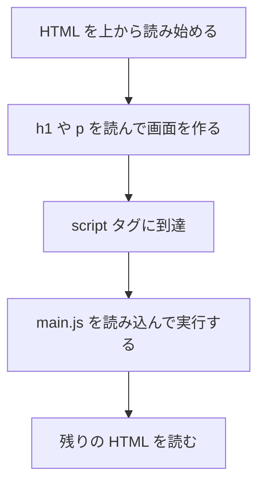
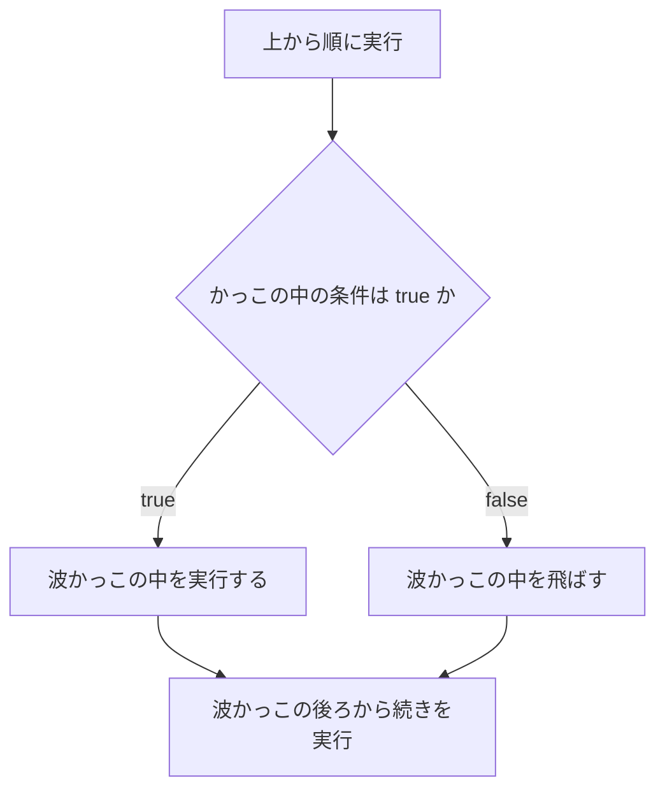
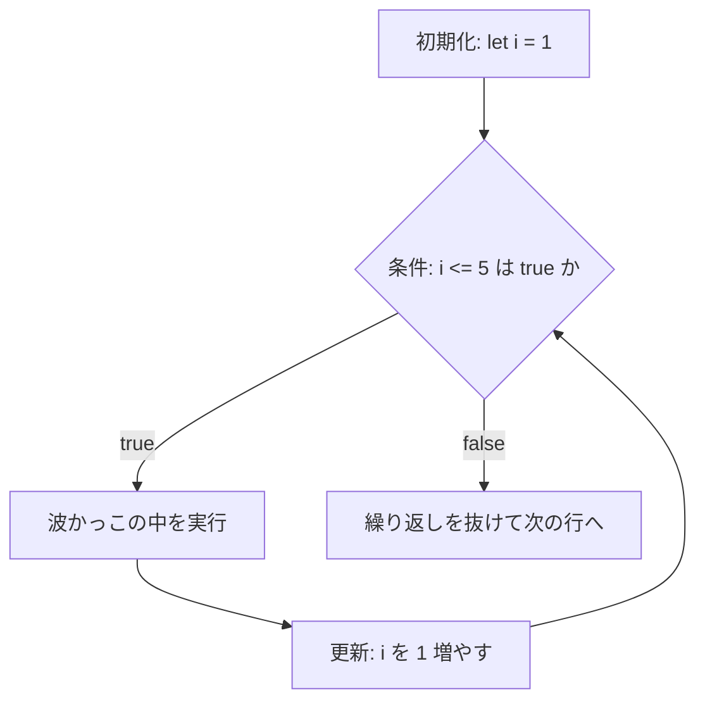
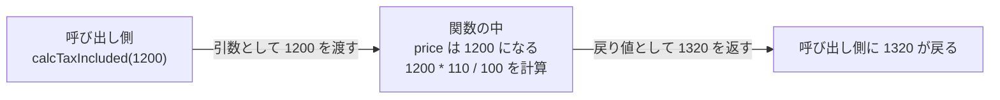
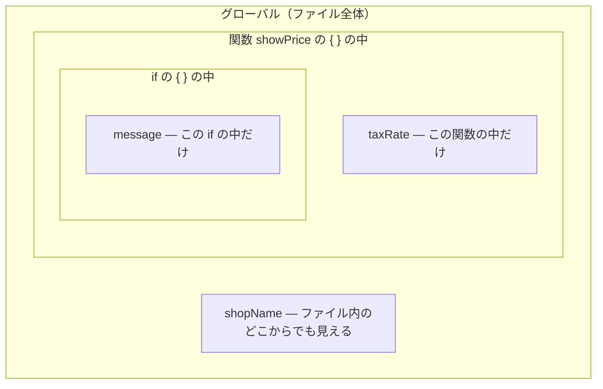

# 第4章 JavaScript の基礎（前半）

前の章までで、HTML で構造を作り、CSS で見た目を整えられるようになりました。
しかし、そのページはまだ「動きません」。
ボタンを押しても何も起きず、入力しても何も変わりません。

この章から **JavaScript** を学びます。
ここからが本当のプログラミングです。

この章と次の章で扱う内容は、React だけのものではありません。
**変数・条件分岐・繰り返し・関数**という、
このテキスト集で今後学ぶ Python でも、まったく同じ形で出てきます。
つまり、ここが**すべての土台**です。

**この章は急がないでください。** 1つの項ごとに、必ず自分の手で書いて、結果を見てから次へ進みます。

## この章で学ぶこと

- JavaScript をブラウザで動かし、結果を自分の目で確認できるようになる
- 変数を使って値に名前を付け、あとから使い回せるようになる
- 数値・文字列・真偽値の違いを説明し、演算子で計算できるようになる
- 条件によって処理を分けられるようになる
- 同じ処理を必要な回数だけ繰り返せるようになる
- 処理を関数にまとめ、引数と戻り値でやり取りできるようになる

## この章の前提

- [第2章](./02-html.md) の HTML が書けること（`<script>` タグを `<body>` に追加します）
- 開発者ツールを開けること（第1章 1.6.4 で一度開いています）
- `react-lesson` ディレクトリでファイルを作れること

> **つまずいたら**
> JavaScript は、書き間違えると**何も起きない**まま黙っていることがあります。
> 「何も起きない」ときは、必ず開発者ツールのコンソールを見てください。
> 赤い文字でエラーが出ています。読み方は **[4.1.4](#414-エラーメッセージの読み方)** にまとめました。
>
> それでも解決しないときは、次の3つを AI に貼り付けてください。
>
> ```text
> react-text の 4.3.6 でつまずいています。
> 書いたコード:（ここに main.js の中身）
> コンソールのエラー:（ここに赤い文字をそのままコピー）
> ```

---

## 4.1 JavaScript を動かす

### 4.1.1 コンソールで試す

**JavaScript**（Web ページを「動かす」ためのプログラミング言語）は、
ブラウザの中にあらかじめ組み込まれています。
インストールは要りません。ブラウザさえあれば、いますぐ試せます。

まず、**コンソール**（ブラウザに用意されている、JavaScript を1行ずつ試せる入力欄）を開きます。

**Windows（Chrome / Edge）**

1. ブラウザを開く
2. `F12` キーを押す（または `Ctrl` + `Shift` + `I`）
3. 上部のタブから「Console」（コンソール）を選ぶ

**macOS（Chrome / Safari）**

1. ブラウザを開く
2. `Command` + `Option` + `I` を押す
3. 上部のタブから「Console」（コンソール）を選ぶ

> **Safari で開発者ツールが出ないとき**
> Safari は初期状態では開発者向けメニューが隠れています。
> 「Safari」メニュー →「設定」→「詳細」→
> **「Web デベロッパ用の機能を表示」にチェック**を入れてください。

コンソールが開いたら、`>` の右側に次のように打ち込んで `Enter` キーを押してください。

```js
1 + 2
```

```text
実行結果:
3
```

`3` と表示されました。これがあなたの書いた最初のプログラムです。

もう少し試してみます。1行ずつ打ち込んで、そのつど `Enter` を押してください。

```js
100 * 8
```

```text
実行結果:
800
```

```js
"ネコ" + "カフェ"
```

```text
実行結果:
'ネコカフェ'
```

文字も足せます。`+` は、数値なら足し算、文字列ならつなげる、という働きをします
（詳しくは 4.3.3 で扱います）。

> **補足：コンソールは消えても平気**
> コンソールに打ち込んだ内容は、ページを再読み込みすると消えます。
> **保存する場所ではなく、試す場所**だと考えてください。
> 残しておきたいコードは、次の 4.1.2 のようにファイルに書きます。

### 4.1.2 HTML から読み込む

コンソールは試すには便利ですが、閉じると消えてしまいます。
本格的に書くときは、**ファイルに書いて、HTML から読み込みます。**

`react-lesson` ディレクトリに、次の2つのファイルを作ってください。

`js-practice.html`

```html
<!DOCTYPE html>
<html lang="ja">
  <head>
    <meta charset="UTF-8" />
    <meta name="viewport" content="width=device-width, initial-scale=1.0" />
    <title>JavaScript の練習</title>
  </head>
  <body>
    <h1>JavaScript の練習</h1>
    <p>結果は開発者ツールのコンソールに表示されます。</p>

    <script src="main.js"></script>
  </body>
</html>
```

`main.js`

```js
console.log("読み込めました");
```

`js-practice.html` をブラウザで開き、開発者ツールのコンソールを見てください。

```text
実行結果:
読み込めました
```

これが出れば成功です。

| 書いたもの | 意味 |
|-----------|------|
| `<script src="main.js"></script>` | `main.js` という JavaScript ファイルを読み込んで実行する |
| `src` | 読み込むファイルの場所（相対パス。2.3.4 参照） |

**`<script>` を書く場所**

ブラウザは HTML を**上から順に**読みます。
`<script>` に来た時点で、そこに書かれた JavaScript をその場で実行し、
終わってから続きの HTML を読みます。



このため、`<script>` は **`</body>` の直前**に書きます。
`<head>` の中に書くと、まだ画面の部品が1つも作られていない状態で JavaScript が動いてしまい、
第5章で学ぶ「HTML の要素を JavaScript から操作する」処理が動かなくなります。

> **注意：ファイル名を間違えると、エラーすら出ないことがある**
> `src="main.js"` と書いたのに、実際のファイル名が `main.js.txt` になっていると、
> **コンソールには何も表示されません。**
> Windows で拡張子が隠れている場合に起こります。
> 第1章 1.3.4 の手順で、拡張子を表示する設定にしておいてください。

> **よくある間違い：`<script>` を閉じ忘れる**
> `<script src="main.js">` とだけ書いて `</script>` を書かないと、
> **そのあとの HTML がすべて `<script>` の中身として扱われ**、画面から消えます。
> `<script>` は中身が空でも、必ず `</script>` で閉じてください。

### 4.1.3 `console.log` で値を確認する

`console.log(...)` は、**かっこの中の値をコンソールに表示する**命令です。

```js
console.log("こんにちは");
console.log(1 + 2);
console.log("合計", 100 + 200);
```

```text
実行結果:
こんにちは
3
合計 300
```

カンマで区切ると、複数の値を並べて表示できます。

**なぜこれが重要なのか**

プログラムは、途中経過を勝手には見せてくれません。
計算が思ったとおりに進んでいるかは、**自分で表示させて確かめる**しかありません。

> **`console.log` はプログラマーの体温計です。**
> 「なぜか動かない」ときは、あちこちに `console.log` を挟んで、
> **どこまでは正しくて、どこから狂ったか**を突き止めます。
> このテキストのこれ以降の例では、必ず `console.log` で結果を確認します。

**やってみましょう**

`main.js` を次のように書き換えて保存し、ブラウザを再読み込み（`F5`、macOS は `Command` + `R`）してください。

`main.js`

```js
console.log("計算を始めます");
console.log(1200 * 3);
console.log("計算が終わりました");
```

```text
実行結果:
計算を始めます
3600
計算が終わりました
```

**上から順に、1行ずつ実行されている**ことが確認できます。
プログラムは、原則としてこの「上から下へ」の順番で動きます。

> **注意：保存を忘れると何も変わらない**
> エディタで書き換えても、**保存していなければブラウザには反映されません。**
> `Ctrl` + `S`（macOS は `Command` + `S`）で保存してから再読み込みしてください。
> VS Code はタイトルの横に「●」が付いていたら未保存です。

### 4.1.4 エラーメッセージの読み方

JavaScript を書き間違えると、コンソールに**赤い文字**が出ます。
これは怒られているのではなく、**どこが変かを教えてもらっている**状態です。

わざと間違えてみましょう。`main.js` を次のようにします。

`main.js`

```js
console.log(prise);
```

```text
実行結果:
Uncaught ReferenceError: prise is not defined
    at main.js:1
```

このメッセージは、次のように分解して読みます。

| 部分 | 意味 |
|------|------|
| `Uncaught` | 「受け止められなかった」＝プログラムがそこで止まった |
| `ReferenceError` | エラーの種類。「存在しない名前を使った」エラー |
| `prise is not defined` | `prise` なんて名前は定義されていません |
| `at main.js:1` | **`main.js` の 1 行目**で起きた |

**いちばん大事なのは、最後の「ファイル名:行番号」です。**
まずそこを開いて、その行を見てください。

**覚えておきたい3つのエラー**

| エラーの種類 | 意味 | よくある原因 |
|-------------|------|------------|
| `SyntaxError` | 文法が壊れている | かっこや引用符の閉じ忘れ |
| `ReferenceError` | 存在しない名前を使った | 変数名のつづり間違い |
| `TypeError` | 値の種類が想定と違う | 数値に対して文字列用の操作をした |

`SyntaxError` も見ておきましょう。

`main.js`

```js
console.log("閉じかっこがない";
```

```text
実行結果:
Uncaught SyntaxError: missing ) after argument list
```

`missing ) after argument list` は「引数の並びのあとに `)` がありません」という意味です。

> **注意：`SyntaxError` が出ると、ファイル全体が動かない**
> 文法が壊れていると、ブラウザはそのファイルを**1行も実行できません。**
> 「さっきまで動いていた `console.log` まで出なくなった」ときは、
> だいたい直前に書いた行のかっこか引用符が閉じていません。

> **エラーが読めないとき**
> 英語のエラーメッセージは、**そのままコピーして AI に貼り付けてください。**
> 意訳ではなく原文のほうが、正確な回答が返ってきます。

---

## 4.2 変数

### 4.2.1 変数とは

前の項では、こんなコードを書きました。

```js
console.log(1200 * 3);
```

```text
実行結果:
3600
```

これでも動きますが、問題があります。
`1200` が何の値なのか、`3` が何の値なのか、あとから読んでも分かりません。
そして単価が 1300 円に変わったら、このコードが 10 箇所にあれば **10 箇所すべてを直す**ことになります。

そこで使うのが**変数**（値に名前をつけて、あとから使い回すための仕組み）です。

`main.js`

```js
const price = 1200;
const count = 3;

console.log(price * count);
```

```text
実行結果:
3600
```

`price`（単価）と `count`（個数）という名前が付いたことで、
**何を計算しているのかがコードだけで分かる**ようになりました。
単価が変わっても、直すのは 1 行だけです。

**書き方の形**

```text
const  price  =  1200 ;
 ↑      ↑      ↑    ↑
 種類   名前  代入  値
```

| 記号 | 読み方と意味 |
|------|------------|
| `const` | この名前で値を1つ覚えておいて、という宣言 |
| `=` | 「等しい」ではなく、**右の値を左の名前に入れる**という意味（代入） |
| `;` | 1つの文の終わり |

> **よくある間違い：`=` を「等しい」と読んでしまう**
> 算数の `=` とは意味が違います。
> `const price = 1200;` は「price は 1200 と等しい」ではなく、
> **「1200 という値に price という名前を付ける」**という命令です。
> 「等しいか？」を調べる記号は別にあります（4.3.6 の `===`）。

### 4.2.2 `let` と `const`

変数を作る書き方は2つあります。

| 書き方 | 意味 | あとから値を変えられるか |
|--------|------|----------------------|
| `const` | 定数（一度決めたら変えない値につける名前） | **変えられない** |
| `let` | 変数（あとから変わる値につける名前） | 変えられる |

**`const` は変えられない**

`main.js`

```js
const price = 1200;
price = 1300;

console.log(price);
```

```text
実行結果:
Uncaught TypeError: Assignment to constant variable.
    at main.js:2
```

`Assignment to constant variable.` は「定数に代入しようとしました」という意味です。

**`let` は変えられる**

`main.js`

```js
let total = 0;
console.log(total);

total = 1200;
console.log(total);

total = total + 800;
console.log(total);
```

```text
実行結果:
0
1200
2000
```

3行目の `total = total + 800;` に注目してください。
これは「total は total + 800 と等しい」ではありません。
**「いまの total（1200）に 800 を足した結果を、あらためて total に入れ直す」**という意味です。

> **2回目以降に `let` や `const` は書かない**
> 値を作るときだけ `let` / `const` を書きます。
> あとから変えるときは、名前だけ書きます。
>
> ```js
> let total = 0;
> total = 100;      // ← 正しい
> // let total = 100;  ← これは「同じ名前をもう一度作る」ことになりエラー
> ```

**どちらを使うか**

**まず `const` で書いてください。** 変える必要が出てきたときだけ `let` に直します。

理由は、読む人（半年後の自分を含む）への情報量です。
`const` と書いてあれば、「この値はこの先どこでも変わらない」と**確認せずに読み進められます。**
`let` だらけのコードは、どの行で値が変わるか全部追いかける必要が出てきます。

> **よくある間違い：とりあえず全部 `let` にしてしまう**
> 動きはします。しかしバグの温床になります。
> たとえば `let taxRate = 0.1;` と書いてあると、
> 「このあと税率が変わる箇所があるのでは？」と、読む人が毎回確認する羽目になります。
> **変えないものは `const`。** これはこのテキスト全体を通してのルールです。

### 4.2.3 変数の名前の付け方

名前の付け方には、守らなければ動かない**規則**と、守ったほうがよい**習慣**があります。

**規則（守らないとエラーになる）**

- 使えるのは半角の英字・数字・`_`・`$`
- **数字から始めることはできない**（`1stPrice` は不可）
- 大文字と小文字は区別される（`price` と `Price` は別物）
- 予約語（`const` `let` `if` `for` など、JavaScript が使う単語）は使えない

```js
const 1stPrice = 100;
```

```text
実行結果:
Uncaught SyntaxError: Invalid or unexpected token
```

**習慣（守らなくても動くが、必ず守ること）**

| 習慣 | 例 |
|------|-----|
| 意味の分かる英単語にする | `p` ではなく `price` |
| 2語以上つなぐときは、2語目以降の頭を大文字にする | `totalPrice` `userName` |
| 真偽値（4.3.4）には `is` を付ける | `isMember` `isOpen` |

2語目以降を大文字にする書き方を**キャメルケース**（ラクダの背中のように見えることから）と呼びます。
JavaScript では、変数名も関数名もキャメルケースで書くのが決まりです。

```js
const totalPrice = 3600;
const shopName = "にゃんこ";
const isMember = true;

console.log(totalPrice, shopName, isMember);
```

```text
実行結果:
3600 'にゃんこ' true
```

> **補足：日本語の変数名は動くが、使わない**
> `const 単価 = 1200;` は実は動きます。
> しかし、エラーメッセージや外部のライブラリはすべて英語で書かれているため、
> **混ざると読みにくくなります。** このテキストでは英語で統一します。

### 4.2.4 `var` を使わない理由

インターネットで JavaScript のコードを検索すると、`var` という書き方が出てきます。

```js
var price = 1200;
```

これは**古い書き方**です。動きますが、**このテキストでは使いません。**

理由は2つあります。

**理由1：同じ名前を何度でも作れてしまう**

```js
var price = 1200;
var price = 9999;

console.log(price);
```

```text
実行結果:
9999
```

エラーになりません。
大きなファイルの中で、うっかり同じ名前を2回使ってしまっても、**気づけないまま値が上書きされます。**

`let` なら、その場でエラーになります。

```js
let price = 1200;
let price = 9999;
```

```text
実行結果:
Uncaught SyntaxError: Identifier 'price' has already been declared
```

`Identifier 'price' has already been declared` は「`price` という名前はすでに宣言済みです」という意味です。
**間違いをその場で教えてくれるほうが、はるかに親切です。**

**理由2：有効範囲の考え方が直感に反する**

`var` は、`if` や `for` の波かっこ `{ }` の中で作っても、**外にはみ出します。**
この話は 4.6.4 のスコープで詳しく扱います。

> **検索して出てきたコードに `var` があったら**
> そのまま `const`（変えるなら `let`）に置き換えて構いません。
> ほとんどの場合、それだけで動きます。

---

## 4.3 データ型と演算子

値には**型**（値の種類）があります。
この章で扱うのは次の5つです。

| 型 | 何を表すか | 例 |
|----|-----------|-----|
| 数値（number） | 数 | `1200` `3.14` `-5` |
| 文字列（string） | 文字の並び | `"ネコ"` `'にゃんこ'` |
| 真偽値（boolean） | 正しいか正しくないか | `true` `false` |
| `undefined` | まだ値が入っていない状態 | `undefined` |
| `null` | 「値が無い」と意図的に入れた状態 | `null` |

型を調べるには `typeof` を使います。

```js
console.log(typeof 1200);
console.log(typeof "にゃんこ");
console.log(typeof true);
```

```text
実行結果:
number
string
boolean
```

### 4.3.1 数値

JavaScript の数値には、整数と小数の区別がありません。**どちらも `number` 型**です。

```js
const count = 3;
const height = 1.75;

console.log(count, typeof count);
console.log(height, typeof height);
```

```text
実行結果:
3 'number'
1.75 'number'
```

**小数の計算には誤差が出る**

これは JavaScript に限らず、ほとんどのプログラミング言語に共通する重要な性質です。

```js
console.log(0.1 + 0.2);
console.log(3000 * 1.1);
```

```text
実行結果:
0.30000000000000004
3300.0000000000005
```

`0.3` にならず、`3300` にもなりません。

コンピュータは数値を2進数で持っているため、
`0.1` や `1.1` のような小数を**正確には表せません。**
ごくわずかな誤差が残り、それが計算で表面化します。

やっかいなのは、**同じ `1.1` を掛けても、誤差が出るときと出ないときがある**ことです。

```js
console.log(1200 * 1.1);
console.log(1500 * 1.1);
```

```text
実行結果:
1320
1650.0000000000002
```

「手元の値では大丈夫だったのに、別の値で崩れる」という形で表面化します。
だからこそ、**金額を扱うときは最初から対策しておきます。**

**対処1：小数点以下を切り捨てる**

`Math.floor(...)` は、かっこの中の数値の**小数点以下を切り捨てる**命令です。

```js
console.log(Math.floor(3300.0000000000005));
console.log(Math.floor(3.9));
```

```text
実行結果:
3300
3
```

| 命令 | 働き | `3.7` を渡すと |
|------|------|--------------|
| `Math.floor(...)` | 切り捨て | `3` |
| `Math.ceil(...)` | 切り上げ | `4` |
| `Math.round(...)` | 四捨五入 | `4` |

金額の計算では、**切り捨て**（`Math.floor`）を使うのが一般的です。

```js
const price = 3000;
const taxIncluded = Math.floor(price * 1.1);

console.log(taxIncluded);
```

```text
実行結果:
3300
```

**対処2：割合の計算を「整数で掛けてから割る」形にする**

もっと確実なのは、**小数を掛けない**やり方です。
「1.1 倍する」の代わりに「110 を掛けて 100 で割る」と書きます。

```js
const price = 1500;

console.log(price * 1.1);
console.log(price * 110 / 100);
```

```text
実行結果:
1650.0000000000002
1650
```

`1500 * 110` は `165000` という整数なので誤差が出ず、
それを `100` で割った `1650` も正確に求まります。

この書き方は、「〜％」を扱うときに毎回使えます。

```js
const price = 3000;
const discountPercent = 15;

// 15% 引き = 残り 85% = (100 - 15) を掛けて 100 で割る
const discounted = price * (100 - discountPercent) / 100;

console.log(discounted);
```

```text
実行結果:
2550
```

> **注意：割り切れないときは切り捨てを併用する**
> `999 * 85 / 100` は `849.15` になります。
> 金額として扱うなら `Math.floor(999 * 85 / 100)` として `849` にしてください。

### 4.3.2 算術演算子

計算に使う記号を**演算子**と呼びます。

| 演算子 | 意味 | 例 | 結果 |
|--------|------|-----|------|
| `+` | 足す | `10 + 3` | `13` |
| `-` | 引く | `10 - 3` | `7` |
| `*` | 掛ける | `10 * 3` | `30` |
| `/` | 割る | `10 / 3` | `3.3333333333333335` |
| `%` | 割った**余り** | `10 % 3` | `1` |

```js
console.log(10 + 3);
console.log(10 - 3);
console.log(10 * 3);
console.log(10 / 3);
console.log(10 % 3);
```

```text
実行結果:
13
7
30
3.3333333333333335
1
```

**`%`（剰余）が重要な理由**

`%` は「割った余り」を求めます。地味ですが、**倍数の判定に必ず使います。**

```js
console.log(10 % 2);
console.log(11 % 2);
console.log(15 % 3);
console.log(16 % 3);
```

```text
実行結果:
0
1
0
1
```

**余りが `0` なら、割り切れた＝その数の倍数**ということです。
「偶数か」を調べたければ `2` で割った余りが `0` か、
「3 の倍数か」を調べたければ `3` で割った余りが `0` かを見ます。
この判定は 4.5.4 の繰り返しで実際に使います。

**計算の順番**

算数と同じで、`*` `/` `%` が `+` `-` より先に計算されます。
順番を変えたいときは、かっこで囲みます。

```js
console.log(100 + 200 * 2);
console.log((100 + 200) * 2);
```

```text
実行結果:
500
600
```

**値を1増やす書き方**

```js
let count = 0;

count = count + 1;
console.log(count);

count += 1;
console.log(count);

count++;
console.log(count);
```

```text
実行結果:
1
2
3
```

`count += 1` は `count = count + 1` の短い書き方、
`count++` はさらに短い書き方で、**どれも「1 増やす」という同じ意味**です。
`count++` は 4.5.1 の繰り返しで必ず出てきます。

`+=` は他の演算子でも使えます。

```js
let total = 100;
total += 50;
total *= 2;

console.log(total);
```

```text
実行結果:
300
```

### 4.3.3 文字列とテンプレートリテラル

**文字列**（文字の並び）は、引用符で囲んで書きます。

```js
const shopName = "ネコカフェ にゃんこ";
const message = 'いらっしゃいませ';

console.log(shopName);
console.log(message);
```

```text
実行結果:
ネコカフェ にゃんこ
いらっしゃいませ
```

`"` と `'` はどちらでも構いませんが、**1つのファイルの中では統一します。**
このテキストでは `"`（ダブルクォート）を使います。

> **よくある間違い：引用符を付け忘れる**
> ```js
> const shopName = にゃんこ;
> ```
> ```text
> 実行結果:
> Uncaught ReferenceError: にゃんこ is not defined
> ```
> 引用符が無いと、JavaScript は「にゃんこ」を**変数名**として探しに行きます。
> そんな名前の変数はどこにも無いので、`ReferenceError`（4.1.4）になります。
> **文字として扱いたいものは必ず引用符で囲む**、と覚えてください。

**文字列をつなげる**

`+` でつなげられます。

```js
const shopName = "にゃんこ";
console.log("ようこそ、" + shopName + " へ");
```

```text
実行結果:
ようこそ、にゃんこ へ
```

動きますが、長くなると読みにくくなります。

```js
const shopName = "にゃんこ";
const price = 1200;
const count = 3;

console.log(shopName + " で " + price + " 円の商品を " + count + " 個買いました");
```

```text
実行結果:
にゃんこ で 1200 円の商品を 3 個買いました
```

引用符と `+` が入り混じって、どこが文字でどこが変数か分かりません。

**テンプレートリテラル（この本ではこちらを使います）**

**バッククォート**（`` ` ``）で囲むと、`${ }` の中に変数や計算式を直接埋め込めます。

```js
const shopName = "にゃんこ";
const price = 1200;
const count = 3;

console.log(`${shopName} で ${price} 円の商品を ${count} 個買いました`);
console.log(`合計は ${price * count} 円です`);
```

```text
実行結果:
にゃんこ で 1200 円の商品を 3 個買いました
合計は 3600 円です
```

`${ }` の中には**計算式もそのまま書けます。**
文章の形が保たれるので、圧倒的に読みやすくなります。

| 記号 | キーボードでの打ち方 |
|------|-------------------|
| `` ` ``（バッククォート） | **Windows**：`Shift` + `@`（`P` の右のキー）／ **macOS**：`Shift` + `@` |

> **よくある間違い：`'` と `` ` `` を取り違える**
> シングルクォート `'` では `${ }` は展開されません。
> ```js
> const price = 1200;
> console.log('合計は ${price} 円です');
> ```
> ```text
> 実行結果:
> 合計は ${price} 円です
> ```
> **`${` がそのまま表示されたら、囲んでいる記号を疑ってください。**

**文字列の長さを調べる**

`.length` を付けると、文字数が分かります。

```js
const shopName = "にゃんこ";
console.log(shopName.length);
```

```text
実行結果:
4
```

### 4.3.4 真偽値

**真偽値**（正しいか正しくないかを表す型）は、`true` と `false` の2つしかありません。

```js
const isMember = true;
const isOpen = false;

console.log(isMember, typeof isMember);
console.log(isOpen);
```

```text
実行結果:
true 'boolean'
false
```

引用符を付けてはいけません。`"true"` は真偽値ではなく**文字列**です。

```js
console.log(typeof true);
console.log(typeof "true");
```

```text
実行結果:
boolean
string
```

真偽値は、比較の結果としても生まれます。

```js
console.log(10 > 5);
console.log(10 < 5);
```

```text
実行結果:
true
false
```

この `true` / `false` を使って処理を分けるのが、4.4 の条件分岐です。

### 4.3.5 `undefined` と `null`

どちらも「値が無い」ことを表しますが、意味が違います。

| 値 | 意味 | 誰が入れるか |
|----|------|------------|
| `undefined` | まだ値が入っていない | **JavaScript が勝手に入れる** |
| `null` | 「無い」という値を入れた | **人が意図的に入れる** |

```js
let name;
console.log(name);

let selectedItem = null;
console.log(selectedItem);
```

```text
実行結果:
undefined
null
```

`let name;` のように値を書かずに変数を作ると、
JavaScript が自動的に `undefined` を入れます。

一方 `null` は、「ここには今のところ何も選ばれていません」と
**人間の意図として書き込む**ときに使います。

> **補足：`undefined` は「バグの気配」**
> 意図せず `undefined` が表示されたら、たいてい何かがうまくいっていません。
> 変数名のつづり間違い、値を入れ忘れ、などを疑ってください。
> `undefined` との付き合い方は、第5章 5.2.5 でもう一度詳しく扱います。

### 4.3.6 比較演算子と `===`

2つの値を比べる演算子です。**結果は必ず `true` か `false`** になります。

| 演算子 | 意味 |
|--------|------|
| `===` | 等しい（型も同じ） |
| `!==` | 等しくない（型も含めて） |
| `>` | より大きい |
| `<` | より小さい |
| `>=` | 以上 |
| `<=` | 以下 |

```js
const age = 20;

console.log(age === 20);
console.log(age !== 20);
console.log(age >= 18);
console.log(age < 18);
```

```text
実行結果:
true
false
true
false
```

**`=` と `==` と `===` の違い**

**ここは初学者が最も確実に詰まる箇所です。** 表で整理します。

| 記号 | 名前 | 意味 |
|------|------|------|
| `=` | 代入 | 右の値を左に**入れる** |
| `==` | 等価比較 | 等しいか調べる。**型が違っても変換して比べる** |
| `===` | 厳密等価比較 | 等しいか調べる。**型が違えば `false`** |

`==` の危なさを見てみましょう。

```js
console.log(1 == "1");
console.log(1 === "1");
```

```text
実行結果:
true
false
```

`1`（数値）と `"1"`（文字列）は、**明らかに別のもの**です。
それなのに `==` は `true` を返します。
比べる前に、勝手に型をそろえてしまうためです。

さらに、こんな結果にもなります。

```js
console.log(0 == "");
console.log(0 == false);
console.log(null == undefined);
```

```text
実行結果:
true
true
true
```

このルールを全部覚える必要はありません。
**覚えるべきことは1つだけです。**

> **このテキストのルール：比較には必ず `===` と `!==` を使う。`==` と `!=` は使わない。**

> **よくある間違い1：`if` の中で `=` を書いてしまう**
> ```js
> let score = 50;
>
> if (score = 80) {
>   console.log("合格です");
> }
> console.log(score);
> ```
> ```text
> 実行結果:
> 合格です
> 80
> ```
> `score` が 50 なのに「合格です」と出て、しかも `score` が 80 に**書き換わりました。**
> `=` は代入なので、「score に 80 を入れ、その結果（80）を条件として使う」
> という動きになったためです。
> **条件の中で `=` を1つだけ書いたら、まず間違いです。**

> **よくある間違い2：`===` を `==` と書いてしまう**
> 動いてしまうため、**バグに気づくのが遅れます。**
> 「なぜか通ってはいけない条件が通る」ときは、`==` を疑ってください。
> `=` の数を数える癖をつけると防げます。**比較は必ず3つです。**

### 4.3.7 論理演算子

複数の条件を組み合わせる演算子です。

| 演算子 | 読み方 | 意味 |
|--------|-------|------|
| `&&` | かつ | **両方**が `true` のときだけ `true` |
| `\|\|` | または | **どちらか**が `true` なら `true` |
| `!` | でない | `true` と `false` をひっくり返す |

```js
const age = 20;
const isMember = true;

console.log(age >= 18 && isMember);
console.log(age >= 18 || isMember);
console.log(!isMember);
```

```text
実行結果:
true
true
false
```

もう少し具体的に見ます。

```js
const age = 15;
const isMember = true;

// 18歳以上「かつ」会員 → 年齢の条件を満たさないので false
console.log(age >= 18 && isMember);

// 18歳以上「または」会員 → 会員なので true
console.log(age >= 18 || isMember);
```

```text
実行結果:
false
true
```

**組み合わせるときはかっこを付ける**

`&&` は `||` より先に評価されます。
分かりにくいので、**3つ以上組み合わせるときは必ずかっこを付けてください。**

```js
const age = 70;
const isMember = false;

// 「12歳以下 または 65歳以上」 かつ 「会員でない」
console.log((age <= 12 || age >= 65) && !isMember);
```

```text
実行結果:
true
```

> **よくある間違い：数学のように範囲を書いてしまう**
> ```js
> const age = 100;
> console.log(0 <= age <= 20);
> ```
> ```text
> 実行結果:
> true
> ```
> `age` は 100 なのに `true` になりました。
> JavaScript は左から順に、まず `0 <= 100` を計算して `true` にし、
> 次に `true <= 20` を計算します。ここで `true` が `1` に変換され、`1 <= 20` で `true` になります。
>
> 範囲を表したいときは、**必ず `&&` で2つに分けてください。**
>
> ```js
> const age = 100;
> console.log(age >= 0 && age <= 20);
> ```
> ```text
> 実行結果:
> false
> ```

### 4.3.8 型の自動変換に注意する

JavaScript は、型が違う値どうしを計算しようとすると、**勝手に型をそろえます。**
これが便利なときもありますが、事故のもとにもなります。

**`+` は文字列が混ざると「つなげる」になる**

```js
console.log(10 + 5);
console.log("10" + 5);
console.log(10 + "5");
```

```text
実行結果:
15
105
105
```

`"10" + 5` は `15` ではなく `"105"` という**文字列**になりました。

**`-` `*` `/` は数値に変換される**

```js
console.log("10" - 5);
console.log("10" * 2);
```

```text
実行結果:
5
20
```

`+` だけが例外的に「文字列連結」を優先します。

**文字列を数値に直す**

`Number(...)` は、かっこの中の値を**数値に変換する**命令です。

```js
const input = "10";

console.log(input + 5);
console.log(Number(input) + 5);
console.log(typeof Number(input));
```

```text
実行結果:
105
15
number
```

数値に変換できない文字列を渡すと、`NaN` になります。

```js
console.log(Number("にゃんこ"));
```

```text
実行結果:
NaN
```

`NaN` は **N**ot **a** **N**umber（数ではない）の略で、
「数値に変換しようとしたが失敗した」ことを表す特別な値です。

> **よくある間違い：計算結果が `NaN` になる**
> `NaN` が出たら、**数値のつもりで文字列を計算に使っている**ことがほとんどです。
> 計算の直前に `console.log(typeof 変数名)` を入れて、
> `number` になっているか確認してください。

> **注意：数値に見える文字列は、あとの章で必ず出てきます**
> フォームに入力された値は、たとえ `100` と入力されても **`"100"` という文字列**として届きます
> （第5章 5.7.5、第7章 7.6 で扱います）。
> そのとき `Number(...)` を思い出せるようにしておいてください。

---

## 4.4 条件分岐

### 4.4.1 `if`

ここまでのプログラムは、上から順に全部実行されるだけでした。
**条件によって処理を変える**には `if` を使います。

```js
const age = 20;

if (age >= 18) {
  console.log("入場できます");
}

console.log("受付を終了します");
```

```text
実行結果:
入場できます
受付を終了します
```

`age` を `15` に変えて保存し、再読み込みしてみてください。

```js
const age = 15;

if (age >= 18) {
  console.log("入場できます");
}

console.log("受付を終了します");
```

```text
実行結果:
受付を終了します
```

「入場できます」が表示されなくなりました。

**形と流れ**

```text
if ( 条件 ) {
  条件が true のときだけ実行される処理
}
```



- `( )` の中には、**結果が `true` か `false` になる式**を書きます（4.3.6、4.3.7 で作ったものです）
- `{ }` の中には、条件を満たしたときだけ実行したい処理を書きます
- `{ }` の中は**半角スペース2つ分**下げて書きます（インデント）。ずれていても動きますが、読めなくなります

> **よくある間違い：`if` の行の末尾に `;` を付ける**
> ```js
> const age = 15;
>
> if (age >= 18); {
>   console.log("入場できます");
> }
> ```
> ```text
> 実行結果:
> 入場できます
> ```
> 15 歳なのに表示されました。
> `if (条件);` で「条件が true なら**何もしない**」という文が完結してしまい、
> そのあとの `{ }` は `if` と無関係な、ただのかたまりとして実行されたためです。
> **`if` `for` の行の末尾に `;` は書きません。**

### 4.4.2 `else` と `else if`

**条件を満たさなかったとき**の処理は `else` に書きます。

```js
const age = 15;

if (age >= 18) {
  console.log("入場できます");
} else {
  console.log("保護者の同伴が必要です");
}
```

```text
実行結果:
保護者の同伴が必要です
```

条件が3つ以上あるときは `else if` を並べます。

```js
const age = 8;

if (age <= 5) {
  console.log("無料です");
} else if (age <= 12) {
  console.log("こども料金です");
} else if (age >= 65) {
  console.log("シニア料金です");
} else {
  console.log("おとな料金です");
}
```

```text
実行結果:
こども料金です
```

**上から順に判定され、最初に `true` になったものだけが実行されます。**
`age` が 8 のとき、`age <= 5` は `false`、次の `age <= 12` が `true` なので、そこで確定します。
残りの `else if` と `else` は**見にも行きません。**

`age` の値をいろいろ変えて、それぞれの結果を確認してください。

| `age` | 結果 |
|-------|------|
| `3` | 無料です |
| `8` | こども料金です |
| `30` | おとな料金です |
| `70` | シニア料金です |

> **よくある間違い：順番を逆にしてしまう**
> ```js
> const age = 3;
>
> if (age <= 12) {
>   console.log("こども料金です");
> } else if (age <= 5) {
>   console.log("無料です");
> }
> ```
> ```text
> 実行結果:
> こども料金です
> ```
> 3 歳なのに「無料です」になりません。
> `age <= 12` が先に `true` になってしまうためです。
> **範囲が狭い条件から先に書いてください。**

**判定結果を変数に入れる**

`if` の中で `console.log` するだけでなく、**値を変数に入れておく**書き方も覚えてください。
このほうが、あとから使い回せます。

```js
const age = 8;
let price = 0;

if (age <= 5) {
  price = 0;
} else if (age <= 12) {
  price = 500;
} else if (age >= 65) {
  price = 700;
} else {
  price = 1000;
}

console.log(`料金は ${price} 円です`);
```

```text
実行結果:
料金は 500 円です
```

`price` はあとから変わるので `let` で作っています（4.2.2）。
この形は、4.6.5 でもう一度使います。

### 4.4.3 条件を組み合わせる

4.3.7 の論理演算子を `if` の条件に使います。

```js
const age = 10;
const isMember = true;

if (age <= 12 && isMember) {
  console.log("こども会員割引があります");
} else {
  console.log("通常料金です");
}
```

```text
実行結果:
こども会員割引があります
```

`isMember` を `false` に変えると、結果が変わります。

```js
const age = 10;
const isMember = false;

if (age <= 12 && isMember) {
  console.log("こども会員割引があります");
} else {
  console.log("通常料金です");
}
```

```text
実行結果:
通常料金です
```

**真偽値はそのまま条件に書ける**

`isMember` はすでに `true` か `false` なので、`=== true` を付ける必要はありません。

```js
const isMember = true;

if (isMember === true) {
  console.log("パターン1：会員です");
}

if (isMember) {
  console.log("パターン2：会員です");
}

if (!isMember) {
  console.log("パターン3：会員ではありません");
}
```

```text
実行結果:
パターン1：会員です
パターン2：会員です
```

パターン1とパターン2は同じ意味です。**このテキストではパターン2の書き方を使います。**
`is` で始まる名前を付けておく（4.2.3）と、`if (isMember)` が英語の文のように読めます。

**`if` を入れ子にする**

`if` の `{ }` の中に、さらに `if` を書けます。

```js
const age = 10;
const isMember = true;

if (age <= 12) {
  console.log("こども料金です");

  if (isMember) {
    console.log("さらに会員割引があります");
  }
} else {
  console.log("おとな料金です");
}
```

```text
実行結果:
こども料金です
さらに会員割引があります
```

入れ子にすると、内側の処理は**外側の条件も満たしている**ことが保証されます。
ただし深くしすぎると読めなくなるので、**2段まで**にしてください。
3段になりそうなときは、`&&` でまとめられないか考えます。

### 4.4.4 三項演算子

「条件によって、2つの値のどちらかを選ぶ」だけなら、1行で書けます。

```text
条件 ? true のときの値 : false のときの値
```

```js
const age = 20;
const label = age >= 18 ? "おとな" : "こども";

console.log(label);
```

```text
実行結果:
おとな
```

`if` で書くと、こうなります。

```js
const age = 20;
let label = "";

if (age >= 18) {
  label = "おとな";
} else {
  label = "こども";
}

console.log(label);
```

```text
実行結果:
おとな
```

7 行が 1 行になりました。しかも `let` が要らなくなり、`const` で書けています。

テンプレートリテラル（4.3.3）の `${ }` の中にも書けます。

```js
const count = 0;

console.log(`カートに ${count} 点${count === 0 ? "（空です）" : ""}`);
```

```text
実行結果:
カートに 0 点（空です）
```

> **注意：三項演算子をつなげない**
> ```js
> const age = 8;
> const label = age <= 5 ? "無料" : age <= 12 ? "こども" : "おとな";
> ```
> 動きますが、条件が3つ以上になると読めなくなります。
> **3つ以上に分かれるときは `else if` を使ってください。**

三項演算子は、第7章の React で**画面の表示を条件で切り替える**ときに頻繁に使います。
いまのうちに読めるようにしておいてください。

### 4.4.5 `switch`

**1つの値が、どれと一致するか**で分岐するときは `switch` が使えます。

```js
const plan = "gold";

switch (plan) {
  case "bronze":
    console.log("ブロンズ会員：割引 5%");
    break;
  case "silver":
    console.log("シルバー会員：割引 10%");
    break;
  case "gold":
    console.log("ゴールド会員：割引 20%");
    break;
  default:
    console.log("会員ではありません");
}
```

```text
実行結果:
ゴールド会員：割引 20%
```

| 部分 | 意味 |
|------|------|
| `switch (値)` | この値を、下の `case` と順に照合する |
| `case "gold":` | 値が `"gold"` と `===` で等しければ、ここから実行 |
| `break;` | `switch` から抜ける |
| `default:` | どの `case` にも当てはまらなかったとき |

> **よくある間違い：`break` を書き忘れる**
> ```js
> const plan = "bronze";
>
> switch (plan) {
>   case "bronze":
>     console.log("ブロンズ会員：割引 5%");
>   case "silver":
>     console.log("シルバー会員：割引 10%");
>   default:
>     console.log("会員ではありません");
> }
> ```
> ```text
> 実行結果:
> ブロンズ会員：割引 5%
> シルバー会員：割引 10%
> 会員ではありません
> ```
> `break` が無いと、**一致した場所から下の `case` を全部実行してしまいます。**
> `case` を書いたら、必ず `break` もセットで書いてください。

**`if` と `switch` の使い分け**

| 場面 | 使うもの |
|------|---------|
| 1つの値が、どの候補と一致するか | `switch` |
| 範囲（`>=` `<`）や、複数条件の組み合わせ | `if` / `else if` |

`switch` は `===` による一致しか調べられません。
「18 歳以上なら」のような範囲の判定はできないので、その場合は `if` を使ってください。

---

## 4.5 繰り返し

### 4.5.1 `for`

同じ処理を何度も書くのは現実的ではありません。

```js
console.log(1);
console.log(2);
console.log(3);
console.log(4);
console.log(5);
```

5 回ならまだしも、100 回では書けません。
そこで**繰り返し**を使います。

```js
for (let i = 1; i <= 5; i = i + 1) {
  console.log(i);
}
```

```text
実行結果:
1
2
3
4
5
```

**`for` の形**

`( )` の中には、**セミコロンで区切って3つ**書きます。

```text
for ( 初期化 ; 続ける条件 ; 更新 ) {
  繰り返したい処理
}
```

| 部分 | 例 | 意味 | 実行されるタイミング |
|------|-----|------|------------------|
| 初期化 | `let i = 1` | 数える変数を用意する | **最初の1回だけ** |
| 続ける条件 | `i <= 5` | これが `true` の間だけ繰り返す | 毎回、処理の**前** |
| 更新 | `i = i + 1` | 1 周終わるごとに変数を進める | 毎回、処理の**後** |



**1周ずつ追いかける**

`i` の中身がどう変わるか、実際に表示して確かめます。

```js
for (let i = 1; i <= 3; i = i + 1) {
  console.log(`${i} 周目です`);
}
console.log("繰り返しが終わりました");
```

```text
実行結果:
1 周目です
2 周目です
3 周目です
繰り返しが終わりました
```

| 周 | `i` | 条件 `i <= 3` | 処理 | 更新後の `i` |
|----|-----|--------------|------|------------|
| 1 | 1 | `true` | 「1 周目です」 | 2 |
| 2 | 2 | `true` | 「2 周目です」 | 3 |
| 3 | 3 | `true` | 「3 周目です」 | 4 |
| — | 4 | `false` | 実行しない | — |

**`i++` という書き方**

`i = i + 1` は、実際には `i++` と書かれることがほとんどです（4.3.2）。
意味は同じです。以降はこちらを使います。

```js
for (let i = 1; i <= 5; i++) {
  console.log(i * 3);
}
```

```text
実行結果:
3
6
9
12
15
```

3 の段の九九ができました。

**`i` という名前**

`i` は **index**（番号）の頭文字で、
「数えるための変数」に付ける名前として世界中で使われています。
繰り返しが2重になるときは `i` の次に `j` を使います。

**合計を求める**

繰り返しの外に「ためておく変数」を用意するのが定石です。

```js
let sum = 0;

for (let i = 1; i <= 10; i++) {
  sum = sum + i;
}

console.log(`1 から 10 までの合計は ${sum} です`);
```

```text
実行結果:
1 から 10 までの合計は 55 です
```

**`sum` を `for` の外側に書いている**ことが重要です。
中に書くと、毎周 `0` に戻ってしまいます（理由は 4.6.4 のスコープで扱います）。

> **よくある間違い：更新を書き忘れて無限ループになる**
> ```js
> for (let i = 1; i <= 5; ) {
>   console.log(i);
> }
> ```
> `i` が永遠に 1 のままなので、条件がずっと `true` になり、
> **ブラウザのタブが固まります。**
>
> **固まったときの脱出方法**
> - **Windows / macOS 共通**：そのタブを閉じる（`Ctrl` + `W` / `Command` + `W`）
> - タブが閉じられないときは、ブラウザ自体を終了して開き直す
>
> `for` を書いたら、**必ず3つ目（更新）があるか確認**してください。

### 4.5.2 `while`

**何回繰り返すか決まっていない**ときは `while` を使います。

```text
while ( 続ける条件 ) {
  繰り返したい処理
}
```

```js
let balance = 100000;
let year = 0;

while (balance <= 150000) {
  balance = balance * 103 / 100;
  balance = Math.floor(balance);
  year++;
}

console.log(`${year} 年で ${balance} 円になりました`);
```

```text
実行結果:
14 年で 151253 円になりました
```

年利 3% で 10 万円を預けたとき、15 万円を超えるのは 14 年後だと分かりました。
**「何年かかるか」は事前に分かっていない**ので、`while` が向いています。

割合の計算に `* 103 / 100` を使っているのは、4.3.1 で説明した小数の誤差を避けるためです。
`Math.floor` で 1 円未満を切り捨てています。

**`for` と `while` の使い分け**

| 場面 | 使うもの |
|------|---------|
| 「5 回」「1 から 100 まで」など**回数が決まっている** | `for` |
| 「条件を満たすまで」など**回数が決まっていない** | `while` |

`for` で書けるものは `while` でも書けます。

```js
let i = 1;

while (i <= 3) {
  console.log(i);
  i++;
}
```

```text
実行結果:
1
2
3
```

ただし、初期化・条件・更新が3行に散らばるため、
**回数が決まっているときは `for` のほうが読みやすくなります。**

> **よくある間違い：更新を書き忘れて無限ループになる**
> `while` は `for` より危険です。更新を書く場所が決まっていないため、
> **忘れても文法エラーにならない**からです。
> ```js
> let i = 1;
> while (i <= 3) {
>   console.log(i);
>   // i++; を書き忘れると永遠に終わらない
> }
> ```
> `while` を書いたら、**「この変数はどこで変わるか」を必ず指させるか確認**してください。
> 固まったときの脱出方法は 4.5.1 と同じです。

### 4.5.3 `break` と `continue`

繰り返しの途中で流れを変える命令が2つあります。

| 命令 | 働き |
|------|------|
| `break` | 繰り返しを**その場でやめる** |
| `continue` | **今回の周だけ飛ばして**、次の周へ進む |

**`break`：見つかったらやめる**

```js
for (let i = 1; i <= 100; i++) {
  if (i * i > 500) {
    console.log(`2 乗が 500 を超える最初の数は ${i} です`);
    break;
  }
}
console.log("探索を終了しました");
```

```text
実行結果:
2 乗が 500 を超える最初の数は 23 です
探索を終了しました
```

`break` が無ければ 100 まで回り続けますが、
目的が「最初の1つ」なので、見つけた時点でやめています。

**`continue`：今回だけ飛ばす**

```js
for (let i = 1; i <= 10; i++) {
  if (i % 2 === 0) {
    continue;
  }
  console.log(i);
}
```

```text
実行結果:
1
3
5
7
9
```

`i % 2 === 0`（2 で割った余りが 0 ＝ 偶数）のとき `continue` するので、
偶数のときだけ `console.log` が飛ばされ、奇数だけが表示されます。

> **よくある間違い：`while` の中で `continue` を使い、更新を飛ばしてしまう**
> ```js
> let i = 0;
> while (i < 10) {
>   if (i % 2 === 0) {
>     continue;   // i++ に到達しないまま次の周へ → 無限ループ
>   }
>   console.log(i);
>   i++;
> }
> ```
> `continue` は「今回の周の残りを飛ばす」ので、`i++` も飛ばされます。
> **`while` の中で `continue` を使うときは、更新を `continue` より前に書いてください。**

### 4.5.4 繰り返しの中で条件を使う

繰り返しと条件分岐を組み合わせると、できることが一気に広がります。
**これが 4.4 と 4.5 の合流点です。**

**例1：3 の倍数だけを表示する**

```js
for (let i = 1; i <= 20; i++) {
  if (i % 3 === 0) {
    console.log(i);
  }
}
```

```text
実行結果:
3
6
9
12
15
18
```

「`i` を 1 から 20 まで動かす」（4.5.1）と
「3 で割った余りが 0 なら」（4.3.2 の `%` と 4.3.6 の `===`）を重ねただけです。

**例2：条件に合うものだけ数える・合計する**

```js
let count = 0;
let sum = 0;

for (let i = 1; i <= 50; i++) {
  if (i % 7 === 0) {
    count++;
    sum += i;
  }
}

console.log(`50 までに 7 の倍数は ${count} 個あり、合計は ${sum} です`);
```

```text
実行結果:
50 までに 7 の倍数は 7 個あり、合計は 196 です
```

**組み立ての型**

この形は今後も何度も使うので、**型として覚えてください。**

```text
1. 繰り返しの「外」に、ためておく変数を let で用意する
2. for で数える変数を動かす
3. その中の if で、拾いたいものだけを選ぶ
4. 選んだものを、ためておく変数に足す
5. 繰り返しの「外」で結果を表示する
```

**例3：`else` も組み合わせる**

```js
for (let i = 1; i <= 10; i++) {
  if (i % 2 === 0) {
    console.log(`${i} は偶数`);
  } else {
    console.log(`${i} は奇数`);
  }
}
```

```text
実行結果:
1 は奇数
2 は偶数
3 は奇数
4 は偶数
5 は奇数
6 は偶数
7 は奇数
8 は偶数
9 は奇数
10 は偶数
```

> **うまく動かないときの調べ方**
> 繰り返しの中に `console.log` を1つ足して、
> **毎周の変数の値をすべて表示させてください。**
> ```js
> for (let i = 1; i <= 5; i++) {
>   console.log("いまの i は", i, "余りは", i % 3);
> }
> ```
> 頭の中で追いかけるより、表示させたほうが確実です。

---

## 4.6 関数

### 4.6.1 関数とは

次のコードを見てください。3 人分の税込価格を計算しています。

```js
const priceA = 1200;
const taxIncludedA = Math.floor(priceA * 110 / 100);
console.log(`A さん: ${taxIncludedA} 円`);

const priceB = 3000;
const taxIncludedB = Math.floor(priceB * 110 / 100);
console.log(`B さん: ${taxIncludedB} 円`);

const priceC = 980;
const taxIncludedC = Math.floor(priceC * 110 / 100);
console.log(`C さん: ${taxIncludedC} 円`);
```

```text
実行結果:
A さん: 1320 円
B さん: 3300 円
C さん: 1078 円
```

**同じ計算が3回書かれています。**
消費税が 12% に変わったら、3 箇所すべてを直すことになります。
そして直し忘れが1つでもあれば、金額が食い違うバグになります。

これを解決するのが**関数**（よく使う処理に名前を付けて、いつでも呼び出せるようにしたもの）です。

```js
function calcTaxIncluded(price) {
  return Math.floor(price * 110 / 100);
}

console.log(`A さん: ${calcTaxIncluded(1200)} 円`);
console.log(`B さん: ${calcTaxIncluded(3000)} 円`);
console.log(`C さん: ${calcTaxIncluded(980)} 円`);
```

```text
実行結果:
A さん: 1320 円
B さん: 3300 円
C さん: 1078 円
```

計算の中身は**1 箇所だけ**になりました。
税率が変わっても、直すのは `return` の行だけです。

**関数は自動販売機です。**
お金（値）を入れると、商品（結果）が出てきます。
中で何が起きているかを毎回考えなくても、**入れるものと出てくるものだけ知っていれば使えます。**

### 4.6.2 引数と戻り値

関数の形を分解します。

```js
function calcTaxIncluded(price) {
  return Math.floor(price * 110 / 100);
}
```

| 部分 | 名前 | 意味 |
|------|------|------|
| `function` | — | 「これから関数を作ります」という宣言 |
| `calcTaxIncluded` | 関数名 | 呼び出すときに使う名前。変数と同じくキャメルケース |
| `(price)` | **引数**（ひきすう） | 関数に渡す値を受け取るための名前 |
| `{ }` | — | 関数の中身 |
| `return` | **戻り値** | 呼び出し元に返す結果 |

呼び出すときは、関数名のうしろにかっこを付けます。

```js
calcTaxIncluded(1200)
```



**戻り値は変数に入れられる**

```js
function calcTaxIncluded(price) {
  return Math.floor(price * 110 / 100);
}

const result = calcTaxIncluded(1200);
console.log(result);
console.log(result + 100);
```

```text
実行結果:
1320
1420
```

`calcTaxIncluded(1200)` は、**実行が終わると `1320` という値そのものになります。**
だから変数に入れたり、さらに計算に使ったりできます。

**引数は複数渡せる**

カンマで区切って並べます。**順番が意味を持ちます。**

```js
function calcTotal(price, count) {
  return price * count;
}

console.log(calcTotal(1200, 3));
console.log(calcTotal(3, 1200));
```

```text
実行結果:
3600
3600
```

この例では偶然どちらも同じですが、順番が違えば `price` と `count` の中身は入れ替わっています。
**渡す順番と受け取る順番は必ず一致させてください。**

```js
function introduce(name, age) {
  return `${name} さんは ${age} 歳です`;
}

console.log(introduce("たなか", 30));
console.log(introduce(30, "たなか"));
```

```text
実行結果:
たなか さんは 30 歳です
30 さんは たなか 歳です
```

**`return` を書かないと `undefined` が返る**

```js
function showPrice(price) {
  console.log(`${price} 円です`);
}

const result = showPrice(1200);
console.log(result);
```

```text
実行結果:
1200 円です
undefined
```

`console.log` は「画面に表示する」だけで、**値を返しません。**
`return` を書いていない関数の戻り値は `undefined` になります（4.3.5）。

> **よくある間違い：表示と戻り値を混同する**
> ```js
> function calcTaxIncluded(price) {
>   console.log(Math.floor(price * 110 / 100));   // ← return ではない
> }
>
> const total = calcTaxIncluded(1200) + 500;
> console.log(total);
> ```
> ```text
> 実行結果:
> 1320
> NaN
> ```
> 1320 は表示されたのに、合計が `NaN`（4.3.8）になりました。
> `calcTaxIncluded(1200)` の**値は `undefined`** なので、
> `undefined + 500` の計算に失敗したためです。
>
> **あとから使う値は、必ず `return` で返してください。**

**`return` に到達すると、関数はそこで終わる**

```js
function judge(score) {
  if (score >= 80) {
    return "合格";
  }
  console.log("この行は 80 点以上なら実行されません");
  return "不合格";
}

console.log(judge(90));
console.log(judge(50));
```

```text
実行結果:
合格
この行は 80 点以上なら実行されません
不合格
```

`return` は「値を返す」と同時に「関数を抜ける」働きも持ちます。

### 4.6.3 アロー関数

関数のもう1つの書き方です。**React ではこちらが主流**なので、必ず読めるようにしてください。

```js
const calcTaxIncluded = (price) => {
  return Math.floor(price * 110 / 100);
};

console.log(calcTaxIncluded(1200));
```

```text
実行結果:
1320
```

`function` の書き方と見比べます。

```js
// function を使う書き方
function calcTaxIncluded(price) {
  return Math.floor(price * 110 / 100);
}

// アロー関数
const calcTaxIncluded2 = (price) => {
  return Math.floor(price * 110 / 100);
};

console.log(calcTaxIncluded(1200), calcTaxIncluded2(1200));
```

```text
実行結果:
1320 1320
```

| | `function` | アロー関数 |
|---|-----------|----------|
| 名前の付け方 | `function 名前(引数)` | `const 名前 = (引数) =>` |
| 実体 | 関数そのもの | **関数を変数に入れている** |
| 末尾 | `}` で終わり | `};` **セミコロンが必要** |

アロー関数は「関数を作って、それを `const` で変数に入れている」という形です。
そのため、変数の代入と同じく**末尾にセミコロンが必要**です。

> **よくある間違い：アロー関数の末尾に `;` を付け忘れる**
> 付け忘れても動いてしまう場合が多いのですが、
> 次の行の書き方によっては前の行とつながって解釈され、
> **原因の分かりにくい `TypeError` になります。**
> `const` で始まる行は、**必ず `;` で終わる**と覚えてください。

**短い書き方**

`{ }` と `return` を省略して、1 行で書けます。

```js
const calcTaxIncluded = (price) => Math.floor(price * 110 / 100);
const double = (n) => n * 2;
const greet = (name) => `こんにちは、${name} さん`;

console.log(calcTaxIncluded(1200));
console.log(double(21));
console.log(greet("たなか"));
```

```text
実行結果:
1320
42
こんにちは、たなか さん
```

`=>` のうしろに `{ }` を書かなかった場合、**その式の結果がそのまま戻り値**になります。
`return` を書いてはいけません（書くと `SyntaxError` になります）。

**引数が複数、または無いとき**

```js
const calcTotal = (price, count) => price * count;
const sayHello = () => "こんにちは";

console.log(calcTotal(1200, 3));
console.log(sayHello());
```

```text
実行結果:
3600
こんにちは
```

引数が無いときも、**かっこは省略できません。**

> **このテキストでの使い分け**
> - 処理が 1 行で終わる → 短い書き方
> - 2 行以上 → `{ }` と `return` を書く
>
> どちらでも動きます。迷ったら `{ }` と `return` を書いてください。**そのほうが読み間違えません。**

### 4.6.4 スコープ

**スコープ**（その変数が使える範囲）は、
「なぜかその変数が見つからない」というエラーの原因になります。

**基本のルール**

> `let` / `const` で作った変数は、**その変数を囲んでいるいちばん内側の `{ }` の中でだけ**使えます。

```js
const shopName = "にゃんこ";

function showPrice(price) {
  const taxRate = 110;

  if (price >= 3000) {
    const message = "送料無料です";
    console.log(message);
  }

  console.log(`${shopName}: ${Math.floor(price * taxRate / 100)} 円`);
}

showPrice(3500);
```

```text
実行結果:
送料無料です
にゃんこ: 3850 円
```

3 つの変数の「見える範囲」は、次のようになっています。



**内側からは外側が見えます。外側からは内側が見えません。**

外から内側の変数を使おうとすると、エラーになります。

```js
function showPrice(price) {
  const taxRate = 110;
  console.log(Math.floor(price * taxRate / 100));
}

showPrice(1200);
console.log(taxRate);
```

```text
実行結果:
1320
Uncaught ReferenceError: taxRate is not defined
```

`if` や `for` の `{ }` でも同じです。

```js
if (true) {
  const message = "中で作りました";
  console.log(message);
}

console.log(message);
```

```text
実行結果:
中で作りました
Uncaught ReferenceError: message is not defined
```

**`for` の `i` も、外からは見えない**

```js
for (let i = 1; i <= 3; i++) {
  console.log(i);
}

console.log(i);
```

```text
実行結果:
1
2
3
Uncaught ReferenceError: i is not defined
```

**なぜこのルールがあるのか**

もし全部の変数がどこからでも見えたら、
1000 行のファイルで `i` という名前を 2 回使っただけで、値が壊れてしまいます。
**使える範囲を狭くすることで、遠くのコードから壊されないようにしている**のです。

`var` を使わない理由（4.2.4）の2つ目が、まさにこれです。
`var` で作った変数は `if` や `for` の `{ }` を**すり抜けて外まで見えてしまいます。**

```js
if (true) {
  var leaked = "はみ出します";
}
console.log(leaked);
```

```text
実行結果:
はみ出します
```

エラーになりません。これが事故のもとになります。

> **よくある間違い：合計用の変数を `for` の中で作ってしまう**
> ```js
> for (let i = 1; i <= 5; i++) {
>   let sum = 0;
>   sum = sum + i;
> }
> console.log(sum);
> ```
> ```text
> 実行結果:
> Uncaught ReferenceError: sum is not defined
> ```
> `sum` を `for` の `{ }` の中で作ると、**毎周作り直されて 0 に戻り**、
> しかも `for` の外からは見えません。
>
> ためておく変数は、**必ず繰り返しの外側で作ってください**（4.5.4 の「組み立ての型」）。
> ```js
> let sum = 0;
> for (let i = 1; i <= 5; i++) {
>   sum = sum + i;
> }
> console.log(sum);
> ```
> ```text
> 実行結果:
> 15
> ```

**同じ名前を内側で作った場合**

```js
const price = 1000;

function show() {
  const price = 9999;
  console.log(price);
}

show();
console.log(price);
```

```text
実行結果:
9999
1000
```

内側の `price` は外側とは**別の変数**です。内側では内側のものが優先されます。
混乱のもとなので、**同じ名前を意図的に重ねるのは避けてください。**

### 4.6.5 関数を分ける基準

関数はいくつでも作れます。では、**どこで分ければよい**のでしょうか。

**基準1：同じ処理が2回出てきたら関数にする**

4.6.1 で見たとおりです。**2回目を書こうとした瞬間**が、関数にするタイミングです。

**基準2：1つの関数は1つのことだけをする**

関数名を付けてみて、`and` が入りそうなら分けるべきです。

| 関数名 | 判定 |
|--------|------|
| `calcTaxIncluded` | よい（税込金額を計算する、だけ） |
| `calcTaxAndShowMessage` | 分けるべき（計算と表示の2つをしている） |

**基準3：引数だけで結果が決まるようにする**

関数の外にある変数を読み書きすると、
**呼び出す場所によって結果が変わる**関数になり、原因の追いにくいバグになります。

```js
// 良くない例：外の discount に依存している
let discount = 100;

function calcBad(price) {
  return price - discount;
}

console.log(calcBad(1000));
discount = 500;
console.log(calcBad(1000));
```

```text
実行結果:
900
500
```

同じ `calcBad(1000)` なのに、**結果が変わってしまいました。**

```js
// 良い例：必要な値は全部引数で受け取る
const calcGood = (price, discount) => price - discount;

console.log(calcGood(1000, 100));
console.log(calcGood(1000, 500));
```

```text
実行結果:
900
500
```

こちらは、**呼び出し方を見れば結果が分かります。**

**組み合わせの実例：条件分岐と繰り返しを関数にまとめる**

ここまでに学んだものを全部つなげます。
4.4.2 で書いた料金の判定を関数にし、それを繰り返しから何度も呼び出します。

`main.js`

```js
// 年齢と会員かどうかから、入場料を計算して返す
const calcAdmission = (age, isMember) => {
  let price = 0;

  if (age <= 5) {
    price = 0;
  } else if (age <= 12) {
    price = 500;
  } else if (age >= 65) {
    price = 700;
  } else {
    price = 1000;
  }

  // 会員は 10% 引き（小数の誤差を避けるため 90 を掛けて 100 で割る）
  if (isMember) {
    price = Math.floor(price * 90 / 100);
  }

  return price;
};

// 5 歳から 70 歳まで、会員の場合の料金を確認する
for (let age = 5; age <= 70; age += 5) {
  const price = calcAdmission(age, true);
  console.log(`${age} 歳（会員）: ${price} 円`);
}
```

```text
実行結果:
5 歳（会員）: 0 円
10 歳（会員）: 450 円
15 歳（会員）: 900 円
20 歳（会員）: 900 円
25 歳（会員）: 900 円
30 歳（会員）: 900 円
35 歳（会員）: 900 円
40 歳（会員）: 900 円
45 歳（会員）: 900 円
50 歳（会員）: 900 円
55 歳（会員）: 900 円
60 歳（会員）: 900 円
65 歳（会員）: 630 円
70 歳（会員）: 630 円
```

このコードには、この章の内容がほぼすべて入っています。

| 使っている技術 | 該当する項 |
|--------------|----------|
| `const` / `let` の使い分け | 4.2.2 |
| `Math.floor` と割合の計算 | 4.3.1 |
| テンプレートリテラル | 4.3.3 |
| 真偽値をそのまま条件に使う | 4.3.4、4.4.3 |
| `if` / `else if` / `else` | 4.4.2 |
| `for` と `+=` による更新 | 4.5.1、4.3.2 |
| アロー関数・引数・戻り値 | 4.6.2、4.6.3 |
| 関数の中だけで完結する変数 | 4.6.4 |

**この「小さな関数を作って、外から何度も呼ぶ」形が、これから書くコードの基本の姿です。**
第6章から始める React では、画面の部品そのものが関数として書かれます。

> **つまずいたら**
> 上のコードをそのまま `main.js` に貼り付けて、まず動かしてください。
> そのうえで、`calcAdmission(age, false)` に変えたり、
> 年齢の刻みを `age += 10` に変えたりして、**結果がどう変わるか**を確かめてください。
> **読むだけでは身につきません。必ず書き換えて動かしてください。**

---

## まとめ

- JavaScript はブラウザに組み込まれている。**コンソール**で1行ずつ試せる
  - ファイルに書くときは `<script src="main.js"></script>` を **`</body>` の直前**に置く
  - `console.log(...)` で値を表示する。**動かないときは、まず表示して確かめる**
  - エラーは「種類」と「`ファイル名:行番号`」を読む。原文のまま AI に貼れば読める
- 変数は値に名前を付ける仕組み。**まず `const`、変えるときだけ `let`**
  - `var` は使わない（同じ名前を作れてしまう／`{ }` をすり抜ける）
  - 名前はキャメルケース。真偽値には `is` を付ける
- 型は数値・文字列・真偽値・`undefined` / `null`。`typeof` で確認できる
  - **小数の計算には誤差が出る。** 割合は `× 110 / 100` の形にし、`Math.floor` で切り捨てる
  - `%` は余り。**`% 3 === 0` で「3 の倍数か」を判定する**
  - 文字列は**テンプレートリテラル**（`` ` `` と `${ }`）で組み立てる
  - **比較は必ず `===` / `!==`。`==` は使わない**
  - 範囲は `0 <= age <= 20` と書けない。**`age >= 0 && age <= 20`**
- 条件分岐は `if` / `else if` / `else`。**範囲が狭い条件から先に書く**
  - 2択の値を選ぶだけなら三項演算子 `条件 ? A : B`
  - 1つの値の一致で分けるなら `switch`（`break` を忘れない）
- 繰り返しは、回数が決まっていれば `for`、決まっていなければ `while`
  - `for (let i = 1; i <= 5; i++)` の3つは **初期化・条件・更新**
  - **更新を書き忘れると無限ループ**になり、タブが固まる
  - `break` はやめる、`continue` は今回だけ飛ばす
  - **ためておく変数は、繰り返しの外側で作る**
- 関数は処理に名前を付けたもの。**同じ処理を2回書きそうになったら関数にする**
  - `引数` で受け取り、`return` で返す。`return` が無いと `undefined` が返る
  - React ではアロー関数 `const f = (x) => { ... };` が主流
  - **スコープ**：`let` / `const` の変数は、いちばん内側の `{ }` の中でだけ使える
  - 必要な値は**すべて引数で受け取る**。外の変数に依存させない

---

## 理解度チェック

答えは [解答編](./90-answers-part1.md#第4章) にあります。まず自分で考えてください。

**問 4.1**
`let` と `const` の使い分けの方針を、1 行で説明してください。

**問 4.2**
次のコードの実行結果を、3 行分すべて答えてください。

```js
console.log(1 === "1");
console.log(1 == "1");
console.log("10" + 5);
```

**問 4.3**
次のコードには、意図と違う動きをする間違いが1つあります。
どこがどう間違っているか指摘し、正しく直してください。

```js
let score = 50;

if (score = 80) {
  console.log("合格です");
} else {
  console.log("不合格です");
}
```

**問 4.4**
`for (let i = 0; i < 5; i++)` の `( )` の中にある3つの部分は、
それぞれ何と呼ばれ、いつ実行されますか。表の形で答えてください。

**問 4.5**
次のコードの実行結果を答えてください。エラーになる場合は、その理由も答えてください。

```js
for (let i = 1; i <= 3; i++) {
  const message = `${i} 回目`;
  console.log(message);
}

console.log(message);
```

**問 4.6**
次の関数を呼び出した結果、`total` には何が入りますか。理由も答えてください。

```js
function calc(price) {
  console.log(price * 2);
}

const total = calc(100);
```

**問 4.7**
「`age` が 0 以上 20 以下である」という条件を、JavaScript で正しく書いてください。
また、`0 <= age <= 20` と書いてはいけない理由を説明してください。

---

## 演習問題

`react-lesson` の `js-practice.html` と `main.js` を使ってください。
結果は**すべて開発者ツールのコンソールで確認**します。

### 演習 4.1 ★☆☆ 買い物の合計を計算する

**課題**
商品名・単価・個数から、税込の合計金額を計算して 1 行で表示するプログラムを書いてください。

**完成条件**

- 商品名（文字列）、単価（数値）、個数（数値）を、それぞれ変数に入れている
- 変えない値には `const` を使っている
- 単価 × 個数の小計を求めている
- 小計に消費税 10% を加えた税込金額を求めている
- **税込金額に小数が出ていない**（`1185.8000000000002` のようになっていない）
- テンプレートリテラルを使い、次の形式で **1 行だけ**表示している
  （下の例は、商品名が `にゃんこクッキー`、単価が `980` 円、個数が `3` 個の場合です）

  ```text
  にゃんこクッキー を 3 個買うと、税込 3234 円です
  ```

- 単価を `980` から `1078` に変えても、税込金額に小数が出ない

**ヒント**
小数が出るのは、小数を掛けているからです。4.3.1 の「割合の計算を整数で掛けてから割る」を見直してください。

---

### 演習 4.2 ★★☆ 入場料を判定する

**課題**
年齢と会員かどうかから、入場料を判定して表示するプログラムを書いてください。

**完成条件**

- 年齢（数値）と、会員かどうか（真偽値）を変数に入れている
- 会員かどうかの変数名が `is` で始まっている
- 料金は次のとおり判定している
  - 5 歳以下：無料（0 円）
  - 6 歳以上 12 歳以下：500 円
  - 65 歳以上：700 円
  - それ以外：1000 円
- 会員の場合は、上で決まった料金から **10% 引き**にしている（小数が出ないこと）
- 「**12 歳以下 かつ 会員**」のときだけ、料金の行に続けて
  `こども会員割引が適用されました` という行も表示している
- 最後に料金を `料金は 450 円です` の形式で表示している
- 年齢と会員かどうかを次の 4 通りに変えて、すべて正しい結果になることを確認した

  | 年齢 | 会員 | 期待する料金 |
  |------|------|------------|
  | 3 | `false` | 0 円 |
  | 10 | `true` | 450 円 |
  | 30 | `false` | 1000 円 |
  | 70 | `true` | 630 円 |

**ヒント**
判定した料金は、いったん `let` の変数に入れておくと、あとから割引を適用しやすくなります（4.4.2 の最後の例）。
2 つの条件を「かつ」でつなぐ書き方は 4.3.7 にあります。

---

### 演習 4.3 ★★☆ 倍数を数えて合計する

**課題**
1 から 100 までの整数のうち、7 の倍数だけを取り出して表示し、
最後にその個数と合計を表示するプログラムを書いてください。

**完成条件**

- `for` を使って 1 から 100 まで繰り返している
- 7 の倍数かどうかを、割った余りで判定している
- 7 の倍数のときだけ、その数を表示している（1 行に 1 つ）
- **個数を数える変数と、合計をためる変数を、繰り返しの外側で作っている**
- 最後に `7 の倍数は 14 個、合計は 735 です` の形式で 1 行表示している
- `7` を `9` に変えるだけで、9 の倍数についても正しく動く

**ヒント**
「ためておく変数を外に作り、`if` で拾ったものだけ足す」という 4.5.4 の「組み立ての型」がそのまま使えます。
判定する数を変えるだけで動くようにするには、`7` も変数にしておきます。

---

### 演習 4.4 ★★☆ 判定を関数にまとめる

**課題**
演習 4.2 で書いた料金の判定を、**関数**にまとめてください。
そのうえで、繰り返しを使って複数のパターンを一度に確認できるようにします。

**完成条件**

- `calcAdmission` という名前の関数を**アロー関数**で作っている
- 引数は年齢と会員かどうかの 2 つで、この順番で受け取っている
- 料金を `console.log` するのではなく、**`return` で返している**
- 関数の外にある変数を、関数の中で読んでいない（必要な値はすべて引数で受け取っている）
- `for` を使い、**5 歳から 70 歳まで 5 歳刻み**で関数を呼び出し、
  `10 歳（会員）: 450 円` の形式で 1 行ずつ表示している
- 同じ繰り返しを、会員でない場合についても実行し、結果が変わることを確認した
- 演習 4.2 の 4 通りの期待値と、結果が一致している

**ヒント**
「関数を作って、`for` から何度も呼ぶ」形の完成例が 4.6.5 にあります。
まず動かしてから、自分の演習 4.2 の判定に差し替えていくとつまずきにくくなります。

---

### 演習 4.5 ★★★ 貯金シミュレーション

**課題**
毎年決まった利率で増えていく貯金が、目標金額を超えるまでに何年かかるかを求めるプログラムを書いてください。

**完成条件**

- `simulate` という名前の関数を作っている
- 引数は **元金・年利（％の数値）・目標金額** の 3 つ
- 関数の中で、**目標金額を超えるまで**繰り返している
  （繰り返す回数は事前に分からないので、回数が決まっていないとき用の繰り返しを使う）
- 1 年ごとに、`3 年後: 109272 円` の形式で残高を 1 行ずつ表示している
- 1 円未満は切り捨てている（小数が表示されないこと）
- **かかった年数を `return` で返している**
- 関数の外で戻り値を受け取り、`目標達成まで 14 年かかります` の形式で表示している
- 元金 100000 円、年利 3、目標 150000 円で実行すると、**14 年**になる
- 目標金額を 200000 円に変えても、正しく動く（無限ループにならない）

**ヒント**
利率の計算で小数を掛けると誤差が出ます。`× (100 + 年利) ÷ 100` の形にしてください（4.3.1）。
繰り返しの中で残高が必ず増えているか、`console.log` で毎年の値を確認しながら書き進めてください。
増え方が 0 のままだと終わりません（4.5.2 の「よくある間違い」）。

---

## 次の章へ

変数・条件分岐・繰り返し・関数を身につけました。
**これはプログラミングの土台のうち、半分です。**

いまのままでは、扱えるデータが「1つの値」に限られています。
商品を 30 個管理したい、1人の会員に名前と年齢とポイントをまとめて持たせたい、
といったことができません。

次の章では、**配列**（複数の値をまとめる）と**オブジェクト**（名前付きで値をまとめる）を学び、
そこから `map` や `filter` といった、React で毎日使う道具に進みます。
さらに、サーバーからデータを取ってくる非同期処理と、
HTML を JavaScript から操作する DOM も扱います。

**第5章を終えると、React に入る準備が完了します。**

→ [第5章 JavaScript の基礎（後半）](./05-javascript-advanced.md)
