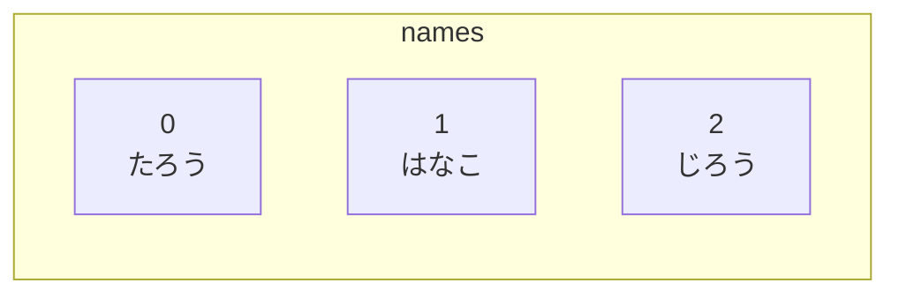
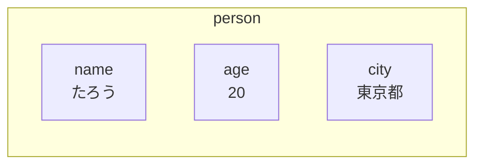
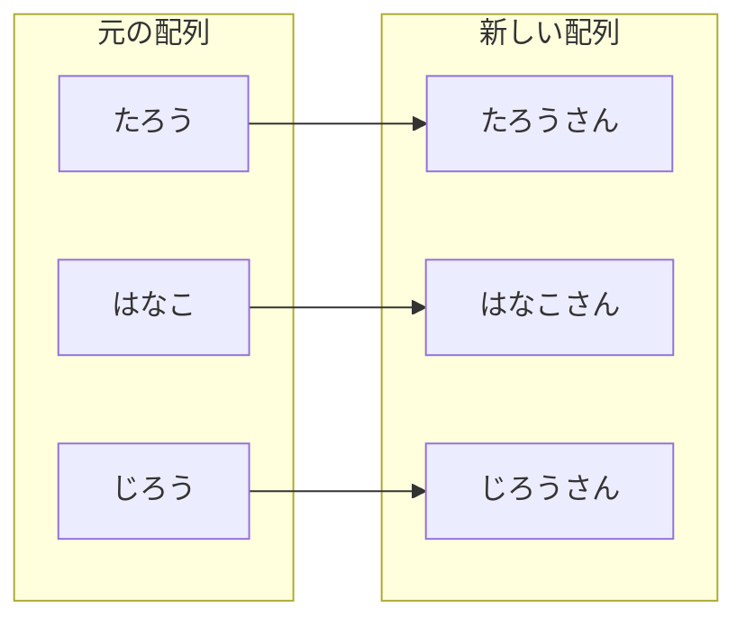
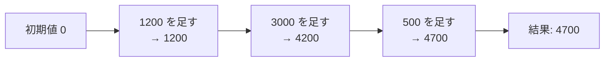
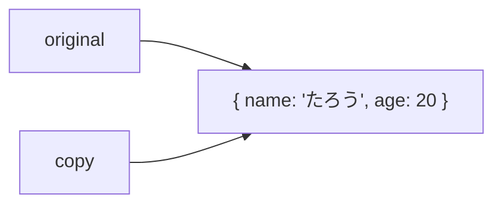
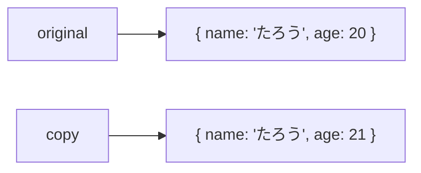
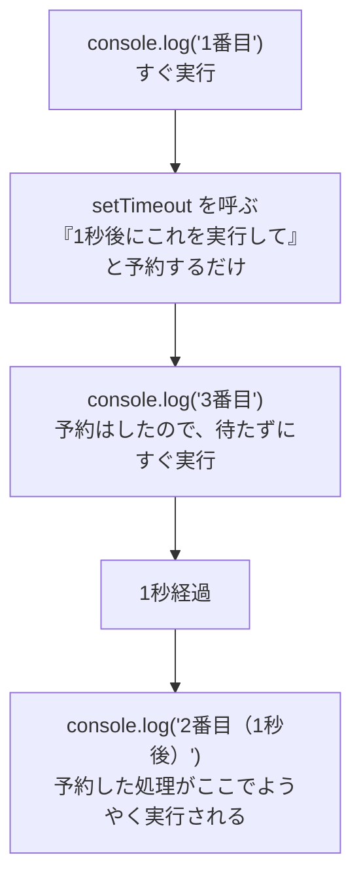
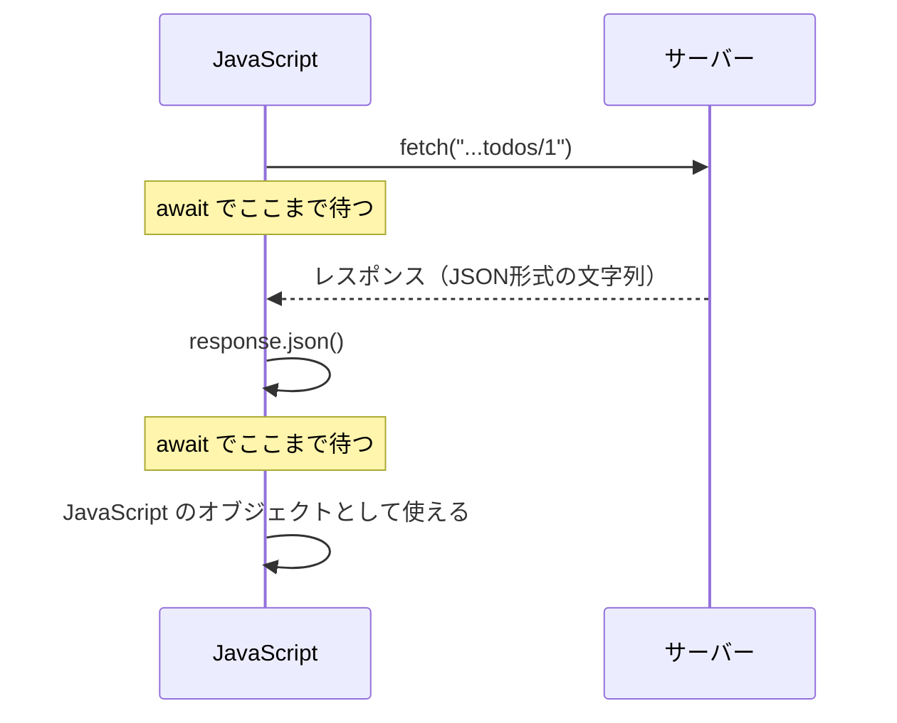
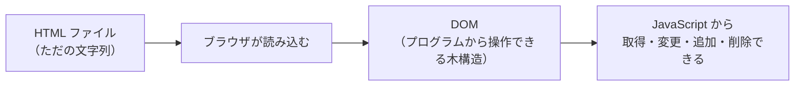
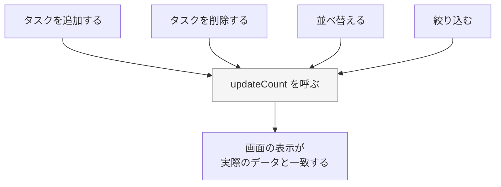

# 第5章 JavaScript の基礎（後半）

前の章で、変数・条件分岐・繰り返し・関数を学びました。
これで「1つの値」を扱うことはできるようになりました。

しかし実際のアプリが扱うのは、1つの値ではありません。
「30人分の予約」「100件のタスク」「1人のユーザーの、名前・年齢・注文履歴」のように、
**複数の値のまとまり**です。

この章では、そのまとまりを表す**配列**と**オブジェクト**を学び、
さらに「サーバーからデータを取ってくる」「画面を書き換える」という、
Web アプリらしい動きを実際に作れるようになります。

**この章の最後（5.7.7）で、素の JavaScript で画面を作ることの大変さを体験します。**
それが、第6章から React を学ぶ理由になります。

## この章で学ぶこと

- 配列で複数の値をまとめ、取り出し・追加・削除ができるようになる
- オブジェクトで「名前のついた値の集まり」を扱えるようになる
- `map` / `filter` / `find` / `reduce` で配列を変換・集計できるようになる
- 分割代入とスプレッド構文で、値を安全に取り出し・組み立てられるようになる
- 非同期処理の考え方を理解し、`fetch` でサーバーからデータを取得できるようになる
- ファイルを分けて、必要な機能だけを読み込めるようになる
- DOM 操作で、実際に画面の要素を書き換えられるようになる

## この章の前提

- [第4章](./04-javascript-basics.md) の変数・条件分岐・繰り返し・関数が書けること
- コンソールで `console.log` を使って結果を確認できること（4.1.3）

> **つまずいたら**
> この章は前半以上に盛りだくさんです。**一度にすべてを覚えようとしないでください。**
> とくに 5.3 の `map` / `filter` / `reduce` と、5.5 の非同期処理は、
> 何度も書いて手に馴染ませるものです。読むだけで理解しようとせず、
> 必ずコンソールに結果を出しながら進めてください（4.1.3）。
>
> 詰まったら、**章番号・書いたコード全文・エラーメッセージ全文**を AI に貼ってください。

---

## 5.1 配列

### 5.1.1 配列とは

3人分の名前を、いまの知識で表そうとすると、こうなります。

```js
const name1 = "たろう";
const name2 = "はなこ";
const name3 = "じろう";

console.log(name1, name2, name3);
```

10人になったら、変数が10個。100人になったら100個です。
**人数が決まっていないと、そもそも書けません。**

これを解決するのが**配列**（複数の値を順番に並べて1つにまとめたもの）です。

```js
const names = ["たろう", "はなこ", "じろう"];

console.log(names);
```

```text
実行結果:
[ 'たろう', 'はなこ', 'じろう' ]
```

**書き方**

```js
const 配列名 = [値1, 値2, 値3];
```

`[ ]`（角かっこ）で囲み、値をカンマ `,` で区切ります。
配列も `const` で宣言します（あとで説明しますが、**中身は変更できます**。4.2.2）。

**配列は、番号付きのロッカーだと考えてください。**
それぞれの値には、**先頭を 0 とする番号**が振られています。



この番号を**インデックス**（配列の中の位置を表す番号。0から始まる）と呼びます。
**なぜ 0 から始まるのか**は、次の 5.1.2 で使いながら理解していきます。

**いろいろな型を入れられる**

```js
const numbers = [10, 20, 30];
const mixed = ["たろう", 20, true];

console.log(numbers);
console.log(mixed);
```

```text
実行結果:
[ 10, 20, 30 ]
[ 'たろう', 20, true ]
```

数値・文字列・真偽値など、**型が違うものを1つの配列に混ぜることもできます**。
ただし、実際のプログラムでは**同じ種類の値だけを入れる**のが基本です。
「名前の配列」「点数の配列」のように、**1つの配列には1種類の意味の値だけ**を入れてください。

### 5.1.2 要素の取り出しと書き換え

配列の中の1つ1つの値を**要素**と呼びます。
要素を取り出すには、**`配列名[インデックス]`** と書きます。

```js
const names = ["たろう", "はなこ", "じろう"];

console.log(names[0]);
console.log(names[1]);
console.log(names[2]);
```

```text
実行結果:
たろう
はなこ
じろう
```

**`names[0]` が「0番目」ではなく「1番目」を指す**ことに注意してください。
配列は**0から数えます**。これは JavaScript に限らず、多くのプログラミング言語に共通するルールです。

**最後の要素を取り出す**

要素数がわかっていれば、`names[2]` のように直接書けます。
しかし、要素数がわからないときのために、**配列の長さ**を調べる方法があります。

```js
const names = ["たろう", "はなこ", "じろう"];

console.log(names.length);
console.log(names[names.length - 1]);
```

```text
実行結果:
3
じろう
```

`.length` は文字列でも使いました（4.3.3）。配列でも同じように**要素数**を返します。

**最後の要素のインデックスは、`長さ - 1` になります。**
要素が3個なら、インデックスは `0, 1, 2` の3つしかないため、
`names[3]` と書くと存在しない要素を指すことになります。

```js
console.log(names[3]);
```

```text
実行結果:
undefined
```

**エラーにはならず、`undefined` が返ります。**
これは 4.3.5 で学んだ「まだ何も入っていない」状態です。
配列で `undefined` が出てきたら、**インデックスが範囲外**を疑ってください。

**要素を書き換える**

```js
const names = ["たろう", "はなこ", "じろう"];

names[1] = "ようこ";

console.log(names);
```

```text
実行結果:
[ 'たろう', 'ようこ', 'じろう' ]
```

`const` で宣言しているのに書き換えられました。
理由は 5.4.3 で詳しく説明しますが、いまは次のように理解しておいてください。

> **`const` が禁止しているのは「配列そのものの入れ替え」だけです**
> ```js
> const names = ["たろう", "はなこ"];
> names = ["別の配列"];   // TypeError（配列を丸ごと入れ替えようとした）
> names[0] = "別の値";    // OK（配列の中身を書き換えただけ）
> ```
> `names` という名前が指している「箱」自体は変わっていないので、
> `const` のルール（4.2.2）に違反しません。

### 5.1.3 追加と削除

**末尾に追加する：`push`**

```js
const names = ["たろう", "はなこ"];

names.push("じろう");

console.log(names);
```

```text
実行結果:
[ 'たろう', 'はなこ', 'じろう' ]
```

`push` は**配列の末尾に要素を追加する**メソッドです（メソッドについては 5.2 で改めて扱います。
いまは「配列に付いている機能」と考えてください）。

**末尾から取り除く：`pop`**

```js
const names = ["たろう", "はなこ", "じろう"];

const removed = names.pop();

console.log(names);
console.log(removed);
```

```text
実行結果:
[ 'たろう', 'はなこ' ]
じろう
```

`pop` は**末尾の要素を取り除き、その値を戻り値として返します**（戻り値は 4.6.2）。

**先頭に追加・先頭から取り除く：`unshift` / `shift`**

```js
const names = ["はなこ", "じろう"];

names.unshift("たろう");
console.log(names);

const removed = names.shift();
console.log(names);
console.log(removed);
```

```text
実行結果:
[ 'たろう', 'はなこ', 'じろう' ]
[ 'はなこ', 'じろう' ]
たろう
```

**4つのメソッドのまとめ**

| メソッド | 位置 | 動き |
|---------|------|------|
| `push(値)` | 末尾 | 追加する |
| `pop()` | 末尾 | 取り除いて返す |
| `unshift(値)` | 先頭 | 追加する |
| `shift()` | 先頭 | 取り除いて返す |

> **よくある間違い：`push` の戻り値を勘違いする**
> ```js
> const names = ["たろう"];
> const newNames = names.push("はなこ");
> console.log(newNames);
> ```
> ```text
> 実行結果:
> 2
> ```
> `push` の戻り値は、**追加後の配列の長さ**です。追加後の配列そのものではありません。
> 配列自体は `names` の中で直接変化しているので、確認するときは `names` を見てください。

### 5.1.4 配列を繰り返す

配列のすべての要素を1つずつ処理したいとき、4.5 の `for` が使えます。

```js
const names = ["たろう", "はなこ", "じろう"];

for (let i = 0; i < names.length; i++) {
  console.log(`${i + 1}人目: ${names[i]}`);
}
```

```text
実行結果:
1人目: たろう
2人目: はなこ
3人目: じろう
```

**条件が `i < names.length` である理由**

インデックスは `0` から `length - 1` までです。
`names.length` は `3` なので、`i` が `0, 1, 2` の間だけループします（4.5.1 で学んだとおり `<` で最後の `3` は含まれません）。

**人数が変わっても書き換え不要**

```js
const names = ["たろう", "はなこ", "じろう", "ようこ", "けんじ"];

for (let i = 0; i < names.length; i++) {
  console.log(`${i + 1}人目: ${names[i]}`);
}
```

`names.length` を使っているので、**配列の中身が何人分でも同じコードで動きます。**
これが配列と繰り返しを組み合わせる利点です。

**もっと簡単な書き方：`for...of`**

インデックスを使わず、**要素を直接1つずつ取り出す**書き方もあります。

```js
const names = ["たろう", "はなこ", "じろう"];

for (const name of names) {
  console.log(name);
}
```

```text
実行結果:
たろう
はなこ
じろう
```

`for (const 変数名 of 配列名)` と書くと、
**配列の要素が1つずつ `name` に入り、繰り返しの中で使えます。**
インデックスの計算やタイプミスが起きないため、こちらのほうが安全です。

**番号が必要なとき**

`for...of` では番号を使いたい場合、`entries()` を使います。

```js
const names = ["たろう", "はなこ", "じろう"];

for (const [index, name] of names.entries()) {
  console.log(`${index + 1}人目: ${name}`);
}
```

```text
実行結果:
1人目: たろう
2人目: はなこ
3人目: じろう
```

`[index, name]` の書き方は 5.4.1 の分割代入です。いまは「番号と値が同時に取れる」とだけ覚えてください。

> **使い分け**
> - 番号（インデックス）が必要ない → `for...of`
> - 番号も使う → `for` か `entries()` 付きの `for...of`
>
> **迷ったら `for...of` を使ってください。** このテキストでもこれを基本にします。

### 5.1.5 よく使うメソッド

**含まれているか調べる：`includes`**

```js
const names = ["たろう", "はなこ", "じろう"];

console.log(names.includes("はなこ"));
console.log(names.includes("さぶろう"));
```

```text
実行結果:
true
false
```

> **補足：文字列にも同じ名前のメソッドがある**
> `includes` は配列専用ではありません。**文字列にも同じ名前で、
> 「その文字を含んでいるか」を調べるメソッドがあります。**
> ```js
> console.log("りんごジュース".includes("ジュース"));
> console.log("りんごジュース".includes("コーヒー"));
> ```
> ```text
> 実行結果:
> true
> false
> ```
> 「配列の中にその**値**が含まれるか」と「文字列の中にその**文字**が含まれるか」で、
> 対象は違いますが、**考え方も名前も同じ**です。検索フォームの絞り込みなどでよく使います。

**位置を調べる：`indexOf`**

```js
const names = ["たろう", "はなこ", "じろう"];

console.log(names.indexOf("はなこ"));
console.log(names.indexOf("さぶろう"));
```

```text
実行結果:
1
-1
```

**見つからないと `-1` が返ります。** 4.6.5 の演習で学んだ「ありえない値」の考え方と同じです。
インデックスは 0 以上なので、`-1` は「存在しない」を表せます。

**文字列につなげる：`join`**

```js
const names = ["たろう", "はなこ", "じろう"];

console.log(names.join("、"));
console.log(names.join(" / "));
```

```text
実行結果:
たろう、はなこ、じろう
たろう / はなこ / じろう
```

かっこの中に書いた文字が、**要素と要素の間**に挟まれます。

**一部だけ取り出す：`slice`**

```js
const names = ["たろう", "はなこ", "じろう", "ようこ", "けんじ"];

console.log(names.slice(1, 3));
console.log(names.slice(2));
```

```text
実行結果:
[ 'はなこ', 'じろう' ]
[ 'じろう', 'ようこ', 'けんじ' ]
```

`slice(開始, 終了)` は、**開始のインデックスから、終了の1つ手前まで**を取り出します。
`終了` を省略すると、**最後まで**取り出します。

**`slice` は元の配列を変更しません。**

```js
const names = ["たろう", "はなこ", "じろう"];
const part = names.slice(0, 2);

console.log(names);
console.log(part);
```

```text
実行結果:
[ 'たろう', 'はなこ', 'じろう' ]
[ 'たろう', 'はなこ' ]
```

`push` / `pop` / `unshift` / `shift` は**元の配列そのものを変える**メソッド、
`slice` / `includes` / `indexOf` / `join` は**元の配列を変えず、新しい値を返す**メソッドです。

**この違いは、5.4.3 で扱う「イミュータブルな更新」を理解するうえで重要になります。**

**配列同士をつなげる：`concat`**

```js
const teamA = ["たろう", "はなこ"];
const teamB = ["じろう", "ようこ"];

const allMembers = teamA.concat(teamB);

console.log(allMembers);
console.log(teamA);
```

```text
実行結果:
[ 'たろう', 'はなこ', 'じろう', 'ようこ' ]
[ 'たろう', 'はなこ' ]
```

`concat` も元の配列を変えません。`teamA` はそのままです。

---

## 5.2 オブジェクト

### 5.2.1 オブジェクトとは

配列は「順番に並んだ値」を扱うのに向いています。
しかし、1人分の情報（名前・年齢・出身地）をまとめたいときはどうでしょうか。

```js
const name = "たろう";
const age = 20;
const city = "東京都";
```

これでも表せますが、「これは誰の情報か」が変数名だけではわかりません。
2人目の情報を持とうとすると、`name2` `age2` `city2` と増えていきます。

これを解決するのが**オブジェクト**（名前と値の組を、まとめて1つにしたもの）です。

```js
const person = {
  name: "たろう",
  age: 20,
  city: "東京都",
};

console.log(person);
```

```text
実行結果:
{ name: 'たろう', age: 20, city: '東京都' }
```

**書き方**

```js
const 変数名 = {
  キー1: 値1,
  キー2: 値2,
};
```

`{ }`（波かっこ）で囲み、**キー（名前）と値の組**をカンマ `,` で区切って並べます。
`name: "たろう"` の `name` を**プロパティ名（キー）**、`"たろう"` を**値**と呼びます。

**オブジェクトは、名札付きの引き出しだと考えてください。**
配列がインデックス（番号）で中身を管理するのに対し、
オブジェクトは**名前**で中身を管理します。



> **最後のカンマ**
> `city: "東京都",` のように、**最後のプロパティの後ろにもカンマを付けてよい**ことになっています
> （末尾カンマ）。あとでプロパティを足すときに差分がわかりやすくなるため、
> **このテキストでは複数行のオブジェクトに末尾カンマを付けます。**

### 5.2.2 プロパティの読み書き

**読み取る：ドット記法**

```js
const person = {
  name: "たろう",
  age: 20,
};

console.log(person.name);
console.log(person.age);
```

```text
実行結果:
たろう
20
```

`オブジェクト.プロパティ名` で値を取り出せます。これを**ドット記法**と呼びます。

**存在しないプロパティ**

```js
console.log(person.email);
```

```text
実行結果:
undefined
```

配列の範囲外アクセス（5.1.2）と同じく、**エラーにはならず `undefined` になります。**

**書き換える**

```js
const person = {
  name: "たろう",
  age: 20,
};

person.age = 21;

console.log(person);
```

```text
実行結果:
{ name: 'たろう', age: 21 }
```

配列と同じ理由（5.1.2）で、`const` で宣言していても**中のプロパティは書き換えられます。**

**新しいプロパティを追加する**

```js
const person = {
  name: "たろう",
  age: 20,
};

person.city = "東京都";

console.log(person);
```

```text
実行結果:
{ name: 'たろう', age: 20, city: '東京都' }
```

宣言時になかったプロパティも、あとから追加できます。

**ブラケット記法**

プロパティ名を`[ ]`の中に文字列で書く方法もあります。

```js
const person = {
  name: "たろう",
  age: 20,
};

console.log(person["name"]);

const key = "age";
console.log(person[key]);
```

```text
実行結果:
たろう
20
```

**使い分け**

| 記法 | 使うとき |
|------|---------|
| `person.name` | プロパティ名がその場でわかっている（ほとんどの場合） |
| `person[key]` | プロパティ名が変数に入っている・実行時に決まる |

**このテキストでは、基本はドット記法を使います。**
ブラケット記法は、プロパティ名を変数で指定したいときだけ使います。

> **よくある間違い：ドット記法にクォートを付ける**
> ```js
> console.log(person."name");   // SyntaxError
> ```
> ドット記法では、プロパティ名を**引用符で囲みません。**
> 引用符が必要なのはブラケット記法（`person["name"]`）のときだけです。

### 5.2.3 入れ子のオブジェクト

プロパティの値には、**オブジェクトを入れることもできます。**

```js
const person = {
  name: "たろう",
  age: 20,
  address: {
    prefecture: "東京都",
    city: "渋谷区",
  },
};

console.log(person.address);
console.log(person.address.prefecture);
```

```text
実行結果:
{ prefecture: '東京都', city: '渋谷区' }
東京都
```

**ドットを重ねてたどっていきます。**
`person.address` でオブジェクトを取り出し、そのさらに `.prefecture` を取り出しています。

**何段でも重ねられます**

```js
const company = {
  name: "にゃんこ商事",
  ceo: {
    name: "たろう",
    contact: {
      email: "taro@example.com",
    },
  },
};

console.log(company.ceo.contact.email);
```

```text
実行結果:
taro@example.com
```

**深くなりすぎると読みにくくなります。**
3段を超えるようなら、オブジェクトの構造そのものを見直すサインです。

### 5.2.4 オブジェクトの配列

配列とオブジェクトを組み合わせると、**複数人分の、複数の情報**を1つの変数で表せます。
**これは、この先ずっと使う最も重要な形です。**

```js
const members = [
  { name: "たろう", age: 20 },
  { name: "はなこ", age: 22 },
  { name: "じろう", age: 19 },
];

console.log(members);
console.log(members[0]);
console.log(members[0].name);
```

```text
実行結果:
[
  { name: 'たろう', age: 20 },
  { name: 'はなこ', age: 22 },
  { name: 'じろう', age: 19 }
]
{ name: 'たろう', age: 20 }
たろう
```

`members` は**配列**なので `[0]` で1人分を取り出せます。
取り出した1人分は**オブジェクト**なので `.name` でプロパティを取り出せます。

**5.1.4 の `for...of` と組み合わせる**

```js
const members = [
  { name: "たろう", age: 20 },
  { name: "はなこ", age: 22 },
  { name: "じろう", age: 19 },
];

for (const member of members) {
  console.log(`${member.name}（${member.age}歳）`);
}
```

```text
実行結果:
たろう（20歳）
はなこ（22歳）
じろう（19歳）
```

**この「オブジェクトの配列を `for...of` で回す」という形は、
第7章で React がリストを画面に表示するときに、そのまま使う考え方です。**

**条件と組み合わせる**

4.4 の `if` と組み合わせれば、集計もできます。

```js
const members = [
  { name: "たろう", age: 20 },
  { name: "はなこ", age: 22 },
  { name: "じろう", age: 19 },
];

let adultCount = 0;

for (const member of members) {
  if (member.age >= 20) {
    adultCount++;
  }
}

console.log(`20歳以上は ${adultCount} 人です`);
```

```text
実行結果:
20歳以上は 2 人です
```

### 5.2.5 `undefined` エラーとの付き合い方

オブジェクトの入れ子で、**存在しないはずのプロパティをたどろうとする**と、
`undefined` とは違うエラーが起きます。

```js
const person = {
  name: "たろう",
};

console.log(person.address.city);
```

```text
実行結果:
Uncaught TypeError: Cannot read properties of undefined (reading 'city')
```

**何が起きたか**

1. `person.address` は、`address` プロパティが存在しないため `undefined` になる
2. `undefined.city` を読もうとする
3. **`undefined` にはプロパティが存在しないため、エラーになる**

`person.name` のような**1段だけ**のアクセスは `undefined` で済みますが、
`person.address.city` のように**さらにその先を読もうとする**とエラーになります。

**`TypeError: Cannot read properties of undefined` は、この章でいちばんよく出会うエラーです。**
`(reading 'city')` の部分から、**どのプロパティで失敗したか**がわかります。

**対策1：あるかどうかを先に確認する**

```js
const person = {
  name: "たろう",
};

if (person.address) {
  console.log(person.address.city);
} else {
  console.log("住所は未登録です");
}
```

```text
実行結果:
住所は未登録です
```

**対策2：オプショナルチェーン `?.`**

毎回 `if` を書くのは大変なので、**専用の記法**があります。

```js
const person = {
  name: "たろう",
};

console.log(person.address?.city);
```

```text
実行結果:
undefined
```

`?.` を使うと、**その手前が `undefined` のときは、エラーにならず `undefined` を返します。**
`.` の代わりに `?.` を書くだけです。

```js
const person1 = { name: "たろう", address: { city: "渋谷区" } };
const person2 = { name: "はなこ" };

console.log(person1.address?.city);
console.log(person2.address?.city);
```

```text
実行結果:
渋谷区
undefined
```

**入れ子が深いときは、何段でも `?.` を重ねられます。**

```js
console.log(person.address?.building?.room);
```

> **このテキストの方針**
> **サーバーから取得したデータや、あるかどうか確信が持てないデータには `?.` を使う**ことを基本にします。
> 自分で作ったオブジェクトで、プロパティが必ずあるとわかっている場合は、
> 素直に `.` で書いて構いません。**「あるかもしれないし、ないかもしれない」ときだけ `?.` を使う**と考えてください。

> **よくある間違い：`?.` を付ける位置**
> ```js
> console.log(person?.address.city);   // person.address が undefined ならここでエラー
> ```
> `?.` は、**それを付けた場所より手前が `undefined` かもしれないとき**に効きます。
> `person` 自体は必ずある場合でも、その先の `address` が不確かなら
> **`address` のところに `?.` を付けます**（`person.address?.city`）。
> どこが不確かなプロパティかを考えて、その直前に付けてください。

---

## 5.3 配列を扱う便利な関数

5.1.4 で `for...of` を学びました。これで配列は一通り処理できます。
しかし、**「全部を変換する」「条件に合うものだけ残す」といった、よくある処理は、
専用のメソッドを使うほうが短く、意図が伝わりやすくなります。**

この節で学ぶ `map` / `filter` / `find` / `reduce` は、
**第7章で React がリストを画面に表示するときにも使う、最重要のメソッド**です。

### 5.3.1 `map` — 全部を変換する

「全員の名前に『さん』を付けたい」という例を考えます。
`for...of` で書くと、こうなります。

```js
const names = ["たろう", "はなこ", "じろう"];
const withHonorific = [];

for (const name of names) {
  withHonorific.push(`${name}さん`);
}

console.log(withHonorific);
```

```text
実行結果:
[ 'たろう さん', 'はなこさん', 'じろうさん' ]
```

**「空の配列を用意して、繰り返しの中で `push` する」という形は、非常によく出てきます。**
この形専用のメソッドが `map` です。

```js
const names = ["たろう", "はなこ", "じろう"];

const withHonorific = names.map((name) => `${name}さん`);

console.log(withHonorific);
```

```text
実行結果:
[ 'たろうさん', 'はなこさん', 'じろうさん' ]
```

**5行が1行になりました。**

**書き方**

```js
配列.map((要素) => 変換後の値)
```

`map` は、**配列のすべての要素に、渡した関数を適用した、新しい配列を返します。**
渡している `(name) => \`${name}さん\`` は、4.6.3 で学んだアロー関数です。

**流れを図で見る**



**元の配列は変わりません。**

```js
const prices = [1200, 3000];
const doubled = prices.map((price) => price * 2);

console.log(prices);
console.log(doubled);
```

```text
実行結果:
[ 1200, 3000 ]
[ 2400, 6000 ]
```

`map` は 5.1.5 の `slice` と同じく、**元の配列を変えずに新しい配列を返す**メソッドです。
`prices` はそのまま、`doubled` という**別の配列**として結果が得られています。

**オブジェクトの配列にも使う**

```js
const members = [
  { name: "たろう", age: 20 },
  { name: "はなこ", age: 22 },
];

const names = members.map((member) => member.name);

console.log(names);
```

```text
実行結果:
[ 'たろう', 'はなこ' ]
```

「オブジェクトの配列から、特定のプロパティだけを取り出した配列を作る」のは、
**非常によく使う組み合わせです。**

**数値を変換する**

```js
const prices = [1200, 3000, 500];

const taxIncluded = prices.map((price) => Math.floor(price * 1.1));

console.log(taxIncluded);
```

```text
実行結果:
[ 1320, 3300, 550 ]
```

4.6.1 の税込価格を求める関数を、**配列全体に一度に適用しています。**

> **よくある間違い：戻り値を書き忘れる**
> ```js
> const doubled = [1, 2, 3].map((n) => { n * 2; });
> console.log(doubled);
> ```
> ```text
> 実行結果:
> [ undefined, undefined, undefined ]
> ```
> `{ }` を使ったアロー関数は `return` が必要です（4.6.3）。
> `map` の結果が全部 `undefined` になったら、**関数の中に `return` があるか**を確認してください。

### 5.3.2 `filter` — 条件に合うものだけ取り出す

「20歳以上の人だけ残したい」という例です。

```js
const members = [
  { name: "たろう", age: 20 },
  { name: "はなこ", age: 22 },
  { name: "じろう", age: 19 },
];

const adults = members.filter((member) => member.age >= 20);

console.log(adults);
```

```text
実行結果:
[
  { name: 'たろう', age: 20 },
  { name: 'はなこ', age: 22 }
]
```

**書き方**

```js
配列.filter((要素) => 真偽値になる条件)
```

`filter` は、**渡した関数が `true` を返した要素だけを集めた、新しい配列を返します。**
条件には、4.3.6 の比較演算子や 4.3.7 の論理演算子がそのまま使えます。

**`map` との違い**

| メソッド | 何をするか | 結果の要素数 |
|---------|-----------|-------------|
| `map` | 各要素を**変換**する | 元と**同じ** |
| `filter` | 各要素を**選別**する | 元と**同じか、それ以下** |

**条件に合うものが0件なら、空の配列が返ります。**

```js
const members = [{ name: "たろう", age: 20 }];
const seniors = members.filter((member) => member.age >= 65);

console.log(seniors);
console.log(seniors.length);
```

```text
実行結果:
[]
0
```

エラーにはなりません。**「0件だった」ことを、空の配列という形で受け取ります。**

### 5.3.3 `find` — 最初の1つを取り出す

「`id` が `2` のメンバーを1人だけ探したい」という例です。

```js
const members = [
  { id: 1, name: "たろう" },
  { id: 2, name: "はなこ" },
  { id: 3, name: "じろう" },
];

const found = members.find((member) => member.id === 2);

console.log(found);
```

```text
実行結果:
{ id: 2, name: 'はなこ' }
```

`filter` は**配列**を返しますが、`find` は**最初に見つかった1つの要素そのもの**を返します。

**見つからないとき**

```js
const members = [{ id: 1, name: "たろう" }];
const found = members.find((member) => member.id === 99);

console.log(found);
```

```text
実行結果:
undefined
```

**`find` は、見つからないと `undefined` を返します。** 空の配列ではありません。

> **使い分け**
> - 「条件に合う**すべて**」がほしい → `filter`
> - 「条件に合う**最初の1つ**」がほしい → `find`
>
> `id` のように**一意な値**で1件だけ探すときは `find`、
> 「20歳以上の**全員**」のように複数件を扱うときは `filter` を使います。

### 5.3.4 `reduce` — 1つの値にまとめる

4.5.4 で、繰り返しの外に変数を用意して合計する書き方を学びました。

```js
const prices = [1200, 3000, 500];
let total = 0;

for (const price of prices) {
  total += price;
}

console.log(total);
```

```text
実行結果:
4700
```

これを `reduce` で書けます。**この章でいちばん理解に時間がかかるメソッドです。**
焦らず、1つずつ確認してください。

```js
const prices = [1200, 3000, 500];

const total = prices.reduce((sum, price) => sum + price, 0);

console.log(total);
```

```text
実行結果:
4700
```

**書き方**

```js
配列.reduce((それまでの結果, 要素) => 次の結果, 初期値)
```

| 部分 | 意味 |
|------|------|
| `sum` | それまでの**累積結果**（1つ前の呼び出しの戻り値） |
| `price` | 配列のいまの要素 |
| `sum + price` | 今回の結果（次の `sum` になる） |
| `, 0` | `sum` の**最初の値**（省略できません） |

**1回ずつ追う**

| 回 | `sum`（渡ってくる値） | `price` | `sum + price`（戻り値） |
|----|----------------------|---------|------------------------|
| 1回目 | 0（初期値） | 1200 | 1200 |
| 2回目 | 1200 | 3000 | 4200 |
| 3回目 | 4200 | 500 | 4700 |

**最後の戻り値 `4700` が、`reduce` 全体の結果になります。**



**個数を数える**

合計以外にも使えます。

```js
const members = [
  { name: "たろう", age: 20 },
  { name: "はなこ", age: 22 },
  { name: "じろう", age: 19 },
];

const adultCount = members.reduce((count, member) => {
  if (member.age >= 20) {
    return count + 1;
  }
  return count;
}, 0);

console.log(adultCount);
```

```text
実行結果:
2
```

**最大値を求める**

```js
const scores = [80, 95, 60, 88];

const maxScore = scores.reduce((max, score) => {
  return score > max ? score : max;
}, scores[0]);

console.log(maxScore);
```

```text
実行結果:
95
```

初期値に `0` ではなく `scores[0]`（最初の要素）を使っています。
点数がすべてマイナスの場合など、**初期値の選び方は「その処理にとって安全な値」を考えて決めます。**

> **よくある間違い：初期値を省略する**
> ```js
> const total = [1200, 3000, 500].reduce((sum, price) => sum + price);
> ```
> 初期値を省略すると、**配列の最初の要素が初期値になり、2番目の要素から処理が始まります。**
> 単純な合計ならたまたま同じ結果になりますが、
> **意図が伝わりにくく、配列が空のときにエラーになります。**
> ```js
> const total = [].reduce((sum, price) => sum + price);
> ```
> ```text
> Uncaught TypeError: Reduce of empty array with no initial value
> ```
> **`reduce` を使うときは、常に初期値（2つ目の引数）を書いてください。**

> **`map` / `filter` / `reduce` の使い分け**
> | やりたいこと | 使うメソッド |
> |-------------|-------------|
> | 各要素を変換した配列がほしい | `map` |
> | 条件に合う要素だけの配列がほしい | `filter` |
> | 配列全体を1つの値（合計・個数・最大値など）にまとめたい | `reduce` |

### 5.3.5 `sort` — 並べ替える

**数値の並べ替え**

```js
const scores = [80, 95, 60, 88];

const sorted = scores.sort((a, b) => a - b);

console.log(sorted);
```

```text
実行結果:
[ 60, 80, 88, 95 ]
```

**書き方**

```js
配列.sort((a, b) => 数値)
```

かっこの中の関数を**比較関数**と呼びます。**戻り値の正負で順番が決まります。**

| 戻り値 | 意味 |
|--------|------|
| **負の数**（`a - b` がマイナス） | `a` を `b` より**前**に置く |
| **正の数**（`a - b` がプラス） | `a` を `b` より**後**に置く |
| `0` | 順番を変えない |

`a - b` は「小さいほうが前」＝**昇順**、`b - a` にすると**降順**になります。

```js
const scores = [80, 95, 60, 88];

console.log(scores.sort((a, b) => a - b));
console.log(scores.sort((a, b) => b - a));
```

```text
実行結果:
[ 60, 80, 88, 95 ]
[ 95, 88, 80, 60 ]
```

**文字列の並べ替え**

```js
const names = ["じろう", "たろう", "はなこ"];

const sorted = names.sort((a, b) => a.localeCompare(b));

console.log(sorted);
```

```text
実行結果:
[ 'じろう', 'たろう', 'はなこ' ]
```

文字列を比較するときは `localeCompare`（文字列同士の並び順を、負・正・0 の数値で返すメソッド）を使います。

**オブジェクトの配列を、あるプロパティで並べ替える**

```js
const members = [
  { name: "たろう", age: 20 },
  { name: "はなこ", age: 22 },
  { name: "じろう", age: 19 },
];

const sorted = members.sort((a, b) => a.age - b.age);

console.log(sorted);
```

```text
実行結果:
[
  { name: 'じろう', age: 19 },
  { name: 'たろう', age: 20 },
  { name: 'はなこ', age: 22 }
]
```

`(a, b) => a.age - b.age` のように、**比べたいプロパティを指定します。**

> **注意：`sort` は元の配列そのものを変えます**
> ```js
> const scores = [80, 95, 60];
> const sorted = scores.sort((a, b) => a - b);
>
> console.log(scores);
> console.log(sorted);
> ```
> ```text
> 実行結果:
> [ 60, 80, 95 ]
> [ 60, 80, 95 ]
> ```
> `map` / `filter` とは違い、**`sort` は元の配列を書き換えます。**
> `scores` も `sorted` と同じ内容になっている点に注意してください。
> 元の配列を残したい場合は、5.4.2 のスプレッド構文でコピーしてから並べ替えます。
> ```js
> const sorted = [...scores].sort((a, b) => a - b);
> ```

> **よくある間違い：比較関数を書き忘れる**
> ```js
> const scores = [80, 5, 100, 25];
> console.log(scores.sort());
> ```
> ```text
> 実行結果:
> [ 100, 25, 5, 80 ]
> ```
> 比較関数を省略すると、**数値であっても文字列として比較されます。**
> `"100"` は `"25"` より文字として小さい（`"1" < "2"`）ため、先頭に来てしまいます。
> **数値を並べ替えるときは、必ず `(a, b) => a - b` を書いてください。**

### 5.3.6 つなげて使う

`map` / `filter` は、**新しい配列を返す**ため、続けてつなげられます。
「20歳以上の人の名前だけを取り出す」を例にします。

**つなげない場合**

```js
const members = [
  { name: "たろう", age: 20 },
  { name: "はなこ", age: 22 },
  { name: "じろう", age: 19 },
];

const adults = members.filter((member) => member.age >= 20);
const names = adults.map((member) => member.name);

console.log(names);
```

```text
実行結果:
[ 'たろう', 'はなこ' ]
```

**つなげる場合**

```js
const members = [
  { name: "たろう", age: 20 },
  { name: "はなこ", age: 22 },
  { name: "じろう", age: 19 },
];

const names = members
  .filter((member) => member.age >= 20)
  .map((member) => member.name);

console.log(names);
```

```text
実行結果:
[ 'たろう', 'はなこ' ]
```

`filter` の戻り値（配列）に対して、そのまま `.map` を呼んでいます。
**「配列 → 配列」を返すメソッドは、ドットでいくつでもつなげられます。**

**読む順番**

```js
members
  .filter((member) => member.age >= 20)  // ① 20歳以上だけに絞る
  .map((member) => member.name);          // ② 名前だけを取り出す
```

**上から下へ、①→②の順に処理される**と読みます。
複数行に分けて書くと、**それぞれの段階で何をしているかが読みやすくなります。**

**`reduce` を最後につなげる**

```js
const members = [
  { name: "たろう", age: 20 },
  { name: "はなこ", age: 22 },
  { name: "じろう", age: 19 },
];

const totalAge = members
  .filter((member) => member.age >= 20)
  .reduce((sum, member) => sum + member.age, 0);

console.log(totalAge);
```

```text
実行結果:
42
```

「20歳以上の人の、年齢の合計」を1行で求めています。
`map` は「配列」を返すので次につなげられますが、
**`reduce` は数値などの単一の値を返すので、これ以上はつなげられません。**
`reduce` はチェーンの**最後**に置くのが基本です。

---

## 5.4 分割代入とスプレッド構文

### 5.4.1 分割代入

オブジェクトから複数のプロパティを取り出すとき、いまの書き方だとこうなります。

```js
const person = { name: "たろう", age: 20, city: "東京都" };

const name = person.name;
const age = person.age;
const city = person.city;

console.log(name, age, city);
```

`person.` を3回書いています。**分割代入**（配列やオブジェクトから、値を一度に複数の変数に取り出す書き方）を使うと、まとめて書けます。

```js
const person = { name: "たろう", age: 20, city: "東京都" };

const { name, age, city } = person;

console.log(name, age, city);
```

```text
実行結果:
たろう 20 東京都
```

**書き方**

```js
const { プロパティ名1, プロパティ名2 } = オブジェクト;
```

**変数名はプロパティ名と同じにする必要があります。** `{ }` の中に書いた名前で、
同じ名前のプロパティが自動的に取り出されて変数になります。

**一部だけ取り出す**

```js
const person = { name: "たろう", age: 20, city: "東京都" };

const { name } = person;

console.log(name);
```

```text
実行結果:
たろう
```

すべてのプロパティを取り出す必要はありません。**必要なものだけ**書けます。

**別の変数名で受け取る**

```js
const person = { name: "たろう", age: 20 };

const { name: userName } = person;

console.log(userName);
```

```text
実行結果:
たろう
```

`プロパティ名: 新しい変数名` と書くと、**別の名前**で受け取れます。

**関数の引数でも使う**

4.6.2 で学んだ関数の引数にも、分割代入が使えます。

```js
const showProfile = ({ name, age }) => {
  console.log(`${name}（${age}歳）`);
};

const person = { name: "たろう", age: 20 };
showProfile(person);
```

```text
実行結果:
たろう（20歳）
```

**この形は、第7章で React の `props` を受け取るときに、そのまま使います。**

**配列の分割代入**

配列にも同じ考え方が使えます。ただし、**プロパティ名ではなく順番**で対応します。

```js
const point = [10, 20];

const [x, y] = point;

console.log(x, y);
```

```text
実行結果:
10 20
```

`[ ]` を使い、**配列と同じ並び順**で変数名を書きます。
5.1.4 で使った `for (const [index, name] of names.entries())` も、この書き方でした。

**途中を飛ばす**

```js
const rank = ["1位", "2位", "3位"];

const [first, , third] = rank;

console.log(first, third);
```

```text
実行結果:
1位 3位
```

カンマだけを書いて、その位置の値を受け取らずに飛ばせます。

> **オブジェクトと配列の違い**
> | | オブジェクト | 配列 |
> |---|------------|------|
> | 書き方 | `{ }` | `[ ]` |
> | 対応のしかた | **プロパティ名**で対応 | **順番**で対応 |
>
> オブジェクトは「名前」で管理し（5.2.1）、配列は「順番」で管理する（5.1.1）
> という、それぞれの性質がそのまま分割代入にも表れています。

> **よくある間違い：`{ }` と `[ ]` を混同する**
> ```js
> const person = { name: "たろう", age: 20 };
> const [name, age] = person;   // TypeError
> ```
> ```text
> Uncaught TypeError: person is not iterable
> ```
> `person` は**オブジェクト**なので、`{ }` で受け取ります。
> `is not iterable`（繰り返し可能ではない）は、
> **配列用の書き方をオブジェクトに使おうとした**ときによく出るエラーです。

### 5.4.2 スプレッド構文

**配列を展開する**

```js
const numbers = [1, 2, 3];

console.log(...numbers);
```

```text
実行結果:
1 2 3
```

`...`（3つのドット）を**スプレッド構文**（配列やオブジェクトの中身を、その場に展開する記法）と呼びます。
配列の前に付けると、**中身が1つずつ展開されて**渡されます。

**配列同士をつなげる**

5.1.5 で `concat` を学びましたが、スプレッド構文でも同じことができます。

```js
const teamA = ["たろう", "はなこ"];
const teamB = ["じろう", "ようこ"];

const allMembers = [...teamA, ...teamB];

console.log(allMembers);
```

```text
実行結果:
[ 'たろう', 'はなこ', 'じろう', 'ようこ' ]
```

**配列に要素を追加した、新しい配列を作る**

```js
const names = ["たろう", "はなこ"];

const added = [...names, "じろう"];

console.log(names);
console.log(added);
```

```text
実行結果:
[ 'たろう', 'はなこ' ]
[ 'たろう', 'はなこ', 'じろう' ]
```

`names.push("じろう")` と似た結果に見えますが、**大きな違いがあります。**
`push` は元の配列 `names` そのものを変えるのに対し、
**スプレッド構文は、`names` を変えずに新しい配列 `added` を作ります。**

**この違いが、次の 5.4.3 でいちばん重要になります。**

**オブジェクトにも使える**

```js
const person = { name: "たろう", age: 20 };

const withCity = { ...person, city: "東京都" };

console.log(person);
console.log(withCity);
```

```text
実行結果:
{ name: 'たろう', age: 20 }
{ name: 'たろう', age: 20, city: '東京都' }
```

`{ ...person, city: "東京都" }` は、
「`person` の中身をすべて展開して、さらに `city` を追加した、新しいオブジェクト」を作ります。
**`person` 自体は変わっていません。**

**同じプロパティがあると、あとに書いたほうが勝つ**

```js
const person = { name: "たろう", age: 20 };

const older = { ...person, age: 21 };

console.log(person);
console.log(older);
```

```text
実行結果:
{ name: 'たろう', age: 20 }
{ name: 'たろう', age: 21 }
```

`...person` で `age: 20` が展開されたあと、`age: 21` が**上書き**しています。
**「元のオブジェクトを展開して、一部だけ新しい値で置き換えた、新しいオブジェクト」**という形です。

### 5.4.3 イミュータブルな更新の考え方

ここまでで、配列やオブジェクトを変更する方法が、**2種類あった**ことに気づいたでしょうか。

| 種類 | 配列の例 | オブジェクトの例 |
|------|---------|-----------------|
| **元をそのまま書き換える** | `push` / `pop` / `names[0] = ...` | `person.age = 21` |
| **元は変えず、新しいものを作る** | `[...names, "じろう"]` | `{ ...person, age: 21 }` |

前者を**ミュータブル**（書き換え可能）な操作、
後者を**イミュータブル**（不変。5.2.1 で少し触れた考え方の実践編）な更新と呼びます。

**なぜ、わざわざ新しいものを作るのか**

```js
const original = { name: "たろう", age: 20 };
const copy = original;

copy.age = 21;

console.log(original);
console.log(copy);
```

```text
実行結果:
{ name: 'たろう', age: 21 }
{ name: 'たろう', age: 21 }
```

**`copy` だけを書き換えたつもりが、`original` まで変わってしまいました。**

**なぜこうなるのか**

`const copy = original;` は、**オブジェクトのコピーを作っていません。**
`original` と `copy` は、**同じオブジェクトを指す、2つの名札**になっています。



どちらの名前で書き換えても、**指している先は1つの同じオブジェクト**なので、
両方から見た結果が変わってしまいます。

**スプレッド構文で防ぐ**

```js
const original = { name: "たろう", age: 20 };
const copy = { ...original };

copy.age = 21;

console.log(original);
console.log(copy);
```

```text
実行結果:
{ name: 'たろう', age: 20 }
{ name: 'たろう', age: 21 }
```



`{ ...original }` で**中身をコピーした、別のオブジェクト**を作ったので、
`copy` を書き換えても `original` には影響しません。

**配列でも同じことが起きます**

```js
const original = ["たろう", "はなこ"];
const copy = original;

copy.push("じろう");

console.log(original);
console.log(copy);
```

```text
実行結果:
[ 'たろう', 'はなこ', 'じろう' ]
[ 'たろう', 'はなこ', 'じろう' ]
```

配列も、`const copy = original;` では**同じ配列を指すだけ**です。
安全にコピーするには、スプレッド構文（`[...original]`）か `slice()`（5.1.5）を使います。

```js
const original = ["たろう", "はなこ"];
const copy = [...original];

copy.push("じろう");

console.log(original);
console.log(copy);
```

```text
実行結果:
[ 'たろう', 'はなこ' ]
[ 'たろう', 'はなこ', 'じろう' ]
```

**このテキストの方針**

> **配列やオブジェクトを更新するときは、元を直接書き換えず、
> スプレッド構文で「新しいものを作る」ことを基本にします。**
>
> ```js
> // 元を直接書き換える（このテキストでは避ける）
> person.age = 21;
> names.push("じろう");
>
> // 新しいものを作る（このテキストで使う）
> const updated = { ...person, age: 21 };
> const added = [...names, "じろう"];
> ```

**なぜこの方針にするのか**

- 元のデータが変わらないと保証されていれば、**プログラムの動きを追いやすくなる**
- 4.2.2 で「`const` は値が変わらないと保証してくれる」と学びました。
  スプレッド構文は、**配列やオブジェクトの中身についても同じ安心感を得るための書き方**です

**そして、これが React を学ぶうえで欠かせない理由があります。**

> **第7章への伏線**
> React は、**state（画面が持つ値）を直接書き換えると、画面が更新されません。**
> `state.age = 21` のように直接書き換えるのではなく、
> **`{ ...state, age: 21 }` のように新しいオブジェクトを作って置き換える**必要があります。
>
> つまり、ここで学んだ「元を直接書き換えず、スプレッド構文で新しいものを作る」という考え方は、
> **第7章 7.2.4〜7.2.6 で state を更新するときに、そのまま使います。**
> いまのうちに手に馴染ませておいてください。

---

## 5.5 非同期処理

### 5.5.1 同期と非同期

ここまでのコードは、**上から順に、1つが終わってから次に進む**という前提で動いていました。
これを**同期処理**と呼びます。

```js
console.log("1番目");
console.log("2番目");
console.log("3番目");
```

```text
実行結果:
1番目
2番目
3番目
```

しかし、Web アプリでは**時間のかかる処理**が出てきます。
たとえば「サーバーにデータを問い合わせて、返事が来るまで待つ」という処理です。

もし JavaScript が「返事が来るまで、他のことは何もしない」という作りだったらどうなるでしょうか。
**ボタンも押せず、スクロールもできず、画面が固まったように見えてしまいます。**
4.5.2 で体験した無限ループと同じ状態です。

これを避けるのが**非同期処理**（結果が返ってくるのを待たずに、先に次の処理を進めるやり方）です。

**レストランでの注文にたとえると**

| | 同期（もし JavaScript がこうだったら） | 非同期（実際の JavaScript） |
|---|-----------------------------------|---------------------------|
| 注文したあと | 料理ができるまで**その場に立ったまま待つ** | 席に座って**他のこともできる** |
| 他の客 | 対応してもらえない | 店員は他の客にも対応できる |
| 料理ができたら | — | **呼ばれて**受け取る |

**「注文して、できあがったら呼ばれる」という形**が、この節で学ぶ非同期処理の考え方です。

### 5.5.2 `setTimeout` で体感する

`setTimeout` は、**指定した時間だけ待ってから、渡した関数を実行する**組み込み関数です。

```js
console.log("1番目");

setTimeout(() => {
  console.log("2番目（1秒後）");
}, 1000);

console.log("3番目");
```

```text
実行結果:
1番目
3番目
2番目（1秒後）
```

**書いた順番と、実行される順番が違います。**

| 書いた順番 | 実行された順番 |
|-----------|---------------|
| 1番目 → 2番目 → 3番目 | 1番目 → **3番目** → **2番目** |

**なぜこうなるのか**



`setTimeout` は、**「1秒後にこれを実行して」と予約するだけで、その場では待ちません。**
予約が終わったら、すぐに次の行（`console.log("3番目")`）に進みます。
そして、**1秒経ってから、予約していた処理が実行されます。**

**書き方**

```js
setTimeout(() => {
  実行したい処理
}, ミリ秒);
```

第1引数は実行したい処理（アロー関数）、第2引数は**ミリ秒**（1000で1秒）です。

> **よくある間違い：`setTimeout` が待ってくれると思い込む**
> ```js
> let message = "まだ準備できていません";
>
> setTimeout(() => {
>   message = "準備できました";
> }, 1000);
>
> console.log(message);
> ```
> ```text
> 実行結果:
> まだ準備できていません
> ```
> `setTimeout` の中で `message` を書き換えていますが、
> **`console.log(message)` は、その書き換えを待たずに実行されてしまいます。**
> 「1秒後の結果を使いたい」場合は、**`setTimeout` の `{ }` の中に、
> 結果を使う処理も一緒に書く**必要があります。
> ```js
> setTimeout(() => {
>   const message = "準備できました";
>   console.log(message);
> }, 1000);
> ```
> この「結果を使う処理を、どこに書けばよいか」という問題を、
> 次の 5.5.3〜5.5.4 で整理された形にしていきます。

### 5.5.3 `Promise`

`setTimeout` は手軽ですが、「成功したか失敗したか」を扱えません。
これを扱うのが **`Promise`**（非同期処理の「あとで結果が来る」という約束を表すもの）です。

**Promise には3つの状態があります**

| 状態 | 意味 |
|------|------|
| **pending**（保留中） | まだ結果が出ていない |
| **fulfilled**（成功） | 処理が成功した |
| **rejected**（失敗） | 処理が失敗した |

**Promise を作ってみる**

```js
const promise = new Promise((resolve, reject) => {
  setTimeout(() => {
    resolve("成功しました");
  }, 1000);
});

console.log(promise);
```

```text
実行結果:
Promise { <pending> }
```

`new Promise((resolve, reject) => { ... })` の中で、
1秒後に `resolve("成功しました")` を呼んでいます。
`resolve` を呼ぶと、Promise の状態が **fulfilled** に変わり、
かっこの中の値（`"成功しました"`）が結果として確定します。

**結果を受け取る：`.then`**

```js
const promise = new Promise((resolve) => {
  setTimeout(() => {
    resolve("成功しました");
  }, 1000);
});

promise.then((result) => {
  console.log(result);
});

console.log("待っている間もここは実行される");
```

```text
実行結果:
待っている間もここは実行される
成功しました
```

`.then((result) => { ... })` は、**Promise が fulfilled になったら実行される処理**を登録します。
`resolve` に渡した値が、`result` として受け取れます。

**失敗を扱う：`.catch`**

```js
const promise = new Promise((resolve, reject) => {
  setTimeout(() => {
    reject(new Error("失敗しました"));
  }, 1000);
});

promise
  .then((result) => {
    console.log(result);
  })
  .catch((error) => {
    console.log(`エラー: ${error.message}`);
  });
```

```text
実行結果:
エラー: 失敗しました
```

`reject` を呼ぶと、Promise は **rejected** になります。
`.catch((error) => { ... })` で、失敗したときの処理を受け取れます。

> **`Error` オブジェクト**
> `new Error("メッセージ")` は、**エラーの情報をまとめたオブジェクト**です。
> `.message` でメッセージを取り出せます。4.1.4 で見たエラーメッセージも、
> この仕組みで作られています。

**自分で `Promise` を作ることは多くありません**

実際には、`fetch`（5.5.5）のように、**すでに Promise を返してくれる組み込み関数**を使う場面がほとんどです。
`new Promise` の中身を細かく覚える必要はありません。
**「Promise には `.then` で成功時、`.catch` で失敗時の処理をつなげられる」**ということだけ、まず押さえてください。

### 5.5.4 `async` / `await`

`.then` を重ねていくと、処理が増えるほど読みにくくなります。

```js
getUser()
  .then((user) => getOrders(user.id))
  .then((orders) => {
    console.log(orders);
  })
  .catch((error) => {
    console.log(error.message);
  });
```

これを、**同期処理のような見た目**で書けるようにするのが `async` / `await` です。

```js
const showOrders = async () => {
  const user = await getUser();
  const orders = await getOrders(user.id);
  console.log(orders);
};
```

**書き方**

| キーワード | どこに書くか | 意味 |
|-----------|-------------|------|
| `async` | 関数の前 | 「この関数は非同期処理を含む」という宣言 |
| `await` | Promise を返す処理の前 | 「その Promise の結果が出るまで、ここで待つ」 |

**`await` は `async` の付いた関数の中でしか使えません。**

**実際に動かす**

```js
const wait = (seconds) => {
  return new Promise((resolve) => {
    setTimeout(resolve, seconds * 1000);
  });
};

const main = async () => {
  console.log("開始");
  await wait(1);
  console.log("1秒経過");
  await wait(1);
  console.log("さらに1秒経過");
};

main();
```

```text
実行結果:
開始
1秒経過
さらに1秒経過
```

`await wait(1)` の行で、**1秒経つまで次の行に進みません。**
`setTimeout` をそのまま使ったときと違い、**上から順番どおりに読めます。**

**戻り値を受け取る**

```js
const fetchName = () => {
  return new Promise((resolve) => {
    setTimeout(() => {
      resolve("たろう");
    }, 1000);
  });
};

const main = async () => {
  const name = await fetchName();
  console.log(`名前: ${name}`);
};

main();
```

```text
実行結果:
名前: たろう
```

`await` を付けた式は、**Promise が fulfilled になったときの値**を返します。
`const name = await fetchName();` で、`resolve` に渡した値がそのまま `name` に入ります。

> **`async` 関数は Promise を返す**
> ```js
> const main = async () => {
>   return "完了";
> };
>
> console.log(main());
> ```
> ```text
> 実行結果:
> Promise { <pending> }
> ```
> `async` を付けた関数は、**戻り値が自動的に Promise で包まれます。**
> 結果を受け取るには `.then` か `await` を使います。
> ```js
> main().then((result) => console.log(result));
> ```

> **`.then` と `async`/`await` の使い分け**
> どちらも同じことができますが、**このテキストでは `async`/`await` を基本にします。**
> 上から下へ読める分、コードの流れを追いやすいためです。

### 5.5.5 `fetch` でデータを取得する

**`fetch`**（サーバーにリクエストを送り、レスポンスを受け取る組み込み関数）を使うと、
実際にインターネット上のサーバーからデータを取得できます。1.2 で学んだリクエストとレスポンスが、ここでようやくコードとして登場します。

**動作を確認する**

`react-lesson` に `fetch-practice.html` を作ります。

`fetch-practice.html`

```html
<!DOCTYPE html>
<html lang="ja">
  <head>
    <meta charset="UTF-8" />
    <meta name="viewport" content="width=device-width, initial-scale=1.0" />
    <title>fetch の練習</title>
  </head>
  <body>
    <h1>fetch の練習</h1>
    <p>開発者ツールのコンソールを開いてください。</p>

    <script src="fetch-practice.js"></script>
  </body>
</html>
```

`fetch-practice.js`

```js
const main = async () => {
  const response = await fetch("https://jsonplaceholder.typicode.com/todos/1");
  const data = await response.json();
  console.log(data);
};

main();
```

```text
実行結果:
{userId: 1, id: 1, title: 'delectus aut autem', completed: false}
```

`https://jsonplaceholder.typicode.com` は、**学習用に無料で公開されている、ダミーデータを返すテスト用の API**です。
本物のサーバーと同じ手順を、安全に練習できます。

**2段階になっている理由**

```js
const response = await fetch(url);
const data = await response.json();
```

| 行 | 何が起きるか |
|----|-------------|
| `fetch(url)` | サーバーにリクエストを送り、**レスポンス**が返ってくるまで待つ |
| `response.json()` | レスポンスの中身を、**JSON**（4.3 の Web の用語集で触れた、データをやり取りするための文字だけの形式）から、JavaScript のオブジェクトに変換するまで待つ |

**どちらも時間がかかる処理なので、それぞれに `await` が必要です。**



**取得したデータを使う**

`data` は普通のオブジェクトなので、5.2 で学んだとおり扱えます。

```js
const main = async () => {
  const response = await fetch("https://jsonplaceholder.typicode.com/todos/1");
  const data = await response.json();

  console.log(`タスク: ${data.title}`);
  console.log(`完了: ${data.completed ? "はい" : "いいえ"}`);
};

main();
```

```text
実行結果:
タスク: delectus aut autem
完了: いいえ
```

**配列のデータを取得する**

```js
const main = async () => {
  const response = await fetch("https://jsonplaceholder.typicode.com/todos?userId=1&_limit=3");
  const todos = await response.json();

  console.log(todos);

  const titles = todos.map((todo) => todo.title);
  console.log(titles);
};

main();
```

配列で返ってきたデータには、5.3 で学んだ `map` / `filter` がそのまま使えます。
**サーバーから取ってきたデータを配列メソッドで加工する**のは、実際の開発でも頻出の組み合わせです。

### 5.5.6 エラー処理

**サーバーに繋がらない、URL が間違っている**など、通信は失敗することがあります。
`fetch` を `try` / `catch` で囲むと、失敗したときの処理を書けます。

**書き方**

```js
try {
  失敗するかもしれない処理
} catch (error) {
  失敗したときの処理
}
```

`try`（試す）の中を実行し、**途中でエラーが起きたら、その時点で `catch` に処理が移ります。**

```js
const main = async () => {
  try {
    const response = await fetch("https://jsonplaceholder.typicode.com/todos/1");
    const data = await response.json();
    console.log(data);
  } catch (error) {
    console.log(`取得に失敗しました: ${error.message}`);
  }
};

main();
```

**存在しない URL で試す**

```js
const main = async () => {
  try {
    const response = await fetch("https://this-address-does-not-exist.invalid/data");
    const data = await response.json();
    console.log(data);
  } catch (error) {
    console.log(`取得に失敗しました: ${error.message}`);
  }
};

main();
```

```text
実行結果（例）:
取得に失敗しました: Failed to fetch
```

**`catch` がないとどうなるか**

`try` / `catch` を書かずに通信が失敗すると、
コンソールにエラーが表示されるだけで、**その後の処理も止まってしまいます。**
ユーザーには「なぜ動かないのか」が伝わりません。

**このテキストの方針**

> **`fetch` を使うときは、必ず `try` / `catch` で囲んでください。**
> 通信は、自分のコードが正しくても失敗することがあります
> （回線が切れている、サーバーが落ちているなど）。
> **失敗を前提にして、失敗したときにユーザーに何を伝えるかまで考えて書く**ことが大切です。

> **注意：`response.ok` も確認する**
> `fetch` は、**サーバーが「404 Not Found」のようなエラーを返しても、`catch` に入りません。**
> `fetch` が失敗したとみなすのは、通信そのものができなかったときだけです。
> ```js
> const main = async () => {
>   try {
>     const response = await fetch("https://jsonplaceholder.typicode.com/todos/999999");
>     if (!response.ok) {
>       throw new Error(`サーバーエラー: ${response.status}`);
>     }
>     const data = await response.json();
>     console.log(data);
>   } catch (error) {
>     console.log(`取得に失敗しました: ${error.message}`);
>   }
> };
> ```
> `response.ok` は、レスポンスが正常（200番台）だったかを表す真偽値です。
> `throw new Error(...)` は、**その場で意図的にエラーを発生させる**命令で、
> ここから `catch` に処理が移ります。
> **第8章で `fetch` を本格的に使うときのために、この形を覚えておいてください。**

---

## 5.6 モジュール

### 5.6.1 ファイルを分ける理由

ここまで、すべてのコードを1つの `.js` ファイルに書いてきました。
しかし、コードが増えてくると、1つのファイルに詰め込むのは大変になります。

- 「税込価格を計算する関数」がどこにあるか、探すのに時間がかかる
- 複数のページで同じ関数を使いたいのに、コピーして貼り付けることになる
- 誰かと同時に編集すると、同じファイルの変更がぶつかる

これを解決するのが**モジュール**（機能ごとにファイルを分け、必要なものだけ他のファイルから使えるようにする仕組み）です。
「税込価格の計算」は `price.js`、「日付の表示」は `date.js` のように、
**役割ごとにファイルを分けて、必要なところから呼び出します。**

### 5.6.2 `export` と `import`

**書き出す側：`export`**

`price.js` というファイルを作り、他のファイルに公開したい関数の前に `export` を付けます。

`price.js`

```js
export const taxIncluded = (price) => {
  return Math.floor(price * 1.1);
};

export const formatYen = (price) => {
  return `${price.toLocaleString()}円`;
};
```

`export` を付けた `taxIncluded` と `formatYen` は、**他のファイルから使えるようになります。**
`export` を付けなかったものは、そのファイルの中だけでしか使えません。
（`toLocaleString()` は、数値を桁区切りのカンマ付き文字列に変換する組み込みメソッドです）

**読み込む側：`import`**

`main.js`

```js
import { taxIncluded, formatYen } from "./price.js";

const price = taxIncluded(1200);
console.log(formatYen(price));
```

```text
実行結果:
1,320円
```

**書き方**

```js
import { 使いたいもの1, 使いたいもの2 } from "ファイルの場所";
```

`{ }` の中に、**`price.js` で `export` した名前と同じもの**を書きます。
`from` のあとは、2.3.4 で学んだ相対パスです。

**複数のプロパティを持つ値も扱える**

```js
export const shopInfo = {
  name: "ネコカフェ にゃんこ",
  openHour: 10,
  closeHour: 20,
};
```

```js
import { shopInfo } from "./shop.js";

console.log(shopInfo.name);
```

関数だけでなく、オブジェクトや配列、5.4 で学んだ値も同じように `export` / `import` できます。

### 5.6.3 デフォルトエクスポート

「このファイルの、いちばん主要なもの」を1つだけ公開したいとき、
**デフォルトエクスポート**（ファイルごとに1つだけ設定できる、名前を付けずに公開するエクスポート）という書き方もあります。

`greeting.js`

```js
const greeting = (name) => {
  return `こんにちは、${name}さん`;
};

export default greeting;
```

```js
import greeting from "./greeting.js";

console.log(greeting("たろう"));
```

```text
実行結果:
こんにちは、たろうさん
```

**`export` との違い**

| | `export`（名前付き） | `export default`（デフォルト） |
|---|-----------------------|-------------------------------|
| 1ファイルにいくつ書けるか | 複数 | **1つだけ** |
| 読み込むときの書き方 | `import { 元の名前 } from "..."` | `import 好きな名前 from "..."` |
| 名前 | `{ }` の中は**元の名前と一致**させる | **読み込む側で自由に名前を付けられる** |

```js
import myGreeting from "./greeting.js";

console.log(myGreeting("はなこ"));
```

デフォルトエクスポートは、**`{ }` を付けず、好きな名前で読み込めます。**

> **このテキストの方針**
> - **1つのファイルから1つだけ公開したいもの** → `export default`
> - **1つのファイルから複数を公開したいもの** → `export`（名前付き）
>
> **第6章から React のコンポーネントは、基本的に `export default` で公開します。**
> ここで学んだ形が、そのまま React でも使われます。

**両方を1つのファイルに書くこともできる**

```js
export const version = "1.0.0";

const greeting = (name) => `こんにちは、${name}さん`;
export default greeting;
```

```js
import greeting, { version } from "./greeting.js";

console.log(greeting("たろう"));
console.log(version);
```

デフォルトエクスポートを先、`{ }` の名前付きを後に書きます。

### 5.6.4 `type="module"` の注意点

モジュール（`export` / `import`）を使った `.js` ファイルを HTML から読み込むには、
`<script>` タグに **`type="module"`** を付ける必要があります。

`index.html`

```html
<script type="module" src="main.js"></script>
```

`type="module"` を付けないと、次のエラーになります。

```text
実行結果:
Uncaught SyntaxError: Cannot use import statement outside a module
```

「モジュールの外で `import` は使えません」という意味です。
**`export` / `import` を1つでも使ったファイルを読み込むときは、必ず `type="module"` を付けてください。**

**もう1つの注意点：ファイルを直接開くと動かない**

ここまでの章では、HTML ファイルをブラウザに**そのままドラッグ＆ドロップ**して確認してきました。
しかし、**モジュールを使ったページは、この方法では動きません。**

```text
実行結果（例）:
Access to script at 'file:///.../main.js' from origin 'null' has been blocked
by CORS policy
```

**理由**

`file://` で直接開いた HTML は、ブラウザから見て「ファイルシステム上の1つのファイル」でしかなく、
**別のファイルを安全に読み込んでよいかを判断できません。**
これは 8.3.5 で扱う **CORS**（異なる場所からの読み込みを制限する、ブラウザの安全機能）という仕組みの一部です。

**解決策：ローカルサーバーを立てる**

`http://localhost` のような**サーバー経由**でページを開けば、この制限にかかりません。
VS Code の拡張機能を使うと、次の手順で用意できます。

**Windows / macOS 共通の手順**

1. VS Code の左端にある拡張機能アイコン（四角が4つのアイコン）をクリックする
2. 検索欄に `Live Server` と入力する
3. **Ritwick Dey** が公開している「Live Server」をインストールする
4. `index.html` を VS Code で開き、エディタ内を右クリックする
5. 「Open with Live Server」をクリックする
6. ブラウザが自動で開き、`http://127.0.0.1:5500/` のような URL でページが表示される

**この状態でなら、モジュールが正しく読み込まれます。**

> **つまずいたら**
> 「Open with Live Server」が表示されない場合は、拡張機能が正しくインストールされているか、
> VS Code を再起動して確認してください。それでも解決しなければ、
> 使っている OS とエラーメッセージを AI に伝えてください。

> **補足：第6章以降は自動的に解決します**
> 第6章から使う **Vite**（React のプロジェクトを作り、開発中の自動反映やビルドを行う道具）は、
> **専用のサーバーを自動で立ち上げてくれます。**
> ここで体験した「サーバー経由でないとモジュールが動かない」という制約を、
> 意識せずに済むようになります。いまは、この制約の存在だけ知っておいてください。

---

## 5.7 DOM 操作とイベント

### 5.7.1 DOM とは

これまで JavaScript は、`console.log` で結果を確認するだけでした。
ここからは、**実際に画面（HTML）を書き換えます。**

ブラウザは、HTML ファイルを読み込むと、その内容を**プログラムから触れる形**に組み立て直します。
これが **DOM**（ブラウザが HTML を読み込んで、プログラムから触れるように組み立てた部品の集まり）です。



HTML はただのテキストですが、DOM は**JavaScript から検索したり、書き換えたりできるオブジェクトの集まり**です。
2.1.3 で学んだ HTML の入れ子構造が、そのまま DOM の木構造になります。

### 5.7.2 要素を取得する

DOM の中から、操作したい要素を探し出すのが最初の一歩です。

`dom-practice.html`

```html
<!DOCTYPE html>
<html lang="ja">
  <head>
    <meta charset="UTF-8" />
    <meta name="viewport" content="width=device-width, initial-scale=1.0" />
    <title>DOM の練習</title>
  </head>
  <body>
    <h1 id="title">はじめまして</h1>
    <p class="message">よろしくお願いします。</p>
    <p class="message">今日もよい天気です。</p>

    <script src="dom-practice.js"></script>
  </body>
</html>
```

**1つだけ取得する：`querySelector`**

`dom-practice.js`

```js
const title = document.querySelector("#title");
console.log(title);

const message = document.querySelector(".message");
console.log(message);
```

```text
実行結果:
<h1 id="title">はじめまして</h1>
<p class="message">よろしくお願いします。</p>
```

`document.querySelector("セレクタ")` は、
**そのセレクタに最初に一致した要素を1つだけ**返します。

セレクタの書き方は、3.2 で学んだ CSS のセレクタと**まったく同じ**です。

| セレクタ | 意味 |
|---------|------|
| `"#title"` | id が `title` の要素 |
| `".message"` | class が `message` の要素 |
| `"p"` | `p` タグの要素 |

**`.message` は2つありますが、最初の1つだけが返ります。**

**複数取得する：`querySelectorAll`**

```js
const messages = document.querySelectorAll(".message");

console.log(messages);
console.log(messages.length);
```

```text
実行結果:
NodeList(2) [p.message, p.message]
2
```

`querySelectorAll` は、**一致したすべての要素を、配列のようなもの（NodeList）で返します。**

**NodeList は `for...of` で回せます**

```js
const messages = document.querySelectorAll(".message");

for (const message of messages) {
  console.log(message.textContent);
}
```

```text
実行結果:
よろしくお願いします。
今日もよい天気です。
```

`textContent`（要素の中に書かれている文字を取得・変更するプロパティ）については次の 5.7.3 で扱います。

> **見つからないとき**
> ```js
> const notExist = document.querySelector("#not-exist");
> console.log(notExist);
> ```
> ```text
> 実行結果:
> null
> ```
> 一致する要素がないと、**`undefined` ではなく `null`** が返ります（4.3.5）。
> `null` に対して `.textContent` のようにアクセスしようとすると、
> 5.2.5 で学んだ `TypeError: Cannot read properties of null` になります。
> **`querySelector` の結果は「見つからないかもしれない」**と考え、
> 必要なら `if (要素)` で確認してから使ってください。

### 5.7.3 内容とスタイルを変える

**文字を変える：`textContent`**

```js
const title = document.querySelector("#title");

title.textContent = "こんにちは！";
```

`title.textContent = "..."` で、**要素の中身を書き換えられます。**
ブラウザで確認すると、見出しの文字が変わっているはずです。

> **`textContent` と `innerHTML`**
> `innerHTML` を使うと、HTML タグを含んだ文字列を書き込めます。
> ```js
> title.innerHTML = "<em>こんにちは！</em>";
> ```
> しかし、**このテキストでは基本的に使いません。**
> `innerHTML` に、外部から受け取った文字列（フォームの入力など）をそのまま書き込むと、
> 悪意のあるコードを埋め込まれる危険があります（**XSS** という攻撃です）。
> **文字だけを表示したいときは `textContent` を使ってください。**

**スタイルを変える：`style`**

```js
const title = document.querySelector("#title");

title.style.color = "orange";
title.style.fontSize = "40px";
```

`要素.style.プロパティ名` で、CSS のプロパティを直接指定できます。
**CSS のプロパティ名がハイフンを含む場合、キャメルケース（4.2.3）に変換します。**

| CSS | JavaScript |
|-----|-----------|
| `color` | `style.color` |
| `font-size` | `style.fontSize` |
| `background-color` | `style.backgroundColor` |

**class を付け替える：`classList`**

`style` で1つずつ指定するより、**あらかじめ CSS で用意した class を付け替える**ほうが安全です。

`dom-practice.html` の `<head>` に追加します。

```html
<style>
  .highlight {
    color: orange;
    font-weight: bold;
  }
</style>
```

```js
const title = document.querySelector("#title");

title.classList.add("highlight");
```

```text
実行結果:
<h1 id="title" class="highlight">こんにちは！</h1>
```

| メソッド | 動き |
|---------|------|
| `classList.add("名前")` | class を追加する |
| `classList.remove("名前")` | class を取り除く |
| `classList.toggle("名前")` | あれば外し、なければ付ける |

> **このテキストの方針**
> **見た目の変更は `classList` を優先し、`style` は最小限にします。**
> CSS 側にルールをまとめておけるため、あとから見た目を調整しやすくなります。

### 5.7.4 イベントを受け取る

ボタンをクリックしたときに処理を実行するには、**イベント**を受け取ります。

`dom-practice.html` の `<body>` にボタンを追加します。

```html
<button id="greet-button">挨拶する</button>
```

```js
const button = document.querySelector("#greet-button");

button.addEventListener("click", () => {
  console.log("ボタンが押されました");
});
```

ボタンをクリックするたびに、コンソールに表示されます。

**書き方**

```js
要素.addEventListener("イベント名", () => {
  イベントが起きたときの処理
});
```

第1引数の**イベント名**は、`"click"`（クリック）以外にも多数あります。

| イベント名 | 起きるタイミング |
|-----------|-----------------|
| `"click"` | クリックされたとき |
| `"input"` | 入力欄の値が変わるたびに |
| `"submit"` | フォームが送信されたとき |
| `"keydown"` | キーが押されたとき |

**渡した関数（4.6.2 のかっこを付けない書き方）が、
イベントが起きるたびに呼び出されます。** すぐに実行されるわけではありません。

**クリックのたびに変化させる**

4.2.2 の `let` と組み合わせます。

```js
const button = document.querySelector("#greet-button");
const title = document.querySelector("#title");

let count = 0;

button.addEventListener("click", () => {
  count++;
  title.textContent = `クリックされた回数: ${count}`;
});
```

クリックするたびに、画面の文字が更新されます。
**「クリック → 変数を更新 → 画面に反映」という3ステップが、5.7.7 で扱う「大変さ」の中心になります。**

> **よくある間違い：`onclick=""` を HTML に直接書く**
> ```html
> <button onclick="doSomething()">押す</button>
> ```
> 動きますが、**このテキストでは使いません。**
> 3.1.2 で「見た目を HTML に直接書かない」と学んだのと同じ理由で、
> **HTML（構造）と JavaScript（動き）を分けておく**ほうが、あとから見通しやすくなります。
> `addEventListener` を使ってください。

### 5.7.5 フォームの入力値を取得する

`dom-practice.html` に入力欄を追加します。

```html
<input type="text" id="name-input" placeholder="名前を入力" />
<button id="submit-button">送信</button>
<p id="result"></p>
```

```js
const nameInput = document.querySelector("#name-input");
const submitButton = document.querySelector("#submit-button");
const result = document.querySelector("#result");

submitButton.addEventListener("click", () => {
  const name = nameInput.value;
  result.textContent = `こんにちは、${name}さん`;
});
```

**入力欄の値は `.value` で取得します。** `textContent` ではありません。

| 対象 | 中身を取得・変更するプロパティ |
|------|------------------------------|
| `<p>` `<h1>` などの表示要素 | `.textContent` |
| `<input>` `<textarea>` などの入力要素 | `.value` |

**入力のたびに反応する**

クリックを待たず、**入力するたびに**反応させることもできます。

```js
const nameInput = document.querySelector("#name-input");
const result = document.querySelector("#result");

nameInput.addEventListener("input", () => {
  result.textContent = `入力中: ${nameInput.value}`;
});
```

`"input"` イベントは、**1文字入力・削除するたびに**発生します。

### 5.7.6 要素を追加・削除する

**要素を作る：`createElement`**

```js
const newItem = document.createElement("li");
newItem.textContent = "新しいタスク";

console.log(newItem);
```

```text
実行結果:
<li>新しいタスク</li>
```

`document.createElement("タグ名")` は、**まだどこにも配置されていない、新しい要素**を作ります。

**画面に追加する：`appendChild`**

`dom-practice.html` にリストを追加します。

```html
<ul id="task-list">
  <li>最初のタスク</li>
</ul>
<input type="text" id="task-input" placeholder="タスクを入力" />
<button id="add-button">追加</button>
```

```js
const taskList = document.querySelector("#task-list");
const taskInput = document.querySelector("#task-input");
const addButton = document.querySelector("#add-button");

addButton.addEventListener("click", () => {
  const newItem = document.createElement("li");
  newItem.textContent = taskInput.value;

  taskList.appendChild(newItem);

  taskInput.value = "";
});
```

`taskList.appendChild(newItem)` で、`newItem` を `taskList` の**末尾の子要素**として追加します。
最後の `taskInput.value = "";` は、送信後に入力欄を空に戻しています。

**要素を削除する：`remove`**

```js
const items = document.querySelectorAll("#task-list li");

items[0].remove();
```

**取得した要素に対して `.remove()` を呼ぶだけ**で、DOM から取り除かれます。

**クリックで自分自身を削除する**

```js
addButton.addEventListener("click", () => {
  const newItem = document.createElement("li");
  newItem.textContent = taskInput.value;

  const deleteButton = document.createElement("button");
  deleteButton.textContent = "削除";
  deleteButton.addEventListener("click", () => {
    newItem.remove();
  });

  newItem.appendChild(deleteButton);
  taskList.appendChild(newItem);
  taskInput.value = "";
});
```

**追加した要素の中に、さらに削除ボタンを作って追加しています。**
`createElement` → プロパティを設定 → `addEventListener` → `appendChild`、という4ステップの組み合わせです。

**中身をまとめて空にする**

一覧をすべて作り直したいときなど、**1つずつ `.remove()` するのではなく、
親要素の中身をまとめて空にしたい**場面があります。
5.7.3 で説明したとおり `innerHTML` への書き込みには注意が必要ですが、
**空文字列を代入して中身を空にするだけであれば、危険はありません。**

```js
const taskList = document.querySelector("#task-list");

taskList.innerHTML = "";
```

```text
実行結果:
<ul id="task-list"></ul>
```

`<ul id="task-list">` の中にあった `<li>` が、すべて取り除かれます。
「一覧をいったん空にしてから、新しいデータで作り直す」という処理でよく使う形です。

### 5.7.7 なぜこれが大変なのか

5.7.6 で作った「タスクの追加・削除」を、もう少し実用的にしてみます。
**タスクの件数を、リストの下に常に表示する**機能を付け加えます。

```html
<ul id="task-list">
  <li>最初のタスク <button class="delete-button">削除</button></li>
</ul>
<input type="text" id="task-input" placeholder="タスクを入力" />
<button id="add-button">追加</button>
<p id="count-display">タスク数: 1</p>
```

```js
const taskList = document.querySelector("#task-list");
const taskInput = document.querySelector("#task-input");
const addButton = document.querySelector("#add-button");
const countDisplay = document.querySelector("#count-display");

const updateCount = () => {
  const count = taskList.querySelectorAll("li").length;
  countDisplay.textContent = `タスク数: ${count}`;
};

const addDeleteHandler = (item) => {
  const deleteButton = item.querySelector(".delete-button");
  deleteButton.addEventListener("click", () => {
    item.remove();
    updateCount();
  });
};

addButton.addEventListener("click", () => {
  const newItem = document.createElement("li");
  newItem.textContent = taskInput.value + " ";

  const deleteButton = document.createElement("button");
  deleteButton.classList.add("delete-button");
  deleteButton.textContent = "削除";
  newItem.appendChild(deleteButton);

  taskList.appendChild(newItem);
  addDeleteHandler(newItem);
  updateCount();

  taskInput.value = "";
});

const firstItem = taskList.querySelector("li");
addDeleteHandler(firstItem);
```

**「タスク数」という1つの情報を正しく保つだけで、これだけのコードが必要でした。**

- 追加したら、`updateCount` を呼ぶのを**忘れないようにする**
- 削除ボタンを押したら、`updateCount` を呼ぶのを**忘れないようにする**
- 新しく作った要素にも、**個別に**削除ボタンのイベントを設定する
- 最初から HTML に書かれている要素にも、**別途**イベントを設定する（`addDeleteHandler(firstItem)`）

**もし「並べ替え機能」や「絞り込み機能」を追加したら、どうなるでしょうか。**
「追加したとき」「削除したとき」「並べ替えたとき」「絞り込んだとき」の**すべての場所**で、
`updateCount` を呼び忘れないように気をつける必要があります。



**「操作が増えるたびに、関係するすべての画面更新を、自分で漏れなく呼ぶ」**
これが、素の JavaScript で DOM を操作する方法の、根本的な難しさです。
呼び忘れが1箇所でもあれば、**画面の表示と、実際のデータがずれます。**
このズレは、コンソールにエラーが出ないため、**気づかないまま進んでしまう**ことがよくあります。

**コード量で比べる**

| 機能 | 5.7.6 の DOM 操作 |
|------|-------------------|
| リストの追加 | `createElement` + `appendChild`（約4行） |
| リストの削除 | `remove` + イベント設定（約4行） |
| 件数の表示を保つ | **追加・削除の両方に `updateCount` の呼び出しを追加**（見落としやすい） |

タスクが「追加」「削除」だけでなく「編集」「並べ替え」「絞り込み」「保存」……と増えるほど、
**「今のデータの状態」と「今の画面の見た目」を、自分の手で一致させ続ける作業**が膨らんでいきます。

> **第6章への入り口**
> React は、この問題に**まったく違うやり方**で対応します。
>
> 「DOM をどう操作するか」を自分で書く代わりに、
> **「いまのデータはこうです」とだけ伝えれば、画面は React が自動的に合わせてくれます。**
> `updateCount` のような更新忘れが、**そもそも起こらない仕組み**になっています。
>
> 次の章から、その仕組みを実際に体験していきます。

---

## まとめ

- **配列**（`[ ]`）は順番で管理する複数の値。`names[0]` のように**0から数える**インデックスで取り出す
  - `push` / `pop` / `unshift` / `shift` は**元の配列を変える**、`slice` / `concat` は**変えない**
  - `for...of` で要素を、`entries()` で番号付きに繰り返せる
- **オブジェクト**（`{ }`）は名前で管理する値の集まり。`person.name` のドット記法で読み書きする
  - 存在しないプロパティは `undefined`。**さらにその先を読もうとするとエラー**（`?.` で防げる）
  - **オブジェクトの配列**（`[{ ... }, { ... }]`）が、この先いちばんよく使う形
- `map` は変換、`filter` は選別、`find` は最初の1件、`reduce` は1つの値にまとめる
  - `sort` は**元の配列を書き換える**（他の3つは書き換えない）。数値の比較には `(a, b) => a - b` が必要
  - `.filter(...).map(...)` のように**ドットでつなげて**書ける
- **分割代入**：`const { name } = obj`（オブジェクト、名前で対応）、`const [a, b] = arr`（配列、順番で対応）
- **スプレッド構文**（`...`）で、元を変えずに配列・オブジェクトを複製・結合できる
  - **`const copy = original` は複製にならない。**同じものを指す2つの名前になるだけ
  - **イミュータブルな更新**（元を直接書き換えず、新しいものを作る）は、第7章の state 更新の考え方そのもの
- **非同期処理**は、結果を待たずに次に進む仕組み。`Promise` は「あとで結果が来る約束」
  - `async` / `await` を使うと、非同期処理を上から順に読める形で書ける
  - `fetch` は2段階（`fetch` → `.json()`）で、両方に `await` が必要
  - `fetch` は**必ず `try` / `catch` で囲む**。`response.ok` の確認も忘れない
- **モジュール**：`export` / `import` でファイルを分ける。1ファイル1つなら `export default`
  - モジュールを使う `<script>` には `type="module"` が必須。ファイルを直接開くと動かない
- **DOM 操作**：`querySelector` で要素を取得し、`textContent` / `style` / `classList` で書き換える
  - `addEventListener` でイベントを受け取る。`.value` は入力要素、`.textContent` は表示要素
  - `createElement` + `appendChild` で追加、`.remove()` で削除
  - **操作が増えるほど、画面とデータを一致させ続ける作業が人力になる。これが React を学ぶ理由**

---

## 理解度チェック

答えは [解答編](./90-answers-part1.md#第5章) にあります。まず自分で考えてください。

**問 5.1**
次のコードの出力を答えてください。

```js
const fruits = ["りんご", "みかん", "ぶどう"];
console.log(fruits[1]);
console.log(fruits[3]);
console.log(fruits.length);
```

**問 5.2**
次のコードはエラーになります。理由を説明し、直したコードを書いてください。

```js
const user = { name: "たろう" };
console.log(user.profile.age);
```

**問 5.3**
次の配列に対する `map` と `filter` の結果を、それぞれ答えてください。

```js
const scores = [45, 80, 60, 95, 30];

const passed = scores.filter((score) => score >= 60);
const doubled = scores.map((score) => score * 2);
```

**問 5.4**
次のコードの実行結果（表示される順番）を答えてください。

```js
console.log("A");
setTimeout(() => console.log("B"), 0);
console.log("C");
```

**問 5.5**
次のコードで、`original` の中身はどうなりますか。理由も説明してください。

```js
const original = { score: 10 };
const copy = original;
copy.score = 20;

console.log(original);
```

**問 5.6**
`export default` と、名前付きの `export` の違いを2行で説明してください。

**問 5.7**
`querySelector` と `querySelectorAll` の違いを1行で説明してください。
また、`querySelector` で要素が見つからなかったとき、返る値は何ですか。

---

## 演習問題

すべて `react-lesson` ディレクトリの中で作業します。
5.1〜5.6 の演習は `.js` ファイルを作り、`js-practice.html`（第4章で作成）の
`<script src="...">` を書き換えて動かしてください。5.7 の演習だけ HTML も新しく作ります。

### 演習 5.1 ★☆☆ 在庫リストを集計する

**課題**
商品の在庫データを配列とオブジェクトで表し、`filter` と `reduce` で集計してください。

**完成条件**

- `exercise-5-1.js` を作り、`js-practice.html` から読み込んでいる
- 次のオブジェクトの配列を `const items` として用意している（そのまま使ってよい）
  ```js
  const items = [
    { name: "りんご", price: 150, stock: 20 },
    { name: "みかん", price: 80, stock: 0 },
    { name: "ぶどう", price: 400, stock: 5 },
    { name: "もも", price: 300, stock: 0 },
  ];
  ```
- `filter` を使い、**在庫が0より多い商品だけ**の配列 `inStock` を作っている
- `inStock` の商品名を `map` で取り出し、`,` で `join` して1行で表示している
  （例：`在庫あり: りんご, ぶどう`）
- `reduce` を使い、**在庫がある商品の `price × stock` の合計**を `totalValue` として求めている
  （例：`在庫の合計金額: 5000円`）
- コンソールにエラーが出ていない

**ヒント**
`filter` の結果（新しい配列）に、続けて `map` を呼べます（5.3.6）。
`reduce` の初期値は `0` にします（5.3.4）。

---

### 演習 5.2 ★☆☆ プロフィールカードを作る

**課題**
ユーザー情報のオブジェクトから、分割代入とスプレッド構文を使って新しいオブジェクトを作ってください。

**完成条件**

- `exercise-5-2.js` を作り、`js-practice.html` から読み込んでいる
- 次のオブジェクトを `const user` として用意している
  ```js
  const user = { name: "たろう", age: 20, city: "東京都", job: "学生" };
  ```
- 分割代入で `name` と `age` を取り出し、`たろう（20歳）` の形で表示している
- スプレッド構文を使い、`user` の内容をすべて含みつつ、`age` だけ21に更新した
  **新しいオブジェクト** `updatedUser` を作っている（`user` 自体は直接書き換えない）
- `user` と `updatedUser` の両方を表示し、`user.age` が `20` のまま変わっていないことを確認できる
- コンソールにエラーが出ていない

**ヒント**
`{ ...user, age: 21 }` の形です（5.4.2、5.4.3）。`user.age = 21;` のように直接書き換えないでください。

---

### 演習 5.3 ★★☆ サーバーからデータを取得して集計する

**課題**
`fetch` で実際のデータを取得し、`map` / `filter` で加工して表示してください。

**完成条件**

- `exercise-5-3.js` を作り、`js-practice.html` から読み込んでいる
- `async` な関数を作り、次の URL に `fetch` している
  ```
  https://jsonplaceholder.typicode.com/todos?userId=1
  ```
- 取得したデータ（配列）から、`completed` が `true` の件数を `filter` で数えて表示している
  （例：`完了済み: 11件`）
- 取得したデータから、**未完了（`completed` が `false`）のタスクの `title` だけ**を
  `filter` と `map` をつなげて取り出し、1つずつ `console.log` で表示している
- `fetch` 部分を `try` / `catch` で囲み、失敗した場合は `取得に失敗しました` と表示するようにしている
- コンソールにエラーが出ていない

**ヒント**
`await fetch(url)` → `await response.json()` の2段階です（5.5.5）。
`todos.filter((todo) => !todo.completed)` のように、`!` で否定できます（4.3.7）。

---

### 演習 5.4 ★★☆ 動的にリストを操作する

**課題**
HTML と JavaScript を使い、入力した項目を追加・削除できるメモ帳を作ってください。

**完成条件**

- `exercise-5-4.html` と `exercise-5-4.js` を作る（新しい HTML ファイル）
- 入力欄・追加ボタン・項目を表示する `<ul>` がある
- 追加ボタンを押すと、入力欄の値が `<li>` として一覧に追加される
- 追加後、**入力欄が空になる**
- 各 `<li>` に削除ボタンがあり、押すとその項目だけが削除される
- 一覧の下に「件数: N件」の表示があり、**追加・削除のたびに正しい件数に更新される**
- 入力欄が空のまま追加ボタンを押しても、空の項目が追加されない
  （`if` で入力値をチェックする）

**ヒント**
5.7.6〜5.7.7 の「タスク管理」の例が、そのままこの課題の土台になります。
`createElement` → 削除ボタンを作って `appendChild` → イベント設定 → 本体に `appendChild`、
という順番で1つずつ確認しながら組み立ててください（4.6.5 と同じ、段階を追う進め方です）。
空チェックは `if (taskInput.value !== "")` のように書けます。

---

### 演習 5.5 ★★★ 商品検索フォームを作る

**課題**
商品データを画面に一覧表示し、入力した文字で**絞り込み**できるフォームを作ってください。

**完成条件**

- `exercise-5-5.html` と `exercise-5-5.js` を作る
- 次の商品データを `js` 側に用意している（そのまま使ってよい）
  ```js
  const products = [
    { name: "りんごジュース", price: 200 },
    { name: "みかんジュース", price: 180 },
    { name: "ぶどうジュース", price: 250 },
    { name: "コーヒー", price: 150 },
  ];
  ```
- ページを開いた時点で、**全商品**が `<ul>` に一覧表示されている
  （各項目は `商品名 - 200円` の形）
- 検索用の入力欄があり、**1文字入力するたびに**、商品名にその文字を含む商品だけに絞り込んで再表示する
- 入力欄を空にすると、**全商品が再び表示される**
- 該当する商品が0件のときは「該当する商品がありません」と表示する
- 一覧の描画部分を関数として切り出し、**「全表示」と「絞り込み表示」の両方から同じ関数を呼んでいる**
  （表示用のコードを2箇所に重複して書かない）

**ヒント**
「配列から一覧の `<li>` を作って表示する」処理を、`renderList(表示したい配列)` のような
**1つの関数にまとめてください**（4.6.5）。全表示のときは `renderList(products)`、
絞り込み時は `renderList(絞り込んだ配列)` を呼びます。

絞り込みには `filter` と、文字列の `includes`（5.1.5）を組み合わせます。
```js
products.filter((product) => product.name.includes(keyword))
```

再表示する前に、**それまでの `<ul>` の中身を空にする**必要があります（5.7.6）。

> **詰まったら**
> 一度に全部作らないでください。次の順に、1段階ごとにブラウザで確認します。
>
> 1. `products` を使わず、`console.log` で表示だけ確認する
> 2. `renderList` 関数を作り、**まず `products` 全部**を `<ul>` に表示する
> 3. 入力欄に `"input"` イベントを付け、**入力値をそのまま `console.log`** して拾えているか確認する
> 4. `filter` で絞り込んだ配列を作り、`console.log` で中身を確認する
> 5. 絞り込んだ配列を `renderList` に渡して、画面に反映する
> 6. 0件のときの表示、空文字に戻したときの全表示を確認する
>
> 詰まった段階の番号を添えて AI に相談してください。

---

## 次の章へ

配列・オブジェクト・`map`/`filter`/`reduce`・非同期処理・DOM 操作と、
**実際にアプリを作るための材料が揃いました。**

そして 5.7.7 で、**素の JavaScript で画面を更新し続けることの大変さ**を体験しました。
「データが変わるたびに、関係する画面更新をすべて自分の手で呼ぶ」——
これは、アプリが大きくなるほど破綻しやすいやり方です。

次の章からは **React** を学びます。
React は、「いまのデータはこうです」と伝えるだけで、
画面の更新を自動的に行ってくれるライブラリです。
ここまでに学んだ JavaScript の知識は、すべて React の土台として使われます。

→ [第6章 React をはじめる](./06-react-start.md)
