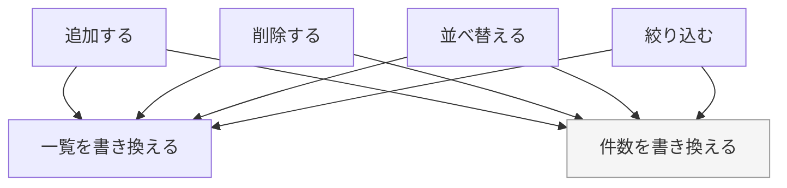
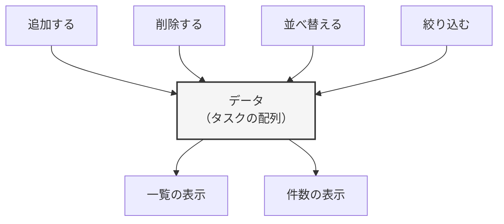
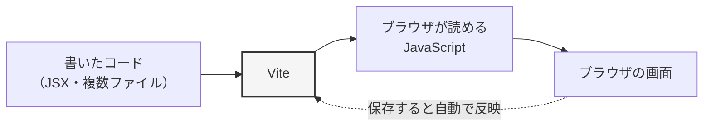
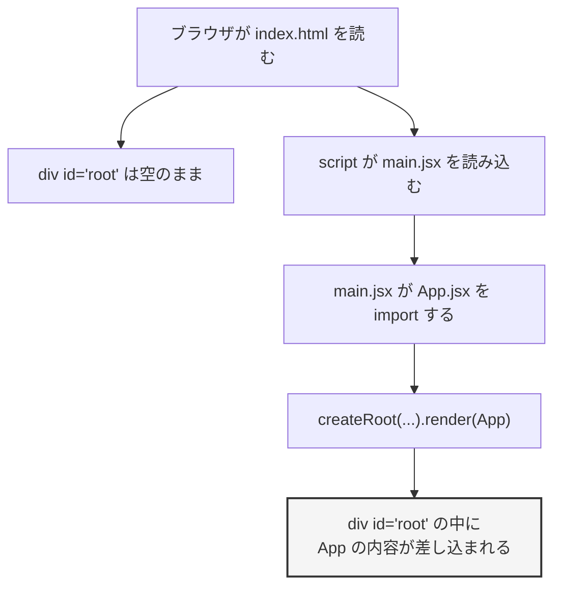
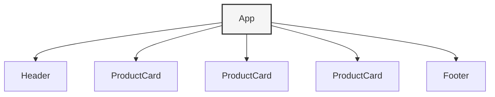

# 第6章 React をはじめる

前の章の最後（5.7.7）で、素の JavaScript だけでタスク管理の画面を作りました。
動くには動いたのですが、こんな問題がありました。

- タスクを追加したら、件数の表示を更新する処理を**呼び忘れないようにする**
- タスクを削除したときも、同じ処理を**呼び忘れないようにする**
- あとから「並べ替え」を足したら、そこでも**呼び忘れないようにする**

**「データを変えたら、関係する画面の場所をすべて自分で書き換えて回る」**——
これが、素の JavaScript で画面を作るときの根本的な大変さでした。

この章から学ぶ **React**（画面を「部品」の組み合わせで作るための JavaScript のライブラリ）は、
この問題にまったく別のやり方で答えます。
**「いまのデータはこうです」と書けば、画面のほうを React が合わせてくれる**、という考え方です。

この章では、その考え方を理解したうえで、React のプロジェクトを実際に作り、
**JSX** と**コンポーネント**という2つの基本を身につけます。

## この章で学ぶこと

- React が何を解決する道具なのかを、自分の言葉で説明できるようになる
- Vite で React のプロジェクトを作り、開発サーバーを起動できるようになる
- 作られたプロジェクトの各ファイルが何をしているか読めるようになる
- JSX を書き、JavaScript の値を画面に埋め込めるようになる
- コンポーネントを作り、ファイルに分けて組み合わせられるようになる

## この章の前提

- [第4章](./04-javascript-basics.md) の変数・条件分岐・関数が書けること
- [第5章](./05-javascript-advanced.md) のオブジェクト・`export` / `import`・DOM 操作を読んだこと
- Node.js が動くこと（[1.5.3](./01-web-and-environment.md)）
- ターミナルで `cd` と `ls` が使えること（[1.4.4](./01-web-and-environment.md)）

> **つまずいたら**
> この章の前半（6.2）は**環境構築**です。ここは、うまくいかないのが普通だと思ってください。
> エラーが出たら、それはあなたの理解力の問題ではなく、
> **パソコンの状態とツールの相性の問題**です。6.2.4 に代表的なものをまとめてありますが、
> 載っていないエラーが出たら、**コマンド全文とエラー全文**を AI に貼って解決してください。
>
> 6.3 以降で詰まったときは、**章番号・書いたコード全文・ブラウザの画面の様子**を伝えてください。

---

## 6.1 React が解決する問題

### 6.1.1 DOM 操作の何が大変だったか

第5章で作ったタスク管理の画面を思い出してください。
「タスクの一覧」と「件数の表示」という、**2つの見た目**がありました。

このとき、コードの中では次のようなことが起きていました。

```js
// タスクを追加する処理
taskList.appendChild(newItem); // 一覧を書き換える
updateCount();                 // 件数も書き換える ← 忘れやすい

// タスクを削除する処理
item.remove();                 // 一覧を書き換える
updateCount();                 // 件数も書き換える ← 忘れやすい
```

**「本当のデータ」がどこにあるか**を考えてみてください。
このコードには、「いまタスクが何件あるか」を持っている変数がありません。
**画面に表示されている `<li>` の数そのものが、データの正体**になっています。

そのため、画面を変えるときは、**関係するすべての表示を自分の手で一致させる**必要がありました。
操作の種類が増えるほど、書き換える場所の組み合わせが増えていきます。



図の矢印は、**プログラマーが自分で書かなければならない処理**です。
操作が4種類・表示が2種類なら、矢印は8本。
どれか1本を書き忘れると、**画面とデータがずれます。**

しかもこのズレは、コンソールにエラーが出ません。
「件数だけ間違っている」という形で、静かに残り続けます。

**これを、プログラミングの世界では「命令的」（めいれいてき）なやり方と呼びます。**
「まずこれをして、次にこれをして」と、**手順を1つずつ指示する**書き方です。

### 6.1.2 「状態から画面を作る」という発想

React のやり方は、まったく逆です。

**画面を書き換える手順を書くのをやめて、「いまのデータならこう表示される」という対応だけを書きます。**

言葉だけではつかみにくいので、書き方の形だけ見てください。
（この書き方は第7章で正式に学びます。いまは**雰囲気だけ**で構いません）

```jsx
// いまのデータ（タスクの配列）
// ↓
// 「このデータなら、画面はこうなる」という対応を書くだけ
<p>件数: {tasks.length}件</p>
```

`tasks` が3件なら「件数: 3件」、5件なら「件数: 5件」と表示されます。
**「追加したときに件数も直す」という処理を、どこにも書いていない**ことに注目してください。

React では、**データが変わると、そのデータを使っている表示が自動的に作り直されます。**
プログラマーが書くのは「データをどう変えるか」だけです。



矢印が減りました。
操作は**データだけ**を変えればよく、画面のほうは React が合わせます。
操作が10種類に増えても、**表示との組み合わせが爆発しません。**

このように「完成した状態はこうです」とだけ書くやり方を、**宣言的**（せんげんてき）と呼びます。

| | 命令的（素の DOM 操作） | 宣言的（React） |
|--|----------------------|----------------|
| 書くもの | 画面をどう書き換えるかの**手順** | データと画面の**対応** |
| 表示の更新 | 自分で呼ぶ | React が行う |
| 操作が増えたとき | 書き換え箇所が増える | データを変える処理だけ増える |
| 起きやすいバグ | 更新の**呼び忘れ** | （呼び忘れが起きない） |

この章では、まだデータが変わる仕組み（`useState`）は扱いません。
**「データから画面を組み立てる」という書き方そのもの**を、先に手に馴染ませます。
データが変わる話は第7章です。

> **補足**
> 「画面を React が作り直す」と聞くと、
> 「毎回ページ全体を作り直したら遅いのでは？」と思うかもしれません。
> React は、**新しい表示と前の表示を比べて、変わった部分だけを本物の画面（DOM）に反映**します。
> だから速いのですが、**この仕組みを知らなくても React は書けます。**
> いまは「React が良い感じに反映してくれる」で構いません。

### 6.1.3 React・Vue・Angular

同じ考え方の道具は、React だけではありません。
求人情報などでよく並んで出てくる3つを、簡単に比べておきます。

| 名前 | 特徴 | 日本での使われ方 |
|------|------|----------------|
| **React** | Meta（旧 Facebook）が公開。ライブラリなので、必要な機能は自分で選んで足す | 求人・情報量ともに最も多い |
| **Vue** | 個人発のプロジェクトから始まった。HTML に近い書き方で、学習の入口がゆるやか | 日本語の情報が比較的多い |
| **Angular** | Google が公開。フレームワークとして、必要なものが最初から一式そろっている | 大規模な業務システムで使われることがある |

**ライブラリ**（他の人が作った、便利な機能のまとまり。自分のプログラムから呼び出して使う）と
**フレームワーク**（アプリの土台となる、大きな作りかけの構造。決められた場所に自分のコードを入れて完成させる）
の違いは、**主導権がどちらにあるか**です。
ライブラリは自分のコードから呼び出し、フレームワークは自分のコードが呼び出されます。

**このテキストでは React を使います。** 理由は3つです。

1. 日本語・英語ともに情報が多く、**詰まったときに答えが見つかりやすい**
2. AI に質問したときの回答の精度が高い（学習データが多いため）
3. この先の4冊（Python / FastAPI / Docker / MySQL）と組み合わせた実例が豊富

> **補足**
> 3つとも「データから画面を作る」という発想は同じです。
> どれか1つをしっかり身につければ、他へ移るのはそれほど大変ではありません。
> **いま比較で迷う時間は、React を書く時間に使ってください。**

---

## 6.2 Vite でプロジェクトを作る

### 6.2.1 Vite とは

第2章から第5章までは、`index.html` をブラウザで直接開いて確認していました。
React ではそれができません。理由は2つあります。

**理由1：React の書き方を、ブラウザはそのまま読めない**

React では、次のような書き方をします。

```jsx
const element = <h1>こんにちは</h1>;
```

JavaScript の中に、いきなり HTML のようなものが出てきています。
これは **JSX**（JavaScript の中に HTML のような書き方を混ぜられる記法）というもので、
**ブラウザはこの書き方を理解できません。**
実行する前に、普通の JavaScript へ**変換**する必要があります。

**理由2：ライブラリを組み合わせるので、まとめる作業が必要**

React 本体だけでなく、この先いくつものライブラリを組み合わせて使います。
それらを**ブラウザが読める形にまとめる**作業（**ビルド**）が必要です。

この2つを引き受けてくれるのが **Vite**（ヴィート。React のプロジェクトを作り、開発中の自動反映やビルドを行う道具）です。



Vite がやってくれることは、大きく3つです。

| 役割 | 内容 |
|------|------|
| プロジェクトの雛形作り | React 用のファイル一式を自動で作る |
| 開発サーバー | `http://localhost:5173/` で表示し、**保存すると自動でブラウザに反映**する |
| ビルド | 公開用に、まとめて最適化したファイルを書き出す（第11章で扱います） |

「保存すると自動で反映される」のは、地味に見えて非常に大きな差です。
第2章から第5章まで、変更のたびにブラウザの再読み込みボタンを押していましたが、
**その操作がなくなります。**

### 6.2.2 プロジェクトを作成する

第1章で作った作業用ディレクトリ `react-lesson` の中に、React のプロジェクトを作ります。

**手順1：`react-lesson` に移動する**

ターミナルを開き、`react-lesson` へ移動します（1.4.4）。

**Windows（PowerShell）**

```powershell
cd $HOME\Desktop\react-lesson
```

**macOS / Linux**

```bash
cd ~/Desktop/react-lesson
```

いまどこにいるか、必ず確認してください。

**Windows（PowerShell）**

```powershell
pwd
```

**macOS / Linux**

```bash
pwd
```

```text
実行結果の例:
/Users/yamada/Desktop/react-lesson
```

`react-lesson` で終わっていれば大丈夫です。

**手順2：プロジェクトを作る**

次のコマンドを実行します。**長いので、コピーして貼り付けてください。**

**Windows（PowerShell）**

```powershell
npm create vite@latest my-first-react -- --template react
```

**macOS / Linux**

```bash
npm create vite@latest my-first-react -- --template react
```

初回は「`create-vite` をインストールしてよいか」と聞かれることがあります。
その場合は `y` を入力して Enter を押してください。

```text
実行結果の例:
Need to install the following packages:
create-vite@7.1.1
Ok to proceed? (y) y

Scaffolding project in /Users/yamada/Desktop/react-lesson/my-first-react...

Done. Now run:

  cd my-first-react
  npm install
  npm run dev
```

**コマンドの意味**

| 部分 | 意味 |
|------|------|
| `npm create vite@latest` | Vite のプロジェクト作成ツールを、最新版で実行する |
| `my-first-react` | 作るプロジェクトの名前（＝作られるディレクトリ名） |
| `--` | 「ここから先は、`npm` ではなく Vite への指示です」という区切り |
| `--template react` | React 用の雛形を使う |

> **よくある間違い**
> `--` を1つにしたり、抜かしたりすると `--template react` が Vite に届かず、
> **フレームワークを選ぶ質問が表示されます。**
> その場合は落ち着いて、矢印キーで `React` を選んで Enter、
> 続けて `JavaScript` を選んで Enter を押してください（結果は同じものが作られます）。
>
> なお、変種（variant）の選択肢に `TypeScript` もありますが、
> **このテキストでは `JavaScript` を選びます。**（TypeScript は第11章で紹介します）

**手順3：プロジェクトの中に入って、ライブラリをインストールする**

**Windows（PowerShell）**

```powershell
cd my-first-react
npm install
```

**macOS / Linux**

```bash
cd my-first-react
npm install
```

```text
実行結果の例:
added 191 packages, and audited 192 packages in 12s

43 packages are looking for funding
  run `npm fund` for details

found 0 vulnerabilities
```

数字は違って構いません。**`added ○○ packages` と出れば成功**です。

このコマンドは、React 本体などの**依存関係**（そのプログラムを動かすために必要な、他の人が作った部品）を、
インターネットからダウンロードしてきます。回線によっては1〜2分かかります。

> **注意**
> `npm install` は、**`my-first-react` の中で**実行してください。
> `react-lesson` の中で実行してしまうと、必要な場所に入りません。
> 実行前に `pwd` で現在地を確認する習慣をつけてください。

> **補足：`audited` や `funding` の行は気にしなくてよい**
> 「寄付を募集しています」「脆弱性を調べました」というお知らせです。
> `found 0 vulnerabilities` なら問題ありません。
> `found 2 moderate severity vulnerabilities` のような表示が出ることもありますが、
> **学習用のプロジェクトでは、そのまま進めて構いません。**

### 6.2.3 開発サーバーを起動する

**手順1：起動する**

`my-first-react` の中にいることを確認して、次を実行します。

**Windows（PowerShell）**

```powershell
npm run dev
```

**macOS / Linux**

```bash
npm run dev
```

```text
実行結果の例:
  VITE v7.1.2  ready in 384 ms

  ➜  Local:   http://localhost:5173/
  ➜  Network: use --host to expose
  ➜  press h + enter to show help
```

**手順2：ブラウザで開く**

表示された `http://localhost:5173/` をブラウザのアドレス欄に入力して開きます。
（多くのターミナルでは、Ctrl キー（macOS は Command キー）を押しながらリンクをクリックしても開けます）

**localhost**（自分のパソコン自身を指す名前）と
**ポート**（1台のコンピュータの中で、どのプログラムに繋ぐかを表す番号）は 1.2.3 で学びました。
`5173` は Vite が標準で使うポート番号です。

Vite と React のロゴが並び、`count is 0` と書かれたボタンのあるページが表示されれば成功です。

> **注意：このターミナルは閉じない**
> `npm run dev` を実行したターミナルは、**開発サーバーが動いている間ずっと動きっぱなし**になります。
> プロンプト（入力待ちの `>` や `$`）が戻ってこないのは、故障ではありません。
>
> **別のコマンドを打ちたくなったら、ターミナルをもう1つ開いてください。**
> VS Code のターミナルなら、右上の `+` ボタンで増やせます。

**手順3：自動で反映されることを確かめる**

VS Code で `my-first-react` ディレクトリを開きます。

- **Windows / macOS 共通**：VS Code のメニューから「ファイル」→「フォルダーを開く」で `my-first-react` を選ぶ

`src/App.jsx` を開き、次の行を探します。

```jsx
<h1>Vite + React</h1>
```

これを次のように書き換えて、**保存**（Windows は Ctrl+S、macOS は Command+S）してください。

```jsx
<h1>はじめての React</h1>
```

ブラウザを見てください。**再読み込みしていないのに、表示が変わっています。**

これが Vite の**自動反映**です。
第2章から第5章まで手で押していた再読み込みが、もう不要になりました。

**手順4：止め方を覚える**

開発サーバーを止めるには、そのターミナルで **Ctrl + C** を押します（macOS も Ctrl です。Command ではありません）。

```text
実行結果の例:
^C
PS C:\Users\yamada\Desktop\react-lesson\my-first-react>
```

プロンプトが戻ってきたら停止できています。
もう一度動かしたいときは、`npm run dev` を実行し直します。

> **補足**
> このあとの作業は、**開発サーバーを起動したまま**進めてください。
> 保存するたびにブラウザで結果を確認できます。

### 6.2.4 よくあるエラーと対処

**この項は、詰まったときに戻ってくる場所です。** 順に読む必要はありません。

**エラー1：Node.js のバージョンが古い**

```text
You are using Node.js 22.11.0. Vite requires Node.js version 20.19+ or 22.12+.
Please upgrade your Node.js version.
```

似た形で、次のように出ることもあります。

```text
TypeError: crypto.hash is not a function
```

**意味**：Vite が要求するバージョンより、入っている Node.js が古い。

**対処**：Node.js を入れ直します。

1. https://nodejs.org/ を開く
2. **LTS** と書かれたほうをダウンロードしてインストールする（1.5.2 と同じ手順）
3. **開いているターミナルをすべて閉じて、開き直す**
4. `node --version` で、番号が上がっていることを確認する

```text
実行結果の例:
v22.20.0
```

> **注意**
> 手順3を飛ばすと、**インストールしたのに古いままに見えます。**
> ターミナルは、開いた時点の設定を持ち続けるためです（1.5.2 の注意と同じ理由）。

**エラー2：`npm` というコマンドが見つからない**

```text
npm : 用語 'npm' は、コマンドレット、関数、スクリプト ファイル、
または操作可能なプログラムの名前として認識されません。
```

```text
zsh: command not found: npm
```

**意味**：Node.js がインストールされていないか、**PATH**（ターミナルがコマンドを探しに行く場所の一覧）に登録されていない。

**対処**：1.5.3 の動作確認からやり直してください。
`node --version` も同じエラーになるなら、Node.js のインストールから見直します。
それでも解決しない場合は、**あなたのせいではありません。** OS とエラー全文を AI に貼ってください。

**エラー3：PowerShell でスクリプトが実行できない（Windows）**

```text
npm : このシステムではスクリプトの実行が無効になっているため、
ファイル C:\Program Files\nodejs\npm.ps1 を読み込むことができません。
```

**意味**：Windows のセキュリティ設定が、スクリプトの実行をブロックしている。

**対処**：PowerShell で次を実行し、確認を求められたら `Y` を入力して Enter。

```powershell
Set-ExecutionPolicy -Scope CurrentUser RemoteSigned
```

そのあと、失敗したコマンドをもう一度実行します。

**エラー4：ポート 5173 がすでに使われている**

```text
Port 5173 is in use, trying another one...

  ➜  Local:   http://localhost:5174/
```

**意味**：別の `npm run dev` が、まだどこかで動いている。

**対処**：エラーではないので、**表示された新しい番号（この例では 5174）で開けば動きます。**
ただし、前のサーバーが動きっぱなしなのは無駄なので、
古いほうのターミナルを見つけて Ctrl + C で止めてください。
見つからない場合は、**パソコンを再起動すれば確実に止まります。**

**エラー5：`Missing script: "dev"`**

```text
npm error Missing script: "dev"
```

**意味**：`npm run dev` を、**プロジェクトの外**で実行している。

**対処**：現在地を確認します。

```powershell
pwd
```

`my-first-react` で終わっていなければ、移動してください。

```powershell
cd my-first-react
```

「どこにいるかわからなくなった」ときは、`ls` で中身を見ます（1.4.4）。
`package.json` が見えていれば、そこが正しい場所です。

**エラー6：`npm install` が途中で止まる・失敗する**

```text
npm error code ETIMEDOUT
npm error network request to https://registry.npmjs.org/... failed
```

**意味**：インターネットに繋がっていないか、会社・学校のネットワークが通信を制限している。

**対処**：

1. ブラウザで普通に Web が見られるか確認する
2. 見られるのに失敗する場合、**プロキシ**（社内から外部への通信を中継する仕組み）が原因のことが多い
3. その環境の設定値が必要になるため、**エラー全文と「会社（学校）のネットワークです」を添えて AI に相談してください**

**エラー7：日本語やスペースを含むパスで動かない**

`C:\Users\山田 太郎\デスクトップ\react-lesson` のように、
**日本語やスペースを含む場所**では、まれにツールが誤動作します。

**対処**：`C:\dev\react-lesson` のように、**半角英数字だけのパス**に作り直すのが確実です。

**Windows（PowerShell）**

```powershell
mkdir C:\dev
cd C:\dev
```

**macOS / Linux**

```bash
mkdir -p ~/dev
cd ~/dev
```

そのうえで、6.2.2 のプロジェクト作成からやり直してください。

> **つまずいたら**
> ここに載っていないエラーが出たら、次の形で AI に貼ってください。
>
> ```text
> react-text の 6.2.3 で詰まりました。
>
> 【実行したコマンド】
> npm run dev
>
> 【出たエラー（全文）】
> （ここにコピー）
>
> 【環境】
> OS: Windows 11
> node --version の結果: v22.20.0
> ```

---

## 6.3 プロジェクトの中身を読む

### 6.3.1 ディレクトリ構成

`npm create vite` は、たくさんのファイルを一度に作ります。
**すべてを理解する必要はありません。** まずは全体を眺めてください。

VS Code の左側のエクスプローラー（ファイル一覧）で、`my-first-react` を開くと次のようになっています。

```text
my-first-react/
├── node_modules/          ← インストールされたライブラリ（自分では触らない）
├── public/                ← そのまま公開されるファイル置き場
│   └── vite.svg
├── src/                   ← ★自分が書くコードを置く場所
│   ├── assets/            ← 画像などの置き場
│   │   └── react.svg
│   ├── App.css
│   ├── App.jsx            ← ★画面の中身
│   ├── index.css
│   └── main.jsx           ← ★React を起動する入口
├── .gitignore
├── eslint.config.js
├── index.html             ← ★土台になる HTML
├── package-lock.json
├── package.json           ← ★プロジェクトの設定
└── README.md
```

**★の5つだけ**、この章で読めるようになれば十分です。

| ファイル・ディレクトリ | 役割 | この章で扱うか |
|---------------------|------|--------------|
| `src/` | **自分が書くコードはすべてここに置く** | ○ |
| `src/main.jsx` | React を起動して、`index.html` に画面を差し込む | ○（6.3.2） |
| `src/App.jsx` | 画面の中身。ここを書き換えていく | ○（6.3.3） |
| `index.html` | 土台になる HTML。**1枚だけ**ある | ○（6.3.2） |
| `package.json` | ライブラリの一覧と、実行できるコマンドの一覧 | ○（6.3.4） |
| `public/` | 画像などを、変換せずそのまま置きたいときの場所 | △（6.4.4 で少し） |
| `node_modules/` | ダウンロードされたライブラリの本体 | ○（6.3.4） |
| `eslint.config.js` | 書き方のミスを自動で指摘する道具の設定 | ×（このテキストでは触りません） |
| `.gitignore` | Git で記録しないファイルの一覧 | ×（第11章で扱います） |

> **注意：`node_modules` は開かない**
> `node_modules` の中には、数万個のファイルが入っています。
> VS Code で展開すると重くなるだけで、**得るものはありません。** 開かないでください。

### 6.3.2 `index.html` と `main.jsx`

**`index.html` を見る**

`my-first-react/index.html` を開いてください。

`index.html`

```html
<!doctype html>
<html lang="en">
  <head>
    <meta charset="UTF-8" />
    <link rel="icon" type="image/svg+xml" href="/vite.svg" />
    <meta name="viewport" content="width=device-width, initial-scale=1.0" />
    <title>Vite + React</title>
  </head>
  <body>
    <div id="root"></div>
    <script type="module" src="/src/main.jsx"></script>
  </body>
</html>
```

第2章で学んだ HTML そのものです。ただし、**`<body>` の中がほぼ空**なことに注目してください。

- `<div id="root"></div>` ——— **中身が空の箱**。ここに React が画面を差し込みます
- `<script type="module" src="/src/main.jsx"></script>` ——— `main.jsx` を読み込む

`type="module"` は 5.6.4 で学びました。`import` / `export` を使うために必要な指定です。

**つまり、画面に見えているものは、HTML には1文字も書かれていません。**
すべて JavaScript（React）が作っています。

**`src/main.jsx` を見る**

`src/main.jsx`

```jsx
import { StrictMode } from 'react'
import { createRoot } from 'react-dom/client'
import './index.css'
import App from './App.jsx'

createRoot(document.getElementById('root')).render(
  <StrictMode>
    <App />
  </StrictMode>,
)
```

1行ずつ見ていきます。

| 行 | 意味 |
|----|------|
| `import { StrictMode } from 'react'` | React 本体から `StrictMode` を読み込む（名前付き import。5.6.2） |
| `import { createRoot } from 'react-dom/client'` | 画面に差し込むための関数 `createRoot` を読み込む |
| `import './index.css'` | CSS を読み込む（6.3.5 で説明します） |
| `import App from './App.jsx'` | 自分で書いた `App` を読み込む（デフォルト import。5.6.3） |
| `document.getElementById('root')` | `index.html` の `<div id="root">` を取ってくる（5.7.2 の DOM 操作） |
| `createRoot(...)` | 「この箱を React の担当にします」と登録する |
| `.render(...)` | 中身を実際に描画する |

**`from 'react'` のように `./` が付いていない import は、`node_modules` から探されます**（5.6.2 では自分のファイルだけを読み込みました）。
`./App.jsx` のように `./` で始まるものは、**自分が書いたファイル**です。

**`<StrictMode>` とは**

**開発中だけ**、React が余計なチェックを行って問題を見つけやすくするための囲みです。
公開用にビルドすると、何もしなくなります。

**いまは「付いているもの」と思って、そのままにしてください。**
これが効いてくる場面は第8章で説明します。

**読み込みの流れ**

ブラウザで `http://localhost:5173/` を開いたとき、何が起きているかを図にすると次のようになります。



**この章で `main.jsx` を書き換えることはありません。** 「そういう入口がある」とだけ覚えてください。

> **確かめてみる**
> ブラウザで開発者ツール（1.6.4）を開き、「要素」タブを見てください。
> `<div id="root">` の中に、`index.html` には書かれていないはずの `<h1>` などが入っています。
> **React が差し込んだもの**です。

### 6.3.3 `App.jsx`

`src/App.jsx` が、**この先ずっと書き換えていくファイル**です。
最初は次のようになっています（6.2.3 で `<h1>` だけ書き換えた状態です）。

`src/App.jsx`

```jsx
import { useState } from 'react'
import reactLogo from './assets/react.svg'
import viteLogo from '/vite.svg'
import './App.css'

function App() {
  const [count, setCount] = useState(0)

  return (
    <>
      <div>
        <a href="https://vite.dev" target="_blank">
          
        </a>
        <a href="https://react.dev" target="_blank">
          
        </a>
      </div>
      <h1>はじめての React</h1>
      <div className="card">
        <button onClick={() => setCount((count) => count + 1)}>
          count is {count}
        </button>
        <p>
          Edit <code>src/App.jsx</code> and save to test HMR
        </p>
      </div>
      <p className="read-the-docs">
        Click on the Vite and React logos to learn more
      </p>
    </>
  )
}

export default App
```

**いま読める部分だけ**を確認します。

- `function App() { ... }` ——— ただの関数です（4.6.1）
- `return ( ... )` ——— 戻り値として、HTML のようなものを返しています（4.6.2）
- `export default App` ——— この関数を、他のファイルから使えるようにしている（5.6.3）

**つまり `App` は、「画面の見た目を戻り値として返す関数」です。**
これが React のいちばん基本の形です。

**まだ読めない部分**

| 書き方 | 説明する場所 |
|--------|------------|
| `const [count, setCount] = useState(0)` | **第7章**（変化する値を持つ仕組み） |
| `onClick={() => setCount(...)}` | **第7章**（クリックされたときの処理） |
| `<>` と `</>` | 6.4.5（フラグメント） |
| `className` | 6.4.2（`class` ではない理由） |
| `{count}` の波かっこ | 6.4.3（値の埋め込み） |

**「いま読めないもの」があるのは、あなたの理解不足ではありません。**
第7章まで進めば、この10行はすべて読めるようになります。

**中身を全部消して、最小の状態から始める**

このまま Vite のロゴが並んでいると邪魔なので、**中身を書き換えます。**

`src/App.jsx` の**全体**を、次の内容に書き換えてください（すべて選択して貼り替えます）。

`src/App.jsx`

```jsx
import './App.css'

function App() {
  return (
    <div className="app">
      <h1>はじめての React</h1>
      <p>ここから作っていきます。</p>
    </div>
  )
}

export default App
```

保存すると、ブラウザの表示が切り替わります。

```text
表示される内容:
はじめての React
ここから作っていきます。
```

これで、**自分が書いたものだけ**が画面に出ている状態になりました。

> **よくある間違い**
> `import { useState } from 'react'` の行を消し忘れると、
> ブラウザに次の警告が出ることがあります。
>
> ```text
> 'useState' is defined but never used.
> ```
>
> 「読み込んだのに使っていない」という指摘です。動きはしますが、**使わない import は消しておきましょう。**
> 上のコードのとおりに貼り替えていれば、この行は残りません。

### 6.3.4 `package.json` と `node_modules`

**`package.json` を見る**

`my-first-react/package.json` を開いてください。

`package.json`

```json
{
  "name": "my-first-react",
  "private": true,
  "version": "0.0.0",
  "type": "module",
  "scripts": {
    "dev": "vite",
    "build": "vite build",
    "lint": "eslint .",
    "preview": "vite preview"
  },
  "dependencies": {
    "react": "^19.1.1",
    "react-dom": "^19.1.1"
  },
  "devDependencies": {
    "@vitejs/plugin-react": "^5.0.0",
    "eslint": "^9.33.0",
    "vite": "^7.1.2"
  }
}
```

> **注意**
> 実際のファイルには、`devDependencies` にもう少し多くの行が並んでいます。
> ここでは説明に必要なものだけを抜き出しています。**バージョン番号も違って構いません。**

**このファイルは、プロジェクトの「持ち物リスト」です。**

| 項目 | 意味 |
|------|------|
| `name` / `version` | プロジェクトの名前とバージョン |
| `type: "module"` | `import` / `export` を使う形式で書く、という指定（5.6.4） |
| `scripts` | `npm run ○○` で実行できるコマンドの一覧 |
| `dependencies` | **完成したアプリを動かすのに必要**なライブラリ |
| `devDependencies` | **開発中だけ必要**なライブラリ（Vite など） |

**`scripts` の意味**

`npm run dev` を実行したとき、実際には `scripts` の `dev` に書かれた `vite` が実行されています。

| コマンド | 実行されるもの | 何をするか |
|---------|--------------|----------|
| `npm run dev` | `vite` | 開発サーバーを起動する |
| `npm run build` | `vite build` | 公開用のファイルを書き出す（第11章） |
| `npm run preview` | `vite preview` | 書き出したものを確認する（第11章） |
| `npm run lint` | `eslint .` | 書き方のミスを自動で探す |

**`^19.1.1` の `^` は何か**

`^`（キャレット）は、「この番号以上で、**左端の数字が変わらない範囲**なら新しくてよい」という意味です。

- `^19.1.1` → `19.1.5` や `19.4.0` は OK、`20.0.0` は NG

左端の数字は、**大きく作りが変わったときに上がります**（1.5.2 でバージョンの話をしました）。
つまり `^` は「壊れない範囲で新しくしてよい」という指定です。

**`node_modules` とは**

`dependencies` と `devDependencies` に書かれたライブラリの**本体**が入っている場所です。
`npm install` を実行したとき、ここにダウンロードされました。

**このディレクトリの中身は、自分では絶対に編集しません。**
消してしまっても、`npm install` を実行し直せば元どおりになります。

> **補足：なぜ `package-lock.json` があるのか**
> `package.json` の `^19.1.1` は幅のある指定なので、
> インストールする時期によって入るバージョンが変わります。
> `package-lock.json` には、**実際に入れた正確なバージョン**が記録されています。
>
> 「自分のパソコンでは動くのに、他の人のパソコンでは動かない」を防ぐためのファイルです。
> **自分で編集する必要はありません。**

### 6.3.5 CSS の置き場所

React のプロジェクトでも、CSS の書き方そのものは第3章と同じです。
違うのは、**HTML の `<link>` ではなく、JavaScript の `import` で読み込む**という点です。

雛形には CSS が2つあります。

| ファイル | 読み込んでいる場所 | 想定される用途 |
|---------|-----------------|--------------|
| `src/index.css` | `src/main.jsx` | ページ全体に効かせたい共通のスタイル |
| `src/App.css` | `src/App.jsx` | `App` に関係するスタイル |

**注意：どちらに書いても、効き方は同じです。**

`import './App.css'` と書いても、
「そのファイルの中だけに効く CSS」にはなりません。
**読み込まれた CSS は、すべてページ全体に効きます**（3.2 のセレクタのルールがそのまま働きます）。

ファイルを分けているのは、**人間が探しやすくするため**だと考えてください。

**中身を書き換える**

雛形の CSS には、中央寄せや暗い背景色などが最初から書かれています。
これから書くものと混ざると原因がわかりにくくなるので、**2つとも中身を入れ替えます。**

`src/index.css`（全体を次の内容に置き換える）

```css
body {
  margin: 0;
  font-family: sans-serif;
  background-color: #ffffff;
  color: #222222;
  line-height: 1.7;
}
```

`src/App.css`（全体を次の内容に置き換える）

```css
.app {
  max-width: 720px;
  margin: 0 auto;
  padding: 24px;
}
```

保存すると、ブラウザの表示が**左右中央に寄った、白背景の読みやすい形**に変わります。

`className="app"` を付けた `<div>` に、`.app` のスタイルが当たっています（6.3.3 で書いた `App.jsx` を見返してください）。

> **よくある間違い**
> CSS を書き換えても表示が変わらないときは、**`import './App.css'` の行が残っているか**を確認してください。
> React では `<link>` ではなく `import` で読み込むため、
> この行を消すと CSS がまるごと効かなくなります。

---

## 6.4 JSX

### 6.4.1 JSX とは

もう一度 `App.jsx` を見てください。

`src/App.jsx`

```jsx
import './App.css'

function App() {
  return (
    <div className="app">
      <h1>はじめての React</h1>
      <p>ここから作っていきます。</p>
    </div>
  )
}

export default App
```

**JavaScript のファイルなのに、`return` の中に HTML のようなものが書いてあります。**

これが **JSX**（JavaScript の中に HTML のような書き方を混ぜられる記法）です。
ファイルの拡張子が `.js` ではなく **`.jsx`** なのは、この記法を使っているからです。

**なぜこんな書き方をするのか**

第5章の DOM 操作を思い出してください。1つの見出しを作るだけで、こうでした（5.7.6）。

```js
const title = document.createElement("h1");
title.textContent = "はじめての React";
document.querySelector("#root").appendChild(title);
```

JSX なら1行です。

```jsx
<h1>はじめての React</h1>
```

**「どんな見た目になるか」が、そのまま目で見てわかる**——これが JSX の狙いです。

**ブラウザはこれを読めない**

6.2.1 で説明したとおり、ブラウザは JSX を理解できません。
**Vite が、実行前に普通の JavaScript へ変換しています。**

> **補足：変換されると何になるのか**
> `<h1>はじめての React</h1>` は、おおよそ次のような関数の呼び出しに変換されます。
>
> ```js
> React.createElement("h1", null, "はじめての React");
> ```
>
> **つまり JSX は、関数呼び出しの見た目を良くしたものです。**
> この変換結果を自分で書くことはありませんが、
> 「JSX は魔法ではなく、ただの JavaScript に変わる」と知っておくと、
> このあとの規則（6.4.2）が理解しやすくなります。

### 6.4.2 HTML との違い

JSX は HTML に似ていますが、**同じではありません。** 違いは5つあります。

**違い1：返せるのは1つの要素だけ**

`return` の中に、要素を横並びで2つ置くことはできません。

```jsx
// これはエラーになる
function App() {
  return (
    <h1>タイトル</h1>
    <p>本文</p>
  )
}
```

```text
出るエラー:
Adjacent JSX elements must be wrapped in an enclosing tag.
（隣り合った JSX 要素は、1つのタグで囲む必要があります）
```

**理由**：6.4.1 の補足のとおり、JSX は関数呼び出しに変換されます。
関数の戻り値は1つだけなので（4.6.2）、**返すものも1つでなければなりません。**

**対処**：`<div>` などで全体を囲みます。

```jsx
function App() {
  return (
    <div>
      <h1>タイトル</h1>
      <p>本文</p>
    </div>
  )
}
```

余計な `<div>` を増やしたくない場合の書き方は、6.4.5 で説明します。

> **よくある間違い**
> `return` のあとにすぐ改行して書くと、**何も表示されません。**
>
> ```jsx
> // 何も表示されない
> return
>   <h1>タイトル</h1>
> ```
>
> JavaScript は `return` だけの行を「戻り値なしで終わり」と解釈します（4.6.2）。
> **`return (` と書いて、丸かっこで囲む**のが安全です。

**違い2：`class` ではなく `className`**

HTML では `class` 属性でしたが（2.3.5）、JSX では **`className`** と書きます。

```jsx
<div className="app">
```

**理由**：`class` は JavaScript が別の意味で使っている単語のため、そのままでは使えません。

> **よくある間違い**
> `class` と書いても**エラーで止まりません。** 代わりに、ブラウザのコンソールに警告が出ます。
>
> ```text
> Warning: Invalid DOM property `class`. Did you mean `className`?
> ```
>
> そして、**CSS がまったく効きません。**
> 「CSS が効かない」と思ったら、まず `className` になっているか確認してください（3.7 と同じ調べ方です）。

**違い3：閉じタグを必ず書く**

HTML では `<br>` や `` のように、閉じないタグがありました（2.2.2、2.3.3）。
**JSX では、必ず閉じる必要があります。**

```jsx
<br />

<input type="text" />
```

タグの最後に **` />`**（スペース + スラッシュ + 大なり）を付けます。

```text
出るエラー（閉じ忘れたとき）:
Expected corresponding JSX closing tag for .
```

**違い4：属性名はキャメルケース**

複数の単語からなる属性名は、**2語目以降の先頭を大文字**にします。
この書き方を**キャメルケース**と呼びます。
変数名の付け方（4.2.3）で学んだものと同じ規則です。

| HTML | JSX |
|------|-----|
| `class` | `className` |
| `for`（`<label>` の属性） | `htmlFor` |
| `tabindex` | `tabIndex` |
| `maxlength` | `maxLength` |
| `onclick` | `onClick`（第7章で扱います） |

**違い5：コメントの書き方**

HTML のコメント `<!-- -->` は、JSX の中では使えません。

```jsx
<div className="app">
  {/* これが JSX の中のコメント */}
  <h1>はじめての React</h1>
</div>
```

**`{/*` で始めて `*/}` で閉じます。**
波かっこの意味は、次の 6.4.3 で説明します。

### 6.4.3 波かっこで値を埋め込む

JSX の中に **`{ }`（波かっこ）** を書くと、そこに **JavaScript の値**を埋め込めます。

**変数を表示する**

`src/App.jsx` を次のように書き換えてください。

`src/App.jsx`

```jsx
import './App.css'

function App() {
  const name = 'たろう'
  const age = 20

  return (
    <div className="app">
      <h1>はじめての React</h1>
      <p>名前は {name} です。</p>
      <p>年齢は {age} 歳です。</p>
    </div>
  )
}

export default App
```

保存すると、ブラウザの表示が次のようになります。

```text
表示される内容:
はじめての React
名前は たろう です。
年齢は 20 歳です。
```

**`return` より前の部分は、ただの JavaScript です。**
第4章で書いてきた変数宣言が、そのまま使えます。

**式も書ける**

波かっこの中には、変数だけでなく**計算式**も書けます。

```jsx
import './App.css'

function App() {
  const price = 1200
  const count = 3

  return (
    <div className="app">
      <h1>お会計</h1>
      <p>単価 {price} 円 × {count} 個</p>
      <p>合計 {price * count} 円</p>
      <p>税込 {Math.floor(price * count * 1.1)} 円</p>
    </div>
  )
}

export default App
```

```text
表示される内容:
お会計
単価 1200 円 × 3 個
合計 3600 円
税込 3960 円
```

`Math.floor`（4.3.2）のような**関数の呼び出し**も書けます。

**書けるのは「値になるもの」だけ**

波かっこの中に書けるのは、**最終的に1つの値になるもの**です。
これを **式**（しき）と呼びます。

| 書けるもの（式） | 例 |
|----------------|-----|
| 変数 | `{name}` |
| 計算 | `{price * count}` |
| 関数の呼び出し | `{Math.floor(3.7)}` |
| 文字列の結合 | `{'こんにちは、' + name}` |
| テンプレートリテラル（4.3.3） | `` {`${name}さん`} `` |
| 比較の結果 | `{age >= 20}` |
| 三項演算子（4.4.4） | `{age >= 20 ? '成人' : '未成年'}` |

| 書けないもの（文） | 理由 |
|------------------|------|
| `if (...) { ... }` | 値にならないため |
| `for (...) { ... }` | 値にならないため |
| `const x = 1` | 値にならないため |

**条件によって表示を変えたいときは、`if` ではなく三項演算子**を使います（4.4.4）。

```jsx
import './App.css'

function App() {
  const age = 20
  const score = 85

  return (
    <div className="app">
      <h1>判定結果</h1>
      <p>{age >= 20 ? '成人です' : '未成年です'}</p>
      <p>点数: {score} 点（{score >= 60 ? '合格' : '不合格'}）</p>
    </div>
  )
}

export default App
```

```text
表示される内容:
判定結果
成人です
点数: 85 点（合格）
```

`age` の値を `15` に書き換えて保存し、表示が変わることを確かめてください。

**表示されない値がある**

波かっこに入れた値が、そのまま文字になるとは限りません。

| 値 | 画面での表示 |
|----|------------|
| 文字列 `'たろう'` | たろう |
| 数値 `20` | 20 |
| `true` / `false` | **何も表示されない** |
| `null` / `undefined` | **何も表示されない** |
| 配列 `[1, 2, 3]` | 123（区切りなしで連結される） |
| オブジェクト `{ name: 'たろう' }` | **エラーになる** |

> **よくある間違い**
> オブジェクト（5.2.1）をそのまま波かっこに入れると、次のエラーが出て画面が真っ白になります。
>
> ```jsx
> const user = { name: 'たろう', age: 20 }
> // これはエラー
> <p>{user}</p>
> ```
>
> ```text
> 出るエラー:
> Objects are not valid as a React child
> （オブジェクトは React の子要素として使えません）
> ```
>
> **オブジェクトそのものではなく、中のプロパティを指定してください**（5.2.2）。
>
> ```jsx
> <p>{user.name}（{user.age}歳）</p>
> ```
>
> このエラーは、この先とてもよく遭遇します。
> 出たら「オブジェクトを丸ごと表示しようとした」と思い出してください。

### 6.4.4 属性に値を渡す

波かっこは、**タグの属性**にも使えます。

**文字列をそのまま渡すときは `" "`**

```jsx
<div className="app">

```

**変数や式を渡すときは `{ }`**

```jsx
import './App.css'

function App() {
  const logoUrl = '/vite.svg'
  const logoSize = 80
  const isImportant = true

  return (
    <div className="app">
      <h1>属性に値を渡す</h1>
      
      <p className={isImportant ? 'important' : 'normal'}>
        クラス名も切り替えられます
      </p>
    </div>
  )
}

export default App
```

`src/App.css` に、次を**追記**してください。

`src/App.css`

```css
.app {
  max-width: 720px;
  margin: 0 auto;
  padding: 24px;
}

.important {
  color: #c0392b;
  font-weight: bold;
}

.normal {
  color: #555555;
}
```

```text
表示される内容:
属性に値を渡す
（Vite のロゴが幅80pxで表示される）
クラス名も切り替えられます  ← 赤い太字
```

`isImportant` を `false` に変えて保存すると、文字色がグレーに変わります。

> **補足：`/vite.svg` の `/` は何か**
> `public/` ディレクトリ（6.3.1）に置いたファイルは、
> **`/ファイル名` で参照できます。**
> `public/vite.svg` なら `/vite.svg` です。
> 第2章で学んだ相対パス（2.3.4）とは書き方が違うので注意してください。

**`style` 属性は波かっこが2重になる**

CSS を JSX の中で直接書くこともできます。ただし、**書き方が HTML とかなり違います。**

```jsx
<p style={{ color: 'red', fontSize: '20px' }}>赤い文字</p>
```

波かっこが2つ重なっているのは、**別々の意味**を持っているからです。

| 位置 | 意味 |
|------|------|
| 外側の `{ }` | 「ここに JavaScript の値を書きます」という印（6.4.3） |
| 内側の `{ }` | **オブジェクト**そのもの（5.2.1） |

つまり `style` には、**オブジェクトを渡している**のです。

```jsx
// 分けて書くと、こう
const myStyle = { color: 'red', fontSize: '20px' }

<p style={myStyle}>赤い文字</p>
```

**プロパティ名の書き方も変わります。**

| CSS（第3章） | JSX の `style` |
|-------------|---------------|
| `color: red;` | `color: 'red'` |
| `font-size: 20px;` | `fontSize: '20px'` |
| `background-color: #eee;` | `backgroundColor: '#eee'` |
| `margin-top: 8px;` | `marginTop: '8px'` |

**ハイフンをなくして、キャメルケースにする**（6.4.2 の違い4と同じ規則）と覚えてください。
`font-size` の `-` は、JavaScript では引き算の記号になってしまうためです。

値は**文字列**なので、`'20px'` のようにクォートで囲みます。

> **よくある間違い**
> 波かっこを1つしか書かないと、エラーになります。
>
> ```jsx
> // これはエラー
> <p style={ color: 'red' }>赤い文字</p>
> ```
>
> ```text
> 出るエラー:
> Unexpected token. Did you mean `{'}'}` or `&rbrace;`?
> ```
>
> **`style={{ ... }}` と、必ず2重**にしてください。

> **補足：`style` は使いすぎない**
> 見た目の指定は、原則として CSS ファイル（`className`）側に書きます。
> `style` を使うのは、**値を計算で決めたいとき**だけにしてください。
> このテキストでも、基本は `className` を使います。

### 6.4.5 フラグメント

6.4.2 の違い1で、「返せるのは1つの要素だけ」と説明しました。
そのために `<div>` で囲みましたが、**この `<div>` が邪魔になることがあります。**

たとえば、CSS の Flexbox（3.5.2）で横並びにしたいとき、
余計な `<div>` が1つ挟まるだけでレイアウトが崩れることがあります。

そこで React には、**画面には出てこない囲み**が用意されています。
これを**フラグメント**と呼びます。

```jsx
import './App.css'

function App() {
  return (
    <>
      <h1>フラグメントの例</h1>
      <p>div で囲まなくても、2つ並べられます。</p>
    </>
  )
}

export default App
```

**`<>` で始めて `</>` で閉じます。** 中身は空のタグのように見えますが、これで正しい書き方です。

```text
表示される内容:
フラグメントの例
div で囲まなくても、2つ並べられます。
```

**開発者ツール（1.6.4）で「要素」タブを見てください。**
`<div id="root">` の中に、`<h1>` と `<p>` が**直接**並んでいます。
`<>` に対応する要素は、どこにも作られていません。

| 書き方 | 実際の HTML に出るか | 使いどころ |
|--------|------------------|----------|
| `<div>...</div>` | 出る | まとめて CSS を当てたいとき |
| `<>...</>` | **出ない** | ただ「1つにまとめる」だけが目的のとき |

6.3.3 で見た雛形の `App.jsx` が `<>` で始まっていたのは、これが理由です。

> **補足**
> `<>` は `<React.Fragment>` の短い書き方です。
> **長いほうを書く必要があるのは、第7章で学ぶ `key` を付けたいときだけ**なので、
> このテキストでは基本的に `<>` を使います。

**この章の残りの説明のため、`App.jsx` を元に戻しておきます。**

`src/App.jsx`

```jsx
import './App.css'

function App() {
  return (
    <div className="app">
      <h1>はじめての React</h1>
      <p>ここから作っていきます。</p>
    </div>
  )
}

export default App
```

---

## 6.5 コンポーネント

### 6.5.1 コンポーネントとは

同じ見た目の「商品カード」を、3つ並べたいとします。
第2章の HTML だけで書くと、こうなります。

```html
<div class="card">
  <h2>りんごジュース</h2>
  <p class="price">200円</p>
  <p class="note">数量限定</p>
</div>
<div class="card">
  <h2>りんごジュース</h2>
  <p class="price">200円</p>
  <p class="note">数量限定</p>
</div>
<div class="card">
  <h2>りんごジュース</h2>
  <p class="price">200円</p>
  <p class="note">数量限定</p>
</div>
```

同じ5行を、3回コピーしています。
**30個並べたければ、30回コピーします。**

そして「`note` の位置を `price` の上に変えたい」となったら、
**30箇所すべてを直します。1つでも直し忘れたら、そこだけ形が違うカードになります。**

これを解決するのが**コンポーネント**（画面の一部分を、見た目と動きごと1つにまとめた部品）です。

**カードの形を1箇所に書いておいて、それを3回呼び出す。** これができれば、直すのは1箇所で済みます。



このように、コンポーネントは**入れ子の木の形**で組み合わせます。
これを**コンポーネントツリー**と呼びます。

**コンポーネントの正体は、関数です。**
6.3.3 で見たとおり、`App` も「画面の見た目を返す関数」でした。
つまり、`App` もコンポーネントの1つです。

### 6.5.2 コンポーネントを作る

まずは、同じファイルの中で作ってみます。

`src/App.jsx`

```jsx
import './App.css'

function ProductCard() {
  return (
    <div className="card">
      <h2>りんごジュース</h2>
      <p className="price">200円</p>
      <p className="note">数量限定</p>
    </div>
  )
}

function App() {
  return (
    <div className="app">
      <h1>商品一覧</h1>
      <ProductCard />
      <ProductCard />
      <ProductCard />
    </div>
  )
}

export default App
```

`src/App.css`（全体を次の内容に置き換える）

```css
.app {
  max-width: 720px;
  margin: 0 auto;
  padding: 24px;
}

.card {
  border: 1px solid #dddddd;
  border-radius: 8px;
  padding: 16px;
  margin-bottom: 12px;
}

.card h2 {
  margin: 0 0 8px;
  font-size: 18px;
}

.price {
  margin: 0;
  font-weight: bold;
}

.note {
  margin: 4px 0 0;
  color: #888888;
  font-size: 14px;
}
```

```text
表示される内容:
商品一覧
┌────────────────────┐
│ りんごジュース      │
│ 200円               │
│ 数量限定            │
└────────────────────┘
（同じカードが3つ並ぶ）
```

**作り方は2ステップだけです。**

1. **大文字で始まる名前**の関数を作り、JSX を `return` する
2. 使いたい場所で **`<関数名 />`** と書く

`<ProductCard />` は、**自分で作ったタグ**のように使えます。
閉じタグを忘れないでください（6.4.2 の違い3）。

**カードの中身を1箇所直してみる**

`ProductCard` の中の `200円` を `250円` に書き換えて保存してください。
**3つのカードが、まとめて 250円 に変わります。**

これがコンポーネントの効果です。
30個でも300個でも、直すのは1箇所です。

> **注意：この章では「同じ内容」しか出せません**
> いまの `ProductCard` は、何度呼んでも**まったく同じ中身**を返します。
> 「1つ目はりんご、2つ目はみかん」のように**中身を変えて使い分ける**には、
> **props** という仕組みが必要です。それが第7章の主題です。
>
> この章では、**部品を作って組み合わせる形**そのものに慣れてください。

> **よくある間違い**
> 関数名を小文字で始めると、**画面に何も出ません。**
>
> ```jsx
> // 動かない
> function productCard() { ... }
>
> <productCard />
> ```
>
> ```text
> ブラウザのコンソールに出る警告:
> The tag <productCard> is unrecognized in this browser.
> ```
>
> React は、**小文字で始まるタグを「HTML のタグ」だと解釈します。**
> `<productCard>` という HTML タグは存在しないので、無視されるのです。
> 詳しくは 6.5.5 で説明します。

### 6.5.3 ファイルを分ける

コンポーネントが増えてくると、`App.jsx` が長くなって読めなくなります。
第5章で学んだ `export` / `import`（5.6）を使って、**1コンポーネント1ファイル**に分けます。

**手順1：`components` ディレクトリを作る**

`src` の中に `components` という名前のディレクトリを作ります。
VS Code のエクスプローラーで `src` を右クリック →「新しいフォルダー」で作れます。

ターミナルから作る場合は次のとおりです。

**Windows（PowerShell）**

```powershell
mkdir src\components
```

**macOS / Linux**

```bash
mkdir src/components
```

**手順2：3つのコンポーネントをファイルに分ける**

`src/components/Header.jsx`（新規作成）

```jsx
function Header() {
  return (
    <header className="header">
      <h1>くだものジュース店</h1>
      <p className="tagline">しぼりたてをお届けします</p>
    </header>
  )
}

export default Header
```

`src/components/ProductCard.jsx`（新規作成）

```jsx
function ProductCard() {
  return (
    <div className="card">
      <h2>りんごジュース</h2>
      <p className="price">200円</p>
      <p className="note">数量限定</p>
    </div>
  )
}

export default ProductCard
```

`src/components/Footer.jsx`（新規作成）

```jsx
function Footer() {
  const year = 2026

  return (
    <footer className="footer">
      <p>&copy; {year} くだものジュース店</p>
    </footer>
  )
}

export default Footer
```

**手順3：`App.jsx` から読み込んで組み立てる**

`src/App.jsx`（全体を次の内容に置き換える）

```jsx
import Header from './components/Header.jsx'
import ProductCard from './components/ProductCard.jsx'
import Footer from './components/Footer.jsx'
import './App.css'

function App() {
  return (
    <div className="app">
      <Header />
      <ProductCard />
      <ProductCard />
      <ProductCard />
      <Footer />
    </div>
  )
}

export default App
```

`src/App.css`（全体を次の内容に置き換える）

```css
.app {
  max-width: 720px;
  margin: 0 auto;
  padding: 24px;
}

.header {
  border-bottom: 2px solid #333333;
  margin-bottom: 20px;
}

.tagline {
  color: #666666;
  font-size: 14px;
}

.card {
  border: 1px solid #dddddd;
  border-radius: 8px;
  padding: 16px;
  margin-bottom: 12px;
}

.card h2 {
  margin: 0 0 8px;
  font-size: 18px;
}

.price {
  margin: 0;
  font-weight: bold;
}

.note {
  margin: 4px 0 0;
  color: #888888;
  font-size: 14px;
}

.footer {
  border-top: 1px solid #dddddd;
  margin-top: 20px;
  padding-top: 12px;
  color: #888888;
  font-size: 14px;
  text-align: center;
}
```

保存すると、次のように表示されます。

```text
表示される内容:
くだものジュース店
しぼりたてをお届けします
────────────────────
┌────────────────────┐
│ りんごジュース      │
│ 200円               │
│ 数量限定            │
└────────────────────┘
（同じカードが3つ）
────────────────────
© 2026 くだものジュース店
```

**この形が、React でページを組み立てる基本形です。**
`App.jsx` を見れば、**このページが何でできているか**が5行でわかります。

**ここで使っている知識の整理**

| 場所 | 使っている知識 | 参照 |
|------|--------------|------|
| `export default Header` | デフォルトエクスポート | 5.6.3 |
| `import Header from './components/Header.jsx'` | デフォルトインポート | 5.6.3 |
| `./components/Header.jsx` | 相対パス | 2.3.4 |
| `{year}` | 波かっこでの値の埋め込み | 6.4.3 |
| `<Header />` | コンポーネントの呼び出し | 6.5.2 |

> **よくある間違い**
> `import` のパスに `./` を付け忘れると、エラーになります。
>
> ```jsx
> // 動かない
> import Header from 'components/Header.jsx'
> ```
>
> ```text
> 出るエラー:
> Failed to resolve import "components/Header.jsx"
> ```
>
> `./` が付いていないものは、**`node_modules` から探されます**（6.3.2）。
> **自分が書いたファイルは、必ず `./` か `../` で始めてください**（2.3.4 の相対パスと同じ考え方です）。

> **補足：`&copy;` は何か**
> HTML で「©」の記号を表すための書き方です（**文字実体参照**と呼びます）。
> JSX でもそのまま使えます。`&nbsp;`（半角スペース）などもよく使われます。

### 6.5.4 コンポーネントの分け方の基準

「どこまで細かく分けるべきか」は、最初は迷うところです。
**迷ったら、次の3つのどれかに当てはまるかで判断してください。**

**基準1：同じものが2回以上出てくる**

`ProductCard` のように、**繰り返し使うもの**は、まず分けます。
コピーを減らせるので、効果がいちばんはっきりしています。

**基準2：名前が付けられる**

「ヘッダー」「商品カード」「フッター」のように、
**そのかたまりに名前を付けられるなら、分ける候補**です。

逆に、名前が「なんとかエリア2」のようにしか付けられないなら、
**まだ分けるタイミングではありません。**

**基準3：1画面に収まらないほど長くなった**

1つのコンポーネントが**画面をスクロールしないと読み切れない長さ**になったら、
中で意味のまとまりを探して分けます（4.6.5 で学んだ「関数を分ける基準」と同じ考え方です）。

**分けすぎにも注意**

```jsx
// 分けすぎの例
function Title() {
  return <h1>商品一覧</h1>
}
```

**1行を包むためだけのコンポーネントは、かえって読みにくくなります。**
`<h1>商品一覧</h1>` と書いてあるほうが、何が起きるか一目でわかるからです。

| 状況 | 分ける？ |
|------|---------|
| 同じ見た目を3回書いている | ○ 分ける |
| 20行のまとまりに名前が付けられる | ○ 分ける |
| ページの構造上、ヘッダー・フッターに相当する | ○ 分ける |
| 1〜2行のタグを包むだけ | × 分けない |
| 名前が思いつかない | × まだ分けない |

> **補足**
> 「最初から完璧に分ける」必要はありません。
> **まず `App.jsx` にべた書きして、動いてから分ける**——この順番で構いません。
> 分けるべきかどうかは、書いてみてから判断するほうが正確です。

### 6.5.5 命名規則

コンポーネントの名前には、**守らないと動かないルール**が1つと、
**慣習として揃えるルール**がいくつかあります。

**必須：コンポーネント名は大文字で始める**

```jsx
function ProductCard() { ... }   // ○ 動く
function productCard() { ... }   // × 動かない
```

**理由**：React は、JSX のタグ名の1文字目で判断しています。

| タグの書き方 | React の解釈 |
|------------|------------|
| `<div>` `<p>` `<productCard>` | **HTML のタグ**として扱う |
| `<ProductCard>` `<Header>` | **自分で作ったコンポーネント**として扱う |

小文字で始めると HTML タグ扱いになり、
`<productCard>` という HTML タグは存在しないため、**何も表示されずに終わります**（6.5.2 のよくある間違い）。

**慣習1：単語の区切りは大文字（パスカルケース）**

```text
ProductCard      ○
ProductList      ○
UserProfileCard  ○
Productcard      △（読みにくい）
product_card     ×
```

すべての単語の先頭を大文字にする書き方を、**パスカルケース**と呼びます。
**変数や関数**はキャメルケース（`productCard`。1文字目は小文字。4.2.3）、
**コンポーネント**はパスカルケース（`ProductCard`。1文字目も大文字）と使い分けます。

**慣習2：ファイル名はコンポーネント名と揃える**

```text
ProductCard というコンポーネント → ProductCard.jsx
Header というコンポーネント     → Header.jsx
```

揃っていなくても動きますが、**探すときに困ります。**
「`ProductCard` を直したい」と思ったとき、迷わずファイルを開けるようにしてください。

**慣習3：拡張子は `.jsx`**

JSX を書くファイルは `.jsx` にします（6.4.1）。
`.js` でも Vite の設定によっては動きますが、**このテキストでは `.jsx` に統一します。**

**慣習4：名前は「何であるか」を表す**

| ○ わかりやすい | × わかりにくい |
|--------------|--------------|
| `ProductCard` | `Comp1` |
| `SearchForm` | `Box` |
| `UserList` | `Data` |

4.2.3 で学んだ変数の名前の付け方と同じです。
**あとから読む自分のために名前を付けてください。**

---

## まとめ

- 素の DOM 操作は**命令的**——データを変えるたびに、関係する表示をすべて自分で書き換える必要があった
- React は**宣言的**——「このデータならこう表示される」だけを書けば、更新は React が行う（6.1.2）
- **Vite** は、JSX の変換・開発サーバー・ビルドを引き受ける道具
  - 作成：`npm create vite@latest プロジェクト名 -- --template react`
  - 準備：`npm install`（プロジェクトの中で実行する）
  - 起動：`npm run dev` → `http://localhost:5173/`、停止は **Ctrl + C**
  - Node.js のバージョンが古いと起動できない。エラーが出たら 6.2.4 を見る
- 自分が書くコードは **`src/`** に置く。`index.html` は土台、`main.jsx` が入口、`App.jsx` が中身
  - `package.json` はライブラリの一覧と `npm run ○○` の一覧。`node_modules` は触らない
  - CSS は `<link>` ではなく **`import`** で読み込む。読み込んだ CSS はページ全体に効く
- **JSX** は JavaScript の中に HTML のような書き方を混ぜられる記法。Vite が変換している
  - 返せるのは**1つの要素だけ**。`class` ではなく **`className`**
  - 閉じタグは必須（``）。属性名はキャメルケース。コメントは `{/* */}`
- **`{ }` で JavaScript の値を埋め込める。** 書けるのは値になるもの（式）だけ
  - `if` や `for` は書けない。条件分岐は**三項演算子**を使う（4.4.4）
  - オブジェクトを丸ごと入れるとエラー。`{user.name}` のようにプロパティを指定する
  - `style` は**オブジェクトを渡す**ので `style={{ color: 'red' }}` と2重になる
- **フラグメント `<>...</>`** は、実際の HTML に出てこない囲み。1つにまとめる目的だけのときに使う
- **コンポーネント**は、JSX を返す関数。`<ProductCard />` の形で何度でも使える
  - **名前は必ず大文字で始める**（小文字だと HTML タグ扱いになり、何も表示されない）
  - 1コンポーネント1ファイルにし、`export default` / `import` で組み合わせる（5.6.3）
  - 分ける基準は「2回以上出てくる」「名前が付けられる」「長くなりすぎた」
- **この章のコンポーネントは、何度呼んでも同じ中身を返す。** 中身を変える仕組みが第7章の `props`

---

## 理解度チェック

答えは [解答編](./91-answers-part2.md#第6章) にあります。まず自分で考えてください。

**問 6.1**
次の文の空欄を埋めてください。

素の JavaScript による DOM 操作は、画面を書き換える（　A　）を1つずつ書くやり方でした。
これに対して React は、データと画面の（　B　）だけを書き、更新は React が行います。

**問 6.2**
次の JSX はエラーになります。理由を説明し、直したコードを2通り書いてください。

```jsx
function App() {
  return (
    <h1>タイトル</h1>
    <p>本文</p>
  )
}
```

**問 6.3**
次のコードは、エラーにはなりませんが CSS がまったく効きません。理由を1行で説明してください。

```jsx
<div class="app">
  <h1>見出し</h1>
</div>
```

**問 6.4**
次のうち、JSX の波かっこ `{ }` の中に**書けないもの**をすべて選んでください。

1. `price * count`
2. `if (age >= 20) { '成人' }`
3. `age >= 20 ? '成人' : '未成年'`
4. `const name = 'たろう'`
5. `Math.floor(3.7)`

**問 6.5**
次のコードで、画面に何も表示されません。理由を説明し、直したコードを書いてください。

```jsx
function productCard() {
  return <div className="card">商品</div>
}

function App() {
  return (
    <div className="app">
      <productCard />
    </div>
  )
}
```

**問 6.6**
`style={{ color: 'red', fontSize: '20px' }}` の波かっこが2重になっている理由を、
外側と内側それぞれの意味に触れて説明してください。

**問 6.7**
`<div>...</div>` で囲む場合と、`<>...</>` で囲む場合の違いを1行で説明してください。

---

## 演習問題

すべて 6.2 で作った `my-first-react` プロジェクトの中で作業します。
**開発サーバー（`npm run dev`）を起動したまま**、保存するたびにブラウザで確認してください。

各演習は、前の演習のファイルを残したまま進めて構いません。
`App.jsx` の中身だけを、その演習用に書き換えてください。

### 演習 6.1 ★☆☆ 自己紹介ページを作る

**課題**
`App.jsx` を書き換えて、自分のプロフィールを表示するページを作ってください。

**完成条件**

- `src/App.jsx` の `App` 関数の中（`return` より前）に、次の3つの変数を宣言している
  ```jsx
  const name = '（自分の名前）'
  const age = 20
  const hobby = '（自分の趣味）'
  ```
- `<h1>` に名前が表示されている（波かっこで変数を埋め込む）
- `<p>` の中に「年齢: 20歳」「趣味: 読書」のように、変数を埋め込んで表示している
- **来年の年齢**を、`age` を直接書き換えずに計算して表示している
  （例：「来年は 21 歳になります」）
- 全体が `className="app"` の `<div>` で囲まれており、`App.css` の `.app` が効いている
- ブラウザのコンソール（1.6.4）に赤いエラーが出ていない

**ヒント**
波かっこの中には計算式も書けます（6.4.3）。

---

### 演習 6.2 ★☆☆ 判定結果を表示する

**課題**
テストの点数によって、表示する文言と文字色が変わるページを作ってください。

**完成条件**

- `src/App.jsx` の `App` 関数の中に、`const score = 85` を宣言している
- 「点数: 85点」のように、点数を波かっこで埋め込んで表示している
- 60点以上なら `合格`、60点未満なら `不合格` と表示している（**`if` は使わない**）
- 合格のときは文字色が緑、不合格のときは赤になっている
  （`className` を切り替える方法と、`style` を使う方法のどちらでもよい）
- `score` の値を `40` に書き換えて保存すると、**文言と色の両方**が変わることを確認できる
- ブラウザのコンソールに赤いエラーが出ていない

**ヒント**
波かっこの中で条件によって値を変えるには、三項演算子を使います（4.4.4、6.4.3）。
`className` にも波かっこで式を書けます（6.4.4）。

---

### 演習 6.3 ★★☆ お知らせページをコンポーネントに分ける

**課題**
ヘッダー・お知らせ・フッターの3つのコンポーネントに分けて、1つのページを組み立ててください。

**完成条件**

- `src/components/` の中に、次の3つのファイルを作っている
  - `SiteHeader.jsx`（サイト名と、ひとことの説明を表示する）
  - `NoticeCard.jsx`（お知らせ1件分。日付・タイトル・本文を表示する）
  - `SiteFooter.jsx`（`&copy;` と年を表示する）
- 3つとも `export default` でエクスポートしている
- `src/App.jsx` が、3つを `import` して次の順に並べている
  - `SiteHeader` → `NoticeCard` を**3つ** → `SiteFooter`
- `NoticeCard` の中の文言を1箇所書き換えると、**3つとも同時に変わる**ことを確認できる
- `SiteFooter` の年は、変数に入れて波かっこで埋め込んでいる（文字列で直接書かない）
- `App.css` に、少なくとも `.card` に相当するスタイル（枠線か背景色）を書いていて、
  お知らせ1件ごとの区切りが見た目でわかる
- ブラウザのコンソールに赤いエラーが出ていない

**ヒント**
6.5.3 の「くだものジュース店」が、そのままこの課題の土台になります。
`import` のパスは `./components/SiteHeader.jsx` のように、**`./` で始めてください**（6.5.3）。

---

### 演習 6.4 ★★★ 営業状況によって表示が変わる店舗ページを作る

**課題**
「営業中かどうか」と「本日のおすすめ」を上のほうで決めておくと、
ページ全体の表示がそれに合わせて変わる店舗ページを作ってください。
**どこをコンポーネントに分けるかは、自分で決めてください。**

**完成条件**

- `src/App.jsx` の `App` 関数の中に、少なくとも次の2つの変数を宣言している
  ```jsx
  const isOpen = true
  const recommend = 'ぶどうジュース'
  ```
- ページに次の3つが表示されている
  1. 店名（`<h1>`）
  2. **営業状況**：`isOpen` が `true` なら `営業中`、`false` なら `本日休業`
  3. **本日のおすすめ**：`recommend` の内容を含む1文（例：「本日のおすすめは ぶどうジュース です」）
- 営業状況の文字色が、営業中のときと休業のときで変わる
- `isOpen` を `false` に書き換えて保存すると、**表示と色の両方**が変わる
- **ページを2つ以上のコンポーネントに分けている**（`App` を含めて3つ以上の関数がある）
  - 分けたコンポーネントは `src/components/` に置き、`export default` と `import` でつないでいる
- 分けた理由を、**コードのコメント（`{/* */}` または `//`）として1行書いている**
  （例：`{/* ヘッダーは他のページでも使い回せるので分けた */}`）
- ブラウザのコンソールに赤いエラーが出ていない

**ヒント**
`isOpen` と `recommend` は `App` の中で宣言するので、
**その値を使う表示は `App` の中に書く必要があります**（変数のスコープ。4.6.4）。
分けたコンポーネントに値を渡す方法は第7章で学ぶので、
この演習では「値を使わない部分」を分けてください。

> **詰まったら**
> 一度に全部作らないでください。次の順に、1段階ごとにブラウザで確認します。
>
> 1. `App.jsx` に**全部べた書き**して、3つの表示が出るところまで作る
> 2. `isOpen` を `false` にして、表示と色が変わることを確認する
> 3. そのうえで、**分けられそうなかたまりを探す**（6.5.4 の基準を使う）
> 4. 1つだけファイルに切り出して、動くことを確認する
> 5. もう1つ切り出す
>
> 詰まった段階の番号を添えて AI に相談してください。

---

## 次の章へ

React のプロジェクトを立ち上げ、JSX を書き、コンポーネントに分けられるようになりました。
**「部品を組み合わせて画面を作る」という形**は、これで手に入っています。

ただし、この章のコンポーネントには大きな制限がありました。
**`<ProductCard />` を3回書いても、まったく同じカードが3枚出るだけ**です。
「1つ目はりんご、2つ目はみかん」と中身を変えることができません。

そして、6.1.2 で説明した React の本体——
**「データが変わると画面が自動で作り直される」**仕組みも、まだ使っていません。

次の章で、この2つを手に入れます。

- **props**：部品に値を渡して、中身を変えられるようにする
- **state**：変わる値をコンポーネントに持たせ、変わったら画面を作り直す

ここからが React の中核です。

→ [第7章 props と state](./07-props-and-state.md)


