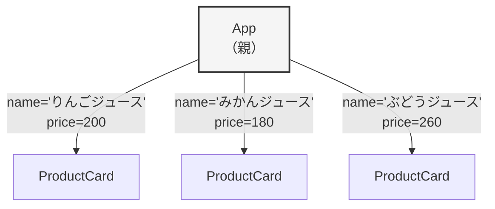
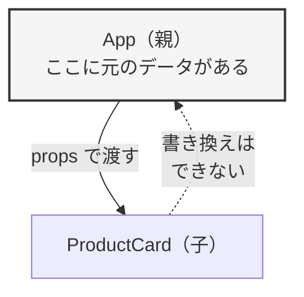
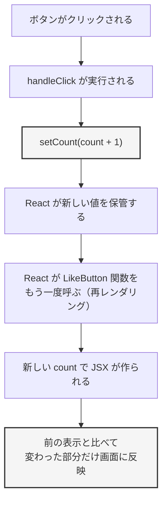
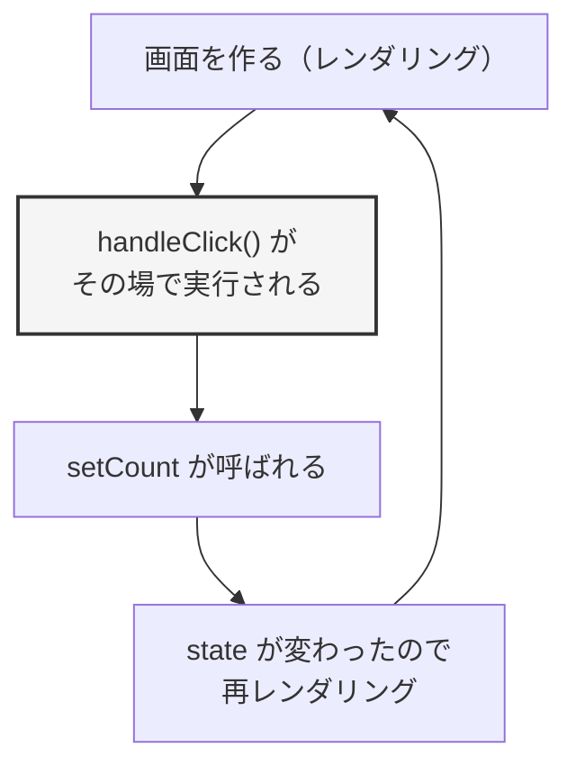
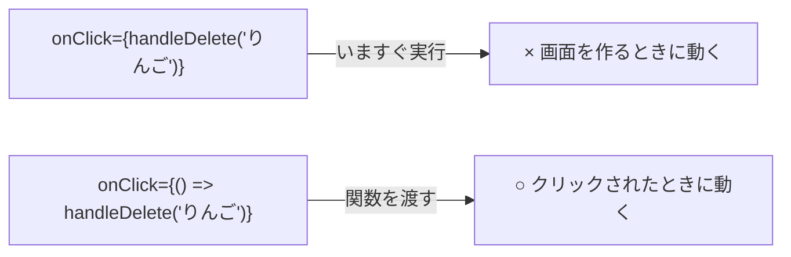
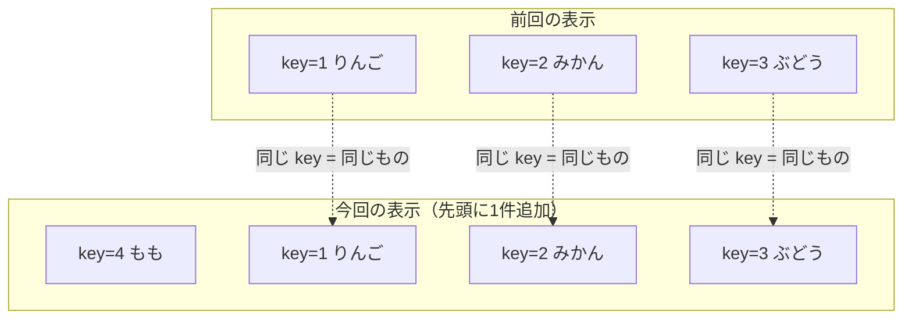
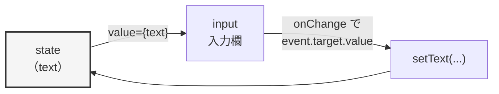

# 第7章 props と state

前の章で、画面を**コンポーネント**（画面の一部分を、見た目と動きごと1つにまとめた部品）に
分けられるようになりました。ただし、大きな制限が2つ残っています。

- `<ProductCard />` を3回書いても、**まったく同じカードが3枚**出るだけ（中身を変えられない）
- ボタンを押しても**何も起きない**（変わる値を持てない）

この2つを解決するのが、**props** と **state** です。

- **props**：親のコンポーネントから子のコンポーネントへ**値を渡す**仕組み
- **state**：コンポーネントが**自分で持つ、変化する値**。変わると画面が作り直される

6.1.2 で「React はデータが変われば画面のほうを合わせてくれる」と説明しました。
その「データ」の正体が state です。**この章から、その仕組みを実際に動かします。**

## この章で学ぶこと

- props でコンポーネントに値を渡し、同じ部品を中身違いで何度も使えるようになる
- `useState` で変化する値を持ち、ボタン操作で画面を変えられるようになる
- クリックや入力などのイベントを受け取って、処理を実行できるようになる
- 配列から一覧を組み立て、`key` を正しく付けられるようになる
- 条件によって表示を出し分けられるようになる
- 入力フォームの値を React 側で管理できるようになる

## この章の前提

- [第5章](./05-javascript-advanced.md) の配列・オブジェクト・`map` / `filter`・分割代入・スプレッド構文を読んだこと
- [第6章](./06-react-start.md) の JSX とコンポーネントが書けること
- 第6章で作った `my-first-react` プロジェクトが手元にあり、`npm run dev` で起動できること（[6.2.3](./06-react-start.md)）

> **つまずいたら**
> この章は、このテキストで**いちばん密度が高い章**です。
> 一度で全部を覚えようとせず、**1つの項ごとに手を動かして、ブラウザで確認**してください。
>
> 詰まったときは、**章番号・書いたコード全文・ブラウザのコンソールに出ている文言**を
> AI に貼って相談してください。
>
> ```text
> react-text の 7.2.3 を読んでいます。
> ボタンを押しても数字が変わりません。App.jsx の全文はこれです。（コードを貼る）
> コンソールにはエラーは出ていません。
> ```

**この章の作業は、すべて第6章で作った `my-first-react` の中で行います。**
ターミナルで `my-first-react` に移動し、開発サーバーを起動しておいてください。

**Windows（PowerShell）**

```powershell
cd react-lesson\my-first-react
npm run dev
```

**macOS / Linux**

```bash
cd react-lesson/my-first-react
npm run dev
```

---

## 7.1 props — 部品に値を渡す

### 7.1.1 props とは

第6章の最後に作った `ProductCard` を思い出してください。

`src/components/ProductCard.jsx`（6.5.3 で作ったもの）

```jsx
function ProductCard() {
  return (
    <div className="card">
      <h2>りんごジュース</h2>
      <p className="price">200円</p>
      <p className="note">数量限定</p>
    </div>
  )
}

export default ProductCard
```

これを3回並べると、**「りんごジュース 200円」のカードが3枚**出ます。
本当に作りたいのは、こういう画面のはずです。

```text
りんごジュース   200円
みかんジュース   180円
ぶどうジュース   260円
```

商品ごとにコンポーネントを作る（`AppleCard.jsx`、`OrangeCard.jsx`……）のは、
6.5.1 で見たコピペの問題に逆戻りです。

**そこで、「カードの形」は1つのままにして、中身の文字だけを外から渡します。**
この「外から渡す値」が **props**（プロップス。親コンポーネントから子コンポーネントへ渡す値）です。

渡す側は、**HTML の属性と同じ書き方**で書きます。

```jsx
<ProductCard name="りんごジュース" price={200} />
```

- `name="りんごジュース"` ——— 文字列を渡す（`" "` で囲む）
- `price={200}` ——— 数値を渡す（波かっこで囲む。6.4.4 と同じ考え方）

図にすると、値は**上から下へ**流れます。



**コンポーネントの形は1つ、中身は3通り。** これが props です。

関数のたとえで言えば、コンポーネントは**関数**（4.6）、props は**引数**（ひきすう。関数に渡す値）です。
`計算する(100, 3)` のように値を変えて呼べるのと同じことを、画面の部品でやります。

### 7.1.2 props を受け取る

渡した値は、**コンポーネント側の関数の引数**として受け取ります。

`src/components/ProductCard.jsx`（全体を次の内容に置き換える）

```jsx
function ProductCard(props) {
  return (
    <div className="card">
      <h2>{props.name}</h2>
      <p className="price">{props.price}円</p>
    </div>
  )
}

export default ProductCard
```

`src/App.jsx`（全体を次の内容に置き換える）

```jsx
import Header from './components/Header.jsx'
import ProductCard from './components/ProductCard.jsx'
import Footer from './components/Footer.jsx'
import './App.css'

function App() {
  return (
    <div className="app">
      <Header />
      <ProductCard name="りんごジュース" price={200} />
      <ProductCard name="みかんジュース" price={180} />
      <ProductCard name="ぶどうジュース" price={260} />
      <Footer />
    </div>
  )
}

export default App
```

保存すると、次のように表示されます。

```text
表示される内容:
くだものジュース店
しぼりたてをお届けします
────────────────────
┌────────────────────┐
│ りんごジュース      │
│ 200円               │
└────────────────────┘
┌────────────────────┐
│ みかんジュース      │
│ 180円               │
└────────────────────┘
┌────────────────────┐
│ ぶどうジュース      │
│ 260円               │
└────────────────────┘
────────────────────
© 2026 くだものジュース店
```

**同じ `ProductCard` から、中身の違う3枚のカードができました。**

仕組みはこうです。

| 書いた場所 | 何が起きるか |
|-----------|------------|
| `<ProductCard name="りんごジュース" price={200} />` | React が `{ name: 'りんごジュース', price: 200 }` という**オブジェクト**を作る |
| `function ProductCard(props)` | そのオブジェクトが `props` という名前で渡ってくる |
| `{props.name}` | オブジェクトのプロパティを読む（5.2.2 と同じ） |

**props はただのオブジェクトです。** 新しい種類のデータではありません。

> **補足：props の中身を目で見る**
> 何が渡ってきているか確かめたいときは、`return` の前で `console.log` します（4.1.3）。
>
> ```jsx
> function ProductCard(props) {
>   console.log(props)
>   return (
>     <div className="card">
>       <h2>{props.name}</h2>
>       <p className="price">{props.price}円</p>
>     </div>
>   )
> }
> ```
>
> ブラウザのコンソール（1.6.4）に、カードの数だけ次のように出ます。
>
> ```text
> {name: 'りんごジュース', price: 200}
> {name: 'みかんジュース', price: 180}
> {name: 'ぶどうジュース', price: 260}
> ```
>
> **「思ったとおりに表示されない」ときは、まずこれを見てください。**
> 渡し忘れているのか、名前を間違えているのかが一目でわかります。

> **よくある間違い**
> 受け取り側で `props.` を書き忘れると、エラーになります。
>
> ```jsx
> // 動かない
> function ProductCard(props) {
>   return <h2>{name}</h2>
> }
> ```
>
> ```text
> 出るエラー:
> Uncaught ReferenceError: name is not defined
> ```
>
> 「`name` なんて変数はありません」という意味です（4.1.4 のエラーの読み方）。
> 渡ってきているのは `props` という**1つのオブジェクト**なので、
> **`props.name` のようにプロパティを指定**してください。

### 7.1.3 分割代入で受け取る

`props.` を毎回書くのは、行が長くなって読みにくくなります。
5.4.1 で学んだ**分割代入**を使うと、必要なものだけ取り出せます。

```js
// 5.4.1 でやったこと（復習）
const person = { name: 'たろう', age: 20 }
const { name, age } = person
console.log(name) // たろう
```

同じことを、**引数を受け取る場所**で書けます。

`src/components/ProductCard.jsx`（全体を次の内容に置き換える）

```jsx
function ProductCard({ name, price }) {
  return (
    <div className="card">
      <h2>{name}</h2>
      <p className="price">{price}円</p>
    </div>
  )
}

export default ProductCard
```

`props.` が消えて、`{name}` だけで書けるようになりました。
**表示される内容は 7.1.2 とまったく同じです。**

| 書き方 | 中での書き方 | 特徴 |
|--------|------------|------|
| `function ProductCard(props)` | `props.name` | 何が渡ってきているか `console.log(props)` で全部見られる |
| `function ProductCard({ name, price })` | `name` | **関数の1行目を見れば、何を受け取るのかがわかる** |

**このテキストでは、以降は分割代入のほうを使います。**
受け取る props の一覧が関数の先頭に並ぶので、他人（と未来の自分）が読みやすいためです。

**渡されなかったときの値を決めておく**

分割代入では、`=` を書いて**渡されなかったときの値**（デフォルト値）を指定できます。

`src/components/ProductCard.jsx`（全体を次の内容に置き換える）

```jsx
function ProductCard({ name, price, note = '通年販売' }) {
  return (
    <div className="card">
      <h2>{name}</h2>
      <p className="price">{price}円</p>
      <p className="note">{note}</p>
    </div>
  )
}

export default ProductCard
```

`src/App.jsx` の `return` の中を、次のように変更します。

```jsx
      <ProductCard name="りんごジュース" price={200} note="数量限定" />
      <ProductCard name="みかんジュース" price={180} />
      <ProductCard name="ぶどうジュース" price={260} />
```

```text
表示される内容:
りんごジュース  200円  数量限定    ← note を渡した
みかんジュース  180円  通年販売    ← 渡していないのでデフォルト値
ぶどうジュース  260円  通年販売    ← 同上
```

**渡されなかった props は `undefined` になります**（5.2.5）。
デフォルト値を書いておくと、`undefined` の代わりにその値が使われます。

> **よくある間違い**
> 分割代入の波かっこを忘れると、動きません。
>
> ```jsx
> // 動かない
> function ProductCard(name, price) {
>   return <h2>{name}</h2>
> }
> ```
>
> React がコンポーネントに渡すのは、**常に「props という1つのオブジェクト」だけ**です。
> 引数を2つ書いても、2つ目には何も入りません。
> `name` にはオブジェクト全体が入るため、`{name}` の行で
> `Objects are not valid as a React child`（6.4.3）というエラーになります。
>
> **`function ProductCard({ name, price })` のように、必ず `{ }` で囲んでください。**

### 7.1.4 いろいろな型を渡す

props に渡せるのは文字列だけではありません。**JavaScript の値なら何でも渡せます。**

ルールは6.4.4 と同じで、**文字列だけがそのまま `" "` で書け、それ以外は波かっこ**です。

| 渡すもの | 書き方 | 受け取ったときの型 |
|---------|--------|-----------------|
| 文字列 | `name="りんご"` または `name={'りんご'}` | 文字列 |
| 数値 | `price={200}` | 数値 |
| 真偽値 | `isNew={true}` | 真偽値 |
| 配列 | `tags={['季節限定', '人気']}` | 配列 |
| オブジェクト | `shop={{ name: '本店', open: true }}` | オブジェクト |
| 関数 | `onDelete={handleDelete}` | 関数（7.3.3 で扱います） |

**確かめてみます。**

`src/components/ProductCard.jsx`（全体を次の内容に置き換える）

```jsx
function ProductCard({ name, price, isNew, tags }) {
  return (
    <div className="card">
      <h2>{name}</h2>
      <p className="price">{price}円</p>
      <p className="note">タグ: {tags.join('、')}</p>
      <p className="note">新商品かどうか: {String(isNew)}</p>
    </div>
  )
}

export default ProductCard
```

`src/App.jsx` の `return` の中を、次のように変更します。

```jsx
      <ProductCard
        name="りんごジュース"
        price={200}
        isNew={true}
        tags={['季節限定', '人気']}
      />
      <ProductCard
        name="みかんジュース"
        price={180}
        isNew={false}
        tags={['定番']}
      />
```

```text
表示される内容:
りんごジュース
200円
タグ: 季節限定、人気
新商品かどうか: true

みかんジュース
180円
タグ: 定番
新商品かどうか: false
```

**props が長くなったら、上のように改行して縦に並べて構いません。**
JSX では、属性を何行に分けて書いても動きます。

**数値を `" "` で囲んではいけない理由**

`price="200"` と書くと、**文字列の `'200'`** が渡ります。

```jsx
// 数値として渡した場合
<ProductCard price={200} />   // props.price は 200（数値）

// 文字列として渡した場合
<ProductCard price="200" />   // props.price は '200'（文字列）
```

表示するだけなら同じに見えますが、**計算に使った瞬間に壊れます**（4.3.8）。

```js
// price が数値 200 のとき
200 * 2   // 400

// price が文字列 '200' のとき
'200' * 2 // 400（ここは動く）
'200' + 2 // '2002'  ← 文字列の連結になってしまう
```

**数値は必ず `{ }` で渡してください。**

> **補足：`true` を渡すときの省略形**
> `isNew={true}` は、**値を省いて `isNew` とだけ書けます。**
>
> ```jsx
> <ProductCard name="りんごジュース" price={200} isNew tags={['人気']} />
> ```
>
> 書かなければ `undefined`（＝偽として扱われる）、書けば `true` です。
> 実際のコードでよく見かける書き方なので、読めるようにしておいてください。

> **よくある間違い**
> 上の例で `tags` を渡し忘れると、画面が真っ白になります。
>
> ```text
> 出るエラー:
> Uncaught TypeError: Cannot read properties of undefined (reading 'join')
> ```
>
> 渡ってこなかった `tags` は `undefined` なので、`undefined.join(...)` を
> 呼ぼうとして失敗しています（5.2.5 で扱ったエラーと同じものです）。
>
> 対策は2つです。
>
> - 渡す側で必ず渡す
> - 受け取る側でデフォルト値を書く（`{ name, price, tags = [] }`。7.1.3）

### 7.1.5 `children`

props には、**もう1つ特別な渡し方**があります。

これまで `<ProductCard />` のように**閉じたタグ**で書いてきましたが、
HTML のタグと同じように、**開始タグと終了タグではさむ**こともできます。

```jsx
<Panel title="お知らせ">
  <p>本日は 18 時に閉店します。</p>
</Panel>
```

このとき、**はさまれた中身**は `children` という名前の props として渡ります。
`children`（チルドレン）は React が用意している決まった名前で、自分で付けた props ではありません。

`src/components/Panel.jsx`（新規作成）

```jsx
function Panel({ title, children }) {
  return (
    <section className="panel">
      <h2 className="panel-title">{title}</h2>
      <div className="panel-body">{children}</div>
    </section>
  )
}

export default Panel
```

`src/App.jsx`（全体を次の内容に置き換える）

```jsx
import Header from './components/Header.jsx'
import Panel from './components/Panel.jsx'
import Footer from './components/Footer.jsx'
import './App.css'

function App() {
  return (
    <div className="app">
      <Header />

      <Panel title="お知らせ">
        <p>本日は 18 時に閉店します。</p>
      </Panel>

      <Panel title="今週のおすすめ">
        <p>ぶどうジュースが入荷しました。</p>
        <p>数量限定です。</p>
      </Panel>

      <Footer />
    </div>
  )
}

export default App
```

`src/App.css` に、次を**追記**してください。

```css
.panel {
  border: 1px solid #dddddd;
  border-radius: 8px;
  padding: 16px;
  margin-bottom: 16px;
}

.panel-title {
  margin: 0 0 8px;
  font-size: 16px;
  border-bottom: 1px solid #eeeeee;
  padding-bottom: 4px;
}

.panel-body p {
  margin: 4px 0;
}
```

```text
表示される内容:
くだものジュース店
しぼりたてをお届けします
────────────────────
┌────────────────────────┐
│ お知らせ                │
│ ────────────────────── │
│ 本日は 18 時に閉店します。│
└────────────────────────┘
┌────────────────────────┐
│ 今週のおすすめ          │
│ ────────────────────── │
│ ぶどうジュースが入荷しました。│
│ 数量限定です。           │
└────────────────────────┘
────────────────────
© 2026 くだものジュース店
```

**`Panel` は「枠だけ」を担当し、中に何を入れるかは使う側が決めています。**

| 渡し方 | 向いている用途 |
|--------|--------------|
| 普通の props（`title="お知らせ"`） | **決まった項目**を渡す（名前・値段・日付など） |
| `children`（タグではさむ） | **中身が自由なもの**を渡す（本文・任意の要素の組み合わせ） |

枠線・見出し・余白のような「入れ物」を作るときは `children`、
決まった形のデータを見せるときは普通の props、と考えてください。

> **よくある間違い**
> `children` を JSX の中に書き忘れると、**はさんだ中身が消えます。**
>
> ```jsx
> // 中身が表示されない
> function Panel({ title, children }) {
>   return (
>     <section className="panel">
>       <h2>{title}</h2>
>     </section>
>   )
> }
> ```
>
> エラーは出ません。**「渡したのに出ない」ときは、`{children}` を書いたか確認してください。**

### 7.1.6 props は書き換えられない

props について、**必ず覚えておくルール**が1つあります。

**受け取った props を、子コンポーネントの中で書き換えてはいけません。**

```jsx
// やってはいけない
function ProductCard({ name, price }) {
  price = price * 1.1   // ← 税込みにしたつもり
  return <p>{price}円</p>
}
```

上のように分割代入した変数へ代入すると、エラーにはなりませんが、
**「値を渡した親のほうは何も変わらない」**という、非常に追いにくい状態になります。

`props` オブジェクトそのものを書き換えると、開発中はエラーになります。

```jsx
// これはエラーになる
function ProductCard(props) {
  props.price = 250
  return <p>{props.price}円</p>
}
```

```text
出るエラー:
Uncaught TypeError: Cannot assign to read only property 'price' of object
（読み取り専用のプロパティには代入できません）
```

**props は「読むためのもの」です。**

計算した結果を使いたいときは、**新しい変数を作ります**（元の props はそのまま）。

```jsx
function ProductCard({ name, price }) {
  const taxIncluded = Math.floor(price * 1.1)   // 新しい変数を作る（4.3.2）

  return (
    <div className="card">
      <h2>{name}</h2>
      <p className="price">{price}円（税込 {taxIncluded}円）</p>
    </div>
  )
}
```

**なぜこのルールがあるのか**

React では、値は**親から子への一方通行**でしか流れません。これを**単方向データフロー**と呼びます。



もし子が props を書き換えられたら、
「この値、いまどこで変えられたんだろう」を**すべての子コンポーネントの中から探す**ことになります。
一方通行にしておけば、**値が変わる場所は、その値を持っている親だけ**に限られます。

> **補足**
> 「では、値を変えたいときはどうするのか」——それが次の 7.2 の **state** です。
> **変わる値は、props ではなく state として持ちます。**
> 子から親の値を変えたい場合の書き方は、7.3.3 と第8章（状態のリフトアップ）で扱います。

---

## 7.2 state — 変化する値を持つ

### 7.2.1 なぜ普通の変数ではだめなのか

「いいね」ボタンを作ってみます。押すたびに数字が1ずつ増える、あれです。

第4章までの知識で素直に書くと、こうなるはずです。

`src/components/LikeButton.jsx`（新規作成）

```jsx
function LikeButton() {
  let count = 0

  function handleClick() {
    count = count + 1
    console.log('いまの count:', count)
  }

  return (
    <div className="like">
      <p>いいね: {count}</p>
      <button onClick={handleClick}>いいね</button>
    </div>
  )
}

export default LikeButton
```

`src/App.jsx`（全体を次の内容に置き換える）

```jsx
import Header from './components/Header.jsx'
import LikeButton from './components/LikeButton.jsx'
import Footer from './components/Footer.jsx'
import './App.css'

function App() {
  return (
    <div className="app">
      <Header />
      <LikeButton />
      <Footer />
    </div>
  )
}

export default App
```

> **補足**
> `onClick={handleClick}` は「クリックされたら `handleClick` を実行する」という指定です。
> 書き方の詳しい話は 7.3 で扱います。ここでは**形だけ**使います。

**ブラウザでボタンを3回押してみてください。**

```text
画面の表示:
いいね: 0        ← 変わらない

コンソールの表示:
いまの count: 1
いまの count: 2
いまの count: 3
```

**コンソールの数字は増えているのに、画面は 0 のままです。**

理由は2つあります。

**理由1：React は「値が変わった」ことを知らない**

6.1.2 で説明したとおり、React は**データが変わったときに画面を作り直します。**
ところが、`count = count + 1` はただの代入です。
React にはこの代入が見えないので、**画面を作り直すきっかけがありません。**

**理由2：関数が呼び直されると、変数は初期値に戻る**

コンポーネントは**関数**です（6.5.1）。
React が画面を作り直すとき、この関数は**もう一度最初から呼ばれます。**

そのとき `let count = 0` の行も、もう一度実行されます。
つまり、**仮に画面が作り直されたとしても、`count` は 0 に戻ってしまいます**（4.6.4 のスコープ）。

必要なのは、次の2つを同時に満たす入れ物です。

| 必要なこと | 普通の変数 | 必要な仕組み |
|-----------|----------|------------|
| 値が変わったことを React に伝える | できない | 更新用の関数を通して伝える |
| 関数が呼び直されても値を覚えている | 初期値に戻る | React 側に値を保管してもらう |

**この2つを満たすのが state（状態）です。**
**state**（ステート。コンポーネントが自分で持っていて、変わると画面が描き直される値）と呼びます。

### 7.2.2 `useState` の使い方

state は、`useState` という関数を使って作ります。

`src/components/LikeButton.jsx`（全体を次の内容に置き換える）

```jsx
import { useState } from 'react'

function LikeButton() {
  const [count, setCount] = useState(0)

  function handleClick() {
    setCount(count + 1)
  }

  return (
    <div className="like">
      <p>いいね: {count}</p>
      <button onClick={handleClick}>いいね</button>
    </div>
  )
}

export default LikeButton
```

`src/App.css` に、次を**追記**してください。

```css
.like {
  border: 1px solid #dddddd;
  border-radius: 8px;
  padding: 16px;
  margin-bottom: 16px;
}

.like button {
  font-size: 16px;
  padding: 6px 16px;
  cursor: pointer;
}
```

**ボタンを押すと、今度は画面の数字が増えます。**

```text
表示される内容（3回押したあと）:
いいね: 3
[いいね]
```

**1行ずつ読み解きます。**

```jsx
import { useState } from 'react'
```

`useState` は React が用意している関数なので、`react` から読み込みます（名前付きインポート。5.6.2）。
**この行を忘れると `useState is not defined` というエラーになります。**

```jsx
const [count, setCount] = useState(0)
```

この1行だけで、3つのことが起きています。

| 部分 | 意味 |
|------|------|
| `useState(0)` | 「初期値 0 の state を1つ作ってください」と React に頼む |
| 戻り値 | **要素が2つの配列**が返ってくる（`[いまの値, 更新用の関数]`） |
| `const [count, setCount] = ...` | その配列を**分割代入**で2つの名前に分けて受け取る（5.4.1） |

分けて書くと、こういうことです。

```js
// 実際にはこう書かないが、意味はこれと同じ
const state = useState(0)
const count = state[0]      // いまの値
const setCount = state[1]   // 更新するための関数
```

`useState` は**新しい構文ではありません。** ただの関数呼び出しと、5.4.1 の分割代入の組み合わせです。

**名前の付け方**

2つの名前は自由に決められますが、**慣習が決まっています。**

| 値の名前 | 更新関数の名前 |
|---------|--------------|
| `count` | `setCount` |
| `name` | `setName` |
| `items` | `setItems` |
| `isOpen` | `setIsOpen` |

**「値の名前の先頭に `set` を付けて、1文字目を大文字にする」**と覚えてください。
この慣習から外れると、コードを読む人（と AI）が混乱します。

**`useState` は「フック」の1つ**

`useState` のように **`use` で始まる React の特別な関数**を、**フック**と呼びます。
フックには、守らないと動かないルールが2つあります。

1. **コンポーネント関数の中で呼ぶ**（普通の関数やイベント処理の中では呼べない）
2. **関数の一番上で呼ぶ。`if` や `for` の中に入れない**

```jsx
// やってはいけない
function LikeButton({ show }) {
  if (show) {
    const [count, setCount] = useState(0)   // × if の中
  }
  ...
}
```

```text
出るエラー:
React Hook "useState" is called conditionally.
（React フック "useState" が条件付きで呼ばれています）
```

**理由**：React は「このコンポーネントの何番目のフックか」という**呼ばれた順番**で state を管理しています。
`if` で呼んだり呼ばなかったりすると、順番がずれて別の state を取り違えてしまいます。

**`const` なのに値が変わるのはなぜか**

`const` は「再代入できない」という意味でした（4.2.2）。
それなのに `count` が増えるのは、矛盾していないのでしょうか。

矛盾しません。**`count` に再代入しているわけではないからです。**

`setCount(1)` を呼ぶと、React は**コンポーネント関数をもう一度呼び直します。**
そのとき `const [count, setCount] = useState(0)` の行も実行され、
**新しい `count`（値は 1）が改めて作られます。**

同じ変数の中身が書き換わったのではなく、**作り直された、が正解です。**

### 7.2.3 state を更新する

`setCount(count + 1)` を呼んだとき、React の中では次のことが起きています。



この「コンポーネント関数がもう一度呼ばれて、画面が作り直されること」を
**再レンダリング**（state や props が変わったときに、React が画面を作り直すこと）と呼びます。

**プログラマーが書くのは `setCount(...)` の1行だけ**で、
そのあとの4つの工程は、すべて React がやってくれます。

これが 6.1.2 で説明した「宣言的」の中身です。
`<p>いいね: {count}</p>` と書いておけば、**`count` が変わるたびに、この行は自動で作り直されます。**

**確かめてみる**

再レンダリングが本当に起きているか、目で見てみます。
`LikeButton` の関数の一番上に、`console.log` を1行足してください。

`src/components/LikeButton.jsx`

```jsx
import { useState } from 'react'

function LikeButton() {
  const [count, setCount] = useState(0)

  // 関数が呼ばれるたびに出力される（＝再レンダリングの回数がわかる）
  console.log('LikeButton が呼ばれました。count =', count)

  function handleClick() {
    setCount(count + 1)
  }

  return (
    <div className="like">
      <p>いいね: {count}</p>
      <button onClick={handleClick}>いいね</button>
    </div>
  )
}

export default LikeButton
```

ボタンを2回押すと、コンソールに次のように出ます。

```text
LikeButton が呼ばれました。count = 0    ← 最初の表示
LikeButton が呼ばれました。count = 1    ← 1回目のクリック後
LikeButton が呼ばれました。count = 2    ← 2回目のクリック後
```

**クリックのたびに、コンポーネント関数がまるごと呼び直されています。**

> **補足**
> 環境によっては、同じ行が2回ずつ出ることがあります。
> これは 6.3.2 で出てきた `<StrictMode>` が、開発中だけわざと2回呼んでいるためです。
> **不具合ではありません。** 詳しくは第8章で扱います。

**`set○○` を呼んだ直後の値は、まだ古い**

次のコードは、直感に反する結果になります。

```jsx
function handleClick() {
  setCount(count + 1)
  console.log('更新後の count:', count)   // ← 増えていない
}
```

```text
コンソールの表示（1回目のクリック）:
更新後の count: 0
```

`count` は、**この関数が呼ばれた時点での値**です（4.6.4 のスコープ）。
`setCount` は「次に画面を作り直すときは、この値でお願いします」と**予約する**関数であり、
いまここにある `count` の中身をその場で書き換えるわけではありません。

新しい値は、**次の再レンダリングで作り直される `count`** から読めます。
確認したいときは、上でやったように**関数の一番上で `console.log`** してください。

> **よくある間違い**
> `set○○` を呼ばずに、値のほうを書き換えても画面は変わりません。
>
> ```jsx
> // 動かない
> function handleClick() {
>   count = count + 1
> }
> ```
>
> ```text
> 出るエラー:
> Uncaught TypeError: Assignment to constant variable.
> （定数に代入しようとしています）
> ```
>
> `const` で宣言されているのでエラーになりますが、
> 仮に `let` だったとしても**画面は変わりません**（7.2.1 の理由1）。
> **画面を変えたいときは、必ず `set○○` を呼んでください。**

### 7.2.4 state を直接書き換えてはいけない理由

state に配列やオブジェクトを入れると、この間違いが起きやすくなります。

**うまくいかない例**

```jsx
import { useState } from 'react'

function TagList() {
  const [tags, setTags] = useState(['季節限定'])

  function handleAdd() {
    tags.push('人気')     // ← 配列に直接追加している
    setTags(tags)         // ← 更新関数も呼んでいる
  }

  return (
    <div>
      <p>{tags.join('、')}</p>
      <button onClick={handleAdd}>タグを追加</button>
    </div>
  )
}
```

`push`（5.1.3）で追加し、`setTags` も呼んでいます。
それでも、**ボタンを押しても画面は変わりません。**

**理由：React は「同じものかどうか」で判断している**

5.4.3 で学んだことを思い出してください。
配列やオブジェクトを変数に入れると、その変数が持っているのは**中身そのものではなく、置き場所**でした。

```js
const a = [1, 2]
const b = a
b.push(3)
console.log(a)  // [1, 2, 3] ← a も変わる（同じものを指しているため）
```

`tags.push('人気')` をしても、**`tags` が指している場所は変わりません。**
そのため `setTags(tags)` は、React から見ると
**「前と同じものが渡ってきた＝変わっていない」**という意味になり、再レンダリングが起きません。

**正しい書き方：新しい配列を作って渡す**

```jsx
import { useState } from 'react'

function TagList() {
  const [tags, setTags] = useState(['季節限定'])

  function handleAdd() {
    // 元の配列は変えず、中身をコピーした新しい配列を作る（5.4.2）
    setTags([...tags, '人気'])
  }

  return (
    <div>
      <p>{tags.join('、')}</p>
      <button onClick={handleAdd}>タグを追加</button>
    </div>
  )
}
```

これで、押すたびにタグが増えます。

```text
表示される内容:
季節限定          ← 最初
季節限定、人気     ← 1回押したあと
季節限定、人気、人気 ← 2回押したあと
```

**5.4.3 の「イミュータブルな更新」が、そのまま React のルールになっています。**

| やりたいこと | ✕ 直接書き換える | ○ 新しいものを作る |
|------------|----------------|------------------|
| 配列に追加 | `items.push(x)` | `setItems([...items, x])` |
| 配列から削除 | `items.splice(i, 1)` | `setItems(items.filter(...))` |
| 配列の1件を変更 | `items[0].done = true` | `setItems(items.map(...))` |
| オブジェクトの値を変更 | `user.age = 21` | `setUser({ ...user, age: 21 })` |

具体的な書き方は 7.2.6 で1つずつ扱います。

> **注意**
> この間違いは、**エラーが出ません。**
> 「ボタンを押しても画面が変わらない」という症状だけが出ます。
>
> **画面が更新されないときは、まず「元のものを書き換えていないか」を疑ってください。**
> `push` / `splice` / `sort` / `変数.プロパティ = 値` が state に対して使われていたら、それが原因です。

### 7.2.5 前の値をもとに更新する

「2つ増やす」ボタンを作ってみます。素直に書くと、次のようになります。

```jsx
function handleAddTwo() {
  setCount(count + 1)
  setCount(count + 1)
}
```

**このボタンを押しても、1しか増えません。**

`count` が 0 のとき、2行はどちらも `setCount(0 + 1)`、つまり `setCount(1)` です。
7.2.3 で説明したとおり、`count` は**この関数が呼ばれた時点の値のまま**なので、
1行目を実行しても `count` は 0 のままだからです。

```text
ボタンを押したときの実際の動き:
setCount(1)   ← 0 + 1
setCount(1)   ← やはり 0 + 1
→ 結果は 1
```

**解決策：更新関数に「関数」を渡す**

`set○○` には、値の代わりに**関数**を渡せます。
その関数は、**React が持っている最新の値**を引数として受け取ります。

```jsx
function handleAddTwo() {
  setCount((prev) => prev + 1)
  setCount((prev) => prev + 1)
}
```

```text
ボタンを押したときの実際の動き:
1つ目: prev は 0 → 1 を返す
2つ目: prev は 1 → 2 を返す
→ 結果は 2
```

`prev` は引数の名前なので、`prevCount` でも `c` でも構いません。
**このテキストでは `prev` を使います。**

**動く形で確かめてみます。**

`src/components/LikeButton.jsx`（全体を次の内容に置き換える）

```jsx
import { useState } from 'react'

function LikeButton() {
  const [count, setCount] = useState(0)

  function handleClick() {
    setCount((prev) => prev + 1)
  }

  function handleAddTwo() {
    // 前の値をもとに2回更新するので、関数を渡す形にする
    setCount((prev) => prev + 1)
    setCount((prev) => prev + 1)
  }

  function handleReset() {
    // 前の値を使わない（0 にするだけ）ので、値をそのまま渡してよい
    setCount(0)
  }

  return (
    <div className="like">
      <p>いいね: {count}</p>
      <button onClick={handleClick}>1つ増やす</button>
      <button onClick={handleAddTwo}>2つ増やす</button>
      <button onClick={handleReset}>リセット</button>
    </div>
  )
}

export default LikeButton
```

```text
表示される内容:
いいね: 0
[1つ増やす] [2つ増やす] [リセット]

「2つ増やす」を1回押すと → いいね: 2
「リセット」を押すと     → いいね: 0
```

**使い分けの基準**

| 状況 | 書き方 |
|------|--------|
| 前の値を**使う**（増やす・減らす・切り替える） | `setCount((prev) => prev + 1)` |
| 前の値を**使わない**（決まった値にする） | `setCount(0)` |

**迷ったら関数形式にしておけば、間違いにはなりません。**
このテキストでも、前の値を使う場面では常に関数形式で書きます。

**関数の中では、条件を書くこともできます**

`prev` を受け取る関数の中は、**普通の JavaScript** です。
`if` や三項演算子（4.4.4）を書いて、**更新後の値を条件で決められます。**

```jsx
const [stock, setStock] = useState(0)

function handleAdd() {
  // 5 を超えないようにする。5 以上なら、そのままの値を返す
  setStock((prev) => (prev >= 5 ? prev : prev + 1))
}
```

`set○○` に渡した関数が**返した値**が、次の state になります。
「前と同じ値を返す」＝**何も変わらない**、という書き方ができるわけです。

```text
ボタンを6回押したときの表示:
1 → 2 → 3 → 4 → 5 → 5   ← 6回目は増えない
```

> **補足：真偽値を切り替える**
> 開いている／閉じているを切り替えるときも、前の値を使うので関数形式です。
>
> ```jsx
> const [isOpen, setIsOpen] = useState(false)
>
> function handleToggle() {
>   setIsOpen((prev) => !prev)   // ! は「反対にする」（4.3.7）
> }
> ```

### 7.2.6 state に配列やオブジェクトを入れる

state に入れられるのは数値だけではありません。**配列やオブジェクトも入れられます。**
というより、実際のアプリでは**そちらのほうが多く**なります。

7.2.4 のルール（元のものを書き換えない）を守りながら、4つの操作を書けるようにします。

**準備：買い物メモのコンポーネント**

`src/components/ShoppingList.jsx`（新規作成）

```jsx
import { useState } from 'react'

function ShoppingList() {
  const [items, setItems] = useState(['りんご', 'みかん'])

  function handleAdd() {
    // 元の配列はそのまま。コピーの末尾に足した「新しい配列」を作る（5.4.2）
    setItems((prev) => [...prev, 'ぶどう'])
  }

  function handleRemoveLast() {
    // 最後の1件を除いた新しい配列を作る（5.1.5 の slice）
    setItems((prev) => prev.slice(0, prev.length - 1))
  }

  function handleClear() {
    setItems([])
  }

  return (
    <div className="panel">
      <h2 className="panel-title">買い物メモ</h2>
      <p>{items.join('、')}</p>
      <p>{items.length}件</p>
      <button onClick={handleAdd}>ぶどうを足す</button>
      <button onClick={handleRemoveLast}>最後の1件を消す</button>
      <button onClick={handleClear}>全部消す</button>
    </div>
  )
}

export default ShoppingList
```

`src/App.jsx`（全体を次の内容に置き換える）

```jsx
import Header from './components/Header.jsx'
import ShoppingList from './components/ShoppingList.jsx'
import Footer from './components/Footer.jsx'
import './App.css'

function App() {
  return (
    <div className="app">
      <Header />
      <ShoppingList />
      <Footer />
    </div>
  )
}

export default App
```

```text
表示される内容:
買い物メモ
りんご、みかん
2件
[ぶどうを足す] [最後の1件を消す] [全部消す]

「ぶどうを足す」を1回押すと:
りんご、みかん、ぶどう
3件
```

**`{items.length}件` の行を、どこからも更新していない**ことに注目してください。
配列が変われば件数の表示も一緒に変わります。これが 6.1.1 で見た「呼び忘れ」が起きない理由です。

**4つの操作の書き方**

配列の state を更新する書き方を、まとめて整理します。
`prev` は「更新前の配列」です（7.2.5）。

| やりたいこと | 書き方 | 使っている知識 |
|------------|--------|--------------|
| 末尾に追加 | `setItems((prev) => [...prev, 新しい値])` | スプレッド構文（5.4.2） |
| 先頭に追加 | `setItems((prev) => [新しい値, ...prev])` | スプレッド構文（5.4.2） |
| 条件で削除 | `setItems((prev) => prev.filter((item) => item !== 消す値))` | `filter`（5.3.2） |
| 1件だけ変更 | `setItems((prev) => prev.map((item) => ...))` | `map`（5.3.1） |

**どれも「新しい配列を作って渡す」形になっています。**
`filter` も `map` も、**元の配列を変えずに新しい配列を返すメソッド**でした（5.3）。
だから、そのまま state の更新に使えます。

**オブジェクトの state を更新する**

オブジェクトの場合も同じで、**スプレッド構文でコピーしてから、変えたい部分だけ上書き**します。

```jsx
import { useState } from 'react'

function Profile() {
  const [user, setUser] = useState({ name: 'たろう', age: 20 })

  function handleBirthday() {
    // name はそのまま、age だけ 1 増やした「新しいオブジェクト」を作る（5.4.2）
    setUser((prev) => ({ ...prev, age: prev.age + 1 }))
  }

  return (
    <div className="panel">
      <p>{user.name}（{user.age}歳）</p>
      <button onClick={handleBirthday}>誕生日</button>
    </div>
  )
}

export default Profile
```

```text
表示される内容:
たろう（20歳）
[誕生日]

押すと → たろう（21歳）
```

> **注意：`({ ... })` のかっこは必須**
> アロー関数（4.6.3）でオブジェクトをそのまま返すときは、**丸かっこで囲みます。**
>
> ```jsx
> setUser((prev) => ({ ...prev, age: prev.age + 1 }))   // ○
> setUser((prev) => { ...prev, age: prev.age + 1 })     // × エラーになる
> ```
>
> 丸かっこがないと、JavaScript は `{` を**「これから処理を書く」という印**だと解釈してしまい、
> オブジェクトとして読んでくれません。
>
> ```text
> 出るエラー:
> Unexpected token, expected ","
> ```

> **補足：state はいくつでも持てる**
> 1つのコンポーネントで `useState` を何回呼んでも構いません。
>
> ```jsx
> const [name, setName] = useState('')
> const [age, setAge] = useState(0)
> const [items, setItems] = useState([])
> ```
>
> 関係のない値は、**1つのオブジェクトにまとめず、別々の state にする**ほうが扱いやすくなります。
> まとめるかどうかの判断は、第8章（状態設計）で扱います。

---

## 7.3 イベントを扱う

### 7.3.1 `onClick`

第5章では、クリックを受け取るのに `addEventListener` を使いました（5.7.4）。

```js
// 第5章の書き方（素の JavaScript）
const button = document.querySelector('#myButton')
button.addEventListener('click', function () {
  console.log('押されました')
})
```

React では、**JSX の属性として直接書きます。**

```jsx
<button onClick={handleClick}>押してください</button>
```

| | 素の JavaScript（5.7.4） | React |
|--|------------------------|-------|
| 要素の取得 | `querySelector` で取ってくる必要がある | **不要**（その場に書く） |
| 登録 | `addEventListener('click', 関数)` | `onClick={関数}` |
| 後片付け | 必要な場合がある | 不要（React が管理する） |

**書き方のルールは3つです。**

1. 属性名は **`onClick`**（`onclick` ではない。キャメルケース。6.4.2）
2. 渡すのは**関数そのもの**（`{ }` の中に関数名を書く）
3. その関数は、**コンポーネント関数の中**に書く

`src/components/GreetButton.jsx`（新規作成）

```jsx
function GreetButton() {
  function handleClick() {
    console.log('こんにちは')
  }

  return <button onClick={handleClick}>あいさつする</button>
}

export default GreetButton
```

ボタンを押すたびに、コンソール（1.6.4）に `こんにちは` と出ます。

**関数の名前は `handle○○` にする**

React では、イベントを処理する関数の名前を **`handle` で始める**のが慣習です。

| イベント | 関数名の例 |
|---------|----------|
| クリック | `handleClick` |
| 送信 | `handleSubmit` |
| 入力の変化 | `handleChange` |
| 削除ボタン | `handleDelete` |

**必ずしも守らないと動かないルールではありません**が、
「この関数は操作を受けて動くものだ」と一目でわかるので、このテキストでは常にこの形にします。

### 7.3.2 関数を渡すのと呼び出すのの違い

**この章でいちばん間違えやすいのがここです。**

```jsx
<button onClick={handleClick}>○ 正しい</button>
<button onClick={handleClick()}>× 間違い</button>
```

違いは `()` があるかどうかだけですが、**意味はまったく違います。**

| 書き方 | 意味 |
|--------|------|
| `handleClick` | 関数**そのもの**。「クリックされたら、これを実行してください」 |
| `handleClick()` | 関数の**呼び出し結果**。「いますぐ実行して、その戻り値を渡す」 |

4.6.2 で学んだとおり、`()` を付けると**その場で実行**されます。
`onClick={handleClick()}` と書くと、**画面を作っている最中にクリック処理が動いてしまいます。**

**実際に何が起きるか**

```jsx
import { useState } from 'react'

function BrokenCounter() {
  const [count, setCount] = useState(0)

  function handleClick() {
    setCount((prev) => prev + 1)
  }

  // これを書くと、ページを開いた瞬間に固まる
  return <button onClick={handleClick()}>増やす</button>
}
```

```text
出るエラー:
Uncaught Error: Too many re-renders. React limits the number of renders to prevent an infinite loop.
（再レンダリングが多すぎます。React は無限ループを防ぐため回数を制限しています）
```

**無限ループになる流れ**はこうです。



クリックしていないのに処理が動き、その処理が state を変え、
state が変わったから画面が作り直され、また処理が動く……という繰り返しです。

> **よくある間違い**
> `Too many re-renders` というエラーが出たら、**まず `onClick={...()}` を探してください。**
> このエラーの原因は、ほとんどがこれです。
>
> ```jsx
> onClick={handleClick}      // ○ 関数を渡している
> onClick={handleClick()}    // × その場で呼んでいる
> ```

### 7.3.3 引数を渡す

「この商品を削除する」のように、**イベント処理に値を渡したい**ことがあります。

しかし 7.3.2 のとおり、`onClick={handleDelete('りんご')}` と書くと**その場で実行**されてしまいます。

**解決策：アロー関数で包む**

```jsx
<button onClick={() => handleDelete('りんご')}>削除</button>
```

`() => handleDelete('りんご')` は、「呼ばれたら `handleDelete('りんご')` を実行する関数」です（4.6.3）。
**渡しているのは関数なので、その場では実行されません。**



**動く例を作ります。**

`src/components/FruitPicker.jsx`（新規作成）

```jsx
import { useState } from 'react'

function FruitPicker() {
  const [selected, setSelected] = useState('まだ選ばれていません')

  function handleSelect(fruit) {
    setSelected(fruit)
  }

  return (
    <div className="panel">
      <h2 className="panel-title">くだものを選ぶ</h2>
      <p>選んだもの: {selected}</p>
      <button onClick={() => handleSelect('りんご')}>りんご</button>
      <button onClick={() => handleSelect('みかん')}>みかん</button>
      <button onClick={() => handleSelect('ぶどう')}>ぶどう</button>
    </div>
  )
}

export default FruitPicker
```

`src/App.jsx` の `ShoppingList` を `FruitPicker` に差し替えて（`import` の行も忘れずに）、
ブラウザで押してみてください。

```text
表示される内容:
くだものを選ぶ
選んだもの: まだ選ばれていません
[りんご] [みかん] [ぶどう]

「みかん」を押すと → 選んだもの: みかん
```

**子コンポーネントに関数を渡す**

7.1.4 の表にあった「関数を props として渡す」も、ここで書けるようになります。

`src/components/FruitButton.jsx`（新規作成）

```jsx
function FruitButton({ label, onPick }) {
  return <button onClick={() => onPick(label)}>{label}</button>
}

export default FruitButton
```

`src/components/FruitPicker.jsx`（全体を次の内容に置き換える）

```jsx
import { useState } from 'react'
import FruitButton from './FruitButton.jsx'

function FruitPicker() {
  const [selected, setSelected] = useState('まだ選ばれていません')

  function handleSelect(fruit) {
    setSelected(fruit)
  }

  return (
    <div className="panel">
      <h2 className="panel-title">くだものを選ぶ</h2>
      <p>選んだもの: {selected}</p>
      <FruitButton label="りんご" onPick={handleSelect} />
      <FruitButton label="みかん" onPick={handleSelect} />
      <FruitButton label="ぶどう" onPick={handleSelect} />
    </div>
  )
}

export default FruitPicker
```

**表示も動きも、さっきとまったく同じです。**
違うのは、ボタンが `FruitButton` という部品になったことだけです。

ここで起きていることを整理します。

| 方向 | 何が流れるか |
|------|------------|
| 親 → 子 | `label`（表示する文字）と `onPick`（押されたときに呼んでほしい関数） |
| 子 → 親 | `onPick(label)` を呼ぶことで、「押されました」と**知らせる** |

7.1.6 で「子は props を書き換えられない」と説明しました。
**代わりに、子は「渡された関数を呼ぶ」ことで親に知らせます。**
state を持っているのは親（`FruitPicker`）のままなので、値が変わる場所は1箇所に保たれます。

**関数を渡す props の名前は、`on○○` にする**のが慣習です（`onPick`、`onDelete`、`onAdd` など）。

> **補足**
> この「子から親に知らせる」形は、第8章の**状態のリフトアップ**でさらに詳しく扱います。
> いまは「関数も props として渡せる」「子は受け取った関数を呼ぶだけ」と押さえてください。

### 7.3.4 いろいろなイベント

クリック以外にも、よく使うイベントがあります。

| 属性 | いつ動くか | よく使う場面 |
|------|----------|------------|
| `onClick` | クリックされたとき | ボタン全般 |
| `onChange` | 入力内容が変わったとき | テキスト入力・チェックボックス（7.6） |
| `onSubmit` | フォームが送信されたとき | `<form>` の送信（7.6.5） |
| `onMouseEnter` | マウスが乗ったとき | ホバーで説明を出す |
| `onMouseLeave` | マウスが離れたとき | 同上 |
| `onKeyDown` | キーが押されたとき | Enter で送信する |
| `onFocus` | 入力欄が選択されたとき | 入力中のヒント表示 |
| `onBlur` | 入力欄から離れたとき | 入力チェック |

**すべて「`on` + イベント名（1文字目を大文字）」**という形です。

```jsx
function HoverBox() {
  function handleEnter() {
    console.log('乗りました')
  }

  function handleLeave() {
    console.log('離れました')
  }

  return (
    <div
      className="panel"
      onMouseEnter={handleEnter}
      onMouseLeave={handleLeave}
    >
      この上にマウスを乗せてください
    </div>
  )
}
```

**この章で実際に使うのは `onClick`・`onChange`・`onSubmit` の3つ**です。
残りは「そういうものがある」と知っておけば十分です。

> **よくある間違い**
> 属性名を全部小文字で書くと、警告が出て動きません。
>
> ```jsx
> // 動かない
> <button onclick={handleClick}>押す</button>
> ```
>
> ```text
> ブラウザのコンソールに出る警告:
> Warning: Invalid DOM property `onclick`. Did you mean `onClick`?
> ```
>
> HTML では `onclick` と書きますが、**JSX ではキャメルケース**です（6.4.2 の違い4）。

### 7.3.5 イベントオブジェクト

イベント処理の関数は、**引数を1つ受け取れます。**
そこには「何が起きたか」の情報が入った**イベントオブジェクト**が渡ってきます。

```jsx
function SearchBox() {
  function handleChange(event) {
    console.log('入力された文字:', event.target.value)
  }

  return <input type="text" onChange={handleChange} />
}
```

入力欄に「りん」と打つと、コンソールに次のように出ます。

```text
入力された文字: り
入力された文字: りん
```

**1文字打つたびに `onChange` が呼ばれています。**

| 書き方 | 意味 |
|--------|------|
| `event` | 起きたイベントの情報が入ったオブジェクト |
| `event.target` | **イベントが起きた要素そのもの**（この場合は `<input>`） |
| `event.target.value` | その入力欄に入っている文字列（5.7.5 と同じ） |

引数の名前は自由ですが、`event` か `e` と書くのが慣習です。
**このテキストでは `event` と書きます**（初学者が読んだときに意味がわかるためです）。

**アロー関数で包む場合**

7.3.3 のように引数を渡したいときは、**イベントオブジェクトも自分で渡します。**

```jsx
<input
  type="text"
  onChange={(event) => handleChange(event, 'メモ欄')}
/>
```

`(event) => ...` の `event` を、そのまま `handleChange` に渡しています。

> **補足：よく使うのは `event.target.value` だけ**
> イベントオブジェクトには、押されたキー（`event.key`）やマウスの位置（`event.clientX`）など、
> たくさんの情報が入っています。
>
> ただし、**このテキストで使うのは次の3つだけ**です。
>
> | 書き方 | 何が取れるか | 使う場所 |
> |--------|------------|---------|
> | `event.target.value` | 入力欄の文字列 | 7.6.2 |
> | `event.target.checked` | チェックが入っているか | 7.6.4 |
> | `event.preventDefault()` | ブラウザの既定の動きを止める | 7.6.5 |
>
> 全部を覚える必要はありません。必要になったときに調べてください。

---

## 7.4 リストを表示する

### 7.4.1 `map` で要素を並べる

商品が3件なら `<ProductCard />` を3回書けば済みますが、
**件数が決まっていない**場合はそうはいきません。

データが配列で用意されているとき、React では **`map`**（5.3.1）で JSX の配列に変換します。

`src/components/ProductList.jsx`（新規作成）

```jsx
import ProductCard from './ProductCard.jsx'

const products = [
  { id: 1, name: 'りんごジュース', price: 200 },
  { id: 2, name: 'みかんジュース', price: 180 },
  { id: 3, name: 'ぶどうジュース', price: 260 },
]

function ProductList() {
  return (
    <div>
      <h2>商品一覧（{products.length}件）</h2>
      {products.map((product) => (
        <ProductCard key={product.id} name={product.name} price={product.price} />
      ))}
    </div>
  )
}

export default ProductList
```

`src/components/ProductCard.jsx`（全体を次の内容に置き換える）

```jsx
function ProductCard({ name, price }) {
  return (
    <div className="card">
      <h2>{name}</h2>
      <p className="price">{price}円</p>
    </div>
  )
}

export default ProductCard
```

`src/App.jsx`（全体を次の内容に置き換える）

```jsx
import Header from './components/Header.jsx'
import ProductList from './components/ProductList.jsx'
import Footer from './components/Footer.jsx'
import './App.css'

function App() {
  return (
    <div className="app">
      <Header />
      <ProductList />
      <Footer />
    </div>
  )
}

export default App
```

```text
表示される内容:
くだものジュース店
しぼりたてをお届けします
────────────────────
商品一覧（3件）
┌────────────────────┐
│ りんごジュース      │
│ 200円               │
└────────────────────┘
┌────────────────────┐
│ みかんジュース      │
│ 180円               │
└────────────────────┘
┌────────────────────┐
│ ぶどうジュース      │
│ 260円               │
└────────────────────┘
────────────────────
© 2026 くだものジュース店
```

**`products` に4件目を足すと、カードも自動的に4枚になります。** JSX 側は1文字も変えません。

**書き方を分解する**

```jsx
{products.map((product) => (
  <ProductCard key={product.id} name={product.name} price={product.price} />
))}
```

| 部分 | 意味 |
|------|------|
| 外側の `{ }` | JSX に JavaScript の値を埋め込む印（6.4.3） |
| `products.map(...)` | 配列の各要素を、別のものに変換した**新しい配列**を作る（5.3.1） |
| `(product) => (...)` | 1件分のデータを受け取り、**JSX を返す**アロー関数（4.6.3） |
| `key={product.id}` | React が各要素を見分けるための目印（7.4.2） |

`map` が返しているのは、**JSX が3つ入った配列**です。

```jsx
// map の結果は、こういう配列になっている
[
  <ProductCard name="りんごジュース" price={200} />,
  <ProductCard name="みかんジュース" price={180} />,
  <ProductCard name="ぶどうジュース" price={260} />,
]
```

**JSX の波かっこに配列を入れると、React は中身を順に並べて表示します**（6.4.3 の表）。

**アロー関数の丸かっこ**

`(product) => (` の最後が**丸かっこ**であることに注意してください。

```jsx
// ○ 丸かっこ = 中身をそのまま返す
(product) => (
  <ProductCard name={product.name} />
)

// × 波かっこ = 処理を書く場所。return を書かないと何も返らない
(product) => {
  <ProductCard name={product.name} />
}
```

波かっこにする場合は、`return` が必要です（4.6.3）。

```jsx
(product) => {
  return <ProductCard name={product.name} />
}
```

> **よくある間違い**
> 波かっこにして `return` を書き忘れると、**何も表示されません**（エラーも出ません）。
> 一覧が真っ白なときは、`map` の中が `{ }` になっていないか確認してください。

### 7.4.2 `key` が必要な理由

上のコードには `key={product.id}` という見慣れない属性がありました。
**これを外すと、警告が出ます。**

```text
ブラウザのコンソールに出る警告:
Warning: Each child in a list should have a unique "key" prop.
（リストの各要素には、重複しない "key" が必要です）
```

**`key` は、React が「どれがどれか」を見分けるための目印**です。

**なぜ目印が必要なのか**

React は再レンダリングのたびに、**前回の表示と今回の表示を比べて、変わった部分だけを画面に反映**します（6.1.2 の補足）。

このとき、リストの中身が3件から4件に増えたとして、
**「1件増えた」のか「全部が別物に入れ替わった」のかは、見た目だけでは区別できません。**



`key` があれば、React は「`key=1` のカードは前回もあった。位置が1つ下がっただけ」と判断できます。
`key` がなければ、**全部作り直す**か、**位置だけで対応付ける**しかありません。

**`key` に何を使うか**

| 使うもの | 良いか | 理由 |
|---------|-------|------|
| データの `id` | ○ **最良** | データごとに固有で、順番が変わっても変わらない |
| 商品コードなど、重複しない値 | ○ | 同上 |
| 名前などの文字列 | △ | 同じ名前が2件あると重複してしまう |
| `map` の index（順番の番号） | △ | 並べ替え・削除で問題が起きる（7.4.3） |
| ランダムな値 | ✕ | 毎回変わるので、React が対応を付けられない |

**データに `id` を持たせておくのが基本です。**
7.4.1 の `products` に `id` を入れておいたのは、このためです。

**`key` は props ではない**

`key` は React 専用の属性で、**子コンポーネントの中では受け取れません。**

```jsx
function ProductCard({ key, name }) {
  console.log(key)   // undefined になる
  ...
}
```

`key` が必要なのは React 側だけなので、これで問題ありません。
**もし子でも id を使いたいなら、`key` とは別に渡します。**

```jsx
<ProductCard key={product.id} id={product.id} name={product.name} />
```

> **よくある間違い**
> `key` を付ける場所は、**`map` が返す一番外側の要素**です。
>
> ```jsx
> // ✕ 中の要素に付けている
> {products.map((product) => (
>   <div>
>     <ProductCard key={product.id} name={product.name} />
>   </div>
> ))}
>
> // ○ 一番外側に付ける
> {products.map((product) => (
>   <div key={product.id}>
>     <ProductCard name={product.name} />
>   </div>
> ))}
> ```
>
> 外側に付けていないと、警告は消えません。

### 7.4.3 `key` に index を使ってはいけない場面

`map` の2つ目の引数には、**index**（何番目かを表す 0 から始まる番号）が渡ってきます（5.3.1）。

```jsx
{items.map((item, index) => (
  <li key={index}>{item}</li>
))}
```

これは書けてしまいますし、**多くの場合は動きます。**
しかし、**次の3つの場面では、はっきりと不具合が出ます。**

- 途中の要素を**削除**する
- 要素を**並べ替える**
- 先頭に要素を**追加**する

**何が起きるのか**

`['りんご', 'みかん', 'ぶどう']` から「りんご」を削除すると、index はこう変わります。

| 中身 | 削除前の index | 削除後の index |
|------|--------------|--------------|
| りんご | 0 | （削除された） |
| みかん | 1 | **0** |
| ぶどう | 2 | **1** |

**「みかん」の key が 1 から 0 に変わっています。**

React から見ると、「`key=0` の要素の中身が、りんごからみかんに変わった」ように見えます。
つまり、**別のものだと認識されず、中身だけが差し替わります。**

表示だけなら問題ありませんが、**各行が自分で状態を持っているとき**に壊れます。
たとえば、行ごとにチェックボックスがある場合です。

```text
削除前:
[ ] りんご
[✓] みかん     ← チェックを入れた
[ ] ぶどう

「りんご」を削除すると（key に index を使った場合）:
[✓] みかん     ← ここは合っているように見えるが……
[ ] ぶどう

実際には:
[✓] みかん     ← りんごの位置（key=0）に入っていたチェックが残っている
[ ] ぶどう
```

チェックの状態は**要素そのもの**が持っているため、
`key` がずれると、**チェックだけが別の行に残る**という現象が起きます。

**この不具合は、原因を突き止めるのが非常に難しくなります。**
一覧を作るときは、**最初からデータに `id` を持たせておく**のがいちばん確実です。

**index を使ってよい場合**

次の条件を**すべて**満たすなら、`key={index}` でも問題ありません。

- 一覧の中身が**最後まで変わらない**（追加・削除・並べ替えをしない）
- 各行が**自分の状態を持たない**（入力欄やチェックボックスがない）

たとえば、固定の説明文を並べるだけの一覧です。

```jsx
const rules = ['予約は前日まで', '当日のキャンセルは不可', '雨天決行']

function RuleList() {
  return (
    <ul>
      {rules.map((rule, index) => (
        <li key={index}>{rule}</li>
      ))}
    </ul>
  )
}
```

> **注意**
> 迷ったら **`id` を持たせてください。**
> 「あとから追加・削除するかもしれない」一覧に index を使うと、
> **将来の自分が原因不明のバグに悩みます。**

### 7.4.4 リストに要素を追加・削除する

ここまでの内容——state（7.2）・イベント（7.3）・`map` と `key`（7.4）——を**組み合わせます。**
**この形が、この章の演習と第10章のアプリの土台になります。**

作るのは、ボタンで1件ずつ追加でき、各行の「削除」で消せるメモ一覧です。

**手順1：一意な id をどう作るか**

`key` にはデータごとに固有の値が必要でした（7.4.2）。
自分で作るデータには、**`Date.now()`** を使う方法があります。

`Date.now()` は、**1970年1月1日からの経過ミリ秒**を数値で返す、JavaScript に最初から入っている関数です。

```js
console.log(Date.now())   // 1770000000000 のような数値
console.log(Date.now())   // 少し後に呼ぶと違う数値になる
```

**呼ぶたびに違う数になる**ので、id 代わりに使えます。

> **補足**
> ミリ秒単位なので、**まったく同じ瞬間に2件作ると重複します。**
> 学習用としては十分ですが、本格的なアプリでは、
> サーバー側が発行した id や `crypto.randomUUID()` を使います（このテキストでは扱いません）。

**手順2：コンポーネントを書く**

`src/components/MemoList.jsx`（新規作成）

```jsx
import { useState } from 'react'

function MemoList() {
  const [memos, setMemos] = useState([
    { id: 1, text: '牛乳を買う' },
    { id: 2, text: '本を返す' },
  ])

  function handleAdd() {
    // 新しいメモを作る。id は重複しないように Date.now() を使う
    const newMemo = { id: Date.now(), text: '新しいメモ' }
    // 元の配列は変えず、末尾に足した新しい配列を渡す（7.2.6）
    setMemos((prev) => [...prev, newMemo])
  }

  function handleDelete(id) {
    // 消したい id 以外を残した、新しい配列を作る（5.3.2）
    setMemos((prev) => prev.filter((memo) => memo.id !== id))
  }

  return (
    <div className="panel">
      <h2 className="panel-title">メモ（{memos.length}件）</h2>

      <ul className="memo-list">
        {memos.map((memo) => (
          <li key={memo.id} className="memo-item">
            <span>{memo.text}</span>
            <button onClick={() => handleDelete(memo.id)}>削除</button>
          </li>
        ))}
      </ul>

      <button onClick={handleAdd}>メモを追加</button>
    </div>
  )
}

export default MemoList
```

`src/App.jsx`（全体を次の内容に置き換える）

```jsx
import Header from './components/Header.jsx'
import MemoList from './components/MemoList.jsx'
import Footer from './components/Footer.jsx'
import './App.css'

function App() {
  return (
    <div className="app">
      <Header />
      <MemoList />
      <Footer />
    </div>
  )
}

export default App
```

`src/App.css` に、次を**追記**してください。

```css
.memo-list {
  list-style: none;
  padding: 0;
}

.memo-item {
  display: flex;
  justify-content: space-between;
  align-items: center;
  border-bottom: 1px solid #eeeeee;
  padding: 8px 0;
}
```

```text
表示される内容:
メモ（2件）
牛乳を買う          [削除]
本を返す            [削除]
[メモを追加]

「メモを追加」を押すと:
メモ（3件）
牛乳を買う          [削除]
本を返す            [削除]
新しいメモ          [削除]

「本を返す」の [削除] を押すと:
メモ（2件）
牛乳を買う          [削除]
新しいメモ          [削除]
```

**組み合わせの内訳**

この30行の中で、何をどう使ったかを整理します。

| 場所 | 使っている知識 | 参照 |
|------|--------------|------|
| `useState([...])` | 配列を state にする | 7.2.6 |
| `setMemos((prev) => [...prev, newMemo])` | 前の値をもとに、新しい配列を作る | 7.2.5、5.4.2 |
| `prev.filter((memo) => memo.id !== id)` | 条件に合うものだけ残す | 5.3.2 |
| `memos.map((memo) => ...)` | 配列から JSX を作る | 7.4.1、5.3.1 |
| `key={memo.id}` | 要素を見分ける目印 | 7.4.2 |
| `onClick={() => handleDelete(memo.id)}` | 引数付きでイベント処理を呼ぶ | 7.3.3 |
| `{memos.length}件` | state から計算した値を表示する | 6.4.3 |

**件数の表示も、削除も、追加も、`memos` という1つの配列を変えるだけ**で成り立っています。
第5章の DOM 操作（5.7.6）で必要だった「表示を書き換えて回る処理」は、1行もありません。

> **よくある間違い**
> 削除ボタンを次のように書くと、**ページを開いた瞬間に全部消えます。**
>
> ```jsx
> // ✕ その場で実行されてしまう
> <button onClick={handleDelete(memo.id)}>削除</button>
> ```
>
> 7.3.2 と 7.3.3 の間違いです。**引数を渡すときは、必ずアロー関数で包んでください。**
>
> ```jsx
> <button onClick={() => handleDelete(memo.id)}>削除</button>
> ```

---

## 7.5 条件によって表示を変える

6.4.3 で「JSX の中に `if` は書けない」と説明しました。
では「新商品のときだけバッジを出す」のような表示は、どう書けばよいのでしょうか。

React では、主に3つの書き方を使い分けます。

| 書き方 | 向いている場面 |
|--------|--------------|
| `&&` | 条件を満たすときだけ**出す**（出さないときは何もない） |
| 三項演算子 | **A か B か**、どちらかを出す |
| 早期 `return` | 条件によって**画面全体**が変わる |

### 7.5.1 `&&` を使う

4.3.7 で `&&`（かつ）を学びました。JSX では、これを**「条件を満たすときだけ表示する」**書き方に使います。

`src/components/ProductCard.jsx`（全体を次の内容に置き換える）

```jsx
function ProductCard({ name, price, isNew }) {
  return (
    <div className="card">
      <h2>
        {name}
        {isNew && <span className="badge">NEW</span>}
      </h2>
      <p className="price">{price}円</p>
    </div>
  )
}

export default ProductCard
```

`src/components/ProductList.jsx`（全体を次の内容に置き換える）

```jsx
import ProductCard from './ProductCard.jsx'

const products = [
  { id: 1, name: 'りんごジュース', price: 200, isNew: true },
  { id: 2, name: 'みかんジュース', price: 180, isNew: false },
  { id: 3, name: 'ぶどうジュース', price: 260, isNew: true },
]

function ProductList() {
  return (
    <div>
      <h2>商品一覧（{products.length}件）</h2>
      {products.map((product) => (
        <ProductCard
          key={product.id}
          name={product.name}
          price={product.price}
          isNew={product.isNew}
        />
      ))}
    </div>
  )
}

export default ProductList
```

`src/App.jsx` を、7.4.1 の `ProductList` を表示する形に戻してください。
`src/App.css` に、次を**追記**します。

```css
.badge {
  background-color: #c0392b;
  color: #ffffff;
  font-size: 12px;
  border-radius: 4px;
  padding: 2px 6px;
  margin-left: 8px;
}
```

```text
表示される内容:
商品一覧（3件）
りんごジュース NEW
200円
みかんジュース          ← isNew が false なのでバッジなし
180円
ぶどうジュース NEW
260円
```

**なぜこれで動くのか**

`A && B` は、4.3.7 では「A かつ B」でした。
JavaScript の `&&` は、正確には次のように動きます。

```js
// A が偽なら、A をそのまま返す（B は見ない）
false && '表示される文字'   // false

// A が真なら、B を返す
true && '表示される文字'    // '表示される文字'
```

つまり `{isNew && <span>NEW</span>}` は、

- `isNew` が `true` → `<span>NEW</span>` が波かっこの中に入る → 表示される
- `isNew` が `false` → `false` が波かっこの中に入る → **`false` は表示されない**（6.4.3 の表）

という仕組みです。**「条件を満たさないときは何も出ない」が自然に実現されています。**

### 7.5.2 三項演算子を使う

「A か B のどちらかを出す」場合は、**三項演算子**（4.4.4）を使います。

```jsx
function ShopStatus({ isOpen }) {
  return (
    <p className={isOpen ? 'status-open' : 'status-closed'}>
      {isOpen ? '営業中です' : '本日は休業です'}
    </p>
  )
}

export default ShopStatus
```

`src/App.css` に追記する CSS の例です。

```css
.status-open {
  color: #2e7d32;
  font-weight: bold;
}

.status-closed {
  color: #c0392b;
  font-weight: bold;
}
```

```text
isOpen が true のとき:
営業中です      ← 緑の太字

isOpen が false のとき:
本日は休業です   ← 赤の太字
```

**文字とクラス名の両方**を、同じ条件で切り替えています。
`className` にも波かっこで式を書ける（6.4.4）ことを思い出してください。

**要素ごと切り替えることもできます。**

```jsx
function LoginArea({ isLoggedIn }) {
  return (
    <div className="panel">
      {isLoggedIn ? (
        <button>ログアウト</button>
      ) : (
        <button>ログイン</button>
      )}
    </div>
  )
}
```

JSX が複数行になるときは、**丸かっこで囲む**と読みやすくなります。

**使い分けの目安**

| 条件を満たさないとき | 使うもの |
|-------------------|---------|
| 何も出さない | `&&` |
| 別のものを出す | 三項演算子 |

> **よくある間違い**
> 三項演算子を入れ子にすると、途端に読めなくなります。
>
> ```jsx
> {/* 読みにくい */}
> {score >= 80 ? 'A' : score >= 60 ? 'B' : score >= 40 ? 'C' : 'D'}
> ```
>
> 3段階以上の分岐は、**`return` より前で普通の `if` を使って変数に入れて**ください。
>
> ```jsx
> function Grade({ score }) {
>   let grade = 'D'
>   if (score >= 80) {
>     grade = 'A'
>   } else if (score >= 60) {
>     grade = 'B'
>   } else if (score >= 40) {
>     grade = 'C'
>   }
>
>   return <p>評価: {grade}</p>
> }
> ```
>
> **`return` より前はただの JavaScript なので、`if` も `for` も自由に書けます**（6.4.3）。

### 7.5.3 早期 `return`

条件によって**画面全体が変わる**場合は、`return` を2つ書くほうが読みやすくなります。

```jsx
function UserProfile({ user }) {
  // データがまだ無いときは、ここで終わり
  if (!user) {
    return <p>ユーザー情報がありません。</p>
  }

  return (
    <div className="panel">
      <h2 className="panel-title">{user.name}</h2>
      <p>年齢: {user.age}歳</p>
      <p>住所: {user.address}</p>
    </div>
  )
}

export default UserProfile
```

`if (!user)` の `!` は「〜でない」でした（4.3.7）。
`user` が `undefined` や `null` のときに真になります。

**この書き方の利点**は、下の `return` を読むときに
**「ここまで来ている＝`user` は必ずある」と考えられる**ことです。
`user.name` が `undefined` エラーになる心配（5.2.5）をせずに書けます。

```text
user を渡さなかったとき:
ユーザー情報がありません。

user={{ name: 'たろう', age: 20, address: '東京' }} を渡したとき:
たろう
年齢: 20歳
住所: 東京
```

**何も表示したくないときは `null` を返す**

```jsx
function Notice({ message }) {
  if (!message) {
    return null
  }

  return <p className="notice">{message}</p>
}
```

`null` を返すと、**そのコンポーネントは何も描画しません**（6.4.3 の表）。
「表示するものが無いときは、丸ごと出さない」を表現できます。

> **注意：`return` より後ろにフックは書けない**
> 7.2.2 のルール（フックは関数の一番上で呼ぶ）は、ここでも効いてきます。
>
> ```jsx
> // ✕ 動かない
> function UserProfile({ user }) {
>   if (!user) {
>     return <p>ありません</p>
>   }
>   const [count, setCount] = useState(0)   // ← 早期 return より後ろ
>   ...
> }
> ```
>
> `user` が無いときだけ `useState` が呼ばれない、という状態になるためです。
> **`useState` は、必ず早期 `return` より前に書いてください。**

### 7.5.4 `0` が表示されてしまう罠

`&&` には、**初学者が必ず1度は踏む落とし穴**があります。

```jsx
function MemoSummary({ memos }) {
  return (
    <div>
      {memos.length && <p>メモが {memos.length} 件あります</p>}
    </div>
  )
}
```

メモが3件のときは、期待どおり「メモが 3 件あります」と表示されます。
**ところが 0 件のとき、画面に `0` という数字だけが表示されます。**

```text
memos が空配列のときの表示:
0
```

**原因**

`memos.length` が `0` のとき、`0 && ...` は **`0` を返します**（7.5.1 の仕組み）。
そして `0` は、**表示される値**です（6.4.3 の表で「表示されない」のは `false` / `null` / `undefined` だけ）。

| `memos.length` | `memos.length && <p>...</p>` の結果 | 画面 |
|---------------|--------------------------------|------|
| 3 | `<p>メモが 3 件あります</p>` | メモが 3 件あります |
| 0 | `0` | **0** |

**直し方1：比較して真偽値にする**

```jsx
{memos.length > 0 && <p>メモが {memos.length} 件あります</p>}
```

`0 > 0` は `false` になるので、何も表示されません。

**直し方2：三項演算子にして、0 件のときの表示も書く**

```jsx
{memos.length > 0 ? (
  <p>メモが {memos.length} 件あります</p>
) : (
  <p>メモはまだありません。</p>
)}
```

**実際のアプリでは、直し方2のほうが親切です。**
一覧が空のとき、画面に何も出ないと「壊れているのかな」と思われるためです。

> **よくある間違い**
> `&&` の左側に**数値**を書いたら、必ず `> 0` を付けると覚えてください。
>
> ```jsx
> {items.length && ...}       // ✕ 0 が表示される
> {items.length > 0 && ...}   // ○
> ```
>
> 文字列でも同じことが起きます。空文字列 `''` は表示されないので目立ちませんが、
> **`{name && <p>{name}</p>}` のような書き方も、`name` が `0` になり得るなら危険です。**

---

## 7.6 フォームを扱う

### 7.6.1 制御コンポーネント

第5章では、入力欄の値を**必要になったときに読み取り**ました（5.7.5）。

```js
// 第5章の書き方
const input = document.querySelector('#name')
console.log(input.value)   // 読みたいときに読む
```

このとき、**「いま入力欄に何が入っているか」を知っているのはブラウザだけ**です。

React では、この考え方を逆にします。

**入力欄の値を state で持ち、画面にはその state を表示します。**
ユーザーが文字を打ったら、その内容で state を更新します。



**値の出どころが state 1箇所になる**ので、次のことができるようになります。

- 入力内容を使って、**他の場所の表示を同時に変える**（文字数のカウントなど）
- 入力を**プログラムから書き換える**（送信後に空にする、初期値を入れる）
- 入力途中の値で**絞り込みや検査**をする

このように、**React の state が値を管理している入力欄**を
**制御コンポーネント**（コントロールドコンポーネント）と呼びます。

**このテキストでは、入力欄はすべて制御コンポーネントで書きます。**

### 7.6.2 `value` と `onChange`

制御コンポーネントの書き方は、**2つの属性の組み合わせ**です。

| 属性 | 役割 |
|------|------|
| `value={text}` | 入力欄に**表示する値**を state から渡す |
| `onChange={...}` | 入力が変わったら、**state を更新する** |

`src/components/NameForm.jsx`（新規作成）

```jsx
import { useState } from 'react'

function NameForm() {
  const [name, setName] = useState('')

  function handleChange(event) {
    // 入力欄の現在の値を state に入れる（7.3.5）
    setName(event.target.value)
  }

  return (
    <div className="panel">
      <h2 className="panel-title">お名前</h2>

      <input
        type="text"
        value={name}
        onChange={handleChange}
        placeholder="名前を入力してください"
      />

      <p>こんにちは、{name === '' ? 'ゲスト' : name} さん</p>
      <p>入力した文字数: {name.length}文字</p>

      <button onClick={() => setName('')}>消す</button>
    </div>
  )
}

export default NameForm
```

`src/App.jsx` の中身を `NameForm` に差し替えて、ブラウザで試してください。

```text
表示される内容（最初）:
お名前
[                    ]
こんにちは、ゲスト さん
入力した文字数: 0文字
[消す]

「たろう」と入力すると:
[たろう              ]
こんにちは、たろう さん
入力した文字数: 3文字

[消す] を押すと、入力欄が空になる
```

**1文字打つたびに `onChange` が呼ばれ、state が更新され、画面全体が作り直されています。**
だから「文字数」の表示も、書き換える処理を書かずに追従します。

`placeholder` は、**入力欄が空のときに薄く表示される案内文**です（HTML の属性。2.4 で扱いました）。

**「消す」ボタンが効く理由**

`setName('')` を呼ぶと state が空文字列になり、
`value={name}` を通じて**入力欄の中身も空になります。**

これが制御コンポーネントの利点です。
第5章の書き方では、入力欄を空にするには `input.value = ''` と**直接触る**必要がありました（5.7.3）。

> **よくある間違い**
> `value` だけ書いて `onChange` を書かないと、**入力できなくなります。**
>
> ```jsx
> // 打っても何も入らない
> <input type="text" value={name} />
> ```
>
> ```text
> ブラウザのコンソールに出る警告:
> Warning: You provided a `value` prop to a form field without an `onChange` handler.
> ```
>
> 表示される値は常に `name` なので、キーを打っても state が変わらない限り表示は変わりません。
> **`value` と `onChange` は、必ずセットで書いてください。**

> **補足：入力値で一覧を絞り込む**
> 制御コンポーネントの値は**ただの文字列**なので、そのまま配列の絞り込みに使えます。
>
> ```jsx
> import { useState } from 'react'
>
> const fruits = ['りんご', 'みかん', 'ぶどう', 'りんごジュース']
>
> function FruitSearch() {
>   const [keyword, setKeyword] = useState('')
>
>   // 表示するのは「絞り込んだ結果」。元の fruits は変えない（5.3.2）
>   const shown = fruits.filter((fruit) => fruit.includes(keyword))
>
>   return (
>     <div className="panel">
>       <input
>         type="text"
>         value={keyword}
>         onChange={(event) => setKeyword(event.target.value)}
>         placeholder="検索"
>       />
>       <p>{shown.length}件</p>
>       <ul>
>         {shown.map((fruit) => (
>           <li key={fruit}>{fruit}</li>
>         ))}
>       </ul>
>     </div>
>   )
> }
>
> export default FruitSearch
> ```
>
> ```text
> 「りんご」と入力したときの表示:
> 2件
> りんご
> りんごジュース
> ```
>
> `文字列.includes('りんご')` は、**その文字列の中に「りんご」が含まれていれば `true`**
> を返すメソッドです（配列の `includes`（5.1.5）の文字列版だと考えてください）。
> 検索欄が空のときは `''.includes('')` が常に `true` になるため、全件が表示されます。
>
> ここで大事なのは、**state に持っているのが「検索文字」だけ**だという点です。
> 絞り込んだ結果（`shown`）は state ではなく、**そのつど計算して作る普通の変数**です。
> 「計算で出せるものは state にしない」という考え方は、第8章でくわしく扱います。

> **補足：`useState('')` の初期値**
> テキスト入力の state は、**空文字列 `''` から始めます。**
> `useState()` のように何も渡さないと初期値が `undefined` になり、
> 「制御コンポーネントではない入力欄になっています」という警告が出ます。

### 7.6.3 複数の入力欄をまとめて扱う

入力欄が3つある場合、`useState` を3回書く方法がまず考えられます。

```jsx
const [name, setName] = useState('')
const [email, setEmail] = useState('')
const [message, setMessage] = useState('')
```

**3つ程度なら、これで十分です。** 分かりやすく、間違えにくい書き方です。

一方、項目が増えてくると、**1つのオブジェクトにまとめる**ほうが扱いやすくなります。

`src/components/ContactForm.jsx`（新規作成）

```jsx
import { useState } from 'react'

function ContactForm() {
  const [form, setForm] = useState({ name: '', email: '', message: '' })

  function handleChange(event) {
    const inputName = event.target.name    // どの入力欄か（name 属性の値）
    const inputValue = event.target.value  // 入力された文字

    // 変わった項目だけ上書きした、新しいオブジェクトを作る（7.2.6）
    setForm((prev) => ({ ...prev, [inputName]: inputValue }))
  }

  return (
    <div className="panel">
      <h2 className="panel-title">お問い合わせ</h2>

      <p>
        <input
          type="text"
          name="name"
          value={form.name}
          onChange={handleChange}
          placeholder="お名前"
        />
      </p>
      <p>
        <input
          type="email"
          name="email"
          value={form.email}
          onChange={handleChange}
          placeholder="メールアドレス"
        />
      </p>
      <p>
        <textarea
          name="message"
          value={form.message}
          onChange={handleChange}
          placeholder="お問い合わせ内容"
        />
      </p>

      <p>入力中の内容: {form.name} / {form.email} / {form.message}</p>
    </div>
  )
}

export default ContactForm
```

```text
表示される内容:
お問い合わせ
[お名前              ]
[メールアドレス       ]
[お問い合わせ内容      ]
入力中の内容:  /  /

「たろう」「taro@example.com」と入力すると:
入力中の内容: たろう / taro@example.com /
```

**3つの入力欄が、`handleChange` という1つの関数を共有しています。**

**仕組み：`name` 属性で見分ける**

| 書いたもの | 役割 |
|-----------|------|
| `name="email"`（入力欄側） | この欄の名前を決める（HTML の属性。2.4） |
| `event.target.name` | **どの欄で入力が起きたか**を取り出す（7.3.5） |
| `[inputName]: inputValue` | その名前のプロパティだけを上書きする |

**`[ ]` で囲む書き方**

オブジェクトを作るとき、プロパティ名を `[ ]` で囲むと、
**変数の中身をプロパティ名として使えます。**

```js
const key = 'email'

const a = { key: 'x' }      // { key: 'x' }      ← key という名前のまま
const b = { [key]: 'x' }    // { email: 'x' }    ← 変数の中身が名前になる
```

5.2.2 でオブジェクトを読むときに使った**ブラケット記法**の、書き込み版だと考えてください。

`{ ...prev, [inputName]: inputValue }` は、
「前の内容をすべてコピーして、`inputName` という名前の項目だけ上書きする」という意味になります。

**まとめるか、分けるか**

| 状況 | おすすめ |
|------|---------|
| 入力欄が1〜3個 | `useState` を項目ごとに分ける（読みやすい） |
| 入力欄が4個以上 | オブジェクトにまとめる（`handleChange` を共有できる） |
| 項目ごとに扱いが大きく違う | 分ける |

**このテキストの演習では、どちらで書いても構いません。**

> **よくある間違い**
> `name` 属性を書き忘れると、`event.target.name` が空文字列 `''` になり、
> **`{ ...prev, '': '入力した文字' }` という意味のない項目**が増えていきます。
>
> 入力しても画面が変わらないときは、
> **各入力欄に `name` を書いたか**を確認してください。

### 7.6.4 チェックボックスとセレクト

テキスト入力以外の部品も、考え方は同じ（state で値を持つ）ですが、
**使うプロパティが違います。**

| 部品 | 属性 | 値の取り出し方 |
|------|------|--------------|
| テキスト入力・`textarea` | `value` | `event.target.value` |
| チェックボックス | **`checked`** | **`event.target.checked`**（`true` / `false`） |
| セレクト（`<select>`） | `value` | `event.target.value` |
| ラジオボタン | `checked` | `event.target.value` |

`src/components/OrderForm.jsx`（新規作成）

```jsx
import { useState } from 'react'

function OrderForm() {
  const [size, setSize] = useState('M')
  const [isGift, setIsGift] = useState(false)

  function handleSizeChange(event) {
    setSize(event.target.value)
  }

  function handleGiftChange(event) {
    // チェックボックスは value ではなく checked を見る
    setIsGift(event.target.checked)
  }

  return (
    <div className="panel">
      <h2 className="panel-title">注文内容</h2>

      <p>
        サイズ:
        <select value={size} onChange={handleSizeChange}>
          <option value="S">S（200ml）</option>
          <option value="M">M（350ml）</option>
          <option value="L">L（500ml）</option>
        </select>
      </p>

      <p>
        <label>
          <input type="checkbox" checked={isGift} onChange={handleGiftChange} />
          ギフト包装する
        </label>
      </p>

      <p>
        選択中: サイズ {size}
        {isGift && '（ギフト包装あり）'}
      </p>
    </div>
  )
}

export default OrderForm
```

```text
表示される内容（最初）:
注文内容
サイズ: [M（350ml）▼]
[ ] ギフト包装する
選択中: サイズ M

L を選んでチェックを入れると:
選択中: サイズ L（ギフト包装あり）
```

- `<select>` は、**`<select>` 側に `value`** を書きます（`<option>` ではありません）
- チェックボックスは `checked` と `event.target.checked` を使います
- `{isGift && '（ギフト包装あり）'}` は 7.5.1 の書き方です

`<label>` で囲むと、**文字をクリックしてもチェックが切り替わります**（2.4 で学んだ HTML の仕組み）。

> **補足：JSX では `for` ではなく `htmlFor`**
> 2.4 では `<label for="name">` のように書きました。
> JSX では `for` が JavaScript の繰り返し（4.5.1）と同じ単語になってしまうため、
> **`htmlFor` と書きます**（`class` が `className` になるのと同じ理由です。6.4.2）。
>
> ```jsx
> <label htmlFor="size">サイズ</label>
> <select id="size" value={size} onChange={handleSizeChange}>
> ```
>
> 上の例のように `<label>` で入力欄ごと囲む場合は、`htmlFor` も `id` も不要です。

> **よくある間違い**
> チェックボックスに `value` を使うと、チェックが動きません。
>
> ```jsx
> // ✕ チェックが入らない
> <input type="checkbox" value={isGift} onChange={handleGiftChange} />
> ```
>
> チェックボックスの「入っているかどうか」を決めるのは **`checked`** です。
> `value` は「送信されるときの値」であり、見た目とは関係ありません。

> **補足：2つの条件で絞り込む**
> 検索欄とチェックボックスを組み合わせて、**両方の条件を満たすものだけ**を出すこともできます。
> `filter` の中で `&&`（4.3.7）を使って、条件をつなぎます。
>
> ```jsx
> import { useState } from 'react'
>
> const members = [
>   { id: 1, name: '山田', isActive: true },
>   { id: 2, name: '田中', isActive: false },
>   { id: 3, name: '山本', isActive: true },
> ]
>
> function MemberList() {
>   const [keyword, setKeyword] = useState('')
>   const [onlyActive, setOnlyActive] = useState(false)
>
>   // 条件を && でつなぐ。onlyActive が false のときは、右側の条件を無視したい
>   const shown = members.filter(
>     (member) =>
>       member.name.includes(keyword) && (onlyActive === false || member.isActive)
>   )
>
>   return (
>     <div className="panel">
>       <input
>         type="text"
>         value={keyword}
>         onChange={(event) => setKeyword(event.target.value)}
>         placeholder="名前で検索"
>       />
>       <label>
>         <input
>           type="checkbox"
>           checked={onlyActive}
>           onChange={(event) => setOnlyActive(event.target.checked)}
>         />
>         在籍中のみ
>       </label>
>
>       <p>{shown.length}件</p>
>       <ul>
>         {shown.map((member) => (
>           <li key={member.id}>{member.name}</li>
>         ))}
>       </ul>
>     </div>
>   )
> }
>
> export default MemberList
> ```
>
> ```text
> 「山」と入力し、「在籍中のみ」にチェックを入れたときの表示:
> 2件
> 山田
> 山本
> ```
>
> `onlyActive === false || member.isActive` は、
> **「チェックが入っていない」または「在籍中である」なら通す**という意味です（`||` は 4.3.7）。
> チェックが入っていないときに全員を通したいので、この形になります。
>
> 条件が3つ以上になって読みにくくなったら、`filter` を続けて2回書く形にも分けられます。
>
> ```jsx
> const found = members.filter((member) => member.name.includes(keyword))
> const shown = onlyActive ? found.filter((member) => member.isActive) : found
> ```

### 7.6.5 送信時の `preventDefault`

入力欄と「送信」ボタンをまとめるときは、HTML の `<form>` を使います（2.4）。

しかし、そのまま書くと**ボタンを押した瞬間にページが再読み込みされ、入力がすべて消えます。**

**理由**：`<form>` の中のボタンを押すと、ブラウザは
「入力内容をサーバーへ送って、ページを移動する」という**もともとの動き**をします。
サーバーを使わない React アプリでは、これは邪魔になります。

**この既定の動きを止めるのが `event.preventDefault()`** です。

```jsx
function handleSubmit(event) {
  event.preventDefault()   // ページの再読み込みを止める
  // ここに自分の処理を書く
}
```

**この章の総まとめ：メモ追加フォーム**

7.2〜7.6 の内容を**すべて組み合わせた形**を作ります。
**入力して追加、一覧表示、1件削除、空のときの案内**まで入った、小さなアプリです。

`src/components/MemoApp.jsx`（新規作成）

```jsx
import { useState } from 'react'

function MemoApp() {
  const [memos, setMemos] = useState([])
  const [text, setText] = useState('')

  function handleChange(event) {
    setText(event.target.value)
  }

  function handleSubmit(event) {
    // ページの再読み込みを止める（これが無いと入力が消える）
    event.preventDefault()

    // 空のまま追加させない（trim については下で説明します）
    if (text.trim() === '') {
      return
    }

    const newMemo = { id: Date.now(), text: text }
    setMemos((prev) => [...prev, newMemo])

    // 追加したら入力欄を空に戻す（7.6.2）
    setText('')
  }

  function handleDelete(id) {
    setMemos((prev) => prev.filter((memo) => memo.id !== id))
  }

  return (
    <div className="panel">
      <h2 className="panel-title">メモ帳</h2>

      <form onSubmit={handleSubmit}>
        <input
          type="text"
          value={text}
          onChange={handleChange}
          placeholder="やることを入力"
        />
        <button type="submit">追加</button>
      </form>

      {memos.length > 0 ? (
        <ul className="memo-list">
          {memos.map((memo) => (
            <li key={memo.id} className="memo-item">
              <span>{memo.text}</span>
              <button onClick={() => handleDelete(memo.id)}>削除</button>
            </li>
          ))}
        </ul>
      ) : (
        <p>メモはまだありません。</p>
      )}

      <p>{memos.length}件</p>
    </div>
  )
}

export default MemoApp
```

`src/App.jsx`（全体を次の内容に置き換える）

```jsx
import Header from './components/Header.jsx'
import MemoApp from './components/MemoApp.jsx'
import Footer from './components/Footer.jsx'
import './App.css'

function App() {
  return (
    <div className="app">
      <Header />
      <MemoApp />
      <Footer />
    </div>
  )
}

export default App
```

```text
表示される内容（最初）:
メモ帳
[やることを入力       ] [追加]
メモはまだありません。
0件

「牛乳を買う」と入力して [追加] を押すと:
[                    ] [追加]   ← 入力欄は空に戻る
牛乳を買う            [削除]
1件

さらに「本を返す」を追加して、「牛乳を買う」を削除すると:
本を返す              [削除]
1件
```

**`trim()` とは**

`trim()` は、**文字列の前後にある空白を取り除いた新しい文字列を返す**メソッドです。
JavaScript に最初から入っているもので、元の文字列は変わりません。

```js
console.log('  牛乳  '.trim())        // '牛乳'
console.log('   '.trim())             // ''（空文字列になる）
console.log('   '.trim() === '')      // true
```

スペースだけを入力して「追加」を押されたときに、
**中身の無いメモが増えてしまうのを防ぐ**ために使っています。

**入力欄で Enter キーを押しても追加されます。**
`<form>` の中では、Enter が送信として扱われるためです（`onKeyDown` を書く必要はありません）。

**組み合わせの内訳**

| 場所 | 使っている知識 | 参照 |
|------|--------------|------|
| `useState([])` / `useState('')` | 配列と文字列の state を2つ持つ | 7.2.6 |
| `value` と `onChange` | 制御コンポーネント | 7.6.2 |
| `onSubmit` と `preventDefault` | 送信時の処理 | 7.6.5 |
| `if (text.trim() === '') return` | 早期 `return` で処理を打ち切る | 4.6.2 |
| `setMemos((prev) => [...prev, newMemo])` | 配列に追加 | 7.2.5、7.2.6 |
| `setText('')` | 入力欄を空に戻す | 7.6.2 |
| `memos.map(...)` と `key` | 一覧表示 | 7.4.1、7.4.2 |
| `onClick={() => handleDelete(memo.id)}` | 引数付きイベント | 7.3.3 |
| `memos.length > 0 ? ... : ...` | 空のときの表示切り替え | 7.5.4 |

**この形が書ければ、この章の演習はすべて解けます。**
第10章で作るタスク管理アプリも、ここから育てていく形になります。

> **よくある間違い**
> `event.preventDefault()` を書き忘れると、追加ボタンを押した瞬間に**画面が一瞬光って元に戻ります。**
> ページが再読み込みされ、state（`memos`）が初期値に戻っているためです。
>
> URL の末尾に `?` が付いているのも、送信が実行された印です。
> **`<form onSubmit={...}>` を使ったら、必ず1行目に `event.preventDefault()` を書いてください。**

> **補足：ページを再読み込みすると消える**
> ここで作ったメモは、**ブラウザを更新すると全部消えます。**
> state はメモリ上の値なので、当然のことです。
>
> 保存する方法（`localStorage` やサーバー）は第10章で扱います。

---

## まとめ

- **props** は、親から子へ値を渡す仕組み。子の関数の**引数**として、1つのオブジェクトで渡ってくる（7.1.2）
  - 文字列は `name="りんご"`、それ以外は `price={200}` のように波かっこで渡す（7.1.4）
  - 受け取りは分割代入（`function Card({ name, price })`）が読みやすい。`=` でデフォルト値も書ける（7.1.3）
  - タグではさんだ中身は `children` として渡る（7.1.5）
  - **props は書き換えない。** 値は親から子への一方通行で流れる（7.1.6）
- **state** は、コンポーネントが持つ変化する値。`const [count, setCount] = useState(0)` で作る（7.2.2）
  - 普通の変数では、React に変化が伝わらず、再レンダリングで初期値に戻る（7.2.1）
  - `set○○` を呼ぶと**再レンダリング**が起き、コンポーネント関数がもう一度呼ばれる（7.2.3）
  - **元の配列・オブジェクトを書き換えない。** 新しいものを作って渡す（7.2.4、7.2.6）
  - 前の値を使う更新は、`setCount((prev) => prev + 1)` の**関数形式**にする（7.2.5）
- **イベント**は `onClick={handleClick}` のように、JSX の属性として書く（7.3.1）
  - `onClick={handleClick()}` と `()` を付けると**その場で実行**され、`Too many re-renders` になる（7.3.2）
  - 引数を渡すときは `onClick={() => handleDelete(id)}` とアロー関数で包む（7.3.3）
  - 入力欄の値は `event.target.value` で取れる（7.3.5）
- **一覧**は `map` で作る。各要素には**重複しない `key`** を付ける（7.4.1、7.4.2）
  - `key` はデータの `id` を使う。index は削除・並べ替え・入力欄がある一覧では不具合の原因になる（7.4.3）
- **条件表示**は、出す／出さないなら `&&`、A か B なら三項演算子、画面全体が変わるなら早期 `return`（7.5）
  - `{items.length && ...}` は 0 件のときに **`0` が表示される**。`items.length > 0 &&` と書く（7.5.4）
- **フォーム**は、`value` と `onChange` を必ずセットで書く**制御コンポーネント**にする（7.6.2）
  - 複数の入力欄は `name` 属性と `[event.target.name]` でまとめられる（7.6.3）
  - チェックボックスは `value` ではなく **`checked`** と `event.target.checked`（7.6.4）
  - `<form onSubmit={...}>` では、1行目に **`event.preventDefault()`**（7.6.5）

---

## 理解度チェック

答えは [解答編](./91-answers-part2.md#第7章) にあります。まず自分で考えてください。

**問 7.1**
次の文の空欄を埋めてください。

親から子へ渡す値を（　A　）と呼び、子の中では**書き換えられません**。
一方、コンポーネントが自分で持っていて、変わると画面が作り直される値を（　B　）と呼び、
更新するときは（　C　）という関数を通します。

**問 7.2**
次のコードは、ボタンを押しても画面の数字が変わりません。理由を説明し、直したコードを書いてください。

```jsx
function Counter() {
  let count = 0

  function handleClick() {
    count = count + 1
  }

  return (
    <div>
      <p>{count}</p>
      <button onClick={handleClick}>増やす</button>
    </div>
  )
}
```

**問 7.3**
次のコードは、ページを開いた瞬間にエラーで止まります。
出るエラーの名前と、その原因、直したコードを書いてください。

```jsx
<button onClick={handleDelete(item.id)}>削除</button>
```

**問 7.4**
次の2つは、どちらも配列 `items` に `'ぶどう'` を追加しようとしています。
**画面が更新されるのはどちらか**を答え、もう一方が更新されない理由を説明してください。

```jsx
// A
items.push('ぶどう')
setItems(items)

// B
setItems([...items, 'ぶどう'])
```

**問 7.5**
`memos` が空の配列のとき、次のコードは画面に何を表示しますか。
また、そうなる理由と、直し方を1つ書いてください。

```jsx
{memos.length && <p>メモが {memos.length} 件あります</p>}
```

**問 7.6**
一覧の `key` に `map` の index を使うと問題が起きるのは、どのような場面ですか。2つ挙げてください。

**問 7.7**
次の入力欄は、キーボードを打っても文字が入りません。理由を1行で説明してください。

```jsx
const [name, setName] = useState('')

return <input type="text" value={name} />
```

---

## 演習問題

すべて第6章で作った `my-first-react` プロジェクトの中で作業します。
**開発サーバー（`npm run dev`）を起動したまま**、保存するたびにブラウザで確認してください。

新しいコンポーネントは `src/components/` に作り、`src/App.jsx` から `import` して表示します。
前の演習のファイルは残したままで構いません。

### 演習 7.1 ★☆☆ プロフィールカードを props で作り分ける

**課題**
1つの `ProfileCard` コンポーネントを作り、**3人分のカード**を並べてください。

**完成条件**

- `src/components/ProfileCard.jsx` を新規作成し、`export default` している
- `ProfileCard` は `name`（文字列）・`age`（数値）・`hobby`（文字列）の3つを props で受け取る
- 受け取りは**分割代入の形**で書いている（`function ProfileCard({ name, age, hobby })`）
- `src/App.jsx` から `<ProfileCard ... />` を**3回**呼び、**3人とも違う内容**が表示される
- `age` は**数値として**渡している（`age={20}`。`age="20"` にしない）
- カードの中に「来年は 21 歳です」のように、**`age` から計算した値**を表示している
- `hobby` を渡さなかったカードが1つあり、そこには **`未設定`** と表示される
- `App.css` に、カードの枠線か背景色のスタイルを書いていて、3枚の区切りが見た目でわかる
- ブラウザのコンソールに赤いエラーが出ていない

**ヒント**
渡されなかった props の扱いは、7.1.3 の後半で扱いました。

---

### 演習 7.2 ★☆☆ 0 より下がらないカウンター

**課題**
数を増減できるカウンターを作ってください。ただし、**0 より下にはならない**ようにします。

**完成条件**

- `src/components/StockCounter.jsx` を新規作成し、`export default` している
- `useState` で数値の state を1つ持っている
- 「1つ増やす」「1つ減らす」「リセット」の3つのボタンがある
- 増やす・減らすは、**前の値をもとに更新する書き方**（関数形式）で書いている
- 表示が **0 のときに「1つ減らす」を押しても、マイナスにならない**
- 数が **10 以上のときだけ**「在庫が多めです」という文が表示される（9 以下のときは表示されない）
- 「リセット」を押すと 0 に戻る
- ブラウザのコンソールに赤いエラーが出ていない

**ヒント**
「0 より下げない」判定は、`set○○` に渡す**関数の中**で書けます（7.2.5）。
条件を満たすときだけ文を出す書き方は 7.5.1 です。

---

### 演習 7.3 ★★☆ 買い物リストを作る

**課題**
入力した品物を追加でき、1件ずつ削除できる買い物リストを作ってください。

**完成条件**

- `src/components/ShoppingApp.jsx` を新規作成し、`export default` している
- 入力欄が**制御コンポーネント**になっている（`value` と `onChange` の両方がある）
- `<form>` の送信で品物を追加でき、**追加してもページが再読み込みされない**
- 追加すると、**入力欄が空に戻る**
- **空欄のまま（スペースだけを含む）追加ボタンを押しても、何も追加されない**
- 一覧は配列の state から `map` で作られており、各要素に**重複しない `key`** が付いている
  - `key` には `map` の index ではなく、**データが持つ id** を使っている
- 各行に「削除」ボタンがあり、押すと**その行だけ**が消える
- 一覧の上か下に「◯件」と件数が表示され、追加・削除に合わせて変わる
- **0 件のときは**「まだ何もありません」のような案内文が表示される（数字の `0` だけが出る状態にしない）
- ブラウザのコンソールに赤いエラーと警告が出ていない

**ヒント**
7.6.5 の「メモ帳」が、そのままこの課題の土台になります。
id の作り方は 7.4.4 で扱いました。

---

### 演習 7.4 ★★★ 絞り込みができる商品一覧

**課題**
検索欄とチェックボックスで、表示する商品を絞り込める一覧を作ってください。

**完成条件**

- `src/components/ShopPage.jsx` と `src/components/ShopItem.jsx` を新規作成している
- 商品データは、`ShopPage.jsx` の**コンポーネント関数の外**に配列の定数として書いている
  - 各商品は `id` / `name` / `price` / `inStock`（真偽値）の4つを持ち、**5件以上**ある
  - 在庫切れ（`inStock` が `false`）の商品が、**少なくとも1件**含まれている
- 検索用のテキスト入力があり、**制御コンポーネント**になっている
- 「在庫ありのみ表示」のチェックボックスがあり、**制御コンポーネント**になっている
  - チェックの状態は `checked` で指定している
- 表示される商品は、次の**両方**の条件を満たすものだけになる
  - 商品名に、入力された文字が含まれている（検索欄が空のときは全件が対象）
  - チェックが入っているときは、`inStock` が `true` のものだけ
- 1件分の表示は `ShopItem` コンポーネントが担当し、`props` で値を受け取っている
- `ShopItem` の中で、在庫切れの商品には「在庫切れ」という文字か、
  グレー表示などの**見た目の違い**が付いている
- 「◯件表示中」のように、**絞り込み後の件数**が表示される
- 条件に合う商品が **0 件のときは**「該当する商品がありません」と表示される
- 一覧は `map` で作られ、`key` に商品の `id` を使っている
- ブラウザのコンソールに赤いエラーと警告が出ていない

**ヒント**
state に持つのは「検索文字」と「チェックの状態」の2つだけです。
**絞り込んだ結果は state にせず、`return` より前で計算して変数に入れてください**（7.6.2 の補足）。
2つの条件で絞り込むには、`filter` を2回続けて使うか、`&&` で条件をつなぎます（4.3.7、5.3.2）。

> **詰まったら**
> 一度に全部作らないでください。次の順に、1段階ずつブラウザで確認します。
>
> 1. 商品データを配列で書き、`map` で全件表示する（絞り込みなし）
> 2. `ShopItem` に切り出して、props で渡す
> 3. 検索欄を付けて、**入力した文字がそのまま画面のどこかに出る**ところまで作る
> 4. その文字で `filter` して、一覧を絞り込む
> 5. チェックボックスを足して、条件を2つに増やす
> 6. 0 件のときの表示を足す
>
> 詰まった段階の番号を添えて AI に相談してください。

---

## 次の章へ

props と state を手に入れたことで、**動くアプリが作れる**ようになりました。
入力して、追加して、削除して、絞り込む——ここまでで、小さなアプリの部品はひととおりそろっています。

ただし、いまのままでは困る場面があります。

- **2つのコンポーネントで、同じ値を共有したい**
  たとえば「検索欄」と「一覧」を別のコンポーネントに分けると、
  検索文字を持っている場所と、それを使いたい場所が離れてしまいます
- **画面を作る以外の処理をしたい**
  サーバーからデータを取ってくる（5.5.5 の `fetch`）、タイマーを動かす、
  ページを開いたときに1度だけ何かする——こうした処理を書く場所が、まだありません

次の章では、この2つを扱います。

- **状態のリフトアップ**：state を共通の親に上げて、複数の子で共有する
- **`useEffect`**：画面の組み立て以外の処理（**副作用**）を書く

あわせて、「そもそも、その値は state に持つべきか」という**状態設計**の考え方を学びます。

→ [第8章 状態設計と副作用](./08-state-design-and-effects.md)
