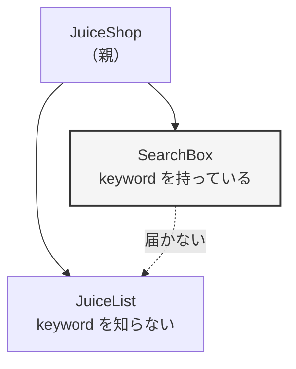
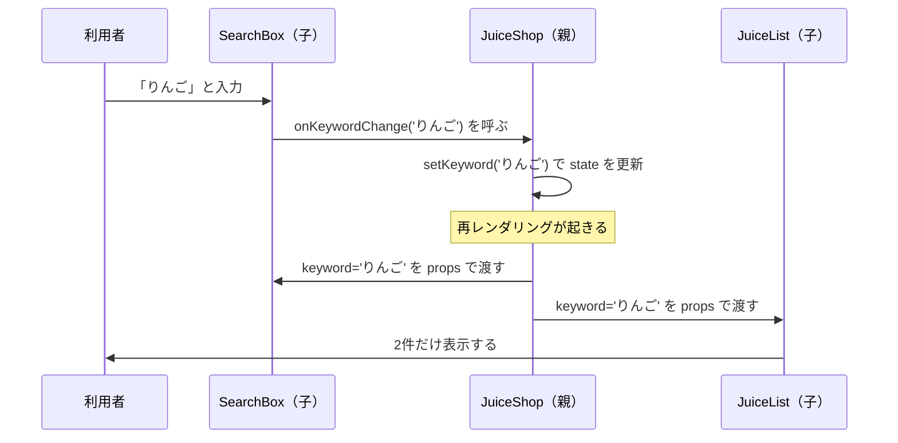
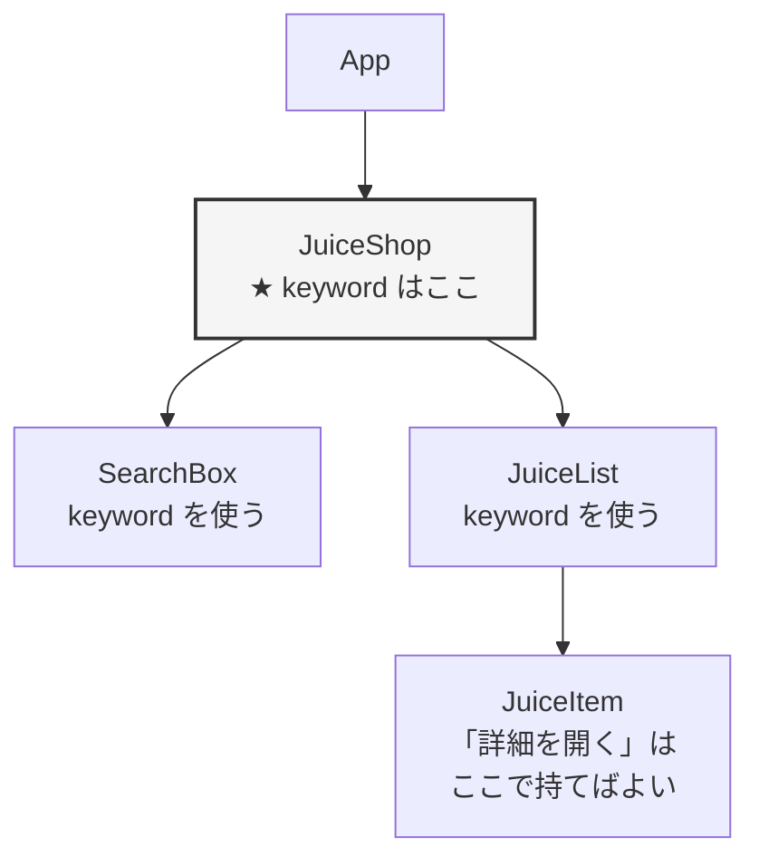
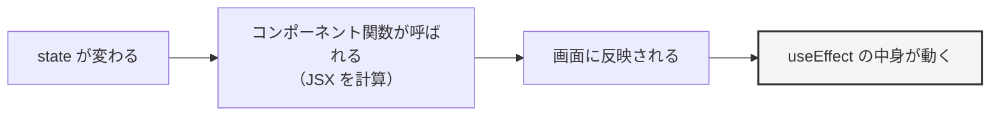
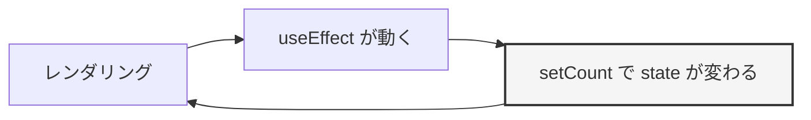
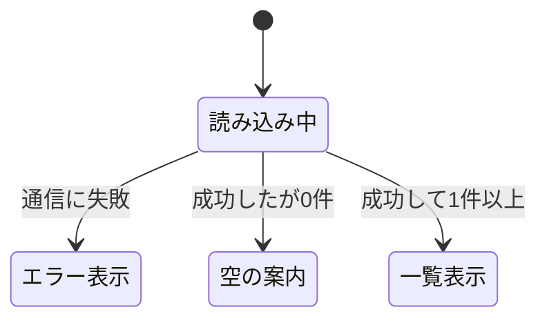

# 第8章 状態設計と副作用

第7章で、**props**（親から子へ渡す値）と **state**（コンポーネントが持つ、変化する値）を
手に入れました。入力して、追加して、削除して、絞り込む——小さなアプリなら、もう作れます。

ただし、第7章のやり方には**まだ届かない場所**が2つあります。

- **1つのコンポーネントの中で完結する話しかできない。**
  「検索欄」と「一覧」を別のコンポーネントに分けたとたん、検索文字が届かなくなります
- **画面を組み立てる以外の処理を書く場所がない。**
  サーバーからデータを取ってくる（5.5.5 の `fetch`）、タイマーを動かす、
  ページのタイトルを変える——こうした処理は、いまのところ書き場所がありません

この章では、この2つを解決します。あわせて、React でいちばん間違えやすい
**「その値は、そもそも state に持つべきか」**という設計の判断も扱います。

## この章で学ぶこと

- 複数のコンポーネントで同じ値を共有できるようになる（状態のリフトアップ）
- state に持つべき値と、計算で出すべき値を見分けられるようになる
- `useEffect` で、画面の組み立て以外の処理を実行できるようになる
- サーバーからデータを取得し、読み込み中とエラーの表示を出し分けられるようになる
- `useRef` / `useMemo` / `useCallback` が何のためにあるかを説明できるようになる
- よく使う処理を自作のフックに切り出せるようになる

## この章の前提

- [第7章](./07-props-and-state.md) の props・`useState`・イベント・`map` と `key`・条件表示・フォーム
- [5.3](./05-javascript-advanced.md) の `map` / `filter`、[5.4](./05-javascript-advanced.md) のスプレッド構文
- [5.5](./05-javascript-advanced.md) の非同期処理（`Promise` / `async` / `await` / `fetch`）
- 第6章で作った `my-first-react` プロジェクトが手元にあり、`npm run dev` で起動できること（[6.2.3](./06-react-start.md)）

> **つまずいたら**
> この章には、**「動くけれど、なぜ動くのかがすぐには見えない」**仕組みが何度か出てきます。
> `useEffect` はその代表です。**一度で理解しようとしないでください。**
> 1つの項ごとにコードを写して動かし、`console.log` の出る順番を目で見るのがいちばんの近道です。
>
> 詰まったときは、**章番号・書いたコード全文・コンソールに出ている文言**を貼って
> AI に相談してください。
>
> ```text
> react-text の 8.2.4 を読んでいます。
> ブラウザのコンソールにログが止まらず出続けます。
> UserList.jsx の全文はこれです。（コードを貼る）
> 出ているのは「Maximum update depth exceeded」です。
> ```

**この章の作業も、すべて第6章で作った `my-first-react` の中で行います。**
ターミナルで `my-first-react` に移動し、開発サーバーを起動しておいてください。

**Windows（PowerShell）**

```powershell
cd react-lesson\my-first-react
npm run dev
```

**macOS / Linux**

```bash
cd react-lesson/my-first-react
npm run dev
```

新しく作るコンポーネントは、これまでどおり `src/components/` に置きます（6.5.3）。

---

## 8.1 状態のリフトアップ

### 8.1.1 兄弟コンポーネント間で値を共有したい

第7章の演習で、検索欄と一覧を**1つのコンポーネントの中**に書きました。
アプリが大きくなると、この形は必ず限界がきます。1つのファイルが数百行になり、
どこを直せばいいのかわからなくなるからです。

そこで、6.5.4 の考え方どおりに部品を分けます。

- `SearchBox` ——— 検索文字を入力する欄
- `JuiceList` ——— 商品の一覧を表示する

まず、動かない形を実際に作ってみます。**わざと失敗させます。**

`src/components/SearchBox.jsx`（新規作成）

```jsx
import { useState } from 'react'

function SearchBox() {
  const [keyword, setKeyword] = useState('')

  return (
    <div className="search-box">
      <input
        type="text"
        value={keyword}
        onChange={(event) => setKeyword(event.target.value)}
        placeholder="商品名で検索"
      />
      <p>入力中の文字: {keyword}</p>
    </div>
  )
}

export default SearchBox
```

`src/components/JuiceList.jsx`（新規作成）

```jsx
const juices = [
  { id: 1, name: 'りんごジュース', price: 200 },
  { id: 2, name: 'みかんジュース', price: 180 },
  { id: 3, name: 'ぶどうジュース', price: 260 },
  { id: 4, name: 'りんごスカッシュ', price: 240 },
]

function JuiceList() {
  return (
    <ul className="juice-list">
      {juices.map((juice) => (
        <li key={juice.id}>
          {juice.name} —— {juice.price}円
        </li>
      ))}
    </ul>
  )
}

export default JuiceList
```

`src/components/JuiceShop.jsx`（新規作成）

```jsx
import SearchBox from './SearchBox.jsx'
import JuiceList from './JuiceList.jsx'

function JuiceShop() {
  return (
    <div className="juice-shop">
      <h2>ジュース一覧</h2>
      <SearchBox />
      <JuiceList />
    </div>
  )
}

export default JuiceShop
```

`src/App.jsx`（全体を次の内容に置き換える）

```jsx
import JuiceShop from './components/JuiceShop.jsx'
import './App.css'

function App() {
  return (
    <div className="app">
      <JuiceShop />
    </div>
  )
}

export default App
```

保存してブラウザを見ると、こうなります。

```text
表示される内容:
ジュース一覧
[            ] 商品名で検索
入力中の文字: りんご
・りんごジュース —— 200円
・みかんジュース —— 180円
・ぶどうジュース —— 260円
・りんごスカッシュ —— 240円
```

**「りんご」と入力しても、一覧は4件のまま**です。エラーは出ません。
`JuiceList` は、`keyword` の存在をまったく知らないからです。

いまの状態を図にすると、こうなっています。



`SearchBox` と `JuiceList` は、**同じ親を持つ兄弟**です。
そして React の値は、7.1.6 で確認したとおり**親から子への一方通行**でしか流れません。
**兄弟どうしを直接つなぐ道は、React にはありません。**

> **よくある間違い**
> 「`JuiceList` から `SearchBox` の `keyword` を `import` すればいい」と考えがちですが、できません。
> `import` で取ってこられるのは**ファイルに書いてある値**（5.6.2）であって、
> `useState` が作る state は、**そのコンポーネントが画面に出ている間だけ存在する値**です。
> ファイルの外から名前で呼び出せるものではありません。

### 8.1.2 共通の親に state を上げる

兄弟どうしをつなぐ道がないなら、**両方から見える場所に値を置く**しかありません。
その場所が、**共通の親**です。

この「state を子から親へ移すこと」を、**状態のリフトアップ**
（state を持つ場所を、上のコンポーネントへ引き上げること）と呼びます。

やることは3つです。

1. `SearchBox` から `useState` の行を**削除**する
2. 同じ行を、親である `JuiceShop` に**書く**
3. 値を、props で子に**渡す**

まず、値を渡すところまでやってみます。

`src/components/JuiceShop.jsx`（全体を次の内容に置き換える）

```jsx
import { useState } from 'react'
import SearchBox from './SearchBox.jsx'
import JuiceList from './JuiceList.jsx'

function JuiceShop() {
  // keyword は SearchBox と JuiceList の両方が必要とするので、共通の親で持つ
  const [keyword, setKeyword] = useState('')

  return (
    <div className="juice-shop">
      <h2>ジュース一覧</h2>
      <SearchBox keyword={keyword} />
      <JuiceList keyword={keyword} />
    </div>
  )
}

export default JuiceShop
```

`src/components/JuiceList.jsx`（`JuiceList` 関数だけを次のように書き換える。`juices` の配列はそのまま）

```jsx
function JuiceList({ keyword }) {
  // 絞り込んだ結果は state にせず、その場で計算する（理由は 8.1.5）
  const shown = juices.filter((juice) => juice.name.includes(keyword))

  return (
    <ul className="juice-list">
      {shown.map((juice) => (
        <li key={juice.id}>
          {juice.name} —— {juice.price}円
        </li>
      ))}
    </ul>
  )
}
```

`src/components/SearchBox.jsx`（全体を次の内容に置き換える）

```jsx
function SearchBox({ keyword }) {
  return (
    <div className="search-box">
      <input type="text" value={keyword} placeholder="商品名で検索" />
      <p>入力中の文字: {keyword}</p>
    </div>
  )
}

export default SearchBox
```

`import { useState } from 'react'` の行も消えている点に注意してください。
`SearchBox` は、もう state を持ちません。

保存すると、画面は表示されます。**が、入力欄に文字を打っても何も入りません。**
コンソールには次の警告が出ます。

```text
Warning: You provided a `value` prop to a form field without an `onChange` handler.
```

7.6.2 で見たものと同じです。`value` だけを書いて `onChange` を書かない入力欄は、
**表示専用**になります。`keyword` を変える手段が、`SearchBox` の中にないのです。

**値は下に流せましたが、変更を上に返す道が、まだありません。**

### 8.1.3 更新関数を props で渡す

`keyword` を変えられるのは、`useState` が返した `setKeyword` だけです（7.2.3）。
そして `setKeyword` は `JuiceShop` の中にあります。

**関数もまた、props で渡せる値です**（7.1.4 で、関数を含むいろいろな型を波かっこで渡せることを確認しました）。
つまり、`setKeyword` そのものを子に渡してしまえばいいのです。

`src/components/JuiceShop.jsx`（`SearchBox` を呼んでいる行を次のように変更する）

```diff
-      <SearchBox keyword={keyword} />
+      <SearchBox keyword={keyword} onKeywordChange={setKeyword} />
```

`src/components/SearchBox.jsx`（全体を次の内容に置き換える）

```jsx
function SearchBox({ keyword, onKeywordChange }) {
  function handleChange(event) {
    // 自分では state を持たず、親からもらった関数を呼ぶだけ
    onKeywordChange(event.target.value)
  }

  return (
    <div className="search-box">
      <input
        type="text"
        value={keyword}
        onChange={handleChange}
        placeholder="商品名で検索"
      />
      <p>入力中の文字: {keyword}</p>
    </div>
  )
}

export default SearchBox
```

保存して、入力欄に「りんご」と打ってみてください。

```text
表示される内容:
ジュース一覧
[りんご      ] 商品名で検索
入力中の文字: りんご
・りんごジュース —— 200円
・りんごスカッシュ —— 240円
```

**別々のコンポーネントである検索欄と一覧が、同じ値で動くようになりました。**

何が起きているのかを、順に追います。



大事なのは、**値は下へ、変化のお知らせは上へ**という流れです。
子は state を持たず、「こういうことが起きました」と親に**報告するだけ**。
実際に値を変えるのは、いつも state を持っている親です。

**props の名前の付け方**

React では、次のように名前を付ける習慣があります。

| 種類 | 名前の付け方 | 例 |
|------|------------|-----|
| 親が子に渡す「〜されたときに呼んでほしい関数」 | `on` + 出来事 | `onKeywordChange`、`onDelete`、`onSubmit` |
| コンポーネントの中で定義する処理の関数 | `handle` + 出来事 | `handleChange`、`handleClick` |

7.3.1 で `handleClick` という名前を使ったのと同じ考え方です。
**`on〜` は外から渡ってくるもの、`handle〜` は自分で書くもの**、と覚えてください。

なお、`onKeywordChange={setKeyword}` のように、**`set○○` をそのまま渡しても構いません。**
親が「値を受け取ったあとに、ほかのこともしたい」場合は、間に関数をはさみます。

```jsx
// 親側で、受け取った値を加工してから state に入れる例
function handleKeywordChange(newKeyword) {
  // 前後の空白を取り除いてから state に入れる
  setKeyword(newKeyword.trimStart())
}

return <SearchBox keyword={keyword} onKeywordChange={handleKeywordChange} />
```

`trimStart` は、文字列の**先頭にある空白を取り除く**メソッドです。
`'  りんご'.trimStart()` は `'りんご'` になります。

> **よくある間違い**
> 子の中で `keyword = event.target.value` のように、props に直接代入しようとする間違いです。
>
> ```jsx
> function handleChange(event) {
>   keyword = event.target.value // 動かない
> }
> ```
>
> ```text
> 出るエラー:
> Uncaught TypeError: Assignment to constant variable.
> ```
>
> props は書き換えられません（7.1.6）。
> **渡された関数を呼んで、親に変えてもらう**のが唯一の道です。

### 8.1.4 state はどこに置くべきか

リフトアップの手順そのものは単純です。難しいのは、**どこまで上げるか**の判断です。

判断の手順は、次の3ステップで機械的に決められます。

1. その値を**使っている**コンポーネントを、すべて書き出す
2. その全部を子孫に持つ、**いちばん下の親**を探す
3. そこに `useState` を置く

「いちばん下の」というのが大事です。とりあえず全部 `App` に置けば動きますが、
`App` が肥大化し、関係のない部品まで再レンダリングされることになります。

具体例で見ます。

| 値 | 使うコンポーネント | 置く場所 |
|----|-----------------|---------|
| 検索文字 | `SearchBox`（入力）、`JuiceList`（絞り込み） | 共通の親 `JuiceShop` |
| 入力欄が今フォーカスされているか | その入力欄だけ | その入力欄のコンポーネント自身 |
| ログイン中のユーザー名 | ヘッダー、マイページ、購入ボタン | それらを含むいちばん上（`App`） |
| 「もっと見る」を開いているか | そのカード1枚だけ | そのカードのコンポーネント自身 |

**「とりあえず親に上げる」は間違いです。** 1つの部品の中でしか使わない値は、その部品が持ちます。
7.2.2 で作ったカウンターのように、自分だけで完結するものは、そのままで構いません。



> **補足：あとから動かせます**
> 最初から完璧な置き場所を当てる必要はありません。
> 「別の部品でも必要になった」と気づいた時点で上に移し、
> 「結局ここでしか使っていない」と気づいたら下に戻します。
> **迷ったら、まず近い場所に置いて、必要になってから上げる**のがおすすめです。

### 8.1.5 持たなくていい state を見分ける

初学者がいちばん多く作ってしまうバグが、**持たなくていい値を state にすること**です。

たとえば「一覧の件数」を state にすると、こうなります。**これはバグを生むコードです。**

`src/components/BadCounterList.jsx`（新規作成。動作を確かめたら削除して構いません）

```jsx
import { useState } from 'react'

function BadCounterList() {
  const [items, setItems] = useState(['りんご', 'みかん'])
  const [count, setCount] = useState(2) // 件数も state に持ってしまった

  function handleAdd() {
    setItems([...items, 'ぶどう'])
    // setCount の更新を書き忘れた
  }

  return (
    <div>
      <p>{count}件</p>
      <ul>
        {items.map((item) => (
          <li key={item}>{item}</li>
        ))}
      </ul>
      <button onClick={handleAdd}>ぶどうを追加</button>
    </div>
  )
}

export default BadCounterList
```

`src/App.jsx` に一時的に `<BadCounterList />` を追加して、ボタンを押してみてください。

```text
表示される内容（ボタンを1回押したあと）:
2件
・りんご
・みかん
・ぶどう
```

**一覧は3件なのに、「2件」と表示されています。**
`items` と `count` という、**同じことを表す値が2つ**あり、片方だけ更新されたためです。

これを**state の重複**と呼びます。エラーにはならないので、気づくのが遅れます。

**正しい形は、計算で出すこと**です。

`src/components/GoodCounterList.jsx`（新規作成）

```jsx
import { useState } from 'react'

function GoodCounterList() {
  const [items, setItems] = useState(['りんご', 'みかん'])
  // 件数は state にしない。items から計算すれば、ずれようがない
  const count = items.length

  function handleAdd() {
    setItems([...items, 'ぶどう'])
  }

  return (
    <div>
      <p>{count}件</p>
      <ul>
        {items.map((item) => (
          <li key={item}>{item}</li>
        ))}
      </ul>
      <button onClick={handleAdd}>ぶどうを追加</button>
    </div>
  )
}

export default GoodCounterList
```

```text
表示される内容（ボタンを1回押したあと）:
3件
・りんご
・みかん
・ぶどう
```

`items` が変われば再レンダリングが起き、`items.length` は**そのつど計算し直される**（7.2.3）ので、
ずれることがありません。

このように、**ほかの state から計算で出せる値**を**派生した値**と呼びます。
派生した値は、`return` より前でただの変数として計算します。

8.1.2 で書いた次の行が、まさにそれです。

```jsx
const shown = juices.filter((juice) => juice.name.includes(keyword))
```

「絞り込んだ結果」は `juices` と `keyword` から計算できるので、state にしません。

**state にすべきかどうかの判断**

次の問いに1つでも「はい」があれば、**state にしません。**

| 問い | はいなら |
|------|---------|
| props から計算できるか | 計算する |
| ほかの state から計算できるか | 計算する |
| 画面の外から来る固定のデータか（商品リストなど） | 関数の外に定数として置く |
| 変わっても画面の見た目が変わらない値か | state にしない（8.4.2 で扱います） |

残ったものだけが state です。**state は「これ以上減らせない最小限の情報」に保ちます。**

> **よくある間違い**
> props をそのまま `useState` の初期値に入れると、**あとから親が変えても子が追従しません。**
>
> ```jsx
> function Price({ price }) {
>   const [shownPrice, setShownPrice] = useState(price) // 初回の値で固定される
>   return <p>{shownPrice}円</p>
> }
> ```
>
> `useState` の初期値が使われるのは、**そのコンポーネントが最初に画面に出たときの1回だけ**です（7.2.2）。
> 親が `price` を 200 から 250 に変えても、`shownPrice` は 200 のままです。
> **表示するだけなら state にせず、`{price}` をそのまま書いてください。**

> **補足：この項の内容は第10章で効いてきます**
> 第10章でタスク管理アプリを作るとき、最初にやるのは
> 「何を state に持つか」を決めることです（10.2.4）。
> ここで挙げた4つの問いが、そのまま設計の道具になります。

---

## 8.2 useEffect — 描画以外の処理

### 8.2.1 副作用とは

ここまで書いてきたコンポーネントは、すべて次の形をしていました。

> props と state を受け取って、**表示する内容（JSX）を計算して返す**

React が期待しているのは、まさにこれだけです。
コンポーネント関数は「材料（props と state）を入れると、画面ができあがる」**計算式**であってほしい、
というのが React の考え方です。

ところが、アプリを作っていると、これに当てはまらない処理が出てきます。

- サーバーからデータを取ってくる（5.5.5 の `fetch`）
- 1秒ごとに何かする（`setInterval`）
- ブラウザのタブに出るページタイトルを変える（`document.title`）
- ブラウザのウィンドウ幅の変化を監視する（`addEventListener`。5.7.4）

これらは**画面を計算する処理ではなく、外の世界に働きかける処理**です。
このような、**画面の計算以外の処理**を、React では**副作用**（ふくさよう。
英語の effect。描画の「ついでに」起きる、外向きの処理のこと）と呼びます。

**副作用を、コンポーネント関数の中に直接書いてはいけません。**
たとえば、次のコードです。

```jsx
function BadTitle({ count }) {
  document.title = `${count} 件` // ここに直接書いてはいけない
  return <p>{count}件</p>
}
```

一見動きます。しかし、これには次の問題があります。

- コンポーネント関数は、**React の都合で何度でも呼ばれます**（7.2.3 の再レンダリング）。
  呼ばれるたびに `document.title` が書き換わり、いつ何回実行されるかを自分で決められません
- React は、実際には画面に出さないまま関数を呼んでみることがあります。
  その場合、**画面に出ていないのにタイトルだけ変わる**という食い違いが起きます

そこで React は、**副作用を書くための専用の場所**を用意しています。それが `useEffect` です。

| 書く場所 | 書く内容 |
|---------|---------|
| コンポーネント関数の本体 | props と state から**表示を計算する**処理だけ |
| イベントハンドラー（`handleClick` など） | **利用者の操作**をきっかけに起きる処理（7.3.1） |
| `useEffect` の中 | **画面が表示されたことをきっかけ**に起きる、外向きの処理 |

### 8.2.2 `useEffect` の使い方

`useEffect` は、`useState` と同じく **React が用意している関数**です。
`useState` と同じように、`react` から名前付き import（5.6.2）します。

書き方は次のとおりです。

```jsx
useEffect(() => {
  // ここに副作用を書く
}, [])
```

- 第1引数：**やってほしい処理を書いた関数**（アロー関数。4.6.3）
- 第2引数：**依存配列**（いぞんはいれつ。いつ実行するかを決める配列。8.2.3 で詳しく扱います）

実際に動かします。カウンターの数を、ブラウザのタブのタイトルに出してみます。

`src/components/TitleCounter.jsx`（新規作成）

```jsx
import { useState, useEffect } from 'react'

function TitleCounter() {
  const [count, setCount] = useState(0)

  useEffect(() => {
    // 画面が表示されたあとに、ブラウザのタブのタイトルを書き換える
    document.title = `${count} 回押しました`
    console.log('useEffect が動きました:', count)
  }, [count])

  console.log('画面を組み立てています:', count)

  return (
    <div>
      <p>{count} 回</p>
      <button onClick={() => setCount(count + 1)}>押す</button>
    </div>
  )
}

export default TitleCounter
```

`src/App.jsx`（全体を次の内容に置き換える）

```jsx
import TitleCounter from './components/TitleCounter.jsx'
import './App.css'

function App() {
  return (
    <div className="app">
      <TitleCounter />
    </div>
  )
}

export default App
```

ブラウザで開き、**タブの文字**を見てください。「0 回押しました」になっています。
ボタンを押すと、タブの文字も一緒に変わります。

コンソール（1.6.4）には、次の順で出ます。

```text
画面を組み立てています: 0
useEffect が動きました: 0
```

ボタンを1回押すと、続けてこう出ます。

```text
画面を組み立てています: 1
useEffect が動きました: 1
```

**必ず「組み立て」が先で、「useEffect」があとです。** これが `useEffect` のいちばん大事な性質です。



`useEffect` の中身は、**画面が実際に表示されたあと**に動きます。
だから、`useEffect` の中では「もう画面に出ている状態」を前提にできます。

> **補足：なぜ「エフェクト」という名前なのか**
> `useEffect` は「effect（副作用）を扱うフック」という意味です。
> **フック**（hook。React の機能を関数コンポーネントから使うための、`use` で始まる関数）は、
> `useState`（7.2.2）に続いて2つ目の登場です。
> この章では、このあと `useRef` / `useMemo` / `useCallback` と、さらに3つ出てきます。
> 名前が `use` で始まるものは、すべてフックの仲間だと考えてください。

### 8.2.3 依存配列

`useEffect` の第2引数の配列を、**依存配列**と呼びます。
「この配列に入っている値のどれかが変わったときだけ、もう一度実行する」という指定です。

書き方は3通りあり、それぞれ動きがはっきり違います。

| 書き方 | いつ実行されるか | 主な用途 |
|--------|---------------|---------|
| `useEffect(() => {...})`（第2引数なし） | **毎回のレンダリングのあと**、必ず | ほぼ使わない |
| `useEffect(() => {...}, [])`（空の配列） | **最初に画面に出たときの1回だけ** | 起動時のデータ取得（8.3） |
| `useEffect(() => {...}, [count])` | 最初の1回＋**`count` が変わったあと** | 特定の値に連動する処理 |

3つの違いを、実際に目で見て確かめます。

`src/components/EffectDemo.jsx`（新規作成）

```jsx
import { useState, useEffect } from 'react'

function EffectDemo() {
  const [count, setCount] = useState(0)
  const [text, setText] = useState('')

  useEffect(() => {
    console.log('A: 依存配列なし')
  })

  useEffect(() => {
    console.log('B: 空の配列')
  }, [])

  useEffect(() => {
    console.log('C: [count]', count)
  }, [count])

  return (
    <div>
      <p>count: {count}</p>
      <button onClick={() => setCount(count + 1)}>count を増やす</button>
      <input
        type="text"
        value={text}
        onChange={(event) => setText(event.target.value)}
        placeholder="ここに入力"
      />
      <p>text: {text}</p>
    </div>
  )
}

export default EffectDemo
```

`src/App.jsx` の `TitleCounter` を `EffectDemo` に差し替えて、コンソールを見ながら操作してください。

**画面を開いた直後**

```text
A: 依存配列なし
B: 空の配列
C: [count] 0
```

**「count を増やす」を1回押したあと**

```text
A: 依存配列なし
C: [count] 1
```

**入力欄に「あ」と1文字打ったあと**

```text
A: 依存配列なし
```

はっきりした違いが出ました。

- **A** は、何が変わっても毎回動く
- **B** は、最初の1回だけで、その後は二度と動かない
- **C** は、`count` が変わったときだけ動く。`text` が変わっても動かない

> **補足：開発中は2回動いて見えます**
> 上の「画面を開いた直後」で、**同じログが2回ずつ出た**人もいるはずです。
>
> ```text
> A: 依存配列なし
> B: 空の配列
> C: [count] 0
> A: 依存配列なし
> B: 空の配列
> C: [count] 0
> ```
>
> これは `src/main.jsx` にある **`<StrictMode>`**（6.3.2 で「第8章で説明します」と書いたもの）の働きです。
> **開発中だけ**、React はコンポーネントをわざと1回捨ててもう一度作り、
> **「消えたときの後始末を書き忘れていないか」**を確かめます（8.2.5）。
>
> - 公開用にビルドしたものでは、2回にはなりません
> - **2回動くと困る処理があるなら、それは後始末が足りない**というサインです
>
> 消したくなりますが、`<StrictMode>` は**そのままにしてください。**
> あとで見つかると大変なバグを、いま見つけてくれる仕組みです。

**依存配列には、中で使っている値をすべて書きます。**
`useEffect` の中で使っている props や state を書き忘れると、
**古い値のまま動き続ける**というバグになります。

Vite で作ったプロジェクトには、これを検出する仕組み（ESLint。書き方の問題を指摘するツール）が
最初から入っており、書き忘れると VS Code に次の警告が出ます。

```text
React Hook useEffect has a missing dependency: 'keyword'.
Either include it or remove the dependency array.
```

**「`keyword` が足りません」**という意味です。素直に足してください。

### 8.2.4 無限ループが起きる仕組みと直し方

`useEffect` で初学者が必ず一度は踏む落とし穴が、**無限ループ**です。
先に、わざと踏んでみます。

`src/components/InfiniteLoopDemo.jsx`（新規作成。**動かしたらすぐ止めます**）

```jsx
import { useState, useEffect } from 'react'

function InfiniteLoopDemo() {
  const [count, setCount] = useState(0)

  // これは無限ループになります
  useEffect(() => {
    setCount(count + 1)
  })

  return <p>{count}</p>
}

export default InfiniteLoopDemo
```

`src/App.jsx` に差し替えて開くと、数字が猛烈な勢いで増え、
コンソールに次のエラーが出ます。

```text
Uncaught Error: Maximum update depth exceeded. This can happen when a component
repeatedly calls setState inside componentWillUpdate or componentDidUpdate.
```

「更新が深くなりすぎました」という意味です。
**ブラウザのタブを閉じるか、`App.jsx` から外して**止めてください。

何が起きたのかを図にすると、こうです。



1. 画面が表示される
2. `useEffect` が動いて `setCount` が呼ばれる
3. state が変わったので、再レンダリングされる（7.2.3）
4. 依存配列がないので、`useEffect` がまた動く → 2 に戻る

**「effect が state を変え、state の変化が effect を呼ぶ」**という輪ができています。

直し方は2つあります。

**直し方1：依存配列を付けて、輪を切る**

```jsx
useEffect(() => {
  setCount(count + 1)
}, []) // 最初の1回だけにする
```

これで無限ループは止まります。ただし、これは対症療法です。

**直し方2：そもそも `useEffect` を使わない**

このコードがやりたかったことは、たいてい「初期値を 1 にする」だけです。
それなら、`useEffect` はいりません。

```jsx
const [count, setCount] = useState(1)
```

**無限ループが出たときは、まず「この処理は本当に副作用か」を疑ってください。**
判断の基準は 8.2.6 にまとめます。

> **よくある間違い：依存配列にオブジェクトや配列を入れる**
> 依存配列の中身は、`===`（4.3.6）で前回と比べられます。
> オブジェクトや配列は、**中身が同じでも、作り直されると別物と判定されます**（5.4.3 で扱った考え方です）。
>
> ```jsx
> // 毎回のレンダリングで新しい配列が作られるので、毎回「変わった」と判定される
> const options = { limit: 10 }
>
> useEffect(() => {
>   console.log('動きます')
> }, [options]) // ← 実質、依存配列なしと同じ
> ```
>
> 直し方は、**中の値だけを依存配列に入れる**ことです。
>
> ```jsx
> useEffect(() => {
>   console.log('動きます')
> }, [options.limit]) // 数値なので、10 のままなら「変わっていない」
> ```
>
> このエラーは、原因がとても見えにくいものです。
> **無限ループを見つけたら、依存配列に配列やオブジェクトが入っていないかを必ず確認してください。**

### 8.2.5 クリーンアップ関数

`useEffect` の中で「始めたもの」は、**終わらせる必要があります。**
タイマー、イベントの監視、通信——始めっぱなしにすると、コンポーネントが画面から消えても動き続けます。

そのための仕組みが**クリーンアップ関数**（後始末をする関数）です。
`useEffect` に渡した関数から、**関数を `return` する**だけです。

```jsx
useEffect(() => {
  // 始める処理

  return () => {
    // 後始末の処理（コンポーネントが消えるとき、および次に effect が動く前）
  }
}, [])
```

実際に、1秒ごとに数える時計を作ります。

`src/components/Timer.jsx`（新規作成）

```jsx
import { useState, useEffect } from 'react'

function Timer() {
  const [seconds, setSeconds] = useState(0)

  useEffect(() => {
    console.log('タイマーを開始します')

    // 1000ミリ秒（1秒）ごとに中の処理を繰り返す
    const timerId = setInterval(() => {
      // 前の値をもとに更新する（7.2.5）。依存配列を空にできる
      setSeconds((prev) => prev + 1)
    }, 1000)

    // 後始末：このコンポーネントが消えるときにタイマーを止める
    return () => {
      console.log('タイマーを止めます')
      clearInterval(timerId)
    }
  }, [])

  return <p>{seconds} 秒経過</p>
}

export default Timer
```

`setInterval` は、5.5.2 で扱った `setTimeout`（1回だけ待つ）の**繰り返し版**です。
戻り値として**そのタイマーを指す番号**が返り、`clearInterval(番号)` で止められます。

タイマーが本当に止まるかを確かめるため、**表示・非表示を切り替えられる**ようにします。

`src/App.jsx`（全体を次の内容に置き換える）

```jsx
import { useState } from 'react'
import Timer from './components/Timer.jsx'
import './App.css'

function App() {
  const [isShown, setIsShown] = useState(true)

  return (
    <div className="app">
      <button onClick={() => setIsShown(!isShown)}>
        {isShown ? 'タイマーを隠す' : 'タイマーを出す'}
      </button>
      {isShown && <Timer />}
    </div>
  )
}

export default App
```

`{isShown && <Timer />}` は、7.5.1 で扱った `&&` による条件表示です。
`isShown` が `false` になると、`Timer` は**画面から取り除かれます**。

ボタンを押して、コンソールを見てください。

```text
タイマーを開始します
（1秒ごとに数字が増える）
タイマーを止めます        ← 「タイマーを隠す」を押したとき
タイマーを開始します      ← 「タイマーを出す」を押したとき
```

**コンポーネントが消えるときに、後始末が呼ばれています。**

クリーンアップ関数を消すと、どうなるかも見てください。
`return () => {...}` の部分を削除して隠すと、**画面には出ていないのに `setSeconds` が呼ばれ続けます。**
今回は数字が見えないだけですが、通信やイベント監視で同じことをすると、
「閉じたはずの画面が裏で動き続ける」という深刻な不具合になります。

クリーンアップが呼ばれるタイミングは、次の2つです。

| タイミング | 例 |
|-----------|-----|
| コンポーネントが画面から消えるとき | 上の「タイマーを隠す」 |
| 依存配列の値が変わって、effect がもう一度動く直前 | `[userId]` の `userId` が変わったとき、前のユーザーの通信を止める |

2つ目が大事です。**「新しく始める前に、前のものを終わらせる」**という順番になっています。

**オン・オフを切り替えられるようにする**

この性質を使うと、**真偽値の state で処理を start / stop する**書き方ができます。
例として、「自動更新」のオン・オフを切り替えられる時計を作ります。

`src/components/AutoClock.jsx`（新規作成）

```jsx
import { useState, useEffect } from 'react'

function AutoClock() {
  const [now, setNow] = useState('まだ更新していません')
  const [isAuto, setIsAuto] = useState(false)

  useEffect(() => {
    // オフのときは何も始めない（クリーンアップも不要なので、そのまま抜ける）
    if (!isAuto) {
      return
    }

    console.log('自動更新を開始します')
    const timerId = setInterval(() => {
      setNow(new Date().toLocaleTimeString())
    }, 1000)

    return () => {
      console.log('自動更新を止めます')
      clearInterval(timerId)
    }
  }, [isAuto]) // isAuto が変わるたびに、後始末 → もう一度実行

  return (
    <div>
      <p>{now}</p>
      <button onClick={() => setIsAuto(!isAuto)}>
        {isAuto ? '自動更新を止める' : '自動更新を始める'}
      </button>
    </div>
  )
}

export default AutoClock
```

`new Date().toLocaleTimeString()` は、**いまの時刻を「14:05:32」のような文字列で返す**書き方です。

```text
コンソール:
自動更新を開始します     ← ボタンを押したとき
自動更新を止めます       ← もう一度押したとき
```

ポイントは2つです。

- `isAuto` が `false` のときは、**何もせずに `return` する**（タイマーを作らない）
- `isAuto` が変わると、React は**前の effect の後始末をしてから**新しい effect を動かす

**「始める条件を effect の中に書き、依存配列にその条件を入れる」**——
この形は、通信・監視・タイマーのオン/オフすべてに使えます。

> **補足：`<StrictMode>` が確かめているのはこれです**
> 8.2.3 の補足で「開発中は2回動く」と書きました。
> 正確には、React は開発中に**「effect を動かす → クリーンアップする → もう一度 effect を動かす」**
> という手順をわざと踏みます。
>
> ```text
> タイマーを開始します
> タイマーを止めます
> タイマーを開始します
> ```
>
> クリーンアップが正しく書けていれば、これで問題は起きません。
> **クリーンアップを書き忘れていると、タイマーが2つ動いて「数字が2ずつ増える」**といった形で表面化します。
> 開発中に気づける、というのが `<StrictMode>` の狙いです。

> **よくある間違い**
> `return` するのは**関数**であって、処理の結果ではありません。
>
> ```jsx
> // 動かない：clearInterval をその場で実行してしまっている
> return clearInterval(timerId)
> ```
>
> ```jsx
> // 正しい：「あとで呼んでください」と関数を渡す
> return () => clearInterval(timerId)
> ```
>
> 7.3.2 で扱った「関数を渡すのと、呼び出すのの違い」とまったく同じ話です。

### 8.2.6 `useEffect` を使うべきでない場面

`useEffect` は便利に見えるため、**必要ない場所で使われがち**です。
React の公式ドキュメントにも「おそらく effect は必要ない」という章があるほど、よくある間違いです。

判断は単純です。

> **`useEffect` は、「React の外の世界」とやりとりするときだけ使います。**

| やりたいこと | 正しい書き方 |
|------------|------------|
| props や state から値を計算したい | `return` の前でただの変数として計算する（8.1.5） |
| ボタンが押されたときに何かしたい | イベントハンドラーに書く（7.3.1） |
| フォーム送信時にデータを送りたい | `handleSubmit` の中に書く（7.6.5） |
| 画面を開いたときにデータを取ってきたい | **`useEffect` を使う**（8.3） |
| タイマーやイベント監視を始めたい | **`useEffect` を使う**（8.2.5） |
| ページタイトルなど、ブラウザ側を書き換えたい | **`useEffect` を使う**（8.2.2） |

**間違った例：計算結果を effect で state に入れる**

```jsx
// 悪い例
const [items, setItems] = useState([...])
const [count, setCount] = useState(0)

useEffect(() => {
  setCount(items.length)
}, [items])
```

これは、8.1.5 で見た「state の重複」を、わざわざ手間をかけて作っているだけです。
しかも、**レンダリングが2回**走ります（`items` の更新で1回、`setCount` でもう1回）。

```jsx
// 良い例
const count = items.length
```

**間違った例：ボタンの処理を effect に書く**

```jsx
// 悪い例
const [isSubmitted, setIsSubmitted] = useState(false)

useEffect(() => {
  if (isSubmitted) {
    console.log('送信しました')
    setIsSubmitted(false)
  }
}, [isSubmitted])

return <button onClick={() => setIsSubmitted(true)}>送信</button>
```

「押されたら送信する」なら、押されたところに書けば済みます。

```jsx
// 良い例
function handleSubmit() {
  console.log('送信しました')
}

return <button onClick={handleSubmit}>送信</button>
```

**見分け方**：その処理のきっかけは何かを言葉にしてください。

- 「**利用者が〜したから**」→ イベントハンドラー
- 「**画面が表示されたから**」「**この値が変わったから**」→ `useEffect`

---

## 8.3 サーバーからデータを取得する

### 8.3.1 `fetch` と `useEffect` を組み合わせる

ここまでのコンポーネントが表示していたのは、**ファイルに直接書いたデータ**でした。
本物のアプリでは、データはサーバーから届きます。

5.5.5 で `fetch`（サーバーにデータを取りにいく関数）を扱いました。
これを React でどこに書くかというと、**`useEffect` の中**です。
「画面が表示されたことをきっかけに、外の世界と通信する」——まさに副作用（8.2.1）だからです。

このテキストでは、**JSONPlaceholder** という練習用の公開 API を使います。
登録もキーも不要で、ダミーのユーザーデータを返してくれます。

まずブラウザのアドレス欄に、次の URL をそのまま入れて開いてみてください。

```text
https://jsonplaceholder.typicode.com/users
```

次のような JSON（5.5.5 で扱った、データをやりとりするための文字の形式）が表示されます。

```json
[
  {
    "id": 1,
    "name": "Leanne Graham",
    "username": "Bret",
    "email": "Sincere@april.biz"
  },
  {
    "id": 2,
    "name": "Ervin Howell",
    "username": "Antonette",
    "email": "Shanna@melissa.tv"
  }
]
```

**実際には 10 人分が返ります**（ここでは長いので2人分だけ載せています）。
`id` を持っているので、そのまま `key` に使えます（7.4.2）。

これを React で表示します。

`src/components/UserList.jsx`（新規作成）

```jsx
import { useState, useEffect } from 'react'

function UserList() {
  const [users, setUsers] = useState([])

  useEffect(() => {
    // useEffect に渡す関数自体は async にできないので、中で定義して呼ぶ
    async function loadUsers() {
      const response = await fetch('https://jsonplaceholder.typicode.com/users')
      const data = await response.json()
      setUsers(data)
    }

    loadUsers()
  }, []) // 空の配列 = 最初に画面に出たときの1回だけ

  return (
    <div>
      <h2>ユーザー一覧</h2>
      <ul>
        {users.map((user) => (
          <li key={user.id}>
            {user.name}（{user.email}）
          </li>
        ))}
      </ul>
    </div>
  )
}

export default UserList
```

`src/App.jsx`（全体を次の内容に置き換える）

```jsx
import UserList from './components/UserList.jsx'
import './App.css'

function App() {
  return (
    <div className="app">
      <UserList />
    </div>
  )
}

export default App
```

保存すると、一瞬なにも出ないあと、10 人分が表示されます。

```text
表示される内容:
ユーザー一覧
・Leanne Graham（Sincere@april.biz）
・Ervin Howell（Shanna@melissa.tv）
・Clementine Bauch（Nathan@yesenia.net）
（以下、10件まで続く）
```

コードで押さえるべき点は3つです。

| 書いたこと | 理由 |
|-----------|------|
| `useState([])` の初期値が**空の配列** | 通信が終わるまで `users` は空。`undefined` だと `map` でエラーになる |
| `useEffect(..., [])` の**空の依存配列** | 1回だけ取得する。付け忘れると通信し続ける（8.2.4） |
| `async function loadUsers()` を**中で定義して呼ぶ** | `useEffect` に渡す関数を `async` にできないため |

3つ目を補足します。次のように書きたくなりますが、**これは書けません。**

```jsx
// 動かない書き方
useEffect(async () => {
  const response = await fetch('...')
}, [])
```

`async` を付けた関数は、必ず `Promise` を返します（5.5.4）。
一方 `useEffect` は、戻り値が来たら**クリーンアップ関数だと解釈**します（8.2.5）。
`Promise` はクリーンアップ関数ではないので、React が警告を出します。

```text
Warning: useEffect must not return anything besides a function, which is used
for clean-up.
```

**中で `async function` を定義して、その場で呼ぶ。** この形を覚えてください。

> **よくある間違い**
> `useState` の初期値を書き忘れて `useState()` にすると、`users` は `undefined` になります。
>
> ```text
> 出るエラー:
> Uncaught TypeError: Cannot read properties of undefined (reading 'map')
> ```
>
> 5.2.5 で扱った、あのエラーです。
> **通信で受け取る値の初期値は、届いたあとと同じ「形」にしておきます。**
> 配列が届くなら `[]`、オブジェクトが届くなら `null` にして、7.5.3 の早期 `return` で分岐します。

### 8.3.2 ローディング状態

いまのコードには、**通信中の空白**があります。
自宅の回線が速いと一瞬ですが、電波の悪い場所では数秒間、**何も出ない画面**になります。
利用者からは「壊れている」ようにしか見えません。

そこで、**いま通信中かどうか**を state に持ちます。

`src/components/UserList.jsx`（全体を次の内容に置き換える）

```jsx
import { useState, useEffect } from 'react'

function UserList() {
  const [users, setUsers] = useState([])
  const [isLoading, setIsLoading] = useState(true) // 最初は通信中から始まる

  useEffect(() => {
    async function loadUsers() {
      const response = await fetch('https://jsonplaceholder.typicode.com/users')
      const data = await response.json()
      setUsers(data)
      setIsLoading(false) // 通信が終わったので false に戻す
    }

    loadUsers()
  }, [])

  // 通信中は、一覧の代わりに読み込み中の文を出す（7.5.3 の早期 return）
  if (isLoading) {
    return <p>読み込み中...</p>
  }

  return (
    <div>
      <h2>ユーザー一覧</h2>
      <ul>
        {users.map((user) => (
          <li key={user.id}>
            {user.name}（{user.email}）
          </li>
        ))}
      </ul>
    </div>
  )
}

export default UserList
```

これで、通信が終わるまで「読み込み中...」が出ます。

**一瞬すぎて確認できないときは、開発者ツールで通信を遅くします。**

1. ブラウザで開発者ツールを開く（1.6.4）
2. 「ネットワーク」タブを開く
3. 上部の速度の選択（`No throttling` と表示されている箇所）を **`Slow 4G`** に変える
4. ページを再読み込みする

```text
表示される内容（通信中）:
読み込み中...

表示される内容（通信後）:
ユーザー一覧
・Leanne Graham（Sincere@april.biz）
（以下、10件まで続く）
```

確認が終わったら、速度の設定を `No throttling` に戻してください。

> **補足：初期値を `true` にする理由**
> `useState(false)` から始めると、**画面を開いた最初の一瞬だけ「0件の一覧」が表示されます。**
> データを取りに行くことが最初から決まっているなら、**最初から「通信中」で始める**のが自然です。

### 8.3.3 エラー状態

通信は失敗します。理由はいくらでもあります。

- インターネットにつながっていない
- サーバーが落ちている
- URL を打ち間違えた
- サーバーが「そんなデータはない」と返してきた（404）

いまのコードでは、失敗すると**「読み込み中...」のまま永遠に止まります。**
`setIsLoading(false)` の行まで到達しないからです。

5.5.6 で扱った `try` / `catch` / `finally` と、`response.ok` の確認を入れます。

```jsx
try {
  // 失敗するかもしれない処理
} catch (error) {
  // 失敗したときの処理
} finally {
  // 成功しても失敗しても必ず通る処理
}
```

`fetch` には、**注意すべき性質**がありました（5.5.6）。

> **`fetch` は、404 や 500 が返ってきても「失敗」にはなりません。**
> 通信そのものが届いた時点で成功と見なされ、`catch` に入りません。
> ステータスが正常かどうかは、**`response.ok`**（200 番台なら `true`）で自分で確かめます。

まず、エラー文を入れておく state を1つ追加します。

`src/components/UserList.jsx`（`isLoading` の宣言の次の行に追記する）

```diff
  const [isLoading, setIsLoading] = useState(true)
+ const [errorMessage, setErrorMessage] = useState('')
```

そのうえで、通信部分を書き換えます。

`src/components/UserList.jsx`（`loadUsers` の中身を次のように書き換える）

```jsx
async function loadUsers() {
  try {
    const response = await fetch('https://jsonplaceholder.typicode.com/users')

    // 404 や 500 は catch に入らないので、自分で確かめて例外を投げる
    if (!response.ok) {
      throw new Error(`サーバーが ${response.status} を返しました`)
    }

    const data = await response.json()
    setUsers(data)
  } catch (error) {
    console.error(error)
    setErrorMessage('ユーザーの取得に失敗しました。時間をおいて試してください。')
  } finally {
    // 成功でも失敗でも、通信は終わったので必ず false にする
    setIsLoading(false)
  }
}
```

`throw new Error('文字')` は、**自分でエラーを発生させる**書き方です（5.5.6）。
投げたエラーは `catch (error)` で受け取れます。

`console.error` は `console.log` の仲間で、**赤い文字で目立つように出す**ためのものです。
利用者に見せる文と、開発者が原因を追うための情報を、分けて扱っています。

最後に、エラー文を画面に出す分岐を足します。

`src/components/UserList.jsx`（`if (isLoading)` のブロックの直後に追記する）

```diff
  if (isLoading) {
    return <p>読み込み中...</p>
  }
+
+ if (errorMessage) {
+   return <p className="error">{errorMessage}</p>
+ }
```

空文字は `if` の条件では `false` として扱われる（4.3.8）ため、
**成功したときはこの `if` を素通りします。**

**わざと失敗させて確かめる**

URL を存在しないものに変えてみてください。

```jsx
const response = await fetch('https://jsonplaceholder.typicode.com/no-such-data')
```

```text
表示される内容:
ユーザーの取得に失敗しました。時間をおいて試してください。

コンソール:
Error: サーバーが 404 を返しました
```

確認したら、URL を元に戻してください。

> **よくある間違い**
> `catch` で受け取ったエラーを、そのまま画面に出す書き方です。
>
> ```jsx
> setErrorMessage(error.message) // 開発者向けの文がそのまま利用者に出る
> ```
>
> `Failed to fetch` や `Unexpected token < in JSON` のような文言が、
> そのまま画面に出ることになります。利用者には何のことかわかりません。
> **画面には「何をすればよいか」を書き、詳細は `console.error` に回してください。**

### 8.3.4 3つの state

ここまでで、データ取得には**3つの state** が必要だとわかりました。

| state | 型 | 役割 |
|-------|----|------|
| `users` | 配列 | 取得できたデータ |
| `isLoading` | 真偽値 | いま通信中か |
| `errorMessage` | 文字列 | 失敗したときに見せる文（成功時は空文字） |

全体を通した完成形が、次のコードです。

`src/components/UserList.jsx`（全体を次の内容に置き換える）

```jsx
import { useState, useEffect } from 'react'

function UserList() {
  const [users, setUsers] = useState([])
  const [isLoading, setIsLoading] = useState(true)
  const [errorMessage, setErrorMessage] = useState('')

  useEffect(() => {
    async function loadUsers() {
      try {
        const response = await fetch('https://jsonplaceholder.typicode.com/users')

        if (!response.ok) {
          throw new Error(`サーバーが ${response.status} を返しました`)
        }

        const data = await response.json()
        setUsers(data)
      } catch (error) {
        console.error(error)
        setErrorMessage('ユーザーの取得に失敗しました。時間をおいて試してください。')
      } finally {
        setIsLoading(false)
      }
    }

    loadUsers()
  }, [])

  if (isLoading) {
    return <p>読み込み中...</p>
  }

  if (errorMessage) {
    return <p className="error">{errorMessage}</p>
  }

  if (users.length === 0) {
    return <p>ユーザーが登録されていません。</p>
  }

  return (
    <div>
      <h2>ユーザー一覧（{users.length}人）</h2>
      <ul>
        {users.map((user) => (
          <li key={user.id}>
            {user.name}（{user.email}）
          </li>
        ))}
      </ul>
    </div>
  )
}

export default UserList
```

`if` を並べる書き方（7.5.3 の早期 `return`）にすることで、
**上から順に「いま画面はどの状態か」を読める**形になります。

この4つの分岐は、そのまま画面の状態を表しています。



**この「読み込み中 / エラー / 空 / 表示」の4つは、データを扱う画面の定番です。**
第10章でアプリを作るときも、この形をそのまま使います。

`src/App.css` に、エラー文のスタイルを足しておきます。

`src/App.css`（末尾に追記）

```css
.error {
  color: #b00020;
  border: 1px solid #b00020;
  padding: 12px;
  border-radius: 4px;
}
```

> **補足：4つの分岐を書く順番**
> `isLoading` を必ず**いちばん上**に置いてください。
> 順番を入れ替えて `users.length === 0` を先に書くと、
> **通信中（まだ空の配列）にも「登録されていません」が一瞬表示されます。**

**「もう一度取得する」ボタンを付ける**

通信は失敗することがあるので、**利用者がやり直せる**ようにしておくと親切です。

ここで問題になるのが、「ボタンを押したときに `useEffect` の中身をもう一度動かしたい」という点です。
`useEffect` の中の関数は、外から呼び出せません。

解決策は、**依存配列に入れるための state を1つ足す**ことです。
その値が変われば effect が動く（8.2.3）ので、ボタンからは**その値を変えるだけ**にします。

`src/components/UserList.jsx`（次の3箇所を変更する）

```diff
  const [errorMessage, setErrorMessage] = useState('')
+ // この数字が変わるたびに、useEffect がもう一度動く
+ const [reloadCount, setReloadCount] = useState(0)

  useEffect(() => {
+   // 2回目以降も「読み込み中...」を出すため、始める前に戻しておく
+   setIsLoading(true)
+   setErrorMessage('')
+
    async function loadUsers() {
```

```diff
    loadUsers()
- }, [])
+ }, [reloadCount])
```

```diff
      <h2>ユーザー一覧（{users.length}人）</h2>
+     <button onClick={() => setReloadCount(reloadCount + 1)}>もう一度取得する</button>
```

エラー画面にも同じボタンを置いておくと、失敗したときにやり直せます。

```jsx
if (errorMessage) {
  return (
    <div>
      <p className="error">{errorMessage}</p>
      <button onClick={() => setReloadCount(reloadCount + 1)}>もう一度取得する</button>
    </div>
  )
}
```

```text
表示される内容（ボタンを押した直後）:
読み込み中...

表示される内容（取得後）:
ユーザー一覧（10人）
（以下、10件）
```

> **よくある間違い**
> `setIsLoading(true)` と `setErrorMessage('')` を書き忘れると、
> **2回目以降は「読み込み中...」が出ず、前回のエラー文も残ったまま**になります。
> 通信を始める前に、状態を最初に戻すところまでがワンセットです。

### 8.3.5 CORS エラーに遭遇したら

自分でサーバーを用意して繋ぎにいくと、ほぼ確実に一度は出会うのが **CORS エラー**です。
初めて見ると、コードのどこが悪いのか見当がつきません。**先に知っておいてください。**

コンソールに、次のような赤い文字が出ます。

```text
Access to fetch at 'https://example.com/api/users' from origin
'http://localhost:5173' has been blocked by CORS policy:
No 'Access-Control-Allow-Origin' header is present on the requested resource.

Uncaught (in promise) TypeError: Failed to fetch
```

**これはコードの書き間違いではありません。** ブラウザが意図的に止めています。

ブラウザには、**同一オリジンポリシー**（どういつオリジンポリシー。
別の出どころのサーバーへの通信を、既定で制限する安全の仕組み）があります。

**オリジン**とは、URL の「スキーム（`https`）＋ホスト名＋ポート番号」の組み合わせです（1.2.3）。

| あなたの画面 | 通信先 | 同じオリジンか |
|------------|-------|--------------|
| `http://localhost:5173` | `http://localhost:5173/api` | 同じ |
| `http://localhost:5173` | `http://localhost:8000/api` | **違う**（ポートが別） |
| `http://localhost:5173` | `https://example.com/api` | **違う** |

違うオリジンへの通信は、**サーバー側が「この画面からの通信を許可します」と明示したときだけ**通ります。
その明示が、`Access-Control-Allow-Origin` というレスポンスヘッダー
（サーバーが返す、データ本体とは別の付加情報）です。

つまり、**直し方はサーバー側にあります。**

| 状況 | どうするか |
|------|----------|
| 自分で作ったサーバー | サーバー側で CORS の許可設定をする。FastAPI での方法は3冊目で扱います |
| 他人の公開 API | ドキュメントを読む。ブラウザから直接呼べない API も多い |
| フロント側で何とかしたい | **できません。** ブラウザの安全機能なので、JavaScript 側では回避できません |

> **注意**
> 検索すると「CORS を無効にしてブラウザを起動する」といった方法が見つかります。
> **開発中でも使わないでください。** ブラウザの安全機能をすべて外すことになり、
> 普段の Web 閲覧まで危険になります。
> また、その状態で動いても、公開したときには必ず同じ問題が再発します。

このテキストで使っている JSONPlaceholder は、**どのオリジンからでも許可する設定**になっているため、
このエラーは出ません。3冊目（fastapi-text）で自分のサーバーを立てたとき、
必ずこの話に戻ってきます。

---

## 8.4 useRef / useMemo / useCallback

この節で扱う3つのフックは、**なくてもアプリは作れます。**
無理に使う必要はありません。ただし、次の2つの場面で必要になります。

- 入力欄にカーソルを当てるなど、**DOM を直接触りたい**とき（`useRef`）
- 動きが目に見えて遅くなり、**計算を減らしたい**とき（`useMemo` / `useCallback`）

**何のためにあるか**を知っておくことが、この節の目的です。

### 8.4.1 `useRef` — DOM を直接触る

5.7.2 で、`document.querySelector` を使って HTML の要素を取ってきました。
React でも同じことをしたくなる場面があります。代表が**入力欄へのフォーカス**です
（フォーカス＝キーボードの入力先として選ばれている状態。カーソルが点滅します）。

ただし、React が管理している画面を `document.querySelector` で触るのは避けます。
React は「自分が画面を作る」前提で動いており、外から勝手に触ると食い違いが起きるためです。

React 側の道具が **`useRef`** です。

`src/components/SearchFocus.jsx`（新規作成）

```jsx
import { useRef, useEffect } from 'react'

function SearchFocus() {
  // 箱を1つ作る。中身（current）は最初 null
  const inputRef = useRef(null)

  useEffect(() => {
    // 画面が表示されたあとにカーソルを当てる
    inputRef.current.focus()
  }, [])

  function handleClear() {
    inputRef.current.value = ''
    inputRef.current.focus()
  }

  return (
    <div>
      <input type="text" ref={inputRef} placeholder="開いた瞬間にここへ入力できます" />
      <button onClick={handleClear}>クリアしてカーソルを戻す</button>
    </div>
  )
}

export default SearchFocus
```

`src/App.jsx` の中身を `<SearchFocus />` に差し替えて開くと、
**クリックしなくても入力欄にカーソルが入っています。**

```text
表示される内容:
[|                                  ]  ← カーソルが点滅している
[クリアしてカーソルを戻す]
```

仕組みは3ステップです。

| 書いたこと | 何が起きるか |
|-----------|------------|
| `const inputRef = useRef(null)` | `{ current: null }` という**箱**が作られる |
| `<input ref={inputRef} />` | React が、画面に出した実際の `<input>` を `inputRef.current` に入れる |
| `inputRef.current.focus()` | その `<input>` に対して DOM の操作を行う（5.7 と同じメソッドが使える） |

**`.current` を書き忘れる間違いが非常に多い**ので注意してください。
`inputRef` は箱そのもの、`inputRef.current` が中身です。

`useEffect` の中で呼んでいる理由も大事です。
**コンポーネント関数が実行されている時点では、まだ `<input>` は画面に出ていません。**
`inputRef.current` は `null` のままです。`useEffect` は画面に出たあとに動く（8.2.2）ので、
そこでなら安全に触れます。

> **よくある間違い**
> `useEffect` を使わず、関数の本体に直接書いた場合です。
>
> ```jsx
> function SearchFocus() {
>   const inputRef = useRef(null)
>   inputRef.current.focus() // まだ画面にない
>   return <input ref={inputRef} />
> }
> ```
>
> ```text
> 出るエラー:
> Uncaught TypeError: Cannot read properties of null (reading 'focus')
> ```

> **補足：値の管理は `useRef` ではなく state で**
> 上の `handleClear` では `inputRef.current.value = ''` と直接書き換えましたが、
> **入力値そのものは、7.6.1 の制御コンポーネント（`value` と `onChange`）で管理するのが基本**です。
> `useRef` を使うのは、フォーカス・スクロール位置・再生や停止など、
> **state では表せない操作**に限ります。

### 8.4.2 `useRef` — 再描画されない値を持つ

`useRef` には、まったく別の使い道があります。
**画面に関係しない値を、再レンダリングをまたいで覚えておく**という使い方です。

7.2.1 で「普通の変数は、再レンダリングのたびに初期値に戻ってしまう」と学びました。
かといって state にすると、変えるたびに再レンダリングが起きます。

**「消えてほしくないが、変わっても画面は変えなくていい」**値の置き場所が `useRef` です。

`src/components/RenderCounter.jsx`（新規作成）

```jsx
import { useState, useRef } from 'react'

function RenderCounter() {
  const [text, setText] = useState('')
  const renderCount = useRef(0)
  let normalCount = 0

  // レンダリングのたびに数える
  renderCount.current = renderCount.current + 1
  normalCount = normalCount + 1

  return (
    <div>
      <input
        type="text"
        value={text}
        onChange={(event) => setText(event.target.value)}
        placeholder="何か入力してください"
      />
      <p>useRef で数えた回数: {renderCount.current}</p>
      <p>普通の変数で数えた回数: {normalCount}</p>
    </div>
  )
}

export default RenderCounter
```

入力欄に「あいう」と3文字打つと、こうなります。

```text
表示される内容:
useRef で数えた回数: 8
普通の変数で数えた回数: 1
```

普通の変数は毎回 0 から作り直されるので、いつまでも 1 のままです。
`useRef` の中身は**消えずに残ります**。

> **補足：なぜ 4 ではなく 8 なのか**
> 数えた回数が、打った文字数（3回）＋最初の1回＝4 ではなく、その倍になっています。
> これは開発中の `<StrictMode>` が、コンポーネント関数を**2回ずつ呼んでいる**ためです（8.2.3）。
> 公開用にビルドすると 4 になります。
> **この数え方は仕組みを見るための実験用**であり、実際のアプリで使うものではありません。

state との違いを整理します。

| | `useState` | `useRef` |
|--|-----------|----------|
| 値は残るか | 残る | 残る |
| 変えたとき再レンダリングされるか | **される** | **されない** |
| 変え方 | `setCount(1)` | `ref.current = 1`（直接代入してよい） |
| 画面に出す値 | **こちらを使う** | 向かない（変えても画面が更新されない） |

**画面に出す値は必ず state です。** `useRef` の中身を変えても画面は変わりません。
上の例で `renderCount.current` の数字が増えて見えるのは、
`setText` による再レンダリングに**ついでに乗っている**だけです。

代表的な使いどころは、8.2.5 で使った**タイマーの番号**です。

```jsx
const timerIdRef = useRef(null)

function handleStart() {
  timerIdRef.current = setInterval(() => {
    setSeconds((prev) => prev + 1)
  }, 1000)
}

function handleStop() {
  clearInterval(timerIdRef.current)
}
```

タイマーの番号は画面に出しませんが、「開始」と「停止」という**別々のイベントをまたいで**
覚えておく必要があります。まさに `useRef` の役割です。

### 8.4.3 `useMemo` — 計算結果を覚えておく

7.2.3 で見たとおり、**state が変わるたびにコンポーネント関数は最初から実行し直されます。**
関数の中に重い計算があると、それも毎回やり直されます。

体感してみます。**わざと重い計算**を用意します。

`src/components/HeavyDemo.jsx`（新規作成）

```jsx
import { useState } from 'react'

// わざと時間のかかる計算（1 から max までの合計を、1つずつ足して求める）
function heavySum(max) {
  console.time('heavySum')
  let total = 0
  for (let i = 1; i <= max; i++) {
    total = total + i
  }
  console.timeEnd('heavySum')
  return total
}

function HeavyDemo() {
  const [max, setMax] = useState(30000000)
  const [text, setText] = useState('')

  // レンダリングのたびに実行される
  const total = heavySum(max)

  return (
    <div>
      <p>1 から {max} までの合計: {total}</p>
      <input
        type="text"
        value={text}
        onChange={(event) => setText(event.target.value)}
        placeholder="ここに何か入力してみてください"
      />
      <p>入力: {text}</p>
    </div>
  )
}

export default HeavyDemo
```

`console.time('名前')` と `console.timeEnd('名前')` は、
**その間にかかった時間を測ってコンソールに出す**ための組み合わせです。

`src/App.jsx` の中身を `<HeavyDemo />` に差し替えて、入力欄に文字を打ってください。
**1文字打つたびに、目に見えて反応が遅れます。**

```text
コンソール:
heavySum: 28.4 ms
heavySum: 27.9 ms
heavySum: 29.1 ms
```

数値は環境によって変わりますが、**打鍵のたびに毎回計算されている**ことがわかります。
`text` が変わっただけで、`max` は変わっていないのにです。
（開発中は `<StrictMode>` によって、1回の打鍵で2行ずつ出ることがあります。8.2.3 の補足を参照してください。）

そこで **`useMemo`** を使います。
「この値が変わっていなければ、**前回の計算結果を使い回す**」という指示です。

`src/components/HeavyDemo.jsx`（`import` 行と、`total` を求める行を次のように変更する）

```diff
- import { useState } from 'react'
+ import { useState, useMemo } from 'react'
```

```diff
- const total = heavySum(max)
+ // max が変わったときだけ計算し直す
+ const total = useMemo(() => heavySum(max), [max])
```

書き方は `useEffect` とよく似ています。

```jsx
const 結果 = useMemo(() => 計算する関数の中身, [依存配列])
```

保存して、もう一度入力欄に打ってください。

```text
コンソール:
heavySum: 28.6 ms      ← 最初の1回だけ
（以降、打っても出ない）
```

**引っかかりがなくなりました。** 依存配列の考え方は 8.2.3 とまったく同じで、
`[max]` に入っている値が変わったときだけ計算し直します。

> **補足：`useMemo` は何を覚えているのか**
> 覚えているのは**計算の結果**です。処理そのものを速くするわけではありません。
> `max` を変えれば、やはり 28 ミリ秒かかります。
> **「同じ入力に対する、同じ計算をくり返さない」**のが `useMemo` の働きです。

> **よくある間違い**
> `useMemo` の中で関数を**呼ばずに渡してしまう**間違いです。
>
> ```jsx
> const total = useMemo(heavySum(max), [max]) // アロー関数で包んでいない
> ```
>
> これでは、`heavySum(max)` が**その場で実行**されてしまい、意味がありません
> （7.3.2 の「関数を渡すのと呼び出すのの違い」と同じです）。
> **`() =>` で包んで、「あとで呼んでください」と渡します。**

### 8.4.4 `useCallback` — 関数を覚えておく

`useMemo` が「計算結果」を覚えるのに対し、**`useCallback` は「関数そのもの」を覚えます。**

なぜ関数を覚える必要があるのでしょうか。理由を先に説明します。

コンポーネント関数の中で定義した関数は、**レンダリングのたびに新しく作り直されます。**
中身がまったく同じでも、`===` で比べると別物です（5.4.3 で扱った、
オブジェクトの比較と同じ話です）。

```js
const a = () => console.log('hello')
const b = () => console.log('hello')
console.log(a === b) // false
```

普通は、これで困ることはありません。困るのは、**`memo` と組み合わせたとき**です。

**`memo`** は、React が用意している道具で、
「渡された props が前回と同じなら、**このコンポーネントは作り直さない**」という指定です。

`src/components/ChildButton.jsx`（新規作成）

```jsx
import { memo } from 'react'

// props が変わらなければ、再レンダリングしない
const ChildButton = memo(function ChildButton({ onClick }) {
  console.log('ChildButton を組み立てました')
  return <button onClick={onClick}>子のボタン</button>
})

export default ChildButton
```

`src/components/CallbackDemo.jsx`（新規作成）

```jsx
import { useState } from 'react'
import ChildButton from './ChildButton.jsx'

function CallbackDemo() {
  const [count, setCount] = useState(0)
  const [text, setText] = useState('')

  // レンダリングのたびに新しく作られる関数
  function handleChildClick() {
    setCount((prev) => prev + 1)
  }

  return (
    <div>
      <p>count: {count}</p>
      <input
        type="text"
        value={text}
        onChange={(event) => setText(event.target.value)}
        placeholder="親だけを再レンダリングさせる"
      />
      <ChildButton onClick={handleChildClick} />
    </div>
  )
}

export default CallbackDemo
```

`src/App.jsx` の中身を `<CallbackDemo />` に差し替え、入力欄に3文字打ってください。

```text
コンソール:
ChildButton を組み立てました
ChildButton を組み立てました
ChildButton を組み立てました
ChildButton を組み立てました
```

**`memo` を付けたのに、子が毎回作り直されています。**
`handleChildClick` が毎回新しい関数になるため、`memo` が「props が変わった」と判定するからです。

ここで **`useCallback`** の出番です。

`src/components/CallbackDemo.jsx`（`import` 行と `handleChildClick` の定義を次のように変更する）

```diff
- import { useState } from 'react'
+ import { useState, useCallback } from 'react'
```

```diff
- function handleChildClick() {
-   setCount((prev) => prev + 1)
- }
+ // 依存配列が変わらないかぎり、同じ関数を使い回す
+ const handleChildClick = useCallback(() => {
+   setCount((prev) => prev + 1)
+ }, [])
```

保存して、もう一度3文字打ってください。

```text
コンソール:
ChildButton を組み立てました      ← 最初の1回だけ
```

`setCount` に**関数形式**（7.2.5）を使っているため、`count` を依存配列に入れる必要がなく、
`[]` のままで済んでいます。ここでも 7.2.5 が効いています。

3つのフックの関係を整理します。

| フック | 覚えるもの | 使う場面 |
|--------|----------|---------|
| `useMemo` | 計算した**結果** | 重い計算をくり返したくない |
| `useCallback` | **関数そのもの** | `memo` を付けた子に関数を渡す |
| `useRef` | 何でも入る**箱** | 再レンダリングと関係のない値、DOM |

> **補足：`useCallback` は `useMemo` の兄弟です**
> `useCallback(fn, deps)` は、`useMemo(() => fn, deps)` とほぼ同じ意味です。
> 関数を返す `useMemo` は書き方がややこしいので、専用の名前が用意されている、と考えてください。

### 8.4.5 最適化は測ってから

ここまで読むと、「速いほうがいいなら、全部に `useMemo` を付ければいい」と思うかもしれません。
**それは逆効果です。**

- `useMemo` / `useCallback` 自体にも、覚えておくための処理コストがかかります
- 依存配列を書き足す必要があり、書き間違えると**古い値を使い続けるバグ**になります
- コードが読みにくくなります

軽い計算（数十件の配列を `filter` する程度）では、覚えておく手間のほうが高くつきます。

**順番はいつも同じです。**

1. まず**普通に書く**（`useMemo` も `useCallback` も使わない）
2. 動かしてみて、**遅いと感じるか**を確かめる
3. 遅ければ、**どこが遅いのかを測る**
4. 測った結果に対して手を打つ

測る道具は2つあります。

**`console.time` で測る**（8.4.3 で使ったもの）

```jsx
console.time('絞り込み')
const shown = items.filter((item) => item.name.includes(keyword))
console.timeEnd('絞り込み')
```

**React Developer Tools で測る**

React 専用の開発者ツールで、**どのコンポーネントの描画に何ミリ秒かかったか**を見られます。

1. ブラウザの拡張機能ストアで「React Developer Tools」を検索して追加する
   （Chrome / Edge / Firefox 用があります。Windows / macOS のどちらも手順は同じです）
2. 開発サーバー（`npm run dev`）で開いているページで、開発者ツールを開く
3. 「Profiler」タブを開き、記録ボタンを押して操作し、止める

> **補足**
> この章の演習では、React Developer Tools は必須ではありません。
> 「そういう道具がある」と知っておけば十分です。第10章で実際に使う場面が出てきます。

**判断の目安**

| 状況 | どうするか |
|------|----------|
| 数十件の一覧を絞り込む | そのまま。`useMemo` は不要 |
| 数千件以上の一覧を毎回並べ替える | 測って、遅ければ `useMemo` |
| 入力のたびに画面が引っかかる | 測って、原因の計算に `useMemo` |
| `memo` を付けた子に関数を渡す | `useCallback`（8.4.4） |

> **注意**
> このテキストで作る規模のアプリでは、`useMemo` / `useCallback` が必要になる場面は
> ほとんどありません。**「必要になったら使う」で十分です。**
> 面接や記事でよく見かけるからといって、先回りして使わないでください。

---

## 8.5 カスタムフック

### 8.5.1 同じロジックが2箇所に出てきたら

8.3.4 で作った `UserList` は、次の要素でできていました。

- `data` / `isLoading` / `errorMessage` の3つの state
- `useEffect` の中で `fetch` して、`try` / `catch` / `finally` で結果を振り分ける処理

ここで、投稿の一覧も表示したくなったとします。URL は次のものです。

```text
https://jsonplaceholder.typicode.com/posts
```

素直に書くと、`PostList.jsx` は `UserList.jsx` と**ほとんど同じコード**になります。

| `UserList.jsx` | `PostList.jsx` |
|---------------|---------------|
| `const [users, setUsers] = useState([])` | `const [posts, setPosts] = useState([])` |
| `const [isLoading, setIsLoading] = useState(true)` | `const [isLoading, setIsLoading] = useState(true)` |
| `const [errorMessage, setErrorMessage] = useState('')` | `const [errorMessage, setErrorMessage] = useState('')` |
| `useEffect` の中で `/users` を取得 | `useEffect` の中で `/posts` を取得 |
| `try` / `catch` / `finally` の 15 行 | **まったく同じ 15 行** |

**違うのは URL と変数名だけ**です。6.5.1 で見た「コピペの問題」が、
今度は見た目ではなく**処理**の側で起きています。

コンポーネントなら、共通部分を部品にまとめられました。
しかし今回まとめたいのは、**見た目のない処理**です。

6.5.2 で作ったような**普通の関数**に切り出せばよいのでしょうか。実は、できません。

```js
// これは動きません
function loadData(url) {
  const [data, setData] = useState([]) // 普通の関数の中では useState を呼べない
}
```

```text
出るエラー:
Uncaught Error: Invalid hook call. Hooks can only be called inside of the body
of a function component.
```

**フック（`use` で始まる関数）は、コンポーネントの中でしか呼べない**という決まりがあるためです。
そして、その決まりには**例外がひとつ**あります。**別のフックの中**でなら呼べます。

そこで使うのが**カスタムフック**（自分で作るフック）です。

### 8.5.2 カスタムフックの作り方

カスタムフックとは、次の条件を満たす**ただの関数**です。

1. 名前が **`use` で始まる**（`useWindowWidth`、`useFetch` など）
2. 中で**ほかのフックを呼んでよい**（`useState`、`useEffect` など）
3. 返す値は自由（1つでも、配列でも、オブジェクトでも）

新しい構文はありません。**「名前を `use` で始めた関数」というだけ**です。

小さな例で試します。**ブラウザの横幅を追いかけるフック**を作ります。

置き場所は `src/hooks/` という新しいディレクトリにします（9.3 で構成の話を詳しくします）。

`src/hooks/useWindowWidth.js`（新規作成。JSX を書かないので拡張子は `.js`）

```js
import { useState, useEffect } from 'react'

function useWindowWidth() {
  const [width, setWidth] = useState(window.innerWidth)

  useEffect(() => {
    function handleResize() {
      setWidth(window.innerWidth)
    }

    // ウィンドウの大きさが変わるたびに handleResize を呼んでもらう（5.7.4）
    window.addEventListener('resize', handleResize)

    // 後始末：監視をやめる（8.2.5）
    return () => {
      window.removeEventListener('resize', handleResize)
    }
  }, [])

  return width
}

export default useWindowWidth
```

`window.innerWidth` は、**ブラウザの表示領域の横幅（ピクセル）**が入っている値です。
`resize` は、ウィンドウの大きさが変わったときに起きるイベントです。

使う側は、`useState` を使うのと同じ感覚で書けます。

`src/components/WidthViewer.jsx`（新規作成）

```jsx
import useWindowWidth from '../hooks/useWindowWidth.js'

function WidthViewer() {
  const width = useWindowWidth()

  return (
    <div>
      <p>いまの幅: {width}px</p>
      {width < 600 ? <p>スマートフォンの幅です</p> : <p>パソコンの幅です</p>}
    </div>
  )
}

export default WidthViewer
```

`import` のパスが `../hooks/` になっている点に注意してください。
`src/components/` から見て、`src/hooks/` は**1つ上に戻ってから入る**場所です（2.3.4 の相対パス）。

`src/App.jsx` の中身を `<WidthViewer />` に差し替え、
**ブラウザのウィンドウの端をドラッグして幅を変えて**ください。

```text
表示される内容（幅を狭くしたとき）:
いまの幅: 480px
スマートフォンの幅です

表示される内容（幅を広げたとき）:
いまの幅: 1024px
パソコンの幅です
```

**呼び出し側からは、中で `useState` と `useEffect` が使われていることが見えません。**
これがカスタムフックの価値です。使う側は「幅がほしい」とだけ書けば済みます。

> **補足：state はコンポーネントごとに別々です**
> 同じカスタムフックを2つのコンポーネントで使っても、**state は共有されません。**
> それぞれのコンポーネントが、自分専用の state を持ちます。
> 共有したいなら、8.1 のリフトアップか、第9章で扱う `Context` を使います。
> **カスタムフックが再利用するのは「処理の書き方」であって、「値」ではありません。**

### 8.5.3 `useFetch` を作る

本命です。8.3.4 の `UserList` から、通信の部分だけを取り出します。

`src/hooks/useFetch.js`（新規作成）

```js
import { useState, useEffect } from 'react'

function useFetch(url) {
  const [data, setData] = useState(null)
  const [isLoading, setIsLoading] = useState(true)
  const [errorMessage, setErrorMessage] = useState('')

  useEffect(() => {
    // url が変わったときは、状態を最初に戻してから取得し直す
    setIsLoading(true)
    setErrorMessage('')

    async function loadData() {
      try {
        const response = await fetch(url)

        if (!response.ok) {
          throw new Error(`サーバーが ${response.status} を返しました`)
        }

        const json = await response.json()
        setData(json)
      } catch (error) {
        console.error(error)
        setErrorMessage('データの取得に失敗しました。時間をおいて試してください。')
      } finally {
        setIsLoading(false)
      }
    }

    loadData()
  }, [url]) // url が変われば取得し直す

  // 3つまとめてオブジェクトで返す
  return { data, isLoading, errorMessage }
}

export default useFetch
```

返し方に注目してください。**オブジェクトで返す**と、受け取る側が
分割代入（5.4.1）で必要なものだけ取り出せます。

`src/components/UserList.jsx`（全体を次の内容に置き換える）

```jsx
import useFetch from '../hooks/useFetch.js'

function UserList() {
  const { data: users, isLoading, errorMessage } = useFetch(
    'https://jsonplaceholder.typicode.com/users'
  )

  if (isLoading) {
    return <p>読み込み中...</p>
  }

  if (errorMessage) {
    return <p className="error">{errorMessage}</p>
  }

  return (
    <div>
      <h2>ユーザー一覧（{users.length}人）</h2>
      <ul>
        {users.map((user) => (
          <li key={user.id}>
            {user.name}（{user.email}）
          </li>
        ))}
      </ul>
    </div>
  )
}

export default UserList
```

`{ data: users }` は、**分割代入しながら名前を変える**書き方です。

```js
const { data: users } = { data: [1, 2, 3] }
console.log(users) // [1, 2, 3]
```

`data` という名前のままでは中身がわからないので、`users` と呼び替えています。

`useState` / `useEffect` / `try` / `catch` が、**コンポーネントから完全に消えました。**
`UserList` に残っているのは「どう表示するか」だけです。

同じフックで、投稿一覧も作れます。

`src/components/PostList.jsx`（新規作成）

```jsx
import useFetch from '../hooks/useFetch.js'

function PostList() {
  const { data: posts, isLoading, errorMessage } = useFetch(
    'https://jsonplaceholder.typicode.com/posts'
  )

  if (isLoading) {
    return <p>読み込み中...</p>
  }

  if (errorMessage) {
    return <p className="error">{errorMessage}</p>
  }

  return (
    <div>
      <h2>投稿一覧（{posts.length}件）</h2>
      <ul>
        {posts.slice(0, 5).map((post) => (
          <li key={post.id}>{post.title}</li>
        ))}
      </ul>
    </div>
  )
}

export default PostList
```

`slice(0, 5)` は、5.1.5 で扱った「配列の一部を取り出す」メソッドです。
投稿は 100 件返るので、先頭 5 件だけ表示しています。

`src/App.jsx`（全体を次の内容に置き換える）

```jsx
import UserList from './components/UserList.jsx'
import PostList from './components/PostList.jsx'
import './App.css'

function App() {
  return (
    <div className="app">
      <UserList />
      <PostList />
    </div>
  )
}

export default App
```

```text
表示される内容:
ユーザー一覧（10人）
・Leanne Graham（Sincere@april.biz）
（以下、10件）
投稿一覧（100件）
・sunt aut facere repellat provident occaecati excepturi optio reprehenderit
（以下、5件）
```

**通信の処理は1箇所にしかありません。**
エラー文を直したくなったら、`useFetch.js` の1行を直せば両方に反映されます。

> **補足：`data` の初期値が `null` である理由**
> `useFetch` は、配列が返る API にもオブジェクトが返る API にも使えます。
> どちらか一方に決めつけられないので、初期値は **`null`（値がないことを表す。4.3.5）**にしています。
> だからこそ、使う側で `if (isLoading)` の早期 `return`（7.5.3）が**必須**になります。
> これを書かないと、通信中に `null.map(...)` を実行してエラーになります。

**props で受け取った値から URL を組み立てる**

`useFetch` の依存配列は `[url]` なので、**`url` が変われば自動でもう一度取得されます。**
この性質を使うと、「選ばれたものの詳細を表示する」画面が短く書けます。

`src/components/PostDetail.jsx`（新規作成）

```jsx
import useFetch from '../hooks/useFetch.js'

function PostDetail({ postId }) {
  // テンプレートリテラル（4.3.3）で URL を組み立てる
  const { data: post, isLoading, errorMessage } = useFetch(
    `https://jsonplaceholder.typicode.com/posts/${postId}`
  )

  if (isLoading) {
    return <p>読み込み中...</p>
  }

  if (errorMessage) {
    return <p className="error">{errorMessage}</p>
  }

  return (
    <div>
      <h3>{post.title}</h3>
      <p>{post.body}</p>
    </div>
  )
}

export default PostDetail
```

`src/App.jsx`（全体を次の内容に置き換える）

```jsx
import { useState } from 'react'
import PostDetail from './components/PostDetail.jsx'
import './App.css'

function App() {
  // 選ばれている投稿の番号は、切り替えボタンと詳細の両方が使うので親で持つ（8.1.2）
  const [postId, setPostId] = useState(1)

  return (
    <div className="app">
      <button onClick={() => setPostId(postId - 1)} disabled={postId <= 1}>
        前の投稿
      </button>
      <button onClick={() => setPostId(postId + 1)}>次の投稿</button>
      <p>{postId} 件目</p>
      <PostDetail postId={postId} />
    </div>
  )
}

export default App
```

`disabled={postId <= 1}` は、**条件が `true` のときボタンを押せなくする**属性です
（HTML の `disabled` を、波かっこで真偽値として渡しています。7.1.4）。

```text
表示される内容:
[前の投稿] [次の投稿]
2 件目
qui est esse
est rerum tempore vitae sequi sinte nihil reprehenderit dolor beatae ea dolores neque
```

**ボタンを押すたびに、`postId` → `url` → `useEffect` の順に変化が伝わり、
自動で新しいデータが取得されます。** state のリフトアップ（8.1）と `useFetch` の組み合わせです。

> **補足：切り替えが速いときのずれ**
> `url` を次々と切り替えると、**前の通信の結果が、あとから届いて表示を上書きする**ことがあります。
> クリーンアップ関数（8.2.5）で防げます。
>
> ```js
> useEffect(() => {
>   let isCanceled = false
>
>   async function loadData() {
>     // ...取得処理...
>     if (!isCanceled) {
>       setData(json)
>     }
>   }
>
>   loadData()
>
>   return () => {
>     isCanceled = true // 古い通信の結果は捨てる
>   }
> }, [url])
> ```
>
> この章の演習では必須ではありませんが、
> **「effect で始めたものは、後始末まで考える」**という形の一例として見ておいてください。

### 8.5.4 フックのルール

フック（`use` で始まる関数）には、**必ず守るべきルールが2つ**あります。
守らないと、原因のわかりにくいバグになります。

**ルール1：フックは、関数の「いちばん外側」でだけ呼ぶ**

`if` の中、`for` の中、関数の中では呼べません。

```jsx
// 動かない
function Bad({ isReady }) {
  if (isReady) {
    const [count, setCount] = useState(0) // 条件の中で呼んでいる
  }
  return <p>...</p>
}
```

```text
出るエラー:
React has detected a change in the order of Hooks called by Bad.
This will lead to bugs and errors if not fixed.
```

VS Code 上でも、次の警告が出ます。

```text
React Hook "useState" is called conditionally. React Hooks must be called in
the exact same order in every component render.
```

**なぜ順番が大事なのか。**
React は、フックを**呼ばれた順番**で管理しています。名前では区別していません。

```jsx
const [name, setName] = useState('')   // 1番目の state
const [age, setAge] = useState(0)      // 2番目の state
```

React 側から見ると「1番目、2番目」という並びしかありません。
条件によって呼んだり呼ばなかったりすると、**2回目のレンダリングで番号がずれ**、
`name` の値が `age` に入るような事故が起きます。だから禁止されています。

正しくは、**フックを外に出して、中身のほうで分岐**します。

```jsx
// 正しい
function Good({ isReady }) {
  const [count, setCount] = useState(0) // いちばん外側で必ず呼ぶ

  if (!isReady) {
    return <p>準備中</p>
  }

  return <p>{count}</p>
}
```

早期 `return`（7.5.3）を書くときは、**その前にすべてのフックを呼び終えておく**のが鉄則です。

**ルール2：フックを呼べるのは、コンポーネントかカスタムフックの中だけ**

| 呼べる場所 | 例 |
|-----------|-----|
| コンポーネント関数の中 | `function UserList() { const [x] = useState() }` |
| カスタムフックの中 | `function useFetch() { const [x] = useState() }` |
| **普通の関数の中** | **呼べない**（8.5.1 のエラー） |
| **イベントハンドラーの中** | **呼べない** |

このルールがあるからこそ、**`use` で始まる名前**が重要になります。
名前を見ただけで「これはフックだから、いちばん外側で呼ぶ必要がある」とわかり、
ESLint も同じルールでチェックできるようになっています。

> **よくある間違い**
> カスタムフックの名前を `use` で始めないと、**警告が出なくなります。**
>
> ```js
> // 名前が use で始まっていない
> function fetchData(url) {
>   const [data, setData] = useState(null) // ルール違反を検出してもらえない
> }
> ```
>
> ESLint はフックかどうかを**名前で判断**します。
> `use` を付け忘れると、間違った使い方をしても誰も教えてくれません。
> **カスタムフックの名前は、必ず `use` で始めてください。**

---

## まとめ

- **状態のリフトアップ**：兄弟どうしは直接つながらない。共通の親に state を上げて、props で配る（8.1.1、8.1.2）
  - 値は**親から子へ**、変化のお知らせは**子から親へ**。親が渡した関数を子が呼ぶ（8.1.3）
  - props の名前は `on〜`、自分で書く関数は `handle〜`（8.1.3）
  - 置き場所は、その値を使う全員を子孫に持つ**いちばん下の親**（8.1.4）
- **持たなくていい state を持たない**（8.1.5）
  - props やほかの state から**計算できる値**は、`return` の前で変数として計算する
  - 同じことを表す state が2つあると、必ずずれる（件数と一覧、絞り込み結果など）
- **副作用**は、画面の計算以外の外向きの処理。`useEffect` の中に書く（8.2.1、8.2.2）
  - 実行されるのは、**画面が表示されたあと**
  - **依存配列**で実行タイミングを決める。`[]` は最初の1回だけ、`[x]` は `x` が変わったとき（8.2.3）
  - effect の中で state を変え、その state が依存に入っていないと**無限ループ**になる（8.2.4）
  - 始めたもの（タイマー・監視）は、**クリーンアップ関数**で必ず終わらせる（8.2.5）
  - 開発中に2回動くのは `<StrictMode>` の働き。後始末の書き忘れを見つけるための仕組み（8.2.3、8.2.5）
  - **計算やボタンの処理を `useEffect` に書かない**（8.2.6）
- **データ取得**は `useEffect` の中で `fetch`。`useEffect` に渡す関数は `async` にできないので、中で定義して呼ぶ（8.3.1）
  - state は **data / isLoading / errorMessage の3つ**。`if` を並べて出し分ける（8.3.2〜8.3.4）
  - `fetch` は 404 でも `catch` に入らない。**`response.ok` を自分で確認**する（8.3.3）
  - **CORS エラーはサーバー側の設定の話**。フロント側では回避できない（8.3.5）
- **`useRef`** は「再レンダリングされない箱」。DOM を触る用途と、画面に関係ない値を覚える用途がある（8.4.1、8.4.2）
- **`useMemo`** は計算結果、**`useCallback`** は関数を覚えておく仕組み。**測ってから使う**（8.4.3〜8.4.5）
- **カスタムフック**は、`use` で始まる名前を付けたただの関数。中でフックを呼べる（8.5.2）
  - 通信処理を `useFetch` にまとめると、コンポーネントには表示だけが残る（8.5.3）
  - フックは**いちばん外側でだけ**呼ぶ。`if` や `for` の中では呼べない（8.5.4）

---

## 理解度チェック

答えは [解答編](./91-answers-part2.md#第8章) にあります。まず自分で考えてください。

**問 8.1**
次の文の空欄を埋めてください。

兄弟コンポーネントで同じ値を使いたいときは、その値の state を（　A　）に移します。
これを状態の（　B　）と呼びます。子が値を変えたいときは、（　C　）を props で受け取って呼び出します。

**問 8.2**
次のコードには、放っておくと必ずバグになる箇所があります。
どこが問題かを説明し、直したコードを書いてください。

```jsx
const [items, setItems] = useState(['りんご', 'みかん'])
const [count, setCount] = useState(2)
```

**問 8.3**
次の3つの `useEffect` について、2つの問いに答えてください。

```jsx
useEffect(() => { console.log('A') })
useEffect(() => { console.log('B') }, [])
useEffect(() => { console.log('C') }, [count])
```

1. A・B・C は、それぞれどのタイミングで実行されますか
2. A の形（依存配列なし）の中で `setCount(count + 1)` を呼ぶと何が起きますか。
   理由と、直し方を2つ挙げてください

**問 8.4**
次のコードで、`clearInterval` が呼ばれるのはどんなときですか。2つ挙げてください。

```jsx
useEffect(() => {
  const timerId = setInterval(() => setSeconds((prev) => prev + 1), 1000)
  return () => clearInterval(timerId)
}, [isRunning])
```

**問 8.5**
`fetch` で存在しない URL を指定したとき、`catch` のブロックには入りません。
その理由と、失敗を検出するために書くべきコードを1行で答えてください。

**問 8.6**
`useState` と `useRef` の違いを、「再レンダリング」という言葉を使って1行で説明してください。

**問 8.7**
次のコードはルール違反です。何のルールに違反しているかを答え、直したコードを書いてください。

```jsx
function Profile({ userId }) {
  if (!userId) {
    return <p>ユーザーが選ばれていません</p>
  }

  const [name, setName] = useState('')
  return <p>{name}</p>
}
```

---

## 演習問題

すべて第6章で作った `my-first-react` プロジェクトの中で作業します。
**開発サーバー（`npm run dev`）を起動したまま**、保存するたびにブラウザで確認してください。

新しいコンポーネントは `src/components/`、カスタムフックは `src/hooks/` に作り、
`src/App.jsx` から `import` して表示します。前の演習のファイルは残したままで構いません。

### 演習 8.1 ★☆☆ チームで絞り込めるメンバー一覧

**課題**
「絞り込みを選ぶ部分」と「一覧を表示する部分」を**別々のコンポーネント**に分け、
共通の親で state を持つ形にしてください。

**完成条件**

- `src/components/MemberBoard.jsx`（親）、`src/components/MemberFilter.jsx`、
  `src/components/MemberList.jsx` の3ファイルを新規作成し、それぞれ `export default` している
- メンバーのデータは、**コンポーネント関数の外**に配列の定数として書いている
  - 各メンバーは `id` / `name` / `team` の3つを持ち、**6件以上**ある
  - `team` は `'A'` と `'B'` の2種類が混ざっている
- `MemberFilter` に、`すべて` / `チームA` / `チームB` を選ぶ `<select>` があり、
  **制御コンポーネント**になっている（`value` と `onChange` の両方がある）
- 選ばれている値の state は、**`MemberBoard` だけ**が持っている
  - `MemberFilter` と `MemberList` の中に `useState` が**1つもない**
- `MemberFilter` は、選択が変わったことを **`on` で始まる名前の props** で親に伝えている
- `MemberList` は、絞り込み後のメンバーを `map` で表示し、`key` に `id` を使っている
- 「◯件表示中」という件数が表示され、その件数は **state に持たず計算で出している**
- `すべて` を選ぶと全員が表示される
- ブラウザのコンソールに赤いエラーと警告が出ていない

**ヒント**
どのコンポーネントがその値を使うかを書き出せば、state の置き場所は決まります（8.1.4）。
`<select>` の書き方は 7.6.4 にあります。

---

### 演習 8.2 ★★☆ ストップウォッチ

**課題**
「開始」「停止」「リセット」ができるストップウォッチを作ってください。
画面から消したときに、タイマーが確実に止まることまで確認します。

**完成条件**

- `src/components/StopWatch.jsx` を新規作成し、`export default` している
- 「開始」「停止」「リセット」の3つのボタンがある
- 「開始」を押している間だけ、1秒ごとに数字が増える
- 「停止」を押すと数字が止まり、**もう一度「開始」を押すと続きから**再開する
- 「リセット」を押すと 0 に戻る（動作中に押した場合も 0 になる）
- 数字を増やす更新は、**前の値をもとにする書き方**（関数形式）で書いている
- `useEffect` を使ってタイマーを開始し、**クリーンアップ関数で `clearInterval` している**
- `src/App.jsx` に「隠す／出す」ボタンを置き、**隠したときにタイマーが止まる**ことを
  `console.log` で確認できる
- 動作中に「開始」を連打しても、**数字の増える速さが変わらない**
- ブラウザのコンソールに赤いエラーと警告が出ていない

**ヒント**
「動作中かどうか」を真偽値の state で持ち、それを `useEffect` の依存配列に入れると、
開始と停止を effect の側で扱えます（8.2.3、8.2.5）。
`useEffect` を使わずに書く方法（8.4.2 の `timerIdRef`）でも構いませんが、
その場合も「隠したときに止まる」ことを必ず確認してください。

---

### 演習 8.3 ★★☆ アルバム一覧を取得して表示する

**課題**
JSONPlaceholder の**アルバム一覧**を取得して表示してください。
読み込み中・エラー・表示の出し分けと、やり直しまで作ります。

使う URL は次のものです。

```text
https://jsonplaceholder.typicode.com/albums
```

**完成条件**

- `src/components/AlbumList.jsx` を新規作成し、`export default` している
- `useEffect` の中でデータを取得しており、**依存配列を正しく指定している**
  （何もしていないのに通信がくり返される状態になっていない）
- state は少なくとも **data / 読み込み中 / エラー文** の3つがある
- 取得中は「読み込み中...」と表示される
  - 開発者ツールの通信速度を `Slow 4G` にして、実際に表示されることを確認した（8.3.2）
- 取得できたら、先頭 10 件のアルバムのタイトルを `map` で表示し、`key` に `id` を使っている
- 件数を「◯件中 10 件を表示」のように表示している（総件数は state に持たず計算で出す）
- **URL を存在しないもの（例：`/no-such-albums`）に変えると、エラー用の文が表示される**
  - そのとき、コンソールには `console.error` で詳しい情報が出ている
  - 画面に出る文は、利用者が読んで意味のわかる日本語になっている
- 「もう一度取得する」ボタンがあり、押すと**再び「読み込み中...」から**やり直される
- 確認が終わったら、URL と通信速度の設定を元に戻した
- ブラウザのコンソールに赤いエラーと警告が出ていない（`console.error` で自分が出したものは除く）

**ヒント**
土台は 8.3.4 のコードです。`fetch` が 404 を失敗として扱わない点に注意してください（8.3.3）。
やり直しボタンの作り方は 8.3.4 の後半にあります。

---

### 演習 8.4 ★★★ ユーザー切り替えビューア

**課題**
1〜10 のユーザーをボタンで切り替えて詳細を表示し、
気に入ったユーザーを「お気に入り」に貯められる画面を作ってください。

使う URL は次の形です（`1` の部分が切り替わります）。

```text
https://jsonplaceholder.typicode.com/users/1
```

**完成条件**

- `src/hooks/useFetch.js`（8.5.3 で作ったもの）を**そのまま使っている**
  - 通信のための `useState` / `useEffect` / `try` / `catch` を、コンポーネント側に書いていない
- `src/components/UserExplorer.jsx`（親）、`src/components/UserPicker.jsx`、
  `src/components/UserDetail.jsx` の3ファイルを新規作成している
- 親 `UserExplorer` が、次の2つの state を持っている
  - いま選ばれているユーザーの番号（初期値は 1）
  - お気に入りに入れたユーザーの配列（初期値は空の配列）
- `UserPicker` は 1〜10 のボタンを `map` で作り、押すと親から渡された `on〜` の関数を呼ぶ
  - `UserPicker` の中に `useState` がない
  - いま選ばれている番号のボタンは、**見た目で区別**できる（色・枠線・`disabled` など）
- `UserDetail` は、props で受け取った番号から URL を組み立てて `useFetch` に渡している
  - ボタンを押して番号を変えると、**自動的に新しいユーザーが取得される**
  - 読み込み中・エラー・表示の3状態が出し分けられている
  - 名前・メールアドレス・会社名（`company.name`）の3つを表示している
- 「お気に入りに追加」ボタンがあり、押すと親の配列にそのユーザーが追加される
  - **すでに入っているユーザーを、二重に追加できない**
  - 配列の更新は、元の配列を書き換えずに新しい配列を作る形で書いている
- お気に入りの一覧が `map` で表示され、`key` に `id` を使っている
- お気に入りの件数が表示され、**その件数を state に持っていない**
- ブラウザのコンソールに赤いエラーと警告が出ていない

**ヒント**
`useFetch` に渡す URL は、テンプレートリテラルで組み立てます。
props の値から URL を作って渡す例は 8.5.3 の後半（`PostDetail`）にあります。
「すでに入っているか」は、配列から探すメソッド（5.3.3）で調べられます。

> **詰まったら**
> 一度に全部作らないでください。次の順に、1段階ずつブラウザで確認します。
>
> 1. `UserDetail` だけを作り、**番号を 1 に固定**して1人分を表示する
> 2. 親に「選ばれている番号」の state を作り、`UserDetail` に props で渡す
> 3. `UserPicker` を作り、ボタンで番号が変わることを `console.log` で確かめる
> 4. 番号を変えると詳細が切り替わることを確認する
> 5. お気に入りの state と「追加」ボタンを足す
> 6. 二重追加を防ぐ条件を足す
>
> 詰まった段階の番号を添えて AI に相談してください。

---

## 次の章へ

この章で、**アプリの中を流れるデータ**を扱えるようになりました。

- 値をどこに置き、どう配るか（8.1）
- 画面の外とやりとりする処理をどこに書くか（8.2、8.3）
- くり返し使う処理をどうまとめるか（8.5）

ここまでのアプリは、すべて**1画面**でした。
しかし本物のアプリには、一覧ページ・詳細ページ・設定ページのように**複数の画面**があり、
URL によって切り替わります（1.2.3 で見た URL の話です）。

次の章では、そこを扱います。

- **React Router**：URL に応じて表示する画面を切り替える
- **Context**：離れた場所にあるコンポーネントへ、props のバケツリレーなしに値を届ける
- **ディレクトリ構成**：ファイルが増えてきたときの整理の仕方

とくに Context は、8.1 のリフトアップだけでは苦しくなる場面
（「ログイン中のユーザー名を、5階層下のボタンで使いたい」など）への答えになります。

→ [第9章 ルーティングと全体設計](./09-routing-and-architecture.md)


