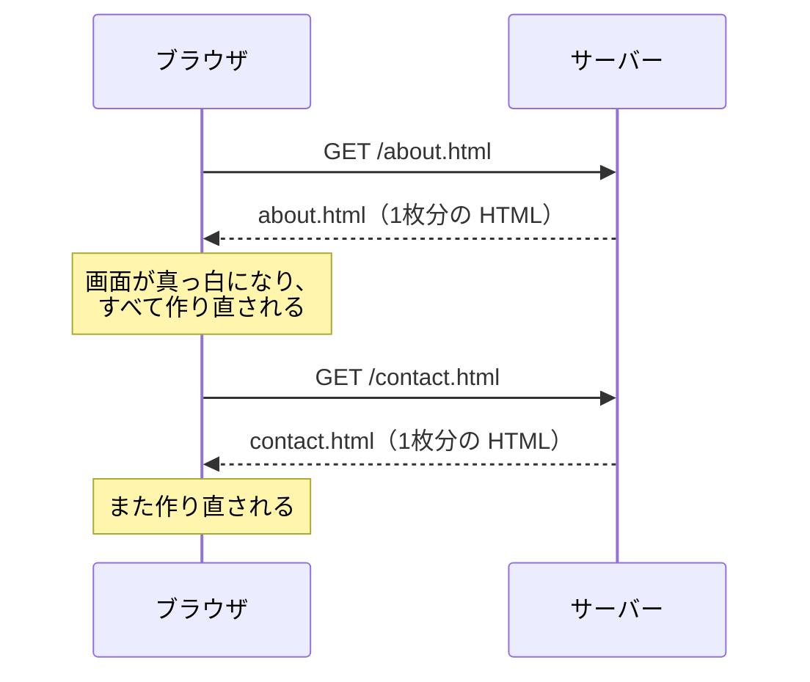
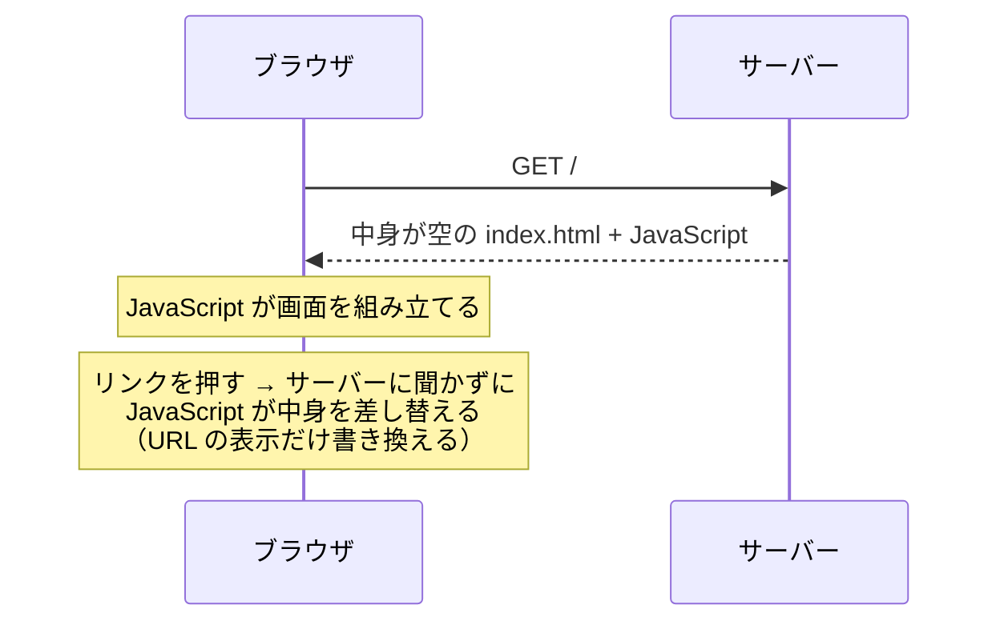
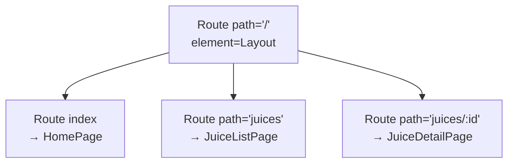
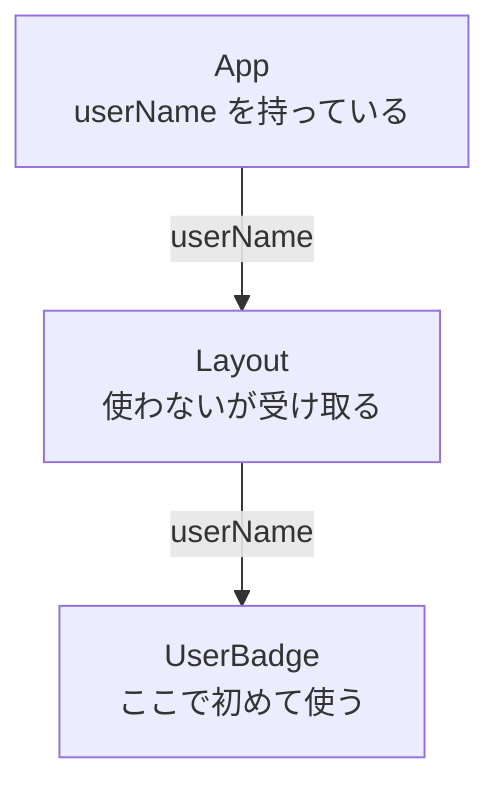
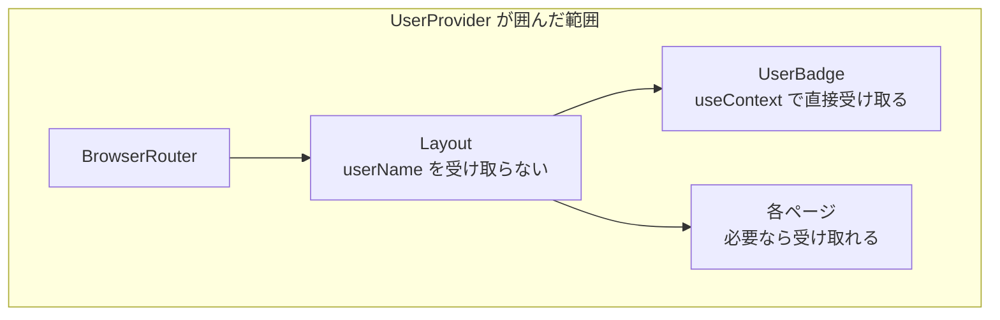
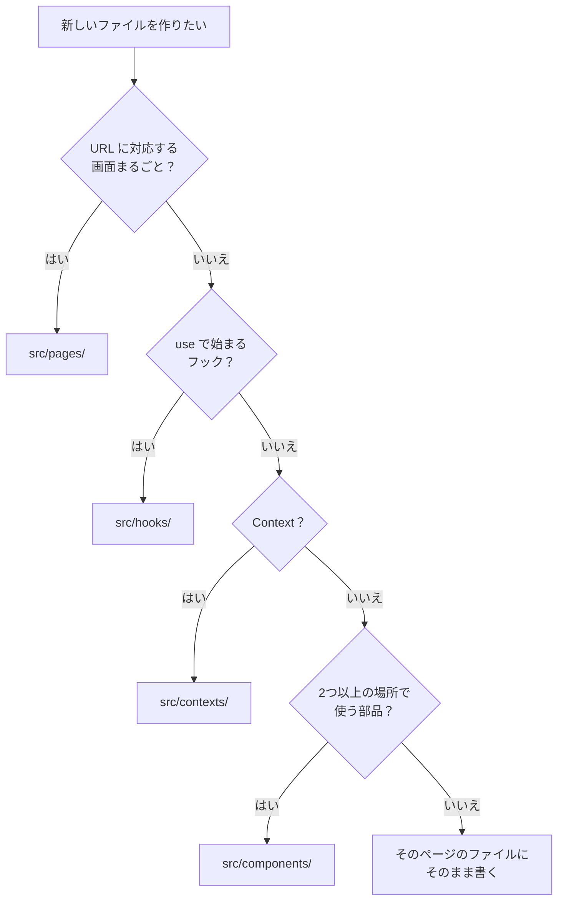
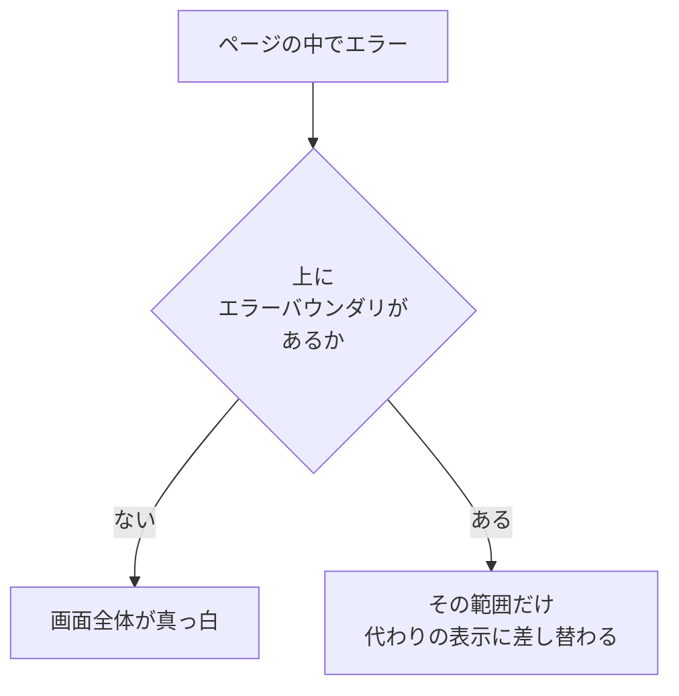

# 第9章 ルーティングと全体設計

第8章までで作ってきた画面は、すべて**1枚**でした。
`App.jsx` に部品を並べ、その中で state を動かす——それだけで、かなりのことができます。

しかし、あなたが普段使っている Web サービスを思い出してください。

- 商品の一覧ページがあり、商品名を押すと**その商品の詳細ページ**に移る
- ヘッダーの「設定」を押すと**設定ページ**に移る
- ブラウザの「戻る」を押すと、**さっきのページに戻る**
- 気に入ったページの URL をコピーして人に送ると、相手も**同じページ**を開ける

いまの作り方では、この4つがどれもできません。
画面を切り替える手段が `useState` の真偽値しかなく、URL は
`http://localhost:5173/` のまま何も変わらないからです。

この章では、**URL と画面を結びつける**方法を学びます。
あわせて、ファイルが増えてきたときの整理の仕方と、
「どこかが壊れたときに何を見せるか」という、アプリ全体にかかわる設計を扱います。

## この章で学ぶこと

- URL に応じて表示する画面を切り替えられるようになる（React Router）
- URL の一部を値として受け取り、詳細ページを作れるようになる
- 離れたコンポーネントへ、props のバケツリレーなしに値を届けられるようになる（Context）
- ファイルをどのディレクトリに置くかを、自分で判断できるようになる
- エラーと読み込み中の表示を、アプリ全体で統一できるようになる

## この章の前提

- [第7章](./07-props-and-state.md) の props・`useState`・イベント・`map` と `key`・条件表示
- [第8章](./08-state-design-and-effects.md) の状態のリフトアップ・`useEffect`・`useFetch`（8.5.3）
- [5.3](./05-javascript-advanced.md) の `map` / `filter` / `find`、[5.6](./05-javascript-advanced.md) の `export` / `import`
- 第6章で作った `my-first-react` プロジェクトが手元にあり、`npm run dev` で起動できること（[6.2.3](./06-react-start.md)）

> **つまずいたら**
> この章では、**新しいライブラリを2つインストール**します。
> インストールで失敗すると先に進めないので、詰まったらすぐ相談してください。
> そのとき、**ターミナルに出ている文字を省略せずに全部**貼るのがコツです。
>
> ```text
> react-text の 9.1.2 を読んでいます。
> npm install react-router-dom を実行したらエラーが出ました。
> OS: Windows 11
> ターミナルに出ている内容はこれです。（全文を貼る）
> ```
>
> ルーティングの不具合は、**「URL」「画面に出ているもの」「コンソールの赤い文字」の3点セット**を
> 伝えると解決が速くなります。

**この章の作業も、すべて第6章で作った `my-first-react` の中で行います。**
ターミナルで `my-first-react` に移動し、開発サーバーを起動しておいてください。

**Windows（PowerShell）**

```powershell
cd react-lesson\my-first-react
npm run dev
```

**macOS / Linux**

```bash
cd react-lesson/my-first-react
npm run dev
```

> **補足：前の章のファイルは残したままで構いません**
> `src/components/` に第7章・第8章で作ったファイルが残っていても問題ありません。
> この章では `src/App.jsx` を書き換えるので、**画面に出るものだけが入れ替わります。**
> 使っていないファイルは、章の最後にまとめて消しても構いません。

---

## 9.1 React Router — 画面を切り替える

### 9.1.1 SPA とは

まず、**普通の Web サイト**がどう動いていたかを思い出します。
第2章で作った HTML ファイルを、`about.html` と `contact.html` の2枚に分けたとしましょう。
リンクを押すと、次のことが起きます。



ページを移動するたびに、**サーバーから新しい HTML をもらって、画面を丸ごと作り直します。**
このやり方を、このテキストでは**複数ページ型**と呼びます。
画面が一瞬白くなるのは、このためです。

これに対して React で作るアプリは、次のように動きます。



最初に受け取る HTML は**1枚だけ**で、以降の画面の切り替えは、
すべてブラウザの中の JavaScript が行います。
この作り方を **SPA**（Single Page Application。エスピーエー。
1枚の HTML の上で、JavaScript が中身を差し替えて画面を切り替えるアプリ）と呼びます。

第6章の 6.3.2 で、`index.html` の `<body>` がほぼ空だったことを思い出してください。
**あなたはすでに SPA を作っています。**

SPA には、良いところと難しいところがあります。

| | 複数ページ型 | SPA |
|--|------------|-----|
| ページ移動 | 毎回サーバーに取りに行く | JavaScript が差し替える（速い） |
| 移動時の画面 | 一瞬白くなる | 白くならない |
| 入力中の値・state | 移動すると**消える** | **保たれる** |
| 最初の読み込み | 軽い | JavaScript を全部読むぶん重い |
| URL の管理 | サーバーがやってくれる | **自分でやる必要がある** |

最後の行が、この節のテーマです。
JavaScript が勝手に中身を差し替えるだけでは、**URL が変わりません。**
URL が変わらないと、次の3つが壊れます。

1. ブラウザの「戻る」ボタンが効かない
2. いま見ているページの URL を人に送れない
3. 再読み込みすると、最初のページに戻ってしまう

「どの URL のとき、どの画面を出すか」を決める仕組みを、**ルーティング**
（どの URL のリクエストをどの処理に渡すかの割り当て）と呼びます。
React 本体にはこの機能がないため、**React Router** というライブラリを使います。

> **補足**
> SPA でも URL が変わるのは、ブラウザが「表示している URL だけを書き換える」機能を
> 持っているからです。React Router はその機能を使っています。
> 仕組みの詳細を知らなくても使えるので、この章では扱いません。

### 9.1.2 React Router をインストールする

ライブラリを追加します。**開発サーバーは起動したままで構いません。**
VS Code のターミナルをもう1つ開くか、いったん `Ctrl` + `C` で止めてから実行してください。

**必ず `my-first-react` の中で実行してください**（6.2.2 と同じ注意です）。

**Windows（PowerShell）**

```powershell
npm install react-router-dom
```

**macOS / Linux**

```bash
npm install react-router-dom
```

```text
実行結果（表示は環境によって少し違います）:
added 3 packages, and audited 152 packages in 2s

found 0 vulnerabilities
```

`added 3 packages` のように出れば成功です。
入ったバージョンは、次のコマンドで確認できます。

**Windows（PowerShell）**

```powershell
npm list react-router-dom
```

**macOS / Linux**

```bash
npm list react-router-dom
```

```text
実行結果:
my-first-react@0.0.0 /Users/yamada/Desktop/react-lesson/my-first-react
└── react-router-dom@7.6.2
```

**執筆時点（2026年8月）では 7 系が入ります。**
細かい数字が違っても、`7.` で始まっていればこの章のコードはそのまま動きます。

`package.json`（6.3.4）を開くと、`dependencies` に1行増えているはずです。

`package.json`（該当部分のみ。数字は違って構いません）

```json
  "dependencies": {
    "react": "^19.1.1",
    "react-dom": "^19.1.1",
    "react-router-dom": "^7.6.2"
  },
```

**これが「ライブラリを追加した」ということの正体です。**
`package.json` に名前が書かれ、本体が `node_modules` にダウンロードされました（6.3.4）。

> **よくある間違い**
> `react-lesson` の中（`my-first-react` の1つ上）で `npm install` してしまうと、
> `my-first-react/node_modules` には入りません。
> 実行前に、ターミナルの表示が `my-first-react` で終わっているか確認してください。
>
> 間違えた場合は、`react-lesson` の中にできてしまった `node_modules` と
> `package.json` / `package-lock.json` を削除し、
> `my-first-react` に移動してからやり直せば元に戻せます。

> **つまずいたら**
> `npm install` が失敗する原因は、6.2.4 のエラー6と同じものがほとんどです
> （社内ネットワークのプロキシ、ディスクの空き容量、日本語を含むパス）。
> ターミナルの出力を全文貼って AI に相談してください。

### 9.1.3 ルートを定義する

**ルート**（route。URL と画面の対応づけ1件分）を定義します。
ここでは、次の2つのページを作ります。

| URL | 表示するもの |
|-----|------------|
| `/` | ホームページ |
| `/juices` | ジュースの一覧 |

**手順1：ページで使うデータを用意する**

まず、一覧に表示するデータをファイルに分けます（5.6.2 の `export`）。

`src/data/juices.js`（`src` の中に `data` ディレクトリを作り、その中に新規作成）

```js
// 商品データ。複数のページから読み込むので、部品ではなくデータとして分けておく
export const juices = [
  { id: 1, name: 'りんごジュース', price: 200, maker: '青森果汁', description: '果汁100%。酸味は控えめです。' },
  { id: 2, name: 'みかんジュース', price: 180, maker: '愛媛ドリンク', description: '温州みかんを使っています。' },
  { id: 3, name: 'ぶどうジュース', price: 260, maker: '山梨飲料', description: '濃いめの味わいです。' },
  { id: 4, name: 'りんごスカッシュ', price: 240, maker: '青森果汁', description: '炭酸入り。よく冷やしてどうぞ。' },
]
```

**手順2：ページのコンポーネントを作る**

ページも、これまでどおりのコンポーネントです。**特別な書き方はありません。**
置き場所だけを `src/pages/` に分けます（理由は 9.3.3 で説明します）。

`src/pages/HomePage.jsx`（`src` の中に `pages` ディレクトリを作り、その中に新規作成）

```jsx
function HomePage() {
  return (
    <div>
      <h2>ようこそ</h2>
      <p>このサイトは、ジュースの品ぞろえを紹介するページです。</p>
    </div>
  )
}

export default HomePage
```

`src/pages/JuiceListPage.jsx`（新規作成）

```jsx
import { juices } from '../data/juices.js'

function JuiceListPage() {
  return (
    <div>
      <h2>ジュース一覧（{juices.length}件）</h2>
      <ul>
        {juices.map((juice) => (
          <li key={juice.id}>
            {juice.name} —— {juice.price}円
          </li>
        ))}
      </ul>
    </div>
  )
}

export default JuiceListPage
```

`import { juices } from '../data/juices.js'` の `../` は、
**1つ上のディレクトリ**という意味です（2.3.4 の相対パス）。
`src/pages/` から見て、`src/data/` は「1つ上に戻ってから `data` に入る」場所にあります。

**手順3：URL と結びつける**

`src/App.jsx`（全体を次の内容に置き換える）

```jsx
import { BrowserRouter, Routes, Route } from 'react-router-dom'
import HomePage from './pages/HomePage.jsx'
import JuiceListPage from './pages/JuiceListPage.jsx'
import './App.css'

function App() {
  return (
    <BrowserRouter>
      <h1>ジュースショップ</h1>
      <Routes>
        <Route path="/" element={<HomePage />} />
        <Route path="/juices" element={<JuiceListPage />} />
      </Routes>
    </BrowserRouter>
  )
}

export default App
```

登場した3つを整理します。

| 名前 | 役割 |
|------|------|
| `BrowserRouter` | **ルーティングを使う範囲**を囲む。この中でだけ、URL の仕組みが働く |
| `Routes` | ルートの一覧。**いまの URL に合う `Route` を1つだけ選んで**表示する |
| `Route` | ルート1件。`path`（URL）と `element`（表示するもの）の組 |

保存して、ブラウザで次の2つの URL を開いてみてください。

```text
http://localhost:5173/
表示される内容:
ジュースショップ
ようこそ
このサイトは、ジュースの品ぞろえを紹介するページです。
```

```text
http://localhost:5173/juices
表示される内容:
ジュースショップ
ジュース一覧（4件）
・りんごジュース —— 200円
・みかんジュース —— 180円
・ぶどうジュース —— 260円
・りんごスカッシュ —— 240円
```

**`<h1>ジュースショップ</h1>` は、どちらの URL でも表示されます。**
`Routes` の外に書いたものは、URL によらず常に表示されるからです。
逆に `Routes` の中身は、URL によって入れ替わります。

> **よくある間違い**
> `element` に渡すのは、**コンポーネントを呼び出した結果**（JSX）です。関数そのものではありません。
>
> ```jsx
> <Route path="/" element={HomePage} />     {/* 動かない */}
> <Route path="/" element={<HomePage />} /> {/* 正しい */}
> ```
>
> 前者では画面に何も出ず、コンソールに次のような警告が出ます。
>
> ```text
> Warning: Functions are not valid as a React child.
> ```
>
> 7.3.2 の「関数を渡すのと呼び出すのの違い」と似ていますが、**逆向き**なので注意してください。
> `onClick` には**関数そのもの**を、`element` には**呼び出した結果**を渡します。

> **補足：なぜ `localhost:5173/juices` が開けるのか**
> `juices.html` というファイルは、どこにもありません。
> 開発サーバー（Vite）が、**存在しない URL でもとりあえず `index.html` を返す**設定に
> なっているためです。あとは JavaScript が中身を決めます。
> 完成したアプリを公開するときは、置き場所側に同じ設定が必要になります。
> これは第11章のデプロイで扱います。

### 9.1.4 `Link` で移動する

URL を手で打つのは、利用者にはできません。リンクを付けます。

ここで大事なのは、**`<a href="...">` を使ってはいけない**という点です。
理由を、実際に見て確かめます。

`src/App.jsx`（全体を次の内容に置き換える）

```jsx
import { BrowserRouter, Routes, Route } from 'react-router-dom'
import HomePage from './pages/HomePage.jsx'
import JuiceListPage from './pages/JuiceListPage.jsx'
import './App.css'

// ファイルが読み込まれたときに1回だけ実行される（5.6.2）
console.log('アプリ全体が読み込み直されました')

function App() {
  return (
    <BrowserRouter>
      <h1>ジュースショップ</h1>
      <nav>
        <a href="/">ホーム</a> | <a href="/juices">ジュース一覧</a>
      </nav>
      <Routes>
        <Route path="/" element={<HomePage />} />
        <Route path="/juices" element={<JuiceListPage />} />
      </Routes>
    </BrowserRouter>
  )
}

export default App
```

ブラウザの開発者ツールでコンソールを開き（1.6.4）、リンクを何回か押してみてください。

```text
コンソールの出力:
アプリ全体が読み込み直されました
アプリ全体が読み込み直されました
アプリ全体が読み込み直されました
```

**押すたびに増えます。** 画面も一瞬白くなります。
`<a>` は「サーバーに新しいページを取りに行く」タグなので、
JavaScript がゼロから読み込み直され、**それまでの state もすべて消えます。**

React Router の `Link` に置き換えます。

`src/App.jsx`（`nav` の部分と `import` の行を次のように変更する）

```diff
- import { BrowserRouter, Routes, Route } from 'react-router-dom'
+ import { BrowserRouter, Routes, Route, Link } from 'react-router-dom'
```

```diff
      <nav>
-       <a href="/">ホーム</a> | <a href="/juices">ジュース一覧</a>
+       <Link to="/">ホーム</Link> | <Link to="/juices">ジュース一覧</Link>
      </nav>
```

もう一度リンクを押してみてください。

```text
コンソールの出力:
アプリ全体が読み込み直されました
（何回押しても増えない）
```

URL は変わり、画面も切り替わるのに、**読み込みは1回きり**です。
これが 9.1.1 で説明した SPA の動きです。ブラウザの「戻る」ボタンも効きます。

| 書き方 | 何が起きるか |
|--------|------------|
| `<a href="/juices">` | サーバーに取りに行く。**全部作り直し**。state は消える |
| `<Link to="/juices">` | JavaScript が中身を差し替える。**state は保たれる** |

属性の名前が `href` ではなく **`to`** である点に注意してください。

**いま開いているページを目立たせる**

一覧を見ているのに「ジュース一覧」のリンクがほかと同じ見た目では、
利用者は自分がどこにいるのかわかりません。
`NavLink` を使うと、**いま開いているページかどうか**で見た目を変えられます。

`src/App.jsx`（全体を次の内容に置き換える）

```jsx
import { BrowserRouter, Routes, Route, NavLink } from 'react-router-dom'
import HomePage from './pages/HomePage.jsx'
import JuiceListPage from './pages/JuiceListPage.jsx'
import './App.css'

function App() {
  return (
    <BrowserRouter>
      <h1>ジュースショップ</h1>
      <nav className="nav">
        <NavLink
          to="/"
          className={({ isActive }) => (isActive ? 'nav-link is-active' : 'nav-link')}
        >
          ホーム
        </NavLink>
        <NavLink
          to="/juices"
          className={({ isActive }) => (isActive ? 'nav-link is-active' : 'nav-link')}
        >
          ジュース一覧
        </NavLink>
      </nav>
      <Routes>
        <Route path="/" element={<HomePage />} />
        <Route path="/juices" element={<JuiceListPage />} />
      </Routes>
    </BrowserRouter>
  )
}

export default App
```

`className` に**文字列ではなく関数**を渡しているところが新しい書き方です。

```jsx
className={({ isActive }) => (isActive ? 'nav-link is-active' : 'nav-link')}
```

- `NavLink` が、`{ isActive: true }` のようなオブジェクトを引数にしてこの関数を呼びます
- `{ isActive }` は分割代入（5.4.1）で、その中の `isActive` だけを取り出しています
- 三項演算子（4.4.4）で、`true` なら `'nav-link is-active'`、`false` なら `'nav-link'` を返します

**返した文字列が、そのまま `class` 属性になります。**

`src/App.css`（ファイルの末尾に追記する）

```css
.nav {
  display: flex;
  gap: 16px;
  margin-bottom: 24px;
}

.nav-link {
  color: #333;
  text-decoration: none;
  padding: 4px 8px;
}

.nav-link.is-active {
  border-bottom: 2px solid #333;
  font-weight: bold;
}
```

```text
表示される内容:
ジュースショップ
ホーム  ジュース一覧      ← いま開いているほうに下線が付く
ようこそ
（以下、ページの中身）
```

`display: flex` と `gap` は 3.5.5、`border-bottom` は 3.3.2 で学んだものです。

> **よくある間違い**
> `to` の値の先頭に `/` を付け忘れると、**いまいる場所からの相対パス**になります（2.3.4）。
>
> ```jsx
> <Link to="juices">   {/* /juices/juices に行ってしまうことがある */}
> <Link to="/juices">  {/* いつでも /juices に行く */}
> ```
>
> ナビゲーションのリンクは、**必ず `/` から書いてください。**
### 9.1.5 URL パラメータ

商品が4つなら、`/juice-1`、`/juice-2`……とルートを4つ書けます。
しかし商品が 1,000 個になったら、1,000 行書くことになります。**これは無理です。**

必要なのは、「`/juices/` のあとに**何か**が来たら、詳細ページを出す」という書き方です。
これを **URL パラメータ**（URL の一部を、値として受け取る部分）と呼びます。

`path` の中で `:` から始まる部分が、パラメータになります。

```text
path="/juices/:id"

/juices/1   → id は "1"
/juices/42  → id は "42"
/juices/abc → id は "abc"
```

**手順1：詳細ページを作る**

`src/pages/JuiceDetailPage.jsx`（新規作成）

```jsx
import { useParams, Link } from 'react-router-dom'
import { juices } from '../data/juices.js'

function JuiceDetailPage() {
  // URL の :id の部分を受け取る（値は必ず文字列）
  const { id } = useParams()
  const juice = juices.find((item) => item.id === Number(id))

  console.log('URL から受け取った id:', id, typeof id)

  if (!juice) {
    return (
      <div>
        <h2>見つかりませんでした</h2>
        <p>指定された商品はありません。</p>
        <Link to="/juices">一覧に戻る</Link>
      </div>
    )
  }

  return (
    <div>
      <h2>{juice.name}</h2>
      <p>価格: {juice.price}円</p>
      <p>製造: {juice.maker}</p>
      <p>{juice.description}</p>
      <Link to="/juices">一覧に戻る</Link>
    </div>
  )
}

export default JuiceDetailPage
```

`useParams` は、**URL パラメータをオブジェクトで返すフック**です。
`path="/juices/:id"` に対しては `{ id: '1' }` のような形で返ってきます。
分割代入（5.4.1）で `id` を取り出しています。

`juices.find(...)` は 5.3.3 の「条件に合う最初の1つを取り出す」メソッドです。
見つからなければ `undefined` が返るので、`if (!juice)` で先に処理を分けています（7.5.3 の早期 `return`）。

**手順2：ルートを追加する**

`src/App.jsx`（`import` と `Routes` の中を次のように変更する）

```diff
  import HomePage from './pages/HomePage.jsx'
  import JuiceListPage from './pages/JuiceListPage.jsx'
+ import JuiceDetailPage from './pages/JuiceDetailPage.jsx'
```

```diff
      <Routes>
        <Route path="/" element={<HomePage />} />
        <Route path="/juices" element={<JuiceListPage />} />
+       <Route path="/juices/:id" element={<JuiceDetailPage />} />
      </Routes>
```

**手順3：一覧からリンクする**

`src/pages/JuiceListPage.jsx`（全体を次の内容に置き換える）

```jsx
import { Link } from 'react-router-dom'
import { juices } from '../data/juices.js'

function JuiceListPage() {
  return (
    <div>
      <h2>ジュース一覧（{juices.length}件）</h2>
      <ul>
        {juices.map((juice) => (
          <li key={juice.id}>
            {/* テンプレートリテラル（4.3.3）で URL を組み立てる */}
            <Link to={`/juices/${juice.id}`}>{juice.name}</Link> —— {juice.price}円
          </li>
        ))}
      </ul>
    </div>
  )
}

export default JuiceListPage
```

`to` に渡す値も、ただの文字列です。テンプレートリテラルで組み立てれば、
`id` が何件あってもルートは1行で足ります。

一覧から「みかんジュース」を押してみてください。

```text
URL: http://localhost:5173/juices/2
表示される内容:
みかんジュース
価格: 180円
製造: 愛媛ドリンク
温州みかんを使っています。
一覧に戻る

コンソールの出力:
URL から受け取った id: 2 string
```

**コンソールの `string` に注目してください。**
URL は文字全体が文字列なので、**パラメータは必ず文字列で届きます。**

> **よくある間違い**
> `Number(id)` を忘れると、**何を押しても「見つかりませんでした」になります。**
>
> ```js
> juices.find((item) => item.id === id)         // '2' と 2 を比べている → 必ず false
> juices.find((item) => item.id === Number(id)) // 正しい
> ```
>
> `===` は型が違えば必ず `false` でした（4.3.6）。
> `id === Number(id)` のように**片方を変換**してから比べてください。
> 逆に `==` を使って型変換に頼るのは、4.3.8 で見たとおり事故のもとです。

**ボタンで移動する**

リンクではなくボタンで移動したいときは、`useNavigate` を使います。
「保存したら一覧に戻る」のように、**何かの処理のあとで移動する**場面で使います。

`src/pages/JuiceDetailPage.jsx`（`return` の中の「一覧に戻る」リンクの下に、ボタンを追加する）

```diff
  import { useParams, Link } from 'react-router-dom'
+ import { useNavigate } from 'react-router-dom'
```

`import` は1行にまとめても構いません。

```jsx
import { useParams, Link, useNavigate } from 'react-router-dom'
```

`JuiceDetailPage` の中に、次の2箇所を足します。

```diff
  function JuiceDetailPage() {
    const { id } = useParams()
+   const navigate = useNavigate()
    const juice = juices.find((item) => item.id === Number(id))
```

```diff
        <Link to="/juices">一覧に戻る</Link>
+       <p>
+         <button onClick={() => navigate('/juices')}>ボタンで一覧に戻る</button>
+       </p>
```

`useNavigate` は、**移動させる関数を返すフック**です。
`navigate('/juices')` を呼んだ瞬間に、`Link` を押したのと同じ移動が起きます。

> **よくある間違い**
> `onClick={navigate('/juices')}` と書くと、**押していないのに即座に移動**します。
> 7.3.2 で見た「関数を渡すのと呼び出すのの違い」と同じです。
> `onClick={() => navigate('/juices')}` のように、**関数で包んでください。**

### 9.1.6 ネストしたルートと共通レイアウト

いまの `App.jsx` は、次の形になっています。

```jsx
<BrowserRouter>
  <h1>ジュースショップ</h1>
  <nav>...</nav>
  <Routes>...</Routes>
</BrowserRouter>
```

見出しとナビゲーションが、`Routes` の外に**べた書き**されています。
ページが増えても困りませんが、次の2点が気になります。

- `App.jsx` に「全体の見た目」と「ルートの一覧」が混ざっている
- 「ヘッダーを出さないページ」を作りたくなったとき、逃げ道がない

React Router には、**共通の見た目をコンポーネントとして書き、
その中に各ページを差し込む**やり方があります。これを**ネストしたルート**と呼びます。

**手順1：レイアウト用のコンポーネントを作る**

`src/components/Layout.jsx`（新規作成）

```jsx
import { NavLink, Outlet } from 'react-router-dom'

function Layout() {
  return (
    <div className="layout">
      <header>
        <h1>ジュースショップ</h1>
        <nav className="nav">
          <NavLink
            to="/"
            className={({ isActive }) => (isActive ? 'nav-link is-active' : 'nav-link')}
          >
            ホーム
          </NavLink>
          <NavLink
            to="/juices"
            className={({ isActive }) => (isActive ? 'nav-link is-active' : 'nav-link')}
          >
            ジュース一覧
          </NavLink>
        </nav>
      </header>

      <main>
        {/* ここに、いまの URL に合ったページが差し込まれる */}
        <Outlet />
      </main>

      <footer>
        <p>© 2026 ジュースショップ</p>
      </footer>
    </div>
  )
}

export default Layout
```

**`Outlet` が、この節の主役です。**
「子のルートで選ばれたページを、ここに表示する」という**差し込み口**を表します。

`children`（7.1.5）と役割は似ていますが、渡されるものが違います。

| | 何が入るか | 誰が決めるか |
|--|----------|------------|
| `children` | 親が JSX で書いた中身 | 親コンポーネント |
| `Outlet` | 子のルートで選ばれたページ | **いまの URL** |

**手順2：ルートを入れ子にする**

`src/App.jsx`（全体を次の内容に置き換える）

```jsx
import { BrowserRouter, Routes, Route } from 'react-router-dom'
import Layout from './components/Layout.jsx'
import HomePage from './pages/HomePage.jsx'
import JuiceListPage from './pages/JuiceListPage.jsx'
import JuiceDetailPage from './pages/JuiceDetailPage.jsx'
import './App.css'

function App() {
  return (
    <BrowserRouter>
      <Routes>
        <Route path="/" element={<Layout />}>
          <Route index element={<HomePage />} />
          <Route path="juices" element={<JuiceListPage />} />
          <Route path="juices/:id" element={<JuiceDetailPage />} />
        </Route>
      </Routes>
    </BrowserRouter>
  )
}

export default App
```

`Route` の中に `Route` が入りました。読み方は次のとおりです。



- 外側の `Route` は、**どの URL でも当てはまる入れ物**です。`Layout` が必ず表示されます
- 内側の `Route` が、`Layout` の `Outlet` の場所に差し込まれます
- 内側の `path` に **`/` を付けません。** 外側の `path` からの続きとして書きます
- `index` は、「**外側の path と完全に一致したとき**」を表します。ここでは `/` のときです

| URL | 表示されるもの |
|-----|--------------|
| `/` | `Layout` + `HomePage` |
| `/juices` | `Layout` + `JuiceListPage` |
| `/juices/3` | `Layout` + `JuiceDetailPage`（`id` は `'3'`） |

保存して、リンクを押しながら確認してください。
**ページを移動しても、ヘッダーとフッターは作り直されません。**
差し替わるのは `Outlet` の中だけです。

> **よくある間違い**
> 内側の `path` に `/` を付けると、うまく動きません。
>
> ```jsx
> <Route path="/" element={<Layout />}>
>   <Route path="/juices" element={<JuiceListPage />} />  {/* 動くが意味が違う */}
>   <Route path="juices" element={<JuiceListPage />} />   {/* 正しい書き方 */}
> </Route>
> ```
>
> **子のルートは「親の URL の続き」を書く**と覚えてください。
> 親が `/shop` なら、子の `path="juices"` は `/shop/juices` を意味します。

> **補足：レイアウトを持たないページ**
> ログイン画面のように、ヘッダーを出したくないページがあります。
> その場合は、`Layout` の外に `Route` を並べて書きます。
>
> ```jsx
> <Routes>
>   <Route path="/" element={<Layout />}>
>     <Route index element={<HomePage />} />
>   </Route>
>   <Route path="/login" element={<LoginPage />} />
> </Routes>
> ```

### 9.1.7 404 ページ

存在しない URL を開いてみてください。

```text
URL: http://localhost:5173/nothing
表示される内容:
（ヘッダーもフッターも出ず、真っ白）
```

どの `Route` にも当てはまらないので、**何も表示されません。**
利用者から見ると「壊れた」ようにしか見えません。

**404**（ページが見つからないことを表す、HTTP のステータスコード。1.2.2）用のページを用意します。

`src/pages/NotFoundPage.jsx`（新規作成）

```jsx
import { Link, useLocation } from 'react-router-dom'

function NotFoundPage() {
  // いま開かれている URL の情報を取り出す
  const location = useLocation()

  return (
    <div>
      <h2>ページが見つかりません</h2>
      <p>
        <code>{location.pathname}</code> というページはありません。
        アドレスが間違っているか、ページが移動した可能性があります。
      </p>
      <Link to="/">ホームに戻る</Link>
    </div>
  )
}

export default NotFoundPage
```

`useLocation` は、**いまの URL の情報を返すフック**です。
`location.pathname` に `/nothing` のような部分が入っています。

`src/App.jsx`（`import` と `Routes` の中を次のように変更する）

```diff
  import JuiceDetailPage from './pages/JuiceDetailPage.jsx'
+ import NotFoundPage from './pages/NotFoundPage.jsx'
```

```diff
        <Route path="/" element={<Layout />}>
          <Route index element={<HomePage />} />
          <Route path="juices" element={<JuiceListPage />} />
          <Route path="juices/:id" element={<JuiceDetailPage />} />
+         <Route path="*" element={<NotFoundPage />} />
        </Route>
```

`path="*"` は、**どんな URL にも当てはまる**という意味です。

```text
URL: http://localhost:5173/nothing
表示される内容:
ジュースショップ
ホーム  ジュース一覧
ページが見つかりません
/nothing というページはありません。アドレスが間違っているか、ページが移動した可能性があります。
ホームに戻る
```

ヘッダーが出たままなので、利用者はすぐに別のページへ移動できます。

> **補足：書く順番は関係ありません**
> 「`*` は最後に書かないと、全部そこに吸い込まれるのでは」と思うかもしれません。
> React Router は、**書いた順ではなく「いちばんよく合うもの」を選びます。**
> `/juices` を開けば `path="juices"` が選ばれ、`*` は選ばれません。
> ただし、読む人のために**最後に書く**のが習慣です。

**存在しない商品と、存在しない URL の違い**

`/juices/999` を開くと、9.1.5 で書いた「見つかりませんでした」が表示されます。
`path="juices/:id"` には**当てはまっている**ので、404 ページにはなりません。

| URL | どうなるか | 誰が判断したか |
|-----|----------|--------------|
| `/nothing` | 404 ページ | React Router（当てはまるルートがない） |
| `/juices/999` | 「見つかりませんでした」 | `JuiceDetailPage`（データに 999 がない） |

**この2つは別物です。**
ルートがあるかどうかは React Router が、
データがあるかどうかは**そのページ自身**が判断します。

---

## 9.2 Context — 離れた場所に値を届ける

### 9.2.1 props のバケツリレー問題

ヘッダーに「ログイン中のユーザー名」を出すことにします。
ユーザー名は、あとで他のページでも使うので、**アプリの一番上**（`App`）で持つことにします（8.1.4）。

やってみます。まず、名前を表示する小さな部品を作ります。

`src/components/UserBadge.jsx`（新規作成）

```jsx
function UserBadge({ userName }) {
  if (!userName) {
    return <span className="user-badge">ログインしていません</span>
  }

  return <span className="user-badge">{userName} さん</span>
}

export default UserBadge
```

これを `Layout` のヘッダーに置きます。
`App` が持っている `userName` を届けるには、`App` → `Layout` → `UserBadge` と渡します。

`src/App.jsx`（`App` 関数だけを次のように変更する。`import` の行はそのままで構いません）

```jsx
function App() {
  const userName = '山田'

  return (
    <BrowserRouter>
      <Routes>
        <Route path="/" element={<Layout userName={userName} />}>
          <Route index element={<HomePage />} />
          <Route path="juices" element={<JuiceListPage />} />
          <Route path="juices/:id" element={<JuiceDetailPage />} />
          <Route path="*" element={<NotFoundPage />} />
        </Route>
      </Routes>
    </BrowserRouter>
  )
}
```

`src/components/Layout.jsx`（`Layout` 関数の宣言と `header` の中を変更する）

```diff
- function Layout() {
+ function Layout({ userName }) {
```

```diff
        <h1>ジュースショップ</h1>
+       <UserBadge userName={userName} />
```

`import UserBadge from './UserBadge.jsx'` を `Layout.jsx` の先頭に足すのも忘れないでください。

動きます。**動きますが、`Layout` を見てください。**

```jsx
function Layout({ userName }) {
  // Layout 自身は userName を1回も使っていない。ただ下に渡すだけ
```

`Layout` は、`userName` を**使っていません。** ただ通過させているだけです。



いまは1段だけなので、まだ我慢できます。
しかし実際のアプリでは、`App` → `Layout` → `Header` → `UserMenu` → `UserBadge` のように
**4段も5段も**続きます。すると、次のことが起きます。

- 途中のコンポーネントすべてに、使いもしない props を書く必要がある
- props の名前を変えたくなったら、**通り道の全ファイル**を直す
- 途中の1つで書き忘れると `undefined` が届き、原因の場所がわかりにくい

この状態を、**props のバケツリレー**（prop drilling。使わないコンポーネントを
何段も経由して props を渡し続けること）と呼びます。

> **補足**
> バケツリレーは、**それ自体が悪ではありません。**
> 1段や2段なら、props で渡すほうが読みやすいことが多いです（判断の基準は 9.2.4）。
> 問題になるのは、**段数が多い**ときと、**アプリの多くの場所で使う値**のときです。

### 9.2.2 Context の作り方

React には、この問題のための仕組みが用意されています。**Context**（コンテキスト。
途中のコンポーネントを飛び越えて、値を下の階層に届けるための仕組み）です。

たとえるなら、**館内放送**です。
バケツリレーが「隣の人に手渡しし続ける」やり方だとすれば、
Context は「放送を流し、聞きたい人が受け取る」やり方です。

正確に言うと、Context は次の3つでできています。

| 部品 | 役割 |
|------|------|
| Context 本体 | 値の通り道。`createContext` で作る |
| Provider（プロバイダー） | 通り道に値を流す人。この中にいるコンポーネントだけが受け取れる |
| `useContext` | 流れている値を受け取るフック |

まず、通り道を作ります。

`src/contexts/UserContext.jsx`（`src` の中に `contexts` ディレクトリを作り、その中に新規作成）

```jsx
import { createContext } from 'react'

// 値の通り道を作る。引数は「Provider の外で使われたときの値」
export const UserContext = createContext(null)
```

これだけです。`createContext(null)` の `null` は、
**Provider に囲まれていない場所で受け取ったときの値**です（4.3.5 の `null`）。

> **補足：拡張子が `.jsx` である理由**
> このファイルには、まだ JSX が出てきません。
> ですが次の項で JSX を書き足すので、最初から `.jsx` にしています。
> JSX を1文字も書かないファイル（`useFetch.js` や `juices.js`）は `.js` のままで構いません。

### 9.2.3 Provider と `useContext`

**手順1：値を流す人を作る**

Provider は自分で書いてもよいのですが、**state と一緒にまとめた専用のコンポーネント**に
しておくと、`App.jsx` がすっきりします。

`src/contexts/UserContext.jsx`（全体を次の内容に置き換える）

```jsx
import { createContext, useState } from 'react'

export const UserContext = createContext(null)

// このコンポーネントで囲んだ範囲に、ユーザー情報を流す
export function UserProvider({ children }) {
  const [userName, setUserName] = useState('')

  function login(name) {
    setUserName(name)
  }

  function logout() {
    setUserName('')
  }

  // 流す値を1つのオブジェクトにまとめる
  const value = { userName, login, logout }

  return <UserContext.Provider value={value}>{children}</UserContext.Provider>
}
```

- `children`（7.1.5）で囲んだ中身をそのまま受け取り、`Provider` の中に置いています
- 流す値は**オブジェクト1つ**にまとめます。`userName` だけでなく、
  **変更する手段（`login` / `logout`）も一緒に流す**のがポイントです（8.1.3 と同じ考え方）

**手順2：囲む**

`src/App.jsx`（全体を次の内容に置き換える）

```jsx
import { BrowserRouter, Routes, Route } from 'react-router-dom'
import { UserProvider } from './contexts/UserContext.jsx'
import Layout from './components/Layout.jsx'
import HomePage from './pages/HomePage.jsx'
import JuiceListPage from './pages/JuiceListPage.jsx'
import JuiceDetailPage from './pages/JuiceDetailPage.jsx'
import NotFoundPage from './pages/NotFoundPage.jsx'
import './App.css'

function App() {
  return (
    <UserProvider>
      <BrowserRouter>
        <Routes>
          <Route path="/" element={<Layout />}>
            <Route index element={<HomePage />} />
            <Route path="juices" element={<JuiceListPage />} />
            <Route path="juices/:id" element={<JuiceDetailPage />} />
            <Route path="*" element={<NotFoundPage />} />
          </Route>
        </Routes>
      </BrowserRouter>
    </UserProvider>
  )
}

export default App
```

`Layout` に渡していた `userName` の props が**消えている**ことに注目してください。



**手順3：受け取る**

`src/components/UserBadge.jsx`（全体を次の内容に置き換える）

```jsx
import { useContext } from 'react'
import { UserContext } from '../contexts/UserContext.jsx'

function UserBadge() {
  // 途中のコンポーネントを飛び越えて、直接受け取る
  const { userName, login, logout } = useContext(UserContext)

  if (!userName) {
    return (
      <span className="user-badge">
        ログインしていません
        <button onClick={() => login('山田')}>ログイン</button>
      </span>
    )
  }

  return (
    <span className="user-badge">
      {userName} さん
      <button onClick={logout}>ログアウト</button>
    </span>
  )
}

export default UserBadge
```

`src/components/Layout.jsx`（`Layout` 関数の宣言を元に戻す）

```diff
- function Layout({ userName }) {
+ function Layout() {
```

```diff
        <h1>ジュースショップ</h1>
-       <UserBadge userName={userName} />
+       <UserBadge />
```

`Layout` から `userName` が完全に消えました。**通り道の掃除が終わった状態です。**

保存して、次の順に確認してください。

```text
1. 「ログイン」ボタンを押す
   → ヘッダーが「山田 さん ログアウト」に変わる
2. 「ジュース一覧」に移動する
   → ヘッダーは「山田 さん」のまま（state が保たれている）
3. 商品を押して詳細ページに移動する
   → ヘッダーは「山田 さん」のまま
4. ブラウザの再読み込み（F5）を押す
   → 「ログインしていません」に戻る
```

2 と 3 は、9.1.4 で確認した SPA の性質です。
`Link` での移動では JavaScript が読み込み直されないので、**state が保たれます。**
4 で消えるのは、state がメモリの中にしかないからです。
消えないようにする方法（`localStorage`）は、第10章で扱います。

**ルーティングと Context を組み合わせると、こうなります。**

- **どのページを出すか** → React Router が URL から決める
- **どのページでも使う値** → Context が Provider の範囲全体に流す

この2つは、役割がはっきり分かれています。混ぜないでください。

> **よくある間違い**
> Provider の**外側**で `useContext` を呼ぶと、`createContext(null)` で指定した `null` が返ります。
>
> ```text
> Uncaught TypeError: Cannot destructure property 'userName' of 'useContext(...)' as it is null.
> ```
>
> 5.2.5 で見た `TypeError` の仲間です。次の2つを確認してください。
>
> 1. `UserProvider` が、その部品より**上**にあるか
> 2. `import` しているのが、**同じ** `UserContext` か（コピーして2つ作ってしまうと届きません）

### 9.2.4 Context を使いすぎない

Context は便利なので、**すべての値を Context に入れたくなります。**
しかし、そうすると別の問題が出ます。

**問題1：どこで使われているかわからなくなる**

props なら、渡している場所を見れば「誰が使うのか」がわかります。
Context の値は、どこからでも取り出せるため、**変更したときの影響範囲が読めません。**

**問題2：Provider の値が変わると、受け取っている全員が再レンダリングされる**

`useContext` を使っているコンポーネントは、
Provider の `value` が変わるたびに再レンダリングされます（8.4.5 の話と同じで、
体感できるほど遅くなるのは規模が大きくなってからですが、性質としては知っておいてください）。

**入力欄の1文字ごとに変わるような値を Context に入れてはいけません。**
キーを打つたびに、アプリ全体が作り直されることになります。

判断のしかたを表にまとめます。

| 値の性質 | 例 | 向いている方法 |
|---------|-----|--------------|
| 1〜2段下に渡すだけ | 一覧に渡す商品データ | **props** |
| めったに変わらず、多くの場所で使う | ログインユーザー、テーマ（明暗）、言語設定 | **Context** |
| 頻繁に変わる（入力中の文字など） | 検索欄の文字 | **その画面の state**（8.1 のリフトアップ） |
| サーバーから取ってきたデータ | 商品一覧の取得結果 | **カスタムフック**（8.5.3 の `useFetch`） |

> **補足：バケツリレーを減らす、もう1つの方法**
> Context を使わなくても、**`children` で JSX ごと渡す**とバケツリレーが減ることがあります。
>
> ```jsx
> {/* Layout に userName を渡さず、完成した部品を渡してしまう */}
> <Layout header={<UserBadge userName={userName} />} />
> ```
>
> 「値を下に流す」のではなく「**組み立てたものを渡す**」という発想です。
> 段数が2〜3段なら、この方法で足りることが多くあります。

### 9.2.5 状態管理ライブラリの話

React の学習を進めると、**Redux**、**Zustand**、**Jotai** といった名前を見かけます。
これらは**状態管理ライブラリ**（アプリ全体で共有する state を、
React の外側でまとめて管理するためのライブラリ）と呼ばれるものです。

「React を学ぶには Redux も必須」という話を目にするかもしれませんが、
**このテキストでは使いません。** 理由は次のとおりです。

| 手段 | 使いどき |
|------|---------|
| `useState` + リフトアップ（8.1） | ほとんどの場面。まずこれで足りるか考える |
| Context（9.2） | ログインユーザーなど、めったに変わらず全体で使う値 |
| 状態管理ライブラリ | 画面数が数十あり、状態の変更が複雑に絡み合ってから |
| サーバーデータ専用のライブラリ | 通信結果のキャッシュ・再取得を細かく制御したくなってから |

第10章で作るアプリは、`useState` と Context だけで完成します。
**必要になっていない道具を先に入れると、覚えることだけが増えます。**

必要になったと感じたら、そのときに公式ドキュメントを読んでください。

- [Redux 公式ドキュメント](https://redux.js.org/)
- [Zustand 公式ドキュメント](https://zustand.docs.pmnd.rs/)
- [TanStack Query 公式ドキュメント](https://tanstack.com/query/latest)（サーバーデータ向け）

> **補足**
> 「サーバーから取ってきたデータ」は、実は state 管理の話とは別物です。
> 手元で作る値ではなく、**サーバーにある値の写し**だからです。
> 8.5.3 の `useFetch` で足りなくなったら、TanStack Query のような専用の道具を検討してください。
---

## 9.3 ディレクトリ構成の考え方

### 9.3.1 ファイルが増えてくると

いま、`src` の中は次のようになっています。

```text
src/
├── components/
│   ├── Layout.jsx
│   ├── UserBadge.jsx
│   └── （第7章・第8章で作ったファイル）
├── contexts/
│   └── UserContext.jsx
├── data/
│   └── juices.js
├── hooks/
│   └── useFetch.js
├── pages/
│   ├── HomePage.jsx
│   ├── JuiceDetailPage.jsx
│   ├── JuiceListPage.jsx
│   └── NotFoundPage.jsx
├── App.css
├── App.jsx
├── index.css
└── main.jsx
```

**ここまでは、迷わず読めるはずです。** 問題はこの先です。

第10章で作るアプリでは、コンポーネントが 15 個ほどになります。
仕事で作るアプリなら、100 個を超えることもあります。
その全部が `components/` に並んでいると、次のことが起きます。

- 直したい部品のファイル名が思い出せず、**探すのに時間がかかる**
- 似た名前のファイルが増える（`Button.jsx` と `SubmitButton.jsx` と `MyButton.jsx`）
- どれが「どこでも使う部品」で、どれが「1箇所でしか使わない部品」か区別がつかない

**構成の目的は、きれいに並べることではありません。**
「直したいコードを、すぐ見つけられること」です。

### 9.3.2 種類で分ける vs 機能で分ける

分け方には、大きく2つの考え方があります。

**分け方A：種類で分ける**

ファイルの**役割の種類**でディレクトリを作ります。ここまで採用してきた形です。

```text
src/
├── components/    部品
├── pages/         ページ
├── hooks/         カスタムフック
├── contexts/      Context
└── data/          データ
```

**分け方B：機能で分ける**

**画面や機能のまとまり**でディレクトリを作り、その中に種類を混ぜて置きます。

```text
src/
├── juices/                 ジュースに関するもの一式
│   ├── JuiceListPage.jsx
│   ├── JuiceDetailPage.jsx
│   ├── JuiceCard.jsx
│   └── useJuices.js
├── users/                  ユーザーに関するもの一式
│   ├── UserBadge.jsx
│   └── UserContext.jsx
└── shared/                 どの機能からも使うもの
    ├── Layout.jsx
    └── useFetch.js
```

それぞれの向き不向きを整理します。

| | A：種類で分ける | B：機能で分ける |
|--|--------------|--------------|
| ファイルの探しやすさ | 「フックだから `hooks/`」とすぐ決まる | 「ジュースの話だから `juices/`」とすぐ決まる |
| 1つの機能を直すとき | **あちこちのディレクトリを行き来する** | **1つのディレクトリの中で完結する** |
| 機能ごと削除するとき | 関係ファイルを探し回る | ディレクトリごと消せる |
| 向いている規模 | 小〜中（ファイル 30 個くらいまで） | 中〜大 |
| 最初の判断のしやすさ | 迷いにくい | 「これはどの機能？」で迷うことがある |

**どちらが正しいということはありません。** 規模とチームの好みで決めます。

### 9.3.3 このテキストで採用する構成

**このテキストでは、分け方A（種類で分ける）を採用します。**
理由は、扱うアプリの規模がファイル 30 個以内に収まり、
**判断に迷う場面がいちばん少ない**からです。

置き場所は次のとおりです。

| ディレクトリ | 置くもの | 置かないもの |
|------------|---------|------------|
| `src/pages/` | **URL に対応する画面**まるごと1つ | ページの一部だけを表す部品 |
| `src/components/` | **2つ以上の場所で使う**部品、レイアウト | 1ページでしか使わない小さな部品（そのページのファイル内に書く） |
| `src/hooks/` | `use` で始まるカスタムフック（8.5） | 普通の関数 |
| `src/contexts/` | Context と Provider（9.2） | ページ |
| `src/data/` | 固定のデータ（`juices.js` など） | サーバーから取ってくるもの |

迷ったときは、この順に考えてください。



最後の「そのページのファイルにそのまま書く」に注目してください。
**1つの `.jsx` ファイルに、コンポーネントを2つ書いても構いません。**

`src/pages/JuiceListPage.jsx`（例。この形も正しい書き方です）

```jsx
import { Link } from 'react-router-dom'
import { juices } from '../data/juices.js'

// このページでしか使わないので、同じファイルに書く
function JuiceRow({ juice }) {
  return (
    <li>
      <Link to={`/juices/${juice.id}`}>{juice.name}</Link> —— {juice.price}円
    </li>
  )
}

function JuiceListPage() {
  return (
    <div>
      <h2>ジュース一覧（{juices.length}件）</h2>
      <ul>
        {juices.map((juice) => (
          <JuiceRow key={juice.id} juice={juice} />
        ))}
      </ul>
    </div>
  )
}

// export default は1ファイルに1つだけ（5.6.3）
export default JuiceListPage
```

`export default` を付けるのは、**外から使うほう1つだけ**です（5.6.3）。
`JuiceRow` は同じファイルの中でしか使わないので、`export` しません。

**別のページからも使いたくなったときに、`src/components/` へ移動すればよい**のです。
最初から完璧な置き場所を決めようとしないでください。

> **よくある間違い**
> ファイルを移動したら、`import` のパスも直す必要があります。
>
> ```text
> src/pages/JuiceListPage.jsx から見た juices.js  → '../data/juices.js'
> src/components/JuiceRow.jsx から見た juices.js  → '../data/juices.js'
> src/App.jsx から見た juices.js                  → './data/juices.js'
> ```
>
> 直し忘れると、次のエラーが出ます。
>
> ```text
> Failed to resolve import "./data/juices.js" from "src/pages/JuiceListPage.jsx".
> Does the file exist?
> ```
>
> **エラー文にファイル名とパスが両方書いてあります。** 落ち着いて読めば直せます。

### 9.3.4 命名規則

**名前の付け方をそろえると、開かなくても中身が推測できます。**

| 種類 | 書き方 | 例 |
|------|-------|-----|
| コンポーネント | 大文字始まり（パスカルケース）＋ `.jsx` | `UserBadge.jsx` |
| ページ | 同上。末尾を `Page` にそろえる | `JuiceListPage.jsx` |
| カスタムフック | `use` で始める＋ `.js` | `useFetch.js` |
| Context | 末尾を `Context` にする | `UserContext.jsx` |
| データ・普通の関数 | 小文字始まり（キャメルケース）＋ `.js` | `juices.js` |
| CSS | 対応するコンポーネントと同じ名前 | `Layout.css` |

「ページの末尾を `Page` にする」のは、
**`JuiceList` と `JuiceListPage` を見分けるため**です。
前者は一覧を表示する部品、後者は URL に対応する画面です。

コンポーネントの名前を大文字で始めるのは、好みの問題ではありません。
**小文字で始めると、React は HTML のタグだと判断します**（6.5.5）。

```jsx
<userBadge />   {/* HTML の「userBadge」タグだと解釈され、何も表示されない */}
<UserBadge />   {/* 自分で作ったコンポーネント */}
```

> **補足：CSS の置き場所**
> このテキストでは `App.css` に全部書いていますが、規模が大きくなると混ざります。
> コンポーネントごとに `.css` を分け、そのコンポーネントの中で `import './Layout.css'` する
> やり方もあります（6.3.5）。第10章では `App.css` のままで進めます。

---

## 9.4 エラー処理とローディング表示

### 9.4.1 エラーバウンダリ

ここまで、エラーは「コンソールに赤い字が出るもの」でした。
しかし**レンダリング中にエラーが起きると、画面がどうなるか**を見たことはまだありません。

**わざと壊してみます。**

`src/pages/BrokenPage.jsx`（新規作成）

```jsx
function BrokenPage() {
  // わざと存在しないプロパティを触る（5.2.5 の TypeError）
  const user = null
  return <p>{user.name} さんのページ</p>
}

export default BrokenPage
```

`src/App.jsx`（`import` と `Routes` の中に追加する）

```diff
  import NotFoundPage from './pages/NotFoundPage.jsx'
+ import BrokenPage from './pages/BrokenPage.jsx'
```

```diff
            <Route path="juices/:id" element={<JuiceDetailPage />} />
+           <Route path="broken" element={<BrokenPage />} />
            <Route path="*" element={<NotFoundPage />} />
```

`http://localhost:5173/broken` を開いてください。

```text
表示される内容:
（画面全体が真っ白。ヘッダーもフッターも消える）

コンソールの出力:
Uncaught TypeError: Cannot read properties of null (reading 'name')
```

**壊れたのは1ページだけなのに、アプリ全体が消えました。**
React は、レンダリング中にエラーが起きると
「画面を正しく組み立てられない」と判断し、**全部を捨てる**ようにできています。

> **補足：開発中は赤い画面が出ることがあります**
> Vite は、開発中だけエラーの内容を赤い画面で知らせてくれます。
> それを閉じると、上に書いた真っ白な画面になります。
> **公開したアプリでは、利用者にはいきなり真っ白な画面が見えます。**

これを防ぐのが**エラーバウンダリ**（error boundary。
下の階層で起きたエラーを受け止めて、代わりの表示に差し替える仕組み）です。



React 本体にもこの機能はあるのですが、**クラスコンポーネント**という、
このテキストでは扱っていない書き方が必要です。
ここでは、関数コンポーネントから使えるようにしたライブラリを入れます。

**Windows（PowerShell）**

```powershell
npm install react-error-boundary
```

**macOS / Linux**

```bash
npm install react-error-boundary
```

```text
実行結果:
added 1 package, and audited 153 packages in 1s

found 0 vulnerabilities
```

**手順1：代わりに表示する部品を作る**

`src/components/ErrorFallback.jsx`（新規作成）

```jsx
// エラーバウンダリが、エラーのときに代わりに表示する部品
function ErrorFallback({ error, resetErrorBoundary }) {
  return (
    <div className="error-box">
      <h2>表示中に問題が起きました</h2>
      <p>お手数ですが、もう一度お試しください。</p>
      <button onClick={resetErrorBoundary}>もう一度表示する</button>

      {/* 開発中だけ見たい情報。利用者には意味がわからないので小さく出す */}
      <details>
        <summary>技術的な情報</summary>
        <pre>{error.message}</pre>
      </details>
    </div>
  )
}

export default ErrorFallback
```

この部品は、**2つの props を自動で受け取ります。**

| props | 中身 |
|-------|------|
| `error` | 起きたエラー。`error.message` に説明文が入っている |
| `resetErrorBoundary` | エラー状態を解除して、もう一度表示し直す関数 |

`<details>` と `<summary>` は、**押すと中身が開く**HTML のタグです。
`<pre>` は、書いたとおりの改行で表示するタグです（2.2.2 の仲間）。

**手順2：範囲を囲む**

`src/components/Layout.jsx`（`import` と `main` の中を次のように変更する）

```diff
- import { NavLink, Outlet } from 'react-router-dom'
+ import { NavLink, Outlet, useLocation } from 'react-router-dom'
+ import { ErrorBoundary } from 'react-error-boundary'
+ import ErrorFallback from './ErrorFallback.jsx'
  import UserBadge from './UserBadge.jsx'
```

```diff
  function Layout() {
+   const location = useLocation()
+
    return (
```

```diff
        <main>
-         <Outlet />
+         <ErrorBoundary FallbackComponent={ErrorFallback} resetKeys={[location.pathname]}>
+           <Outlet />
+         </ErrorBoundary>
        </main>
```

`src/App.css`（末尾に追記する）

```css
.error-box {
  border: 1px solid #c00;
  border-radius: 4px;
  padding: 16px;
  background-color: #fff5f5;
}
```

もう一度 `http://localhost:5173/broken` を開いてください。

```text
表示される内容:
ジュースショップ
ホーム  ジュース一覧          ← ヘッダーは生きている
表示中に問題が起きました
お手数ですが、もう一度お試しください。
[もう一度表示する]
▶ 技術的な情報
```

**ヘッダーが残っているので、利用者は別のページへ移動できます。**
これが、`Routes` 全体ではなく `Outlet` の周りだけを囲んだ理由です。

`resetKeys={[location.pathname]}` は、
**この値が変わったらエラー状態を解除する**という指定です。
`location.pathname`（9.1.7）は URL が変わると変わるので、
「ヘッダーから別のページに移動したら、エラー表示は消える」という動きになります。

これがないと、一度エラーになった `ErrorBoundary` はエラー表示のままになり、
別のページに移動しても壊れた画面が残り続けます。

> **注意：エラーバウンダリが受け止めないもの**
> エラーバウンダリが受け止めるのは、**レンダリング中のエラーだけ**です。
> 次の2つは受け止めません。
>
> - **イベントハンドラーの中**のエラー（`onClick` の処理など）
> - **非同期処理の中**のエラー（`fetch` の失敗など。8.3.3）
>
> これらは、これまでどおり `try` / `catch`（8.3.3）で自分で受け止めてください。
> エラーバウンダリは「最後の受け皿」であって、`try` / `catch` の代わりではありません。

確認が終わったら、`BrokenPage` のルートは残しておいて構いません。
`src/pages/BrokenPage.jsx` は、次の項でも使います。

### 9.4.2 ローディング表示の統一

8.3 で書いた出し分けを思い出してください。

```jsx
if (isLoading) {
  return <p>読み込み中...</p>
}

if (errorMessage) {
  return <p className="error">{errorMessage}</p>
}
```

通信するページが3つあれば、この `<p>` が**3箇所に散らばります。**
文言を変えたくなったら3箇所、見た目を変えたくなったら3箇所を直すことになります。
しかも、たいてい1箇所直し忘れます。

**共通の部品にまとめます。**

`src/components/Loading.jsx`（新規作成）

```jsx
// 読み込み中の表示。label を渡すと文言を変えられる
function Loading({ label = '読み込み中...' }) {
  return <p className="loading">{label}</p>
}

export default Loading
```

`label = '読み込み中...'` は、**props の初期値**の書き方です。
渡さなければ `'読み込み中...'` が使われ、渡せばその文字が使われます。

```jsx
<Loading />                       {/* 読み込み中... */}
<Loading label="検索しています" /> {/* 検索しています */}
```

`src/components/ErrorMessage.jsx`（新規作成）

```jsx
// エラーの表示。onRetry を渡したときだけ、やり直しボタンを出す
function ErrorMessage({ message, onRetry }) {
  return (
    <div className="error-box">
      <p>{message}</p>
      {onRetry && <button onClick={onRetry}>もう一度試す</button>}
    </div>
  )
}

export default ErrorMessage
```

`{onRetry && <button ...>}` は、7.5.1 の条件付きレンダリングです。
`onRetry` が渡されなければ、ボタンは表示されません。

`src/App.css`（末尾に追記する）

```css
.loading {
  color: #666;
}
```

**使ってみます。**

8.5.3 で作った `src/hooks/useFetch.js` を使って、ユーザー一覧のページを作ります。
`useFetch.js` が手元にない場合は、8.5.3 のコードをそのまま作ってください。

`src/pages/UsersPage.jsx`（新規作成）

```jsx
import useFetch from '../hooks/useFetch.js'
import Loading from '../components/Loading.jsx'
import ErrorMessage from '../components/ErrorMessage.jsx'

function UsersPage() {
  const { data: users, isLoading, errorMessage } = useFetch(
    'https://jsonplaceholder.typicode.com/users'
  )

  if (isLoading) {
    return <Loading label="ユーザーを読み込んでいます" />
  }

  if (errorMessage) {
    return <ErrorMessage message={errorMessage} />
  }

  return (
    <div>
      <h2>ユーザー一覧（{users.length}人）</h2>
      <ul>
        {users.map((user) => (
          <li key={user.id}>
            {user.name}（{user.email}）
          </li>
        ))}
      </ul>
    </div>
  )
}

export default UsersPage
```

`src/App.jsx`（`import` と `Routes` の中に追加する）

```diff
  import BrokenPage from './pages/BrokenPage.jsx'
+ import UsersPage from './pages/UsersPage.jsx'
```

```diff
            <Route path="juices/:id" element={<JuiceDetailPage />} />
+           <Route path="users" element={<UsersPage />} />
            <Route path="broken" element={<BrokenPage />} />
```

`src/components/Layout.jsx`（`nav` の中に、リンクを1つ追加する）

```diff
          <NavLink
            to="/juices"
            className={({ isActive }) => (isActive ? 'nav-link is-active' : 'nav-link')}
          >
            ジュース一覧
          </NavLink>
+         <NavLink
+           to="/users"
+           className={({ isActive }) => (isActive ? 'nav-link is-active' : 'nav-link')}
+         >
+           ユーザー
+         </NavLink>
```

「ユーザー」を押すと、次のように表示されます。

```text
表示される内容（一瞬）:
ユーザーを読み込んでいます

表示される内容（取得後）:
ユーザー一覧（10人）
・Leanne Graham（Sincere@april.biz）
（以下、10件）
```

読み込み中の表示は一瞬なので、8.3.2 と同じように
**開発者ツールの通信速度を `Slow 4G` にして**確認してください。

**やり直しの手段も、フックの側に持たせる**

`ErrorMessage` には `onRetry` を渡せるようにしましたが、
いまの `UsersPage` からは渡すものがありません。
**やり直す手段を持っているのは、通信をしている `useFetch` の側**だからです。

8.3.4 で使った「依存配列に入れるための state を1つ足す」やり方を、
そのままフックの中に入れます。

`src/hooks/useFetch.js`（次の3箇所を変更する）

```diff
    const [errorMessage, setErrorMessage] = useState('')
+   // この数字が変わるたびに、useEffect がもう一度動く（8.3.4）
+   const [reloadCount, setReloadCount] = useState(0)
```

```diff
      loadData()
-   }, [url])
+   }, [url, reloadCount])
+
+   // 呼ばれたら数字を1つ増やし、取得をやり直させる
+   function reload() {
+     setReloadCount((prev) => prev + 1)
+   }
```

```diff
-   return { data, isLoading, errorMessage }
+   return { data, isLoading, errorMessage, reload }
```

`setReloadCount((prev) => prev + 1)` は、7.2.5 の「前の値をもとに更新する」書き方です。

**フックを直したので、`useFetch` を使っているページ全部で `reload` が使えるようになります。**
これが、通信処理を1箇所にまとめておいた効果です（8.5.3）。

`src/pages/UsersPage.jsx`（次の2箇所を変更する）

```diff
-   const { data: users, isLoading, errorMessage } = useFetch(
+   const { data: users, isLoading, errorMessage, reload } = useFetch(
      'https://jsonplaceholder.typicode.com/users'
    )
```

```diff
    if (errorMessage) {
-     return <ErrorMessage message={errorMessage} />
+     return <ErrorMessage message={errorMessage} onRetry={reload} />
    }
```

URL を `https://jsonplaceholder.typicode.com/no-such-users` のように
**わざと存在しないもの**に変えて、動きを確かめてください。

```text
表示される内容:
データの取得に失敗しました。時間をおいて試してください。
[もう一度試す]

コンソールの出力:
Error: サーバーが 404 を返しました
```

「もう一度試す」を押すと、「ユーザーを読み込んでいます」からやり直されます。
確認が終わったら、**URL を元に戻してください。**

**これで、部品・ページ・共通表示・ルーティング・Context がすべてそろいました。**
第10章では、この形のままアプリを1つ作り上げます。

> **よくある間違い**
> 共通部品にしたあと、**props を渡し忘れる**ことがあります。
>
> ```jsx
> <ErrorMessage />            {/* message が undefined。何も出ない */}
> <ErrorMessage message={errorMessage} />  {/* 正しい */}
> ```
>
> 何も表示されないのにエラーも出ない場合は、
> **渡した props の名前と、受け取っている名前が一致しているか**を確認してください（7.1.2）。

### 9.4.3 ユーザーに何を見せるか

最後に、**表示する文言そのもの**の話をします。技術ではなく、設計の話です。

`console.error` に出す情報と、画面に出す情報は**別物**です。

| | 誰が読むか | 何を書くか |
|--|----------|----------|
| `console.error` | **開発者**（あなた） | エラーの中身そのまま。URL、ステータス、`error` |
| 画面の表示 | **利用者** | 何が起きたか、次に何をすればよいか |

8.3.3 で書いた形が、まさにこれです。

```js
} catch (error) {
  console.error(error) // 開発者向け：原因がわかる情報
  setErrorMessage('データの取得に失敗しました。時間をおいて試してください。') // 利用者向け
}
```

利用者向けの文には、**次の3つを入れてください。**

1. **何が起きたか**（「読み込めませんでした」）
2. **利用者は何をすればよいか**（「もう一度お試しください」）
3. **それでも直らないときの逃げ道**（「一覧に戻る」リンクなど）

そして、次の2つは**書かないでください。**

- `TypeError: Cannot read properties of null` のような、そのままのエラー文
- 「サーバーが 500 を返しました」のような、利用者には対処できない情報

> **よくある間違い**
> 「エラーの詳細を見せたほうが親切だろう」と考えて、
> `error.message` をそのまま画面に出してしまうことがあります。
>
> 利用者は英語のエラー文を読んでも**何もできません。**
> 9.4.1 の `ErrorFallback` のように `<details>` の中に隠すか、
> `console.error` だけに出してください。

**「何もない」ときの表示も忘れないでください**

エラーでも読み込み中でもない、**空っぽ**の状態があります。

```jsx
if (juices.length === 0) {
  return <p>商品はまだ登録されていません。</p>
}
```

これがないと、利用者には「読み込みに失敗した画面」と区別がつきません。
1つの画面には、**少なくとも4つの状態**があると考えてください。

| 状態 | 表示するもの |
|------|------------|
| 読み込み中 | `<Loading />` |
| エラー | `<ErrorMessage />` |
| データが0件 | 「まだありません」という案内 |
| データがある | 本来の中身 |

第10章のアプリでも、この4つを意識して作ります。
---

## まとめ

- **SPA** は、1枚の HTML の上で JavaScript が中身を差し替えて画面を切り替える作り方（9.1.1）
  - 移動が速く state も保たれるが、**URL の管理は自分でやる**必要がある
  - その仕組みが**ルーティング**であり、React では **React Router** を使う
- ルートの定義は `BrowserRouter` / `Routes` / `Route` の3点セット（9.1.3）
  - `element` に渡すのは `<HomePage />`（呼び出した結果）。`HomePage` ではない
- 移動には **`Link`** を使う。`<a href>` はページ全体を読み込み直し、**state が消える**（9.1.4）
  - いま開いているページを目立たせたいときは `NavLink` の `className` に関数を渡す
- **URL パラメータ**は `path="/juices/:id"` と書き、`useParams` で受け取る（9.1.5）
  - **受け取る値は必ず文字列。** 数値と比べるときは `Number()` で変換する
  - 処理のあとで移動したいときは `useNavigate`
- **ネストしたルート**で、共通のヘッダーやフッターを `Layout` にまとめる（9.1.6）
  - 差し込み口は **`Outlet`**。子の `path` に `/` は付けない。`index` は親の URL ぴったりのとき
- `path="*"` で **404 ページ**を作る。ルートがないことと、データがないことは別物（9.1.7）
- **Context** は、途中のコンポーネントを飛び越えて値を届ける仕組み（9.2.2、9.2.3）
  - `createContext` で通り道を作り、`Provider` で囲み、`useContext` で受け取る
  - 値だけでなく、**変更する関数も一緒に流す**
  - 向いているのは「めったに変わらず、多くの場所で使う値」。入力中の文字は入れない（9.2.4）
  - 状態管理ライブラリは、`useState` と Context で足りなくなってから（9.2.5）
- ディレクトリは**種類で分ける**（`pages` / `components` / `hooks` / `contexts` / `data`）（9.3.3）
  - 1ページでしか使わない部品は、**そのページのファイルに書いてよい**
  - 名前でそろえる：ページは `〜Page.jsx`、フックは `use〜.js`、Context は `〜Context.jsx`（9.3.4）
- レンダリング中のエラーは、**放っておくと画面全体が真っ白**になる（9.4.1）
  - `ErrorBoundary` で `Outlet` を囲むと、その範囲だけ差し替わりヘッダーは残る
  - **イベントハンドラーと非同期処理のエラーは受け止めない。** そこは `try` / `catch`
- 読み込み中とエラーの表示は、`Loading` / `ErrorMessage` の共通部品にまとめる（9.4.2）
- 画面には**4つの状態**がある：読み込み中／エラー／0件／中身あり（9.4.3）
  - `console.error` は開発者向け、画面の文言は利用者向け。**混ぜない**

---

## 理解度チェック

答えは [解答編](./91-answers-part2.md#第9章) にあります。まず自分で考えてください。

**問 9.1**
次の文の空欄を埋めてください。

React Router でページを移動するときは、`<a href>` ではなく（　A　）を使います。
`<a href>` を使うと（　B　）が起きてしまうからです。
URL の `:id` の部分は（　C　）というフックで受け取ります。
このとき受け取る値の型は、必ず（　D　）です。

**問 9.2**
次のうち、正しく動くのはどれですか。記号で答え、ほかが正しくない理由も説明してください。

```jsx
// ア
<Route path="/" element={<Layout />}>
  <Route path="/juices" element={<JuiceListPage />} />
</Route>

// イ
<Route path="/" element={<Layout />}>
  <Route path="juices" element={<JuiceListPage />} />
</Route>

// ウ
<Route path="/" element={Layout}>
  <Route path="juices" element={JuiceListPage} />
</Route>
```

**問 9.3**
次のコードについて、2つの問いに答えてください。

```jsx
<NavLink
  to="/juices"
  className={({ isActive }) => (isActive ? 'nav-link is-active' : 'nav-link')}
>
  ジュース一覧
</NavLink>
```

1. `className` に渡している関数は、誰から、どんな値を受け取りますか
2. この関数が返した文字列は、どこで使われますか

**問 9.4**
次の3つの値について、**Context に入れるべきか**を理由とともに答えてください。

1. ログイン中のユーザー名
2. 検索欄に入力中の文字
3. 商品一覧ページで、いま選ばれている並べ替えの順番（そのページでしか使わない）

**問 9.5**
エラーバウンダリが**受け止めてくれないエラー**を2種類挙げ、
その場合は代わりに何を書くべきかを答えてください。

**問 9.6**
`/nothing` を開いたときと、`/juices/999`（そんな商品はない）を開いたときでは、
表示されるものが違います。それぞれ何が表示され、**誰がその判断をしているか**を説明してください。

---

## 演習問題

すべて第6章で作った `my-first-react` プロジェクトの中で作業します。
**開発サーバー（`npm run dev`）を起動したまま**、保存するたびにブラウザで確認してください。

ファイルの置き場所は 9.3.3 の表に従ってください。

### 演習 9.1 ★☆☆ お店の情報ページを追加する

**課題**
`/about` を開くと表示される「お店について」のページを追加してください。
ヘッダーのナビゲーションからも移動できるようにします。

**完成条件**

- `src/pages/AboutPage.jsx` を新規作成し、`export default` している
- `http://localhost:5173/about` を開くと、そのページが表示される
- そのとき、**ヘッダー（ジュースショップ・ナビ）とフッターも一緒に表示される**
- ページの中身に、`<h2>` の見出しと `<p>` の説明文が1つ以上ある
- ページの中に、ホームへ戻る `Link` がある
- ヘッダーのナビゲーションに「お店について」が増えており、
  **そのページを開いているときだけ見た目が変わる**（下線が付く）
- 存在しない URL（`/xyz` など）を開いたときは、これまでどおり 404 ページが出る
- ブラウザのコンソールに赤いエラーと警告が出ていない

**ヒント**
ルートを1行足す場所と、ナビのリンクを足す場所は別のファイルです（9.1.6）。
子のルートの `path` の書き方に注意してください。

---

### 演習 9.2 ★★☆ メンバー一覧と詳細ページ

**課題**
チームのメンバーを一覧表示し、名前を押すと**そのメンバーの詳細ページ**に移る画面を作ってください。
存在しないメンバーの URL を開いたときの表示も作ります。

**完成条件**

- `src/data/members.js` を新規作成し、メンバーの配列を `export` している
  - 各メンバーは `id` / `name` / `team` / `role` の4つを持ち、**6件以上**ある
- `src/pages/MemberListPage.jsx` と `src/pages/MemberDetailPage.jsx` を新規作成している
- `/members` で一覧が表示され、各メンバーの名前が**詳細ページへの `Link`** になっている
  - 一覧は `map` で作り、`key` に `id` を使っている
- `/members/3` のように URL に id を含めると、そのメンバーの `name` / `team` / `role` が表示される
- **存在しない id（`/members/999`）を開くと、「見つかりません」という案内と
  一覧に戻る `Link` が表示される。** 404 ページにはならない
- 詳細ページに「一覧に戻る」**ボタン**があり、押すと `/members` に移動する
  （`Link` ではなくボタンで移動すること）
- ヘッダーのナビゲーションから `/members` に移動できる
- ブラウザのコンソールに赤いエラーと警告が出ていない

**ヒント**
`useParams` で受け取った値の型を、`console.log` で必ず確認してください（9.1.5）。
ボタンでの移動は `useNavigate` です。`onClick` に渡すときの書き方に注意してください。

---

### 演習 9.3 ★★☆ 表示設定を Context で配る

**課題**
「表示をコンパクトにする」という設定を**ヘッダーのボタン**で切り替えられるようにし、
その設定を**一覧ページが直接受け取って**表示を変えるようにしてください。
途中のコンポーネントには、props を1つも足さずに作ります。

**完成条件**

- `src/contexts/DisplayContext.jsx` を新規作成し、次の2つを `export` している
  - `DisplayContext`（`createContext` で作ったもの）
  - `DisplayProvider`（`children` を受け取り、`Provider` で囲むコンポーネント）
- `DisplayProvider` が、次の2つを含むオブジェクトを流している
  - `isCompact`（真偽値。初期値は `false`）
  - `toggleCompact`（`isCompact` を反転させる関数）
- `src/App.jsx` で `DisplayProvider` が全体を囲んでいる
- `src/components/DisplaySwitch.jsx` を新規作成し、ヘッダーに表示している
  - `useContext` で受け取り、ボタンを押すと `toggleCompact` が呼ばれる
  - ボタンの文字が、いまの状態によって変わる（「コンパクト表示にする」／「通常表示にする」）
- ジュース一覧ページ（`JuiceListPage`）が `useContext` で `isCompact` を受け取り、
  **`true` のときは価格を表示しない**（商品名だけになる）
- **`Layout` と `App` に、この設定のための props を1つも書いていない**
- コンパクト表示にしたまま別のページへ移動して戻っても、**設定が保たれている**
- ブラウザのコンソールに赤いエラーと警告が出ていない

**ヒント**
作る順番は「通り道 → 流す → 受け取る」です（9.2.2、9.2.3）。
表示の出し分けは、7.5 の条件付きレンダリングで書けます。
`Cannot destructure property ... of 'useContext(...)' as it is null` が出たら、
Provider の位置を疑ってください。

---

### 演習 9.4 ★★★ 投稿ページを、共通表示とエラーバウンダリで守る

**課題**
投稿一覧を取得して表示するページを作り、
**読み込み中・エラー・0件・表示**の4つの状態すべてに対応させてください。
最後に、そのページが壊れてもアプリ全体が落ちないことを確認します。

使う URL は次のものです。

```text
https://jsonplaceholder.typicode.com/posts
```

**完成条件**

- `src/pages/PostsPage.jsx` を新規作成し、`/posts` で表示される
- データ取得は `src/hooks/useFetch.js`（8.5.3 と 9.4.2 で直したもの）を使っている
  - `PostsPage` の中に `useState` / `useEffect` / `try` / `catch` を**1つも書いていない**
- 取得中は、共通部品 `Loading` を使って読み込み中の表示が出る
  - 文言は `label` で「投稿を読み込んでいます」に変えている
  - 開発者ツールの通信速度を `Slow 4G` にして、実際に表示されることを確認した
- 失敗したときは、共通部品 `ErrorMessage` が表示される
  - **「もう一度試す」ボタンがあり、押すと読み込み中からやり直される**
  - URL を存在しないもの（`/no-such-posts`）に変えて、実際に確認した
  - そのとき、コンソールには `console.error` の情報が出ている
- 取得結果が 0 件のときの案内も書いてある（`length === 0` のとき）
- 取得できたら、先頭 10 件の投稿タイトルを `map` で表示し、`key` に `id` を使っている
- ヘッダーのナビゲーションから `/posts` に移動できる
- **`PostsPage` の中に、わざとエラーになる行を一時的に足して**次を確認した
  - 画面全体が真っ白にならず、`ErrorFallback` の表示に変わる
  - ヘッダーが残っており、ナビから別のページに移動すると表示が元に戻る
  - 確認後、その行と、URL・通信速度の設定を**すべて元に戻した**
- ブラウザのコンソールに赤いエラーと警告が出ていない
  （`console.error` で自分が出したものと、確認のときのエラーは除く）

**ヒント**
土台は 9.4.2 の `UsersPage` です。`useFetch` から `reload` も受け取ってください。
4つの状態を書く順番は 8.3.4 の `if` の並べ方と同じです。
わざと壊すコードは、9.4.1 の `BrokenPage` と同じ書き方で1行足せば作れます。

> **詰まったら**
> 一度に全部作らないでください。次の順に、1段階ずつブラウザで確認します。
>
> 1. `PostsPage` を作り、**ルートとナビだけ**先に足して、空のページが出ることを確認する
> 2. `useFetch` で取得し、`console.log` でデータが届いていることを確認する
> 3. 一覧を `map` で表示する
> 4. `Loading` と `ErrorMessage` を足す
> 5. URL をわざと壊して、エラー表示と「もう一度試す」を確認する
> 6. わざとエラーになる行を足して、エラーバウンダリを確認する
>
> 詰まった段階の番号を添えて AI に相談してください。

---

## 次の章へ

この章で、**アプリ全体の骨格**が組み上がりました。

- URL と画面を結びつける（9.1）
- 全体で使う値を配る（9.2）
- ファイルの置き場所を決める（9.3）
- 壊れたときと待たせるときの見せ方を統一する（9.4）

第6章から第9章までで学んだものは、**これで全部そろっています。**
足りないものはもうありません。次に必要なのは、**自分で組み立てる練習**です。

次の章では、ここまでの道具をすべて使って、**タスク管理アプリ**を1つ作り上げます。

- 何を作るかを決め、機能を書き出す
- 画面をコンポーネントに分解し、データの形と state の置き場所を決める
- 動く最小のものから、少しずつ育てる（これまでの章の演習と同じ進め方です）
- リロードしても消えないように保存する（`localStorage`）

**いちばん難しいのは、設計を自分で決めるところです。**
第10章は、その手順を1つずつ追える形で書いてあります。

→ [第10章 実践：タスク管理アプリを作る](./10-practice-task-app.md)
