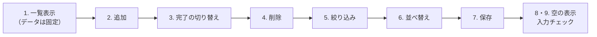
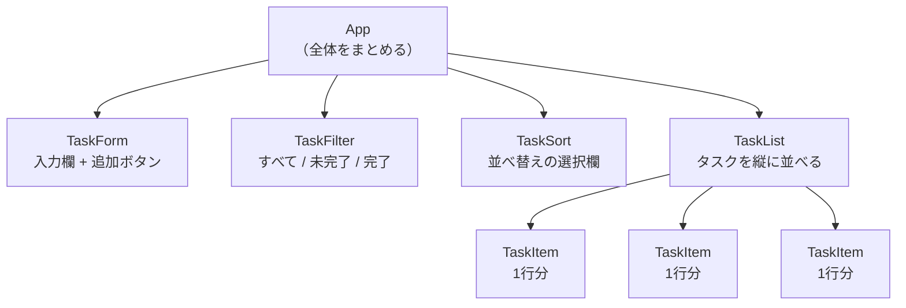
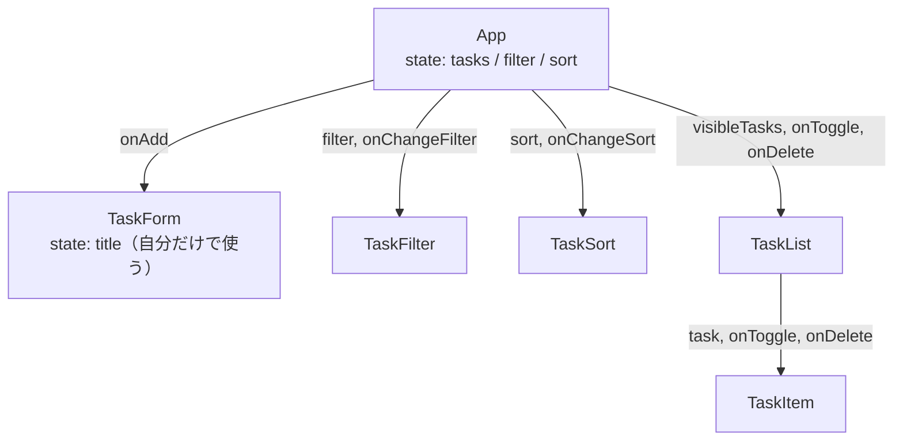
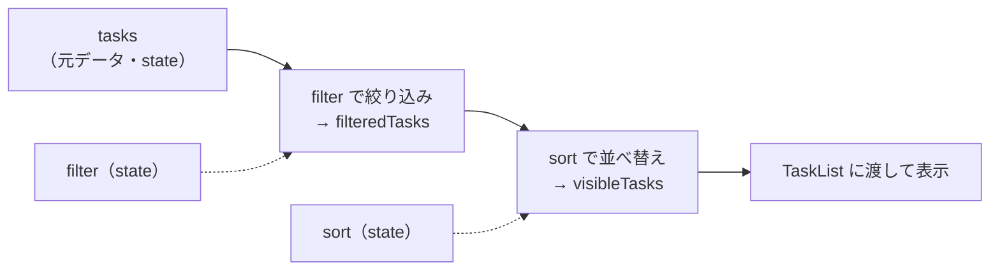
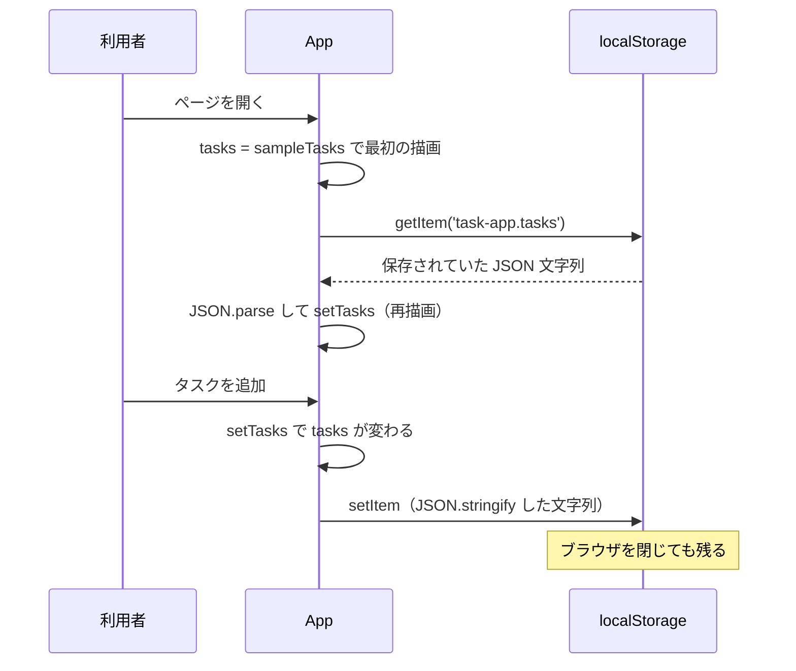

# 第10章 実践：タスク管理アプリを作る

第9章までで、React の道具はひととおりそろいました。
`useState`、props、リスト表示、フォーム、`useEffect`、カスタムフック、ルーティング——
どれも、それ単体では使えるはずです。

それでも、いざ「アプリを1つ作ってください」と言われると、多くの人の手が止まります。
止まる理由は、たいてい文法ではありません。

- **何から書き始めればいいのかわからない**
- **どの値を state にすればいいのかわからない**
- **ファイルをいくつ作ればいいのかわからない**

これは知識不足ではなく、**手順を知らないだけ**です。
この章では、その手順を1つずつ追いかけます。

作るのは**タスク管理アプリ**（やることリスト）です。
題材としては地味ですが、「一覧を出す・追加する・変える・消す・絞り込む・保存する」という、
アプリに必要な動きがひととおり詰まっています。

## この章で学ぶこと

- 作りたいものを、実装できる大きさの単位に分解できるようになる
- 画面を見て、コンポーネントの分け方とデータの形を自分で決められるようになる
- どの値を state にし、どこに置くかを判断できるようになる
- 動く最小のものから少しずつ育てる進め方で、アプリを1つ完成させられるようになる
- 入力したデータを、リロードしても消えないようにブラウザへ保存できるようになる（`localStorage`）

## この章の前提

- [第7章](./07-props-and-state.md) の props・`useState`・イベント・`map` と `key`・条件表示・フォーム
- [第8章](./08-state-design-and-effects.md) の状態のリフトアップ（8.1）・`useEffect`（8.2）・カスタムフック（8.5）
- [第9章](./09-routing-and-architecture.md) のディレクトリ構成（9.3.3）と命名規則（9.3.4）
- [5.3](./05-javascript-advanced.md) の `map` / `filter` / `sort`、[5.4](./05-javascript-advanced.md) のスプレッド構文とイミュータブルな更新
- 第6章の手順（[6.2.2](./06-react-start.md)）で Vite のプロジェクトを作れること

> **つまずいたら**
> この章は、**1つのアプリを最後まで作り切る**章です。
> 途中で動かなくなったまま先へ進むと、どこで壊れたのかがわからなくなります。
>
> **1つの項を終えるたびに、必ずブラウザで動かして確認してください。**
> 動かなくなったら、その場で相談してください。
>
> ```text
> react-text の 10.3.4 を読んでいます。
> チェックボックスを押しても表示が変わりません。
> いま書いている App.jsx と TaskItem.jsx の全文を貼ります。（両方の全文を貼る）
> ブラウザのコンソールには何も出ていません。
> ```
>
> **「どこまでは動いていたか」を必ず添えてください。**
> 「10.3.3 までは追加できていた」の一言があるだけで、原因の候補が一気に減ります。

> **注意：この章は新しいプロジェクトで作ります**
> 第6章から第9章までは `my-first-react` という1つのプロジェクトを使い回してきました。
> この章では、**`task-app` という新しいプロジェクトを作ります**（10.3.1）。
> `my-first-react` は消さずに残しておいてください。見返すときに使います。

---

## 10.1 作るものを決める

### 10.1.1 完成イメージ

**最初にやることは、コードを書くことではありません。**
「完成したら何ができるのか」を、言葉で書き出すことです。

これを飛ばすと、作りながら仕様が増えていき、いつまでも終わらなくなります。

今回作るものを、1文で書きます。

```text
自分のやることを登録して、終わったら印を付けられて、
ブラウザを閉じても消えないリスト。
```

そして、完成したときの画面を言葉で書きます。

```text
・画面の上に「タスク管理アプリ」という見出しがある
・その下に入力欄と「追加」ボタンがある
・その下に「すべて / 未完了 / 完了」の3つのボタンと、並べ替えの選択欄がある
・その下にタスクが縦に並んでいる
・タスクの1行には、チェックボックス・タスク名・削除ボタンがある
・完了したタスクは、文字に取り消し線が付く
・タスクが1件もないときは、その旨の案内が出る
```

この10行が、この章のゴールです。
**書き終わるまで、コードを1行も書かないでください。**

> **補足：なぜ言葉で書くのか**
> 頭の中のイメージは、驚くほどあいまいです。
> 「完了したタスクはどうなる？ 消える？ 下に移動する？ 取り消し線？」——
> 書き出して初めて、自分が決めていなかったことに気づきます。
>
> 決めていないことは、実装している途中で必ず手を止めます。

### 10.1.2 機能の一覧を書き出す

次に、完成イメージを**機能**の単位に分けます。
機能とは、「利用者ができる1つのこと」です。

| 番号 | 機能 | 利用者から見た動き |
|------|------|------------------|
| 1 | 一覧表示 | 登録したタスクが縦に並んで見える |
| 2 | 追加 | 入力して「追加」を押すと、一覧の末尾に増える |
| 3 | 完了の切り替え | チェックボックスを押すと、完了・未完了が入れ替わる |
| 4 | 削除 | 「削除」を押すと、その1件が消える |
| 5 | 絞り込み | 「未完了」を押すと、未完了のタスクだけが表示される |
| 6 | 並べ替え | 「新しい順 / 古い順 / 名前順」を選ぶと、並び順が変わる |
| 7 | 保存 | ブラウザを閉じて開き直しても、タスクが残っている |
| 8 | 空のときの案内 | タスクが0件のとき、案内文が出る |
| 9 | 入力チェック | 空のまま「追加」を押しても、タスクが増えない |

**この表の作り方にはコツがあります。**
「〜できる」の形で、**利用者が見て確認できること**だけを書いてください。

> ❌ 「タスクを state で管理する」（これは作り方であって、機能ではない）
> ✅ 「入力して追加を押すと、一覧に増える」（利用者が目で確認できる）

作り方を先に決めてしまうと、その作り方に引きずられます。
**まず「何ができるか」、そのあとで「どう作るか」**の順です。

### 10.1.3 最初に作る範囲を決める

9個の機能を、**同時に**作ろうとしてはいけません。
1つも動かないまま巨大なコードができあがり、どこが悪いのか調べられなくなります。

**最初に作るのは、「これがないとアプリと呼べない」という最小限だけ**にします。
この最小限のことを、開発の現場では **MVP**（エムブイピー。Minimum Viable Product の略で、
「価値がある最小のもの」という意味）と呼びます。

今回の MVP は、**機能1（一覧表示）と機能2（追加）**の2つです。
この2つが動けば、「メモとしては使える」状態になります。

そのあとの順番も決めておきます。



この順番には理由があります。

- **表示が先。** 表示できなければ、追加できたかどうかも確認できません
- **追加が次。** データを増やせないと、絞り込みや並べ替えを試せません
- **保存はあと。** 保存を先に入れると、壊れたデータが残って毎回やり直しになります
- **見た目と入力チェックは最後。** 動く前に整えても、作り直しになるだけです

> **よくある間違い**
> 「どうせあとで消すから」と、見た目を整えるのを先にやってしまう人がいます。
> 見た目を整えたコードは書き換えづらくなり、**機能を足すたびに CSS を直す**ことになります。
>
> **動いてから整える。** この順番は、この章の最後まで守ってください。

---

## 10.2 設計する

### 10.2.1 画面を紙に描く

機能が決まったら、**画面を描きます。**
紙とペンで構いません。むしろ、そのほうが早く描けます。

きれいに描く必要はありません。**四角と文字だけ**で十分です。

```text
┌────────────────────────────────┐
│  タスク管理アプリ                │
├────────────────────────────────┤
│  [やることを入力      ] [追加]   │
├────────────────────────────────┤
│  [すべて][未完了][完了]          │
│  並べ替え： [新しい順  ▼]        │
├────────────────────────────────┤
│  □ 牛乳を買う            [削除]  │
│  ☑ 第9章の演習をやる      [削除]  │
│  □ 部屋を片づける         [削除]  │
└────────────────────────────────┘
```

描いてみると、10.1.1 で決めていなかったことが見つかります。

- 追加したタスクは、上に増える？ 下に増える？
- 削除ボタンは、常に見えている？ マウスを乗せたときだけ？

今回は、**追加したタスクは末尾（下）に増える**、**削除ボタンは常に見えている**、と決めます。
決めたことは、10.1.1 の完成イメージに書き足しておいてください。

### 10.2.2 コンポーネントに分解する

描いた絵を見ながら、**区切りの線を引きます。**
線を引く基準は2つだけです。

1. **繰り返し出てくるもの**（タスクの1行は、3回出てくる）
2. **1つの役割でまとまっているもの**（入力欄と追加ボタンは、「追加する」というひとまとまり）

この基準で線を引くと、次のようになります。



この図を**コンポーネントツリー**（部品の親子関係を木の形で表したもの）と呼びます。

分けたコンポーネントは、次の6つです。

| コンポーネント | 役割 | 置き場所（9.3.3） |
|--------------|------|-----------------|
| `App` | 全体をまとめる。データを持つ | `src/App.jsx` |
| `TaskForm` | 新しいタスクを入力して追加する | `src/components/TaskForm.jsx` |
| `TaskFilter` | 表示するタスクの種類を切り替える | `src/components/TaskFilter.jsx` |
| `TaskSort` | 並び順を切り替える | `src/components/TaskSort.jsx` |
| `TaskList` | タスクを縦に並べる | `src/components/TaskList.jsx` |
| `TaskItem` | タスク1件分の表示と操作 | `src/components/TaskItem.jsx` |

このアプリには URL で切り替わる画面がないため、`src/pages/` は作りません（9.3.3）。

> **補足：分けすぎないこと**
> 「削除ボタンも部品にしたほうがいいのでは？」と思うかもしれません。
> **1箇所でしか使わず、中身が数行しかないものは、分けないほうが読みやすくなります。**
>
> 迷ったら、**分けない**を選んでください。
> 同じものが2箇所目に出てきたときに分ければ十分です（9.3.3）。

### 10.2.3 データの形を決める

次に、**タスク1件を JavaScript でどう表すか**を決めます。

タスク1件は、いくつかの情報の組です。こういうときはオブジェクトを使います（5.2.1）。

`タスク1件の形（決定版）`

```js
{
  id: 1740000000000,        // このタスクを1つに特定するための番号
  title: '牛乳を買う',       // タスクの名前
  isDone: false,            // 完了しているか（true / false）
  createdAt: 1740000000000, // 作られた時刻。並べ替えに使う
}
```

そして、タスク全体は**この形のオブジェクトを並べた配列**にします（5.2.4）。

```js
[
  { id: 1, title: '牛乳を買う', isDone: false, createdAt: 1740000000000 },
  { id: 2, title: '部屋を片づける', isDone: true, createdAt: 1740000100000 },
]
```

**なぜこの4つなのか**を、1つずつ説明します。

| プロパティ | なぜ必要か |
|-----------|----------|
| `id` | `map` で並べるときの `key` に使い、切り替え・削除の対象を指定するのに使う（7.4.2） |
| `title` | 画面に表示する文字そのもの |
| `isDone` | 完了かどうかを真偽値で持つ。取り消し線と絞り込みの両方に使う |
| `createdAt` | 「新しい順 / 古い順」の並べ替えに使う。数値なので引き算で比べられる |

`id` と `createdAt` に入れる数値は、`Date.now()` で作ります（7.4.4）。
`Date.now()` は、**1970年1月1日からの経過ミリ秒**を数値で返す関数でした。

```js
console.log(Date.now())   // 1740000000000 のような数値
```

**決めるときの基準は「画面に出したいものと、判断に使うものを、すべて持たせる」**です。
逆に、**計算で求められるものは持たせません。**

たとえば「未完了の件数」は、`isDone` が `false` のタスクを数えれば求まります。
だから `count` のようなプロパティは作りません（この考え方は 10.2.4 で詳しく扱います）。

> **よくある間違い**
> `id` を「1, 2, 3...」のような連番にしたくなりますが、削除があると壊れます。
> 3件（1,2,3）のうち 2 を消して次を「件数 + 1 = 3」で作ると、**id が 3 のタスクが2つ**になります。
> 同じ `key` が2つあると、React は正しく描き直せません（7.4.2）。
>
> `Date.now()` を使えば、押すたびに違う数値になるのでこの問題は起きません。

### 10.2.4 state をどこに置くか決める

いよいよ、**この章でいちばん大事な判断**です。

まず、**画面の中で変わるもの**をすべて書き出します。

```text
1. タスクの一覧（追加・切り替え・削除で変わる）
2. 入力欄に入力中の文字（打つたびに変わる）
3. 選ばれている絞り込み（すべて / 未完了 / 完了）
4. 選ばれている並び順（新しい順 / 古い順 / 名前順）
5. 実際に画面に並ぶタスク（絞り込みと並べ替えの結果）
```

次に、**この5つのうち、どれを state にするか**を判断します。
判断の基準は 8.1.5 のとおり、**「他の state から計算できるものは、state にしない」**です。

| | state にするか | 理由 |
|--|--------------|------|
| 1. タスクの一覧 | **する** | 他の何からも計算できない。これがこのアプリの「元データ」 |
| 2. 入力中の文字 | **する** | 利用者の入力そのもの。他から計算できない |
| 3. 絞り込み | **する** | 利用者の選択そのもの |
| 4. 並び順 | **する** | 利用者の選択そのもの |
| 5. 画面に並ぶタスク | **しない** | **1・3・4 から計算できる**（8.1.5） |

5 を state にしてしまうと、タスクを1件追加するたびに
「一覧の state」と「表示用の state」の**両方**を更新しなければならなくなり、
片方だけ更新し忘れて画面がずれます。

**計算で求められるものは、レンダリングのたびに計算します。**

```js
// state ではなく、ただの変数として毎回計算する
const visibleTasks = /* tasks を filter と sort で加工した結果 */
```

同じ考え方で、次のような値も state にしません。

```js
// 未完了の件数。tasks から計算できるので state にしない
const activeCount = tasks.filter((task) => !task.isDone).length
```

**次に、state を置く場所を決めます。**
基準は 8.1.4 のとおり、**「その state を使うコンポーネント全部の、いちばん近い共通の親」**です。



| state | 置く場所 | 理由 |
|-------|---------|------|
| `tasks` | `App` | `TaskList`（表示）と `TaskForm`（追加）の両方が関係する。共通の親は `App`（8.1.2） |
| `filter` | `App` | `TaskFilter`（選ぶ）と `TaskList`（結果を表示）の共通の親 |
| `sort` | `App` | 同上 |
| `title`（入力中の文字） | `TaskForm` | **`TaskForm` の中でしか使わない。**外に上げる必要がない（8.1.4） |

`title` だけ `App` に置かないのが重要な点です。
1文字打つたびに `App` が再レンダリングされ、関係のない一覧まで作り直されるからです。
**state は、必要な範囲でいちばん狭い場所に置きます。**

そして、上の図の `onAdd` / `onToggle` / `onDelete` のように、
**子から親の state を変えたいときは、親から「更新する関数」を props で渡します**（8.1.3）。

設計はここまでです。**ここから先は、決めたとおりに書いていくだけ**になります。

---

## 10.3 段階的に実装する

ここからは、10.1.3 で決めた順に作ります。
**1つの項が終わるたびに、必ずブラウザで確認してください。**

### 10.3.1 プロジェクトを作る

第6章と同じ手順で、`task-app` という新しいプロジェクトを作ります（6.2.2）。
作る場所は、`my-first-react` と同じ `react-lesson` の中です。

**Windows（PowerShell）**

```powershell
cd react-lesson
npm create vite@latest task-app -- --template react
```

**macOS / Linux**

```bash
cd react-lesson
npm create vite@latest task-app -- --template react
```

`react-lesson` の場所がわからなくなったら、まずホームディレクトリに戻ってから移動してください（1.4.4）。

```text
実行結果の例:

Scaffolding project in .../react-lesson/task-app...

Done. Now run:

  cd task-app
  npm install
  npm run dev
```

続けて、部品のインストールと開発サーバーの起動を行います。

**Windows（PowerShell）**

```powershell
cd task-app
npm install
npm run dev
```

**macOS / Linux**

```bash
cd task-app
npm install
npm run dev
```

```text
実行結果の例:

  VITE v7.0.0  ready in 412 ms

  ➜  Local:   http://localhost:5173/
```

`http://localhost:5173/` を開いて、Vite と React のロゴが出れば成功です。

> **注意：ポート番号が 5174 になることがあります**
> `my-first-react` の開発サーバーを起動したままだと、5173 が使用中のため
> `http://localhost:5174/` のように別の番号が割り当てられます。
> **ターミナルに表示された URL を開いてください。**
>
> 混乱を避けるため、`my-first-react` の側は
> ターミナルで `Ctrl` + `C` を押して止めておくことをおすすめします。

**雛形の中身を消します。**

Vite が用意した雛形には、ロゴやカウンターのサンプルが入っています。
このまま作り始めると邪魔になるので、2つのファイルを**全文書き換え**ます。

`src/App.jsx`（中身をすべて消して、次の内容にする）

```jsx
import './App.css'

function App() {
  return (
    <div className="app">
      <h1>タスク管理アプリ</h1>
    </div>
  )
}

export default App
```

`src/App.css`（中身をすべて消して、次の内容にする）

```css
.app {
  max-width: 640px;
  margin: 0 auto;
  padding: 24px 16px;
}
```

`src/index.css`（中身をすべて消して、次の内容にする）

```css
body {
  margin: 0;
  font-family: sans-serif;
  color: #222222;
  background-color: #ffffff;
}
```

保存すると、ブラウザには「タスク管理アプリ」という見出しだけが表示されます。

```text
表示される内容:
タスク管理アプリ
```

> **よくある間違い**
> `src/index.css` を書き換えないと、Vite の雛形の設定によって
> **画面全体が中央寄せになったり、背景が暗くなったり**します。
> 「作った覚えのない見た目になっている」ときは、`index.css` を疑ってください（6.3.5）。

### 10.3.2 まず一覧を表示する

**最初は、追加機能を作りません。**
決まったデータを表示するところだけを作り、**表示が正しいことを先に確かめます。**

まず、動作確認用のデータを用意します。

`src/data/sampleTasks.js`（新規作成。`data` ディレクトリも作る）

```js
// 動作確認用の初期データ。空の状態から作ると確認しづらいので、3件だけ用意する
export const sampleTasks = [
  { id: 1, title: '牛乳を買う', isDone: false, createdAt: 1740000000000 },
  { id: 2, title: '第9章の演習をやる', isDone: true, createdAt: 1740000100000 },
  { id: 3, title: '部屋を片づける', isDone: false, createdAt: 1740000200000 },
]
```

次に、タスク1件分の部品を作ります。

`src/components/TaskItem.jsx`（新規作成。`components` ディレクトリも作る）

```jsx
function TaskItem({ task }) {
  return (
    <li className="task-item">
      <span className="task-title">{task.title}</span>
    </li>
  )
}

export default TaskItem
```

次に、それを並べる部品を作ります。

`src/components/TaskList.jsx`（新規作成）

```jsx
import TaskItem from './TaskItem.jsx'

function TaskList({ tasks }) {
  return (
    <ul className="task-list">
      {tasks.map((task) => (
        // key には配列の index ではなく id を使う（7.4.3）
        <TaskItem key={task.id} task={task} />
      ))}
    </ul>
  )
}

export default TaskList
```

最後に、`App` から使います。

`src/App.jsx`（全文を次の内容にする）

```jsx
import { useState } from 'react'
import TaskList from './components/TaskList.jsx'
import { sampleTasks } from './data/sampleTasks.js'
import './App.css'

function App() {
  // setTasks は 10.3.3 から使う
  const [tasks, setTasks] = useState(sampleTasks)

  return (
    <div className="app">
      <h1>タスク管理アプリ</h1>
      <TaskList tasks={tasks} />
    </div>
  )
}

export default App
```

保存すると、3件のタスクが縦に並びます。

```text
表示される内容:
タスク管理アプリ
・牛乳を買う
・第9章の演習をやる
・部屋を片づける
```

**ここで一度止まって、必ず確認してください。**

- 3件とも表示されているか
- ブラウザのコンソール（`F12` で開く。1.6.4）に赤い文字や警告が出ていないか

> **よくある間違い**
> `Warning: Each child in a list should have a unique "key" prop.` という警告が出たら、
> `key` を書き忘れています（7.4.2）。
> `key` は `TaskItem` の中ではなく、**`map` の中で作っている要素**に書きます。
>
> ```jsx
> <TaskItem key={task.id} task={task} />   {/* 正しい */}
> ```

### 10.3.3 タスクを追加する

**追加のしくみは、2つに分かれます。**

- 入力欄の文字を覚えるのは `TaskForm` の仕事（自分の中の state）
- タスクの配列を増やすのは `App` の仕事（`tasks` を持っているのは `App`）

`TaskForm` は `tasks` を持っていないので、自分では追加できません。
そこで、**`App` から「追加する関数」を props でもらいます**（8.1.3）。

`src/components/TaskForm.jsx`（新規作成）

```jsx
import { useState } from 'react'

function TaskForm({ onAdd }) {
  // 入力中の文字は、このコンポーネントの中だけで使う（10.2.4）
  const [title, setTitle] = useState('')

  function handleSubmit(event) {
    // ページ全体が再読み込みされるのを止める（7.6.5）
    event.preventDefault()
    // 親からもらった関数を呼ぶ。実際に配列を増やすのは App の仕事
    onAdd(title)
    // 入力欄を空に戻す
    setTitle('')
  }

  return (
    <form className="task-form" onSubmit={handleSubmit}>
      <input
        type="text"
        value={title}
        onChange={(event) => setTitle(event.target.value)}
        placeholder="やることを入力"
      />
      <button type="submit">追加</button>
    </form>
  )
}

export default TaskForm
```

`value` と `onChange` の組は、7.6.2 の**制御コンポーネント**です。
`placeholder` は、入力欄が空のときに薄く表示される案内文で、HTML の属性です（2.4.3）。

`App` 側に、追加する関数を書きます。

`src/App.jsx`（`import` を1行足し、関数と `<TaskForm />` を追加する）

```diff
  import { useState } from 'react'
+ import TaskForm from './components/TaskForm.jsx'
  import TaskList from './components/TaskList.jsx'
```

```diff
    const [tasks, setTasks] = useState(sampleTasks)

+   function handleAdd(title) {
+     const newTask = {
+       id: Date.now(),
+       title: title,
+       isDone: false,
+       createdAt: Date.now(),
+     }
+     // 元の配列は書き換えず、新しい配列を作って渡す（5.4.3）
+     setTasks([...tasks, newTask])
+   }
+
    return (
      <div className="app">
        <h1>タスク管理アプリ</h1>
+       <TaskForm onAdd={handleAdd} />
        <TaskList tasks={tasks} />
      </div>
    )
```

保存して、入力欄に「郵便局に行く」と入力し、「追加」を押してください。

```text
表示される内容:
タスク管理アプリ
[やることを入力      ] [追加]
・牛乳を買う
・第9章の演習をやる
・部屋を片づける
・郵便局に行く
```

**`[...tasks, newTask]` の意味を確認しておきます**（5.4.2）。

```js
const tasks = ['A', 'B']
console.log([...tasks, 'C'])   // ['A', 'B', 'C'] という新しい配列
console.log(tasks)             // ['A', 'B'] のまま。元は変わっていない
```

順番を入れ替えると、追加される位置が変わります。

```js
setTasks([newTask, ...tasks])   // 先頭に追加される
```

今回は 10.2.1 で「末尾に増える」と決めたので、`[...tasks, newTask]` を使います。

> **よくある間違い**
> `tasks.push(newTask)` と書くと、**画面が変わりません。**
> `push` は元の配列を直接書き換えるため、React から見ると
> 「同じ配列のまま」で、再レンダリングが起きないからです（7.2.4、5.4.3）。
>
> ```js
> tasks.push(newTask)          // ❌ 画面が更新されない
> setTasks([...tasks, newTask]) // ✅ 新しい配列を渡す
> ```

### 10.3.4 完了・未完了を切り替える

チェックボックスを押したら、そのタスクの `isDone` を反転させます。

**変えるのは1件だけですが、`setTasks` に渡すのは配列全体**です。
「1件だけ差し替えた新しい配列」を作る必要があります。ここで `map` を使います（5.3.1）。

`src/App.jsx`（`handleAdd` の下に追加し、`TaskList` に props を1つ足す）

```diff
      setTasks([...tasks, newTask])
    }

+   function handleToggle(id) {
+     setTasks(
+       tasks.map((task) =>
+         // id が一致する1件だけ、isDone を反転させた新しいオブジェクトに差し替える
+         task.id === id ? { ...task, isDone: !task.isDone } : task
+       )
+     )
+   }
+
    return (
```

```diff
        <TaskForm onAdd={handleAdd} />
-       <TaskList tasks={tasks} />
+       <TaskList tasks={tasks} onToggle={handleToggle} />
```

`{ ...task, isDone: !task.isDone }` は、5.4.3 の**イミュータブルな更新**です。
「元のオブジェクトを全部コピーして、`isDone` だけ上書きした新しいオブジェクト」を作ります。

`TaskList` は、受け取った関数をそのまま `TaskItem` に渡します。

`src/components/TaskList.jsx`（全文を次の内容にする）

```jsx
import TaskItem from './TaskItem.jsx'

function TaskList({ tasks, onToggle }) {
  return (
    <ul className="task-list">
      {tasks.map((task) => (
        <TaskItem key={task.id} task={task} onToggle={onToggle} />
      ))}
    </ul>
  )
}

export default TaskList
```

`src/components/TaskItem.jsx`（全文を次の内容にする）

```jsx
function TaskItem({ task, onToggle }) {
  return (
    <li className="task-item">
      <label className="task-label">
        <input
          type="checkbox"
          checked={task.isDone}
          onChange={() => onToggle(task.id)}
        />
        <span className={task.isDone ? 'task-title is-done' : 'task-title'}>
          {task.title}
        </span>
      </label>
    </li>
  )
}

export default TaskItem
```

`className` を三項演算子で切り替えているのは、7.5.2 のやり方です。
完了したときに `is-done` という class が付くので、CSS で取り消し線を引けます。

`src/App.css`（末尾に追記する）

```css
.task-title.is-done {
  text-decoration: line-through;
  color: #999999;
}
```

保存して、チェックボックスを押してください。

```text
表示される内容（「牛乳を買う」にチェックを入れたあと）:
☑ 牛乳を買う         ← 取り消し線が付く
☑ 第9章の演習をやる   ← 取り消し線が付く
□ 部屋を片づける
```

**まとめて更新することもできます。**

`map` は全件に対して処理をするので、「すべてを完了にする」も同じ形で書けます。
（この関数はアプリには組み込みません。書き方の例として読んでください。）

```js
// すべてのタスクを完了にする例
function completeAll() {
  setTasks(tasks.map((task) => ({ ...task, isDone: true })))
}
```

`({ ...task, isDone: true })` の**外側の丸かっこ**に注意してください。
アロー関数の `=>` の直後に `{` を書くと、JavaScript は「関数の中身の始まり」だと解釈します。
**オブジェクトを返したいときは、丸かっこで囲みます**（4.6.3）。

```js
(task) => { ...task }     // ❌ 構文エラーになる
(task) => ({ ...task })   // ✅ オブジェクトを返す
```

> **よくある間違い**
> `checked={task.isDone}` を書いたのに `onChange` を書き忘れると、
> **チェックボックスが押せなくなり**、コンソールに次の警告が出ます。
>
> ```text
> Warning: You provided a `checked` prop to a form field without an `onChange` handler.
> ```
>
> これは 7.6.1 の制御コンポーネントの話と同じです。
> 表示は `isDone` が決めているので、`isDone` を変えない限り見た目は変わりません。

### 10.3.5 タスクを削除する

削除は、**その id 以外を残した新しい配列**を作ります。`filter` の出番です（5.3.2）。

`src/App.jsx`（`handleToggle` の下に追加し、`TaskList` に props を1つ足す）

```diff
      )
    }

+   function handleDelete(id) {
+     // id が一致しないものだけを残す＝一致するものが消える
+     setTasks(tasks.filter((task) => task.id !== id))
+   }
+
    return (
```

```diff
-       <TaskList tasks={tasks} onToggle={handleToggle} />
+       <TaskList tasks={tasks} onToggle={handleToggle} onDelete={handleDelete} />
```

`src/components/TaskList.jsx`（`onDelete` を受け取って渡す）

```diff
- function TaskList({ tasks, onToggle }) {
+ function TaskList({ tasks, onToggle, onDelete }) {
    return (
      <ul className="task-list">
        {tasks.map((task) => (
-         <TaskItem key={task.id} task={task} onToggle={onToggle} />
+         <TaskItem
+           key={task.id}
+           task={task}
+           onToggle={onToggle}
+           onDelete={onDelete}
+         />
        ))}
      </ul>
    )
  }
```

`src/components/TaskItem.jsx`（`onDelete` を受け取り、ボタンを足す）

```diff
- function TaskItem({ task, onToggle }) {
+ function TaskItem({ task, onToggle, onDelete }) {
    return (
      <li className="task-item">
        <label className="task-label">
```

```diff
          {task.title}
        </span>
      </label>
+     <button type="button" onClick={() => onDelete(task.id)}>
+       削除
+     </button>
    </li>
  )
```

保存して、「削除」を押してください。その1件だけが消えます。

```text
表示される内容（「第9章の演習をやる」を削除したあと）:
□ 牛乳を買う            [削除]
□ 部屋を片づける         [削除]
```

`onClick={() => onDelete(task.id)}` の書き方は、7.3.3 の「引数を渡す」やり方です。

> **よくある間違い**
> `onClick={onDelete(task.id)}` と書くと、**画面を開いた瞬間に全件が削除されます。**
> これは「関数を渡す」のではなく「関数を呼び出した結果を渡す」書き方だからです（7.3.2）。
>
> ```jsx
> onClick={onDelete(task.id)}        {/* ❌ その場で実行される */}
> onClick={() => onDelete(task.id)}  {/* ✅ 押したときに実行される */}
> ```

### 10.3.6 絞り込み

「すべて / 未完了 / 完了」を切り替えられるようにします。

10.2.4 で決めたとおり、**絞り込んだ結果は state にしません。**
`tasks` と `filter` から、そのつど計算します。

まず、切り替えるボタンの部品を作ります。

`src/components/TaskFilter.jsx`（新規作成）

```jsx
// 表示する文字と、内部で使う値の対応表。ここを増やせば選択肢が増える
const FILTERS = [
  { value: 'all', label: 'すべて' },
  { value: 'active', label: '未完了' },
  { value: 'done', label: '完了' },
]

function TaskFilter({ filter, onChangeFilter }) {
  return (
    <div className="task-filter">
      {FILTERS.map((item) => (
        <button
          key={item.value}
          type="button"
          className={
            item.value === filter ? 'filter-button is-active' : 'filter-button'
          }
          onClick={() => onChangeFilter(item.value)}
        >
          {item.label}
        </button>
      ))}
    </div>
  )
}

export default TaskFilter
```

ボタン3つを手で並べず `map` で作っているのは、**選択肢が増えたときに1行足すだけで済む**ようにするためです（7.4.1）。

`src/App.jsx`（`filter` の state と計算、`TaskFilter` の表示を追加する）

```diff
  import { useState } from 'react'
+ import TaskFilter from './components/TaskFilter.jsx'
  import TaskForm from './components/TaskForm.jsx'
```

```diff
    const [tasks, setTasks] = useState(sampleTasks)
+   const [filter, setFilter] = useState('all')
```

```diff
      setTasks(tasks.filter((task) => task.id !== id))
    }

+   // state ではなく、レンダリングのたびに計算する（10.2.4）
+   const visibleTasks = tasks.filter((task) => {
+     if (filter === 'active') {
+       return !task.isDone
+     }
+     if (filter === 'done') {
+       return task.isDone
+     }
+     return true
+   })
+
    return (
      <div className="app">
        <h1>タスク管理アプリ</h1>
        <TaskForm onAdd={handleAdd} />
+       <TaskFilter filter={filter} onChangeFilter={setFilter} />
-       <TaskList tasks={tasks} onToggle={handleToggle} onDelete={handleDelete} />
+       <TaskList
+         tasks={visibleTasks}
+         onToggle={handleToggle}
+         onDelete={handleDelete}
+       />
```

`onChangeFilter={setFilter}` のように、**更新関数をそのまま渡すこともできます。**
`TaskFilter` の中で `onChangeFilter('done')` と呼べば、`setFilter('done')` が実行されます。

`src/App.css`（末尾に追記する）

```css
.task-filter {
  display: flex;
  gap: 8px;
  margin: 12px 0;
}

.filter-button.is-active {
  font-weight: bold;
  border-color: #333333;
}
```

保存して、「未完了」を押してください。

```text
表示される内容（「未完了」を選んだとき）:
[すべて][未完了][完了]     ← 「未完了」が太字になる
□ 牛乳を買う            [削除]
□ 部屋を片づける         [削除]
```

**`TaskList` に渡すものが `tasks` から `visibleTasks` に変わった**のが要点です。
`tasks`（元データ）は絞り込みで減らず、表示だけが変わります。
「完了」を選んだあとで「すべて」に戻せば、全件が戻ってきます。

### 10.3.7 並べ替え

並び順を「新しい順 / 古い順 / 名前順」から選べるようにします。

`src/components/TaskSort.jsx`（新規作成）

```jsx
function TaskSort({ sort, onChangeSort }) {
  return (
    <label className="task-sort">
      並べ替え：
      <select value={sort} onChange={(event) => onChangeSort(event.target.value)}>
        <option value="newest">新しい順</option>
        <option value="oldest">古い順</option>
        <option value="title">名前順</option>
      </select>
    </label>
  )
}

export default TaskSort
```

`<select>` の書き方は 7.6.4 のとおりです。`value` と `onChange` の組で制御します。

`src/App.jsx`（`sort` の state と並べ替えの計算、`TaskSort` の表示を追加する）

```diff
  import TaskList from './components/TaskList.jsx'
+ import TaskSort from './components/TaskSort.jsx'
```

```diff
    const [filter, setFilter] = useState('all')
+   const [sort, setSort] = useState('newest')
```

```diff
      return true
    })

+   // sort は元の配列を書き換えてしまうので、コピーしてから並べ替える（5.3.5）
+   const visibleTasks = [...filteredTasks].sort((a, b) => {
+     if (sort === 'oldest') {
+       return a.createdAt - b.createdAt
+     }
+     if (sort === 'title') {
+       return a.title.localeCompare(b.title, 'ja')
+     }
+     return b.createdAt - a.createdAt
+   })
+
```

**変数名も変えます。**`filter` した結果は `filteredTasks` という名前にし、
`visibleTasks` は「絞り込み＋並べ替えのあと」を指すようにします。

```diff
-   const visibleTasks = tasks.filter((task) => {
+   const filteredTasks = tasks.filter((task) => {
```

```diff
        <TaskFilter filter={filter} onChangeFilter={setFilter} />
+       <TaskSort sort={sort} onChangeSort={setSort} />
```

**データが表示されるまでの流れ**は、次のようになりました。



**元データの `tasks` は、この流れの中で一度も変わりません。**
絞り込みも並べ替えも「見せ方」を変えているだけです。
だから「未完了だけ表示」にしたあと「すべて」に戻せば、完了済みのタスクも戻ってきます。

**新しく出てきた書き方を2つ説明します。**

1つ目は `[...filteredTasks].sort(...)` です。
`sort` は**元の配列を直接並べ替えてしまう**メソッドです（5.3.5）。
`filteredTasks` は毎回作り直されるので実害は出にくいのですが、
**コピーしてから並べ替える**癖をつけてください。

```js
const numbers = [3, 1, 2]
const sorted = [...numbers].sort((a, b) => a - b)
console.log(sorted)    // [1, 2, 3]
console.log(numbers)   // [3, 1, 2] のまま
```

2つ目は `localeCompare` です。
文字列を辞書順に比べるためのメソッドで、**前なら負の数、後なら正の数、同じなら 0** を返します。

```js
console.log('あ'.localeCompare('い', 'ja'))   // -1（「あ」が先）
console.log('い'.localeCompare('あ', 'ja'))   // 1（「い」が後）
```

第2引数の `'ja'` は「日本語のルールで比べる」という指定です。
これを付けないと、環境によって日本語の並び順が変わることがあります。

保存して、並べ替えを「名前順」に変えてください。

```text
表示される内容（「名前順」を選んだとき）:
□ 牛乳を買う            [削除]
☑ 第9章の演習をやる      [削除]
□ 部屋を片づける         [削除]
```

> **よくある間違い**
> 数値を `sort()` で並べ替えるとき、比較関数を省くと**文字列として比べられます。**
>
> ```js
> console.log([10, 9, 100].sort())              // [10, 100, 9]（文字として比較）
> console.log([10, 9, 100].sort((a, b) => a - b)) // [9, 10, 100]（正しい）
> ```
>
> `createdAt` は数値なので、`a.createdAt - b.createdAt` のように**引き算**で比べます。

**参考：文字列の値を、自分の state と対応表で扱う**

`TaskSort` の `<select>` は、親からもらった `sort` を表示していました。
これに対して、**その部品の中だけで選択を覚えたい**ときは、
`TaskForm` の入力欄と同じように**自分の state** を使います（10.3.3）。

```jsx
// 部品の中で選択を覚える形の例（このアプリには組み込みません）
function ColorPicker() {
  const [color, setColor] = useState('red')

  return (
    <select value={color} onChange={(event) => setColor(event.target.value)}>
      <option value="red">赤</option>
      <option value="blue">青</option>
    </select>
  )
}
```

このとき、`color` に入るのは `'red'` のような**内部用の文字列**です。
画面には日本語を出したいので、**対応表のオブジェクトを1つ用意します**（5.2.2）。

```js
const COLOR_LABELS = { red: '赤', blue: '青' }

const color = 'blue'
console.log(COLOR_LABELS[color])   // 青
```

`COLOR_LABELS.color` ではなく **`COLOR_LABELS[color]`** と角かっこで書くのが要点です。
ドットで書くと「`color` という名前のプロパティ」を探してしまい、`undefined` になります。

同じ対応表で、**並べ替え用の数値**を持たせることもできます。

```js
const COLOR_ORDER = { red: 1, blue: 2 }

const colors = ['blue', 'red']
const sorted = [...colors].sort((a, b) => COLOR_ORDER[a] - COLOR_ORDER[b])
console.log(sorted)   // ['red', 'blue']
```

**文字列そのものは大小を比べられませんが、対応表で数値に置き換えれば比べられます。**
`a - b` の形は、`createdAt` の並べ替えとまったく同じです。

---

## 10.4 保存する

### 10.4.1 リロードすると消えてしまう問題

いま、ブラウザの再読み込みボタン（`F5`）を押してください。

```text
表示される内容:
・牛乳を買う
・第9章の演習をやる
・部屋を片づける
```

**追加したタスクが全部消えて、サンプルデータに戻ります。**

理由は、`useState` の値が **JavaScript のメモリ上にしかない**からです。
ページを読み込み直すと JavaScript は最初から実行されるので、
`useState(sampleTasks)` からやり直しになります。

やることリストとして使うには、**閉じても残る場所**にデータを置く必要があります。
置き場所の候補は2つです。

| 置き場所 | 特徴 |
|---------|------|
| サーバー | どの端末からでも見られる。サーバーを作る必要がある（3冊目の fastapi-text で扱います） |
| **ブラウザ自身** | **そのブラウザでしか見られないが、React だけで完結する** |

この章では後者を使います。その仕組みが `localStorage` です。

### 10.4.2 `localStorage` とは

**`localStorage`**（ローカルストレージ。ブラウザがサイトごとに用意している、
文字列を保存しておける小さな保管庫）は、JavaScript から直接使えます。

使うメソッドは3つだけです。

| 書き方 | 意味 |
|-------|------|
| `localStorage.setItem('キー', '値')` | 保存する（同じキーなら上書き） |
| `localStorage.getItem('キー')` | 取り出す。**なければ `null`** |
| `localStorage.removeItem('キー')` | 消す |

ブラウザの開発者ツール（`F12`）のコンソールで試してみてください。

```js
localStorage.setItem('memo', 'こんにちは')
console.log(localStorage.getItem('memo'))    // こんにちは
console.log(localStorage.getItem('nothing')) // null
localStorage.removeItem('memo')
console.log(localStorage.getItem('memo'))    // null
```

**保存できるのは文字列だけです。** ここが最大の注意点です。
配列やオブジェクトをそのまま渡すと、意味のない文字になります。

```js
localStorage.setItem('bad', [1, 2, 3])
console.log(localStorage.getItem('bad'))   // '1,2,3'（配列ではなく文字列）

localStorage.setItem('bad2', { a: 1 })
console.log(localStorage.getItem('bad2'))  // '[object Object]'（中身が消えた）
```

そこで、**JSON** を使います。
JSON（ジェイソン）は、データを文字だけで表す形式でした（用語集）。
JavaScript には、JSON と値を相互に変換する関数が最初から用意されています。

| 関数 | 意味 |
|------|------|
| `JSON.stringify(値)` | 値を JSON の**文字列**に変換する |
| `JSON.parse(文字列)` | JSON の文字列を、**値**に戻す |

```js
const tasks = [{ id: 1, title: '牛乳を買う', isDone: false }]

const text = JSON.stringify(tasks)
console.log(text)
// [{"id":1,"title":"牛乳を買う","isDone":false}]
console.log(typeof text)   // string

const back = JSON.parse(text)
console.log(back[0].title) // 牛乳を買う
console.log(typeof back)   // object
```

**保存するときに `JSON.stringify`、読み込むときに `JSON.parse`。**
この2つは必ずセットで使います。

> **補足：保存されたものを目で見る方法**
> 開発者ツールの **`Application`** タブ（Firefox では「ストレージ」）を開き、
> 左の一覧から `Local Storage` → `http://localhost:5173` を選ぶと、
> 保存されているキーと値が表で見られます。
>
> 保存がうまくいかないときは、まずここを見てください。
> **キーがあるのか、値が空なのか、それだけで原因がかなり絞れます。**

> **注意：`localStorage` は同じブラウザの中だけ**
> Chrome で保存したものは、Edge や Safari では見えません。
> シークレットウィンドウでも別扱いです。
> 「別のブラウザで開いたら空だった」は、故障ではありません。

### 10.4.3 保存と読み込み

必要なのは、次の2つです。

- **タスクが変わるたびに保存する**
- **アプリが起動したときに1回だけ読み込む**

どちらも「画面を組み立てること以外の処理」なので、`useEffect` を使います（8.2.1）。

`src/App.jsx`（`import` と2つの `useEffect` を追加する）

```diff
- import { useState } from 'react'
+ import { useEffect, useState } from 'react'
```

```diff
+ // 保存するときのキー。他のサイトと混ざらないよう、アプリ名を付けておく
+ const STORAGE_KEY = 'task-app.tasks'
+
  function App() {
    const [tasks, setTasks] = useState(sampleTasks)
    const [filter, setFilter] = useState('all')
    const [sort, setSort] = useState('newest')
+   // 読み込みが終わったかどうか。理由はこのあと説明する
+   const [isLoaded, setIsLoaded] = useState(false)
+
+   // 起動したときに1回だけ読み込む（依存配列が空なので1回だけ動く。8.2.3）
+   useEffect(() => {
+     const saved = localStorage.getItem(STORAGE_KEY)
+     if (saved !== null) {
+       setTasks(JSON.parse(saved))
+     }
+     setIsLoaded(true)
+   }, [])
+
+   // tasks が変わるたびに保存する
+   useEffect(() => {
+     // 読み込みが終わる前は保存しない（理由は下の「よくある間違い」）
+     if (!isLoaded) {
+       return
+     }
+     localStorage.setItem(STORAGE_KEY, JSON.stringify(tasks))
+   }, [tasks, isLoaded])
```

保存したら、タスクを1件追加して、**ブラウザを再読み込み（`F5`）**してください。

```text
表示される内容（再読み込みしたあと）:
・牛乳を買う
・第9章の演習をやる
・部屋を片づける
・郵便局に行く        ← 消えずに残っている
```

**このアプリの中で、何がいつ起きているか**を整理します。



> **よくある間違い**
> `isLoaded` のガードを外すと、**保存したデータが毎回消えます。**
>
> 2つの `useEffect` は、どちらも**最初の描画のあとに動きます。**
> ガードがないと、読み込みの直後に「保存」の `useEffect` も動き、
> このときの `tasks` はまだ `sampleTasks` のままです。
> つまり、**読み込んだ直後に、初期値で上書き保存**してしまいます。
>
> `isLoaded` が `true` になるのは次の描画からなので、
> 「読み込みが終わるまでは保存しない」と書くことで、この上書きを防げます。

> **注意：おかしくなったら中身を消してやり直す**
> 開発中に壊れた形のデータを保存してしまうと、
> 読み込みのたびにエラーになって先に進めなくなることがあります。
>
> そのときは、開発者ツールのコンソールで次を実行してください。
>
> ```js
> localStorage.removeItem('task-app.tasks')
> ```
>
> そのあとページを再読み込みすれば、サンプルデータの状態に戻ります。

### 10.4.4 カスタムフックに切り出す

いまの `App.jsx` には、**タスクの話とは関係のないコード**が混ざっています。

- `STORAGE_KEY` という定数
- `isLoaded` という state
- 読み込みの `useEffect`
- 保存の `useEffect`

この4つは「値を `localStorage` に保存する」という**別のテーマ**です。
しかも、あとで「絞り込みの選択も保存したい」となったら、同じものをもう一度書くことになります。

**同じ形が2箇所目に出てきそうなロジックは、カスタムフックにまとめます**（8.5.1）。

`src/hooks/useLocalStorage.js`（新規作成。`hooks` ディレクトリも作る）

```js
import { useEffect, useState } from 'react'

// useState とほぼ同じように使えて、値が localStorage に保存されるフック
function useLocalStorage(key, initialValue) {
  const [value, setValue] = useState(initialValue)
  const [isLoaded, setIsLoaded] = useState(false)

  // 起動時に1回だけ読み込む
  useEffect(() => {
    const saved = localStorage.getItem(key)
    if (saved !== null) {
      try {
        setValue(JSON.parse(saved))
      } catch (error) {
        // 壊れた文字列が入っていても、アプリ全体は止めない（5.5.6）
        console.error('保存されたデータを読めませんでした', error)
      }
    }
    setIsLoaded(true)
  }, [key])

  // 値が変わるたびに保存する。読み込みが終わるまでは保存しない
  useEffect(() => {
    if (!isLoaded) {
      return
    }
    localStorage.setItem(key, JSON.stringify(value))
  }, [key, value, isLoaded])

  // useState と同じ形で返すので、呼ぶ側は書き換えなくて済む
  return [value, setValue]
}

export default useLocalStorage
```

`try` / `catch` は 5.5.6 で扱ったエラー処理です。
`JSON.parse` は、JSON として読めない文字列を渡されるとエラーを投げます。
ここで受け止めておかないと、**保存データが1文字壊れただけでアプリ全体が真っ白**になります。

**`App.jsx` 側は、大幅に短くなります。**

`src/App.jsx`（次のように書き換える）

```diff
- import { useEffect, useState } from 'react'
+ import { useState } from 'react'
+ import useLocalStorage from './hooks/useLocalStorage.js'
```

```diff
- const STORAGE_KEY = 'task-app.tasks'
-
  function App() {
-   const [tasks, setTasks] = useState(sampleTasks)
+   const [tasks, setTasks] = useLocalStorage('task-app.tasks', sampleTasks)
    const [filter, setFilter] = useState('all')
    const [sort, setSort] = useState('newest')
-   const [isLoaded, setIsLoaded] = useState(false)
-
-   useEffect(() => {
-     const saved = localStorage.getItem(STORAGE_KEY)
-     if (saved !== null) {
-       setTasks(JSON.parse(saved))
-     }
-     setIsLoaded(true)
-   }, [])
-
-   useEffect(() => {
-     if (!isLoaded) {
-       return
-     }
-     localStorage.setItem(STORAGE_KEY, JSON.stringify(tasks))
-   }, [tasks, isLoaded])
```

**`useState` を `useLocalStorage` に書き換えただけ**で、動きは同じです。
`App.jsx` からは `localStorage` という言葉が消え、「タスクをどう扱うか」だけが残りました。

このフックは、**キーを変えれば何度でも使えます。**

```js
// 絞り込みの選択も保存したくなったら、1行変えるだけ
const [filter, setFilter] = useLocalStorage('task-app.filter', 'all')
```

> **補足：一瞬だけ空に見えることがあります**
> 読み込みは「最初の描画のあと」に動くため、ごく短い間だけ初期値が表示されます。
> 今回は初期値がサンプルデータなので気づきにくいのですが、
> 初期値を `[]` にすると、一瞬だけ空のリストが見えることがあります。
>
> これを完全になくす方法もありますが、この章では扱いません。
> **「そういう順番で動いている」ことだけ覚えておいてください。**

> **よくある間違い**
> `useLocalStorage` を、`if` の中や関数の中で呼んではいけません（8.5.4）。
>
> ```js
> if (isLoggedIn) {
>   const [tasks, setTasks] = useLocalStorage('tasks', [])   // ❌ フックのルール違反
> }
> ```
>
> フックは**必ずコンポーネントの一番上で、毎回同じ順番で**呼びます。

---

## 10.5 仕上げ

### 10.5.1 見た目を整える

機能がひととおり動いたので、ここで見た目を整えます。

`src/App.css`（全文を次の内容にする）

```css
.app {
  max-width: 640px;
  margin: 0 auto;
  padding: 24px 16px;
}

.task-form {
  display: flex;
  gap: 8px;
  margin-bottom: 12px;
}

.task-form input {
  flex: 1;
  padding: 8px;
  font-size: 16px;
}

.task-form button {
  padding: 8px 16px;
  font-size: 16px;
}

.task-filter {
  display: flex;
  gap: 8px;
  margin: 12px 0;
}

.filter-button {
  padding: 4px 12px;
  background-color: #ffffff;
  border: 1px solid #cccccc;
  cursor: pointer;
}

.filter-button.is-active {
  font-weight: bold;
  border-color: #333333;
}

.task-sort {
  display: block;
  margin-bottom: 16px;
}

.task-list {
  list-style: none;
  margin: 0;
  padding: 0;
}

.task-item {
  display: flex;
  align-items: center;
  gap: 8px;
  padding: 8px 4px;
  border-bottom: 1px solid #eeeeee;
}

.task-label {
  display: flex;
  align-items: center;
  gap: 8px;
  flex: 1;
  cursor: pointer;
}

.task-title.is-done {
  text-decoration: line-through;
  color: #999999;
}

.empty-message {
  padding: 24px 0;
  color: #666666;
  text-align: center;
}

.form-error {
  margin: 0 0 12px;
  color: #c00000;
}
```

使っている CSS は、すべて第3章の範囲です。

| 書き方 | 意味 | 参照 |
|-------|------|------|
| `display: flex` と `gap` | 横並びにして隙間をあける | 3.5.2、3.5.5 |
| `flex: 1` | 余った幅をこの要素が全部使う | 3.5.2 |
| `list-style: none` | `<ul>` の点を消す | 3.4 |
| `border-bottom` | 下線で1件ずつ区切る | 3.3.2 |
| `cursor: pointer` | マウスを乗せたとき指の形にする | — |

`.empty-message` と `.form-error` は、このあと 10.5.2 と 10.5.3 で使います。

### 10.5.2 空のときの表示

タスクをすべて削除してみてください。**何も表示されない、ただの白い画面**になります。

これは「壊れている」のか「0件なのか」が利用者には判断できません（9.4.3）。
**0件のときは、必ず案内文を出します。**

しかも、0件には**2つの種類**があります。

| 状況 | 出すべき文言 |
|------|------------|
| タスクが1件も登録されていない | 「タスクがありません。上の入力欄から追加してください。」 |
| 登録はあるが、絞り込みの結果が0件 | 「条件に合うタスクがありません。」 |

この2つを区別せずに「タスクがありません」と出すと、
完了タスクがあるのに「未完了」で絞り込んだ人が、**データが消えたと勘違いします。**

`src/components/TaskList.jsx`（全文を次の内容にする）

```jsx
import TaskItem from './TaskItem.jsx'

function TaskList({ tasks, totalCount, onToggle, onDelete }) {
  // 登録が1件もない
  if (totalCount === 0) {
    return (
      <p className="empty-message">
        タスクがありません。上の入力欄から追加してください。
      </p>
    )
  }

  // 登録はあるが、絞り込みの結果が0件
  if (tasks.length === 0) {
    return <p className="empty-message">条件に合うタスクがありません。</p>
  }

  return (
    <ul className="task-list">
      {tasks.map((task) => (
        <TaskItem
          key={task.id}
          task={task}
          onToggle={onToggle}
          onDelete={onDelete}
        />
      ))}
    </ul>
  )
}

export default TaskList
```

条件によって早めに `return` する書き方は、7.5.3 の**早期 return** です。

`src/App.jsx`（`TaskList` に `totalCount` を渡す）

```diff
        <TaskList
          tasks={visibleTasks}
+         totalCount={tasks.length}
          onToggle={handleToggle}
          onDelete={handleDelete}
        />
```

`totalCount` は `tasks.length` から計算しているだけなので、state にはしません（10.2.4）。

保存して、次の2つを確認してください。

```text
・全部削除したとき:
  タスクがありません。上の入力欄から追加してください。

・全部完了にして「未完了」で絞り込んだとき:
  条件に合うタスクがありません。
```

### 10.5.3 入力チェック

いまの状態で、**何も入力せずに「追加」を押してみてください。**
名前が空のタスクが増えてしまいます。空白だけを入力しても同じです。

**利用者の入力は、必ず疑ってください。**
今回チェックするのは、次の2つです。

| チェック | 対応 |
|---------|------|
| 空、または空白だけ | 追加せず、「タスク名を入力してください」と表示する |
| 30文字を超える | 追加せず、「タスク名は30文字までです」と表示する |

前後の空白を取り除くには、`trim()` を使います。
文字列の**前後の空白（スペース・タブ・改行）を取り除いた新しい文字列**を返すメソッドです。

```js
console.log('  買い物  '.trim())   // '買い物'
console.log('   '.trim())          // ''（空文字列になる）
console.log('   '.trim().length)   // 0
```

`src/components/TaskForm.jsx`（全文を次の内容にする）

```jsx
import { useState } from 'react'

const MAX_LENGTH = 30

function TaskForm({ onAdd }) {
  const [title, setTitle] = useState('')
  // エラー文。空文字列のときはエラーなし
  const [error, setError] = useState('')

  function handleSubmit(event) {
    event.preventDefault()

    const trimmed = title.trim()

    if (trimmed === '') {
      setError('タスク名を入力してください')
      return
    }
    if (trimmed.length > MAX_LENGTH) {
      setError(`タスク名は${MAX_LENGTH}文字までです`)
      return
    }

    // ここまで来たら問題なし。前後の空白を取り除いたものを渡す
    onAdd(trimmed)
    setTitle('')
    setError('')
  }

  return (
    <>
      {/* error が空文字列のあいだは、この行ごと表示されない（7.5.1） */}
      {error !== '' && <p className="form-error">{error}</p>}
      <form className="task-form" onSubmit={handleSubmit}>
        <input
          type="text"
          value={title}
          onChange={(event) => setTitle(event.target.value)}
          placeholder="やることを入力"
        />
        <button type="submit" disabled={title.trim() === ''}>
          追加
        </button>
      </form>
    </>
  )
}

export default TaskForm
```

`<>` と `</>` は**フラグメント**です（6.4.5）。
`<p>` と `<form>` という2つの要素を返したいけれど、
余計な `<div>` を増やしたくないときに使います。

`{error !== '' && <p ...>}` は、7.5.1 の条件付きレンダリングです。
`error` が空文字列のあいだは、何も表示されません。

**`disabled` について説明します。**
`disabled` は HTML のボタンの属性で、**`true` のときボタンが押せなくなり、灰色になります**（2.4.4）。

```jsx
<button type="submit" disabled={title.trim() === ''}>追加</button>
```

「入力欄が空白だけのときは押せない」ようにしているので、
**そもそも空のまま押せません。** それでも `handleSubmit` の中のチェックは残します。
表示の都合と、実際の処理の正しさは、別に用意しておくものだからです。

保存して、次を確認してください。

```text
・入力欄が空のとき:
  「追加」ボタンが灰色になり、押せない

・空白だけ入力したとき:
  「追加」ボタンが灰色のまま（trim() の結果が空なので）

・31文字以上入力して「追加」を押したとき:
  タスク名は30文字までです
  （タスクは増えない）

・「郵便局に行く」と入力して「追加」を押したとき:
  一覧に増え、入力欄が空に戻り、エラー文も消える
```

> **よくある間違い**
> エラーのあとに `return` を書き忘れると、**エラー文を出しつつタスクも追加されます。**
>
> ```js
> if (trimmed === '') {
>   setError('タスク名を入力してください')
>   // return を書き忘れると、下の onAdd まで実行されてしまう
> }
> onAdd(trimmed)
> ```
>
> **「エラーなら、そこで処理を止める」**とセットで覚えてください（4.6.2）。

### 10.5.4 動作確認のチェックリスト

**完成です。** まず、できあがったファイルの一覧を確認してください。

```text
task-app/
  src/
    components/
      TaskFilter.jsx
      TaskForm.jsx
      TaskItem.jsx
      TaskList.jsx
      TaskSort.jsx
    data/
      sampleTasks.js
    hooks/
      useLocalStorage.js
    App.css
    App.jsx
    index.css
    main.jsx
```

`App.jsx` は、少しずつ書き足してきたので全体像が見えにくくなっています。
**自分のものと見比べてください。**

`src/App.jsx`（完成版・全文）

```jsx
import { useState } from 'react'
import TaskFilter from './components/TaskFilter.jsx'
import TaskForm from './components/TaskForm.jsx'
import TaskList from './components/TaskList.jsx'
import TaskSort from './components/TaskSort.jsx'
import { sampleTasks } from './data/sampleTasks.js'
import useLocalStorage from './hooks/useLocalStorage.js'
import './App.css'

function App() {
  // タスクだけは localStorage に保存する（10.4.4）
  const [tasks, setTasks] = useLocalStorage('task-app.tasks', sampleTasks)
  const [filter, setFilter] = useState('all')
  const [sort, setSort] = useState('newest')

  function handleAdd(title) {
    const newTask = {
      id: Date.now(),
      title: title,
      isDone: false,
      createdAt: Date.now(),
    }
    setTasks([...tasks, newTask])
  }

  function handleToggle(id) {
    setTasks(
      tasks.map((task) =>
        task.id === id ? { ...task, isDone: !task.isDone } : task
      )
    )
  }

  function handleDelete(id) {
    setTasks(tasks.filter((task) => task.id !== id))
  }

  // ここから下は state ではなく、毎回の計算（10.2.4）
  const filteredTasks = tasks.filter((task) => {
    if (filter === 'active') {
      return !task.isDone
    }
    if (filter === 'done') {
      return task.isDone
    }
    return true
  })

  const visibleTasks = [...filteredTasks].sort((a, b) => {
    if (sort === 'oldest') {
      return a.createdAt - b.createdAt
    }
    if (sort === 'title') {
      return a.title.localeCompare(b.title, 'ja')
    }
    return b.createdAt - a.createdAt
  })

  return (
    <div className="app">
      <h1>タスク管理アプリ</h1>
      <TaskForm onAdd={handleAdd} />
      <TaskFilter filter={filter} onChangeFilter={setFilter} />
      <TaskSort sort={sort} onChangeSort={setSort} />
      <TaskList
        tasks={visibleTasks}
        totalCount={tasks.length}
        onToggle={handleToggle}
        onDelete={handleDelete}
      />
    </div>
  )
}

export default App
```

`App.jsx` の中身が、**「state」「操作する関数」「計算」「表示」の4つ**に
きれいに分かれていることに注目してください。
この並び順を守ると、どこに何を書けばよいか迷わなくなります。

**最後に、10.1.2 で書き出した機能が全部動くかを確認します。**

作った本人は「動くはず」の操作しかしないので、**わざと変な操作をしてください。**

| # | 確認すること | 期待する結果 |
|---|------------|------------|
| 1 | ページを開く | タスクが一覧表示される |
| 2 | 「郵便局に行く」と入力して追加 | 一覧の**末尾**に増え、入力欄が空に戻る |
| 3 | チェックボックスを押す | 取り消し線が付く。もう一度押すと消える |
| 4 | 「削除」を押す | **その1件だけ**が消える |
| 5 | 「未完了」を押す | 未完了だけが表示され、ボタンが太字になる |
| 6 | 「完了」を押してから「すべて」に戻す | 全件が戻ってくる |
| 7 | 並べ替えを「名前順」に変える | 並び順が変わる |
| 8 | ページを再読み込み（`F5`） | **追加したタスクが残っている** |
| 9 | ブラウザを閉じて開き直す | タスクが残っている |
| 10 | 全部削除する | 「タスクがありません」と表示される |
| 11 | 全部完了にして「未完了」で絞り込む | 「条件に合うタスクがありません」と表示される |
| 12 | 空のまま「追加」を押そうとする | ボタンが押せない |
| 13 | 空白だけ入力する | ボタンが押せない |
| 14 | 31文字以上入力して追加 | エラー文が出て、タスクは増えない |
| 15 | 全部の操作のあと、コンソールを見る | 赤いエラーと警告が1つも出ていない |

**15 がいちばん大事です。**
画面が動いていても、警告が出ているコードは、あとで必ず問題になります。

> **補足：完成後にやってみるとよいこと**
> 開発者ツールの `Application` タブで `task-app.tasks` の中身を見て、
> **自分が 10.2.3 で決めた形のとおりに保存されているか**を確かめてください。
>
> 「頭の中で決めた設計」と「実際に保存されているデータ」が一致していることを
> 自分の目で確認すると、設計という作業が現実のものとして腑に落ちます。

---

## 10.6 発展課題

ここからは、**答えを見ずに自分で設計する**練習です。
4つの課題について、**考え方の道筋だけ**を示します。コードは載せません。

分からなくなったら、`ai/hint-policy.md` に従って AI にヒントを求めてください。
そのとき「10.6.1 をやっています」と伝えると、答えではなくヒントが返ってきます。

### 10.6.1 期限を付ける

タスクに「いつまでにやるか」を持たせます。

**考える順番は、この章でやったとおりです。**

1. **データの形を決める**（10.2.3）：`dueDate` を足す。値は `'2026-03-01'` のような文字列にする
2. **入力方法を決める**：`<input type="date">` を使う。`value` と `onChange` は 7.6.2 と同じ
3. **表示を決める**：期限が今日より前なら、赤字にする（`className` の切り替え。7.5.2）
4. **並べ替えに足す**：`TaskSort` の選択肢に「期限が近い順」を追加する

**つまずきやすいのはここです。**

- 期限を**設定していないタスク**をどう扱うか（並べ替えのとき、最後に回す？ 最初に出す？）
- `<input type="date">` の値は `'2026-03-01'` という**文字列**です。
  この形式なら、文字列のまま `localeCompare` や `<` で比較しても正しい順番になります
- 「今日」は `new Date()` で作れますが、この形式の文字列と直接は比べられません。
  比べる前に、どちらかの形をそろえる必要があります

### 10.6.2 カテゴリ分け

タスクを「仕事 / 家事 / 勉強」のように分類し、カテゴリで絞り込めるようにします。

1. **データの形**：`category` を足す（`'work'` / `'home'` / `'study'` のような文字列）
2. **入力**：`TaskForm` に `<select>` を足す（7.6.4）
3. **絞り込み**：`filter` の state を**もう1つ**増やす（`categoryFilter`）
4. **計算**：`tasks.filter(...)` の条件に、カテゴリの判定を足す

**設計上いちばん考えどころなのは 3 です。**
いまの `filter`（すべて / 未完了 / 完了）と、カテゴリの絞り込みは**別の軸**です。
1つの state に混ぜようとすると、「未完了かつ仕事」が表現できなくなります。

**軸が2つあるなら、state も2つ**にしてください。

### 10.6.3 検索

入力した文字を含むタスクだけを表示します。

1. **state**：検索文字列は `App` に置く（絞り込みの計算に使うため。8.1.2）
2. **入力欄**：`TaskSearch` という部品を新しく作る
3. **計算**：`filter` の条件に「タイトルが検索文字を含むか」を足す

**文字を含むかの判定には `includes` を使います**（5.1.5）。

```js
console.log('牛乳を買う'.includes('牛乳'))   // true
```

配列だけでなく、**文字列にも `includes` があります。**

つまずきやすいのは、大文字と小文字の区別です。
`'ABC'.includes('abc')` は `false` になります。
区別せずに検索したいなら、**両方を小文字にそろえてから**比べてください
（`toLowerCase()` というメソッドがあります）。

### 10.6.4 詳細ページ

タスク名を押すと、そのタスクだけの詳細ページに移るようにします。第9章の内容です。

1. **React Router を入れる**（9.1.2）。この章のプロジェクトにはまだ入っていません
2. **ルートを決める**：`/` が一覧、`/tasks/:id` が詳細（9.1.5）
3. **`App` を作り直す**：いまの `App` の中身を `TaskListPage` に移し、
   `App` はルートの定義だけを持つようにする（9.1.3）
4. **共通レイアウト**：見出しは両方のページで出したいので、`Layout` と `Outlet` を使う（9.1.6）

**最大の関門は、`tasks` の state をどこに置くかです。**

一覧ページと詳細ページの**両方**が `tasks` を使いますが、
ページはルーターが切り替えるので、props で渡せません。
**Context を使ってください**（9.2）。「多くの場所で使い、めったに変わらない」という
Context に向いた条件（9.2.4）にも当てはまります。

もう1つの関門は、`useParams` で受け取った `id` が**文字列**であることです（9.1.5）。
`tasks` の `id` は `Date.now()` で作った**数値**なので、
`===` で比べても一致しません。`Number()` で変換してから比べてください。

---

## まとめ

- 作り始める前に、**完成イメージを言葉で書き、機能を一覧にする**（10.1.1、10.1.2）
  - 機能は「利用者ができること」の形で書く。作り方は書かない
- 全部を同時に作らず、**MVP（価値のある最小のもの）から順に育てる**（10.1.3）
  - 表示 → 追加 → 変更 → 削除 → 絞り込み → 保存 → 仕上げ、の順
  - **見た目と入力チェックは最後。** 動いてから整える
- 画面を描き、**繰り返し**と**役割のまとまり**でコンポーネントに分ける（10.2.2）
  - 1箇所でしか使わない小さなものは、分けない
- データの形は「**表示に使うもの**と**判断に使うもの**」を持たせる（10.2.3）
  - `id` は `Date.now()` で作る。連番は削除があると重複する
- **他の state から計算できるものは、state にしない**（10.2.4、8.1.5）
  - 絞り込み・並べ替えの結果、件数などは、レンダリングのたびに計算する
- state は、**それを使うコンポーネント全部の共通の親**に置く（10.2.4、8.1.4）
  - 入力中の文字のように、1つの部品の中で完結するものは上げない
  - 子から変えたいときは、**更新する関数を props で渡す**（8.1.3）
- 配列の更新は、必ず**新しい配列を作って渡す**（10.3.3、5.4.3）
  - 追加は `[...tasks, newTask]`、1件変更は `map`、削除は `filter`
  - `push` や直接代入は、画面が更新されない
- `sort` は元の配列を書き換えるので、**コピーしてから並べ替える**（10.3.7）
- **`localStorage` に保存できるのは文字列だけ**（10.4.2）
  - 保存時に `JSON.stringify`、読み込み時に `JSON.parse` をセットで使う
  - 読み込む前に保存が走ると初期値で上書きされるため、ガードが必要（10.4.3）
- 保存のロジックは `useLocalStorage` にまとめると、`useState` と同じ感覚で使える（10.4.4）
- **0件のときは必ず案内を出す。** しかも「登録が0件」と「絞り込みの結果が0件」は別物（10.5.2）
- 利用者の入力は疑う。`trim()` で空白を除き、**エラーなら `return` で止める**（10.5.3）
- 完成したら、**わざと変な操作をして**チェックリストで確認する（10.5.4）

---

## 理解度チェック

答えは [解答編](./91-answers-part2.md#第10章) にあります。まず自分で考えてください。

**問 10.1**
次の文の空欄を埋めてください。

`localStorage` に保存できるのは（　A　）だけです。
そのため、配列やオブジェクトを保存するときは（　B　）で変換してから渡し、
読み込むときは（　C　）で元に戻します。
保存されていないキーを `getItem` で読むと、返ってくる値は（　D　）です。

**問 10.2**
次の5つの値のうち、**state にするべきでないもの**をすべて選び、理由を答えてください。

1. タスクの配列
2. 入力欄に入力中の文字
3. 未完了タスクの件数
4. いま選ばれている絞り込み（すべて / 未完了 / 完了）
5. 絞り込みと並べ替えを適用したあとの、画面に並ぶタスク

**問 10.3**
次のコードは、チェックボックスを押しても画面が変わりません。
**理由**と、**正しい書き方**を答えてください。

```jsx
function handleToggle(id) {
  const task = tasks.find((item) => item.id === id)
  task.isDone = !task.isDone
  setTasks(tasks)
}
```

**問 10.4**
`id` を「いまの件数 + 1」で作ると、どんなときに問題が起きますか。
起きる問題を、React の警告と結びつけて説明してください。

**問 10.5**
10.4.3 の保存処理には、次のガードがありました。
このガードを消すと何が起きるか、**動く順番**にふれながら説明してください。

```js
if (!isLoaded) {
  return
}
```

**問 10.6**
タスクが0件のとき、`TaskList` は2種類の文言を出し分けていました（10.5.2）。
**なぜ1種類ではいけないのか**を、利用者の立場から説明してください。

---

## 演習問題

すべて、この章で作った `task-app` プロジェクトの中で作業します。
**開発サーバー（`npm run dev`）を起動したまま**、保存するたびにブラウザで確認してください。

ファイルの置き場所は 9.3.3 の表に従ってください。

### 演習 10.1 ★☆☆ 残りの件数を表示する

**課題**
見出しの下に、「未完了 2 件 / 全 5 件」のような件数の表示を追加してください。

**完成条件**

- 見出し `<h1>` のすぐ下に、件数を表示する `<p>` がある
- 表示内容は「未完了 ◯ 件 / 全 ◯ 件」の形になっている
- タスクを追加・削除すると、**両方の数字がすぐに変わる**
- チェックボックスを押すと、**未完了の数だけ**が変わる
- **件数のための `useState` を1つも増やしていない**
- 絞り込みを「完了」に変えても、**表示される件数は変わらない**
  （表示中の件数ではなく、全体の件数を出すこと）
- ブラウザのコンソールに赤いエラーと警告が出ていない

**ヒント**
件数は `tasks` から計算できます（10.2.4）。
「未完了だけを数える」には、`filter` してから `length` を見てください。

---

### 演習 10.2 ★★☆ 完了したタスクをまとめて削除する

**課題**
「完了したタスクを削除」ボタンを追加し、押すと完了済みのタスクだけがまとめて消えるようにしてください。
完了したタスクが1件もないときは、ボタンを押せないようにします。

**完成条件**

- 絞り込みボタンの並びの右側に「完了したタスクを削除」ボタンがある
- 押すと、`isDone` が `true` のタスクが**すべて**消える
- 未完了のタスクは1件も消えない
- **完了したタスクが0件のとき、ボタンが押せない**（灰色になる）
- 削除したあとページを再読み込みしても、**削除された状態が保たれている**
- 削除の処理を書いたのは `App.jsx` で、**新しい state を増やしていない**
- 全部消えたときは、10.5.2 の「タスクがありません」が表示される
- ブラウザのコンソールに赤いエラーと警告が出ていない

**ヒント**
1件の削除（10.3.5）と同じ道具で書けます。「残すもの」の条件を考えてください。
ボタンを押せなくする方法は 10.5.3 で使いました。

---

### 演習 10.3 ★★☆ 優先度を付けて、優先度順に並べ替える

**課題**
タスクに「優先度（高 / 中 / 低）」を持たせ、追加するときに選べるようにしてください。
並べ替えの選択肢にも「優先度順」を追加します。

**完成条件**

- タスクのデータに `priority` が増えている（値は `'high'` / `'normal'` / `'low'` の文字列）
- `src/data/sampleTasks.js` の3件にも `priority` が入っている
- `TaskForm` に `<select>` があり、追加するタスクの優先度を選べる
  - 初期値は `'normal'`（中）になっている
  - 追加したあと、選択欄は初期値に戻る
- 一覧の各行に、優先度が日本語（高 / 中 / 低）で表示される
- `TaskSort` の選択肢に「優先度順」が増えている
- 「優先度順」を選ぶと、**高 → 中 → 低**の順に並ぶ
- 並べ替えを「新しい順」に戻すと、元の並びに戻る
- ページを再読み込みしても、優先度が保たれている
- ブラウザのコンソールに赤いエラーと警告が出ていない

**ヒント**
データの形を変えたら、**作る場所（`handleAdd`）とサンプルデータの両方**を直します（10.2.3）。
`'high'` / `'normal'` / `'low'` という文字列のままでは、大小を比べられません。
**数値に対応させる表**を1つ用意すると、10.3.7 の引き算の形がそのまま使えます。

> **注意**
> すでに `localStorage` に保存されている古いタスクには `priority` がありません。
> 表示がおかしくなったら、10.4.3 の「注意」のとおり
> `localStorage.removeItem('task-app.tasks')` を実行してからやり直してください。

---

### 演習 10.4 ★★★ 削除を取り消せるようにする

**課題**
タスクを削除したあと、**直前に削除した1件だけ**を元に戻せるようにしてください。

**完成条件**

- タスクを削除すると、一覧の下に「『◯◯』を削除しました　[元に戻す]」という表示が出る
  - `◯◯` は、削除したタスクの名前
- 「元に戻す」を押すと、**そのタスクが一覧に戻る**
  - このとき、`id` / `isDone` / `createdAt` が削除前と同じであること
  - 「新しい順」で並べたとき、削除前と同じ位置に戻ること
- 戻したあとは、「削除しました」の表示が消える
- 何も削除していないときは、この表示が出ていない
- 別のタスクを削除すると、表示される名前が**新しく削除したほうに入れ替わる**
- 削除を取り消した状態でページを再読み込みしても、戻したタスクが残っている
- ブラウザのコンソールに赤いエラーと警告が出ていない

**ヒント**
「直前に削除した1件」を覚えておく場所が必要です。何もないときの値を何にするか決めてください（7.5.1）。
戻すのは、10.3.3 の追加とまったく同じ操作です。新しく作るのではなく、**取っておいたものを戻します。**

> **詰まったら**
> 一度に全部作らないでください。次の順に、1段階ずつブラウザで確認します。
>
> 1. 削除したタスクを覚える state を足し、`console.log` で中身が入ることを確認する
> 2. 覚えているときだけ「削除しました」を表示する（まだボタンは動かなくてよい）
> 3. 「元に戻す」を押したら一覧に戻るようにする
> 4. 戻したあとに表示が消えるようにする
>
> 詰まった段階の番号を添えて AI に相談してください。

---

## 次の章へ

**アプリを1つ、設計から完成まで作り切りました。**

この章でやったことを振り返ってください。

- 完成イメージを言葉にし、機能に分け、作る順番を決めた（10.1）
- 画面を部品に分け、データの形と state の置き場所を決めた（10.2）
- 動く最小のものから、1機能ずつ育てた（10.3）
- データが消えないようにした（10.4）
- 0件・入力ミスのような、うまくいかない場合に対応した（10.5）

**この手順は、タスク管理アプリだけのものではありません。**
家計簿でも、読書記録でも、社内の申請フォームでも、順番はまったく同じです。
次に何か作りたくなったら、10.1 から順にやり直してください。

ただし、いまのアプリには限界もあります。

- **自分のブラウザでしか見られない。** 別の端末では空です
- **他の人と共有できない。** データがブラウザの中にあるからです

これを超えるには、データを**サーバー**に置く必要があります。
そのサーバーを作るのが、2冊目の Python と3冊目の FastAPI です。

次の章では、ここまでで身についたことを整理し、
TypeScript・テスト・デプロイ・Git といった「次に学ぶもの」への道筋を示します。

→ [第11章 次のステップ](./11-next-steps.md)
