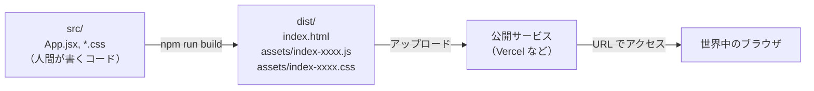
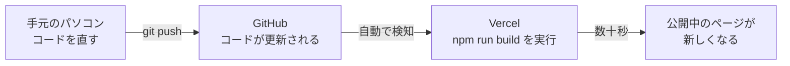
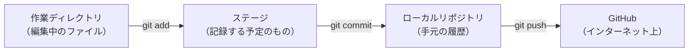
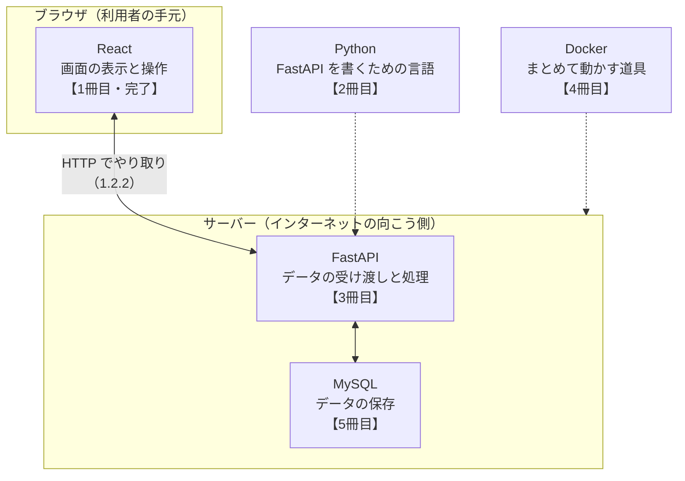

# 第11章 次のステップ

第10章で、アプリを1つ作り切りました。
このテキストで教えることは、これで終わりです。

ただし、**ここで終わると、いちばんもったいないタイミング**でもあります。
作ったアプリは、まだあなたのパソコンの中にしかありません。
コードは、うっかり消したら二度と戻りません。
そして「次に何を学べばいいのか」も、まだ決まっていません。

この章では、そこを片づけます。

- 作ったものを**インターネット上に公開する**
- コードを**Git で保存し、GitHub に置く**
- 次に学ぶもの（TypeScript・テスト）が**何を解決する道具なのか**を知る
- **次の本へ進む道筋**を決める

新しい React の文法は出てきません。
代わりに、**「作れる人」から「作ったものを届けられる人」になるための道具**を扱います。

## この章で学ぶこと

- ここまでで身についたことを、チェックリストで確認できるようになる
- TypeScript が何を防いでくれる道具なのかを、自分の言葉で説明できるようになる
- 作ったアプリをビルドして、インターネット上に公開できるようになる
- Git と GitHub でコードを保存し、変更履歴を残せるようになる
- 次に何をどの順番で学ぶかを、自分で決められるようになる

## この章の前提

- [第10章](./10-practice-task-app.md) の `task-app` が、手元で動く状態になっていること
- [1.4](./01-web-and-environment.md) のターミナルの基本操作（移動・一覧・カレントディレクトリの確認）
- [6.2](./06-react-start.md) の `npm` コマンドの実行と、開発サーバーの起動・停止

> **つまずいたら**
> この章は、これまでと性質が違います。
> **自分のパソコンの外にあるもの**（GitHub、公開サービス）を相手にするため、
> アカウント登録や認証で止まりやすい章です。
>
> ここで詰まるのは、あなたの理解不足ではありません。
> サービスの画面は数か月単位で変わるので、**このテキストの説明と実際の画面が違うこと**が
> 普通に起こります。遠慮なく AI に聞いてください。
>
> ```text
> react-text の 11.3.3 を読んでいます。
> Vercel でプロジェクトを Import しようとしましたが、
> テキストに書いてある「Framework Preset」という項目が画面に見当たりません。
> いま見えている画面には、次のボタンがあります。（見えているものを書く）
> OS: Windows 11、ブラウザ: Chrome
> ```
>
> **「いま画面に何が見えているか」を書く**のが、この章のコツです。

---

## 11.1 ここまでで身についたこと

### 11.1.1 チェックリスト

まず、現在地を確認します。

次の表を上から見て、**「何も見ずに書けるか」**で判断してください。
「読めばわかる」は ✅ ではありません。**手が動くかどうか**が基準です。

| # | できること | 判断のしかた | できなければ戻る場所 |
|---|-----------|------------|-------------------|
| 1 | HTML でページの骨組みを書ける | 見出し・段落・リスト・リンク・画像・フォームを、調べずに書けるか | [2.2](./02-html.md)〜[2.4](./02-html.md) |
| 2 | CSS で見た目を整えられる | class を付けて、色・余白・並びを変えられるか | [3.2](./03-css.md)、[3.3](./03-css.md) |
| 3 | Flexbox で横並びにできる | 3つの箱を等間隔で横に並べられるか | [3.5.2](./03-css.md)〜[3.5.5](./03-css.md) |
| 4 | 変数・条件分岐・繰り返しが書ける | 1〜100 のうち3の倍数だけを表示するコードを書けるか | [4.2](./04-javascript-basics.md)、[4.4](./04-javascript-basics.md)、[4.5](./04-javascript-basics.md) |
| 5 | 関数を作って呼び出せる | 引数を2つ受け取って結果を返す関数を書けるか | [4.6](./04-javascript-basics.md) |
| 6 | 配列とオブジェクトを扱える | オブジェクトの配列から、条件に合うものだけ取り出せるか | [5.1](./05-javascript-advanced.md)、[5.2](./05-javascript-advanced.md) |
| 7 | `map` / `filter` を使える | 「変換する」と「絞り込む」を、どちらを使うか迷わず選べるか | [5.3.1](./05-javascript-advanced.md)、[5.3.2](./05-javascript-advanced.md) |
| 8 | イミュータブルな更新ができる | 配列に1件足した**新しい配列**を作れるか | [5.4.3](./05-javascript-advanced.md) |
| 9 | `async` / `await` で待てる | `fetch` の結果を受け取って表示できるか | [5.5.4](./05-javascript-advanced.md)、[5.5.5](./05-javascript-advanced.md) |
| 10 | React のプロジェクトを作れる | 白紙から Vite でプロジェクトを作り、起動できるか | [6.2.2](./06-react-start.md) |
| 11 | コンポーネントを作って分けられる | ファイルを分けて `import` し、表示できるか | [6.5.2](./06-react-start.md)、[6.5.3](./06-react-start.md) |
| 12 | props で値を渡せる | 親から子へ、値と関数の両方を渡せるか | [7.1](./07-props-and-state.md) |
| 13 | `useState` で state を持てる | ボタンを押すと数字が増える部品を書けるか | [7.2.2](./07-props-and-state.md) |
| 14 | 一覧を `map` で表示できる | `key` に何を渡すべきか説明できるか | [7.4.1](./07-props-and-state.md)、[7.4.2](./07-props-and-state.md) |
| 15 | フォームを扱える | 入力欄の値を state で持ち、送信時に受け取れるか | [7.6](./07-props-and-state.md) |
| 16 | state の置き場所を決められる | 「どのコンポーネントに置くか」を理由付きで説明できるか | [8.1.4](./08-state-design-and-effects.md)、[10.2.4](./10-practice-task-app.md) |
| 17 | `useEffect` でデータを取得できる | 読み込み中・エラー・成功の3つを出し分けられるか | [8.3](./08-state-design-and-effects.md) |
| 18 | 画面を URL で切り替えられる | ルートを2つ定義し、`Link` で行き来できるか | [9.1.3](./09-routing-and-architecture.md)、[9.1.4](./09-routing-and-architecture.md) |
| 19 | データを保存できる | リロードしても消えないようにできるか | [10.4](./10-practice-task-app.md) |
| 20 | 作りたいものを分解できる | 機能を書き出し、作る順番を決められるか | [10.1](./10-practice-task-app.md)、[10.2](./10-practice-task-app.md) |

**全部に ✅ が付く必要はありません。**
このテキストを1周した直後なら、半分くらいで普通です。

大事なのは、**「できない」と気づいた項目に、戻る場所の番号が付いている**ことです。
気になった番号の章に戻り、その項のコードをもう一度手で打ってください。

> **補足：20 番だけは特別です**
> 1〜19 は知識なので、読み返せば埋まります。
> **20 番（分解する力）だけは、読んでも埋まりません。**作った回数でしか増えません。
>
> 20 番に自信がないなら、次の 11.1.2 をやってください。

### 11.1.2 自分の実力を確認する

**「読める」と「書ける」は、別の能力です。**

テキストを読みながら書いたコードは、実は**テキストが道順を決めてくれていた**だけかもしれません。
本当に身についたかを確かめる方法は1つです。

> **白紙から、何も見ずに作ってみる。**

次の3つを、この順で試してください。
それぞれ**時間を決めて**、時間内に完成しなくても構いません。
**どこで手が止まったか**を知ることが目的です。

**テスト1：カウンター（目標 15 分）**

- ボタンを押すと数字が1増える
- 「リセット」ボタンで 0 に戻る
- 数字が 10 以上のときだけ「よくがんばりました」と表示する

止まったら → [7.2](./07-props-and-state.md)、[7.5](./07-props-and-state.md)

**テスト2：買い物リスト（目標 40 分）**

- 入力欄に品名を入れて「追加」を押すと、一覧に増える
- 各行に「削除」ボタンがあり、押すとその行だけ消える
- 一覧の上に「全 ◯ 件」と表示する

止まったら → [7.4](./07-props-and-state.md)、[7.6](./07-props-and-state.md)、[10.3.3](./10-practice-task-app.md)

**テスト3：好きな API を表示する（目標 60 分）**

- ページを開くと、外部の API からデータを取ってきて一覧表示する
- 読み込み中は「読み込み中…」と出す
- 失敗したらエラーメッセージを出す

止まったら → [8.3](./08-state-design-and-effects.md)

> **手が止まったのは、失敗ではありません**
> 止まった場所こそが、**あなたが次に読むべき節**です。
> 何も見ずに全部書ける人は、そもそもこのテキストを読んでいません。

自分で課題を思いつかないときは、AI に出してもらってください。

```text
react-text（プログラミング未経験から始める React）を1周し終えました。
第10章までの範囲だけを使って解ける練習課題を、3問出してください。

条件:
- TypeScript、Redux、Next.js など、テキストで扱っていないものは使わない
- 各問題に「課題」「完成条件」だけを書き、答えのコードは書かない
- 難易度は易しい順に並べる
```

**答えのコードを書かないよう、必ず指定してください。**
指定しないと、AI は親切に完成品を出してきます。それでは練習になりません。

---

## 11.2 TypeScript

### 11.2.1 型があると何が嬉しいか

第10章で、こんな経験をしませんでしたか。

**画面が真っ白になり、コンソールに次のエラーが出る。**

```text
Uncaught TypeError: Cannot read properties of undefined (reading 'title')
```

原因を探すと、親から `task` を渡し忘れていた——。
このミスの厄介なところは、**書いた瞬間には何も起こらない**ことです。

```jsx
// 親（App.jsx）: onToggle を onTogle と書き間違えた
<TaskItem task={task} onTogle={handleToggle} />
```

```jsx
// 子（TaskItem.jsx）: onToggle を受け取るつもりで書いてある
function TaskItem({ task, onToggle }) {
  return <input type="checkbox" onChange={() => onToggle(task.id)} />
}
```

JavaScript はこれを**エラーにしません。**
`onToggle` は `undefined` になり、保存しても画面は普通に表示されます。
そして**チェックボックスを押した瞬間**に、はじめて落ちます。

```text
Uncaught TypeError: onToggle is not a function
```

**書いてから気づくまでに、何分もかかります。**

**TypeScript**（タイプスクリプト。JavaScript に「型」の情報を書き足せるようにした言語）を使うと、
この間違いは**打ち込んだ直後にエディタが赤い波線で教えてくれます。**
実行する前です。ブラウザを見る前です。

```text
Property 'onTogle' does not exist on type 'TaskItemProps'.
Did you mean 'onToggle'?
```

「`onTogle` なんてものはありません。`onToggle` の間違いでは？」と、名前まで提案してくれます。

**型**（かた）は、第4章の 4.3 で出てきた「値の種類」のことです。
JavaScript にも型はありました。ただし **JavaScript は、型を実行してみるまで確かめません。**
TypeScript は、**実行する前に確かめます。** 違いはそこだけです。

TypeScript が防いでくれる間違いは、たとえば次のようなものです。

| 間違い | JavaScript | TypeScript |
|--------|-----------|-----------|
| props の名前を打ち間違えた | 押した瞬間に落ちる | 書いた瞬間に赤くなる |
| 数値のつもりが文字列だった（`'3' + 1` が `'31'`） | 表示がおかしいまま動く | 書いた瞬間に赤くなる |
| オブジェクトのプロパティ名を間違えた（`task.titel`） | `undefined` が表示される | 書いた瞬間に赤くなる |
| 関数の引数の数を間違えた | 足りない引数が `undefined` | 書いた瞬間に赤くなる |
| 存在しない関数を呼んだ（`tasks.fliter(...)`） | 実行時に落ちる | 書いた瞬間に赤くなる |

> **注意：TypeScript は万能ではありません**
> 防げるのは**型の食い違い**だけです。
> 「条件を `>` と `>=` で書き間違えた」「保存の処理を書き忘れた」のような
> **考え方の間違いは防げません。**
>
> 型を付けたからバグがなくなる、ということはありません。
> 減るのは「打ち間違い」と「渡し忘れ」の類だけです。ただし、それが**とても多い**のです。

### 11.2.2 最小限の入門

雰囲気だけでは掴めないので、実際に動かします。
**いま作ってある `task-app` は触りません。** 練習用に、別のプロジェクトを新しく作ります。

まず、`task-app` や `my-first-react` を作ったときと同じ**作業用ディレクトリ**（1.4.5 で作った場所）に移動してください。

**Windows（PowerShell）**

```powershell
cd ~\Documents\dev
```

**macOS / Linux**

```bash
cd ~/Documents/dev
```

プロジェクトを作ります。第6章と違うのは、最後の `react-ts` の部分だけです。

**Windows / macOS 共通**

```bash
npm create vite@latest ts-practice -- --template react-ts
```

```text
実行結果:
Scaffolding project in .../dev/ts-practice...

Done. Now run:

  cd ts-practice
  npm install
  npm run dev
```

表示されたとおりに進めます。

```bash
cd ts-practice
npm install
npm run dev
```

`http://localhost:5173/` をブラウザで開き、Vite の初期画面が出ることを確認してください。

> **補足：`.jsx` ではなく `.tsx`**
> `src` の中を見ると、`App.tsx` という見慣れない拡張子になっています。
> TypeScript で JSX を書くファイルの拡張子が `.tsx` です（JavaScript のときは `.jsx` でした）。
> JSX を含まない、ただのプログラムのファイルは `.ts` になります。

**変数に型を書く**

`src/App.tsx` を、いったん次の内容にまるごと置き換えてください。

`src/App.tsx`

```tsx
function App() {
  // : のあとがその変数の型
  const title: string = 'TypeScript の練習'
  const count: number = 3
  const isDone: boolean = false

  return (
    <div>
      <h1>{title}</h1>
      <p>件数: {count}</p>
      <p>完了: {isDone ? 'はい' : 'いいえ'}</p>
    </div>
  )
}

export default App
```

```text
画面に表示される内容:
TypeScript の練習
件数: 3
完了: いいえ
```

変数名のあとに `: string` のように書きます。これを**型注釈**（かたちゅうしゃく）と呼びます。

ここで、わざと間違えてみてください。

```tsx
const count: number = '3'
```

保存する前から、`'3'` の下に赤い波線が出ます。マウスを乗せると理由が読めます。

```text
Type 'string' is not assignable to type 'number'.
（string 型を number 型に入れることはできません）
```

**ブラウザを見ていません。実行もしていません。** それでも間違いがわかります。
これが TypeScript の中心的な価値です。確認したら `3`（数値）に戻してください。

> **補足：型は毎回書かなくてよい**
> 実は `const count = 3` と書くだけで、TypeScript は「これは `number` だ」と判断します。
> これを**型推論**（かたすいろん）と呼びます。
> `const count: number = 3` のように書かなくても、間違いはちゃんと検出されます。
>
> **書く必要があるのは、TypeScript が自分では判断できない場所だけ**です。
> 次に出てくる「関数の引数」が、その代表です。

**関数に型を書く**

関数は、**引数**と**戻り値**の両方に型を書きます。

`src/App.tsx` の `function App()` の**上**に、次の関数を追加してください。

```tsx
// 引数 a と b は number、戻り値も number
function add(a: number, b: number): number {
  return a + b
}
```

そして `App` の `return` の中（`<p>完了: ...</p>` の下）に1行足します。

```tsx
      <p>合計: {add(2, 3)}</p>
```

```text
画面に追加される内容:
合計: 5
```

ここで `add(2, '3')` に変えてみてください。

```text
Argument of type 'string' is not assignable to parameter of type 'number'.
（string 型の引数を number 型の引数に渡すことはできません）
```

JavaScript なら `'23'` という文字列が平気で表示されていた場面です（4.3.8 の型の自動変換）。
確認したら `add(2, 3)` に戻してください。

**オブジェクトの型に名前を付ける**

タスクのように**決まった形のオブジェクト**には、型に名前を付けて使い回します。

`src/App.tsx` の先頭（`function add` の上）に書きます。

```tsx
type Task = {
  id: number
  title: string
  isDone: boolean
}
```

`type` は「この形のオブジェクトを `Task` と呼ぶ」という宣言です。
**プロパティの区切りにカンマは不要**で、改行だけで並べます。

これで、`Task` を型として使えるようになります。

```tsx
const sample: Task = { id: 1, title: '牛乳を買う', isDone: false }
```

`isDone` を書き忘れると、その場で赤くなります。

```text
Property 'isDone' is missing in type '{ id: number; title: string; }'
but required in type 'Task'.
（isDone がありません。Task には必要です）
```

**props に型を付ける**

TypeScript で React を書くとき、**いちばん効くのがここ**です。

`src/components` ディレクトリを作り、その中にファイルを作ります。

`src/components/TaskItem.tsx`

```tsx
// このコンポーネントが受け取る props の形
type TaskItemProps = {
  title: string
  isDone: boolean
  onToggle: () => void
}

function TaskItem({ title, isDone, onToggle }: TaskItemProps) {
  return (
    <li>
      <input type="checkbox" checked={isDone} onChange={onToggle} />
      <span>{title}</span>
    </li>
  )
}

export default TaskItem
```

見慣れないのは2箇所だけです。

- `onToggle: () => void` は「**引数なしで呼ぶ関数**で、**何も返さない**」という意味の型です。
  `void`（ヴォイド）は「戻り値なし」を表します
- 分割代入のうしろの `: TaskItemProps` が、「この props はこの形です」という宣言です

**引数を受け取る関数を props で渡すとき**は、`()` の中に引数の型を書きます。
形は「**(引数名: 型) => 戻り値の型**」です。引数名は好きに付けられます。

```tsx
type SearchBoxProps = {
  // 文字列を1つ受け取り、何も返さない関数
  onSearch: (keyword: string) => void
  // 数値を1つ受け取り、何も返さない関数
  onSelect: (id: number) => void
  // 何も受け取らず、真偽値を返す関数
  canSubmit: () => boolean
}
```

型と実際の関数は、次のように対応します。

| props の型 | 渡せる関数の例 |
|-----------|--------------|
| `() => void` | `() => handleToggle(1)` |
| `(keyword: string) => void` | `(keyword) => setQuery(keyword)` |
| `(id: number) => void` | `handleDelete`（`function handleDelete(id) {...}`） |

**渡す関数の引数の型が合っていないと、その場で赤くなります。**
たとえば `onSearch` に `(id: number) => void` の関数を渡すと、
「`string` を受け取る関数が必要なのに `number` を受け取る関数が来た」と指摘されます。

`src/App.tsx` を、次の全文に置き換えてください。

`src/App.tsx`

```tsx
import { useState } from 'react'
import TaskItem from './components/TaskItem'

type Task = {
  id: number
  title: string
  isDone: boolean
}

function App() {
  // <Task[]> で「Task の配列を入れる state」だと伝える
  const [tasks, setTasks] = useState<Task[]>([
    { id: 1, title: '牛乳を買う', isDone: false },
    { id: 2, title: '部屋を片づける', isDone: true },
  ])

  function handleToggle(id: number) {
    setTasks(
      tasks.map((task) =>
        task.id === id ? { ...task, isDone: !task.isDone } : task,
      ),
    )
  }

  return (
    <div>
      <h1>TypeScript の練習</h1>
      <ul>
        {tasks.map((task) => (
          <TaskItem
            key={task.id}
            title={task.title}
            isDone={task.isDone}
            onToggle={() => handleToggle(task.id)}
          />
        ))}
      </ul>
    </div>
  )
}

export default App
```

```text
画面に表示される内容:
TypeScript の練習
□ 牛乳を買う
☑ 部屋を片づける

（チェックボックスを押すと、その行の状態が切り替わる）
```

**中身は 7.4 と 10.3.4 でやったことと同じ**です。増えたのは型注釈だけです。

新しく出てきたのは `useState<Task[]>([...])` の `<Task[]>` です。
`useState` に「ここには `Task` の配列が入る」と教えています。
`Task[]` の `[]` が「〜の配列」を表します。

ここまで書けたら、**props の名前をわざと間違えてみてください。**

```tsx
<TaskItem key={task.id} titel={task.title} isDone={task.isDone} onToggle={...} />
```

```text
Property 'titel' does not exist on type 'TaskItemProps'. Did you mean 'title'?
（titel はありません。title の間違いでは？）
```

11.2.1 で見た、あの間違いです。**ブラウザを開く前に捕まりました。**

**型のチェックをまとめて走らせる**

エディタの赤い波線は、開いているファイルしか見ていません。
**プロジェクト全体**を確認するには、ビルドを実行します。

```bash
npm run build
```

型に問題がなければ、次のように終わります。

```text
実行結果:
vite v7.1.0 building for production...
✓ 34 modules transformed.
dist/index.html                   0.46 kB
dist/assets/index-CJ3fVwXz.css    1.39 kB
dist/assets/index-DkL9pQ2m.js   188.24 kB
✓ built in 612ms
```

型が合っていない箇所が残っていると、**ビルドはそこで止まります。**

```text
実行結果:
src/App.tsx:34:11 - error TS2322: Type '{ titel: string; }' is not assignable to ...

Found 1 error.
```

`react-ts` テンプレートの `package.json` を開くと、`build` が
`tsc -b && vite build` になっています。`tsc` が型チェックの担当です。
**型が壊れたままでは、ビルドが成功しません。** これが TypeScript の安全網です。

> **よくある間違い**
> エディタに赤い波線が出ていても、**開発サーバー（`npm run dev`）の画面は普通に動きます。**
> Vite は開発中、型を無視して変換だけ行うためです。
>
> 「動いているから大丈夫」と思って進めると、`npm run build` で大量のエラーが出ます。
> **赤い波線は、出たその場で直してください。**

### 11.2.3 いつ学び始めるべきか

**このテキストの立場は、「いまはまだ本格的にやらなくてよい」です。**

理由は、覚えることが増える割に、いま得られるものが少ないからです。

- 型のエラーメッセージは、React のエラーより読みにくいことが多い
- 一人で書いている小さなアプリでは、渡し忘れのミス自体が少ない
- 型の書き方に気を取られて、**作ること自体が進まなくなる**

一方で、**次のどれかに当てはまったら、その時が始めどきです。**

| きっかけ | 意味 |
|---------|------|
| 同じ「渡し忘れ」を2回やった | 型が代わりに見張ってくれる場面 |
| ファイルが 20 個を超えた | どこで何を渡していたか、記憶で追えなくなっている |
| 他の人のコードを読む・一緒に作る | 型が「使い方の説明書」になる |
| 求人や案件の要件に書いてある | 実務ではほぼ必須。執筆時点で React の求人の多くが TypeScript 前提 |

**始め方の順番**も決めておきます。

1. 新しいプロジェクトを `--template react-ts` で作る（11.2.2）
2. **`string` / `number` / `boolean` / `type` / props の型**だけ使う
3. 難しい型が必要になったら、その都度 AI に聞く

```text
React + TypeScript を書き始めたところです。
次のコンポーネントの props に型を付けたいのですが、
onSubmit の型の書き方がわかりません。

（コードを貼る）

型の書き方だけ教えてください。コンポーネント全体は書き直さないでください。
```

> **補足：JavaScript の知識は無駄になりません**
> TypeScript は JavaScript に型を足したものです。**足し算であって、別物ではありません。**
> このテキストで書いた JavaScript は、拡張子を変えるだけでほぼそのまま TypeScript として動きます。
>
> 先に JavaScript をやったことは、遠回りではありません。

---

## 11.3 テストとデプロイ

### 11.3.1 なぜテストを書くのか

10.5.4 で、動作確認のチェックリストを作りました。
追加して、消して、絞り込んで、リロードして……を手で確認する作業です。

**あれを、機能を足すたびに毎回やるのは現実的ではありません。**
チェック項目が 20 個あれば、1回の確認に 10 分かかります。
そして人間は必ず、**面倒になった項目を飛ばします。**

**テスト**（そのプログラムが正しく動くかを、自動で確かめるプログラム）は、
このチェックリストをコードにしたものです。1回書けば、以後は1コマンドで全部確認できます。

雰囲気を掴むために、1つだけ書いて動かします。
**`task-app` のディレクトリで作業してください。**

**Windows（PowerShell）**

```powershell
cd ~\Documents\dev\task-app
```

**macOS / Linux**

```bash
cd ~/Documents/dev/task-app
```

テストを実行する道具を入れます。**Vitest**（ヴィテスト。Vite で作ったプロジェクト向けのテスト実行ツール）を使います。

```bash
npm install -D vitest
```

> **補足：`-D` とは**
> 「開発中だけ使う道具です」という印です。
> 公開するアプリ本体には含まれません（11.3.2 のビルド結果には入りません）。

`package.json` を開き、`"scripts"` の中に1行足します。

`package.json`

```diff
    "scripts": {
      "dev": "vite",
      "build": "vite build",
+     "test": "vitest run",
      "preview": "vite preview"
    },
```

> **注意**
> JSON では、**行の終わりのカンマを忘れるとエラーになります。**
> 足した行の前の行にカンマが付いているか確認してください。
> 最後の行にはカンマを付けません。

テストしたい処理を、**関数に切り出します。**

`src/utils/countActive.js`（`utils` ディレクトリごと新しく作ります）

```js
// 未完了（isDone が false）のタスクの件数を返す
export function countActive(tasks) {
  return tasks.filter((task) => !task.isDone).length
}
```

同じ場所に、テストのファイルを作ります。**ファイル名を `.test.js` で終える**のが決まりです。

`src/utils/countActive.test.js`

```js
import { expect, test } from 'vitest'
import { countActive } from './countActive'

test('未完了のタスクだけを数える', () => {
  const tasks = [
    { id: 1, title: '牛乳を買う', isDone: false },
    { id: 2, title: '部屋を片づける', isDone: true },
    { id: 3, title: '本を返す', isDone: false },
  ]
  expect(countActive(tasks)).toBe(2)
})

test('タスクが0件なら0を返す', () => {
  expect(countActive([])).toBe(0)
})
```

読み方は、ほぼ英語のままです。

- `test('説明', () => { ... })` — 1つの確認項目。第1引数の文字列は、失敗したときに表示される名前
- `expect(実際の値).toBe(期待する値)` — 「この値が、これと同じであってほしい」

実行します。

```bash
npm test
```

```text
実行結果:
 ✓ src/utils/countActive.test.js (2 tests) 3ms

 Test Files  1 passed (1)
      Tests  2 passed (2)
   Duration  412ms
```

**緑の ✓ が2つ出れば成功です。**

次に、**わざと壊してみてください。** `countActive.js` の `!task.isDone` から `!` を取ります。

```js
return tasks.filter((task) => task.isDone).length
```

```text
実行結果:
 ❯ src/utils/countActive.test.js (2 tests | 1 failed) 5ms
   × 未完了のタスクだけを数える
     → expected 1 to be 2 // Object.is equality

 Test Files  1 failed (1)
      Tests  1 failed | 1 passed (2)
```

**「2 のはずが 1 だった」**と、失敗した項目の名前付きで教えてくれます。
確認したら `!` を戻して、もう一度 `npm test` が緑になることを確かめてください。

**配列やオブジェクトを比べるときは `toBe` を使わない**

数値や文字列は `toBe` で比べられますが、**配列とオブジェクトには使えません。**
`countActive.test.js` の末尾に、次のテストを足して確かめてください。

`src/utils/countActive.test.js`（末尾に追記）

```js
test('配列どうしを比べるときは toEqual を使う', () => {
  const result = [1, 2, 3]

  // 中身が同じかを比べる
  expect(result).toEqual([1, 2, 3])
})
```

```text
実行結果:
 ✓ src/utils/countActive.test.js (3 tests) 4ms
```

ここで `toEqual` を `toBe` に変えると、中身がまったく同じでも失敗します。

```text
 × 配列どうしを比べるときは toEqual を使う
   → expected [ 1, 2, 3 ] to be [ 1, 2, 3 ] // Object.is equality
```

見た目が同じなのに失敗するのは、**`toBe` が「まったく同じ1つの配列か」を見ている**からです。
`[1, 2, 3]` と書くたびに、別の配列が新しく作られます（5.4.3 で「コピーは別物」と学んだのと同じ話です）。

- `toBe` — 数値・文字列・真偽値に使う
- `toEqual` — 配列・オブジェクトに使う（**中身が同じなら成功**）

確認したら `toEqual` に戻しておいてください。

> **なぜ関数に切り出したのか**
> テストしやすいのは、**「値を渡すと、値が返ってくるだけ」の関数**です。
> 画面の見た目や state が絡むと、テストを書く準備のほうが長くなります。
>
> 実務では画面のテストも書きますが、**まずは計算・判定・変換の部分を関数に出す**ところからです。
> ちょうど、10.4.4 でカスタムフックに切り出したのと同じ発想です。

テストの本格的な書き方（画面のクリックを再現するなど）は、このテキストでは扱いません。
「そういう道具がある」「値を返す関数から始める」の2つを覚えておけば十分です。

### 11.3.2 ビルドする

ここからが公開の準備です。

いま `npm run dev` で見えている画面は、**Vite が裏で変換しながら配っているもの**です。
`src/App.jsx` の JSX は、そのままではブラウザが読めません（6.4.1）。

公開するには、**ブラウザがそのまま読める形に変換して、まとめる**必要があります。
この作業が**ビルド**（書いたコードを、ブラウザが実行できる形に変換してまとめること）です。

流れは次のようになっています。



上の図のとおり、**人間が書く `src` と、公開される `dist` は別物**です。
公開サービスに置くのは、右側の `dist` の中身だけです。

`task-app` のディレクトリで実行してください。

```bash
npm run build
```

```text
実行結果:
vite v7.1.0 building for production...
✓ 41 modules transformed.
dist/index.html                   0.46 kB │ gzip:  0.30 kB
dist/assets/index-BhY2kf8p.css    2.14 kB │ gzip:  0.81 kB
dist/assets/index-Dq7mXe1a.js   192.87 kB │ gzip: 61.05 kB
✓ built in 738ms
```

プロジェクトの中に `dist` というディレクトリができています。

```text
task-app/
├── dist/                       ← 新しくできた（公開するのはこれ）
│   ├── index.html
│   └── assets/
│       ├── index-BhY2kf8p.css
│       └── index-Dq7mXe1a.js
├── src/                        ← 人間が書くコード
├── package.json
└── ...
```

注目してほしいのは、次の3点です。

- **JavaScript のファイルが1つにまとまっている。**
  自分で分けた `App.jsx`、`TaskItem.jsx`、`useLocalStorage.js`……が全部入っています
- **ファイル名に `Dq7mXe1a` のような文字列が付いている。**
  中身を変えるとこの部分が変わるため、ブラウザが古いファイルを使い回してしまう事故を防げます
  （3.7 で出てきた「キャッシュのせいで反映されない」問題への対策です）
- **サイズが表示されている。**
  `gzip: 61.05 kB` が、実際に利用者がダウンロードする量の目安です

ビルドした結果は、**そのまま手元で確認できます。**

```bash
npm run preview
```

```text
実行結果:
  ➜  Local:   http://localhost:4173/
```

表示された `http://localhost:4173/` を開いてください。
**ポート番号が 5173 ではなく 4173** です。開発サーバーとは別物だと区別するためです。

ここで、10.5.4 のチェックリストをもう一度通してください。
**開発サーバーでは動いていたのに、ビルドすると動かない**ことが、まれにあります。
公開する前に気づけるのは、この段階だけです。

停止するときは、開発サーバーと同じく `Ctrl` + `C` です。

> **よくある間違い**
> `dist/index.html` をダブルクリックしても、**画面は真っ白のままです。**
>
> ダブルクリックで開くと、URL が `file:///.../dist/index.html` になります。
> このとき `index.html` の中の `/assets/index-xxxx.js` という指定は
> **パソコンのいちばん上の階層**を指してしまい、ファイルが見つかりません（2.3.4 の絶対パス）。
>
> コンソールには次のようなエラーが出ます。
>
> ```text
> Failed to load resource: net::ERR_FILE_NOT_FOUND
> ```
>
> **確認は必ず `npm run preview` で行ってください。**

> **補足：`dist` は保存しなくてよい**
> `dist` はいつでも `npm run build` で作り直せます。**成果物であって、資産ではありません。**
> このあと 11.4 で Git に登録するときも、`dist` は対象から外します。

### 11.3.3 公開する（Vercel / Netlify）

ビルドした `dist` を、**インターネット上のサーバーに置く**と、世界中から見られるようになります。
この作業を**デプロイ**（作ったものを、動かす場所に配置して公開すること）と呼びます。

置き場所を貸してくれるサービスを**ホスティングサービス**と呼びます。
このテキストでは、次の2つを紹介します。**どちらも無料で始められます。**

| サービス | 向いている場面 |
|---------|--------------|
| **Netlify Drop** | とにかく今すぐ公開したい。GitHub をまだ使っていない |
| **Vercel** | 更新を続けたい。GitHub に置いたコードと連動させたい |

**方法1：Netlify Drop（GitHub 不要・所要 3 分）**

1. ブラウザで [https://app.netlify.com/drop](https://app.netlify.com/drop) を開く
2. `task-app` の中の **`dist` ディレクトリごと**、ページの点線の枠にドラッグ&ドロップする
3. アップロードが終わると、`https://ランダムな名前.netlify.app` という URL が表示される
4. その URL を開く。**公開完了です**

スマートフォンでもその URL を開いてみてください。**自分のパソコン以外から見えます。**

> **注意**
> ドラッグするのは **`dist` ディレクトリ**です。`task-app` ごと入れないでください。
> `src` を入れても画面は表示されません（ブラウザは `.jsx` を読めません）。
>
> この方法は手軽ですが、**更新のたびに手でドラッグし直す必要があります。**
> 続けて開発するなら、方法2にしてください。

**方法2：Vercel + GitHub（更新が自動になる）**

こちらは、**先に 11.4 の手順で GitHub にコードを置いておく必要があります。**
まだの場合は、11.4 を終えてから戻ってきてください。

1. [https://vercel.com](https://vercel.com) を開き、**「Continue with GitHub」でサインアップ**する
2. GitHub 側で「Vercel にアクセスを許可しますか」と聞かれるので許可する
3. 「Add New...」→「Project」を選ぶ
4. GitHub のリポジトリ一覧が出るので、`task-app` の「Import」を押す
5. 設定画面が出る。**Framework Preset が「Vite」になっていることだけ確認**する
   （自動で選ばれます。違っていたら手で Vite を選んでください）
6. 「Deploy」を押す
7. 1〜2分待つと、`https://task-app-xxxx.vercel.app` のような URL が表示される

**この方法のいちばんの利点は、ここからです。**

コードを直して GitHub に `git push`（11.4.2）すると、
**Vercel がそれを検知して、自動でビルドし直し、公開中のページを差し替えます。**
手でアップロードし直す作業はもう発生しません。



> **注意：公開するとき、必ず確認すること**
>
> - **公開したページは、URL を知っている人なら誰でも見られます。**
>   個人情報や、他人に見せたくない内容を書いたまま公開しないでください
> - **`localStorage` のデータは共有されません**（10.4.2）。
>   保存先は「見ている人のブラウザの中」なので、他の人が開くと**空のアプリ**が表示されます。
>   あなたのタスクが他人に見えることはありません。
>   逆に言えば、**別の端末で開いても自分のタスクは出てきません**
>
>   これは自分でも確かめられます。ブラウザの**シークレットウィンドウ**
>   （保存されている情報を引き継がずに開く窓。Chrome では「シークレット ウィンドウ」、
>   Safari では「プライベートウインドウ」）で公開 URL を開いてください。
>   **他人が開いたときと同じ、0件の状態**が表示されます
> - パスワードや API キーのような**秘密の情報をコードに書かない**でください。
>   ビルドしても、`dist` の中身は誰でも読めます

> **つまずいたら**
> デプロイは失敗すると原因が見えにくい作業です。Vercel の場合、
> 失敗したデプロイの「Building」のログに英語のエラーが出ています。
>
> ```text
> Vercel に React（Vite）のプロジェクトをデプロイしたら失敗しました。
> ビルドログの最後の 20 行を貼ります。
>
> （ログを貼る）
>
> 手元では npm run build が成功しています。原因と直し方を教えてください。
> ```

---

## 11.4 Git と GitHub

### 11.4.1 なぜバージョン管理が必要か

第10章で、こんな瞬間はありませんでしたか。

**動いていたのに、何かを直したら動かなくなった。**
そして、**どこを直したのか思い出せない。**

このとき欲しいのは、「30 分前の、動いていた状態」です。
それを実現するのが**バージョン管理**（ファイルの変更履歴を記録し、いつでも過去の状態に戻せるようにする仕組み）です。

自力でやろうとすると、こうなります。

```text
task-app/
task-app_backup/
task-app_backup2/
task-app_最新/
task-app_最新_本当に最新/
```

やったことがある人も多いはずです。この方法には3つの問題があります。

- **どれが最新か、名前からわからない**
- **どこが違うのかわからない**（全ファイルを見比べるしかない）
- **ディスクを圧迫する**（`node_modules` ごとコピーされる）

**Git**（ギット。ソースコードの変更履歴を記録・管理する道具）は、これを正しく解決します。

- 変更を記録した時点に、**いつでも戻れる**
- **何行目をどう変えたか**を、あとから一覧で見られる
- 変わった部分だけを記録するので、容量を食わない

そして **GitHub**（ギットハブ。Git のリポジトリをインターネット上に置いて共有できるサービス）に
置けば、次のことができます。

- パソコンが壊れてもコードが残る
- 別のパソコンから続きを書ける
- 他人に見せられる（**転職活動では、これが作品集になります**）
- Vercel と連携して、自動で公開できる（11.3.3）

**リポジトリ**（プログラムのソースコードと、その変更履歴を保管する場所）という言葉が出てきました。
`git init` を実行すると、そのディレクトリがリポジトリになります。

### 11.4.2 最低限のコマンド

Git のコマンドは 100 以上ありますが、**一人で使う分には5つで足ります。**

まず全体の流れを見てください。ファイルは3つの場所を順に移動します。



**「編集しただけ」では、まだ何も記録されていません。**
`git add` で記録する対象を選び、`git commit` で履歴に刻み、`git push` で GitHub に送ります。

> **なぜ2段階（add と commit）なのか**
> 10 個のファイルを直したけれど、そのうち3個だけを1つのまとまりとして記録したい——
> ということがあるからです。`git add` は、その「今回記録するぶん」を選ぶ作業です。
>
> 最初のうちは `git add .`（全部選ぶ）で構いません。

**手順1：Git が入っているか確認する**

```bash
git --version
```

```text
実行結果:
git version 2.45.2
```

バージョンが表示されれば入っています。次の手順2は飛ばしてください。

**手順2：入っていなければインストールする**

**Windows（PowerShell）**

```powershell
winget install --id Git.Git -e --source winget
```

インストール後、**PowerShell を一度閉じて開き直してから** `git --version` を確認してください
（1.5.4 と同じ、PATH が読み込まれるタイミングの問題です）。

`winget` が使えない場合は、[https://git-scm.com/download/win](https://git-scm.com/download/win)
からインストーラーをダウンロードして実行してください。設定はすべて既定のままで構いません。

**macOS**

```bash
git --version
```

未インストールの場合、「コマンドラインデベロッパツールをインストールしますか」という
ダイアログが出ます。「インストール」を押して待てば完了です。

**手順3：名前とメールアドレスを登録する（最初の1回だけ）**

記録には「誰が記録したか」が残ります。先に登録しておきます。

**Windows / macOS 共通**

```bash
git config --global user.name "Taro Yamada"
git config --global user.email "taro@example.com"
```

自分の名前とメールアドレスに置き換えてください。

> **注意**
> **ここに書いたメールアドレスは、GitHub に公開すると誰でも見られます。**
> 公開したくない場合は、GitHub のアカウント作成後に発行される
> `12345678+ユーザー名@users.noreply.github.com` 形式のアドレスを使ってください
> （GitHub の Settings → Emails で確認できます）。

**手順4：リポジトリにする**

`task-app` のディレクトリで実行します。

**Windows（PowerShell）**

```powershell
cd ~\Documents\dev\task-app
git init
```

**macOS / Linux**

```bash
cd ~/Documents/dev/task-app
git init
```

```text
実行結果:
Initialized empty Git repository in /Users/taro/Documents/dev/task-app/.git/
```

**手順5：記録しないものを確認する**

Vite で作ったプロジェクトには、`.gitignore` というファイルが最初から入っています。
ここに書かれたものは、**Git が記録しません。**

`.gitignore`（中身を確認するだけ。書き換えは不要です）

```text
node_modules
dist
*.local
.DS_Store
```

- **`node_modules`** — `npm install` でいつでも作り直せます。数万ファイルあるので、入れると破綻します
- **`dist`** — `npm run build` でいつでも作り直せます（11.3.2）

**手順6：状態を確認して、記録する**

```bash
git status
```

```text
実行結果:
On branch main

No commits yet

Untracked files:
  (use "git add <file>..." to include in what will be committed)
        .gitignore
        index.html
        package.json
        src/
        ...
```

`node_modules` と `dist` が**一覧に出ていないこと**を確認してください。出ていれば手順5が効いています。

記録します。

```bash
git add .
git commit -m "タスク管理アプリの初回コミット"
```

```text
実行結果:
[main (root-commit) 8f3c1a2] タスク管理アプリの初回コミット
 14 files changed, 682 insertions(+)
```

この1回の記録を**コミット**と呼びます。
`-m` のあとの文字列は、**あとから履歴を見たときに「何をしたか」がわかる説明**です。

履歴を見てみます。

```bash
git log --oneline
```

```text
実行結果:
8f3c1a2 (HEAD -> main) タスク管理アプリの初回コミット
```

以降は、**きりのいいところで `git add .` → `git commit -m "..."` を繰り返す**だけです。

```bash
git add .
git commit -m "未完了の件数を表示するようにした"
```

> **どのくらいの頻度でコミットするか**
> **「1つの機能が動いたら1回」**が目安です。
> 「絞り込みができた」「保存できるようになった」——このくらいの単位です。
>
> 迷ったら、細かいほうが安全です。戻れる地点が増えるだけで、損はありません。

**手順7：GitHub に置く**

1. [https://github.com](https://github.com) でアカウントを作る（無料）
2. 右上の「+」→「New repository」を選ぶ
3. **Repository name** に `task-app` と入力する
4. **Public（公開）／ Private（自分だけ）** を選ぶ
   - 作品として見せたいなら Public
   - 迷ったら Private。あとから変更できます
5. **「Add a README file」などのチェックは、すべて外したまま**にする
   （手元にすでにコミットがあるため、空のリポジトリにするのが確実です）
6. 「Create repository」を押す

作成後の画面に、次のようなコマンドが表示されます。
**表示されたものをそのまま**実行してください（`<ユーザー名>` は自分のものになっています）。

```bash
git remote add origin https://github.com/<ユーザー名>/task-app.git
git branch -M main
git push -u origin main
```

- `git remote add origin ...` — 送り先の住所を `origin` という名前で登録する（最初の1回だけ）
- `git branch -M main` — 履歴の名前を `main` にそろえる（最初の1回だけ）
- `git push -u origin main` — GitHub に送る

初回の `git push` では、**ブラウザが開いて GitHub のログインを求められます。**
画面の指示に従って許可してください。2回目以降は聞かれません。

```text
実行結果:
Enumerating objects: 20, done.
...
To https://github.com/taro/task-app.git
 * [new branch]      main -> main
branch 'main' set up to track 'origin/main'.
```

GitHub のページを再読み込みすると、**`src` の中身が表示されています。**

以降、更新するときは3コマンドです。

```bash
git add .
git commit -m "何をしたか"
git push
```

（2回目以降の `git push` に `-u origin main` は不要です）

**手順8：直前の変更を捨てて、戻る**

Git を入れる最大の目的だった「戻る」をやります。

たとえば `src/App.jsx` をめちゃくちゃにしてしまい、**コミットする前**だとします。

```bash
git restore src/App.jsx
```

**最後にコミットした状態に戻ります。** 保存し直す必要すらありません。

全ファイルをまとめて戻すこともできます。

```bash
git restore .
```

> **注意**
> `git restore` は、**コミットしていない変更を消します。取り消せません。**
> 「いま書いている途中のものは全部捨ててよい」と確信できるときだけ使ってください。
>
> だからこそ、**こまめにコミットしておくこと**が効いてきます。
> コミットしてあれば、失われるのは最後のコミット以降の分だけです。

**最低限の5コマンド**を、あらためてまとめます。

| コマンド | すること |
|---------|---------|
| `git status` | いまの状態を見る（**迷ったらこれ**） |
| `git add .` | 記録する対象を選ぶ |
| `git commit -m "説明"` | 履歴に刻む |
| `git push` | GitHub に送る |
| `git restore .` | コミット前の変更を捨てて戻す |

> **補足：ブランチ・マージ・プルリクエスト**
> Git には、履歴を枝分かれさせて並行作業する機能（ブランチ）があります。
> 複数人で開発するときの中心的な仕組みですが、**一人で作っているうちは不要です。**
>
> 必要になるのは「他の人と一緒に開発する」「OSS に貢献する」段階です。
> そのときに、この本の外で学んでください。

---

## 11.5 次の本へ

### 11.5.1 なぜ次は Python なのか

第10章の最後で触れた、いまのアプリの限界を思い出してください。

- **自分のブラウザでしか見られない。** 11.3.3 で公開してみて、はっきりしたはずです。
  URL を友達に送っても、相手の画面は**空っぽ**でした
- **他の人と共有できない。** データがブラウザの中（`localStorage`）にあるからです

これを超えるには、**データを預かる相手**が必要です。それが**サーバー**です（1.2.1）。

Web アプリ全体の姿は、次のようになっています。



**あなたが終えたのは、いちばん上の四角です。**
残りを埋めていくのが、2冊目から5冊目です。

**次が Python である理由は3つあります。**

1. **サーバー側を書く言語が必要だから。**
   3冊目の FastAPI は Python のフレームワークです。
   その前に、言語そのものを覚えておく必要があります
2. **文法が読みやすいから。**
   波かっこがなく、記号が少ない言語です。
   2つ目の言語として負担が小さく、「言語が変わっても考え方は同じ」と実感しやすい設計です
3. **応用範囲が広いから。**
   Web の裏側だけでなく、データ処理・自動化・機械学習まで、同じ言語で扱えます

> **補足：React をもっと深めなくていいのか**
> Next.js、状態管理ライブラリ、アニメーション——React の周辺には、まだ大量にあります。
>
> ただし、それらは**「フロントエンドをさらに便利にする道具」**です。
> いまのあなたに足りないのは便利さではなく、**サーバー側という丸ごと欠けた半分**のほうです。
>
> 先に一周してから戻ってくると、
> 「なぜ Next.js があるのか」が**自分の困りごととして**理解できます。

2冊目に進むと、最初に少し戸惑うはずです。
JavaScript と Python は似ている部分と違う部分があり、**似ているところほど間違えます。**

そのため、Python の第0章に**JavaScript との対応表**を用意してあります。
`let` / `const` がどうなるか、`{ }` がどうなるか、配列は何と呼ぶか——先にそこを読んでください。

### 11.5.2 学習を続けるコツ

最後に、ここから先で挫折しないための話をします。
**技術の話ではなく、続け方の話です。**

**1. 間隔を空けない**

0.3.4 でも書いたとおり、**週1回3時間より、毎日15分**です。
プログラミングは、間隔が空くと「思い出す時間」が学習時間を食いつぶします。

1週間以上空いてしまったら、いきなり続きを読まないでください。

```text
react-text を10章まで終えて、python-text の3章を読んでいる途中で
1か月空いてしまいました。
python-text の1章から3章までの要点を、10行くらいで振り返らせてください。
そのあと、3章の続きから読めるように、いまの状態を確認する質問を3つ出してください。
```

**2. 作りたいものを1つ持っておく**

テキストの演習だけでは、どうしても飽きます。
**自分が使いたいもの**を1つ決めて、少しずつ作ってください。

題材の選び方には、コツがあります。

- **自分が毎日困っていること**にする（他人向けは続きません）
- **一覧・追加・削除ができれば形になるもの**にする（第10章の応用でいけます）
- 例：読書記録、筋トレの記録、レシピのメモ、支出の記録、勉強時間の記録

**3. 完成させることを優先する**

見た目が 60 点でも、**動いて公開されているもの**には価値があります。
細部を作り込んでいるうちに飽きて、公開されないまま終わるのが、いちばんもったいないパターンです。

11.3.3 のとおり、公開までは数分です。**作りかけでも、まず一度公開してください。**

**4. 詰まったら、必ず章番号を添えて聞く**

0.3.2 で書いたことは、2冊目以降でも同じです。

```text
python-text の 4.2.3 で詰まりました。
【やろうとしたこと】【書いたコード】【結果】【環境】
```

**「何がわからないかわからない」状態でも、章番号さえあれば AI は現在地を掴めます。**

**5. 学んだことを外に出す**

読んだだけの知識は消えますが、**説明した知識は残ります。**

- GitHub の README に「何を作ったか」を3行書く
- 学んだことをメモに残す（人に見せなくても効果があります）
- 誰かに「React って何？」と聞かれたら、逃げずに説明してみる

**6. 他人と比べない**

SNS には、3か月で就職した人の話が流れてきます。
その裏には、**1日10時間やれる環境**があります。条件が違うものを比べても意味がありません。

比べる相手は、**先週の自分**です。
先週書けなかったコードが今週書けているなら、それで進んでいます。

---

## まとめ

- チェックリストで現在地を確認する。**基準は「読めばわかる」ではなく「何も見ずに書ける」**（11.1.1）
- 実力の確認は、**白紙から作ってみる**のがいちばん確実。止まった場所が次に読む節（11.1.2）
- TypeScript は、**渡し忘れ・打ち間違い・型の食い違いを、実行前に見つける**道具（11.2.1）
  - `type` で props の形に名前を付けるところから始める。考え方の間違いは防げない（11.2.2）
  - 本格的に始めるのは、**同じミスを繰り返したときや、人と作るとき**でよい（11.2.3）
- テストは、**10.5.4 の手動チェックリストをコードにしたもの**。値を返す関数から書き始める（11.3.1）
- 公開には**ビルド**が必要。`npm run build` で `dist` ができ、確認は `npm run preview`（11.3.2）
  - `dist/index.html` のダブルクリックでは動かない（パスが合わないため）
- **デプロイ**は Netlify Drop なら数分、Vercel + GitHub なら**以後の更新が自動**になる（11.3.3）
  - `localStorage` のデータは公開されない。他人が開くと空のアプリになる
- Git は「戻れるようにする道具」。**`status` → `add` → `commit` → `push`** の4つで足りる（11.4.2）
  - `node_modules` と `dist` は記録しない（`.gitignore` にすでに書いてある）
  - コミットは「1つの機能が動いたら1回」。細かいほうが安全
- 次は Python。**足りないのは React の応用ではなく、サーバー側という半分**（11.5.1）
- 続けるコツは、**間隔を空けないこと**と、**作りたいものを1つ持つこと**（11.5.2）

---

## 理解度チェック

答えは [解答編](./91-answers-part2.md#第11章) にあります。まず自分で考えてください。

**問 11.1**
次の文の空欄を埋めてください。

書いたコードをブラウザが読める形に変換してまとめる作業を（　A　）と呼び、
`npm run build` を実行すると（　B　）というディレクトリができます。
その結果を手元で確認するコマンドは（　C　）で、
開くポート番号は開発サーバーの 5173 ではなく（　D　）です。

**問 11.2**
次の5つの間違いのうち、**TypeScript が実行前に見つけてくれるもの**をすべて選んでください。
また、見つけてくれないものについては、その理由を説明してください。

1. props の名前を `onToggle` ではなく `onTogle` と書いた
2. 絞り込みの条件を `isDone === false` と書くべきところで `isDone === true` と書いた
3. `count` に数値を入れるつもりで `'3'` という文字列を入れた
4. `localStorage` への保存処理を書き忘れた
5. 配列のメソッド名を `filter` ではなく `fliter` と書いた

**問 11.3**
`git add` と `git commit` は、それぞれ何をするコマンドですか。
**2段階に分かれている理由**にふれながら、1〜2行で説明してください。

**問 11.4**
ビルドが成功したので `dist/index.html` をダブルクリックしたところ、
画面が真っ白になり、コンソールに `net::ERR_FILE_NOT_FOUND` と出ました。
**原因**と、**正しい確認方法**を答えてください。

**問 11.5**
`task-app` を公開し、その URL を友人に送りました。
友人の画面には、あなたが登録したタスクが表示されますか。
**表示される／されない**を答え、その理由を第10章の内容にふれながら説明してください。

**問 11.6**
`.gitignore` に `node_modules` と `dist` が書かれています。
この2つを Git で記録しないのは、**共通してどんな性質があるから**ですか。

---

## 演習問題

演習 11.1 と 11.2 は、第10章で作った `task-app` を使います。
演習 11.4 は、11.2.2 で作った `ts-practice` を使います。

### 演習 11.1 ★☆☆ アプリをビルドして、手元で確認する

**課題**
`task-app` をビルドし、`npm run preview` で表示して、10.5.4 のチェックリストを通してください。

**完成条件**

- `task-app` の中に `dist` ディレクトリができている
- `dist/assets` の中に、`.js` と `.css` のファイルがそれぞれ**1つずつ**ある
- `npm run preview` が起動し、表示された `http://localhost:4173/` でアプリが動く
- その画面で、次のすべてができる
  - タスクを追加できる
  - チェックボックスで完了・未完了を切り替えられる
  - 削除できる
  - 絞り込み・並べ替えが効く
  - **ページを再読み込みしてもタスクが残っている**
- ブラウザのコンソールに赤いエラーが出ていない
- 確認が終わったら、`Ctrl` + `C` で停止できた

**ヒント**
ビルドと確認のコマンドは 11.3.2 にあります。
ポート番号が開発サーバーと違うことに注意してください。

---

### 演習 11.2 ★★☆ GitHub に置いて、インターネットに公開する

**課題**
`task-app` を GitHub のリポジトリに置き、Vercel で公開してください。
そのあと、コードを1箇所だけ直して `git push` し、**公開ページが自動で更新されること**を確認します。

**完成条件**

- GitHub に `task-app` リポジトリがあり、ブラウザで `src/App.jsx` の中身が読める
- そのリポジトリに **`node_modules` と `dist` が含まれていない**
- コミットが**2つ以上**ある（`git log --oneline` で2行以上表示される）
- Vercel の URL（`https://～.vercel.app`）でアプリが動く
- **スマートフォンなど、別の端末からもその URL で開ける**
- 手元で `<h1>` の文言を変えて `git add` → `git commit` → `git push` すると、
  **1〜2分後に公開ページの文言も変わる**
- 公開ページを**シークレットウィンドウ**で開くと、タスクが0件の状態で表示される

**ヒント**
Git の手順は 11.4.2、Vercel の手順は 11.3.3 の「方法2」にあります。
`node_modules` が含まれていないかは、コミットする前に `git status` で確かめられます（11.4.2 手順6）。
最後の条件は、データがどこに保存されていたかを思い出してください（10.4.2）。

> **注意**
> リポジトリを Public にする場合、**そこに書いてある内容は誰でも読めます。**
> 個人的なメモをタスクのサンプルデータに残していないか、公開前に `src/data/sampleTasks.js` を確認してください。

---

### 演習 11.3 ★★☆ 並べ替えの関数をテストする

**課題**
`task-app` の中に「タスクを新しい順に並べ替える関数」を切り出し、Vitest でテストを書いてください。

**完成条件**

- `src/utils/sortByNewest.js` があり、`sortByNewest` という関数を `export` している
  - 引数はタスクの配列。戻り値は `createdAt` が**大きい順**（新しい順）に並んだ配列
  - **元の配列を書き換えていない**（渡した配列の並びが、呼び出し後も変わらない）
- `src/utils/sortByNewest.test.js` があり、テストが**3件以上**ある
  - 3件のタスクが新しい順に並ぶこと
  - **空の配列を渡しても落ちず、空の配列が返ること**
  - 元の配列が書き換えられていないこと
- `npm test` を実行すると、すべて緑の ✓ になる
- 関数の中の並べ替えの向きをわざと逆にすると、`npm test` が赤くなることを確認した
- 確認後、元に戻して `npm test` が再び緑になった

**ヒント**
テストの書き方（`test` と `expect().toBe()`）と実行方法は 11.3.1 にあります。
並べ替えの書き方は 10.3.7 にあります。**元の配列を書き換えない**ための一手も、そこに書いてあります。
並んだ結果（配列）が期待どおりかを確かめる書き方は、11.3.1 の最後に出てきたほうを使ってください。

> **詰まったら**
> 一度に全部書かないでください。次の順で進めます。
>
> 1. `sortByNewest.js` を作る（この演習では、`App.jsx` から呼び出さなくて構いません。
>    テストは、画面に組み込んでいない関数にも書けます）
> 2. テストを1件だけ書いて `npm test` が緑になることを確認する
> 3. 残りの2件を足す

---

### 演習 11.4 ★★☆ TypeScript で入力フォームの部品を書く

**課題**
11.2.2 で作った `ts-practice` に、**タスクを追加する入力フォーム**のコンポーネントを
TypeScript で追加してください。

**完成条件**

- `src/components/TaskForm.tsx` があり、props の型が `type TaskFormProps` として定義されている
- `TaskForm` は props を1つだけ受け取る
  - `onAdd` — **文字列を1つ受け取り、何も返さない関数**の型が付いている
- `TaskForm` の中に入力欄と「追加」ボタンがあり、入力中の文字は `TaskForm` 自身の state で持っている
- 「追加」を押すと、`onAdd` に入力された文字列を渡し、**入力欄が空に戻る**
- `App.tsx` で `TaskForm` を使い、受け取った文字列から新しい `Task` を作って一覧に追加している
  - `id` は `Date.now()` で作る
  - `isDone` は `false` で始める
- 画面で、追加したタスクが一覧に増え、チェックボックスも動く
- **`npm run build` が成功する**（型のエラーが1つも残っていない）
- 一度わざと `onAdd={handleAdd}` を `onAdd={"文字列"}` に書き換え、
  エディタが赤くすること・`npm run build` が失敗することを確認して、元に戻した

**ヒント**
props に型を付ける書き方と、`useState` に型を渡す書き方は 11.2.2 にあります。
「文字列を1つ受け取って何も返さない関数」の型は、11.2.2 に出てきた
`() => void` の**かっこの中に型を書く**形になります。
フォームの作り方そのもの（`value` と `onChange`、送信時の処理）は 7.6 と 10.3.3 のままです。
型を付ける以外に、新しい React の知識は必要ありません。

---

## 次の章へ

**このテキストは、ここで終わりです。**

最初は「HTML ってタグを書くらしい」というところから始めました。
いまのあなたは、次のことができます。

- 画面を部品に分けて設計し、React で組み立てられる
- データの流れ（props と state）を、自分で決められる
- 作ったものをビルドし、**インターネットに公開できる**
- コードを Git で記録し、GitHub に置ける

**これは「作れる人」の状態です。**

ただし、作れるのはまだ**ブラウザの中で完結するもの**だけです。
複数の人が同じデータを見る、ログインする、データがサーバーに残る——
そういうアプリを作るには、11.5.1 の図の**下半分**が必要になります。

次の本では、その下半分を書くための言語、Python を学びます。
第0章に、JavaScript との対応表を用意してあります。
**すでに1つの言語を知っている状態からのスタート**なので、1冊目より速く進めるはずです。

お疲れさまでした。次の本で会いましょう。

→ **[プログラミング未経験から始める Python](../python-text/README.md)**
